# Croqui: Arcos - Corumbá

## Informações Gerais

- **descricao**: Afloramento de calcário situado entre Arcos e Pains em Minas Gerais, com diversos setores de escalada esportiva.
- **id**: br_mg_arcos_corumba
- **nome**: Arcos - Corumbá
- **uid**: y9hp5TkJhwOAL7
- **creditos**:
  - alexsandro martins
- **caminho_thumbnail**: 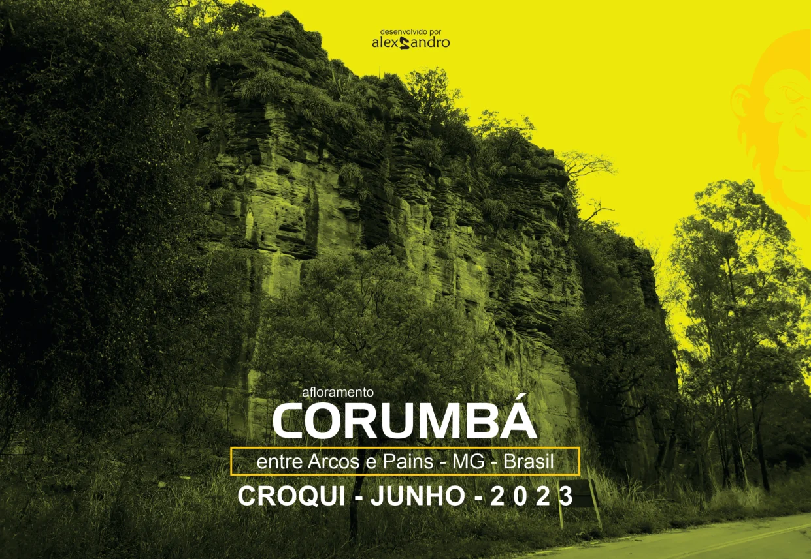
- **revisado_manualmente**: True
- **status_desenho_extraivel**: NAO_TEM_DESENHO
- **botoes**:
  - **[0]**:
    - **uid**: WG9Ri9UvRrSilM
    - **texto**: Capa
    - **destino**:
      - **secao_textual**:
        - **conteudo**:
            # afloramento CORUMBÁ
            
            entre Arcos e Pains - MG - Brasil
            
            **CROQUI - JUNHO - 2023**
            
            |  |
            | :--: |
            | *Capa* |
            
            desenvolvido por alexsandro
  - **[1]**:
    - **uid**: VcEYp7pOIOCNQU
    - **texto**: Atenção e Regras
    - **destino**:
      - **secao_textual**:
        - **conteudo**:
            # Atenção e Observações
            
            Este croqui é apenas um auxílio de consulta a localização, não serve como instruções a prática da escalada. Não nos responsabilizamos pelas informações aqui contidas, são apenas ponto de vista.
            
            ## Atenção
            
            Os nomes das vias, seus respectivos conquistadores e a graduação sugerida para cada uma delas são resultados de uma pesquisa oral conduzida entre os escaladores que frequentam o pico, uma vez que não foi encontrado nenhum registro prévio sobre o tema (exceto os guias anteriores). O resultado desse trabalho pode eventualmente conter erros, os quais peço que não sejam entendidos como desrespeito. O objetivo é documentar e divulgar a prática da escalada no centro-oeste mineiro da maneira mais exata possível.
            
            ## Observação
            
            Como algumas vias são de conquistadores desconhecidos foi utilizado apelido + (*) para identificá-las. Caso encontre algum engano nos dados citados neste croqui, peço que me envie a correção. Tereis satisfação em atendê-lo, pois todos os envolvidos com a escalada tem a ganhar com o aprimoramento desse trabalho.
            
            Muito obrigado aos conquistadores e conquistadoras, **GRATIDÃO** a vocês sempre!!!
            
            **Arte/Organização/Produção:** alexsandro martins / 7ª versão / atualização 2023 / Revisão e graduação sugerida das vias: Grupo de Trabalho
            
            ---
            
            # Seja Consciente!
            
            - **UTILIZE APENAS AS TRILHAS PRINCIPAIS;**
            - **As grutas NÃO são banheiros!** Faça suas necessidades fisiológicas em casa, caso não consiga segurar, faça longe das pedras e cubra com folhas ou terra;
            - **Leve todo seu lixo de volta** e o lixo de outros visitantes descuidados (inclusive papel higiênico, garrafas plásticas, bitucas, pontas, papel de bala...);
            - Os animais locais e plantas nativas devem permanecer em seus lugares. Lembre-se que eles estão em seu habitat natural e precisam ser respeitados;
            - **Animais domésticos (ex. cães)** não devem ser trazidos a este local, desta forma, você os protege de doenças silvestres e vice versa;
            - **Fogueiras** além de provocar queimadas, danificam o local;
            - **Estacione de maneira adequada** e no local adequado a fim de não atrapalhar o fluxo de outros veículos;
            - Utilize equipamentos de segurança e verifique seu estado de conservação;
            - Cuidado com pedras soltas principalmente em setores e vias novas;
            - Antes de conquistar uma via de escalada entre em contato com o GT.
  - **[2]**:
    - **uid**: b0H0q7uldTH330
    - **texto**: Parcerias e Contato
    - **destino**:
      - **secao_textual**:
        - **conteudo**:
            # Parcerias e Contato
            
            Parcerias na atualização do ano de 2023 dos croquis dos Afloramentos, Setores e Vias de Escaladas Esportiva em Arcos, Pains e Região - MG.
            
            ## Realização e Apoio
            
            | 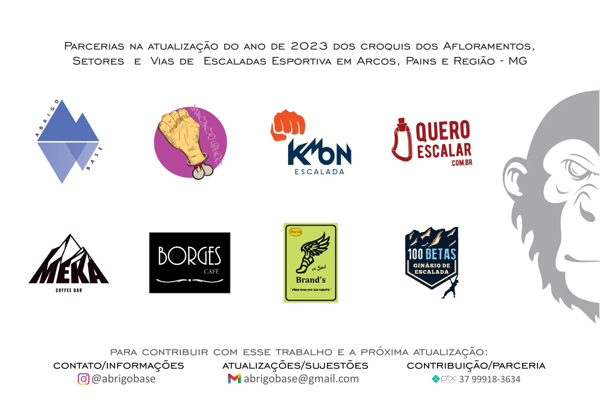 |
            | :--: |
            | *Logos de Parcerias* |
            
            - **Abrigo Base**
            - **Macaco Galo**
            - **Kmon Escalada**
            - **Quero Escalar**
            - **Meka Coffee Bar**
            - **Borges Café**
            - **Brand's re Soul**
            - **100 Betas Ginásio de Escalada**
            
            ---
            
            ### Para contribuir com esse trabalho e a próxima atualização:
            
            - **Instagram:** [@abrigobase](https://www.instagram.com/abrigobase)
            - **E-mail:** abrigobase@gmail.com
            - **Contribuição/Parceria PIX:** 37 99918-3634
- **ultima_migracao**: 5
- **publicar_croqui**: True
- **revisado_bounding_circle**: True

## Parte: setor_pataxos

### Setor (Pico: Corumbá)

- **descricao**:
    # Setor Pataxós
    
    Sombra a partir de 11h (varia de acordo com a sessão).
- **nome**: Setor Pataxós
- **uid**: iCjYHssizqSvcD
- **caminho_imagem_capa**: 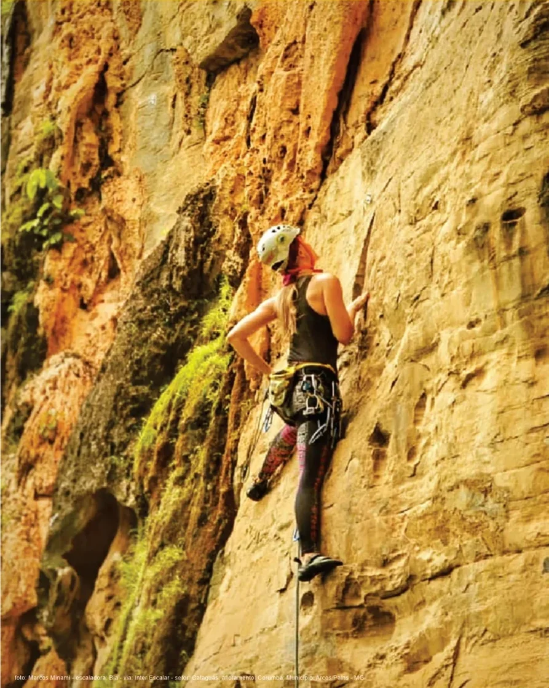
- **mapas**:
  - **[0]**:
    - **caminho_imagem_mapa**: 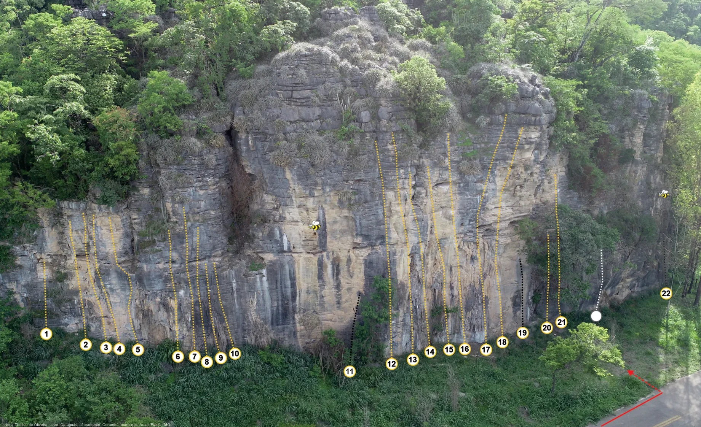
    - **largura_mapa**: 1841
    - **altura_mapa**: 1123
    - **pontos_de_interesse**:
      - **[0]**:
        - **id**: LNb9sKUuRg8uTT
        - **uid**: LNb9sKUuRg8uTT
        - **rotulo**: 1
        - **circulo**:
          - **x**: 122
          - **y**: 878
          - **raio**: 15
        - **label**: 1
      - **[1]**:
        - **id**: VHC1JPCXvqiCwr
        - **uid**: VHC1JPCXvqiCwr
        - **rotulo**: 2
        - **circulo**:
          - **x**: 226
          - **y**: 907
          - **raio**: 15
        - **label**: 2
      - **[2]**:
        - **id**: OpU8AosIW9ayjh
        - **uid**: OpU8AosIW9ayjh
        - **rotulo**: 3
        - **circulo**:
          - **x**: 279
          - **y**: 914
          - **raio**: 15
        - **label**: 3
      - **[3]**:
        - **id**: VIgIWsC50FJNai
        - **uid**: VIgIWsC50FJNai
        - **rotulo**: 4
        - **circulo**:
          - **x**: 314
          - **y**: 918
          - **raio**: 15
        - **label**: 4
      - **[4]**:
        - **id**: gMTEKLfQzhDabT
        - **uid**: gMTEKLfQzhDabT
        - **rotulo**: 5
        - **circulo**:
          - **x**: 363
          - **y**: 921
          - **raio**: 15
        - **label**: 5
      - **[5]**:
        - **id**: UnrpCRinRBh7oj
        - **uid**: UnrpCRinRBh7oj
        - **rotulo**: 6
        - **circulo**:
          - **x**: 468
          - **y**: 938
          - **raio**: 15
        - **label**: 6
      - **[6]**:
        - **id**: JCcbPuQqeFZxMD
        - **uid**: JCcbPuQqeFZxMD
        - **rotulo**: 7
        - **circulo**:
          - **x**: 511
          - **y**: 938
          - **raio**: 15
        - **label**: 7
      - **[7]**:
        - **id**: YlGwiUyrcQOaT8
        - **uid**: YlGwiUyrcQOaT8
        - **rotulo**: 8
        - **circulo**:
          - **x**: 544
          - **y**: 952
          - **raio**: 15
        - **label**: 8
      - **[8]**:
        - **id**: hgRUowuxEIXvQu
        - **uid**: hgRUowuxEIXvQu
        - **rotulo**: 9
        - **circulo**:
          - **x**: 580
          - **y**: 942
          - **raio**: 15
        - **label**: 9
      - **[9]**:
        - **id**: eDZaYvMTSnBhmZ
        - **uid**: eDZaYvMTSnBhmZ
        - **rotulo**: 10
        - **circulo**:
          - **x**: 617
          - **y**: 930
          - **raio**: 15
        - **label**: 10
      - **[10]**:
        - **id**: Rt6aTE2mAkC2Oi
        - **uid**: Rt6aTE2mAkC2Oi
        - **rotulo**: 11
        - **circulo**:
          - **x**: 919
          - **y**: 977
          - **raio**: 15
        - **label**: 11
      - **[11]**:
        - **id**: mn1Rk6JisznUgt
        - **uid**: mn1Rk6JisznUgt
        - **rotulo**: 12
        - **circulo**:
          - **x**: 1029
          - **y**: 957
          - **raio**: 15
        - **label**: 12
      - **[12]**:
        - **id**: 45ESf9jWv74VMH
        - **uid**: 45ESf9jWv74VMH
        - **rotulo**: 13
        - **circulo**:
          - **x**: 1085
          - **y**: 946
          - **raio**: 15
        - **label**: 13
      - **[13]**:
        - **id**: rOillPn1BEp6aR
        - **uid**: rOillPn1BEp6aR
        - **rotulo**: 14
        - **circulo**:
          - **x**: 1130
          - **y**: 925
          - **raio**: 15
        - **label**: 14
      - **[14]**:
        - **id**: S6hCLFpqFArmUB
        - **uid**: S6hCLFpqFArmUB
        - **rotulo**: 15
        - **circulo**:
          - **x**: 1180
          - **y**: 920
          - **raio**: 15
        - **label**: 15
      - **[15]**:
        - **id**: gyX0uRs0dVQNGe
        - **uid**: gyX0uRs0dVQNGe
        - **rotulo**: 16
        - **circulo**:
          - **x**: 1221
          - **y**: 918
          - **raio**: 15
        - **label**: 16
      - **[16]**:
        - **id**: vyu4EGBuiQBpaq
        - **uid**: vyu4EGBuiQBpaq
        - **rotulo**: 17
        - **circulo**:
          - **x**: 1277
          - **y**: 920
          - **raio**: 15
        - **label**: 17
      - **[17]**:
        - **id**: Yeohcm6TiXdIdu
        - **uid**: Yeohcm6TiXdIdu
        - **rotulo**: 18
        - **circulo**:
          - **x**: 1320
          - **y**: 900
          - **raio**: 15
        - **label**: 18
      - **[18]**:
        - **id**: hzCFy6EXcWvvNH
        - **uid**: hzCFy6EXcWvvNH
        - **rotulo**: 19
        - **circulo**:
          - **x**: 1373
          - **y**: 876
          - **raio**: 15
        - **label**: 19
      - **[19]**:
        - **id**: p5uYwhYOyEbl3C
        - **uid**: p5uYwhYOyEbl3C
        - **rotulo**: 20
        - **circulo**:
          - **x**: 1436
          - **y**: 863
          - **raio**: 15
        - **label**: 20
      - **[20]**:
        - **id**: qclmWQmcsO4bnL
        - **uid**: qclmWQmcsO4bnL
        - **rotulo**: 21
        - **circulo**:
          - **x**: 1475
          - **y**: 848
          - **raio**: 15
        - **label**: 21
      - **[21]**:
        - **id**: f0jTDGNwa4H6M8
        - **uid**: f0jTDGNwa4H6M8
        - **rotulo**: 22
        - **circulo**:
          - **x**: 1750
          - **y**: 772
          - **raio**: 15
        - **label**: 22
    - **referencias**:
      - **[0]**:
        - **alvo_uid**: aUcrz23nOU43co
        - **pontos_uids**:
          - LNb9sKUuRg8uTT
        - **escalada**: Ditadura do Barulho
        - **ids**:
          - LNb9sKUuRg8uTT
      - **[1]**:
        - **alvo_uid**: ugkqg8AbhSQTfH
        - **pontos_uids**:
          - VHC1JPCXvqiCwr
        - **escalada**: Nó 88
        - **ids**:
          - VHC1JPCXvqiCwr
      - **[2]**:
        - **alvo_uid**: FShzkcYQNnZPCn
        - **pontos_uids**:
          - OpU8AosIW9ayjh
        - **escalada**: Mulher Mais Bonita do Mundo
        - **ids**:
          - OpU8AosIW9ayjh
      - **[3]**:
        - **alvo_uid**: DdMmFVTLXo08S1
        - **pontos_uids**:
          - VIgIWsC50FJNai
        - **escalada**: Jogo Rápido
        - **ids**:
          - VIgIWsC50FJNai
      - **[4]**:
        - **alvo_uid**: X1kJ5hMr5Fpu0q
        - **pontos_uids**:
          - gMTEKLfQzhDabT
        - **escalada**: Baile da Betinha
        - **ids**:
          - gMTEKLfQzhDabT
      - **[5]**:
        - **alvo_uid**: amBcdYUfvfWjVU
        - **pontos_uids**:
          - UnrpCRinRBh7oj
        - **escalada**: Chove + Não Molha
        - **ids**:
          - UnrpCRinRBh7oj
      - **[6]**:
        - **alvo_uid**: oJFSoB58nOkxCK
        - **pontos_uids**:
          - JCcbPuQqeFZxMD
        - **escalada**: Paisnkentá
        - **ids**:
          - JCcbPuQqeFZxMD
      - **[7]**:
        - **alvo_uid**: OqQ7UK8617FO5p
        - **pontos_uids**:
          - YlGwiUyrcQOaT8
        - **escalada**: Alá Magnólia
        - **ids**:
          - YlGwiUyrcQOaT8
      - **[8]**:
        - **alvo_uid**: LrGHREzXJ6GSj0
        - **pontos_uids**:
          - hgRUowuxEIXvQu
        - **escalada**: F.A. Foi Dela
        - **ids**:
          - hgRUowuxEIXvQu
      - **[9]**:
        - **alvo_uid**: qG7czp3qmqLiAj
        - **pontos_uids**:
          - eDZaYvMTSnBhmZ
        - **escalada**: Ilusão do 'eu'
        - **ids**:
          - eDZaYvMTSnBhmZ
      - **[10]**:
        - **alvo_uid**: BomUHx70b3tiiB
        - **pontos_uids**:
          - Rt6aTE2mAkC2Oi
        - **escalada**: (via inacabada)
        - **ids**:
          - Rt6aTE2mAkC2Oi
      - **[11]**:
        - **alvo_uid**: wcM6n0BnHPbL7W
        - **pontos_uids**:
          - mn1Rk6JisznUgt
        - **escalada**: Alienação Social
        - **ids**:
          - mn1Rk6JisznUgt
      - **[12]**:
        - **alvo_uid**: VBdML72q0Pql9q
        - **pontos_uids**:
          - 45ESf9jWv74VMH
        - **escalada**: Siurana
        - **ids**:
          - 45ESf9jWv74VMH
      - **[13]**:
        - **alvo_uid**: wwJAA8Iv9uyNp8
        - **pontos_uids**:
          - rOillPn1BEp6aR
        - **escalada**: Bond, Vagabond
        - **ids**:
          - rOillPn1BEp6aR
      - **[14]**:
        - **alvo_uid**: 8Rrr9khUm2HM2p
        - **pontos_uids**:
          - S6hCLFpqFArmUB
        - **escalada**: Bond, Maribond
        - **ids**:
          - S6hCLFpqFArmUB
      - **[15]**:
        - **alvo_uid**: g1GUwzKkguiLaK
        - **pontos_uids**:
          - gyX0uRs0dVQNGe
        - **escalada**: Charuto no Beiço
        - **ids**:
          - gyX0uRs0dVQNGe
      - **[16]**:
        - **alvo_uid**: WbVUA80Lv8pn7x
        - **pontos_uids**:
          - vyu4EGBuiQBpaq
        - **escalada**: Chama o Bombeiro
        - **ids**:
          - vyu4EGBuiQBpaq
      - **[17]**:
        - **alvo_uid**: BHRebb9DlH7Fgd
        - **pontos_uids**:
          - Yeohcm6TiXdIdu
        - **escalada**: Inter Escalar
        - **ids**:
          - Yeohcm6TiXdIdu
      - **[18]**:
        - **alvo_uid**: fbAOZx0oauDaee
        - **pontos_uids**:
          - hzCFy6EXcWvvNH
        - **escalada**: (via inacabada) Capitão Fantástico
        - **ids**:
          - hzCFy6EXcWvvNH
      - **[19]**:
        - **alvo_uid**: P0VjGrFoCYbKzV
        - **pontos_uids**:
          - p5uYwhYOyEbl3C
        - **escalada**: Aracnofobia
        - **ids**:
          - p5uYwhYOyEbl3C
      - **[20]**:
        - **alvo_uid**: KY3cFhUgJbwcTs
        - **pontos_uids**:
          - qclmWQmcsO4bnL
        - **escalada**: Mão de Alface
        - **ids**:
          - qclmWQmcsO4bnL
      - **[21]**:
        - **alvo_uid**: BomUHx70b3tiiB
        - **pontos_uids**:
          - f0jTDGNwa4H6M8
        - **escalada**: (via inacabada)
        - **ids**:
          - f0jTDGNwa4H6M8
- **escaladas**:
  - **[0]**:
    - **uid**: aUcrz23nOU43co
    - **via_esportiva**:
      - **nome**: Ditadura do Barulho
      - **dificuldade**: BR_3
      - **data_abertura**: 2021-03-20
      - **quantidade_protecoes_intermediarias**: 3
      - **quantidade_protecoes_parada**: 2
      - **destaque**: True
  - **[1]**:
    - **uid**: ugkqg8AbhSQTfH
    - **via_esportiva**:
      - **nome**: Nó 88
      - **dificuldade**: BR_6
      - **data_abertura**: 2020-12-26
      - **quantidade_protecoes_parada**: 2
      - **destaque**: True
  - **[2]**:
    - **uid**: FShzkcYQNnZPCn
    - **via_esportiva**:
      - **nome**: Mulher Mais Bonita do Mundo
      - **dificuldade**: BR_5
      - **data_abertura**: 2020-10-12
      - **quantidade_protecoes_intermediarias**: 5
      - **quantidade_protecoes_parada**: 2
      - **destaque**: True
  - **[3]**:
    - **uid**: DdMmFVTLXo08S1
    - **via_esportiva**:
      - **nome**: Jogo Rápido
      - **dificuldade**: BR_7A_BARRA_7B
      - **data_abertura**: 2020-11-01
      - **destaque**: True
  - **[4]**:
    - **uid**: X1kJ5hMr5Fpu0q
    - **via_esportiva**:
      - **nome**: Baile da Betinha
      - **dificuldade**: BR_5SUP
      - **data_abertura**: 2020-11-01
      - **destaque**: True
  - **[5]**:
    - **uid**: amBcdYUfvfWjVU
    - **via_esportiva**:
      - **nome**: Chove + Não Molha
      - **dificuldade**: BR_6
      - **data_abertura**: 2021-01-01
      - **quantidade_protecoes_intermediarias**: 5
      - **quantidade_protecoes_parada**: 2
  - **[6]**:
    - **uid**: oJFSoB58nOkxCK
    - **via_esportiva**:
      - **nome**: Paisnkentá
      - **dificuldade**: BR_6SUP
      - **data_abertura**: 2020-12-01
      - **destaque**: True
  - **[7]**:
    - **uid**: OqQ7UK8617FO5p
    - **via_esportiva**:
      - **nome**: Alá Magnólia
      - **data_abertura**: 2020-12-01
      - **destaque**: True
  - **[8]**:
    - **uid**: LrGHREzXJ6GSj0
    - **via_esportiva**:
      - **nome**: F.A. Foi Dela
      - **dificuldade**: BR_4
      - **data_abertura**: 2021-01-03
      - **destaque**: True
  - **[9]**:
    - **uid**: qG7czp3qmqLiAj
    - **via_esportiva**:
      - **nome**: Ilusão do 'eu'
      - **dificuldade**: BR_6SUP
      - **data_abertura**: 2021-01-03
      - **destaque**: True
  - **[10]**:
    - **uid**: 7CD4s9SIbRf7ze
    - **via_esportiva**:
      - **nome**: (via inacabada)
      - **dificuldade**: PROJETO
      - **data_abertura**: 2008-01-01
      - **quantidade_protecoes_intermediarias**: 1
  - **[11]**:
    - **uid**: wcM6n0BnHPbL7W
    - **via_esportiva**:
      - **nome**: Alienação Social
      - **dificuldade**: PROJETO
      - **data_abertura**: 2020-11-01
      - **quantidade_protecoes_intermediarias**: 8
      - **quantidade_protecoes_parada**: 2
      - **destaque**: True
  - **[12]**:
    - **uid**: VBdML72q0Pql9q
    - **via_esportiva**:
      - **nome**: Siurana
      - **dificuldade**: BR_6SUP_BARRA_7A
      - **data_abertura**: 2020-11-01
      - **destaque**: True
  - **[13]**:
    - **uid**: wwJAA8Iv9uyNp8
    - **via_esportiva**:
      - **nome**: Bond, Vagabond
      - **dificuldade**: BR_6SUP_BARRA_7A
      - **data_abertura**: 2020-10-01
      - **quantidade_protecoes_intermediarias**: 10
      - **destaque**: True
      - **quantidade_protecoes_parada**: 2
  - **[14]**:
    - **uid**: 8Rrr9khUm2HM2p
    - **via_esportiva**:
      - **nome**: Bond, Maribond
      - **dificuldade**: BR_7A_BARRA_7B
      - **data_abertura**: 2020-10-01
      - **destaque**: True
      - **quantidade_protecoes_intermediarias**: 13
      - **quantidade_protecoes_parada**: 2
  - **[15]**:
    - **uid**: g1GUwzKkguiLaK
    - **via_esportiva**:
      - **nome**: Charuto no Beiço
      - **dificuldade**: BR_6
      - **destaque**: True
      - **data_abertura**: 2020-10-01
      - **quantidade_protecoes_intermediarias**: 9
      - **quantidade_protecoes_parada**: 2
  - **[16]**:
    - **uid**: WbVUA80Lv8pn7x
    - **via_esportiva**:
      - **nome**: Chama o Bombeiro
      - **dificuldade**: BR_6SUP_BARRA_7A
      - **destaque**: True
      - **data_abertura**: 2020-10-01
      - **quantidade_protecoes_intermediarias**: 13
      - **quantidade_protecoes_parada**: 2
  - **[17]**:
    - **uid**: BHRebb9DlH7Fgd
    - **via_esportiva**:
      - **nome**: Inter Escalar
      - **dificuldade**: BR_7A
      - **data_abertura**: 2020-10-01
      - **destaque**: True
      - **quantidade_protecoes_intermediarias**: 13
      - **quantidade_protecoes_parada**: 2
  - **[18]**:
    - **uid**: fbAOZx0oauDaee
    - **via_esportiva**:
      - **nome**: (via inacabada) Capitão Fantástico
      - **dificuldade**: PROJETO
      - **data_abertura**: 2020-10-01
      - **quantidade_protecoes_intermediarias**: 5
  - **[19]**:
    - **uid**: P0VjGrFoCYbKzV
    - **via_esportiva**:
      - **nome**: Aracnofobia
      - **dificuldade**: BR_4
      - **data_abertura**: 2020-10-01
      - **destaque**: True
      - **quantidade_protecoes_intermediarias**: 5
      - **quantidade_protecoes_parada**: 2
  - **[20]**:
    - **uid**: KY3cFhUgJbwcTs
    - **via_esportiva**:
      - **nome**: Mão de Alface
      - **dificuldade**: BR_5SUP
      - **destaque**: True
      - **data_abertura**: 2020-10-01
      - **quantidade_protecoes_intermediarias**: 8
      - **quantidade_protecoes_parada**: 2
  - **[21]**:
    - **uid**: feWHtcHg6OxiWV
    - **via_movel**:
      - **nome**: Marquês de Rabicó
      - **dificuldade**: BR_7A
      - **data_abertura**: 2021-01-01
  - **[22]**:
    - **uid**: BomUHx70b3tiiB
    - **via_esportiva**:
      - **nome**: (via inacabada)
      - **dificuldade**: PROJETO
      - **data_abertura**: 2020-10-01
      - **quantidade_protecoes_intermediarias**: 3
- **precomputados**:
  - **total_escaladas**: 23
  - **total_esportivas**: 22

## Parte: setor_cataguas

### Setor (Pico: Corumbá)

- **descricao**:
    # Setor Cataguás
    
    > [!WARNING]
    > **O ACESSO A ESTE SETOR ESTÁ PROIBIDO POR HORA.**
    
    Sombra a partir de 11h (varia de acordo com a estação).
- **nome**: Setor Cataguás
- **uid**: P6WZGH1oFBzJaG
- **mapas**:
  - **[0]**:
    - **caminho_imagem_mapa**: 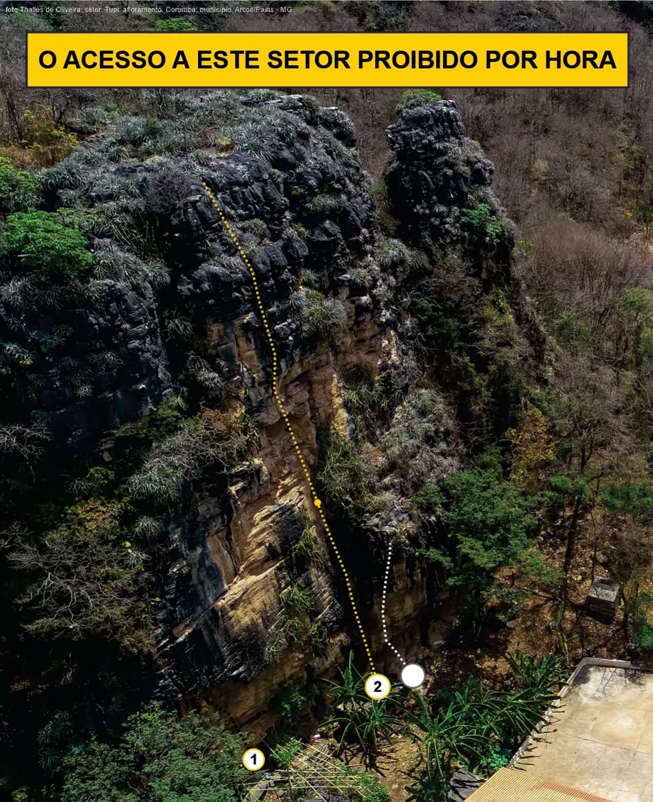
    - **largura_mapa**: 920
    - **altura_mapa**: 1130
    - **pontos_de_interesse**:
      - **[0]**:
        - **id**: 8YXCD71zENcm1y
        - **uid**: 8YXCD71zENcm1y
        - **rotulo**: 1
        - **circulo**:
          - **x**: 358
          - **y**: 1070
          - **raio**: 15
        - **label**: 1
      - **[1]**:
        - **id**: vONjLddZo1mifE
        - **uid**: vONjLddZo1mifE
        - **rotulo**: 2
        - **circulo**:
          - **x**: 532
          - **y**: 968
          - **raio**: 17
        - **label**: 2
    - **referencias**:
      - **[0]**:
        - **alvo_uid**: iCMOh9TQwlaTST
        - **pontos_uids**:
          - 8YXCD71zENcm1y
        - **escalada**: (via inacabada)
        - **ids**:
          - 8YXCD71zENcm1y
      - **[1]**:
        - **alvo_uid**: o6lDcwqp37sSU9
        - **pontos_uids**:
          - vONjLddZo1mifE
        - **escalada**: Dos Pombos
        - **ids**:
          - vONjLddZo1mifE
- **escaladas**:
  - **[0]**:
    - **uid**: iCMOh9TQwlaTST
    - **via_esportiva**:
      - **nome**: (via inacabada)
      - **dificuldade**: PROJETO
  - **[1]**:
    - **uid**: o6lDcwqp37sSU9
    - **via_esportiva**:
      - **nome**: Dos Pombos
      - **destaque**: True
      - **data_abertura**: 2000-01-01
  - **[2]**:
    - **uid**: Ee1Rm2a2SFtXSa
    - **via_movel**:
      - **nome**: sem nome (via mixta)
      - **data_abertura**: 2008-01-01
- **precomputados**:
  - **total_escaladas**: 3
  - **total_esportivas**: 2

## Parte: setor_xavante

### Setor (Pico: Corumbá)

- **descricao**:
    # Setor Xavante
    
    Sombra o dia todo (varia de acordo com a estação).
- **nome**: Setor Xavante
- **uid**: TxDV9kE6vHYvdM
- **caminho_imagem_capa**: 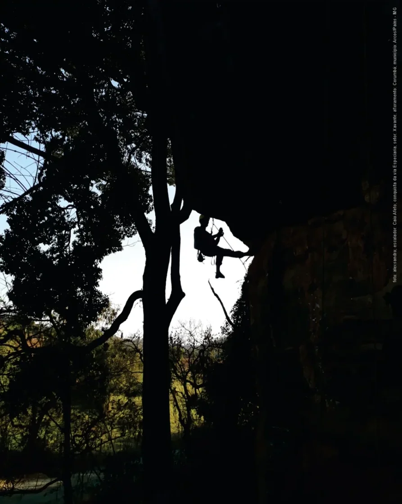
- **mapas**:
  - **[0]**:
    - **caminho_imagem_mapa**: 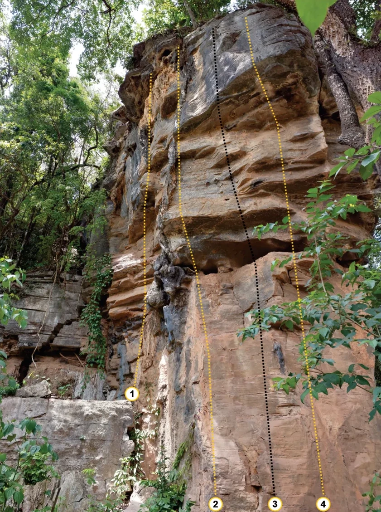
    - **largura_mapa**: 841
    - **altura_mapa**: 1129
    - **pontos_de_interesse**:
      - **[0]**:
        - **id**: NcrhgAdVHpL7V2
        - **uid**: NcrhgAdVHpL7V2
        - **rotulo**: 1
        - **circulo**:
          - **x**: 292
          - **y**: 868
          - **raio**: 15
        - **label**: 1
      - **[1]**:
        - **id**: mrtduOlFh3i2qV
        - **uid**: mrtduOlFh3i2qV
        - **rotulo**: 2
        - **circulo**:
          - **x**: 476
          - **y**: 1112
          - **raio**: 15
        - **label**: 2
      - **[2]**:
        - **id**: jmJnojNCKhRmoB
        - **uid**: jmJnojNCKhRmoB
        - **rotulo**: 3
        - **circulo**:
          - **x**: 607
          - **y**: 1112
          - **raio**: 15
        - **label**: 3
      - **[3]**:
        - **id**: vmumFRsbAc1vMw
        - **uid**: vmumFRsbAc1vMw
        - **rotulo**: 4
        - **circulo**:
          - **x**: 714
          - **y**: 1112
          - **raio**: 15
        - **label**: 4
    - **referencias**:
      - **[0]**:
        - **alvo_uid**: 44ByzLsXABeZ5s
        - **pontos_uids**:
          - NcrhgAdVHpL7V2
        - **escalada**: Curumim
        - **ids**:
          - NcrhgAdVHpL7V2
      - **[1]**:
        - **alvo_uid**: wd8ATscGxrhD91
        - **pontos_uids**:
          - mrtduOlFh3i2qV
        - **escalada**: Terra à Vista
        - **ids**:
          - mrtduOlFh3i2qV
      - **[2]**:
        - **alvo_uid**: H4SwbadCl0qD5B
        - **pontos_uids**:
          - jmJnojNCKhRmoB
        - **escalada**: (projeto)
        - **ids**:
          - jmJnojNCKhRmoB
      - **[3]**:
        - **alvo_uid**: I9MEHiGeAnxGh3
        - **pontos_uids**:
          - vmumFRsbAc1vMw
        - **escalada**: (sem nome)
        - **ids**:
          - vmumFRsbAc1vMw
  - **[1]**:
    - **caminho_imagem_mapa**: 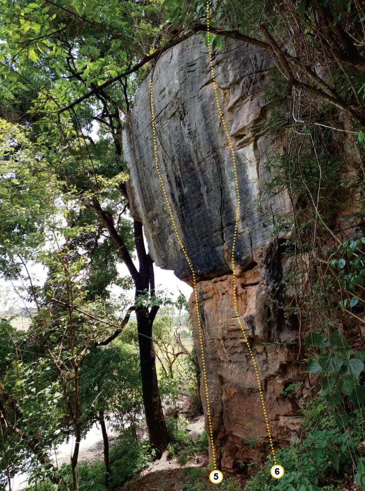
    - **largura_mapa**: 841
    - **altura_mapa**: 1129
    - **pontos_de_interesse**:
      - **[0]**:
        - **id**: KTSxol5XoR7sa4
        - **uid**: KTSxol5XoR7sa4
        - **rotulo**: 5
        - **circulo**:
          - **x**: 498
          - **y**: 1097
          - **raio**: 15
        - **label**: 5
      - **[1]**:
        - **id**: jCcmwNWqmR4Xda
        - **uid**: jCcmwNWqmR4Xda
        - **rotulo**: 6
        - **circulo**:
          - **x**: 639
          - **y**: 1084
          - **raio**: 15
        - **label**: 6
    - **referencias**:
      - **[0]**:
        - **alvo_uid**: FELPompXlbRtUY
        - **pontos_uids**:
          - KTSxol5XoR7sa4
        - **escalada**: Especiaria
        - **ids**:
          - KTSxol5XoR7sa4
      - **[1]**:
        - **alvo_uid**: 028yiAokkxtL25
        - **pontos_uids**:
          - jCcmwNWqmR4Xda
        - **escalada**: Tupi Or Not Tupi
        - **ids**:
          - jCcmwNWqmR4Xda
- **escaladas**:
  - **[0]**:
    - **uid**: 44ByzLsXABeZ5s
    - **via_esportiva**:
      - **nome**: Curumim
      - **dificuldade**: BR_6SUP
      - **destaque**: True
      - **data_abertura**: 2022-07-25
      - **quantidade_protecoes_intermediarias**: 6
      - **quantidade_protecoes_parada**: 2
  - **[1]**:
    - **uid**: wd8ATscGxrhD91
    - **via_esportiva**:
      - **nome**: Terra à Vista
      - **destaque**: True
      - **dificuldade**: BR_7B
      - **data_abertura**: 2022-07-25
      - **quantidade_protecoes_intermediarias**: 7
      - **quantidade_protecoes_parada**: 2
  - **[2]**:
    - **uid**: H4SwbadCl0qD5B
    - **via_esportiva**:
      - **nome**: (projeto)
      - **dificuldade**: PROJETO
  - **[3]**:
    - **uid**: I9MEHiGeAnxGh3
    - **via_esportiva**:
      - **nome**: (sem nome)
      - **dificuldade**: PROJETO
      - **data_abertura**: 2022-07-25
      - **quantidade_protecoes_intermediarias**: 7
      - **quantidade_protecoes_parada**: 2
  - **[4]**:
    - **uid**: FELPompXlbRtUY
    - **via_esportiva**:
      - **nome**: Especiaria
      - **dificuldade**: PROJETO
      - **destaque**: True
      - **data_abertura**: 2022-07-25
      - **quantidade_protecoes_intermediarias**: 6
      - **quantidade_protecoes_parada**: 2
  - **[5]**:
    - **uid**: 028yiAokkxtL25
    - **via_esportiva**:
      - **nome**: Tupi Or Not Tupi
      - **dificuldade**: BR_7A
      - **destaque**: True
      - **data_abertura**: 2022-07-25
      - **quantidade_protecoes_intermediarias**: 8
      - **quantidade_protecoes_parada**: 2
- **precomputados**:
  - **total_escaladas**: 6
  - **total_esportivas**: 6

## Parte: setor_yanomami

### Setor (Pico: Corumbá)

- **descricao**:
    # Setor Yanomami
    
    Sombra até as 14h30 (varia de acordo com a estação).
- **nome**: Setor Yanomami
- **uid**: NDSstaoHwE6j5z
- **caminho_imagem_capa**: 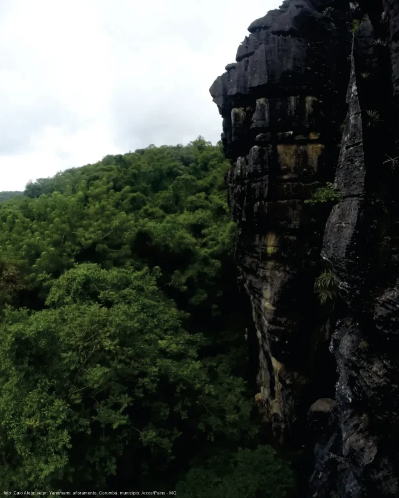
- **mapas**:
  - **[0]**:
    - **caminho_imagem_mapa**: 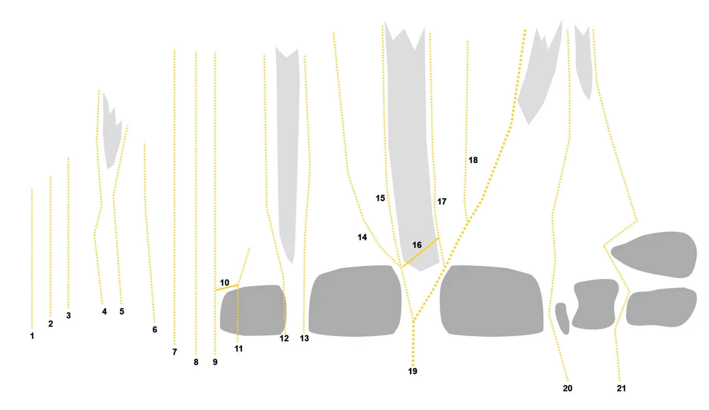
    - **largura_mapa**: 1710
    - **altura_mapa**: 990
    - **pontos_de_interesse**:
      - **[0]**:
        - **id**: aZ2Fj6Vb2I8XLF
        - **uid**: aZ2Fj6Vb2I8XLF
        - **rotulo**: 1
        - **retangulo**:
          - **x**: 78
          - **y**: 811
          - **comprimento**: 25
          - **largura**: 28
        - **label**: 1
      - **[1]**:
        - **id**: u3Ucp77yH4JmUw
        - **uid**: u3Ucp77yH4JmUw
        - **rotulo**: 2
        - **retangulo**:
          - **x**: 122
          - **y**: 780
          - **comprimento**: 26
          - **largura**: 28
        - **label**: 2
      - **[2]**:
        - **id**: Ee3XBY5FLjXIzE
        - **uid**: Ee3XBY5FLjXIzE
        - **rotulo**: 3
        - **retangulo**:
          - **x**: 165
          - **y**: 760
          - **comprimento**: 26
          - **largura**: 28
        - **label**: 3
      - **[3]**:
        - **id**: E3vYBX29RgJ6Ay
        - **uid**: E3vYBX29RgJ6Ay
        - **rotulo**: 4
        - **retangulo**:
          - **x**: 252
          - **y**: 752
          - **comprimento**: 25
          - **largura**: 28
        - **label**: 4
      - **[4]**:
        - **id**: LJf14lfo3Kz8sc
        - **uid**: LJf14lfo3Kz8sc
        - **rotulo**: 5
        - **retangulo**:
          - **x**: 294
          - **y**: 752
          - **comprimento**: 29
          - **largura**: 25
        - **label**: 5
      - **[5]**:
        - **id**: EJGEoupwA6R6cL
        - **uid**: EJGEoupwA6R6cL
        - **rotulo**: 6
        - **retangulo**:
          - **x**: 374
          - **y**: 796
          - **comprimento**: 29
          - **largura**: 26
        - **label**: 6
      - **[6]**:
        - **id**: O71rCtpRg9GUEW
        - **uid**: O71rCtpRg9GUEW
        - **rotulo**: 7
        - **retangulo**:
          - **x**: 421
          - **y**: 849
          - **comprimento**: 28
          - **largura**: 28
        - **label**: 7
      - **[7]**:
        - **id**: d9IkY4uwUrHhQq
        - **uid**: d9IkY4uwUrHhQq
        - **rotulo**: 8
        - **retangulo**:
          - **x**: 474
          - **y**: 874
          - **comprimento**: 25
          - **largura**: 27
        - **label**: 8
      - **[8]**:
        - **id**: rSTxFNHC6lwsYY
        - **uid**: rSTxFNHC6lwsYY
        - **rotulo**: 9
        - **retangulo**:
          - **x**: 518
          - **y**: 873
          - **comprimento**: 26
          - **largura**: 30
        - **label**: 9
      - **[9]**:
        - **id**: zOFZK5OMvp6HKt
        - **uid**: zOFZK5OMvp6HKt
        - **rotulo**: 10
        - **retangulo**:
          - **x**: 542
          - **y**: 682
          - **comprimento**: 31
          - **largura**: 30
        - **label**: 10
      - **[10]**:
        - **id**: v2El62CQbOe3Zj
        - **uid**: v2El62CQbOe3Zj
        - **rotulo**: 11
        - **retangulo**:
          - **x**: 575
          - **y**: 840
          - **comprimento**: 30
          - **largura**: 27
        - **label**: 11
      - **[11]**:
        - **id**: GzQ9jlEoM5mVWB
        - **uid**: GzQ9jlEoM5mVWB
        - **rotulo**: 12
        - **retangulo**:
          - **x**: 686
          - **y**: 816
          - **comprimento**: 31
          - **largura**: 32
        - **label**: 12
      - **[12]**:
        - **id**: UAzlcnmEzTQ9sR
        - **uid**: UAzlcnmEzTQ9sR
        - **rotulo**: 13
        - **retangulo**:
          - **x**: 734
          - **y**: 816
          - **comprimento**: 32
          - **largura**: 30
        - **label**: 13
      - **[13]**:
        - **id**: tugZhuUId8ErqF
        - **uid**: tugZhuUId8ErqF
        - **rotulo**: 14
        - **retangulo**:
          - **x**: 874
          - **y**: 572
          - **comprimento**: 35
          - **largura**: 31
        - **label**: 14
      - **[14]**:
        - **id**: ryf0ttMoCegs3Z
        - **uid**: ryf0ttMoCegs3Z
        - **rotulo**: 15
        - **retangulo**:
          - **x**: 918
          - **y**: 477
          - **comprimento**: 30
          - **largura**: 30
        - **label**: 15
      - **[15]**:
        - **id**: Jacz5Cn1CCKc0m
        - **uid**: Jacz5Cn1CCKc0m
        - **rotulo**: 16
        - **retangulo**:
          - **x**: 1006
          - **y**: 592
          - **comprimento**: 32
          - **largura**: 27
        - **label**: 16
      - **[16]**:
        - **id**: yrIjt0SyfdOAiI
        - **uid**: yrIjt0SyfdOAiI
        - **rotulo**: 17
        - **retangulo**:
          - **x**: 1066
          - **y**: 484
          - **comprimento**: 34
          - **largura**: 29
        - **label**: 17
      - **[17]**:
        - **id**: 0SEa2yokGi9O77
        - **uid**: 0SEa2yokGi9O77
        - **rotulo**: 18
        - **retangulo**:
          - **x**: 1142
          - **y**: 386
          - **comprimento**: 30
          - **largura**: 30
        - **label**: 18
      - **[18]**:
        - **id**: B7Nit52m56sSQY
        - **uid**: B7Nit52m56sSQY
        - **rotulo**: 19
        - **retangulo**:
          - **x**: 995
          - **y**: 895
          - **comprimento**: 34
          - **largura**: 30
        - **label**: 19
      - **[19]**:
        - **id**: hm9zJqEnrsudtX
        - **uid**: hm9zJqEnrsudtX
        - **rotulo**: 20
        - **retangulo**:
          - **x**: 1368
          - **y**: 936
          - **comprimento**: 31
          - **largura**: 27
        - **label**: 20
      - **[20]**:
        - **id**: p1hGhHJ55ax4Bw
        - **uid**: p1hGhHJ55ax4Bw
        - **rotulo**: 21
        - **retangulo**:
          - **x**: 1498
          - **y**: 938
          - **comprimento**: 32
          - **largura**: 27
        - **label**: 21
    - **referencias**:
      - **[0]**:
        - **alvo_uid**: w4zbxzwvh8Gm3d
        - **pontos_uids**:
          - aZ2Fj6Vb2I8XLF
        - **escalada**: Saidera
        - **ids**:
          - aZ2Fj6Vb2I8XLF
      - **[1]**:
        - **alvo_uid**: CkOe9twBlpZ9Hw
        - **pontos_uids**:
          - u3Ucp77yH4JmUw
        - **escalada**: Impaciência Tem Limite
        - **ids**:
          - u3Ucp77yH4JmUw
      - **[2]**:
        - **alvo_uid**: wGjVNzAoTmPAMG
        - **pontos_uids**:
          - Ee3XBY5FLjXIzE
        - **escalada**: Gongolô
        - **ids**:
          - Ee3XBY5FLjXIzE
      - **[3]**:
        - **alvo_uid**: xNosFDuLkEw8c7
        - **pontos_uids**:
          - E3vYBX29RgJ6Ay
        - **escalada**: Seg Sativa
        - **ids**:
          - E3vYBX29RgJ6Ay
      - **[4]**:
        - **alvo_uid**: 013FTDDu5a9H09
        - **pontos_uids**:
          - LJf14lfo3Kz8sc
        - **escalada**: Gaiapiá
        - **ids**:
          - LJf14lfo3Kz8sc
      - **[5]**:
        - **alvo_uid**: 8NYeP9TXoeR6HW
        - **pontos_uids**:
          - EJGEoupwA6R6cL
        - **escalada**: Telefone Sem Fio
        - **ids**:
          - EJGEoupwA6R6cL
      - **[6]**:
        - **alvo_uid**: 8Y8OtJjygmtXY4
        - **pontos_uids**:
          - O71rCtpRg9GUEW
        - **escalada**: Trabalhador Solo
        - **ids**:
          - O71rCtpRg9GUEW
      - **[7]**:
        - **alvo_uid**: ZsK4cTvE68TSQW
        - **pontos_uids**:
          - d9IkY4uwUrHhQq
        - **escalada**: Quem avisa amigo é
        - **ids**:
          - d9IkY4uwUrHhQq
      - **[8]**:
        - **alvo_uid**: PW2VEbk1y0oAOA
        - **pontos_uids**:
          - rSTxFNHC6lwsYY
        - **escalada**: Inimigo do Fim
        - **ids**:
          - rSTxFNHC6lwsYY
      - **[9]**:
        - **alvo_uid**: ncmE7utoSSAjvk
        - **pontos_uids**:
          - zOFZK5OMvp6HKt
        - **escalada**: Hipotenusa (variante)
        - **ids**:
          - zOFZK5OMvp6HKt
      - **[10]**:
        - **alvo_uid**: rWHgVGYqeRZCxN
        - **pontos_uids**:
          - v2El62CQbOe3Zj
        - **escalada**: Força Yanomami (principal)
        - **ids**:
          - v2El62CQbOe3Zj
      - **[11]**:
        - **alvo_uid**: KWTcF2bV6tvutP
        - **pontos_uids**:
          - GzQ9jlEoM5mVWB
        - **escalada**: Pluriverso Paralelo
        - **ids**:
          - GzQ9jlEoM5mVWB
      - **[12]**:
        - **alvo_uid**: XzXwzxIJwZOyR0
        - **pontos_uids**:
          - UAzlcnmEzTQ9sR
        - **escalada**: Tiro ao Alvo
        - **ids**:
          - UAzlcnmEzTQ9sR
      - **[13]**:
        - **alvo_uid**: y4iN2YYncGT1ef
        - **pontos_uids**:
          - tugZhuUId8ErqF
        - **escalada**: Visita Ilustre
        - **ids**:
          - tugZhuUId8ErqF
      - **[14]**:
        - **alvo_uid**: kGqAztBAtwD45x
        - **pontos_uids**:
          - ryf0ttMoCegs3Z
        - **escalada**: Hand Pan (variante)
        - **ids**:
          - ryf0ttMoCegs3Z
      - **[15]**:
        - **alvo_uid**: t3CuzOMS1de9SP
        - **pontos_uids**:
          - Jacz5Cn1CCKc0m
        - **escalada**: Labirinto (variante)
        - **ids**:
          - Jacz5Cn1CCKc0m
      - **[16]**:
        - **alvo_uid**: P9nDcrTUaBqQQ5
        - **pontos_uids**:
          - yrIjt0SyfdOAiI
        - **escalada**: Charada (variante)
        - **ids**:
          - yrIjt0SyfdOAiI
      - **[17]**:
        - **alvo_uid**: CqiFz0B1GaxJaP
        - **pontos_uids**:
          - 0SEa2yokGi9O77
        - **escalada**: Vingador (variante)
        - **ids**:
          - 0SEa2yokGi9O77
      - **[18]**:
        - **alvo_uid**: aduuBFYYx1ncwM
        - **pontos_uids**:
          - B7Nit52m56sSQY
        - **escalada**: Trilogia (principal)
        - **ids**:
          - B7Nit52m56sSQY
      - **[19]**:
        - **alvo_uid**: kwE5M5BKPiaL1T
        - **pontos_uids**:
          - hm9zJqEnrsudtX
        - **escalada**: Paga pra Ver
        - **ids**:
          - hm9zJqEnrsudtX
      - **[20]**:
        - **alvo_uid**: egMWuqqlJaQFd7
        - **pontos_uids**:
          - p1hGhHJ55ax4Bw
        - **escalada**: Divida Ativa
        - **ids**:
          - p1hGhHJ55ax4Bw
- **escaladas**:
  - **[0]**:
    - **uid**: w4zbxzwvh8Gm3d
    - **via_esportiva**:
      - **nome**: Saidera
      - **dificuldade**: BR_5
      - **data_abertura**: 2022-12-01
      - **quantidade_protecoes_intermediarias**: 4
      - **quantidade_protecoes_parada**: 2
  - **[1]**:
    - **uid**: CkOe9twBlpZ9Hw
    - **via_esportiva**:
      - **nome**: Impaciência Tem Limite
      - **destaque**: True
      - **dificuldade**: BR_7A
      - **quantidade_protecoes_intermediarias**: 4
      - **quantidade_protecoes_parada**: 2
  - **[2]**:
    - **uid**: wGjVNzAoTmPAMG
    - **via_esportiva**:
      - **nome**: Gongolô
      - **destaque**: True
      - **dificuldade**: BR_6SUP
      - **quantidade_protecoes_intermediarias**: 4
      - **quantidade_protecoes_parada**: 2
  - **[3]**:
    - **uid**: xNosFDuLkEw8c7
    - **via_esportiva**:
      - **nome**: Seg Sativa
      - **dificuldade**: BR_6
      - **destaque**: True
      - **quantidade_protecoes_intermediarias**: 8
      - **quantidade_protecoes_parada**: 2
  - **[4]**:
    - **uid**: 013FTDDu5a9H09
    - **via_esportiva**:
      - **nome**: Gaiapiá
      - **destaque**: True
      - **dificuldade**: BR_6
      - **quantidade_protecoes_intermediarias**: 6
      - **quantidade_protecoes_parada**: 2
  - **[5]**:
    - **uid**: 8NYeP9TXoeR6HW
    - **via_esportiva**:
      - **nome**: Telefone Sem Fio
      - **destaque**: True
      - **dificuldade**: BR_5
      - **quantidade_protecoes_intermediarias**: 5
      - **quantidade_protecoes_parada**: 2
  - **[6]**:
    - **uid**: 8Y8OtJjygmtXY4
    - **via_esportiva**:
      - **nome**: Trabalhador Solo
      - **destaque**: True
      - **dificuldade**: BR_5
      - **quantidade_protecoes_intermediarias**: 10
      - **quantidade_protecoes_parada**: 2
  - **[7]**:
    - **uid**: ZsK4cTvE68TSQW
    - **via_esportiva**:
      - **nome**: Quem avisa amigo é
      - **destaque**: True
      - **dificuldade**: BR_5
      - **quantidade_protecoes_intermediarias**: 11
      - **quantidade_protecoes_parada**: 2
  - **[8]**:
    - **uid**: PW2VEbk1y0oAOA
    - **via_esportiva**:
      - **nome**: Inimigo do Fim
      - **dificuldade**: BR_6SUP_BARRA_7A
      - **destaque**: True
      - **quantidade_protecoes_intermediarias**: 13
      - **quantidade_protecoes_parada**: 2
  - **[9]**:
    - **uid**: ncmE7utoSSAjvk
    - **via_esportiva**:
      - **nome**: Hipotenusa (variante)
      - **dificuldade**: BR_6SUP_BARRA_7A
      - **destaque**: True
      - **quantidade_protecoes_intermediarias**: 5
      - **quantidade_protecoes_parada**: 2
  - **[10]**:
    - **uid**: rWHgVGYqeRZCxN
    - **via_esportiva**:
      - **nome**: Força Yanomami (principal)
      - **dificuldade**: BR_7B_BARRA_7C
      - **quantidade_protecoes_intermediarias**: 5
      - **quantidade_protecoes_parada**: 2
  - **[11]**:
    - **uid**: KWTcF2bV6tvutP
    - **via_esportiva**:
      - **nome**: Pluriverso Paralelo
      - **dificuldade**: PROJETO
  - **[12]**:
    - **uid**: XzXwzxIJwZOyR0
    - **via_esportiva**:
      - **nome**: Tiro ao Alvo
      - **dificuldade**: PROJETO
  - **[13]**:
    - **uid**: y4iN2YYncGT1ef
    - **via_esportiva**:
      - **nome**: Visita Ilustre
      - **destaque**: True
      - **dificuldade**: PROJETO
      - **quantidade_protecoes_intermediarias**: 18
      - **quantidade_protecoes_parada**: 2
  - **[14]**:
    - **uid**: kGqAztBAtwD45x
    - **via_esportiva**:
      - **nome**: Hand Pan (variante)
      - **destaque**: True
      - **dificuldade**: BR_7B
      - **quantidade_protecoes_intermediarias**: 17
      - **quantidade_protecoes_parada**: 2
  - **[15]**:
    - **uid**: t3CuzOMS1de9SP
    - **via_esportiva**:
      - **nome**: Labirinto (variante)
      - **dificuldade**: BR_7C
      - **destaque**: True
      - **quantidade_protecoes_intermediarias**: 15
      - **quantidade_protecoes_parada**: 2
  - **[16]**:
    - **uid**: P9nDcrTUaBqQQ5
    - **via_esportiva**:
      - **nome**: Charada (variante)
      - **dificuldade**: PROJETO
      - **quantidade_protecoes_intermediarias**: 14
      - **quantidade_protecoes_parada**: 2
  - **[17]**:
    - **uid**: CqiFz0B1GaxJaP
    - **via_esportiva**:
      - **nome**: Vingador (variante)
      - **dificuldade**: PROJETO
      - **quantidade_protecoes_intermediarias**: 14
      - **quantidade_protecoes_parada**: 2
  - **[18]**:
    - **uid**: aduuBFYYx1ncwM
    - **via_esportiva**:
      - **nome**: Trilogia (principal)
      - **dificuldade**: PROJETO
      - **quantidade_protecoes_intermediarias**: 14
      - **quantidade_protecoes_parada**: 2
  - **[19]**:
    - **uid**: kwE5M5BKPiaL1T
    - **via_esportiva**:
      - **nome**: Paga pra Ver
      - **dificuldade**: BR_8C_BARRA_9A
      - **destaque**: True
      - **quantidade_protecoes_intermediarias**: 12
      - **quantidade_protecoes_parada**: 2
  - **[20]**:
    - **uid**: egMWuqqlJaQFd7
    - **via_esportiva**:
      - **nome**: Divida Ativa
      - **dificuldade**: PROJETO
      - **quantidade_protecoes_intermediarias**: 11
      - **quantidade_protecoes_parada**: 2
- **precomputados**:
  - **total_escaladas**: 21
  - **total_esportivas**: 21

## Arquivos Externos

- **arquivos_externos**:
  - **[0]**:
    - **caminho**: 
    - **checksum_sha256**: 4e7f2a3fbad5f7ef7712fb496c9a751f42a65740b6f0cc4991bd93a88357a638
  - **[1]**:
    - **caminho**: 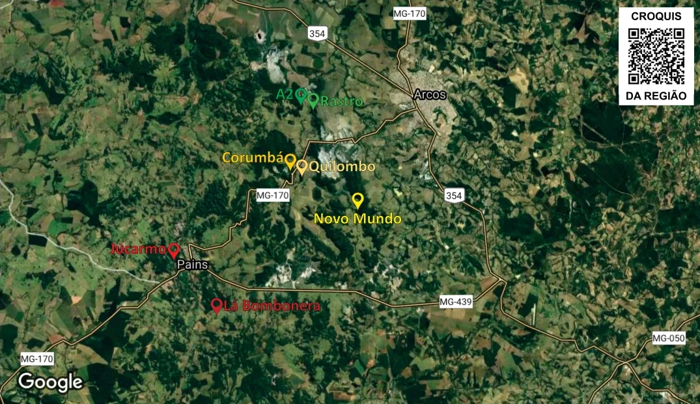
    - **checksum_sha256**: e9d825a2147c6a8befc7ecd70c705190a0d1696b3b1c274db34d95ab78826ee4
  - **[2]**:
    - **caminho**: 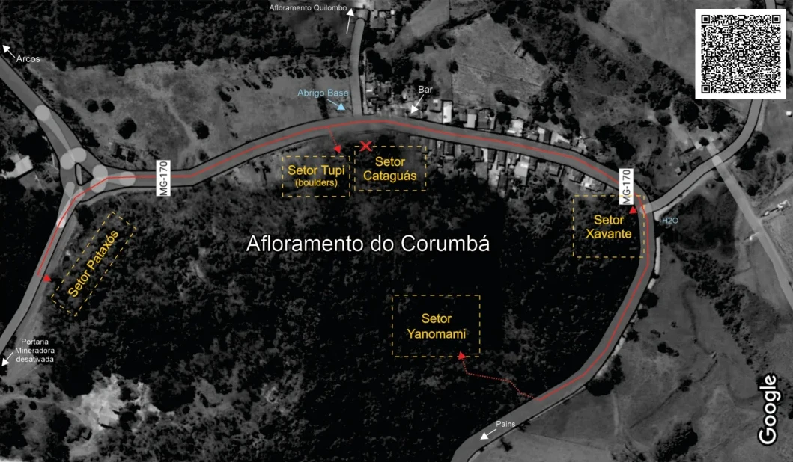
    - **checksum_sha256**: 7192cff9cdfb920a8f8bc255b5b5fd127333de968cb390044f158a84b9f31929
  - **[3]**:
    - **caminho**: 
    - **checksum_sha256**: 63d90792d83a83374ad9e008392dcc49cc16ed9bef41a3e52a86c0b96c83aee4
  - **[4]**:
    - **caminho**: 
    - **checksum_sha256**: d0db74f8ccf85667966750b51e3cb054110d6d84745aabc3453daf0d1780236b
  - **[5]**:
    - **caminho**: 
    - **checksum_sha256**: fe65499ff9e24848725c984582c888e087503ae028d4585b8f9bd1cf78b00a3e
  - **[6]**:
    - **caminho**: 
    - **checksum_sha256**: bdffe5c678e8a064636567f365e1e15a13277ddf0d64a3f436a5d52d342364ac
  - **[7]**:
    - **caminho**: 
    - **checksum_sha256**: 7bedaf6a98f2dd7c8dd977671ef4f1acda8169cb6b14c4aa9eab0a49622d0af9
  - **[8]**:
    - **caminho**: 
    - **checksum_sha256**: 19fb51364adf542c471a53448a66760674950eb7ca018a4318dfb0925c262345
  - **[9]**:
    - **caminho**: 
    - **checksum_sha256**: ff428ed7b2e804c8db9f304a4b1fa6bfc3a1ee2ba792e6840fd6db6096c92e51
  - **[10]**:
    - **caminho**: 
    - **checksum_sha256**: a56b6f6e8edb8d1103272d14d07b050428a8a04d36ddc603e29e812d68045bb6
  - **[11]**:
    - **caminho**: 
    - **checksum_sha256**: 93c5cccad4cfe81af5c602cda086b56611da4ffcdabc05b018a5212b8dc0678c

