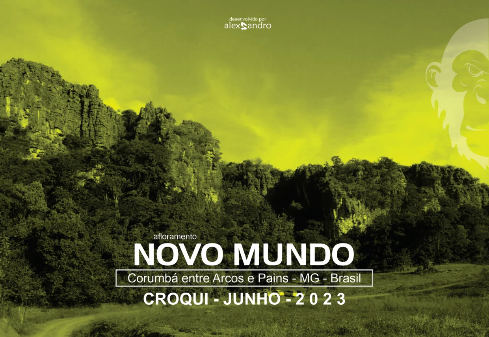
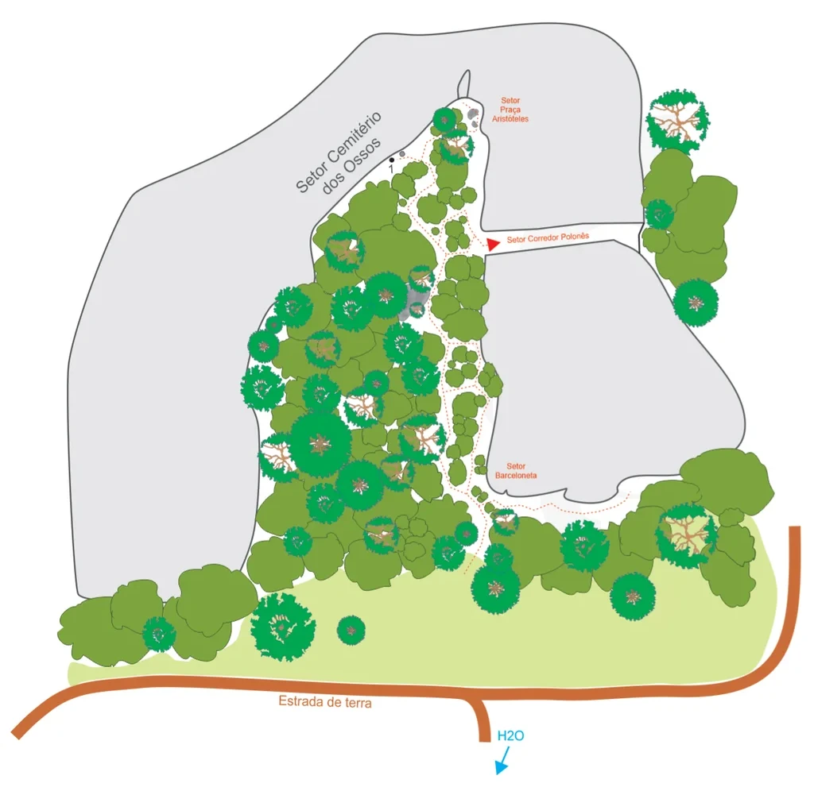
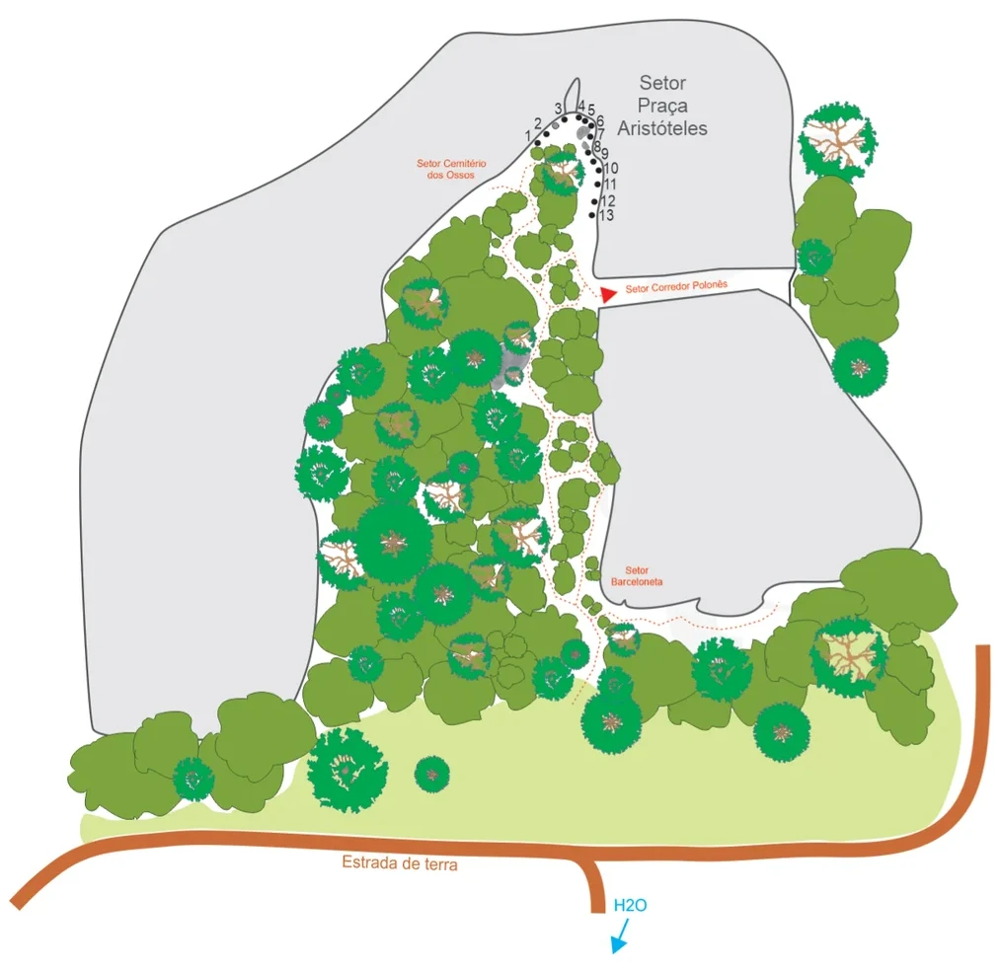
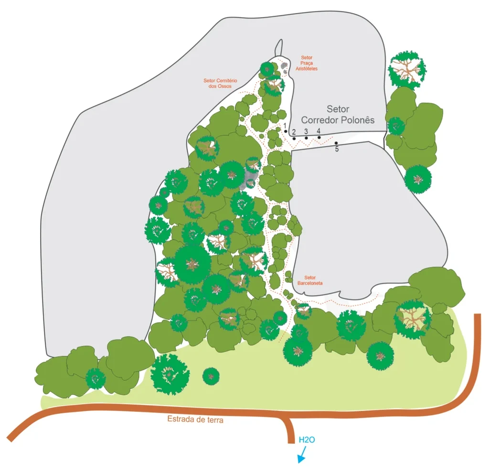
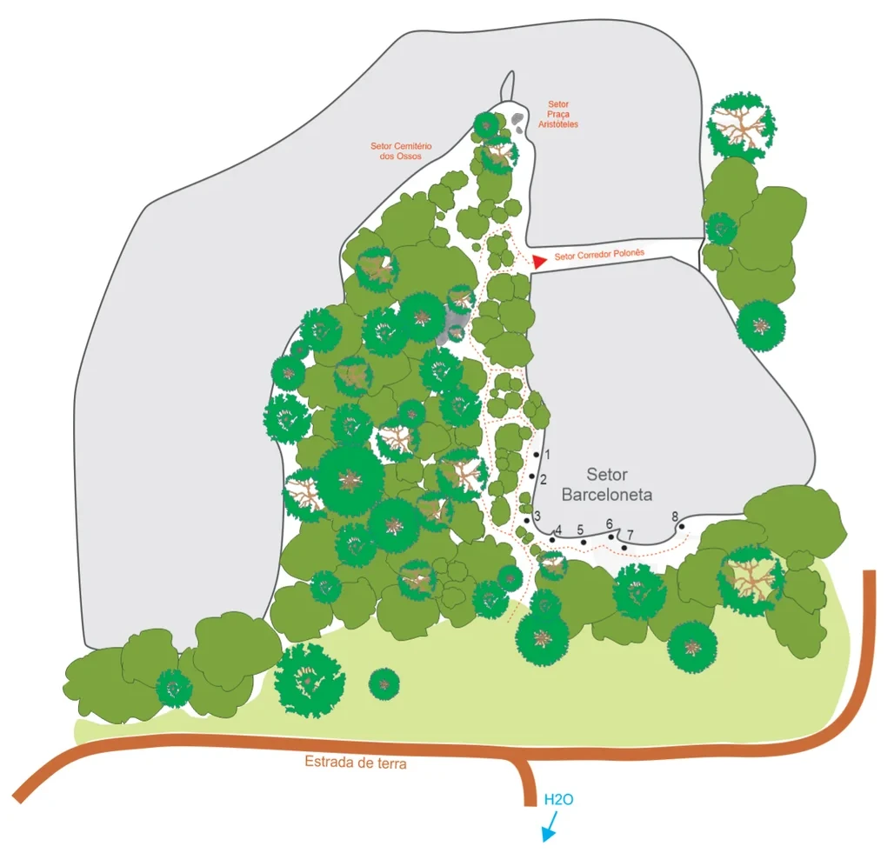
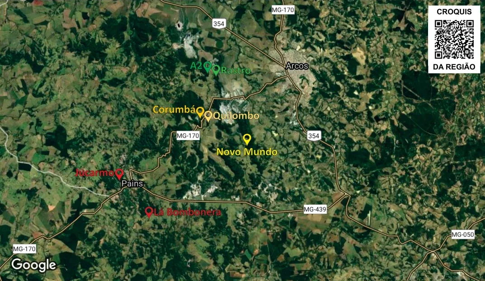
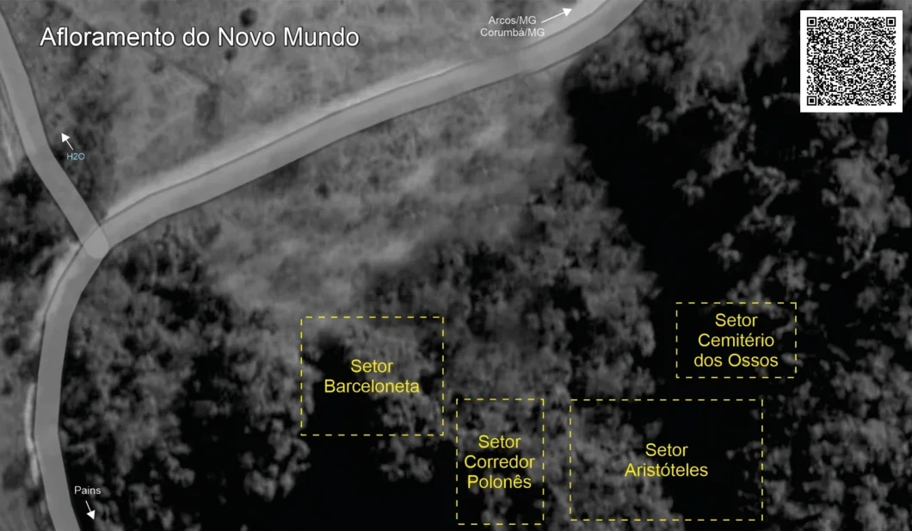

# Croqui: Afloramento Novo Mundo

## Informações Gerais

- **descricao**: Um belo afloramento de calcário localizado entre Arcos e Pains, com vias que variam do 5º ao 9º grau.
- **id**: br_mg_arcos_novo_mundo
- **nome**: Afloramento Novo Mundo
- **uid**: lK5vPq7hG9LKIk
- **creditos**:
  - alexsandro martins
  - Grupo de Trabalho
- **caminho_thumbnail**: 
- **revisado_manualmente**: True
- **status_desenho_extraivel**: NAO_TEM_DESENHO
- **botoes**:
  - **[0]**:
    - **uid**: hHVvMfTWi09mCB
    - **texto**: Capa
    - **destino**:
      - **secao_textual**:
        - **conteudo**:
            # afloramento NOVO MUNDO
            
            Corumbá entre Arcos e Pains - MG - Brasil
            
            |  |
            | :--: |
            | *Capa* |
            
            CROQUI - JUNHO - 2023
            
            Desenvolvido por: alexsandro
  - **[1]**:
    - **uid**: OEeCUqkFvVxFfV
    - **texto**: Observações Importantes
    - **destino**:
      - **secao_textual**:
        - **conteudo**:
            # Observações Importantes
            
            Este croqui é apenas um auxílio de consulta a localização, não serve como instruções a prática da escalada. Não nos responsabilizamos pelas informações aqui contidas, são apenas ponto de vista.
            
            ## ATENÇÃO
            
            Os nomes das vias, seus respectivos conquistadores e a graduação sugerida para cada uma delas são resultados de uma pesquisa oral conduzida entre os escaladores que frequentam o pico, uma vez que não foi encontrado nenhum registro prévio sobre o tema (exceto os guias anteriores). O resultado desse trabalho pode eventualmente conter erros, os quais peço que não sejam entendidos como desrespeito. O objetivo é documentar e divulgar a prática da escalada no centro-oeste mineiro da maneira mais exata possível.
            
            ## OBSERVAÇÃO
            
            Como algumas vias são de conquistadores desconhecidos foi utilizado apelido + (*) para identificá-las. Caso encontre algum engano nos dados citados neste croqui, peço que me envie a correção. Terei satisfação em atendê-lo, pois todos os envolvidos com a escalada tem a ganhar com o aprimoramento desse trabalho.
            
            Muito obrigado aos conquistadores e conquistadoras, **GRATIDÃO** a vocês sempre!!!
            
            Arte/Organização/Produção: **alexsandro martins** / 7ª versão / atualização 2023 / Revisão e graduação sugerida das vias: **Grupo de Trabalho**
            
            # SEJA CONSCIENTE!
            
            **UTILIZE APENAS AS TRILHAS PRINCIPAIS; As grutas não são banheiros!** Faça suas necessidades fisiológicas em casa, caso não consiga segurar, faça longe das pedras e cubra com folhas ou terra; **Leve todo seu lixo de volta** e o lixo de outros visitantes descuidados (inclusive papel higiênico, garrafas plásticas, bitucas, pontas, papel de bala...); Os animais locais e plantas nativas devem permanecer em seus lugares. Lembre-se que eles estão em seu habitat natural e precisam ser respeitados; Os animais domésticos (ex. cães) não devem ser trazidos a este local, desta forma, você os protege de doenças silvestres e vice versa; Fogueiras além de provocar queimadas, danificam o local; Estacione de maneira adequada e no local adequado a fim de não atrapalhar o fluxo de outros veículos; Utilize equipamentos de segurança e verifique seu estado de conservação; Cuidado com pedras soltas principalmente em setores e vias novas; Antes de conquistar uma via de escalada entre em contato com o GT.
  - **[2]**:
    - **uid**: UDV8TEtryl2lxI
    - **texto**: Parcerias
    - **destino**:
      - **secao_textual**:
        - **conteudo**:
            # Parcerias
            
            Parcerias na atualização do ano de 2023 dos croquis dos Afloramentos, Setores e Vias de Escaladas Esportiva em Arcos, Pains e Região - MG.
            
            |  |
            | :--: |
            | *Parcerias* |
            
            Para contribuir com esse trabalho e a próxima atualização:
            
            - **Contato/Informações:** @abrigobase
            - **Atualizações/Sugestões:** abrigobase@gmail.com
            - **Contribuição/Parceria:** Pix 37 99918-3634
- **ultima_migracao**: 5
- **publicar_croqui**: True
- **revisado_bounding_circle**: True

## Parte: setor_cemiterio_dos_ossos

### Setor (Pico: Novo Mundo)

- **descricao**:
    # Setor Cemitério dos Ossos
    
    Sombra de 7h as 13h (varia de acordo com a estação).
- **nome**: Setor Cemitério dos Ossos
- **uid**: sNFsCYKIltcEmd
- **mapas**:
  - **[0]**:
    - **caminho_imagem_mapa**: 
    - **largura_mapa**: 1024
    - **altura_mapa**: 996
    - **pontos_de_interesse**:
      - **[0]**:
        - **id**: xzAkKYZz1gJg6n
        - **uid**: xzAkKYZz1gJg6n
        - **rotulo**: 1
        - **retangulo**:
          - **x**: 491
          - **y**: 212
          - **comprimento**: 10
          - **largura**: 15
        - **label**: 1
      - **[1]**:
        - **id**: CDwDiT2KGPQjNr
        - **uid**: CDwDiT2KGPQjNr
        - **rotulo**: Setor Cemitério dos Ossos
        - **retangulo**:
          - **x**: 432
          - **y**: 196
          - **comprimento**: 50
          - **largura**: 148
          - **angulo_graus_x100**: 4685
        - **label**: Setor Cemitério dos Ossos
      - **[2]**:
        - **id**: VmQ8Ii1imXbu5U
        - **uid**: VmQ8Ii1imXbu5U
        - **rotulo**: Setor Praça Aristóteles
        - **retangulo**:
          - **x**: 644
          - **y**: 139
          - **comprimento**: 55
          - **largura**: 36
        - **label**: Setor Praça Aristóteles
      - **[3]**:
        - **id**: PBB5RwjdkMve7y
        - **uid**: PBB5RwjdkMve7y
        - **rotulo**: Setor Corredor Polonês
        - **retangulo**:
          - **x**: 688
          - **y**: 298
          - **comprimento**: 111
          - **largura**: 17
          - **angulo_graus_x100**: -237
        - **label**: Setor Corredor Polonês
      - **[4]**:
        - **id**: aGo2cDvcJny1IV
        - **uid**: aGo2cDvcJny1IV
        - **rotulo**: Setor Barceloneta
        - **retangulo**:
          - **x**: 647
          - **y**: 592
          - **comprimento**: 62
          - **largura**: 27
        - **label**: Setor Barceloneta
    - **referencias**:
      - **[0]**:
        - **alvo_uid**: JBnTQTRJAerhr1
        - **pontos_uids**:
          - xzAkKYZz1gJg6n
        - **escalada**: Dia da Maldade
        - **ids**:
          - xzAkKYZz1gJg6n
- **escaladas**:
  - **[0]**:
    - **uid**: JBnTQTRJAerhr1
    - **via_esportiva**:
      - **nome**: Dia da Maldade
      - **dificuldade**: INDEFINIDO
  - **[1]**:
    - **uid**: QBRI9nQlPqymuy
    - **via_movel**:
      - **descricao**: via em móvel
      - **nome**: Dente de Aço
      - **dificuldade**: INDEFINIDO
- **precomputados**:
  - **total_escaladas**: 2
  - **total_esportivas**: 1

## Parte: setor_aristoteles

### Setor (Pico: Novo Mundo)

- **descricao**:
    # Setor Aristóteles
    
    Sombra de 7h as 13h (varia de acordo com a estação).
    Também conhecido como Setor Praça Aristóteles.
- **nome**: Setor Aristóteles
- **uid**: yG7HVnmCLiTAY9
- **mapas**:
  - **[0]**:
    - **caminho_imagem_mapa**: 
    - **largura_mapa**: 1013
    - **altura_mapa**: 984
    - **pontos_de_interesse**:
      - **[0]**:
        - **id**: vztYiT1f9bu605
        - **uid**: vztYiT1f9bu605
        - **rotulo**: 1
        - **retangulo**:
          - **x**: 534
          - **y**: 136
          - **comprimento**: 9
          - **largura**: 14
        - **label**: 1
      - **[1]**:
        - **id**: mfUG9BMtjfj2bx
        - **uid**: mfUG9BMtjfj2bx
        - **rotulo**: 2
        - **retangulo**:
          - **x**: 545
          - **y**: 124
          - **comprimento**: 10
          - **largura**: 16
        - **label**: 2
      - **[2]**:
        - **id**: Ycj2MkKGvvCsAV
        - **uid**: Ycj2MkKGvvCsAV
        - **rotulo**: 3
        - **retangulo**:
          - **x**: 566
          - **y**: 109
          - **comprimento**: 13
          - **largura**: 14
        - **label**: 3
      - **[3]**:
        - **id**: E07n1xnfKgbQn9
        - **uid**: E07n1xnfKgbQn9
        - **rotulo**: 4
        - **retangulo**:
          - **x**: 588
          - **y**: 106
          - **comprimento**: 10
          - **largura**: 17
        - **label**: 4
      - **[4]**:
        - **id**: Qb7NBU0ko0vvmg
        - **uid**: Qb7NBU0ko0vvmg
        - **rotulo**: 5
        - **retangulo**:
          - **x**: 598
          - **y**: 110
          - **comprimento**: 9
          - **largura**: 14
        - **label**: 5
      - **[5]**:
        - **id**: 93I255gjqCeadW
        - **uid**: 93I255gjqCeadW
        - **rotulo**: 6
        - **retangulo**:
          - **x**: 608
          - **y**: 120
          - **comprimento**: 10
          - **largura**: 13
        - **label**: 6
      - **[6]**:
        - **id**: HuNd0I4B22iBPw
        - **uid**: HuNd0I4B22iBPw
        - **rotulo**: 7
        - **retangulo**:
          - **x**: 608
          - **y**: 136
          - **comprimento**: 11
          - **largura**: 15
        - **label**: 7
      - **[7]**:
        - **id**: EjCEuoNa2YnLDu
        - **uid**: EjCEuoNa2YnLDu
        - **rotulo**: 8
        - **retangulo**:
          - **x**: 604
          - **y**: 148
          - **comprimento**: 9
          - **largura**: 12
        - **label**: 8
      - **[8]**:
        - **id**: ntRcD0v1VuJr5M
        - **uid**: ntRcD0v1VuJr5M
        - **rotulo**: 9
        - **retangulo**:
          - **x**: 612
          - **y**: 156
          - **comprimento**: 9
          - **largura**: 14
        - **label**: 9
      - **[9]**:
        - **id**: qAS7j1Q9bNoP0U
        - **uid**: qAS7j1Q9bNoP0U
        - **rotulo**: 10
        - **retangulo**:
          - **x**: 618
          - **y**: 170
          - **comprimento**: 16
          - **largura**: 14
        - **label**: 10
      - **[10]**:
        - **id**: 8lxyjYrGguQIOs
        - **uid**: 8lxyjYrGguQIOs
        - **rotulo**: 11
        - **retangulo**:
          - **x**: 618
          - **y**: 186
          - **comprimento**: 14
          - **largura**: 14
        - **label**: 11
      - **[11]**:
        - **id**: wAuvlgFU0EobFt
        - **uid**: wAuvlgFU0EobFt
        - **rotulo**: 12
        - **retangulo**:
          - **x**: 616
          - **y**: 202
          - **comprimento**: 15
          - **largura**: 15
        - **label**: 12
      - **[12]**:
        - **id**: fPmjt3B6oAL2Sg
        - **uid**: fPmjt3B6oAL2Sg
        - **rotulo**: 13
        - **retangulo**:
          - **x**: 614
          - **y**: 218
          - **comprimento**: 16
          - **largura**: 13
        - **label**: 13
      - **[13]**:
        - **id**: iQbU2NTVX3TuZt
        - **uid**: iQbU2NTVX3TuZt
        - **rotulo**: Setor Cemitério dos Ossos
        - **retangulo**:
          - **x**: 456
          - **y**: 172
          - **comprimento**: 77
          - **largura**: 31
        - **label**: Setor Cemitério dos Ossos
      - **[14]**:
        - **id**: Qj6crHpBHsiwhH
        - **uid**: Qj6crHpBHsiwhH
        - **rotulo**: Setor Praça Aristóteles
        - **retangulo**:
          - **x**: 672
          - **y**: 105
          - **comprimento**: 97
          - **largura**: 64
        - **label**: Setor Praça Aristóteles
      - **[15]**:
        - **id**: LsqMA0AkwSQTdT
        - **uid**: LsqMA0AkwSQTdT
        - **rotulo**: Setor Corredor Polonês
        - **retangulo**:
          - **x**: 684
          - **y**: 290
          - **comprimento**: 110
          - **largura**: 17
          - **angulo_graus_x100**: -298
        - **label**: Setor Corredor Polonês
      - **[16]**:
        - **id**: oXlSISpNDYCTHD
        - **uid**: oXlSISpNDYCTHD
        - **rotulo**: Setor Barceloneta
        - **retangulo**:
          - **x**: 644
          - **y**: 584
          - **comprimento**: 52
          - **largura**: 27
        - **label**: Setor Barceloneta
      - **[17]**:
        - **id**: qhilyeLABi54Ms
        - **uid**: qhilyeLABi54Ms
        - **rotulo**: Estrada de terra
        - **retangulo**:
          - **x**: 406
          - **y**: 874
          - **comprimento**: 125
          - **largura**: 24
        - **label**: Estrada de terra
      - **[18]**:
        - **id**: PzXfHonvIvM0FX
        - **uid**: PzXfHonvIvM0FX
        - **rotulo**: H2O
        - **retangulo**:
          - **x**: 636
          - **y**: 918
          - **comprimento**: 47
          - **largura**: 18
        - **label**: H2O
    - **referencias**:
      - **[0]**:
        - **alvo_uid**: iaMqPwsPjNWSfe
        - **pontos_uids**:
          - vztYiT1f9bu605
        - **escalada**: 300 de Arcos
        - **ids**:
          - vztYiT1f9bu605
      - **[1]**:
        - **alvo_uid**: OdFs8JW9wCjtyG
        - **pontos_uids**:
          - mfUG9BMtjfj2bx
        - **escalada**: Efeito Dominó
        - **ids**:
          - mfUG9BMtjfj2bx
      - **[2]**:
        - **alvo_uid**: QArnublqT36RuD
        - **pontos_uids**:
          - Ycj2MkKGvvCsAV
        - **escalada**: Odisséia
        - **ids**:
          - Ycj2MkKGvvCsAV
      - **[3]**:
        - **alvo_uid**: ipUu1UD6kqROus
        - **pontos_uids**:
          - E07n1xnfKgbQn9
        - **escalada**: Nesse Ritmo Nosso, Não
        - **ids**:
          - E07n1xnfKgbQn9
      - **[4]**:
        - **alvo_uid**: 71EL7yY39CRffK
        - **pontos_uids**:
          - Qb7NBU0ko0vvmg
        - **escalada**: Danificada
        - **ids**:
          - Qb7NBU0ko0vvmg
      - **[5]**:
        - **alvo_uid**: o0fEVCB5chR8xp
        - **pontos_uids**:
          - 93I255gjqCeadW
        - **escalada**: Promessa é Dívida
        - **ids**:
          - 93I255gjqCeadW
      - **[6]**:
        - **alvo_uid**: lB4CJbHfhvNa5Y
        - **pontos_uids**:
          - HuNd0I4B22iBPw
        - **escalada**: Falsas Promessas
        - **ids**:
          - HuNd0I4B22iBPw
      - **[7]**:
        - **alvo_uid**: i8IAtTnSCcxNHU
        - **pontos_uids**:
          - EjCEuoNa2YnLDu
        - **escalada**: O Pagador de Promessa
        - **ids**:
          - EjCEuoNa2YnLDu
      - **[8]**:
        - **alvo_uid**: dtdxCPiOU2kvrV
        - **pontos_uids**:
          - ntRcD0v1VuJr5M
        - **escalada**: Incrível!
        - **ids**:
          - ntRcD0v1VuJr5M
      - **[9]**:
        - **alvo_uid**: Qy7MUAmrAar8U6
        - **pontos_uids**:
          - qAS7j1Q9bNoP0U
        - **escalada**: Espeleopemba
        - **ids**:
          - qAS7j1Q9bNoP0U
      - **[10]**:
        - **alvo_uid**: UvcX0dlmT5PdgT
        - **pontos_uids**:
          - 8lxyjYrGguQIOs
        - **escalada**: sem nome
        - **ids**:
          - 8lxyjYrGguQIOs
      - **[11]**:
        - **alvo_uid**: UvcX0dlmT5PdgT
        - **pontos_uids**:
          - wAuvlgFU0EobFt
        - **escalada**: sem nome
        - **ids**:
          - wAuvlgFU0EobFt
      - **[12]**:
        - **alvo_uid**: 2LpopgHkNt8V9Y
        - **pontos_uids**:
          - fPmjt3B6oAL2Sg
        - **escalada**: via inacabada
        - **ids**:
          - fPmjt3B6oAL2Sg
- **escaladas**:
  - **[0]**:
    - **uid**: iaMqPwsPjNWSfe
    - **via_esportiva**:
      - **nome**: 300 de Arcos
      - **dificuldade**: BR_7B_BARRA_7C
      - **extensao**: 30
      - **data_abertura**: 2022
  - **[1]**:
    - **uid**: OdFs8JW9wCjtyG
    - **via_esportiva**:
      - **descricao**: 7c - 30mt
      - **nome**: Efeito Dominó
      - **dificuldade**: BR_7C
      - **extensao**: 30
  - **[2]**:
    - **uid**: nIOWzLtH4ywz3K
    - **via_movel**:
      - **descricao**: sem nome
      - **nome**: via em móvel
      - **dificuldade**: INDEFINIDO
  - **[3]**:
    - **uid**: QArnublqT36RuD
    - **via_esportiva**:
      - **descricao**: 8a - 40mt
      - **nome**: Odisséia
      - **dificuldade**: BR_8A
      - **extensao**: 40
  - **[4]**:
    - **uid**: ipUu1UD6kqROus
    - **via_esportiva**:
      - **nome**: Nesse Ritmo Nosso, Não
      - **dificuldade**: BR_7A
      - **destaque**: True
      - **extensao**: 25
      - **quantidade_protecoes_intermediarias**: 10
      - **quantidade_protecoes_parada**: 2
  - **[5]**:
    - **uid**: 71EL7yY39CRffK
    - **via_esportiva**:
      - **nome**: Danificada
      - **dificuldade**: BR_5SUP
      - **extensao**: 25
      - **quantidade_protecoes_intermediarias**: 9
      - **quantidade_protecoes_parada**: 2
  - **[6]**:
    - **uid**: o0fEVCB5chR8xp
    - **via_esportiva**:
      - **nome**: Promessa é Dívida
      - **dificuldade**: BR_5
      - **destaque**: True
      - **extensao**: 25
      - **quantidade_protecoes_intermediarias**: 7
      - **quantidade_protecoes_parada**: 2
  - **[7]**:
    - **uid**: lB4CJbHfhvNa5Y
    - **via_esportiva**:
      - **nome**: Falsas Promessas
      - **dificuldade**: BR_8C_BARRA_9A
      - **extensao**: 25
      - **quantidade_protecoes_intermediarias**: 13
      - **quantidade_protecoes_parada**: 2
  - **[8]**:
    - **uid**: i8IAtTnSCcxNHU
    - **via_esportiva**:
      - **nome**: O Pagador de Promessa
      - **dificuldade**: BR_8B_BARRA_8C
      - **destaque**: True
      - **extensao**: 25
      - **quantidade_protecoes_intermediarias**: 10
      - **quantidade_protecoes_parada**: 2
  - **[9]**:
    - **uid**: dtdxCPiOU2kvrV
    - **via_esportiva**:
      - **nome**: Incrível!
      - **dificuldade**: BR_7C
      - **extensao**: 25
      - **quantidade_protecoes_intermediarias**: 11
      - **quantidade_protecoes_parada**: 2
  - **[10]**:
    - **uid**: Qy7MUAmrAar8U6
    - **via_esportiva**:
      - **nome**: Espeleopemba
      - **dificuldade**: BR_6SUP
      - **extensao**: 25
      - **quantidade_protecoes_intermediarias**: 10
      - **quantidade_protecoes_parada**: 2
  - **[11]**:
    - **uid**: RVX0rTuZGZlehE
    - **via_esportiva**:
      - **nome**: sem nome
      - **dificuldade**: INDEFINIDO
  - **[12]**:
    - **uid**: UvcX0dlmT5PdgT
    - **via_esportiva**:
      - **nome**: sem nome
      - **dificuldade**: INDEFINIDO
  - **[13]**:
    - **uid**: 2LpopgHkNt8V9Y
    - **via_esportiva**:
      - **nome**: via inacabada
      - **dificuldade**: INDEFINIDO
- **precomputados**:
  - **total_escaladas**: 14
  - **total_esportivas**: 13

## Parte: setor_corredor_polones

### Setor (Pico: Novo Mundo)

- **descricao**:
    # Setor Corredor Polonês
    
    Sombra o dia todo (varia de acordo com a estação).
- **nome**: Setor Corredor Polonês
- **uid**: 0Im8sPD9odkqAH
- **mapas**:
  - **[0]**:
    - **caminho_imagem_mapa**: 
    - **largura_mapa**: 1026
    - **altura_mapa**: 990
    - **pontos_de_interesse**:
      - **[0]**:
        - **id**: xJ7MAl2SIioU4j
        - **uid**: xJ7MAl2SIioU4j
        - **rotulo**: 1
        - **retangulo**:
          - **x**: 596
          - **y**: 262
          - **comprimento**: 12
          - **largura**: 15
        - **label**: 1
      - **[1]**:
        - **id**: PTJFbgfEQBXzQ9
        - **uid**: PTJFbgfEQBXzQ9
        - **rotulo**: 2
        - **retangulo**:
          - **x**: 615
          - **y**: 276
          - **comprimento**: 12
          - **largura**: 15
        - **label**: 2
      - **[2]**:
        - **id**: apGfTa7shGnEOi
        - **uid**: apGfTa7shGnEOi
        - **rotulo**: 3
        - **retangulo**:
          - **x**: 641
          - **y**: 274
          - **comprimento**: 12
          - **largura**: 15
        - **label**: 3
      - **[3]**:
        - **id**: UPwAIcOCTpx2bq
        - **uid**: UPwAIcOCTpx2bq
        - **rotulo**: 4
        - **retangulo**:
          - **x**: 667
          - **y**: 274
          - **comprimento**: 12
          - **largura**: 15
        - **label**: 4
      - **[4]**:
        - **id**: slQC69Xc5VDcmZ
        - **uid**: slQC69Xc5VDcmZ
        - **rotulo**: 5
        - **retangulo**:
          - **x**: 706
          - **y**: 310
          - **comprimento**: 12
          - **largura**: 15
        - **label**: 5
      - **[5]**:
        - **id**: luVFsysI9siXYD
        - **uid**: luVFsysI9siXYD
        - **rotulo**: Setor Praça Aristóteles
        - **retangulo**:
          - **x**: 642
          - **y**: 130
          - **comprimento**: 49
          - **largura**: 41
        - **label**: Setor Praça Aristóteles
      - **[6]**:
        - **id**: B684qLQjLO3bHY
        - **uid**: B684qLQjLO3bHY
        - **rotulo**: Setor Cemitério dos Ossos
        - **retangulo**:
          - **x**: 461
          - **y**: 174
          - **comprimento**: 70
          - **largura**: 27
        - **label**: Setor Cemitério dos Ossos
      - **[7]**:
        - **id**: pg19xdGw1b7PVA
        - **uid**: pg19xdGw1b7PVA
        - **rotulo**: Setor Corredor Polonês
        - **retangulo**:
          - **x**: 710
          - **y**: 238
          - **comprimento**: 158
          - **largura**: 43
        - **label**: Setor Corredor Polonês
      - **[8]**:
        - **id**: bRQEaEfBvSb5lR
        - **uid**: bRQEaEfBvSb5lR
        - **rotulo**: Setor Barceloneta
        - **retangulo**:
          - **x**: 650
          - **y**: 587
          - **comprimento**: 62
          - **largura**: 28
        - **label**: Setor Barceloneta
      - **[9]**:
        - **id**: iVuMIilL9CV8y3
        - **uid**: iVuMIilL9CV8y3
        - **rotulo**: Estrada de terra
        - **retangulo**:
          - **x**: 408
          - **y**: 879
          - **comprimento**: 125
          - **largura**: 26
        - **label**: Estrada de terra
      - **[10]**:
        - **id**: HqXm0mCk4q2bP4
        - **uid**: HqXm0mCk4q2bP4
        - **rotulo**: H2O
        - **retangulo**:
          - **x**: 638
          - **y**: 920
          - **comprimento**: 43
          - **largura**: 22
        - **label**: H2O
    - **referencias**:
      - **[0]**:
        - **alvo_uid**: u5eZL6arSJNrwW
        - **pontos_uids**:
          - xJ7MAl2SIioU4j
        - **escalada**: Questa Aresta
        - **ids**:
          - xJ7MAl2SIioU4j
      - **[1]**:
        - **alvo_uid**: m2rdZEflyEcUtd
        - **pontos_uids**:
          - PTJFbgfEQBXzQ9
        - **escalada**: Bonitinha Mais Ordinária
        - **ids**:
          - PTJFbgfEQBXzQ9
      - **[2]**:
        - **alvo_uid**: vbAp5DkE1FUXjd
        - **pontos_uids**:
          - apGfTa7shGnEOi
        - **escalada**: Aperta Que Fica
        - **ids**:
          - apGfTa7shGnEOi
      - **[3]**:
        - **alvo_uid**: gCNK3FiPmKN56f
        - **pontos_uids**:
          - UPwAIcOCTpx2bq
        - **escalada**: Tem Gente que Tenta o Cão
        - **ids**:
          - UPwAIcOCTpx2bq
      - **[4]**:
        - **alvo_uid**: Yg3XqujZP8dvg3
        - **pontos_uids**:
          - slQC69Xc5VDcmZ
        - **escalada**: Rolling Stones
        - **ids**:
          - slQC69Xc5VDcmZ
- **escaladas**:
  - **[0]**:
    - **uid**: u5eZL6arSJNrwW
    - **via_esportiva**:
      - **nome**: Questa Aresta
      - **dificuldade**: BR_7A
      - **destaque**: True
      - **data_abertura**: 2018
  - **[1]**:
    - **uid**: m2rdZEflyEcUtd
    - **via_esportiva**:
      - **nome**: Bonitinha Mais Ordinária
      - **dificuldade**: INDEFINIDO
      - **data_abertura**: 2018
  - **[2]**:
    - **uid**: vbAp5DkE1FUXjd
    - **via_esportiva**:
      - **nome**: Aperta Que Fica
      - **dificuldade**: INDEFINIDO
      - **data_abertura**: 2018
  - **[3]**:
    - **uid**: gCNK3FiPmKN56f
    - **via_esportiva**:
      - **nome**: Tem Gente que Tenta o Cão
      - **dificuldade**: INDEFINIDO
      - **destaque**: True
      - **data_abertura**: 2018
  - **[4]**:
    - **uid**: Yg3XqujZP8dvg3
    - **via_esportiva**:
      - **nome**: Rolling Stones
      - **dificuldade**: BR_6SUP
      - **destaque**: True
      - **quantidade_protecoes_intermediarias**: 8
      - **quantidade_protecoes_parada**: 2
      - **data_abertura**: 2018
- **precomputados**:
  - **total_escaladas**: 5
  - **total_esportivas**: 5

## Parte: setor_barceloneta

### Setor (Pico: Novo Mundo)

- **descricao**:
    # Setor Barceloneta
    
    Sombra das 7h as 12h (varia de acordo com a estação).
- **nome**: Setor Barceloneta
- **uid**: yy0t8zuwWuZbNZ
- **mapas**:
  - **[0]**:
    - **caminho_imagem_mapa**: 
    - **largura_mapa**: 1028
    - **altura_mapa**: 981
    - **pontos_de_interesse**:
      - **[0]**:
        - **id**: nOCGwLwLA4Dlzw
        - **uid**: nOCGwLwLA4Dlzw
        - **rotulo**: 1
        - **retangulo**:
          - **x**: 629
          - **y**: 522
          - **comprimento**: 12
          - **largura**: 15
        - **label**: 1
      - **[1]**:
        - **id**: yVQ5Od3PAKs57d
        - **uid**: yVQ5Od3PAKs57d
        - **rotulo**: 2
        - **retangulo**:
          - **x**: 625
          - **y**: 552
          - **comprimento**: 12
          - **largura**: 15
        - **label**: 2
      - **[2]**:
        - **id**: 8MRsM0fD0AgZZE
        - **uid**: 8MRsM0fD0AgZZE
        - **rotulo**: 3
        - **retangulo**:
          - **x**: 618
          - **y**: 594
          - **comprimento**: 12
          - **largura**: 15
        - **label**: 3
      - **[3]**:
        - **id**: H7k9D8txuBYAUy
        - **uid**: H7k9D8txuBYAUy
        - **rotulo**: 4
        - **retangulo**:
          - **x**: 642
          - **y**: 610
          - **comprimento**: 12
          - **largura**: 15
        - **label**: 4
      - **[4]**:
        - **id**: JPRCaHJOwALhnD
        - **uid**: JPRCaHJOwALhnD
        - **rotulo**: 5
        - **retangulo**:
          - **x**: 667
          - **y**: 608
          - **comprimento**: 12
          - **largura**: 15
        - **label**: 5
      - **[5]**:
        - **id**: HHJFmg9WfBZSQ3
        - **uid**: HHJFmg9WfBZSQ3
        - **rotulo**: 6
        - **retangulo**:
          - **x**: 701
          - **y**: 602
          - **comprimento**: 12
          - **largura**: 15
        - **label**: 6
      - **[6]**:
        - **id**: COv7XCYwR0ceWk
        - **uid**: COv7XCYwR0ceWk
        - **rotulo**: 7
        - **retangulo**:
          - **x**: 724
          - **y**: 614
          - **comprimento**: 12
          - **largura**: 15
        - **label**: 7
      - **[7]**:
        - **id**: uKxPglajD9KCdS
        - **uid**: uKxPglajD9KCdS
        - **rotulo**: 8
        - **retangulo**:
          - **x**: 776
          - **y**: 594
          - **comprimento**: 12
          - **largura**: 15
        - **label**: 8
      - **[8]**:
        - **id**: uS9g2ytm3Qrq68
        - **uid**: uS9g2ytm3Qrq68
        - **rotulo**: Setor Praça Aristóteles
        - **retangulo**:
          - **x**: 643
          - **y**: 132
          - **comprimento**: 50
          - **largura**: 38
        - **label**: Setor Praça Aristóteles
      - **[9]**:
        - **id**: hXXaFfvCVO95jK
        - **uid**: hXXaFfvCVO95jK
        - **rotulo**: Setor Cemitério dos Ossos
        - **retangulo**:
          - **x**: 462
          - **y**: 172
          - **comprimento**: 70
          - **largura**: 27
        - **label**: Setor Cemitério dos Ossos
      - **[10]**:
        - **id**: RWfWu7iIp1uRai
        - **uid**: RWfWu7iIp1uRai
        - **rotulo**: Setor Corredor Polonês
        - **retangulo**:
          - **x**: 688
          - **y**: 293
          - **comprimento**: 105
          - **largura**: 16
          - **angulo_graus_x100**: -322
        - **label**: Setor Corredor Polonês
      - **[11]**:
        - **id**: SOex3eXQalobGV
        - **uid**: SOex3eXQalobGV
        - **rotulo**: Setor Barceloneta
        - **retangulo**:
          - **x**: 698
          - **y**: 556
          - **comprimento**: 111
          - **largura**: 46
        - **label**: Setor Barceloneta
      - **[12]**:
        - **id**: DrkYWj80SnXhIb
        - **uid**: DrkYWj80SnXhIb
        - **rotulo**: Estrada de terra
        - **retangulo**:
          - **x**: 410
          - **y**: 875
          - **comprimento**: 125
          - **largura**: 26
        - **label**: Estrada de terra
      - **[13]**:
        - **id**: LrsX9n6nNAJLN8
        - **uid**: LrsX9n6nNAJLN8
        - **rotulo**: H2O
        - **retangulo**:
          - **x**: 638
          - **y**: 919
          - **comprimento**: 43
          - **largura**: 22
        - **label**: H2O
    - **referencias**:
      - **[0]**:
        - **alvo_uid**: 7OtKwDrbYqLRyE
        - **pontos_uids**:
          - nOCGwLwLA4Dlzw
        - **escalada**: Dois Dedos pra Cima
        - **ids**:
          - nOCGwLwLA4Dlzw
      - **[1]**:
        - **alvo_uid**: I9d1jjmsTebagX
        - **pontos_uids**:
          - yVQ5Od3PAKs57d
        - **escalada**: Bela, Recatada e do Climb
        - **ids**:
          - yVQ5Od3PAKs57d
      - **[2]**:
        - **alvo_uid**: k4RSKGTOCdbFQH
        - **pontos_uids**:
          - 8MRsM0fD0AgZZE
        - **escalada**: Manteiga de Sucuri
        - **ids**:
          - 8MRsM0fD0AgZZE
      - **[3]**:
        - **alvo_uid**: JYyoagG79FG8Gt
        - **pontos_uids**:
          - H7k9D8txuBYAUy
        - **escalada**: Nova Era
        - **ids**:
          - H7k9D8txuBYAUy
      - **[4]**:
        - **alvo_uid**: i4gSeLskWqfZzf
        - **pontos_uids**:
          - JPRCaHJOwALhnD
        - **escalada**: Novo Mundo
        - **ids**:
          - JPRCaHJOwALhnD
      - **[5]**:
        - **alvo_uid**: A03QQTdLF53oEd
        - **pontos_uids**:
          - HHJFmg9WfBZSQ3
        - **escalada**: Chora Chorrera
        - **ids**:
          - HHJFmg9WfBZSQ3
      - **[6]**:
        - **alvo_uid**: AEgjYOc7r00UAx
        - **pontos_uids**:
          - COv7XCYwR0ceWk
        - **escalada**: Inocência de Um Purista
        - **ids**:
          - COv7XCYwR0ceWk
      - **[7]**:
        - **alvo_uid**: 4BIeYEFIf6hqxB
        - **pontos_uids**:
          - uKxPglajD9KCdS
        - **escalada**: Maldita Dependência
        - **ids**:
          - uKxPglajD9KCdS
- **escaladas**:
  - **[0]**:
    - **uid**: 7OtKwDrbYqLRyE
    - **via_esportiva**:
      - **nome**: Dois Dedos pra Cima
      - **data_abertura**: 2016
      - **dificuldade**: BR_7A
  - **[1]**:
    - **uid**: I9d1jjmsTebagX
    - **via_esportiva**:
      - **nome**: Bela, Recatada e do Climb
      - **dificuldade**: BR_7C
      - **data_abertura**: 15/05/2016
  - **[2]**:
    - **uid**: k4RSKGTOCdbFQH
    - **via_esportiva**:
      - **nome**: Manteiga de Sucuri
      - **dificuldade**: BR_8A
      - **data_abertura**: 15/05/2016
  - **[3]**:
    - **uid**: JYyoagG79FG8Gt
    - **via_esportiva**:
      - **nome**: Nova Era
      - **destaque**: True
      - **dificuldade**: INDEFINIDO
      - **data_abertura**: 2016
  - **[4]**:
    - **uid**: i4gSeLskWqfZzf
    - **via_esportiva**:
      - **nome**: Novo Mundo
      - **destaque**: True
      - **dificuldade**: BR_7C
      - **data_abertura**: 2016
  - **[5]**:
    - **uid**: A03QQTdLF53oEd
    - **via_esportiva**:
      - **nome**: Chora Chorrera
      - **dificuldade**: BR_7B
      - **data_abertura**: 2016
  - **[6]**:
    - **uid**: AEgjYOc7r00UAx
    - **via_esportiva**:
      - **nome**: Inocência de Um Purista
      - **dificuldade**: BR_7A
      - **quantidade_protecoes_intermediarias**: 8
      - **quantidade_protecoes_parada**: 2
      - **data_abertura**: 2016
  - **[7]**:
    - **uid**: 4BIeYEFIf6hqxB
    - **via_esportiva**:
      - **nome**: Maldita Dependência
      - **dificuldade**: BR_7A
      - **data_abertura**: 2016
- **precomputados**:
  - **total_escaladas**: 8
  - **total_esportivas**: 8

## Arquivos Externos

- **arquivos_externos**:
  - **[0]**:
    - **caminho**: 
    - **checksum_sha256**: 1edb610d3a0c7597deeffd8b501e453d4d33c1011a28a5af18774748bafaa667
  - **[1]**:
    - **caminho**: 
    - **checksum_sha256**: f2e2caad4db49af4453b787aff578a29cc115b9d779991d9c2c2fb9617174212
  - **[2]**:
    - **caminho**: 
    - **checksum_sha256**: 8873fa4d36b194ff8552d8ed497316cb23bbb3860b475aba9729d78f44529560
  - **[3]**:
    - **caminho**: 
    - **checksum_sha256**: 63d90792d83a83374ad9e008392dcc49cc16ed9bef41a3e52a86c0b96c83aee4
  - **[4]**:
    - **caminho**: 
    - **checksum_sha256**: bb3e88fad504b0bace1b82b2c3c487e039549a712ec1bd6da3657608ee5ed65b
  - **[5]**:
    - **caminho**: 
    - **checksum_sha256**: 95c89ee8d169fa867b7951f40338d54702516c676831d11d5f7678e7cd4c6d5e
  - **[6]**:
    - **caminho**: 
    - **checksum_sha256**: dbe8f41ca748176ddaf815dd142dc57473de0611dd536b85ef956694380a7182
  - **[7]**:
    - **caminho**: 
    - **checksum_sha256**: fc7610a0413cdd5ef0f98a49d85296c2fec2ba5acd16e95388af54c1039308a4

