# Croqui: Afloramento Rastro

## Informações Gerais

- **descricao**: Croqui do Afloramento Rastro em Arcos, Minas Gerais.
- **id**: br_mg_arcos_rastro
- **nome**: Afloramento Rastro
- **caminho_thumbnail**: 
- **revisado_manualmente**: True
- **status_desenho_extraivel**: NAO_TEM_DESENHO
- **botoes**:
  - **[0]**:
    - **texto**: Capa
    - **destino**:
      - **secao_textual**:
        - **conteudo**:
            |  |
            | :--: |
            | *capa* |
            
            # afloramento RASTRO
            ## Arcos - MG - Brasil
            ## CROQUI - JUNHO - 2023
            
            Desenvolvido por: alexsandro
  - **[1]**:
    - **texto**: Atenção e Regras
    - **destino**:
      - **secao_textual**:
        - **conteudo**:
            # Atenção e Regras
            
            Este croqui é apenas um auxílio de consulta a localização, não serve como instruções a prática da escalada. Não nos responsabilizamos pelas informações aqui contidas, são apenas ponto de vista.
            
            ## ATENÇÃO
            Os nomes das vias, seus respectivos conquistadores e a graduação sugerida para cada uma delas são resultados de uma pesquisa oral conduzida entre os escaladores que frequentam o pico, uma vez que não foi encontrado nenhum registro prévio sobre o tema (exceto os guias anteriores). O resultado desse trabalho pode eventualmente conter erros, os quais peço que não sejam entendidos como desrespeito. O objetivo é documentar e divulgar a prática da escalada no centro-oeste mineiro da maneira mais exata possível.
            
            ## OBSERVAÇÃO
            Como algumas vias são de conquistadores desconhecidos foi utilizado apelido + (*) para identificá-las. Caso encontre algum engano nos dados citados neste croqui, peço que me envie a correção. Terei satisfação em atendê-lo, pois todos os envolvidos com a escalada tem a ganhar com o aprimoramento desse trabalho.
            
            Muito obrigado aos conquistadores e conquistadoras, **GRATIDÃO** a vocês sempre!!!
            
            Arte/Organização/Produção: **alexsandro martins** / 7ª versão / atualização 2023 / Revisão e graduação sugerida das vias: **Grupo de Trabalho**
            
            ## SEJA CONSCIENTE!
            - **UTILIZE APENAS AS TRILHAS PRINCIPAIS**;
            - **As grutas não são banheiros!** Faça suas necessidades fisiológicas em casa, caso não consiga segurar, faça longe das pedras e cubra com folhas ou terra;
            - **Leve todo seu lixo de volta** e o lixo de outros visitantes descuidados (inclusive papel higiênico, garrafas plásticas, bitucas, pontas, papel de bala...);
            - Os animais locais e plantas nativas devem permanecer em seus lugares. Lembre-se que eles estão em seu habitat natural e precisam ser respeitados;
            - Os animais domésticos (ex. cães) não devem ser trazidos a este local, desta forma, você os protege de doenças silvestres e vice versa;
            - Fogueiras além de provocar queimadas, danificam o local;
            - Estacione de maneira adequada e no local adequado a fim de não atrapalhar o fluxo de outros veículos;
            - Utilize equipamentos de segurança e verifique seu estado de conservação;
            - Cuidado com pedras soltas principalmente em setores e vias novas;
            - Antes de conquistar uma via de escalada entre em contato com o GT.
  - **[2]**:
    - **texto**: Parcerias e Contato
    - **destino**:
      - **secao_textual**:
        - **conteudo**:
            # Parcerias e Contato
            
            Parcerias na atualização do ano de 2023 dos croquis dos Afloramentos, Setores e Vias de Escaladas Esportiva em Arcos, Pains e Região - MG.
            
            |  |
            | :--: |
            | *Parceiros* |
            
            ## Parceiros
            - **Abrigo Base**
            - **Magnésio 22**
            - **Kmon Escalada**
            - **Quero Escalar**
            - **Meka Coffee Bar**
            - **Borges Café**
            - **Brand's re Soul**
            - **100 Betas Ginásio de Escalada**
            
            ---
            
            ## Contato e Apoio
            Para contribuir com esse trabalho e a próxima atualização:
            
            - **Contato/Informações**: [@abrigobase](https://www.instagram.com/abrigobase)
            - **Atualizações/Sugestões**: abrigobase@gmail.com
            - **Contribuição/Parceria (PIX)**: 37 99918-3634
- **ultima_migracao**: 4
- **publicar_croqui**: True
- **revisado_bounding_circle**: True
- **creditos**:
  - Alexsandro

## Parte: setor_zona_leste

### Setor (Pico: Afloramento Rastro)

- **descricao**:
    # Setor Zona Leste
    
    Este setor oferece vias de 6º a 7c grau, com sombra o dia todo (variando de acordo com a estação).
- **nome**: Setor Zona Leste
- **mapas**:
  - **[0]**:
    - **caminho_imagem_mapa**: 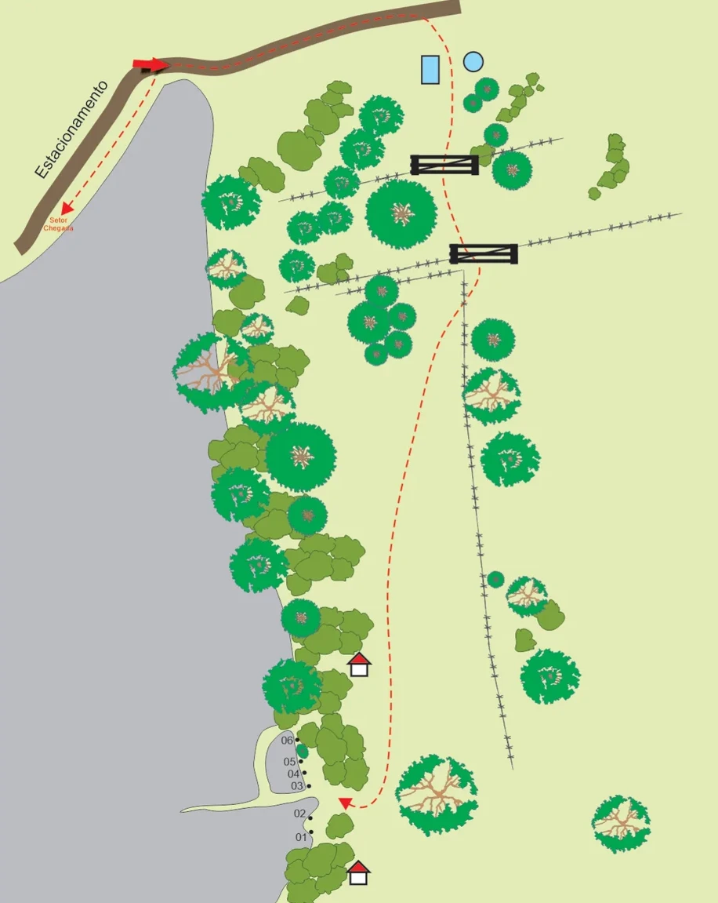
    - **largura_mapa**: 916
    - **altura_mapa**: 1151
    - **pontos_de_interesse**:
      - **[0]**:
        - **id**: Setor_Chegada
        - **label**: Setor Chegada
        - **retangulo**:
          - **x**: 74
          - **y**: 286
          - **comprimento**: 45
          - **largura**: 29
      - **[1]**:
        - **id**: 01
        - **label**: 01
        - **retangulo**:
          - **x**: 384
          - **y**: 1067
          - **comprimento**: 24
          - **largura**: 18
      - **[2]**:
        - **id**: 02
        - **label**: 02
        - **retangulo**:
          - **x**: 382
          - **y**: 1036
          - **comprimento**: 21
          - **largura**: 17
      - **[3]**:
        - **id**: 03
        - **label**: 03
        - **retangulo**:
          - **x**: 380
          - **y**: 1002
          - **comprimento**: 23
          - **largura**: 16
      - **[4]**:
        - **id**: 04
        - **label**: 04
        - **retangulo**:
          - **x**: 375
          - **y**: 986
          - **comprimento**: 22
          - **largura**: 15
      - **[5]**:
        - **id**: 05
        - **label**: 05
        - **retangulo**:
          - **x**: 370
          - **y**: 970
          - **comprimento**: 22
          - **largura**: 17
      - **[6]**:
        - **id**: 06
        - **label**: 06
        - **retangulo**:
          - **x**: 366
          - **y**: 943
          - **comprimento**: 22
          - **largura**: 18
    - **referencias**:
      - **[0]**:
        - **escalada**: Machado de Xangô
        - **ids**:
          - 01
      - **[1]**:
        - **escalada**: Babylon Burn
        - **ids**:
          - 02
      - **[2]**:
        - **escalada**: Eterno Aprendiz
        - **ids**:
          - 03
      - **[3]**:
        - **escalada**: Último Pacto
        - **ids**:
          - 04
      - **[4]**:
        - **escalada**: Resistência Cultural
        - **ids**:
          - 05
      - **[5]**:
        - **escalada**: Respeito é pra quem tem
        - **ids**:
          - 06
      - **[6]**:
        - **ids**:
          - Setor_Chegada
        - **setor**: Setor Chegada
- **escaladas**:
  - **[0]**:
    - **via_esportiva**:
      - **nome**: Machado de Xangô
      - **data_abertura**: 2020
      - **dificuldade**: PROJETO
      - **quantidade_protecoes_intermediarias**: 5
      - **quantidade_protecoes_parada**: 2
  - **[1]**:
    - **via_esportiva**:
      - **nome**: Babylon Burn
      - **destaque**: True
      - **data_abertura**: 2020
      - **dificuldade**: BR_7C
      - **quantidade_protecoes_intermediarias**: 5
      - **quantidade_protecoes_parada**: 2
  - **[2]**:
    - **via_esportiva**:
      - **nome**: Eterno Aprendiz
      - **destaque**: True
      - **data_abertura**: 2020
      - **dificuldade**: BR_6
      - **quantidade_protecoes_intermediarias**: 5
      - **quantidade_protecoes_parada**: 2
  - **[3]**:
    - **via_esportiva**:
      - **nome**: Último Pacto
      - **destaque**: True
      - **data_abertura**: 2020
      - **dificuldade**: BR_7C
      - **quantidade_protecoes_intermediarias**: 7
      - **quantidade_protecoes_parada**: 2
  - **[4]**:
    - **via_esportiva**:
      - **nome**: Resistência Cultural
      - **data_abertura**: 2020
      - **destaque**: True
      - **dificuldade**: BR_7C
      - **quantidade_protecoes_intermediarias**: 6
      - **quantidade_protecoes_parada**: 2
  - **[5]**:
    - **via_esportiva**:
      - **nome**: Respeito é pra quem tem
      - **data_abertura**: 2020
      - **destaque**: True
      - **dificuldade**: BR_7B_BARRA_7C
      - **quantidade_protecoes_intermediarias**: 6
      - **quantidade_protecoes_parada**: 2
- **precomputados**:
  - **total_escaladas**: 6
  - **total_esportivas**: 6
  - **total_moveis**: 0
  - **total_boulders**: 0
  - **total_multiplas_enfiadas**: 0
  - **total_highlines**: 0

## Parte: setor_chegada

### Setor (Pico: Afloramento Rastro)

- **descricao**:
    # Setor Chegada
    
    Este setor é o primeiro contato com o afloramento. Possui sombra até as 12h (variando de acordo com a estação).
    
    **Observações**:
    - OBS.I: Caixa de Abelha próxima às vias 07 e 08.
- **nome**: Setor Chegada
- **mapas**:
  - **[0]**:
    - **caminho_imagem_mapa**: 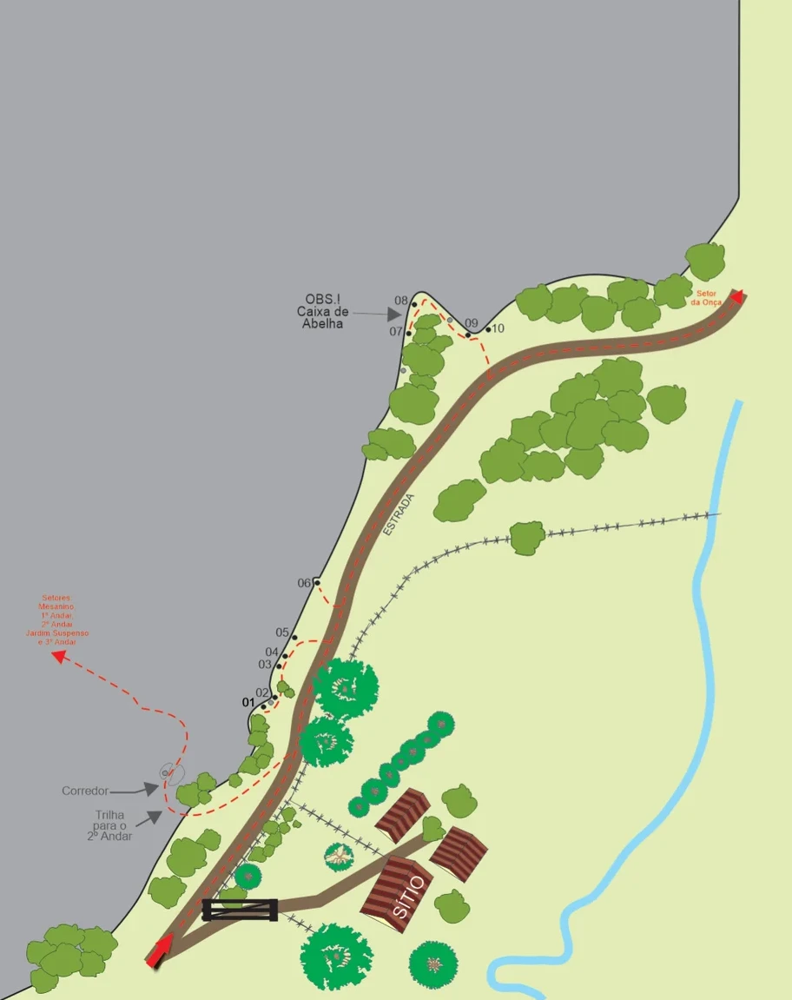
    - **largura_mapa**: 912
    - **altura_mapa**: 1151
    - **pontos_de_interesse**:
      - **[0]**:
        - **id**: Setores_Conexao
        - **label**: Mezanino, 1o, 2o Andar, Jardim Suspenso e 3o Andar
        - **retangulo**:
          - **x**: 67
          - **y**: 712
          - **comprimento**: 86
          - **largura**: 78
      - **[1]**:
        - **id**: Trilha_2o_Andar
        - **label**: Trilha para o 2º Andar
        - **retangulo**:
          - **x**: 128
          - **y**: 950
          - **comprimento**: 63
          - **largura**: 47
      - **[2]**:
        - **id**: Sitio
        - **label**: SÍTIO
        - **retangulo**:
          - **x**: 471
          - **y**: 1032
          - **comprimento**: 68
          - **largura**: 79
      - **[3]**:
        - **id**: Obs_Abelha
        - **label**: OBS.! Caixa de Abelha
        - **retangulo**:
          - **x**: 371
          - **y**: 356
          - **comprimento**: 64
          - **largura**: 52
      - **[4]**:
        - **id**: Setor_da_Onca
        - **label**: Setor da Onça
        - **retangulo**:
          - **x**: 813
          - **y**: 342
          - **comprimento**: 46
          - **largura**: 30
      - **[5]**:
        - **id**: 01
        - **label**: 01
        - **retangulo**:
          - **x**: 286
          - **y**: 808
          - **comprimento**: 19
          - **largura**: 17
      - **[6]**:
        - **id**: 02
        - **label**: 02
        - **retangulo**:
          - **x**: 303
          - **y**: 796
          - **comprimento**: 20
          - **largura**: 16
      - **[7]**:
        - **id**: 03
        - **label**: 03
        - **retangulo**:
          - **x**: 305
          - **y**: 764
          - **comprimento**: 18
          - **largura**: 15
      - **[8]**:
        - **id**: 04
        - **label**: 04
        - **retangulo**:
          - **x**: 314
          - **y**: 749
          - **comprimento**: 19
          - **largura**: 16
      - **[9]**:
        - **id**: 05
        - **label**: 05
        - **retangulo**:
          - **x**: 326
          - **y**: 728
          - **comprimento**: 19
          - **largura**: 17
      - **[10]**:
        - **id**: 06
        - **label**: 06
        - **retangulo**:
          - **x**: 350
          - **y**: 670
          - **comprimento**: 21
          - **largura**: 17
      - **[11]**:
        - **id**: 07
        - **label**: 07
        - **retangulo**:
          - **x**: 456
          - **y**: 380
          - **comprimento**: 20
          - **largura**: 17
      - **[12]**:
        - **id**: 08
        - **label**: 08
        - **retangulo**:
          - **x**: 462
          - **y**: 346
          - **comprimento**: 20
          - **largura**: 17
      - **[13]**:
        - **id**: 09
        - **label**: 09
        - **retangulo**:
          - **x**: 543
          - **y**: 372
          - **comprimento**: 20
          - **largura**: 17
      - **[14]**:
        - **id**: 10
        - **label**: 10
        - **retangulo**:
          - **x**: 574
          - **y**: 378
          - **comprimento**: 20
          - **largura**: 17
    - **referencias**:
      - **[0]**:
        - **escalada**: Nanica
        - **ids**:
          - 01
      - **[1]**:
        - **escalada**: Bom Dia Tatá
        - **ids**:
          - 02
      - **[2]**:
        - **escalada**: Papa Folia
        - **ids**:
          - 03
      - **[3]**:
        - **escalada**: Tchau (variante)
        - **ids**:
          - 04
      - **[4]**:
        - **escalada**: Vai Jumarear
        - **ids**:
          - 05
      - **[5]**:
        - **escalada**: No Pain no Gain
        - **ids**:
          - 06
      - **[6]**:
        - **escalada**: Entre o medo e a loucura
        - **ids**:
          - 07
      - **[7]**:
        - **escalada**: Good Bye
        - **ids**:
          - 10
      - **[8]**:
        - **ids**:
          - 09
        - **setor**: Setor Chegada
        - **escalada**: Linha de Frente
      - **[9]**:
        - **ids**:
          - 10
        - **setor**: Setor Chegada
        - **escalada**: Helow (variante)
      - **[10]**:
        - **ids**:
          - Trilha_2o_Andar
          - Setores_Conexao
        - **setor**: 2º Andar
      - **[11]**:
        - **ids**:
          - Setor_da_Onca
        - **setor**: Setor Onça
      - **[12]**:
        - **ids**:
          - Setores_Conexao
        - **setor**: Setor Mezanino
      - **[13]**:
        - **ids**:
          - Setores_Conexao
        - **setor**: 1º Andar
      - **[14]**:
        - **ids**:
          - Setores_Conexao
        - **setor**: Jardim Suspenso
      - **[15]**:
        - **ids**:
          - Setores_Conexao
        - **setor**: 3º Andar
- **escaladas**:
  - **[0]**:
    - **via_movel**:
      - **descricao**: Via em móvel/mista.
      - **nome**: sem nome
      - **dificuldade**: BR_4
      - **data_abertura**: 26a28/jul/2013
  - **[1]**:
    - **via_esportiva**:
      - **nome**: Nanica
      - **dificuldade**: BR_4
      - **data_abertura**: 26a28/jul/2013
      - **quantidade_protecoes_intermediarias**: 3
      - **quantidade_protecoes_parada**: 1
  - **[2]**:
    - **via_movel**:
      - **descricao**: Via em móvel.
      - **nome**: Via Lactea
      - **dificuldade**: BR_5
      - **data_abertura**: 26a28/jul/2013
  - **[3]**:
    - **via_esportiva**:
      - **nome**: Bom Dia Tatá
      - **dificuldade**: BR_4
      - **data_abertura**: 26a28/jul/2013
      - **quantidade_protecoes_intermediarias**: 3
      - **quantidade_protecoes_parada**: 1
  - **[4]**:
    - **via_esportiva**:
      - **nome**: Papa Folia
      - **dificuldade**: BR_4
      - **data_abertura**: 26a28/jul/2013
      - **quantidade_protecoes_intermediarias**: 3
      - **quantidade_protecoes_parada**: 2
  - **[5]**:
    - **via_esportiva**:
      - **nome**: Tchau (variante)
      - **dificuldade**: BR_4
      - **data_abertura**: 26a28/jul/2013
      - **quantidade_protecoes_intermediarias**: 5
      - **quantidade_protecoes_parada**: 2
  - **[6]**:
    - **via_esportiva**:
      - **nome**: Vai Jumarear
      - **destaque**: True
      - **dificuldade**: BR_6SUP
      - **quantidade_protecoes_intermediarias**: 4
      - **quantidade_protecoes_parada**: 2
  - **[7]**:
    - **via_esportiva**:
      - **nome**: No Pain no Gain
      - **dificuldade**: BR_6SUP
      - **quantidade_protecoes_intermediarias**: 5
      - **quantidade_protecoes_parada**: 2
  - **[8]**:
    - **via_movel**:
      - **descricao**: Via mista.
      - **nome**: sem nome (mixta)
      - **dificuldade**: BR_6SUP
  - **[9]**:
    - **via_esportiva**:
      - **nome**: Entre o medo e a loucura
      - **dificuldade**: PROJETO
  - **[10]**:
    - **via_esportiva**:
      - **nome**: Linha de Frente
      - **dificuldade**: PROJETO
  - **[11]**:
    - **via_esportiva**:
      - **nome**: Helow (variante)
      - **destaque**: True
      - **dificuldade**: BR_6SUP
      - **quantidade_protecoes_intermediarias**: 4
      - **quantidade_protecoes_parada**: 2
  - **[12]**:
    - **via_esportiva**:
      - **nome**: Good Bye
      - **destaque**: True
      - **dificuldade**: BR_6SUP
      - **quantidade_protecoes_intermediarias**: 4
      - **quantidade_protecoes_parada**: 2
- **precomputados**:
  - **total_escaladas**: 13
  - **total_esportivas**: 10
  - **total_moveis**: 0
  - **total_boulders**: 0
  - **total_multiplas_enfiadas**: 0
  - **total_highlines**: 0

## Parte: setor_onca

### Setor (Pico: Afloramento Rastro)

- **descricao**:
    # Setor Onça
    
    Este setor possui sombra até as 13h (variando de acordo com a estação).
    
    **Observações**:
    - OBS.!: Caixa de Abelha Arapuã do lado direito da via 17.
- **nome**: Setor Onça
- **mapas**:
  - **[0]**:
    - **caminho_imagem_mapa**: 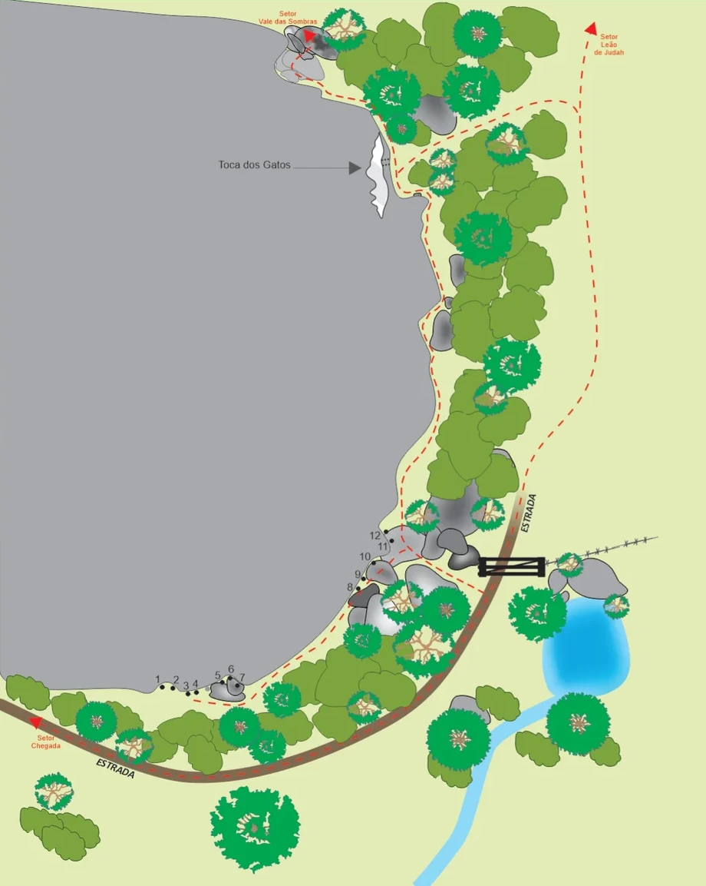
    - **largura_mapa**: 920
    - **altura_mapa**: 1153
    - **pontos_de_interesse**:
      - **[0]**:
        - **id**: Setor_Vale_das_Sombras
        - **label**: Setor Vale das Sombras
        - **retangulo**:
          - **x**: 376
          - **y**: 22
          - **comprimento**: 87
          - **largura**: 27
      - **[1]**:
        - **id**: Toca_dos_Gatos
        - **label**: Toca dos Gatos
        - **retangulo**:
          - **x**: 332
          - **y**: 212
          - **comprimento**: 106
          - **largura**: 25
      - **[2]**:
        - **id**: Setor_Leao_de_Judah
        - **label**: Setor Leão de Judah
        - **retangulo**:
          - **x**: 794
          - **y**: 57
          - **comprimento**: 47
          - **largura**: 38
      - **[3]**:
        - **id**: Setor_Chegada
        - **label**: Setor Chegada
        - **retangulo**:
          - **x**: 58
          - **y**: 965
          - **comprimento**: 53
          - **largura**: 28
      - **[4]**:
        - **id**: 01
        - **label**: 01
        - **retangulo**:
          - **x**: 206
          - **y**: 884
          - **comprimento**: 13
          - **largura**: 16
      - **[5]**:
        - **id**: 02
        - **label**: 02
        - **retangulo**:
          - **x**: 229
          - **y**: 884
          - **comprimento**: 12
          - **largura**: 16
      - **[6]**:
        - **id**: 03
        - **label**: 03
        - **retangulo**:
          - **x**: 242
          - **y**: 892
          - **comprimento**: 13
          - **largura**: 16
      - **[7]**:
        - **id**: 04
        - **label**: 04
        - **retangulo**:
          - **x**: 254
          - **y**: 890
          - **comprimento**: 11
          - **largura**: 16
      - **[8]**:
        - **id**: 05
        - **label**: 05
        - **retangulo**:
          - **x**: 284
          - **y**: 878
          - **comprimento**: 11
          - **largura**: 18
      - **[9]**:
        - **id**: 06
        - **label**: 06
        - **retangulo**:
          - **x**: 302
          - **y**: 870
          - **comprimento**: 13
          - **largura**: 19
      - **[10]**:
        - **id**: 07
        - **label**: 07
        - **retangulo**:
          - **x**: 316
          - **y**: 882
          - **comprimento**: 14
          - **largura**: 19
      - **[11]**:
        - **id**: 08
        - **label**: 08
        - **retangulo**:
          - **x**: 456
          - **y**: 764
          - **comprimento**: 14
          - **largura**: 16
      - **[12]**:
        - **id**: 09
        - **label**: 09
        - **retangulo**:
          - **x**: 466
          - **y**: 746
          - **comprimento**: 15
          - **largura**: 16
      - **[13]**:
        - **id**: 10
        - **label**: 10
        - **retangulo**:
          - **x**: 476
          - **y**: 723
          - **comprimento**: 17
          - **largura**: 16
      - **[14]**:
        - **id**: 11
        - **label**: 11
        - **retangulo**:
          - **x**: 499
          - **y**: 710
          - **comprimento**: 16
          - **largura**: 13
      - **[15]**:
        - **id**: 12
        - **label**: 12
        - **retangulo**:
          - **x**: 488
          - **y**: 696
          - **comprimento**: 17
          - **largura**: 15
    - **referencias**:
      - **[0]**:
        - **escalada**: Esticãozinho e Chororô
        - **ids**:
          - 01
      - **[1]**:
        - **escalada**: Pequetita Aymê
        - **ids**:
          - 02
      - **[2]**:
        - **escalada**: Abstinência Alcoólica
        - **ids**:
          - 03
      - **[3]**:
        - **escalada**: Jack Daniel's
        - **ids**:
          - 04
      - **[4]**:
        - **escalada**: Suor de Cachaça
        - **ids**:
          - 05
      - **[5]**:
        - **escalada**: Feliz Natal
        - **ids**:
          - 06
      - **[6]**:
        - **escalada**: Tiro Certeiro
        - **ids**:
          - 07
      - **[7]**:
        - **escalada**: Buraco é Mais Em Baixo
        - **ids**:
          - 10
      - **[8]**:
        - **escalada**: Doze Proteções e Três Irmãos
        - **ids**:
          - 11
      - **[9]**:
        - **escalada**: Jardim da Babilônia
        - **ids**:
          - 12
      - **[10]**:
        - **ids**:
          - 08
        - **setor**: Setor Onça
        - **escalada**: Estica e Clipa
      - **[11]**:
        - **ids**:
          - 09
        - **setor**: Setor Onça
        - **escalada**: Pai Bravo
      - **[12]**:
        - **ids**:
          - Setor_Chegada
        - **setor**: Setor Chegada
      - **[13]**:
        - **ids**:
          - Toca_dos_Gatos
        - **setor**: Setor Toca dos Gatos
      - **[14]**:
        - **ids**:
          - Setor_Leao_de_Judah
        - **setor**: Setor Leão de Judah
      - **[15]**:
        - **ids**:
          - Setor_Vale_das_Sombras
        - **setor**: Setor Vale das Sombras
  - **[1]**:
    - **caminho_imagem_mapa**: 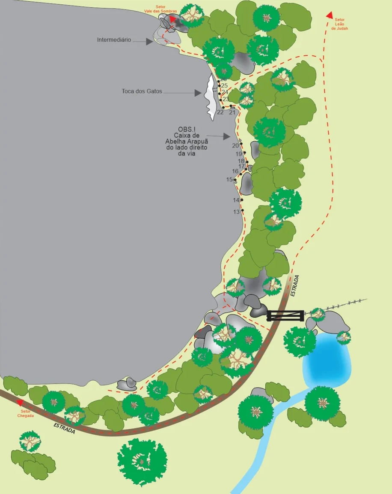
    - **largura_mapa**: 916
    - **altura_mapa**: 1151
    - **pontos_de_interesse**:
      - **[0]**:
        - **id**: Setor_Vale_das_Sombras
        - **label**: Setor Vale das Sombras
        - **retangulo**:
          - **x**: 374
          - **y**: 20
          - **comprimento**: 85
          - **largura**: 29
      - **[1]**:
        - **id**: Intermediario
        - **label**: Intermediário
        - **retangulo**:
          - **x**: 266
          - **y**: 92
          - **comprimento**: 87
          - **largura**: 21
      - **[2]**:
        - **id**: Toca_dos_Gatos
        - **label**: Toca dos Gatos
        - **retangulo**:
          - **x**: 332
          - **y**: 212
          - **comprimento**: 103
          - **largura**: 24
      - **[3]**:
        - **id**: Setor_Leao_de_Judah
        - **label**: Setor Leão de Judah
        - **retangulo**:
          - **x**: 794
          - **y**: 54
          - **comprimento**: 48
          - **largura**: 40
      - **[4]**:
        - **id**: Setor_Chegada
        - **label**: Setor Chegada
        - **retangulo**:
          - **x**: 60
          - **y**: 963
          - **comprimento**: 45
          - **largura**: 32
      - **[5]**:
        - **id**: 13
        - **label**: 13
        - **retangulo**:
          - **x**: 552
          - **y**: 494
          - **comprimento**: 20
          - **largura**: 17
      - **[6]**:
        - **id**: 14
        - **label**: 14
        - **retangulo**:
          - **x**: 552
          - **y**: 466
          - **comprimento**: 19
          - **largura**: 16
      - **[7]**:
        - **id**: 15
        - **label**: 15
        - **retangulo**:
          - **x**: 536
          - **y**: 418
          - **comprimento**: 20
          - **largura**: 16
      - **[8]**:
        - **id**: 16
        - **label**: 16
        - **retangulo**:
          - **x**: 550
          - **y**: 399
          - **comprimento**: 16
          - **largura**: 12
      - **[9]**:
        - **id**: 17
        - **label**: 17
        - **retangulo**:
          - **x**: 564
          - **y**: 386
          - **comprimento**: 16
          - **largura**: 13
      - **[10]**:
        - **id**: 18
        - **label**: 18
        - **retangulo**:
          - **x**: 564
          - **y**: 374
          - **comprimento**: 15
          - **largura**: 13
      - **[11]**:
        - **id**: 19
        - **label**: 19
        - **retangulo**:
          - **x**: 558
          - **y**: 358
          - **comprimento**: 18
          - **largura**: 15
      - **[12]**:
        - **id**: 20
        - **label**: 20
        - **retangulo**:
          - **x**: 550
          - **y**: 338
          - **comprimento**: 18
          - **largura**: 16
      - **[13]**:
        - **id**: 21
        - **label**: 21
        - **retangulo**:
          - **x**: 542
          - **y**: 262
          - **comprimento**: 17
          - **largura**: 15
      - **[14]**:
        - **id**: 22
        - **label**: 22
        - **retangulo**:
          - **x**: 515
          - **y**: 262
          - **comprimento**: 18
          - **largura**: 15
      - **[15]**:
        - **id**: 23
        - **label**: 23
        - **retangulo**:
          - **x**: 528
          - **y**: 230
          - **comprimento**: 19
          - **largura**: 15
      - **[16]**:
        - **id**: 24
        - **label**: 24
        - **retangulo**:
          - **x**: 525
          - **y**: 214
          - **comprimento**: 18
          - **largura**: 15
      - **[17]**:
        - **id**: 25
        - **label**: 25
        - **retangulo**:
          - **x**: 524
          - **y**: 198
          - **comprimento**: 18
          - **largura**: 15
      - **[18]**:
        - **id**: 26
        - **label**: 26
        - **retangulo**:
          - **x**: 522
          - **y**: 184
          - **comprimento**: 19
          - **largura**: 14
    - **referencias**:
      - **[0]**:
        - **escalada**: Incrível Teto
        - **ids**:
          - 13
      - **[1]**:
        - **escalada**: Incrível Céu de Arcos
        - **ids**:
          - 14
      - **[2]**:
        - **escalada**: Besta Quadrada
        - **ids**:
          - 15
      - **[3]**:
        - **escalada**: Aperta ou Voa
        - **ids**:
          - 16
      - **[4]**:
        - **escalada**: Antifascistas
        - **ids**:
          - 17
      - **[5]**:
        - **escalada**: Macaco Não Tem Culpa
        - **ids**:
          - 18
      - **[6]**:
        - **escalada**: Mãe Gaia
        - **ids**:
          - 19
      - **[7]**:
        - **escalada**: Enrola e Morde
        - **ids**:
          - 20
      - **[8]**:
        - **escalada**: Liberdade de Expressão
        - **ids**:
          - 21
      - **[9]**:
        - **escalada**: Centenária
        - **ids**:
          - 22
      - **[10]**:
        - **escalada**: Kalimera
        - **ids**:
          - 23
      - **[11]**:
        - **escalada**: Sálvia
        - **ids**:
          - 24
      - **[12]**:
        - **escalada**: Fuga das Galinhas
        - **ids**:
          - 25
      - **[13]**:
        - **escalada**: Carne d Homi ñ dá Coxinha
        - **ids**:
          - 26
      - **[14]**:
        - **ids**:
          - Setor_Chegada
        - **setor**: Setor Chegada
      - **[15]**:
        - **ids**:
          - Setor_Leao_de_Judah
        - **setor**: Setor Leão de Judah
      - **[16]**:
        - **ids**:
          - Intermediario
        - **setor**: Setor Intermediário
      - **[17]**:
        - **ids**:
          - Toca_dos_Gatos
        - **setor**: Setor Toca dos Gatos
      - **[18]**:
        - **ids**:
          - Setor_Vale_das_Sombras
        - **setor**: Setor Vale das Sombras
- **escaladas**:
  - **[0]**:
    - **via_esportiva**:
      - **nome**: Esticãozinho e Chororô
      - **dificuldade**: BR_6SUP
      - **quantidade_protecoes_intermediarias**: 4
      - **quantidade_protecoes_parada**: 2
      - **data_abertura**: 2015
  - **[1]**:
    - **via_esportiva**:
      - **nome**: Pequetita Aymê
      - **dificuldade**: BR_7A
      - **quantidade_protecoes_intermediarias**: 7
      - **quantidade_protecoes_parada**: 2
  - **[2]**:
    - **via_esportiva**:
      - **nome**: Abstinência Alcoólica
      - **dificuldade**: BR_7A
      - **quantidade_protecoes_intermediarias**: 3
      - **quantidade_protecoes_parada**: 2
  - **[3]**:
    - **via_esportiva**:
      - **nome**: Jack Daniel's
      - **dificuldade**: BR_7B
      - **destaque**: True
      - **quantidade_protecoes_intermediarias**: 5
      - **quantidade_protecoes_parada**: 2
  - **[4]**:
    - **via_esportiva**:
      - **nome**: Suor de Cachaça
      - **dificuldade**: BR_8A
      - **quantidade_protecoes_intermediarias**: 5
      - **quantidade_protecoes_parada**: 2
  - **[5]**:
    - **via_esportiva**:
      - **nome**: Feliz Natal
      - **dificuldade**: BR_7A
      - **quantidade_protecoes_intermediarias**: 4
      - **quantidade_protecoes_parada**: 2
  - **[6]**:
    - **via_esportiva**:
      - **nome**: Tiro Certeiro
      - **dificuldade**: BR_7A
      - **destaque**: True
      - **quantidade_protecoes_intermediarias**: 5
      - **quantidade_protecoes_parada**: 2
  - **[7]**:
    - **via_esportiva**:
      - **nome**: Estica e Clipa
      - **dificuldade**: BR_6
      - **quantidade_protecoes_intermediarias**: 4
      - **quantidade_protecoes_parada**: 2
  - **[8]**:
    - **via_esportiva**:
      - **nome**: Pai Bravo
      - **dificuldade**: BR_6
      - **destaque**: True
      - **quantidade_protecoes_intermediarias**: 5
      - **quantidade_protecoes_parada**: 2
  - **[9]**:
    - **via_esportiva**:
      - **nome**: Buraco é Mais Em Baixo
      - **dificuldade**: BR_7A
      - **quantidade_protecoes_intermediarias**: 6
      - **quantidade_protecoes_parada**: 2
  - **[10]**:
    - **via_esportiva**:
      - **nome**: Doze Proteções e Três Irmãos
      - **dificuldade**: BR_7A
      - **quantidade_protecoes_intermediarias**: 10
      - **quantidade_protecoes_parada**: 2
  - **[11]**:
    - **via_esportiva**:
      - **nome**: Jardim da Babilônia
      - **dificuldade**: BR_7A
      - **quantidade_protecoes_intermediarias**: 7
      - **quantidade_protecoes_parada**: 2
  - **[12]**:
    - **via_esportiva**:
      - **nome**: Incrível Teto
      - **dificuldade**: BR_7B
      - **destaque**: True
      - **quantidade_protecoes_intermediarias**: 8
      - **quantidade_protecoes_parada**: 2
  - **[13]**:
    - **via_esportiva**:
      - **nome**: Incrível Céu de Arcos
      - **dificuldade**: BR_7B
      - **destaque**: True
      - **quantidade_protecoes_intermediarias**: 8
      - **quantidade_protecoes_parada**: 2
  - **[14]**:
    - **via_esportiva**:
      - **nome**: Besta Quadrada
      - **dificuldade**: BR_6SUP
      - **quantidade_protecoes_intermediarias**: 11
      - **quantidade_protecoes_parada**: 2
  - **[15]**:
    - **via_esportiva**:
      - **nome**: Aperta ou Voa
      - **dificuldade**: BR_7B
      - **destaque**: True
      - **quantidade_protecoes_intermediarias**: 6
      - **quantidade_protecoes_parada**: 2
  - **[16]**:
    - **via_esportiva**:
      - **nome**: Antifascistas
      - **dificuldade**: BR_7B
      - **destaque**: True
      - **quantidade_protecoes_intermediarias**: 5
      - **quantidade_protecoes_parada**: 2
  - **[17]**:
    - **via_esportiva**:
      - **nome**: Macaco Não Tem Culpa
      - **dificuldade**: BR_7B
      - **destaque**: True
      - **quantidade_protecoes_intermediarias**: 5
      - **quantidade_protecoes_parada**: 2
  - **[18]**:
    - **via_esportiva**:
      - **nome**: Mãe Gaia
      - **dificuldade**: BR_7A
      - **destaque**: True
      - **quantidade_protecoes_intermediarias**: 11
      - **quantidade_protecoes_parada**: 2
  - **[19]**:
    - **via_esportiva**:
      - **nome**: Enrola e Morde
      - **dificuldade**: BR_7A
      - **quantidade_protecoes_intermediarias**: 5
      - **quantidade_protecoes_parada**: 2
  - **[20]**:
    - **via_esportiva**:
      - **nome**: Liberdade de Expressão
      - **dificuldade**: BR_7A
      - **destaque**: True
      - **quantidade_protecoes_intermediarias**: 5
      - **quantidade_protecoes_parada**: 2
  - **[21]**:
    - **via_esportiva**:
      - **nome**: Centenária
      - **dificuldade**: BR_7A
      - **quantidade_protecoes_intermediarias**: 7
      - **quantidade_protecoes_parada**: 2
  - **[22]**:
    - **via_esportiva**:
      - **nome**: Kalimera
      - **dificuldade**: BR_7B
      - **destaque**: True
      - **quantidade_protecoes_intermediarias**: 5
      - **quantidade_protecoes_parada**: 2
  - **[23]**:
    - **via_esportiva**:
      - **nome**: Sálvia
      - **dificuldade**: BR_7B
      - **destaque**: True
      - **quantidade_protecoes_intermediarias**: 4
      - **quantidade_protecoes_parada**: 2
  - **[24]**:
    - **via_esportiva**:
      - **nome**: Fuga das Galinhas
      - **dificuldade**: BR_7A
      - **quantidade_protecoes_intermediarias**: 5
      - **quantidade_protecoes_parada**: 2
  - **[25]**:
    - **via_esportiva**:
      - **nome**: Carne d Homi ñ dá Coxinha
      - **dificuldade**: BR_8B
      - **destaque**: True
      - **quantidade_protecoes_intermediarias**: 4
      - **quantidade_protecoes_parada**: 2
- **precomputados**:
  - **total_escaladas**: 26
  - **total_esportivas**: 26
  - **total_moveis**: 0
  - **total_boulders**: 0
  - **total_multiplas_enfiadas**: 0
  - **total_highlines**: 0

## Parte: setor_toca_dos_gatos

### Setor (Pico: Afloramento Rastro)

- **descricao**:
    # Setor Toca dos Gatos
    
    Este setor possui sombra o dia todo (variando de acordo com a estação). O acesso é feito através de um "Túnel de acesso".
- **nome**: Setor Toca dos Gatos
- **mapas**:
  - **[0]**:
    - **caminho_imagem_mapa**: 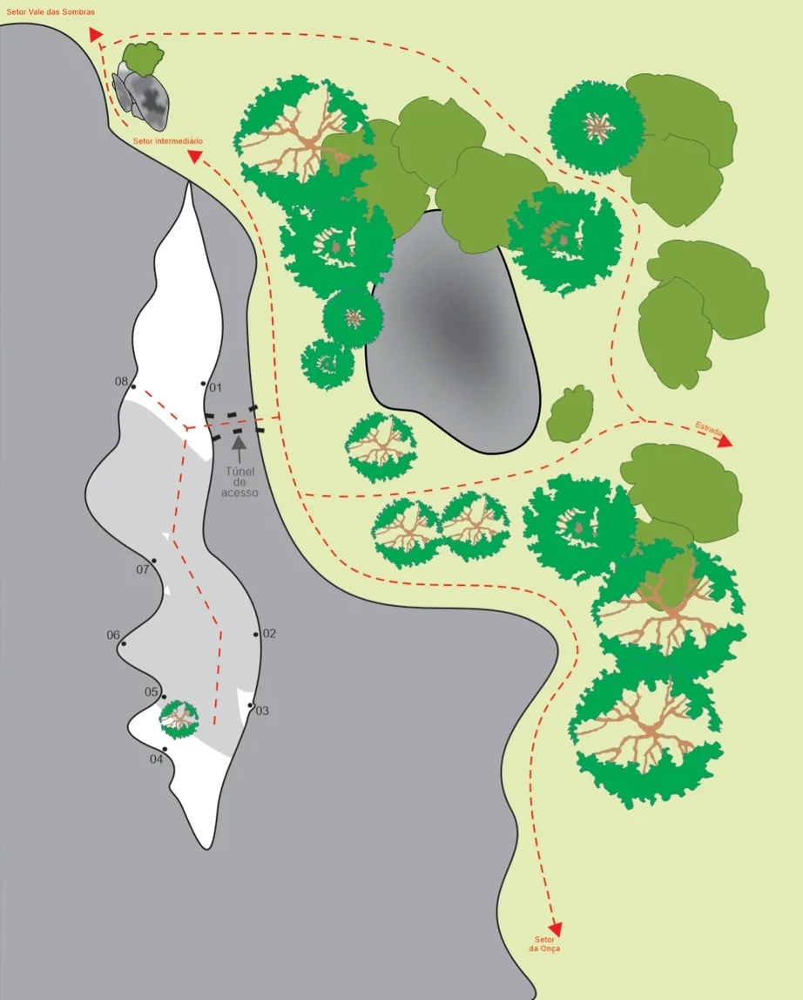
    - **largura_mapa**: 922
    - **altura_mapa**: 1147
    - **pontos_de_interesse**:
      - **[0]**:
        - **id**: Setor_Vale_das_Sombras
        - **label**: Setor Vale das Sombras
        - **retangulo**:
          - **x**: 58
          - **y**: 13
          - **comprimento**: 113
          - **largura**: 20
      - **[1]**:
        - **id**: Setor_Intermediario
        - **label**: Setor Intermediário
        - **retangulo**:
          - **x**: 192
          - **y**: 160
          - **comprimento**: 92
          - **largura**: 20
      - **[2]**:
        - **id**: Setor_da_Onca
        - **label**: Setor da Onça
        - **retangulo**:
          - **x**: 624
          - **y**: 1081
          - **comprimento**: 48
          - **largura**: 36
      - **[3]**:
        - **id**: 01
        - **label**: 01
        - **retangulo**:
          - **x**: 246
          - **y**: 443
          - **comprimento**: 21
          - **largura**: 18
      - **[4]**:
        - **id**: 02
        - **label**: 02
        - **retangulo**:
          - **x**: 310
          - **y**: 726
          - **comprimento**: 23
          - **largura**: 18
      - **[5]**:
        - **id**: 03
        - **label**: 03
        - **retangulo**:
          - **x**: 302
          - **y**: 815
          - **comprimento**: 23
          - **largura**: 20
      - **[6]**:
        - **id**: 04
        - **label**: 04
        - **retangulo**:
          - **x**: 179
          - **y**: 871
          - **comprimento**: 24
          - **largura**: 22
      - **[7]**:
        - **id**: 05
        - **label**: 05
        - **retangulo**:
          - **x**: 174
          - **y**: 794
          - **comprimento**: 23
          - **largura**: 21
      - **[8]**:
        - **id**: 06
        - **label**: 06
        - **retangulo**:
          - **x**: 130
          - **y**: 728
          - **comprimento**: 24
          - **largura**: 19
      - **[9]**:
        - **id**: 07
        - **label**: 07
        - **retangulo**:
          - **x**: 164
          - **y**: 652
          - **comprimento**: 22
          - **largura**: 20
      - **[10]**:
        - **id**: 08
        - **label**: 08
        - **retangulo**:
          - **x**: 139
          - **y**: 436
          - **comprimento**: 22
          - **largura**: 17
    - **referencias**:
      - **[0]**:
        - **escalada**: Eakthecat
        - **ids**:
          - 01
      - **[1]**:
        - **escalada**: Burocracia Gelatinosa
        - **ids**:
          - 02
      - **[2]**:
        - **escalada**: Planta Mãe
        - **ids**:
          - 03
      - **[3]**:
        - **escalada**: Funcionário Público
        - **ids**:
          - 04
      - **[4]**:
        - **escalada**: Repartição Pública
        - **ids**:
          - 05
      - **[5]**:
        - **escalada**: Kevelin, Amigo do Steven
        - **ids**:
          - 06
      - **[6]**:
        - **escalada**: Fila de Espera
        - **ids**:
          - 07
      - **[7]**:
        - **ids**:
          - 08
        - **setor**: Setor Toca dos Gatos
        - **escalada**: Nem C/ Chuva a Gente Para
      - **[8]**:
        - **ids**:
          - Setor_Vale_das_Sombras
        - **setor**: Setor Vale das Sombras
      - **[9]**:
        - **ids**:
          - Setor_Intermediario
        - **setor**: Setor Intermediário
      - **[10]**:
        - **ids**:
          - Setor_da_Onca
        - **setor**: Setor Onça
- **escaladas**:
  - **[0]**:
    - **via_esportiva**:
      - **nome**: Eakthecat
      - **dificuldade**: BR_6SUP
      - **quantidade_protecoes_intermediarias**: 3
      - **quantidade_protecoes_parada**: 2
  - **[1]**:
    - **via_esportiva**:
      - **nome**: Burocracia Gelatinosa
      - **dificuldade**: BR_7B_BARRA_7C
      - **quantidade_protecoes_intermediarias**: 8
      - **quantidade_protecoes_parada**: 2
      - **data_abertura**: 2019-11
  - **[2]**:
    - **via_esportiva**:
      - **nome**: Planta Mãe
      - **dificuldade**: BR_7A
      - **destaque**: True
      - **quantidade_protecoes_intermediarias**: 7
      - **quantidade_protecoes_parada**: 2
      - **data_abertura**: 2019-11
  - **[3]**:
    - **via_esportiva**:
      - **nome**: Funcionário Público
      - **dificuldade**: BR_7A
      - **destaque**: True
      - **quantidade_protecoes_intermediarias**: 7
      - **quantidade_protecoes_parada**: 2
      - **data_abertura**: 2019-11
  - **[4]**:
    - **via_esportiva**:
      - **nome**: Repartição Pública
      - **dificuldade**: BR_7B_BARRA_7C
      - **destaque**: True
      - **quantidade_protecoes_intermediarias**: 9
      - **quantidade_protecoes_parada**: 2
      - **data_abertura**: 2019-11
  - **[5]**:
    - **via_esportiva**:
      - **nome**: Kevelin, Amigo do Steven
      - **dificuldade**: BR_6
      - **destaque**: True
      - **quantidade_protecoes_intermediarias**: 6
      - **quantidade_protecoes_parada**: 2
      - **data_abertura**: 2019-11
  - **[6]**:
    - **via_esportiva**:
      - **nome**: Fila de Espera
      - **dificuldade**: BR_6SUP
      - **quantidade_protecoes_intermediarias**: 5
      - **quantidade_protecoes_parada**: 2
      - **data_abertura**: 2019-11
  - **[7]**:
    - **via_esportiva**:
      - **nome**: Nem C/ Chuva a Gente Para
      - **dificuldade**: BR_5
      - **quantidade_protecoes_intermediarias**: 3
      - **quantidade_protecoes_parada**: 2
- **precomputados**:
  - **total_escaladas**: 8
  - **total_esportivas**: 8
  - **total_moveis**: 0
  - **total_boulders**: 0
  - **total_multiplas_enfiadas**: 0
  - **total_highlines**: 0

## Parte: setor_intermediario

### Setor (Pico: Afloramento Rastro)

- **descricao**:
    # Setor Intermediário
    
    Este setor possui sombra até as 13h (variando de acordo com a estação).
- **nome**: Setor Intermediário
- **mapas**:
  - **[0]**:
    - **caminho_imagem_mapa**: 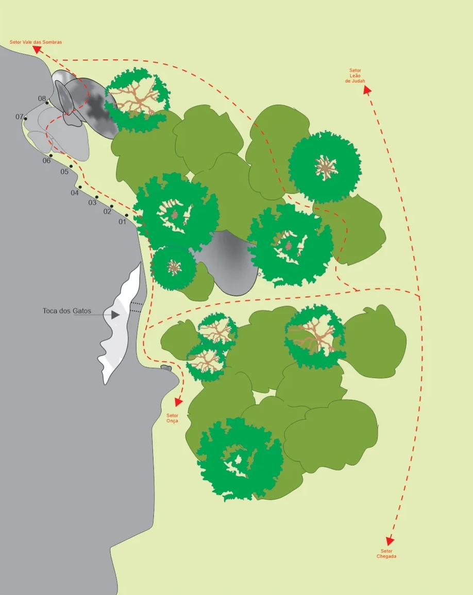
    - **largura_mapa**: 918
    - **altura_mapa**: 1152
    - **pontos_de_interesse**:
      - **[0]**:
        - **id**: Setor_Vale_das_Sombras
        - **label**: Setor Vale das Sombras
        - **retangulo**:
          - **x**: 70
          - **y**: 81
          - **comprimento**: 109
          - **largura**: 16
      - **[1]**:
        - **id**: Setor_Leao_de_Judah
        - **label**: Setor Leão de Judah
        - **retangulo**:
          - **x**: 690
          - **y**: 146
          - **comprimento**: 47
          - **largura**: 41
      - **[2]**:
        - **id**: Toca_dos_Gatos
        - **label**: Toca dos Gatos
        - **retangulo**:
          - **x**: 128
          - **y**: 600
          - **comprimento**: 105
          - **largura**: 25
      - **[3]**:
        - **id**: Setor_Onca
        - **label**: Setor Onça
        - **retangulo**:
          - **x**: 334
          - **y**: 808
          - **comprimento**: 37
          - **largura**: 33
      - **[4]**:
        - **id**: Setor_Chegada
        - **label**: Setor Chegada
        - **retangulo**:
          - **x**: 750
          - **y**: 1072
          - **comprimento**: 53
          - **largura**: 32
      - **[5]**:
        - **id**: 01
        - **label**: 01
        - **retangulo**:
          - **x**: 237
          - **y**: 429
          - **comprimento**: 22
          - **largura**: 20
      - **[6]**:
        - **id**: 02
        - **label**: 02
        - **retangulo**:
          - **x**: 208
          - **y**: 408
          - **comprimento**: 22
          - **largura**: 19
      - **[7]**:
        - **id**: 03
        - **label**: 03
        - **retangulo**:
          - **x**: 179
          - **y**: 392
          - **comprimento**: 22
          - **largura**: 18
      - **[8]**:
        - **id**: 04
        - **label**: 04
        - **retangulo**:
          - **x**: 145
          - **y**: 372
          - **comprimento**: 22
          - **largura**: 19
      - **[9]**:
        - **id**: 05
        - **label**: 05
        - **retangulo**:
          - **x**: 126
          - **y**: 332
          - **comprimento**: 23
          - **largura**: 18
      - **[10]**:
        - **id**: 06
        - **label**: 06
        - **retangulo**:
          - **x**: 90
          - **y**: 310
          - **comprimento**: 22
          - **largura**: 18
      - **[11]**:
        - **id**: 07
        - **label**: 07
        - **retangulo**:
          - **x**: 38
          - **y**: 225
          - **comprimento**: 22
          - **largura**: 18
      - **[12]**:
        - **id**: 08
        - **label**: 08
        - **retangulo**:
          - **x**: 82
          - **y**: 190
          - **comprimento**: 21
          - **largura**: 19
    - **referencias**:
      - **[0]**:
        - **escalada**: Tufo Não
        - **ids**:
          - 01
      - **[1]**:
        - **escalada**: Ciúmes e Ranger de Dentes
        - **ids**:
          - 02
      - **[2]**:
        - **escalada**: Peixe com Palmito
        - **ids**:
          - 03
      - **[3]**:
        - **escalada**: Cuca Maluca
        - **ids**:
          - 04
      - **[4]**:
        - **escalada**: Jacareca ex-Marley
        - **ids**:
          - 05
      - **[5]**:
        - **escalada**: Tu Fantástica
        - **ids**:
          - 06
      - **[6]**:
        - **escalada**: Bigodagem
        - **ids**:
          - 07
      - **[7]**:
        - **ids**:
          - 08
        - **setor**: Setor Intermediário
        - **escalada**: Delicinha
      - **[8]**:
        - **ids**:
          - Setor_Vale_das_Sombras
        - **setor**: Setor Vale das Sombras
      - **[9]**:
        - **ids**:
          - Setor_Chegada
        - **setor**: Setor Chegada
      - **[10]**:
        - **ids**:
          - Setor_Onca
        - **setor**: Setor Onça
      - **[11]**:
        - **ids**:
          - Setor_Leao_de_Judah
        - **setor**: Setor Leão de Judah
- **escaladas**:
  - **[0]**:
    - **via_esportiva**:
      - **nome**: Tufo Não
      - **dificuldade**: BR_6
      - **quantidade_protecoes_intermediarias**: 5
      - **quantidade_protecoes_parada**: 2
  - **[1]**:
    - **via_esportiva**:
      - **nome**: Ciúmes e Ranger de Dentes
      - **dificuldade**: BR_6SUP
      - **quantidade_protecoes_intermediarias**: 5
      - **quantidade_protecoes_parada**: 2
      - **data_abertura**: 2018-12-06
  - **[2]**:
    - **via_esportiva**:
      - **nome**: Peixe com Palmito
      - **dificuldade**: BR_7C
      - **quantidade_protecoes_intermediarias**: 4
      - **quantidade_protecoes_parada**: 2
  - **[3]**:
    - **via_esportiva**:
      - **nome**: Cuca Maluca
      - **dificuldade**: BR_7B
      - **quantidade_protecoes_intermediarias**: 5
      - **quantidade_protecoes_parada**: 2
  - **[4]**:
    - **via_esportiva**:
      - **nome**: Jacareca ex-Marley
      - **dificuldade**: BR_7A
      - **quantidade_protecoes_intermediarias**: 4
      - **quantidade_protecoes_parada**: 2
  - **[5]**:
    - **via_esportiva**:
      - **nome**: Tu Fantástica
      - **dificuldade**: BR_6SUP
      - **destaque**: True
      - **quantidade_protecoes_intermediarias**: 5
      - **quantidade_protecoes_parada**: 2
  - **[6]**:
    - **via_esportiva**:
      - **nome**: Bigodagem
      - **dificuldade**: BR_6
      - **destaque**: True
      - **quantidade_protecoes_intermediarias**: 7
      - **quantidade_protecoes_parada**: 2
  - **[7]**:
    - **via_esportiva**:
      - **nome**: Delicinha
      - **dificuldade**: BR_5SUP
      - **destaque**: True
      - **quantidade_protecoes_intermediarias**: 5
      - **quantidade_protecoes_parada**: 2
- **precomputados**:
  - **total_escaladas**: 8
  - **total_esportivas**: 8
  - **total_moveis**: 0
  - **total_boulders**: 0
  - **total_multiplas_enfiadas**: 0
  - **total_highlines**: 0

## Parte: setor_vale_das_sombras

### Setor (Pico: Afloramento Rastro)

- **descricao**:
    # Setor Vale das Sombras
    
    Este setor possui sombra o dia todo (variando de acordo com a estação).
- **nome**: Setor Vale das Sombras
- **mapas**:
  - **[0]**:
    - **caminho_imagem_mapa**: 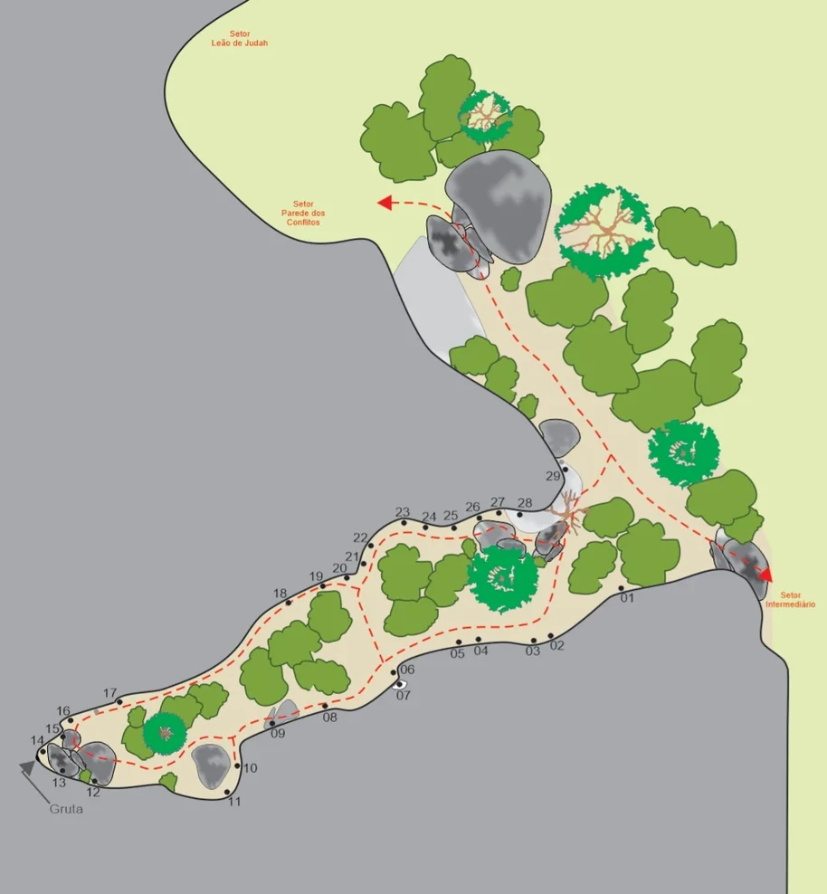
    - **largura_mapa**: 914
    - **altura_mapa**: 988
    - **pontos_de_interesse**:
      - **[0]**:
        - **id**: Setor_Leao_de_Judah
        - **label**: Setor Leão de Judah
        - **retangulo**:
          - **x**: 264
          - **y**: 42
          - **comprimento**: 73
          - **largura**: 33
      - **[1]**:
        - **id**: Setor_Parede_dos_Conflitos
        - **label**: Setor Parede dos Conflitos
        - **retangulo**:
          - **x**: 334
          - **y**: 236
          - **comprimento**: 57
          - **largura**: 39
      - **[2]**:
        - **id**: Setor_Intermediario
        - **label**: Setor Intermediário
        - **retangulo**:
          - **x**: 872
          - **y**: 662
          - **comprimento**: 61
          - **largura**: 26
      - **[3]**:
        - **id**: 01
        - **label**: 01
        - **retangulo**:
          - **x**: 694
          - **y**: 660
          - **comprimento**: 19
          - **largura**: 18
      - **[4]**:
        - **id**: 02
        - **label**: 02
        - **retangulo**:
          - **x**: 616
          - **y**: 712
          - **comprimento**: 24
          - **largura**: 19
      - **[5]**:
        - **id**: 03
        - **label**: 03
        - **retangulo**:
          - **x**: 589
          - **y**: 718
          - **comprimento**: 24
          - **largura**: 19
      - **[6]**:
        - **id**: 04
        - **label**: 04
        - **retangulo**:
          - **x**: 532
          - **y**: 718
          - **comprimento**: 22
          - **largura**: 19
      - **[7]**:
        - **id**: 05
        - **label**: 05
        - **retangulo**:
          - **x**: 506
          - **y**: 722
          - **comprimento**: 21
          - **largura**: 19
      - **[8]**:
        - **id**: 06
        - **label**: 06
        - **retangulo**:
          - **x**: 450
          - **y**: 740
          - **comprimento**: 22
          - **largura**: 19
      - **[9]**:
        - **id**: 07
        - **label**: 07
        - **retangulo**:
          - **x**: 445
          - **y**: 768
          - **comprimento**: 22
          - **largura**: 20
      - **[10]**:
        - **id**: 08
        - **label**: 08
        - **retangulo**:
          - **x**: 365
          - **y**: 793
          - **comprimento**: 24
          - **largura**: 20
      - **[11]**:
        - **id**: 09
        - **label**: 09
        - **retangulo**:
          - **x**: 308
          - **y**: 810
          - **comprimento**: 23
          - **largura**: 18
      - **[12]**:
        - **id**: 10
        - **label**: 10
        - **retangulo**:
          - **x**: 278
          - **y**: 848
          - **comprimento**: 21
          - **largura**: 18
      - **[13]**:
        - **id**: 11
        - **label**: 11
        - **retangulo**:
          - **x**: 260
          - **y**: 886
          - **comprimento**: 20
          - **largura**: 18
      - **[14]**:
        - **id**: 12
        - **label**: 12
        - **retangulo**:
          - **x**: 103
          - **y**: 876
          - **comprimento**: 22
          - **largura**: 19
      - **[15]**:
        - **id**: 13
        - **label**: 13
        - **retangulo**:
          - **x**: 66
          - **y**: 864
          - **comprimento**: 19
          - **largura**: 19
      - **[16]**:
        - **id**: 14
        - **label**: 14
        - **retangulo**:
          - **x**: 42
          - **y**: 818
          - **comprimento**: 19
          - **largura**: 17
      - **[17]**:
        - **id**: 15
        - **label**: 15
        - **retangulo**:
          - **x**: 60
          - **y**: 805
          - **comprimento**: 19
          - **largura**: 16
      - **[18]**:
        - **id**: 16
        - **label**: 16
        - **retangulo**:
          - **x**: 71
          - **y**: 786
          - **comprimento**: 20
          - **largura**: 19
      - **[19]**:
        - **id**: 17
        - **label**: 17
        - **retangulo**:
          - **x**: 122
          - **y**: 765
          - **comprimento**: 20
          - **largura**: 20
      - **[20]**:
        - **id**: 18
        - **label**: 18
        - **retangulo**:
          - **x**: 310
          - **y**: 654
          - **comprimento**: 20
          - **largura**: 19
      - **[21]**:
        - **id**: 19
        - **label**: 19
        - **retangulo**:
          - **x**: 350
          - **y**: 636
          - **comprimento**: 21
          - **largura**: 18
      - **[22]**:
        - **id**: 20
        - **label**: 20
        - **retangulo**:
          - **x**: 375
          - **y**: 628
          - **comprimento**: 18
          - **largura**: 15
      - **[23]**:
        - **id**: 21
        - **label**: 21
        - **retangulo**:
          - **x**: 389
          - **y**: 614
          - **comprimento**: 18
          - **largura**: 15
      - **[24]**:
        - **id**: 22
        - **label**: 22
        - **retangulo**:
          - **x**: 400
          - **y**: 594
          - **comprimento**: 21
          - **largura**: 17
      - **[25]**:
        - **id**: 23
        - **label**: 23
        - **retangulo**:
          - **x**: 445
          - **y**: 566
          - **comprimento**: 22
          - **largura**: 17
      - **[26]**:
        - **id**: 24
        - **label**: 24
        - **retangulo**:
          - **x**: 474
          - **y**: 571
          - **comprimento**: 20
          - **largura**: 18
      - **[27]**:
        - **id**: 25
        - **label**: 25
        - **retangulo**:
          - **x**: 498
          - **y**: 570
          - **comprimento**: 21
          - **largura**: 19
      - **[28]**:
        - **id**: 26
        - **label**: 26
        - **retangulo**:
          - **x**: 522
          - **y**: 560
          - **comprimento**: 20
          - **largura**: 18
      - **[29]**:
        - **id**: 27
        - **label**: 27
        - **retangulo**:
          - **x**: 550
          - **y**: 554
          - **comprimento**: 19
          - **largura**: 17
      - **[30]**:
        - **id**: 28
        - **label**: 28
        - **retangulo**:
          - **x**: 580
          - **y**: 555
          - **comprimento**: 20
          - **largura**: 16
      - **[31]**:
        - **id**: 29
        - **label**: 29
        - **retangulo**:
          - **x**: 611
          - **y**: 526
          - **comprimento**: 22
          - **largura**: 17
    - **referencias**:
      - **[0]**:
        - **escalada**: (via inacabada)
        - **ids**:
          - 01
      - **[1]**:
        - **escalada**: Mutirão
        - **ids**:
          - 02
      - **[2]**:
        - **escalada**: Orgulho do Papai
        - **ids**:
          - 03
      - **[3]**:
        - **escalada**: Bom Filho a Casa Torna
        - **ids**:
          - 04
      - **[4]**:
        - **escalada**: Pelos Poderes de Stive
        - **ids**:
          - 05
      - **[5]**:
        - **escalada**: Tocoloko
        - **ids**:
          - 06
      - **[6]**:
        - **escalada**: Entranhas de Arcos
        - **ids**:
          - 07
      - **[7]**:
        - **escalada**: Se Liga
        - **ids**:
          - 10
      - **[8]**:
        - **escalada**: Maluco da Kombi
        - **ids**:
          - 11
      - **[9]**:
        - **escalada**: Diário de Um Pistoleiro
        - **ids**:
          - 12
      - **[10]**:
        - **escalada**: Dia da Independência
        - **ids**:
          - 13
      - **[11]**:
        - **escalada**: Essa Linha é Nossa
        - **ids**:
          - 14
      - **[12]**:
        - **escalada**: Essa Linha é Minha
        - **ids**:
          - 15
      - **[13]**:
        - **escalada**: Essa Linha é de Todos
        - **ids**:
          - 16
      - **[14]**:
        - **escalada**: Livrai Me de Todos Males
        - **ids**:
          - 17
      - **[15]**:
        - **escalada**: Garrão Bom Bom
        - **ids**:
          - 18
      - **[16]**:
        - **escalada**: Conexão Mané
        - **ids**:
          - 19
      - **[17]**:
        - **escalada**: Os Reis do Mambo
        - **ids**:
          - 20
      - **[18]**:
        - **escalada**: Estrombelete
        - **ids**:
          - 21
      - **[19]**:
        - **escalada**: Sansara
        - **ids**:
          - 22
      - **[20]**:
        - **escalada**: Ho' Oponupono
        - **ids**:
          - 23
      - **[21]**:
        - **escalada**: Nu Com a Mão no Bolso
        - **ids**:
          - 24
      - **[22]**:
        - **escalada**: Planta Rara
        - **ids**:
          - 25
      - **[23]**:
        - **escalada**: Boca Maldita
        - **ids**:
          - 26
      - **[24]**:
        - **escalada**: Aula Prática
        - **ids**:
          - 27
      - **[25]**:
        - **escalada**: Cine Privê
        - **ids**:
          - 28
      - **[26]**:
        - **escalada**: A Estréia
        - **ids**:
          - 29
      - **[27]**:
        - **ids**:
          - 08
        - **setor**: Setor Vale das Sombras
        - **escalada**: Uso Capial
      - **[28]**:
        - **ids**:
          - 09
        - **setor**: Setor Vale das Sombras
        - **escalada**: Clara Morena
      - **[29]**:
        - **ids**:
          - Setor_Leao_de_Judah
        - **setor**: Setor Leão de Judah
      - **[30]**:
        - **ids**:
          - Setor_Parede_dos_Conflitos
        - **setor**: Setor Parede dos Conflitos
      - **[31]**:
        - **ids**:
          - Setor_Intermediario
        - **setor**: Setor Intermediário
- **escaladas**:
  - **[0]**:
    - **via_esportiva**:
      - **nome**: (via inacabada)
      - **dificuldade**: PROJETO
      - **quantidade_protecoes_intermediarias**: 3
      - **data_abertura**: 2023
  - **[1]**:
    - **via_esportiva**:
      - **nome**: Mutirão
      - **dificuldade**: BR_7B
      - **destaque**: True
      - **quantidade_protecoes_intermediarias**: 5
      - **quantidade_protecoes_parada**: 2
  - **[2]**:
    - **via_esportiva**:
      - **nome**: Orgulho do Papai
      - **dificuldade**: BR_7C
      - **quantidade_protecoes_intermediarias**: 5
      - **quantidade_protecoes_parada**: 2
  - **[3]**:
    - **via_esportiva**:
      - **nome**: Bom Filho a Casa Torna
      - **dificuldade**: BR_7A
      - **quantidade_protecoes_intermediarias**: 5
      - **quantidade_protecoes_parada**: 2
  - **[4]**:
    - **via_esportiva**:
      - **nome**: Pelos Poderes de Stive
      - **dificuldade**: BR_6SUP
      - **quantidade_protecoes_intermediarias**: 5
      - **quantidade_protecoes_parada**: 2
  - **[5]**:
    - **via_esportiva**:
      - **nome**: Tocoloko
      - **dificuldade**: BR_6SUP
      - **quantidade_protecoes_intermediarias**: 8
      - **quantidade_protecoes_parada**: 2
  - **[6]**:
    - **via_esportiva**:
      - **nome**: Entranhas de Arcos
      - **dificuldade**: BR_6
      - **destaque**: True
      - **quantidade_protecoes_intermediarias**: 6
      - **quantidade_protecoes_parada**: 2
  - **[7]**:
    - **via_esportiva**:
      - **nome**: Uso Capial
      - **dificuldade**: BR_6SUP
      - **quantidade_protecoes_intermediarias**: 6
      - **quantidade_protecoes_parada**: 2
  - **[8]**:
    - **via_esportiva**:
      - **nome**: Clara Morena
      - **dificuldade**: BR_6
      - **destaque**: True
      - **quantidade_protecoes_intermediarias**: 7
      - **quantidade_protecoes_parada**: 2
  - **[9]**:
    - **via_esportiva**:
      - **nome**: Se Liga
      - **dificuldade**: BR_6SUP
      - **quantidade_protecoes_intermediarias**: 7
      - **quantidade_protecoes_parada**: 2
  - **[10]**:
    - **via_esportiva**:
      - **nome**: Maluco da Kombi
      - **dificuldade**: BR_6SUP
      - **destaque**: True
      - **quantidade_protecoes_intermediarias**: 7
      - **quantidade_protecoes_parada**: 2
  - **[11]**:
    - **via_esportiva**:
      - **nome**: Diário de Um Pistoleiro
      - **dificuldade**: BR_6SUP
      - **destaque**: True
      - **quantidade_protecoes_intermediarias**: 5
      - **quantidade_protecoes_parada**: 2
  - **[12]**:
    - **via_esportiva**:
      - **nome**: Dia da Independência
      - **dificuldade**: BR_5
      - **quantidade_protecoes_intermediarias**: 5
      - **quantidade_protecoes_parada**: 2
  - **[13]**:
    - **via_esportiva**:
      - **nome**: Essa Linha é Nossa
      - **dificuldade**: BR_8A
      - **destaque**: True
      - **quantidade_protecoes_intermediarias**: 7
      - **quantidade_protecoes_parada**: 2
  - **[14]**:
    - **via_esportiva**:
      - **nome**: Essa Linha é Minha
      - **dificuldade**: BR_7B
      - **destaque**: True
      - **quantidade_protecoes_intermediarias**: 6
      - **quantidade_protecoes_parada**: 2
  - **[15]**:
    - **via_esportiva**:
      - **nome**: Essa Linha é de Todos
      - **dificuldade**: BR_7A
      - **destaque**: True
      - **quantidade_protecoes_intermediarias**: 8
      - **quantidade_protecoes_parada**: 2
  - **[16]**:
    - **via_esportiva**:
      - **nome**: Livrai Me de Todos Males
      - **dificuldade**: BR_5SUP
      - **quantidade_protecoes_intermediarias**: 5
      - **quantidade_protecoes_parada**: 2
  - **[17]**:
    - **via_esportiva**:
      - **nome**: Garrão Bom Bom
      - **dificuldade**: BR_6SUP
      - **quantidade_protecoes_intermediarias**: 5
      - **quantidade_protecoes_parada**: 2
  - **[18]**:
    - **via_esportiva**:
      - **nome**: Conexão Mané
      - **dificuldade**: BR_6SUP
      - **quantidade_protecoes_intermediarias**: 3
      - **quantidade_protecoes_parada**: 2
  - **[19]**:
    - **via_esportiva**:
      - **nome**: Os Reis do Mambo
      - **dificuldade**: BR_5SUP
      - **quantidade_protecoes_intermediarias**: 3
      - **quantidade_protecoes_parada**: 2
  - **[20]**:
    - **via_esportiva**:
      - **nome**: Estrombelete
      - **dificuldade**: BR_5
      - **destaque**: True
      - **quantidade_protecoes_intermediarias**: 3
      - **quantidade_protecoes_parada**: 2
  - **[21]**:
    - **via_esportiva**:
      - **nome**: Sansara
      - **dificuldade**: BR_6SUP
      - **quantidade_protecoes_intermediarias**: 6
      - **quantidade_protecoes_parada**: 2
  - **[22]**:
    - **via_esportiva**:
      - **nome**: Ho' Oponupono
      - **dificuldade**: BR_7A
      - **destaque**: True
      - **quantidade_protecoes_intermediarias**: 6
      - **quantidade_protecoes_parada**: 2
  - **[23]**:
    - **via_esportiva**:
      - **nome**: Nu Com a Mão no Bolso
      - **dificuldade**: BR_7A_BARRA_7B
      - **quantidade_protecoes_intermediarias**: 7
      - **quantidade_protecoes_parada**: 2
  - **[24]**:
    - **via_esportiva**:
      - **nome**: Planta Rara
      - **dificuldade**: PROJETO
      - **quantidade_protecoes_intermediarias**: 5
      - **quantidade_protecoes_parada**: 2
      - **data_abertura**: 2022-09
  - **[25]**:
    - **via_esportiva**:
      - **nome**: Boca Maldita
      - **dificuldade**: BR_8A
      - **destaque**: True
      - **quantidade_protecoes_intermediarias**: 5
      - **quantidade_protecoes_parada**: 2
  - **[26]**:
    - **via_esportiva**:
      - **nome**: Aula Prática
      - **dificuldade**: BR_6SUP
      - **quantidade_protecoes_intermediarias**: 5
      - **quantidade_protecoes_parada**: 2
  - **[27]**:
    - **via_esportiva**:
      - **nome**: Cine Privê
      - **dificuldade**: PROJETO
      - **quantidade_protecoes_intermediarias**: 8
      - **quantidade_protecoes_parada**: 2
  - **[28]**:
    - **via_esportiva**:
      - **nome**: A Estréia
      - **dificuldade**: BR_7C
      - **destaque**: True
      - **quantidade_protecoes_intermediarias**: 6
      - **quantidade_protecoes_parada**: 2
- **precomputados**:
  - **total_escaladas**: 29
  - **total_esportivas**: 29
  - **total_moveis**: 0
  - **total_boulders**: 0
  - **total_multiplas_enfiadas**: 0
  - **total_highlines**: 0

## Parte: setor_parede_dos_conflitos

### Setor (Pico: Afloramento Rastro)

- **descricao**:
    # Setor Parede dos Conflitos
    
    Este setor possui sombra até as 13h (variando de acordo com a estação).
- **nome**: Setor Parede dos Conflitos
- **mapas**:
  - **[0]**:
    - **caminho_imagem_mapa**: 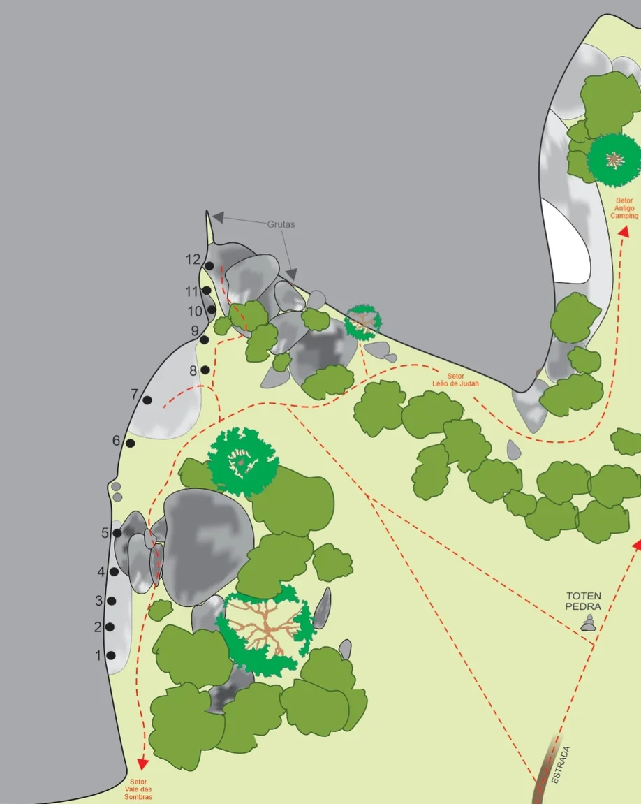
    - **largura_mapa**: 918
    - **altura_mapa**: 1151
    - **pontos_de_interesse**:
      - **[0]**:
        - **id**: Setor_Antigo_Camping
        - **label**: Setor Antigo Camping
        - **retangulo**:
          - **x**: 896
          - **y**: 297
          - **comprimento**: 51
          - **largura**: 42
      - **[1]**:
        - **id**: Setor_Leao_de_Judah
        - **label**: Setor Leão de Judah
        - **retangulo**:
          - **x**: 652
          - **y**: 542
          - **comprimento**: 79
          - **largura**: 38
      - **[2]**:
        - **id**: Totem_Pedra
        - **label**: TOTEM PEDRA
        - **retangulo**:
          - **x**: 836
          - **y**: 860
          - **comprimento**: 64
          - **largura**: 43
      - **[3]**:
        - **id**: Setor_Vale_das_Sombras
        - **label**: Setor Vale das Sombras
        - **retangulo**:
          - **x**: 198
          - **y**: 1130
          - **comprimento**: 51
          - **largura**: 38
      - **[4]**:
        - **id**: 01
        - **label**: 01
        - **retangulo**:
          - **x**: 140
          - **y**: 938
          - **comprimento**: 19
          - **largura**: 23
      - **[5]**:
        - **id**: 02
        - **label**: 2
        - **retangulo**:
          - **x**: 140
          - **y**: 897
          - **comprimento**: 19
          - **largura**: 22
      - **[6]**:
        - **id**: 03
        - **label**: 3
        - **retangulo**:
          - **x**: 141
          - **y**: 859
          - **comprimento**: 18
          - **largura**: 22
      - **[7]**:
        - **id**: 04
        - **label**: 4
        - **retangulo**:
          - **x**: 146
          - **y**: 817
          - **comprimento**: 21
          - **largura**: 24
      - **[8]**:
        - **id**: 05
        - **label**: 5
        - **retangulo**:
          - **x**: 150
          - **y**: 762
          - **comprimento**: 20
          - **largura**: 22
      - **[9]**:
        - **id**: 06
        - **label**: 6
        - **retangulo**:
          - **x**: 166
          - **y**: 628
          - **comprimento**: 20
          - **largura**: 25
      - **[10]**:
        - **id**: 07
        - **label**: 7
        - **retangulo**:
          - **x**: 192
          - **y**: 563
          - **comprimento**: 19
          - **largura**: 24
      - **[11]**:
        - **id**: 08
        - **label**: 8
        - **retangulo**:
          - **x**: 277
          - **y**: 530
          - **comprimento**: 20
          - **largura**: 22
      - **[12]**:
        - **id**: 09
        - **label**: 9
        - **retangulo**:
          - **x**: 279
          - **y**: 473
          - **comprimento**: 20
          - **largura**: 24
      - **[13]**:
        - **id**: 10
        - **label**: 10
        - **retangulo**:
          - **x**: 280
          - **y**: 445
          - **comprimento**: 27
          - **largura**: 22
      - **[14]**:
        - **id**: 11
        - **label**: 11
        - **retangulo**:
          - **x**: 275
          - **y**: 417
          - **comprimento**: 26
          - **largura**: 24
      - **[15]**:
        - **id**: 12
        - **label**: 12
        - **retangulo**:
          - **x**: 276
          - **y**: 370
          - **comprimento**: 27
          - **largura**: 25
    - **referencias**:
      - **[0]**:
        - **escalada**: Ubuntu
        - **ids**:
          - 01
      - **[1]**:
        - **escalada**: Plexo Solar
        - **ids**:
          - 02
      - **[2]**:
        - **escalada**: Du neném
        - **ids**:
          - 03
      - **[3]**:
        - **escalada**: Hora Mágica
        - **ids**:
          - 04
      - **[4]**:
        - **escalada**: Mestres do Sistema
        - **ids**:
          - 05
      - **[5]**:
        - **escalada**: Parede dos Conflitos
        - **ids**:
          - 06
      - **[6]**:
        - **escalada**: Tio Toninho*
        - **ids**:
          - 07
      - **[7]**:
        - **escalada**: Canudos
        - **ids**:
          - 10
      - **[8]**:
        - **escalada**: Paizeps
        - **ids**:
          - 11
      - **[9]**:
        - **escalada**: Antônio Conselheiro
        - **ids**:
          - 12
      - **[10]**:
        - **ids**:
          - 08
        - **setor**: Setor Parede dos Conflitos
        - **escalada**: Guerra dos Côcos
      - **[11]**:
        - **ids**:
          - 09
        - **setor**: Setor Parede dos Conflitos
        - **escalada**: Guerrilha do Araguaia
      - **[12]**:
        - **ids**:
          - Setor_Antigo_Camping
        - **setor**: Setor Antigo Camping
      - **[13]**:
        - **ids**:
          - Setor_Leao_de_Judah
        - **setor**: Setor Leão de Judah
      - **[14]**:
        - **ids**:
          - Setor_Vale_das_Sombras
        - **setor**: Setor Vale das Sombras
- **escaladas**:
  - **[0]**:
    - **via_esportiva**:
      - **nome**: Ubuntu
      - **dificuldade**: BR_7A
  - **[1]**:
    - **via_esportiva**:
      - **nome**: Plexo Solar
      - **dificuldade**: BR_7A
      - **quantidade_protecoes_intermediarias**: 7
      - **quantidade_protecoes_parada**: 2
  - **[2]**:
    - **via_esportiva**:
      - **nome**: Du neném
      - **dificuldade**: BR_6SUP
      - **destaque**: True
      - **quantidade_protecoes_intermediarias**: 6
      - **quantidade_protecoes_parada**: 2
  - **[3]**:
    - **via_esportiva**:
      - **nome**: Hora Mágica
      - **dificuldade**: BR_7A
      - **destaque**: True
      - **quantidade_protecoes_intermediarias**: 6
      - **quantidade_protecoes_parada**: 2
  - **[4]**:
    - **via_esportiva**:
      - **nome**: Mestres do Sistema
      - **dificuldade**: BR_7A
      - **destaque**: True
      - **quantidade_protecoes_intermediarias**: 8
      - **quantidade_protecoes_parada**: 2
  - **[5]**:
    - **via_esportiva**:
      - **nome**: Parede dos Conflitos
      - **dificuldade**: BR_7A
      - **quantidade_protecoes_intermediarias**: 6
      - **quantidade_protecoes_parada**: 2
  - **[6]**:
    - **via_esportiva**:
      - **nome**: Tio Toninho*
      - **dificuldade**: BR_6SUP
      - **quantidade_protecoes_intermediarias**: 4
      - **quantidade_protecoes_parada**: 2
  - **[7]**:
    - **via_esportiva**:
      - **nome**: Guerra dos Côcos
      - **dificuldade**: BR_6
      - **destaque**: True
      - **quantidade_protecoes_intermediarias**: 6
      - **quantidade_protecoes_parada**: 2
  - **[8]**:
    - **via_esportiva**:
      - **nome**: Guerrilha do Araguaia
      - **dificuldade**: BR_5SUP
      - **destaque**: True
      - **quantidade_protecoes_intermediarias**: 6
      - **quantidade_protecoes_parada**: 2
  - **[9]**:
    - **via_esportiva**:
      - **nome**: Canudos
      - **dificuldade**: BR_6SUP
      - **destaque**: True
      - **quantidade_protecoes_intermediarias**: 10
      - **quantidade_protecoes_parada**: 2
  - **[10]**:
    - **via_esportiva**:
      - **nome**: Paizeps
      - **dificuldade**: BR_6SUP
      - **quantidade_protecoes_intermediarias**: 8
      - **quantidade_protecoes_parada**: 2
  - **[11]**:
    - **via_esportiva**:
      - **nome**: Antônio Conselheiro
      - **dificuldade**: BR_6SUP
      - **quantidade_protecoes_intermediarias**: 8
      - **quantidade_protecoes_parada**: 2
- **precomputados**:
  - **total_escaladas**: 12
  - **total_esportivas**: 12
  - **total_moveis**: 0
  - **total_boulders**: 0
  - **total_multiplas_enfiadas**: 0
  - **total_highlines**: 0

## Parte: setor_leao_de_judah

### Setor (Pico: Afloramento Rastro)

- **descricao**:
    # Setor Leão de Judah
    
    Este setor possui sombra até as 12h (variando de acordo com a estação).
- **nome**: Setor Leão de Judah
- **mapas**:
  - **[0]**:
    - **caminho_imagem_mapa**: 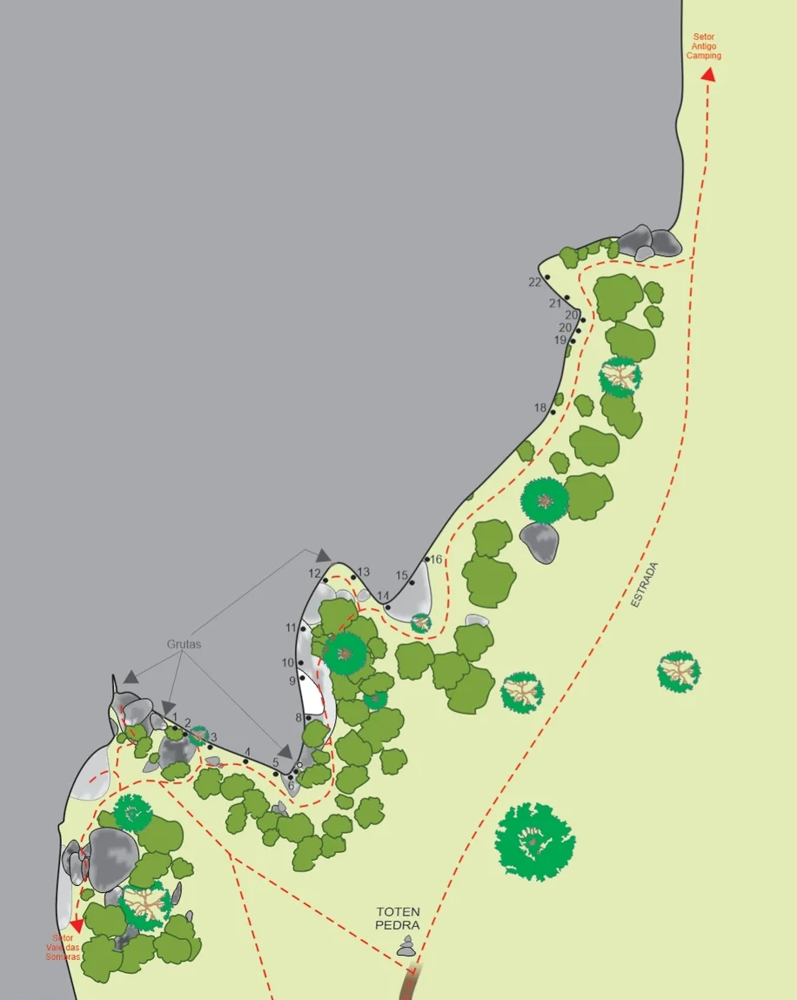
    - **largura_mapa**: 916
    - **altura_mapa**: 1149
    - **pontos_de_interesse**:
      - **[0]**:
        - **id**: Setor_Antigo_Camping
        - **label**: Setor Antigo Camping
        - **retangulo**:
          - **x**: 808
          - **y**: 52
          - **comprimento**: 46
          - **largura**: 39
      - **[1]**:
        - **id**: Totem_Pedra
        - **label**: TOTEM PEDRA
        - **retangulo**:
          - **x**: 457
          - **y**: 1054
          - **comprimento**: 56
          - **largura**: 32
      - **[2]**:
        - **id**: Setor_Vale_das_Sombras
        - **label**: Setor Vale das Sombras
        - **retangulo**:
          - **x**: 72
          - **y**: 1090
          - **comprimento**: 59
          - **largura**: 47
      - **[3]**:
        - **id**: 01
        - **label**: 01
        - **retangulo**:
          - **x**: 201
          - **y**: 823
          - **comprimento**: 16
          - **largura**: 14
      - **[4]**:
        - **id**: 02
        - **label**: 02
        - **retangulo**:
          - **x**: 216
          - **y**: 830
          - **comprimento**: 16
          - **largura**: 14
      - **[5]**:
        - **id**: 03
        - **label**: 03
        - **retangulo**:
          - **x**: 246
          - **y**: 847
          - **comprimento**: 16
          - **largura**: 14
      - **[6]**:
        - **id**: 04
        - **label**: 04
        - **retangulo**:
          - **x**: 285
          - **y**: 864
          - **comprimento**: 16
          - **largura**: 14
      - **[7]**:
        - **id**: 05
        - **label**: 05
        - **retangulo**:
          - **x**: 317
          - **y**: 876
          - **comprimento**: 16
          - **largura**: 14
      - **[8]**:
        - **id**: 06
        - **label**: 06
        - **retangulo**:
          - **x**: 334
          - **y**: 903
          - **comprimento**: 13
          - **largura**: 14
      - **[9]**:
        - **id**: 07
        - **label**: 07
        - **retangulo**:
          - **x**: 348
          - **y**: 891
          - **comprimento**: 14
          - **largura**: 14
      - **[10]**:
        - **id**: 08
        - **label**: 08
        - **retangulo**:
          - **x**: 344
          - **y**: 824
          - **comprimento**: 13
          - **largura**: 13
      - **[11]**:
        - **id**: 09
        - **label**: 9
        - **retangulo**:
          - **x**: 336
          - **y**: 781
          - **comprimento**: 13
          - **largura**: 14
      - **[12]**:
        - **id**: 10
        - **label**: 10
        - **retangulo**:
          - **x**: 331
          - **y**: 760
          - **comprimento**: 18
          - **largura**: 17
      - **[13]**:
        - **id**: 11
        - **label**: 11
        - **retangulo**:
          - **x**: 334
          - **y**: 720
          - **comprimento**: 16
          - **largura**: 15
      - **[14]**:
        - **id**: 12
        - **label**: 12
        - **retangulo**:
          - **x**: 362
          - **y**: 658
          - **comprimento**: 19
          - **largura**: 17
      - **[15]**:
        - **id**: 13
        - **label**: 13
        - **retangulo**:
          - **x**: 418
          - **y**: 656
          - **comprimento**: 18
          - **largura**: 17
      - **[16]**:
        - **id**: 14
        - **label**: 14
        - **retangulo**:
          - **x**: 440
          - **y**: 684
          - **comprimento**: 19
          - **largura**: 19
      - **[17]**:
        - **id**: 15
        - **label**: 15
        - **retangulo**:
          - **x**: 462
          - **y**: 660
          - **comprimento**: 19
          - **largura**: 18
      - **[18]**:
        - **id**: 16
        - **label**: 16
        - **retangulo**:
          - **x**: 502
          - **y**: 642
          - **comprimento**: 17
          - **largura**: 17
      - **[19]**:
        - **id**: 18
        - **label**: 18
        - **retangulo**:
          - **x**: 621
          - **y**: 468
          - **comprimento**: 20
          - **largura**: 17
      - **[20]**:
        - **id**: 19
        - **label**: 19
        - **retangulo**:
          - **x**: 644
          - **y**: 392
          - **comprimento**: 17
          - **largura**: 15
      - **[21]**:
        - **id**: 20
        - **label**: 20
        - **retangulo**:
          - **x**: 653
          - **y**: 368
          - **comprimento**: 24
          - **largura**: 27
      - **[22]**:
        - **id**: 21
        - **label**: 21
        - **retangulo**:
          - **x**: 638
          - **y**: 348
          - **comprimento**: 19
          - **largura**: 15
      - **[23]**:
        - **id**: 22
        - **label**: 22
        - **retangulo**:
          - **x**: 615
          - **y**: 324
          - **comprimento**: 18
          - **largura**: 13
    - **referencias**:
      - **[0]**:
        - **escalada**: Aline no País das Maravilhas
        - **ids**:
          - 01
      - **[1]**:
        - **escalada**: Ziriguidum te dá Asas
        - **ids**:
          - 02
      - **[2]**:
        - **escalada**: Michael Jordan
        - **ids**:
          - 03
      - **[3]**:
        - **escalada**: Homens de Pedra
        - **ids**:
          - 04
      - **[4]**:
        - **escalada**: Privilégio da Ignorância
        - **ids**:
          - 05
      - **[5]**:
        - **escalada**: Rastro de São Pedro
        - **ids**:
          - 06
      - **[6]**:
        - **escalada**: Leão de Judah
        - **ids**:
          - 07
      - **[7]**:
        - **escalada**: Duelo de Titãs
        - **ids**:
          - 10
      - **[8]**:
        - **escalada**: Don Corleone
        - **ids**:
          - 11
      - **[9]**:
        - **escalada**: Confusão Mental
        - **ids**:
          - 12
      - **[10]**:
        - **escalada**: Extraordinária
        - **ids**:
          - 13
      - **[11]**:
        - **escalada**: Entre o Sol e a Sombra
        - **ids**:
          - 14
      - **[12]**:
        - **escalada**: Sacafraga
        - **ids**:
          - 15
      - **[13]**:
        - **escalada**: Cogumelo de Óreon
        - **ids**:
          - 16
      - **[14]**:
        - **escalada**: Lei da Selva
        - **ids**:
          - 17
      - **[15]**:
        - **escalada**: Fanfarrão
        - **ids**:
          - 18
      - **[16]**:
        - **escalada**: Presepagem
        - **ids**:
          - 19
      - **[17]**:
        - **escalada**: Tudo Nosso
        - **ids**:
          - 20
      - **[18]**:
        - **escalada**: Tetinho*
        - **ids**:
          - 21
      - **[19]**:
        - **escalada**: Ce ki Sabe
        - **ids**:
          - 22
      - **[20]**:
        - **ids**:
          - 08
        - **setor**: Setor Leão de Judah
        - **escalada**: Efeito Moral
      - **[21]**:
        - **ids**:
          - 09
        - **setor**: Setor Leão de Judah
        - **escalada**: Risco de Discórdia
      - **[22]**:
        - **ids**:
          - Setor_Vale_das_Sombras
        - **setor**: Setor Vale das Sombras
      - **[23]**:
        - **ids**:
          - Setor_Antigo_Camping
        - **setor**: Setor Antigo Camping
- **escaladas**:
  - **[0]**:
    - **via_esportiva**:
      - **nome**: Aline no País das Maravilhas
      - **dificuldade**: BR_5SUP
      - **destaque**: True
      - **quantidade_protecoes_intermediarias**: 4
      - **quantidade_protecoes_parada**: 2
  - **[1]**:
    - **via_esportiva**:
      - **nome**: Ziriguidum te dá Asas
      - **dificuldade**: BR_7B
      - **destaque**: True
      - **quantidade_protecoes_intermediarias**: 5
      - **quantidade_protecoes_parada**: 2
  - **[2]**:
    - **via_esportiva**:
      - **nome**: Michael Jordan
      - **dificuldade**: BR_7C
      - **destaque**: True
      - **quantidade_protecoes_intermediarias**: 4
      - **quantidade_protecoes_parada**: 2
  - **[3]**:
    - **via_esportiva**:
      - **nome**: Homens de Pedra
      - **dificuldade**: BR_7B
      - **destaque**: True
      - **quantidade_protecoes_intermediarias**: 5
      - **quantidade_protecoes_parada**: 2
  - **[4]**:
    - **via_esportiva**:
      - **nome**: Privilégio da Ignorância
      - **dificuldade**: BR_8A
      - **destaque**: True
      - **quantidade_protecoes_intermediarias**: 7
      - **quantidade_protecoes_parada**: 2
  - **[5]**:
    - **via_esportiva**:
      - **nome**: Rastro de São Pedro
      - **dificuldade**: BR_9A
      - **destaque**: True
      - **quantidade_protecoes_intermediarias**: 8
      - **quantidade_protecoes_parada**: 2
  - **[6]**:
    - **via_esportiva**:
      - **nome**: Leão de Judah
      - **dificuldade**: BR_7B
      - **destaque**: True
      - **quantidade_protecoes_intermediarias**: 8
      - **quantidade_protecoes_parada**: 2
  - **[7]**:
    - **via_esportiva**:
      - **nome**: Efeito Moral
      - **dificuldade**: BR_7C_BARRA_8A
      - **quantidade_protecoes_intermediarias**: 7
      - **quantidade_protecoes_parada**: 2
  - **[8]**:
    - **via_esportiva**:
      - **nome**: Risco de Discórdia
      - **dificuldade**: BR_8A
      - **quantidade_protecoes_intermediarias**: 10
      - **quantidade_protecoes_parada**: 2
  - **[9]**:
    - **via_esportiva**:
      - **nome**: Duelo de Titãs
      - **dificuldade**: BR_8C
      - **destaque**: True
      - **quantidade_protecoes_intermediarias**: 9
      - **quantidade_protecoes_parada**: 2
  - **[10]**:
    - **via_esportiva**:
      - **nome**: Don Corleone
      - **dificuldade**: PROJETO
      - **destaque**: True
      - **quantidade_protecoes_intermediarias**: 7
      - **quantidade_protecoes_parada**: 2
  - **[11]**:
    - **via_esportiva**:
      - **nome**: Confusão Mental
      - **dificuldade**: BR_8C
      - **destaque**: True
      - **quantidade_protecoes_intermediarias**: 9
      - **quantidade_protecoes_parada**: 2
  - **[12]**:
    - **via_esportiva**:
      - **nome**: Extraordinária
      - **dificuldade**: BR_7A
      - **destaque**: True
      - **quantidade_protecoes_intermediarias**: 10
      - **quantidade_protecoes_parada**: 2
  - **[13]**:
    - **via_esportiva**:
      - **nome**: Entre o Sol e a Sombra
      - **dificuldade**: BR_7A
      - **destaque**: True
      - **quantidade_protecoes_intermediarias**: 10
      - **quantidade_protecoes_parada**: 2
  - **[14]**:
    - **via_esportiva**:
      - **nome**: Sacafraga
      - **dificuldade**: BR_6SUP
      - **quantidade_protecoes_intermediarias**: 7
      - **quantidade_protecoes_parada**: 2
  - **[15]**:
    - **via_esportiva**:
      - **nome**: Cogumelo de Óreon
      - **dificuldade**: BR_7A
      - **quantidade_protecoes_intermediarias**: 7
      - **quantidade_protecoes_parada**: 2
  - **[16]**:
    - **via_esportiva**:
      - **nome**: Lei da Selva
      - **dificuldade**: BR_8A
  - **[17]**:
    - **via_esportiva**:
      - **nome**: Fanfarrão
      - **dificuldade**: BR_7A
      - **quantidade_protecoes_intermediarias**: 6
      - **quantidade_protecoes_parada**: 2
  - **[18]**:
    - **via_esportiva**:
      - **nome**: Presepagem
      - **dificuldade**: BR_7B
      - **quantidade_protecoes_intermediarias**: 5
      - **quantidade_protecoes_parada**: 2
  - **[19]**:
    - **via_esportiva**:
      - **nome**: Tudo Nosso
      - **dificuldade**: BR_7B
      - **destaque**: True
      - **quantidade_protecoes_intermediarias**: 6
      - **quantidade_protecoes_parada**: 2
  - **[20]**:
    - **via_esportiva**:
      - **nome**: Tetinho*
      - **dificuldade**: BR_7A
      - **quantidade_protecoes_intermediarias**: 5
      - **quantidade_protecoes_parada**: 2
  - **[21]**:
    - **via_esportiva**:
      - **nome**: Ce ki Sabe
      - **dificuldade**: BR_6SUP
      - **destaque**: True
      - **quantidade_protecoes_intermediarias**: 3
      - **quantidade_protecoes_parada**: 2
- **precomputados**:
  - **total_escaladas**: 22
  - **total_esportivas**: 22
  - **total_moveis**: 0
  - **total_boulders**: 0
  - **total_multiplas_enfiadas**: 0
  - **total_highlines**: 0

## Parte: setor_antigo_camping

### Setor (Pico: Afloramento Rastro)

- **descricao**:
    # Setor Antigo Camping
    
    Este setor possui sombra até as 13h (variando de acordo com a estação).
- **nome**: Setor Antigo Camping
- **mapas**:
  - **[0]**:
    - **caminho_imagem_mapa**: 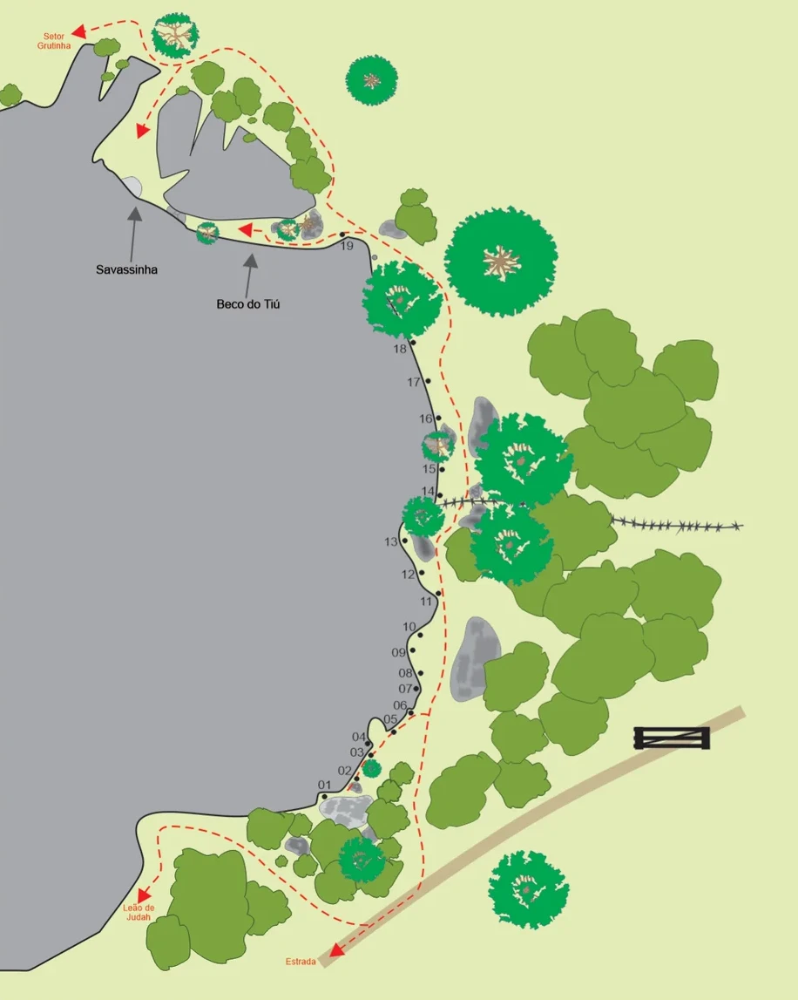
    - **largura_mapa**: 916
    - **altura_mapa**: 1147
    - **pontos_de_interesse**:
      - **[0]**:
        - **id**: Setor_Grutinha
        - **label**: Setor Grutinha
        - **retangulo**:
          - **x**: 62
          - **y**: 46
          - **comprimento**: 46
          - **largura**: 29
      - **[1]**:
        - **id**: Savassinha
        - **label**: Savassinha
        - **retangulo**:
          - **x**: 146
          - **y**: 308
          - **comprimento**: 80
          - **largura**: 26
      - **[2]**:
        - **id**: Beco_do_Tiu
        - **label**: Beco do Tiú
        - **retangulo**:
          - **x**: 285
          - **y**: 348
          - **comprimento**: 78
          - **largura**: 25
      - **[3]**:
        - **id**: 01
        - **label**: 01
        - **retangulo**:
          - **x**: 372
          - **y**: 900
          - **comprimento**: 18
          - **largura**: 15
      - **[4]**:
        - **id**: 02
        - **label**: 02
        - **retangulo**:
          - **x**: 396
          - **y**: 884
          - **comprimento**: 21
          - **largura**: 16
      - **[5]**:
        - **id**: 03
        - **label**: 03
        - **retangulo**:
          - **x**: 410
          - **y**: 863
          - **comprimento**: 21
          - **largura**: 16
      - **[6]**:
        - **id**: 04
        - **label**: 04
        - **retangulo**:
          - **x**: 412
          - **y**: 844
          - **comprimento**: 19
          - **largura**: 15
      - **[7]**:
        - **id**: 05
        - **label**: 05
        - **retangulo**:
          - **x**: 448
          - **y**: 824
          - **comprimento**: 20
          - **largura**: 15
      - **[8]**:
        - **id**: 06
        - **label**: 06
        - **retangulo**:
          - **x**: 459
          - **y**: 808
          - **comprimento**: 20
          - **largura**: 15
      - **[9]**:
        - **id**: 07
        - **label**: 07
        - **retangulo**:
          - **x**: 466
          - **y**: 790
          - **comprimento**: 20
          - **largura**: 15
      - **[10]**:
        - **id**: 08
        - **label**: 08
        - **retangulo**:
          - **x**: 466
          - **y**: 771
          - **comprimento**: 21
          - **largura**: 16
      - **[11]**:
        - **id**: 09
        - **label**: 09
        - **retangulo**:
          - **x**: 458
          - **y**: 748
          - **comprimento**: 21
          - **largura**: 16
      - **[12]**:
        - **id**: 10
        - **label**: 10
        - **retangulo**:
          - **x**: 470
          - **y**: 718
          - **comprimento**: 20
          - **largura**: 17
      - **[13]**:
        - **id**: 11
        - **label**: 11
        - **retangulo**:
          - **x**: 490
          - **y**: 689
          - **comprimento**: 19
          - **largura**: 18
      - **[14]**:
        - **id**: 12
        - **label**: 12
        - **retangulo**:
          - **x**: 470
          - **y**: 658
          - **comprimento**: 21
          - **largura**: 17
      - **[15]**:
        - **id**: 13
        - **label**: 13
        - **retangulo**:
          - **x**: 449
          - **y**: 622
          - **comprimento**: 20
          - **largura**: 17
      - **[16]**:
        - **id**: 14
        - **label**: 14
        - **retangulo**:
          - **x**: 492
          - **y**: 562
          - **comprimento**: 18
          - **largura**: 16
      - **[17]**:
        - **id**: 15
        - **label**: 15
        - **retangulo**:
          - **x**: 492
          - **y**: 538
          - **comprimento**: 19
          - **largura**: 17
      - **[18]**:
        - **id**: 16
        - **label**: 16
        - **retangulo**:
          - **x**: 489
          - **y**: 480
          - **comprimento**: 20
          - **largura**: 18
      - **[19]**:
        - **id**: 17
        - **label**: 17
        - **retangulo**:
          - **x**: 476
          - **y**: 438
          - **comprimento**: 19
          - **largura**: 18
      - **[20]**:
        - **id**: 18
        - **label**: 18
        - **retangulo**:
          - **x**: 460
          - **y**: 400
          - **comprimento**: 19
          - **largura**: 18
      - **[21]**:
        - **id**: 19
        - **label**: 19
        - **retangulo**:
          - **x**: 398
          - **y**: 282
          - **comprimento**: 19
          - **largura**: 17
      - **[22]**:
        - **id**: Leao_de_Judah
        - **label**: Leão de Judah
        - **retangulo**:
          - **x**: 159
          - **y**: 1046
          - **comprimento**: 46
          - **largura**: 32
    - **referencias**:
      - **[0]**:
        - **escalada**: Lucy Não
        - **ids**:
          - 01
      - **[1]**:
        - **escalada**: Amigos do Rastro
        - **ids**:
          - 02
      - **[2]**:
        - **escalada**: Rebelde Sem Calça
        - **ids**:
          - 03
      - **[3]**:
        - **escalada**: Pedra do Gênese
        - **ids**:
          - 04
      - **[4]**:
        - **escalada**: Sociedade Alternativa
        - **ids**:
          - 05
      - **[5]**:
        - **escalada**: Caixote*
        - **ids**:
          - 06
      - **[6]**:
        - **escalada**: Sai Clipado
        - **ids**:
          - 07
      - **[7]**:
        - **escalada**: Mistério do Cachorro Zezinho
        - **ids**:
          - 10
      - **[8]**:
        - **escalada**: Muro das Lamentações
        - **ids**:
          - 11
      - **[9]**:
        - **escalada**: Jogo de Cintura
        - **ids**:
          - 12
      - **[10]**:
        - **escalada**: Capitão Barbárie
        - **ids**:
          - 13
      - **[11]**:
        - **escalada**: Faixa de Gaza
        - **ids**:
          - 14
      - **[12]**:
        - **escalada**: Pele Vermelha
        - **ids**:
          - 15
      - **[13]**:
        - **escalada**: Café da Manhã
        - **ids**:
          - 16
      - **[14]**:
        - **escalada**: Velório da Galinha
        - **ids**:
          - 17
      - **[15]**:
        - **escalada**: Parceragem
        - **ids**:
          - 18
      - **[16]**:
        - **escalada**: Lenços Umedecidos
        - **ids**:
          - 19
      - **[17]**:
        - **ids**:
          - Setor_Grutinha
        - **setor**: Setor Grutinha
      - **[18]**:
        - **ids**:
          - Savassinha
        - **setor**: Setor Savassinha
      - **[19]**:
        - **ids**:
          - Beco_do_Tiu
        - **setor**: Setor Beco do Tiú
      - **[20]**:
        - **ids**:
          - Leao_de_Judah
        - **setor**: Setor Leão de Judah
- **escaladas**:
  - **[0]**:
    - **via_esportiva**:
      - **nome**: Lucy Não
      - **dificuldade**: BR_5
      - **quantidade_protecoes_intermediarias**: 5
      - **quantidade_protecoes_parada**: 2
  - **[1]**:
    - **via_esportiva**:
      - **nome**: Amigos do Rastro
      - **dificuldade**: BR_7B
      - **destaque**: True
      - **quantidade_protecoes_intermediarias**: 5
      - **quantidade_protecoes_parada**: 2
  - **[2]**:
    - **via_esportiva**:
      - **nome**: Rebelde Sem Calça
      - **dificuldade**: BR_7A
      - **destaque**: True
      - **quantidade_protecoes_intermediarias**: 5
      - **quantidade_protecoes_parada**: 2
  - **[3]**:
    - **via_esportiva**:
      - **nome**: Pedra do Gênese
      - **dificuldade**: PROJETO
      - **quantidade_protecoes_intermediarias**: 7
      - **quantidade_protecoes_parada**: 2
  - **[4]**:
    - **via_esportiva**:
      - **nome**: Sociedade Alternativa
      - **dificuldade**: BR_7A
      - **destaque**: True
      - **quantidade_protecoes_intermediarias**: 6
      - **quantidade_protecoes_parada**: 2
  - **[5]**:
    - **via_esportiva**:
      - **nome**: Caixote*
      - **dificuldade**: BR_6SUP
      - **destaque**: True
      - **quantidade_protecoes_intermediarias**: 6
      - **quantidade_protecoes_parada**: 2
  - **[6]**:
    - **via_esportiva**:
      - **nome**: Sai Clipado
      - **dificuldade**: BR_7C
      - **quantidade_protecoes_intermediarias**: 6
      - **quantidade_protecoes_parada**: 2
  - **[7]**:
    - **via_esportiva**:
      - **nome**: Xuxa Preta de Pains
      - **dificuldade**: BR_7A
      - **destaque**: True
      - **quantidade_protecoes_intermediarias**: 6
      - **quantidade_protecoes_parada**: 2
  - **[8]**:
    - **via_esportiva**:
      - **nome**: Brenfa Móvel
      - **dificuldade**: BR_7B
      - **quantidade_protecoes_intermediarias**: 7
      - **quantidade_protecoes_parada**: 2
  - **[9]**:
    - **via_esportiva**:
      - **nome**: Mistério do Cachorro Zezinho
      - **dificuldade**: PROJETO
      - **quantidade_protecoes_intermediarias**: 8
      - **quantidade_protecoes_parada**: 2
  - **[10]**:
    - **via_esportiva**:
      - **nome**: Muro das Lamentações
      - **dificuldade**: BR_8A
      - **destaque**: True
      - **quantidade_protecoes_intermediarias**: 7
      - **quantidade_protecoes_parada**: 2
  - **[11]**:
    - **via_esportiva**:
      - **nome**: Jogo de Cintura
      - **dificuldade**: BR_9B
      - **destaque**: True
      - **quantidade_protecoes_intermediarias**: 8
      - **quantidade_protecoes_parada**: 2
  - **[12]**:
    - **via_esportiva**:
      - **nome**: Capitão Barbárie
      - **dificuldade**: PROJETO
      - **quantidade_protecoes_intermediarias**: 6
      - **quantidade_protecoes_parada**: 2
  - **[13]**:
    - **via_esportiva**:
      - **nome**: Faixa de Gaza
      - **dificuldade**: BR_7A
      - **destaque**: True
      - **quantidade_protecoes_intermediarias**: 7
      - **quantidade_protecoes_parada**: 2
  - **[14]**:
    - **via_esportiva**:
      - **nome**: Pele Vermelha
      - **dificuldade**: BR_6SUP
      - **destaque**: True
      - **quantidade_protecoes_intermediarias**: 6
      - **quantidade_protecoes_parada**: 2
  - **[15]**:
    - **via_esportiva**:
      - **nome**: Café da Manhã
      - **dificuldade**: BR_6SUP
      - **destaque**: True
      - **quantidade_protecoes_intermediarias**: 7
      - **quantidade_protecoes_parada**: 2
  - **[16]**:
    - **via_esportiva**:
      - **nome**: Velório da Galinha
      - **dificuldade**: BR_6SUP
      - **destaque**: True
      - **quantidade_protecoes_intermediarias**: 5
      - **quantidade_protecoes_parada**: 2
  - **[17]**:
    - **via_esportiva**:
      - **nome**: Parceragem
      - **dificuldade**: BR_7A
      - **quantidade_protecoes_intermediarias**: 7
      - **quantidade_protecoes_parada**: 2
  - **[18]**:
    - **via_esportiva**:
      - **nome**: Lenços Umedecidos
      - **dificuldade**: BR_8B
      - **destaque**: True
      - **quantidade_protecoes_intermediarias**: 3
      - **quantidade_protecoes_parada**: 2
- **precomputados**:
  - **total_escaladas**: 19
  - **total_esportivas**: 19
  - **total_moveis**: 0
  - **total_boulders**: 0
  - **total_multiplas_enfiadas**: 0
  - **total_highlines**: 0

## Parte: setor_beco_do_tiu

### Setor (Pico: Afloramento Rastro)

- **descricao**:
    # Setor Beco do Tiú
    
    Este setor possui sombra até as 13h (variando de acordo com a estação).
- **nome**: Setor Beco do Tiú
- **mapas**:
  - **[0]**:
    - **caminho_imagem_mapa**: 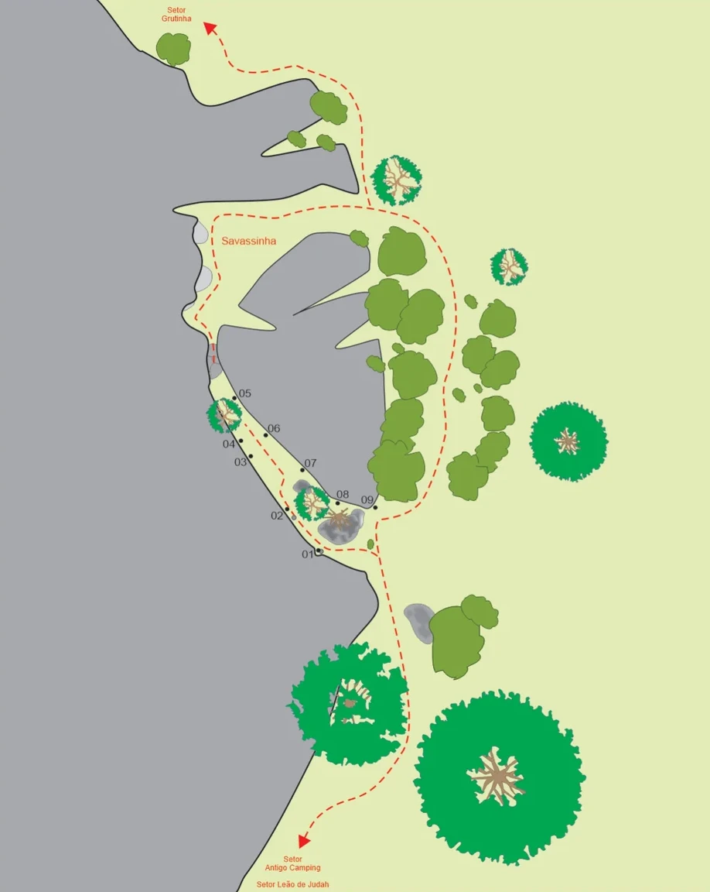
    - **largura_mapa**: 918
    - **altura_mapa**: 1152
    - **pontos_de_interesse**:
      - **[0]**:
        - **id**: Setor_Grutinha
        - **label**: Setor Grutinha
        - **retangulo**:
          - **x**: 228
          - **y**: 18
          - **comprimento**: 47
          - **largura**: 33
      - **[1]**:
        - **id**: Savassinha
        - **label**: Savassinha
        - **retangulo**:
          - **x**: 320
          - **y**: 310
          - **comprimento**: 78
          - **largura**: 21
      - **[2]**:
        - **id**: 01
        - **label**: 01
        - **retangulo**:
          - **x**: 398
          - **y**: 716
          - **comprimento**: 21
          - **largura**: 17
      - **[3]**:
        - **id**: 02
        - **label**: 02
        - **retangulo**:
          - **x**: 358
          - **y**: 666
          - **comprimento**: 21
          - **largura**: 17
      - **[4]**:
        - **id**: 03
        - **label**: 03
        - **retangulo**:
          - **x**: 311
          - **y**: 596
          - **comprimento**: 20
          - **largura**: 20
      - **[5]**:
        - **id**: 04
        - **label**: 04
        - **retangulo**:
          - **x**: 296
          - **y**: 572
          - **comprimento**: 21
          - **largura**: 17
      - **[6]**:
        - **id**: 05
        - **label**: 05
        - **retangulo**:
          - **x**: 316
          - **y**: 507
          - **comprimento**: 21
          - **largura**: 18
      - **[7]**:
        - **id**: 06
        - **label**: 06
        - **retangulo**:
          - **x**: 354
          - **y**: 553
          - **comprimento**: 22
          - **largura**: 18
      - **[8]**:
        - **id**: 07
        - **label**: 07
        - **retangulo**:
          - **x**: 402
          - **y**: 598
          - **comprimento**: 22
          - **largura**: 19
      - **[9]**:
        - **id**: 08
        - **label**: 08
        - **retangulo**:
          - **x**: 443
          - **y**: 638
          - **comprimento**: 22
          - **largura**: 18
      - **[10]**:
        - **id**: 09
        - **label**: 09
        - **retangulo**:
          - **x**: 475
          - **y**: 646
          - **comprimento**: 22
          - **largura**: 17
      - **[11]**:
        - **id**: Setor_Antigo_Camping
        - **label**: Setor Antigo Camping
        - **retangulo**:
          - **x**: 378
          - **y**: 1116
          - **comprimento**: 78
          - **largura**: 25
      - **[12]**:
        - **id**: Setor_Leao_de_Judah
        - **label**: Setor Leão de Judah
        - **retangulo**:
          - **x**: 378
          - **y**: 1142
          - **comprimento**: 102
          - **largura**: 19
    - **referencias**:
      - **[0]**:
        - **escalada**: Panqueca de Salada
        - **ids**:
          - 01
      - **[1]**:
        - **escalada**: Belí*
        - **ids**:
          - 02
      - **[2]**:
        - **escalada**: Chapa Caseira*
        - **ids**:
          - 03
      - **[3]**:
        - **escalada**: Turma do Picknick
        - **ids**:
          - 04
      - **[4]**:
        - **escalada**: Azul Royal
        - **ids**:
          - 05
      - **[5]**:
        - **escalada**: Amaralzinha
        - **ids**:
          - 06
      - **[6]**:
        - **escalada**: Usa Quatro e Sobra Um
        - **ids**:
          - 07
      - **[7]**:
        - **ids**:
          - 08
        - **setor**: Setor Antigo Camping
        - **escalada**: Xuxa Preta de Pains
      - **[8]**:
        - **ids**:
          - 09
        - **setor**: Setor Antigo Camping
        - **escalada**: Brenfa Móvel
      - **[9]**:
        - **ids**:
          - Setor_Grutinha
        - **setor**: Setor Grutinha
      - **[10]**:
        - **ids**:
          - Savassinha
        - **setor**: Setor Savassinha
      - **[11]**:
        - **ids**:
          - Setor_Antigo_Camping
        - **setor**: Setor Antigo Camping
      - **[12]**:
        - **ids**:
          - Setor_Leao_de_Judah
        - **setor**: Setor Leão de Judah
- **escaladas**:
  - **[0]**:
    - **via_esportiva**:
      - **nome**: Panqueca de Salada
      - **dificuldade**: BR_6
      - **destaque**: True
      - **quantidade_protecoes_intermediarias**: 7
      - **quantidade_protecoes_parada**: 2
  - **[1]**:
    - **via_movel**:
      - **nome**: Daime o poder
      - **dificuldade**: BR_6
  - **[2]**:
    - **via_esportiva**:
      - **nome**: Belí*
      - **dificuldade**: BR_6SUP
      - **destaque**: True
      - **quantidade_protecoes_intermediarias**: 4
      - **quantidade_protecoes_parada**: 2
      - **data_abertura**: 2009
  - **[3]**:
    - **via_movel**:
      - **nome**: sem nome (móvel)
      - **dificuldade**: BR_7A
      - **data_abertura**: 2009
  - **[4]**:
    - **via_esportiva**:
      - **nome**: Chapa Caseira*
      - **dificuldade**: BR_6
      - **destaque**: True
      - **quantidade_protecoes_intermediarias**: 3
      - **quantidade_protecoes_parada**: 2
      - **data_abertura**: 2009
  - **[5]**:
    - **via_esportiva**:
      - **nome**: Turma do Picknick
      - **dificuldade**: BR_6
      - **quantidade_protecoes_intermediarias**: 2
      - **quantidade_protecoes_parada**: 2
      - **data_abertura**: 2022-09
  - **[6]**:
    - **via_esportiva**:
      - **nome**: Azul Royal
      - **dificuldade**: BR_4
      - **destaque**: True
      - **quantidade_protecoes_intermediarias**: 2
      - **quantidade_protecoes_parada**: 2
      - **data_abertura**: 2015-02-21
  - **[7]**:
    - **via_esportiva**:
      - **nome**: Amaralzinha
      - **dificuldade**: BR_4
      - **destaque**: True
      - **quantidade_protecoes_intermediarias**: 3
      - **quantidade_protecoes_parada**: 2
  - **[8]**:
    - **via_esportiva**:
      - **nome**: Usa Quatro e Sobra Um
      - **dificuldade**: BR_4
      - **quantidade_protecoes_intermediarias**: 3
      - **quantidade_protecoes_parada**: 2
  - **[9]**:
    - **via_esportiva**:
      - **nome**: Conexão 3G
      - **dificuldade**: BR_4
      - **quantidade_protecoes_intermediarias**: 3
      - **quantidade_protecoes_parada**: 2
  - **[10]**:
    - **via_esportiva**:
      - **nome**: Demorô+Saiu
      - **dificuldade**: BR_4
      - **destaque**: True
      - **quantidade_protecoes_intermediarias**: 3
      - **quantidade_protecoes_parada**: 2
- **precomputados**:
  - **total_escaladas**: 11
  - **total_esportivas**: 9
  - **total_moveis**: 0
  - **total_boulders**: 0
  - **total_multiplas_enfiadas**: 0
  - **total_highlines**: 0

## Parte: setor_savassinha

### Setor (Pico: Afloramento Rastro)

- **descricao**:
    # Setor Savassinha
    
    Este setor possui sombra até as 12h (variando de acordo com a estação).
- **nome**: Setor Savassinha
- **mapas**:
  - **[0]**:
    - **caminho_imagem_mapa**: 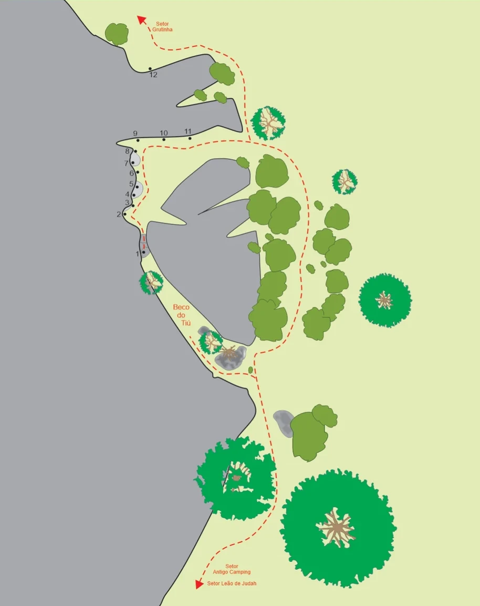
    - **largura_mapa**: 914
    - **altura_mapa**: 1153
    - **pontos_de_interesse**:
      - **[0]**:
        - **id**: Setor_Grutinha
        - **label**: Setor Grutinha
        - **retangulo**:
          - **x**: 306
          - **y**: 50
          - **comprimento**: 50
          - **largura**: 25
      - **[1]**:
        - **id**: Beco_do_Tiu
        - **label**: Beco do Tiú
        - **retangulo**:
          - **x**: 346
          - **y**: 598
          - **comprimento**: 44
          - **largura**: 50
      - **[2]**:
        - **id**: Setor_Antigo_Camping
        - **label**: Setor Antigo Camping
        - **retangulo**:
          - **x**: 441
          - **y**: 1082
          - **comprimento**: 76
          - **largura**: 27
      - **[3]**:
        - **id**: Setor_Leao_de_Judah
        - **label**: Setor Leão de Judah
        - **retangulo**:
          - **x**: 442
          - **y**: 1110
          - **comprimento**: 100
          - **largura**: 19
      - **[4]**:
        - **id**: 01
        - **label**: 01
        - **retangulo**:
          - **x**: 262
          - **y**: 483
          - **comprimento**: 15
          - **largura**: 16
      - **[5]**:
        - **id**: 02
        - **label**: 02
        - **retangulo**:
          - **x**: 226
          - **y**: 408
          - **comprimento**: 15
          - **largura**: 17
      - **[6]**:
        - **id**: 03
        - **label**: 3
        - **retangulo**:
          - **x**: 242
          - **y**: 386
          - **comprimento**: 13
          - **largura**: 15
      - **[7]**:
        - **id**: 04
        - **label**: 04
        - **retangulo**:
          - **x**: 242
          - **y**: 369
          - **comprimento**: 14
          - **largura**: 14
      - **[8]**:
        - **id**: 05
        - **label**: 05
        - **retangulo**:
          - **x**: 250
          - **y**: 350
          - **comprimento**: 14
          - **largura**: 15
      - **[9]**:
        - **id**: 06
        - **label**: 06
        - **retangulo**:
          - **x**: 251
          - **y**: 329
          - **comprimento**: 14
          - **largura**: 14
      - **[10]**:
        - **id**: 07
        - **label**: 07
        - **retangulo**:
          - **x**: 241
          - **y**: 310
          - **comprimento**: 14
          - **largura**: 16
      - **[11]**:
        - **id**: 08
        - **label**: 08
        - **retangulo**:
          - **x**: 242
          - **y**: 287
          - **comprimento**: 14
          - **largura**: 14
      - **[12]**:
        - **id**: 09
        - **label**: 9
        - **retangulo**:
          - **x**: 257
          - **y**: 253
          - **comprimento**: 16
          - **largura**: 16
      - **[13]**:
        - **id**: 10
        - **label**: 10
        - **retangulo**:
          - **x**: 312
          - **y**: 252
          - **comprimento**: 18
          - **largura**: 17
      - **[14]**:
        - **id**: 11
        - **label**: 11
        - **retangulo**:
          - **x**: 358
          - **y**: 249
          - **comprimento**: 19
          - **largura**: 18
      - **[15]**:
        - **id**: 12
        - **label**: 12
        - **retangulo**:
          - **x**: 292
          - **y**: 142
          - **comprimento**: 18
          - **largura**: 17
    - **referencias**:
      - **[0]**:
        - **escalada**: 4i20
        - **ids**:
          - 01
      - **[1]**:
        - **escalada**: Reggae Por Nos
        - **ids**:
          - 02
      - **[2]**:
        - **escalada**: Seu Jorge
        - **ids**:
          - 03
      - **[3]**:
        - **escalada**: Tirocú do Meu Dedo
        - **ids**:
          - 04
      - **[4]**:
        - **escalada**: Oferenda
        - **ids**:
          - 05
      - **[5]**:
        - **escalada**: Scooby doo
        - **ids**:
          - 06
      - **[6]**:
        - **escalada**: Miolo
        - **ids**:
          - 07
      - **[7]**:
        - **escalada**: Di Menor*
        - **ids**:
          - 10
      - **[8]**:
        - **escalada**: Parceiros
        - **ids**:
          - 11
      - **[9]**:
        - **escalada**: Frango Com Farofa
        - **ids**:
          - 12
      - **[10]**:
        - **ids**:
          - 08
        - **setor**: Setor Savassinha
        - **escalada**: Curupira
      - **[11]**:
        - **ids**:
          - 09
        - **setor**: Setor Savassinha
        - **escalada**: Só Beleza
      - **[12]**:
        - **ids**:
          - Setor_Grutinha
        - **setor**: Setor Grutinha
      - **[13]**:
        - **ids**:
          - Setor_Antigo_Camping
        - **setor**: Setor Antigo Camping
      - **[14]**:
        - **ids**:
          - Setor_Leao_de_Judah
        - **setor**: Setor Leão de Judah
- **escaladas**:
  - **[0]**:
    - **via_esportiva**:
      - **nome**: 4i20
      - **dificuldade**: BR_6
      - **quantidade_protecoes_intermediarias**: 3
      - **quantidade_protecoes_parada**: 2
  - **[1]**:
    - **via_esportiva**:
      - **nome**: Reggae Por Nos
      - **dificuldade**: BR_5SUP
      - **quantidade_protecoes_intermediarias**: 3
      - **quantidade_protecoes_parada**: 2
  - **[2]**:
    - **via_esportiva**:
      - **nome**: Seu Jorge
      - **dificuldade**: BR_5SUP
      - **destaque**: True
      - **quantidade_protecoes_intermediarias**: 4
      - **quantidade_protecoes_parada**: 2
  - **[3]**:
    - **via_esportiva**:
      - **nome**: Tirocú do Meu Dedo
      - **dificuldade**: BR_5SUP
      - **destaque**: True
      - **quantidade_protecoes_intermediarias**: 4
      - **quantidade_protecoes_parada**: 2
  - **[4]**:
    - **via_esportiva**:
      - **nome**: Oferenda
      - **dificuldade**: BR_5
      - **destaque**: True
      - **quantidade_protecoes_intermediarias**: 3
      - **quantidade_protecoes_parada**: 2
  - **[5]**:
    - **via_esportiva**:
      - **nome**: Scooby doo
      - **dificuldade**: BR_5
      - **destaque**: True
      - **quantidade_protecoes_intermediarias**: 3
      - **quantidade_protecoes_parada**: 2
      - **data_abertura**: 2009
  - **[6]**:
    - **via_esportiva**:
      - **nome**: Miolo
      - **dificuldade**: BR_4
      - **destaque**: True
      - **quantidade_protecoes_intermediarias**: 4
      - **quantidade_protecoes_parada**: 2
  - **[7]**:
    - **via_esportiva**:
      - **nome**: Curupira
      - **dificuldade**: BR_5SUP
      - **destaque**: True
      - **quantidade_protecoes_intermediarias**: 4
      - **quantidade_protecoes_parada**: 2
  - **[8]**:
    - **via_esportiva**:
      - **nome**: Só Beleza
      - **dificuldade**: BR_5
      - **quantidade_protecoes_intermediarias**: 1
      - **quantidade_protecoes_parada**: 2
  - **[9]**:
    - **via_esportiva**:
      - **nome**: Di Menor*
      - **dificuldade**: BR_6SUP
      - **destaque**: True
      - **quantidade_protecoes_intermediarias**: 2
      - **quantidade_protecoes_parada**: 2
  - **[10]**:
    - **via_esportiva**:
      - **nome**: Parceiros
      - **dificuldade**: BR_6
      - **destaque**: True
      - **quantidade_protecoes_intermediarias**: 3
      - **quantidade_protecoes_parada**: 2
  - **[11]**:
    - **via_esportiva**:
      - **nome**: Frango Com Farofa
      - **dificuldade**: BR_6
      - **quantidade_protecoes_intermediarias**: 2
      - **quantidade_protecoes_parada**: 2
- **precomputados**:
  - **total_escaladas**: 12
  - **total_esportivas**: 12
  - **total_moveis**: 0
  - **total_boulders**: 0
  - **total_multiplas_enfiadas**: 0
  - **total_highlines**: 0

## Parte: setor_grutinha

### Setor (Pico: Afloramento Rastro)

- **descricao**:
    # Setor Grutinha
    
    Este setor possui sombra o dia todo (variando de acordo com a estação).
- **nome**: Setor Grutinha
- **mapas**:
  - **[0]**:
    - **caminho_imagem_mapa**: 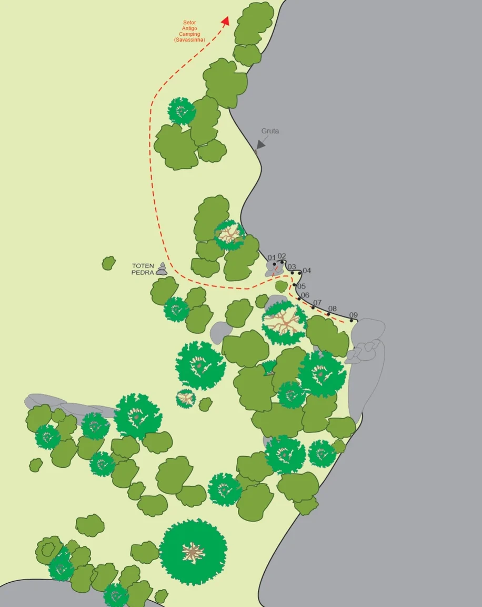
    - **largura_mapa**: 916
    - **altura_mapa**: 1151
    - **pontos_de_interesse**:
      - **[0]**:
        - **id**: Setor_Antigo_Camping
        - **label**: Setor Antigo Camping (Savassinha)
        - **retangulo**:
          - **x**: 360
          - **y**: 57
          - **comprimento**: 66
          - **largura**: 54
      - **[1]**:
        - **id**: Gruta
        - **label**: Gruta
        - **retangulo**:
          - **x**: 513
          - **y**: 246
          - **comprimento**: 40
          - **largura**: 21
      - **[2]**:
        - **id**: Totem_Pedra
        - **label**: TOTEM PEDRA
        - **retangulo**:
          - **x**: 270
          - **y**: 510
          - **comprimento**: 47
          - **largura**: 28
      - **[3]**:
        - **id**: 01
        - **label**: 01
        - **retangulo**:
          - **x**: 516
          - **y**: 488
          - **comprimento**: 17
          - **largura**: 17
      - **[4]**:
        - **id**: 02
        - **label**: 02
        - **retangulo**:
          - **x**: 534
          - **y**: 484
          - **comprimento**: 19
          - **largura**: 17
      - **[5]**:
        - **id**: 03
        - **label**: 03
        - **retangulo**:
          - **x**: 554
          - **y**: 505
          - **comprimento**: 20
          - **largura**: 16
      - **[6]**:
        - **id**: 04
        - **label**: 04
        - **retangulo**:
          - **x**: 584
          - **y**: 512
          - **comprimento**: 19
          - **largura**: 16
      - **[7]**:
        - **id**: 05
        - **label**: 05
        - **retangulo**:
          - **x**: 574
          - **y**: 543
          - **comprimento**: 19
          - **largura**: 16
      - **[8]**:
        - **id**: 06
        - **label**: 06
        - **retangulo**:
          - **x**: 580
          - **y**: 559
          - **comprimento**: 19
          - **largura**: 16
      - **[9]**:
        - **id**: 07
        - **label**: 07
        - **retangulo**:
          - **x**: 603
          - **y**: 574
          - **comprimento**: 20
          - **largura**: 15
      - **[10]**:
        - **id**: 08
        - **label**: 08
        - **retangulo**:
          - **x**: 632
          - **y**: 584
          - **comprimento**: 21
          - **largura**: 17
      - **[11]**:
        - **id**: 09
        - **label**: 09
        - **retangulo**:
          - **x**: 672
          - **y**: 597
          - **comprimento**: 21
          - **largura**: 16
    - **referencias**:
      - **[0]**:
        - **escalada**: Tal Pai Tal Filho
        - **ids**:
          - 01
      - **[1]**:
        - **escalada**: Mutantes
        - **ids**:
          - 02
      - **[2]**:
        - **escalada**: Lá Revolucion
        - **ids**:
          - 03
      - **[3]**:
        - **escalada**: Hidrovibes
        - **ids**:
          - 04
      - **[4]**:
        - **escalada**: Impermeável
        - **ids**:
          - 05
      - **[5]**:
        - **escalada**: Amandla
        - **ids**:
          - 06
      - **[6]**:
        - **escalada**: Quem Ama Planta
        - **ids**:
          - 07
      - **[7]**:
        - **ids**:
          - 08
        - **setor**: Setor Grutinha
        - **escalada**: Respeite os Mais Velhos
      - **[8]**:
        - **ids**:
          - 09
        - **setor**: Setor Grutinha
        - **escalada**: Quem Ama Implanta
      - **[9]**:
        - **ids**:
          - Setor_Antigo_Camping
        - **setor**: Setor Antigo Camping
      - **[10]**:
        - **ids**:
          - Setor_Antigo_Camping
        - **setor**: Setor Savassinha
- **escaladas**:
  - **[0]**:
    - **via_esportiva**:
      - **nome**: Tal Pai Tal Filho
      - **dificuldade**: BR_5SUP
      - **quantidade_protecoes_intermediarias**: 3
      - **quantidade_protecoes_parada**: 2
      - **data_abertura**: 2017
  - **[1]**:
    - **via_esportiva**:
      - **nome**: Mutantes
      - **dificuldade**: BR_6SUP
      - **quantidade_protecoes_intermediarias**: 2
      - **quantidade_protecoes_parada**: 2
      - **data_abertura**: 2017
  - **[2]**:
    - **via_esportiva**:
      - **nome**: Lá Revolucion
      - **dificuldade**: BR_7A
      - **destaque**: True
      - **quantidade_protecoes_intermediarias**: 5
      - **quantidade_protecoes_parada**: 2
      - **data_abertura**: 2017
  - **[3]**:
    - **via_esportiva**:
      - **nome**: Hidrovibes
      - **dificuldade**: BR_7C
      - **destaque**: True
      - **quantidade_protecoes_intermediarias**: 4
      - **quantidade_protecoes_parada**: 2
      - **data_abertura**: 2017
  - **[4]**:
    - **via_esportiva**:
      - **nome**: Impermeável
      - **dificuldade**: BR_7A
      - **destaque**: True
      - **quantidade_protecoes_intermediarias**: 4
      - **quantidade_protecoes_parada**: 2
      - **data_abertura**: 2017
  - **[5]**:
    - **via_esportiva**:
      - **nome**: Amandla
      - **dificuldade**: BR_7B
      - **destaque**: True
      - **quantidade_protecoes_intermediarias**: 5
      - **quantidade_protecoes_parada**: 2
      - **data_abertura**: 2017
  - **[6]**:
    - **via_esportiva**:
      - **nome**: Quem Ama Planta
      - **dificuldade**: BR_7B
      - **destaque**: True
      - **quantidade_protecoes_intermediarias**: 4
      - **quantidade_protecoes_parada**: 2
      - **data_abertura**: 2017
  - **[7]**:
    - **via_esportiva**:
      - **nome**: Respeite os Mais Velhos
      - **dificuldade**: BR_7C
      - **destaque**: True
      - **quantidade_protecoes_intermediarias**: 4
      - **quantidade_protecoes_parada**: 2
      - **data_abertura**: 2017
  - **[8]**:
    - **via_esportiva**:
      - **nome**: Quem Ama Implanta
      - **dificuldade**: BR_7B
      - **destaque**: True
      - **quantidade_protecoes_intermediarias**: 8
      - **quantidade_protecoes_parada**: 2
      - **data_abertura**: 2017
- **precomputados**:
  - **total_escaladas**: 9
  - **total_esportivas**: 9
  - **total_moveis**: 0
  - **total_boulders**: 0
  - **total_multiplas_enfiadas**: 0
  - **total_highlines**: 0

## Parte: setor_mezanino

### Setor (Pico: Afloramento Rastro)

- **descricao**:
    # Setor Mezanino
    
    Este setor possui sombra a partir das 13h (variando de acordo com a estação). O acesso pode ser feito pelo "Portal", "Túnel" ou "Escada de acesso" que leva ao Jardim Suspenso.
    
    **Observações**:
    - OBS.I: Caixa de abelha entre as vias 05 e 06.
- **nome**: Setor Mezanino
- **mapas**:
  - **[0]**:
    - **caminho_imagem_mapa**: 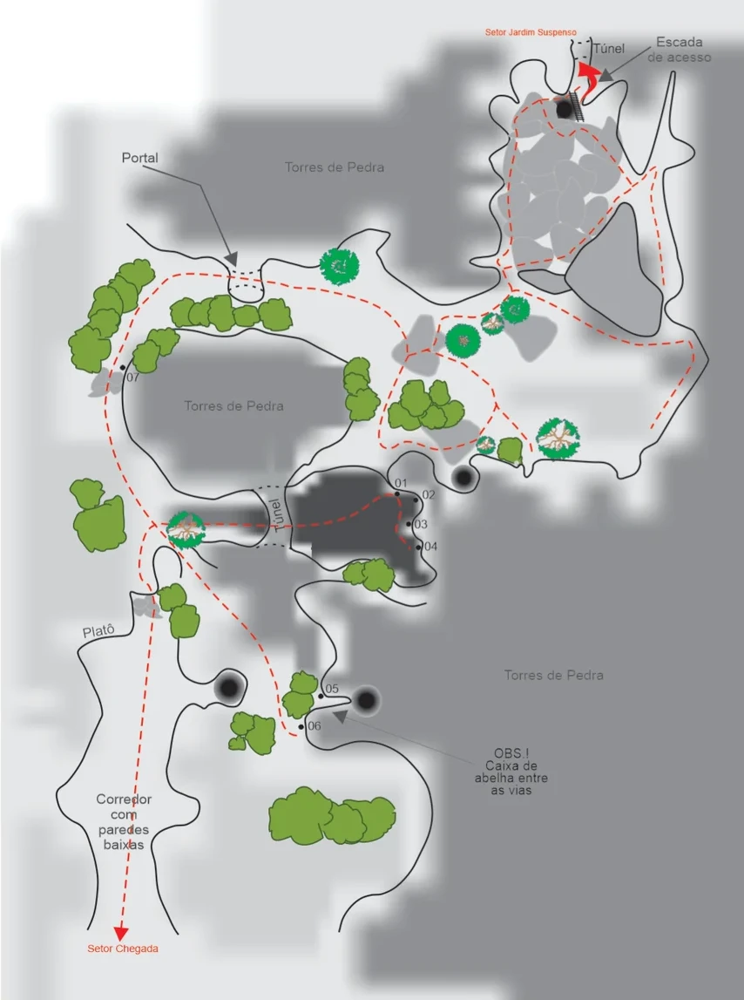
    - **largura_mapa**: 854
    - **altura_mapa**: 1147
    - **pontos_de_interesse**:
      - **[0]**:
        - **id**: Setor_Jardim_Suspenso
        - **label**: Setor Jardim Suspenso
        - **retangulo**:
          - **x**: 609
          - **y**: 36
          - **comprimento**: 112
          - **largura**: 17
      - **[1]**:
        - **id**: Plato
        - **label**: Platô
        - **retangulo**:
          - **x**: 112
          - **y**: 722
          - **comprimento**: 44
          - **largura**: 26
      - **[2]**:
        - **id**: Setor_Chegada
        - **label**: Setor Chegada
        - **retangulo**:
          - **x**: 140
          - **y**: 1088
          - **comprimento**: 92
          - **largura**: 24
      - **[3]**:
        - **id**: 01
        - **label**: 01
        - **retangulo**:
          - **x**: 460
          - **y**: 554
          - **comprimento**: 18
          - **largura**: 18
      - **[4]**:
        - **id**: 02
        - **label**: 02
        - **retangulo**:
          - **x**: 492
          - **y**: 568
          - **comprimento**: 19
          - **largura**: 19
      - **[5]**:
        - **id**: 03
        - **label**: 03
        - **retangulo**:
          - **x**: 482
          - **y**: 601
          - **comprimento**: 21
          - **largura**: 20
      - **[6]**:
        - **id**: 04
        - **label**: 04
        - **retangulo**:
          - **x**: 494
          - **y**: 626
          - **comprimento**: 22
          - **largura**: 20
      - **[7]**:
        - **id**: 05
        - **label**: 05
        - **retangulo**:
          - **x**: 381
          - **y**: 789
          - **comprimento**: 20
          - **largura**: 18
      - **[8]**:
        - **id**: 06
        - **label**: 06
        - **retangulo**:
          - **x**: 361
          - **y**: 831
          - **comprimento**: 22
          - **largura**: 18
      - **[9]**:
        - **id**: 07
        - **label**: 07
        - **retangulo**:
          - **x**: 152
          - **y**: 432
          - **comprimento**: 19
          - **largura**: 19
    - **referencias**:
      - **[0]**:
        - **escalada**: Passeio das Patacas
        - **ids**:
          - 01
      - **[1]**:
        - **escalada**: A Mais Bonita
        - **ids**:
          - 02
      - **[2]**:
        - **escalada**: Gritos da Revolução
        - **ids**:
          - 03
      - **[3]**:
        - **escalada**: Ataque das Formigas Gigantes
        - **ids**:
          - 04
      - **[4]**:
        - **escalada**: Na Caralha da Noite
        - **ids**:
          - 05
      - **[5]**:
        - **escalada**: Universo em Desencanto
        - **ids**:
          - 06
      - **[6]**:
        - **escalada**: Legionários
        - **ids**:
          - 07
      - **[7]**:
        - **ids**:
          - Setor_Chegada
        - **setor**: Setor Chegada
      - **[8]**:
        - **ids**:
          - Setor_Jardim_Suspenso
        - **setor**: Jardim Suspenso
- **escaladas**:
  - **[0]**:
    - **via_esportiva**:
      - **nome**: Passeio das Patacas
      - **dificuldade**: BR_6
      - **destaque**: True
      - **quantidade_protecoes_intermediarias**: 8
      - **quantidade_protecoes_parada**: 2
      - **data_abertura**: 2015
  - **[1]**:
    - **via_esportiva**:
      - **nome**: A Mais Bonita
      - **dificuldade**: BR_6SUP
      - **destaque**: True
      - **quantidade_protecoes_intermediarias**: 9
      - **quantidade_protecoes_parada**: 2
  - **[2]**:
    - **via_esportiva**:
      - **nome**: Gritos da Revolução
      - **dificuldade**: BR_7A
      - **destaque**: True
      - **quantidade_protecoes_intermediarias**: 4
      - **quantidade_protecoes_parada**: 2
  - **[3]**:
    - **via_esportiva**:
      - **nome**: Ataque das Formigas Gigantes
      - **dificuldade**: BR_6SUP
      - **destaque**: True
      - **quantidade_protecoes_intermediarias**: 6
      - **quantidade_protecoes_parada**: 2
  - **[4]**:
    - **via_esportiva**:
      - **nome**: Na Caralha da Noite
      - **dificuldade**: BR_6SUP
  - **[5]**:
    - **via_esportiva**:
      - **nome**: Universo em Desencanto
      - **dificuldade**: BR_7B
  - **[6]**:
    - **via_esportiva**:
      - **nome**: Legionários
      - **dificuldade**: BR_5
      - **quantidade_protecoes_intermediarias**: 4
      - **quantidade_protecoes_parada**: 2
- **precomputados**:
  - **total_escaladas**: 7
  - **total_esportivas**: 7
  - **total_moveis**: 0
  - **total_boulders**: 0
  - **total_multiplas_enfiadas**: 0
  - **total_highlines**: 0

## Parte: setor_1o_andar

### Setor (Pico: Afloramento Rastro)

- **descricao**:
    # Setor 1º Andar
    
    Este setor possui sombra a partir das 13h (variando de acordo com a estação).
- **nome**: 1º Andar
- **mapas**:
  - **[0]**:
    - **caminho_imagem_mapa**: 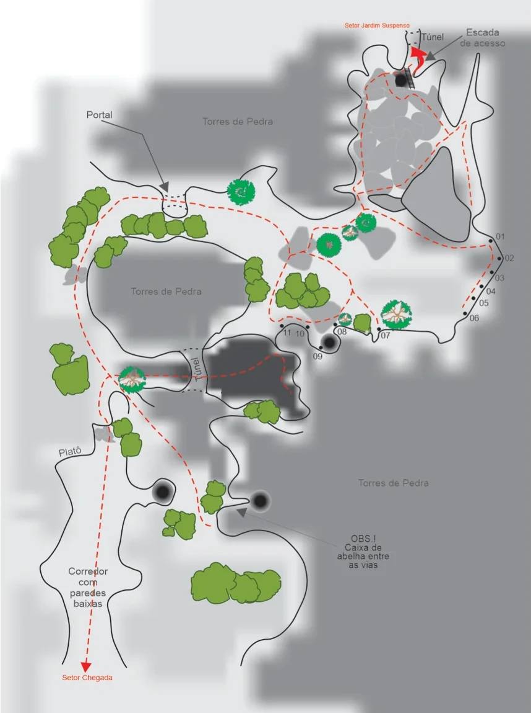
    - **largura_mapa**: 858
    - **altura_mapa**: 1149
    - **pontos_de_interesse**:
      - **[0]**:
        - **id**: Setor_Jardim_Suspenso
        - **label**: Setor Jardim Suspenso
        - **retangulo**:
          - **x**: 608
          - **y**: 40
          - **comprimento**: 114
          - **largura**: 22
      - **[1]**:
        - **id**: 01
        - **label**: 01
        - **retangulo**:
          - **x**: 808
          - **y**: 381
          - **comprimento**: 17
          - **largura**: 16
      - **[2]**:
        - **id**: 02
        - **label**: 02
        - **retangulo**:
          - **x**: 824
          - **y**: 414
          - **comprimento**: 19
          - **largura**: 17
      - **[3]**:
        - **id**: 03
        - **label**: 03
        - **retangulo**:
          - **x**: 807
          - **y**: 447
          - **comprimento**: 18
          - **largura**: 16
      - **[4]**:
        - **id**: 04
        - **label**: 04
        - **retangulo**:
          - **x**: 794
          - **y**: 468
          - **comprimento**: 20
          - **largura**: 16
      - **[5]**:
        - **id**: 05
        - **label**: 05
        - **retangulo**:
          - **x**: 782
          - **y**: 488
          - **comprimento**: 19
          - **largura**: 16
      - **[6]**:
        - **id**: 06
        - **label**: 06
        - **retangulo**:
          - **x**: 767
          - **y**: 512
          - **comprimento**: 20
          - **largura**: 17
      - **[7]**:
        - **id**: Setor_Chegada
        - **label**: Setor Chegada
        - **retangulo**:
          - **x**: 141
          - **y**: 1090
          - **comprimento**: 90
          - **largura**: 21
      - **[8]**:
        - **id**: 07
        - **label**: 07
        - **retangulo**:
          - **x**: 623
          - **y**: 540
          - **comprimento**: 22
          - **largura**: 18
      - **[9]**:
        - **id**: 08
        - **label**: 08
        - **retangulo**:
          - **x**: 553
          - **y**: 534
          - **comprimento**: 22
          - **largura**: 17
      - **[10]**:
        - **id**: 09
        - **label**: 09
        - **retangulo**:
          - **x**: 514
          - **y**: 574
          - **comprimento**: 19
          - **largura**: 18
      - **[11]**:
        - **id**: 10
        - **label**: 10
        - **retangulo**:
          - **x**: 486
          - **y**: 538
          - **comprimento**: 19
          - **largura**: 19
      - **[12]**:
        - **id**: 11
        - **label**: 11
        - **retangulo**:
          - **x**: 464
          - **y**: 536
          - **comprimento**: 18
          - **largura**: 17
    - **referencias**:
      - **[0]**:
        - **escalada**: Roolinhalala
        - **ids**:
          - 01
      - **[1]**:
        - **escalada**: Cabo José
        - **ids**:
          - 02
      - **[2]**:
        - **escalada**: Soldado Abatido
        - **ids**:
          - 03
      - **[3]**:
        - **escalada**: Via do Calango
        - **ids**:
          - 04
      - **[4]**:
        - **escalada**: 50cintis
        - **ids**:
          - 05
      - **[5]**:
        - **escalada**: Zac Marley
        - **ids**:
          - 06
      - **[6]**:
        - **escalada**: Cada Macaco no Seu Galho
        - **ids**:
          - 07
      - **[7]**:
        - **escalada**: Chuva de Espinho
        - **ids**:
          - 10
      - **[8]**:
        - **escalada**: Minha Criança
        - **ids**:
          - 11
      - **[9]**:
        - **ids**:
          - Setor_Chegada
        - **setor**: Setor Chegada
      - **[10]**:
        - **ids**:
          - Setor_Jardim_Suspenso
        - **setor**: Jardim Suspenso
      - **[11]**:
        - **ids**:
          - 08
        - **setor**: 1º Andar
        - **escalada**: Curte o Planeta que Você Vive
      - **[12]**:
        - **ids**:
          - 09
        - **setor**: 1º Andar
        - **escalada**: Subaco da Zen
- **escaladas**:
  - **[0]**:
    - **via_esportiva**:
      - **nome**: Roolinhalala
      - **dificuldade**: BR_7B
      - **quantidade_protecoes_intermediarias**: 7
      - **quantidade_protecoes_parada**: 2
      - **data_abertura**: 2018
  - **[1]**:
    - **via_esportiva**:
      - **nome**: Cabo José
      - **dificuldade**: BR_7A
      - **quantidade_protecoes_intermediarias**: 8
      - **quantidade_protecoes_parada**: 2
  - **[2]**:
    - **via_esportiva**:
      - **nome**: Soldado Abatido
      - **dificuldade**: BR_7A
      - **destaque**: True
      - **quantidade_protecoes_intermediarias**: 8
      - **quantidade_protecoes_parada**: 2
  - **[3]**:
    - **via_esportiva**:
      - **nome**: Via do Calango
      - **dificuldade**: PROJETO
  - **[4]**:
    - **via_esportiva**:
      - **nome**: 50cintis
      - **destaque**: True
      - **dificuldade**: PROJETO
      - **quantidade_protecoes_intermediarias**: 6
      - **quantidade_protecoes_parada**: 2
  - **[5]**:
    - **via_esportiva**:
      - **nome**: Zac Marley
      - **destaque**: True
      - **dificuldade**: BR_6
      - **quantidade_protecoes_intermediarias**: 4
      - **quantidade_protecoes_parada**: 2
  - **[6]**:
    - **via_esportiva**:
      - **nome**: Cada Macaco no Seu Galho
      - **dificuldade**: BR_6SUP
      - **quantidade_protecoes_intermediarias**: 8
      - **quantidade_protecoes_parada**: 2
  - **[7]**:
    - **via_esportiva**:
      - **nome**: Curte o Planeta que Você Vive
      - **destaque**: True
      - **dificuldade**: BR_5SUP
      - **quantidade_protecoes_intermediarias**: 8
      - **quantidade_protecoes_parada**: 2
  - **[8]**:
    - **via_esportiva**:
      - **nome**: Subaco da Zen
      - **destaque**: True
      - **dificuldade**: BR_7A
  - **[9]**:
    - **via_esportiva**:
      - **nome**: Chuva de Espinho
      - **destaque**: True
      - **dificuldade**: BR_5SUP
      - **quantidade_protecoes_intermediarias**: 8
      - **quantidade_protecoes_parada**: 2
  - **[10]**:
    - **via_esportiva**:
      - **nome**: Minha Criança
      - **destaque**: True
      - **dificuldade**: BR_5SUP
      - **quantidade_protecoes_intermediarias**: 7
      - **quantidade_protecoes_parada**: 2
- **precomputados**:
  - **total_escaladas**: 11
  - **total_esportivas**: 11
  - **total_moveis**: 0
  - **total_boulders**: 0
  - **total_multiplas_enfiadas**: 0
  - **total_highlines**: 0

## Parte: setor_2o_andar

### Setor (Pico: Afloramento Rastro)

- **descricao**:
    # Setor 2º Andar
    
    Este setor possui sombra o dia todo (variando de acordo com a estação).
- **nome**: 2º Andar
- **mapas**:
  - **[0]**:
    - **caminho_imagem_mapa**: 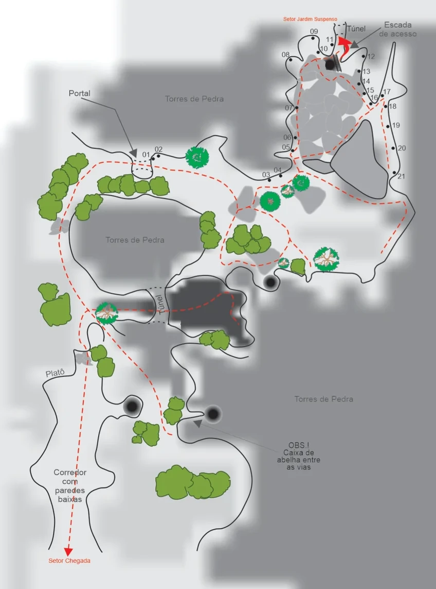
    - **largura_mapa**: 848
    - **altura_mapa**: 1143
    - **pontos_de_interesse**:
      - **[0]**:
        - **id**: Setor_Jardim_Suspenso
        - **label**: Setor Jardim Suspenso
        - **retangulo**:
          - **x**: 601
          - **y**: 36
          - **comprimento**: 118
          - **largura**: 18
      - **[1]**:
        - **id**: 01
        - **label**: 01
        - **retangulo**:
          - **x**: 284
          - **y**: 300
          - **comprimento**: 20
          - **largura**: 15
      - **[2]**:
        - **id**: 02
        - **label**: 02
        - **retangulo**:
          - **x**: 308
          - **y**: 289
          - **comprimento**: 23
          - **largura**: 18
      - **[3]**:
        - **id**: 03
        - **label**: 03
        - **retangulo**:
          - **x**: 518
          - **y**: 338
          - **comprimento**: 20
          - **largura**: 15
      - **[4]**:
        - **id**: 04
        - **label**: 04
        - **retangulo**:
          - **x**: 540
          - **y**: 330
          - **comprimento**: 20
          - **largura**: 15
      - **[5]**:
        - **id**: 05
        - **label**: 05
        - **retangulo**:
          - **x**: 556
          - **y**: 284
          - **comprimento**: 21
          - **largura**: 15
      - **[6]**:
        - **id**: 06
        - **label**: 06
        - **retangulo**:
          - **x**: 560
          - **y**: 266
          - **comprimento**: 19
          - **largura**: 14
      - **[7]**:
        - **id**: 07
        - **label**: 07
        - **retangulo**:
          - **x**: 562
          - **y**: 209
          - **comprimento**: 20
          - **largura**: 16
      - **[8]**:
        - **id**: 08
        - **label**: 08
        - **retangulo**:
          - **x**: 556
          - **y**: 106
          - **comprimento**: 22
          - **largura**: 17
      - **[9]**:
        - **id**: 09
        - **label**: 09
        - **retangulo**:
          - **x**: 612
          - **y**: 60
          - **comprimento**: 21
          - **largura**: 16
      - **[10]**:
        - **id**: 10
        - **label**: 10
        - **retangulo**:
          - **x**: 630
          - **y**: 94
          - **comprimento**: 20
          - **largura**: 17
      - **[11]**:
        - **id**: 11
        - **label**: 11
        - **retangulo**:
          - **x**: 641
          - **y**: 75
          - **comprimento**: 20
          - **largura**: 18
      - **[12]**:
        - **id**: 12
        - **label**: 12
        - **retangulo**:
          - **x**: 723
          - **y**: 109
          - **comprimento**: 20
          - **largura**: 16
      - **[13]**:
        - **id**: 13
        - **label**: 13
        - **retangulo**:
          - **x**: 714
          - **y**: 138
          - **comprimento**: 19
          - **largura**: 16
      - **[14]**:
        - **id**: 14
        - **label**: 14
        - **retangulo**:
          - **x**: 712
          - **y**: 157
          - **comprimento**: 19
          - **largura**: 16
      - **[15]**:
        - **id**: 15
        - **label**: 15
        - **retangulo**:
          - **x**: 720
          - **y**: 174
          - **comprimento**: 18
          - **largura**: 15
      - **[16]**:
        - **id**: 16
        - **label**: 16
        - **retangulo**:
          - **x**: 728
          - **y**: 189
          - **comprimento**: 18
          - **largura**: 14
      - **[17]**:
        - **id**: 17
        - **label**: 17
        - **retangulo**:
          - **x**: 752
          - **y**: 178
          - **comprimento**: 19
          - **largura**: 17
      - **[18]**:
        - **id**: 18
        - **label**: 18
        - **retangulo**:
          - **x**: 764
          - **y**: 206
          - **comprimento**: 20
          - **largura**: 17
      - **[19]**:
        - **id**: 19
        - **label**: 19
        - **retangulo**:
          - **x**: 770
          - **y**: 243
          - **comprimento**: 19
          - **largura**: 16
      - **[20]**:
        - **id**: 20
        - **label**: 20
        - **retangulo**:
          - **x**: 781
          - **y**: 286
          - **comprimento**: 22
          - **largura**: 17
      - **[21]**:
        - **id**: 21
        - **label**: 21
        - **retangulo**:
          - **x**: 780
          - **y**: 342
          - **comprimento**: 20
          - **largura**: 16
      - **[22]**:
        - **id**: Setor_Chegada
        - **label**: Setor Chegada
        - **retangulo**:
          - **x**: 136
          - **y**: 1088
          - **comprimento**: 91
          - **largura**: 23
    - **referencias**:
      - **[0]**:
        - **escalada**: Primeiro Prêmio
        - **ids**:
          - 01
      - **[1]**:
        - **escalada**: Segundo Prêmio
        - **ids**:
          - 02
      - **[2]**:
        - **escalada**: Monogamia Heteronormativa
        - **ids**:
          - 03
      - **[3]**:
        - **escalada**: Café Tabaco Cachaça
        - **ids**:
          - 04
      - **[4]**:
        - **escalada**: Daqui Ninguém Me Tira
        - **ids**:
          - 05
      - **[5]**:
        - **escalada**: Sombra e Água Fresca
        - **ids**:
          - 06
      - **[6]**:
        - **escalada**: Bicuda
        - **ids**:
          - 07
      - **[7]**:
        - **escalada**: Daqui Não Saio
        - **ids**:
          - 10
      - **[8]**:
        - **escalada**: Cafeína
        - **ids**:
          - 11
      - **[9]**:
        - **escalada**: Pequena Sereia
        - **ids**:
          - 12
      - **[10]**:
        - **escalada**: Engole o Choro
        - **ids**:
          - 13
      - **[11]**:
        - **escalada**: Stone Fischer
        - **ids**:
          - 14
      - **[12]**:
        - **escalada**: Frigobar de Pedra
        - **ids**:
          - 15
      - **[13]**:
        - **escalada**: Navio
        - **ids**:
          - 16
      - **[14]**:
        - **escalada**: Submarino
        - **ids**:
          - 17
      - **[15]**:
        - **escalada**: O Alquimista
        - **ids**:
          - 18
      - **[16]**:
        - **escalada**: Vozes da África
        - **ids**:
          - 19
      - **[17]**:
        - **escalada**: Meu Maior Amigo
        - **ids**:
          - 20
      - **[18]**:
        - **escalada**: Iemanjá
        - **ids**:
          - 21
      - **[19]**:
        - **ids**:
          - Setor_Chegada
        - **setor**: Setor Chegada
      - **[20]**:
        - **ids**:
          - Setor_Jardim_Suspenso
        - **setor**: Jardim Suspenso
      - **[21]**:
        - **ids**:
          - 08
        - **setor**: 2º Andar
        - **escalada**: Gardneria Angustata
      - **[22]**:
        - **ids**:
          - 09
        - **setor**: 2º Andar
        - **escalada**: Vai e Volta e Vai
- **escaladas**:
  - **[0]**:
    - **via_esportiva**:
      - **nome**: Primeiro Prêmio
      - **dificuldade**: BR_6
      - **quantidade_protecoes_intermediarias**: 5
      - **quantidade_protecoes_parada**: 2
  - **[1]**:
    - **via_esportiva**:
      - **nome**: Segundo Prêmio
      - **dificuldade**: BR_6
      - **quantidade_protecoes_intermediarias**: 5
      - **quantidade_protecoes_parada**: 2
  - **[2]**:
    - **via_esportiva**:
      - **nome**: Monogamia Heteronormativa
      - **dificuldade**: BR_6SUP
      - **destaque**: True
      - **quantidade_protecoes_intermediarias**: 11
      - **quantidade_protecoes_parada**: 2
  - **[3]**:
    - **via_esportiva**:
      - **nome**: Café Tabaco Cachaça
      - **dificuldade**: BR_6SUP
      - **destaque**: True
      - **quantidade_protecoes_intermediarias**: 12
      - **quantidade_protecoes_parada**: 2
  - **[4]**:
    - **via_esportiva**:
      - **nome**: Daqui Ninguém Me Tira
      - **dificuldade**: BR_5SUP
      - **destaque**: True
      - **quantidade_protecoes_intermediarias**: 9
      - **quantidade_protecoes_parada**: 2
      - **data_abertura**: 2014
  - **[5]**:
    - **via_esportiva**:
      - **nome**: Sombra e Água Fresca
      - **dificuldade**: BR_5SUP
      - **quantidade_protecoes_intermediarias**: 10
      - **quantidade_protecoes_parada**: 2
  - **[6]**:
    - **via_esportiva**:
      - **nome**: Bicuda
      - **dificuldade**: BR_7B
      - **quantidade_protecoes_intermediarias**: 12
      - **quantidade_protecoes_parada**: 2
  - **[7]**:
    - **via_esportiva**:
      - **nome**: Gardneria Angustata
      - **dificuldade**: BR_6
      - **quantidade_protecoes_intermediarias**: 8
      - **quantidade_protecoes_parada**: 2
  - **[8]**:
    - **via_esportiva**:
      - **nome**: Vai e Volta e Vai
      - **dificuldade**: BR_6SUP
      - **quantidade_protecoes_intermediarias**: 11
      - **quantidade_protecoes_parada**: 2
  - **[9]**:
    - **via_esportiva**:
      - **nome**: Daqui Não Saio
      - **dificuldade**: BR_5
      - **destaque**: True
      - **quantidade_protecoes_intermediarias**: 9
      - **quantidade_protecoes_parada**: 2
  - **[10]**:
    - **via_esportiva**:
      - **nome**: Cafeína
      - **dificuldade**: BR_7C
      - **destaque**: True
      - **quantidade_protecoes_intermediarias**: 5
      - **quantidade_protecoes_parada**: 2
  - **[11]**:
    - **via_esportiva**:
      - **nome**: Pequena Sereia
      - **dificuldade**: BR_7A
      - **quantidade_protecoes_intermediarias**: 7
      - **quantidade_protecoes_parada**: 2
  - **[12]**:
    - **via_esportiva**:
      - **nome**: Engole o Choro
      - **dificuldade**: BR_6SUP
      - **destaque**: True
      - **quantidade_protecoes_intermediarias**: 14
      - **quantidade_protecoes_parada**: 2
  - **[13]**:
    - **via_esportiva**:
      - **nome**: Stone Fischer
      - **dificuldade**: BR_6SUP
      - **destaque**: True
      - **quantidade_protecoes_intermediarias**: 11
      - **quantidade_protecoes_parada**: 2
  - **[14]**:
    - **via_esportiva**:
      - **nome**: Frigobar de Pedra
      - **dificuldade**: BR_8A
      - **destaque**: True
      - **quantidade_protecoes_intermediarias**: 12
      - **quantidade_protecoes_parada**: 2
  - **[15]**:
    - **via_esportiva**:
      - **nome**: Navio
      - **dificuldade**: BR_9B
      - **destaque**: True
      - **quantidade_protecoes_intermediarias**: 15
      - **quantidade_protecoes_parada**: 2
  - **[16]**:
    - **via_esportiva**:
      - **nome**: Submarino
      - **dificuldade**: PROJETO
      - **quantidade_protecoes_intermediarias**: 7
      - **quantidade_protecoes_parada**: 2
      - **data_abertura**: 2018-05
  - **[17]**:
    - **via_esportiva**:
      - **nome**: O Alquimista
      - **dificuldade**: BR_8C_BARRA_9A
      - **destaque**: True
      - **quantidade_protecoes_intermediarias**: 5
      - **quantidade_protecoes_parada**: 2
      - **data_abertura**: 2018-05
  - **[18]**:
    - **via_esportiva**:
      - **nome**: Vozes da África
      - **dificuldade**: BR_7B
      - **destaque**: True
      - **quantidade_protecoes_intermediarias**: 6
      - **quantidade_protecoes_parada**: 2
  - **[19]**:
    - **via_esportiva**:
      - **nome**: Meu Maior Amigo
      - **dificuldade**: BR_8B
      - **destaque**: True
      - **quantidade_protecoes_intermediarias**: 5
      - **quantidade_protecoes_parada**: 2
  - **[20]**:
    - **via_esportiva**:
      - **nome**: Iemanjá
      - **dificuldade**: BR_6
      - **destaque**: True
      - **quantidade_protecoes_intermediarias**: 6
      - **quantidade_protecoes_parada**: 2
- **precomputados**:
  - **total_escaladas**: 21
  - **total_esportivas**: 21
  - **total_moveis**: 0
  - **total_boulders**: 0
  - **total_multiplas_enfiadas**: 0
  - **total_highlines**: 0

## Parte: setor_jardim_suspenso

### Setor (Pico: Afloramento Rastro)

- **descricao**:
    # Setor Jardim Suspenso
    
    Este setor possui sombra o dia todo (variando de acordo com a estação). O acesso é feito por uma "Escada de acesso" vinda do Segundo Andar.
- **nome**: Jardim Suspenso
- **mapas**:
  - **[0]**:
    - **caminho_imagem_mapa**: 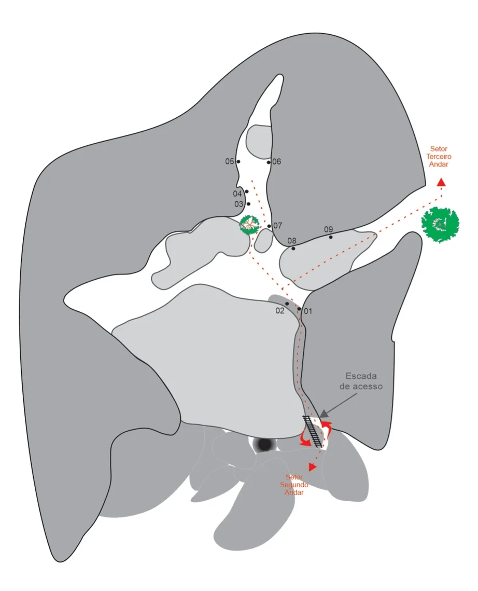
    - **largura_mapa**: 922
    - **altura_mapa**: 1139
    - **pontos_de_interesse**:
      - **[0]**:
        - **id**: Setor_Terceiro_Andar
        - **label**: Setor Terceiro Andar
        - **retangulo**:
          - **x**: 846
          - **y**: 302
          - **comprimento**: 61
          - **largura**: 55
      - **[1]**:
        - **id**: Setor_Segundo_Andar
        - **label**: Setor Segundo Andar
        - **retangulo**:
          - **x**: 566
          - **y**: 935
          - **comprimento**: 65
          - **largura**: 54
      - **[2]**:
        - **id**: 01
        - **label**: 01
        - **retangulo**:
          - **x**: 594
          - **y**: 599
          - **comprimento**: 22
          - **largura**: 18
      - **[3]**:
        - **id**: 02
        - **label**: 02
        - **retangulo**:
          - **x**: 540
          - **y**: 598
          - **comprimento**: 25
          - **largura**: 21
      - **[4]**:
        - **id**: 03
        - **label**: 03
        - **retangulo**:
          - **x**: 460
          - **y**: 394
          - **comprimento**: 21
          - **largura**: 19
      - **[5]**:
        - **id**: 04
        - **label**: 04
        - **retangulo**:
          - **x**: 458
          - **y**: 372
          - **comprimento**: 21
          - **largura**: 17
      - **[6]**:
        - **id**: 05
        - **label**: 05
        - **retangulo**:
          - **x**: 444
          - **y**: 310
          - **comprimento**: 21
          - **largura**: 18
      - **[7]**:
        - **id**: 06
        - **label**: 06
        - **retangulo**:
          - **x**: 534
          - **y**: 311
          - **comprimento**: 21
          - **largura**: 20
      - **[8]**:
        - **id**: 07
        - **label**: 07
        - **retangulo**:
          - **x**: 536
          - **y**: 434
          - **comprimento**: 23
          - **largura**: 21
      - **[9]**:
        - **id**: 08
        - **label**: 08
        - **retangulo**:
          - **x**: 562
          - **y**: 463
          - **comprimento**: 23
          - **largura**: 20
      - **[10]**:
        - **id**: 09
        - **label**: 09
        - **retangulo**:
          - **x**: 633
          - **y**: 441
          - **comprimento**: 22
          - **largura**: 18
    - **referencias**:
      - **[0]**:
        - **escalada**: (via inacabada)
        - **ids**:
          - 01
      - **[1]**:
        - **escalada**: Cara de Bunda com Contração
        - **ids**:
          - 02
      - **[2]**:
        - **escalada**: (sem nome)
        - **ids**:
          - 03
      - **[3]**:
        - **escalada**: Vida Maria
        - **ids**:
          - 04
      - **[4]**:
        - **escalada**: Mimimi
        - **ids**:
          - 05
      - **[5]**:
        - **escalada**: De todos nós
        - **ids**:
          - 06
      - **[6]**:
        - **escalada**: Cai Mais Não, Zé
        - **ids**:
          - 07
      - **[7]**:
        - **ids**:
          - 08
        - **setor**: Jardim Suspenso
        - **escalada**: Corte Profundo
      - **[8]**:
        - **ids**:
          - 09
        - **setor**: Jardim Suspenso
        - **escalada**: Avenida Paulista
      - **[9]**:
        - **ids**:
          - Setor_Segundo_Andar
        - **setor**: 2º Andar
      - **[10]**:
        - **ids**:
          - Setor_Terceiro_Andar
        - **setor**: 3º Andar
- **escaladas**:
  - **[0]**:
    - **via_esportiva**:
      - **nome**: (via inacabada)
      - **dificuldade**: PROJETO
  - **[1]**:
    - **via_esportiva**:
      - **nome**: Cara de Bunda com Contração
      - **dificuldade**: BR_6SUP
      - **quantidade_protecoes_intermediarias**: 8
      - **quantidade_protecoes_parada**: 2
      - **data_abertura**: 2018-12-06
  - **[2]**:
    - **via_esportiva**:
      - **nome**: (sem nome)
      - **dificuldade**: PROJETO
  - **[3]**:
    - **via_esportiva**:
      - **nome**: Vida Maria
      - **dificuldade**: BR_7A_BARRA_7B
      - **destaque**: True
      - **quantidade_protecoes_intermediarias**: 9
      - **quantidade_protecoes_parada**: 2
  - **[4]**:
    - **via_esportiva**:
      - **nome**: Mimimi
      - **dificuldade**: PROJETO
      - **quantidade_protecoes_intermediarias**: 11
      - **quantidade_protecoes_parada**: 2
  - **[5]**:
    - **via_esportiva**:
      - **nome**: De todos nós
      - **dificuldade**: BR_7C
      - **destaque**: True
      - **quantidade_protecoes_intermediarias**: 12
      - **quantidade_protecoes_parada**: 2
  - **[6]**:
    - **via_esportiva**:
      - **nome**: Cai Mais Não, Zé
      - **dificuldade**: BR_7B
      - **destaque**: True
      - **quantidade_protecoes_intermediarias**: 8
      - **quantidade_protecoes_parada**: 2
  - **[7]**:
    - **via_esportiva**:
      - **nome**: Corte Profundo
      - **dificuldade**: BR_7A
      - **quantidade_protecoes_intermediarias**: 8
      - **quantidade_protecoes_parada**: 2
  - **[8]**:
    - **via_esportiva**:
      - **nome**: Avenida Paulista
      - **dificuldade**: BR_7B_BARRA_7C
      - **quantidade_protecoes_intermediarias**: 8
      - **quantidade_protecoes_parada**: 2
- **precomputados**:
  - **total_escaladas**: 9
  - **total_esportivas**: 9
  - **total_moveis**: 0
  - **total_boulders**: 0
  - **total_multiplas_enfiadas**: 0
  - **total_highlines**: 0

## Parte: setor_3o_andar

### Setor (Pico: Afloramento Rastro)

- **descricao**:
    # Setor 3º Andar
    
    Este setor possui sombra o dia todo (variando de acordo com a estação).
- **nome**: 3º Andar
- **mapas**:
  - **[0]**:
    - **caminho_imagem_mapa**: 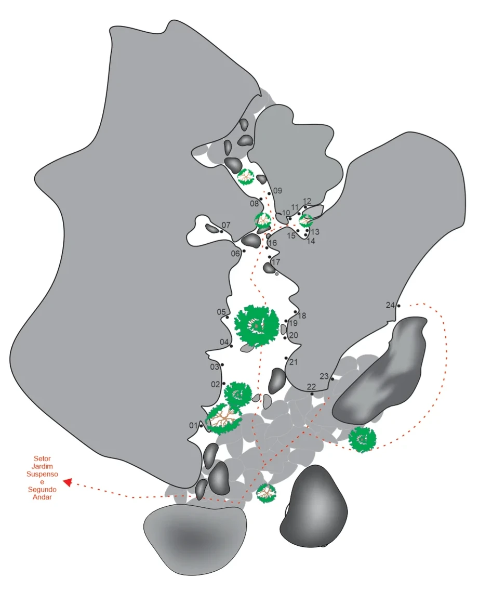
    - **largura_mapa**: 922
    - **altura_mapa**: 1137
    - **pontos_de_interesse**:
      - **[0]**:
        - **id**: 01
        - **label**: 01
        - **retangulo**:
          - **x**: 372
          - **y**: 818
          - **comprimento**: 26
          - **largura**: 24
      - **[1]**:
        - **id**: 02
        - **label**: 02
        - **retangulo**:
          - **x**: 416
          - **y**: 738
          - **comprimento**: 27
          - **largura**: 25
      - **[2]**:
        - **id**: 03
        - **label**: 03
        - **retangulo**:
          - **x**: 413
          - **y**: 704
          - **comprimento**: 24
          - **largura**: 24
      - **[3]**:
        - **id**: 04
        - **label**: 04
        - **retangulo**:
          - **x**: 432
          - **y**: 658
          - **comprimento**: 23
          - **largura**: 24
      - **[4]**:
        - **id**: 05
        - **label**: 05
        - **retangulo**:
          - **x**: 426
          - **y**: 598
          - **comprimento**: 22
          - **largura**: 21
      - **[5]**:
        - **id**: 06
        - **label**: 06
        - **retangulo**:
          - **x**: 453
          - **y**: 488
          - **comprimento**: 24
          - **largura**: 23
      - **[6]**:
        - **id**: 07
        - **label**: 07
        - **retangulo**:
          - **x**: 436
          - **y**: 432
          - **comprimento**: 25
          - **largura**: 25
      - **[7]**:
        - **id**: 08
        - **label**: 08
        - **retangulo**:
          - **x**: 490
          - **y**: 391
          - **comprimento**: 25
          - **largura**: 22
      - **[8]**:
        - **id**: 09
        - **label**: 09
        - **retangulo**:
          - **x**: 534
          - **y**: 366
          - **comprimento**: 24
          - **largura**: 21
      - **[9]**:
        - **id**: 10
        - **label**: 10
        - **retangulo**:
          - **x**: 550
          - **y**: 408
          - **comprimento**: 17
          - **largura**: 17
      - **[10]**:
        - **id**: 11
        - **label**: 11
        - **retangulo**:
          - **x**: 568
          - **y**: 398
          - **comprimento**: 17
          - **largura**: 17
      - **[11]**:
        - **id**: 12
        - **label**: 12
        - **retangulo**:
          - **x**: 592
          - **y**: 386
          - **comprimento**: 20
          - **largura**: 17
      - **[12]**:
        - **id**: 13
        - **label**: 13
        - **retangulo**:
          - **x**: 608
          - **y**: 446
          - **comprimento**: 21
          - **largura**: 17
      - **[13]**:
        - **id**: 14
        - **label**: 14
        - **retangulo**:
          - **x**: 599
          - **y**: 464
          - **comprimento**: 20
          - **largura**: 18
      - **[14]**:
        - **id**: 15
        - **label**: 15
        - **retangulo**:
          - **x**: 561
          - **y**: 453
          - **comprimento**: 20
          - **largura**: 18
      - **[15]**:
        - **id**: 16
        - **label**: 16
        - **retangulo**:
          - **x**: 525
          - **y**: 467
          - **comprimento**: 20
          - **largura**: 18
      - **[16]**:
        - **id**: 17
        - **label**: 17
        - **retangulo**:
          - **x**: 532
          - **y**: 504
          - **comprimento**: 20
          - **largura**: 18
      - **[17]**:
        - **id**: 18
        - **label**: 18
        - **retangulo**:
          - **x**: 582
          - **y**: 606
          - **comprimento**: 18
          - **largura**: 18
      - **[18]**:
        - **id**: 19
        - **label**: 19
        - **retangulo**:
          - **x**: 565
          - **y**: 622
          - **comprimento**: 18
          - **largura**: 17
      - **[19]**:
        - **id**: 20
        - **label**: 20
        - **retangulo**:
          - **x**: 564
          - **y**: 644
          - **comprimento**: 21
          - **largura**: 19
      - **[20]**:
        - **id**: 21
        - **label**: 21
        - **retangulo**:
          - **x**: 565
          - **y**: 696
          - **comprimento**: 22
          - **largura**: 22
      - **[21]**:
        - **id**: 22
        - **label**: 22
        - **retangulo**:
          - **x**: 600
          - **y**: 744
          - **comprimento**: 22
          - **largura**: 21
      - **[22]**:
        - **id**: 23
        - **label**: 23
        - **retangulo**:
          - **x**: 624
          - **y**: 724
          - **comprimento**: 20
          - **largura**: 19
      - **[23]**:
        - **id**: 24
        - **label**: 24
        - **retangulo**:
          - **x**: 752
          - **y**: 586
          - **comprimento**: 23
          - **largura**: 19
      - **[24]**:
        - **id**: Setor_Conexao
        - **label**: Setor Jardim Suspenso e Segundo Andar
        - **retangulo**:
          - **x**: 82
          - **y**: 918
          - **comprimento**: 78
          - **largura**: 98
    - **referencias**:
      - **[0]**:
        - **escalada**: Pinguela de Ema
        - **ids**:
          - 01
      - **[1]**:
        - **escalada**: Pilares da Terra
        - **ids**:
          - 02
      - **[2]**:
        - **escalada**: Miranoku e Vai
        - **ids**:
          - 03
      - **[3]**:
        - **escalada**: Meia Seca
        - **ids**:
          - 04
      - **[4]**:
        - **escalada**: Helicoidal
        - **ids**:
          - 05
      - **[5]**:
        - **escalada**: Nem Ladrão Aguenta
        - **ids**:
          - 06
      - **[6]**:
        - **escalada**: Socorro
        - **ids**:
          - 07
      - **[7]**:
        - **escalada**: (via inacabada)
        - **ids**:
          - 10
      - **[8]**:
        - **escalada**: Meio Selvagem
        - **ids**:
          - 11
      - **[9]**:
        - **escalada**: Gengiva de Peixe
        - **ids**:
          - 12
      - **[10]**:
        - **escalada**: Ego a Flor da Pele
        - **ids**:
          - 13
      - **[11]**:
        - **escalada**: Liberte Sua Garota Interior
        - **ids**:
          - 14
      - **[12]**:
        - **escalada**: Panela de Pressão
        - **ids**:
          - 15
      - **[13]**:
        - **escalada**: ka-fedalú
        - **ids**:
          - 16
      - **[14]**:
        - **escalada**: TNC
        - **ids**:
          - 17
      - **[15]**:
        - **escalada**: Império Galáctico
        - **ids**:
          - 18
      - **[16]**:
        - **escalada**: Estrela da Morte
        - **ids**:
          - 19
      - **[17]**:
        - **escalada**: Multiplicai a Resista Amém
        - **ids**:
          - 20
      - **[18]**:
        - **escalada**: Cachorrinha Lua
        - **ids**:
          - 21
      - **[19]**:
        - **escalada**: A Primeira de Muitas
        - **ids**:
          - 22
      - **[20]**:
        - **escalada**: E Volta Cão Arrependido
        - **ids**:
          - 23
      - **[21]**:
        - **escalada**: Exame de Próstata
        - **ids**:
          - 24
      - **[22]**:
        - **ids**:
          - Setor_Conexao
        - **setor**: Jardim Suspenso
      - **[23]**:
        - **ids**:
          - Setor_Conexao
        - **setor**: 2º Andar
      - **[24]**:
        - **ids**:
          - 08
        - **setor**: 3º Andar
        - **escalada**: Iara
      - **[25]**:
        - **ids**:
          - 09
        - **setor**: 3º Andar
        - **escalada**: Come Hamburguer
- **escaladas**:
  - **[0]**:
    - **via_esportiva**:
      - **nome**: Pinguela de Ema
      - **dificuldade**: BR_6
      - **quantidade_protecoes_intermediarias**: 6
      - **quantidade_protecoes_parada**: 2
  - **[1]**:
    - **via_esportiva**:
      - **nome**: Pilares da Terra
      - **dificuldade**: BR_6
      - **quantidade_protecoes_intermediarias**: 8
      - **quantidade_protecoes_parada**: 2
  - **[2]**:
    - **via_esportiva**:
      - **nome**: Miranoku e Vai
      - **dificuldade**: BR_7C
      - **quantidade_protecoes_intermediarias**: 11
      - **quantidade_protecoes_parada**: 2
  - **[3]**:
    - **via_esportiva**:
      - **nome**: Meia Seca
      - **dificuldade**: BR_7B
      - **destaque**: True
      - **quantidade_protecoes_intermediarias**: 6
      - **quantidade_protecoes_parada**: 2
  - **[4]**:
    - **via_esportiva**:
      - **nome**: Helicoidal
      - **dificuldade**: BR_7A
      - **destaque**: True
      - **quantidade_protecoes_intermediarias**: 9
      - **quantidade_protecoes_parada**: 2
  - **[5]**:
    - **via_esportiva**:
      - **nome**: Nem Ladrão Aguenta
      - **dificuldade**: BR_6SUP
      - **quantidade_protecoes_intermediarias**: 7
      - **quantidade_protecoes_parada**: 2
  - **[6]**:
    - **via_esportiva**:
      - **nome**: Socorro
      - **dificuldade**: BR_7B
      - **quantidade_protecoes_intermediarias**: 5
      - **quantidade_protecoes_parada**: 2
  - **[7]**:
    - **via_esportiva**:
      - **nome**: Iara
      - **dificuldade**: BR_5SUP
      - **quantidade_protecoes_intermediarias**: 5
      - **quantidade_protecoes_parada**: 2
  - **[8]**:
    - **via_esportiva**:
      - **nome**: Come Hamburguer
      - **dificuldade**: BR_6
      - **destaque**: True
      - **quantidade_protecoes_intermediarias**: 7
      - **quantidade_protecoes_parada**: 2
  - **[9]**:
    - **via_esportiva**:
      - **nome**: (via inacabada)
      - **dificuldade**: PROJETO
  - **[10]**:
    - **via_esportiva**:
      - **nome**: Meio Selvagem
      - **dificuldade**: BR_7B
      - **destaque**: True
      - **quantidade_protecoes_intermediarias**: 8
      - **quantidade_protecoes_parada**: 2
  - **[11]**:
    - **via_esportiva**:
      - **nome**: Gengiva de Peixe
      - **dificuldade**: BR_6
      - **destaque**: True
      - **quantidade_protecoes_intermediarias**: 7
      - **quantidade_protecoes_parada**: 2
  - **[12]**:
    - **via_esportiva**:
      - **nome**: Ego a Flor da Pele
      - **dificuldade**: BR_5
      - **quantidade_protecoes_intermediarias**: 4
      - **quantidade_protecoes_parada**: 2
      - **data_abertura**: 2018-11-15
  - **[13]**:
    - **via_esportiva**:
      - **nome**: Liberte Sua Garota Interior
      - **dificuldade**: BR_4
      - **quantidade_protecoes_intermediarias**: 4
      - **quantidade_protecoes_parada**: 2
      - **data_abertura**: 2018-11-15
  - **[14]**:
    - **via_esportiva**:
      - **nome**: Panela de Pressão
      - **dificuldade**: BR_6SUP
      - **destaque**: True
      - **quantidade_protecoes_intermediarias**: 5
      - **quantidade_protecoes_parada**: 2
  - **[15]**:
    - **via_esportiva**:
      - **nome**: ka-fedalú
      - **dificuldade**: BR_6
      - **quantidade_protecoes_intermediarias**: 8
      - **quantidade_protecoes_parada**: 2
  - **[16]**:
    - **via_esportiva**:
      - **nome**: TNC
      - **dificuldade**: BR_6SUP
      - **quantidade_protecoes_intermediarias**: 11
      - **quantidade_protecoes_parada**: 2
  - **[17]**:
    - **via_esportiva**:
      - **nome**: Império Galáctico
      - **dificuldade**: BR_7B
      - **destaque**: True
      - **quantidade_protecoes_intermediarias**: 9
      - **quantidade_protecoes_parada**: 2
  - **[18]**:
    - **via_esportiva**:
      - **nome**: Estrela da Morte
      - **dificuldade**: BR_8A
      - **destaque**: True
      - **quantidade_protecoes_intermediarias**: 10
      - **quantidade_protecoes_parada**: 2
  - **[19]**:
    - **via_esportiva**:
      - **nome**: Multiplicai a Resista Amém
      - **dificuldade**: BR_7B
      - **destaque**: True
      - **quantidade_protecoes_intermediarias**: 11
      - **quantidade_protecoes_parada**: 2
  - **[20]**:
    - **via_esportiva**:
      - **nome**: Cachorrinha Lua
      - **dificuldade**: BR_6
      - **quantidade_protecoes_intermediarias**: 6
      - **quantidade_protecoes_parada**: 2
      - **data_abertura**: 2020-09-11
  - **[21]**:
    - **via_esportiva**:
      - **nome**: A Primeira de Muitas
      - **dificuldade**: BR_7A
      - **quantidade_protecoes_intermediarias**: 7
      - **quantidade_protecoes_parada**: 2
  - **[22]**:
    - **via_esportiva**:
      - **nome**: E Volta Cão Arrependido
      - **dificuldade**: BR_6
      - **quantidade_protecoes_intermediarias**: 5
      - **quantidade_protecoes_parada**: 2
  - **[23]**:
    - **via_esportiva**:
      - **nome**: Exame de Próstata
      - **dificuldade**: BR_5
      - **quantidade_protecoes_intermediarias**: 5
      - **quantidade_protecoes_parada**: 2
- **precomputados**:
  - **total_escaladas**: 24
  - **total_esportivas**: 24
  - **total_moveis**: 0
  - **total_boulders**: 0
  - **total_multiplas_enfiadas**: 0
  - **total_highlines**: 0

## Arquivos Externos

- **arquivos_externos**:
  - **[0]**:
    - **caminho**: 
    - **checksum_sha256**: 0fd5eb026d2e6f88a6b36ab06f5c286247b289e58fdc41ef1418c6db101a515d
  - **[1]**:
    - **caminho**: 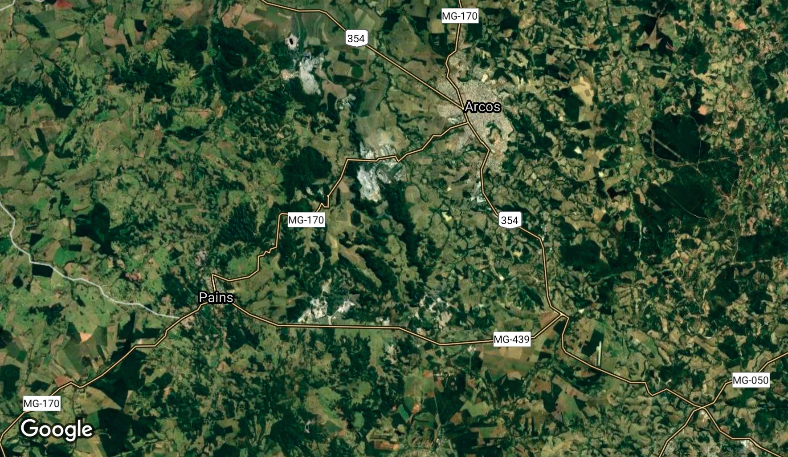
    - **checksum_sha256**: ee229ab027ba2c3dc4c2ef905cb602780479135f3a2883267408019879ed9fd0
  - **[2]**:
    - **caminho**: 
    - **checksum_sha256**: b2b96dda1ad8d0b6bcff4d78977c0d4800f69ed61fed3b5204c958a6f154ef1d
  - **[3]**:
    - **caminho**: 
    - **checksum_sha256**: 63d90792d83a83374ad9e008392dcc49cc16ed9bef41a3e52a86c0b96c83aee4
  - **[4]**:
    - **caminho**: 
    - **checksum_sha256**: 19bd26075853ee106f81ff66d5fab2cb5db9e431fa48b924723f2e44a8c89dc4
  - **[5]**:
    - **caminho**: 
    - **checksum_sha256**: 984974b8cd56a8ddbf273448983fa1bc87f74d3153615110489e77908368e8d8
  - **[6]**:
    - **caminho**: 
    - **checksum_sha256**: 2743bcac0d0ff6c713128b0d62f9f94d43d3c9eead29705d1bb754eff8bae551
  - **[7]**:
    - **caminho**: 
    - **checksum_sha256**: 57fe9f7fffe07d140ca8425de762f69dfbefbc043b2c7df08a10ddbe9dbf9a65
  - **[8]**:
    - **caminho**: 
    - **checksum_sha256**: fe6d5ce186290ec0c5fea00826793d44248a909f9190183467d2fe680643324a
  - **[9]**:
    - **caminho**: 
    - **checksum_sha256**: cc538f5429b118ced4fd38d438bc3dd4906376725d2d358bcec984d97a4b379f
  - **[10]**:
    - **caminho**: 
    - **checksum_sha256**: 6c2ef48126eafd265d17e437a5c68b8197f412c65e4f92e49c50d7f2d706014a
  - **[11]**:
    - **caminho**: 
    - **checksum_sha256**: 8bd694cc88f83c2d5cc6e3a2fcfa182e45cfe18deb8aa0205e442e537557ab14
  - **[12]**:
    - **caminho**: 
    - **checksum_sha256**: 1ce30edd489a4a2c71762d0e307baa1750aabfa792123eef1e24ec56c090fef2
  - **[13]**:
    - **caminho**: 
    - **checksum_sha256**: 763967b2fdb50d07d89a9a98545706cb311272ba92f3dbe5001ff16dd4498bbd
  - **[14]**:
    - **caminho**: 
    - **checksum_sha256**: c8a98514f87c3b594c20290cd2d4c0d8db0527c72c28ced9b04cc635bff422ae
  - **[15]**:
    - **caminho**: 
    - **checksum_sha256**: fbf82f2a505310657c7c22fbd51a849f999730a603b04f7bac14b0ea7a9e75de
  - **[16]**:
    - **caminho**: 
    - **checksum_sha256**: 46da70fbe2189594a1b367bb90c64eaad07dc3f5444399b80f4b485dd181aab3
  - **[17]**:
    - **caminho**: 
    - **checksum_sha256**: 23948cbbdc1fee9905c6bb9f02ff064870dd3c205f3cebe672299da2aa6e3fd8
  - **[18]**:
    - **caminho**: 
    - **checksum_sha256**: de19727a0166be87fcd1a0f71193e7ec34072460c2f38124fb37af97ca797ca1
  - **[19]**:
    - **caminho**: 
    - **checksum_sha256**: 893c077c88898f590e634b98baf99631bb4428d229cac754dadef5106094d2b9
  - **[20]**:
    - **caminho**: 
    - **checksum_sha256**: 5d05640905e70a81183ce12a686b89077fad0e8e5dcad61d97754fe9ca02fab4
  - **[21]**:
    - **caminho**: 
    - **checksum_sha256**: 427bbb0c15906e94687cc2bc6aa3fdd9fd0a3cf4292d40a6dd3b473129c5bc6d

