# Croqui: Afloramento Rastro

## Informações Gerais

- **descricao**: Croqui do Afloramento Rastro em Arcos, Minas Gerais.
- **id**: br_mg_arcos_rastro
- **nome**: Afloramento Rastro
- **uid**: N5QCgyleMFU1Mb
- **caminho_thumbnail**: 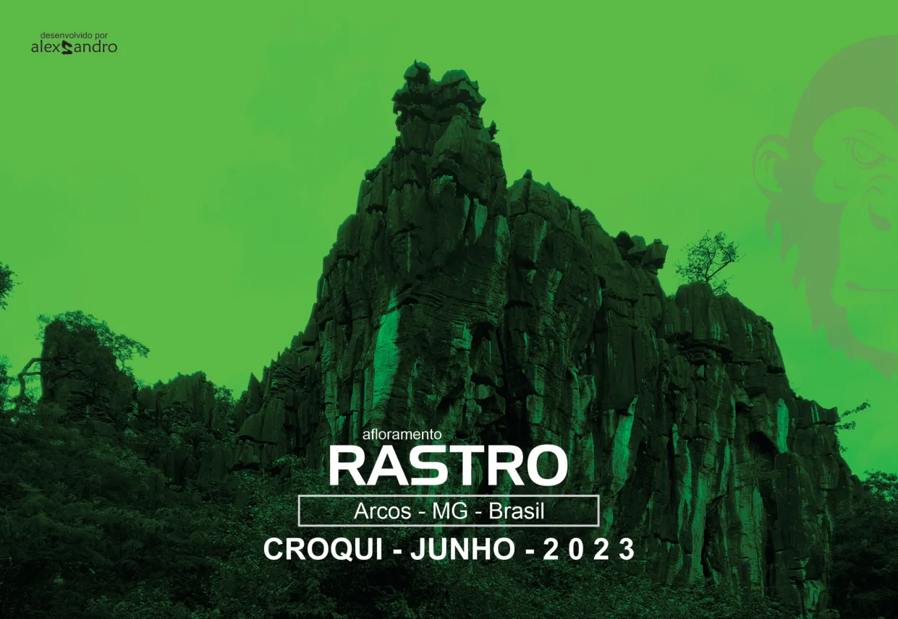
- **revisado_manualmente**: True
- **status_desenho_extraivel**: NAO_TEM_DESENHO
- **botoes**:
  - **[0]**:
    - **uid**: ixGD9ckgbAlhYz
    - **texto**: Capa
    - **destino**:
      - **secao_textual**:
        - **conteudo**:
            |  |
            | :--: |
            | *capa* |
            
            # afloramento RASTRO
            ## Arcos - MG - Brasil
            ## CROQUI - JUNHO - 2023
            
            Desenvolvido por: alexsandro
  - **[1]**:
    - **uid**: agrY39DIz2w9ol
    - **texto**: Atenção e Regras
    - **destino**:
      - **secao_textual**:
        - **conteudo**:
            # Atenção e Regras
            
            Este croqui é apenas um auxílio de consulta a localização, não serve como instruções a prática da escalada. Não nos responsabilizamos pelas informações aqui contidas, são apenas ponto de vista.
            
            ## ATENÇÃO
            Os nomes das vias, seus respectivos conquistadores e a graduação sugerida para cada uma delas são resultados de uma pesquisa oral conduzida entre os escaladores que frequentam o pico, uma vez que não foi encontrado nenhum registro prévio sobre o tema (exceto os guias anteriores). O resultado desse trabalho pode eventualmente conter erros, os quais peço que não sejam entendidos como desrespeito. O objetivo é documentar e divulgar a prática da escalada no centro-oeste mineiro da maneira mais exata possível.
            
            ## OBSERVAÇÃO
            Como algumas vias são de conquistadores desconhecidos foi utilizado apelido + (*) para identificá-las. Caso encontre algum engano nos dados citados neste croqui, peço que me envie a correção. Terei satisfação em atendê-lo, pois todos os envolvidos com a escalada tem a ganhar com o aprimoramento desse trabalho.
            
            Muito obrigado aos conquistadores e conquistadoras, **GRATIDÃO** a vocês sempre!!!
            
            Arte/Organização/Produção: **alexsandro martins** / 7ª versão / atualização 2023 / Revisão e graduação sugerida das vias: **Grupo de Trabalho**
            
            ## SEJA CONSCIENTE!
            - **UTILIZE APENAS AS TRILHAS PRINCIPAIS**;
            - **As grutas não são banheiros!** Faça suas necessidades fisiológicas em casa, caso não consiga segurar, faça longe das pedras e cubra com folhas ou terra;
            - **Leve todo seu lixo de volta** e o lixo de outros visitantes descuidados (inclusive papel higiênico, garrafas plásticas, bitucas, pontas, papel de bala...);
            - Os animais locais e plantas nativas devem permanecer em seus lugares. Lembre-se que eles estão em seu habitat natural e precisam ser respeitados;
            - Os animais domésticos (ex. cães) não devem ser trazidos a este local, desta forma, você os protege de doenças silvestres e vice versa;
            - Fogueiras além de provocar queimadas, danificam o local;
            - Estacione de maneira adequada e no local adequado a fim de não atrapalhar o fluxo de outros veículos;
            - Utilize equipamentos de segurança e verifique seu estado de conservação;
            - Cuidado com pedras soltas principalmente em setores e vias novas;
            - Antes de conquistar uma via de escalada entre em contato com o GT.
  - **[2]**:
    - **uid**: 4EQponVBX9RJRA
    - **texto**: Parcerias e Contato
    - **destino**:
      - **secao_textual**:
        - **conteudo**:
            # Parcerias e Contato
            
            Parcerias na atualização do ano de 2023 dos croquis dos Afloramentos, Setores e Vias de Escaladas Esportiva em Arcos, Pains e Região - MG.
            
            |  |
            | :--: |
            | *Parceiros* |
            
            ## Parceiros
            - **Abrigo Base**
            - **Magnésio 22**
            - **Kmon Escalada**
            - **Quero Escalar**
            - **Meka Coffee Bar**
            - **Borges Café**
            - **Brand's re Soul**
            - **100 Betas Ginásio de Escalada**
            
            ---
            
            ## Contato e Apoio
            Para contribuir com esse trabalho e a próxima atualização:
            
            - **Contato/Informações**: [@abrigobase](https://www.instagram.com/abrigobase)
            - **Atualizações/Sugestões**: abrigobase@gmail.com
            - **Contribuição/Parceria (PIX)**: 37 99918-3634
- **ultima_migracao**: 5
- **publicar_croqui**: True
- **revisado_bounding_circle**: True
- **creditos**:
  - Alexsandro

## Parte: setor_zona_leste

### Setor (Pico: Afloramento Rastro)

- **descricao**: Este setor oferece vias de 6º a 7c grau, com sombra o dia todo (variando de acordo com a estação).
- **nome**: Setor Zona Leste
- **uid**: 7WZuOZ1mTtHPAN
- **mapas**:
  - **[0]**:
    - **caminho_imagem_mapa**: 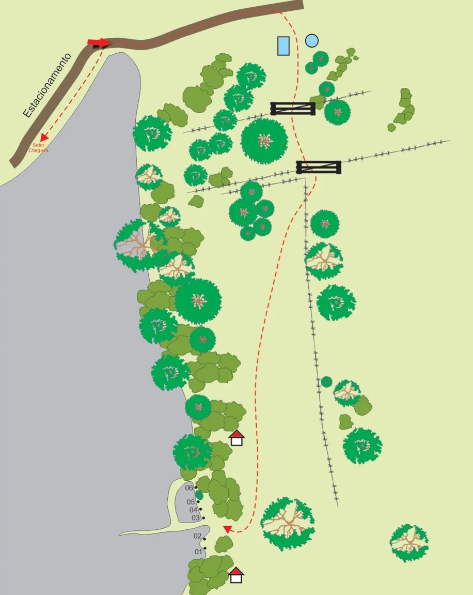
    - **largura_mapa**: 916
    - **altura_mapa**: 1151
    - **pontos_de_interesse**:
      - **[0]**:
        - **id**: F4159LNLW7nxcI
        - **uid**: F4159LNLW7nxcI
        - **rotulo**: Setor Chegada
        - **retangulo**:
          - **x**: 74
          - **y**: 286
          - **comprimento**: 45
          - **largura**: 29
        - **label**: Setor Chegada
      - **[1]**:
        - **id**: OeoPm2uE1ODpAY
        - **uid**: OeoPm2uE1ODpAY
        - **rotulo**: 01
        - **retangulo**:
          - **x**: 384
          - **y**: 1067
          - **comprimento**: 24
          - **largura**: 18
        - **label**: 01
      - **[2]**:
        - **id**: Fc4WNd35Lsz9V3
        - **uid**: Fc4WNd35Lsz9V3
        - **rotulo**: 02
        - **retangulo**:
          - **x**: 382
          - **y**: 1036
          - **comprimento**: 21
          - **largura**: 17
        - **label**: 02
      - **[3]**:
        - **id**: THrrSj46fBo2nW
        - **uid**: THrrSj46fBo2nW
        - **rotulo**: 03
        - **retangulo**:
          - **x**: 380
          - **y**: 1002
          - **comprimento**: 23
          - **largura**: 16
        - **label**: 03
      - **[4]**:
        - **id**: RuF0CteqrRLj0I
        - **uid**: RuF0CteqrRLj0I
        - **rotulo**: 04
        - **retangulo**:
          - **x**: 375
          - **y**: 986
          - **comprimento**: 22
          - **largura**: 15
        - **label**: 04
      - **[5]**:
        - **id**: O6wClJDwcjvEiK
        - **uid**: O6wClJDwcjvEiK
        - **rotulo**: 05
        - **retangulo**:
          - **x**: 370
          - **y**: 970
          - **comprimento**: 22
          - **largura**: 17
        - **label**: 05
      - **[6]**:
        - **id**: 5G9xJ73XJxnSlK
        - **uid**: 5G9xJ73XJxnSlK
        - **rotulo**: 06
        - **retangulo**:
          - **x**: 366
          - **y**: 943
          - **comprimento**: 22
          - **largura**: 18
        - **label**: 06
    - **referencias**:
      - **[0]**:
        - **alvo_uid**: SyVNAKWXajOZS7
        - **pontos_uids**:
          - OeoPm2uE1ODpAY
        - **escalada**: Machado de Xangô
        - **ids**:
          - OeoPm2uE1ODpAY
      - **[1]**:
        - **alvo_uid**: 3ek6Kg3APwe1O8
        - **pontos_uids**:
          - Fc4WNd35Lsz9V3
        - **escalada**: Babylon Burn
        - **ids**:
          - Fc4WNd35Lsz9V3
      - **[2]**:
        - **alvo_uid**: towKvhbOtoWVJi
        - **pontos_uids**:
          - THrrSj46fBo2nW
        - **escalada**: Eterno Aprendiz
        - **ids**:
          - THrrSj46fBo2nW
      - **[3]**:
        - **alvo_uid**: N2l4tZxAuvCIr5
        - **pontos_uids**:
          - RuF0CteqrRLj0I
        - **escalada**: Último Pacto
        - **ids**:
          - RuF0CteqrRLj0I
      - **[4]**:
        - **alvo_uid**: VTEBsjJKfqiSMR
        - **pontos_uids**:
          - O6wClJDwcjvEiK
        - **escalada**: Resistência Cultural
        - **ids**:
          - O6wClJDwcjvEiK
      - **[5]**:
        - **alvo_uid**: L4s7xw4If8emuQ
        - **pontos_uids**:
          - 5G9xJ73XJxnSlK
        - **escalada**: Respeito é pra quem tem
        - **ids**:
          - 5G9xJ73XJxnSlK
      - **[6]**:
        - **alvo_uid**: Pi6c115axze0qS
        - **pontos_uids**:
          - F4159LNLW7nxcI
        - **setor**: Setor Chegada
        - **ids**:
          - F4159LNLW7nxcI
- **escaladas**:
  - **[0]**:
    - **uid**: SyVNAKWXajOZS7
    - **via_esportiva**:
      - **nome**: Machado de Xangô
      - **data_abertura**: 2020
      - **dificuldade**: PROJETO
      - **quantidade_protecoes_intermediarias**: 5
      - **quantidade_protecoes_parada**: 2
  - **[1]**:
    - **uid**: 3ek6Kg3APwe1O8
    - **via_esportiva**:
      - **nome**: Babylon Burn
      - **destaque**: True
      - **data_abertura**: 2020
      - **dificuldade**: BR_7C
      - **quantidade_protecoes_intermediarias**: 5
      - **quantidade_protecoes_parada**: 2
  - **[2]**:
    - **uid**: towKvhbOtoWVJi
    - **via_esportiva**:
      - **nome**: Eterno Aprendiz
      - **destaque**: True
      - **data_abertura**: 2020
      - **dificuldade**: BR_6
      - **quantidade_protecoes_intermediarias**: 5
      - **quantidade_protecoes_parada**: 2
  - **[3]**:
    - **uid**: N2l4tZxAuvCIr5
    - **via_esportiva**:
      - **nome**: Último Pacto
      - **destaque**: True
      - **data_abertura**: 2020
      - **dificuldade**: BR_7C
      - **quantidade_protecoes_intermediarias**: 7
      - **quantidade_protecoes_parada**: 2
  - **[4]**:
    - **uid**: VTEBsjJKfqiSMR
    - **via_esportiva**:
      - **nome**: Resistência Cultural
      - **data_abertura**: 2020
      - **destaque**: True
      - **dificuldade**: BR_7C
      - **quantidade_protecoes_intermediarias**: 6
      - **quantidade_protecoes_parada**: 2
  - **[5]**:
    - **uid**: L4s7xw4If8emuQ
    - **via_esportiva**:
      - **nome**: Respeito é pra quem tem
      - **data_abertura**: 2020
      - **destaque**: True
      - **dificuldade**: BR_7B_BARRA_7C
      - **quantidade_protecoes_intermediarias**: 6
      - **quantidade_protecoes_parada**: 2
- **precomputados**:
  - **total_escaladas**: 6
  - **total_esportivas**: 6

## Parte: setor_chegada

### Setor (Pico: Afloramento Rastro)

- **descricao**:
    Este setor é o primeiro contato com o afloramento. Possui sombra até as 12h (variando de acordo com a estação).
    
    **Observações**:
    - OBS.I: Caixa de Abelha próxima às vias 07 e 08.
- **nome**: Setor Chegada
- **uid**: Pi6c115axze0qS
- **mapas**:
  - **[0]**:
    - **caminho_imagem_mapa**: 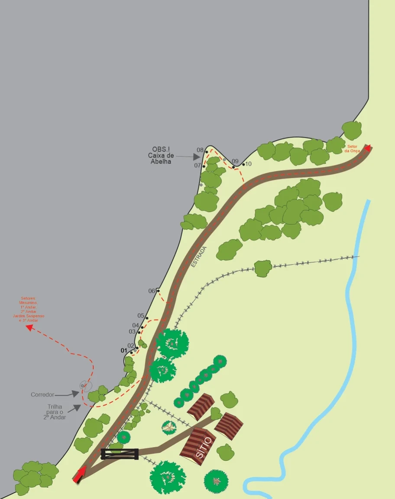
    - **largura_mapa**: 912
    - **altura_mapa**: 1151
    - **pontos_de_interesse**:
      - **[0]**:
        - **id**: eBKFyJdsJsOmfz
        - **uid**: eBKFyJdsJsOmfz
        - **rotulo**: Mezanino, 1o, 2o Andar, Jardim Suspenso e 3o Andar
        - **retangulo**:
          - **x**: 67
          - **y**: 712
          - **comprimento**: 86
          - **largura**: 78
        - **label**: Mezanino, 1o, 2o Andar, Jardim Suspenso e 3o Andar
      - **[1]**:
        - **id**: irtD1mffJuYtVd
        - **uid**: irtD1mffJuYtVd
        - **rotulo**: Trilha para o 2º Andar
        - **retangulo**:
          - **x**: 128
          - **y**: 950
          - **comprimento**: 63
          - **largura**: 47
        - **label**: Trilha para o 2º Andar
      - **[2]**:
        - **id**: PiiljeYWu3mpzZ
        - **uid**: PiiljeYWu3mpzZ
        - **rotulo**: SÍTIO
        - **retangulo**:
          - **x**: 471
          - **y**: 1032
          - **comprimento**: 68
          - **largura**: 79
        - **label**: SÍTIO
      - **[3]**:
        - **id**: ZrnuodgdF8i0AJ
        - **uid**: ZrnuodgdF8i0AJ
        - **rotulo**: OBS.! Caixa de Abelha
        - **retangulo**:
          - **x**: 371
          - **y**: 356
          - **comprimento**: 64
          - **largura**: 52
        - **label**: OBS.! Caixa de Abelha
      - **[4]**:
        - **id**: 3VG3FxBoCC9RwR
        - **uid**: 3VG3FxBoCC9RwR
        - **rotulo**: Setor da Onça
        - **retangulo**:
          - **x**: 813
          - **y**: 342
          - **comprimento**: 46
          - **largura**: 30
        - **label**: Setor da Onça
      - **[5]**:
        - **id**: SjMjFT9wHe1AcX
        - **uid**: SjMjFT9wHe1AcX
        - **rotulo**: 01
        - **retangulo**:
          - **x**: 286
          - **y**: 808
          - **comprimento**: 19
          - **largura**: 17
        - **label**: 01
      - **[6]**:
        - **id**: lwRZkZQWLvTDbz
        - **uid**: lwRZkZQWLvTDbz
        - **rotulo**: 02
        - **retangulo**:
          - **x**: 303
          - **y**: 796
          - **comprimento**: 20
          - **largura**: 16
        - **label**: 02
      - **[7]**:
        - **id**: SinofbpsbrN0sr
        - **uid**: SinofbpsbrN0sr
        - **rotulo**: 03
        - **retangulo**:
          - **x**: 305
          - **y**: 764
          - **comprimento**: 18
          - **largura**: 15
        - **label**: 03
      - **[8]**:
        - **id**: WvEh4fAHk2Fhk3
        - **uid**: WvEh4fAHk2Fhk3
        - **rotulo**: 04
        - **retangulo**:
          - **x**: 314
          - **y**: 749
          - **comprimento**: 19
          - **largura**: 16
        - **label**: 04
      - **[9]**:
        - **id**: SQGgc1mSH2XkW4
        - **uid**: SQGgc1mSH2XkW4
        - **rotulo**: 05
        - **retangulo**:
          - **x**: 326
          - **y**: 728
          - **comprimento**: 19
          - **largura**: 17
        - **label**: 05
      - **[10]**:
        - **id**: x2nrOToTmHobqw
        - **uid**: x2nrOToTmHobqw
        - **rotulo**: 06
        - **retangulo**:
          - **x**: 350
          - **y**: 670
          - **comprimento**: 21
          - **largura**: 17
        - **label**: 06
      - **[11]**:
        - **id**: byUCyvttrJ1ige
        - **uid**: byUCyvttrJ1ige
        - **rotulo**: 07
        - **retangulo**:
          - **x**: 456
          - **y**: 380
          - **comprimento**: 20
          - **largura**: 17
        - **label**: 07
      - **[12]**:
        - **id**: YINlmSBLoFzjnf
        - **uid**: YINlmSBLoFzjnf
        - **rotulo**: 08
        - **retangulo**:
          - **x**: 462
          - **y**: 346
          - **comprimento**: 20
          - **largura**: 17
        - **label**: 08
      - **[13]**:
        - **id**: ifoOz5VC9TVbQd
        - **uid**: ifoOz5VC9TVbQd
        - **rotulo**: 09
        - **retangulo**:
          - **x**: 543
          - **y**: 372
          - **comprimento**: 20
          - **largura**: 17
        - **label**: 09
      - **[14]**:
        - **id**: EN8c8rWQ8EZ61R
        - **uid**: EN8c8rWQ8EZ61R
        - **rotulo**: 10
        - **retangulo**:
          - **x**: 574
          - **y**: 378
          - **comprimento**: 20
          - **largura**: 17
        - **label**: 10
    - **referencias**:
      - **[0]**:
        - **alvo_uid**: OL9IzPDETlp7eJ
        - **pontos_uids**:
          - SjMjFT9wHe1AcX
        - **escalada**: Nanica
        - **ids**:
          - SjMjFT9wHe1AcX
      - **[1]**:
        - **alvo_uid**: 0wpqrume9PU9Od
        - **pontos_uids**:
          - lwRZkZQWLvTDbz
        - **escalada**: Bom Dia Tatá
        - **ids**:
          - lwRZkZQWLvTDbz
      - **[2]**:
        - **alvo_uid**: 2EdH4vEPOKDdMX
        - **pontos_uids**:
          - SinofbpsbrN0sr
        - **escalada**: Papa Folia
        - **ids**:
          - SinofbpsbrN0sr
      - **[3]**:
        - **alvo_uid**: DNiRemfltbUPTq
        - **pontos_uids**:
          - WvEh4fAHk2Fhk3
        - **escalada**: Tchau (variante)
        - **ids**:
          - WvEh4fAHk2Fhk3
      - **[4]**:
        - **alvo_uid**: 4rdUwP3X2jFDPk
        - **pontos_uids**:
          - SQGgc1mSH2XkW4
        - **escalada**: Vai Jumarear
        - **ids**:
          - SQGgc1mSH2XkW4
      - **[5]**:
        - **alvo_uid**: QsvbvH750JdUGf
        - **pontos_uids**:
          - x2nrOToTmHobqw
        - **escalada**: No Pain no Gain
        - **ids**:
          - x2nrOToTmHobqw
      - **[6]**:
        - **alvo_uid**: 2X3maPP0yhH02t
        - **pontos_uids**:
          - byUCyvttrJ1ige
        - **escalada**: Entre o medo e a loucura
        - **ids**:
          - byUCyvttrJ1ige
      - **[7]**:
        - **alvo_uid**: 8N2phZK5qawlHE
        - **pontos_uids**:
          - EN8c8rWQ8EZ61R
        - **escalada**: Good Bye
        - **ids**:
          - EN8c8rWQ8EZ61R
      - **[8]**:
        - **alvo_uid**: twZtpFyyKZUlgA
        - **pontos_uids**:
          - ifoOz5VC9TVbQd
        - **escalada**: Linha de Frente
        - **ids**:
          - ifoOz5VC9TVbQd
      - **[9]**:
        - **alvo_uid**: d4wsEBE217ebXL
        - **pontos_uids**:
          - EN8c8rWQ8EZ61R
        - **escalada**: Helow (variante)
        - **ids**:
          - EN8c8rWQ8EZ61R
      - **[10]**:
        - **alvo_uid**: IuQcqJF8uQ0xNz
        - **pontos_uids**:
          - irtD1mffJuYtVd
          - eBKFyJdsJsOmfz
        - **setor**: Setor 2º Andar
        - **ids**:
          - irtD1mffJuYtVd
          - eBKFyJdsJsOmfz
      - **[11]**:
        - **alvo_uid**: dSynigSRiYv0uW
        - **pontos_uids**:
          - 3VG3FxBoCC9RwR
        - **setor**: Setor Onça
        - **ids**:
          - 3VG3FxBoCC9RwR
      - **[12]**:
        - **alvo_uid**: qy0X6QJOgb40Ys
        - **pontos_uids**:
          - eBKFyJdsJsOmfz
        - **setor**: Setor Mezanino
        - **ids**:
          - eBKFyJdsJsOmfz
      - **[13]**:
        - **alvo_uid**: rTPz6f4oHTpzLr
        - **pontos_uids**:
          - eBKFyJdsJsOmfz
        - **setor**: Setor 1º Andar
        - **ids**:
          - eBKFyJdsJsOmfz
      - **[14]**:
        - **alvo_uid**: Xxlz6Srh7a9jQT
        - **pontos_uids**:
          - eBKFyJdsJsOmfz
        - **setor**: Setor Jardim Suspenso
        - **ids**:
          - eBKFyJdsJsOmfz
      - **[15]**:
        - **alvo_uid**: xFIkaiWPCCAZxk
        - **pontos_uids**:
          - eBKFyJdsJsOmfz
        - **setor**: Setor 3º Andar
        - **ids**:
          - eBKFyJdsJsOmfz
- **escaladas**:
  - **[0]**:
    - **uid**: TcHknU1jv3PTI1
    - **via_movel**:
      - **descricao**: Via em móvel/mista.
      - **nome**: sem nome
      - **dificuldade**: BR_4
      - **data_abertura**: 26a28/jul/2013
  - **[1]**:
    - **uid**: OL9IzPDETlp7eJ
    - **via_esportiva**:
      - **nome**: Nanica
      - **dificuldade**: BR_4
      - **data_abertura**: 26a28/jul/2013
      - **quantidade_protecoes_intermediarias**: 3
      - **quantidade_protecoes_parada**: 1
  - **[2]**:
    - **uid**: tIBoBe0mUxwR0G
    - **via_movel**:
      - **descricao**: Via em móvel.
      - **nome**: Via Lactea
      - **dificuldade**: BR_5
      - **data_abertura**: 26a28/jul/2013
  - **[3]**:
    - **uid**: 0wpqrume9PU9Od
    - **via_esportiva**:
      - **nome**: Bom Dia Tatá
      - **dificuldade**: BR_4
      - **data_abertura**: 26a28/jul/2013
      - **quantidade_protecoes_intermediarias**: 3
      - **quantidade_protecoes_parada**: 1
  - **[4]**:
    - **uid**: 2EdH4vEPOKDdMX
    - **via_esportiva**:
      - **nome**: Papa Folia
      - **dificuldade**: BR_4
      - **data_abertura**: 26a28/jul/2013
      - **quantidade_protecoes_intermediarias**: 3
      - **quantidade_protecoes_parada**: 2
  - **[5]**:
    - **uid**: DNiRemfltbUPTq
    - **via_esportiva**:
      - **nome**: Tchau (variante)
      - **dificuldade**: BR_4
      - **data_abertura**: 26a28/jul/2013
      - **quantidade_protecoes_intermediarias**: 5
      - **quantidade_protecoes_parada**: 2
  - **[6]**:
    - **uid**: 4rdUwP3X2jFDPk
    - **via_esportiva**:
      - **nome**: Vai Jumarear
      - **destaque**: True
      - **dificuldade**: BR_6SUP
      - **quantidade_protecoes_intermediarias**: 4
      - **quantidade_protecoes_parada**: 2
  - **[7]**:
    - **uid**: QsvbvH750JdUGf
    - **via_esportiva**:
      - **nome**: No Pain no Gain
      - **dificuldade**: BR_6SUP
      - **quantidade_protecoes_intermediarias**: 5
      - **quantidade_protecoes_parada**: 2
  - **[8]**:
    - **uid**: y9AeoLrflmHZm0
    - **via_movel**:
      - **descricao**: Via mista.
      - **nome**: sem nome (mixta)
      - **dificuldade**: BR_6SUP
  - **[9]**:
    - **uid**: 2X3maPP0yhH02t
    - **via_esportiva**:
      - **nome**: Entre o medo e a loucura
      - **dificuldade**: PROJETO
  - **[10]**:
    - **uid**: twZtpFyyKZUlgA
    - **via_esportiva**:
      - **nome**: Linha de Frente
      - **dificuldade**: PROJETO
  - **[11]**:
    - **uid**: d4wsEBE217ebXL
    - **via_esportiva**:
      - **nome**: Helow (variante)
      - **destaque**: True
      - **dificuldade**: BR_6SUP
      - **quantidade_protecoes_intermediarias**: 4
      - **quantidade_protecoes_parada**: 2
  - **[12]**:
    - **uid**: 8N2phZK5qawlHE
    - **via_esportiva**:
      - **nome**: Good Bye
      - **destaque**: True
      - **dificuldade**: BR_6SUP
      - **quantidade_protecoes_intermediarias**: 4
      - **quantidade_protecoes_parada**: 2
- **precomputados**:
  - **total_escaladas**: 13
  - **total_esportivas**: 10

## Parte: setor_onca

### Setor (Pico: Afloramento Rastro)

- **descricao**:
    Este setor possui sombra até as 13h (variando de acordo com a estação).
    
    **Observações**:
    - OBS.!: Caixa de Abelha Arapuã do lado direito da via 17.
- **nome**: Setor Onça
- **uid**: dSynigSRiYv0uW
- **mapas**:
  - **[0]**:
    - **caminho_imagem_mapa**: 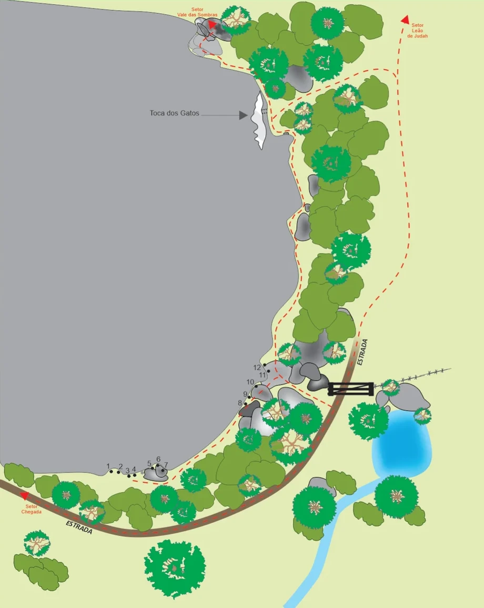
    - **largura_mapa**: 920
    - **altura_mapa**: 1153
    - **pontos_de_interesse**:
      - **[0]**:
        - **id**: rqXfIu9KaO2JrO
        - **uid**: rqXfIu9KaO2JrO
        - **rotulo**: Setor Vale das Sombras
        - **retangulo**:
          - **x**: 376
          - **y**: 22
          - **comprimento**: 87
          - **largura**: 27
        - **label**: Setor Vale das Sombras
      - **[1]**:
        - **id**: AYptEZPArnvoPF
        - **uid**: AYptEZPArnvoPF
        - **rotulo**: Toca dos Gatos
        - **retangulo**:
          - **x**: 332
          - **y**: 212
          - **comprimento**: 106
          - **largura**: 25
        - **label**: Toca dos Gatos
      - **[2]**:
        - **id**: kotkz4LSEgdTSy
        - **uid**: kotkz4LSEgdTSy
        - **rotulo**: Setor Leão de Judah
        - **retangulo**:
          - **x**: 794
          - **y**: 57
          - **comprimento**: 47
          - **largura**: 38
        - **label**: Setor Leão de Judah
      - **[3]**:
        - **id**: fqSKJOi4d7GGb4
        - **uid**: fqSKJOi4d7GGb4
        - **rotulo**: Setor Chegada
        - **retangulo**:
          - **x**: 58
          - **y**: 965
          - **comprimento**: 53
          - **largura**: 28
        - **label**: Setor Chegada
      - **[4]**:
        - **id**: ugKLcgH8PoKUGp
        - **uid**: ugKLcgH8PoKUGp
        - **rotulo**: 01
        - **retangulo**:
          - **x**: 206
          - **y**: 884
          - **comprimento**: 13
          - **largura**: 16
        - **label**: 01
      - **[5]**:
        - **id**: OwYtn4Z8tzbEvT
        - **uid**: OwYtn4Z8tzbEvT
        - **rotulo**: 02
        - **retangulo**:
          - **x**: 229
          - **y**: 884
          - **comprimento**: 12
          - **largura**: 16
        - **label**: 02
      - **[6]**:
        - **id**: k3Gl79ayY5CvCM
        - **uid**: k3Gl79ayY5CvCM
        - **rotulo**: 03
        - **retangulo**:
          - **x**: 242
          - **y**: 892
          - **comprimento**: 13
          - **largura**: 16
        - **label**: 03
      - **[7]**:
        - **id**: a8BUgKsYIHaPtQ
        - **uid**: a8BUgKsYIHaPtQ
        - **rotulo**: 04
        - **retangulo**:
          - **x**: 254
          - **y**: 890
          - **comprimento**: 11
          - **largura**: 16
        - **label**: 04
      - **[8]**:
        - **id**: re17yB3nkUDDDS
        - **uid**: re17yB3nkUDDDS
        - **rotulo**: 05
        - **retangulo**:
          - **x**: 284
          - **y**: 878
          - **comprimento**: 11
          - **largura**: 18
        - **label**: 05
      - **[9]**:
        - **id**: d8j2QBOyQ9ra0u
        - **uid**: d8j2QBOyQ9ra0u
        - **rotulo**: 06
        - **retangulo**:
          - **x**: 302
          - **y**: 870
          - **comprimento**: 13
          - **largura**: 19
        - **label**: 06
      - **[10]**:
        - **id**: G7UubTSTG14T47
        - **uid**: G7UubTSTG14T47
        - **rotulo**: 07
        - **retangulo**:
          - **x**: 316
          - **y**: 882
          - **comprimento**: 14
          - **largura**: 19
        - **label**: 07
      - **[11]**:
        - **id**: bd5vhihpXg364Z
        - **uid**: bd5vhihpXg364Z
        - **rotulo**: 08
        - **retangulo**:
          - **x**: 456
          - **y**: 764
          - **comprimento**: 14
          - **largura**: 16
        - **label**: 08
      - **[12]**:
        - **id**: X5pVQCCQ6Txgrl
        - **uid**: X5pVQCCQ6Txgrl
        - **rotulo**: 09
        - **retangulo**:
          - **x**: 466
          - **y**: 746
          - **comprimento**: 15
          - **largura**: 16
        - **label**: 09
      - **[13]**:
        - **id**: xjQIQdYalymN42
        - **uid**: xjQIQdYalymN42
        - **rotulo**: 10
        - **retangulo**:
          - **x**: 476
          - **y**: 723
          - **comprimento**: 17
          - **largura**: 16
        - **label**: 10
      - **[14]**:
        - **id**: FtB6jjez5DqTbv
        - **uid**: FtB6jjez5DqTbv
        - **rotulo**: 11
        - **retangulo**:
          - **x**: 499
          - **y**: 710
          - **comprimento**: 16
          - **largura**: 13
        - **label**: 11
      - **[15]**:
        - **id**: fIa1WkaLgOEvYQ
        - **uid**: fIa1WkaLgOEvYQ
        - **rotulo**: 12
        - **retangulo**:
          - **x**: 488
          - **y**: 696
          - **comprimento**: 17
          - **largura**: 15
        - **label**: 12
    - **referencias**:
      - **[0]**:
        - **alvo_uid**: 4bXJ6z41QW6OLa
        - **pontos_uids**:
          - ugKLcgH8PoKUGp
        - **escalada**: Esticãozinho e Chororô
        - **ids**:
          - ugKLcgH8PoKUGp
      - **[1]**:
        - **alvo_uid**: NQUuiy5am6iJfz
        - **pontos_uids**:
          - OwYtn4Z8tzbEvT
        - **escalada**: Pequetita Aymê
        - **ids**:
          - OwYtn4Z8tzbEvT
      - **[2]**:
        - **alvo_uid**: W9ci4uXDbCHWUb
        - **pontos_uids**:
          - k3Gl79ayY5CvCM
        - **escalada**: Abstinência Alcoólica
        - **ids**:
          - k3Gl79ayY5CvCM
      - **[3]**:
        - **alvo_uid**: oWmuDi6bUTH2SM
        - **pontos_uids**:
          - a8BUgKsYIHaPtQ
        - **escalada**: Jack Daniel's
        - **ids**:
          - a8BUgKsYIHaPtQ
      - **[4]**:
        - **alvo_uid**: 6n3qslpOWQZNwi
        - **pontos_uids**:
          - re17yB3nkUDDDS
        - **escalada**: Suor de Cachaça
        - **ids**:
          - re17yB3nkUDDDS
      - **[5]**:
        - **alvo_uid**: VvGJkGriWPfjl1
        - **pontos_uids**:
          - d8j2QBOyQ9ra0u
        - **escalada**: Feliz Natal
        - **ids**:
          - d8j2QBOyQ9ra0u
      - **[6]**:
        - **alvo_uid**: 0wcL2nemnBby6O
        - **pontos_uids**:
          - G7UubTSTG14T47
        - **escalada**: Tiro Certeiro
        - **ids**:
          - G7UubTSTG14T47
      - **[7]**:
        - **alvo_uid**: zs85pEVOA4YJLF
        - **pontos_uids**:
          - xjQIQdYalymN42
        - **escalada**: Buraco é Mais Em Baixo
        - **ids**:
          - xjQIQdYalymN42
      - **[8]**:
        - **alvo_uid**: 561juWuajVel0l
        - **pontos_uids**:
          - FtB6jjez5DqTbv
        - **escalada**: Doze Proteções e Três Irmãos
        - **ids**:
          - FtB6jjez5DqTbv
      - **[9]**:
        - **alvo_uid**: nyQB88O35wLFpF
        - **pontos_uids**:
          - fIa1WkaLgOEvYQ
        - **escalada**: Jardim da Babilônia
        - **ids**:
          - fIa1WkaLgOEvYQ
      - **[10]**:
        - **alvo_uid**: 1OxuoiOINdvOja
        - **pontos_uids**:
          - bd5vhihpXg364Z
        - **escalada**: Estica e Clipa
        - **ids**:
          - bd5vhihpXg364Z
      - **[11]**:
        - **alvo_uid**: Gfrol80O1Dnq93
        - **pontos_uids**:
          - X5pVQCCQ6Txgrl
        - **escalada**: Pai Bravo
        - **ids**:
          - X5pVQCCQ6Txgrl
      - **[12]**:
        - **alvo_uid**: Pi6c115axze0qS
        - **pontos_uids**:
          - fqSKJOi4d7GGb4
        - **setor**: Setor Chegada
        - **ids**:
          - fqSKJOi4d7GGb4
      - **[13]**:
        - **alvo_uid**: RVnHesmJXyO5RN
        - **pontos_uids**:
          - AYptEZPArnvoPF
        - **setor**: Setor Toca dos Gatos
        - **ids**:
          - AYptEZPArnvoPF
      - **[14]**:
        - **alvo_uid**: 1TCXLdk6niZmLH
        - **pontos_uids**:
          - kotkz4LSEgdTSy
        - **setor**: Setor Leão de Judah
        - **ids**:
          - kotkz4LSEgdTSy
      - **[15]**:
        - **alvo_uid**: I8731IVGqI3fpV
        - **pontos_uids**:
          - rqXfIu9KaO2JrO
        - **setor**: Setor Vale das Sombras
        - **ids**:
          - rqXfIu9KaO2JrO
  - **[1]**:
    - **caminho_imagem_mapa**: 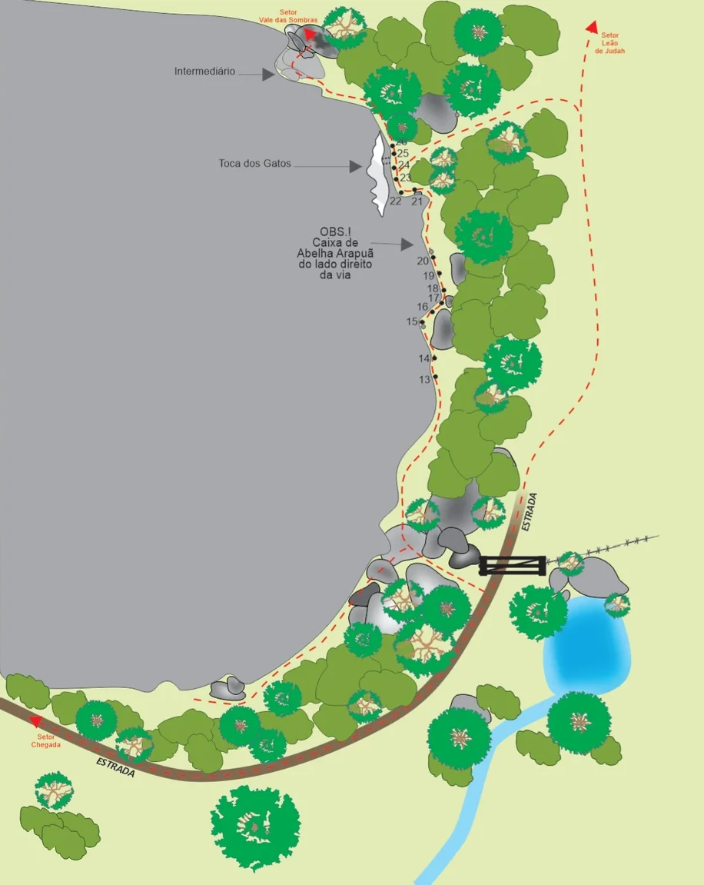
    - **largura_mapa**: 916
    - **altura_mapa**: 1151
    - **pontos_de_interesse**:
      - **[0]**:
        - **id**: Puj0U46EP4dpW4
        - **uid**: Puj0U46EP4dpW4
        - **rotulo**: Setor Vale das Sombras
        - **retangulo**:
          - **x**: 374
          - **y**: 20
          - **comprimento**: 85
          - **largura**: 29
        - **label**: Setor Vale das Sombras
      - **[1]**:
        - **id**: p9CXK9hEdKssQt
        - **uid**: p9CXK9hEdKssQt
        - **rotulo**: Intermediário
        - **retangulo**:
          - **x**: 266
          - **y**: 92
          - **comprimento**: 87
          - **largura**: 21
        - **label**: Intermediário
      - **[2]**:
        - **id**: I9lK00R3Dwni0l
        - **uid**: I9lK00R3Dwni0l
        - **rotulo**: Toca dos Gatos
        - **retangulo**:
          - **x**: 332
          - **y**: 212
          - **comprimento**: 103
          - **largura**: 24
        - **label**: Toca dos Gatos
      - **[3]**:
        - **id**: iFdtMJIVUetJHm
        - **uid**: iFdtMJIVUetJHm
        - **rotulo**: Setor Leão de Judah
        - **retangulo**:
          - **x**: 794
          - **y**: 54
          - **comprimento**: 48
          - **largura**: 40
        - **label**: Setor Leão de Judah
      - **[4]**:
        - **id**: mAvFy9VgCrk1E7
        - **uid**: mAvFy9VgCrk1E7
        - **rotulo**: Setor Chegada
        - **retangulo**:
          - **x**: 60
          - **y**: 963
          - **comprimento**: 45
          - **largura**: 32
        - **label**: Setor Chegada
      - **[5]**:
        - **id**: x3lUP0ovxN0sNV
        - **uid**: x3lUP0ovxN0sNV
        - **rotulo**: 13
        - **retangulo**:
          - **x**: 552
          - **y**: 494
          - **comprimento**: 20
          - **largura**: 17
        - **label**: 13
      - **[6]**:
        - **id**: IU0cJpiQqqcRSD
        - **uid**: IU0cJpiQqqcRSD
        - **rotulo**: 14
        - **retangulo**:
          - **x**: 552
          - **y**: 466
          - **comprimento**: 19
          - **largura**: 16
        - **label**: 14
      - **[7]**:
        - **id**: rIq2Zm3tpbHjZ6
        - **uid**: rIq2Zm3tpbHjZ6
        - **rotulo**: 15
        - **retangulo**:
          - **x**: 536
          - **y**: 418
          - **comprimento**: 20
          - **largura**: 16
        - **label**: 15
      - **[8]**:
        - **id**: XLX1tuP4UaoKbf
        - **uid**: XLX1tuP4UaoKbf
        - **rotulo**: 16
        - **retangulo**:
          - **x**: 550
          - **y**: 399
          - **comprimento**: 16
          - **largura**: 12
        - **label**: 16
      - **[9]**:
        - **id**: hFrp86qMm1zaLc
        - **uid**: hFrp86qMm1zaLc
        - **rotulo**: 17
        - **retangulo**:
          - **x**: 564
          - **y**: 386
          - **comprimento**: 16
          - **largura**: 13
        - **label**: 17
      - **[10]**:
        - **id**: 3u36jTSNxmHGwq
        - **uid**: 3u36jTSNxmHGwq
        - **rotulo**: 18
        - **retangulo**:
          - **x**: 564
          - **y**: 374
          - **comprimento**: 15
          - **largura**: 13
        - **label**: 18
      - **[11]**:
        - **id**: Ju6ibDWYKmb1NR
        - **uid**: Ju6ibDWYKmb1NR
        - **rotulo**: 19
        - **retangulo**:
          - **x**: 558
          - **y**: 358
          - **comprimento**: 18
          - **largura**: 15
        - **label**: 19
      - **[12]**:
        - **id**: 2UkLeJ9HksDTXi
        - **uid**: 2UkLeJ9HksDTXi
        - **rotulo**: 20
        - **retangulo**:
          - **x**: 550
          - **y**: 338
          - **comprimento**: 18
          - **largura**: 16
        - **label**: 20
      - **[13]**:
        - **id**: 9syWd8jxBtsfYI
        - **uid**: 9syWd8jxBtsfYI
        - **rotulo**: 21
        - **retangulo**:
          - **x**: 542
          - **y**: 262
          - **comprimento**: 17
          - **largura**: 15
        - **label**: 21
      - **[14]**:
        - **id**: J73CsVvJlgXUhW
        - **uid**: J73CsVvJlgXUhW
        - **rotulo**: 22
        - **retangulo**:
          - **x**: 515
          - **y**: 262
          - **comprimento**: 18
          - **largura**: 15
        - **label**: 22
      - **[15]**:
        - **id**: X6GVU3jXjojCsb
        - **uid**: X6GVU3jXjojCsb
        - **rotulo**: 23
        - **retangulo**:
          - **x**: 528
          - **y**: 230
          - **comprimento**: 19
          - **largura**: 15
        - **label**: 23
      - **[16]**:
        - **id**: cYgUdZsdM8rtow
        - **uid**: cYgUdZsdM8rtow
        - **rotulo**: 24
        - **retangulo**:
          - **x**: 525
          - **y**: 214
          - **comprimento**: 18
          - **largura**: 15
        - **label**: 24
      - **[17]**:
        - **id**: 1th3z7VYoF2kBv
        - **uid**: 1th3z7VYoF2kBv
        - **rotulo**: 25
        - **retangulo**:
          - **x**: 524
          - **y**: 198
          - **comprimento**: 18
          - **largura**: 15
        - **label**: 25
      - **[18]**:
        - **id**: inrRgXPaSPfWu0
        - **uid**: inrRgXPaSPfWu0
        - **rotulo**: 26
        - **retangulo**:
          - **x**: 522
          - **y**: 184
          - **comprimento**: 19
          - **largura**: 14
        - **label**: 26
    - **referencias**:
      - **[0]**:
        - **alvo_uid**: 5CowPM3fp51K8V
        - **pontos_uids**:
          - x3lUP0ovxN0sNV
        - **escalada**: Incrível Teto
        - **ids**:
          - x3lUP0ovxN0sNV
      - **[1]**:
        - **alvo_uid**: V2a1F9mbahn97C
        - **pontos_uids**:
          - IU0cJpiQqqcRSD
        - **escalada**: Incrível Céu de Arcos
        - **ids**:
          - IU0cJpiQqqcRSD
      - **[2]**:
        - **alvo_uid**: rKVGXbgcj0fNtZ
        - **pontos_uids**:
          - rIq2Zm3tpbHjZ6
        - **escalada**: Besta Quadrada
        - **ids**:
          - rIq2Zm3tpbHjZ6
      - **[3]**:
        - **alvo_uid**: JMrYvZutfd8uJG
        - **pontos_uids**:
          - XLX1tuP4UaoKbf
        - **escalada**: Aperta ou Voa
        - **ids**:
          - XLX1tuP4UaoKbf
      - **[4]**:
        - **alvo_uid**: jm10fbRCFvAy9i
        - **pontos_uids**:
          - hFrp86qMm1zaLc
        - **escalada**: Antifascistas
        - **ids**:
          - hFrp86qMm1zaLc
      - **[5]**:
        - **alvo_uid**: 3CvqtOmT2ENEW0
        - **pontos_uids**:
          - 3u36jTSNxmHGwq
        - **escalada**: Macaco Não Tem Culpa
        - **ids**:
          - 3u36jTSNxmHGwq
      - **[6]**:
        - **alvo_uid**: vlZurunBOtQRzT
        - **pontos_uids**:
          - Ju6ibDWYKmb1NR
        - **escalada**: Mãe Gaia
        - **ids**:
          - Ju6ibDWYKmb1NR
      - **[7]**:
        - **alvo_uid**: V6sq7tXdmUXXvf
        - **pontos_uids**:
          - 2UkLeJ9HksDTXi
        - **escalada**: Enrola e Morde
        - **ids**:
          - 2UkLeJ9HksDTXi
      - **[8]**:
        - **alvo_uid**: pWMbyEsfKmnTNj
        - **pontos_uids**:
          - 9syWd8jxBtsfYI
        - **escalada**: Liberdade de Expressão
        - **ids**:
          - 9syWd8jxBtsfYI
      - **[9]**:
        - **alvo_uid**: YbjuU3yx1c9tMV
        - **pontos_uids**:
          - J73CsVvJlgXUhW
        - **escalada**: Centenária
        - **ids**:
          - J73CsVvJlgXUhW
      - **[10]**:
        - **alvo_uid**: xcXLL7PWkOBxr5
        - **pontos_uids**:
          - X6GVU3jXjojCsb
        - **escalada**: Kalimera
        - **ids**:
          - X6GVU3jXjojCsb
      - **[11]**:
        - **alvo_uid**: y3bAKxX0GHC5QZ
        - **pontos_uids**:
          - cYgUdZsdM8rtow
        - **escalada**: Sálvia
        - **ids**:
          - cYgUdZsdM8rtow
      - **[12]**:
        - **alvo_uid**: F0XEzZLo8L9z3D
        - **pontos_uids**:
          - 1th3z7VYoF2kBv
        - **escalada**: Fuga das Galinhas
        - **ids**:
          - 1th3z7VYoF2kBv
      - **[13]**:
        - **alvo_uid**: sj1qgXexfrlwDp
        - **pontos_uids**:
          - inrRgXPaSPfWu0
        - **escalada**: Carne d Homi ñ dá Coxinha
        - **ids**:
          - inrRgXPaSPfWu0
      - **[14]**:
        - **alvo_uid**: Pi6c115axze0qS
        - **pontos_uids**:
          - mAvFy9VgCrk1E7
        - **setor**: Setor Chegada
        - **ids**:
          - mAvFy9VgCrk1E7
      - **[15]**:
        - **alvo_uid**: 1TCXLdk6niZmLH
        - **pontos_uids**:
          - iFdtMJIVUetJHm
        - **setor**: Setor Leão de Judah
        - **ids**:
          - iFdtMJIVUetJHm
      - **[16]**:
        - **alvo_uid**: dzia3Nrh75O9WH
        - **pontos_uids**:
          - p9CXK9hEdKssQt
        - **setor**: Setor Intermediário
        - **ids**:
          - p9CXK9hEdKssQt
      - **[17]**:
        - **alvo_uid**: RVnHesmJXyO5RN
        - **pontos_uids**:
          - I9lK00R3Dwni0l
        - **setor**: Setor Toca dos Gatos
        - **ids**:
          - I9lK00R3Dwni0l
      - **[18]**:
        - **alvo_uid**: I8731IVGqI3fpV
        - **pontos_uids**:
          - Puj0U46EP4dpW4
        - **setor**: Setor Vale das Sombras
        - **ids**:
          - Puj0U46EP4dpW4
- **escaladas**:
  - **[0]**:
    - **uid**: 4bXJ6z41QW6OLa
    - **via_esportiva**:
      - **nome**: Esticãozinho e Chororô
      - **dificuldade**: BR_6SUP
      - **quantidade_protecoes_intermediarias**: 4
      - **quantidade_protecoes_parada**: 2
      - **data_abertura**: 2015
  - **[1]**:
    - **uid**: NQUuiy5am6iJfz
    - **via_esportiva**:
      - **nome**: Pequetita Aymê
      - **dificuldade**: BR_7A
      - **quantidade_protecoes_intermediarias**: 7
      - **quantidade_protecoes_parada**: 2
  - **[2]**:
    - **uid**: W9ci4uXDbCHWUb
    - **via_esportiva**:
      - **nome**: Abstinência Alcoólica
      - **dificuldade**: BR_7A
      - **quantidade_protecoes_intermediarias**: 3
      - **quantidade_protecoes_parada**: 2
  - **[3]**:
    - **uid**: oWmuDi6bUTH2SM
    - **via_esportiva**:
      - **nome**: Jack Daniel's
      - **dificuldade**: BR_7B
      - **destaque**: True
      - **quantidade_protecoes_intermediarias**: 5
      - **quantidade_protecoes_parada**: 2
  - **[4]**:
    - **uid**: 6n3qslpOWQZNwi
    - **via_esportiva**:
      - **nome**: Suor de Cachaça
      - **dificuldade**: BR_8A
      - **quantidade_protecoes_intermediarias**: 5
      - **quantidade_protecoes_parada**: 2
  - **[5]**:
    - **uid**: VvGJkGriWPfjl1
    - **via_esportiva**:
      - **nome**: Feliz Natal
      - **dificuldade**: BR_7A
      - **quantidade_protecoes_intermediarias**: 4
      - **quantidade_protecoes_parada**: 2
  - **[6]**:
    - **uid**: 0wcL2nemnBby6O
    - **via_esportiva**:
      - **nome**: Tiro Certeiro
      - **dificuldade**: BR_7A
      - **destaque**: True
      - **quantidade_protecoes_intermediarias**: 5
      - **quantidade_protecoes_parada**: 2
  - **[7]**:
    - **uid**: 1OxuoiOINdvOja
    - **via_esportiva**:
      - **nome**: Estica e Clipa
      - **dificuldade**: BR_6
      - **quantidade_protecoes_intermediarias**: 4
      - **quantidade_protecoes_parada**: 2
  - **[8]**:
    - **uid**: Gfrol80O1Dnq93
    - **via_esportiva**:
      - **nome**: Pai Bravo
      - **dificuldade**: BR_6
      - **destaque**: True
      - **quantidade_protecoes_intermediarias**: 5
      - **quantidade_protecoes_parada**: 2
  - **[9]**:
    - **uid**: zs85pEVOA4YJLF
    - **via_esportiva**:
      - **nome**: Buraco é Mais Em Baixo
      - **dificuldade**: BR_7A
      - **quantidade_protecoes_intermediarias**: 6
      - **quantidade_protecoes_parada**: 2
  - **[10]**:
    - **uid**: 561juWuajVel0l
    - **via_esportiva**:
      - **nome**: Doze Proteções e Três Irmãos
      - **dificuldade**: BR_7A
      - **quantidade_protecoes_intermediarias**: 10
      - **quantidade_protecoes_parada**: 2
  - **[11]**:
    - **uid**: nyQB88O35wLFpF
    - **via_esportiva**:
      - **nome**: Jardim da Babilônia
      - **dificuldade**: BR_7A
      - **quantidade_protecoes_intermediarias**: 7
      - **quantidade_protecoes_parada**: 2
  - **[12]**:
    - **uid**: 5CowPM3fp51K8V
    - **via_esportiva**:
      - **nome**: Incrível Teto
      - **dificuldade**: BR_7B
      - **destaque**: True
      - **quantidade_protecoes_intermediarias**: 8
      - **quantidade_protecoes_parada**: 2
  - **[13]**:
    - **uid**: V2a1F9mbahn97C
    - **via_esportiva**:
      - **nome**: Incrível Céu de Arcos
      - **dificuldade**: BR_7B
      - **destaque**: True
      - **quantidade_protecoes_intermediarias**: 8
      - **quantidade_protecoes_parada**: 2
  - **[14]**:
    - **uid**: rKVGXbgcj0fNtZ
    - **via_esportiva**:
      - **nome**: Besta Quadrada
      - **dificuldade**: BR_6SUP
      - **quantidade_protecoes_intermediarias**: 11
      - **quantidade_protecoes_parada**: 2
  - **[15]**:
    - **uid**: JMrYvZutfd8uJG
    - **via_esportiva**:
      - **nome**: Aperta ou Voa
      - **dificuldade**: BR_7B
      - **destaque**: True
      - **quantidade_protecoes_intermediarias**: 6
      - **quantidade_protecoes_parada**: 2
  - **[16]**:
    - **uid**: jm10fbRCFvAy9i
    - **via_esportiva**:
      - **nome**: Antifascistas
      - **dificuldade**: BR_7B
      - **destaque**: True
      - **quantidade_protecoes_intermediarias**: 5
      - **quantidade_protecoes_parada**: 2
  - **[17]**:
    - **uid**: 3CvqtOmT2ENEW0
    - **via_esportiva**:
      - **nome**: Macaco Não Tem Culpa
      - **dificuldade**: BR_7B
      - **destaque**: True
      - **quantidade_protecoes_intermediarias**: 5
      - **quantidade_protecoes_parada**: 2
  - **[18]**:
    - **uid**: vlZurunBOtQRzT
    - **via_esportiva**:
      - **nome**: Mãe Gaia
      - **dificuldade**: BR_7A
      - **destaque**: True
      - **quantidade_protecoes_intermediarias**: 11
      - **quantidade_protecoes_parada**: 2
  - **[19]**:
    - **uid**: V6sq7tXdmUXXvf
    - **via_esportiva**:
      - **nome**: Enrola e Morde
      - **dificuldade**: BR_7A
      - **quantidade_protecoes_intermediarias**: 5
      - **quantidade_protecoes_parada**: 2
  - **[20]**:
    - **uid**: pWMbyEsfKmnTNj
    - **via_esportiva**:
      - **nome**: Liberdade de Expressão
      - **dificuldade**: BR_7A
      - **destaque**: True
      - **quantidade_protecoes_intermediarias**: 5
      - **quantidade_protecoes_parada**: 2
  - **[21]**:
    - **uid**: YbjuU3yx1c9tMV
    - **via_esportiva**:
      - **nome**: Centenária
      - **dificuldade**: BR_7A
      - **quantidade_protecoes_intermediarias**: 7
      - **quantidade_protecoes_parada**: 2
  - **[22]**:
    - **uid**: xcXLL7PWkOBxr5
    - **via_esportiva**:
      - **nome**: Kalimera
      - **dificuldade**: BR_7B
      - **destaque**: True
      - **quantidade_protecoes_intermediarias**: 5
      - **quantidade_protecoes_parada**: 2
  - **[23]**:
    - **uid**: y3bAKxX0GHC5QZ
    - **via_esportiva**:
      - **nome**: Sálvia
      - **dificuldade**: BR_7B
      - **destaque**: True
      - **quantidade_protecoes_intermediarias**: 4
      - **quantidade_protecoes_parada**: 2
  - **[24]**:
    - **uid**: F0XEzZLo8L9z3D
    - **via_esportiva**:
      - **nome**: Fuga das Galinhas
      - **dificuldade**: BR_7A
      - **quantidade_protecoes_intermediarias**: 5
      - **quantidade_protecoes_parada**: 2
  - **[25]**:
    - **uid**: sj1qgXexfrlwDp
    - **via_esportiva**:
      - **nome**: Carne d Homi ñ dá Coxinha
      - **dificuldade**: BR_8B
      - **destaque**: True
      - **quantidade_protecoes_intermediarias**: 4
      - **quantidade_protecoes_parada**: 2
- **precomputados**:
  - **total_escaladas**: 26
  - **total_esportivas**: 26

## Parte: setor_toca_dos_gatos

### Setor (Pico: Afloramento Rastro)

- **descricao**: Este setor possui sombra o dia todo (variando de acordo com a estação). O acesso é feito através de um "Túnel de acesso".
- **nome**: Setor Toca dos Gatos
- **uid**: RVnHesmJXyO5RN
- **mapas**:
  - **[0]**:
    - **caminho_imagem_mapa**: 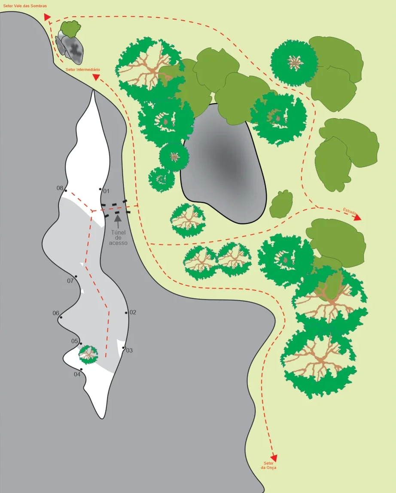
    - **largura_mapa**: 922
    - **altura_mapa**: 1147
    - **pontos_de_interesse**:
      - **[0]**:
        - **id**: MmSHgBQR7XIaVv
        - **uid**: MmSHgBQR7XIaVv
        - **rotulo**: Setor Vale das Sombras
        - **retangulo**:
          - **x**: 58
          - **y**: 13
          - **comprimento**: 113
          - **largura**: 20
        - **label**: Setor Vale das Sombras
      - **[1]**:
        - **id**: PFxklcMdAYeX6N
        - **uid**: PFxklcMdAYeX6N
        - **rotulo**: Setor Intermediário
        - **retangulo**:
          - **x**: 192
          - **y**: 160
          - **comprimento**: 92
          - **largura**: 20
        - **label**: Setor Intermediário
      - **[2]**:
        - **id**: ZqhCsmY7OO6jzw
        - **uid**: ZqhCsmY7OO6jzw
        - **rotulo**: Setor da Onça
        - **retangulo**:
          - **x**: 624
          - **y**: 1081
          - **comprimento**: 48
          - **largura**: 36
        - **label**: Setor da Onça
      - **[3]**:
        - **id**: eDMG2HUILOiYXc
        - **uid**: eDMG2HUILOiYXc
        - **rotulo**: 01
        - **retangulo**:
          - **x**: 246
          - **y**: 443
          - **comprimento**: 21
          - **largura**: 18
        - **label**: 01
      - **[4]**:
        - **id**: UMTVj8v4wDJ4lU
        - **uid**: UMTVj8v4wDJ4lU
        - **rotulo**: 02
        - **retangulo**:
          - **x**: 310
          - **y**: 726
          - **comprimento**: 23
          - **largura**: 18
        - **label**: 02
      - **[5]**:
        - **id**: CawBXyzIqHCMpk
        - **uid**: CawBXyzIqHCMpk
        - **rotulo**: 03
        - **retangulo**:
          - **x**: 302
          - **y**: 815
          - **comprimento**: 23
          - **largura**: 20
        - **label**: 03
      - **[6]**:
        - **id**: kMR39h60FZlV8y
        - **uid**: kMR39h60FZlV8y
        - **rotulo**: 04
        - **retangulo**:
          - **x**: 179
          - **y**: 871
          - **comprimento**: 24
          - **largura**: 22
        - **label**: 04
      - **[7]**:
        - **id**: 6MA3jB0C8jEtkU
        - **uid**: 6MA3jB0C8jEtkU
        - **rotulo**: 05
        - **retangulo**:
          - **x**: 174
          - **y**: 794
          - **comprimento**: 23
          - **largura**: 21
        - **label**: 05
      - **[8]**:
        - **id**: CuNnBxpw325xp0
        - **uid**: CuNnBxpw325xp0
        - **rotulo**: 06
        - **retangulo**:
          - **x**: 130
          - **y**: 728
          - **comprimento**: 24
          - **largura**: 19
        - **label**: 06
      - **[9]**:
        - **id**: m8HH9WB0KHh4Di
        - **uid**: m8HH9WB0KHh4Di
        - **rotulo**: 07
        - **retangulo**:
          - **x**: 164
          - **y**: 652
          - **comprimento**: 22
          - **largura**: 20
        - **label**: 07
      - **[10]**:
        - **id**: IEfyUBjhTtT9QI
        - **uid**: IEfyUBjhTtT9QI
        - **rotulo**: 08
        - **retangulo**:
          - **x**: 139
          - **y**: 436
          - **comprimento**: 22
          - **largura**: 17
        - **label**: 08
    - **referencias**:
      - **[0]**:
        - **alvo_uid**: t1kGogLG2TNHN0
        - **pontos_uids**:
          - eDMG2HUILOiYXc
        - **escalada**: Eakthecat
        - **ids**:
          - eDMG2HUILOiYXc
      - **[1]**:
        - **alvo_uid**: mpqVoaSFC41ay3
        - **pontos_uids**:
          - UMTVj8v4wDJ4lU
        - **escalada**: Burocracia Gelatinosa
        - **ids**:
          - UMTVj8v4wDJ4lU
      - **[2]**:
        - **alvo_uid**: o2z4jC3ljH5aq5
        - **pontos_uids**:
          - CawBXyzIqHCMpk
        - **escalada**: Planta Mãe
        - **ids**:
          - CawBXyzIqHCMpk
      - **[3]**:
        - **alvo_uid**: BwgudtUyV9MI41
        - **pontos_uids**:
          - kMR39h60FZlV8y
        - **escalada**: Funcionário Público
        - **ids**:
          - kMR39h60FZlV8y
      - **[4]**:
        - **alvo_uid**: drzxr44ZJThho6
        - **pontos_uids**:
          - 6MA3jB0C8jEtkU
        - **escalada**: Repartição Pública
        - **ids**:
          - 6MA3jB0C8jEtkU
      - **[5]**:
        - **alvo_uid**: nYmFK3MhikGulb
        - **pontos_uids**:
          - CuNnBxpw325xp0
        - **escalada**: Kevelin, Amigo do Steven
        - **ids**:
          - CuNnBxpw325xp0
      - **[6]**:
        - **alvo_uid**: X4Wqu0kDKLGaZt
        - **pontos_uids**:
          - m8HH9WB0KHh4Di
        - **escalada**: Fila de Espera
        - **ids**:
          - m8HH9WB0KHh4Di
      - **[7]**:
        - **alvo_uid**: c359DcVVAbxG1R
        - **pontos_uids**:
          - IEfyUBjhTtT9QI
        - **escalada**: Nem C/ Chuva a Gente Para
        - **ids**:
          - IEfyUBjhTtT9QI
      - **[8]**:
        - **alvo_uid**: I8731IVGqI3fpV
        - **pontos_uids**:
          - MmSHgBQR7XIaVv
        - **setor**: Setor Vale das Sombras
        - **ids**:
          - MmSHgBQR7XIaVv
      - **[9]**:
        - **alvo_uid**: dzia3Nrh75O9WH
        - **pontos_uids**:
          - PFxklcMdAYeX6N
        - **setor**: Setor Intermediário
        - **ids**:
          - PFxklcMdAYeX6N
      - **[10]**:
        - **alvo_uid**: dSynigSRiYv0uW
        - **pontos_uids**:
          - ZqhCsmY7OO6jzw
        - **setor**: Setor Onça
        - **ids**:
          - ZqhCsmY7OO6jzw
- **escaladas**:
  - **[0]**:
    - **uid**: t1kGogLG2TNHN0
    - **via_esportiva**:
      - **nome**: Eakthecat
      - **dificuldade**: BR_6SUP
      - **quantidade_protecoes_intermediarias**: 3
      - **quantidade_protecoes_parada**: 2
  - **[1]**:
    - **uid**: mpqVoaSFC41ay3
    - **via_esportiva**:
      - **nome**: Burocracia Gelatinosa
      - **dificuldade**: BR_7B_BARRA_7C
      - **quantidade_protecoes_intermediarias**: 8
      - **quantidade_protecoes_parada**: 2
      - **data_abertura**: 2019-11
  - **[2]**:
    - **uid**: o2z4jC3ljH5aq5
    - **via_esportiva**:
      - **nome**: Planta Mãe
      - **dificuldade**: BR_7A
      - **destaque**: True
      - **quantidade_protecoes_intermediarias**: 7
      - **quantidade_protecoes_parada**: 2
      - **data_abertura**: 2019-11
  - **[3]**:
    - **uid**: BwgudtUyV9MI41
    - **via_esportiva**:
      - **nome**: Funcionário Público
      - **dificuldade**: BR_7A
      - **destaque**: True
      - **quantidade_protecoes_intermediarias**: 7
      - **quantidade_protecoes_parada**: 2
      - **data_abertura**: 2019-11
  - **[4]**:
    - **uid**: drzxr44ZJThho6
    - **via_esportiva**:
      - **nome**: Repartição Pública
      - **dificuldade**: BR_7B_BARRA_7C
      - **destaque**: True
      - **quantidade_protecoes_intermediarias**: 9
      - **quantidade_protecoes_parada**: 2
      - **data_abertura**: 2019-11
  - **[5]**:
    - **uid**: nYmFK3MhikGulb
    - **via_esportiva**:
      - **nome**: Kevelin, Amigo do Steven
      - **dificuldade**: BR_6
      - **destaque**: True
      - **quantidade_protecoes_intermediarias**: 6
      - **quantidade_protecoes_parada**: 2
      - **data_abertura**: 2019-11
  - **[6]**:
    - **uid**: X4Wqu0kDKLGaZt
    - **via_esportiva**:
      - **nome**: Fila de Espera
      - **dificuldade**: BR_6SUP
      - **quantidade_protecoes_intermediarias**: 5
      - **quantidade_protecoes_parada**: 2
      - **data_abertura**: 2019-11
  - **[7]**:
    - **uid**: c359DcVVAbxG1R
    - **via_esportiva**:
      - **nome**: Nem C/ Chuva a Gente Para
      - **dificuldade**: BR_5
      - **quantidade_protecoes_intermediarias**: 3
      - **quantidade_protecoes_parada**: 2
- **precomputados**:
  - **total_escaladas**: 8
  - **total_esportivas**: 8

## Parte: setor_intermediario

### Setor (Pico: Afloramento Rastro)

- **descricao**: Este setor possui sombra até as 13h (variando de acordo com a estação).
- **nome**: Setor Intermediário
- **uid**: dzia3Nrh75O9WH
- **mapas**:
  - **[0]**:
    - **caminho_imagem_mapa**: 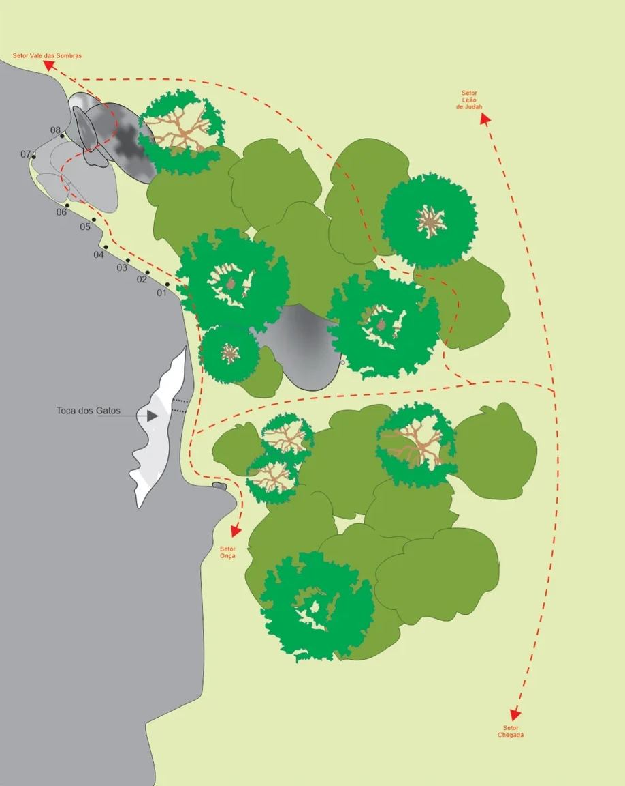
    - **largura_mapa**: 918
    - **altura_mapa**: 1152
    - **pontos_de_interesse**:
      - **[0]**:
        - **id**: j01zsESLEsyxyD
        - **uid**: j01zsESLEsyxyD
        - **rotulo**: Setor Vale das Sombras
        - **retangulo**:
          - **x**: 70
          - **y**: 81
          - **comprimento**: 109
          - **largura**: 16
        - **label**: Setor Vale das Sombras
      - **[1]**:
        - **id**: kLL2MCwlV8dxaX
        - **uid**: kLL2MCwlV8dxaX
        - **rotulo**: Setor Leão de Judah
        - **retangulo**:
          - **x**: 690
          - **y**: 146
          - **comprimento**: 47
          - **largura**: 41
        - **label**: Setor Leão de Judah
      - **[2]**:
        - **id**: KvrIp5jZ8WtmdB
        - **uid**: KvrIp5jZ8WtmdB
        - **rotulo**: Toca dos Gatos
        - **retangulo**:
          - **x**: 128
          - **y**: 600
          - **comprimento**: 105
          - **largura**: 25
        - **label**: Toca dos Gatos
      - **[3]**:
        - **id**: iIwkTXazZrfQiA
        - **uid**: iIwkTXazZrfQiA
        - **rotulo**: Setor Onça
        - **retangulo**:
          - **x**: 334
          - **y**: 808
          - **comprimento**: 37
          - **largura**: 33
        - **label**: Setor Onça
      - **[4]**:
        - **id**: cRpVfqq50oIu5g
        - **uid**: cRpVfqq50oIu5g
        - **rotulo**: Setor Chegada
        - **retangulo**:
          - **x**: 750
          - **y**: 1072
          - **comprimento**: 53
          - **largura**: 32
        - **label**: Setor Chegada
      - **[5]**:
        - **id**: M2CoCSFGlXIRgF
        - **uid**: M2CoCSFGlXIRgF
        - **rotulo**: 01
        - **retangulo**:
          - **x**: 237
          - **y**: 429
          - **comprimento**: 22
          - **largura**: 20
        - **label**: 01
      - **[6]**:
        - **id**: OBMTIk9624QzjA
        - **uid**: OBMTIk9624QzjA
        - **rotulo**: 02
        - **retangulo**:
          - **x**: 208
          - **y**: 408
          - **comprimento**: 22
          - **largura**: 19
        - **label**: 02
      - **[7]**:
        - **id**: Ms38nX9L3k0T2P
        - **uid**: Ms38nX9L3k0T2P
        - **rotulo**: 03
        - **retangulo**:
          - **x**: 179
          - **y**: 392
          - **comprimento**: 22
          - **largura**: 18
        - **label**: 03
      - **[8]**:
        - **id**: a94PDczxaKPsRT
        - **uid**: a94PDczxaKPsRT
        - **rotulo**: 04
        - **retangulo**:
          - **x**: 145
          - **y**: 372
          - **comprimento**: 22
          - **largura**: 19
        - **label**: 04
      - **[9]**:
        - **id**: Tk7bHAeWS6Xlrg
        - **uid**: Tk7bHAeWS6Xlrg
        - **rotulo**: 05
        - **retangulo**:
          - **x**: 126
          - **y**: 332
          - **comprimento**: 23
          - **largura**: 18
        - **label**: 05
      - **[10]**:
        - **id**: iA1qclcNq2aHwz
        - **uid**: iA1qclcNq2aHwz
        - **rotulo**: 06
        - **retangulo**:
          - **x**: 90
          - **y**: 310
          - **comprimento**: 22
          - **largura**: 18
        - **label**: 06
      - **[11]**:
        - **id**: E9nVTSTdus2IAa
        - **uid**: E9nVTSTdus2IAa
        - **rotulo**: 07
        - **retangulo**:
          - **x**: 38
          - **y**: 225
          - **comprimento**: 22
          - **largura**: 18
        - **label**: 07
      - **[12]**:
        - **id**: tFzvjxWH8VtYJ4
        - **uid**: tFzvjxWH8VtYJ4
        - **rotulo**: 08
        - **retangulo**:
          - **x**: 82
          - **y**: 190
          - **comprimento**: 21
          - **largura**: 19
        - **label**: 08
    - **referencias**:
      - **[0]**:
        - **alvo_uid**: h1BHFGu0P6pUwV
        - **pontos_uids**:
          - M2CoCSFGlXIRgF
        - **escalada**: Tufo Não
        - **ids**:
          - M2CoCSFGlXIRgF
      - **[1]**:
        - **alvo_uid**: A1qxM8kY1Ix282
        - **pontos_uids**:
          - OBMTIk9624QzjA
        - **escalada**: Ciúmes e Ranger de Dentes
        - **ids**:
          - OBMTIk9624QzjA
      - **[2]**:
        - **alvo_uid**: MEcH8IpaHRjY5w
        - **pontos_uids**:
          - Ms38nX9L3k0T2P
        - **escalada**: Peixe com Palmito
        - **ids**:
          - Ms38nX9L3k0T2P
      - **[3]**:
        - **alvo_uid**: Accxi1whCwNlWr
        - **pontos_uids**:
          - a94PDczxaKPsRT
        - **escalada**: Cuca Maluca
        - **ids**:
          - a94PDczxaKPsRT
      - **[4]**:
        - **alvo_uid**: 8WX72o3Z6BdTa1
        - **pontos_uids**:
          - Tk7bHAeWS6Xlrg
        - **escalada**: Jacareca ex-Marley
        - **ids**:
          - Tk7bHAeWS6Xlrg
      - **[5]**:
        - **alvo_uid**: qd284JGjHLOtA7
        - **pontos_uids**:
          - iA1qclcNq2aHwz
        - **escalada**: Tu Fantástica
        - **ids**:
          - iA1qclcNq2aHwz
      - **[6]**:
        - **alvo_uid**: cClYnJwGMcCsV4
        - **pontos_uids**:
          - E9nVTSTdus2IAa
        - **escalada**: Bigodagem
        - **ids**:
          - E9nVTSTdus2IAa
      - **[7]**:
        - **alvo_uid**: YjbKBjQpxSxF45
        - **pontos_uids**:
          - tFzvjxWH8VtYJ4
        - **escalada**: Delicinha
        - **ids**:
          - tFzvjxWH8VtYJ4
      - **[8]**:
        - **alvo_uid**: I8731IVGqI3fpV
        - **pontos_uids**:
          - j01zsESLEsyxyD
        - **setor**: Setor Vale das Sombras
        - **ids**:
          - j01zsESLEsyxyD
      - **[9]**:
        - **alvo_uid**: Pi6c115axze0qS
        - **pontos_uids**:
          - cRpVfqq50oIu5g
        - **setor**: Setor Chegada
        - **ids**:
          - cRpVfqq50oIu5g
      - **[10]**:
        - **alvo_uid**: dSynigSRiYv0uW
        - **pontos_uids**:
          - iIwkTXazZrfQiA
        - **setor**: Setor Onça
        - **ids**:
          - iIwkTXazZrfQiA
      - **[11]**:
        - **alvo_uid**: 1TCXLdk6niZmLH
        - **pontos_uids**:
          - kLL2MCwlV8dxaX
        - **setor**: Setor Leão de Judah
        - **ids**:
          - kLL2MCwlV8dxaX
- **escaladas**:
  - **[0]**:
    - **uid**: h1BHFGu0P6pUwV
    - **via_esportiva**:
      - **nome**: Tufo Não
      - **dificuldade**: BR_6
      - **quantidade_protecoes_intermediarias**: 5
      - **quantidade_protecoes_parada**: 2
  - **[1]**:
    - **uid**: A1qxM8kY1Ix282
    - **via_esportiva**:
      - **nome**: Ciúmes e Ranger de Dentes
      - **dificuldade**: BR_6SUP
      - **quantidade_protecoes_intermediarias**: 5
      - **quantidade_protecoes_parada**: 2
      - **data_abertura**: 2018-12-06
  - **[2]**:
    - **uid**: MEcH8IpaHRjY5w
    - **via_esportiva**:
      - **nome**: Peixe com Palmito
      - **dificuldade**: BR_7C
      - **quantidade_protecoes_intermediarias**: 4
      - **quantidade_protecoes_parada**: 2
  - **[3]**:
    - **uid**: Accxi1whCwNlWr
    - **via_esportiva**:
      - **nome**: Cuca Maluca
      - **dificuldade**: BR_7B
      - **quantidade_protecoes_intermediarias**: 5
      - **quantidade_protecoes_parada**: 2
  - **[4]**:
    - **uid**: 8WX72o3Z6BdTa1
    - **via_esportiva**:
      - **nome**: Jacareca ex-Marley
      - **dificuldade**: BR_7A
      - **quantidade_protecoes_intermediarias**: 4
      - **quantidade_protecoes_parada**: 2
  - **[5]**:
    - **uid**: qd284JGjHLOtA7
    - **via_esportiva**:
      - **nome**: Tu Fantástica
      - **dificuldade**: BR_6SUP
      - **destaque**: True
      - **quantidade_protecoes_intermediarias**: 5
      - **quantidade_protecoes_parada**: 2
  - **[6]**:
    - **uid**: cClYnJwGMcCsV4
    - **via_esportiva**:
      - **nome**: Bigodagem
      - **dificuldade**: BR_6
      - **destaque**: True
      - **quantidade_protecoes_intermediarias**: 7
      - **quantidade_protecoes_parada**: 2
  - **[7]**:
    - **uid**: YjbKBjQpxSxF45
    - **via_esportiva**:
      - **nome**: Delicinha
      - **dificuldade**: BR_5SUP
      - **destaque**: True
      - **quantidade_protecoes_intermediarias**: 5
      - **quantidade_protecoes_parada**: 2
- **precomputados**:
  - **total_escaladas**: 8
  - **total_esportivas**: 8

## Parte: setor_vale_das_sombras

### Setor (Pico: Afloramento Rastro)

- **descricao**: Este setor possui sombra o dia todo (variando de acordo com a estação).
- **nome**: Setor Vale das Sombras
- **uid**: I8731IVGqI3fpV
- **mapas**:
  - **[0]**:
    - **caminho_imagem_mapa**: 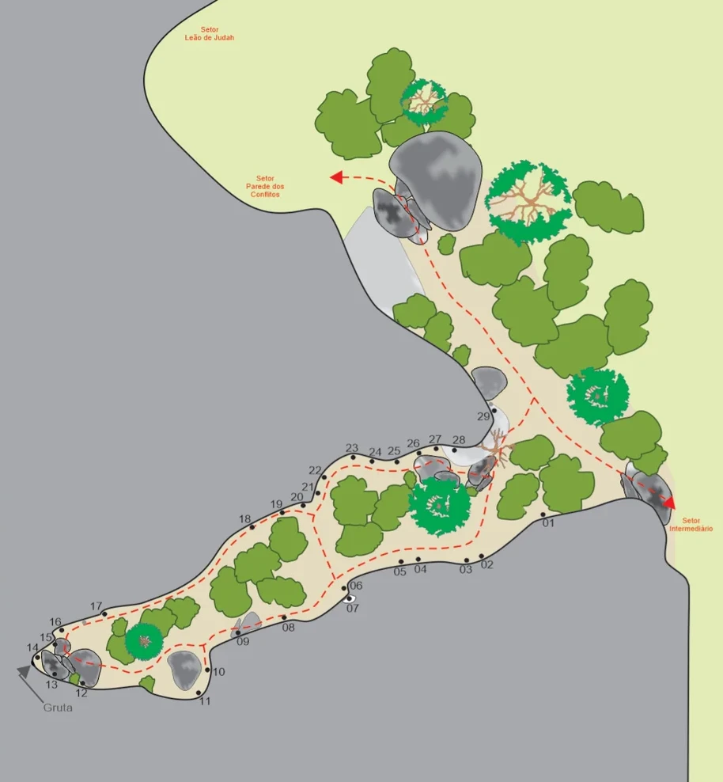
    - **largura_mapa**: 914
    - **altura_mapa**: 988
    - **pontos_de_interesse**:
      - **[0]**:
        - **id**: gqXaZdIqfggNNg
        - **uid**: gqXaZdIqfggNNg
        - **rotulo**: Setor Leão de Judah
        - **retangulo**:
          - **x**: 264
          - **y**: 42
          - **comprimento**: 73
          - **largura**: 33
        - **label**: Setor Leão de Judah
      - **[1]**:
        - **id**: CNLhDWY4pzApph
        - **uid**: CNLhDWY4pzApph
        - **rotulo**: Setor Parede dos Conflitos
        - **retangulo**:
          - **x**: 334
          - **y**: 236
          - **comprimento**: 57
          - **largura**: 39
        - **label**: Setor Parede dos Conflitos
      - **[2]**:
        - **id**: AMjfXCy5fLo6Fo
        - **uid**: AMjfXCy5fLo6Fo
        - **rotulo**: Setor Intermediário
        - **retangulo**:
          - **x**: 872
          - **y**: 662
          - **comprimento**: 61
          - **largura**: 26
        - **label**: Setor Intermediário
      - **[3]**:
        - **id**: wuSyIbgzilgc31
        - **uid**: wuSyIbgzilgc31
        - **rotulo**: 01
        - **retangulo**:
          - **x**: 694
          - **y**: 660
          - **comprimento**: 19
          - **largura**: 18
        - **label**: 01
      - **[4]**:
        - **id**: c825JwIGtxNSp6
        - **uid**: c825JwIGtxNSp6
        - **rotulo**: 02
        - **retangulo**:
          - **x**: 616
          - **y**: 712
          - **comprimento**: 24
          - **largura**: 19
        - **label**: 02
      - **[5]**:
        - **id**: qT8TTIPzbsVrt3
        - **uid**: qT8TTIPzbsVrt3
        - **rotulo**: 03
        - **retangulo**:
          - **x**: 589
          - **y**: 718
          - **comprimento**: 24
          - **largura**: 19
        - **label**: 03
      - **[6]**:
        - **id**: w728V6rUA4bz6r
        - **uid**: w728V6rUA4bz6r
        - **rotulo**: 04
        - **retangulo**:
          - **x**: 532
          - **y**: 718
          - **comprimento**: 22
          - **largura**: 19
        - **label**: 04
      - **[7]**:
        - **id**: 8wGfAzdLdn49bK
        - **uid**: 8wGfAzdLdn49bK
        - **rotulo**: 05
        - **retangulo**:
          - **x**: 506
          - **y**: 722
          - **comprimento**: 21
          - **largura**: 19
        - **label**: 05
      - **[8]**:
        - **id**: uzonCjnnWQHDl6
        - **uid**: uzonCjnnWQHDl6
        - **rotulo**: 06
        - **retangulo**:
          - **x**: 450
          - **y**: 740
          - **comprimento**: 22
          - **largura**: 19
        - **label**: 06
      - **[9]**:
        - **id**: VlCPIt4xnTnZEc
        - **uid**: VlCPIt4xnTnZEc
        - **rotulo**: 07
        - **retangulo**:
          - **x**: 445
          - **y**: 768
          - **comprimento**: 22
          - **largura**: 20
        - **label**: 07
      - **[10]**:
        - **id**: roojzP08qovOK8
        - **uid**: roojzP08qovOK8
        - **rotulo**: 08
        - **retangulo**:
          - **x**: 365
          - **y**: 793
          - **comprimento**: 24
          - **largura**: 20
        - **label**: 08
      - **[11]**:
        - **id**: LjnZJ3h1kaT3NR
        - **uid**: LjnZJ3h1kaT3NR
        - **rotulo**: 09
        - **retangulo**:
          - **x**: 308
          - **y**: 810
          - **comprimento**: 23
          - **largura**: 18
        - **label**: 09
      - **[12]**:
        - **id**: tb4Nc1gZK9zuIX
        - **uid**: tb4Nc1gZK9zuIX
        - **rotulo**: 10
        - **retangulo**:
          - **x**: 278
          - **y**: 848
          - **comprimento**: 21
          - **largura**: 18
        - **label**: 10
      - **[13]**:
        - **id**: aRogYhz0OnVMLY
        - **uid**: aRogYhz0OnVMLY
        - **rotulo**: 11
        - **retangulo**:
          - **x**: 260
          - **y**: 886
          - **comprimento**: 20
          - **largura**: 18
        - **label**: 11
      - **[14]**:
        - **id**: HFba5nuzxFCYpU
        - **uid**: HFba5nuzxFCYpU
        - **rotulo**: 12
        - **retangulo**:
          - **x**: 103
          - **y**: 876
          - **comprimento**: 22
          - **largura**: 19
        - **label**: 12
      - **[15]**:
        - **id**: CPdROz1OOOxfLS
        - **uid**: CPdROz1OOOxfLS
        - **rotulo**: 13
        - **retangulo**:
          - **x**: 66
          - **y**: 864
          - **comprimento**: 19
          - **largura**: 19
        - **label**: 13
      - **[16]**:
        - **id**: W95D8j7n8pLEzw
        - **uid**: W95D8j7n8pLEzw
        - **rotulo**: 14
        - **retangulo**:
          - **x**: 42
          - **y**: 818
          - **comprimento**: 19
          - **largura**: 17
        - **label**: 14
      - **[17]**:
        - **id**: 2G5gaRUvf5KHUa
        - **uid**: 2G5gaRUvf5KHUa
        - **rotulo**: 15
        - **retangulo**:
          - **x**: 60
          - **y**: 805
          - **comprimento**: 19
          - **largura**: 16
        - **label**: 15
      - **[18]**:
        - **id**: kDB09GiXyekkXL
        - **uid**: kDB09GiXyekkXL
        - **rotulo**: 16
        - **retangulo**:
          - **x**: 71
          - **y**: 786
          - **comprimento**: 20
          - **largura**: 19
        - **label**: 16
      - **[19]**:
        - **id**: JhzMuIjnaAaMQO
        - **uid**: JhzMuIjnaAaMQO
        - **rotulo**: 17
        - **retangulo**:
          - **x**: 122
          - **y**: 765
          - **comprimento**: 20
          - **largura**: 20
        - **label**: 17
      - **[20]**:
        - **id**: WLatT2fRAvvUr9
        - **uid**: WLatT2fRAvvUr9
        - **rotulo**: 18
        - **retangulo**:
          - **x**: 310
          - **y**: 654
          - **comprimento**: 20
          - **largura**: 19
        - **label**: 18
      - **[21]**:
        - **id**: VpXQsD5gSOa5Uh
        - **uid**: VpXQsD5gSOa5Uh
        - **rotulo**: 19
        - **retangulo**:
          - **x**: 350
          - **y**: 636
          - **comprimento**: 21
          - **largura**: 18
        - **label**: 19
      - **[22]**:
        - **id**: ql8vMOX2gWS6bU
        - **uid**: ql8vMOX2gWS6bU
        - **rotulo**: 20
        - **retangulo**:
          - **x**: 375
          - **y**: 628
          - **comprimento**: 18
          - **largura**: 15
        - **label**: 20
      - **[23]**:
        - **id**: vjW2UX7rwEVSkV
        - **uid**: vjW2UX7rwEVSkV
        - **rotulo**: 21
        - **retangulo**:
          - **x**: 389
          - **y**: 614
          - **comprimento**: 18
          - **largura**: 15
        - **label**: 21
      - **[24]**:
        - **id**: tOGPITJKlYz6Xm
        - **uid**: tOGPITJKlYz6Xm
        - **rotulo**: 22
        - **retangulo**:
          - **x**: 400
          - **y**: 594
          - **comprimento**: 21
          - **largura**: 17
        - **label**: 22
      - **[25]**:
        - **id**: Ny7HGXhih4sbNA
        - **uid**: Ny7HGXhih4sbNA
        - **rotulo**: 23
        - **retangulo**:
          - **x**: 445
          - **y**: 566
          - **comprimento**: 22
          - **largura**: 17
        - **label**: 23
      - **[26]**:
        - **id**: VqRV9klAusuJEF
        - **uid**: VqRV9klAusuJEF
        - **rotulo**: 24
        - **retangulo**:
          - **x**: 474
          - **y**: 571
          - **comprimento**: 20
          - **largura**: 18
        - **label**: 24
      - **[27]**:
        - **id**: PQLs2EA69ip0YB
        - **uid**: PQLs2EA69ip0YB
        - **rotulo**: 25
        - **retangulo**:
          - **x**: 498
          - **y**: 570
          - **comprimento**: 21
          - **largura**: 19
        - **label**: 25
      - **[28]**:
        - **id**: yjlzltD8UbwkFF
        - **uid**: yjlzltD8UbwkFF
        - **rotulo**: 26
        - **retangulo**:
          - **x**: 522
          - **y**: 560
          - **comprimento**: 20
          - **largura**: 18
        - **label**: 26
      - **[29]**:
        - **id**: uI1z6tyn37hmZW
        - **uid**: uI1z6tyn37hmZW
        - **rotulo**: 27
        - **retangulo**:
          - **x**: 550
          - **y**: 554
          - **comprimento**: 19
          - **largura**: 17
        - **label**: 27
      - **[30]**:
        - **id**: zaApmV8Gn6P3fD
        - **uid**: zaApmV8Gn6P3fD
        - **rotulo**: 28
        - **retangulo**:
          - **x**: 580
          - **y**: 555
          - **comprimento**: 20
          - **largura**: 16
        - **label**: 28
      - **[31]**:
        - **id**: unFeagEIBFXG8o
        - **uid**: unFeagEIBFXG8o
        - **rotulo**: 29
        - **retangulo**:
          - **x**: 611
          - **y**: 526
          - **comprimento**: 22
          - **largura**: 17
        - **label**: 29
    - **referencias**:
      - **[0]**:
        - **alvo_uid**: 4jVGncQNP6IQTh
        - **pontos_uids**:
          - wuSyIbgzilgc31
        - **escalada**: (via inacabada)
        - **ids**:
          - wuSyIbgzilgc31
      - **[1]**:
        - **alvo_uid**: uQvgAR0TXBLdg5
        - **pontos_uids**:
          - c825JwIGtxNSp6
        - **escalada**: Mutirão
        - **ids**:
          - c825JwIGtxNSp6
      - **[2]**:
        - **alvo_uid**: zQIiC0DMOaq4gm
        - **pontos_uids**:
          - qT8TTIPzbsVrt3
        - **escalada**: Orgulho do Papai
        - **ids**:
          - qT8TTIPzbsVrt3
      - **[3]**:
        - **alvo_uid**: cC8RtdCWg6Rpd7
        - **pontos_uids**:
          - w728V6rUA4bz6r
        - **escalada**: Bom Filho a Casa Torna
        - **ids**:
          - w728V6rUA4bz6r
      - **[4]**:
        - **alvo_uid**: likpQuS8xgTFDW
        - **pontos_uids**:
          - 8wGfAzdLdn49bK
        - **escalada**: Pelos Poderes de Stive
        - **ids**:
          - 8wGfAzdLdn49bK
      - **[5]**:
        - **alvo_uid**: mUJqH19z7YSIbG
        - **pontos_uids**:
          - uzonCjnnWQHDl6
        - **escalada**: Tocoloko
        - **ids**:
          - uzonCjnnWQHDl6
      - **[6]**:
        - **alvo_uid**: HUuonJq3pUoelQ
        - **pontos_uids**:
          - VlCPIt4xnTnZEc
        - **escalada**: Entranhas de Arcos
        - **ids**:
          - VlCPIt4xnTnZEc
      - **[7]**:
        - **alvo_uid**: lNX3K3CvIbco3w
        - **pontos_uids**:
          - tb4Nc1gZK9zuIX
        - **escalada**: Se Liga
        - **ids**:
          - tb4Nc1gZK9zuIX
      - **[8]**:
        - **alvo_uid**: B4wTf0gSMyl4L5
        - **pontos_uids**:
          - aRogYhz0OnVMLY
        - **escalada**: Maluco da Kombi
        - **ids**:
          - aRogYhz0OnVMLY
      - **[9]**:
        - **alvo_uid**: dfFuBE4MUzLzPT
        - **pontos_uids**:
          - HFba5nuzxFCYpU
        - **escalada**: Diário de Um Pistoleiro
        - **ids**:
          - HFba5nuzxFCYpU
      - **[10]**:
        - **alvo_uid**: aFZLDjXAL9qjLo
        - **pontos_uids**:
          - CPdROz1OOOxfLS
        - **escalada**: Dia da Independência
        - **ids**:
          - CPdROz1OOOxfLS
      - **[11]**:
        - **alvo_uid**: yfGg1Wdme8SkSi
        - **pontos_uids**:
          - W95D8j7n8pLEzw
        - **escalada**: Essa Linha é Nossa
        - **ids**:
          - W95D8j7n8pLEzw
      - **[12]**:
        - **alvo_uid**: 9XS9zMm42BCe0p
        - **pontos_uids**:
          - 2G5gaRUvf5KHUa
        - **escalada**: Essa Linha é Minha
        - **ids**:
          - 2G5gaRUvf5KHUa
      - **[13]**:
        - **alvo_uid**: iDWlNeG3P4bgBG
        - **pontos_uids**:
          - kDB09GiXyekkXL
        - **escalada**: Essa Linha é de Todos
        - **ids**:
          - kDB09GiXyekkXL
      - **[14]**:
        - **alvo_uid**: AU9QRCVSZyq2kr
        - **pontos_uids**:
          - JhzMuIjnaAaMQO
        - **escalada**: Livrai Me de Todos Males
        - **ids**:
          - JhzMuIjnaAaMQO
      - **[15]**:
        - **alvo_uid**: zJ2l5bVl6gBncz
        - **pontos_uids**:
          - WLatT2fRAvvUr9
        - **escalada**: Garrão Bom Bom
        - **ids**:
          - WLatT2fRAvvUr9
      - **[16]**:
        - **alvo_uid**: aq6USLNKqqvU6J
        - **pontos_uids**:
          - VpXQsD5gSOa5Uh
        - **escalada**: Conexão Mané
        - **ids**:
          - VpXQsD5gSOa5Uh
      - **[17]**:
        - **alvo_uid**: Lbd4UU3RQwycbW
        - **pontos_uids**:
          - ql8vMOX2gWS6bU
        - **escalada**: Os Reis do Mambo
        - **ids**:
          - ql8vMOX2gWS6bU
      - **[18]**:
        - **alvo_uid**: O4jXXX1KquLW6t
        - **pontos_uids**:
          - vjW2UX7rwEVSkV
        - **escalada**: Estrombelete
        - **ids**:
          - vjW2UX7rwEVSkV
      - **[19]**:
        - **alvo_uid**: ZB55uPoXa45xDF
        - **pontos_uids**:
          - tOGPITJKlYz6Xm
        - **escalada**: Sansara
        - **ids**:
          - tOGPITJKlYz6Xm
      - **[20]**:
        - **alvo_uid**: dATIZWhthBNBGm
        - **pontos_uids**:
          - Ny7HGXhih4sbNA
        - **escalada**: Ho' Oponupono
        - **ids**:
          - Ny7HGXhih4sbNA
      - **[21]**:
        - **alvo_uid**: DNGuOgnkEiuYRs
        - **pontos_uids**:
          - VqRV9klAusuJEF
        - **escalada**: Nu Com a Mão no Bolso
        - **ids**:
          - VqRV9klAusuJEF
      - **[22]**:
        - **alvo_uid**: Cd1vlySXIKsHTU
        - **pontos_uids**:
          - PQLs2EA69ip0YB
        - **escalada**: Planta Rara
        - **ids**:
          - PQLs2EA69ip0YB
      - **[23]**:
        - **alvo_uid**: OELwSZH8BBYBc7
        - **pontos_uids**:
          - yjlzltD8UbwkFF
        - **escalada**: Boca Maldita
        - **ids**:
          - yjlzltD8UbwkFF
      - **[24]**:
        - **alvo_uid**: 7Exuv58Nyyg6kK
        - **pontos_uids**:
          - uI1z6tyn37hmZW
        - **escalada**: Aula Prática
        - **ids**:
          - uI1z6tyn37hmZW
      - **[25]**:
        - **alvo_uid**: fWlztdeePplWRw
        - **pontos_uids**:
          - zaApmV8Gn6P3fD
        - **escalada**: Cine Privê
        - **ids**:
          - zaApmV8Gn6P3fD
      - **[26]**:
        - **alvo_uid**: zDjESNFbnteX29
        - **pontos_uids**:
          - unFeagEIBFXG8o
        - **escalada**: A Estréia
        - **ids**:
          - unFeagEIBFXG8o
      - **[27]**:
        - **alvo_uid**: XoN1TxQByrsWU1
        - **pontos_uids**:
          - roojzP08qovOK8
        - **escalada**: Uso Capial
        - **ids**:
          - roojzP08qovOK8
      - **[28]**:
        - **alvo_uid**: e8kmNtqwfAaR8Y
        - **pontos_uids**:
          - LjnZJ3h1kaT3NR
        - **escalada**: Clara Morena
        - **ids**:
          - LjnZJ3h1kaT3NR
      - **[29]**:
        - **alvo_uid**: 1TCXLdk6niZmLH
        - **pontos_uids**:
          - gqXaZdIqfggNNg
        - **setor**: Setor Leão de Judah
        - **ids**:
          - gqXaZdIqfggNNg
      - **[30]**:
        - **alvo_uid**: Y0QxY20SyM5soE
        - **pontos_uids**:
          - CNLhDWY4pzApph
        - **setor**: Setor Parede dos Conflitos
        - **ids**:
          - CNLhDWY4pzApph
      - **[31]**:
        - **alvo_uid**: dzia3Nrh75O9WH
        - **pontos_uids**:
          - AMjfXCy5fLo6Fo
        - **setor**: Setor Intermediário
        - **ids**:
          - AMjfXCy5fLo6Fo
- **escaladas**:
  - **[0]**:
    - **uid**: 4jVGncQNP6IQTh
    - **via_esportiva**:
      - **nome**: (via inacabada)
      - **dificuldade**: PROJETO
      - **quantidade_protecoes_intermediarias**: 3
      - **data_abertura**: 2023
  - **[1]**:
    - **uid**: uQvgAR0TXBLdg5
    - **via_esportiva**:
      - **nome**: Mutirão
      - **dificuldade**: BR_7B
      - **destaque**: True
      - **quantidade_protecoes_intermediarias**: 5
      - **quantidade_protecoes_parada**: 2
  - **[2]**:
    - **uid**: zQIiC0DMOaq4gm
    - **via_esportiva**:
      - **nome**: Orgulho do Papai
      - **dificuldade**: BR_7C
      - **quantidade_protecoes_intermediarias**: 5
      - **quantidade_protecoes_parada**: 2
  - **[3]**:
    - **uid**: cC8RtdCWg6Rpd7
    - **via_esportiva**:
      - **nome**: Bom Filho a Casa Torna
      - **dificuldade**: BR_7A
      - **quantidade_protecoes_intermediarias**: 5
      - **quantidade_protecoes_parada**: 2
  - **[4]**:
    - **uid**: likpQuS8xgTFDW
    - **via_esportiva**:
      - **nome**: Pelos Poderes de Stive
      - **dificuldade**: BR_6SUP
      - **quantidade_protecoes_intermediarias**: 5
      - **quantidade_protecoes_parada**: 2
  - **[5]**:
    - **uid**: mUJqH19z7YSIbG
    - **via_esportiva**:
      - **nome**: Tocoloko
      - **dificuldade**: BR_6SUP
      - **quantidade_protecoes_intermediarias**: 8
      - **quantidade_protecoes_parada**: 2
  - **[6]**:
    - **uid**: HUuonJq3pUoelQ
    - **via_esportiva**:
      - **nome**: Entranhas de Arcos
      - **dificuldade**: BR_6
      - **destaque**: True
      - **quantidade_protecoes_intermediarias**: 6
      - **quantidade_protecoes_parada**: 2
  - **[7]**:
    - **uid**: XoN1TxQByrsWU1
    - **via_esportiva**:
      - **nome**: Uso Capial
      - **dificuldade**: BR_6SUP
      - **quantidade_protecoes_intermediarias**: 6
      - **quantidade_protecoes_parada**: 2
  - **[8]**:
    - **uid**: e8kmNtqwfAaR8Y
    - **via_esportiva**:
      - **nome**: Clara Morena
      - **dificuldade**: BR_6
      - **destaque**: True
      - **quantidade_protecoes_intermediarias**: 7
      - **quantidade_protecoes_parada**: 2
  - **[9]**:
    - **uid**: lNX3K3CvIbco3w
    - **via_esportiva**:
      - **nome**: Se Liga
      - **dificuldade**: BR_6SUP
      - **quantidade_protecoes_intermediarias**: 7
      - **quantidade_protecoes_parada**: 2
  - **[10]**:
    - **uid**: B4wTf0gSMyl4L5
    - **via_esportiva**:
      - **nome**: Maluco da Kombi
      - **dificuldade**: BR_6SUP
      - **destaque**: True
      - **quantidade_protecoes_intermediarias**: 7
      - **quantidade_protecoes_parada**: 2
  - **[11]**:
    - **uid**: dfFuBE4MUzLzPT
    - **via_esportiva**:
      - **nome**: Diário de Um Pistoleiro
      - **dificuldade**: BR_6SUP
      - **destaque**: True
      - **quantidade_protecoes_intermediarias**: 5
      - **quantidade_protecoes_parada**: 2
  - **[12]**:
    - **uid**: aFZLDjXAL9qjLo
    - **via_esportiva**:
      - **nome**: Dia da Independência
      - **dificuldade**: BR_5
      - **quantidade_protecoes_intermediarias**: 5
      - **quantidade_protecoes_parada**: 2
  - **[13]**:
    - **uid**: yfGg1Wdme8SkSi
    - **via_esportiva**:
      - **nome**: Essa Linha é Nossa
      - **dificuldade**: BR_8A
      - **destaque**: True
      - **quantidade_protecoes_intermediarias**: 7
      - **quantidade_protecoes_parada**: 2
  - **[14]**:
    - **uid**: 9XS9zMm42BCe0p
    - **via_esportiva**:
      - **nome**: Essa Linha é Minha
      - **dificuldade**: BR_7B
      - **destaque**: True
      - **quantidade_protecoes_intermediarias**: 6
      - **quantidade_protecoes_parada**: 2
  - **[15]**:
    - **uid**: iDWlNeG3P4bgBG
    - **via_esportiva**:
      - **nome**: Essa Linha é de Todos
      - **dificuldade**: BR_7A
      - **destaque**: True
      - **quantidade_protecoes_intermediarias**: 8
      - **quantidade_protecoes_parada**: 2
  - **[16]**:
    - **uid**: AU9QRCVSZyq2kr
    - **via_esportiva**:
      - **nome**: Livrai Me de Todos Males
      - **dificuldade**: BR_5SUP
      - **quantidade_protecoes_intermediarias**: 5
      - **quantidade_protecoes_parada**: 2
  - **[17]**:
    - **uid**: zJ2l5bVl6gBncz
    - **via_esportiva**:
      - **nome**: Garrão Bom Bom
      - **dificuldade**: BR_6SUP
      - **quantidade_protecoes_intermediarias**: 5
      - **quantidade_protecoes_parada**: 2
  - **[18]**:
    - **uid**: aq6USLNKqqvU6J
    - **via_esportiva**:
      - **nome**: Conexão Mané
      - **dificuldade**: BR_6SUP
      - **quantidade_protecoes_intermediarias**: 3
      - **quantidade_protecoes_parada**: 2
  - **[19]**:
    - **uid**: Lbd4UU3RQwycbW
    - **via_esportiva**:
      - **nome**: Os Reis do Mambo
      - **dificuldade**: BR_5SUP
      - **quantidade_protecoes_intermediarias**: 3
      - **quantidade_protecoes_parada**: 2
  - **[20]**:
    - **uid**: O4jXXX1KquLW6t
    - **via_esportiva**:
      - **nome**: Estrombelete
      - **dificuldade**: BR_5
      - **destaque**: True
      - **quantidade_protecoes_intermediarias**: 3
      - **quantidade_protecoes_parada**: 2
  - **[21]**:
    - **uid**: ZB55uPoXa45xDF
    - **via_esportiva**:
      - **nome**: Sansara
      - **dificuldade**: BR_6SUP
      - **quantidade_protecoes_intermediarias**: 6
      - **quantidade_protecoes_parada**: 2
  - **[22]**:
    - **uid**: dATIZWhthBNBGm
    - **via_esportiva**:
      - **nome**: Ho' Oponupono
      - **dificuldade**: BR_7A
      - **destaque**: True
      - **quantidade_protecoes_intermediarias**: 6
      - **quantidade_protecoes_parada**: 2
  - **[23]**:
    - **uid**: DNGuOgnkEiuYRs
    - **via_esportiva**:
      - **nome**: Nu Com a Mão no Bolso
      - **dificuldade**: BR_7A_BARRA_7B
      - **quantidade_protecoes_intermediarias**: 7
      - **quantidade_protecoes_parada**: 2
  - **[24]**:
    - **uid**: Cd1vlySXIKsHTU
    - **via_esportiva**:
      - **nome**: Planta Rara
      - **dificuldade**: PROJETO
      - **quantidade_protecoes_intermediarias**: 5
      - **quantidade_protecoes_parada**: 2
      - **data_abertura**: 2022-09
  - **[25]**:
    - **uid**: OELwSZH8BBYBc7
    - **via_esportiva**:
      - **nome**: Boca Maldita
      - **dificuldade**: BR_8A
      - **destaque**: True
      - **quantidade_protecoes_intermediarias**: 5
      - **quantidade_protecoes_parada**: 2
  - **[26]**:
    - **uid**: 7Exuv58Nyyg6kK
    - **via_esportiva**:
      - **nome**: Aula Prática
      - **dificuldade**: BR_6SUP
      - **quantidade_protecoes_intermediarias**: 5
      - **quantidade_protecoes_parada**: 2
  - **[27]**:
    - **uid**: fWlztdeePplWRw
    - **via_esportiva**:
      - **nome**: Cine Privê
      - **dificuldade**: PROJETO
      - **quantidade_protecoes_intermediarias**: 8
      - **quantidade_protecoes_parada**: 2
  - **[28]**:
    - **uid**: zDjESNFbnteX29
    - **via_esportiva**:
      - **nome**: A Estréia
      - **dificuldade**: BR_7C
      - **destaque**: True
      - **quantidade_protecoes_intermediarias**: 6
      - **quantidade_protecoes_parada**: 2
- **precomputados**:
  - **total_escaladas**: 29
  - **total_esportivas**: 29

## Parte: setor_parede_dos_conflitos

### Setor (Pico: Afloramento Rastro)

- **descricao**: Este setor possui sombra até as 13h (variando de acordo com a estação).
- **nome**: Setor Parede dos Conflitos
- **uid**: Y0QxY20SyM5soE
- **mapas**:
  - **[0]**:
    - **caminho_imagem_mapa**: 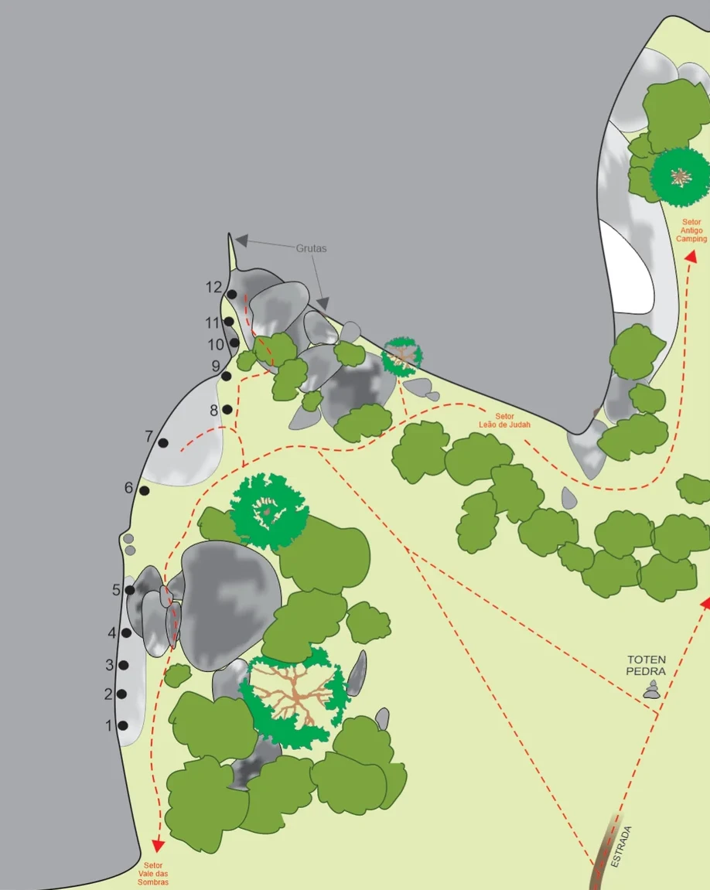
    - **largura_mapa**: 918
    - **altura_mapa**: 1151
    - **pontos_de_interesse**:
      - **[0]**:
        - **id**: TtdpovV9ahSHmn
        - **uid**: TtdpovV9ahSHmn
        - **rotulo**: Setor Antigo Camping
        - **retangulo**:
          - **x**: 896
          - **y**: 297
          - **comprimento**: 51
          - **largura**: 42
        - **label**: Setor Antigo Camping
      - **[1]**:
        - **id**: 19mmtU2gSl0r49
        - **uid**: 19mmtU2gSl0r49
        - **rotulo**: Setor Leão de Judah
        - **retangulo**:
          - **x**: 652
          - **y**: 542
          - **comprimento**: 79
          - **largura**: 38
        - **label**: Setor Leão de Judah
      - **[2]**:
        - **id**: xav6fpfRz5lGUI
        - **uid**: xav6fpfRz5lGUI
        - **rotulo**: TOTEM PEDRA
        - **retangulo**:
          - **x**: 836
          - **y**: 860
          - **comprimento**: 64
          - **largura**: 43
        - **label**: TOTEM PEDRA
      - **[3]**:
        - **id**: RlmXXl2l6yBhSD
        - **uid**: RlmXXl2l6yBhSD
        - **rotulo**: Setor Vale das Sombras
        - **retangulo**:
          - **x**: 198
          - **y**: 1130
          - **comprimento**: 51
          - **largura**: 38
        - **label**: Setor Vale das Sombras
      - **[4]**:
        - **id**: Dqrc2WbqaPCFld
        - **uid**: Dqrc2WbqaPCFld
        - **rotulo**: 01
        - **retangulo**:
          - **x**: 140
          - **y**: 938
          - **comprimento**: 19
          - **largura**: 23
        - **label**: 01
      - **[5]**:
        - **id**: euDxe4F3Klq9Wo
        - **uid**: euDxe4F3Klq9Wo
        - **rotulo**: 2
        - **retangulo**:
          - **x**: 140
          - **y**: 897
          - **comprimento**: 19
          - **largura**: 22
        - **label**: 2
      - **[6]**:
        - **id**: q9zA7n6Ebzdwi1
        - **uid**: q9zA7n6Ebzdwi1
        - **rotulo**: 3
        - **retangulo**:
          - **x**: 141
          - **y**: 859
          - **comprimento**: 18
          - **largura**: 22
        - **label**: 3
      - **[7]**:
        - **id**: 5I4jPHB92CQPfH
        - **uid**: 5I4jPHB92CQPfH
        - **rotulo**: 4
        - **retangulo**:
          - **x**: 146
          - **y**: 817
          - **comprimento**: 21
          - **largura**: 24
        - **label**: 4
      - **[8]**:
        - **id**: eearlfxOTkTOaF
        - **uid**: eearlfxOTkTOaF
        - **rotulo**: 5
        - **retangulo**:
          - **x**: 150
          - **y**: 762
          - **comprimento**: 20
          - **largura**: 22
        - **label**: 5
      - **[9]**:
        - **id**: TnZsQwDsNBlqRv
        - **uid**: TnZsQwDsNBlqRv
        - **rotulo**: 6
        - **retangulo**:
          - **x**: 166
          - **y**: 628
          - **comprimento**: 20
          - **largura**: 25
        - **label**: 6
      - **[10]**:
        - **id**: unb6BXpVI1JgSc
        - **uid**: unb6BXpVI1JgSc
        - **rotulo**: 7
        - **retangulo**:
          - **x**: 192
          - **y**: 563
          - **comprimento**: 19
          - **largura**: 24
        - **label**: 7
      - **[11]**:
        - **id**: FwB58AoHTgZBNI
        - **uid**: FwB58AoHTgZBNI
        - **rotulo**: 8
        - **retangulo**:
          - **x**: 277
          - **y**: 530
          - **comprimento**: 20
          - **largura**: 22
        - **label**: 8
      - **[12]**:
        - **id**: NhEC6qA9YJ0RAG
        - **uid**: NhEC6qA9YJ0RAG
        - **rotulo**: 9
        - **retangulo**:
          - **x**: 279
          - **y**: 473
          - **comprimento**: 20
          - **largura**: 24
        - **label**: 9
      - **[13]**:
        - **id**: iwdRb3Xg4hgjO9
        - **uid**: iwdRb3Xg4hgjO9
        - **rotulo**: 10
        - **retangulo**:
          - **x**: 280
          - **y**: 445
          - **comprimento**: 27
          - **largura**: 22
        - **label**: 10
      - **[14]**:
        - **id**: FyIgyHpBkcViQF
        - **uid**: FyIgyHpBkcViQF
        - **rotulo**: 11
        - **retangulo**:
          - **x**: 275
          - **y**: 417
          - **comprimento**: 26
          - **largura**: 24
        - **label**: 11
      - **[15]**:
        - **id**: Ue0VaSdCZWmtGt
        - **uid**: Ue0VaSdCZWmtGt
        - **rotulo**: 12
        - **retangulo**:
          - **x**: 276
          - **y**: 370
          - **comprimento**: 27
          - **largura**: 25
        - **label**: 12
    - **referencias**:
      - **[0]**:
        - **alvo_uid**: HrUanpJSakz4w0
        - **pontos_uids**:
          - Dqrc2WbqaPCFld
        - **escalada**: Ubuntu
        - **ids**:
          - Dqrc2WbqaPCFld
      - **[1]**:
        - **alvo_uid**: HB3HHEdSN6kyV0
        - **pontos_uids**:
          - euDxe4F3Klq9Wo
        - **escalada**: Plexo Solar
        - **ids**:
          - euDxe4F3Klq9Wo
      - **[2]**:
        - **alvo_uid**: yr4EYFgZWCWGU7
        - **pontos_uids**:
          - q9zA7n6Ebzdwi1
        - **escalada**: Du neném
        - **ids**:
          - q9zA7n6Ebzdwi1
      - **[3]**:
        - **alvo_uid**: PxjhCfPQ4W1GaE
        - **pontos_uids**:
          - 5I4jPHB92CQPfH
        - **escalada**: Hora Mágica
        - **ids**:
          - 5I4jPHB92CQPfH
      - **[4]**:
        - **alvo_uid**: qfkStV1dQg8Uqn
        - **pontos_uids**:
          - eearlfxOTkTOaF
        - **escalada**: Mestres do Sistema
        - **ids**:
          - eearlfxOTkTOaF
      - **[5]**:
        - **alvo_uid**: J8nfbOv80lrBF6
        - **pontos_uids**:
          - TnZsQwDsNBlqRv
        - **escalada**: Parede dos Conflitos
        - **ids**:
          - TnZsQwDsNBlqRv
      - **[6]**:
        - **alvo_uid**: C9yA4E76yaBlSX
        - **pontos_uids**:
          - unb6BXpVI1JgSc
        - **escalada**: Tio Toninho*
        - **ids**:
          - unb6BXpVI1JgSc
      - **[7]**:
        - **alvo_uid**: 3ECgPXQmAxZb0e
        - **pontos_uids**:
          - iwdRb3Xg4hgjO9
        - **escalada**: Canudos
        - **ids**:
          - iwdRb3Xg4hgjO9
      - **[8]**:
        - **alvo_uid**: wM5eP4JmrOMUoO
        - **pontos_uids**:
          - FyIgyHpBkcViQF
        - **escalada**: Paizeps
        - **ids**:
          - FyIgyHpBkcViQF
      - **[9]**:
        - **alvo_uid**: jmuokKoNyRi4Bx
        - **pontos_uids**:
          - Ue0VaSdCZWmtGt
        - **escalada**: Antônio Conselheiro
        - **ids**:
          - Ue0VaSdCZWmtGt
      - **[10]**:
        - **alvo_uid**: C88AgRI6zAKHwL
        - **pontos_uids**:
          - FwB58AoHTgZBNI
        - **escalada**: Guerra dos Côcos
        - **ids**:
          - FwB58AoHTgZBNI
      - **[11]**:
        - **alvo_uid**: ZAUdHH8wJg3Czx
        - **pontos_uids**:
          - NhEC6qA9YJ0RAG
        - **escalada**: Guerrilha do Araguaia
        - **ids**:
          - NhEC6qA9YJ0RAG
      - **[12]**:
        - **alvo_uid**: iP9J82iDvZhZKf
        - **pontos_uids**:
          - TtdpovV9ahSHmn
        - **setor**: Setor Antigo Camping
        - **ids**:
          - TtdpovV9ahSHmn
      - **[13]**:
        - **alvo_uid**: 1TCXLdk6niZmLH
        - **pontos_uids**:
          - 19mmtU2gSl0r49
        - **setor**: Setor Leão de Judah
        - **ids**:
          - 19mmtU2gSl0r49
      - **[14]**:
        - **alvo_uid**: I8731IVGqI3fpV
        - **pontos_uids**:
          - RlmXXl2l6yBhSD
        - **setor**: Setor Vale das Sombras
        - **ids**:
          - RlmXXl2l6yBhSD
- **escaladas**:
  - **[0]**:
    - **uid**: HrUanpJSakz4w0
    - **via_esportiva**:
      - **nome**: Ubuntu
      - **dificuldade**: BR_7A
  - **[1]**:
    - **uid**: HB3HHEdSN6kyV0
    - **via_esportiva**:
      - **nome**: Plexo Solar
      - **dificuldade**: BR_7A
      - **quantidade_protecoes_intermediarias**: 7
      - **quantidade_protecoes_parada**: 2
  - **[2]**:
    - **uid**: yr4EYFgZWCWGU7
    - **via_esportiva**:
      - **nome**: Du neném
      - **dificuldade**: BR_6SUP
      - **destaque**: True
      - **quantidade_protecoes_intermediarias**: 6
      - **quantidade_protecoes_parada**: 2
  - **[3]**:
    - **uid**: PxjhCfPQ4W1GaE
    - **via_esportiva**:
      - **nome**: Hora Mágica
      - **dificuldade**: BR_7A
      - **destaque**: True
      - **quantidade_protecoes_intermediarias**: 6
      - **quantidade_protecoes_parada**: 2
  - **[4]**:
    - **uid**: qfkStV1dQg8Uqn
    - **via_esportiva**:
      - **nome**: Mestres do Sistema
      - **dificuldade**: BR_7A
      - **destaque**: True
      - **quantidade_protecoes_intermediarias**: 8
      - **quantidade_protecoes_parada**: 2
  - **[5]**:
    - **uid**: J8nfbOv80lrBF6
    - **via_esportiva**:
      - **nome**: Parede dos Conflitos
      - **dificuldade**: BR_7A
      - **quantidade_protecoes_intermediarias**: 6
      - **quantidade_protecoes_parada**: 2
  - **[6]**:
    - **uid**: C9yA4E76yaBlSX
    - **via_esportiva**:
      - **nome**: Tio Toninho*
      - **dificuldade**: BR_6SUP
      - **quantidade_protecoes_intermediarias**: 4
      - **quantidade_protecoes_parada**: 2
  - **[7]**:
    - **uid**: C88AgRI6zAKHwL
    - **via_esportiva**:
      - **nome**: Guerra dos Côcos
      - **dificuldade**: BR_6
      - **destaque**: True
      - **quantidade_protecoes_intermediarias**: 6
      - **quantidade_protecoes_parada**: 2
  - **[8]**:
    - **uid**: ZAUdHH8wJg3Czx
    - **via_esportiva**:
      - **nome**: Guerrilha do Araguaia
      - **dificuldade**: BR_5SUP
      - **destaque**: True
      - **quantidade_protecoes_intermediarias**: 6
      - **quantidade_protecoes_parada**: 2
  - **[9]**:
    - **uid**: 3ECgPXQmAxZb0e
    - **via_esportiva**:
      - **nome**: Canudos
      - **dificuldade**: BR_6SUP
      - **destaque**: True
      - **quantidade_protecoes_intermediarias**: 10
      - **quantidade_protecoes_parada**: 2
  - **[10]**:
    - **uid**: wM5eP4JmrOMUoO
    - **via_esportiva**:
      - **nome**: Paizeps
      - **dificuldade**: BR_6SUP
      - **quantidade_protecoes_intermediarias**: 8
      - **quantidade_protecoes_parada**: 2
  - **[11]**:
    - **uid**: jmuokKoNyRi4Bx
    - **via_esportiva**:
      - **nome**: Antônio Conselheiro
      - **dificuldade**: BR_6SUP
      - **quantidade_protecoes_intermediarias**: 8
      - **quantidade_protecoes_parada**: 2
- **precomputados**:
  - **total_escaladas**: 12
  - **total_esportivas**: 12

## Parte: setor_leao_de_judah

### Setor (Pico: Afloramento Rastro)

- **descricao**: Este setor possui sombra até as 12h (variando de acordo com a estação).
- **nome**: Setor Leão de Judah
- **uid**: 1TCXLdk6niZmLH
- **mapas**:
  - **[0]**:
    - **caminho_imagem_mapa**: 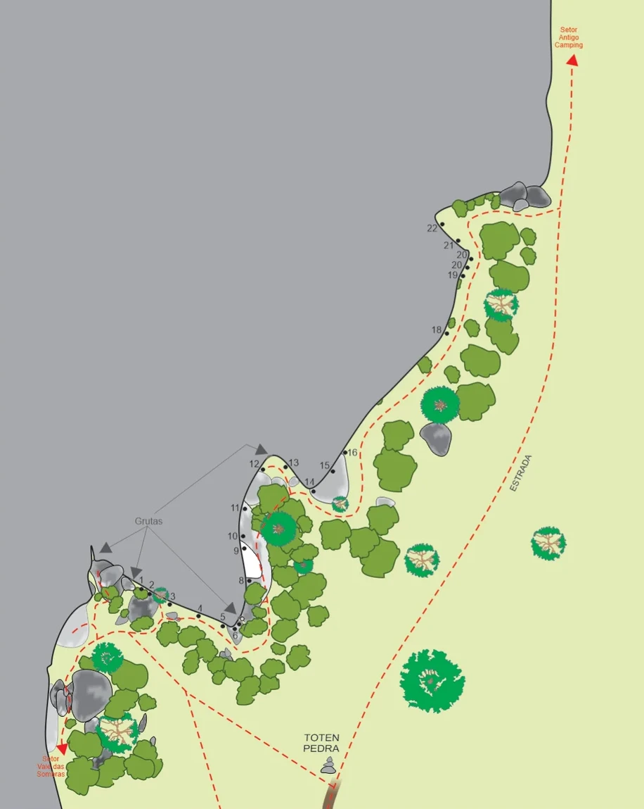
    - **largura_mapa**: 916
    - **altura_mapa**: 1149
    - **pontos_de_interesse**:
      - **[0]**:
        - **id**: e4WaEPwevRFg5H
        - **uid**: e4WaEPwevRFg5H
        - **rotulo**: Setor Antigo Camping
        - **retangulo**:
          - **x**: 808
          - **y**: 52
          - **comprimento**: 46
          - **largura**: 39
        - **label**: Setor Antigo Camping
      - **[1]**:
        - **id**: z7xEfar9O9iziv
        - **uid**: z7xEfar9O9iziv
        - **rotulo**: TOTEM PEDRA
        - **retangulo**:
          - **x**: 457
          - **y**: 1054
          - **comprimento**: 56
          - **largura**: 32
        - **label**: TOTEM PEDRA
      - **[2]**:
        - **id**: ia1MMoIQjyc5rK
        - **uid**: ia1MMoIQjyc5rK
        - **rotulo**: Setor Vale das Sombras
        - **retangulo**:
          - **x**: 72
          - **y**: 1090
          - **comprimento**: 59
          - **largura**: 47
        - **label**: Setor Vale das Sombras
      - **[3]**:
        - **id**: e3Li4ZCJy1AcK9
        - **uid**: e3Li4ZCJy1AcK9
        - **rotulo**: 01
        - **retangulo**:
          - **x**: 201
          - **y**: 823
          - **comprimento**: 16
          - **largura**: 14
        - **label**: 01
      - **[4]**:
        - **id**: lPGSkYikZ2jovc
        - **uid**: lPGSkYikZ2jovc
        - **rotulo**: 02
        - **retangulo**:
          - **x**: 216
          - **y**: 830
          - **comprimento**: 16
          - **largura**: 14
        - **label**: 02
      - **[5]**:
        - **id**: K2tcYoKARS56CN
        - **uid**: K2tcYoKARS56CN
        - **rotulo**: 03
        - **retangulo**:
          - **x**: 246
          - **y**: 847
          - **comprimento**: 16
          - **largura**: 14
        - **label**: 03
      - **[6]**:
        - **id**: CjOhfpy04xTd4o
        - **uid**: CjOhfpy04xTd4o
        - **rotulo**: 04
        - **retangulo**:
          - **x**: 285
          - **y**: 864
          - **comprimento**: 16
          - **largura**: 14
        - **label**: 04
      - **[7]**:
        - **id**: Nh1X6GSmyAPniL
        - **uid**: Nh1X6GSmyAPniL
        - **rotulo**: 05
        - **retangulo**:
          - **x**: 317
          - **y**: 876
          - **comprimento**: 16
          - **largura**: 14
        - **label**: 05
      - **[8]**:
        - **id**: RPWoRhz7Cdr405
        - **uid**: RPWoRhz7Cdr405
        - **rotulo**: 06
        - **retangulo**:
          - **x**: 334
          - **y**: 903
          - **comprimento**: 13
          - **largura**: 14
        - **label**: 06
      - **[9]**:
        - **id**: YdWcVj57NVldEu
        - **uid**: YdWcVj57NVldEu
        - **rotulo**: 07
        - **retangulo**:
          - **x**: 348
          - **y**: 891
          - **comprimento**: 14
          - **largura**: 14
        - **label**: 07
      - **[10]**:
        - **id**: Kll48ATvGZaBkg
        - **uid**: Kll48ATvGZaBkg
        - **rotulo**: 08
        - **retangulo**:
          - **x**: 344
          - **y**: 824
          - **comprimento**: 13
          - **largura**: 13
        - **label**: 08
      - **[11]**:
        - **id**: 1Z0cysgbSXBvwk
        - **uid**: 1Z0cysgbSXBvwk
        - **rotulo**: 9
        - **retangulo**:
          - **x**: 336
          - **y**: 781
          - **comprimento**: 13
          - **largura**: 14
        - **label**: 9
      - **[12]**:
        - **id**: oysl5Ldeh7oMZp
        - **uid**: oysl5Ldeh7oMZp
        - **rotulo**: 10
        - **retangulo**:
          - **x**: 331
          - **y**: 760
          - **comprimento**: 18
          - **largura**: 17
        - **label**: 10
      - **[13]**:
        - **id**: hJvLICn0qU38C9
        - **uid**: hJvLICn0qU38C9
        - **rotulo**: 11
        - **retangulo**:
          - **x**: 334
          - **y**: 720
          - **comprimento**: 16
          - **largura**: 15
        - **label**: 11
      - **[14]**:
        - **id**: v6Fg3nFSJUHKVj
        - **uid**: v6Fg3nFSJUHKVj
        - **rotulo**: 12
        - **retangulo**:
          - **x**: 362
          - **y**: 658
          - **comprimento**: 19
          - **largura**: 17
        - **label**: 12
      - **[15]**:
        - **id**: 2A1mECBlEPewzq
        - **uid**: 2A1mECBlEPewzq
        - **rotulo**: 13
        - **retangulo**:
          - **x**: 418
          - **y**: 656
          - **comprimento**: 18
          - **largura**: 17
        - **label**: 13
      - **[16]**:
        - **id**: sN9NSdaD7qnzgp
        - **uid**: sN9NSdaD7qnzgp
        - **rotulo**: 14
        - **retangulo**:
          - **x**: 440
          - **y**: 684
          - **comprimento**: 19
          - **largura**: 19
        - **label**: 14
      - **[17]**:
        - **id**: bgqsYrnspq489B
        - **uid**: bgqsYrnspq489B
        - **rotulo**: 15
        - **retangulo**:
          - **x**: 462
          - **y**: 660
          - **comprimento**: 19
          - **largura**: 18
        - **label**: 15
      - **[18]**:
        - **id**: cbzRuzH4Nj38Vi
        - **uid**: cbzRuzH4Nj38Vi
        - **rotulo**: 16
        - **retangulo**:
          - **x**: 502
          - **y**: 642
          - **comprimento**: 17
          - **largura**: 17
        - **label**: 16
      - **[19]**:
        - **id**: 3BGZP7qfKvGYO1
        - **uid**: 3BGZP7qfKvGYO1
        - **rotulo**: 18
        - **retangulo**:
          - **x**: 621
          - **y**: 468
          - **comprimento**: 20
          - **largura**: 17
        - **label**: 18
      - **[20]**:
        - **id**: 2yKcF4LrqinUXe
        - **uid**: 2yKcF4LrqinUXe
        - **rotulo**: 19
        - **retangulo**:
          - **x**: 644
          - **y**: 392
          - **comprimento**: 17
          - **largura**: 15
        - **label**: 19
      - **[21]**:
        - **id**: baM0zEc3zhEhsp
        - **uid**: baM0zEc3zhEhsp
        - **rotulo**: 20
        - **retangulo**:
          - **x**: 653
          - **y**: 368
          - **comprimento**: 24
          - **largura**: 27
        - **label**: 20
      - **[22]**:
        - **id**: 97YB1jR21fNCWB
        - **uid**: 97YB1jR21fNCWB
        - **rotulo**: 21
        - **retangulo**:
          - **x**: 638
          - **y**: 348
          - **comprimento**: 19
          - **largura**: 15
        - **label**: 21
      - **[23]**:
        - **id**: wDbyWCheIgym1O
        - **uid**: wDbyWCheIgym1O
        - **rotulo**: 22
        - **retangulo**:
          - **x**: 615
          - **y**: 324
          - **comprimento**: 18
          - **largura**: 13
        - **label**: 22
    - **referencias**:
      - **[0]**:
        - **alvo_uid**: zUOHf0ZbkJzVn5
        - **pontos_uids**:
          - e3Li4ZCJy1AcK9
        - **escalada**: Aline no País das Maravilhas
        - **ids**:
          - e3Li4ZCJy1AcK9
      - **[1]**:
        - **alvo_uid**: DH2klIDcgGryZK
        - **pontos_uids**:
          - lPGSkYikZ2jovc
        - **escalada**: Ziriguidum te dá Asas
        - **ids**:
          - lPGSkYikZ2jovc
      - **[2]**:
        - **alvo_uid**: S4wgFmhItLFo8W
        - **pontos_uids**:
          - K2tcYoKARS56CN
        - **escalada**: Michael Jordan
        - **ids**:
          - K2tcYoKARS56CN
      - **[3]**:
        - **alvo_uid**: qQzPnO5fD4r38t
        - **pontos_uids**:
          - CjOhfpy04xTd4o
        - **escalada**: Homens de Pedra
        - **ids**:
          - CjOhfpy04xTd4o
      - **[4]**:
        - **alvo_uid**: Q1ZBdLwADVk5X8
        - **pontos_uids**:
          - Nh1X6GSmyAPniL
        - **escalada**: Privilégio da Ignorância
        - **ids**:
          - Nh1X6GSmyAPniL
      - **[5]**:
        - **alvo_uid**: fij03J8tp1dffC
        - **pontos_uids**:
          - RPWoRhz7Cdr405
        - **escalada**: Rastro de São Pedro
        - **ids**:
          - RPWoRhz7Cdr405
      - **[6]**:
        - **alvo_uid**: ddMBbITlNGhsxC
        - **pontos_uids**:
          - YdWcVj57NVldEu
        - **escalada**: Leão de Judah
        - **ids**:
          - YdWcVj57NVldEu
      - **[7]**:
        - **alvo_uid**: tXIo4pVaYfOnDt
        - **pontos_uids**:
          - oysl5Ldeh7oMZp
        - **escalada**: Duelo de Titãs
        - **ids**:
          - oysl5Ldeh7oMZp
      - **[8]**:
        - **alvo_uid**: T21ZoKohnZnsa1
        - **pontos_uids**:
          - hJvLICn0qU38C9
        - **escalada**: Don Corleone
        - **ids**:
          - hJvLICn0qU38C9
      - **[9]**:
        - **alvo_uid**: 2FUbLbC5UXlyj4
        - **pontos_uids**:
          - v6Fg3nFSJUHKVj
        - **escalada**: Confusão Mental
        - **ids**:
          - v6Fg3nFSJUHKVj
      - **[10]**:
        - **alvo_uid**: 9Jm9p2lVHs298H
        - **pontos_uids**:
          - 2A1mECBlEPewzq
        - **escalada**: Extraordinária
        - **ids**:
          - 2A1mECBlEPewzq
      - **[11]**:
        - **alvo_uid**: hsdjRilqfjmoD3
        - **pontos_uids**:
          - sN9NSdaD7qnzgp
        - **escalada**: Entre o Sol e a Sombra
        - **ids**:
          - sN9NSdaD7qnzgp
      - **[12]**:
        - **alvo_uid**: VhTwTCc5kuqeNd
        - **pontos_uids**:
          - bgqsYrnspq489B
        - **escalada**: Sacafraga
        - **ids**:
          - bgqsYrnspq489B
      - **[13]**:
        - **alvo_uid**: AOai0GuRC07x5x
        - **pontos_uids**:
          - cbzRuzH4Nj38Vi
        - **escalada**: Cogumelo de Óreon
        - **ids**:
          - cbzRuzH4Nj38Vi
      - **[14]**:
        - **alvo_uid**: EJnuLJ4HSgxj1m
        - **pontos_uids**:
          - 17
        - **escalada**: Lei da Selva
        - **ids**:
          - 17
      - **[15]**:
        - **alvo_uid**: FN7q220lASKu3z
        - **pontos_uids**:
          - 3BGZP7qfKvGYO1
        - **escalada**: Fanfarrão
        - **ids**:
          - 3BGZP7qfKvGYO1
      - **[16]**:
        - **alvo_uid**: 8i2GCcC360z8af
        - **pontos_uids**:
          - 2yKcF4LrqinUXe
        - **escalada**: Presepagem
        - **ids**:
          - 2yKcF4LrqinUXe
      - **[17]**:
        - **alvo_uid**: 5Xy972qiZJU921
        - **pontos_uids**:
          - baM0zEc3zhEhsp
        - **escalada**: Tudo Nosso
        - **ids**:
          - baM0zEc3zhEhsp
      - **[18]**:
        - **alvo_uid**: frO9Qvys9hvxPg
        - **pontos_uids**:
          - 97YB1jR21fNCWB
        - **escalada**: Tetinho*
        - **ids**:
          - 97YB1jR21fNCWB
      - **[19]**:
        - **alvo_uid**: lsHmCW7c1mXouE
        - **pontos_uids**:
          - wDbyWCheIgym1O
        - **escalada**: Ce ki Sabe
        - **ids**:
          - wDbyWCheIgym1O
      - **[20]**:
        - **alvo_uid**: UsoU21zfny7CtA
        - **pontos_uids**:
          - Kll48ATvGZaBkg
        - **escalada**: Efeito Moral
        - **ids**:
          - Kll48ATvGZaBkg
      - **[21]**:
        - **alvo_uid**: 1pPkIyiaWP8AeJ
        - **pontos_uids**:
          - 1Z0cysgbSXBvwk
        - **escalada**: Risco de Discórdia
        - **ids**:
          - 1Z0cysgbSXBvwk
      - **[22]**:
        - **alvo_uid**: I8731IVGqI3fpV
        - **pontos_uids**:
          - ia1MMoIQjyc5rK
        - **setor**: Setor Vale das Sombras
        - **ids**:
          - ia1MMoIQjyc5rK
      - **[23]**:
        - **alvo_uid**: iP9J82iDvZhZKf
        - **pontos_uids**:
          - e4WaEPwevRFg5H
        - **setor**: Setor Antigo Camping
        - **ids**:
          - e4WaEPwevRFg5H
- **escaladas**:
  - **[0]**:
    - **uid**: zUOHf0ZbkJzVn5
    - **via_esportiva**:
      - **nome**: Aline no País das Maravilhas
      - **dificuldade**: BR_5SUP
      - **destaque**: True
      - **quantidade_protecoes_intermediarias**: 4
      - **quantidade_protecoes_parada**: 2
  - **[1]**:
    - **uid**: DH2klIDcgGryZK
    - **via_esportiva**:
      - **nome**: Ziriguidum te dá Asas
      - **dificuldade**: BR_7B
      - **destaque**: True
      - **quantidade_protecoes_intermediarias**: 5
      - **quantidade_protecoes_parada**: 2
  - **[2]**:
    - **uid**: S4wgFmhItLFo8W
    - **via_esportiva**:
      - **nome**: Michael Jordan
      - **dificuldade**: BR_7C
      - **destaque**: True
      - **quantidade_protecoes_intermediarias**: 4
      - **quantidade_protecoes_parada**: 2
  - **[3]**:
    - **uid**: qQzPnO5fD4r38t
    - **via_esportiva**:
      - **nome**: Homens de Pedra
      - **dificuldade**: BR_7B
      - **destaque**: True
      - **quantidade_protecoes_intermediarias**: 5
      - **quantidade_protecoes_parada**: 2
  - **[4]**:
    - **uid**: Q1ZBdLwADVk5X8
    - **via_esportiva**:
      - **nome**: Privilégio da Ignorância
      - **dificuldade**: BR_8A
      - **destaque**: True
      - **quantidade_protecoes_intermediarias**: 7
      - **quantidade_protecoes_parada**: 2
  - **[5]**:
    - **uid**: fij03J8tp1dffC
    - **via_esportiva**:
      - **nome**: Rastro de São Pedro
      - **dificuldade**: BR_9A
      - **destaque**: True
      - **quantidade_protecoes_intermediarias**: 8
      - **quantidade_protecoes_parada**: 2
  - **[6]**:
    - **uid**: ddMBbITlNGhsxC
    - **via_esportiva**:
      - **nome**: Leão de Judah
      - **dificuldade**: BR_7B
      - **destaque**: True
      - **quantidade_protecoes_intermediarias**: 8
      - **quantidade_protecoes_parada**: 2
  - **[7]**:
    - **uid**: UsoU21zfny7CtA
    - **via_esportiva**:
      - **nome**: Efeito Moral
      - **dificuldade**: BR_7C_BARRA_8A
      - **quantidade_protecoes_intermediarias**: 7
      - **quantidade_protecoes_parada**: 2
  - **[8]**:
    - **uid**: 1pPkIyiaWP8AeJ
    - **via_esportiva**:
      - **nome**: Risco de Discórdia
      - **dificuldade**: BR_8A
      - **quantidade_protecoes_intermediarias**: 10
      - **quantidade_protecoes_parada**: 2
  - **[9]**:
    - **uid**: tXIo4pVaYfOnDt
    - **via_esportiva**:
      - **nome**: Duelo de Titãs
      - **dificuldade**: BR_8C
      - **destaque**: True
      - **quantidade_protecoes_intermediarias**: 9
      - **quantidade_protecoes_parada**: 2
  - **[10]**:
    - **uid**: T21ZoKohnZnsa1
    - **via_esportiva**:
      - **nome**: Don Corleone
      - **dificuldade**: PROJETO
      - **destaque**: True
      - **quantidade_protecoes_intermediarias**: 7
      - **quantidade_protecoes_parada**: 2
  - **[11]**:
    - **uid**: 2FUbLbC5UXlyj4
    - **via_esportiva**:
      - **nome**: Confusão Mental
      - **dificuldade**: BR_8C
      - **destaque**: True
      - **quantidade_protecoes_intermediarias**: 9
      - **quantidade_protecoes_parada**: 2
  - **[12]**:
    - **uid**: 9Jm9p2lVHs298H
    - **via_esportiva**:
      - **nome**: Extraordinária
      - **dificuldade**: BR_7A
      - **destaque**: True
      - **quantidade_protecoes_intermediarias**: 10
      - **quantidade_protecoes_parada**: 2
  - **[13]**:
    - **uid**: hsdjRilqfjmoD3
    - **via_esportiva**:
      - **nome**: Entre o Sol e a Sombra
      - **dificuldade**: BR_7A
      - **destaque**: True
      - **quantidade_protecoes_intermediarias**: 10
      - **quantidade_protecoes_parada**: 2
  - **[14]**:
    - **uid**: VhTwTCc5kuqeNd
    - **via_esportiva**:
      - **nome**: Sacafraga
      - **dificuldade**: BR_6SUP
      - **quantidade_protecoes_intermediarias**: 7
      - **quantidade_protecoes_parada**: 2
  - **[15]**:
    - **uid**: AOai0GuRC07x5x
    - **via_esportiva**:
      - **nome**: Cogumelo de Óreon
      - **dificuldade**: BR_7A
      - **quantidade_protecoes_intermediarias**: 7
      - **quantidade_protecoes_parada**: 2
  - **[16]**:
    - **uid**: EJnuLJ4HSgxj1m
    - **via_esportiva**:
      - **nome**: Lei da Selva
      - **dificuldade**: BR_8A
  - **[17]**:
    - **uid**: FN7q220lASKu3z
    - **via_esportiva**:
      - **nome**: Fanfarrão
      - **dificuldade**: BR_7A
      - **quantidade_protecoes_intermediarias**: 6
      - **quantidade_protecoes_parada**: 2
  - **[18]**:
    - **uid**: 8i2GCcC360z8af
    - **via_esportiva**:
      - **nome**: Presepagem
      - **dificuldade**: BR_7B
      - **quantidade_protecoes_intermediarias**: 5
      - **quantidade_protecoes_parada**: 2
  - **[19]**:
    - **uid**: 5Xy972qiZJU921
    - **via_esportiva**:
      - **nome**: Tudo Nosso
      - **dificuldade**: BR_7B
      - **destaque**: True
      - **quantidade_protecoes_intermediarias**: 6
      - **quantidade_protecoes_parada**: 2
  - **[20]**:
    - **uid**: frO9Qvys9hvxPg
    - **via_esportiva**:
      - **nome**: Tetinho*
      - **dificuldade**: BR_7A
      - **quantidade_protecoes_intermediarias**: 5
      - **quantidade_protecoes_parada**: 2
  - **[21]**:
    - **uid**: lsHmCW7c1mXouE
    - **via_esportiva**:
      - **nome**: Ce ki Sabe
      - **dificuldade**: BR_6SUP
      - **destaque**: True
      - **quantidade_protecoes_intermediarias**: 3
      - **quantidade_protecoes_parada**: 2
- **precomputados**:
  - **total_escaladas**: 22
  - **total_esportivas**: 22

## Parte: setor_antigo_camping

### Setor (Pico: Afloramento Rastro)

- **descricao**: Este setor possui sombra até as 13h (variando de acordo com a estação).
- **nome**: Setor Antigo Camping
- **uid**: iP9J82iDvZhZKf
- **mapas**:
  - **[0]**:
    - **caminho_imagem_mapa**: 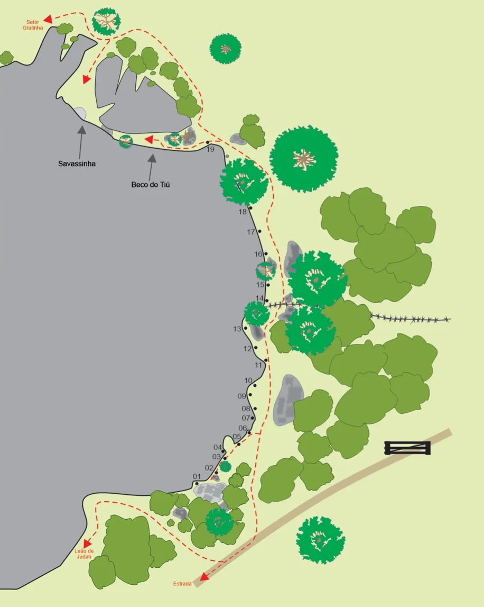
    - **largura_mapa**: 916
    - **altura_mapa**: 1147
    - **pontos_de_interesse**:
      - **[0]**:
        - **id**: PZ4CzEvuFjjJ61
        - **uid**: PZ4CzEvuFjjJ61
        - **rotulo**: Setor Grutinha
        - **retangulo**:
          - **x**: 62
          - **y**: 46
          - **comprimento**: 46
          - **largura**: 29
        - **label**: Setor Grutinha
      - **[1]**:
        - **id**: M3WSI3YFhpokqD
        - **uid**: M3WSI3YFhpokqD
        - **rotulo**: Savassinha
        - **retangulo**:
          - **x**: 146
          - **y**: 308
          - **comprimento**: 80
          - **largura**: 26
        - **label**: Savassinha
      - **[2]**:
        - **id**: K2WOgTTn6apakY
        - **uid**: K2WOgTTn6apakY
        - **rotulo**: Beco do Tiú
        - **retangulo**:
          - **x**: 285
          - **y**: 348
          - **comprimento**: 78
          - **largura**: 25
        - **label**: Beco do Tiú
      - **[3]**:
        - **id**: u3zHl1UtBpUyJT
        - **uid**: u3zHl1UtBpUyJT
        - **rotulo**: 01
        - **retangulo**:
          - **x**: 372
          - **y**: 900
          - **comprimento**: 18
          - **largura**: 15
        - **label**: 01
      - **[4]**:
        - **id**: 1qaCzQ3Hz3e8E4
        - **uid**: 1qaCzQ3Hz3e8E4
        - **rotulo**: 02
        - **retangulo**:
          - **x**: 396
          - **y**: 884
          - **comprimento**: 21
          - **largura**: 16
        - **label**: 02
      - **[5]**:
        - **id**: hqgICHX9JTabPs
        - **uid**: hqgICHX9JTabPs
        - **rotulo**: 03
        - **retangulo**:
          - **x**: 410
          - **y**: 863
          - **comprimento**: 21
          - **largura**: 16
        - **label**: 03
      - **[6]**:
        - **id**: Y7y4fpvco9IzCt
        - **uid**: Y7y4fpvco9IzCt
        - **rotulo**: 04
        - **retangulo**:
          - **x**: 412
          - **y**: 844
          - **comprimento**: 19
          - **largura**: 15
        - **label**: 04
      - **[7]**:
        - **id**: T2VRDRqAjPgGQW
        - **uid**: T2VRDRqAjPgGQW
        - **rotulo**: 05
        - **retangulo**:
          - **x**: 448
          - **y**: 824
          - **comprimento**: 20
          - **largura**: 15
        - **label**: 05
      - **[8]**:
        - **id**: T6LWw6nkjCJzW0
        - **uid**: T6LWw6nkjCJzW0
        - **rotulo**: 06
        - **retangulo**:
          - **x**: 459
          - **y**: 808
          - **comprimento**: 20
          - **largura**: 15
        - **label**: 06
      - **[9]**:
        - **id**: pe6jp2xdHIMX2a
        - **uid**: pe6jp2xdHIMX2a
        - **rotulo**: 07
        - **retangulo**:
          - **x**: 466
          - **y**: 790
          - **comprimento**: 20
          - **largura**: 15
        - **label**: 07
      - **[10]**:
        - **id**: nBFItCONRZM7dN
        - **uid**: nBFItCONRZM7dN
        - **rotulo**: 08
        - **retangulo**:
          - **x**: 466
          - **y**: 771
          - **comprimento**: 21
          - **largura**: 16
        - **label**: 08
      - **[11]**:
        - **id**: lYyS8ZXOWZpk5o
        - **uid**: lYyS8ZXOWZpk5o
        - **rotulo**: 09
        - **retangulo**:
          - **x**: 458
          - **y**: 748
          - **comprimento**: 21
          - **largura**: 16
        - **label**: 09
      - **[12]**:
        - **id**: xFP4UB1bdwfCAO
        - **uid**: xFP4UB1bdwfCAO
        - **rotulo**: 10
        - **retangulo**:
          - **x**: 470
          - **y**: 718
          - **comprimento**: 20
          - **largura**: 17
        - **label**: 10
      - **[13]**:
        - **id**: amSIy2qCT5RpWD
        - **uid**: amSIy2qCT5RpWD
        - **rotulo**: 11
        - **retangulo**:
          - **x**: 490
          - **y**: 689
          - **comprimento**: 19
          - **largura**: 18
        - **label**: 11
      - **[14]**:
        - **id**: 4smAeJ8qyD1qrL
        - **uid**: 4smAeJ8qyD1qrL
        - **rotulo**: 12
        - **retangulo**:
          - **x**: 470
          - **y**: 658
          - **comprimento**: 21
          - **largura**: 17
        - **label**: 12
      - **[15]**:
        - **id**: c7XhSxlQc0Ln5l
        - **uid**: c7XhSxlQc0Ln5l
        - **rotulo**: 13
        - **retangulo**:
          - **x**: 449
          - **y**: 622
          - **comprimento**: 20
          - **largura**: 17
        - **label**: 13
      - **[16]**:
        - **id**: Qp5ZX4PZNj69vs
        - **uid**: Qp5ZX4PZNj69vs
        - **rotulo**: 14
        - **retangulo**:
          - **x**: 492
          - **y**: 562
          - **comprimento**: 18
          - **largura**: 16
        - **label**: 14
      - **[17]**:
        - **id**: 7igYiRgGUrLauM
        - **uid**: 7igYiRgGUrLauM
        - **rotulo**: 15
        - **retangulo**:
          - **x**: 492
          - **y**: 538
          - **comprimento**: 19
          - **largura**: 17
        - **label**: 15
      - **[18]**:
        - **id**: abobKuvZzwb9u2
        - **uid**: abobKuvZzwb9u2
        - **rotulo**: 16
        - **retangulo**:
          - **x**: 489
          - **y**: 480
          - **comprimento**: 20
          - **largura**: 18
        - **label**: 16
      - **[19]**:
        - **id**: aKuwbDK9JMz2dY
        - **uid**: aKuwbDK9JMz2dY
        - **rotulo**: 17
        - **retangulo**:
          - **x**: 476
          - **y**: 438
          - **comprimento**: 19
          - **largura**: 18
        - **label**: 17
      - **[20]**:
        - **id**: owXokTnnAxlM9T
        - **uid**: owXokTnnAxlM9T
        - **rotulo**: 18
        - **retangulo**:
          - **x**: 460
          - **y**: 400
          - **comprimento**: 19
          - **largura**: 18
        - **label**: 18
      - **[21]**:
        - **id**: Or3K4jD4oyFRPe
        - **uid**: Or3K4jD4oyFRPe
        - **rotulo**: 19
        - **retangulo**:
          - **x**: 398
          - **y**: 282
          - **comprimento**: 19
          - **largura**: 17
        - **label**: 19
      - **[22]**:
        - **id**: BeYvIL8S24vRlG
        - **uid**: BeYvIL8S24vRlG
        - **rotulo**: Leão de Judah
        - **retangulo**:
          - **x**: 159
          - **y**: 1046
          - **comprimento**: 46
          - **largura**: 32
        - **label**: Leão de Judah
    - **referencias**:
      - **[0]**:
        - **alvo_uid**: 6xn3UnjMUhpp16
        - **pontos_uids**:
          - u3zHl1UtBpUyJT
        - **escalada**: Lucy Não
        - **ids**:
          - u3zHl1UtBpUyJT
      - **[1]**:
        - **alvo_uid**: CKncQfVTWtUBpx
        - **pontos_uids**:
          - 1qaCzQ3Hz3e8E4
        - **escalada**: Amigos do Rastro
        - **ids**:
          - 1qaCzQ3Hz3e8E4
      - **[2]**:
        - **alvo_uid**: XHCiRqi8AGPVzB
        - **pontos_uids**:
          - hqgICHX9JTabPs
        - **escalada**: Rebelde Sem Calça
        - **ids**:
          - hqgICHX9JTabPs
      - **[3]**:
        - **alvo_uid**: C8agYkIvjm6xjK
        - **pontos_uids**:
          - Y7y4fpvco9IzCt
        - **escalada**: Pedra do Gênese
        - **ids**:
          - Y7y4fpvco9IzCt
      - **[4]**:
        - **alvo_uid**: 1uP4mzuY8GuhVS
        - **pontos_uids**:
          - T2VRDRqAjPgGQW
        - **escalada**: Sociedade Alternativa
        - **ids**:
          - T2VRDRqAjPgGQW
      - **[5]**:
        - **alvo_uid**: KEES1MIF8ZMNhH
        - **pontos_uids**:
          - T6LWw6nkjCJzW0
        - **escalada**: Caixote*
        - **ids**:
          - T6LWw6nkjCJzW0
      - **[6]**:
        - **alvo_uid**: RxFSCfcRlSI3ud
        - **pontos_uids**:
          - pe6jp2xdHIMX2a
        - **escalada**: Sai Clipado
        - **ids**:
          - pe6jp2xdHIMX2a
      - **[7]**:
        - **alvo_uid**: leW3wwol5Rg4Fj
        - **pontos_uids**:
          - xFP4UB1bdwfCAO
        - **escalada**: Mistério do Cachorro Zezinho
        - **ids**:
          - xFP4UB1bdwfCAO
      - **[8]**:
        - **alvo_uid**: fKBvNDr2CkEVS8
        - **pontos_uids**:
          - amSIy2qCT5RpWD
        - **escalada**: Muro das Lamentações
        - **ids**:
          - amSIy2qCT5RpWD
      - **[9]**:
        - **alvo_uid**: 81p16wHy8kB7im
        - **pontos_uids**:
          - 4smAeJ8qyD1qrL
        - **escalada**: Jogo de Cintura
        - **ids**:
          - 4smAeJ8qyD1qrL
      - **[10]**:
        - **alvo_uid**: MCg92gGhBuj5o6
        - **pontos_uids**:
          - c7XhSxlQc0Ln5l
        - **escalada**: Capitão Barbárie
        - **ids**:
          - c7XhSxlQc0Ln5l
      - **[11]**:
        - **alvo_uid**: G4yBf0ZoEnD9qR
        - **pontos_uids**:
          - Qp5ZX4PZNj69vs
        - **escalada**: Faixa de Gaza
        - **ids**:
          - Qp5ZX4PZNj69vs
      - **[12]**:
        - **alvo_uid**: T1J5CtMttjbr4R
        - **pontos_uids**:
          - 7igYiRgGUrLauM
        - **escalada**: Pele Vermelha
        - **ids**:
          - 7igYiRgGUrLauM
      - **[13]**:
        - **alvo_uid**: 9R2a14yRQuvKC7
        - **pontos_uids**:
          - abobKuvZzwb9u2
        - **escalada**: Café da Manhã
        - **ids**:
          - abobKuvZzwb9u2
      - **[14]**:
        - **alvo_uid**: MMocexbb9eZO7I
        - **pontos_uids**:
          - aKuwbDK9JMz2dY
        - **escalada**: Velório da Galinha
        - **ids**:
          - aKuwbDK9JMz2dY
      - **[15]**:
        - **alvo_uid**: vhB0eGQEitn7pb
        - **pontos_uids**:
          - owXokTnnAxlM9T
        - **escalada**: Parceragem
        - **ids**:
          - owXokTnnAxlM9T
      - **[16]**:
        - **alvo_uid**: C17iCMRrgVNU4y
        - **pontos_uids**:
          - Or3K4jD4oyFRPe
        - **escalada**: Lenços Umedecidos
        - **ids**:
          - Or3K4jD4oyFRPe
      - **[17]**:
        - **alvo_uid**: QpFeVnc7tU5y5O
        - **pontos_uids**:
          - PZ4CzEvuFjjJ61
        - **setor**: Setor Grutinha
        - **ids**:
          - PZ4CzEvuFjjJ61
      - **[18]**:
        - **alvo_uid**: TWAauQTbQwW9BY
        - **pontos_uids**:
          - M3WSI3YFhpokqD
        - **setor**: Setor Savassinha
        - **ids**:
          - M3WSI3YFhpokqD
      - **[19]**:
        - **alvo_uid**: 0wRwwt2zncNQw9
        - **pontos_uids**:
          - K2WOgTTn6apakY
        - **setor**: Setor Beco do Tiú
        - **ids**:
          - K2WOgTTn6apakY
      - **[20]**:
        - **alvo_uid**: 1TCXLdk6niZmLH
        - **pontos_uids**:
          - BeYvIL8S24vRlG
        - **setor**: Setor Leão de Judah
        - **ids**:
          - BeYvIL8S24vRlG
- **escaladas**:
  - **[0]**:
    - **uid**: 6xn3UnjMUhpp16
    - **via_esportiva**:
      - **nome**: Lucy Não
      - **dificuldade**: BR_5
      - **quantidade_protecoes_intermediarias**: 5
      - **quantidade_protecoes_parada**: 2
  - **[1]**:
    - **uid**: CKncQfVTWtUBpx
    - **via_esportiva**:
      - **nome**: Amigos do Rastro
      - **dificuldade**: BR_7B
      - **destaque**: True
      - **quantidade_protecoes_intermediarias**: 5
      - **quantidade_protecoes_parada**: 2
  - **[2]**:
    - **uid**: XHCiRqi8AGPVzB
    - **via_esportiva**:
      - **nome**: Rebelde Sem Calça
      - **dificuldade**: BR_7A
      - **destaque**: True
      - **quantidade_protecoes_intermediarias**: 5
      - **quantidade_protecoes_parada**: 2
  - **[3]**:
    - **uid**: C8agYkIvjm6xjK
    - **via_esportiva**:
      - **nome**: Pedra do Gênese
      - **dificuldade**: PROJETO
      - **quantidade_protecoes_intermediarias**: 7
      - **quantidade_protecoes_parada**: 2
  - **[4]**:
    - **uid**: 1uP4mzuY8GuhVS
    - **via_esportiva**:
      - **nome**: Sociedade Alternativa
      - **dificuldade**: BR_7A
      - **destaque**: True
      - **quantidade_protecoes_intermediarias**: 6
      - **quantidade_protecoes_parada**: 2
  - **[5]**:
    - **uid**: KEES1MIF8ZMNhH
    - **via_esportiva**:
      - **nome**: Caixote*
      - **dificuldade**: BR_6SUP
      - **destaque**: True
      - **quantidade_protecoes_intermediarias**: 6
      - **quantidade_protecoes_parada**: 2
  - **[6]**:
    - **uid**: RxFSCfcRlSI3ud
    - **via_esportiva**:
      - **nome**: Sai Clipado
      - **dificuldade**: BR_7C
      - **quantidade_protecoes_intermediarias**: 6
      - **quantidade_protecoes_parada**: 2
  - **[7]**:
    - **uid**: lHDsKTJ3qiSW8c
    - **via_esportiva**:
      - **nome**: Xuxa Preta de Pains
      - **dificuldade**: BR_7A
      - **destaque**: True
      - **quantidade_protecoes_intermediarias**: 6
      - **quantidade_protecoes_parada**: 2
  - **[8]**:
    - **uid**: obuEVICHbsgBLg
    - **via_esportiva**:
      - **nome**: Brenfa Móvel
      - **dificuldade**: BR_7B
      - **quantidade_protecoes_intermediarias**: 7
      - **quantidade_protecoes_parada**: 2
  - **[9]**:
    - **uid**: leW3wwol5Rg4Fj
    - **via_esportiva**:
      - **nome**: Mistério do Cachorro Zezinho
      - **dificuldade**: PROJETO
      - **quantidade_protecoes_intermediarias**: 8
      - **quantidade_protecoes_parada**: 2
  - **[10]**:
    - **uid**: fKBvNDr2CkEVS8
    - **via_esportiva**:
      - **nome**: Muro das Lamentações
      - **dificuldade**: BR_8A
      - **destaque**: True
      - **quantidade_protecoes_intermediarias**: 7
      - **quantidade_protecoes_parada**: 2
  - **[11]**:
    - **uid**: 81p16wHy8kB7im
    - **via_esportiva**:
      - **nome**: Jogo de Cintura
      - **dificuldade**: BR_9B
      - **destaque**: True
      - **quantidade_protecoes_intermediarias**: 8
      - **quantidade_protecoes_parada**: 2
  - **[12]**:
    - **uid**: MCg92gGhBuj5o6
    - **via_esportiva**:
      - **nome**: Capitão Barbárie
      - **dificuldade**: PROJETO
      - **quantidade_protecoes_intermediarias**: 6
      - **quantidade_protecoes_parada**: 2
  - **[13]**:
    - **uid**: G4yBf0ZoEnD9qR
    - **via_esportiva**:
      - **nome**: Faixa de Gaza
      - **dificuldade**: BR_7A
      - **destaque**: True
      - **quantidade_protecoes_intermediarias**: 7
      - **quantidade_protecoes_parada**: 2
  - **[14]**:
    - **uid**: T1J5CtMttjbr4R
    - **via_esportiva**:
      - **nome**: Pele Vermelha
      - **dificuldade**: BR_6SUP
      - **destaque**: True
      - **quantidade_protecoes_intermediarias**: 6
      - **quantidade_protecoes_parada**: 2
  - **[15]**:
    - **uid**: 9R2a14yRQuvKC7
    - **via_esportiva**:
      - **nome**: Café da Manhã
      - **dificuldade**: BR_6SUP
      - **destaque**: True
      - **quantidade_protecoes_intermediarias**: 7
      - **quantidade_protecoes_parada**: 2
  - **[16]**:
    - **uid**: MMocexbb9eZO7I
    - **via_esportiva**:
      - **nome**: Velório da Galinha
      - **dificuldade**: BR_6SUP
      - **destaque**: True
      - **quantidade_protecoes_intermediarias**: 5
      - **quantidade_protecoes_parada**: 2
  - **[17]**:
    - **uid**: vhB0eGQEitn7pb
    - **via_esportiva**:
      - **nome**: Parceragem
      - **dificuldade**: BR_7A
      - **quantidade_protecoes_intermediarias**: 7
      - **quantidade_protecoes_parada**: 2
  - **[18]**:
    - **uid**: C17iCMRrgVNU4y
    - **via_esportiva**:
      - **nome**: Lenços Umedecidos
      - **dificuldade**: BR_8B
      - **destaque**: True
      - **quantidade_protecoes_intermediarias**: 3
      - **quantidade_protecoes_parada**: 2
- **precomputados**:
  - **total_escaladas**: 19
  - **total_esportivas**: 19

## Parte: setor_beco_do_tiu

### Setor (Pico: Afloramento Rastro)

- **descricao**: Este setor possui sombra até as 13h (variando de acordo com a estação).
- **nome**: Setor Beco do Tiú
- **uid**: 0wRwwt2zncNQw9
- **mapas**:
  - **[0]**:
    - **caminho_imagem_mapa**: 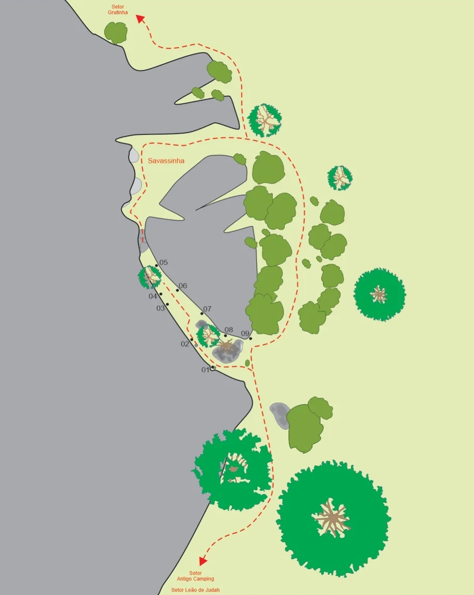
    - **largura_mapa**: 918
    - **altura_mapa**: 1152
    - **pontos_de_interesse**:
      - **[0]**:
        - **id**: gRsqS41flIfcOv
        - **uid**: gRsqS41flIfcOv
        - **rotulo**: Setor Grutinha
        - **retangulo**:
          - **x**: 228
          - **y**: 18
          - **comprimento**: 47
          - **largura**: 33
        - **label**: Setor Grutinha
      - **[1]**:
        - **id**: RThY8Tt71z8l7P
        - **uid**: RThY8Tt71z8l7P
        - **rotulo**: Savassinha
        - **retangulo**:
          - **x**: 320
          - **y**: 310
          - **comprimento**: 78
          - **largura**: 21
        - **label**: Savassinha
      - **[2]**:
        - **id**: G9ktouflNpxuHq
        - **uid**: G9ktouflNpxuHq
        - **rotulo**: 01
        - **retangulo**:
          - **x**: 398
          - **y**: 716
          - **comprimento**: 21
          - **largura**: 17
        - **label**: 01
      - **[3]**:
        - **id**: mWhHcRgn1j1piv
        - **uid**: mWhHcRgn1j1piv
        - **rotulo**: 02
        - **retangulo**:
          - **x**: 358
          - **y**: 666
          - **comprimento**: 21
          - **largura**: 17
        - **label**: 02
      - **[4]**:
        - **id**: F4MNU4VIeT8u4h
        - **uid**: F4MNU4VIeT8u4h
        - **rotulo**: 03
        - **retangulo**:
          - **x**: 311
          - **y**: 596
          - **comprimento**: 20
          - **largura**: 20
        - **label**: 03
      - **[5]**:
        - **id**: hqwc0VjkYoS4o2
        - **uid**: hqwc0VjkYoS4o2
        - **rotulo**: 04
        - **retangulo**:
          - **x**: 296
          - **y**: 572
          - **comprimento**: 21
          - **largura**: 17
        - **label**: 04
      - **[6]**:
        - **id**: MpAr177ZoiOEpc
        - **uid**: MpAr177ZoiOEpc
        - **rotulo**: 05
        - **retangulo**:
          - **x**: 316
          - **y**: 507
          - **comprimento**: 21
          - **largura**: 18
        - **label**: 05
      - **[7]**:
        - **id**: 7rzp5A3tJk7Bzn
        - **uid**: 7rzp5A3tJk7Bzn
        - **rotulo**: 06
        - **retangulo**:
          - **x**: 354
          - **y**: 553
          - **comprimento**: 22
          - **largura**: 18
        - **label**: 06
      - **[8]**:
        - **id**: n6RRjDU7BD8NCk
        - **uid**: n6RRjDU7BD8NCk
        - **rotulo**: 07
        - **retangulo**:
          - **x**: 402
          - **y**: 598
          - **comprimento**: 22
          - **largura**: 19
        - **label**: 07
      - **[9]**:
        - **id**: pzsh0h80auWLjk
        - **uid**: pzsh0h80auWLjk
        - **rotulo**: 08
        - **retangulo**:
          - **x**: 443
          - **y**: 638
          - **comprimento**: 22
          - **largura**: 18
        - **label**: 08
      - **[10]**:
        - **id**: BTgzx0QVbVVLYg
        - **uid**: BTgzx0QVbVVLYg
        - **rotulo**: 09
        - **retangulo**:
          - **x**: 475
          - **y**: 646
          - **comprimento**: 22
          - **largura**: 17
        - **label**: 09
      - **[11]**:
        - **id**: rkk9A2xKRYRF9i
        - **uid**: rkk9A2xKRYRF9i
        - **rotulo**: Setor Antigo Camping
        - **retangulo**:
          - **x**: 378
          - **y**: 1116
          - **comprimento**: 78
          - **largura**: 25
        - **label**: Setor Antigo Camping
      - **[12]**:
        - **id**: KflsEuR756DHqI
        - **uid**: KflsEuR756DHqI
        - **rotulo**: Setor Leão de Judah
        - **retangulo**:
          - **x**: 378
          - **y**: 1142
          - **comprimento**: 102
          - **largura**: 19
        - **label**: Setor Leão de Judah
    - **referencias**:
      - **[0]**:
        - **alvo_uid**: UjXfmHiTsQcZJ9
        - **pontos_uids**:
          - G9ktouflNpxuHq
        - **escalada**: Panqueca de Salada
        - **ids**:
          - G9ktouflNpxuHq
      - **[1]**:
        - **alvo_uid**: PJLLWYaFXE88Fa
        - **pontos_uids**:
          - mWhHcRgn1j1piv
        - **escalada**: Belí*
        - **ids**:
          - mWhHcRgn1j1piv
      - **[2]**:
        - **alvo_uid**: YpAox3QcOq0EKA
        - **pontos_uids**:
          - F4MNU4VIeT8u4h
        - **escalada**: Chapa Caseira*
        - **ids**:
          - F4MNU4VIeT8u4h
      - **[3]**:
        - **alvo_uid**: F0WzvlKdyWts3w
        - **pontos_uids**:
          - hqwc0VjkYoS4o2
        - **escalada**: Turma do Picknick
        - **ids**:
          - hqwc0VjkYoS4o2
      - **[4]**:
        - **alvo_uid**: huGTdhBPdAmhb8
        - **pontos_uids**:
          - MpAr177ZoiOEpc
        - **escalada**: Azul Royal
        - **ids**:
          - MpAr177ZoiOEpc
      - **[5]**:
        - **alvo_uid**: PvzK4rYAdBcfFe
        - **pontos_uids**:
          - 7rzp5A3tJk7Bzn
        - **escalada**: Amaralzinha
        - **ids**:
          - 7rzp5A3tJk7Bzn
      - **[6]**:
        - **alvo_uid**: FaXNNb4jXBtWot
        - **pontos_uids**:
          - n6RRjDU7BD8NCk
        - **escalada**: Usa Quatro e Sobra Um
        - **ids**:
          - n6RRjDU7BD8NCk
      - **[7]**:
        - **alvo_uid**: lHDsKTJ3qiSW8c
        - **pontos_uids**:
          - pzsh0h80auWLjk
        - **escalada**: Xuxa Preta de Pains
        - **ids**:
          - pzsh0h80auWLjk
      - **[8]**:
        - **alvo_uid**: obuEVICHbsgBLg
        - **pontos_uids**:
          - BTgzx0QVbVVLYg
        - **escalada**: Brenfa Móvel
        - **ids**:
          - BTgzx0QVbVVLYg
      - **[9]**:
        - **alvo_uid**: QpFeVnc7tU5y5O
        - **pontos_uids**:
          - gRsqS41flIfcOv
        - **setor**: Setor Grutinha
        - **ids**:
          - gRsqS41flIfcOv
      - **[10]**:
        - **alvo_uid**: TWAauQTbQwW9BY
        - **pontos_uids**:
          - RThY8Tt71z8l7P
        - **setor**: Setor Savassinha
        - **ids**:
          - RThY8Tt71z8l7P
      - **[11]**:
        - **alvo_uid**: iP9J82iDvZhZKf
        - **pontos_uids**:
          - rkk9A2xKRYRF9i
        - **setor**: Setor Antigo Camping
        - **ids**:
          - rkk9A2xKRYRF9i
      - **[12]**:
        - **alvo_uid**: 1TCXLdk6niZmLH
        - **pontos_uids**:
          - KflsEuR756DHqI
        - **setor**: Setor Leão de Judah
        - **ids**:
          - KflsEuR756DHqI
- **escaladas**:
  - **[0]**:
    - **uid**: UjXfmHiTsQcZJ9
    - **via_esportiva**:
      - **nome**: Panqueca de Salada
      - **dificuldade**: BR_6
      - **destaque**: True
      - **quantidade_protecoes_intermediarias**: 7
      - **quantidade_protecoes_parada**: 2
  - **[1]**:
    - **uid**: 6bfg5JMaX1Psbn
    - **via_movel**:
      - **nome**: Daime o poder
      - **dificuldade**: BR_6
  - **[2]**:
    - **uid**: PJLLWYaFXE88Fa
    - **via_esportiva**:
      - **nome**: Belí*
      - **dificuldade**: BR_6SUP
      - **destaque**: True
      - **quantidade_protecoes_intermediarias**: 4
      - **quantidade_protecoes_parada**: 2
      - **data_abertura**: 2009
  - **[3]**:
    - **uid**: FZ6LGowgUc6mzo
    - **via_movel**:
      - **nome**: sem nome (móvel)
      - **dificuldade**: BR_7A
      - **data_abertura**: 2009
  - **[4]**:
    - **uid**: YpAox3QcOq0EKA
    - **via_esportiva**:
      - **nome**: Chapa Caseira*
      - **dificuldade**: BR_6
      - **destaque**: True
      - **quantidade_protecoes_intermediarias**: 3
      - **quantidade_protecoes_parada**: 2
      - **data_abertura**: 2009
  - **[5]**:
    - **uid**: F0WzvlKdyWts3w
    - **via_esportiva**:
      - **nome**: Turma do Picknick
      - **dificuldade**: BR_6
      - **quantidade_protecoes_intermediarias**: 2
      - **quantidade_protecoes_parada**: 2
      - **data_abertura**: 2022-09
  - **[6]**:
    - **uid**: huGTdhBPdAmhb8
    - **via_esportiva**:
      - **nome**: Azul Royal
      - **dificuldade**: BR_4
      - **destaque**: True
      - **quantidade_protecoes_intermediarias**: 2
      - **quantidade_protecoes_parada**: 2
      - **data_abertura**: 2015-02-21
  - **[7]**:
    - **uid**: PvzK4rYAdBcfFe
    - **via_esportiva**:
      - **nome**: Amaralzinha
      - **dificuldade**: BR_4
      - **destaque**: True
      - **quantidade_protecoes_intermediarias**: 3
      - **quantidade_protecoes_parada**: 2
  - **[8]**:
    - **uid**: FaXNNb4jXBtWot
    - **via_esportiva**:
      - **nome**: Usa Quatro e Sobra Um
      - **dificuldade**: BR_4
      - **quantidade_protecoes_intermediarias**: 3
      - **quantidade_protecoes_parada**: 2
  - **[9]**:
    - **uid**: mTuWyBZWmsnc0D
    - **via_esportiva**:
      - **nome**: Conexão 3G
      - **dificuldade**: BR_4
      - **quantidade_protecoes_intermediarias**: 3
      - **quantidade_protecoes_parada**: 2
  - **[10]**:
    - **uid**: 3hCr7KSZCgmCqN
    - **via_esportiva**:
      - **nome**: Demorô+Saiu
      - **dificuldade**: BR_4
      - **destaque**: True
      - **quantidade_protecoes_intermediarias**: 3
      - **quantidade_protecoes_parada**: 2
- **precomputados**:
  - **total_escaladas**: 11
  - **total_esportivas**: 9

## Parte: setor_savassinha

### Setor (Pico: Afloramento Rastro)

- **descricao**: Este setor possui sombra até as 12h (variando de acordo com a estação).
- **nome**: Setor Savassinha
- **uid**: TWAauQTbQwW9BY
- **mapas**:
  - **[0]**:
    - **caminho_imagem_mapa**: 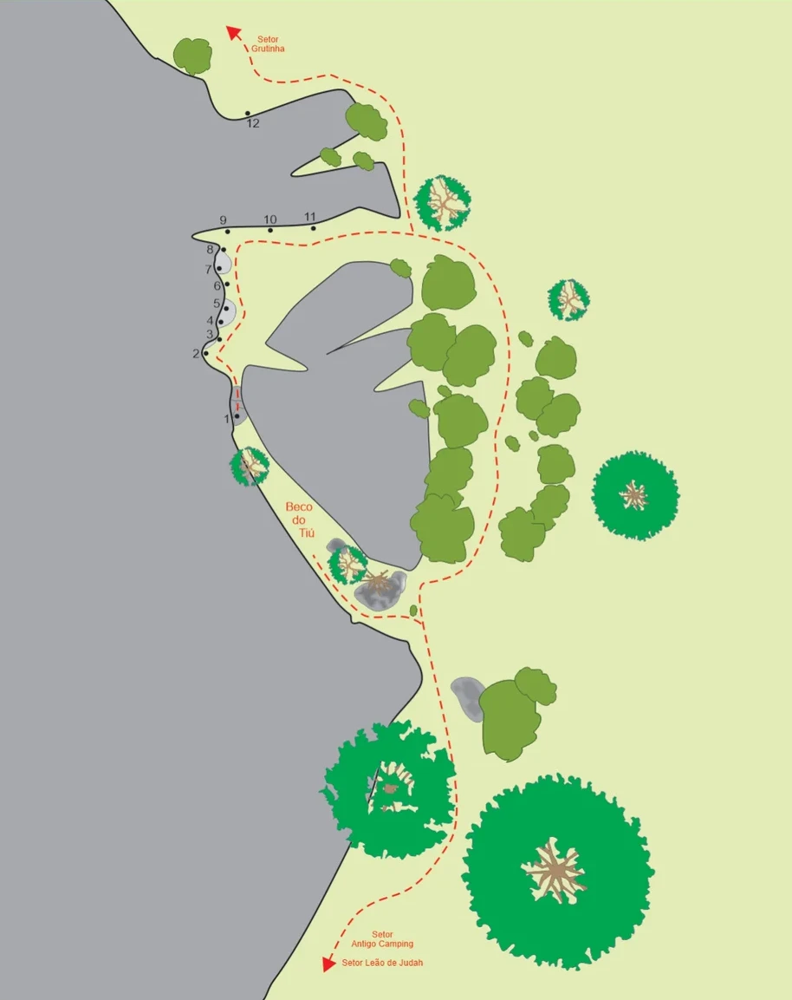
    - **largura_mapa**: 914
    - **altura_mapa**: 1153
    - **pontos_de_interesse**:
      - **[0]**:
        - **id**: 5AdTIp8pKO3pg8
        - **uid**: 5AdTIp8pKO3pg8
        - **rotulo**: Setor Grutinha
        - **retangulo**:
          - **x**: 306
          - **y**: 50
          - **comprimento**: 50
          - **largura**: 25
        - **label**: Setor Grutinha
      - **[1]**:
        - **id**: vDTMHKKpWzcGOw
        - **uid**: vDTMHKKpWzcGOw
        - **rotulo**: Beco do Tiú
        - **retangulo**:
          - **x**: 346
          - **y**: 598
          - **comprimento**: 44
          - **largura**: 50
        - **label**: Beco do Tiú
      - **[2]**:
        - **id**: aIXg09FLw7DrLC
        - **uid**: aIXg09FLw7DrLC
        - **rotulo**: Setor Antigo Camping
        - **retangulo**:
          - **x**: 441
          - **y**: 1082
          - **comprimento**: 76
          - **largura**: 27
        - **label**: Setor Antigo Camping
      - **[3]**:
        - **id**: Uwo5YautVjYtGQ
        - **uid**: Uwo5YautVjYtGQ
        - **rotulo**: Setor Leão de Judah
        - **retangulo**:
          - **x**: 442
          - **y**: 1110
          - **comprimento**: 100
          - **largura**: 19
        - **label**: Setor Leão de Judah
      - **[4]**:
        - **id**: nxAEsdkC6zlH5q
        - **uid**: nxAEsdkC6zlH5q
        - **rotulo**: 01
        - **retangulo**:
          - **x**: 262
          - **y**: 483
          - **comprimento**: 15
          - **largura**: 16
        - **label**: 01
      - **[5]**:
        - **id**: pxPXl2QGXJDlMQ
        - **uid**: pxPXl2QGXJDlMQ
        - **rotulo**: 02
        - **retangulo**:
          - **x**: 226
          - **y**: 408
          - **comprimento**: 15
          - **largura**: 17
        - **label**: 02
      - **[6]**:
        - **id**: gDFkud1l1YvgrV
        - **uid**: gDFkud1l1YvgrV
        - **rotulo**: 3
        - **retangulo**:
          - **x**: 242
          - **y**: 386
          - **comprimento**: 13
          - **largura**: 15
        - **label**: 3
      - **[7]**:
        - **id**: lxgZ0GIeAHGcrj
        - **uid**: lxgZ0GIeAHGcrj
        - **rotulo**: 04
        - **retangulo**:
          - **x**: 242
          - **y**: 369
          - **comprimento**: 14
          - **largura**: 14
        - **label**: 04
      - **[8]**:
        - **id**: 2ObtRnHYizt127
        - **uid**: 2ObtRnHYizt127
        - **rotulo**: 05
        - **retangulo**:
          - **x**: 250
          - **y**: 350
          - **comprimento**: 14
          - **largura**: 15
        - **label**: 05
      - **[9]**:
        - **id**: tXL27kM1fqpY1i
        - **uid**: tXL27kM1fqpY1i
        - **rotulo**: 06
        - **retangulo**:
          - **x**: 251
          - **y**: 329
          - **comprimento**: 14
          - **largura**: 14
        - **label**: 06
      - **[10]**:
        - **id**: HC5wy1dLlaIHsw
        - **uid**: HC5wy1dLlaIHsw
        - **rotulo**: 07
        - **retangulo**:
          - **x**: 241
          - **y**: 310
          - **comprimento**: 14
          - **largura**: 16
        - **label**: 07
      - **[11]**:
        - **id**: DdoCDwGo2w0iPv
        - **uid**: DdoCDwGo2w0iPv
        - **rotulo**: 08
        - **retangulo**:
          - **x**: 242
          - **y**: 287
          - **comprimento**: 14
          - **largura**: 14
        - **label**: 08
      - **[12]**:
        - **id**: nRWCUWYjMNjJMh
        - **uid**: nRWCUWYjMNjJMh
        - **rotulo**: 9
        - **retangulo**:
          - **x**: 257
          - **y**: 253
          - **comprimento**: 16
          - **largura**: 16
        - **label**: 9
      - **[13]**:
        - **id**: KobH3ZvHFvsjWp
        - **uid**: KobH3ZvHFvsjWp
        - **rotulo**: 10
        - **retangulo**:
          - **x**: 312
          - **y**: 252
          - **comprimento**: 18
          - **largura**: 17
        - **label**: 10
      - **[14]**:
        - **id**: xs4nalYqxq2IpV
        - **uid**: xs4nalYqxq2IpV
        - **rotulo**: 11
        - **retangulo**:
          - **x**: 358
          - **y**: 249
          - **comprimento**: 19
          - **largura**: 18
        - **label**: 11
      - **[15]**:
        - **id**: 1qTf0GgGttwbcx
        - **uid**: 1qTf0GgGttwbcx
        - **rotulo**: 12
        - **retangulo**:
          - **x**: 292
          - **y**: 142
          - **comprimento**: 18
          - **largura**: 17
        - **label**: 12
    - **referencias**:
      - **[0]**:
        - **alvo_uid**: HqRb34MlRmtuk8
        - **pontos_uids**:
          - nxAEsdkC6zlH5q
        - **escalada**: 4i20
        - **ids**:
          - nxAEsdkC6zlH5q
      - **[1]**:
        - **alvo_uid**: N2M08vKAveJLJy
        - **pontos_uids**:
          - pxPXl2QGXJDlMQ
        - **escalada**: Reggae Por Nos
        - **ids**:
          - pxPXl2QGXJDlMQ
      - **[2]**:
        - **alvo_uid**: 1mv65RMIRCJS6a
        - **pontos_uids**:
          - gDFkud1l1YvgrV
        - **escalada**: Seu Jorge
        - **ids**:
          - gDFkud1l1YvgrV
      - **[3]**:
        - **alvo_uid**: mAu9KYSuZbxW0P
        - **pontos_uids**:
          - lxgZ0GIeAHGcrj
        - **escalada**: Tirocú do Meu Dedo
        - **ids**:
          - lxgZ0GIeAHGcrj
      - **[4]**:
        - **alvo_uid**: KbuFe6TQkKxKf2
        - **pontos_uids**:
          - 2ObtRnHYizt127
        - **escalada**: Oferenda
        - **ids**:
          - 2ObtRnHYizt127
      - **[5]**:
        - **alvo_uid**: MadK0YwqCG4Mqw
        - **pontos_uids**:
          - tXL27kM1fqpY1i
        - **escalada**: Scooby doo
        - **ids**:
          - tXL27kM1fqpY1i
      - **[6]**:
        - **alvo_uid**: dK398IwFNJBuHN
        - **pontos_uids**:
          - HC5wy1dLlaIHsw
        - **escalada**: Miolo
        - **ids**:
          - HC5wy1dLlaIHsw
      - **[7]**:
        - **alvo_uid**: Ofqmp5BhaVDZNG
        - **pontos_uids**:
          - KobH3ZvHFvsjWp
        - **escalada**: Di Menor*
        - **ids**:
          - KobH3ZvHFvsjWp
      - **[8]**:
        - **alvo_uid**: FMoowAqv4iH1Q3
        - **pontos_uids**:
          - xs4nalYqxq2IpV
        - **escalada**: Parceiros
        - **ids**:
          - xs4nalYqxq2IpV
      - **[9]**:
        - **alvo_uid**: yGlerHrNmkOret
        - **pontos_uids**:
          - 1qTf0GgGttwbcx
        - **escalada**: Frango Com Farofa
        - **ids**:
          - 1qTf0GgGttwbcx
      - **[10]**:
        - **alvo_uid**: rXTOXi8E4QHyNa
        - **pontos_uids**:
          - DdoCDwGo2w0iPv
        - **escalada**: Curupira
        - **ids**:
          - DdoCDwGo2w0iPv
      - **[11]**:
        - **alvo_uid**: WfNzpQzM7cQPov
        - **pontos_uids**:
          - nRWCUWYjMNjJMh
        - **escalada**: Só Beleza
        - **ids**:
          - nRWCUWYjMNjJMh
      - **[12]**:
        - **alvo_uid**: QpFeVnc7tU5y5O
        - **pontos_uids**:
          - 5AdTIp8pKO3pg8
        - **setor**: Setor Grutinha
        - **ids**:
          - 5AdTIp8pKO3pg8
      - **[13]**:
        - **alvo_uid**: iP9J82iDvZhZKf
        - **pontos_uids**:
          - aIXg09FLw7DrLC
        - **setor**: Setor Antigo Camping
        - **ids**:
          - aIXg09FLw7DrLC
      - **[14]**:
        - **alvo_uid**: 1TCXLdk6niZmLH
        - **pontos_uids**:
          - Uwo5YautVjYtGQ
        - **setor**: Setor Leão de Judah
        - **ids**:
          - Uwo5YautVjYtGQ
- **escaladas**:
  - **[0]**:
    - **uid**: HqRb34MlRmtuk8
    - **via_esportiva**:
      - **nome**: 4i20
      - **dificuldade**: BR_6
      - **quantidade_protecoes_intermediarias**: 3
      - **quantidade_protecoes_parada**: 2
  - **[1]**:
    - **uid**: N2M08vKAveJLJy
    - **via_esportiva**:
      - **nome**: Reggae Por Nos
      - **dificuldade**: BR_5SUP
      - **quantidade_protecoes_intermediarias**: 3
      - **quantidade_protecoes_parada**: 2
  - **[2]**:
    - **uid**: 1mv65RMIRCJS6a
    - **via_esportiva**:
      - **nome**: Seu Jorge
      - **dificuldade**: BR_5SUP
      - **destaque**: True
      - **quantidade_protecoes_intermediarias**: 4
      - **quantidade_protecoes_parada**: 2
  - **[3]**:
    - **uid**: mAu9KYSuZbxW0P
    - **via_esportiva**:
      - **nome**: Tirocú do Meu Dedo
      - **dificuldade**: BR_5SUP
      - **destaque**: True
      - **quantidade_protecoes_intermediarias**: 4
      - **quantidade_protecoes_parada**: 2
  - **[4]**:
    - **uid**: KbuFe6TQkKxKf2
    - **via_esportiva**:
      - **nome**: Oferenda
      - **dificuldade**: BR_5
      - **destaque**: True
      - **quantidade_protecoes_intermediarias**: 3
      - **quantidade_protecoes_parada**: 2
  - **[5]**:
    - **uid**: MadK0YwqCG4Mqw
    - **via_esportiva**:
      - **nome**: Scooby doo
      - **dificuldade**: BR_5
      - **destaque**: True
      - **quantidade_protecoes_intermediarias**: 3
      - **quantidade_protecoes_parada**: 2
      - **data_abertura**: 2009
  - **[6]**:
    - **uid**: dK398IwFNJBuHN
    - **via_esportiva**:
      - **nome**: Miolo
      - **dificuldade**: BR_4
      - **destaque**: True
      - **quantidade_protecoes_intermediarias**: 4
      - **quantidade_protecoes_parada**: 2
  - **[7]**:
    - **uid**: rXTOXi8E4QHyNa
    - **via_esportiva**:
      - **nome**: Curupira
      - **dificuldade**: BR_5SUP
      - **destaque**: True
      - **quantidade_protecoes_intermediarias**: 4
      - **quantidade_protecoes_parada**: 2
  - **[8]**:
    - **uid**: WfNzpQzM7cQPov
    - **via_esportiva**:
      - **nome**: Só Beleza
      - **dificuldade**: BR_5
      - **quantidade_protecoes_intermediarias**: 1
      - **quantidade_protecoes_parada**: 2
  - **[9]**:
    - **uid**: Ofqmp5BhaVDZNG
    - **via_esportiva**:
      - **nome**: Di Menor*
      - **dificuldade**: BR_6SUP
      - **destaque**: True
      - **quantidade_protecoes_intermediarias**: 2
      - **quantidade_protecoes_parada**: 2
  - **[10]**:
    - **uid**: FMoowAqv4iH1Q3
    - **via_esportiva**:
      - **nome**: Parceiros
      - **dificuldade**: BR_6
      - **destaque**: True
      - **quantidade_protecoes_intermediarias**: 3
      - **quantidade_protecoes_parada**: 2
  - **[11]**:
    - **uid**: yGlerHrNmkOret
    - **via_esportiva**:
      - **nome**: Frango Com Farofa
      - **dificuldade**: BR_6
      - **quantidade_protecoes_intermediarias**: 2
      - **quantidade_protecoes_parada**: 2
- **precomputados**:
  - **total_escaladas**: 12
  - **total_esportivas**: 12

## Parte: setor_grutinha

### Setor (Pico: Afloramento Rastro)

- **descricao**: Este setor possui sombra o dia todo (variando de acordo com a estação).
- **nome**: Setor Grutinha
- **uid**: QpFeVnc7tU5y5O
- **mapas**:
  - **[0]**:
    - **caminho_imagem_mapa**: 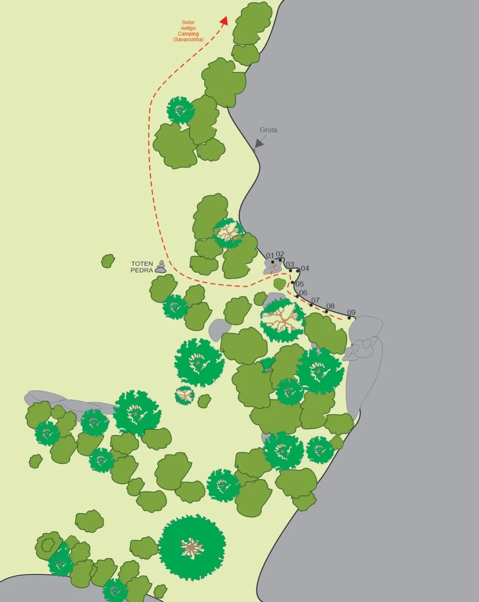
    - **largura_mapa**: 916
    - **altura_mapa**: 1151
    - **pontos_de_interesse**:
      - **[0]**:
        - **id**: kbhyiBc9oLi0Dm
        - **uid**: kbhyiBc9oLi0Dm
        - **rotulo**: Setor Antigo Camping (Savassinha)
        - **retangulo**:
          - **x**: 360
          - **y**: 57
          - **comprimento**: 66
          - **largura**: 54
        - **label**: Setor Antigo Camping (Savassinha)
      - **[1]**:
        - **id**: wFm8GZZFhzpp8q
        - **uid**: wFm8GZZFhzpp8q
        - **rotulo**: Gruta
        - **retangulo**:
          - **x**: 513
          - **y**: 246
          - **comprimento**: 40
          - **largura**: 21
        - **label**: Gruta
      - **[2]**:
        - **id**: JLXPUU71vd00hY
        - **uid**: JLXPUU71vd00hY
        - **rotulo**: TOTEM PEDRA
        - **retangulo**:
          - **x**: 270
          - **y**: 510
          - **comprimento**: 47
          - **largura**: 28
        - **label**: TOTEM PEDRA
      - **[3]**:
        - **id**: jiT2Q8N2sNXpub
        - **uid**: jiT2Q8N2sNXpub
        - **rotulo**: 01
        - **retangulo**:
          - **x**: 516
          - **y**: 488
          - **comprimento**: 17
          - **largura**: 17
        - **label**: 01
      - **[4]**:
        - **id**: ZM4y6aWi1UmLvl
        - **uid**: ZM4y6aWi1UmLvl
        - **rotulo**: 02
        - **retangulo**:
          - **x**: 534
          - **y**: 484
          - **comprimento**: 19
          - **largura**: 17
        - **label**: 02
      - **[5]**:
        - **id**: g3gSxRoQhM2ldy
        - **uid**: g3gSxRoQhM2ldy
        - **rotulo**: 03
        - **retangulo**:
          - **x**: 554
          - **y**: 505
          - **comprimento**: 20
          - **largura**: 16
        - **label**: 03
      - **[6]**:
        - **id**: VRzX98HDOHg6Um
        - **uid**: VRzX98HDOHg6Um
        - **rotulo**: 04
        - **retangulo**:
          - **x**: 584
          - **y**: 512
          - **comprimento**: 19
          - **largura**: 16
        - **label**: 04
      - **[7]**:
        - **id**: vm5npPIK0q7HbZ
        - **uid**: vm5npPIK0q7HbZ
        - **rotulo**: 05
        - **retangulo**:
          - **x**: 574
          - **y**: 543
          - **comprimento**: 19
          - **largura**: 16
        - **label**: 05
      - **[8]**:
        - **id**: u77GHzyeb3Cmnw
        - **uid**: u77GHzyeb3Cmnw
        - **rotulo**: 06
        - **retangulo**:
          - **x**: 580
          - **y**: 559
          - **comprimento**: 19
          - **largura**: 16
        - **label**: 06
      - **[9]**:
        - **id**: RUf3Pw2IfaTEQ7
        - **uid**: RUf3Pw2IfaTEQ7
        - **rotulo**: 07
        - **retangulo**:
          - **x**: 603
          - **y**: 574
          - **comprimento**: 20
          - **largura**: 15
        - **label**: 07
      - **[10]**:
        - **id**: hlwKnf0Txj3UrE
        - **uid**: hlwKnf0Txj3UrE
        - **rotulo**: 08
        - **retangulo**:
          - **x**: 632
          - **y**: 584
          - **comprimento**: 21
          - **largura**: 17
        - **label**: 08
      - **[11]**:
        - **id**: mmyogGobTolFzp
        - **uid**: mmyogGobTolFzp
        - **rotulo**: 09
        - **retangulo**:
          - **x**: 672
          - **y**: 597
          - **comprimento**: 21
          - **largura**: 16
        - **label**: 09
    - **referencias**:
      - **[0]**:
        - **alvo_uid**: 9iHsrP68qWPnZx
        - **pontos_uids**:
          - jiT2Q8N2sNXpub
        - **escalada**: Tal Pai Tal Filho
        - **ids**:
          - jiT2Q8N2sNXpub
      - **[1]**:
        - **alvo_uid**: pJjoXoQE58hLmV
        - **pontos_uids**:
          - ZM4y6aWi1UmLvl
        - **escalada**: Mutantes
        - **ids**:
          - ZM4y6aWi1UmLvl
      - **[2]**:
        - **alvo_uid**: MhrTiTlJ8B3aDQ
        - **pontos_uids**:
          - g3gSxRoQhM2ldy
        - **escalada**: Lá Revolucion
        - **ids**:
          - g3gSxRoQhM2ldy
      - **[3]**:
        - **alvo_uid**: NsGz5uulNEGpGY
        - **pontos_uids**:
          - VRzX98HDOHg6Um
        - **escalada**: Hidrovibes
        - **ids**:
          - VRzX98HDOHg6Um
      - **[4]**:
        - **alvo_uid**: dFuUzx9Wgsbri7
        - **pontos_uids**:
          - vm5npPIK0q7HbZ
        - **escalada**: Impermeável
        - **ids**:
          - vm5npPIK0q7HbZ
      - **[5]**:
        - **alvo_uid**: DWo8SR4oAbtQfY
        - **pontos_uids**:
          - u77GHzyeb3Cmnw
        - **escalada**: Amandla
        - **ids**:
          - u77GHzyeb3Cmnw
      - **[6]**:
        - **alvo_uid**: gEYcu56B0y4PwB
        - **pontos_uids**:
          - RUf3Pw2IfaTEQ7
        - **escalada**: Quem Ama Planta
        - **ids**:
          - RUf3Pw2IfaTEQ7
      - **[7]**:
        - **alvo_uid**: uVgZMRrftdPBNs
        - **pontos_uids**:
          - hlwKnf0Txj3UrE
        - **escalada**: Respeite os Mais Velhos
        - **ids**:
          - hlwKnf0Txj3UrE
      - **[8]**:
        - **alvo_uid**: lfgigC5LbTDbT3
        - **pontos_uids**:
          - mmyogGobTolFzp
        - **escalada**: Quem Ama Implanta
        - **ids**:
          - mmyogGobTolFzp
      - **[9]**:
        - **alvo_uid**: iP9J82iDvZhZKf
        - **pontos_uids**:
          - kbhyiBc9oLi0Dm
        - **setor**: Setor Antigo Camping
        - **ids**:
          - kbhyiBc9oLi0Dm
      - **[10]**:
        - **alvo_uid**: TWAauQTbQwW9BY
        - **pontos_uids**:
          - kbhyiBc9oLi0Dm
        - **setor**: Setor Savassinha
        - **ids**:
          - kbhyiBc9oLi0Dm
- **escaladas**:
  - **[0]**:
    - **uid**: 9iHsrP68qWPnZx
    - **via_esportiva**:
      - **nome**: Tal Pai Tal Filho
      - **dificuldade**: BR_5SUP
      - **quantidade_protecoes_intermediarias**: 3
      - **quantidade_protecoes_parada**: 2
      - **data_abertura**: 2017
  - **[1]**:
    - **uid**: pJjoXoQE58hLmV
    - **via_esportiva**:
      - **nome**: Mutantes
      - **dificuldade**: BR_6SUP
      - **quantidade_protecoes_intermediarias**: 2
      - **quantidade_protecoes_parada**: 2
      - **data_abertura**: 2017
  - **[2]**:
    - **uid**: MhrTiTlJ8B3aDQ
    - **via_esportiva**:
      - **nome**: Lá Revolucion
      - **dificuldade**: BR_7A
      - **destaque**: True
      - **quantidade_protecoes_intermediarias**: 5
      - **quantidade_protecoes_parada**: 2
      - **data_abertura**: 2017
  - **[3]**:
    - **uid**: NsGz5uulNEGpGY
    - **via_esportiva**:
      - **nome**: Hidrovibes
      - **dificuldade**: BR_7C
      - **destaque**: True
      - **quantidade_protecoes_intermediarias**: 4
      - **quantidade_protecoes_parada**: 2
      - **data_abertura**: 2017
  - **[4]**:
    - **uid**: dFuUzx9Wgsbri7
    - **via_esportiva**:
      - **nome**: Impermeável
      - **dificuldade**: BR_7A
      - **destaque**: True
      - **quantidade_protecoes_intermediarias**: 4
      - **quantidade_protecoes_parada**: 2
      - **data_abertura**: 2017
  - **[5]**:
    - **uid**: DWo8SR4oAbtQfY
    - **via_esportiva**:
      - **nome**: Amandla
      - **dificuldade**: BR_7B
      - **destaque**: True
      - **quantidade_protecoes_intermediarias**: 5
      - **quantidade_protecoes_parada**: 2
      - **data_abertura**: 2017
  - **[6]**:
    - **uid**: gEYcu56B0y4PwB
    - **via_esportiva**:
      - **nome**: Quem Ama Planta
      - **dificuldade**: BR_7B
      - **destaque**: True
      - **quantidade_protecoes_intermediarias**: 4
      - **quantidade_protecoes_parada**: 2
      - **data_abertura**: 2017
  - **[7]**:
    - **uid**: uVgZMRrftdPBNs
    - **via_esportiva**:
      - **nome**: Respeite os Mais Velhos
      - **dificuldade**: BR_7C
      - **destaque**: True
      - **quantidade_protecoes_intermediarias**: 4
      - **quantidade_protecoes_parada**: 2
      - **data_abertura**: 2017
  - **[8]**:
    - **uid**: lfgigC5LbTDbT3
    - **via_esportiva**:
      - **nome**: Quem Ama Implanta
      - **dificuldade**: BR_7B
      - **destaque**: True
      - **quantidade_protecoes_intermediarias**: 8
      - **quantidade_protecoes_parada**: 2
      - **data_abertura**: 2017
- **precomputados**:
  - **total_escaladas**: 9
  - **total_esportivas**: 9

## Parte: setor_mezanino

### Setor (Pico: Afloramento Rastro)

- **descricao**:
    Este setor possui sombra a partir das 13h (variando de acordo com a estação). O acesso pode ser feito pelo "Portal", "Túnel" ou "Escada de acesso" que leva ao Jardim Suspenso.
    
    **Observações**:
    - OBS.I: Caixa de abelha entre as vias 05 e 06.
- **nome**: Setor Mezanino
- **uid**: qy0X6QJOgb40Ys
- **mapas**:
  - **[0]**:
    - **caminho_imagem_mapa**: 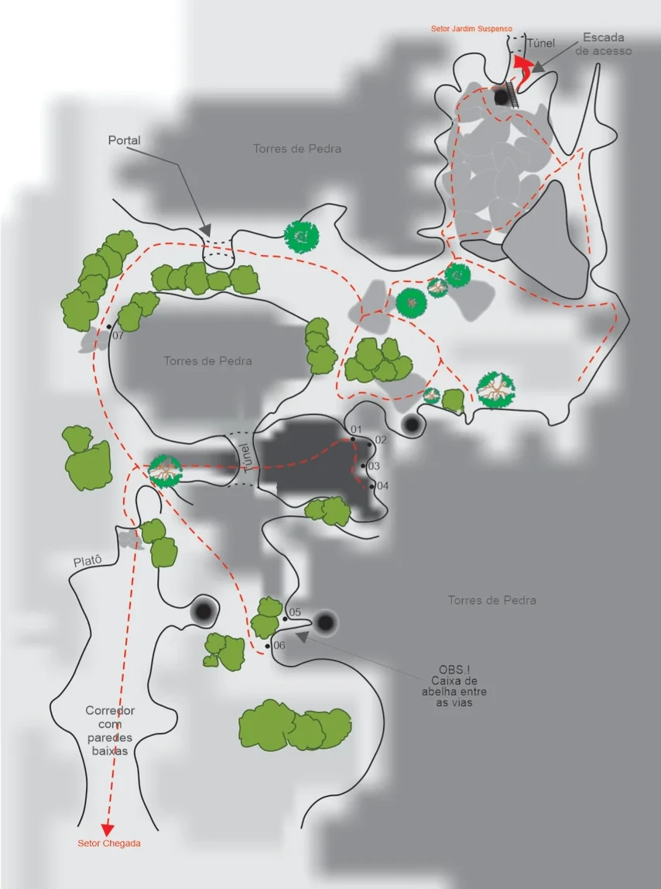
    - **largura_mapa**: 854
    - **altura_mapa**: 1147
    - **pontos_de_interesse**:
      - **[0]**:
        - **id**: b5FoaLHq9X7mV4
        - **uid**: b5FoaLHq9X7mV4
        - **rotulo**: Setor Jardim Suspenso
        - **retangulo**:
          - **x**: 609
          - **y**: 36
          - **comprimento**: 112
          - **largura**: 17
        - **label**: Setor Jardim Suspenso
      - **[1]**:
        - **id**: K0jhMKjkBYnRj4
        - **uid**: K0jhMKjkBYnRj4
        - **rotulo**: Platô
        - **retangulo**:
          - **x**: 112
          - **y**: 722
          - **comprimento**: 44
          - **largura**: 26
        - **label**: Platô
      - **[2]**:
        - **id**: B56AblsH5VCyHY
        - **uid**: B56AblsH5VCyHY
        - **rotulo**: Setor Chegada
        - **retangulo**:
          - **x**: 140
          - **y**: 1088
          - **comprimento**: 92
          - **largura**: 24
        - **label**: Setor Chegada
      - **[3]**:
        - **id**: PZgba0unbkAujH
        - **uid**: PZgba0unbkAujH
        - **rotulo**: 01
        - **retangulo**:
          - **x**: 460
          - **y**: 554
          - **comprimento**: 18
          - **largura**: 18
        - **label**: 01
      - **[4]**:
        - **id**: xXeKqGxykOqOFR
        - **uid**: xXeKqGxykOqOFR
        - **rotulo**: 02
        - **retangulo**:
          - **x**: 492
          - **y**: 568
          - **comprimento**: 19
          - **largura**: 19
        - **label**: 02
      - **[5]**:
        - **id**: nXyfSnMOBKGNfY
        - **uid**: nXyfSnMOBKGNfY
        - **rotulo**: 03
        - **retangulo**:
          - **x**: 482
          - **y**: 601
          - **comprimento**: 21
          - **largura**: 20
        - **label**: 03
      - **[6]**:
        - **id**: TrfuqJb0dxkGkc
        - **uid**: TrfuqJb0dxkGkc
        - **rotulo**: 04
        - **retangulo**:
          - **x**: 494
          - **y**: 626
          - **comprimento**: 22
          - **largura**: 20
        - **label**: 04
      - **[7]**:
        - **id**: bD1LdH5M2cvktU
        - **uid**: bD1LdH5M2cvktU
        - **rotulo**: 05
        - **retangulo**:
          - **x**: 381
          - **y**: 789
          - **comprimento**: 20
          - **largura**: 18
        - **label**: 05
      - **[8]**:
        - **id**: MBCQxfCWYYtmhg
        - **uid**: MBCQxfCWYYtmhg
        - **rotulo**: 06
        - **retangulo**:
          - **x**: 361
          - **y**: 831
          - **comprimento**: 22
          - **largura**: 18
        - **label**: 06
      - **[9]**:
        - **id**: tjPlvse62zPdGL
        - **uid**: tjPlvse62zPdGL
        - **rotulo**: 07
        - **retangulo**:
          - **x**: 152
          - **y**: 432
          - **comprimento**: 19
          - **largura**: 19
        - **label**: 07
    - **referencias**:
      - **[0]**:
        - **alvo_uid**: 6u7Xidzp7WegIL
        - **pontos_uids**:
          - PZgba0unbkAujH
        - **escalada**: Passeio das Patacas
        - **ids**:
          - PZgba0unbkAujH
      - **[1]**:
        - **alvo_uid**: JBXtInsdpMjV54
        - **pontos_uids**:
          - xXeKqGxykOqOFR
        - **escalada**: A Mais Bonita
        - **ids**:
          - xXeKqGxykOqOFR
      - **[2]**:
        - **alvo_uid**: ABQeYlkFFvoqwi
        - **pontos_uids**:
          - nXyfSnMOBKGNfY
        - **escalada**: Gritos da Revolução
        - **ids**:
          - nXyfSnMOBKGNfY
      - **[3]**:
        - **alvo_uid**: bHS40hhMhneRT2
        - **pontos_uids**:
          - TrfuqJb0dxkGkc
        - **escalada**: Ataque das Formigas Gigantes
        - **ids**:
          - TrfuqJb0dxkGkc
      - **[4]**:
        - **alvo_uid**: h6k9PvAtPg8abU
        - **pontos_uids**:
          - bD1LdH5M2cvktU
        - **escalada**: Na Caralha da Noite
        - **ids**:
          - bD1LdH5M2cvktU
      - **[5]**:
        - **alvo_uid**: z0b6KVd6n7pwDh
        - **pontos_uids**:
          - MBCQxfCWYYtmhg
        - **escalada**: Universo em Desencanto
        - **ids**:
          - MBCQxfCWYYtmhg
      - **[6]**:
        - **alvo_uid**: bcenBYSeMDGsYk
        - **pontos_uids**:
          - tjPlvse62zPdGL
        - **escalada**: Legionários
        - **ids**:
          - tjPlvse62zPdGL
      - **[7]**:
        - **alvo_uid**: Pi6c115axze0qS
        - **pontos_uids**:
          - B56AblsH5VCyHY
        - **setor**: Setor Chegada
        - **ids**:
          - B56AblsH5VCyHY
      - **[8]**:
        - **alvo_uid**: Xxlz6Srh7a9jQT
        - **pontos_uids**:
          - b5FoaLHq9X7mV4
        - **setor**: Setor Jardim Suspenso
        - **ids**:
          - b5FoaLHq9X7mV4
- **escaladas**:
  - **[0]**:
    - **uid**: 6u7Xidzp7WegIL
    - **via_esportiva**:
      - **nome**: Passeio das Patacas
      - **dificuldade**: BR_6
      - **destaque**: True
      - **quantidade_protecoes_intermediarias**: 8
      - **quantidade_protecoes_parada**: 2
      - **data_abertura**: 2015
  - **[1]**:
    - **uid**: JBXtInsdpMjV54
    - **via_esportiva**:
      - **nome**: A Mais Bonita
      - **dificuldade**: BR_6SUP
      - **destaque**: True
      - **quantidade_protecoes_intermediarias**: 9
      - **quantidade_protecoes_parada**: 2
  - **[2]**:
    - **uid**: ABQeYlkFFvoqwi
    - **via_esportiva**:
      - **nome**: Gritos da Revolução
      - **dificuldade**: BR_7A
      - **destaque**: True
      - **quantidade_protecoes_intermediarias**: 4
      - **quantidade_protecoes_parada**: 2
  - **[3]**:
    - **uid**: bHS40hhMhneRT2
    - **via_esportiva**:
      - **nome**: Ataque das Formigas Gigantes
      - **dificuldade**: BR_6SUP
      - **destaque**: True
      - **quantidade_protecoes_intermediarias**: 6
      - **quantidade_protecoes_parada**: 2
  - **[4]**:
    - **uid**: h6k9PvAtPg8abU
    - **via_esportiva**:
      - **nome**: Na Caralha da Noite
      - **dificuldade**: BR_6SUP
  - **[5]**:
    - **uid**: z0b6KVd6n7pwDh
    - **via_esportiva**:
      - **nome**: Universo em Desencanto
      - **dificuldade**: BR_7B
  - **[6]**:
    - **uid**: bcenBYSeMDGsYk
    - **via_esportiva**:
      - **nome**: Legionários
      - **dificuldade**: BR_5
      - **quantidade_protecoes_intermediarias**: 4
      - **quantidade_protecoes_parada**: 2
- **precomputados**:
  - **total_escaladas**: 7
  - **total_esportivas**: 7

## Parte: setor_1o_andar

### Setor (Pico: Afloramento Rastro)

- **descricao**: Este setor possui sombra a partir das 13h (variando de acordo com a estação).
- **nome**: Setor 1º Andar
- **uid**: rTPz6f4oHTpzLr
- **mapas**:
  - **[0]**:
    - **caminho_imagem_mapa**: 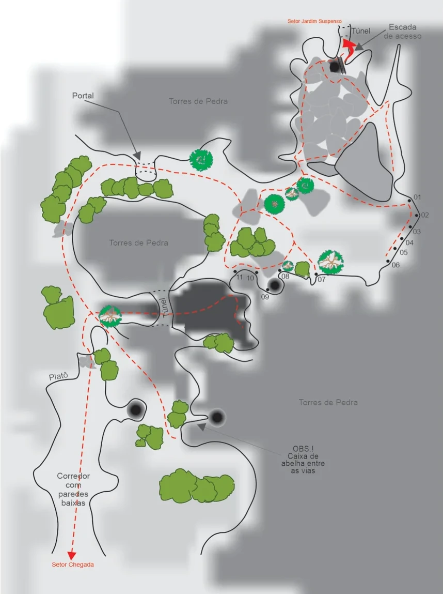
    - **largura_mapa**: 858
    - **altura_mapa**: 1149
    - **pontos_de_interesse**:
      - **[0]**:
        - **id**: deILCkeAxmThKN
        - **uid**: deILCkeAxmThKN
        - **rotulo**: Setor Jardim Suspenso
        - **retangulo**:
          - **x**: 608
          - **y**: 40
          - **comprimento**: 114
          - **largura**: 22
        - **label**: Setor Jardim Suspenso
      - **[1]**:
        - **id**: 7o12p6FYTFIzCN
        - **uid**: 7o12p6FYTFIzCN
        - **rotulo**: 01
        - **retangulo**:
          - **x**: 808
          - **y**: 381
          - **comprimento**: 17
          - **largura**: 16
        - **label**: 01
      - **[2]**:
        - **id**: V2OAN3WouFFlC4
        - **uid**: V2OAN3WouFFlC4
        - **rotulo**: 02
        - **retangulo**:
          - **x**: 824
          - **y**: 414
          - **comprimento**: 19
          - **largura**: 17
        - **label**: 02
      - **[3]**:
        - **id**: cOvURnjkFwMzAe
        - **uid**: cOvURnjkFwMzAe
        - **rotulo**: 03
        - **retangulo**:
          - **x**: 807
          - **y**: 447
          - **comprimento**: 18
          - **largura**: 16
        - **label**: 03
      - **[4]**:
        - **id**: AFT37tHwXFSiM6
        - **uid**: AFT37tHwXFSiM6
        - **rotulo**: 04
        - **retangulo**:
          - **x**: 794
          - **y**: 468
          - **comprimento**: 20
          - **largura**: 16
        - **label**: 04
      - **[5]**:
        - **id**: NBXdbwpgWykQAu
        - **uid**: NBXdbwpgWykQAu
        - **rotulo**: 05
        - **retangulo**:
          - **x**: 782
          - **y**: 488
          - **comprimento**: 19
          - **largura**: 16
        - **label**: 05
      - **[6]**:
        - **id**: PRKkjphoUPvdZ3
        - **uid**: PRKkjphoUPvdZ3
        - **rotulo**: 06
        - **retangulo**:
          - **x**: 767
          - **y**: 512
          - **comprimento**: 20
          - **largura**: 17
        - **label**: 06
      - **[7]**:
        - **id**: Azx8tbYdlwpHir
        - **uid**: Azx8tbYdlwpHir
        - **rotulo**: Setor Chegada
        - **retangulo**:
          - **x**: 141
          - **y**: 1090
          - **comprimento**: 90
          - **largura**: 21
        - **label**: Setor Chegada
      - **[8]**:
        - **id**: zA4nK8D9Cmdl4a
        - **uid**: zA4nK8D9Cmdl4a
        - **rotulo**: 07
        - **retangulo**:
          - **x**: 623
          - **y**: 540
          - **comprimento**: 22
          - **largura**: 18
        - **label**: 07
      - **[9]**:
        - **id**: Dr1e8SsSqBxkoN
        - **uid**: Dr1e8SsSqBxkoN
        - **rotulo**: 08
        - **retangulo**:
          - **x**: 553
          - **y**: 534
          - **comprimento**: 22
          - **largura**: 17
        - **label**: 08
      - **[10]**:
        - **id**: AROxSxjTKZVN0g
        - **uid**: AROxSxjTKZVN0g
        - **rotulo**: 09
        - **retangulo**:
          - **x**: 514
          - **y**: 574
          - **comprimento**: 19
          - **largura**: 18
        - **label**: 09
      - **[11]**:
        - **id**: vzZCBrKTVbGtqp
        - **uid**: vzZCBrKTVbGtqp
        - **rotulo**: 10
        - **retangulo**:
          - **x**: 486
          - **y**: 538
          - **comprimento**: 19
          - **largura**: 19
        - **label**: 10
      - **[12]**:
        - **id**: AeeOdcgRrrfM6o
        - **uid**: AeeOdcgRrrfM6o
        - **rotulo**: 11
        - **retangulo**:
          - **x**: 464
          - **y**: 536
          - **comprimento**: 18
          - **largura**: 17
        - **label**: 11
    - **referencias**:
      - **[0]**:
        - **alvo_uid**: or7kKdIarSULuY
        - **pontos_uids**:
          - 7o12p6FYTFIzCN
        - **escalada**: Roolinhalala
        - **ids**:
          - 7o12p6FYTFIzCN
      - **[1]**:
        - **alvo_uid**: 0Hjk3bqoBTpvi7
        - **pontos_uids**:
          - V2OAN3WouFFlC4
        - **escalada**: Cabo José
        - **ids**:
          - V2OAN3WouFFlC4
      - **[2]**:
        - **alvo_uid**: nDEoX8DcE0e0vl
        - **pontos_uids**:
          - cOvURnjkFwMzAe
        - **escalada**: Soldado Abatido
        - **ids**:
          - cOvURnjkFwMzAe
      - **[3]**:
        - **alvo_uid**: isp8ePwKPiZCZU
        - **pontos_uids**:
          - AFT37tHwXFSiM6
        - **escalada**: Via do Calango
        - **ids**:
          - AFT37tHwXFSiM6
      - **[4]**:
        - **alvo_uid**: xrnvITqUrv8iKI
        - **pontos_uids**:
          - NBXdbwpgWykQAu
        - **escalada**: 50cintis
        - **ids**:
          - NBXdbwpgWykQAu
      - **[5]**:
        - **alvo_uid**: YxDzuNIEetXPGx
        - **pontos_uids**:
          - PRKkjphoUPvdZ3
        - **escalada**: Zac Marley
        - **ids**:
          - PRKkjphoUPvdZ3
      - **[6]**:
        - **alvo_uid**: 6rLFASrHYHpyyO
        - **pontos_uids**:
          - zA4nK8D9Cmdl4a
        - **escalada**: Cada Macaco no Seu Galho
        - **ids**:
          - zA4nK8D9Cmdl4a
      - **[7]**:
        - **alvo_uid**: JSZRn8WEkHaYU8
        - **pontos_uids**:
          - vzZCBrKTVbGtqp
        - **escalada**: Chuva de Espinho
        - **ids**:
          - vzZCBrKTVbGtqp
      - **[8]**:
        - **alvo_uid**: UUXfczY7rP409u
        - **pontos_uids**:
          - AeeOdcgRrrfM6o
        - **escalada**: Minha Criança
        - **ids**:
          - AeeOdcgRrrfM6o
      - **[9]**:
        - **alvo_uid**: Pi6c115axze0qS
        - **pontos_uids**:
          - Azx8tbYdlwpHir
        - **setor**: Setor Chegada
        - **ids**:
          - Azx8tbYdlwpHir
      - **[10]**:
        - **alvo_uid**: Xxlz6Srh7a9jQT
        - **pontos_uids**:
          - deILCkeAxmThKN
        - **setor**: Setor Jardim Suspenso
        - **ids**:
          - deILCkeAxmThKN
      - **[11]**:
        - **alvo_uid**: 07r5MXeygRMMk3
        - **pontos_uids**:
          - Dr1e8SsSqBxkoN
        - **escalada**: Curte o Planeta que Você Vive
        - **ids**:
          - Dr1e8SsSqBxkoN
      - **[12]**:
        - **alvo_uid**: 9gZbV9HU8pq2tZ
        - **pontos_uids**:
          - AROxSxjTKZVN0g
        - **escalada**: Subaco da Zen
        - **ids**:
          - AROxSxjTKZVN0g
- **escaladas**:
  - **[0]**:
    - **uid**: or7kKdIarSULuY
    - **via_esportiva**:
      - **nome**: Roolinhalala
      - **dificuldade**: BR_7B
      - **quantidade_protecoes_intermediarias**: 7
      - **quantidade_protecoes_parada**: 2
      - **data_abertura**: 2018
  - **[1]**:
    - **uid**: 0Hjk3bqoBTpvi7
    - **via_esportiva**:
      - **nome**: Cabo José
      - **dificuldade**: BR_7A
      - **quantidade_protecoes_intermediarias**: 8
      - **quantidade_protecoes_parada**: 2
  - **[2]**:
    - **uid**: nDEoX8DcE0e0vl
    - **via_esportiva**:
      - **nome**: Soldado Abatido
      - **dificuldade**: BR_7A
      - **destaque**: True
      - **quantidade_protecoes_intermediarias**: 8
      - **quantidade_protecoes_parada**: 2
  - **[3]**:
    - **uid**: isp8ePwKPiZCZU
    - **via_esportiva**:
      - **nome**: Via do Calango
      - **dificuldade**: PROJETO
  - **[4]**:
    - **uid**: xrnvITqUrv8iKI
    - **via_esportiva**:
      - **nome**: 50cintis
      - **destaque**: True
      - **dificuldade**: PROJETO
      - **quantidade_protecoes_intermediarias**: 6
      - **quantidade_protecoes_parada**: 2
  - **[5]**:
    - **uid**: YxDzuNIEetXPGx
    - **via_esportiva**:
      - **nome**: Zac Marley
      - **destaque**: True
      - **dificuldade**: BR_6
      - **quantidade_protecoes_intermediarias**: 4
      - **quantidade_protecoes_parada**: 2
  - **[6]**:
    - **uid**: 6rLFASrHYHpyyO
    - **via_esportiva**:
      - **nome**: Cada Macaco no Seu Galho
      - **dificuldade**: BR_6SUP
      - **quantidade_protecoes_intermediarias**: 8
      - **quantidade_protecoes_parada**: 2
  - **[7]**:
    - **uid**: 07r5MXeygRMMk3
    - **via_esportiva**:
      - **nome**: Curte o Planeta que Você Vive
      - **destaque**: True
      - **dificuldade**: BR_5SUP
      - **quantidade_protecoes_intermediarias**: 8
      - **quantidade_protecoes_parada**: 2
  - **[8]**:
    - **uid**: 9gZbV9HU8pq2tZ
    - **via_esportiva**:
      - **nome**: Subaco da Zen
      - **destaque**: True
      - **dificuldade**: BR_7A
  - **[9]**:
    - **uid**: JSZRn8WEkHaYU8
    - **via_esportiva**:
      - **nome**: Chuva de Espinho
      - **destaque**: True
      - **dificuldade**: BR_5SUP
      - **quantidade_protecoes_intermediarias**: 8
      - **quantidade_protecoes_parada**: 2
  - **[10]**:
    - **uid**: UUXfczY7rP409u
    - **via_esportiva**:
      - **nome**: Minha Criança
      - **destaque**: True
      - **dificuldade**: BR_5SUP
      - **quantidade_protecoes_intermediarias**: 7
      - **quantidade_protecoes_parada**: 2
- **precomputados**:
  - **total_escaladas**: 11
  - **total_esportivas**: 11

## Parte: setor_2o_andar

### Setor (Pico: Afloramento Rastro)

- **descricao**: Este setor possui sombra o dia todo (variando de acordo com a estação).
- **nome**: Setor 2º Andar
- **uid**: IuQcqJF8uQ0xNz
- **mapas**:
  - **[0]**:
    - **caminho_imagem_mapa**: 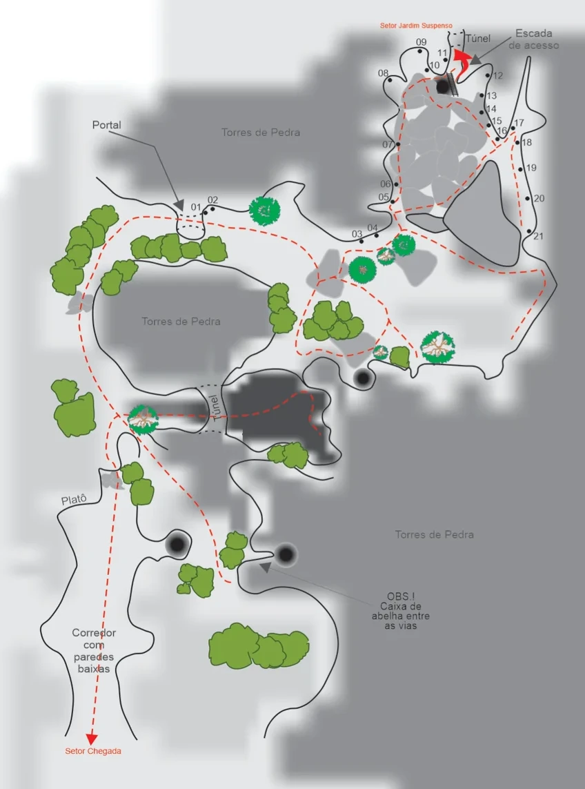
    - **largura_mapa**: 848
    - **altura_mapa**: 1143
    - **pontos_de_interesse**:
      - **[0]**:
        - **id**: NdRlDzDZvt2NBX
        - **uid**: NdRlDzDZvt2NBX
        - **rotulo**: Setor Jardim Suspenso
        - **retangulo**:
          - **x**: 601
          - **y**: 36
          - **comprimento**: 118
          - **largura**: 18
        - **label**: Setor Jardim Suspenso
      - **[1]**:
        - **id**: FkwuOnQWSHgKZl
        - **uid**: FkwuOnQWSHgKZl
        - **rotulo**: 01
        - **retangulo**:
          - **x**: 284
          - **y**: 300
          - **comprimento**: 20
          - **largura**: 15
        - **label**: 01
      - **[2]**:
        - **id**: AokUtKSo3PYqWw
        - **uid**: AokUtKSo3PYqWw
        - **rotulo**: 02
        - **retangulo**:
          - **x**: 308
          - **y**: 289
          - **comprimento**: 23
          - **largura**: 18
        - **label**: 02
      - **[3]**:
        - **id**: UZfzuqFbtk91EU
        - **uid**: UZfzuqFbtk91EU
        - **rotulo**: 03
        - **retangulo**:
          - **x**: 518
          - **y**: 338
          - **comprimento**: 20
          - **largura**: 15
        - **label**: 03
      - **[4]**:
        - **id**: OHIWBLeneeByyn
        - **uid**: OHIWBLeneeByyn
        - **rotulo**: 04
        - **retangulo**:
          - **x**: 540
          - **y**: 330
          - **comprimento**: 20
          - **largura**: 15
        - **label**: 04
      - **[5]**:
        - **id**: chZd7tdbMNJ0ZO
        - **uid**: chZd7tdbMNJ0ZO
        - **rotulo**: 05
        - **retangulo**:
          - **x**: 556
          - **y**: 284
          - **comprimento**: 21
          - **largura**: 15
        - **label**: 05
      - **[6]**:
        - **id**: mWJ9IiQSCUAEx9
        - **uid**: mWJ9IiQSCUAEx9
        - **rotulo**: 06
        - **retangulo**:
          - **x**: 560
          - **y**: 266
          - **comprimento**: 19
          - **largura**: 14
        - **label**: 06
      - **[7]**:
        - **id**: ThKPrvdrwOqf24
        - **uid**: ThKPrvdrwOqf24
        - **rotulo**: 07
        - **retangulo**:
          - **x**: 562
          - **y**: 209
          - **comprimento**: 20
          - **largura**: 16
        - **label**: 07
      - **[8]**:
        - **id**: JACCNLWWE9lLHT
        - **uid**: JACCNLWWE9lLHT
        - **rotulo**: 08
        - **retangulo**:
          - **x**: 556
          - **y**: 106
          - **comprimento**: 22
          - **largura**: 17
        - **label**: 08
      - **[9]**:
        - **id**: k7GSkrvViCKCEt
        - **uid**: k7GSkrvViCKCEt
        - **rotulo**: 09
        - **retangulo**:
          - **x**: 612
          - **y**: 60
          - **comprimento**: 21
          - **largura**: 16
        - **label**: 09
      - **[10]**:
        - **id**: Pzmqem0Et7abpy
        - **uid**: Pzmqem0Et7abpy
        - **rotulo**: 10
        - **retangulo**:
          - **x**: 630
          - **y**: 94
          - **comprimento**: 20
          - **largura**: 17
        - **label**: 10
      - **[11]**:
        - **id**: h0ljSHfSugQgN4
        - **uid**: h0ljSHfSugQgN4
        - **rotulo**: 11
        - **retangulo**:
          - **x**: 641
          - **y**: 75
          - **comprimento**: 20
          - **largura**: 18
        - **label**: 11
      - **[12]**:
        - **id**: VIaHNN4Uj4c9E4
        - **uid**: VIaHNN4Uj4c9E4
        - **rotulo**: 12
        - **retangulo**:
          - **x**: 723
          - **y**: 109
          - **comprimento**: 20
          - **largura**: 16
        - **label**: 12
      - **[13]**:
        - **id**: 2ftA6FenMbvOOU
        - **uid**: 2ftA6FenMbvOOU
        - **rotulo**: 13
        - **retangulo**:
          - **x**: 714
          - **y**: 138
          - **comprimento**: 19
          - **largura**: 16
        - **label**: 13
      - **[14]**:
        - **id**: 6eXmInGGIx7ugD
        - **uid**: 6eXmInGGIx7ugD
        - **rotulo**: 14
        - **retangulo**:
          - **x**: 712
          - **y**: 157
          - **comprimento**: 19
          - **largura**: 16
        - **label**: 14
      - **[15]**:
        - **id**: JY66tVCDZDZGSD
        - **uid**: JY66tVCDZDZGSD
        - **rotulo**: 15
        - **retangulo**:
          - **x**: 720
          - **y**: 174
          - **comprimento**: 18
          - **largura**: 15
        - **label**: 15
      - **[16]**:
        - **id**: 0WYhWRTXkcgx1m
        - **uid**: 0WYhWRTXkcgx1m
        - **rotulo**: 16
        - **retangulo**:
          - **x**: 728
          - **y**: 189
          - **comprimento**: 18
          - **largura**: 14
        - **label**: 16
      - **[17]**:
        - **id**: JvR9tudv9OkDLu
        - **uid**: JvR9tudv9OkDLu
        - **rotulo**: 17
        - **retangulo**:
          - **x**: 752
          - **y**: 178
          - **comprimento**: 19
          - **largura**: 17
        - **label**: 17
      - **[18]**:
        - **id**: RSLidGZi9BGtm0
        - **uid**: RSLidGZi9BGtm0
        - **rotulo**: 18
        - **retangulo**:
          - **x**: 764
          - **y**: 206
          - **comprimento**: 20
          - **largura**: 17
        - **label**: 18
      - **[19]**:
        - **id**: 0pXiHjhjCeMRtZ
        - **uid**: 0pXiHjhjCeMRtZ
        - **rotulo**: 19
        - **retangulo**:
          - **x**: 770
          - **y**: 243
          - **comprimento**: 19
          - **largura**: 16
        - **label**: 19
      - **[20]**:
        - **id**: Tjn8kEHeEJ6rOf
        - **uid**: Tjn8kEHeEJ6rOf
        - **rotulo**: 20
        - **retangulo**:
          - **x**: 781
          - **y**: 286
          - **comprimento**: 22
          - **largura**: 17
        - **label**: 20
      - **[21]**:
        - **id**: 1ruiJbhHhU8a41
        - **uid**: 1ruiJbhHhU8a41
        - **rotulo**: 21
        - **retangulo**:
          - **x**: 780
          - **y**: 342
          - **comprimento**: 20
          - **largura**: 16
        - **label**: 21
      - **[22]**:
        - **id**: veiTEMkY2Z9fHe
        - **uid**: veiTEMkY2Z9fHe
        - **rotulo**: Setor Chegada
        - **retangulo**:
          - **x**: 136
          - **y**: 1088
          - **comprimento**: 91
          - **largura**: 23
        - **label**: Setor Chegada
    - **referencias**:
      - **[0]**:
        - **alvo_uid**: A6VZqW3huLexKX
        - **pontos_uids**:
          - FkwuOnQWSHgKZl
        - **escalada**: Primeiro Prêmio
        - **ids**:
          - FkwuOnQWSHgKZl
      - **[1]**:
        - **alvo_uid**: ayv8WVMFADf428
        - **pontos_uids**:
          - AokUtKSo3PYqWw
        - **escalada**: Segundo Prêmio
        - **ids**:
          - AokUtKSo3PYqWw
      - **[2]**:
        - **alvo_uid**: jjXCJrgVsCVY6h
        - **pontos_uids**:
          - UZfzuqFbtk91EU
        - **escalada**: Monogamia Heteronormativa
        - **ids**:
          - UZfzuqFbtk91EU
      - **[3]**:
        - **alvo_uid**: lOu3cLUXetLZPi
        - **pontos_uids**:
          - OHIWBLeneeByyn
        - **escalada**: Café Tabaco Cachaça
        - **ids**:
          - OHIWBLeneeByyn
      - **[4]**:
        - **alvo_uid**: hQrBCnOCV3nPQZ
        - **pontos_uids**:
          - chZd7tdbMNJ0ZO
        - **escalada**: Daqui Ninguém Me Tira
        - **ids**:
          - chZd7tdbMNJ0ZO
      - **[5]**:
        - **alvo_uid**: BDPoWP5mLQpjjE
        - **pontos_uids**:
          - mWJ9IiQSCUAEx9
        - **escalada**: Sombra e Água Fresca
        - **ids**:
          - mWJ9IiQSCUAEx9
      - **[6]**:
        - **alvo_uid**: udBQr5YoXWNxaS
        - **pontos_uids**:
          - ThKPrvdrwOqf24
        - **escalada**: Bicuda
        - **ids**:
          - ThKPrvdrwOqf24
      - **[7]**:
        - **alvo_uid**: SZSoRcdTK2VNCw
        - **pontos_uids**:
          - Pzmqem0Et7abpy
        - **escalada**: Daqui Não Saio
        - **ids**:
          - Pzmqem0Et7abpy
      - **[8]**:
        - **alvo_uid**: 7LEydcTZjUY7it
        - **pontos_uids**:
          - h0ljSHfSugQgN4
        - **escalada**: Cafeína
        - **ids**:
          - h0ljSHfSugQgN4
      - **[9]**:
        - **alvo_uid**: kDwD1GkVTiHTig
        - **pontos_uids**:
          - VIaHNN4Uj4c9E4
        - **escalada**: Pequena Sereia
        - **ids**:
          - VIaHNN4Uj4c9E4
      - **[10]**:
        - **alvo_uid**: Gh4SHZrOSviM85
        - **pontos_uids**:
          - 2ftA6FenMbvOOU
        - **escalada**: Engole o Choro
        - **ids**:
          - 2ftA6FenMbvOOU
      - **[11]**:
        - **alvo_uid**: WM12m2NzBDdK1B
        - **pontos_uids**:
          - 6eXmInGGIx7ugD
        - **escalada**: Stone Fischer
        - **ids**:
          - 6eXmInGGIx7ugD
      - **[12]**:
        - **alvo_uid**: PusFpk5iTA5U2u
        - **pontos_uids**:
          - JY66tVCDZDZGSD
        - **escalada**: Frigobar de Pedra
        - **ids**:
          - JY66tVCDZDZGSD
      - **[13]**:
        - **alvo_uid**: 1x0uAIqH1NNvyV
        - **pontos_uids**:
          - 0WYhWRTXkcgx1m
        - **escalada**: Navio
        - **ids**:
          - 0WYhWRTXkcgx1m
      - **[14]**:
        - **alvo_uid**: QVoggsxvyRCCH3
        - **pontos_uids**:
          - JvR9tudv9OkDLu
        - **escalada**: Submarino
        - **ids**:
          - JvR9tudv9OkDLu
      - **[15]**:
        - **alvo_uid**: h5rw6kSD7EX3Ap
        - **pontos_uids**:
          - RSLidGZi9BGtm0
        - **escalada**: O Alquimista
        - **ids**:
          - RSLidGZi9BGtm0
      - **[16]**:
        - **alvo_uid**: 6NNUXMGivOIpuP
        - **pontos_uids**:
          - 0pXiHjhjCeMRtZ
        - **escalada**: Vozes da África
        - **ids**:
          - 0pXiHjhjCeMRtZ
      - **[17]**:
        - **alvo_uid**: ojl2NXrMMjZfJ2
        - **pontos_uids**:
          - Tjn8kEHeEJ6rOf
        - **escalada**: Meu Maior Amigo
        - **ids**:
          - Tjn8kEHeEJ6rOf
      - **[18]**:
        - **alvo_uid**: ekNkpWCExFNilz
        - **pontos_uids**:
          - 1ruiJbhHhU8a41
        - **escalada**: Iemanjá
        - **ids**:
          - 1ruiJbhHhU8a41
      - **[19]**:
        - **alvo_uid**: Pi6c115axze0qS
        - **pontos_uids**:
          - veiTEMkY2Z9fHe
        - **setor**: Setor Chegada
        - **ids**:
          - veiTEMkY2Z9fHe
      - **[20]**:
        - **alvo_uid**: Xxlz6Srh7a9jQT
        - **pontos_uids**:
          - NdRlDzDZvt2NBX
        - **setor**: Setor Jardim Suspenso
        - **ids**:
          - NdRlDzDZvt2NBX
      - **[21]**:
        - **alvo_uid**: OM2BhxRf2VdX7U
        - **pontos_uids**:
          - JACCNLWWE9lLHT
        - **escalada**: Gardneria Angustata
        - **ids**:
          - JACCNLWWE9lLHT
      - **[22]**:
        - **alvo_uid**: 2rKKQDF72NjlXz
        - **pontos_uids**:
          - k7GSkrvViCKCEt
        - **escalada**: Vai e Volta e Vai
        - **ids**:
          - k7GSkrvViCKCEt
- **escaladas**:
  - **[0]**:
    - **uid**: A6VZqW3huLexKX
    - **via_esportiva**:
      - **nome**: Primeiro Prêmio
      - **dificuldade**: BR_6
      - **quantidade_protecoes_intermediarias**: 5
      - **quantidade_protecoes_parada**: 2
  - **[1]**:
    - **uid**: ayv8WVMFADf428
    - **via_esportiva**:
      - **nome**: Segundo Prêmio
      - **dificuldade**: BR_6
      - **quantidade_protecoes_intermediarias**: 5
      - **quantidade_protecoes_parada**: 2
  - **[2]**:
    - **uid**: jjXCJrgVsCVY6h
    - **via_esportiva**:
      - **nome**: Monogamia Heteronormativa
      - **dificuldade**: BR_6SUP
      - **destaque**: True
      - **quantidade_protecoes_intermediarias**: 11
      - **quantidade_protecoes_parada**: 2
  - **[3]**:
    - **uid**: lOu3cLUXetLZPi
    - **via_esportiva**:
      - **nome**: Café Tabaco Cachaça
      - **dificuldade**: BR_6SUP
      - **destaque**: True
      - **quantidade_protecoes_intermediarias**: 12
      - **quantidade_protecoes_parada**: 2
  - **[4]**:
    - **uid**: hQrBCnOCV3nPQZ
    - **via_esportiva**:
      - **nome**: Daqui Ninguém Me Tira
      - **dificuldade**: BR_5SUP
      - **destaque**: True
      - **quantidade_protecoes_intermediarias**: 9
      - **quantidade_protecoes_parada**: 2
      - **data_abertura**: 2014
  - **[5]**:
    - **uid**: BDPoWP5mLQpjjE
    - **via_esportiva**:
      - **nome**: Sombra e Água Fresca
      - **dificuldade**: BR_5SUP
      - **quantidade_protecoes_intermediarias**: 10
      - **quantidade_protecoes_parada**: 2
  - **[6]**:
    - **uid**: udBQr5YoXWNxaS
    - **via_esportiva**:
      - **nome**: Bicuda
      - **dificuldade**: BR_7B
      - **quantidade_protecoes_intermediarias**: 12
      - **quantidade_protecoes_parada**: 2
  - **[7]**:
    - **uid**: OM2BhxRf2VdX7U
    - **via_esportiva**:
      - **nome**: Gardneria Angustata
      - **dificuldade**: BR_6
      - **quantidade_protecoes_intermediarias**: 8
      - **quantidade_protecoes_parada**: 2
  - **[8]**:
    - **uid**: 2rKKQDF72NjlXz
    - **via_esportiva**:
      - **nome**: Vai e Volta e Vai
      - **dificuldade**: BR_6SUP
      - **quantidade_protecoes_intermediarias**: 11
      - **quantidade_protecoes_parada**: 2
  - **[9]**:
    - **uid**: SZSoRcdTK2VNCw
    - **via_esportiva**:
      - **nome**: Daqui Não Saio
      - **dificuldade**: BR_5
      - **destaque**: True
      - **quantidade_protecoes_intermediarias**: 9
      - **quantidade_protecoes_parada**: 2
  - **[10]**:
    - **uid**: 7LEydcTZjUY7it
    - **via_esportiva**:
      - **nome**: Cafeína
      - **dificuldade**: BR_7C
      - **destaque**: True
      - **quantidade_protecoes_intermediarias**: 5
      - **quantidade_protecoes_parada**: 2
  - **[11]**:
    - **uid**: kDwD1GkVTiHTig
    - **via_esportiva**:
      - **nome**: Pequena Sereia
      - **dificuldade**: BR_7A
      - **quantidade_protecoes_intermediarias**: 7
      - **quantidade_protecoes_parada**: 2
  - **[12]**:
    - **uid**: Gh4SHZrOSviM85
    - **via_esportiva**:
      - **nome**: Engole o Choro
      - **dificuldade**: BR_6SUP
      - **destaque**: True
      - **quantidade_protecoes_intermediarias**: 14
      - **quantidade_protecoes_parada**: 2
  - **[13]**:
    - **uid**: WM12m2NzBDdK1B
    - **via_esportiva**:
      - **nome**: Stone Fischer
      - **dificuldade**: BR_6SUP
      - **destaque**: True
      - **quantidade_protecoes_intermediarias**: 11
      - **quantidade_protecoes_parada**: 2
  - **[14]**:
    - **uid**: PusFpk5iTA5U2u
    - **via_esportiva**:
      - **nome**: Frigobar de Pedra
      - **dificuldade**: BR_8A
      - **destaque**: True
      - **quantidade_protecoes_intermediarias**: 12
      - **quantidade_protecoes_parada**: 2
  - **[15]**:
    - **uid**: 1x0uAIqH1NNvyV
    - **via_esportiva**:
      - **nome**: Navio
      - **dificuldade**: BR_9B
      - **destaque**: True
      - **quantidade_protecoes_intermediarias**: 15
      - **quantidade_protecoes_parada**: 2
  - **[16]**:
    - **uid**: QVoggsxvyRCCH3
    - **via_esportiva**:
      - **nome**: Submarino
      - **dificuldade**: PROJETO
      - **quantidade_protecoes_intermediarias**: 7
      - **quantidade_protecoes_parada**: 2
      - **data_abertura**: 2018-05
  - **[17]**:
    - **uid**: h5rw6kSD7EX3Ap
    - **via_esportiva**:
      - **nome**: O Alquimista
      - **dificuldade**: BR_8C_BARRA_9A
      - **destaque**: True
      - **quantidade_protecoes_intermediarias**: 5
      - **quantidade_protecoes_parada**: 2
      - **data_abertura**: 2018-05
  - **[18]**:
    - **uid**: 6NNUXMGivOIpuP
    - **via_esportiva**:
      - **nome**: Vozes da África
      - **dificuldade**: BR_7B
      - **destaque**: True
      - **quantidade_protecoes_intermediarias**: 6
      - **quantidade_protecoes_parada**: 2
  - **[19]**:
    - **uid**: ojl2NXrMMjZfJ2
    - **via_esportiva**:
      - **nome**: Meu Maior Amigo
      - **dificuldade**: BR_8B
      - **destaque**: True
      - **quantidade_protecoes_intermediarias**: 5
      - **quantidade_protecoes_parada**: 2
  - **[20]**:
    - **uid**: ekNkpWCExFNilz
    - **via_esportiva**:
      - **nome**: Iemanjá
      - **dificuldade**: BR_6
      - **destaque**: True
      - **quantidade_protecoes_intermediarias**: 6
      - **quantidade_protecoes_parada**: 2
- **precomputados**:
  - **total_escaladas**: 21
  - **total_esportivas**: 21

## Parte: setor_jardim_suspenso

### Setor (Pico: Afloramento Rastro)

- **descricao**: Este setor possui sombra o dia todo (variando de acordo com a estação). O acesso é feito por uma "Escada de acesso" vinda do Segundo Andar.
- **nome**: Setor Jardim Suspenso
- **uid**: Xxlz6Srh7a9jQT
- **mapas**:
  - **[0]**:
    - **caminho_imagem_mapa**: 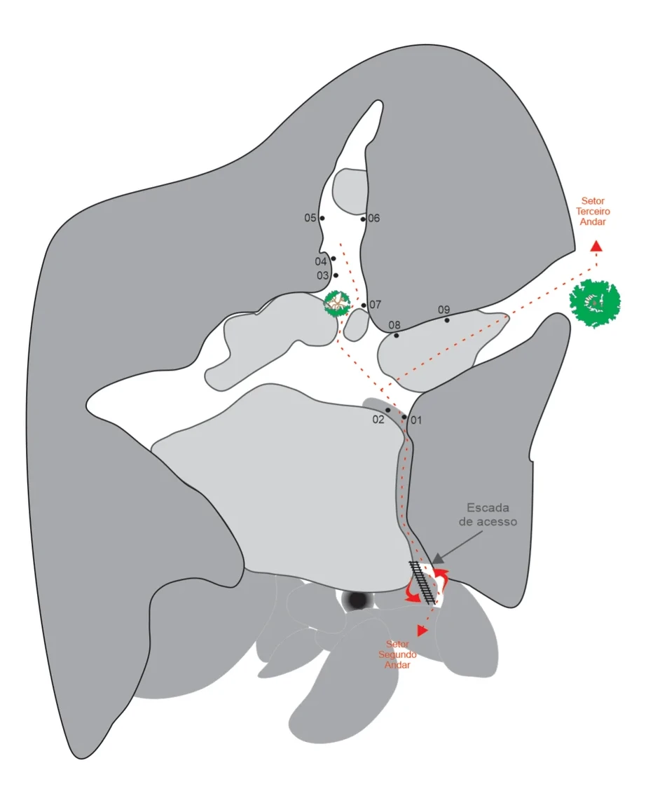
    - **largura_mapa**: 922
    - **altura_mapa**: 1139
    - **pontos_de_interesse**:
      - **[0]**:
        - **id**: Pm4F1BTv2SkgDn
        - **uid**: Pm4F1BTv2SkgDn
        - **rotulo**: Setor Terceiro Andar
        - **retangulo**:
          - **x**: 846
          - **y**: 302
          - **comprimento**: 61
          - **largura**: 55
        - **label**: Setor Terceiro Andar
      - **[1]**:
        - **id**: Q8NYqrdOJoU9KT
        - **uid**: Q8NYqrdOJoU9KT
        - **rotulo**: Setor Segundo Andar
        - **retangulo**:
          - **x**: 566
          - **y**: 935
          - **comprimento**: 65
          - **largura**: 54
        - **label**: Setor Segundo Andar
      - **[2]**:
        - **id**: 6h18CW5de9Ez37
        - **uid**: 6h18CW5de9Ez37
        - **rotulo**: 01
        - **retangulo**:
          - **x**: 594
          - **y**: 599
          - **comprimento**: 22
          - **largura**: 18
        - **label**: 01
      - **[3]**:
        - **id**: j3GAs24UJFH9zp
        - **uid**: j3GAs24UJFH9zp
        - **rotulo**: 02
        - **retangulo**:
          - **x**: 540
          - **y**: 598
          - **comprimento**: 25
          - **largura**: 21
        - **label**: 02
      - **[4]**:
        - **id**: hxKhz99Gkg2bMA
        - **uid**: hxKhz99Gkg2bMA
        - **rotulo**: 03
        - **retangulo**:
          - **x**: 460
          - **y**: 394
          - **comprimento**: 21
          - **largura**: 19
        - **label**: 03
      - **[5]**:
        - **id**: xv78DijtvVRKX6
        - **uid**: xv78DijtvVRKX6
        - **rotulo**: 04
        - **retangulo**:
          - **x**: 458
          - **y**: 372
          - **comprimento**: 21
          - **largura**: 17
        - **label**: 04
      - **[6]**:
        - **id**: r4JZCOVTNGnBgA
        - **uid**: r4JZCOVTNGnBgA
        - **rotulo**: 05
        - **retangulo**:
          - **x**: 444
          - **y**: 310
          - **comprimento**: 21
          - **largura**: 18
        - **label**: 05
      - **[7]**:
        - **id**: I6TRfM8Z1z0LFP
        - **uid**: I6TRfM8Z1z0LFP
        - **rotulo**: 06
        - **retangulo**:
          - **x**: 534
          - **y**: 311
          - **comprimento**: 21
          - **largura**: 20
        - **label**: 06
      - **[8]**:
        - **id**: naYjaa4F7R2Vtd
        - **uid**: naYjaa4F7R2Vtd
        - **rotulo**: 07
        - **retangulo**:
          - **x**: 536
          - **y**: 434
          - **comprimento**: 23
          - **largura**: 21
        - **label**: 07
      - **[9]**:
        - **id**: e2v6HYJ8qZGdp1
        - **uid**: e2v6HYJ8qZGdp1
        - **rotulo**: 08
        - **retangulo**:
          - **x**: 562
          - **y**: 463
          - **comprimento**: 23
          - **largura**: 20
        - **label**: 08
      - **[10]**:
        - **id**: 9ZbfvCIHvR9LF9
        - **uid**: 9ZbfvCIHvR9LF9
        - **rotulo**: 09
        - **retangulo**:
          - **x**: 633
          - **y**: 441
          - **comprimento**: 22
          - **largura**: 18
        - **label**: 09
    - **referencias**:
      - **[0]**:
        - **alvo_uid**: tKoBDTN204A5aQ
        - **pontos_uids**:
          - 6h18CW5de9Ez37
        - **escalada**: (via inacabada)
        - **ids**:
          - 6h18CW5de9Ez37
      - **[1]**:
        - **alvo_uid**: KJrBOHed8L9jqB
        - **pontos_uids**:
          - j3GAs24UJFH9zp
        - **escalada**: Cara de Bunda com Contração
        - **ids**:
          - j3GAs24UJFH9zp
      - **[2]**:
        - **alvo_uid**: soKWhOPKcTuh6N
        - **pontos_uids**:
          - hxKhz99Gkg2bMA
        - **escalada**: (sem nome)
        - **ids**:
          - hxKhz99Gkg2bMA
      - **[3]**:
        - **alvo_uid**: XFTg3L37pioLK9
        - **pontos_uids**:
          - xv78DijtvVRKX6
        - **escalada**: Vida Maria
        - **ids**:
          - xv78DijtvVRKX6
      - **[4]**:
        - **alvo_uid**: skW25EnBt8gGzH
        - **pontos_uids**:
          - r4JZCOVTNGnBgA
        - **escalada**: Mimimi
        - **ids**:
          - r4JZCOVTNGnBgA
      - **[5]**:
        - **alvo_uid**: XaEJaNZFnnbFSF
        - **pontos_uids**:
          - I6TRfM8Z1z0LFP
        - **escalada**: De todos nós
        - **ids**:
          - I6TRfM8Z1z0LFP
      - **[6]**:
        - **alvo_uid**: T9iaQET1cWRr6J
        - **pontos_uids**:
          - naYjaa4F7R2Vtd
        - **escalada**: Cai Mais Não, Zé
        - **ids**:
          - naYjaa4F7R2Vtd
      - **[7]**:
        - **alvo_uid**: USnUIrOfnBlcni
        - **pontos_uids**:
          - e2v6HYJ8qZGdp1
        - **escalada**: Corte Profundo
        - **ids**:
          - e2v6HYJ8qZGdp1
      - **[8]**:
        - **alvo_uid**: qMRLpVPfnw5NN4
        - **pontos_uids**:
          - 9ZbfvCIHvR9LF9
        - **escalada**: Avenida Paulista
        - **ids**:
          - 9ZbfvCIHvR9LF9
      - **[9]**:
        - **alvo_uid**: IuQcqJF8uQ0xNz
        - **pontos_uids**:
          - Q8NYqrdOJoU9KT
        - **setor**: Setor 2º Andar
        - **ids**:
          - Q8NYqrdOJoU9KT
      - **[10]**:
        - **alvo_uid**: xFIkaiWPCCAZxk
        - **pontos_uids**:
          - Pm4F1BTv2SkgDn
        - **setor**: Setor 3º Andar
        - **ids**:
          - Pm4F1BTv2SkgDn
- **escaladas**:
  - **[0]**:
    - **uid**: tKoBDTN204A5aQ
    - **via_esportiva**:
      - **nome**: (via inacabada)
      - **dificuldade**: PROJETO
  - **[1]**:
    - **uid**: KJrBOHed8L9jqB
    - **via_esportiva**:
      - **nome**: Cara de Bunda com Contração
      - **dificuldade**: BR_6SUP
      - **quantidade_protecoes_intermediarias**: 8
      - **quantidade_protecoes_parada**: 2
      - **data_abertura**: 2018-12-06
  - **[2]**:
    - **uid**: soKWhOPKcTuh6N
    - **via_esportiva**:
      - **nome**: (sem nome)
      - **dificuldade**: PROJETO
  - **[3]**:
    - **uid**: XFTg3L37pioLK9
    - **via_esportiva**:
      - **nome**: Vida Maria
      - **dificuldade**: BR_7A_BARRA_7B
      - **destaque**: True
      - **quantidade_protecoes_intermediarias**: 9
      - **quantidade_protecoes_parada**: 2
  - **[4]**:
    - **uid**: skW25EnBt8gGzH
    - **via_esportiva**:
      - **nome**: Mimimi
      - **dificuldade**: PROJETO
      - **quantidade_protecoes_intermediarias**: 11
      - **quantidade_protecoes_parada**: 2
  - **[5]**:
    - **uid**: XaEJaNZFnnbFSF
    - **via_esportiva**:
      - **nome**: De todos nós
      - **dificuldade**: BR_7C
      - **destaque**: True
      - **quantidade_protecoes_intermediarias**: 12
      - **quantidade_protecoes_parada**: 2
  - **[6]**:
    - **uid**: T9iaQET1cWRr6J
    - **via_esportiva**:
      - **nome**: Cai Mais Não, Zé
      - **dificuldade**: BR_7B
      - **destaque**: True
      - **quantidade_protecoes_intermediarias**: 8
      - **quantidade_protecoes_parada**: 2
  - **[7]**:
    - **uid**: USnUIrOfnBlcni
    - **via_esportiva**:
      - **nome**: Corte Profundo
      - **dificuldade**: BR_7A
      - **quantidade_protecoes_intermediarias**: 8
      - **quantidade_protecoes_parada**: 2
  - **[8]**:
    - **uid**: qMRLpVPfnw5NN4
    - **via_esportiva**:
      - **nome**: Avenida Paulista
      - **dificuldade**: BR_7B_BARRA_7C
      - **quantidade_protecoes_intermediarias**: 8
      - **quantidade_protecoes_parada**: 2
- **precomputados**:
  - **total_escaladas**: 9
  - **total_esportivas**: 9

## Parte: setor_3o_andar

### Setor (Pico: Afloramento Rastro)

- **descricao**: Este setor possui sombra o dia todo (variando de acordo com a estação).
- **nome**: Setor 3º Andar
- **uid**: xFIkaiWPCCAZxk
- **mapas**:
  - **[0]**:
    - **caminho_imagem_mapa**: 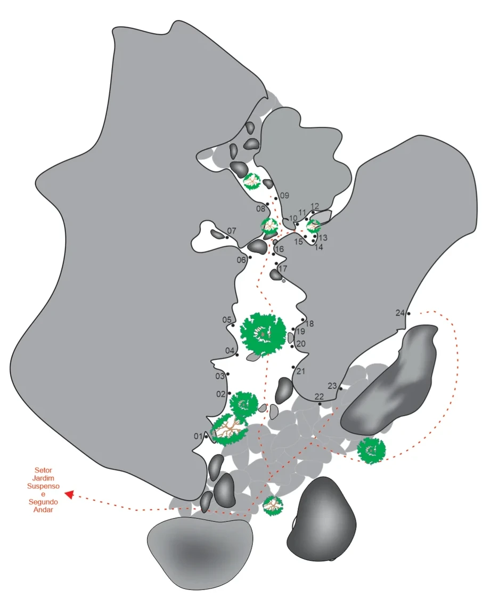
    - **largura_mapa**: 922
    - **altura_mapa**: 1137
    - **pontos_de_interesse**:
      - **[0]**:
        - **id**: u9PeoHyUoiUkNj
        - **uid**: u9PeoHyUoiUkNj
        - **rotulo**: 01
        - **retangulo**:
          - **x**: 372
          - **y**: 818
          - **comprimento**: 26
          - **largura**: 24
        - **label**: 01
      - **[1]**:
        - **id**: 61oYa610ddAuA7
        - **uid**: 61oYa610ddAuA7
        - **rotulo**: 02
        - **retangulo**:
          - **x**: 416
          - **y**: 738
          - **comprimento**: 27
          - **largura**: 25
        - **label**: 02
      - **[2]**:
        - **id**: hU7noklaqydJPG
        - **uid**: hU7noklaqydJPG
        - **rotulo**: 03
        - **retangulo**:
          - **x**: 413
          - **y**: 704
          - **comprimento**: 24
          - **largura**: 24
        - **label**: 03
      - **[3]**:
        - **id**: mFyNitPclY4Mje
        - **uid**: mFyNitPclY4Mje
        - **rotulo**: 04
        - **retangulo**:
          - **x**: 432
          - **y**: 658
          - **comprimento**: 23
          - **largura**: 24
        - **label**: 04
      - **[4]**:
        - **id**: bL2ljLHUdh91jj
        - **uid**: bL2ljLHUdh91jj
        - **rotulo**: 05
        - **retangulo**:
          - **x**: 426
          - **y**: 598
          - **comprimento**: 22
          - **largura**: 21
        - **label**: 05
      - **[5]**:
        - **id**: 9XQnBf5EJYV3h5
        - **uid**: 9XQnBf5EJYV3h5
        - **rotulo**: 06
        - **retangulo**:
          - **x**: 453
          - **y**: 488
          - **comprimento**: 24
          - **largura**: 23
        - **label**: 06
      - **[6]**:
        - **id**: T9JMl3idLHXZHo
        - **uid**: T9JMl3idLHXZHo
        - **rotulo**: 07
        - **retangulo**:
          - **x**: 436
          - **y**: 432
          - **comprimento**: 25
          - **largura**: 25
        - **label**: 07
      - **[7]**:
        - **id**: 7uZG8axbLbzes0
        - **uid**: 7uZG8axbLbzes0
        - **rotulo**: 08
        - **retangulo**:
          - **x**: 490
          - **y**: 391
          - **comprimento**: 25
          - **largura**: 22
        - **label**: 08
      - **[8]**:
        - **id**: EVamd9YdY3UWYR
        - **uid**: EVamd9YdY3UWYR
        - **rotulo**: 09
        - **retangulo**:
          - **x**: 534
          - **y**: 366
          - **comprimento**: 24
          - **largura**: 21
        - **label**: 09
      - **[9]**:
        - **id**: l77JpuWI8qcmFT
        - **uid**: l77JpuWI8qcmFT
        - **rotulo**: 10
        - **retangulo**:
          - **x**: 550
          - **y**: 408
          - **comprimento**: 17
          - **largura**: 17
        - **label**: 10
      - **[10]**:
        - **id**: L27NDevXb2OCmS
        - **uid**: L27NDevXb2OCmS
        - **rotulo**: 11
        - **retangulo**:
          - **x**: 568
          - **y**: 398
          - **comprimento**: 17
          - **largura**: 17
        - **label**: 11
      - **[11]**:
        - **id**: RALamb5PLRgz7s
        - **uid**: RALamb5PLRgz7s
        - **rotulo**: 12
        - **retangulo**:
          - **x**: 592
          - **y**: 386
          - **comprimento**: 20
          - **largura**: 17
        - **label**: 12
      - **[12]**:
        - **id**: P7lgOfDCQSLXF9
        - **uid**: P7lgOfDCQSLXF9
        - **rotulo**: 13
        - **retangulo**:
          - **x**: 608
          - **y**: 446
          - **comprimento**: 21
          - **largura**: 17
        - **label**: 13
      - **[13]**:
        - **id**: fClsL72lYRNgwo
        - **uid**: fClsL72lYRNgwo
        - **rotulo**: 14
        - **retangulo**:
          - **x**: 599
          - **y**: 464
          - **comprimento**: 20
          - **largura**: 18
        - **label**: 14
      - **[14]**:
        - **id**: 6pfTNliT2p7hGa
        - **uid**: 6pfTNliT2p7hGa
        - **rotulo**: 15
        - **retangulo**:
          - **x**: 561
          - **y**: 453
          - **comprimento**: 20
          - **largura**: 18
        - **label**: 15
      - **[15]**:
        - **id**: 1xUiuW79QxOPHe
        - **uid**: 1xUiuW79QxOPHe
        - **rotulo**: 16
        - **retangulo**:
          - **x**: 525
          - **y**: 467
          - **comprimento**: 20
          - **largura**: 18
        - **label**: 16
      - **[16]**:
        - **id**: tuDXOX9HOPcEuy
        - **uid**: tuDXOX9HOPcEuy
        - **rotulo**: 17
        - **retangulo**:
          - **x**: 532
          - **y**: 504
          - **comprimento**: 20
          - **largura**: 18
        - **label**: 17
      - **[17]**:
        - **id**: lqS9tzUSCc3shx
        - **uid**: lqS9tzUSCc3shx
        - **rotulo**: 18
        - **retangulo**:
          - **x**: 582
          - **y**: 606
          - **comprimento**: 18
          - **largura**: 18
        - **label**: 18
      - **[18]**:
        - **id**: NAgjPXp4G4wzm6
        - **uid**: NAgjPXp4G4wzm6
        - **rotulo**: 19
        - **retangulo**:
          - **x**: 565
          - **y**: 622
          - **comprimento**: 18
          - **largura**: 17
        - **label**: 19
      - **[19]**:
        - **id**: pWHay1muP8gfzU
        - **uid**: pWHay1muP8gfzU
        - **rotulo**: 20
        - **retangulo**:
          - **x**: 564
          - **y**: 644
          - **comprimento**: 21
          - **largura**: 19
        - **label**: 20
      - **[20]**:
        - **id**: jThaXWfRp5Di6Q
        - **uid**: jThaXWfRp5Di6Q
        - **rotulo**: 21
        - **retangulo**:
          - **x**: 565
          - **y**: 696
          - **comprimento**: 22
          - **largura**: 22
        - **label**: 21
      - **[21]**:
        - **id**: xLLB2fUUBvZkq1
        - **uid**: xLLB2fUUBvZkq1
        - **rotulo**: 22
        - **retangulo**:
          - **x**: 600
          - **y**: 744
          - **comprimento**: 22
          - **largura**: 21
        - **label**: 22
      - **[22]**:
        - **id**: 1IzWyMG3KPYUjH
        - **uid**: 1IzWyMG3KPYUjH
        - **rotulo**: 23
        - **retangulo**:
          - **x**: 624
          - **y**: 724
          - **comprimento**: 20
          - **largura**: 19
        - **label**: 23
      - **[23]**:
        - **id**: xfCFl4DotcW5wP
        - **uid**: xfCFl4DotcW5wP
        - **rotulo**: 24
        - **retangulo**:
          - **x**: 752
          - **y**: 586
          - **comprimento**: 23
          - **largura**: 19
        - **label**: 24
      - **[24]**:
        - **id**: eoVnVvdsAdeKpX
        - **uid**: eoVnVvdsAdeKpX
        - **rotulo**: Setor Jardim Suspenso e Segundo Andar
        - **retangulo**:
          - **x**: 82
          - **y**: 918
          - **comprimento**: 78
          - **largura**: 98
        - **label**: Setor Jardim Suspenso e Segundo Andar
    - **referencias**:
      - **[0]**:
        - **alvo_uid**: eXYubqgLOUkyBB
        - **pontos_uids**:
          - u9PeoHyUoiUkNj
        - **escalada**: Pinguela de Ema
        - **ids**:
          - u9PeoHyUoiUkNj
      - **[1]**:
        - **alvo_uid**: QjWaZHZVdnoAwK
        - **pontos_uids**:
          - 61oYa610ddAuA7
        - **escalada**: Pilares da Terra
        - **ids**:
          - 61oYa610ddAuA7
      - **[2]**:
        - **alvo_uid**: tlcOItVEooexQs
        - **pontos_uids**:
          - hU7noklaqydJPG
        - **escalada**: Miranoku e Vai
        - **ids**:
          - hU7noklaqydJPG
      - **[3]**:
        - **alvo_uid**: Glwz5j7jFz3ACs
        - **pontos_uids**:
          - mFyNitPclY4Mje
        - **escalada**: Meia Seca
        - **ids**:
          - mFyNitPclY4Mje
      - **[4]**:
        - **alvo_uid**: HPR46M8J1eC6sX
        - **pontos_uids**:
          - bL2ljLHUdh91jj
        - **escalada**: Helicoidal
        - **ids**:
          - bL2ljLHUdh91jj
      - **[5]**:
        - **alvo_uid**: nH9ktM6zZhI4Nb
        - **pontos_uids**:
          - 9XQnBf5EJYV3h5
        - **escalada**: Nem Ladrão Aguenta
        - **ids**:
          - 9XQnBf5EJYV3h5
      - **[6]**:
        - **alvo_uid**: vXsO69BI21fMft
        - **pontos_uids**:
          - T9JMl3idLHXZHo
        - **escalada**: Socorro
        - **ids**:
          - T9JMl3idLHXZHo
      - **[7]**:
        - **alvo_uid**: 9WxjpPSAYIok9u
        - **pontos_uids**:
          - l77JpuWI8qcmFT
        - **escalada**: (via inacabada)
        - **ids**:
          - l77JpuWI8qcmFT
      - **[8]**:
        - **alvo_uid**: XrLAqCeMEdK8ZG
        - **pontos_uids**:
          - L27NDevXb2OCmS
        - **escalada**: Meio Selvagem
        - **ids**:
          - L27NDevXb2OCmS
      - **[9]**:
        - **alvo_uid**: jHGEonefNRRhuR
        - **pontos_uids**:
          - RALamb5PLRgz7s
        - **escalada**: Gengiva de Peixe
        - **ids**:
          - RALamb5PLRgz7s
      - **[10]**:
        - **alvo_uid**: PI5aNW3j5mtjb2
        - **pontos_uids**:
          - P7lgOfDCQSLXF9
        - **escalada**: Ego a Flor da Pele
        - **ids**:
          - P7lgOfDCQSLXF9
      - **[11]**:
        - **alvo_uid**: fG6YbnGwquMufk
        - **pontos_uids**:
          - fClsL72lYRNgwo
        - **escalada**: Liberte Sua Garota Interior
        - **ids**:
          - fClsL72lYRNgwo
      - **[12]**:
        - **alvo_uid**: ovIgEBTlqtFNuO
        - **pontos_uids**:
          - 6pfTNliT2p7hGa
        - **escalada**: Panela de Pressão
        - **ids**:
          - 6pfTNliT2p7hGa
      - **[13]**:
        - **alvo_uid**: QithwPwoOAeqY7
        - **pontos_uids**:
          - 1xUiuW79QxOPHe
        - **escalada**: ka-fedalú
        - **ids**:
          - 1xUiuW79QxOPHe
      - **[14]**:
        - **alvo_uid**: Oh2dfp33zJGF0C
        - **pontos_uids**:
          - tuDXOX9HOPcEuy
        - **escalada**: TNC
        - **ids**:
          - tuDXOX9HOPcEuy
      - **[15]**:
        - **alvo_uid**: eYgN0I7iBDUUaT
        - **pontos_uids**:
          - lqS9tzUSCc3shx
        - **escalada**: Império Galáctico
        - **ids**:
          - lqS9tzUSCc3shx
      - **[16]**:
        - **alvo_uid**: jWOLKrureJC9Xf
        - **pontos_uids**:
          - NAgjPXp4G4wzm6
        - **escalada**: Estrela da Morte
        - **ids**:
          - NAgjPXp4G4wzm6
      - **[17]**:
        - **alvo_uid**: KRVLFNOnYw5UbN
        - **pontos_uids**:
          - pWHay1muP8gfzU
        - **escalada**: Multiplicai a Resista Amém
        - **ids**:
          - pWHay1muP8gfzU
      - **[18]**:
        - **alvo_uid**: ueBGeTSI2KJdRQ
        - **pontos_uids**:
          - jThaXWfRp5Di6Q
        - **escalada**: Cachorrinha Lua
        - **ids**:
          - jThaXWfRp5Di6Q
      - **[19]**:
        - **alvo_uid**: 3XrliPCqewW6P3
        - **pontos_uids**:
          - xLLB2fUUBvZkq1
        - **escalada**: A Primeira de Muitas
        - **ids**:
          - xLLB2fUUBvZkq1
      - **[20]**:
        - **alvo_uid**: WBkhnjr9Sbwtz2
        - **pontos_uids**:
          - 1IzWyMG3KPYUjH
        - **escalada**: E Volta Cão Arrependido
        - **ids**:
          - 1IzWyMG3KPYUjH
      - **[21]**:
        - **alvo_uid**: o2kUFoMVH2yHzk
        - **pontos_uids**:
          - xfCFl4DotcW5wP
        - **escalada**: Exame de Próstata
        - **ids**:
          - xfCFl4DotcW5wP
      - **[22]**:
        - **alvo_uid**: Xxlz6Srh7a9jQT
        - **pontos_uids**:
          - eoVnVvdsAdeKpX
        - **setor**: Setor Jardim Suspenso
        - **ids**:
          - eoVnVvdsAdeKpX
      - **[23]**:
        - **alvo_uid**: IuQcqJF8uQ0xNz
        - **pontos_uids**:
          - eoVnVvdsAdeKpX
        - **setor**: Setor 2º Andar
        - **ids**:
          - eoVnVvdsAdeKpX
      - **[24]**:
        - **alvo_uid**: YwghV98vXhOZrJ
        - **pontos_uids**:
          - 7uZG8axbLbzes0
        - **escalada**: Iara
        - **ids**:
          - 7uZG8axbLbzes0
      - **[25]**:
        - **alvo_uid**: qqwt1pdhPaMoWC
        - **pontos_uids**:
          - EVamd9YdY3UWYR
        - **escalada**: Come Hamburguer
        - **ids**:
          - EVamd9YdY3UWYR
- **escaladas**:
  - **[0]**:
    - **uid**: eXYubqgLOUkyBB
    - **via_esportiva**:
      - **nome**: Pinguela de Ema
      - **dificuldade**: BR_6
      - **quantidade_protecoes_intermediarias**: 6
      - **quantidade_protecoes_parada**: 2
  - **[1]**:
    - **uid**: QjWaZHZVdnoAwK
    - **via_esportiva**:
      - **nome**: Pilares da Terra
      - **dificuldade**: BR_6
      - **quantidade_protecoes_intermediarias**: 8
      - **quantidade_protecoes_parada**: 2
  - **[2]**:
    - **uid**: tlcOItVEooexQs
    - **via_esportiva**:
      - **nome**: Miranoku e Vai
      - **dificuldade**: BR_7C
      - **quantidade_protecoes_intermediarias**: 11
      - **quantidade_protecoes_parada**: 2
  - **[3]**:
    - **uid**: Glwz5j7jFz3ACs
    - **via_esportiva**:
      - **nome**: Meia Seca
      - **dificuldade**: BR_7B
      - **destaque**: True
      - **quantidade_protecoes_intermediarias**: 6
      - **quantidade_protecoes_parada**: 2
  - **[4]**:
    - **uid**: HPR46M8J1eC6sX
    - **via_esportiva**:
      - **nome**: Helicoidal
      - **dificuldade**: BR_7A
      - **destaque**: True
      - **quantidade_protecoes_intermediarias**: 9
      - **quantidade_protecoes_parada**: 2
  - **[5]**:
    - **uid**: nH9ktM6zZhI4Nb
    - **via_esportiva**:
      - **nome**: Nem Ladrão Aguenta
      - **dificuldade**: BR_6SUP
      - **quantidade_protecoes_intermediarias**: 7
      - **quantidade_protecoes_parada**: 2
  - **[6]**:
    - **uid**: vXsO69BI21fMft
    - **via_esportiva**:
      - **nome**: Socorro
      - **dificuldade**: BR_7B
      - **quantidade_protecoes_intermediarias**: 5
      - **quantidade_protecoes_parada**: 2
  - **[7]**:
    - **uid**: YwghV98vXhOZrJ
    - **via_esportiva**:
      - **nome**: Iara
      - **dificuldade**: BR_5SUP
      - **quantidade_protecoes_intermediarias**: 5
      - **quantidade_protecoes_parada**: 2
  - **[8]**:
    - **uid**: qqwt1pdhPaMoWC
    - **via_esportiva**:
      - **nome**: Come Hamburguer
      - **dificuldade**: BR_6
      - **destaque**: True
      - **quantidade_protecoes_intermediarias**: 7
      - **quantidade_protecoes_parada**: 2
  - **[9]**:
    - **uid**: 9WxjpPSAYIok9u
    - **via_esportiva**:
      - **nome**: (via inacabada)
      - **dificuldade**: PROJETO
  - **[10]**:
    - **uid**: XrLAqCeMEdK8ZG
    - **via_esportiva**:
      - **nome**: Meio Selvagem
      - **dificuldade**: BR_7B
      - **destaque**: True
      - **quantidade_protecoes_intermediarias**: 8
      - **quantidade_protecoes_parada**: 2
  - **[11]**:
    - **uid**: jHGEonefNRRhuR
    - **via_esportiva**:
      - **nome**: Gengiva de Peixe
      - **dificuldade**: BR_6
      - **destaque**: True
      - **quantidade_protecoes_intermediarias**: 7
      - **quantidade_protecoes_parada**: 2
  - **[12]**:
    - **uid**: PI5aNW3j5mtjb2
    - **via_esportiva**:
      - **nome**: Ego a Flor da Pele
      - **dificuldade**: BR_5
      - **quantidade_protecoes_intermediarias**: 4
      - **quantidade_protecoes_parada**: 2
      - **data_abertura**: 2018-11-15
  - **[13]**:
    - **uid**: fG6YbnGwquMufk
    - **via_esportiva**:
      - **nome**: Liberte Sua Garota Interior
      - **dificuldade**: BR_4
      - **quantidade_protecoes_intermediarias**: 4
      - **quantidade_protecoes_parada**: 2
      - **data_abertura**: 2018-11-15
  - **[14]**:
    - **uid**: ovIgEBTlqtFNuO
    - **via_esportiva**:
      - **nome**: Panela de Pressão
      - **dificuldade**: BR_6SUP
      - **destaque**: True
      - **quantidade_protecoes_intermediarias**: 5
      - **quantidade_protecoes_parada**: 2
  - **[15]**:
    - **uid**: QithwPwoOAeqY7
    - **via_esportiva**:
      - **nome**: ka-fedalú
      - **dificuldade**: BR_6
      - **quantidade_protecoes_intermediarias**: 8
      - **quantidade_protecoes_parada**: 2
  - **[16]**:
    - **uid**: Oh2dfp33zJGF0C
    - **via_esportiva**:
      - **nome**: TNC
      - **dificuldade**: BR_6SUP
      - **quantidade_protecoes_intermediarias**: 11
      - **quantidade_protecoes_parada**: 2
  - **[17]**:
    - **uid**: eYgN0I7iBDUUaT
    - **via_esportiva**:
      - **nome**: Império Galáctico
      - **dificuldade**: BR_7B
      - **destaque**: True
      - **quantidade_protecoes_intermediarias**: 9
      - **quantidade_protecoes_parada**: 2
  - **[18]**:
    - **uid**: jWOLKrureJC9Xf
    - **via_esportiva**:
      - **nome**: Estrela da Morte
      - **dificuldade**: BR_8A
      - **destaque**: True
      - **quantidade_protecoes_intermediarias**: 10
      - **quantidade_protecoes_parada**: 2
  - **[19]**:
    - **uid**: KRVLFNOnYw5UbN
    - **via_esportiva**:
      - **nome**: Multiplicai a Resista Amém
      - **dificuldade**: BR_7B
      - **destaque**: True
      - **quantidade_protecoes_intermediarias**: 11
      - **quantidade_protecoes_parada**: 2
  - **[20]**:
    - **uid**: ueBGeTSI2KJdRQ
    - **via_esportiva**:
      - **nome**: Cachorrinha Lua
      - **dificuldade**: BR_6
      - **quantidade_protecoes_intermediarias**: 6
      - **quantidade_protecoes_parada**: 2
      - **data_abertura**: 2020-09-11
  - **[21]**:
    - **uid**: 3XrliPCqewW6P3
    - **via_esportiva**:
      - **nome**: A Primeira de Muitas
      - **dificuldade**: BR_7A
      - **quantidade_protecoes_intermediarias**: 7
      - **quantidade_protecoes_parada**: 2
  - **[22]**:
    - **uid**: WBkhnjr9Sbwtz2
    - **via_esportiva**:
      - **nome**: E Volta Cão Arrependido
      - **dificuldade**: BR_6
      - **quantidade_protecoes_intermediarias**: 5
      - **quantidade_protecoes_parada**: 2
  - **[23]**:
    - **uid**: o2kUFoMVH2yHzk
    - **via_esportiva**:
      - **nome**: Exame de Próstata
      - **dificuldade**: BR_5
      - **quantidade_protecoes_intermediarias**: 5
      - **quantidade_protecoes_parada**: 2
- **precomputados**:
  - **total_escaladas**: 24
  - **total_esportivas**: 24

## Arquivos Externos

- **arquivos_externos**:
  - **[0]**:
    - **caminho**: 
    - **checksum_sha256**: 0fd5eb026d2e6f88a6b36ab06f5c286247b289e58fdc41ef1418c6db101a515d
  - **[1]**:
    - **caminho**: 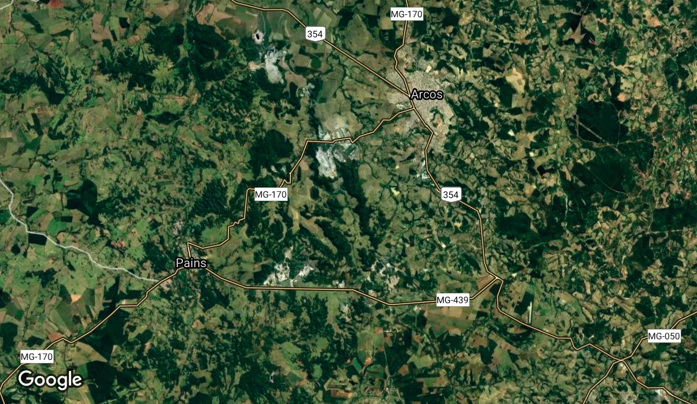
    - **checksum_sha256**: ee229ab027ba2c3dc4c2ef905cb602780479135f3a2883267408019879ed9fd0
  - **[2]**:
    - **caminho**: 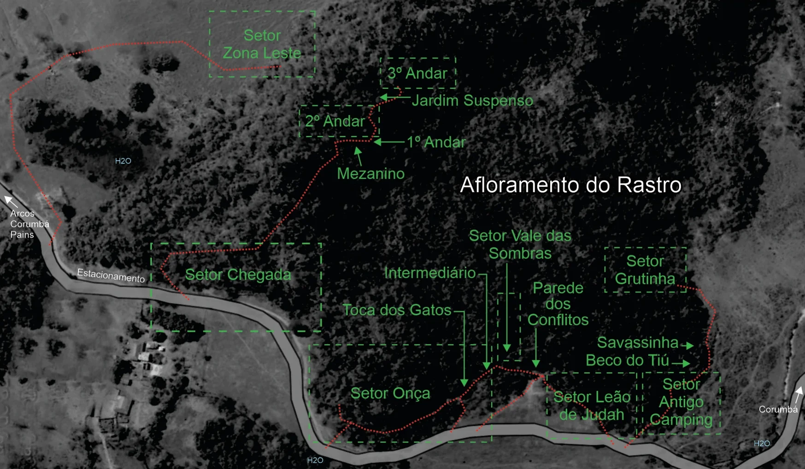
    - **checksum_sha256**: b2b96dda1ad8d0b6bcff4d78977c0d4800f69ed61fed3b5204c958a6f154ef1d
  - **[3]**:
    - **caminho**: 
    - **checksum_sha256**: 63d90792d83a83374ad9e008392dcc49cc16ed9bef41a3e52a86c0b96c83aee4
  - **[4]**:
    - **caminho**: 
    - **checksum_sha256**: 19bd26075853ee106f81ff66d5fab2cb5db9e431fa48b924723f2e44a8c89dc4
  - **[5]**:
    - **caminho**: 
    - **checksum_sha256**: 984974b8cd56a8ddbf273448983fa1bc87f74d3153615110489e77908368e8d8
  - **[6]**:
    - **caminho**: 
    - **checksum_sha256**: 2743bcac0d0ff6c713128b0d62f9f94d43d3c9eead29705d1bb754eff8bae551
  - **[7]**:
    - **caminho**: 
    - **checksum_sha256**: 57fe9f7fffe07d140ca8425de762f69dfbefbc043b2c7df08a10ddbe9dbf9a65
  - **[8]**:
    - **caminho**: 
    - **checksum_sha256**: fe6d5ce186290ec0c5fea00826793d44248a909f9190183467d2fe680643324a
  - **[9]**:
    - **caminho**: 
    - **checksum_sha256**: cc538f5429b118ced4fd38d438bc3dd4906376725d2d358bcec984d97a4b379f
  - **[10]**:
    - **caminho**: 
    - **checksum_sha256**: 6c2ef48126eafd265d17e437a5c68b8197f412c65e4f92e49c50d7f2d706014a
  - **[11]**:
    - **caminho**: 
    - **checksum_sha256**: 8bd694cc88f83c2d5cc6e3a2fcfa182e45cfe18deb8aa0205e442e537557ab14
  - **[12]**:
    - **caminho**: 
    - **checksum_sha256**: 1ce30edd489a4a2c71762d0e307baa1750aabfa792123eef1e24ec56c090fef2
  - **[13]**:
    - **caminho**: 
    - **checksum_sha256**: 763967b2fdb50d07d89a9a98545706cb311272ba92f3dbe5001ff16dd4498bbd
  - **[14]**:
    - **caminho**: 
    - **checksum_sha256**: c8a98514f87c3b594c20290cd2d4c0d8db0527c72c28ced9b04cc635bff422ae
  - **[15]**:
    - **caminho**: 
    - **checksum_sha256**: fbf82f2a505310657c7c22fbd51a849f999730a603b04f7bac14b0ea7a9e75de
  - **[16]**:
    - **caminho**: 
    - **checksum_sha256**: 46da70fbe2189594a1b367bb90c64eaad07dc3f5444399b80f4b485dd181aab3
  - **[17]**:
    - **caminho**: 
    - **checksum_sha256**: 23948cbbdc1fee9905c6bb9f02ff064870dd3c205f3cebe672299da2aa6e3fd8
  - **[18]**:
    - **caminho**: 
    - **checksum_sha256**: de19727a0166be87fcd1a0f71193e7ec34072460c2f38124fb37af97ca797ca1
  - **[19]**:
    - **caminho**: 
    - **checksum_sha256**: 893c077c88898f590e634b98baf99631bb4428d229cac754dadef5106094d2b9
  - **[20]**:
    - **caminho**: 
    - **checksum_sha256**: 5d05640905e70a81183ce12a686b89077fad0e8e5dcad61d97754fe9ca02fab4
  - **[21]**:
    - **caminho**: 
    - **checksum_sha256**: 427bbb0c15906e94687cc2bc6aa3fdd9fd0a3cf4292d40a6dd3b473129c5bc6d

