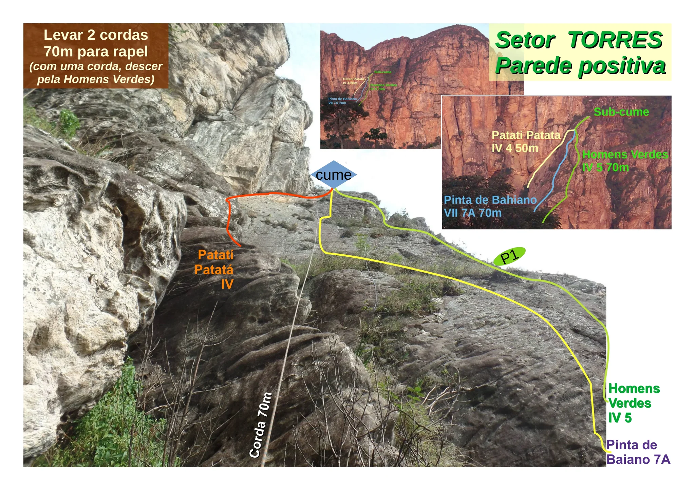
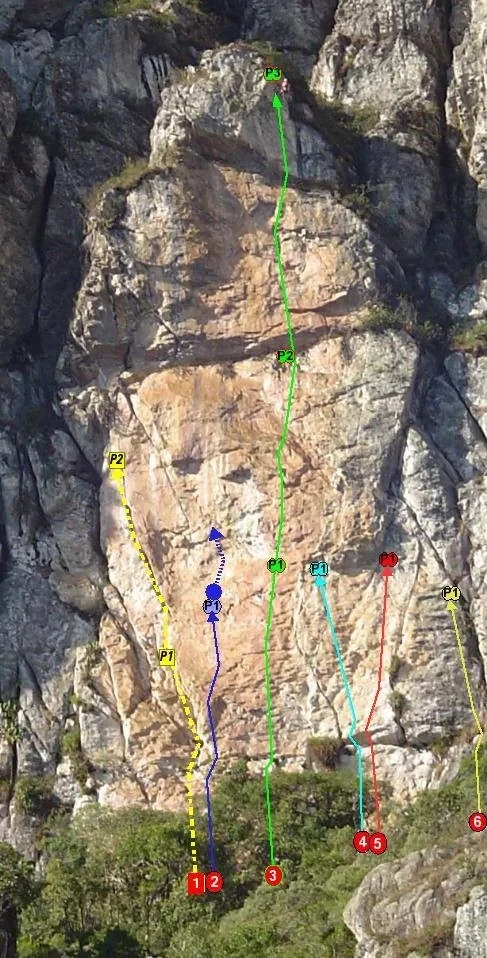
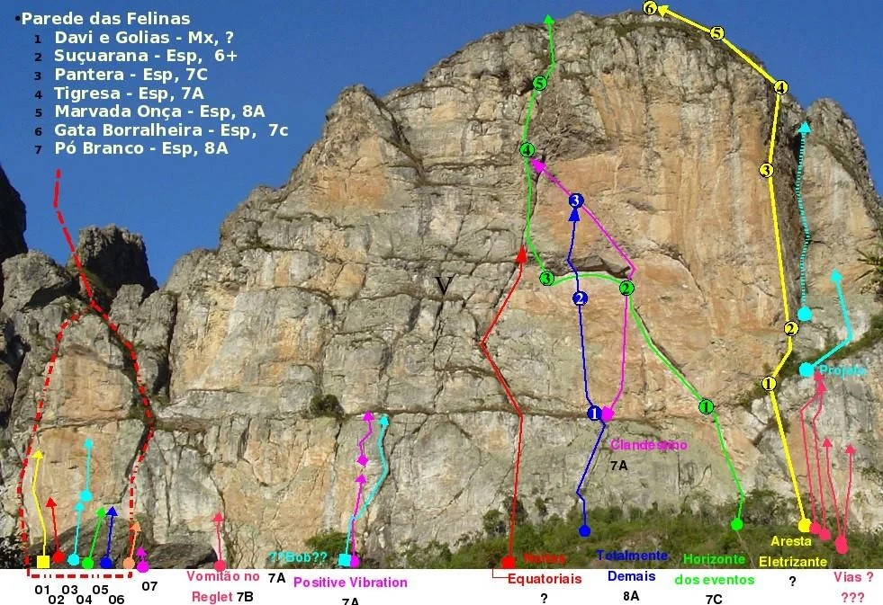
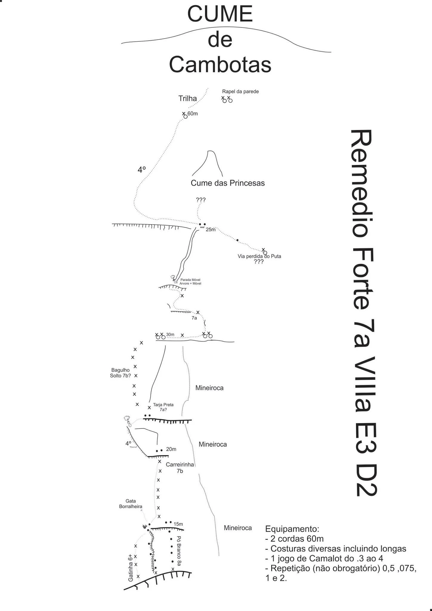
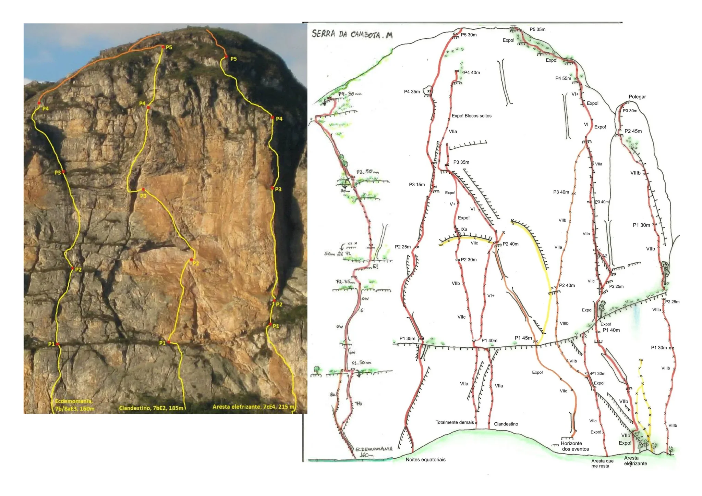
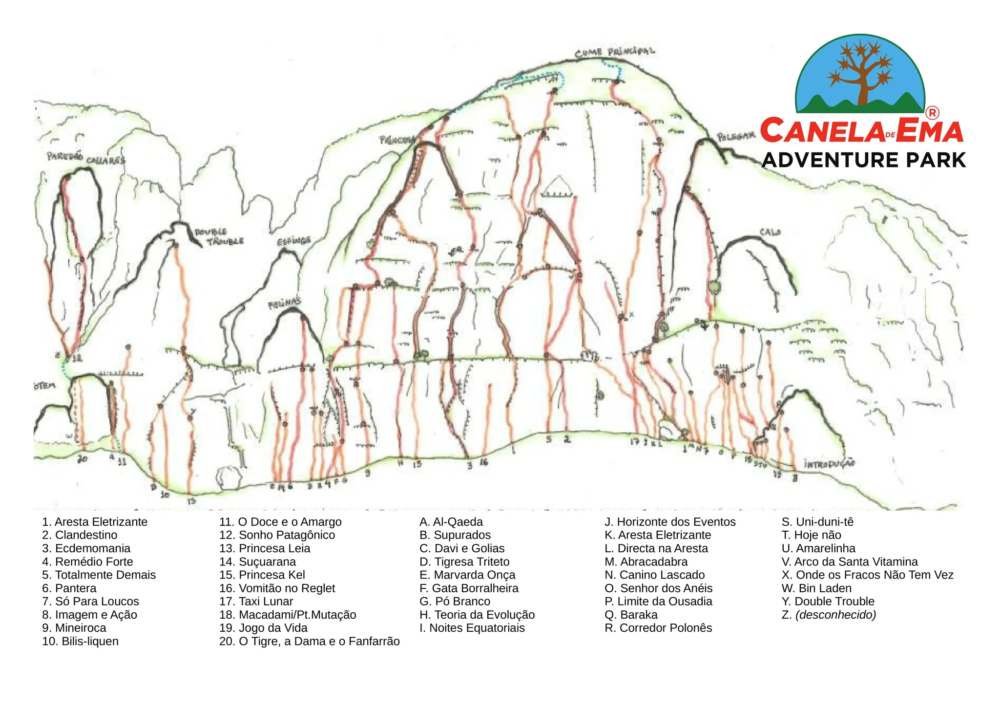
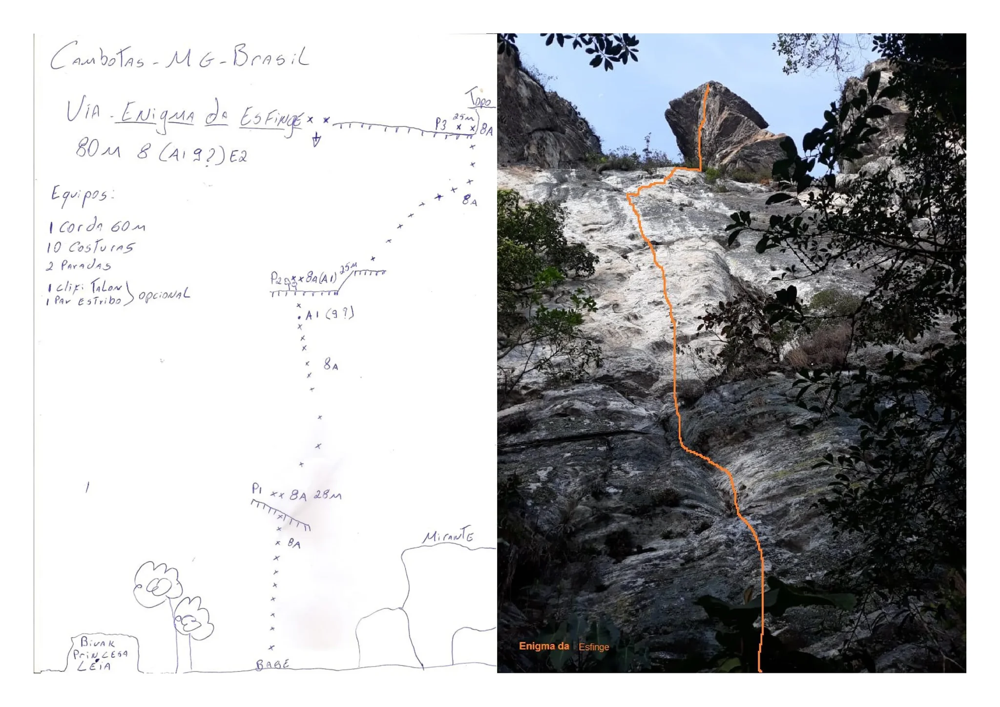
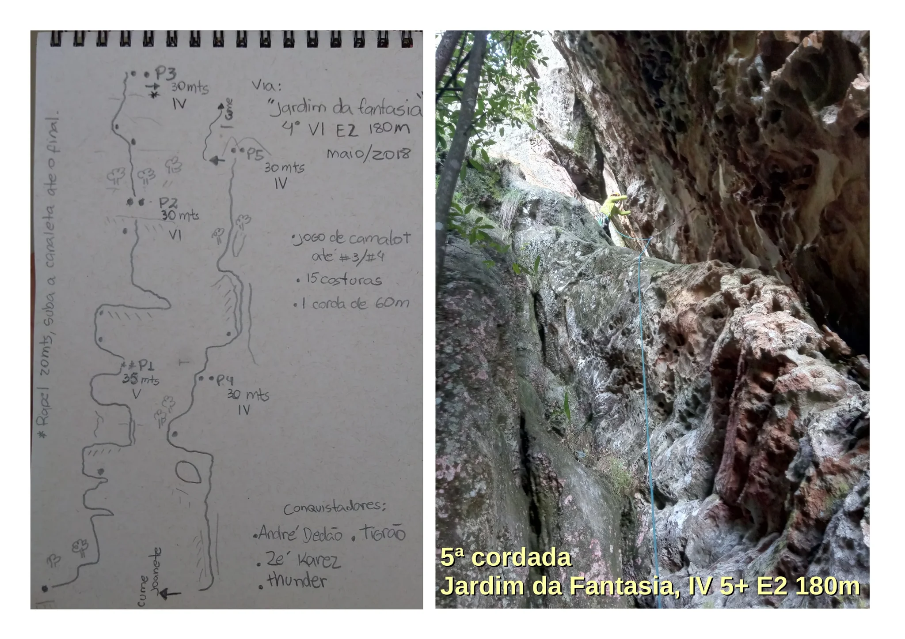

# Croqui: Cambotas

## Informações Gerais

- **descricao**: O complexo de escalada de Cambotas, localizado em Barão de Cocais, MG, é um dos mais tradicionais e desafiadores do estado, oferecendo vias de alta qualidade em quartzito.
- **id**: br_mg_barao_de_cocais_cambotas
- **nome**: Cambotas
- **caminho_thumbnail**: 
- **status_desenho_extraivel**: NAO_TEM_DESENHO
- **botoes**:
  - **[0]**:
    - **texto**: Capa
    - **destino**:
      - **secao_textual**:
        - **conteudo**:
            # CAMBOTAS
            
            ## Serra de Ita-marãen ou Serra do Garimpo
            ### Canela de Ema Adventure Park
            
            |  |
            | :--: |
            | *Capa* |
            
            **Croquiteca edição 07/2019**
            
            **GPS:** 19º53'5290'' 43º32'1188''
            
            **Fotos e Croquis:** Aloysio Carvalho e Gustavo Vianna, exceto onde indicado
  - **[1]**:
    - **texto**: Principais Vias I
    - **destino**:
      - **secao_textual**:
        - **conteudo**:
            # Principais Vias da Serra da Cambota, Caeté, MG.
            
            Esta lista apresenta as principais vias do complexo de Cambotas, abrangendo diferentes setores e estilos. 
            
            |  |
            | :--: |
            | *Setores e Vias Principais* |
  - **[2]**:
    - **texto**: Principais Vias II
    - **destino**:
      - **secao_textual**:
        - **conteudo**:
            # Principais Vias da Serra da Cambota (Mapa Geral)
            
            Este mapa ilustra a localização das principais vias em relação às paredes e setores da Serra da Cambota.
            
            |  |
            | :--: |
            | *Mapa Geral de Vias* |
  - **[3]**:
    - **texto**: Contato
    - **destino**:
      - **secao_textual**:
        - **conteudo**:
            # Contato
            
            **Canela de Ema Adventure Park**
            
            |  |
            | :--: |
            | *Logo* |
            
            - **Telefone (Park):** (31) 99662-2006
            - **WhatsApp:** (31) 99642-2006
            - **Website:** [www.canelaema.com.br](http://www.canelaema.com.br)
            - **E-mail:** comercial@canelaema.com.br
            - **GPS:** 19º53'5290'' 43º32'1188''
            - **Endereço:** Estrada Povoado de Água Limpa / Rodovia MGC 262 (antiga BR262), KM 2,5, Caeté - MG, CEP 34800-000
- **ultima_migracao**: 4

## Parte: setor_chamine

### Setor (Pico: Cambotas)

- **descricao**: # Setor Chaminé
- **nome**: Chaminé
- **mapas**:
  - **[0]**:
    - **caminho_imagem_mapa**: 
    - **largura_mapa**: 1768
    - **altura_mapa**: 605
- **escaladas**:
  - **[0]**:
    - **via_esportiva**:
      - **descricao**: Via difícil, técnica. Agarras abauladas em local sombrio tornam essa via mais delicada. Ótima opção. Molha bastante no verão.
      - **nome**: Bin Laden
      - **dificuldade**: BR_8B
      - **extensao**: 25
      - **conquistadores**:
        - Alexandre 'paulista'
        - Alexandre Fei
- **precomputados**:
  - **total_escaladas**: 1

## Parte: setor_caverninha

### Setor (Pico: Cambotas)

- **descricao**:
    # Setor Caverninha
    
    O setor Caverninha possui algumas das vias mais desafiadoras e interessantes do complexo, incluindo a via "O doce e o amargo".
    
    |  |
    | :--: |
    | *Via 'O doce e o amargo', número 3* |
- **nome**: Caverninha
- **mapas**:
  - **[0]**:
    - **caminho_imagem_mapa**: 
    - **largura_mapa**: 1768
    - **altura_mapa**: 605
- **escaladas**:
  - **[0]**:
    - **via_movel**:
      - **descricao**: Ótima via em fendas e agarras. Crux protegido com grampos. Começa em cima da caverninha usada como abrigo. Peças pequenas e médias.
      - **nome**: Princesa léia
      - **dificuldade**: BR_7A
      - **extensao**: 40
      - **conquistadores**:
        - Antonio Canelas
        - Elaine
  - **[1]**:
    - **via_multiplas_enfiadas**:
      - **descricao**: Começa no final da 'princesa léia'. Exige boa leitura de via e domínio da técnica móvel. Terceira enfiada exposta. Peças médias e grandes.
      - **nome**: Double trouble
      - **dificuldade_maxima**: BR_7B
      - **exposicao**: E3
      - **numero_enfiadas**: 3
      - **tipo_via_multiplas_enfiadas**: MISTA
      - **conquistadores**:
        - André Coutinho
        - Breno Araújo
      - **comprimento_total**: 80
  - **[2]**:
    - **via_movel**:
      - **descricao**: Via mista muito interessante. Possui belas fendas em rocha muito sólida. Peças pequenas e médias. Crux protegido com chapeletas.
      - **nome**: Supurados
      - **dificuldade**: INDEFINIDO
      - **extensao**: 30
      - **conquistadores**:
        - André Coutinho
        - Breno Araújo
  - **[3]**:
    - **via_esportiva**:
      - **descricao**: Talvez a via mai difícil da parede. Crux ainda não foi isolado. Tem um teto espetacular na parte final da via. Muito bonita!
      - **nome**: O doce e o amargo
      - **dificuldade**: BR_9A
      - **extensao**: 60
      - **conquistadores**:
        - Breno Araújo
        - Gustavo Vianna
- **precomputados**:
  - **total_escaladas**: 4

## Parte: setor_torres

### Setor (Pico: Cambotas)

- **descricao**:
    # Setor Torres
    
    O setor Torres possui paredes positivas com vias longas.
    
    **Dicas de Segurança:**
    Levar 2 cordas de 70m para rapel. Com apenas uma corda, descer pela via Homens Verdes.
- **nome**: Torres
- **mapas**:
  - **[0]**:
    - **caminho_imagem_mapa**: 
    - **largura_mapa**: 2048
    - **altura_mapa**: 1448
- **escaladas**:
  - **[0]**:
    - **via_multiplas_enfiadas**:
      - **descricao**: Parede positiva.
      - **nome**: Pinta de Baiano
      - **dificuldade_maxima**: BR_7A
      - **tipo_via_multiplas_enfiadas**: TODA_FIXA
      - **comprimento_total**: 70
  - **[1]**:
    - **via_multiplas_enfiadas**:
      - **descricao**: Parede positiva.
      - **nome**: Homens Verdes
      - **dificuldade_maxima**: BR_5
      - **tipo_via_multiplas_enfiadas**: TODA_FIXA
      - **comprimento_total**: 70
  - **[2]**:
    - **via_multiplas_enfiadas**:
      - **descricao**: Parede positiva.
      - **nome**: Patatí Patatá
      - **dificuldade_maxima**: BR_4
      - **tipo_via_multiplas_enfiadas**: TODA_FIXA
      - **comprimento_total**: 50
  - **[3]**:
    - **via_movel**:
      - **descricao**: Projeto interessante. Possui duas enfiadas em móvel. Paradas também feitas com proteções móveis. Segue um sistema de chaminés de tamanhos variados.
      - **nome**: Projeto?
      - **dificuldade**: BR_4
      - **conquistadores**:
        - Edgardo Abreu
        - Luis Monteiro
- **precomputados**:
  - **total_escaladas**: 4

## Parte: setor_felinas

### Setor (Pico: Cambotas)

- **descricao**: # Setor Felinas
- **nome**: Felinas
- **mapas**:
  - **[0]**:
    - **caminho_imagem_mapa**: 
    - **largura_mapa**: 487
    - **altura_mapa**: 958
  - **[1]**:
    - **caminho_imagem_mapa**: 
    - **largura_mapa**: 981
    - **altura_mapa**: 673
- **escaladas**:
  - **[0]**:
    - **via_multiplas_enfiadas**:
      - **descricao**: Via técnica e exigente.
      - **nome**: Remedio Forte
      - **dificuldade_maxima**: BR_7A
      - **exposicao**: E3
      - **duracao**: D2
      - **mapas**:
        - **[0]**:
          - **caminho_imagem_mapa**: 
          - **largura_mapa**: 1448
          - **altura_mapa**: 2048
      - **equipamento_recomendado**: Costuras diversas incluindo longas, 1 jogo de Camalot do .3 ao 4, repetição (não obrigatório) 0,5, .075, 1 e 2. Levar 2 cordas de 60m.
  - **[1]**:
    - **via_esportiva**:
      - **descricao**: Via exigente, boulderistica. Molha no verão.
      - **nome**: Pó branco
      - **dificuldade**: BR_8A
      - **extensao**: 20
      - **conquistadores**:
        - Alexandre fei
        - Aloysio Carvalho
  - **[2]**:
    - **via_esportiva**:
      - **descricao**: Via interessante com belas passadas em canaleta. Bastante técnica, molha bastante no verão, tornando impraticável a escalada nos meses mais úmidos.
      - **nome**: Gata borralheira
      - **dificuldade**: BR_7C
      - **extensao**: 30
      - **conquistadores**:
        - Alez
        - Toninho
        - Aloysio Carvalho
        - Gustavo Pianc
  - **[3]**:
    - **via_esportiva**:
      - **descricao**: Via técnica com um pequeno teto no meio. Uma das mais frequentadas da parede.
      - **nome**: Marvada onça
      - **dificuldade**: BR_7C
      - **extensao**: 30
      - **conquistadores**:
        - Gustavo Pianc.
  - **[4]**:
    - **via_esportiva**:
      - **descricao**: Mistura técnica e resistência em bela passadas. Possui dois tetos. A primeira proteção após o segundo teto deve ser trocada.
      - **nome**: Tigresa
      - **dificuldade**: BR_8A_BARRA_8B
      - **extensao**: 50
      - **conquistadores**:
        - Gustavo Pianc
        - Aloysio Carvalho
        - Fábio Pavesi
  - **[5]**:
    - **via_esportiva**:
      - **descricao**: Técnica e forte. Talvez a via mais frequentada da parede. Muito estética!
      - **nome**: Pantera
      - **dificuldade**: BR_8B
      - **extensao**: 90
      - **conquistadores**:
        - Gustavo Pianc
        - Aloysio Carvalho
        - Marcus Vinicius
        - Alexandre Fei
  - **[6]**:
    - **via_esportiva**:
      - **descricao**: Via fixa mais acessível de todo o complexo. Bastante frequentada.
      - **nome**: Suçuarana
      - **dificuldade**: BR_7A
      - **extensao**: 40
      - **conquistadores**:
        - Gustavo Piancastelli
  - **[7]**:
    - **via_movel**:
      - **descricao**: Bem fácil no inicio, tem um crux no meio protegido com P's e depois um presente com belas sequencias em fenda frontal pouco vistas em MG. Termina em um grampo. Peças pequenas e médias.
      - **nome**: Davi e Golias
      - **dificuldade**: BR_7B
      - **extensao**: 30
      - **conquistadores**:
        - Chander Christian
        - Eustáquio Macedo
  - **[8]**:
    - **via_esportiva**:
      - **descricao**: Top feito no final da 'davi e golias'. A via começa à direita do poço d'água.
      - **nome**: O resgate do amigo
      - **dificuldade**: BR_6SUP
      - **extensao**: 30
      - **conquistadores**:
        - Gustavo Vianna
        - Carlos Diniz
- **precomputados**:
  - **total_escaladas**: 9

## Parte: setor_fendas

### Setor (Pico: Cambotas)

- **descricao**: # Setor Fendas
- **nome**: Fendas
- **mapas**:
  - **[0]**:
    - **caminho_imagem_mapa**: 
    - **largura_mapa**: 1768
    - **altura_mapa**: 605
- **escaladas**:
  - **[0]**:
    - **via_multiplas_enfiadas**:
      - **descricao**: Segue sistema de fendas principal da parede. Exige boa leitura de via.
      - **nome**: Noites equatoriais
      - **dificuldade_maxima**: BR_7A
      - **exposicao**: E3
      - **tipo_via_multiplas_enfiadas**: MISTA
      - **equipamento_recomendado**: Rack completo de equipamentos móveis.
      - **conquistadores**:
        - Fabiano Fernandes
        - Wagner
        - Pedro Leite
        - Gustavo Piancastelli
      - **comprimento_total**: 200
  - **[1]**:
    - **via_esportiva**:
      - **descricao**: Via vertical e pequenos regletes. Boa opção, mas molha no verão.
      - **nome**: Vomitão no reglete
      - **dificuldade**: BR_7B
      - **extensao**: 30
      - **conquistadores**:
        - Fabiano Fernandes
        - Wagner
  - **[2]**:
    - **via_esportiva**:
      - **nome**: Soul rebel
      - **dificuldade**: BR_7B
      - **extensao**: 30
      - **conquistadores**:
        - Gustavo Piancastelli
  - **[3]**:
    - **via_movel**:
      - **descricao**: Boa via com fenda no final que pode ser protegida com cam #2 ou similar. Atenção com abelhas próximo da via, à esquerda.
      - **nome**: Positive vibration
      - **dificuldade**: BR_7A
      - **extensao**: 40
      - **conquistadores**:
        - Gustavo Piancastelli
  - **[4]**:
    - **via_multiplas_enfiadas**:
      - **descricao**: Começa no final da 'Positive vibration'. Faz o cume isolado à direita da parede principal. Grampos somente nas paradas.
      - **nome**: Princesa Kel
      - **dificuldade_maxima**: INDEFINIDO
      - **tipo_via_multiplas_enfiadas**: TODA_MOVEL
      - **conquistadores**:
        - Gustavo Piancastelli
        - Leonardo Tangari
      - **comprimento_total**: 120
- **precomputados**:
  - **total_escaladas**: 5

## Parte: setor_arco

### Setor (Pico: Cambotas)

- **descricao**:
    # Setor Arco
    
    O setor Arco abriga algumas das vias mais longas e estéticas de Cambotas, com linhas que desafiam o escalador em tetos e fendas impressionantes.
- **nome**: Arco
- **mapas**:
  - **[0]**:
    - **caminho_imagem_mapa**: 
    - **largura_mapa**: 2048
    - **altura_mapa**: 1448
- **escaladas**:
  - **[0]**:
    - **via_multiplas_enfiadas**:
      - **descricao**: Via muito exigente que corta a parede principal na sua parte mais negativa. Começa na 'aresta que me resta' e termina na 'aresta eletrizante'.
      - **nome**: Onde os fracos não tem vez
      - **dificuldade_maxima**: BR_8B
      - **exposicao**: E3
      - **tipo_via_multiplas_enfiadas**: TODA_FIXA
      - **conquistadores**:
        - André Coutinho
        - Breno Araújo
      - **comprimento_total**: 130
  - **[1]**:
    - **via_multiplas_enfiadas**:
      - **descricao**: Primeira via da parede. Segue linha natural de fendas e chaminés até a base do arco. Peças médias e grandes, inclusive cam's 3,5 e 4 ou similares.
      - **nome**: Horizonte dos eventos
      - **dificuldade_maxima**: BR_7C
      - **exposicao**: E3
      - **tipo_via_multiplas_enfiadas**: MISTA
      - **conquistadores**:
        - Daniel Mariano
        - Mateus Carneiro
      - **comprimento_total**: 100
  - **[2]**:
    - **via_movel**:
      - **descricao**: Via em arco horizontal. Peças médias e grandes. Cam 4 e 5 ou similares.
      - **nome**: Arco da Santa vitamina
      - **dificuldade**: BR_7C
      - **extensao**: 25
      - **conquistadores**:
        - Gustavo Piancastelli
        - Matheus
  - **[3]**:
    - **via_movel**:
      - **descricao**: Via inacabada que atravessa a parede principal passando por um belo arco. Linha muito estética e que deve se tornar uma das mais bonitas escaladas do lugar.
      - **nome**: Malateus?
      - **dificuldade**: INDEFINIDO
      - **conquistadores**:
        - Matheus (SP)
  - **[4]**:
    - **via_multiplas_enfiadas**:
      - **descricao**: Boa opção de via longa para um fim de tarde. Para fazer a quarta enfiada deixar corda fixa em P3. Usar fitas longas, especialmente na 3ª e 4ª enfiadas. 4ª enfiada exige bastante atenção. Rapel de P3 até P1 com corda de 60m. Com corda de 50m deve-se fixar entre P3 e P2 ou fracionar o rapel até P1.
      - **nome**: Clandestino
      - **dificuldade_maxima**: BR_7A
      - **exposicao**: E3
      - **tipo_via_multiplas_enfiadas**: TODA_FIXA
      - **conquistadores**:
        - André Coutinho
        - Breno Araújo
        - Gustavo Vianna
      - **comprimento_total**: 160
  - **[5]**:
    - **via_multiplas_enfiadas**:
      - **descricao**: Linda via que corta o arco em grande teto protegido com chapeletas.
      - **nome**: Totalmente demais
      - **dificuldade_maxima**: BR_9B
      - **dificuldade_artificial**: A0
      - **exposicao**: E3
      - **tipo_via_multiplas_enfiadas**: TODA_FIXA
      - **conquistadores**:
        - Aloysio Carvalho
        - Gustavo Vianna
        - Gustavo Piancastelli
      - **comprimento_total**: 150
- **precomputados**:
  - **total_escaladas**: 6

## Parte: setor_aresta

### Setor (Pico: Cambotas)

- **descricao**:
    # Setor Aresta
    
    O setor Aresta é famoso pela imponente "Aresta Eletrizante", uma via de 200 metros que é um marco na escalada mineira.
    
    |  |
    | :--: |
    | *Aresta Eletrizante* |
- **nome**: Aresta
- **mapas**:
  - **[0]**:
    - **caminho_imagem_mapa**: 
    - **largura_mapa**: 2048
    - **altura_mapa**: 1448
- **escaladas**:
  - **[0]**:
    - **via_esportiva**:
      - **descricao**: Bela via em agarras, bastante negativa. Tem um interessante bote no inicio que pode ser previamente protegido pela chaminé. Equipada com chapeletas.
      - **nome**: Macadame
      - **dificuldade**: BR_8B
      - **extensao**: 30
      - **conquistadores**:
        - Gustavo Vianna
        - Marcus Vinicius
  - **[1]**:
    - **via_movel**:
      - **descricao**: Interessante via em fenda. O crux é protegido com P's. Peças variadas médias e grandes.
      - **nome**: Limite da ousadia
      - **dificuldade**: BR_9A
      - **extensao**: 30
      - **conquistadores**:
        - Gustavo Piancastelli
        - Gustavo Vianna
  - **[2]**:
    - **via_movel**:
      - **descricao**: Diedro perfeito que começa à esquerda do final da 'macadame'. Friends pequenos e médios. Nuts grandes.
      - **nome**: Diedro urso branco (var.)
      - **dificuldade**: INDEFINIDO
      - **extensao**: 13
      - **conquistadores**:
        - Gustavo Piancastelli
        - Gustavo Vianna
        - Marcus Vinicius
  - **[3]**:
    - **via_multiplas_enfiadas**:
      - **descricao**: Via forte, de resistência. Pode ser feita em duas enfiadas. As duas paradas possuem mosquetões de aço pra desequipagem. Usar costuras longas.
      - **nome**: Só para loucos
      - **dificuldade_maxima**: BR_8B
      - **numero_enfiadas**: 2
      - **tipo_via_multiplas_enfiadas**: TODA_FIXA
      - **conquistadores**:
        - Breno Araújo
        - Gustavo Vianna
        - Marcus Vinicius
      - **comprimento_total**: 55
  - **[4]**:
    - **via_esportiva**:
      - **descricao**: Bonita via com um teto no meio. A parte superior, após o teto molha em determinadas épocas do ano.
      - **nome**: Canino quebrado
      - **dificuldade**: BR_7B
      - **extensao**: 25
      - **conquistadores**:
        - Juan Kempen
        - Vinicius
  - **[5]**:
    - **via_esportiva**:
      - **descricao**: Bela via, muito estética. Compartilha a primeira proteção com a 'canino quebrado'. Segue em diagonal pra esquerda. Top na proteção do teto.
      - **nome**: Vinicius?
      - **dificuldade**: BR_6SUP
      - **extensao**: 20
      - **conquistadores**:
        - Juan Kempen
        - Vinicius
  - **[6]**:
    - **via_multiplas_enfiadas**:
      - **descricao**: Via espetacular. Uma das mais clássicas e mais bonitas escaladas do estado. Exigente no inicio e exposta no final. Segue a aresta principal da parede num visual incrível. Exige boa leitura especialmente próximo ao cume. Indispensável um croqui para repetição. Chapeletas com spits na primeira enfiada, nas demais P's de 1/2 pol. Excentric grande, um jogo de friends e nuts na primeira enfiada.
      - **nome**: Aresta eletrizante
      - **dificuldade_maxima**: BR_7C
      - **exposicao**: E3
      - **tipo_via_multiplas_enfiadas**: MISTA
      - **conquistadores**:
        - Gustavo Vianna
        - Edgardo Abreu
        - Adriano Barroso
        - Pablo Almeida
        - André Braga
        - Rodrigo (PR)
      - **comprimento_total**: 200
  - **[7]**:
    - **via_esportiva**:
      - **descricao**: Boa via, bastante técnica em micro agarras.
      - **nome**: Aresta que me resta
      - **dificuldade**: BR_7B
      - **extensao**: 40
      - **conquistadores**:
        - Gustavo Piancastelli
  - **[8]**:
    - **via_movel**:
      - **descricao**: Fenda em diagonal que une as duas vias anteriores. Peças médias.
      - **nome**: Aresta que me eletriza (var.)
      - **dificuldade**: BR_7C
      - **dificuldade_artificial**: A1_MAIS
      - **extensao**: 10
      - **conquistadores**:
        - Gustavo Vianna
        - Gustavo Piancastelli
- **precomputados**:
  - **total_escaladas**: 9

## Parte: setor_polegar

### Setor (Pico: Cambotas)

- **descricao**:
    # Setor Polegar
    
    O setor Polegar apresenta vias que exploram as arestas e chaminés desta formação característica.
    
    |  |
    | :--: |
    | *Visão do Polegar* |
- **nome**: Polegar
- **mapas**:
  - **[0]**:
    - **caminho_imagem_mapa**: 
    - **largura_mapa**: 2048
    - **altura_mapa**: 1448
- **escaladas**:
  - **[0]**:
    - **via_multiplas_enfiadas**:
      - **descricao**: Linda via que segue a aresta direita do polegar. Ultima enfiada móvel. Peças variadas, especialmente médias.
      - **nome**: Quadrado mágico
      - **dificuldade_maxima**: BR_8A
      - **tipo_via_multiplas_enfiadas**: MISTA
      - **conquistadores**:
        - Alexandre Fei
        - Gustavo Piancastelli
      - **comprimento_total**: 100
  - **[1]**:
    - **via_esportiva**:
      - **descricao**: Via inacabada.
      - **nome**: Projeto?
      - **dificuldade**: INDEFINIDO
      - **conquistadores**:
        - Antonio Canelas
        - Elaine
  - **[2]**:
    - **via_esportiva**:
      - **descricao**: Projeto na grande chaminé entre o Polegar e a parede principal.
      - **nome**: Projeto?
      - **dificuldade**: INDEFINIDO
      - **conquistadores**:
        - Gustavo Piancastelli
- **precomputados**:
  - **total_escaladas**: 3

## Parte: setor_totem

### Setor (Pico: Cambotas)

- **descricao**:
    # Setor Totem
    
    O setor Totem é uma formação isolada com vias técnicas e estéticas.
    
    |  |
    | :--: |
    | *Visão do Totem* |
- **nome**: Totem
- **mapas**:
  - **[0]**:
    - **caminho_imagem_mapa**: 
    - **largura_mapa**: 2048
    - **altura_mapa**: 1448
- **escaladas**:
  - **[0]**:
    - **via_esportiva**:
      - **descricao**: Via perigosa, muitas pontas quebradiças. Usar fitas longas. Molha em época de chuvas. Usa-se o top da 'imagem e ação'.
      - **nome**: Quebra cabeça
      - **dificuldade**: BR_6SUP
      - **exposicao**: E3
      - **extensao**: 20
      - **conquistadores**:
        - Gustavo Vianna
        - Tatiana Mascarenhas
  - **[1]**:
    - **via_esportiva**:
      - **descricao**: Linda via. Escalada bastante estética em aresta negativa. Proporciona belas imagens. Top equipado com mosquetões de aço para desequipagem da via.
      - **nome**: Imagem e ação
      - **dificuldade**: BR_7B
      - **extensao**: 20
      - **conquistadores**:
        - Gustavo Vianna
        - Tatiana Mascarenhas
- **precomputados**:
  - **total_escaladas**: 2

## Parte: setor_enigma_da_esfinge

### Setor (Pico: Cambotas)

- **descricao**:
    # Setor Enigma da Esfinge
    
    O setor é composto pela via homônima, uma linha desafiadora que combina escalada livre técnica com trechos de artificial.
- **nome**: Enigma da Esfinge
- **mapas**:
  - **[0]**:
    - **caminho_imagem_mapa**: 
    - **largura_mapa**: 2048
    - **altura_mapa**: 1448
- **escaladas**:
  - **[0]**:
    - **via_multiplas_enfiadas**:
      - **descricao**: Via técnica com trechos em artificial.
      - **nome**: Enigma da Esfinge
      - **dificuldade_maxima**: BR_8A
      - **dificuldade_artificial**: A1
      - **dificuldade_artificial_em_livre**: BR_9A
      - **exposicao**: E2
      - **numero_enfiadas**: 3
      - **tipo_via_multiplas_enfiadas**: MISTA
      - **equipamento_recomendado**: 1 corda 60m, 10 costuras, 2 paradas. Opcional: 1 clif talon, 1 par estribo.
      - **comprimento_total**: 80
- **precomputados**:
  - **total_escaladas**: 1

## Parte: setor_jardim_da_fantasia

### Setor (Pico: Cambotas)

- **descricao**:
    # Setor Jardim da Fantasia
    
    O setor Jardim da Fantasia é composto pela via de 180 metros que percorre uma linha impressionante na parede.
- **nome**: Jardim da Fantasia
- **mapas**:
  - **[0]**:
    - **caminho_imagem_mapa**: 
    - **largura_mapa**: 2048
    - **altura_mapa**: 1448
- **escaladas**:
  - **[0]**:
    - **via_multiplas_enfiadas**:
      - **descricao**: Via longa com 5 enfiadas, alternando entre escalada livre e móvel.
      - **nome**: Jardim da Fantasia
      - **dificuldade_maxima**: BR_6
      - **exposicao**: E2
      - **numero_enfiadas**: 5
      - **tipo_via_multiplas_enfiadas**: MISTA
      - **equipamento_recomendado**: Jogo de camalot até #3/#4, 15 costuras, 1 corda de 60m. Rapel 20m, subir a canaleta até o final.
      - **conquistadores**:
        - André Dedão
        - Tigrão
        - Zé Karez
        - Thunder
      - **data_abertura**: 2018-05
      - **comprimento_total**: 180
- **precomputados**:
  - **total_escaladas**: 1

## Arquivos Externos

- **arquivos_externos**:
  - **[0]**:
    - **caminho**: 
    - **checksum_sha256**: 68e86d58f05be03b3a01fe75063c0eca1a6458b48fe66a1e866b30792c6eca5f
  - **[1]**:
    - **caminho**: 
    - **checksum_sha256**: 550c0c8b169533704c4c18ef8221ce9541cc726a179ec8671cfb62cce57de6b7
  - **[2]**:
    - **caminho**: 
    - **checksum_sha256**: d684ba2192bfdc5a04a28593dacc114d0e70d76e8c2b3b36f9f15aeeba1eb7e1
  - **[3]**:
    - **caminho**: 
    - **checksum_sha256**: 60f36fbc6f8fc7c2ee4aa55a64338a49b70ac9273f06ad65a75637797b8c2956
  - **[4]**:
    - **caminho**: 
    - **checksum_sha256**: 60f36fbc6f8fc7c2ee4aa55a64338a49b70ac9273f06ad65a75637797b8c2956
  - **[5]**:
    - **caminho**: 
    - **checksum_sha256**: 1e8c993fcdee0d2bd324fe8f1d531c564b77e8ab9c9f4f40de3e1a30b6f58cfe
  - **[6]**:
    - **caminho**: 
    - **checksum_sha256**: d684ba2192bfdc5a04a28593dacc114d0e70d76e8c2b3b36f9f15aeeba1eb7e1
  - **[7]**:
    - **caminho**: 
    - **checksum_sha256**: 5d656068a1676229112e26176eb959ccc41a12722015183316ed9f287c5f15bb
  - **[8]**:
    - **caminho**: 
    - **checksum_sha256**: d684ba2192bfdc5a04a28593dacc114d0e70d76e8c2b3b36f9f15aeeba1eb7e1
  - **[9]**:
    - **caminho**: 
    - **checksum_sha256**: 7b87acd641a5a5b809daefbb70dab4cdb742c8a969dc8fbcf14bfda4055528c9
  - **[10]**:
    - **caminho**: 
    - **checksum_sha256**: 77559742081d8d86db5de5b5233ec5850bb94e6a9688275481347515fda33e96
  - **[11]**:
    - **caminho**: 
    - **checksum_sha256**: 4be92396b2a47e9df65a8863e9851475720f206f3df62d2e4a36efd0100e37ec
  - **[12]**:
    - **caminho**: 
    - **checksum_sha256**: 199462b22c4fd2595da5b0f5b36689b3c13495dff00bc4c9b3881ca358231999
  - **[13]**:
    - **caminho**: 
    - **checksum_sha256**: d684ba2192bfdc5a04a28593dacc114d0e70d76e8c2b3b36f9f15aeeba1eb7e1
  - **[14]**:
    - **caminho**: 
    - **checksum_sha256**: 5e531035be67b6dc96a5eb5895c6cff501a5a4075a8d77dda5f1d5b9733cf0dc
  - **[15]**:
    - **caminho**: 
    - **checksum_sha256**: f4333807a45a7f5183bfb68d06939a5ae0372534310cf6afb03c66e6c5833f6d
  - **[16]**:
    - **caminho**: 
    - **checksum_sha256**: c56a5ef8f496a254f95e9770bd64354ccd766eb34b2ea82295833d30fd74d2bd
  - **[17]**:
    - **caminho**: 
    - **checksum_sha256**: c56a5ef8f496a254f95e9770bd64354ccd766eb34b2ea82295833d30fd74d2bd
  - **[18]**:
    - **caminho**: 
    - **checksum_sha256**: dc353ac5c0e2311ea2e8e2e1cc68ed4115d33aeaa208035a4d278a5f87f69881
  - **[19]**:
    - **caminho**: 
    - **checksum_sha256**: f4333807a45a7f5183bfb68d06939a5ae0372534310cf6afb03c66e6c5833f6d
  - **[20]**:
    - **caminho**: 
    - **checksum_sha256**: c56a5ef8f496a254f95e9770bd64354ccd766eb34b2ea82295833d30fd74d2bd

