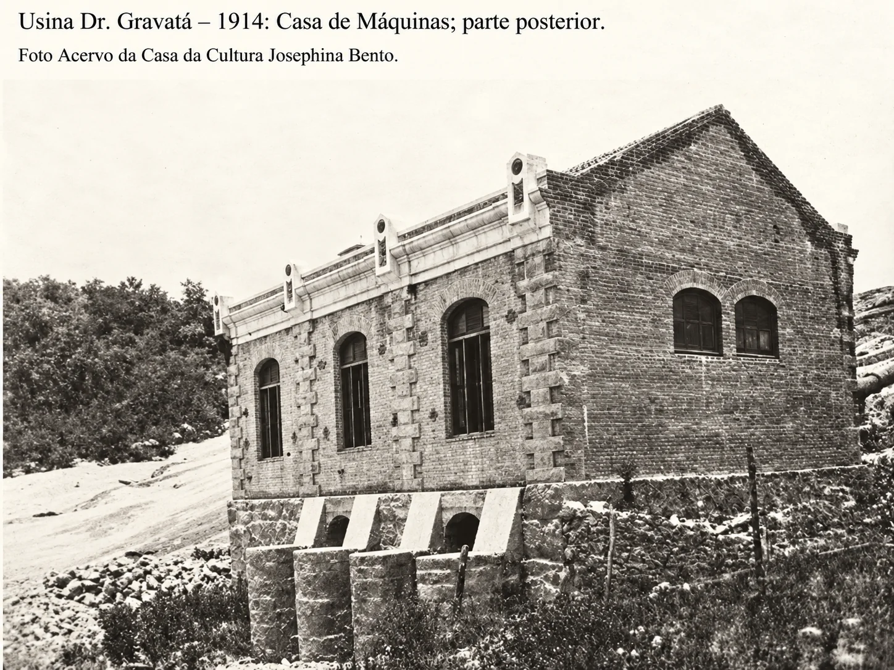
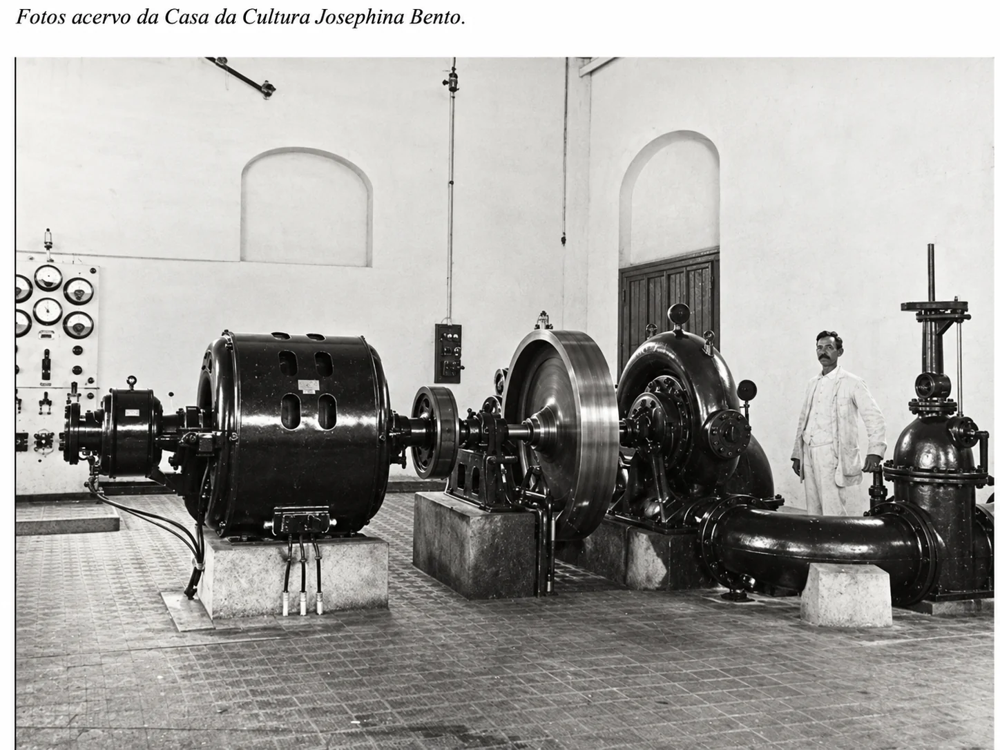
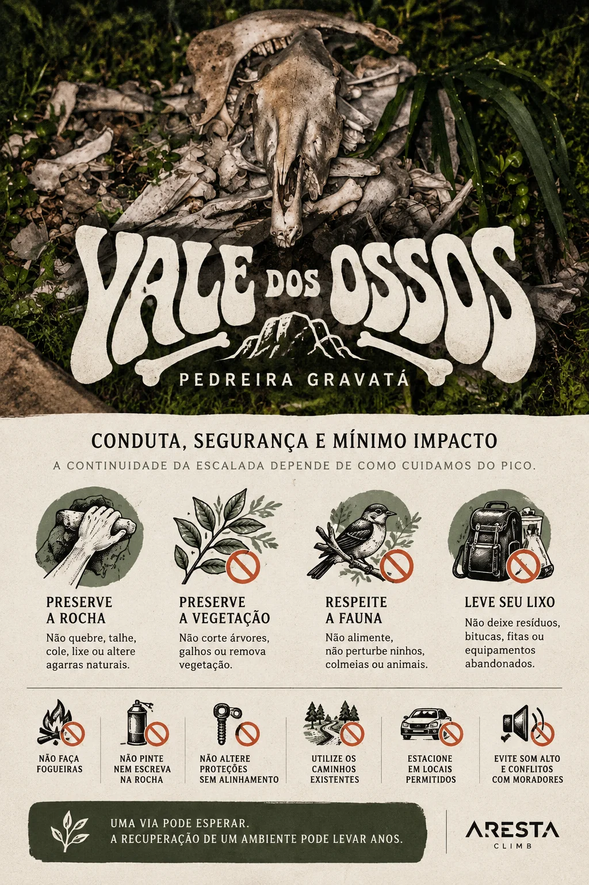
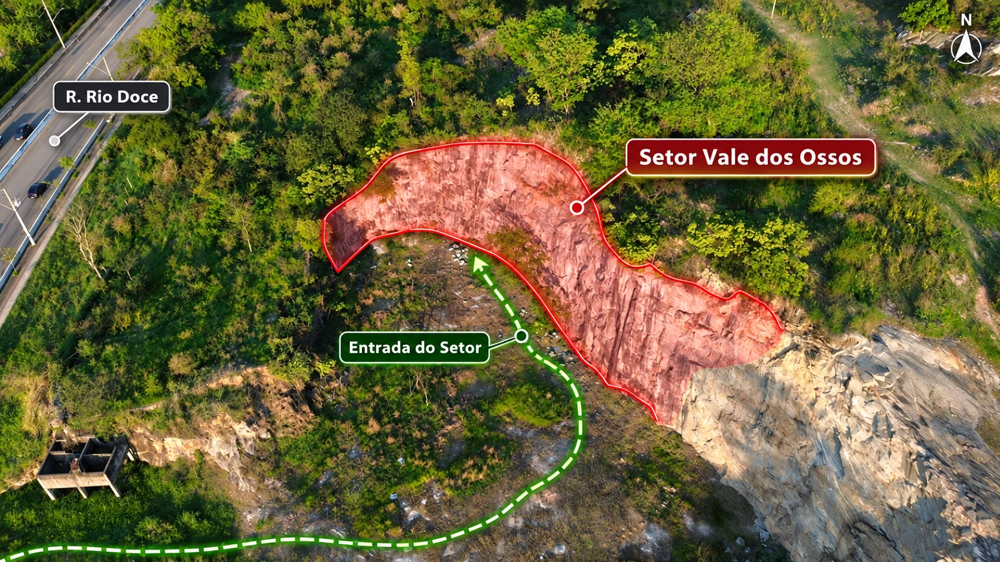
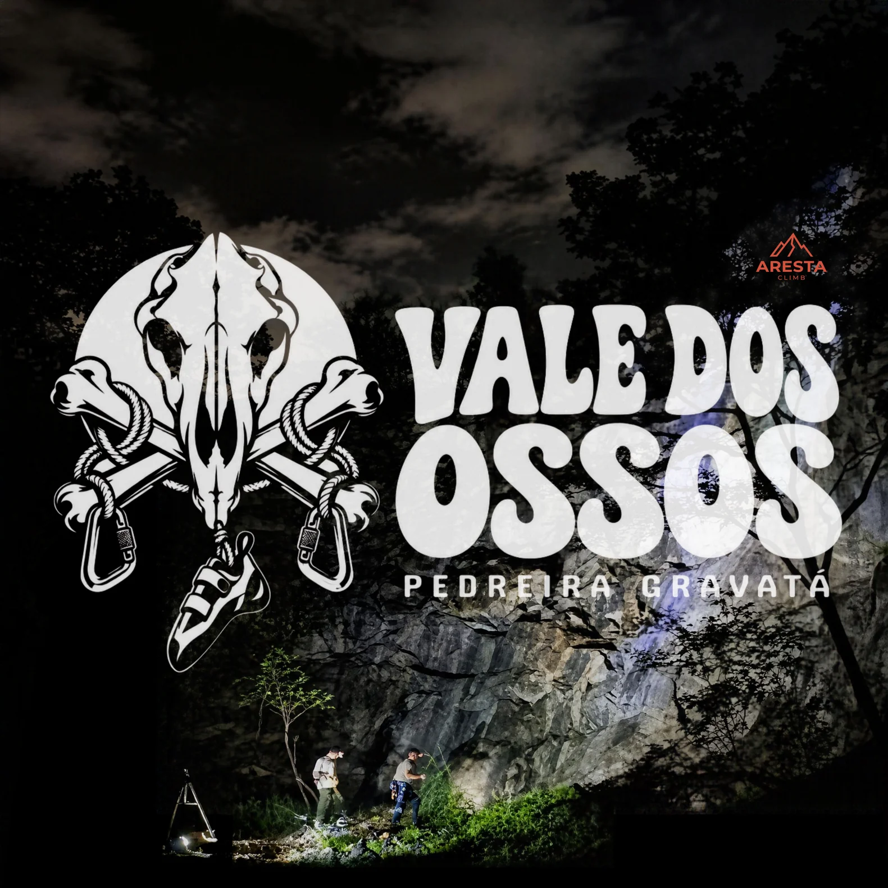
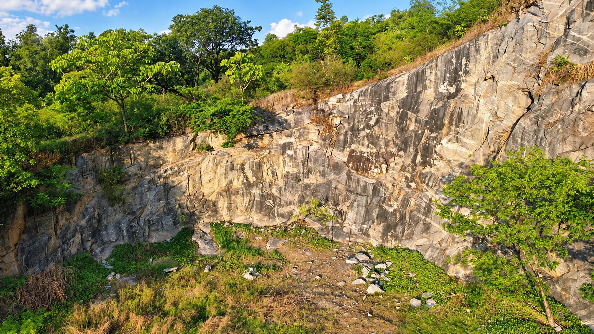

# Croqui: Pedreira Dr. Gravatá - "VALE DOS OSSOS"

## Informações Gerais

- **descricao**:
    A **Pedreira Dr. Gravatá**, em Betim/MG, reúne **mais de 50 vias de escalada esportiva**, linhas de rapel e setores em desenvolvimento. O pico é conduzido por **Marcio Macena e Samuel Lucas**. Este registro organiza acesso, setores, vias, autoria e história de uma paisagem ligada às antigas pedreiras, à ferrovia e à Usina Hidrelétrica Dr. Gravatá, inaugurada em 1914. Um croqui para escalar hoje e preservar conhecimento para quem vier depois.
    
- **id**: br_mg_betim_pedreira_dr_gravata
- **nome**: Pedreira Dr. Gravatá - "VALE DOS OSSOS"
- **uid**: IxUXYbyuIFiKVM
- **ultima_migracao**: 5
- **caminho_thumbnail**: 
- **botoes**:
  - **[0]**:
    - **uid**: 7Z6Ph44s7GruyF
    - **texto**: Como Chegar
    - **destino**:
      - **secao_textual**:
        - **conteudo**:
            **Pedreira Dr. Gravatá**  
            **R. Rio Doce, 508 — Pedreira, Betim — MG, 32600-450**
            
            A área de escalada está inserida na malha urbana de Betim, com chegada pela **Rua Rio Doce**.
            
            Para quem parte de **Belo Horizonte ou Contagem**, o principal eixo regional é o sistema **BR-381 / BR-262**, seguindo em direção a Betim.
            
            Já dentro do município, utilize a navegação até a Rua Rio Doce e o ponto indicado para a Pedreira Dr. Gravatá.
            
            **Endereço de referência:**  
            R. Rio Doce, 508 — Pedreira  
            Betim — Minas Gerais  
            CEP 32600-450
            
            **Coordenada pública de referência da área de escalada:**  
            -19.9732747, -44.2163477
            
            [Pesquisar rota no Google Maps](https://www.google.com/maps/search/?api=1&query=Pedreira+Dr.+Gravata%2C+Rua+Rio+Doce+508%2C+Betim+MG)
            
            Ao chegar, utilize somente **entradas, áreas de estacionamento e aproximações validadas pelos responsáveis locais**.
            
            Evite abrir atalhos, atravessar propriedades sem autorização ou estacionar de maneira que prejudique moradores, circulação de veículos ou o acesso ao local.
            
            A aproximação detalhada para cada setor será registrada conforme entrada, estacionamento, trilhas e pontos de referência forem definitivamente validados em campo.
            
            ## Emergência
            
            SAMU: **192**  
            Corpo de Bombeiros: **193**
            
            Ao pedir socorro, informe o endereço de referência, as coordenadas disponíveis e as condições de acesso até a pessoa acidentada.
  - **[1]**:
    - **uid**: 8wYXuUUHrGhGRI
    - **texto**: A escalada na Pedreira
    - **destino**:
      - **secao_textual**:
        - **conteudo**:
            **Conhecer o pico é mais do que conhecer as vias.**
            
            Localizada em **Betim, Minas Gerais**, a Pedreira Dr. Gravatá reúne hoje **mais de 50 vias de escalada esportiva**, linhas de rapel e diferentes setores em desenvolvimento.
            
            |  |
            | :--: |
            | *Vale dos Ossos - Pedreira Gravatá* |
            
            A organização atual da área, a abertura de novas linhas e a consolidação das informações são conduzidas por **Marcio Macena e Samuel Lucas**, responsáveis pelo desenvolvimento do pico e por grande parte do conhecimento contemporâneo reunido neste registro.
            
            A escalada, porém, é o capítulo mais recente de uma paisagem marcada por transformações anteriores.
            
            No início do século XX, quando Betim ainda era conhecida como **Capela Nova do Betim**, a região passou por mudanças ligadas à exploração de pedreiras, à implantação da ferrovia e à geração de energia. Pesquisas históricas registram a importância das pedreiras locais no fornecimento de materiais para o crescimento de Belo Horizonte e mostram como pedra, trabalho e infraestrutura conectaram Capela Nova à nova capital mineira.
            
            |  |
            | :--: |
            | *Usina Dr. Gravatá* |
            
            Em **1914**, entrou em funcionamento a **Usina Hidrelétrica Dr. Gravatá**, instalada no Rio Betim e associada ao engenheiro Antônio Gonçalves Gravatá. O complexo utilizava aproximadamente **84 metros de desnível** e incluía barragem, canais, reservatório, tubulações e Casa de Máquinas. Há registros de que parte da energia produzida foi destinada à operação de uma pedreira localizada na mesma **Fazenda Cachoeira**.
            
            |  |
            | :--: |
            | *Casa de Máquinas* |
            
            A usina permaneceu em atividade até a década de 1950 e foi **tombada pelo município de Betim em 2001**, preservando parte importante da memória industrial da cidade.
            
            Hoje, a escalada acrescenta uma nova camada a esse território. Setores como **Vale dos Ossos** e **Palanque** já possuem vias documentadas, enquanto novas linhas continuam sendo abertas, mantidas e consolidadas.
            
            |  |
            | :--: |
            | *Vale dos Ossos* |
            
            Este croqui reúne diferentes tipos de informação em um único lugar:
            
            **acesso, localização, setores, vias, graduações, conquistadores, manutenção, segurança, história e fontes.**
            
            O objetivo é permitir que quem chega hoje encontre informações confiáveis — e que quem chegar no futuro consiga entender como esse pico foi construído.
            
            *Um croqui ajuda a encontrar uma via. Um bom registro ajuda a compreender o lugar inteiro.*
            
            **Pedreira Dr. Gravatá — Betim, Minas Gerais.**  
            **Mais de 50 vias e uma história que começou muito antes da primeira conquista.**
  - **[2]**:
    - **uid**: qxypM2X6B0YGe1
    - **texto**: Conduta, segurança e mínimo impacto
    - **destino**:
      - **secao_textual**:
        - **conteudo**:
            ## Conduta, segurança e mínimo impacto
            
            **A continuidade da escalada depende de como cuidamos do pico.**
            
            
            |  |
            | :--: |
            | *Restrições* |
            
            A Pedreira Dr. Gravatá está inserida em uma paisagem urbana com remanescentes e características de **Mata Atlântica e transição com o Cerrado**.
            
            Mesmo em uma área historicamente alterada pela atividade humana, a vegetação que permanece ou se recupera tem função importante para **fauna, solo, sombra, drenagem e regeneração ambiental**.
            
            Por isso, preservar o pico significa cuidar tanto da escalada quanto do território ao redor.
            
            ## Regras do pico
            
            - **É proibido quebrar, talhar, colar, lixar ou alterar agarras naturais.**
            - **Não pinte, escreva ou faça marcações permanentes na rocha.**
            - **Não corte árvores, galhos, arbustos ou remova vegetação.**
            - Não abra novas trilhas ou atalhos sem necessidade.
            - **Não altere proteções, paradas ou vias por conta própria.**
            - Não retire, mova ou acrescente chapeletas sem alinhamento com os responsáveis pelo desenvolvimento do pico.
            - **Não faça fogueiras.**
            - Não deixe lixo, bitucas, esparadrapos, fitas, garrafas ou restos de alimento.
            - Não capture, alimente ou perturbe animais.
            - Não mexa em ninhos, colmeias ou abrigos de fauna.
            - Não entre em áreas fechadas, interditadas ou propriedades sem autorização
            
            **Uma via pode esperar. Uma árvore ou área degradada pode levar anos para se recuperar.**
            
            ## Segurança
            
            A escalada envolve risco.
            
            - Use equipamento adequado e em boas condições.
            - Faça checagem entre escalador e segurança.
            - **Use capacete.**
            - Observe rocha, proteções, parada e base antes de iniciar.
            - Pedreiras podem apresentar **blocos soltos, fraturas e zonas alteradas pela antiga extração**.
            - Não considere uma proteção segura apenas porque ela existe.
            - Em caso de dúvida, escolha outra via.
            
            ## Acesso e convivência
            
            - Estacione somente onde for permitido.
            - Não bloqueie garagens, calçadas ou circulação.
            - Utilize os caminhos existentes.
            - Evite som alto e conflitos com moradores.
            - Respeite orientações e restrições temporárias.
            - Leve tudo o que trouxe de volta.
            
            ## Fauna
            
            Ao encontrar animais, ninhos, colmeias ou áreas de reprodução:
            
            **mantenha distância e não interfira.**
            
            Se a presença de fauna tornar uma via inadequada temporariamente, **escolha outra linha**.
            
            ## Ao sair
            
            Antes de deixar o setor:
            
            - recolha seu lixo;
            - retire materiais pessoais;
            - reduza o excesso de magnésio quando possível;
            - não deixe marcações;
            - comunique riscos, proteções danificadas ou alterações no acesso.
            
            ## Emergência
            
            **SAMU — 192**  
            **Corpo de Bombeiros — 193**
            
            Informe:
            
            **Pedreira Dr. Gravatá — Betim/MG**  
            **setor ou via**  
            **tipo de ocorrência**  
            **condições de acesso até a vítima**
            
            ## Regra simples
            
            **Não deixe o lugar pior do que encontrou.**
            
            Escalar também é cuidar.
            
            **Preserve a rocha. Preserve a vegetação. Respeite a fauna. Respeite quem vive ao redor.**
  - **[3]**:
    - **uid**: zHAUN2IJfRIc95
    - **texto**: Linha do Tempo
    - **destino**:
      - **secao_textual**:
        - **conteudo**:
            # Linha do tempo
            
            **1711** — Registros territoriais ligados à sesmaria de Joseph Rodrigues Betim mencionam o Ribeirão da Cachoeira.
            
            **1754** — Estabelecimento da Capela de Nossa Senhora do Monte do Carmo, referência para a formação de Capela Nova do Betim.
            
            **1801** — O arraial é elevado a distrito.
            
            **1851** — Capela Nova do Betim é elevada a freguesia/paróquia.
            
            **Fim do século XIX / início do século XX** — Pedreiras de gnaisse ganham importância no fornecimento de materiais e na transformação econômica regional.
            
            **1909–1910** — A atuação ferroviária da Schnoor e de Antônio Gonçalves Gravatá aproxima o engenheiro de Capela Nova e do potencial hidráulico do Rio Betim.
            
            **1914** — Início definitivo da operação da **Usina Hidrelétrica Dr. Gravatá**.
            
            **1922** — Inauguração do obelisco da Praça Sete. Fontes históricas vinculam sua produção a pedra e trabalhadores de pedreiras de Betim e associam Gravatá a esse contexto.
            
            **Década de 1940** — Registros históricos indicam expansão do fornecimento de energia para além de Betim.
            
            **1950** — Morte de Antônio Gonçalves Gravatá, em Belo Horizonte.
            
            **Década de 1950** — Desativação progressiva da usina no contexto da reorganização do fornecimento de energia e expansão da Cemig.
            
            **2001** — Tombamento municipal da Usina Hidrelétrica Dr. Gravatá.
            
            **Década de 2010** — Fontes públicas registram processo de restauração da Casa de Máquinas.
            
            **2026** — Fase pública atual de documentação da escalada: **mais de 50 vias**, setores em desenvolvimento e registros individualizados de **Vale dos Ossos** e **Palanque**.
            
            _A linha do tempo deve continuar sendo ampliada conforme novas fontes, entrevistas e registros de campo forem incorporados._
  - **[4]**:
    - **uid**: xdexoCU6d1rgcV
    - **texto**: Fontes e referências
    - **destino**:
      - **secao_textual**:
        - **conteudo**:
            Este registro utiliza fontes diferentes para tipos diferentes de informação.
            
            ## História urbana, pedreiras, ferrovia e Antônio Gonçalves Gravatá
            
            **Universidade Federal de Minas Gerais — Repositório Institucional**  
            Pesquisa utilizada para reconstrução da história urbana de Betim, pedreiras, ferrovia, Antônio Gonçalves Gravatá, geração de energia e relações com a Fazenda Cachoeira.  
            [Consultar fonte](https://repositorio.ufmg.br/server/api/core/bitstreams/4abfacfc-ce96-47de-8a1d-93cf47e4c51d/content)
            
            ## Usina e patrimônio
            
            **iPatrimônio — Casa de Máquina Usina Hidrelétrica Dr. Gravatá**  
            Descrição do complexo, barragem, canais, reservatório, tubulações, Casa de Máquinas e histórico de tombamento.  
            [Consultar fonte](https://www.ipatrimonio.org/betim-casa-de-maquina-usina-hidreletrica-dr-gravata/)
            
            **Prefeitura Municipal de Betim — Patrimônio Cultural**  
            Referência oficial municipal para o tombamento da Usina Hidrelétrica Dr. Gravatá.  
            [Consultar fonte](https://www.betim.mg.gov.br/portal/secretarias-paginas/278/superintendencia-patrimonio-cultural/)
            
            ## Geologia regional
            
            **Serviço Geológico do Brasil — Folha Contagem**  
            Contexto geológico regional do Complexo Belo Horizonte e ocorrências de gnaisses e migmatitos na região de Contagem e Betim.  
            [Consultar fonte](https://rigeo.sgb.gov.br/bitstream/doc/18325/3/relatorio_contagem.pdf)
            
            ## Restauração
            
            **Construtora QBHZ — Case Usina Doutor Gravatá**  
            Registro público de restauração da Casa de Máquinas para a MRV Engenharia e Participações S/A.  
            [Consultar fonte](https://construtoraqbhz.com.br/case-study/usina-doutor-gravata/)
            
            ## Escalada
            
            **Escaladas.com.br — Pedreira Dr. Gravatá**  
            Cadastro público utilizado para cruzamento inicial de setores e dados técnicos de vias.  
            [Consultar fonte](https://www.escaladas.com.br/local/id/2040/Pedreira%20Dr.%20Gravat%C3%A1)
            
            ## Memória local
            
            Informações sobre desenvolvimento contemporâneo, acesso real, nomenclatura, manutenção, história das conquistas e estado atual do pico devem continuar sendo atualizadas com base nos registros de **Marcio Macena, Samuel Lucas e demais participantes identificados da comunidade local**.
            
            **Fonte documental sustenta o fato. Memória local explica contexto. As duas precisam permanecer identificadas.**
- **publicar_croqui**: True

## Parte: grupo_setores (não listada em partes.json)

### Grupo (Pico: Pedreira Dr. Gravatá - "VALE DOS OSSOS")

- **descricao**: 
- **nome**: Setores
- **uid**: 1kdWDqtPUNB3f3
- **mapas**:
  - **[0]**:
    - **caminho_imagem_mapa**: 
    - **largura_mapa**: 1672
    - **altura_mapa**: 941
    - **pontos_de_interesse**:
      - **[0]**:
        - **id**: bVvyzpC1nmyAWb
        - **uid**: bVvyzpC1nmyAWb
        - **rotulo**: Setor Vale dos Ossos
        - **poligono**:
          - **coordenadas**:
            - 559
            - 453
            - 537
            - 364
            - 604
            - 315
            - 652
            - 265
            - 717
            - 243
            - 788
            - 239
            - 870
            - 239
            - 898
            - 239
            - 926
            - 254
            - 956
            - 276
            - 974
            - 302
            - 985
            - 321
            - 991
            - 332
            - 1000
            - 354
            - 1006
            - 386
            - 1017
            - 412
            - 1028
            - 425
            - 1047
            - 438
            - 1077
            - 447
            - 1101
            - 453
            - 1140
            - 468
            - 1179
            - 483
            - 1196
            - 496
            - 1259
            - 494
            - 1293
            - 531
            - 1304
            - 555
            - 1274
            - 591
            - 1203
            - 615
            - 1147
            - 630
            - 1121
            - 665
            - 1101
            - 699
            - 1086
            - 678
            - 1021
            - 650
            - 991
            - 617
            - 954
            - 580
            - 926
            - 537
            - 887
            - 496
            - 861
            - 447
            - 803
            - 416
            - 756
            - 399
            - 686
            - 386
            - 617
            - 405
        - **cor**: #FF1744
        - **label**: Setor Vale dos Ossos
    - **referencias**:
      - **[0]**:
        - **alvo_uid**: OlIgwinddv8ILl
        - **pontos_uids**:
          - bVvyzpC1nmyAWb
        - **setor**: Vale dos Ossos
        - **ids**:
          - bVvyzpC1nmyAWb
- **setores**:
  - **[0]**:
    - **conteudo**:
      - **descricao**:
          |  |
          | :--: |
          | *Vale dos Ossos* |
          
          |  |
          | :--: |
          | *Mapa* |
      - **nome**: Vale dos Ossos
      - **uid**: OlIgwinddv8ILl
      - **escaladas**:
        - **[0]**:
          - **uid**: GCXksLfSG4nxgt
          - **via_esportiva**:
            - **nome**: OSSO EM PÓ
            - **dificuldade**: BR_3
            - **quantidade_protecoes_intermediarias**: 3
            - **quantidade_protecoes_parada**: 2
            - **conquistadores**:
              - Macena
              - Samuel
              - Maceninha
        - **[1]**:
          - **uid**: sTYkPxab4O7Qs4
          - **via_esportiva**:
            - **nome**: OSSOS DO OFÍCIO
            - **dificuldade**: BR_5
            - **quantidade_protecoes_intermediarias**: 2
            - **quantidade_protecoes_parada**: 2
            - **conquistadores**:
              - Macena
              - Samuel
              - Maceninha
        - **[2]**:
          - **uid**: LLdv2dPx4kh8ss
          - **via_esportiva**:
            - **nome**: KD O OSSO
            - **dificuldade**: BR_5SUP
            - **quantidade_protecoes_intermediarias**: 3
            - **quantidade_protecoes_parada**: 2
            - **conquistadores**:
              - Macena
              - Samuel
              - Maceninha
        - **[3]**:
          - **uid**: HX8xSlCDwxueeV
          - **via_esportiva**:
            - **nome**: CANTEIRO DE OSSOS
            - **dificuldade**: BR_6
            - **quantidade_protecoes_intermediarias**: 3
            - **quantidade_protecoes_parada**: 2
            - **conquistadores**:
              - Macena
              - Samuel
              - Maceninha
        - **[4]**:
          - **uid**: PvobdIJtlmPzTF
          - **via_esportiva**:
            - **nome**: SANTUÁRIO DOS OSSOS
            - **dificuldade**: BR_6SUP
            - **quantidade_protecoes_intermediarias**: 3
            - **quantidade_protecoes_parada**: 2
            - **conquistadores**:
              - Macena
              - Samuel
              - Maceninha
        - **[5]**:
          - **uid**: gdRNgv12poL52Z
          - **via_esportiva**:
            - **nome**: QUEBRA OSSOS
            - **dificuldade**: BR_7C
            - **quantidade_protecoes_intermediarias**: 3
            - **quantidade_protecoes_parada**: 2
            - **conquistadores**:
              - Macena
              - Samuel
              - Maceninha
        - **[6]**:
          - **uid**: RReuOVIU4FHX0X
          - **via_esportiva**:
            - **nome**: SOZINHO É OSSO
            - **dificuldade**: BR_6
            - **quantidade_protecoes_intermediarias**: 3
            - **quantidade_protecoes_parada**: 2
            - **conquistadores**:
              - Macena
              - Samuel
              - Maceninha
        - **[7]**:
          - **uid**: V32GiPIvEBRYgY
          - **via_esportiva**:
            - **nome**: CUTELO DE OSSOS
            - **dificuldade**: BR_6SUP
            - **quantidade_protecoes_intermediarias**: 3
            - **quantidade_protecoes_parada**: 2
            - **conquistadores**:
              - Macena
              - Samuel
              - Maceninha
        - **[8]**:
          - **uid**: 7CWBl1fANpHYIT
          - **via_esportiva**:
            - **nome**: MARIMB. QUE ME OSSOS
            - **dificuldade**: BR_5
            - **conquistadores**:
              - Macena
              - Samuel
              - Maceninha
        - **[9]**:
          - **uid**: UVYGyiIDxev7nR
          - **via_esportiva**:
            - **nome**: GUERRA DE OSSOS
            - **dificuldade**: BR_5_BARRA_5SUP
            - **quantidade_protecoes_intermediarias**: 4
            - **quantidade_protecoes_parada**: 2
            - **conquistadores**:
              - Macena
              - Samuel
              - Maceninha
        - **[10]**:
          - **uid**: H1Vpx2BvjqxMB8
          - **via_esportiva**:
            - **nome**: CULPIM DE OSSOS
            - **dificuldade**: BR_5SUP
            - **conquistadores**:
              - Macena
              - Samuel
              - Maceninha
        - **[11]**:
          - **uid**: Vr7t0L8doKlsZM
          - **via_esportiva**:
            - **nome**: BALCÃO DE OSSOS
            - **dificuldade**: BR_6SUP
            - **conquistadores**:
              - Macena
              - Samuel
              - Maceninha
        - **[12]**:
          - **uid**: 3oWaaJjyDVSIgX
          - **via_esportiva**:
            - **nome**: OSSO DO CALCANHO
            - **dificuldade**: BR_8A
            - **conquistadores**:
              - Macena
              - Samuel
              - Maceninha
        - **[13]**:
          - **uid**: pyutSY2fGbrYxh
          - **via_esportiva**:
            - **nome**: FRATURA OSSEA
            - **dificuldade**: BR_7A
            - **conquistadores**:
              - Macena
              - Samuel
              - Maceninha
        - **[14]**:
          - **uid**: QwdaSE1WmocGO0
          - **via_esportiva**:
            - **nome**: HORTOPEDIA OSSEA
            - **dificuldade**: BR_6SUP
            - **conquistadores**:
              - Macena
              - Samuel
              - Maceninha
        - **[15]**:
          - **uid**: gjAf3WcO3jbJWX
          - **via_esportiva**:
            - **nome**: OSSO DO QUEIXO
            - **dificuldade**: BR_6SUP
            - **conquistadores**:
              - Macena
              - Samuel
              - Maceninha
        - **[16]**:
          - **uid**: xqfQaxwsAjzGpr
          - **via_esportiva**:
            - **nome**: FISSURA OSSEA
            - **dificuldade**: BR_7B
            - **conquistadores**:
              - Macena
              - Samuel
              - Maceninha
        - **[17]**:
          - **uid**: REywx52tN5CZcR
          - **via_esportiva**:
            - **nome**: OSSO TORTO
            - **dificuldade**: BR_8A
            - **conquistadores**:
              - Macena
              - Samuel
              - Maceninha
        - **[18]**:
          - **uid**: nKy9ldjFeuDEDm
          - **via_esportiva**:
            - **nome**: OSSO NA CARNE
            - **dificuldade**: BR_7A
            - **conquistadores**:
              - Macena
              - Samuel
              - Maceninha
        - **[19]**:
          - **uid**: rorqzQ5WxTfx4T
          - **via_esportiva**:
            - **nome**: CARNE DE PESCOÇO
            - **dificuldade**: BR_7A
            - **conquistadores**:
              - Macena
              - Samuel
              - Maceninha
        - **[20]**:
          - **uid**: hz7FIHNelWTo7K
          - **via_esportiva**:
            - **nome**: HOSTOPOROSE
            - **dificuldade**: BR_7B
            - **conquistadores**:
              - Macena
              - Samuel
              - Maceninha
        - **[21]**:
          - **uid**: zJKs0gcw77cQmo
          - **via_esportiva**:
            - **nome**: SACO DE OSSO
            - **dificuldade**: BR_8C
            - **conquistadores**:
              - Macena, Samuel, Maceninha
      - **mapas**:
        - **[0]**:
          - **caminho_imagem_mapa**: 
          - **largura_mapa**: 1672
          - **altura_mapa**: 941
          - **pontos_de_interesse**:
            - **[0]**:
              - **id**: OGw2qj24dq7QBc
              - **uid**: OGw2qj24dq7QBc
              - **rotulo**: 
              - **linha**:
                - **estilo**: TRACEJADO
                - **espessura**: 3
                - **compilado**:
                  - **caminho_svg**: M 288 744 C 279.7 686.0, 271.4 624.0, 263 570 C 255.7 522.9, 248.3 482.0, 241 438
                  - **caixa_delimitadora**:
                    - **x**: 264
                    - **y**: 591
                    - **comprimento**: 47
                    - **largura**: 306
                  - **marcadores**:
                    - **[0]**:
                      - **tipo**: CIRCULO_IDENTIFICADOR
                      - **x**: 288
                      - **y**: 744
                      - **angulo_graus_x100**: -9818
                      - **rotulo**: 1
                    - **[1]**:
                      - **tipo**: CIRCULO_IDENTIFICADOR
                      - **x**: 241
                      - **y**: 438
                      - **angulo_graus_x100**: -9946
                      - **rotulo**: A
              - **cor**: #FFD600
              - **label**: 
            - **[1]**:
              - **id**: yy4dT4EFAwTpCA
              - **uid**: yy4dT4EFAwTpCA
              - **rotulo**: 
              - **linha**:
                - **estilo**: TRACEJADO
                - **espessura**: 3
                - **compilado**:
                  - **caminho_svg**: M 436 713 C 426.3 671.7, 417.6 634.2, 407 589 C 394.3 534.6, 379.0 469.0, 365 409
                  - **caixa_delimitadora**:
                    - **x**: 400
                    - **y**: 561
                    - **comprimento**: 71
                    - **largura**: 304
                  - **marcadores**:
                    - **[0]**:
                      - **tipo**: CIRCULO_IDENTIFICADOR
                      - **x**: 436
                      - **y**: 713
                      - **angulo_graus_x100**: -10316
                      - **rotulo**: 2
                    - **[1]**:
                      - **tipo**: CIRCULO_IDENTIFICADOR
                      - **x**: 365
                      - **y**: 409
                      - **angulo_graus_x100**: -10313
                      - **rotulo**: B
              - **cor**: #FFD600
              - **label**: 
            - **[2]**:
              - **id**: VfrRNHIcLKB0uG
              - **uid**: VfrRNHIcLKB0uG
              - **rotulo**: 
              - **linha**:
                - **estilo**: TRACEJADO
                - **espessura**: 3
                - **compilado**:
                  - **caminho_svg**: M 497 690 C 478.0 592.7, 459.0 495.3, 440 398
                  - **caixa_delimitadora**:
                    - **x**: 468
                    - **y**: 544
                    - **comprimento**: 57
                    - **largura**: 292
                  - **marcadores**:
                    - **[0]**:
                      - **tipo**: CIRCULO_IDENTIFICADOR
                      - **x**: 497
                      - **y**: 690
                      - **angulo_graus_x100**: -10105
                      - **rotulo**: 3
                    - **[1]**:
                      - **tipo**: CIRCULO_IDENTIFICADOR
                      - **x**: 440
                      - **y**: 398
                      - **angulo_graus_x100**: -10105
                      - **rotulo**: C
              - **cor**: #FFD600
              - **label**: 
            - **[3]**:
              - **id**: xojJvzy2G0DCaW
              - **uid**: xojJvzy2G0DCaW
              - **rotulo**: 
              - **linha**:
                - **estilo**: TRACEJADO
                - **espessura**: 3
                - **compilado**:
                  - **caminho_svg**: M 592 661 C 583.3 606.0, 575.6 544.6, 566 496 C 558.3 456.9, 549.3 426.0, 541 391
                  - **caixa_delimitadora**:
                    - **x**: 566
                    - **y**: 526
                    - **comprimento**: 51
                    - **largura**: 270
                  - **marcadores**:
                    - **[0]**:
                      - **tipo**: CIRCULO_IDENTIFICADOR
                      - **x**: 592
                      - **y**: 661
                      - **angulo_graus_x100**: -9895
                      - **rotulo**: 4
                    - **[1]**:
                      - **tipo**: CIRCULO_IDENTIFICADOR
                      - **x**: 541
                      - **y**: 391
                      - **angulo_graus_x100**: -10339
                      - **rotulo**: D
              - **cor**: #FFD600
              - **label**: 
            - **[4]**:
              - **id**: jxB2ICN2LOIydw
              - **uid**: jxB2ICN2LOIydw
              - **rotulo**: 
              - **linha**:
                - **estilo**: TRACEJADO
                - **espessura**: 3
                - **compilado**:
                  - **caminho_svg**: M 651 655 C 646.3 615.3, 643.5 577.9, 637 536 C 629.7 488.5, 617.7 435.3, 608 385
                  - **caixa_delimitadora**:
                    - **x**: 630
                    - **y**: 520
                    - **comprimento**: 43
                    - **largura**: 270
                  - **marcadores**:
                    - **[0]**:
                      - **tipo**: CIRCULO_IDENTIFICADOR
                      - **x**: 651
                      - **y**: 655
                      - **angulo_graus_x100**: -9671
                      - **rotulo**: 5
                    - **[1]**:
                      - **tipo**: CIRCULO_IDENTIFICADOR
                      - **x**: 608
                      - **y**: 385
                      - **angulo_graus_x100**: -10087
                      - **rotulo**: E
              - **cor**: #FFD600
              - **label**: 
            - **[5]**:
              - **id**: nm6gkkSTpaOIEZ
              - **uid**: nm6gkkSTpaOIEZ
              - **rotulo**: 
              - **linha**:
                - **estilo**: TRACEJADO
                - **espessura**: 3
                - **compilado**:
                  - **caminho_svg**: M 702 658 C 703.0 608.3, 704.3 558.3, 705 509 C 705.7 460.3, 705.7 412.3, 706 364
                  - **caixa_delimitadora**:
                    - **x**: 704
                    - **y**: 511
                    - **comprimento**: 4
                    - **largura**: 294
                  - **marcadores**:
                    - **[0]**:
                      - **tipo**: CIRCULO_IDENTIFICADOR
                      - **x**: 702
                      - **y**: 658
                      - **angulo_graus_x100**: -8885
                      - **rotulo**: 6
                    - **[1]**:
                      - **tipo**: CIRCULO_IDENTIFICADOR
                      - **x**: 706
                      - **y**: 364
                      - **angulo_graus_x100**: -8960
                      - **rotulo**: F
              - **cor**: #FFD600
              - **label**: 
            - **[6]**:
              - **id**: AVUdX5pwvvkpYR
              - **uid**: AVUdX5pwvvkpYR
              - **rotulo**: 
              - **linha**:
                - **estilo**: TRACEJADO
                - **espessura**: 3
                - **compilado**:
                  - **caminho_svg**: M 761 663 C 762.0 606.0, 763.0 546.6, 764 492 C 765.0 441.9, 766.0 396.0, 767 348
                  - **caixa_delimitadora**:
                    - **x**: 764
                    - **y**: 506
                    - **comprimento**: 6
                    - **largura**: 315
                  - **marcadores**:
                    - **[0]**:
                      - **tipo**: CIRCULO_IDENTIFICADOR
                      - **x**: 761
                      - **y**: 663
                      - **angulo_graus_x100**: -8899
                      - **rotulo**: 7
                    - **[1]**:
                      - **tipo**: CIRCULO_IDENTIFICADOR
                      - **x**: 767
                      - **y**: 348
                      - **angulo_graus_x100**: -8881
                      - **rotulo**: G
              - **cor**: #FFD600
              - **label**: 
            - **[7]**:
              - **id**: z8136Laz4qtWVI
              - **uid**: z8136Laz4qtWVI
              - **rotulo**: 
              - **linha**:
                - **estilo**: TRACEJADO
                - **espessura**: 3
                - **compilado**:
                  - **caminho_svg**: M 842 646 C 842.7 576.0, 845.0 495.1, 844 436 C 843.2 392.8, 840.7 361.3, 839 324
                  - **caixa_delimitadora**:
                    - **x**: 842
                    - **y**: 485
                    - **comprimento**: 5
                    - **largura**: 322
                  - **marcadores**:
                    - **[0]**:
                      - **tipo**: CIRCULO_IDENTIFICADOR
                      - **x**: 842
                      - **y**: 646
                      - **angulo_graus_x100**: -8945
                      - **rotulo**: 8
                    - **[1]**:
                      - **tipo**: CIRCULO_IDENTIFICADOR
                      - **x**: 839
                      - **y**: 324
                      - **angulo_graus_x100**: -9256
                      - **rotulo**: H
              - **cor**: #FFD600
              - **label**: 
            - **[8]**:
              - **id**: meX1AOeWPbfqkF
              - **uid**: meX1AOeWPbfqkF
              - **rotulo**: 
              - **linha**:
                - **estilo**: TRACEJADO
                - **espessura**: 3
                - **compilado**:
                  - **caminho_svg**: M 955 702 C 957.0 660.3, 960.2 616.9, 961 577 C 961.7 540.5, 959.6 505.6, 960 472 C 960.4 441.1, 961.5 412.7, 963 383 C 964.5 353.3, 967.0 323.7, 969 294
                  - **caixa_delimitadora**:
                    - **x**: 962
                    - **y**: 498
                    - **comprimento**: 14
                    - **largura**: 408
                  - **marcadores**:
                    - **[0]**:
                      - **tipo**: CIRCULO_IDENTIFICADOR
                      - **x**: 955
                      - **y**: 702
                      - **angulo_graus_x100**: -8725
                      - **rotulo**: 9
                    - **[1]**:
                      - **tipo**: CIRCULO_IDENTIFICADOR
                      - **x**: 969
                      - **y**: 294
                      - **angulo_graus_x100**: -8614
                      - **rotulo**: I
              - **cor**: #FFD600
              - **label**: 
            - **[9]**:
              - **id**: NIGxHOA2M4fo2j
              - **uid**: NIGxHOA2M4fo2j
              - **rotulo**: 
              - **linha**:
                - **estilo**: TRACEJADO
                - **espessura**: 3
                - **compilado**:
                  - **caminho_svg**: M 1005 703 C 1007.0 643.0, 1009.4 574.4, 1011 523 C 1012.2 484.5, 1012.3 458.0, 1014 422 C 1016.0 380.5, 1020.0 332.7, 1023 288
                  - **caixa_delimitadora**:
                    - **x**: 1014
                    - **y**: 496
                    - **comprimento**: 18
                    - **largura**: 415
                  - **marcadores**:
                    - **[0]**:
                      - **tipo**: CIRCULO_IDENTIFICADOR
                      - **x**: 1005
                      - **y**: 703
                      - **angulo_graus_x100**: -8809
                      - **rotulo**: 10
                    - **[1]**:
                      - **tipo**: CIRCULO_IDENTIFICADOR
                      - **x**: 1023
                      - **y**: 288
                      - **angulo_graus_x100**: -8616
                      - **rotulo**: J
              - **cor**: #FFD600
              - **label**: 
          - **referencias**:
            - **[0]**:
              - **alvo_uid**: GCXksLfSG4nxgt
              - **pontos_uids**:
                - OGw2qj24dq7QBc
              - **escalada**: OSSO EM PÓ
              - **ids**:
                - OGw2qj24dq7QBc
            - **[1]**:
              - **alvo_uid**: sTYkPxab4O7Qs4
              - **pontos_uids**:
                - yy4dT4EFAwTpCA
              - **escalada**: OSSOS DO OFÍCIO
              - **ids**:
                - yy4dT4EFAwTpCA
            - **[2]**:
              - **alvo_uid**: LLdv2dPx4kh8ss
              - **pontos_uids**:
                - VfrRNHIcLKB0uG
              - **escalada**: KD O OSSO
              - **ids**:
                - VfrRNHIcLKB0uG
            - **[3]**:
              - **alvo_uid**: HX8xSlCDwxueeV
              - **pontos_uids**:
                - xojJvzy2G0DCaW
              - **escalada**: CANTEIRO DE OSSOS
              - **ids**:
                - xojJvzy2G0DCaW
            - **[4]**:
              - **alvo_uid**: PvobdIJtlmPzTF
              - **pontos_uids**:
                - jxB2ICN2LOIydw
              - **escalada**: SANTUÁRIO DOS OSSOS
              - **ids**:
                - jxB2ICN2LOIydw
            - **[5]**:
              - **alvo_uid**: gdRNgv12poL52Z
              - **pontos_uids**:
                - nm6gkkSTpaOIEZ
              - **escalada**: QUEBRA OSSOS
              - **ids**:
                - nm6gkkSTpaOIEZ
            - **[6]**:
              - **alvo_uid**: RReuOVIU4FHX0X
              - **pontos_uids**:
                - AVUdX5pwvvkpYR
              - **escalada**: SOZINHO É OSSO
              - **ids**:
                - AVUdX5pwvvkpYR
            - **[7]**:
              - **alvo_uid**: V32GiPIvEBRYgY
              - **pontos_uids**:
                - z8136Laz4qtWVI
              - **escalada**: CUTELO DE OSSOS
              - **ids**:
                - z8136Laz4qtWVI
            - **[8]**:
              - **alvo_uid**: 7CWBl1fANpHYIT
              - **pontos_uids**:
                - meX1AOeWPbfqkF
              - **escalada**: MARIMB. QUE ME OSSOS
              - **ids**:
                - meX1AOeWPbfqkF
            - **[9]**:
              - **alvo_uid**: UVYGyiIDxev7nR
              - **pontos_uids**:
                - NIGxHOA2M4fo2j
              - **escalada**: GUERRA DE OSSOS
              - **ids**:
                - NIGxHOA2M4fo2j
      - **precomputados**:
        - **total_escaladas**: 22
        - **total_esportivas**: 22
  - **[1]**:
    - **conteudo**:
      - **descricao**: 
      - **nome**: Setor das Treze
      - **uid**: 0mdQacpHsHHypM
      - **escaladas**:
        - **[0]**:
          - **uid**: DcfDYTMq11Cam0
          - **via_esportiva**:
            - **nome**: PRIMEIRINHA
            - **dificuldade**: BR_6SUP
            - **conquistadores**:
              - Macena, Samuel, Maceninha
        - **[1]**:
          - **uid**: 6R2kj3HJAkNTea
          - **via_esportiva**:
            - **nome**: CHUVA DE CRISTAL
            - **dificuldade**: BR_6
            - **conquistadores**:
              - Macena, Samuel, Maceninha
        - **[2]**:
          - **uid**: nY6CVtCNEYtf4A
          - **via_esportiva**:
            - **nome**: PÉ DE CHORUME
            - **dificuldade**: BR_7C
            - **conquistadores**:
              - Macena, Samuel, Maceninha
        - **[3]**:
          - **uid**: bnPm8davuNl4Cm
          - **via_esportiva**:
            - **nome**: S.O.S MORCEGO
            - **dificuldade**: BR_6SUP
            - **conquistadores**:
              - Macena, Samuel, Maceninha
        - **[4]**:
          - **uid**: jLuU3Q1k82TYTi
          - **via_esportiva**:
            - **nome**: PEQUENA, MAS APERTADA
            - **dificuldade**: BR_7C
            - **conquistadores**:
              - Macena, Samuel, Maceninha
        - **[5]**:
          - **uid**: UbodlkQiI0gG3a
          - **via_esportiva**:
            - **nome**: TOPOGRÁFO PERDIDO
            - **dificuldade**: BR_6SUP
        - **[6]**:
          - **uid**: 6zdARPf1wSsl88
          - **via_esportiva**:
            - **nome**: MOVI TECTÔNICOS
            - **dificuldade**: BR_7B
            - **conquistadores**:
              - Macena, Samuel, Maceninha
        - **[7]**:
          - **uid**: SBmK5nI2CAJb89
          - **via_esportiva**:
            - **nome**: PSICOSE
            - **dificuldade**: BR_7B
            - **conquistadores**:
              - Macena, Samuel, Maceninha
        - **[8]**:
          - **uid**: puGzLAPUhJwqmG
          - **via_esportiva**:
            - **nome**: CONFUSAO MENTAL
            - **dificuldade**: BR_7A
            - **conquistadores**:
              - Macena, Samuel, Maceninha
      - **precomputados**:
        - **total_escaladas**: 9
        - **total_esportivas**: 9
- **localizacao_estacionamento**:
  - **latitude**: -199731200
  - **longitude**: -442166520
- **localizacao_escalada**:
  - **latitude**: -199734850
  - **longitude**: -442154230
- **precomputados**:
  - **total_escaladas**: 31
  - **total_esportivas**: 31

## Arquivos Externos

- **arquivos_externos**:
  - **[0]**:
    - **caminho**: 
    - **checksum_sha256**: 8a3e945c9a8f54736ddfd7128453bedb362cfdb978c9d48f418c08ef9281e247
  - **[1]**:
    - **caminho**: 
    - **checksum_sha256**: 8a3e945c9a8f54736ddfd7128453bedb362cfdb978c9d48f418c08ef9281e247
  - **[2]**:
    - **caminho**: 
    - **checksum_sha256**: 3882bd7496c11b1ed60cf31d907ad787fdfe144be82e118678fbc4e33ba1fa1d
  - **[3]**:
    - **caminho**: 
    - **checksum_sha256**: d6f5aac2ec22364aef915279cecd83cc4a0165803e89b79a350c3c563feef3ec
  - **[4]**:
    - **caminho**: 
    - **checksum_sha256**: 61ed2734fac93fe16aec06b45d53ea1d93d65d2de19be927561ba1b618af7442
  - **[5]**:
    - **caminho**: 
    - **checksum_sha256**: da8013aac434b679c22e8f4336c2c9bc9c5324966ad9f410097e9bd44b702501
  - **[6]**:
    - **caminho**: 
    - **checksum_sha256**: 3882bd7496c11b1ed60cf31d907ad787fdfe144be82e118678fbc4e33ba1fa1d
  - **[7]**:
    - **caminho**: 
    - **checksum_sha256**: 3086b14b1429f16547a7f73e3f9d7c63027cfb06b2964ead73cfebe4b920807b
  - **[8]**:
    - **caminho**: 
    - **checksum_sha256**: 3086b14b1429f16547a7f73e3f9d7c63027cfb06b2964ead73cfebe4b920807b
  - **[9]**:
    - **caminho**: 
    - **checksum_sha256**: 8a3e945c9a8f54736ddfd7128453bedb362cfdb978c9d48f418c08ef9281e247

