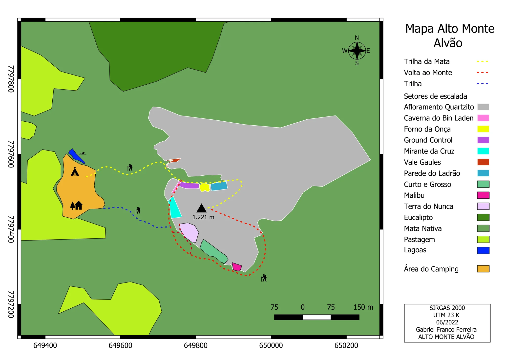
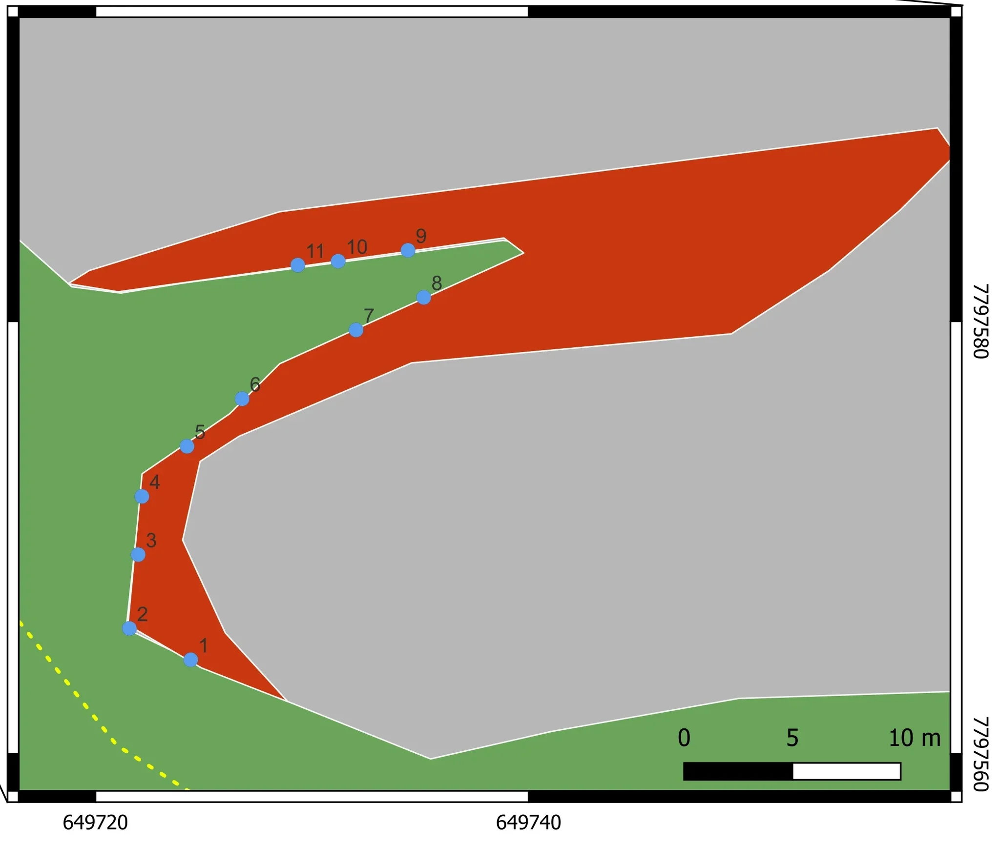
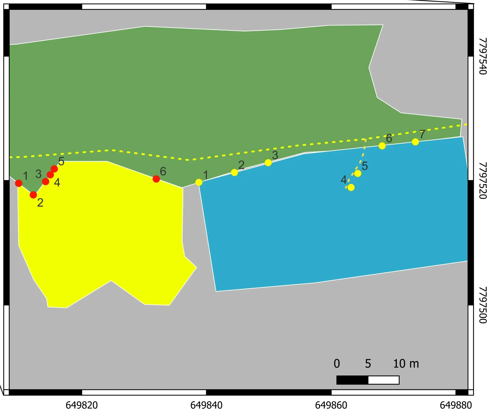
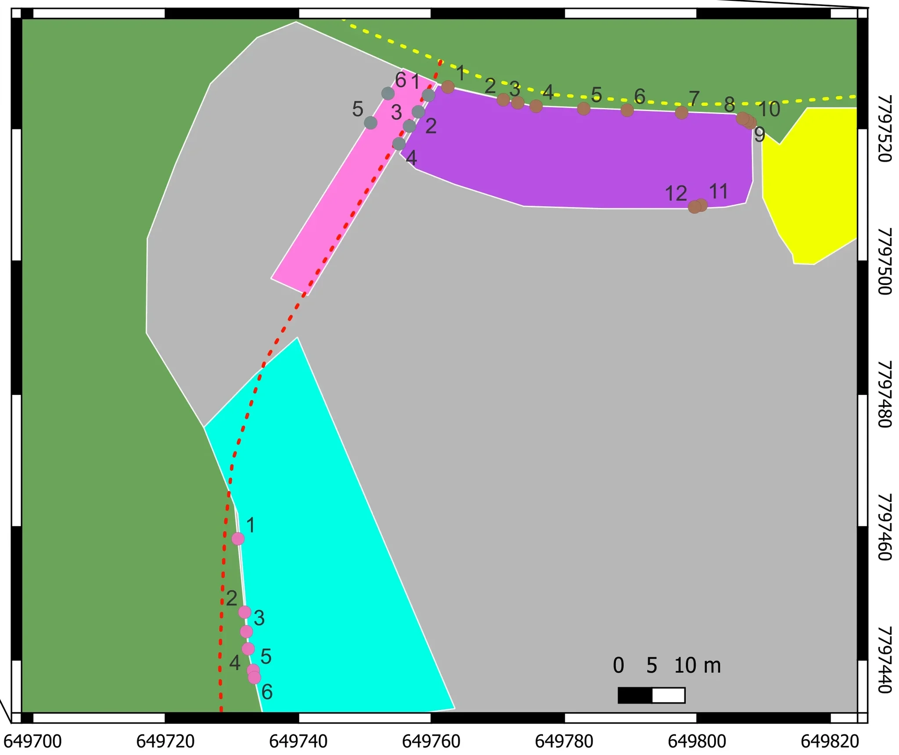
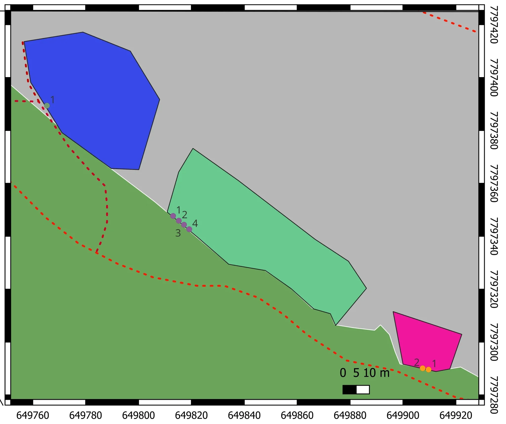

# Croqui: Monte Alvão - Caeté

## Informações Gerais

- **descricao**:
    O Alto Monte Alvão, localizado em Caeté, MG, é uma das áreas de escalada mais tradicionais e belas da região, oferecendo vias de diversos estilos e dificuldades em quartzito de alta qualidade.
    
- **id**: br_mg_caete_monte_alvao
- **nome**: Monte Alvão - Caeté
- **creditos**:
  - Gabriel Franco Ferreira
- **caminho_thumbnail**: 
- **status_desenho_extraivel**: NAO_TEM_DESENHO
- **revisado_manualmente**: True
- **ultima_migracao**: 4
- **publicar_croqui**: True
- **revisado_bounding_circle**: True
- **botoes**: []

## Parte: setor_vale_gaules

### Setor (Pico: Alto Monte Alvão)

- **descricao**:
    # Vale Gaules
    
    O setor Vale Gaules está localizado no Alto Monte Alvão.
- **nome**: Vale Gaules
- **mapas**:
  - **[0]**:
    - **caminho_imagem_mapa**: 
    - **largura_mapa**: 2048
    - **altura_mapa**: 1728
    - **pontos_de_interesse**:
      - **[0]**:
        - **id**: 1
        - **label**: 1
        - **retangulo**:
          - **x**: 416
          - **y**: 1324
          - **comprimento**: 34
          - **largura**: 45
      - **[1]**:
        - **id**: 2
        - **label**: 2
        - **retangulo**:
          - **x**: 290
          - **y**: 1258
          - **comprimento**: 35
          - **largura**: 44
      - **[2]**:
        - **id**: 3
        - **label**: 3
        - **retangulo**:
          - **x**: 310
          - **y**: 1106
          - **comprimento**: 28
          - **largura**: 39
      - **[3]**:
        - **id**: 4
        - **label**: 4
        - **retangulo**:
          - **x**: 318
          - **y**: 988
          - **comprimento**: 29
          - **largura**: 37
      - **[4]**:
        - **id**: 5
        - **label**: 5
        - **retangulo**:
          - **x**: 410
          - **y**: 886
          - **comprimento**: 35
          - **largura**: 42
      - **[5]**:
        - **id**: 6
        - **label**: 6
        - **retangulo**:
          - **x**: 524
          - **y**: 788
          - **comprimento**: 31
          - **largura**: 41
      - **[6]**:
        - **id**: 7
        - **label**: 7
        - **retangulo**:
          - **x**: 755
          - **y**: 647
          - **comprimento**: 34
          - **largura**: 42
      - **[7]**:
        - **id**: 8
        - **label**: 8
        - **retangulo**:
          - **x**: 894
          - **y**: 579
          - **comprimento**: 29
          - **largura**: 38
      - **[8]**:
        - **id**: 9
        - **label**: 9
        - **retangulo**:
          - **x**: 862
          - **y**: 482
          - **comprimento**: 29
          - **largura**: 39
      - **[9]**:
        - **id**: 10
        - **label**: 10
        - **retangulo**:
          - **x**: 732
          - **y**: 504
          - **comprimento**: 45
          - **largura**: 41
      - **[10]**:
        - **id**: 11
        - **label**: 11
        - **retangulo**:
          - **x**: 646
          - **y**: 512
          - **comprimento**: 41
          - **largura**: 40
    - **referencias**:
      - **[0]**:
        - **escalada**: Beijo Grego
        - **ids**:
          - 1
      - **[1]**:
        - **escalada**: A surpresa do Cesar
        - **ids**:
          - 2
      - **[2]**:
        - **escalada**: O sítio dos deuses
        - **ids**:
          - 3
      - **[3]**:
        - **escalada**: Todos caminhos levam a Roma
        - **ids**:
          - 4
      - **[4]**:
        - **escalada**: Love Actually
        - **ids**:
          - 5
      - **[5]**:
        - **escalada**: Mama Gás
        - **ids**:
          - 6
      - **[6]**:
        - **escalada**: Java Lee
        - **ids**:
          - 7
      - **[7]**:
        - **escalada**: Java Porco
        - **ids**:
          - 8
      - **[8]**:
        - **escalada**: Absolut com limão
        - **ids**:
          - 9
      - **[9]**:
        - **escalada**: Ribit
        - **ids**:
          - 10
      - **[10]**:
        - **escalada**: Xanax
        - **ids**:
          - 11
- **escaladas**:
  - **[0]**:
    - **via_esportiva**:
      - **nome**: Beijo Grego
      - **dificuldade**: BR_7C
      - **extensao**: 20
      - **quantidade_protecoes_intermediarias**: 5
      - **quantidade_protecoes_parada**: 2
      - **conquistadores**:
        - Jg
  - **[1]**:
    - **via_esportiva**:
      - **nome**: A surpresa do Cesar
      - **dificuldade**: BR_6
      - **extensao**: 18
      - **quantidade_protecoes_intermediarias**: 3
      - **quantidade_protecoes_parada**: 2
      - **conquistadores**:
        - Jg
  - **[2]**:
    - **via_esportiva**:
      - **nome**: O sítio dos deuses
      - **dificuldade**: BR_5
      - **extensao**: 18
      - **quantidade_protecoes_intermediarias**: 3
      - **quantidade_protecoes_parada**: 2
      - **conquistadores**:
        - Jg
  - **[3]**:
    - **via_movel**:
      - **descricao**: Parada fixa
      - **nome**: Todos caminhos levam a Roma
      - **dificuldade**: BR_5SUP
      - **extensao**: 18
      - **quantidade_protecoes_parada**: 2
      - **conquistadores**:
        - Jg
  - **[4]**:
    - **via_esportiva**:
      - **nome**: Love Actually
      - **dificuldade**: BR_5SUP
      - **extensao**: 18
      - **quantidade_protecoes_intermediarias**: 4
      - **quantidade_protecoes_parada**: 2
      - **conquistadores**:
        - Jg
  - **[5]**:
    - **via_esportiva**:
      - **nome**: Mama Gás
      - **dificuldade**: BR_7A
      - **extensao**: 15
      - **quantidade_protecoes_intermediarias**: 4
      - **quantidade_protecoes_parada**: 2
      - **conquistadores**:
        - Jg
  - **[6]**:
    - **via_esportiva**:
      - **nome**: Java Lee
      - **dificuldade**: BR_7A
      - **extensao**: 12
      - **quantidade_protecoes_intermediarias**: 3
      - **quantidade_protecoes_parada**: 2
      - **conquistadores**:
        - Jg
  - **[7]**:
    - **via_esportiva**:
      - **nome**: Java Porco
      - **dificuldade**: BR_7A
      - **extensao**: 12
      - **quantidade_protecoes_intermediarias**: 3
      - **quantidade_protecoes_parada**: 2
      - **conquistadores**:
        - Jg
  - **[8]**:
    - **via_esportiva**:
      - **nome**: Absolut com limão
      - **dificuldade**: BR_7B
      - **extensao**: 15
      - **quantidade_protecoes_intermediarias**: 4
      - **quantidade_protecoes_parada**: 2
      - **conquistadores**:
        - Jg
  - **[9]**:
    - **via_esportiva**:
      - **descricao**: Inacabada
      - **nome**: Ribit
      - **dificuldade**: BR_7A
      - **extensao**: 15
      - **quantidade_protecoes_intermediarias**: 4
      - **quantidade_protecoes_parada**: 2
      - **conquistadores**:
        - Jg
  - **[10]**:
    - **via_esportiva**:
      - **nome**: Xanax
      - **dificuldade**: BR_7C
      - **extensao**: 20
      - **quantidade_protecoes_intermediarias**: 6
      - **quantidade_protecoes_parada**: 2
      - **conquistadores**:
        - Jg
- **precomputados**:
  - **total_escaladas**: 11

## Parte: setor_parede_do_ladrao_e_forno_da_onca

### Grupo (Pico: Alto Monte Alvão)

- **descricao**:
    # Parede do Ladrão e Forno da Onça
    
    Estes setores estão localizados lado a lado no Alto Monte Alvão.
- **nome**: Parede do Ladrão e Forno da Onça
- **mapas**:
  - **[0]**:
    - **caminho_imagem_mapa**: 
    - **largura_mapa**: 2048
    - **altura_mapa**: 1712
    - **pontos_de_interesse**:
      - **[0]**:
        - **id**: 1am
        - **label**: 1am
        - **retangulo**:
          - **x**: 106
          - **y**: 728
          - **comprimento**: 28
          - **largura**: 41
      - **[1]**:
        - **id**: 2am
        - **label**: 2am
        - **retangulo**:
          - **x**: 167
          - **y**: 840
          - **comprimento**: 36
          - **largura**: 47
      - **[2]**:
        - **id**: 3am
        - **label**: 3am
        - **retangulo**:
          - **x**: 159
          - **y**: 720
          - **comprimento**: 34
          - **largura**: 43
      - **[3]**:
        - **id**: 4am
        - **label**: 4am
        - **retangulo**:
          - **x**: 238
          - **y**: 756
          - **comprimento**: 29
          - **largura**: 39
      - **[4]**:
        - **id**: 5am
        - **label**: 5am
        - **retangulo**:
          - **x**: 255
          - **y**: 670
          - **comprimento**: 28
          - **largura**: 41
      - **[5]**:
        - **id**: 6am
        - **label**: 6am
        - **retangulo**:
          - **x**: 678
          - **y**: 711
          - **comprimento**: 35
          - **largura**: 48
      - **[6]**:
        - **id**: 1az
        - **label**: 1az
        - **retangulo**:
          - **x**: 852
          - **y**: 728
          - **comprimento**: 26
          - **largura**: 39
      - **[7]**:
        - **id**: 2az
        - **label**: 2az
        - **retangulo**:
          - **x**: 1000
          - **y**: 684
          - **comprimento**: 29
          - **largura**: 35
      - **[8]**:
        - **id**: 3az
        - **label**: 3az
        - **retangulo**:
          - **x**: 1141
          - **y**: 642
          - **comprimento**: 32
          - **largura**: 42
      - **[9]**:
        - **id**: 4az
        - **label**: 4az
        - **retangulo**:
          - **x**: 1426
          - **y**: 748
          - **comprimento**: 32
          - **largura**: 43
      - **[10]**:
        - **id**: 5az
        - **label**: 5az
        - **retangulo**:
          - **x**: 1512
          - **y**: 688
          - **comprimento**: 31
          - **largura**: 44
      - **[11]**:
        - **id**: 6az
        - **label**: 6az
        - **retangulo**:
          - **x**: 1614
          - **y**: 572
          - **comprimento**: 33
          - **largura**: 44
      - **[12]**:
        - **id**: 7az
        - **label**: 7az
        - **retangulo**:
          - **x**: 1752
          - **y**: 558
          - **comprimento**: 32
          - **largura**: 47
    - **referencias**:
      - **[0]**:
        - **escalada**: Cuidado Ketely
        - **ids**:
          - 1am
      - **[1]**:
        - **escalada**: You will survive
        - **ids**:
          - 2am
      - **[2]**:
        - **escalada**: Cara ou Coroa
        - **ids**:
          - 3am
      - **[3]**:
        - **escalada**: French CanCan
        - **ids**:
          - 4am
      - **[4]**:
        - **escalada**: On the road again
        - **ids**:
          - 5am
      - **[5]**:
        - **escalada**: Incrível mas verdadeiro
        - **ids**:
          - 6am
      - **[6]**:
        - **escalada**: Bouder com leite
        - **ids**:
          - 1az
      - **[7]**:
        - **escalada**: Chipie chipie
        - **ids**:
          - 2az
      - **[8]**:
        - **escalada**: Bambi
        - **ids**:
          - 3az
      - **[9]**:
        - **escalada**: Ana Thor
        - **ids**:
          - 4az
      - **[10]**:
        - **escalada**: Au bout des doigts
        - **ids**:
          - 5az
      - **[11]**:
        - **escalada**: Boom Boom
        - **ids**:
          - 6az
      - **[12]**:
        - **escalada**: Petit Pichou
        - **ids**:
          - 7az
- **setores**:
  - **[0]**:
    - **conteudo**:
      - **descricao**: 
      - **nome**: Forno da Onça
      - **escaladas**:
        - **[0]**:
          - **via_esportiva**:
            - **nome**: Cuidado Ketely
            - **dificuldade**: BR_6
            - **extensao**: 24
            - **quantidade_protecoes_intermediarias**: 8
            - **quantidade_protecoes_parada**: 2
            - **conquistadores**:
              - Jg
        - **[1]**:
          - **via_esportiva**:
            - **nome**: You will survive
            - **dificuldade**: BR_7A
            - **extensao**: 20
            - **quantidade_protecoes_intermediarias**: 6
            - **quantidade_protecoes_parada**: 2
            - **conquistadores**:
              - Jg
        - **[2]**:
          - **via_esportiva**:
            - **nome**: Cara ou Coroa
            - **dificuldade**: BR_6
            - **extensao**: 22
            - **quantidade_protecoes_intermediarias**: 6
            - **quantidade_protecoes_parada**: 2
            - **conquistadores**:
              - Jg
        - **[3]**:
          - **via_esportiva**:
            - **nome**: French CanCan
            - **dificuldade**: BR_6SUP
            - **extensao**: 28
            - **quantidade_protecoes_intermediarias**: 5
            - **quantidade_protecoes_parada**: 2
            - **conquistadores**:
              - Jg
        - **[4]**:
          - **via_esportiva**:
            - **nome**: On the road again
            - **dificuldade**: BR_6SUP
            - **extensao**: 18
            - **quantidade_protecoes_intermediarias**: 5
            - **quantidade_protecoes_parada**: 2
            - **conquistadores**:
              - Jg
        - **[5]**:
          - **via_multiplas_enfiadas**:
            - **nome**: Incrível mas verdadeiro
            - **dificuldade_media**: BR_6
            - **dificuldade_maxima**: BR_6
            - **numero_enfiadas**: 2
            - **comprimento_total**: 50
            - **tipo_via_multiplas_enfiadas**: MISTA
            - **enfiadas**:
              - **[0]**:
                - **via_esportiva**:
                  - **nome**: L1
                  - **dificuldade**: BR_4
                  - **extensao**: 15
              - **[1]**:
                - **via_esportiva**:
                  - **descricao**: mista
                  - **nome**: L2
                  - **dificuldade**: BR_6
                  - **extensao**: 35
            - **conquistadores**:
              - Jg
            - **quantidade_costuras_intermediarias**: 12
            - **quantidade_equipamentos_parada**: 2
      - **precomputados**:
        - **total_escaladas**: 6
  - **[1]**:
    - **conteudo**:
      - **descricao**: 
      - **nome**: Parede do Ladrão
      - **escaladas**:
        - **[0]**:
          - **via_esportiva**:
            - **nome**: Bouder com leite
            - **dificuldade**: BR_5
            - **extensao**: 25
            - **quantidade_protecoes_intermediarias**: 4
            - **quantidade_protecoes_parada**: 2
        - **[1]**:
          - **via_esportiva**:
            - **nome**: Chipie chipie
            - **dificuldade**: BR_4SUP
            - **extensao**: 23
            - **quantidade_protecoes_intermediarias**: 6
            - **quantidade_protecoes_parada**: 2
        - **[2]**:
          - **via_esportiva**:
            - **nome**: Bambi
            - **dificuldade**: BR_4
            - **extensao**: 20
            - **quantidade_protecoes_intermediarias**: 4
            - **quantidade_protecoes_parada**: 2
        - **[3]**:
          - **via_esportiva**:
            - **nome**: Ana Thor
            - **dificuldade**: BR_7C
            - **extensao**: 15
            - **quantidade_protecoes_intermediarias**: 6
            - **quantidade_protecoes_parada**: 2
        - **[4]**:
          - **via_esportiva**:
            - **descricao**: Base no platô superior
            - **nome**: Au bout des doigts
            - **dificuldade**: BR_7B
            - **extensao**: 22
            - **quantidade_protecoes_intermediarias**: 6
            - **quantidade_protecoes_parada**: 3
            - **conquistadores**:
              - Pablo Gonçalves
              - Jg
        - **[5]**:
          - **via_esportiva**:
            - **nome**: Boom Boom
            - **dificuldade**: BR_6SUP
            - **extensao**: 28
            - **quantidade_protecoes_intermediarias**: 8
            - **quantidade_protecoes_parada**: 2
        - **[6]**:
          - **via_esportiva**:
            - **nome**: Petit Pichou
            - **dificuldade**: BR_6SUP
            - **extensao**: 28
            - **quantidade_protecoes_intermediarias**: 8
            - **quantidade_protecoes_parada**: 2
      - **precomputados**:
        - **total_escaladas**: 7
- **precomputados**:
  - **total_escaladas**: 13

## Parte: setor_caverna_bin_laden_mirante_da_cruz_e_ground_control

### Grupo (Pico: Alto Monte Alvão)

- **descricao**:
    # Caverna, Mirante e Ground Control
    
    Este grupo engloba os setores localizados na parte central do Alto Monte Alvão.
- **nome**: Caverna, Mirante e Ground Control
- **mapas**:
  - **[0]**:
    - **caminho_imagem_mapa**: 
    - **largura_mapa**: 2048
    - **altura_mapa**: 1721
    - **pontos_de_interesse**:
      - **[0]**:
        - **id**: 1ros
        - **label**: 1ros
        - **retangulo**:
          - **x**: 948
          - **y**: 184
          - **comprimento**: 30
          - **largura**: 47
      - **[1]**:
        - **id**: 2ros
        - **label**: 2ros
        - **retangulo**:
          - **x**: 982
          - **y**: 286
          - **comprimento**: 29
          - **largura**: 46
      - **[2]**:
        - **id**: 3ros
        - **label**: 3ros
        - **retangulo**:
          - **x**: 904
          - **y**: 256
          - **comprimento**: 30
          - **largura**: 50
      - **[3]**:
        - **id**: 4ros
        - **label**: 4ros
        - **retangulo**:
          - **x**: 937
          - **y**: 360
          - **comprimento**: 34
          - **largura**: 44
      - **[4]**:
        - **id**: 5ros
        - **label**: 5ros
        - **retangulo**:
          - **x**: 816
          - **y**: 248
          - **comprimento**: 35
          - **largura**: 50
      - **[5]**:
        - **id**: 6ros
        - **label**: 6ros
        - **retangulo**:
          - **x**: 912
          - **y**: 182
          - **comprimento**: 31
          - **largura**: 47
      - **[6]**:
        - **id**: 1az
        - **label**: 1
        - **retangulo**:
          - **x**: 570
          - **y**: 1194
          - **comprimento**: 27
          - **largura**: 43
      - **[7]**:
        - **id**: 2az
        - **label**: 2
        - **retangulo**:
          - **x**: 528
          - **y**: 1362
          - **comprimento**: 38
          - **largura**: 46
      - **[8]**:
        - **id**: 3az
        - **label**: 3
        - **retangulo**:
          - **x**: 590
          - **y**: 1407
          - **comprimento**: 39
          - **largura**: 52
      - **[9]**:
        - **id**: 4az
        - **label**: 4
        - **retangulo**:
          - **x**: 536
          - **y**: 1508
          - **comprimento**: 28
          - **largura**: 40
      - **[10]**:
        - **id**: 5az
        - **label**: 5
        - **retangulo**:
          - **x**: 606
          - **y**: 1494
          - **comprimento**: 37
          - **largura**: 51
      - **[11]**:
        - **id**: 6az
        - **label**: 6
        - **retangulo**:
          - **x**: 608
          - **y**: 1575
          - **comprimento**: 35
          - **largura**: 50
      - **[12]**:
        - **id**: 1rox
        - **label**: 1rox
        - **retangulo**:
          - **x**: 1052
          - **y**: 163
          - **comprimento**: 29
          - **largura**: 50
      - **[13]**:
        - **id**: 2rox
        - **label**: 2rox
        - **retangulo**:
          - **x**: 1116
          - **y**: 194
          - **comprimento**: 32
          - **largura**: 57
      - **[14]**:
        - **id**: 3rox
        - **label**: 3rox
        - **retangulo**:
          - **x**: 1172
          - **y**: 196
          - **comprimento**: 37
          - **largura**: 47
      - **[15]**:
        - **id**: 4rox
        - **label**: 4rox
        - **retangulo**:
          - **x**: 1252
          - **y**: 210
          - **comprimento**: 35
          - **largura**: 47
      - **[16]**:
        - **id**: 5rox
        - **label**: 5rox
        - **retangulo**:
          - **x**: 1359
          - **y**: 213
          - **comprimento**: 30
          - **largura**: 50
      - **[17]**:
        - **id**: 6rox
        - **label**: 6rox
        - **retangulo**:
          - **x**: 1456
          - **y**: 218
          - **comprimento**: 34
          - **largura**: 53
      - **[18]**:
        - **id**: 7rox
        - **label**: 7rox
        - **retangulo**:
          - **x**: 1582
          - **y**: 220
          - **comprimento**: 33
          - **largura**: 50
      - **[19]**:
        - **id**: 8rox
        - **label**: 8rox
        - **retangulo**:
          - **x**: 1664
          - **y**: 236
          - **comprimento**: 33
          - **largura**: 50
      - **[20]**:
        - **id**: 9rox
        - **label**: 9rox
        - **retangulo**:
          - **x**: 1730
          - **y**: 303
          - **comprimento**: 32
          - **largura**: 48
      - **[21]**:
        - **id**: 10rox
        - **label**: 10rox
        - **retangulo**:
          - **x**: 1753
          - **y**: 246
          - **comprimento**: 56
          - **largura**: 46
      - **[22]**:
        - **id**: 11rox
        - **label**: 11rox
        - **retangulo**:
          - **x**: 1634
          - **y**: 436
          - **comprimento**: 45
          - **largura**: 53
      - **[23]**:
        - **id**: 12rox
        - **label**: 12rox
        - **retangulo**:
          - **x**: 1543
          - **y**: 438
          - **comprimento**: 50
          - **largura**: 51
    - **referencias**:
      - **[0]**:
        - **escalada**: Capitã Minhoca
        - **ids**:
          - 1ros
      - **[1]**:
        - **escalada**: He Man
        - **ids**:
          - 2ros
      - **[2]**:
        - **escalada**: Esqueleto
        - **ids**:
          - 3ros
      - **[3]**:
        - **escalada**: Allahu Akbar
        - **ids**:
          - 4ros
      - **[4]**:
        - **escalada**: Saída à Francesa
        - **ids**:
          - 5ros
      - **[5]**:
        - **escalada**: Paris em Chamas
        - **ids**:
          - 6ros
      - **[6]**:
        - **escalada**: Urubu tá com raiva do boi
        - **ids**:
          - 1az
      - **[7]**:
        - **escalada**: Maria Teresa
        - **ids**:
          - 2az
      - **[8]**:
        - **escalada**: Uma gota de milagre
        - **ids**:
          - 3az
      - **[9]**:
        - **escalada**: Quem não chora não mama
        - **ids**:
          - 4az
      - **[10]**:
        - **escalada**: Chapolin
        - **ids**:
          - 5az
      - **[11]**:
        - **escalada**: Desvio na pista
        - **ids**:
          - 6az
      - **[12]**:
        - **escalada**: Essa via não é minha
        - **ids**:
          - 1rox
      - **[13]**:
        - **escalada**: Vento da Patagônia
        - **ids**:
          - 2rox
      - **[14]**:
        - **escalada**: Mr Bean
        - **ids**:
          - 3rox
      - **[15]**:
        - **escalada**: Lagarto de aniversário
        - **ids**:
          - 4rox
      - **[16]**:
        - **escalada**: Cavuca tatu
        - **ids**:
          - 5rox
      - **[17]**:
        - **escalada**: Zé colmeia e Dona Flor
        - **ids**:
          - 6rox
      - **[18]**:
        - **escalada**: Tirolês
        - **ids**:
          - 7rox
      - **[19]**:
        - **escalada**: 10 c
        - **ids**:
          - 8rox
      - **[20]**:
        - **escalada**: Sabor Baunilha
        - **ids**:
          - 9rox
      - **[21]**:
        - **escalada**: O charme da Trad
        - **ids**:
          - 10rox
      - **[22]**:
        - **escalada**: Café Ole
        - **ids**:
          - 11rox
      - **[23]**:
        - **escalada**: Tio Tonton
        - **ids**:
          - 12rox
- **setores**:
  - **[0]**:
    - **conteudo**:
      - **descricao**: 
      - **nome**: Caverna do Bin Laden
      - **escaladas**:
        - **[0]**:
          - **via_esportiva**:
            - **nome**: Capitã Minhoca
            - **dificuldade**: BR_5SUP
            - **extensao**: 22
            - **quantidade_protecoes_intermediarias**: 5
            - **quantidade_protecoes_parada**: 2
            - **conquistadores**:
              - Jg
        - **[1]**:
          - **via_multiplas_enfiadas**:
            - **nome**: He Man
            - **dificuldade_media**: BR_6SUP
            - **dificuldade_maxima**: BR_7B
            - **numero_enfiadas**: 4
            - **comprimento_total**: 65
            - **tipo_via_multiplas_enfiadas**: TODA_FIXA
            - **enfiadas**:
              - **[0]**:
                - **via_esportiva**:
                  - **nome**: L1
                  - **dificuldade**: BR_6
                  - **extensao**: 18
              - **[1]**:
                - **via_esportiva**:
                  - **nome**: L2
                  - **dificuldade**: BR_3
                  - **extensao**: 15
              - **[2]**:
                - **via_esportiva**:
                  - **nome**: L3
                  - **dificuldade**: BR_7B
                  - **extensao**: 15
              - **[3]**:
                - **via_esportiva**:
                  - **descricao**: free
                  - **nome**: L4
                  - **dificuldade**: BR_2SUP
                  - **extensao**: 20
            - **conquistadores**:
              - Jg
            - **quantidade_costuras_intermediarias**: 8
            - **quantidade_equipamentos_parada**: 2
        - **[2]**:
          - **via_multiplas_enfiadas**:
            - **nome**: Esqueleto
            - **dificuldade_media**: BR_6
            - **dificuldade_maxima**: BR_6
            - **numero_enfiadas**: 4
            - **comprimento_total**: 65
            - **tipo_via_multiplas_enfiadas**: MISTA
            - **enfiadas**:
              - **[0]**:
                - **via_esportiva**:
                  - **nome**: L1
                  - **dificuldade**: BR_6
                  - **extensao**: 18
              - **[1]**:
                - **via_esportiva**:
                  - **nome**: L2
                  - **dificuldade**: BR_3
                  - **extensao**: 15
              - **[2]**:
                - **via_esportiva**:
                  - **descricao**: mista
                  - **nome**: L3
                  - **dificuldade**: BR_6
                  - **extensao**: 15
              - **[3]**:
                - **via_esportiva**:
                  - **descricao**: free
                  - **nome**: L4
                  - **dificuldade**: BR_2SUP
                  - **extensao**: 20
            - **conquistadores**:
              - Jg
            - **quantidade_costuras_intermediarias**: 8
            - **quantidade_equipamentos_parada**: 2
        - **[3]**:
          - **via_esportiva**:
            - **nome**: Allahu Akbar
            - **dificuldade**: BR_7A
            - **extensao**: 22
            - **quantidade_protecoes_intermediarias**: 6
            - **quantidade_protecoes_parada**: 2
            - **conquistadores**:
              - Jg
        - **[4]**:
          - **via_esportiva**:
            - **nome**: Saída à Francesa
            - **dificuldade**: BR_8B
            - **extensao**: 24
            - **quantidade_protecoes_intermediarias**: 8
            - **quantidade_protecoes_parada**: 2
            - **conquistadores**:
              - Pablo Gonçalves
              - Jg
        - **[5]**:
          - **via_esportiva**:
            - **descricao**: 10?
            - **nome**: Paris em Chamas
            - **dificuldade**: BR_10A
            - **extensao**: 24
            - **quantidade_protecoes_intermediarias**: 8
            - **quantidade_protecoes_parada**: 2
            - **conquistadores**:
              - Pablo Gonçalves
              - Fred Gonçalves
      - **precomputados**:
        - **total_escaladas**: 6
  - **[1]**:
    - **conteudo**:
      - **descricao**: 
      - **nome**: Mirante da Cruz
      - **escaladas**:
        - **[0]**:
          - **via_esportiva**:
            - **nome**: Urubu tá com raiva do boi
            - **dificuldade**: BR_5SUP
            - **extensao**: 30
            - **quantidade_protecoes_intermediarias**: 7
            - **quantidade_protecoes_parada**: 2
            - **conquistadores**:
              - jg
        - **[1]**:
          - **via_esportiva**:
            - **nome**: Maria Teresa
            - **dificuldade**: BR_6
            - **extensao**: 26
            - **quantidade_protecoes_intermediarias**: 5
            - **quantidade_protecoes_parada**: 2
            - **conquistadores**:
              - jg
        - **[2]**:
          - **via_esportiva**:
            - **nome**: Uma gota de milagre
            - **dificuldade**: BR_7A
            - **extensao**: 28
            - **quantidade_protecoes_intermediarias**: 8
            - **quantidade_protecoes_parada**: 2
            - **conquistadores**:
              - jg
        - **[3]**:
          - **via_esportiva**:
            - **nome**: Quem não chora não mama
            - **dificuldade**: BR_7B
            - **extensao**: 28
            - **quantidade_protecoes_intermediarias**: 9
            - **quantidade_protecoes_parada**: 2
            - **conquistadores**:
              - jg
        - **[4]**:
          - **via_esportiva**:
            - **nome**: Chapolin
            - **dificuldade**: BR_7A
            - **extensao**: 30
            - **quantidade_protecoes_intermediarias**: 9
            - **quantidade_protecoes_parada**: 2
            - **conquistadores**:
              - jg
        - **[5]**:
          - **via_esportiva**:
            - **nome**: Desvio na pista
            - **dificuldade**: BR_7B
            - **extensao**: 30
            - **quantidade_protecoes_intermediarias**: 9
            - **quantidade_protecoes_parada**: 2
            - **conquistadores**:
              - jg
      - **precomputados**:
        - **total_escaladas**: 6
  - **[2]**:
    - **conteudo**:
      - **descricao**: 
      - **nome**: Ground Control
      - **escaladas**:
        - **[0]**:
          - **via_movel**:
            - **nome**: Essa via não é minha
            - **dificuldade**: BR_4SUP
            - **extensao**: 70
            - **conquistadores**:
              - Rander Jr Sidnei
        - **[1]**:
          - **via_esportiva**:
            - **nome**: Vento da Patagônia
            - **dificuldade**: BR_5
            - **extensao**: 30
            - **quantidade_protecoes_intermediarias**: 6
            - **quantidade_protecoes_parada**: 2
            - **conquistadores**:
              - Danilo Steling
        - **[2]**:
          - **via_multiplas_enfiadas**:
            - **nome**: Mr Bean
            - **dificuldade_media**: BR_6SUP
            - **dificuldade_maxima**: BR_7A
            - **numero_enfiadas**: 3
            - **comprimento_total**: 70
            - **tipo_via_multiplas_enfiadas**: TODA_FIXA
            - **enfiadas**:
              - **[0]**:
                - **via_esportiva**:
                  - **nome**: L1
                  - **dificuldade**: BR_6
                  - **extensao**: 30
              - **[1]**:
                - **via_esportiva**:
                  - **nome**: L2
                  - **dificuldade**: BR_7A
                  - **extensao**: 18
              - **[2]**:
                - **via_esportiva**:
                  - **descricao**: free
                  - **nome**: L3
                  - **dificuldade**: BR_2SUP
                  - **extensao**: 22
            - **conquistadores**:
              - Pablo Gonçalves
              - Jg
            - **quantidade_costuras_intermediarias**: 10
            - **quantidade_equipamentos_parada**: 2
        - **[3]**:
          - **via_esportiva**:
            - **descricao**: Variante Mr Bean
            - **nome**: Lagarto de aniversário
            - **dificuldade**: BR_6
            - **extensao**: 30
            - **quantidade_protecoes_intermediarias**: 10
            - **quantidade_protecoes_parada**: 2
            - **conquistadores**:
              - Jg
        - **[4]**:
          - **via_esportiva**:
            - **nome**: Cavuca tatu
            - **dificuldade**: BR_7A
            - **extensao**: 30
            - **quantidade_protecoes_intermediarias**: 10
            - **quantidade_protecoes_parada**: 2
            - **conquistadores**:
              - Jg
        - **[5]**:
          - **via_movel**:
            - **descricao**: Parada fixa
            - **nome**: Zé colmeia e Dona Flor
            - **dificuldade**: BR_4SUP
            - **extensao**: 30
            - **conquistadores**:
              - Sidnei
              - Natita
        - **[6]**:
          - **via_esportiva**:
            - **nome**: Tirolês
            - **dificuldade**: BR_5
            - **extensao**: 30
            - **quantidade_protecoes_intermediarias**: 6
            - **quantidade_protecoes_parada**: 2
        - **[7]**:
          - **via_esportiva**:
            - **nome**: 10 c
            - **dificuldade**: BR_6
            - **extensao**: 30
            - **quantidade_protecoes_intermediarias**: 8
            - **quantidade_protecoes_parada**: 2
            - **conquistadores**:
              - sidnei
              - Jg
        - **[8]**:
          - **via_multiplas_enfiadas**:
            - **nome**: Sabor Baunilha
            - **dificuldade_media**: BR_7B
            - **dificuldade_maxima**: BR_7B
            - **numero_enfiadas**: 2
            - **comprimento_total**: 50
            - **enfiadas**:
              - **[0]**:
                - **via_esportiva**:
                  - **nome**: L1
                  - **dificuldade**: BR_7B
                  - **extensao**: 30
              - **[1]**:
                - **via_esportiva**:
                  - **descricao**: expo
                  - **nome**: L2
                  - **dificuldade**: BR_5SUP
                  - **extensao**: 20
            - **conquistadores**:
              - Jg
            - **quantidade_costuras_intermediarias**: 10
            - **quantidade_equipamentos_parada**: 2
        - **[9]**:
          - **via_movel**:
            - **descricao**: Parada fixa
            - **nome**: O charme da Trad
            - **dificuldade**: BR_6
            - **extensao**: 60
            - **conquistadores**:
              - Pablo Gonçalves
              - Jg
        - **[10]**:
          - **via_multiplas_enfiadas**:
            - **nome**: Café Ole
            - **dificuldade_media**: BR_5
            - **dificuldade_maxima**: BR_5SUP
            - **numero_enfiadas**: 2
            - **comprimento_total**: 55
            - **enfiadas**:
              - **[0]**:
                - **via_esportiva**:
                  - **nome**: L1
                  - **dificuldade**: BR_4SUP
                  - **extensao**: 20
              - **[1]**:
                - **via_esportiva**:
                  - **nome**: L2
                  - **dificuldade**: BR_5SUP
                  - **extensao**: 35
            - **conquistadores**:
              - Jg
              - Ana de Papel
            - **quantidade_costuras_intermediarias**: 8
            - **quantidade_equipamentos_parada**: 2
        - **[11]**:
          - **via_multiplas_enfiadas**:
            - **nome**: Tio Tonton
            - **dificuldade_media**: BR_6SUP
            - **dificuldade_maxima**: BR_7B
            - **numero_enfiadas**: 2
            - **comprimento_total**: 55
            - **enfiadas**:
              - **[0]**:
                - **via_esportiva**:
                  - **nome**: L1
                  - **dificuldade**: BR_4SUP
                  - **extensao**: 20
              - **[1]**:
                - **via_esportiva**:
                  - **descricao**: crux 7b
                  - **nome**: L2
                  - **dificuldade**: BR_6
            - **conquistadores**:
              - Jg
            - **quantidade_costuras_intermediarias**: 10
            - **quantidade_equipamentos_parada**: 2
      - **precomputados**:
        - **total_escaladas**: 12
- **precomputados**:
  - **total_escaladas**: 24

## Parte: setor_curto_e_grosso_malibu_e_terra_do_nunca

### Grupo (Pico: Alto Monte Alvão)

- **descricao**:
    # Curto e Grosso, Malibu e Terra do Nunca
    
    Estes setores estão localizados na parte sul do Alto Monte Alvão.
- **nome**: Curto e Grosso, Malibu e Terra do Nunca
- **mapas**:
  - **[0]**:
    - **caminho_imagem_mapa**: 
    - **largura_mapa**: 2048
    - **altura_mapa**: 1716
    - **pontos_de_interesse**:
      - **[0]**:
        - **id**: 1az
        - **label**: 1az
        - **retangulo**:
          - **x**: 212
          - **y**: 402
          - **comprimento**: 35
          - **largura**: 49
      - **[1]**:
        - **id**: 1ve
        - **label**: 1ve
        - **retangulo**:
          - **x**: 722
          - **y**: 848
          - **comprimento**: 19
          - **largura**: 35
      - **[2]**:
        - **id**: 2ve
        - **label**: 2ve
        - **retangulo**:
          - **x**: 746
          - **y**: 869
          - **comprimento**: 21
          - **largura**: 40
      - **[3]**:
        - **id**: 3ve
        - **label**: 3ve
        - **retangulo**:
          - **x**: 719
          - **y**: 944
          - **comprimento**: 32
          - **largura**: 39
      - **[4]**:
        - **id**: 4ve
        - **label**: 4ve
        - **retangulo**:
          - **x**: 789
          - **y**: 902
          - **comprimento**: 32
          - **largura**: 41
      - **[5]**:
        - **id**: 1ro
        - **label**: 1ro
        - **retangulo**:
          - **x**: 1756
          - **y**: 1474
          - **comprimento**: 31
          - **largura**: 45
      - **[6]**:
        - **id**: 2ro
        - **label**: 2ro
        - **retangulo**:
          - **x**: 1686
          - **y**: 1468
          - **comprimento**: 26
          - **largura**: 42
    - **referencias**:
      - **[0]**:
        - **escalada**: La Speza
        - **ids**:
          - 1az
      - **[1]**:
        - **escalada**: Gekke Greda
        - **ids**:
          - 1ve
      - **[2]**:
        - **escalada**: O Breizh
        - **ids**:
          - 2ve
      - **[3]**:
        - **escalada**: Dedo no C* e Gritaria
        - **ids**:
          - 3ve
      - **[4]**:
        - **escalada**: Tea Time
        - **ids**:
          - 4ve
      - **[5]**:
        - **escalada**: Mimi Zokko
        - **ids**:
          - 1ro
      - **[6]**:
        - **escalada**: Mariposa
        - **ids**:
          - 2ro
- **setores**:
  - **[0]**:
    - **conteudo**:
      - **descricao**: 
      - **nome**: Terra do Nunca
      - **escaladas**:
        - **[0]**:
          - **via_esportiva**:
            - **nome**: La Speza
            - **dificuldade**: BR_6
            - **extensao**: 25
            - **quantidade_protecoes_intermediarias**: 8
            - **quantidade_protecoes_parada**: 2
            - **conquistadores**:
              - Jg
              - Samuel Corleone
      - **precomputados**:
        - **total_escaladas**: 1
  - **[1]**:
    - **conteudo**:
      - **descricao**: 
      - **nome**: Curto e Grosso
      - **escaladas**:
        - **[0]**:
          - **via_esportiva**:
            - **nome**: Gekke Greda
            - **dificuldade**: BR_7B
            - **extensao**: 12
            - **quantidade_protecoes_intermediarias**: 4
            - **quantidade_protecoes_parada**: 2
            - **conquistadores**:
              - Jg
              - Angela Van Dutch
        - **[1]**:
          - **via_esportiva**:
            - **nome**: O Breizh
            - **dificuldade**: BR_7A
            - **extensao**: 12
            - **quantidade_protecoes_intermediarias**: 4
            - **quantidade_protecoes_parada**: 2
            - **conquistadores**:
              - Jg
              - Morgan Hervaut
        - **[2]**:
          - **via_esportiva**:
            - **nome**: Dedo no C* e Gritaria
            - **dificuldade**: BR_8A
            - **extensao**: 12
            - **quantidade_protecoes_intermediarias**: 5
            - **quantidade_protecoes_parada**: 2
            - **conquistadores**:
              - Jg
              - Cristian Charme
        - **[3]**:
          - **via_esportiva**:
            - **nome**: Tea Time
            - **dificuldade**: BR_6
            - **extensao**: 12
            - **quantidade_protecoes_intermediarias**: 4
            - **quantidade_protecoes_parada**: 2
            - **conquistadores**:
              - Jg
              - Arthur King
      - **precomputados**:
        - **total_escaladas**: 4
  - **[2]**:
    - **conteudo**:
      - **descricao**: 
      - **nome**: Malibu
      - **escaladas**:
        - **[0]**:
          - **via_esportiva**:
            - **nome**: Mimi Zokko
            - **dificuldade**: BR_5SUP
            - **extensao**: 25
            - **quantidade_protecoes_intermediarias**: 8
            - **quantidade_protecoes_parada**: 2
            - **conquistadores**:
              - Jg
        - **[1]**:
          - **via_esportiva**:
            - **nome**: Mariposa
            - **dificuldade**: BR_6
            - **extensao**: 25
            - **quantidade_protecoes_intermediarias**: 8
            - **quantidade_protecoes_parada**: 2
            - **conquistadores**:
              - Jg
              - Ana Gonzalez Sanchez
      - **precomputados**:
        - **total_escaladas**: 2
- **precomputados**:
  - **total_escaladas**: 7

## Arquivos Externos

- **arquivos_externos**:
  - **[0]**:
    - **caminho**: 
    - **checksum_sha256**: 06813d85af3d184beda6027820fcc4ca557712ed744a965e71894fb2502b5844
  - **[1]**:
    - **caminho**: 
    - **checksum_sha256**: bba17d956c3bfdd09536f225cfcce83f890e7aa979c6adf826428970e3809a4b
  - **[2]**:
    - **caminho**: 
    - **checksum_sha256**: 1687af806a79f79622af0e00423628d795e1d001d3e4304e680a2c85c069c115
  - **[3]**:
    - **caminho**: 
    - **checksum_sha256**: 0ab0c33a9c6a2028f6970fefe31cb8aa94b05aae961bcb2c4d206e2bbf9fdea0
  - **[4]**:
    - **caminho**: 
    - **checksum_sha256**: 00b3eb6458969b4ac6a1809a657c5418768f7483869a14e36d2d62a86a0dc120

