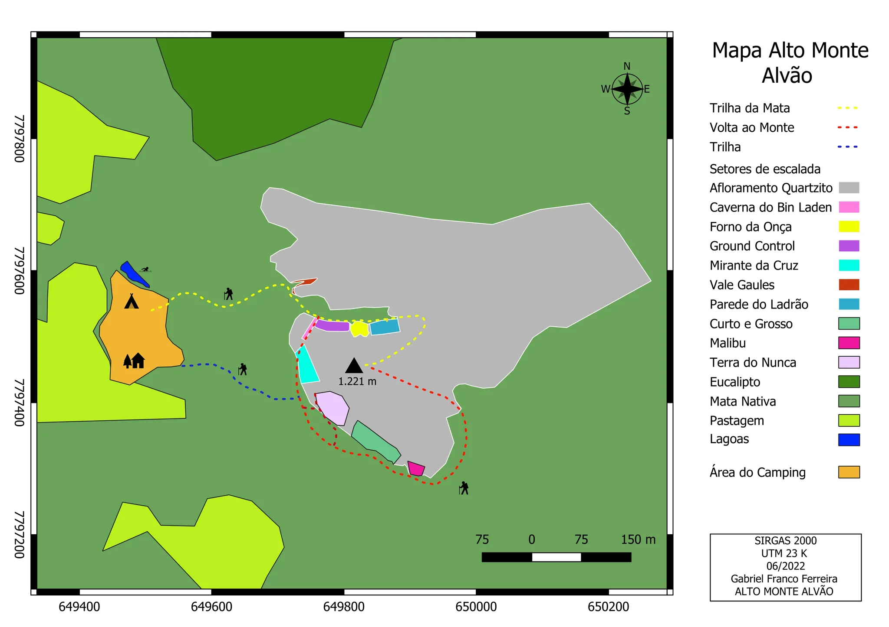
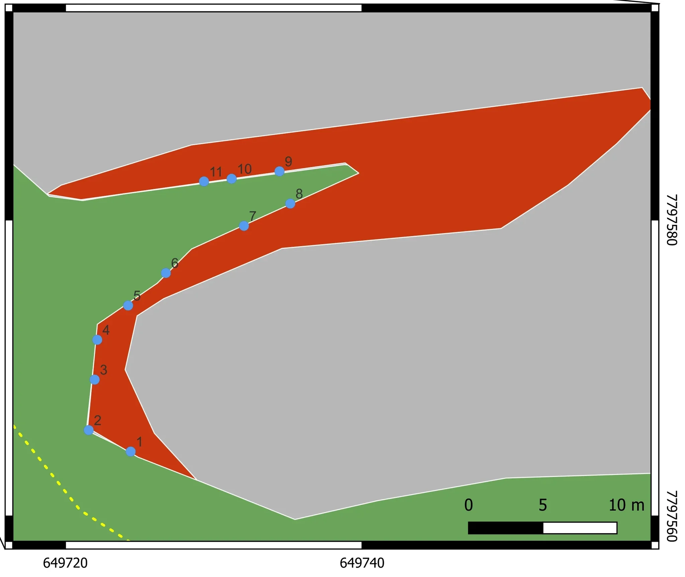
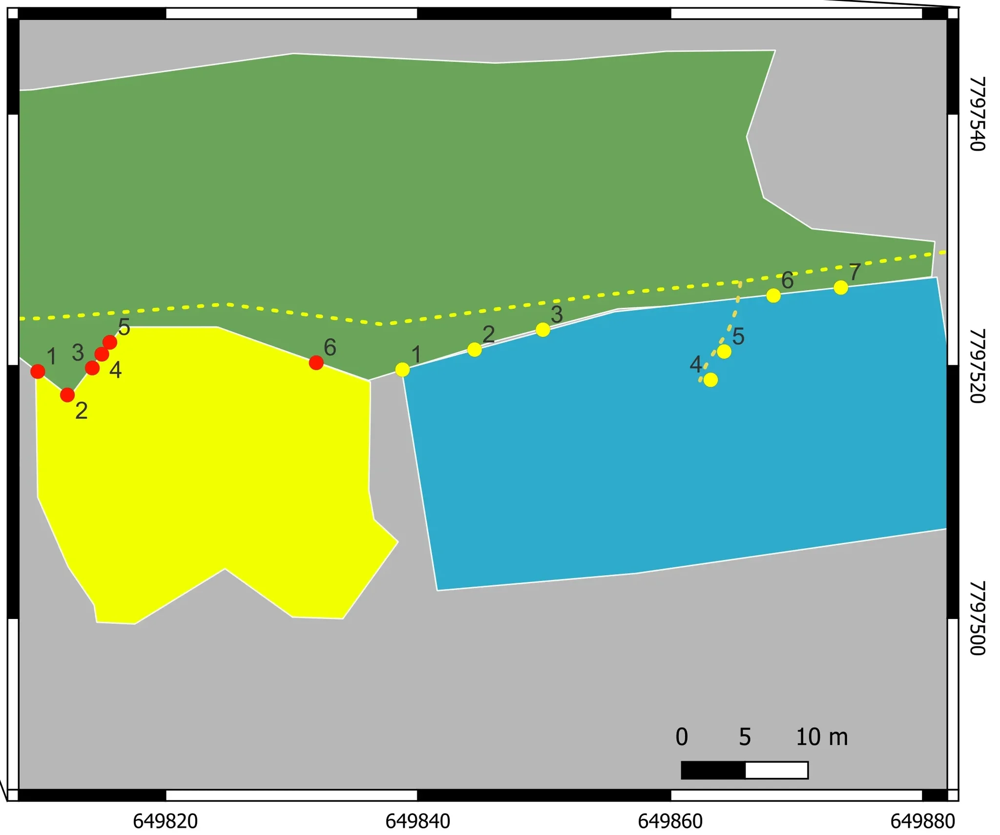
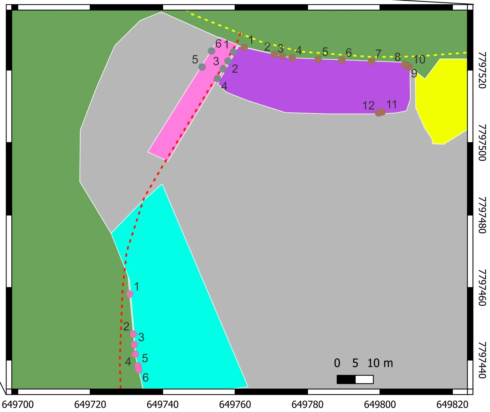
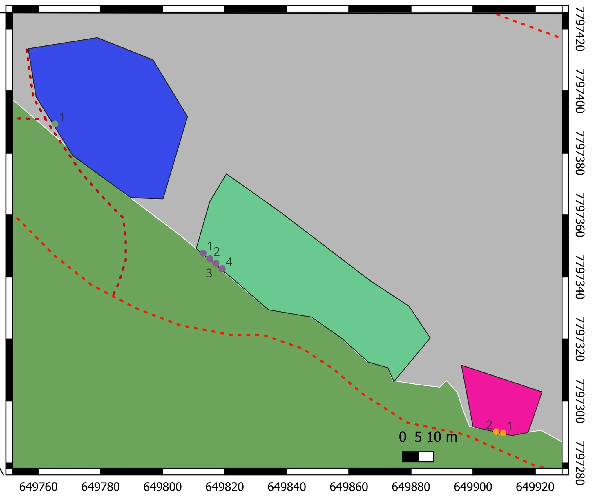

# Croqui: Monte Alvão - Caeté

## Informações Gerais

- **descricao**:
    O Alto Monte Alvão, localizado em Caeté, MG, é uma das áreas de escalada mais tradicionais e belas da região, oferecendo vias de diversos estilos e dificuldades em quartzito de alta qualidade.
    
- **id**: br_mg_caete_monte_alvao
- **nome**: Monte Alvão - Caeté
- **uid**: hyRUkm1gfZRwSw
- **creditos**:
  - Gabriel Franco Ferreira
- **caminho_thumbnail**: 
- **status_desenho_extraivel**: NAO_TEM_DESENHO
- **revisado_manualmente**: True
- **ultima_migracao**: 5
- **publicar_croqui**: True
- **revisado_bounding_circle**: True
- **botoes**: []

## Parte: setor_vale_gaules

### Setor (Pico: Alto Monte Alvão)

- **descricao**:
    # Vale Gaules
    
    O setor Vale Gaules está localizado no Alto Monte Alvão.
- **nome**: Vale Gaules
- **uid**: miGSpygWRq6cb6
- **mapas**:
  - **[0]**:
    - **caminho_imagem_mapa**: 
    - **largura_mapa**: 2048
    - **altura_mapa**: 1728
    - **pontos_de_interesse**:
      - **[0]**:
        - **id**: 3okZzVngtkY85n
        - **uid**: 3okZzVngtkY85n
        - **rotulo**: 1
        - **retangulo**:
          - **x**: 416
          - **y**: 1324
          - **comprimento**: 34
          - **largura**: 45
        - **label**: 1
      - **[1]**:
        - **id**: pcoowIx00Czbif
        - **uid**: pcoowIx00Czbif
        - **rotulo**: 2
        - **retangulo**:
          - **x**: 290
          - **y**: 1258
          - **comprimento**: 35
          - **largura**: 44
        - **label**: 2
      - **[2]**:
        - **id**: rHfqXsL9Njw1ca
        - **uid**: rHfqXsL9Njw1ca
        - **rotulo**: 3
        - **retangulo**:
          - **x**: 310
          - **y**: 1106
          - **comprimento**: 28
          - **largura**: 39
        - **label**: 3
      - **[3]**:
        - **id**: V0nRpHhwK9mdSc
        - **uid**: V0nRpHhwK9mdSc
        - **rotulo**: 4
        - **retangulo**:
          - **x**: 318
          - **y**: 988
          - **comprimento**: 29
          - **largura**: 37
        - **label**: 4
      - **[4]**:
        - **id**: ecmvyKastDRTQ8
        - **uid**: ecmvyKastDRTQ8
        - **rotulo**: 5
        - **retangulo**:
          - **x**: 410
          - **y**: 886
          - **comprimento**: 35
          - **largura**: 42
        - **label**: 5
      - **[5]**:
        - **id**: AuTkBjcPw4enU1
        - **uid**: AuTkBjcPw4enU1
        - **rotulo**: 6
        - **retangulo**:
          - **x**: 524
          - **y**: 788
          - **comprimento**: 31
          - **largura**: 41
        - **label**: 6
      - **[6]**:
        - **id**: mCTLo35tUbwnDq
        - **uid**: mCTLo35tUbwnDq
        - **rotulo**: 7
        - **retangulo**:
          - **x**: 755
          - **y**: 647
          - **comprimento**: 34
          - **largura**: 42
        - **label**: 7
      - **[7]**:
        - **id**: RE0NyvyZmBu2yc
        - **uid**: RE0NyvyZmBu2yc
        - **rotulo**: 8
        - **retangulo**:
          - **x**: 894
          - **y**: 579
          - **comprimento**: 29
          - **largura**: 38
        - **label**: 8
      - **[8]**:
        - **id**: UUWc5c7jAxRl7F
        - **uid**: UUWc5c7jAxRl7F
        - **rotulo**: 9
        - **retangulo**:
          - **x**: 862
          - **y**: 482
          - **comprimento**: 29
          - **largura**: 39
        - **label**: 9
      - **[9]**:
        - **id**: pjdGXRG05dDq7k
        - **uid**: pjdGXRG05dDq7k
        - **rotulo**: 10
        - **retangulo**:
          - **x**: 732
          - **y**: 504
          - **comprimento**: 45
          - **largura**: 41
        - **label**: 10
      - **[10]**:
        - **id**: tqCmLfNxjeVMxY
        - **uid**: tqCmLfNxjeVMxY
        - **rotulo**: 11
        - **retangulo**:
          - **x**: 646
          - **y**: 512
          - **comprimento**: 41
          - **largura**: 40
        - **label**: 11
    - **referencias**:
      - **[0]**:
        - **alvo_uid**: Ffp8jQExoCB7IZ
        - **pontos_uids**:
          - 3okZzVngtkY85n
        - **escalada**: Beijo Grego
        - **ids**:
          - 3okZzVngtkY85n
      - **[1]**:
        - **alvo_uid**: yi3NA6H2aF4Eb5
        - **pontos_uids**:
          - pcoowIx00Czbif
        - **escalada**: A surpresa do Cesar
        - **ids**:
          - pcoowIx00Czbif
      - **[2]**:
        - **alvo_uid**: xr0k2dVbn6alQ1
        - **pontos_uids**:
          - rHfqXsL9Njw1ca
        - **escalada**: O sítio dos deuses
        - **ids**:
          - rHfqXsL9Njw1ca
      - **[3]**:
        - **alvo_uid**: W4NwPfyf9MEhL0
        - **pontos_uids**:
          - V0nRpHhwK9mdSc
        - **escalada**: Todos caminhos levam a Roma
        - **ids**:
          - V0nRpHhwK9mdSc
      - **[4]**:
        - **alvo_uid**: 6Gbt0xEgMVOijY
        - **pontos_uids**:
          - ecmvyKastDRTQ8
        - **escalada**: Love Actually
        - **ids**:
          - ecmvyKastDRTQ8
      - **[5]**:
        - **alvo_uid**: MRy9hQtwbJExKB
        - **pontos_uids**:
          - AuTkBjcPw4enU1
        - **escalada**: Mama Gás
        - **ids**:
          - AuTkBjcPw4enU1
      - **[6]**:
        - **alvo_uid**: LJA5GenH4hJ3bP
        - **pontos_uids**:
          - mCTLo35tUbwnDq
        - **escalada**: Java Lee
        - **ids**:
          - mCTLo35tUbwnDq
      - **[7]**:
        - **alvo_uid**: fFXH7B7pphlHZf
        - **pontos_uids**:
          - RE0NyvyZmBu2yc
        - **escalada**: Java Porco
        - **ids**:
          - RE0NyvyZmBu2yc
      - **[8]**:
        - **alvo_uid**: U9uW0vl6JjDUmL
        - **pontos_uids**:
          - UUWc5c7jAxRl7F
        - **escalada**: Absolut com limão
        - **ids**:
          - UUWc5c7jAxRl7F
      - **[9]**:
        - **alvo_uid**: iDOuCBvKulwWxB
        - **pontos_uids**:
          - pjdGXRG05dDq7k
        - **escalada**: Ribit
        - **ids**:
          - pjdGXRG05dDq7k
      - **[10]**:
        - **alvo_uid**: RdKMHcdsRKS6nf
        - **pontos_uids**:
          - tqCmLfNxjeVMxY
        - **escalada**: Xanax
        - **ids**:
          - tqCmLfNxjeVMxY
- **escaladas**:
  - **[0]**:
    - **uid**: Ffp8jQExoCB7IZ
    - **via_esportiva**:
      - **nome**: Beijo Grego
      - **dificuldade**: BR_7C
      - **extensao**: 20
      - **quantidade_protecoes_intermediarias**: 5
      - **quantidade_protecoes_parada**: 2
      - **conquistadores**:
        - Jg
  - **[1]**:
    - **uid**: yi3NA6H2aF4Eb5
    - **via_esportiva**:
      - **nome**: A surpresa do Cesar
      - **dificuldade**: BR_6
      - **extensao**: 18
      - **quantidade_protecoes_intermediarias**: 3
      - **quantidade_protecoes_parada**: 2
      - **conquistadores**:
        - Jg
  - **[2]**:
    - **uid**: xr0k2dVbn6alQ1
    - **via_esportiva**:
      - **nome**: O sítio dos deuses
      - **dificuldade**: BR_5
      - **extensao**: 18
      - **quantidade_protecoes_intermediarias**: 3
      - **quantidade_protecoes_parada**: 2
      - **conquistadores**:
        - Jg
  - **[3]**:
    - **uid**: W4NwPfyf9MEhL0
    - **via_movel**:
      - **descricao**: Parada fixa
      - **nome**: Todos caminhos levam a Roma
      - **dificuldade**: BR_5SUP
      - **extensao**: 18
      - **quantidade_protecoes_parada**: 2
      - **conquistadores**:
        - Jg
  - **[4]**:
    - **uid**: 6Gbt0xEgMVOijY
    - **via_esportiva**:
      - **nome**: Love Actually
      - **dificuldade**: BR_5SUP
      - **extensao**: 18
      - **quantidade_protecoes_intermediarias**: 4
      - **quantidade_protecoes_parada**: 2
      - **conquistadores**:
        - Jg
  - **[5]**:
    - **uid**: MRy9hQtwbJExKB
    - **via_esportiva**:
      - **nome**: Mama Gás
      - **dificuldade**: BR_7A
      - **extensao**: 15
      - **quantidade_protecoes_intermediarias**: 4
      - **quantidade_protecoes_parada**: 2
      - **conquistadores**:
        - Jg
  - **[6]**:
    - **uid**: LJA5GenH4hJ3bP
    - **via_esportiva**:
      - **nome**: Java Lee
      - **dificuldade**: BR_7A
      - **extensao**: 12
      - **quantidade_protecoes_intermediarias**: 3
      - **quantidade_protecoes_parada**: 2
      - **conquistadores**:
        - Jg
  - **[7]**:
    - **uid**: fFXH7B7pphlHZf
    - **via_esportiva**:
      - **nome**: Java Porco
      - **dificuldade**: BR_7A
      - **extensao**: 12
      - **quantidade_protecoes_intermediarias**: 3
      - **quantidade_protecoes_parada**: 2
      - **conquistadores**:
        - Jg
  - **[8]**:
    - **uid**: U9uW0vl6JjDUmL
    - **via_esportiva**:
      - **nome**: Absolut com limão
      - **dificuldade**: BR_7B
      - **extensao**: 15
      - **quantidade_protecoes_intermediarias**: 4
      - **quantidade_protecoes_parada**: 2
      - **conquistadores**:
        - Jg
  - **[9]**:
    - **uid**: iDOuCBvKulwWxB
    - **via_esportiva**:
      - **descricao**: Inacabada
      - **nome**: Ribit
      - **dificuldade**: BR_7A
      - **extensao**: 15
      - **quantidade_protecoes_intermediarias**: 4
      - **quantidade_protecoes_parada**: 2
      - **conquistadores**:
        - Jg
  - **[10]**:
    - **uid**: RdKMHcdsRKS6nf
    - **via_esportiva**:
      - **nome**: Xanax
      - **dificuldade**: BR_7C
      - **extensao**: 20
      - **quantidade_protecoes_intermediarias**: 6
      - **quantidade_protecoes_parada**: 2
      - **conquistadores**:
        - Jg
- **precomputados**:
  - **total_escaladas**: 11
  - **total_esportivas**: 10

## Parte: setor_parede_do_ladrao_e_forno_da_onca

### Grupo (Pico: Alto Monte Alvão)

- **descricao**:
    # Parede do Ladrão e Forno da Onça
    
    Estes setores estão localizados lado a lado no Alto Monte Alvão.
- **nome**: Parede do Ladrão e Forno da Onça
- **uid**: 8IUjj0RLhfFcWs
- **mapas**:
  - **[0]**:
    - **caminho_imagem_mapa**: 
    - **largura_mapa**: 2048
    - **altura_mapa**: 1712
    - **pontos_de_interesse**:
      - **[0]**:
        - **id**: tidyYQI45l4M4C
        - **uid**: tidyYQI45l4M4C
        - **rotulo**: 1am
        - **retangulo**:
          - **x**: 106
          - **y**: 728
          - **comprimento**: 28
          - **largura**: 41
        - **label**: 1am
      - **[1]**:
        - **id**: NZUnotfGBMGf7b
        - **uid**: NZUnotfGBMGf7b
        - **rotulo**: 2am
        - **retangulo**:
          - **x**: 167
          - **y**: 840
          - **comprimento**: 36
          - **largura**: 47
        - **label**: 2am
      - **[2]**:
        - **id**: zIQURQpzSFH74x
        - **uid**: zIQURQpzSFH74x
        - **rotulo**: 3am
        - **retangulo**:
          - **x**: 159
          - **y**: 720
          - **comprimento**: 34
          - **largura**: 43
        - **label**: 3am
      - **[3]**:
        - **id**: JfMdZmlBlP4Q4A
        - **uid**: JfMdZmlBlP4Q4A
        - **rotulo**: 4am
        - **retangulo**:
          - **x**: 238
          - **y**: 756
          - **comprimento**: 29
          - **largura**: 39
        - **label**: 4am
      - **[4]**:
        - **id**: sCaTF1IUacIrw5
        - **uid**: sCaTF1IUacIrw5
        - **rotulo**: 5am
        - **retangulo**:
          - **x**: 255
          - **y**: 670
          - **comprimento**: 28
          - **largura**: 41
        - **label**: 5am
      - **[5]**:
        - **id**: ZVBZ4goQqPyALm
        - **uid**: ZVBZ4goQqPyALm
        - **rotulo**: 6am
        - **retangulo**:
          - **x**: 678
          - **y**: 711
          - **comprimento**: 35
          - **largura**: 48
        - **label**: 6am
      - **[6]**:
        - **id**: tW0IJUIvoYNNA5
        - **uid**: tW0IJUIvoYNNA5
        - **rotulo**: 1az
        - **retangulo**:
          - **x**: 852
          - **y**: 728
          - **comprimento**: 26
          - **largura**: 39
        - **label**: 1az
      - **[7]**:
        - **id**: KUcgfiTFiiASGS
        - **uid**: KUcgfiTFiiASGS
        - **rotulo**: 2az
        - **retangulo**:
          - **x**: 1000
          - **y**: 684
          - **comprimento**: 29
          - **largura**: 35
        - **label**: 2az
      - **[8]**:
        - **id**: znE8p6bhqC1S4h
        - **uid**: znE8p6bhqC1S4h
        - **rotulo**: 3az
        - **retangulo**:
          - **x**: 1141
          - **y**: 642
          - **comprimento**: 32
          - **largura**: 42
        - **label**: 3az
      - **[9]**:
        - **id**: MrexSxflKI708E
        - **uid**: MrexSxflKI708E
        - **rotulo**: 4az
        - **retangulo**:
          - **x**: 1426
          - **y**: 748
          - **comprimento**: 32
          - **largura**: 43
        - **label**: 4az
      - **[10]**:
        - **id**: bij9PzJuilmoNk
        - **uid**: bij9PzJuilmoNk
        - **rotulo**: 5az
        - **retangulo**:
          - **x**: 1512
          - **y**: 688
          - **comprimento**: 31
          - **largura**: 44
        - **label**: 5az
      - **[11]**:
        - **id**: zc3T3uICTsELQQ
        - **uid**: zc3T3uICTsELQQ
        - **rotulo**: 6az
        - **retangulo**:
          - **x**: 1614
          - **y**: 572
          - **comprimento**: 33
          - **largura**: 44
        - **label**: 6az
      - **[12]**:
        - **id**: E3QLsYCV0XvvDn
        - **uid**: E3QLsYCV0XvvDn
        - **rotulo**: 7az
        - **retangulo**:
          - **x**: 1752
          - **y**: 558
          - **comprimento**: 32
          - **largura**: 47
        - **label**: 7az
    - **referencias**:
      - **[0]**:
        - **alvo_uid**: dZVBFM4DLQod4l
        - **pontos_uids**:
          - tidyYQI45l4M4C
        - **escalada**: Cuidado Ketely
        - **ids**:
          - tidyYQI45l4M4C
      - **[1]**:
        - **alvo_uid**: lVrVfzAW6CFKI8
        - **pontos_uids**:
          - NZUnotfGBMGf7b
        - **escalada**: You will survive
        - **ids**:
          - NZUnotfGBMGf7b
      - **[2]**:
        - **alvo_uid**: jQp6QJPSjj35UK
        - **pontos_uids**:
          - zIQURQpzSFH74x
        - **escalada**: Cara ou Coroa
        - **ids**:
          - zIQURQpzSFH74x
      - **[3]**:
        - **alvo_uid**: wpKPlfVuQUYZet
        - **pontos_uids**:
          - JfMdZmlBlP4Q4A
        - **escalada**: French CanCan
        - **ids**:
          - JfMdZmlBlP4Q4A
      - **[4]**:
        - **alvo_uid**: gQSqnHdV2fl65E
        - **pontos_uids**:
          - sCaTF1IUacIrw5
        - **escalada**: On the road again
        - **ids**:
          - sCaTF1IUacIrw5
      - **[5]**:
        - **alvo_uid**: 4jtwL3rfc3s7ZZ
        - **pontos_uids**:
          - ZVBZ4goQqPyALm
        - **escalada**: Incrível mas verdadeiro
        - **ids**:
          - ZVBZ4goQqPyALm
      - **[6]**:
        - **alvo_uid**: 6brYAuVDrbBvAw
        - **pontos_uids**:
          - tW0IJUIvoYNNA5
        - **escalada**: Bouder com leite
        - **ids**:
          - tW0IJUIvoYNNA5
      - **[7]**:
        - **alvo_uid**: PVeUNI2z5ZF2Tm
        - **pontos_uids**:
          - KUcgfiTFiiASGS
        - **escalada**: Chipie chipie
        - **ids**:
          - KUcgfiTFiiASGS
      - **[8]**:
        - **alvo_uid**: QikrFfrr6Uc1dc
        - **pontos_uids**:
          - znE8p6bhqC1S4h
        - **escalada**: Bambi
        - **ids**:
          - znE8p6bhqC1S4h
      - **[9]**:
        - **alvo_uid**: zO8eFwgiznf8jR
        - **pontos_uids**:
          - MrexSxflKI708E
        - **escalada**: Ana Thor
        - **ids**:
          - MrexSxflKI708E
      - **[10]**:
        - **alvo_uid**: Ses94ZqiV7Fh5L
        - **pontos_uids**:
          - bij9PzJuilmoNk
        - **escalada**: Au bout des doigts
        - **ids**:
          - bij9PzJuilmoNk
      - **[11]**:
        - **alvo_uid**: 9rDOoj432k34gL
        - **pontos_uids**:
          - zc3T3uICTsELQQ
        - **escalada**: Boom Boom
        - **ids**:
          - zc3T3uICTsELQQ
      - **[12]**:
        - **alvo_uid**: uePCKiIlb4Tv0K
        - **pontos_uids**:
          - E3QLsYCV0XvvDn
        - **escalada**: Petit Pichou
        - **ids**:
          - E3QLsYCV0XvvDn
- **setores**:
  - **[0]**:
    - **conteudo**:
      - **descricao**: 
      - **nome**: Forno da Onça
      - **uid**: Qb6WGpJV9QBeJY
      - **escaladas**:
        - **[0]**:
          - **uid**: dZVBFM4DLQod4l
          - **via_esportiva**:
            - **nome**: Cuidado Ketely
            - **dificuldade**: BR_6
            - **extensao**: 24
            - **quantidade_protecoes_intermediarias**: 8
            - **quantidade_protecoes_parada**: 2
            - **conquistadores**:
              - Jg
        - **[1]**:
          - **uid**: lVrVfzAW6CFKI8
          - **via_esportiva**:
            - **nome**: You will survive
            - **dificuldade**: BR_7A
            - **extensao**: 20
            - **quantidade_protecoes_intermediarias**: 6
            - **quantidade_protecoes_parada**: 2
            - **conquistadores**:
              - Jg
        - **[2]**:
          - **uid**: jQp6QJPSjj35UK
          - **via_esportiva**:
            - **nome**: Cara ou Coroa
            - **dificuldade**: BR_6
            - **extensao**: 22
            - **quantidade_protecoes_intermediarias**: 6
            - **quantidade_protecoes_parada**: 2
            - **conquistadores**:
              - Jg
        - **[3]**:
          - **uid**: wpKPlfVuQUYZet
          - **via_esportiva**:
            - **nome**: French CanCan
            - **dificuldade**: BR_6SUP
            - **extensao**: 28
            - **quantidade_protecoes_intermediarias**: 5
            - **quantidade_protecoes_parada**: 2
            - **conquistadores**:
              - Jg
        - **[4]**:
          - **uid**: gQSqnHdV2fl65E
          - **via_esportiva**:
            - **nome**: On the road again
            - **dificuldade**: BR_6SUP
            - **extensao**: 18
            - **quantidade_protecoes_intermediarias**: 5
            - **quantidade_protecoes_parada**: 2
            - **conquistadores**:
              - Jg
        - **[5]**:
          - **uid**: 4jtwL3rfc3s7ZZ
          - **via_multiplas_enfiadas**:
            - **nome**: Incrível mas verdadeiro
            - **dificuldade_media**: BR_6
            - **dificuldade_maxima**: BR_6
            - **numero_enfiadas**: 2
            - **comprimento_total**: 50
            - **tipo_via_multiplas_enfiadas**: MISTA
            - **enfiadas**:
              - **[0]**:
                - **via_esportiva**:
                  - **nome**: L1
                  - **dificuldade**: BR_4
                  - **extensao**: 15
              - **[1]**:
                - **via_esportiva**:
                  - **descricao**: mista
                  - **nome**: L2
                  - **dificuldade**: BR_6
                  - **extensao**: 35
            - **conquistadores**:
              - Jg
            - **quantidade_costuras_intermediarias**: 12
            - **quantidade_equipamentos_parada**: 2
      - **precomputados**:
        - **total_escaladas**: 6
        - **total_esportivas**: 5
        - **total_multiplas_enfiadas**: 1
  - **[1]**:
    - **conteudo**:
      - **descricao**: 
      - **nome**: Parede do Ladrão
      - **uid**: NPg6eUqYFEWNix
      - **escaladas**:
        - **[0]**:
          - **uid**: 6brYAuVDrbBvAw
          - **via_esportiva**:
            - **nome**: Bouder com leite
            - **dificuldade**: BR_5
            - **extensao**: 25
            - **quantidade_protecoes_intermediarias**: 4
            - **quantidade_protecoes_parada**: 2
        - **[1]**:
          - **uid**: PVeUNI2z5ZF2Tm
          - **via_esportiva**:
            - **nome**: Chipie chipie
            - **dificuldade**: BR_4SUP
            - **extensao**: 23
            - **quantidade_protecoes_intermediarias**: 6
            - **quantidade_protecoes_parada**: 2
        - **[2]**:
          - **uid**: QikrFfrr6Uc1dc
          - **via_esportiva**:
            - **nome**: Bambi
            - **dificuldade**: BR_4
            - **extensao**: 20
            - **quantidade_protecoes_intermediarias**: 4
            - **quantidade_protecoes_parada**: 2
        - **[3]**:
          - **uid**: zO8eFwgiznf8jR
          - **via_esportiva**:
            - **nome**: Ana Thor
            - **dificuldade**: BR_7C
            - **extensao**: 15
            - **quantidade_protecoes_intermediarias**: 6
            - **quantidade_protecoes_parada**: 2
        - **[4]**:
          - **uid**: Ses94ZqiV7Fh5L
          - **via_esportiva**:
            - **descricao**: Base no platô superior
            - **nome**: Au bout des doigts
            - **dificuldade**: BR_7B
            - **extensao**: 22
            - **quantidade_protecoes_intermediarias**: 6
            - **quantidade_protecoes_parada**: 3
            - **conquistadores**:
              - Pablo Gonçalves
              - Jg
        - **[5]**:
          - **uid**: 9rDOoj432k34gL
          - **via_esportiva**:
            - **nome**: Boom Boom
            - **dificuldade**: BR_6SUP
            - **extensao**: 28
            - **quantidade_protecoes_intermediarias**: 8
            - **quantidade_protecoes_parada**: 2
        - **[6]**:
          - **uid**: uePCKiIlb4Tv0K
          - **via_esportiva**:
            - **nome**: Petit Pichou
            - **dificuldade**: BR_6SUP
            - **extensao**: 28
            - **quantidade_protecoes_intermediarias**: 8
            - **quantidade_protecoes_parada**: 2
      - **precomputados**:
        - **total_escaladas**: 7
        - **total_esportivas**: 7
- **precomputados**:
  - **total_escaladas**: 13
  - **total_esportivas**: 12
  - **total_multiplas_enfiadas**: 1

## Parte: setor_caverna_bin_laden_mirante_da_cruz_e_ground_control

### Grupo (Pico: Alto Monte Alvão)

- **descricao**:
    # Caverna, Mirante e Ground Control
    
    Este grupo engloba os setores localizados na parte central do Alto Monte Alvão.
- **nome**: Caverna, Mirante e Ground Control
- **uid**: PYN5lchFdNhSdp
- **mapas**:
  - **[0]**:
    - **caminho_imagem_mapa**: 
    - **largura_mapa**: 2048
    - **altura_mapa**: 1721
    - **pontos_de_interesse**:
      - **[0]**:
        - **id**: Q2MrikGdwTRjiw
        - **uid**: Q2MrikGdwTRjiw
        - **rotulo**: 1ros
        - **retangulo**:
          - **x**: 948
          - **y**: 184
          - **comprimento**: 30
          - **largura**: 47
        - **label**: 1ros
      - **[1]**:
        - **id**: U1vNmtBWQ7vZCN
        - **uid**: U1vNmtBWQ7vZCN
        - **rotulo**: 2ros
        - **retangulo**:
          - **x**: 982
          - **y**: 286
          - **comprimento**: 29
          - **largura**: 46
        - **label**: 2ros
      - **[2]**:
        - **id**: 6YzF0YM8l1dJta
        - **uid**: 6YzF0YM8l1dJta
        - **rotulo**: 3ros
        - **retangulo**:
          - **x**: 904
          - **y**: 256
          - **comprimento**: 30
          - **largura**: 50
        - **label**: 3ros
      - **[3]**:
        - **id**: QaIhIbNJeDZpTO
        - **uid**: QaIhIbNJeDZpTO
        - **rotulo**: 4ros
        - **retangulo**:
          - **x**: 937
          - **y**: 360
          - **comprimento**: 34
          - **largura**: 44
        - **label**: 4ros
      - **[4]**:
        - **id**: SNW7IHSQIMpw4H
        - **uid**: SNW7IHSQIMpw4H
        - **rotulo**: 5ros
        - **retangulo**:
          - **x**: 816
          - **y**: 248
          - **comprimento**: 35
          - **largura**: 50
        - **label**: 5ros
      - **[5]**:
        - **id**: hmOjtTDaNcdsQc
        - **uid**: hmOjtTDaNcdsQc
        - **rotulo**: 6ros
        - **retangulo**:
          - **x**: 912
          - **y**: 182
          - **comprimento**: 31
          - **largura**: 47
        - **label**: 6ros
      - **[6]**:
        - **id**: FF4spboC3cQawl
        - **uid**: FF4spboC3cQawl
        - **rotulo**: 1
        - **retangulo**:
          - **x**: 570
          - **y**: 1194
          - **comprimento**: 27
          - **largura**: 43
        - **label**: 1
      - **[7]**:
        - **id**: amw7E3BnbbnoA1
        - **uid**: amw7E3BnbbnoA1
        - **rotulo**: 2
        - **retangulo**:
          - **x**: 528
          - **y**: 1362
          - **comprimento**: 38
          - **largura**: 46
        - **label**: 2
      - **[8]**:
        - **id**: 0kO7u6STXMm3Wy
        - **uid**: 0kO7u6STXMm3Wy
        - **rotulo**: 3
        - **retangulo**:
          - **x**: 590
          - **y**: 1407
          - **comprimento**: 39
          - **largura**: 52
        - **label**: 3
      - **[9]**:
        - **id**: eRstBJ3pYVuXv1
        - **uid**: eRstBJ3pYVuXv1
        - **rotulo**: 4
        - **retangulo**:
          - **x**: 536
          - **y**: 1508
          - **comprimento**: 28
          - **largura**: 40
        - **label**: 4
      - **[10]**:
        - **id**: dXphfAP6F1bU9H
        - **uid**: dXphfAP6F1bU9H
        - **rotulo**: 5
        - **retangulo**:
          - **x**: 606
          - **y**: 1494
          - **comprimento**: 37
          - **largura**: 51
        - **label**: 5
      - **[11]**:
        - **id**: epWrDLZnxNuKa1
        - **uid**: epWrDLZnxNuKa1
        - **rotulo**: 6
        - **retangulo**:
          - **x**: 608
          - **y**: 1575
          - **comprimento**: 35
          - **largura**: 50
        - **label**: 6
      - **[12]**:
        - **id**: 8MOjQ3syVUZHTM
        - **uid**: 8MOjQ3syVUZHTM
        - **rotulo**: 1rox
        - **retangulo**:
          - **x**: 1052
          - **y**: 163
          - **comprimento**: 29
          - **largura**: 50
        - **label**: 1rox
      - **[13]**:
        - **id**: mYxk3dpc4YZyjY
        - **uid**: mYxk3dpc4YZyjY
        - **rotulo**: 2rox
        - **retangulo**:
          - **x**: 1116
          - **y**: 194
          - **comprimento**: 32
          - **largura**: 57
        - **label**: 2rox
      - **[14]**:
        - **id**: 5zCjqG5xxuPp8T
        - **uid**: 5zCjqG5xxuPp8T
        - **rotulo**: 3rox
        - **retangulo**:
          - **x**: 1172
          - **y**: 196
          - **comprimento**: 37
          - **largura**: 47
        - **label**: 3rox
      - **[15]**:
        - **id**: jNuKW70ZB9HF2W
        - **uid**: jNuKW70ZB9HF2W
        - **rotulo**: 4rox
        - **retangulo**:
          - **x**: 1252
          - **y**: 210
          - **comprimento**: 35
          - **largura**: 47
        - **label**: 4rox
      - **[16]**:
        - **id**: MAaFMP13lhdRa7
        - **uid**: MAaFMP13lhdRa7
        - **rotulo**: 5rox
        - **retangulo**:
          - **x**: 1359
          - **y**: 213
          - **comprimento**: 30
          - **largura**: 50
        - **label**: 5rox
      - **[17]**:
        - **id**: ZEU7TuDyKMTMF3
        - **uid**: ZEU7TuDyKMTMF3
        - **rotulo**: 6rox
        - **retangulo**:
          - **x**: 1456
          - **y**: 218
          - **comprimento**: 34
          - **largura**: 53
        - **label**: 6rox
      - **[18]**:
        - **id**: 5VnE7CQEIMGgN0
        - **uid**: 5VnE7CQEIMGgN0
        - **rotulo**: 7rox
        - **retangulo**:
          - **x**: 1582
          - **y**: 220
          - **comprimento**: 33
          - **largura**: 50
        - **label**: 7rox
      - **[19]**:
        - **id**: 8e8bEdxfleFpkZ
        - **uid**: 8e8bEdxfleFpkZ
        - **rotulo**: 8rox
        - **retangulo**:
          - **x**: 1664
          - **y**: 236
          - **comprimento**: 33
          - **largura**: 50
        - **label**: 8rox
      - **[20]**:
        - **id**: tY22RWz2rpW76q
        - **uid**: tY22RWz2rpW76q
        - **rotulo**: 9rox
        - **retangulo**:
          - **x**: 1730
          - **y**: 303
          - **comprimento**: 32
          - **largura**: 48
        - **label**: 9rox
      - **[21]**:
        - **id**: KLOfU403U9xFaJ
        - **uid**: KLOfU403U9xFaJ
        - **rotulo**: 10rox
        - **retangulo**:
          - **x**: 1753
          - **y**: 246
          - **comprimento**: 56
          - **largura**: 46
        - **label**: 10rox
      - **[22]**:
        - **id**: AjVzBpB7GXX3U4
        - **uid**: AjVzBpB7GXX3U4
        - **rotulo**: 11rox
        - **retangulo**:
          - **x**: 1634
          - **y**: 436
          - **comprimento**: 45
          - **largura**: 53
        - **label**: 11rox
      - **[23]**:
        - **id**: MslaLZvaFDuhD9
        - **uid**: MslaLZvaFDuhD9
        - **rotulo**: 12rox
        - **retangulo**:
          - **x**: 1543
          - **y**: 438
          - **comprimento**: 50
          - **largura**: 51
        - **label**: 12rox
    - **referencias**:
      - **[0]**:
        - **alvo_uid**: am42vvg5w16ewW
        - **pontos_uids**:
          - Q2MrikGdwTRjiw
        - **escalada**: Capitã Minhoca
        - **ids**:
          - Q2MrikGdwTRjiw
      - **[1]**:
        - **alvo_uid**: Z03Km8onLRnz0j
        - **pontos_uids**:
          - U1vNmtBWQ7vZCN
        - **escalada**: He Man
        - **ids**:
          - U1vNmtBWQ7vZCN
      - **[2]**:
        - **alvo_uid**: CNzYlLGBA0X9lG
        - **pontos_uids**:
          - 6YzF0YM8l1dJta
        - **escalada**: Esqueleto
        - **ids**:
          - 6YzF0YM8l1dJta
      - **[3]**:
        - **alvo_uid**: oGyqDP0L1JFcAK
        - **pontos_uids**:
          - QaIhIbNJeDZpTO
        - **escalada**: Allahu Akbar
        - **ids**:
          - QaIhIbNJeDZpTO
      - **[4]**:
        - **alvo_uid**: Uvqb3jaawzyWBH
        - **pontos_uids**:
          - SNW7IHSQIMpw4H
        - **escalada**: Saída à Francesa
        - **ids**:
          - SNW7IHSQIMpw4H
      - **[5]**:
        - **alvo_uid**: EiiTGp6N9Ra8tJ
        - **pontos_uids**:
          - hmOjtTDaNcdsQc
        - **escalada**: Paris em Chamas
        - **ids**:
          - hmOjtTDaNcdsQc
      - **[6]**:
        - **alvo_uid**: NnA3VyWBwYic7a
        - **pontos_uids**:
          - FF4spboC3cQawl
        - **escalada**: Urubu tá com raiva do boi
        - **ids**:
          - FF4spboC3cQawl
      - **[7]**:
        - **alvo_uid**: 4STXHy6ALejKG1
        - **pontos_uids**:
          - amw7E3BnbbnoA1
        - **escalada**: Maria Teresa
        - **ids**:
          - amw7E3BnbbnoA1
      - **[8]**:
        - **alvo_uid**: 1OF9kIT42IkO2I
        - **pontos_uids**:
          - 0kO7u6STXMm3Wy
        - **escalada**: Uma gota de milagre
        - **ids**:
          - 0kO7u6STXMm3Wy
      - **[9]**:
        - **alvo_uid**: M73pbiDkCe3mXG
        - **pontos_uids**:
          - eRstBJ3pYVuXv1
        - **escalada**: Quem não chora não mama
        - **ids**:
          - eRstBJ3pYVuXv1
      - **[10]**:
        - **alvo_uid**: Ojgt766iJ0dj4P
        - **pontos_uids**:
          - dXphfAP6F1bU9H
        - **escalada**: Chapolin
        - **ids**:
          - dXphfAP6F1bU9H
      - **[11]**:
        - **alvo_uid**: QTFzHbgBzFjdjq
        - **pontos_uids**:
          - epWrDLZnxNuKa1
        - **escalada**: Desvio na pista
        - **ids**:
          - epWrDLZnxNuKa1
      - **[12]**:
        - **alvo_uid**: SRdjxYR9aFvUic
        - **pontos_uids**:
          - 8MOjQ3syVUZHTM
        - **escalada**: Essa via não é minha
        - **ids**:
          - 8MOjQ3syVUZHTM
      - **[13]**:
        - **alvo_uid**: VF5tiua5Ys9sP6
        - **pontos_uids**:
          - mYxk3dpc4YZyjY
        - **escalada**: Vento da Patagônia
        - **ids**:
          - mYxk3dpc4YZyjY
      - **[14]**:
        - **alvo_uid**: VVlVJ1biOKZ3wQ
        - **pontos_uids**:
          - 5zCjqG5xxuPp8T
        - **escalada**: Mr Bean
        - **ids**:
          - 5zCjqG5xxuPp8T
      - **[15]**:
        - **alvo_uid**: sfbZA4b37hhjeg
        - **pontos_uids**:
          - jNuKW70ZB9HF2W
        - **escalada**: Lagarto de aniversário
        - **ids**:
          - jNuKW70ZB9HF2W
      - **[16]**:
        - **alvo_uid**: D2EWCm3zSMNjcH
        - **pontos_uids**:
          - MAaFMP13lhdRa7
        - **escalada**: Cavuca tatu
        - **ids**:
          - MAaFMP13lhdRa7
      - **[17]**:
        - **alvo_uid**: uF9Eg3vtz77ZMr
        - **pontos_uids**:
          - ZEU7TuDyKMTMF3
        - **escalada**: Zé colmeia e Dona Flor
        - **ids**:
          - ZEU7TuDyKMTMF3
      - **[18]**:
        - **alvo_uid**: QfPbjTXJrW5Jxs
        - **pontos_uids**:
          - 5VnE7CQEIMGgN0
        - **escalada**: Tirolês
        - **ids**:
          - 5VnE7CQEIMGgN0
      - **[19]**:
        - **alvo_uid**: 25TIeXApVrMsVt
        - **pontos_uids**:
          - 8e8bEdxfleFpkZ
        - **escalada**: 10 c
        - **ids**:
          - 8e8bEdxfleFpkZ
      - **[20]**:
        - **alvo_uid**: kOnhjmWh9NSnJ1
        - **pontos_uids**:
          - tY22RWz2rpW76q
        - **escalada**: Sabor Baunilha
        - **ids**:
          - tY22RWz2rpW76q
      - **[21]**:
        - **alvo_uid**: PiNuVbxxXUK2P0
        - **pontos_uids**:
          - KLOfU403U9xFaJ
        - **escalada**: O charme da Trad
        - **ids**:
          - KLOfU403U9xFaJ
      - **[22]**:
        - **alvo_uid**: Dp5B1X2pzFqB1G
        - **pontos_uids**:
          - AjVzBpB7GXX3U4
        - **escalada**: Café Ole
        - **ids**:
          - AjVzBpB7GXX3U4
      - **[23]**:
        - **alvo_uid**: 7RbqyoLUwWU6XB
        - **pontos_uids**:
          - MslaLZvaFDuhD9
        - **escalada**: Tio Tonton
        - **ids**:
          - MslaLZvaFDuhD9
- **setores**:
  - **[0]**:
    - **conteudo**:
      - **descricao**: 
      - **nome**: Caverna do Bin Laden
      - **uid**: f6qhe8I2ffld4p
      - **escaladas**:
        - **[0]**:
          - **uid**: am42vvg5w16ewW
          - **via_esportiva**:
            - **nome**: Capitã Minhoca
            - **dificuldade**: BR_5SUP
            - **extensao**: 22
            - **quantidade_protecoes_intermediarias**: 5
            - **quantidade_protecoes_parada**: 2
            - **conquistadores**:
              - Jg
        - **[1]**:
          - **uid**: Z03Km8onLRnz0j
          - **via_multiplas_enfiadas**:
            - **nome**: He Man
            - **dificuldade_media**: BR_6SUP
            - **dificuldade_maxima**: BR_7B
            - **numero_enfiadas**: 4
            - **comprimento_total**: 65
            - **tipo_via_multiplas_enfiadas**: TODA_FIXA
            - **enfiadas**:
              - **[0]**:
                - **via_esportiva**:
                  - **nome**: L1
                  - **dificuldade**: BR_6
                  - **extensao**: 18
              - **[1]**:
                - **via_esportiva**:
                  - **nome**: L2
                  - **dificuldade**: BR_3
                  - **extensao**: 15
              - **[2]**:
                - **via_esportiva**:
                  - **nome**: L3
                  - **dificuldade**: BR_7B
                  - **extensao**: 15
              - **[3]**:
                - **via_esportiva**:
                  - **descricao**: free
                  - **nome**: L4
                  - **dificuldade**: BR_2SUP
                  - **extensao**: 20
            - **conquistadores**:
              - Jg
            - **quantidade_costuras_intermediarias**: 8
            - **quantidade_equipamentos_parada**: 2
        - **[2]**:
          - **uid**: CNzYlLGBA0X9lG
          - **via_multiplas_enfiadas**:
            - **nome**: Esqueleto
            - **dificuldade_media**: BR_6
            - **dificuldade_maxima**: BR_6
            - **numero_enfiadas**: 4
            - **comprimento_total**: 65
            - **tipo_via_multiplas_enfiadas**: MISTA
            - **enfiadas**:
              - **[0]**:
                - **via_esportiva**:
                  - **nome**: L1
                  - **dificuldade**: BR_6
                  - **extensao**: 18
              - **[1]**:
                - **via_esportiva**:
                  - **nome**: L2
                  - **dificuldade**: BR_3
                  - **extensao**: 15
              - **[2]**:
                - **via_esportiva**:
                  - **descricao**: mista
                  - **nome**: L3
                  - **dificuldade**: BR_6
                  - **extensao**: 15
              - **[3]**:
                - **via_esportiva**:
                  - **descricao**: free
                  - **nome**: L4
                  - **dificuldade**: BR_2SUP
                  - **extensao**: 20
            - **conquistadores**:
              - Jg
            - **quantidade_costuras_intermediarias**: 8
            - **quantidade_equipamentos_parada**: 2
        - **[3]**:
          - **uid**: oGyqDP0L1JFcAK
          - **via_esportiva**:
            - **nome**: Allahu Akbar
            - **dificuldade**: BR_7A
            - **extensao**: 22
            - **quantidade_protecoes_intermediarias**: 6
            - **quantidade_protecoes_parada**: 2
            - **conquistadores**:
              - Jg
        - **[4]**:
          - **uid**: Uvqb3jaawzyWBH
          - **via_esportiva**:
            - **nome**: Saída à Francesa
            - **dificuldade**: BR_8B
            - **extensao**: 24
            - **quantidade_protecoes_intermediarias**: 8
            - **quantidade_protecoes_parada**: 2
            - **conquistadores**:
              - Pablo Gonçalves
              - Jg
        - **[5]**:
          - **uid**: EiiTGp6N9Ra8tJ
          - **via_esportiva**:
            - **descricao**: 10?
            - **nome**: Paris em Chamas
            - **dificuldade**: BR_10A
            - **extensao**: 24
            - **quantidade_protecoes_intermediarias**: 8
            - **quantidade_protecoes_parada**: 2
            - **conquistadores**:
              - Pablo Gonçalves
              - Fred Gonçalves
      - **precomputados**:
        - **total_escaladas**: 6
        - **total_esportivas**: 4
        - **total_multiplas_enfiadas**: 2
  - **[1]**:
    - **conteudo**:
      - **descricao**: 
      - **nome**: Mirante da Cruz
      - **uid**: ORe2ixkg2P8JW0
      - **escaladas**:
        - **[0]**:
          - **uid**: NnA3VyWBwYic7a
          - **via_esportiva**:
            - **nome**: Urubu tá com raiva do boi
            - **dificuldade**: BR_5SUP
            - **extensao**: 30
            - **quantidade_protecoes_intermediarias**: 7
            - **quantidade_protecoes_parada**: 2
            - **conquistadores**:
              - jg
        - **[1]**:
          - **uid**: 4STXHy6ALejKG1
          - **via_esportiva**:
            - **nome**: Maria Teresa
            - **dificuldade**: BR_6
            - **extensao**: 26
            - **quantidade_protecoes_intermediarias**: 5
            - **quantidade_protecoes_parada**: 2
            - **conquistadores**:
              - jg
        - **[2]**:
          - **uid**: 1OF9kIT42IkO2I
          - **via_esportiva**:
            - **nome**: Uma gota de milagre
            - **dificuldade**: BR_7A
            - **extensao**: 28
            - **quantidade_protecoes_intermediarias**: 8
            - **quantidade_protecoes_parada**: 2
            - **conquistadores**:
              - jg
        - **[3]**:
          - **uid**: M73pbiDkCe3mXG
          - **via_esportiva**:
            - **nome**: Quem não chora não mama
            - **dificuldade**: BR_7B
            - **extensao**: 28
            - **quantidade_protecoes_intermediarias**: 9
            - **quantidade_protecoes_parada**: 2
            - **conquistadores**:
              - jg
        - **[4]**:
          - **uid**: Ojgt766iJ0dj4P
          - **via_esportiva**:
            - **nome**: Chapolin
            - **dificuldade**: BR_7A
            - **extensao**: 30
            - **quantidade_protecoes_intermediarias**: 9
            - **quantidade_protecoes_parada**: 2
            - **conquistadores**:
              - jg
        - **[5]**:
          - **uid**: QTFzHbgBzFjdjq
          - **via_esportiva**:
            - **nome**: Desvio na pista
            - **dificuldade**: BR_7B
            - **extensao**: 30
            - **quantidade_protecoes_intermediarias**: 9
            - **quantidade_protecoes_parada**: 2
            - **conquistadores**:
              - jg
      - **precomputados**:
        - **total_escaladas**: 6
        - **total_esportivas**: 6
  - **[2]**:
    - **conteudo**:
      - **descricao**: 
      - **nome**: Ground Control
      - **uid**: NZGLAfWYiM8NDf
      - **escaladas**:
        - **[0]**:
          - **uid**: SRdjxYR9aFvUic
          - **via_movel**:
            - **nome**: Essa via não é minha
            - **dificuldade**: BR_4SUP
            - **extensao**: 70
            - **conquistadores**:
              - Rander Jr Sidnei
        - **[1]**:
          - **uid**: VF5tiua5Ys9sP6
          - **via_esportiva**:
            - **nome**: Vento da Patagônia
            - **dificuldade**: BR_5
            - **extensao**: 30
            - **quantidade_protecoes_intermediarias**: 6
            - **quantidade_protecoes_parada**: 2
            - **conquistadores**:
              - Danilo Steling
        - **[2]**:
          - **uid**: VVlVJ1biOKZ3wQ
          - **via_multiplas_enfiadas**:
            - **nome**: Mr Bean
            - **dificuldade_media**: BR_6SUP
            - **dificuldade_maxima**: BR_7A
            - **numero_enfiadas**: 3
            - **comprimento_total**: 70
            - **tipo_via_multiplas_enfiadas**: TODA_FIXA
            - **enfiadas**:
              - **[0]**:
                - **via_esportiva**:
                  - **nome**: L1
                  - **dificuldade**: BR_6
                  - **extensao**: 30
              - **[1]**:
                - **via_esportiva**:
                  - **nome**: L2
                  - **dificuldade**: BR_7A
                  - **extensao**: 18
              - **[2]**:
                - **via_esportiva**:
                  - **descricao**: free
                  - **nome**: L3
                  - **dificuldade**: BR_2SUP
                  - **extensao**: 22
            - **conquistadores**:
              - Pablo Gonçalves
              - Jg
            - **quantidade_costuras_intermediarias**: 10
            - **quantidade_equipamentos_parada**: 2
        - **[3]**:
          - **uid**: sfbZA4b37hhjeg
          - **via_esportiva**:
            - **descricao**: Variante Mr Bean
            - **nome**: Lagarto de aniversário
            - **dificuldade**: BR_6
            - **extensao**: 30
            - **quantidade_protecoes_intermediarias**: 10
            - **quantidade_protecoes_parada**: 2
            - **conquistadores**:
              - Jg
        - **[4]**:
          - **uid**: D2EWCm3zSMNjcH
          - **via_esportiva**:
            - **nome**: Cavuca tatu
            - **dificuldade**: BR_7A
            - **extensao**: 30
            - **quantidade_protecoes_intermediarias**: 10
            - **quantidade_protecoes_parada**: 2
            - **conquistadores**:
              - Jg
        - **[5]**:
          - **uid**: uF9Eg3vtz77ZMr
          - **via_movel**:
            - **descricao**: Parada fixa
            - **nome**: Zé colmeia e Dona Flor
            - **dificuldade**: BR_4SUP
            - **extensao**: 30
            - **conquistadores**:
              - Sidnei
              - Natita
        - **[6]**:
          - **uid**: QfPbjTXJrW5Jxs
          - **via_esportiva**:
            - **nome**: Tirolês
            - **dificuldade**: BR_5
            - **extensao**: 30
            - **quantidade_protecoes_intermediarias**: 6
            - **quantidade_protecoes_parada**: 2
        - **[7]**:
          - **uid**: 25TIeXApVrMsVt
          - **via_esportiva**:
            - **nome**: 10 c
            - **dificuldade**: BR_6
            - **extensao**: 30
            - **quantidade_protecoes_intermediarias**: 8
            - **quantidade_protecoes_parada**: 2
            - **conquistadores**:
              - sidnei
              - Jg
        - **[8]**:
          - **uid**: kOnhjmWh9NSnJ1
          - **via_multiplas_enfiadas**:
            - **nome**: Sabor Baunilha
            - **dificuldade_media**: BR_7B
            - **dificuldade_maxima**: BR_7B
            - **numero_enfiadas**: 2
            - **comprimento_total**: 50
            - **enfiadas**:
              - **[0]**:
                - **via_esportiva**:
                  - **nome**: L1
                  - **dificuldade**: BR_7B
                  - **extensao**: 30
              - **[1]**:
                - **via_esportiva**:
                  - **descricao**: expo
                  - **nome**: L2
                  - **dificuldade**: BR_5SUP
                  - **extensao**: 20
            - **conquistadores**:
              - Jg
            - **quantidade_costuras_intermediarias**: 10
            - **quantidade_equipamentos_parada**: 2
        - **[9]**:
          - **uid**: PiNuVbxxXUK2P0
          - **via_movel**:
            - **descricao**: Parada fixa
            - **nome**: O charme da Trad
            - **dificuldade**: BR_6
            - **extensao**: 60
            - **conquistadores**:
              - Pablo Gonçalves
              - Jg
        - **[10]**:
          - **uid**: Dp5B1X2pzFqB1G
          - **via_multiplas_enfiadas**:
            - **nome**: Café Ole
            - **dificuldade_media**: BR_5
            - **dificuldade_maxima**: BR_5SUP
            - **numero_enfiadas**: 2
            - **comprimento_total**: 55
            - **enfiadas**:
              - **[0]**:
                - **via_esportiva**:
                  - **nome**: L1
                  - **dificuldade**: BR_4SUP
                  - **extensao**: 20
              - **[1]**:
                - **via_esportiva**:
                  - **nome**: L2
                  - **dificuldade**: BR_5SUP
                  - **extensao**: 35
            - **conquistadores**:
              - Jg
              - Ana de Papel
            - **quantidade_costuras_intermediarias**: 8
            - **quantidade_equipamentos_parada**: 2
        - **[11]**:
          - **uid**: 7RbqyoLUwWU6XB
          - **via_multiplas_enfiadas**:
            - **nome**: Tio Tonton
            - **dificuldade_media**: BR_6SUP
            - **dificuldade_maxima**: BR_7B
            - **numero_enfiadas**: 2
            - **comprimento_total**: 55
            - **enfiadas**:
              - **[0]**:
                - **via_esportiva**:
                  - **nome**: L1
                  - **dificuldade**: BR_4SUP
                  - **extensao**: 20
              - **[1]**:
                - **via_esportiva**:
                  - **descricao**: crux 7b
                  - **nome**: L2
                  - **dificuldade**: BR_6
            - **conquistadores**:
              - Jg
            - **quantidade_costuras_intermediarias**: 10
            - **quantidade_equipamentos_parada**: 2
      - **precomputados**:
        - **total_escaladas**: 12
        - **total_esportivas**: 5
        - **total_multiplas_enfiadas**: 4
- **precomputados**:
  - **total_escaladas**: 24
  - **total_esportivas**: 15
  - **total_multiplas_enfiadas**: 6

## Parte: setor_curto_e_grosso_malibu_e_terra_do_nunca

### Grupo (Pico: Alto Monte Alvão)

- **descricao**:
    # Curto e Grosso, Malibu e Terra do Nunca
    
    Estes setores estão localizados na parte sul do Alto Monte Alvão.
- **nome**: Curto e Grosso, Malibu e Terra do Nunca
- **uid**: JI5tVwPnDWIuk7
- **mapas**:
  - **[0]**:
    - **caminho_imagem_mapa**: 
    - **largura_mapa**: 2048
    - **altura_mapa**: 1716
    - **pontos_de_interesse**:
      - **[0]**:
        - **id**: 0JWb3oTHfaUtmQ
        - **uid**: 0JWb3oTHfaUtmQ
        - **rotulo**: 1az
        - **retangulo**:
          - **x**: 212
          - **y**: 402
          - **comprimento**: 35
          - **largura**: 49
        - **label**: 1az
      - **[1]**:
        - **id**: q4GSjBI58kIW30
        - **uid**: q4GSjBI58kIW30
        - **rotulo**: 1ve
        - **retangulo**:
          - **x**: 722
          - **y**: 848
          - **comprimento**: 19
          - **largura**: 35
        - **label**: 1ve
      - **[2]**:
        - **id**: ydC7zIuz9SErQg
        - **uid**: ydC7zIuz9SErQg
        - **rotulo**: 2ve
        - **retangulo**:
          - **x**: 746
          - **y**: 869
          - **comprimento**: 21
          - **largura**: 40
        - **label**: 2ve
      - **[3]**:
        - **id**: 1Bj76ajRO4eoFF
        - **uid**: 1Bj76ajRO4eoFF
        - **rotulo**: 3ve
        - **retangulo**:
          - **x**: 719
          - **y**: 944
          - **comprimento**: 32
          - **largura**: 39
        - **label**: 3ve
      - **[4]**:
        - **id**: zcObHou4vD95jn
        - **uid**: zcObHou4vD95jn
        - **rotulo**: 4ve
        - **retangulo**:
          - **x**: 789
          - **y**: 902
          - **comprimento**: 32
          - **largura**: 41
        - **label**: 4ve
      - **[5]**:
        - **id**: G4tq1RUvtiHgt1
        - **uid**: G4tq1RUvtiHgt1
        - **rotulo**: 1ro
        - **retangulo**:
          - **x**: 1756
          - **y**: 1474
          - **comprimento**: 31
          - **largura**: 45
        - **label**: 1ro
      - **[6]**:
        - **id**: sNQ8WIx4JBasno
        - **uid**: sNQ8WIx4JBasno
        - **rotulo**: 2ro
        - **retangulo**:
          - **x**: 1686
          - **y**: 1468
          - **comprimento**: 26
          - **largura**: 42
        - **label**: 2ro
    - **referencias**:
      - **[0]**:
        - **alvo_uid**: z3iyGVQLgcfWR8
        - **pontos_uids**:
          - 0JWb3oTHfaUtmQ
        - **escalada**: La Speza
        - **ids**:
          - 0JWb3oTHfaUtmQ
      - **[1]**:
        - **alvo_uid**: CIZ94V52CuEYwg
        - **pontos_uids**:
          - q4GSjBI58kIW30
        - **escalada**: Gekke Greda
        - **ids**:
          - q4GSjBI58kIW30
      - **[2]**:
        - **alvo_uid**: y1XEoQHBfJpdIK
        - **pontos_uids**:
          - ydC7zIuz9SErQg
        - **escalada**: O Breizh
        - **ids**:
          - ydC7zIuz9SErQg
      - **[3]**:
        - **alvo_uid**: lDyymLQnKpZcZ8
        - **pontos_uids**:
          - 1Bj76ajRO4eoFF
        - **escalada**: Dedo no C* e Gritaria
        - **ids**:
          - 1Bj76ajRO4eoFF
      - **[4]**:
        - **alvo_uid**: 6fB8psV1Pl0pQj
        - **pontos_uids**:
          - zcObHou4vD95jn
        - **escalada**: Tea Time
        - **ids**:
          - zcObHou4vD95jn
      - **[5]**:
        - **alvo_uid**: rVUUjHYYMqsyK7
        - **pontos_uids**:
          - G4tq1RUvtiHgt1
        - **escalada**: Mimi Zokko
        - **ids**:
          - G4tq1RUvtiHgt1
      - **[6]**:
        - **alvo_uid**: N1HCQAY4CDiR53
        - **pontos_uids**:
          - sNQ8WIx4JBasno
        - **escalada**: Mariposa
        - **ids**:
          - sNQ8WIx4JBasno
- **setores**:
  - **[0]**:
    - **conteudo**:
      - **descricao**: 
      - **nome**: Terra do Nunca
      - **uid**: 9nBKJkNFTsLt6U
      - **escaladas**:
        - **[0]**:
          - **uid**: z3iyGVQLgcfWR8
          - **via_esportiva**:
            - **nome**: La Speza
            - **dificuldade**: BR_6
            - **extensao**: 25
            - **quantidade_protecoes_intermediarias**: 8
            - **quantidade_protecoes_parada**: 2
            - **conquistadores**:
              - Jg
              - Samuel Corleone
      - **precomputados**:
        - **total_escaladas**: 1
        - **total_esportivas**: 1
  - **[1]**:
    - **conteudo**:
      - **descricao**: 
      - **nome**: Curto e Grosso
      - **uid**: BjL9SR8V0cBhuL
      - **escaladas**:
        - **[0]**:
          - **uid**: CIZ94V52CuEYwg
          - **via_esportiva**:
            - **nome**: Gekke Greda
            - **dificuldade**: BR_7B
            - **extensao**: 12
            - **quantidade_protecoes_intermediarias**: 4
            - **quantidade_protecoes_parada**: 2
            - **conquistadores**:
              - Jg
              - Angela Van Dutch
        - **[1]**:
          - **uid**: y1XEoQHBfJpdIK
          - **via_esportiva**:
            - **nome**: O Breizh
            - **dificuldade**: BR_7A
            - **extensao**: 12
            - **quantidade_protecoes_intermediarias**: 4
            - **quantidade_protecoes_parada**: 2
            - **conquistadores**:
              - Jg
              - Morgan Hervaut
        - **[2]**:
          - **uid**: lDyymLQnKpZcZ8
          - **via_esportiva**:
            - **nome**: Dedo no C* e Gritaria
            - **dificuldade**: BR_8A
            - **extensao**: 12
            - **quantidade_protecoes_intermediarias**: 5
            - **quantidade_protecoes_parada**: 2
            - **conquistadores**:
              - Jg
              - Cristian Charme
        - **[3]**:
          - **uid**: 6fB8psV1Pl0pQj
          - **via_esportiva**:
            - **nome**: Tea Time
            - **dificuldade**: BR_6
            - **extensao**: 12
            - **quantidade_protecoes_intermediarias**: 4
            - **quantidade_protecoes_parada**: 2
            - **conquistadores**:
              - Jg
              - Arthur King
      - **precomputados**:
        - **total_escaladas**: 4
        - **total_esportivas**: 4
  - **[2]**:
    - **conteudo**:
      - **descricao**: 
      - **nome**: Malibu
      - **uid**: VvpFZdnJEkLma2
      - **escaladas**:
        - **[0]**:
          - **uid**: rVUUjHYYMqsyK7
          - **via_esportiva**:
            - **nome**: Mimi Zokko
            - **dificuldade**: BR_5SUP
            - **extensao**: 25
            - **quantidade_protecoes_intermediarias**: 8
            - **quantidade_protecoes_parada**: 2
            - **conquistadores**:
              - Jg
        - **[1]**:
          - **uid**: N1HCQAY4CDiR53
          - **via_esportiva**:
            - **nome**: Mariposa
            - **dificuldade**: BR_6
            - **extensao**: 25
            - **quantidade_protecoes_intermediarias**: 8
            - **quantidade_protecoes_parada**: 2
            - **conquistadores**:
              - Jg
              - Ana Gonzalez Sanchez
      - **precomputados**:
        - **total_escaladas**: 2
        - **total_esportivas**: 2
- **precomputados**:
  - **total_escaladas**: 7
  - **total_esportivas**: 7

## Arquivos Externos

- **arquivos_externos**:
  - **[0]**:
    - **caminho**: 
    - **checksum_sha256**: 06813d85af3d184beda6027820fcc4ca557712ed744a965e71894fb2502b5844
  - **[1]**:
    - **caminho**: 
    - **checksum_sha256**: bba17d956c3bfdd09536f225cfcce83f890e7aa979c6adf826428970e3809a4b
  - **[2]**:
    - **caminho**: 
    - **checksum_sha256**: 1687af806a79f79622af0e00423628d795e1d001d3e4304e680a2c85c069c115
  - **[3]**:
    - **caminho**: 
    - **checksum_sha256**: 0ab0c33a9c6a2028f6970fefe31cb8aa94b05aae961bcb2c4d206e2bbf9fdea0
  - **[4]**:
    - **caminho**: 
    - **checksum_sha256**: 00b3eb6458969b4ac6a1809a657c5418768f7483869a14e36d2d62a86a0dc120

