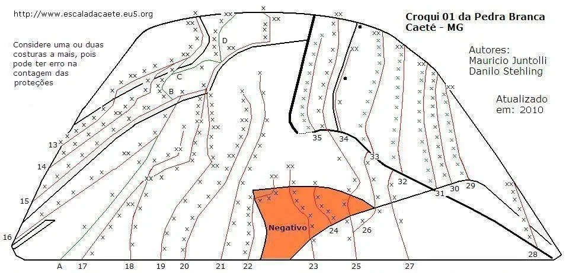
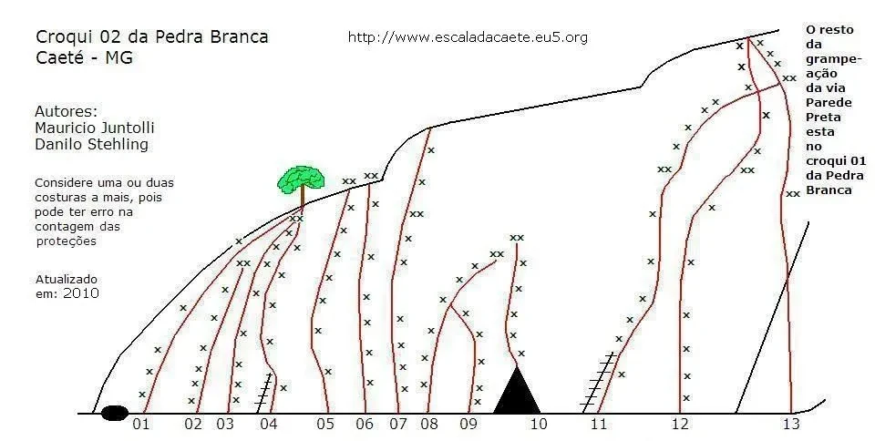

# Croqui: Pedra Branca

## Informações Gerais

- **id**: br_mg_caete_pedra_branca
- **nome**: Pedra Branca
- **creditos**:
  - Mauricio Juntolli
  - Danilo Stehling
- **caminho_thumbnail**: 
- **revisado_manualmente**: True
- **status_desenho_extraivel**: NAO_TEM_DESENHO
- **botoes**:
  - **[0]**:
    - **texto**: Capa
    - **destino**:
      - **secao_textual**:
        - **conteudo**:
            # Capa
            
            |  |
            | :--: |
            | *Pedra Branca* |
            
            **Pedra Branca**
            Caeté - MG
            
            **Autores:**
            Mauricio Juntolli
            Danilo Stehling
            
            Atualizado em: 2010
- **ultima_migracao**: 4
- **publicar_croqui**: True
- **revisado_bounding_circle**: True

## Parte: setor_01

### Setor (Pico: Pedra Branca)

- **descricao**:
    # Croqui 01 da Pedra Branca
    
    Considere uma ou duas costuras a mais, pois pode ter erro na contagem das proteções.
    
    **Autores:** Mauricio Juntolli, Danilo Stehling.
    **Atualizado em:** 2010.
    **Fonte:** http://www.escaladacaete.eu5.org
- **nome**: Croqui 01 da Pedra Branca
- **mapas**:
  - **[0]**:
    - **caminho_imagem_mapa**: 
    - **largura_mapa**: 960
    - **altura_mapa**: 461
    - **pontos_de_interesse**:
      - **[0]**:
        - **id**: 13
        - **label**: 13
        - **retangulo**:
          - **x**: 89
          - **y**: 244
          - **comprimento**: 22
          - **largura**: 20
      - **[1]**:
        - **id**: 14
        - **label**: 14
        - **retangulo**:
          - **x**: 70
          - **y**: 280
          - **comprimento**: 21
          - **largura**: 19
      - **[2]**:
        - **id**: 15
        - **label**: 15
        - **retangulo**:
          - **x**: 42
          - **y**: 339
          - **comprimento**: 20
          - **largura**: 20
      - **[3]**:
        - **id**: 16
        - **label**: 16
        - **retangulo**:
          - **x**: 12
          - **y**: 401
          - **comprimento**: 23
          - **largura**: 20
      - **[4]**:
        - **id**: 17
        - **label**: 17
        - **retangulo**:
          - **x**: 139
          - **y**: 449
          - **comprimento**: 20
          - **largura**: 18
      - **[5]**:
        - **id**: 18
        - **label**: 18
        - **retangulo**:
          - **x**: 218
          - **y**: 449
          - **comprimento**: 20
          - **largura**: 20
      - **[6]**:
        - **id**: 19
        - **label**: 19
        - **retangulo**:
          - **x**: 272
          - **y**: 450
          - **comprimento**: 21
          - **largura**: 21
      - **[7]**:
        - **id**: 20
        - **label**: 20
        - **retangulo**:
          - **x**: 310
          - **y**: 449
          - **comprimento**: 21
          - **largura**: 20
      - **[8]**:
        - **id**: 21
        - **label**: 21
        - **retangulo**:
          - **x**: 372
          - **y**: 450
          - **comprimento**: 21
          - **largura**: 19
      - **[9]**:
        - **id**: 22
        - **label**: 22
        - **retangulo**:
          - **x**: 418
          - **y**: 449
          - **comprimento**: 22
          - **largura**: 18
      - **[10]**:
        - **id**: 23
        - **label**: 23
        - **retangulo**:
          - **x**: 529
          - **y**: 450
          - **comprimento**: 22
          - **largura**: 19
      - **[11]**:
        - **id**: 24
        - **label**: 24
        - **retangulo**:
          - **x**: 563
          - **y**: 390
          - **comprimento**: 20
          - **largura**: 19
      - **[12]**:
        - **id**: 25
        - **label**: 25
        - **retangulo**:
          - **x**: 600
          - **y**: 449
          - **comprimento**: 21
          - **largura**: 18
      - **[13]**:
        - **id**: 26
        - **label**: 26
        - **retangulo**:
          - **x**: 620
          - **y**: 388
          - **comprimento**: 21
          - **largura**: 20
      - **[14]**:
        - **id**: 27
        - **label**: 27
        - **retangulo**:
          - **x**: 691
          - **y**: 449
          - **comprimento**: 22
          - **largura**: 20
      - **[15]**:
        - **id**: 28
        - **label**: 28
        - **retangulo**:
          - **x**: 898
          - **y**: 430
          - **comprimento**: 21
          - **largura**: 19
      - **[16]**:
        - **id**: 29
        - **label**: 29
        - **retangulo**:
          - **x**: 794
          - **y**: 313
          - **comprimento**: 21
          - **largura**: 18
      - **[17]**:
        - **id**: 30
        - **label**: 30
        - **retangulo**:
          - **x**: 768
          - **y**: 318
          - **comprimento**: 19
          - **largura**: 18
      - **[18]**:
        - **id**: 31
        - **label**: 31
        - **retangulo**:
          - **x**: 742
          - **y**: 326
          - **comprimento**: 20
          - **largura**: 19
      - **[19]**:
        - **id**: 32
        - **label**: 32
        - **retangulo**:
          - **x**: 679
          - **y**: 306
          - **comprimento**: 22
          - **largura**: 20
      - **[20]**:
        - **id**: 33
        - **label**: 33
        - **retangulo**:
          - **x**: 632
          - **y**: 264
          - **comprimento**: 19
          - **largura**: 21
      - **[21]**:
        - **id**: 34
        - **label**: 34
        - **retangulo**:
          - **x**: 580
          - **y**: 234
          - **comprimento**: 21
          - **largura**: 21
      - **[22]**:
        - **id**: 35
        - **label**: 35
        - **retangulo**:
          - **x**: 536
          - **y**: 232
          - **comprimento**: 21
          - **largura**: 19
      - **[23]**:
        - **id**: A
        - **label**: A
        - **retangulo**:
          - **x**: 101
          - **y**: 449
          - **comprimento**: 22
          - **largura**: 20
      - **[24]**:
        - **id**: B
        - **label**: B
        - **retangulo**:
          - **x**: 289
          - **y**: 154
          - **comprimento**: 16
          - **largura**: 17
      - **[25]**:
        - **id**: C
        - **label**: C
        - **retangulo**:
          - **x**: 302
          - **y**: 129
          - **comprimento**: 17
          - **largura**: 18
      - **[26]**:
        - **id**: D
        - **label**: D
        - **retangulo**:
          - **x**: 380
          - **y**: 68
          - **comprimento**: 19
          - **largura**: 19
      - **[27]**:
        - **id**: Negativo
        - **label**: Negativo
        - **retangulo**:
          - **x**: 485
          - **y**: 384
          - **comprimento**: 70
          - **largura**: 14
    - **referencias**:
      - **[0]**:
        - **escalada**: Parede Preta
        - **ids**:
          - 13
      - **[1]**:
        - **escalada**: Leão da Montanha
        - **ids**:
          - 14
      - **[2]**:
        - **escalada**: Face Norte
        - **ids**:
          - 15
      - **[3]**:
        - **escalada**: Criaturas da Noite
        - **ids**:
          - 16
      - **[4]**:
        - **escalada**: Tendência Suicida
        - **ids**:
          - 17
      - **[5]**:
        - **escalada**: Thor
        - **ids**:
          - 18
      - **[6]**:
        - **escalada**: Todinha pra Mim
        - **ids**:
          - 19
      - **[7]**:
        - **escalada**: Sombra do Gigante
        - **ids**:
          - 20
      - **[8]**:
        - **escalada**: Firinha Rinda
        - **ids**:
          - 21
      - **[9]**:
        - **escalada**: Piolhos Entorpecidos
        - **ids**:
          - 22
      - **[10]**:
        - **escalada**: Monstros
        - **ids**:
          - 23
      - **[11]**:
        - **escalada**: Princesa Escalafabeltica
        - **ids**:
          - 24
      - **[12]**:
        - **escalada**: Restos de Woodstock
        - **ids**:
          - 25
      - **[13]**:
        - **escalada**: ??
        - **ids**:
          - 26
      - **[14]**:
        - **escalada**: Via da Coruja
        - **ids**:
          - 27
      - **[15]**:
        - **escalada**: Dona Onça
        - **ids**:
          - 28
      - **[16]**:
        - **escalada**: Solidão das Idéias
        - **ids**:
          - 29
      - **[17]**:
        - **escalada**: A Espera dos Urubus
        - **ids**:
          - 30
      - **[18]**:
        - **escalada**: Gaviões
        - **ids**:
          - 31
      - **[19]**:
        - **escalada**: Azimut Vertical
        - **ids**:
          - 32
      - **[20]**:
        - **escalada**: Zique Zira da Raca Rouca
        - **ids**:
          - 33
      - **[21]**:
        - **escalada**: Mistérios da Fé
        - **ids**:
          - 34
      - **[22]**:
        - **escalada**: Nem Karaca Caia
        - **ids**:
          - 35
      - **[23]**:
        - **escalada**: Variante Culpa do Elninho
        - **ids**:
          - A
      - **[24]**:
        - **escalada**: Variante do Mergulho
        - **ids**:
          - B
      - **[25]**:
        - **escalada**: Variante por Aqui
        - **ids**:
          - C
      - **[26]**:
        - **escalada**: Variante do Judas
        - **ids**:
          - D
- **escaladas**:
  - **[0]**:
    - **via_esportiva**:
      - **nome**: Parede Preta
      - **dificuldade**: BR_6
      - **quantidade_protecoes_intermediarias**: 4
  - **[1]**:
    - **via_esportiva**:
      - **nome**: Leão da Montanha
      - **dificuldade**: BR_6
      - **quantidade_protecoes_intermediarias**: 5
  - **[2]**:
    - **via_esportiva**:
      - **nome**: Face Norte
      - **dificuldade**: BR_5
      - **quantidade_protecoes_intermediarias**: 3
  - **[3]**:
    - **via_esportiva**:
      - **nome**: Criaturas da Noite
      - **dificuldade**: BR_6
      - **quantidade_protecoes_intermediarias**: 3
  - **[4]**:
    - **via_esportiva**:
      - **nome**: Tendência Suicida
      - **dificuldade**: BR_6
      - **quantidade_protecoes_intermediarias**: 5
  - **[5]**:
    - **via_esportiva**:
      - **nome**: Thor
      - **dificuldade**: BR_7A
  - **[6]**:
    - **via_esportiva**:
      - **nome**: Todinha pra Mim
      - **dificuldade**: BR_7B
  - **[7]**:
    - **via_esportiva**:
      - **nome**: Sombra do Gigante
      - **dificuldade**: BR_7B
  - **[8]**:
    - **via_esportiva**:
      - **nome**: Firinha Rinda
      - **dificuldade**: BR_7B
  - **[9]**:
    - **via_esportiva**:
      - **nome**: Piolhos Entorpecidos
      - **dificuldade**: BR_8B
  - **[10]**:
    - **via_esportiva**:
      - **nome**: Monstros
      - **dificuldade**: BR_9C
  - **[11]**:
    - **via_esportiva**:
      - **nome**: Princesa Escalafabeltica
      - **dificuldade**: BR_8B
  - **[12]**:
    - **via_esportiva**:
      - **nome**: Restos de Woodstock
      - **dificuldade**: BR_8C
  - **[13]**:
    - **via_esportiva**:
      - **nome**: ??
  - **[14]**:
    - **via_esportiva**:
      - **nome**: Via da Coruja
      - **dificuldade**: BR_3
  - **[15]**:
    - **via_esportiva**:
      - **nome**: Dona Onça
      - **dificuldade**: BR_6SUP
  - **[16]**:
    - **via_esportiva**:
      - **nome**: Solidão das Idéias
      - **dificuldade**: BR_8C
  - **[17]**:
    - **via_esportiva**:
      - **nome**: A Espera dos Urubus
      - **dificuldade**: BR_8B
  - **[18]**:
    - **via_esportiva**:
      - **nome**: Gaviões
      - **dificuldade**: BR_9B
  - **[19]**:
    - **via_esportiva**:
      - **nome**: Azimut Vertical
      - **dificuldade**: BR_9A
  - **[20]**:
    - **via_esportiva**:
      - **nome**: Zique Zira da Raca Rouca
      - **dificuldade**: BR_8B
  - **[21]**:
    - **via_esportiva**:
      - **nome**: Mistérios da Fé
      - **dificuldade**: BR_6
      - **dificuldade_artificial**: A2_MAIS
  - **[22]**:
    - **via_esportiva**:
      - **nome**: Nem Karaca Caia
      - **dificuldade**: BR_8B
  - **[23]**:
    - **via_esportiva**:
      - **nome**: Variante Culpa do Elninho
      - **dificuldade**: BR_5
  - **[24]**:
    - **via_esportiva**:
      - **nome**: Variante do Mergulho
      - **dificuldade**: BR_6SUP
  - **[25]**:
    - **via_esportiva**:
      - **nome**: Variante por Aqui
      - **dificuldade**: BR_3
  - **[26]**:
    - **via_esportiva**:
      - **nome**: Variante do Judas
      - **dificuldade**: BR_4
- **precomputados**:
  - **total_escaladas**: 27

## Parte: setor_02

### Setor (Pico: Pedra Branca)

- **descricao**:
    # Croqui 02 da Pedra Branca
    
    O resto da grampeação da via Parede Preta esta no croqui 01 da Pedra Branca.
    
    Considere uma ou duas costuras a mais, pois pode ter erro na contagem das proteções.
    
    **Autores:** Mauricio Juntolli, Danilo Stehling.
    **Atualizado em:** 2010.
    **Fonte:** http://www.escaladacaete.eu5.org
- **nome**: Croqui 02 da Pedra Branca
- **mapas**:
  - **[0]**:
    - **caminho_imagem_mapa**: 
    - **largura_mapa**: 960
    - **altura_mapa**: 484
    - **pontos_de_interesse**:
      - **[0]**:
        - **id**: 01
        - **label**: 01
        - **retangulo**:
          - **x**: 154
          - **y**: 465
          - **comprimento**: 27
          - **largura**: 26
      - **[1]**:
        - **id**: 02
        - **label**: 02
        - **retangulo**:
          - **x**: 212
          - **y**: 465
          - **comprimento**: 26
          - **largura**: 26
      - **[2]**:
        - **id**: 03
        - **label**: 03
        - **retangulo**:
          - **x**: 248
          - **y**: 464
          - **comprimento**: 25
          - **largura**: 25
      - **[3]**:
        - **id**: 04
        - **label**: 04
        - **retangulo**:
          - **x**: 295
          - **y**: 466
          - **comprimento**: 26
          - **largura**: 23
      - **[4]**:
        - **id**: 05
        - **label**: 05
        - **retangulo**:
          - **x**: 357
          - **y**: 465
          - **comprimento**: 26
          - **largura**: 24
      - **[5]**:
        - **id**: 06
        - **label**: 06
        - **retangulo**:
          - **x**: 400
          - **y**: 465
          - **comprimento**: 25
          - **largura**: 24
      - **[6]**:
        - **id**: 07
        - **label**: 07
        - **retangulo**:
          - **x**: 437
          - **y**: 464
          - **comprimento**: 24
          - **largura**: 23
      - **[7]**:
        - **id**: 08
        - **label**: 08
        - **retangulo**:
          - **x**: 471
          - **y**: 465
          - **comprimento**: 26
          - **largura**: 24
      - **[8]**:
        - **id**: 09
        - **label**: 09
        - **retangulo**:
          - **x**: 514
          - **y**: 465
          - **comprimento**: 25
          - **largura**: 24
      - **[9]**:
        - **id**: 10
        - **label**: 10
        - **retangulo**:
          - **x**: 592
          - **y**: 465
          - **comprimento**: 23
          - **largura**: 22
      - **[10]**:
        - **id**: 11
        - **label**: 11
        - **retangulo**:
          - **x**: 656
          - **y**: 464
          - **comprimento**: 25
          - **largura**: 23
      - **[11]**:
        - **id**: 12
        - **label**: 12
        - **retangulo**:
          - **x**: 747
          - **y**: 464
          - **comprimento**: 24
          - **largura**: 21
      - **[12]**:
        - **id**: 13
        - **label**: 13
        - **retangulo**:
          - **x**: 868
          - **y**: 464
          - **comprimento**: 25
          - **largura**: 21
    - **referencias**:
      - **[0]**:
        - **escalada**: Festival dos Lagartos
        - **ids**:
          - 01
      - **[1]**:
        - **escalada**: Melhor Impossível
        - **ids**:
          - 02
      - **[2]**:
        - **escalada**: Lombra Etílica
        - **ids**:
          - 03
      - **[3]**:
        - **escalada**: Paredão SLU
        - **ids**:
          - 04
      - **[4]**:
        - **escalada**: Libertas
        - **ids**:
          - 05
      - **[5]**:
        - **escalada**: Micos
        - **ids**:
          - 06
      - **[6]**:
        - **escalada**: Via da Perereca
        - **ids**:
          - 07
      - **[7]**:
        - **escalada**: Abominável Morcego Amestrado
        - **ids**:
          - 10
      - **[8]**:
        - **escalada**: Os Quatro Macacos
        - **ids**:
          - 11
      - **[9]**:
        - **escalada**: Produção Independente
        - **ids**:
          - 12
      - **[10]**:
        - **escalada**: Parede Preta
        - **ids**:
          - 13
      - **[11]**:
        - **ids**:
          - 08
        - **setor**: Croqui 02 da Pedra Branca
        - **escalada**: Barbarela
      - **[12]**:
        - **ids**:
          - 09
        - **setor**: Croqui 02 da Pedra Branca
        - **escalada**: Ciganos Molhados
- **escaladas**:
  - **[0]**:
    - **via_esportiva**:
      - **nome**: Festival dos Lagartos
      - **dificuldade**: BR_3SUP
  - **[1]**:
    - **via_esportiva**:
      - **nome**: Melhor Impossível
      - **dificuldade**: BR_4
  - **[2]**:
    - **via_esportiva**:
      - **nome**: Lombra Etílica
      - **dificuldade**: BR_6SUP
  - **[3]**:
    - **via_esportiva**:
      - **nome**: Paredão SLU
      - **dificuldade**: BR_5
  - **[4]**:
    - **via_esportiva**:
      - **nome**: Libertas
      - **dificuldade**: BR_6SUP
  - **[5]**:
    - **via_esportiva**:
      - **nome**: Micos
      - **dificuldade**: BR_5
  - **[6]**:
    - **via_esportiva**:
      - **nome**: Via da Perereca
      - **dificuldade**: BR_7B
  - **[7]**:
    - **via_esportiva**:
      - **nome**: Barbarela
      - **dificuldade**: BR_7A
  - **[8]**:
    - **via_esportiva**:
      - **nome**: Ciganos Molhados
      - **dificuldade**: BR_5
  - **[9]**:
    - **via_esportiva**:
      - **nome**: Abominável Morcego Amestrado
      - **dificuldade**: BR_7B
  - **[10]**:
    - **via_esportiva**:
      - **nome**: Os Quatro Macacos
      - **dificuldade**: BR_7A
  - **[11]**:
    - **via_esportiva**:
      - **nome**: Produção Independente
      - **dificuldade**: BR_6SUP
  - **[12]**:
    - **via_esportiva**:
      - **nome**: Parede Preta
      - **dificuldade**: BR_6
      - **quantidade_protecoes_intermediarias**: 4
- **precomputados**:
  - **total_escaladas**: 13

## Arquivos Externos

- **arquivos_externos**:
  - **[0]**:
    - **caminho**: 
    - **checksum_sha256**: 03a17148a9a997447bd4555d859d8872b948baeb990f4c77532574028d1938f8
  - **[1]**:
    - **caminho**: 
    - **checksum_sha256**: 17c699e09f39f421a2b3ef92508d6b045732236bdb65765103e6e1c04421b9bd
  - **[2]**:
    - **caminho**: 
    - **checksum_sha256**: 2be1ba32f6bc4191dd1dfbb6c5cd9c12e12760cbac900bd67f3e855ff7e066a4

