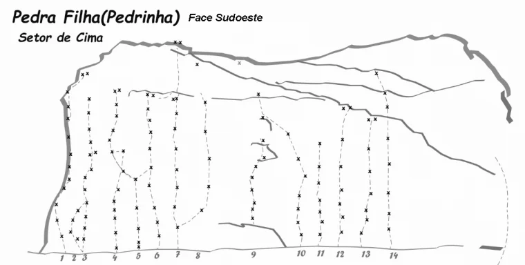
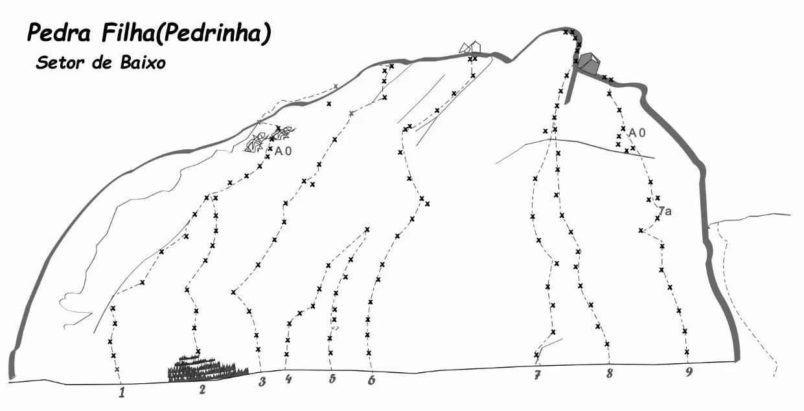

# Croqui: Pedra Filha (Pedrinha)

## Informações Gerais

- **descricao**: Croqui da Pedra Filha, localizada em Caeté, MG. Oferece vias esportivas técnicas em dois setores principais.
- **id**: br_mg_caete_pedra_filha
- **nome**: Pedra Filha (Pedrinha)
- **caminho_thumbnail**: 
- **revisado_manualmente**: True
- **status_desenho_extraivel**: NAO_TEM_DESENHO
- **ultima_migracao**: 4
- **publicar_croqui**: True
- **revisado_bounding_circle**: True
- **botoes**: []

## Parte: setor_de_cima

### Setor (Pico: Pedra Filha (Pedrinha))

- **descricao**:
    # Setor de Cima
    
    O Setor de Cima da Pedra Filha (Pedrinha) apresenta vias esportivas técnicas em quartzito, com graduações variando do 5º ao 8º grau. A face é predominantemente Sudoeste.
- **nome**: Setor de Cima
- **mapas**:
  - **[0]**:
    - **caminho_imagem_mapa**: 
    - **largura_mapa**: 760
    - **altura_mapa**: 384
    - **pontos_de_interesse**:
      - **[0]**:
        - **id**: 1
        - **label**: 1
        - **retangulo**:
          - **x**: 90
          - **y**: 374
          - **comprimento**: 13
          - **largura**: 15
      - **[1]**:
        - **id**: 2
        - **label**: 2
        - **retangulo**:
          - **x**: 107
          - **y**: 373
          - **comprimento**: 14
          - **largura**: 14
      - **[2]**:
        - **id**: 3
        - **label**: 3
        - **retangulo**:
          - **x**: 123
          - **y**: 373
          - **comprimento**: 14
          - **largura**: 14
      - **[3]**:
        - **id**: 4
        - **label**: 4
        - **retangulo**:
          - **x**: 166
          - **y**: 373
          - **comprimento**: 15
          - **largura**: 14
      - **[4]**:
        - **id**: 5
        - **label**: 5
        - **retangulo**:
          - **x**: 200
          - **y**: 370
          - **comprimento**: 14
          - **largura**: 15
      - **[5]**:
        - **id**: 6
        - **label**: 6
        - **retangulo**:
          - **x**: 228
          - **y**: 370
          - **comprimento**: 15
          - **largura**: 15
      - **[6]**:
        - **id**: 7
        - **label**: 7
        - **retangulo**:
          - **x**: 258
          - **y**: 368
          - **comprimento**: 15
          - **largura**: 16
      - **[7]**:
        - **id**: 8
        - **label**: 8
        - **retangulo**:
          - **x**: 287
          - **y**: 370
          - **comprimento**: 16
          - **largura**: 15
      - **[8]**:
        - **id**: 9
        - **label**: 9
        - **retangulo**:
          - **x**: 366
          - **y**: 369
          - **comprimento**: 15
          - **largura**: 16
      - **[9]**:
        - **id**: 10
        - **label**: 10
        - **retangulo**:
          - **x**: 436
          - **y**: 367
          - **comprimento**: 20
          - **largura**: 18
      - **[10]**:
        - **id**: 11
        - **label**: 11
        - **retangulo**:
          - **x**: 464
          - **y**: 366
          - **comprimento**: 19
          - **largura**: 18
      - **[11]**:
        - **id**: 12
        - **label**: 12
        - **retangulo**:
          - **x**: 493
          - **y**: 368
          - **comprimento**: 20
          - **largura**: 19
      - **[12]**:
        - **id**: 13
        - **label**: 13
        - **retangulo**:
          - **x**: 530
          - **y**: 368
          - **comprimento**: 20
          - **largura**: 18
      - **[13]**:
        - **id**: 14
        - **label**: 14
        - **retangulo**:
          - **x**: 571
          - **y**: 370
          - **comprimento**: 20
          - **largura**: 19
    - **referencias**:
      - **[0]**:
        - **escalada**: Mico Leão Noiado
        - **ids**:
          - 1
      - **[1]**:
        - **escalada**: Maridos Alforriados
        - **ids**:
          - 2
      - **[2]**:
        - **escalada**: Sábado de Aleluia
        - **ids**:
          - 3
      - **[3]**:
        - **escalada**: Sem Nome
        - **ids**:
          - 4
      - **[4]**:
        - **escalada**: Mancha Amarela
        - **ids**:
          - 6
      - **[5]**:
        - **escalada**: Mancha Preta
        - **ids**:
          - 7
      - **[6]**:
        - **escalada**: DNA Zica Preta
        - **ids**:
          - 8
      - **[7]**:
        - **escalada**: Desvio de Conduta
        - **ids**:
          - 9
      - **[8]**:
        - **escalada**: O Desgrama
        - **ids**:
          - 10
      - **[9]**:
        - **escalada**: Bin Laden
        - **ids**:
          - 11
      - **[10]**:
        - **escalada**: Dia após Dia
        - **ids**:
          - 12
      - **[11]**:
        - **escalada**: Quarta-Feira Cinzas
        - **ids**:
          - 13
      - **[12]**:
        - **escalada**: Independence Day
        - **ids**:
          - 14
- **escaladas**:
  - **[0]**:
    - **via_esportiva**:
      - **nome**: Mico Leão Noiado
      - **dificuldade**: BR_7B
  - **[1]**:
    - **via_esportiva**:
      - **nome**: Maridos Alforriados
      - **dificuldade**: BR_5SUP
  - **[2]**:
    - **via_esportiva**:
      - **nome**: Sábado de Aleluia
      - **dificuldade**: BR_6SUP
  - **[3]**:
    - **via_esportiva**:
      - **nome**: Sem Nome
      - **dificuldade**: BR_7B
  - **[4]**:
    - **via_esportiva**:
      - **nome**: Mancha Amarela
      - **dificuldade**: BR_7B
  - **[5]**:
    - **via_esportiva**:
      - **nome**: Mancha Preta
      - **dificuldade**: BR_5
  - **[6]**:
    - **via_esportiva**:
      - **nome**: DNA Zica Preta
      - **dificuldade**: BR_5
  - **[7]**:
    - **via_esportiva**:
      - **nome**: Desvio de Conduta
      - **dificuldade**: BR_7B
  - **[8]**:
    - **via_esportiva**:
      - **nome**: O Desgrama
      - **dificuldade**: BR_7C
  - **[9]**:
    - **via_esportiva**:
      - **nome**: Bin Laden
      - **dificuldade**: BR_8A
  - **[10]**:
    - **via_esportiva**:
      - **nome**: Dia após Dia
      - **dificuldade**: BR_7A
  - **[11]**:
    - **via_esportiva**:
      - **nome**: Quarta-Feira Cinzas
      - **dificuldade**: BR_6
  - **[12]**:
    - **via_esportiva**:
      - **nome**: Independence Day
      - **dificuldade**: BR_5
- **precomputados**:
  - **total_escaladas**: 13
  - **total_esportivas**: 13

## Parte: setor_de_baixo

### Setor (Pico: Pedra Filha (Pedrinha))

- **descricao**:
    # Setor de Baixo
    
    O Setor de Baixo da Pedra Filha (Pedrinha) está localizado na Face Norte e conta com vias que desafiam do 5º ao 9º grau, incluindo trechos em artificial (A0).
- **nome**: Setor de Baixo
- **mapas**:
  - **[0]**:
    - **caminho_imagem_mapa**: 
    - **largura_mapa**: 1241
    - **altura_mapa**: 636
    - **pontos_de_interesse**:
      - **[0]**:
        - **id**: 1
        - **label**: 1
        - **retangulo**:
          - **x**: 188
          - **y**: 606
          - **comprimento**: 21
          - **largura**: 24
      - **[1]**:
        - **id**: 2
        - **label**: 2
        - **retangulo**:
          - **x**: 312
          - **y**: 602
          - **comprimento**: 21
          - **largura**: 22
      - **[2]**:
        - **id**: 3
        - **label**: 3
        - **retangulo**:
          - **x**: 406
          - **y**: 590
          - **comprimento**: 23
          - **largura**: 22
      - **[3]**:
        - **id**: 4
        - **label**: 4
        - **retangulo**:
          - **x**: 446
          - **y**: 586
          - **comprimento**: 23
          - **largura**: 23
      - **[4]**:
        - **id**: 5
        - **label**: 5
        - **retangulo**:
          - **x**: 514
          - **y**: 584
          - **comprimento**: 21
          - **largura**: 21
      - **[5]**:
        - **id**: 6
        - **label**: 6
        - **retangulo**:
          - **x**: 574
          - **y**: 587
          - **comprimento**: 21
          - **largura**: 20
      - **[6]**:
        - **id**: 7
        - **label**: 7
        - **retangulo**:
          - **x**: 830
          - **y**: 580
          - **comprimento**: 21
          - **largura**: 21
      - **[7]**:
        - **id**: 8
        - **label**: 8
        - **retangulo**:
          - **x**: 941
          - **y**: 576
          - **comprimento**: 22
          - **largura**: 21
      - **[8]**:
        - **id**: 9
        - **label**: 9
        - **retangulo**:
          - **x**: 1064
          - **y**: 574
          - **comprimento**: 22
          - **largura**: 21
    - **referencias**:
      - **[0]**:
        - **escalada**: Extremo Norte
        - **ids**:
          - 1
      - **[1]**:
        - **escalada**: Rapa do Tacho
        - **ids**:
          - 2
      - **[2]**:
        - **escalada**: Lindona 'Tindoida'
        - **ids**:
          - 3
      - **[3]**:
        - **escalada**: Pandora
        - **ids**:
          - 4
      - **[4]**:
        - **escalada**: A Espera de um Milagre
        - **ids**:
          - 5
      - **[5]**:
        - **escalada**: Insanidade Mental
        - **ids**:
          - 6
      - **[6]**:
        - **escalada**: Sem Bússola
        - **ids**:
          - 7
      - **[7]**:
        - **escalada**: Casal 20
        - **ids**:
          - 8
      - **[8]**:
        - **escalada**: Maldita Obsessão
        - **ids**:
          - 9
- **escaladas**:
  - **[0]**:
    - **via_esportiva**:
      - **nome**: Extremo Norte
      - **dificuldade**: BR_5
  - **[1]**:
    - **via_esportiva**:
      - **nome**: Rapa do Tacho
      - **dificuldade**: BR_6
  - **[2]**:
    - **via_esportiva**:
      - **nome**: Lindona 'Tindoida'
      - **dificuldade**: BR_7A
  - **[3]**:
    - **via_esportiva**:
      - **nome**: Pandora
      - **dificuldade**: BR_8A
  - **[4]**:
    - **via_esportiva**:
      - **nome**: A Espera de um Milagre
      - **dificuldade**: BR_7A
  - **[5]**:
    - **via_esportiva**:
      - **nome**: Insanidade Mental
      - **dificuldade**: BR_9A
      - **dificuldade_artificial**: A0
  - **[6]**:
    - **via_esportiva**:
      - **nome**: Sem Bússola
      - **dificuldade**: BR_6SUP
  - **[7]**:
    - **via_esportiva**:
      - **nome**: Casal 20
      - **dificuldade**: BR_6SUP
  - **[8]**:
    - **via_esportiva**:
      - **nome**: Maldita Obsessão
      - **dificuldade**: BR_7B
- **precomputados**:
  - **total_escaladas**: 9
  - **total_esportivas**: 9

## Arquivos Externos

- **arquivos_externos**:
  - **[0]**:
    - **caminho**: 
    - **checksum_sha256**: fc63ef4bc5eea290dc89e8f3b7a8ab8e627d9ec6944972ff83cdaefbd9bb1572
  - **[1]**:
    - **caminho**: 
    - **checksum_sha256**: 89777869e4ce42931b2036452a129f7fc7c2208f06df31bbbf2df809cfdf5a77

