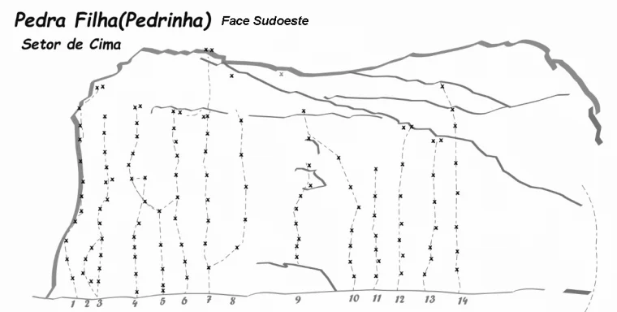
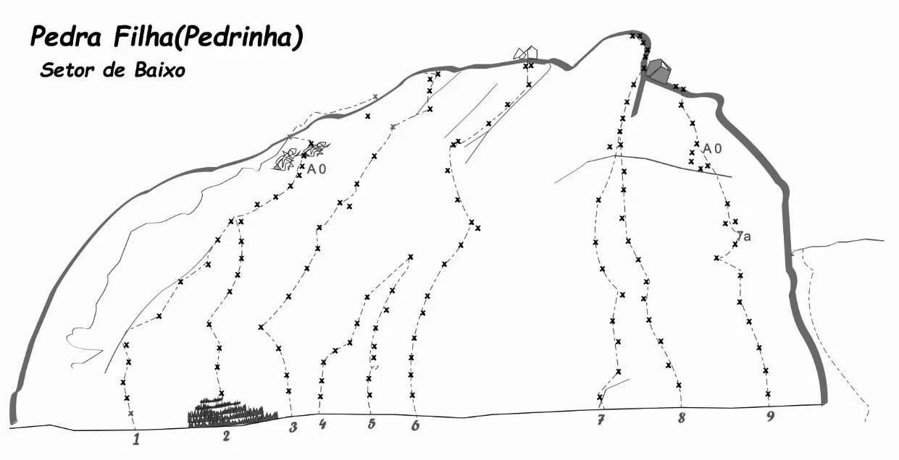

# Croqui: Pedra Filha (Pedrinha)

## Informações Gerais

- **descricao**: Croqui da Pedra Filha, localizada em Caeté, MG. Oferece vias esportivas técnicas em dois setores principais.
- **id**: br_mg_caete_pedra_filha
- **nome**: Pedra Filha (Pedrinha)
- **uid**: J7aXhhOuKqgLtF
- **caminho_thumbnail**: 
- **revisado_manualmente**: True
- **status_desenho_extraivel**: NAO_TEM_DESENHO
- **ultima_migracao**: 5
- **publicar_croqui**: True
- **revisado_bounding_circle**: True
- **botoes**: []

## Parte: setor_de_cima

### Setor (Pico: Pedra Filha (Pedrinha))

- **descricao**:
    # Setor de Cima
    
    O Setor de Cima da Pedra Filha (Pedrinha) apresenta vias esportivas técnicas em quartzito, com graduações variando do 5º ao 8º grau. A face é predominantemente Sudoeste.
- **nome**: Setor de Cima
- **uid**: VBhfxuMtfq7Opr
- **mapas**:
  - **[0]**:
    - **caminho_imagem_mapa**: 
    - **largura_mapa**: 760
    - **altura_mapa**: 384
    - **pontos_de_interesse**:
      - **[0]**:
        - **id**: IJMhQ4m8JwLwHH
        - **uid**: IJMhQ4m8JwLwHH
        - **rotulo**: 1
        - **retangulo**:
          - **x**: 90
          - **y**: 374
          - **comprimento**: 13
          - **largura**: 15
        - **label**: 1
      - **[1]**:
        - **id**: RxRAyZPIZWtksW
        - **uid**: RxRAyZPIZWtksW
        - **rotulo**: 2
        - **retangulo**:
          - **x**: 107
          - **y**: 373
          - **comprimento**: 14
          - **largura**: 14
        - **label**: 2
      - **[2]**:
        - **id**: 0SvZxvTFZk1hJ6
        - **uid**: 0SvZxvTFZk1hJ6
        - **rotulo**: 3
        - **retangulo**:
          - **x**: 123
          - **y**: 373
          - **comprimento**: 14
          - **largura**: 14
        - **label**: 3
      - **[3]**:
        - **id**: zKvZqEgGW6DKK0
        - **uid**: zKvZqEgGW6DKK0
        - **rotulo**: 4
        - **retangulo**:
          - **x**: 166
          - **y**: 373
          - **comprimento**: 15
          - **largura**: 14
        - **label**: 4
      - **[4]**:
        - **id**: ZW93l45FCveETe
        - **uid**: ZW93l45FCveETe
        - **rotulo**: 5
        - **retangulo**:
          - **x**: 200
          - **y**: 370
          - **comprimento**: 14
          - **largura**: 15
        - **label**: 5
      - **[5]**:
        - **id**: 9zyFHS8eQ1MsbF
        - **uid**: 9zyFHS8eQ1MsbF
        - **rotulo**: 6
        - **retangulo**:
          - **x**: 228
          - **y**: 370
          - **comprimento**: 15
          - **largura**: 15
        - **label**: 6
      - **[6]**:
        - **id**: bc04IFsT2VMYuY
        - **uid**: bc04IFsT2VMYuY
        - **rotulo**: 7
        - **retangulo**:
          - **x**: 258
          - **y**: 368
          - **comprimento**: 15
          - **largura**: 16
        - **label**: 7
      - **[7]**:
        - **id**: imtAY5VCzp8QKY
        - **uid**: imtAY5VCzp8QKY
        - **rotulo**: 8
        - **retangulo**:
          - **x**: 287
          - **y**: 370
          - **comprimento**: 16
          - **largura**: 15
        - **label**: 8
      - **[8]**:
        - **id**: 6IJbrIuZtdL5US
        - **uid**: 6IJbrIuZtdL5US
        - **rotulo**: 9
        - **retangulo**:
          - **x**: 366
          - **y**: 369
          - **comprimento**: 15
          - **largura**: 16
        - **label**: 9
      - **[9]**:
        - **id**: CXpFsXAV1o04ll
        - **uid**: CXpFsXAV1o04ll
        - **rotulo**: 10
        - **retangulo**:
          - **x**: 436
          - **y**: 367
          - **comprimento**: 20
          - **largura**: 18
        - **label**: 10
      - **[10]**:
        - **id**: oHepiwluJ01bOE
        - **uid**: oHepiwluJ01bOE
        - **rotulo**: 11
        - **retangulo**:
          - **x**: 464
          - **y**: 366
          - **comprimento**: 19
          - **largura**: 18
        - **label**: 11
      - **[11]**:
        - **id**: kbw581929y15Ij
        - **uid**: kbw581929y15Ij
        - **rotulo**: 12
        - **retangulo**:
          - **x**: 493
          - **y**: 368
          - **comprimento**: 20
          - **largura**: 19
        - **label**: 12
      - **[12]**:
        - **id**: IjjGZsiETiCrl4
        - **uid**: IjjGZsiETiCrl4
        - **rotulo**: 13
        - **retangulo**:
          - **x**: 530
          - **y**: 368
          - **comprimento**: 20
          - **largura**: 18
        - **label**: 13
      - **[13]**:
        - **id**: yMjbxCocgS4rxT
        - **uid**: yMjbxCocgS4rxT
        - **rotulo**: 14
        - **retangulo**:
          - **x**: 571
          - **y**: 370
          - **comprimento**: 20
          - **largura**: 19
        - **label**: 14
    - **referencias**:
      - **[0]**:
        - **alvo_uid**: mpABRjK9Evi84V
        - **pontos_uids**:
          - IJMhQ4m8JwLwHH
        - **escalada**: Mico Leão Noiado
        - **ids**:
          - IJMhQ4m8JwLwHH
      - **[1]**:
        - **alvo_uid**: Bjyi5AKI0geIui
        - **pontos_uids**:
          - RxRAyZPIZWtksW
        - **escalada**: Maridos Alforriados
        - **ids**:
          - RxRAyZPIZWtksW
      - **[2]**:
        - **alvo_uid**: k0yx2k8Wb289fJ
        - **pontos_uids**:
          - 0SvZxvTFZk1hJ6
        - **escalada**: Sábado de Aleluia
        - **ids**:
          - 0SvZxvTFZk1hJ6
      - **[3]**:
        - **alvo_uid**: xJWvgepcSPK1Bz
        - **pontos_uids**:
          - zKvZqEgGW6DKK0
        - **escalada**: Sem Nome
        - **ids**:
          - zKvZqEgGW6DKK0
      - **[4]**:
        - **alvo_uid**: 8J2ZqvlBs1QyJ3
        - **pontos_uids**:
          - 9zyFHS8eQ1MsbF
        - **escalada**: Mancha Amarela
        - **ids**:
          - 9zyFHS8eQ1MsbF
      - **[5]**:
        - **alvo_uid**: EfHNaaiaxw0H2N
        - **pontos_uids**:
          - bc04IFsT2VMYuY
        - **escalada**: Mancha Preta
        - **ids**:
          - bc04IFsT2VMYuY
      - **[6]**:
        - **alvo_uid**: BVHKs7vmO8UpmB
        - **pontos_uids**:
          - imtAY5VCzp8QKY
        - **escalada**: DNA Zica Preta
        - **ids**:
          - imtAY5VCzp8QKY
      - **[7]**:
        - **alvo_uid**: hTW7CziwIF7md1
        - **pontos_uids**:
          - 6IJbrIuZtdL5US
        - **escalada**: Desvio de Conduta
        - **ids**:
          - 6IJbrIuZtdL5US
      - **[8]**:
        - **alvo_uid**: Xdwx3KHcf2RWB7
        - **pontos_uids**:
          - CXpFsXAV1o04ll
        - **escalada**: O Desgrama
        - **ids**:
          - CXpFsXAV1o04ll
      - **[9]**:
        - **alvo_uid**: XR1RGtWLXV3YBi
        - **pontos_uids**:
          - oHepiwluJ01bOE
        - **escalada**: Bin Laden
        - **ids**:
          - oHepiwluJ01bOE
      - **[10]**:
        - **alvo_uid**: 5KMrvl69iIIMFx
        - **pontos_uids**:
          - kbw581929y15Ij
        - **escalada**: Dia após Dia
        - **ids**:
          - kbw581929y15Ij
      - **[11]**:
        - **alvo_uid**: 5WCOPJl5kMxcSN
        - **pontos_uids**:
          - IjjGZsiETiCrl4
        - **escalada**: Quarta-Feira Cinzas
        - **ids**:
          - IjjGZsiETiCrl4
      - **[12]**:
        - **alvo_uid**: imlr4LWVozft3Z
        - **pontos_uids**:
          - yMjbxCocgS4rxT
        - **escalada**: Independence Day
        - **ids**:
          - yMjbxCocgS4rxT
- **escaladas**:
  - **[0]**:
    - **uid**: mpABRjK9Evi84V
    - **via_esportiva**:
      - **nome**: Mico Leão Noiado
      - **dificuldade**: BR_7B
  - **[1]**:
    - **uid**: Bjyi5AKI0geIui
    - **via_esportiva**:
      - **nome**: Maridos Alforriados
      - **dificuldade**: BR_5SUP
  - **[2]**:
    - **uid**: k0yx2k8Wb289fJ
    - **via_esportiva**:
      - **nome**: Sábado de Aleluia
      - **dificuldade**: BR_6SUP
  - **[3]**:
    - **uid**: xJWvgepcSPK1Bz
    - **via_esportiva**:
      - **nome**: Sem Nome
      - **dificuldade**: BR_7B
  - **[4]**:
    - **uid**: 8J2ZqvlBs1QyJ3
    - **via_esportiva**:
      - **nome**: Mancha Amarela
      - **dificuldade**: BR_7B
  - **[5]**:
    - **uid**: EfHNaaiaxw0H2N
    - **via_esportiva**:
      - **nome**: Mancha Preta
      - **dificuldade**: BR_5
  - **[6]**:
    - **uid**: BVHKs7vmO8UpmB
    - **via_esportiva**:
      - **nome**: DNA Zica Preta
      - **dificuldade**: BR_5
  - **[7]**:
    - **uid**: hTW7CziwIF7md1
    - **via_esportiva**:
      - **nome**: Desvio de Conduta
      - **dificuldade**: BR_7B
  - **[8]**:
    - **uid**: Xdwx3KHcf2RWB7
    - **via_esportiva**:
      - **nome**: O Desgrama
      - **dificuldade**: BR_7C
  - **[9]**:
    - **uid**: XR1RGtWLXV3YBi
    - **via_esportiva**:
      - **nome**: Bin Laden
      - **dificuldade**: BR_8A
  - **[10]**:
    - **uid**: 5KMrvl69iIIMFx
    - **via_esportiva**:
      - **nome**: Dia após Dia
      - **dificuldade**: BR_7A
  - **[11]**:
    - **uid**: 5WCOPJl5kMxcSN
    - **via_esportiva**:
      - **nome**: Quarta-Feira Cinzas
      - **dificuldade**: BR_6
  - **[12]**:
    - **uid**: imlr4LWVozft3Z
    - **via_esportiva**:
      - **nome**: Independence Day
      - **dificuldade**: BR_5
- **precomputados**:
  - **total_escaladas**: 13
  - **total_esportivas**: 13

## Parte: setor_de_baixo

### Setor (Pico: Pedra Filha (Pedrinha))

- **descricao**:
    # Setor de Baixo
    
    O Setor de Baixo da Pedra Filha (Pedrinha) está localizado na Face Norte e conta com vias que desafiam do 5º ao 9º grau, incluindo trechos em artificial (A0).
- **nome**: Setor de Baixo
- **uid**: U5P9offw9HoqyT
- **mapas**:
  - **[0]**:
    - **caminho_imagem_mapa**: 
    - **largura_mapa**: 1241
    - **altura_mapa**: 636
    - **pontos_de_interesse**:
      - **[0]**:
        - **id**: lu5blKjzx4LjgR
        - **uid**: lu5blKjzx4LjgR
        - **rotulo**: 1
        - **retangulo**:
          - **x**: 188
          - **y**: 606
          - **comprimento**: 21
          - **largura**: 24
        - **label**: 1
      - **[1]**:
        - **id**: 5u9VFjd1M6ck56
        - **uid**: 5u9VFjd1M6ck56
        - **rotulo**: 2
        - **retangulo**:
          - **x**: 312
          - **y**: 602
          - **comprimento**: 21
          - **largura**: 22
        - **label**: 2
      - **[2]**:
        - **id**: BOy7KNF5xiKC8l
        - **uid**: BOy7KNF5xiKC8l
        - **rotulo**: 3
        - **retangulo**:
          - **x**: 406
          - **y**: 590
          - **comprimento**: 23
          - **largura**: 22
        - **label**: 3
      - **[3]**:
        - **id**: 7uKy6PfP6njoN5
        - **uid**: 7uKy6PfP6njoN5
        - **rotulo**: 4
        - **retangulo**:
          - **x**: 446
          - **y**: 586
          - **comprimento**: 23
          - **largura**: 23
        - **label**: 4
      - **[4]**:
        - **id**: mHVz2kW4ck0TXY
        - **uid**: mHVz2kW4ck0TXY
        - **rotulo**: 5
        - **retangulo**:
          - **x**: 514
          - **y**: 584
          - **comprimento**: 21
          - **largura**: 21
        - **label**: 5
      - **[5]**:
        - **id**: nN1nDuO24KVuIN
        - **uid**: nN1nDuO24KVuIN
        - **rotulo**: 6
        - **retangulo**:
          - **x**: 574
          - **y**: 587
          - **comprimento**: 21
          - **largura**: 20
        - **label**: 6
      - **[6]**:
        - **id**: b3rF4I0Xy28YnD
        - **uid**: b3rF4I0Xy28YnD
        - **rotulo**: 7
        - **retangulo**:
          - **x**: 830
          - **y**: 580
          - **comprimento**: 21
          - **largura**: 21
        - **label**: 7
      - **[7]**:
        - **id**: 8otYhVoIP6QtW1
        - **uid**: 8otYhVoIP6QtW1
        - **rotulo**: 8
        - **retangulo**:
          - **x**: 941
          - **y**: 576
          - **comprimento**: 22
          - **largura**: 21
        - **label**: 8
      - **[8]**:
        - **id**: AthHeCrIwNzYnr
        - **uid**: AthHeCrIwNzYnr
        - **rotulo**: 9
        - **retangulo**:
          - **x**: 1064
          - **y**: 574
          - **comprimento**: 22
          - **largura**: 21
        - **label**: 9
    - **referencias**:
      - **[0]**:
        - **alvo_uid**: pr6w35W9DOIcRx
        - **pontos_uids**:
          - lu5blKjzx4LjgR
        - **escalada**: Extremo Norte
        - **ids**:
          - lu5blKjzx4LjgR
      - **[1]**:
        - **alvo_uid**: 5Jc8v3vlBU5cg5
        - **pontos_uids**:
          - 5u9VFjd1M6ck56
        - **escalada**: Rapa do Tacho
        - **ids**:
          - 5u9VFjd1M6ck56
      - **[2]**:
        - **alvo_uid**: hFfWbymslvScCk
        - **pontos_uids**:
          - BOy7KNF5xiKC8l
        - **escalada**: Lindona 'Tindoida'
        - **ids**:
          - BOy7KNF5xiKC8l
      - **[3]**:
        - **alvo_uid**: JKLqKoqlbCWfRl
        - **pontos_uids**:
          - 7uKy6PfP6njoN5
        - **escalada**: Pandora
        - **ids**:
          - 7uKy6PfP6njoN5
      - **[4]**:
        - **alvo_uid**: JHs5YhKWNa064A
        - **pontos_uids**:
          - mHVz2kW4ck0TXY
        - **escalada**: A Espera de um Milagre
        - **ids**:
          - mHVz2kW4ck0TXY
      - **[5]**:
        - **alvo_uid**: g2c3KtctntaXBi
        - **pontos_uids**:
          - nN1nDuO24KVuIN
        - **escalada**: Insanidade Mental
        - **ids**:
          - nN1nDuO24KVuIN
      - **[6]**:
        - **alvo_uid**: E3WUZpNQ9vGhjX
        - **pontos_uids**:
          - b3rF4I0Xy28YnD
        - **escalada**: Sem Bússola
        - **ids**:
          - b3rF4I0Xy28YnD
      - **[7]**:
        - **alvo_uid**: nh9GHphkuu5jcw
        - **pontos_uids**:
          - 8otYhVoIP6QtW1
        - **escalada**: Casal 20
        - **ids**:
          - 8otYhVoIP6QtW1
      - **[8]**:
        - **alvo_uid**: 6zKjei5YkBQqbp
        - **pontos_uids**:
          - AthHeCrIwNzYnr
        - **escalada**: Maldita Obsessão
        - **ids**:
          - AthHeCrIwNzYnr
- **escaladas**:
  - **[0]**:
    - **uid**: pr6w35W9DOIcRx
    - **via_esportiva**:
      - **nome**: Extremo Norte
      - **dificuldade**: BR_5
  - **[1]**:
    - **uid**: 5Jc8v3vlBU5cg5
    - **via_esportiva**:
      - **nome**: Rapa do Tacho
      - **dificuldade**: BR_6
  - **[2]**:
    - **uid**: hFfWbymslvScCk
    - **via_esportiva**:
      - **nome**: Lindona 'Tindoida'
      - **dificuldade**: BR_7A
  - **[3]**:
    - **uid**: JKLqKoqlbCWfRl
    - **via_esportiva**:
      - **nome**: Pandora
      - **dificuldade**: BR_8A
  - **[4]**:
    - **uid**: JHs5YhKWNa064A
    - **via_esportiva**:
      - **nome**: A Espera de um Milagre
      - **dificuldade**: BR_7A
  - **[5]**:
    - **uid**: g2c3KtctntaXBi
    - **via_esportiva**:
      - **nome**: Insanidade Mental
      - **dificuldade**: BR_9A
      - **dificuldade_artificial**: A0
  - **[6]**:
    - **uid**: E3WUZpNQ9vGhjX
    - **via_esportiva**:
      - **nome**: Sem Bússola
      - **dificuldade**: BR_6SUP
  - **[7]**:
    - **uid**: nh9GHphkuu5jcw
    - **via_esportiva**:
      - **nome**: Casal 20
      - **dificuldade**: BR_6SUP
  - **[8]**:
    - **uid**: 6zKjei5YkBQqbp
    - **via_esportiva**:
      - **nome**: Maldita Obsessão
      - **dificuldade**: BR_7B
- **precomputados**:
  - **total_escaladas**: 9
  - **total_esportivas**: 9

## Arquivos Externos

- **arquivos_externos**:
  - **[0]**:
    - **caminho**: 
    - **checksum_sha256**: fc63ef4bc5eea290dc89e8f3b7a8ab8e627d9ec6944972ff83cdaefbd9bb1572
  - **[1]**:
    - **caminho**: 
    - **checksum_sha256**: 89777869e4ce42931b2036452a129f7fc7c2208f06df31bbbf2df809cfdf5a77

