# Croqui: Fest Boulder

## Informações Gerais

- **descricao**: Croqui do evento Fest Boulder 2023 em Conceição do Mato Dentro, Minas Gerais. Localizado na Serra do Espinhaço, reconhecido como um dos melhores lugares para a prática de boulder no Brasil.
- **id**: br_mg_conceicao_do_mato_dentro_festboulder
- **nome**: Fest Boulder
- **creditos**:
  - Gabriel Vargas Mendonça
  - Carlos Oliveira
  - Filipe Madeira
  - Alexandre Vasconcelos Levy
  - Nayara Meireles
  - Alexandre Fei
- **caminho_thumbnail**: 
- **status_desenho_extraivel**: TEM_DESENHO_MAS_NAO_EXTRAIDO
- **botoes**:
  - **[0]**:
    - **texto**: Capa
    - **destino**:
      - **secao_textual**:
        - **conteudo**:
            # Croqui Fest Boulder 2023
            
            |  |
            | :--: |
            | *Capa do Croqui Fest Boulder 2023* |
            
            **Conceição do Mato Dentro - 2023**
            
            **Elaborado por:**
            - Gabriel Vargas Mendonça
            - Carlos Oliveira
            - Filipe Madeira
            - Alexandre Vasconcelos Levy
            - Nayara Meireles
            - Alexandre Fei
            
            **Estrutura do Evento:**
            - Sorteio
            - Show ao Vivo
            - Camping
            - Praça de Alimentação
            
            **Instagram:** @cmd_festboulder
  - **[1]**:
    - **texto**: Introdução
    - **destino**:
      - **secao_textual**:
        - **conteudo**:
            # Introdução
            
            ## Conceição do Mato Dentro/MG
            
            Considerada a “capital mineira do ecoturismo” – por abrigar inúmeras belezas naturais – CONCEIÇÃO DO MATO DENTRO encontra-se na região central de MINAS GERAIS, na vertente oriental da SERRA DO CIPÓ da CORDILHEIRA DO ESPINHAÇO. Nacionalmente reconhecida como um dos melhores lugares para a prática de escalada em “Boulder”, o local conta com inúmeras linhas já abertas, com nível de dificuldade variando entre V0 a V13, além de diversos projetos que ainda não tiveram SUA PRIMEIRA Ascensão.
            
            ## O Festival
            
            Grande parte dos festivais de escalada no Brasil ocorrem entre os meses de junho a agosto (épocas de estiagem, sem ocorrência de chuvas), e CONCEIÇÃO DO MATO DENTRO não fica de fora desta programação. OUTROS FESTIVAIS OCORREM NA MESMA ÉPOCA, EM OURO PRETO, SABARÁ E MILHO VERDE. Desta forma, tem-se o circuito perfeito, que consideramos o circuito ESTRADA REAL de Boulder.
            
            O principal objetivo deste projeto é atrair e propiciar muita escalada e diversão a todos os participantes, em UM dos picos mais promissores do Brasil para a prática de escalada em “Boulder”.
            
            Boulder é uma das modalidades da escalada em rocha, praticada sem o uso de equipamentos convencionais, como cordas e mosquetões. O boulder consiste em escalar blocos de pedras, onde os movimentos apresentam dificuldade técnica e exigem força.
  - **[2]**:
    - **texto**: Rupestre
    - **destino**:
      - **secao_textual**:
        - **conteudo**:
            # Rupestre
            
            | 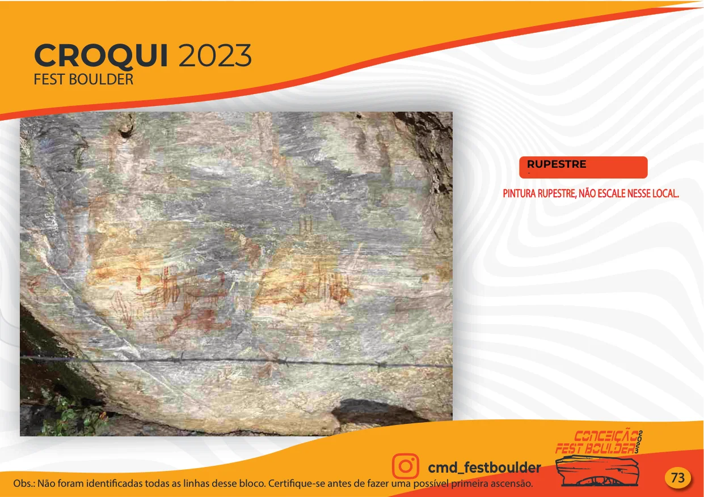 |
            | :--: |
            | *Pinturas Rupestres* |
            
            **PINTURA RUPESTRE, NÃO ESCALE NESSE LOCAL.**
            
            Obs.: Não foram identificadas todas as linhas desse bloco. Certifique-se antes de fazer uma possível primeira ascensão em blocos próximos, respeitando sempre as áreas de preservação.
- **ultima_migracao**: 3

## Parte: grupo_salao_de_pedras

### Grupo (Pico: Conceição do Mato Dentro)

- **descricao**:
    # Grupo Salão de Pedras
    
    O Salão de Pedras é um dos picos mais tradicionais de Conceição do Mato Dentro, oferecendo uma grande variedade de blocos e linhas de boulder.
- **nome**: Salão de Pedras
- **mapas**:
  - **[0]**:
    - **caminho_imagem_mapa**: 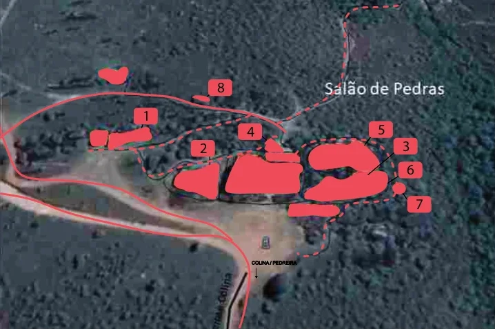
    - **largura_mapa**: 718
    - **altura_mapa**: 477
    - **pontos_de_interesse**:
      - **[0]**:
        - **id**: 1
        - **label**: 1
        - **box**:
          - **x**: 305
          - **y**: 340
          - **comprimento**: 30
          - **largura**: 30
      - **[1]**:
        - **id**: 2
        - **label**: 2
        - **box**:
          - **x**: 420
          - **y**: 360
          - **comprimento**: 30
          - **largura**: 30
      - **[2]**:
        - **id**: 3
        - **label**: 3
        - **box**:
          - **x**: 705
          - **y**: 360
          - **comprimento**: 30
          - **largura**: 30
      - **[3]**:
        - **id**: 4
        - **label**: 4
        - **box**:
          - **x**: 490
          - **y**: 340
          - **comprimento**: 30
          - **largura**: 30
      - **[4]**:
        - **id**: 5
        - **label**: 5
        - **box**:
          - **x**: 655
          - **y**: 320
          - **comprimento**: 30
          - **largura**: 30
      - **[5]**:
        - **id**: 6
        - **label**: 6
        - **box**:
          - **x**: 710
          - **y**: 360
          - **comprimento**: 30
          - **largura**: 30
      - **[6]**:
        - **id**: 7
        - **label**: 7
        - **box**:
          - **x**: 710
          - **y**: 400
          - **comprimento**: 30
          - **largura**: 30
      - **[7]**:
        - **id**: 8
        - **label**: 8
        - **box**:
          - **x**: 450
          - **y**: 280
          - **comprimento**: 30
          - **largura**: 30
    - **referencias**:
      - **[0]**:
        - **setor**: Ônibus
        - **ids**:
          - 1
      - **[1]**:
        - **setor**: Super Herói
        - **ids**:
          - 2
      - **[2]**:
        - **setor**: Caverninha
        - **ids**:
          - 3
      - **[3]**:
        - **setor**: Campo Escola
        - **ids**:
          - 4
      - **[4]**:
        - **setor**: Escorpião
        - **ids**:
          - 5
      - **[5]**:
        - **setor**: Troféu
        - **ids**:
          - 6
      - **[6]**:
        - **setor**: X-Tudo
        - **ids**:
          - 7
      - **[7]**:
        - **setor**: Domínio Digital
        - **ids**:
          - 8
- **setores**:
  - **[0]**:
    - **conteudo**:
      - **descricao**:
          # Setor Ônibus
          
          O setor Ônibus possui dois blocos principais com diversas linhas de boulder.
          
          Obs.: Não foram identificadas todas as linhas desse bloco. Certifique-se antes de fazer uma possível primeira ascensão.
      - **nome**: Ônibus
      - **mapas**:
        - **[0]**:
          - **caminho_imagem_mapa**: 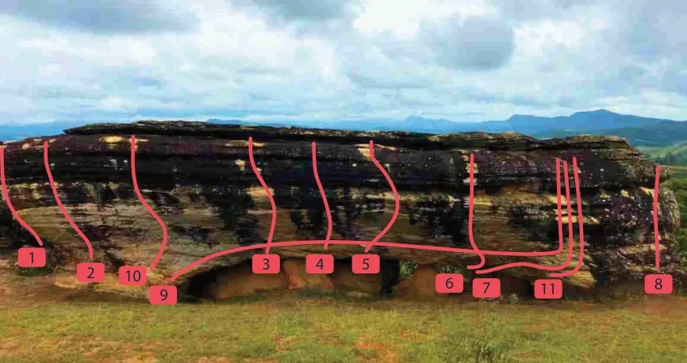
          - **largura_mapa**: 866
          - **altura_mapa**: 458
          - **pontos_de_interesse**:
            - **[0]**:
              - **id**: 1
              - **label**: 1
              - **box**:
                - **x**: 70
                - **y**: 370
                - **comprimento**: 30
                - **largura**: 30
            - **[1]**:
              - **id**: 2
              - **label**: 2
              - **box**:
                - **x**: 170
                - **y**: 410
                - **comprimento**: 30
                - **largura**: 30
            - **[2]**:
              - **id**: 10
              - **label**: 10
              - **box**:
                - **x**: 230
                - **y**: 430
                - **comprimento**: 30
                - **largura**: 30
            - **[3]**:
              - **id**: 9
              - **label**: 9
              - **box**:
                - **x**: 290
                - **y**: 445
                - **comprimento**: 30
                - **largura**: 30
            - **[4]**:
              - **id**: 3
              - **label**: 3
              - **box**:
                - **x**: 490
                - **y**: 380
                - **comprimento**: 30
                - **largura**: 30
            - **[5]**:
              - **id**: 4
              - **label**: 4
              - **box**:
                - **x**: 570
                - **y**: 380
                - **comprimento**: 30
                - **largura**: 30
            - **[6]**:
              - **id**: 5
              - **label**: 5
              - **box**:
                - **x**: 650
                - **y**: 380
                - **comprimento**: 30
                - **largura**: 30
            - **[7]**:
              - **id**: 6
              - **label**: 6
              - **box**:
                - **x**: 750
                - **y**: 400
                - **comprimento**: 30
                - **largura**: 30
            - **[8]**:
              - **id**: 7
              - **label**: 7
              - **box**:
                - **x**: 830
                - **y**: 440
                - **comprimento**: 30
                - **largura**: 30
            - **[9]**:
              - **id**: 11
              - **label**: 11
              - **box**:
                - **x**: 850
                - **y**: 450
                - **comprimento**: 30
                - **largura**: 30
            - **[10]**:
              - **id**: 8
              - **label**: 8
              - **box**:
                - **x**: 858
                - **y**: 430
                - **comprimento**: 16
                - **largura**: 30
          - **referencias**:
            - **[0]**:
              - **escalada**: Pirulito
              - **ids**:
                - 1
            - **[1]**:
              - **escalada**: Trocador
              - **ids**:
                - 2
            - **[2]**:
              - **escalada**: Roleta
              - **ids**:
                - 3
            - **[3]**:
              - **escalada**: Zebra
              - **ids**:
                - 4
            - **[4]**:
              - **escalada**: Linguinha
              - **ids**:
                - 5
            - **[5]**:
              - **escalada**: Gnomo
              - **ids**:
                - 6
            - **[6]**:
              - **escalada**: Variante Y
              - **ids**:
                - 7
            - **[7]**:
              - **escalada**: Moleza
              - **ids**:
                - 8
            - **[8]**:
              - **escalada**: Inconsolável
              - **ids**:
                - 9
            - **[9]**:
              - **escalada**: Passageiro
              - **ids**:
                - 10
            - **[10]**:
              - **escalada**: Fada
              - **ids**:
                - 11
            - **[11]**:
              - **escalada**: Primeiro Esquenta
              - **ids**:
                - 1
            - **[12]**:
              - **escalada**: Mimetismo
              - **ids**:
                - 2
            - **[13]**:
              - **escalada**: Aborda
              - **ids**:
                - 3
            - **[14]**:
              - **escalada**: Easy Line
              - **ids**:
                - 4
            - **[15]**:
              - **escalada**: Saidex
              - **ids**:
                - 5
        - **[1]**:
          - **caminho_imagem_mapa**: 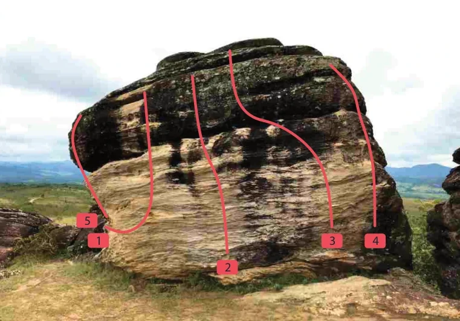
          - **largura_mapa**: 761
          - **altura_mapa**: 531
          - **pontos_de_interesse**:
            - **[0]**:
              - **id**: 1
              - **label**: 1
              - **box**:
                - **x**: 230
                - **y**: 490
                - **comprimento**: 30
                - **largura**: 30
            - **[1]**:
              - **id**: 2
              - **label**: 2
              - **box**:
                - **x**: 510
                - **y**: 530
                - **comprimento**: 30
                - **largura**: 30
            - **[2]**:
              - **id**: 3
              - **label**: 3
              - **box**:
                - **x**: 730
                - **y**: 490
                - **comprimento**: 30
                - **largura**: 30
            - **[3]**:
              - **id**: 4
              - **label**: 4
              - **box**:
                - **x**: 740
                - **y**: 490
                - **comprimento**: 30
                - **largura**: 30
            - **[4]**:
              - **id**: 5
              - **label**: 5
              - **box**:
                - **x**: 210
                - **y**: 440
                - **comprimento**: 30
                - **largura**: 30
          - **referencias**:
            - **[0]**:
              - **escalada**: Pirulito
              - **ids**:
                - 1
            - **[1]**:
              - **escalada**: Trocador
              - **ids**:
                - 2
            - **[2]**:
              - **escalada**: Roleta
              - **ids**:
                - 3
            - **[3]**:
              - **escalada**: Zebra
              - **ids**:
                - 4
            - **[4]**:
              - **escalada**: Linguinha
              - **ids**:
                - 5
            - **[5]**:
              - **escalada**: Primeiro Esquenta
              - **ids**:
                - 1
            - **[6]**:
              - **escalada**: Mimetismo
              - **ids**:
                - 2
            - **[7]**:
              - **escalada**: Aborda
              - **ids**:
                - 3
            - **[8]**:
              - **escalada**: Easy Line
              - **ids**:
                - 4
            - **[9]**:
              - **escalada**: Saidex
              - **ids**:
                - 5
      - **escaladas**:
        - **[0]**:
          - **boulder**:
            - **nome**: Pirulito
            - **dificuldade**: V1
        - **[1]**:
          - **boulder**:
            - **nome**: Trocador
            - **dificuldade**: V6
        - **[2]**:
          - **boulder**:
            - **nome**: Roleta
            - **dificuldade**: V8
        - **[3]**:
          - **boulder**:
            - **nome**: Zebra
            - **dificuldade**: V7
        - **[4]**:
          - **boulder**:
            - **nome**: Linguinha
            - **dificuldade**: V6
        - **[5]**:
          - **boulder**:
            - **nome**: Gnomo
            - **dificuldade**: V5
        - **[6]**:
          - **boulder**:
            - **nome**: Variante Y
            - **dificuldade**: V4
        - **[7]**:
          - **boulder**:
            - **nome**: Moleza
            - **dificuldade**: V0
        - **[8]**:
          - **boulder**:
            - **nome**: Inconsolável
            - **dificuldade**: V6
        - **[9]**:
          - **boulder**:
            - **nome**: Passageiro
            - **dificuldade**: V4
        - **[10]**:
          - **boulder**:
            - **nome**: Fada
            - **dificuldade**: V1
        - **[11]**:
          - **boulder**:
            - **nome**: Primeiro Esquenta
            - **dificuldade**: V1
        - **[12]**:
          - **boulder**:
            - **nome**: Mimetismo
            - **dificuldade**: V4
        - **[13]**:
          - **boulder**:
            - **nome**: Aborda
            - **dificuldade**: V4
        - **[14]**:
          - **boulder**:
            - **nome**: Easy Line
            - **dificuldade**: V1
        - **[15]**:
          - **boulder**:
            - **nome**: Saidex
            - **dificuldade**: V1
  - **[1]**:
    - **conteudo**:
      - **descricao**:
          # Setor Super Herói
          
          O setor Super Herói possui linhas clássicas em um bloco bem característico.
          
          Obs.: Não foram identificadas todas as linhas desse bloco. Certifique-se antes de fazer uma possível primeira ascensão.
      - **nome**: Super Herói
      - **mapas**:
        - **[0]**:
          - **caminho_imagem_mapa**: 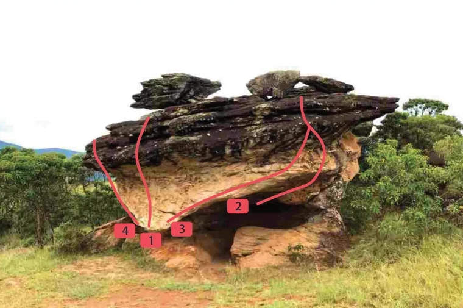
          - **largura_mapa**: 760
          - **altura_mapa**: 505
          - **pontos_de_interesse**:
            - **[0]**:
              - **id**: 1
              - **label**: 1
              - **box**:
                - **x**: 340
                - **y**: 460
                - **comprimento**: 30
                - **largura**: 30
            - **[1]**:
              - **id**: 2
              - **label**: 2
              - **box**:
                - **x**: 520
                - **y**: 390
                - **comprimento**: 30
                - **largura**: 30
            - **[2]**:
              - **id**: 3
              - **label**: 3
              - **box**:
                - **x**: 400
                - **y**: 420
                - **comprimento**: 30
                - **largura**: 30
            - **[3]**:
              - **id**: 4
              - **label**: 4
              - **box**:
                - **x**: 280
                - **y**: 420
                - **comprimento**: 30
                - **largura**: 30
          - **referencias**:
            - **[0]**:
              - **escalada**: Super Homem
              - **ids**:
                - 1
            - **[1]**:
              - **escalada**: Super Herói Cover
              - **ids**:
                - 2
            - **[2]**:
              - **escalada**: Herói
              - **ids**:
                - 3
            - **[3]**:
              - **escalada**: Heroína
              - **ids**:
                - 4
      - **escaladas**:
        - **[0]**:
          - **boulder**:
            - **nome**: Super Homem
            - **dificuldade**: V1
        - **[1]**:
          - **boulder**:
            - **nome**: Super Herói Cover
            - **dificuldade**: V5
        - **[2]**:
          - **boulder**:
            - **nome**: Herói
            - **dificuldade**: V4
        - **[3]**:
          - **boulder**:
            - **nome**: Heroína
            - **dificuldade**: V3
  - **[2]**:
    - **conteudo**:
      - **descricao**:
          # Setor Caverninha
          
          O setor Caverninha possui tetos e negativos com linhas de alta dificuldade.
          
          Obs.: Não foram identificadas todas as linhas desse bloco. Certifique-se antes de fazer uma possível primeira ascensão.
      - **nome**: Caverninha
      - **mapas**:
        - **[0]**:
          - **caminho_imagem_mapa**: 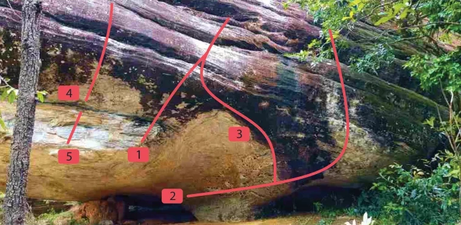
          - **largura_mapa**: 758
          - **altura_mapa**: 370
          - **pontos_de_interesse**:
            - **[0]**:
              - **id**: 1
              - **label**: 1
              - **box**:
                - **x**: 310
                - **y**: 255
                - **comprimento**: 30
                - **largura**: 30
            - **[1]**:
              - **id**: 2
              - **label**: 2
              - **box**:
                - **x**: 470
                - **y**: 330
                - **comprimento**: 30
                - **largura**: 30
            - **[2]**:
              - **id**: 3
              - **label**: 3
              - **box**:
                - **x**: 510
                - **y**: 230
                - **comprimento**: 30
                - **largura**: 30
            - **[3]**:
              - **id**: 4
              - **label**: 4
              - **box**:
                - **x**: 150
                - **y**: 155
                - **comprimento**: 30
                - **largura**: 30
            - **[4]**:
              - **id**: 5
              - **label**: 5
              - **box**:
                - **x**: 150
                - **y**: 250
                - **comprimento**: 30
                - **largura**: 30
          - **referencias**:
            - **[0]**:
              - **escalada**: Terceira Camada
              - **ids**:
                - 1
            - **[1]**:
              - **escalada**: Caverninha
              - **ids**:
                - 2
            - **[2]**:
              - **escalada**: Cavernoso
              - **ids**:
                - 3
            - **[3]**:
              - **escalada**: Natural
              - **ids**:
                - 4
            - **[4]**:
              - **escalada**: Natural SDS
              - **ids**:
                - 5
            - **[5]**:
              - **escalada**: Simba
              - **ids**:
                - 1
            - **[6]**:
              - **escalada**: Dragão
              - **ids**:
                - 2
            - **[7]**:
              - **escalada**: Abaulados
              - **ids**:
                - 3
            - **[8]**:
              - **escalada**: Simba
              - **ids**:
                - 4
            - **[9]**:
              - **escalada**: Capitão Caverna
              - **ids**:
                - 5
            - **[10]**:
              - **escalada**: Combinação Perfeita
              - **ids**:
                - 1
            - **[11]**:
              - **escalada**: Trinca Ferro
              - **ids**:
                - 2
            - **[12]**:
              - **escalada**: Trinca Carangueijo
              - **ids**:
                - 3
            - **[13]**:
              - **escalada**: Natural
              - **ids**:
                - 4
        - **[1]**:
          - **caminho_imagem_mapa**: 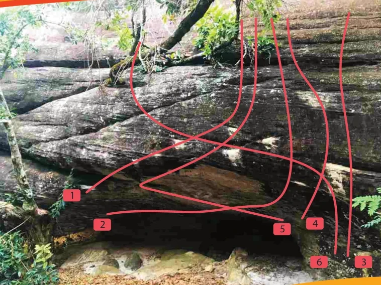
          - **largura_mapa**: 758
          - **altura_mapa**: 568
          - **pontos_de_interesse**:
            - **[0]**:
              - **id**: 1
              - **label**: 1
              - **box**:
                - **x**: 200
                - **y**: 490
                - **comprimento**: 30
                - **largura**: 30
            - **[1]**:
              - **id**: 2
              - **label**: 2
              - **box**:
                - **x**: 285
                - **y**: 540
                - **comprimento**: 30
                - **largura**: 30
            - **[2]**:
              - **id**: 3
              - **label**: 3
              - **box**:
                - **x**: 754
                - **y**: 554
                - **comprimento**: 8
                - **largura**: 28
            - **[3]**:
              - **id**: 4
              - **label**: 4
              - **box**:
                - **x**: 749
                - **y**: 530
                - **comprimento**: 18
                - **largura**: 30
            - **[4]**:
              - **id**: 5
              - **label**: 5
              - **box**:
                - **x**: 744
                - **y**: 550
                - **comprimento**: 28
                - **largura**: 30
            - **[5]**:
              - **id**: 6
              - **label**: 6
              - **box**:
                - **x**: 750
                - **y**: 556
                - **comprimento**: 10
                - **largura**: 23
          - **referencias**:
            - **[0]**:
              - **escalada**: Terceira Camada
              - **ids**:
                - 1
            - **[1]**:
              - **escalada**: Caverninha
              - **ids**:
                - 2
            - **[2]**:
              - **escalada**: Cavernoso
              - **ids**:
                - 3
            - **[3]**:
              - **escalada**: Natural
              - **ids**:
                - 4
            - **[4]**:
              - **escalada**: Natural SDS
              - **ids**:
                - 5
            - **[5]**:
              - **escalada**: Simba
              - **ids**:
                - 1
            - **[6]**:
              - **escalada**: Dragão
              - **ids**:
                - 2
            - **[7]**:
              - **escalada**: Abaulados
              - **ids**:
                - 3
            - **[8]**:
              - **escalada**: Simba
              - **ids**:
                - 4
            - **[9]**:
              - **escalada**: Capitão Caverna
              - **ids**:
                - 5
            - **[10]**:
              - **escalada**: Confuso
              - **ids**:
                - 6
            - **[11]**:
              - **escalada**: Combinação Perfeita
              - **ids**:
                - 1
            - **[12]**:
              - **escalada**: Trinca Ferro
              - **ids**:
                - 2
            - **[13]**:
              - **escalada**: Trinca Carangueijo
              - **ids**:
                - 3
            - **[14]**:
              - **escalada**: Natural
              - **ids**:
                - 4
        - **[2]**:
          - **caminho_imagem_mapa**: 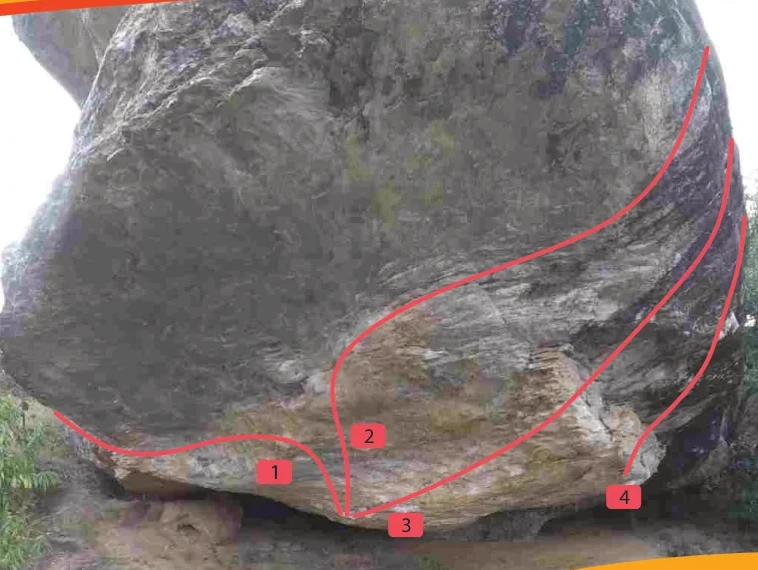
          - **largura_mapa**: 758
          - **altura_mapa**: 570
          - **pontos_de_interesse**:
            - **[0]**:
              - **id**: 1
              - **label**: 1
              - **box**:
                - **x**: 360
                - **y**: 520
                - **comprimento**: 30
                - **largura**: 30
            - **[1]**:
              - **id**: 2
              - **label**: 2
              - **box**:
                - **x**: 490
                - **y**: 510
                - **comprimento**: 30
                - **largura**: 30
            - **[2]**:
              - **id**: 3
              - **label**: 3
              - **box**:
                - **x**: 540
                - **y**: 545
                - **comprimento**: 30
                - **largura**: 30
            - **[3]**:
              - **id**: 4
              - **label**: 4
              - **box**:
                - **x**: 740
                - **y**: 550
                - **comprimento**: 30
                - **largura**: 30
          - **referencias**:
            - **[0]**:
              - **escalada**: Terceira Camada
              - **ids**:
                - 1
            - **[1]**:
              - **escalada**: Caverninha
              - **ids**:
                - 2
            - **[2]**:
              - **escalada**: Cavernoso
              - **ids**:
                - 3
            - **[3]**:
              - **escalada**: Natural
              - **ids**:
                - 4
            - **[4]**:
              - **escalada**: Simba
              - **ids**:
                - 1
            - **[5]**:
              - **escalada**: Dragão
              - **ids**:
                - 2
            - **[6]**:
              - **escalada**: Abaulados
              - **ids**:
                - 3
            - **[7]**:
              - **escalada**: Simba
              - **ids**:
                - 4
            - **[8]**:
              - **escalada**: Combinação Perfeita
              - **ids**:
                - 1
            - **[9]**:
              - **escalada**: Trinca Ferro
              - **ids**:
                - 2
            - **[10]**:
              - **escalada**: Trinca Carangueijo
              - **ids**:
                - 3
            - **[11]**:
              - **escalada**: Natural
              - **ids**:
                - 4
      - **escaladas**:
        - **[0]**:
          - **boulder**:
            - **nome**: Terceira Camada
            - **dificuldade**: V5
        - **[1]**:
          - **boulder**:
            - **nome**: Caverninha
            - **dificuldade**: V4
        - **[2]**:
          - **boulder**:
            - **nome**: Cavernoso
            - **dificuldade**: V7
        - **[3]**:
          - **boulder**:
            - **nome**: Natural
            - **dificuldade**: V5
        - **[4]**:
          - **boulder**:
            - **nome**: Natural SDS
            - **dificuldade**: V8
        - **[5]**:
          - **boulder**:
            - **nome**: Simba
            - **dificuldade**: V8
        - **[6]**:
          - **boulder**:
            - **nome**: Dragão
            - **dificuldade**: V7
        - **[7]**:
          - **boulder**:
            - **nome**: Abaulados
            - **dificuldade**: V3
        - **[8]**:
          - **boulder**:
            - **nome**: Simba
            - **dificuldade**: V8
        - **[9]**:
          - **boulder**:
            - **nome**: Capitão Caverna
            - **dificuldade**: V6
        - **[10]**:
          - **boulder**:
            - **nome**: Confuso
            - **dificuldade**: V6
        - **[11]**:
          - **boulder**:
            - **nome**: Combinação Perfeita
            - **dificuldade**: V12
        - **[12]**:
          - **boulder**:
            - **nome**: Trinca Ferro
            - **dificuldade**: V11
        - **[13]**:
          - **boulder**:
            - **nome**: Trinca Carangueijo
            - **dificuldade**: V8
        - **[14]**:
          - **boulder**:
            - **nome**: Natural
            - **dificuldade**: V6
  - **[3]**:
    - **conteudo**:
      - **descricao**:
          # Setor Campo Escola
          
          O setor Campo Escola é ideal para iniciantes e para quem busca linhas de boulder mais acessíveis.
          
          Obs.: Não foram identificadas todas as linhas desse bloco. Certique-se antes de fazer uma possível primeira ascensão.
      - **nome**: Campo Escola
      - **mapas**:
        - **[0]**:
          - **caminho_imagem_mapa**: 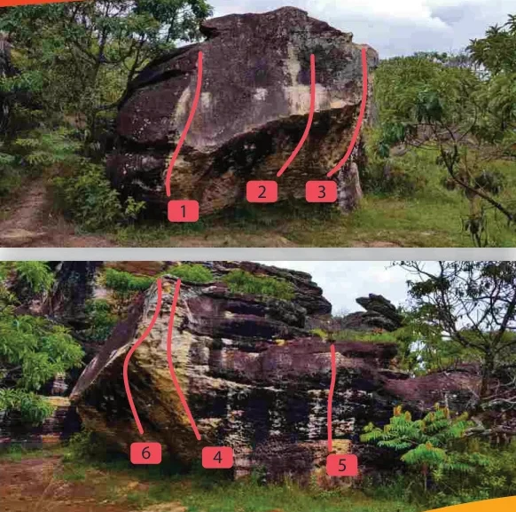
          - **largura_mapa**: 582
          - **altura_mapa**: 577
          - **pontos_de_interesse**:
            - **[0]**:
              - **id**: 1
              - **label**: 1
              - **box**:
                - **x**: 350
                - **y**: 410
                - **comprimento**: 30
                - **largura**: 30
            - **[1]**:
              - **id**: 2
              - **label**: 2
              - **box**:
                - **x**: 510
                - **y**: 380
                - **comprimento**: 30
                - **largura**: 30
            - **[2]**:
              - **id**: 3
              - **label**: 3
              - **box**:
                - **x**: 568
                - **y**: 380
                - **comprimento**: 27
                - **largura**: 30
            - **[3]**:
              - **id**: 6
              - **label**: 6
              - **box**:
                - **x**: 290
                - **y**: 515
                - **comprimento**: 30
                - **largura**: 30
            - **[4]**:
              - **id**: 4
              - **label**: 4
              - **box**:
                - **x**: 430
                - **y**: 525
                - **comprimento**: 30
                - **largura**: 30
            - **[5]**:
              - **id**: 5
              - **label**: 5
              - **box**:
                - **x**: 555
                - **y**: 525
                - **comprimento**: 30
                - **largura**: 30
          - **referencias**:
            - **[0]**:
              - **escalada**: Tré Bien
              - **ids**:
                - 1
            - **[1]**:
              - **escalada**: Muvuca
              - **ids**:
                - 2
            - **[2]**:
              - **escalada**: Ninja de Verde
              - **ids**:
                - 3
            - **[3]**:
              - **escalada**: Ninja de Amarelo
              - **ids**:
                - 4
            - **[4]**:
              - **escalada**: Ninja de Rosa
              - **ids**:
                - 5
            - **[5]**:
              - **escalada**: Casé
              - **ids**:
                - 6
            - **[6]**:
              - **escalada**: (sem nome)
              - **ids**:
                - 1
            - **[7]**:
              - **escalada**: (sem nome)
              - **ids**:
                - 2
            - **[8]**:
              - **escalada**: (sem nome)
              - **ids**:
                - 3
            - **[9]**:
              - **escalada**: (sem nome)
              - **ids**:
                - 4
            - **[10]**:
              - **escalada**: (sem nome)
              - **ids**:
                - 5
            - **[11]**:
              - **escalada**: Das Meninas
              - **ids**:
                - 6
        - **[1]**:
          - **caminho_imagem_mapa**: 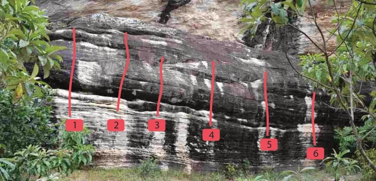
          - **largura_mapa**: 757
          - **altura_mapa**: 365
          - **pontos_de_interesse**:
            - **[0]**:
              - **id**: 1
              - **label**: 1
              - **box**:
                - **x**: 200
                - **y**: 255
                - **comprimento**: 30
                - **largura**: 30
            - **[1]**:
              - **id**: 2
              - **label**: 2
              - **box**:
                - **x**: 310
                - **y**: 280
                - **comprimento**: 30
                - **largura**: 30
            - **[2]**:
              - **id**: 3
              - **label**: 3
              - **box**:
                - **x**: 420
                - **y**: 280
                - **comprimento**: 30
                - **largura**: 30
            - **[3]**:
              - **id**: 4
              - **label**: 4
              - **box**:
                - **x**: 570
                - **y**: 290
                - **comprimento**: 30
                - **largura**: 30
            - **[4]**:
              - **id**: 5
              - **label**: 5
              - **box**:
                - **x**: 720
                - **y**: 310
                - **comprimento**: 30
                - **largura**: 30
            - **[5]**:
              - **id**: 6
              - **label**: 6
              - **box**:
                - **x**: 751
                - **y**: 340
                - **comprimento**: 12
                - **largura**: 30
          - **referencias**:
            - **[0]**:
              - **escalada**: Tré Bien
              - **ids**:
                - 1
            - **[1]**:
              - **escalada**: Muvuca
              - **ids**:
                - 2
            - **[2]**:
              - **escalada**: Ninja de Verde
              - **ids**:
                - 3
            - **[3]**:
              - **escalada**: Ninja de Amarelo
              - **ids**:
                - 4
            - **[4]**:
              - **escalada**: Ninja de Rosa
              - **ids**:
                - 5
            - **[5]**:
              - **escalada**: Casé
              - **ids**:
                - 6
            - **[6]**:
              - **escalada**: (sem nome)
              - **ids**:
                - 1
            - **[7]**:
              - **escalada**: (sem nome)
              - **ids**:
                - 2
            - **[8]**:
              - **escalada**: (sem nome)
              - **ids**:
                - 3
            - **[9]**:
              - **escalada**: (sem nome)
              - **ids**:
                - 4
            - **[10]**:
              - **escalada**: (sem nome)
              - **ids**:
                - 5
            - **[11]**:
              - **escalada**: Das Meninas
              - **ids**:
                - 6
      - **escaladas**:
        - **[0]**:
          - **boulder**:
            - **nome**: Tré Bien
            - **dificuldade**: V5
        - **[1]**:
          - **boulder**:
            - **nome**: Muvuca
            - **dificuldade**: V4
        - **[2]**:
          - **boulder**:
            - **nome**: Ninja de Verde
            - **dificuldade**: V1
        - **[3]**:
          - **boulder**:
            - **nome**: Ninja de Amarelo
            - **dificuldade**: V1
        - **[4]**:
          - **boulder**:
            - **nome**: Ninja de Rosa
            - **dificuldade**: V0
        - **[5]**:
          - **boulder**:
            - **nome**: Casé
            - **dificuldade**: V3
        - **[6]**:
          - **boulder**:
            - **nome**: (sem nome)
            - **dificuldade**: V0
        - **[7]**:
          - **boulder**:
            - **nome**: (sem nome)
            - **dificuldade**: V1
        - **[8]**:
          - **boulder**:
            - **nome**: (sem nome)
            - **dificuldade**: V1
        - **[9]**:
          - **boulder**:
            - **nome**: (sem nome)
            - **dificuldade**: V1
        - **[10]**:
          - **boulder**:
            - **nome**: (sem nome)
            - **dificuldade**: V1
        - **[11]**:
          - **boulder**:
            - **nome**: Das Meninas
            - **dificuldade**: V3
  - **[4]**:
    - **conteudo**:
      - **descricao**:
          # Setor Escorpião
          
          O setor Escorpião apresenta boulders com movimentos técnicos e agarras específicas.
          
          Obs.: Não foram identificadas todas as linhas desse bloco. Certifique-se antes de fazer uma possível primeira ascensão.
      - **nome**: Escorpião
      - **mapas**:
        - **[0]**:
          - **caminho_imagem_mapa**: 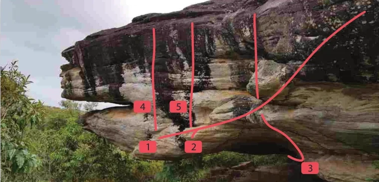
          - **largura_mapa**: 761
          - **altura_mapa**: 367
          - **pontos_de_interesse**:
            - **[0]**:
              - **id**: 1
              - **label**: 1
              - **box**:
                - **x**: 400
                - **y**: 320
                - **comprimento**: 30
                - **largura**: 30
            - **[1]**:
              - **id**: 2
              - **label**: 2
              - **box**:
                - **x**: 510
                - **y**: 320
                - **comprimento**: 30
                - **largura**: 30
            - **[2]**:
              - **id**: 3
              - **label**: 3
              - **box**:
                - **x**: 750
                - **y**: 356
                - **comprimento**: 21
                - **largura**: 22
            - **[3]**:
              - **id**: 4
              - **label**: 4
              - **box**:
                - **x**: 380
                - **y**: 280
                - **comprimento**: 30
                - **largura**: 30
            - **[4]**:
              - **id**: 5
              - **label**: 5
              - **box**:
                - **x**: 480
                - **y**: 280
                - **comprimento**: 30
                - **largura**: 30
          - **referencias**:
            - **[0]**:
              - **escalada**: Super Foot Hook
              - **ids**:
                - 1
            - **[1]**:
              - **escalada**: Foot Hook
              - **ids**:
                - 2
            - **[2]**:
              - **escalada**: Escorpião
              - **ids**:
                - 3
            - **[3]**:
              - **escalada**: Yakisoba
              - **ids**:
                - 4
            - **[4]**:
              - **escalada**: Uaikisoba
              - **ids**:
                - 5
            - **[5]**:
              - **escalada**: Insaciável
              - **ids**:
                - 1
            - **[6]**:
              - **escalada**: Sicronismo
              - **ids**:
                - 2
        - **[1]**:
          - **caminho_imagem_mapa**: 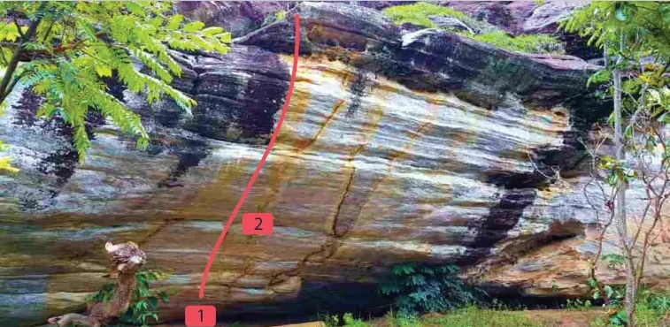
          - **largura_mapa**: 757
          - **altura_mapa**: 370
          - **pontos_de_interesse**:
            - **[0]**:
              - **id**: 1
              - **label**: 1
              - **box**:
                - **x**: 230
                - **y**: 350
                - **comprimento**: 30
                - **largura**: 30
            - **[1]**:
              - **id**: 2
              - **label**: 2
              - **box**:
                - **x**: 390
                - **y**: 255
                - **comprimento**: 30
                - **largura**: 30
          - **referencias**:
            - **[0]**:
              - **escalada**: Super Foot Hook
              - **ids**:
                - 1
            - **[1]**:
              - **escalada**: Foot Hook
              - **ids**:
                - 2
            - **[2]**:
              - **escalada**: Insaciável
              - **ids**:
                - 1
            - **[3]**:
              - **escalada**: Sicronismo
              - **ids**:
                - 2
      - **escaladas**:
        - **[0]**:
          - **boulder**:
            - **nome**: Super Foot Hook
            - **dificuldade**: V5
        - **[1]**:
          - **boulder**:
            - **nome**: Foot Hook
            - **dificuldade**: V3
        - **[2]**:
          - **boulder**:
            - **nome**: Escorpião
            - **dificuldade**: V8
        - **[3]**:
          - **boulder**:
            - **nome**: Yakisoba
            - **dificuldade**: V7
        - **[4]**:
          - **boulder**:
            - **nome**: Uaikisoba
            - **dificuldade**: V7
        - **[5]**:
          - **boulder**:
            - **nome**: Insaciável
            - **dificuldade**: V10
        - **[6]**:
          - **boulder**:
            - **nome**: Sicronismo
            - **dificuldade**: V8
  - **[5]**:
    - **conteudo**:
      - **descricao**:
          # Setor Troféu
          
          O setor Troféu é conhecido por suas linhas técnicas e de alta graduação.
          
          Obs.: Não foram identificadas todas as linhas desse bloco. Certifique-se antes de fazer uma possível primeira ascensão.
      - **nome**: Troféu
      - **mapas**:
        - **[0]**:
          - **caminho_imagem_mapa**: 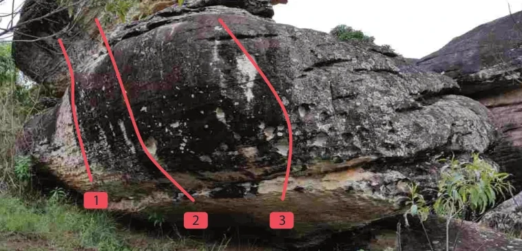
          - **largura_mapa**: 758
          - **altura_mapa**: 365
          - **pontos_de_interesse**:
            - **[0]**:
              - **id**: 1
              - **label**: 1
              - **box**:
                - **x**: 190
                - **y**: 325
                - **comprimento**: 30
                - **largura**: 30
            - **[1]**:
              - **id**: 2
              - **label**: 2
              - **box**:
                - **x**: 390
                - **y**: 325
                - **comprimento**: 30
                - **largura**: 30
            - **[2]**:
              - **id**: 3
              - **label**: 3
              - **box**:
                - **x**: 550
                - **y**: 325
                - **comprimento**: 30
                - **largura**: 30
          - **referencias**:
            - **[0]**:
              - **escalada**: Trofeuzinho
              - **ids**:
                - 1
            - **[1]**:
              - **escalada**: Troféu
              - **ids**:
                - 2
            - **[2]**:
              - **escalada**: Dreads de Goiás
              - **ids**:
                - 3
      - **escaladas**:
        - **[0]**:
          - **boulder**:
            - **nome**: Trofeuzinho
            - **dificuldade**: V7
        - **[1]**:
          - **boulder**:
            - **nome**: Troféu
            - **dificuldade**: V10
        - **[2]**:
          - **boulder**:
            - **nome**: Dreads de Goiás
            - **dificuldade**: V7
  - **[6]**:
    - **conteudo**:
      - **descricao**:
          # Setor X-Tudo
          
          O setor X-Tudo possui blocos interessantes com linhas de dificuldade intermediária.
          
          Obs.: Não foram identificadas todas as linhas desse bloco. Certifique-se antes de fazer uma possível primeira ascensão.
      - **nome**: X-Tudo
      - **mapas**:
        - **[0]**:
          - **caminho_imagem_mapa**: 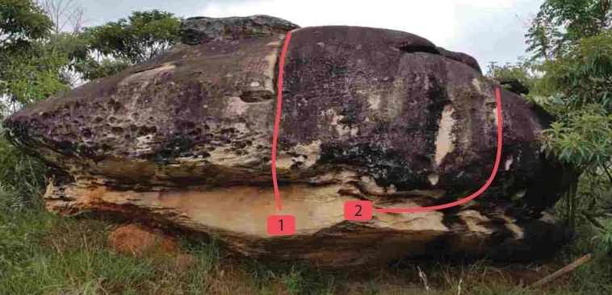
          - **largura_mapa**: 758
          - **altura_mapa**: 366
          - **pontos_de_interesse**:
            - **[0]**:
              - **id**: 1
              - **label**: 1
              - **box**:
                - **x**: 450
                - **y**: 255
                - **comprimento**: 30
                - **largura**: 30
            - **[1]**:
              - **id**: 2
              - **label**: 2
              - **box**:
                - **x**: 590
                - **y**: 255
                - **comprimento**: 30
                - **largura**: 30
          - **referencias**:
            - **[0]**:
              - **escalada**: X-Tudo
              - **ids**:
                - 1
            - **[1]**:
              - **escalada**: Pão com Ovo
              - **ids**:
                - 2
            - **[2]**:
              - **escalada**: Nossa Senhora de Conceição
              - **ids**:
                - 1
            - **[3]**:
              - **escalada**: Kansas
              - **ids**:
                - 1
        - **[1]**:
          - **caminho_imagem_mapa**: 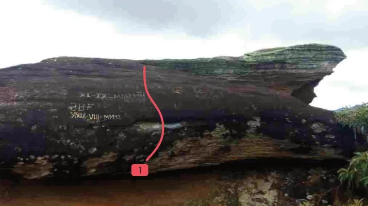
          - **largura_mapa**: 758
          - **altura_mapa**: 424
          - **pontos_de_interesse**:
            - **[0]**:
              - **id**: 1
              - **label**: 1
              - **box**:
                - **x**: 380
                - **y**: 405
                - **comprimento**: 30
                - **largura**: 30
          - **referencias**:
            - **[0]**:
              - **escalada**: X-Tudo
              - **ids**:
                - 1
            - **[1]**:
              - **escalada**: Nossa Senhora de Conceição
              - **ids**:
                - 1
            - **[2]**:
              - **escalada**: Kansas
              - **ids**:
                - 1
        - **[2]**:
          - **caminho_imagem_mapa**: 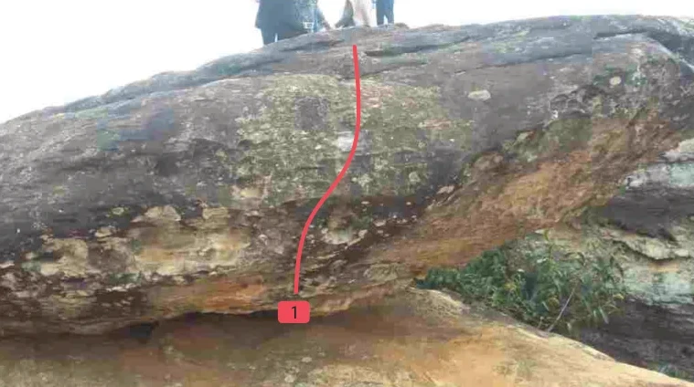
          - **largura_mapa**: 759
          - **altura_mapa**: 424
          - **pontos_de_interesse**:
            - **[0]**:
              - **id**: 1
              - **label**: 1
              - **box**:
                - **x**: 430
                - **y**: 410
                - **comprimento**: 30
                - **largura**: 30
          - **referencias**:
            - **[0]**:
              - **escalada**: X-Tudo
              - **ids**:
                - 1
            - **[1]**:
              - **escalada**: Nossa Senhora de Conceição
              - **ids**:
                - 1
            - **[2]**:
              - **escalada**: Kansas
              - **ids**:
                - 1
      - **escaladas**:
        - **[0]**:
          - **boulder**:
            - **nome**: X-Tudo
            - **dificuldade**: V3
        - **[1]**:
          - **boulder**:
            - **nome**: Pão com Ovo
            - **dificuldade**: V4
        - **[2]**:
          - **boulder**:
            - **nome**: Nossa Senhora de Conceição
            - **dificuldade**: V3
        - **[3]**:
          - **boulder**:
            - **nome**: Kansas
            - **dificuldade**: V3
  - **[7]**:
    - **conteudo**:
      - **descricao**:
          # Setor Domínio Digital
          
          O setor Domínio Digital possui um bloco com um arco natural e linhas de baixa dificuldade.
          
          Obs.: Não foram identificadas todas as linhas desse bloco. Certifique-se antes de fazer uma possível primeira ascensão.
      - **nome**: Domínio Digital
      - **mapas**:
        - **[0]**:
          - **caminho_imagem_mapa**: 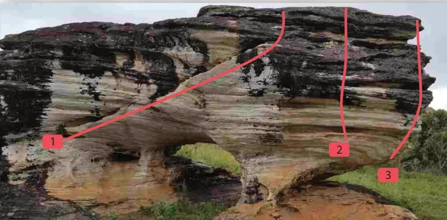
          - **largura_mapa**: 761
          - **altura_mapa**: 375
          - **pontos_de_interesse**:
            - **[0]**:
              - **id**: 1
              - **label**: 1
              - **box**:
                - **x**: 110
                - **y**: 240
                - **comprimento**: 30
                - **largura**: 30
            - **[1]**:
              - **id**: 2
              - **label**: 2
              - **box**:
                - **x**: 730
                - **y**: 255
                - **comprimento**: 30
                - **largura**: 30
            - **[2]**:
              - **id**: 3
              - **label**: 3
              - **box**:
                - **x**: 750
                - **y**: 290
                - **comprimento**: 21
                - **largura**: 30
          - **referencias**:
            - **[0]**:
              - **escalada**: Domínio Digital
              - **ids**:
                - 1
            - **[1]**:
              - **escalada**: (sem nome)
              - **ids**:
                - 2
            - **[2]**:
              - **escalada**: (sem nome)
              - **ids**:
                - 3
      - **escaladas**:
        - **[0]**:
          - **boulder**:
            - **nome**: Domínio Digital
            - **dificuldade**: V2
        - **[1]**:
          - **boulder**:
            - **nome**: (sem nome)
            - **dificuldade**: V0
        - **[2]**:
          - **boulder**:
            - **nome**: (sem nome)
            - **dificuldade**: V0

## Parte: grupo_colina

### Grupo (Pico: Conceição do Mato Dentro)

- **descricao**:
    # Grupo Colina
    
    A Colina abriga diversos setores com abordagens e estilos diferentes, de blocos clássicos a novas linhas.
- **nome**: Colina
- **mapas**:
  - **[0]**:
    - **caminho_imagem_mapa**: 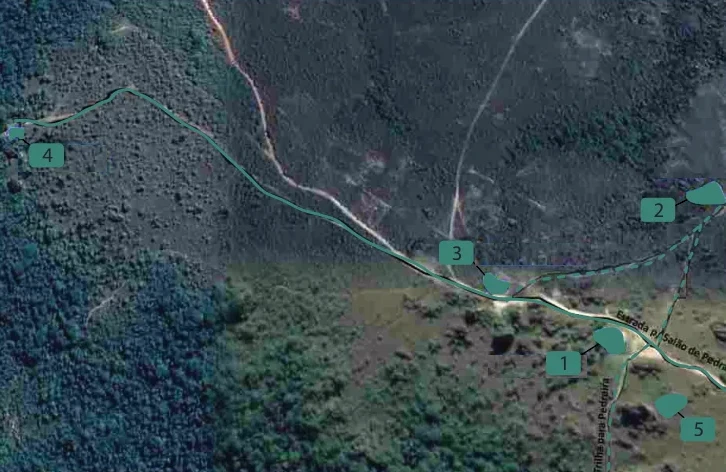
    - **largura_mapa**: 726
    - **altura_mapa**: 472
    - **pontos_de_interesse**:
      - **[0]**:
        - **id**: 1
        - **label**: 1
        - **box**:
          - **x**: 542
          - **y**: 362
          - **comprimento**: 35
          - **largura**: 35
      - **[1]**:
        - **id**: 2
        - **label**: 2
        - **box**:
          - **x**: 638
          - **y**: 222
          - **comprimento**: 35
          - **largura**: 35
      - **[2]**:
        - **id**: 3
        - **label**: 3
        - **box**:
          - **x**: 438
          - **y**: 262
          - **comprimento**: 35
          - **largura**: 35
      - **[3]**:
        - **id**: 4
        - **label**: 4
        - **box**:
          - **x**: 38
          - **y**: 162
          - **comprimento**: 35
          - **largura**: 35
      - **[4]**:
        - **id**: 5
        - **label**: 5
        - **box**:
          - **x**: 708
          - **y**: 442
          - **comprimento**: 34
          - **largura**: 35
    - **referencias**:
      - **[0]**:
        - **setor**: Choquito
        - **ids**:
          - 1
      - **[1]**:
        - **setor**: Godzilla
        - **ids**:
          - 2
      - **[2]**:
        - **setor**: Show Time
        - **ids**:
          - 3
      - **[3]**:
        - **setor**: Hiperespaço
        - **ids**:
          - 4
      - **[4]**:
        - **setor**: Mergulho em Copo d'Água
        - **ids**:
          - 5
- **setores**:
  - **[0]**:
    - **conteudo**:
      - **descricao**:
          # Setor Choquito
          
          O setor Choquito possui blocos com linhas variadas.
          
          > [!CAUTION]
          > **PINTURA RUPESTRE, NÃO ESCALE NESSE LOCAL.**
          > | 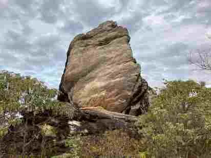 |
          | :--: |
          | *Pintura Rupestre* |
          
          Obs.: Não foram identificadas todas as linhas desse bloco. Certifique-se antes de fazer uma possível primeira ascensão.
      - **nome**: Choquito
      - **mapas**:
        - **[0]**:
          - **caminho_imagem_mapa**: 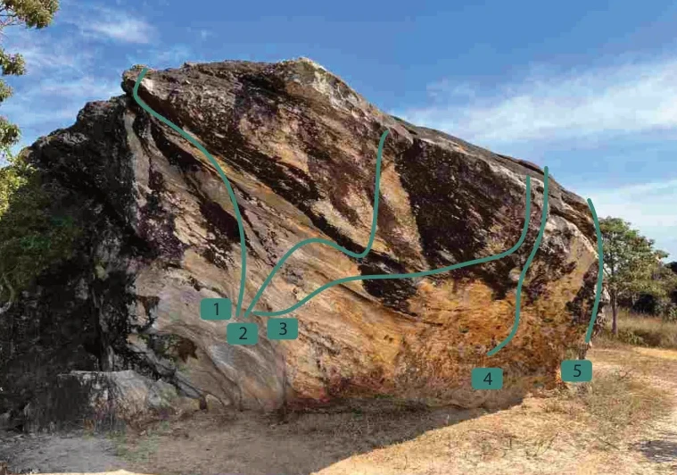
          - **largura_mapa**: 759
          - **altura_mapa**: 532
          - **pontos_de_interesse**:
            - **[0]**:
              - **id**: 1
              - **label**: 1
              - **box**:
                - **x**: 250
                - **y**: 350
                - **comprimento**: 30
                - **largura**: 30
            - **[1]**:
              - **id**: 2
              - **label**: 2
              - **box**:
                - **x**: 360
                - **y**: 470
                - **comprimento**: 30
                - **largura**: 30
            - **[2]**:
              - **id**: 3
              - **label**: 3
              - **box**:
                - **x**: 420
                - **y**: 420
                - **comprimento**: 30
                - **largura**: 30
            - **[3]**:
              - **id**: 4
              - **label**: 4
              - **box**:
                - **x**: 720
                - **y**: 500
                - **comprimento**: 30
                - **largura**: 30
            - **[4]**:
              - **id**: 5
              - **label**: 5
              - **box**:
                - **x**: 755
                - **y**: 490
                - **comprimento**: 30
                - **largura**: 30
          - **referencias**:
            - **[0]**:
              - **escalada**: Paradise
              - **ids**:
                - 1
            - **[1]**:
              - **escalada**: Quebra Costela
              - **ids**:
                - 2
            - **[2]**:
              - **escalada**: (sem nome)
              - **ids**:
                - 3
            - **[3]**:
              - **escalada**: Choquito
              - **ids**:
                - 4
            - **[4]**:
              - **escalada**: Jungle
              - **ids**:
                - 5
            - **[5]**:
              - **escalada**: (sem nome)
              - **ids**:
                - 1
            - **[6]**:
              - **escalada**: (sem nome)
              - **ids**:
                - 2
        - **[1]**:
          - **caminho_imagem_mapa**: 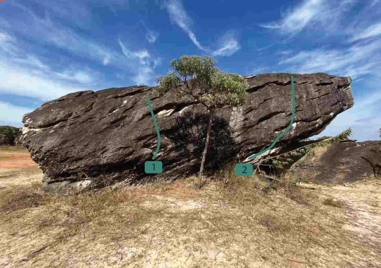
          - **largura_mapa**: 755
          - **altura_mapa**: 531
          - **pontos_de_interesse**:
            - **[0]**:
              - **id**: 1
              - **label**: 1
              - **box**:
                - **x**: 320
                - **y**: 515
                - **comprimento**: 30
                - **largura**: 30
            - **[1]**:
              - **id**: 2
              - **label**: 2
              - **box**:
                - **x**: 500
                - **y**: 525
                - **comprimento**: 30
                - **largura**: 30
          - **referencias**:
            - **[0]**:
              - **escalada**: Paradise
              - **ids**:
                - 1
            - **[1]**:
              - **escalada**: Quebra Costela
              - **ids**:
                - 2
            - **[2]**:
              - **escalada**: (sem nome)
              - **ids**:
                - 1
            - **[3]**:
              - **escalada**: (sem nome)
              - **ids**:
                - 2
      - **escaladas**:
        - **[0]**:
          - **boulder**:
            - **nome**: Paradise
            - **dificuldade**: V4
        - **[1]**:
          - **boulder**:
            - **nome**: Quebra Costela
            - **dificuldade**: V3
        - **[2]**:
          - **boulder**:
            - **nome**: (sem nome)
        - **[3]**:
          - **boulder**:
            - **nome**: Choquito
            - **dificuldade**: V3
        - **[4]**:
          - **boulder**:
            - **nome**: Jungle
            - **dificuldade**: V5
        - **[5]**:
          - **boulder**:
            - **nome**: (sem nome)
            - **dificuldade**: V0
        - **[6]**:
          - **boulder**:
            - **nome**: (sem nome)
            - **dificuldade**: V3
  - **[1]**:
    - **conteudo**:
      - **descricao**:
          # Setor Godzilla
          
          O setor Godzilla possui blocos imponentes com linhas de alta qualidade e dificuldade.
          
          Obs.: Não foram identificadas todas as linhas desse bloco. Certifique-se antes de fazer uma possível primeira ascensão.
      - **nome**: Godzilla
      - **mapas**:
        - **[0]**:
          - **caminho_imagem_mapa**: 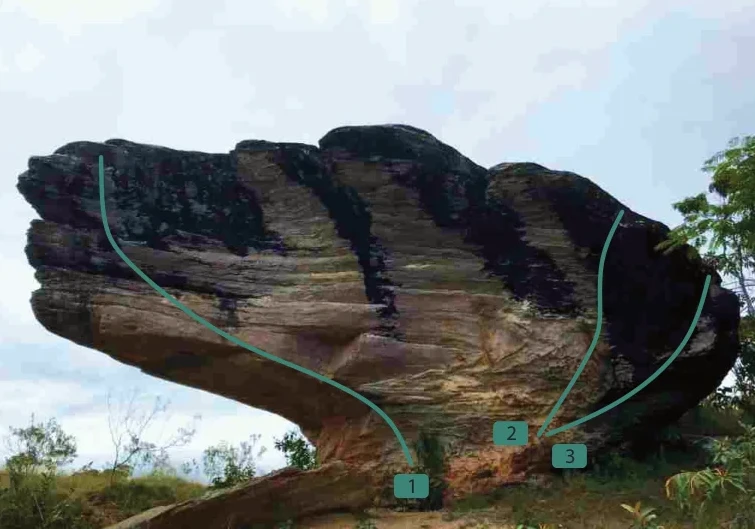
          - **largura_mapa**: 755
          - **altura_mapa**: 529
          - **pontos_de_interesse**:
            - **[0]**:
              - **id**: 1
              - **label**: 1
              - **box**:
                - **x**: 415
                - **y**: 520
                - **comprimento**: 30
                - **largura**: 30
            - **[1]**:
              - **id**: 2
              - **label**: 2
              - **box**:
                - **x**: 515
                - **y**: 435
                - **comprimento**: 30
                - **largura**: 30
            - **[2]**:
              - **id**: 3
              - **label**: 3
              - **box**:
                - **x**: 575
                - **y**: 480
                - **comprimento**: 30
                - **largura**: 30
          - **referencias**:
            - **[0]**:
              - **escalada**: King Kong
              - **ids**:
                - 1
            - **[1]**:
              - **escalada**: Gorilaz
              - **ids**:
                - 2
            - **[2]**:
              - **escalada**: Chimpanzé
              - **ids**:
                - 3
            - **[3]**:
              - **escalada**: Macaco Prego
              - **ids**:
                - 1
            - **[4]**:
              - **escalada**: Rolamento
              - **ids**:
                - 2
            - **[5]**:
              - **escalada**: Godzilla
              - **ids**:
                - 3
            - **[6]**:
              - **escalada**: Enxada
              - **ids**:
                - 1
            - **[7]**:
              - **escalada**: Obra de Arte
              - **ids**:
                - 2
        - **[1]**:
          - **caminho_imagem_mapa**: 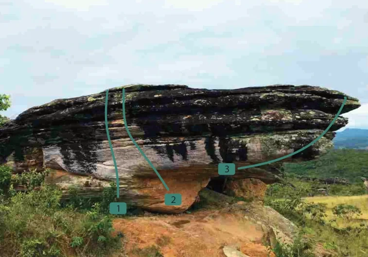
          - **largura_mapa**: 757
          - **altura_mapa**: 528
          - **pontos_de_interesse**:
            - **[0]**:
              - **id**: 1
              - **label**: 1
              - **box**:
                - **x**: 330
                - **y**: 515
                - **comprimento**: 30
                - **largura**: 30
            - **[1]**:
              - **id**: 2
              - **label**: 2
              - **box**:
                - **x**: 480
                - **y**: 525
                - **comprimento**: 30
                - **largura**: 30
            - **[2]**:
              - **id**: 3
              - **label**: 3
              - **box**:
                - **x**: 630
                - **y**: 440
                - **comprimento**: 30
                - **largura**: 30
          - **referencias**:
            - **[0]**:
              - **escalada**: King Kong
              - **ids**:
                - 1
            - **[1]**:
              - **escalada**: Gorilaz
              - **ids**:
                - 2
            - **[2]**:
              - **escalada**: Chimpanzé
              - **ids**:
                - 3
            - **[3]**:
              - **escalada**: Macaco Prego
              - **ids**:
                - 1
            - **[4]**:
              - **escalada**: Rolamento
              - **ids**:
                - 2
            - **[5]**:
              - **escalada**: Godzilla
              - **ids**:
                - 3
            - **[6]**:
              - **escalada**: Enxada
              - **ids**:
                - 1
            - **[7]**:
              - **escalada**: Obra de Arte
              - **ids**:
                - 2
        - **[2]**:
          - **caminho_imagem_mapa**: 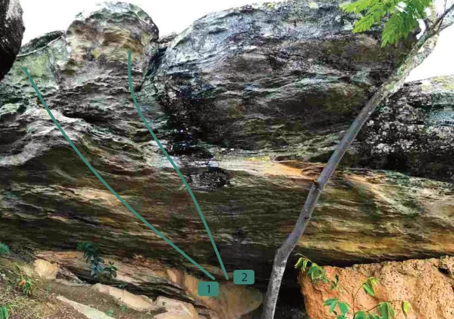
          - **largura_mapa**: 755
          - **altura_mapa**: 531
          - **pontos_de_interesse**:
            - **[0]**:
              - **id**: 1
              - **label**: 1
              - **box**:
                - **x**: 370
                - **y**: 510
                - **comprimento**: 30
                - **largura**: 30
            - **[1]**:
              - **id**: 2
              - **label**: 2
              - **box**:
                - **x**: 430
                - **y**: 480
                - **comprimento**: 30
                - **largura**: 30
          - **referencias**:
            - **[0]**:
              - **escalada**: King Kong
              - **ids**:
                - 1
            - **[1]**:
              - **escalada**: Gorilaz
              - **ids**:
                - 2
            - **[2]**:
              - **escalada**: Macaco Prego
              - **ids**:
                - 1
            - **[3]**:
              - **escalada**: Rolamento
              - **ids**:
                - 2
            - **[4]**:
              - **escalada**: Enxada
              - **ids**:
                - 1
            - **[5]**:
              - **escalada**: Obra de Arte
              - **ids**:
                - 2
      - **escaladas**:
        - **[0]**:
          - **boulder**:
            - **nome**: King Kong
            - **dificuldade**: V7
        - **[1]**:
          - **boulder**:
            - **nome**: Gorilaz
            - **dificuldade**: V4
        - **[2]**:
          - **boulder**:
            - **nome**: Chimpanzé
            - **dificuldade**: V4
        - **[3]**:
          - **boulder**:
            - **nome**: Macaco Prego
            - **dificuldade**: V4
        - **[4]**:
          - **boulder**:
            - **nome**: Rolamento
            - **dificuldade**: V7
        - **[5]**:
          - **boulder**:
            - **nome**: Godzilla
            - **dificuldade**: V5
        - **[6]**:
          - **boulder**:
            - **nome**: Enxada
            - **dificuldade**: V5
        - **[7]**:
          - **boulder**:
            - **nome**: Obra de Arte
            - **dificuldade**: V9
  - **[2]**:
    - **conteudo**:
      - **descricao**:
          # Setor Show Time
          
          O setor Show Time possui blocos isolados com linhas de diversas dificuldades e visuais incríveis.
          
          Obs.: Não foram identificadas todas as linhas desse bloco. Certifique-se antes de fazer uma possível primeira ascensão.
      - **nome**: Show Time
      - **mapas**:
        - **[0]**:
          - **caminho_imagem_mapa**: 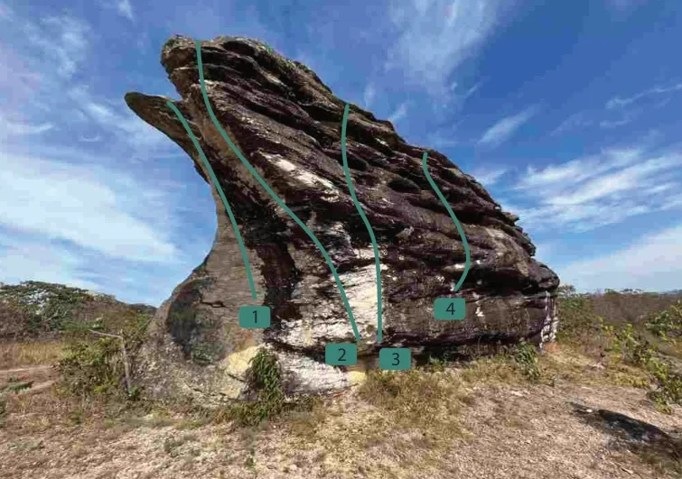
          - **largura_mapa**: 755
          - **altura_mapa**: 531
          - **pontos_de_interesse**:
            - **[0]**:
              - **id**: 1
              - **label**: 1
              - **box**:
                - **x**: 380
                - **y**: 470
                - **comprimento**: 30
                - **largura**: 30
            - **[1]**:
              - **id**: 2
              - **label**: 2
              - **box**:
                - **x**: 510
                - **y**: 535
                - **comprimento**: 30
                - **largura**: 30
            - **[2]**:
              - **id**: 3
              - **label**: 3
              - **box**:
                - **x**: 590
                - **y**: 540
                - **comprimento**: 30
                - **largura**: 30
            - **[3]**:
              - **id**: 4
              - **label**: 4
              - **box**:
                - **x**: 670
                - **y**: 440
                - **comprimento**: 30
                - **largura**: 30
          - **referencias**:
            - **[0]**:
              - **escalada**: ET Teimoso
              - **ids**:
                - 1
            - **[1]**:
              - **escalada**: Show Time
              - **ids**:
                - 2
            - **[2]**:
              - **escalada**: Zela Time
              - **ids**:
                - 3
            - **[3]**:
              - **escalada**: (sem nome)
              - **ids**:
                - 4
            - **[4]**:
              - **escalada**: (sem nome)
              - **ids**:
                - 1
            - **[5]**:
              - **escalada**: (sem nome)
              - **ids**:
                - 2
            - **[6]**:
              - **escalada**: Meia Lua
              - **ids**:
                - 3
            - **[7]**:
              - **escalada**: (sem nome)
              - **ids**:
                - 4
        - **[1]**:
          - **caminho_imagem_mapa**: 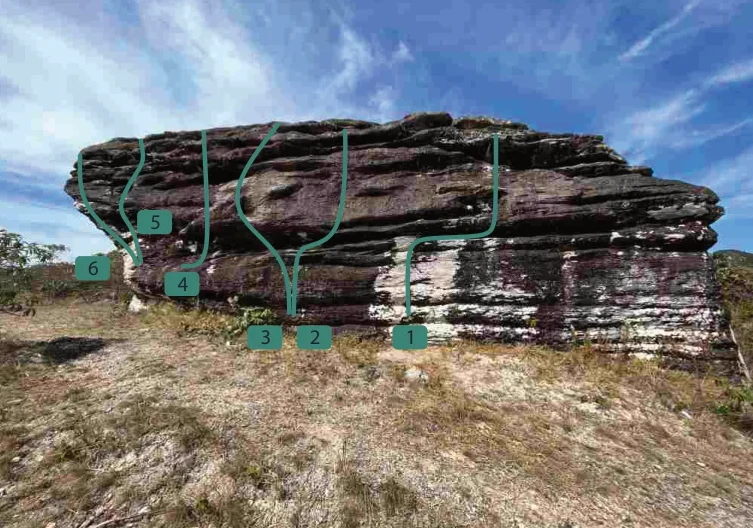
          - **largura_mapa**: 753
          - **altura_mapa**: 528
          - **pontos_de_interesse**:
            - **[0]**:
              - **id**: 1
              - **label**: 1
              - **box**:
                - **x**: 572
                - **y**: 515
                - **comprimento**: 35
                - **largura**: 30
            - **[1]**:
              - **id**: 2
              - **label**: 2
              - **box**:
                - **x**: 442
                - **y**: 515
                - **comprimento**: 35
                - **largura**: 30
            - **[2]**:
              - **id**: 3
              - **label**: 3
              - **box**:
                - **x**: 382
                - **y**: 515
                - **comprimento**: 35
                - **largura**: 30
            - **[3]**:
              - **id**: 4
              - **label**: 4
              - **box**:
                - **x**: 252
                - **y**: 340
                - **comprimento**: 35
                - **largura**: 30
            - **[4]**:
              - **id**: 5
              - **label**: 5
              - **box**:
                - **x**: 222
                - **y**: 270
                - **comprimento**: 35
                - **largura**: 30
            - **[5]**:
              - **id**: 6
              - **label**: 6
              - **box**:
                - **x**: 132
                - **y**: 515
                - **comprimento**: 35
                - **largura**: 30
          - **referencias**:
            - **[0]**:
              - **escalada**: ET Teimoso
              - **ids**:
                - 1
            - **[1]**:
              - **escalada**: Show Time
              - **ids**:
                - 2
            - **[2]**:
              - **escalada**: Zela Time
              - **ids**:
                - 3
            - **[3]**:
              - **escalada**: (sem nome)
              - **ids**:
                - 4
            - **[4]**:
              - **escalada**: (sem nome)
              - **ids**:
                - 1
            - **[5]**:
              - **escalada**: (sem nome)
              - **ids**:
                - 2
            - **[6]**:
              - **escalada**: Meia Lua
              - **ids**:
                - 3
            - **[7]**:
              - **escalada**: (sem nome)
              - **ids**:
                - 4
            - **[8]**:
              - **escalada**: Zela Time
              - **ids**:
                - 5
            - **[9]**:
              - **escalada**: Show Time
              - **ids**:
                - 6
      - **escaladas**:
        - **[0]**:
          - **boulder**:
            - **nome**: ET Teimoso
            - **dificuldade**: V0
        - **[1]**:
          - **boulder**:
            - **nome**: Show Time
            - **dificuldade**: V5
        - **[2]**:
          - **boulder**:
            - **nome**: Zela Time
            - **dificuldade**: V1
        - **[3]**:
          - **boulder**:
            - **nome**: (sem nome)
            - **dificuldade**: V5
        - **[4]**:
          - **boulder**:
            - **nome**: (sem nome)
            - **dificuldade**: V0
        - **[5]**:
          - **boulder**:
            - **nome**: (sem nome)
            - **dificuldade**: V2
        - **[6]**:
          - **boulder**:
            - **nome**: Meia Lua
            - **dificuldade**: V3
        - **[7]**:
          - **boulder**:
            - **nome**: (sem nome)
            - **dificuldade**: V5
        - **[8]**:
          - **boulder**:
            - **nome**: Zela Time
            - **dificuldade**: V1
        - **[9]**:
          - **boulder**:
            - **nome**: Show Time
            - **dificuldade**: V5
  - **[3]**:
    - **conteudo**:
      - **descricao**:
          # Setor Hiperespaço
          
          O setor Hiperespaço apresenta um bloco imponente com linhas de alta graduação e movimentos atléticos.
          
          Obs.: Não foram identificadas todas as linhas desse bloco. Certifique-se antes de fazer uma possível primeira ascensão.
      - **nome**: Hiperespaço
      - **mapas**:
        - **[0]**:
          - **caminho_imagem_mapa**: 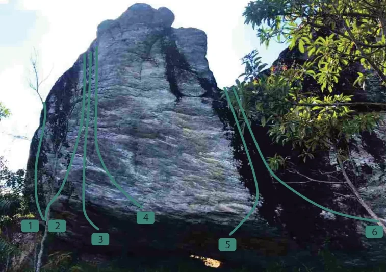
          - **largura_mapa**: 757
          - **altura_mapa**: 533
          - **pontos_de_interesse**:
            - **[0]**:
              - **id**: 1
              - **label**: 1
              - **box**:
                - **x**: 48
                - **y**: 430
                - **comprimento**: 35
                - **largura**: 30
            - **[1]**:
              - **id**: 2
              - **label**: 2
              - **box**:
                - **x**: 82
                - **y**: 430
                - **comprimento**: 35
                - **largura**: 30
            - **[2]**:
              - **id**: 3
              - **label**: 3
              - **box**:
                - **x**: 262
                - **y**: 515
                - **comprimento**: 35
                - **largura**: 30
            - **[3]**:
              - **id**: 4
              - **label**: 4
              - **box**:
                - **x**: 382
                - **y**: 440
                - **comprimento**: 35
                - **largura**: 30
            - **[4]**:
              - **id**: 5
              - **label**: 5
              - **box**:
                - **x**: 592
                - **y**: 515
                - **comprimento**: 35
                - **largura**: 30
            - **[5]**:
              - **id**: 6
              - **label**: 6
              - **box**:
                - **x**: 751
                - **y**: 455
                - **comprimento**: 12
                - **largura**: 30
          - **referencias**:
            - **[0]**:
              - **escalada**: Solstício
              - **ids**:
                - 1
            - **[1]**:
              - **escalada**: Equinócio
              - **ids**:
                - 2
            - **[2]**:
              - **escalada**: Eclipse
              - **ids**:
                - 3
            - **[3]**:
              - **escalada**: Antares
              - **ids**:
                - 4
            - **[4]**:
              - **escalada**: Don Carlitos
              - **ids**:
                - 5
            - **[5]**:
              - **escalada**: Jardins Suspensos
              - **ids**:
                - 6
      - **escaladas**:
        - **[0]**:
          - **boulder**:
            - **nome**: Solstício
            - **dificuldade**: V8
        - **[1]**:
          - **boulder**:
            - **nome**: Equinócio
            - **dificuldade**: V5
        - **[2]**:
          - **boulder**:
            - **nome**: Eclipse
            - **dificuldade**: V7
        - **[3]**:
          - **boulder**:
            - **nome**: Antares
            - **dificuldade**: V9
        - **[4]**:
          - **boulder**:
            - **nome**: Don Carlitos
            - **dificuldade**: V4
        - **[5]**:
          - **boulder**:
            - **nome**: Jardins Suspensos
            - **dificuldade**: V5
  - **[4]**:
    - **conteudo**:
      - **descricao**:
          # Setor Mergulho em Copo d'Água
          
          O setor Mergulho em Copo d'Água possui um bloco isolado com uma linha clássica.
          
          Obs.: Não foram identificadas todas as linhas desse bloco. Certifique-se antes de fazer uma possível primeira ascensão.
      - **nome**: Mergulho em Copo d'Água
      - **mapas**:
        - **[0]**:
          - **caminho_imagem_mapa**: 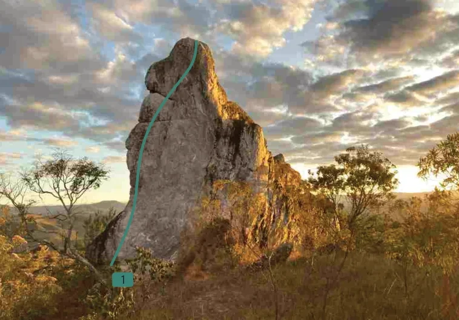
          - **largura_mapa**: 758
          - **altura_mapa**: 529
          - **pontos_de_interesse**:
            - **[0]**:
              - **id**: 1
              - **label**: 1
              - **box**:
                - **x**: 280
                - **y**: 515
                - **comprimento**: 30
                - **largura**: 30
          - **referencias**:
            - **[0]**:
              - **escalada**: Mergulho em Copo d'Água
              - **ids**:
                - 1
      - **escaladas**:
        - **[0]**:
          - **boulder**:
            - **nome**: Mergulho em Copo d'Água
            - **dificuldade**: V4

## Parte: grupo_jk

### Grupo (Pico: Conceição do Mato Dentro)

- **descricao**:
    # Grupo JK
    
    O Grupo JK possui o setor Mufasa, com linhas de boulder interessantes e acesso facilitado.
- **nome**: JK
- **mapas**:
  - **[0]**:
    - **caminho_imagem_mapa**: 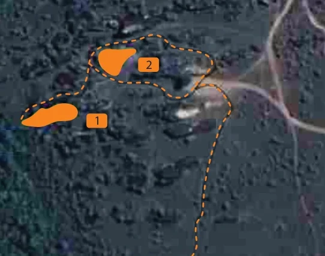
    - **largura_mapa**: 542
    - **altura_mapa**: 427
    - **pontos_de_interesse**:
      - **[0]**:
        - **id**: 1
        - **label**: 1
        - **box**:
          - **x**: 302
          - **y**: 222
          - **comprimento**: 25
          - **largura**: 25
      - **[1]**:
        - **id**: 2
        - **label**: 2
        - **box**:
          - **x**: 458
          - **y**: 112
          - **comprimento**: 25
          - **largura**: 25
    - **referencias**:
      - **[0]**:
        - **setor**: Mufasa
        - **ids**:
          - 1
- **setores**:
  - **[0]**:
    - **conteudo**:
      - **descricao**:
          # Setor Mufasa
          
          O setor Mufasa apresenta um bloco com linhas de altíssima dificuldade e movimentos icônicos.
          
          Obs.: Não foram identificadas todas as linhas desse bloco. Certifique-se antes de fazer uma possível primeira ascensão.
      - **nome**: Mufasa
      - **mapas**:
        - **[0]**:
          - **caminho_imagem_mapa**: 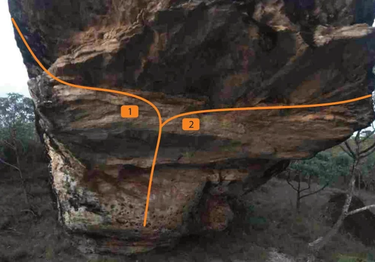
          - **largura_mapa**: 758
          - **altura_mapa**: 529
          - **pontos_de_interesse**:
            - **[0]**:
              - **id**: 1
              - **label**: 1
              - **box**:
                - **x**: 268
                - **y**: 228
                - **comprimento**: 25
                - **largura**: 25
            - **[1]**:
              - **id**: 2
              - **label**: 2
              - **box**:
                - **x**: 508
                - **y**: 268
                - **comprimento**: 25
                - **largura**: 25
          - **referencias**:
            - **[0]**:
              - **escalada**: Bloody Hell
              - **ids**:
                - 1
            - **[1]**:
              - **escalada**: Mufasa
              - **ids**:
                - 2
      - **escaladas**:
        - **[0]**:
          - **boulder**:
            - **nome**: Bloody Hell
            - **dificuldade**: V11
        - **[1]**:
          - **boulder**:
            - **nome**: Mufasa
            - **dificuldade**: V10

## Parte: grupo_pedreira

### Grupo (Pico: Conceição do Mato Dentro)

- **descricao**:
    # Grupo Pedreira
    
    A Pedreira é o grupo com maior número de setores e linhas, apresentando desafios para todos os níveis.
- **nome**: Pedreira
- **mapas**:
  - **[0]**:
    - **caminho_imagem_mapa**: 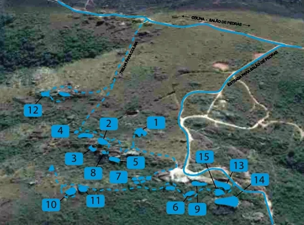
    - **largura_mapa**: 592
    - **altura_mapa**: 438
    - **pontos_de_interesse**:
      - **[0]**:
        - **id**: 1
        - **label**: 1
        - **box**:
          - **x**: 282
          - **y**: 252
          - **comprimento**: 25
          - **largura**: 25
      - **[1]**:
        - **id**: 2
        - **label**: 2
        - **box**:
          - **x**: 202
          - **y**: 252
          - **comprimento**: 25
          - **largura**: 25
      - **[2]**:
        - **id**: 3
        - **label**: 3
        - **box**:
          - **x**: 138
          - **y**: 312
          - **comprimento**: 25
          - **largura**: 25
      - **[3]**:
        - **id**: 4
        - **label**: 4
        - **box**:
          - **x**: 118
          - **y**: 262
          - **comprimento**: 25
          - **largura**: 25
      - **[4]**:
        - **id**: 5
        - **label**: 5
        - **box**:
          - **x**: 232
          - **y**: 318
          - **comprimento**: 25
          - **largura**: 25
      - **[5]**:
        - **id**: 6
        - **label**: 6
        - **box**:
          - **x**: 482
          - **y**: 418
          - **comprimento**: 25
          - **largura**: 25
      - **[6]**:
        - **id**: 7
        - **label**: 7
        - **box**:
          - **x**: 348
          - **y**: 348
          - **comprimento**: 25
          - **largura**: 25
      - **[7]**:
        - **id**: 8
        - **label**: 8
        - **box**:
          - **x**: 268
          - **y**: 342
          - **comprimento**: 25
          - **largura**: 25
      - **[8]**:
        - **id**: 9
        - **label**: 9
        - **box**:
          - **x**: 538
          - **y**: 422
          - **comprimento**: 25
          - **largura**: 25
      - **[9]**:
        - **id**: 10
        - **label**: 10
        - **box**:
          - **x**: 98
          - **y**: 408
          - **comprimento**: 25
          - **largura**: 25
      - **[10]**:
        - **id**: 11
        - **label**: 11
        - **box**:
          - **x**: 278
          - **y**: 402
          - **comprimento**: 25
          - **largura**: 25
      - **[11]**:
        - **id**: 12
        - **label**: 12
        - **box**:
          - **x**: 62
          - **y**: 222
          - **comprimento**: 25
          - **largura**: 25
      - **[12]**:
        - **id**: 13
        - **label**: 13
        - **box**:
          - **x**: 438
          - **y**: 332
          - **comprimento**: 25
          - **largura**: 25
      - **[13]**:
        - **id**: 14
        - **label**: 14
        - **box**:
          - **x**: 492
          - **y**: 358
          - **comprimento**: 25
          - **largura**: 25
      - **[14]**:
        - **id**: 15
        - **label**: 15
        - **box**:
          - **x**: 402
          - **y**: 312
          - **comprimento**: 25
          - **largura**: 25
    - **referencias**:
      - **[0]**:
        - **setor**: Preguiça
        - **ids**:
          - 1
      - **[1]**:
        - **setor**: Manda Lá
        - **ids**:
          - 2
      - **[2]**:
        - **setor**: Trabalhador
        - **ids**:
          - 3
      - **[3]**:
        - **setor**: Sanfoneiro Maluco
        - **ids**:
          - 4
      - **[4]**:
        - **setor**: Samurai
        - **ids**:
          - 5
      - **[5]**:
        - **setor**: Bomba Atômica
        - **ids**:
          - 6
      - **[6]**:
        - **setor**: Jubileu
        - **ids**:
          - 7
      - **[7]**:
        - **setor**: Conceição
        - **ids**:
          - 8
      - **[8]**:
        - **setor**: Bobsled
        - **ids**:
          - 9
      - **[9]**:
        - **setor**: Aresta do Cabeça
        - **ids**:
          - 11
      - **[10]**:
        - **setor**: Equinócio
        - **ids**:
          - 10
      - **[11]**:
        - **setor**: Witness
        - **ids**:
          - 12
      - **[12]**:
        - **setor**: La Fúria
        - **ids**:
          - 13
      - **[13]**:
        - **setor**: Jah
        - **ids**:
          - 14
      - **[14]**:
        - **setor**: Pole Dance
        - **ids**:
          - 15
- **setores**:
  - **[0]**:
    - **conteudo**:
      - **descricao**:
          # Setor Preguiça
          
          O setor Preguiça possui blocos com linhas de alta dificuldade e boulders atléticos.
          
          Obs.: Não foram identificadas todas as linhas desse bloco. Certifique-se antes de fazer uma possível primeira ascensão.
      - **nome**: Preguiça
      - **mapas**:
        - **[0]**:
          - **caminho_imagem_mapa**: 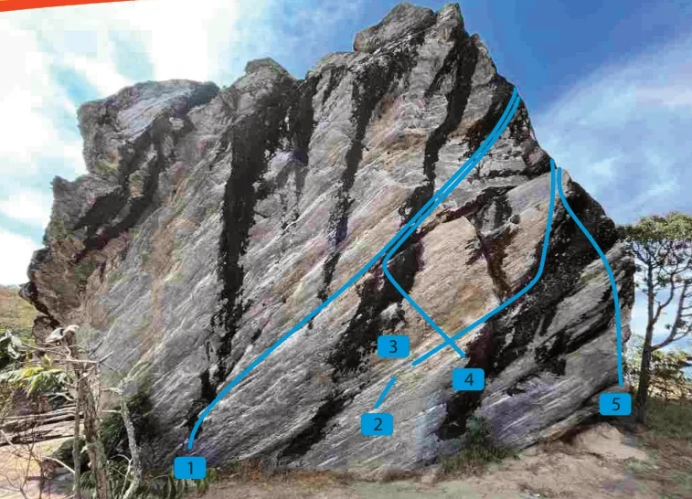
          - **largura_mapa**: 757
          - **altura_mapa**: 546
          - **pontos_de_interesse**:
            - **[0]**:
              - **id**: 1
              - **label**: 1
              - **box**:
                - **x**: 280
                - **y**: 535
                - **comprimento**: 30
                - **largura**: 30
            - **[1]**:
              - **id**: 2
              - **label**: 2
              - **box**:
                - **x**: 550
                - **y**: 535
                - **comprimento**: 30
                - **largura**: 30
            - **[2]**:
              - **id**: 3
              - **label**: 3
              - **box**:
                - **x**: 575
                - **y**: 495
                - **comprimento**: 30
                - **largura**: 30
            - **[3]**:
              - **id**: 4
              - **label**: 4
              - **box**:
                - **x**: 680
                - **y**: 525
                - **comprimento**: 30
                - **largura**: 30
            - **[4]**:
              - **id**: 5
              - **label**: 5
              - **box**:
                - **x**: 760
                - **y**: 535
                - **comprimento**: 30
                - **largura**: 30
          - **referencias**:
            - **[0]**:
              - **escalada**: Preguiça de Sofrer
              - **ids**:
                - 1
            - **[1]**:
              - **escalada**: Preguicinha
              - **ids**:
                - 2
            - **[2]**:
              - **escalada**: (sem nome)
              - **ids**:
                - 3
            - **[3]**:
              - **escalada**: Tá Lá
              - **ids**:
                - 4
            - **[4]**:
              - **escalada**: (sem nome)
              - **ids**:
                - 5
            - **[5]**:
              - **escalada**: Salsichção
              - **ids**:
                - 1
            - **[6]**:
              - **escalada**: Era Uma Vez
              - **ids**:
                - 2
            - **[7]**:
              - **escalada**: Frank
              - **ids**:
                - 1
            - **[8]**:
              - **escalada**: Stout
              - **ids**:
                - 2
            - **[9]**:
              - **escalada**: Carlos Drummond
              - **ids**:
                - 3
        - **[1]**:
          - **caminho_imagem_mapa**: 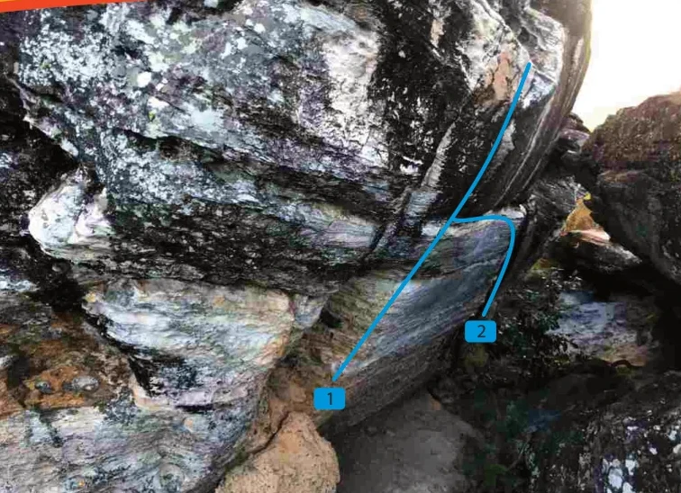
          - **largura_mapa**: 756
          - **altura_mapa**: 548
          - **pontos_de_interesse**: []
        - **[2]**:
          - **caminho_imagem_mapa**: 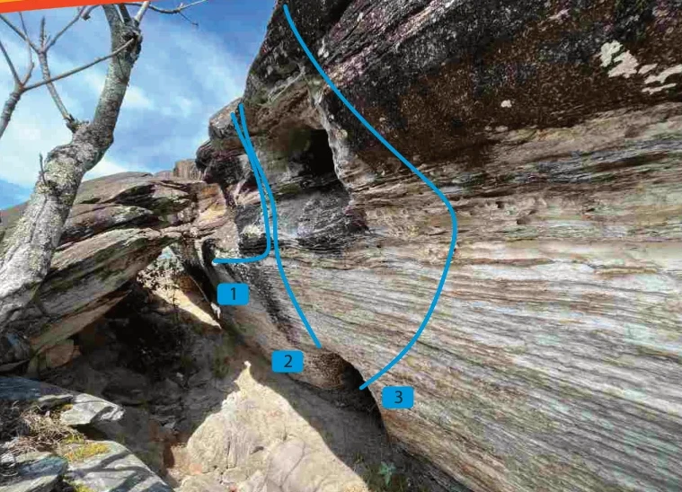
          - **largura_mapa**: 759
          - **altura_mapa**: 548
          - **pontos_de_interesse**: []
      - **escaladas**:
        - **[0]**:
          - **boulder**:
            - **nome**: Preguiça de Sofrer
            - **dificuldade**: V12
        - **[1]**:
          - **boulder**:
            - **nome**: Preguicinha
            - **dificuldade**: V5
        - **[2]**:
          - **boulder**:
            - **nome**: (sem nome)
            - **dificuldade**: V4
        - **[3]**:
          - **boulder**:
            - **nome**: Tá Lá
            - **dificuldade**: V8
        - **[4]**:
          - **boulder**:
            - **nome**: (sem nome)
            - **dificuldade**: V2
        - **[5]**:
          - **boulder**:
            - **nome**: Salsichção
            - **dificuldade**: V4
        - **[6]**:
          - **boulder**:
            - **nome**: Era Uma Vez
            - **dificuldade**: V9
        - **[7]**:
          - **boulder**:
            - **nome**: Frank
            - **dificuldade**: V8
        - **[8]**:
          - **boulder**:
            - **nome**: Stout
            - **dificuldade**: V7
        - **[9]**:
          - **boulder**:
            - **nome**: Carlos Drummond
            - **dificuldade**: V7
  - **[1]**:
    - **conteudo**:
      - **descricao**:
          # Setor Manda Lá
          
          O setor Manda Lá possui um bloco com linhas atléticas e agarras de régua.
          
          Obs.: Não foram identificadas todas as linhas desse bloco. Certique-se antes de fazer uma possível primeira ascensão.
      - **nome**: Manda Lá
      - **mapas**:
        - **[0]**:
          - **caminho_imagem_mapa**: 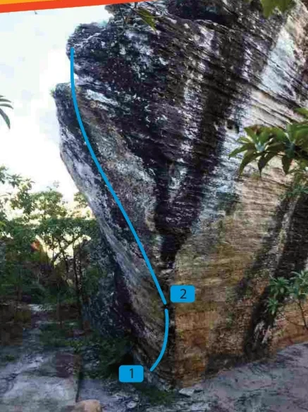
          - **largura_mapa**: 437
          - **altura_mapa**: 585
          - **pontos_de_interesse**:
            - **[0]**:
              - **id**: 1
              - **label**: 1
              - **box**:
                - **x**: 180
                - **y**: 535
                - **comprimento**: 30
                - **largura**: 30
            - **[1]**:
              - **id**: 2
              - **label**: 2
              - **box**:
                - **x**: 260
                - **y**: 425
                - **comprimento**: 30
                - **largura**: 30
          - **referencias**:
            - **[0]**:
              - **escalada**: Amand-lá
              - **ids**:
                - 1
            - **[1]**:
              - **escalada**: Manda Lá
              - **ids**:
                - 2
      - **escaladas**:
        - **[0]**:
          - **boulder**:
            - **nome**: Amand-lá
            - **dificuldade**: V10
        - **[1]**:
          - **boulder**:
            - **nome**: Manda Lá
            - **dificuldade**: V8
  - **[2]**:
    - **conteudo**:
      - **descricao**:
          # Setor Trabalhador
          
          O setor Trabalhador oferece linhas com regates e batidas, exigindo força e técnica.
          
          Obs.: Não foram identificadas todas as linhas desse bloco. Certifique-se antes de fazer uma possível primeira ascensão.
      - **nome**: Trabalhador
      - **mapas**:
        - **[0]**:
          - **caminho_imagem_mapa**: 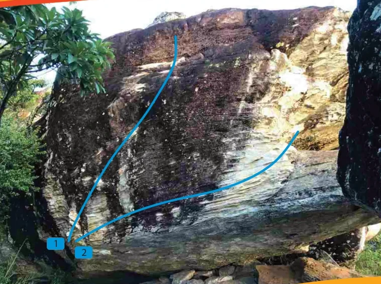
          - **largura_mapa**: 758
          - **altura_mapa**: 566
          - **pontos_de_interesse**:
            - **[0]**:
              - **id**: 1
              - **label**: 1
              - **box**:
                - **x**: 150
                - **y**: 500
                - **comprimento**: 30
                - **largura**: 30
            - **[1]**:
              - **id**: 2
              - **label**: 2
              - **box**:
                - **x**: 220
                - **y**: 545
                - **comprimento**: 30
                - **largura**: 30
          - **referencias**:
            - **[0]**:
              - **escalada**: Hueco Fontaine
              - **ids**:
                - 1
            - **[1]**:
              - **escalada**: Pitt Bull
              - **ids**:
                - 2
            - **[2]**:
              - **escalada**: Trabalhador Brasileiro
              - **ids**:
                - 1
            - **[3]**:
              - **escalada**: Trabalho Árduo
              - **ids**:
                - 2
        - **[1]**:
          - **caminho_imagem_mapa**: 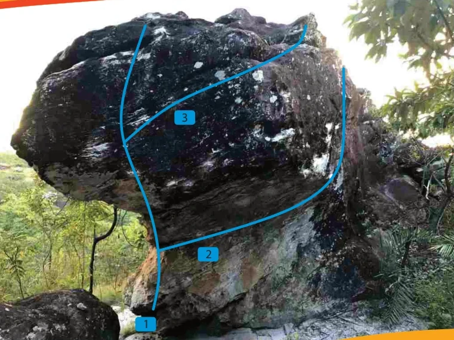
          - **largura_mapa**: 761
          - **altura_mapa**: 570
          - **pontos_de_interesse**:
            - **[0]**:
              - **id**: 1
              - **label**: 1
              - **box**:
                - **x**: 320
                - **y**: 550
                - **comprimento**: 30
                - **largura**: 30
            - **[1]**:
              - **id**: 2
              - **label**: 2
              - **box**:
                - **x**: 465
                - **y**: 495
                - **comprimento**: 30
                - **largura**: 30
            - **[2]**:
              - **id**: 3
              - **label**: 3
              - **box**:
                - **x**: 420
                - **y**: 340
                - **comprimento**: 30
                - **largura**: 30
          - **referencias**:
            - **[0]**:
              - **escalada**: Hueco Fontaine
              - **ids**:
                - 1
            - **[1]**:
              - **escalada**: Pitt Bull
              - **ids**:
                - 2
            - **[2]**:
              - **escalada**: Trabalhador Brasileiro
              - **ids**:
                - 1
            - **[3]**:
              - **escalada**: Trabalho Árduo
              - **ids**:
                - 2
            - **[4]**:
              - **escalada**: Estamos Trabalhando
              - **ids**:
                - 3
      - **escaladas**:
        - **[0]**:
          - **boulder**:
            - **nome**: Hueco Fontaine
            - **dificuldade**: V5
        - **[1]**:
          - **boulder**:
            - **nome**: Pitt Bull
            - **dificuldade**: V10
        - **[2]**:
          - **boulder**:
            - **nome**: Trabalhador Brasileiro
            - **dificuldade**: V7
        - **[3]**:
          - **boulder**:
            - **nome**: Trabalho Árduo
            - **dificuldade**: V4
        - **[4]**:
          - **boulder**:
            - **nome**: Estamos Trabalhando
            - **dificuldade**: V8
  - **[3]**:
    - **conteudo**:
      - **descricao**:
          # Setor Sanfoneiro Maluco
          
          O setor Sanfoneiro Maluco possui blocos com linhas de alto nível, exigindo movimentos precisos e força.
          
          Obs.: Não foram identificadas todas as linhas desse bloco. Certique-se antes de fazer uma possível primeira ascensão.
      - **nome**: Sanfoneiro Maluco
      - **mapas**:
        - **[0]**:
          - **caminho_imagem_mapa**: 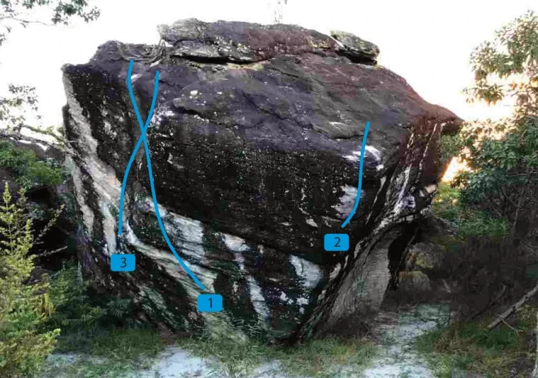
          - **largura_mapa**: 759
          - **altura_mapa**: 533
          - **pontos_de_interesse**:
            - **[0]**:
              - **id**: 1
              - **label**: 1
              - **box**:
                - **x**: 395
                - **y**: 515
                - **comprimento**: 30
                - **largura**: 30
            - **[1]**:
              - **id**: 2
              - **label**: 2
              - **box**:
                - **x**: 630
                - **y**: 495
                - **comprimento**: 30
                - **largura**: 30
            - **[2]**:
              - **id**: 3
              - **label**: 3
              - **box**:
                - **x**: 230
                - **y**: 515
                - **comprimento**: 30
                - **largura**: 30
          - **referencias**:
            - **[0]**:
              - **escalada**: Sanfoneiro Maluco
              - **ids**:
                - 1
            - **[1]**:
              - **escalada**: Inacreditável
              - **ids**:
                - 2
            - **[2]**:
              - **escalada**: Chapeleiro Maluco
              - **ids**:
                - 3
            - **[3]**:
              - **escalada**: Webb da Paraíba
              - **ids**:
                - 1
            - **[4]**:
              - **escalada**: Efeito Dominó
              - **ids**:
                - 1
            - **[5]**:
              - **escalada**: Zuzuzela
              - **ids**:
                - 2
        - **[1]**:
          - **caminho_imagem_mapa**: 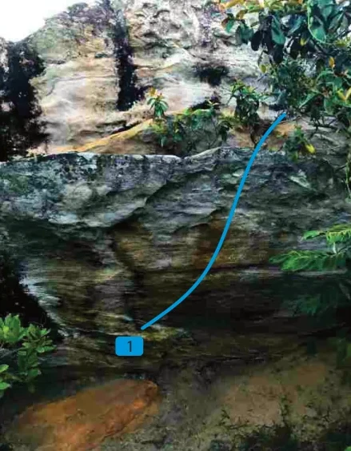
          - **largura_mapa**: 439
          - **altura_mapa**: 564
          - **pontos_de_interesse**:
            - **[0]**:
              - **id**: 1
              - **label**: 1
              - **box**:
                - **x**: 155
                - **y**: 430
                - **comprimento**: 30
                - **largura**: 30
          - **referencias**:
            - **[0]**:
              - **escalada**: Sanfoneiro Maluco
              - **ids**:
                - 1
            - **[1]**:
              - **escalada**: Webb da Paraíba
              - **ids**:
                - 1
            - **[2]**:
              - **escalada**: Efeito Dominó
              - **ids**:
                - 1
        - **[2]**:
          - **caminho_imagem_mapa**: 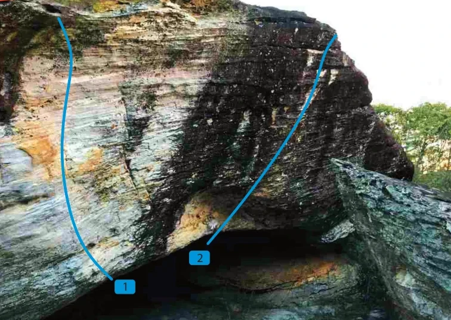
          - **largura_mapa**: 756
          - **altura_mapa**: 536
          - **pontos_de_interesse**:
            - **[0]**:
              - **id**: 1
              - **label**: 1
              - **box**:
                - **x**: 260
                - **y**: 515
                - **comprimento**: 30
                - **largura**: 30
            - **[1]**:
              - **id**: 2
              - **label**: 2
              - **box**:
                - **x**: 420
                - **y**: 495
                - **comprimento**: 30
                - **largura**: 30
          - **referencias**:
            - **[0]**:
              - **escalada**: Sanfoneiro Maluco
              - **ids**:
                - 1
            - **[1]**:
              - **escalada**: Inacreditável
              - **ids**:
                - 2
            - **[2]**:
              - **escalada**: Webb da Paraíba
              - **ids**:
                - 1
            - **[3]**:
              - **escalada**: Efeito Dominó
              - **ids**:
                - 1
            - **[4]**:
              - **escalada**: Zuzuzela
              - **ids**:
                - 2
      - **escaladas**:
        - **[0]**:
          - **boulder**:
            - **nome**: Sanfoneiro Maluco
            - **dificuldade**: V7
        - **[1]**:
          - **boulder**:
            - **nome**: Inacreditável
            - **dificuldade**: V8
        - **[2]**:
          - **boulder**:
            - **nome**: Chapeleiro Maluco
            - **dificuldade**: V4
        - **[3]**:
          - **boulder**:
            - **nome**: Webb da Paraíba
            - **dificuldade**: V9
        - **[4]**:
          - **boulder**:
            - **nome**: Efeito Dominó
            - **dificuldade**: V10
        - **[5]**:
          - **boulder**:
            - **nome**: Zuzuzela
            - **dificuldade**: V6
  - **[4]**:
    - **conteudo**:
      - **descricao**:
          # Setor Samurai
          
          O setor Samurai possui boulders negativos com agarras pequenas e movimentos potentes.
          
          Obs.: Não foram identificadas todas as linhas desse bloco. Certifique-se antes de fazer uma possível primeira ascensão.
      - **nome**: Samurai
      - **mapas**:
        - **[0]**:
          - **caminho_imagem_mapa**: 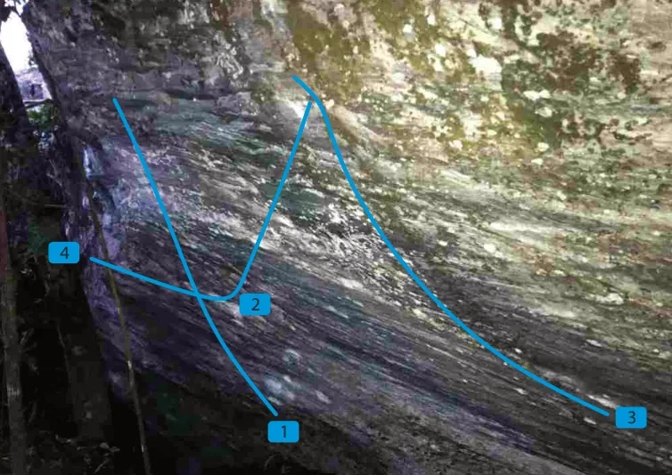
          - **largura_mapa**: 754
          - **altura_mapa**: 534
          - **pontos_de_interesse**:
            - **[0]**:
              - **id**: 1
              - **label**: 1
              - **box**:
                - **x**: 425
                - **y**: 515
                - **comprimento**: 30
                - **largura**: 30
            - **[1]**:
              - **id**: 2
              - **label**: 2
              - **box**:
                - **x**: 380
                - **y**: 365
                - **comprimento**: 30
                - **largura**: 30
            - **[2]**:
              - **id**: 3
              - **label**: 3
              - **box**:
                - **x**: 680
                - **y**: 500
                - **comprimento**: 30
                - **largura**: 30
            - **[3]**:
              - **id**: 4
              - **label**: 4
              - **box**:
                - **x**: 100
                - **y**: 290
                - **comprimento**: 30
                - **largura**: 30
          - **referencias**:
            - **[0]**:
              - **escalada**: Purgatório
              - **ids**:
                - 1
            - **[1]**:
              - **escalada**: Samurai
              - **ids**:
                - 2
            - **[2]**:
              - **escalada**: Ômega 3
              - **ids**:
                - 3
            - **[3]**:
              - **escalada**: Purgatório do Samurai
              - **ids**:
                - 4
            - **[4]**:
              - **escalada**: Ouro Branco
              - **ids**:
                - 1
        - **[1]**:
          - **caminho_imagem_mapa**: 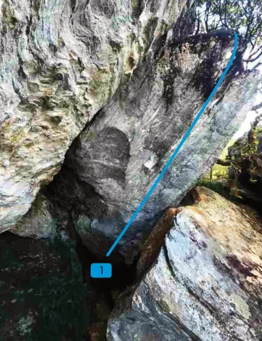
          - **largura_mapa**: 436
          - **altura_mapa**: 568
          - **pontos_de_interesse**:
            - **[0]**:
              - **id**: 1
              - **label**: 1
              - **box**:
                - **x**: 160
                - **y**: 510
                - **comprimento**: 30
                - **largura**: 30
          - **referencias**:
            - **[0]**:
              - **escalada**: Purgatório
              - **ids**:
                - 1
            - **[1]**:
              - **escalada**: Ouro Branco
              - **ids**:
                - 1
      - **escaladas**:
        - **[0]**:
          - **boulder**:
            - **nome**: Purgatório
            - **dificuldade**: V7
        - **[1]**:
          - **boulder**:
            - **nome**: Samurai
            - **dificuldade**: V9
        - **[2]**:
          - **boulder**:
            - **nome**: Ômega 3
            - **dificuldade**: V11
        - **[3]**:
          - **boulder**:
            - **nome**: Purgatório do Samurai
            - **dificuldade**: V12
        - **[4]**:
          - **boulder**:
            - **nome**: Ouro Branco
            - **dificuldade**: V7
  - **[5]**:
    - **conteudo**:
      - **descricao**:
          # Setor Bomba Atômica
          
          O setor Bomba Atômica possui blocos variados com predominância de negativos e tetos, oferecendo linhas técnicas e de força.
          
          Obs.: Não foram identificadas todas as linhas desse bloco. Certifique-se antes de fazer uma possível primeira ascensão.
      - **nome**: Bomba Atômica
      - **mapas**:
        - **[0]**:
          - **caminho_imagem_mapa**: 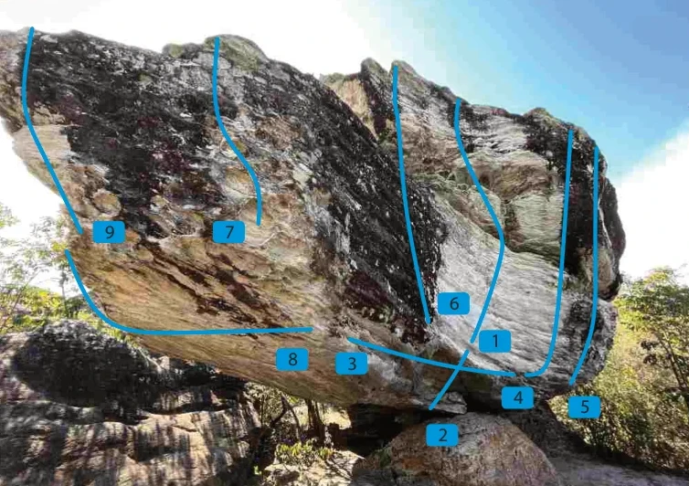
          - **largura_mapa**: 754
          - **altura_mapa**: 532
          - **pontos_de_interesse**:
            - **[0]**:
              - **id**: 1
              - **label**: 1
              - **box**:
                - **x**: 720
                - **y**: 490
                - **comprimento**: 30
                - **largura**: 30
            - **[1]**:
              - **id**: 2
              - **label**: 2
              - **box**:
                - **x**: 645
                - **y**: 525
                - **comprimento**: 30
                - **largura**: 30
            - **[2]**:
              - **id**: 3
              - **label**: 3
              - **box**:
                - **x**: 510
                - **y**: 500
                - **comprimento**: 30
                - **largura**: 30
            - **[3]**:
              - **id**: 4
              - **label**: 4
              - **box**:
                - **x**: 755
                - **y**: 515
                - **comprimento**: 30
                - **largura**: 30
            - **[4]**:
              - **id**: 5
              - **label**: 5
              - **box**:
                - **x**: 755
                - **y**: 525
                - **comprimento**: 30
                - **largura**: 30
            - **[5]**:
              - **id**: 6
              - **label**: 6
              - **box**:
                - **x**: 670
                - **y**: 390
                - **comprimento**: 30
                - **largura**: 30
            - **[6]**:
              - **id**: 7
              - **label**: 7
              - **box**:
                - **x**: 345
                - **y**: 270
                - **comprimento**: 30
                - **largura**: 30
            - **[7]**:
              - **id**: 8
              - **label**: 8
              - **box**:
                - **x**: 435
                - **y**: 440
                - **comprimento**: 30
                - **largura**: 30
            - **[8]**:
              - **id**: 9
              - **label**: 9
              - **box**:
                - **x**: 170
                - **y**: 280
                - **comprimento**: 30
                - **largura**: 30
          - **referencias**:
            - **[0]**:
              - **escalada**: Viajante
              - **ids**:
                - 1
            - **[1]**:
              - **escalada**: Viajante SDS
              - **ids**:
                - 2
            - **[2]**:
              - **escalada**: (sem nome)
              - **ids**:
                - 3
            - **[3]**:
              - **escalada**: (sem nome)
              - **ids**:
                - 4
            - **[4]**:
              - **escalada**: (sem nome)
              - **ids**:
                - 5
            - **[5]**:
              - **escalada**: Champagne
              - **ids**:
                - 6
            - **[6]**:
              - **escalada**: Bonitinho
              - **ids**:
                - 7
            - **[7]**:
              - **escalada**: Caravana
              - **ids**:
                - 8
            - **[8]**:
              - **escalada**: (sem nome)
              - **ids**:
                - 9
            - **[9]**:
              - **escalada**: Bomba Atômica
              - **ids**:
                - 1
            - **[10]**:
              - **escalada**: No Claro
              - **ids**:
                - 1
            - **[11]**:
              - **escalada**: No Escuro
              - **ids**:
                - 2
            - **[12]**:
              - **escalada**: Falafofancho
              - **ids**:
                - 3
            - **[13]**:
              - **escalada**: No Claro SDS
              - **ids**:
                - 4
            - **[14]**:
              - **escalada**: No Escuro SDS
              - **ids**:
                - 5
            - **[15]**:
              - **escalada**: Falafofancho SDS
              - **ids**:
                - 6
            - **[16]**:
              - **escalada**: (sem nome)
              - **ids**:
                - 1
            - **[17]**:
              - **escalada**: (sem nome)
              - **ids**:
                - 2
            - **[18]**:
              - **escalada**: (sem nome)
              - **ids**:
                - 3
        - **[1]**:
          - **caminho_imagem_mapa**: 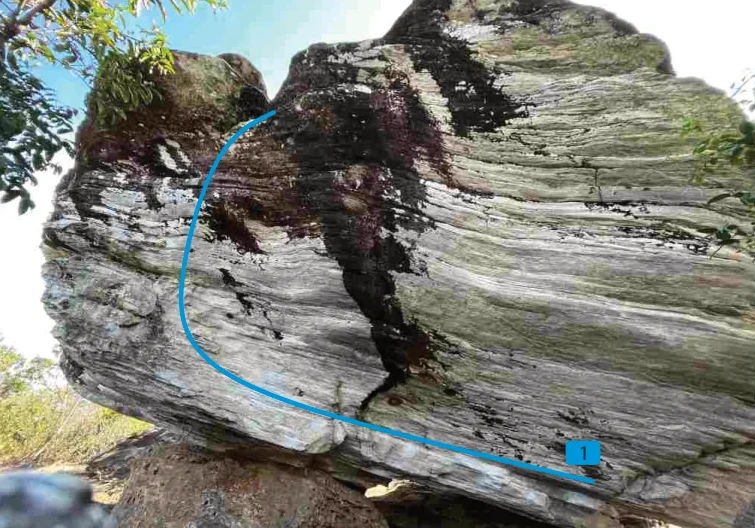
          - **largura_mapa**: 755
          - **altura_mapa**: 528
          - **pontos_de_interesse**:
            - **[0]**:
              - **id**: 1
              - **label**: 1
              - **box**:
                - **x**: 590
                - **y**: 485
                - **comprimento**: 30
                - **largura**: 30
          - **referencias**:
            - **[0]**:
              - **escalada**: Viajante
              - **ids**:
                - 1
            - **[1]**:
              - **escalada**: Bomba Atômica
              - **ids**:
                - 1
            - **[2]**:
              - **escalada**: No Claro
              - **ids**:
                - 1
            - **[3]**:
              - **escalada**: (sem nome)
              - **ids**:
                - 1
        - **[2]**:
          - **caminho_imagem_mapa**: 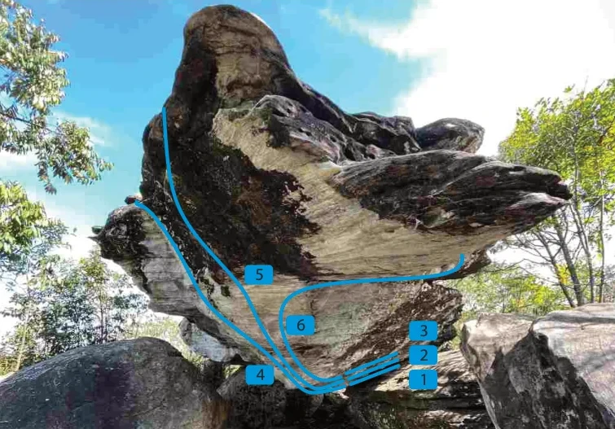
          - **largura_mapa**: 755
          - **altura_mapa**: 527
          - **pontos_de_interesse**:
            - **[0]**:
              - **id**: 1
              - **label**: 1
              - **box**:
                - **x**: 690
                - **y**: 470
                - **comprimento**: 30
                - **largura**: 30
            - **[1]**:
              - **id**: 2
              - **label**: 2
              - **box**:
                - **x**: 690
                - **y**: 440
                - **comprimento**: 30
                - **largura**: 30
            - **[2]**:
              - **id**: 3
              - **label**: 3
              - **box**:
                - **x**: 690
                - **y**: 410
                - **comprimento**: 30
                - **largura**: 30
            - **[3]**:
              - **id**: 4
              - **label**: 4
              - **box**:
                - **x**: 425
                - **y**: 490
                - **comprimento**: 30
                - **largura**: 30
            - **[4]**:
              - **id**: 5
              - **label**: 5
              - **box**:
                - **x**: 425
                - **y**: 340
                - **comprimento**: 30
                - **largura**: 30
            - **[5]**:
              - **id**: 6
              - **label**: 6
              - **box**:
                - **x**: 495
                - **y**: 400
                - **comprimento**: 30
                - **largura**: 30
          - **referencias**:
            - **[0]**:
              - **escalada**: Viajante
              - **ids**:
                - 1
            - **[1]**:
              - **escalada**: Viajante SDS
              - **ids**:
                - 2
            - **[2]**:
              - **escalada**: (sem nome)
              - **ids**:
                - 3
            - **[3]**:
              - **escalada**: (sem nome)
              - **ids**:
                - 4
            - **[4]**:
              - **escalada**: (sem nome)
              - **ids**:
                - 5
            - **[5]**:
              - **escalada**: Champagne
              - **ids**:
                - 6
            - **[6]**:
              - **escalada**: Bomba Atômica
              - **ids**:
                - 1
            - **[7]**:
              - **escalada**: No Claro
              - **ids**:
                - 1
            - **[8]**:
              - **escalada**: No Escuro
              - **ids**:
                - 2
            - **[9]**:
              - **escalada**: Falafofancho
              - **ids**:
                - 3
            - **[10]**:
              - **escalada**: No Claro SDS
              - **ids**:
                - 4
            - **[11]**:
              - **escalada**: No Escuro SDS
              - **ids**:
                - 5
            - **[12]**:
              - **escalada**: Falafofancho SDS
              - **ids**:
                - 6
            - **[13]**:
              - **escalada**: (sem nome)
              - **ids**:
                - 1
            - **[14]**:
              - **escalada**: (sem nome)
              - **ids**:
                - 2
            - **[15]**:
              - **escalada**: (sem nome)
              - **ids**:
                - 3
        - **[3]**:
          - **caminho_imagem_mapa**: 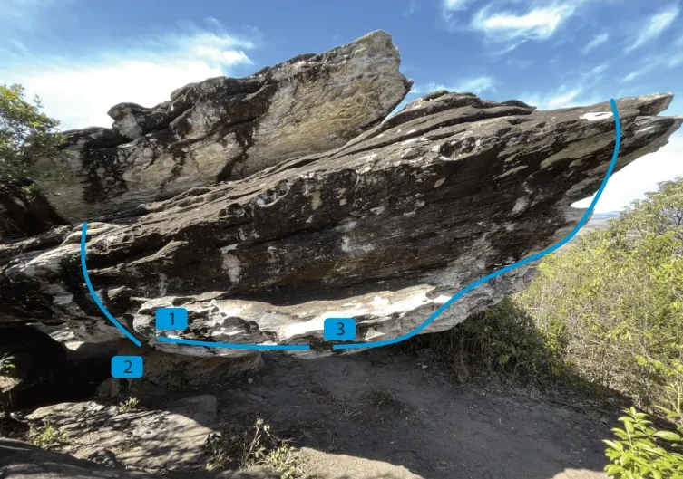
          - **largura_mapa**: 753
          - **altura_mapa**: 529
          - **pontos_de_interesse**:
            - **[0]**:
              - **id**: 1
              - **label**: 1
              - **box**:
                - **x**: 250
                - **y**: 450
                - **comprimento**: 30
                - **largura**: 30
            - **[1]**:
              - **id**: 2
              - **label**: 2
              - **box**:
                - **x**: 190
                - **y**: 500
                - **comprimento**: 30
                - **largura**: 30
            - **[2]**:
              - **id**: 3
              - **label**: 3
              - **box**:
                - **x**: 505
                - **y**: 460
                - **comprimento**: 30
                - **largura**: 30
          - **referencias**:
            - **[0]**:
              - **escalada**: Viajante
              - **ids**:
                - 1
            - **[1]**:
              - **escalada**: Viajante SDS
              - **ids**:
                - 2
            - **[2]**:
              - **escalada**: (sem nome)
              - **ids**:
                - 3
            - **[3]**:
              - **escalada**: Bomba Atômica
              - **ids**:
                - 1
            - **[4]**:
              - **escalada**: No Claro
              - **ids**:
                - 1
            - **[5]**:
              - **escalada**: No Escuro
              - **ids**:
                - 2
            - **[6]**:
              - **escalada**: Falafofancho
              - **ids**:
                - 3
            - **[7]**:
              - **escalada**: (sem nome)
              - **ids**:
                - 1
            - **[8]**:
              - **escalada**: (sem nome)
              - **ids**:
                - 2
            - **[9]**:
              - **escalada**: (sem nome)
              - **ids**:
                - 3
      - **escaladas**:
        - **[0]**:
          - **boulder**:
            - **nome**: Viajante
            - **dificuldade**: V7
        - **[1]**:
          - **boulder**:
            - **nome**: Viajante SDS
            - **dificuldade**: V9
        - **[2]**:
          - **boulder**:
            - **nome**: (sem nome)
            - **dificuldade**: V9
        - **[3]**:
          - **boulder**:
            - **nome**: (sem nome)
            - **dificuldade**: V7
        - **[4]**:
          - **boulder**:
            - **nome**: (sem nome)
            - **dificuldade**: V5
        - **[5]**:
          - **boulder**:
            - **nome**: Champagne
            - **dificuldade**: V8
        - **[6]**:
          - **boulder**:
            - **nome**: Bonitinho
            - **dificuldade**: V1
        - **[7]**:
          - **boulder**:
            - **nome**: Caravana
            - **dificuldade**: V7
        - **[8]**:
          - **boulder**:
            - **nome**: (sem nome)
            - **dificuldade**: V1
        - **[9]**:
          - **boulder**:
            - **nome**: Bomba Atômica
            - **dificuldade**: V11
        - **[10]**:
          - **boulder**:
            - **nome**: No Claro
            - **dificuldade**: V7
        - **[11]**:
          - **boulder**:
            - **nome**: No Escuro
            - **dificuldade**: V5
        - **[12]**:
          - **boulder**:
            - **nome**: Falafofancho
            - **dificuldade**: V4
        - **[13]**:
          - **boulder**:
            - **nome**: No Claro SDS
            - **dificuldade**: V9
        - **[14]**:
          - **boulder**:
            - **nome**: No Escuro SDS
            - **dificuldade**: V7
        - **[15]**:
          - **boulder**:
            - **nome**: Falafofancho SDS
            - **dificuldade**: V6
        - **[16]**:
          - **boulder**:
            - **nome**: (sem nome)
            - **dificuldade**: V3
        - **[17]**:
          - **boulder**:
            - **nome**: (sem nome)
            - **dificuldade**: V3
        - **[18]**:
          - **boulder**:
            - **nome**: (sem nome)
            - **dificuldade**: V1
  - **[6]**:
    - **conteudo**:
      - **descricao**:
          # Setor Jubileu
          
          O setor Jubileu possui blocos interessantes com linhas de dificuldade intermediária.
          
          Obs.: Não foram identificadas todas as linhas desse bloco. Certifique-se antes de fazer uma possível primeira ascensão.
      - **nome**: Jubileu
      - **mapas**:
        - **[0]**:
          - **caminho_imagem_mapa**: 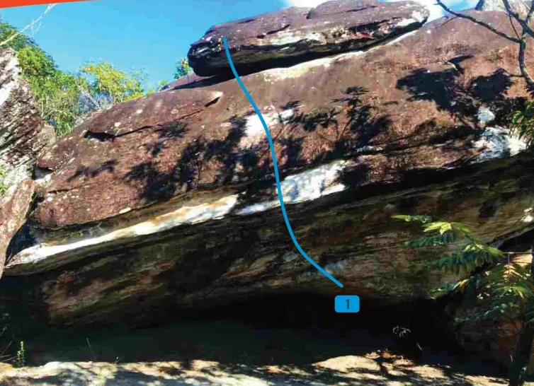
          - **largura_mapa**: 754
          - **altura_mapa**: 546
          - **pontos_de_interesse**:
            - **[0]**:
              - **id**: 1
              - **label**: 1
              - **box**:
                - **x**: 640
                - **y**: 430
                - **comprimento**: 30
                - **largura**: 30
          - **referencias**:
            - **[0]**:
              - **escalada**: Jubileu
              - **ids**:
                - 1
            - **[1]**:
              - **escalada**: Eu Te Disse
              - **ids**:
                - 1
            - **[2]**:
              - **escalada**: (sem nome)
              - **ids**:
                - 1
        - **[1]**:
          - **caminho_imagem_mapa**: 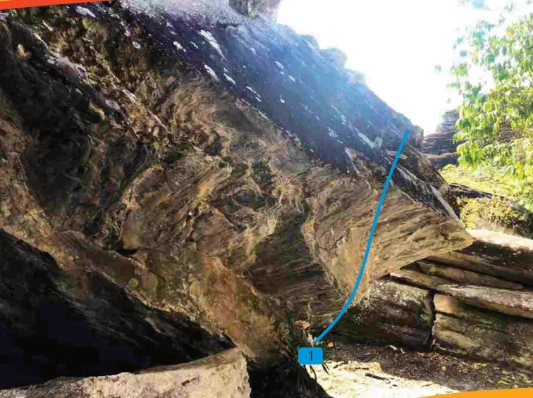
          - **largura_mapa**: 756
          - **altura_mapa**: 565
          - **pontos_de_interesse**:
            - **[0]**:
              - **id**: 1
              - **label**: 1
              - **box**:
                - **x**: 585
                - **y**: 540
                - **comprimento**: 30
                - **largura**: 30
          - **referencias**:
            - **[0]**:
              - **escalada**: Jubileu
              - **ids**:
                - 1
            - **[1]**:
              - **escalada**: Eu Te Disse
              - **ids**:
                - 1
            - **[2]**:
              - **escalada**: (sem nome)
              - **ids**:
                - 1
        - **[2]**:
          - **caminho_imagem_mapa**: 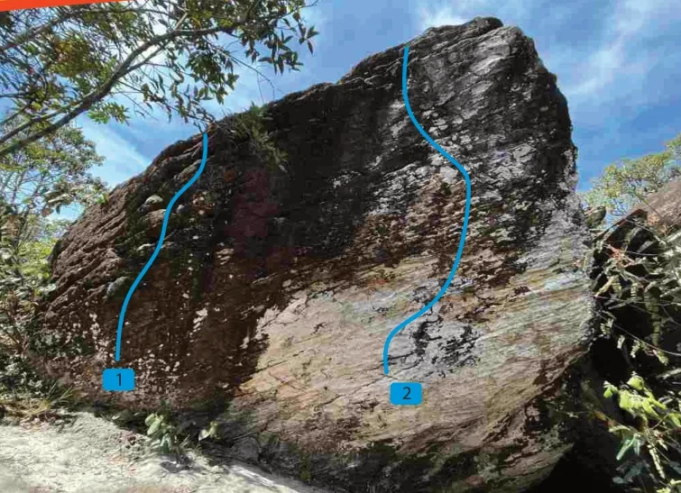
          - **largura_mapa**: 755
          - **altura_mapa**: 547
          - **pontos_de_interesse**:
            - **[0]**:
              - **id**: 1
              - **label**: 1
              - **box**:
                - **x**: 185
                - **y**: 415
                - **comprimento**: 30
                - **largura**: 30
            - **[1]**:
              - **id**: 2
              - **label**: 2
              - **box**:
                - **x**: 610
                - **y**: 505
                - **comprimento**: 30
                - **largura**: 30
          - **referencias**:
            - **[0]**:
              - **escalada**: Jubileu
              - **ids**:
                - 1
            - **[1]**:
              - **escalada**: Eu Te Disse
              - **ids**:
                - 1
            - **[2]**:
              - **escalada**: (sem nome)
              - **ids**:
                - 1
            - **[3]**:
              - **escalada**: (sem nome)
              - **ids**:
                - 2
      - **escaladas**:
        - **[0]**:
          - **boulder**:
            - **nome**: Jubileu
            - **dificuldade**: V7
        - **[1]**:
          - **boulder**:
            - **nome**: Eu Te Disse
            - **dificuldade**: V5
        - **[2]**:
          - **boulder**:
            - **nome**: (sem nome)
            - **dificuldade**: V2
        - **[3]**:
          - **boulder**:
            - **nome**: (sem nome)
            - **dificuldade**: V2
  - **[7]**:
    - **conteudo**:
      - **descricao**:
          # Setor Conceição
          
          O setor Conceição apresenta blocos com agarras boas e linhas de técnica.
          
          Obs.: Não foram identificadas todas as linhas desse bloco. Certifique-se antes de fazer uma possível primeira ascensão.
      - **nome**: Conceição
      - **mapas**:
        - **[0]**:
          - **caminho_imagem_mapa**: 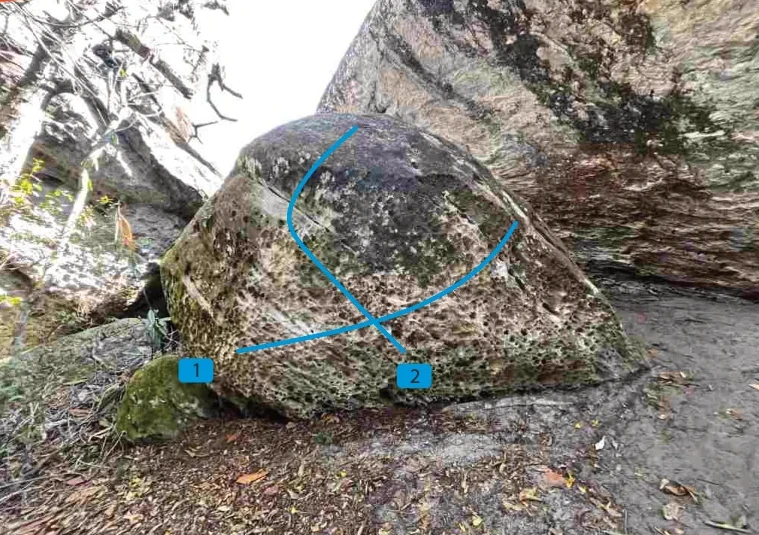
          - **largura_mapa**: 759
          - **altura_mapa**: 535
          - **pontos_de_interesse**:
            - **[0]**:
              - **id**: 1
              - **label**: 1
              - **box**:
                - **x**: 260
                - **y**: 515
                - **comprimento**: 30
                - **largura**: 30
            - **[1]**:
              - **id**: 2
              - **label**: 2
              - **box**:
                - **x**: 550
                - **y**: 515
                - **comprimento**: 30
                - **largura**: 30
          - **referencias**:
            - **[0]**:
              - **escalada**: Conceição do Mato Dentro
              - **ids**:
                - 1
            - **[1]**:
              - **escalada**: (sem nome)
              - **ids**:
                - 2
            - **[2]**:
              - **escalada**: Tobogã
              - **ids**:
                - 1
            - **[3]**:
              - **escalada**: No Dab
              - **ids**:
                - 2
        - **[1]**:
          - **caminho_imagem_mapa**: 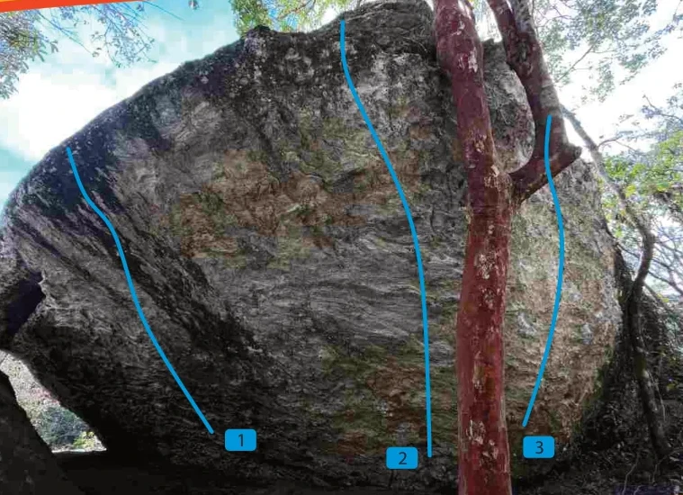
          - **largura_mapa**: 759
          - **altura_mapa**: 550
          - **pontos_de_interesse**:
            - **[0]**:
              - **id**: 1
              - **label**: 1
              - **box**:
                - **x**: 365
                - **y**: 525
                - **comprimento**: 30
                - **largura**: 30
            - **[1]**:
              - **id**: 2
              - **label**: 2
              - **box**:
                - **x**: 600
                - **y**: 540
                - **comprimento**: 30
                - **largura**: 30
            - **[2]**:
              - **id**: 3
              - **label**: 3
              - **box**:
                - **x**: 760
                - **y**: 535
                - **comprimento**: 30
                - **largura**: 30
          - **referencias**:
            - **[0]**:
              - **escalada**: Conceição do Mato Dentro
              - **ids**:
                - 1
            - **[1]**:
              - **escalada**: (sem nome)
              - **ids**:
                - 2
            - **[2]**:
              - **escalada**: Tobogã
              - **ids**:
                - 1
            - **[3]**:
              - **escalada**: No Dab
              - **ids**:
                - 2
            - **[4]**:
              - **escalada**: (sem nome)
              - **ids**:
                - 3
      - **escaladas**:
        - **[0]**:
          - **boulder**:
            - **nome**: Conceição do Mato Dentro
            - **dificuldade**: V4
        - **[1]**:
          - **boulder**:
            - **nome**: (sem nome)
            - **dificuldade**: V2
        - **[2]**:
          - **boulder**:
            - **nome**: Tobogã
            - **dificuldade**: V4
        - **[3]**:
          - **boulder**:
            - **nome**: No Dab
            - **dificuldade**: V7
        - **[4]**:
          - **boulder**:
            - **nome**: (sem nome)
            - **dificuldade**: V2
  - **[8]**:
    - **conteudo**:
      - **descricao**:
          # Setor Bobsled
          
          O setor Bobsled possui um bloco com linhas atléticas e passagens de força.
          
          Obs.: Não foram identificadas todas as linhas desse bloco. Certifique-se antes de fazer uma possível primeira ascensão.
      - **nome**: Bobsled
      - **mapas**:
        - **[0]**:
          - **caminho_imagem_mapa**: 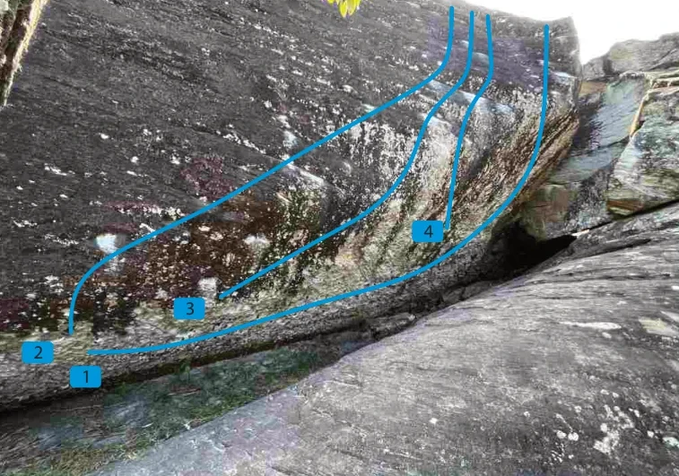
          - **largura_mapa**: 757
          - **altura_mapa**: 531
          - **pontos_de_interesse**:
            - **[0]**:
              - **id**: 1
              - **label**: 1
              - **box**:
                - **x**: 140
                - **y**: 515
                - **comprimento**: 30
                - **largura**: 30
            - **[1]**:
              - **id**: 2
              - **label**: 2
              - **box**:
                - **x**: 70
                - **y**: 495
                - **comprimento**: 30
                - **largura**: 30
            - **[2]**:
              - **id**: 3
              - **label**: 3
              - **box**:
                - **x**: 290
                - **y**: 465
                - **comprimento**: 30
                - **largura**: 30
            - **[3]**:
              - **id**: 4
              - **label**: 4
              - **box**:
                - **x**: 645
                - **y**: 415
                - **comprimento**: 30
                - **largura**: 30
          - **referencias**:
            - **[0]**:
              - **escalada**: Eterna Juventude
              - **ids**:
                - 1
            - **[1]**:
              - **escalada**: Episódio do Dia
              - **ids**:
                - 2
            - **[2]**:
              - **escalada**: Saideira
              - **ids**:
                - 3
            - **[3]**:
              - **escalada**: Bobsled
              - **ids**:
                - 4
      - **escaladas**:
        - **[0]**:
          - **boulder**:
            - **nome**: Eterna Juventude
            - **dificuldade**: V9
        - **[1]**:
          - **boulder**:
            - **nome**: Episódio do Dia
            - **dificuldade**: V8
        - **[2]**:
          - **boulder**:
            - **nome**: Saideira
            - **dificuldade**: V4
        - **[3]**:
          - **boulder**:
            - **nome**: Bobsled
            - **dificuldade**: V7
  - **[9]**:
    - **conteudo**:
      - **descricao**:
          # Setor Aresta do Cabeça
          
          O setor Aresta do Cabeça apresenta um bloco com uma linha clássica de aresta, exigindo equilíbrio e técnica.
          
          Obs.: Não foram identificadas todas as linhas desse bloco. Certifique-se antes de fazer uma possível primeira ascensão.
      - **nome**: Aresta do Cabeça
      - **mapas**:
        - **[0]**:
          - **caminho_imagem_mapa**: 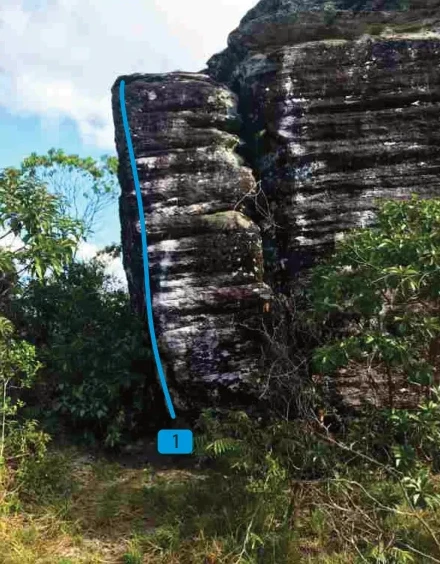
          - **largura_mapa**: 440
          - **altura_mapa**: 564
          - **pontos_de_interesse**:
            - **[0]**:
              - **id**: 1
              - **label**: 1
              - **box**:
                - **x**: 180
                - **y**: 515
                - **comprimento**: 30
                - **largura**: 30
          - **referencias**:
            - **[0]**:
              - **escalada**: Aresta do Cabeça
              - **ids**:
                - 1
      - **escaladas**:
        - **[0]**:
          - **boulder**:
            - **nome**: Aresta do Cabeça
            - **dificuldade**: V6
  - **[10]**:
    - **conteudo**:
      - **descricao**:
          # Setor Equinócio
          
          O setor Equinócio possui um bloco com linhas interessantes e agarras variadas.
          
          Obs.: Não foram identificadas todas as linhas desse bloco. Certifique-se antes de fazer uma possível primeira ascensão.
      - **nome**: Equinócio
      - **mapas**:
        - **[0]**:
          - **caminho_imagem_mapa**: 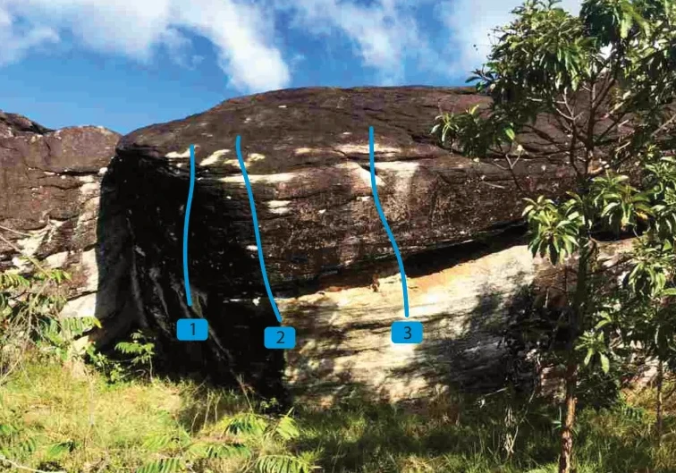
          - **largura_mapa**: 756
          - **altura_mapa**: 529
          - **pontos_de_interesse**:
            - **[0]**:
              - **id**: 1
              - **label**: 1
              - **box**:
                - **x**: 290
                - **y**: 515
                - **comprimento**: 30
                - **largura**: 30
            - **[1]**:
              - **id**: 2
              - **label**: 2
              - **box**:
                - **x**: 420
                - **y**: 525
                - **comprimento**: 30
                - **largura**: 30
            - **[2]**:
              - **id**: 3
              - **label**: 3
              - **box**:
                - **x**: 610
                - **y**: 515
                - **comprimento**: 30
                - **largura**: 30
          - **referencias**:
            - **[0]**:
              - **escalada**: Campo Minado
              - **ids**:
                - 1
            - **[1]**:
              - **escalada**: Kalil
              - **ids**:
                - 2
            - **[2]**:
              - **escalada**: Costela de Adão
              - **ids**:
                - 3
      - **escaladas**:
        - **[0]**:
          - **boulder**:
            - **nome**: Campo Minado
            - **dificuldade**: V6
        - **[1]**:
          - **boulder**:
            - **nome**: Kalil
            - **dificuldade**: V5
        - **[2]**:
          - **boulder**:
            - **nome**: Costela de Adão
            - **dificuldade**: V2
  - **[11]**:
    - **conteudo**:
      - **descricao**:
          # Setor Witness
          
          O setor Witness possui blocos imponentes com linhas de altíssima dificuldade, incluindo boulders de nível mundial.
          
          Obs.: Não foram identificadas todas as linhas desse bloco. Certifique-se antes de fazer uma possível primeira ascensão.
      - **nome**: Witness
      - **mapas**:
        - **[0]**:
          - **caminho_imagem_mapa**: 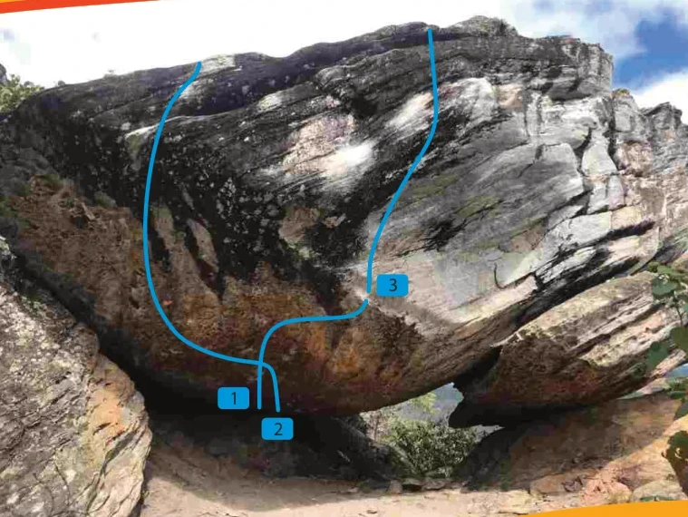
          - **largura_mapa**: 759
          - **altura_mapa**: 570
          - **pontos_de_interesse**:
            - **[0]**:
              - **id**: 1
              - **label**: 1
              - **box**:
                - **x**: 340
                - **y**: 540
                - **comprimento**: 30
                - **largura**: 30
            - **[1]**:
              - **id**: 2
              - **label**: 2
              - **box**:
                - **x**: 400
                - **y**: 555
                - **comprimento**: 30
                - **largura**: 30
            - **[2]**:
              - **id**: 3
              - **label**: 3
              - **box**:
                - **x**: 575
                - **y**: 500
                - **comprimento**: 30
                - **largura**: 30
          - **referencias**:
            - **[0]**:
              - **escalada**: Mandarim
              - **ids**:
                - 1
            - **[1]**:
              - **escalada**: Pressão Corporal
              - **ids**:
                - 2
            - **[2]**:
              - **escalada**: Witness the Weakness
              - **ids**:
                - 3
            - **[3]**:
              - **escalada**: Picasso
              - **ids**:
                - 1
        - **[1]**:
          - **caminho_imagem_mapa**: 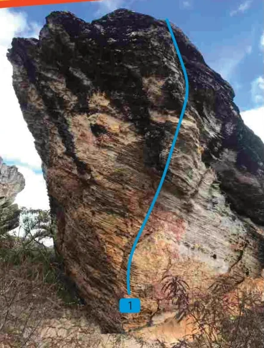
          - **largura_mapa**: 442
          - **altura_mapa**: 581
          - **pontos_de_interesse**:
            - **[0]**:
              - **id**: 1
              - **label**: 1
              - **box**:
                - **x**: 215
                - **y**: 525
                - **comprimento**: 30
                - **largura**: 30
          - **referencias**:
            - **[0]**:
              - **escalada**: Mandarim
              - **ids**:
                - 1
            - **[1]**:
              - **escalada**: Picasso
              - **ids**:
                - 1
      - **escaladas**:
        - **[0]**:
          - **boulder**:
            - **nome**: Mandarim
            - **dificuldade**: V13
        - **[1]**:
          - **boulder**:
            - **nome**: Pressão Corporal
            - **dificuldade**: V9
        - **[2]**:
          - **boulder**:
            - **nome**: Witness the Weakness
            - **dificuldade**: V11
        - **[3]**:
          - **boulder**:
            - **nome**: Picasso
            - **dificuldade**: V5
  - **[12]**:
    - **conteudo**:
      - **descricao**:
          # Setor La Fúria
          
          O setor La Fúria possui blocos com abundância de agarras e linhas de diversas dificuldades, incluindo boulders de alta performance.
          
          Obs.: Não foram identificadas todas as linhas desse bloco. Certifique-se antes de fazer uma possível primeira ascensão.
      - **nome**: La Fúria
      - **mapas**:
        - **[0]**:
          - **caminho_imagem_mapa**: 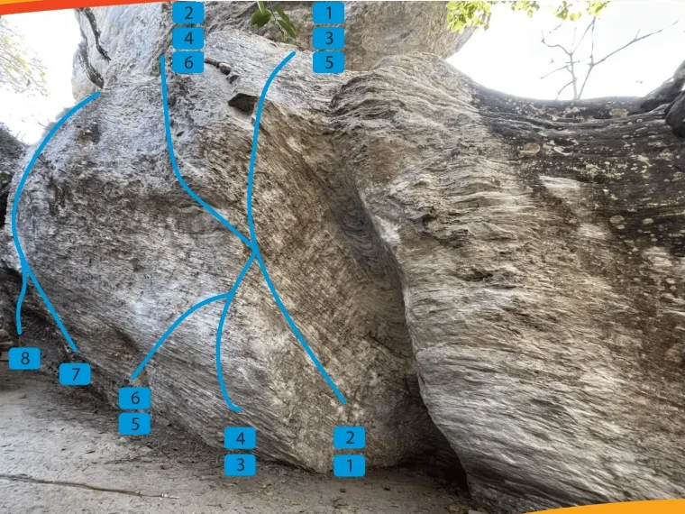
          - **largura_mapa**: 760
          - **altura_mapa**: 570
          - **pontos_de_interesse**:
            - **[0]**:
              - **id**: 1
              - **label**: 1
              - **box**:
                - **x**: 480
                - **y**: 25
                - **comprimento**: 30
                - **largura**: 30
            - **[1]**:
              - **id**: 2
              - **label**: 2
              - **box**:
                - **x**: 275
                - **y**: 25
                - **comprimento**: 30
                - **largura**: 30
            - **[2]**:
              - **id**: 3
              - **label**: 3
              - **box**:
                - **x**: 480
                - **y**: 70
                - **comprimento**: 30
                - **largura**: 30
            - **[3]**:
              - **id**: 4
              - **label**: 4
              - **box**:
                - **x**: 275
                - **y**: 70
                - **comprimento**: 30
                - **largura**: 30
            - **[4]**:
              - **id**: 5
              - **label**: 5
              - **box**:
                - **x**: 480
                - **y**: 115
                - **comprimento**: 30
                - **largura**: 30
            - **[5]**:
              - **id**: 6
              - **label**: 6
              - **box**:
                - **x**: 275
                - **y**: 115
                - **comprimento**: 30
                - **largura**: 30
            - **[6]**:
              - **id**: 7
              - **label**: 7
              - **box**:
                - **x**: 105
                - **y**: 540
                - **comprimento**: 30
                - **largura**: 30
            - **[7]**:
              - **id**: 8
              - **label**: 8
              - **box**:
                - **x**: 35
                - **y**: 515
                - **comprimento**: 30
                - **largura**: 30
          - **referencias**:
            - **[0]**:
              - **escalada**: La Furia
              - **ids**:
                - 1
            - **[1]**:
              - **escalada**: La Discordia
              - **ids**:
                - 2
            - **[2]**:
              - **escalada**: La Paloma
              - **ids**:
                - 3
            - **[3]**:
              - **escalada**: La Discrepância
              - **ids**:
                - 4
            - **[4]**:
              - **escalada**: La Fuerza
              - **ids**:
                - 5
            - **[5]**:
              - **escalada**: La Sinceridad
              - **ids**:
                - 6
            - **[6]**:
              - **escalada**: Rei da Cápsula
              - **ids**:
                - 7
            - **[7]**:
              - **escalada**: Choffer
              - **ids**:
                - 8
            - **[8]**:
              - **escalada**: Bem Vindo
              - **ids**:
                - 1
            - **[9]**:
              - **escalada**: Bem Vindo a Conceição
              - **ids**:
                - 2
            - **[10]**:
              - **escalada**: Bem Vindo aos Clássicos
              - **ids**:
                - 3
            - **[11]**:
              - **escalada**: Né Possível
              - **ids**:
                - 4
            - **[12]**:
              - **escalada**: Malditos
              - **ids**:
                - 5
            - **[13]**:
              - **escalada**: Guardião
              - **ids**:
                - 6
            - **[14]**:
              - **escalada**: Deixa Rolar
              - **ids**:
                - 7
            - **[15]**:
              - **escalada**: La Resistência
              - **ids**:
                - 8
                - 8
        - **[1]**:
          - **caminho_imagem_mapa**: 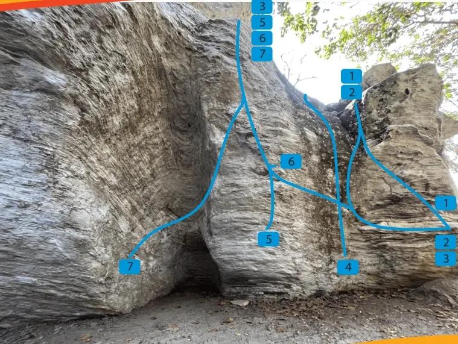
          - **largura_mapa**: 759
          - **altura_mapa**: 571
          - **pontos_de_interesse**:
            - **[0]**:
              - **id**: 1
              - **label**: 1
              - **box**:
                - **x**: 750
                - **y**: 215
                - **comprimento**: 19
                - **largura**: 30
            - **[1]**:
              - **id**: 2
              - **label**: 2
              - **box**:
                - **x**: 750
                - **y**: 265
                - **comprimento**: 19
                - **largura**: 30
            - **[2]**:
              - **id**: 3
              - **label**: 3
              - **box**:
                - **x**: 570
                - **y**: 25
                - **comprimento**: 30
                - **largura**: 30
            - **[3]**:
              - **id**: 4
              - **label**: 4
              - **box**:
                - **x**: 750
                - **y**: 555
                - **comprimento**: 19
                - **largura**: 30
            - **[4]**:
              - **id**: 5
              - **label**: 5
              - **box**:
                - **x**: 570
                - **y**: 65
                - **comprimento**: 30
                - **largura**: 30
            - **[5]**:
              - **id**: 6
              - **label**: 6
              - **box**:
                - **x**: 570
                - **y**: 105
                - **comprimento**: 30
                - **largura**: 30
            - **[6]**:
              - **id**: 7
              - **label**: 7
              - **box**:
                - **x**: 570
                - **y**: 145
                - **comprimento**: 30
                - **largura**: 30
          - **referencias**:
            - **[0]**:
              - **escalada**: La Furia
              - **ids**:
                - 1
            - **[1]**:
              - **escalada**: La Discordia
              - **ids**:
                - 2
            - **[2]**:
              - **escalada**: La Paloma
              - **ids**:
                - 3
            - **[3]**:
              - **escalada**: La Discrepância
              - **ids**:
                - 4
            - **[4]**:
              - **escalada**: La Fuerza
              - **ids**:
                - 5
            - **[5]**:
              - **escalada**: La Sinceridad
              - **ids**:
                - 6
            - **[6]**:
              - **escalada**: Rei da Cápsula
              - **ids**:
                - 7
            - **[7]**:
              - **escalada**: Bem Vindo
              - **ids**:
                - 1
            - **[8]**:
              - **escalada**: Bem Vindo a Conceição
              - **ids**:
                - 2
            - **[9]**:
              - **escalada**: Bem Vindo aos Clássicos
              - **ids**:
                - 3
            - **[10]**:
              - **escalada**: Né Possível
              - **ids**:
                - 4
            - **[11]**:
              - **escalada**: Malditos
              - **ids**:
                - 5
            - **[12]**:
              - **escalada**: Guardião
              - **ids**:
                - 6
            - **[13]**:
              - **escalada**: Deixa Rolar
              - **ids**:
                - 7
        - **[2]**:
          - **caminho_imagem_mapa**: 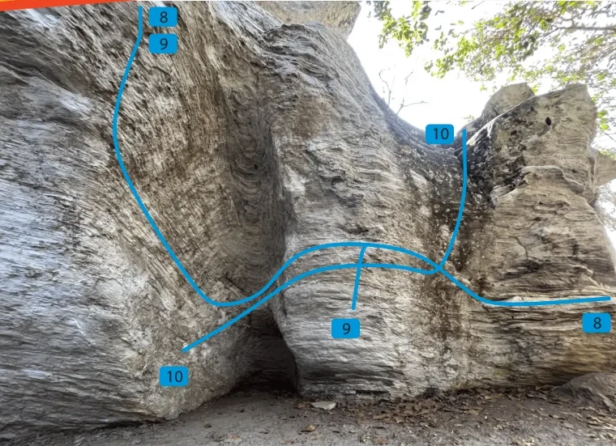
          - **largura_mapa**: 760
          - **altura_mapa**: 551
          - **pontos_de_interesse**:
            - **[0]**:
              - **id**: 8
              - **label**: 8
              - **box**:
                - **x**: 748
                - **y**: 500
                - **comprimento**: 25
                - **largura**: 30
            - **[1]**:
              - **id**: 9
              - **label**: 9
              - **box**:
                - **x**: 565
                - **y**: 545
                - **comprimento**: 30
                - **largura**: 30
            - **[2]**:
              - **id**: 10
              - **label**: 10
              - **box**:
                - **x**: 290
                - **y**: 545
                - **comprimento**: 30
                - **largura**: 30
          - **referencias**:
            - **[0]**:
              - **escalada**: Choffer
              - **ids**:
                - 8
            - **[1]**:
              - **escalada**: La Resistência
              - **ids**:
                - 8
                - 8
            - **[2]**:
              - **escalada**: Maldito La Furia
              - **ids**:
                - 9
                - 9
            - **[3]**:
              - **escalada**: (sem nome)
              - **ids**:
                - 10
                - 10
            - **[4]**:
              - **escalada**: Travessia da Fúria
              - **ids**:
                - 10
        - **[3]**:
          - **caminho_imagem_mapa**: 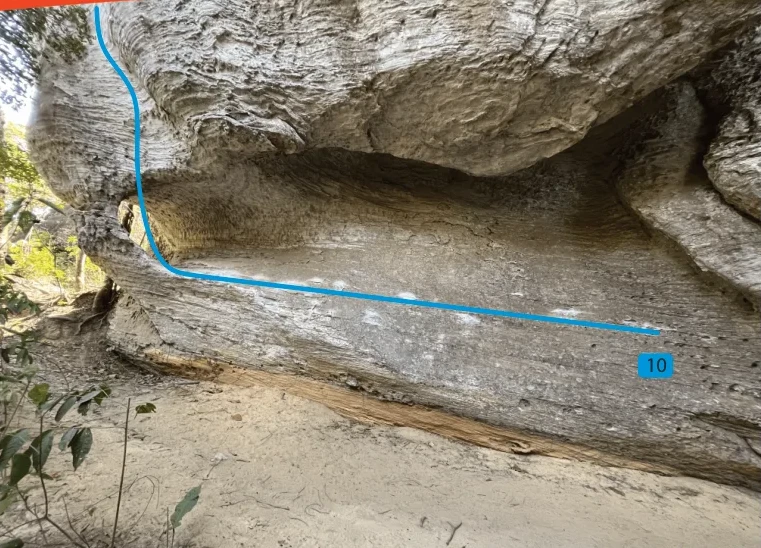
          - **largura_mapa**: 761
          - **altura_mapa**: 548
          - **pontos_de_interesse**:
            - **[0]**:
              - **id**: 10
              - **label**: 10
              - **box**:
                - **x**: 650
                - **y**: 435
                - **comprimento**: 30
                - **largura**: 30
          - **referencias**:
            - **[0]**:
              - **escalada**: (sem nome)
              - **ids**:
                - 10
                - 10
            - **[1]**:
              - **escalada**: Travessia da Fúria
              - **ids**:
                - 10
      - **escaladas**:
        - **[0]**:
          - **boulder**:
            - **nome**: La Furia
            - **dificuldade**: V7
        - **[1]**:
          - **boulder**:
            - **nome**: La Discordia
            - **dificuldade**: V9
        - **[2]**:
          - **boulder**:
            - **nome**: La Paloma
            - **dificuldade**: V9
        - **[3]**:
          - **boulder**:
            - **nome**: La Discrepância
            - **dificuldade**: V11
        - **[4]**:
          - **boulder**:
            - **nome**: La Fuerza
            - **dificuldade**: V11
        - **[5]**:
          - **boulder**:
            - **nome**: La Sinceridad
            - **dificuldade**: V12
        - **[6]**:
          - **boulder**:
            - **nome**: Rei da Cápsula
            - **dificuldade**: V10
        - **[7]**:
          - **boulder**:
            - **nome**: Choffer
            - **dificuldade**: V9
        - **[8]**:
          - **boulder**:
            - **nome**: Bem Vindo
            - **dificuldade**: V2
        - **[9]**:
          - **boulder**:
            - **nome**: Bem Vindo a Conceição
            - **dificuldade**: V3
        - **[10]**:
          - **boulder**:
            - **nome**: Bem Vindo aos Clássicos
            - **dificuldade**: V5
        - **[11]**:
          - **boulder**:
            - **nome**: Né Possível
            - **dificuldade**: V4
        - **[12]**:
          - **boulder**:
            - **nome**: Malditos
            - **dificuldade**: V7
        - **[13]**:
          - **boulder**:
            - **nome**: Guardião
            - **dificuldade**: V3
        - **[14]**:
          - **boulder**:
            - **nome**: Deixa Rolar
            - **dificuldade**: V6
        - **[15]**:
          - **boulder**:
            - **nome**: La Resistência
            - **dificuldade**: V8
        - **[16]**:
          - **boulder**:
            - **nome**: Maldito La Furia
            - **dificuldade**: V8
        - **[17]**:
          - **boulder**:
            - **nome**: (sem nome)
        - **[18]**:
          - **boulder**:
            - **nome**: Travessia da Fúria
            - **dificuldade**: V5
  - **[13]**:
    - **conteudo**:
      - **descricao**:
          # Setor Jah
          
          O setor Jah possui blocos com linhas atléticas e movimentos fluidos em rocha de boa qualidade.
          
          Obs.: Não foram identificadas todas as linhas desse bloco. Certifique-se antes de fazer uma possível primeira ascensão.
      - **nome**: Jah
      - **mapas**:
        - **[0]**:
          - **caminho_imagem_mapa**: 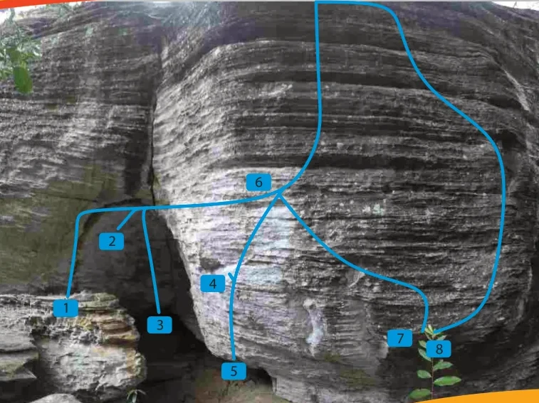
          - **largura_mapa**: 757
          - **altura_mapa**: 567
          - **pontos_de_interesse**:
            - **[0]**:
              - **id**: 1
              - **label**: 1
              - **box**:
                - **x**: 130
                - **y**: 515
                - **comprimento**: 30
                - **largura**: 30
            - **[1]**:
              - **id**: 2
              - **label**: 2
              - **box**:
                - **x**: 220
                - **y**: 385
                - **comprimento**: 30
                - **largura**: 30
            - **[2]**:
              - **id**: 3
              - **label**: 3
              - **box**:
                - **x**: 315
                - **y**: 525
                - **comprimento**: 30
                - **largura**: 30
            - **[3]**:
              - **id**: 4
              - **label**: 4
              - **box**:
                - **x**: 415
                - **y**: 440
                - **comprimento**: 30
                - **largura**: 30
            - **[4]**:
              - **id**: 5
              - **label**: 5
              - **box**:
                - **x**: 460
                - **y**: 540
                - **comprimento**: 30
                - **largura**: 30
            - **[5]**:
              - **id**: 6
              - **label**: 6
              - **box**:
                - **x**: 360
                - **y**: 275
                - **comprimento**: 30
                - **largura**: 30
            - **[6]**:
              - **id**: 7
              - **label**: 7
              - **box**:
                - **x**: 750
                - **y**: 500
                - **comprimento**: 30
                - **largura**: 30
            - **[7]**:
              - **id**: 8
              - **label**: 8
              - **box**:
                - **x**: 760
                - **y**: 540
                - **comprimento**: 30
                - **largura**: 30
          - **referencias**:
            - **[0]**:
              - **escalada**: Lágrimas de Jah
              - **ids**:
                - 1
            - **[1]**:
              - **escalada**: Em Busca de Jah
              - **ids**:
                - 2
            - **[2]**:
              - **escalada**: Jah Rastafari
              - **ids**:
                - 3
            - **[3]**:
              - **escalada**: Ordem e Progresso
              - **ids**:
                - 4
            - **[4]**:
              - **escalada**: Ordem e Progresso SDS
              - **ids**:
                - 5
            - **[5]**:
              - **escalada**: JahJah
              - **ids**:
                - 6
            - **[6]**:
              - **escalada**: Verdinho
              - **ids**:
                - 7
            - **[7]**:
              - **escalada**: Skunk
              - **ids**:
                - 8
        - **[1]**:
          - **caminho_imagem_mapa**: 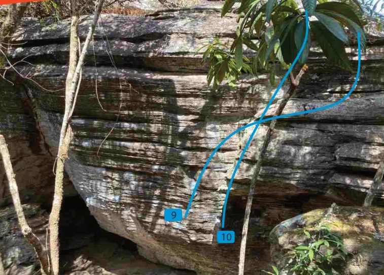
          - **largura_mapa**: 757
          - **altura_mapa**: 541
          - **pontos_de_interesse**:
            - **[0]**:
              - **id**: 9
              - **label**: 9
              - **box**:
                - **x**: 460
                - **y**: 515
                - **comprimento**: 30
                - **largura**: 30
            - **[1]**:
              - **id**: 10
              - **label**: 10
              - **box**:
                - **x**: 600
                - **y**: 530
                - **comprimento**: 30
                - **largura**: 30
          - **referencias**:
            - **[0]**:
              - **escalada**: Mescladinho
              - **ids**:
                - 9
            - **[1]**:
              - **escalada**: (sem nome)
              - **ids**:
                - 10
      - **escaladas**:
        - **[0]**:
          - **boulder**:
            - **nome**: Lágrimas de Jah
            - **dificuldade**: V8
        - **[1]**:
          - **boulder**:
            - **nome**: Em Busca de Jah
            - **dificuldade**: V7
        - **[2]**:
          - **boulder**:
            - **nome**: Jah Rastafari
            - **dificuldade**: V9
        - **[3]**:
          - **boulder**:
            - **nome**: Ordem e Progresso
            - **dificuldade**: V7
        - **[4]**:
          - **boulder**:
            - **nome**: Ordem e Progresso SDS
            - **dificuldade**: V8
        - **[5]**:
          - **boulder**:
            - **nome**: JahJah
            - **dificuldade**: V5
        - **[6]**:
          - **boulder**:
            - **nome**: Verdinho
            - **dificuldade**: V9
        - **[7]**:
          - **boulder**:
            - **nome**: Skunk
            - **dificuldade**: V8
        - **[8]**:
          - **boulder**:
            - **nome**: Mescladinho
            - **dificuldade**: V7
        - **[9]**:
          - **boulder**:
            - **nome**: (sem nome)
            - **dificuldade**: V3
  - **[14]**:
    - **conteudo**:
      - **descricao**:
          # Setor Pole Dance
          
          O setor Pole Dance possui blocos com abundância de agarras horizontais e verticais, permitindo movimentos dinâmicos e técnicos.
          
          Obs.: Não foram identificadas todas as linhas desse bloco. Certifique-se antes de fazer uma possível primeira ascensão.
      - **nome**: Pole Dance
      - **mapas**:
        - **[0]**:
          - **caminho_imagem_mapa**: 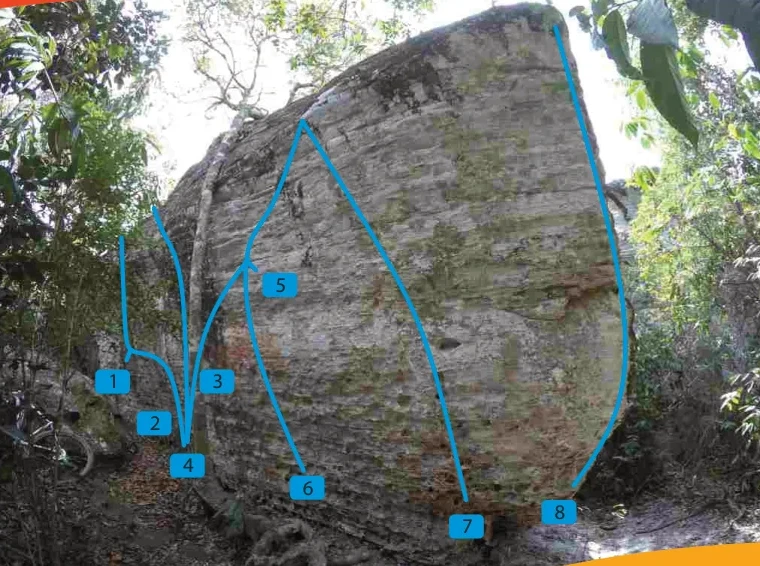
          - **largura_mapa**: 760
          - **altura_mapa**: 566
          - **pontos_de_interesse**:
            - **[0]**:
              - **id**: 1
              - **label**: 1
              - **box**:
                - **x**: 160
                - **y**: 535
                - **comprimento**: 30
                - **largura**: 30
            - **[1]**:
              - **id**: 2
              - **label**: 2
              - **box**:
                - **x**: 210
                - **y**: 545
                - **comprimento**: 30
                - **largura**: 30
            - **[2]**:
              - **id**: 3
              - **label**: 3
              - **box**:
                - **x**: 290
                - **y**: 535
                - **comprimento**: 30
                - **largura**: 30
            - **[3]**:
              - **id**: 4
              - **label**: 4
              - **box**:
                - **x**: 260
                - **y**: 555
                - **comprimento**: 30
                - **largura**: 30
            - **[4]**:
              - **id**: 5
              - **label**: 5
              - **box**:
                - **x**: 240
                - **y**: 285
                - **comprimento**: 30
                - **largura**: 30
            - **[5]**:
              - **id**: 6
              - **label**: 6
              - **box**:
                - **x**: 420
                - **y**: 555
                - **comprimento**: 30
                - **largura**: 30
            - **[6]**:
              - **id**: 7
              - **label**: 7
              - **box**:
                - **x**: 630
                - **y**: 560
                - **comprimento**: 30
                - **largura**: 30
            - **[7]**:
              - **id**: 8
              - **label**: 8
              - **box**:
                - **x**: 750
                - **y**: 560
                - **comprimento**: 30
                - **largura**: 30
          - **referencias**:
            - **[0]**:
              - **escalada**: Fuck Beach
              - **ids**:
                - 1
            - **[1]**:
              - **escalada**: Incrível Fuck Beach
              - **ids**:
                - 2
            - **[2]**:
              - **escalada**: Incrível Pole Dance
              - **ids**:
                - 3
            - **[3]**:
              - **escalada**: Incrível
              - **ids**:
                - 4
            - **[4]**:
              - **escalada**: Pole Dance
              - **ids**:
                - 5
            - **[5]**:
              - **escalada**: Pole Dance SDS
              - **ids**:
                - 6
            - **[6]**:
              - **escalada**: De la Rocha
              - **ids**:
                - 7
            - **[7]**:
              - **escalada**: Siga-me os Bons SDS
              - **ids**:
                - 8
            - **[8]**:
              - **escalada**: Repense
              - **ids**:
                - 1
            - **[9]**:
              - **escalada**: Vamo Nessa
              - **ids**:
                - 2
            - **[10]**:
              - **escalada**: Vem que Tem
              - **ids**:
                - 3
            - **[11]**:
              - **escalada**: Pense Bem
              - **ids**:
                - 4
            - **[12]**:
              - **escalada**: Conclusão
              - **ids**:
                - 5
            - **[13]**:
              - **escalada**: Siga-me os Bons
              - **ids**:
                - 1
            - **[14]**:
              - **escalada**: Siga-me os Bons SDS
              - **ids**:
                - 2
            - **[15]**:
              - **escalada**: Conceicion
              - **ids**:
                - 3
            - **[16]**:
              - **escalada**: Tô Concê
              - **ids**:
                - 4
            - **[17]**:
              - **escalada**: Rocktrip
              - **ids**:
                - 5
            - **[18]**:
              - **escalada**: Rocklands
              - **ids**:
                - 6
        - **[1]**:
          - **caminho_imagem_mapa**: 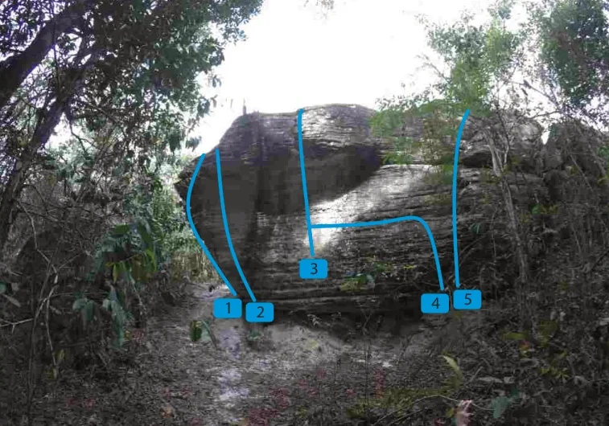
          - **largura_mapa**: 757
          - **altura_mapa**: 530
          - **pontos_de_interesse**:
            - **[0]**:
              - **id**: 1
              - **label**: 1
              - **box**:
                - **x**: 380
                - **y**: 505
                - **comprimento**: 30
                - **largura**: 30
            - **[1]**:
              - **id**: 2
              - **label**: 2
              - **box**:
                - **x**: 430
                - **y**: 505
                - **comprimento**: 30
                - **largura**: 30
            - **[2]**:
              - **id**: 3
              - **label**: 3
              - **box**:
                - **x**: 520
                - **y**: 415
                - **comprimento**: 30
                - **largura**: 30
            - **[3]**:
              - **id**: 4
              - **label**: 4
              - **box**:
                - **x**: 720
                - **y**: 495
                - **comprimento**: 30
                - **largura**: 30
            - **[4]**:
              - **id**: 5
              - **label**: 5
              - **box**:
                - **x**: 760
                - **y**: 495
                - **comprimento**: 30
                - **largura**: 30
          - **referencias**:
            - **[0]**:
              - **escalada**: Fuck Beach
              - **ids**:
                - 1
            - **[1]**:
              - **escalada**: Incrível Fuck Beach
              - **ids**:
                - 2
            - **[2]**:
              - **escalada**: Incrível Pole Dance
              - **ids**:
                - 3
            - **[3]**:
              - **escalada**: Incrível
              - **ids**:
                - 4
            - **[4]**:
              - **escalada**: Pole Dance
              - **ids**:
                - 5
            - **[5]**:
              - **escalada**: Repense
              - **ids**:
                - 1
            - **[6]**:
              - **escalada**: Vamo Nessa
              - **ids**:
                - 2
            - **[7]**:
              - **escalada**: Vem que Tem
              - **ids**:
                - 3
            - **[8]**:
              - **escalada**: Pense Bem
              - **ids**:
                - 4
            - **[9]**:
              - **escalada**: Conclusão
              - **ids**:
                - 5
            - **[10]**:
              - **escalada**: Siga-me os Bons
              - **ids**:
                - 1
            - **[11]**:
              - **escalada**: Siga-me os Bons SDS
              - **ids**:
                - 2
            - **[12]**:
              - **escalada**: Conceicion
              - **ids**:
                - 3
            - **[13]**:
              - **escalada**: Tô Concê
              - **ids**:
                - 4
            - **[14]**:
              - **escalada**: Rocktrip
              - **ids**:
                - 5
        - **[2]**:
          - **caminho_imagem_mapa**: 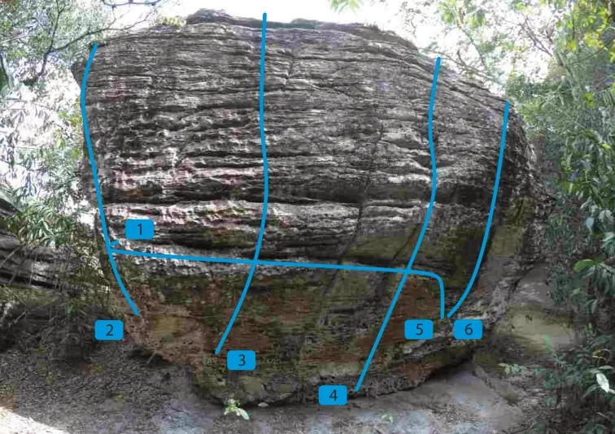
          - **largura_mapa**: 756
          - **altura_mapa**: 534
          - **pontos_de_interesse**:
            - **[0]**:
              - **id**: 1
              - **label**: 1
              - **box**:
                - **x**: 240
                - **y**: 285
                - **comprimento**: 30
                - **largura**: 30
            - **[1]**:
              - **id**: 2
              - **label**: 2
              - **box**:
                - **x**: 180
                - **y**: 505
                - **comprimento**: 30
                - **largura**: 30
            - **[2]**:
              - **id**: 3
              - **label**: 3
              - **box**:
                - **x**: 405
                - **y**: 525
                - **comprimento**: 30
                - **largura**: 30
            - **[3]**:
              - **id**: 4
              - **label**: 4
              - **box**:
                - **x**: 545
                - **y**: 525
                - **comprimento**: 30
                - **largura**: 30
            - **[4]**:
              - **id**: 5
              - **label**: 5
              - **box**:
                - **x**: 685
                - **y**: 505
                - **comprimento**: 30
                - **largura**: 30
            - **[5]**:
              - **id**: 6
              - **label**: 6
              - **box**:
                - **x**: 755
                - **y**: 505
                - **comprimento**: 30
                - **largura**: 30
          - **referencias**:
            - **[0]**:
              - **escalada**: Fuck Beach
              - **ids**:
                - 1
            - **[1]**:
              - **escalada**: Incrível Fuck Beach
              - **ids**:
                - 2
            - **[2]**:
              - **escalada**: Incrível Pole Dance
              - **ids**:
                - 3
            - **[3]**:
              - **escalada**: Incrível
              - **ids**:
                - 4
            - **[4]**:
              - **escalada**: Pole Dance
              - **ids**:
                - 5
            - **[5]**:
              - **escalada**: Pole Dance SDS
              - **ids**:
                - 6
            - **[6]**:
              - **escalada**: Repense
              - **ids**:
                - 1
            - **[7]**:
              - **escalada**: Vamo Nessa
              - **ids**:
                - 2
            - **[8]**:
              - **escalada**: Vem que Tem
              - **ids**:
                - 3
            - **[9]**:
              - **escalada**: Pense Bem
              - **ids**:
                - 4
            - **[10]**:
              - **escalada**: Conclusão
              - **ids**:
                - 5
            - **[11]**:
              - **escalada**: Siga-me os Bons
              - **ids**:
                - 1
            - **[12]**:
              - **escalada**: Siga-me os Bons SDS
              - **ids**:
                - 2
            - **[13]**:
              - **escalada**: Conceicion
              - **ids**:
                - 3
            - **[14]**:
              - **escalada**: Tô Concê
              - **ids**:
                - 4
            - **[15]**:
              - **escalada**: Rocktrip
              - **ids**:
                - 5
            - **[16]**:
              - **escalada**: Rocklands
              - **ids**:
                - 6
      - **escaladas**:
        - **[0]**:
          - **boulder**:
            - **nome**: Fuck Beach
            - **dificuldade**: V5
        - **[1]**:
          - **boulder**:
            - **nome**: Incrível Fuck Beach
            - **dificuldade**: V8
        - **[2]**:
          - **boulder**:
            - **nome**: Incrível Pole Dance
            - **dificuldade**: V7
        - **[3]**:
          - **boulder**:
            - **nome**: Incrível
            - **dificuldade**: V5
        - **[4]**:
          - **boulder**:
            - **nome**: Pole Dance
            - **dificuldade**: V5
        - **[5]**:
          - **boulder**:
            - **nome**: Pole Dance SDS
            - **dificuldade**: V7
        - **[6]**:
          - **boulder**:
            - **nome**: De la Rocha
            - **dificuldade**: V7
        - **[7]**:
          - **boulder**:
            - **nome**: Siga-me os Bons SDS
            - **dificuldade**: V4
        - **[8]**:
          - **boulder**:
            - **nome**: Repense
            - **dificuldade**: INDEFINIDO
        - **[9]**:
          - **boulder**:
            - **nome**: Vamo Nessa
            - **dificuldade**: V5
        - **[10]**:
          - **boulder**:
            - **nome**: Vem que Tem
            - **dificuldade**: V5
        - **[11]**:
          - **boulder**:
            - **nome**: Pense Bem
            - **dificuldade**: V7
        - **[12]**:
          - **boulder**:
            - **nome**: Conclusão
            - **dificuldade**: V4
        - **[13]**:
          - **boulder**:
            - **nome**: Siga-me os Bons
            - **dificuldade**: V3
        - **[14]**:
          - **boulder**:
            - **nome**: Siga-me os Bons SDS
            - **dificuldade**: V4
        - **[15]**:
          - **boulder**:
            - **nome**: Conceicion
            - **dificuldade**: V4
        - **[16]**:
          - **boulder**:
            - **nome**: Tô Concê
            - **dificuldade**: V4
        - **[17]**:
          - **boulder**:
            - **nome**: Rocktrip
            - **dificuldade**: V5
        - **[18]**:
          - **boulder**:
            - **nome**: Rocklands
            - **dificuldade**: V4
  - **[15]**:
    - **conteudo**:
      - **descricao**:
          # Setor Rock and Roll
          
          O setor Rock and Roll possui um bloco com linhas acessíveis e bem divertidas.
          
          Obs.: Não foram identificadas todas as linhas desse bloco. Certifique-se antes de fazer uma possível primeira ascensão.
      - **nome**: Rock and Roll
      - **mapas**:
        - **[0]**:
          - **caminho_imagem_mapa**: 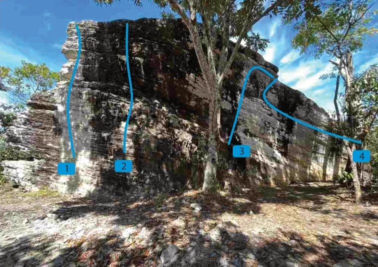
          - **largura_mapa**: 757
          - **altura_mapa**: 534
          - **pontos_de_interesse**:
            - **[0]**:
              - **id**: 1
              - **label**: 1
              - **box**:
                - **x**: 180
                - **y**: 525
                - **comprimento**: 30
                - **largura**: 30
            - **[1]**:
              - **id**: 2
              - **label**: 2
              - **box**:
                - **x**: 330
                - **y**: 525
                - **comprimento**: 30
                - **largura**: 30
            - **[2]**:
              - **id**: 3
              - **label**: 3
              - **box**:
                - **x**: 645
                - **y**: 470
                - **comprimento**: 30
                - **largura**: 30
            - **[3]**:
              - **id**: 4
              - **label**: 4
              - **box**:
                - **x**: 760
                - **y**: 490
                - **comprimento**: 30
                - **largura**: 30
          - **referencias**:
            - **[0]**:
              - **escalada**: Rock It
              - **ids**:
                - 1
            - **[1]**:
              - **escalada**: Rock and Roll
              - **ids**:
                - 2
            - **[2]**:
              - **escalada**: Go Chucky Go
              - **ids**:
                - 3
            - **[3]**:
              - **escalada**: Go Johnny Go
              - **ids**:
                - 4
      - **escaladas**:
        - **[0]**:
          - **boulder**:
            - **nome**: Rock It
            - **dificuldade**: V0
        - **[1]**:
          - **boulder**:
            - **nome**: Rock and Roll
            - **dificuldade**: V1
        - **[2]**:
          - **boulder**:
            - **nome**: Go Chucky Go
            - **dificuldade**: V2
        - **[3]**:
          - **boulder**:
            - **nome**: Go Johnny Go
            - **dificuldade**: V3
  - **[16]**:
    - **conteudo**:
      - **descricao**:
          # Setor Bloco dos Canelas
          
          O setor Bloco dos Canelas possui um bloco com linhas interessantes em um ambiente agradável.
          
          Obs.: Não foram identificadas todas as linhas desse bloco. Certifique-se antes de fazer uma possível primeira ascensão.
      - **nome**: Bloco dos Canelas
      - **mapas**:
        - **[0]**:
          - **caminho_imagem_mapa**: 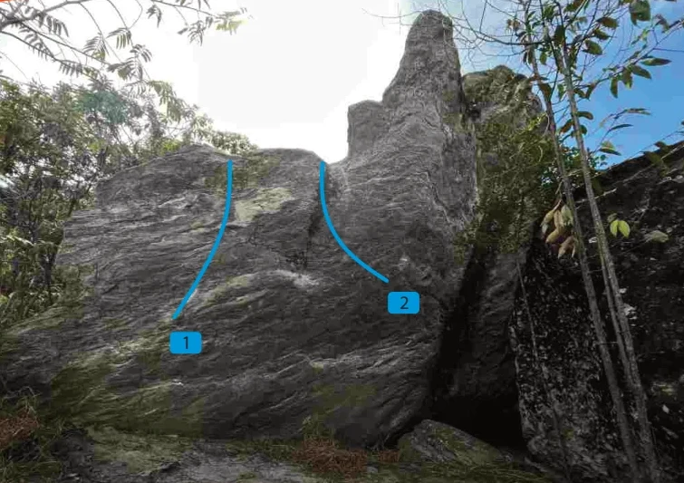
          - **largura_mapa**: 755
          - **altura_mapa**: 533
          - **pontos_de_interesse**:
            - **[0]**:
              - **id**: 1
              - **label**: 1
              - **box**:
                - **x**: 280
                - **y**: 515
                - **comprimento**: 30
                - **largura**: 30
            - **[1]**:
              - **id**: 2
              - **label**: 2
              - **box**:
                - **x**: 620
                - **y**: 415
                - **comprimento**: 30
                - **largura**: 30
          - **referencias**:
            - **[0]**:
              - **escalada**: Canelas as Ar
              - **ids**:
                - 1
            - **[1]**:
              - **escalada**: Canelas ao Vento
              - **ids**:
                - 2
      - **escaladas**:
        - **[0]**:
          - **boulder**:
            - **nome**: Canelas as Ar
            - **dificuldade**: V4
        - **[1]**:
          - **boulder**:
            - **nome**: Canelas ao Vento
            - **dificuldade**: V7
  - **[17]**:
    - **conteudo**:
      - **descricao**:
          # Setor Mãos de Sebo
          
          O setor Mãos de Sebo possui um bloco com linhas que exigem técnica e controle de agarras.
          
          Obs.: Não foram identificadas todas as linhas desse bloco. Certifique-se antes de fazer uma possível primeira ascensão.
      - **nome**: Mãos de Sebo
      - **mapas**:
        - **[0]**:
          - **caminho_imagem_mapa**: 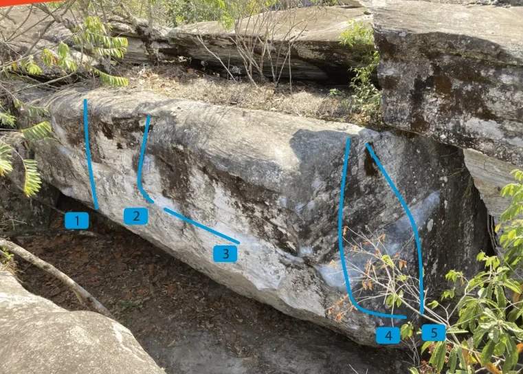
          - **largura_mapa**: 761
          - **altura_mapa**: 544
          - **pontos_de_interesse**:
            - **[0]**:
              - **id**: 1
              - **label**: 1
              - **box**:
                - **x**: 150
                - **y**: 535
                - **comprimento**: 30
                - **largura**: 30
            - **[1]**:
              - **id**: 2
              - **label**: 2
              - **box**:
                - **x**: 265
                - **y**: 535
                - **comprimento**: 30
                - **largura**: 30
            - **[2]**:
              - **id**: 3
              - **label**: 3
              - **box**:
                - **x**: 435
                - **y**: 535
                - **comprimento**: 30
                - **largura**: 30
            - **[3]**:
              - **id**: 4
              - **label**: 4
              - **box**:
                - **x**: 750
                - **y**: 535
                - **comprimento**: 30
                - **largura**: 30
            - **[4]**:
              - **id**: 5
              - **label**: 5
              - **box**:
                - **x**: 770
                - **y**: 535
                - **comprimento**: 30
                - **largura**: 30
          - **referencias**:
            - **[0]**:
              - **escalada**: (sem nome)
              - **ids**:
                - 1
            - **[1]**:
              - **escalada**: Mãos de Tesoura
              - **ids**:
                - 2
            - **[2]**:
              - **escalada**: Fei Long
              - **ids**:
                - 3
            - **[3]**:
              - **escalada**: Mãos de Sebo
              - **ids**:
                - 4
            - **[4]**:
              - **escalada**: Mãozinha
              - **ids**:
                - 5
      - **escaladas**:
        - **[0]**:
          - **boulder**:
            - **nome**: (sem nome)
        - **[1]**:
          - **boulder**:
            - **nome**: Mãos de Tesoura
            - **dificuldade**: V4
        - **[2]**:
          - **boulder**:
            - **nome**: Fei Long
            - **dificuldade**: V8
        - **[3]**:
          - **boulder**:
            - **nome**: Mãos de Sebo
            - **dificuldade**: V5
        - **[4]**:
          - **boulder**:
            - **nome**: Mãozinha
            - **dificuldade**: V2

## Arquivos Externos

- **arquivos_externos**:
  - **[0]**:
    - **caminho**: 
    - **checksum_sha256**: c0edb815fe114f9562599153f09c23965b0ac46bed797893e1fc978d180448c8
  - **[1]**:
    - **caminho**: 
    - **checksum_sha256**: 90151a35f5128fd53676156a0337e4f094bc6319d94de4dcb0cc38b9b7b36245
  - **[2]**:
    - **caminho**: 
    - **checksum_sha256**: c180b8856b43a3895a71996b7033c22a41a2ae4add3c5c46007ca75dc8f3e81d
  - **[3]**:
    - **caminho**: 
    - **checksum_sha256**: 2ada23d03bab7b527c63f30ad4090ba1277c47c2549ed829594bc804dbac82e9
  - **[4]**:
    - **caminho**: 
    - **checksum_sha256**: b097deef6b78802f859ebf1b6b7b1592acac5687f40977c23207495289a086a3
  - **[5]**:
    - **caminho**: 
    - **checksum_sha256**: bf6ef12349d9ae05ce670f00bc92a8e2804c1f2204c0e22e5433b009b9093e1b
  - **[6]**:
    - **caminho**: 
    - **checksum_sha256**: 5355adf2487b3d05f0de320129a2885eabfe344e9457fc5a17cb9bdc474855d2
  - **[7]**:
    - **caminho**: 
    - **checksum_sha256**: 098734baecd09dbb9d5f639cbbfdd156ebec719b63b63a1481216f0dd2fa911d
  - **[8]**:
    - **caminho**: 
    - **checksum_sha256**: fcd281398c34b38cd3fec0fd633163e5acefe69641b576e04a55b1b1c80b7473
  - **[9]**:
    - **caminho**: 
    - **checksum_sha256**: 09e911891f29700e6d5f381803f1e2d81e77533cdf83f98f2815cf0a125c9242
  - **[10]**:
    - **caminho**: 
    - **checksum_sha256**: 644cf125549d220191d34502d8cc9b2d33caed0a463b46c3ab3b9bb19dbc7f68
  - **[11]**:
    - **caminho**: 
    - **checksum_sha256**: b4c32b3e67dfbd511357f1a632f79d2f0fb378a8aebe344a2e5e473a6ced4123
  - **[12]**:
    - **caminho**: 
    - **checksum_sha256**: 26766dfa8b4b8dd575f4872592adde76898b017c8fdf3cde646865fa56f18b03
  - **[13]**:
    - **caminho**: 
    - **checksum_sha256**: 61dd51f2070098b1cde416f475c72e42af9e1e1fe448862bd1af9f8892412425
  - **[14]**:
    - **caminho**: 
    - **checksum_sha256**: a50901187d2b7799874e6c3fcb0b6b3304021a71c6e273a40676967b8e0bf060
  - **[15]**:
    - **caminho**: 
    - **checksum_sha256**: 22316811f8601daada14db0820f13978446e8b85d2276efc44bc27c0705d2aef
  - **[16]**:
    - **caminho**: 
    - **checksum_sha256**: bdd7220e5ab95bd18bb7c136a817a6d22f20ae222f812562382b539ca7df0c15
  - **[17]**:
    - **caminho**: 
    - **checksum_sha256**: 86456d49aa2ffc2f64c62ba7b3e7791e3405ddb69db30613441ff38ff1763966
  - **[18]**:
    - **caminho**: 
    - **checksum_sha256**: dd7b33da5ffef3bdaa08355deb871001a03bfb6cd11b924992de7a6c6fb00449
  - **[19]**:
    - **caminho**: 
    - **checksum_sha256**: 013e0a00d16598d5f9305ffa6b8a27fc9874d681e77064365f56c37080f95589
  - **[20]**:
    - **caminho**: 
    - **checksum_sha256**: 0f744f982d2d8647c1fcdaa983eebee483d46f7ed8aa1efcab27dbae3cfb036b
  - **[21]**:
    - **caminho**: 
    - **checksum_sha256**: f002f15661c8212fe49b130f4b53e28e10bb836bba998c39ac817ba330b498c8
  - **[22]**:
    - **caminho**: 
    - **checksum_sha256**: 0111ba98708557de5aa08152cbeb5ecae559cb56a8a059601f39f492715f968e
  - **[23]**:
    - **caminho**: 
    - **checksum_sha256**: 467c3aeaf17668067ea2c15adcfda54a83527e1af1fdb9fe7f61596e5080c683
  - **[24]**:
    - **caminho**: 
    - **checksum_sha256**: 9a0fb19ec545634601e30294e9d86befe29e47292625efc81765d544487a75b2
  - **[25]**:
    - **caminho**: 
    - **checksum_sha256**: 44784043080d775bfee0fb6a1a26d08994bd2f48560860e0441d29698072b447
  - **[26]**:
    - **caminho**: 
    - **checksum_sha256**: 3b36fb665504e5c095b0a34fa474bedcd570a3e6eb22458740e3102946724e52
  - **[27]**:
    - **caminho**: 
    - **checksum_sha256**: b9a05d565208fb964d0141e96aecd892b237e4cae743b23299c9df7eabecc220
  - **[28]**:
    - **caminho**: 
    - **checksum_sha256**: 8839b17aa28767bfd00886d73eb9c7779074f0c5e848e079a97ee4b2b28af1a6
  - **[29]**:
    - **caminho**: 
    - **checksum_sha256**: edfce9310c8c5dff2d55d57f9a3fb6c98abffac88a8a2f3c233dc33842261305
  - **[30]**:
    - **caminho**: 
    - **checksum_sha256**: 8f31cd3e675de465480efc96365fb8fe1f44808999440f033a3ef4e08f5f55c7
  - **[31]**:
    - **caminho**: 
    - **checksum_sha256**: 5dfea772ae92e03e996b01ff85b93fe8ef0f5a282c7dc67027dc7db4b01e16fa
  - **[32]**:
    - **caminho**: 
    - **checksum_sha256**: c7d754f0211c243284f0da753454f2309d325dd88c4da19dbd82b6ab69b71758
  - **[33]**:
    - **caminho**: 
    - **checksum_sha256**: 834bb0bcfb449a45ecfc66115df08a551bc651a329a24619e1027a73a94dc8a9
  - **[34]**:
    - **caminho**: 
    - **checksum_sha256**: 819814d966c84b1e44f78fbbfe55b2b7f960637c6debc1b8d038c85913aaa7ad
  - **[35]**:
    - **caminho**: 
    - **checksum_sha256**: 7692d0c41c4fbce4217dbb6060192e2d8765b88b1befd0eb035a0e3e0042911b
  - **[36]**:
    - **caminho**: 
    - **checksum_sha256**: 42a74a6bc8cdaccda8e4c5fb21959996303f1a63c908e09405d4eacf8a7900e8
  - **[37]**:
    - **caminho**: 
    - **checksum_sha256**: c6c7a627481981bf53bcc0fe3eeb2d79c635ac1943e8ecc2029fb6eed1bef538
  - **[38]**:
    - **caminho**: 
    - **checksum_sha256**: eeccddcdb8f5a65dbf0ce5ddbe7d772b6759b40039e946b3001880f6ad09838a
  - **[39]**:
    - **caminho**: 
    - **checksum_sha256**: 2376ea3abb1e8d80aa5a67847cf55c12709fde0e4279ba23063288dcba4e42d0
  - **[40]**:
    - **caminho**: 
    - **checksum_sha256**: ed0fa60a6d20c714aeff9b3dfbb3e0b12c3681c507d30ee8715e33d01458dc76
  - **[41]**:
    - **caminho**: 
    - **checksum_sha256**: 2e5a168813eaaf4ce9a93d6a9ac9d1cf6eb03030b617a9ea96b98941e136dcb0
  - **[42]**:
    - **caminho**: 
    - **checksum_sha256**: 56ba728bb21fdac28329369ec7a4e1f1fc33bd72c2c9d812bb4813646ea93890
  - **[43]**:
    - **caminho**: 
    - **checksum_sha256**: 610309b56ea4f71ad04ca30537b53628ebd9a8b95b905083e6105794e7bc1d8d
  - **[44]**:
    - **caminho**: 
    - **checksum_sha256**: 305198a02118943bc4447c84d478974c51af1d348fb6316e87739694d45bfe2c
  - **[45]**:
    - **caminho**: 
    - **checksum_sha256**: 158df7c3a6a49fe5d6c22b54296f9a2337bc477c8b853ccf88c277fa85c78579
  - **[46]**:
    - **caminho**: 
    - **checksum_sha256**: 96c779e6890d1e2cac4ad4131a4308e84aaa4d9660c61703fe0abe9b409706bb
  - **[47]**:
    - **caminho**: 
    - **checksum_sha256**: 4cd992876a75d4e7e0a04fc93ea02d7cb05b748ebf86d74f56ddc68a18f5f3e8
  - **[48]**:
    - **caminho**: 
    - **checksum_sha256**: 378ab574302d711101691ee6cc4aa748df3c872fd18444614ccd4675dfb3b2cc
  - **[49]**:
    - **caminho**: 
    - **checksum_sha256**: 0cfa183308c03a7a0a38fc1c6b5c4e83646bf0ff6fa490652354a382b9c6c27b
  - **[50]**:
    - **caminho**: 
    - **checksum_sha256**: 57a0c27845745e4ca3a7b411a1399c714b2b6518f1192037ea8c5f84cb424f94
  - **[51]**:
    - **caminho**: 
    - **checksum_sha256**: 515f5d8ddc52cc45575c39035ec698e238a218745da70e84c228908fa1151287
  - **[52]**:
    - **caminho**: 
    - **checksum_sha256**: 5a9b1d33f1be4eddcdc824c29eab2b7640954c1a90cda2c67af322cdc8321531
  - **[53]**:
    - **caminho**: 
    - **checksum_sha256**: 079302760a815677e3cecf57ce4004e502a83ffaf906d18831672cfe3377fb0d
  - **[54]**:
    - **caminho**: 
    - **checksum_sha256**: ae1436ad1d98a2509e2e5093a51c9a3dcf5fac378cb325d6b7b861a2451836b3
  - **[55]**:
    - **caminho**: 
    - **checksum_sha256**: 43f16a5e3e0f828965d725bc4310e153ad2d273ba383c1e2bf520c939b5b74d3
  - **[56]**:
    - **caminho**: 
    - **checksum_sha256**: a9fb9f90f40e3b35ee6b2a03d0ca686e8e93f4064a9082b8b7e10751e2afc6b2
  - **[57]**:
    - **caminho**: 
    - **checksum_sha256**: 9895deea59f9e7194c3907deaf08c9449430824dcb3f1b6c53abf670a62dcf2e
  - **[58]**:
    - **caminho**: 
    - **checksum_sha256**: fde330f7815005eaec4168e0d4fcd840f60c1d7bcd8200c77bdd4172a8681f99
  - **[59]**:
    - **caminho**: 
    - **checksum_sha256**: 0c1c9f6418b1d1fcbb21d6d9e878de40cafffaff7a749ccac8a21666eceae959
  - **[60]**:
    - **caminho**: 
    - **checksum_sha256**: 01e54010925ed26e2570532ac85ac7c7343b8c78d239961d7ca718b51171c731
  - **[61]**:
    - **caminho**: 
    - **checksum_sha256**: 0195e8cb5d6af78a3b02758f0cc54f3fa4b9cae504077bb15ee5f081e10e312b
  - **[62]**:
    - **caminho**: 
    - **checksum_sha256**: dd158c3e7ab5841dad58aa9fb975a56d8a70ffce45c15db8275c810d9708edd7
  - **[63]**:
    - **caminho**: 
    - **checksum_sha256**: 1c6ced760bc1f4d1c11b5af952c4a4d1f6f59ace6ba99636d6f1f30874830b02
  - **[64]**:
    - **caminho**: 
    - **checksum_sha256**: 7538e2b82a71c0667b116b074584841318ae1c9af1c1e72fdc6dc7fa0d050cd0
  - **[65]**:
    - **caminho**: 
    - **checksum_sha256**: cfc2a31e86cafdfcf592d2976e13a7de78d5e1a3de82cec227492ea5e1b4a204
  - **[66]**:
    - **caminho**: 
    - **checksum_sha256**: dc38737c167978b1d0414ef37e97d7b095ddb7c4bd21fec8241f8be839a24cc8
  - **[67]**:
    - **caminho**: 
    - **checksum_sha256**: c078c845388d115d5a8deed74735e8df74b37d3eb1f382fc39f2f2ff03300471
  - **[68]**:
    - **caminho**: 
    - **checksum_sha256**: cacdd30da7a749d154ef1de89cc24417f7eb3d46d7b04d92cb6872dab60360e8
  - **[69]**:
    - **caminho**: 
    - **checksum_sha256**: 2669dee73a68d04536457203308779ee5bd430160e06b15d6a281ca9593206f9

