# Croqui: Fest Boulder

## Informações Gerais

- **descricao**: Croqui do evento Fest Boulder 2023 em Conceição do Mato Dentro, Minas Gerais. Localizado na Serra do Espinhaço, reconhecido como um dos melhores lugares para a prática de boulder no Brasil.
- **id**: br_mg_conceicao_do_mato_dentro_festboulder
- **nome**: Fest Boulder
- **uid**: 0tnE9prPHVg380
- **creditos**:
  - Gabriel Vargas Mendonça
  - Carlos Oliveira
  - Filipe Madeira
  - Alexandre Vasconcelos Levy
  - Nayara Meireles
  - Alexandre Fei
- **caminho_thumbnail**: 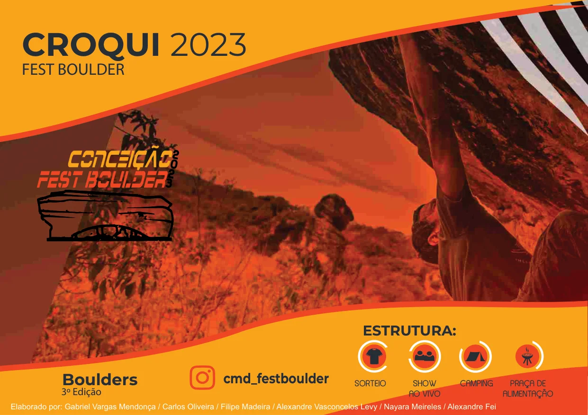
- **status_desenho_extraivel**: DESENHO_EXTRAIDO
- **botoes**:
  - **[0]**:
    - **uid**: hjxudqiZogE6MK
    - **texto**: Capa
    - **destino**:
      - **secao_textual**:
        - **conteudo**:
            # Croqui Fest Boulder 2023
            
            |  |
            | :--: |
            | *Capa do Croqui Fest Boulder 2023* |
            
            **Conceição do Mato Dentro - 2023**
            
            **Elaborado por:**
            - Gabriel Vargas Mendonça
            - Carlos Oliveira
            - Filipe Madeira
            - Alexandre Vasconcelos Levy
            - Nayara Meireles
            - Alexandre Fei
            
            **Estrutura do Evento:**
            - Sorteio
            - Show ao Vivo
            - Camping
            - Praça de Alimentação
            
            **Instagram:** @cmd_festboulder
  - **[1]**:
    - **uid**: 5CvpSELqOUKRch
    - **texto**: Introdução
    - **destino**:
      - **secao_textual**:
        - **conteudo**:
            # Introdução
            
            ## Conceição do Mato Dentro/MG
            
            Considerada a “capital mineira do ecoturismo” – por abrigar inúmeras belezas naturais – CONCEIÇÃO DO MATO DENTRO encontra-se na região central de MINAS GERAIS, na vertente oriental da SERRA DO CIPÓ da CORDILHEIRA DO ESPINHAÇO. Nacionalmente reconhecida como um dos melhores lugares para a prática de escalada em “Boulder”, o local conta com inúmeras linhas já abertas, com nível de dificuldade variando entre V0 a V13, além de diversos projetos que ainda não tiveram SUA PRIMEIRA Ascensão.
            
            ## O Festival
            
            Grande parte dos festivais de escalada no Brasil ocorrem entre os meses de junho a agosto (épocas de estiagem, sem ocorrência de chuvas), e CONCEIÇÃO DO MATO DENTRO não fica de fora desta programação. OUTROS FESTIVAIS OCORREM NA MESMA ÉPOCA, EM OURO PRETO, SABARÁ E MILHO VERDE. Desta forma, tem-se o circuito perfeito, que consideramos o circuito ESTRADA REAL de Boulder.
            
            O principal objetivo deste projeto é atrair e propiciar muita escalada e diversão a todos os participantes, em UM dos picos mais promissores do Brasil para a prática de escalada em “Boulder”.
            
            Boulder é uma das modalidades da escalada em rocha, praticada sem o uso de equipamentos convencionais, como cordas e mosquetões. O boulder consiste em escalar blocos de pedras, onde os movimentos apresentam dificuldade técnica e exigem força.
  - **[2]**:
    - **uid**: H18HjJh2aHerGf
    - **texto**: Pintura Rupestre
    - **destino**:
      - **secao_textual**:
        - **conteudo**:
            # Pintura Rupestre
            
            | 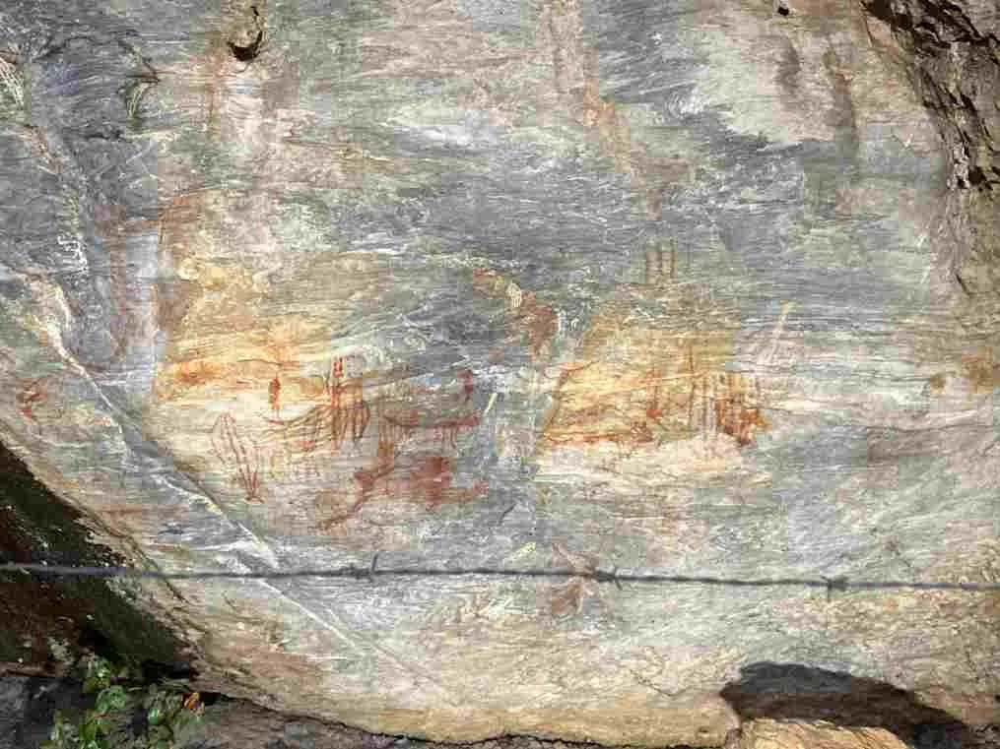 |
            | :--: |
            | *Pinturas Rupestres* |
            
            **PINTURA RUPESTRE, NÃO ESCALE NESSE LOCAL.**
            
            Obs.: Não foram identificadas todas as linhas desse bloco. Certifique-se antes de fazer uma possível primeira ascensão em blocos próximos, respeitando sempre as áreas de preservação.
- **ultima_migracao**: 5
- **revisado_manualmente**: True
- **revisado_bounding_circle**: True
- **publicar_croqui**: True

## Parte: grupo_salao_de_pedras

### Grupo (Pico: Conceição do Mato Dentro)

- **descricao**:
    # Grupo Salão de Pedras
    
    O Salão de Pedras é um dos picos mais tradicionais de Conceição do Mato Dentro, oferecendo uma grande variedade de blocos e linhas de boulder.
- **nome**: Salão de Pedras
- **uid**: erHWzKVZ0X9TlI
- **mapas**:
  - **[0]**:
    - **caminho_imagem_mapa**: 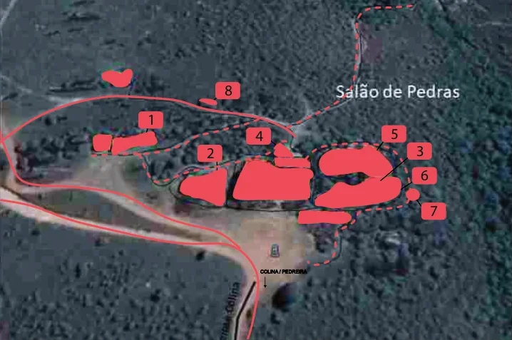
    - **largura_mapa**: 718
    - **altura_mapa**: 477
    - **pontos_de_interesse**:
      - **[0]**:
        - **id**: paVhfWhT7nd8U4
        - **uid**: paVhfWhT7nd8U4
        - **rotulo**: 1
        - **retangulo**:
          - **x**: 212
          - **y**: 169
          - **comprimento**: 35
          - **largura**: 24
        - **label**: 1
      - **[1]**:
        - **id**: gtW4aJUXF38mOa
        - **uid**: gtW4aJUXF38mOa
        - **rotulo**: 2
        - **retangulo**:
          - **x**: 294
          - **y**: 214
          - **comprimento**: 34
          - **largura**: 24
        - **label**: 2
      - **[2]**:
        - **id**: ahAwTNi9FtjKRu
        - **uid**: ahAwTNi9FtjKRu
        - **rotulo**: 3
        - **retangulo**:
          - **x**: 588
          - **y**: 212
          - **comprimento**: 35
          - **largura**: 23
        - **label**: 3
      - **[3]**:
        - **id**: QRczPpK58M2xSx
        - **uid**: QRczPpK58M2xSx
        - **rotulo**: 4
        - **retangulo**:
          - **x**: 362
          - **y**: 191
          - **comprimento**: 35
          - **largura**: 24
        - **label**: 4
      - **[4]**:
        - **id**: Mmq3dhWktQLsmg
        - **uid**: Mmq3dhWktQLsmg
        - **rotulo**: 5
        - **retangulo**:
          - **x**: 552
          - **y**: 188
          - **comprimento**: 35
          - **largura**: 23
        - **label**: 5
      - **[5]**:
        - **id**: b3fPMFNHIebT6n
        - **uid**: b3fPMFNHIebT6n
        - **rotulo**: 6
        - **retangulo**:
          - **x**: 596
          - **y**: 246
          - **comprimento**: 35
          - **largura**: 24
        - **label**: 6
      - **[6]**:
        - **id**: R0YNVd7hR2cyVD
        - **uid**: R0YNVd7hR2cyVD
        - **rotulo**: 7
        - **retangulo**:
          - **x**: 608
          - **y**: 297
          - **comprimento**: 36
          - **largura**: 24
        - **label**: 7
      - **[7]**:
        - **id**: KGsNZLmitDlNDX
        - **uid**: KGsNZLmitDlNDX
        - **rotulo**: 8
        - **retangulo**:
          - **x**: 319
          - **y**: 126
          - **comprimento**: 34
          - **largura**: 23
        - **label**: 8
      - **[8]**:
        - **id**: 22XZ9KBScvnDic
        - **uid**: 22XZ9KBScvnDic
        - **rotulo**: colina_pedreira
        - **retangulo**:
          - **x**: 398
          - **y**: 382
          - **comprimento**: 73
          - **largura**: 13
        - **label**: colina_pedreira
    - **referencias**:
      - **[0]**:
        - **alvo_uid**: laU6kSKcP3t27A
        - **pontos_uids**:
          - paVhfWhT7nd8U4
        - **setor**: Ônibus
        - **ids**:
          - paVhfWhT7nd8U4
      - **[1]**:
        - **alvo_uid**: PNkGaUuHzJplDd
        - **pontos_uids**:
          - gtW4aJUXF38mOa
        - **setor**: Super Herói
        - **ids**:
          - gtW4aJUXF38mOa
      - **[2]**:
        - **alvo_uid**: bAAZiu44azeNKI
        - **pontos_uids**:
          - ahAwTNi9FtjKRu
        - **setor**: Caverninha
        - **ids**:
          - ahAwTNi9FtjKRu
      - **[3]**:
        - **alvo_uid**: 9izKJaq4CxSHRG
        - **pontos_uids**:
          - QRczPpK58M2xSx
        - **setor**: Campo Escola
        - **ids**:
          - QRczPpK58M2xSx
      - **[4]**:
        - **alvo_uid**: VBkLZLZHoBsl6y
        - **pontos_uids**:
          - Mmq3dhWktQLsmg
        - **setor**: Escorpião
        - **ids**:
          - Mmq3dhWktQLsmg
      - **[5]**:
        - **alvo_uid**: oPnH4R0z6pGdpP
        - **pontos_uids**:
          - b3fPMFNHIebT6n
        - **setor**: Troféu
        - **ids**:
          - b3fPMFNHIebT6n
      - **[6]**:
        - **alvo_uid**: oLx7PAaXis7B0M
        - **pontos_uids**:
          - R0YNVd7hR2cyVD
        - **setor**: X-Tudo
        - **ids**:
          - R0YNVd7hR2cyVD
      - **[7]**:
        - **alvo_uid**: sYADkPTjRnYElG
        - **pontos_uids**:
          - KGsNZLmitDlNDX
        - **setor**: Domínio Digital
        - **ids**:
          - KGsNZLmitDlNDX
      - **[8]**:
        - **alvo_uid**: YkAop73CsSuZ6U
        - **pontos_uids**:
          - 22XZ9KBScvnDic
        - **grupo**: Colina
        - **ids**:
          - 22XZ9KBScvnDic
      - **[9]**:
        - **alvo_uid**: fmOEl4JjUwdHIk
        - **pontos_uids**:
          - 22XZ9KBScvnDic
        - **grupo**: Pedreira
        - **ids**:
          - 22XZ9KBScvnDic
- **setores**:
  - **[0]**:
    - **conteudo**:
      - **descricao**:
          # Setor Ônibus
          
          O setor Ônibus possui dois blocos principais com diversas linhas de boulder.
          
          Obs.: Não foram identificadas todas as linhas desse bloco. Certifique-se antes de fazer uma possível primeira ascensão.
      - **nome**: Ônibus
      - **uid**: laU6kSKcP3t27A
      - **mapas**:
        - **[0]**:
          - **caminho_imagem_mapa**: 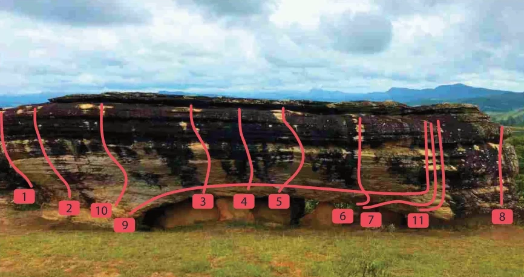
          - **largura_mapa**: 866
          - **altura_mapa**: 458
          - **pontos_de_interesse**:
            - **[0]**:
              - **id**: OJ2Gkqk0aynGVT
              - **uid**: OJ2Gkqk0aynGVT
              - **rotulo**: 1
              - **retangulo**:
                - **x**: 40
                - **y**: 324
                - **comprimento**: 34
                - **largura**: 23
              - **label**: 1
            - **[1]**:
              - **id**: MZrrQvcVkKsY1k
              - **uid**: MZrrQvcVkKsY1k
              - **rotulo**: 2
              - **retangulo**:
                - **x**: 114
                - **y**: 344
                - **comprimento**: 35
                - **largura**: 25
              - **label**: 2
            - **[2]**:
              - **id**: PGMtj9GYSVHde2
              - **uid**: PGMtj9GYSVHde2
              - **rotulo**: 10
              - **retangulo**:
                - **x**: 166
                - **y**: 348
                - **comprimento**: 35
                - **largura**: 24
              - **label**: 10
            - **[3]**:
              - **id**: sViL7BKpUKMqHF
              - **uid**: sViL7BKpUKMqHF
              - **rotulo**: 9
              - **retangulo**:
                - **x**: 205
                - **y**: 372
                - **comprimento**: 34
                - **largura**: 24
              - **label**: 9
            - **[4]**:
              - **id**: ilekHJIYGYT5NK
              - **uid**: ilekHJIYGYT5NK
              - **rotulo**: 3
              - **retangulo**:
                - **x**: 336
                - **y**: 333
                - **comprimento**: 35
                - **largura**: 24
              - **label**: 3
            - **[5]**:
              - **id**: 9p0mxNzSgPhhQr
              - **uid**: 9p0mxNzSgPhhQr
              - **rotulo**: 4
              - **retangulo**:
                - **x**: 403
                - **y**: 333
                - **comprimento**: 34
                - **largura**: 24
              - **label**: 4
            - **[6]**:
              - **id**: Xk0fJxYZO0lZ0U
              - **uid**: Xk0fJxYZO0lZ0U
              - **rotulo**: 5
              - **retangulo**:
                - **x**: 460
                - **y**: 332
                - **comprimento**: 33
                - **largura**: 25
              - **label**: 5
            - **[7]**:
              - **id**: I1vUbH28fNNsBi
              - **uid**: I1vUbH28fNNsBi
              - **rotulo**: 6
              - **retangulo**:
                - **x**: 566
                - **y**: 358
                - **comprimento**: 35
                - **largura**: 23
              - **label**: 6
            - **[8]**:
              - **id**: fUhwEkwEG0YWzQ
              - **uid**: fUhwEkwEG0YWzQ
              - **rotulo**: 7
              - **retangulo**:
                - **x**: 614
                - **y**: 363
                - **comprimento**: 35
                - **largura**: 24
              - **label**: 7
            - **[9]**:
              - **id**: COs89StuB8lKRN
              - **uid**: COs89StuB8lKRN
              - **rotulo**: 11
              - **retangulo**:
                - **x**: 692
                - **y**: 365
                - **comprimento**: 35
                - **largura**: 24
              - **label**: 11
            - **[10]**:
              - **id**: 2N3B9okzvbckgH
              - **uid**: 2N3B9okzvbckgH
              - **rotulo**: 8
              - **retangulo**:
                - **x**: 830
                - **y**: 358
                - **comprimento**: 33
                - **largura**: 24
              - **label**: 8
          - **referencias**:
            - **[0]**:
              - **alvo_uid**: svKnMdTa88USAN
              - **pontos_uids**:
                - OJ2Gkqk0aynGVT
              - **escalada**: Pirulito
              - **ids**:
                - OJ2Gkqk0aynGVT
            - **[1]**:
              - **alvo_uid**: hgrTSI69mgY14p
              - **pontos_uids**:
                - MZrrQvcVkKsY1k
              - **escalada**: Trocador
              - **ids**:
                - MZrrQvcVkKsY1k
            - **[2]**:
              - **alvo_uid**: 34WARZT74wkQuc
              - **pontos_uids**:
                - ilekHJIYGYT5NK
              - **escalada**: Roleta
              - **ids**:
                - ilekHJIYGYT5NK
            - **[3]**:
              - **alvo_uid**: vSMvGheV4q5Yiz
              - **pontos_uids**:
                - 9p0mxNzSgPhhQr
              - **escalada**: Zebra
              - **ids**:
                - 9p0mxNzSgPhhQr
            - **[4]**:
              - **alvo_uid**: LzKABjlQVQKyCa
              - **pontos_uids**:
                - Xk0fJxYZO0lZ0U
              - **escalada**: Linguinha
              - **ids**:
                - Xk0fJxYZO0lZ0U
            - **[5]**:
              - **alvo_uid**: LAjdfyHlIdZiuJ
              - **pontos_uids**:
                - I1vUbH28fNNsBi
              - **escalada**: Gnomo
              - **ids**:
                - I1vUbH28fNNsBi
            - **[6]**:
              - **alvo_uid**: 2RF2rNvHTgfFVJ
              - **pontos_uids**:
                - fUhwEkwEG0YWzQ
              - **escalada**: Variante Y
              - **ids**:
                - fUhwEkwEG0YWzQ
            - **[7]**:
              - **alvo_uid**: e9uQGKYTwsDAz2
              - **pontos_uids**:
                - 2N3B9okzvbckgH
              - **escalada**: Moleza
              - **ids**:
                - 2N3B9okzvbckgH
            - **[8]**:
              - **alvo_uid**: O9nrKUrZo4xbut
              - **pontos_uids**:
                - sViL7BKpUKMqHF
              - **escalada**: Inconsolável
              - **ids**:
                - sViL7BKpUKMqHF
            - **[9]**:
              - **alvo_uid**: meCbwNobNG8aTT
              - **pontos_uids**:
                - PGMtj9GYSVHde2
              - **escalada**: Passageiro
              - **ids**:
                - PGMtj9GYSVHde2
            - **[10]**:
              - **alvo_uid**: vUoOdWrT9pOJIh
              - **pontos_uids**:
                - COs89StuB8lKRN
              - **escalada**: Fada
              - **ids**:
                - COs89StuB8lKRN
        - **[1]**:
          - **caminho_imagem_mapa**: 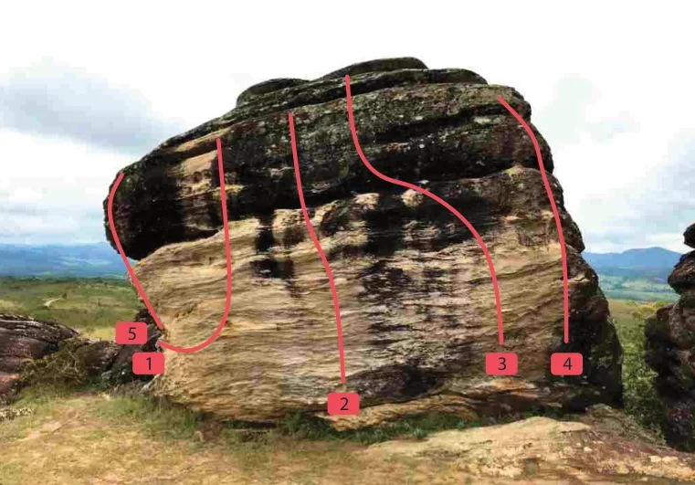
          - **largura_mapa**: 761
          - **altura_mapa**: 531
          - **pontos_de_interesse**:
            - **[0]**:
              - **id**: DOaVJrM4Bn2eT8
              - **uid**: DOaVJrM4Bn2eT8
              - **rotulo**: 1
              - **retangulo**:
                - **x**: 162
                - **y**: 398
                - **comprimento**: 35
                - **largura**: 23
              - **label**: 1
            - **[1]**:
              - **id**: 70BHw7Mw0uHi2i
              - **uid**: 70BHw7Mw0uHi2i
              - **rotulo**: 2
              - **retangulo**:
                - **x**: 376
                - **y**: 442
                - **comprimento**: 36
                - **largura**: 24
              - **label**: 2
            - **[2]**:
              - **id**: k1bm3HQJs24zEv
              - **uid**: k1bm3HQJs24zEv
              - **rotulo**: 3
              - **retangulo**:
                - **x**: 549
                - **y**: 398
                - **comprimento**: 34
                - **largura**: 24
              - **label**: 3
            - **[3]**:
              - **id**: VS9PZpaks1SdKD
              - **uid**: VS9PZpaks1SdKD
              - **rotulo**: 4
              - **retangulo**:
                - **x**: 620
                - **y**: 398
                - **comprimento**: 33
                - **largura**: 23
              - **label**: 4
            - **[4]**:
              - **id**: MaqJP7ZjytmXel
              - **uid**: MaqJP7ZjytmXel
              - **rotulo**: 5
              - **retangulo**:
                - **x**: 143
                - **y**: 364
                - **comprimento**: 36
                - **largura**: 24
              - **label**: 5
          - **referencias**:
            - **[0]**:
              - **alvo_uid**: LKoYJNVnOFTlMz
              - **pontos_uids**:
                - DOaVJrM4Bn2eT8
              - **escalada**: Primeiro Esquenta
              - **ids**:
                - DOaVJrM4Bn2eT8
            - **[1]**:
              - **alvo_uid**: bt0qGEEKpB2BTu
              - **pontos_uids**:
                - 70BHw7Mw0uHi2i
              - **escalada**: Mimetismo
              - **ids**:
                - 70BHw7Mw0uHi2i
            - **[2]**:
              - **alvo_uid**: tyA1VoilXbFYdT
              - **pontos_uids**:
                - k1bm3HQJs24zEv
              - **escalada**: Aborda
              - **ids**:
                - k1bm3HQJs24zEv
            - **[3]**:
              - **alvo_uid**: CMbWEUuwZDbbMJ
              - **pontos_uids**:
                - VS9PZpaks1SdKD
              - **escalada**: Easy Line
              - **ids**:
                - VS9PZpaks1SdKD
            - **[4]**:
              - **alvo_uid**: 6DnQrBC73d1sYU
              - **pontos_uids**:
                - MaqJP7ZjytmXel
              - **escalada**: Saidex
              - **ids**:
                - MaqJP7ZjytmXel
      - **escaladas**:
        - **[0]**:
          - **uid**: svKnMdTa88USAN
          - **boulder**:
            - **nome**: Pirulito
            - **dificuldade**: V1
        - **[1]**:
          - **uid**: hgrTSI69mgY14p
          - **boulder**:
            - **nome**: Trocador
            - **dificuldade**: V6
        - **[2]**:
          - **uid**: 34WARZT74wkQuc
          - **boulder**:
            - **nome**: Roleta
            - **dificuldade**: V8
        - **[3]**:
          - **uid**: vSMvGheV4q5Yiz
          - **boulder**:
            - **nome**: Zebra
            - **dificuldade**: V7
        - **[4]**:
          - **uid**: LzKABjlQVQKyCa
          - **boulder**:
            - **nome**: Linguinha
            - **dificuldade**: V6
        - **[5]**:
          - **uid**: LAjdfyHlIdZiuJ
          - **boulder**:
            - **nome**: Gnomo
            - **dificuldade**: V5
        - **[6]**:
          - **uid**: 2RF2rNvHTgfFVJ
          - **boulder**:
            - **nome**: Variante Y
            - **dificuldade**: V4
        - **[7]**:
          - **uid**: e9uQGKYTwsDAz2
          - **boulder**:
            - **nome**: Moleza
            - **dificuldade**: V0
        - **[8]**:
          - **uid**: O9nrKUrZo4xbut
          - **boulder**:
            - **nome**: Inconsolável
            - **dificuldade**: V6
        - **[9]**:
          - **uid**: meCbwNobNG8aTT
          - **boulder**:
            - **nome**: Passageiro
            - **dificuldade**: V4
        - **[10]**:
          - **uid**: vUoOdWrT9pOJIh
          - **boulder**:
            - **nome**: Fada
            - **dificuldade**: V1
        - **[11]**:
          - **uid**: LKoYJNVnOFTlMz
          - **boulder**:
            - **nome**: Primeiro Esquenta
            - **dificuldade**: V1
        - **[12]**:
          - **uid**: bt0qGEEKpB2BTu
          - **boulder**:
            - **nome**: Mimetismo
            - **dificuldade**: V4
        - **[13]**:
          - **uid**: tyA1VoilXbFYdT
          - **boulder**:
            - **nome**: Aborda
            - **dificuldade**: V4
        - **[14]**:
          - **uid**: CMbWEUuwZDbbMJ
          - **boulder**:
            - **nome**: Easy Line
            - **dificuldade**: V1
        - **[15]**:
          - **uid**: 6DnQrBC73d1sYU
          - **boulder**:
            - **nome**: Saidex
            - **dificuldade**: V1
      - **precomputados**:
        - **total_escaladas**: 16
        - **total_boulders**: 16
  - **[1]**:
    - **conteudo**:
      - **descricao**:
          # Setor Super Herói
          
          O setor Super Herói possui linhas clássicas em um bloco bem característico.
          
          Obs.: Não foram identificadas todas as linhas desse bloco. Certifique-se antes de fazer uma possível primeira ascensão.
      - **nome**: Super Herói
      - **uid**: PNkGaUuHzJplDd
      - **mapas**:
        - **[0]**:
          - **caminho_imagem_mapa**: 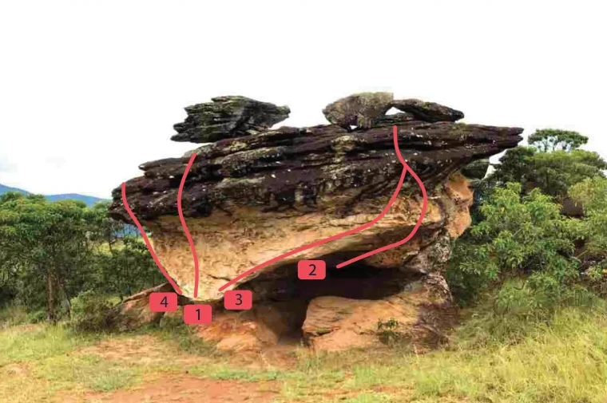
          - **largura_mapa**: 760
          - **altura_mapa**: 505
          - **pontos_de_interesse**:
            - **[0]**:
              - **id**: JI406fC0wcM9q2
              - **uid**: JI406fC0wcM9q2
              - **rotulo**: 1
              - **retangulo**:
                - **x**: 248
                - **y**: 394
                - **comprimento**: 34
                - **largura**: 24
              - **label**: 1
            - **[1]**:
              - **id**: y7ZZ9balCG1zLE
              - **uid**: y7ZZ9balCG1zLE
              - **rotulo**: 2
              - **retangulo**:
                - **x**: 390
                - **y**: 338
                - **comprimento**: 34
                - **largura**: 23
              - **label**: 2
            - **[2]**:
              - **id**: RG4RyEIf2fzh4E
              - **uid**: RG4RyEIf2fzh4E
              - **rotulo**: 3
              - **retangulo**:
                - **x**: 299
                - **y**: 376
                - **comprimento**: 34
                - **largura**: 24
              - **label**: 3
            - **[3]**:
              - **id**: uvEJ7jz8KwgY11
              - **uid**: uvEJ7jz8KwgY11
              - **rotulo**: 4
              - **retangulo**:
                - **x**: 206
                - **y**: 378
                - **comprimento**: 33
                - **largura**: 24
              - **label**: 4
          - **referencias**:
            - **[0]**:
              - **alvo_uid**: bzsaLrx63qEIiz
              - **pontos_uids**:
                - JI406fC0wcM9q2
              - **escalada**: Super Homem
              - **ids**:
                - JI406fC0wcM9q2
            - **[1]**:
              - **alvo_uid**: 2wnz93Zx8M3XGr
              - **pontos_uids**:
                - y7ZZ9balCG1zLE
              - **escalada**: Super Herói Cover
              - **ids**:
                - y7ZZ9balCG1zLE
            - **[2]**:
              - **alvo_uid**: piYkbTXDlh9YDm
              - **pontos_uids**:
                - RG4RyEIf2fzh4E
              - **escalada**: Herói
              - **ids**:
                - RG4RyEIf2fzh4E
            - **[3]**:
              - **alvo_uid**: NgAqK5JUuiVbfm
              - **pontos_uids**:
                - uvEJ7jz8KwgY11
              - **escalada**: Heroína
              - **ids**:
                - uvEJ7jz8KwgY11
      - **escaladas**:
        - **[0]**:
          - **uid**: bzsaLrx63qEIiz
          - **boulder**:
            - **nome**: Super Homem
            - **dificuldade**: V1
        - **[1]**:
          - **uid**: 2wnz93Zx8M3XGr
          - **boulder**:
            - **nome**: Super Herói Cover
            - **dificuldade**: V5
        - **[2]**:
          - **uid**: piYkbTXDlh9YDm
          - **boulder**:
            - **nome**: Herói
            - **dificuldade**: V4
        - **[3]**:
          - **uid**: NgAqK5JUuiVbfm
          - **boulder**:
            - **nome**: Heroína
            - **dificuldade**: V3
      - **precomputados**:
        - **total_escaladas**: 4
        - **total_boulders**: 4
  - **[2]**:
    - **conteudo**:
      - **descricao**:
          # Setor Caverninha
          
          O setor Caverninha possui tetos e negativos com linhas de alta dificuldade.
          
          Obs.: Não foram identificadas todas as linhas desse bloco. Certifique-se antes de fazer uma possível primeira ascensão.
      - **nome**: Caverninha
      - **uid**: bAAZiu44azeNKI
      - **mapas**:
        - **[0]**:
          - **caminho_imagem_mapa**: 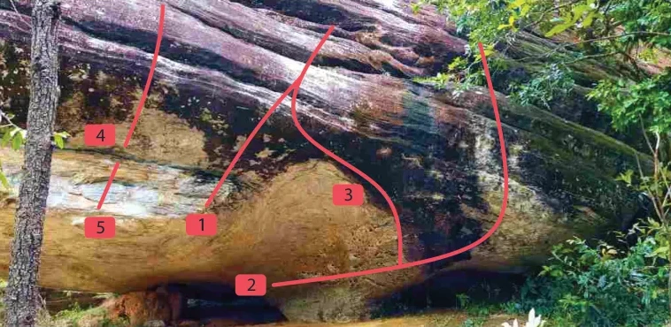
          - **largura_mapa**: 758
          - **altura_mapa**: 370
          - **pontos_de_interesse**:
            - **[0]**:
              - **id**: pF39IxcFHTGpkN
              - **uid**: pF39IxcFHTGpkN
              - **rotulo**: 1
              - **retangulo**:
                - **x**: 227
                - **y**: 254
                - **comprimento**: 34
                - **largura**: 24
              - **label**: 1
            - **[1]**:
              - **id**: fjOlaECZ5LBIfw
              - **uid**: fjOlaECZ5LBIfw
              - **rotulo**: 2
              - **retangulo**:
                - **x**: 283
                - **y**: 322
                - **comprimento**: 34
                - **largura**: 24
              - **label**: 2
            - **[2]**:
              - **id**: Q90njhbjf3qhvv
              - **uid**: Q90njhbjf3qhvv
              - **rotulo**: 3
              - **retangulo**:
                - **x**: 392
                - **y**: 220
                - **comprimento**: 36
                - **largura**: 25
              - **label**: 3
            - **[3]**:
              - **id**: jl0mD7RKylxUYB
              - **uid**: jl0mD7RKylxUYB
              - **rotulo**: 4
              - **retangulo**:
                - **x**: 114
                - **y**: 152
                - **comprimento**: 35
                - **largura**: 24
              - **label**: 4
            - **[4]**:
              - **id**: m0gdBDOeRd89Ox
              - **uid**: m0gdBDOeRd89Ox
              - **rotulo**: 5
              - **retangulo**:
                - **x**: 113
                - **y**: 258
                - **comprimento**: 34
                - **largura**: 25
              - **label**: 5
          - **referencias**:
            - **[0]**:
              - **alvo_uid**: VkiYY5YgoyChOu
              - **pontos_uids**:
                - pF39IxcFHTGpkN
              - **escalada**: Terceira Camada
              - **ids**:
                - pF39IxcFHTGpkN
            - **[1]**:
              - **alvo_uid**: 1Np4DknQFwIl4j
              - **pontos_uids**:
                - fjOlaECZ5LBIfw
              - **escalada**: Caverninha
              - **ids**:
                - fjOlaECZ5LBIfw
            - **[2]**:
              - **alvo_uid**: so8pB0wMtUAfHi
              - **pontos_uids**:
                - Q90njhbjf3qhvv
              - **escalada**: Cavernoso
              - **ids**:
                - Q90njhbjf3qhvv
            - **[3]**:
              - **alvo_uid**: Tm0rR2tkD5SAqs
              - **pontos_uids**:
                - jl0mD7RKylxUYB
              - **escalada**: Natural
              - **ids**:
                - jl0mD7RKylxUYB
            - **[4]**:
              - **alvo_uid**: R08ZauiGqeLqW1
              - **pontos_uids**:
                - m0gdBDOeRd89Ox
              - **escalada**: Natural SDS
              - **ids**:
                - m0gdBDOeRd89Ox
        - **[1]**:
          - **caminho_imagem_mapa**: 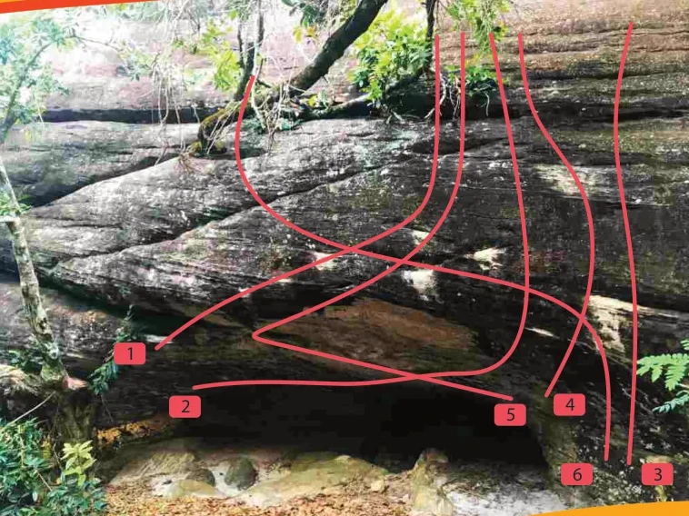
          - **largura_mapa**: 758
          - **altura_mapa**: 568
          - **pontos_de_interesse**:
            - **[0]**:
              - **id**: 9aDZfbo3dfJCbo
              - **uid**: 9aDZfbo3dfJCbo
              - **rotulo**: 1
              - **retangulo**:
                - **x**: 143
                - **y**: 390
                - **comprimento**: 34
                - **largura**: 23
              - **label**: 1
            - **[1]**:
              - **id**: SE8CbHeCLpWSBv
              - **uid**: SE8CbHeCLpWSBv
              - **rotulo**: 2
              - **retangulo**:
                - **x**: 203
                - **y**: 448
                - **comprimento**: 34
                - **largura**: 23
              - **label**: 2
            - **[2]**:
              - **id**: ysGskp1azUDfao
              - **uid**: ysGskp1azUDfao
              - **rotulo**: 3
              - **retangulo**:
                - **x**: 722
                - **y**: 522
                - **comprimento**: 33
                - **largura**: 23
              - **label**: 3
            - **[3]**:
              - **id**: PQNVakCAY2suGz
              - **uid**: PQNVakCAY2suGz
              - **rotulo**: 4
              - **retangulo**:
                - **x**: 626
                - **y**: 445
                - **comprimento**: 34
                - **largura**: 24
              - **label**: 4
            - **[4]**:
              - **id**: qpRFhB6mOPDCOC
              - **uid**: qpRFhB6mOPDCOC
              - **rotulo**: 5
              - **retangulo**:
                - **x**: 562
                - **y**: 456
                - **comprimento**: 33
                - **largura**: 23
              - **label**: 5
            - **[5]**:
              - **id**: vNISXvJwnadRVC
              - **uid**: vNISXvJwnadRVC
              - **rotulo**: 6
              - **retangulo**:
                - **x**: 635
                - **y**: 522
                - **comprimento**: 34
                - **largura**: 24
              - **label**: 6
          - **referencias**:
            - **[0]**:
              - **alvo_uid**: M5mMxn1ZM171F7
              - **pontos_uids**:
                - 9aDZfbo3dfJCbo
              - **escalada**: Simba
              - **ids**:
                - 9aDZfbo3dfJCbo
            - **[1]**:
              - **alvo_uid**: LcnJUDU0A8cw1i
              - **pontos_uids**:
                - SE8CbHeCLpWSBv
              - **escalada**: Dragão
              - **ids**:
                - SE8CbHeCLpWSBv
            - **[2]**:
              - **alvo_uid**: tmHX9c9KqkMXZg
              - **pontos_uids**:
                - ysGskp1azUDfao
              - **escalada**: Abaulados
              - **ids**:
                - ysGskp1azUDfao
            - **[3]**:
              - **alvo_uid**: zCviMgwQrcc6DM
              - **pontos_uids**:
                - PQNVakCAY2suGz
              - **escalada**: Simba (2o)
              - **ids**:
                - PQNVakCAY2suGz
            - **[4]**:
              - **alvo_uid**: VX64H0zlEyNrpQ
              - **pontos_uids**:
                - qpRFhB6mOPDCOC
              - **escalada**: Capitão Caverna
              - **ids**:
                - qpRFhB6mOPDCOC
            - **[5]**:
              - **alvo_uid**: w5czhnbtn5j66H
              - **pontos_uids**:
                - vNISXvJwnadRVC
              - **escalada**: Confuso
              - **ids**:
                - vNISXvJwnadRVC
        - **[2]**:
          - **caminho_imagem_mapa**: 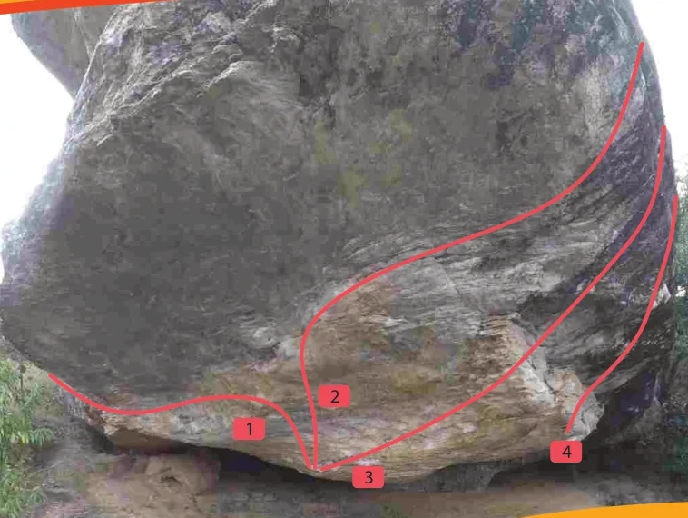
          - **largura_mapa**: 758
          - **altura_mapa**: 570
          - **pontos_de_interesse**:
            - **[0]**:
              - **id**: YCXt1v4CbuXW3g
              - **uid**: YCXt1v4CbuXW3g
              - **rotulo**: 1
              - **retangulo**:
                - **x**: 274
                - **y**: 472
                - **comprimento**: 35
                - **largura**: 23
              - **label**: 1
            - **[1]**:
              - **id**: aGRHgGZLhcFSrR
              - **uid**: aGRHgGZLhcFSrR
              - **rotulo**: 2
              - **retangulo**:
                - **x**: 368
                - **y**: 436
                - **comprimento**: 37
                - **largura**: 24
              - **label**: 2
            - **[2]**:
              - **id**: b10jvmA92maiIk
              - **uid**: b10jvmA92maiIk
              - **rotulo**: 3
              - **retangulo**:
                - **x**: 406
                - **y**: 524
                - **comprimento**: 34
                - **largura**: 25
              - **label**: 3
            - **[3]**:
              - **id**: CLQMUPGmRgg9wk
              - **uid**: CLQMUPGmRgg9wk
              - **rotulo**: 4
              - **retangulo**:
                - **x**: 624
                - **y**: 496
                - **comprimento**: 35
                - **largura**: 25
              - **label**: 4
          - **referencias**:
            - **[0]**:
              - **alvo_uid**: cMTK5dfoy4Pio2
              - **pontos_uids**:
                - YCXt1v4CbuXW3g
              - **escalada**: Combinação Perfeita
              - **ids**:
                - YCXt1v4CbuXW3g
            - **[1]**:
              - **alvo_uid**: XcncezH38s5P3Y
              - **pontos_uids**:
                - aGRHgGZLhcFSrR
              - **escalada**: Trinca Ferro
              - **ids**:
                - aGRHgGZLhcFSrR
            - **[2]**:
              - **alvo_uid**: 1uqkKSjBhu2dXa
              - **pontos_uids**:
                - b10jvmA92maiIk
              - **escalada**: Trinca Carangueijo
              - **ids**:
                - b10jvmA92maiIk
            - **[3]**:
              - **alvo_uid**: w5STyttGj8ONgt
              - **pontos_uids**:
                - CLQMUPGmRgg9wk
              - **escalada**: Natural (V6)
              - **ids**:
                - CLQMUPGmRgg9wk
      - **escaladas**:
        - **[0]**:
          - **uid**: VkiYY5YgoyChOu
          - **boulder**:
            - **nome**: Terceira Camada
            - **dificuldade**: V5
        - **[1]**:
          - **uid**: 1Np4DknQFwIl4j
          - **boulder**:
            - **nome**: Caverninha
            - **dificuldade**: V4
        - **[2]**:
          - **uid**: so8pB0wMtUAfHi
          - **boulder**:
            - **nome**: Cavernoso
            - **dificuldade**: V7
        - **[3]**:
          - **uid**: Tm0rR2tkD5SAqs
          - **boulder**:
            - **nome**: Natural
            - **dificuldade**: V5
        - **[4]**:
          - **uid**: R08ZauiGqeLqW1
          - **boulder**:
            - **nome**: Natural SDS
            - **dificuldade**: V8
        - **[5]**:
          - **uid**: M5mMxn1ZM171F7
          - **boulder**:
            - **nome**: Simba
            - **dificuldade**: V8
        - **[6]**:
          - **uid**: LcnJUDU0A8cw1i
          - **boulder**:
            - **nome**: Dragão
            - **dificuldade**: V7
        - **[7]**:
          - **uid**: tmHX9c9KqkMXZg
          - **boulder**:
            - **nome**: Abaulados
            - **dificuldade**: V3
        - **[8]**:
          - **uid**: zCviMgwQrcc6DM
          - **boulder**:
            - **nome**: Simba (2o)
            - **dificuldade**: V8
        - **[9]**:
          - **uid**: VX64H0zlEyNrpQ
          - **boulder**:
            - **nome**: Capitão Caverna
            - **dificuldade**: V6
        - **[10]**:
          - **uid**: w5czhnbtn5j66H
          - **boulder**:
            - **nome**: Confuso
            - **dificuldade**: V6
        - **[11]**:
          - **uid**: cMTK5dfoy4Pio2
          - **boulder**:
            - **nome**: Combinação Perfeita
            - **dificuldade**: V12
        - **[12]**:
          - **uid**: XcncezH38s5P3Y
          - **boulder**:
            - **nome**: Trinca Ferro
            - **dificuldade**: V11
        - **[13]**:
          - **uid**: 1uqkKSjBhu2dXa
          - **boulder**:
            - **nome**: Trinca Carangueijo
            - **dificuldade**: V8
        - **[14]**:
          - **uid**: w5STyttGj8ONgt
          - **boulder**:
            - **nome**: Natural (V6)
            - **dificuldade**: V6
      - **precomputados**:
        - **total_escaladas**: 15
        - **total_boulders**: 15
  - **[3]**:
    - **conteudo**:
      - **descricao**:
          # Setor Campo Escola
          
          O setor Campo Escola é ideal para iniciantes e para quem busca linhas de boulder mais acessíveis.
          
          Obs.: Não foram identificadas todas as linhas desse bloco. Certique-se antes de fazer uma possível primeira ascensão.
      - **nome**: Campo Escola
      - **uid**: 9izKJaq4CxSHRG
      - **mapas**:
        - **[0]**:
          - **caminho_imagem_mapa**: 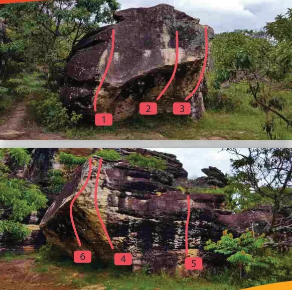
          - **largura_mapa**: 582
          - **altura_mapa**: 577
          - **pontos_de_interesse**:
            - **[0]**:
              - **id**: rOizVpGjVY57Dc
              - **uid**: rOizVpGjVY57Dc
              - **rotulo**: 1
              - **retangulo**:
                - **x**: 206
                - **y**: 238
                - **comprimento**: 35
                - **largura**: 24
              - **label**: 1
            - **[1]**:
              - **id**: tXJyv48GOHN54D
              - **uid**: tXJyv48GOHN54D
              - **rotulo**: 2
              - **retangulo**:
                - **x**: 296
                - **y**: 216
                - **comprimento**: 34
                - **largura**: 25
              - **label**: 2
            - **[2]**:
              - **id**: y8P9qYX9uaZzln
              - **uid**: y8P9qYX9uaZzln
              - **rotulo**: 3
              - **retangulo**:
                - **x**: 362
                - **y**: 216
                - **comprimento**: 35
                - **largura**: 22
              - **label**: 3
            - **[3]**:
              - **id**: nvDCRyCvsajHQ5
              - **uid**: nvDCRyCvsajHQ5
              - **rotulo**: 6
              - **retangulo**:
                - **x**: 164
                - **y**: 510
                - **comprimento**: 35
                - **largura**: 25
              - **label**: 6
            - **[4]**:
              - **id**: of7e00fNptPjA5
              - **uid**: of7e00fNptPjA5
              - **rotulo**: 4
              - **retangulo**:
                - **x**: 245
                - **y**: 516
                - **comprimento**: 34
                - **largura**: 23
              - **label**: 4
            - **[5]**:
              - **id**: yteQ9DNtfd4mLD
              - **uid**: yteQ9DNtfd4mLD
              - **rotulo**: 5
              - **retangulo**:
                - **x**: 386
                - **y**: 524
                - **comprimento**: 35
                - **largura**: 24
              - **label**: 5
          - **referencias**:
            - **[0]**:
              - **alvo_uid**: BLQeeOudJ3kTK6
              - **pontos_uids**:
                - rOizVpGjVY57Dc
              - **escalada**: Tré Bien
              - **ids**:
                - rOizVpGjVY57Dc
            - **[1]**:
              - **alvo_uid**: K46a1bmGUgjExS
              - **pontos_uids**:
                - tXJyv48GOHN54D
              - **escalada**: Muvuca
              - **ids**:
                - tXJyv48GOHN54D
            - **[2]**:
              - **alvo_uid**: 1njiQItker8sc9
              - **pontos_uids**:
                - y8P9qYX9uaZzln
              - **escalada**: Ninja de Verde
              - **ids**:
                - y8P9qYX9uaZzln
            - **[3]**:
              - **alvo_uid**: AowRHIGzd1U4lV
              - **pontos_uids**:
                - of7e00fNptPjA5
              - **escalada**: Ninja de Amarelo
              - **ids**:
                - of7e00fNptPjA5
            - **[4]**:
              - **alvo_uid**: e3v7FwYwnYNoXz
              - **pontos_uids**:
                - yteQ9DNtfd4mLD
              - **escalada**: Ninja de Rosa
              - **ids**:
                - yteQ9DNtfd4mLD
            - **[5]**:
              - **alvo_uid**: XU2TUs5togbQx1
              - **pontos_uids**:
                - nvDCRyCvsajHQ5
              - **escalada**: Casé
              - **ids**:
                - nvDCRyCvsajHQ5
        - **[1]**:
          - **caminho_imagem_mapa**: 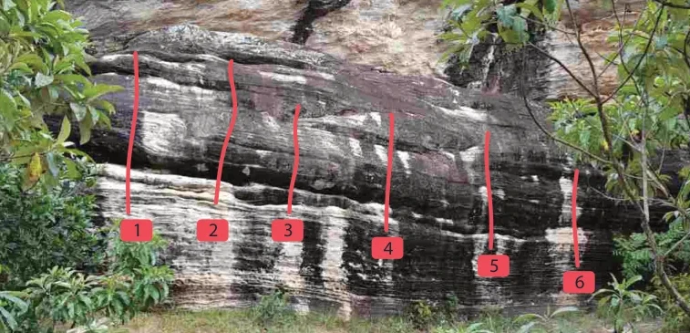
          - **largura_mapa**: 757
          - **altura_mapa**: 365
          - **pontos_de_interesse**:
            - **[0]**:
              - **id**: ow38ccXpJkXMgH
              - **uid**: ow38ccXpJkXMgH
              - **rotulo**: 1
              - **retangulo**:
                - **x**: 149
                - **y**: 252
                - **comprimento**: 34
                - **largura**: 24
              - **label**: 1
            - **[1]**:
              - **id**: QFIB2Xzv2sIbby
              - **uid**: QFIB2Xzv2sIbby
              - **rotulo**: 2
              - **retangulo**:
                - **x**: 234
                - **y**: 252
                - **comprimento**: 35
                - **largura**: 23
              - **label**: 2
            - **[2]**:
              - **id**: EnB7LXk3Kr5qIP
              - **uid**: EnB7LXk3Kr5qIP
              - **rotulo**: 3
              - **retangulo**:
                - **x**: 315
                - **y**: 253
                - **comprimento**: 34
                - **largura**: 24
              - **label**: 3
            - **[3]**:
              - **id**: no5hEGavYJp8c9
              - **uid**: no5hEGavYJp8c9
              - **rotulo**: 4
              - **retangulo**:
                - **x**: 426
                - **y**: 272
                - **comprimento**: 35
                - **largura**: 23
              - **label**: 4
            - **[4]**:
              - **id**: 7Z1U5yD73t3NxI
              - **uid**: 7Z1U5yD73t3NxI
              - **rotulo**: 5
              - **retangulo**:
                - **x**: 541
                - **y**: 292
                - **comprimento**: 36
                - **largura**: 23
              - **label**: 5
            - **[5]**:
              - **id**: ryUcaD9FSBUtyF
              - **uid**: ryUcaD9FSBUtyF
              - **rotulo**: 6
              - **retangulo**:
                - **x**: 635
                - **y**: 309
                - **comprimento**: 34
                - **largura**: 24
              - **label**: 6
          - **referencias**:
            - **[0]**:
              - **alvo_uid**: kLTxqVnzasbpgr
              - **pontos_uids**:
                - ow38ccXpJkXMgH
              - **escalada**: (sem nome 25)
              - **ids**:
                - ow38ccXpJkXMgH
            - **[1]**:
              - **alvo_uid**: 82vRwc1isGbGnu
              - **pontos_uids**:
                - QFIB2Xzv2sIbby
              - **escalada**: (sem nome 26)
              - **ids**:
                - QFIB2Xzv2sIbby
            - **[2]**:
              - **alvo_uid**: 1toeKS5kWBih69
              - **pontos_uids**:
                - EnB7LXk3Kr5qIP
              - **escalada**: (sem nome 27)
              - **ids**:
                - EnB7LXk3Kr5qIP
            - **[3]**:
              - **alvo_uid**: JQkqeS2NvyrbCc
              - **pontos_uids**:
                - no5hEGavYJp8c9
              - **escalada**: (sem nome 28)
              - **ids**:
                - no5hEGavYJp8c9
            - **[4]**:
              - **alvo_uid**: QrWLeAk3qnUHSU
              - **pontos_uids**:
                - 7Z1U5yD73t3NxI
              - **escalada**: (sem nome 29)
              - **ids**:
                - 7Z1U5yD73t3NxI
            - **[5]**:
              - **alvo_uid**: olxgL8RMoByqsx
              - **pontos_uids**:
                - ryUcaD9FSBUtyF
              - **escalada**: Das Meninas
              - **ids**:
                - ryUcaD9FSBUtyF
      - **escaladas**:
        - **[0]**:
          - **uid**: BLQeeOudJ3kTK6
          - **boulder**:
            - **nome**: Tré Bien
            - **dificuldade**: V5
        - **[1]**:
          - **uid**: K46a1bmGUgjExS
          - **boulder**:
            - **nome**: Muvuca
            - **dificuldade**: V4
        - **[2]**:
          - **uid**: 1njiQItker8sc9
          - **boulder**:
            - **nome**: Ninja de Verde
            - **dificuldade**: V1
        - **[3]**:
          - **uid**: AowRHIGzd1U4lV
          - **boulder**:
            - **nome**: Ninja de Amarelo
            - **dificuldade**: V1
        - **[4]**:
          - **uid**: e3v7FwYwnYNoXz
          - **boulder**:
            - **nome**: Ninja de Rosa
            - **dificuldade**: V0
        - **[5]**:
          - **uid**: XU2TUs5togbQx1
          - **boulder**:
            - **nome**: Casé
            - **dificuldade**: V3
        - **[6]**:
          - **uid**: kLTxqVnzasbpgr
          - **boulder**:
            - **nome**: (sem nome 25)
            - **dificuldade**: V0
        - **[7]**:
          - **uid**: 82vRwc1isGbGnu
          - **boulder**:
            - **nome**: (sem nome 26)
            - **dificuldade**: V1
        - **[8]**:
          - **uid**: 1toeKS5kWBih69
          - **boulder**:
            - **nome**: (sem nome 27)
            - **dificuldade**: V1
        - **[9]**:
          - **uid**: JQkqeS2NvyrbCc
          - **boulder**:
            - **nome**: (sem nome 28)
            - **dificuldade**: V1
        - **[10]**:
          - **uid**: QrWLeAk3qnUHSU
          - **boulder**:
            - **nome**: (sem nome 29)
            - **dificuldade**: V1
        - **[11]**:
          - **uid**: olxgL8RMoByqsx
          - **boulder**:
            - **nome**: Das Meninas
            - **dificuldade**: V3
      - **precomputados**:
        - **total_escaladas**: 12
        - **total_boulders**: 12
  - **[4]**:
    - **conteudo**:
      - **descricao**:
          # Setor Escorpião
          
          O setor Escorpião apresenta boulders com movimentos técnicos e agarras específicas.
          
          Obs.: Não foram identificadas todas as linhas desse bloco. Certifique-se antes de fazer uma possível primeira ascensão.
      - **nome**: Escorpião
      - **uid**: VBkLZLZHoBsl6y
      - **mapas**:
        - **[0]**:
          - **caminho_imagem_mapa**: 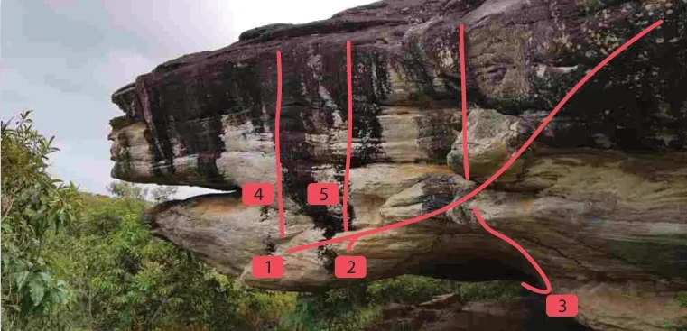
          - **largura_mapa**: 761
          - **altura_mapa**: 367
          - **pontos_de_interesse**:
            - **[0]**:
              - **id**: W6fl3nyVSO8zYr
              - **uid**: W6fl3nyVSO8zYr
              - **rotulo**: 1
              - **retangulo**:
                - **x**: 297
                - **y**: 296
                - **comprimento**: 36
                - **largura**: 24
              - **label**: 1
            - **[1]**:
              - **id**: HzKW2zKWqcFwKo
              - **uid**: HzKW2zKWqcFwKo
              - **rotulo**: 2
              - **retangulo**:
                - **x**: 388
                - **y**: 296
                - **comprimento**: 34
                - **largura**: 25
              - **label**: 2
            - **[2]**:
              - **id**: Klwl5UK7aJAmj9
              - **uid**: Klwl5UK7aJAmj9
              - **rotulo**: 3
              - **retangulo**:
                - **x**: 623
                - **y**: 339
                - **comprimento**: 34
                - **largura**: 24
              - **label**: 3
            - **[3]**:
              - **id**: PTzZTIEiSkag08
              - **uid**: PTzZTIEiSkag08
              - **rotulo**: 4
              - **retangulo**:
                - **x**: 286
                - **y**: 216
                - **comprimento**: 33
                - **largura**: 23
              - **label**: 4
            - **[4]**:
              - **id**: k0XSdMArLBkPrL
              - **uid**: k0XSdMArLBkPrL
              - **rotulo**: 5
              - **retangulo**:
                - **x**: 358
                - **y**: 215
                - **comprimento**: 35
                - **largura**: 24
              - **label**: 5
          - **referencias**:
            - **[0]**:
              - **alvo_uid**: lSIcDeg6bAv82N
              - **pontos_uids**:
                - W6fl3nyVSO8zYr
              - **escalada**: Super Foot Hook
              - **ids**:
                - W6fl3nyVSO8zYr
            - **[1]**:
              - **alvo_uid**: 1jbENVRoVKc4co
              - **pontos_uids**:
                - HzKW2zKWqcFwKo
              - **escalada**: Foot Hook
              - **ids**:
                - HzKW2zKWqcFwKo
            - **[2]**:
              - **alvo_uid**: J6rQGte9XAbHMJ
              - **pontos_uids**:
                - Klwl5UK7aJAmj9
              - **escalada**: Escorpião
              - **ids**:
                - Klwl5UK7aJAmj9
            - **[3]**:
              - **alvo_uid**: VOoWhjUc5lHfj6
              - **pontos_uids**:
                - PTzZTIEiSkag08
              - **escalada**: Yakisoba
              - **ids**:
                - PTzZTIEiSkag08
            - **[4]**:
              - **alvo_uid**: J7H9AIhNoOvBdb
              - **pontos_uids**:
                - k0XSdMArLBkPrL
              - **escalada**: Uaikisoba
              - **ids**:
                - k0XSdMArLBkPrL
        - **[1]**:
          - **caminho_imagem_mapa**: 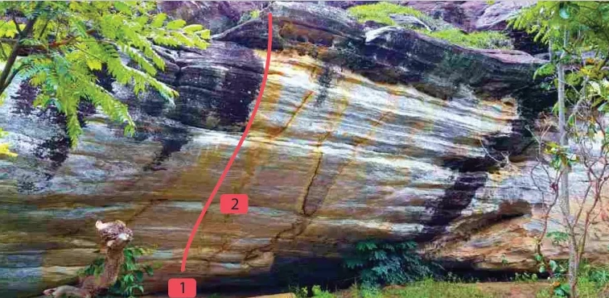
          - **largura_mapa**: 757
          - **altura_mapa**: 370
          - **pontos_de_interesse**:
            - **[0]**:
              - **id**: B7DWcX8hJ1aCDS
              - **uid**: B7DWcX8hJ1aCDS
              - **rotulo**: 1
              - **retangulo**:
                - **x**: 226
                - **y**: 358
                - **comprimento**: 33
                - **largura**: 23
              - **label**: 1
            - **[1]**:
              - **id**: xGmdUNT8Z1bizL
              - **uid**: xGmdUNT8Z1bizL
              - **rotulo**: 2
              - **retangulo**:
                - **x**: 292
                - **y**: 253
                - **comprimento**: 35
                - **largura**: 24
              - **label**: 2
          - **referencias**:
            - **[0]**:
              - **alvo_uid**: IQBQOCX2uQjVyv
              - **pontos_uids**:
                - B7DWcX8hJ1aCDS
              - **escalada**: Insaciável
              - **ids**:
                - B7DWcX8hJ1aCDS
            - **[1]**:
              - **alvo_uid**: W5Zpft4lgp2Atw
              - **pontos_uids**:
                - xGmdUNT8Z1bizL
              - **escalada**: Sicronismo
              - **ids**:
                - xGmdUNT8Z1bizL
      - **escaladas**:
        - **[0]**:
          - **uid**: lSIcDeg6bAv82N
          - **boulder**:
            - **nome**: Super Foot Hook
            - **dificuldade**: V5
        - **[1]**:
          - **uid**: 1jbENVRoVKc4co
          - **boulder**:
            - **nome**: Foot Hook
            - **dificuldade**: V3
        - **[2]**:
          - **uid**: J6rQGte9XAbHMJ
          - **boulder**:
            - **nome**: Escorpião
            - **dificuldade**: V8
        - **[3]**:
          - **uid**: VOoWhjUc5lHfj6
          - **boulder**:
            - **nome**: Yakisoba
            - **dificuldade**: V7
        - **[4]**:
          - **uid**: J7H9AIhNoOvBdb
          - **boulder**:
            - **nome**: Uaikisoba
            - **dificuldade**: V7
        - **[5]**:
          - **uid**: IQBQOCX2uQjVyv
          - **boulder**:
            - **nome**: Insaciável
            - **dificuldade**: V10
        - **[6]**:
          - **uid**: W5Zpft4lgp2Atw
          - **boulder**:
            - **nome**: Sicronismo
            - **dificuldade**: V8
      - **precomputados**:
        - **total_escaladas**: 7
        - **total_boulders**: 7
  - **[5]**:
    - **conteudo**:
      - **descricao**:
          # Setor Troféu
          
          O setor Troféu é conhecido por suas linhas técnicas e de alta graduação.
          
          Obs.: Não foram identificadas todas as linhas desse bloco. Certifique-se antes de fazer uma possível primeira ascensão.
      - **nome**: Troféu
      - **uid**: oPnH4R0z6pGdpP
      - **mapas**:
        - **[0]**:
          - **caminho_imagem_mapa**: 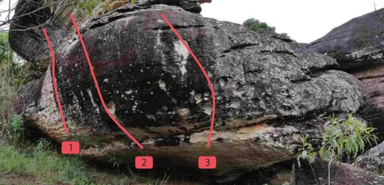
          - **largura_mapa**: 758
          - **altura_mapa**: 365
          - **pontos_de_interesse**:
            - **[0]**:
              - **id**: rpviF7a30p5PTK
              - **uid**: rpviF7a30p5PTK
              - **rotulo**: 1
              - **retangulo**:
                - **x**: 139
                - **y**: 292
                - **comprimento**: 36
                - **largura**: 25
              - **label**: 1
            - **[1]**:
              - **id**: c70Tf6vxRTIrEJ
              - **uid**: c70Tf6vxRTIrEJ
              - **rotulo**: 2
              - **retangulo**:
                - **x**: 284
                - **y**: 320
                - **comprimento**: 36
                - **largura**: 24
              - **label**: 2
            - **[2]**:
              - **id**: 5rWOYtJ1on0GzU
              - **uid**: 5rWOYtJ1on0GzU
              - **rotulo**: 3
              - **retangulo**:
                - **x**: 409
                - **y**: 321
                - **comprimento**: 34
                - **largura**: 24
              - **label**: 3
          - **referencias**:
            - **[0]**:
              - **alvo_uid**: D5nAazPH4GqYPG
              - **pontos_uids**:
                - rpviF7a30p5PTK
              - **escalada**: Trofeuzinho
              - **ids**:
                - rpviF7a30p5PTK
            - **[1]**:
              - **alvo_uid**: WhCXR2mpkS6a7x
              - **pontos_uids**:
                - c70Tf6vxRTIrEJ
              - **escalada**: Troféu
              - **ids**:
                - c70Tf6vxRTIrEJ
            - **[2]**:
              - **alvo_uid**: uPqgqUInvZ69fY
              - **pontos_uids**:
                - 5rWOYtJ1on0GzU
              - **escalada**: Dreads de Goiás
              - **ids**:
                - 5rWOYtJ1on0GzU
      - **escaladas**:
        - **[0]**:
          - **uid**: D5nAazPH4GqYPG
          - **boulder**:
            - **nome**: Trofeuzinho
            - **dificuldade**: V7
        - **[1]**:
          - **uid**: WhCXR2mpkS6a7x
          - **boulder**:
            - **nome**: Troféu
            - **dificuldade**: V10
        - **[2]**:
          - **uid**: uPqgqUInvZ69fY
          - **boulder**:
            - **nome**: Dreads de Goiás
            - **dificuldade**: V7
      - **precomputados**:
        - **total_escaladas**: 3
        - **total_boulders**: 3
  - **[6]**:
    - **conteudo**:
      - **descricao**:
          # Setor X-Tudo
          
          O setor X-Tudo possui blocos interessantes com linhas de dificuldade intermediária.
          
          Obs.: Não foram identificadas todas as linhas desse bloco. Certifique-se antes de fazer uma possível primeira ascensão.
      - **nome**: X-Tudo
      - **uid**: oLx7PAaXis7B0M
      - **mapas**:
        - **[0]**:
          - **caminho_imagem_mapa**: 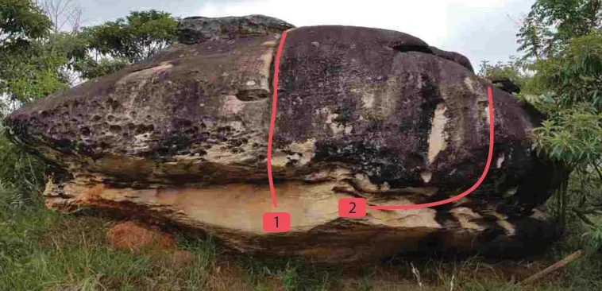
          - **largura_mapa**: 758
          - **altura_mapa**: 366
          - **pontos_de_interesse**:
            - **[0]**:
              - **id**: jytgCGdsk4gvOi
              - **uid**: jytgCGdsk4gvOi
              - **rotulo**: 1
              - **retangulo**:
                - **x**: 348
                - **y**: 279
                - **comprimento**: 37
                - **largura**: 24
              - **label**: 1
            - **[1]**:
              - **id**: xoDPwkiuMqSmdO
              - **uid**: xoDPwkiuMqSmdO
              - **rotulo**: 2
              - **retangulo**:
                - **x**: 444
                - **y**: 260
                - **comprimento**: 36
                - **largura**: 25
              - **label**: 2
          - **referencias**:
            - **[0]**:
              - **alvo_uid**: HoZqZEMiZcVBi4
              - **pontos_uids**:
                - jytgCGdsk4gvOi
              - **escalada**: X-Tudo
              - **ids**:
                - jytgCGdsk4gvOi
            - **[1]**:
              - **alvo_uid**: e9aaes5ooNAtR8
              - **pontos_uids**:
                - xoDPwkiuMqSmdO
              - **escalada**: Pão com Ovo
              - **ids**:
                - xoDPwkiuMqSmdO
        - **[1]**:
          - **caminho_imagem_mapa**: 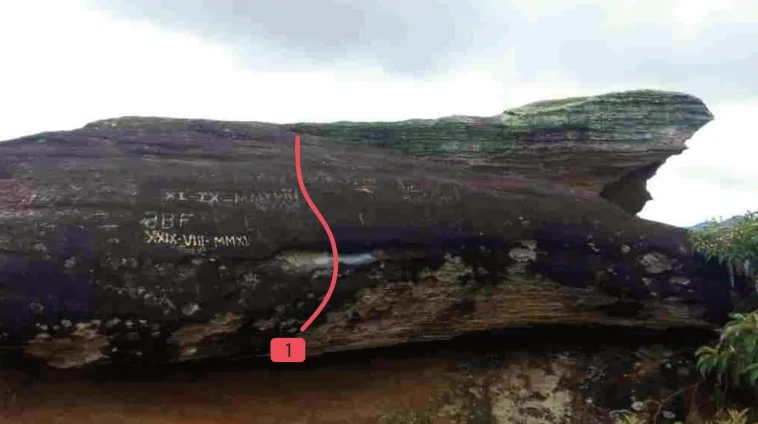
          - **largura_mapa**: 758
          - **altura_mapa**: 424
          - **pontos_de_interesse**:
            - **[0]**:
              - **id**: gl6THLgL3tYTVM
              - **uid**: gl6THLgL3tYTVM
              - **rotulo**: 1
              - **retangulo**:
                - **x**: 288
                - **y**: 350
                - **comprimento**: 36
                - **largura**: 24
              - **label**: 1
          - **referencias**:
            - **[0]**:
              - **alvo_uid**: 1eHLP0k88WZOuA
              - **pontos_uids**:
                - gl6THLgL3tYTVM
              - **escalada**: Nossa Senhora de Conceição
              - **ids**:
                - gl6THLgL3tYTVM
        - **[2]**:
          - **caminho_imagem_mapa**: 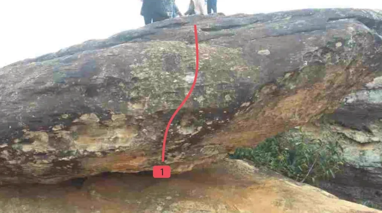
          - **largura_mapa**: 759
          - **altura_mapa**: 424
          - **pontos_de_interesse**:
            - **[0]**:
              - **id**: 4BTPVMfQnaFL5i
              - **uid**: 4BTPVMfQnaFL5i
              - **rotulo**: 1
              - **retangulo**:
                - **x**: 322
                - **y**: 341
                - **comprimento**: 35
                - **largura**: 24
              - **label**: 1
          - **referencias**:
            - **[0]**:
              - **alvo_uid**: GXS6mlY58sRcw0
              - **pontos_uids**:
                - 4BTPVMfQnaFL5i
              - **escalada**: Kansas
              - **ids**:
                - 4BTPVMfQnaFL5i
      - **escaladas**:
        - **[0]**:
          - **uid**: HoZqZEMiZcVBi4
          - **boulder**:
            - **nome**: X-Tudo
            - **dificuldade**: V3
        - **[1]**:
          - **uid**: e9aaes5ooNAtR8
          - **boulder**:
            - **nome**: Pão com Ovo
            - **dificuldade**: V4
        - **[2]**:
          - **uid**: 1eHLP0k88WZOuA
          - **boulder**:
            - **nome**: Nossa Senhora de Conceição
            - **dificuldade**: V3
        - **[3]**:
          - **uid**: GXS6mlY58sRcw0
          - **boulder**:
            - **nome**: Kansas
            - **dificuldade**: V3
      - **precomputados**:
        - **total_escaladas**: 4
        - **total_boulders**: 4
  - **[7]**:
    - **conteudo**:
      - **descricao**:
          # Setor Domínio Digital
          
          O setor Domínio Digital possui um bloco com um arco natural e linhas de baixa dificuldade.
          
          Obs.: Não foram identificadas todas as linhas desse bloco. Certifique-se antes de fazer uma possível primeira ascensão.
      - **nome**: Domínio Digital
      - **uid**: sYADkPTjRnYElG
      - **mapas**:
        - **[0]**:
          - **caminho_imagem_mapa**: 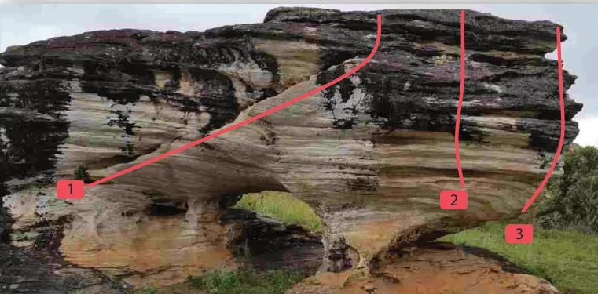
          - **largura_mapa**: 761
          - **altura_mapa**: 375
          - **pontos_de_interesse**:
            - **[0]**:
              - **id**: 3meZQQETdFR5od
              - **uid**: 3meZQQETdFR5od
              - **rotulo**: 1
              - **retangulo**:
                - **x**: 89
                - **y**: 242
                - **comprimento**: 36
                - **largura**: 23
              - **label**: 1
            - **[1]**:
              - **id**: 5iaFjURH3DqG7X
              - **uid**: 5iaFjURH3DqG7X
              - **rotulo**: 2
              - **retangulo**:
                - **x**: 577
                - **y**: 255
                - **comprimento**: 36
                - **largura**: 26
              - **label**: 2
            - **[2]**:
              - **id**: j7FkXnPK7q3EJw
              - **uid**: j7FkXnPK7q3EJw
              - **rotulo**: 3
              - **retangulo**:
                - **x**: 661
                - **y**: 299
                - **comprimento**: 34
                - **largura**: 24
              - **label**: 3
          - **referencias**:
            - **[0]**:
              - **alvo_uid**: OUdBhEVuUTFep3
              - **pontos_uids**:
                - 3meZQQETdFR5od
              - **escalada**: Domínio Digital
              - **ids**:
                - 3meZQQETdFR5od
            - **[1]**:
              - **alvo_uid**: RXDm6CxY1I1KSq
              - **pontos_uids**:
                - 5iaFjURH3DqG7X
              - **escalada**: (sem nome 30)
              - **ids**:
                - 5iaFjURH3DqG7X
            - **[2]**:
              - **alvo_uid**: M4u3wwqFhAKnIT
              - **pontos_uids**:
                - j7FkXnPK7q3EJw
              - **escalada**: (sem nome 31)
              - **ids**:
                - j7FkXnPK7q3EJw
      - **escaladas**:
        - **[0]**:
          - **uid**: OUdBhEVuUTFep3
          - **boulder**:
            - **nome**: Domínio Digital
            - **dificuldade**: V2
        - **[1]**:
          - **uid**: RXDm6CxY1I1KSq
          - **boulder**:
            - **nome**: (sem nome 30)
            - **dificuldade**: V0
        - **[2]**:
          - **uid**: M4u3wwqFhAKnIT
          - **boulder**:
            - **nome**: (sem nome 31)
            - **dificuldade**: V0
      - **precomputados**:
        - **total_escaladas**: 3
        - **total_boulders**: 3
- **precomputados**:
  - **total_escaladas**: 64
  - **total_boulders**: 64

## Parte: grupo_colina

### Grupo (Pico: Conceição do Mato Dentro)

- **descricao**:
    # Grupo Colina
    
    A Colina abriga diversos setores com abordagens e estilos diferentes, de blocos clássicos a novas linhas.
- **nome**: Colina
- **uid**: YkAop73CsSuZ6U
- **mapas**:
  - **[0]**:
    - **caminho_imagem_mapa**: 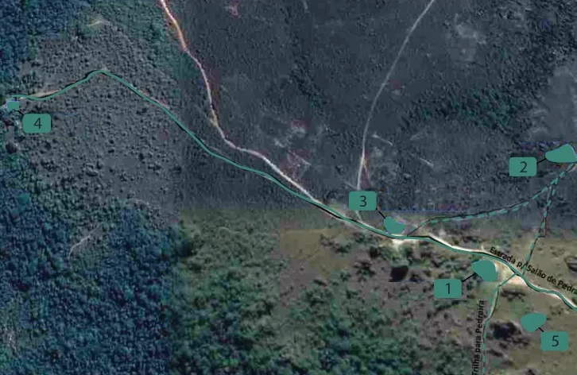
    - **largura_mapa**: 726
    - **altura_mapa**: 472
    - **pontos_de_interesse**:
      - **[0]**:
        - **id**: wrD6Cr355ncGoe
        - **uid**: wrD6Cr355ncGoe
        - **rotulo**: 1
        - **retangulo**:
          - **x**: 564
          - **y**: 364
          - **comprimento**: 35
          - **largura**: 24
        - **label**: 1
      - **[1]**:
        - **id**: DdAS8L7n5kBX87
        - **uid**: DdAS8L7n5kBX87
        - **rotulo**: 2
        - **retangulo**:
          - **x**: 658
          - **y**: 210
          - **comprimento**: 33
          - **largura**: 24
        - **label**: 2
      - **[2]**:
        - **id**: 50ASdNdNKXwgwQ
        - **uid**: 50ASdNdNKXwgwQ
        - **rotulo**: 3
        - **retangulo**:
          - **x**: 456
          - **y**: 253
          - **comprimento**: 33
          - **largura**: 26
        - **label**: 3
      - **[3]**:
        - **id**: EJcIYcuiAg2QvU
        - **uid**: EJcIYcuiAg2QvU
        - **rotulo**: 4
        - **retangulo**:
          - **x**: 46
          - **y**: 156
          - **comprimento**: 35
          - **largura**: 23
        - **label**: 4
      - **[4]**:
        - **id**: q8Px7ijHdLpZfB
        - **uid**: q8Px7ijHdLpZfB
        - **rotulo**: 5
        - **retangulo**:
          - **x**: 698
          - **y**: 430
          - **comprimento**: 35
          - **largura**: 23
        - **label**: 5
    - **referencias**:
      - **[0]**:
        - **alvo_uid**: txd3FQ2sso3KfL
        - **pontos_uids**:
          - wrD6Cr355ncGoe
        - **setor**: Choquito
        - **ids**:
          - wrD6Cr355ncGoe
      - **[1]**:
        - **alvo_uid**: YE6JcMIe648G54
        - **pontos_uids**:
          - DdAS8L7n5kBX87
        - **setor**: Godzilla
        - **ids**:
          - DdAS8L7n5kBX87
      - **[2]**:
        - **alvo_uid**: QPq69lj2cQaMam
        - **pontos_uids**:
          - 50ASdNdNKXwgwQ
        - **setor**: Show Time
        - **ids**:
          - 50ASdNdNKXwgwQ
      - **[3]**:
        - **alvo_uid**: 5jTRMDJCeaLvnz
        - **pontos_uids**:
          - EJcIYcuiAg2QvU
        - **setor**: Hiperespaço
        - **ids**:
          - EJcIYcuiAg2QvU
      - **[4]**:
        - **alvo_uid**: NyRs6pI4NoexjO
        - **pontos_uids**:
          - q8Px7ijHdLpZfB
        - **setor**: Mergulho em Copo d'Água
        - **ids**:
          - q8Px7ijHdLpZfB
- **setores**:
  - **[0]**:
    - **conteudo**:
      - **descricao**:
          # Setor Choquito
          
          O setor Choquito possui blocos com linhas variadas.
          
          > [!CAUTION]
          > **PINTURA RUPESTRE, NÃO ESCALE NESSE LOCAL.**
          > | 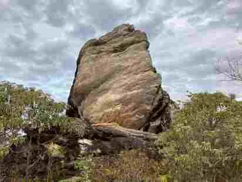 |
          | :--: |
          | *Pintura Rupestre* |
          
          Obs.: Não foram identificadas todas as linhas desse bloco. Certifique-se antes de fazer uma possível primeira ascensão.
      - **nome**: Choquito
      - **uid**: txd3FQ2sso3KfL
      - **mapas**:
        - **[0]**:
          - **caminho_imagem_mapa**: 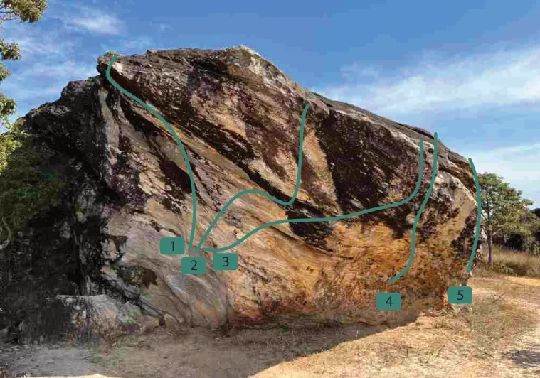
          - **largura_mapa**: 759
          - **altura_mapa**: 532
          - **pontos_de_interesse**:
            - **[0]**:
              - **id**: O3tRj7N346XT0r
              - **uid**: O3tRj7N346XT0r
              - **rotulo**: 1
              - **retangulo**:
                - **x**: 242
                - **y**: 346
                - **comprimento**: 33
                - **largura**: 23
              - **label**: 1
            - **[1]**:
              - **id**: YsJoS7c7agips5
              - **uid**: YsJoS7c7agips5
              - **rotulo**: 2
              - **retangulo**:
                - **x**: 272
                - **y**: 373
                - **comprimento**: 34
                - **largura**: 22
              - **label**: 2
            - **[2]**:
              - **id**: vfTu6HErb1mTGK
              - **uid**: vfTu6HErb1mTGK
              - **rotulo**: 3
              - **retangulo**:
                - **x**: 317
                - **y**: 368
                - **comprimento**: 32
                - **largura**: 24
              - **label**: 3
            - **[3]**:
              - **id**: WyPOaT4nm5o0Gv
              - **uid**: WyPOaT4nm5o0Gv
              - **rotulo**: 4
              - **retangulo**:
                - **x**: 546
                - **y**: 424
                - **comprimento**: 35
                - **largura**: 23
              - **label**: 4
            - **[4]**:
              - **id**: 9CCqXLAqJXrTa4
              - **uid**: 9CCqXLAqJXrTa4
              - **rotulo**: 5
              - **retangulo**:
                - **x**: 646
                - **y**: 414
                - **comprimento**: 35
                - **largura**: 25
              - **label**: 5
          - **referencias**:
            - **[0]**:
              - **alvo_uid**: IeEwf49j4evbLg
              - **pontos_uids**:
                - O3tRj7N346XT0r
              - **escalada**: Paradise
              - **ids**:
                - O3tRj7N346XT0r
            - **[1]**:
              - **alvo_uid**: tzXfYEDAtdhIZC
              - **pontos_uids**:
                - YsJoS7c7agips5
              - **escalada**: Quebra Costela
              - **ids**:
                - YsJoS7c7agips5
            - **[2]**:
              - **alvo_uid**: IGyhI51GnKge62
              - **pontos_uids**:
                - vfTu6HErb1mTGK
              - **escalada**: (sem nome 1)
              - **ids**:
                - vfTu6HErb1mTGK
            - **[3]**:
              - **alvo_uid**: ukFDfrDji5ZVC0
              - **pontos_uids**:
                - WyPOaT4nm5o0Gv
              - **escalada**: Choquito
              - **ids**:
                - WyPOaT4nm5o0Gv
            - **[4]**:
              - **alvo_uid**: wMtD5C4eYpHIXo
              - **pontos_uids**:
                - 9CCqXLAqJXrTa4
              - **escalada**: Jungle
              - **ids**:
                - 9CCqXLAqJXrTa4
        - **[1]**:
          - **caminho_imagem_mapa**: 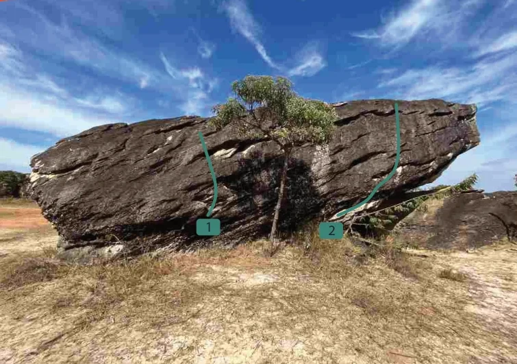
          - **largura_mapa**: 755
          - **altura_mapa**: 531
          - **pontos_de_interesse**:
            - **[0]**:
              - **id**: vMh3JbiMTC4luB
              - **uid**: vMh3JbiMTC4luB
              - **rotulo**: 1
              - **retangulo**:
                - **x**: 304
                - **y**: 331
                - **comprimento**: 33
                - **largura**: 24
              - **label**: 1
            - **[1]**:
              - **id**: SO2PoVRVqogdvr
              - **uid**: SO2PoVRVqogdvr
              - **rotulo**: 2
              - **retangulo**:
                - **x**: 484
                - **y**: 336
                - **comprimento**: 34
                - **largura**: 25
              - **label**: 2
          - **referencias**:
            - **[0]**:
              - **alvo_uid**: W4YGvAa8VjxDRt
              - **pontos_uids**:
                - vMh3JbiMTC4luB
              - **escalada**: (sem nome 2)
              - **ids**:
                - vMh3JbiMTC4luB
            - **[1]**:
              - **alvo_uid**: tEthBjxltdhzSs
              - **pontos_uids**:
                - SO2PoVRVqogdvr
              - **escalada**: (sem nome 3)
              - **ids**:
                - SO2PoVRVqogdvr
      - **escaladas**:
        - **[0]**:
          - **uid**: IeEwf49j4evbLg
          - **boulder**:
            - **nome**: Paradise
            - **dificuldade**: V4
        - **[1]**:
          - **uid**: tzXfYEDAtdhIZC
          - **boulder**:
            - **nome**: Quebra Costela
            - **dificuldade**: V3
        - **[2]**:
          - **uid**: IGyhI51GnKge62
          - **boulder**:
            - **nome**: (sem nome 1)
        - **[3]**:
          - **uid**: ukFDfrDji5ZVC0
          - **boulder**:
            - **nome**: Choquito
            - **dificuldade**: V3
        - **[4]**:
          - **uid**: wMtD5C4eYpHIXo
          - **boulder**:
            - **nome**: Jungle
            - **dificuldade**: V5
        - **[5]**:
          - **uid**: W4YGvAa8VjxDRt
          - **boulder**:
            - **nome**: (sem nome 2)
            - **dificuldade**: V0
        - **[6]**:
          - **uid**: tEthBjxltdhzSs
          - **boulder**:
            - **nome**: (sem nome 3)
            - **dificuldade**: V3
      - **precomputados**:
        - **total_escaladas**: 7
        - **total_boulders**: 7
  - **[1]**:
    - **conteudo**:
      - **descricao**:
          # Setor Godzilla
          
          O setor Godzilla possui blocos imponentes com linhas de alta qualidade e dificuldade.
          
          Obs.: Não foram identificadas todas as linhas desse bloco. Certifique-se antes de fazer uma possível primeira ascensão.
      - **nome**: Godzilla
      - **uid**: YE6JcMIe648G54
      - **mapas**:
        - **[0]**:
          - **caminho_imagem_mapa**: 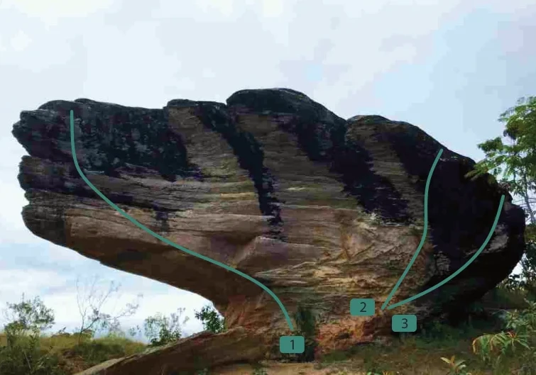
          - **largura_mapa**: 755
          - **altura_mapa**: 529
          - **pontos_de_interesse**:
            - **[0]**:
              - **id**: WEFXQkDmjJGM10
              - **uid**: WEFXQkDmjJGM10
              - **rotulo**: 1
              - **retangulo**:
                - **x**: 412
                - **y**: 486
                - **comprimento**: 33
                - **largura**: 23
              - **label**: 1
            - **[1]**:
              - **id**: s7P90LqMpEixjG
              - **uid**: s7P90LqMpEixjG
              - **rotulo**: 2
              - **retangulo**:
                - **x**: 512
                - **y**: 432
                - **comprimento**: 35
                - **largura**: 25
              - **label**: 2
            - **[2]**:
              - **id**: 5S7JPtcibwhVMF
              - **uid**: 5S7JPtcibwhVMF
              - **rotulo**: 3
              - **retangulo**:
                - **x**: 570
                - **y**: 456
                - **comprimento**: 35
                - **largura**: 25
              - **label**: 3
          - **referencias**:
            - **[0]**:
              - **alvo_uid**: 5TBft5zp7liLhC
              - **pontos_uids**:
                - WEFXQkDmjJGM10
              - **escalada**: King Kong
              - **ids**:
                - WEFXQkDmjJGM10
            - **[1]**:
              - **alvo_uid**: yfQoHEpQWaOScy
              - **pontos_uids**:
                - s7P90LqMpEixjG
              - **escalada**: Gorilaz
              - **ids**:
                - s7P90LqMpEixjG
            - **[2]**:
              - **alvo_uid**: ICaABUZ9JdHLhH
              - **pontos_uids**:
                - 5S7JPtcibwhVMF
              - **escalada**: Chimpanzé
              - **ids**:
                - 5S7JPtcibwhVMF
        - **[1]**:
          - **caminho_imagem_mapa**: 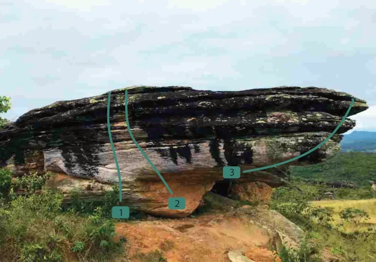
          - **largura_mapa**: 757
          - **altura_mapa**: 528
          - **pontos_de_interesse**:
            - **[0]**:
              - **id**: MHpcIheKTNXQke
              - **uid**: MHpcIheKTNXQke
              - **rotulo**: 1
              - **retangulo**:
                - **x**: 242
                - **y**: 428
                - **comprimento**: 35
                - **largura**: 23
              - **label**: 1
            - **[1]**:
              - **id**: 0T2i1c5G15OfLS
              - **uid**: 0T2i1c5G15OfLS
              - **rotulo**: 2
              - **retangulo**:
                - **x**: 356
                - **y**: 410
                - **comprimento**: 35
                - **largura**: 24
              - **label**: 2
            - **[2]**:
              - **id**: sfS4ZKtQdiP4RU
              - **uid**: sfS4ZKtQdiP4RU
              - **rotulo**: 3
              - **retangulo**:
                - **x**: 466
                - **y**: 347
                - **comprimento**: 35
                - **largura**: 24
              - **label**: 3
          - **referencias**:
            - **[0]**:
              - **alvo_uid**: Hn2SWgR2p4wwon
              - **pontos_uids**:
                - MHpcIheKTNXQke
              - **escalada**: Macaco Prego
              - **ids**:
                - MHpcIheKTNXQke
            - **[1]**:
              - **alvo_uid**: ERu7NbE9Tvj1CX
              - **pontos_uids**:
                - 0T2i1c5G15OfLS
              - **escalada**: Rolamento
              - **ids**:
                - 0T2i1c5G15OfLS
            - **[2]**:
              - **alvo_uid**: yU0UoSrED5JmNt
              - **pontos_uids**:
                - sfS4ZKtQdiP4RU
              - **escalada**: Godzilla
              - **ids**:
                - sfS4ZKtQdiP4RU
        - **[2]**:
          - **caminho_imagem_mapa**: 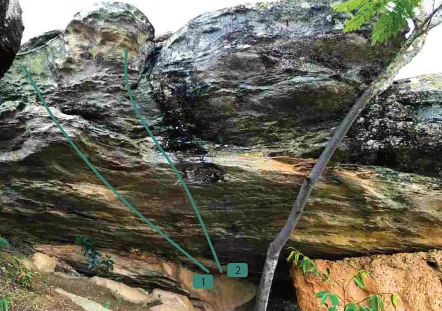
          - **largura_mapa**: 755
          - **altura_mapa**: 531
          - **pontos_de_interesse**:
            - **[0]**:
              - **id**: H8CaN19MuDQP5p
              - **uid**: H8CaN19MuDQP5p
              - **rotulo**: 1
              - **retangulo**:
                - **x**: 347
                - **y**: 480
                - **comprimento**: 36
                - **largura**: 23
              - **label**: 1
            - **[1]**:
              - **id**: Czn0o7zSshKTNi
              - **uid**: Czn0o7zSshKTNi
              - **rotulo**: 2
              - **retangulo**:
                - **x**: 406
                - **y**: 462
                - **comprimento**: 35
                - **largura**: 23
              - **label**: 2
          - **referencias**:
            - **[0]**:
              - **alvo_uid**: f94WawSdEbOUKA
              - **pontos_uids**:
                - H8CaN19MuDQP5p
              - **escalada**: Enxada
              - **ids**:
                - H8CaN19MuDQP5p
            - **[1]**:
              - **alvo_uid**: QTHHmnYdwy3pY2
              - **pontos_uids**:
                - Czn0o7zSshKTNi
              - **escalada**: Obra de Arte
              - **ids**:
                - Czn0o7zSshKTNi
      - **escaladas**:
        - **[0]**:
          - **uid**: 5TBft5zp7liLhC
          - **boulder**:
            - **nome**: King Kong
            - **dificuldade**: V7
        - **[1]**:
          - **uid**: yfQoHEpQWaOScy
          - **boulder**:
            - **nome**: Gorilaz
            - **dificuldade**: V4
        - **[2]**:
          - **uid**: ICaABUZ9JdHLhH
          - **boulder**:
            - **nome**: Chimpanzé
            - **dificuldade**: V4
        - **[3]**:
          - **uid**: Hn2SWgR2p4wwon
          - **boulder**:
            - **nome**: Macaco Prego
            - **dificuldade**: V4
        - **[4]**:
          - **uid**: ERu7NbE9Tvj1CX
          - **boulder**:
            - **nome**: Rolamento
            - **dificuldade**: V7
        - **[5]**:
          - **uid**: yU0UoSrED5JmNt
          - **boulder**:
            - **nome**: Godzilla
            - **dificuldade**: V5
        - **[6]**:
          - **uid**: f94WawSdEbOUKA
          - **boulder**:
            - **nome**: Enxada
            - **dificuldade**: V5
        - **[7]**:
          - **uid**: QTHHmnYdwy3pY2
          - **boulder**:
            - **nome**: Obra de Arte
            - **dificuldade**: V9
      - **precomputados**:
        - **total_escaladas**: 8
        - **total_boulders**: 8
  - **[2]**:
    - **conteudo**:
      - **descricao**:
          # Setor Show Time
          
          O setor Show Time possui blocos isolados com linhas de diversas dificuldades e visuais incríveis.
          
          Obs.: Não foram identificadas todas as linhas desse bloco. Certifique-se antes de fazer uma possível primeira ascensão.
      - **nome**: Show Time
      - **uid**: QPq69lj2cQaMam
      - **mapas**:
        - **[0]**:
          - **caminho_imagem_mapa**: 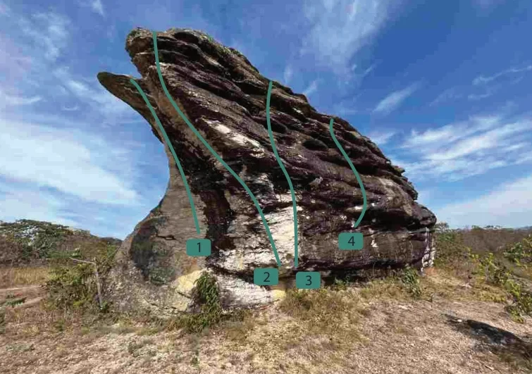
          - **largura_mapa**: 755
          - **altura_mapa**: 531
          - **pontos_de_interesse**:
            - **[0]**:
              - **id**: bhM4fq18aYdKd3
              - **uid**: bhM4fq18aYdKd3
              - **rotulo**: 1
              - **retangulo**:
                - **x**: 282
                - **y**: 351
                - **comprimento**: 33
                - **largura**: 24
              - **label**: 1
            - **[1]**:
              - **id**: oFUR9yAjsXOUJF
              - **uid**: oFUR9yAjsXOUJF
              - **rotulo**: 2
              - **retangulo**:
                - **x**: 378
                - **y**: 392
                - **comprimento**: 36
                - **largura**: 25
              - **label**: 2
            - **[2]**:
              - **id**: zxIrMGtnIs2oBw
              - **uid**: zxIrMGtnIs2oBw
              - **rotulo**: 3
              - **retangulo**:
                - **x**: 438
                - **y**: 398
                - **comprimento**: 33
                - **largura**: 25
              - **label**: 3
            - **[3]**:
              - **id**: FOVW6vJ4vYuRj2
              - **uid**: FOVW6vJ4vYuRj2
              - **rotulo**: 4
              - **retangulo**:
                - **x**: 498
                - **y**: 342
                - **comprimento**: 32
                - **largura**: 25
              - **label**: 4
          - **referencias**:
            - **[0]**:
              - **alvo_uid**: nfjDujl1duF0WR
              - **pontos_uids**:
                - bhM4fq18aYdKd3
              - **escalada**: ET Teimoso
              - **ids**:
                - bhM4fq18aYdKd3
            - **[1]**:
              - **alvo_uid**: GoNMZvdc2V5UWZ
              - **pontos_uids**:
                - oFUR9yAjsXOUJF
              - **escalada**: Show Time
              - **ids**:
                - oFUR9yAjsXOUJF
            - **[2]**:
              - **alvo_uid**: 98wWWrOFE3WykX
              - **pontos_uids**:
                - zxIrMGtnIs2oBw
              - **escalada**: Zela Time
              - **ids**:
                - zxIrMGtnIs2oBw
            - **[3]**:
              - **alvo_uid**: uOsPRChK5xum0k
              - **pontos_uids**:
                - FOVW6vJ4vYuRj2
              - **escalada**: (sem nome 4)
              - **ids**:
                - FOVW6vJ4vYuRj2
        - **[1]**:
          - **caminho_imagem_mapa**: 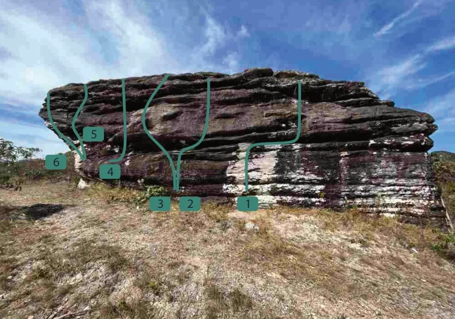
          - **largura_mapa**: 753
          - **altura_mapa**: 528
          - **pontos_de_interesse**:
            - **[0]**:
              - **id**: S32hCtiHxSy1im
              - **uid**: S32hCtiHxSy1im
              - **rotulo**: 1
              - **retangulo**:
                - **x**: 410
                - **y**: 336
                - **comprimento**: 35
                - **largura**: 23
              - **label**: 1
            - **[1]**:
              - **id**: 5LFAfctie3moD8
              - **uid**: 5LFAfctie3moD8
              - **rotulo**: 2
              - **retangulo**:
                - **x**: 314
                - **y**: 338
                - **comprimento**: 34
                - **largura**: 24
              - **label**: 2
            - **[2]**:
              - **id**: JJJb94cBrCB2Fk
              - **uid**: JJJb94cBrCB2Fk
              - **rotulo**: 3
              - **retangulo**:
                - **x**: 264
                - **y**: 338
                - **comprimento**: 35
                - **largura**: 24
              - **label**: 3
            - **[3]**:
              - **id**: Ki065F0a77GbDt
              - **uid**: Ki065F0a77GbDt
              - **rotulo**: 4
              - **retangulo**:
                - **x**: 182
                - **y**: 284
                - **comprimento**: 33
                - **largura**: 24
              - **label**: 4
            - **[4]**:
              - **id**: LjOHSYfwzJDs9s
              - **uid**: LjOHSYfwzJDs9s
              - **rotulo**: 5
              - **retangulo**:
                - **x**: 154
                - **y**: 222
                - **comprimento**: 35
                - **largura**: 25
              - **label**: 5
            - **[5]**:
              - **id**: 75St8wEmK9hr0y
              - **uid**: 75St8wEmK9hr0y
              - **rotulo**: 6
              - **retangulo**:
                - **x**: 93
                - **y**: 268
                - **comprimento**: 36
                - **largura**: 24
              - **label**: 6
          - **referencias**:
            - **[0]**:
              - **alvo_uid**: uOsPRChK5xum0k
              - **pontos_uids**:
                - S32hCtiHxSy1im
              - **escalada**: (sem nome 4)
              - **ids**:
                - S32hCtiHxSy1im
            - **[1]**:
              - **alvo_uid**: ITjF6IUmFsJfyN
              - **pontos_uids**:
                - 5LFAfctie3moD8
              - **escalada**: (sem nome 5)
              - **ids**:
                - 5LFAfctie3moD8
            - **[2]**:
              - **alvo_uid**: RU44lq4DV3bvid
              - **pontos_uids**:
                - JJJb94cBrCB2Fk
              - **escalada**: Meia Lua
              - **ids**:
                - JJJb94cBrCB2Fk
            - **[3]**:
              - **alvo_uid**: 72o8TovFlDzu7K
              - **pontos_uids**:
                - Ki065F0a77GbDt
              - **escalada**: (sem nome 6)
              - **ids**:
                - Ki065F0a77GbDt
            - **[4]**:
              - **alvo_uid**: 98wWWrOFE3WykX
              - **pontos_uids**:
                - LjOHSYfwzJDs9s
              - **escalada**: Zela Time
              - **ids**:
                - LjOHSYfwzJDs9s
            - **[5]**:
              - **alvo_uid**: GoNMZvdc2V5UWZ
              - **pontos_uids**:
                - 75St8wEmK9hr0y
              - **escalada**: Show Time
              - **ids**:
                - 75St8wEmK9hr0y
      - **escaladas**:
        - **[0]**:
          - **uid**: nfjDujl1duF0WR
          - **boulder**:
            - **nome**: ET Teimoso
            - **dificuldade**: V0
        - **[1]**:
          - **uid**: GoNMZvdc2V5UWZ
          - **boulder**:
            - **nome**: Show Time
            - **dificuldade**: V5
        - **[2]**:
          - **uid**: 98wWWrOFE3WykX
          - **boulder**:
            - **nome**: Zela Time
            - **dificuldade**: V1
        - **[3]**:
          - **uid**: uOsPRChK5xum0k
          - **boulder**:
            - **nome**: (sem nome 4)
            - **dificuldade**: V5
        - **[4]**:
          - **uid**: ITjF6IUmFsJfyN
          - **boulder**:
            - **nome**: (sem nome 5)
            - **dificuldade**: V0
        - **[5]**:
          - **uid**: 72o8TovFlDzu7K
          - **boulder**:
            - **nome**: (sem nome 6)
            - **dificuldade**: V2
        - **[6]**:
          - **uid**: RU44lq4DV3bvid
          - **boulder**:
            - **nome**: Meia Lua
            - **dificuldade**: V3
      - **precomputados**:
        - **total_escaladas**: 7
        - **total_boulders**: 7
  - **[3]**:
    - **conteudo**:
      - **descricao**:
          # Setor Hiperespaço
          
          O setor Hiperespaço apresenta um bloco imponente com linhas de alta graduação e movimentos atléticos.
          
          Obs.: Não foram identificadas todas as linhas desse bloco. Certifique-se antes de fazer uma possível primeira ascensão.
      - **nome**: Hiperespaço
      - **uid**: 5jTRMDJCeaLvnz
      - **mapas**:
        - **[0]**:
          - **caminho_imagem_mapa**: 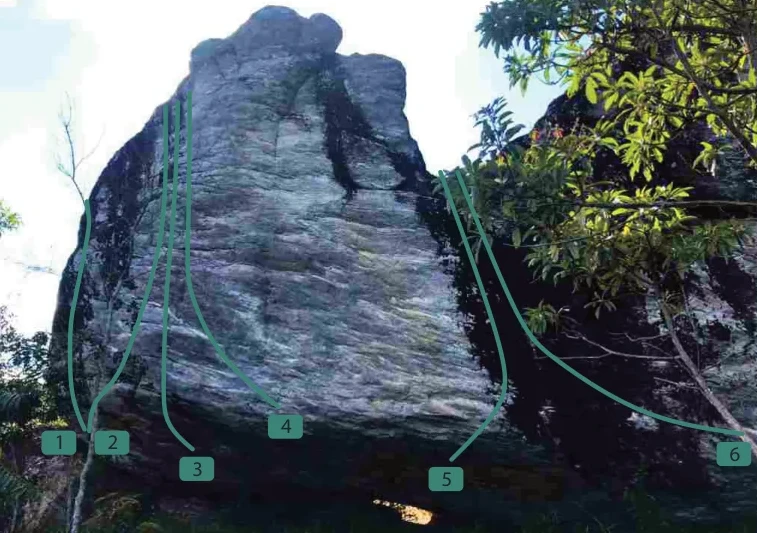
          - **largura_mapa**: 757
          - **altura_mapa**: 533
          - **pontos_de_interesse**:
            - **[0]**:
              - **id**: CtOV1wG8o766YO
              - **uid**: CtOV1wG8o766YO
              - **rotulo**: 1
              - **retangulo**:
                - **x**: 59
                - **y**: 443
                - **comprimento**: 36
                - **largura**: 24
              - **label**: 1
            - **[1]**:
              - **id**: cQkfOYNLPzie0P
              - **uid**: cQkfOYNLPzie0P
              - **rotulo**: 2
              - **retangulo**:
                - **x**: 112
                - **y**: 443
                - **comprimento**: 33
                - **largura**: 26
              - **label**: 2
            - **[2]**:
              - **id**: niKgH30S2C2gaU
              - **uid**: niKgH30S2C2gaU
              - **rotulo**: 3
              - **retangulo**:
                - **x**: 197
                - **y**: 469
                - **comprimento**: 36
                - **largura**: 24
              - **label**: 3
            - **[3]**:
              - **id**: DmUd4ppUX9YY9F
              - **uid**: DmUd4ppUX9YY9F
              - **rotulo**: 4
              - **retangulo**:
                - **x**: 286
                - **y**: 426
                - **comprimento**: 36
                - **largura**: 25
              - **label**: 4
            - **[4]**:
              - **id**: kyJ7Nv55imVypD
              - **uid**: kyJ7Nv55imVypD
              - **rotulo**: 5
              - **retangulo**:
                - **x**: 446
                - **y**: 478
                - **comprimento**: 36
                - **largura**: 25
              - **label**: 5
            - **[5]**:
              - **id**: CG6Wf3j2R4VfjV
              - **uid**: CG6Wf3j2R4VfjV
              - **rotulo**: 6
              - **retangulo**:
                - **x**: 734
                - **y**: 454
                - **comprimento**: 34
                - **largura**: 25
              - **label**: 6
          - **referencias**:
            - **[0]**:
              - **alvo_uid**: Dc0LzOgJ121bez
              - **pontos_uids**:
                - CtOV1wG8o766YO
              - **escalada**: Solstício
              - **ids**:
                - CtOV1wG8o766YO
            - **[1]**:
              - **alvo_uid**: ezB4ozYwdjmdos
              - **pontos_uids**:
                - cQkfOYNLPzie0P
              - **escalada**: Equinócio
              - **ids**:
                - cQkfOYNLPzie0P
            - **[2]**:
              - **alvo_uid**: fBHjlhrwF2gT3m
              - **pontos_uids**:
                - niKgH30S2C2gaU
              - **escalada**: Eclipse
              - **ids**:
                - niKgH30S2C2gaU
            - **[3]**:
              - **alvo_uid**: fNrywKN9Vo1CQj
              - **pontos_uids**:
                - DmUd4ppUX9YY9F
              - **escalada**: Antares
              - **ids**:
                - DmUd4ppUX9YY9F
            - **[4]**:
              - **alvo_uid**: z1cH25l13lqYMi
              - **pontos_uids**:
                - kyJ7Nv55imVypD
              - **escalada**: Don Carlitos
              - **ids**:
                - kyJ7Nv55imVypD
            - **[5]**:
              - **alvo_uid**: 3G3gpajoRm4SFf
              - **pontos_uids**:
                - CG6Wf3j2R4VfjV
              - **escalada**: Jardins Suspensos
              - **ids**:
                - CG6Wf3j2R4VfjV
      - **escaladas**:
        - **[0]**:
          - **uid**: Dc0LzOgJ121bez
          - **boulder**:
            - **nome**: Solstício
            - **dificuldade**: V8
        - **[1]**:
          - **uid**: ezB4ozYwdjmdos
          - **boulder**:
            - **nome**: Equinócio
            - **dificuldade**: V5
        - **[2]**:
          - **uid**: fBHjlhrwF2gT3m
          - **boulder**:
            - **nome**: Eclipse
            - **dificuldade**: V7
        - **[3]**:
          - **uid**: fNrywKN9Vo1CQj
          - **boulder**:
            - **nome**: Antares
            - **dificuldade**: V9
        - **[4]**:
          - **uid**: z1cH25l13lqYMi
          - **boulder**:
            - **nome**: Don Carlitos
            - **dificuldade**: V4
        - **[5]**:
          - **uid**: 3G3gpajoRm4SFf
          - **boulder**:
            - **nome**: Jardins Suspensos
            - **dificuldade**: V5
      - **precomputados**:
        - **total_escaladas**: 6
        - **total_boulders**: 6
  - **[4]**:
    - **conteudo**:
      - **descricao**:
          # Setor Mergulho em Copo d'Água
          
          O setor Mergulho em Copo d'Água possui um bloco isolado com uma linha clássica.
          
          Obs.: Não foram identificadas todas as linhas desse bloco. Certifique-se antes de fazer uma possível primeira ascensão.
      - **nome**: Mergulho em Copo d'Água
      - **uid**: NyRs6pI4NoexjO
      - **mapas**:
        - **[0]**:
          - **caminho_imagem_mapa**: 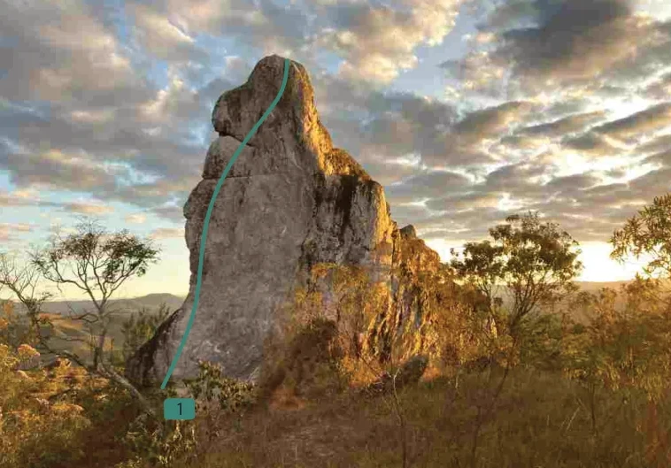
          - **largura_mapa**: 758
          - **altura_mapa**: 529
          - **pontos_de_interesse**:
            - **[0]**:
              - **id**: eDyAljCFEDPGmP
              - **uid**: eDyAljCFEDPGmP
              - **rotulo**: 1
              - **retangulo**:
                - **x**: 203
                - **y**: 462
                - **comprimento**: 34
                - **largura**: 24
              - **label**: 1
          - **referencias**:
            - **[0]**:
              - **alvo_uid**: Ybxadj0PXMFNsg
              - **pontos_uids**:
                - eDyAljCFEDPGmP
              - **escalada**: Mergulho em Copo d'Água
              - **ids**:
                - eDyAljCFEDPGmP
      - **escaladas**:
        - **[0]**:
          - **uid**: Ybxadj0PXMFNsg
          - **boulder**:
            - **nome**: Mergulho em Copo d'Água
            - **dificuldade**: V4
      - **precomputados**:
        - **total_escaladas**: 1
        - **total_boulders**: 1
- **precomputados**:
  - **total_escaladas**: 29
  - **total_boulders**: 29

## Parte: grupo_jk

### Grupo (Pico: Conceição do Mato Dentro)

- **descricao**:
    # Grupo JK
    
    O Grupo JK possui o setor Mufasa, com linhas de boulder interessantes e acesso facilitado.
- **nome**: JK
- **uid**: uqM9RkYH7rbEGj
- **mapas**:
  - **[0]**:
    - **caminho_imagem_mapa**: 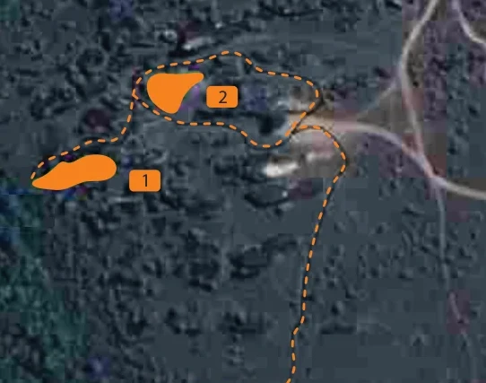
    - **largura_mapa**: 542
    - **altura_mapa**: 427
    - **pontos_de_interesse**:
      - **[0]**:
        - **id**: tHhznIudpdNmHQ
        - **uid**: tHhznIudpdNmHQ
        - **rotulo**: 1
        - **retangulo**:
          - **x**: 162
          - **y**: 202
          - **comprimento**: 33
          - **largura**: 23
        - **label**: 1
      - **[1]**:
        - **id**: psQ6eofXl2fME3
        - **uid**: psQ6eofXl2fME3
        - **rotulo**: 2
        - **retangulo**:
          - **x**: 248
          - **y**: 108
          - **comprimento**: 33
          - **largura**: 24
        - **label**: 2
    - **referencias**:
      - **[0]**:
        - **alvo_uid**: p7wr5W1PHLpGlE
        - **pontos_uids**:
          - tHhznIudpdNmHQ
        - **setor**: Mufasa
        - **ids**:
          - tHhznIudpdNmHQ
- **setores**:
  - **[0]**:
    - **conteudo**:
      - **descricao**:
          # Setor Mufasa
          
          O setor Mufasa apresenta um bloco com linhas de altíssima dificuldade e movimentos icônicos.
          
          Obs.: Não foram identificadas todas as linhas desse bloco. Certifique-se antes de fazer uma possível primeira ascensão.
      - **nome**: Mufasa
      - **uid**: p7wr5W1PHLpGlE
      - **mapas**:
        - **[0]**:
          - **caminho_imagem_mapa**: 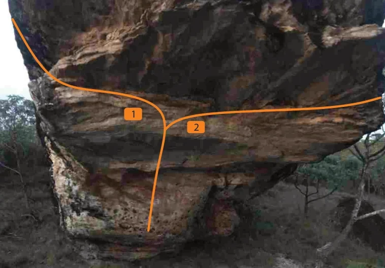
          - **largura_mapa**: 758
          - **altura_mapa**: 529
          - **pontos_de_interesse**:
            - **[0]**:
              - **id**: UX6EfPItSY8cUS
              - **uid**: UX6EfPItSY8cUS
              - **rotulo**: 1
              - **retangulo**:
                - **x**: 262
                - **y**: 226
                - **comprimento**: 35
                - **largura**: 25
              - **label**: 1
            - **[1]**:
              - **id**: rIv95Eyi8kvbYB
              - **uid**: rIv95Eyi8kvbYB
              - **rotulo**: 2
              - **retangulo**:
                - **x**: 385
                - **y**: 250
                - **comprimento**: 34
                - **largura**: 25
              - **label**: 2
          - **referencias**:
            - **[0]**:
              - **alvo_uid**: ZMmm6iODCfOuJk
              - **pontos_uids**:
                - UX6EfPItSY8cUS
              - **escalada**: Bloody Hell
              - **ids**:
                - UX6EfPItSY8cUS
            - **[1]**:
              - **alvo_uid**: P1ioTGfottYzAu
              - **pontos_uids**:
                - rIv95Eyi8kvbYB
              - **escalada**: Mufasa
              - **ids**:
                - rIv95Eyi8kvbYB
      - **escaladas**:
        - **[0]**:
          - **uid**: ZMmm6iODCfOuJk
          - **boulder**:
            - **nome**: Bloody Hell
            - **dificuldade**: V11
        - **[1]**:
          - **uid**: P1ioTGfottYzAu
          - **boulder**:
            - **nome**: Mufasa
            - **dificuldade**: V10
      - **precomputados**:
        - **total_escaladas**: 2
        - **total_boulders**: 2
- **precomputados**:
  - **total_escaladas**: 2
  - **total_boulders**: 2

## Parte: grupo_pedreira

### Grupo (Pico: Conceição do Mato Dentro)

- **descricao**:
    # Grupo Pedreira
    
    A Pedreira é o grupo com maior número de setores e linhas, apresentando desafios para todos os níveis.
- **nome**: Pedreira
- **uid**: fmOEl4JjUwdHIk
- **mapas**:
  - **[0]**:
    - **caminho_imagem_mapa**: 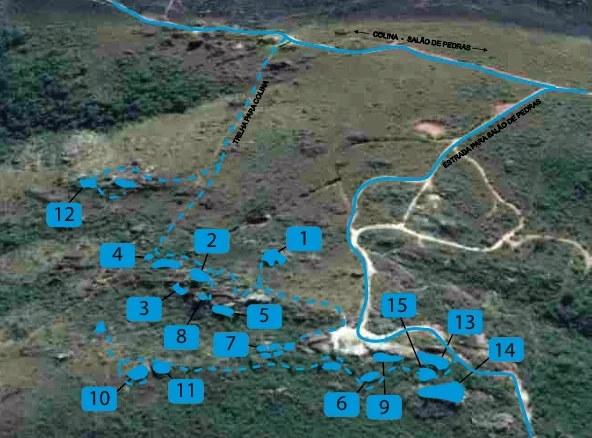
    - **largura_mapa**: 592
    - **altura_mapa**: 438
    - **pontos_de_interesse**:
      - **[0]**:
        - **id**: b23vf3N41ACj3A
        - **uid**: b23vf3N41ACj3A
        - **rotulo**: 1
        - **retangulo**:
          - **x**: 304
          - **y**: 238
          - **comprimento**: 35
          - **largura**: 25
        - **label**: 1
      - **[1]**:
        - **id**: yFSS81ITy499Qt
        - **uid**: yFSS81ITy499Qt
        - **rotulo**: 2
        - **retangulo**:
          - **x**: 212
          - **y**: 241
          - **comprimento**: 35
          - **largura**: 24
        - **label**: 2
      - **[2]**:
        - **id**: 52Hlv1eMxygMHM
        - **uid**: 52Hlv1eMxygMHM
        - **rotulo**: 3
        - **retangulo**:
          - **x**: 144
          - **y**: 308
          - **comprimento**: 36
          - **largura**: 25
        - **label**: 3
      - **[3]**:
        - **id**: PB73eL63DwVfA7
        - **uid**: PB73eL63DwVfA7
        - **rotulo**: 4
        - **retangulo**:
          - **x**: 118
          - **y**: 256
          - **comprimento**: 35
          - **largura**: 26
        - **label**: 4
      - **[4]**:
        - **id**: lmqaF1XcTVGOZM
        - **uid**: lmqaF1XcTVGOZM
        - **rotulo**: 5
        - **retangulo**:
          - **x**: 264
          - **y**: 316
          - **comprimento**: 35
          - **largura**: 25
        - **label**: 5
      - **[5]**:
        - **id**: 1HoVQDzlfoVhxM
        - **uid**: 1HoVQDzlfoVhxM
        - **rotulo**: 6
        - **retangulo**:
          - **x**: 342
          - **y**: 404
          - **comprimento**: 35
          - **largura**: 25
        - **label**: 6
      - **[6]**:
        - **id**: Mlc1tRQzIGLamn
        - **uid**: Mlc1tRQzIGLamn
        - **rotulo**: 7
        - **retangulo**:
          - **x**: 230
          - **y**: 345
          - **comprimento**: 37
          - **largura**: 26
        - **label**: 7
      - **[7]**:
        - **id**: hmU0vFdMSLuNm6
        - **uid**: hmU0vFdMSLuNm6
        - **rotulo**: 8
        - **retangulo**:
          - **x**: 181
          - **y**: 337
          - **comprimento**: 36
          - **largura**: 26
        - **label**: 8
      - **[8]**:
        - **id**: iiV2OFzkqWFKpD
        - **uid**: iiV2OFzkqWFKpD
        - **rotulo**: 9
        - **retangulo**:
          - **x**: 384
          - **y**: 406
          - **comprimento**: 35
          - **largura**: 25
        - **label**: 9
      - **[9]**:
        - **id**: 2dktKSyJGtDNHE
        - **uid**: 2dktKSyJGtDNHE
        - **rotulo**: 10
        - **retangulo**:
          - **x**: 98
          - **y**: 399
          - **comprimento**: 35
          - **largura**: 26
        - **label**: 10
      - **[10]**:
        - **id**: B48bdIMXCkM6Af
        - **uid**: B48bdIMXCkM6Af
        - **rotulo**: 11
        - **retangulo**:
          - **x**: 186
          - **y**: 390
          - **comprimento**: 36
          - **largura**: 25
        - **label**: 11
      - **[11]**:
        - **id**: YFf16f3kWzJzF2
        - **uid**: YFf16f3kWzJzF2
        - **rotulo**: 12
        - **retangulo**:
          - **x**: 64
          - **y**: 214
          - **comprimento**: 34
          - **largura**: 25
        - **label**: 12
      - **[12]**:
        - **id**: pRmlwYnHRxUS3W
        - **uid**: pRmlwYnHRxUS3W
        - **rotulo**: 13
        - **retangulo**:
          - **x**: 466
          - **y**: 322
          - **comprimento**: 35
          - **largura**: 24
        - **label**: 13
      - **[13]**:
        - **id**: A6PxzdEFL6JoV2
        - **uid**: A6PxzdEFL6JoV2
        - **rotulo**: 14
        - **retangulo**:
          - **x**: 506
          - **y**: 350
          - **comprimento**: 35
          - **largura**: 25
        - **label**: 14
      - **[14]**:
        - **id**: ug6uAJPc4cQJ3b
        - **uid**: ug6uAJPc4cQJ3b
        - **rotulo**: 15
        - **retangulo**:
          - **x**: 398
          - **y**: 304
          - **comprimento**: 35
          - **largura**: 25
        - **label**: 15
    - **referencias**:
      - **[0]**:
        - **alvo_uid**: 7E2CO690WlPLfJ
        - **pontos_uids**:
          - b23vf3N41ACj3A
        - **setor**: Preguiça
        - **ids**:
          - b23vf3N41ACj3A
      - **[1]**:
        - **alvo_uid**: 0J02htQ9ijlNku
        - **pontos_uids**:
          - yFSS81ITy499Qt
        - **setor**: Manda Lá
        - **ids**:
          - yFSS81ITy499Qt
      - **[2]**:
        - **alvo_uid**: iwFDrJbwDBIZci
        - **pontos_uids**:
          - 52Hlv1eMxygMHM
        - **setor**: Trabalhador
        - **ids**:
          - 52Hlv1eMxygMHM
      - **[3]**:
        - **alvo_uid**: 9i4ulhHe8Wt2fG
        - **pontos_uids**:
          - PB73eL63DwVfA7
        - **setor**: Sanfoneiro Maluco
        - **ids**:
          - PB73eL63DwVfA7
      - **[4]**:
        - **alvo_uid**: X2Ug9CixcMKYd8
        - **pontos_uids**:
          - lmqaF1XcTVGOZM
        - **setor**: Samurai
        - **ids**:
          - lmqaF1XcTVGOZM
      - **[5]**:
        - **alvo_uid**: pjU0CL4hDO7jOa
        - **pontos_uids**:
          - 1HoVQDzlfoVhxM
        - **setor**: Bomba Atômica
        - **ids**:
          - 1HoVQDzlfoVhxM
      - **[6]**:
        - **alvo_uid**: ZIkSfGNugqHMnX
        - **pontos_uids**:
          - Mlc1tRQzIGLamn
        - **setor**: Jubileu
        - **ids**:
          - Mlc1tRQzIGLamn
      - **[7]**:
        - **alvo_uid**: 1UnylXLq321R7V
        - **pontos_uids**:
          - hmU0vFdMSLuNm6
        - **setor**: Conceição
        - **ids**:
          - hmU0vFdMSLuNm6
      - **[8]**:
        - **alvo_uid**: 19m6huz3tACiyA
        - **pontos_uids**:
          - iiV2OFzkqWFKpD
        - **setor**: Bobsled
        - **ids**:
          - iiV2OFzkqWFKpD
      - **[9]**:
        - **alvo_uid**: iZJd5BxEiCNhso
        - **pontos_uids**:
          - B48bdIMXCkM6Af
        - **setor**: Aresta do Cabeça
        - **ids**:
          - B48bdIMXCkM6Af
      - **[10]**:
        - **alvo_uid**: FbDfAbWOrmCBZp
        - **pontos_uids**:
          - 2dktKSyJGtDNHE
        - **setor**: Equinócio
        - **ids**:
          - 2dktKSyJGtDNHE
      - **[11]**:
        - **alvo_uid**: MwfeN0k5sY83kY
        - **pontos_uids**:
          - YFf16f3kWzJzF2
        - **setor**: Witness
        - **ids**:
          - YFf16f3kWzJzF2
      - **[12]**:
        - **alvo_uid**: gUuLVreg1RgUm6
        - **pontos_uids**:
          - pRmlwYnHRxUS3W
        - **setor**: La Fúria
        - **ids**:
          - pRmlwYnHRxUS3W
      - **[13]**:
        - **alvo_uid**: QqN6oqb5Sf8vGq
        - **pontos_uids**:
          - A6PxzdEFL6JoV2
        - **setor**: Jah
        - **ids**:
          - A6PxzdEFL6JoV2
      - **[14]**:
        - **alvo_uid**: G5dk8AEaYgSzDy
        - **pontos_uids**:
          - ug6uAJPc4cQJ3b
        - **setor**: Pole Dance
        - **ids**:
          - ug6uAJPc4cQJ3b
- **setores**:
  - **[0]**:
    - **conteudo**:
      - **descricao**:
          # Setor Preguiça
          
          O setor Preguiça possui blocos com linhas de alta dificuldade e boulders atléticos.
          
          Obs.: Não foram identificadas todas as linhas desse bloco. Certifique-se antes de fazer uma possível primeira ascensão.
      - **nome**: Preguiça
      - **uid**: 7E2CO690WlPLfJ
      - **mapas**:
        - **[0]**:
          - **caminho_imagem_mapa**: 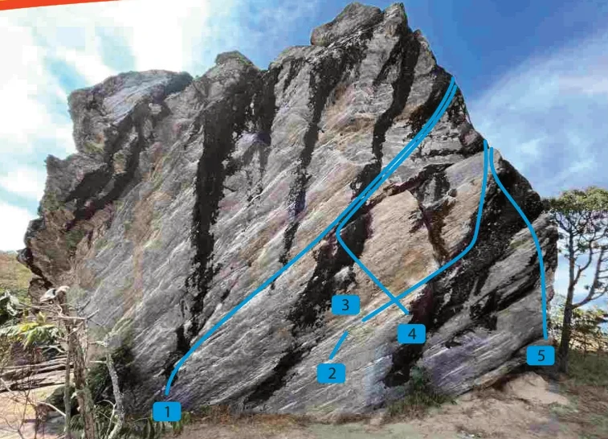
          - **largura_mapa**: 757
          - **altura_mapa**: 546
          - **pontos_de_interesse**:
            - **[0]**:
              - **id**: Ezwt6JOc9wKCP3
              - **uid**: Ezwt6JOc9wKCP3
              - **rotulo**: 1
              - **retangulo**:
                - **x**: 208
                - **y**: 512
                - **comprimento**: 34
                - **largura**: 25
              - **label**: 1
            - **[1]**:
              - **id**: 7Xqlje3YhHg51B
              - **uid**: 7Xqlje3YhHg51B
              - **rotulo**: 2
              - **retangulo**:
                - **x**: 412
                - **y**: 464
                - **comprimento**: 33
                - **largura**: 24
              - **label**: 2
            - **[2]**:
              - **id**: P4B28yzgKVQQWw
              - **uid**: P4B28yzgKVQQWw
              - **rotulo**: 3
              - **retangulo**:
                - **x**: 430
                - **y**: 379
                - **comprimento**: 35
                - **largura**: 26
              - **label**: 3
            - **[3]**:
              - **id**: 8An6aAaE3GP4jM
              - **uid**: 8An6aAaE3GP4jM
              - **rotulo**: 4
              - **retangulo**:
                - **x**: 512
                - **y**: 414
                - **comprimento**: 34
                - **largura**: 25
              - **label**: 4
            - **[4]**:
              - **id**: ofW4ngRySv9tt1
              - **uid**: ofW4ngRySv9tt1
              - **rotulo**: 5
              - **retangulo**:
                - **x**: 674
                - **y**: 441
                - **comprimento**: 35
                - **largura**: 24
              - **label**: 5
          - **referencias**:
            - **[0]**:
              - **alvo_uid**: yi7g95l6zjnEcX
              - **pontos_uids**:
                - Ezwt6JOc9wKCP3
              - **escalada**: Preguiça de Sofrer
              - **ids**:
                - Ezwt6JOc9wKCP3
            - **[1]**:
              - **alvo_uid**: QoSim9MOfscMvZ
              - **pontos_uids**:
                - 7Xqlje3YhHg51B
              - **escalada**: Preguicinha
              - **ids**:
                - 7Xqlje3YhHg51B
            - **[2]**:
              - **alvo_uid**: 4FUQ4AvvGAMe7D
              - **pontos_uids**:
                - P4B28yzgKVQQWw
              - **escalada**: (sem nome 22)
              - **ids**:
                - P4B28yzgKVQQWw
            - **[3]**:
              - **alvo_uid**: PO4TjGQSvQTLuV
              - **pontos_uids**:
                - 8An6aAaE3GP4jM
              - **escalada**: Tá Lá
              - **ids**:
                - 8An6aAaE3GP4jM
            - **[4]**:
              - **alvo_uid**: CJ4nR44XlpK4dx
              - **pontos_uids**:
                - ofW4ngRySv9tt1
              - **escalada**: (sem nome 23)
              - **ids**:
                - ofW4ngRySv9tt1
        - **[1]**:
          - **caminho_imagem_mapa**: 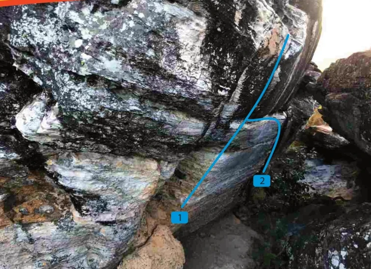
          - **largura_mapa**: 756
          - **altura_mapa**: 548
          - **pontos_de_interesse**:
            - **[0]**:
              - **id**: NRaWE90Rv4A8Sd
              - **uid**: NRaWE90Rv4A8Sd
              - **rotulo**: 1
              - **retangulo**:
                - **x**: 366
                - **y**: 443
                - **comprimento**: 35
                - **largura**: 24
              - **label**: 1
            - **[1]**:
              - **id**: 6XV6RM3004grlR
              - **uid**: 6XV6RM3004grlR
              - **rotulo**: 2
              - **retangulo**:
                - **x**: 534
                - **y**: 368
                - **comprimento**: 33
                - **largura**: 24
              - **label**: 2
          - **referencias**:
            - **[0]**:
              - **alvo_uid**: B1UJ5X4gIPH1Pm
              - **pontos_uids**:
                - NRaWE90Rv4A8Sd
              - **escalada**: Salsichção
              - **ids**:
                - NRaWE90Rv4A8Sd
            - **[1]**:
              - **alvo_uid**: iN149XJWBILEot
              - **pontos_uids**:
                - 6XV6RM3004grlR
              - **escalada**: Era Uma Vez
              - **ids**:
                - 6XV6RM3004grlR
        - **[2]**:
          - **caminho_imagem_mapa**: 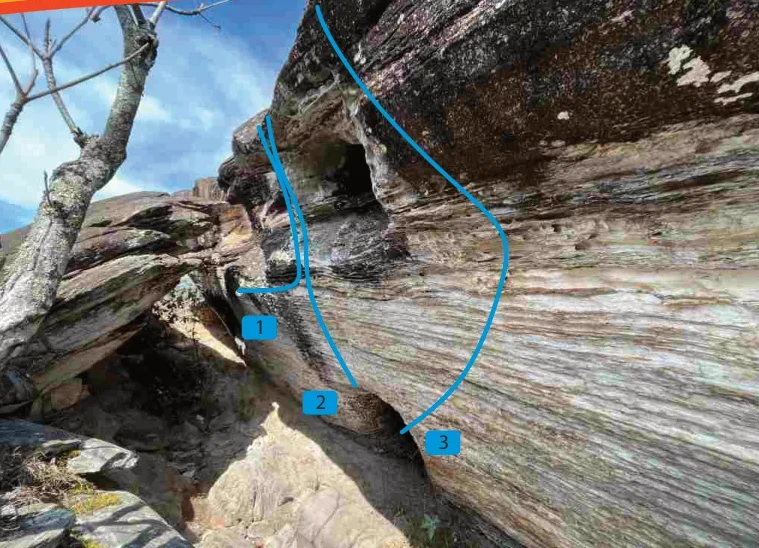
          - **largura_mapa**: 759
          - **altura_mapa**: 548
          - **pontos_de_interesse**:
            - **[0]**:
              - **id**: E5WYSWahMa5Q9u
              - **uid**: E5WYSWahMa5Q9u
              - **rotulo**: 1
              - **retangulo**:
                - **x**: 259
                - **y**: 327
                - **comprimento**: 36
                - **largura**: 24
              - **label**: 1
            - **[1]**:
              - **id**: rVyrFMcB80rYSS
              - **uid**: rVyrFMcB80rYSS
              - **rotulo**: 2
              - **retangulo**:
                - **x**: 320
                - **y**: 402
                - **comprimento**: 36
                - **largura**: 25
              - **label**: 2
            - **[2]**:
              - **id**: qkq2DjIBBKqxuL
              - **uid**: qkq2DjIBBKqxuL
              - **rotulo**: 3
              - **retangulo**:
                - **x**: 442
                - **y**: 442
                - **comprimento**: 37
                - **largura**: 25
              - **label**: 3
          - **referencias**:
            - **[0]**:
              - **alvo_uid**: fknQS4mvtAxh3A
              - **pontos_uids**:
                - E5WYSWahMa5Q9u
              - **escalada**: Frank
              - **ids**:
                - E5WYSWahMa5Q9u
            - **[1]**:
              - **alvo_uid**: fRpsLqaWjUMcmg
              - **pontos_uids**:
                - rVyrFMcB80rYSS
              - **escalada**: Stout
              - **ids**:
                - rVyrFMcB80rYSS
            - **[2]**:
              - **alvo_uid**: BsPUQPcunNWSv5
              - **pontos_uids**:
                - qkq2DjIBBKqxuL
              - **escalada**: Carlos Drummond
              - **ids**:
                - qkq2DjIBBKqxuL
      - **escaladas**:
        - **[0]**:
          - **uid**: yi7g95l6zjnEcX
          - **boulder**:
            - **nome**: Preguiça de Sofrer
            - **dificuldade**: V12
        - **[1]**:
          - **uid**: QoSim9MOfscMvZ
          - **boulder**:
            - **nome**: Preguicinha
            - **dificuldade**: V5
        - **[2]**:
          - **uid**: 4FUQ4AvvGAMe7D
          - **boulder**:
            - **nome**: (sem nome 22)
            - **dificuldade**: V4
        - **[3]**:
          - **uid**: PO4TjGQSvQTLuV
          - **boulder**:
            - **nome**: Tá Lá
            - **dificuldade**: V8
        - **[4]**:
          - **uid**: CJ4nR44XlpK4dx
          - **boulder**:
            - **nome**: (sem nome 23)
            - **dificuldade**: V2
        - **[5]**:
          - **uid**: B1UJ5X4gIPH1Pm
          - **boulder**:
            - **nome**: Salsichção
            - **dificuldade**: V4
        - **[6]**:
          - **uid**: iN149XJWBILEot
          - **boulder**:
            - **nome**: Era Uma Vez
            - **dificuldade**: V9
        - **[7]**:
          - **uid**: fknQS4mvtAxh3A
          - **boulder**:
            - **nome**: Frank
            - **dificuldade**: V8
        - **[8]**:
          - **uid**: fRpsLqaWjUMcmg
          - **boulder**:
            - **nome**: Stout
            - **dificuldade**: V7
        - **[9]**:
          - **uid**: BsPUQPcunNWSv5
          - **boulder**:
            - **nome**: Carlos Drummond
            - **dificuldade**: V7
      - **precomputados**:
        - **total_escaladas**: 10
        - **total_boulders**: 10
  - **[1]**:
    - **conteudo**:
      - **descricao**:
          # Setor Manda Lá
          
          O setor Manda Lá possui um bloco com linhas atléticas e agarras de régua.
          
          Obs.: Não foram identificadas todas as linhas desse bloco. Certique-se antes de fazer uma possível primeira ascensão.
      - **nome**: Manda Lá
      - **uid**: 0J02htQ9ijlNku
      - **mapas**:
        - **[0]**:
          - **caminho_imagem_mapa**: 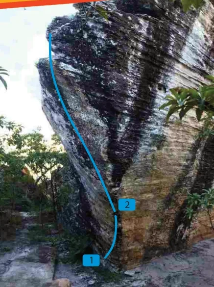
          - **largura_mapa**: 437
          - **altura_mapa**: 585
          - **pontos_de_interesse**:
            - **[0]**:
              - **id**: x1R6gfi5mvsVmZ
              - **uid**: x1R6gfi5mvsVmZ
              - **rotulo**: 1
              - **retangulo**:
                - **x**: 186
                - **y**: 530
                - **comprimento**: 36
                - **largura**: 25
              - **label**: 1
            - **[1]**:
              - **id**: XUgyQXJZQE0Oxv
              - **uid**: XUgyQXJZQE0Oxv
              - **rotulo**: 2
              - **retangulo**:
                - **x**: 260
                - **y**: 417
                - **comprimento**: 35
                - **largura**: 24
              - **label**: 2
          - **referencias**:
            - **[0]**:
              - **alvo_uid**: xgsTNI3aQvw9F3
              - **pontos_uids**:
                - x1R6gfi5mvsVmZ
              - **escalada**: Amand-lá
              - **ids**:
                - x1R6gfi5mvsVmZ
            - **[1]**:
              - **alvo_uid**: JPEAXtGb2zd1P4
              - **pontos_uids**:
                - XUgyQXJZQE0Oxv
              - **escalada**: Manda Lá
              - **ids**:
                - XUgyQXJZQE0Oxv
      - **escaladas**:
        - **[0]**:
          - **uid**: xgsTNI3aQvw9F3
          - **boulder**:
            - **nome**: Amand-lá
            - **dificuldade**: V10
        - **[1]**:
          - **uid**: JPEAXtGb2zd1P4
          - **boulder**:
            - **nome**: Manda Lá
            - **dificuldade**: V8
      - **precomputados**:
        - **total_escaladas**: 2
        - **total_boulders**: 2
  - **[2]**:
    - **conteudo**:
      - **descricao**:
          # Setor Trabalhador
          
          O setor Trabalhador oferece linhas com regates e batidas, exigindo força e técnica.
          
          Obs.: Não foram identificadas todas as linhas desse bloco. Certifique-se antes de fazer uma possível primeira ascensão.
      - **nome**: Trabalhador
      - **uid**: iwFDrJbwDBIZci
      - **mapas**:
        - **[0]**:
          - **caminho_imagem_mapa**: 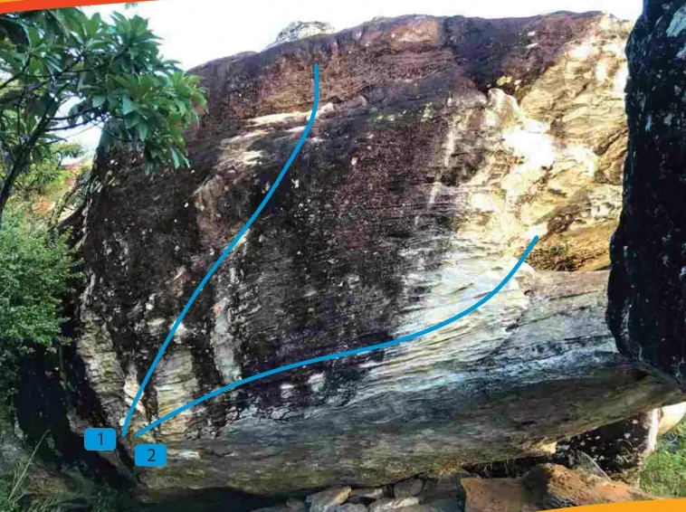
          - **largura_mapa**: 758
          - **altura_mapa**: 566
          - **pontos_de_interesse**:
            - **[0]**:
              - **id**: ZhWeuDf5DFUHXZ
              - **uid**: ZhWeuDf5DFUHXZ
              - **rotulo**: 1
              - **retangulo**:
                - **x**: 111
                - **y**: 485
                - **comprimento**: 34
                - **largura**: 26
              - **label**: 1
            - **[1]**:
              - **id**: PxrNJ6QQ8KoPt6
              - **uid**: PxrNJ6QQ8KoPt6
              - **rotulo**: 2
              - **retangulo**:
                - **x**: 166
                - **y**: 503
                - **comprimento**: 32
                - **largura**: 24
              - **label**: 2
          - **referencias**:
            - **[0]**:
              - **alvo_uid**: gHfdVkwmeris22
              - **pontos_uids**:
                - ZhWeuDf5DFUHXZ
              - **escalada**: Hueco Fontaine
              - **ids**:
                - ZhWeuDf5DFUHXZ
            - **[1]**:
              - **alvo_uid**: wxyzvEsDAtVNI6
              - **pontos_uids**:
                - PxrNJ6QQ8KoPt6
              - **escalada**: Pitt Bull
              - **ids**:
                - PxrNJ6QQ8KoPt6
        - **[1]**:
          - **caminho_imagem_mapa**: 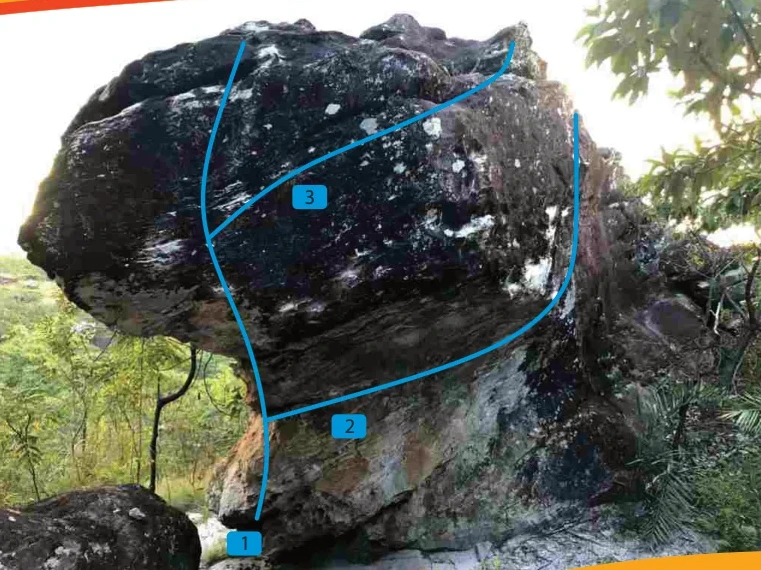
          - **largura_mapa**: 761
          - **altura_mapa**: 570
          - **pontos_de_interesse**:
            - **[0]**:
              - **id**: cltrVd9807XCCi
              - **uid**: cltrVd9807XCCi
              - **rotulo**: 1
              - **retangulo**:
                - **x**: 244
                - **y**: 544
                - **comprimento**: 34
                - **largura**: 23
              - **label**: 1
            - **[1]**:
              - **id**: n0jZecOQ4HKaQg
              - **uid**: n0jZecOQ4HKaQg
              - **rotulo**: 2
              - **retangulo**:
                - **x**: 348
                - **y**: 426
                - **comprimento**: 33
                - **largura**: 23
              - **label**: 2
            - **[2]**:
              - **id**: n4kzDDxMJHEMN4
              - **uid**: n4kzDDxMJHEMN4
              - **rotulo**: 3
              - **retangulo**:
                - **x**: 310
                - **y**: 196
                - **comprimento**: 34
                - **largura**: 23
              - **label**: 3
          - **referencias**:
            - **[0]**:
              - **alvo_uid**: HXxGjlQ71cqVm6
              - **pontos_uids**:
                - cltrVd9807XCCi
              - **escalada**: Trabalhador Brasileiro
              - **ids**:
                - cltrVd9807XCCi
            - **[1]**:
              - **alvo_uid**: lXJMG6KeZSz2K3
              - **pontos_uids**:
                - n0jZecOQ4HKaQg
              - **escalada**: Trabalho Árduo
              - **ids**:
                - n0jZecOQ4HKaQg
            - **[2]**:
              - **alvo_uid**: HZUDWG7GPf2SxW
              - **pontos_uids**:
                - n4kzDDxMJHEMN4
              - **escalada**: Estamos Trabalhando
              - **ids**:
                - n4kzDDxMJHEMN4
      - **escaladas**:
        - **[0]**:
          - **uid**: gHfdVkwmeris22
          - **boulder**:
            - **nome**: Hueco Fontaine
            - **dificuldade**: V5
        - **[1]**:
          - **uid**: wxyzvEsDAtVNI6
          - **boulder**:
            - **nome**: Pitt Bull
            - **dificuldade**: V10
        - **[2]**:
          - **uid**: HXxGjlQ71cqVm6
          - **boulder**:
            - **nome**: Trabalhador Brasileiro
            - **dificuldade**: V7
        - **[3]**:
          - **uid**: lXJMG6KeZSz2K3
          - **boulder**:
            - **nome**: Trabalho Árduo
            - **dificuldade**: V4
        - **[4]**:
          - **uid**: HZUDWG7GPf2SxW
          - **boulder**:
            - **nome**: Estamos Trabalhando
            - **dificuldade**: V8
      - **precomputados**:
        - **total_escaladas**: 5
        - **total_boulders**: 5
  - **[3]**:
    - **conteudo**:
      - **descricao**:
          # Setor Sanfoneiro Maluco
          
          O setor Sanfoneiro Maluco possui blocos com linhas de alto nível, exigindo movimentos precisos e força.
          
          Obs.: Não foram identificadas todas as linhas desse bloco. Certique-se antes de fazer uma possível primeira ascensão.
      - **nome**: Sanfoneiro Maluco
      - **uid**: 9i4ulhHe8Wt2fG
      - **mapas**:
        - **[0]**:
          - **caminho_imagem_mapa**: 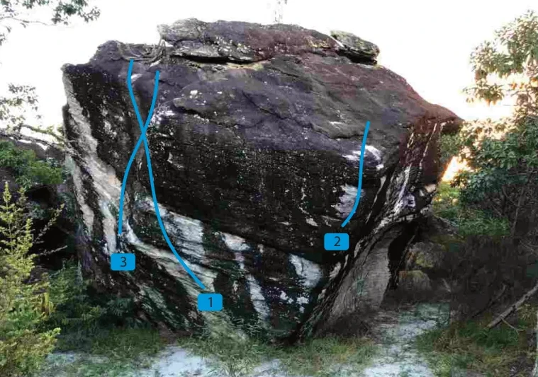
          - **largura_mapa**: 759
          - **altura_mapa**: 533
          - **pontos_de_interesse**:
            - **[0]**:
              - **id**: UNvpPG01W1KZ9i
              - **uid**: UNvpPG01W1KZ9i
              - **rotulo**: 1
              - **retangulo**:
                - **x**: 297
                - **y**: 427
                - **comprimento**: 34
                - **largura**: 24
              - **label**: 1
            - **[1]**:
              - **id**: sSs0qDD1zGEDic
              - **uid**: sSs0qDD1zGEDic
              - **rotulo**: 2
              - **retangulo**:
                - **x**: 475
                - **y**: 341
                - **comprimento**: 34
                - **largura**: 22
              - **label**: 2
            - **[2]**:
              - **id**: SrJe25DRWb3V89
              - **uid**: SrJe25DRWb3V89
              - **rotulo**: 3
              - **retangulo**:
                - **x**: 174
                - **y**: 370
                - **comprimento**: 33
                - **largura**: 24
              - **label**: 3
          - **referencias**:
            - **[0]**:
              - **alvo_uid**: BRuZlEU65X2MF5
              - **pontos_uids**:
                - UNvpPG01W1KZ9i
              - **escalada**: Sanfoneiro Maluco
              - **ids**:
                - UNvpPG01W1KZ9i
            - **[1]**:
              - **alvo_uid**: auSWBM6Q0L9Blg
              - **pontos_uids**:
                - sSs0qDD1zGEDic
              - **escalada**: Inacreditável
              - **ids**:
                - sSs0qDD1zGEDic
            - **[2]**:
              - **alvo_uid**: omODlwnlayNL83
              - **pontos_uids**:
                - SrJe25DRWb3V89
              - **escalada**: Chapeleiro Maluco
              - **ids**:
                - SrJe25DRWb3V89
        - **[1]**:
          - **caminho_imagem_mapa**: 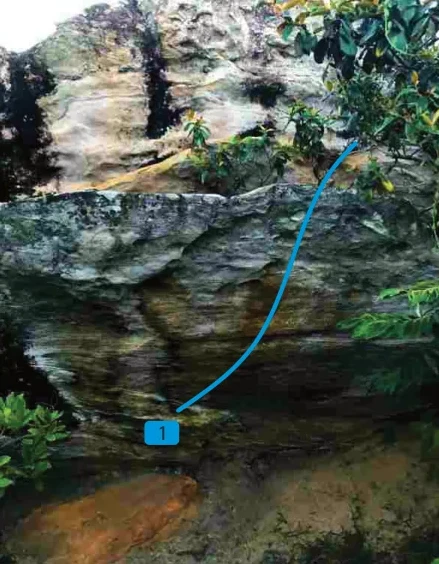
          - **largura_mapa**: 439
          - **altura_mapa**: 564
          - **pontos_de_interesse**:
            - **[0]**:
              - **id**: DeFIVNGJYdo8w3
              - **uid**: DeFIVNGJYdo8w3
              - **rotulo**: 1
              - **retangulo**:
                - **x**: 162
                - **y**: 432
                - **comprimento**: 33
                - **largura**: 25
              - **label**: 1
          - **referencias**:
            - **[0]**:
              - **alvo_uid**: grY2EUkRUUO5Md
              - **pontos_uids**:
                - DeFIVNGJYdo8w3
              - **escalada**: Webb da Paraíba
              - **ids**:
                - DeFIVNGJYdo8w3
        - **[2]**:
          - **caminho_imagem_mapa**: 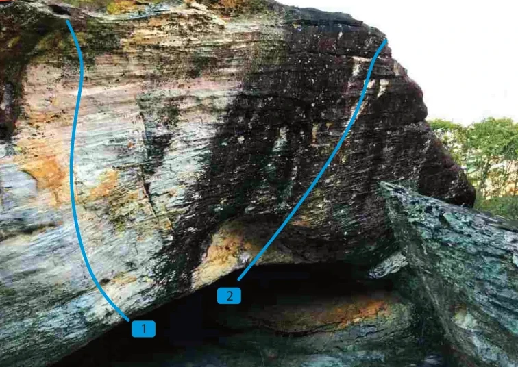
          - **largura_mapa**: 756
          - **altura_mapa**: 536
          - **pontos_de_interesse**:
            - **[0]**:
              - **id**: s4or0TPLv3Mt0R
              - **uid**: s4or0TPLv3Mt0R
              - **rotulo**: 1
              - **retangulo**:
                - **x**: 210
                - **y**: 480
                - **comprimento**: 33
                - **largura**: 23
              - **label**: 1
            - **[1]**:
              - **id**: U6ecenKv5C8A7U
              - **uid**: U6ecenKv5C8A7U
              - **rotulo**: 2
              - **retangulo**:
                - **x**: 334
                - **y**: 432
                - **comprimento**: 33
                - **largura**: 25
              - **label**: 2
          - **referencias**:
            - **[0]**:
              - **alvo_uid**: 3mHSC93eenKDtR
              - **pontos_uids**:
                - s4or0TPLv3Mt0R
              - **escalada**: Efeito Dominó
              - **ids**:
                - s4or0TPLv3Mt0R
            - **[1]**:
              - **alvo_uid**: 6jvaZqybxAQjkS
              - **pontos_uids**:
                - U6ecenKv5C8A7U
              - **escalada**: Zuzuzela
              - **ids**:
                - U6ecenKv5C8A7U
      - **escaladas**:
        - **[0]**:
          - **uid**: BRuZlEU65X2MF5
          - **boulder**:
            - **nome**: Sanfoneiro Maluco
            - **dificuldade**: V7
        - **[1]**:
          - **uid**: auSWBM6Q0L9Blg
          - **boulder**:
            - **nome**: Inacreditável
            - **dificuldade**: V8
        - **[2]**:
          - **uid**: omODlwnlayNL83
          - **boulder**:
            - **nome**: Chapeleiro Maluco
            - **dificuldade**: V4
        - **[3]**:
          - **uid**: grY2EUkRUUO5Md
          - **boulder**:
            - **nome**: Webb da Paraíba
            - **dificuldade**: V9
        - **[4]**:
          - **uid**: 3mHSC93eenKDtR
          - **boulder**:
            - **nome**: Efeito Dominó
            - **dificuldade**: V10
        - **[5]**:
          - **uid**: 6jvaZqybxAQjkS
          - **boulder**:
            - **nome**: Zuzuzela
            - **dificuldade**: V6
      - **precomputados**:
        - **total_escaladas**: 6
        - **total_boulders**: 6
  - **[4]**:
    - **conteudo**:
      - **descricao**:
          # Setor Samurai
          
          O setor Samurai possui boulders negativos com agarras pequenas e movimentos potentes.
          
          Obs.: Não foram identificadas todas as linhas desse bloco. Certifique-se antes de fazer uma possível primeira ascensão.
      - **nome**: Samurai
      - **uid**: X2Ug9CixcMKYd8
      - **mapas**:
        - **[0]**:
          - **caminho_imagem_mapa**: 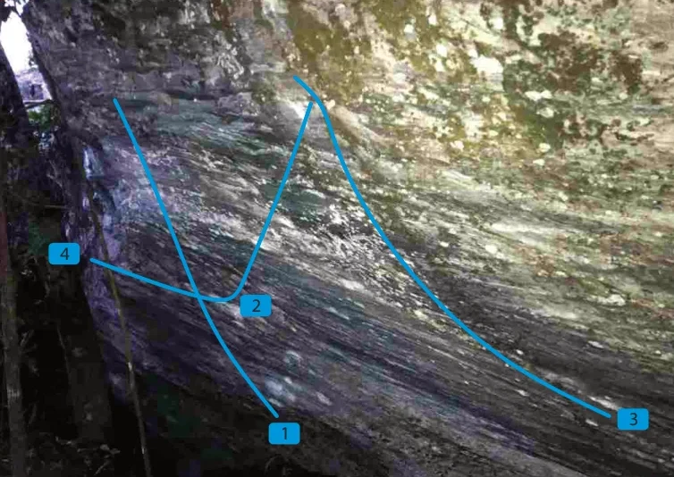
          - **largura_mapa**: 754
          - **altura_mapa**: 534
          - **pontos_de_interesse**:
            - **[0]**:
              - **id**: hnov2jDFTAJtzI
              - **uid**: hnov2jDFTAJtzI
              - **rotulo**: 1
              - **retangulo**:
                - **x**: 318
                - **y**: 484
                - **comprimento**: 34
                - **largura**: 25
              - **label**: 1
            - **[1]**:
              - **id**: 6a6s3Fjdgo0cOa
              - **uid**: 6a6s3Fjdgo0cOa
              - **rotulo**: 2
              - **retangulo**:
                - **x**: 286
                - **y**: 342
                - **comprimento**: 32
                - **largura**: 25
              - **label**: 2
            - **[2]**:
              - **id**: bKjqkR3g15lFSZ
              - **uid**: bKjqkR3g15lFSZ
              - **rotulo**: 3
              - **retangulo**:
                - **x**: 708
                - **y**: 469
                - **comprimento**: 34
                - **largura**: 24
              - **label**: 3
            - **[3]**:
              - **id**: NWivM3W36TjWww
              - **uid**: NWivM3W36TjWww
              - **rotulo**: 4
              - **retangulo**:
                - **x**: 72
                - **y**: 284
                - **comprimento**: 34
                - **largura**: 24
              - **label**: 4
          - **referencias**:
            - **[0]**:
              - **alvo_uid**: cvCpyocxlMo5wh
              - **pontos_uids**:
                - hnov2jDFTAJtzI
              - **escalada**: Purgatório
              - **ids**:
                - hnov2jDFTAJtzI
            - **[1]**:
              - **alvo_uid**: HKPmkjFIL3JaDf
              - **pontos_uids**:
                - 6a6s3Fjdgo0cOa
              - **escalada**: Samurai
              - **ids**:
                - 6a6s3Fjdgo0cOa
            - **[2]**:
              - **alvo_uid**: PQu3egrGNPnZ8Y
              - **pontos_uids**:
                - bKjqkR3g15lFSZ
              - **escalada**: Ômega 3
              - **ids**:
                - bKjqkR3g15lFSZ
            - **[3]**:
              - **alvo_uid**: piZs8IfFcv1s41
              - **pontos_uids**:
                - NWivM3W36TjWww
              - **escalada**: Purgatório do Samurai
              - **ids**:
                - NWivM3W36TjWww
        - **[1]**:
          - **caminho_imagem_mapa**: 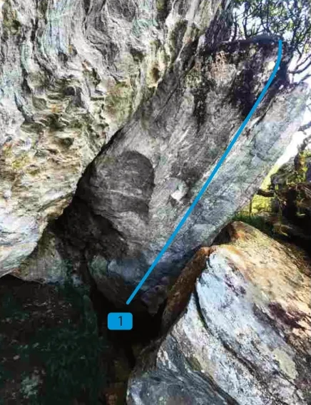
          - **largura_mapa**: 436
          - **altura_mapa**: 568
          - **pontos_de_interesse**:
            - **[0]**:
              - **id**: qdB8Vy3mehmzOF
              - **uid**: qdB8Vy3mehmzOF
              - **rotulo**: 1
              - **retangulo**:
                - **x**: 168
                - **y**: 450
                - **comprimento**: 33
                - **largura**: 22
              - **label**: 1
          - **referencias**:
            - **[0]**:
              - **alvo_uid**: QbrOoedp7GCUjw
              - **pontos_uids**:
                - qdB8Vy3mehmzOF
              - **escalada**: Ouro Branco
              - **ids**:
                - qdB8Vy3mehmzOF
      - **escaladas**:
        - **[0]**:
          - **uid**: cvCpyocxlMo5wh
          - **boulder**:
            - **nome**: Purgatório
            - **dificuldade**: V7
        - **[1]**:
          - **uid**: HKPmkjFIL3JaDf
          - **boulder**:
            - **nome**: Samurai
            - **dificuldade**: V9
        - **[2]**:
          - **uid**: PQu3egrGNPnZ8Y
          - **boulder**:
            - **nome**: Ômega 3
            - **dificuldade**: V11
        - **[3]**:
          - **uid**: piZs8IfFcv1s41
          - **boulder**:
            - **nome**: Purgatório do Samurai
            - **dificuldade**: V12
        - **[4]**:
          - **uid**: QbrOoedp7GCUjw
          - **boulder**:
            - **nome**: Ouro Branco
            - **dificuldade**: V7
      - **precomputados**:
        - **total_escaladas**: 5
        - **total_boulders**: 5
  - **[5]**:
    - **conteudo**:
      - **descricao**:
          # Setor Bomba Atômica
          
          O setor Bomba Atômica possui blocos variados com predominância de negativos e tetos, oferecendo linhas técnicas e de força.
          
          Obs.: Não foram identificadas todas as linhas desse bloco. Certifique-se antes de fazer uma possível primeira ascensão.
      - **nome**: Bomba Atômica
      - **uid**: pjU0CL4hDO7jOa
      - **mapas**:
        - **[0]**:
          - **caminho_imagem_mapa**: 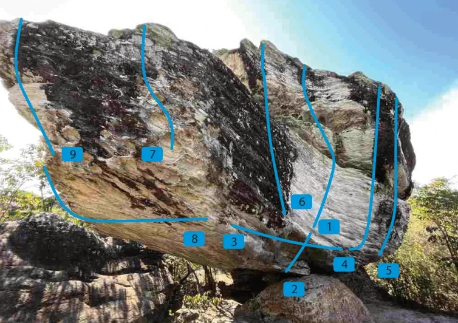
          - **largura_mapa**: 754
          - **altura_mapa**: 532
          - **pontos_de_interesse**:
            - **[0]**:
              - **id**: QbtjZrwqFAhV9G
              - **uid**: QbtjZrwqFAhV9G
              - **rotulo**: 1
              - **retangulo**:
                - **x**: 542
                - **y**: 374
                - **comprimento**: 36
                - **largura**: 23
              - **label**: 1
            - **[1]**:
              - **id**: OHrSTlHmtBjE4D
              - **uid**: OHrSTlHmtBjE4D
              - **rotulo**: 2
              - **retangulo**:
                - **x**: 485
                - **y**: 476
                - **comprimento**: 34
                - **largura**: 24
              - **label**: 2
            - **[2]**:
              - **id**: MnwWtRaQLAWLG2
              - **uid**: MnwWtRaQLAWLG2
              - **rotulo**: 3
              - **retangulo**:
                - **x**: 386
                - **y**: 397
                - **comprimento**: 35
                - **largura**: 26
              - **label**: 3
            - **[3]**:
              - **id**: n9XjgIBu3thS27
              - **uid**: n9XjgIBu3thS27
              - **rotulo**: 4
              - **retangulo**:
                - **x**: 567
                - **y**: 435
                - **comprimento**: 34
                - **largura**: 24
              - **label**: 4
            - **[4]**:
              - **id**: tKTzpesxgCpVG9
              - **uid**: tKTzpesxgCpVG9
              - **rotulo**: 5
              - **retangulo**:
                - **x**: 640
                - **y**: 446
                - **comprimento**: 35
                - **largura**: 24
              - **label**: 5
            - **[5]**:
              - **id**: EeqGNeSieAX3iA
              - **uid**: EeqGNeSieAX3iA
              - **rotulo**: 6
              - **retangulo**:
                - **x**: 497
                - **y**: 332
                - **comprimento**: 36
                - **largura**: 23
              - **label**: 6
            - **[6]**:
              - **id**: OfIbyPZ6nLZGfw
              - **uid**: OfIbyPZ6nLZGfw
              - **rotulo**: 7
              - **retangulo**:
                - **x**: 250
                - **y**: 254
                - **comprimento**: 35
                - **largura**: 25
              - **label**: 7
            - **[7]**:
              - **id**: 1QXjxqEBGCXa88
              - **uid**: 1QXjxqEBGCXa88
              - **rotulo**: 8
              - **retangulo**:
                - **x**: 320
                - **y**: 392
                - **comprimento**: 35
                - **largura**: 23
              - **label**: 8
            - **[8]**:
              - **id**: PHTZeN988HuQtp
              - **uid**: PHTZeN988HuQtp
              - **rotulo**: 9
              - **retangulo**:
                - **x**: 118
                - **y**: 254
                - **comprimento**: 35
                - **largura**: 23
              - **label**: 9
          - **referencias**:
            - **[0]**:
              - **alvo_uid**: vbh8BV9hf9lf3d
              - **pontos_uids**:
                - QbtjZrwqFAhV9G
              - **escalada**: Viajante
              - **ids**:
                - QbtjZrwqFAhV9G
            - **[1]**:
              - **alvo_uid**: hWt2Gg1D7oMziV
              - **pontos_uids**:
                - OHrSTlHmtBjE4D
              - **escalada**: Viajante SDS
              - **ids**:
                - OHrSTlHmtBjE4D
            - **[2]**:
              - **alvo_uid**: ICf4GgPEtPqCgN
              - **pontos_uids**:
                - MnwWtRaQLAWLG2
              - **escalada**: (sem nome 8)
              - **ids**:
                - MnwWtRaQLAWLG2
            - **[3]**:
              - **alvo_uid**: K5DKbA3iVJA0uS
              - **pontos_uids**:
                - n9XjgIBu3thS27
              - **escalada**: (sem nome 9)
              - **ids**:
                - n9XjgIBu3thS27
            - **[4]**:
              - **alvo_uid**: YFP6tbMx1y5fTn
              - **pontos_uids**:
                - tKTzpesxgCpVG9
              - **escalada**: (sem nome 10)
              - **ids**:
                - tKTzpesxgCpVG9
            - **[5]**:
              - **alvo_uid**: Duv947Qymxs3lt
              - **pontos_uids**:
                - EeqGNeSieAX3iA
              - **escalada**: Champagne
              - **ids**:
                - EeqGNeSieAX3iA
            - **[6]**:
              - **alvo_uid**: z7bbU2F29q02Ng
              - **pontos_uids**:
                - OfIbyPZ6nLZGfw
              - **escalada**: Bonitinho
              - **ids**:
                - OfIbyPZ6nLZGfw
            - **[7]**:
              - **alvo_uid**: vtadyW2ly3ZO0h
              - **pontos_uids**:
                - 1QXjxqEBGCXa88
              - **escalada**: Caravana
              - **ids**:
                - 1QXjxqEBGCXa88
            - **[8]**:
              - **alvo_uid**: 5oU241sJn4L28d
              - **pontos_uids**:
                - PHTZeN988HuQtp
              - **escalada**: (sem nome 11)
              - **ids**:
                - PHTZeN988HuQtp
        - **[1]**:
          - **caminho_imagem_mapa**: 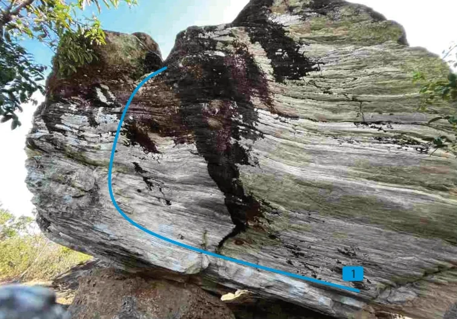
          - **largura_mapa**: 755
          - **altura_mapa**: 528
          - **pontos_de_interesse**:
            - **[0]**:
              - **id**: USWuJLztILh70l
              - **uid**: USWuJLztILh70l
              - **rotulo**: 1
              - **retangulo**:
                - **x**: 583
                - **y**: 452
                - **comprimento**: 34
                - **largura**: 26
              - **label**: 1
          - **referencias**:
            - **[0]**:
              - **alvo_uid**: Znr1Oy0t8tVF3o
              - **pontos_uids**:
                - USWuJLztILh70l
              - **escalada**: Bomba Atômica
              - **ids**:
                - USWuJLztILh70l
        - **[2]**:
          - **caminho_imagem_mapa**: 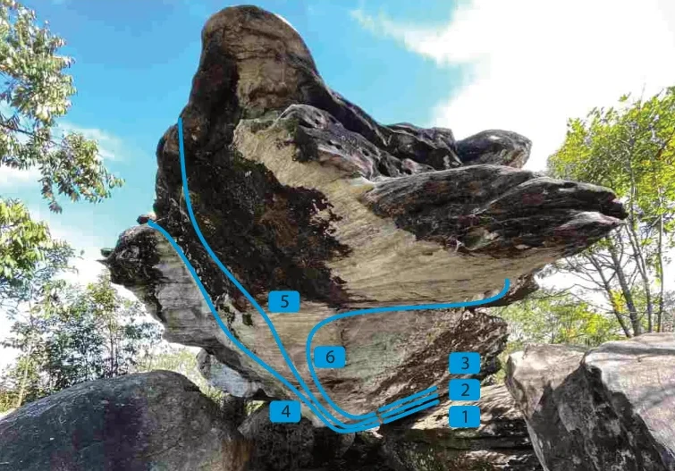
          - **largura_mapa**: 755
          - **altura_mapa**: 527
          - **pontos_de_interesse**:
            - **[0]**:
              - **id**: dtzs9pXa1SmfxV
              - **uid**: dtzs9pXa1SmfxV
              - **rotulo**: 1
              - **retangulo**:
                - **x**: 520
                - **y**: 467
                - **comprimento**: 35
                - **largura**: 24
              - **label**: 1
            - **[1]**:
              - **id**: CVWnOrdHvhGh1l
              - **uid**: CVWnOrdHvhGh1l
              - **rotulo**: 2
              - **retangulo**:
                - **x**: 520
                - **y**: 436
                - **comprimento**: 33
                - **largura**: 25
              - **label**: 2
            - **[2]**:
              - **id**: 4UkKnLah9plLgm
              - **uid**: 4UkKnLah9plLgm
              - **rotulo**: 3
              - **retangulo**:
                - **x**: 519
                - **y**: 406
                - **comprimento**: 34
                - **largura**: 24
              - **label**: 3
            - **[3]**:
              - **id**: 9662Ta1gcUQHyX
              - **uid**: 9662Ta1gcUQHyX
              - **rotulo**: 4
              - **retangulo**:
                - **x**: 319
                - **y**: 460
                - **comprimento**: 34
                - **largura**: 25
              - **label**: 4
            - **[4]**:
              - **id**: F8mUyzJaOMa4lc
              - **uid**: F8mUyzJaOMa4lc
              - **rotulo**: 5
              - **retangulo**:
                - **x**: 318
                - **y**: 338
                - **comprimento**: 35
                - **largura**: 26
              - **label**: 5
            - **[5]**:
              - **id**: RjRWLALZTTlphh
              - **uid**: RjRWLALZTTlphh
              - **rotulo**: 6
              - **retangulo**:
                - **x**: 370
                - **y**: 400
                - **comprimento**: 35
                - **largura**: 25
              - **label**: 6
          - **referencias**:
            - **[0]**:
              - **alvo_uid**: 28NO9MHD5bAgzM
              - **pontos_uids**:
                - dtzs9pXa1SmfxV
              - **escalada**: No Claro
              - **ids**:
                - dtzs9pXa1SmfxV
            - **[1]**:
              - **alvo_uid**: HhdDt7mOkftwUp
              - **pontos_uids**:
                - CVWnOrdHvhGh1l
              - **escalada**: No Escuro
              - **ids**:
                - CVWnOrdHvhGh1l
            - **[2]**:
              - **alvo_uid**: bewfeEJ734k2yv
              - **pontos_uids**:
                - 4UkKnLah9plLgm
              - **escalada**: Falafofancho
              - **ids**:
                - 4UkKnLah9plLgm
            - **[3]**:
              - **alvo_uid**: QTIajeTwTfOAAo
              - **pontos_uids**:
                - 9662Ta1gcUQHyX
              - **escalada**: No Claro SDS
              - **ids**:
                - 9662Ta1gcUQHyX
            - **[4]**:
              - **alvo_uid**: HFhqENACpNXX6r
              - **pontos_uids**:
                - F8mUyzJaOMa4lc
              - **escalada**: No Escuro SDS
              - **ids**:
                - F8mUyzJaOMa4lc
            - **[5]**:
              - **alvo_uid**: RgbQcCFn26I0zy
              - **pontos_uids**:
                - RjRWLALZTTlphh
              - **escalada**: Falafofancho SDS
              - **ids**:
                - RjRWLALZTTlphh
        - **[3]**:
          - **caminho_imagem_mapa**: 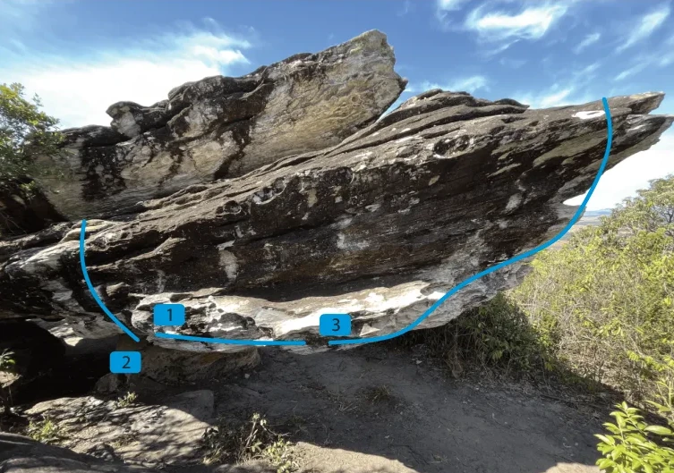
          - **largura_mapa**: 753
          - **altura_mapa**: 529
          - **pontos_de_interesse**:
            - **[0]**:
              - **id**: CCFkZBuXNJnPkA
              - **uid**: CCFkZBuXNJnPkA
              - **rotulo**: 1
              - **retangulo**:
                - **x**: 190
                - **y**: 352
                - **comprimento**: 31
                - **largura**: 26
              - **label**: 1
            - **[1]**:
              - **id**: xf0qPlZKAfHLqE
              - **uid**: xf0qPlZKAfHLqE
              - **rotulo**: 2
              - **retangulo**:
                - **x**: 140
                - **y**: 406
                - **comprimento**: 33
                - **largura**: 25
              - **label**: 2
            - **[2]**:
              - **id**: bb16Vg7OKh1gGm
              - **uid**: bb16Vg7OKh1gGm
              - **rotulo**: 3
              - **retangulo**:
                - **x**: 374
                - **y**: 364
                - **comprimento**: 35
                - **largura**: 24
              - **label**: 3
          - **referencias**:
            - **[0]**:
              - **alvo_uid**: VVX4TVoXS2B0uy
              - **pontos_uids**:
                - CCFkZBuXNJnPkA
              - **escalada**: (sem nome 12)
              - **ids**:
                - CCFkZBuXNJnPkA
            - **[1]**:
              - **alvo_uid**: CbvOv7uBrwHif1
              - **pontos_uids**:
                - xf0qPlZKAfHLqE
              - **escalada**: (sem nome 13)
              - **ids**:
                - xf0qPlZKAfHLqE
            - **[2]**:
              - **alvo_uid**: ZsFO7Eo2yalkeA
              - **pontos_uids**:
                - bb16Vg7OKh1gGm
              - **escalada**: (sem nome 14)
              - **ids**:
                - bb16Vg7OKh1gGm
      - **escaladas**:
        - **[0]**:
          - **uid**: vbh8BV9hf9lf3d
          - **boulder**:
            - **nome**: Viajante
            - **dificuldade**: V7
        - **[1]**:
          - **uid**: hWt2Gg1D7oMziV
          - **boulder**:
            - **nome**: Viajante SDS
            - **dificuldade**: V9
        - **[2]**:
          - **uid**: ICf4GgPEtPqCgN
          - **boulder**:
            - **nome**: (sem nome 8)
            - **dificuldade**: V9
        - **[3]**:
          - **uid**: K5DKbA3iVJA0uS
          - **boulder**:
            - **nome**: (sem nome 9)
            - **dificuldade**: V7
        - **[4]**:
          - **uid**: YFP6tbMx1y5fTn
          - **boulder**:
            - **nome**: (sem nome 10)
            - **dificuldade**: V5
        - **[5]**:
          - **uid**: Duv947Qymxs3lt
          - **boulder**:
            - **nome**: Champagne
            - **dificuldade**: V8
        - **[6]**:
          - **uid**: z7bbU2F29q02Ng
          - **boulder**:
            - **nome**: Bonitinho
            - **dificuldade**: V1
        - **[7]**:
          - **uid**: vtadyW2ly3ZO0h
          - **boulder**:
            - **nome**: Caravana
            - **dificuldade**: V7
        - **[8]**:
          - **uid**: 5oU241sJn4L28d
          - **boulder**:
            - **nome**: (sem nome 11)
            - **dificuldade**: V1
        - **[9]**:
          - **uid**: Znr1Oy0t8tVF3o
          - **boulder**:
            - **nome**: Bomba Atômica
            - **dificuldade**: V11
        - **[10]**:
          - **uid**: 28NO9MHD5bAgzM
          - **boulder**:
            - **nome**: No Claro
            - **dificuldade**: V7
        - **[11]**:
          - **uid**: HhdDt7mOkftwUp
          - **boulder**:
            - **nome**: No Escuro
            - **dificuldade**: V5
        - **[12]**:
          - **uid**: bewfeEJ734k2yv
          - **boulder**:
            - **nome**: Falafofancho
            - **dificuldade**: V4
        - **[13]**:
          - **uid**: QTIajeTwTfOAAo
          - **boulder**:
            - **nome**: No Claro SDS
            - **dificuldade**: V9
        - **[14]**:
          - **uid**: HFhqENACpNXX6r
          - **boulder**:
            - **nome**: No Escuro SDS
            - **dificuldade**: V7
        - **[15]**:
          - **uid**: RgbQcCFn26I0zy
          - **boulder**:
            - **nome**: Falafofancho SDS
            - **dificuldade**: V6
        - **[16]**:
          - **uid**: VVX4TVoXS2B0uy
          - **boulder**:
            - **nome**: (sem nome 12)
            - **dificuldade**: V3
        - **[17]**:
          - **uid**: CbvOv7uBrwHif1
          - **boulder**:
            - **nome**: (sem nome 13)
            - **dificuldade**: V3
        - **[18]**:
          - **uid**: ZsFO7Eo2yalkeA
          - **boulder**:
            - **nome**: (sem nome 14)
            - **dificuldade**: V1
      - **precomputados**:
        - **total_escaladas**: 19
        - **total_boulders**: 19
  - **[6]**:
    - **conteudo**:
      - **descricao**:
          # Setor Jubileu
          
          O setor Jubileu possui blocos interessantes com linhas de dificuldade intermediária.
          
          Obs.: Não foram identificadas todas as linhas desse bloco. Certifique-se antes de fazer uma possível primeira ascensão.
      - **nome**: Jubileu
      - **uid**: ZIkSfGNugqHMnX
      - **mapas**:
        - **[0]**:
          - **caminho_imagem_mapa**: 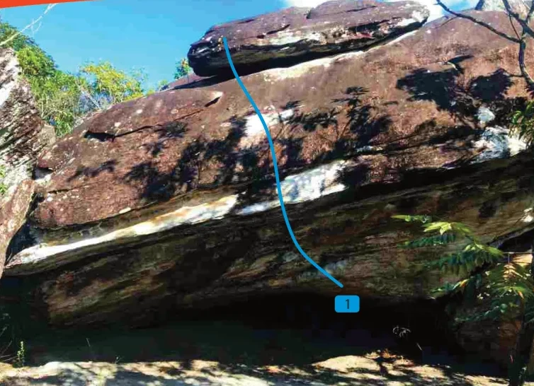
          - **largura_mapa**: 754
          - **altura_mapa**: 546
          - **pontos_de_interesse**:
            - **[0]**:
              - **id**: 1wqH4HNvRZThS5
              - **uid**: 1wqH4HNvRZThS5
              - **rotulo**: 1
              - **retangulo**:
                - **x**: 490
                - **y**: 431
                - **comprimento**: 33
                - **largura**: 24
              - **label**: 1
          - **referencias**:
            - **[0]**:
              - **alvo_uid**: QYxhLYCzKXQ05F
              - **pontos_uids**:
                - 1wqH4HNvRZThS5
              - **escalada**: Jubileu
              - **ids**:
                - 1wqH4HNvRZThS5
        - **[1]**:
          - **caminho_imagem_mapa**: 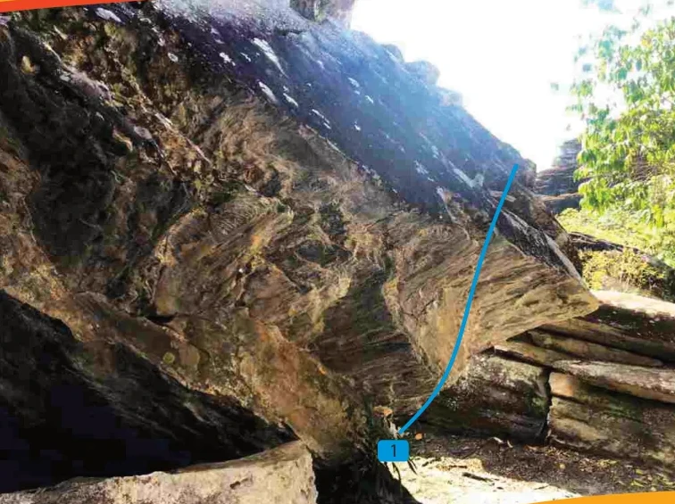
          - **largura_mapa**: 756
          - **altura_mapa**: 565
          - **pontos_de_interesse**:
            - **[0]**:
              - **id**: kdI52e5jAcVEXJ
              - **uid**: kdI52e5jAcVEXJ
              - **rotulo**: 1
              - **retangulo**:
                - **x**: 441
                - **y**: 506
                - **comprimento**: 34
                - **largura**: 23
              - **label**: 1
          - **referencias**:
            - **[0]**:
              - **alvo_uid**: eaxPBt5B9TDRuQ
              - **pontos_uids**:
                - kdI52e5jAcVEXJ
              - **escalada**: Eu Te Disse
              - **ids**:
                - kdI52e5jAcVEXJ
        - **[2]**:
          - **caminho_imagem_mapa**: 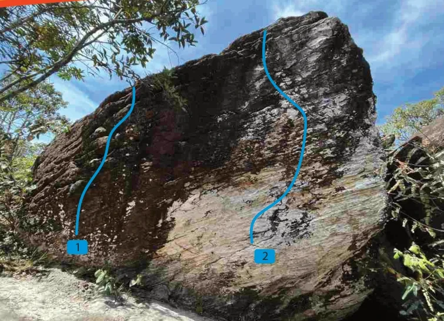
          - **largura_mapa**: 755
          - **altura_mapa**: 547
          - **pontos_de_interesse**:
            - **[0]**:
              - **id**: EeFlcKE9acgMmB
              - **uid**: EeFlcKE9acgMmB
              - **rotulo**: 1
              - **retangulo**:
                - **x**: 132
                - **y**: 421
                - **comprimento**: 34
                - **largura**: 24
              - **label**: 1
            - **[1]**:
              - **id**: osa15bhPk0Qus2
              - **uid**: osa15bhPk0Qus2
              - **rotulo**: 2
              - **retangulo**:
                - **x**: 450
                - **y**: 437
                - **comprimento**: 33
                - **largura**: 26
              - **label**: 2
          - **referencias**:
            - **[0]**:
              - **alvo_uid**: 7toq2gfGFXAPbV
              - **pontos_uids**:
                - EeFlcKE9acgMmB
              - **escalada**: (sem nome 18)
              - **ids**:
                - EeFlcKE9acgMmB
            - **[1]**:
              - **alvo_uid**: YEBDSGf0y3VpHZ
              - **pontos_uids**:
                - osa15bhPk0Qus2
              - **escalada**: (sem nome 19)
              - **ids**:
                - osa15bhPk0Qus2
      - **escaladas**:
        - **[0]**:
          - **uid**: QYxhLYCzKXQ05F
          - **boulder**:
            - **nome**: Jubileu
            - **dificuldade**: V7
        - **[1]**:
          - **uid**: eaxPBt5B9TDRuQ
          - **boulder**:
            - **nome**: Eu Te Disse
            - **dificuldade**: V5
        - **[2]**:
          - **uid**: 7toq2gfGFXAPbV
          - **boulder**:
            - **nome**: (sem nome 18)
            - **dificuldade**: V2
        - **[3]**:
          - **uid**: YEBDSGf0y3VpHZ
          - **boulder**:
            - **nome**: (sem nome 19)
            - **dificuldade**: V2
      - **precomputados**:
        - **total_escaladas**: 4
        - **total_boulders**: 4
  - **[7]**:
    - **conteudo**:
      - **descricao**:
          # Setor Conceição
          
          O setor Conceição apresenta blocos com agarras boas e linhas de técnica.
          
          Obs.: Não foram identificadas todas as linhas desse bloco. Certifique-se antes de fazer uma possível primeira ascensão.
      - **nome**: Conceição
      - **uid**: 1UnylXLq321R7V
      - **mapas**:
        - **[0]**:
          - **caminho_imagem_mapa**: 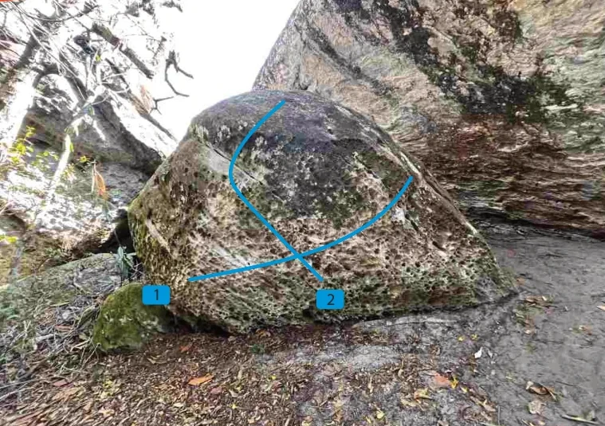
          - **largura_mapa**: 759
          - **altura_mapa**: 535
          - **pontos_de_interesse**:
            - **[0]**:
              - **id**: 9QMZY5rl57n3fs
              - **uid**: 9QMZY5rl57n3fs
              - **rotulo**: 1
              - **retangulo**:
                - **x**: 196
                - **y**: 370
                - **comprimento**: 35
                - **largura**: 25
              - **label**: 1
            - **[1]**:
              - **id**: jG0OLj6SSo5MZI
              - **uid**: jG0OLj6SSo5MZI
              - **rotulo**: 2
              - **retangulo**:
                - **x**: 414
                - **y**: 376
                - **comprimento**: 33
                - **largura**: 24
              - **label**: 2
          - **referencias**:
            - **[0]**:
              - **alvo_uid**: byvHbVKCHYYh8p
              - **pontos_uids**:
                - 9QMZY5rl57n3fs
              - **escalada**: Conceição do Mato Dentro
              - **ids**:
                - 9QMZY5rl57n3fs
            - **[1]**:
              - **alvo_uid**: 5WIgZpOiONguNI
              - **pontos_uids**:
                - jG0OLj6SSo5MZI
              - **escalada**: (sem nome 15)
              - **ids**:
                - jG0OLj6SSo5MZI
        - **[1]**:
          - **caminho_imagem_mapa**: 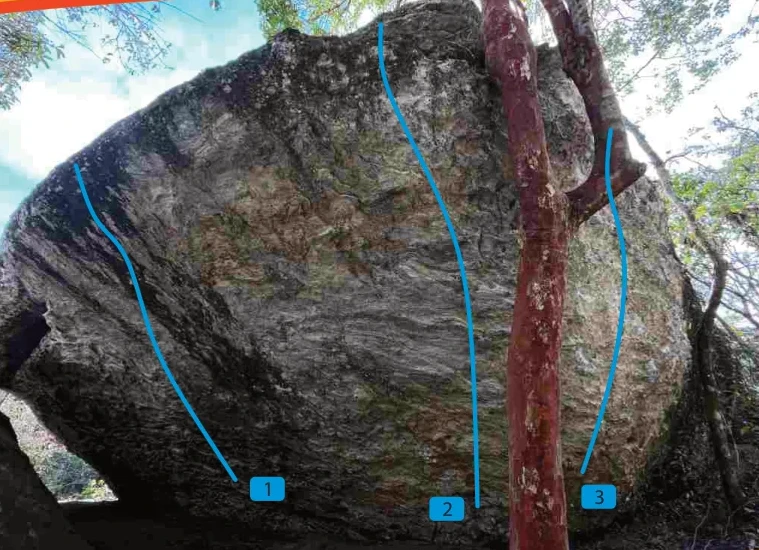
          - **largura_mapa**: 759
          - **altura_mapa**: 550
          - **pontos_de_interesse**:
            - **[0]**:
              - **id**: n3DFg2BZB4EnOD
              - **uid**: n3DFg2BZB4EnOD
              - **rotulo**: 1
              - **retangulo**:
                - **x**: 268
                - **y**: 489
                - **comprimento**: 33
                - **largura**: 22
              - **label**: 1
            - **[1]**:
              - **id**: dWf8rnyDLQ0kGf
              - **uid**: dWf8rnyDLQ0kGf
              - **rotulo**: 2
              - **retangulo**:
                - **x**: 448
                - **y**: 508
                - **comprimento**: 33
                - **largura**: 25
              - **label**: 2
            - **[2]**:
              - **id**: HFjX4yJ3RbF9m0
              - **uid**: HFjX4yJ3RbF9m0
              - **rotulo**: 3
              - **retangulo**:
                - **x**: 598
                - **y**: 497
                - **comprimento**: 35
                - **largura**: 24
              - **label**: 3
          - **referencias**:
            - **[0]**:
              - **alvo_uid**: Tw60MjVF1zbNXx
              - **pontos_uids**:
                - n3DFg2BZB4EnOD
              - **escalada**: Tobogã
              - **ids**:
                - n3DFg2BZB4EnOD
            - **[1]**:
              - **alvo_uid**: 471XsZoZI1DD3l
              - **pontos_uids**:
                - dWf8rnyDLQ0kGf
              - **escalada**: No Dab
              - **ids**:
                - dWf8rnyDLQ0kGf
            - **[2]**:
              - **alvo_uid**: eNxgeJQGPnsZY3
              - **pontos_uids**:
                - HFjX4yJ3RbF9m0
              - **escalada**: (sem nome 16)
              - **ids**:
                - HFjX4yJ3RbF9m0
      - **escaladas**:
        - **[0]**:
          - **uid**: byvHbVKCHYYh8p
          - **boulder**:
            - **nome**: Conceição do Mato Dentro
            - **dificuldade**: V4
        - **[1]**:
          - **uid**: 5WIgZpOiONguNI
          - **boulder**:
            - **nome**: (sem nome 15)
            - **dificuldade**: V2
        - **[2]**:
          - **uid**: Tw60MjVF1zbNXx
          - **boulder**:
            - **nome**: Tobogã
            - **dificuldade**: V4
        - **[3]**:
          - **uid**: 471XsZoZI1DD3l
          - **boulder**:
            - **nome**: No Dab
            - **dificuldade**: V7
        - **[4]**:
          - **uid**: eNxgeJQGPnsZY3
          - **boulder**:
            - **nome**: (sem nome 16)
            - **dificuldade**: V2
      - **precomputados**:
        - **total_escaladas**: 5
        - **total_boulders**: 5
  - **[8]**:
    - **conteudo**:
      - **descricao**:
          # Setor Bobsled
          
          O setor Bobsled possui um bloco com linhas atléticas e passagens de força.
          
          Obs.: Não foram identificadas todas as linhas desse bloco. Certifique-se antes de fazer uma possível primeira ascensão.
      - **nome**: Bobsled
      - **uid**: 19m6huz3tACiyA
      - **mapas**:
        - **[0]**:
          - **caminho_imagem_mapa**: 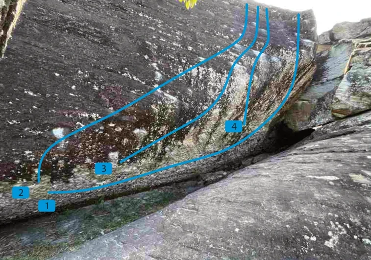
          - **largura_mapa**: 757
          - **altura_mapa**: 531
          - **pontos_de_interesse**:
            - **[0]**:
              - **id**: OH3X96Fvv8Xn9H
              - **uid**: OH3X96Fvv8Xn9H
              - **rotulo**: 1
              - **retangulo**:
                - **x**: 96
                - **y**: 420
                - **comprimento**: 34
                - **largura**: 24
              - **label**: 1
            - **[1]**:
              - **id**: WpjGLzao79djkR
              - **uid**: WpjGLzao79djkR
              - **rotulo**: 2
              - **retangulo**:
                - **x**: 42
                - **y**: 393
                - **comprimento**: 35
                - **largura**: 24
              - **label**: 2
            - **[2]**:
              - **id**: 9M1SKLsm9HDDl6
              - **uid**: 9M1SKLsm9HDDl6
              - **rotulo**: 3
              - **retangulo**:
                - **x**: 211
                - **y**: 345
                - **comprimento**: 34
                - **largura**: 24
              - **label**: 3
            - **[3]**:
              - **id**: sVSKfHfyB1f4eC
              - **uid**: sVSKfHfyB1f4eC
              - **rotulo**: 4
              - **retangulo**:
                - **x**: 477
                - **y**: 258
                - **comprimento**: 34
                - **largura**: 25
              - **label**: 4
          - **referencias**:
            - **[0]**:
              - **alvo_uid**: MPHmOPJssQEunO
              - **pontos_uids**:
                - OH3X96Fvv8Xn9H
              - **escalada**: Eterna Juventude
              - **ids**:
                - OH3X96Fvv8Xn9H
            - **[1]**:
              - **alvo_uid**: 1Pg8EKwJfUdtby
              - **pontos_uids**:
                - WpjGLzao79djkR
              - **escalada**: Episódio do Dia
              - **ids**:
                - WpjGLzao79djkR
            - **[2]**:
              - **alvo_uid**: 0zr5qMNCNBhlmK
              - **pontos_uids**:
                - 9M1SKLsm9HDDl6
              - **escalada**: Saideira
              - **ids**:
                - 9M1SKLsm9HDDl6
            - **[3]**:
              - **alvo_uid**: 1KuvdbglgsDWHe
              - **pontos_uids**:
                - sVSKfHfyB1f4eC
              - **escalada**: Bobsled
              - **ids**:
                - sVSKfHfyB1f4eC
      - **escaladas**:
        - **[0]**:
          - **uid**: MPHmOPJssQEunO
          - **boulder**:
            - **nome**: Eterna Juventude
            - **dificuldade**: V9
        - **[1]**:
          - **uid**: 1Pg8EKwJfUdtby
          - **boulder**:
            - **nome**: Episódio do Dia
            - **dificuldade**: V8
        - **[2]**:
          - **uid**: 0zr5qMNCNBhlmK
          - **boulder**:
            - **nome**: Saideira
            - **dificuldade**: V4
        - **[3]**:
          - **uid**: 1KuvdbglgsDWHe
          - **boulder**:
            - **nome**: Bobsled
            - **dificuldade**: V7
      - **precomputados**:
        - **total_escaladas**: 4
        - **total_boulders**: 4
  - **[9]**:
    - **conteudo**:
      - **descricao**:
          # Setor Aresta do Cabeça
          
          O setor Aresta do Cabeça apresenta um bloco com uma linha clássica de aresta, exigindo equilíbrio e técnica.
          
          Obs.: Não foram identificadas todas as linhas desse bloco. Certifique-se antes de fazer uma possível primeira ascensão.
      - **nome**: Aresta do Cabeça
      - **uid**: iZJd5BxEiCNhso
      - **mapas**:
        - **[0]**:
          - **caminho_imagem_mapa**: 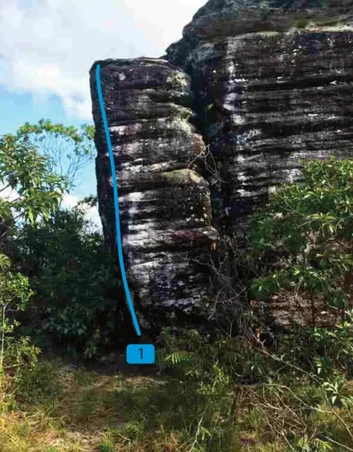
          - **largura_mapa**: 440
          - **altura_mapa**: 564
          - **pontos_de_interesse**:
            - **[0]**:
              - **id**: IoYVWpIMkUA4ID
              - **uid**: IoYVWpIMkUA4ID
              - **rotulo**: 1
              - **retangulo**:
                - **x**: 175
                - **y**: 442
                - **comprimento**: 34
                - **largura**: 25
              - **label**: 1
          - **referencias**:
            - **[0]**:
              - **alvo_uid**: 5nQQ5rlh22MhB1
              - **pontos_uids**:
                - IoYVWpIMkUA4ID
              - **escalada**: Aresta do Cabeça
              - **ids**:
                - IoYVWpIMkUA4ID
      - **escaladas**:
        - **[0]**:
          - **uid**: 5nQQ5rlh22MhB1
          - **boulder**:
            - **nome**: Aresta do Cabeça
            - **dificuldade**: V6
      - **precomputados**:
        - **total_escaladas**: 1
        - **total_boulders**: 1
  - **[10]**:
    - **conteudo**:
      - **descricao**:
          # Setor Equinócio
          
          O setor Equinócio possui um bloco com linhas interessantes e agarras variadas.
          
          Obs.: Não foram identificadas todas as linhas desse bloco. Certifique-se antes de fazer uma possível primeira ascensão.
      - **nome**: Equinócio
      - **uid**: FbDfAbWOrmCBZp
      - **mapas**:
        - **[0]**:
          - **caminho_imagem_mapa**: 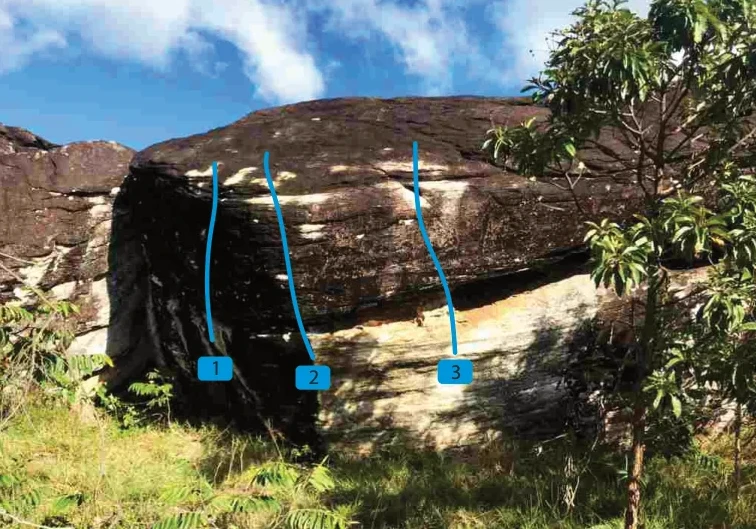
          - **largura_mapa**: 756
          - **altura_mapa**: 529
          - **pontos_de_interesse**:
            - **[0]**:
              - **id**: 1fEu80TmSOd9C7
              - **uid**: 1fEu80TmSOd9C7
              - **rotulo**: 1
              - **retangulo**:
                - **x**: 214
                - **y**: 369
                - **comprimento**: 33
                - **largura**: 24
              - **label**: 1
            - **[1]**:
              - **id**: fVenV05fRx7kp2
              - **uid**: fVenV05fRx7kp2
              - **rotulo**: 2
              - **retangulo**:
                - **x**: 313
                - **y**: 378
                - **comprimento**: 32
                - **largura**: 24
              - **label**: 2
            - **[2]**:
              - **id**: 5gRLozgyO5ABNW
              - **uid**: 5gRLozgyO5ABNW
              - **rotulo**: 3
              - **retangulo**:
                - **x**: 456
                - **y**: 372
                - **comprimento**: 35
                - **largura**: 25
              - **label**: 3
          - **referencias**:
            - **[0]**:
              - **alvo_uid**: tEwhQd1vQMVGoY
              - **pontos_uids**:
                - 1fEu80TmSOd9C7
              - **escalada**: Campo Minado
              - **ids**:
                - 1fEu80TmSOd9C7
            - **[1]**:
              - **alvo_uid**: R0gT7kVRSyqBou
              - **pontos_uids**:
                - fVenV05fRx7kp2
              - **escalada**: Kalil
              - **ids**:
                - fVenV05fRx7kp2
            - **[2]**:
              - **alvo_uid**: Iy012rMgdhHA1P
              - **pontos_uids**:
                - 5gRLozgyO5ABNW
              - **escalada**: Costela de Adão
              - **ids**:
                - 5gRLozgyO5ABNW
      - **escaladas**:
        - **[0]**:
          - **uid**: tEwhQd1vQMVGoY
          - **boulder**:
            - **nome**: Campo Minado
            - **dificuldade**: V6
        - **[1]**:
          - **uid**: R0gT7kVRSyqBou
          - **boulder**:
            - **nome**: Kalil
            - **dificuldade**: V5
        - **[2]**:
          - **uid**: Iy012rMgdhHA1P
          - **boulder**:
            - **nome**: Costela de Adão
            - **dificuldade**: V2
      - **precomputados**:
        - **total_escaladas**: 3
        - **total_boulders**: 3
  - **[11]**:
    - **conteudo**:
      - **descricao**:
          # Setor Witness
          
          O setor Witness possui blocos imponentes com linhas de altíssima dificuldade, incluindo boulders de nível mundial.
          
          Obs.: Não foram identificadas todas as linhas desse bloco. Certifique-se antes de fazer uma possível primeira ascensão.
      - **nome**: Witness
      - **uid**: MwfeN0k5sY83kY
      - **mapas**:
        - **[0]**:
          - **caminho_imagem_mapa**: 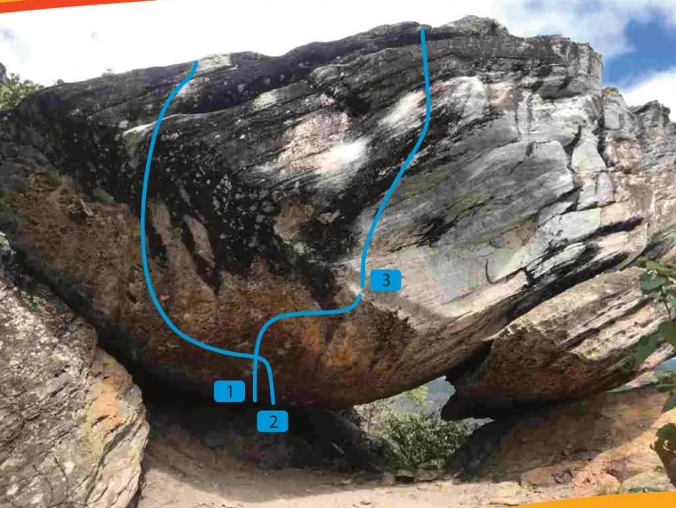
          - **largura_mapa**: 759
          - **altura_mapa**: 570
          - **pontos_de_interesse**:
            - **[0]**:
              - **id**: MBCEoG835hyFmR
              - **uid**: MBCEoG835hyFmR
              - **rotulo**: 1
              - **retangulo**:
                - **x**: 258
                - **y**: 438
                - **comprimento**: 32
                - **largura**: 22
              - **label**: 1
            - **[1]**:
              - **id**: AIIMm3CAXZTE8e
              - **uid**: AIIMm3CAXZTE8e
              - **rotulo**: 2
              - **retangulo**:
                - **x**: 306
                - **y**: 473
                - **comprimento**: 33
                - **largura**: 24
              - **label**: 2
            - **[2]**:
              - **id**: ZhZjywqsJeG7VG
              - **uid**: ZhZjywqsJeG7VG
              - **rotulo**: 3
              - **retangulo**:
                - **x**: 432
                - **y**: 314
                - **comprimento**: 33
                - **largura**: 24
              - **label**: 3
          - **referencias**:
            - **[0]**:
              - **alvo_uid**: R7c6UlaBNjXXe8
              - **pontos_uids**:
                - MBCEoG835hyFmR
              - **escalada**: Mandarim
              - **ids**:
                - MBCEoG835hyFmR
            - **[1]**:
              - **alvo_uid**: OwiUIfvsTYIvNm
              - **pontos_uids**:
                - AIIMm3CAXZTE8e
              - **escalada**: Pressão Corporal
              - **ids**:
                - AIIMm3CAXZTE8e
            - **[2]**:
              - **alvo_uid**: MyAwZeKbAzvw5W
              - **pontos_uids**:
                - ZhZjywqsJeG7VG
              - **escalada**: Witness the Weakness
              - **ids**:
                - ZhZjywqsJeG7VG
        - **[1]**:
          - **caminho_imagem_mapa**: 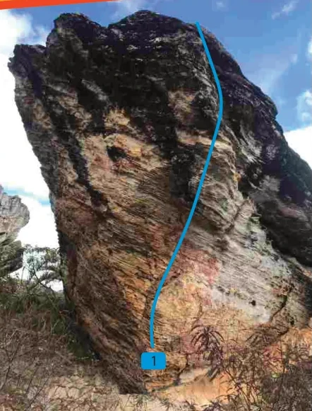
          - **largura_mapa**: 442
          - **altura_mapa**: 581
          - **pontos_de_interesse**:
            - **[0]**:
              - **id**: aBiUKyycnELnz2
              - **uid**: aBiUKyycnELnz2
              - **rotulo**: 1
              - **retangulo**:
                - **x**: 218
                - **y**: 510
                - **comprimento**: 33
                - **largura**: 23
              - **label**: 1
          - **referencias**:
            - **[0]**:
              - **alvo_uid**: URWrjwxqDvbozm
              - **pontos_uids**:
                - aBiUKyycnELnz2
              - **escalada**: Picasso
              - **ids**:
                - aBiUKyycnELnz2
      - **escaladas**:
        - **[0]**:
          - **uid**: R7c6UlaBNjXXe8
          - **boulder**:
            - **nome**: Mandarim
            - **dificuldade**: V13
        - **[1]**:
          - **uid**: OwiUIfvsTYIvNm
          - **boulder**:
            - **nome**: Pressão Corporal
            - **dificuldade**: V9
        - **[2]**:
          - **uid**: MyAwZeKbAzvw5W
          - **boulder**:
            - **nome**: Witness the Weakness
            - **dificuldade**: V11
        - **[3]**:
          - **uid**: URWrjwxqDvbozm
          - **boulder**:
            - **nome**: Picasso
            - **dificuldade**: V5
      - **precomputados**:
        - **total_escaladas**: 4
        - **total_boulders**: 4
  - **[12]**:
    - **conteudo**:
      - **descricao**:
          # Setor La Fúria
          
          O setor La Fúria possui blocos com abundância de agarras e linhas de diversas dificuldades, incluindo boulders de alta performance.
          
          Obs.: Não foram identificadas todas as linhas desse bloco. Certifique-se antes de fazer uma possível primeira ascensão.
      - **nome**: La Fúria
      - **uid**: gUuLVreg1RgUm6
      - **mapas**:
        - **[0]**:
          - **caminho_imagem_mapa**: 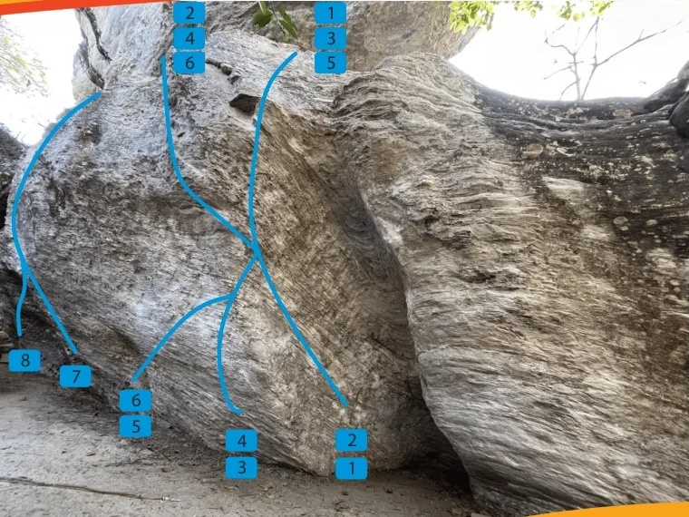
          - **largura_mapa**: 760
          - **altura_mapa**: 570
          - **pontos_de_interesse**:
            - **[0]**:
              - **id**: zzFRCn6LffYdcp
              - **uid**: zzFRCn6LffYdcp
              - **rotulo**: 1
              - **retangulo**:
                - **x**: 364
                - **y**: 14
                - **comprimento**: 33
                - **largura**: 24
              - **label**: 1
            - **[1]**:
              - **id**: uk7wFtQdQeaEN3
              - **uid**: uk7wFtQdQeaEN3
              - **rotulo**: 2
              - **retangulo**:
                - **x**: 208
                - **y**: 14
                - **comprimento**: 36
                - **largura**: 22
              - **label**: 2
            - **[2]**:
              - **id**: JnJVFxiQgQ6o2z
              - **uid**: JnJVFxiQgQ6o2z
              - **rotulo**: 3
              - **retangulo**:
                - **x**: 364
                - **y**: 42
                - **comprimento**: 35
                - **largura**: 22
              - **label**: 3
            - **[3]**:
              - **id**: V3ieF5vDR0RRBX
              - **uid**: V3ieF5vDR0RRBX
              - **rotulo**: 4
              - **retangulo**:
                - **x**: 208
                - **y**: 42
                - **comprimento**: 35
                - **largura**: 23
              - **label**: 4
            - **[4]**:
              - **id**: WdZVOR0PBs73KL
              - **uid**: WdZVOR0PBs73KL
              - **rotulo**: 5
              - **retangulo**:
                - **x**: 365
                - **y**: 69
                - **comprimento**: 36
                - **largura**: 24
              - **label**: 5
            - **[5]**:
              - **id**: mzSvG89IPieYIM
              - **uid**: mzSvG89IPieYIM
              - **rotulo**: 6
              - **retangulo**:
                - **x**: 209
                - **y**: 70
                - **comprimento**: 34
                - **largura**: 23
              - **label**: 6
            - **[6]**:
              - **id**: AURpwGOlJZNylN
              - **uid**: AURpwGOlJZNylN
              - **rotulo**: 7
              - **retangulo**:
                - **x**: 84
                - **y**: 416
                - **comprimento**: 35
                - **largura**: 23
              - **label**: 7
            - **[7]**:
              - **id**: WdcWX2RPUXPvTO
              - **uid**: WdcWX2RPUXPvTO
              - **rotulo**: 8
              - **retangulo**:
                - **x**: 28
                - **y**: 398
                - **comprimento**: 33
                - **largura**: 25
              - **label**: 8
            - **[8]**:
              - **id**: HUzQQDDuYoWijV
              - **uid**: HUzQQDDuYoWijV
              - **rotulo**: 6
              - **retangulo**:
                - **x**: 150
                - **y**: 442
                - **comprimento**: 34
                - **largura**: 23
              - **label**: 6
            - **[9]**:
              - **id**: oeY23ku14lPH1Z
              - **uid**: oeY23ku14lPH1Z
              - **rotulo**: 5
              - **retangulo**:
                - **x**: 150
                - **y**: 470
                - **comprimento**: 35
                - **largura**: 25
              - **label**: 5
            - **[10]**:
              - **id**: Aw4dtORDtjj41w
              - **uid**: Aw4dtORDtjj41w
              - **rotulo**: 4
              - **retangulo**:
                - **x**: 268
                - **y**: 486
                - **comprimento**: 33
                - **largura**: 24
              - **label**: 4
            - **[11]**:
              - **id**: bmuiC4S9ZZo82b
              - **uid**: bmuiC4S9ZZo82b
              - **rotulo**: 3
              - **retangulo**:
                - **x**: 266
                - **y**: 516
                - **comprimento**: 35
                - **largura**: 25
              - **label**: 3
            - **[12]**:
              - **id**: QxVLIlJobQ9INu
              - **uid**: QxVLIlJobQ9INu
              - **rotulo**: 2
              - **retangulo**:
                - **x**: 388
                - **y**: 486
                - **comprimento**: 37
                - **largura**: 26
              - **label**: 2
            - **[13]**:
              - **id**: LO0oE14PqlL6Ua
              - **uid**: LO0oE14PqlL6Ua
              - **rotulo**: 1
              - **retangulo**:
                - **x**: 389
                - **y**: 517
                - **comprimento**: 36
                - **largura**: 26
              - **label**: 1
          - **referencias**:
            - **[0]**:
              - **alvo_uid**: xL01tQ4vcHRDpx
              - **pontos_uids**:
                - zzFRCn6LffYdcp
                - LO0oE14PqlL6Ua
              - **escalada**: La Furia
              - **ids**:
                - zzFRCn6LffYdcp
                - LO0oE14PqlL6Ua
            - **[1]**:
              - **alvo_uid**: B6OmnB9AIX8lVf
              - **pontos_uids**:
                - uk7wFtQdQeaEN3
                - QxVLIlJobQ9INu
              - **escalada**: La Discordia
              - **ids**:
                - uk7wFtQdQeaEN3
                - QxVLIlJobQ9INu
            - **[2]**:
              - **alvo_uid**: ZX7Aq0ridhkzEh
              - **pontos_uids**:
                - JnJVFxiQgQ6o2z
                - bmuiC4S9ZZo82b
              - **escalada**: La Paloma
              - **ids**:
                - JnJVFxiQgQ6o2z
                - bmuiC4S9ZZo82b
            - **[3]**:
              - **alvo_uid**: 4HhzJHYPJQItf2
              - **pontos_uids**:
                - V3ieF5vDR0RRBX
                - Aw4dtORDtjj41w
              - **escalada**: La Discrepância
              - **ids**:
                - V3ieF5vDR0RRBX
                - Aw4dtORDtjj41w
            - **[4]**:
              - **alvo_uid**: IzC2CtxRvdqC7D
              - **pontos_uids**:
                - WdZVOR0PBs73KL
                - oeY23ku14lPH1Z
              - **escalada**: La Fuerza
              - **ids**:
                - WdZVOR0PBs73KL
                - oeY23ku14lPH1Z
            - **[5]**:
              - **alvo_uid**: qnpjGJPdazRBKq
              - **pontos_uids**:
                - mzSvG89IPieYIM
                - HUzQQDDuYoWijV
              - **escalada**: La Sinceridad
              - **ids**:
                - mzSvG89IPieYIM
                - HUzQQDDuYoWijV
            - **[6]**:
              - **alvo_uid**: b7JBfJVZHiOZWK
              - **pontos_uids**:
                - AURpwGOlJZNylN
              - **escalada**: Rei da Cápsula
              - **ids**:
                - AURpwGOlJZNylN
            - **[7]**:
              - **alvo_uid**: JjrHpTytGBCTce
              - **pontos_uids**:
                - WdcWX2RPUXPvTO
              - **escalada**: Choffer
              - **ids**:
                - WdcWX2RPUXPvTO
        - **[1]**:
          - **caminho_imagem_mapa**: 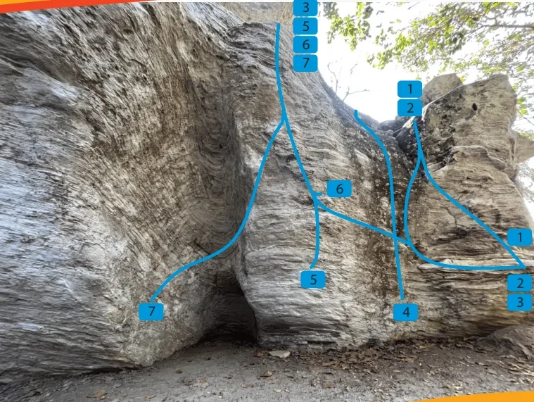
          - **largura_mapa**: 759
          - **altura_mapa**: 571
          - **pontos_de_interesse**:
            - **[0]**:
              - **id**: x8TyPAP1LqalRM
              - **uid**: x8TyPAP1LqalRM
              - **rotulo**: 1
              - **retangulo**:
                - **x**: 582
                - **y**: 126
                - **comprimento**: 34
                - **largura**: 23
              - **label**: 1
            - **[1]**:
              - **id**: aVSUMVhwlrUzrX
              - **uid**: aVSUMVhwlrUzrX
              - **rotulo**: 2
              - **retangulo**:
                - **x**: 582
                - **y**: 154
                - **comprimento**: 35
                - **largura**: 23
              - **label**: 2
            - **[2]**:
              - **id**: pTLwvPRE8qSHTC
              - **uid**: pTLwvPRE8qSHTC
              - **rotulo**: 3
              - **retangulo**:
                - **x**: 434
                - **y**: 12
                - **comprimento**: 33
                - **largura**: 23
              - **label**: 3
            - **[3]**:
              - **id**: ZvA71UnvH6ktOt
              - **uid**: ZvA71UnvH6ktOt
              - **rotulo**: 4
              - **retangulo**:
                - **x**: 577
                - **y**: 444
                - **comprimento**: 34
                - **largura**: 23
              - **label**: 4
            - **[4]**:
              - **id**: qyomUCjhHlcFiL
              - **uid**: qyomUCjhHlcFiL
              - **rotulo**: 5
              - **retangulo**:
                - **x**: 434
                - **y**: 37
                - **comprimento**: 34
                - **largura**: 22
              - **label**: 5
            - **[5]**:
              - **id**: 7oAjqHPwE7jefO
              - **uid**: 7oAjqHPwE7jefO
              - **rotulo**: 6
              - **retangulo**:
                - **x**: 434
                - **y**: 64
                - **comprimento**: 35
                - **largura**: 23
              - **label**: 6
            - **[6]**:
              - **id**: OvNzt24NvIKhly
              - **uid**: OvNzt24NvIKhly
              - **rotulo**: 7
              - **retangulo**:
                - **x**: 434
                - **y**: 90
                - **comprimento**: 36
                - **largura**: 24
              - **label**: 7
            - **[7]**:
              - **id**: Z3Qv4lYzPQ7Vvc
              - **uid**: Z3Qv4lYzPQ7Vvc
              - **rotulo**: 1
              - **retangulo**:
                - **x**: 740
                - **y**: 336
                - **comprimento**: 35
                - **largura**: 23
              - **label**: 1
            - **[8]**:
              - **id**: vIfScFeGnTKr8c
              - **uid**: vIfScFeGnTKr8c
              - **rotulo**: 2
              - **retangulo**:
                - **x**: 739
                - **y**: 402
                - **comprimento**: 34
                - **largura**: 24
              - **label**: 2
            - **[9]**:
              - **id**: PyK3Ot9cRVXlOJ
              - **uid**: PyK3Ot9cRVXlOJ
              - **rotulo**: 3
              - **retangulo**:
                - **x**: 738
                - **y**: 429
                - **comprimento**: 35
                - **largura**: 24
              - **label**: 3
            - **[10]**:
              - **id**: iMenJrKZMZZbg7
              - **uid**: iMenJrKZMZZbg7
              - **rotulo**: 5
              - **retangulo**:
                - **x**: 444
                - **y**: 396
                - **comprimento**: 33
                - **largura**: 23
              - **label**: 5
            - **[11]**:
              - **id**: 8e2VUOHVGb3tq9
              - **uid**: 8e2VUOHVGb3tq9
              - **rotulo**: 6
              - **retangulo**:
                - **x**: 482
                - **y**: 268
                - **comprimento**: 37
                - **largura**: 23
              - **label**: 6
            - **[12]**:
              - **id**: Tf03pFFvUR37oU
              - **uid**: Tf03pFFvUR37oU
              - **rotulo**: 7
              - **retangulo**:
                - **x**: 214
                - **y**: 442
                - **comprimento**: 37
                - **largura**: 23
              - **label**: 7
          - **referencias**:
            - **[0]**:
              - **alvo_uid**: IVnUJphxGOaH5r
              - **pontos_uids**:
                - x8TyPAP1LqalRM
                - Z3Qv4lYzPQ7Vvc
              - **escalada**: Bem Vindo
              - **ids**:
                - x8TyPAP1LqalRM
                - Z3Qv4lYzPQ7Vvc
            - **[1]**:
              - **alvo_uid**: E0smxkuKkdntZK
              - **pontos_uids**:
                - aVSUMVhwlrUzrX
                - vIfScFeGnTKr8c
              - **escalada**: Bem Vindo a Conceição
              - **ids**:
                - aVSUMVhwlrUzrX
                - vIfScFeGnTKr8c
            - **[2]**:
              - **alvo_uid**: dJWgHHCJW7fcHG
              - **pontos_uids**:
                - pTLwvPRE8qSHTC
                - PyK3Ot9cRVXlOJ
              - **escalada**: Bem Vindo aos Clássicos
              - **ids**:
                - pTLwvPRE8qSHTC
                - PyK3Ot9cRVXlOJ
            - **[3]**:
              - **alvo_uid**: r6KltWPCeZXpYG
              - **pontos_uids**:
                - ZvA71UnvH6ktOt
              - **escalada**: Né Possível
              - **ids**:
                - ZvA71UnvH6ktOt
            - **[4]**:
              - **alvo_uid**: BaARcOGuchHfbr
              - **pontos_uids**:
                - qyomUCjhHlcFiL
                - iMenJrKZMZZbg7
              - **escalada**: Malditos
              - **ids**:
                - qyomUCjhHlcFiL
                - iMenJrKZMZZbg7
            - **[5]**:
              - **alvo_uid**: lMdhl2UmYwNDKg
              - **pontos_uids**:
                - 7oAjqHPwE7jefO
                - 8e2VUOHVGb3tq9
              - **escalada**: Guardião
              - **ids**:
                - 7oAjqHPwE7jefO
                - 8e2VUOHVGb3tq9
            - **[6]**:
              - **alvo_uid**: 92C2ADhLDH5Irb
              - **pontos_uids**:
                - OvNzt24NvIKhly
                - Tf03pFFvUR37oU
              - **escalada**: Deixa Rolar
              - **ids**:
                - OvNzt24NvIKhly
                - Tf03pFFvUR37oU
        - **[2]**:
          - **caminho_imagem_mapa**: 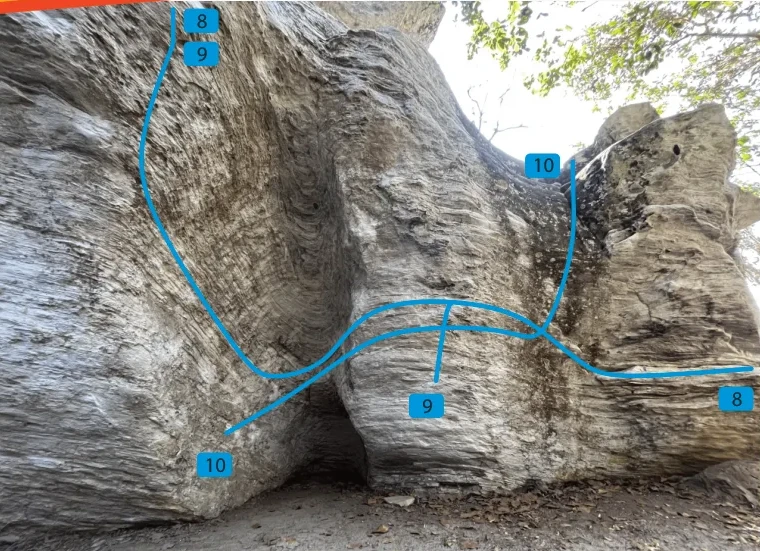
          - **largura_mapa**: 760
          - **altura_mapa**: 551
          - **pontos_de_interesse**:
            - **[0]**:
              - **id**: YZhGnSbweaCVeZ
              - **uid**: YZhGnSbweaCVeZ
              - **rotulo**: 8
              - **retangulo**:
                - **x**: 736
                - **y**: 399
                - **comprimento**: 32
                - **largura**: 22
              - **label**: 8
            - **[1]**:
              - **id**: G9KbDcl0wdTRFb
              - **uid**: G9KbDcl0wdTRFb
              - **rotulo**: 9
              - **retangulo**:
                - **x**: 426
                - **y**: 406
                - **comprimento**: 33
                - **largura**: 22
              - **label**: 9
            - **[2]**:
              - **id**: IJcosVl9af1Sas
              - **uid**: IJcosVl9af1Sas
              - **rotulo**: 10
              - **retangulo**:
                - **x**: 215
                - **y**: 464
                - **comprimento**: 34
                - **largura**: 25
              - **label**: 10
            - **[3]**:
              - **id**: JOEsqRHkHBgkeF
              - **uid**: JOEsqRHkHBgkeF
              - **rotulo**: 10
              - **retangulo**:
                - **x**: 543
                - **y**: 166
                - **comprimento**: 34
                - **largura**: 23
              - **label**: 10
            - **[4]**:
              - **id**: venSqhcCyglkLJ
              - **uid**: venSqhcCyglkLJ
              - **rotulo**: 9
              - **retangulo**:
                - **x**: 201
                - **y**: 54
                - **comprimento**: 34
                - **largura**: 23
              - **label**: 9
            - **[5]**:
              - **id**: husfTbWeTMBOu3
              - **uid**: husfTbWeTMBOu3
              - **rotulo**: 8
              - **retangulo**:
                - **x**: 202
                - **y**: 20
                - **comprimento**: 33
                - **largura**: 24
              - **label**: 8
          - **referencias**:
            - **[0]**:
              - **alvo_uid**: aNo68wQD7bBsKQ
              - **pontos_uids**:
                - YZhGnSbweaCVeZ
                - husfTbWeTMBOu3
              - **escalada**: La Resistência
              - **ids**:
                - YZhGnSbweaCVeZ
                - husfTbWeTMBOu3
            - **[1]**:
              - **alvo_uid**: aGtQJbOHRdgfFs
              - **pontos_uids**:
                - G9KbDcl0wdTRFb
                - venSqhcCyglkLJ
              - **escalada**: Maldito La Furia
              - **ids**:
                - G9KbDcl0wdTRFb
                - venSqhcCyglkLJ
            - **[2]**:
              - **alvo_uid**: kStUFKuGiNBNp4
              - **pontos_uids**:
                - IJcosVl9af1Sas
                - JOEsqRHkHBgkeF
              - **escalada**: (sem nome 20)
              - **ids**:
                - IJcosVl9af1Sas
                - JOEsqRHkHBgkeF
        - **[3]**:
          - **caminho_imagem_mapa**: 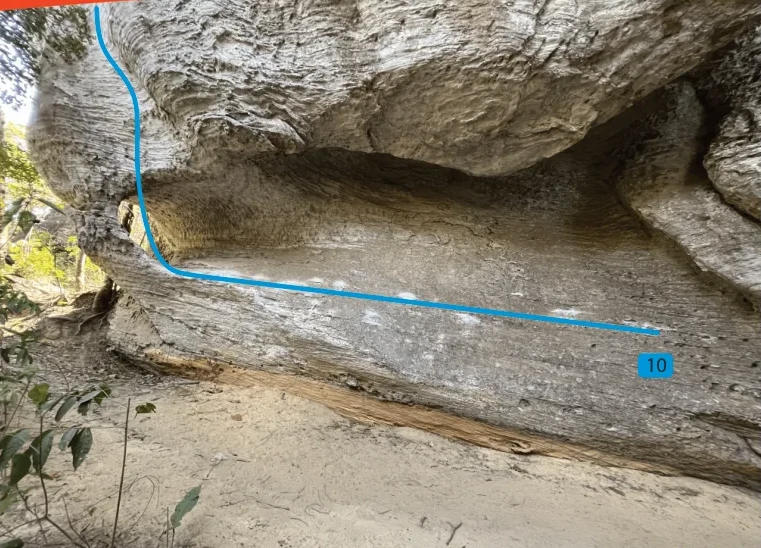
          - **largura_mapa**: 761
          - **altura_mapa**: 548
          - **pontos_de_interesse**:
            - **[0]**:
              - **id**: cU2LXEDRRuXHW5
              - **uid**: cU2LXEDRRuXHW5
              - **rotulo**: 10
              - **retangulo**:
                - **x**: 656
                - **y**: 366
                - **comprimento**: 35
                - **largura**: 25
              - **label**: 10
          - **referencias**:
            - **[0]**:
              - **alvo_uid**: 2MnxZ7vLWHYSkd
              - **pontos_uids**:
                - cU2LXEDRRuXHW5
              - **escalada**: Travessia da Fúria
              - **ids**:
                - cU2LXEDRRuXHW5
      - **escaladas**:
        - **[0]**:
          - **uid**: xL01tQ4vcHRDpx
          - **boulder**:
            - **nome**: La Furia
            - **dificuldade**: V7
        - **[1]**:
          - **uid**: B6OmnB9AIX8lVf
          - **boulder**:
            - **nome**: La Discordia
            - **dificuldade**: V9
        - **[2]**:
          - **uid**: ZX7Aq0ridhkzEh
          - **boulder**:
            - **nome**: La Paloma
            - **dificuldade**: V9
        - **[3]**:
          - **uid**: 4HhzJHYPJQItf2
          - **boulder**:
            - **nome**: La Discrepância
            - **dificuldade**: V11
        - **[4]**:
          - **uid**: IzC2CtxRvdqC7D
          - **boulder**:
            - **nome**: La Fuerza
            - **dificuldade**: V11
        - **[5]**:
          - **uid**: qnpjGJPdazRBKq
          - **boulder**:
            - **nome**: La Sinceridad
            - **dificuldade**: V12
        - **[6]**:
          - **uid**: b7JBfJVZHiOZWK
          - **boulder**:
            - **nome**: Rei da Cápsula
            - **dificuldade**: V10
        - **[7]**:
          - **uid**: JjrHpTytGBCTce
          - **boulder**:
            - **nome**: Choffer
            - **dificuldade**: V9
        - **[8]**:
          - **uid**: IVnUJphxGOaH5r
          - **boulder**:
            - **nome**: Bem Vindo
            - **dificuldade**: V2
        - **[9]**:
          - **uid**: E0smxkuKkdntZK
          - **boulder**:
            - **nome**: Bem Vindo a Conceição
            - **dificuldade**: V3
        - **[10]**:
          - **uid**: dJWgHHCJW7fcHG
          - **boulder**:
            - **nome**: Bem Vindo aos Clássicos
            - **dificuldade**: V5
        - **[11]**:
          - **uid**: r6KltWPCeZXpYG
          - **boulder**:
            - **nome**: Né Possível
            - **dificuldade**: V4
        - **[12]**:
          - **uid**: BaARcOGuchHfbr
          - **boulder**:
            - **nome**: Malditos
            - **dificuldade**: V7
        - **[13]**:
          - **uid**: lMdhl2UmYwNDKg
          - **boulder**:
            - **nome**: Guardião
            - **dificuldade**: V3
        - **[14]**:
          - **uid**: 92C2ADhLDH5Irb
          - **boulder**:
            - **nome**: Deixa Rolar
            - **dificuldade**: V6
        - **[15]**:
          - **uid**: aNo68wQD7bBsKQ
          - **boulder**:
            - **nome**: La Resistência
            - **dificuldade**: V8
        - **[16]**:
          - **uid**: aGtQJbOHRdgfFs
          - **boulder**:
            - **nome**: Maldito La Furia
            - **dificuldade**: V8
        - **[17]**:
          - **uid**: kStUFKuGiNBNp4
          - **boulder**:
            - **nome**: (sem nome 20)
        - **[18]**:
          - **uid**: 2MnxZ7vLWHYSkd
          - **boulder**:
            - **nome**: Travessia da Fúria
            - **dificuldade**: V5
      - **precomputados**:
        - **total_escaladas**: 19
        - **total_boulders**: 19
  - **[13]**:
    - **conteudo**:
      - **descricao**:
          # Setor Jah
          
          O setor Jah possui blocos com linhas atléticas e movimentos fluidos em rocha de boa qualidade.
          
          Obs.: Não foram identificadas todas as linhas desse bloco. Certifique-se antes de fazer uma possível primeira ascensão.
      - **nome**: Jah
      - **uid**: QqN6oqb5Sf8vGq
      - **mapas**:
        - **[0]**:
          - **caminho_imagem_mapa**: 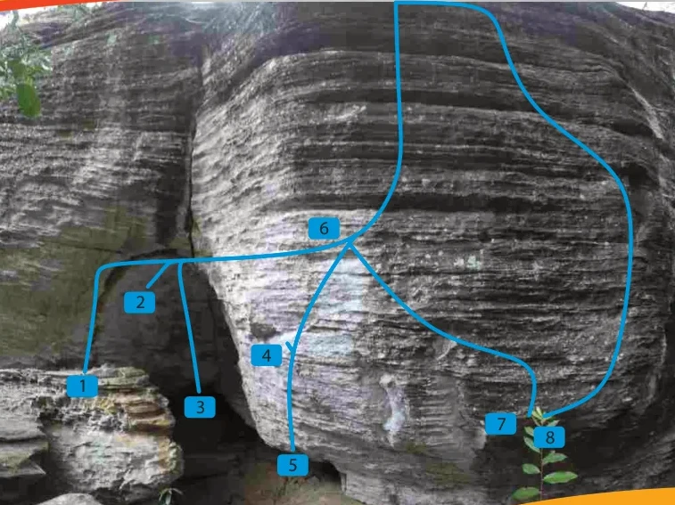
          - **largura_mapa**: 757
          - **altura_mapa**: 567
          - **pontos_de_interesse**:
            - **[0]**:
              - **id**: 78QvYh9sy6JCp4
              - **uid**: 78QvYh9sy6JCp4
              - **rotulo**: 1
              - **retangulo**:
                - **x**: 92
                - **y**: 434
                - **comprimento**: 32
                - **largura**: 24
              - **label**: 1
            - **[1]**:
              - **id**: fSixziAPVPSZHj
              - **uid**: fSixziAPVPSZHj
              - **rotulo**: 2
              - **retangulo**:
                - **x**: 156
                - **y**: 340
                - **comprimento**: 33
                - **largura**: 22
              - **label**: 2
            - **[2]**:
              - **id**: 1F411mddRTCpdD
              - **uid**: 1F411mddRTCpdD
              - **rotulo**: 3
              - **retangulo**:
                - **x**: 224
                - **y**: 456
                - **comprimento**: 32
                - **largura**: 21
              - **label**: 3
            - **[3]**:
              - **id**: QURVz12KzNilFb
              - **uid**: QURVz12KzNilFb
              - **rotulo**: 4
              - **retangulo**:
                - **x**: 298
                - **y**: 399
                - **comprimento**: 33
                - **largura**: 22
              - **label**: 4
            - **[4]**:
              - **id**: 0MXvZTgfsSfhet
              - **uid**: 0MXvZTgfsSfhet
              - **rotulo**: 5
              - **retangulo**:
                - **x**: 329
                - **y**: 522
                - **comprimento**: 34
                - **largura**: 25
              - **label**: 5
            - **[5]**:
              - **id**: 8xhC0ZQvuzL37K
              - **uid**: 8xhC0ZQvuzL37K
              - **rotulo**: 6
              - **retangulo**:
                - **x**: 364
                - **y**: 256
                - **comprimento**: 32
                - **largura**: 26
              - **label**: 6
            - **[6]**:
              - **id**: k1gONrVXcBo0Z9
              - **uid**: k1gONrVXcBo0Z9
              - **rotulo**: 7
              - **retangulo**:
                - **x**: 562
                - **y**: 476
                - **comprimento**: 33
                - **largura**: 25
              - **label**: 7
            - **[7]**:
              - **id**: R7msq4FR9XIIYO
              - **uid**: R7msq4FR9XIIYO
              - **rotulo**: 8
              - **retangulo**:
                - **x**: 616
                - **y**: 490
                - **comprimento**: 33
                - **largura**: 25
              - **label**: 8
          - **referencias**:
            - **[0]**:
              - **alvo_uid**: i5Ha4Vw2aQ6kCn
              - **pontos_uids**:
                - 78QvYh9sy6JCp4
              - **escalada**: Lágrimas de Jah
              - **ids**:
                - 78QvYh9sy6JCp4
            - **[1]**:
              - **alvo_uid**: y8V5k3IX9Zj30c
              - **pontos_uids**:
                - fSixziAPVPSZHj
              - **escalada**: Em Busca de Jah
              - **ids**:
                - fSixziAPVPSZHj
            - **[2]**:
              - **alvo_uid**: bcUDuLCjPvQHSh
              - **pontos_uids**:
                - 1F411mddRTCpdD
              - **escalada**: Jah Rastafari
              - **ids**:
                - 1F411mddRTCpdD
            - **[3]**:
              - **alvo_uid**: DKFB7LbBxo7nS5
              - **pontos_uids**:
                - QURVz12KzNilFb
              - **escalada**: Ordem e Progresso
              - **ids**:
                - QURVz12KzNilFb
            - **[4]**:
              - **alvo_uid**: ou4Oek7s4miFZx
              - **pontos_uids**:
                - 0MXvZTgfsSfhet
              - **escalada**: Ordem e Progresso SDS
              - **ids**:
                - 0MXvZTgfsSfhet
            - **[5]**:
              - **alvo_uid**: 1vON9qkJED0He4
              - **pontos_uids**:
                - 8xhC0ZQvuzL37K
              - **escalada**: JahJah
              - **ids**:
                - 8xhC0ZQvuzL37K
            - **[6]**:
              - **alvo_uid**: ct1utrtrgPnsCA
              - **pontos_uids**:
                - k1gONrVXcBo0Z9
              - **escalada**: Verdinho
              - **ids**:
                - k1gONrVXcBo0Z9
            - **[7]**:
              - **alvo_uid**: 4RVCT8xdz6kKtj
              - **pontos_uids**:
                - R7msq4FR9XIIYO
              - **escalada**: Skunk
              - **ids**:
                - R7msq4FR9XIIYO
        - **[1]**:
          - **caminho_imagem_mapa**: 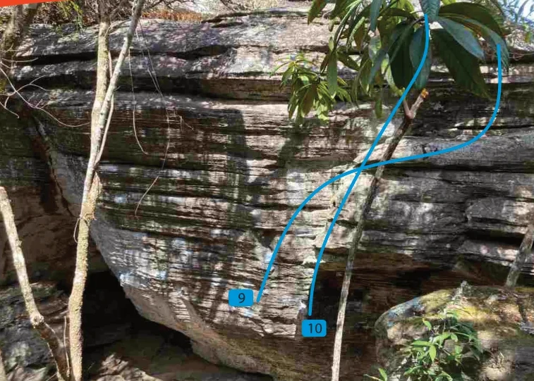
          - **largura_mapa**: 757
          - **altura_mapa**: 541
          - **pontos_de_interesse**:
            - **[0]**:
              - **id**: EEKqZyckfFGNv4
              - **uid**: EEKqZyckfFGNv4
              - **rotulo**: 9
              - **retangulo**:
                - **x**: 342
                - **y**: 422
                - **comprimento**: 33
                - **largura**: 23
              - **label**: 9
            - **[1]**:
              - **id**: Rf7fluJKqa9Gd4
              - **uid**: Rf7fluJKqa9Gd4
              - **rotulo**: 10
              - **retangulo**:
                - **x**: 445
                - **y**: 466
                - **comprimento**: 34
                - **largura**: 25
              - **label**: 10
          - **referencias**:
            - **[0]**:
              - **alvo_uid**: Y8fG9PxNU7dHH7
              - **pontos_uids**:
                - EEKqZyckfFGNv4
              - **escalada**: Mescladinho
              - **ids**:
                - EEKqZyckfFGNv4
            - **[1]**:
              - **alvo_uid**: XUJnaV4A7ODegg
              - **pontos_uids**:
                - Rf7fluJKqa9Gd4
              - **escalada**: (sem nome 17)
              - **ids**:
                - Rf7fluJKqa9Gd4
      - **escaladas**:
        - **[0]**:
          - **uid**: i5Ha4Vw2aQ6kCn
          - **boulder**:
            - **nome**: Lágrimas de Jah
            - **dificuldade**: V8
        - **[1]**:
          - **uid**: y8V5k3IX9Zj30c
          - **boulder**:
            - **nome**: Em Busca de Jah
            - **dificuldade**: V7
        - **[2]**:
          - **uid**: bcUDuLCjPvQHSh
          - **boulder**:
            - **nome**: Jah Rastafari
            - **dificuldade**: V9
        - **[3]**:
          - **uid**: DKFB7LbBxo7nS5
          - **boulder**:
            - **nome**: Ordem e Progresso
            - **dificuldade**: V7
        - **[4]**:
          - **uid**: ou4Oek7s4miFZx
          - **boulder**:
            - **nome**: Ordem e Progresso SDS
            - **dificuldade**: V8
        - **[5]**:
          - **uid**: 1vON9qkJED0He4
          - **boulder**:
            - **nome**: JahJah
            - **dificuldade**: V5
        - **[6]**:
          - **uid**: ct1utrtrgPnsCA
          - **boulder**:
            - **nome**: Verdinho
            - **dificuldade**: V9
        - **[7]**:
          - **uid**: 4RVCT8xdz6kKtj
          - **boulder**:
            - **nome**: Skunk
            - **dificuldade**: V8
        - **[8]**:
          - **uid**: Y8fG9PxNU7dHH7
          - **boulder**:
            - **nome**: Mescladinho
            - **dificuldade**: V7
        - **[9]**:
          - **uid**: XUJnaV4A7ODegg
          - **boulder**:
            - **nome**: (sem nome 17)
            - **dificuldade**: V3
      - **precomputados**:
        - **total_escaladas**: 10
        - **total_boulders**: 10
  - **[14]**:
    - **conteudo**:
      - **descricao**:
          # Setor Pole Dance
          
          O setor Pole Dance possui blocos com abundância de agarras horizontais e verticais, permitindo movimentos dinâmicos e técnicos.
          
          Obs.: Não foram identificadas todas as linhas desse bloco. Certifique-se antes de fazer uma possível primeira ascensão.
      - **nome**: Pole Dance
      - **uid**: G5dk8AEaYgSzDy
      - **mapas**:
        - **[0]**:
          - **caminho_imagem_mapa**: 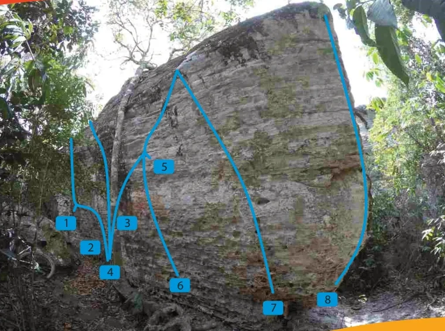
          - **largura_mapa**: 760
          - **altura_mapa**: 566
          - **pontos_de_interesse**:
            - **[0]**:
              - **id**: nBA4U34ga2Tvr5
              - **uid**: nBA4U34ga2Tvr5
              - **rotulo**: 1
              - **retangulo**:
                - **x**: 114
                - **y**: 382
                - **comprimento**: 35
                - **largura**: 23
              - **label**: 1
            - **[1]**:
              - **id**: Fo01MuAxigslFX
              - **uid**: Fo01MuAxigslFX
              - **rotulo**: 2
              - **retangulo**:
                - **x**: 154
                - **y**: 424
                - **comprimento**: 35
                - **largura**: 23
              - **label**: 2
            - **[2]**:
              - **id**: 3QcyIwJNNVO7vS
              - **uid**: 3QcyIwJNNVO7vS
              - **rotulo**: 3
              - **retangulo**:
                - **x**: 217
                - **y**: 382
                - **comprimento**: 34
                - **largura**: 23
              - **label**: 3
            - **[3]**:
              - **id**: uVkZyKujFs5dwR
              - **uid**: uVkZyKujFs5dwR
              - **rotulo**: 4
              - **retangulo**:
                - **x**: 188
                - **y**: 465
                - **comprimento**: 33
                - **largura**: 24
              - **label**: 4
            - **[4]**:
              - **id**: tnHnjlw4ZwgwVK
              - **uid**: tnHnjlw4ZwgwVK
              - **rotulo**: 5
              - **retangulo**:
                - **x**: 280
                - **y**: 284
                - **comprimento**: 35
                - **largura**: 23
              - **label**: 5
            - **[5]**:
              - **id**: E03bxQh6UoERFF
              - **uid**: E03bxQh6UoERFF
              - **rotulo**: 6
              - **retangulo**:
                - **x**: 308
                - **y**: 488
                - **comprimento**: 34
                - **largura**: 23
              - **label**: 6
            - **[6]**:
              - **id**: FKeXnsJEEZgUTb
              - **uid**: FKeXnsJEEZgUTb
              - **rotulo**: 7
              - **retangulo**:
                - **x**: 468
                - **y**: 526
                - **comprimento**: 35
                - **largura**: 23
              - **label**: 7
            - **[7]**:
              - **id**: yuuBwLtxwW4RfS
              - **uid**: yuuBwLtxwW4RfS
              - **rotulo**: 8
              - **retangulo**:
                - **x**: 559
                - **y**: 512
                - **comprimento**: 34
                - **largura**: 23
              - **label**: 8
          - **referencias**:
            - **[0]**:
              - **alvo_uid**: lqLZT2u0ko9tEq
              - **pontos_uids**:
                - nBA4U34ga2Tvr5
              - **escalada**: Fuck Beach
              - **ids**:
                - nBA4U34ga2Tvr5
            - **[1]**:
              - **alvo_uid**: Vk1mzRajkxe97E
              - **pontos_uids**:
                - Fo01MuAxigslFX
              - **escalada**: Incrível Fuck Beach
              - **ids**:
                - Fo01MuAxigslFX
            - **[2]**:
              - **alvo_uid**: W9megp46yAmPcv
              - **pontos_uids**:
                - 3QcyIwJNNVO7vS
              - **escalada**: Incrível Pole Dance
              - **ids**:
                - 3QcyIwJNNVO7vS
            - **[3]**:
              - **alvo_uid**: eJclGBikB0QOwz
              - **pontos_uids**:
                - uVkZyKujFs5dwR
              - **escalada**: Incrível
              - **ids**:
                - uVkZyKujFs5dwR
            - **[4]**:
              - **alvo_uid**: KgzMKM2OBW9Kyb
              - **pontos_uids**:
                - tnHnjlw4ZwgwVK
              - **escalada**: Pole Dance
              - **ids**:
                - tnHnjlw4ZwgwVK
            - **[5]**:
              - **alvo_uid**: jTiv48QcpBiTbT
              - **pontos_uids**:
                - E03bxQh6UoERFF
              - **escalada**: Pole Dance SDS
              - **ids**:
                - E03bxQh6UoERFF
            - **[6]**:
              - **alvo_uid**: oATDOun3WBHT6k
              - **pontos_uids**:
                - FKeXnsJEEZgUTb
              - **escalada**: De la Rocha
              - **ids**:
                - FKeXnsJEEZgUTb
            - **[7]**:
              - **alvo_uid**: porLZRctOPjt4c
              - **pontos_uids**:
                - yuuBwLtxwW4RfS
              - **escalada**: Siga-me os Bons SDS
              - **ids**:
                - yuuBwLtxwW4RfS
        - **[1]**:
          - **caminho_imagem_mapa**: 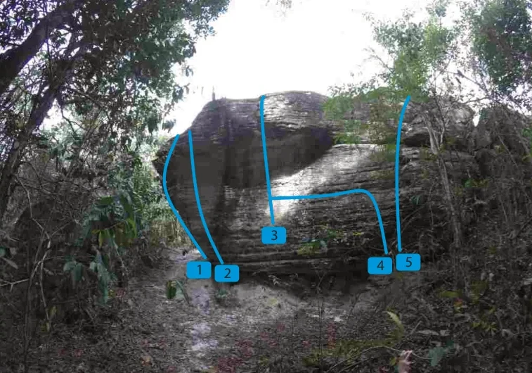
          - **largura_mapa**: 757
          - **altura_mapa**: 530
          - **pontos_de_interesse**:
            - **[0]**:
              - **id**: eZ2SElRDGed4cM
              - **uid**: eZ2SElRDGed4cM
              - **rotulo**: 1
              - **retangulo**:
                - **x**: 283
                - **y**: 383
                - **comprimento**: 34
                - **largura**: 24
              - **label**: 1
            - **[1]**:
              - **id**: io7GzCWWI55sU5
              - **uid**: io7GzCWWI55sU5
              - **rotulo**: 2
              - **retangulo**:
                - **x**: 322
                - **y**: 388
                - **comprimento**: 33
                - **largura**: 23
              - **label**: 2
            - **[2]**:
              - **id**: eLHIxcXBIEsi7c
              - **uid**: eLHIxcXBIEsi7c
              - **rotulo**: 3
              - **retangulo**:
                - **x**: 390
                - **y**: 334
                - **comprimento**: 36
                - **largura**: 25
              - **label**: 3
            - **[3]**:
              - **id**: ns0ZaPoFAL4uZt
              - **uid**: ns0ZaPoFAL4uZt
              - **rotulo**: 4
              - **retangulo**:
                - **x**: 540
                - **y**: 377
                - **comprimento**: 35
                - **largura**: 24
              - **label**: 4
            - **[4]**:
              - **id**: 7f3rPaEhApZXvg
              - **uid**: 7f3rPaEhApZXvg
              - **rotulo**: 5
              - **retangulo**:
                - **x**: 581
                - **y**: 372
                - **comprimento**: 34
                - **largura**: 25
              - **label**: 5
          - **referencias**:
            - **[0]**:
              - **alvo_uid**: WzmZlQVRxLgIPf
              - **pontos_uids**:
                - eZ2SElRDGed4cM
              - **escalada**: Repense
              - **ids**:
                - eZ2SElRDGed4cM
            - **[1]**:
              - **alvo_uid**: hMB7cTlGJkmczs
              - **pontos_uids**:
                - io7GzCWWI55sU5
              - **escalada**: Vamo Nessa
              - **ids**:
                - io7GzCWWI55sU5
            - **[2]**:
              - **alvo_uid**: kkcsY6FbhHikS7
              - **pontos_uids**:
                - eLHIxcXBIEsi7c
              - **escalada**: Vem que Tem
              - **ids**:
                - eLHIxcXBIEsi7c
            - **[3]**:
              - **alvo_uid**: 8lnhbbYgHbYmZ8
              - **pontos_uids**:
                - ns0ZaPoFAL4uZt
              - **escalada**: Pense Bem
              - **ids**:
                - ns0ZaPoFAL4uZt
            - **[4]**:
              - **alvo_uid**: sXmiu6wyhvWV7x
              - **pontos_uids**:
                - 7f3rPaEhApZXvg
              - **escalada**: Conclusão
              - **ids**:
                - 7f3rPaEhApZXvg
        - **[2]**:
          - **caminho_imagem_mapa**: 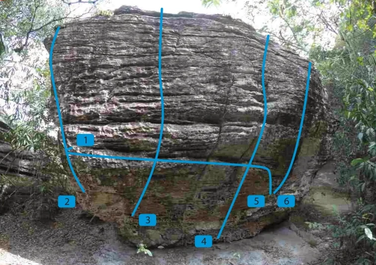
          - **largura_mapa**: 756
          - **altura_mapa**: 534
          - **pontos_de_interesse**:
            - **[0]**:
              - **id**: O5fhW7i8hCkR7j
              - **uid**: O5fhW7i8hCkR7j
              - **rotulo**: 1
              - **retangulo**:
                - **x**: 172
                - **y**: 282
                - **comprimento**: 33
                - **largura**: 24
              - **label**: 1
            - **[1]**:
              - **id**: REUoE5kzrdMV0q
              - **uid**: REUoE5kzrdMV0q
              - **rotulo**: 2
              - **retangulo**:
                - **x**: 134
                - **y**: 406
                - **comprimento**: 33
                - **largura**: 24
              - **label**: 2
            - **[2]**:
              - **id**: O7vdzNYVtbn3S9
              - **uid**: O7vdzNYVtbn3S9
              - **rotulo**: 3
              - **retangulo**:
                - **x**: 296
                - **y**: 442
                - **comprimento**: 32
                - **largura**: 21
              - **label**: 3
            - **[3]**:
              - **id**: K9LRq5lRgk25NH
              - **uid**: K9LRq5lRgk25NH
              - **rotulo**: 4
              - **retangulo**:
                - **x**: 409
                - **y**: 486
                - **comprimento**: 32
                - **largura**: 24
              - **label**: 4
            - **[4]**:
              - **id**: Z98P6uyvpUEcK6
              - **uid**: Z98P6uyvpUEcK6
              - **rotulo**: 5
              - **retangulo**:
                - **x**: 515
                - **y**: 405
                - **comprimento**: 34
                - **largura**: 22
              - **label**: 5
            - **[5]**:
              - **id**: hRp9bEQ3Ba6p7P
              - **uid**: hRp9bEQ3Ba6p7P
              - **rotulo**: 6
              - **retangulo**:
                - **x**: 574
                - **y**: 404
                - **comprimento**: 33
                - **largura**: 23
              - **label**: 6
          - **referencias**:
            - **[0]**:
              - **alvo_uid**: q7nUNj7DRPn3RS
              - **pontos_uids**:
                - O5fhW7i8hCkR7j
              - **escalada**: Siga-me os Bons
              - **ids**:
                - O5fhW7i8hCkR7j
            - **[1]**:
              - **alvo_uid**: porLZRctOPjt4c
              - **pontos_uids**:
                - REUoE5kzrdMV0q
              - **escalada**: Siga-me os Bons SDS
              - **ids**:
                - REUoE5kzrdMV0q
            - **[2]**:
              - **alvo_uid**: 6rNdIFTqMYpJs6
              - **pontos_uids**:
                - O7vdzNYVtbn3S9
              - **escalada**: Conceicion
              - **ids**:
                - O7vdzNYVtbn3S9
            - **[3]**:
              - **alvo_uid**: oxtazdfxCGHDiW
              - **pontos_uids**:
                - K9LRq5lRgk25NH
              - **escalada**: Tô Concê
              - **ids**:
                - K9LRq5lRgk25NH
            - **[4]**:
              - **alvo_uid**: KhxMKLP1vIHgRj
              - **pontos_uids**:
                - Z98P6uyvpUEcK6
              - **escalada**: Rocktrip
              - **ids**:
                - Z98P6uyvpUEcK6
            - **[5]**:
              - **alvo_uid**: aspYcr6JHjTx2T
              - **pontos_uids**:
                - hRp9bEQ3Ba6p7P
              - **escalada**: Rocklands
              - **ids**:
                - hRp9bEQ3Ba6p7P
      - **escaladas**:
        - **[0]**:
          - **uid**: lqLZT2u0ko9tEq
          - **boulder**:
            - **nome**: Fuck Beach
            - **dificuldade**: V5
        - **[1]**:
          - **uid**: Vk1mzRajkxe97E
          - **boulder**:
            - **nome**: Incrível Fuck Beach
            - **dificuldade**: V8
        - **[2]**:
          - **uid**: W9megp46yAmPcv
          - **boulder**:
            - **nome**: Incrível Pole Dance
            - **dificuldade**: V7
        - **[3]**:
          - **uid**: eJclGBikB0QOwz
          - **boulder**:
            - **nome**: Incrível
            - **dificuldade**: V5
        - **[4]**:
          - **uid**: KgzMKM2OBW9Kyb
          - **boulder**:
            - **nome**: Pole Dance
            - **dificuldade**: V5
        - **[5]**:
          - **uid**: jTiv48QcpBiTbT
          - **boulder**:
            - **nome**: Pole Dance SDS
            - **dificuldade**: V7
        - **[6]**:
          - **uid**: oATDOun3WBHT6k
          - **boulder**:
            - **nome**: De la Rocha
            - **dificuldade**: V7
        - **[7]**:
          - **uid**: WzmZlQVRxLgIPf
          - **boulder**:
            - **nome**: Repense
            - **dificuldade**: INDEFINIDO
        - **[8]**:
          - **uid**: hMB7cTlGJkmczs
          - **boulder**:
            - **nome**: Vamo Nessa
            - **dificuldade**: V5
        - **[9]**:
          - **uid**: kkcsY6FbhHikS7
          - **boulder**:
            - **nome**: Vem que Tem
            - **dificuldade**: V5
        - **[10]**:
          - **uid**: 8lnhbbYgHbYmZ8
          - **boulder**:
            - **nome**: Pense Bem
            - **dificuldade**: V7
        - **[11]**:
          - **uid**: sXmiu6wyhvWV7x
          - **boulder**:
            - **nome**: Conclusão
            - **dificuldade**: V4
        - **[12]**:
          - **uid**: q7nUNj7DRPn3RS
          - **boulder**:
            - **nome**: Siga-me os Bons
            - **dificuldade**: V3
        - **[13]**:
          - **uid**: porLZRctOPjt4c
          - **boulder**:
            - **nome**: Siga-me os Bons SDS
            - **dificuldade**: V4
        - **[14]**:
          - **uid**: 6rNdIFTqMYpJs6
          - **boulder**:
            - **nome**: Conceicion
            - **dificuldade**: V4
        - **[15]**:
          - **uid**: oxtazdfxCGHDiW
          - **boulder**:
            - **nome**: Tô Concê
            - **dificuldade**: V4
        - **[16]**:
          - **uid**: KhxMKLP1vIHgRj
          - **boulder**:
            - **nome**: Rocktrip
            - **dificuldade**: V5
        - **[17]**:
          - **uid**: aspYcr6JHjTx2T
          - **boulder**:
            - **nome**: Rocklands
            - **dificuldade**: V4
      - **precomputados**:
        - **total_escaladas**: 18
        - **total_boulders**: 18
  - **[15]**:
    - **conteudo**:
      - **descricao**:
          # Setor Rock and Roll
          
          O setor Rock and Roll possui um bloco com linhas acessíveis e bem divertidas.
          
          Obs.: Não foram identificadas todas as linhas desse bloco. Certifique-se antes de fazer uma possível primeira ascensão.
      - **nome**: Rock and Roll
      - **uid**: ZBKaVEqb9Jnj9Q
      - **mapas**:
        - **[0]**:
          - **caminho_imagem_mapa**: 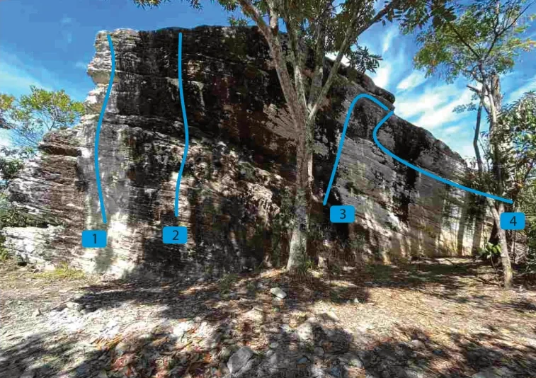
          - **largura_mapa**: 757
          - **altura_mapa**: 534
          - **pontos_de_interesse**:
            - **[0]**:
              - **id**: i7zdX38BCwa0R2
              - **uid**: i7zdX38BCwa0R2
              - **rotulo**: 1
              - **retangulo**:
                - **x**: 134
                - **y**: 338
                - **comprimento**: 33
                - **largura**: 23
              - **label**: 1
            - **[1]**:
              - **id**: 2Y09bmOo4izRUP
              - **uid**: 2Y09bmOo4izRUP
              - **rotulo**: 2
              - **retangulo**:
                - **x**: 248
                - **y**: 332
                - **comprimento**: 35
                - **largura**: 23
              - **label**: 2
            - **[2]**:
              - **id**: cYDYl5mGFJczNp
              - **uid**: cYDYl5mGFJczNp
              - **rotulo**: 3
              - **retangulo**:
                - **x**: 484
                - **y**: 302
                - **comprimento**: 32
                - **largura**: 23
              - **label**: 3
            - **[3]**:
              - **id**: aYHh7yZ3Kn8cv3
              - **uid**: aYHh7yZ3Kn8cv3
              - **rotulo**: 4
              - **retangulo**:
                - **x**: 723
                - **y**: 312
                - **comprimento**: 34
                - **largura**: 25
              - **label**: 4
          - **referencias**:
            - **[0]**:
              - **alvo_uid**: 9phNN5BN701Qs7
              - **pontos_uids**:
                - i7zdX38BCwa0R2
              - **escalada**: Rock It
              - **ids**:
                - i7zdX38BCwa0R2
            - **[1]**:
              - **alvo_uid**: NRFieWvqPghPXl
              - **pontos_uids**:
                - 2Y09bmOo4izRUP
              - **escalada**: Rock and Roll
              - **ids**:
                - 2Y09bmOo4izRUP
            - **[2]**:
              - **alvo_uid**: VZnXeluwv9x3Ys
              - **pontos_uids**:
                - cYDYl5mGFJczNp
              - **escalada**: Go Chucky Go
              - **ids**:
                - cYDYl5mGFJczNp
            - **[3]**:
              - **alvo_uid**: MLra3NEpnP9SqB
              - **pontos_uids**:
                - aYHh7yZ3Kn8cv3
              - **escalada**: Go Johnny Go
              - **ids**:
                - aYHh7yZ3Kn8cv3
      - **escaladas**:
        - **[0]**:
          - **uid**: 9phNN5BN701Qs7
          - **boulder**:
            - **nome**: Rock It
            - **dificuldade**: V0
        - **[1]**:
          - **uid**: NRFieWvqPghPXl
          - **boulder**:
            - **nome**: Rock and Roll
            - **dificuldade**: V1
        - **[2]**:
          - **uid**: VZnXeluwv9x3Ys
          - **boulder**:
            - **nome**: Go Chucky Go
            - **dificuldade**: V2
        - **[3]**:
          - **uid**: MLra3NEpnP9SqB
          - **boulder**:
            - **nome**: Go Johnny Go
            - **dificuldade**: V3
      - **precomputados**:
        - **total_escaladas**: 4
        - **total_boulders**: 4
  - **[16]**:
    - **conteudo**:
      - **descricao**:
          # Setor Bloco dos Canelas
          
          O setor Bloco dos Canelas possui um bloco com linhas interessantes em um ambiente agradável.
          
          Obs.: Não foram identificadas todas as linhas desse bloco. Certifique-se antes de fazer uma possível primeira ascensão.
      - **nome**: Bloco dos Canelas
      - **uid**: hscDw713VTLb1Z
      - **mapas**:
        - **[0]**:
          - **caminho_imagem_mapa**: 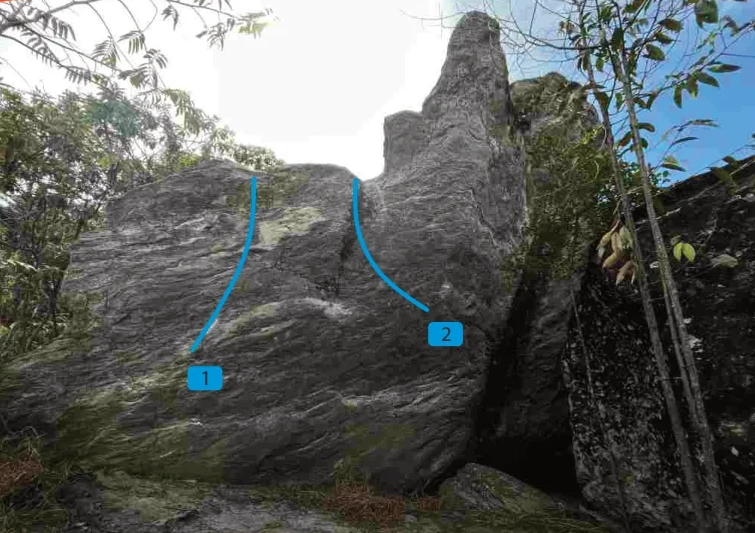
          - **largura_mapa**: 755
          - **altura_mapa**: 533
          - **pontos_de_interesse**:
            - **[0]**:
              - **id**: 9O4JQoaLCjsArN
              - **uid**: 9O4JQoaLCjsArN
              - **rotulo**: 1
              - **retangulo**:
                - **x**: 206
                - **y**: 378
                - **comprimento**: 33
                - **largura**: 25
              - **label**: 1
            - **[1]**:
              - **id**: XFVk45lv9aorB5
              - **uid**: XFVk45lv9aorB5
              - **rotulo**: 2
              - **retangulo**:
                - **x**: 446
                - **y**: 334
                - **comprimento**: 33
                - **largura**: 23
              - **label**: 2
          - **referencias**:
            - **[0]**:
              - **alvo_uid**: aEBKdInyBux5x6
              - **pontos_uids**:
                - 9O4JQoaLCjsArN
              - **escalada**: Canelas as Ar
              - **ids**:
                - 9O4JQoaLCjsArN
            - **[1]**:
              - **alvo_uid**: Rk3SlwzoXhJt5y
              - **pontos_uids**:
                - XFVk45lv9aorB5
              - **escalada**: Canelas ao Vento
              - **ids**:
                - XFVk45lv9aorB5
      - **escaladas**:
        - **[0]**:
          - **uid**: aEBKdInyBux5x6
          - **boulder**:
            - **nome**: Canelas as Ar
            - **dificuldade**: V4
        - **[1]**:
          - **uid**: Rk3SlwzoXhJt5y
          - **boulder**:
            - **nome**: Canelas ao Vento
            - **dificuldade**: V7
      - **precomputados**:
        - **total_escaladas**: 2
        - **total_boulders**: 2
  - **[17]**:
    - **conteudo**:
      - **descricao**:
          # Setor Mãos de Sebo
          
          O setor Mãos de Sebo possui um bloco com linhas que exigem técnica e controle de agarras.
          
          Obs.: Não foram identificadas todas as linhas desse bloco. Certifique-se antes de fazer uma possível primeira ascensão.
      - **nome**: Mãos de Sebo
      - **uid**: N1QXZxww2YK0Br
      - **mapas**:
        - **[0]**:
          - **caminho_imagem_mapa**: 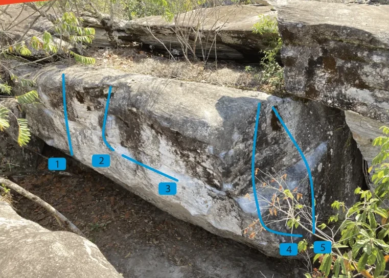
          - **largura_mapa**: 761
          - **altura_mapa**: 544
          - **pontos_de_interesse**:
            - **[0]**:
              - **id**: 02nusGUDAGv9mj
              - **uid**: 02nusGUDAGv9mj
              - **rotulo**: 1
              - **retangulo**:
                - **x**: 112
                - **y**: 321
                - **comprimento**: 33
                - **largura**: 24
              - **label**: 1
            - **[1]**:
              - **id**: RBSIhjZzSV764E
              - **uid**: RBSIhjZzSV764E
              - **rotulo**: 2
              - **retangulo**:
                - **x**: 198
                - **y**: 314
                - **comprimento**: 33
                - **largura**: 24
              - **label**: 2
            - **[2]**:
              - **id**: lDDOSR9BqvoUAe
              - **uid**: lDDOSR9BqvoUAe
              - **rotulo**: 3
              - **retangulo**:
                - **x**: 328
                - **y**: 369
                - **comprimento**: 33
                - **largura**: 26
              - **label**: 3
            - **[3]**:
              - **id**: y33H1MuJw1iVCg
              - **uid**: y33H1MuJw1iVCg
              - **rotulo**: 4
              - **retangulo**:
                - **x**: 565
                - **y**: 488
                - **comprimento**: 32
                - **largura**: 25
              - **label**: 4
            - **[4]**:
              - **id**: DC4HQdxHTMqzmJ
              - **uid**: DC4HQdxHTMqzmJ
              - **rotulo**: 5
              - **retangulo**:
                - **x**: 631
                - **y**: 484
                - **comprimento**: 32
                - **largura**: 23
              - **label**: 5
          - **referencias**:
            - **[0]**:
              - **alvo_uid**: u6SSnCtw6FriNe
              - **pontos_uids**:
                - 02nusGUDAGv9mj
              - **escalada**: (sem nome 21)
              - **ids**:
                - 02nusGUDAGv9mj
            - **[1]**:
              - **alvo_uid**: YlacXvVIpGthgE
              - **pontos_uids**:
                - RBSIhjZzSV764E
              - **escalada**: Mãos de Tesoura
              - **ids**:
                - RBSIhjZzSV764E
            - **[2]**:
              - **alvo_uid**: C3j7d3dWLGpghr
              - **pontos_uids**:
                - lDDOSR9BqvoUAe
              - **escalada**: Fei Long
              - **ids**:
                - lDDOSR9BqvoUAe
            - **[3]**:
              - **alvo_uid**: FNrxuCo4zO4VWX
              - **pontos_uids**:
                - y33H1MuJw1iVCg
              - **escalada**: Mãos de Sebo
              - **ids**:
                - y33H1MuJw1iVCg
            - **[4]**:
              - **alvo_uid**: P88zyEi41D5kBD
              - **pontos_uids**:
                - DC4HQdxHTMqzmJ
              - **escalada**: Mãozinha
              - **ids**:
                - DC4HQdxHTMqzmJ
      - **escaladas**:
        - **[0]**:
          - **uid**: u6SSnCtw6FriNe
          - **boulder**:
            - **nome**: (sem nome 21)
        - **[1]**:
          - **uid**: YlacXvVIpGthgE
          - **boulder**:
            - **nome**: Mãos de Tesoura
            - **dificuldade**: V4
        - **[2]**:
          - **uid**: C3j7d3dWLGpghr
          - **boulder**:
            - **nome**: Fei Long
            - **dificuldade**: V8
        - **[3]**:
          - **uid**: FNrxuCo4zO4VWX
          - **boulder**:
            - **nome**: Mãos de Sebo
            - **dificuldade**: V5
        - **[4]**:
          - **uid**: P88zyEi41D5kBD
          - **boulder**:
            - **nome**: Mãozinha
            - **dificuldade**: V2
      - **precomputados**:
        - **total_escaladas**: 5
        - **total_boulders**: 5
- **precomputados**:
  - **total_escaladas**: 126
  - **total_boulders**: 126

## Arquivos Externos

- **arquivos_externos**:
  - **[0]**:
    - **caminho**: 
    - **checksum_sha256**: c0edb815fe114f9562599153f09c23965b0ac46bed797893e1fc978d180448c8
  - **[1]**:
    - **caminho**: 
    - **checksum_sha256**: 90151a35f5128fd53676156a0337e4f094bc6319d94de4dcb0cc38b9b7b36245
  - **[2]**:
    - **caminho**: 
    - **checksum_sha256**: c180b8856b43a3895a71996b7033c22a41a2ae4add3c5c46007ca75dc8f3e81d
  - **[3]**:
    - **caminho**: 
    - **checksum_sha256**: 2ada23d03bab7b527c63f30ad4090ba1277c47c2549ed829594bc804dbac82e9
  - **[4]**:
    - **caminho**: 
    - **checksum_sha256**: b097deef6b78802f859ebf1b6b7b1592acac5687f40977c23207495289a086a3
  - **[5]**:
    - **caminho**: 
    - **checksum_sha256**: bf6ef12349d9ae05ce670f00bc92a8e2804c1f2204c0e22e5433b009b9093e1b
  - **[6]**:
    - **caminho**: 
    - **checksum_sha256**: 5355adf2487b3d05f0de320129a2885eabfe344e9457fc5a17cb9bdc474855d2
  - **[7]**:
    - **caminho**: 
    - **checksum_sha256**: 098734baecd09dbb9d5f639cbbfdd156ebec719b63b63a1481216f0dd2fa911d
  - **[8]**:
    - **caminho**: 
    - **checksum_sha256**: fcd281398c34b38cd3fec0fd633163e5acefe69641b576e04a55b1b1c80b7473
  - **[9]**:
    - **caminho**: 
    - **checksum_sha256**: 09e911891f29700e6d5f381803f1e2d81e77533cdf83f98f2815cf0a125c9242
  - **[10]**:
    - **caminho**: 
    - **checksum_sha256**: 644cf125549d220191d34502d8cc9b2d33caed0a463b46c3ab3b9bb19dbc7f68
  - **[11]**:
    - **caminho**: 
    - **checksum_sha256**: b4c32b3e67dfbd511357f1a632f79d2f0fb378a8aebe344a2e5e473a6ced4123
  - **[12]**:
    - **caminho**: 
    - **checksum_sha256**: 26766dfa8b4b8dd575f4872592adde76898b017c8fdf3cde646865fa56f18b03
  - **[13]**:
    - **caminho**: 
    - **checksum_sha256**: 61dd51f2070098b1cde416f475c72e42af9e1e1fe448862bd1af9f8892412425
  - **[14]**:
    - **caminho**: 
    - **checksum_sha256**: a50901187d2b7799874e6c3fcb0b6b3304021a71c6e273a40676967b8e0bf060
  - **[15]**:
    - **caminho**: 
    - **checksum_sha256**: 22316811f8601daada14db0820f13978446e8b85d2276efc44bc27c0705d2aef
  - **[16]**:
    - **caminho**: 
    - **checksum_sha256**: bdd7220e5ab95bd18bb7c136a817a6d22f20ae222f812562382b539ca7df0c15
  - **[17]**:
    - **caminho**: 
    - **checksum_sha256**: 86456d49aa2ffc2f64c62ba7b3e7791e3405ddb69db30613441ff38ff1763966
  - **[18]**:
    - **caminho**: 
    - **checksum_sha256**: dd7b33da5ffef3bdaa08355deb871001a03bfb6cd11b924992de7a6c6fb00449
  - **[19]**:
    - **caminho**: 
    - **checksum_sha256**: 013e0a00d16598d5f9305ffa6b8a27fc9874d681e77064365f56c37080f95589
  - **[20]**:
    - **caminho**: 
    - **checksum_sha256**: 0f744f982d2d8647c1fcdaa983eebee483d46f7ed8aa1efcab27dbae3cfb036b
  - **[21]**:
    - **caminho**: 
    - **checksum_sha256**: f002f15661c8212fe49b130f4b53e28e10bb836bba998c39ac817ba330b498c8
  - **[22]**:
    - **caminho**: 
    - **checksum_sha256**: 0111ba98708557de5aa08152cbeb5ecae559cb56a8a059601f39f492715f968e
  - **[23]**:
    - **caminho**: 
    - **checksum_sha256**: 467c3aeaf17668067ea2c15adcfda54a83527e1af1fdb9fe7f61596e5080c683
  - **[24]**:
    - **caminho**: 
    - **checksum_sha256**: 9a0fb19ec545634601e30294e9d86befe29e47292625efc81765d544487a75b2
  - **[25]**:
    - **caminho**: 
    - **checksum_sha256**: 44784043080d775bfee0fb6a1a26d08994bd2f48560860e0441d29698072b447
  - **[26]**:
    - **caminho**: 
    - **checksum_sha256**: 3b36fb665504e5c095b0a34fa474bedcd570a3e6eb22458740e3102946724e52
  - **[27]**:
    - **caminho**: 
    - **checksum_sha256**: b9a05d565208fb964d0141e96aecd892b237e4cae743b23299c9df7eabecc220
  - **[28]**:
    - **caminho**: 
    - **checksum_sha256**: 8839b17aa28767bfd00886d73eb9c7779074f0c5e848e079a97ee4b2b28af1a6
  - **[29]**:
    - **caminho**: 
    - **checksum_sha256**: edfce9310c8c5dff2d55d57f9a3fb6c98abffac88a8a2f3c233dc33842261305
  - **[30]**:
    - **caminho**: 
    - **checksum_sha256**: 8f31cd3e675de465480efc96365fb8fe1f44808999440f033a3ef4e08f5f55c7
  - **[31]**:
    - **caminho**: 
    - **checksum_sha256**: 5dfea772ae92e03e996b01ff85b93fe8ef0f5a282c7dc67027dc7db4b01e16fa
  - **[32]**:
    - **caminho**: 
    - **checksum_sha256**: c7d754f0211c243284f0da753454f2309d325dd88c4da19dbd82b6ab69b71758
  - **[33]**:
    - **caminho**: 
    - **checksum_sha256**: 834bb0bcfb449a45ecfc66115df08a551bc651a329a24619e1027a73a94dc8a9
  - **[34]**:
    - **caminho**: 
    - **checksum_sha256**: 819814d966c84b1e44f78fbbfe55b2b7f960637c6debc1b8d038c85913aaa7ad
  - **[35]**:
    - **caminho**: 
    - **checksum_sha256**: 7692d0c41c4fbce4217dbb6060192e2d8765b88b1befd0eb035a0e3e0042911b
  - **[36]**:
    - **caminho**: 
    - **checksum_sha256**: 42a74a6bc8cdaccda8e4c5fb21959996303f1a63c908e09405d4eacf8a7900e8
  - **[37]**:
    - **caminho**: 
    - **checksum_sha256**: c6c7a627481981bf53bcc0fe3eeb2d79c635ac1943e8ecc2029fb6eed1bef538
  - **[38]**:
    - **caminho**: 
    - **checksum_sha256**: eeccddcdb8f5a65dbf0ce5ddbe7d772b6759b40039e946b3001880f6ad09838a
  - **[39]**:
    - **caminho**: 
    - **checksum_sha256**: 2376ea3abb1e8d80aa5a67847cf55c12709fde0e4279ba23063288dcba4e42d0
  - **[40]**:
    - **caminho**: 
    - **checksum_sha256**: ed0fa60a6d20c714aeff9b3dfbb3e0b12c3681c507d30ee8715e33d01458dc76
  - **[41]**:
    - **caminho**: 
    - **checksum_sha256**: 2e5a168813eaaf4ce9a93d6a9ac9d1cf6eb03030b617a9ea96b98941e136dcb0
  - **[42]**:
    - **caminho**: 
    - **checksum_sha256**: 56ba728bb21fdac28329369ec7a4e1f1fc33bd72c2c9d812bb4813646ea93890
  - **[43]**:
    - **caminho**: 
    - **checksum_sha256**: 610309b56ea4f71ad04ca30537b53628ebd9a8b95b905083e6105794e7bc1d8d
  - **[44]**:
    - **caminho**: 
    - **checksum_sha256**: 305198a02118943bc4447c84d478974c51af1d348fb6316e87739694d45bfe2c
  - **[45]**:
    - **caminho**: 
    - **checksum_sha256**: 158df7c3a6a49fe5d6c22b54296f9a2337bc477c8b853ccf88c277fa85c78579
  - **[46]**:
    - **caminho**: 
    - **checksum_sha256**: 96c779e6890d1e2cac4ad4131a4308e84aaa4d9660c61703fe0abe9b409706bb
  - **[47]**:
    - **caminho**: 
    - **checksum_sha256**: 4cd992876a75d4e7e0a04fc93ea02d7cb05b748ebf86d74f56ddc68a18f5f3e8
  - **[48]**:
    - **caminho**: 
    - **checksum_sha256**: 378ab574302d711101691ee6cc4aa748df3c872fd18444614ccd4675dfb3b2cc
  - **[49]**:
    - **caminho**: 
    - **checksum_sha256**: 0cfa183308c03a7a0a38fc1c6b5c4e83646bf0ff6fa490652354a382b9c6c27b
  - **[50]**:
    - **caminho**: 
    - **checksum_sha256**: 57a0c27845745e4ca3a7b411a1399c714b2b6518f1192037ea8c5f84cb424f94
  - **[51]**:
    - **caminho**: 
    - **checksum_sha256**: 515f5d8ddc52cc45575c39035ec698e238a218745da70e84c228908fa1151287
  - **[52]**:
    - **caminho**: 
    - **checksum_sha256**: 5a9b1d33f1be4eddcdc824c29eab2b7640954c1a90cda2c67af322cdc8321531
  - **[53]**:
    - **caminho**: 
    - **checksum_sha256**: 079302760a815677e3cecf57ce4004e502a83ffaf906d18831672cfe3377fb0d
  - **[54]**:
    - **caminho**: 
    - **checksum_sha256**: ae1436ad1d98a2509e2e5093a51c9a3dcf5fac378cb325d6b7b861a2451836b3
  - **[55]**:
    - **caminho**: 
    - **checksum_sha256**: 43f16a5e3e0f828965d725bc4310e153ad2d273ba383c1e2bf520c939b5b74d3
  - **[56]**:
    - **caminho**: 
    - **checksum_sha256**: a9fb9f90f40e3b35ee6b2a03d0ca686e8e93f4064a9082b8b7e10751e2afc6b2
  - **[57]**:
    - **caminho**: 
    - **checksum_sha256**: 9895deea59f9e7194c3907deaf08c9449430824dcb3f1b6c53abf670a62dcf2e
  - **[58]**:
    - **caminho**: 
    - **checksum_sha256**: fde330f7815005eaec4168e0d4fcd840f60c1d7bcd8200c77bdd4172a8681f99
  - **[59]**:
    - **caminho**: 
    - **checksum_sha256**: 0c1c9f6418b1d1fcbb21d6d9e878de40cafffaff7a749ccac8a21666eceae959
  - **[60]**:
    - **caminho**: 
    - **checksum_sha256**: 01e54010925ed26e2570532ac85ac7c7343b8c78d239961d7ca718b51171c731
  - **[61]**:
    - **caminho**: 
    - **checksum_sha256**: 0195e8cb5d6af78a3b02758f0cc54f3fa4b9cae504077bb15ee5f081e10e312b
  - **[62]**:
    - **caminho**: 
    - **checksum_sha256**: dd158c3e7ab5841dad58aa9fb975a56d8a70ffce45c15db8275c810d9708edd7
  - **[63]**:
    - **caminho**: 
    - **checksum_sha256**: 1c6ced760bc1f4d1c11b5af952c4a4d1f6f59ace6ba99636d6f1f30874830b02
  - **[64]**:
    - **caminho**: 
    - **checksum_sha256**: 7538e2b82a71c0667b116b074584841318ae1c9af1c1e72fdc6dc7fa0d050cd0
  - **[65]**:
    - **caminho**: 
    - **checksum_sha256**: cfc2a31e86cafdfcf592d2976e13a7de78d5e1a3de82cec227492ea5e1b4a204
  - **[66]**:
    - **caminho**: 
    - **checksum_sha256**: dc38737c167978b1d0414ef37e97d7b095ddb7c4bd21fec8241f8be839a24cc8
  - **[67]**:
    - **caminho**: 
    - **checksum_sha256**: c078c845388d115d5a8deed74735e8df74b37d3eb1f382fc39f2f2ff03300471
  - **[68]**:
    - **caminho**: 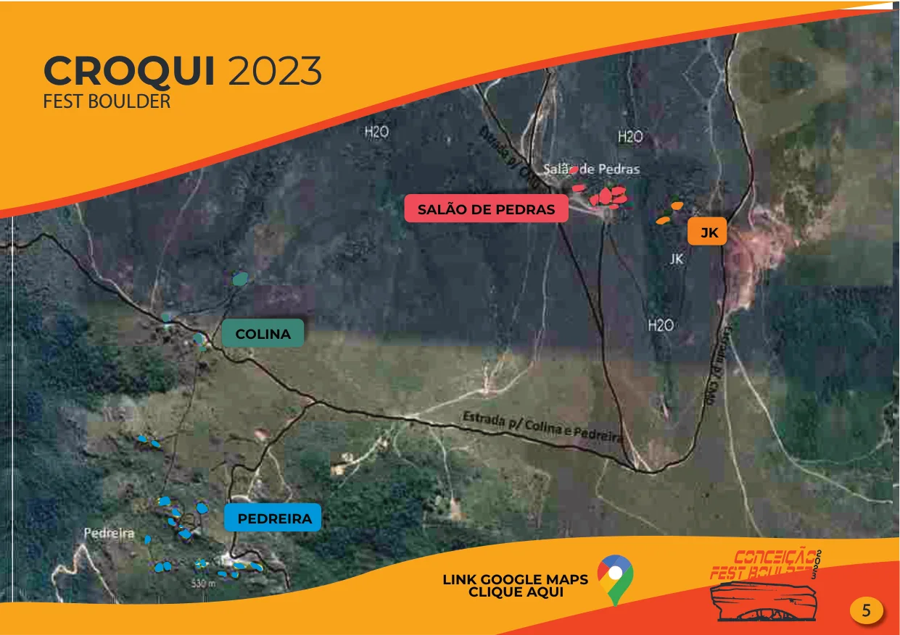
    - **checksum_sha256**: cacdd30da7a749d154ef1de89cc24417f7eb3d46d7b04d92cb6872dab60360e8
  - **[69]**:
    - **caminho**: 
    - **checksum_sha256**: 390c4ae0ca91d29bfac8ae77757e3b0bc333dca5fbc0b5051c2ba50b985c1f62

