# Croqui: Diamaboulder (Cerrado Groove)

## Informações Gerais

- **descricao**: O Cerrado Groove é um setor de boulder localizado em Diamantina, MG, com blocos de quartzito de alta qualidade.
- **id**: br_mg_diamantina_diamaboulder
- **nome**: Diamaboulder (Cerrado Groove)
- **creditos**:
  - Danilo Barbosa
- **status_desenho_extraivel**: NAO_TEM_DESENHO
- **caminho_thumbnail**: 
- **botoes**:
  - **[0]**:
    - **texto**: Informações
    - **destino**:
      - **secao_textual**:
        - **conteudo**:
            # Diamaboulder
            ## Cerrado Groove
            
            |  |
            | :--: |
            | *Diamaboulder - Cerrado Groove* |
  - **[1]**:
    - **texto**: Informações
    - **destino**:
      - **secao_textual**:
        - **conteudo**:
            # Mapas Gerais
            
            ## Mapa de Setores
            O setor Cerrado Groove está localizado próximo à Associação e à área de Extração (Curralinho).
            
            |  |
            | :--: |
            | *Mapa de Setores Diamaboulder 2025* |
            
            ## Mapa das Regiões
            O setor Cerrado Groove é dividido em 4 regiões principais.
            
            | 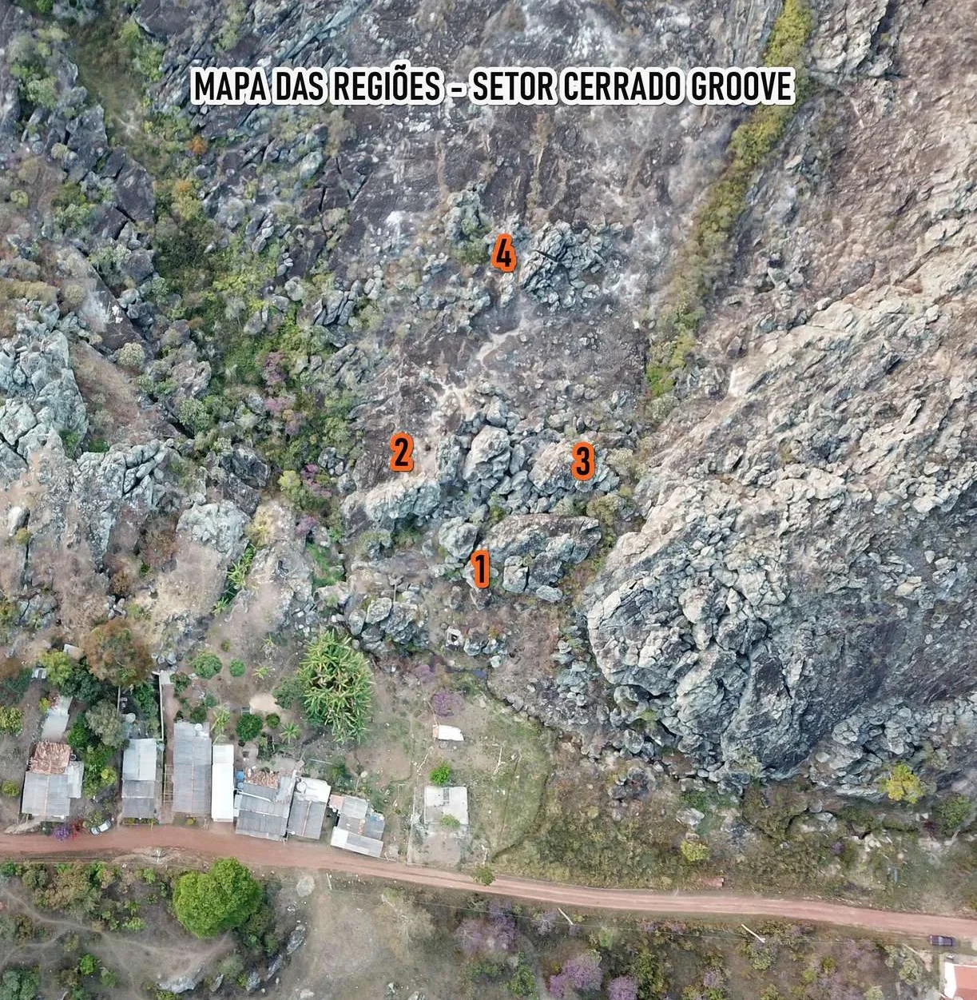 |
            | :--: |
            | *Mapa das Regiões - Setor Cerrado Groove* |
- **ultima_migracao**: 2

## Parte: grupo_regiao_1

### Grupo (Pico: Cerrado Groove)

- **descricao**:
    # Região 1
    
    A Região 1 compreende os primeiros blocos do setor Cerrado Groove.
- **nome**: Região 1
- **setores**:
  - **[0]**:
    - **conteudo**:
      - **descricao**:
          # Bloco: Diamante de Sangue
          ## Região 1
      - **nome**: Diamante de Sangue
      - **mapas**:
        - **[0]**:
          - **caminho_imagem_mapa**: 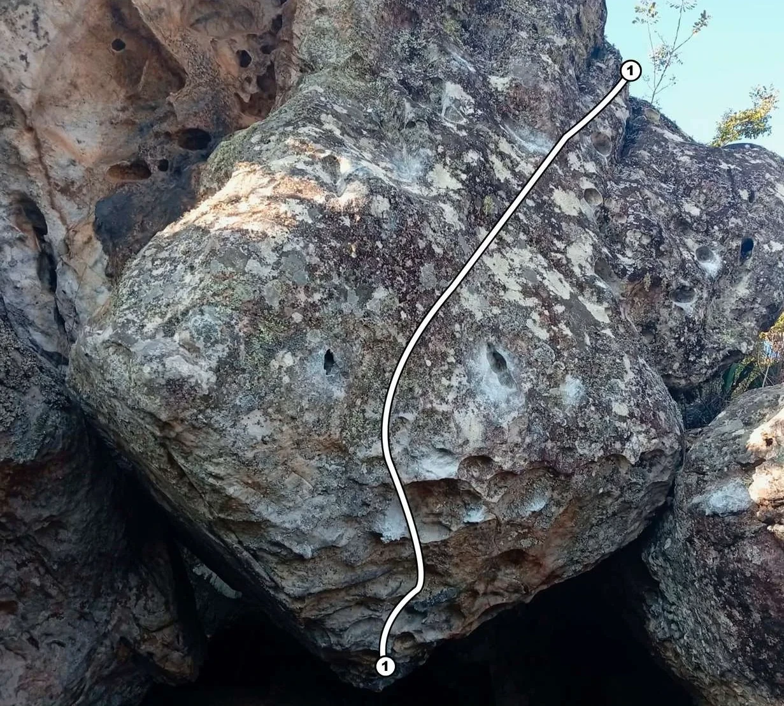
          - **largura_mapa**: 1231
          - **altura_mapa**: 1107
          - **pontos_de_interesse**:
            - **[0]**:
              - **id**: 1
              - **label**: 1
              - **box**:
                - **x**: 605
                - **y**: 1047
                - **comprimento**: 28
                - **largura**: 32
            - **[1]**:
              - **id**: 1_fim
              - **label**: 1
              - **box**:
                - **x**: 988
                - **y**: 112
                - **comprimento**: 25
                - **largura**: 25
          - **referencias**:
            - **[0]**:
              - **escalada**: Diamante de Sangue
              - **ids**:
                - 1
                - 1_fim
      - **escaladas**:
        - **[0]**:
          - **boulder**:
            - **descricao**: Saída nos pockets mais baixos da face negativa, seguindo por regletes e pockets até finalizar no positivo de abaulados.
            - **nome**: Diamante de Sangue
            - **dificuldade**: V6_BARRA_V7
            - **tipo_parede**: NEGATIVO
  - **[1]**:
    - **conteudo**:
      - **descricao**:
          # Bloco: Chiqueirinho
          ## Região 1
          
          O bloco Chiqueirinho possui várias linhas em diferentes faces.
      - **nome**: Chiqueirinho
      - **mapas**:
        - **[0]**:
          - **caminho_imagem_mapa**: 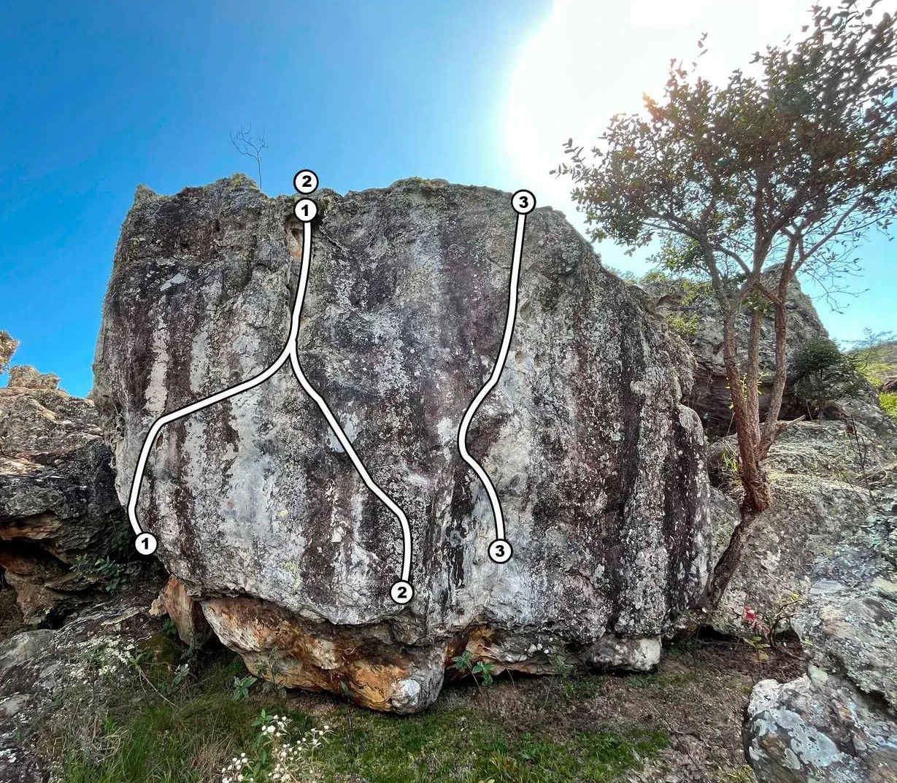
          - **largura_mapa**: 1229
          - **altura_mapa**: 1073
          - **pontos_de_interesse**:
            - **[0]**:
              - **id**: 01
              - **label**: 1
              - **box**:
                - **x**: 202
                - **y**: 744
                - **comprimento**: 25
                - **largura**: 25
            - **[1]**:
              - **id**: 01_fim
              - **label**: 1
              - **box**:
                - **x**: 420
                - **y**: 288
                - **comprimento**: 30
                - **largura**: 29
            - **[2]**:
              - **id**: 02
              - **label**: 2
              - **box**:
                - **x**: 549
                - **y**: 808
                - **comprimento**: 28
                - **largura**: 29
            - **[3]**:
              - **id**: 02_fim
              - **label**: 2
              - **box**:
                - **x**: 418
                - **y**: 248
                - **comprimento**: 33
                - **largura**: 35
            - **[4]**:
              - **id**: 03
              - **label**: 3
              - **box**:
                - **x**: 686
                - **y**: 754
                - **comprimento**: 25
                - **largura**: 25
            - **[5]**:
              - **id**: 03_fim
              - **label**: 3
              - **box**:
                - **x**: 718
                - **y**: 277
                - **comprimento**: 28
                - **largura**: 28
          - **referencias**:
            - **[0]**:
              - **escalada**: Menos Porco Mais Aranha
              - **ids**:
                - 01
                - 01_fim
            - **[1]**:
              - **escalada**: Javaporco
              - **ids**:
                - 02
                - 02_fim
            - **[2]**:
              - **escalada**: Chiqueirinho
              - **ids**:
                - 03
                - 03_fim
            - **[3]**:
              - **escalada**: Pocilga
              - **ids**:
                - 01
                - 01_fim
            - **[4]**:
              - **escalada**: Porco Aranha
              - **ids**:
                - 02
                - 02_fim
        - **[1]**:
          - **caminho_imagem_mapa**: 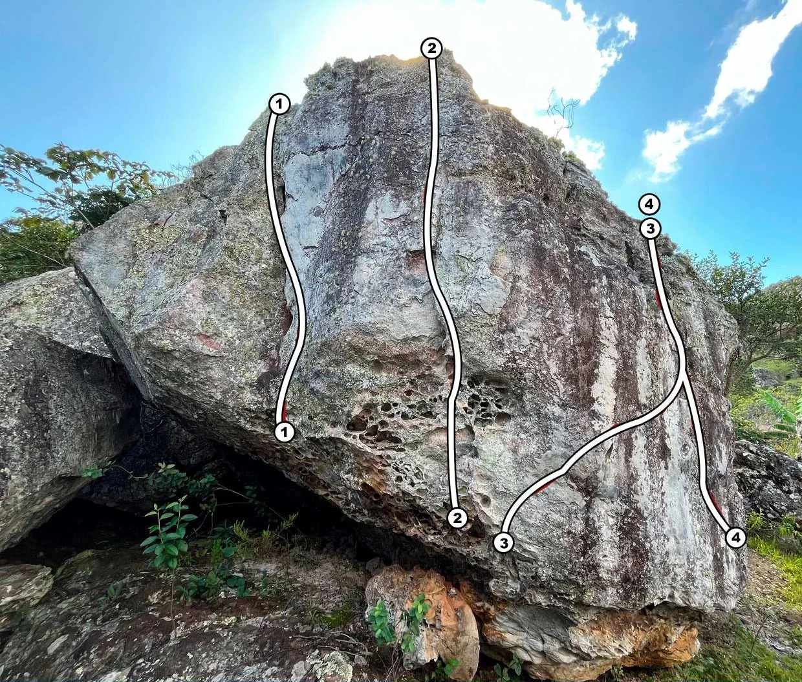
          - **largura_mapa**: 1240
          - **altura_mapa**: 1055
          - **pontos_de_interesse**:
            - **[0]**:
              - **id**: 01
              - **label**: 1
              - **box**:
                - **x**: 438
                - **y**: 668
                - **comprimento**: 25
                - **largura**: 25
            - **[1]**:
              - **id**: 01_fim
              - **label**: 1
              - **box**:
                - **x**: 434
                - **y**: 159
                - **comprimento**: 21
                - **largura**: 24
            - **[2]**:
              - **id**: 02
              - **label**: 2
              - **box**:
                - **x**: 706
                - **y**: 800
                - **comprimento**: 30
                - **largura**: 33
            - **[3]**:
              - **id**: 02_fim
              - **label**: 2
              - **box**:
                - **x**: 668
                - **y**: 73
                - **comprimento**: 28
                - **largura**: 28
            - **[4]**:
              - **id**: 03
              - **label**: 3
              - **box**:
                - **x**: 780
                - **y**: 839
                - **comprimento**: 27
                - **largura**: 28
            - **[5]**:
              - **id**: 03_fim
              - **label**: 3
              - **box**:
                - **x**: 1007
                - **y**: 352
                - **comprimento**: 20
                - **largura**: 25
            - **[6]**:
              - **id**: 04
              - **label**: 4
              - **box**:
                - **x**: 1138
                - **y**: 833
                - **comprimento**: 24
                - **largura**: 24
            - **[7]**:
              - **id**: 04_fim
              - **label**: 4
              - **box**:
                - **x**: 1004
                - **y**: 314
                - **comprimento**: 24
                - **largura**: 24
          - **referencias**:
            - **[0]**:
              - **escalada**: Menos Porco Mais Aranha
              - **ids**:
                - 01
                - 01_fim
            - **[1]**:
              - **escalada**: Javaporco
              - **ids**:
                - 02
                - 02_fim
            - **[2]**:
              - **escalada**: Chiqueirinho
              - **ids**:
                - 03
                - 03_fim
            - **[3]**:
              - **escalada**: Pocilga
              - **ids**:
                - 01
                - 01_fim
            - **[4]**:
              - **escalada**: Porco Aranha
              - **ids**:
                - 02
                - 02_fim
      - **escaladas**:
        - **[0]**:
          - **boulder**:
            - **nome**: Menos Porco Mais Aranha
            - **dificuldade**: V4_BARRA_V5
        - **[1]**:
          - **boulder**:
            - **nome**: Javaporco
            - **dificuldade**: V3
        - **[2]**:
          - **boulder**:
            - **nome**: Chiqueirinho
            - **dificuldade**: V2_BARRA_V3
        - **[3]**:
          - **boulder**:
            - **nome**: Pocilga
            - **dificuldade**: V2
        - **[4]**:
          - **boulder**:
            - **nome**: Porco Aranha
            - **dificuldade**: V2
  - **[2]**:
    - **conteudo**:
      - **descricao**:
          # Bloco: Bloco do Kbeca
          ## Região 1
      - **nome**: Bloco do Kbeca
      - **mapas**:
        - **[0]**:
          - **caminho_imagem_mapa**: 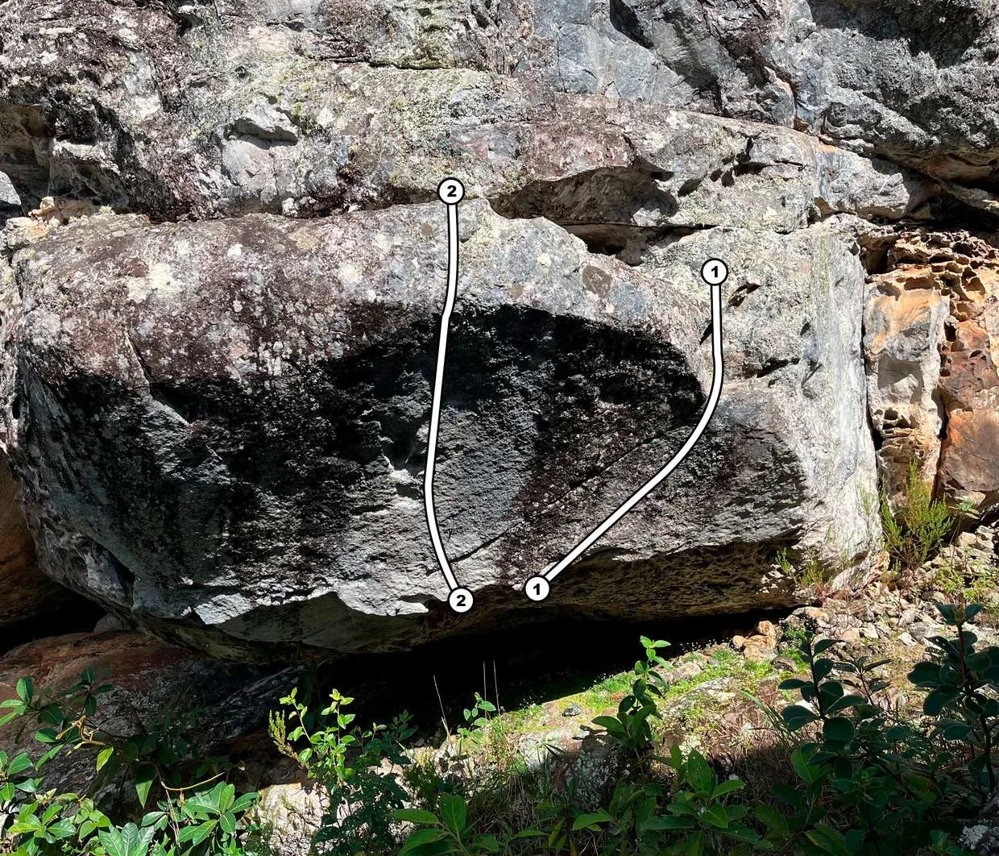
          - **largura_mapa**: 1240
          - **altura_mapa**: 1062
          - **pontos_de_interesse**:
            - **[0]**:
              - **id**: 1
              - **label**: 1
              - **box**:
                - **x**: 666
                - **y**: 730
                - **comprimento**: 25
                - **largura**: 25
            - **[1]**:
              - **id**: 1_fim
              - **label**: 1
              - **box**:
                - **x**: 888
                - **y**: 336
                - **comprimento**: 21
                - **largura**: 24
            - **[2]**:
              - **id**: 2
              - **label**: 2
              - **box**:
                - **x**: 570
                - **y**: 744
                - **comprimento**: 25
                - **largura**: 25
            - **[3]**:
              - **id**: 2_fim
              - **label**: 2
              - **box**:
                - **x**: 560
                - **y**: 236
                - **comprimento**: 25
                - **largura**: 25
          - **referencias**:
            - **[0]**:
              - **escalada**: Boulder do Kbeca
              - **ids**:
                - 1
                - 1_fim
            - **[1]**:
              - **escalada**: Projeto
              - **ids**:
                - 2
                - 2_fim
      - **escaladas**:
        - **[0]**:
          - **boulder**:
            - **nome**: Boulder do Kbeca
            - **dificuldade**: V7
        - **[1]**:
          - **boulder**:
            - **nome**: Projeto
            - **dificuldade**: INDEFINIDO
  - **[3]**:
    - **conteudo**:
      - **descricao**:
          # Bloco: Flor do Cerrado
          ## Região 1
      - **nome**: Flor do Cerrado
      - **mapas**:
        - **[0]**:
          - **caminho_imagem_mapa**: 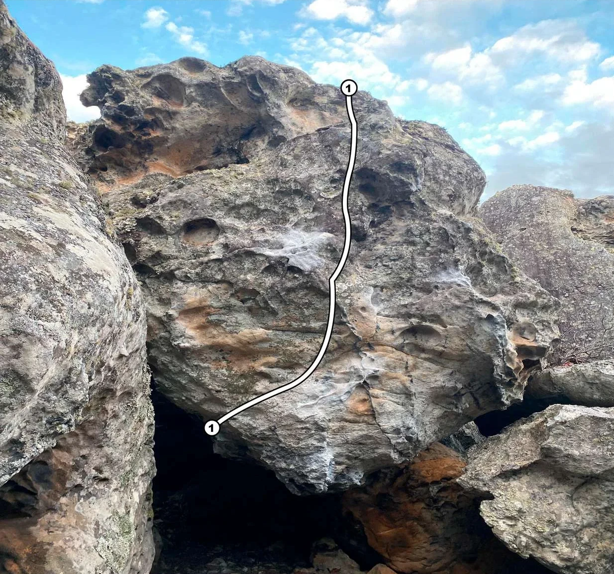
          - **largura_mapa**: 1234
          - **altura_mapa**: 1155
          - **pontos_de_interesse**:
            - **[0]**:
              - **id**: 1
              - **label**: 1
              - **box**:
                - **x**: 424
                - **y**: 860
                - **comprimento**: 25
                - **largura**: 30
            - **[1]**:
              - **id**: 1_fim
              - **label**: 1
              - **box**:
                - **x**: 700
                - **y**: 175
                - **comprimento**: 27
                - **largura**: 32
          - **referencias**:
            - **[0]**:
              - **escalada**: Flor do Cerrado
              - **ids**:
                - 1
                - 1_fim
      - **escaladas**:
        - **[0]**:
          - **boulder**:
            - **nome**: Flor do Cerrado
            - **dificuldade**: V5
  - **[4]**:
    - **conteudo**:
      - **descricao**:
          # Bloco: Joelho Sem Freio
          ## Região 1
      - **nome**: Joelho Sem Freio
      - **mapas**:
        - **[0]**:
          - **caminho_imagem_mapa**: 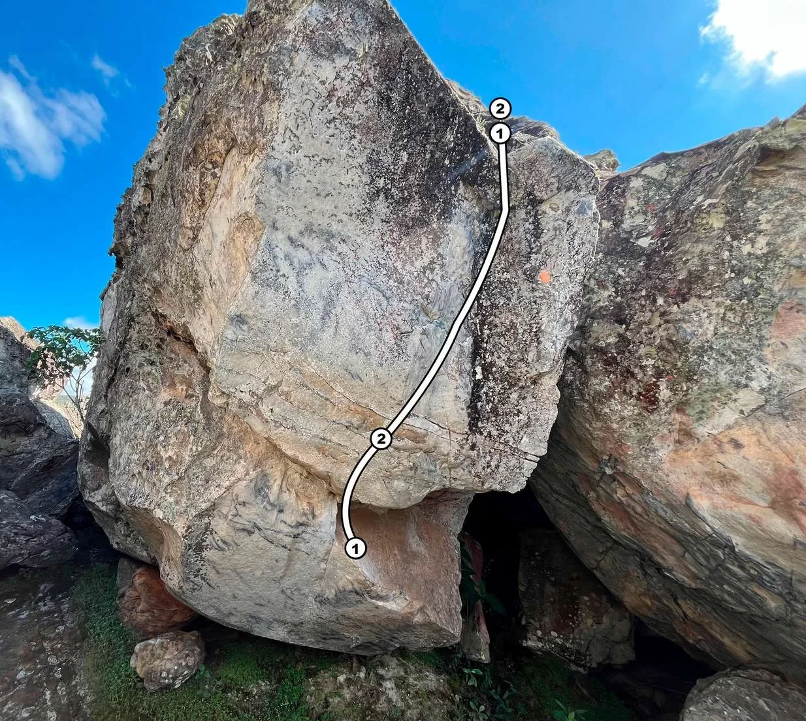
          - **largura_mapa**: 1234
          - **altura_mapa**: 1105
          - **pontos_de_interesse**:
            - **[0]**:
              - **id**: 1
              - **label**: 1
              - **box**:
                - **x**: 544
                - **y**: 838
                - **comprimento**: 25
                - **largura**: 25
            - **[1]**:
              - **id**: 1_fim
              - **label**: 1
              - **box**:
                - **x**: 766
                - **y**: 204
                - **comprimento**: 23
                - **largura**: 25
            - **[2]**:
              - **id**: 2
              - **label**: 2
              - **box**:
                - **x**: 584
                - **y**: 672
                - **comprimento**: 25
                - **largura**: 29
            - **[3]**:
              - **id**: 2_fim
              - **label**: 2
              - **box**:
                - **x**: 765
                - **y**: 166
                - **comprimento**: 22
                - **largura**: 23
          - **referencias**:
            - **[0]**:
              - **escalada**: Desenfreado
              - **ids**:
                - 1
                - 1_fim
            - **[1]**:
              - **escalada**: Joelho Sem Freio
              - **ids**:
                - 2
                - 2_fim
      - **escaladas**:
        - **[0]**:
          - **boulder**:
            - **descricao**: Saída com as mãos juntas no batente escorrido.
            - **nome**: Desenfreado
            - **dificuldade**: V6
        - **[1]**:
          - **boulder**:
            - **descricao**: Saída com a mão direita na aresta em meia altura e a mão esquerda em abaulado invertido no teto.
            - **nome**: Joelho Sem Freio
            - **dificuldade**: V3
- **mapas**:
  - **[0]**:
    - **caminho_imagem_mapa**: 
    - **largura_mapa**: 1223
    - **altura_mapa**: 1251
    - **pontos_de_interesse**: []

## Parte: grupo_regiao_2

### Grupo (Pico: Cerrado Groove)

- **descricao**:
    # Região 2
    
    A Região 2 contém blocos icônicos como Panela do Diabo e Primavera nos Dentes.
- **nome**: Região 2
- **setores**:
  - **[0]**:
    - **conteudo**:
      - **descricao**:
          # Bloco: Panela do Diabo
          ## Região 2
      - **nome**: Panela do Diabo
      - **mapas**:
        - **[0]**:
          - **caminho_imagem_mapa**: 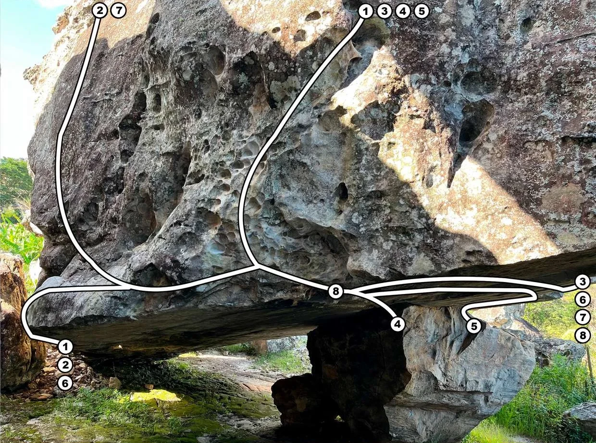
          - **largura_mapa**: 1240
          - **altura_mapa**: 922
          - **pontos_de_interesse**:
            - **[0]**:
              - **id**: 1
              - **label**: 1
              - **box**:
                - **x**: 138
                - **y**: 722
                - **comprimento**: 25
                - **largura**: 25
            - **[1]**:
              - **id**: 1_fim
              - **label**: 1
              - **box**:
                - **x**: 758
                - **y**: 20
                - **comprimento**: 25
                - **largura**: 29
            - **[2]**:
              - **id**: 2
              - **label**: 2
              - **box**:
                - **x**: 136
                - **y**: 760
                - **comprimento**: 25
                - **largura**: 25
            - **[3]**:
              - **id**: 2_fim
              - **label**: 2
              - **box**:
                - **x**: 208
                - **y**: 20
                - **comprimento**: 26
                - **largura**: 29
            - **[4]**:
              - **id**: 3
              - **label**: 3
              - **box**:
                - **x**: 1211
                - **y**: 584
                - **comprimento**: 22
                - **largura**: 24
            - **[5]**:
              - **id**: 3_fim
              - **label**: 3
              - **box**:
                - **x**: 799
                - **y**: 22
                - **comprimento**: 30
                - **largura**: 29
            - **[6]**:
              - **id**: 4
              - **label**: 4
              - **box**:
                - **x**: 828
                - **y**: 674
                - **comprimento**: 25
                - **largura**: 25
            - **[7]**:
              - **id**: 4_fim
              - **label**: 4
              - **box**:
                - **x**: 837
                - **y**: 20
                - **comprimento**: 30
                - **largura**: 29
            - **[8]**:
              - **id**: 5
              - **label**: 5
              - **box**:
                - **x**: 987
                - **y**: 678
                - **comprimento**: 18
                - **largura**: 20
            - **[9]**:
              - **id**: 5_fim
              - **label**: 5
              - **box**:
                - **x**: 877
                - **y**: 20
                - **comprimento**: 30
                - **largura**: 29
            - **[10]**:
              - **id**: 6
              - **label**: 6
              - **box**:
                - **x**: 134
                - **y**: 800
                - **comprimento**: 25
                - **largura**: 25
            - **[11]**:
              - **id**: 6_fim
              - **label**: 6
              - **box**:
                - **x**: 1212
                - **y**: 622
                - **comprimento**: 20
                - **largura**: 22
            - **[12]**:
              - **id**: 7
              - **label**: 7
              - **box**:
                - **x**: 1209
                - **y**: 656
                - **comprimento**: 24
                - **largura**: 29
            - **[13]**:
              - **id**: 7_fim
              - **label**: 7
              - **box**:
                - **x**: 244
                - **y**: 21
                - **comprimento**: 21
                - **largura**: 24
            - **[14]**:
              - **id**: 8
              - **label**: 8
              - **box**:
                - **x**: 1212
                - **y**: 698
                - **comprimento**: 25
                - **largura**: 25
            - **[15]**:
              - **id**: 8_fim
              - **label**: 8
              - **box**:
                - **x**: 696
                - **y**: 605
                - **comprimento**: 22
                - **largura**: 24
          - **referencias**:
            - **[0]**:
              - **escalada**: Consciência
              - **ids**:
                - 1
                - 1_fim
            - **[1]**:
              - **escalada**: Groove
              - **ids**:
                - 2
                - 2_fim
            - **[2]**:
              - **escalada**: Caldeirão
              - **ids**:
                - 3
                - 3_fim
            - **[3]**:
              - **escalada**: Panela do Diabo
              - **ids**:
                - 5
                - 5_fim
            - **[4]**:
              - **escalada**: Consciência para ter Coragem
              - **ids**:
                - 6
                - 6_fim
            - **[5]**:
              - **escalada**: Caldeirão do Groove
              - **ids**:
                - 7
                - 7_fim
            - **[6]**:
              - **escalada**: Coragem
              - **ids**:
                - 8
                - 8_fim
      - **escaladas**:
        - **[0]**:
          - **boulder**:
            - **descricao**: Saída baixa em dois regletes pequenos logo à direita do balcão arredondado, seguindo em travessia para a direita até dominar como o panelaço.
            - **nome**: Consciência
            - **dificuldade**: V4
        - **[1]**:
          - **boulder**:
            - **descricao**: Mesma saída do consciência, dominando na face positiva logo acima do balcão.
            - **nome**: Groove
            - **dificuldade**: V3
        - **[2]**:
          - **boulder**:
            - **descricao**: Saída nos agarrões da borda de fora do bloco e segue pelo teto até finalizar como o panelaço (sem a utilização do "jorge"/bloco de sustentação).
            - **nome**: Caldeirão
            - **dificuldade**: V6
        - **[3]**:
          - **boulder**:
            - **nome**: Panela do Diabo
            - **dificuldade**: V4
        - **[4]**:
          - **boulder**:
            - **descricao**: Saída similar ao consciência, seguindo em travessia até ligar no boulder coragem.
            - **nome**: Consciência para ter Coragem
            - **dificuldade**: V7
        - **[5]**:
          - **boulder**:
            - **nome**: Caldeirão do Groove
            - **dificuldade**: V7
        - **[6]**:
          - **boulder**:
            - **descricao**: Saída com as duas mãos no buraco do teto e segue pelo caminho inverso do caldeirão, finalizando por agarrões na face vertical do bloco.
            - **nome**: Coragem
            - **dificuldade**: V5
  - **[1]**:
    - **conteudo**:
      - **descricao**:
          # Bloco: Faca de Pedra
          ## Região 2
      - **nome**: Faca de Pedra
      - **mapas**:
        - **[0]**:
          - **caminho_imagem_mapa**: 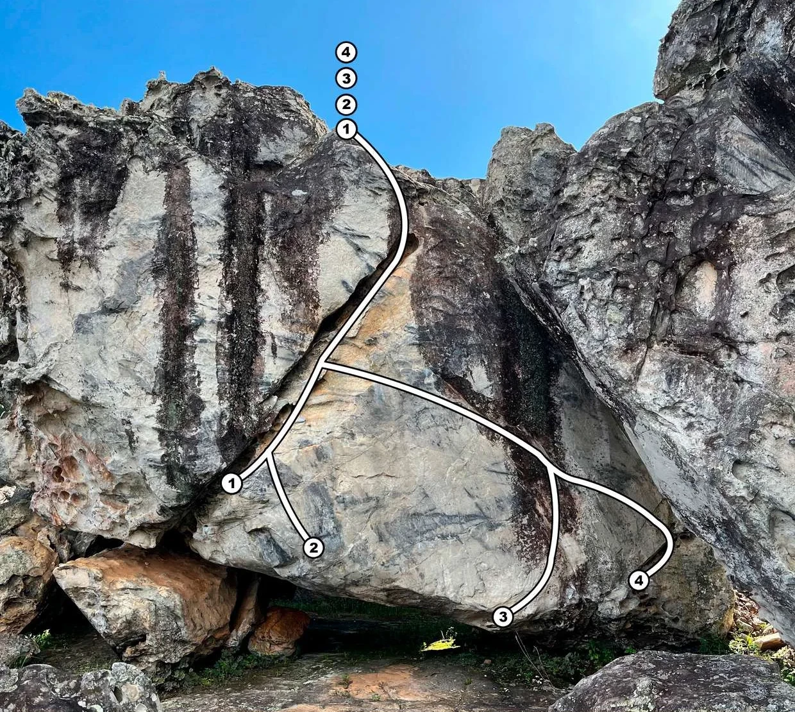
          - **largura_mapa**: 1240
          - **altura_mapa**: 1110
          - **pontos_de_interesse**:
            - **[0]**:
              - **id**: 1
              - **label**: 1
              - **box**:
                - **x**: 362
                - **y**: 752
                - **comprimento**: 25
                - **largura**: 25
            - **[1]**:
              - **id**: 1_fim
              - **label**: 1
              - **box**:
                - **x**: 541
                - **y**: 198
                - **comprimento**: 24
                - **largura**: 29
            - **[2]**:
              - **id**: 2
              - **label**: 2
              - **box**:
                - **x**: 488
                - **y**: 854
                - **comprimento**: 25
                - **largura**: 24
            - **[3]**:
              - **id**: 2_fim
              - **label**: 2
              - **box**:
                - **x**: 540
                - **y**: 160
                - **comprimento**: 20
                - **largura**: 21
            - **[4]**:
              - **id**: 3
              - **label**: 3
              - **box**:
                - **x**: 784
                - **y**: 960
                - **comprimento**: 25
                - **largura**: 24
            - **[5]**:
              - **id**: 3_fim
              - **label**: 3
              - **box**:
                - **x**: 539
                - **y**: 122
                - **comprimento**: 22
                - **largura**: 24
            - **[6]**:
              - **id**: 4
              - **label**: 4
              - **box**:
                - **x**: 996
                - **y**: 904
                - **comprimento**: 25
                - **largura**: 25
            - **[7]**:
              - **id**: 4_fim
              - **label**: 4
              - **box**:
                - **x**: 539
                - **y**: 80
                - **comprimento**: 18
                - **largura**: 23
          - **referencias**:
            - **[0]**:
              - **escalada**: Colher de Pedra
              - **ids**:
                - 1
                - 1_fim
            - **[1]**:
              - **escalada**: Colher de Pau
              - **ids**:
                - 2
                - 2_fim
            - **[2]**:
              - **escalada**: Chaira de Pedra
              - **ids**:
                - 3
                - 3_fim
            - **[3]**:
              - **escalada**: Faca de Pedra
              - **ids**:
                - 4
                - 4_fim
      - **escaladas**:
        - **[0]**:
          - **boulder**:
            - **nome**: Colher de Pedra
            - **dificuldade**: V2
        - **[1]**:
          - **boulder**:
            - **nome**: Colher de Pau
            - **dificuldade**: V5
        - **[2]**:
          - **boulder**:
            - **nome**: Chaira de Pedra
            - **dificuldade**: V8
        - **[3]**:
          - **boulder**:
            - **nome**: Faca de Pedra
            - **dificuldade**: V7
  - **[2]**:
    - **conteudo**:
      - **descricao**:
          # Bloco: Serra do Groove
          ## Região 2
      - **nome**: Serra do Groove
      - **mapas**:
        - **[0]**:
          - **caminho_imagem_mapa**: 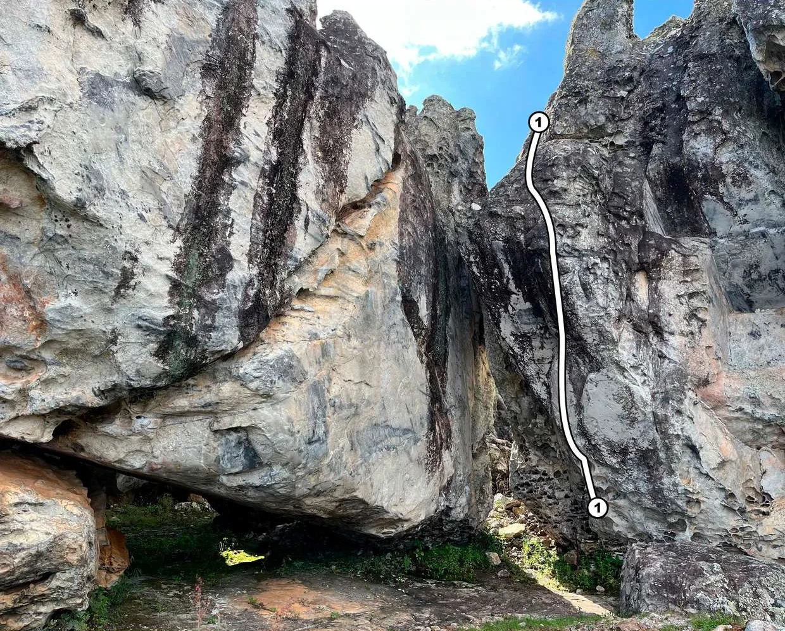
          - **largura_mapa**: 1240
          - **altura_mapa**: 996
          - **pontos_de_interesse**:
            - **[0]**:
              - **id**: 1
              - **label**: 1
              - **box**:
                - **x**: 942
                - **y**: 803
                - **comprimento**: 25
                - **largura**: 30
            - **[1]**:
              - **id**: 1_fim
              - **label**: 1
              - **box**:
                - **x**: 852
                - **y**: 194
                - **comprimento**: 29
                - **largura**: 33
          - **referencias**:
            - **[0]**:
              - **escalada**: Serra do Groove
              - **ids**:
                - 1
                - 1_fim
      - **escaladas**:
        - **[0]**:
          - **boulder**:
            - **nome**: Serra do Groove
            - **dificuldade**: V3
  - **[3]**:
    - **conteudo**:
      - **descricao**:
          # Bloco: Primavera nos Dentes
          ## Região 2
          
          O bloco Primavera nos Dentes é um dos principais do setor, com linhas de alta dificuldade.
      - **nome**: Primavera nos Dentes
      - **mapas**:
        - **[0]**:
          - **caminho_imagem_mapa**: 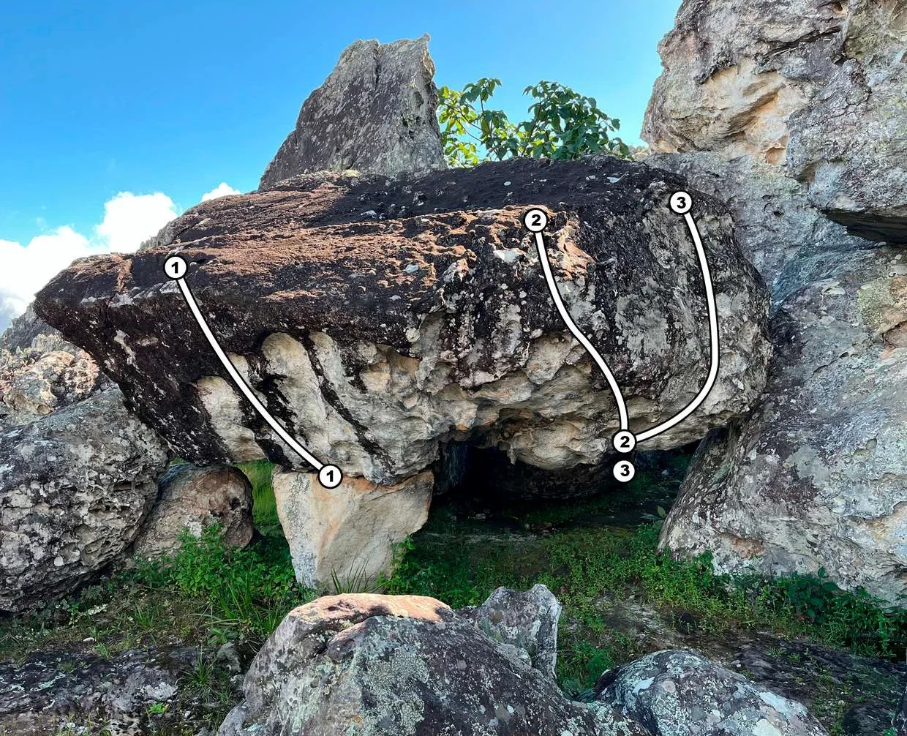
          - **largura_mapa**: 1240
          - **altura_mapa**: 1006
          - **pontos_de_interesse**:
            - **[0]**:
              - **id**: 1 (P0)
              - **label**: 1
              - **box**:
                - **x**: 450
                - **y**: 652
                - **comprimento**: 25
                - **largura**: 25
            - **[1]**:
              - **id**: 1 (P0)_fim
              - **label**: 1
              - **box**:
                - **x**: 240
                - **y**: 362
                - **comprimento**: 25
                - **largura**: 25
            - **[2]**:
              - **id**: 2 (P0)
              - **label**: 2
              - **box**:
                - **x**: 854
                - **y**: 604
                - **comprimento**: 25
                - **largura**: 25
            - **[3]**:
              - **id**: 2 (P0)_fim
              - **label**: 2
              - **box**:
                - **x**: 732
                - **y**: 300
                - **comprimento**: 25
                - **largura**: 25
            - **[4]**:
              - **id**: 3 (P0)
              - **label**: 3
              - **box**:
                - **x**: 854
                - **y**: 644
                - **comprimento**: 18
                - **largura**: 20
            - **[5]**:
              - **id**: 3 (P0)_fim
              - **label**: 3
              - **box**:
                - **x**: 930
                - **y**: 274
                - **comprimento**: 25
                - **largura**: 25
          - **referencias**:
            - **[0]**:
              - **escalada**: Monobloco
              - **ids**:
                - 1 (P0)
                - 1 (P0)_fim
            - **[1]**:
              - **escalada**: Canela Queimada
              - **ids**:
                - 2 (P0)
                - 2 (P0)_fim
            - **[2]**:
              - **escalada**: Canela de Ema
              - **ids**:
                - 3 (P0)
                - 3 (P0)_fim
        - **[1]**:
          - **caminho_imagem_mapa**: 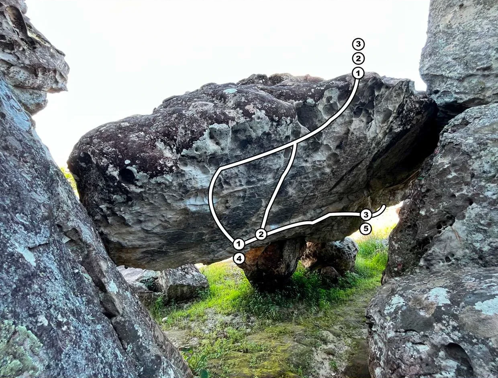
          - **largura_mapa**: 1240
          - **altura_mapa**: 941
          - **pontos_de_interesse**:
            - **[0]**:
              - **id**: 1 (P1)
              - **label**: 1
              - **box**:
                - **x**: 593
                - **y**: 606
                - **comprimento**: 20
                - **largura**: 24
            - **[1]**:
              - **id**: 1 (P1)_fim
              - **label**: 1
              - **box**:
                - **x**: 892
                - **y**: 182
                - **comprimento**: 27
                - **largura**: 30
            - **[2]**:
              - **id**: 2 (P1)
              - **label**: 2
              - **box**:
                - **x**: 650
                - **y**: 583
                - **comprimento**: 21
                - **largura**: 26
            - **[3]**:
              - **id**: 2 (P1)_fim
              - **label**: 2
              - **box**:
                - **x**: 892
                - **y**: 144
                - **comprimento**: 21
                - **largura**: 25
            - **[4]**:
              - **id**: 3 (P1)
              - **label**: 3
              - **box**:
                - **x**: 910
                - **y**: 532
                - **comprimento**: 19
                - **largura**: 21
            - **[5]**:
              - **id**: 3 (P1)_fim
              - **label**: 3
              - **box**:
                - **x**: 892
                - **y**: 108
                - **comprimento**: 25
                - **largura**: 24
            - **[6]**:
              - **id**: 4 (P1/P2)
              - **label**: 4
              - **box**:
                - **x**: 594
                - **y**: 644
                - **comprimento**: 19
                - **largura**: 23
            - **[7]**:
              - **id**: 5 (P1/P2)
              - **label**: 5
              - **box**:
                - **x**: 910
                - **y**: 568
                - **comprimento**: 21
                - **largura**: 24
          - **referencias**:
            - **[0]**:
              - **escalada**: Primavera nos Dentes
              - **ids**:
                - 1 (P1)
                - 1 (P1)_fim
            - **[1]**:
              - **escalada**: Suave Coisa Nenhuma
              - **ids**:
                - 2 (P1)
                - 2 (P1)_fim
            - **[2]**:
              - **escalada**: Primavera Latina
              - **ids**:
                - 3 (P1)
                - 3 (P1)_fim
        - **[2]**:
          - **caminho_imagem_mapa**: 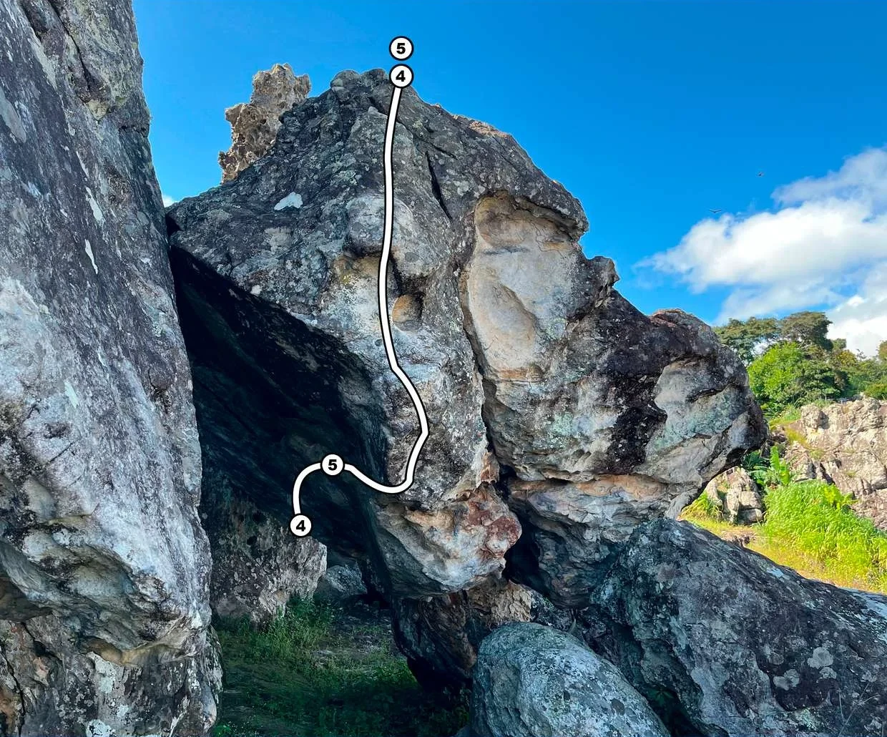
          - **largura_mapa**: 1240
          - **altura_mapa**: 1030
          - **pontos_de_interesse**:
            - **[0]**:
              - **id**: 4 (P1/P2)
              - **label**: 4
              - **box**:
                - **x**: 422
                - **y**: 736
                - **comprimento**: 25
                - **largura**: 25
            - **[1]**:
              - **id**: 4 (P1/P2)_fim
              - **label**: 4
              - **box**:
                - **x**: 562
                - **y**: 106
                - **comprimento**: 25
                - **largura**: 25
            - **[2]**:
              - **id**: 5 (P1/P2)
              - **label**: 5
              - **box**:
                - **x**: 466
                - **y**: 650
                - **comprimento**: 25
                - **largura**: 25
            - **[3]**:
              - **id**: 5 (P1/P2)_fim
              - **label**: 5
              - **box**:
                - **x**: 560
                - **y**: 68
                - **comprimento**: 25
                - **largura**: 25
      - **escaladas**:
        - **[0]**:
          - **boulder**:
            - **descricao**: Saída com as mãos e pés no bloco menor que sustenta o bloco principal, finalizando logo acima.
            - **nome**: Monobloco
            - **dificuldade**: V3
        - **[1]**:
          - **boulder**:
            - **descricao**: Saída em batentes bem marcados e segue para a esquerda (sem utilizar os pés no bloco de sustentação).
            - **nome**: Canela Queimada
            - **dificuldade**: V2
        - **[2]**:
          - **boulder**:
            - **descricao**: Mesma saída do canela queimada mas segue a linha de agarras da direita.
            - **nome**: Canela de Ema
            - **dificuldade**: V3
        - **[3]**:
          - **boulder**:
            - **descricao**: Saída com as mãos juntas na agarra protuberante (sem utilizar o bloco de sustentação como apoio de pés), seguindo pelos pequenos regletes escorridos e pockets.
            - **nome**: Primavera nos Dentes
            - **dificuldade**: V7
        - **[4]**:
          - **boulder**:
            - **descricao**: Saída com a mão esquerda na agarra protuberante e mão direita no batente abaulado, seguido de dinâmico no pocket estreito, finalizando como o primavera nos dentes (utiliza-se livremente o(s) pé(s) no bloco de sustentação).
            - **nome**: Suave Coisa Nenhuma
            - **dificuldade**: V6
        - **[5]**:
          - **boulder**:
            - **descricao**: Saída nas agarras da quina do bloco (logo à direita da saída do joelho de porco) e segue em travessia para a esquerda até finalizar como o primavera nos dentes.
            - **nome**: Primavera Latina
            - **dificuldade**: V10_BARRA_V11
        - **[6]**:
          - **boulder**:
            - **descricao**: Mesma saída do primavera nos dentes, mas segue em diagonal para a direita por abaulados e invertidas até finalizar como o joelho de porco.
            - **nome**: Sangue Latino
            - **dificuldade**: V9
        - **[7]**:
          - **boulder**:
            - **descricao**: Saída com as mãos em copos idênticos quase ao final do abrigo, seguindo por movimentos espremidos rumo à face externa do bloco.
            - **nome**: Joelho de Porco
            - **dificuldade**: V3
  - **[4]**:
    - **conteudo**:
      - **descricao**:
          # Bloco: Flor da Montanha
          ## Região 2
      - **nome**: Flor da Montanha
      - **mapas**:
        - **[0]**:
          - **caminho_imagem_mapa**: 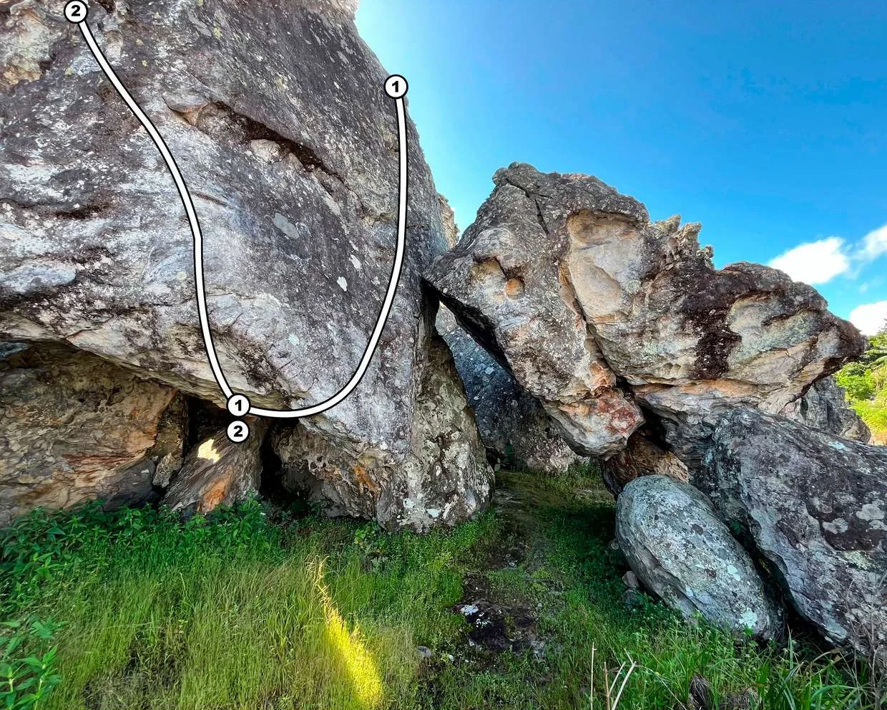
          - **largura_mapa**: 1240
          - **altura_mapa**: 991
          - **pontos_de_interesse**:
            - **[0]**:
              - **id**: 1
              - **label**: 1
              - **box**:
                - **x**: 332
                - **y**: 565
                - **comprimento**: 22
                - **largura**: 24
            - **[1]**:
              - **id**: 1_fim
              - **label**: 1
              - **box**:
                - **x**: 554
                - **y**: 122
                - **comprimento**: 23
                - **largura**: 24
            - **[2]**:
              - **id**: 2
              - **label**: 2
              - **box**:
                - **x**: 330
                - **y**: 602
                - **comprimento**: 22
                - **largura**: 23
            - **[3]**:
              - **id**: 2_fim
              - **label**: 2
              - **box**:
                - **x**: 106
                - **y**: 14
                - **comprimento**: 28
                - **largura**: 25
          - **referencias**:
            - **[0]**:
              - **escalada**: Fina Flor
              - **ids**:
                - 1
                - 1_fim
            - **[1]**:
              - **escalada**: Flor da Montanha
              - **ids**:
                - 2
                - 2_fim
      - **escaladas**:
        - **[0]**:
          - **boulder**:
            - **nome**: Fina Flor
            - **dificuldade**: V4
        - **[1]**:
          - **boulder**:
            - **nome**: Flor da Montanha
            - **dificuldade**: V6
  - **[5]**:
    - **conteudo**:
      - **descricao**:
          # Bloco: Velho Chico
          ## Região 2
      - **nome**: Velho Chico
      - **mapas**:
        - **[0]**:
          - **caminho_imagem_mapa**: 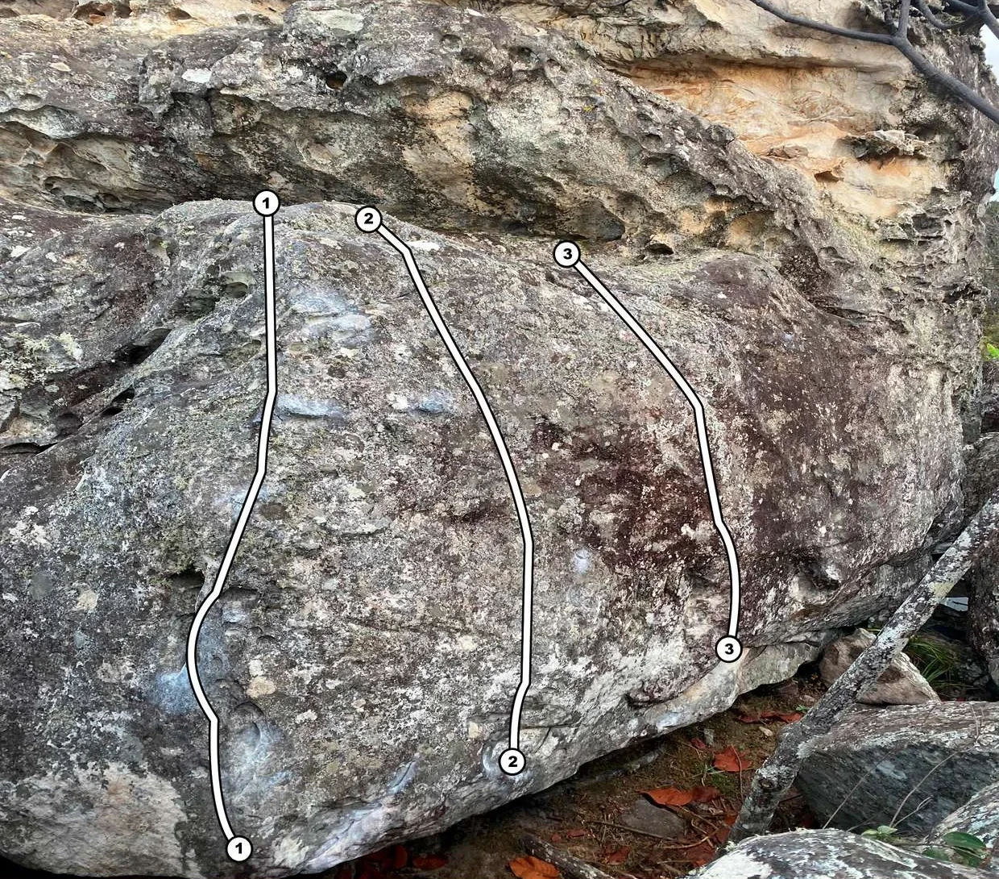
          - **largura_mapa**: 1240
          - **altura_mapa**: 1090
          - **pontos_de_interesse**:
            - **[0]**:
              - **id**: 1
              - **label**: 1
              - **box**:
                - **x**: 297
                - **y**: 1050
                - **comprimento**: 30
                - **largura**: 35
            - **[1]**:
              - **id**: 1_fim
              - **label**: 1
              - **box**:
                - **x**: 330
                - **y**: 250
                - **comprimento**: 29
                - **largura**: 31
            - **[2]**:
              - **id**: 2
              - **label**: 2
              - **box**:
                - **x**: 634
                - **y**: 944
                - **comprimento**: 28
                - **largura**: 35
            - **[3]**:
              - **id**: 2_fim
              - **label**: 2
              - **box**:
                - **x**: 456
                - **y**: 270
                - **comprimento**: 31
                - **largura**: 35
            - **[4]**:
              - **id**: 3
              - **label**: 3
              - **box**:
                - **x**: 906
                - **y**: 804
                - **comprimento**: 27
                - **largura**: 30
            - **[5]**:
              - **id**: 3_fim
              - **label**: 3
              - **box**:
                - **x**: 702
                - **y**: 314
                - **comprimento**: 29
                - **largura**: 35
          - **referencias**:
            - **[0]**:
              - **escalada**: Velho Chico
              - **ids**:
                - 1
                - 1_fim
            - **[1]**:
              - **escalada**: Minduim
              - **ids**:
                - 2
                - 2_fim
            - **[2]**:
              - **escalada**: Frango D'Água
              - **ids**:
                - 3
                - 3_fim
      - **escaladas**:
        - **[0]**:
          - **boulder**:
            - **nome**: Velho Chico
            - **dificuldade**: V4
        - **[1]**:
          - **boulder**:
            - **nome**: Minduim
            - **dificuldade**: V3
        - **[2]**:
          - **boulder**:
            - **nome**: Frango D'Água
            - **dificuldade**: V3
- **mapas**:
  - **[0]**:
    - **caminho_imagem_mapa**: 
    - **largura_mapa**: 1223
    - **altura_mapa**: 1251

## Parte: grupo_regiao_3

### Grupo (Pico: Cerrado Groove)

- **descricao**:
    # Região 3
    
    A Região 3 apresenta blocos com graduações variadas, incluindo o setor Iceberg e Silicose.
- **nome**: Região 3
- **setores**:
  - **[0]**:
    - **conteudo**:
      - **descricao**:
          # Bloco: Cenas Fortes
          ## Região 3
      - **nome**: Cenas Fortes
      - **mapas**:
        - **[0]**:
          - **caminho_imagem_mapa**: 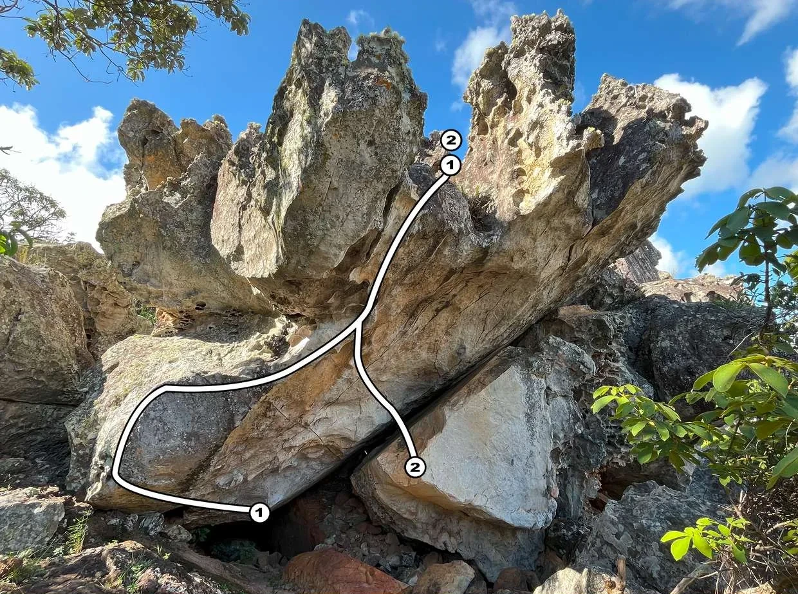
          - **largura_mapa**: 1240
          - **altura_mapa**: 923
          - **pontos_de_interesse**:
            - **[0]**:
              - **id**: 1
              - **label**: 1
              - **box**:
                - **x**: 402
                - **y**: 796
                - **comprimento**: 28
                - **largura**: 33
            - **[1]**:
              - **id**: 1_fim
              - **label**: 1
              - **box**:
                - **x**: 700
                - **y**: 256
                - **comprimento**: 25
                - **largura**: 27
            - **[2]**:
              - **id**: 2
              - **label**: 2
              - **box**:
                - **x**: 644
                - **y**: 726
                - **comprimento**: 29
                - **largura**: 31
            - **[3]**:
              - **id**: 2_fim
              - **label**: 2
              - **box**:
                - **x**: 700
                - **y**: 216
                - **comprimento**: 21
                - **largura**: 25
          - **referencias**:
            - **[0]**:
              - **escalada**: Cenas Fortes
              - **ids**:
                - 1
                - 1_fim
            - **[1]**:
              - **escalada**: Tela Quente
              - **ids**:
                - 2
                - 2_fim
      - **escaladas**:
        - **[0]**:
          - **boulder**:
            - **nome**: Cenas Fortes
            - **dificuldade**: V5
        - **[1]**:
          - **boulder**:
            - **nome**: Tela Quente
            - **dificuldade**: V3
  - **[1]**:
    - **conteudo**:
      - **descricao**:
          # Bloco: Sessão da Tarde
          ## Região 3
          
          O bloco Sessão da Tarde é um dos mais densos em linhas, com agarras variadas e muita técnica.
      - **nome**: Sessão da Tarde
      - **mapas**:
        - **[0]**:
          - **caminho_imagem_mapa**: 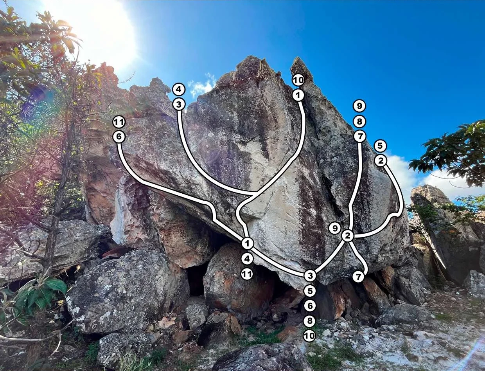
          - **largura_mapa**: 1240
          - **altura_mapa**: 948
          - **pontos_de_interesse**:
            - **[0]**:
              - **id**: 1 (P1)
              - **label**: 1
              - **box**:
                - **x**: 633
                - **y**: 621
                - **comprimento**: 18
                - **largura**: 22
            - **[1]**:
              - **id**: 1 (P1)_fim
              - **label**: 1
              - **box**:
                - **x**: 765
                - **y**: 245
                - **comprimento**: 30
                - **largura**: 30
            - **[2]**:
              - **id**: 2 (P1) / 5 (P2)
              - **label**: 2
              - **box**:
                - **x**: 888
                - **y**: 602
                - **comprimento**: 21
                - **largura**: 25
            - **[3]**:
              - **id**: 2 (P1) / 5 (P2)_fim
              - **label**: 2
              - **box**:
                - **x**: 973
                - **y**: 410
                - **comprimento**: 22
                - **largura**: 24
            - **[4]**:
              - **id**: 3 (P1)
              - **label**: 3
              - **box**:
                - **x**: 792
                - **y**: 702
                - **comprimento**: 21
                - **largura**: 22
            - **[5]**:
              - **id**: 3 (P1)_fim
              - **label**: 3
              - **box**:
                - **x**: 456
                - **y**: 266
                - **comprimento**: 20
                - **largura**: 22
            - **[6]**:
              - **id**: 4 (P1)
              - **label**: 4
              - **box**:
                - **x**: 632
                - **y**: 661
                - **comprimento**: 21
                - **largura**: 20
            - **[7]**:
              - **id**: 4 (P1)_fim
              - **label**: 4
              - **box**:
                - **x**: 456
                - **y**: 226
                - **comprimento**: 21
                - **largura**: 23
            - **[8]**:
              - **id**: 5 (P1) / 4 (P2)
              - **label**: 5
              - **box**:
                - **x**: 792
                - **y**: 742
                - **comprimento**: 23
                - **largura**: 22
            - **[9]**:
              - **id**: 5 (P1) / 4 (P2)_fim
              - **label**: 5
              - **box**:
                - **x**: 971
                - **y**: 372
                - **comprimento**: 22
                - **largura**: 24
            - **[10]**:
              - **id**: 6 (P1)
              - **label**: 6
              - **box**:
                - **x**: 792
                - **y**: 782
                - **comprimento**: 21
                - **largura**: 22
            - **[11]**:
              - **id**: 6 (P1)_fim
              - **label**: 6
              - **box**:
                - **x**: 304
                - **y**: 348
                - **comprimento**: 27
                - **largura**: 27
            - **[12]**:
              - **id**: 7 (P1) / 3 (P2)
              - **label**: 7
              - **box**:
                - **x**: 914
                - **y**: 708
                - **comprimento**: 25
                - **largura**: 23
            - **[13]**:
              - **id**: 7 (P1) / 3 (P2)_fim
              - **label**: 7
              - **box**:
                - **x**: 920
                - **y**: 347
                - **comprimento**: 30
                - **largura**: 30
            - **[14]**:
              - **id**: 8 (P1) / 1 (P2)
              - **label**: 8
              - **box**:
                - **x**: 790
                - **y**: 818
                - **comprimento**: 21
                - **largura**: 21
            - **[15]**:
              - **id**: 8 (P1) / 1 (P2)_fim
              - **label**: 8
              - **box**:
                - **x**: 919
                - **y**: 310
                - **comprimento**: 22
                - **largura**: 22
            - **[16]**:
              - **id**: 9 (P1) / 2 (P2)
              - **label**: 9
              - **box**:
                - **x**: 856
                - **y**: 583
                - **comprimento**: 21
                - **largura**: 20
            - **[17]**:
              - **id**: 9 (P1) / 2 (P2)_fim
              - **label**: 9
              - **box**:
                - **x**: 918
                - **y**: 268
                - **comprimento**: 20
                - **largura**: 22
            - **[18]**:
              - **id**: 10 (P1)
              - **label**: 10
              - **box**:
                - **x**: 790
                - **y**: 858
                - **comprimento**: 25
                - **largura**: 25
            - **[19]**:
              - **id**: 10 (P1)_fim
              - **label**: 10
              - **box**:
                - **x**: 762
                - **y**: 204
                - **comprimento**: 33
                - **largura**: 25
            - **[20]**:
              - **id**: 11 (P1)
              - **label**: 11
              - **box**:
                - **x**: 630
                - **y**: 700
                - **comprimento**: 25
                - **largura**: 23
            - **[21]**:
              - **id**: 11 (P1)_fim
              - **label**: 11
              - **box**:
                - **x**: 302
                - **y**: 310
                - **comprimento**: 27
                - **largura**: 25
          - **referencias**:
            - **[0]**:
              - **escalada**: Super Cine
              - **ids**:
                - 1 (P1)
                - 1 (P1)_fim
            - **[1]**:
              - **escalada**: Extra
              - **ids**:
                - 3 (P1)
                - 3 (P1)_fim
            - **[2]**:
              - **escalada**: Manchete
              - **ids**:
                - 4 (P1)
                - 4 (P1)_fim
            - **[3]**:
              - **escalada**: Fantástico Mundo dos Diamantes
              - **ids**:
                - 6 (P1)
                - 6 (P1)_fim
            - **[4]**:
              - **escalada**: Super Sinistro
              - **ids**:
                - 10 (P1)
                - 10 (P1)_fim
            - **[5]**:
              - **escalada**: Fantástico
              - **ids**:
                - 11 (P1)
                - 11 (P1)_fim
        - **[1]**:
          - **caminho_imagem_mapa**: 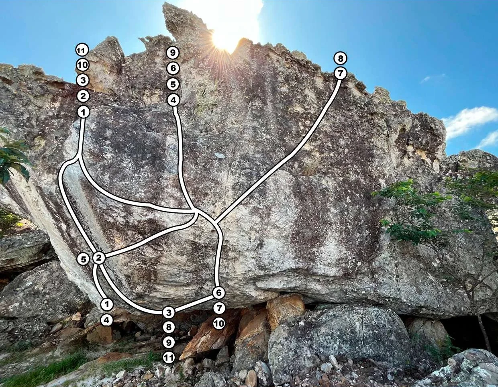
          - **largura_mapa**: 1240
          - **altura_mapa**: 964
          - **pontos_de_interesse**:
            - **[0]**:
              - **id**: 8 (P1) / 1 (P2)
              - **label**: 1
              - **box**:
                - **x**: 266
                - **y**: 758
                - **comprimento**: 21
                - **largura**: 27
            - **[1]**:
              - **id**: 8 (P1) / 1 (P2)_fim
              - **label**: 1
              - **box**:
                - **x**: 208
                - **y**: 278
                - **comprimento**: 23
                - **largura**: 25
            - **[2]**:
              - **id**: 9 (P1) / 2 (P2)
              - **label**: 2
              - **box**:
                - **x**: 246
                - **y**: 641
                - **comprimento**: 23
                - **largura**: 24
            - **[3]**:
              - **id**: 9 (P1) / 2 (P2)_fim
              - **label**: 2
              - **box**:
                - **x**: 206
                - **y**: 238
                - **comprimento**: 23
                - **largura**: 25
            - **[4]**:
              - **id**: 7 (P1) / 3 (P2)
              - **label**: 3
              - **box**:
                - **x**: 419
                - **y**: 778
                - **comprimento**: 26
                - **largura**: 28
            - **[5]**:
              - **id**: 7 (P1) / 3 (P2)_fim
              - **label**: 3
              - **box**:
                - **x**: 206
                - **y**: 198
                - **comprimento**: 24
                - **largura**: 24
            - **[6]**:
              - **id**: 5 (P1) / 4 (P2)
              - **label**: 4
              - **box**:
                - **x**: 265
                - **y**: 798
                - **comprimento**: 22
                - **largura**: 23
            - **[7]**:
              - **id**: 5 (P1) / 4 (P2)_fim
              - **label**: 4
              - **box**:
                - **x**: 430
                - **y**: 248
                - **comprimento**: 25
                - **largura**: 25
            - **[8]**:
              - **id**: 2 (P1) / 5 (P2)
              - **label**: 5
              - **box**:
                - **x**: 206
                - **y**: 644
                - **comprimento**: 19
                - **largura**: 21
            - **[9]**:
              - **id**: 2 (P1) / 5 (P2)_fim
              - **label**: 5
              - **box**:
                - **x**: 430
                - **y**: 209
                - **comprimento**: 24
                - **largura**: 24
            - **[10]**:
              - **id**: 6 (P2)
              - **label**: 6
              - **box**:
                - **x**: 544
                - **y**: 728
                - **comprimento**: 22
                - **largura**: 24
            - **[11]**:
              - **id**: 6 (P2)_fim
              - **label**: 6
              - **box**:
                - **x**: 430
                - **y**: 167
                - **comprimento**: 21
                - **largura**: 24
            - **[12]**:
              - **id**: 7 (P2)
              - **label**: 7
              - **box**:
                - **x**: 545
                - **y**: 765
                - **comprimento**: 24
                - **largura**: 28
            - **[13]**:
              - **id**: 7 (P2)_fim
              - **label**: 7
              - **box**:
                - **x**: 848
                - **y**: 181
                - **comprimento**: 22
                - **largura**: 24
            - **[14]**:
              - **id**: 8 (P2)
              - **label**: 8
              - **box**:
                - **x**: 420
                - **y**: 814
                - **comprimento**: 25
                - **largura**: 26
            - **[15]**:
              - **id**: 8 (P2)_fim
              - **label**: 8
              - **box**:
                - **x**: 848
                - **y**: 144
                - **comprimento**: 18
                - **largura**: 21
            - **[16]**:
              - **id**: 9 (P2)
              - **label**: 9
              - **box**:
                - **x**: 419
                - **y**: 852
                - **comprimento**: 26
                - **largura**: 25
            - **[17]**:
              - **id**: 9 (P2)_fim
              - **label**: 9
              - **box**:
                - **x**: 429
                - **y**: 129
                - **comprimento**: 24
                - **largura**: 24
            - **[18]**:
              - **id**: 10 (P2)
              - **label**: 10
              - **box**:
                - **x**: 544
                - **y**: 804
                - **comprimento**: 31
                - **largura**: 25
            - **[19]**:
              - **id**: 10 (P2)_fim
              - **label**: 10
              - **box**:
                - **x**: 206
                - **y**: 160
                - **comprimento**: 25
                - **largura**: 22
            - **[20]**:
              - **id**: 11 (P2)
              - **label**: 11
              - **box**:
                - **x**: 420
                - **y**: 890
                - **comprimento**: 29
                - **largura**: 26
            - **[21]**:
              - **id**: 11 (P2)_fim
              - **label**: 11
              - **box**:
                - **x**: 202
                - **y**: 125
                - **comprimento**: 23
                - **largura**: 22
          - **referencias**:
            - **[0]**:
              - **escalada**: Sessão da Tarde
              - **ids**:
                - 6 (P2)
                - 6 (P2)_fim
            - **[1]**:
              - **escalada**: Vale a Pena Ver de Novo
              - **ids**:
                - 7 (P2)
                - 7 (P2)_fim
            - **[2]**:
              - **escalada**: Vale a Pena Vir de Baixo
              - **ids**:
                - 8 (P2)
                - 8 (P2)_fim
            - **[3]**:
              - **escalada**: Chá da Tarde
              - **ids**:
                - 9 (P2)
                - 9 (P2)_fim
            - **[4]**:
              - **escalada**: Analógico
              - **ids**:
                - 10 (P2)
                - 10 (P2)_fim
            - **[5]**:
              - **escalada**: Digital
              - **ids**:
                - 11 (P2)
                - 11 (P2)_fim
      - **escaladas**:
        - **[0]**:
          - **boulder**:
            - **nome**: Super Cine
            - **dificuldade**: V7
        - **[1]**:
          - **boulder**:
            - **nome**: Espetacular
            - **dificuldade**: V8_BARRA_V9
        - **[2]**:
          - **boulder**:
            - **nome**: Extra
            - **dificuldade**: V10
        - **[3]**:
          - **boulder**:
            - **nome**: Manchete
            - **dificuldade**: V9
        - **[4]**:
          - **boulder**:
            - **nome**: Esporte Espetacular
            - **dificuldade**: V10_BARRA_V11
        - **[5]**:
          - **boulder**:
            - **nome**: Fantástico Mundo dos Diamantes
            - **dificuldade**: V11
        - **[6]**:
          - **boulder**:
            - **descricao**: Saída em uma pequena pinça de mão esquerda e um reglete raso de mão direita (assim como o Chá da Tarde) e escala pelo teto até entrar no Altas Horas.
            - **nome**: Globo Curral
            - **dificuldade**: V5
        - **[7]**:
          - **boulder**:
            - **nome**: Manual
            - **dificuldade**: V8
        - **[8]**:
          - **boulder**:
            - **nome**: Altas Horas
            - **dificuldade**: V3
        - **[9]**:
          - **boulder**:
            - **nome**: Super Sinistro
            - **dificuldade**: V8_BARRA_V9
        - **[10]**:
          - **boulder**:
            - **nome**: Fantástico
            - **dificuldade**: V10
        - **[11]**:
          - **boulder**:
            - **descricao**: Mão esquerda no batente central dessa face do bloco e mão direita em outro batente mais à direita, seguindo em linha reta pelo sistema de agarras logo acima.
            - **nome**: Sessão da Tarde
            - **dificuldade**: V5
        - **[12]**:
          - **boulder**:
            - **descricao**: Mesma saída do Sessão da Tarde, mudando a trajetória para a direita após dominar a pinça. A parte final do boulder segue para a direita por "cracas" na face positiva, cuidado com agarras frágeis.
            - **nome**: Vale a Pena Ver de Novo
            - **dificuldade**: V4_BARRA_V5
        - **[13]**:
          - **boulder**:
            - **descricao**: Extensão do Vale a Pena Ver de Novo. Mesma saída do Chá da Tarde.
            - **nome**: Vale a Pena Vir de Baixo
            - **dificuldade**: V6_BARRA_V7
        - **[14]**:
          - **boulder**:
            - **descricao**: Extensão do Sessão da Tarde. Saída em uma pequena pinça de mão esquerda e um reglete raso de mão direita.
            - **nome**: Chá da Tarde
            - **dificuldade**: V7
        - **[15]**:
          - **boulder**:
            - **descricao**: Extensão do Vale a Pena Ver de Novo. Mesma saída do Chá da Tarde.
            - **nome**: Analógico
            - **dificuldade**: V8_BARRA_V9
        - **[16]**:
          - **boulder**:
            - **descricao**: Extensão do Analógico.
            - **nome**: Digital
            - **dificuldade**: V9_BARRA_V10
  - **[2]**:
    - **conteudo**:
      - **descricao**:
          # Bloco: Que Raio de Reglete
          ## Região 3
      - **nome**: Que Raio de Reglete
      - **mapas**:
        - **[0]**:
          - **caminho_imagem_mapa**: 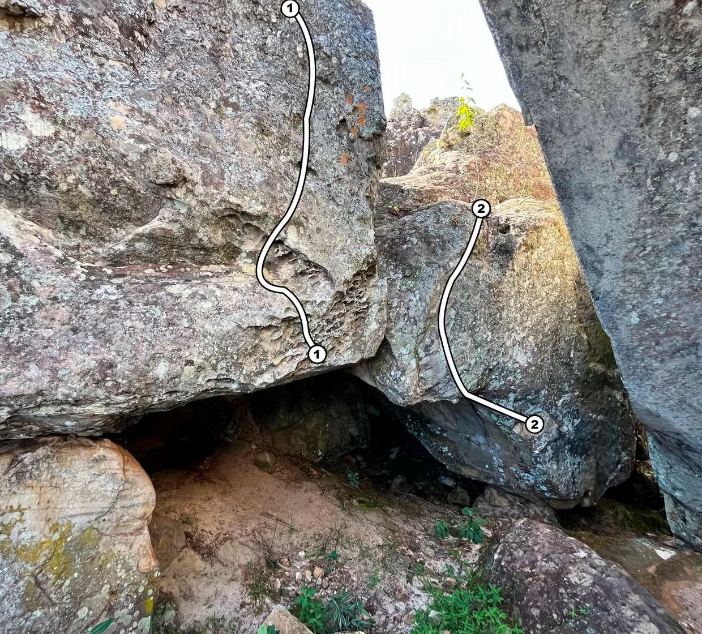
          - **largura_mapa**: 1240
          - **altura_mapa**: 1120
          - **pontos_de_interesse**:
            - **[0]**:
              - **id**: 1
              - **label**: 1
              - **box**:
                - **x**: 560
                - **y**: 625
                - **comprimento**: 24
                - **largura**: 30
            - **[1]**:
              - **id**: 1_fim
              - **label**: 1
              - **box**:
                - **x**: 512
                - **y**: 14
                - **comprimento**: 25
                - **largura**: 25
            - **[2]**:
              - **id**: 2
              - **label**: 2
              - **box**:
                - **x**: 946
                - **y**: 750
                - **comprimento**: 25
                - **largura**: 25
            - **[3]**:
              - **id**: 2_fim
              - **label**: 2
              - **box**:
                - **x**: 852
                - **y**: 368
                - **comprimento**: 27
                - **largura**: 27
          - **referencias**:
            - **[0]**:
              - **escalada**: Calça Nova
              - **ids**:
                - 1
                - 1_fim
            - **[1]**:
              - **escalada**: Que Raio de Reglete
              - **ids**:
                - 2
                - 2_fim
      - **escaladas**:
        - **[0]**:
          - **boulder**:
            - **nome**: Calça Nova
            - **dificuldade**: V2
        - **[1]**:
          - **boulder**:
            - **nome**: Que Raio de Reglete
            - **dificuldade**: V3
  - **[3]**:
    - **conteudo**:
      - **descricao**:
          # Bloco: Iceberg
          ## Região 3
      - **nome**: Iceberg
      - **mapas**:
        - **[0]**:
          - **caminho_imagem_mapa**: 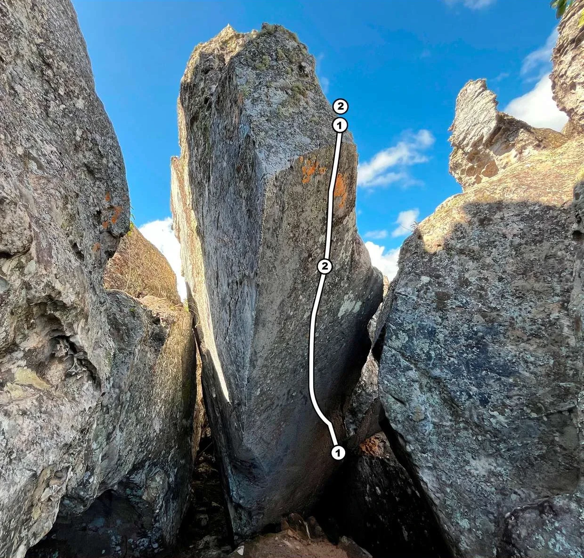
          - **largura_mapa**: 1240
          - **altura_mapa**: 1183
          - **pontos_de_interesse**:
            - **[0]**:
              - **id**: 1
              - **label**: 1
              - **box**:
                - **x**: 718
                - **y**: 960
                - **comprimento**: 27
                - **largura**: 26
            - **[1]**:
              - **id**: 1_fim
              - **label**: 1
              - **box**:
                - **x**: 720
                - **y**: 265
                - **comprimento**: 25
                - **largura**: 22
            - **[2]**:
              - **id**: 2
              - **label**: 2
              - **box**:
                - **x**: 690
                - **y**: 562
                - **comprimento**: 21
                - **largura**: 23
            - **[3]**:
              - **id**: 2_fim
              - **label**: 2
              - **box**:
                - **x**: 722
                - **y**: 224
                - **comprimento**: 27
                - **largura**: 25
          - **referencias**:
            - **[0]**:
              - **escalada**: Iceberg
              - **ids**:
                - 1
                - 1_fim
            - **[1]**:
              - **escalada**: Frigobar
              - **ids**:
                - 2
                - 2_fim
      - **escaladas**:
        - **[0]**:
          - **boulder**:
            - **descricao**: Saída baixa na extrema direita do bloco e segue por movimentos exigentes de compressão (morfo).
            - **nome**: Iceberg
            - **dificuldade**: V11
        - **[1]**:
          - **boulder**:
            - **descricao**: Saída em pé do iceberg, utilizando mão esquerda na aresta e mão direita no abaulado alto mais à direita.
            - **nome**: Frigobar
            - **dificuldade**: V5
  - **[4]**:
    - **conteudo**:
      - **descricao**:
          # Bloco: Silicose
          ## Região 3
      - **nome**: Silicose
      - **mapas**:
        - **[0]**:
          - **caminho_imagem_mapa**: 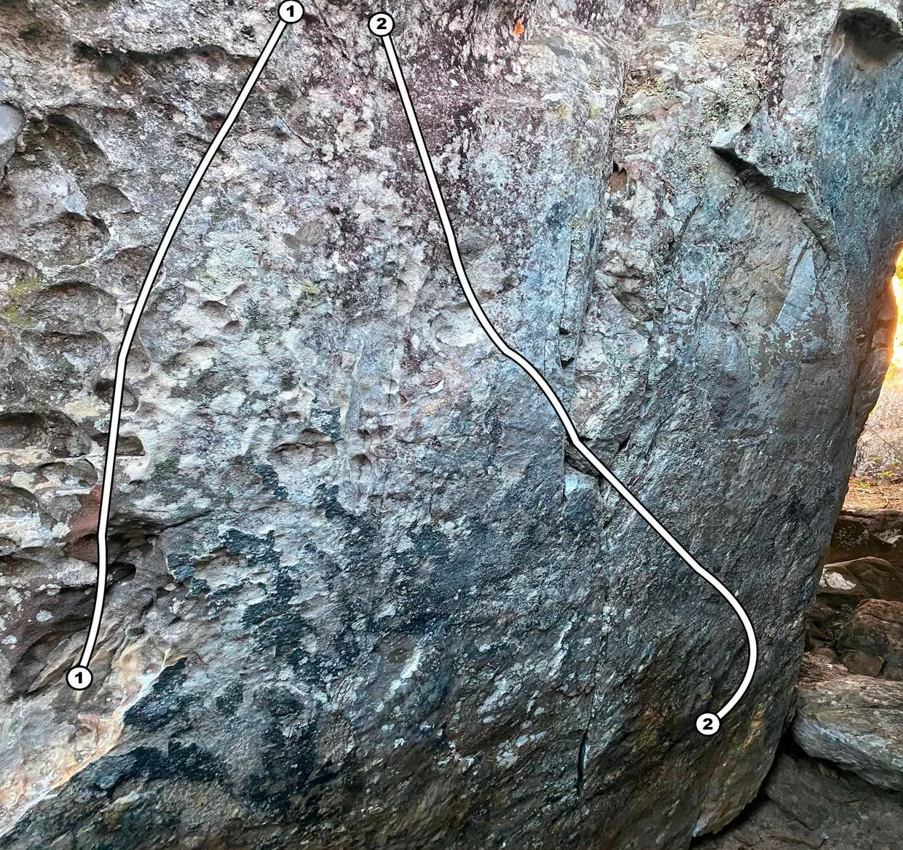
          - **largura_mapa**: 1240
          - **altura_mapa**: 1168
          - **pontos_de_interesse**:
            - **[0]**:
              - **id**: 1
              - **label**: 1
              - **box**:
                - **x**: 110
                - **y**: 932
                - **comprimento**: 25
                - **largura**: 25
            - **[1]**:
              - **id**: 1_fim
              - **label**: 1
              - **box**:
                - **x**: 398
                - **y**: 14
                - **comprimento**: 25
                - **largura**: 25
            - **[2]**:
              - **id**: 2
              - **label**: 2
              - **box**:
                - **x**: 973
                - **y**: 994
                - **comprimento**: 24
                - **largura**: 26
            - **[3]**:
              - **id**: 2_fim
              - **label**: 2
              - **box**:
                - **x**: 523
                - **y**: 30
                - **comprimento**: 32
                - **largura**: 31
          - **referencias**:
            - **[0]**:
              - **escalada**: Silicato
              - **ids**:
                - 1
                - 1_fim
            - **[1]**:
              - **escalada**: Silicose
              - **ids**:
                - 2
                - 2_fim
      - **escaladas**:
        - **[0]**:
          - **boulder**:
            - **nome**: Silicato
            - **dificuldade**: V2
        - **[1]**:
          - **boulder**:
            - **nome**: Silicose
            - **dificuldade**: V7
- **mapas**:
  - **[0]**:
    - **caminho_imagem_mapa**: 
    - **largura_mapa**: 1223
    - **altura_mapa**: 1251

## Parte: grupo_regiao_4

### Grupo (Pico: Cerrado Groove)

- **descricao**:
    # Região 4
    
    A Região 4 é a última região do setor Cerrado Groove, contendo o Navio Pirata e outros blocos.
- **nome**: Região 4
- **setores**:
  - **[0]**:
    - **conteudo**:
      - **descricao**:
          # Bloco: Navio Pirata
          ## Região 4
          
          O bloco Navio Pirata é um grande bloco com diversas linhas em várias faces.
      - **nome**: Navio Pirata
      - **mapas**:
        - **[0]**:
          - **caminho_imagem_mapa**: 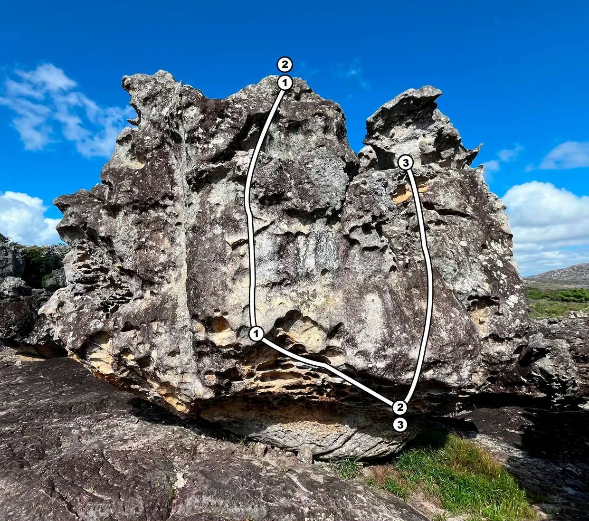
          - **largura_mapa**: 1240
          - **altura_mapa**: 1097
          - **pontos_de_interesse**:
            - **[0]**:
              - **id**: 1 (P0)
              - **label**: 1
              - **box**:
                - **x**: 540
                - **y**: 702
                - **comprimento**: 25
                - **largura**: 25
            - **[1]**:
              - **id**: 1 (P0)_fim
              - **label**: 1
              - **box**:
                - **x**: 600
                - **y**: 172
                - **comprimento**: 25
                - **largura**: 25
            - **[2]**:
              - **id**: 2 (P0)
              - **label**: 2
              - **box**:
                - **x**: 842
                - **y**: 856
                - **comprimento**: 25
                - **largura**: 25
            - **[3]**:
              - **id**: 2 (P0)_fim
              - **label**: 2
              - **box**:
                - **x**: 600
                - **y**: 134
                - **comprimento**: 25
                - **largura**: 25
            - **[4]**:
              - **id**: 3 (P0)
              - **label**: 3
              - **box**:
                - **x**: 844
                - **y**: 892
                - **comprimento**: 25
                - **largura**: 25
            - **[5]**:
              - **id**: 3 (P0)_fim
              - **label**: 3
              - **box**:
                - **x**: 852
                - **y**: 342
                - **comprimento**: 25
                - **largura**: 25
          - **referencias**:
            - **[0]**:
              - **escalada**: Navio Pirata
              - **ids**:
                - 1 (P0)
                - 1 (P0)_fim
            - **[1]**:
              - **escalada**: Invasão do Navio Pirata
              - **ids**:
                - 2 (P0)
                - 2 (P0)_fim
            - **[2]**:
              - **escalada**: Capitão Gancho
              - **ids**:
                - 3 (P0)
                - 3 (P0)_fim
        - **[1]**:
          - **caminho_imagem_mapa**: 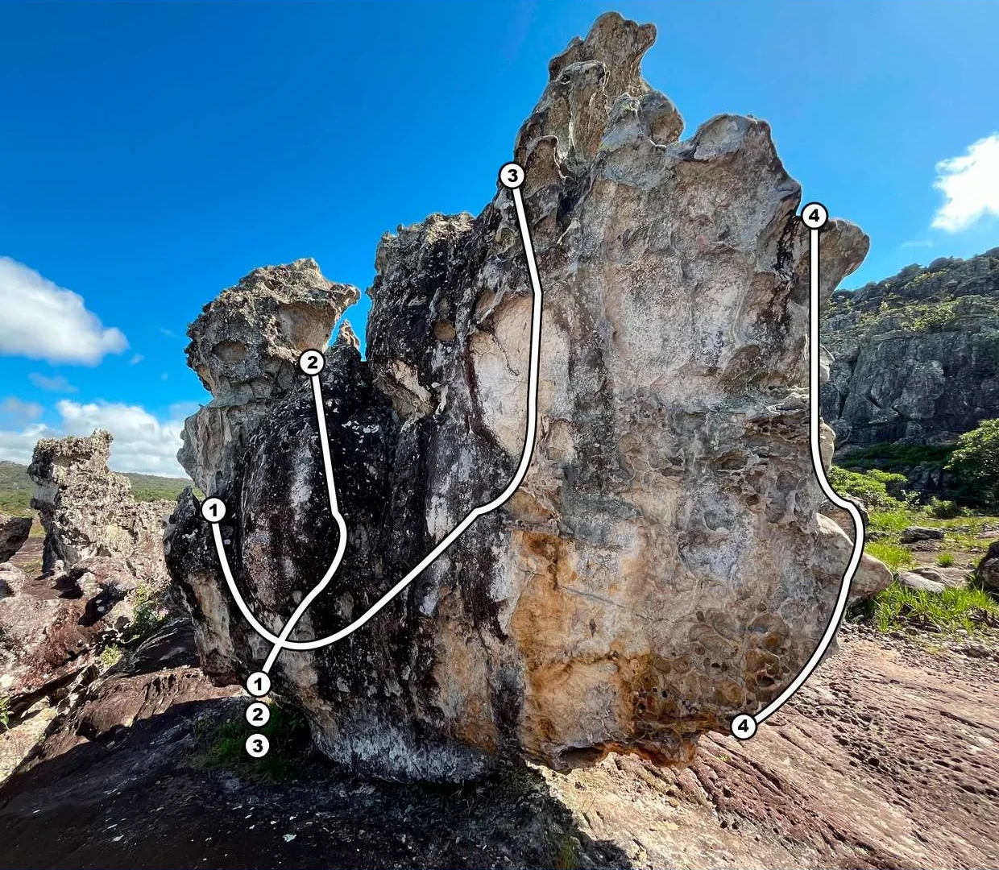
          - **largura_mapa**: 1240
          - **altura_mapa**: 1080
          - **pontos_de_interesse**:
            - **[0]**:
              - **id**: 1 (P1)
              - **label**: 1
              - **box**:
                - **x**: 320
                - **y**: 846
                - **comprimento**: 23
                - **largura**: 29
            - **[1]**:
              - **id**: 1 (P1)_fim
              - **label**: 1
              - **box**:
                - **x**: 264
                - **y**: 630
                - **comprimento**: 24
                - **largura**: 29
            - **[2]**:
              - **id**: 2 (P1)
              - **label**: 2
              - **box**:
                - **x**: 319
                - **y**: 888
                - **comprimento**: 24
                - **largura**: 25
            - **[3]**:
              - **id**: 2 (P1)_fim
              - **label**: 2
              - **box**:
                - **x**: 386
                - **y**: 448
                - **comprimento**: 24
                - **largura**: 25
            - **[4]**:
              - **id**: 3 (P1)
              - **label**: 3
              - **box**:
                - **x**: 318
                - **y**: 923
                - **comprimento**: 23
                - **largura**: 26
            - **[5]**:
              - **id**: 3 (P1)_fim
              - **label**: 3
              - **box**:
                - **x**: 636
                - **y**: 215
                - **comprimento**: 25
                - **largura**: 26
            - **[6]**:
              - **id**: 4 (P1)
              - **label**: 4
              - **box**:
                - **x**: 922
                - **y**: 898
                - **comprimento**: 23
                - **largura**: 27
            - **[7]**:
              - **id**: 4 (P1)_fim
              - **label**: 4
              - **box**:
                - **x**: 1010
                - **y**: 266
                - **comprimento**: 21
                - **largura**: 27
          - **referencias**:
            - **[0]**:
              - **escalada**: Serra a Vista
              - **ids**:
                - 1 (P1)
                - 1 (P1)_fim
            - **[1]**:
              - **escalada**: Tapa Olho
              - **ids**:
                - 2 (P1)
                - 2 (P1)_fim
            - **[2]**:
              - **escalada**: A Estibordo
              - **ids**:
                - 3 (P1)
                - 3 (P1)_fim
            - **[3]**:
              - **escalada**: Proa
              - **ids**:
                - 4 (P1)
                - 4 (P1)_fim
        - **[2]**:
          - **caminho_imagem_mapa**: 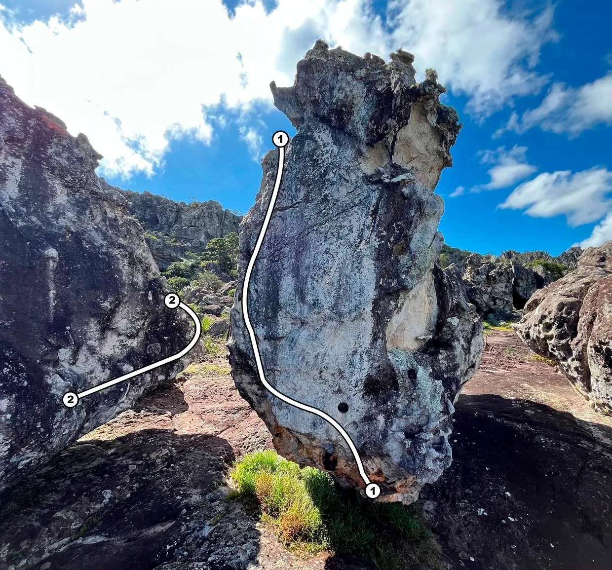
          - **largura_mapa**: 1240
          - **altura_mapa**: 1155
          - **pontos_de_interesse**:
            - **[0]**:
              - **id**: 1 (P2)
              - **label**: 1
              - **box**:
                - **x**: 754
                - **y**: 992
                - **comprimento**: 25
                - **largura**: 25
            - **[1]**:
              - **id**: 1 (P2)_fim
              - **label**: 1
              - **box**:
                - **x**: 568
                - **y**: 280
                - **comprimento**: 25
                - **largura**: 25
            - **[2]**:
              - **id**: 2 (P2)
              - **label**: 2
              - **box**:
                - **x**: 144
                - **y**: 808
                - **comprimento**: 27
                - **largura**: 30
            - **[3]**:
              - **id**: 2 (P2)_fim
              - **label**: 2
              - **box**:
                - **x**: 350
                - **y**: 608
                - **comprimento**: 31
                - **largura**: 33
          - **referencias**:
            - **[0]**:
              - **escalada**: Papagaio de Pirata
              - **ids**:
                - 1 (P2)
                - 1 (P2)_fim
            - **[1]**:
              - **escalada**: Desce a Serra
              - **ids**:
                - 2 (P2)
                - 2 (P2)_fim
      - **escaladas**:
        - **[0]**:
          - **boulder**:
            - **nome**: Navio Pirata
            - **dificuldade**: V0_BARRA_V1
        - **[1]**:
          - **boulder**:
            - **nome**: Invasão do Navio Pirata
            - **dificuldade**: V1_BARRA_V2
        - **[2]**:
          - **boulder**:
            - **nome**: Capitão Gancho
            - **dificuldade**: V2
        - **[3]**:
          - **boulder**:
            - **nome**: Serra a Vista
            - **dificuldade**: V1_BARRA_V2
        - **[4]**:
          - **boulder**:
            - **nome**: Tapa Olho
            - **dificuldade**: V2_BARRA_V3
        - **[5]**:
          - **boulder**:
            - **nome**: A Estibordo
            - **dificuldade**: V3_BARRA_V4
        - **[6]**:
          - **boulder**:
            - **nome**: Proa
            - **dificuldade**: V1
        - **[7]**:
          - **boulder**:
            - **nome**: Papagaio de Pirata
            - **dificuldade**: V2
        - **[8]**:
          - **boulder**:
            - **nome**: Desce a Serra
            - **dificuldade**: V3
  - **[1]**:
    - **conteudo**:
      - **descricao**:
          # Bloco: Pfizer
          ## Região 4
      - **nome**: Pfizer
      - **mapas**:
        - **[0]**:
          - **caminho_imagem_mapa**: 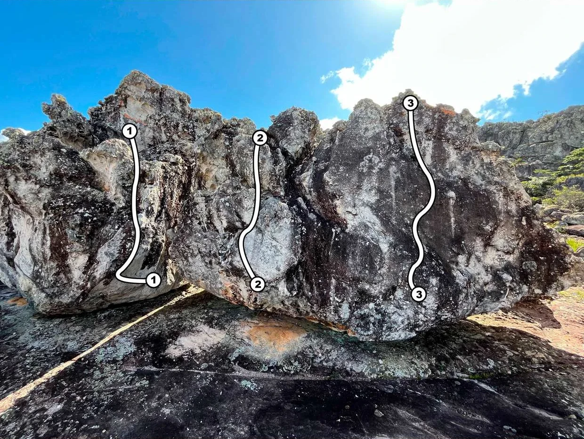
          - **largura_mapa**: 1240
          - **altura_mapa**: 931
          - **pontos_de_interesse**:
            - **[0]**:
              - **id**: 1
              - **label**: 1
              - **box**:
                - **x**: 326
                - **y**: 592
                - **comprimento**: 25
                - **largura**: 25
            - **[1]**:
              - **id**: 1_fim
              - **label**: 1
              - **box**:
                - **x**: 276
                - **y**: 276
                - **comprimento**: 25
                - **largura**: 25
            - **[2]**:
              - **id**: 2
              - **label**: 2
              - **box**:
                - **x**: 548
                - **y**: 602
                - **comprimento**: 25
                - **largura**: 29
            - **[3]**:
              - **id**: 2_fim
              - **label**: 2
              - **box**:
                - **x**: 550
                - **y**: 290
                - **comprimento**: 25
                - **largura**: 25
            - **[4]**:
              - **id**: 3
              - **label**: 3
              - **box**:
                - **x**: 888
                - **y**: 624
                - **comprimento**: 25
                - **largura**: 25
            - **[5]**:
              - **id**: 3_fim
              - **label**: 3
              - **box**:
                - **x**: 872
                - **y**: 218
                - **comprimento**: 23
                - **largura**: 23
          - **referencias**:
            - **[0]**:
              - **escalada**: Pfizer
              - **ids**:
                - 1
                - 1_fim
            - **[1]**:
              - **escalada**: Barriga Branca
              - **ids**:
                - 2
                - 2_fim
            - **[2]**:
              - **escalada**: Rosa
              - **ids**:
                - 3
                - 3_fim
      - **escaladas**:
        - **[0]**:
          - **boulder**:
            - **nome**: Pfizer
            - **dificuldade**: V4
        - **[1]**:
          - **boulder**:
            - **nome**: Barriga Branca
            - **dificuldade**: V1
        - **[2]**:
          - **boulder**:
            - **nome**: Rosa
            - **dificuldade**: V0
  - **[2]**:
    - **conteudo**:
      - **descricao**:
          # Bloco: Pedra na Canela
          ## Região 4
      - **nome**: Pedra na Canela
      - **mapas**:
        - **[0]**:
          - **caminho_imagem_mapa**: 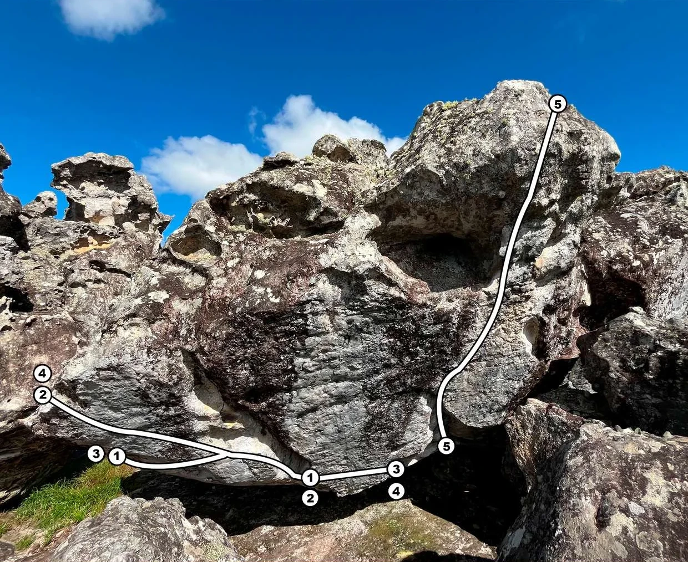
          - **largura_mapa**: 1240
          - **altura_mapa**: 1014
          - **pontos_de_interesse**:
            - **[0]**:
              - **id**: 1
              - **label**: 1
              - **box**:
                - **x**: 209
                - **y**: 822
                - **comprimento**: 22
                - **largura**: 25
            - **[1]**:
              - **id**: 1_fim
              - **label**: 1
              - **box**:
                - **x**: 558
                - **y**: 858
                - **comprimento**: 23
                - **largura**: 25
            - **[2]**:
              - **id**: 2
              - **label**: 2
              - **box**:
                - **x**: 76
                - **y**: 711
                - **comprimento**: 26
                - **largura**: 26
            - **[3]**:
              - **id**: 2_fim
              - **label**: 2
              - **box**:
                - **x**: 557
                - **y**: 898
                - **comprimento**: 24
                - **largura**: 24
            - **[4]**:
              - **id**: 3
              - **label**: 3
              - **box**:
                - **x**: 172
                - **y**: 816
                - **comprimento**: 21
                - **largura**: 25
            - **[5]**:
              - **id**: 3_fim
              - **label**: 3
              - **box**:
                - **x**: 713
                - **y**: 842
                - **comprimento**: 24
                - **largura**: 25
            - **[6]**:
              - **id**: 4
              - **label**: 4
              - **box**:
                - **x**: 77
                - **y**: 672
                - **comprimento**: 24
                - **largura**: 27
            - **[7]**:
              - **id**: 4_fim
              - **label**: 4
              - **box**:
                - **x**: 714
                - **y**: 886
                - **comprimento**: 21
                - **largura**: 22
            - **[8]**:
              - **id**: 5
              - **label**: 5
              - **box**:
                - **x**: 804
                - **y**: 804
                - **comprimento**: 23
                - **largura**: 24
            - **[9]**:
              - **id**: 5_fim
              - **label**: 5
              - **box**:
                - **x**: 1004
                - **y**: 186
                - **comprimento**: 23
                - **largura**: 25
          - **referencias**:
            - **[0]**:
              - **escalada**: Pedra na Canela
              - **ids**:
                - 1
                - 1_fim
            - **[1]**:
              - **escalada**: Sobe a Serra
              - **ids**:
                - 2
                - 2_fim
            - **[2]**:
              - **escalada**: Pedra na Canela Ext
              - **ids**:
                - 3
                - 3_fim
            - **[3]**:
              - **escalada**: Sobe a Serra Ext
              - **ids**:
                - 4
                - 4_fim
            - **[4]**:
              - **escalada**: Ofurô
              - **ids**:
                - 5
                - 5_fim
      - **escaladas**:
        - **[0]**:
          - **boulder**:
            - **nome**: Pedra na Canela
            - **dificuldade**: V4
        - **[1]**:
          - **boulder**:
            - **nome**: Sobe a Serra
            - **dificuldade**: V5
        - **[2]**:
          - **boulder**:
            - **nome**: Pedra na Canela Ext
            - **dificuldade**: V5
        - **[3]**:
          - **boulder**:
            - **nome**: Sobe a Serra Ext
            - **dificuldade**: V5_BARRA_V6
        - **[4]**:
          - **boulder**:
            - **nome**: Ofurô
            - **dificuldade**: V7_BARRA_V8
  - **[3]**:
    - **conteudo**:
      - **descricao**:
          # Bloco: Piseiro
          ## Região 4
      - **nome**: Piseiro
      - **mapas**:
        - **[0]**:
          - **caminho_imagem_mapa**: 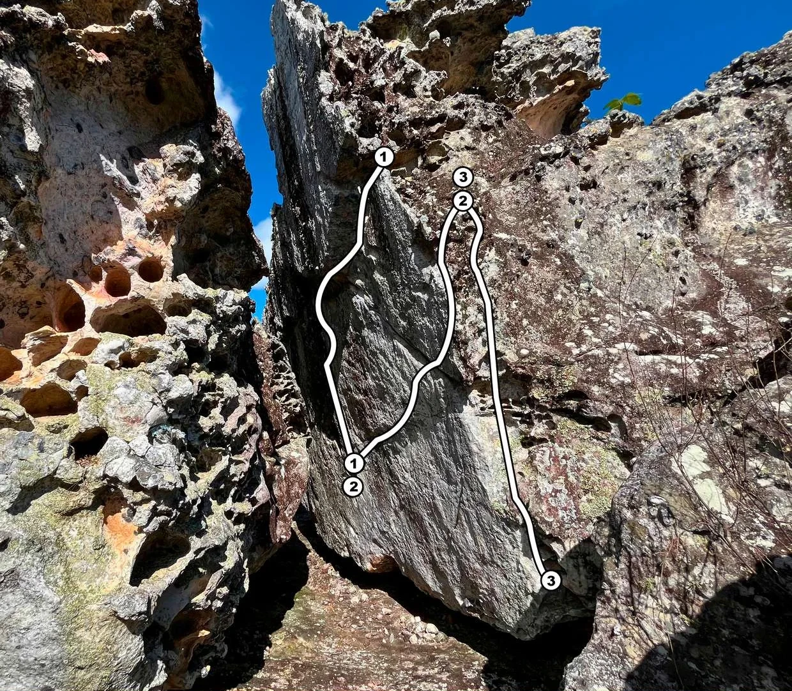
          - **largura_mapa**: 1240
          - **altura_mapa**: 1082
          - **pontos_de_interesse**:
            - **[0]**:
              - **id**: 1
              - **label**: 1
              - **box**:
                - **x**: 554
                - **y**: 724
                - **comprimento**: 23
                - **largura**: 25
            - **[1]**:
              - **id**: 1_fim
              - **label**: 1
              - **box**:
                - **x**: 601
                - **y**: 244
                - **comprimento**: 20
                - **largura**: 24
            - **[2]**:
              - **id**: 2
              - **label**: 2
              - **box**:
                - **x**: 552
                - **y**: 762
                - **comprimento**: 27
                - **largura**: 27
            - **[3]**:
              - **id**: 2_fim
              - **label**: 2
              - **box**:
                - **x**: 724
                - **y**: 313
                - **comprimento**: 25
                - **largura**: 26
            - **[4]**:
              - **id**: 3
              - **label**: 3
              - **box**:
                - **x**: 862
                - **y**: 908
                - **comprimento**: 21
                - **largura**: 25
            - **[5]**:
              - **id**: 3_fim
              - **label**: 3
              - **box**:
                - **x**: 724
                - **y**: 274
                - **comprimento**: 26
                - **largura**: 25
          - **referencias**:
            - **[0]**:
              - **escalada**: Maozeiro
              - **ids**:
                - 1
                - 1_fim
            - **[1]**:
              - **escalada**: Piseiro
              - **ids**:
                - 2
                - 2_fim
            - **[2]**:
              - **escalada**: Expresso 22
              - **ids**:
                - 3
                - 3_fim
      - **escaladas**:
        - **[0]**:
          - **boulder**:
            - **nome**: Maozeiro
            - **dificuldade**: V7
        - **[1]**:
          - **boulder**:
            - **nome**: Piseiro
            - **dificuldade**: V4
        - **[2]**:
          - **boulder**:
            - **nome**: Expresso 22
            - **dificuldade**: V0
  - **[4]**:
    - **conteudo**:
      - **descricao**:
          # Bloco: Raizeiro
          ## Região 4
      - **nome**: Raizeiro
      - **mapas**:
        - **[0]**:
          - **caminho_imagem_mapa**: 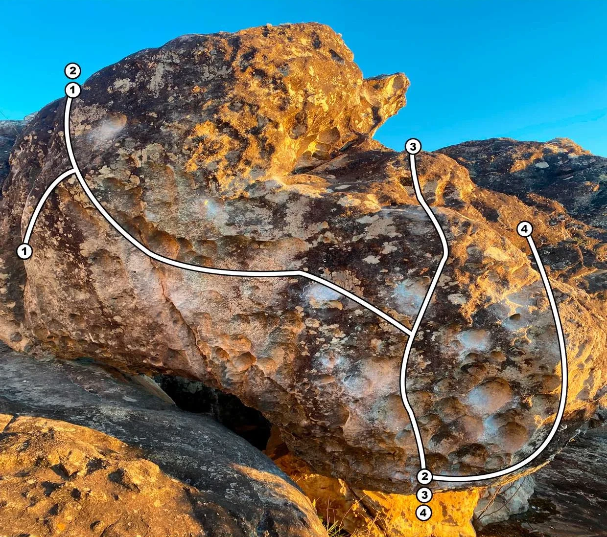
          - **largura_mapa**: 1240
          - **altura_mapa**: 1098
          - **pontos_de_interesse**:
            - **[0]**:
              - **id**: 1
              - **label**: 1
              - **box**:
                - **x**: 48
                - **y**: 514
                - **comprimento**: 25
                - **largura**: 25
            - **[1]**:
              - **id**: 1_fim
              - **label**: 1
              - **box**:
                - **x**: 148
                - **y**: 186
                - **comprimento**: 25
                - **largura**: 25
            - **[2]**:
              - **id**: 2
              - **label**: 2
              - **box**:
                - **x**: 867
                - **y**: 971
                - **comprimento**: 22
                - **largura**: 24
            - **[3]**:
              - **id**: 2_fim
              - **label**: 2
              - **box**:
                - **x**: 149
                - **y**: 144
                - **comprimento**: 22
                - **largura**: 24
            - **[4]**:
              - **id**: 3
              - **label**: 3
              - **box**:
                - **x**: 866
                - **y**: 1010
                - **comprimento**: 21
                - **largura**: 24
            - **[5]**:
              - **id**: 3_fim
              - **label**: 3
              - **box**:
                - **x**: 844
                - **y**: 300
                - **comprimento**: 20
                - **largura**: 25
            - **[6]**:
              - **id**: 4
              - **label**: 4
              - **box**:
                - **x**: 864
                - **y**: 1050
                - **comprimento**: 23
                - **largura**: 25
            - **[7]**:
              - **id**: 4_fim
              - **label**: 4
              - **box**:
                - **x**: 1072
                - **y**: 468
                - **comprimento**: 25
                - **largura**: 25
          - **referencias**:
            - **[0]**:
              - **escalada**: Parteira
              - **ids**:
                - 1
                - 1_fim
            - **[1]**:
              - **escalada**: Curandeira
              - **ids**:
                - 2
                - 2_fim
            - **[2]**:
              - **escalada**: Raizeiro
              - **ids**:
                - 3
                - 3_fim
            - **[3]**:
              - **escalada**: Garrafada
              - **ids**:
                - 4
                - 4_fim
      - **escaladas**:
        - **[0]**:
          - **boulder**:
            - **nome**: Parteira
            - **dificuldade**: V3_BARRA_V4
        - **[1]**:
          - **boulder**:
            - **nome**: Curandeira
            - **dificuldade**: V6_BARRA_V7
        - **[2]**:
          - **boulder**:
            - **nome**: Raizeiro
            - **dificuldade**: V4
        - **[3]**:
          - **boulder**:
            - **nome**: Garrafada
            - **dificuldade**: V3
  - **[5]**:
    - **conteudo**:
      - **descricao**:
          # Bloco: Tijuco Preto
          ## Região 4
      - **nome**: Tijuco Preto
      - **mapas**:
        - **[0]**:
          - **caminho_imagem_mapa**: 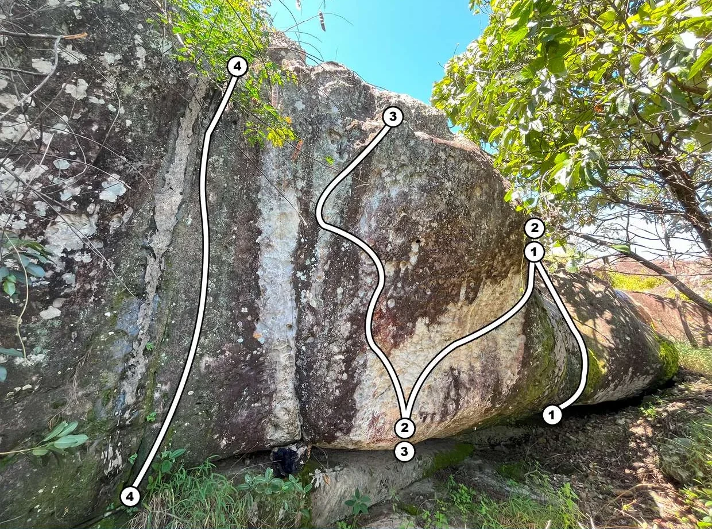
          - **largura_mapa**: 1240
          - **altura_mapa**: 921
          - **pontos_de_interesse**:
            - **[0]**:
              - **id**: 1
              - **label**: 1
              - **box**:
                - **x**: 962
                - **y**: 720
                - **comprimento**: 24
                - **largura**: 27
            - **[1]**:
              - **id**: 1_fim
              - **label**: 1
              - **box**:
                - **x**: 928
                - **y**: 439
                - **comprimento**: 28
                - **largura**: 32
            - **[2]**:
              - **id**: 2
              - **label**: 2
              - **box**:
                - **x**: 704
                - **y**: 744
                - **comprimento**: 25
                - **largura**: 27
            - **[3]**:
              - **id**: 2_fim
              - **label**: 2
              - **box**:
                - **x**: 929
                - **y**: 396
                - **comprimento**: 28
                - **largura**: 33
            - **[4]**:
              - **id**: 3
              - **label**: 3
              - **box**:
                - **x**: 704
                - **y**: 784
                - **comprimento**: 24
                - **largura**: 31
            - **[5]**:
              - **id**: 3_fim
              - **label**: 3
              - **box**:
                - **x**: 686
                - **y**: 206
                - **comprimento**: 28
                - **largura**: 33
            - **[6]**:
              - **id**: 4
              - **label**: 4
              - **box**:
                - **x**: 227
                - **y**: 864
                - **comprimento**: 28
                - **largura**: 33
            - **[7]**:
              - **id**: 4_fim
              - **label**: 4
              - **box**:
                - **x**: 411
                - **y**: 116
                - **comprimento**: 28
                - **largura**: 33
          - **referencias**:
            - **[0]**:
              - **escalada**: Tijuco Preto
              - **ids**:
                - 1
                - 1_fim
            - **[1]**:
              - **escalada**: Pé na Lapeira
              - **ids**:
                - 2
                - 2_fim
            - **[2]**:
              - **escalada**: Sol a Fora
              - **ids**:
                - 3
                - 3_fim
            - **[3]**:
              - **escalada**: Toque no Curralinho
              - **ids**:
                - 4
                - 4_fim
      - **escaladas**:
        - **[0]**:
          - **boulder**:
            - **nome**: Tijuco Preto
            - **dificuldade**: V6
        - **[1]**:
          - **boulder**:
            - **nome**: Pé na Lapeira
            - **dificuldade**: V4
        - **[2]**:
          - **boulder**:
            - **nome**: Sol a Fora
            - **dificuldade**: V3
        - **[3]**:
          - **boulder**:
            - **nome**: Toque no Curralinho
            - **dificuldade**: V3
- **mapas**:
  - **[0]**:
    - **caminho_imagem_mapa**: 
    - **largura_mapa**: 1223
    - **altura_mapa**: 1251

## Arquivos Externos

- **arquivos_externos**:
  - **[0]**:
    - **caminho**: 
    - **checksum_sha256**: 930a77641317c906f02d1bb82605b316f1dcd79272eec2b6745a77083b7209d4
  - **[1]**:
    - **caminho**: 
    - **checksum_sha256**: 659c98d83aa77edbdace384fd3889d08db6798d03c7b08201a0afde2ab74dd8d
  - **[2]**:
    - **caminho**: 
    - **checksum_sha256**: ee21adf090baea920db1df6ceab1e48d2a3d1ceb5b6354e6ac016a816279d9dc
  - **[3]**:
    - **caminho**: 
    - **checksum_sha256**: 44f58f68c912d251d94fb4e963f116a6c9bfe707c1668d06c16d3b186cd5f170
  - **[4]**:
    - **caminho**: 
    - **checksum_sha256**: df895532b8f2c78da374060e6b9c6d3b7aa0e587d90f397d85f824c288353513
  - **[5]**:
    - **caminho**: 
    - **checksum_sha256**: 84d89b96fdc4cf124fc09b42388818b5737188e94e8a81e14ac67323d11de206
  - **[6]**:
    - **caminho**: 
    - **checksum_sha256**: 638229911abbbd375ecbb8e1c215e8a9b428f47351183b4e474768b37895f7b7
  - **[7]**:
    - **caminho**: 
    - **checksum_sha256**: de0a35b5031a4115edf4b1ef09fab1267ba0424c83c83ebc77f807e4fc2473ab
  - **[8]**:
    - **caminho**: 
    - **checksum_sha256**: 20ed4fa3bfde6f50d8b6be997b66513dc5ce7bfe381e2c50071e67443b0f9f34
  - **[9]**:
    - **caminho**: 
    - **checksum_sha256**: 58f362a8d307b069ebb1ee6951b5581f867d30c11ef489b102b38f8e87112d76
  - **[10]**:
    - **caminho**: 
    - **checksum_sha256**: 2de595e077b91f4d4feeb1938fb897dd3b5be5f7a3567f3b942ffe2fa8559e8a
  - **[11]**:
    - **caminho**: 
    - **checksum_sha256**: f3519b969e0c58e51a324a5b644677c0cd04ad28f5003a98648b18c360587303
  - **[12]**:
    - **caminho**: 
    - **checksum_sha256**: 93ea3d6f69387d12bf981e1591094949be0e3a90f48b93220797f20d9fbbf1a5
  - **[13]**:
    - **caminho**: 
    - **checksum_sha256**: 87a50711f4ed3ed713f77a91af0c9cf79c072850de9ff6370e99629ffeaa84af
  - **[14]**:
    - **caminho**: 
    - **checksum_sha256**: 5d906dd06215156eba4eed26bf87c01027958916df26ab75b4563fe818d711af
  - **[15]**:
    - **caminho**: 
    - **checksum_sha256**: 52a842f38e9f134f19593f737edd6be1d20491da979742d69d1ac2e9841bf019
  - **[16]**:
    - **caminho**: 
    - **checksum_sha256**: ffbee82ffedf5cac4a26190c1c6aff8069c0ab282f92b4380ed75f12a728873e
  - **[17]**:
    - **caminho**: 
    - **checksum_sha256**: 80385e7199262fb0c60aa607fc4d7ad6f932826534b05f5a4cc26362bbd29fa7
  - **[18]**:
    - **caminho**: 
    - **checksum_sha256**: 0c5ed7020b244fad7432f43a4ae0d282f0b5560d8fecafcdf71d2df9ac9c5771
  - **[19]**:
    - **caminho**: 
    - **checksum_sha256**: 026a9723f428af5d31806194408244b971541648afede2f601e8f53ca55c8bbd
  - **[20]**:
    - **caminho**: 
    - **checksum_sha256**: 42ff347a189a9330ed3f0724749367df2749e2e233b0ce319ebce9bc6ae36c8b
  - **[21]**:
    - **caminho**: 
    - **checksum_sha256**: ed4e586de730621d3272ae11b011b424e3bcbe1c2150a1066e563ecaa17bba46
  - **[22]**:
    - **caminho**: 
    - **checksum_sha256**: d7d9ab83bb936d13f7f66f43537d7787da5aa19673ada99af4ce8230d0113176
  - **[23]**:
    - **caminho**: 
    - **checksum_sha256**: 63c37727c53bed3a5ce11890d902687ecfc650fb50e7336d9b4f47a2f887336d
  - **[24]**:
    - **caminho**: 
    - **checksum_sha256**: 44f329deada6ad1f5d3204353381a398e3dfba8f207e3e050e8d8b9fb35bc832
  - **[25]**:
    - **caminho**: 
    - **checksum_sha256**: 6f727be0a313386fe7a8d59860d204e7fdfd0516679abb0d612dfd0dc94569a5
  - **[26]**:
    - **caminho**: 
    - **checksum_sha256**: d67c1b056e38be95b97f9a986a6d04112e60371f9dea2974a43ca7b9183e87b2
  - **[27]**:
    - **caminho**: 
    - **checksum_sha256**: a93e5929d6e21e493cff3bd948a99c758214bec3e7996673d2d1321901dc5eef
  - **[28]**:
    - **caminho**: 
    - **checksum_sha256**: 3d980d3fdebf36bad3abb96760b273224f124147b62a754e0f9648007adda161
  - **[29]**:
    - **caminho**: 
    - **checksum_sha256**: 599d6e8441cd5681e811ba6e597c3f6e366e53316a6a15394c8757cbac63a6ba
  - **[30]**:
    - **caminho**: 
    - **checksum_sha256**: 6ad872db4b9d5e03999754c13b1b357bcde74c3bfe208c8bb9c2e29d22d682f7

