# Croqui: Diamaboulder (Cerrado Groove)

## Informações Gerais

- **descricao**: O Cerrado Groove é um setor de boulder localizado em Diamantina, MG, com blocos de quartzito de alta qualidade.
- **id**: br_mg_diamantina_diamaboulder
- **nome**: Diamaboulder (Cerrado Groove)
- **uid**: rULBV89pXI7Ibg
- **creditos**:
  - Danilo Barbosa
- **status_desenho_extraivel**: DESENHO_EXTRAIDO
- **caminho_thumbnail**: 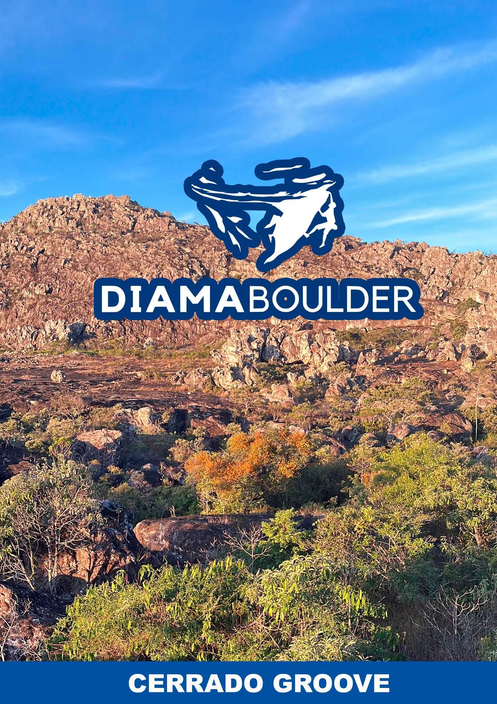
- **botoes**:
  - **[0]**:
    - **uid**: BZdwK5E7FVI7Gx
    - **texto**: Informações
    - **destino**:
      - **secao_textual**:
        - **conteudo**:
            # Diamaboulder
            ## Cerrado Groove
            
            |  |
            | :--: |
            | *Diamaboulder - Cerrado Groove* |
- **ultima_migracao**: 5
- **revisado_manualmente**: True
- **revisado_bounding_circle**: True
- **publicar_croqui**: True

## Parte: grupo_regiao_1

### Grupo (Pico: Cerrado Groove)

- **descricao**:
    # Região 1
    
    A Região 1 compreende os primeiros blocos do setor Cerrado Groove.
- **nome**: Região 1
- **uid**: 4FDteNJXNyj54v
- **setores**:
  - **[0]**:
    - **conteudo**:
      - **descricao**:
          # Bloco: Diamante de Sangue
          ## Região 1
      - **nome**: Diamante de Sangue
      - **uid**: bApNhQfhG9Jsu0
      - **mapas**:
        - **[0]**:
          - **caminho_imagem_mapa**: 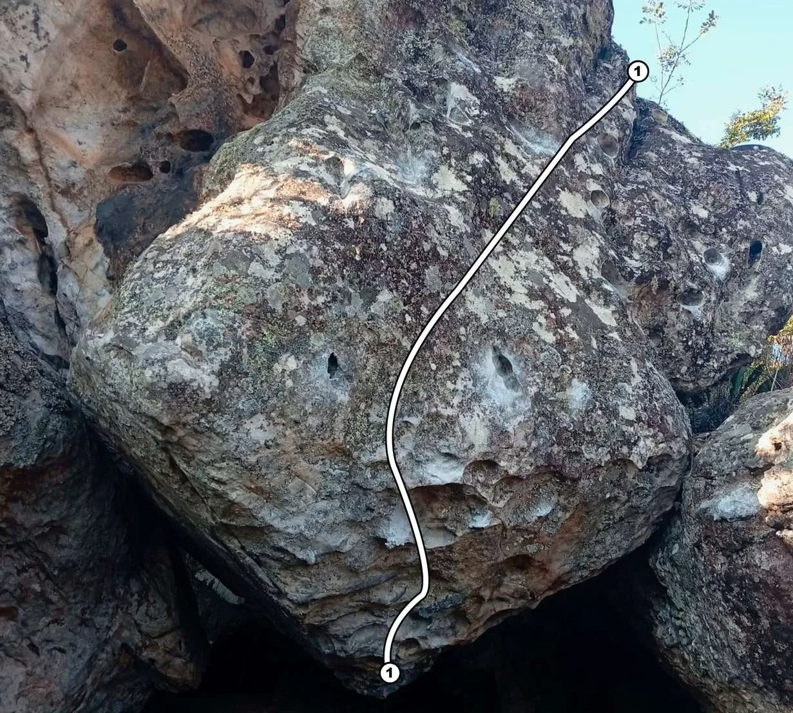
          - **largura_mapa**: 1231
          - **altura_mapa**: 1107
          - **pontos_de_interesse**:
            - **[0]**:
              - **id**: 8nSOTSWWDi03eK
              - **uid**: 8nSOTSWWDi03eK
              - **rotulo**: 1
              - **circulo**:
                - **x**: 606
                - **y**: 1045
                - **raio**: 15
              - **label**: 1
            - **[1]**:
              - **id**: kzXWZRz4gD01ND
              - **uid**: kzXWZRz4gD01ND
              - **rotulo**: 1
              - **circulo**:
                - **x**: 990
                - **y**: 111
                - **raio**: 16
              - **label**: 1
          - **referencias**:
            - **[0]**:
              - **alvo_uid**: EC1gSGkmp4fh8s
              - **pontos_uids**:
                - 8nSOTSWWDi03eK
                - kzXWZRz4gD01ND
              - **escalada**: Diamante de Sangue
              - **ids**:
                - 8nSOTSWWDi03eK
                - kzXWZRz4gD01ND
      - **escaladas**:
        - **[0]**:
          - **uid**: EC1gSGkmp4fh8s
          - **boulder**:
            - **descricao**: Saída nos pockets mais baixos da face negativa, seguindo por regletes e pockets até finalizar no positivo de abaulados.
            - **nome**: Diamante de Sangue
            - **dificuldade**: V6_BARRA_V7
            - **tipo_parede**: NEGATIVO
      - **precomputados**:
        - **total_escaladas**: 1
        - **total_boulders**: 1
  - **[1]**:
    - **conteudo**:
      - **descricao**:
          # Bloco: Chiqueirinho
          ## Região 1
          
          O bloco Chiqueirinho possui várias linhas em diferentes faces.
      - **nome**: Chiqueirinho
      - **uid**: YKfvHBUrmFmoKZ
      - **mapas**:
        - **[0]**:
          - **caminho_imagem_mapa**: 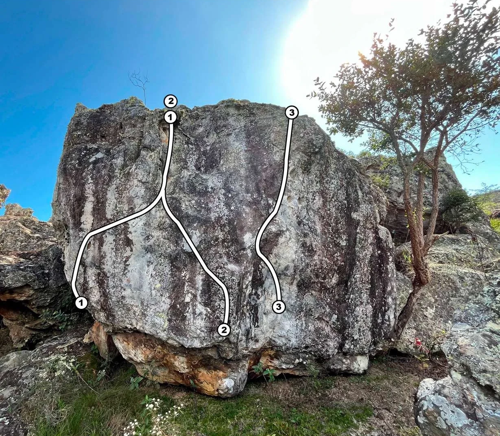
          - **largura_mapa**: 1229
          - **altura_mapa**: 1073
          - **pontos_de_interesse**:
            - **[0]**:
              - **id**: lZ7CbNHvJCeYii
              - **uid**: lZ7CbNHvJCeYii
              - **rotulo**: 1
              - **circulo**:
                - **x**: 200
                - **y**: 745
                - **raio**: 15
              - **label**: 1
            - **[1]**:
              - **id**: vdjl7xadYWmrcL
              - **uid**: vdjl7xadYWmrcL
              - **rotulo**: 1
              - **circulo**:
                - **x**: 419
                - **y**: 288
                - **raio**: 16
              - **label**: 1
            - **[2]**:
              - **id**: WHqed13XSe4EfB
              - **uid**: WHqed13XSe4EfB
              - **rotulo**: 2
              - **circulo**:
                - **x**: 550
                - **y**: 812
                - **raio**: 15
              - **label**: 2
            - **[3]**:
              - **id**: m2ziU9UZl258zi
              - **uid**: m2ziU9UZl258zi
              - **rotulo**: 2
              - **circulo**:
                - **x**: 419
                - **y**: 249
                - **raio**: 16
              - **label**: 2
            - **[4]**:
              - **id**: nQ4MSVe11jFsRI
              - **uid**: nQ4MSVe11jFsRI
              - **rotulo**: 3
              - **circulo**:
                - **x**: 685
                - **y**: 755
                - **raio**: 15
              - **label**: 3
            - **[5]**:
              - **id**: Lp3HsVyY36hRbi
              - **uid**: Lp3HsVyY36hRbi
              - **rotulo**: 3
              - **circulo**:
                - **x**: 718
                - **y**: 277
                - **raio**: 16
              - **label**: 3
          - **referencias**:
            - **[0]**:
              - **alvo_uid**: tYfR1xbua7QSHa
              - **pontos_uids**:
                - lZ7CbNHvJCeYii
                - vdjl7xadYWmrcL
              - **escalada**: Menos Porco Mais Aranha
              - **ids**:
                - lZ7CbNHvJCeYii
                - vdjl7xadYWmrcL
            - **[1]**:
              - **alvo_uid**: twQYQnOlOYFyEl
              - **pontos_uids**:
                - WHqed13XSe4EfB
                - m2ziU9UZl258zi
              - **escalada**: Javaporco
              - **ids**:
                - WHqed13XSe4EfB
                - m2ziU9UZl258zi
            - **[2]**:
              - **alvo_uid**: ol24e9QnCY4nI5
              - **pontos_uids**:
                - nQ4MSVe11jFsRI
                - Lp3HsVyY36hRbi
              - **escalada**: Chiqueirinho
              - **ids**:
                - nQ4MSVe11jFsRI
                - Lp3HsVyY36hRbi
        - **[1]**:
          - **caminho_imagem_mapa**: 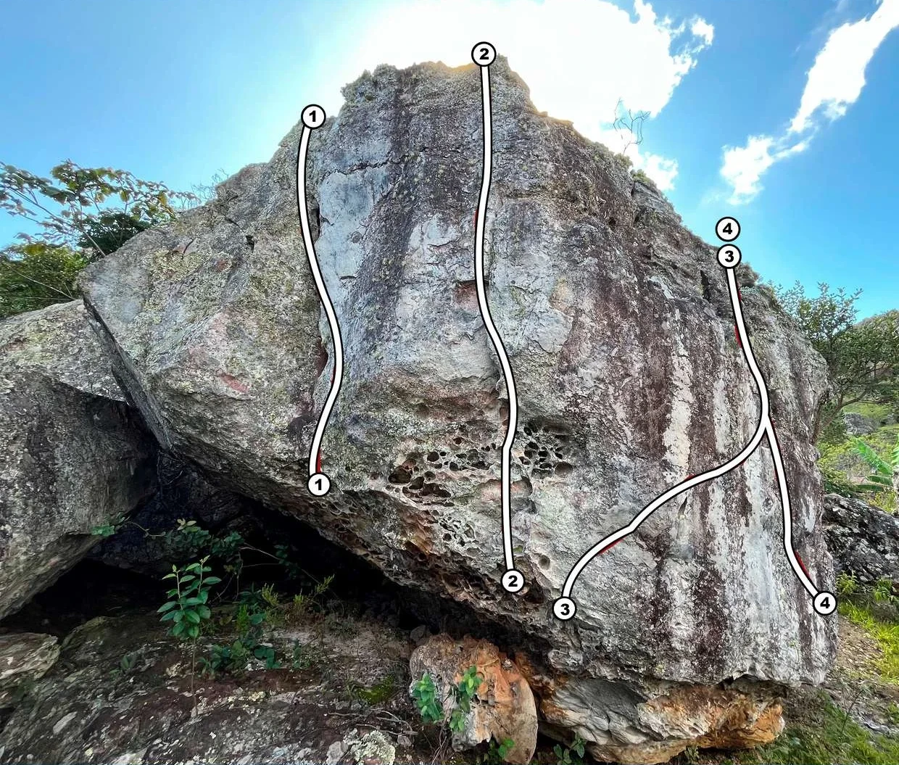
          - **largura_mapa**: 1240
          - **altura_mapa**: 1055
          - **pontos_de_interesse**:
            - **[0]**:
              - **id**: CS1ZaXIanubG8L
              - **uid**: CS1ZaXIanubG8L
              - **rotulo**: 1
              - **circulo**:
                - **x**: 440
                - **y**: 669
                - **raio**: 14
              - **label**: 1
            - **[1]**:
              - **id**: HSgJVCGhUFLFHd
              - **uid**: HSgJVCGhUFLFHd
              - **rotulo**: 1
              - **circulo**:
                - **x**: 432
                - **y**: 160
                - **raio**: 15
              - **label**: 1
            - **[2]**:
              - **id**: GGY74xQjhW4lmY
              - **uid**: GGY74xQjhW4lmY
              - **rotulo**: 2
              - **circulo**:
                - **x**: 708
                - **y**: 801
                - **raio**: 15
              - **label**: 2
            - **[3]**:
              - **id**: OPgcOGpDLWCL7Q
              - **uid**: OPgcOGpDLWCL7Q
              - **rotulo**: 2
              - **circulo**:
                - **x**: 668
                - **y**: 75
                - **raio**: 15
              - **label**: 2
            - **[4]**:
              - **id**: TjxwwpXZdDQTnp
              - **uid**: TjxwwpXZdDQTnp
              - **rotulo**: 3
              - **circulo**:
                - **x**: 779
                - **y**: 840
                - **raio**: 16
              - **label**: 3
            - **[5]**:
              - **id**: lp3jtG17LpNSzv
              - **uid**: lp3jtG17LpNSzv
              - **rotulo**: 3
              - **circulo**:
                - **x**: 1006
                - **y**: 353
                - **raio**: 16
              - **label**: 3
            - **[6]**:
              - **id**: kP8FZYb1bfpeZy
              - **uid**: kP8FZYb1bfpeZy
              - **rotulo**: 4
              - **circulo**:
                - **x**: 1138
                - **y**: 832
                - **raio**: 15
              - **label**: 4
            - **[7]**:
              - **id**: TbWSwnYINsPDzH
              - **uid**: TbWSwnYINsPDzH
              - **rotulo**: 4
              - **circulo**:
                - **x**: 1004
                - **y**: 316
                - **raio**: 16
              - **label**: 4
          - **referencias**:
            - **[0]**:
              - **alvo_uid**: tYfR1xbua7QSHa
              - **pontos_uids**:
                - TjxwwpXZdDQTnp
                - lp3jtG17LpNSzv
              - **escalada**: Menos Porco Mais Aranha
              - **ids**:
                - TjxwwpXZdDQTnp
                - lp3jtG17LpNSzv
            - **[1]**:
              - **alvo_uid**: twQYQnOlOYFyEl
              - **pontos_uids**:
                - kP8FZYb1bfpeZy
                - TbWSwnYINsPDzH
              - **escalada**: Javaporco
              - **ids**:
                - kP8FZYb1bfpeZy
                - TbWSwnYINsPDzH
            - **[2]**:
              - **alvo_uid**: dISFB7F5UJc22A
              - **pontos_uids**:
                - CS1ZaXIanubG8L
                - HSgJVCGhUFLFHd
              - **escalada**: Pocilga
              - **ids**:
                - CS1ZaXIanubG8L
                - HSgJVCGhUFLFHd
            - **[3]**:
              - **alvo_uid**: iAycRp4y0pxPbN
              - **pontos_uids**:
                - GGY74xQjhW4lmY
                - OPgcOGpDLWCL7Q
              - **escalada**: Porco Aranha
              - **ids**:
                - GGY74xQjhW4lmY
                - OPgcOGpDLWCL7Q
      - **escaladas**:
        - **[0]**:
          - **uid**: tYfR1xbua7QSHa
          - **boulder**:
            - **nome**: Menos Porco Mais Aranha
            - **dificuldade**: V4_BARRA_V5
        - **[1]**:
          - **uid**: twQYQnOlOYFyEl
          - **boulder**:
            - **nome**: Javaporco
            - **dificuldade**: V3
        - **[2]**:
          - **uid**: ol24e9QnCY4nI5
          - **boulder**:
            - **nome**: Chiqueirinho
            - **dificuldade**: V2_BARRA_V3
        - **[3]**:
          - **uid**: dISFB7F5UJc22A
          - **boulder**:
            - **nome**: Pocilga
            - **dificuldade**: V2
        - **[4]**:
          - **uid**: iAycRp4y0pxPbN
          - **boulder**:
            - **nome**: Porco Aranha
            - **dificuldade**: V2
      - **precomputados**:
        - **total_escaladas**: 5
        - **total_boulders**: 5
  - **[2]**:
    - **conteudo**:
      - **descricao**:
          # Bloco: Bloco do Kbeca
          ## Região 1
      - **nome**: Bloco do Kbeca
      - **uid**: IvlrAKdN2PKnQY
      - **mapas**:
        - **[0]**:
          - **caminho_imagem_mapa**: 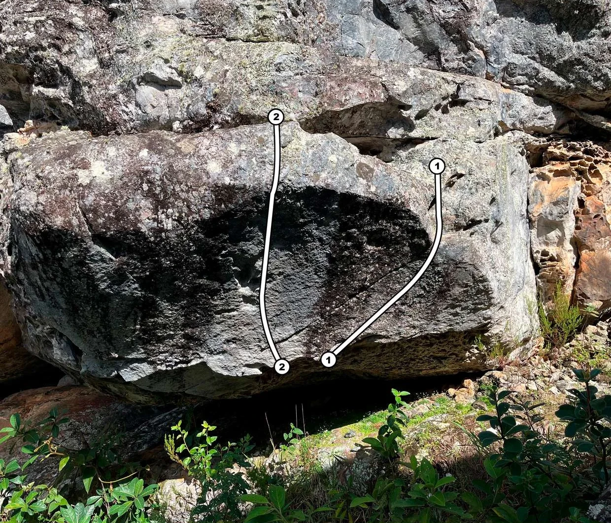
          - **largura_mapa**: 1240
          - **altura_mapa**: 1062
          - **pontos_de_interesse**:
            - **[0]**:
              - **id**: RKUuRDhpONwNVc
              - **uid**: RKUuRDhpONwNVc
              - **rotulo**: 1
              - **circulo**:
                - **x**: 667
                - **y**: 730
                - **raio**: 15
              - **label**: 1
            - **[1]**:
              - **id**: plrkfNzkdGj3pt
              - **uid**: plrkfNzkdGj3pt
              - **rotulo**: 1
              - **circulo**:
                - **x**: 887
                - **y**: 337
                - **raio**: 15
              - **label**: 1
            - **[2]**:
              - **id**: unJgRc6gWjla8c
              - **uid**: unJgRc6gWjla8c
              - **rotulo**: 2
              - **circulo**:
                - **x**: 572
                - **y**: 745
                - **raio**: 15
              - **label**: 2
            - **[3]**:
              - **id**: dmtAugV6VXu243
              - **uid**: dmtAugV6VXu243
              - **rotulo**: 2
              - **circulo**:
                - **x**: 560
                - **y**: 237
                - **raio**: 15
              - **label**: 2
          - **referencias**:
            - **[0]**:
              - **alvo_uid**: aiq28rMbksMrBQ
              - **pontos_uids**:
                - RKUuRDhpONwNVc
                - plrkfNzkdGj3pt
              - **escalada**: Boulder do Kbeca
              - **ids**:
                - RKUuRDhpONwNVc
                - plrkfNzkdGj3pt
            - **[1]**:
              - **alvo_uid**: l5oHRNFLSszMC7
              - **pontos_uids**:
                - unJgRc6gWjla8c
                - dmtAugV6VXu243
              - **escalada**: Projeto
              - **ids**:
                - unJgRc6gWjla8c
                - dmtAugV6VXu243
      - **escaladas**:
        - **[0]**:
          - **uid**: aiq28rMbksMrBQ
          - **boulder**:
            - **nome**: Boulder do Kbeca
            - **dificuldade**: V7
        - **[1]**:
          - **uid**: l5oHRNFLSszMC7
          - **boulder**:
            - **nome**: Projeto
            - **dificuldade**: INDEFINIDO
      - **precomputados**:
        - **total_escaladas**: 2
        - **total_boulders**: 2
  - **[3]**:
    - **conteudo**:
      - **descricao**:
          # Bloco: Flor do Cerrado
          ## Região 1
      - **nome**: Flor do Cerrado
      - **uid**: wywacGfloYJBuk
      - **mapas**:
        - **[0]**:
          - **caminho_imagem_mapa**: 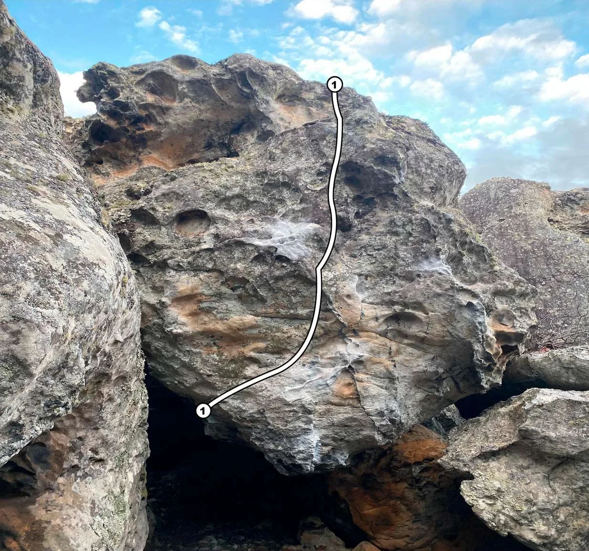
          - **largura_mapa**: 1234
          - **altura_mapa**: 1155
          - **pontos_de_interesse**:
            - **[0]**:
              - **id**: v6Of2eVLy7M9hf
              - **uid**: v6Of2eVLy7M9hf
              - **rotulo**: 1
              - **circulo**:
                - **x**: 426
                - **y**: 861
                - **raio**: 15
              - **label**: 1
            - **[1]**:
              - **id**: Q9XUyvYn5PYQOo
              - **uid**: Q9XUyvYn5PYQOo
              - **rotulo**: 1
              - **circulo**:
                - **x**: 701
                - **y**: 177
                - **raio**: 16
              - **label**: 1
          - **referencias**:
            - **[0]**:
              - **alvo_uid**: 5LHXpACfRtbu7o
              - **pontos_uids**:
                - v6Of2eVLy7M9hf
                - Q9XUyvYn5PYQOo
              - **escalada**: Flor do Cerrado
              - **ids**:
                - v6Of2eVLy7M9hf
                - Q9XUyvYn5PYQOo
      - **escaladas**:
        - **[0]**:
          - **uid**: 5LHXpACfRtbu7o
          - **boulder**:
            - **nome**: Flor do Cerrado
            - **dificuldade**: V5
      - **precomputados**:
        - **total_escaladas**: 1
        - **total_boulders**: 1
  - **[4]**:
    - **conteudo**:
      - **descricao**:
          # Bloco: Joelho Sem Freio
          ## Região 1
      - **nome**: Joelho Sem Freio
      - **uid**: NQyqOjn0nMXiem
      - **mapas**:
        - **[0]**:
          - **caminho_imagem_mapa**: 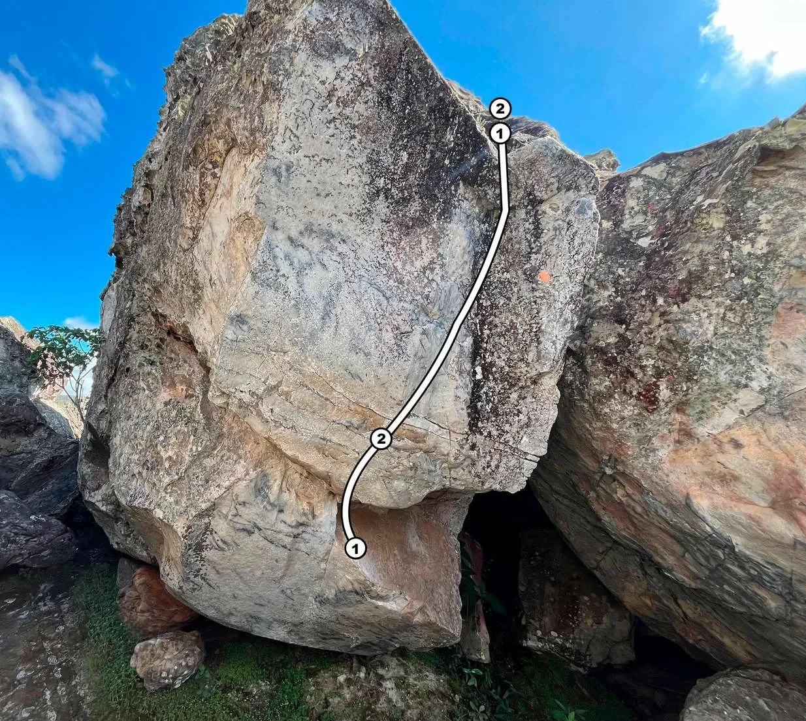
          - **largura_mapa**: 1234
          - **altura_mapa**: 1105
          - **pontos_de_interesse**:
            - **[0]**:
              - **id**: FDl9gduzf8WGtX
              - **uid**: FDl9gduzf8WGtX
              - **rotulo**: 1
              - **circulo**:
                - **x**: 545
                - **y**: 840
                - **raio**: 15
              - **label**: 1
            - **[1]**:
              - **id**: 0cZcrtAhbQy8Fc
              - **uid**: 0cZcrtAhbQy8Fc
              - **rotulo**: 1
              - **circulo**:
                - **x**: 766
                - **y**: 204
                - **raio**: 15
              - **label**: 1
            - **[2]**:
              - **id**: Kl2RkbjjDAPsGv
              - **uid**: Kl2RkbjjDAPsGv
              - **rotulo**: 2
              - **circulo**:
                - **x**: 584
                - **y**: 672
                - **raio**: 15
              - **label**: 2
            - **[3]**:
              - **id**: RpHRuY3u912YYe
              - **uid**: RpHRuY3u912YYe
              - **rotulo**: 2
              - **circulo**:
                - **x**: 766
                - **y**: 166
                - **raio**: 15
              - **label**: 2
          - **referencias**:
            - **[0]**:
              - **alvo_uid**: 8sA86TDCIsDdNe
              - **pontos_uids**:
                - FDl9gduzf8WGtX
                - 0cZcrtAhbQy8Fc
              - **escalada**: Desenfreado
              - **ids**:
                - FDl9gduzf8WGtX
                - 0cZcrtAhbQy8Fc
            - **[1]**:
              - **alvo_uid**: 1RfngRUaUVmKwk
              - **pontos_uids**:
                - Kl2RkbjjDAPsGv
                - RpHRuY3u912YYe
              - **escalada**: Joelho Sem Freio
              - **ids**:
                - Kl2RkbjjDAPsGv
                - RpHRuY3u912YYe
      - **escaladas**:
        - **[0]**:
          - **uid**: 8sA86TDCIsDdNe
          - **boulder**:
            - **descricao**: Saída com as mãos juntas no batente escorrido.
            - **nome**: Desenfreado
            - **dificuldade**: V6
        - **[1]**:
          - **uid**: 1RfngRUaUVmKwk
          - **boulder**:
            - **descricao**: Saída com a mão direita na aresta em meia altura e a mão esquerda em abaulado invertido no teto.
            - **nome**: Joelho Sem Freio
            - **dificuldade**: V3
      - **precomputados**:
        - **total_escaladas**: 2
        - **total_boulders**: 2
- **precomputados**:
  - **total_escaladas**: 11
  - **total_boulders**: 11

## Parte: grupo_regiao_2

### Grupo (Pico: Cerrado Groove)

- **descricao**:
    # Região 2
    
    A Região 2 contém blocos icônicos como Panela do Diabo e Primavera nos Dentes.
- **nome**: Região 2
- **uid**: x5DYqeNmedsNxv
- **setores**:
  - **[0]**:
    - **conteudo**:
      - **descricao**:
          # Bloco: Panela do Diabo
          ## Região 2
      - **nome**: Panela do Diabo
      - **uid**: eYmBFxup8j7TU9
      - **mapas**:
        - **[0]**:
          - **caminho_imagem_mapa**: 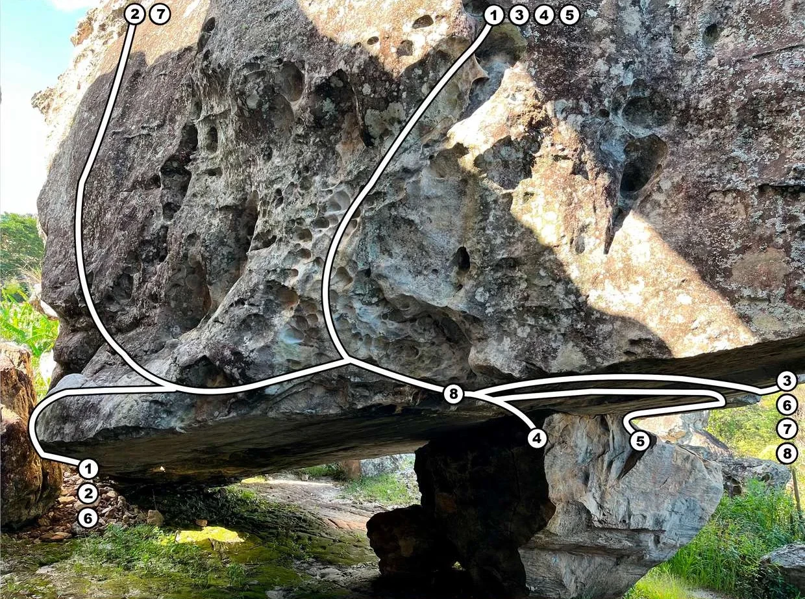
          - **largura_mapa**: 1240
          - **altura_mapa**: 922
          - **pontos_de_interesse**:
            - **[0]**:
              - **id**: wnjJEkDVgeCqTD
              - **uid**: wnjJEkDVgeCqTD
              - **rotulo**: 1
              - **circulo**:
                - **x**: 137
                - **y**: 721
                - **raio**: 15
              - **label**: 1
            - **[1]**:
              - **id**: OA29cxlU9x057K
              - **uid**: OA29cxlU9x057K
              - **rotulo**: 1
              - **circulo**:
                - **x**: 761
                - **y**: 23
                - **raio**: 16
              - **label**: 1
            - **[2]**:
              - **id**: HUYYy5OaHnXsIJ
              - **uid**: HUYYy5OaHnXsIJ
              - **rotulo**: 2
              - **circulo**:
                - **x**: 136
                - **y**: 760
                - **raio**: 15
              - **label**: 2
            - **[3]**:
              - **id**: ROaetcQ2HERj0m
              - **uid**: ROaetcQ2HERj0m
              - **rotulo**: 2
              - **circulo**:
                - **x**: 208
                - **y**: 21
                - **raio**: 16
              - **label**: 2
            - **[4]**:
              - **id**: E1DiSeOmaHt4dE
              - **uid**: E1DiSeOmaHt4dE
              - **rotulo**: 3
              - **circulo**:
                - **x**: 1212
                - **y**: 586
                - **raio**: 16
              - **label**: 3
            - **[5]**:
              - **id**: iqyfjsqn0B0wTI
              - **uid**: iqyfjsqn0B0wTI
              - **rotulo**: 3
              - **circulo**:
                - **x**: 800
                - **y**: 23
                - **raio**: 16
              - **label**: 3
            - **[6]**:
              - **id**: MjWOyi81AuiffO
              - **uid**: MjWOyi81AuiffO
              - **rotulo**: 4
              - **circulo**:
                - **x**: 828
                - **y**: 674
                - **raio**: 15
              - **label**: 4
            - **[7]**:
              - **id**: aafAWaRYKq3HrO
              - **uid**: aafAWaRYKq3HrO
              - **rotulo**: 4
              - **circulo**:
                - **x**: 838
                - **y**: 23
                - **raio**: 16
              - **label**: 4
            - **[8]**:
              - **id**: Gk8phVNO6SHaW9
              - **uid**: Gk8phVNO6SHaW9
              - **rotulo**: 5
              - **circulo**:
                - **x**: 986
                - **y**: 678
                - **raio**: 15
              - **label**: 5
            - **[9]**:
              - **id**: HaZlvvBUpXfQ3t
              - **uid**: HaZlvvBUpXfQ3t
              - **rotulo**: 5
              - **circulo**:
                - **x**: 878
                - **y**: 23
                - **raio**: 15
              - **label**: 5
            - **[10]**:
              - **id**: LDnhSNWsQXITCO
              - **uid**: LDnhSNWsQXITCO
              - **rotulo**: 6
              - **circulo**:
                - **x**: 135
                - **y**: 797
                - **raio**: 15
              - **label**: 6
            - **[11]**:
              - **id**: JuWIduXO3PQgD2
              - **uid**: JuWIduXO3PQgD2
              - **rotulo**: 6
              - **circulo**:
                - **x**: 1212
                - **y**: 623
                - **raio**: 16
              - **label**: 6
            - **[12]**:
              - **id**: qXf5sGO039CgNW
              - **uid**: qXf5sGO039CgNW
              - **rotulo**: 7
              - **circulo**:
                - **x**: 1213
                - **y**: 660
                - **raio**: 16
              - **label**: 7
            - **[13]**:
              - **id**: HF6mGM5mQAhikm
              - **uid**: HF6mGM5mQAhikm
              - **rotulo**: 7
              - **circulo**:
                - **x**: 246
                - **y**: 21
                - **raio**: 16
              - **label**: 7
            - **[14]**:
              - **id**: nCFyUPEQH74Fi3
              - **uid**: nCFyUPEQH74Fi3
              - **rotulo**: 8
              - **circulo**:
                - **x**: 1213
                - **y**: 698
                - **raio**: 16
              - **label**: 8
            - **[15]**:
              - **id**: k2edwZ0frmAdqW
              - **uid**: k2edwZ0frmAdqW
              - **rotulo**: 8
              - **circulo**:
                - **x**: 699
                - **y**: 606
                - **raio**: 15
              - **label**: 8
          - **referencias**:
            - **[0]**:
              - **alvo_uid**: 9MT3UbIG2Qtb3Q
              - **pontos_uids**:
                - wnjJEkDVgeCqTD
                - OA29cxlU9x057K
              - **escalada**: Consciência
              - **ids**:
                - wnjJEkDVgeCqTD
                - OA29cxlU9x057K
            - **[1]**:
              - **alvo_uid**: 0ddfwYkJen4fIl
              - **pontos_uids**:
                - HUYYy5OaHnXsIJ
                - ROaetcQ2HERj0m
              - **escalada**: Groove
              - **ids**:
                - HUYYy5OaHnXsIJ
                - ROaetcQ2HERj0m
            - **[2]**:
              - **alvo_uid**: SD5GEHWGtSrIBX
              - **pontos_uids**:
                - E1DiSeOmaHt4dE
                - iqyfjsqn0B0wTI
              - **escalada**: Caldeirão
              - **ids**:
                - E1DiSeOmaHt4dE
                - iqyfjsqn0B0wTI
            - **[3]**:
              - **alvo_uid**: XLNo08IQYW9weU
              - **pontos_uids**:
                - Gk8phVNO6SHaW9
                - HaZlvvBUpXfQ3t
              - **escalada**: Panela do Diabo
              - **ids**:
                - Gk8phVNO6SHaW9
                - HaZlvvBUpXfQ3t
            - **[4]**:
              - **alvo_uid**: 9e9fIFUN4jCMSn
              - **pontos_uids**:
                - LDnhSNWsQXITCO
                - JuWIduXO3PQgD2
              - **escalada**: Consciência para ter Coragem
              - **ids**:
                - LDnhSNWsQXITCO
                - JuWIduXO3PQgD2
            - **[5]**:
              - **alvo_uid**: k0eTbbOl6kCTx1
              - **pontos_uids**:
                - qXf5sGO039CgNW
                - HF6mGM5mQAhikm
              - **escalada**: Caldeirão do Groove
              - **ids**:
                - qXf5sGO039CgNW
                - HF6mGM5mQAhikm
            - **[6]**:
              - **alvo_uid**: aW3e9unCboFUDL
              - **pontos_uids**:
                - nCFyUPEQH74Fi3
                - k2edwZ0frmAdqW
              - **escalada**: Coragem
              - **ids**:
                - nCFyUPEQH74Fi3
                - k2edwZ0frmAdqW
      - **escaladas**:
        - **[0]**:
          - **uid**: 9MT3UbIG2Qtb3Q
          - **boulder**:
            - **descricao**: Saída baixa em dois regletes pequenos logo à direita do balcão arredondado, seguindo em travessia para a direita até dominar como o panelaço.
            - **nome**: Consciência
            - **dificuldade**: V4
        - **[1]**:
          - **uid**: 0ddfwYkJen4fIl
          - **boulder**:
            - **descricao**: Mesma saída do consciência, dominando na face positiva logo acima do balcão.
            - **nome**: Groove
            - **dificuldade**: V3
        - **[2]**:
          - **uid**: SD5GEHWGtSrIBX
          - **boulder**:
            - **descricao**: Saída nos agarrões da borda de fora do bloco e segue pelo teto até finalizar como o panelaço (sem a utilização do "jorge"/bloco de sustentação).
            - **nome**: Caldeirão
            - **dificuldade**: V6
        - **[3]**:
          - **uid**: XLNo08IQYW9weU
          - **boulder**:
            - **nome**: Panela do Diabo
            - **dificuldade**: V4
        - **[4]**:
          - **uid**: 9e9fIFUN4jCMSn
          - **boulder**:
            - **descricao**: Saída similar ao consciência, seguindo em travessia até ligar no boulder coragem.
            - **nome**: Consciência para ter Coragem
            - **dificuldade**: V7
        - **[5]**:
          - **uid**: k0eTbbOl6kCTx1
          - **boulder**:
            - **nome**: Caldeirão do Groove
            - **dificuldade**: V7
        - **[6]**:
          - **uid**: aW3e9unCboFUDL
          - **boulder**:
            - **descricao**: Saída com as duas mãos no buraco do teto e segue pelo caminho inverso do caldeirão, finalizando por agarrões na face vertical do bloco.
            - **nome**: Coragem
            - **dificuldade**: V5
      - **precomputados**:
        - **total_escaladas**: 7
        - **total_boulders**: 7
  - **[1]**:
    - **conteudo**:
      - **descricao**:
          # Bloco: Faca de Pedra
          ## Região 2
      - **nome**: Faca de Pedra
      - **uid**: ozcB2TQFJRqm4f
      - **mapas**:
        - **[0]**:
          - **caminho_imagem_mapa**: 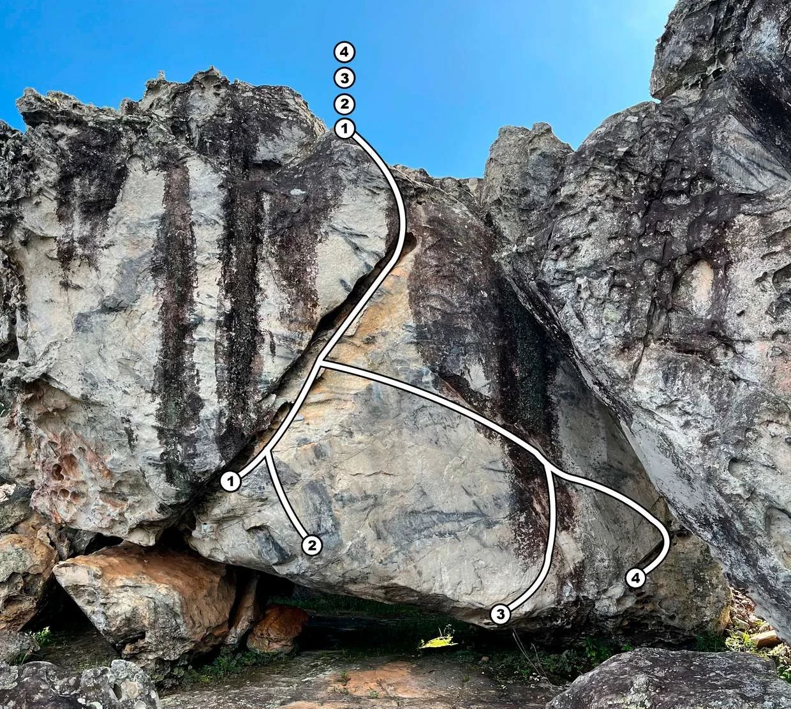
          - **largura_mapa**: 1240
          - **altura_mapa**: 1110
          - **pontos_de_interesse**:
            - **[0]**:
              - **id**: 8WJZ2izduMc604
              - **uid**: 8WJZ2izduMc604
              - **rotulo**: 1
              - **circulo**:
                - **x**: 361
                - **y**: 753
                - **raio**: 16
              - **label**: 1
            - **[1]**:
              - **id**: 7ySGKvyXygosae
              - **uid**: 7ySGKvyXygosae
              - **rotulo**: 1
              - **circulo**:
                - **x**: 540
                - **y**: 202
                - **raio**: 16
              - **label**: 1
            - **[2]**:
              - **id**: JYSiPpLmKlWoBo
              - **uid**: JYSiPpLmKlWoBo
              - **rotulo**: 2
              - **circulo**:
                - **x**: 489
                - **y**: 854
                - **raio**: 16
              - **label**: 2
            - **[3]**:
              - **id**: I4artlULAedVw8
              - **uid**: I4artlULAedVw8
              - **rotulo**: 2
              - **circulo**:
                - **x**: 540
                - **y**: 163
                - **raio**: 16
              - **label**: 2
            - **[4]**:
              - **id**: vti0Bk98ZHJoRA
              - **uid**: vti0Bk98ZHJoRA
              - **rotulo**: 3
              - **circulo**:
                - **x**: 784
                - **y**: 962
                - **raio**: 16
              - **label**: 3
            - **[5]**:
              - **id**: WHXE5ylBh3vYRH
              - **uid**: WHXE5ylBh3vYRH
              - **rotulo**: 3
              - **circulo**:
                - **x**: 540
                - **y**: 122
                - **raio**: 16
              - **label**: 3
            - **[6]**:
              - **id**: bMLq2ElLDpxR2q
              - **uid**: bMLq2ElLDpxR2q
              - **rotulo**: 4
              - **circulo**:
                - **x**: 996
                - **y**: 905
                - **raio**: 15
              - **label**: 4
            - **[7]**:
              - **id**: P1uyoQWlaSJYV4
              - **uid**: P1uyoQWlaSJYV4
              - **rotulo**: 4
              - **circulo**:
                - **x**: 540
                - **y**: 81
                - **raio**: 16
              - **label**: 4
          - **referencias**:
            - **[0]**:
              - **alvo_uid**: 3Cd7FHC0iYasTx
              - **pontos_uids**:
                - 8WJZ2izduMc604
                - 7ySGKvyXygosae
              - **escalada**: Colher de Pedra
              - **ids**:
                - 8WJZ2izduMc604
                - 7ySGKvyXygosae
            - **[1]**:
              - **alvo_uid**: cKeEBNnSODwpek
              - **pontos_uids**:
                - JYSiPpLmKlWoBo
                - I4artlULAedVw8
              - **escalada**: Colher de Pau
              - **ids**:
                - JYSiPpLmKlWoBo
                - I4artlULAedVw8
            - **[2]**:
              - **alvo_uid**: KLE5Y9BUGVDuSh
              - **pontos_uids**:
                - vti0Bk98ZHJoRA
                - WHXE5ylBh3vYRH
              - **escalada**: Chaira de Pedra
              - **ids**:
                - vti0Bk98ZHJoRA
                - WHXE5ylBh3vYRH
            - **[3]**:
              - **alvo_uid**: WmGSTOr3raLqij
              - **pontos_uids**:
                - bMLq2ElLDpxR2q
                - P1uyoQWlaSJYV4
              - **escalada**: Faca de Pedra
              - **ids**:
                - bMLq2ElLDpxR2q
                - P1uyoQWlaSJYV4
      - **escaladas**:
        - **[0]**:
          - **uid**: 3Cd7FHC0iYasTx
          - **boulder**:
            - **nome**: Colher de Pedra
            - **dificuldade**: V2
        - **[1]**:
          - **uid**: cKeEBNnSODwpek
          - **boulder**:
            - **nome**: Colher de Pau
            - **dificuldade**: V5
        - **[2]**:
          - **uid**: KLE5Y9BUGVDuSh
          - **boulder**:
            - **nome**: Chaira de Pedra
            - **dificuldade**: V8
        - **[3]**:
          - **uid**: WmGSTOr3raLqij
          - **boulder**:
            - **nome**: Faca de Pedra
            - **dificuldade**: V7
      - **precomputados**:
        - **total_escaladas**: 4
        - **total_boulders**: 4
  - **[2]**:
    - **conteudo**:
      - **descricao**:
          # Bloco: Serra do Groove
          ## Região 2
      - **nome**: Serra do Groove
      - **uid**: XDclQaHK6DtyMb
      - **mapas**:
        - **[0]**:
          - **caminho_imagem_mapa**: 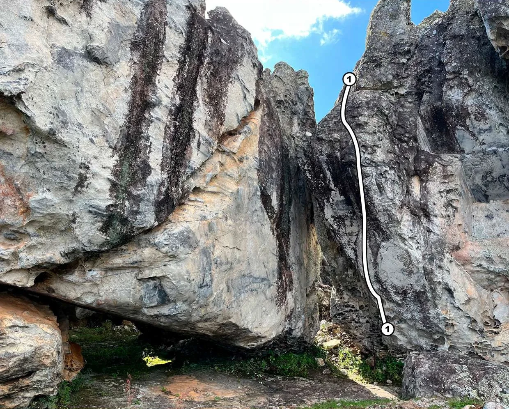
          - **largura_mapa**: 1240
          - **altura_mapa**: 996
          - **pontos_de_interesse**:
            - **[0]**:
              - **id**: w2bIQo5ne7iD0Q
              - **uid**: w2bIQo5ne7iD0Q
              - **rotulo**: 1
              - **circulo**:
                - **x**: 944
                - **y**: 801
                - **raio**: 15
              - **label**: 1
            - **[1]**:
              - **id**: 3q3A8a6AivIEg5
              - **uid**: 3q3A8a6AivIEg5
              - **rotulo**: 1
              - **circulo**:
                - **x**: 852
                - **y**: 193
                - **raio**: 16
              - **label**: 1
          - **referencias**:
            - **[0]**:
              - **alvo_uid**: Ktl1gHhpCO3B0f
              - **pontos_uids**:
                - w2bIQo5ne7iD0Q
                - 3q3A8a6AivIEg5
              - **escalada**: Serra do Groove
              - **ids**:
                - w2bIQo5ne7iD0Q
                - 3q3A8a6AivIEg5
      - **escaladas**:
        - **[0]**:
          - **uid**: Ktl1gHhpCO3B0f
          - **boulder**:
            - **nome**: Serra do Groove
            - **dificuldade**: V3
      - **precomputados**:
        - **total_escaladas**: 1
        - **total_boulders**: 1
  - **[3]**:
    - **conteudo**:
      - **descricao**:
          # Bloco: Primavera nos Dentes
          ## Região 2
          
          O bloco Primavera nos Dentes é um dos principais do setor, com linhas de alta dificuldade.
      - **nome**: Primavera nos Dentes
      - **uid**: 3eKPXspykrgC71
      - **mapas**:
        - **[0]**:
          - **caminho_imagem_mapa**: 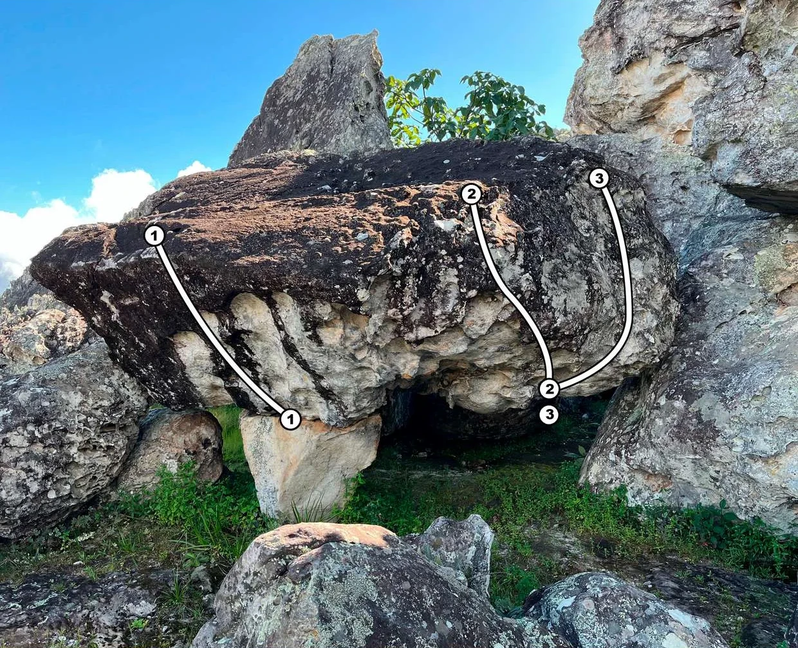
          - **largura_mapa**: 1240
          - **altura_mapa**: 1006
          - **pontos_de_interesse**:
            - **[0]**:
              - **id**: at7KfXw39RqgWs
              - **uid**: at7KfXw39RqgWs
              - **rotulo**: 1
              - **circulo**:
                - **x**: 451
                - **y**: 651
                - **raio**: 15
              - **label**: 1
            - **[1]**:
              - **id**: kxH3a5qF9jqLLM
              - **uid**: kxH3a5qF9jqLLM
              - **rotulo**: 1
              - **circulo**:
                - **x**: 240
                - **y**: 365
                - **raio**: 15
              - **label**: 1
            - **[2]**:
              - **id**: OF2f8XGXZhSZhf
              - **uid**: OF2f8XGXZhSZhf
              - **rotulo**: 2
              - **circulo**:
                - **x**: 854
                - **y**: 604
                - **raio**: 15
              - **label**: 2
            - **[3]**:
              - **id**: 82RnsDo3Cdp1bX
              - **uid**: 82RnsDo3Cdp1bX
              - **rotulo**: 2
              - **circulo**:
                - **x**: 732
                - **y**: 301
                - **raio**: 15
              - **label**: 2
            - **[4]**:
              - **id**: QGv9QIztbUTbjb
              - **uid**: QGv9QIztbUTbjb
              - **rotulo**: 3
              - **circulo**:
                - **x**: 853
                - **y**: 644
                - **raio**: 14
              - **label**: 3
            - **[5]**:
              - **id**: jiljDWvBVj8cvH
              - **uid**: jiljDWvBVj8cvH
              - **rotulo**: 3
              - **circulo**:
                - **x**: 931
                - **y**: 276
                - **raio**: 15
              - **label**: 3
          - **referencias**:
            - **[0]**:
              - **alvo_uid**: ssY3HiAbaLDLFZ
              - **pontos_uids**:
                - at7KfXw39RqgWs
                - kxH3a5qF9jqLLM
              - **escalada**: Monobloco
              - **ids**:
                - at7KfXw39RqgWs
                - kxH3a5qF9jqLLM
            - **[1]**:
              - **alvo_uid**: MnhtFm97fVQKP5
              - **pontos_uids**:
                - OF2f8XGXZhSZhf
                - 82RnsDo3Cdp1bX
              - **escalada**: Canela Queimada
              - **ids**:
                - OF2f8XGXZhSZhf
                - 82RnsDo3Cdp1bX
            - **[2]**:
              - **alvo_uid**: aYDNJqy2N05qHt
              - **pontos_uids**:
                - QGv9QIztbUTbjb
                - jiljDWvBVj8cvH
              - **escalada**: Canela de Ema
              - **ids**:
                - QGv9QIztbUTbjb
                - jiljDWvBVj8cvH
        - **[1]**:
          - **caminho_imagem_mapa**: 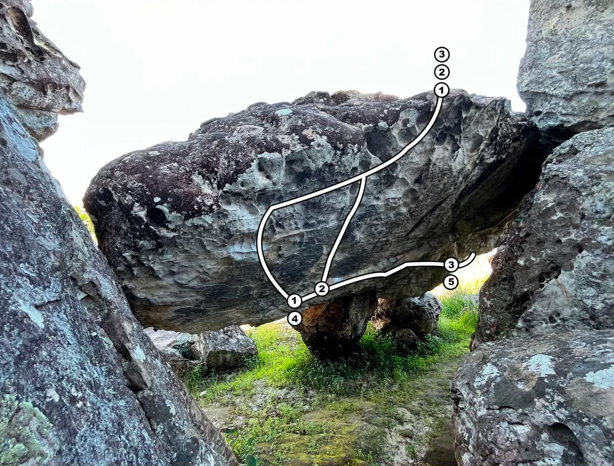
          - **largura_mapa**: 1240
          - **altura_mapa**: 941
          - **pontos_de_interesse**:
            - **[0]**:
              - **id**: yxBcM0qh38nXnk
              - **uid**: yxBcM0qh38nXnk
              - **rotulo**: 1
              - **circulo**:
                - **x**: 595
                - **y**: 608
                - **raio**: 14
              - **label**: 1
            - **[1]**:
              - **id**: l5cikSSCJKflq7
              - **uid**: l5cikSSCJKflq7
              - **rotulo**: 1
              - **circulo**:
                - **x**: 892
                - **y**: 182
                - **raio**: 14
              - **label**: 1
            - **[2]**:
              - **id**: Rwuon1QA2kGMVv
              - **uid**: Rwuon1QA2kGMVv
              - **rotulo**: 2
              - **circulo**:
                - **x**: 650
                - **y**: 583
                - **raio**: 14
              - **label**: 2
            - **[3]**:
              - **id**: VC5zOoWVxh9EhI
              - **uid**: VC5zOoWVxh9EhI
              - **rotulo**: 2
              - **circulo**:
                - **x**: 892
                - **y**: 145
                - **raio**: 15
              - **label**: 2
            - **[4]**:
              - **id**: Ay9fDGmRymVe7y
              - **uid**: Ay9fDGmRymVe7y
              - **rotulo**: 3
              - **circulo**:
                - **x**: 911
                - **y**: 535
                - **raio**: 14
              - **label**: 3
            - **[5]**:
              - **id**: HvPC4X2XvNyCea
              - **uid**: HvPC4X2XvNyCea
              - **rotulo**: 3
              - **circulo**:
                - **x**: 892
                - **y**: 110
                - **raio**: 15
              - **label**: 3
            - **[6]**:
              - **id**: XQ5A43fmhojXsa
              - **uid**: XQ5A43fmhojXsa
              - **rotulo**: 4
              - **circulo**:
                - **x**: 595
                - **y**: 643
                - **raio**: 14
              - **label**: 4
            - **[7]**:
              - **id**: 7c55IrV7HwzjaC
              - **uid**: 7c55IrV7HwzjaC
              - **rotulo**: 5
              - **circulo**:
                - **x**: 910
                - **y**: 570
                - **raio**: 14
              - **label**: 5
          - **referencias**:
            - **[0]**:
              - **alvo_uid**: 2SUIqfx23pnL2I
              - **pontos_uids**:
                - yxBcM0qh38nXnk
                - l5cikSSCJKflq7
              - **escalada**: Primavera nos Dentes
              - **ids**:
                - yxBcM0qh38nXnk
                - l5cikSSCJKflq7
            - **[1]**:
              - **alvo_uid**: oItaT1GZzNsN0l
              - **pontos_uids**:
                - Rwuon1QA2kGMVv
                - VC5zOoWVxh9EhI
              - **escalada**: Suave Coisa Nenhuma
              - **ids**:
                - Rwuon1QA2kGMVv
                - VC5zOoWVxh9EhI
            - **[2]**:
              - **alvo_uid**: W1ziTvsVxnWYXk
              - **pontos_uids**:
                - Ay9fDGmRymVe7y
                - HvPC4X2XvNyCea
              - **escalada**: Primavera Latina
              - **ids**:
                - Ay9fDGmRymVe7y
                - HvPC4X2XvNyCea
            - **[3]**:
              - **alvo_uid**: UHSDVGFiOl9o35
              - **pontos_uids**:
                - XQ5A43fmhojXsa
              - **escalada**: Sangue Latino
              - **ids**:
                - XQ5A43fmhojXsa
            - **[4]**:
              - **alvo_uid**: cFBIt3RonJvkqf
              - **pontos_uids**:
                - 7c55IrV7HwzjaC
              - **escalada**: Joelho de Porco
              - **ids**:
                - 7c55IrV7HwzjaC
        - **[2]**:
          - **caminho_imagem_mapa**: 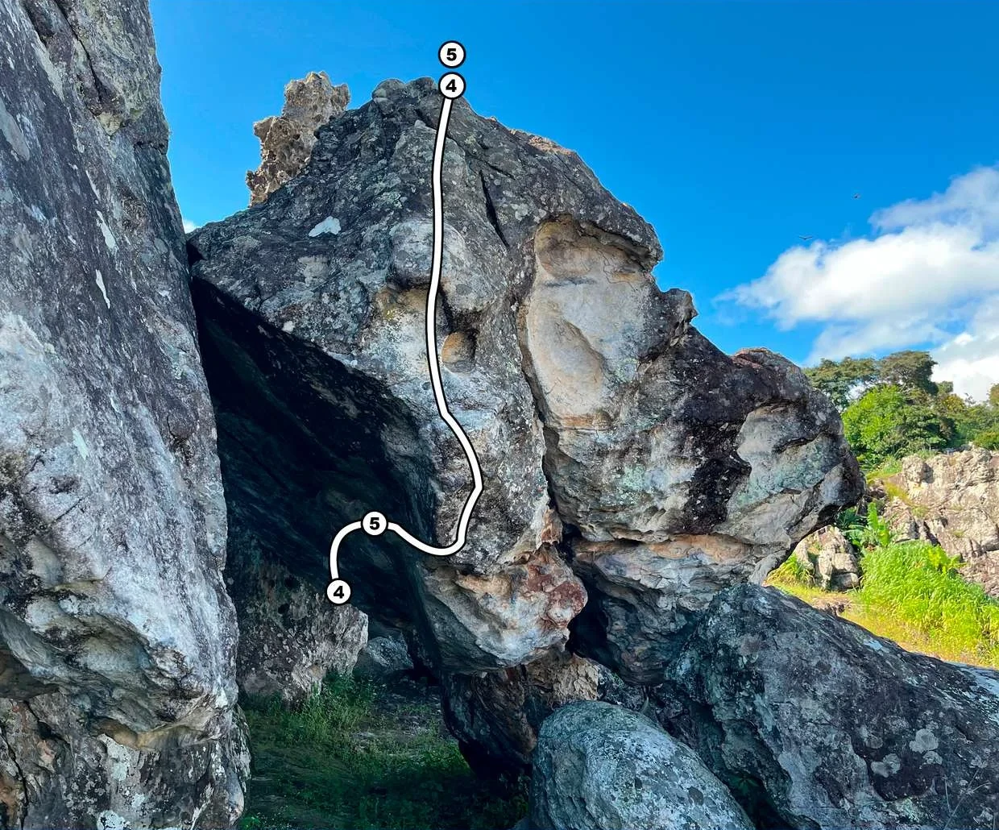
          - **largura_mapa**: 1240
          - **altura_mapa**: 1030
          - **pontos_de_interesse**:
            - **[0]**:
              - **id**: bhVJqtOqKYVEhI
              - **uid**: bhVJqtOqKYVEhI
              - **rotulo**: 4
              - **circulo**:
                - **x**: 420
                - **y**: 735
                - **raio**: 15
              - **label**: 4
            - **[1]**:
              - **id**: 9BOha1q7gr6a9H
              - **uid**: 9BOha1q7gr6a9H
              - **rotulo**: 4
              - **circulo**:
                - **x**: 561
                - **y**: 106
                - **raio**: 15
              - **label**: 4
            - **[2]**:
              - **id**: 6K5JejzNDts5dM
              - **uid**: 6K5JejzNDts5dM
              - **rotulo**: 5
              - **circulo**:
                - **x**: 465
                - **y**: 649
                - **raio**: 15
              - **label**: 5
            - **[3]**:
              - **id**: TtHlKaoXWkd6l9
              - **uid**: TtHlKaoXWkd6l9
              - **rotulo**: 5
              - **circulo**:
                - **x**: 561
                - **y**: 68
                - **raio**: 16
              - **label**: 5
          - **referencias**:
            - **[0]**:
              - **alvo_uid**: UHSDVGFiOl9o35
              - **pontos_uids**:
                - bhVJqtOqKYVEhI
                - 9BOha1q7gr6a9H
              - **escalada**: Sangue Latino
              - **ids**:
                - bhVJqtOqKYVEhI
                - 9BOha1q7gr6a9H
            - **[1]**:
              - **alvo_uid**: cFBIt3RonJvkqf
              - **pontos_uids**:
                - 6K5JejzNDts5dM
                - TtHlKaoXWkd6l9
              - **escalada**: Joelho de Porco
              - **ids**:
                - 6K5JejzNDts5dM
                - TtHlKaoXWkd6l9
      - **escaladas**:
        - **[0]**:
          - **uid**: ssY3HiAbaLDLFZ
          - **boulder**:
            - **descricao**: Saída com as mãos e pés no bloco menor que sustenta o bloco principal, finalizando logo acima.
            - **nome**: Monobloco
            - **dificuldade**: V3
        - **[1]**:
          - **uid**: MnhtFm97fVQKP5
          - **boulder**:
            - **descricao**: Saída em batentes bem marcados e segue para a esquerda (sem utilizar os pés no bloco de sustentação).
            - **nome**: Canela Queimada
            - **dificuldade**: V2
        - **[2]**:
          - **uid**: aYDNJqy2N05qHt
          - **boulder**:
            - **descricao**: Mesma saída do canela queimada mas segue a linha de agarras da direita.
            - **nome**: Canela de Ema
            - **dificuldade**: V3
        - **[3]**:
          - **uid**: 2SUIqfx23pnL2I
          - **boulder**:
            - **descricao**: Saída com as mãos juntas na agarra protuberante (sem utilizar o bloco de sustentação como apoio de pés), seguindo pelos pequenos regletes escorridos e pockets.
            - **nome**: Primavera nos Dentes
            - **dificuldade**: V7
        - **[4]**:
          - **uid**: oItaT1GZzNsN0l
          - **boulder**:
            - **descricao**: Saída com a mão esquerda na agarra protuberante e mão direita no batente abaulado, seguido de dinâmico no pocket estreito, finalizando como o primavera nos dentes (utiliza-se livremente o(s) pé(s) no bloco de sustentação).
            - **nome**: Suave Coisa Nenhuma
            - **dificuldade**: V6
        - **[5]**:
          - **uid**: W1ziTvsVxnWYXk
          - **boulder**:
            - **descricao**: Saída nas agarras da quina do bloco (logo à direita da saída do joelho de porco) e segue em travessia para a esquerda até finalizar como o primavera nos dentes.
            - **nome**: Primavera Latina
            - **dificuldade**: V10_BARRA_V11
        - **[6]**:
          - **uid**: UHSDVGFiOl9o35
          - **boulder**:
            - **descricao**: Mesma saída do primavera nos dentes, mas segue em diagonal para a direita por abaulados e invertidas até finalizar como o joelho de porco.
            - **nome**: Sangue Latino
            - **dificuldade**: V9
        - **[7]**:
          - **uid**: cFBIt3RonJvkqf
          - **boulder**:
            - **descricao**: Saída com as mãos em copos idênticos quase ao final do abrigo, seguindo por movimentos espremidos rumo à face externa do bloco.
            - **nome**: Joelho de Porco
            - **dificuldade**: V3
      - **precomputados**:
        - **total_escaladas**: 8
        - **total_boulders**: 8
  - **[4]**:
    - **conteudo**:
      - **descricao**:
          # Bloco: Flor da Montanha
          ## Região 2
      - **nome**: Flor da Montanha
      - **uid**: c9S0g5Iak2aLY6
      - **mapas**:
        - **[0]**:
          - **caminho_imagem_mapa**: 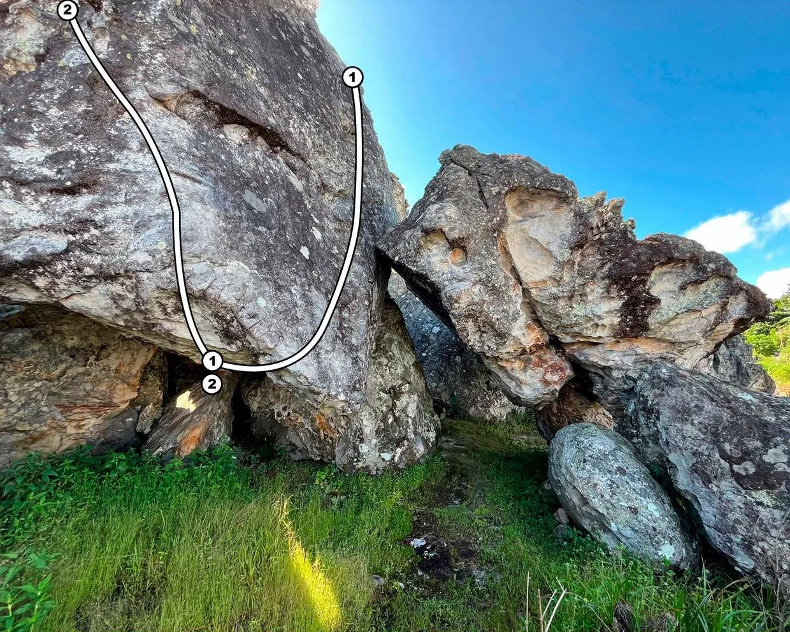
          - **largura_mapa**: 1240
          - **altura_mapa**: 991
          - **pontos_de_interesse**:
            - **[0]**:
              - **id**: 7fqdxiZOSHSkfr
              - **uid**: 7fqdxiZOSHSkfr
              - **rotulo**: 1
              - **circulo**:
                - **x**: 334
                - **y**: 566
                - **raio**: 15
              - **label**: 1
            - **[1]**:
              - **id**: kgmPREHasCsBoR
              - **uid**: kgmPREHasCsBoR
              - **rotulo**: 1
              - **circulo**:
                - **x**: 554
                - **y**: 121
                - **raio**: 16
              - **label**: 1
            - **[2]**:
              - **id**: wqHmJRnhxGKpj3
              - **uid**: wqHmJRnhxGKpj3
              - **rotulo**: 2
              - **circulo**:
                - **x**: 333
                - **y**: 602
                - **raio**: 15
              - **label**: 2
            - **[3]**:
              - **id**: D5rqIZY607W6xh
              - **uid**: D5rqIZY607W6xh
              - **rotulo**: 2
              - **circulo**:
                - **x**: 106
                - **y**: 16
                - **raio**: 16
              - **label**: 2
          - **referencias**:
            - **[0]**:
              - **alvo_uid**: SD9SEA5nSWTq6j
              - **pontos_uids**:
                - 7fqdxiZOSHSkfr
                - kgmPREHasCsBoR
              - **escalada**: Fina Flor
              - **ids**:
                - 7fqdxiZOSHSkfr
                - kgmPREHasCsBoR
            - **[1]**:
              - **alvo_uid**: 8SxckImBdqAEFa
              - **pontos_uids**:
                - wqHmJRnhxGKpj3
                - D5rqIZY607W6xh
              - **escalada**: Flor da Montanha
              - **ids**:
                - wqHmJRnhxGKpj3
                - D5rqIZY607W6xh
      - **escaladas**:
        - **[0]**:
          - **uid**: SD9SEA5nSWTq6j
          - **boulder**:
            - **nome**: Fina Flor
            - **dificuldade**: V4
        - **[1]**:
          - **uid**: 8SxckImBdqAEFa
          - **boulder**:
            - **nome**: Flor da Montanha
            - **dificuldade**: V6
      - **precomputados**:
        - **total_escaladas**: 2
        - **total_boulders**: 2
  - **[5]**:
    - **conteudo**:
      - **descricao**:
          # Bloco: Velho Chico
          ## Região 2
      - **nome**: Velho Chico
      - **uid**: mQ1nG9yhF09BxM
      - **mapas**:
        - **[0]**:
          - **caminho_imagem_mapa**: 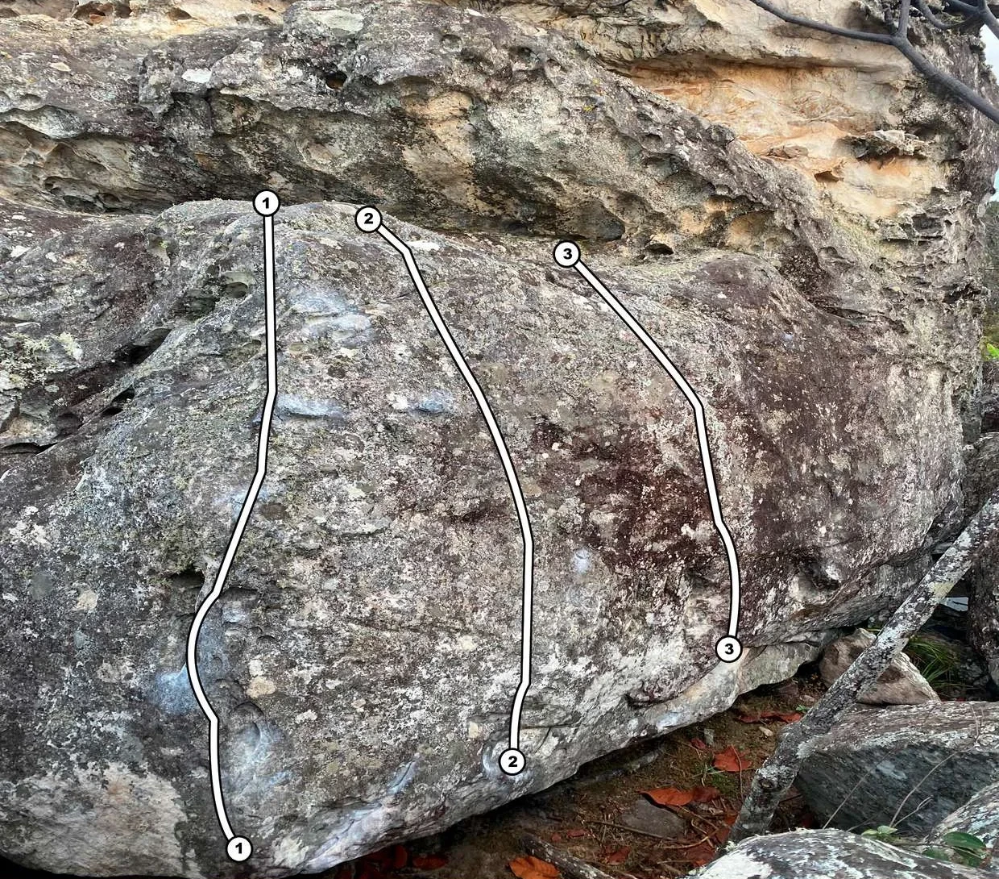
          - **largura_mapa**: 1240
          - **altura_mapa**: 1090
          - **pontos_de_interesse**:
            - **[0]**:
              - **id**: Qf19RpekoY4ceb
              - **uid**: Qf19RpekoY4ceb
              - **rotulo**: 1
              - **circulo**:
                - **x**: 297
                - **y**: 1053
                - **raio**: 16
              - **label**: 1
            - **[1]**:
              - **id**: eUTeAIB0t6g691
              - **uid**: eUTeAIB0t6g691
              - **rotulo**: 1
              - **circulo**:
                - **x**: 331
                - **y**: 251
                - **raio**: 16
              - **label**: 1
            - **[2]**:
              - **id**: QBiA7EAWzenl2D
              - **uid**: QBiA7EAWzenl2D
              - **rotulo**: 2
              - **circulo**:
                - **x**: 636
                - **y**: 945
                - **raio**: 16
              - **label**: 2
            - **[3]**:
              - **id**: AWRPlw9TPi1MV1
              - **uid**: AWRPlw9TPi1MV1
              - **rotulo**: 2
              - **circulo**:
                - **x**: 457
                - **y**: 272
                - **raio**: 16
              - **label**: 2
            - **[4]**:
              - **id**: 4ld2wQHIUSwIw2
              - **uid**: 4ld2wQHIUSwIw2
              - **rotulo**: 3
              - **circulo**:
                - **x**: 905
                - **y**: 805
                - **raio**: 15
              - **label**: 3
            - **[5]**:
              - **id**: qXTdvrZgs0aWXz
              - **uid**: qXTdvrZgs0aWXz
              - **rotulo**: 3
              - **circulo**:
                - **x**: 703
                - **y**: 315
                - **raio**: 16
              - **label**: 3
          - **referencias**:
            - **[0]**:
              - **alvo_uid**: S6vDHCzzh21Hnc
              - **pontos_uids**:
                - Qf19RpekoY4ceb
                - eUTeAIB0t6g691
              - **escalada**: Velho Chico
              - **ids**:
                - Qf19RpekoY4ceb
                - eUTeAIB0t6g691
            - **[1]**:
              - **alvo_uid**: i2b9hKdjz4DFvX
              - **pontos_uids**:
                - QBiA7EAWzenl2D
                - AWRPlw9TPi1MV1
              - **escalada**: Minduim
              - **ids**:
                - QBiA7EAWzenl2D
                - AWRPlw9TPi1MV1
            - **[2]**:
              - **alvo_uid**: vJnFlijy4hCh6A
              - **pontos_uids**:
                - 4ld2wQHIUSwIw2
                - qXTdvrZgs0aWXz
              - **escalada**: Frango D'Água
              - **ids**:
                - 4ld2wQHIUSwIw2
                - qXTdvrZgs0aWXz
      - **escaladas**:
        - **[0]**:
          - **uid**: S6vDHCzzh21Hnc
          - **boulder**:
            - **nome**: Velho Chico
            - **dificuldade**: V4
        - **[1]**:
          - **uid**: i2b9hKdjz4DFvX
          - **boulder**:
            - **nome**: Minduim
            - **dificuldade**: V3
        - **[2]**:
          - **uid**: vJnFlijy4hCh6A
          - **boulder**:
            - **nome**: Frango D'Água
            - **dificuldade**: V3
      - **precomputados**:
        - **total_escaladas**: 3
        - **total_boulders**: 3
- **precomputados**:
  - **total_escaladas**: 25
  - **total_boulders**: 25

## Parte: grupo_regiao_3

### Grupo (Pico: Cerrado Groove)

- **descricao**:
    # Região 3
    
    A Região 3 apresenta blocos com graduações variadas, incluindo o setor Iceberg e Silicose.
- **nome**: Região 3
- **uid**: 0b1TmSRK0dGE9M
- **setores**:
  - **[0]**:
    - **conteudo**:
      - **descricao**:
          # Bloco: Cenas Fortes
          ## Região 3
      - **nome**: Cenas Fortes
      - **uid**: vx3tbAOUHIAcGi
      - **mapas**:
        - **[0]**:
          - **caminho_imagem_mapa**: 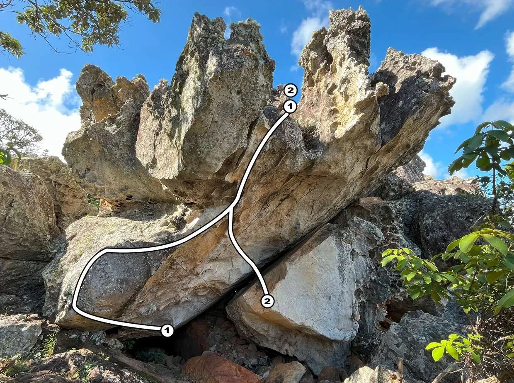
          - **largura_mapa**: 1240
          - **altura_mapa**: 923
          - **pontos_de_interesse**:
            - **[0]**:
              - **id**: YYzTKrL5JUqjaG
              - **uid**: YYzTKrL5JUqjaG
              - **rotulo**: 1
              - **circulo**:
                - **x**: 404
                - **y**: 796
                - **raio**: 15
              - **label**: 1
            - **[1]**:
              - **id**: uH4A9vbSBNanf1
              - **uid**: uH4A9vbSBNanf1
              - **rotulo**: 1
              - **circulo**:
                - **x**: 700
                - **y**: 256
                - **raio**: 16
              - **label**: 1
            - **[2]**:
              - **id**: kjaCbnnKQnS7kg
              - **uid**: kjaCbnnKQnS7kg
              - **rotulo**: 2
              - **circulo**:
                - **x**: 645
                - **y**: 726
                - **raio**: 15
              - **label**: 2
            - **[3]**:
              - **id**: Cviogu7k6YP9RM
              - **uid**: Cviogu7k6YP9RM
              - **rotulo**: 2
              - **circulo**:
                - **x**: 701
                - **y**: 218
                - **raio**: 16
              - **label**: 2
          - **referencias**:
            - **[0]**:
              - **alvo_uid**: aQm6V8xoBqREa3
              - **pontos_uids**:
                - YYzTKrL5JUqjaG
                - uH4A9vbSBNanf1
              - **escalada**: Cenas Fortes
              - **ids**:
                - YYzTKrL5JUqjaG
                - uH4A9vbSBNanf1
            - **[1]**:
              - **alvo_uid**: JHDKLFkfkGAKqQ
              - **pontos_uids**:
                - kjaCbnnKQnS7kg
                - Cviogu7k6YP9RM
              - **escalada**: Tela Quente
              - **ids**:
                - kjaCbnnKQnS7kg
                - Cviogu7k6YP9RM
      - **escaladas**:
        - **[0]**:
          - **uid**: aQm6V8xoBqREa3
          - **boulder**:
            - **nome**: Cenas Fortes
            - **dificuldade**: V5
        - **[1]**:
          - **uid**: JHDKLFkfkGAKqQ
          - **boulder**:
            - **nome**: Tela Quente
            - **dificuldade**: V3
      - **precomputados**:
        - **total_escaladas**: 2
        - **total_boulders**: 2
  - **[1]**:
    - **conteudo**:
      - **descricao**:
          # Bloco: Sessão da Tarde
          ## Região 3
          
          O bloco Sessão da Tarde é um dos mais densos em linhas, com agarras variadas e muita técnica.
      - **nome**: Sessão da Tarde
      - **uid**: pEbY6CRJHCyQhI
      - **mapas**:
        - **[0]**:
          - **caminho_imagem_mapa**: 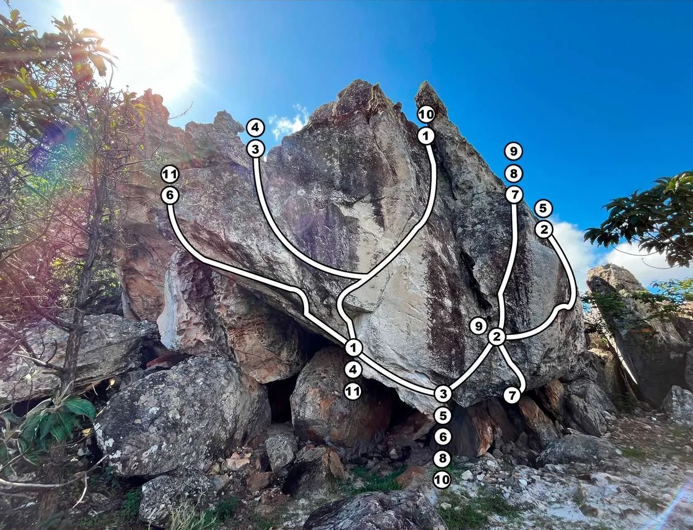
          - **largura_mapa**: 1240
          - **altura_mapa**: 948
          - **pontos_de_interesse**:
            - **[0]**:
              - **id**: CCo4OgfoU3vmWR
              - **uid**: CCo4OgfoU3vmWR
              - **rotulo**: 1
              - **circulo**:
                - **x**: 633
                - **y**: 621
                - **raio**: 15
              - **label**: 1
            - **[1]**:
              - **id**: Akca1HdYlbCkZl
              - **uid**: Akca1HdYlbCkZl
              - **rotulo**: 1
              - **circulo**:
                - **x**: 763
                - **y**: 243
                - **raio**: 16
              - **label**: 1
            - **[2]**:
              - **id**: Kk9ZNF0HPkdGFX
              - **uid**: Kk9ZNF0HPkdGFX
              - **rotulo**: 2
              - **circulo**:
                - **x**: 889
                - **y**: 602
                - **raio**: 15
              - **label**: 2
            - **[3]**:
              - **id**: culiwzu3QNN4pH
              - **uid**: culiwzu3QNN4pH
              - **rotulo**: 2
              - **circulo**:
                - **x**: 973
                - **y**: 410
                - **raio**: 15
              - **label**: 2
            - **[4]**:
              - **id**: VHp04OzYtVx9nX
              - **uid**: VHp04OzYtVx9nX
              - **rotulo**: 3
              - **circulo**:
                - **x**: 793
                - **y**: 704
                - **raio**: 15
              - **label**: 3
            - **[5]**:
              - **id**: Uqx1p73YNGNkLM
              - **uid**: Uqx1p73YNGNkLM
              - **rotulo**: 3
              - **circulo**:
                - **x**: 457
                - **y**: 266
                - **raio**: 16
              - **label**: 3
            - **[6]**:
              - **id**: RU0hSFJk6C0zC3
              - **uid**: RU0hSFJk6C0zC3
              - **rotulo**: 4
              - **circulo**:
                - **x**: 632
                - **y**: 661
                - **raio**: 16
              - **label**: 4
            - **[7]**:
              - **id**: Q4csKZNJ0hFVtD
              - **uid**: Q4csKZNJ0hFVtD
              - **rotulo**: 4
              - **circulo**:
                - **x**: 457
                - **y**: 228
                - **raio**: 16
              - **label**: 4
            - **[8]**:
              - **id**: KJrZgv0mJTRRg0
              - **uid**: KJrZgv0mJTRRg0
              - **rotulo**: 5
              - **circulo**:
                - **x**: 792
                - **y**: 743
                - **raio**: 15
              - **label**: 5
            - **[9]**:
              - **id**: lfUh9U2PlSO39s
              - **uid**: lfUh9U2PlSO39s
              - **rotulo**: 5
              - **circulo**:
                - **x**: 972
                - **y**: 373
                - **raio**: 16
              - **label**: 5
            - **[10]**:
              - **id**: wvLWWdIm3lNOnJ
              - **uid**: wvLWWdIm3lNOnJ
              - **rotulo**: 6
              - **circulo**:
                - **x**: 793
                - **y**: 781
                - **raio**: 16
              - **label**: 6
            - **[11]**:
              - **id**: 2Z3S5sDqcGiW7Q
              - **uid**: 2Z3S5sDqcGiW7Q
              - **rotulo**: 6
              - **circulo**:
                - **x**: 304
                - **y**: 349
                - **raio**: 16
              - **label**: 6
            - **[12]**:
              - **id**: gEyv7D8VZejF3Z
              - **uid**: gEyv7D8VZejF3Z
              - **rotulo**: 7
              - **circulo**:
                - **x**: 916
                - **y**: 706
                - **raio**: 15
              - **label**: 7
            - **[13]**:
              - **id**: uEapXa5ct3DXmG
              - **uid**: uEapXa5ct3DXmG
              - **rotulo**: 7
              - **circulo**:
                - **x**: 920
                - **y**: 348
                - **raio**: 16
              - **label**: 7
            - **[14]**:
              - **id**: P4fOotfScSWjOh
              - **uid**: P4fOotfScSWjOh
              - **rotulo**: 8
              - **circulo**:
                - **x**: 791
                - **y**: 821
                - **raio**: 15
              - **label**: 8
            - **[15]**:
              - **id**: uCAeRYmTr5ZZvL
              - **uid**: uCAeRYmTr5ZZvL
              - **rotulo**: 8
              - **circulo**:
                - **x**: 919
                - **y**: 310
                - **raio**: 16
              - **label**: 8
            - **[16]**:
              - **id**: HZuo0rxGlGCT8B
              - **uid**: HZuo0rxGlGCT8B
              - **rotulo**: 9
              - **circulo**:
                - **x**: 856
                - **y**: 583
                - **raio**: 15
              - **label**: 9
            - **[17]**:
              - **id**: XdKpeVtB6U5YxZ
              - **uid**: XdKpeVtB6U5YxZ
              - **rotulo**: 9
              - **circulo**:
                - **x**: 919
                - **y**: 271
                - **raio**: 16
              - **label**: 9
            - **[18]**:
              - **id**: RLlPWwNNicoQvF
              - **uid**: RLlPWwNNicoQvF
              - **rotulo**: 10
              - **circulo**:
                - **x**: 791
                - **y**: 858
                - **raio**: 16
              - **label**: 10
            - **[19]**:
              - **id**: gYCj4uI5pW2Hgk
              - **uid**: gYCj4uI5pW2Hgk
              - **rotulo**: 10
              - **circulo**:
                - **x**: 763
                - **y**: 204
                - **raio**: 15
              - **label**: 10
            - **[20]**:
              - **id**: NZwxZhrZeRB8jc
              - **uid**: NZwxZhrZeRB8jc
              - **rotulo**: 11
              - **circulo**:
                - **x**: 631
                - **y**: 700
                - **raio**: 16
              - **label**: 11
            - **[21]**:
              - **id**: RTNCgtacFGnFtM
              - **uid**: RTNCgtacFGnFtM
              - **rotulo**: 11
              - **circulo**:
                - **x**: 304
                - **y**: 311
                - **raio**: 16
              - **label**: 11
          - **referencias**:
            - **[0]**:
              - **alvo_uid**: WKNlsakHnhHdDv
              - **pontos_uids**:
                - CCo4OgfoU3vmWR
                - Akca1HdYlbCkZl
              - **escalada**: Super Cine
              - **ids**:
                - CCo4OgfoU3vmWR
                - Akca1HdYlbCkZl
            - **[1]**:
              - **alvo_uid**: N70nFLcNm5gg4u
              - **pontos_uids**:
                - VHp04OzYtVx9nX
                - Uqx1p73YNGNkLM
              - **escalada**: Extra
              - **ids**:
                - VHp04OzYtVx9nX
                - Uqx1p73YNGNkLM
            - **[2]**:
              - **alvo_uid**: H5Ggm2Qvt5aJ4n
              - **pontos_uids**:
                - RU0hSFJk6C0zC3
                - Q4csKZNJ0hFVtD
              - **escalada**: Manchete
              - **ids**:
                - RU0hSFJk6C0zC3
                - Q4csKZNJ0hFVtD
            - **[3]**:
              - **alvo_uid**: dZV2EeKuTYq8ab
              - **pontos_uids**:
                - wvLWWdIm3lNOnJ
                - 2Z3S5sDqcGiW7Q
              - **escalada**: Fantástico Mundo dos Diamantes
              - **ids**:
                - wvLWWdIm3lNOnJ
                - 2Z3S5sDqcGiW7Q
            - **[4]**:
              - **alvo_uid**: zJzRFzwztzV9gZ
              - **pontos_uids**:
                - RLlPWwNNicoQvF
                - gYCj4uI5pW2Hgk
              - **escalada**: Super Sinistro
              - **ids**:
                - RLlPWwNNicoQvF
                - gYCj4uI5pW2Hgk
            - **[5]**:
              - **alvo_uid**: F4vaXwWRnpveuC
              - **pontos_uids**:
                - NZwxZhrZeRB8jc
                - RTNCgtacFGnFtM
              - **escalada**: Fantástico
              - **ids**:
                - NZwxZhrZeRB8jc
                - RTNCgtacFGnFtM
            - **[6]**:
              - **alvo_uid**: QFezsyxdlQ9xCF
              - **pontos_uids**:
                - Kk9ZNF0HPkdGFX
                - culiwzu3QNN4pH
              - **escalada**: Espetacular
              - **ids**:
                - Kk9ZNF0HPkdGFX
                - culiwzu3QNN4pH
            - **[7]**:
              - **alvo_uid**: hVshsl6bGvwqj8
              - **pontos_uids**:
                - KJrZgv0mJTRRg0
                - lfUh9U2PlSO39s
              - **escalada**: Esporte Espetacular
              - **ids**:
                - KJrZgv0mJTRRg0
                - lfUh9U2PlSO39s
            - **[8]**:
              - **alvo_uid**: AFItAEGK5rP83P
              - **pontos_uids**:
                - uEapXa5ct3DXmG
                - gEyv7D8VZejF3Z
              - **escalada**: Globo Curral
              - **ids**:
                - uEapXa5ct3DXmG
                - gEyv7D8VZejF3Z
            - **[9]**:
              - **alvo_uid**: n9PNiJKi8gFIB2
              - **pontos_uids**:
                - P4fOotfScSWjOh
                - uCAeRYmTr5ZZvL
              - **escalada**: Manual
              - **ids**:
                - P4fOotfScSWjOh
                - uCAeRYmTr5ZZvL
            - **[10]**:
              - **alvo_uid**: CdyNOL9Nn5yk6C
              - **pontos_uids**:
                - HZuo0rxGlGCT8B
                - XdKpeVtB6U5YxZ
              - **escalada**: Altas Horas
              - **ids**:
                - HZuo0rxGlGCT8B
                - XdKpeVtB6U5YxZ
        - **[1]**:
          - **caminho_imagem_mapa**: 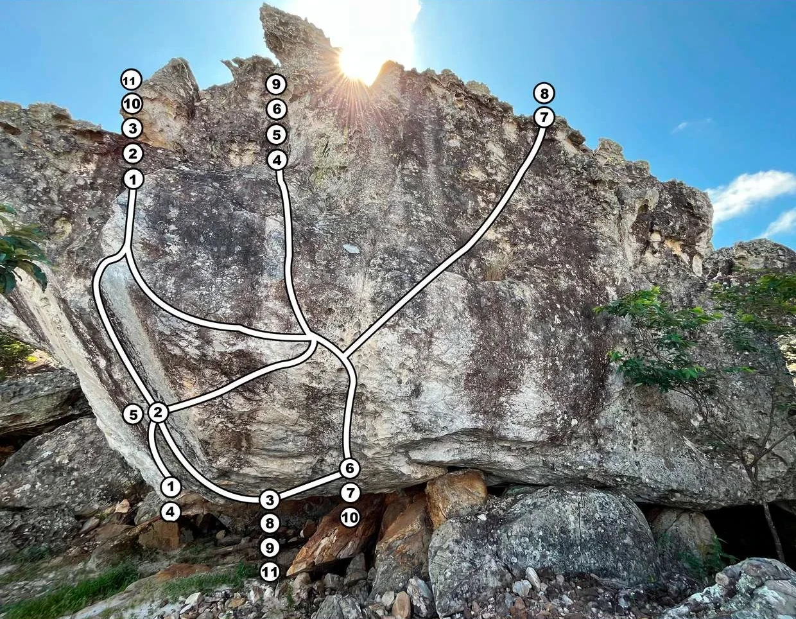
          - **largura_mapa**: 1240
          - **altura_mapa**: 964
          - **pontos_de_interesse**:
            - **[0]**:
              - **id**: 4uHwlKzmMU9Ems
              - **uid**: 4uHwlKzmMU9Ems
              - **rotulo**: 1
              - **circulo**:
                - **x**: 266
                - **y**: 759
                - **raio**: 15
              - **label**: 1
            - **[1]**:
              - **id**: 2iH1RKsC5t6RcP
              - **uid**: 2iH1RKsC5t6RcP
              - **rotulo**: 1
              - **circulo**:
                - **x**: 208
                - **y**: 278
                - **raio**: 16
              - **label**: 1
            - **[2]**:
              - **id**: jSwg4YtfkZRL0F
              - **uid**: jSwg4YtfkZRL0F
              - **rotulo**: 2
              - **circulo**:
                - **x**: 247
                - **y**: 642
                - **raio**: 15
              - **label**: 2
            - **[3]**:
              - **id**: gP5oLEExIkfheV
              - **uid**: gP5oLEExIkfheV
              - **rotulo**: 2
              - **circulo**:
                - **x**: 207
                - **y**: 239
                - **raio**: 16
              - **label**: 2
            - **[4]**:
              - **id**: DzueAxgmcLkbPl
              - **uid**: DzueAxgmcLkbPl
              - **rotulo**: 3
              - **circulo**:
                - **x**: 420
                - **y**: 778
                - **raio**: 16
              - **label**: 3
            - **[5]**:
              - **id**: ttX6jjwtNhGACG
              - **uid**: ttX6jjwtNhGACG
              - **rotulo**: 3
              - **circulo**:
                - **x**: 206
                - **y**: 200
                - **raio**: 16
              - **label**: 3
            - **[6]**:
              - **id**: L0UOFvbJw81fzu
              - **uid**: L0UOFvbJw81fzu
              - **rotulo**: 4
              - **circulo**:
                - **x**: 266
                - **y**: 797
                - **raio**: 16
              - **label**: 4
            - **[7]**:
              - **id**: Si1R9VQWGy6wIq
              - **uid**: Si1R9VQWGy6wIq
              - **rotulo**: 4
              - **circulo**:
                - **x**: 432
                - **y**: 249
                - **raio**: 16
              - **label**: 4
            - **[8]**:
              - **id**: dUlNsjALyMGbkR
              - **uid**: dUlNsjALyMGbkR
              - **rotulo**: 5
              - **circulo**:
                - **x**: 207
                - **y**: 645
                - **raio**: 16
              - **label**: 5
            - **[9]**:
              - **id**: dVMWNueO2p4tm5
              - **uid**: dVMWNueO2p4tm5
              - **rotulo**: 5
              - **circulo**:
                - **x**: 431
                - **y**: 209
                - **raio**: 15
              - **label**: 5
            - **[10]**:
              - **id**: yXMJRnQWQpxIUc
              - **uid**: yXMJRnQWQpxIUc
              - **rotulo**: 6
              - **circulo**:
                - **x**: 545
                - **y**: 730
                - **raio**: 15
              - **label**: 6
            - **[11]**:
              - **id**: fqauTgXfjBNlzt
              - **uid**: fqauTgXfjBNlzt
              - **rotulo**: 6
              - **circulo**:
                - **x**: 431
                - **y**: 170
                - **raio**: 16
              - **label**: 6
            - **[12]**:
              - **id**: 1rnDQg1nVuDKu0
              - **uid**: 1rnDQg1nVuDKu0
              - **rotulo**: 7
              - **circulo**:
                - **x**: 546
                - **y**: 768
                - **raio**: 16
              - **label**: 7
            - **[13]**:
              - **id**: sa9sjaN9xtOuIH
              - **uid**: sa9sjaN9xtOuIH
              - **rotulo**: 7
              - **circulo**:
                - **x**: 848
                - **y**: 183
                - **raio**: 15
              - **label**: 7
            - **[14]**:
              - **id**: M8duzFhwCbKuVK
              - **uid**: M8duzFhwCbKuVK
              - **rotulo**: 8
              - **circulo**:
                - **x**: 421
                - **y**: 815
                - **raio**: 15
              - **label**: 8
            - **[15]**:
              - **id**: RnkPtRcEGCtRPR
              - **uid**: RnkPtRcEGCtRPR
              - **rotulo**: 8
              - **circulo**:
                - **x**: 848
                - **y**: 145
                - **raio**: 16
              - **label**: 8
            - **[16]**:
              - **id**: uXV5XAgHpiT7Kr
              - **uid**: uXV5XAgHpiT7Kr
              - **rotulo**: 9
              - **circulo**:
                - **x**: 421
                - **y**: 853
                - **raio**: 15
              - **label**: 9
            - **[17]**:
              - **id**: 1NnE9VV5Hm3iuo
              - **uid**: 1NnE9VV5Hm3iuo
              - **rotulo**: 9
              - **circulo**:
                - **x**: 430
                - **y**: 131
                - **raio**: 15
              - **label**: 9
            - **[18]**:
              - **id**: KGwVFyPhSPrFBZ
              - **uid**: KGwVFyPhSPrFBZ
              - **rotulo**: 10
              - **circulo**:
                - **x**: 546
                - **y**: 806
                - **raio**: 16
              - **label**: 10
            - **[19]**:
              - **id**: mnXGvpVVSxiD1C
              - **uid**: mnXGvpVVSxiD1C
              - **rotulo**: 10
              - **circulo**:
                - **x**: 206
                - **y**: 162
                - **raio**: 16
              - **label**: 10
            - **[20]**:
              - **id**: zud2pDc8F8hRbE
              - **uid**: zud2pDc8F8hRbE
              - **rotulo**: 11
              - **circulo**:
                - **x**: 421
                - **y**: 891
                - **raio**: 16
              - **label**: 11
            - **[21]**:
              - **id**: KP1FSRU3KtMGeS
              - **uid**: KP1FSRU3KtMGeS
              - **rotulo**: 11
              - **circulo**:
                - **x**: 204
                - **y**: 124
                - **raio**: 16
              - **label**: 11
          - **referencias**:
            - **[0]**:
              - **alvo_uid**: fl7eowElB7hLF1
              - **pontos_uids**:
                - yXMJRnQWQpxIUc
                - fqauTgXfjBNlzt
              - **escalada**: Sessão da Tarde
              - **ids**:
                - yXMJRnQWQpxIUc
                - fqauTgXfjBNlzt
            - **[1]**:
              - **alvo_uid**: 4ujH3wnbjh0RRk
              - **pontos_uids**:
                - 1rnDQg1nVuDKu0
                - sa9sjaN9xtOuIH
              - **escalada**: Vale a Pena Ver de Novo
              - **ids**:
                - 1rnDQg1nVuDKu0
                - sa9sjaN9xtOuIH
            - **[2]**:
              - **alvo_uid**: NAVK7W0avZox4Y
              - **pontos_uids**:
                - M8duzFhwCbKuVK
                - RnkPtRcEGCtRPR
              - **escalada**: Vale a Pena Vir de Baixo
              - **ids**:
                - M8duzFhwCbKuVK
                - RnkPtRcEGCtRPR
            - **[3]**:
              - **alvo_uid**: c4UKXDwTzKmGhb
              - **pontos_uids**:
                - uXV5XAgHpiT7Kr
                - 1NnE9VV5Hm3iuo
              - **escalada**: Chá da Tarde
              - **ids**:
                - uXV5XAgHpiT7Kr
                - 1NnE9VV5Hm3iuo
            - **[4]**:
              - **alvo_uid**: MfZXzjT9Ty3s0U
              - **pontos_uids**:
                - KGwVFyPhSPrFBZ
                - mnXGvpVVSxiD1C
              - **escalada**: Analógico
              - **ids**:
                - KGwVFyPhSPrFBZ
                - mnXGvpVVSxiD1C
            - **[5]**:
              - **alvo_uid**: f5LAJ8Z4FVs2ni
              - **pontos_uids**:
                - zud2pDc8F8hRbE
                - KP1FSRU3KtMGeS
              - **escalada**: Digital
              - **ids**:
                - zud2pDc8F8hRbE
                - KP1FSRU3KtMGeS
            - **[6]**:
              - **alvo_uid**: n9PNiJKi8gFIB2
              - **pontos_uids**:
                - 2iH1RKsC5t6RcP
                - 4uHwlKzmMU9Ems
              - **escalada**: Manual
              - **ids**:
                - 2iH1RKsC5t6RcP
                - 4uHwlKzmMU9Ems
            - **[7]**:
              - **alvo_uid**: CdyNOL9Nn5yk6C
              - **pontos_uids**:
                - jSwg4YtfkZRL0F
                - gP5oLEExIkfheV
              - **escalada**: Altas Horas
              - **ids**:
                - jSwg4YtfkZRL0F
                - gP5oLEExIkfheV
            - **[8]**:
              - **alvo_uid**: AFItAEGK5rP83P
              - **pontos_uids**:
                - DzueAxgmcLkbPl
                - ttX6jjwtNhGACG
              - **escalada**: Globo Curral
              - **ids**:
                - DzueAxgmcLkbPl
                - ttX6jjwtNhGACG
            - **[9]**:
              - **alvo_uid**: hVshsl6bGvwqj8
              - **pontos_uids**:
                - L0UOFvbJw81fzu
                - Si1R9VQWGy6wIq
              - **escalada**: Esporte Espetacular
              - **ids**:
                - L0UOFvbJw81fzu
                - Si1R9VQWGy6wIq
            - **[10]**:
              - **alvo_uid**: QFezsyxdlQ9xCF
              - **pontos_uids**:
                - dUlNsjALyMGbkR
                - dVMWNueO2p4tm5
              - **escalada**: Espetacular
              - **ids**:
                - dUlNsjALyMGbkR
                - dVMWNueO2p4tm5
      - **escaladas**:
        - **[0]**:
          - **uid**: WKNlsakHnhHdDv
          - **boulder**:
            - **nome**: Super Cine
            - **dificuldade**: V7
        - **[1]**:
          - **uid**: QFezsyxdlQ9xCF
          - **boulder**:
            - **nome**: Espetacular
            - **dificuldade**: V8_BARRA_V9
        - **[2]**:
          - **uid**: N70nFLcNm5gg4u
          - **boulder**:
            - **nome**: Extra
            - **dificuldade**: V10
        - **[3]**:
          - **uid**: H5Ggm2Qvt5aJ4n
          - **boulder**:
            - **nome**: Manchete
            - **dificuldade**: V9
        - **[4]**:
          - **uid**: hVshsl6bGvwqj8
          - **boulder**:
            - **nome**: Esporte Espetacular
            - **dificuldade**: V10_BARRA_V11
        - **[5]**:
          - **uid**: dZV2EeKuTYq8ab
          - **boulder**:
            - **nome**: Fantástico Mundo dos Diamantes
            - **dificuldade**: V11
        - **[6]**:
          - **uid**: AFItAEGK5rP83P
          - **boulder**:
            - **descricao**: Saída em uma pequena pinça de mão esquerda e um reglete raso de mão direita (assim como o Chá da Tarde) e escala pelo teto até entrar no Altas Horas.
            - **nome**: Globo Curral
            - **dificuldade**: V5
        - **[7]**:
          - **uid**: n9PNiJKi8gFIB2
          - **boulder**:
            - **nome**: Manual
            - **dificuldade**: V8
        - **[8]**:
          - **uid**: CdyNOL9Nn5yk6C
          - **boulder**:
            - **nome**: Altas Horas
            - **dificuldade**: V3
        - **[9]**:
          - **uid**: zJzRFzwztzV9gZ
          - **boulder**:
            - **nome**: Super Sinistro
            - **dificuldade**: V8_BARRA_V9
        - **[10]**:
          - **uid**: F4vaXwWRnpveuC
          - **boulder**:
            - **nome**: Fantástico
            - **dificuldade**: V10
        - **[11]**:
          - **uid**: fl7eowElB7hLF1
          - **boulder**:
            - **descricao**: Mão esquerda no batente central dessa face do bloco e mão direita em outro batente mais à direita, seguindo em linha reta pelo sistema de agarras logo acima.
            - **nome**: Sessão da Tarde
            - **dificuldade**: V5
        - **[12]**:
          - **uid**: 4ujH3wnbjh0RRk
          - **boulder**:
            - **descricao**: Mesma saída do Sessão da Tarde, mudando a trajetória para a direita após dominar a pinça. A parte final do boulder segue para a direita por "cracas" na face positiva, cuidado com agarras frágeis.
            - **nome**: Vale a Pena Ver de Novo
            - **dificuldade**: V4_BARRA_V5
        - **[13]**:
          - **uid**: NAVK7W0avZox4Y
          - **boulder**:
            - **descricao**: Extensão do Vale a Pena Ver de Novo. Mesma saída do Chá da Tarde.
            - **nome**: Vale a Pena Vir de Baixo
            - **dificuldade**: V6_BARRA_V7
        - **[14]**:
          - **uid**: c4UKXDwTzKmGhb
          - **boulder**:
            - **descricao**: Extensão do Sessão da Tarde. Saída em uma pequena pinça de mão esquerda e um reglete raso de mão direita.
            - **nome**: Chá da Tarde
            - **dificuldade**: V7
        - **[15]**:
          - **uid**: MfZXzjT9Ty3s0U
          - **boulder**:
            - **descricao**: Extensão do Vale a Pena Ver de Novo. Mesma saída do Chá da Tarde.
            - **nome**: Analógico
            - **dificuldade**: V8_BARRA_V9
        - **[16]**:
          - **uid**: f5LAJ8Z4FVs2ni
          - **boulder**:
            - **descricao**: Extensão do Analógico.
            - **nome**: Digital
            - **dificuldade**: V9_BARRA_V10
      - **precomputados**:
        - **total_escaladas**: 17
        - **total_boulders**: 17
  - **[2]**:
    - **conteudo**:
      - **descricao**:
          # Bloco: Que Raio de Reglete
          ## Região 3
      - **nome**: Que Raio de Reglete
      - **uid**: kocXBrYzeYHO7c
      - **mapas**:
        - **[0]**:
          - **caminho_imagem_mapa**: 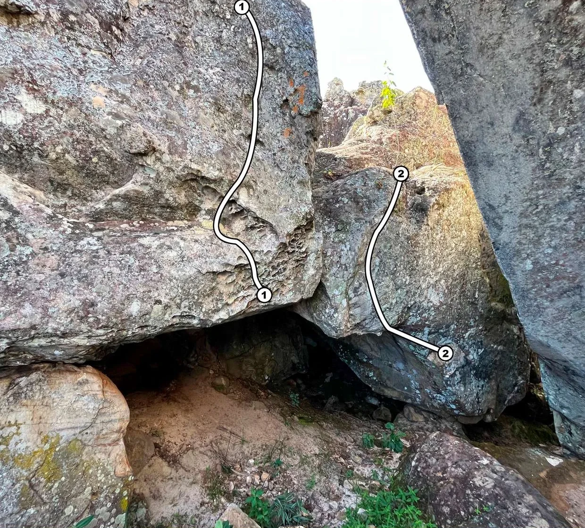
          - **largura_mapa**: 1240
          - **altura_mapa**: 1120
          - **pontos_de_interesse**:
            - **[0]**:
              - **id**: HbJKfIbnZw0ypO
              - **uid**: HbJKfIbnZw0ypO
              - **rotulo**: 1
              - **circulo**:
                - **x**: 561
                - **y**: 626
                - **raio**: 15
              - **label**: 1
            - **[1]**:
              - **id**: pbTdQPqzYIFYRp
              - **uid**: pbTdQPqzYIFYRp
              - **rotulo**: 1
              - **circulo**:
                - **x**: 513
                - **y**: 15
                - **raio**: 16
              - **label**: 1
            - **[2]**:
              - **id**: CqsnabI1AgjAX0
              - **uid**: CqsnabI1AgjAX0
              - **rotulo**: 2
              - **circulo**:
                - **x**: 945
                - **y**: 749
                - **raio**: 16
              - **label**: 2
            - **[3]**:
              - **id**: KYyvlUUgxXRMBE
              - **uid**: KYyvlUUgxXRMBE
              - **rotulo**: 2
              - **circulo**:
                - **x**: 850
                - **y**: 368
                - **raio**: 16
              - **label**: 2
          - **referencias**:
            - **[0]**:
              - **alvo_uid**: GNuxkMQR6wF5Cs
              - **pontos_uids**:
                - HbJKfIbnZw0ypO
                - pbTdQPqzYIFYRp
              - **escalada**: Calça Nova
              - **ids**:
                - HbJKfIbnZw0ypO
                - pbTdQPqzYIFYRp
            - **[1]**:
              - **alvo_uid**: 9EZmaxfjdE6Kaw
              - **pontos_uids**:
                - CqsnabI1AgjAX0
                - KYyvlUUgxXRMBE
              - **escalada**: Que Raio de Reglete
              - **ids**:
                - CqsnabI1AgjAX0
                - KYyvlUUgxXRMBE
      - **escaladas**:
        - **[0]**:
          - **uid**: GNuxkMQR6wF5Cs
          - **boulder**:
            - **nome**: Calça Nova
            - **dificuldade**: V2
        - **[1]**:
          - **uid**: 9EZmaxfjdE6Kaw
          - **boulder**:
            - **nome**: Que Raio de Reglete
            - **dificuldade**: V3
      - **precomputados**:
        - **total_escaladas**: 2
        - **total_boulders**: 2
  - **[3]**:
    - **conteudo**:
      - **descricao**:
          # Bloco: Iceberg
          ## Região 3
      - **nome**: Iceberg
      - **uid**: yNhPe35ksda8iX
      - **mapas**:
        - **[0]**:
          - **caminho_imagem_mapa**: 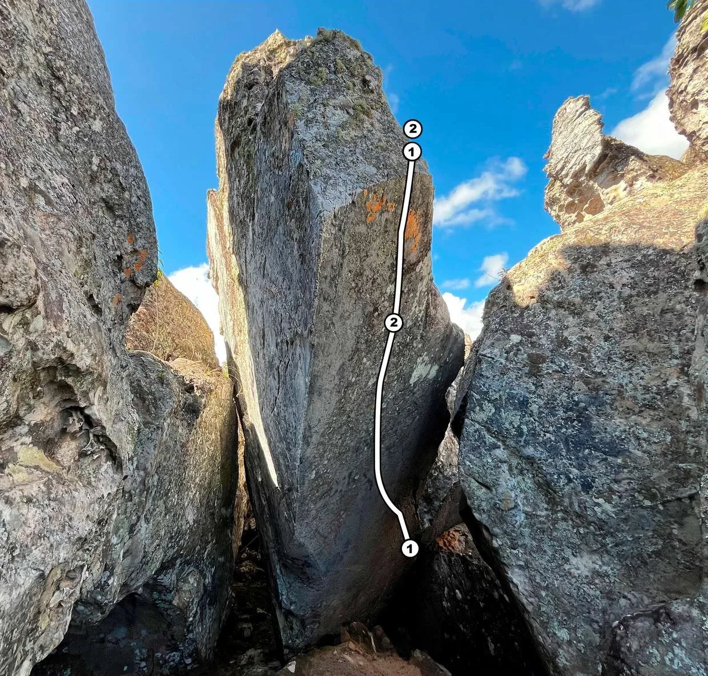
          - **largura_mapa**: 1240
          - **altura_mapa**: 1183
          - **pontos_de_interesse**:
            - **[0]**:
              - **id**: aTxzRj0I7AyF3o
              - **uid**: aTxzRj0I7AyF3o
              - **rotulo**: 1
              - **circulo**:
                - **x**: 719
                - **y**: 960
                - **raio**: 16
              - **label**: 1
            - **[1]**:
              - **id**: l2Ioa7iPBtcpzn
              - **uid**: l2Ioa7iPBtcpzn
              - **rotulo**: 1
              - **circulo**:
                - **x**: 722
                - **y**: 265
                - **raio**: 15
              - **label**: 1
            - **[2]**:
              - **id**: 0tAFnSPXnQS08g
              - **uid**: 0tAFnSPXnQS08g
              - **rotulo**: 2
              - **circulo**:
                - **x**: 690
                - **y**: 565
                - **raio**: 16
              - **label**: 2
            - **[3]**:
              - **id**: nlvU6pDEosgXXv
              - **uid**: nlvU6pDEosgXXv
              - **rotulo**: 2
              - **circulo**:
                - **x**: 723
                - **y**: 226
                - **raio**: 15
              - **label**: 2
          - **referencias**:
            - **[0]**:
              - **alvo_uid**: 0ZJHKqXRbUlOjc
              - **pontos_uids**:
                - aTxzRj0I7AyF3o
                - l2Ioa7iPBtcpzn
              - **escalada**: Iceberg
              - **ids**:
                - aTxzRj0I7AyF3o
                - l2Ioa7iPBtcpzn
            - **[1]**:
              - **alvo_uid**: oykcpaunaVXwVW
              - **pontos_uids**:
                - 0tAFnSPXnQS08g
                - nlvU6pDEosgXXv
              - **escalada**: Frigobar
              - **ids**:
                - 0tAFnSPXnQS08g
                - nlvU6pDEosgXXv
      - **escaladas**:
        - **[0]**:
          - **uid**: 0ZJHKqXRbUlOjc
          - **boulder**:
            - **descricao**: Saída baixa na extrema direita do bloco e segue por movimentos exigentes de compressão (morfo).
            - **nome**: Iceberg
            - **dificuldade**: V11
        - **[1]**:
          - **uid**: oykcpaunaVXwVW
          - **boulder**:
            - **descricao**: Saída em pé do iceberg, utilizando mão esquerda na aresta e mão direita no abaulado alto mais à direita.
            - **nome**: Frigobar
            - **dificuldade**: V5
      - **precomputados**:
        - **total_escaladas**: 2
        - **total_boulders**: 2
  - **[4]**:
    - **conteudo**:
      - **descricao**:
          # Bloco: Silicose
          ## Região 3
      - **nome**: Silicose
      - **uid**: ba9j4ZNGXk0wIe
      - **mapas**:
        - **[0]**:
          - **caminho_imagem_mapa**: 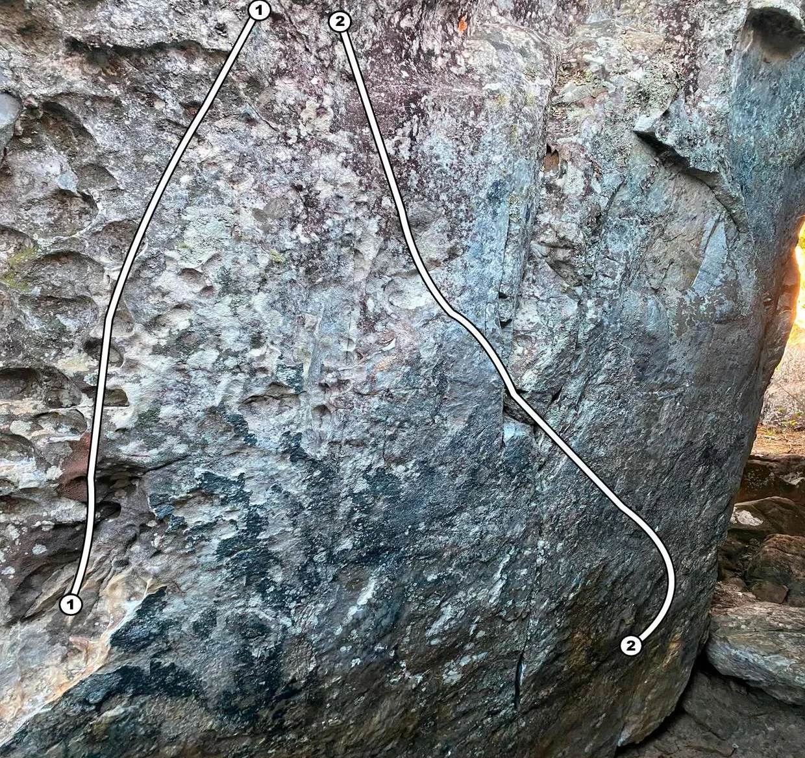
          - **largura_mapa**: 1240
          - **altura_mapa**: 1168
          - **pontos_de_interesse**:
            - **[0]**:
              - **id**: 3HEFVpk8SyHFzl
              - **uid**: 3HEFVpk8SyHFzl
              - **rotulo**: 1
              - **circulo**:
                - **x**: 109
                - **y**: 932
                - **raio**: 16
              - **label**: 1
            - **[1]**:
              - **id**: WXH9d1HRxrk4hz
              - **uid**: WXH9d1HRxrk4hz
              - **rotulo**: 1
              - **circulo**:
                - **x**: 400
                - **y**: 16
                - **raio**: 16
              - **label**: 1
            - **[2]**:
              - **id**: 0ei8UjG7OnCiH0
              - **uid**: 0ei8UjG7OnCiH0
              - **rotulo**: 2
              - **circulo**:
                - **x**: 972
                - **y**: 995
                - **raio**: 16
              - **label**: 2
            - **[3]**:
              - **id**: 8eSdYUQzq7cWWt
              - **uid**: 8eSdYUQzq7cWWt
              - **rotulo**: 2
              - **circulo**:
                - **x**: 524
                - **y**: 33
                - **raio**: 16
              - **label**: 2
          - **referencias**:
            - **[0]**:
              - **alvo_uid**: xFaEkzp5CRrfy7
              - **pontos_uids**:
                - 3HEFVpk8SyHFzl
                - WXH9d1HRxrk4hz
              - **escalada**: Silicato
              - **ids**:
                - 3HEFVpk8SyHFzl
                - WXH9d1HRxrk4hz
            - **[1]**:
              - **alvo_uid**: 2ssOqtmabcVQ3z
              - **pontos_uids**:
                - 0ei8UjG7OnCiH0
                - 8eSdYUQzq7cWWt
              - **escalada**: Silicose
              - **ids**:
                - 0ei8UjG7OnCiH0
                - 8eSdYUQzq7cWWt
      - **escaladas**:
        - **[0]**:
          - **uid**: xFaEkzp5CRrfy7
          - **boulder**:
            - **nome**: Silicato
            - **dificuldade**: V2
        - **[1]**:
          - **uid**: 2ssOqtmabcVQ3z
          - **boulder**:
            - **nome**: Silicose
            - **dificuldade**: V7
      - **precomputados**:
        - **total_escaladas**: 2
        - **total_boulders**: 2
- **precomputados**:
  - **total_escaladas**: 25
  - **total_boulders**: 25

## Parte: grupo_regiao_4

### Grupo (Pico: Cerrado Groove)

- **descricao**:
    # Região 4
    
    A Região 4 é a última região do setor Cerrado Groove, contendo o Navio Pirata e outros blocos.
- **nome**: Região 4
- **uid**: 5HcZp5MuQIGxmc
- **setores**:
  - **[0]**:
    - **conteudo**:
      - **descricao**:
          # Bloco: Navio Pirata
          ## Região 4
          
          O bloco Navio Pirata é um grande bloco com diversas linhas em várias faces.
      - **nome**: Navio Pirata
      - **uid**: 5ydIQT3aRXRDbx
      - **mapas**:
        - **[0]**:
          - **caminho_imagem_mapa**: 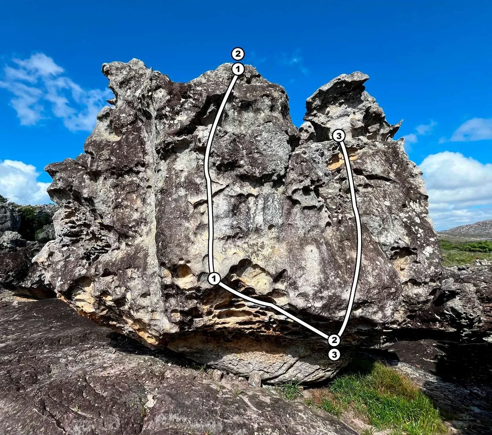
          - **largura_mapa**: 1240
          - **altura_mapa**: 1097
          - **pontos_de_interesse**:
            - **[0]**:
              - **id**: MOtPR1yrBK5bJ3
              - **uid**: MOtPR1yrBK5bJ3
              - **rotulo**: 1
              - **circulo**:
                - **x**: 540
                - **y**: 703
                - **raio**: 15
              - **label**: 1
            - **[1]**:
              - **id**: 5fhyYVebBpOzrE
              - **uid**: 5fhyYVebBpOzrE
              - **rotulo**: 1
              - **circulo**:
                - **x**: 600
                - **y**: 174
                - **raio**: 15
              - **label**: 1
            - **[2]**:
              - **id**: UWXUQ6AEeow7wF
              - **uid**: UWXUQ6AEeow7wF
              - **rotulo**: 2
              - **circulo**:
                - **x**: 842
                - **y**: 858
                - **raio**: 15
              - **label**: 2
            - **[3]**:
              - **id**: USiYEGAtnD7j4V
              - **uid**: USiYEGAtnD7j4V
              - **rotulo**: 2
              - **circulo**:
                - **x**: 600
                - **y**: 136
                - **raio**: 15
              - **label**: 2
            - **[4]**:
              - **id**: ggmN9DRFXgqBw8
              - **uid**: ggmN9DRFXgqBw8
              - **rotulo**: 3
              - **circulo**:
                - **x**: 842
                - **y**: 894
                - **raio**: 15
              - **label**: 3
            - **[5]**:
              - **id**: su3SWcwm21EDFt
              - **uid**: su3SWcwm21EDFt
              - **rotulo**: 3
              - **circulo**:
                - **x**: 854
                - **y**: 342
                - **raio**: 15
              - **label**: 3
          - **referencias**:
            - **[0]**:
              - **alvo_uid**: Zrdafq2MWx4mLr
              - **pontos_uids**:
                - MOtPR1yrBK5bJ3
                - 5fhyYVebBpOzrE
              - **escalada**: Navio Pirata
              - **ids**:
                - MOtPR1yrBK5bJ3
                - 5fhyYVebBpOzrE
            - **[1]**:
              - **alvo_uid**: AsJv46fRHeEiOw
              - **pontos_uids**:
                - UWXUQ6AEeow7wF
                - USiYEGAtnD7j4V
              - **escalada**: Invasão do Navio Pirata
              - **ids**:
                - UWXUQ6AEeow7wF
                - USiYEGAtnD7j4V
            - **[2]**:
              - **alvo_uid**: 0kfZmDOpFIsqLt
              - **pontos_uids**:
                - ggmN9DRFXgqBw8
                - su3SWcwm21EDFt
              - **escalada**: Capitão Gancho
              - **ids**:
                - ggmN9DRFXgqBw8
                - su3SWcwm21EDFt
        - **[1]**:
          - **caminho_imagem_mapa**: 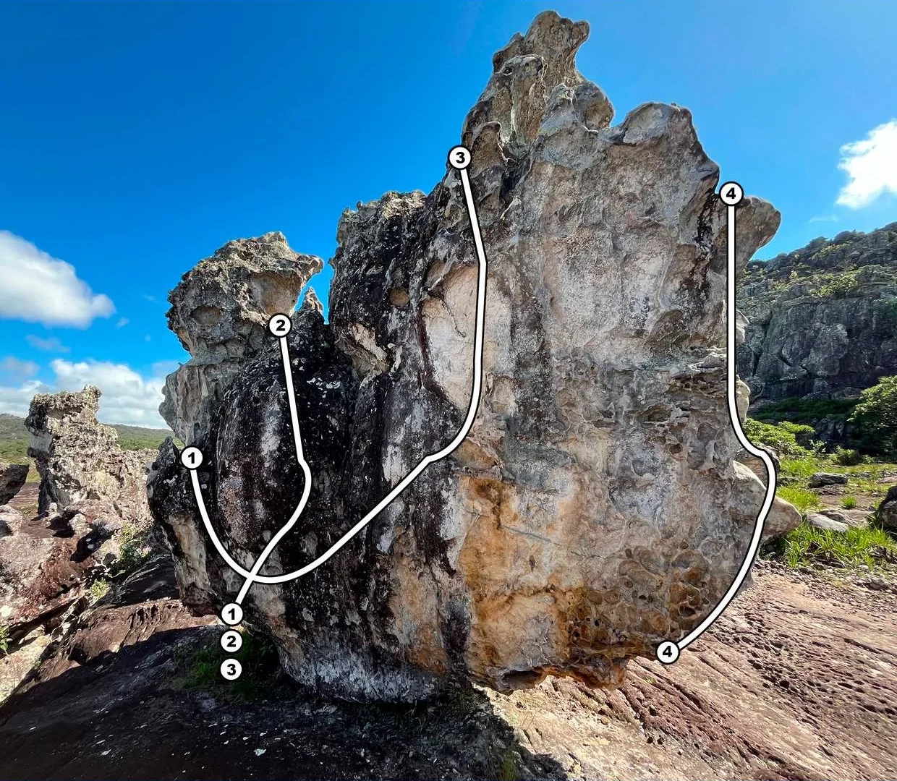
          - **largura_mapa**: 1240
          - **altura_mapa**: 1080
          - **pontos_de_interesse**:
            - **[0]**:
              - **id**: rodJMDToY2B45f
              - **uid**: rodJMDToY2B45f
              - **rotulo**: 1
              - **circulo**:
                - **x**: 321
                - **y**: 849
                - **raio**: 15
              - **label**: 1
            - **[1]**:
              - **id**: kCH6HvlSXTeB1j
              - **uid**: kCH6HvlSXTeB1j
              - **rotulo**: 1
              - **circulo**:
                - **x**: 266
                - **y**: 633
                - **raio**: 15
              - **label**: 1
            - **[2]**:
              - **id**: 5YNfIyEnxmV0u5
              - **uid**: 5YNfIyEnxmV0u5
              - **rotulo**: 2
              - **circulo**:
                - **x**: 320
                - **y**: 887
                - **raio**: 15
              - **label**: 2
            - **[3]**:
              - **id**: Lgp6Bs7lpiluka
              - **uid**: Lgp6Bs7lpiluka
              - **rotulo**: 2
              - **circulo**:
                - **x**: 387
                - **y**: 450
                - **raio**: 15
              - **label**: 2
            - **[4]**:
              - **id**: ZOGUfTD8CED01f
              - **uid**: ZOGUfTD8CED01f
              - **rotulo**: 3
              - **circulo**:
                - **x**: 320
                - **y**: 925
                - **raio**: 15
              - **label**: 3
            - **[5]**:
              - **id**: WbiUPCEfOuUneC
              - **uid**: WbiUPCEfOuUneC
              - **rotulo**: 3
              - **circulo**:
                - **x**: 636
                - **y**: 218
                - **raio**: 15
              - **label**: 3
            - **[6]**:
              - **id**: VyJU2shyIzdTHQ
              - **uid**: VyJU2shyIzdTHQ
              - **rotulo**: 4
              - **circulo**:
                - **x**: 923
                - **y**: 902
                - **raio**: 15
              - **label**: 4
            - **[7]**:
              - **id**: o3jzUFrU6bSiUd
              - **uid**: o3jzUFrU6bSiUd
              - **rotulo**: 4
              - **circulo**:
                - **x**: 1011
                - **y**: 268
                - **raio**: 15
              - **label**: 4
          - **referencias**:
            - **[0]**:
              - **alvo_uid**: tos0NQrLMGzBI5
              - **pontos_uids**:
                - rodJMDToY2B45f
                - kCH6HvlSXTeB1j
              - **escalada**: Serra a Vista
              - **ids**:
                - rodJMDToY2B45f
                - kCH6HvlSXTeB1j
            - **[1]**:
              - **alvo_uid**: ifuNPgrIWqT201
              - **pontos_uids**:
                - 5YNfIyEnxmV0u5
                - Lgp6Bs7lpiluka
              - **escalada**: Tapa Olho
              - **ids**:
                - 5YNfIyEnxmV0u5
                - Lgp6Bs7lpiluka
            - **[2]**:
              - **alvo_uid**: QbPlUqsgxNarKC
              - **pontos_uids**:
                - ZOGUfTD8CED01f
                - WbiUPCEfOuUneC
              - **escalada**: A Estibordo
              - **ids**:
                - ZOGUfTD8CED01f
                - WbiUPCEfOuUneC
            - **[3]**:
              - **alvo_uid**: ir5OtnNkOyaKSD
              - **pontos_uids**:
                - VyJU2shyIzdTHQ
                - o3jzUFrU6bSiUd
              - **escalada**: Proa
              - **ids**:
                - VyJU2shyIzdTHQ
                - o3jzUFrU6bSiUd
        - **[2]**:
          - **caminho_imagem_mapa**: 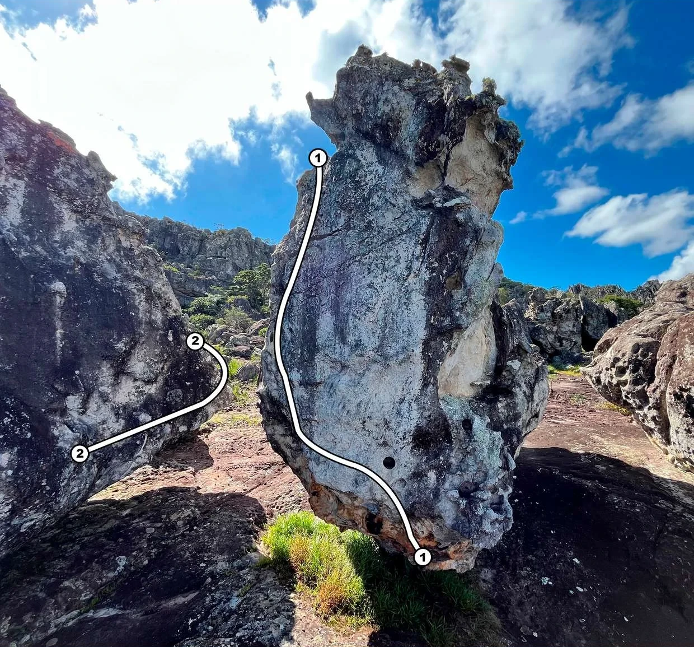
          - **largura_mapa**: 1240
          - **altura_mapa**: 1155
          - **pontos_de_interesse**:
            - **[0]**:
              - **id**: vbzeRpXjtvrnsZ
              - **uid**: vbzeRpXjtvrnsZ
              - **rotulo**: 1
              - **circulo**:
                - **x**: 756
                - **y**: 995
                - **raio**: 16
              - **label**: 1
            - **[1]**:
              - **id**: 1xaRyOGXoRKRa5
              - **uid**: 1xaRyOGXoRKRa5
              - **rotulo**: 1
              - **circulo**:
                - **x**: 569
                - **y**: 282
                - **raio**: 16
              - **label**: 1
            - **[2]**:
              - **id**: iKvfh7BHTMKRUS
              - **uid**: iKvfh7BHTMKRUS
              - **rotulo**: 2
              - **circulo**:
                - **x**: 142
                - **y**: 810
                - **raio**: 16
              - **label**: 2
            - **[3]**:
              - **id**: f25l1XnjsK9Re0
              - **uid**: f25l1XnjsK9Re0
              - **rotulo**: 2
              - **circulo**:
                - **x**: 349
                - **y**: 609
                - **raio**: 16
              - **label**: 2
          - **referencias**:
            - **[0]**:
              - **alvo_uid**: gQyllL3QUJ5Xmw
              - **pontos_uids**:
                - vbzeRpXjtvrnsZ
                - 1xaRyOGXoRKRa5
              - **escalada**: Papagaio de Pirata
              - **ids**:
                - vbzeRpXjtvrnsZ
                - 1xaRyOGXoRKRa5
            - **[1]**:
              - **alvo_uid**: v7scNKK9FwtoOQ
              - **pontos_uids**:
                - iKvfh7BHTMKRUS
                - f25l1XnjsK9Re0
              - **escalada**: Desce a Serra
              - **ids**:
                - iKvfh7BHTMKRUS
                - f25l1XnjsK9Re0
      - **escaladas**:
        - **[0]**:
          - **uid**: Zrdafq2MWx4mLr
          - **boulder**:
            - **nome**: Navio Pirata
            - **dificuldade**: V0_BARRA_V1
        - **[1]**:
          - **uid**: AsJv46fRHeEiOw
          - **boulder**:
            - **nome**: Invasão do Navio Pirata
            - **dificuldade**: V1_BARRA_V2
        - **[2]**:
          - **uid**: 0kfZmDOpFIsqLt
          - **boulder**:
            - **nome**: Capitão Gancho
            - **dificuldade**: V2
        - **[3]**:
          - **uid**: tos0NQrLMGzBI5
          - **boulder**:
            - **nome**: Serra a Vista
            - **dificuldade**: V1_BARRA_V2
        - **[4]**:
          - **uid**: ifuNPgrIWqT201
          - **boulder**:
            - **nome**: Tapa Olho
            - **dificuldade**: V2_BARRA_V3
        - **[5]**:
          - **uid**: QbPlUqsgxNarKC
          - **boulder**:
            - **nome**: A Estibordo
            - **dificuldade**: V3_BARRA_V4
        - **[6]**:
          - **uid**: ir5OtnNkOyaKSD
          - **boulder**:
            - **nome**: Proa
            - **dificuldade**: V1
        - **[7]**:
          - **uid**: gQyllL3QUJ5Xmw
          - **boulder**:
            - **nome**: Papagaio de Pirata
            - **dificuldade**: V2
        - **[8]**:
          - **uid**: v7scNKK9FwtoOQ
          - **boulder**:
            - **nome**: Desce a Serra
            - **dificuldade**: V3
      - **precomputados**:
        - **total_escaladas**: 9
        - **total_boulders**: 9
  - **[1]**:
    - **conteudo**:
      - **descricao**:
          # Bloco: Pfizer
          ## Região 4
      - **nome**: Pfizer
      - **uid**: IAHAxZrL76iUE6
      - **mapas**:
        - **[0]**:
          - **caminho_imagem_mapa**: 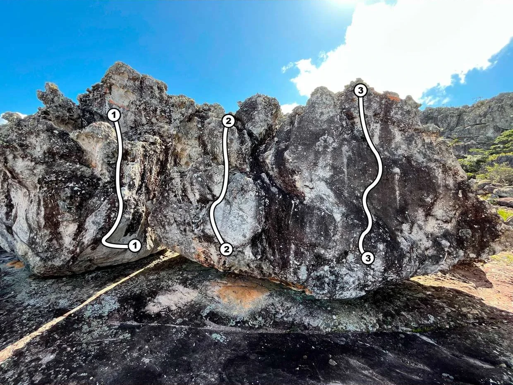
          - **largura_mapa**: 1240
          - **altura_mapa**: 931
          - **pontos_de_interesse**:
            - **[0]**:
              - **id**: apNSMIgishCvMq
              - **uid**: apNSMIgishCvMq
              - **rotulo**: 1
              - **circulo**:
                - **x**: 326
                - **y**: 594
                - **raio**: 15
              - **label**: 1
            - **[1]**:
              - **id**: 5gQj5KhOYHaSBF
              - **uid**: 5gQj5KhOYHaSBF
              - **rotulo**: 1
              - **circulo**:
                - **x**: 275
                - **y**: 278
                - **raio**: 15
              - **label**: 1
            - **[2]**:
              - **id**: CsABZulQmaQRpe
              - **uid**: CsABZulQmaQRpe
              - **rotulo**: 2
              - **circulo**:
                - **x**: 547
                - **y**: 603
                - **raio**: 15
              - **label**: 2
            - **[3]**:
              - **id**: l4ykhFIaWNX54F
              - **uid**: l4ykhFIaWNX54F
              - **rotulo**: 2
              - **circulo**:
                - **x**: 552
                - **y**: 292
                - **raio**: 15
              - **label**: 2
            - **[4]**:
              - **id**: QSWAmHvy0qHThf
              - **uid**: QSWAmHvy0qHThf
              - **rotulo**: 3
              - **circulo**:
                - **x**: 889
                - **y**: 624
                - **raio**: 15
              - **label**: 3
            - **[5]**:
              - **id**: dmYu0AMgtk1BAx
              - **uid**: dmYu0AMgtk1BAx
              - **rotulo**: 3
              - **circulo**:
                - **x**: 872
                - **y**: 218
                - **raio**: 15
              - **label**: 3
          - **referencias**:
            - **[0]**:
              - **alvo_uid**: Q6EsorjUeI753p
              - **pontos_uids**:
                - apNSMIgishCvMq
                - 5gQj5KhOYHaSBF
              - **escalada**: Pfizer
              - **ids**:
                - apNSMIgishCvMq
                - 5gQj5KhOYHaSBF
            - **[1]**:
              - **alvo_uid**: HYYJC6Mu8XFxbg
              - **pontos_uids**:
                - CsABZulQmaQRpe
                - l4ykhFIaWNX54F
              - **escalada**: Barriga Branca
              - **ids**:
                - CsABZulQmaQRpe
                - l4ykhFIaWNX54F
            - **[2]**:
              - **alvo_uid**: ZqpDDGeu7k74Sm
              - **pontos_uids**:
                - QSWAmHvy0qHThf
                - dmYu0AMgtk1BAx
              - **escalada**: Rosa
              - **ids**:
                - QSWAmHvy0qHThf
                - dmYu0AMgtk1BAx
      - **escaladas**:
        - **[0]**:
          - **uid**: Q6EsorjUeI753p
          - **boulder**:
            - **nome**: Pfizer
            - **dificuldade**: V4
        - **[1]**:
          - **uid**: HYYJC6Mu8XFxbg
          - **boulder**:
            - **nome**: Barriga Branca
            - **dificuldade**: V1
        - **[2]**:
          - **uid**: ZqpDDGeu7k74Sm
          - **boulder**:
            - **nome**: Rosa
            - **dificuldade**: V0
      - **precomputados**:
        - **total_escaladas**: 3
        - **total_boulders**: 3
  - **[2]**:
    - **conteudo**:
      - **descricao**:
          # Bloco: Pedra na Canela
          ## Região 4
      - **nome**: Pedra na Canela
      - **uid**: ZvxbNlHWswULYG
      - **mapas**:
        - **[0]**:
          - **caminho_imagem_mapa**: 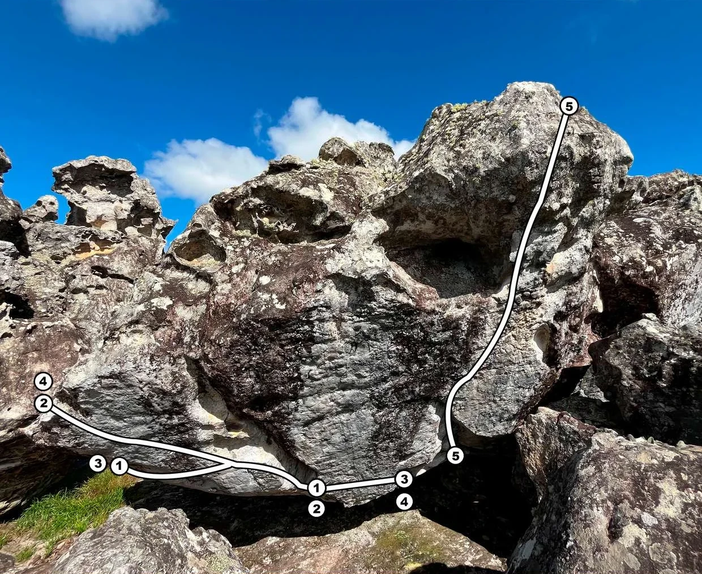
          - **largura_mapa**: 1240
          - **altura_mapa**: 1014
          - **pontos_de_interesse**:
            - **[0]**:
              - **id**: 7GB7sxRMoo6296
              - **uid**: 7GB7sxRMoo6296
              - **rotulo**: 1
              - **circulo**:
                - **x**: 211
                - **y**: 824
                - **raio**: 15
              - **label**: 1
            - **[1]**:
              - **id**: IIPPq7axJlZGcK
              - **uid**: IIPPq7axJlZGcK
              - **rotulo**: 1
              - **circulo**:
                - **x**: 560
                - **y**: 861
                - **raio**: 15
              - **label**: 1
            - **[2]**:
              - **id**: cLU6nOsC5K7jQt
              - **uid**: cLU6nOsC5K7jQt
              - **rotulo**: 2
              - **circulo**:
                - **x**: 77
                - **y**: 712
                - **raio**: 15
              - **label**: 2
            - **[3]**:
              - **id**: w9JlkWo6gmhile
              - **uid**: w9JlkWo6gmhile
              - **rotulo**: 2
              - **circulo**:
                - **x**: 559
                - **y**: 899
                - **raio**: 15
              - **label**: 2
            - **[4]**:
              - **id**: ucshAPjqiuwza4
              - **uid**: ucshAPjqiuwza4
              - **rotulo**: 3
              - **circulo**:
                - **x**: 173
                - **y**: 819
                - **raio**: 15
              - **label**: 3
            - **[5]**:
              - **id**: iTUstOCKe4dXpP
              - **uid**: iTUstOCKe4dXpP
              - **rotulo**: 3
              - **circulo**:
                - **x**: 714
                - **y**: 846
                - **raio**: 15
              - **label**: 3
            - **[6]**:
              - **id**: aZYXQgUgNNWrGq
              - **uid**: aZYXQgUgNNWrGq
              - **rotulo**: 4
              - **circulo**:
                - **x**: 77
                - **y**: 674
                - **raio**: 15
              - **label**: 4
            - **[7]**:
              - **id**: nz8IjTQUrSe2gj
              - **uid**: nz8IjTQUrSe2gj
              - **rotulo**: 4
              - **circulo**:
                - **x**: 715
                - **y**: 886
                - **raio**: 15
              - **label**: 4
            - **[8]**:
              - **id**: Gia1TCQHxIpvIe
              - **uid**: Gia1TCQHxIpvIe
              - **rotulo**: 5
              - **circulo**:
                - **x**: 805
                - **y**: 805
                - **raio**: 15
              - **label**: 5
            - **[9]**:
              - **id**: OqNaNMAsEYfd56
              - **uid**: OqNaNMAsEYfd56
              - **rotulo**: 5
              - **circulo**:
                - **x**: 1005
                - **y**: 187
                - **raio**: 16
              - **label**: 5
          - **referencias**:
            - **[0]**:
              - **alvo_uid**: 8WUoNKOBJXM8mu
              - **pontos_uids**:
                - 7GB7sxRMoo6296
                - IIPPq7axJlZGcK
              - **escalada**: Pedra na Canela
              - **ids**:
                - 7GB7sxRMoo6296
                - IIPPq7axJlZGcK
            - **[1]**:
              - **alvo_uid**: V2ymkQzSZw77se
              - **pontos_uids**:
                - cLU6nOsC5K7jQt
                - w9JlkWo6gmhile
              - **escalada**: Sobe a Serra
              - **ids**:
                - cLU6nOsC5K7jQt
                - w9JlkWo6gmhile
            - **[2]**:
              - **alvo_uid**: aFLz4Xz6W0UJcn
              - **pontos_uids**:
                - ucshAPjqiuwza4
                - iTUstOCKe4dXpP
              - **escalada**: Pedra na Canela Ext
              - **ids**:
                - ucshAPjqiuwza4
                - iTUstOCKe4dXpP
            - **[3]**:
              - **alvo_uid**: wZ4UCXXIN3lfaD
              - **pontos_uids**:
                - aZYXQgUgNNWrGq
                - nz8IjTQUrSe2gj
              - **escalada**: Sobe a Serra Ext
              - **ids**:
                - aZYXQgUgNNWrGq
                - nz8IjTQUrSe2gj
            - **[4]**:
              - **alvo_uid**: NpqSSLTZjkrxIs
              - **pontos_uids**:
                - Gia1TCQHxIpvIe
                - OqNaNMAsEYfd56
              - **escalada**: Ofurô
              - **ids**:
                - Gia1TCQHxIpvIe
                - OqNaNMAsEYfd56
      - **escaladas**:
        - **[0]**:
          - **uid**: 8WUoNKOBJXM8mu
          - **boulder**:
            - **nome**: Pedra na Canela
            - **dificuldade**: V4
        - **[1]**:
          - **uid**: V2ymkQzSZw77se
          - **boulder**:
            - **nome**: Sobe a Serra
            - **dificuldade**: V5
        - **[2]**:
          - **uid**: aFLz4Xz6W0UJcn
          - **boulder**:
            - **nome**: Pedra na Canela Ext
            - **dificuldade**: V5
        - **[3]**:
          - **uid**: wZ4UCXXIN3lfaD
          - **boulder**:
            - **nome**: Sobe a Serra Ext
            - **dificuldade**: V5_BARRA_V6
        - **[4]**:
          - **uid**: NpqSSLTZjkrxIs
          - **boulder**:
            - **nome**: Ofurô
            - **dificuldade**: V7_BARRA_V8
      - **precomputados**:
        - **total_escaladas**: 5
        - **total_boulders**: 5
  - **[3]**:
    - **conteudo**:
      - **descricao**:
          # Bloco: Piseiro
          ## Região 4
      - **nome**: Piseiro
      - **uid**: QosMO7Nv63wvuo
      - **mapas**:
        - **[0]**:
          - **caminho_imagem_mapa**: 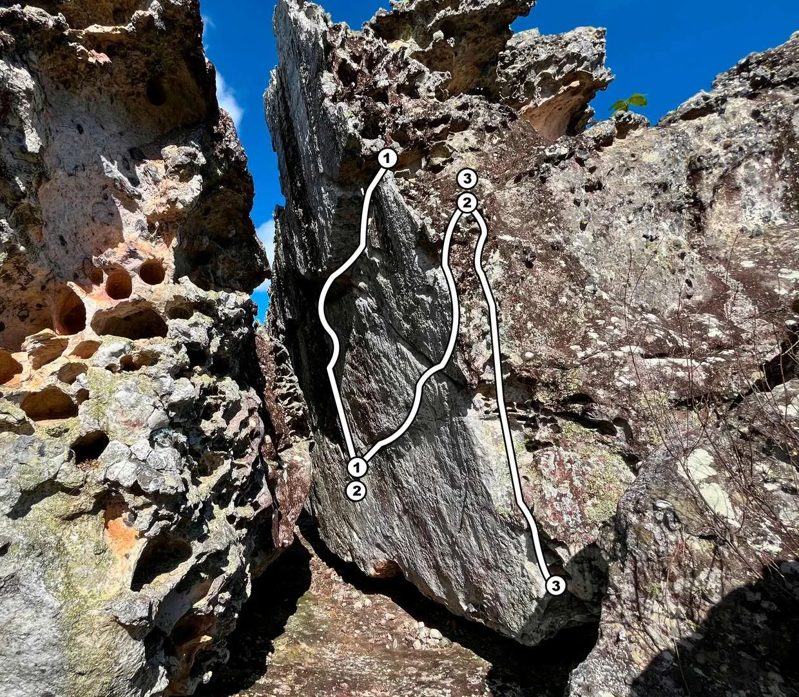
          - **largura_mapa**: 1240
          - **altura_mapa**: 1082
          - **pontos_de_interesse**:
            - **[0]**:
              - **id**: vhp72vIYVpVvZc
              - **uid**: vhp72vIYVpVvZc
              - **rotulo**: 1
              - **circulo**:
                - **x**: 555
                - **y**: 726
                - **raio**: 15
              - **label**: 1
            - **[1]**:
              - **id**: JdpV5y6tSph8rA
              - **uid**: JdpV5y6tSph8rA
              - **rotulo**: 1
              - **circulo**:
                - **x**: 602
                - **y**: 246
                - **raio**: 16
              - **label**: 1
            - **[2]**:
              - **id**: xoHMHkCuLJFSLX
              - **uid**: xoHMHkCuLJFSLX
              - **rotulo**: 2
              - **circulo**:
                - **x**: 553
                - **y**: 762
                - **raio**: 16
              - **label**: 2
            - **[3]**:
              - **id**: 2jox6l5PEgUHPF
              - **uid**: 2jox6l5PEgUHPF
              - **rotulo**: 2
              - **circulo**:
                - **x**: 725
                - **y**: 315
                - **raio**: 15
              - **label**: 2
            - **[4]**:
              - **id**: h5Xxh1ZaqekkOR
              - **uid**: h5Xxh1ZaqekkOR
              - **rotulo**: 3
              - **circulo**:
                - **x**: 863
                - **y**: 909
                - **raio**: 15
              - **label**: 3
            - **[5]**:
              - **id**: zJAcH5bbmKuJBa
              - **uid**: zJAcH5bbmKuJBa
              - **rotulo**: 3
              - **circulo**:
                - **x**: 725
                - **y**: 277
                - **raio**: 15
              - **label**: 3
          - **referencias**:
            - **[0]**:
              - **alvo_uid**: SajkhpSFBYayr8
              - **pontos_uids**:
                - vhp72vIYVpVvZc
                - JdpV5y6tSph8rA
              - **escalada**: Maozeiro
              - **ids**:
                - vhp72vIYVpVvZc
                - JdpV5y6tSph8rA
            - **[1]**:
              - **alvo_uid**: y3ZtuNKJdPoDP8
              - **pontos_uids**:
                - xoHMHkCuLJFSLX
                - 2jox6l5PEgUHPF
              - **escalada**: Piseiro
              - **ids**:
                - xoHMHkCuLJFSLX
                - 2jox6l5PEgUHPF
            - **[2]**:
              - **alvo_uid**: 3biEqLOb4DyBMU
              - **pontos_uids**:
                - h5Xxh1ZaqekkOR
                - zJAcH5bbmKuJBa
              - **escalada**: Expresso 22
              - **ids**:
                - h5Xxh1ZaqekkOR
                - zJAcH5bbmKuJBa
      - **escaladas**:
        - **[0]**:
          - **uid**: SajkhpSFBYayr8
          - **boulder**:
            - **nome**: Maozeiro
            - **dificuldade**: V7
        - **[1]**:
          - **uid**: y3ZtuNKJdPoDP8
          - **boulder**:
            - **nome**: Piseiro
            - **dificuldade**: V4
        - **[2]**:
          - **uid**: 3biEqLOb4DyBMU
          - **boulder**:
            - **nome**: Expresso 22
            - **dificuldade**: V0
      - **precomputados**:
        - **total_escaladas**: 3
        - **total_boulders**: 3
  - **[4]**:
    - **conteudo**:
      - **descricao**:
          # Bloco: Raizeiro
          ## Região 4
      - **nome**: Raizeiro
      - **uid**: QPwyD0n8ZTjbOT
      - **mapas**:
        - **[0]**:
          - **caminho_imagem_mapa**: 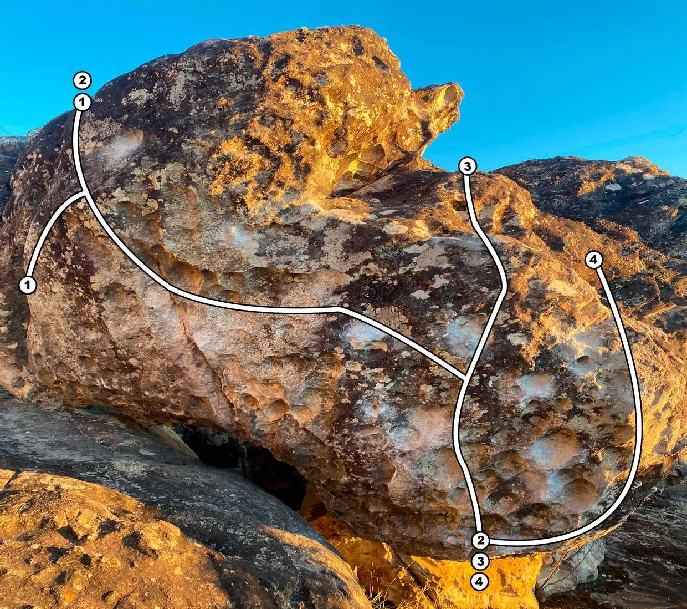
          - **largura_mapa**: 1240
          - **altura_mapa**: 1098
          - **pontos_de_interesse**:
            - **[0]**:
              - **id**: uGfyAL8x9W7YMy
              - **uid**: uGfyAL8x9W7YMy
              - **rotulo**: 1
              - **circulo**:
                - **x**: 50
                - **y**: 514
                - **raio**: 16
              - **label**: 1
            - **[1]**:
              - **id**: 8GpiOq6bttOpAO
              - **uid**: 8GpiOq6bttOpAO
              - **rotulo**: 1
              - **circulo**:
                - **x**: 149
                - **y**: 184
                - **raio**: 15
              - **label**: 1
            - **[2]**:
              - **id**: piBL3JatwKAjAa
              - **uid**: piBL3JatwKAjAa
              - **rotulo**: 2
              - **circulo**:
                - **x**: 867
                - **y**: 975
                - **raio**: 15
              - **label**: 2
            - **[3]**:
              - **id**: GbM4gArhNiRBct
              - **uid**: GbM4gArhNiRBct
              - **rotulo**: 2
              - **circulo**:
                - **x**: 149
                - **y**: 145
                - **raio**: 15
              - **label**: 2
            - **[4]**:
              - **id**: 9Df0RHkYiY0g6p
              - **uid**: 9Df0RHkYiY0g6p
              - **rotulo**: 3
              - **circulo**:
                - **x**: 867
                - **y**: 1012
                - **raio**: 15
              - **label**: 3
            - **[5]**:
              - **id**: EnhjZ7XHnTa0zi
              - **uid**: EnhjZ7XHnTa0zi
              - **rotulo**: 3
              - **circulo**:
                - **x**: 844
                - **y**: 300
                - **raio**: 16
              - **label**: 3
            - **[6]**:
              - **id**: y1w0Hib7yrWOYN
              - **uid**: y1w0Hib7yrWOYN
              - **rotulo**: 4
              - **circulo**:
                - **x**: 866
                - **y**: 1048
                - **raio**: 15
              - **label**: 4
            - **[7]**:
              - **id**: GeIthj8OfY1YfY
              - **uid**: GeIthj8OfY1YfY
              - **rotulo**: 4
              - **circulo**:
                - **x**: 1072
                - **y**: 468
                - **raio**: 15
              - **label**: 4
          - **referencias**:
            - **[0]**:
              - **alvo_uid**: 6KQGsiZ70565Iu
              - **pontos_uids**:
                - uGfyAL8x9W7YMy
                - 8GpiOq6bttOpAO
              - **escalada**: Parteira
              - **ids**:
                - uGfyAL8x9W7YMy
                - 8GpiOq6bttOpAO
            - **[1]**:
              - **alvo_uid**: LMPYtDByz0ZOwL
              - **pontos_uids**:
                - piBL3JatwKAjAa
                - GbM4gArhNiRBct
              - **escalada**: Curandeira
              - **ids**:
                - piBL3JatwKAjAa
                - GbM4gArhNiRBct
            - **[2]**:
              - **alvo_uid**: ryJqk3tXuc71vB
              - **pontos_uids**:
                - 9Df0RHkYiY0g6p
                - EnhjZ7XHnTa0zi
              - **escalada**: Raizeiro
              - **ids**:
                - 9Df0RHkYiY0g6p
                - EnhjZ7XHnTa0zi
            - **[3]**:
              - **alvo_uid**: TUL1O3mMYHJfzm
              - **pontos_uids**:
                - y1w0Hib7yrWOYN
                - GeIthj8OfY1YfY
              - **escalada**: Garrafada
              - **ids**:
                - y1w0Hib7yrWOYN
                - GeIthj8OfY1YfY
      - **escaladas**:
        - **[0]**:
          - **uid**: 6KQGsiZ70565Iu
          - **boulder**:
            - **nome**: Parteira
            - **dificuldade**: V3_BARRA_V4
        - **[1]**:
          - **uid**: LMPYtDByz0ZOwL
          - **boulder**:
            - **nome**: Curandeira
            - **dificuldade**: V6_BARRA_V7
        - **[2]**:
          - **uid**: ryJqk3tXuc71vB
          - **boulder**:
            - **nome**: Raizeiro
            - **dificuldade**: V4
        - **[3]**:
          - **uid**: TUL1O3mMYHJfzm
          - **boulder**:
            - **nome**: Garrafada
            - **dificuldade**: V3
      - **precomputados**:
        - **total_escaladas**: 4
        - **total_boulders**: 4
  - **[5]**:
    - **conteudo**:
      - **descricao**:
          # Bloco: Tijuco Preto
          ## Região 4
      - **nome**: Tijuco Preto
      - **uid**: QqZiA2ythU83BC
      - **mapas**:
        - **[0]**:
          - **caminho_imagem_mapa**: 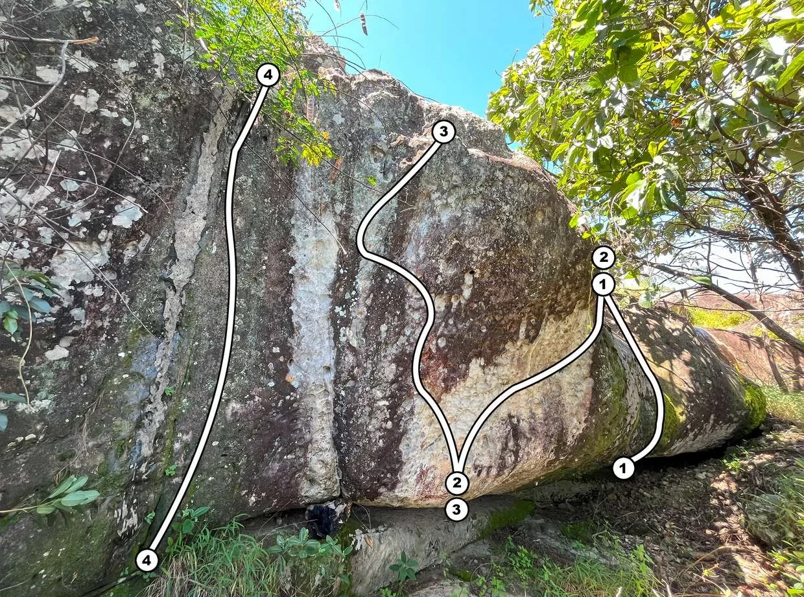
          - **largura_mapa**: 1240
          - **altura_mapa**: 921
          - **pontos_de_interesse**:
            - **[0]**:
              - **id**: gKzGP2jdd9cZaC
              - **uid**: gKzGP2jdd9cZaC
              - **rotulo**: 1
              - **circulo**:
                - **x**: 962
                - **y**: 722
                - **raio**: 17
              - **label**: 1
            - **[1]**:
              - **id**: ybdwiQ4BJx9Pfw
              - **uid**: ybdwiQ4BJx9Pfw
              - **rotulo**: 1
              - **circulo**:
                - **x**: 931
                - **y**: 439
                - **raio**: 17
              - **label**: 1
            - **[2]**:
              - **id**: IYmsKivphX8pnM
              - **uid**: IYmsKivphX8pnM
              - **rotulo**: 2
              - **circulo**:
                - **x**: 705
                - **y**: 746
                - **raio**: 17
              - **label**: 2
            - **[3]**:
              - **id**: s77DGXL0GoMvec
              - **uid**: s77DGXL0GoMvec
              - **rotulo**: 2
              - **circulo**:
                - **x**: 931
                - **y**: 397
                - **raio**: 17
              - **label**: 2
            - **[4]**:
              - **id**: tiCuRqTZs1YhFs
              - **uid**: tiCuRqTZs1YhFs
              - **rotulo**: 3
              - **circulo**:
                - **x**: 705
                - **y**: 786
                - **raio**: 18
              - **label**: 3
            - **[5]**:
              - **id**: PvcBDpmNzl5j97
              - **uid**: PvcBDpmNzl5j97
              - **rotulo**: 3
              - **circulo**:
                - **x**: 685
                - **y**: 203
                - **raio**: 17
              - **label**: 3
            - **[6]**:
              - **id**: CKBfPZeVv8LtZD
              - **uid**: CKBfPZeVv8LtZD
              - **rotulo**: 4
              - **circulo**:
                - **x**: 227
                - **y**: 864
                - **raio**: 17
              - **label**: 4
            - **[7]**:
              - **id**: 420IrvUnKWyDA6
              - **uid**: 420IrvUnKWyDA6
              - **rotulo**: 4
              - **circulo**:
                - **x**: 414
                - **y**: 115
                - **raio**: 17
              - **label**: 4
          - **referencias**:
            - **[0]**:
              - **alvo_uid**: DkZiFLYJSYJACi
              - **pontos_uids**:
                - gKzGP2jdd9cZaC
                - ybdwiQ4BJx9Pfw
              - **escalada**: Tijuco Preto
              - **ids**:
                - gKzGP2jdd9cZaC
                - ybdwiQ4BJx9Pfw
            - **[1]**:
              - **alvo_uid**: RhXIXfEwUM059N
              - **pontos_uids**:
                - IYmsKivphX8pnM
                - s77DGXL0GoMvec
              - **escalada**: Pé na Lapeira
              - **ids**:
                - IYmsKivphX8pnM
                - s77DGXL0GoMvec
            - **[2]**:
              - **alvo_uid**: E2Xh64TNQ6Kw2X
              - **pontos_uids**:
                - tiCuRqTZs1YhFs
                - PvcBDpmNzl5j97
              - **escalada**: Sol a Fora
              - **ids**:
                - tiCuRqTZs1YhFs
                - PvcBDpmNzl5j97
            - **[3]**:
              - **alvo_uid**: mz8RAqSEhuoFcf
              - **pontos_uids**:
                - CKBfPZeVv8LtZD
                - 420IrvUnKWyDA6
              - **escalada**: Toque no Curralinho
              - **ids**:
                - CKBfPZeVv8LtZD
                - 420IrvUnKWyDA6
      - **escaladas**:
        - **[0]**:
          - **uid**: DkZiFLYJSYJACi
          - **boulder**:
            - **nome**: Tijuco Preto
            - **dificuldade**: V6
        - **[1]**:
          - **uid**: RhXIXfEwUM059N
          - **boulder**:
            - **nome**: Pé na Lapeira
            - **dificuldade**: V4
        - **[2]**:
          - **uid**: E2Xh64TNQ6Kw2X
          - **boulder**:
            - **nome**: Sol a Fora
            - **dificuldade**: V3
        - **[3]**:
          - **uid**: mz8RAqSEhuoFcf
          - **boulder**:
            - **nome**: Toque no Curralinho
            - **dificuldade**: V3
      - **precomputados**:
        - **total_escaladas**: 4
        - **total_boulders**: 4
- **precomputados**:
  - **total_escaladas**: 28
  - **total_boulders**: 28

## Arquivos Externos

- **arquivos_externos**:
  - **[0]**:
    - **caminho**: 
    - **checksum_sha256**: 930a77641317c906f02d1bb82605b316f1dcd79272eec2b6745a77083b7209d4
  - **[1]**:
    - **caminho**: 
    - **checksum_sha256**: 659c98d83aa77edbdace384fd3889d08db6798d03c7b08201a0afde2ab74dd8d
  - **[2]**:
    - **caminho**: 
    - **checksum_sha256**: ee21adf090baea920db1df6ceab1e48d2a3d1ceb5b6354e6ac016a816279d9dc
  - **[3]**:
    - **caminho**: 
    - **checksum_sha256**: 44f58f68c912d251d94fb4e963f116a6c9bfe707c1668d06c16d3b186cd5f170
  - **[4]**:
    - **caminho**: 
    - **checksum_sha256**: df895532b8f2c78da374060e6b9c6d3b7aa0e587d90f397d85f824c288353513
  - **[5]**:
    - **caminho**: 
    - **checksum_sha256**: 84d89b96fdc4cf124fc09b42388818b5737188e94e8a81e14ac67323d11de206
  - **[6]**:
    - **caminho**: 
    - **checksum_sha256**: 638229911abbbd375ecbb8e1c215e8a9b428f47351183b4e474768b37895f7b7
  - **[7]**:
    - **caminho**: 
    - **checksum_sha256**: de0a35b5031a4115edf4b1ef09fab1267ba0424c83c83ebc77f807e4fc2473ab
  - **[8]**:
    - **caminho**: 
    - **checksum_sha256**: 20ed4fa3bfde6f50d8b6be997b66513dc5ce7bfe381e2c50071e67443b0f9f34
  - **[9]**:
    - **caminho**: 
    - **checksum_sha256**: 58f362a8d307b069ebb1ee6951b5581f867d30c11ef489b102b38f8e87112d76
  - **[10]**:
    - **caminho**: 
    - **checksum_sha256**: 2de595e077b91f4d4feeb1938fb897dd3b5be5f7a3567f3b942ffe2fa8559e8a
  - **[11]**:
    - **caminho**: 
    - **checksum_sha256**: f3519b969e0c58e51a324a5b644677c0cd04ad28f5003a98648b18c360587303
  - **[12]**:
    - **caminho**: 
    - **checksum_sha256**: 93ea3d6f69387d12bf981e1591094949be0e3a90f48b93220797f20d9fbbf1a5
  - **[13]**:
    - **caminho**: 
    - **checksum_sha256**: 87a50711f4ed3ed713f77a91af0c9cf79c072850de9ff6370e99629ffeaa84af
  - **[14]**:
    - **caminho**: 
    - **checksum_sha256**: 5d906dd06215156eba4eed26bf87c01027958916df26ab75b4563fe818d711af
  - **[15]**:
    - **caminho**: 
    - **checksum_sha256**: 52a842f38e9f134f19593f737edd6be1d20491da979742d69d1ac2e9841bf019
  - **[16]**:
    - **caminho**: 
    - **checksum_sha256**: ffbee82ffedf5cac4a26190c1c6aff8069c0ab282f92b4380ed75f12a728873e
  - **[17]**:
    - **caminho**: 
    - **checksum_sha256**: 80385e7199262fb0c60aa607fc4d7ad6f932826534b05f5a4cc26362bbd29fa7
  - **[18]**:
    - **caminho**: 
    - **checksum_sha256**: 0c5ed7020b244fad7432f43a4ae0d282f0b5560d8fecafcdf71d2df9ac9c5771
  - **[19]**:
    - **caminho**: 
    - **checksum_sha256**: 026a9723f428af5d31806194408244b971541648afede2f601e8f53ca55c8bbd
  - **[20]**:
    - **caminho**: 
    - **checksum_sha256**: 42ff347a189a9330ed3f0724749367df2749e2e233b0ce319ebce9bc6ae36c8b
  - **[21]**:
    - **caminho**: 
    - **checksum_sha256**: ed4e586de730621d3272ae11b011b424e3bcbe1c2150a1066e563ecaa17bba46
  - **[22]**:
    - **caminho**: 
    - **checksum_sha256**: d7d9ab83bb936d13f7f66f43537d7787da5aa19673ada99af4ce8230d0113176
  - **[23]**:
    - **caminho**: 
    - **checksum_sha256**: 63c37727c53bed3a5ce11890d902687ecfc650fb50e7336d9b4f47a2f887336d
  - **[24]**:
    - **caminho**: 
    - **checksum_sha256**: 44f329deada6ad1f5d3204353381a398e3dfba8f207e3e050e8d8b9fb35bc832
  - **[25]**:
    - **caminho**: 
    - **checksum_sha256**: 6f727be0a313386fe7a8d59860d204e7fdfd0516679abb0d612dfd0dc94569a5
  - **[26]**:
    - **caminho**: 
    - **checksum_sha256**: d67c1b056e38be95b97f9a986a6d04112e60371f9dea2974a43ca7b9183e87b2
  - **[27]**:
    - **caminho**: 
    - **checksum_sha256**: a93e5929d6e21e493cff3bd948a99c758214bec3e7996673d2d1321901dc5eef
  - **[28]**:
    - **caminho**: 
    - **checksum_sha256**: 3d980d3fdebf36bad3abb96760b273224f124147b62a754e0f9648007adda161
  - **[29]**:
    - **caminho**: 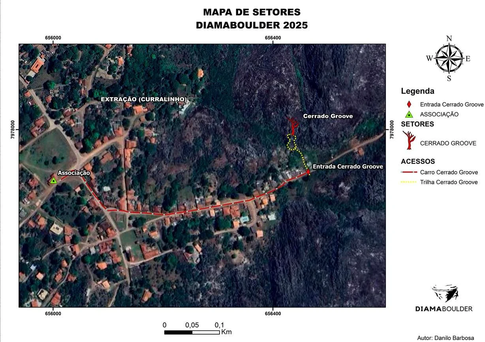
    - **checksum_sha256**: 599d6e8441cd5681e811ba6e597c3f6e366e53316a6a15394c8757cbac63a6ba
  - **[30]**:
    - **caminho**: 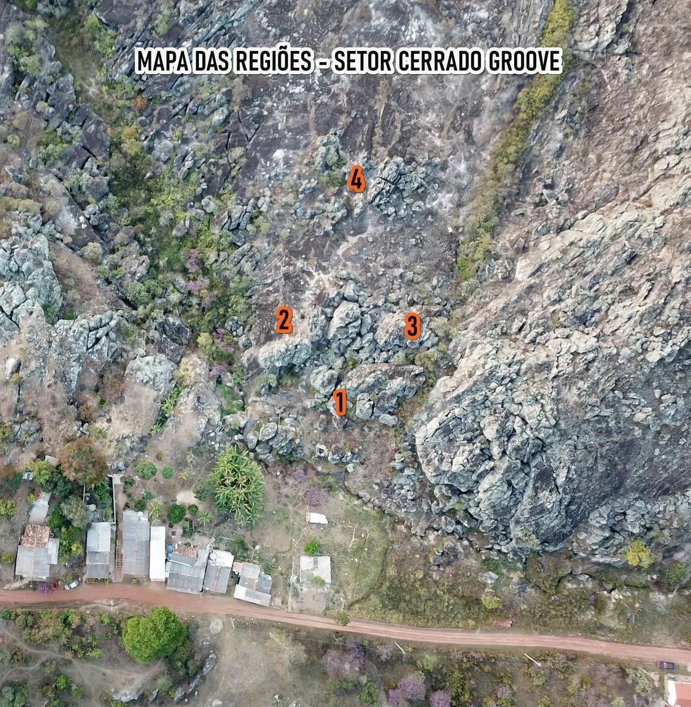
    - **checksum_sha256**: 6ad872db4b9d5e03999754c13b1b357bcde74c3bfe208c8bb9c2e29d22d682f7

