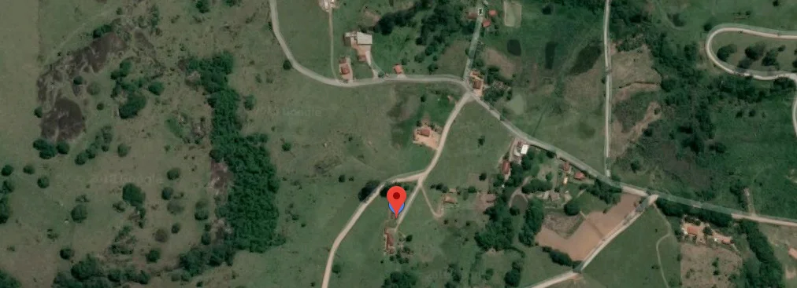
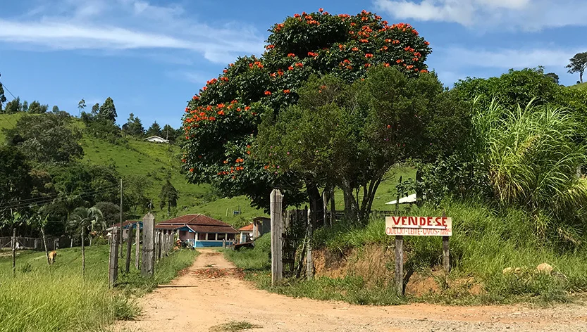
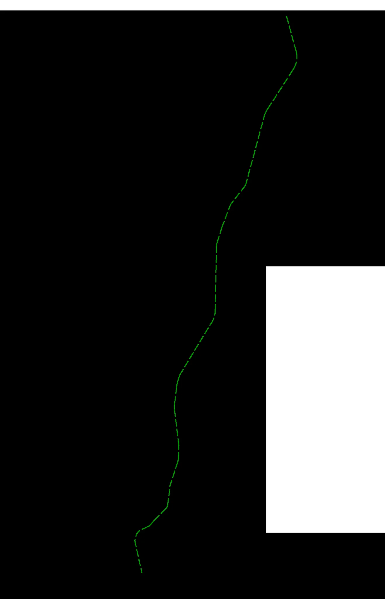
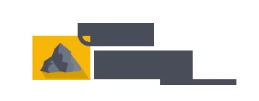
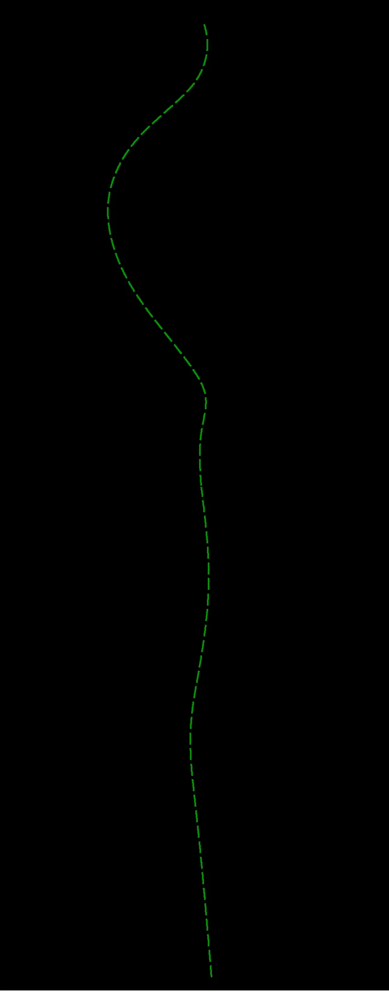
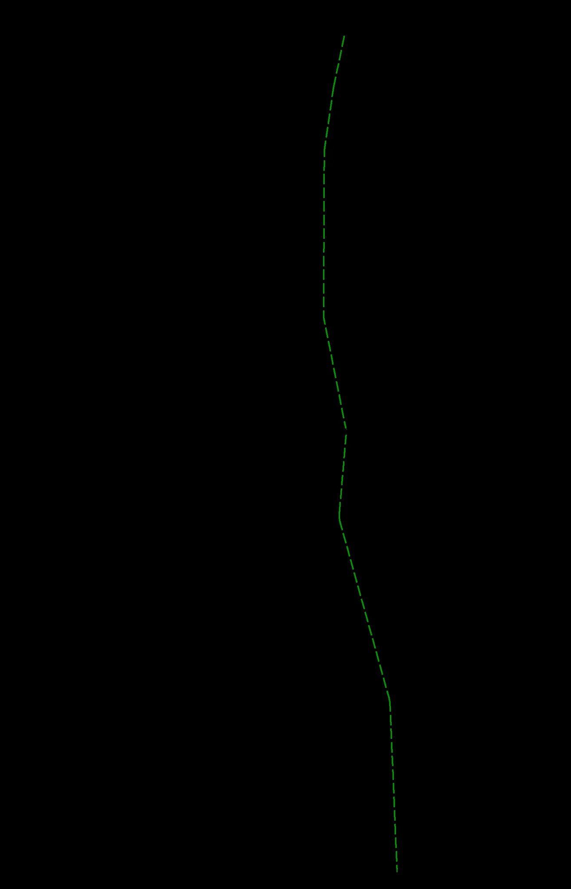
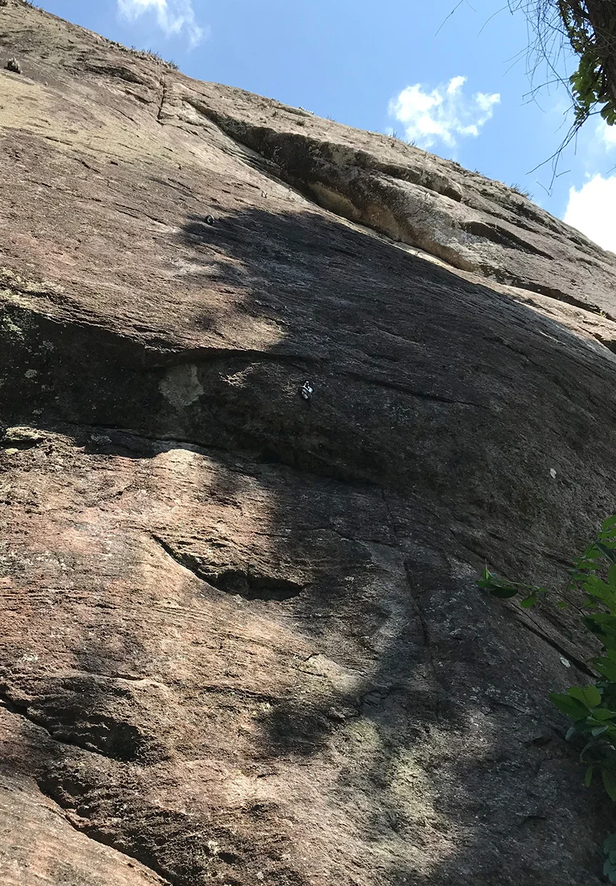

# Croqui: Falésia da Esfinge

## Informações Gerais

- **descricao**: Um belíssimo vale localizado no município de Extrema/MG, com mais de 20 vias em granito de diferentes estilos.
- **id**: br_mg_extrema_falesia_da_esfinge
- **nome**: Falésia da Esfinge
- **caminho_thumbnail**: 
- **status_desenho_extraivel**: TEM_DESENHO_MAS_NAO_EXTRAIDO
- **botoes**:
  - **[0]**:
    - **texto**: Capa
    - **destino**:
      - **secao_textual**:
        - **conteudo**:
            |  |
            | :--: |
            | *Falesia da Esfinge* |
  - **[1]**:
    - **texto**: Introdução
    - **destino**:
      - **secao_textual**:
        - **conteudo**:
            # INTRODUÇÃO
            
            É com grande entusiasmo que apresentamos a primeira edição do croqui de escalada da falésia da Esfinge, uma parceria com os proprietários do Sítio Boa Esperança e com os montanhistas e escaladores de Extrema, São Bernardo do Campo, Atibaia, Piracaia, Itatiba e Bragança Paulista.
            
            De fácil acesso a falésia da Esfinge faz parte de um complexo de rochas granitoides denominado de rota das pedras, um belíssimo vale localizado a aproximadamente 5 km da rodovia Fernão Dias, no município mineiro de Extrema. De propriedade particular a falésia da Esfinge situa-se próximo a Pedra do Índio, local bem conhecido e aberto apenas para visitação dos belíssimos blocos de pedra e seus grafismos rupestres, sendo proibida a prática de escalada no local.
            
            Com mais de 20 vias e alguns projetos a serem concluídos, a falésia conta com 4 setores de diferentes estilos com graduações variadas.
            
            O croqui descreve detalhes das vias, como gradação sugerida, equipamentos necessários para ascensão, nome da via e seus conquistadores. Trás ainda um traçado colorido das linhas para facilitar sua identificação na falésia.
            
            No intuito de promover o mínimo impacto possível, o deslocamento para os setores ocorre apenas por uma trilha de acesso, como descrito no croqui e placa de sinalização afixada no estacionamento da propriedade.
            
            Esperamos que todos apreciem e nos ajudem a preservar mais um incrível local de escalada no Brasil, seguindo sempre as normas de segurança, a preservação ambiental, os princípios da ética e do respeito mútuo entre todos os frequentadores.
            
            # PARTICIPAÇÃO
            
            Aline Tavares, André Morales, Anthony Hirata, Bruno Tebet, Diogo Baker, Diogo Souza, Eduarda Lima, Eduardo Bettin, Felipe Pimenta, Francisco Ferreira, Fernando Lenzini, Fidelis Lenzini, Jefte Medeiros, José Ricardo, João Carlos (Biskui), Jorge Lima, Juvenil Lino, Kaio Lupone, Henrique Cintra, Leandro Schincariol, Leo Cassiano, Lorena Sério, Marcelo Sanches, Nelson de Santis, Orlando Ferreira (Tico), Tácio Philip, Thomaz Liza.
            
            **CROQUI**
            Versão 1.0
            
            **DIAGRAMAÇÃO**
            André Morales
            Diogo Baker
            
            **VETORES**
            Diogo Souza
            Jorge Lima
            
            **IMAGENS**
            André Morales
            Marcelo Sanches
            
            **REVISÃO**
            Jorge Lima
            
            **CONTATO**
            falesiadaesfinge@gmail.com
  - **[2]**:
    - **texto**: Segurança
    - **destino**:
      - **secao_textual**:
        - **conteudo**:
            # AVISO
            
            Não faça uso deste croqui de escalada sem ler e concordar com os termos descritos abaixo.
            
            A escalada é um esporte que exige treinamento prévio, quando realizada sem conhecimento técnico adequado, pode resultar em ferimentos graves, paralisia e/ou morte. Portanto este croqui não autoriza, sob qualquer hipótese, a prática de escalada sem a orientação ou treinamento realizado por um profissional credenciado e reconhecido pela comunidade.
            
            Este croqui serve apenas como um material de referência para os escaladores que já possuem habilidades no esporte. Se você não possui treinamento adequado, não faça uso deste croqui. Este croqui não é dedicado a escaladores inexperientes, sem conhecimento e/ou domínio das técnicas de escalada.
            
            Por se tratar de um novo local é imprescindível o uso de capacete.
            
            # SEGURANÇA
            
            |  |
            | :--: |
            | *Segurança* |
            
            **Antes de começar a escalar verifique:**
            
            1 - Verifique se os mosquetões do freio de segurança estão fechados e travados.
            2 - Verifique se o freio de segurança está montado corretamente.
            3 - Verifique se a cadeirinha está ajustada e afivelada corretamente.
            4 - Verifique se o nó de escalada está correto e passando nas alças das pernas e cintura da cadeirinha.
            5 - Faça o nó arremate na ponta da corda.
            6 - Utilize sempre capacete.
            
            # TELEFONES ÚTEIS
            
            SAMU: 192
            Corpo de bombeiros: 193
            Pronto socorro municipal: (35) 3435-3374
            Hospital São Lucas: (35) 3100-9550
            Informações turísticas: (35) 3435-3711
  - **[3]**:
    - **texto**: Localização
    - **destino**:
      - **secao_textual**:
        - **conteudo**:
            # LOCALIZAÇÃO
            
            |  |
            | :--: |
            | *Vista da Falésia* |
            
            **Nome da propriedade:** Sítio Boa Esperança
            **Endereço:** Bairro Vargem (Fazenda Matão Pedra do índio) Extrema/MG
            
            A falésia fica localizada em Extrema/MG na divisa com o Estado de São Paulo. Para quem vem de São Paulo, parte do percurso é feito pela Rodovia Presidente Dutra (BR-116) e parte pela Rodovia Fernão Dias (BR-381), passando por Atibaia (SP) e com pedágios em pelo menos dois pontos, em Mairiporã (SP) e Vargem (SP).
            
            De Belo Horizonte (MG), o acesso é feito pela BR-381, em um percurso de mais de 450 km e seis pedágios. Quem chega da região de Campinas (SP), precisa superar quase 105 km de pista e 3 pedágios, seguindo até Atibaia (SP) para acessar a Fernão Dias no sentido BH.
            
            # LINKS PARA GPS
            
            |  |
            | :--: |
            | *Mapa de localização* |
            
            [Waze](https://waze.com/ul/h6gzn0gr6k) | [Google Maps](https://goo.gl/maps/rGeBpLYkDVM2)
  - **[4]**:
    - **texto**: Código de Conduta
    - **destino**:
      - **secao_textual**:
        - **conteudo**:
            # CÓDIGO DE CONDUTA DO VISITANTE
            
            - Cada veículo deverá pagar **R$ 10,00** por dia para estacionar e utilizar o local. (escalador ou não)
            - Proibido acampar na falésia.
            - Proibido escalar a noite na falésia.
            - Proibido fazer fogueiras.
            - Trazer sempre de volta todo o lixo.
            - Não deixar veículos na estrada próximo à cerca. Para acessar os setores, deve-se entrar no estacionamento da propriedade.
            - Não fazer algazarra (gritar, xingar ou atirar objetos) e nem assustar os animais do sítio.
            - Tente evitar, mas caso desejem fazer necessidades fisiológicas, enterrar os dejetos e o papel higiênico. Em breve teremos banheiros próximo ao estacionamento.
            - Não mexer nas costuras, malhas-rápidas e materiais que estão na falésia, pois estes pertencem aos conquistadores.
            - Proibido conquistar sem autorização dos conquistadores locais.
            - Proibido levar cachorro/animais.
            - Antes de ir embora certificar-se de ter pago a taxa de visita a propriedade na casa sede do sítio.
            
            |  |
            | :--: |
            | *Sede do Sítio* |
            
            |  |
            | :--: |
            | *Trilha de Acesso* |
  - **[5]**:
    - **texto**: Mapa de Setores
    - **destino**:
      - **secao_textual**:
        - **conteudo**:
            # MAPA DE SETORES
            
            |  |
            | :--: |
            | *Mapa de Setores* |
            
            1. HEADWALL
            2. ROCA MASTER
            3. ECUMÊNICO
            4. EM BREVE
  - **[6]**:
    - **texto**: Próximas Versões
    - **destino**:
      - **secao_textual**:
        - **conteudo**:
            # EM BREVE
            NOVOS SETORES
            PRÓXIMA VERSÃO 2.0
            
            |  |
            | :--: |
            | *Apoio e Próximas Versões* |
            
            # APOIO
            - Budah Marketing Digital
            - Seralts Soluções em Altura
            - JGariglio
            - Prefeitura de Extrema
- **ultima_migracao**: 1

## Parte: setor_headwall

### Setor (Pico: Falésia da Esfinge)

- **descricao**:
    |  |
    | :--: |
    | *Vista do Setor Headwall* |
    
    |  |
    | :--: |
    | *Arthropoda* |
    
    |  |
    | :--: |
    | *Atratus Death* |
    
    |  |
    | :--: |
    | *Fenda do Café* |
    
    |  |
    | :--: |
    | *Taj Mahola* |
    
    |  |
    | :--: |
    | *Apertadinha* |
- **nome**: Headwall
- **mapas**:
  - **[0]**:
    - **caminho_imagem_mapa**: 
    - **largura_mapa**: 367
    - **altura_mapa**: 144
- **escaladas**:
  - **[0]**:
    - **via_movel**:
      - **descricao**: Obs: Abelhas próximo a via, utilizar costuras longas.
      - **nome**: Arthropoda
      - **id_no_mapa**: 1
      - **dificuldade**: BR_6SUP
      - **exposicao**: E2
      - **extensao**: 60
      - **quantidade_protecoes_intermediarias**: 10
      - **conquistadores**:
        - Jorge Lima
        - Tico
        - André Morales
        - Juvenil Lino
      - **protecoes_moveis**: Camalot(.4, .5, .75, 1, 2) ou compatíveis
  - **[1]**:
    - **via_movel**:
      - **descricao**: Obs: Na ausência de peça móvel utilizar clip stick na saída.
      - **nome**: Atratus Death
      - **id_no_mapa**: 2
      - **dificuldade**: BR_6SUP
      - **extensao**: 50
      - **quantidade_protecoes_intermediarias**: 9
      - **conquistadores**:
        - Jorge Lima
        - João Biskui
        - Leandro Schin
        - Aline Tavares
      - **protecoes_moveis**: Nut 5 (Início da via) ou compatível.
  - **[2]**:
    - **via_movel**:
      - **descricao**: Obs: Utilizar costuras longas, parada em móvel podendo equalizar em três pontos. O rapel pode ser feito na parada da via ao lado.
      - **nome**: Fenda do Café
      - **id_no_mapa**: 3
      - **dificuldade**: BR_6SUP
      - **extensao**: 40
      - **quantidade_protecoes_intermediarias**: 2
      - **conquistadores**:
        - Jorge Lima
        - Anthony Hirata
        - Bruno Tebet
      - **protecoes_moveis**: Camalot(1, 2, 2, 3, 4, 5, 6) ou compatíveis
  - **[3]**:
    - **via_esportiva**:
      - **nome**: Taj Mahola
      - **id_no_mapa**: 4
      - **dificuldade**: BR_4SUP
      - **extensao**: 25
      - **quantidade_protecoes_intermediarias**: 4
      - **conquistadores**:
        - André Morales
        - Jorge Lima
        - Tico
  - **[4]**:
    - **via_movel**:
      - **descricao**: OBSERVAÇÕES: Atenção com esticão do final da fenda até a parada.
      - **nome**: Apertadinha
      - **id_no_mapa**: 5
      - **dificuldade**: BR_6SUP
      - **extensao**: 60
      - **quantidade_protecoes_intermediarias**: 2
      - **conquistadores**:
        - Zé Ricardo
        - Jorge Lima
      - **protecoes_moveis**: Camalot(.4, .5, .75, 1, 2, 3, 4, 5) ou compatíveis; Nuts (1 a 5, 10) ou compatíveis

## Parte: setor_roca_master

### Setor (Pico: Falésia da Esfinge)

- **descricao**:
    |  |
    | :--: |
    | *Vista do Setor Roca Master* |
    
    |  |
    | :--: |
    | *Cão Castrado* |
    
    |  |
    | :--: |
    | *The Nois* |
    
    |  |
    | :--: |
    | *Alicate* |
    
    |  |
    | :--: |
    | *Bebezão* |
    
    |  |
    | :--: |
    | *A mão que balança o B* |
    
    |  |
    | :--: |
    | *Darth Helmet* |
    
    |  |
    | :--: |
    | *Tico Skywalker* |
- **nome**: Roca Master
- **mapas**:
  - **[0]**:
    - **caminho_imagem_mapa**: 
    - **largura_mapa**: 367
    - **altura_mapa**: 144
- **escaladas**:
  - **[0]**:
    - **via_esportiva**:
      - **nome**: Cão Castrado
      - **id_no_mapa**: 1
      - **dificuldade**: BR_6SUP
      - **extensao**: 50
      - **quantidade_protecoes_intermediarias**: 10
      - **conquistadores**:
        - Jorge Lima
        - André Morales
        - Tico
  - **[1]**:
    - **via_esportiva**:
      - **descricao**: Obs: Importante utilizar costuras longas.
      - **nome**: The Nois
      - **id_no_mapa**: 2
      - **dificuldade**: BR_8B
      - **extensao**: 60
      - **quantidade_protecoes_intermediarias**: 15
      - **conquistadores**:
        - Jorge Lima
        - Tico
        - André Morales
        - Fernando Lenzini
        - Kaio Lupone
        - Tácio Philip
        - Jefte Medeiros
  - **[2]**:
    - **via_movel**:
      - **nome**: Alicate
      - **id_no_mapa**: 3
      - **dificuldade**: BR_7B
      - **extensao**: 50
      - **quantidade_protecoes_intermediarias**: 8
      - **conquistadores**:
        - André Morales
        - Jorge Lima
        - Tico
      - **protecoes_moveis**: Nut 5 ou compatível.
  - **[3]**:
    - **via_esportiva**:
      - **descricao**: Obs: Importante utilizar costuras longas.
      - **nome**: Bebezão
      - **id_no_mapa**: 4
      - **dificuldade**: BR_8A
      - **extensao**: 60
      - **quantidade_protecoes_intermediarias**: 12
      - **conquistadores**:
        - Tico
        - Jorge Lima
        - João Cabelo
        - Eduarda Lima
  - **[4]**:
    - **via_esportiva**:
      - **descricao**: Obs: Importante a utilização de algumas costuras longas.
      - **nome**: A mão que balança o B
      - **id_no_mapa**: 5
      - **dificuldade**: BR_6SUP
      - **extensao**: 50
      - **quantidade_protecoes_intermediarias**: 9
      - **conquistadores**:
        - Jorge Lima
        - Tico
        - João Biskui
  - **[5]**:
    - **via_esportiva**:
      - **descricao**: Obs: Utilizar corda de 70m e algumas costuras longas.
      - **nome**: Darth Helmet
      - **id_no_mapa**: 6
      - **dificuldade**: BR_6SUP
      - **extensao**: 70
      - **quantidade_protecoes_intermediarias**: 14
      - **conquistadores**:
        - Jorge Lima
        - Tico
        - André Morales
        - Juvenil Lino
  - **[6]**:
    - **via_movel**:
      - **descricao**: Obs: Importante a utilização de algumas costuras longas.
      - **nome**: Tico Skywalker
      - **id_no_mapa**: 7
      - **dificuldade**: BR_7A
      - **extensao**: 60
      - **quantidade_protecoes_intermediarias**: 8
      - **conquistadores**:
        - Tico
        - Leandro Schin
        - Jorge Lima
      - **protecoes_moveis**: Camalot (5 e 6) ou compatíveis.

## Parte: setor_ecumenico

### Setor (Pico: Falésia da Esfinge)

- **descricao**:
    |  |
    | :--: |
    | *Vista do Setor Ecumênico* |
    
    |  |
    | :--: |
    | *Dízimo* |
    
    |  |
    | :--: |
    | *Cura G* |
    
    |  |
    | :--: |
    | *Show da Fé* |
    
    |  |
    | :--: |
    | *Ministério do Climb* |
    
    |  |
    | :--: |
    | *Pequenas Igrejas Grandes Negócios* |
    
    |  |
    | :--: |
    | *Meninos de Gesso* |
    
    ## Projetos
    - El Ninõ (projeto)
    - Univervia (projeto)
- **nome**: Ecumênico
- **mapas**:
  - **[0]**:
    - **caminho_imagem_mapa**: 
    - **largura_mapa**: 367
    - **altura_mapa**: 144
- **escaladas**:
  - **[0]**:
    - **via_esportiva**:
      - **nome**: Dízimo
      - **id_no_mapa**: 1
      - **dificuldade**: BR_4SUP
      - **extensao**: 30
      - **quantidade_protecoes_intermediarias**: 4
      - **conquistadores**:
        - Leandro Schin
        - Aline Tavares
  - **[1]**:
    - **via_movel**:
      - **descricao**: Obs: Atenção no crux (lance próximo à chapeleta)
      - **nome**: Cura G
      - **id_no_mapa**: 2
      - **dificuldade**: BR_6SUP
      - **extensao**: 60
      - **quantidade_protecoes_intermediarias**: 3
      - **conquistadores**:
        - Jorge Lima
        - Zé Ricardo
      - **protecoes_moveis**: Camalot(.4, .5, .75, 1 a 6) ou compatíveis
  - **[2]**:
    - **via_esportiva**:
      - **nome**: Show da Fé
      - **id_no_mapa**: 3
      - **dificuldade**: BR_7A
      - **extensao**: 60
      - **quantidade_protecoes_intermediarias**: 12
      - **conquistadores**:
        - Jorge Lima
        - Tácio Philip
        - João Bisqui
        - Leandro Schin
  - **[3]**:
    - **via_esportiva**:
      - **nome**: Ministério do Climb
      - **id_no_mapa**: 4
      - **dificuldade**: BR_7B
      - **extensao**: 60
      - **quantidade_protecoes_intermediarias**: 12
      - **conquistadores**:
        - Jorge Lima
        - André Morales
        - Marcelo Sanches
        - Tico
  - **[4]**:
    - **via_esportiva**:
      - **descricao**: Obs: Utilizar clip stick ou rebite no início da via. Importante: Fazer uso de algumas costuras longas.
      - **nome**: Pequenas Igrejas Grandes Negócios
      - **id_no_mapa**: 5
      - **dificuldade**: BR_6SUP
      - **extensao**: 60
      - **quantidade_protecoes_intermediarias**: 12
      - **conquistadores**:
        - Jorge Lima
        - André Morales
        - Felipe Pimenta
  - **[5]**:
    - **via_esportiva**:
      - **nome**: Meninos de Gesso
      - **id_no_mapa**: 6
      - **dificuldade**: BR_6SUP
      - **extensao**: 50
      - **quantidade_protecoes_intermediarias**: 9
      - **conquistadores**:
        - André Morales
        - Kaio Lupone

## Arquivos Externos

- **arquivos_externos**:
  - **[0]**:
    - **caminho**: 
    - **checksum_sha256**: 56daa5170fca8f755403b22fe482288fca9d7d317292ec940dec00a16440bf7f
  - **[1]**:
    - **caminho**: 
    - **checksum_sha256**: bb940d368c3a5760303e3b7ea86b550c1656a2f311b57071be80821d00e9b4c8
  - **[2]**:
    - **caminho**: 
    - **checksum_sha256**: e37d30b764e3aa0e04670abc9b73fb366f3eda2786f4f2ecbed4a03efeabb8a3
  - **[3]**:
    - **caminho**: 
    - **checksum_sha256**: 682aaffcc19993518c1175f378d3321c77706e0566c52cae1712d643ac0c529a
  - **[4]**:
    - **caminho**: 
    - **checksum_sha256**: 9bedb23ef6c41f73b33d1e34f7663a69d943e39e69b471976702f77fc145a436
  - **[5]**:
    - **caminho**: 
    - **checksum_sha256**: 04ba556969a5b160698e288349eb30e883df184c2275f81f89c21da3a3710c1b
  - **[6]**:
    - **caminho**: 
    - **checksum_sha256**: 3985773795dbd65dea4dddbfbdaa923014b15786f4e860977339ccc1552cae1d
  - **[7]**:
    - **caminho**: 
    - **checksum_sha256**: f93f81acaf7b5841e23b8aa2c9ed2820c7a82a3498070163c0f2ae588f8ef754
  - **[8]**:
    - **caminho**: 
    - **checksum_sha256**: bb940d368c3a5760303e3b7ea86b550c1656a2f311b57071be80821d00e9b4c8
  - **[9]**:
    - **caminho**: 
    - **checksum_sha256**: bb940d368c3a5760303e3b7ea86b550c1656a2f311b57071be80821d00e9b4c8
  - **[10]**:
    - **caminho**: 
    - **checksum_sha256**: bb940d368c3a5760303e3b7ea86b550c1656a2f311b57071be80821d00e9b4c8
  - **[11]**:
    - **caminho**: 
    - **checksum_sha256**: bb940d368c3a5760303e3b7ea86b550c1656a2f311b57071be80821d00e9b4c8
  - **[12]**:
    - **caminho**: 
    - **checksum_sha256**: fd9f7dbbccd2377224134e3a35dc31b4aee1dd17e6944ec53a7726512c864a91
  - **[13]**:
    - **caminho**: 
    - **checksum_sha256**: 91e93a4e46b4143c9912d77db140d862b68522c4d839066e4524dffe77bb6b62
  - **[14]**:
    - **caminho**: 
    - **checksum_sha256**: 67d258d1e3dadae21f3654cb7fa4f43772f6ae41348e1f17524bf9ecefe8be21
  - **[15]**:
    - **caminho**: 
    - **checksum_sha256**: 719b073d4341cea9e664640f2982d5b417ed3513ff2e0dd7e12951a1bccb0e5a
  - **[16]**:
    - **caminho**: 
    - **checksum_sha256**: bb940d368c3a5760303e3b7ea86b550c1656a2f311b57071be80821d00e9b4c8
  - **[17]**:
    - **caminho**: 
    - **checksum_sha256**: bb940d368c3a5760303e3b7ea86b550c1656a2f311b57071be80821d00e9b4c8
  - **[18]**:
    - **caminho**: 
    - **checksum_sha256**: 591e7ed464778b86cc6896ad88241d129ca5e5fc30e73cd8bbbe5a587e2de616
  - **[19]**:
    - **caminho**: 
    - **checksum_sha256**: bb940d368c3a5760303e3b7ea86b550c1656a2f311b57071be80821d00e9b4c8
  - **[20]**:
    - **caminho**: 
    - **checksum_sha256**: bb940d368c3a5760303e3b7ea86b550c1656a2f311b57071be80821d00e9b4c8
  - **[21]**:
    - **caminho**: 
    - **checksum_sha256**: 5a90b22cccb86f6c31e5678855d3fe09b15a4b13bf21dc017a065caa68ecba72
  - **[22]**:
    - **caminho**: 
    - **checksum_sha256**: 3388b6e9f265c5fd5e2d9fb470de1166be15b58f73a8658d3b94b473817a96e2
  - **[23]**:
    - **caminho**: 
    - **checksum_sha256**: bb940d368c3a5760303e3b7ea86b550c1656a2f311b57071be80821d00e9b4c8
  - **[24]**:
    - **caminho**: 
    - **checksum_sha256**: bb940d368c3a5760303e3b7ea86b550c1656a2f311b57071be80821d00e9b4c8
  - **[25]**:
    - **caminho**: 
    - **checksum_sha256**: 83da9bb1a0505c3c0dc6fac79f54b634bb4017ef5ab35d79f3a4d59ee3ad46e9
  - **[26]**:
    - **caminho**: 
    - **checksum_sha256**: bb940d368c3a5760303e3b7ea86b550c1656a2f311b57071be80821d00e9b4c8
  - **[27]**:
    - **caminho**: 
    - **checksum_sha256**: bb940d368c3a5760303e3b7ea86b550c1656a2f311b57071be80821d00e9b4c8
  - **[28]**:
    - **caminho**: 
    - **checksum_sha256**: bb940d368c3a5760303e3b7ea86b550c1656a2f311b57071be80821d00e9b4c8
  - **[29]**:
    - **caminho**: 
    - **checksum_sha256**: bb940d368c3a5760303e3b7ea86b550c1656a2f311b57071be80821d00e9b4c8
  - **[30]**:
    - **caminho**: 
    - **checksum_sha256**: bb940d368c3a5760303e3b7ea86b550c1656a2f311b57071be80821d00e9b4c8
  - **[31]**:
    - **caminho**: 
    - **checksum_sha256**: bb940d368c3a5760303e3b7ea86b550c1656a2f311b57071be80821d00e9b4c8

