# Croqui: Ferros

## Informações Gerais

- **descricao**: Guia de escaladas de Ferros, Minas Gerais. Reúne setores e paredes de escalada tradicional, esportiva e de aderência como a Parede Principal, Parede das Aderências, Pedra do Neri e outras.
- **id**: br_mg_ferros_ferros
- **nome**: Ferros
- **creditos**:
  - Pedro Bugim Ruel Vergnano
  - Antonio Carlos Magalhães
  - Celso José Ferreira Gomes
- **caminho_thumbnail**: 
- **botoes**:
  - **[0]**:
    - **texto**: Capa
    - **destino**:
      - **secao_textual**:
        - **conteudo**:
            # Guia de Escaladas
            
            ## Ferros / MG
            
            |  |
            | :--: |
            | *Capa - Guia de Escaladas Ferros / MG* |
            
            **Autores:**
            - Pedro Bugim Ruel Vergnano
            - Antonio Carlos Magalhães
            - Celso José Ferreira Gomes
            
            **Ano:** 2015
  - **[1]**:
    - **texto**: Apresentação
    - **destino**:
      - **secao_textual**:
        - **conteudo**:
            # Agradecimentos
            
            À Maria Fernanda Patrício, por suas críticas, incentivo na formulação deste guia e pela ajuda inestimável nas conquistas que fizemos juntos.
            
            Agradecimentos ao amigo Celso Ferreira Gomes, pela elaboração do esboço do guia oficial de Ferros, postado no site do Tonico, com informações valiosas para que este presente guia fosse formulado, pela contribuição de dados e pelo minucioso trabalho de revisão.
            
            Agradecimentos especiais ao amigo Tonico Magalhães e à esposa Nádia Moreira, grande escalador e conquistador, por vossa hospitalidade ímpar nas investidas às paredes de Ferros e por vossa contribuição com dados precisos e preciosos para a criação deste guia.
            
            Ao Celso e ao Tonico, meu muito obrigado pelo convite para participar deste projeto que, embora muito trabalhoso, está sendo também muito gratificante!
            
            *Pedro Bugim*
            
            Ao Centro Excursionista Mineiro, por tão bem congregar o povo da montanha de Minas Gerais, tanto os nativos quanto os naturalizados;
            
            Ao Tonico, amigo de fé e parceiro de mais de cem conquistas;
            
            Ao amigo Pedro Bugim, uma pessoa verdadeiramente incansável na batalha de executar, e bem, o que se propõe a fazer;
            
            Aos escaladores e escaladoras com quem já tive a satisfação de escalar em Ferros, especialmente no Vale do Roncador;
            
            E às pessoas que, animadas por esse guia, nos venham a dar a satisfação da presença.
            
            *Celso Ferreira Gomes*
            
            ---
            
            # Apresentação
            
            Esse guia apresenta as primeiras 160 vias de escalada implantadas no município mineiro de Ferros, ao longo dos últimos nove anos. Chama a atenção o fato de que mais da metade dessas vias foi o resultado das conquistas dos últimos três anos, o que nos mostra um notável incremento das atividades na área. Não obstante, o potencial para novas conquistas nos pontos já regularmente frequentados ainda permanece muito elevado, no Vale do Roncador e nas paredes vizinhas.
            
            O Vale do Roncador é a área com paredes que mais se destaca na região. Dominado pelo córrego homônimo, tributário do rio Tanque, é ladeado por paredes rochosas muito próximas entre si. Na margem esquerda do córrego, ou seja, à direita de quem entra no vale, subindo o curso de água, situa-se a Parede Principal (Paredes de Aço). No lado oposto, a Parede das Aderências. No momento retratado por esse guia, o Vale do Roncador concentra 130 vias de escalada!
            
            Apresentando vias clássicas em agarras e aderências, vias esportivas e atléticas, vias com proteção fixa, móvel e mista, além da paisagem notável cortada pelo rio Tanque, o complexo de Ferros é altamente recomendado a todos os tipos de escaladores, desde os iniciantes até os mais experientes, desde os de estilo eclético e que queiram simplesmente praticar o esporte em geral ou se aprimorar na variedade de estilos, até os de estilo mais específico e que, igualmente, queiram se dedicar ao seu estilo predileto ou nele se aprimorar.
            
            Assim, pela variedade e quantidade de vias existentes, pela segura e confortável proteção fixa implantada, pela excelente qualidade da rocha, o mineiríssimo granitóide Borrachudo, e pela facilidade de acesso às áreas de escalada, Ferros apresenta-se hoje como o mais completo polo de escaladas em granito nas imediações de Belo Horizonte.
            
            *Os autores, fevereiro de 2015*
  - **[2]**:
    - **texto**: Sobre Ferros e História
    - **destino**:
      - **secao_textual**:
        - **conteudo**:
            # Sobre Ferros
            
            Ferros é um município brasileiro localizado no Centro-Leste do Estado de Minas Gerais. Sua localização global está situada a 19°13'58 sul e 43°01'20 oeste. A população, de acordo com o censo do IBGE de 2010, é de 10.725 habitantes, sendo dividida meio-a-meio entre a zona urbana e a rural. Dista cerca de 180 km da Capital, Belo Horizonte, no sentido nordeste (saída para Vitória - ES) seguindo pelo percurso: BR 381, MG 434-129 e BR120.
            
            A principal atividade econômica do município é a pecuária leiteira e de corte. Em férteis pastagens desenvolvidas nas baixas a médias encostas, o gado girolando produz o leite que é utilizado para se fazer principalmente o famoso queijo do Tipo Sêrro e os requeijões negros, típicos da grande bacia leiteira do Leste do Espinhaço.
            
            Ferros também é portadora de fantásticas jazidas de água marinha. O garimpo subterrâneo dessas gemas é uma atividade secular na região.
            
            ## História
            
            A região de Ferros era chamada no final do século XVIII por Sertão Proibido. Isto se devia ao controle da coroa portuguesa na Estrada-Real entre Diamantina e Ouro Preto que proibia o desvio da produção de ouro e diamantes pelo vale do Rio Doce visando escapar do pagamento do Quinto. A estrada que acompanha a fazenda e o Rio Tanque, onde estão as escaladas, foi então um ramo alternativo e clandestino da Estrada-Real naquela época.
            
            |  |
            | :--: |
            | *Nova Matriz de Santana – Ferros / MG* |
            
            Sob a denominação de Santana dos Ferros, surgiu um povoado em função das explorações de ouro e diamantes desenvolvidas às margens do rio Santo Antônio, no último quartel do século XVIII, tendo como fundadores Pedro Fernandes Alves e José Ferreira Santiago, que ali teriam se fixado com o objetivo de minerar. Segundo o cônego Raimundo Trindade e o historiador Waldemar Barbosa, o povoado, em fins do século XIX, prosperou em razão do incremento das atividades de lavoura e pecuária, sendo elevado à vila, com a criação, por lei de 1884, do município, emancipando-se do município de Itabira. A elevação da vila à categoria de Cidade ocorreu dois anos depois. O nome atual, Ferros, foi adotado em 1923, e pode decorrer do processo de mineração então adotado, que, para a retirada do cascalho aurífero do fundo do rio Santo Antônio, compreendia o emprego de ganchos especiais de ferro. Os desbravadores, ao se espalharem pelas profundezas para abrir novas picadas, deixavam suas ferramentas guardadas e, na medida em que delas precisavam, recorriam ao depósito, dizendo: "Vamos aos Ferros!". Por outro lado, nós acreditamos que a origem do nome Ferros possa estar relacionada com os estreitos, porém contínuos, filetes de minério de ferro compacto que cortam diversos locais do município e que foram pré-historicamente e historicamente utilizados como material para machados arqueológicos (já encontrados nas áreas das escaladas) e como primorosa pedra de amolar para foices e facões. Ao longo do tempo, Ferros incorporou ao seu território um grande número de distritos, assim chamados: Esmeralda de Ferros, Cubas, Sete Cachoeiras, Borba Gato, Santa Rita do Rio do Peixe e Santo Antônio. O município possui seu acervo arquitetônico bem preservado e conserva prédios remanescentes de seus primeiros tempos, como as capelas de São José e Nossa Senhora do Rosário e o sobrado da Praça Monsenhor Alípio, que funcionou como Casa de Câmara e Cadeia, passando depois a Fórum e Coletoria, e que atualmente funciona como Casa de Câmara, Biblioteca Municipal, Agência de Passagens e Associação dos Comerciantes.
            
            A área das fazendas Retiro das Águas e Roncador, onde estão as escaladas, foi palco de ocupação tupi-guarani pré-histórica com datação de cerâmica confirmada em 660 anos, isto é, cerca de 150 anos antes do descobrimento do Brasil, remontando à idade Média Europeia. Muito tempo depois disso, sabe-se ainda que em meados a fins do século XIX as últimas tribos botocudas rebeladas que habitavam Ferros e todo o Vale do Rio Doce foram expulsas e mortas pelas forças imperiais e teriam sido vistas pela última vez nos Vales do Roncador e Água Limpa.
            
            Ferros se notabiliza em diversas personalidades importantes. Podemos destacar o romancista Roberto Drummond, da mesma família do famoso poeta modernista Carlos Drummond de Andrade. As principais obras do Roberto, Hilda Furacão e Inês é Morta, dão nome a duas vias maravilhosas e emblemáticas do local.
  - **[3]**:
    - **texto**: Geografia e Logística
    - **destino**:
      - **secao_textual**:
        - **conteudo**:
            # Geografia
            
            Ferros possui uma expressiva área de 1090 km², englobando a sede e os seis distritos que possui. Sua altitude máxima é 1260 m na Serra dos Cocais e a altitude mínima é de cerca de 400 m no encontro dos rios Tanque e Santo Antônio. O clima é quente e úmido com inverno seco e verão chuvoso. A temperatura média anual é de 21°C, com temperaturas mais elevadas entre os meses de agosto a março, sendo a máxima 37°C e a mínima 8°C. O período com maior incidência de chuvas é de outubro a março, com média anual de 1200 mm. O município tem muitas serras, ramificação da Cordilheira do Espinhaço: Santana, Rosário, Caçu, Ferreiros, Taquaral, Sapé, Cuité, Bolívia, Cocais, Cumeeiras e outras.
            
            Segundo dados da Companhia Energética de Minas Gerais (Cemig), a temperatura mínima registrada em Ferros foi de 3,6ºC, ocorrida no dia 17 de julho de 2000. Já a máxima foi de 37,2ºC, registrada nos dias 16 de novembro de 1985 e 24 de setembro de 1994. O maior acumulado de chuva registrado na cidade em 24 horas foi de 186,0 mm, em 20 de fevereiro de 1990.
            
            ## Vegetação Predominante
            
            O município de Ferros apresenta cerca de 60% de sua superfície coberta por matas e formações naturais, localizadas preferencialmente em encostas e topos de morros e 5% de área ocupada por reflorestamento de eucalipto, notadamente da Cenibra. Por ter uma topografia acidentada em geral, as férteis baixadas junto aos rios normalmente foram ocupadas pelas habitações e pelas plantações há séculos, inclusive pelas populações pré-históricas que lá existiram e plantavam mandioca, milho, feijão, inhame e batata-doce.
            
            Apresenta normalmente uma floresta estacional semi-caduca típica das altas porções da bacia do Rio Doce, podendo ser considerada como uma mata atlântica com leves influências da caatinga e dos cerrados. As matas da região, normalmente de porte médio, possuem expressivas quantidades de braúna, vinhático, garapa, jatobá, angico, saltamartin, grão-de-galo, sucupira, peroba, moreira, jacaré, etc. É muito comum nas matas de Ferros a presença de jaboticabeiras e diversos tipos de mandiocas e abacaxis nativos.
            
            ## Fauna
            
            Em função da bem preservada cobertura florestal de Ferros e da baixíssima densidade populacional, a presença da fauna é consideravelmente rica. Têm sido relatadas observações de diversos felinos, incluindo onças e gatos mouriscos em várias regiões do município, inclusive no Vale do Roncador onde estão as escaladas. Ao longo dos principais rios podem ser encontrados bandos de capivara. Diversos macacos têm sido vistos, inclusive enormes grupos no vale das escaladas. Outros relatos envolvem lobo guará, raposas, tatu, paca, veado, lontra, porcos do mato, jacu, sagüi-de-cara-branca, etc. Nos rios a fauna é também abundante tendo sido descritos piaus, traíras, bagres, etc. No rio Tanque, que banha a fazenda onde estão as escaladas, pesquisas indicaram uma espécie endêmica chamada de Cachara, um tipo de surubim pequeno com uma cabeça enorme.
            
            ## Hidrografia
            
            A rede fluvial do município é densa, rica em pequenos e médios cursos de água, favorecendo assim uma maior divisão de propriedades e fartura hídrica.
            
            O principal rio é o Santo Antônio, que corta a sede, e correndo para o leste, depois de um percurso de 283 km, vai despejar suas águas no rio Doce já no Vale do Aço. No município de Ferros, o rio Santo Antônio ainda recebe as águas do rio Tanque e rio do Peixe. Faz parte da bacia hidrográfica do rio Doce e tem suas abundantes nascentes principais localizadas na Serra do Espinhaço nos subsetores Serra do Cipó e Serra do Itambé. As sub bacias dos rios Santo Antônio e Tanque são consideradas as de melhor qualidade de água de todo o vale do Rio Doce.
            
            | 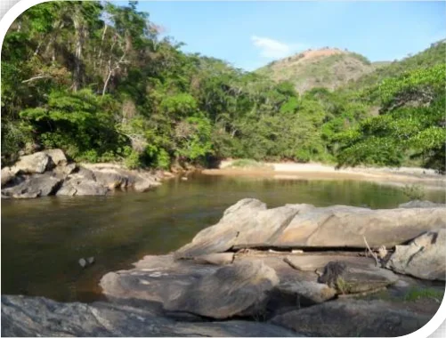 |
            | :--: |
            | *O Rio Tanque e a praia em sua margem* |
            
            O córrego Roncador que domina o vale das escaladas, pode ser considerado uma manancial de altíssima capacidade. Do vale das escaladas, com uma área de apenas 2,5 quilômetros quadrados, escorre uma surpreendente vazão média de cerca de 50 litros por segundo. A razão disso é que o eixo do vale é coincidente com uma importante falha geológica, ainda ativa, por onde ascende tão rico aquífero. É farta a água para consumo nas escaladas e para o banho refrescante ao final.
            
            ## Região das Escaladas
            
            O complexo de vias de escalada de Ferros situa-se nas Fazendas Roncador e Retiro das Águas, de propriedade do montanhista (detentor de mais de 460 conquistas em sua carreira e conquistador da maioria das vias em Ferros) Antonio Carlos Magalhães (Tonico).
            
            As escaladas em Ferros foram iniciadas após a pioneira conquista da via “Iron Men” (4º V – 130 metros), pelo Tonico, seu filho Juliano Magalhães e Marcos Leiras, em 26 de fevereiro de 2006, na chamada Parede Principal, a qual se tornaria a parede com maior concentração de vias longas do local.
            
            Além de relativa proximidade ao centro de Belo Horizonte (aproximadamente 3 horas de carro), este polo de escaladas impressiona pelo enorme potencial, com paredes de todos os estilos e tamanhos, apresentando vias longas, curtas, de aderência, agarras, negativos, fendas, proteções fixas e móveis, graduações das mais simplórias até vias complexas de alta graduação, etc.
            
            Nos diversos setores da região, é possível fazer escaladas curtas para treinar lances sejam atléticos, ou de puro equilíbrio, ou entrar em vias longas, com mais de quatro enfiadas de corda, testando assim o psicológico e a resistência do escalador.
            
            Além das inúmeras possibilidades de escalada, a região conta com agradável rio Tanque, com suas águas cálidas (26 a 28 graus) para banho após as atividades, bem como locais estratégicos de camping, como as próprias praias à beira rio.
            
            Água potável é encontrada em abundância, notadamente ao longo de todo o vale do Roncador, que é cortado pelo córrego de mesmo nome, suprindo os excursionistas de água fresca bem próximo às bases.
  - **[4]**:
    - **texto**: Como Chegar
    - **destino**:
      - **secao_textual**:
        - **conteudo**:
            # Como Chegar
            
            Localização no Google Maps: https://maps.app.goo.gl/hGmJWp5oT1wnXpsG7
            
            ## De Carro
            
            Saindo de BH, pegue a BR-262 em direção à Vitória. Vire à esquerda no trevo entre Vitória e Itabira, direção Itabira. Mais adiante, no trevo entre Itabira e Santa Maria do Itabira, pegue à direita, em direção a esta última cidade. No antigo bar “Parada Certa”, que fica a cerca de 20 km de Santa Maria do Itabira, pode-se seguir pelo asfalto em direção ao trevo de Ferros, ou pegar um caminho mais curto, com mais estrada de terra, evitando passar pela cidade. Do centro de Ferros até a área de escaladas, siga o mapa na próxima página. O trajeto total possui cerca de 190 quilômetros, feitos em aproximadamente 3 horas.
            
            ## De Ônibus
            
            Pegar o ônibus da viação SARITUR, na rodoviária de BH, com destino a Ferros (valor em fevereiro de 2015: R$54,20). A viagem dura em torno de quatro horas.
            
            Chegando em Ferros, é fácil conseguir um táxi com corrida combinada, por aproximadamente R$40,00, para percorrer os 11 Km do centro da cidade à área propícia para camping, próxima à base das escaladas. Lembre-se de combinar com o taxista a corrida de retorno!
            
            | 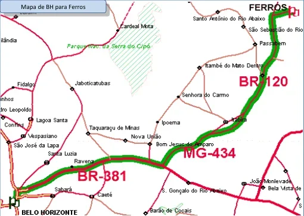 |
            | :--: |
            | *Mapa de BH para Ferros* |
            
            | 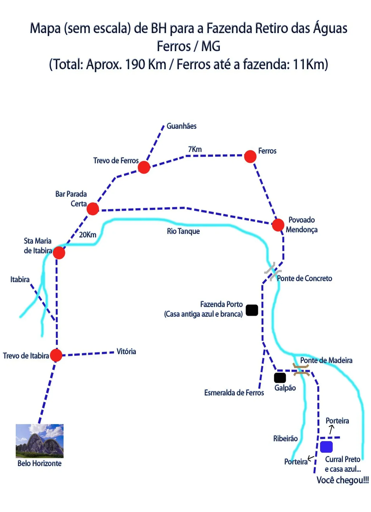 |
            | :--: |
            | *Mapa de BH para Fazenda Retiro das Águas* |
            
            |  |
            | :--: |
            | *Mapa de satélite de Ferros à Fazenda Retiro das Águas* |
  - **[5]**:
    - **texto**: Regras
    - **destino**:
      - **secao_textual**:
        - **conteudo**:
            # ATENÇÃO!
            
            Escalada é um esporte de risco! Este guia não capacita o leitor a praticar o montanhismo de forma segura. Para tal, procure instrutores qualificados, de preferência federados e/ou guias de um clube oficial de montanhismo. Lembre-se: Você é responsável pelos seus próprios atos.
            
            O montanhismo é um esporte de liberdade e tudo o que não precisamos é levar as regras e leis da cidade para a montanha. Mas isto só é possível porque o montanhista que se define como tal segue dois princípios básicos: proteger as montanhas e respeitar os outros que as frequentam.
            
            Consulte sempre o código de ética vigente no local em que pretende praticar o montanhismo e pense antes de cada ato na montanha, refletindo assim os nossos ideais no esporte através dos tempos. Não deprede a vegetação, priorize as proteções móveis às fixas, evite a equipagem de vias de parede (vindo de cima) ou a abertura de vias/variantes que interfiram no traçado de outras existentes e seja sempre cortês com os montanhistas, moradores e usuários da região.
            
            ## Links Úteis
            
            - CBME (Confederação Brasileira de Montanhismo e Escalada): http://www.cbme.org.br
            - CEM (Centro Excursionista Mineiro): http://www.sitedocem.org.br
            - Tonico (Site pessoal do Tonico Magalhães): http://www.tonicomagalhaes.com.br
            - FEMEMG (Federação de Montanhismo e Escalada de Minas Gerais): http://www.fememg.org
            - FEMERJ (Federação de Montanhismo do Estado do Rio de Janeiro): http://www.femerj.org
            - FEMESP (Federação de Montanhismo do Estado de São Paulo): http://www.femesp.org
            - FEPAM (Federação Paranaense de Montanhismo): http://www.fepampr.org.br
            - ACE (Associação Capixaba de Escalada): http://www.ace-es.org.br/
            - FGM (Federação Gaúcha de Montanhismo): http://www.fgm.org.br
            - FEMECE (Federação de Montanhismo e Escalada do Estado do Ceará): http://www.femece.org.br
- **ultima_migracao**: 4
- **publicar_croqui**: True
- **revisado_manualmente**: False
- **revisado_bounding_circle**: False
- **status_desenho_extraivel**: DESENHO_EXTRAIDO

## Parte: setor_cachoeira

### Setor (Pico: Ferros)

- **descricao**:
    Capa: Maria Fernanda na conquista da "Pé na Chapa" (Foto: Pedro Bugim)
    
    O Subsetor Cachoeira, próximo à Cachoeira do Córrego Sapé, conta com apenas quatro vias, ideais para os primeiros contatos com a escalada em rocha, em particular, para as vias tradicionais, com pouca inclinação e muita aderência.
    
    A base destas vias fica a cinco minutos da sede da fazenda Retiro das Águas, na lateral direita da estrada de terra, ainda acessível por automóveis, logo após uma pequena casa sem uso no lado esquerdo da mesma.
    
    Este setor, apesar de curto e com lances simples, por ficar no sol o dia quase todo, apresenta uma parede bastante quente (como indica o nome de duas das vias), sendo ideal para escaladas pela parte inicial da manhã, ou ao final da tarde.
- **nome**: Cachoeira
- **mapas**:
  - **[0]**:
    - **caminho_imagem_mapa**: 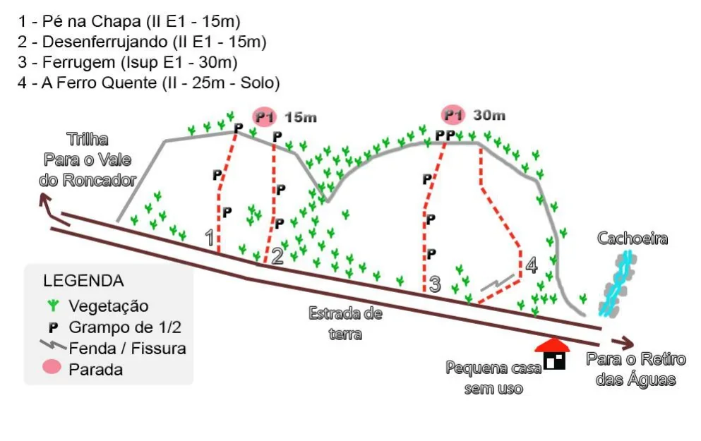
    - **largura_mapa**: 993
    - **altura_mapa**: 625
    - **referencias**:
      - **[0]**:
        - **escalada**: Pé na Chapa
        - **ids**:
          - 1
      - **[1]**:
        - **escalada**: Desenferrujando
        - **ids**:
          - 2
          - P1_15m
      - **[2]**:
        - **escalada**: Ferrugem
        - **ids**:
          - 3
          - P1_30m
      - **[3]**:
        - **escalada**: A Ferro Quente
        - **ids**:
          - 4
          - P1_30m
    - **pontos_de_interesse**:
      - **[0]**:
        - **id**: 1
        - **label**: 1
        - **circulo**:
          - **x**: 297
          - **y**: 338
          - **raio**: 16
      - **[1]**:
        - **id**: 2
        - **label**: 2
        - **circulo**:
          - **x**: 392
          - **y**: 365
          - **raio**: 16
      - **[2]**:
        - **id**: 3
        - **label**: 3
        - **circulo**:
          - **x**: 615
          - **y**: 403
          - **raio**: 15
      - **[3]**:
        - **id**: 4
        - **label**: 4
        - **circulo**:
          - **x**: 754
          - **y**: 375
          - **raio**: 14
      - **[4]**:
        - **id**: P1_15m
        - **label**: 
        - **circulo**:
          - **x**: 375
          - **y**: 166
          - **raio**: 16
      - **[5]**:
        - **id**: P1_30m
        - **label**: 
        - **circulo**:
          - **x**: 642
          - **y**: 163
          - **raio**: 16
  - **[1]**:
    - **caminho_imagem_mapa**: 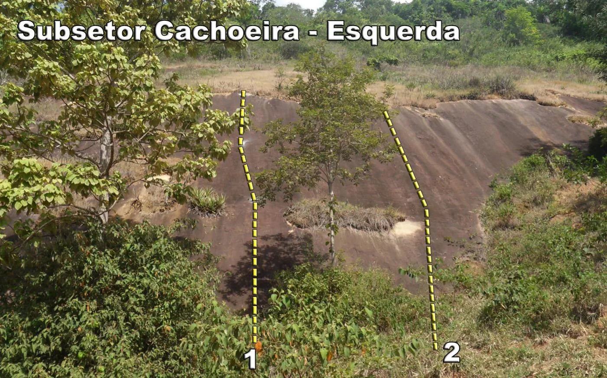
    - **largura_mapa**: 1401
    - **altura_mapa**: 873
    - **referencias**:
      - **[0]**:
        - **escalada**: Pé na Chapa
        - **ids**:
          - 1
      - **[1]**:
        - **escalada**: Desenferrujando
        - **ids**:
          - 2
    - **pontos_de_interesse**:
      - **[0]**:
        - **id**: 1
        - **label**: 1
        - **circulo**:
          - **x**: 581
          - **y**: 828
          - **raio**: 33
      - **[1]**:
        - **id**: 2
        - **label**: 2
        - **circulo**:
          - **x**: 1044
          - **y**: 815
          - **raio**: 34
  - **[2]**:
    - **caminho_imagem_mapa**: 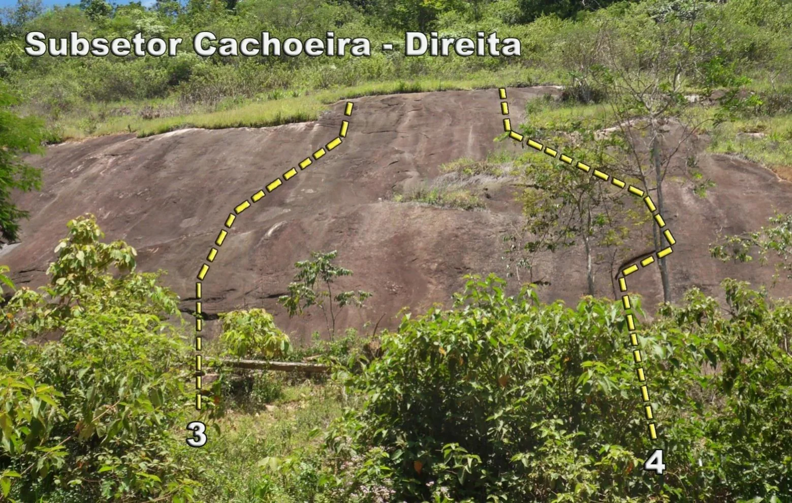
    - **largura_mapa**: 1559
    - **altura_mapa**: 990
    - **referencias**:
      - **[0]**:
        - **escalada**: Ferrugem
        - **ids**:
          - 3
      - **[1]**:
        - **escalada**: A Ferro Quente
        - **ids**:
          - 4
    - **pontos_de_interesse**:
      - **[0]**:
        - **id**: 3
        - **label**: 3
        - **circulo**:
          - **x**: 385
          - **y**: 854
          - **raio**: 33
      - **[1]**:
        - **id**: 4
        - **label**: 4
        - **circulo**:
          - **x**: 1290
          - **y**: 908
          - **raio**: 33
- **escaladas**:
  - **[0]**:
    - **via_esportiva**:
      - **descricao**: Via protegida por três grampos de ½ (incluindo o grampo de topo), muito boa para treinamento de guiadas e top-ropes com iniciantes. Rapel / top-rope com corda única de 50m.
      - **nome**: Pé na Chapa
      - **dificuldade**: BR_2
      - **exposicao**: E1
      - **extensao**: 15
      - **quantidade_protecoes_intermediarias**: 2
      - **quantidade_protecoes_parada**: 1
      - **conquistadores**:
        - Pedro Bugim
        - Maria Fernanda Patrício
      - **data_abertura**: 2012-02-21
  - **[1]**:
    - **via_esportiva**:
      - **descricao**: Via semelhante à anterior, contando com três grampos, sendo um de top-rope.
      - **nome**: Desenferrujando
      - **dificuldade**: BR_2
      - **exposicao**: E1
      - **extensao**: 15
      - **quantidade_protecoes_intermediarias**: 2
      - **quantidade_protecoes_parada**: 1
      - **conquistadores**:
        - Maria Fernanda Patrício
        - Pedro Bugim
      - **data_abertura**: 2014-03-03
  - **[2]**:
    - **via_esportiva**:
      - **descricao**: Via com boa grampeação, até atingir o topo da falésia, onde existe uma parada dupla. Ótima opção para o primeiro contato com o esporte, ou para quem está começando a guiar, perfeita para ensinar técnicas de posicionamento, equalização e costuras, sem preocupação com a parte técnica em si. Rapel / top-rope em corda única de 60m.
      - **nome**: Ferrugem
      - **dificuldade**: BR_1SUP
      - **exposicao**: E1
      - **extensao**: 30
      - **quantidade_protecoes_intermediarias**: 4
      - **quantidade_protecoes_parada**: 2
      - **conquistadores**:
        - Tonico Magalhães
        - Nádia Moreira
      - **data_abertura**: 2007-04-08
  - **[3]**:
    - **via_movel**:
      - **descricao**: Via conquistada em solo integral, não possuindo proteções fixas. A descida é feita por trilha ao lado direito da falésia, ou pela via “Ferrugem”, à esquerda. Inicia em uma fissura óbvia e segue a linha natural da pedra até o topo.
      - **nome**: A Ferro Quente
      - **dificuldade**: BR_2
      - **extensao**: 25
      - **protecoes_moveis**: Fissura (conquistada em solo integral)
      - **conquistadores**:
        - Tonico Magalhães
        - Celso Ferreira Gomes
      - **data_abertura**: 2010-02-16
- **caminho_imagem_capa**: 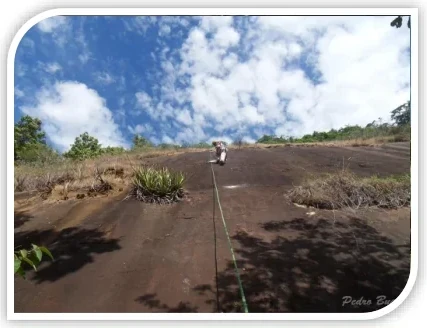
- **precomputados**:
  - **total_escaladas**: 4
  - **total_esportivas**: 3

## Parte: grupo_aderencias

### Grupo (Pico: Ferros)

- **descricao**:
    Capa: Tonico, na conquista da "Solamente" - solo integral (Foto: Celso Gomes)
    
    Ao entrar no vale do Roncador, o excursionista terá à sua esquerda a Parede das Aderências, de dimensões mais reduzidas do que a Parede Principal e com vias predominantemente em aderência - como o próprio nome sugere – variando de 20 a 230 metros de extensão.
    
    As vias mais longas apresentam grau geral 3º, à exceção da via “Solamente”, paredão com 120 metros, em 1º II, conquistada em solo integral pelo Tonico. Os graus específicos mais frequentes ficam entre IV e V (crux), havendo uma via curta de VIIa (“Ferro na Boneca” – 20m) e outra mista, em VI (“O Psicopata de Ferros”).
    
    Dentre suas vias, destacam-se a “Cordeiro de Deus” (V – 60m), “O Psicopata de Ferros” (4° VI E2 D1 – 70m – Mista), “Cinquentona de Ferros” (IIIsup – 60m), “Grampos de Ferros” (3º IVsup – 110m) e “Social Club” (3º IIIsup – 200m), vias que, em seu conjunto, permitem um bom conhecimento desse trecho do vale.
    
    Este setor é imperdível para aqueles que apreciam a técnica de aderência, bem como aos que estão necessitando de treino na referida. Apesar das poucas agarras, a aderência da pedra é impressionante, conferindo muita confiança ao escalador.
    
    Curiosamente, algumas destas vias possuem também proteções mistas, ou seja, intercalando grampos fixos e materiais móveis.
- **nome**: Parede das Aderências
- **caminho_imagem_capa**: 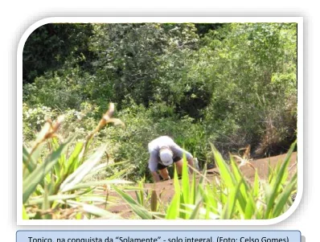
- **setores**:
  - **[0]**:
    - **conteudo**:
      - **descricao**:
          Capa: Maria Fernanda na "Vr. Cachorro Louco" (Foto: Pedro Bugim)
          
          Este é o primeiro setor da Parede das Aderências, um pouco isolado do resto da parede, por localizar-se quase na borda inicial do Vale do Roncador e por possuir muita vegetação ao seu redor.
          
          Para acessar as bases das vias neste setor, é necessário pegar a trilha do Vale do Roncador, que se inicia pouco depois do Subsetor Cachoeira, subindo em diagonal para a direita da estrada de terra.
          
          Andando pouco mais de 100 metros na trilha, deve-se cruzar o córrego e passar pela cerca de arame farpado ao lado esquerdo. Muita atenção ao fazer este procedimento, primeiro para não causar lesões, e em segundo lugar, para não causar danos à estrutura da cerca. Existe um bom espaço que possibilita a passagem por baixo da cerca, sem grandes esforços.
          
          Ao cruzar a cerca, a trilha segue pouco definida por 30 metros, até juntar-se à parede. Neste ponto, fica a base da via “Nesse Mato Tem Cachorro”. Subindo para a direita, chega-se à base da “Libera Liberou” e descendo para a esquerda (em meio ao capim), chega-se à base da “Solamente”.
          
          Em geral, são vias de baixa graduação, boas para treinar o psicológico gradualmente, uma vez que as vias variam seu grau de exposição, possuindo vias de E1, E2, E3 e E5, sem possuir lances muito técnicos. A exceção é a via “Dez Mil e Uma Noites”, que apesar da boa grampeação, possui lances de VI grau, exigindo maior atenção e habilidade por parte do escalador.
      - **nome**: Extrema Esquerda
      - **mapas**:
        - **[0]**:
          - **caminho_imagem_mapa**: 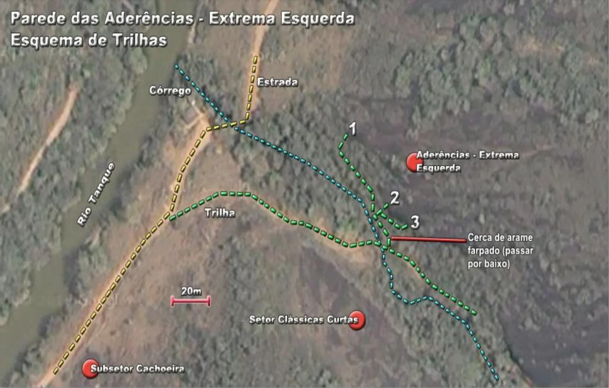
          - **referencias**:
            - **[0]**:
              - **escalada**: Solamente
              - **ids**:
                - 1
            - **[1]**:
              - **escalada**: Nesse Mato Tem Cachorro
              - **ids**:
                - 2
            - **[2]**:
              - **escalada**: Vr. Cachorro Louco
              - **ids**:
                - 2
            - **[3]**:
              - **escalada**: Libera Liberou
              - **ids**:
                - 3
          - **largura_mapa**: 1607
          - **altura_mapa**: 1025
          - **pontos_de_interesse**:
            - **[0]**:
              - **id**: 1
              - **label**: 1
              - **circulo**:
                - **x**: 934
                - **y**: 340
                - **raio**: 25
            - **[1]**:
              - **id**: 2
              - **label**: 2
              - **circulo**:
                - **x**: 1043
                - **y**: 522
                - **raio**: 26
            - **[2]**:
              - **id**: 3
              - **label**: 3
              - **circulo**:
                - **x**: 1095
                - **y**: 585
                - **raio**: 25
        - **[1]**:
          - **caminho_imagem_mapa**: 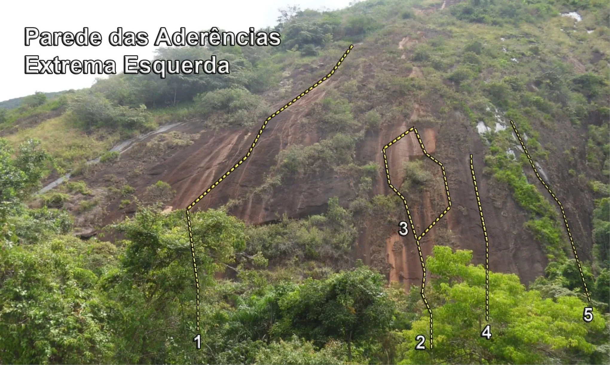
          - **referencias**:
            - **[0]**:
              - **escalada**: Solamente
              - **ids**:
                - 1
            - **[1]**:
              - **escalada**: Nesse Mato Tem Cachorro
              - **ids**:
                - 2
                - 2_vaz
            - **[2]**:
              - **escalada**: Vr. Cachorro Louco
              - **ids**:
                - 2
                - 3
            - **[3]**:
              - **escalada**: Libera Liberou
              - **ids**:
                - 4
            - **[4]**:
              - **escalada**: Dez Mil e Uma Noites
              - **ids**:
                - 5
          - **largura_mapa**: 2041
          - **altura_mapa**: 1224
          - **pontos_de_interesse**:
            - **[0]**:
              - **id**: 1
              - **label**: 1
              - **circulo**:
                - **x**: 662
                - **y**: 1146
                - **raio**: 33
            - **[1]**:
              - **id**: 2
              - **label**: 2
              - **circulo**:
                - **x**: 1408
                - **y**: 1148
                - **raio**: 33
            - **[2]**:
              - **id**: 3
              - **label**: 3
              - **circulo**:
                - **x**: 1351
                - **y**: 765
                - **raio**: 33
            - **[3]**:
              - **id**: 4
              - **label**: 4
              - **circulo**:
                - **x**: 1628
                - **y**: 1115
                - **raio**: 33
            - **[4]**:
              - **id**: 5
              - **label**: 5
              - **circulo**:
                - **x**: 1969
                - **y**: 1054
                - **raio**: 33
            - **[5]**:
              - **id**: 2_vaz
              - **label**: 
              - **circulo**:
                - **x**: 1501
                - **y**: 702
                - **raio**: 34
              - **cor**: 
        - **[2]**:
          - **caminho_imagem_mapa**: 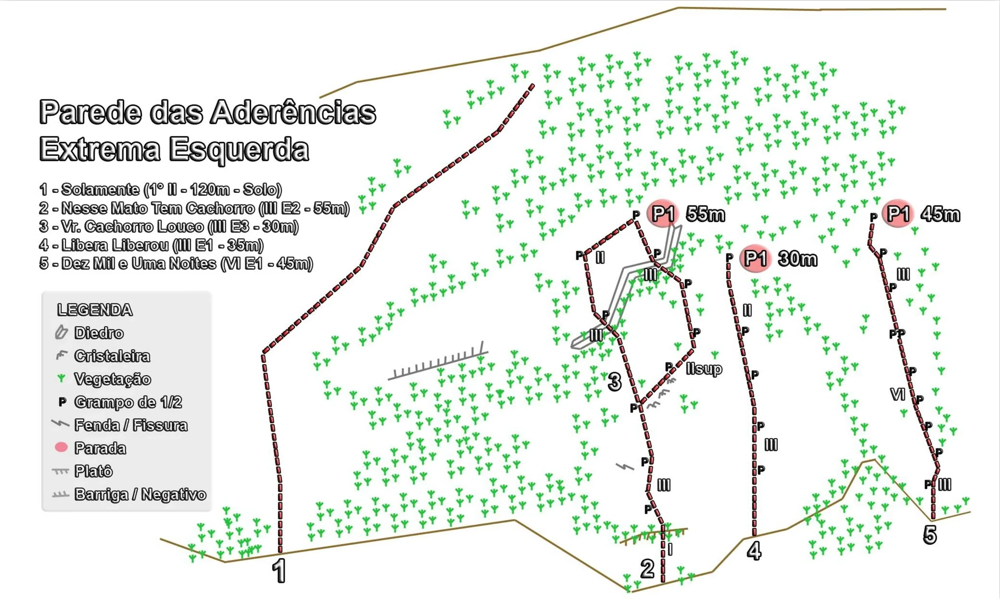
          - **referencias**:
            - **[0]**:
              - **escalada**: Solamente
              - **ids**:
                - 1
            - **[1]**:
              - **escalada**: Nesse Mato Tem Cachorro
              - **ids**:
                - 2
                - p1_1
                - 2_vaz
            - **[2]**:
              - **escalada**: Vr. Cachorro Louco
              - **ids**:
                - 2
                - p1_1
                - 3
            - **[3]**:
              - **escalada**: Libera Liberou
              - **ids**:
                - 4
                - p1_2
            - **[4]**:
              - **ids**:
                - 5
                - P1_3
              - **escalada**: Dez Mil e Uma Noites
          - **largura_mapa**: 2041
          - **altura_mapa**: 1224
          - **pontos_de_interesse**:
            - **[0]**:
              - **id**: 1
              - **label**: 1
              - **circulo**:
                - **x**: 573
                - **y**: 1166
                - **raio**: 35
            - **[1]**:
              - **id**: 2
              - **label**: 2
              - **circulo**:
                - **x**: 1322
                - **y**: 1165
                - **raio**: 34
            - **[2]**:
              - **id**: 3
              - **label**: 3
              - **circulo**:
                - **x**: 1256
                - **y**: 782
                - **raio**: 34
            - **[3]**:
              - **id**: 4
              - **label**: 4
              - **circulo**:
                - **x**: 1537
                - **y**: 1126
                - **raio**: 34
            - **[4]**:
              - **id**: 5
              - **label**: 5
              - **circulo**:
                - **x**: 1902
                - **y**: 1095
                - **raio**: 34
            - **[5]**:
              - **id**: p1_1
              - **label**: 
              - **circulo**:
                - **x**: 1352
                - **y**: 437
                - **raio**: 32
            - **[6]**:
              - **id**: p1_2
              - **label**: 
              - **circulo**:
                - **x**: 1542
                - **y**: 530
                - **raio**: 32
            - **[7]**:
              - **id**: P1_3
              - **label**: 
              - **circulo**:
                - **x**: 1833
                - **y**: 436
                - **raio**: 31
            - **[8]**:
              - **id**: 2_vaz
              - **label**: 
              - **circulo**:
                - **x**: 1438
                - **y**: 753
                - **raio**: 46
              - **cor**: 
      - **escaladas**:
        - **[0]**:
          - **via_movel**:
            - **descricao**: Via conquistada em solo integral, sem grampos. A descida deve ser feita desescalando-se a própria linha ou caminhando-se pelo mato do lado esquerdo.
            - **nome**: Solamente
            - **dificuldade**: BR_2
            - **exposicao**: E5
            - **extensao**: 120
            - **conquistadores**:
              - Tonico Magalhães
            - **data_abertura**: 2010-11-27
        - **[1]**:
          - **via_esportiva**:
            - **descricao**: Via que começa passando por uma sequência de platôs com vegetação, até chegar ao primeiro grampo, na parede já limpa. Após a segunda proteção, segue em diagonal para a direita, tornando a subir logo após, na direção do final do óbvio diedro. Após a virada do diedro, com um grampo no lance, segue-se em leve diagonal para a esquerda, até a última proteção da via.
            - **nome**: Nesse Mato Tem Cachorro
            - **dificuldade**: BR_3
            - **exposicao**: E2
            - **extensao**: 55
            - **quantidade_protecoes_intermediarias**: 7
            - **quantidade_protecoes_parada**: 2
            - **conquistadores**:
              - Pedro Bugim
              - Maria Fernanda Patrício
            - **data_abertura**: 2012-02-22
        - **[2]**:
          - **via_esportiva**:
            - **descricao**: Variante da via anterior, segue reta após a segunda proteção da via principal, passando por um pouco de mato, até fazer a virada do diedro, com um grampo logo acima do mesmo para proteção. Depois da virada, segue por uma linha branca na pedra, com mais um grampo intermediário, até chegar à parada final da “Nesse Mato Tem Cachorro”. Por possuir apenas duas proteções em 30 metros, apesar de fácil, esta via deve ser abordada com cautela.
            - **nome**: Vr. Cachorro Louco
            - **dificuldade**: BR_3
            - **exposicao**: E3
            - **extensao**: 30
            - **quantidade_protecoes_intermediarias**: 2
            - **quantidade_protecoes_parada**: 2
            - **conquistadores**:
              - Pedro Bugim
              - Maria Fernanda Patrício
            - **data_abertura**: 2012-02-22
        - **[3]**:
          - **via_esportiva**:
            - **descricao**: Via predominantemente em aderência e agarras, com boa grampeação até a parada final. Segue desde a base até o final em linha praticamente reta, terminando na barreira de vegetação.
            - **nome**: Libera Liberou
            - **dificuldade**: BR_3
            - **exposicao**: E1
            - **extensao**: 35
            - **quantidade_protecoes_intermediarias**: 6
            - **quantidade_protecoes_parada**: 2
            - **conquistadores**:
              - Tonico Magalhães
              - Nádia Moreira
            - **data_abertura**: 2009-08-01
        - **[4]**:
          - **via_esportiva**:
            - **descricao**: Saída fácil em dois lances com boas agarras e bom posicionamento para os pés. Após o segundo grampo, seguem-se quatro lances bem íngremes de VI grau, com notável escassez de agarras e posicionamento delicado e instável para os pés, especialmente porque, nesse trecho, a rocha mostra-se mais friável. Após a parada dupla, seguem-se mais três lances fáceis até o final da via. A parada dupla é uma boa opção para o top-rope envolvendo a sequência de lances de VI. O acesso à base não foi feito pelo mesmo caminho que leva às outras vias do setor, passando sob a cerca ao lado do córrego. Sobe-se a trilha mais uns 20 metros após o córrego e toma-se à esquerda nesse ponto.
            - **nome**: Dez Mil e Uma Noites
            - **dificuldade**: BR_6
            - **exposicao**: E1
            - **extensao**: 45
            - **quantidade_protecoes_intermediarias**: 10
            - **quantidade_protecoes_parada**: 2
            - **conquistadores**:
              - Celso Ferreira Gomes
              - Tonico Magalhães
            - **data_abertura**: 2012-05-06
      - **caminho_imagem_capa**: 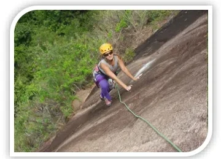
      - **precomputados**:
        - **total_escaladas**: 5
        - **total_esportivas**: 4
  - **[1]**:
    - **conteudo**:
      - **descricao**:
          Capa: Pedro Bugim na conquista da "O Psicopata de Ferros" (Foto: Maria Fernanda)
          
          O Setor Esquerdo da Parede das Aderências é dividido em duas partes (Esquerda 1 e Esquerda 2), separadas por uma forte língua de vegetação, possuindo vias de 20 até 140 metros de extensão, predominantemente em aderência.
          
          Apesar do setor ser predominantemente de aderência, três vias destoam das demais, sendo quase que completamente em móvel (“Fissurim”, “O Psicopata de Ferros” e “Vr. Caçadora de Micuim”), seguindo por bonitas fendas, proporcionando ao escalador um bom treino desta técnica.
          
          ## Acesso
          
          O acesso às bases é feito pela trilha principal do Vale do Roncador. Após a primeira travessia do córrego, anda-se aproximadamente 100 metros até encontrar – à esquerda - a entrada da picada que leva às bases das primeiras vias neste setor (“Cordada 171”, “Inês é Morta” e “Sempre Viva”), logo antes de passar por uma porteira. Esta trilha, apesar de pouco visível, está marcada com um totem de pedra em seu início.
          
          Para as demais vias da parte esquerda deste setor, basta continuar por poucos metros na trilha principal, uma vez que as bases saem quase diretamente desta trilha.
          
          Para acessar as bases do setor da direita, segue-se por aproximadamente 80 metros na trilha principal até encontrar a picada que sobe à esquerda. Desta picada, pode-se costear a parede, seguindo por cima ou para baixo, com imediata visualização dos grampos das vias “Frio na Barriga” e “Pescoço de Minhoca”.
          
          ### Esquema de Trilhas
          
          - **1**: Base das vias “Cordada 171”, “Inês é Morta” e “Sempre Viva”
          - **2**: Base das vias entre “Fissurim” e “Sherlock Holmes”
          - **3**: Base das vias entre “Professor Moriarty” e “O Psicopata de Ferros”
          - **4**: Base das vias “Frio na Barriga” e “Pescoço de Minhoca”
          - **5**: Base das vias “Grampos de Ferros” e “Prateado”
          
          |  |
          | :--: |
          | *Giselle Melo repetindo a “Professor Moriarty” logo após a conquista. (Foto: Pedro Bugim)* |
          
          | 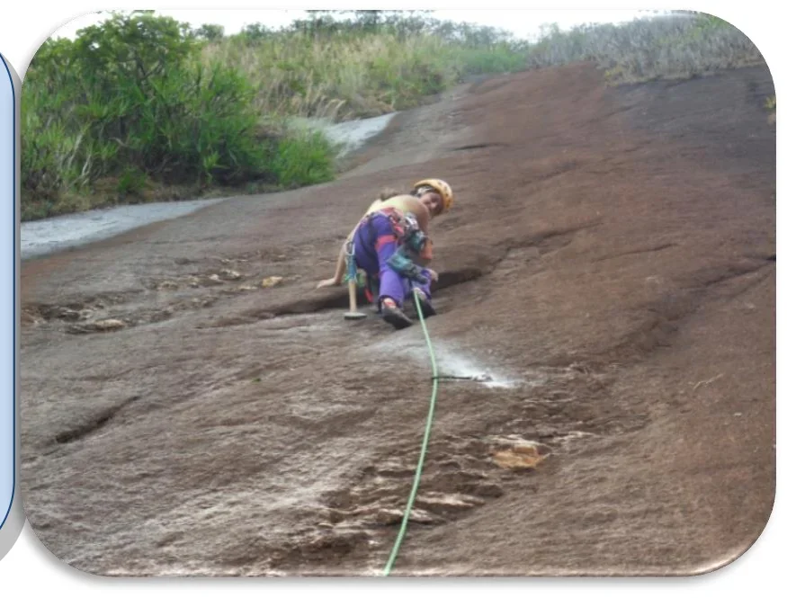 |
          | :--: |
          | *Maria Fernanda na conquista da segunda enfiada do paredão “Que Qui Ocê Foi Fazê Nu Mato?” (Foto: Pedro Bugim)* |
          
          |  |
          | :--: |
          | *Eustáquio Júnior na trilha a frente da via “Pescoço de Minhoca”, fotografando os escaladores. (Foto: Pedro Bugim)* |
      - **nome**: Esquerda
      - **mapas**:
        - **[0]**:
          - **caminho_imagem_mapa**: 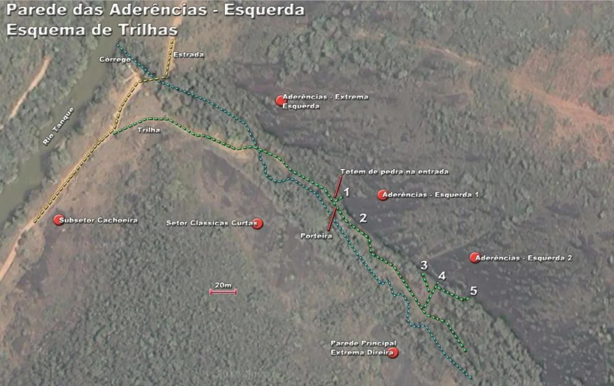
          - **largura_mapa**: 1628
          - **altura_mapa**: 1025
          - **referencias**:
            - **[0]**:
              - **escalada**: Cordada 171
              - **ids**:
                - 1
            - **[1]**:
              - **escalada**: Inês é Morta
              - **ids**:
                - 1
            - **[2]**:
              - **escalada**: Sempre Viva
              - **ids**:
                - 1
            - **[3]**:
              - **escalada**: Fissurim
              - **ids**:
                - 2
            - **[4]**:
              - **escalada**: Zé Marta
              - **ids**:
                - 2
            - **[5]**:
              - **escalada**: Bolinha
              - **ids**:
                - 2
            - **[6]**:
              - **escalada**: Testa de Ferro
              - **ids**:
                - 2
            - **[7]**:
              - **escalada**: Ferro na Boneca
              - **ids**:
                - 2
            - **[8]**:
              - **escalada**: Maria Diz Graça
              - **ids**:
                - 2
            - **[9]**:
              - **escalada**: Zé Mangueira
              - **ids**:
                - 2
            - **[10]**:
              - **escalada**: Sherlock Holmes
              - **ids**:
                - 2
            - **[11]**:
              - **escalada**: Professor Moriarty
              - **ids**:
                - 3
            - **[12]**:
              - **escalada**: Que Qui Ocê Foi Fazê Nu Mato?
              - **ids**:
                - 3
            - **[13]**:
              - **escalada**: O Psicopata de Ferros
              - **ids**:
                - 3
            - **[14]**:
              - **escalada**: Vr. Caçadora de Micuim
              - **ids**:
                - 3
                - 4
            - **[15]**:
              - **escalada**: Frio na Barriga
              - **ids**:
                - 4
            - **[16]**:
              - **escalada**: Pescoço de Minhoca
              - **ids**:
                - 4
            - **[17]**:
              - **escalada**: Grampos de Ferros
              - **ids**:
                - 5
            - **[18]**:
              - **escalada**: Prateado
              - **ids**:
                - 5
          - **pontos_de_interesse**:
            - **[0]**:
              - **id**: 1
              - **label**: 1
              - **circulo**:
                - **x**: 921
                - **y**: 511
                - **raio**: 19
            - **[1]**:
              - **id**: 2
              - **label**: 2
              - **circulo**:
                - **x**: 963
                - **y**: 578
                - **raio**: 19
            - **[2]**:
              - **id**: 3
              - **label**: 3
              - **circulo**:
                - **x**: 1125
                - **y**: 703
                - **raio**: 19
            - **[3]**:
              - **id**: 4
              - **label**: 4
              - **circulo**:
                - **x**: 1172
                - **y**: 731
                - **raio**: 19
            - **[4]**:
              - **id**: 5
              - **label**: 5
              - **circulo**:
                - **x**: 1256
                - **y**: 770
                - **raio**: 19
        - **[1]**:
          - **caminho_imagem_mapa**: 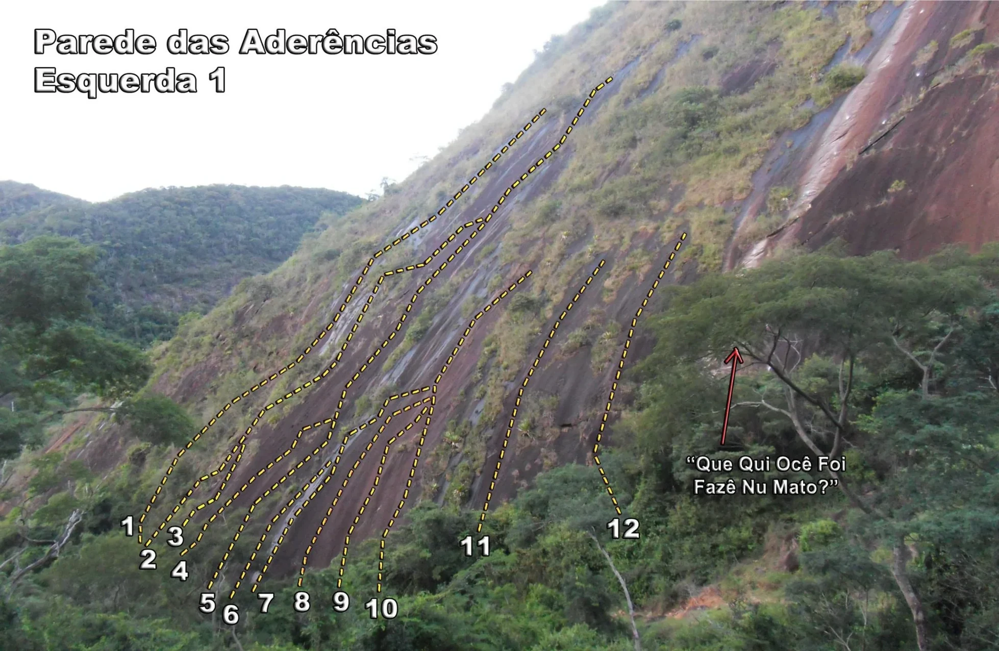
          - **largura_mapa**: 1958
          - **altura_mapa**: 1276
          - **referencias**:
            - **[0]**:
              - **escalada**: Cordada 171
              - **ids**:
                - 1
            - **[1]**:
              - **escalada**: Inês é Morta
              - **ids**:
                - 2
            - **[2]**:
              - **escalada**: Sempre Viva
              - **ids**:
                - 3
            - **[3]**:
              - **escalada**: Fissurim
              - **ids**:
                - 4
            - **[4]**:
              - **escalada**: Zé Marta
              - **ids**:
                - 5
            - **[5]**:
              - **escalada**: Bolinha
              - **ids**:
                - 6
            - **[6]**:
              - **escalada**: Testa de Ferro
              - **ids**:
                - 7
            - **[7]**:
              - **escalada**: Ferro na Boneca
              - **ids**:
                - 8
            - **[8]**:
              - **escalada**: Maria Diz Graça
              - **ids**:
                - 9
            - **[9]**:
              - **escalada**: Zé Mangueira
              - **ids**:
                - 10
            - **[10]**:
              - **escalada**: Sherlock Holmes
              - **ids**:
                - 11
            - **[11]**:
              - **escalada**: Professor Moriarty
              - **ids**:
                - 12
            - **[12]**:
              - **ids**:
                - que_qui_oce
              - **grupo**: Parede das Aderências
              - **setor**: Esquerda
              - **escalada**: Que Qui Ocê Foi Fazê Nu Mato?
          - **pontos_de_interesse**:
            - **[0]**:
              - **id**: 1
              - **label**: 1
              - **circulo**:
                - **x**: 256
                - **y**: 1031
                - **raio**: 29
            - **[1]**:
              - **id**: 2
              - **label**: 2
              - **circulo**:
                - **x**: 290
                - **y**: 1097
                - **raio**: 27
            - **[2]**:
              - **id**: 3
              - **label**: 3
              - **circulo**:
                - **x**: 342
                - **y**: 1051
                - **raio**: 29
            - **[3]**:
              - **id**: 4
              - **label**: 4
              - **circulo**:
                - **x**: 355
                - **y**: 1118
                - **raio**: 29
            - **[4]**:
              - **id**: 5
              - **label**: 5
              - **circulo**:
                - **x**: 406
                - **y**: 1181
                - **raio**: 29
            - **[5]**:
              - **id**: 6
              - **label**: 6
              - **circulo**:
                - **x**: 455
                - **y**: 1207
                - **raio**: 29
            - **[6]**:
              - **id**: 7
              - **label**: 7
              - **circulo**:
                - **x**: 523
                - **y**: 1181
                - **raio**: 29
            - **[7]**:
              - **id**: 8
              - **label**: 8
              - **circulo**:
                - **x**: 591
                - **y**: 1181
                - **raio**: 29
            - **[8]**:
              - **id**: 9
              - **label**: 9
              - **circulo**:
                - **x**: 670
                - **y**: 1181
                - **raio**: 29
            - **[9]**:
              - **id**: 10
              - **label**: 10
              - **circulo**:
                - **x**: 749
                - **y**: 1193
                - **raio**: 39
            - **[10]**:
              - **id**: 11
              - **label**: 11
              - **circulo**:
                - **x**: 934
                - **y**: 1070
                - **raio**: 43
            - **[11]**:
              - **id**: 12
              - **label**: 12
              - **circulo**:
                - **x**: 1225
                - **y**: 1037
                - **raio**: 43
            - **[12]**:
              - **id**: que_qui_oce
              - **label**: 13
              - **retangulo**:
                - **x**: 1506
                - **y**: 930
                - **comprimento**: 363
                - **largura**: 106
        - **[2]**:
          - **caminho_imagem_mapa**: 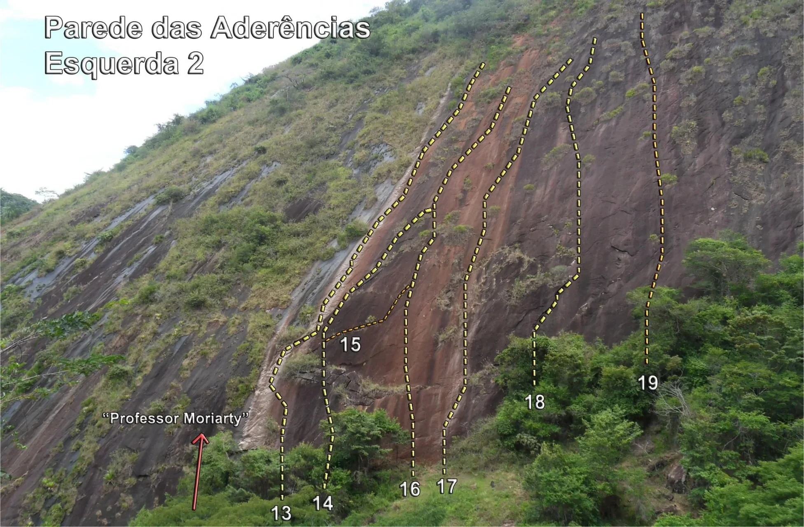
          - **largura_mapa**: 1952
          - **altura_mapa**: 1280
          - **referencias**:
            - **[0]**:
              - **escalada**: Que Qui Ocê Foi Fazê Nu Mato?
              - **ids**:
                - 13
                - 13_f
            - **[1]**:
              - **escalada**: O Psicopata de Ferros
              - **ids**:
                - 14
                - 14_m
                - 14_f
            - **[2]**:
              - **escalada**: Vr. Caçadora de Micuim
              - **ids**:
                - 14
                - 15
                - 14_f
            - **[3]**:
              - **escalada**: Frio na Barriga
              - **ids**:
                - 16
                - 14_f
            - **[4]**:
              - **escalada**: Pescoço de Minhoca
              - **ids**:
                - 17
            - **[5]**:
              - **escalada**: Grampos de Ferros
              - **ids**:
                - 18
            - **[6]**:
              - **escalada**: Prateado
              - **ids**:
                - 19
            - **[7]**:
              - **ids**:
                - professor_moriarty
              - **grupo**: Parede das Aderências
              - **setor**: Esquerda
              - **escalada**: Professor Moriarty
          - **pontos_de_interesse**:
            - **[0]**:
              - **id**: 13
              - **label**: 13
              - **circulo**:
                - **x**: 684
                - **y**: 1245
                - **raio**: 35
            - **[1]**:
              - **id**: 14
              - **label**: 14
              - **circulo**:
                - **x**: 785
                - **y**: 1221
                - **raio**: 35
            - **[2]**:
              - **id**: 15
              - **label**: 15
              - **circulo**:
                - **x**: 852
                - **y**: 835
                - **raio**: 35
            - **[3]**:
              - **id**: 16
              - **label**: 16
              - **circulo**:
                - **x**: 997
                - **y**: 1186
                - **raio**: 35
            - **[4]**:
              - **id**: 17
              - **label**: 17
              - **circulo**:
                - **x**: 1086
                - **y**: 1180
                - **raio**: 35
            - **[5]**:
              - **id**: 18
              - **label**: 18
              - **circulo**:
                - **x**: 1300
                - **y**: 975
                - **raio**: 35
            - **[6]**:
              - **id**: 19
              - **label**: 19
              - **circulo**:
                - **x**: 1574
                - **y**: 928
                - **raio**: 35
            - **[7]**:
              - **id**: professor_moriarty
              - **label**: 12
              - **retangulo**:
                - **x**: 426
                - **y**: 1016
                - **comprimento**: 379
                - **largura**: 57
            - **[8]**:
              - **id**: 14_f
              - **label**: 
              - **circulo**:
                - **x**: 1236
                - **y**: 215
                - **raio**: 30
              - **cor**: 
            - **[9]**:
              - **id**: 14_m
              - **label**: 
              - **circulo**:
                - **x**: 929
                - **y**: 630
                - **raio**: 31
            - **[10]**:
              - **id**: 13_f
              - **label**: 
              - **circulo**:
                - **x**: 1172
                - **y**: 152
                - **raio**: 29
              - **cor**: 
        - **[3]**:
          - **caminho_imagem_mapa**: 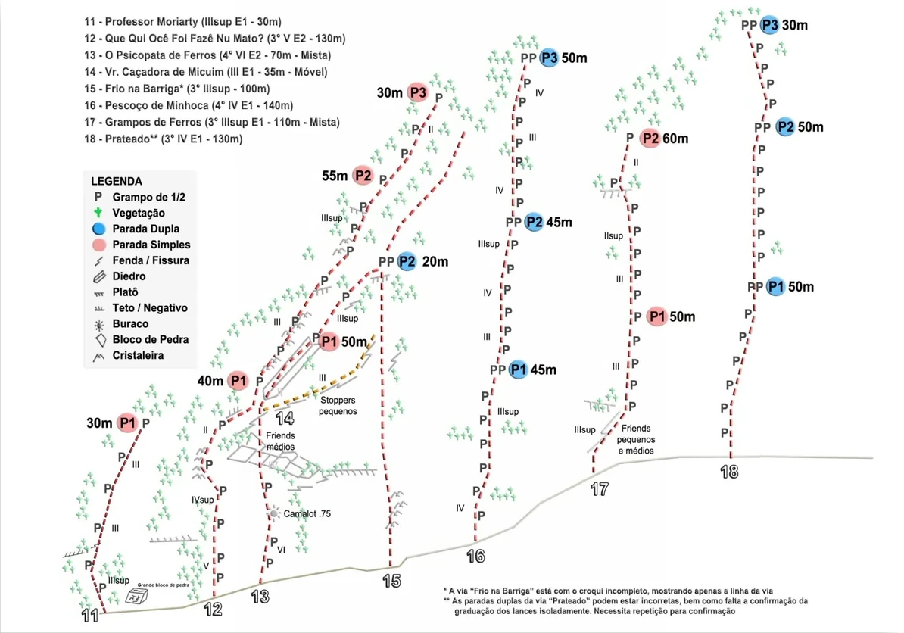
          - **largura_mapa**: 1194
          - **altura_mapa**: 836
          - **pontos_de_interesse**:
            - **[0]**:
              - **id**: 11
              - **label**: 11
              - **circulo**:
                - **x**: 121
                - **y**: 812
                - **raio**: 17
              - **cor**: 
            - **[1]**:
              - **id**: 12
              - **label**: 12
              - **circulo**:
                - **x**: 283
                - **y**: 805
                - **raio**: 17
              - **cor**: 
            - **[2]**:
              - **id**: 13
              - **label**: 13
              - **circulo**:
                - **x**: 344
                - **y**: 788
                - **raio**: 17
              - **cor**: 
            - **[3]**:
              - **id**: 14
              - **label**: 14
              - **circulo**:
                - **x**: 377
                - **y**: 551
                - **raio**: 17
              - **cor**: 
            - **[4]**:
              - **id**: 15
              - **label**: 15
              - **circulo**:
                - **x**: 518
                - **y**: 767
                - **raio**: 17
              - **cor**: 
            - **[5]**:
              - **id**: 16
              - **label**: 16
              - **circulo**:
                - **x**: 629
                - **y**: 734
                - **raio**: 17
              - **cor**: 
            - **[6]**:
              - **id**: 17
              - **label**: 17
              - **circulo**:
                - **x**: 792
                - **y**: 645
                - **raio**: 17
              - **cor**: 
            - **[7]**:
              - **id**: 18
              - **label**: 18
              - **circulo**:
                - **x**: 965
                - **y**: 622
                - **raio**: 17
              - **cor**: 
            - **[8]**:
              - **id**: p1_1
              - **label**: 
              - **circulo**:
                - **x**: 168
                - **y**: 559
                - **raio**: 14
              - **cor**: 
            - **[9]**:
              - **id**: p1_2
              - **label**: 
              - **circulo**:
                - **x**: 314
                - **y**: 503
                - **raio**: 14
              - **cor**: 
            - **[10]**:
              - **id**: p2_2
              - **label**: 
              - **circulo**:
                - **x**: 480
                - **y**: 231
                - **raio**: 14
              - **cor**: 
            - **[11]**:
              - **id**: p3_2
              - **label**: 
              - **circulo**:
                - **x**: 552
                - **y**: 122
                - **raio**: 15
              - **cor**: 
            - **[12]**:
              - **id**: p1_13
              - **label**: 
              - **circulo**:
                - **x**: 435
                - **y**: 451
                - **raio**: 14
              - **cor**: 
            - **[13]**:
              - **id**: p2_13
              - **label**: 
              - **circulo**:
                - **x**: 538
                - **y**: 345
                - **raio**: 14
              - **cor**: 
            - **[14]**:
              - **id**: p1_16
              - **label**: 
              - **circulo**:
                - **x**: 685
                - **y**: 488
                - **raio**: 14
            - **[15]**:
              - **id**: p2_16
              - **label**: 
              - **circulo**:
                - **x**: 706
                - **y**: 293
                - **raio**: 14
              - **cor**: 
            - **[16]**:
              - **id**: p3_16
              - **label**: 
              - **circulo**:
                - **x**: 726
                - **y**: 76
                - **raio**: 13
              - **cor**: 
            - **[17]**:
              - **id**: p1_17
              - **label**: 
              - **circulo**:
                - **x**: 869
                - **y**: 418
                - **raio**: 15
              - **cor**: 
            - **[18]**:
              - **id**: p2_17
              - **label**: 
              - **circulo**:
                - **x**: 859
                - **y**: 183
                - **raio**: 14
              - **cor**: 
            - **[19]**:
              - **id**: p1_18
              - **label**: 
              - **circulo**:
                - **x**: 1025
                - **y**: 378
                - **raio**: 14
              - **cor**: 
            - **[20]**:
              - **id**: p2_18
              - **label**: 
              - **circulo**:
                - **x**: 1038
                - **y**: 168
                - **raio**: 14
              - **cor**: 
            - **[21]**:
              - **id**: p3_18
              - **label**: 
              - **circulo**:
                - **x**: 1017
                - **y**: 33
                - **raio**: 14
              - **cor**: 
            - **[22]**:
              - **id**: 15_f
              - **label**: 
              - **circulo**:
                - **x**: 613
                - **y**: 175
                - **raio**: 16
              - **cor**: 
          - **referencias**:
            - **[0]**:
              - **ids**:
                - 11
                - p1_1
              - **grupo**: Parede das Aderências
              - **setor**: Esquerda
              - **escalada**: Professor Moriarty
            - **[1]**:
              - **ids**:
                - 12
                - p1_2
                - p2_2
                - p3_2
              - **grupo**: Parede das Aderências
              - **setor**: Esquerda
              - **escalada**: Que Qui Ocê Foi Fazê Nu Mato?
            - **[2]**:
              - **ids**:
                - 13
                - p1_13
                - p2_13
                - 15_f
              - **grupo**: Parede das Aderências
              - **setor**: Esquerda
              - **escalada**: O Psicopata de Ferros
            - **[3]**:
              - **ids**:
                - p2_13
                - 13
                - 14
                - 15_f
              - **grupo**: Parede das Aderências
              - **setor**: Esquerda
              - **escalada**: Vr. Caçadora de Micuim
            - **[4]**:
              - **ids**:
                - 15
                - p2_13
                - 15_f
              - **grupo**: Parede das Aderências
              - **setor**: Esquerda
              - **escalada**: Frio na Barriga
            - **[5]**:
              - **ids**:
                - 16
                - p1_16
                - p2_16
                - p3_16
              - **grupo**: Parede das Aderências
              - **setor**: Esquerda
              - **escalada**: Pescoço de Minhoca
            - **[6]**:
              - **ids**:
                - 17
                - p1_17
                - p2_17
              - **grupo**: Parede das Aderências
              - **setor**: Esquerda
              - **escalada**: Grampos de Ferros
            - **[7]**:
              - **ids**:
                - 18
                - p1_18
                - p2_18
                - p3_18
              - **grupo**: Parede das Aderências
              - **setor**: Esquerda
              - **escalada**: Prateado
      - **escaladas**:
        - **[0]**:
          - **via_multiplas_enfiadas**:
            - **descricao**:
                Via iniciada na mesma base da “Inês é Morta”, em um pequeno diedro que pode ter sua proteção melhorada com friends médios e pequenos (opcionais). Segue por pequenos platôs de mato em lances fáceis até alcançar seu primeiro grampo. Ganha verticalidade ao longo da via, possuindo um crux bem definido na altura do quinto grampo. O nome da via está relacionado com a soma das idades dos autores!
                
            - **nome**: Cordada 171
            - **dificuldade_media**: BR_3
            - **dificuldade_maxima**: BR_4SUP
            - **exposicao**: E1
            - **comprimento_total**: 90
            - **tipo_via_multiplas_enfiadas**: MISTA
            - **equipamento_recomendado**: Friends pequenos e médios (opcionais)
            - **conquistadores**:
              - Tonico Magalhães
              - Celso Ferreira Gomes
              - Glesse Gripp
            - **data_abertura**: 2015-02-17
          - **mapas**:
            - **[0]**:
              - **caminho_imagem_mapa**: 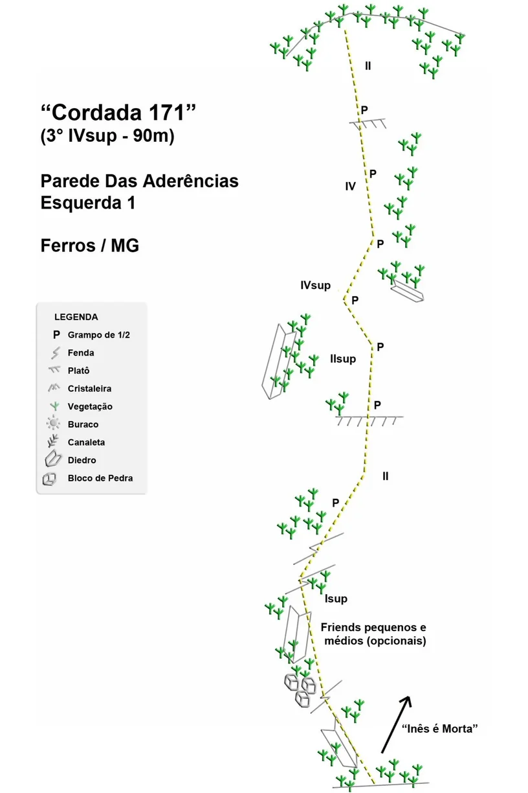
              - **largura_mapa**: 816
              - **altura_mapa**: 1224
        - **[1]**:
          - **via_multiplas_enfiadas**:
            - **descricao**:
                Via mista, equipada com 9 grampos de ½, mais 2 “emprestados” da “Zé Marta”, onde termina. Possui em seu início um diedro, protegido em móvel, logo após o lance inicial protegido por um grampo.
                
            - **nome**: Inês é Morta
            - **dificuldade_media**: BR_3
            - **dificuldade_maxima**: BR_4
            - **comprimento_total**: 100
            - **tipo_via_multiplas_enfiadas**: MISTA
            - **conquistadores**:
              - Tonico Magalhães
              - Celso Ferreira Gomes
            - **data_abertura**: 2011-10-29
        - **[2]**:
          - **via_esportiva**:
            - **descricao**: Via curta que se junta com a “Inês é Morta” em sua metade inferior.
            - **nome**: Sempre Viva
            - **dificuldade**: BR_3
            - **extensao**: 35
            - **conquistadores**:
              - Tonico Magalhães
              - Glesse Gripp
              - Celso Ferreira Gomes
            - **data_abertura**: 2011-12-08
        - **[3]**:
          - **via_movel**:
            - **descricao**:
                Via mista, iniciando com um lance de agarras (crux) protegido por grampos, seguido de uma interessante fissura frontal protegida em nuts de cabo e friends pequenos, juntando com a via “Zé Marta” em sua metade. Rapel com corda única pela via “Zé Marta”.
                
            - **nome**: Fissurim
            - **dificuldade**: BR_5
            - **extensao**: 20
            - **protecoes_moveis**: Nuts de cabo e friends pequenos
            - **conquistadores**:
              - Tonico Magalhães
              - Nádia Moreira
            - **data_abertura**: 2009-06-13
        - **[4]**:
          - **via_multiplas_enfiadas**:
            - **descricao**:
                Via interessante que se inicia em um veio de cristal. Possui uma extensão surpreendente o que a tornou uma linha mestra do local. Toda equipada com grampos. Homenageia o sogro do Tonico Magalhães que é o supervisor da fazenda.
                
            - **nome**: Zé Marta
            - **dificuldade_media**: BR_3
            - **dificuldade_maxima**: BR_4
            - **comprimento_total**: 90
            - **tipo_via_multiplas_enfiadas**: TODA_FIXA
            - **conquistadores**:
              - Tonico Magalhães
              - Júlio César Cardoso
            - **data_abertura**: 2009-05-30
        - **[5]**:
          - **via_esportiva**:
            - **descricao**: Inicia em um lance feito em artificial (que ainda pode ser liberado) e continua em aderência até o final.
            - **nome**: Bolinha
            - **dificuldade**: BR_5
            - **dificuldade_artificial**: A0
            - **extensao**: 30
            - **conquistadores**:
              - Wagner de Oliveira
              - Tonico Magalhães
              - Celso Ferreira Gomes
            - **data_abertura**: 2015-09-07
        - **[6]**:
          - **via_esportiva**:
            - **descricao**: Toda equipada com grampos, termina numa parada dupla da via Maria Diz Graça.
            - **nome**: Testa de Ferro
            - **dificuldade**: BR_4
            - **extensao**: 25
            - **quantidade_protecoes_parada**: 2
            - **conquistadores**:
              - Tonico Magalhães
              - Nádia Moreira
            - **data_abertura**: 2007-04-07
        - **[7]**:
          - **via_esportiva**:
            - **descricao**:
                Via esportiva em aderência complexa, apesar de curta, com proteções generosas. Rapel e/ou top-rope com corda única de 50m. Termina na Maria Diz Graça.
                
            - **nome**: Ferro na Boneca
            - **dificuldade**: BR_7A
            - **extensao**: 20
            - **conquistadores**:
              - Tonico Magalhães
              - Júlio César Cardoso
            - **data_abertura**: 2008-10-05
        - **[8]**:
          - **via_esportiva**:
            - **descricao**:
                Uma das vias mais antigas do polo. Possui belíssimos lances de aderência e pode ser considerada como um programa obrigatório. Homenageia a "amável" vizinha da fazenda, filha do famoso Juca Realino.
                
            - **nome**: Maria Diz Graça
            - **destaque**: True
            - **dificuldade**: BR_5
            - **extensao**: 45
            - **conquistadores**:
              - Tonico Magalhães
              - Gustavo "Xaxá" Carrozzino
            - **data_abertura**: 2006-07-15
        - **[9]**:
          - **via_esportiva**:
            - **descricao**:
                O crux é o terceiro e exigente lance de aderência. Com boa proteção fixa a via mostra-se muito interessante. Homenageia o falecido morador da entrada do Vale do Roncador.
                
            - **nome**: Zé Mangueira
            - **dificuldade**: BR_5SUP
            - **extensao**: 60
            - **conquistadores**:
              - Tonico Magalhães
              - Gustavo "Xaxá" Carrozzino
              - Júlio César Cardoso
            - **data_abertura**: 2008-10-07
        - **[10]**:
          - **via_esportiva**:
            - **descricao**: Pequena via, porém complexa, com boas passadas em aderência e boa grampeação.
            - **nome**: Sherlock Holmes
            - **dificuldade**: BR_5SUP
            - **extensao**: 20
            - **conquistadores**:
              - Tonico Magalhães
              - Celso Ferreira Gomes
            - **data_abertura**: 2012-03-25
        - **[11]**:
          - **via_esportiva**:
            - **descricao**: Via curta com bons lances de agarras e aderência, contando com 6 grampos. Ideal para top-rope.
            - **nome**: Professor Moriarty
            - **dificuldade**: BR_3SUP
            - **exposicao**: E1
            - **extensao**: 30
            - **quantidade_protecoes_intermediarias**: 6
            - **quantidade_protecoes_parada**: 1
            - **conquistadores**:
              - Pedro Bugim
              - Maria Fernanda Patrício
            - **data_abertura**: 2012-04-07
        - **[12]**:
          - **via_multiplas_enfiadas**:
            - **descricao**:
                Interessante via que segue, quase em sua totalidade, a visível faixa branca que corta toda a extensão vertical da parede neste setor. O crux fica nos primeiros 10 metros, sempre com boa proteção. Daí para cima, a via perde inclinação e passa por lances bastante divertidos, em aderência e cristaleiras. P1 aos 40m (parada dupla), P2 aos 55m (parada simples) e P3 aos 30m (parada dupla).
                
            - **nome**: Que Qui Ocê Foi Fazê Nu Mato?
            - **dificuldade_media**: BR_3
            - **dificuldade_maxima**: BR_5
            - **exposicao**: E2
            - **numero_enfiadas**: 3
            - **comprimento_total**: 130
            - **tipo_via_multiplas_enfiadas**: TODA_FIXA
            - **conquistadores**:
              - Pedro Bugim
              - Maria Fernanda Patrício
            - **data_abertura**: 2012-02-20
        - **[13]**:
          - **via_multiplas_enfiadas**:
            - **descricao**:
                Boa via que possui seu crux logo nos primeiros 15 metros, em aderência e pequenos cristais. É necessário fazer proteção móvel com friend médio, em um buraco, entre o segundo e terceiro grampos da via. Após a P1, segue em diagonal para a direita, juntando com a via “Frio na Barriga”. Rapel pela via “Frio na Barriga”, com corda única de 50m ou pela própria via, com duas cordas de 50m. P1 aos 50m e P2 aos 20m, ambas com paradas duplas.
                
            - **nome**: O Psicopata de Ferros
            - **destaque**: True
            - **dificuldade_media**: BR_4
            - **dificuldade_maxima**: BR_6
            - **exposicao**: E2
            - **duracao**: D1
            - **numero_enfiadas**: 2
            - **comprimento_total**: 70
            - **tipo_via_multiplas_enfiadas**: MISTA
            - **equipamento_recomendado**: Friend médio / Camalot .75
            - **conquistadores**:
              - Pedro Bugim
              - Maria Fernanda Patrício
            - **data_abertura**: 2012-02-20
        - **[14]**:
          - **via_movel**:
            - **descricao**:
                Variante que liga a “Psicopata de Ferros” a “Frio na Barriga”, seguindo um sistema de finas fissuras, bem protegidas por friends e nuts pequenos e micros. Boa via para quem está começando a guiar em móvel, pois além de relativamente curta, possui graduação baixa e com boas opções de proteção.
                
            - **nome**: Vr. Caçadora de Micuim
            - **dificuldade**: BR_3
            - **exposicao**: E1
            - **extensao**: 35
            - **protecoes_moveis**: Friends e nuts pequenos e micros (stoppers pequenos)
            - **conquistadores**:
              - Claudney Neves
              - Carla Paiva
            - **data_abertura**: 2014-10-01
        - **[15]**:
          - **via_multiplas_enfiadas**:
            - **descricao**:
                Via que segue uma linha natural, sempre com boa proteção e paradas duplas. Rapel com corda única de 50m. Inicialmente, possuía apenas 40 metros, sendo posteriormente complementada. Nota: no guia original a via está com o croqui incompleto, mostrando apenas a linha da via.
                
            - **nome**: Frio na Barriga
            - **dificuldade_media**: BR_3
            - **dificuldade_maxima**: BR_3SUP
            - **comprimento_total**: 100
            - **numero_enfiadas**: 2
            - **tipo_via_multiplas_enfiadas**: TODA_FIXA
            - **conquistadores**:
              - Tonico Magalhães
              - Nádia Moreira
              - Celso Ferreira Gomes
              - Vicente Alvarenga
            - **data_abertura**: 2009-04-21
        - **[16]**:
          - **via_multiplas_enfiadas**:
            - **descricao**:
                Via relativamente longa e constante, que conta com 25 grampos de ½. Inicia-se em uma cristaleira espetacular. Rapel com corda única de 50m. P1 aos 45m (parada simples), P2 aos 45m (parada dupla) e P3 aos 50m (parada dupla).
                
            - **nome**: Pescoço de Minhoca
            - **dificuldade_media**: BR_4
            - **dificuldade_maxima**: BR_4
            - **exposicao**: E1
            - **comprimento_total**: 140
            - **numero_enfiadas**: 3
            - **tipo_via_multiplas_enfiadas**: TODA_FIXA
            - **conquistadores**:
              - Tonico Magalhães
              - Celso Ferreira Gomes
            - **data_abertura**: 2011-07-20
        - **[17]**:
          - **via_multiplas_enfiadas**:
            - **descricao**:
                Via altamente recomendada para quem gosta de aderência em graduação não muito elevada, sempre com boa proteção em grampos de ½ e paradas duplas. Possui um diedro inicial (crux) em móvel protegido por friends pequenos e médios. P1 aos 50m e P2 aos 60m.
                
            - **nome**: Grampos de Ferros
            - **destaque**: True
            - **dificuldade_media**: BR_3
            - **dificuldade_maxima**: BR_3SUP
            - **exposicao**: E1
            - **comprimento_total**: 110
            - **numero_enfiadas**: 2
            - **tipo_via_multiplas_enfiadas**: MISTA
            - **equipamento_recomendado**: Friends pequenos e médios para o diedro inicial
            - **conquistadores**:
              - Tonico Magalhães
              - Celso Ferreira Gomes
            - **data_abertura**: 2010-09-10
        - **[18]**:
          - **via_multiplas_enfiadas**:
            - **descricao**:
                Via que conta com 19 grampos de ½ e três paradas duplas. Homenageia o falecido garanhão Mangalarga-marchador Prateado, que fez história na fazenda. P1 aos 50m, P2 aos 50m e P3 aos 30m. Nota: as paradas duplas da via podem estar incorretas, bem como falta a confirmação da graduação dos lances isoladamente, necessitando repetição para confirmação.
                
            - **nome**: Prateado
            - **dificuldade_media**: BR_3
            - **dificuldade_maxima**: BR_4
            - **exposicao**: E1
            - **comprimento_total**: 130
            - **numero_enfiadas**: 3
            - **tipo_via_multiplas_enfiadas**: TODA_FIXA
            - **conquistadores**:
              - Celso Ferreira Gomes
              - Tonico Magalhães
              - Glesse Gripp
            - **data_abertura**: 2011-09-18
      - **caminho_imagem_capa**: 
      - **precomputados**:
        - **total_escaladas**: 19
        - **total_esportivas**: 8
        - **total_multiplas_enfiadas**: 9
  - **[2]**:
    - **conteudo**:
      - **descricao**:
          Capa: Celso e Tonico na conquista da "Elementar, Meu Caro Watson!" (Foto: Pedro Bugim)
          
          A parede central das aderências concentra a maioria das vias longas deste lado do vale, com linhas de até 200 metros.
          
          Como o próprio nome sugere, a maioria esmagadora das vias neste setor são predominantemente em aderência, com poucas agarras e buracos, porém, o abrasivo granito confere ao escalador uma ótima confiança nos pés.
          
          O acesso às bases é realizado pela trilha principal do Vale do Roncador, passando pelo setor das Aderências – Esquerda e seguindo por mais aproximadamente 200 metros. A trilha para as bases encontra-se imediatamente antes da segunda travessia do córrego, à esquerda (de quem está entrando no vale). Neste ponto, é possível também, recarregar os cantis de água, antes e após as escaladas.
          
          A trilha sobe por poucos metros e chega à base das vias “Cordeiro de Deus” e “Cinquentona de Ferros”. Para acessar as bases das vias adjacentes, basta costear a parede, para a esquerda ou direita, seguindo sempre pela picada bem definida.
          
          Para as vias entre a “Vr. Esquibunda” e “Pavão Misterioso”, a trilha começa cerca de 50 metros antes da travessia do córrego, à esquerda, onde possui um totem de pedra indicando a entrada da picada.
          
          | 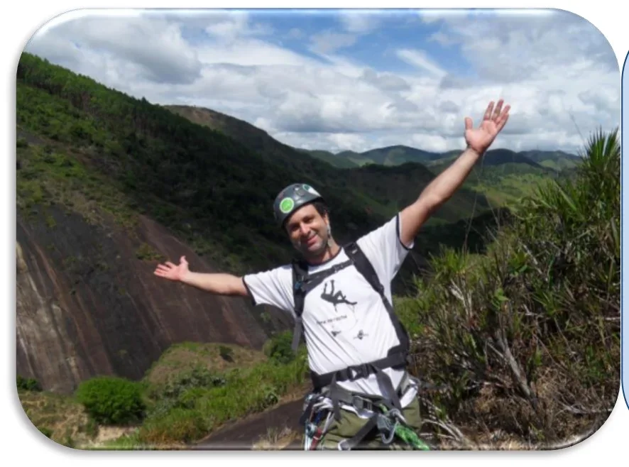 |
          | :--: |
          | *Xaxá Carrozzino feliz da vida, ao final da conquista da “Expo Cerj!”. Atrás, vista da Parede Principal. (Foto: Pedro Bugim)* |
          
          |  |
          | :--: |
          | *Tonico Magalhães e Nádia Moreira, ao entardecer, no topo da via “Social Club” (Foto: Celso Ferreira Gomes)* |
          
          | 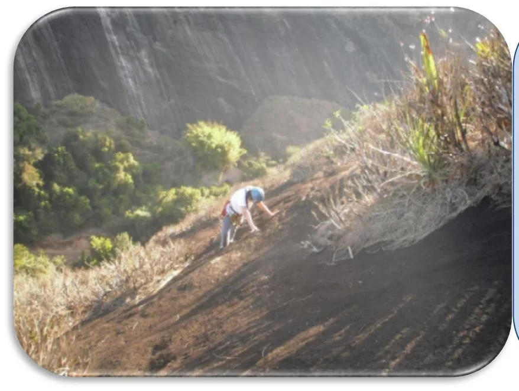 |
          | :--: |
          | *Glesse Gripp guiando a clássica “Social Club”. (Foto: Nádia Moreira)* |
      - **nome**: Face Central
      - **mapas**:
        - **[0]**:
          - **caminho_imagem_mapa**: 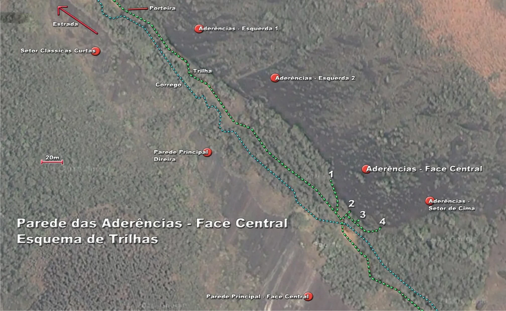
          - **largura_mapa**: 2015
          - **altura_mapa**: 1240
          - **pontos_de_interesse**:
            - **[0]**:
              - **id**: Setor_Classicas_Curtas
              - **label**: Setor Clássicas Curtas
              - **retangulo**:
                - **x**: 237
                - **y**: 202
                - **comprimento**: 346
                - **largura**: 52
            - **[1]**:
              - **id**: Aderencias_Esquerda_1
              - **label**: Aderências - Esquerda 1
              - **retangulo**:
                - **x**: 940
                - **y**: 115
                - **comprimento**: 358
                - **largura**: 52
            - **[2]**:
              - **id**: Aderencias_Esquerda_2
              - **label**: Aderências - Esquerda 2
              - **retangulo**:
                - **x**: 1252
                - **y**: 308
                - **comprimento**: 380
                - **largura**: 52
            - **[3]**:
              - **id**: Parede_Principal_Direira
              - **label**: Parede Principal Direira
              - **retangulo**:
                - **x**: 729
                - **y**: 618
                - **comprimento**: 264
                - **largura**: 85
            - **[4]**:
              - **id**: Aderencias_Setor_de_Cima
              - **label**: Aderências - Setor de Cima
              - **retangulo**:
                - **x**: 1794
                - **y**: 813
                - **comprimento**: 228
                - **largura**: 70
            - **[5]**:
              - **id**: Parede_Principal_Face_Central
              - **label**: Parede Principal - Face Central
              - **retangulo**:
                - **x**: 1034
                - **y**: 1182
                - **comprimento**: 458
                - **largura**: 67
            - **[6]**:
              - **id**: 1
              - **label**: 1
              - **circulo**:
                - **x**: 1318
                - **y**: 694
                - **raio**: 20
            - **[7]**:
              - **id**: 2
              - **label**: 2
              - **circulo**:
                - **x**: 1400
                - **y**: 812
                - **raio**: 20
            - **[8]**:
              - **id**: 3
              - **label**: 3
              - **circulo**:
                - **x**: 1445
                - **y**: 855
                - **raio**: 20
            - **[9]**:
              - **id**: 4
              - **label**: 4
              - **circulo**:
                - **x**: 1524
                - **y**: 882
                - **raio**: 20
          - **referencias**:
            - **[0]**:
              - **ids**:
                - Aderencias_Esquerda_1
              - **grupo**: Parede das Aderências
              - **setor**: Extrema Esquerda
            - **[1]**:
              - **ids**:
                - Aderencias_Esquerda_2
              - **grupo**: Parede das Aderências
              - **setor**: Esquerda
            - **[2]**:
              - **ids**:
                - Setor_Classicas_Curtas
              - **grupo**: Parede Principal (Paredes de Aço)
              - **setor**: Setor Clássicas Curtas
            - **[3]**:
              - **ids**:
                - Aderencias_Setor_de_Cima
              - **grupo**: Parede das Aderências
              - **setor**: Setor de Cima
            - **[4]**:
              - **ids**:
                - Parede_Principal_Face_Central
              - **grupo**: Parede Principal (Paredes de Aço)
              - **setor**: Setor Central
            - **[5]**:
              - **ids**:
                - 1
              - **grupo**: Parede das Aderências
              - **setor**: Face Central
              - **escalada**: Vr. Esquibunda
            - **[6]**:
              - **ids**:
                - 1
              - **grupo**: Parede das Aderências
              - **setor**: Face Central
              - **escalada**: Pr. Aerolitos
            - **[7]**:
              - **ids**:
                - 1
              - **grupo**: Parede das Aderências
              - **setor**: Face Central
              - **escalada**: Facão Foi-se
            - **[8]**:
              - **ids**:
                - 1
              - **grupo**: Parede das Aderências
              - **setor**: Face Central
              - **escalada**: Antes Só do Que Mal Acompanhado
            - **[9]**:
              - **ids**:
                - 1
              - **grupo**: Parede das Aderências
              - **setor**: Face Central
              - **escalada**: Hematita
            - **[10]**:
              - **ids**:
                - 1
              - **grupo**: Parede das Aderências
              - **setor**: Face Central
              - **escalada**: Pavão Misterioso
            - **[11]**:
              - **ids**:
                - 2
              - **grupo**: Parede das Aderências
              - **setor**: Face Central
              - **escalada**: Elementar, Meu Caro Watson!
            - **[12]**:
              - **ids**:
                - 3
              - **grupo**: Parede das Aderências
              - **setor**: Face Central
              - **escalada**: Balzac
            - **[13]**:
              - **ids**:
                - 3
              - **grupo**: Parede das Aderências
              - **setor**: Face Central
              - **escalada**: Dez Fora
            - **[14]**:
              - **ids**:
                - 3
              - **grupo**: Parede das Aderências
              - **setor**: Face Central
              - **escalada**: Cordeiro de Deus
            - **[15]**:
              - **ids**:
                - 3
              - **grupo**: Parede das Aderências
              - **setor**: Face Central
              - **escalada**: Cinquentona de Ferros
            - **[16]**:
              - **ids**:
                - 4
              - **grupo**: Parede das Aderências
              - **setor**: Face Central
              - **escalada**: Coração Valente
            - **[17]**:
              - **ids**:
                - 4
              - **grupo**: Parede das Aderências
              - **setor**: Face Central
              - **escalada**: Expo CERJ!
            - **[18]**:
              - **ids**:
                - 4
              - **grupo**: Parede das Aderências
              - **setor**: Face Central
              - **escalada**: Social Club
            - **[19]**:
              - **ids**:
                - 4
              - **grupo**: Parede das Aderências
              - **setor**: Face Central
              - **escalada**: Pr. Tonico Magalhães
            - **[20]**:
              - **ids**:
                - 4
              - **grupo**: Parede das Aderências
              - **setor**: Face Central
              - **escalada**: E o Rio Levou
            - **[21]**:
              - **ids**:
                - Parede_Principal_Direira
              - **grupo**: Parede Principal (Paredes de Aço)
              - **setor**: Parede Principal – Direita
        - **[1]**:
          - **caminho_imagem_mapa**: 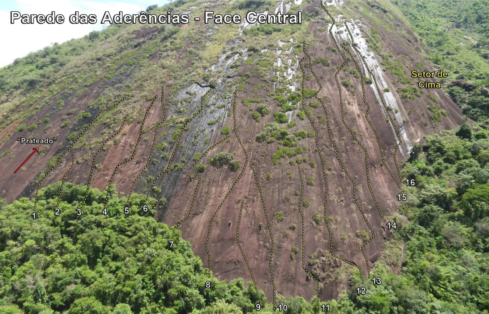
          - **largura_mapa**: 1970
          - **altura_mapa**: 1268
          - **referencias**:
            - **[0]**:
              - **escalada**: Vr. Esquibunda
              - **ids**:
                - 1
            - **[1]**:
              - **escalada**: Pr. Aerolitos
              - **ids**:
                - 2
            - **[2]**:
              - **escalada**: Facão Foi-se
              - **ids**:
                - 3
            - **[3]**:
              - **escalada**: Antes Só do Que Mal Acompanhado
              - **ids**:
                - 4
            - **[4]**:
              - **escalada**: Hematita
              - **ids**:
                - 5
            - **[5]**:
              - **escalada**: Pavão Misterioso
              - **ids**:
                - 6
            - **[6]**:
              - **escalada**: Elementar, Meu Caro Watson!
              - **ids**:
                - 7
            - **[7]**:
              - **escalada**: Balzac
              - **ids**:
                - 8
            - **[8]**:
              - **escalada**: Dez Fora
              - **ids**:
                - 9
            - **[9]**:
              - **escalada**: Cordeiro de Deus
              - **ids**:
                - 10
            - **[10]**:
              - **escalada**: Cinquentona de Ferros
              - **ids**:
                - 11
            - **[11]**:
              - **escalada**: Coração Valente
              - **ids**:
                - 12
            - **[12]**:
              - **escalada**: Expo CERJ!
              - **ids**:
                - 13
            - **[13]**:
              - **escalada**: Social Club
              - **ids**:
                - 14
            - **[14]**:
              - **escalada**: Pr. Tonico Magalhães
              - **ids**:
                - 15
            - **[15]**:
              - **escalada**: E o Rio Levou
              - **ids**:
                - 16
            - **[16]**:
              - **setor**: Setor de Cima
              - **ids**:
                - Setor_de_Cima
            - **[17]**:
              - **escalada**: Prateado
              - **setor**: Esquerda
              - **ids**:
                - Prateado
          - **pontos_de_interesse**:
            - **[0]**:
              - **id**: 1
              - **label**: 1
              - **circulo**:
                - **x**: 136
                - **y**: 872
                - **raio**: 22
            - **[1]**:
              - **id**: 2
              - **label**: 2
              - **circulo**:
                - **x**: 231
                - **y**: 854
                - **raio**: 22
            - **[2]**:
              - **id**: 3
              - **label**: 3
              - **circulo**:
                - **x**: 318
                - **y**: 856
                - **raio**: 22
            - **[3]**:
              - **id**: 4
              - **label**: 4
              - **circulo**:
                - **x**: 423
                - **y**: 854
                - **raio**: 22
            - **[4]**:
              - **id**: 5
              - **label**: 5
              - **circulo**:
                - **x**: 510
                - **y**: 850
                - **raio**: 22
            - **[5]**:
              - **id**: 6
              - **label**: 6
              - **circulo**:
                - **x**: 586
                - **y**: 841
                - **raio**: 22
            - **[6]**:
              - **id**: 7
              - **label**: 7
              - **circulo**:
                - **x**: 691
                - **y**: 985
                - **raio**: 22
            - **[7]**:
              - **id**: 8
              - **label**: 8
              - **circulo**:
                - **x**: 839
                - **y**: 1149
                - **raio**: 22
            - **[8]**:
              - **id**: 9
              - **label**: 9
              - **circulo**:
                - **x**: 1041
                - **y**: 1240
                - **raio**: 24
            - **[9]**:
              - **id**: 10
              - **label**: 10
              - **circulo**:
                - **x**: 1140
                - **y**: 1242
                - **raio**: 24
            - **[10]**:
              - **id**: 11
              - **label**: 11
              - **circulo**:
                - **x**: 1312
                - **y**: 1243
                - **raio**: 24
            - **[11]**:
              - **id**: 12
              - **label**: 12
              - **circulo**:
                - **x**: 1455
                - **y**: 1174
                - **raio**: 24
            - **[12]**:
              - **id**: 13
              - **label**: 13
              - **circulo**:
                - **x**: 1517
                - **y**: 1134
                - **raio**: 24
            - **[13]**:
              - **id**: 14
              - **label**: 14
              - **circulo**:
                - **x**: 1578
                - **y**: 910
                - **raio**: 24
            - **[14]**:
              - **id**: 15
              - **label**: 15
              - **circulo**:
                - **x**: 1620
                - **y**: 796
                - **raio**: 24
            - **[15]**:
              - **id**: 16
              - **label**: 16
              - **circulo**:
                - **x**: 1652
                - **y**: 736
                - **raio**: 24
            - **[16]**:
              - **id**: Setor_de_Cima
              - **label**: Setor de Cima
              - **retangulo**:
                - **x**: 1731
                - **y**: 321
                - **comprimento**: 160
                - **largura**: 82
            - **[17]**:
              - **id**: Prateado
              - **label**: Prateado
              - **retangulo**:
                - **x**: 148
                - **y**: 568
                - **comprimento**: 170
                - **largura**: 38
        - **[2]**:
          - **caminho_imagem_mapa**: 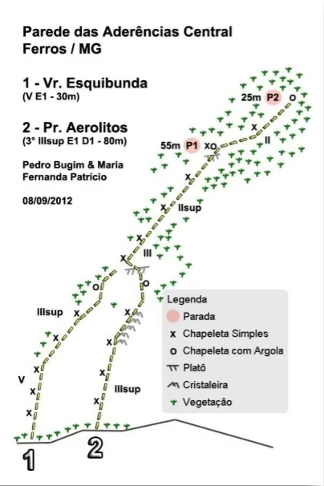
          - **largura_mapa**: 404
          - **altura_mapa**: 606
          - **pontos_de_interesse**:
            - **[0]**:
              - **id**: 1
              - **label**: 1
              - **circulo**:
                - **x**: 37
                - **y**: 573
                - **raio**: 20
              - **cor**: 
            - **[1]**:
              - **id**: 2
              - **label**: 2
              - **circulo**:
                - **x**: 120
                - **y**: 559
                - **raio**: 21
              - **cor**: 
            - **[2]**:
              - **id**: p1
              - **label**: 
              - **circulo**:
                - **x**: 240
                - **y**: 182
                - **raio**: 11
            - **[3]**:
              - **id**: p2
              - **label**: 
              - **circulo**:
                - **x**: 341
                - **y**: 122
                - **raio**: 12
              - **cor**: 
          - **referencias**:
            - **[0]**:
              - **ids**:
                - 1
                - p1
                - p2
              - **grupo**: Parede das Aderências
              - **setor**: Face Central
              - **escalada**: Vr. Esquibunda
            - **[1]**:
              - **ids**:
                - 2
                - p1
                - p2
              - **grupo**: Parede das Aderências
              - **setor**: Face Central
              - **escalada**: Pr. Aerolitos
        - **[3]**:
          - **caminho_imagem_mapa**: 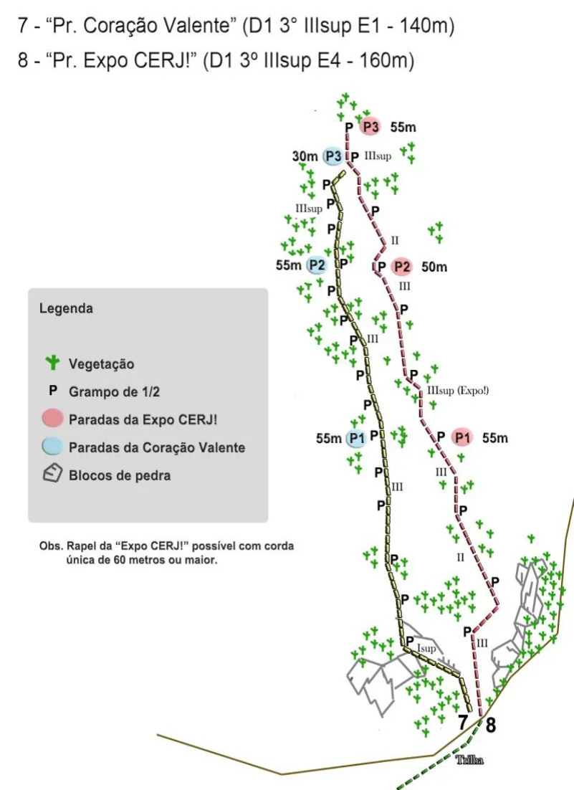
          - **largura_mapa**: 801
          - **altura_mapa**: 1102
          - **pontos_de_interesse**:
            - **[0]**:
              - **id**: 8
              - **label**: 8
              - **circulo**:
                - **x**: 685
                - **y**: 1011
                - **raio**: 17
              - **cor**: 
            - **[1]**:
              - **id**: 7
              - **label**: 7
              - **circulo**:
                - **x**: 647
                - **y**: 1007
                - **raio**: 17
              - **cor**: 
            - **[2]**:
              - **id**: p1_8
              - **label**: 
              - **circulo**:
                - **x**: 645
                - **y**: 610
                - **raio**: 14
              - **cor**: 
            - **[3]**:
              - **id**: p1_7
              - **label**: 
              - **circulo**:
                - **x**: 498
                - **y**: 611
                - **raio**: 14
              - **cor**: 
            - **[4]**:
              - **id**: p2_7
              - **label**: 
              - **circulo**:
                - **x**: 443
                - **y**: 370
                - **raio**: 14
              - **cor**: 
            - **[5]**:
              - **id**: p2_8
              - **label**: 
              - **circulo**:
                - **x**: 561
                - **y**: 371
                - **raio**: 14
              - **cor**: 
            - **[6]**:
              - **id**: p3_7
              - **label**: 
              - **circulo**:
                - **x**: 465
                - **y**: 218
                - **raio**: 14
              - **cor**: 
            - **[7]**:
              - **id**: p3_8
              - **label**: 
              - **circulo**:
                - **x**: 517
                - **y**: 176
                - **raio**: 14
              - **cor**: 
          - **referencias**:
            - **[0]**:
              - **ids**:
                - 7
                - p1_7
                - p2_7
                - p3_7
              - **grupo**: Parede das Aderências
              - **setor**: Face Central
              - **escalada**: Coração Valente
            - **[1]**:
              - **ids**:
                - 8
                - p1_8
                - p2_8
                - p3_8
              - **grupo**: Parede das Aderências
              - **setor**: Face Central
              - **escalada**: Expo CERJ!
        - **[4]**:
          - **caminho_imagem_mapa**: 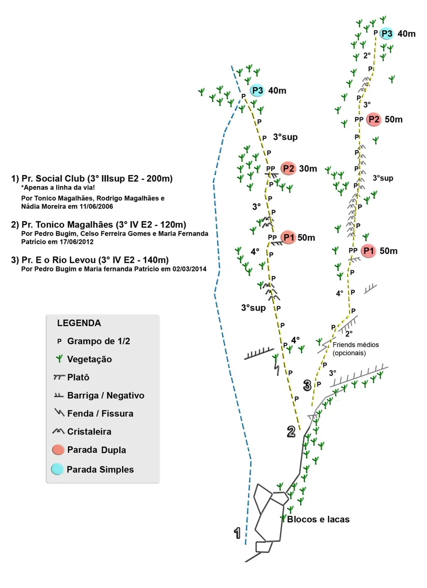
          - **largura_mapa**: 852
          - **altura_mapa**: 1172
          - **pontos_de_interesse**:
            - **[0]**:
              - **id**: 1
              - **label**: 1
              - **circulo**:
                - **x**: 474
                - **y**: 1063
                - **raio**: 17
              - **cor**: 
            - **[1]**:
              - **id**: 2
              - **label**: 2
              - **circulo**:
                - **x**: 582
                - **y**: 861
                - **raio**: 17
              - **cor**: 
            - **[2]**:
              - **id**: 3
              - **label**: 3
              - **circulo**:
                - **x**: 614
                - **y**: 768
                - **raio**: 17
              - **cor**: 
            - **[3]**:
              - **id**: P1_2
              - **label**: 
              - **circulo**:
                - **x**: 576
                - **y**: 473
                - **raio**: 15
              - **cor**: 
            - **[4]**:
              - **id**: p2_2
              - **label**: 
              - **circulo**:
                - **x**: 576
                - **y**: 335
                - **raio**: 15
              - **cor**: 
            - **[5]**:
              - **id**: p3_2
              - **label**: 
              - **circulo**:
                - **x**: 513
                - **y**: 180
                - **raio**: 14
              - **cor**: 
            - **[6]**:
              - **id**: p1_3
              - **label**: 
              - **circulo**:
                - **x**: 736
                - **y**: 500
                - **raio**: 15
              - **cor**: 
            - **[7]**:
              - **id**: p2_3
              - **label**: 
              - **circulo**:
                - **x**: 746
                - **y**: 238
                - **raio**: 15
              - **cor**: 
            - **[8]**:
              - **id**: p3_3
              - **label**: 
              - **circulo**:
                - **x**: 771
                - **y**: 67
                - **raio**: 14
              - **cor**: 
          - **referencias**:
            - **[0]**:
              - **ids**:
                - 1
                - p3_2
              - **grupo**: Parede das Aderências
              - **setor**: Face Central
              - **escalada**: Social Club
            - **[1]**:
              - **ids**:
                - 2
                - P1_2
                - p2_2
                - p3_2
              - **grupo**: Parede das Aderências
              - **setor**: Face Central
              - **escalada**: Pr. Tonico Magalhães
            - **[2]**:
              - **ids**:
                - 3
                - p1_3
                - p2_3
                - p3_3
              - **grupo**: Parede das Aderências
              - **setor**: Face Central
              - **escalada**: E o Rio Levou
      - **escaladas**:
        - **[0]**:
          - **via_esportiva**:
            - **descricao**: Variante da Pr. Aerolitos, com uma passada chave na terceira chapeleta, em aderência.
            - **nome**: Vr. Esquibunda
            - **dificuldade**: BR_5
            - **exposicao**: E1
            - **extensao**: 30
            - **conquistadores**:
              - Pedro Bugim
              - Maria Fernanda Patrício
            - **data_abertura**: 2012-09-08
        - **[1]**:
          - **via_multiplas_enfiadas**:
            - **descricao**: Via protegida com chapeletas, contando com chapeletas com argola nas paradas, para o rapel. P1 aos 55m (3° IIIsup) e P2 aos 25m (IIIsup/II).
            - **nome**: Pr. Aerolitos
            - **dificuldade_media**: BR_3
            - **dificuldade_maxima**: BR_3SUP
            - **exposicao**: E1
            - **duracao**: D1
            - **numero_enfiadas**: 2
            - **comprimento_total**: 80
            - **conquistadores**:
              - Pedro Bugim
              - Maria Fernanda Patrício
            - **data_abertura**: 2012-09-08
        - **[2]**:
          - **via_movel**:
            - **descricao**: Inicia em uma bonita fenda, feita em oposição e depois na vertical, para atingir o primeiro grampo da via. Esta sequência inicial pode ser protegida com friends pequenos e médios, mas também é possível fazer a via sem proteções móveis, aumentando o grau de exposição de E1 para E2 (o primeiro grampo fica alto). Depois, segue em agarras e aderência até seu final, com boa regularidade na graduação.
            - **nome**: Facão Foi-se
            - **dificuldade**: BR_4SUP
            - **exposicao**: E1
            - **extensao**: 60
            - **quantidade_protecoes_parada**: 2
            - **protecoes_moveis**: Friends pequenos e médios para a fenda inicial
            - **conquistadores**:
              - Pedro Bugim
              - Maria Fernanda Patrício
            - **data_abertura**: 2014-03-04
          - **mapas**:
            - **[0]**:
              - **caminho_imagem_mapa**: 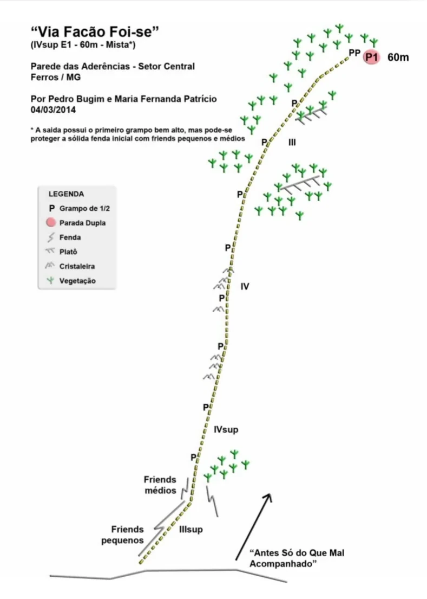
              - **largura_mapa**: 789
              - **altura_mapa**: 1105
        - **[3]**:
          - **via_multiplas_enfiadas**:
            - **descricao**: Via conquistada em solitário, porém com boa proteção. Possui duas enfiadas relativamente curtas, com lances inicialmente em agarras e regletes, evoluindo para aderência na metade superior. P1 aos 45m e P2 aos 40m, ambas com parada dupla.
            - **nome**: Antes Só do Que Mal Acompanhado
            - **dificuldade_media**: BR_3
            - **dificuldade_maxima**: BR_4
            - **exposicao**: E1
            - **numero_enfiadas**: 2
            - **comprimento_total**: 85
            - **conquistadores**:
              - Pedro Bugim
            - **data_abertura**: 2015-02-14
          - **mapas**:
            - **[0]**:
              - **caminho_imagem_mapa**: 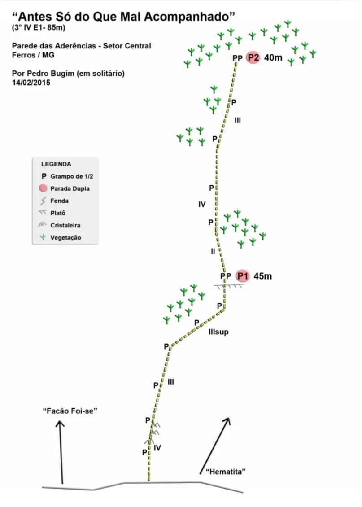
              - **largura_mapa**: 807
              - **altura_mapa**: 1130
        - **[4]**:
          - **via_esportiva**:
            - **descricao**: Boa via em aderência equipada com doze grampos.
            - **nome**: Hematita
            - **dificuldade**: BR_4
            - **exposicao**: E1
            - **extensao**: 60
            - **quantidade_protecoes_intermediarias**: 12
            - **quantidade_protecoes_parada**: 2
            - **conquistadores**:
              - Tonico Magalhães
              - Celso Ferreira Gomes
            - **data_abertura**: 2011-07-22
          - **mapas**:
            - **[0]**:
              - **caminho_imagem_mapa**: 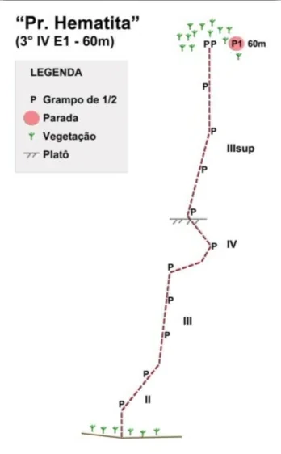
              - **largura_mapa**: 348
              - **altura_mapa**: 562
        - **[5]**:
          - **via_multiplas_enfiadas**:
            - **descricao**: Ótima via equipada com 25 grampos e paradas duplas a cada 30 m.
            - **nome**: Pavão Misterioso
            - **dificuldade_media**: BR_3
            - **dificuldade_maxima**: BR_3SUP
            - **comprimento_total**: 110
            - **quantidade_costuras_intermediarias**: 25
            - **quantidade_equipamentos_parada**: 2
            - **conquistadores**:
              - Tonico Magalhães
              - Celso Ferreira Gomes
            - **data_abertura**: 2011-09-04
        - **[6]**:
          - **via_multiplas_enfiadas**:
            - **descricao**: Via que se inicia em um diedro cego com proteção fixa, que pode ser melhorada com proteções precárias em móvel (peças pequenas), mas nada obrigatório. Sua segunda enfiada junta com a via “Balzac”. Rapel possível com corda simples de 50m.
            - **nome**: Elementar, Meu Caro Watson!
            - **dificuldade_media**: BR_3
            - **dificuldade_maxima**: BR_3SUP
            - **numero_enfiadas**: 2
            - **comprimento_total**: 75
            - **conquistadores**:
              - Tonico Magalhães
              - Celso Ferreira Gomes
            - **data_abertura**: 2012-02-18
        - **[7]**:
          - **via_multiplas_enfiadas**:
            - **descricao**: Via que possui passadas relativamente mais delicadas que as suas vizinhas, contando com duas enfiadas. Rapel possível com corda simples de 50m. Trata-se de via mestra do local.
            - **nome**: Balzac
            - **destaque**: True
            - **dificuldade_media**: BR_3
            - **dificuldade_maxima**: BR_4SUP
            - **numero_enfiadas**: 2
            - **comprimento_total**: 90
            - **conquistadores**:
              - Tonico Magalhães
              - Júlio César Cardoso
            - **data_abertura**: 2007-03-04
        - **[8]**:
          - **via_esportiva**:
            - **descricao**: Via equipada com corda de cima, a partir da “Cordeiro de Deus”. Falta o primeiro grampo.
            - **nome**: Dez Fora
            - **dificuldade**: BR_5SUP
            - **extensao**: 30
            - **conquistadores**:
              - Aloysio Carvalho
              - Igor Murta
              - Carlim Kamicad
            - **data_abertura**: 2012-04-08
        - **[9]**:
          - **via_multiplas_enfiadas**:
            - **descricao**: Bonita e técnica via em aderência com 12 grampos. Rapel com corda simples de 50m. Termina na Balzac.
            - **nome**: Cordeiro de Deus
            - **dificuldade_media**: BR_3
            - **dificuldade_maxima**: BR_5
            - **comprimento_total**: 70
            - **quantidade_costuras_intermediarias**: 12
            - **conquistadores**:
              - Tonico Magalhães
              - Paulo Bandeira
            - **data_abertura**: 2007-09-08
        - **[10]**:
          - **via_esportiva**:
            - **descricao**: Quinquagésima conquista da região. Inicia em um diedro em oposição seguindo em aderência até o final. Rapel com corda simples de 50m.
            - **nome**: Cinquentona de Ferros
            - **dificuldade**: BR_3SUP
            - **extensao**: 60
            - **conquistadores**:
              - Tonico Magalhães
              - Daniel Maia
            - **data_abertura**: 2009-08-02
        - **[11]**:
          - **via_multiplas_enfiadas**:
            - **descricao**: Boa via em aderência, sempre constante, mas sem lances complicados e com proteção regular. Termina no penúltimo grampo da “Expo CERJ!”. Via em homenagem ao pequeno Arthur Taveira, que aos dois meses de idade, venceu uma dura batalha após ser diagnosticado com sério problema cardíaco.
            - **nome**: Coração Valente
            - **dificuldade_media**: BR_3
            - **dificuldade_maxima**: BR_3SUP
            - **exposicao**: E2
            - **duracao**: D1
            - **numero_enfiadas**: 3
            - **comprimento_total**: 140
            - **conquistadores**:
              - Pedro Bugim
              - Maria Fernanda Patrício
            - **data_abertura**: 2012-04-06
        - **[12]**:
          - **via_multiplas_enfiadas**:
            - **descricao**: Via com passadas muito interessantes em aderência, com grampeação longa. Ótima para treinamento de psicológico. Rapel possível com uma corda de 60m (de grampo em grampo) ou duas cordas de 50m ou maiores. O rapel pode ser feito também pela via “Coração Valente”, com corda única de 50m. Via em homenagem aos 73 anos do Centro Excursionista Rio de Janeiro (CERJ), completados no dia anterior à conquista.
            - **nome**: Expo CERJ!
            - **dificuldade_media**: BR_3
            - **dificuldade_maxima**: BR_3SUP
            - **exposicao**: E4
            - **duracao**: D1
            - **numero_enfiadas**: 3
            - **comprimento_total**: 160
            - **conquistadores**:
              - Pedro Bugim
              - Gustavo "Xaxá" Carrozzino
              - Maria Fernanda Patrício
            - **data_abertura**: 2012-01-21
        - **[13]**:
          - **via_multiplas_enfiadas**:
            - **descricao**: Uma das vias mais recomendadas da região! São 200 metros em aderência com dificuldade moderada, porém constante, tendo raros lances abaixo do 3° grau. O fato da via não diminuir sua dificuldade ao longo de sua extensão, confere um justo mérito ao escalador. Via boa para ver o pôr do sol em seu final.
            - **nome**: Social Club
            - **destaque**: True
            - **dificuldade_media**: BR_3
            - **dificuldade_maxima**: BR_3SUP
            - **exposicao**: E2
            - **comprimento_total**: 200
            - **conquistadores**:
              - Tonico Magalhães
              - Rodrigo Magalhães
              - Nádia Moreira
            - **data_abertura**: 2006-06-11
        - **[14]**:
          - **via_multiplas_enfiadas**:
            - **descricao**: Via bastante interessante, com lances predominantemente em aderência, porém com algumas cristaleiras e abaulados que marcam o caminho natural da linha. Seu crux encontra-se na primeira metade da via, logo na barriga inicial, sempre com boa proteção fixa. Para efeito de curiosidade, foi a centésima conquista do Celso, companheiro do Tonico quando da conquista de sua centésima via.
            - **nome**: Pr. Tonico Magalhães
            - **dificuldade_media**: BR_3
            - **dificuldade_maxima**: BR_4
            - **exposicao**: E2
            - **numero_enfiadas**: 3
            - **comprimento_total**: 120
            - **conquistadores**:
              - Pedro Bugim
              - Celso Ferreira Gomes
              - Maria Fernanda Patrício
            - **data_abertura**: 2012-06-17
        - **[15]**:
          - **via_multiplas_enfiadas**:
            - **descricao**: Inicia imediatamente à direita da base da “Tonico Magalhães”, dando uma guinada à direita após o segundo grampo, onde cruza com uma sequência de lacas que podem ser protegidas opcionalmente por friends médios. Deste ponto em diante, segue o bonito crux da via, em uma parede com boa verticalidade e regletes bem definidos, até a P1. Da P1 em diante, a via segue por incríveis “corcovas” na pedra, até sua segunda parada. A enfiada final é feita em aderência.
            - **nome**: E o Rio Levou
            - **dificuldade_media**: BR_3
            - **dificuldade_maxima**: BR_4
            - **exposicao**: E2
            - **numero_enfiadas**: 3
            - **comprimento_total**: 140
            - **equipamento_recomendado**: Friends médios (opcionais)
            - **conquistadores**:
              - Pedro Bugim
              - Maria Fernanda Patrício
            - **data_abertura**: 2014-03-02
      - **caminho_imagem_capa**: 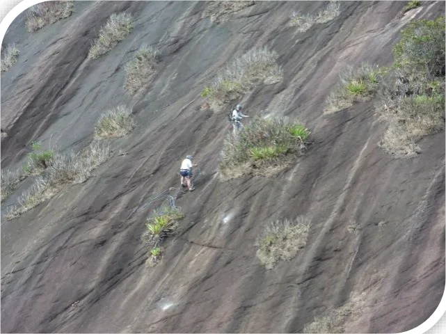
      - **precomputados**:
        - **total_escaladas**: 16
        - **total_esportivas**: 4
        - **total_multiplas_enfiadas**: 11
  - **[3]**:
    - **conteudo**:
      - **descricao**:
          Capa: Maria Fernanda descendo a trilha de acesso do Setor de Cima da Parede das Aderências (Foto: Pedro Bugim)
          
          Trata-se da continuação da Parede das Aderências – Setor Central, seguindo para um setor mais elevado, com parede levemente mais vertical, contando com apenas três vias e com boas possibilidades de novas conquistas, sobretudo, seguindo-se para a direita.
          
          O acesso às bases é realizado pela trilha principal do Vale do Roncador, passando pelo setor das Aderências – Central e seguindo mais uns 300 metros após a segunda travessia do córrego. Neste ponto, existe um vasto bambuzal à esquerda da trilha. Deve-se cruzar o mesmo, bem como cruzar o riacho. Neste ponto, a trilha está bem demarcada e é possível ver a parede, logo após cruzar o riacho.
          
          | 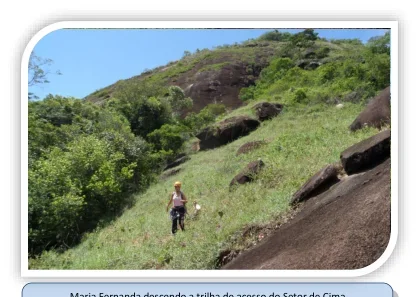 |
          | :--: |
          | *Maria Fernanda descendo a trilha de acesso do Setor de Cima da Parede das Aderências (Foto: Pedro Bugim)* |
          
          A trilha segue por um descampado, sempre subindo, até atingir enormes blocos de pedra (nos quais existe possibilidade de abertura de futuros boulders), que devem ser contornados por baixo e pela esquerda.
          
          A base das vias “São Lourenço” e “Carnaferros” ficam exatamente no ponto em que a trilha chega à parede. Para acessar a base da “Buena Vista”, é necessário costear a rocha para a esquerda, por poucos metros.
          
          Como já dito, a porção direita desta parede permanece inexplorada e apresenta grande potencial para novas linhas, tanto em aderência quanto em convidativos diedros.
          
          | 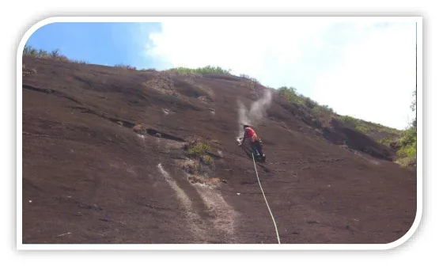 |
          | :--: |
          | *Pedro Bugim durante a conquista do “Carnaferros” (Foto: Maria Fernanda)* |
      - **nome**: Setor de Cima
      - **mapas**:
        - **[0]**:
          - **caminho_imagem_mapa**: 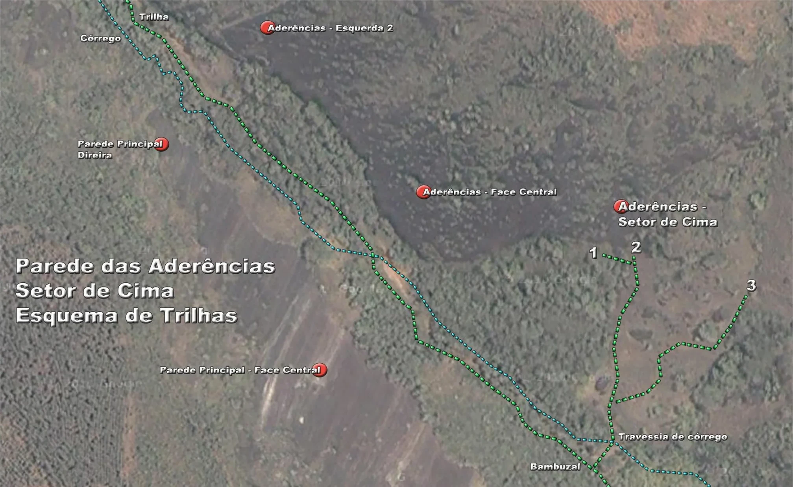
          - **largura_mapa**: 2015
          - **altura_mapa**: 1240
          - **referencias**:
            - **[0]**:
              - **escalada**: Buena Vista
              - **ids**:
                - 1
            - **[1]**:
              - **escalada**: São Lourenço
              - **ids**:
                - 2
            - **[2]**:
              - **escalada**: Carnaferros
              - **ids**:
                - 3
            - **[3]**:
              - **setor**: Face Central
              - **ids**:
                - Aderencias_Face_Central
            - **[4]**:
              - **setor**: Esquerda
              - **ids**:
                - Aderencias_Esquerda_2
            - **[5]**:
              - **setor**: Parede Principal – Direita
              - **ids**:
                - Parede_Principal_Direira
              - **grupo**: Parede Principal (Paredes de Aço)
            - **[6]**:
              - **grupo**: Parede Principal (Paredes de Aço)
              - **setor**: Setor Central
              - **ids**:
                - Parede_Principal_Face_Central
          - **pontos_de_interesse**:
            - **[0]**:
              - **id**: 1
              - **label**: 1
              - **circulo**:
                - **x**: 1507
                - **y**: 642
                - **raio**: 22
            - **[1]**:
              - **id**: 2
              - **label**: 2
              - **circulo**:
                - **x**: 1617
                - **y**: 629
                - **raio**: 22
            - **[2]**:
              - **id**: 3
              - **label**: 3
              - **circulo**:
                - **x**: 1909
                - **y**: 726
                - **raio**: 22
            - **[3]**:
              - **id**: Aderencias_Face_Central
              - **label**: Aderências - Face Central
              - **retangulo**:
                - **x**: 1236
                - **y**: 490
                - **comprimento**: 395
                - **largura**: 65
            - **[4]**:
              - **id**: Aderencias_Esquerda_2
              - **label**: Aderências - Esquerda 2
              - **retangulo**:
                - **x**: 834
                - **y**: 72
                - **comprimento**: 360
                - **largura**: 53
            - **[5]**:
              - **id**: Parede_Principal_Direira
              - **label**: Parede Principal Direira
              - **retangulo**:
                - **x**: 312
                - **y**: 377
                - **comprimento**: 259
                - **largura**: 76
            - **[6]**:
              - **id**: Parede_Principal_Face_Central
              - **label**: Parede Principal - Face Central
              - **retangulo**:
                - **x**: 616
                - **y**: 944
                - **comprimento**: 459
                - **largura**: 55
        - **[1]**:
          - **caminho_imagem_mapa**: 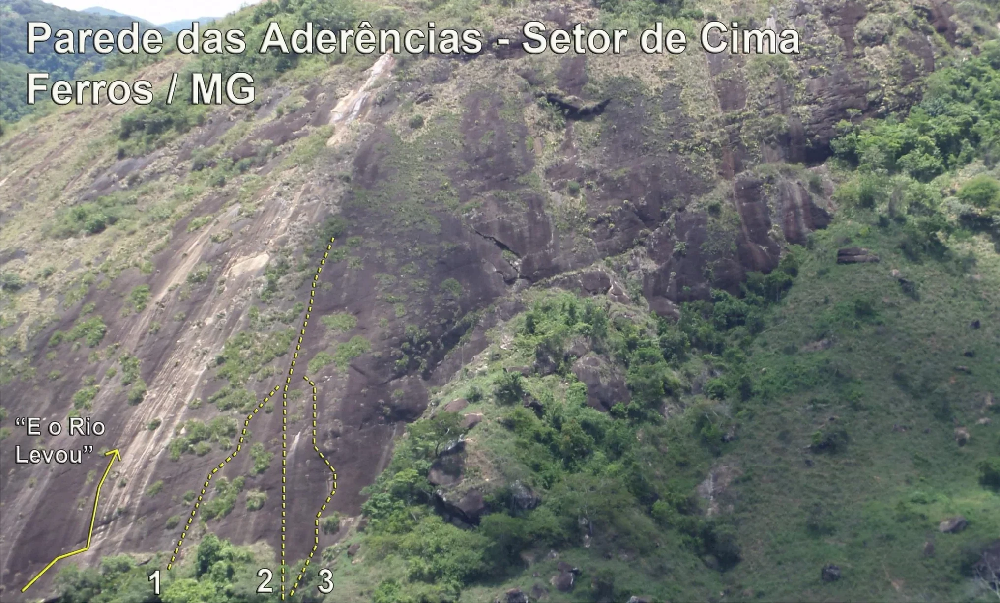
          - **largura_mapa**: 2034
          - **altura_mapa**: 1228
          - **referencias**:
            - **[0]**:
              - **escalada**: Buena Vista
              - **ids**:
                - 1
            - **[1]**:
              - **escalada**: São Lourenço
              - **ids**:
                - 2
            - **[2]**:
              - **escalada**: Carnaferros
              - **ids**:
                - 3
            - **[3]**:
              - **escalada**: E o Rio Levou
              - **setor**: Face Central
              - **ids**:
                - E o Rio Levou
          - **pontos_de_interesse**:
            - **[0]**:
              - **id**: 1
              - **label**: 1
              - **circulo**:
                - **x**: 318
                - **y**: 1187
                - **raio**: 34
            - **[1]**:
              - **id**: 2
              - **label**: 2
              - **circulo**:
                - **x**: 540
                - **y**: 1184
                - **raio**: 34
            - **[2]**:
              - **id**: 3
              - **label**: 3
              - **circulo**:
                - **x**: 663
                - **y**: 1184
                - **raio**: 34
            - **[3]**:
              - **id**: E o Rio Levou
              - **label**: E o Rio Levou
              - **retangulo**:
                - **x**: 122
                - **y**: 896
                - **comprimento**: 221
                - **largura**: 121
      - **escaladas**:
        - **[0]**:
          - **via_esportiva**:
            - **descricao**: Conta com uma enfiada cheia, possuindo sua primeira e única parada dupla pouco acima da P1 da via “São Lourenço”, sendo possível prosseguir pela mesma até o topo da parede.
            - **nome**: Buena Vista
            - **dificuldade**: BR_3SUP
            - **exposicao**: E1
            - **extensao**: 50
            - **quantidade_protecoes_intermediarias**: 6
            - **quantidade_protecoes_parada**: 2
            - **tipo_ancoragem**: Parada dupla
            - **conquistadores**:
              - Tonico Magalhães
              - Luciano Bender
              - Celso Ferreira Gomes
              - Glesse Gripp
            - **data_abertura**: 2011-06-25
          - **mapas**:
            - **[0]**:
              - **caminho_imagem_mapa**: 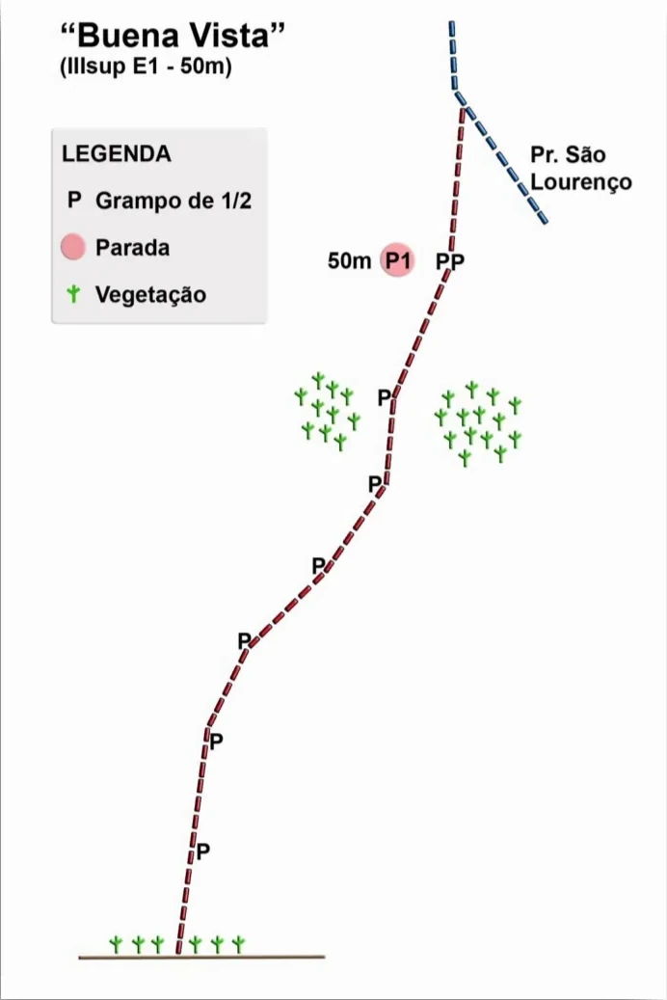
              - **largura_mapa**: 692
              - **altura_mapa**: 1037
        - **[1]**:
          - **via_multiplas_enfiadas**:
            - **descricao**: Via conquistada em homenagem ao grande escalador carioca Jair Lourenço, por coincidência, no dia de seu falecimento.
            - **nome**: São Lourenço
            - **dificuldade_media**: BR_3
            - **dificuldade_maxima**: BR_4
            - **comprimento_total**: 90
            - **tipo_via_multiplas_enfiadas**: TODA_FIXA
            - **conquistadores**:
              - Tonico Magalhães
              - Gustavo "Xaxá" Carrozzino
              - Carlos Carrozzino
            - **data_abertura**: 2007-12-09
        - **[2]**:
          - **via_esportiva**:
            - **descricao**: Inicia imediatamente à direita da base da “São Lourenço”. Via com boas passadas em aderência e regletes, contando com um crux bem definido, em aderência. Sua parada final fica quase na mesma altura da P1 do "Pr. São Lourenço", por onde pode-se tocar até a vegetação final da parede. Atenção às lacas soltas chegando na P1!
            - **nome**: Carnaferros
            - **dificuldade**: BR_5
            - **exposicao**: E1
            - **extensao**: 60
            - **quantidade_protecoes_intermediarias**: 8
            - **quantidade_protecoes_parada**: 2
            - **tipo_ancoragem**: Parada dupla
            - **conquistadores**:
              - Pedro Bugim
              - Maria Fernanda Patrício
            - **data_abertura**: 2015-02-16
          - **mapas**:
            - **[0]**:
              - **caminho_imagem_mapa**: 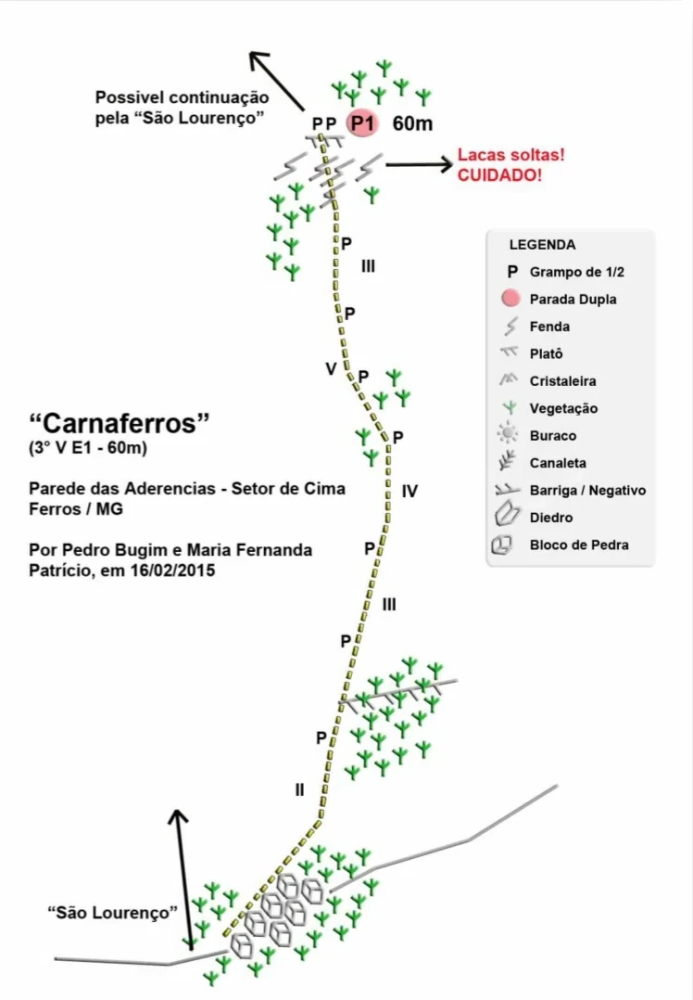
              - **largura_mapa**: 748
              - **altura_mapa**: 1078
      - **precomputados**:
        - **total_escaladas**: 3
        - **total_esportivas**: 2
        - **total_multiplas_enfiadas**: 1
  - **[4]**:
    - **conteudo**:
      - **descricao**:
          Capa: Ricardo Barros na conquista da “Mais Chuva Que Sol” (Foto: Pedro Bugim)
          
          Paredão rochoso com potencial para novas vias, contando, no momento, com apenas quatro linhas completas.
          
          A caminhada até a base para as duas vias da esquerda (“Bolo de Cenoura” e “51, Uma Boa Ideia”) é praticamente a mesma para acessar as vias do Setor das Clássicas Longas (na Parede Principal), apresentando cerca de dois quilômetros desde a sede da fazenda. Após passar pela bifurcação para a direita, que sobe para a Parede Principal, continue pela trilha principal e pegue a bifurcação à esquerda. É necessário cruzar o córrego localizado em frente à subida para o setor esquerdo da Parede Principal, um pouco antes de um pequeno curral existente.
          
          Uma boa dica é que este ponto de cruzamento do rio é bem próximo à junção do córrego que vem da trilha da direita com o córrego principal. Outra boa referência é a trilha para a direita para o setor das Clássicas Longas, que se inicia contornando o bambuzal pela esquerda. Ultrapassado o córrego, deve-se subir por cerca de 50 metros entre a mata, bem à direta de um leito seco de um pequeno grotão, e se chegará à parede.
          
          O acesso à base das vias da direita (“Mais Chuva Que Sol” e “Só a Cabecinha”) pode ser feito de duas formas: (I) acessar a parede pela picada até a “Bolo de Cenoura”, subir a encosta e acessar o primeiro grampo da via “51, Uma Boa Ideia” e, a partir daí, rapelar até a base das vias em uma diagonal para a direita; ou (II) continuar seguindo a trilha principal até o ponto onde aparece uma porteira de um pequeno curral. Deste ponto, deve-se descer até o córrego à esquerda em direção ao início de um bambuzal, onde pode-se avistar um grotão seco onde se inicia a trilha que dá acesso à parede. A trilha segue por cerca de 50 metros, inicialmente pelo grotão e em seguida subindo para a esquerda até encostar na pedra. Os primeiros grampos das vias ficam logo a vista.
          
          A trilha pode não estar muito bem definida devido à pouca frequência atual neste setor.
      - **nome**: Extrema Direita
      - **mapas**:
        - **[0]**:
          - **caminho_imagem_mapa**: 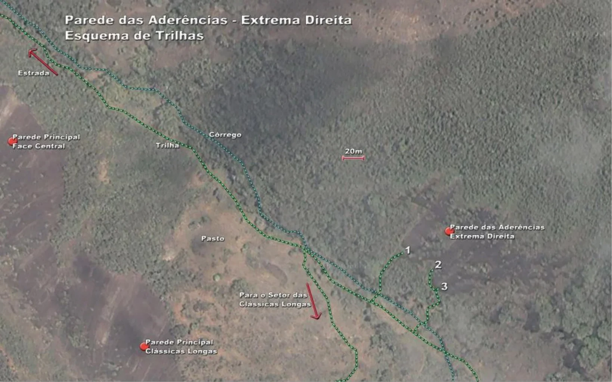
          - **referencias**:
            - **[0]**:
              - **escalada**: Bolo de Cenoura
              - **ids**:
                - 1
            - **[1]**:
              - **escalada**: 51, Uma Boa Ideia
              - **ids**:
                - 2
            - **[2]**:
              - **escalada**: Mais Chuva Que Sol
              - **ids**:
                - 3
            - **[3]**:
              - **escalada**: Só a Cabecinha
              - **ids**:
                - 3
            - **[4]**:
              - **setor**: Setor Central
              - **ids**:
                - Parede_Principal_Face_Central
              - **grupo**: Parede Principal (Paredes de Aço)
            - **[5]**:
              - **grupo**: Parede Principal (Paredes de Aço)
              - **setor**: Setor Clássicas Longas
              - **ids**:
                - Parede_Principal_Classicas_Longas
                - Para_o_Setor_das_Classicas_Longas
          - **largura_mapa**: 1639
          - **altura_mapa**: 1025
          - **pontos_de_interesse**:
            - **[0]**:
              - **id**: 1
              - **label**: 1
              - **circulo**:
                - **x**: 1092
                - **y**: 670
                - **raio**: 18
            - **[1]**:
              - **id**: 2
              - **label**: 2
              - **circulo**:
                - **x**: 1174
                - **y**: 709
                - **raio**: 18
            - **[2]**:
              - **id**: 3
              - **label**: 3
              - **circulo**:
                - **x**: 1190
                - **y**: 768
                - **raio**: 18
            - **[3]**:
              - **id**: Parede_Principal_Face_Central
              - **label**: Parede Principal Face Central
              - **retangulo**:
                - **x**: 120
                - **y**: 378
                - **comprimento**: 223
                - **largura**: 66
            - **[4]**:
              - **id**: Parede_Principal_Classicas_Longas
              - **label**: 
              - **retangulo**:
                - **x**: 480
                - **y**: 930
                - **comprimento**: 224
                - **largura**: 58
            - **[5]**:
              - **id**: Para_o_Setor_das_Classicas_Longas
              - **label**: Clássicas Longas
              - **retangulo**:
                - **x**: 736
                - **y**: 804
                - **comprimento**: 213
                - **largura**: 51
        - **[1]**:
          - **caminho_imagem_mapa**: 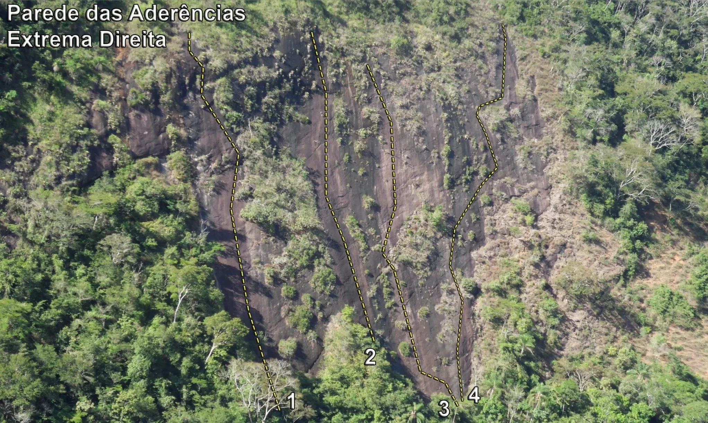
          - **referencias**:
            - **[0]**:
              - **escalada**: Bolo de Cenoura
              - **ids**:
                - 1
            - **[1]**:
              - **escalada**: 51, Uma Boa Ideia
              - **ids**:
                - 2
            - **[2]**:
              - **escalada**: Mais Chuva Que Sol
              - **ids**:
                - 3
            - **[3]**:
              - **escalada**: Só a Cabecinha
              - **ids**:
                - 4
          - **largura_mapa**: 2043
          - **altura_mapa**: 1223
          - **pontos_de_interesse**:
            - **[0]**:
              - **id**: 1
              - **label**: 1
              - **circulo**:
                - **x**: 843
                - **y**: 1157
                - **raio**: 35
            - **[1]**:
              - **id**: 2
              - **label**: 2
              - **circulo**:
                - **x**: 1068
                - **y**: 1033
                - **raio**: 35
            - **[2]**:
              - **id**: 3
              - **label**: 3
              - **circulo**:
                - **x**: 1282
                - **y**: 1180
                - **raio**: 35
            - **[3]**:
              - **id**: 4
              - **label**: 4
              - **circulo**:
                - **x**: 1369
                - **y**: 1142
                - **raio**: 35
      - **escaladas**:
        - **[0]**:
          - **via_multiplas_enfiadas**:
            - **descricao**:
                A primeira enfiada passa por um extenso costão de 60 metros, com apenas três grampos. Depois deste ponto, a parede ganha inclinação, aumentando a graduação, pouco a pouco, culminando no crux da via, já nos metros finais da parede. Possui duas passadas em móvel, nos quais se recomenda a utilização de stoppers grandes de camalot #2.
                
            - **nome**: Bolo de Cenoura
            - **dificuldade_media**: BR_2
            - **dificuldade_maxima**: BR_4
            - **exposicao**: E3
            - **duracao**: D1
            - **comprimento_total**: 120
            - **numero_enfiadas**: 2
            - **tipo_via_multiplas_enfiadas**: MISTA
            - **equipamento_recomendado**: stoppers grandes e camalot #2
            - **conquistadores**:
              - Ricardo Barros
              - Simone D'Oliveira
              - Francisco Caetano
              - Ernane "Tufo" Wermelinger
            - **data_abertura**: 2012-01-21
          - **mapas**:
            - **[0]**:
              - **caminho_imagem_mapa**: 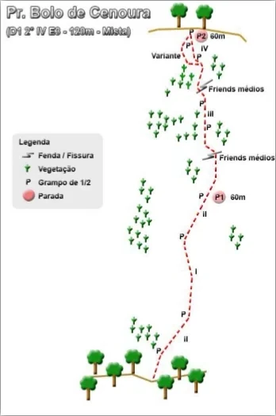
              - **largura_mapa**: 348
              - **altura_mapa**: 524
        - **[1]**:
          - **via_multiplas_enfiadas**:
            - **descricao**:
                A primeira via conquistada na extrema direita da Parede das Aderências, com lances predominantemente em aderência, protegida em grampos de ½ polegada. O crux é uma barriga lisa no final da via.
                
            - **nome**: 51, Uma Boa Ideia
            - **dificuldade_media**: BR_3
            - **dificuldade_maxima**: BR_5SUP
            - **comprimento_total**: 105
            - **tipo_via_multiplas_enfiadas**: TODA_FIXA
            - **conquistadores**:
              - Tonico Magalhães
              - Celso Ferreira Gomes
            - **data_abertura**: 2010-02-14
        - **[2]**:
          - **via_multiplas_enfiadas**:
            - **descricao**:
                A via é predominante em aderência, com fendas que ajudam a melhorar a proteção. Seu início é mais inclinado e, logo após a primeira proteção, cai bastante até a P1. Dessa proteção em diante, a inclinação aumenta gradativamente, com uma passada entre um pequeno teto rodeado de mato e grandes blocos soltos, que não aguentariam uma queda. Recomenda-se um jogo de camalots do #0.5 a #3. Os últimos grampos da via estão intercalados entre a vegetação e espaços onde a rocha aflora.
                
            - **nome**: Mais Chuva Que Sol
            - **dificuldade_media**: BR_2
            - **dificuldade_maxima**: BR_4
            - **exposicao**: E3
            - **duracao**: D1
            - **comprimento_total**: 150
            - **numero_enfiadas**: 3
            - **tipo_via_multiplas_enfiadas**: MISTA
            - **equipamento_recomendado**: jogo de camalots do #0.5 a #3, friends médios
            - **conquistadores**:
              - Ernane "Tufo" Wermelinger
              - Francisco Caetano
              - Ricardo Barros
            - **data_abertura**: 2012-01-22
          - **mapas**:
            - **[0]**:
              - **caminho_imagem_mapa**: 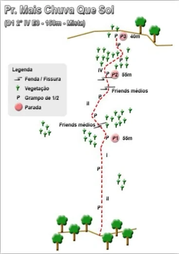
              - **largura_mapa**: 368
              - **altura_mapa**: 524
        - **[3]**:
          - **via_multiplas_enfiadas**:
            - **descricao**: Via com lances muito tranquilos, mesclando grampos e proteções móveis esporádicas, seguindo uma linha sinuosa (daí seu tamanho extenso) até o topo da extrema direita da parede. Apesar das proteções relativamente longas, é uma ótima via para quem está aprendendo a guiar, sobretudo, para treinar como “garimpar” as proteções móveis (peças pequenas e médias).
            - **nome**: Só a Cabecinha
            - **dificuldade_media**: BR_2
            - **dificuldade_maxima**: BR_3
            - **exposicao**: E3
            - **comprimento_total**: 200
            - **tipo_via_multiplas_enfiadas**: MISTA
            - **equipamento_recomendado**: peças pequenas e médias
            - **conquistadores**:
              - Ernane "Tufo" Wermelinger
              - Diogo Cruz
              - Alessandra da Silva Gomes
            - **data_abertura**: 2012-09-08
      - **caminho_imagem_capa**: 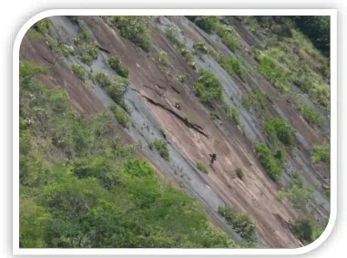
      - **precomputados**:
        - **total_escaladas**: 4
        - **total_multiplas_enfiadas**: 4
- **precomputados**:
  - **total_escaladas**: 47
  - **total_esportivas**: 18
  - **total_multiplas_enfiadas**: 25

## Parte: grupo_principal

### Grupo (Pico: Ferros)

- **descricao**:
    Capa: A Parede Principal, vista do topo da Parede das Aderências - Central. (Foto: Pedro Bugim)
    
    Com vias entre 18 e 220 metros, a Parede Principal é uma das principais atrações para os escaladores que visitam Ferros. Esta parede colossal possui cerca de dois quilômetros de extensão, desde sua extremidade direita (Setor Clássicas Curtas) à sua extrema esquerda (Setor Clássicas Longas), com vias de praticamente todos os tipos.
    
    A predominância é de vias em agarras e ótimos abaulados / buracos, conferindo ao escalador, lances bem estéticos. Como não poderia deixar de ser, estas paredes apresentam também boas passadas em aderência.
    
    O interessante é o fato de a parede apresentar vias curtas e longas, ambas, tanto com graduações elevadas, quando com graduações bem simplórias, agradando a todos os gostos.
- **nome**: Parede Principal (Paredes de Aço)
- **caminho_imagem_capa**: 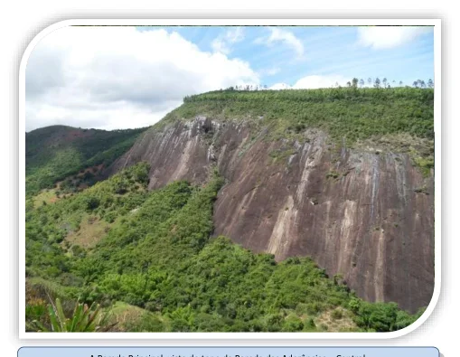
- **setores**:
  - **[0]**:
    - **conteudo**:
      - **descricao**:
          Capa: Rodrigo Magalhães guiando a "Couro de Lobisomem" (Foto: Tamires Lima)
          
          Ao entrar no vale, o excursionista terá à sua direita o Setor das Clássicas Curtas, que se estende do início da Parede Principal até uma língua de mato que o separa do núcleo da parede. Este setor concentra vias curtas, variando de 10 a 45 metros.
          
          As exceções são as vias “Vou Dançar um Xaxaxá” e “Águas de Março”, que apresentam 90 e 65 metros de extensão, respectivamente, localizadas na extremidade esquerda do setor, junto à referida língua de mato.
          
          Para acessar a base destas vias, deve-se pegar a trilha principal do vale do Roncador e seguir por aproximadamente 50 metros, até a bifurcação à direita, que sobe alguns poucos metros, juntando com a parede. Esta trilha se estende por toda extensão do setor, sendo necessário apenas seguir pela mesma para atingir o início de todas as vias.
          
          Com graduações variando entre III e VIsup, estas vias são perfeitas para treinamento em top-rope e guiada, neste caso pela ótima proteção que elas oferecem. Algumas vias possuem passadas em móvel, sempre em fendas sólidas, proporcionando proteções “à prova de bomba”.
          
          ## Esquema de Trilhas
          
          - **1 – Base das vias "Deu Tilt" até "Entrando no Ferro"**
          - **2 – Base das vias "Cambal a Quatro" até "Amor Profano"**
          - **3 – Base das vias "Ferrolho" e "Ferroada"**
          - **4 – Base das vias "Vou Dançar o Xaxaxá" e "Casas da Banha"**
          
          |  |
          | :--: |
          | *Luciano Bender intermediando um lance durante a conquista da "Casas da Banha" (Foto: Celso Ferreira Gomes)* |
      - **nome**: Setor Clássicas Curtas
      - **caminho_imagem_capa**: 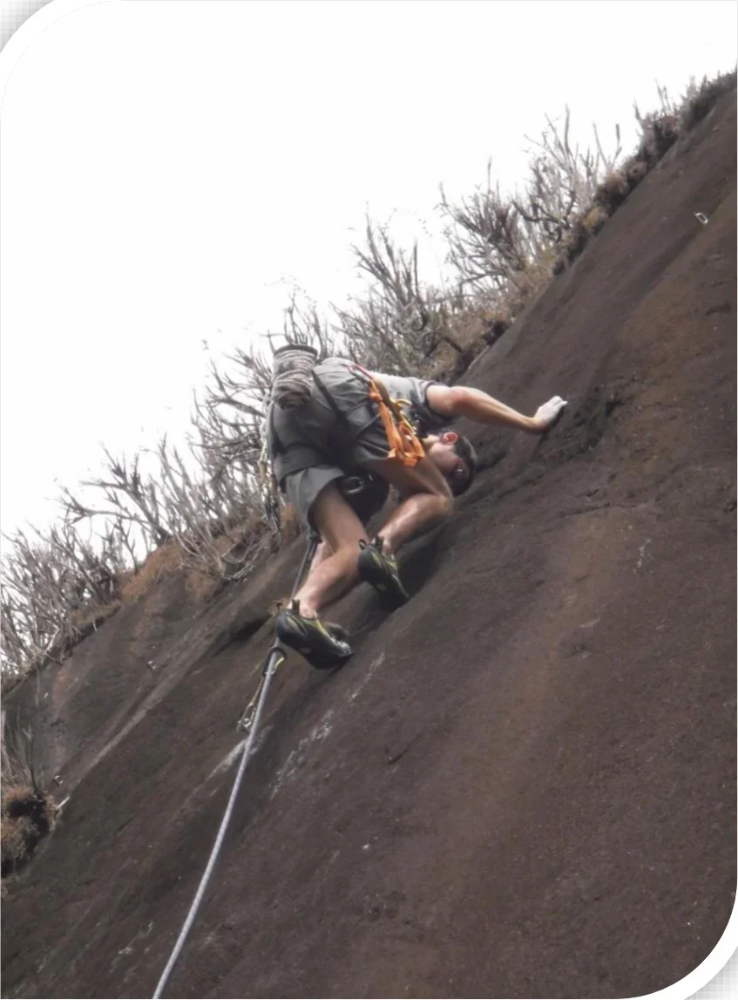
      - **mapas**:
        - **[0]**:
          - **caminho_imagem_mapa**: 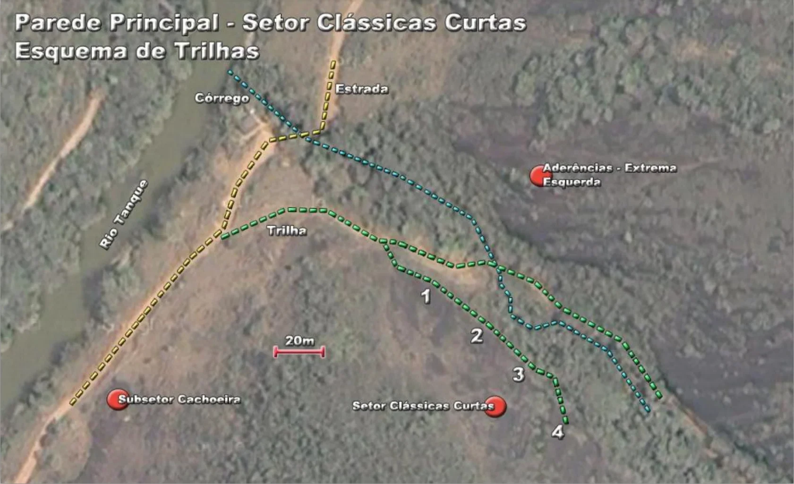
          - **largura_mapa**: 1681
          - **altura_mapa**: 1025
          - **referencias**:
            - **[0]**:
              - **ids**:
                - Subsetor Cachoeira
              - **setor**: Cachoeira
            - **[1]**:
              - **ids**:
                - Aderências - Extrema Esquerda
              - **grupo**: Parede das Aderências
              - **setor**: Extrema Esquerda
            - **[2]**:
              - **escalada**: Deu Tilt
              - **ids**:
                - 1
              - **grupo**: Parede Principal (Paredes de Aço)
              - **setor**: Setor Clássicas Curtas
            - **[3]**:
              - **escalada**: Ferroada
              - **ids**:
                - 1
              - **grupo**: Parede Principal (Paredes de Aço)
              - **setor**: Setor Clássicas Curtas
            - **[4]**:
              - **escalada**: Scarface
              - **ids**:
                - 1
              - **grupo**: Parede Principal (Paredes de Aço)
              - **setor**: Setor Clássicas Curtas
            - **[5]**:
              - **escalada**: Se Meu Fusca Falasse
              - **ids**:
                - 1
              - **grupo**: Parede Principal (Paredes de Aço)
              - **setor**: Setor Clássicas Curtas
            - **[6]**:
              - **escalada**: Couro de Lobisomem
              - **ids**:
                - 1
              - **grupo**: Parede Principal (Paredes de Aço)
              - **setor**: Setor Clássicas Curtas
            - **[7]**:
              - **escalada**: Enferrujados
              - **ids**:
                - 1
              - **grupo**: Parede Principal (Paredes de Aço)
              - **setor**: Setor Clássicas Curtas
            - **[8]**:
              - **escalada**: Rastro de Cobra
              - **ids**:
                - 1
              - **grupo**: Parede Principal (Paredes de Aço)
              - **setor**: Setor Clássicas Curtas
            - **[9]**:
              - **escalada**: Entrando no Ferro
              - **ids**:
                - 1
              - **grupo**: Parede Principal (Paredes de Aço)
              - **setor**: Setor Clássicas Curtas
            - **[10]**:
              - **escalada**: Cambal a Quatro
              - **ids**:
                - 2
              - **grupo**: Parede Principal (Paredes de Aço)
              - **setor**: Setor Clássicas Curtas
            - **[11]**:
              - **escalada**: El Bigodón
              - **ids**:
                - 2
              - **grupo**: Parede Principal (Paredes de Aço)
              - **setor**: Setor Clássicas Curtas
            - **[12]**:
              - **escalada**: Testa de Aço
              - **ids**:
                - 2
              - **grupo**: Parede Principal (Paredes de Aço)
              - **setor**: Setor Clássicas Curtas
            - **[13]**:
              - **escalada**: Me Ferrei
              - **ids**:
                - 2
              - **grupo**: Parede Principal (Paredes de Aço)
              - **setor**: Setor Clássicas Curtas
            - **[14]**:
              - **escalada**: Amor Profano
              - **ids**:
                - 2
              - **grupo**: Parede Principal (Paredes de Aço)
              - **setor**: Setor Clássicas Curtas
            - **[15]**:
              - **escalada**: Ferrolho
              - **ids**:
                - 3
              - **grupo**: Parede Principal (Paredes de Aço)
              - **setor**: Setor Clássicas Curtas
            - **[16]**:
              - **escalada**: Ferradura
              - **ids**:
                - 3
              - **grupo**: Parede Principal (Paredes de Aço)
              - **setor**: Setor Clássicas Curtas
            - **[17]**:
              - **escalada**: A Medalha de Lúcia
              - **ids**:
                - 4
              - **grupo**: Parede Principal (Paredes de Aço)
              - **setor**: Setor Clássicas Curtas
            - **[18]**:
              - **escalada**: Águas de Março
              - **ids**:
                - 4
              - **grupo**: Parede Principal (Paredes de Aço)
              - **setor**: Setor Clássicas Curtas
            - **[19]**:
              - **ids**:
                - 4
              - **grupo**: Parede Principal (Paredes de Aço)
              - **setor**: Setor Clássicas Curtas
              - **escalada**: Vou Dançar o Xaxaxá
            - **[20]**:
              - **ids**:
                - 4
              - **grupo**: Parede Principal (Paredes de Aço)
              - **setor**: Setor Clássicas Curtas
              - **escalada**: Casas da Banha
          - **pontos_de_interesse**:
            - **[0]**:
              - **id**: 1
              - **label**: 1
              - **circulo**:
                - **x**: 903
                - **y**: 628
                - **raio**: 22
            - **[1]**:
              - **id**: 2
              - **label**: 2
              - **circulo**:
                - **x**: 1010
                - **y**: 711
                - **raio**: 22
            - **[2]**:
              - **id**: 3
              - **label**: 3
              - **circulo**:
                - **x**: 1099
                - **y**: 792
                - **raio**: 22
            - **[3]**:
              - **id**: 4
              - **label**: 4
              - **circulo**:
                - **x**: 1183
                - **y**: 914
                - **raio**: 22
            - **[4]**:
              - **id**: Subsetor Cachoeira
              - **label**: Subsetor Cachoeira
              - **retangulo**:
                - **x**: 372
                - **y**: 847
                - **comprimento**: 317
                - **largura**: 68
            - **[5]**:
              - **id**: Aderências - Extrema Esquerda
              - **label**: Aderências - Extrema Esquerda
              - **retangulo**:
                - **x**: 1283
                - **y**: 370
                - **comprimento**: 350
                - **largura**: 85
        - **[1]**:
          - **caminho_imagem_mapa**: 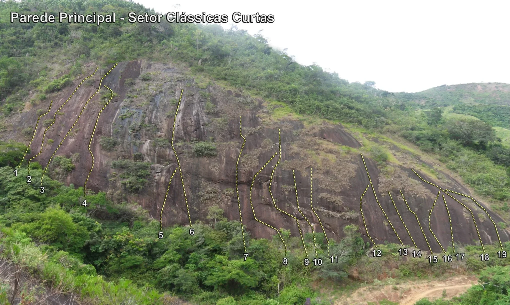
          - **largura_mapa**: 2041
          - **altura_mapa**: 1224
          - **referencias**:
            - **[0]**:
              - **escalada**: A Medalha de Lúcia
              - **ids**:
                - 1
            - **[1]**:
              - **escalada**: Águas de Março
              - **ids**:
                - 2
            - **[2]**:
              - **escalada**: Vou Dançar o Xaxaxá
              - **ids**:
                - 3
            - **[3]**:
              - **escalada**: Casas da Banha
              - **ids**:
                - 4
            - **[4]**:
              - **ids**:
                - 5
              - **escalada**: Ferradura
            - **[5]**:
              - **ids**:
                - 6
              - **escalada**: Ferrolho
            - **[6]**:
              - **ids**:
                - 7
              - **escalada**: Cambal a Quatro
            - **[7]**:
              - **ids**:
                - 8
              - **escalada**: El Bigodón
            - **[8]**:
              - **ids**:
                - 9
              - **escalada**: Testa de Aço
            - **[9]**:
              - **ids**:
                - 10
              - **escalada**: Me Ferrei
            - **[10]**:
              - **ids**:
                - 11
              - **escalada**: Amor Profano
            - **[11]**:
              - **ids**:
                - 12
              - **escalada**: Deu Tilt
            - **[12]**:
              - **ids**:
                - 13
              - **escalada**: Ferroada
            - **[13]**:
              - **ids**:
                - 14
              - **escalada**: Scarface
            - **[14]**:
              - **ids**:
                - 15
              - **escalada**: Se Meu Fusca Falasse
            - **[15]**:
              - **ids**:
                - 16
              - **escalada**: Couro de Lobisomem
            - **[16]**:
              - **ids**:
                - 17
              - **escalada**: Enferrujados
            - **[17]**:
              - **ids**:
                - 18
              - **escalada**: Rastro de Cobra
            - **[18]**:
              - **ids**:
                - 19
              - **escalada**: Entrando no Ferro
          - **pontos_de_interesse**:
            - **[0]**:
              - **id**: 1
              - **label**: 1
              - **circulo**:
                - **x**: 63
                - **y**: 693
                - **raio**: 23
            - **[1]**:
              - **id**: 2
              - **label**: 2
              - **circulo**:
                - **x**: 116
                - **y**: 719
                - **raio**: 23
            - **[2]**:
              - **id**: 3
              - **label**: 3
              - **circulo**:
                - **x**: 169
                - **y**: 761
                - **raio**: 23
            - **[3]**:
              - **id**: 4
              - **label**: 4
              - **circulo**:
                - **x**: 339
                - **y**: 816
                - **raio**: 23
            - **[4]**:
              - **id**: 5
              - **label**: 5
              - **circulo**:
                - **x**: 644
                - **y**: 943
                - **raio**: 23
            - **[5]**:
              - **id**: 6
              - **label**: 6
              - **circulo**:
                - **x**: 768
                - **y**: 929
                - **raio**: 23
            - **[6]**:
              - **id**: 7
              - **label**: 7
              - **circulo**:
                - **x**: 983
                - **y**: 1031
                - **raio**: 23
            - **[7]**:
              - **id**: 8
              - **label**: 8
              - **circulo**:
                - **x**: 1141
                - **y**: 1049
                - **raio**: 23
            - **[8]**:
              - **id**: 9
              - **label**: 9
              - **circulo**:
                - **x**: 1226
                - **y**: 1051
                - **raio**: 23
            - **[9]**:
              - **id**: 10
              - **label**: 10
              - **circulo**:
                - **x**: 1272
                - **y**: 1052
                - **raio**: 25
            - **[10]**:
              - **id**: 11
              - **label**: 11
              - **circulo**:
                - **x**: 1337
                - **y**: 1041
                - **raio**: 25
            - **[11]**:
              - **id**: 12
              - **label**: 12
              - **circulo**:
                - **x**: 1508
                - **y**: 1016
                - **raio**: 27
            - **[12]**:
              - **id**: 13
              - **label**: 13
              - **circulo**:
                - **x**: 1612
                - **y**: 1011
                - **raio**: 27
            - **[13]**:
              - **id**: 14
              - **label**: 14
              - **circulo**:
                - **x**: 1669
                - **y**: 1018
                - **raio**: 27
            - **[14]**:
              - **id**: 15
              - **label**: 15
              - **circulo**:
                - **x**: 1733
                - **y**: 1040
                - **raio**: 27
            - **[15]**:
              - **id**: 16
              - **label**: 16
              - **circulo**:
                - **x**: 1791
                - **y**: 1038
                - **raio**: 27
            - **[16]**:
              - **id**: 17
              - **label**: 17
              - **circulo**:
                - **x**: 1843
                - **y**: 1029
                - **raio**: 27
            - **[17]**:
              - **id**: 18
              - **label**: 18
              - **circulo**:
                - **x**: 1940
                - **y**: 1033
                - **raio**: 27
            - **[18]**:
              - **id**: 19
              - **label**: 19
              - **circulo**:
                - **x**: 2011
                - **y**: 1021
                - **raio**: 27
        - **[2]**:
          - **caminho_imagem_mapa**: 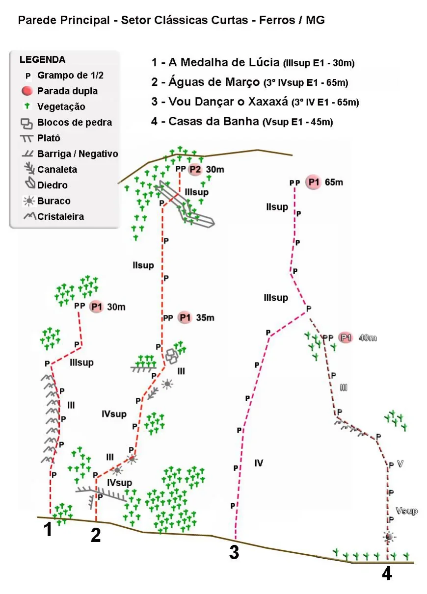
          - **largura_mapa**: 870
          - **altura_mapa**: 1211
          - **referencias**:
            - **[0]**:
              - **ids**:
                - 1
                - p1_1
              - **escalada**: A Medalha de Lúcia
            - **[1]**:
              - **ids**:
                - 2
                - p1_2
                - p2_2
              - **escalada**: Águas de Março
            - **[2]**:
              - **ids**:
                - 3
                - p1_3
              - **escalada**: Vou Dançar o Xaxaxá
            - **[3]**:
              - **ids**:
                - 4
                - p1_4
              - **escalada**: Casas da Banha
          - **pontos_de_interesse**:
            - **[0]**:
              - **id**: 1
              - **label**: 1
              - **circulo**:
                - **x**: 98
                - **y**: 1077
                - **raio**: 22
            - **[1]**:
              - **id**: 2
              - **label**: 2
              - **circulo**:
                - **x**: 195
                - **y**: 1091
                - **raio**: 22
            - **[2]**:
              - **id**: 3
              - **label**: 3
              - **circulo**:
                - **x**: 478
                - **y**: 1125
                - **raio**: 22
            - **[3]**:
              - **id**: 4
              - **label**: 4
              - **circulo**:
                - **x**: 789
                - **y**: 1169
                - **raio**: 22
            - **[4]**:
              - **id**: p1_1
              - **label**: 
              - **circulo**:
                - **x**: 196
                - **y**: 625
                - **raio**: 15
              - **cor**: 
            - **[5]**:
              - **id**: p1_2
              - **label**: 
              - **circulo**:
                - **x**: 377
                - **y**: 647
                - **raio**: 15
              - **cor**: 
            - **[6]**:
              - **id**: p2_2
              - **label**: 
              - **circulo**:
                - **x**: 397
                - **y**: 346
                - **raio**: 15
              - **cor**: 
            - **[7]**:
              - **id**: p1_4
              - **label**: 
              - **circulo**:
                - **x**: 704
                - **y**: 688
                - **raio**: 14
              - **cor**: 
            - **[8]**:
              - **id**: p1_3
              - **label**: 
              - **circulo**:
                - **x**: 638
                - **y**: 371
                - **raio**: 17
              - **cor**: 
      - **escaladas**:
        - **[0]**:
          - **via_esportiva**:
            - **descricao**: Segue por uma óbvia cristaleira até seu final, quando faz uma horizontal à direita – e crux da via – até sua parada dupla de topo.
            - **nome**: A Medalha de Lúcia
            - **dificuldade**: BR_3SUP
            - **exposicao**: E1
            - **extensao**: 30
            - **quantidade_protecoes_intermediarias**: 6
            - **quantidade_protecoes_parada**: 2
            - **tipo_ancoragem**: Parada dupla
            - **conquistadores**:
              - Tonico Magalhães
              - Celso Ferreira Gomes
            - **data_abertura**: 2015-09-18
        - **[1]**:
          - **via_multiplas_enfiadas**:
            - **descricao**: Interessante via que inicia em um lance levemente atlético e evolui para abaulados e aderência, sempre bem protegida.
            - **nome**: Águas de Março
            - **dificuldade_media**: BR_4
            - **dificuldade_maxima**: BR_4SUP
            - **exposicao**: E1
            - **tipo_via_multiplas_enfiadas**: TODA_FIXA
            - **numero_enfiadas**: 2
            - **comprimento_total**: 65
            - **comprimento_maior_enfiada**: 35
            - **quantidade_costuras_intermediarias**: 6
            - **quantidade_equipamentos_parada**: 2
            - **conquistadores**:
              - Pedro Bugim
              - Maria Fernanda Patricio
            - **data_abertura**: 2013-03-31
            - **enfiadas**:
              - **[0]**:
                - **via_esportiva**:
                  - **nome**: 1ª Enfiada (P1)
                  - **dificuldade**: BR_4SUP
                  - **extensao**: 35
                  - **quantidade_protecoes_intermediarias**: 6
                  - **quantidade_protecoes_parada**: 2
                  - **tipo_ancoragem**: Parada dupla
              - **[1]**:
                - **via_esportiva**:
                  - **nome**: 2ª Enfiada (P2)
                  - **dificuldade**: BR_3SUP
                  - **extensao**: 30
                  - **quantidade_protecoes_intermediarias**: 4
                  - **quantidade_protecoes_parada**: 2
                  - **tipo_ancoragem**: Parada dupla
        - **[2]**:
          - **via_esportiva**:
            - **descricao**: Via bem protegida e agradável. O nome homenageia o Gustavo “Xaxá”, fundador do CEM (Centro Excursionista Mineiro) e se inspira num antigo comercial de TV das Casas da Banha. (Nota: indicada com 65m no croqui detalhado e 90m na introdução e visão geral da parede).
            - **nome**: Vou Dançar o Xaxaxá
            - **dificuldade**: BR_4
            - **exposicao**: E1
            - **extensao**: 65
            - **quantidade_protecoes_intermediarias**: 10
            - **quantidade_protecoes_parada**: 2
            - **tipo_ancoragem**: Parada dupla
            - **conquistadores**:
              - Tonico Magalhães
              - Celso Ferreira Gomes
            - **data_abertura**: 2010-11-28
        - **[3]**:
          - **via_esportiva**:
            - **descricao**: Começa com uma enfiada atlética seguida de lances em buracos. Apresenta parada dupla (P1) aos 40 metros e conexão de 5 metros até a via Vou Dançar o Xaxaxá.
            - **nome**: Casas da Banha
            - **dificuldade**: BR_5SUP
            - **exposicao**: E1
            - **extensao**: 45
            - **quantidade_protecoes_intermediarias**: 8
            - **quantidade_protecoes_parada**: 2
            - **tipo_ancoragem**: Parada dupla
            - **conquistadores**:
              - Luciano Bender
              - Gustavo "Xaxá" Carrozzino
              - Tonico Magalhães
              - Celso Ferreira Gomes
            - **data_abertura**: 2011-04-21
        - **[4]**:
          - **via_esportiva**:
            - **descricao**: Via portadora de um lance difícil. Um verdadeiro bote em um buraco. É variante da Ferrolho e conta com boa proteção. (Nota: indicada com 25m na visão geral da parede).
            - **nome**: Ferradura
            - **dificuldade**: BR_6SUP
            - **extensao**: 10
            - **conquistadores**:
              - Tonico Magalhães
              - Júlio César Cardoso
            - **data_abertura**: 2007-06-03
        - **[5]**:
          - **via_esportiva**:
            - **descricao**: A via segue uma linda sequência de buracos em forma de olhos. Daí o nome da via. O crux é o primeiro lance.
            - **nome**: Ferrolho
            - **dificuldade**: BR_4
            - **extensao**: 25
            - **conquistadores**:
              - Tonico Magalhães
              - Júlio César Cardoso
            - **data_abertura**: 2007-06-03
        - **[6]**:
          - **via_esportiva**:
            - **descricao**: Via portadora de uma difícil barriga em seu final. (Graduada como V na visão geral e Vsup na descrição).
            - **nome**: Cambal a Quatro
            - **dificuldade**: BR_5SUP
            - **extensao**: 30
            - **conquistadores**:
              - Tonico Magalhães
              - Juliano Magalhães
              - Valdinei
            - **data_abertura**: 2008-02-03
        - **[7]**:
          - **via_movel**:
            - **descricao**: Espetacular via do setor, sendo considerada como imperdível. Via mista com grampos e proteções móveis.
            - **nome**: El Bigodón
            - **destaque**: True
            - **dificuldade**: BR_5
            - **extensao**: 30
            - **conquistadores**:
              - Tonico Magalhães
              - Gustavo "Xaxá" Carrozzino
              - Nádia Moreira
            - **data_abertura**: 2006-08-27
        - **[8]**:
          - **via_movel**:
            - **descricao**: Via mista, com grampos e utilização de materiais móveis. Rapel com corda simples de 50m.
            - **nome**: Testa de Aço
            - **dificuldade**: BR_5SUP
            - **extensao**: 30
            - **conquistadores**:
              - Tonico Magalhães
              - Gustavo "Xaxá" Carrozzino
            - **data_abertura**: 2007-10-28
        - **[9]**:
          - **via_movel**:
            - **descricao**: Via atlética com grampos e utilização de materiais móveis. Rapel com corda simples de 50m.
            - **nome**: Me Ferrei
            - **dificuldade**: BR_6
            - **extensao**: 18
            - **conquistadores**:
              - Luciano Bender
              - Tonico Magalhães
            - **data_abertura**: 2011-06-22
        - **[10]**:
          - **via_movel**:
            - **descricao**: Via atlética em seu início e em aderência em seu final. O primeiro lance (crux) pode ter sua proteção melhorada com um friend médio. Imperdível também.
            - **nome**: Amor Profano
            - **destaque**: True
            - **dificuldade**: BR_5
            - **extensao**: 20
            - **protecoes_moveis**: Friend médio para o primeiro lance (crux)
            - **conquistadores**:
              - Tonico Magalhães
              - Nádia Moreira
            - **data_abertura**: 2007-08-13
        - **[11]**:
          - **via_esportiva**:
            - **descricao**: Boa via em grampos. O crux é logo no início.
            - **nome**: Deu Tilt
            - **dificuldade**: BR_4SUP
            - **extensao**: 15
            - **conquistadores**:
              - Tonico Magalhães
              - Daniel Maia
            - **data_abertura**: 2008-03-22
        - **[12]**:
          - **via_esportiva**:
            - **descricao**: Boa para iniciantes e bem protegida.
            - **nome**: Ferroada
            - **dificuldade**: BR_3
            - **extensao**: 20
            - **conquistadores**:
              - Tonico Magalhães
              - Nádia Moreira
            - **data_abertura**: 2007-04-23
        - **[13]**:
          - **via_esportiva**:
            - **descricao**: Via protegida por 6 grampos, tendo seu crux na passada final. (Graduada como IVsup na visão geral e IV na descrição; extensão de 15m na visão geral e 20m na descrição).
            - **nome**: Scarface
            - **dificuldade**: BR_4SUP
            - **extensao**: 20
            - **quantidade_protecoes_intermediarias**: 6
            - **conquistadores**:
              - Tonico Magalhães
              - Celso Ferreira Gomes
            - **data_abertura**: 2013-05-30
        - **[14]**:
          - **via_esportiva**:
            - **descricao**: Via com movimentos interessantes e crux ao final.
            - **nome**: Se Meu Fusca Falasse
            - **dificuldade**: BR_4
            - **extensao**: 15
            - **conquistadores**:
              - Celso Ferreira Gomes
              - Tonico Magalhães
            - **data_abertura**: 2010-02-16
        - **[15]**:
          - **via_esportiva**:
            - **descricao**: Via técnica em agarras e bem protegida.
            - **nome**: Couro de Lobisomem
            - **dificuldade**: BR_6SUP
            - **extensao**: 18
            - **conquistadores**:
              - Rodrigo Magalhães
              - Tonico Magalhães
              - Celso Ferreira Gomes
            - **data_abertura**: 2011-07-17
        - **[16]**:
          - **via_esportiva**:
            - **descricao**: A barriga crux da via vale uma repetição.
            - **nome**: Enferrujados
            - **dificuldade**: BR_4
            - **extensao**: 15
            - **conquistadores**:
              - Tonico Magalhães
              - Daniel Maia
              - Nádia Moreira
            - **data_abertura**: 2007-06-17
        - **[17]**:
          - **via_esportiva**:
            - **descricao**: Via técnica e bem protegida.
            - **nome**: Rastro de Cobra
            - **dificuldade**: BR_5SUP
            - **extensao**: 18
            - **conquistadores**:
              - Tonico Magalhães
              - Celso Ferreira Gomes
            - **data_abertura**: 2011-07-17
        - **[18]**:
          - **via_esportiva**:
            - **descricao**: Primeira via na extrema direita deste setor, seguindo a linha de vegetação. O crux é o primeiro lance.
            - **nome**: Entrando no Ferro
            - **dificuldade**: BR_5SUP
            - **extensao**: 25
            - **conquistadores**:
              - Tonico Magalhães
              - Luciano Bender
            - **data_abertura**: 2011-06-22
      - **precomputados**:
        - **total_escaladas**: 19
        - **total_esportivas**: 14
        - **total_multiplas_enfiadas**: 1
  - **[1]**:
    - **conteudo**:
      - **descricao**:
          Capa: Gustavo “Xaxá” Carrozzino na conquista da “Amor, Meu Grande Amor”, após o diedro em móvel (Foto: Maria Fernanda Patrício)
          
          Localizada ao início da Parede Principal com vias de pequena extensão e muito boas para um primeiro contato com o tipo de escalada da região. Concentra vias que vão de 20 a 100 metros, em sua maioria bem protegidas por grampos de ½ polegada, com predominância de agarras, regletes e buracos, possuindo por vezes, algumas fendas interessantes.
          
          O acesso às bases pode ser feito por duas picadas que derivam da trilha principal do Vale do Roncador, ambas aproximadamente 200 metros após a primeira travessia do córrego.
          
          Na primeira opção, pega-se a bifurcação para a esquerda e com poucos metros de caminhada, cruza-se novamente o córrego. A descida é amena, porém após atravessar o córrego, existe um pequeno barranco. Tocando para cima, chega-se na base da via “Rapidinha no Escurinho”.
          
          Na segunda picada, pega-se a bifurcação à esquerda, descendo por uma trilha um pouco íngreme antes de cruzar o córrego, para então, voltar a subir, chegando na base da via “O Burro e o Capacete”, onde se encontra o esqueleto de um burro que veio a falecer após cair do topo da parede (daí, parte do nome da via).
          
          ## Esquema de Trilhas e Acesso
          
          - **1 – Base das vias “Cutícula” e “Pelinha”**
          - **2 – Base das vias “Rapidinha no Escurinho” até a “Pele Vermelha”**
          - **3 – Base das vias “Amor, Meu Grande Amor” e “Tá Bão”**
          - **4 – Base da via “O Burro e o Capacete”**
          - **5 – Base das vias “Valeu Papito” até a “Lobos do Caraça”**
          
          |  |
          | :--: |
          | *Ana Paula na "Cutícula" (Foto: Pedro Bugim)* |
          
          | 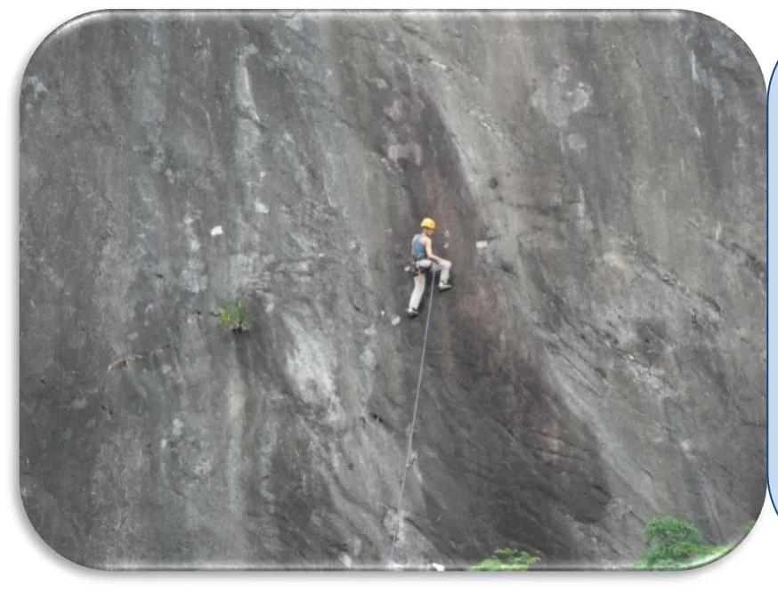 |
          | :--: |
          | *Larissa Lopes na “Flor da Pele”. Parede Principal Direita. (Foto: Pedro Bugim)* |
          
          |  |
          | :--: |
          | *Carlos Alberto Carrozzino (Krrô), na conquista da via “Valeu Papito” (Foto: Gustavo “Xaxá” Carrozzino)* |
          
          | 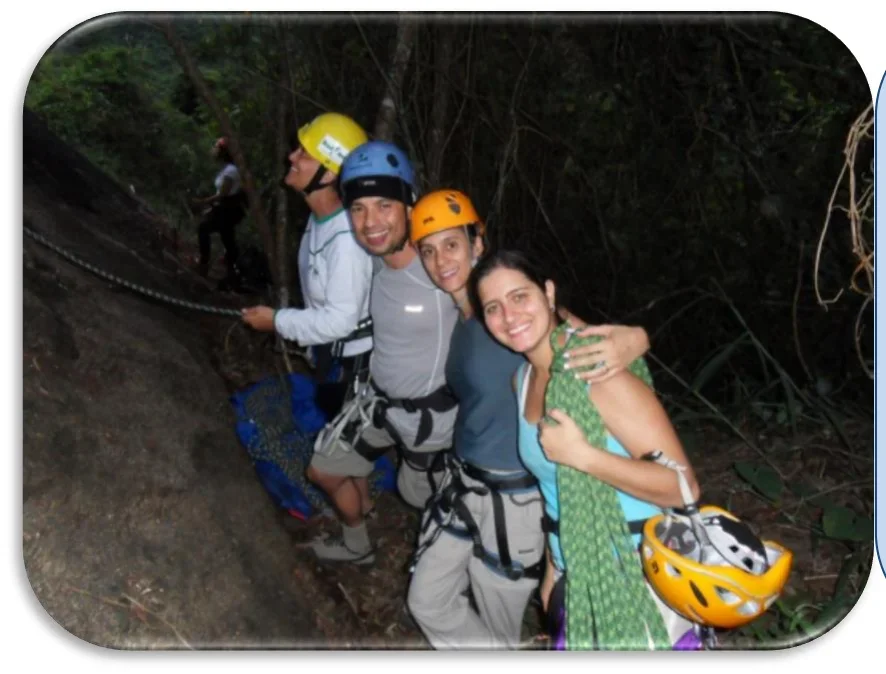 |
          | :--: |
          | *Cida, Eustáquio Júnior, Larissa Lopes e Maria Fernanda na base da Parede Principal - Direita, durante aula do segundo Curso Básico de Montanhismo do CEM (Foto: Pedro Bugim)* |
      - **nome**: Parede Principal – Direita
      - **mapas**:
        - **[0]**:
          - **caminho_imagem_mapa**: 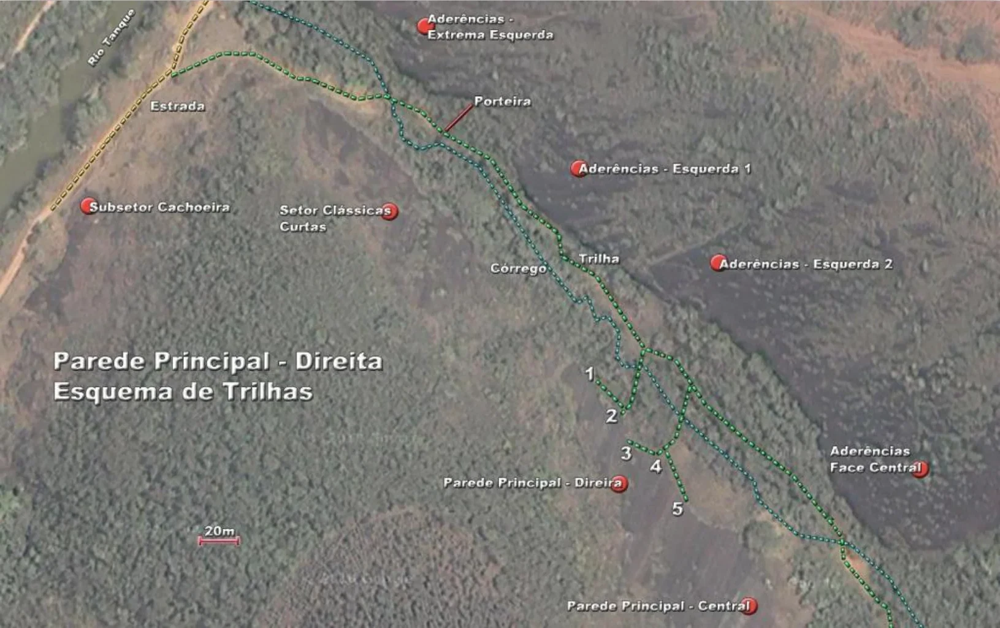
          - **largura_mapa**: 1631
          - **altura_mapa**: 1025
          - **referencias**:
            - **[0]**:
              - **escalada**: Cutícula
              - **ids**:
                - 1
            - **[1]**:
              - **escalada**: Pelinha
              - **ids**:
                - 1
            - **[2]**:
              - **escalada**: Rapidinha no Escurinho
              - **ids**:
                - 2
            - **[3]**:
              - **escalada**: Pelanca
              - **ids**:
                - 2
            - **[4]**:
              - **escalada**: Flor da Pele
              - **ids**:
                - 2
            - **[5]**:
              - **escalada**: Alma Nova
              - **ids**:
                - 2
            - **[6]**:
              - **escalada**: Pele Vermelha
              - **ids**:
                - 2
            - **[7]**:
              - **escalada**: Amor, Meu Grande Amor
              - **ids**:
                - 3
            - **[8]**:
              - **escalada**: Tá Bão
              - **ids**:
                - 3
            - **[9]**:
              - **escalada**: O Burro e o Capacete
              - **ids**:
                - 4
            - **[10]**:
              - **escalada**: Valeu Papito
              - **ids**:
                - 5
            - **[11]**:
              - **escalada**: Pente Frio
              - **ids**:
                - 5
            - **[12]**:
              - **escalada**: El Barrigón
              - **ids**:
                - 5
            - **[13]**:
              - **escalada**: Lobos do Caraça
              - **ids**:
                - 5
            - **[14]**:
              - **escalada**: O Tempo e o Vento
              - **ids**:
                - 4
            - **[15]**:
              - **grupo**: Parede das Aderências
              - **setor**: Extrema Esquerda
              - **ids**:
                - Aderências - Extrema Esquerda
            - **[16]**:
              - **ids**:
                - Aderências - Esquerda 1
              - **grupo**: Parede das Aderências
              - **setor**: Esquerda
            - **[17]**:
              - **grupo**: Parede das Aderências
              - **setor**: Esquerda
              - **ids**:
                - Aderências - Esquerda 2
            - **[18]**:
              - **setor**: Cachoeira
              - **ids**:
                - Subsetor Cachoeira
            - **[19]**:
              - **setor**: Setor Clássicas Curtas
              - **ids**:
                - Setor Clássicas Curtas
            - **[20]**:
              - **setor**: Face Central
              - **ids**:
                - Aderências - Face Central
              - **grupo**: Parede das Aderências
            - **[21]**:
              - **setor**: Setor Central
              - **ids**:
                - Parede Principal - Central
          - **pontos_de_interesse**:
            - **[0]**:
              - **id**: 1
              - **label**: 1
              - **circulo**:
                - **x**: 963
                - **y**: 611
                - **raio**: 19
            - **[1]**:
              - **id**: 2
              - **label**: 2
              - **circulo**:
                - **x**: 998
                - **y**: 680
                - **raio**: 19
            - **[2]**:
              - **id**: 3
              - **label**: 3
              - **circulo**:
                - **x**: 1021
                - **y**: 740
                - **raio**: 19
            - **[3]**:
              - **id**: 4
              - **label**: 4
              - **circulo**:
                - **x**: 1071
                - **y**: 762
                - **raio**: 19
            - **[4]**:
              - **id**: 5
              - **label**: 5
              - **circulo**:
                - **x**: 1106
                - **y**: 830
                - **raio**: 19
            - **[5]**:
              - **id**: Aderências - Extrema Esquerda
              - **label**: Aderências - Extrema Esquerda
              - **retangulo**:
                - **x**: 790
                - **y**: 44
                - **comprimento**: 254
                - **largura**: 69
            - **[6]**:
              - **id**: Aderências - Esquerda 1
              - **label**: Aderências - Esquerda 1
              - **retangulo**:
                - **x**: 1083
                - **y**: 275
                - **comprimento**: 326
                - **largura**: 64
            - **[7]**:
              - **id**: Aderências - Esquerda 2
              - **label**: Aderências - Esquerda 2
              - **retangulo**:
                - **x**: 1313
                - **y**: 431
                - **comprimento**: 334
                - **largura**: 54
            - **[8]**:
              - **id**: Subsetor Cachoeira
              - **label**: Subsetor Cachoeira
              - **retangulo**:
                - **x**: 254
                - **y**: 337
                - **comprimento**: 271
                - **largura**: 46
            - **[9]**:
              - **id**: Setor Clássicas Curtas
              - **label**: Setor Clássicas Curtas
              - **retangulo**:
                - **x**: 554
                - **y**: 354
                - **comprimento**: 215
                - **largura**: 67
            - **[10]**:
              - **id**: Aderências - Face Central
              - **label**: Aderências - Face Central
              - **retangulo**:
                - **x**: 1433
                - **y**: 754
                - **comprimento**: 184
                - **largura**: 74
            - **[11]**:
              - **id**: Parede Principal - Central
              - **label**: Parede Principal - Central
              - **retangulo**:
                - **x**: 1080
                - **y**: 990
                - **comprimento**: 332
                - **largura**: 52
        - **[1]**:
          - **caminho_imagem_mapa**: 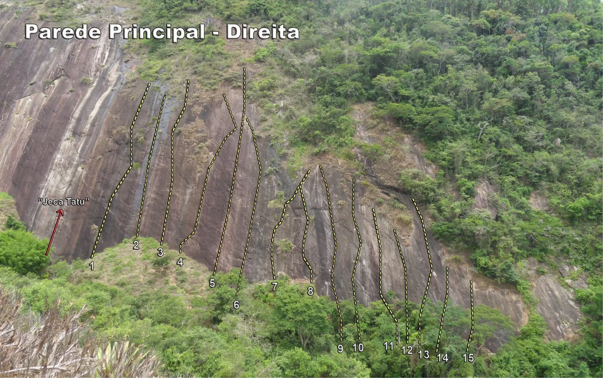
          - **largura_mapa**: 1996
          - **altura_mapa**: 1252
          - **referencias**:
            - **[0]**:
              - **escalada**: Valeu Papito
              - **ids**:
                - 1
            - **[1]**:
              - **escalada**: Pente Frio
              - **ids**:
                - 2
            - **[2]**:
              - **escalada**: El Barrigón
              - **ids**:
                - 3
            - **[3]**:
              - **escalada**: Lobos do Caraça
              - **ids**:
                - 4
            - **[4]**:
              - **escalada**: O Tempo e o Vento
              - **ids**:
                - 5
            - **[5]**:
              - **escalada**: O Burro e o Capacete
              - **ids**:
                - 6
            - **[6]**:
              - **escalada**: Tá Bão
              - **ids**:
                - 7
            - **[7]**:
              - **escalada**: Amor, Meu Grande Amor
              - **ids**:
                - 8
            - **[8]**:
              - **escalada**: Rapidinha no Escurinho
              - **ids**:
                - 9
            - **[9]**:
              - **escalada**: Pelanca
              - **ids**:
                - 10
            - **[10]**:
              - **escalada**: Flor da Pele
              - **ids**:
                - 11
            - **[11]**:
              - **escalada**: Alma Nova
              - **ids**:
                - 12
            - **[12]**:
              - **escalada**: Pele Vermelha
              - **ids**:
                - 13
            - **[13]**:
              - **escalada**: Pelinha
              - **ids**:
                - 14
            - **[14]**:
              - **escalada**: Cutícula
              - **ids**:
                - 15
            - **[15]**:
              - **escalada**: Jeca Tatu
              - **setor**: Setor Central
              - **ids**:
                - Jeca Tatu
          - **pontos_de_interesse**:
            - **[0]**:
              - **id**: 1
              - **label**: 1
              - **circulo**:
                - **x**: 304
                - **y**: 882
                - **raio**: 22
            - **[1]**:
              - **id**: 2
              - **label**: 2
              - **circulo**:
                - **x**: 450
                - **y**: 812
                - **raio**: 22
            - **[2]**:
              - **id**: 3
              - **label**: 3
              - **circulo**:
                - **x**: 530
                - **y**: 835
                - **raio**: 22
            - **[3]**:
              - **id**: 4
              - **label**: 4
              - **circulo**:
                - **x**: 598
                - **y**: 868
                - **raio**: 22
            - **[4]**:
              - **id**: 5
              - **label**: 5
              - **circulo**:
                - **x**: 702
                - **y**: 937
                - **raio**: 22
            - **[5]**:
              - **id**: 6
              - **label**: 6
              - **circulo**:
                - **x**: 783
                - **y**: 1009
                - **raio**: 22
            - **[6]**:
              - **id**: 7
              - **label**: 7
              - **circulo**:
                - **x**: 907
                - **y**: 947
                - **raio**: 22
            - **[7]**:
              - **id**: 8
              - **label**: 8
              - **circulo**:
                - **x**: 1027
                - **y**: 964
                - **raio**: 22
            - **[8]**:
              - **id**: 9
              - **label**: 9
              - **circulo**:
                - **x**: 1127
                - **y**: 1156
                - **raio**: 22
            - **[9]**:
              - **id**: 10
              - **label**: 10
              - **circulo**:
                - **x**: 1185
                - **y**: 1152
                - **raio**: 24
            - **[10]**:
              - **id**: 11
              - **label**: 11
              - **circulo**:
                - **x**: 1287
                - **y**: 1147
                - **raio**: 24
            - **[11]**:
              - **id**: 12
              - **label**: 12
              - **circulo**:
                - **x**: 1348
                - **y**: 1161
                - **raio**: 26
            - **[12]**:
              - **id**: 13
              - **label**: 13
              - **circulo**:
                - **x**: 1403
                - **y**: 1175
                - **raio**: 25
            - **[13]**:
              - **id**: 14
              - **label**: 14
              - **circulo**:
                - **x**: 1466
                - **y**: 1186
                - **raio**: 26
            - **[14]**:
              - **id**: 15
              - **label**: 15
              - **circulo**:
                - **x**: 1550
                - **y**: 1185
                - **raio**: 25
            - **[15]**:
              - **id**: Jeca Tatu
              - **label**: Jeca Tatu
              - **retangulo**:
                - **x**: 208
                - **y**: 666
                - **comprimento**: 189
                - **largura**: 57
        - **[2]**:
          - **caminho_imagem_mapa**: 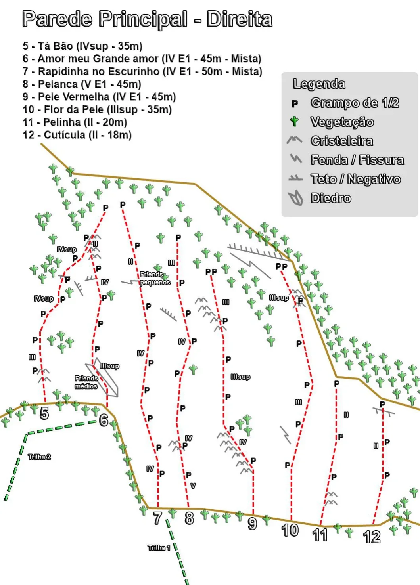
          - **largura_mapa**: 1059
          - **altura_mapa**: 1476
          - **referencias**:
            - **[0]**:
              - **escalada**: Tá Bão
              - **ids**:
                - 5
            - **[1]**:
              - **escalada**: Amor, Meu Grande Amor
              - **ids**:
                - 6
            - **[2]**:
              - **escalada**: Rapidinha no Escurinho
              - **ids**:
                - 7
            - **[3]**:
              - **escalada**: Pelanca
              - **ids**:
                - 8
            - **[4]**:
              - **escalada**: Pele Vermelha
              - **ids**:
                - 9
            - **[5]**:
              - **escalada**: Flor da Pele
              - **ids**:
                - 10
            - **[6]**:
              - **escalada**: Pelinha
              - **ids**:
                - 11
            - **[7]**:
              - **escalada**: Cutícula
              - **ids**:
                - 12
          - **pontos_de_interesse**:
            - **[0]**:
              - **id**: 5
              - **label**: 5
              - **circulo**:
                - **x**: 110
                - **y**: 1044
                - **raio**: 23
            - **[1]**:
              - **id**: 6
              - **label**: 6
              - **circulo**:
                - **x**: 261
                - **y**: 1058
                - **raio**: 21
            - **[2]**:
              - **id**: 7
              - **label**: 7
              - **circulo**:
                - **x**: 397
                - **y**: 1307
                - **raio**: 23
            - **[3]**:
              - **id**: 8
              - **label**: 8
              - **circulo**:
                - **x**: 478
                - **y**: 1307
                - **raio**: 23
            - **[4]**:
              - **id**: 9
              - **label**: 9
              - **circulo**:
                - **x**: 637
                - **y**: 1321
                - **raio**: 23
            - **[5]**:
              - **id**: 10
              - **label**: 10
              - **circulo**:
                - **x**: 731
                - **y**: 1338
                - **raio**: 28
            - **[6]**:
              - **id**: 11
              - **label**: 11
              - **circulo**:
                - **x**: 808
                - **y**: 1349
                - **raio**: 28
            - **[7]**:
              - **id**: 12
              - **label**: 12
              - **circulo**:
                - **x**: 938
                - **y**: 1355
                - **raio**: 28
      - **escaladas**:
        - **[0]**:
          - **via_multiplas_enfiadas**:
            - **descricao**: Ótima via que representou a primeira conquista conjunta entre pai e filho, em Ferros, no caso Carlos e Gustavo.
            - **nome**: Valeu Papito
            - **dificuldade_media**: BR_3
            - **dificuldade_maxima**: BR_3SUP
            - **comprimento_total**: 90
            - **tipo_via_multiplas_enfiadas**: TODA_FIXA
            - **conquistadores**:
              - Tonico Magalhães
              - Gustavo "Xaxá" Carrozzino
              - Carlos Alberto Carrozzino
            - **data_abertura**: 2008-05-31
        - **[1]**:
          - **via_multiplas_enfiadas**:
            - **descricao**: Via com 13 grampos de ½, conquistada em homenagem ao amigo Tchassa, que até a data da conquista, ainda não havia conseguido conhecer o polo.
            - **nome**: Pente Frio
            - **dificuldade_media**: BR_3
            - **dificuldade_maxima**: BR_4
            - **exposicao**: E1
            - **comprimento_total**: 65
            - **quantidade_costuras_intermediarias**: 13
            - **tipo_via_multiplas_enfiadas**: TODA_FIXA
            - **conquistadores**:
              - Tonico Magalhães
              - Jeferson Costa
            - **data_abertura**: 2015-04-05
        - **[2]**:
          - **via_esportiva**:
            - **descricao**: Via bem protegida e interessante.
            - **nome**: El Barrigón
            - **dificuldade**: BR_4
            - **extensao**: 60
            - **conquistadores**:
              - Tonico Magalhães
              - Fábio Cotta
            - **data_abertura**: 2006-10-15
        - **[3]**:
          - **via_multiplas_enfiadas**:
            - **descricao**: Via que se caracteriza por ter sido conquistada inteiramente na mão, sem o uso de furadeira.
            - **nome**: Lobos do Caraça
            - **dificuldade_media**: BR_3
            - **dificuldade_maxima**: BR_4
            - **comprimento_total**: 100
            - **tipo_via_multiplas_enfiadas**: TODA_FIXA
            - **conquistadores**:
              - Tonico Magalhães
              - Fábio Cotta
              - Carlim Kamicad
              - Júlio Diamantino
              - "Thunder"
            - **data_abertura**: 2006-10-29
        - **[4]**:
          - **via_multiplas_enfiadas**:
            - **descricao**: Segue uma parede relativamente vertical em sua primeira metade, sempre em boas agarras e com boa proteção. Após a primeira parada, a inclinação diminui, assim como as proteções. Utiliza o último grampo da “Lobos do Caraça”, antes da fácil sequência final.
            - **nome**: O Tempo e o Vento
            - **dificuldade_media**: BR_3
            - **dificuldade_maxima**: BR_3
            - **exposicao**: E1
            - **numero_enfiadas**: 2
            - **comprimento_total**: 100
            - **comprimento_maior_enfiada**: 55
            - **tipo_via_multiplas_enfiadas**: TODA_FIXA
            - **conquistadores**:
              - Pedro Bugim
              - Maria Fernanda Patrício
            - **data_abertura**: 2014-03-01
            - **enfiadas**:
              - **[0]**:
                - **via_esportiva**:
                  - **nome**: 1ª Enfiada (P1)
                  - **dificuldade**: BR_3
                  - **extensao**: 55
                  - **quantidade_protecoes_intermediarias**: 9
                  - **quantidade_protecoes_parada**: 2
              - **[1]**:
                - **via_esportiva**:
                  - **nome**: 2ª Enfiada (P2)
                  - **dificuldade**: BR_2
                  - **extensao**: 45
                  - **quantidade_protecoes_intermediarias**: 2
                  - **quantidade_protecoes_parada**: 2
          - **mapas**:
            - **[0]**:
              - **caminho_imagem_mapa**: 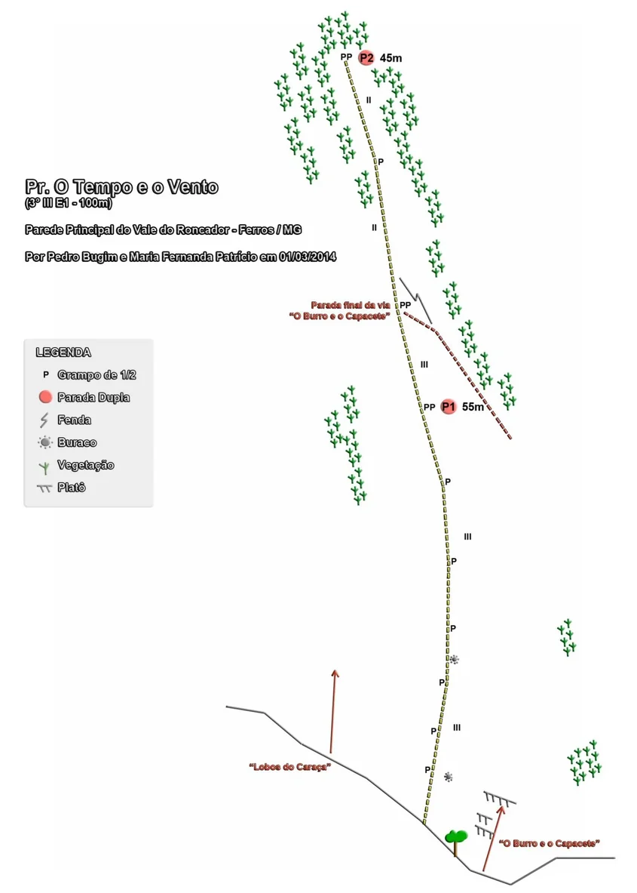
              - **largura_mapa**: 845
              - **altura_mapa**: 1183
        - **[5]**:
          - **via_multiplas_enfiadas**:
            - **descricao**: Última das vias "longas" neste setor, antes das vias com apenas uma enfiada ou menos. Em sua base existe o esqueleto de um burro que caiu do topo da parede, originando assim, parte do nome da via. O capacete da Glesse teve o mesmo destino do burro.
            - **nome**: O Burro e o Capacete
            - **dificuldade_media**: BR_3
            - **dificuldade_maxima**: BR_3SUP
            - **comprimento_total**: 75
            - **tipo_via_multiplas_enfiadas**: TODA_FIXA
            - **conquistadores**:
              - Tonico Magalhães
              - Glesse Gripp
              - Celso Ferreira Gomes
            - **data_abertura**: 2011-05-15
        - **[6]**:
          - **via_esportiva**:
            - **descricao**: Conta com algumas passadas delicadas em sua metade superior, com um lance espetacular em pequenos buracos, pouco antes de juntar com a via "Amor, Meu Grande Amor".
            - **nome**: Tá Bão
            - **dificuldade**: BR_4SUP
            - **exposicao**: E1
            - **extensao**: 35
            - **conquistadores**:
              - Pedro Bugim
              - Maria Fernanda Patrício
            - **data_abertura**: 2012-02-19
        - **[7]**:
          - **via_movel**:
            - **descricao**: Via iniciada em um belo diedro em móvel, com peças pequenas e médias. Evolui para lances constantes em agarras, protegidos por grampos de ½.
            - **nome**: Amor, Meu Grande Amor
            - **dificuldade**: BR_4
            - **exposicao**: E1
            - **extensao**: 45
            - **quantidade_protecoes_parada**: 2
            - **protecoes_moveis**: Peças pequenas e médias (diedro inicial em móvel)
            - **conquistadores**:
              - Pedro Bugim
              - Gustavo "Xaxá" Carrozzino
              - Tássia Carrozzino
              - Maria Fernanda Patrício
            - **data_abertura**: 2012-01-21
        - **[8]**:
          - **via_movel**:
            - **descricao**: Via conquistada em pouco mais de 10 minutos, já à noite! Possui passadas constantes de 4º grau, com grampeação justa e uma passada em móvel, com peças pequenas. A passada em móvel não é obrigatória, por estar já bem alta, sem risco de queda na base, contudo, uma queda neste ponto pode dar um bom susto.
            - **nome**: Rapidinha no Escurinho
            - **dificuldade**: BR_4
            - **exposicao**: E1
            - **extensao**: 50
            - **quantidade_protecoes_parada**: 2
            - **protecoes_moveis**: Peças pequenas (passada em móvel não obrigatória)
            - **conquistadores**:
              - Pedro Bugim
              - Maria Fernanda Patrício
              - Gustavo "Xaxá" Carrozzino
              - Tássia Carrozzino
            - **data_abertura**: 2012-01-21
        - **[9]**:
          - **via_esportiva**:
            - **descricao**: Possui saída bem delicada, principalmente pelas agarras que ainda estão por quebrar. Segue por alguns poucos cristais e lances de aderência até o topo.
            - **nome**: Pelanca
            - **dificuldade**: BR_5
            - **exposicao**: E1
            - **extensao**: 45
            - **quantidade_protecoes_parada**: 2
            - **conquistadores**:
              - Pedro Bugim
              - Maria Fernanda Patrício
            - **data_abertura**: 2012-02-19
        - **[10]**:
          - **via_esportiva**:
            - **descricao**: Via que segue por uma linha natural na parede, sobre uma cristaleira.
            - **nome**: Flor da Pele
            - **dificuldade**: BR_3SUP
            - **exposicao**: E1
            - **extensao**: 35
            - **quantidade_protecoes_parada**: 2
            - **conquistadores**:
              - Tonico Magalhães
              - Celso Ferreira Gomes
            - **data_abertura**: 2011-07-23
        - **[11]**:
          - **via_esportiva**:
            - **descricao**: Via protegida por cinco grampos e parada dupla no final.
            - **nome**: Alma Nova
            - **dificuldade**: BR_3SUP
            - **extensao**: 25
            - **quantidade_protecoes_intermediarias**: 5
            - **quantidade_protecoes_parada**: 2
            - **conquistadores**:
              - Tonico Magalhães
              - Nádia Moreira
            - **data_abertura**: 2013-04-28
        - **[12]**:
          - **via_esportiva**:
            - **descricao**: Inicia em lances mais fáceis, evoluindo para passadas em aderência mais delicada. Termina abaixo de um grande teto, coberto por vegetação.
            - **nome**: Pele Vermelha
            - **dificuldade**: BR_4
            - **exposicao**: E1
            - **extensao**: 45
            - **quantidade_protecoes_parada**: 2
            - **conquistadores**:
              - Tonico Magalhães
              - Celso Ferreira Gomes
              - Glesse Gripp
            - **data_abertura**: 2011-12-09
        - **[13]**:
          - **via_esportiva**:
            - **descricao**: Apesar de tecnicamente fácil, esta via possui grampeação longa, conferindo ao escalador uma boa dose de adrenalina caso não esteja acostumado com proteções distantes.
            - **nome**: Pelinha
            - **dificuldade**: BR_2
            - **exposicao**: E3
            - **extensao**: 20
            - **conquistadores**:
              - Maria Fernanda Patrício
              - Pedro Bugim
            - **data_abertura**: 2012-02-20
        - **[14]**:
          - **via_esportiva**:
            - **descricao**: Semelhante à via anterior possui grampeação longa e lances simplórios, porém, um pouco mais curta.
            - **nome**: Cutícula
            - **dificuldade**: BR_2
            - **exposicao**: E3
            - **extensao**: 18
            - **conquistadores**:
              - Pedro Bugim
              - Maria Fernanda Patrício
            - **data_abertura**: 2012-02-20
      - **caminho_imagem_capa**: 
      - **precomputados**:
        - **total_escaladas**: 15
        - **total_esportivas**: 8
        - **total_multiplas_enfiadas**: 5
  - **[2]**:
    - **conteudo**:
      - **descricao**:
          Capa: Tonico e Celso na conquista da "Hilda Furacão" (Foto: Glesse Gripp)
          
          O setor apresenta, de um modo geral, vias nas quais predominam lances em agarras e impressionantes buracos, apesar de haver boa solicitação de aderência da sola na pedra. A extensão das vias neste setor (metade esquerda da Parede Principal) varia de 90 até 180 metros, com graduação de IIIsup até Vsup.
          
          Neste setor, destacam-se as vias “Marcado a Ferro” (4º V – 180m), “Hilda Furacão” (3º IV – 165m), “Ferro no Judas” (5° Vsup – 130m), “Pé de Pano” (3° IV E1 – 150m) e “Cordão do Bola Preta” (D1 3° IVsup E2 – 130m – Mista), vias estas que, em seu conjunto, permitem um bom conhecimento desse trecho central da Parede Principal, além de satisfação garantida.
          
          A título de curiosidade, neste setor localiza-se primeira via da região, a “Iron Men” (4º V – 160m), conquistada por Tonico, Juliano Magalhães e Marcos Leiras em fevereiro de 2006, dando início assim a mais um excelente polo de escaladas!
          
          ## Acesso
          
          O acesso às bases das primeiras vias desse setor se dá pela trilha principal do Vale do Roncador, bifurcando à direita logo após a segunda travessia do córrego. Para as vias centrais da parede, deve-se seguir por mais alguns metros e pegar uma nova picada também à direita, iniciada em um pequeno barranco com uma árvore firme em cima. É possível margear a parede em quase toda sua extensão neste setor, facilitando assim a identificação da base das vias. Para as vias da extrema esquerda, deve-se pegar um rio seco de pedras, à frente de um bambuzal e ao córrego. A entrada é marcada com um pequeno totem de pedra.
          
          ## Registros Fotográficos
          
          | 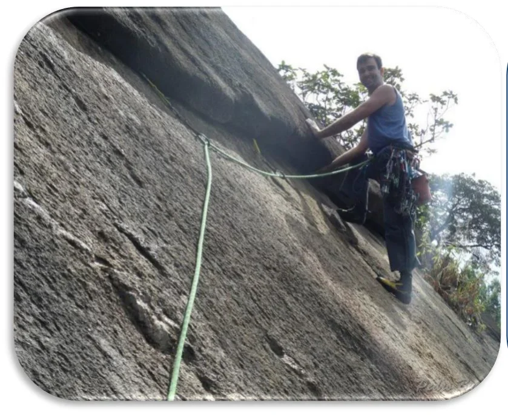 |
          | :--: |
          | *Pedro Bugim nas fendas em móvel na segunda enfiada da via “Cordão do Bola Preta” (Foto: Maria Fernanda Patrício)* |
          
          | 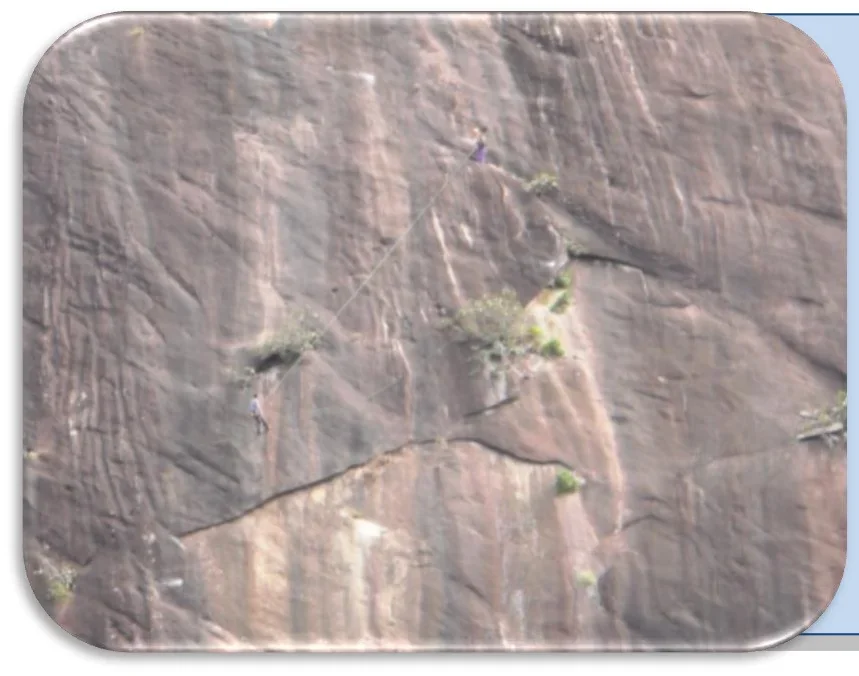 |
          | :--: |
          | *Pedro Bugim e Maria Fernanda no rapel após a conquista do Pr. “Cordão do Bola Preta”. A grande fenda em diagonal é a segunda enfiada da via, toda em móvel. (Foto: Celso Ferreira Gomes)* |
          
          | 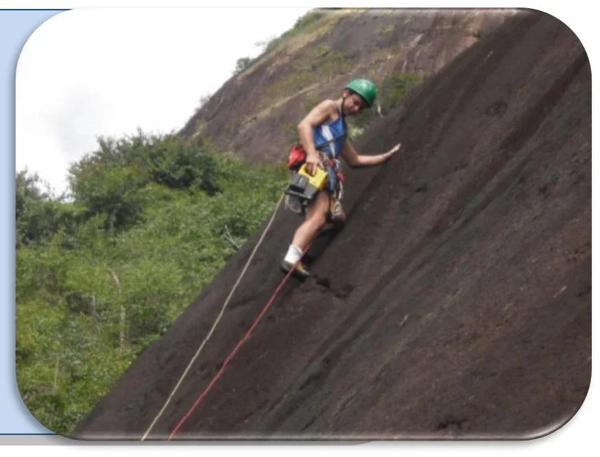 |
          | :--: |
          | *Luciano Bender na conquista da via “Ferro no Judas”. (Foto: Celso Ferreira Gomes)* |
          
          | 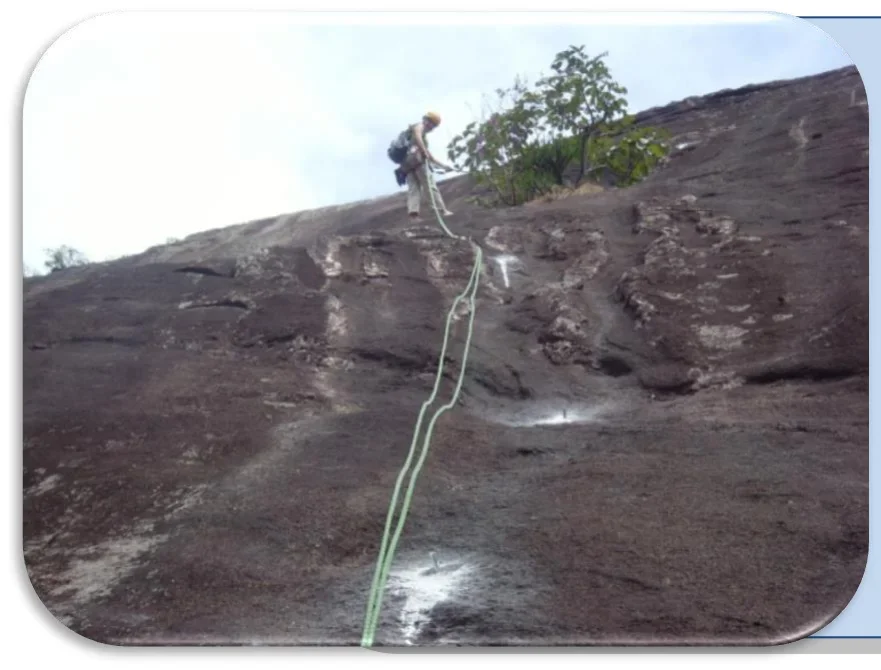 |
          | :--: |
          | *Maria Fernanda no rapel do Pr. “Pé de Pano”, após a conquista. (Foto: Pedro Bugim)* |
          
          ## Parede Principal – Setor de Cima
          
          |  |
          | :--: |
          | *Vista da Parede Principal – Setor de Cima, durante o rapel da “Um Momento no Tempo”. Todo este setor encontra-se ainda sem vias. (Foto: Pedro Bugim)* |
          
          Como o nome sugere, este setor fica em uma área mais elevada da Parede Principal, contando com apenas duas vias até o momento. Este setor apresenta uma grande possibilidade de novas linhas, apesar do acesso ainda ser um pouco complexo.
          
          Para chegar à base desta parede, pode-se subir pela trilha das vias da esquerda, na Parede Principal Central, pegando o rio seco de pedras, à frente de um bambuzal e ao córrego, com a entrada marcada com um pequeno totem de pedra (trilha oposta à utilizada para o acesso da Parede Das Aderências – Setor de Cima). Ao chegar na parede, deve-se costear a mesma para a esquerda, sempre subindo.
          
          Outra forma de acesso é pegar a trilha da Parede Principal, Setor Clássicas Longas, com acesso às vias da direita. Subir pelo descampado e passar pela enorme laje de pedra. Ao chegar na base da via “Eu Não Sou de Ferro”, continuar margeando a parede para a direita, passar pela base das vias “Rio de Mão Dupla” e “À Francesa” e continuar pela picada que leva diretamente ao setor.
          
          Atenção às pedras soltas, presentes em muitos pontos da parede neste setor!
      - **nome**: Setor Central
      - **mapas**:
        - **[0]**:
          - **caminho_imagem_mapa**: 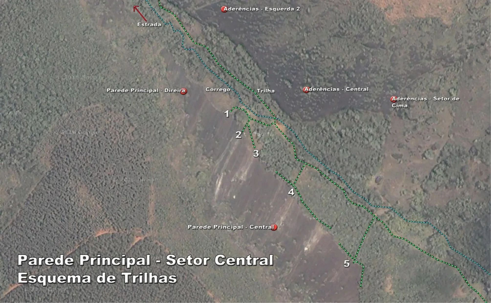
          - **largura_mapa**: 2009
          - **altura_mapa**: 1243
          - **referencias**:
            - **[0]**:
              - **escalada**: Jeca Tatu
              - **ids**:
                - 1
            - **[1]**:
              - **escalada**: A Decadência da Bufa
              - **ids**:
                - 2
            - **[2]**:
              - **escalada**: Iron Men
              - **ids**:
                - 3
            - **[3]**:
              - **escalada**: Pum Medonho
              - **ids**:
                - 4
            - **[4]**:
              - **escalada**: Ferro Velho
              - **ids**:
                - 5
            - **[5]**:
              - **ids**:
                - aderências_esquerda
              - **grupo**: Parede das Aderências
              - **setor**: Esquerda
            - **[6]**:
              - **ids**:
                - aderencias_central
              - **grupo**: Parede das Aderências
              - **setor**: Face Central
            - **[7]**:
              - **ids**:
                - aderencias_cima
              - **grupo**: Parede das Aderências
              - **setor**: Setor de Cima
            - **[8]**:
              - **ids**:
                - parede_principal_direita
              - **grupo**: Parede Principal (Paredes de Aço)
              - **setor**: Parede Principal – Direita
            - **[9]**:
              - **escalada**: Chuva Ácida
              - **ids**:
                - 3
              - **grupo**: Parede Principal (Paredes de Aço)
              - **setor**: Setor Central
            - **[10]**:
              - **escalada**: A Ferro e Fogo
              - **ids**:
                - 3
              - **grupo**: Parede Principal (Paredes de Aço)
              - **setor**: Setor Central
            - **[11]**:
              - **escalada**: Cordão do Bola Preta
              - **ids**:
                - 3
              - **grupo**: Parede Principal (Paredes de Aço)
              - **setor**: Setor Central
            - **[12]**:
              - **escalada**: Hilda Furacão
              - **ids**:
                - 4
              - **grupo**: Parede Principal (Paredes de Aço)
              - **setor**: Setor Central
            - **[13]**:
              - **escalada**: Eu Sei o Que Vocês Fizeram no Blackout Passado
              - **ids**:
                - 4
              - **grupo**: Parede Principal (Paredes de Aço)
              - **setor**: Setor Central
            - **[14]**:
              - **escalada**: CDF
              - **ids**:
                - 4
              - **grupo**: Parede Principal (Paredes de Aço)
              - **setor**: Setor Central
            - **[15]**:
              - **escalada**: Pé de Pano
              - **ids**:
                - 4
              - **grupo**: Parede Principal (Paredes de Aço)
              - **setor**: Setor Central
            - **[16]**:
              - **escalada**: Pr. Chapado
              - **ids**:
                - 4
              - **grupo**: Parede Principal (Paredes de Aço)
              - **setor**: Setor Central
            - **[17]**:
              - **escalada**: Dona Flor e Suas Duas Marretas
              - **ids**:
                - 4
              - **grupo**: Parede Principal (Paredes de Aço)
              - **setor**: Setor Central
            - **[18]**:
              - **ids**:
                - 5
              - **grupo**: Parede Principal (Paredes de Aço)
              - **setor**: Setor Central
              - **escalada**: Tromba D’Água
            - **[19]**:
              - **ids**:
                - 5
              - **grupo**: Parede Principal (Paredes de Aço)
              - **setor**: Setor Central
              - **escalada**: Rolam as Pedras
            - **[20]**:
              - **ids**:
                - 5
              - **grupo**: Parede Principal (Paredes de Aço)
              - **setor**: Setor Central
              - **escalada**: Marcado a Ferro
            - **[21]**:
              - **ids**:
                - 5
              - **grupo**: Parede Principal (Paredes de Aço)
              - **setor**: Setor Central
              - **escalada**: Ferro no Judas
          - **pontos_de_interesse**:
            - **[0]**:
              - **id**: 1
              - **label**: 1
              - **circulo**:
                - **x**: 929
                - **y**: 467
                - **raio**: 22
            - **[1]**:
              - **id**: 2
              - **label**: 2
              - **circulo**:
                - **x**: 977
                - **y**: 553
                - **raio**: 22
            - **[2]**:
              - **id**: 3
              - **label**: 3
              - **circulo**:
                - **x**: 1048
                - **y**: 629
                - **raio**: 22
            - **[3]**:
              - **id**: 4
              - **label**: 4
              - **circulo**:
                - **x**: 1193
                - **y**: 788
                - **raio**: 22
            - **[4]**:
              - **id**: 5
              - **label**: 5
              - **circulo**:
                - **x**: 1419
                - **y**: 1081
                - **raio**: 22
            - **[5]**:
              - **id**: parede_principal_direita
              - **label**: Parede Principal Direita
              - **retangulo**:
                - **x**: 602
                - **y**: 372
                - **comprimento**: 355
                - **largura**: 64
              - **cor**: 
            - **[6]**:
              - **id**: aderências_esquerda
              - **label**: Aderências Esquerda
              - **retangulo**:
                - **x**: 1068
                - **y**: 37
                - **comprimento**: 356
                - **largura**: 64
              - **cor**: 
            - **[7]**:
              - **id**: aderencias_central
              - **label**: Aderências Central
              - **retangulo**:
                - **x**: 1372
                - **y**: 368
                - **comprimento**: 292
                - **largura**: 57
              - **cor**: 
            - **[8]**:
              - **id**: aderencias_cima
              - **label**: Aderências Setor de Cima
              - **retangulo**:
                - **x**: 1746
                - **y**: 418
                - **comprimento**: 319
                - **largura**: 80
              - **cor**: 
        - **[1]**:
          - **caminho_imagem_mapa**: 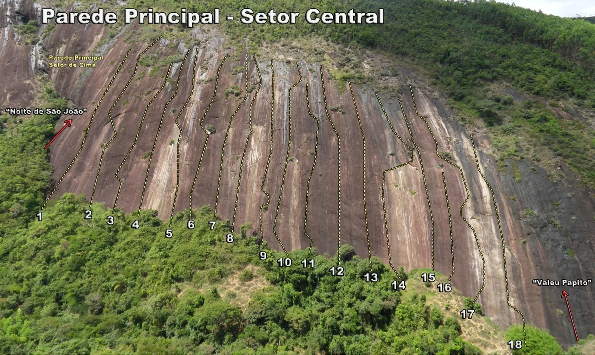
          - **largura_mapa**: 2044
          - **altura_mapa**: 1222
          - **referencias**:
            - **[0]**:
              - **escalada**: Ferro no Judas
              - **ids**:
                - 1
            - **[1]**:
              - **escalada**: Marcado a Ferro
              - **ids**:
                - 2
            - **[2]**:
              - **escalada**: Rolam as Pedras
              - **ids**:
                - 3
            - **[3]**:
              - **escalada**: Tromba D’Água
              - **ids**:
                - 4
            - **[4]**:
              - **escalada**: Ferro Velho
              - **ids**:
                - 5
            - **[5]**:
              - **ids**:
                - 6
              - **escalada**: Pum Medonho
            - **[6]**:
              - **ids**:
                - 7
              - **escalada**: Dona Flor e Suas Duas Marretas
            - **[7]**:
              - **ids**:
                - 8
              - **escalada**: Pr. Chapado
            - **[8]**:
              - **ids**:
                - 9
              - **escalada**: Pé de Pano
            - **[9]**:
              - **ids**:
                - 10
              - **escalada**: CDF
            - **[10]**:
              - **ids**:
                - 11
              - **escalada**: Eu Sei o Que Vocês Fizeram no Blackout Passado
            - **[11]**:
              - **ids**:
                - 12
              - **escalada**: Hilda Furacão
            - **[12]**:
              - **ids**:
                - 13
              - **escalada**: Iron Men
            - **[13]**:
              - **ids**:
                - 14
              - **escalada**: Cordão do Bola Preta
            - **[14]**:
              - **ids**:
                - 15
              - **escalada**: A Ferro e Fogo
            - **[15]**:
              - **ids**:
                - 16
              - **escalada**: Chuva Ácida
            - **[16]**:
              - **ids**:
                - 17
              - **escalada**: A Decadência da Bufa
            - **[17]**:
              - **ids**:
                - 18
              - **escalada**: Jeca Tatu
            - **[18]**:
              - **ids**:
                - parede_cima
              - **grupo**: Parede Principal (Paredes de Aço)
              - **setor**: Setor de Cima
            - **[19]**:
              - **ids**:
                - noite
              - **grupo**: Parede Principal (Paredes de Aço)
              - **setor**: Setor de Cima
              - **escalada**: Noite de São João
            - **[20]**:
              - **ids**:
                - valeu
              - **grupo**: Parede Principal (Paredes de Aço)
              - **setor**: Parede Principal – Direita
              - **escalada**: Valeu Papito
          - **pontos_de_interesse**:
            - **[0]**:
              - **id**: 1
              - **label**: 1
              - **circulo**:
                - **x**: 137
                - **y**: 746
                - **raio**: 22
            - **[1]**:
              - **id**: 2
              - **label**: 2
              - **circulo**:
                - **x**: 303
                - **y**: 740
                - **raio**: 22
            - **[2]**:
              - **id**: 3
              - **label**: 3
              - **circulo**:
                - **x**: 379
                - **y**: 759
                - **raio**: 22
            - **[3]**:
              - **id**: 4
              - **label**: 4
              - **circulo**:
                - **x**: 466
                - **y**: 774
                - **raio**: 22
            - **[4]**:
              - **id**: 5
              - **label**: 5
              - **circulo**:
                - **x**: 580
                - **y**: 804
                - **raio**: 22
            - **[5]**:
              - **id**: 6
              - **label**: 6
              - **circulo**:
                - **x**: 656
                - **y**: 773
                - **raio**: 22
            - **[6]**:
              - **id**: 7
              - **label**: 7
              - **circulo**:
                - **x**: 729
                - **y**: 775
                - **raio**: 22
            - **[7]**:
              - **id**: 8
              - **label**: 8
              - **circulo**:
                - **x**: 790
                - **y**: 820
                - **raio**: 24
            - **[8]**:
              - **id**: 9
              - **label**: 9
              - **circulo**:
                - **x**: 904
                - **y**: 881
                - **raio**: 22
            - **[9]**:
              - **id**: 10
              - **label**: 10
              - **circulo**:
                - **x**: 978
                - **y**: 903
                - **raio**: 30
            - **[10]**:
              - **id**: 11
              - **label**: 11
              - **circulo**:
                - **x**: 1059
                - **y**: 907
                - **raio**: 30
            - **[11]**:
              - **id**: 12
              - **label**: 12
              - **circulo**:
                - **x**: 1158
                - **y**: 935
                - **raio**: 32
            - **[12]**:
              - **id**: 13
              - **label**: 13
              - **circulo**:
                - **x**: 1276
                - **y**: 956
                - **raio**: 30
            - **[13]**:
              - **id**: 14
              - **label**: 14
              - **circulo**:
                - **x**: 1369
                - **y**: 983
                - **raio**: 32
            - **[14]**:
              - **id**: 15
              - **label**: 15
              - **circulo**:
                - **x**: 1471
                - **y**: 956
                - **raio**: 30
            - **[15]**:
              - **id**: 16
              - **label**: 16
              - **circulo**:
                - **x**: 1527
                - **y**: 990
                - **raio**: 30
            - **[16]**:
              - **id**: 17
              - **label**: 17
              - **circulo**:
                - **x**: 1606
                - **y**: 1081
                - **raio**: 32
            - **[17]**:
              - **id**: 18
              - **label**: 18
              - **circulo**:
                - **x**: 1771
                - **y**: 1186
                - **raio**: 32
            - **[18]**:
              - **id**: parede_cima
              - **label**: Setor de Cima
              - **retangulo**:
                - **x**: 261
                - **y**: 208
                - **comprimento**: 214
                - **largura**: 59
              - **cor**: 
            - **[19]**:
              - **id**: noite
              - **label**: Noite de São João
              - **retangulo**:
                - **x**: 158
                - **y**: 384
                - **comprimento**: 299
                - **largura**: 59
              - **cor**: 
            - **[20]**:
              - **id**: valeu
              - **label**: Valeu Papito
              - **retangulo**:
                - **x**: 1930
                - **y**: 974
                - **comprimento**: 223
                - **largura**: 59
              - **cor**: 
        - **[2]**:
          - **caminho_imagem_mapa**: 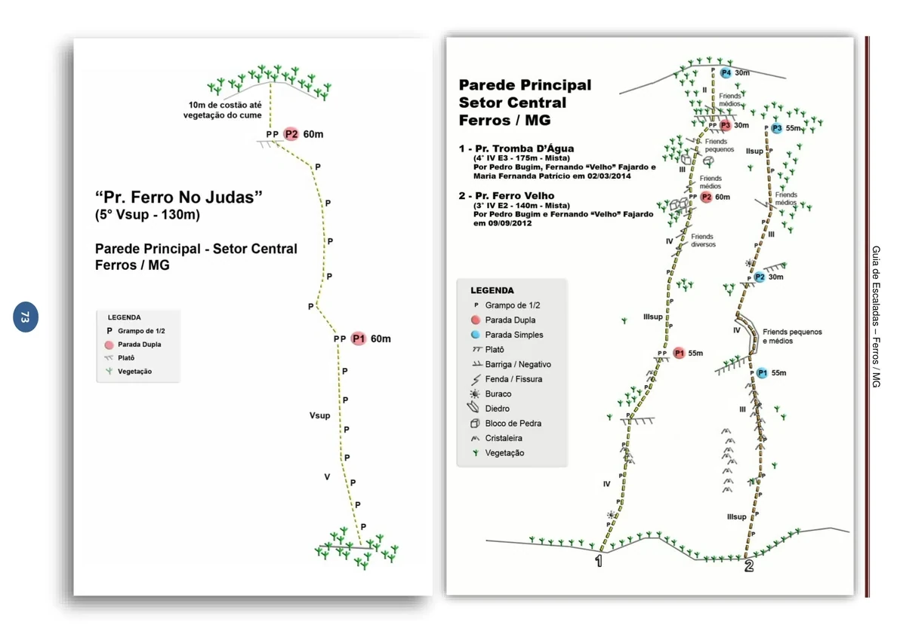
          - **largura_mapa**: 788
          - **altura_mapa**: 1088
          - **pontos_de_interesse**:
            - **[0]**:
              - **id**: 1
              - **label**: 1
              - **circulo**:
                - **x**: 293
                - **y**: 1023
                - **raio**: 16
              - **cor**: 
            - **[1]**:
              - **id**: 1_p1
              - **label**: 
              - **circulo**:
                - **x**: 450
                - **y**: 615
                - **raio**: 13
            - **[2]**:
              - **id**: 1_p2
              - **label**: 
              - **circulo**:
                - **x**: 502
                - **y**: 311
                - **raio**: 13
            - **[3]**:
              - **id**: 1_p3
              - **label**: 
              - **circulo**:
                - **x**: 540
                - **y**: 170
                - **raio**: 13
            - **[4]**:
              - **id**: 1_p4
              - **label**: P4
              - **circulo**:
                - **x**: 541
                - **y**: 67
                - **raio**: 13
              - **cor**: 
            - **[5]**:
              - **id**: 2
              - **label**: 2
              - **circulo**:
                - **x**: 586
                - **y**: 1033
                - **raio**: 17
              - **cor**: 
            - **[6]**:
              - **id**: 2_p1
              - **label**: 
              - **circulo**:
                - **x**: 612
                - **y**: 654
                - **raio**: 12
            - **[7]**:
              - **id**: 2_p2
              - **label**: 
              - **circulo**:
                - **x**: 607
                - **y**: 467
                - **raio**: 12
            - **[8]**:
              - **id**: 2_p3
              - **label**: 
              - **circulo**:
                - **x**: 641
                - **y**: 176
                - **raio**: 13
          - **referencias**:
            - **[0]**:
              - **escalada**: Tromba D’Água
              - **ids**:
                - 1
                - 1_p1
                - 1_p2
                - 1_p3
                - 1_p4
            - **[1]**:
              - **escalada**: Ferro Velho
              - **ids**:
                - 2
                - 2_p1
                - 2_p2
                - 2_p3
        - **[3]**:
          - **caminho_imagem_mapa**: 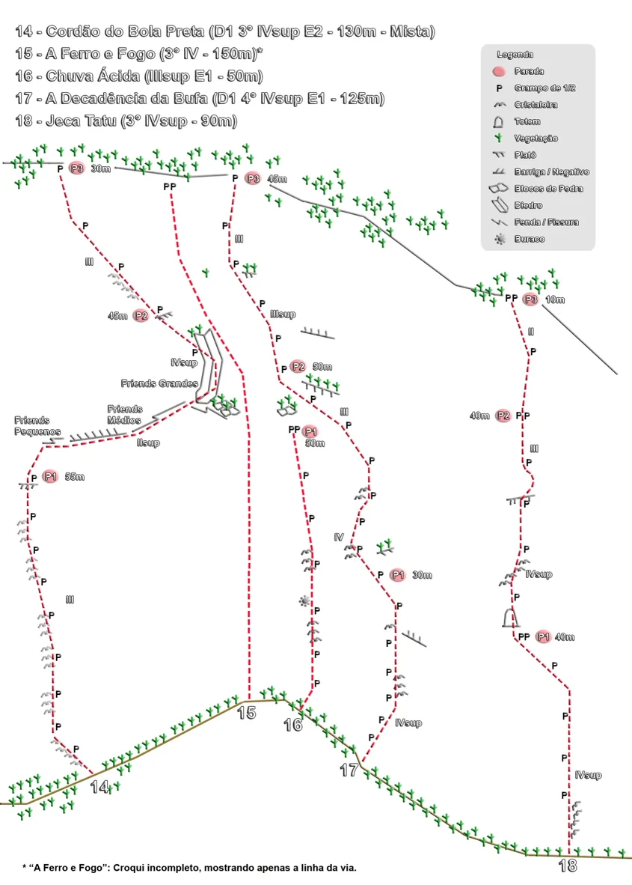
          - **largura_mapa**: 845
          - **altura_mapa**: 1182
          - **pontos_de_interesse**:
            - **[0]**:
              - **id**: 14
              - **label**: 14
              - **circulo**:
                - **x**: 134
                - **y**: 1051
                - **raio**: 18
              - **cor**: 
            - **[1]**:
              - **id**: 14_p1
              - **label**: 
              - **circulo**:
                - **x**: 67
                - **y**: 636
                - **raio**: 11
            - **[2]**:
              - **id**: 14_p2
              - **label**: 
              - **circulo**:
                - **x**: 189
                - **y**: 422
                - **raio**: 11
            - **[3]**:
              - **id**: 14_p3
              - **label**: 
              - **circulo**:
                - **x**: 103
                - **y**: 224
                - **raio**: 11
            - **[4]**:
              - **id**: 15
              - **label**: 15
              - **circulo**:
                - **x**: 330
                - **y**: 951
                - **raio**: 18
              - **cor**: 
            - **[5]**:
              - **id**: 16
              - **label**: 16
              - **circulo**:
                - **x**: 393
                - **y**: 968
                - **raio**: 18
              - **cor**: 
            - **[6]**:
              - **id**: 16_p1
              - **label**: 
              - **circulo**:
                - **x**: 415
                - **y**: 576
                - **raio**: 11
            - **[7]**:
              - **id**: 16_p2
              - **label**: 
              - **circulo**:
                - **x**: 399
                - **y**: 489
                - **raio**: 11
            - **[8]**:
              - **id**: 16_p3
              - **label**: 
              - **circulo**:
                - **x**: 338
                - **y**: 238
                - **raio**: 11
            - **[9]**:
              - **id**: 17
              - **label**: 17
              - **circulo**:
                - **x**: 468
                - **y**: 1028
                - **raio**: 18
              - **cor**: 
            - **[10]**:
              - **id**: 17_p1
              - **label**: 
              - **circulo**:
                - **x**: 532
                - **y**: 768
                - **raio**: 11
            - **[11]**:
              - **id**: 18
              - **label**: 18
              - **circulo**:
                - **x**: 760
                - **y**: 1156
                - **raio**: 18
              - **cor**: 
            - **[12]**:
              - **id**: 18_p1
              - **label**: 
              - **circulo**:
                - **x**: 727
                - **y**: 850
                - **raio**: 11
            - **[13]**:
              - **id**: 18_p2
              - **label**: 
              - **circulo**:
                - **x**: 673
                - **y**: 555
                - **raio**: 11
            - **[14]**:
              - **id**: 18_p3
              - **label**: 
              - **circulo**:
                - **x**: 710
                - **y**: 400
                - **raio**: 11
            - **[15]**:
              - **id**: 15pp
              - **label**: 
              - **circulo**:
                - **x**: 227
                - **y**: 248
                - **raio**: 12
              - **cor**: 
            - **[16]**:
              - **id**: 14_fr
              - **label**: 
              - **circulo**:
                - **x**: 289
                - **y**: 499
                - **raio**: 9
              - **cor**: 
          - **referencias**:
            - **[0]**:
              - **escalada**: Cordão do Bola Preta
              - **ids**:
                - 14
                - 14_p1
                - 14_p2
                - 14_p3
                - 14_fr
            - **[1]**:
              - **escalada**: A Ferro e Fogo
              - **ids**:
                - 15
                - 15pp
            - **[2]**:
              - **escalada**: Chuva Ácida
              - **ids**:
                - 16
                - 16_p1
            - **[3]**:
              - **escalada**: A Decadência da Bufa
              - **ids**:
                - 17
                - 17_p1
                - 16_p2
                - 16_p3
            - **[4]**:
              - **escalada**: Jeca Tatu
              - **ids**:
                - 18
                - 18_p1
                - 18_p2
                - 18_p3
      - **escaladas**:
        - **[0]**:
          - **via_multiplas_enfiadas**:
            - **descricao**: Excelente e imperdível via. Os lances mais difíceis estão na primeira enfiada.
            - **nome**: Ferro no Judas
            - **destaque**: True
            - **dificuldade_media**: BR_5
            - **dificuldade_maxima**: BR_5SUP
            - **comprimento_total**: 130
            - **numero_enfiadas**: 2
            - **tipo_via_multiplas_enfiadas**: TODA_FIXA
            - **conquistadores**:
              - Luciano Bender
              - Gustavo "Xaxá" Carrozzino
              - Tonico Magalhães
              - Celso Ferreira Gomes
            - **data_abertura**: 2011-04-23
          - **mapas**:
            - **[0]**:
              - **caminho_imagem_mapa**: 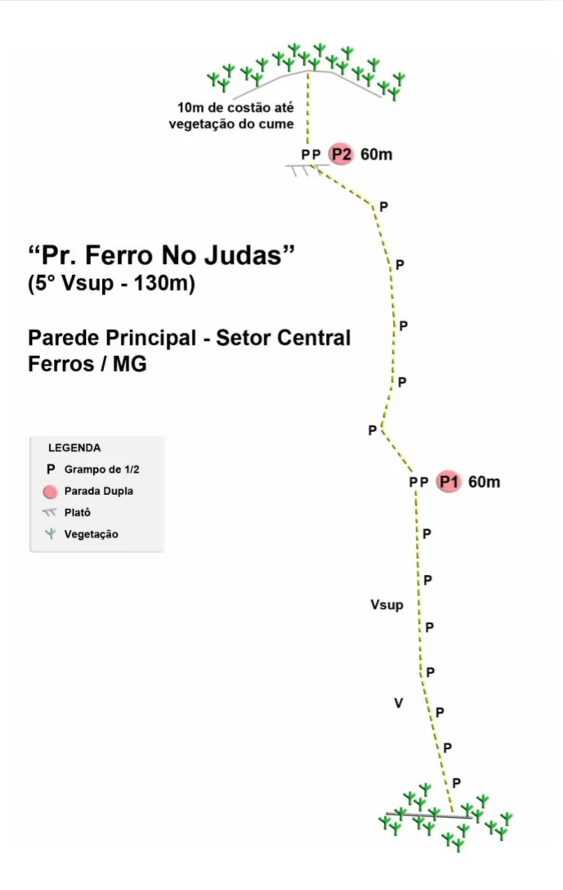
              - **largura_mapa**: 689
              - **altura_mapa**: 1088
        - **[1]**:
          - **via_multiplas_enfiadas**:
            - **descricao**: Uma das vias mais indicadas do local, pela beleza de seus lances e por permitir um bom conhecimento do trecho central da parede. Rapel com corda única de 50m.
            - **nome**: Marcado a Ferro
            - **destaque**: True
            - **dificuldade_media**: BR_4
            - **dificuldade_maxima**: BR_5
            - **comprimento_total**: 180
            - **tipo_via_multiplas_enfiadas**: TODA_FIXA
            - **conquistadores**:
              - Tonico Magalhães
              - Frederico Vasconcelos
              - Juan Kempen
            - **data_abertura**: 2006-05-15
        - **[2]**:
          - **via_multiplas_enfiadas**:
            - **descricao**: Linha que segue por buracos e cristaleiras muito estéticos, sempre com proteção próxima. As paradas são duplas e o rapel, possível com corda única de 50m. O nome se dá por conta de um enorme bloco que se desprendeu na primeira investida e cortou a corda do Tonico. Na última investida, o capacete da Maria Fernanda também foi alvejado por uma pedra que rolou durante o rapel.
            - **nome**: Rolam as Pedras
            - **dificuldade_media**: BR_3
            - **dificuldade_maxima**: BR_4
            - **exposicao**: E1
            - **comprimento_total**: 130
            - **tipo_via_multiplas_enfiadas**: TODA_FIXA
            - **conquistadores**:
              - Celso Ferreira Gomes
              - Tonico Magalhães
              - Pedro Bugim
              - Maria Fernanda Patrício
              - Glesse Gripp
            - **data_abertura**: 2012-09-08
        - **[3]**:
          - **via_multiplas_enfiadas**:
            - **descricao**: Inicia com uma enfiada constante, protegida por grampos de ½. As três enfiadas sequentes, possuem inúmeras passadas em móvel, em fendas sólidas, porém esporádicas, exigindo do guia uma boa leitura da linha. Todas as paradas são fixas e duplas. Rapel possível com corda única de 60 metros ou maior.
            - **nome**: Tromba D’Água
            - **dificuldade_media**: BR_4
            - **dificuldade_maxima**: BR_4
            - **exposicao**: E3
            - **comprimento_total**: 175
            - **numero_enfiadas**: 4
            - **tipo_via_multiplas_enfiadas**: MISTA
            - **conquistadores**:
              - Pedro Bugim
              - Fernando "Velho" Fajardo
              - Maria Fernanda Patrício
            - **data_abertura**: 2014-03-02
        - **[4]**:
          - **via_multiplas_enfiadas**:
            - **descricao**: Ótima linha para quem está começando a guiar em móvel, pois possui uma fenda perfeita em sua segunda enfiada, bastante sólida, feita em oposição e protegida inteiramente em friends médios. Apesar de mais fácil, sua terceira enfiada possui lances mais longos, com proteções fixas espaçadas e possibilidade de proteções móveis esporádicas.
            - **nome**: Ferro Velho
            - **dificuldade_media**: BR_3
            - **dificuldade_maxima**: BR_4
            - **exposicao**: E2
            - **comprimento_total**: 140
            - **numero_enfiadas**: 3
            - **tipo_via_multiplas_enfiadas**: MISTA
            - **conquistadores**:
              - Fernando "Velho" Fajardo
              - Pedro Bugim
            - **data_abertura**: 2012-09-09
        - **[5]**:
          - **via_multiplas_enfiadas**:
            - **descricao**: Via bonita e fácil. No meio do traçado ocorre um grande platô formado por uma enorme pedra. O autor da emanação intestinal foi um sócio do CEM, bastante conhecido...
            - **nome**: Pum Medonho
            - **dificuldade_media**: BR_3
            - **dificuldade_maxima**: BR_3SUP
            - **comprimento_total**: 110
            - **tipo_via_multiplas_enfiadas**: TODA_FIXA
            - **conquistadores**:
              - Tonico Magalhães
              - Fábio Cotta
              - Gustavo "Xaxá" Carrozzino
              - Maurinho
              - JP
            - **data_abertura**: 2007-12-08
        - **[6]**:
          - **via_multiplas_enfiadas**:
            - **descricao**: Via predominantemente em agarras e aderência, toda em grampos, com proteções um pouco mais espaçadas que o restante da parede. Segue sempre em paralelo ao “Pr. Chapado”, ficando bem próximo ao vizinho no final. Durante a conquista, duas marretas se quebraram, por isso, alguns grampos não foram cravados até o final. Solicita-se que o trabalho seja feito em sua repetição.
            - **nome**: Dona Flor e Suas Duas Marretas
            - **dificuldade_media**: BR_3
            - **dificuldade_maxima**: BR_3SUP
            - **exposicao**: E2
            - **comprimento_total**: 130
            - **tipo_via_multiplas_enfiadas**: TODA_FIXA
            - **conquistadores**:
              - Ernane "Tufo" Wermelinger
              - Diogo Cruz
              - Alessandra da Silva Gomes
            - **data_abertura**: 2012-09-09
        - **[7]**:
          - **via_multiplas_enfiadas**:
            - **descricao**: Primeira via de Ferros protegida em chapeletas. A cada 30 metros, possui uma chapeleta com argola para rapel com corda simples de 60 metros. Nas paradas, possui proteção dupla, com uma chapeleta simples e outra com argola. Esta via passa por lances simplórios, porém interessantes, quase sempre em agarras. Cuidado com os blocos de pedra soltos na metade da segunda enfiada durante o rapel! Seu crux é bem definido e fica na saída da segunda parada, podendo ser evitado, se feito mais pela direita.
            - **nome**: Pr. Chapado
            - **dificuldade_media**: BR_3
            - **dificuldade_maxima**: BR_4
            - **exposicao**: E1
            - **duracao**: D1
            - **comprimento_total**: 135
            - **numero_enfiadas**: 3
            - **tipo_via_multiplas_enfiadas**: TODA_FIXA
            - **conquistadores**:
              - Pedro Bugim
              - Maria Fernanda Patrício
            - **data_abertura**: 2012-09-08
          - **mapas**:
            - **[0]**:
              - **caminho_imagem_mapa**: 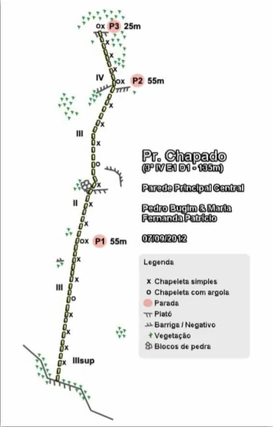
              - **largura_mapa**: 388
              - **altura_mapa**: 606
        - **[8]**:
          - **via_multiplas_enfiadas**:
            - **descricao**: Via com muitos lances bem verticais, mas sempre com ótimas agarras e cristaleiras. Uma das vias mais protegidas da parede, possibilitando bom conhecimento do estilo deste setor, sem sobrecarregar o psicológico. Paradas duplas e rapel com corda simples de 50 metros.
            - **nome**: Pé de Pano
            - **destaque**: True
            - **dificuldade_media**: BR_3
            - **dificuldade_maxima**: BR_4
            - **exposicao**: E1
            - **duracao**: D1
            - **comprimento_total**: 150
            - **numero_enfiadas**: 3
            - **tipo_via_multiplas_enfiadas**: TODA_FIXA
            - **conquistadores**:
              - Pedro Bugim
              - Maria Fernanda Patrício
            - **data_abertura**: 2012-04-08
          - **mapas**:
            - **[0]**:
              - **caminho_imagem_mapa**: 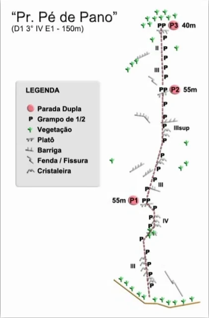
              - **largura_mapa**: 421
              - **altura_mapa**: 641
        - **[9]**:
          - **via_multiplas_enfiadas**:
            - **descricao**: Via mista que possui uma fenda inicial em móvel (crux). Os demais lances são muito bonitos.
            - **nome**: CDF
            - **dificuldade_media**: BR_4
            - **dificuldade_maxima**: BR_4
            - **comprimento_total**: 130
            - **tipo_via_multiplas_enfiadas**: MISTA
            - **conquistadores**:
              - Tonico Magalhães
              - Júlio César Cardoso
              - Gustavo "Xaxá" Carrozzino
              - Fabiano Fernandes
            - **data_abertura**: 2007-06-04
        - **[10]**:
          - **via_multiplas_enfiadas**:
            - **descricao**: O crux fica logo no delicado lance inicial, bem protegido. Evolui para lances verticais com “corcovas” e agarras incríveis, até a P1. A segunda enfiada possui lances com predominância em aderência, contando com um segundo crux antes da P2.
            - **nome**: Eu Sei o Que Vocês Fizeram no Blackout Passado
            - **dificuldade_media**: BR_3
            - **dificuldade_maxima**: BR_4SUP
            - **exposicao**: E1
            - **comprimento_total**: 115
            - **numero_enfiadas**: 2
            - **tipo_via_multiplas_enfiadas**: TODA_FIXA
            - **conquistadores**:
              - Pedro Bugim
              - Maria Fernanda Patrício
              - Breno Scofano
              - Ricardo "Draga" Daher
              - Gisele Melo
            - **data_abertura**: 2014-03-04
          - **mapas**:
            - **[0]**:
              - **caminho_imagem_mapa**: 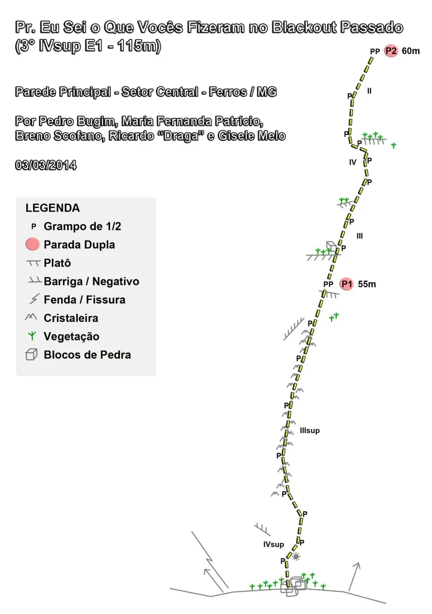
              - **largura_mapa**: 840
              - **altura_mapa**: 1190
        - **[11]**:
          - **via_multiplas_enfiadas**:
            - **descricao**: Uma das mais clássicas das vias da região. Apresenta três esticões de 55m cada, grampeação muito segura e paradas duplicadas. Costura móvel opcional no segundo esticão (friend). Rapel com corda única de 50m.
            - **nome**: Hilda Furacão
            - **destaque**: True
            - **dificuldade_media**: BR_3
            - **dificuldade_maxima**: BR_4
            - **comprimento_total**: 165
            - **numero_enfiadas**: 3
            - **tipo_via_multiplas_enfiadas**: TODA_FIXA
            - **conquistadores**:
              - Tonico Magalhães
              - Celso Ferreira Gomes
              - Eustáquio Júnior
              - Gustavo "Xaxá" Carrozzino
            - **data_abertura**: 2010-08-21
        - **[12]**:
          - **via_multiplas_enfiadas**:
            - **descricao**: Primeira via conquistada na localidade, dando início ao novo (e excelente!) polo deste esporte. O primeiro lance (crux) pode ter sua proteção melhorada com um nut de cabo pequeno.
            - **nome**: Iron Men
            - **destaque**: True
            - **dificuldade_media**: BR_4
            - **dificuldade_maxima**: BR_5
            - **comprimento_total**: 160
            - **tipo_via_multiplas_enfiadas**: TODA_FIXA
            - **conquistadores**:
              - Tonico Magalhães
              - Juliano Magalhães
              - Marcos Leiras
            - **data_abertura**: 2006-02-26
        - **[13]**:
          - **via_multiplas_enfiadas**:
            - **descricao**: Via espetacular! A primeira enfiada segue uma sequência impressionante de agarras, buracos e cristais, sempre com boa proteção fixa em grampos de ½. A segunda enfiada é feita quase toda em móvel, com friends de todos os tamanhos, dos menores aos bem grandes, sempre em fendas perfeitas e sólidas. O crux está na virada do diedro no final da segunda enfiada, sendo protegido por um grampo. A terceira enfiada segue por cristais e aderência até o final da via. Foi a 101ª conquista da região.
            - **nome**: Cordão do Bola Preta
            - **destaque**: True
            - **dificuldade_media**: BR_3
            - **dificuldade_maxima**: BR_4SUP
            - **exposicao**: E2
            - **duracao**: D1
            - **comprimento_total**: 130
            - **numero_enfiadas**: 3
            - **tipo_via_multiplas_enfiadas**: MISTA
            - **conquistadores**:
              - Pedro Bugim
              - Maria Fernanda Patrício
            - **data_abertura**: 2012-02-18
        - **[14]**:
          - **via_multiplas_enfiadas**:
            - **descricao**: Excelente via de escalada, sendo uma das primeiras do pólo. Bem protegida, com lances verticais em agarras e cristaleiras.
            - **nome**: A Ferro e Fogo
            - **dificuldade_media**: BR_3
            - **dificuldade_maxima**: BR_4
            - **comprimento_total**: 150
            - **tipo_via_multiplas_enfiadas**: TODA_FIXA
            - **conquistadores**:
              - Tonico Magalhães
              - Frederico Vasconcelos
              - Juan Kempen
            - **data_abertura**: 2006-04-14
        - **[15]**:
          - **via_multiplas_enfiadas**:
            - **descricao**: Apesar de relativamente curta, trata-se de uma via com lances bastante interessantes, em cristaleiras, abaulados e boas agarras em lances verticais, e com graduação bem tranquila. Bem protegida por grampos. Pode seguir até o topo, após a parada dupla, por qualquer uma de suas vias vizinhas.
            - **nome**: Chuva Ácida
            - **dificuldade_media**: BR_3SUP
            - **dificuldade_maxima**: BR_3SUP
            - **exposicao**: E1
            - **comprimento_total**: 50
            - **numero_enfiadas**: 2
            - **tipo_via_multiplas_enfiadas**: TODA_FIXA
            - **conquistadores**:
              - Pedro Bugim
              - Maria Fernanda Patrício
            - **data_abertura**: 2013-03-30
        - **[16]**:
          - **via_multiplas_enfiadas**:
            - **descricao**: Boa via, com boa proteção fixa em grampos de ½ polegada, seguindo uma linha óbvia de cristais, regletes e buracos, desde a base até o cume. Rapel possível com corda única de 50m. 99ª via conquistada na região.
            - **nome**: A Decadência da Bufa
            - **dificuldade_media**: BR_4
            - **dificuldade_maxima**: BR_4SUP
            - **exposicao**: E1
            - **duracao**: D1
            - **comprimento_total**: 125
            - **numero_enfiadas**: 3
            - **tipo_via_multiplas_enfiadas**: TODA_FIXA
            - **conquistadores**:
              - Pedro Bugim
              - Maria Fernanda Patrício
              - Gustavo "Xaxá" Carrozzino
            - **data_abertura**: 2012-01-22
        - **[17]**:
          - **via_multiplas_enfiadas**:
            - **descricao**: O crux é logo no início. Via com acesso rápido e muito bem grampeada.
            - **nome**: Jeca Tatu
            - **dificuldade_media**: BR_3
            - **dificuldade_maxima**: BR_4SUP
            - **comprimento_total**: 90
            - **numero_enfiadas**: 3
            - **tipo_via_multiplas_enfiadas**: TODA_FIXA
            - **conquistadores**:
              - Luciano Bender
              - Tonico Magalhães
              - Gustavo "Xaxá" Carrozzino
              - Celso Ferreira Gomes
            - **data_abertura**: 2011-04-21
      - **caminho_imagem_capa**: 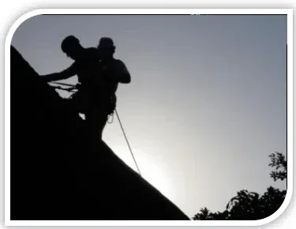
      - **precomputados**:
        - **total_escaladas**: 18
        - **total_multiplas_enfiadas**: 18
  - **[3]**:
    - **conteudo**:
      - **descricao**:
          Capa: Vista da Parede Principal - Setor de Cima, durante o rapel da "Um Momento no Tempo". Todo este setor encontra-se ainda sem vias (Foto: Pedro Bugim)
          
          ## Esquema de Trilhas e Acesso
          
          - **1 – Base da via "Noite de São João"**: Acessando pela trilha do rio seco, para a parte esquerda da Parede Principal Central.
          - **2 – Base da via "Um Momento no Tempo"**: Acessando pela trilha das vias da direita, da Parede Principal – Clássicas Longas.
          - **3 – Acesso à parede deste setor**: Ainda sem conquistas.
          
          | 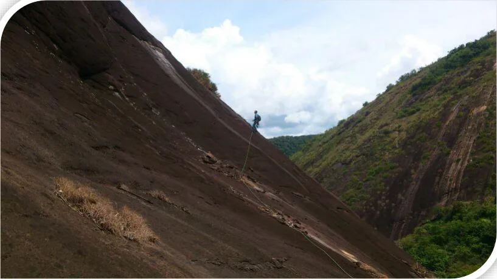 |
          | :--: |
          | *Costão inicial na base do Setor de Cima, na Parede Principal (Foto: Maria Fernanda Patrício)* |
      - **nome**: Setor de Cima
      - **caminho_imagem_capa**: 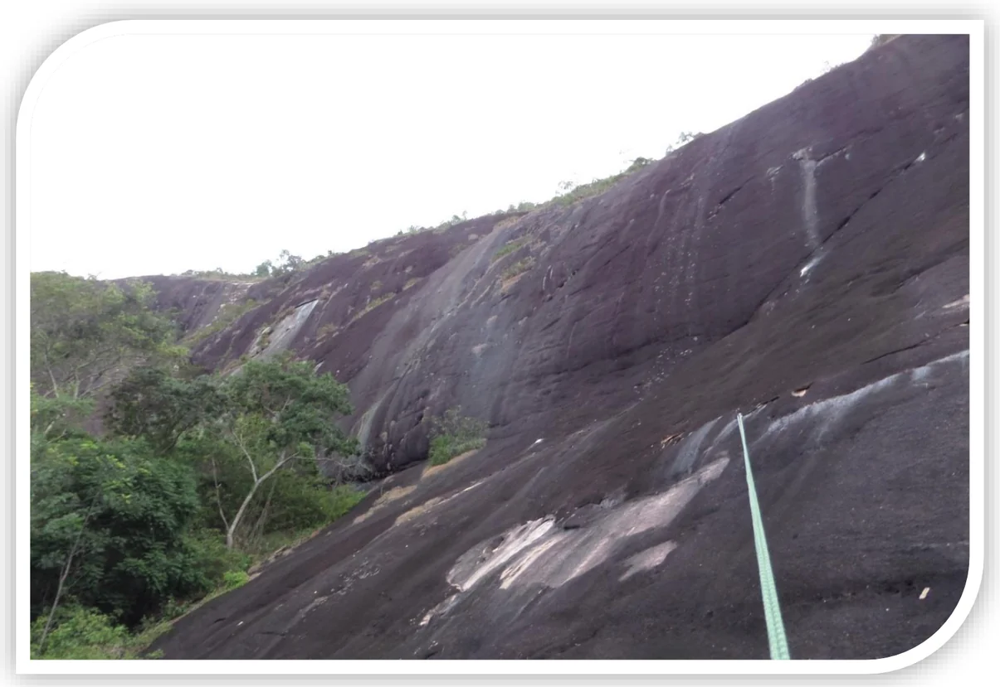
      - **mapas**:
        - **[0]**:
          - **caminho_imagem_mapa**: 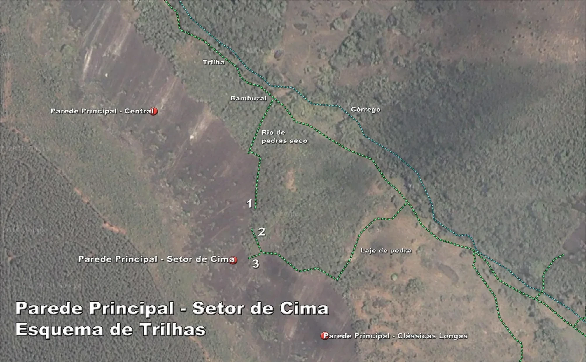
          - **largura_mapa**: 2009
          - **altura_mapa**: 1243
          - **referencias**:
            - **[0]**:
              - **escalada**: Noite de São João
              - **ids**:
                - 1
            - **[1]**:
              - **escalada**: Um Momento no Tempo
              - **ids**:
                - 2
            - **[2]**:
              - **ids**:
                - parede_principal_central
              - **grupo**: Parede Principal (Paredes de Aço)
              - **setor**: Setor Central
            - **[3]**:
              - **ids**:
                - parede_principal_classicas_longas
              - **grupo**: Parede Principal (Paredes de Aço)
              - **setor**: Setor Clássicas Longas
          - **pontos_de_interesse**:
            - **[0]**:
              - **id**: 1
              - **label**: 1
              - **circulo**:
                - **x**: 857
                - **y**: 699
                - **raio**: 24
            - **[1]**:
              - **id**: 2
              - **label**: 2
              - **circulo**:
                - **x**: 898
                - **y**: 796
                - **raio**: 24
            - **[2]**:
              - **id**: parede_principal_central
              - **label**: Parede Principal Central
              - **retangulo**:
                - **x**: 356
                - **y**: 380
                - **comprimento**: 394
                - **largura**: 77
              - **cor**: 
            - **[3]**:
              - **id**: parede_principal_classicas_longas
              - **label**: Parede Principal Clássicas Longas
              - **retangulo**:
                - **x**: 1355
                - **y**: 1152
                - **comprimento**: 538
                - **largura**: 74
              - **cor**: 
        - **[1]**:
          - **caminho_imagem_mapa**: 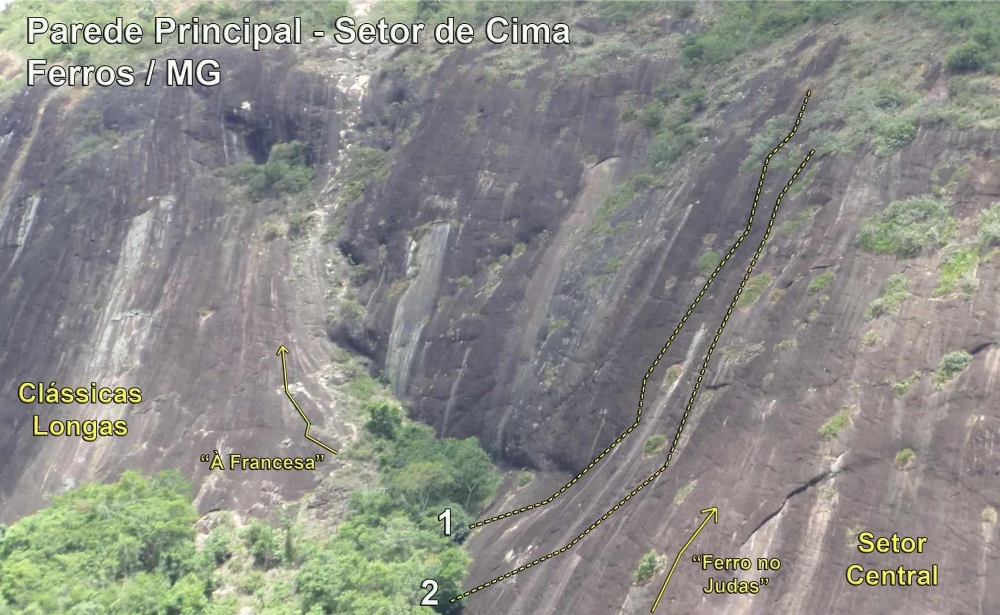
          - **largura_mapa**: 2015
          - **altura_mapa**: 1240
          - **referencias**:
            - **[0]**:
              - **escalada**: Um Momento no Tempo
              - **ids**:
                - 1
            - **[1]**:
              - **escalada**: Noite de São João
              - **ids**:
                - 2
            - **[2]**:
              - **ids**:
                - Setor Central
              - **setor**: Setor Central
            - **[3]**:
              - **ids**:
                - Clássicas Longas
              - **setor**: Setor Clássicas Longas
            - **[4]**:
              - **ids**:
                - a_francesa
              - **grupo**: Parede Principal (Paredes de Aço)
              - **setor**: Setor Clássicas Longas
              - **escalada**: À Francesa
            - **[5]**:
              - **ids**:
                - ferro_no_judas
              - **grupo**: Parede Principal (Paredes de Aço)
              - **setor**: Setor Central
              - **escalada**: Ferro no Judas
          - **pontos_de_interesse**:
            - **[0]**:
              - **id**: 1
              - **label**: 1
              - **circulo**:
                - **x**: 900
                - **y**: 1053
                - **raio**: 36
            - **[1]**:
              - **id**: 2
              - **label**: 2
              - **circulo**:
                - **x**: 866
                - **y**: 1195
                - **raio**: 36
            - **[2]**:
              - **id**: Setor Central
              - **label**: Setor Central
              - **retangulo**:
                - **x**: 1798
                - **y**: 1126
                - **comprimento**: 219
                - **largura**: 134
            - **[3]**:
              - **id**: Clássicas Longas
              - **label**: Clássicas Longas
              - **retangulo**:
                - **x**: 162
                - **y**: 830
                - **comprimento**: 281
                - **largura**: 153
            - **[4]**:
              - **id**: a_francesa
              - **label**: À Francesa
              - **retangulo**:
                - **x**: 528
                - **y**: 930
                - **comprimento**: 278
                - **largura**: 77
              - **cor**: 
            - **[5]**:
              - **id**: ferro_no_judas
              - **label**: Ferro no Judas
              - **retangulo**:
                - **x**: 1484
                - **y**: 1158
                - **comprimento**: 209
                - **largura**: 104
              - **cor**: 
      - **escaladas**:
        - **[0]**:
          - **via_multiplas_enfiadas**:
            - **descricao**: Ótima via, que inicia em um fácil costão, para então ganhar uma bonita canaleta e finalmente, uma barriga feita em aderência, onde encontra-se o crux (primeira metade da via). A primeira enfiada (e mais bonita) possui proteção generosa, enquanto que a segunda enfiada, bem mais fácil, possui proteções mais espaçadas até atingir o topo da parede.
            - **nome**: Um Momento no Tempo
            - **dificuldade_media**: BR_4
            - **dificuldade_maxima**: BR_6
            - **exposicao**: E2
            - **tipo_via_multiplas_enfiadas**: TODA_FIXA
            - **numero_enfiadas**: 2
            - **comprimento_total**: 120
            - **comprimento_maior_enfiada**: 60
            - **quantidade_costuras_intermediarias**: 8
            - **quantidade_equipamentos_parada**: 2
            - **conquistadores**:
              - Pedro Bugim
              - Maria Fernanda Patrício
            - **data_abertura**: 2015-02-17
            - **enfiadas**:
              - **[0]**:
                - **via_esportiva**:
                  - **nome**: 1ª Enfiada (P1)
                  - **dificuldade**: BR_6
                  - **extensao**: 60
                  - **quantidade_protecoes_intermediarias**: 8
                  - **quantidade_protecoes_parada**: 2
              - **[1]**:
                - **via_esportiva**:
                  - **nome**: 2ª Enfiada (P2)
                  - **dificuldade**: BR_3
                  - **extensao**: 60
                  - **quantidade_protecoes_intermediarias**: 4
                  - **quantidade_protecoes_parada**: 2
          - **mapas**:
            - **[0]**:
              - **caminho_imagem_mapa**: 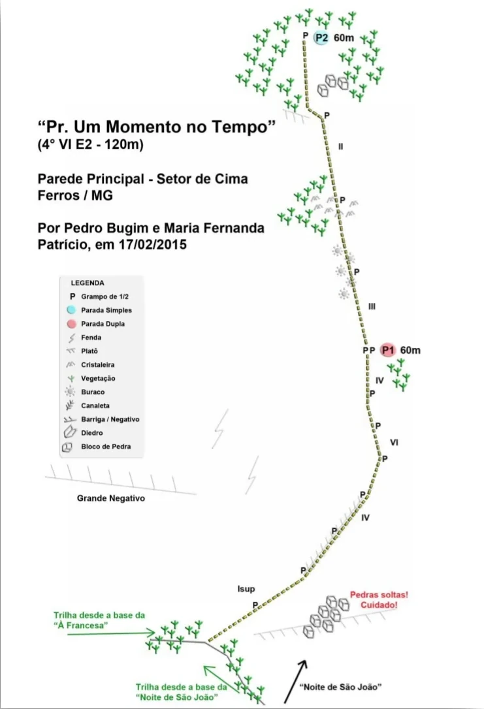
              - **largura_mapa**: 741
              - **altura_mapa**: 1086
        - **[1]**:
          - **via_multiplas_enfiadas**:
            - **descricao**: Via fácil e com grampeação próxima. O crux encontra-se no meio da via.
            - **nome**: Noite de São João
            - **dificuldade_media**: BR_3
            - **dificuldade_maxima**: BR_3SUP
            - **exposicao**: E2
            - **tipo_via_multiplas_enfiadas**: TODA_FIXA
            - **numero_enfiadas**: 2
            - **comprimento_total**: 120
            - **comprimento_maior_enfiada**: 60
            - **quantidade_costuras_intermediarias**: 4
            - **quantidade_equipamentos_parada**: 2
            - **conquistadores**:
              - Luciano Bender
              - Tonico Magalhães
              - Celso Ferreira Gomes
              - Glesse Gripp
            - **data_abertura**: 2011-06-23
            - **enfiadas**:
              - **[0]**:
                - **via_esportiva**:
                  - **nome**: 1ª Enfiada (P1)
                  - **dificuldade**: BR_3SUP
                  - **extensao**: 60
                  - **quantidade_protecoes_intermediarias**: 4
                  - **quantidade_protecoes_parada**: 2
              - **[1]**:
                - **via_esportiva**:
                  - **nome**: 2ª Enfiada (P2)
                  - **dificuldade**: BR_3
                  - **extensao**: 60
                  - **quantidade_protecoes_intermediarias**: 4
                  - **quantidade_protecoes_parada**: 2
          - **mapas**:
            - **[0]**:
              - **caminho_imagem_mapa**: 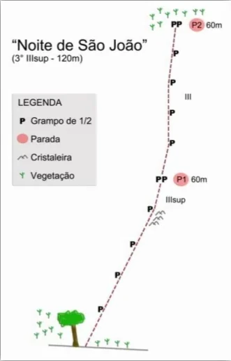
              - **largura_mapa**: 331
              - **altura_mapa**: 518
      - **precomputados**:
        - **total_escaladas**: 2
        - **total_multiplas_enfiadas**: 2
  - **[4]**:
    - **conteudo**:
      - **descricao**:
          Capa: Maria Fernanda na terceira passada em móvel (e crux) do Pr. "Ih, Ferrou!" (Foto: Pedro Bugim)
          
          Setor da Parede Principal que concentra as maiores vias do Vale do Roncador, com vias de até 220 metros de extensão, como é o caso do Pr. “Eu Não Sou de Ferro”.
          
          Para acessá-lo é necessário seguir a trilha principal do Vale do Roncador por cerca de dois quilômetros, sempre beirando o córrego de mesmo nome. Após cruzar o rio duas vezes, passar por uma tronqueira e contornar um pasto, é necessário pegar uma bifurcação à direita, subindo em diagonal. Em certo ponto, ao encontrar uma laje de pedra com um filete de água escorrendo, vindo da direita, pode-se seguir por ele (cuidado para não escorregar!) ou seguir pelo barranco à esquerda.
          
          Predominância de vias em agarras e buracos, com destaque para o grande negativo existente no meio da parede, que abriga vias longas e de alta graduação, com mais de três enfiadas de corda, contando inclusive com a via mais difícil do polo (Pr. Conrado Ferro). Destaque ao Paredão CEM, via com quatro enfiadas e que segue uma linha natural impressionante.
          
          Outra opção interessante, é a via “Ih, Ferrou!”, por contar com proteção mista, obrigando o escalador a realizar pelo menos três lances protegendo com materiais móveis, em fendas sólidas e buracos perfeitos, ou a via “Rio de Mão Dupla”, que com 140 metros, conta apenas com dois grampos, sendo todo o resto em móvel.
          
          Este setor ainda conta com boas possibilidades de novas vias, sobretudo em sua metade da direita, na qual existem apenas três vias longas (“Eu Não Sou de Ferro”, “Rio de Mão Dupla” e “À Francesa”) e uma terceira, curta (“Grand Finale”).
          
          ## Esquema de Trilhas
          
          - **1**: Base das vias “Eu Não Sou de Ferro”, “Rio de Mão Dupla” e “À Francesa”
          - **2**: Base das vias “Jardim do Éden” até “Arco de Ferros”
          - **3**: Base da via “Ih, Ferrou!”
          - **4**: Base das vias “O Retorno de Jedi” e “O Nome da Rosa”
      - **nome**: Setor Clássicas Longas
      - **caminho_imagem_capa**: 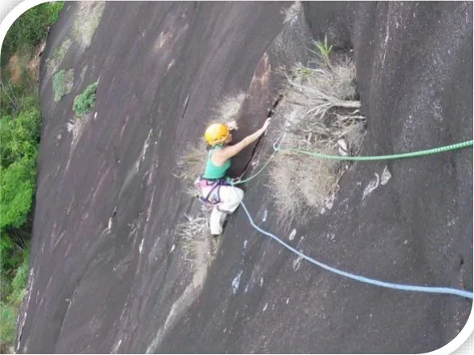
      - **mapas**:
        - **[0]**:
          - **caminho_imagem_mapa**: 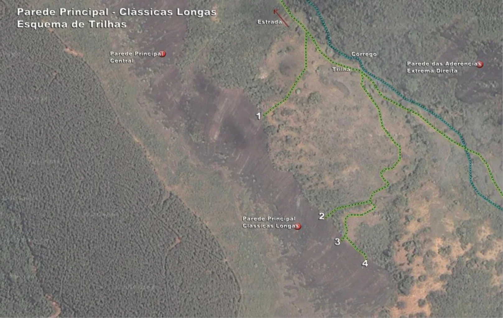
          - **largura_mapa**: 1617
          - **altura_mapa**: 1025
          - **referencias**:
            - **[0]**:
              - **escalada**: Eu Não Sou de Ferro
              - **ids**:
                - 1
            - **[1]**:
              - **escalada**: Rio de Mão Dupla
              - **ids**:
                - 1
            - **[2]**:
              - **escalada**: À Francesa
              - **ids**:
                - 1
            - **[3]**:
              - **escalada**: Jardim do Éden
              - **ids**:
                - 2
            - **[4]**:
              - **escalada**: A Dois Passos do Paraíso
              - **ids**:
                - 2
            - **[5]**:
              - **escalada**: Conquista do Paraíso
              - **ids**:
                - 2
            - **[6]**:
              - **escalada**: Purgatório
              - **ids**:
                - 2
            - **[7]**:
              - **escalada**: Arco de Ferros
              - **ids**:
                - 2
            - **[8]**:
              - **escalada**: Quem com Ferro Fere
              - **ids**:
                - 2
            - **[9]**:
              - **escalada**: Tanto Bate Até Que Fura
              - **ids**:
                - 2
            - **[10]**:
              - **escalada**: Trem de Ferro
              - **ids**:
                - 2
            - **[11]**:
              - **escalada**: Up Ester
              - **ids**:
                - 2
            - **[12]**:
              - **escalada**: Até Que a Vida Nos Separe
              - **ids**:
                - 2
            - **[13]**:
              - **escalada**: Vr. Pilhado
              - **ids**:
                - 2
            - **[14]**:
              - **escalada**: Pr. CEM
              - **ids**:
                - 2
            - **[15]**:
              - **escalada**: Vr. SEM
              - **ids**:
                - 2
            - **[16]**:
              - **escalada**: Ih, Ferrou!
              - **ids**:
                - 3
            - **[17]**:
              - **escalada**: O Retorno de Jedi
              - **ids**:
                - 4
            - **[18]**:
              - **escalada**: O Nome da Rosa
              - **ids**:
                - 4
            - **[19]**:
              - **escalada**: Quarto 304
              - **ids**:
                - 4
            - **[20]**:
              - **ids**:
                - central
              - **grupo**: Parede Principal (Paredes de Aço)
              - **setor**: Setor Central
            - **[21]**:
              - **ids**:
                - aderencias_extrema_direita
              - **grupo**: Parede das Aderências
              - **setor**: Extrema Direita
            - **[22]**:
              - **ids**:
                - 1
              - **grupo**: Parede Principal (Paredes de Aço)
              - **setor**: Setor Clássicas Longas
              - **escalada**: Grand Finale
            - **[23]**:
              - **ids**:
                - 2
              - **grupo**: Parede Principal (Paredes de Aço)
              - **setor**: Setor Clássicas Longas
              - **escalada**: Pr. Conrado Ferro
          - **pontos_de_interesse**:
            - **[0]**:
              - **id**: 1
              - **label**: 1
              - **circulo**:
                - **x**: 832
                - **y**: 373
                - **raio**: 19
            - **[1]**:
              - **id**: 2
              - **label**: 2
              - **circulo**:
                - **x**: 1033
                - **y**: 696
                - **raio**: 19
            - **[2]**:
              - **id**: 3
              - **label**: 3
              - **circulo**:
                - **x**: 1084
                - **y**: 779
                - **raio**: 19
            - **[3]**:
              - **id**: 4
              - **label**: 4
              - **circulo**:
                - **x**: 1175
                - **y**: 848
                - **raio**: 19
            - **[4]**:
              - **id**: central
              - **label**: Parede Principal Central
              - **retangulo**:
                - **x**: 442
                - **y**: 183
                - **comprimento**: 215
                - **largura**: 68
              - **cor**: 
            - **[5]**:
              - **id**: aderencias_extrema_direita
              - **label**: Aderências Extrema Direita
              - **retangulo**:
                - **x**: 1430
                - **y**: 216
                - **comprimento**: 268
                - **largura**: 63
              - **cor**: 
        - **[1]**:
          - **caminho_imagem_mapa**: 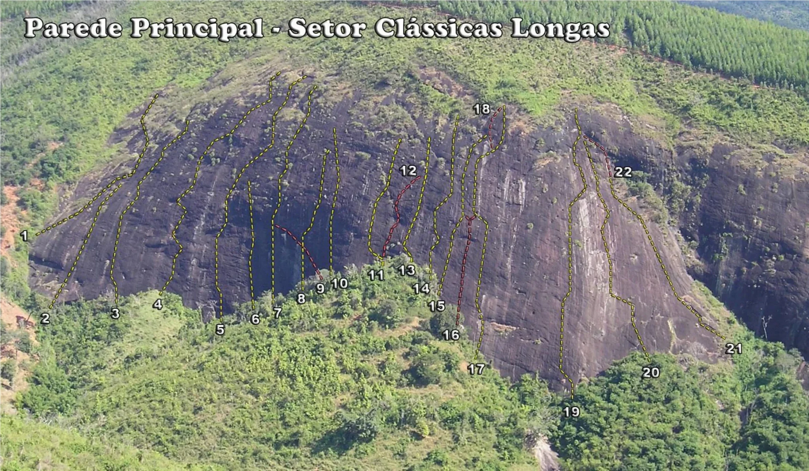
          - **largura_mapa**: 2069
          - **altura_mapa**: 1207
          - **referencias**:
            - **[0]**:
              - **escalada**: Quarto 304
              - **ids**:
                - 1
            - **[1]**:
              - **escalada**: O Nome da Rosa
              - **ids**:
                - 2
            - **[2]**:
              - **escalada**: O Retorno de Jedi
              - **ids**:
                - 3
            - **[3]**:
              - **escalada**: Ih, Ferrou!
              - **ids**:
                - 4
            - **[4]**:
              - **escalada**: Jardim do Éden
              - **ids**:
                - 5
            - **[5]**:
              - **escalada**: A Dois Passos do Paraíso
              - **ids**:
                - 6
            - **[6]**:
              - **escalada**: Conquista do Paraíso
              - **ids**:
                - 7
            - **[7]**:
              - **escalada**: Purgatório
              - **ids**:
                - 8
            - **[8]**:
              - **escalada**: Arco de Ferros
              - **ids**:
                - 9
            - **[9]**:
              - **escalada**: Pr. Conrado Ferro
              - **ids**:
                - 10
            - **[10]**:
              - **escalada**: Quem com Ferro Fere
              - **ids**:
                - 11
            - **[11]**:
              - **escalada**: Tanto Bate Até Que Fura
              - **ids**:
                - 11
                - 12
            - **[12]**:
              - **escalada**: Trem de Ferro
              - **ids**:
                - 13
            - **[13]**:
              - **escalada**: Up Ester
              - **ids**:
                - 14
            - **[14]**:
              - **escalada**: Até Que a Vida Nos Separe
              - **ids**:
                - 15
            - **[15]**:
              - **escalada**: Vr. Pilhado
              - **ids**:
                - 16
            - **[16]**:
              - **escalada**: Pr. CEM
              - **ids**:
                - 17
            - **[17]**:
              - **escalada**: Vr. SEM
              - **ids**:
                - 17
                - 18
            - **[18]**:
              - **escalada**: Eu Não Sou de Ferro
              - **ids**:
                - 19
            - **[19]**:
              - **escalada**: Rio de Mão Dupla
              - **ids**:
                - 20
            - **[20]**:
              - **escalada**: À Francesa
              - **ids**:
                - 21
            - **[21]**:
              - **escalada**: Grand Finale
              - **ids**:
                - 21
                - 22
          - **pontos_de_interesse**:
            - **[0]**:
              - **id**: 1
              - **label**: 1
              - **circulo**:
                - **x**: 63
                - **y**: 604
                - **raio**: 24
            - **[1]**:
              - **id**: 2
              - **label**: 2
              - **circulo**:
                - **x**: 115
                - **y**: 816
                - **raio**: 24
            - **[2]**:
              - **id**: 3
              - **label**: 3
              - **circulo**:
                - **x**: 294
                - **y**: 803
                - **raio**: 24
            - **[3]**:
              - **id**: 4
              - **label**: 4
              - **circulo**:
                - **x**: 404
                - **y**: 779
                - **raio**: 24
            - **[4]**:
              - **id**: 5
              - **label**: 5
              - **circulo**:
                - **x**: 563
                - **y**: 843
                - **raio**: 24
            - **[5]**:
              - **id**: 6
              - **label**: 6
              - **circulo**:
                - **x**: 652
                - **y**: 819
                - **raio**: 24
            - **[6]**:
              - **id**: 7
              - **label**: 7
              - **circulo**:
                - **x**: 710
                - **y**: 801
                - **raio**: 24
            - **[7]**:
              - **id**: 8
              - **label**: 8
              - **circulo**:
                - **x**: 771
                - **y**: 765
                - **raio**: 24
            - **[8]**:
              - **id**: 9
              - **label**: 9
              - **circulo**:
                - **x**: 820
                - **y**: 739
                - **raio**: 24
            - **[9]**:
              - **id**: 10
              - **label**: 10
              - **circulo**:
                - **x**: 869
                - **y**: 726
                - **raio**: 28
            - **[10]**:
              - **id**: 11
              - **label**: 11
              - **circulo**:
                - **x**: 962
                - **y**: 705
                - **raio**: 26
            - **[11]**:
              - **id**: 12
              - **label**: 12
              - **circulo**:
                - **x**: 1044
                - **y**: 438
                - **raio**: 28
            - **[12]**:
              - **id**: 13
              - **label**: 13
              - **circulo**:
                - **x**: 1041
                - **y**: 691
                - **raio**: 28
            - **[13]**:
              - **id**: 14
              - **label**: 14
              - **circulo**:
                - **x**: 1078
                - **y**: 739
                - **raio**: 27
            - **[14]**:
              - **id**: 15
              - **label**: 15
              - **circulo**:
                - **x**: 1118
                - **y**: 784
                - **raio**: 28
            - **[15]**:
              - **id**: 16
              - **label**: 16
              - **circulo**:
                - **x**: 1154
                - **y**: 858
                - **raio**: 27
            - **[16]**:
              - **id**: 17
              - **label**: 17
              - **circulo**:
                - **x**: 1218
                - **y**: 944
                - **raio**: 28
            - **[17]**:
              - **id**: 18
              - **label**: 18
              - **circulo**:
                - **x**: 1233
                - **y**: 280
                - **raio**: 27
            - **[18]**:
              - **id**: 19
              - **label**: 19
              - **circulo**:
                - **x**: 1461
                - **y**: 1055
                - **raio**: 26
            - **[19]**:
              - **id**: 20
              - **label**: 20
              - **circulo**:
                - **x**: 1664
                - **y**: 956
                - **raio**: 29
            - **[20]**:
              - **id**: 21
              - **label**: 21
              - **circulo**:
                - **x**: 1877
                - **y**: 894
                - **raio**: 28
            - **[21]**:
              - **id**: 22
              - **label**: 22
              - **circulo**:
                - **x**: 1592
                - **y**: 442
                - **raio**: 30
        - **[2]**:
          - **caminho_imagem_mapa**: 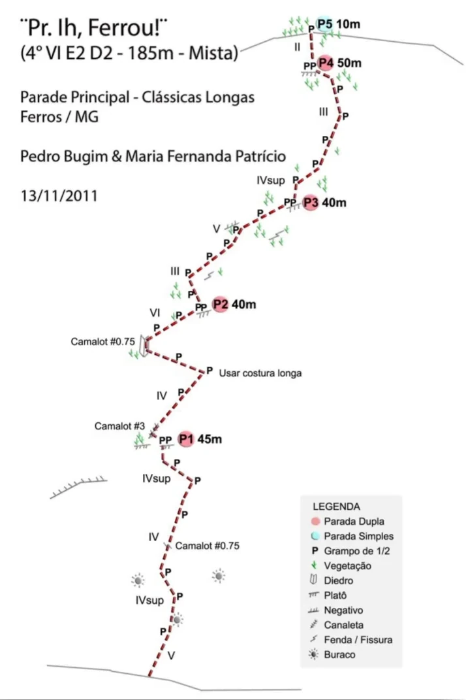
          - **largura_mapa**: 714
          - **altura_mapa**: 1071
        - **[3]**:
          - **caminho_imagem_mapa**: 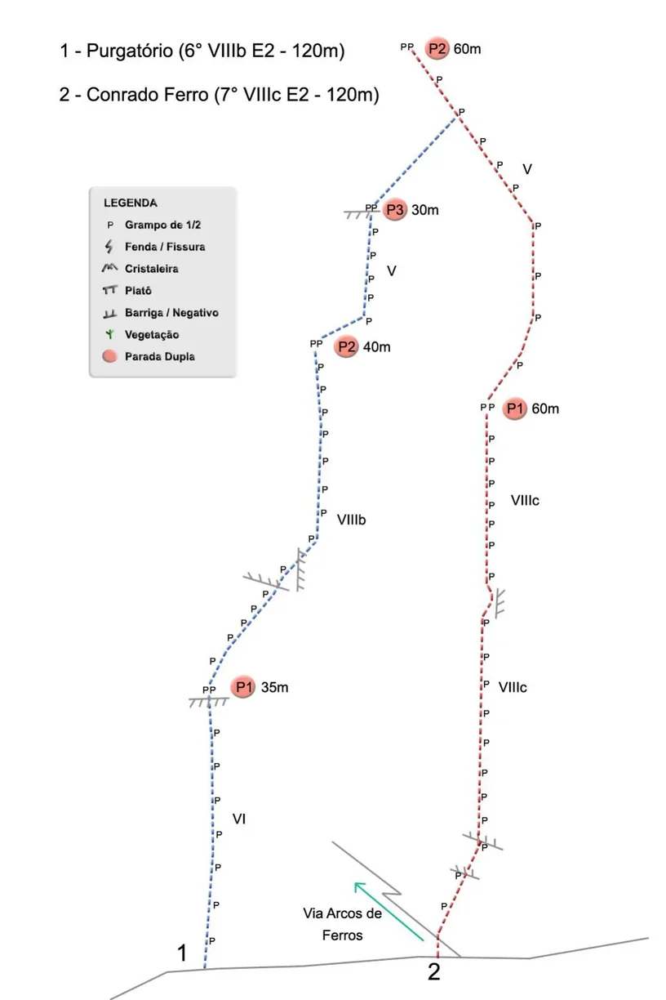
          - **largura_mapa**: 816
          - **altura_mapa**: 1224
        - **[4]**:
          - **caminho_imagem_mapa**: 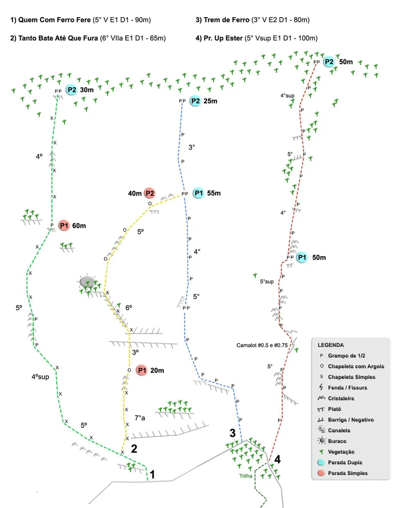
          - **largura_mapa**: 887
          - **altura_mapa**: 1127
        - **[5]**:
          - **caminho_imagem_mapa**: 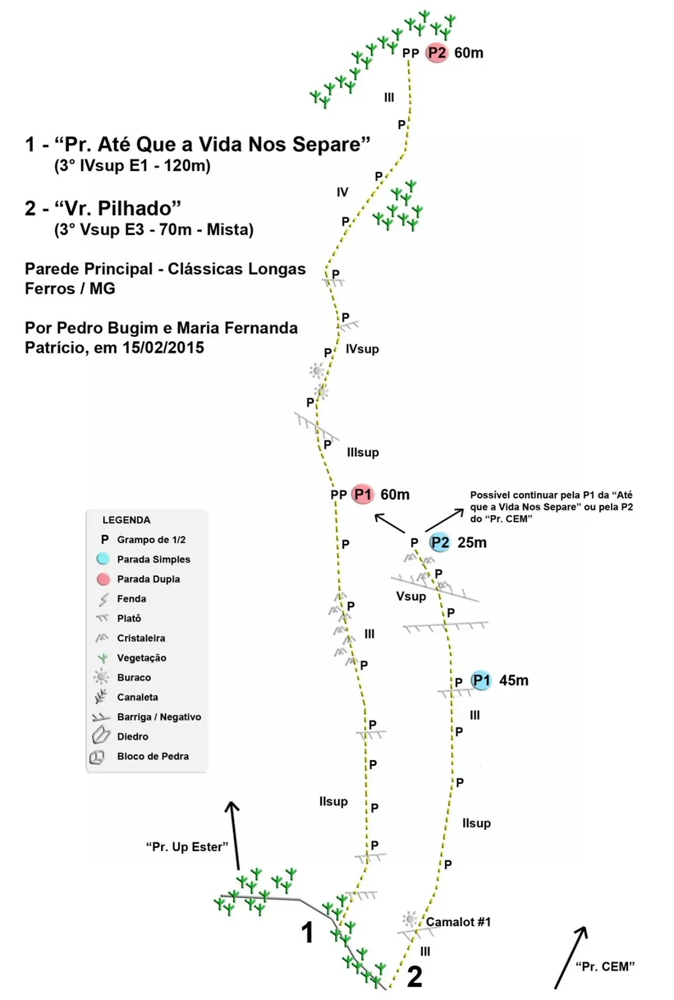
          - **largura_mapa**: 821
          - **altura_mapa**: 1217
        - **[6]**:
          - **caminho_imagem_mapa**: 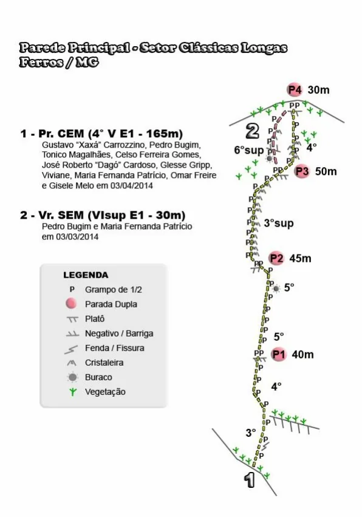
          - **largura_mapa**: 596
          - **altura_mapa**: 851
        - **[7]**:
          - **caminho_imagem_mapa**: 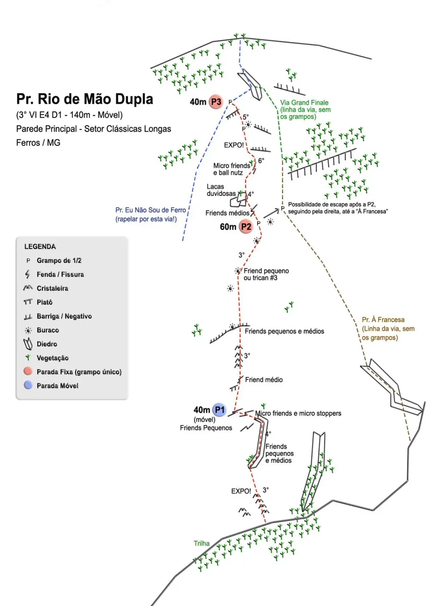
          - **largura_mapa**: 843
          - **altura_mapa**: 1185
      - **escaladas**:
        - **[0]**:
          - **via_multiplas_enfiadas**:
            - **descricao**: Inicia após a grande barriga que existe neste setor, com um grampo logo no início, para proteger do pequeno abismo que ali existe. Seu trecho inicial, com cerca de 40 metros, segue por platôs de mato e lances de Isup. Após juntar com a parada final da "O Nome da Rosa", a parede ganha verticalidade e segue por mais 80 metros até a vegetação de topo. Nome inspirado no quarto no qual a Hilda Furacão "atendia" seus clientes no Hotel Maravilhoso, de acordo com o romance de Roberto Drummond.
            - **nome**: Quarto 304
            - **dificuldade_media**: BR_2
            - **dificuldade_maxima**: BR_2SUP
            - **exposicao**: E1
            - **comprimento_total**: 120
            - **numero_enfiadas**: 3
            - **tipo_via_multiplas_enfiadas**: TODA_FIXA
            - **conquistadores**:
              - Tonico Magalhães
              - Celso Ferreira Gomes
            - **data_abertura**: 2014-11-01
        - **[1]**:
          - **via_multiplas_enfiadas**:
            - **descricao**: Centésima via conquistada na região, sendo a penúltima da extrema esquerda da Parede Principal. Uma opção interessante é seguir, após o final dessa via, pela "Quarto 304", o que confere aos escaladores exatos 200 metros de escalada.
            - **nome**: O Nome da Rosa
            - **dificuldade_media**: BR_4
            - **dificuldade_maxima**: BR_4SUP
            - **exposicao**: E1
            - **comprimento_total**: 120
            - **tipo_via_multiplas_enfiadas**: TODA_FIXA
            - **conquistadores**:
              - Tonico Magalhães
              - Celso Ferreira Gomes
              - Glesse Gripp
              - João Paulo JP
            - **data_abertura**: 2012-02-04
        - **[2]**:
          - **via_multiplas_enfiadas**:
            - **descricao**: Boa via, predominantemente em aderência e agarras, que conta com proteção fixa constante.
            - **nome**: O Retorno de Jedi
            - **dificuldade_media**: BR_4
            - **dificuldade_maxima**: BR_4SUP
            - **comprimento_total**: 150
            - **tipo_via_multiplas_enfiadas**: TODA_FIXA
            - **conquistadores**:
              - Tonico Magalhães
              - Paulo Bandeira
              - Júlio César Cardoso
            - **data_abertura**: 2007-09-07
        - **[3]**:
          - **via_multiplas_enfiadas**:
            - **descricao**: Via mista, com agarras, aderência, fendas e barrigas interessantes. Proteções constantes nos lances mais complicados e maiores espaçamentos nos lances fáceis. Proteção dupla em todas as paradas, com padrão de 50 metros. Material recomendado: Camalots #0.75 ao #4. Rapel possível com corda única de 50m.
            - **nome**: Ih, Ferrou!
            - **destaque**: True
            - **dificuldade_media**: BR_4
            - **dificuldade_maxima**: BR_6
            - **exposicao**: E2
            - **duracao**: D2
            - **comprimento_total**: 185
            - **numero_enfiadas**: 5
            - **tipo_via_multiplas_enfiadas**: MISTA
            - **equipamento_recomendado**: Camalots #0.75 ao #4. Camalot #3 na P1 e Camalot #0.75 na P2.
            - **conquistadores**:
              - Pedro Bugim
              - Maria Fernanda Patrício
            - **data_abertura**: 2011-11-13
          - **mapas**:
            - **[0]**:
              - **caminho_imagem_mapa**: 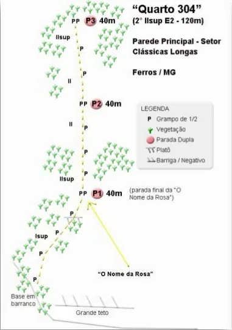
              - **largura_mapa**: 381
              - **altura_mapa**: 540
        - **[4]**:
          - **via_multiplas_enfiadas**:
            - **descricao**: Via maravilhosa iniciada em lances fortes, em sequência bastante vertical, com alguns trechos negativos. Proteção fixa generosa em toda extensão da via. Rapel possível com uma corda de 50m. Dois lances de VIIa obrigatórios.
            - **nome**: Jardim do Éden
            - **destaque**: True
            - **dificuldade_media**: BR_6
            - **dificuldade_maxima**: BR_7A
            - **exposicao**: E1
            - **comprimento_total**: 220
            - **numero_enfiadas**: 5
            - **tipo_via_multiplas_enfiadas**: TODA_FIXA
            - **conquistadores**:
              - Juliano Magalhães
              - Tonico Magalhães
              - Celso Ferreira Gomes
              - Gustavo Piancastelli
              - Igor Murta
              - André DJ
              - Luciano Bender
              - Patrícia Duffles
            - **data_abertura**: 2011-06-24
          - **mapas**:
            - **[0]**:
              - **caminho_imagem_mapa**: 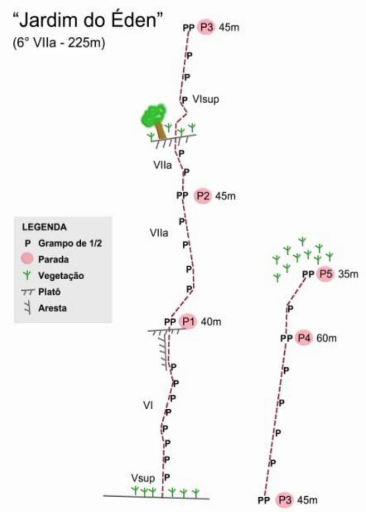
              - **largura_mapa**: 765
              - **altura_mapa**: 1071
        - **[5]**:
          - **via_multiplas_enfiadas**:
            - **descricao**: Via feita em três enfiadas curtas, seguindo uma exigente sequência buracos, com algumas passagens negativas. Ótima opção no setor, servindo inclusive, como variante da via "Jardim do Éden".
            - **nome**: A Dois Passos do Paraíso
            - **destaque**: True
            - **dificuldade_media**: BR_6
            - **dificuldade_maxima**: BR_7C
            - **exposicao**: E1
            - **comprimento_total**: 85
            - **numero_enfiadas**: 3
            - **tipo_via_multiplas_enfiadas**: TODA_FIXA
            - **conquistadores**:
              - Igor Murta
              - Aloysio Carvalho
              - Igor Baldo
              - Carlim Kamicad
            - **data_abertura**: 2012-04-08
        - **[6]**:
          - **via_multiplas_enfiadas**:
            - **descricao**: Via forte e complexa, porém muito bem protegida. Ótima opção neste setor. Rapel com corda única de 60m. Três lances de VIIa obrigatórios. Juntamente com a Jardim do Éden, forma o conjunto atual do pólo que pode ser considerado como tipo esportivas longas.
            - **nome**: Conquista do Paraíso
            - **destaque**: True
            - **dificuldade_media**: BR_6
            - **dificuldade_maxima**: BR_7A
            - **comprimento_total**: 165
            - **numero_enfiadas**: 3
            - **tipo_via_multiplas_enfiadas**: TODA_FIXA
            - **conquistadores**:
              - Tonico Magalhães
              - Eustáquio Júnior
              - Gustavo "Xaxá" Carrozzino
              - Juliano Magalhães
              - Luciano Bender
            - **data_abertura**: 2011-09-06
          - **mapas**:
            - **[0]**:
              - **caminho_imagem_mapa**: 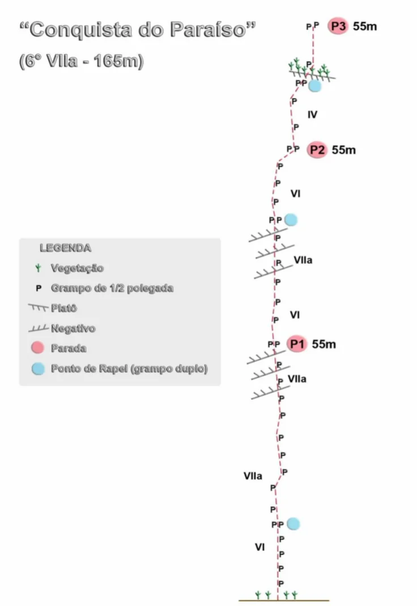
              - **largura_mapa**: 736
              - **altura_mapa**: 1068
        - **[7]**:
          - **via_multiplas_enfiadas**:
            - **descricao**: Via iniciada em 2011, que conta com 32 grampos. A primeira enfiada é técnica, com belas agarras e bastante vertical, a segunda é atlética/esportiva e a última em aderências e abaulados. Imperdível!
            - **nome**: Purgatório
            - **destaque**: True
            - **dificuldade_media**: BR_6
            - **dificuldade_maxima**: BR_8B
            - **exposicao**: E2
            - **comprimento_total**: 120
            - **numero_enfiadas**: 3
            - **tipo_via_multiplas_enfiadas**: TODA_FIXA
            - **conquistadores**:
              - Juliano Magalhães
              - Luciano Bender
            - **data_abertura**: 2013-07-24
        - **[8]**:
          - **via_movel**:
            - **descricao**: Via com boas passadas em móvel, sempre em diagonal para a esquerda, cruzando a "Purgatório" e juntando na "Conquista do Paraíso". Leve peças pequenas e médias. O nome da via é em alusão ao grande arco negativo formado pela fenda por onde a linha passa.
            - **nome**: Arco de Ferros
            - **dificuldade**: BR_7A
            - **exposicao**: E2
            - **extensao**: 50
            - **protecoes_moveis**: Peças pequenas e médias.
            - **conquistadores**:
              - Gustavo Piancastelli
              - Eustáquio Júnior
              - Celso Ferreira Gomes
            - **data_abertura**: 2012-06-16
        - **[9]**:
          - **via_multiplas_enfiadas**:
            - **descricao**: Via bastante vertical e considerada um raro exemplo de escalada ESPORTIVA LONGA. Trata-se da escalada mais difícil do Vale do Roncador até agora. Necessárias 18 costuras, caso se deseje fazer a primeira enfiada completa. O nome da via é uma homenagem pelo quinto aniversário do filho de Luciano Bender, na data da conquista. 31 grampos de ½. Um grande e empolgante desafio aos escaladores esportivos.
            - **nome**: Pr. Conrado Ferro
            - **destaque**: True
            - **dificuldade_media**: BR_7A
            - **dificuldade_maxima**: BR_8C
            - **exposicao**: E2
            - **comprimento_total**: 120
            - **numero_enfiadas**: 2
            - **quantidade_costuras_intermediarias**: 18
            - **tipo_via_multiplas_enfiadas**: TODA_FIXA
            - **conquistadores**:
              - Juliano Magalhães
              - Luciano Bender
            - **data_abertura**: 2013-07-23
        - **[10]**:
          - **via_multiplas_enfiadas**:
            - **descricao**: Via em agarras e aderência, bem constante do início ao fim, com proteção fixa bem justa.
            - **nome**: Quem com Ferro Fere
            - **dificuldade_media**: BR_5
            - **dificuldade_maxima**: BR_5
            - **exposicao**: E1
            - **duracao**: D1
            - **comprimento_total**: 90
            - **numero_enfiadas**: 2
            - **tipo_via_multiplas_enfiadas**: TODA_FIXA
            - **conquistadores**:
              - Pedro Bugim
              - Vivianne Sawczuk
            - **data_abertura**: 2015-09-05
        - **[11]**:
          - **via_multiplas_enfiadas**:
            - **descricao**: Via muito interessante, bastante técnica, toda protegida em chapeletas (chapeletas com argola estão posicionadas de tempos em tempos para eventual rapel e parada). Sua primeira metade é mais complexa, feita basicamente em micro agarras e aderência. Sua segunda metade, mais vertical, possui lances de domínio e muitos abaulados. Termina na primeira parada da "Trem de Ferro", por onde pode-se rapelar em grampos.
            - **nome**: Tanto Bate Até Que Fura
            - **dificuldade_media**: BR_6
            - **dificuldade_maxima**: BR_7A
            - **exposicao**: E1
            - **duracao**: D1
            - **comprimento_total**: 65
            - **numero_enfiadas**: 2
            - **tipo_via_multiplas_enfiadas**: TODA_FIXA
            - **conquistadores**:
              - Pedro Bugim
              - Vivianne Sawczuk
            - **data_abertura**: 2015-09-07
        - **[12]**:
          - **via_multiplas_enfiadas**:
            - **descricao**: Localiza-se logo à esquerda da Up Ester, no ponto mais alto das bases das vias naquele local. Possui 19 grampos de 1/2". A bela sequência vertical no meio da via é o crux. Não a perca!
            - **nome**: Trem de Ferro
            - **dificuldade_media**: BR_3
            - **dificuldade_maxima**: BR_5
            - **exposicao**: E2
            - **duracao**: D1
            - **comprimento_total**: 80
            - **numero_enfiadas**: 2
            - **tipo_via_multiplas_enfiadas**: TODA_FIXA
            - **conquistadores**:
              - Juliano Magalhães
              - Luciano Bender
              - Tonico Magalhães
            - **data_abertura**: 2012-07-24
        - **[13]**:
          - **via_multiplas_enfiadas**:
            - **descricao**: Via com boa verticalidade, passando por cristaleiras e abaulados incríveis. É possível melhorar a proteção na primeira enfiada com friends pequenos, mas não são obrigatórios. Conquista feita em homenagem à grande escaladora carioca Ester Binstok, falecida precocemente aos 33 anos de idade.
            - **nome**: Up Ester
            - **dificuldade_media**: BR_5
            - **dificuldade_maxima**: BR_5SUP
            - **exposicao**: E1
            - **duracao**: D1
            - **comprimento_total**: 100
            - **numero_enfiadas**: 2
            - **tipo_via_multiplas_enfiadas**: TODA_FIXA
            - **equipamento_recomendado**: Camalots #0.5 e #0.75 (friends pequenos opcionais na primeira enfiada).
            - **conquistadores**:
              - Pedro Bugim
              - Gustavo "Xaxá" Carrozzino
              - Milson Domingues
            - **data_abertura**: 2012-06-16
        - **[14]**:
          - **via_multiplas_enfiadas**:
            - **descricao**: Bonita via, que inicia em lances mais tranquilos, ganhando verticalidade na parte superior. Lances em agarras generosas e algumas passadas mais técnicas em aderência. Termina junto com o final da "Vr. SEM". Atualmente, é a via mais acessível da parede, por sua graduação pouco elevada e proteção generosa.
            - **nome**: Até Que a Vida Nos Separe
            - **destaque**: True
            - **dificuldade_media**: BR_3
            - **dificuldade_maxima**: BR_4SUP
            - **exposicao**: E1
            - **comprimento_total**: 120
            - **numero_enfiadas**: 2
            - **tipo_via_multiplas_enfiadas**: TODA_FIXA
            - **conquistadores**:
              - Pedro Bugim
              - Maria Fernanda Patrício
            - **data_abertura**: 2015-02-15
        - **[15]**:
          - **via_multiplas_enfiadas**:
            - **descricao**: Variante da via anterior. Inicia com uma passada em móvel, utilizando um friend médio em um buraco. Continua em lances um pouco expostos, apesar de fáceis, em proteção fixa. Após a primeira parada, existe o lance mais interessante da via, com proteção mais generosa, no qual se vence uma bonita barriga bem vertical e levemente negativa, com ótimas agarras e regletes. Pode-se continuar para a esquerda, juntando na P1 da "Até que a Vida Nos Separe", ou seguir pela direita, na P2 do "Pr. CEM".
            - **nome**: Vr. Pilhado
            - **dificuldade_media**: BR_3
            - **dificuldade_maxima**: BR_5SUP
            - **exposicao**: E3
            - **comprimento_total**: 70
            - **numero_enfiadas**: 2
            - **tipo_via_multiplas_enfiadas**: MISTA
            - **equipamento_recomendado**: Friend médio / Camalot #1 (em um buraco na primeira enfiada).
            - **conquistadores**:
              - Pedro Bugim
              - Maria Fernanda Patrício
            - **data_abertura**: 2015-02-15
        - **[16]**:
          - **via_multiplas_enfiadas**:
            - **descricao**: Via conquistada em homenagem ao Centro Excursionista Mineiro (CEM), tendo inclusive a participação de vários sócios e colaboradores. Segue uma bela linha natural que corta um trecho extenso da parede principal, variando entre aderência e agarras bem definidas, com setores de boa verticalidade, apesar do grau mediano. Une-se a isto, uma proteção bastante generosa, conferindo aos montanhistas uma escalada agradável e divertida. Paradas duplas a, no máximo, cada 50 metros. Rapel possível de qualquer ponto da via, com corda única de 50m.
            - **nome**: Pr. CEM
            - **destaque**: True
            - **dificuldade_media**: BR_4
            - **dificuldade_maxima**: BR_5
            - **exposicao**: E1
            - **comprimento_total**: 165
            - **numero_enfiadas**: 4
            - **tipo_via_multiplas_enfiadas**: TODA_FIXA
            - **conquistadores**:
              - Gustavo "Xaxá" Carrozzino
              - Pedro Bugim
              - Tonico Magalhães
              - Celso Ferreira Gomes
              - José Roberto "Dagó" Cardoso
              - Glesse Gripp
              - Viviane
              - Maria Fernanda Patrício
              - Omar Freire
              - Giba Pascoal
              - Gresce Melo
              - Giselle Melo
            - **data_abertura**: 2014-04-03
        - **[17]**:
          - **via_esportiva**:
            - **descricao**: Variante da última enfiada do Paredão CEM, que passa por um grande buraco na parede, seguido de um lance negativo, onde encontra-se o crux da variante. Lance forte, mas bem protegido, que une agarras grandes com bom domínio e equilíbrio. Termina em conjunto com a parada final do Pr. CEM.
            - **nome**: Vr. SEM
            - **dificuldade**: BR_6SUP
            - **exposicao**: E1
            - **extensao**: 30
            - **conquistadores**:
              - Pedro Bugim
              - Maria Fernanda Patrício
            - **data_abertura**: 2014-03-03
        - **[18]**:
          - **via_multiplas_enfiadas**:
            - **descricao**: Uma das mais longas do Vale do Roncador, conta com belos lances verticais em agarras e aderência. Diversão garantida! Rapel pela própria via, possível com uma corda de 50m. Espetacular!!!
            - **nome**: Eu Não Sou de Ferro
            - **destaque**: True
            - **dificuldade_media**: BR_5
            - **dificuldade_maxima**: BR_5
            - **comprimento_total**: 220
            - **tipo_via_multiplas_enfiadas**: TODA_FIXA
            - **conquistadores**:
              - Tonico Magalhães
              - Gustavo "Xaxá" Carrozzino
              - Juliano Magalhães
              - Valdinei Lima
            - **data_abertura**: 2006-08-26
        - **[19]**:
          - **via_multiplas_enfiadas**:
            - **descricao**: Via espetacular, de comprometimento, contando com apenas dois grampos (um na segunda parada e outro após o crux), sendo todo o resto em proteção móvel (inclusive a primeira parada). As colocações nem sempre são óbvias, obrigando o escalador a fazer boa leitura da via, "garimpando" fissuras e buracos esporádicos no caminho. O crux é protegido com peças bem pequenas, sobretudo, micro-friends e ballnutz. Termina no meio da enfiada final da "Eu Não Sou de Ferro". É possível evitar a terceira e última enfiada (crux), seguindo pela direita após a P2, entrando na via "À Francesa". Rapel possível apenas com abandono de material! Recomenda-se descer pelas vias laterais.
            - **nome**: Rio de Mão Dupla
            - **destaque**: True
            - **dificuldade_media**: BR_3
            - **dificuldade_maxima**: BR_6
            - **exposicao**: E4
            - **duracao**: D1
            - **comprimento_total**: 140
            - **numero_enfiadas**: 3
            - **tipo_via_multiplas_enfiadas**: TODA_MOVEL
            - **equipamento_recomendado**: Peças pequenas, sobretudo micro-friends e ballnutz, tricams (#3), micro stoppers.
            - **conquistadores**:
              - Pedro Bugim
              - Maria Fernanda Patrício
            - **data_abertura**: 2012-06-16
        - **[20]**:
          - **via_multiplas_enfiadas**:
            - **descricao**: Via com lances bem fáceis, com proteções bem espaçadas entre si. Inicia-se num diedro fácil protegido em móvel. Termina num grande platô, com saída por caminhada.
            - **nome**: À Francesa
            - **dificuldade_media**: BR_2
            - **dificuldade_maxima**: BR_2SUP
            - **comprimento_total**: 100
            - **tipo_via_multiplas_enfiadas**: MISTA
            - **conquistadores**:
              - Tonico Magalhães
              - Gustavo "Xaxá" Carrozzino
            - **data_abertura**: 2007-10-27
        - **[21]**:
          - **via_esportiva**:
            - **descricao**: Pequena via que se inicia no platô final da via "À Francesa" e segue por uma sequência mais delicada, até encontrar com o final da via "Eu Não Sou de Ferro".
            - **nome**: Grand Finale
            - **dificuldade**: BR_5SUP
            - **extensao**: 30
            - **conquistadores**:
              - Tonico Magalhães
              - Gustavo "Xaxá" Carrozzino
            - **data_abertura**: 2007-10-27
      - **precomputados**:
        - **total_escaladas**: 22
        - **total_esportivas**: 2
        - **total_multiplas_enfiadas**: 19
- **precomputados**:
  - **total_escaladas**: 76
  - **total_esportivas**: 24
  - **total_multiplas_enfiadas**: 45

## Parte: setor_vias_esportivas

### Setor (Pico: Ferros)

- **descricao**:
    Capa: Visão geral do Setor das Vias Esportivas
    
    Apresenta vias curtas, em torno de 10 a 15 metros, de V até VIIIa, de muito fácil acesso, pois o setor está muito próximo da sede da fazenda, a cerca de 15 minutos de caminhada. Permite escalar algumas vias mesmo após dias de chuva moderada, pois um grande teto as protege.
    
    Os conquistadores neste setor, até o momento, são: Tonico, Nádia Moreira, Emerson Caverna, Fabiano Fernandes, Juliano Magalhães e Valdinei Lima, com destaque para os dois últimos, em função da quantidade: dez e nove vias, respectivamente.
    
    Dentre suas 14 vias, destacam-se “Jabá com Jerimum” (VI), “Rabada” (VIIa), “Vomitão em Ferros” (VIIIa) e “Bruxa Albano” (VI).
    
    | 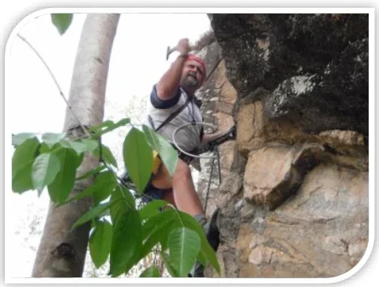 |
    | :--: |
    | *Tonico martelando a “Bruxa Albano” (Foto: Celso Ferreira Gomes)* |
- **nome**: Setor Vias Esportivas
- **caminho_imagem_capa**: 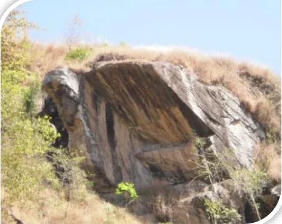
- **mapas**:
  - **[0]**:
    - **caminho_imagem_mapa**: 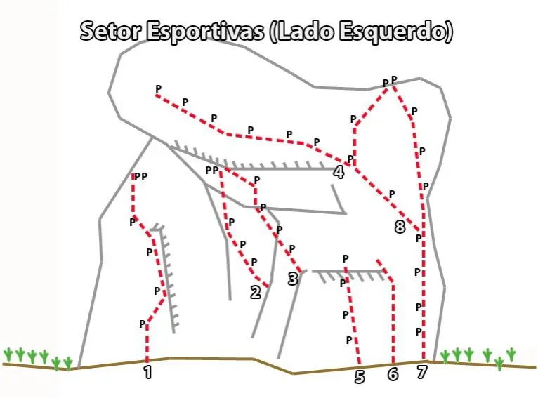
    - **referencias**:
      - **[0]**:
        - **escalada**: Diedro da Rabada
        - **ids**:
          - 1
      - **[1]**:
        - **escalada**: Mestre Sala
        - **ids**:
          - 2
      - **[2]**:
        - **escalada**: Porta-Bandeira
        - **ids**:
          - 3
      - **[3]**:
        - **escalada**: Gangorra
        - **ids**:
          - 7
          - 8
          - 4_f
          - 4
      - **[4]**:
        - **escalada**: Jabá com Jerimum
        - **ids**:
          - 5
      - **[5]**:
        - **escalada**: Bruxa Albano
        - **ids**:
          - 6
      - **[6]**:
        - **escalada**: Vomitão em Ferros
        - **ids**:
          - 7
          - 7_m
          - 7_f
      - **[7]**:
        - **escalada**: Iron Slow
        - **ids**:
          - 7_f
          - 7
          - 8
    - **largura_mapa**: 766
    - **altura_mapa**: 567
    - **pontos_de_interesse**:
      - **[0]**:
        - **id**: 1
        - **label**: 1
        - **circulo**:
          - **x**: 210
          - **y**: 531
          - **raio**: 14
      - **[1]**:
        - **id**: 2
        - **label**: 2
        - **circulo**:
          - **x**: 364
          - **y**: 416
          - **raio**: 14
      - **[2]**:
        - **id**: 3
        - **label**: 3
        - **circulo**:
          - **x**: 417
          - **y**: 397
          - **raio**: 14
      - **[3]**:
        - **id**: 4
        - **label**: 4
        - **circulo**:
          - **x**: 483
          - **y**: 245
          - **raio**: 14
      - **[4]**:
        - **id**: 5
        - **label**: 5
        - **circulo**:
          - **x**: 512
          - **y**: 537
          - **raio**: 14
      - **[5]**:
        - **id**: 6
        - **label**: 6
        - **circulo**:
          - **x**: 560
          - **y**: 533
          - **raio**: 14
      - **[6]**:
        - **id**: 7
        - **label**: 7
        - **circulo**:
          - **x**: 601
          - **y**: 530
          - **raio**: 14
      - **[7]**:
        - **id**: 8
        - **label**: 8
        - **circulo**:
          - **x**: 570
          - **y**: 323
          - **raio**: 14
      - **[8]**:
        - **id**: 4_f
        - **label**: 
        - **circulo**:
          - **x**: 225
          - **y**: 127
          - **raio**: 13
        - **cor**: 
      - **[9]**:
        - **id**: 7_m
        - **label**: 
        - **circulo**:
          - **x**: 607
          - **y**: 266
          - **raio**: 14
        - **cor**: 
      - **[10]**:
        - **id**: 7_f
        - **label**: 
        - **circulo**:
          - **x**: 557
          - **y**: 116
          - **raio**: 18
        - **cor**: 
  - **[1]**:
    - **caminho_imagem_mapa**: 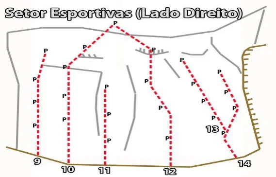
    - **referencias**:
      - **[0]**:
        - **escalada**: Bicho de Pé
        - **ids**:
          - 9
      - **[1]**:
        - **escalada**: Os Três Mosqueteiros
        - **ids**:
          - 10
          - 10_f
      - **[2]**:
        - **escalada**: Nó de Porco
        - **ids**:
          - 11
      - **[3]**:
        - **escalada**: Ícaro
        - **ids**:
          - 12
          - 10_f
      - **[4]**:
        - **escalada**: Champinha
        - **ids**:
          - 14
          - 13
          - 13_f
      - **[5]**:
        - **escalada**: Falcatrua
        - **ids**:
          - 14
          - 14_f
    - **largura_mapa**: 569
    - **altura_mapa**: 364
    - **pontos_de_interesse**:
      - **[0]**:
        - **id**: 9
        - **label**: 9
        - **circulo**:
          - **x**: 77
          - **y**: 332
          - **raio**: 14
      - **[1]**:
        - **id**: 10
        - **label**: 10
        - **circulo**:
          - **x**: 140
          - **y**: 348
          - **raio**: 17
      - **[2]**:
        - **id**: 11
        - **label**: 11
        - **circulo**:
          - **x**: 215
          - **y**: 350
          - **raio**: 17
      - **[3]**:
        - **id**: 12
        - **label**: 12
        - **circulo**:
          - **x**: 350
          - **y**: 351
          - **raio**: 17
      - **[4]**:
        - **id**: 13
        - **label**: 13
        - **circulo**:
          - **x**: 438
          - **y**: 265
          - **raio**: 17
      - **[5]**:
        - **id**: 14
        - **label**: 14
        - **circulo**:
          - **x**: 504
          - **y**: 336
          - **raio**: 17
      - **[6]**:
        - **id**: 13_f
        - **label**: 
        - **circulo**:
          - **x**: 376
          - **y**: 123
          - **raio**: 12
        - **cor**: 
      - **[7]**:
        - **id**: 10_f
        - **label**: 
        - **circulo**:
          - **x**: 238
          - **y**: 47
          - **raio**: 12
        - **cor**: 
      - **[8]**:
        - **id**: 14_f
        - **label**: 
        - **circulo**:
          - **x**: 453
          - **y**: 148
          - **raio**: 12
        - **cor**: 
- **escaladas**:
  - **[0]**:
    - **via_esportiva**:
      - **descricao**: Ótima via na extrema esquerda da falésia, toda protegida por grampos.
      - **nome**: Diedro da Rabada
      - **destaque**: True
      - **dificuldade**: BR_7A
      - **extensao**: 15
      - **conquistadores**:
        - Tonico Magalhães
        - Nádia Moreira
      - **data_abertura**: 2007-08-15
      - **quantidade_protecoes_intermediarias**: 4
      - **quantidade_protecoes_parada**: 2
  - **[1]**:
    - **via_esportiva**:
      - **descricao**: Via positiva exigente em regletes.
      - **nome**: Mestre Sala
      - **dificuldade**: BR_7C
      - **extensao**: 15
      - **conquistadores**:
        - Juliano Magalhães
        - Valdinei Lima
      - **data_abertura**: 2008-02-04
      - **quantidade_protecoes_intermediarias**: 5
      - **quantidade_protecoes_parada**: 2
  - **[2]**:
    - **via_esportiva**:
      - **descricao**: Bem parecida com via anterior. Termina na mesma parada dupla.
      - **nome**: Porta-Bandeira
      - **dificuldade**: BR_7B
      - **extensao**: 15
      - **conquistadores**:
        - Juliano Magalhães
        - Valdinei Lima
      - **data_abertura**: 2008-02-04
      - **quantidade_protecoes_intermediarias**: 4
      - **quantidade_protecoes_parada**: 2
  - **[3]**:
    - **via_esportiva**:
      - **descricao**: Via bastante difícil que acompanha o teto pela sua borda. Ela se inicia no meio da Via Iron Slow. Possui um grampo ainda não evitado.
      - **nome**: Gangorra
      - **dificuldade**: BR_8A
      - **dificuldade_artificial**: A0
      - **extensao**: 15
      - **conquistadores**:
        - Juliano Magalhães
        - Valdinei Lima
      - **data_abertura**: 2008-02-05
      - **quantidade_protecoes_intermediarias**: 7
      - **quantidade_protecoes_parada**: 2
  - **[4]**:
    - **via_esportiva**:
      - **descricao**: Via atlética cujo lance inicial é o mais difícil.
      - **nome**: Jabá com Jerimum
      - **destaque**: True
      - **dificuldade**: BR_6
      - **extensao**: 15
      - **conquistadores**:
        - Tonico Magalhães
        - Nádia Moreira
      - **data_abertura**: 2007-08-14
  - **[5]**:
    - **via_esportiva**:
      - **descricao**: Via atlética e levemente negativa. “Homenageia” a mentora intelectual do fechamento da Lapinha em 2002.
      - **nome**: Bruxa Albano
      - **destaque**: True
      - **dificuldade**: BR_6
      - **extensao**: 15
      - **conquistadores**:
        - Juliano Magalhães
        - Tonico Magalhães
        - Glesse Gripp
        - Celso Ferreira Gomes
      - **data_abertura**: 2010-10-02
  - **[6]**:
    - **via_esportiva**:
      - **descricao**: Via emblemática do setor das Esportivas e bem protegida com grampos.
      - **nome**: Vomitão em Ferros
      - **destaque**: True
      - **dificuldade**: BR_8A
      - **extensao**: 15
      - **conquistadores**:
        - Emerson Caverna
        - Fabiano Fernandes
      - **data_abertura**: 2007-03-17
  - **[7]**:
    - **via_esportiva**:
      - **descricao**: Variante mais fácil da Vomitão em Ferros.
      - **nome**: Iron Slow
      - **dificuldade**: BR_7C
      - **extensao**: 15
      - **conquistadores**:
        - Emerson Caverna
        - Fabiano Fernandes
      - **data_abertura**: 2007-03-17
  - **[8]**:
    - **via_esportiva**:
      - **descricao**: Via curta e bem grampeada.
      - **nome**: Bicho de Pé
      - **dificuldade**: BR_5
      - **extensao**: 15
      - **conquistadores**:
        - Juliano Magalhães
        - Valdinei Lima
      - **data_abertura**: 2008-02-05
  - **[9]**:
    - **via_esportiva**:
      - **descricao**: Bem parecida com via anterior.
      - **nome**: Os Três Mosqueteiros
      - **dificuldade**: BR_6
      - **extensao**: 15
      - **conquistadores**:
        - Juliano Magalhães
        - Valdinei Lima
      - **data_abertura**: 2008-02-05
  - **[10]**:
    - **via_esportiva**:
      - **descricao**: A via é muito bonita e segue uma aresta com agarras grandes.
      - **nome**: Nó de Porco
      - **dificuldade**: BR_5
      - **extensao**: 15
      - **conquistadores**:
        - Juliano Magalhães
        - Valdinei Lima
        - Tonico Magalhães
      - **data_abertura**: 2008-02-04
  - **[11]**:
    - **via_esportiva**:
      - **descricao**: O segundo lance é o crux e possui uma passada em uma agarra alta.
      - **nome**: Ícaro
      - **dificuldade**: BR_5
      - **extensao**: 15
      - **conquistadores**:
        - Juliano Magalhães
        - Tonico Magalhães
        - Valdinei Lima
      - **data_abertura**: 2008-02-05
  - **[12]**:
    - **via_esportiva**:
      - **descricao**: Ótima via em agarras grandes, que começa no primeiro grampo da via “Falcatrua”.
      - **nome**: Champinha
      - **dificuldade**: BR_6
      - **extensao**: 15
      - **conquistadores**:
        - Juliano Magalhães
        - Tonico Magalhães
        - Valdinei Lima
      - **data_abertura**: 2008-02-06
  - **[13]**:
    - **via_esportiva**:
      - **descricao**: Via atlética cujo crux é o último lance.
      - **nome**: Falcatrua
      - **dificuldade**: BR_7A
      - **extensao**: 15
      - **conquistadores**:
        - Juliano Magalhães
        - Valdinei Lima
      - **data_abertura**: 2008-02-06
- **precomputados**:
  - **total_escaladas**: 14
  - **total_esportivas**: 14

## Parte: setor_parede_dos_solos

### Setor (Pico: Ferros)

- **descricao**:
    Pequena parede apropriada à modalidade solo, que conta com quatro vias de 12 a 18 metros, graduadas de II a IIIsup. Possui um grampo de ½ polegada no topo da pedra para a escalada em *top-rope*, batido imediatamente após as conquistas de outubro de 2010.
    
    As vias são de tipo escalada clássica, apesar de curtas, combinando agarras e aderências, sendo a volta à base feita por caminhada. A aptidão ao solo deve-se ao fato dos lances mais difíceis estarem nas primeiras passadas, ainda em pequena altura. Existe um grampo para proteção dos lances iniciais, caso o escalador queira fazê-los com corda.
- **nome**: Parede dos Solos
- **mapas**:
  - **[0]**:
    - **caminho_imagem_mapa**: 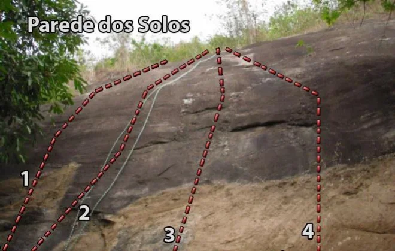
    - **largura_mapa**: 660
    - **altura_mapa**: 419
    - **pontos_de_interesse**:
      - **[0]**:
        - **id**: 01
        - **label**: 1
        - **circulo**:
          - **x**: 43
          - **y**: 297
          - **raio**: 21
      - **[1]**:
        - **id**: 02
        - **label**: 2
        - **circulo**:
          - **x**: 140
          - **y**: 355
          - **raio**: 21
      - **[2]**:
        - **id**: 03
        - **label**: 3
        - **circulo**:
          - **x**: 283
          - **y**: 391
          - **raio**: 21
      - **[3]**:
        - **id**: 04
        - **label**: 4
        - **circulo**:
          - **x**: 516
          - **y**: 386
          - **raio**: 21
    - **referencias**:
      - **[0]**:
        - **ids**:
          - 01
        - **escalada**: Caipora
      - **[1]**:
        - **escalada**: Iaci
        - **ids**:
          - 02
      - **[2]**:
        - **escalada**: Boitatá
        - **ids**:
          - 03
      - **[3]**:
        - **escalada**: Maracujá
        - **ids**:
          - 04
- **escaladas**:
  - **[0]**:
    - **via_esportiva**:
      - **nome**: Caipora
      - **dificuldade**: BR_2
      - **extensao**: 12
      - **conquistadores**:
        - Tonico Magalhães
        - Glesse Gripp
        - Celso Ferreira Gomes
      - **data_abertura**: 2011-12-10
  - **[1]**:
    - **via_esportiva**:
      - **nome**: Iaci
      - **dificuldade**: BR_2SUP
      - **extensao**: 18
      - **conquistadores**:
        - Glesse Gripp
        - Tonico Magalhães
        - Celso Ferreira Gomes
      - **data_abertura**: 2010-10-23
  - **[2]**:
    - **via_esportiva**:
      - **nome**: Boitatá
      - **dificuldade**: BR_3SUP
      - **extensao**: 18
      - **conquistadores**:
        - Tonico Magalhães
        - Glesse Gripp
        - Celso Ferreira Gomes
      - **data_abertura**: 2010-10-24
  - **[3]**:
    - **via_esportiva**:
      - **nome**: Maracujá
      - **dificuldade**: BR_3
      - **extensao**: 18
      - **conquistadores**:
        - Tonico Magalhães
        - Glesse Gripp
        - Celso Ferreira Gomes
      - **data_abertura**: 2010-10-24
- **precomputados**:
  - **total_escaladas**: 4
  - **total_esportivas**: 4

## Parte: grupo_pedra_do_neri

### Grupo (Pico: Ferros)

- **descricao**:
    Capa: Pedra do Neri - À esquerda, vias esportivas; à direita, vias em aderência. (Foto: Celso Ferreira Gomes)
    
    Enorme bloco rolado situado na propriedade do Sr. Neri, próxima do povoado quilombola denominado Mendonça, apresenta duas faces escaláveis, totalizando onze vias implantadas.
    
    Este bloco apresenta dois setores distintos: Esportivas (esquerda) e Aderências (direita).
    
    As seis vias do setor das Esportivas, todas com extensão de 15 metros, foram conquistadas no dia de Natal de 2010 por Juliano Magalhães e Tonico.
    
    A face das Aderências apresenta cinco vias com extensão de 10 a 12 metros e graduação bastante variável, de IIIsup a VIIc.
- **nome**: Pedra do Neri
- **caminho_imagem_capa**: 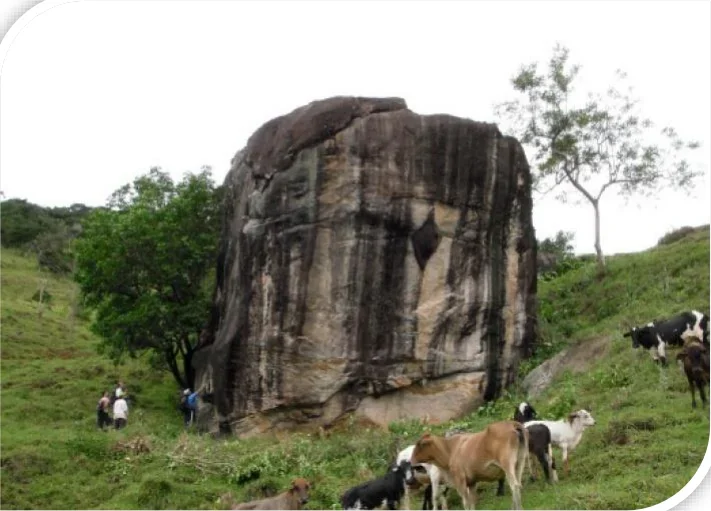
- **setores**:
  - **[0]**:
    - **conteudo**:
      - **descricao**: Capa: Juliano Magalhães escalando a Face das Esportivas, da Pedra do Neri (Foto: Celso Ferreira Gomes)
      - **nome**: Face das Esportivas
      - **mapas**:
        - **[0]**:
          - **caminho_imagem_mapa**: 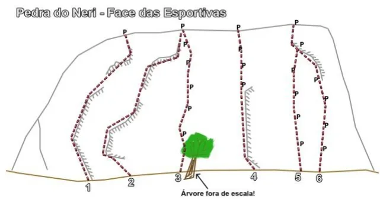
          - **largura_mapa**: 641
          - **altura_mapa**: 336
          - **referencias**:
            - **[0]**:
              - **escalada**: Fissura Lapada na Rachada
              - **ids**:
                - 1
            - **[1]**:
              - **escalada**: Fissura Sopa de Pedra
              - **ids**:
                - 2
            - **[2]**:
              - **escalada**: Até o Osso
              - **ids**:
                - 3
            - **[3]**:
              - **escalada**: Diedro Caboclo D'Água
              - **ids**:
                - 4
            - **[4]**:
              - **escalada**: Balangandã
              - **ids**:
                - 5
            - **[5]**:
              - **escalada**: Pé de Chinelo
              - **ids**:
                - 6
          - **pontos_de_interesse**:
            - **[0]**:
              - **id**: 1
              - **label**: 1
              - **circulo**:
                - **x**: 149
                - **y**: 316
                - **raio**: 11
            - **[1]**:
              - **id**: 2
              - **label**: 2
              - **circulo**:
                - **x**: 221
                - **y**: 308
                - **raio**: 11
            - **[2]**:
              - **id**: 3
              - **label**: 3
              - **circulo**:
                - **x**: 300
                - **y**: 299
                - **raio**: 11
            - **[3]**:
              - **id**: 4
              - **label**: 4
              - **circulo**:
                - **x**: 429
                - **y**: 297
                - **raio**: 11
            - **[4]**:
              - **id**: 5
              - **label**: 5
              - **circulo**:
                - **x**: 503
                - **y**: 298
                - **raio**: 11
            - **[5]**:
              - **id**: 6
              - **label**: 6
              - **circulo**:
                - **x**: 538
                - **y**: 301
                - **raio**: 11
      - **escaladas**:
        - **[0]**:
          - **via_movel**:
            - **descricao**: Via totalmente protegida em materiais móveis, com grampo no topo para rapel / top-rope.
            - **nome**: Fissura Lapada na Rachada
            - **dificuldade**: BR_5SUP
            - **extensao**: 15
            - **quantidade_protecoes_parada**: 1
            - **conquistadores**:
              - Juliano Magalhães
              - Tonico Magalhães
            - **data_abertura**: 2010-12-25
        - **[1]**:
          - **via_movel**:
            - **descricao**: Via totalmente protegida em materiais móveis, com grampo no topo para rapel / top-rope.
            - **nome**: Fissura Sopa de Pedra
            - **dificuldade**: BR_5SUP
            - **extensao**: 15
            - **quantidade_protecoes_parada**: 1
            - **conquistadores**:
              - Juliano Magalhães
              - Tonico Magalhães
            - **data_abertura**: 2010-12-25
        - **[2]**:
          - **via_esportiva**:
            - **descricao**: Via bem protegida em grampos, com grampo no topo para rapel / top-rope. Inicia-se pela árvore da base.
            - **nome**: Até o Osso
            - **dificuldade**: BR_8A
            - **extensao**: 15
            - **quantidade_protecoes_intermediarias**: 5
            - **quantidade_protecoes_parada**: 1
            - **conquistadores**:
              - Juliano Magalhães
              - Tonico Magalhães
            - **data_abertura**: 2010-12-25
        - **[3]**:
          - **via_movel**:
            - **descricao**: Via mista, iniciada em móvel no diedro, progredindo para os lances mais fortes, protegidos em grampos.
            - **nome**: Diedro Caboclo D'Água
            - **dificuldade**: BR_8A
            - **extensao**: 15
            - **quantidade_protecoes_intermediarias**: 3
            - **quantidade_protecoes_parada**: 1
            - **conquistadores**:
              - Juliano Magalhães
              - Tonico Magalhães
            - **data_abertura**: 2010-12-25
        - **[4]**:
          - **via_esportiva**:
            - **descricao**: Via totalmente protegida em grampos, com grampo no topo, para rapel / top-rope.
            - **nome**: Balangandã
            - **dificuldade**: BR_7C
            - **extensao**: 15
            - **quantidade_protecoes_intermediarias**: 5
            - **quantidade_protecoes_parada**: 1
            - **conquistadores**:
              - Juliano Magalhães
              - Tonico Magalhães
            - **data_abertura**: 2010-12-25
        - **[5]**:
          - **via_esportiva**:
            - **descricao**: Via totalmente protegida em grampos, com grampo no topo, para rapel / top-rope.
            - **nome**: Pé de Chinelo
            - **dificuldade**: BR_7A
            - **extensao**: 15
            - **quantidade_protecoes_intermediarias**: 5
            - **quantidade_protecoes_parada**: 1
            - **conquistadores**:
              - Juliano Magalhães
              - Tonico Magalhães
            - **data_abertura**: 2010-12-25
      - **caminho_imagem_capa**: 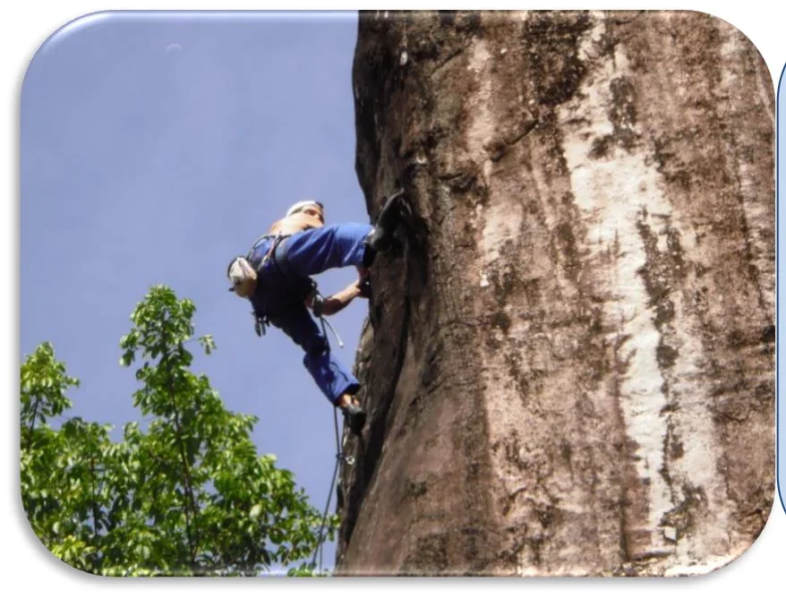
      - **precomputados**:
        - **total_escaladas**: 6
        - **total_esportivas**: 3
  - **[1]**:
    - **conteudo**:
      - **descricao**:
          Capa: Julinho Cardozo, Tonico e Glesse, na Face das Aderências, da Pedra do Neri (Foto: Celso Ferreira Gomes)
          
          | 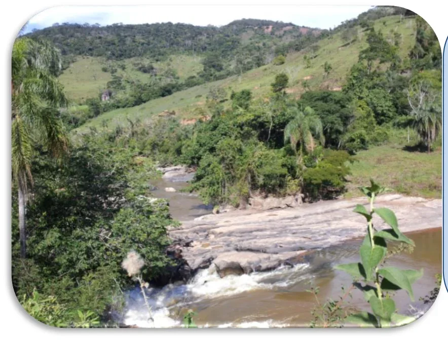 |
          | :--: |
          | *O entorno da Pedra do Neri. É possível vê-la (bem diminuta), no canto superior esquerdo da foto, junto à vegetação. (Foto: Pedro Bugim)* |
      - **nome**: Face das Aderências
      - **caminho_imagem_capa**: 
      - **mapas**:
        - **[0]**:
          - **caminho_imagem_mapa**: 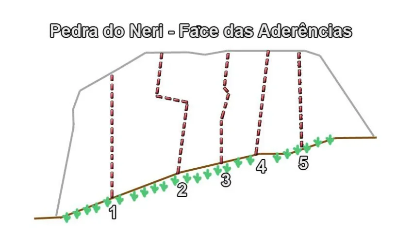
          - **largura_mapa**: 851
          - **altura_mapa**: 513
          - **referencias**:
            - **[0]**:
              - **escalada**: Queima de Arquivo
              - **ids**:
                - 1
            - **[1]**:
              - **escalada**: Aquidaban
              - **ids**:
                - 2
            - **[2]**:
              - **escalada**: Tempestade
              - **ids**:
                - 3
            - **[3]**:
              - **escalada**: Chuva de Verão
              - **ids**:
                - 4
            - **[4]**:
              - **escalada**: Brumas de Inverno
              - **ids**:
                - 5
          - **pontos_de_interesse**:
            - **[0]**:
              - **id**: 1
              - **label**: 1
              - **circulo**:
                - **x**: 234
                - **y**: 439
                - **raio**: 21
            - **[1]**:
              - **id**: 2
              - **label**: 2
              - **circulo**:
                - **x**: 375
                - **y**: 392
                - **raio**: 21
            - **[2]**:
              - **id**: 3
              - **label**: 3
              - **circulo**:
                - **x**: 465
                - **y**: 372
                - **raio**: 21
            - **[3]**:
              - **id**: 4
              - **label**: 4
              - **circulo**:
                - **x**: 540
                - **y**: 344
                - **raio**: 21
            - **[4]**:
              - **id**: 5
              - **label**: 5
              - **circulo**:
                - **x**: 625
                - **y**: 336
                - **raio**: 21
      - **escaladas**:
        - **[0]**:
          - **via_esportiva**:
            - **descricao**: Via esportiva utilizando-se a técnica de aderência e agarras.
            - **nome**: Queima de Arquivo
            - **dificuldade**: BR_7B
            - **extensao**: 12
            - **conquistadores**:
              - Juliano Magalhães
              - Tonico Magalhães
              - Júlio César Cardoso
              - Glesse Gripp
              - Celso Ferreira Gomes
            - **data_abertura**: 2011-05-14
        - **[1]**:
          - **via_esportiva**:
            - **descricao**: Via em aderência fácil, muito boa para treinar esta técnica.
            - **nome**: Aquidaban
            - **dificuldade**: BR_3SUP
            - **extensao**: 12
            - **conquistadores**:
              - Tonico Magalhães
              - Júlio César Cardoso
              - Glesse Gripp
              - Celso Ferreira Gomes
            - **data_abertura**: 2011-03-08
        - **[2]**:
          - **via_esportiva**:
            - **descricao**: Via em aderência muito difícil.
            - **nome**: Tempestade
            - **dificuldade**: BR_7C
            - **extensao**: 12
            - **conquistadores**:
              - Juliano Magalhães
              - Tonico Magalhães
              - Júlio César Cardoso
              - Glesse Gripp
              - Celso Ferreira Gomes
            - **data_abertura**: 2011-05-14
        - **[3]**:
          - **via_esportiva**:
            - **descricao**: Via em aderência moderada.
            - **nome**: Chuva de Verão
            - **dificuldade**: BR_4
            - **extensao**: 12
            - **conquistadores**:
              - Tonico Magalhães
              - Júlio César Cardoso
              - Glesse Gripp
              - Celso Ferreira Gomes
            - **data_abertura**: 2011-03-08
        - **[4]**:
          - **via_esportiva**:
            - **descricao**: Via em agarras bem protegida.
            - **nome**: Brumas de Inverno
            - **dificuldade**: BR_4
            - **extensao**: 10
            - **conquistadores**:
              - Tonico Magalhães
              - Celso Ferreira Gomes
            - **data_abertura**: 2011-09-03
      - **precomputados**:
        - **total_escaladas**: 5
        - **total_esportivas**: 5
- **precomputados**:
  - **total_escaladas**: 11
  - **total_esportivas**: 8

## Parte: setor_parede_da_cenibra

### Setor (Pico: Ferros)

- **descricao**: Também conhecida como fazenda Baião, esta área é propriedade da CENIBRA (Celulose Nipo-Brasileira) e só possui uma via de escalada.
- **nome**: Parede da CENIBRA
- **mapas**:
  - **[0]**:
    - **caminho_imagem_mapa**: 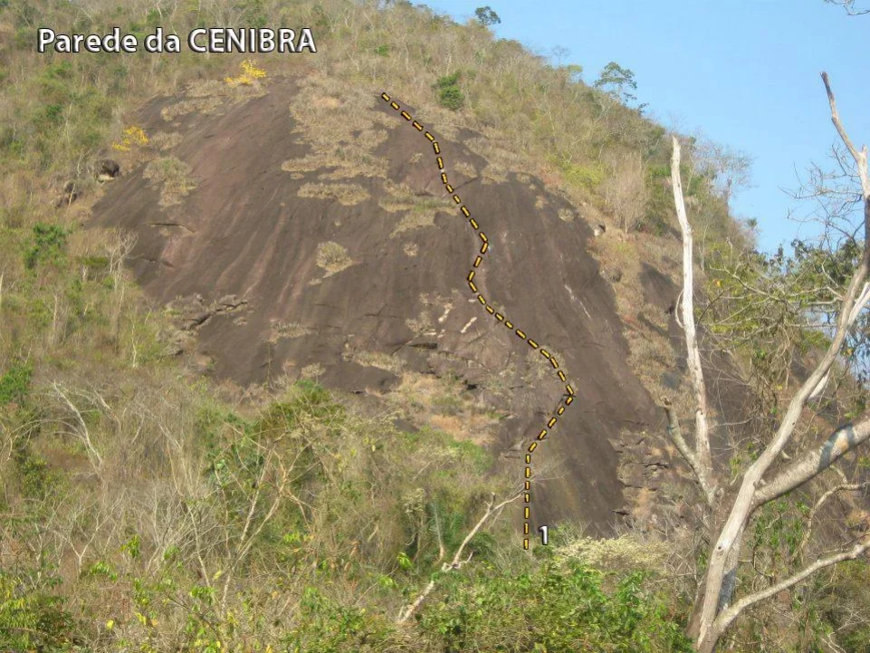
    - **referencias**:
      - **[0]**:
        - **escalada**: Pr. Pellé 70
        - **ids**:
          - 1
    - **largura_mapa**: 961
    - **altura_mapa**: 721
    - **pontos_de_interesse**:
      - **[0]**:
        - **id**: 1
        - **label**: 1
        - **circulo**:
          - **x**: 601
          - **y**: 591
          - **raio**: 17
- **escaladas**:
  - **[0]**:
    - **via_movel**:
      - **descricao**: Via que se inicia em um diedro em móvel e segue até o final em aderências protegidas por grampos. Situa-se em área isolada em relação aos outros conjuntos de vias. A conquista homenageou o veterano escalador Giuseppe Pellegrini, por ocasião de seu aniversário de 70 anos.
      - **nome**: Pr. Pellé 70
      - **dificuldade**: BR_3SUP
      - **extensao**: 100
      - **conquistadores**:
        - Gustavo "Xaxá" Carrozzino
        - Tonico Magalhães
      - **data_abertura**: 2008-09-15
- **precomputados**:
  - **total_escaladas**: 1

## Parte: setor_parede_da_agua_limpa

### Setor (Pico: Ferros)

- **descricao**:
    As paredes de Água Limpa ficam situadas no vale homônimo e distantes cerca de seis quilômetros do vale do Roncador (onde fica a maioria das escaladas do guia). Para se chegar até a Água Limpa deve-se ir para o encontro dos rios Santo Antonio e Tanque, conhecido ponto turístico de Ferros, encontro esse que pode ser atingido seguindo-se a estrada que acompanha o rio Tanque por cerca de cinco quilômetros abaixo da fazenda-sede. De lá uma rápida estradinha adentra ao mágico vale.
    
    O vale Água Limpa chamou atenção por possuir paredes gigantescas com comprimentos que podem atingir mais de 600 metros. A via Dama de Ferros é a primeira do local e possui mais de 400 metros. Um projeto, que visa aproveitar a máxima extensão da parede, já foi iniciado em meio a uma grande extensão de paredes intocadas.
- **nome**: Parede da Água Limpa
- **mapas**:
  - **[0]**:
    - **caminho_imagem_mapa**: 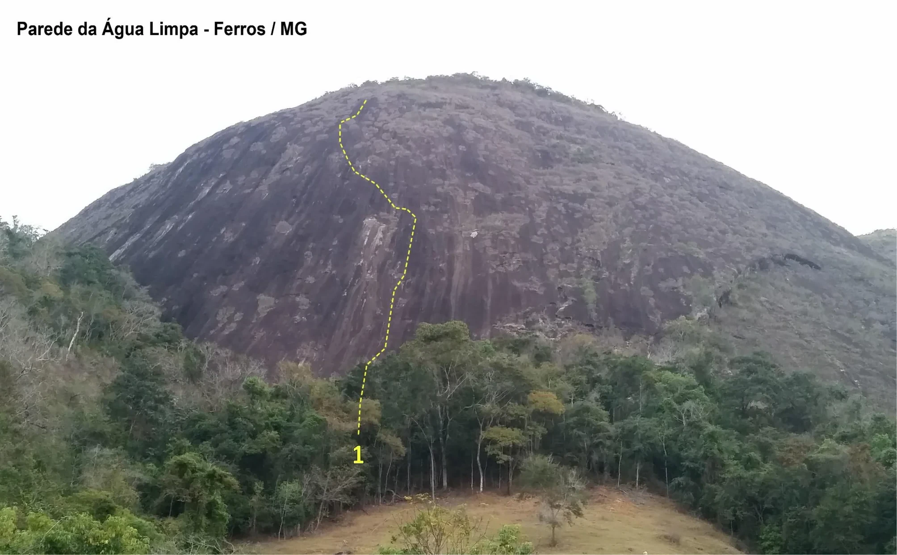
    - **referencias**:
      - **[0]**:
        - **escalada**: Dama de Ferros
        - **ids**:
          - 1
    - **largura_mapa**: 2008
    - **altura_mapa**: 1244
    - **pontos_de_interesse**:
      - **[0]**:
        - **id**: 1
        - **label**: 1
        - **circulo**:
          - **x**: 802
          - **y**: 1020
          - **raio**: 34
- **escaladas**:
  - **[0]**:
    - **via_multiplas_enfiadas**:
      - **descricao**:
          Atualmente, a única via da parede, e maior via da região de Ferros, contando com 405 metros de parede. Foi conquistada em três investidas com participantes distintos, demorando cerca de quatro anos para ser finalizada:
          por Luciano Bender, Gustavo "Xaxá" Carrozino, Celso Ferreira Gomes e Tonico Magalhães em 22/04/2011 (Base à P2);
          por Tiago "Fox" Bastos, Elton Soares, Rodrigo Tinoco e Alexandre Mesquita em 07/09/2012 (P2 à P3);
          por Pedro Bugim e Vivianne Sawczuk em 06/09/2015 (P3 à P8).
          Corta toda a parede frontal principal, seguindo uma linha bem natural e sem lances muito complicados. Predomina a aderência, e, em alguns lances, agarras abauladas. Proteção predominante em grampos de ½, possuindo algumas chapeletas na enfiada final. Nesta última enfiada, é possível rapelar de chapas com argola, colocadas a cada 25 metros. Rapel possível com corda de 60m, sendo recomendado a utilização de duas cordas de 60.
          
      - **nome**: Dama de Ferros
      - **dificuldade_media**: BR_4
      - **dificuldade_maxima**: BR_4SUP
      - **exposicao**: E2
      - **duracao**: D2
      - **comprimento_total**: 405
      - **numero_enfiadas**: 8
      - **tipo_via_multiplas_enfiadas**: TODA_FIXA
      - **conquistadores**:
        - Pedro Bugim
        - Vivianne Sawczuk
        - Tiago "Fox" Bastos
        - Elton Soares
        - Rodrigo Tinoco
        - Alexandre Mesquita
        - Luciano Bender
        - Gustavo "Xaxá" Carrozzino
        - Celso Ferreira Gomes
        - Tonico Magalhães
      - **data_abertura**: 2015-09-06
    - **mapas**:
      - **[0]**:
        - **caminho_imagem_mapa**: 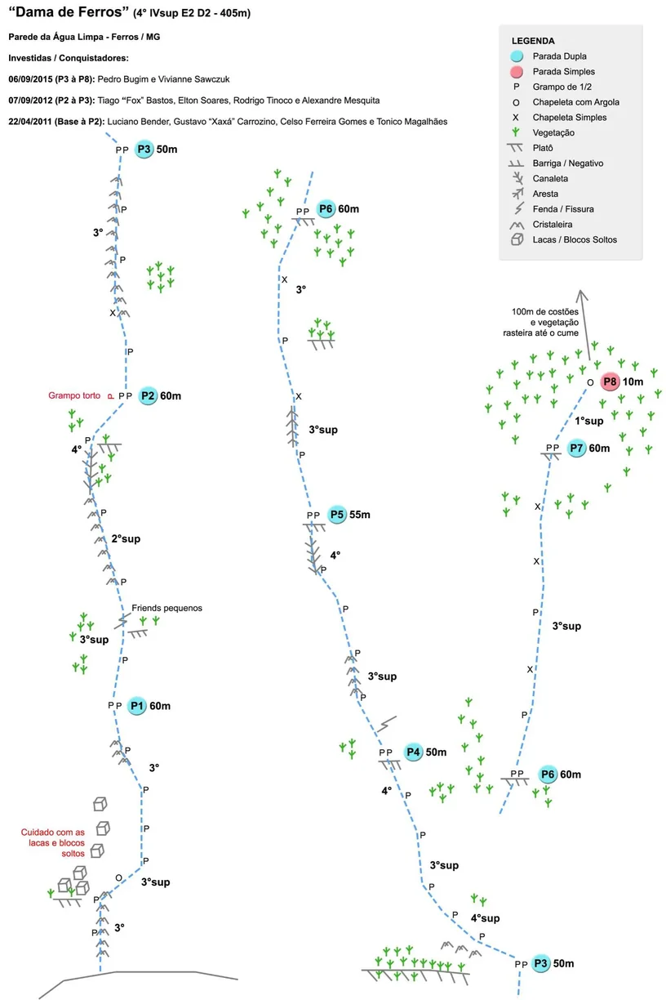
        - **largura_mapa**: 816
        - **altura_mapa**: 1224
- **precomputados**:
  - **total_escaladas**: 1
  - **total_multiplas_enfiadas**: 1

## Parte: setor_outras_vias

### Setor (Pico: Ferros)

- **descricao**: 
- **nome**: Outras Vias
- **escaladas**:
  - **[0]**:
    - **via_multiplas_enfiadas**:
      - **descricao**: Via localizada na última parede do Vale do Roncador, após a parede das Aderências - Extrema Direita. Possui apenas dois grampos de ½ polegada.
      - **nome**: Amazonita
      - **dificuldade_media**: BR_1
      - **dificuldade_maxima**: BR_2
      - **exposicao**: E4
      - **comprimento_total**: 200
      - **tipo_via_multiplas_enfiadas**: TODA_FIXA
      - **quantidade_costuras_intermediarias**: 2
      - **conquistadores**:
        - Tonico Magalhães
        - Vicente Alvarenga
      - **data_abertura**: 2013-07-19
  - **[1]**:
    - **via_movel**:
      - **descricao**: Próximo ao encontro dos Rios Tanque e Santo Antonio. Fica localizada à direita de uma pequena cachoeira que despenca da parede. Inicia-se em um lindo diedro em móvel, onde se encontra o crux, protegido por friends pequenos e médios. Segue em grampos pela extensão da fissura, ali mal definida. VI e 50 metros, 7 grampos de 1/2".
      - **nome**: Fissura Cachoeira Quente
      - **dificuldade**: BR_6
      - **extensao**: 50
      - **quantidade_protecoes_intermediarias**: 7
      - **protecoes_moveis**: Friends pequenos e médios
      - **conquistadores**:
        - Tonico Magalhães
        - Luciando Bender
      - **data_abertura**: 2013-07-21
- **mapas**:
  - **[0]**:
    - **caminho_imagem_mapa**: 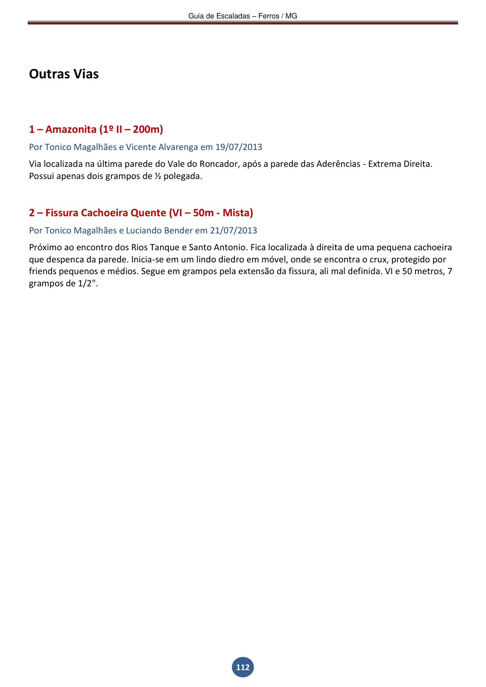
    - **largura_mapa**: 1241
    - **altura_mapa**: 1754
    - **referencias**:
      - **[0]**:
        - **escalada**: Amazonita
        - **ids**:
          - 1
      - **[1]**:
        - **escalada**: Fissura Cachoeira Quente
        - **ids**:
          - 2
    - **pontos_de_interesse**:
      - **[0]**:
        - **id**: 1
        - **label**: 1
        - **circulo**:
          - **x**: 83
          - **y**: 330
          - **raio**: 17
      - **[1]**:
        - **id**: 2
        - **label**: 2
        - **circulo**:
          - **x**: 82
          - **y**: 543
          - **raio**: 17
- **precomputados**:
  - **total_escaladas**: 2
  - **total_multiplas_enfiadas**: 1

## Arquivos Externos

- **arquivos_externos**:
  - **[0]**:
    - **caminho**: 
    - **checksum_sha256**: 1c6297193d343e6cd7069c5d3f74510e188a228f215d6b11c446c4438eebe22a
  - **[1]**:
    - **caminho**: 
    - **checksum_sha256**: e1ae406d741f5539c4064b4c4d149355ba357ea7d02fe4700a97bdb7e778c5bd
  - **[2]**:
    - **caminho**: 
    - **checksum_sha256**: 9c5138c747913e2847b64fa09df73d91202b08c6a49c70cd1d62674856dd47bc
  - **[3]**:
    - **caminho**: 
    - **checksum_sha256**: a418a970e2ee1961037ed17039020ea047652977181b4611b87f05a04560ebc9
  - **[4]**:
    - **caminho**: 
    - **checksum_sha256**: 1bbfacc291c4b054073efbef61f308966a01eb000a5e89c44ce3b8dd9f703790
  - **[5]**:
    - **caminho**: 
    - **checksum_sha256**: c9839c7c1afaf09c32fd2691a7a730fdcc4164ded30df14c1c932a2d6a23a729
  - **[6]**:
    - **caminho**: 
    - **checksum_sha256**: aaecd64f62234b970e1fd2b20c1a64868449b6df3fb2e01ec29891089a785747
  - **[7]**:
    - **caminho**: 
    - **checksum_sha256**: 1339352e8dacb2be28ad6549ef6d7a71c0c8e6c839b444fc6b6e4fb69f532c64
  - **[8]**:
    - **caminho**: 
    - **checksum_sha256**: 33e9112861cc08a12f21a3e03ac7af0dec6acdffb38a988c5992df25f02fcee6
  - **[9]**:
    - **caminho**: 
    - **checksum_sha256**: 330429e06532f98d5fdcb6a8a6fc4cc8ee5df8efa8069abbb3f4f3b68baf6ce1
  - **[10]**:
    - **caminho**: 
    - **checksum_sha256**: 35e05a19d8b05b641e9211c12cc0db30ca0441649dfe222a1b0470980f6b41d2
  - **[11]**:
    - **caminho**: 
    - **checksum_sha256**: b443bd71651a2938f69d0994922447a6611242b721f46032655b65d2bf52c581
  - **[12]**:
    - **caminho**: 
    - **checksum_sha256**: e4aa683ca2d17be3fc1534ae52c59984a1a4d9b7a5dc1d9b163e772adbebbb12
  - **[13]**:
    - **caminho**: 
    - **checksum_sha256**: efde88047967e2c667df5dc53600e53b3e4d27b536a8a7624beaafde2ed693ed
  - **[14]**:
    - **caminho**: 
    - **checksum_sha256**: da71782894d9d1deebfb9852fc220090256742efb76f2f45149bab260b676901
  - **[15]**:
    - **caminho**: 
    - **checksum_sha256**: f0f209e76a8a8b65b4ae3cd94835cfc35048aced85b0d3017696231ff45f59f6
  - **[16]**:
    - **caminho**: 
    - **checksum_sha256**: 0b3a385abaa62dfc588308be815d15ede1707d6929fb8c431dadbcd0eeff9f60
  - **[17]**:
    - **caminho**: 
    - **checksum_sha256**: cd738653b47c3aec6de908f4215a138df50307a44bd63fc63561ac1315cbdcd7
  - **[18]**:
    - **caminho**: 
    - **checksum_sha256**: 568ff93b50347500a9797b985152f6aa2d7c33821395e108f65e226b4d6127a9
  - **[19]**:
    - **caminho**: 
    - **checksum_sha256**: 2914d94cb12ce75897e56c3e80e2a8d69416c8e47dc63646020417ffc54ca2ec
  - **[20]**:
    - **caminho**: 
    - **checksum_sha256**: 81b6c2f7a0fe34a5a5a80be18b95d4fa391fdd5867d64c3641d3e4ecc215f910
  - **[21]**:
    - **caminho**: 
    - **checksum_sha256**: 2fdb83011dcabc3b2eec6d32a7f477c8425f9e18e94b97c13eb19a131771a85f
  - **[22]**:
    - **caminho**: 
    - **checksum_sha256**: e097d7c8626a31685cd4b834fdffd9a090162e90d67801d0e063cdfa80f57c89
  - **[23]**:
    - **caminho**: 
    - **checksum_sha256**: f681b9bcfb2fc39158ac2b0c0f4a136302c5c4b075c20362b6ba44716a68afd5
  - **[24]**:
    - **caminho**: 
    - **checksum_sha256**: ee373f76c0ebd7aea49314d13c3ac544181ab5ea3e54f2050951260e58ca08cf
  - **[25]**:
    - **caminho**: 
    - **checksum_sha256**: 81a4e2d01930a62b69ff18e067b4fb22280f62c01837e42c60daf4063eec1fb8
  - **[26]**:
    - **caminho**: 
    - **checksum_sha256**: 43d804122c9ffd96462b2da562fae6a48e3a5e631d83087638ad61dec0189697
  - **[27]**:
    - **caminho**: 
    - **checksum_sha256**: 90de53020b14f8a02f43549b86771c0756a59f9cb498f899bf310ac424318aef
  - **[28]**:
    - **caminho**: 
    - **checksum_sha256**: e91e32bac88f738d2032f10706fe0b989dc83453b45b05767db2cacf80d6209f
  - **[29]**:
    - **caminho**: 
    - **checksum_sha256**: 967e40e8608a61470bf7227110e89e471af1c6e751c648a5e4dda41a1af17f5a
  - **[30]**:
    - **caminho**: 
    - **checksum_sha256**: 4c547cb41ddc7bff6c3324266cb666b3aa4e8098fd67c36f8e71e59a025a4d56
  - **[31]**:
    - **caminho**: 
    - **checksum_sha256**: 93773bf50b7231f16330efb6a347ec9462613e2d3e73af9c84c81a0b25286518
  - **[32]**:
    - **caminho**: 
    - **checksum_sha256**: 84da74c308d3bcce74e68cb35734bcd76ed67224ee983905ac430d511ac1d162
  - **[33]**:
    - **caminho**: 
    - **checksum_sha256**: 835b37e0346675a4cb4d61ec63874ed4a0dbfa138a8c0fcbd1a3765d1e8a1c43
  - **[34]**:
    - **caminho**: 
    - **checksum_sha256**: 40f88e493c91f0f4bf934e7b3b650dc466e0958b42ef11b684cd8f8cc2598dfa
  - **[35]**:
    - **caminho**: 
    - **checksum_sha256**: 9b8bcfeb5857f30b130c17fc9edc75edd85017847525b42fb5503208b09a793f
  - **[36]**:
    - **caminho**: 
    - **checksum_sha256**: 46fc4efc09c978b390c614ae8795bae55f1568c6c586d76b8486bd1b3ba6e92e
  - **[37]**:
    - **caminho**: 
    - **checksum_sha256**: 6aea06bb7c7274312bd47868f529e073169c616f402eca310d4e62bfba88a1e4
  - **[38]**:
    - **caminho**: 
    - **checksum_sha256**: a7982ede8b977e476e4c03f2488855d510b313619101bacb0b7e3690b397e2bc
  - **[39]**:
    - **caminho**: 
    - **checksum_sha256**: 6602641c67aac6bcc67a225e1df9ae92de237db5c18194b4728d1d87e16b1af4
  - **[40]**:
    - **caminho**: 
    - **checksum_sha256**: 97bfbde9b4a3a8974b2182280c29345ae2240459a8c616a2c963414c275294e7
  - **[41]**:
    - **caminho**: 
    - **checksum_sha256**: 9e278460e210c8370c59fc78b54413824cd17ff2003321e50bbdefd0157e378c
  - **[42]**:
    - **caminho**: 
    - **checksum_sha256**: b0421cb538efff2e0edd37e131760bba0b2c63d148f5c32c9159e847fc84bbe9
  - **[43]**:
    - **caminho**: 
    - **checksum_sha256**: b9f457c78f212cac000373fd3e77d42a0fe2a1024aff076b5c635a205e859e6c
  - **[44]**:
    - **caminho**: 
    - **checksum_sha256**: 1dcce56eb0f62672c7c2ca09e7480525ba63868319dc90f8e11ef524ac5d3b2c
  - **[45]**:
    - **caminho**: 
    - **checksum_sha256**: e3ce4b8ad779d8fdc7455f35e39f25acd818fb27243702c6cff3a6152889f735
  - **[46]**:
    - **caminho**: 
    - **checksum_sha256**: c85d9b2ea09f8b2438842909ff59f0549bdf947af73c75d1e9b1ebac9dc8adba
  - **[47]**:
    - **caminho**: 
    - **checksum_sha256**: db29b6a0a446a5f1fc10ae1eee3364c1473573239e730505c22c9bef5d22894b
  - **[48]**:
    - **caminho**: 
    - **checksum_sha256**: da883682ff123df5ee032ef15aa8e1dae60bcbfe4b5bfc4f5de3aa0cd78c02d6
  - **[49]**:
    - **caminho**: 
    - **checksum_sha256**: 3ad3ba1aceff71fa82def9bc2c7ceaf1c7971ecff569e8df62c95de71cad2571
  - **[50]**:
    - **caminho**: 
    - **checksum_sha256**: e5371778e25404309f57290e87e2684a43ade400a1afa2b5e7dca06bf44ce632
  - **[51]**:
    - **caminho**: 
    - **checksum_sha256**: 445df9c43d5b95bc3149325c3c84469ec60573edc9a6b37f5411fba024d97bc2
  - **[52]**:
    - **caminho**: 
    - **checksum_sha256**: ce17c63c6abed1714e1da398f224b33bf4baa0d9548796ce7ed086f87f7b7f5f
  - **[53]**:
    - **caminho**: 
    - **checksum_sha256**: 049d0b6fe4135bb43f9e05943bc555046e3fe7fe959b7a8dd32a561b7bd4ec20
  - **[54]**:
    - **caminho**: 
    - **checksum_sha256**: 5ab48af0644ee16b795769a6224da24c8608759022a29a5795ffa094e7f0104c
  - **[55]**:
    - **caminho**: 
    - **checksum_sha256**: ceb20ee95652af3d01e582be353656d6b98dcbca0fd7652446fcfa57c0449457
  - **[56]**:
    - **caminho**: 
    - **checksum_sha256**: 7358acebeef208597e386cf40ca5176f923256be9d70e8d0198f0a2ba7a56132
  - **[57]**:
    - **caminho**: 
    - **checksum_sha256**: c9fba186599b6120623c5ba64c2df83052ec2c8752fa95ab713b8dc37fb0f666
  - **[58]**:
    - **caminho**: 
    - **checksum_sha256**: 455c12f949c862d23076648658fdde107fa30d9d6ec75deb86ad098b4806246f
  - **[59]**:
    - **caminho**: 
    - **checksum_sha256**: a2faec6eed508639f5529861ae032cb3516483fe7f0818118ccea3c38c3d33ce
  - **[60]**:
    - **caminho**: 
    - **checksum_sha256**: e85ad07a2912fe5402f61dbc8885be7d02858550e756a6ca49876749affc0d9b
  - **[61]**:
    - **caminho**: 
    - **checksum_sha256**: 12fe0c6fec47caf15d84e3591eeda011b76f81a478e641780aa4ad50a0497279
  - **[62]**:
    - **caminho**: 
    - **checksum_sha256**: dcf036d56343f0c7bd1baf487ffaf730ce9241a433ca28879374caf2d08a2a6d
  - **[63]**:
    - **caminho**: 
    - **checksum_sha256**: c2b2d1e2aa69bd0595cdfa0e4e4c50cd57fc87ef5c2584260a2a415b0a378ae0
  - **[64]**:
    - **caminho**: 
    - **checksum_sha256**: 5740c1a2e1b3a7a8d0dc8411326e1c5e06acbd68518d4964d21bb7859ee9de19
  - **[65]**:
    - **caminho**: 
    - **checksum_sha256**: b81c88f940b171b4c95438b6aea48a32b396429c8b2d9f72472178951ad57160
  - **[66]**:
    - **caminho**: 
    - **checksum_sha256**: 081214bf69de0e96abaa49df42573347a3afe20669c2338c926cc956bd499898
  - **[67]**:
    - **caminho**: 
    - **checksum_sha256**: 6ae89c80609429c6920a4eb2a6b26e058a9b012ce34ba2f2db913c23369e2420
  - **[68]**:
    - **caminho**: 
    - **checksum_sha256**: fb9cf316d57d5f5c038d704c8c8c23267b0bb61441cc3690ce070447027a3b2e
  - **[69]**:
    - **caminho**: 
    - **checksum_sha256**: deed859c5c52bf263a9a08fbcf858fe7913d8ff658c3870be675bd5c9922144c
  - **[70]**:
    - **caminho**: 
    - **checksum_sha256**: c18a5eb0bacd42b6b1a621dc71411ac79115471bb1cfffbb3c483994bf8fedd1
  - **[71]**:
    - **caminho**: 
    - **checksum_sha256**: 30e69a7c19bfb2357ce71499228ae339d0c4759140b8af25949b83fe225d3f37
  - **[72]**:
    - **caminho**: 
    - **checksum_sha256**: 6bcb864a2920807cc5cd0759d25720b0574da3fc2f51c6476e16f9c40faf8c19
  - **[73]**:
    - **caminho**: 
    - **checksum_sha256**: 1a1d9ce483f7bcb4b8c86d33106f3bf6de3f92b4220bce874044727b72d89bf9
  - **[74]**:
    - **caminho**: 
    - **checksum_sha256**: 753ef6e37e1c38c4c422a9e7b5a3a5cb7dd55b9dd3cdf9395843c33927704c18
  - **[75]**:
    - **caminho**: 
    - **checksum_sha256**: 17e77c2fe006268fc036b30c3cb0c72c79fd9dea6f60a9fd86be3c64bd9341ff
  - **[76]**:
    - **caminho**: 
    - **checksum_sha256**: 3241c9ca888dc3228151f1bf3472ee90faa13d7d273b4211c465f53f3d0b6fa4
  - **[77]**:
    - **caminho**: 
    - **checksum_sha256**: e7a90e4dbcabf184470f744d1e016c074b5dd75da4937c8b4b9f5ddf353a9aec
  - **[78]**:
    - **caminho**: 
    - **checksum_sha256**: f763a007b5a1ff2ddc64557ca69c6839e239aec936a7d54028117513845f516e
  - **[79]**:
    - **caminho**: 
    - **checksum_sha256**: 35ce1ca3616a30ca92655769c798bca819687c4ae4da4e5afc004ec2e3626d7a
  - **[80]**:
    - **caminho**: 
    - **checksum_sha256**: 0fa3e5e004604d11f5a7d80cbd1b1d79c1b1d55f6fbaa3d36727483b4d99051e
  - **[81]**:
    - **caminho**: 
    - **checksum_sha256**: 6f2febe0951a434008612c2466e3e3c560667f008fd6c9a1d41d1d7f524ddcb1
  - **[82]**:
    - **caminho**: 
    - **checksum_sha256**: 05f74560957d2c6827cceccebe3d6123f49db1f0db8bf1817413b63ae6143af2
  - **[83]**:
    - **caminho**: 
    - **checksum_sha256**: 6a839c023d64ea7236d1c8c7a73842bdffbef12ca389235ff06ff83f74094310
  - **[84]**:
    - **caminho**: 
    - **checksum_sha256**: d19a9ab57f6b761ab2d43a9f05a2ed10745314978b3742c323d1e9f4d01f741b
  - **[85]**:
    - **caminho**: 
    - **checksum_sha256**: b48c5f0376c9a04cc45062dc3428f9e08b7815f4e81470d5a139abe8355d80af
  - **[86]**:
    - **caminho**: 
    - **checksum_sha256**: 09b6ef6c2b3c96f3b0ef99ab8951c10621a7a6ac52036d0f98f1dfd2ac33fea4
  - **[87]**:
    - **caminho**: 
    - **checksum_sha256**: 130dfa12ca9e93dc90b1a93468ae6830e61d1b9afc0a779dd5e5cddaa8605064
  - **[88]**:
    - **caminho**: 
    - **checksum_sha256**: e63ddf49f60db8963c6825342c354d2c4c0e6492fa2ab79be5a2a77c667b2076
  - **[89]**:
    - **caminho**: 
    - **checksum_sha256**: cdce60b7ebc4895e82d416b4b20be1ea56baa58a4e1f610f5946eb1ca20ffa70
  - **[90]**:
    - **caminho**: 
    - **checksum_sha256**: abd6378ae8e97cb7d88a6b3949f21b27e9374638ba0119d45bdd88424395f4f1
  - **[91]**:
    - **caminho**: 
    - **checksum_sha256**: b8cc89113b2f5fed688927fb29a7008908c182efe592a35f3d2bc2e01263aa79
  - **[92]**:
    - **caminho**: 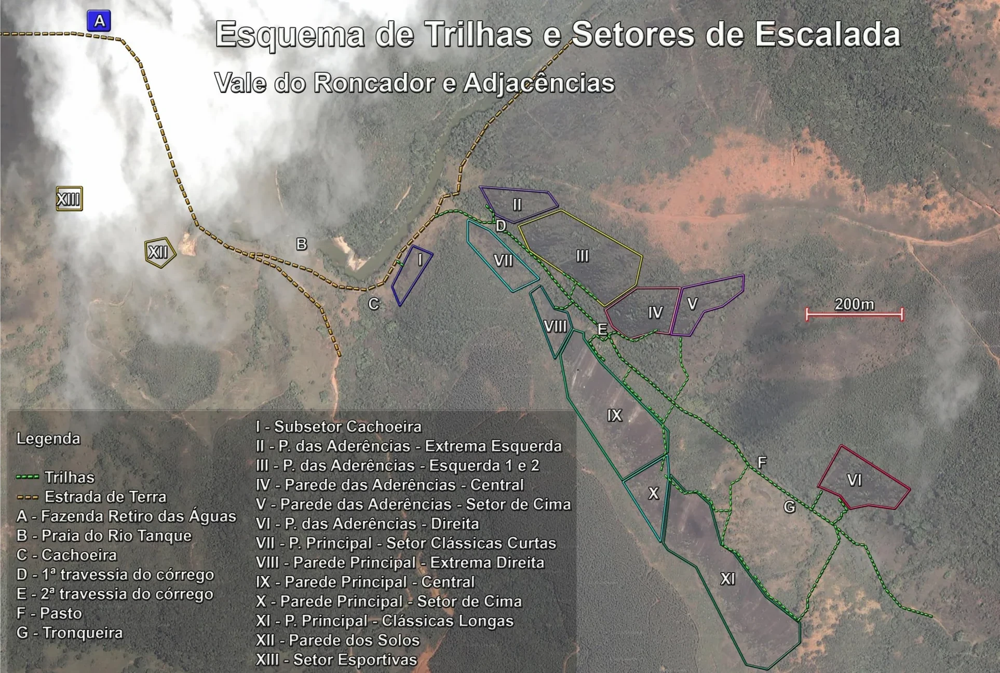
    - **checksum_sha256**: b60330f9bf8bda3b3a9431713871103642f8193c60f2b42cf15fa44e09e152dd
  - **[93]**:
    - **caminho**: 
    - **checksum_sha256**: 35b58e477b09798ed3b2758e63bea7c4ec5ae8a9f9bec39c289f790b5a4c0f7a
  - **[94]**:
    - **caminho**: 
    - **checksum_sha256**: 54a2c494e7f090e73207674c27526c62010673f4bd519acca441d33cbc8498d3
  - **[95]**:
    - **caminho**: 
    - **checksum_sha256**: 992c5c57362798a3bd3118bcac0569549219ebadb2aeac6fb15d1f41bf89ac68
  - **[96]**:
    - **caminho**: 
    - **checksum_sha256**: 3e7b903094250c103d246a7c21bd09d1269ed209d57b33691c6a98388597967c
  - **[97]**:
    - **caminho**: 
    - **checksum_sha256**: 00a22aaa4dcc2c4be23b3ba748df41ef4ae00eb20a3bcddd02af7cd467e55067
  - **[98]**:
    - **caminho**: 
    - **checksum_sha256**: cb5a36c736d6d6eb7e6e6cab13c58e10bcd86c833e715a628af23088d3ae968a
  - **[99]**:
    - **caminho**: 
    - **checksum_sha256**: 9d25d6e4f377d58a02e452ae43a36bbef089cf5ac39e1cf803386c9eb6f57e2d
  - **[100]**:
    - **caminho**: 
    - **checksum_sha256**: de2ad03f00270657d7c2df65b673311322b26a7fe5a71006db014d9c5057cc5d
  - **[101]**:
    - **caminho**: 
    - **checksum_sha256**: 1ada3a40ead64c984f268ef8b3a61521d684d5f07cc21dc6b18ed4519bb0705c
  - **[102]**:
    - **caminho**: 
    - **checksum_sha256**: f9db7915427d348aadd98adb19132429b387f4dfa96cf2a63c585cf6b8e1f0ba
  - **[103]**:
    - **caminho**: 
    - **checksum_sha256**: dca9013fee7faa4965f5b7fa0912767a837fddfb7ebbca616bfc1bb4c05181d4
  - **[104]**:
    - **caminho**: 
    - **checksum_sha256**: 1dcc0f13685bb67d983b00c78e54449cedfe5e47587c90196e9d7cc86dec6856
  - **[105]**:
    - **caminho**: 
    - **checksum_sha256**: f01d0e235df67459dcb722989e9bd9d1b0082b6a72ae0b67d0900638c8eadbf5
  - **[106]**:
    - **caminho**: 
    - **checksum_sha256**: f766ed8599b01fd66a48273b4a7329ce3cb0127da44e5fb99eec5063bfd49918
  - **[107]**:
    - **caminho**: 
    - **checksum_sha256**: c173971e660ffca269cce97f9c7199d9aaf829f2084b60b7346d5626a656cdfd
  - **[108]**:
    - **caminho**: 
    - **checksum_sha256**: 02292a808ae6ee555e8aa6ee0379f73f66b57e6a5e1a2c135828c723ac784ce1
  - **[109]**:
    - **caminho**: 
    - **checksum_sha256**: 1c76570fd31ae3ea325b8a3c84fc045dcf325ffe0f38df4a95c57e2a8ae939eb

