# Croqui: Igarameca - Complexo Pedra Grande

## Informações Gerais

- **descricao**: Este croqui documenta e divulga a prática da escalada no Complexo da Pedra Grande em Igarapé/MG, reunindo informações sobre diversos setores e vias.
- **id**: br_mg_igarape_pedra_grande
- **nome**: Igarameca - Complexo Pedra Grande
- **creditos**:
  - Equipe Igarameca
  - Alexsandro
- **caminho_thumbnail**: 
- **revisado_manualmente**: True
- **status_desenho_extraivel**: NAO_TEM_DESENHO
- **botoes**:
  - **[0]**:
    - **texto**: Capa
    - **destino**:
      - **secao_textual**:
        - **conteudo**:
            # Igarameca Climb
            
            |  |
            | :--: |
            | *Capa do Croqui 2024 - Escaladas Esportivas - Pedra Grande* |
            
            **CROQUI 2024 - ESCALADAS ESPORTIVA - PEDRA GRANDE**
            
            Alexsandro
  - **[1]**:
    - **texto**: Introdução
    - **destino**:
      - **secao_textual**:
        - **conteudo**:
            # Introdução
            
            Este croqui é apenas um auxílio de consulta a localização, não serve como instruções a prática da escalada.
            Não nos responsabilizamos pelas informações aqui contidas, são apenas ponto de vista.
            
            ## ATENÇÃO
            
            Os nomes das vias, seus respectivos conquistadores e a graduação sugerida para cada uma delas são resultados de uma pesquisa oral conduzida entre os escaladores que frequentam o pico, e com base em registros fragmentados sobre o tema.
            
            O resultado desse trabalho pode eventualmente conter erros, os quais peço que não sejam entendidos como desrespeito.
            
            O objetivo é documentar e divulgar a prática da escalada no centro-oeste mineiro da maneira mais exata possível.
            
            ## OBSERVAÇÕES
            
            Como algumas vias são de conquistadores(as) desconhecidos(as) foi utilizado apelido + (*) para identificá-las.
            
            Caso encontre algum engano nos dados citados neste croqui, peço que me envie a correção.
            
            Terei satisfação em atendê-lo, pois todos os envolvidos com a escalada tem a ganhar com o aprimoramento desse trabalho.
            
            [@igarameca](https://www.instagram.com/igarameca)
            
            Muito obrigado aos conquistadores e conquistadoras das linhas (rotas) de escalada, **GRATIDÃO** a vocês sempre!!!
            
            Obrigado a todas as pessoas que contribuíram para o desenvolvimento desse excepcional parque natural de escaladas.
            
            Obrigado em especial ao **Bruno Berbari** e **Warleson Campos (Bunitin)** na captação e catalogação das vias.
            
            > Organização, Revisão e Graduação sugerida das vias: **Equipe Igarameca**
            > arte/desenhos/produção: **alexsandro**
            > 1ª versão - Junho/2024 (vias esportivas) 24 páginas
  - **[2]**:
    - **texto**: Recomendações e Regras
    - **destino**:
      - **secao_textual**:
        - **conteudo**:
            # SEJA CONSCIENTE!
            
            - **UTILIZE APENAS AS TRILHAS PRINCIPAIS;**
            - **As grutas não são banheiros!** Faça suas necessidades fisiológicas em casa, caso não consiga segurar, faça longe das pedras e cubra com folhas ou terra;
            - **Leve todo seu lixo de volta** e o lixo de outros visitantes descuidados (inclusive papel higiênico, garrafas plásticas, bitucas, pontas, papel de bala...);
            - Os animais locais e plantas nativas devem permanecer em seus lugares. Lembre-se que eles estão em seu habitat natural e precisam ser respeitados;
            - Os animais domésticos (ex. cães) não devem ser trazidos a este local, desta forma, você os protege de doenças silvestres e vice-versa;
            - Fogueiras além de provocar queimadas, danificam o local;
            - Estacione de maneira adequada e no local adequado a fim de não atrapalhar o fluxo de outros veículos e/ou caminhões;
            - Utilize equipamentos de segurança e verifique seu estado de conservação;
            - Cuidado com pedras soltas principalmente em setores e vias novas;
            - Antes de conquistar uma via de escalada entre em contato com a Equipe Igarameca.
            
            [@igarameca](https://www.instagram.com/igarameca)
  - **[3]**:
    - **texto**: História de Igarapé
    - **destino**:
      - **secao_textual**:
        - **conteudo**:
            # História de Igarapé - MG
            
            Igarapé localiza-se na Região Metropolitana de Belo Horizonte, é um município brasileiro do estado de Minas Gerais. Seu nome que vem do tupi-guarani, e significa "caminho da canoa", enquanto cidade teve suas bases iniciais de ocupação do território no "garimpo de ouro" no distrito de São Joaquim de Bicas e posteriormente na agropecuária. Certamente centenas de anos antes, por aqui já existiam fazendas e diversas famílias com residências fixas.
            
            Com base em documentos podemos afirmar que por volta de 1830, já existia muita gente vivendo no próprio local que seria mais tarde o Barreiro (nesta época, o Barreiro nem era propriamente um povoado, era um simples aglomerado de pequenas e velhas fazendas mais ou menos perto umas das outras) e, posteriormente, denominada cidade de Igarapé.
            
            Portanto, a ideia de que a origem da cidade remonta a estas antigas fazendas existentes, não pode ser tomada como o marco da fundação de Igarapé, afinal, em tempos mais longínquos viviam os povos indígenas, verdadeiros habitantes originários da região, bem como de todo o continente.
            
            |  |
            | :--: |
            | *Vista de Igarapé* |
            
            [@igarameca](https://www.instagram.com/igarameca)
  - **[4]**:
    - **texto**: Sobre o Complexo Pedra Grande
    - **destino**:
      - **secao_textual**:
        - **conteudo**:
            # COMPLEXO PEDRA GRANDE
            
            A Pedra Grande, um marco histórico e geográfico de Igarapé, tem sido uma referência importante para viajantes ao longo dos anos. No século XX, a mineração de ferro ameaçou a integridade da Serra do Itatiaiuçu, o que levou à criação da Área de Proteção Especial (APE) e, posteriormente, da Área de Proteção Ambiental (APA) Municipal de Igarapé, visando preservar os mananciais de abastecimento humano.
            
            A Pedra Grande possui características escultóricas naturais que atraem visitantes, oferece belezas naturais, como matas e fontes d'água, que aumentam o turismo e promovem atividades de aventura na região. No entanto, a visitação descontrolada tem causado depredação e poluição. Esta atitude é repudiada por escaladores que frequentam o local e se empenham em recolher seus próprios lixos e os de visitantes descuidados.
            
            O município de Igarapé decretou o tombamento sob proteção Municipal do bem cultural denominado "Conjunto Natural e Paisagístico da Pedra Grande" que também é cartograficamente importante, situada na Serra do Itatiaiuçu, compondo a zona limítrofe entre Igarapé, Itatiaiuçu e Mateus Leme. A área tem significância econômica devido às jazidas de ferro e manganês, sendo notável por sua beleza cênica e valor didático.
            
            O bem natural tem importância regional estratégica por ser berço de nascentes responsáveis pela recarga hídrica de um dos aquíferos que abastecem a região metropolitana de Belo Horizonte. A área faz parte do Quadrilátero Ferrífero, uma província geológica conhecida por seus depósitos e minas de ferro, manganês, ouro, calcário e bauxita, recursos naturais amplamente explorados pelas mineradoras que se instalaram na região.
            
            [@igarameca](https://www.instagram.com/igarameca)
  - **[5]**:
    - **texto**: Sobre o Igarameca
    - **destino**:
      - **secao_textual**:
        - **conteudo**:
            # IGARAMECA
            
            Não se sabe ao certo quando começou a escada na região, estudos em andamento apontam entre as décadas de 80/90. Há três anos, um grupo de escaladores de Belo Horizonte se reuniu com a ideia de transformar o Complexo da Pedra Grande em um dos principais picos de escalada da região. Foi assim que nasceu o @igarameca, numa prosa após um dia de muito climbing no pé da pedra.
            
            Esse sonho tem se tornado realidade dia após dia, com muito trabalho, dedicação e claro, muita escalada boa. Atualmente o complexo possui mais de 150 vias esportivas e 500 boulders, além de rotas tradicionais e móveis, todas esculpidas na rocha única de Itabirito.
            
            Os croquis são os "mapas" que guiam os praticantes da escalada no local, sendo um facilitador para a pratica do esporte e acreditamos resultar em um ganho a todos. E para que cada vez mais escaladores possam usufruir e desbravar o potencial do local, inicialmente estamos lançando este **CROQUI DOS SETORES E VIAS DE ESCALADAS ESPORTIVA** catalogadas no complexo da Pedra Grande em Igarapé/MG, atualizações serão adicionadas no decorrer do projeto... "e as vias trad, móvel e os boulders!?". C A L M A turma, anos e anos de desenvolvimento, muita informação a receber e em breve teremos um livro gigante repleto de informações e detalhes!!! Vamoooo!!!
            
            |  |
            | :--: |
            | *Anotações e croquis iniciais* |
            
            [@igarameca](https://www.instagram.com/igarameca)
  - **[6]**:
    - **texto**: Patrocinadores
    - **destino**:
      - **secao_textual**:
        - **conteudo**:
            # Patrocinadores
            
            Essas marcas apoiam a escalada na região e o croqui de Igarameca 2024:
            
            |  |
            | :--: |
            | *Marcas que apoiam a escalada na região* |
            
            - JGariglio
            - Grupo Abaco
            - Cíclica
            - Dinamic Boulder
            - Grimpi Aventura
            - Bolinha Plotagens
            - Valverde Consultoria Online
            - La Plata
            - Aprender
            - Cajumel Terapias
            - Abrigo Base
            - Heringer Fitness
            - Mandala Climb
            - AET (Associação de Escalada Tradicional MG)
            - Cadena Ouro Preto
            - Igarameca Climb
            
            [@igarameca](https://www.instagram.com/igarameca)
- **ultima_migracao**: 4
- **publicar_croqui**: True
- **revisado_bounding_circle**: True

## Parte: setor_estacionamento

### Setor (Pico: Complexo Pedra Grande)

- **descricao**:
    # Setor Estacionamento
    
    O setor fica na lateral da estrada, ao lado do estacionamento da trilha para a Pedra Grande. A via "Route Setter" e a via "Teto Preto" compartilham as primeiras chapas na saída. Lado esquerdo setor tem sombra após 11h, e o lado direito sombra até 10h.
- **nome**: Setor Estacionamento
- **mapas**:
  - **[0]**:
    - **caminho_imagem_mapa**: 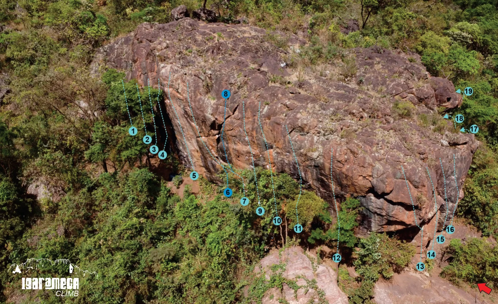
    - **largura_mapa**: 1995
    - **altura_mapa**: 1222
    - **pontos_de_interesse**:
      - **[0]**:
        - **id**: 01
        - **label**: 01
        - **circulo**:
          - **x**: 533
          - **y**: 527
          - **raio**: 17
      - **[1]**:
        - **id**: 02
        - **label**: 02
        - **circulo**:
          - **x**: 590
          - **y**: 561
          - **raio**: 17
      - **[2]**:
        - **id**: 03
        - **label**: 03
        - **circulo**:
          - **x**: 617
          - **y**: 601
          - **raio**: 17
      - **[3]**:
        - **id**: 04
        - **label**: 04
        - **circulo**:
          - **x**: 651
          - **y**: 623
          - **raio**: 17
      - **[4]**:
        - **id**: 05
        - **label**: 05
        - **circulo**:
          - **x**: 778
          - **y**: 706
          - **raio**: 17
      - **[5]**:
        - **id**: 08
        - **label**: 08
        - **circulo**:
          - **x**: 905
          - **y**: 377
          - **raio**: 18
      - **[6]**:
        - **id**: 06
        - **label**: 06
        - **circulo**:
          - **x**: 913
          - **y**: 774
          - **raio**: 18
      - **[7]**:
        - **id**: 07
        - **label**: 07
        - **circulo**:
          - **x**: 980
          - **y**: 809
          - **raio**: 17
      - **[8]**:
        - **id**: 09
        - **label**: 09
        - **circulo**:
          - **x**: 1043
          - **y**: 849
          - **raio**: 17
      - **[9]**:
        - **id**: 10
        - **label**: 10
        - **circulo**:
          - **x**: 1111
          - **y**: 888
          - **raio**: 17
      - **[10]**:
        - **id**: 11
        - **label**: 11
        - **circulo**:
          - **x**: 1195
          - **y**: 918
          - **raio**: 17
      - **[11]**:
        - **id**: 12
        - **label**: 12
        - **circulo**:
          - **x**: 1349
          - **y**: 1037
          - **raio**: 17
      - **[12]**:
        - **id**: 13
        - **label**: 13
        - **circulo**:
          - **x**: 1684
          - **y**: 1071
          - **raio**: 17
      - **[13]**:
        - **id**: 14
        - **label**: 14
        - **circulo**:
          - **x**: 1729
          - **y**: 1024
          - **raio**: 17
      - **[14]**:
        - **id**: 15
        - **label**: 15
        - **circulo**:
          - **x**: 1765
          - **y**: 963
          - **raio**: 17
      - **[15]**:
        - **id**: 16
        - **label**: 16
        - **circulo**:
          - **x**: 1804
          - **y**: 923
          - **raio**: 17
      - **[16]**:
        - **id**: 18
        - **label**: 18
        - **circulo**:
          - **x**: 1840
          - **y**: 476
          - **raio**: 17
      - **[17]**:
        - **id**: 19
        - **label**: 19
        - **circulo**:
          - **x**: 1877
          - **y**: 367
          - **raio**: 17
      - **[18]**:
        - **id**: 17
        - **label**: 17
        - **circulo**:
          - **x**: 1901
          - **y**: 519
          - **raio**: 17
    - **referencias**:
      - **[0]**:
        - **escalada**: Bacon com Linguiça
        - **ids**:
          - 01
      - **[1]**:
        - **escalada**: Quatchú
        - **ids**:
          - 02
      - **[2]**:
        - **escalada**: Xoquito
        - **ids**:
          - 03
      - **[3]**:
        - **escalada**: Slow Motion
        - **ids**:
          - 04
      - **[4]**:
        - **escalada**: Berbaridade Máxima
        - **ids**:
          - 05
      - **[5]**:
        - **escalada**: Cirque du Soleil
        - **ids**:
          - 06
      - **[6]**:
        - **escalada**: Route Setter
        - **ids**:
          - 07
      - **[7]**:
        - **escalada**: Fúria de Titãs
        - **ids**:
          - 10
      - **[8]**:
        - **escalada**: Prima Donna
        - **ids**:
          - 11
      - **[9]**:
        - **escalada**: Dama de Ferro
        - **ids**:
          - 12
      - **[10]**:
        - **escalada**: Primeira de Todas
        - **ids**:
          - 13
      - **[11]**:
        - **escalada**: Brinco de Odalisca
        - **ids**:
          - 14
      - **[12]**:
        - **escalada**: 10%
        - **ids**:
          - 15
      - **[13]**:
        - **escalada**: Quebra Tudo
        - **ids**:
          - 16
      - **[14]**:
        - **escalada**: Acorrentado
        - **ids**:
          - 17
      - **[15]**:
        - **escalada**: Fidefenda
        - **ids**:
          - 18
      - **[16]**:
        - **escalada**: Cochyna Blue
        - **ids**:
          - 19
      - **[17]**:
        - **ids**:
          - 08
        - **setor**: Setor Estacionamento
        - **escalada**: Teto Preto
      - **[18]**:
        - **ids**:
          - 09
        - **setor**: Setor Estacionamento
        - **escalada**: 101 Dalmatas
  - **[1]**:
    - **caminho_imagem_mapa**: 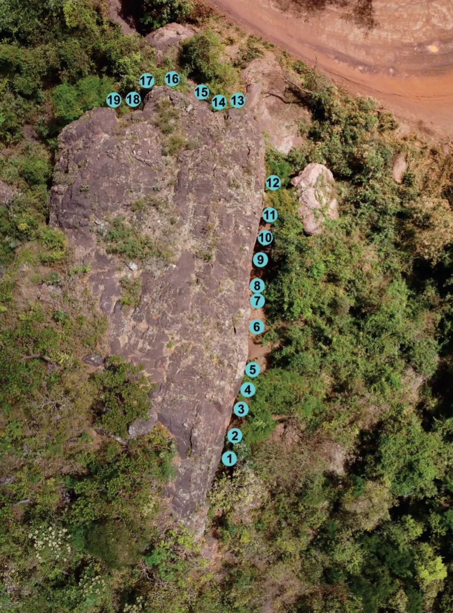
    - **largura_mapa**: 1067
    - **altura_mapa**: 1440
    - **pontos_de_interesse**:
      - **[0]**:
        - **id**: 17
        - **label**: 17
        - **circulo**:
          - **x**: 346
          - **y**: 189
          - **raio**: 17
      - **[1]**:
        - **id**: 16
        - **label**: 16
        - **circulo**:
          - **x**: 406
          - **y**: 185
          - **raio**: 18
      - **[2]**:
        - **id**: 15
        - **label**: 15
        - **circulo**:
          - **x**: 475
          - **y**: 216
          - **raio**: 18
      - **[3]**:
        - **id**: 19
        - **label**: 19
        - **circulo**:
          - **x**: 269
          - **y**: 235
          - **raio**: 17
      - **[4]**:
        - **id**: 18
        - **label**: 18
        - **circulo**:
          - **x**: 314
          - **y**: 233
          - **raio**: 17
      - **[5]**:
        - **id**: 14
        - **label**: 14
        - **circulo**:
          - **x**: 516
          - **y**: 240
          - **raio**: 17
      - **[6]**:
        - **id**: 13
        - **label**: 13
        - **circulo**:
          - **x**: 560
          - **y**: 236
          - **raio**: 18
      - **[7]**:
        - **id**: 12
        - **label**: 12
        - **circulo**:
          - **x**: 644
          - **y**: 429
          - **raio**: 17
      - **[8]**:
        - **id**: 11
        - **label**: 11
        - **circulo**:
          - **x**: 636
          - **y**: 505
          - **raio**: 17
      - **[9]**:
        - **id**: 10
        - **label**: 10
        - **circulo**:
          - **x**: 625
          - **y**: 558
          - **raio**: 17
      - **[10]**:
        - **id**: 09
        - **label**: 09
        - **circulo**:
          - **x**: 614
          - **y**: 610
          - **raio**: 17
      - **[11]**:
        - **id**: 08
        - **label**: 08
        - **circulo**:
          - **x**: 606
          - **y**: 671
          - **raio**: 17
      - **[12]**:
        - **id**: 07
        - **label**: 07
        - **circulo**:
          - **x**: 606
          - **y**: 707
          - **raio**: 17
      - **[13]**:
        - **id**: 06
        - **label**: 06
        - **circulo**:
          - **x**: 604
          - **y**: 768
          - **raio**: 17
      - **[14]**:
        - **id**: 05
        - **label**: 05
        - **circulo**:
          - **x**: 595
          - **y**: 868
          - **raio**: 17
      - **[15]**:
        - **id**: 04
        - **label**: 04
        - **circulo**:
          - **x**: 584
          - **y**: 915
          - **raio**: 17
      - **[16]**:
        - **id**: 03
        - **label**: 03
        - **circulo**:
          - **x**: 569
          - **y**: 961
          - **raio**: 17
      - **[17]**:
        - **id**: 02
        - **label**: 02
        - **circulo**:
          - **x**: 553
          - **y**: 1024
          - **raio**: 17
      - **[18]**:
        - **id**: 01
        - **label**: 01
        - **circulo**:
          - **x**: 541
          - **y**: 1077
          - **raio**: 17
    - **referencias**:
      - **[0]**:
        - **escalada**: Bacon com Linguiça
        - **ids**:
          - 01
      - **[1]**:
        - **escalada**: Quatchú
        - **ids**:
          - 02
      - **[2]**:
        - **escalada**: Xoquito
        - **ids**:
          - 03
      - **[3]**:
        - **escalada**: Slow Motion
        - **ids**:
          - 04
      - **[4]**:
        - **escalada**: Berbaridade Máxima
        - **ids**:
          - 05
      - **[5]**:
        - **escalada**: Cirque du Soleil
        - **ids**:
          - 06
      - **[6]**:
        - **escalada**: Route Setter
        - **ids**:
          - 07
      - **[7]**:
        - **escalada**: Fúria de Titãs
        - **ids**:
          - 10
      - **[8]**:
        - **escalada**: Prima Donna
        - **ids**:
          - 11
      - **[9]**:
        - **escalada**: Dama de Ferro
        - **ids**:
          - 12
      - **[10]**:
        - **escalada**: Primeira de Todas
        - **ids**:
          - 13
      - **[11]**:
        - **escalada**: Brinco de Odalisca
        - **ids**:
          - 14
      - **[12]**:
        - **escalada**: 10%
        - **ids**:
          - 15
      - **[13]**:
        - **escalada**: Quebra Tudo
        - **ids**:
          - 16
      - **[14]**:
        - **escalada**: Acorrentado
        - **ids**:
          - 17
      - **[15]**:
        - **escalada**: Fidefenda
        - **ids**:
          - 18
      - **[16]**:
        - **escalada**: Cochyna Blue
        - **ids**:
          - 19
      - **[17]**:
        - **ids**:
          - 08
        - **setor**: Setor Estacionamento
        - **escalada**: Teto Preto
      - **[18]**:
        - **ids**:
          - 09
        - **setor**: Setor Estacionamento
        - **escalada**: 101 Dalmatas
- **escaladas**:
  - **[0]**:
    - **via_esportiva**:
      - **nome**: Bacon com Linguiça
      - **dificuldade**: BR_6SUP
      - **quantidade_protecoes_intermediarias**: 2
      - **quantidade_protecoes_parada**: 2
      - **extensao**: 8
      - **conquistadores**:
        - Berbari
        - Chinha
        - Pauleti
      - **data_abertura**: 2006
  - **[1]**:
    - **via_esportiva**:
      - **nome**: Quatchú
      - **dificuldade**: BR_8A
      - **quantidade_protecoes_intermediarias**: 2
      - **quantidade_protecoes_parada**: 2
      - **extensao**: 9
      - **conquistadores**:
        - Berbari
        - Ró
        - Chinha
      - **data_abertura**: 2006
  - **[2]**:
    - **via_esportiva**:
      - **nome**: Xoquito
      - **dificuldade**: BR_8B
      - **quantidade_protecoes_intermediarias**: 3
      - **quantidade_protecoes_parada**: 2
      - **extensao**: 10
      - **conquistadores**:
        - Berbari
        - Chinha
        - Ró
      - **data_abertura**: 2006
  - **[3]**:
    - **via_esportiva**:
      - **nome**: Slow Motion
      - **dificuldade**: BR_8B
      - **quantidade_protecoes_intermediarias**: 5
      - **quantidade_protecoes_parada**: 2
      - **extensao**: 12
      - **conquistadores**:
        - Berbari
        - Chinha
        - Ró
        - Toninho
      - **data_abertura**: 2023
  - **[4]**:
    - **via_esportiva**:
      - **nome**: Berbaridade Máxima
      - **dificuldade**: BR_8C
      - **quantidade_protecoes_intermediarias**: 8
      - **quantidade_protecoes_parada**: 2
      - **extensao**: 14
      - **conquistadores**:
        - Berbari
        - Toninho
        - Chinha
      - **data_abertura**: 2023
  - **[5]**:
    - **via_esportiva**:
      - **nome**: Cirque du Soleil
      - **dificuldade**: BR_9B
      - **quantidade_protecoes_intermediarias**: 5
      - **quantidade_protecoes_parada**: 2
      - **extensao**: 14
      - **conquistadores**:
        - Berbari
        - Chinha
        - Ró
        - Moleza
      - **data_abertura**: 2010
  - **[6]**:
    - **via_esportiva**:
      - **descricao**: Finaliza na via 06 (Cirque du Soleil).
      - **nome**: Route Setter
      - **dificuldade**: BR_9A
      - **quantidade_protecoes_intermediarias**: 6
      - **quantidade_protecoes_parada**: 2
      - **extensao**: 15
      - **conquistadores**:
        - Berbari
        - Ró
      - **data_abertura**: 2010
  - **[7]**:
    - **via_esportiva**:
      - **descricao**: Saída na via 07 (Route Setter).
      - **nome**: Teto Preto
      - **dificuldade**: BR_8B
      - **quantidade_protecoes_intermediarias**: 8
      - **quantidade_protecoes_parada**: 2
      - **extensao**: 14
      - **conquistadores**:
        - Berbari
        - Chinha
      - **data_abertura**: 2023
  - **[8]**:
    - **via_esportiva**:
      - **nome**: 101 Dalmatas
      - **dificuldade**: BR_8A
      - **quantidade_protecoes_intermediarias**: 4
      - **quantidade_protecoes_parada**: 2
      - **extensao**: 13
      - **conquistadores**:
        - Berbari
        - Chinha
      - **data_abertura**: 2023
  - **[9]**:
    - **via_esportiva**:
      - **nome**: Fúria de Titãs
      - **dificuldade**: BR_10A
      - **quantidade_protecoes_intermediarias**: 4
      - **quantidade_protecoes_parada**: 2
      - **extensao**: 13
      - **conquistadores**:
        - Berbari
        - Chinha
        - Toninho
        - Ró
      - **data_abertura**: 2010
  - **[10]**:
    - **via_esportiva**:
      - **nome**: Prima Donna
      - **dificuldade**: BR_10A
      - **quantidade_protecoes_intermediarias**: 4
      - **quantidade_protecoes_parada**: 2
      - **extensao**: 12
      - **conquistadores**:
        - Berbari
        - Chinha
        - Toninho
        - Bunitin
      - **data_abertura**: 2023
  - **[11]**:
    - **via_esportiva**:
      - **nome**: Dama de Ferro
      - **dificuldade**: BR_10C
      - **quantidade_protecoes_intermediarias**: 2
      - **quantidade_protecoes_parada**: 2
      - **extensao**: 12
      - **conquistadores**:
        - Berbari
        - Moleza
      - **data_abertura**: 2010
  - **[12]**:
    - **via_esportiva**:
      - **nome**: Primeira de Todas
      - **dificuldade**: BR_7A
      - **quantidade_protecoes_intermediarias**: 2
      - **quantidade_protecoes_parada**: 2
      - **extensao**: 9
      - **conquistadores**:
        - Berbari
        - Ró
      - **data_abertura**: 2006
  - **[13]**:
    - **via_esportiva**:
      - **nome**: Brinco de Odalisca
      - **dificuldade**: BR_6
      - **quantidade_protecoes_intermediarias**: 3
      - **quantidade_protecoes_parada**: 2
      - **extensao**: 9
      - **conquistadores**:
        - Márcio Maçona
        - Jovinei
      - **data_abertura**: 2023
  - **[14]**:
    - **via_esportiva**:
      - **nome**: 10%
      - **dificuldade**: BR_6_BARRA_6SUP
      - **quantidade_protecoes_intermediarias**: 3
      - **quantidade_protecoes_parada**: 2
      - **extensao**: 9
      - **conquistadores**:
        - Berbari
        - Ró
      - **data_abertura**: 2006
  - **[15]**:
    - **via_esportiva**:
      - **nome**: Quebra Tudo
      - **dificuldade**: BR_6_BARRA_6SUP
      - **quantidade_protecoes_intermediarias**: 2
      - **quantidade_protecoes_parada**: 2
      - **extensao**: 7
      - **conquistadores**:
        - Berbari
        - Ró
      - **data_abertura**: 2006
  - **[16]**:
    - **via_esportiva**:
      - **nome**: Acorrentado
      - **dificuldade**: BR_6SUP
      - **quantidade_protecoes_intermediarias**: 2
      - **quantidade_protecoes_parada**: 2
      - **extensao**: 7
      - **conquistadores**:
        - Berbari
        - Ró
      - **data_abertura**: 2006
  - **[17]**:
    - **via_esportiva**:
      - **nome**: Fidefenda
      - **dificuldade**: BR_5SUP
      - **quantidade_protecoes_intermediarias**: 2
      - **quantidade_protecoes_parada**: 2
      - **extensao**: 7
      - **conquistadores**:
        - Berbari
        - Ró
        - Chinha
      - **data_abertura**: 2006
  - **[18]**:
    - **via_esportiva**:
      - **nome**: Cochyna Blue
      - **dificuldade**: BR_6
      - **quantidade_protecoes_intermediarias**: 2
      - **quantidade_protecoes_parada**: 2
      - **extensao**: 7
      - **conquistadores**:
        - Berbari
        - Chinha
      - **data_abertura**: 2006
- **precomputados**:
  - **total_escaladas**: 19

## Parte: setor_familia_i

### Setor (Pico: Complexo Pedra Grande)

- **descricao**:
    # Setor Família I
    
    O setor fica do lado direito do início da trilha para a Pedra Grande. Sombra o dia todo (varia de acordo com a estação).
- **nome**: Setor Família I
- **mapas**:
  - **[0]**:
    - **caminho_imagem_mapa**: 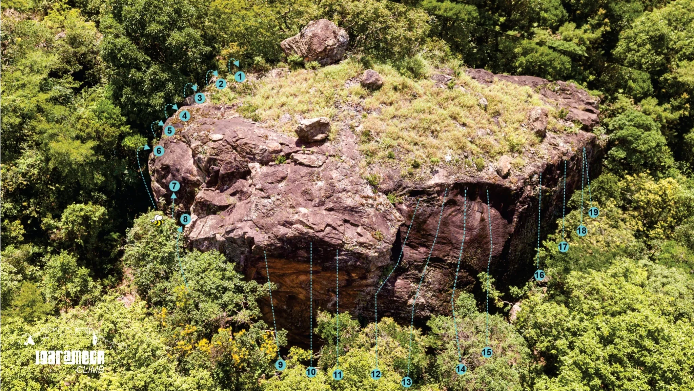
    - **largura_mapa**: 2304
    - **altura_mapa**: 1300
    - **pontos_de_interesse**:
      - **[0]**:
        - **id**: 01
        - **label**: 01
        - **circulo**:
          - **x**: 794
          - **y**: 257
          - **raio**: 17
      - **[1]**:
        - **id**: 02
        - **label**: 02
        - **circulo**:
          - **x**: 731
          - **y**: 281
          - **raio**: 17
      - **[2]**:
        - **id**: 03
        - **label**: 03
        - **circulo**:
          - **x**: 661
          - **y**: 328
          - **raio**: 17
      - **[3]**:
        - **id**: 04
        - **label**: 04
        - **circulo**:
          - **x**: 611
          - **y**: 387
          - **raio**: 17
      - **[4]**:
        - **id**: 05
        - **label**: 05
        - **circulo**:
          - **x**: 562
          - **y**: 437
          - **raio**: 17
      - **[5]**:
        - **id**: 06
        - **label**: 06
        - **circulo**:
          - **x**: 526
          - **y**: 503
          - **raio**: 17
      - **[6]**:
        - **id**: 07
        - **label**: 07
        - **circulo**:
          - **x**: 578
          - **y**: 619
          - **raio**: 17
      - **[7]**:
        - **id**: 08
        - **label**: 08
        - **circulo**:
          - **x**: 614
          - **y**: 729
          - **raio**: 17
      - **[8]**:
        - **id**: 09
        - **label**: 09
        - **circulo**:
          - **x**: 929
          - **y**: 1212
          - **raio**: 17
      - **[9]**:
        - **id**: 10
        - **label**: 10
        - **circulo**:
          - **x**: 1030
          - **y**: 1236
          - **raio**: 18
      - **[10]**:
        - **id**: 11
        - **label**: 11
        - **circulo**:
          - **x**: 1119
          - **y**: 1245
          - **raio**: 18
      - **[11]**:
        - **id**: 12
        - **label**: 12
        - **circulo**:
          - **x**: 1245
          - **y**: 1244
          - **raio**: 19
      - **[12]**:
        - **id**: 13
        - **label**: 13
        - **circulo**:
          - **x**: 1347
          - **y**: 1269
          - **raio**: 18
      - **[13]**:
        - **id**: 14
        - **label**: 14
        - **circulo**:
          - **x**: 1527
          - **y**: 1227
          - **raio**: 19
      - **[14]**:
        - **id**: 15
        - **label**: 15
        - **circulo**:
          - **x**: 1613
          - **y**: 1170
          - **raio**: 19
      - **[15]**:
        - **id**: 16
        - **label**: 16
        - **circulo**:
          - **x**: 1787
          - **y**: 915
          - **raio**: 19
      - **[16]**:
        - **id**: 17
        - **label**: 17
        - **circulo**:
          - **x**: 1866
          - **y**: 820
          - **raio**: 19
      - **[17]**:
        - **id**: 18
        - **label**: 18
        - **circulo**:
          - **x**: 1927
          - **y**: 768
          - **raio**: 18
      - **[18]**:
        - **id**: 19
        - **label**: 19
        - **circulo**:
          - **x**: 1967
          - **y**: 707
          - **raio**: 18
    - **referencias**:
      - **[0]**:
        - **escalada**: Florestinha
        - **ids**:
          - 01
      - **[1]**:
        - **escalada**: Ação Total
        - **ids**:
          - 02
      - **[2]**:
        - **escalada**: Escravos da Pedra
        - **ids**:
          - 03
      - **[3]**:
        - **escalada**: Esquerdinha Caviar
        - **ids**:
          - 04
      - **[4]**:
        - **escalada**: Mônica
        - **ids**:
          - 05
      - **[5]**:
        - **escalada**: Queijo Suíço
        - **ids**:
          - 06
      - **[6]**:
        - **escalada**: Aranha Gato
        - **ids**:
          - 07
      - **[7]**:
        - **escalada**: Totalflex
        - **ids**:
          - 10
      - **[8]**:
        - **escalada**: Haja Broca
        - **ids**:
          - 11
      - **[9]**:
        - **escalada**: Juliana
        - **ids**:
          - 12
      - **[10]**:
        - **escalada**: Lisebra
        - **ids**:
          - 13
      - **[11]**:
        - **escalada**: Croque Monsieur
        - **ids**:
          - 14
      - **[12]**:
        - **escalada**: Playground
        - **ids**:
          - 15
      - **[13]**:
        - **escalada**: Depressão Pós Reforma
        - **ids**:
          - 16
      - **[14]**:
        - **escalada**: Chuvasca
        - **ids**:
          - 17
      - **[15]**:
        - **escalada**: Pau Oco
        - **ids**:
          - 18
      - **[16]**:
        - **escalada**: Franzinha
        - **ids**:
          - 19
      - **[17]**:
        - **ids**:
          - 08
        - **setor**: Setor Família I
        - **escalada**: Chapas Onorixicas
      - **[18]**:
        - **ids**:
          - 09
        - **setor**: Setor Família I
        - **escalada**: Tora Flex
  - **[1]**:
    - **caminho_imagem_mapa**: 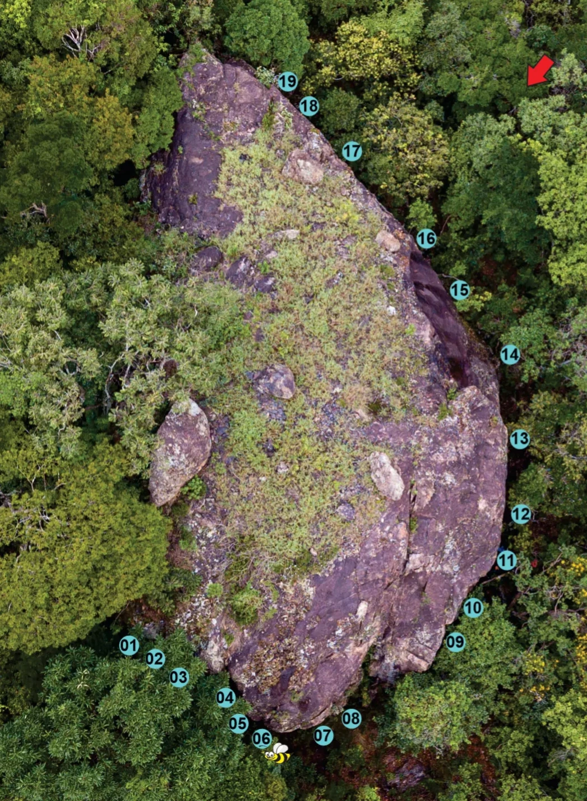
    - **largura_mapa**: 1121
    - **altura_mapa**: 1440
    - **pontos_de_interesse**:
      - **[0]**:
        - **id**: 19
        - **label**: 19
        - **circulo**:
          - **x**: 523
          - **y**: 133
          - **raio**: 19
      - **[1]**:
        - **id**: 18
        - **label**: 18
        - **circulo**:
          - **x**: 562
          - **y**: 177
          - **raio**: 19
      - **[2]**:
        - **id**: 17
        - **label**: 17
        - **circulo**:
          - **x**: 638
          - **y**: 257
          - **raio**: 19
      - **[3]**:
        - **id**: 16
        - **label**: 16
        - **circulo**:
          - **x**: 771
          - **y**: 414
          - **raio**: 19
      - **[4]**:
        - **id**: 15
        - **label**: 15
        - **circulo**:
          - **x**: 830
          - **y**: 505
          - **raio**: 19
      - **[5]**:
        - **id**: 14
        - **label**: 14
        - **circulo**:
          - **x**: 920
          - **y**: 620
          - **raio**: 19
      - **[6]**:
        - **id**: 13
        - **label**: 13
        - **circulo**:
          - **x**: 937
          - **y**: 770
          - **raio**: 19
      - **[7]**:
        - **id**: 12
        - **label**: 12
        - **circulo**:
          - **x**: 940
          - **y**: 904
          - **raio**: 19
      - **[8]**:
        - **id**: 11
        - **label**: 11
        - **circulo**:
          - **x**: 914
          - **y**: 986
          - **raio**: 19
      - **[9]**:
        - **id**: 10
        - **label**: 10
        - **circulo**:
          - **x**: 855
          - **y**: 1071
          - **raio**: 18
      - **[10]**:
        - **id**: 01
        - **label**: 01
        - **circulo**:
          - **x**: 241
          - **y**: 1138
          - **raio**: 18
      - **[11]**:
        - **id**: 09
        - **label**: 09
        - **circulo**:
          - **x**: 823
          - **y**: 1132
          - **raio**: 19
      - **[12]**:
        - **id**: 02
        - **label**: 02
        - **circulo**:
          - **x**: 287
          - **y**: 1162
          - **raio**: 19
      - **[13]**:
        - **id**: 03
        - **label**: 03
        - **circulo**:
          - **x**: 330
          - **y**: 1195
          - **raio**: 19
      - **[14]**:
        - **id**: 04
        - **label**: 04
        - **circulo**:
          - **x**: 412
          - **y**: 1231
          - **raio**: 19
      - **[15]**:
        - **id**: 05
        - **label**: 05
        - **circulo**:
          - **x**: 436
          - **y**: 1277
          - **raio**: 19
      - **[16]**:
        - **id**: 08
        - **label**: 08
        - **circulo**:
          - **x**: 637
          - **y**: 1268
          - **raio**: 19
      - **[17]**:
        - **id**: 06
        - **label**: 06
        - **circulo**:
          - **x**: 477
          - **y**: 1304
          - **raio**: 19
      - **[18]**:
        - **id**: 07
        - **label**: 07
        - **circulo**:
          - **x**: 587
          - **y**: 1299
          - **raio**: 19
    - **referencias**:
      - **[0]**:
        - **escalada**: Florestinha
        - **ids**:
          - 01
      - **[1]**:
        - **escalada**: Ação Total
        - **ids**:
          - 02
      - **[2]**:
        - **escalada**: Escravos da Pedra
        - **ids**:
          - 03
      - **[3]**:
        - **escalada**: Esquerdinha Caviar
        - **ids**:
          - 04
      - **[4]**:
        - **escalada**: Mônica
        - **ids**:
          - 05
      - **[5]**:
        - **escalada**: Queijo Suíço
        - **ids**:
          - 06
      - **[6]**:
        - **escalada**: Aranha Gato
        - **ids**:
          - 07
      - **[7]**:
        - **escalada**: Totalflex
        - **ids**:
          - 10
      - **[8]**:
        - **escalada**: Haja Broca
        - **ids**:
          - 11
      - **[9]**:
        - **escalada**: Juliana
        - **ids**:
          - 12
      - **[10]**:
        - **escalada**: Lisebra
        - **ids**:
          - 13
      - **[11]**:
        - **escalada**: Croque Monsieur
        - **ids**:
          - 14
      - **[12]**:
        - **escalada**: Playground
        - **ids**:
          - 15
      - **[13]**:
        - **escalada**: Depressão Pós Reforma
        - **ids**:
          - 16
      - **[14]**:
        - **escalada**: Chuvasca
        - **ids**:
          - 17
      - **[15]**:
        - **escalada**: Pau Oco
        - **ids**:
          - 18
      - **[16]**:
        - **escalada**: Franzinha
        - **ids**:
          - 19
      - **[17]**:
        - **ids**:
          - 08
        - **setor**: Setor Família I
        - **escalada**: Chapas Onorixicas
      - **[18]**:
        - **ids**:
          - 09
        - **setor**: Setor Família I
        - **escalada**: Tora Flex
- **escaladas**:
  - **[0]**:
    - **via_esportiva**:
      - **nome**: Florestinha
      - **dificuldade**: BR_6SUP
      - **conquistadores**:
        - Berbari
        - Ró
      - **data_abertura**: 2011
  - **[1]**:
    - **via_esportiva**:
      - **nome**: Ação Total
      - **dificuldade**: BR_7A
      - **quantidade_protecoes_intermediarias**: 3
      - **quantidade_protecoes_parada**: 2
      - **extensao**: 10
      - **conquistadores**:
        - Berbari
        - Ró
        - Rômulo
      - **data_abertura**: 2011
  - **[2]**:
    - **via_esportiva**:
      - **nome**: Escravos da Pedra
      - **dificuldade**: BR_8C
      - **quantidade_protecoes_intermediarias**: 4
      - **quantidade_protecoes_parada**: 2
      - **extensao**: 11
      - **conquistadores**:
        - Berbari
        - Ró
        - Chinha
      - **data_abertura**: 2011
  - **[3]**:
    - **via_esportiva**:
      - **nome**: Esquerdinha Caviar
      - **dificuldade**: BR_7C
      - **quantidade_protecoes_intermediarias**: 4
      - **quantidade_protecoes_parada**: 2
      - **extensao**: 12
      - **conquistadores**:
        - Berbari
        - Ró
        - Rômulo
      - **data_abertura**: 2011
  - **[4]**:
    - **via_esportiva**:
      - **nome**: Mônica
      - **dificuldade**: BR_8B
      - **quantidade_protecoes_intermediarias**: 4
      - **quantidade_protecoes_parada**: 2
      - **extensao**: 12
      - **conquistadores**:
        - Berbari
        - Ró
      - **data_abertura**: 2011
  - **[5]**:
    - **via_esportiva**:
      - **nome**: Queijo Suíço
      - **dificuldade**: BR_7A_BARRA_7B
      - **quantidade_protecoes_intermediarias**: 3
      - **quantidade_protecoes_parada**: 2
      - **extensao**: 11
      - **conquistadores**:
        - Berbari
        - Ró
      - **data_abertura**: 2011
  - **[6]**:
    - **via_esportiva**:
      - **nome**: Aranha Gato
      - **dificuldade**: BR_6_BARRA_6SUP
      - **quantidade_protecoes_intermediarias**: 3
      - **quantidade_protecoes_parada**: 2
      - **extensao**: 11
      - **conquistadores**:
        - Berbari
        - Ró
        - Chinha
      - **data_abertura**: 2011
  - **[7]**:
    - **via_esportiva**:
      - **nome**: Chapas Onorixicas
      - **dificuldade**: BR_6SUP
      - **quantidade_protecoes_intermediarias**: 3
      - **quantidade_protecoes_parada**: 2
      - **extensao**: 11
      - **conquistadores**:
        - Mecena
        - Ivo
      - **data_abertura**: 2011
  - **[8]**:
    - **via_esportiva**:
      - **nome**: Tora Flex
      - **dificuldade**: BR_6SUP
      - **quantidade_protecoes_intermediarias**: 3
      - **quantidade_protecoes_parada**: 2
      - **extensao**: 11
      - **conquistadores**:
        - Berbari
        - Ró
        - Chinha
      - **data_abertura**: 2011
  - **[9]**:
    - **via_esportiva**:
      - **nome**: Totalflex
      - **dificuldade**: BR_6SUP
      - **quantidade_protecoes_intermediarias**: 3
      - **quantidade_protecoes_parada**: 2
      - **extensao**: 11
      - **conquistadores**:
        - Berbari
        - Ró
        - Chinha
      - **data_abertura**: 2011
  - **[10]**:
    - **via_esportiva**:
      - **nome**: Haja Broca
      - **dificuldade**: BR_6SUP
      - **quantidade_protecoes_intermediarias**: 3
      - **quantidade_protecoes_parada**: 2
      - **extensao**: 11
      - **conquistadores**:
        - Berbari
        - Ró
      - **data_abertura**: 2011
  - **[11]**:
    - **via_esportiva**:
      - **nome**: Juliana
      - **dificuldade**: BR_5
      - **quantidade_protecoes_intermediarias**: 4
      - **quantidade_protecoes_parada**: 2
      - **extensao**: 10
      - **conquistadores**:
        - Berbari
        - Ró
      - **data_abertura**: 2011
  - **[12]**:
    - **via_esportiva**:
      - **nome**: Lisebra
      - **dificuldade**: BR_4
      - **quantidade_protecoes_intermediarias**: 3
      - **quantidade_protecoes_parada**: 2
      - **extensao**: 10
      - **conquistadores**:
        - Mecena
        - Ivo
      - **data_abertura**: 2011
  - **[13]**:
    - **via_esportiva**:
      - **nome**: Croque Monsieur
      - **dificuldade**: BR_5
      - **quantidade_protecoes_intermediarias**: 4
      - **quantidade_protecoes_parada**: 2
      - **extensao**: 9
      - **conquistadores**:
        - Berbari
        - Ró
      - **data_abertura**: 2011
  - **[14]**:
    - **via_esportiva**:
      - **nome**: Playground
      - **dificuldade**: BR_4
      - **quantidade_protecoes_intermediarias**: 2
      - **quantidade_protecoes_parada**: 2
      - **extensao**: 8
      - **conquistadores**:
        - Macena
      - **data_abertura**: 2013
  - **[15]**:
    - **via_esportiva**:
      - **nome**: Depressão Pós Reforma
      - **dificuldade**: BR_4
      - **quantidade_protecoes_intermediarias**: 2
      - **quantidade_protecoes_parada**: 2
      - **extensao**: 7
      - **conquistadores**:
        - Macena
      - **data_abertura**: 2013
  - **[16]**:
    - **via_esportiva**:
      - **nome**: Chuvasca
      - **dificuldade**: BR_4
      - **quantidade_protecoes_intermediarias**: 2
      - **quantidade_protecoes_parada**: 2
      - **extensao**: 6
      - **conquistadores**:
        - Macena
      - **data_abertura**: 2013
  - **[17]**:
    - **via_esportiva**:
      - **descricao**: Termina no mesmo tope que a via Franzinha.
      - **nome**: Pau Oco
      - **dificuldade**: BR_4
      - **quantidade_protecoes_intermediarias**: 2
      - **quantidade_protecoes_parada**: 2
      - **extensao**: 6
      - **conquistadores**:
        - Toninho
        - Fran
      - **data_abertura**: 2013
  - **[18]**:
    - **via_esportiva**:
      - **descricao**: Termina no mesmo tope que a via Pau Oco.
      - **nome**: Franzinha
      - **dificuldade**: BR_4
      - **quantidade_protecoes_intermediarias**: 2
      - **quantidade_protecoes_parada**: 2
      - **extensao**: 6
      - **conquistadores**:
        - Toninho
        - Fran
      - **data_abertura**: 2013
- **precomputados**:
  - **total_escaladas**: 19

## Parte: setor_familia_ii

### Setor (Pico: Complexo Pedra Grande)

- **descricao**:
    # Setor Família II
    
    Sombra após 14h (varia de acordo com a estação).
- **nome**: Setor Família II
- **mapas**:
  - **[0]**:
    - **caminho_imagem_mapa**: 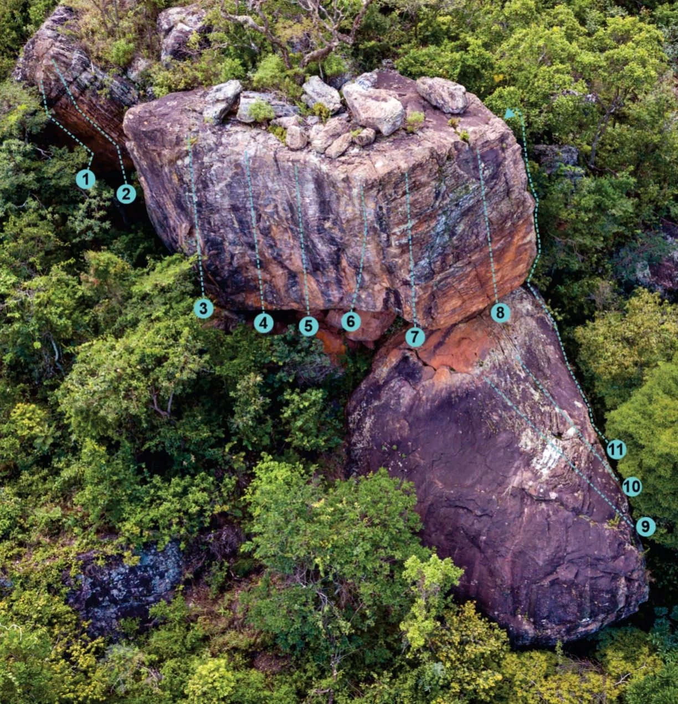
    - **largura_mapa**: 1224
    - **altura_mapa**: 1271
    - **pontos_de_interesse**:
      - **[0]**:
        - **id**: 01
        - **label**: 01
        - **circulo**:
          - **x**: 154
          - **y**: 323
          - **raio**: 17
      - **[1]**:
        - **id**: 02
        - **label**: 02
        - **circulo**:
          - **x**: 228
          - **y**: 350
          - **raio**: 17
      - **[2]**:
        - **id**: 03
        - **label**: 03
        - **circulo**:
          - **x**: 368
          - **y**: 557
          - **raio**: 17
      - **[3]**:
        - **id**: 04
        - **label**: 04
        - **circulo**:
          - **x**: 476
          - **y**: 584
          - **raio**: 17
      - **[4]**:
        - **id**: 05
        - **label**: 05
        - **circulo**:
          - **x**: 558
          - **y**: 589
          - **raio**: 17
      - **[5]**:
        - **id**: 06
        - **label**: 06
        - **circulo**:
          - **x**: 634
          - **y**: 581
          - **raio**: 17
      - **[6]**:
        - **id**: 07
        - **label**: 07
        - **circulo**:
          - **x**: 749
          - **y**: 609
          - **raio**: 17
      - **[7]**:
        - **id**: 08
        - **label**: 08
        - **circulo**:
          - **x**: 903
          - **y**: 565
          - **raio**: 17
      - **[8]**:
        - **id**: 11
        - **label**: 11
        - **circulo**:
          - **x**: 1113
          - **y**: 812
          - **raio**: 17
      - **[9]**:
        - **id**: 10
        - **label**: 10
        - **circulo**:
          - **x**: 1141
          - **y**: 878
          - **raio**: 17
      - **[10]**:
        - **id**: 09
        - **label**: 09
        - **circulo**:
          - **x**: 1166
          - **y**: 951
          - **raio**: 17
    - **referencias**:
      - **[0]**:
        - **escalada**: Filhos da Revolução
        - **ids**:
          - 01
      - **[1]**:
        - **escalada**: Pedra Vermelha
        - **ids**:
          - 02
      - **[2]**:
        - **escalada**: Projeto
        - **ids**:
          - 03
      - **[3]**:
        - **escalada**: Projeto
        - **ids**:
          - 04
      - **[4]**:
        - **escalada**: (via inacabada)
        - **ids**:
          - 05
      - **[5]**:
        - **escalada**: Trinca Ferro
        - **ids**:
          - 06
      - **[6]**:
        - **escalada**: Marimbondes me Mordam
        - **ids**:
          - 07
      - **[7]**:
        - **escalada**: Pula Um
        - **ids**:
          - 10
      - **[8]**:
        - **escalada**: Cerro Azul
        - **ids**:
          - 11
      - **[9]**:
        - **ids**:
          - 08
        - **setor**: Setor Família II
        - **escalada**: Sumchine
      - **[10]**:
        - **ids**:
          - 09
        - **setor**: Setor Família II
        - **escalada**: Cater Pillar
  - **[1]**:
    - **caminho_imagem_mapa**: 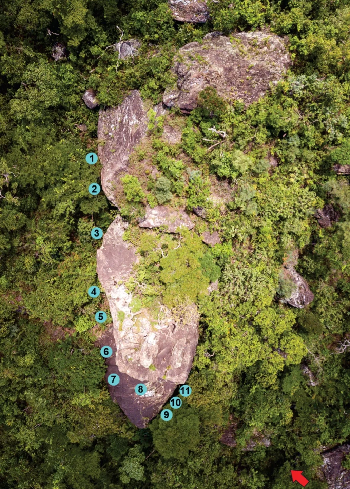
    - **largura_mapa**: 1032
    - **altura_mapa**: 1442
    - **pontos_de_interesse**:
      - **[0]**:
        - **id**: 01
        - **label**: 01
        - **circulo**:
          - **x**: 270
          - **y**: 467
          - **raio**: 17
      - **[1]**:
        - **id**: 02
        - **label**: 02
        - **circulo**:
          - **x**: 278
          - **y**: 557
          - **raio**: 17
      - **[2]**:
        - **id**: 03
        - **label**: 03
        - **circulo**:
          - **x**: 285
          - **y**: 687
          - **raio**: 17
      - **[3]**:
        - **id**: 04
        - **label**: 04
        - **circulo**:
          - **x**: 277
          - **y**: 860
          - **raio**: 17
      - **[4]**:
        - **id**: 05
        - **label**: 05
        - **circulo**:
          - **x**: 298
          - **y**: 935
          - **raio**: 18
      - **[5]**:
        - **id**: 06
        - **label**: 06
        - **circulo**:
          - **x**: 314
          - **y**: 1037
          - **raio**: 17
      - **[6]**:
        - **id**: 07
        - **label**: 07
        - **circulo**:
          - **x**: 335
          - **y**: 1119
          - **raio**: 17
      - **[7]**:
        - **id**: 08
        - **label**: 08
        - **circulo**:
          - **x**: 415
          - **y**: 1149
          - **raio**: 17
      - **[8]**:
        - **id**: 11
        - **label**: 11
        - **circulo**:
          - **x**: 547
          - **y**: 1152
          - **raio**: 17
      - **[9]**:
        - **id**: 10
        - **label**: 10
        - **circulo**:
          - **x**: 518
          - **y**: 1187
          - **raio**: 17
      - **[10]**:
        - **id**: 09
        - **label**: 09
        - **circulo**:
          - **x**: 491
          - **y**: 1224
          - **raio**: 17
    - **referencias**:
      - **[0]**:
        - **escalada**: Filhos da Revolução
        - **ids**:
          - 01
      - **[1]**:
        - **escalada**: Pedra Vermelha
        - **ids**:
          - 02
      - **[2]**:
        - **escalada**: Projeto
        - **ids**:
          - 03
      - **[3]**:
        - **escalada**: Projeto
        - **ids**:
          - 04
      - **[4]**:
        - **escalada**: (via inacabada)
        - **ids**:
          - 05
      - **[5]**:
        - **escalada**: Trinca Ferro
        - **ids**:
          - 06
      - **[6]**:
        - **escalada**: Marimbondes me Mordam
        - **ids**:
          - 07
      - **[7]**:
        - **escalada**: Pula Um
        - **ids**:
          - 10
      - **[8]**:
        - **escalada**: Cerro Azul
        - **ids**:
          - 11
      - **[9]**:
        - **ids**:
          - 08
        - **setor**: Setor Família II
        - **escalada**: Sumchine
      - **[10]**:
        - **ids**:
          - 09
        - **setor**: Setor Família II
        - **escalada**: Cater Pillar
- **escaladas**:
  - **[0]**:
    - **via_esportiva**:
      - **nome**: Filhos da Revolução
      - **dificuldade**: BR_7A
      - **quantidade_protecoes_intermediarias**: 5
      - **quantidade_protecoes_parada**: 2
      - **extensao**: 10
      - **conquistadores**:
        - Berbari
        - Ró
        - Toninho
      - **data_abertura**: 2012
  - **[1]**:
    - **via_esportiva**:
      - **nome**: Pedra Vermelha
      - **dificuldade**: BR_7C
      - **conquistadores**:
        - Berbari
        - Ró
      - **data_abertura**: 2012
  - **[2]**:
    - **via_esportiva**:
      - **nome**: Projeto
      - **dificuldade**: PROJETO
      - **quantidade_protecoes_intermediarias**: 4
      - **quantidade_protecoes_parada**: 2
      - **extensao**: 10
      - **conquistadores**:
        - Berbari
      - **data_abertura**: 2012
  - **[3]**:
    - **via_esportiva**:
      - **nome**: Projeto
      - **dificuldade**: PROJETO
      - **quantidade_protecoes_intermediarias**: 4
      - **quantidade_protecoes_parada**: 2
      - **extensao**: 10
      - **conquistadores**:
        - Berbari
        - Alex
      - **data_abertura**: 2012
  - **[4]**:
    - **via_esportiva**:
      - **nome**: (via inacabada)
      - **dificuldade**: INDEFINIDO
      - **quantidade_protecoes_intermediarias**: 3
      - **quantidade_protecoes_parada**: 2
      - **extensao**: 10
      - **conquistadores**:
        - Berbari
        - Alex
      - **data_abertura**: 2012
  - **[5]**:
    - **via_esportiva**:
      - **nome**: Trinca Ferro
      - **dificuldade**: BR_8B
      - **quantidade_protecoes_intermediarias**: 6
      - **quantidade_protecoes_parada**: 2
      - **extensao**: 12
      - **conquistadores**:
        - Berbari
      - **data_abertura**: 2013
  - **[6]**:
    - **via_esportiva**:
      - **nome**: Marimbondes me Mordam
      - **dificuldade**: BR_7C
      - **quantidade_protecoes_intermediarias**: 4
      - **quantidade_protecoes_parada**: 2
      - **extensao**: 8
      - **conquistadores**:
        - Berbari
        - Ró
      - **data_abertura**: 2009
  - **[7]**:
    - **via_esportiva**:
      - **nome**: Sumchine
      - **dificuldade**: BR_6SUP_BARRA_7A
      - **quantidade_protecoes_intermediarias**: 3
      - **quantidade_protecoes_parada**: 2
      - **extensao**: 7
      - **conquistadores**:
        - Berbari
        - Ró
      - **data_abertura**: 2009
  - **[8]**:
    - **via_esportiva**:
      - **nome**: Cater Pillar
      - **dificuldade**: BR_6
      - **quantidade_protecoes_intermediarias**: 2
      - **quantidade_protecoes_parada**: 2
      - **extensao**: 7
      - **conquistadores**:
        - Berbari
        - Ró
        - Cater
      - **data_abertura**: 2009
  - **[9]**:
    - **via_esportiva**:
      - **nome**: Pula Um
      - **dificuldade**: BR_5
      - **quantidade_protecoes_intermediarias**: 2
      - **quantidade_protecoes_parada**: 2
      - **extensao**: 7
      - **conquistadores**:
        - Berbari
        - Ró
      - **data_abertura**: 2009
  - **[10]**:
    - **via_esportiva**:
      - **nome**: Cerro Azul
      - **dificuldade**: BR_6_BARRA_6SUP
      - **quantidade_protecoes_intermediarias**: 5
      - **quantidade_protecoes_parada**: 2
      - **extensao**: 15
      - **conquistadores**:
        - Berbari
        - Ró
      - **data_abertura**: 2009
- **precomputados**:
  - **total_escaladas**: 11

## Parte: setor_micos

### Setor (Pico: Complexo Pedra Grande)

- **descricao**:
    # Setor Micos
    
    Sombra até 11h e após 15h.
    Risco de agarras se quebrarem e pedras soltas, é recomendado o uso de capacete ao escalar e nas bases das vias.
    Escalar com a corda passada na primeira proteção nas vias esportivas.
    Siga a trilha a partir do estacionamento até onde o tronco atravessa o caminho. A rocha fica logo a direita.
- **nome**: Setor Micos
- **mapas**:
  - **[0]**:
    - **caminho_imagem_mapa**: 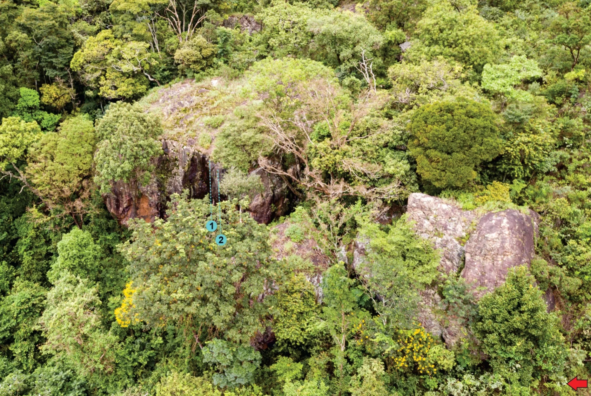
    - **largura_mapa**: 1861
    - **altura_mapa**: 1246
    - **pontos_de_interesse**:
      - **[0]**:
        - **id**: 01
        - **label**: 01
        - **circulo**:
          - **x**: 667
          - **y**: 711
          - **raio**: 17
      - **[1]**:
        - **id**: 02
        - **label**: 02
        - **circulo**:
          - **x**: 696
          - **y**: 755
          - **raio**: 17
    - **referencias**:
      - **[0]**:
        - **escalada**: Eu Também Vou
        - **ids**:
          - 01
      - **[1]**:
        - **escalada**: Lambe Lambe
        - **ids**:
          - 02
  - **[1]**:
    - **caminho_imagem_mapa**: 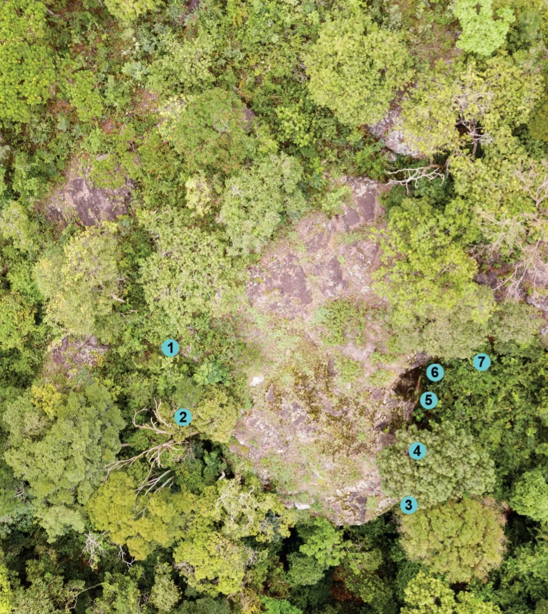
    - **largura_mapa**: 1101
    - **altura_mapa**: 1234
    - **pontos_de_interesse**:
      - **[0]**:
        - **id**: 01
        - **label**: 01
        - **circulo**:
          - **x**: 343
          - **y**: 699
          - **raio**: 17
      - **[1]**:
        - **id**: 07
        - **label**: 07
        - **circulo**:
          - **x**: 968
          - **y**: 727
          - **raio**: 17
      - **[2]**:
        - **id**: 06
        - **label**: 06
        - **circulo**:
          - **x**: 874
          - **y**: 748
          - **raio**: 17
      - **[3]**:
        - **id**: 05
        - **label**: 05
        - **circulo**:
          - **x**: 862
          - **y**: 804
          - **raio**: 17
      - **[4]**:
        - **id**: 02
        - **label**: 02
        - **circulo**:
          - **x**: 368
          - **y**: 838
          - **raio**: 17
      - **[5]**:
        - **id**: 04
        - **label**: 04
        - **circulo**:
          - **x**: 839
          - **y**: 906
          - **raio**: 17
      - **[6]**:
        - **id**: 03
        - **label**: 03
        - **circulo**:
          - **x**: 821
          - **y**: 1015
          - **raio**: 17
    - **referencias**:
      - **[0]**:
        - **escalada**: Eu Também Vou
        - **ids**:
          - 01
      - **[1]**:
        - **escalada**: Lambe Lambe
        - **ids**:
          - 02
      - **[2]**:
        - **escalada**: TNT
        - **ids**:
          - 03
      - **[3]**:
        - **escalada**: For My Brother
        - **ids**:
          - 04
      - **[4]**:
        - **escalada**: Diamante Negro
        - **ids**:
          - 05
      - **[5]**:
        - **escalada**: Chapa Quente
        - **ids**:
          - 06
      - **[6]**:
        - **escalada**: (via inacabada)
        - **ids**:
          - 07
  - **[2]**:
    - **caminho_imagem_mapa**: 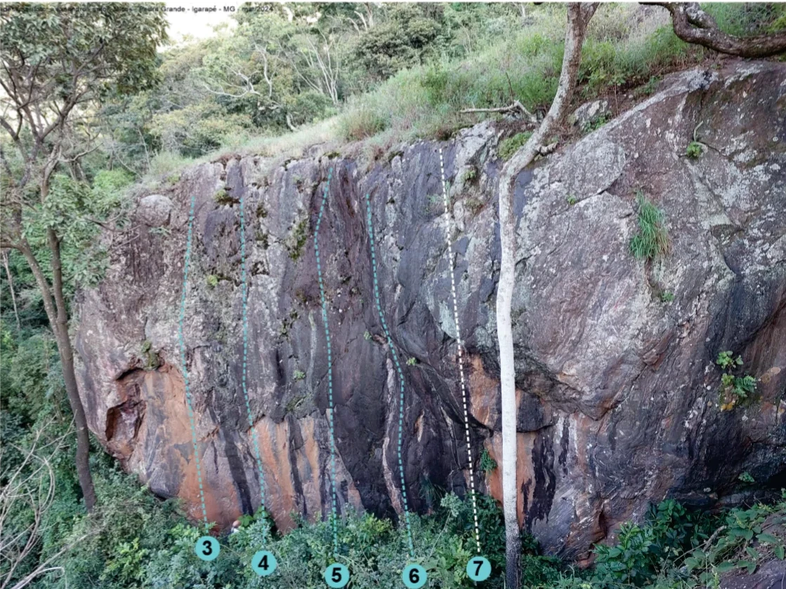
    - **largura_mapa**: 1119
    - **altura_mapa**: 840
    - **pontos_de_interesse**:
      - **[0]**:
        - **id**: 03
        - **label**: 03
        - **circulo**:
          - **x**: 295
          - **y**: 782
          - **raio**: 17
      - **[1]**:
        - **id**: 04
        - **label**: 04
        - **circulo**:
          - **x**: 376
          - **y**: 803
          - **raio**: 17
      - **[2]**:
        - **id**: 05
        - **label**: 05
        - **circulo**:
          - **x**: 480
          - **y**: 821
          - **raio**: 17
      - **[3]**:
        - **id**: 06
        - **label**: 06
        - **circulo**:
          - **x**: 590
          - **y**: 821
          - **raio**: 17
      - **[4]**:
        - **id**: 07
        - **label**: 07
        - **circulo**:
          - **x**: 681
          - **y**: 811
          - **raio**: 17
    - **referencias**:
      - **[0]**:
        - **escalada**: TNT
        - **ids**:
          - 03
      - **[1]**:
        - **escalada**: For My Brother
        - **ids**:
          - 04
      - **[2]**:
        - **escalada**: Diamante Negro
        - **ids**:
          - 05
      - **[3]**:
        - **escalada**: Chapa Quente
        - **ids**:
          - 06
      - **[4]**:
        - **escalada**: (via inacabada)
        - **ids**:
          - 07
- **escaladas**:
  - **[0]**:
    - **via_esportiva**:
      - **nome**: Eu Também Vou
      - **dificuldade**: BR_7A
      - **quantidade_protecoes_intermediarias**: 4
      - **quantidade_protecoes_parada**: 2
      - **extensao**: 12
      - **conquistadores**:
        - Berbari
        - Ró
      - **data_abertura**: 2011
  - **[1]**:
    - **via_esportiva**:
      - **nome**: Lambe Lambe
      - **dificuldade**: BR_7A
      - **quantidade_protecoes_intermediarias**: 4
      - **quantidade_protecoes_parada**: 2
      - **extensao**: 12
      - **conquistadores**:
        - Berbari
        - Toninho
      - **data_abertura**: 2011
  - **[2]**:
    - **via_esportiva**:
      - **nome**: TNT
      - **dificuldade**: BR_9B
      - **quantidade_protecoes_intermediarias**: 4
      - **quantidade_protecoes_parada**: 2
      - **extensao**: 12
      - **conquistadores**:
        - Berbari
        - Ró
      - **data_abertura**: 2011
  - **[3]**:
    - **via_esportiva**:
      - **nome**: For My Brother
      - **dificuldade**: BR_8A
      - **quantidade_protecoes_intermediarias**: 4
      - **quantidade_protecoes_parada**: 2
      - **extensao**: 12
      - **conquistadores**:
        - Berbari
        - Ró
      - **data_abertura**: 2011
  - **[4]**:
    - **via_esportiva**:
      - **nome**: Diamante Negro
      - **dificuldade**: BR_8B
      - **quantidade_protecoes_intermediarias**: 4
      - **quantidade_protecoes_parada**: 2
      - **extensao**: 12
      - **conquistadores**:
        - Berbari
        - Ró
        - Chinha
        - Rômulo
      - **data_abertura**: 2011
  - **[5]**:
    - **via_esportiva**:
      - **nome**: Chapa Quente
      - **dificuldade**: BR_7C
      - **quantidade_protecoes_intermediarias**: 4
      - **quantidade_protecoes_parada**: 2
      - **extensao**: 12
      - **conquistadores**:
        - Berbari
        - Ró
        - Chinha
        - Rômulo
      - **data_abertura**: 2011
  - **[6]**:
    - **via_esportiva**:
      - **nome**: (via inacabada)
      - **dificuldade**: INDEFINIDO
      - **quantidade_protecoes_intermediarias**: 0
      - **quantidade_protecoes_parada**: 2
      - **extensao**: 12
      - **conquistadores**:
        - Berbari
        - Chinha
      - **data_abertura**: 2011
- **precomputados**:
  - **total_escaladas**: 7

## Parte: setor_totem

### Setor (Pico: Complexo Pedra Grande)

- **descricao**:
    # Setor Totem
    
    Sombra até 10h e após 16h.
- **nome**: Setor Totem
- **mapas**:
  - **[0]**:
    - **caminho_imagem_mapa**: 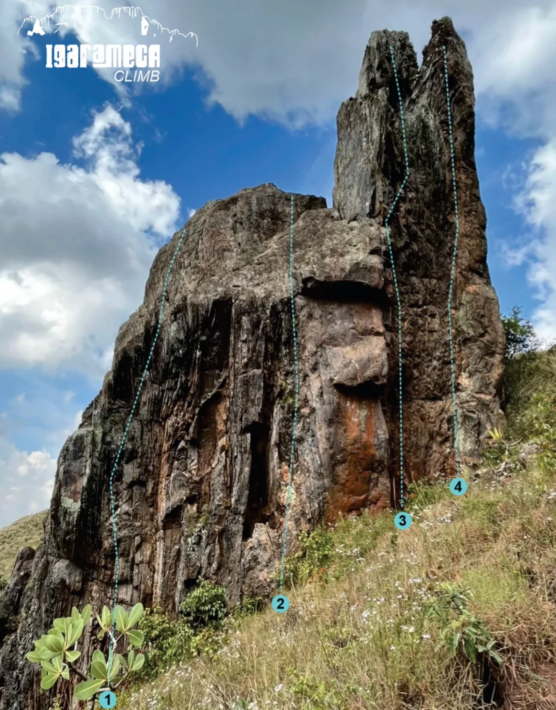
    - **largura_mapa**: 1112
    - **altura_mapa**: 1418
    - **pontos_de_interesse**:
      - **[0]**:
        - **id**: 01
        - **label**: 01
        - **circulo**:
          - **x**: 216
          - **y**: 1397
          - **raio**: 17
      - **[1]**:
        - **id**: 02
        - **label**: 02
        - **circulo**:
          - **x**: 561
          - **y**: 1206
          - **raio**: 17
      - **[2]**:
        - **id**: 03
        - **label**: 03
        - **circulo**:
          - **x**: 806
          - **y**: 1040
          - **raio**: 17
      - **[3]**:
        - **id**: 04
        - **label**: 04
        - **circulo**:
          - **x**: 917
          - **y**: 972
          - **raio**: 17
    - **referencias**:
      - **[0]**:
        - **escalada**: Takeyeasy
        - **ids**:
          - 01
      - **[1]**:
        - **escalada**: Pâncepis
        - **ids**:
          - 02
      - **[2]**:
        - **escalada**: Totem
        - **ids**:
          - 03
      - **[3]**:
        - **escalada**: 69
        - **ids**:
          - 04
  - **[1]**:
    - **caminho_imagem_mapa**: 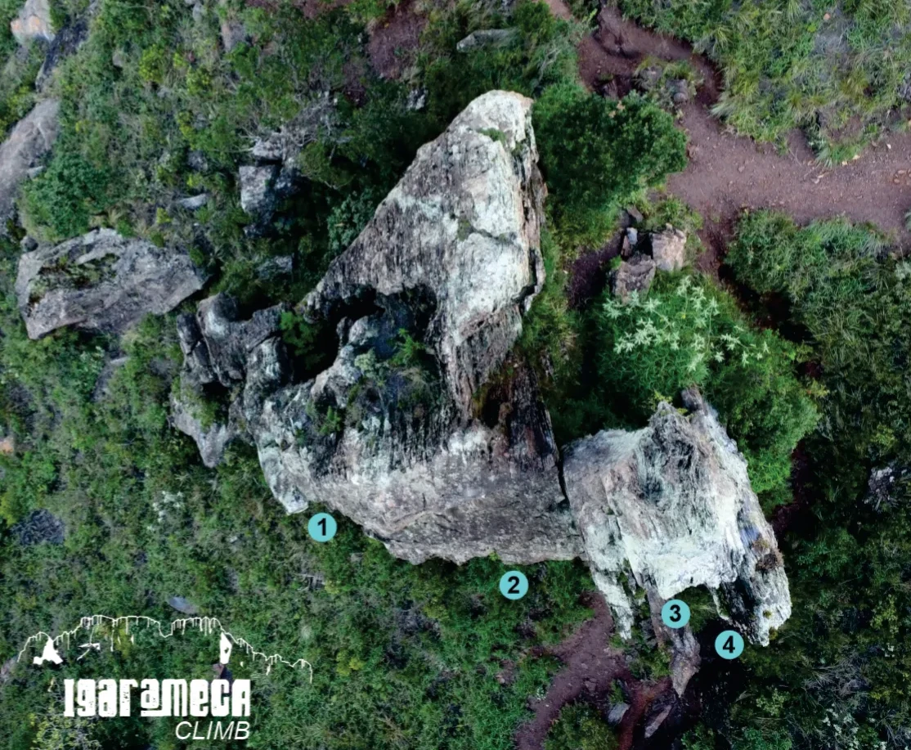
    - **largura_mapa**: 1114
    - **altura_mapa**: 917
    - **pontos_de_interesse**:
      - **[0]**:
        - **id**: 01
        - **label**: 01
        - **circulo**:
          - **x**: 394
          - **y**: 644
          - **raio**: 17
      - **[1]**:
        - **id**: 02
        - **label**: 02
        - **circulo**:
          - **x**: 628
          - **y**: 715
          - **raio**: 17
      - **[2]**:
        - **id**: 03
        - **label**: 03
        - **circulo**:
          - **x**: 826
          - **y**: 750
          - **raio**: 17
      - **[3]**:
        - **id**: 04
        - **label**: 04
        - **circulo**:
          - **x**: 892
          - **y**: 788
          - **raio**: 17
    - **referencias**:
      - **[0]**:
        - **escalada**: Takeyeasy
        - **ids**:
          - 01
      - **[1]**:
        - **escalada**: Pâncepis
        - **ids**:
          - 02
      - **[2]**:
        - **escalada**: Totem
        - **ids**:
          - 03
      - **[3]**:
        - **escalada**: 69
        - **ids**:
          - 04
- **escaladas**:
  - **[0]**:
    - **via_esportiva**:
      - **nome**: Takeyeasy
      - **dificuldade**: BR_6
      - **quantidade_protecoes_intermediarias**: 4
      - **quantidade_protecoes_parada**: 2
      - **extensao**: 10
      - **conquistadores**:
        - Berbari
        - Chinha
        - Ró
        - Alexandre
      - **data_abertura**: 2005
  - **[1]**:
    - **via_esportiva**:
      - **nome**: Pâncepis
      - **dificuldade**: BR_7B
      - **quantidade_protecoes_intermediarias**: 4
      - **quantidade_protecoes_parada**: 2
      - **extensao**: 10
      - **conquistadores**:
        - Berbari
        - Chinha
        - Ró
        - Alexandre
      - **data_abertura**: 2005
  - **[2]**:
    - **via_esportiva**:
      - **nome**: Totem
      - **dificuldade**: BR_8A
      - **quantidade_protecoes_intermediarias**: 4
      - **quantidade_protecoes_parada**: 2
      - **extensao**: 10
      - **conquistadores**:
        - Berbari
        - Chinha
        - Ró
        - Alex
        - Ruy
      - **data_abertura**: 2005
  - **[3]**:
    - **via_esportiva**:
      - **nome**: 69
      - **dificuldade**: BR_8B
      - **quantidade_protecoes_intermediarias**: 4
      - **quantidade_protecoes_parada**: 2
      - **extensao**: 10
      - **conquistadores**:
        - Berbari
        - Tchoco
        - Tonin
        - Alex
        - Ruy
      - **data_abertura**: 2005
- **precomputados**:
  - **total_escaladas**: 4

## Parte: setor_igarameca

### Setor (Pico: Complexo Pedra Grande)

- **descricao**:
    # Setor Igarameca
    
    Sombra após 12h (varia de acordo com a estação).
- **nome**: Setor Igarameca
- **mapas**:
  - **[0]**:
    - **caminho_imagem_mapa**: 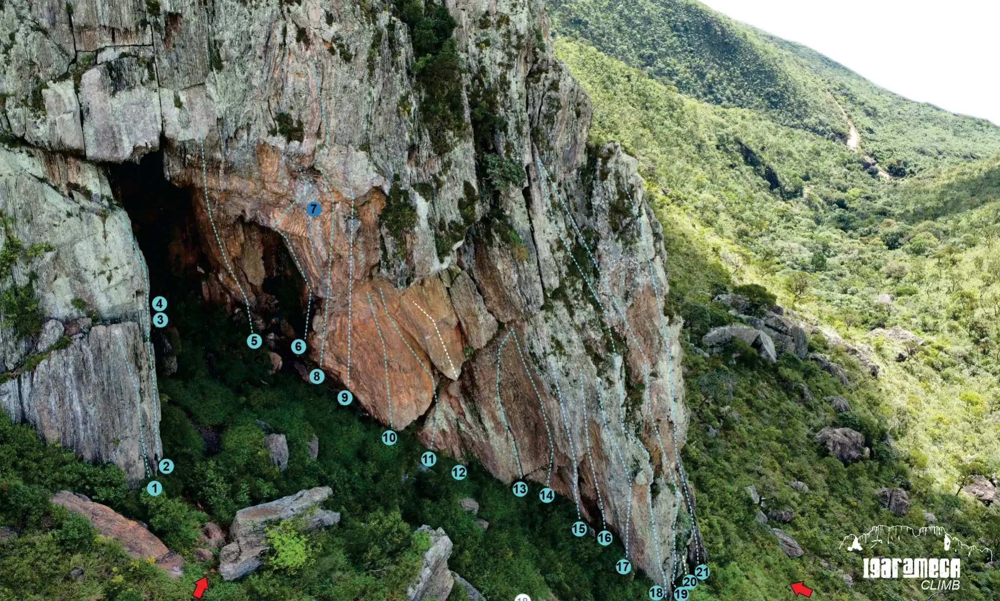
    - **largura_mapa**: 2048
    - **altura_mapa**: 1232
    - **pontos_de_interesse**:
      - **[0]**:
        - **id**: 01
        - **label**: 01
        - **circulo**:
          - **x**: 317
          - **y**: 1001
          - **raio**: 15
      - **[1]**:
        - **id**: 02
        - **label**: 02
        - **circulo**:
          - **x**: 341
          - **y**: 956
          - **raio**: 15
      - **[2]**:
        - **id**: 03
        - **label**: 03
        - **circulo**:
          - **x**: 329
          - **y**: 656
          - **raio**: 15
      - **[3]**:
        - **id**: 04
        - **label**: 04
        - **circulo**:
          - **x**: 327
          - **y**: 622
          - **raio**: 15
      - **[4]**:
        - **id**: 05
        - **label**: 05
        - **circulo**:
          - **x**: 521
          - **y**: 699
          - **raio**: 15
      - **[5]**:
        - **id**: 06
        - **label**: 06
        - **circulo**:
          - **x**: 612
          - **y**: 711
          - **raio**: 15
      - **[6]**:
        - **id**: 07
        - **label**: 07
        - **circulo**:
          - **x**: 643
          - **y**: 428
          - **raio**: 15
      - **[7]**:
        - **id**: 08
        - **label**: 08
        - **circulo**:
          - **x**: 649
          - **y**: 772
          - **raio**: 15
      - **[8]**:
        - **id**: 09
        - **label**: 09
        - **circulo**:
          - **x**: 707
          - **y**: 815
          - **raio**: 15
      - **[9]**:
        - **id**: 10
        - **label**: 10
        - **circulo**:
          - **x**: 797
          - **y**: 897
          - **raio**: 15
      - **[10]**:
        - **id**: 11
        - **label**: 11
        - **circulo**:
          - **x**: 878
          - **y**: 941
          - **raio**: 15
      - **[11]**:
        - **id**: 12
        - **label**: 12
        - **circulo**:
          - **x**: 940
          - **y**: 968
          - **raio**: 15
      - **[12]**:
        - **id**: 13
        - **label**: 13
        - **circulo**:
          - **x**: 1065
          - **y**: 1002
          - **raio**: 15
      - **[13]**:
        - **id**: 14
        - **label**: 14
        - **circulo**:
          - **x**: 1120
          - **y**: 1015
          - **raio**: 15
      - **[14]**:
        - **id**: 15
        - **label**: 15
        - **circulo**:
          - **x**: 1186
          - **y**: 1084
          - **raio**: 15
      - **[15]**:
        - **id**: 16
        - **label**: 16
        - **circulo**:
          - **x**: 1239
          - **y**: 1103
          - **raio**: 15
      - **[16]**:
        - **id**: 17
        - **label**: 17
        - **circulo**:
          - **x**: 1277
          - **y**: 1162
          - **raio**: 16
      - **[17]**:
        - **id**: 18
        - **label**: 18
        - **circulo**:
          - **x**: 1345
          - **y**: 1216
          - **raio**: 15
      - **[18]**:
        - **id**: 19
        - **label**: 19
        - **circulo**:
          - **x**: 1395
          - **y**: 1218
          - **raio**: 15
      - **[19]**:
        - **id**: 20
        - **label**: 20
        - **circulo**:
          - **x**: 1413
          - **y**: 1193
          - **raio**: 15
      - **[20]**:
        - **id**: 21
        - **label**: 21
        - **circulo**:
          - **x**: 1438
          - **y**: 1173
          - **raio**: 15
    - **referencias**:
      - **[0]**:
        - **escalada**: Beatrix
        - **ids**:
          - 01
      - **[1]**:
        - **escalada**: Na Boca da Gruta Tem Dente
        - **ids**:
          - 02
      - **[2]**:
        - **escalada**: Sunday Bloody Sunday
        - **ids**:
          - 03
      - **[3]**:
        - **escalada**: People Let's Stop The War
        - **ids**:
          - 04
      - **[4]**:
        - **escalada**: Apolo 13
        - **ids**:
          - 05
      - **[5]**:
        - **escalada**: Liga Extraordinária
        - **ids**:
          - 06
      - **[6]**:
        - **escalada**: Poneis Malditos
        - **ids**:
          - 07
      - **[7]**:
        - **escalada**: U.F.O
        - **ids**:
          - 10
      - **[8]**:
        - **escalada**: 127 Horas
        - **ids**:
          - 11
      - **[9]**:
        - **escalada**: Lero Lero é Mato
        - **ids**:
          - 12
      - **[10]**:
        - **escalada**: Renegados de Igarapé
        - **ids**:
          - 13
      - **[11]**:
        - **escalada**: Coisa Linda
        - **ids**:
          - 14
      - **[12]**:
        - **escalada**: Doce Veneno
        - **ids**:
          - 15
      - **[13]**:
        - **escalada**: Alguém Tem Que Ceder
        - **ids**:
          - 16
      - **[14]**:
        - **escalada**: Napa
        - **ids**:
          - 17
      - **[15]**:
        - **escalada**: Alpes Suínos*
        - **ids**:
          - 18
      - **[16]**:
        - **escalada**: Viagem ao Centro da Terra
        - **ids**:
          - 19
      - **[17]**:
        - **escalada**: Rolitos
        - **ids**:
          - 20
      - **[18]**:
        - **escalada**: Balança Mas Não Cai
        - **ids**:
          - 21
      - **[19]**:
        - **ids**:
          - 08
        - **setor**: Setor Igarameca
        - **escalada**: I Like This
      - **[20]**:
        - **ids**:
          - 09
        - **setor**: Setor Igarameca
        - **escalada**: Igarameca
  - **[1]**:
    - **caminho_imagem_mapa**: 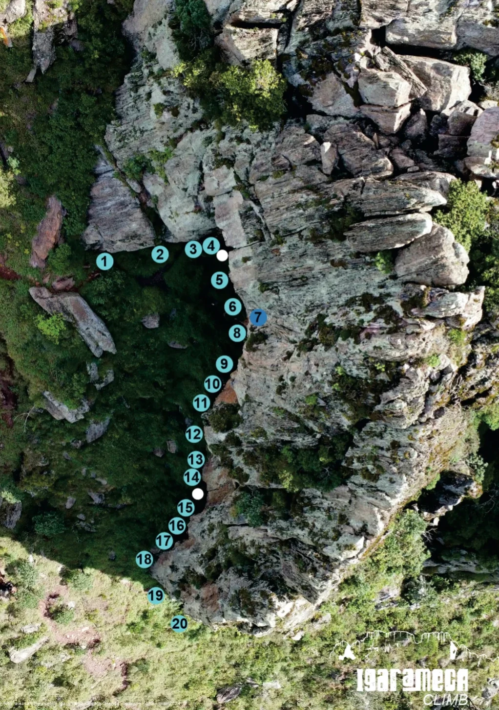
    - **largura_mapa**: 1022
    - **altura_mapa**: 1450
    - **pontos_de_interesse**:
      - **[0]**:
        - **id**: 01
        - **label**: 01
        - **circulo**:
          - **x**: 215
          - **y**: 534
          - **raio**: 17
      - **[1]**:
        - **id**: 02
        - **label**: 02
        - **circulo**:
          - **x**: 328
          - **y**: 520
          - **raio**: 17
      - **[2]**:
        - **id**: 03
        - **label**: 03
        - **circulo**:
          - **x**: 396
          - **y**: 509
          - **raio**: 17
      - **[3]**:
        - **id**: 04
        - **label**: 04
        - **circulo**:
          - **x**: 433
          - **y**: 502
          - **raio**: 17
      - **[4]**:
        - **id**: 05
        - **label**: 05
        - **circulo**:
          - **x**: 450
          - **y**: 572
          - **raio**: 17
      - **[5]**:
        - **id**: 06
        - **label**: 06
        - **circulo**:
          - **x**: 477
          - **y**: 626
          - **raio**: 17
      - **[6]**:
        - **id**: 07
        - **label**: 07
        - **circulo**:
          - **x**: 529
          - **y**: 648
          - **raio**: 17
      - **[7]**:
        - **id**: 08
        - **label**: 08
        - **circulo**:
          - **x**: 486
          - **y**: 680
          - **raio**: 17
      - **[8]**:
        - **id**: 09
        - **label**: 09
        - **circulo**:
          - **x**: 460
          - **y**: 744
          - **raio**: 17
      - **[9]**:
        - **id**: 10
        - **label**: 10
        - **circulo**:
          - **x**: 436
          - **y**: 784
          - **raio**: 17
      - **[10]**:
        - **id**: 11
        - **label**: 11
        - **circulo**:
          - **x**: 412
          - **y**: 823
          - **raio**: 17
      - **[11]**:
        - **id**: 12
        - **label**: 12
        - **circulo**:
          - **x**: 397
          - **y**: 887
          - **raio**: 17
      - **[12]**:
        - **id**: 13
        - **label**: 13
        - **circulo**:
          - **x**: 402
          - **y**: 938
          - **raio**: 17
      - **[13]**:
        - **id**: 14
        - **label**: 14
        - **circulo**:
          - **x**: 393
          - **y**: 975
          - **raio**: 17
      - **[14]**:
        - **id**: 15
        - **label**: 15
        - **circulo**:
          - **x**: 381
          - **y**: 1037
          - **raio**: 17
      - **[15]**:
        - **id**: 16
        - **label**: 16
        - **circulo**:
          - **x**: 363
          - **y**: 1074
          - **raio**: 17
      - **[16]**:
        - **id**: 17
        - **label**: 17
        - **circulo**:
          - **x**: 337
          - **y**: 1104
          - **raio**: 17
      - **[17]**:
        - **id**: 18
        - **label**: 18
        - **circulo**:
          - **x**: 296
          - **y**: 1142
          - **raio**: 17
      - **[18]**:
        - **id**: 19
        - **label**: 19
        - **circulo**:
          - **x**: 319
          - **y**: 1216
          - **raio**: 17
      - **[19]**:
        - **id**: 20
        - **label**: 20
        - **circulo**:
          - **x**: 367
          - **y**: 1274
          - **raio**: 18
    - **referencias**:
      - **[0]**:
        - **escalada**: Beatrix
        - **ids**:
          - 01
      - **[1]**:
        - **escalada**: Na Boca da Gruta Tem Dente
        - **ids**:
          - 02
      - **[2]**:
        - **escalada**: Sunday Bloody Sunday
        - **ids**:
          - 03
      - **[3]**:
        - **escalada**: People Let's Stop The War
        - **ids**:
          - 04
      - **[4]**:
        - **escalada**: Apolo 13
        - **ids**:
          - 05
      - **[5]**:
        - **escalada**: Liga Extraordinária
        - **ids**:
          - 06
      - **[6]**:
        - **escalada**: Poneis Malditos
        - **ids**:
          - 07
      - **[7]**:
        - **escalada**: U.F.O
        - **ids**:
          - 10
      - **[8]**:
        - **escalada**: 127 Horas
        - **ids**:
          - 11
      - **[9]**:
        - **escalada**: Lero Lero é Mato
        - **ids**:
          - 12
      - **[10]**:
        - **escalada**: Renegados de Igarapé
        - **ids**:
          - 13
      - **[11]**:
        - **escalada**: Coisa Linda
        - **ids**:
          - 14
      - **[12]**:
        - **escalada**: Doce Veneno
        - **ids**:
          - 15
      - **[13]**:
        - **escalada**: Alguém Tem Que Ceder
        - **ids**:
          - 16
      - **[14]**:
        - **escalada**: Napa
        - **ids**:
          - 17
      - **[15]**:
        - **escalada**: Alpes Suínos*
        - **ids**:
          - 18
      - **[16]**:
        - **escalada**: Viagem ao Centro da Terra
        - **ids**:
          - 19
      - **[17]**:
        - **escalada**: Rolitos
        - **ids**:
          - 20
      - **[18]**:
        - **ids**:
          - 08
        - **setor**: Setor Igarameca
        - **escalada**: I Like This
      - **[19]**:
        - **ids**:
          - 09
        - **setor**: Setor Igarameca
        - **escalada**: Igarameca
  - **[2]**:
    - **caminho_imagem_mapa**: 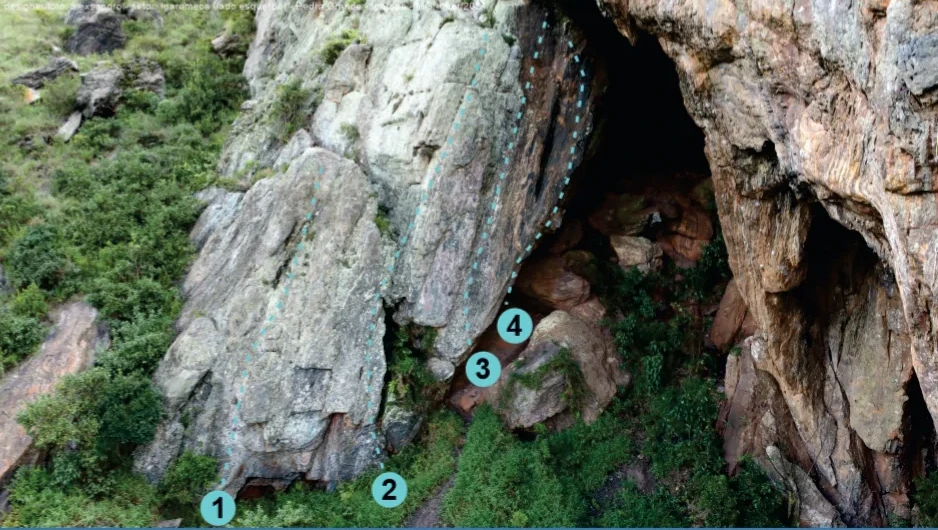
    - **largura_mapa**: 938
    - **altura_mapa**: 530
    - **pontos_de_interesse**:
      - **[0]**:
        - **id**: 04
        - **label**: 04
        - **circulo**:
          - **x**: 515
          - **y**: 326
          - **raio**: 17
      - **[1]**:
        - **id**: 03
        - **label**: 03
        - **circulo**:
          - **x**: 484
          - **y**: 369
          - **raio**: 17
      - **[2]**:
        - **id**: 02
        - **label**: 02
        - **circulo**:
          - **x**: 389
          - **y**: 490
          - **raio**: 17
      - **[3]**:
        - **id**: 01
        - **label**: 01
        - **circulo**:
          - **x**: 218
          - **y**: 508
          - **raio**: 17
    - **referencias**:
      - **[0]**:
        - **escalada**: Beatrix
        - **ids**:
          - 01
      - **[1]**:
        - **escalada**: Na Boca da Gruta Tem Dente
        - **ids**:
          - 02
      - **[2]**:
        - **escalada**: Sunday Bloody Sunday
        - **ids**:
          - 03
      - **[3]**:
        - **escalada**: People Let's Stop The War
        - **ids**:
          - 04
- **escaladas**:
  - **[0]**:
    - **via_esportiva**:
      - **nome**: Beatrix
      - **dificuldade**: BR_5
      - **quantidade_protecoes_intermediarias**: 4
      - **quantidade_protecoes_parada**: 2
      - **extensao**: 8
      - **conquistadores**:
        - Berbari
        - Toninho
      - **data_abertura**: 2023
  - **[1]**:
    - **via_esportiva**:
      - **nome**: Na Boca da Gruta Tem Dente
      - **dificuldade**: BR_7B
      - **quantidade_protecoes_intermediarias**: 6
      - **quantidade_protecoes_parada**: 2
      - **extensao**: 16
      - **conquistadores**:
        - Berbari
        - Toninho
        - Alex
      - **data_abertura**: 2004
  - **[2]**:
    - **via_esportiva**:
      - **nome**: Sunday Bloody Sunday
      - **dificuldade**: BR_8C
      - **quantidade_protecoes_intermediarias**: 6
      - **quantidade_protecoes_parada**: 2
      - **extensao**: 14
      - **conquistadores**:
        - Berbari
        - Alex
        - Ruy
      - **data_abertura**: 2006
  - **[3]**:
    - **via_esportiva**:
      - **nome**: People Let's Stop The War
      - **dificuldade**: BR_8B
      - **quantidade_protecoes_intermediarias**: 6
      - **quantidade_protecoes_parada**: 2
      - **extensao**: 14
      - **conquistadores**:
        - Berbari
        - Alex
        - Toninho
      - **data_abertura**: 2006
  - **[4]**:
    - **via_esportiva**:
      - **nome**: Apolo 13
      - **dificuldade**: BR_10B
      - **quantidade_protecoes_intermediarias**: 8
      - **quantidade_protecoes_parada**: 2
      - **extensao**: 20
      - **conquistadores**:
        - Berbari
        - Moleza
        - Alex
        - Chinha
      - **data_abertura**: 2012
  - **[5]**:
    - **via_esportiva**:
      - **nome**: Liga Extraordinária
      - **dificuldade**: BR_9C
      - **quantidade_protecoes_intermediarias**: 9
      - **quantidade_protecoes_parada**: 2
      - **extensao**: 25
      - **conquistadores**:
        - Berbari
        - Moleza
        - Alex
      - **data_abertura**: 2012
  - **[6]**:
    - **via_esportiva**:
      - **nome**: Poneis Malditos
      - **dificuldade**: BR_9B
      - **quantidade_protecoes_intermediarias**: 11
      - **quantidade_protecoes_parada**: 2
      - **extensao**: 25
      - **conquistadores**:
        - Berbari
        - Moleza
        - Alex
      - **data_abertura**: 2011
  - **[7]**:
    - **via_esportiva**:
      - **descricao**: Variante da Boneis Malditos.
      - **nome**: I Like This
      - **dificuldade**: BR_8B
      - **quantidade_protecoes_intermediarias**: 13
      - **quantidade_protecoes_parada**: 2
      - **extensao**: 30
      - **conquistadores**:
        - Berbari
        - Alex
        - Toninho
      - **data_abertura**: 2010
  - **[8]**:
    - **via_multiplas_enfiadas**:
      - **nome**: Igarameca
      - **dificuldade_media**: BR_7B
      - **dificuldade_maxima**: BR_9A
      - **numero_enfiadas**: 2
      - **comprimento_total**: 10
      - **conquistadores**:
        - Berbari
        - Toninho
        - Pilão
      - **data_abertura**: 2022
      - **enfiadas**:
        - **[0]**:
          - **via_esportiva**:
            - **nome**: Enfiada 1
            - **dificuldade**: BR_7B
            - **quantidade_protecoes_intermediarias**: 5
            - **quantidade_protecoes_parada**: 2
        - **[1]**:
          - **via_esportiva**:
            - **nome**: Enfiada 2
            - **dificuldade**: BR_9A
            - **quantidade_protecoes_intermediarias**: 5
            - **quantidade_protecoes_parada**: 2
  - **[9]**:
    - **via_esportiva**:
      - **nome**: U.F.O
      - **dificuldade**: BR_7B
      - **quantidade_protecoes_intermediarias**: 5
      - **quantidade_protecoes_parada**: 2
      - **extensao**: 12
      - **conquistadores**:
        - Berbari
        - Bunitinho
        - Chinha
        - Toninho
      - **data_abertura**: 2022
  - **[10]**:
    - **via_esportiva**:
      - **nome**: 127 Horas
      - **dificuldade**: BR_7C
      - **quantidade_protecoes_intermediarias**: 6
      - **quantidade_protecoes_parada**: 2
      - **extensao**: 14
      - **conquistadores**:
        - Berbari
        - Bunitinho
        - Chinha
      - **data_abertura**: 2022
  - **[11]**:
    - **via_esportiva**:
      - **nome**: Lero Lero é Mato
      - **dificuldade**: INDEFINIDO
      - **quantidade_protecoes_intermediarias**: 6
      - **quantidade_protecoes_parada**: 2
      - **extensao**: 15
      - **conquistadores**:
        - Berbari
        - Bunitinho
        - Chinha
      - **data_abertura**: 2022
  - **[12]**:
    - **via_esportiva**:
      - **nome**: Renegados de Igarapé
      - **dificuldade**: BR_7B
      - **quantidade_protecoes_intermediarias**: 9
      - **quantidade_protecoes_parada**: 2
      - **extensao**: 23
      - **conquistadores**:
        - Berbari
        - Bunitinho
        - Chinha
        - Bolinha
      - **data_abertura**: 2022
  - **[13]**:
    - **via_esportiva**:
      - **nome**: Coisa Linda
      - **dificuldade**: BR_8B
      - **quantidade_protecoes_intermediarias**: 8
      - **quantidade_protecoes_parada**: 2
      - **extensao**: 23
      - **conquistadores**:
        - Bunitinho
        - Bolinha
      - **data_abertura**: 2022
  - **[14]**:
    - **via_esportiva**:
      - **nome**: Doce Veneno
      - **dificuldade**: BR_7A
      - **quantidade_protecoes_intermediarias**: 6
      - **quantidade_protecoes_parada**: 2
      - **extensao**: 15
      - **conquistadores**:
        - Berbari
        - Bunitinho
        - Chinha
      - **data_abertura**: 2022
  - **[15]**:
    - **via_esportiva**:
      - **nome**: Alguém Tem Que Ceder
      - **dificuldade**: BR_7C
      - **quantidade_protecoes_intermediarias**: 7
      - **quantidade_protecoes_parada**: 2
      - **extensao**: 16
      - **conquistadores**:
        - Berbari
        - Bunitinho
        - Chinha
      - **data_abertura**: 2022
  - **[16]**:
    - **via_esportiva**:
      - **nome**: Napa
      - **dificuldade**: BR_7B
      - **quantidade_protecoes_intermediarias**: 10
      - **quantidade_protecoes_parada**: 2
      - **extensao**: 20
      - **conquistadores**:
        - Berbari
        - Toninho
      - **data_abertura**: 2022
  - **[17]**:
    - **via_esportiva**:
      - **nome**: Alpes Suínos*
      - **dificuldade**: BR_6SUP
      - **quantidade_protecoes_intermediarias**: 16
      - **quantidade_protecoes_parada**: 2
      - **extensao**: 35
      - **conquistadores**:
        - Berbari
        - Toninho
      - **data_abertura**: 2022
  - **[18]**:
    - **via_esportiva**:
      - **nome**: Viagem ao Centro da Terra
      - **dificuldade**: BR_6
      - **quantidade_protecoes_intermediarias**: 14
      - **quantidade_protecoes_parada**: 2
      - **extensao**: 35
      - **conquistadores**:
        - Berbari
        - Toninho
      - **data_abertura**: 2022
  - **[19]**:
    - **via_esportiva**:
      - **descricao**: Via inacabada.
      - **nome**: Rolitos
      - **dificuldade**: INDEFINIDO
      - **quantidade_protecoes_intermediarias**: 1
      - **quantidade_protecoes_parada**: 0
      - **conquistadores**:
        - Bunitin
  - **[20]**:
    - **via_esportiva**:
      - **nome**: Balança Mas Não Cai
      - **dificuldade**: BR_6
      - **quantidade_protecoes_intermediarias**: 10
      - **quantidade_protecoes_parada**: 2
      - **extensao**: 25
      - **conquistadores**:
        - Bunitinho
        - Marcão
      - **data_abertura**: 2022
- **precomputados**:
  - **total_escaladas**: 21

## Parte: setor_pracinha

### Setor (Pico: Complexo Pedra Grande)

- **descricao**:
    # Setor Pracinha
    
    |  |
    | :--: |
    | *Setor pracinha* |
    
    Sombra o dia todo (varia de acordo com a estação).
- **nome**: Setor Pracinha
- **mapas**:
  - **[0]**:
    - **caminho_imagem_mapa**: 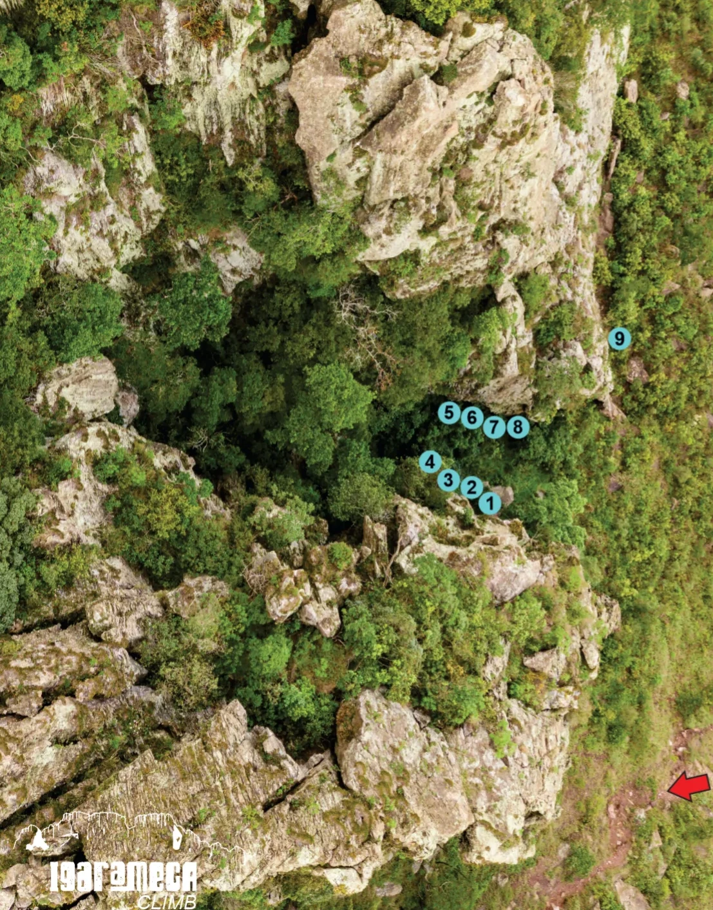
    - **largura_mapa**: 1107
    - **altura_mapa**: 1413
    - **pontos_de_interesse**:
      - **[0]**:
        - **id**: 01
        - **label**: 01
        - **circulo**:
          - **x**: 761
          - **y**: 782
          - **raio**: 17
      - **[1]**:
        - **id**: 02
        - **label**: 02
        - **circulo**:
          - **x**: 732
          - **y**: 757
          - **raio**: 17
      - **[2]**:
        - **id**: 03
        - **label**: 03
        - **circulo**:
          - **x**: 697
          - **y**: 746
          - **raio**: 17
      - **[3]**:
        - **id**: 04
        - **label**: 04
        - **circulo**:
          - **x**: 668
          - **y**: 717
          - **raio**: 17
      - **[4]**:
        - **id**: 05
        - **label**: 05
        - **circulo**:
          - **x**: 697
          - **y**: 641
          - **raio**: 17
      - **[5]**:
        - **id**: 06
        - **label**: 06
        - **circulo**:
          - **x**: 734
          - **y**: 649
          - **raio**: 17
      - **[6]**:
        - **id**: 07
        - **label**: 07
        - **circulo**:
          - **x**: 768
          - **y**: 663
          - **raio**: 17
      - **[7]**:
        - **id**: 08
        - **label**: 08
        - **circulo**:
          - **x**: 805
          - **y**: 663
          - **raio**: 17
      - **[8]**:
        - **id**: 09
        - **label**: 09
        - **circulo**:
          - **x**: 962
          - **y**: 526
          - **raio**: 17
    - **referencias**:
      - **[0]**:
        - **escalada**: Conflito sensual
        - **ids**:
          - 01
      - **[1]**:
        - **escalada**: Duracell
        - **ids**:
          - 02
      - **[2]**:
        - **escalada**: Djavú
        - **ids**:
          - 03
      - **[3]**:
        - **escalada**: Muita coisa envolvida
        - **ids**:
          - 04
      - **[4]**:
        - **escalada**: Netfrix
        - **ids**:
          - 05
      - **[5]**:
        - **escalada**: Pouca prática
        - **ids**:
          - 06
      - **[6]**:
        - **escalada**: Vainafé
        - **ids**:
          - 07
      - **[7]**:
        - **ids**:
          - 08
        - **setor**: Setor Pracinha
        - **escalada**: People crazy
      - **[8]**:
        - **ids**:
          - 09
        - **setor**: Setor Trad
        - **escalada**: Aresta Daniel
  - **[1]**:
    - **caminho_imagem_mapa**: 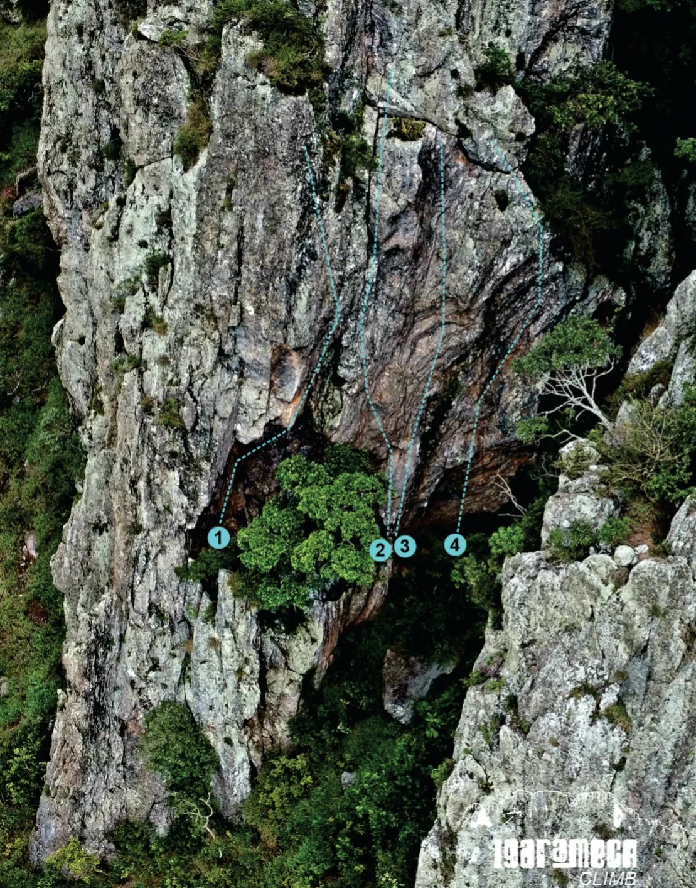
    - **largura_mapa**: 1109
    - **altura_mapa**: 1413
    - **pontos_de_interesse**:
      - **[0]**:
        - **id**: 01
        - **label**: 01
        - **circulo**:
          - **x**: 349
          - **y**: 855
          - **raio**: 17
      - **[1]**:
        - **id**: 02
        - **label**: 02
        - **circulo**:
          - **x**: 606
          - **y**: 876
          - **raio**: 17
      - **[2]**:
        - **id**: 03
        - **label**: 03
        - **circulo**:
          - **x**: 646
          - **y**: 870
          - **raio**: 17
      - **[3]**:
        - **id**: 04
        - **label**: 04
        - **circulo**:
          - **x**: 725
          - **y**: 867
          - **raio**: 17
    - **referencias**:
      - **[0]**:
        - **escalada**: Conflito sensual
        - **ids**:
          - 01
      - **[1]**:
        - **escalada**: Duracell
        - **ids**:
          - 02
      - **[2]**:
        - **escalada**: Djavú
        - **ids**:
          - 03
      - **[3]**:
        - **escalada**: Muita coisa envolvida
        - **ids**:
          - 04
  - **[2]**:
    - **caminho_imagem_mapa**: 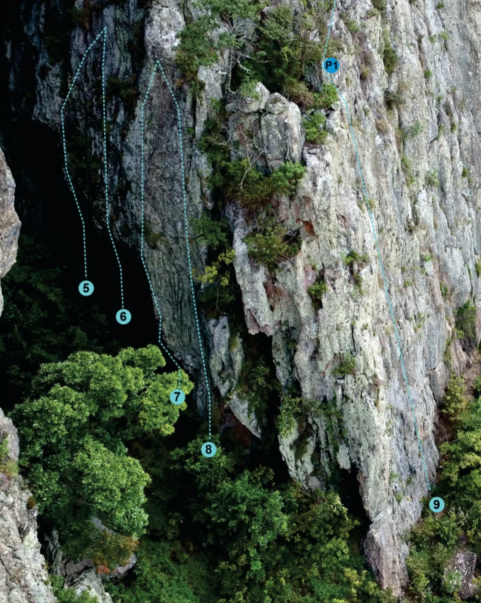
    - **largura_mapa**: 1109
    - **altura_mapa**: 1391
    - **pontos_de_interesse**:
      - **[0]**:
        - **id**: P1
        - **label**: P1
        - **circulo**:
          - **x**: 764
          - **y**: 151
          - **raio**: 18
      - **[1]**:
        - **id**: 05
        - **label**: 05
        - **circulo**:
          - **x**: 199
          - **y**: 665
          - **raio**: 17
      - **[2]**:
        - **id**: 06
        - **label**: 06
        - **circulo**:
          - **x**: 285
          - **y**: 731
          - **raio**: 17
      - **[3]**:
        - **id**: 07
        - **label**: 07
        - **circulo**:
          - **x**: 409
          - **y**: 915
          - **raio**: 17
      - **[4]**:
        - **id**: 08
        - **label**: 08
        - **circulo**:
          - **x**: 481
          - **y**: 1037
          - **raio**: 17
      - **[5]**:
        - **id**: 09
        - **label**: 09
        - **circulo**:
          - **x**: 1007
          - **y**: 1164
          - **raio**: 17
    - **referencias**:
      - **[0]**:
        - **escalada**: Netfrix
        - **ids**:
          - 05
      - **[1]**:
        - **escalada**: Pouca prática
        - **ids**:
          - 06
      - **[2]**:
        - **escalada**: Vainafé
        - **ids**:
          - 07
      - **[3]**:
        - **ids**:
          - 08
        - **setor**: Setor Pracinha
        - **escalada**: People crazy
      - **[4]**:
        - **ids**:
          - 09
        - **setor**: Setor Trad
        - **escalada**: Aresta Daniel
- **escaladas**:
  - **[0]**:
    - **via_esportiva**:
      - **nome**: Conflito sensual
      - **dificuldade**: PROJETO
      - **quantidade_protecoes_intermediarias**: 10
      - **quantidade_protecoes_parada**: 2
      - **extensao**: 20
      - **conquistadores**:
        - Berbari
        - Bunitin
      - **data_abertura**: 2022
  - **[1]**:
    - **via_esportiva**:
      - **nome**: Duracell
      - **dificuldade**: BR_8C
      - **quantidade_protecoes_intermediarias**: 9
      - **quantidade_protecoes_parada**: 2
      - **extensao**: 22
      - **conquistadores**:
        - Bunitin
        - Marcão
      - **data_abertura**: 2022
  - **[2]**:
    - **via_esportiva**:
      - **nome**: Djavú
      - **dificuldade**: BR_8B
      - **quantidade_protecoes_intermediarias**: 9
      - **quantidade_protecoes_parada**: 2
      - **extensao**: 22
      - **conquistadores**:
        - Berbari
        - Chinha
        - Tonin
      - **data_abertura**: 2022
  - **[3]**:
    - **via_esportiva**:
      - **nome**: Muita coisa envolvida
      - **dificuldade**: BR_8A
      - **quantidade_protecoes_intermediarias**: 10
      - **quantidade_protecoes_parada**: 2
      - **extensao**: 22
      - **conquistadores**:
        - Berbari
        - Tonin
      - **data_abertura**: 2022
  - **[4]**:
    - **via_esportiva**:
      - **nome**: Netfrix
      - **dificuldade**: BR_7A
      - **quantidade_protecoes_intermediarias**: 6
      - **quantidade_protecoes_parada**: 2
      - **extensao**: 18
      - **conquistadores**:
        - Berbari
        - Tonin
      - **data_abertura**: 2022
  - **[5]**:
    - **via_esportiva**:
      - **nome**: Pouca prática
      - **dificuldade**: BR_6SUP
      - **quantidade_protecoes_intermediarias**: 7
      - **quantidade_protecoes_parada**: 2
      - **extensao**: 18
      - **conquistadores**:
        - Berbari
        - Tonin
      - **data_abertura**: 2022
  - **[6]**:
    - **via_esportiva**:
      - **nome**: Vainafé
      - **dificuldade**: BR_7A
      - **quantidade_protecoes_intermediarias**: 8
      - **quantidade_protecoes_parada**: 2
      - **extensao**: 18
      - **conquistadores**:
        - Berbari
        - Tonin
      - **data_abertura**: 2022
  - **[7]**:
    - **via_esportiva**:
      - **nome**: People crazy
      - **dificuldade**: BR_6SUP
      - **quantidade_protecoes_intermediarias**: 9
      - **quantidade_protecoes_parada**: 2
      - **extensao**: 20
      - **conquistadores**:
        - Berbari
        - Toninho
      - **data_abertura**: 2022
- **precomputados**:
  - **total_escaladas**: 8

## Parte: setor_tetos

### Setor (Pico: Complexo Pedra Grande)

- **descricao**:
    # Setor dos Tetos
    
    | 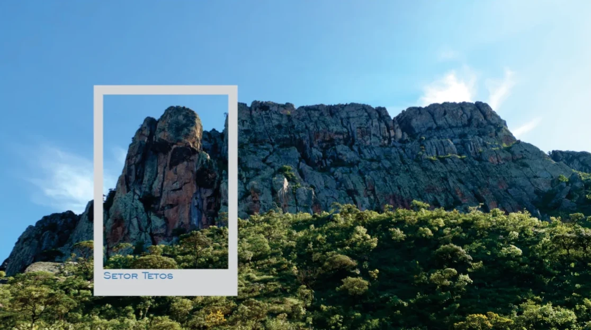 |
    | :--: |
    | *Setor dos Tetos* |
    
    Sombra após 14h.
- **nome**: Setor dos Tetos
- **mapas**:
  - **[0]**:
    - **caminho_imagem_mapa**: 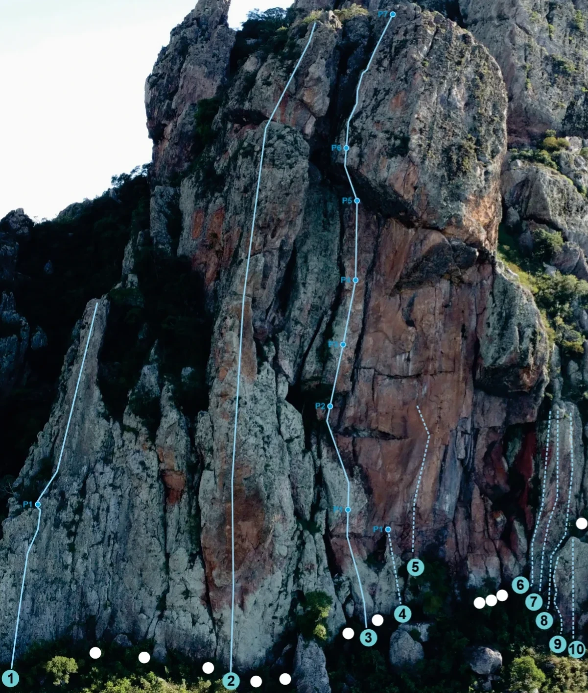
    - **largura_mapa**: 1201
    - **altura_mapa**: 1413
    - **pontos_de_interesse**:
      - **[0]**:
        - **id**: 01
        - **label**: 01
        - **circulo**:
          - **x**: 21
          - **y**: 1383
          - **raio**: 17
      - **[1]**:
        - **id**: 02
        - **label**: 02
        - **circulo**:
          - **x**: 472
          - **y**: 1389
          - **raio**: 17
      - **[2]**:
        - **id**: 03
        - **label**: 03
        - **circulo**:
          - **x**: 753
          - **y**: 1300
          - **raio**: 17
      - **[3]**:
        - **id**: 04
        - **label**: 04
        - **circulo**:
          - **x**: 823
          - **y**: 1252
          - **raio**: 17
      - **[4]**:
        - **id**: 05
        - **label**: 05
        - **circulo**:
          - **x**: 849
          - **y**: 1157
          - **raio**: 17
      - **[5]**:
        - **id**: 06
        - **label**: 06
        - **circulo**:
          - **x**: 1063
          - **y**: 1193
          - **raio**: 17
      - **[6]**:
        - **id**: 07
        - **label**: 07
        - **circulo**:
          - **x**: 1091
          - **y**: 1228
          - **raio**: 17
      - **[7]**:
        - **id**: 08
        - **label**: 08
        - **circulo**:
          - **x**: 1112
          - **y**: 1266
          - **raio**: 17
      - **[8]**:
        - **id**: 09
        - **label**: 09
        - **circulo**:
          - **x**: 1140
          - **y**: 1313
          - **raio**: 17
      - **[9]**:
        - **id**: 10
        - **label**: 10
        - **circulo**:
          - **x**: 1178
          - **y**: 1324
          - **raio**: 17
    - **referencias**:
      - **[0]**:
        - **escalada**: A Quina
        - **ids**:
          - 02
      - **[1]**:
        - **escalada**: Pachamama
        - **ids**:
          - 03
      - **[2]**:
        - **escalada**: Baba Yaga
        - **ids**:
          - 04
      - **[3]**:
        - **escalada**: Soy Loco Por Ti América
        - **ids**:
          - 05
      - **[4]**:
        - **escalada**: Afrodite
        - **ids**:
          - 06
      - **[5]**:
        - **escalada**: Ponto de Equilíbrio
        - **ids**:
          - 07
      - **[6]**:
        - **escalada**: Deu Nois
        - **ids**:
          - 10
      - **[7]**:
        - **escalada**: Aresta Daniel
        - **ids**:
          - 01
        - **setor**: Setor Trad
      - **[8]**:
        - **ids**:
          - 08
        - **setor**: Setor dos Tetos
        - **escalada**: Lilith
      - **[9]**:
        - **ids**:
          - 09
        - **setor**: Setor dos Tetos
        - **escalada**: Deu Brasil
- **escaladas**:
  - **[0]**:
    - **via_multiplas_enfiadas**:
      - **nome**: A Quina
      - **numero_enfiadas**: 4
      - **conquistadores**:
        - André
        - Tigrão
  - **[1]**:
    - **via_multiplas_enfiadas**:
      - **nome**: Pachamama
      - **numero_enfiadas**: 7
      - **conquistadores**:
        - Berbari
        - Tonin
        - Bunitin
        - Neander
        - Chinha
        - Paulão
        - Bolinha
      - **comprimento_total**: 130
      - **data_abertura**: 2024-06-14
  - **[2]**:
    - **via_esportiva**:
      - **descricao**: Via inacabada.
      - **nome**: Baba Yaga
      - **dificuldade**: BR_5
      - **conquistadores**:
        - Berbari
        - Neander
        - Bunitin
        - Ana
      - **data_abertura**: 2024
  - **[3]**:
    - **via_esportiva**:
      - **nome**: Soy Loco Por Ti América
      - **dificuldade**: BR_9C_BARRA_10A
      - **conquistadores**:
        - Berbari
        - Chinha
      - **data_abertura**: 2016
      - **extensao**: 30
      - **quantidade_protecoes_intermediarias**: 12
      - **quantidade_protecoes_parada**: 2
  - **[4]**:
    - **via_esportiva**:
      - **nome**: Afrodite
      - **dificuldade**: BR_7B
      - **quantidade_protecoes_intermediarias**: 11
      - **quantidade_protecoes_parada**: 2
      - **extensao**: 30
      - **conquistadores**:
        - Bunitinho
        - Clebinho
      - **data_abertura**: 2024
  - **[5]**:
    - **via_esportiva**:
      - **nome**: Ponto de Equilíbrio
      - **dificuldade**: BR_8B_BARRA_8C
      - **quantidade_protecoes_intermediarias**: 11
      - **quantidade_protecoes_parada**: 2
      - **extensao**: 30
      - **conquistadores**:
        - Berbari
        - Chinha
      - **data_abertura**: 2019
  - **[6]**:
    - **via_esportiva**:
      - **nome**: Lilith
      - **dificuldade**: BR_7A
      - **quantidade_protecoes_intermediarias**: 11
      - **quantidade_protecoes_parada**: 2
      - **extensao**: 30
      - **conquistadores**:
        - Berbari
        - Chinha
        - Bunitinho
      - **data_abertura**: 2024
  - **[7]**:
    - **via_esportiva**:
      - **nome**: Deu Brasil
      - **dificuldade**: BR_7B
      - **quantidade_protecoes_intermediarias**: 7
      - **quantidade_protecoes_parada**: 2
      - **extensao**: 12
      - **conquistadores**:
        - Berbari
        - Chinha
        - Bolinha
      - **data_abertura**: 2019
  - **[8]**:
    - **via_esportiva**:
      - **nome**: Deu Nois
      - **dificuldade**: BR_6SUP
      - **quantidade_protecoes_intermediarias**: 7
      - **quantidade_protecoes_parada**: 2
      - **extensao**: 14
      - **conquistadores**:
        - Berbari
        - Alex
        - Tonin
      - **data_abertura**: 2006
- **precomputados**:
  - **total_escaladas**: 9

## Parte: setor_trad

### Setor (Pico: Complexo Pedra Grande)

- **descricao**:
    # Setor Trad
    
    Este setor engloba as vias tradicionais e de proteção móvel do Complexo Pedra Grande. As informações aqui contidas são provisórias e serão atualizadas conforme o catálogo for sendo refinado.
    
    Catálogo provisório das vias tradicionais e/ou em proteção móvel do Complexo Pedra Grande.
- **nome**: Setor Trad
- **mapas**:
  - **[0]**:
    - **caminho_imagem_mapa**: 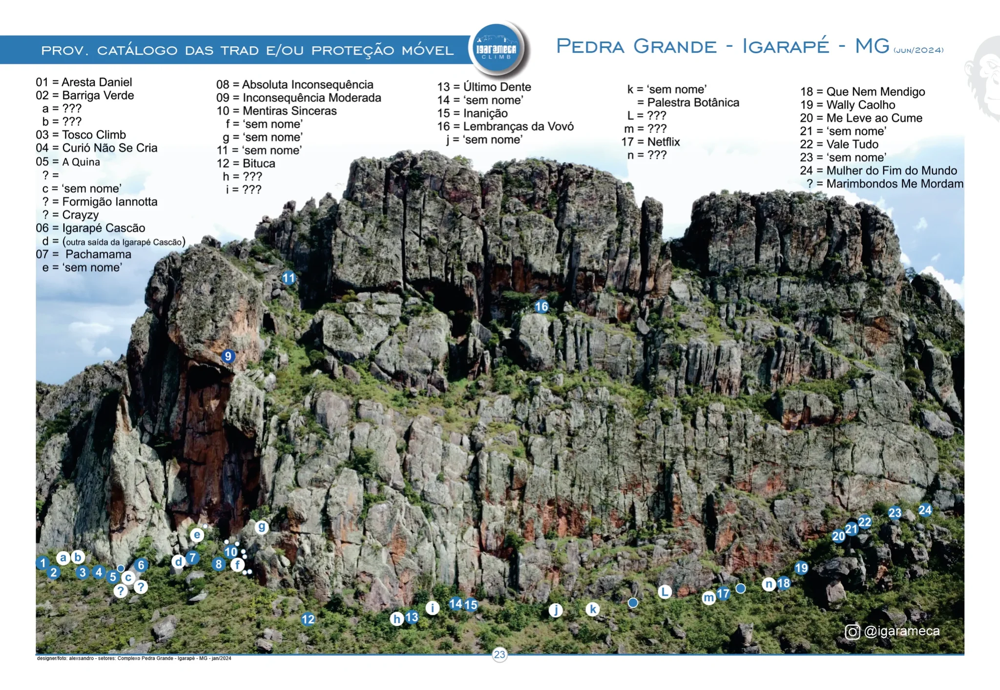
    - **largura_mapa**: 2048
    - **altura_mapa**: 1414
    - **pontos_de_interesse**:
      - **[0]**:
        - **id**: 01
        - **label**: 01
        - **circulo**:
          - **x**: 88
          - **y**: 1153
          - **raio**: 14
      - **[1]**:
        - **id**: a
        - **label**: a
        - **circulo**:
          - **x**: 130
          - **y**: 1144
          - **raio**: 14
      - **[2]**:
        - **id**: b
        - **label**: b
        - **circulo**:
          - **x**: 160
          - **y**: 1141
          - **raio**: 14
      - **[3]**:
        - **id**: 02
        - **label**: 02
        - **circulo**:
          - **x**: 110
          - **y**: 1173
          - **raio**: 14
      - **[4]**:
        - **id**: 03
        - **label**: 03
        - **circulo**:
          - **x**: 169
          - **y**: 1173
          - **raio**: 15
      - **[5]**:
        - **id**: 04
        - **label**: 04
        - **circulo**:
          - **x**: 202
          - **y**: 1172
          - **raio**: 15
      - **[6]**:
        - **id**: 05
        - **label**: 05
        - **circulo**:
          - **x**: 231
          - **y**: 1183
          - **raio**: 14
      - **[7]**:
        - **id**: c
        - **label**: c
        - **circulo**:
          - **x**: 263
          - **y**: 1184
          - **raio**: 14
      - **[8]**:
        - **id**: 06
        - **label**: 06
        - **circulo**:
          - **x**: 289
          - **y**: 1158
          - **raio**: 14
      - **[9]**:
        - **id**: d
        - **label**: d
        - **circulo**:
          - **x**: 366
          - **y**: 1151
          - **raio**: 14
      - **[10]**:
        - **id**: 07
        - **label**: 07
        - **circulo**:
          - **x**: 395
          - **y**: 1142
          - **raio**: 14
      - **[11]**:
        - **id**: e
        - **label**: e
        - **circulo**:
          - **x**: 404
          - **y**: 1096
          - **raio**: 14
      - **[12]**:
        - **id**: 08
        - **label**: 08
        - **circulo**:
          - **x**: 448
          - **y**: 1157
          - **raio**: 14
      - **[13]**:
        - **id**: f
        - **label**: f
        - **circulo**:
          - **x**: 487
          - **y**: 1157
          - **raio**: 14
      - **[14]**:
        - **id**: 10
        - **label**: 10
        - **circulo**:
          - **x**: 473
          - **y**: 1131
          - **raio**: 14
      - **[15]**:
        - **id**: g
        - **label**: g
        - **circulo**:
          - **x**: 536
          - **y**: 1081
          - **raio**: 14
      - **[16]**:
        - **id**: 11
        - **label**: 11
        - **circulo**:
          - **x**: 592
          - **y**: 569
          - **raio**: 15
      - **[17]**:
        - **id**: 16
        - **label**: 16
        - **circulo**:
          - **x**: 1110
          - **y**: 628
          - **raio**: 15
      - **[18]**:
        - **id**: 09
        - **label**: 09
        - **circulo**:
          - **x**: 468
          - **y**: 730
          - **raio**: 14
      - **[19]**:
        - **id**: 12
        - **label**: 12
        - **circulo**:
          - **x**: 631
          - **y**: 1269
          - **raio**: 15
      - **[20]**:
        - **id**: h
        - **label**: h
        - **circulo**:
          - **x**: 813
          - **y**: 1268
          - **raio**: 14
      - **[21]**:
        - **id**: 13
        - **label**: 13
        - **circulo**:
          - **x**: 844
          - **y**: 1265
          - **raio**: 14
      - **[22]**:
        - **id**: i
        - **label**: i
        - **circulo**:
          - **x**: 886
          - **y**: 1246
          - **raio**: 14
      - **[23]**:
        - **id**: 14
        - **label**: 14
        - **circulo**:
          - **x**: 934
          - **y**: 1237
          - **raio**: 14
      - **[24]**:
        - **id**: 15
        - **label**: 15
        - **circulo**:
          - **x**: 965
          - **y**: 1239
          - **raio**: 15
      - **[25]**:
        - **id**: j
        - **label**: j
        - **circulo**:
          - **x**: 1138
          - **y**: 1251
          - **raio**: 14
      - **[26]**:
        - **id**: k
        - **label**: k
        - **circulo**:
          - **x**: 1214
          - **y**: 1249
          - **raio**: 14
      - **[27]**:
        - **id**: 17
        - **label**: 17
        - **circulo**:
          - **x**: 1481
          - **y**: 1216
          - **raio**: 14
      - **[28]**:
        - **id**: m
        - **label**: m
        - **circulo**:
          - **x**: 1452
          - **y**: 1226
          - **raio**: 14
      - **[29]**:
        - **id**: n
        - **label**: n
        - **circulo**:
          - **x**: 1575
          - **y**: 1198
          - **raio**: 14
      - **[30]**:
        - **id**: 18
        - **label**: 18
        - **circulo**:
          - **x**: 1606
          - **y**: 1195
          - **raio**: 14
      - **[31]**:
        - **id**: 19
        - **label**: 19
        - **circulo**:
          - **x**: 1641
          - **y**: 1164
          - **raio**: 14
      - **[32]**:
        - **id**: 20
        - **label**: 20
        - **circulo**:
          - **x**: 1717
          - **y**: 1098
          - **raio**: 14
      - **[33]**:
        - **id**: 21
        - **label**: 21
        - **circulo**:
          - **x**: 1744
          - **y**: 1084
          - **raio**: 14
      - **[34]**:
        - **id**: 22
        - **label**: 22
        - **circulo**:
          - **x**: 1771
          - **y**: 1069
          - **raio**: 15
      - **[35]**:
        - **id**: 23
        - **label**: 23
        - **circulo**:
          - **x**: 1833
          - **y**: 1051
          - **raio**: 15
      - **[36]**:
        - **id**: 24
        - **label**: 24
        - **circulo**:
          - **x**: 1895
          - **y**: 1045
          - **raio**: 15
      - **[37]**:
        - **id**: L
        - **label**: L
        - **circulo**:
          - **x**: 1362
          - **y**: 1213
          - **raio**: 14
    - **referencias**:
      - **[0]**:
        - **escalada**: Aresta Daniel
        - **ids**:
          - 01
      - **[1]**:
        - **escalada**: Barriga Verde
        - **ids**:
          - 02
      - **[2]**:
        - **escalada**: ???
        - **ids**:
          - a
      - **[3]**:
        - **escalada**: ???
        - **ids**:
          - b
      - **[4]**:
        - **escalada**: Tosco Climb
        - **ids**:
          - 03
      - **[5]**:
        - **escalada**: Curió Não Se Cria
        - **ids**:
          - 04
      - **[6]**:
        - **escalada**: A Quina
        - **ids**:
          - 05
      - **[7]**:
        - **escalada**: sem nome
        - **ids**:
          - c
      - **[8]**:
        - **escalada**: Igarapé Cascão
        - **ids**:
          - 06
      - **[9]**:
        - **escalada**: Outra saída da Igarapé Cascão
        - **ids**:
          - d
      - **[10]**:
        - **escalada**: Pachamama
        - **ids**:
          - 07
      - **[11]**:
        - **escalada**: sem nome
        - **ids**:
          - e
      - **[12]**:
        - **escalada**: Absoluta Inconsequência
        - **ids**:
          - 08
      - **[13]**:
        - **escalada**: Inconsequência Moderada
        - **ids**:
          - 09
      - **[14]**:
        - **escalada**: Mentiras Sinceras
        - **ids**:
          - 10
      - **[15]**:
        - **escalada**: sem nome
        - **ids**:
          - f
      - **[16]**:
        - **escalada**: sem nome
        - **ids**:
          - g
      - **[17]**:
        - **escalada**: sem nome
        - **ids**:
          - 11
      - **[18]**:
        - **escalada**: Bituca
        - **ids**:
          - 12
      - **[19]**:
        - **escalada**: ???
        - **ids**:
          - h
      - **[20]**:
        - **escalada**: ???
        - **ids**:
          - i
      - **[21]**:
        - **escalada**: Último Dente
        - **ids**:
          - 13
      - **[22]**:
        - **escalada**: sem nome
        - **ids**:
          - 14
      - **[23]**:
        - **escalada**: Inanição
        - **ids**:
          - 15
      - **[24]**:
        - **escalada**: Lembranças da Vovó
        - **ids**:
          - 16
      - **[25]**:
        - **escalada**: sem nome
        - **ids**:
          - j
      - **[26]**:
        - **escalada**: sem nome
        - **ids**:
          - k
      - **[27]**:
        - **escalada**: ???
        - **ids**:
          - L
      - **[28]**:
        - **escalada**: ???
        - **ids**:
          - m
      - **[29]**:
        - **escalada**: Netflix
        - **ids**:
          - 17
      - **[30]**:
        - **escalada**: ???
        - **ids**:
          - n
      - **[31]**:
        - **escalada**: Que Nem Mendigo
        - **ids**:
          - 18
      - **[32]**:
        - **escalada**: Wally Caolho
        - **ids**:
          - 19
      - **[33]**:
        - **escalada**: Me Leve ao Cume
        - **ids**:
          - 20
      - **[34]**:
        - **escalada**: sem nome
        - **ids**:
          - 21
      - **[35]**:
        - **escalada**: Vale Tudo
        - **ids**:
          - 22
      - **[36]**:
        - **escalada**: sem nome
        - **ids**:
          - 23
      - **[37]**:
        - **escalada**: Mulher do Fim do Mundo
        - **ids**:
          - 24
- **escaladas**:
  - **[0]**:
    - **via_movel**:
      - **nome**: Aresta Daniel
      - **dificuldade**: INDEFINIDO
  - **[1]**:
    - **via_movel**:
      - **nome**: Barriga Verde
      - **dificuldade**: INDEFINIDO
  - **[2]**:
    - **via_movel**:
      - **nome**: ???
      - **dificuldade**: INDEFINIDO
  - **[3]**:
    - **via_movel**:
      - **nome**: ???
      - **dificuldade**: INDEFINIDO
  - **[4]**:
    - **via_movel**:
      - **nome**: Tosco Climb
      - **dificuldade**: INDEFINIDO
  - **[5]**:
    - **via_movel**:
      - **nome**: Curió Não Se Cria
      - **dificuldade**: INDEFINIDO
  - **[6]**:
    - **via_movel**:
      - **nome**: A Quina
      - **dificuldade**: INDEFINIDO
  - **[7]**:
    - **via_movel**:
      - **nome**: sem nome
      - **dificuldade**: INDEFINIDO
  - **[8]**:
    - **via_movel**:
      - **nome**: Formigão Iannotta
      - **dificuldade**: INDEFINIDO
  - **[9]**:
    - **via_movel**:
      - **nome**: Crayzy
      - **dificuldade**: INDEFINIDO
  - **[10]**:
    - **via_movel**:
      - **nome**: Igarapé Cascão
      - **dificuldade**: INDEFINIDO
  - **[11]**:
    - **via_movel**:
      - **nome**: Outra saída da Igarapé Cascão
      - **dificuldade**: INDEFINIDO
  - **[12]**:
    - **via_movel**:
      - **nome**: Pachamama
      - **dificuldade**: INDEFINIDO
  - **[13]**:
    - **via_movel**:
      - **nome**: sem nome
      - **dificuldade**: INDEFINIDO
  - **[14]**:
    - **via_movel**:
      - **nome**: Absoluta Inconsequência
      - **dificuldade**: INDEFINIDO
  - **[15]**:
    - **via_movel**:
      - **nome**: Inconsequência Moderada
      - **dificuldade**: INDEFINIDO
  - **[16]**:
    - **via_movel**:
      - **nome**: Mentiras Sinceras
      - **dificuldade**: INDEFINIDO
  - **[17]**:
    - **via_movel**:
      - **nome**: sem nome
      - **dificuldade**: INDEFINIDO
  - **[18]**:
    - **via_movel**:
      - **nome**: sem nome
      - **dificuldade**: INDEFINIDO
  - **[19]**:
    - **via_movel**:
      - **nome**: sem nome
      - **dificuldade**: INDEFINIDO
  - **[20]**:
    - **via_movel**:
      - **nome**: Bituca
      - **dificuldade**: INDEFINIDO
  - **[21]**:
    - **via_movel**:
      - **nome**: ???
      - **dificuldade**: INDEFINIDO
  - **[22]**:
    - **via_movel**:
      - **nome**: ???
      - **dificuldade**: INDEFINIDO
  - **[23]**:
    - **via_movel**:
      - **nome**: Último Dente
      - **dificuldade**: INDEFINIDO
  - **[24]**:
    - **via_movel**:
      - **nome**: sem nome
      - **dificuldade**: INDEFINIDO
  - **[25]**:
    - **via_movel**:
      - **nome**: Inanição
      - **dificuldade**: INDEFINIDO
  - **[26]**:
    - **via_movel**:
      - **nome**: Lembranças da Vovó
      - **dificuldade**: INDEFINIDO
  - **[27]**:
    - **via_movel**:
      - **nome**: sem nome
      - **dificuldade**: INDEFINIDO
  - **[28]**:
    - **via_movel**:
      - **nome**: sem nome
      - **dificuldade**: INDEFINIDO
  - **[29]**:
    - **via_movel**:
      - **nome**: Palestra Botânica
      - **dificuldade**: INDEFINIDO
  - **[30]**:
    - **via_movel**:
      - **nome**: ???
      - **dificuldade**: INDEFINIDO
  - **[31]**:
    - **via_movel**:
      - **nome**: ???
      - **dificuldade**: INDEFINIDO
  - **[32]**:
    - **via_movel**:
      - **nome**: Netflix
      - **dificuldade**: INDEFINIDO
  - **[33]**:
    - **via_movel**:
      - **nome**: ???
      - **dificuldade**: INDEFINIDO
  - **[34]**:
    - **via_movel**:
      - **nome**: Que Nem Mendigo
      - **dificuldade**: INDEFINIDO
  - **[35]**:
    - **via_movel**:
      - **nome**: Wally Caolho
      - **dificuldade**: INDEFINIDO
  - **[36]**:
    - **via_movel**:
      - **nome**: Me Leve ao Cume
      - **dificuldade**: INDEFINIDO
  - **[37]**:
    - **via_movel**:
      - **nome**: sem nome
      - **dificuldade**: INDEFINIDO
  - **[38]**:
    - **via_movel**:
      - **nome**: Vale Tudo
      - **dificuldade**: INDEFINIDO
  - **[39]**:
    - **via_movel**:
      - **nome**: sem nome
      - **dificuldade**: INDEFINIDO
  - **[40]**:
    - **via_movel**:
      - **nome**: Mulher do Fim do Mundo
      - **dificuldade**: INDEFINIDO
  - **[41]**:
    - **via_movel**:
      - **nome**: Marimbondos Me Mordam
      - **dificuldade**: INDEFINIDO
- **precomputados**:
  - **total_escaladas**: 42

## Arquivos Externos

- **arquivos_externos**:
  - **[0]**:
    - **caminho**: 
    - **checksum_sha256**: b4887c391eaf1911eaf809e7132944c4f46760657ebe56af30f2890698fbe289
  - **[1]**:
    - **caminho**: 
    - **checksum_sha256**: 35328b7fcdf2d9a789fcd300af00cb67997589078e4dc645f00d1180b3ea707d
  - **[2]**:
    - **caminho**: 
    - **checksum_sha256**: a25c26a236f78956f6a9eef3b49be1a49e00ac995003bbc7b521a82708113c10
  - **[3]**:
    - **caminho**: 
    - **checksum_sha256**: 46f1c43fe65af207fde61b213d7876a9eee14afe36a686633b6309a4b9e0bb2c
  - **[4]**:
    - **caminho**: 
    - **checksum_sha256**: 852e3b9ba55da91bda3283501c992927fd6cae1166c0c21717190aa15f51066c
  - **[5]**:
    - **caminho**: 
    - **checksum_sha256**: 4182ec353e7d169bf4ea4bf1f245e97df7f3b359560ddf5d6d77ebd462259d88
  - **[6]**:
    - **caminho**: 
    - **checksum_sha256**: c0b10e222fdaed24818c31db7a4f62e69cef20e19182efd1f390a605d7023292
  - **[7]**:
    - **caminho**: 
    - **checksum_sha256**: 70ff91fdbc683bf71dcd9a33dbc042e170ef4f49c88b9bc9ce9956edb3fef48c
  - **[8]**:
    - **caminho**: 
    - **checksum_sha256**: 445e010c4cbaca2db0d2bfc12bb93dc9da30e427bac970d7e06ebe08cee2b0cf
  - **[9]**:
    - **caminho**: 
    - **checksum_sha256**: feae5245d8419ab4dd0698de889b4879cbe9b7a1324205ceae8dc47d77eb1038
  - **[10]**:
    - **caminho**: 
    - **checksum_sha256**: 8435be258ad2d6ed69cd0d4c540050a44bab6186bb884efae83a4998ef1101d3
  - **[11]**:
    - **caminho**: 
    - **checksum_sha256**: 4f3e4bedfed21fafc2284c19063d969b3aae82cd32409bd7bf62d4c941c32765
  - **[12]**:
    - **caminho**: 
    - **checksum_sha256**: e79e4daa827532abd0ff0a16e096f1df0eea148c8589dc7686fa268ba1c84102
  - **[13]**:
    - **caminho**: 
    - **checksum_sha256**: b2ab0e0a16eb19fe5d54f6a899456ac5ff07671862249a012699dc3631c64662
  - **[14]**:
    - **caminho**: 
    - **checksum_sha256**: 3a6b8f636bd121e5fa888a5dc855ddb627cea151389890532ba4f50053c78f30
  - **[15]**:
    - **caminho**: 
    - **checksum_sha256**: acb374ec8c0ecf85d537c86dd1328bbb91e4fd41576659d596457a818254cd2d
  - **[16]**:
    - **caminho**: 
    - **checksum_sha256**: e59d63c298cd1049ee8636ce3e3b78b993f5b2358f4e3fc57a10508e739e8536
  - **[17]**:
    - **caminho**: 
    - **checksum_sha256**: 27321d933aca314b50a98e486f662138fd61b049dcb90248b6bb2d162c7b944c
  - **[18]**:
    - **caminho**: 
    - **checksum_sha256**: ec34526d21a825cbefa2049a1fe82cc4a1d77a4dd1072d39804852cf5c38daf3
  - **[19]**:
    - **caminho**: 
    - **checksum_sha256**: 42e142af39766186c13a61691e384bddc064bcad6e4a07ce0e802cb429fe73ba
  - **[20]**:
    - **caminho**: 
    - **checksum_sha256**: 9afa2f619eda4053a096d19b64aa9262e8b85f9f9b05815ad2379e66ccc227e1
  - **[21]**:
    - **caminho**: 
    - **checksum_sha256**: d60317f3226a9af417557bf7f1d73d46aa152cfbded8a2d8e2a876834398ed64
  - **[22]**:
    - **caminho**: 
    - **checksum_sha256**: 88013468ab3f1c12bc710281758d6e1e205443645aba8dff2828a8b52ee7f2e6
  - **[23]**:
    - **caminho**: 
    - **checksum_sha256**: 4d12e846ce75ebfd1587a51a5661715826e1c800dcfdc1cf99124fa710576d2d
  - **[24]**:
    - **caminho**: 
    - **checksum_sha256**: eb605d166d35d36c3b23981ec6144eba7f3375955bed6b1954eff3d1ea441044
  - **[25]**:
    - **caminho**: 
    - **checksum_sha256**: 028f8cb259043ddcfd39cf2fb64041b88c41cd3538b6604d384ab2f08514edbf
  - **[26]**:
    - **caminho**: 
    - **checksum_sha256**: fa73e3e2fa27a74255e21b0c499f6e72bc47a99626b5bd780473d967c257eaad

