# Croqui: Igarameca - Complexo Pedra Grande

## Informações Gerais

- **descricao**: Este croqui documenta e divulga a prática da escalada no Complexo da Pedra Grande em Igarapé/MG, reunindo informações sobre diversos setores e vias.
- **id**: br_mg_igarape_pedra_grande
- **nome**: Igarameca - Complexo Pedra Grande
- **creditos**:
  - Equipe Igarameca
  - Alexsandro
- **caminho_thumbnail**: 
- **revisado_manualmente**: True
- **status_desenho_extraivel**: NAO_TEM_DESENHO
- **botoes**:
  - **[0]**:
    - **texto**: Capa
    - **destino**:
      - **secao_textual**:
        - **conteudo**:
            # Igarameca Climb
            
            |  |
            | :--: |
            | *Capa do Croqui 2024 - Escaladas Esportivas - Pedra Grande* |
            
            **CROQUI 2024 - ESCALADAS ESPORTIVA - PEDRA GRANDE**
            
            Alexsandro
  - **[1]**:
    - **texto**: Introdução
    - **destino**:
      - **secao_textual**:
        - **conteudo**:
            # Introdução
            
            Este croqui é apenas um auxílio de consulta a localização, não serve como instruções a prática da escalada.
            Não nos responsabilizamos pelas informações aqui contidas, são apenas ponto de vista.
            
            ## ATENÇÃO
            
            Os nomes das vias, seus respectivos conquistadores e a graduação sugerida para cada uma delas são resultados de uma pesquisa oral conduzida entre os escaladores que frequentam o pico, e com base em registros fragmentados sobre o tema.
            
            O resultado desse trabalho pode eventualmente conter erros, os quais peço que não sejam entendidos como desrespeito.
            
            O objetivo é documentar e divulgar a prática da escalada no centro-oeste mineiro da maneira mais exata possível.
            
            ## OBSERVAÇÕES
            
            Como algumas vias são de conquistadores(as) desconhecidos(as) foi utilizado apelido + (*) para identificá-las.
            
            Caso encontre algum engano nos dados citados neste croqui, peço que me envie a correção.
            
            Terei satisfação em atendê-lo, pois todos os envolvidos com a escalada tem a ganhar com o aprimoramento desse trabalho.
            
            [@igarameca](https://www.instagram.com/igarameca)
            
            Muito obrigado aos conquistadores e conquistadoras das linhas (rotas) de escalada, **GRATIDÃO** a vocês sempre!!!
            
            Obrigado a todas as pessoas que contribuíram para o desenvolvimento desse excepcional parque natural de escaladas.
            
            Obrigado em especial ao **Bruno Berbari** e **Warleson Campos (Bunitin)** na captação e catalogação das vias.
            
            > Organização, Revisão e Graduação sugerida das vias: **Equipe Igarameca**
            > arte/desenhos/produção: **alexsandro**
            > 1ª versão - Junho/2024 (vias esportivas) 24 páginas
  - **[2]**:
    - **texto**: Recomendações e Regras
    - **destino**:
      - **secao_textual**:
        - **conteudo**:
            # SEJA CONSCIENTE!
            
            - **UTILIZE APENAS AS TRILHAS PRINCIPAIS;**
            - **As grutas não são banheiros!** Faça suas necessidades fisiológicas em casa, caso não consiga segurar, faça longe das pedras e cubra com folhas ou terra;
            - **Leve todo seu lixo de volta** e o lixo de outros visitantes descuidados (inclusive papel higiênico, garrafas plásticas, bitucas, pontas, papel de bala...);
            - Os animais locais e plantas nativas devem permanecer em seus lugares. Lembre-se que eles estão em seu habitat natural e precisam ser respeitados;
            - Os animais domésticos (ex. cães) não devem ser trazidos a este local, desta forma, você os protege de doenças silvestres e vice-versa;
            - Fogueiras além de provocar queimadas, danificam o local;
            - Estacione de maneira adequada e no local adequado a fim de não atrapalhar o fluxo de outros veículos e/ou caminhões;
            - Utilize equipamentos de segurança e verifique seu estado de conservação;
            - Cuidado com pedras soltas principalmente em setores e vias novas;
            - Antes de conquistar uma via de escalada entre em contato com a Equipe Igarameca.
            
            [@igarameca](https://www.instagram.com/igarameca)
  - **[3]**:
    - **texto**: História de Igarapé
    - **destino**:
      - **secao_textual**:
        - **conteudo**:
            # História de Igarapé - MG
            
            Igarapé localiza-se na Região Metropolitana de Belo Horizonte, é um município brasileiro do estado de Minas Gerais. Seu nome que vem do tupi-guarani, e significa "caminho da canoa", enquanto cidade teve suas bases iniciais de ocupação do território no "garimpo de ouro" no distrito de São Joaquim de Bicas e posteriormente na agropecuária. Certamente centenas de anos antes, por aqui já existiam fazendas e diversas famílias com residências fixas.
            
            Com base em documentos podemos afirmar que por volta de 1830, já existia muita gente vivendo no próprio local que seria mais tarde o Barreiro (nesta época, o Barreiro nem era propriamente um povoado, era um simples aglomerado de pequenas e velhas fazendas mais ou menos perto umas das outras) e, posteriormente, denominada cidade de Igarapé.
            
            Portanto, a ideia de que a origem da cidade remonta a estas antigas fazendas existentes, não pode ser tomada como o marco da fundação de Igarapé, afinal, em tempos mais longínquos viviam os povos indígenas, verdadeiros habitantes originários da região, bem como de todo o continente.
            
            |  |
            | :--: |
            | *Vista de Igarapé* |
            
            [@igarameca](https://www.instagram.com/igarameca)
  - **[4]**:
    - **texto**: Sobre o Complexo Pedra Grande
    - **destino**:
      - **secao_textual**:
        - **conteudo**:
            # COMPLEXO PEDRA GRANDE
            
            A Pedra Grande, um marco histórico e geográfico de Igarapé, tem sido uma referência importante para viajantes ao longo dos anos. No século XX, a mineração de ferro ameaçou a integridade da Serra do Itatiaiuçu, o que levou à criação da Área de Proteção Especial (APE) e, posteriormente, da Área de Proteção Ambiental (APA) Municipal de Igarapé, visando preservar os mananciais de abastecimento humano.
            
            A Pedra Grande possui características escultóricas naturais que atraem visitantes, oferece belezas naturais, como matas e fontes d'água, que aumentam o turismo e promovem atividades de aventura na região. No entanto, a visitação descontrolada tem causado depredação e poluição. Esta atitude é repudiada por escaladores que frequentam o local e se empenham em recolher seus próprios lixos e os de visitantes descuidados.
            
            O município de Igarapé decretou o tombamento sob proteção Municipal do bem cultural denominado "Conjunto Natural e Paisagístico da Pedra Grande" que também é cartograficamente importante, situada na Serra do Itatiaiuçu, compondo a zona limítrofe entre Igarapé, Itatiaiuçu e Mateus Leme. A área tem significância econômica devido às jazidas de ferro e manganês, sendo notável por sua beleza cênica e valor didático.
            
            O bem natural tem importância regional estratégica por ser berço de nascentes responsáveis pela recarga hídrica de um dos aquíferos que abastecem a região metropolitana de Belo Horizonte. A área faz parte do Quadrilátero Ferrífero, uma província geológica conhecida por seus depósitos e minas de ferro, manganês, ouro, calcário e bauxita, recursos naturais amplamente explorados pelas mineradoras que se instalaram na região.
            
            [@igarameca](https://www.instagram.com/igarameca)
  - **[5]**:
    - **texto**: Sobre o Igarameca
    - **destino**:
      - **secao_textual**:
        - **conteudo**:
            # IGARAMECA
            
            Não se sabe ao certo quando começou a escada na região, estudos em andamento apontam entre as décadas de 80/90. Há três anos, um grupo de escaladores de Belo Horizonte se reuniu com a ideia de transformar o Complexo da Pedra Grande em um dos principais picos de escalada da região. Foi assim que nasceu o @igarameca, numa prosa após um dia de muito climbing no pé da pedra.
            
            Esse sonho tem se tornado realidade dia após dia, com muito trabalho, dedicação e claro, muita escalada boa. Atualmente o complexo possui mais de 150 vias esportivas e 500 boulders, além de rotas tradicionais e móveis, todas esculpidas na rocha única de Itabirito.
            
            Os croquis são os "mapas" que guiam os praticantes da escalada no local, sendo um facilitador para a pratica do esporte e acreditamos resultar em um ganho a todos. E para que cada vez mais escaladores possam usufruir e desbravar o potencial do local, inicialmente estamos lançando este **CROQUI DOS SETORES E VIAS DE ESCALADAS ESPORTIVA** catalogadas no complexo da Pedra Grande em Igarapé/MG, atualizações serão adicionadas no decorrer do projeto... "e as vias trad, móvel e os boulders!?". C A L M A turma, anos e anos de desenvolvimento, muita informação a receber e em breve teremos um livro gigante repleto de informações e detalhes!!! Vamoooo!!!
            
            |  |
            | :--: |
            | *Anotações e croquis iniciais* |
            
            [@igarameca](https://www.instagram.com/igarameca)
  - **[6]**:
    - **texto**: Patrocinadores
    - **destino**:
      - **secao_textual**:
        - **conteudo**:
            # Patrocinadores
            
            Essas marcas apoiam a escalada na região e o croqui de Igarameca 2024:
            
            |  |
            | :--: |
            | *Marcas que apoiam a escalada na região* |
            
            - JGariglio
            - Grupo Abaco
            - Cíclica
            - Dinamic Boulder
            - Grimpi Aventura
            - Bolinha Plotagens
            - Valverde Consultoria Online
            - La Plata
            - Aprender
            - Cajumel Terapias
            - Abrigo Base
            - Heringer Fitness
            - Mandala Climb
            - AET (Associação de Escalada Tradicional MG)
            - Cadena Ouro Preto
            - Igarameca Climb
            
            [@igarameca](https://www.instagram.com/igarameca)
- **ultima_migracao**: 4
- **publicar_croqui**: True
- **revisado_bounding_circle**: True

## Parte: setor_estacionamento

### Setor (Pico: Complexo Pedra Grande)

- **descricao**:
    # Setor Estacionamento
    
    O setor fica na lateral da estrada, ao lado do estacionamento da trilha para a Pedra Grande. A via "Route Setter" e a via "Teto Preto" compartilham as primeiras chapas na saída. Lado esquerdo setor tem sombra após 11h, e o lado direito sombra até 10h.
- **nome**: Setor Estacionamento
- **mapas**:
  - **[0]**:
    - **caminho_imagem_mapa**: 
    - **largura_mapa**: 1995
    - **altura_mapa**: 1222
    - **pontos_de_interesse**:
      - **[0]**:
        - **id**: 01
        - **label**: 01
        - **circulo**:
          - **x**: 533
          - **y**: 527
          - **raio**: 17
      - **[1]**:
        - **id**: 02
        - **label**: 02
        - **circulo**:
          - **x**: 590
          - **y**: 561
          - **raio**: 17
      - **[2]**:
        - **id**: 03
        - **label**: 03
        - **circulo**:
          - **x**: 617
          - **y**: 601
          - **raio**: 17
      - **[3]**:
        - **id**: 04
        - **label**: 04
        - **circulo**:
          - **x**: 651
          - **y**: 623
          - **raio**: 17
      - **[4]**:
        - **id**: 05
        - **label**: 05
        - **circulo**:
          - **x**: 778
          - **y**: 706
          - **raio**: 17
      - **[5]**:
        - **id**: 08
        - **label**: 08
        - **circulo**:
          - **x**: 905
          - **y**: 377
          - **raio**: 18
      - **[6]**:
        - **id**: 06
        - **label**: 06
        - **circulo**:
          - **x**: 913
          - **y**: 774
          - **raio**: 18
      - **[7]**:
        - **id**: 07
        - **label**: 07
        - **circulo**:
          - **x**: 980
          - **y**: 809
          - **raio**: 17
      - **[8]**:
        - **id**: 09
        - **label**: 09
        - **circulo**:
          - **x**: 1043
          - **y**: 849
          - **raio**: 17
      - **[9]**:
        - **id**: 10
        - **label**: 10
        - **circulo**:
          - **x**: 1111
          - **y**: 888
          - **raio**: 17
      - **[10]**:
        - **id**: 11
        - **label**: 11
        - **circulo**:
          - **x**: 1195
          - **y**: 918
          - **raio**: 17
      - **[11]**:
        - **id**: 12
        - **label**: 12
        - **circulo**:
          - **x**: 1349
          - **y**: 1037
          - **raio**: 17
      - **[12]**:
        - **id**: 13
        - **label**: 13
        - **circulo**:
          - **x**: 1684
          - **y**: 1071
          - **raio**: 17
      - **[13]**:
        - **id**: 14
        - **label**: 14
        - **circulo**:
          - **x**: 1729
          - **y**: 1024
          - **raio**: 17
      - **[14]**:
        - **id**: 15
        - **label**: 15
        - **circulo**:
          - **x**: 1765
          - **y**: 963
          - **raio**: 17
      - **[15]**:
        - **id**: 16
        - **label**: 16
        - **circulo**:
          - **x**: 1804
          - **y**: 923
          - **raio**: 17
      - **[16]**:
        - **id**: 18
        - **label**: 18
        - **circulo**:
          - **x**: 1840
          - **y**: 476
          - **raio**: 17
      - **[17]**:
        - **id**: 19
        - **label**: 19
        - **circulo**:
          - **x**: 1877
          - **y**: 367
          - **raio**: 17
      - **[18]**:
        - **id**: 17
        - **label**: 17
        - **circulo**:
          - **x**: 1901
          - **y**: 519
          - **raio**: 17
    - **referencias**:
      - **[0]**:
        - **escalada**: Bacon com Linguiça
        - **ids**:
          - 01
      - **[1]**:
        - **escalada**: Quatchú
        - **ids**:
          - 02
      - **[2]**:
        - **escalada**: Xoquito
        - **ids**:
          - 03
      - **[3]**:
        - **escalada**: Slow Motion
        - **ids**:
          - 04
      - **[4]**:
        - **escalada**: Berbaridade Máxima
        - **ids**:
          - 05
      - **[5]**:
        - **escalada**: Cirque du Soleil
        - **ids**:
          - 06
      - **[6]**:
        - **escalada**: Route Setter
        - **ids**:
          - 07
      - **[7]**:
        - **escalada**: Fúria de Titãs
        - **ids**:
          - 10
      - **[8]**:
        - **escalada**: Prima Donna
        - **ids**:
          - 11
      - **[9]**:
        - **escalada**: Dama de Ferro
        - **ids**:
          - 12
      - **[10]**:
        - **escalada**: Primeira de Todas
        - **ids**:
          - 13
      - **[11]**:
        - **escalada**: Brinco de Odalisca
        - **ids**:
          - 14
      - **[12]**:
        - **escalada**: 10%
        - **ids**:
          - 15
      - **[13]**:
        - **escalada**: Quebra Tudo
        - **ids**:
          - 16
      - **[14]**:
        - **escalada**: Acorrentado
        - **ids**:
          - 17
      - **[15]**:
        - **escalada**: Fidefenda
        - **ids**:
          - 18
      - **[16]**:
        - **escalada**: Cochyna Blue
        - **ids**:
          - 19
      - **[17]**:
        - **ids**:
          - 08
        - **setor**: Setor Estacionamento
        - **escalada**: Teto Preto
      - **[18]**:
        - **ids**:
          - 09
        - **setor**: Setor Estacionamento
        - **escalada**: 101 Dalmatas
  - **[1]**:
    - **caminho_imagem_mapa**: 
    - **largura_mapa**: 1067
    - **altura_mapa**: 1440
    - **pontos_de_interesse**:
      - **[0]**:
        - **id**: 17
        - **label**: 17
        - **circulo**:
          - **x**: 346
          - **y**: 189
          - **raio**: 17
      - **[1]**:
        - **id**: 16
        - **label**: 16
        - **circulo**:
          - **x**: 406
          - **y**: 185
          - **raio**: 18
      - **[2]**:
        - **id**: 15
        - **label**: 15
        - **circulo**:
          - **x**: 475
          - **y**: 216
          - **raio**: 18
      - **[3]**:
        - **id**: 19
        - **label**: 19
        - **circulo**:
          - **x**: 269
          - **y**: 235
          - **raio**: 17
      - **[4]**:
        - **id**: 18
        - **label**: 18
        - **circulo**:
          - **x**: 314
          - **y**: 233
          - **raio**: 17
      - **[5]**:
        - **id**: 14
        - **label**: 14
        - **circulo**:
          - **x**: 516
          - **y**: 240
          - **raio**: 17
      - **[6]**:
        - **id**: 13
        - **label**: 13
        - **circulo**:
          - **x**: 560
          - **y**: 236
          - **raio**: 18
      - **[7]**:
        - **id**: 12
        - **label**: 12
        - **circulo**:
          - **x**: 644
          - **y**: 429
          - **raio**: 17
      - **[8]**:
        - **id**: 11
        - **label**: 11
        - **circulo**:
          - **x**: 636
          - **y**: 505
          - **raio**: 17
      - **[9]**:
        - **id**: 10
        - **label**: 10
        - **circulo**:
          - **x**: 625
          - **y**: 558
          - **raio**: 17
      - **[10]**:
        - **id**: 09
        - **label**: 09
        - **circulo**:
          - **x**: 614
          - **y**: 610
          - **raio**: 17
      - **[11]**:
        - **id**: 08
        - **label**: 08
        - **circulo**:
          - **x**: 606
          - **y**: 671
          - **raio**: 17
      - **[12]**:
        - **id**: 07
        - **label**: 07
        - **circulo**:
          - **x**: 606
          - **y**: 707
          - **raio**: 17
      - **[13]**:
        - **id**: 06
        - **label**: 06
        - **circulo**:
          - **x**: 604
          - **y**: 768
          - **raio**: 17
      - **[14]**:
        - **id**: 05
        - **label**: 05
        - **circulo**:
          - **x**: 595
          - **y**: 868
          - **raio**: 17
      - **[15]**:
        - **id**: 04
        - **label**: 04
        - **circulo**:
          - **x**: 584
          - **y**: 915
          - **raio**: 17
      - **[16]**:
        - **id**: 03
        - **label**: 03
        - **circulo**:
          - **x**: 569
          - **y**: 961
          - **raio**: 17
      - **[17]**:
        - **id**: 02
        - **label**: 02
        - **circulo**:
          - **x**: 553
          - **y**: 1024
          - **raio**: 17
      - **[18]**:
        - **id**: 01
        - **label**: 01
        - **circulo**:
          - **x**: 541
          - **y**: 1077
          - **raio**: 17
    - **referencias**:
      - **[0]**:
        - **escalada**: Bacon com Linguiça
        - **ids**:
          - 01
      - **[1]**:
        - **escalada**: Quatchú
        - **ids**:
          - 02
      - **[2]**:
        - **escalada**: Xoquito
        - **ids**:
          - 03
      - **[3]**:
        - **escalada**: Slow Motion
        - **ids**:
          - 04
      - **[4]**:
        - **escalada**: Berbaridade Máxima
        - **ids**:
          - 05
      - **[5]**:
        - **escalada**: Cirque du Soleil
        - **ids**:
          - 06
      - **[6]**:
        - **escalada**: Route Setter
        - **ids**:
          - 07
      - **[7]**:
        - **escalada**: Fúria de Titãs
        - **ids**:
          - 10
      - **[8]**:
        - **escalada**: Prima Donna
        - **ids**:
          - 11
      - **[9]**:
        - **escalada**: Dama de Ferro
        - **ids**:
          - 12
      - **[10]**:
        - **escalada**: Primeira de Todas
        - **ids**:
          - 13
      - **[11]**:
        - **escalada**: Brinco de Odalisca
        - **ids**:
          - 14
      - **[12]**:
        - **escalada**: 10%
        - **ids**:
          - 15
      - **[13]**:
        - **escalada**: Quebra Tudo
        - **ids**:
          - 16
      - **[14]**:
        - **escalada**: Acorrentado
        - **ids**:
          - 17
      - **[15]**:
        - **escalada**: Fidefenda
        - **ids**:
          - 18
      - **[16]**:
        - **escalada**: Cochyna Blue
        - **ids**:
          - 19
      - **[17]**:
        - **ids**:
          - 08
        - **setor**: Setor Estacionamento
        - **escalada**: Teto Preto
      - **[18]**:
        - **ids**:
          - 09
        - **setor**: Setor Estacionamento
        - **escalada**: 101 Dalmatas
- **escaladas**:
  - **[0]**:
    - **via_esportiva**:
      - **nome**: Bacon com Linguiça
      - **dificuldade**: BR_6SUP
      - **quantidade_protecoes_intermediarias**: 2
      - **quantidade_protecoes_parada**: 2
      - **extensao**: 8
      - **conquistadores**:
        - Berbari
        - Chinha
        - Pauleti
      - **data_abertura**: 2006
  - **[1]**:
    - **via_esportiva**:
      - **nome**: Quatchú
      - **dificuldade**: BR_8A
      - **quantidade_protecoes_intermediarias**: 2
      - **quantidade_protecoes_parada**: 2
      - **extensao**: 9
      - **conquistadores**:
        - Berbari
        - Ró
        - Chinha
      - **data_abertura**: 2006
  - **[2]**:
    - **via_esportiva**:
      - **nome**: Xoquito
      - **dificuldade**: BR_8B
      - **quantidade_protecoes_intermediarias**: 3
      - **quantidade_protecoes_parada**: 2
      - **extensao**: 10
      - **conquistadores**:
        - Berbari
        - Chinha
        - Ró
      - **data_abertura**: 2006
  - **[3]**:
    - **via_esportiva**:
      - **nome**: Slow Motion
      - **dificuldade**: BR_8B
      - **quantidade_protecoes_intermediarias**: 5
      - **quantidade_protecoes_parada**: 2
      - **extensao**: 12
      - **conquistadores**:
        - Berbari
        - Chinha
        - Ró
        - Toninho
      - **data_abertura**: 2023
  - **[4]**:
    - **via_esportiva**:
      - **nome**: Berbaridade Máxima
      - **dificuldade**: BR_8C
      - **quantidade_protecoes_intermediarias**: 8
      - **quantidade_protecoes_parada**: 2
      - **extensao**: 14
      - **conquistadores**:
        - Berbari
        - Toninho
        - Chinha
      - **data_abertura**: 2023
  - **[5]**:
    - **via_esportiva**:
      - **nome**: Cirque du Soleil
      - **dificuldade**: BR_9B
      - **quantidade_protecoes_intermediarias**: 5
      - **quantidade_protecoes_parada**: 2
      - **extensao**: 14
      - **conquistadores**:
        - Berbari
        - Chinha
        - Ró
        - Moleza
      - **data_abertura**: 2010
  - **[6]**:
    - **via_esportiva**:
      - **descricao**: Finaliza na via 06 (Cirque du Soleil).
      - **nome**: Route Setter
      - **dificuldade**: BR_9A
      - **quantidade_protecoes_intermediarias**: 6
      - **quantidade_protecoes_parada**: 2
      - **extensao**: 15
      - **conquistadores**:
        - Berbari
        - Ró
      - **data_abertura**: 2010
  - **[7]**:
    - **via_esportiva**:
      - **descricao**: Saída na via 07 (Route Setter).
      - **nome**: Teto Preto
      - **dificuldade**: BR_8B
      - **quantidade_protecoes_intermediarias**: 8
      - **quantidade_protecoes_parada**: 2
      - **extensao**: 14
      - **conquistadores**:
        - Berbari
        - Chinha
      - **data_abertura**: 2023
  - **[8]**:
    - **via_esportiva**:
      - **nome**: 101 Dalmatas
      - **dificuldade**: BR_8A
      - **quantidade_protecoes_intermediarias**: 4
      - **quantidade_protecoes_parada**: 2
      - **extensao**: 13
      - **conquistadores**:
        - Berbari
        - Chinha
      - **data_abertura**: 2023
  - **[9]**:
    - **via_esportiva**:
      - **nome**: Fúria de Titãs
      - **dificuldade**: BR_10A
      - **quantidade_protecoes_intermediarias**: 4
      - **quantidade_protecoes_parada**: 2
      - **extensao**: 13
      - **conquistadores**:
        - Berbari
        - Chinha
        - Toninho
        - Ró
      - **data_abertura**: 2010
  - **[10]**:
    - **via_esportiva**:
      - **nome**: Prima Donna
      - **dificuldade**: BR_10A
      - **quantidade_protecoes_intermediarias**: 4
      - **quantidade_protecoes_parada**: 2
      - **extensao**: 12
      - **conquistadores**:
        - Berbari
        - Chinha
        - Toninho
        - Bunitin
      - **data_abertura**: 2023
  - **[11]**:
    - **via_esportiva**:
      - **nome**: Dama de Ferro
      - **dificuldade**: BR_10C
      - **quantidade_protecoes_intermediarias**: 2
      - **quantidade_protecoes_parada**: 2
      - **extensao**: 12
      - **conquistadores**:
        - Berbari
        - Moleza
      - **data_abertura**: 2010
  - **[12]**:
    - **via_esportiva**:
      - **nome**: Primeira de Todas
      - **dificuldade**: BR_7A
      - **quantidade_protecoes_intermediarias**: 2
      - **quantidade_protecoes_parada**: 2
      - **extensao**: 9
      - **conquistadores**:
        - Berbari
        - Ró
      - **data_abertura**: 2006
  - **[13]**:
    - **via_esportiva**:
      - **nome**: Brinco de Odalisca
      - **dificuldade**: BR_6
      - **quantidade_protecoes_intermediarias**: 3
      - **quantidade_protecoes_parada**: 2
      - **extensao**: 9
      - **conquistadores**:
        - Márcio Maçona
        - Jovinei
      - **data_abertura**: 2023
  - **[14]**:
    - **via_esportiva**:
      - **nome**: 10%
      - **dificuldade**: BR_6_BARRA_6SUP
      - **quantidade_protecoes_intermediarias**: 3
      - **quantidade_protecoes_parada**: 2
      - **extensao**: 9
      - **conquistadores**:
        - Berbari
        - Ró
      - **data_abertura**: 2006
  - **[15]**:
    - **via_esportiva**:
      - **nome**: Quebra Tudo
      - **dificuldade**: BR_6_BARRA_6SUP
      - **quantidade_protecoes_intermediarias**: 2
      - **quantidade_protecoes_parada**: 2
      - **extensao**: 7
      - **conquistadores**:
        - Berbari
        - Ró
      - **data_abertura**: 2006
  - **[16]**:
    - **via_esportiva**:
      - **nome**: Acorrentado
      - **dificuldade**: BR_6SUP
      - **quantidade_protecoes_intermediarias**: 2
      - **quantidade_protecoes_parada**: 2
      - **extensao**: 7
      - **conquistadores**:
        - Berbari
        - Ró
      - **data_abertura**: 2006
  - **[17]**:
    - **via_esportiva**:
      - **nome**: Fidefenda
      - **dificuldade**: BR_5SUP
      - **quantidade_protecoes_intermediarias**: 2
      - **quantidade_protecoes_parada**: 2
      - **extensao**: 7
      - **conquistadores**:
        - Berbari
        - Ró
        - Chinha
      - **data_abertura**: 2006
  - **[18]**:
    - **via_esportiva**:
      - **nome**: Cochyna Blue
      - **dificuldade**: BR_6
      - **quantidade_protecoes_intermediarias**: 2
      - **quantidade_protecoes_parada**: 2
      - **extensao**: 7
      - **conquistadores**:
        - Berbari
        - Chinha
      - **data_abertura**: 2006
- **precomputados**:
  - **total_escaladas**: 19
  - **total_esportivas**: 19

## Parte: setor_familia_i

### Setor (Pico: Complexo Pedra Grande)

- **descricao**:
    # Setor Família I
    
    O setor fica do lado direito do início da trilha para a Pedra Grande. Sombra o dia todo (varia de acordo com a estação).
    
    Veja a trilha para chegar ao setor no Wikiloc: https://loc.wiki/t/169745893?wa=sc
- **nome**: Setor Família I
- **mapas**:
  - **[0]**:
    - **caminho_imagem_mapa**: 
    - **largura_mapa**: 2304
    - **altura_mapa**: 1300
    - **pontos_de_interesse**:
      - **[0]**:
        - **id**: 01
        - **label**: 01
        - **circulo**:
          - **x**: 794
          - **y**: 257
          - **raio**: 17
      - **[1]**:
        - **id**: 02
        - **label**: 02
        - **circulo**:
          - **x**: 731
          - **y**: 281
          - **raio**: 17
      - **[2]**:
        - **id**: 03
        - **label**: 03
        - **circulo**:
          - **x**: 661
          - **y**: 328
          - **raio**: 17
      - **[3]**:
        - **id**: 04
        - **label**: 04
        - **circulo**:
          - **x**: 611
          - **y**: 387
          - **raio**: 17
      - **[4]**:
        - **id**: 05
        - **label**: 05
        - **circulo**:
          - **x**: 562
          - **y**: 437
          - **raio**: 17
      - **[5]**:
        - **id**: 06
        - **label**: 06
        - **circulo**:
          - **x**: 526
          - **y**: 503
          - **raio**: 17
      - **[6]**:
        - **id**: 07
        - **label**: 07
        - **circulo**:
          - **x**: 578
          - **y**: 619
          - **raio**: 17
      - **[7]**:
        - **id**: 08
        - **label**: 08
        - **circulo**:
          - **x**: 614
          - **y**: 729
          - **raio**: 17
      - **[8]**:
        - **id**: 09
        - **label**: 09
        - **circulo**:
          - **x**: 929
          - **y**: 1212
          - **raio**: 17
      - **[9]**:
        - **id**: 10
        - **label**: 10
        - **circulo**:
          - **x**: 1030
          - **y**: 1236
          - **raio**: 18
      - **[10]**:
        - **id**: 11
        - **label**: 11
        - **circulo**:
          - **x**: 1119
          - **y**: 1245
          - **raio**: 18
      - **[11]**:
        - **id**: 12
        - **label**: 12
        - **circulo**:
          - **x**: 1245
          - **y**: 1244
          - **raio**: 19
      - **[12]**:
        - **id**: 13
        - **label**: 13
        - **circulo**:
          - **x**: 1347
          - **y**: 1269
          - **raio**: 18
      - **[13]**:
        - **id**: 14
        - **label**: 14
        - **circulo**:
          - **x**: 1527
          - **y**: 1227
          - **raio**: 19
      - **[14]**:
        - **id**: 15
        - **label**: 15
        - **circulo**:
          - **x**: 1613
          - **y**: 1170
          - **raio**: 19
      - **[15]**:
        - **id**: 16
        - **label**: 16
        - **circulo**:
          - **x**: 1787
          - **y**: 915
          - **raio**: 19
      - **[16]**:
        - **id**: 17
        - **label**: 17
        - **circulo**:
          - **x**: 1866
          - **y**: 820
          - **raio**: 19
      - **[17]**:
        - **id**: 18
        - **label**: 18
        - **circulo**:
          - **x**: 1927
          - **y**: 768
          - **raio**: 18
      - **[18]**:
        - **id**: 19
        - **label**: 19
        - **circulo**:
          - **x**: 1967
          - **y**: 707
          - **raio**: 18
    - **referencias**:
      - **[0]**:
        - **escalada**: Florestinha
        - **ids**:
          - 01
      - **[1]**:
        - **escalada**: Ação Total
        - **ids**:
          - 02
      - **[2]**:
        - **escalada**: Escravos da Pedra
        - **ids**:
          - 03
      - **[3]**:
        - **escalada**: Esquerdinha Caviar
        - **ids**:
          - 04
      - **[4]**:
        - **escalada**: Mônica
        - **ids**:
          - 05
      - **[5]**:
        - **escalada**: Queijo Suíço
        - **ids**:
          - 06
      - **[6]**:
        - **escalada**: Aranha Gato
        - **ids**:
          - 07
      - **[7]**:
        - **escalada**: Totalflex
        - **ids**:
          - 10
      - **[8]**:
        - **escalada**: Haja Broca
        - **ids**:
          - 11
      - **[9]**:
        - **escalada**: Juliana
        - **ids**:
          - 12
      - **[10]**:
        - **escalada**: Lisebra
        - **ids**:
          - 13
      - **[11]**:
        - **escalada**: Croque Monsieur
        - **ids**:
          - 14
      - **[12]**:
        - **escalada**: Playground
        - **ids**:
          - 15
      - **[13]**:
        - **escalada**: Depressão Pós Reforma
        - **ids**:
          - 16
      - **[14]**:
        - **escalada**: Chuvasca
        - **ids**:
          - 17
      - **[15]**:
        - **escalada**: Pau Oco
        - **ids**:
          - 18
      - **[16]**:
        - **escalada**: Franzinha
        - **ids**:
          - 19
      - **[17]**:
        - **ids**:
          - 08
        - **setor**: Setor Família I
        - **escalada**: Chapas Onorixicas
      - **[18]**:
        - **ids**:
          - 09
        - **setor**: Setor Família I
        - **escalada**: Tora Flex
  - **[1]**:
    - **caminho_imagem_mapa**: 
    - **largura_mapa**: 1121
    - **altura_mapa**: 1440
    - **pontos_de_interesse**:
      - **[0]**:
        - **id**: 19
        - **label**: 19
        - **circulo**:
          - **x**: 523
          - **y**: 133
          - **raio**: 19
      - **[1]**:
        - **id**: 18
        - **label**: 18
        - **circulo**:
          - **x**: 562
          - **y**: 177
          - **raio**: 19
      - **[2]**:
        - **id**: 17
        - **label**: 17
        - **circulo**:
          - **x**: 638
          - **y**: 257
          - **raio**: 19
      - **[3]**:
        - **id**: 16
        - **label**: 16
        - **circulo**:
          - **x**: 771
          - **y**: 414
          - **raio**: 19
      - **[4]**:
        - **id**: 15
        - **label**: 15
        - **circulo**:
          - **x**: 830
          - **y**: 505
          - **raio**: 19
      - **[5]**:
        - **id**: 14
        - **label**: 14
        - **circulo**:
          - **x**: 920
          - **y**: 620
          - **raio**: 19
      - **[6]**:
        - **id**: 13
        - **label**: 13
        - **circulo**:
          - **x**: 937
          - **y**: 770
          - **raio**: 19
      - **[7]**:
        - **id**: 12
        - **label**: 12
        - **circulo**:
          - **x**: 940
          - **y**: 904
          - **raio**: 19
      - **[8]**:
        - **id**: 11
        - **label**: 11
        - **circulo**:
          - **x**: 914
          - **y**: 986
          - **raio**: 19
      - **[9]**:
        - **id**: 10
        - **label**: 10
        - **circulo**:
          - **x**: 855
          - **y**: 1071
          - **raio**: 18
      - **[10]**:
        - **id**: 01
        - **label**: 01
        - **circulo**:
          - **x**: 241
          - **y**: 1138
          - **raio**: 18
      - **[11]**:
        - **id**: 09
        - **label**: 09
        - **circulo**:
          - **x**: 823
          - **y**: 1132
          - **raio**: 19
      - **[12]**:
        - **id**: 02
        - **label**: 02
        - **circulo**:
          - **x**: 287
          - **y**: 1162
          - **raio**: 19
      - **[13]**:
        - **id**: 03
        - **label**: 03
        - **circulo**:
          - **x**: 330
          - **y**: 1195
          - **raio**: 19
      - **[14]**:
        - **id**: 04
        - **label**: 04
        - **circulo**:
          - **x**: 412
          - **y**: 1231
          - **raio**: 19
      - **[15]**:
        - **id**: 05
        - **label**: 05
        - **circulo**:
          - **x**: 436
          - **y**: 1277
          - **raio**: 19
      - **[16]**:
        - **id**: 08
        - **label**: 08
        - **circulo**:
          - **x**: 637
          - **y**: 1268
          - **raio**: 19
      - **[17]**:
        - **id**: 06
        - **label**: 06
        - **circulo**:
          - **x**: 477
          - **y**: 1304
          - **raio**: 19
      - **[18]**:
        - **id**: 07
        - **label**: 07
        - **circulo**:
          - **x**: 587
          - **y**: 1299
          - **raio**: 19
    - **referencias**:
      - **[0]**:
        - **escalada**: Florestinha
        - **ids**:
          - 01
      - **[1]**:
        - **escalada**: Ação Total
        - **ids**:
          - 02
      - **[2]**:
        - **escalada**: Escravos da Pedra
        - **ids**:
          - 03
      - **[3]**:
        - **escalada**: Esquerdinha Caviar
        - **ids**:
          - 04
      - **[4]**:
        - **escalada**: Mônica
        - **ids**:
          - 05
      - **[5]**:
        - **escalada**: Queijo Suíço
        - **ids**:
          - 06
      - **[6]**:
        - **escalada**: Aranha Gato
        - **ids**:
          - 07
      - **[7]**:
        - **escalada**: Totalflex
        - **ids**:
          - 10
      - **[8]**:
        - **escalada**: Haja Broca
        - **ids**:
          - 11
      - **[9]**:
        - **escalada**: Juliana
        - **ids**:
          - 12
      - **[10]**:
        - **escalada**: Lisebra
        - **ids**:
          - 13
      - **[11]**:
        - **escalada**: Croque Monsieur
        - **ids**:
          - 14
      - **[12]**:
        - **escalada**: Playground
        - **ids**:
          - 15
      - **[13]**:
        - **escalada**: Depressão Pós Reforma
        - **ids**:
          - 16
      - **[14]**:
        - **escalada**: Chuvasca
        - **ids**:
          - 17
      - **[15]**:
        - **escalada**: Pau Oco
        - **ids**:
          - 18
      - **[16]**:
        - **escalada**: Franzinha
        - **ids**:
          - 19
      - **[17]**:
        - **ids**:
          - 08
        - **setor**: Setor Família I
        - **escalada**: Chapas Onorixicas
      - **[18]**:
        - **ids**:
          - 09
        - **setor**: Setor Família I
        - **escalada**: Tora Flex
- **escaladas**:
  - **[0]**:
    - **via_esportiva**:
      - **nome**: Florestinha
      - **dificuldade**: BR_6SUP
      - **conquistadores**:
        - Berbari
        - Ró
      - **data_abertura**: 2011
  - **[1]**:
    - **via_esportiva**:
      - **nome**: Ação Total
      - **dificuldade**: BR_7A
      - **quantidade_protecoes_intermediarias**: 3
      - **quantidade_protecoes_parada**: 2
      - **extensao**: 10
      - **conquistadores**:
        - Berbari
        - Ró
        - Rômulo
      - **data_abertura**: 2011
  - **[2]**:
    - **via_esportiva**:
      - **nome**: Escravos da Pedra
      - **dificuldade**: BR_8C
      - **quantidade_protecoes_intermediarias**: 4
      - **quantidade_protecoes_parada**: 2
      - **extensao**: 11
      - **conquistadores**:
        - Berbari
        - Ró
        - Chinha
      - **data_abertura**: 2011
  - **[3]**:
    - **via_esportiva**:
      - **nome**: Esquerdinha Caviar
      - **dificuldade**: BR_7C
      - **quantidade_protecoes_intermediarias**: 4
      - **quantidade_protecoes_parada**: 2
      - **extensao**: 12
      - **conquistadores**:
        - Berbari
        - Ró
        - Rômulo
      - **data_abertura**: 2011
  - **[4]**:
    - **via_esportiva**:
      - **nome**: Mônica
      - **dificuldade**: BR_8B
      - **quantidade_protecoes_intermediarias**: 4
      - **quantidade_protecoes_parada**: 2
      - **extensao**: 12
      - **conquistadores**:
        - Berbari
        - Ró
      - **data_abertura**: 2011
  - **[5]**:
    - **via_esportiva**:
      - **nome**: Queijo Suíço
      - **dificuldade**: BR_7A_BARRA_7B
      - **quantidade_protecoes_intermediarias**: 3
      - **quantidade_protecoes_parada**: 2
      - **extensao**: 11
      - **conquistadores**:
        - Berbari
        - Ró
      - **data_abertura**: 2011
  - **[6]**:
    - **via_esportiva**:
      - **nome**: Aranha Gato
      - **dificuldade**: BR_6_BARRA_6SUP
      - **quantidade_protecoes_intermediarias**: 3
      - **quantidade_protecoes_parada**: 2
      - **extensao**: 11
      - **conquistadores**:
        - Berbari
        - Ró
        - Chinha
      - **data_abertura**: 2011
  - **[7]**:
    - **via_esportiva**:
      - **nome**: Chapas Onorixicas
      - **dificuldade**: BR_6SUP
      - **quantidade_protecoes_intermediarias**: 3
      - **quantidade_protecoes_parada**: 2
      - **extensao**: 11
      - **conquistadores**:
        - Mecena
        - Ivo
      - **data_abertura**: 2011
  - **[8]**:
    - **via_esportiva**:
      - **nome**: Tora Flex
      - **dificuldade**: BR_6SUP
      - **quantidade_protecoes_intermediarias**: 3
      - **quantidade_protecoes_parada**: 2
      - **extensao**: 11
      - **conquistadores**:
        - Berbari
        - Ró
        - Chinha
      - **data_abertura**: 2011
  - **[9]**:
    - **via_esportiva**:
      - **nome**: Totalflex
      - **dificuldade**: BR_6SUP
      - **quantidade_protecoes_intermediarias**: 3
      - **quantidade_protecoes_parada**: 2
      - **extensao**: 11
      - **conquistadores**:
        - Berbari
        - Ró
        - Chinha
      - **data_abertura**: 2011
  - **[10]**:
    - **via_esportiva**:
      - **nome**: Haja Broca
      - **dificuldade**: BR_6SUP
      - **quantidade_protecoes_intermediarias**: 3
      - **quantidade_protecoes_parada**: 2
      - **extensao**: 11
      - **conquistadores**:
        - Berbari
        - Ró
      - **data_abertura**: 2011
  - **[11]**:
    - **via_esportiva**:
      - **nome**: Juliana
      - **dificuldade**: BR_5
      - **quantidade_protecoes_intermediarias**: 4
      - **quantidade_protecoes_parada**: 2
      - **extensao**: 10
      - **conquistadores**:
        - Berbari
        - Ró
      - **data_abertura**: 2011
  - **[12]**:
    - **via_esportiva**:
      - **nome**: Lisebra
      - **dificuldade**: BR_4
      - **quantidade_protecoes_intermediarias**: 3
      - **quantidade_protecoes_parada**: 2
      - **extensao**: 10
      - **conquistadores**:
        - Mecena
        - Ivo
      - **data_abertura**: 2011
  - **[13]**:
    - **via_esportiva**:
      - **nome**: Croque Monsieur
      - **dificuldade**: BR_5
      - **quantidade_protecoes_intermediarias**: 4
      - **quantidade_protecoes_parada**: 2
      - **extensao**: 9
      - **conquistadores**:
        - Berbari
        - Ró
      - **data_abertura**: 2011
  - **[14]**:
    - **via_esportiva**:
      - **nome**: Playground
      - **dificuldade**: BR_4
      - **quantidade_protecoes_intermediarias**: 2
      - **quantidade_protecoes_parada**: 2
      - **extensao**: 8
      - **conquistadores**:
        - Macena
      - **data_abertura**: 2013
  - **[15]**:
    - **via_esportiva**:
      - **nome**: Depressão Pós Reforma
      - **dificuldade**: BR_4
      - **quantidade_protecoes_intermediarias**: 2
      - **quantidade_protecoes_parada**: 2
      - **extensao**: 7
      - **conquistadores**:
        - Macena
      - **data_abertura**: 2013
  - **[16]**:
    - **via_esportiva**:
      - **nome**: Chuvasca
      - **dificuldade**: BR_4
      - **quantidade_protecoes_intermediarias**: 2
      - **quantidade_protecoes_parada**: 2
      - **extensao**: 6
      - **conquistadores**:
        - Macena
      - **data_abertura**: 2013
  - **[17]**:
    - **via_esportiva**:
      - **descricao**: Termina no mesmo tope que a via Franzinha.
      - **nome**: Pau Oco
      - **dificuldade**: BR_4
      - **quantidade_protecoes_intermediarias**: 2
      - **quantidade_protecoes_parada**: 2
      - **extensao**: 6
      - **conquistadores**:
        - Toninho
        - Fran
      - **data_abertura**: 2013
  - **[18]**:
    - **via_esportiva**:
      - **descricao**: Termina no mesmo tope que a via Pau Oco.
      - **nome**: Franzinha
      - **dificuldade**: BR_4
      - **quantidade_protecoes_intermediarias**: 2
      - **quantidade_protecoes_parada**: 2
      - **extensao**: 6
      - **conquistadores**:
        - Toninho
        - Fran
      - **data_abertura**: 2013
- **precomputados**:
  - **total_escaladas**: 19
  - **total_esportivas**: 19

## Parte: setor_familia_ii

### Setor (Pico: Complexo Pedra Grande)

- **descricao**:
    # Setor Família II
    
    Sombra após 14h (varia de acordo com a estação).
    
    Veja a trilha para chegar ao Família II no WikiLoc (começando a partir do Família I): https://loc.wiki/t/157623201?wa=sc
- **nome**: Setor Família II
- **mapas**:
  - **[0]**:
    - **caminho_imagem_mapa**: 
    - **largura_mapa**: 1224
    - **altura_mapa**: 1271
    - **pontos_de_interesse**:
      - **[0]**:
        - **id**: 01
        - **label**: 01
        - **circulo**:
          - **x**: 154
          - **y**: 323
          - **raio**: 17
      - **[1]**:
        - **id**: 02
        - **label**: 02
        - **circulo**:
          - **x**: 228
          - **y**: 350
          - **raio**: 17
      - **[2]**:
        - **id**: 03
        - **label**: 03
        - **circulo**:
          - **x**: 368
          - **y**: 557
          - **raio**: 17
      - **[3]**:
        - **id**: 04
        - **label**: 04
        - **circulo**:
          - **x**: 476
          - **y**: 584
          - **raio**: 17
      - **[4]**:
        - **id**: 05
        - **label**: 05
        - **circulo**:
          - **x**: 558
          - **y**: 589
          - **raio**: 17
      - **[5]**:
        - **id**: 06
        - **label**: 06
        - **circulo**:
          - **x**: 634
          - **y**: 581
          - **raio**: 17
      - **[6]**:
        - **id**: 07
        - **label**: 07
        - **circulo**:
          - **x**: 749
          - **y**: 609
          - **raio**: 17
      - **[7]**:
        - **id**: 08
        - **label**: 08
        - **circulo**:
          - **x**: 903
          - **y**: 565
          - **raio**: 17
      - **[8]**:
        - **id**: 11
        - **label**: 11
        - **circulo**:
          - **x**: 1113
          - **y**: 812
          - **raio**: 17
      - **[9]**:
        - **id**: 10
        - **label**: 10
        - **circulo**:
          - **x**: 1141
          - **y**: 878
          - **raio**: 17
      - **[10]**:
        - **id**: 09
        - **label**: 09
        - **circulo**:
          - **x**: 1166
          - **y**: 951
          - **raio**: 17
    - **referencias**:
      - **[0]**:
        - **escalada**: Filhos da Revolução
        - **ids**:
          - 01
      - **[1]**:
        - **escalada**: Pedra Vermelha
        - **ids**:
          - 02
      - **[2]**:
        - **escalada**: Projeto 1
        - **ids**:
          - 03
        - **setor**: Setor Família II
      - **[3]**:
        - **escalada**: Projeto 2
        - **ids**:
          - 04
        - **setor**: Setor Família II
      - **[4]**:
        - **escalada**: Via inacabada 1
        - **ids**:
          - 05
        - **setor**: Setor Família II
      - **[5]**:
        - **escalada**: Trinca Ferro
        - **ids**:
          - 06
      - **[6]**:
        - **escalada**: Marimbondes me Mordam
        - **ids**:
          - 07
      - **[7]**:
        - **escalada**: Pula Um
        - **ids**:
          - 10
      - **[8]**:
        - **escalada**: Cerro Azul
        - **ids**:
          - 11
      - **[9]**:
        - **ids**:
          - 08
        - **setor**: Setor Família II
        - **escalada**: Sumchine
      - **[10]**:
        - **ids**:
          - 09
        - **setor**: Setor Família II
        - **escalada**: Cater Pillar
  - **[1]**:
    - **caminho_imagem_mapa**: 
    - **largura_mapa**: 1032
    - **altura_mapa**: 1442
    - **pontos_de_interesse**:
      - **[0]**:
        - **id**: 01
        - **label**: 01
        - **circulo**:
          - **x**: 270
          - **y**: 467
          - **raio**: 17
      - **[1]**:
        - **id**: 02
        - **label**: 02
        - **circulo**:
          - **x**: 278
          - **y**: 557
          - **raio**: 17
      - **[2]**:
        - **id**: 03
        - **label**: 03
        - **circulo**:
          - **x**: 285
          - **y**: 687
          - **raio**: 17
      - **[3]**:
        - **id**: 04
        - **label**: 04
        - **circulo**:
          - **x**: 277
          - **y**: 860
          - **raio**: 17
      - **[4]**:
        - **id**: 05
        - **label**: 05
        - **circulo**:
          - **x**: 298
          - **y**: 935
          - **raio**: 18
      - **[5]**:
        - **id**: 06
        - **label**: 06
        - **circulo**:
          - **x**: 314
          - **y**: 1037
          - **raio**: 17
      - **[6]**:
        - **id**: 07
        - **label**: 07
        - **circulo**:
          - **x**: 335
          - **y**: 1119
          - **raio**: 17
      - **[7]**:
        - **id**: 08
        - **label**: 08
        - **circulo**:
          - **x**: 415
          - **y**: 1149
          - **raio**: 17
      - **[8]**:
        - **id**: 11
        - **label**: 11
        - **circulo**:
          - **x**: 547
          - **y**: 1152
          - **raio**: 17
      - **[9]**:
        - **id**: 10
        - **label**: 10
        - **circulo**:
          - **x**: 518
          - **y**: 1187
          - **raio**: 17
      - **[10]**:
        - **id**: 09
        - **label**: 09
        - **circulo**:
          - **x**: 491
          - **y**: 1224
          - **raio**: 17
    - **referencias**:
      - **[0]**:
        - **escalada**: Filhos da Revolução
        - **ids**:
          - 01
      - **[1]**:
        - **escalada**: Pedra Vermelha
        - **ids**:
          - 02
      - **[2]**:
        - **escalada**: Projeto 1
        - **ids**:
          - 03
        - **setor**: Setor Família II
      - **[3]**:
        - **escalada**: Projeto 2
        - **ids**:
          - 04
        - **setor**: Setor Família II
      - **[4]**:
        - **escalada**: Via inacabada 1
        - **ids**:
          - 05
        - **setor**: Setor Família II
      - **[5]**:
        - **escalada**: Trinca Ferro
        - **ids**:
          - 06
      - **[6]**:
        - **escalada**: Marimbondes me Mordam
        - **ids**:
          - 07
      - **[7]**:
        - **escalada**: Pula Um
        - **ids**:
          - 10
      - **[8]**:
        - **escalada**: Cerro Azul
        - **ids**:
          - 11
      - **[9]**:
        - **ids**:
          - 08
        - **setor**: Setor Família II
        - **escalada**: Sumchine
      - **[10]**:
        - **ids**:
          - 09
        - **setor**: Setor Família II
        - **escalada**: Cater Pillar
- **escaladas**:
  - **[0]**:
    - **via_esportiva**:
      - **nome**: Filhos da Revolução
      - **dificuldade**: BR_7A
      - **quantidade_protecoes_intermediarias**: 5
      - **quantidade_protecoes_parada**: 2
      - **extensao**: 10
      - **conquistadores**:
        - Berbari
        - Ró
        - Toninho
      - **data_abertura**: 2012
  - **[1]**:
    - **via_esportiva**:
      - **nome**: Pedra Vermelha
      - **dificuldade**: BR_7C
      - **conquistadores**:
        - Berbari
        - Ró
      - **data_abertura**: 2012
  - **[2]**:
    - **via_esportiva**:
      - **nome**: Projeto 1
      - **dificuldade**: PROJETO
      - **quantidade_protecoes_intermediarias**: 4
      - **quantidade_protecoes_parada**: 2
      - **extensao**: 10
      - **conquistadores**:
        - Berbari
      - **data_abertura**: 2012
  - **[3]**:
    - **via_esportiva**:
      - **nome**: Projeto 2
      - **dificuldade**: PROJETO
      - **quantidade_protecoes_intermediarias**: 4
      - **quantidade_protecoes_parada**: 2
      - **extensao**: 10
      - **conquistadores**:
        - Berbari
        - Alex
      - **data_abertura**: 2012
  - **[4]**:
    - **via_esportiva**:
      - **nome**: Via inacabada 1
      - **dificuldade**: INDEFINIDO
      - **quantidade_protecoes_intermediarias**: 3
      - **quantidade_protecoes_parada**: 2
      - **extensao**: 10
      - **conquistadores**:
        - Berbari
        - Alex
      - **data_abertura**: 2012
  - **[5]**:
    - **via_esportiva**:
      - **nome**: Trinca Ferro
      - **dificuldade**: BR_8B
      - **quantidade_protecoes_intermediarias**: 6
      - **quantidade_protecoes_parada**: 2
      - **extensao**: 12
      - **conquistadores**:
        - Berbari
      - **data_abertura**: 2013
  - **[6]**:
    - **via_esportiva**:
      - **nome**: Marimbondes me Mordam
      - **dificuldade**: BR_7C
      - **quantidade_protecoes_intermediarias**: 4
      - **quantidade_protecoes_parada**: 2
      - **extensao**: 8
      - **conquistadores**:
        - Berbari
        - Ró
      - **data_abertura**: 2009
  - **[7]**:
    - **via_esportiva**:
      - **nome**: Sumchine
      - **dificuldade**: BR_6SUP_BARRA_7A
      - **quantidade_protecoes_intermediarias**: 3
      - **quantidade_protecoes_parada**: 2
      - **extensao**: 7
      - **conquistadores**:
        - Berbari
        - Ró
      - **data_abertura**: 2009
  - **[8]**:
    - **via_esportiva**:
      - **nome**: Cater Pillar
      - **dificuldade**: BR_6
      - **quantidade_protecoes_intermediarias**: 2
      - **quantidade_protecoes_parada**: 2
      - **extensao**: 7
      - **conquistadores**:
        - Berbari
        - Ró
        - Cater
      - **data_abertura**: 2009
  - **[9]**:
    - **via_esportiva**:
      - **nome**: Pula Um
      - **dificuldade**: BR_5
      - **quantidade_protecoes_intermediarias**: 2
      - **quantidade_protecoes_parada**: 2
      - **extensao**: 7
      - **conquistadores**:
        - Berbari
        - Ró
      - **data_abertura**: 2009
  - **[10]**:
    - **via_esportiva**:
      - **nome**: Cerro Azul
      - **dificuldade**: BR_6_BARRA_6SUP
      - **quantidade_protecoes_intermediarias**: 5
      - **quantidade_protecoes_parada**: 2
      - **extensao**: 15
      - **conquistadores**:
        - Berbari
        - Ró
      - **data_abertura**: 2009
- **precomputados**:
  - **total_escaladas**: 11
  - **total_esportivas**: 11

## Parte: setor_micos

### Setor (Pico: Complexo Pedra Grande)

- **descricao**:
    # Setor Micos
    
    Sombra até 11h e após 15h.
    Risco de agarras se quebrarem e pedras soltas, é recomendado o uso de capacete ao escalar e nas bases das vias.
    Escalar com a corda passada na primeira proteção nas vias esportivas.
    Siga a trilha a partir do estacionamento até onde o tronco atravessa o caminho. A rocha fica logo a direita.
    
    Veja a trilha para chegar ao setor no WikiLoc: https://loc.wiki/t/157666336?wa=sc
- **nome**: Setor Micos
- **mapas**:
  - **[0]**:
    - **caminho_imagem_mapa**: 
    - **largura_mapa**: 1861
    - **altura_mapa**: 1246
    - **pontos_de_interesse**:
      - **[0]**:
        - **id**: 01
        - **label**: 01
        - **circulo**:
          - **x**: 667
          - **y**: 711
          - **raio**: 17
      - **[1]**:
        - **id**: 02
        - **label**: 02
        - **circulo**:
          - **x**: 696
          - **y**: 755
          - **raio**: 17
    - **referencias**:
      - **[0]**:
        - **escalada**: Eu Também Vou
        - **ids**:
          - 01
      - **[1]**:
        - **escalada**: Lambe Lambe
        - **ids**:
          - 02
  - **[1]**:
    - **caminho_imagem_mapa**: 
    - **largura_mapa**: 1101
    - **altura_mapa**: 1234
    - **pontos_de_interesse**:
      - **[0]**:
        - **id**: 01
        - **label**: 01
        - **circulo**:
          - **x**: 343
          - **y**: 699
          - **raio**: 17
      - **[1]**:
        - **id**: 07
        - **label**: 07
        - **circulo**:
          - **x**: 968
          - **y**: 727
          - **raio**: 17
      - **[2]**:
        - **id**: 06
        - **label**: 06
        - **circulo**:
          - **x**: 874
          - **y**: 748
          - **raio**: 17
      - **[3]**:
        - **id**: 05
        - **label**: 05
        - **circulo**:
          - **x**: 862
          - **y**: 804
          - **raio**: 17
      - **[4]**:
        - **id**: 02
        - **label**: 02
        - **circulo**:
          - **x**: 368
          - **y**: 838
          - **raio**: 17
      - **[5]**:
        - **id**: 04
        - **label**: 04
        - **circulo**:
          - **x**: 839
          - **y**: 906
          - **raio**: 17
      - **[6]**:
        - **id**: 03
        - **label**: 03
        - **circulo**:
          - **x**: 821
          - **y**: 1015
          - **raio**: 17
    - **referencias**:
      - **[0]**:
        - **escalada**: Eu Também Vou
        - **ids**:
          - 01
      - **[1]**:
        - **escalada**: Lambe Lambe
        - **ids**:
          - 02
      - **[2]**:
        - **escalada**: TNT
        - **ids**:
          - 03
      - **[3]**:
        - **escalada**: For My Brother
        - **ids**:
          - 04
      - **[4]**:
        - **escalada**: Diamante Negro
        - **ids**:
          - 05
      - **[5]**:
        - **escalada**: Chapa Quente
        - **ids**:
          - 06
      - **[6]**:
        - **escalada**: Via inacabada 2
        - **ids**:
          - 07
        - **setor**: Setor Micos
  - **[2]**:
    - **caminho_imagem_mapa**: 
    - **largura_mapa**: 1119
    - **altura_mapa**: 840
    - **pontos_de_interesse**:
      - **[0]**:
        - **id**: 03
        - **label**: 03
        - **circulo**:
          - **x**: 295
          - **y**: 782
          - **raio**: 17
      - **[1]**:
        - **id**: 04
        - **label**: 04
        - **circulo**:
          - **x**: 376
          - **y**: 803
          - **raio**: 17
      - **[2]**:
        - **id**: 05
        - **label**: 05
        - **circulo**:
          - **x**: 480
          - **y**: 821
          - **raio**: 17
      - **[3]**:
        - **id**: 06
        - **label**: 06
        - **circulo**:
          - **x**: 590
          - **y**: 821
          - **raio**: 17
      - **[4]**:
        - **id**: 07
        - **label**: 07
        - **circulo**:
          - **x**: 681
          - **y**: 811
          - **raio**: 17
    - **referencias**:
      - **[0]**:
        - **escalada**: TNT
        - **ids**:
          - 03
      - **[1]**:
        - **escalada**: For My Brother
        - **ids**:
          - 04
      - **[2]**:
        - **escalada**: Diamante Negro
        - **ids**:
          - 05
      - **[3]**:
        - **escalada**: Chapa Quente
        - **ids**:
          - 06
      - **[4]**:
        - **escalada**: Via inacabada 2
        - **ids**:
          - 07
        - **setor**: Setor Micos
- **escaladas**:
  - **[0]**:
    - **via_esportiva**:
      - **nome**: Eu Também Vou
      - **dificuldade**: BR_7A
      - **quantidade_protecoes_intermediarias**: 4
      - **quantidade_protecoes_parada**: 2
      - **extensao**: 12
      - **conquistadores**:
        - Berbari
        - Ró
      - **data_abertura**: 2011
  - **[1]**:
    - **via_esportiva**:
      - **nome**: Lambe Lambe
      - **dificuldade**: BR_7A
      - **quantidade_protecoes_intermediarias**: 4
      - **quantidade_protecoes_parada**: 2
      - **extensao**: 12
      - **conquistadores**:
        - Berbari
        - Toninho
      - **data_abertura**: 2011
  - **[2]**:
    - **via_esportiva**:
      - **nome**: TNT
      - **dificuldade**: BR_9B
      - **quantidade_protecoes_intermediarias**: 4
      - **quantidade_protecoes_parada**: 2
      - **extensao**: 12
      - **conquistadores**:
        - Berbari
        - Ró
      - **data_abertura**: 2011
  - **[3]**:
    - **via_esportiva**:
      - **nome**: For My Brother
      - **dificuldade**: BR_8A
      - **quantidade_protecoes_intermediarias**: 4
      - **quantidade_protecoes_parada**: 2
      - **extensao**: 12
      - **conquistadores**:
        - Berbari
        - Ró
      - **data_abertura**: 2011
  - **[4]**:
    - **via_esportiva**:
      - **nome**: Diamante Negro
      - **dificuldade**: BR_8B
      - **quantidade_protecoes_intermediarias**: 4
      - **quantidade_protecoes_parada**: 2
      - **extensao**: 12
      - **conquistadores**:
        - Berbari
        - Ró
        - Chinha
        - Rômulo
      - **data_abertura**: 2011
  - **[5]**:
    - **via_esportiva**:
      - **nome**: Chapa Quente
      - **dificuldade**: BR_7C
      - **quantidade_protecoes_intermediarias**: 4
      - **quantidade_protecoes_parada**: 2
      - **extensao**: 12
      - **conquistadores**:
        - Berbari
        - Ró
        - Chinha
        - Rômulo
      - **data_abertura**: 2011
  - **[6]**:
    - **via_esportiva**:
      - **nome**: Via inacabada 2
      - **dificuldade**: INDEFINIDO
      - **quantidade_protecoes_intermediarias**: 0
      - **quantidade_protecoes_parada**: 2
      - **extensao**: 12
      - **conquistadores**:
        - Berbari
        - Chinha
      - **data_abertura**: 2011
- **precomputados**:
  - **total_escaladas**: 7
  - **total_esportivas**: 7

## Parte: setor_totem

### Setor (Pico: Complexo Pedra Grande)

- **descricao**:
    # Setor Totem
    
    Sombra até 10h e após 16h.
    
    Veja a trilha para chegar ao setor no WikiLoc: https://loc.wiki/t/160199352?wa=sc
- **nome**: Setor Totem
- **mapas**:
  - **[0]**:
    - **caminho_imagem_mapa**: 
    - **largura_mapa**: 1112
    - **altura_mapa**: 1418
    - **pontos_de_interesse**:
      - **[0]**:
        - **id**: 01
        - **label**: 01
        - **circulo**:
          - **x**: 216
          - **y**: 1397
          - **raio**: 17
      - **[1]**:
        - **id**: 02
        - **label**: 02
        - **circulo**:
          - **x**: 561
          - **y**: 1206
          - **raio**: 17
      - **[2]**:
        - **id**: 03
        - **label**: 03
        - **circulo**:
          - **x**: 806
          - **y**: 1040
          - **raio**: 17
      - **[3]**:
        - **id**: 04
        - **label**: 04
        - **circulo**:
          - **x**: 917
          - **y**: 972
          - **raio**: 17
    - **referencias**:
      - **[0]**:
        - **escalada**: Takeyeasy
        - **ids**:
          - 01
      - **[1]**:
        - **escalada**: Pâncepis
        - **ids**:
          - 02
      - **[2]**:
        - **escalada**: Totem
        - **ids**:
          - 03
      - **[3]**:
        - **escalada**: 69
        - **ids**:
          - 04
  - **[1]**:
    - **caminho_imagem_mapa**: 
    - **largura_mapa**: 1114
    - **altura_mapa**: 917
    - **pontos_de_interesse**:
      - **[0]**:
        - **id**: 01
        - **label**: 01
        - **circulo**:
          - **x**: 394
          - **y**: 644
          - **raio**: 17
      - **[1]**:
        - **id**: 02
        - **label**: 02
        - **circulo**:
          - **x**: 628
          - **y**: 715
          - **raio**: 17
      - **[2]**:
        - **id**: 03
        - **label**: 03
        - **circulo**:
          - **x**: 826
          - **y**: 750
          - **raio**: 17
      - **[3]**:
        - **id**: 04
        - **label**: 04
        - **circulo**:
          - **x**: 892
          - **y**: 788
          - **raio**: 17
    - **referencias**:
      - **[0]**:
        - **escalada**: Takeyeasy
        - **ids**:
          - 01
      - **[1]**:
        - **escalada**: Pâncepis
        - **ids**:
          - 02
      - **[2]**:
        - **escalada**: Totem
        - **ids**:
          - 03
      - **[3]**:
        - **escalada**: 69
        - **ids**:
          - 04
- **escaladas**:
  - **[0]**:
    - **via_esportiva**:
      - **descricao**: INTERDITADA: TOPS FORAM ROUBADOS
      - **nome**: Takeyeasy
      - **dificuldade**: BR_6
      - **quantidade_protecoes_intermediarias**: 4
      - **quantidade_protecoes_parada**: 2
      - **extensao**: 10
      - **conquistadores**:
        - Berbari
        - Chinha
        - Ró
        - Alexandre
      - **data_abertura**: 2005
  - **[1]**:
    - **via_esportiva**:
      - **descricao**: INTERDITADA: TOPS FORAM ROUBADOS
      - **nome**: Pâncepis
      - **dificuldade**: BR_7B
      - **quantidade_protecoes_intermediarias**: 4
      - **quantidade_protecoes_parada**: 2
      - **extensao**: 10
      - **conquistadores**:
        - Berbari
        - Chinha
        - Ró
        - Alexandre
      - **data_abertura**: 2005
  - **[2]**:
    - **via_esportiva**:
      - **nome**: Totem
      - **dificuldade**: BR_8A
      - **quantidade_protecoes_intermediarias**: 4
      - **quantidade_protecoes_parada**: 2
      - **extensao**: 10
      - **conquistadores**:
        - Berbari
        - Chinha
        - Ró
        - Alex
        - Ruy
      - **data_abertura**: 2005
  - **[3]**:
    - **via_esportiva**:
      - **nome**: 69
      - **dificuldade**: BR_8B
      - **quantidade_protecoes_intermediarias**: 4
      - **quantidade_protecoes_parada**: 2
      - **extensao**: 10
      - **conquistadores**:
        - Berbari
        - Tchoco
        - Tonin
        - Alex
        - Ruy
      - **data_abertura**: 2005
- **precomputados**:
  - **total_escaladas**: 4
  - **total_esportivas**: 4

## Parte: setor_igarameca

### Setor (Pico: Complexo Pedra Grande)

- **descricao**:
    # Setor Igarameca
    
    Sombra após 12h (varia de acordo com a estação).
    
    Veja a trilha para chegar ao setor no WikiLoc: https://loc.wiki/t/160199352?wa=sc
- **nome**: Setor Igarameca
- **mapas**:
  - **[0]**:
    - **caminho_imagem_mapa**: 
    - **largura_mapa**: 2048
    - **altura_mapa**: 1232
    - **pontos_de_interesse**:
      - **[0]**:
        - **id**: 01
        - **label**: 01
        - **circulo**:
          - **x**: 317
          - **y**: 1001
          - **raio**: 15
      - **[1]**:
        - **id**: 02
        - **label**: 02
        - **circulo**:
          - **x**: 341
          - **y**: 956
          - **raio**: 15
      - **[2]**:
        - **id**: 03
        - **label**: 03
        - **circulo**:
          - **x**: 329
          - **y**: 656
          - **raio**: 15
      - **[3]**:
        - **id**: 04
        - **label**: 04
        - **circulo**:
          - **x**: 327
          - **y**: 622
          - **raio**: 15
      - **[4]**:
        - **id**: 05
        - **label**: 05
        - **circulo**:
          - **x**: 521
          - **y**: 699
          - **raio**: 15
      - **[5]**:
        - **id**: 06
        - **label**: 06
        - **circulo**:
          - **x**: 612
          - **y**: 711
          - **raio**: 15
      - **[6]**:
        - **id**: 07
        - **label**: 07
        - **circulo**:
          - **x**: 643
          - **y**: 428
          - **raio**: 15
      - **[7]**:
        - **id**: 08
        - **label**: 08
        - **circulo**:
          - **x**: 649
          - **y**: 772
          - **raio**: 15
      - **[8]**:
        - **id**: 09
        - **label**: 09
        - **circulo**:
          - **x**: 707
          - **y**: 815
          - **raio**: 15
      - **[9]**:
        - **id**: 10
        - **label**: 10
        - **circulo**:
          - **x**: 797
          - **y**: 897
          - **raio**: 15
      - **[10]**:
        - **id**: 11
        - **label**: 11
        - **circulo**:
          - **x**: 878
          - **y**: 941
          - **raio**: 15
      - **[11]**:
        - **id**: 12
        - **label**: 12
        - **circulo**:
          - **x**: 940
          - **y**: 968
          - **raio**: 15
      - **[12]**:
        - **id**: 13
        - **label**: 13
        - **circulo**:
          - **x**: 1065
          - **y**: 1002
          - **raio**: 15
      - **[13]**:
        - **id**: 14
        - **label**: 14
        - **circulo**:
          - **x**: 1120
          - **y**: 1015
          - **raio**: 15
      - **[14]**:
        - **id**: 15
        - **label**: 15
        - **circulo**:
          - **x**: 1186
          - **y**: 1084
          - **raio**: 15
      - **[15]**:
        - **id**: 16
        - **label**: 16
        - **circulo**:
          - **x**: 1239
          - **y**: 1103
          - **raio**: 15
      - **[16]**:
        - **id**: 17
        - **label**: 17
        - **circulo**:
          - **x**: 1277
          - **y**: 1162
          - **raio**: 16
      - **[17]**:
        - **id**: 18
        - **label**: 18
        - **circulo**:
          - **x**: 1345
          - **y**: 1216
          - **raio**: 15
      - **[18]**:
        - **id**: 19
        - **label**: 19
        - **circulo**:
          - **x**: 1395
          - **y**: 1218
          - **raio**: 15
      - **[19]**:
        - **id**: 20
        - **label**: 20
        - **circulo**:
          - **x**: 1413
          - **y**: 1193
          - **raio**: 15
      - **[20]**:
        - **id**: 21
        - **label**: 21
        - **circulo**:
          - **x**: 1438
          - **y**: 1173
          - **raio**: 15
    - **referencias**:
      - **[0]**:
        - **escalada**: Beatrix
        - **ids**:
          - 01
      - **[1]**:
        - **escalada**: Na Boca da Gruta Tem Dente
        - **ids**:
          - 02
      - **[2]**:
        - **escalada**: Sunday Bloody Sunday
        - **ids**:
          - 03
      - **[3]**:
        - **escalada**: People Let's Stop The War
        - **ids**:
          - 04
      - **[4]**:
        - **escalada**: Apolo 13
        - **ids**:
          - 05
      - **[5]**:
        - **escalada**: Liga Extraordinária
        - **ids**:
          - 06
      - **[6]**:
        - **escalada**: Poneis Malditos
        - **ids**:
          - 07
      - **[7]**:
        - **escalada**: U.F.O
        - **ids**:
          - 10
      - **[8]**:
        - **escalada**: 127 Horas
        - **ids**:
          - 11
      - **[9]**:
        - **escalada**: Lero Lero é Mato
        - **ids**:
          - 12
      - **[10]**:
        - **escalada**: Renegados de Igarapé
        - **ids**:
          - 13
      - **[11]**:
        - **escalada**: Coisa Linda
        - **ids**:
          - 14
      - **[12]**:
        - **escalada**: Doce Veneno
        - **ids**:
          - 15
      - **[13]**:
        - **escalada**: Alguém Tem Que Ceder
        - **ids**:
          - 16
      - **[14]**:
        - **escalada**: Napa
        - **ids**:
          - 17
      - **[15]**:
        - **escalada**: Alpes Suínos*
        - **ids**:
          - 18
      - **[16]**:
        - **escalada**: Viagem ao Centro da Terra
        - **ids**:
          - 19
      - **[17]**:
        - **escalada**: Rolitos
        - **ids**:
          - 20
      - **[18]**:
        - **escalada**: Balança Mas Não Cai
        - **ids**:
          - 21
      - **[19]**:
        - **ids**:
          - 08
        - **setor**: Setor Igarameca
        - **escalada**: I Like This
      - **[20]**:
        - **ids**:
          - 09
        - **setor**: Setor Igarameca
        - **escalada**: Igarameca
  - **[1]**:
    - **caminho_imagem_mapa**: 
    - **largura_mapa**: 1022
    - **altura_mapa**: 1450
    - **pontos_de_interesse**:
      - **[0]**:
        - **id**: 01
        - **label**: 01
        - **circulo**:
          - **x**: 215
          - **y**: 534
          - **raio**: 17
      - **[1]**:
        - **id**: 02
        - **label**: 02
        - **circulo**:
          - **x**: 328
          - **y**: 520
          - **raio**: 17
      - **[2]**:
        - **id**: 03
        - **label**: 03
        - **circulo**:
          - **x**: 396
          - **y**: 509
          - **raio**: 17
      - **[3]**:
        - **id**: 04
        - **label**: 04
        - **circulo**:
          - **x**: 433
          - **y**: 502
          - **raio**: 17
      - **[4]**:
        - **id**: 05
        - **label**: 05
        - **circulo**:
          - **x**: 450
          - **y**: 572
          - **raio**: 17
      - **[5]**:
        - **id**: 06
        - **label**: 06
        - **circulo**:
          - **x**: 477
          - **y**: 626
          - **raio**: 17
      - **[6]**:
        - **id**: 07
        - **label**: 07
        - **circulo**:
          - **x**: 529
          - **y**: 648
          - **raio**: 17
      - **[7]**:
        - **id**: 08
        - **label**: 08
        - **circulo**:
          - **x**: 486
          - **y**: 680
          - **raio**: 17
      - **[8]**:
        - **id**: 09
        - **label**: 09
        - **circulo**:
          - **x**: 460
          - **y**: 744
          - **raio**: 17
      - **[9]**:
        - **id**: 10
        - **label**: 10
        - **circulo**:
          - **x**: 436
          - **y**: 784
          - **raio**: 17
      - **[10]**:
        - **id**: 11
        - **label**: 11
        - **circulo**:
          - **x**: 412
          - **y**: 823
          - **raio**: 17
      - **[11]**:
        - **id**: 12
        - **label**: 12
        - **circulo**:
          - **x**: 397
          - **y**: 887
          - **raio**: 17
      - **[12]**:
        - **id**: 13
        - **label**: 13
        - **circulo**:
          - **x**: 402
          - **y**: 938
          - **raio**: 17
      - **[13]**:
        - **id**: 14
        - **label**: 14
        - **circulo**:
          - **x**: 393
          - **y**: 975
          - **raio**: 17
      - **[14]**:
        - **id**: 15
        - **label**: 15
        - **circulo**:
          - **x**: 381
          - **y**: 1037
          - **raio**: 17
      - **[15]**:
        - **id**: 16
        - **label**: 16
        - **circulo**:
          - **x**: 363
          - **y**: 1074
          - **raio**: 17
      - **[16]**:
        - **id**: 17
        - **label**: 17
        - **circulo**:
          - **x**: 337
          - **y**: 1104
          - **raio**: 17
      - **[17]**:
        - **id**: 18
        - **label**: 18
        - **circulo**:
          - **x**: 296
          - **y**: 1142
          - **raio**: 17
      - **[18]**:
        - **id**: 19
        - **label**: 19
        - **circulo**:
          - **x**: 319
          - **y**: 1216
          - **raio**: 17
      - **[19]**:
        - **id**: 20
        - **label**: 20
        - **circulo**:
          - **x**: 367
          - **y**: 1274
          - **raio**: 18
    - **referencias**:
      - **[0]**:
        - **escalada**: Beatrix
        - **ids**:
          - 01
      - **[1]**:
        - **escalada**: Na Boca da Gruta Tem Dente
        - **ids**:
          - 02
      - **[2]**:
        - **escalada**: Sunday Bloody Sunday
        - **ids**:
          - 03
      - **[3]**:
        - **escalada**: People Let's Stop The War
        - **ids**:
          - 04
      - **[4]**:
        - **escalada**: Apolo 13
        - **ids**:
          - 05
      - **[5]**:
        - **escalada**: Liga Extraordinária
        - **ids**:
          - 06
      - **[6]**:
        - **escalada**: Poneis Malditos
        - **ids**:
          - 07
      - **[7]**:
        - **escalada**: U.F.O
        - **ids**:
          - 10
      - **[8]**:
        - **escalada**: 127 Horas
        - **ids**:
          - 11
      - **[9]**:
        - **escalada**: Lero Lero é Mato
        - **ids**:
          - 12
      - **[10]**:
        - **escalada**: Renegados de Igarapé
        - **ids**:
          - 13
      - **[11]**:
        - **escalada**: Coisa Linda
        - **ids**:
          - 14
      - **[12]**:
        - **escalada**: Doce Veneno
        - **ids**:
          - 15
      - **[13]**:
        - **escalada**: Alguém Tem Que Ceder
        - **ids**:
          - 16
      - **[14]**:
        - **escalada**: Napa
        - **ids**:
          - 17
      - **[15]**:
        - **escalada**: Alpes Suínos*
        - **ids**:
          - 18
      - **[16]**:
        - **escalada**: Viagem ao Centro da Terra
        - **ids**:
          - 19
      - **[17]**:
        - **escalada**: Rolitos
        - **ids**:
          - 20
      - **[18]**:
        - **ids**:
          - 08
        - **setor**: Setor Igarameca
        - **escalada**: I Like This
      - **[19]**:
        - **ids**:
          - 09
        - **setor**: Setor Igarameca
        - **escalada**: Igarameca
  - **[2]**:
    - **caminho_imagem_mapa**: 
    - **largura_mapa**: 938
    - **altura_mapa**: 530
    - **pontos_de_interesse**:
      - **[0]**:
        - **id**: 04
        - **label**: 04
        - **circulo**:
          - **x**: 515
          - **y**: 326
          - **raio**: 17
      - **[1]**:
        - **id**: 03
        - **label**: 03
        - **circulo**:
          - **x**: 484
          - **y**: 369
          - **raio**: 17
      - **[2]**:
        - **id**: 02
        - **label**: 02
        - **circulo**:
          - **x**: 389
          - **y**: 490
          - **raio**: 17
      - **[3]**:
        - **id**: 01
        - **label**: 01
        - **circulo**:
          - **x**: 218
          - **y**: 508
          - **raio**: 17
    - **referencias**:
      - **[0]**:
        - **escalada**: Beatrix
        - **ids**:
          - 01
      - **[1]**:
        - **escalada**: Na Boca da Gruta Tem Dente
        - **ids**:
          - 02
      - **[2]**:
        - **escalada**: Sunday Bloody Sunday
        - **ids**:
          - 03
      - **[3]**:
        - **escalada**: People Let's Stop The War
        - **ids**:
          - 04
- **escaladas**:
  - **[0]**:
    - **via_esportiva**:
      - **nome**: Beatrix
      - **dificuldade**: BR_5
      - **quantidade_protecoes_intermediarias**: 4
      - **quantidade_protecoes_parada**: 2
      - **extensao**: 8
      - **conquistadores**:
        - Berbari
        - Toninho
      - **data_abertura**: 2023
  - **[1]**:
    - **via_esportiva**:
      - **nome**: Na Boca da Gruta Tem Dente
      - **dificuldade**: BR_7B
      - **quantidade_protecoes_intermediarias**: 6
      - **quantidade_protecoes_parada**: 2
      - **extensao**: 16
      - **conquistadores**:
        - Berbari
        - Toninho
        - Alex
      - **data_abertura**: 2004
  - **[2]**:
    - **via_esportiva**:
      - **nome**: Sunday Bloody Sunday
      - **dificuldade**: BR_8C
      - **quantidade_protecoes_intermediarias**: 6
      - **quantidade_protecoes_parada**: 2
      - **extensao**: 14
      - **conquistadores**:
        - Berbari
        - Alex
        - Ruy
      - **data_abertura**: 2006
  - **[3]**:
    - **via_esportiva**:
      - **nome**: People Let's Stop The War
      - **dificuldade**: BR_8B
      - **quantidade_protecoes_intermediarias**: 6
      - **quantidade_protecoes_parada**: 2
      - **extensao**: 14
      - **conquistadores**:
        - Berbari
        - Alex
        - Toninho
      - **data_abertura**: 2006
  - **[4]**:
    - **via_esportiva**:
      - **nome**: Apolo 13
      - **dificuldade**: BR_10B
      - **quantidade_protecoes_intermediarias**: 8
      - **quantidade_protecoes_parada**: 2
      - **extensao**: 20
      - **conquistadores**:
        - Berbari
        - Moleza
        - Alex
        - Chinha
      - **data_abertura**: 2012
  - **[5]**:
    - **via_esportiva**:
      - **nome**: Liga Extraordinária
      - **dificuldade**: BR_9C
      - **quantidade_protecoes_intermediarias**: 9
      - **quantidade_protecoes_parada**: 2
      - **extensao**: 25
      - **conquistadores**:
        - Berbari
        - Moleza
        - Alex
      - **data_abertura**: 2012
  - **[6]**:
    - **via_esportiva**:
      - **nome**: Poneis Malditos
      - **dificuldade**: BR_9B
      - **quantidade_protecoes_intermediarias**: 11
      - **quantidade_protecoes_parada**: 2
      - **extensao**: 25
      - **conquistadores**:
        - Berbari
        - Moleza
        - Alex
      - **data_abertura**: 2011
  - **[7]**:
    - **via_esportiva**:
      - **descricao**: Variante da Boneis Malditos.
      - **nome**: I Like This
      - **dificuldade**: BR_8B
      - **quantidade_protecoes_intermediarias**: 13
      - **quantidade_protecoes_parada**: 2
      - **extensao**: 30
      - **conquistadores**:
        - Berbari
        - Alex
        - Toninho
      - **data_abertura**: 2010
  - **[8]**:
    - **via_multiplas_enfiadas**:
      - **nome**: Igarameca
      - **dificuldade_media**: BR_7B
      - **dificuldade_maxima**: BR_9A
      - **numero_enfiadas**: 2
      - **comprimento_total**: 10
      - **conquistadores**:
        - Berbari
        - Toninho
        - Pilão
      - **data_abertura**: 2022
      - **enfiadas**:
        - **[0]**:
          - **via_esportiva**:
            - **nome**: Enfiada 1
            - **dificuldade**: BR_7B
            - **quantidade_protecoes_intermediarias**: 5
            - **quantidade_protecoes_parada**: 2
        - **[1]**:
          - **via_esportiva**:
            - **nome**: Enfiada 2
            - **dificuldade**: BR_9A
            - **quantidade_protecoes_intermediarias**: 5
            - **quantidade_protecoes_parada**: 2
  - **[9]**:
    - **via_esportiva**:
      - **nome**: U.F.O
      - **dificuldade**: BR_7B
      - **quantidade_protecoes_intermediarias**: 5
      - **quantidade_protecoes_parada**: 2
      - **extensao**: 12
      - **conquistadores**:
        - Berbari
        - Bunitinho
        - Chinha
        - Toninho
      - **data_abertura**: 2022
  - **[10]**:
    - **via_esportiva**:
      - **nome**: 127 Horas
      - **dificuldade**: BR_7C
      - **quantidade_protecoes_intermediarias**: 6
      - **quantidade_protecoes_parada**: 2
      - **extensao**: 14
      - **conquistadores**:
        - Berbari
        - Bunitinho
        - Chinha
      - **data_abertura**: 2022
  - **[11]**:
    - **via_esportiva**:
      - **nome**: Lero Lero é Mato
      - **dificuldade**: INDEFINIDO
      - **quantidade_protecoes_intermediarias**: 6
      - **quantidade_protecoes_parada**: 2
      - **extensao**: 15
      - **conquistadores**:
        - Berbari
        - Bunitinho
        - Chinha
      - **data_abertura**: 2022
  - **[12]**:
    - **via_esportiva**:
      - **nome**: Renegados de Igarapé
      - **dificuldade**: BR_7B
      - **quantidade_protecoes_intermediarias**: 9
      - **quantidade_protecoes_parada**: 2
      - **extensao**: 23
      - **conquistadores**:
        - Berbari
        - Bunitinho
        - Chinha
        - Bolinha
      - **data_abertura**: 2022
  - **[13]**:
    - **via_esportiva**:
      - **nome**: Coisa Linda
      - **dificuldade**: BR_8B
      - **quantidade_protecoes_intermediarias**: 8
      - **quantidade_protecoes_parada**: 2
      - **extensao**: 23
      - **conquistadores**:
        - Bunitinho
        - Bolinha
      - **data_abertura**: 2022
  - **[14]**:
    - **via_esportiva**:
      - **nome**: Doce Veneno
      - **dificuldade**: BR_7A
      - **quantidade_protecoes_intermediarias**: 6
      - **quantidade_protecoes_parada**: 2
      - **extensao**: 15
      - **conquistadores**:
        - Berbari
        - Bunitinho
        - Chinha
      - **data_abertura**: 2022
  - **[15]**:
    - **via_esportiva**:
      - **nome**: Alguém Tem Que Ceder
      - **dificuldade**: BR_7C
      - **quantidade_protecoes_intermediarias**: 7
      - **quantidade_protecoes_parada**: 2
      - **extensao**: 16
      - **conquistadores**:
        - Berbari
        - Bunitinho
        - Chinha
      - **data_abertura**: 2022
  - **[16]**:
    - **via_esportiva**:
      - **nome**: Napa
      - **dificuldade**: BR_7B
      - **quantidade_protecoes_intermediarias**: 10
      - **quantidade_protecoes_parada**: 2
      - **extensao**: 20
      - **conquistadores**:
        - Berbari
        - Toninho
      - **data_abertura**: 2022
  - **[17]**:
    - **via_esportiva**:
      - **nome**: Alpes Suínos*
      - **dificuldade**: BR_6SUP
      - **quantidade_protecoes_intermediarias**: 16
      - **quantidade_protecoes_parada**: 2
      - **extensao**: 35
      - **conquistadores**:
        - Berbari
        - Toninho
      - **data_abertura**: 2022
  - **[18]**:
    - **via_esportiva**:
      - **nome**: Viagem ao Centro da Terra
      - **dificuldade**: BR_6
      - **quantidade_protecoes_intermediarias**: 14
      - **quantidade_protecoes_parada**: 2
      - **extensao**: 35
      - **conquistadores**:
        - Berbari
        - Toninho
      - **data_abertura**: 2022
  - **[19]**:
    - **via_esportiva**:
      - **descricao**: Via inacabada.
      - **nome**: Rolitos
      - **dificuldade**: INDEFINIDO
      - **quantidade_protecoes_intermediarias**: 1
      - **quantidade_protecoes_parada**: 0
      - **conquistadores**:
        - Bunitin
  - **[20]**:
    - **via_esportiva**:
      - **nome**: Balança Mas Não Cai
      - **dificuldade**: BR_6
      - **quantidade_protecoes_intermediarias**: 10
      - **quantidade_protecoes_parada**: 2
      - **extensao**: 25
      - **conquistadores**:
        - Bunitinho
        - Marcão
      - **data_abertura**: 2022
- **precomputados**:
  - **total_escaladas**: 21
  - **total_esportivas**: 20
  - **total_multiplas_enfiadas**: 1

## Parte: setor_pracinha

### Setor (Pico: Complexo Pedra Grande)

- **descricao**:
    # Setor Pracinha
    
    |  |
    | :--: |
    | *Setor pracinha* |
    
    Sombra o dia todo (varia de acordo com a estação).
- **nome**: Setor Pracinha
- **mapas**:
  - **[0]**:
    - **caminho_imagem_mapa**: 
    - **largura_mapa**: 1107
    - **altura_mapa**: 1413
    - **pontos_de_interesse**:
      - **[0]**:
        - **id**: 01
        - **label**: 01
        - **circulo**:
          - **x**: 761
          - **y**: 782
          - **raio**: 17
      - **[1]**:
        - **id**: 02
        - **label**: 02
        - **circulo**:
          - **x**: 732
          - **y**: 757
          - **raio**: 17
      - **[2]**:
        - **id**: 03
        - **label**: 03
        - **circulo**:
          - **x**: 697
          - **y**: 746
          - **raio**: 17
      - **[3]**:
        - **id**: 04
        - **label**: 04
        - **circulo**:
          - **x**: 668
          - **y**: 717
          - **raio**: 17
      - **[4]**:
        - **id**: 05
        - **label**: 05
        - **circulo**:
          - **x**: 697
          - **y**: 641
          - **raio**: 17
      - **[5]**:
        - **id**: 06
        - **label**: 06
        - **circulo**:
          - **x**: 734
          - **y**: 649
          - **raio**: 17
      - **[6]**:
        - **id**: 07
        - **label**: 07
        - **circulo**:
          - **x**: 768
          - **y**: 663
          - **raio**: 17
      - **[7]**:
        - **id**: 08
        - **label**: 08
        - **circulo**:
          - **x**: 805
          - **y**: 663
          - **raio**: 17
      - **[8]**:
        - **id**: 09
        - **label**: 09
        - **circulo**:
          - **x**: 962
          - **y**: 526
          - **raio**: 17
    - **referencias**:
      - **[0]**:
        - **escalada**: Conflito sensual
        - **ids**:
          - 01
      - **[1]**:
        - **escalada**: Duracell
        - **ids**:
          - 02
      - **[2]**:
        - **escalada**: Djavú
        - **ids**:
          - 03
      - **[3]**:
        - **escalada**: Muita coisa envolvida
        - **ids**:
          - 04
      - **[4]**:
        - **escalada**: Netfrix
        - **ids**:
          - 05
      - **[5]**:
        - **escalada**: Pouca prática
        - **ids**:
          - 06
      - **[6]**:
        - **escalada**: Vainafé
        - **ids**:
          - 07
      - **[7]**:
        - **ids**:
          - 08
        - **setor**: Setor Pracinha
        - **escalada**: People crazy
      - **[8]**:
        - **ids**:
          - 09
        - **setor**: Setor Trad
        - **escalada**: Aresta Daniel
  - **[1]**:
    - **caminho_imagem_mapa**: 
    - **largura_mapa**: 1109
    - **altura_mapa**: 1413
    - **pontos_de_interesse**:
      - **[0]**:
        - **id**: 01
        - **label**: 01
        - **circulo**:
          - **x**: 349
          - **y**: 855
          - **raio**: 17
      - **[1]**:
        - **id**: 02
        - **label**: 02
        - **circulo**:
          - **x**: 606
          - **y**: 876
          - **raio**: 17
      - **[2]**:
        - **id**: 03
        - **label**: 03
        - **circulo**:
          - **x**: 646
          - **y**: 870
          - **raio**: 17
      - **[3]**:
        - **id**: 04
        - **label**: 04
        - **circulo**:
          - **x**: 725
          - **y**: 867
          - **raio**: 17
    - **referencias**:
      - **[0]**:
        - **escalada**: Conflito sensual
        - **ids**:
          - 01
      - **[1]**:
        - **escalada**: Duracell
        - **ids**:
          - 02
      - **[2]**:
        - **escalada**: Djavú
        - **ids**:
          - 03
      - **[3]**:
        - **escalada**: Muita coisa envolvida
        - **ids**:
          - 04
  - **[2]**:
    - **caminho_imagem_mapa**: 
    - **largura_mapa**: 1109
    - **altura_mapa**: 1391
    - **pontos_de_interesse**:
      - **[0]**:
        - **id**: P1
        - **label**: P1
        - **circulo**:
          - **x**: 764
          - **y**: 151
          - **raio**: 18
      - **[1]**:
        - **id**: 05
        - **label**: 05
        - **circulo**:
          - **x**: 199
          - **y**: 665
          - **raio**: 17
      - **[2]**:
        - **id**: 06
        - **label**: 06
        - **circulo**:
          - **x**: 285
          - **y**: 731
          - **raio**: 17
      - **[3]**:
        - **id**: 07
        - **label**: 07
        - **circulo**:
          - **x**: 409
          - **y**: 915
          - **raio**: 17
      - **[4]**:
        - **id**: 08
        - **label**: 08
        - **circulo**:
          - **x**: 481
          - **y**: 1037
          - **raio**: 17
      - **[5]**:
        - **id**: 09
        - **label**: 09
        - **circulo**:
          - **x**: 1007
          - **y**: 1164
          - **raio**: 17
    - **referencias**:
      - **[0]**:
        - **escalada**: Netfrix
        - **ids**:
          - 05
      - **[1]**:
        - **escalada**: Pouca prática
        - **ids**:
          - 06
      - **[2]**:
        - **escalada**: Vainafé
        - **ids**:
          - 07
      - **[3]**:
        - **ids**:
          - 08
        - **setor**: Setor Pracinha
        - **escalada**: People crazy
      - **[4]**:
        - **ids**:
          - 09
          - P1
        - **setor**: Setor Trad
        - **escalada**: Aresta Daniel
- **escaladas**:
  - **[0]**:
    - **via_esportiva**:
      - **nome**: Conflito sensual
      - **dificuldade**: PROJETO
      - **quantidade_protecoes_intermediarias**: 10
      - **quantidade_protecoes_parada**: 2
      - **extensao**: 20
      - **conquistadores**:
        - Berbari
        - Bunitin
      - **data_abertura**: 2022
  - **[1]**:
    - **via_esportiva**:
      - **nome**: Duracell
      - **dificuldade**: BR_8C
      - **quantidade_protecoes_intermediarias**: 9
      - **quantidade_protecoes_parada**: 2
      - **extensao**: 22
      - **conquistadores**:
        - Bunitin
        - Marcão
      - **data_abertura**: 2022
  - **[2]**:
    - **via_esportiva**:
      - **nome**: Djavú
      - **dificuldade**: BR_8B
      - **quantidade_protecoes_intermediarias**: 9
      - **quantidade_protecoes_parada**: 2
      - **extensao**: 22
      - **conquistadores**:
        - Berbari
        - Chinha
        - Tonin
      - **data_abertura**: 2022
  - **[3]**:
    - **via_esportiva**:
      - **nome**: Muita coisa envolvida
      - **dificuldade**: BR_8A
      - **quantidade_protecoes_intermediarias**: 10
      - **quantidade_protecoes_parada**: 2
      - **extensao**: 22
      - **conquistadores**:
        - Berbari
        - Tonin
      - **data_abertura**: 2022
  - **[4]**:
    - **via_esportiva**:
      - **nome**: Netfrix
      - **dificuldade**: BR_7A
      - **quantidade_protecoes_intermediarias**: 6
      - **quantidade_protecoes_parada**: 2
      - **extensao**: 18
      - **conquistadores**:
        - Berbari
        - Tonin
      - **data_abertura**: 2022
  - **[5]**:
    - **via_esportiva**:
      - **nome**: Pouca prática
      - **dificuldade**: BR_6SUP
      - **quantidade_protecoes_intermediarias**: 7
      - **quantidade_protecoes_parada**: 2
      - **extensao**: 18
      - **conquistadores**:
        - Berbari
        - Tonin
      - **data_abertura**: 2022
  - **[6]**:
    - **via_esportiva**:
      - **nome**: Vainafé
      - **dificuldade**: BR_7A
      - **quantidade_protecoes_intermediarias**: 8
      - **quantidade_protecoes_parada**: 2
      - **extensao**: 18
      - **conquistadores**:
        - Berbari
        - Tonin
      - **data_abertura**: 2022
  - **[7]**:
    - **via_esportiva**:
      - **nome**: People crazy
      - **dificuldade**: BR_6SUP
      - **quantidade_protecoes_intermediarias**: 9
      - **quantidade_protecoes_parada**: 2
      - **extensao**: 20
      - **conquistadores**:
        - Berbari
        - Toninho
      - **data_abertura**: 2022
- **precomputados**:
  - **total_escaladas**: 8
  - **total_esportivas**: 8

## Parte: setor_tetos

### Setor (Pico: Complexo Pedra Grande)

- **descricao**:
    # Setor dos Tetos
    
    |  |
    | :--: |
    | *Setor dos Tetos* |
    
    Sombra após 14h.
- **nome**: Setor dos Tetos
- **mapas**:
  - **[0]**:
    - **caminho_imagem_mapa**: 
    - **largura_mapa**: 1201
    - **altura_mapa**: 1413
    - **pontos_de_interesse**:
      - **[0]**:
        - **id**: 01
        - **label**: 01
        - **circulo**:
          - **x**: 21
          - **y**: 1383
          - **raio**: 17
      - **[1]**:
        - **id**: 02
        - **label**: 02
        - **circulo**:
          - **x**: 472
          - **y**: 1389
          - **raio**: 17
      - **[2]**:
        - **id**: 03
        - **label**: 03
        - **circulo**:
          - **x**: 753
          - **y**: 1300
          - **raio**: 17
      - **[3]**:
        - **id**: 04
        - **label**: 04
        - **circulo**:
          - **x**: 823
          - **y**: 1252
          - **raio**: 17
      - **[4]**:
        - **id**: 05
        - **label**: 05
        - **circulo**:
          - **x**: 849
          - **y**: 1157
          - **raio**: 17
      - **[5]**:
        - **id**: 06
        - **label**: 06
        - **circulo**:
          - **x**: 1063
          - **y**: 1193
          - **raio**: 17
      - **[6]**:
        - **id**: 07
        - **label**: 07
        - **circulo**:
          - **x**: 1091
          - **y**: 1228
          - **raio**: 17
      - **[7]**:
        - **id**: 08
        - **label**: 08
        - **circulo**:
          - **x**: 1112
          - **y**: 1266
          - **raio**: 17
      - **[8]**:
        - **id**: 09
        - **label**: 09
        - **circulo**:
          - **x**: 1140
          - **y**: 1313
          - **raio**: 17
      - **[9]**:
        - **id**: 10
        - **label**: 10
        - **circulo**:
          - **x**: 1178
          - **y**: 1324
          - **raio**: 17
    - **referencias**:
      - **[0]**:
        - **escalada**: A Quina
        - **ids**:
          - 02
        - **setor**: Setor Trad
      - **[1]**:
        - **escalada**: Pachamama
        - **ids**:
          - 03
        - **setor**: Setor Trad
      - **[2]**:
        - **escalada**: Baba Yaga
        - **ids**:
          - 04
      - **[3]**:
        - **escalada**: Soy Loco Por Ti América
        - **ids**:
          - 05
      - **[4]**:
        - **escalada**: Afrodite
        - **ids**:
          - 06
      - **[5]**:
        - **escalada**: Ponto de Equilíbrio
        - **ids**:
          - 07
      - **[6]**:
        - **escalada**: Deu Nois
        - **ids**:
          - 10
      - **[7]**:
        - **escalada**: Aresta Daniel
        - **ids**:
          - 01
        - **setor**: Setor Trad
      - **[8]**:
        - **ids**:
          - 08
        - **setor**: Setor dos Tetos
        - **escalada**: Lilith
      - **[9]**:
        - **ids**:
          - 09
        - **setor**: Setor dos Tetos
        - **escalada**: Deu Brasil
- **escaladas**:
  - **[0]**:
    - **via_esportiva**:
      - **descricao**: Via inacabada.
      - **nome**: Baba Yaga
      - **dificuldade**: BR_5
      - **conquistadores**:
        - Berbari
        - Neander
        - Bunitin
        - Ana
      - **data_abertura**: 2024
  - **[1]**:
    - **via_esportiva**:
      - **nome**: Soy Loco Por Ti América
      - **dificuldade**: BR_9C_BARRA_10A
      - **extensao**: 30
      - **quantidade_protecoes_intermediarias**: 12
      - **quantidade_protecoes_parada**: 2
      - **conquistadores**:
        - Berbari
        - Chinha
      - **data_abertura**: 2016
  - **[2]**:
    - **via_esportiva**:
      - **nome**: Afrodite
      - **dificuldade**: BR_7B
      - **conquistadores**:
        - Bunitinho
        - Clebinho
      - **data_abertura**: 2024
      - **extensao**: 30
      - **quantidade_protecoes_intermediarias**: 11
      - **quantidade_protecoes_parada**: 2
  - **[3]**:
    - **via_esportiva**:
      - **nome**: Ponto de Equilíbrio
      - **dificuldade**: BR_8B_BARRA_8C
      - **conquistadores**:
        - Berbari
        - Chinha
      - **data_abertura**: 2019
      - **extensao**: 30
      - **quantidade_protecoes_intermediarias**: 11
      - **quantidade_protecoes_parada**: 2
  - **[4]**:
    - **via_esportiva**:
      - **nome**: Lilith
      - **dificuldade**: BR_7A
      - **quantidade_protecoes_intermediarias**: 11
      - **quantidade_protecoes_parada**: 2
      - **extensao**: 30
      - **conquistadores**:
        - Berbari
        - Chinha
        - Bunitinho
      - **data_abertura**: 2024
  - **[5]**:
    - **via_esportiva**:
      - **nome**: Deu Brasil
      - **dificuldade**: BR_7B
      - **quantidade_protecoes_intermediarias**: 7
      - **quantidade_protecoes_parada**: 2
      - **extensao**: 12
      - **conquistadores**:
        - Berbari
        - Chinha
        - Bolinha
      - **data_abertura**: 2019
  - **[6]**:
    - **via_esportiva**:
      - **nome**: Deu Nois
      - **dificuldade**: BR_6SUP
      - **quantidade_protecoes_intermediarias**: 7
      - **quantidade_protecoes_parada**: 2
      - **extensao**: 14
      - **conquistadores**:
        - Berbari
        - Alex
        - Tonin
      - **data_abertura**: 2006
- **precomputados**:
  - **total_escaladas**: 7
  - **total_esportivas**: 7

## Parte: setor_trad

### Setor (Pico: Complexo Pedra Grande)

- **descricao**:
    # Setor Trad
    
    Este setor engloba as vias tradicionais e de proteção móvel do Complexo Pedra Grande. As informações aqui contidas são provisórias e serão atualizadas conforme o catálogo for sendo refinado.
    
    Catálogo provisório das vias tradicionais e/ou em proteção móvel do Complexo Pedra Grande.
- **nome**: Setor Trad
- **mapas**:
  - **[0]**:
    - **caminho_imagem_mapa**: 
    - **largura_mapa**: 2048
    - **altura_mapa**: 1414
    - **pontos_de_interesse**:
      - **[0]**:
        - **id**: 01
        - **label**: 01
        - **circulo**:
          - **x**: 88
          - **y**: 1153
          - **raio**: 14
      - **[1]**:
        - **id**: a
        - **label**: a
        - **circulo**:
          - **x**: 130
          - **y**: 1144
          - **raio**: 14
      - **[2]**:
        - **id**: b
        - **label**: b
        - **circulo**:
          - **x**: 160
          - **y**: 1141
          - **raio**: 14
      - **[3]**:
        - **id**: 02
        - **label**: 02
        - **circulo**:
          - **x**: 110
          - **y**: 1173
          - **raio**: 14
      - **[4]**:
        - **id**: 03
        - **label**: 03
        - **circulo**:
          - **x**: 169
          - **y**: 1173
          - **raio**: 15
      - **[5]**:
        - **id**: 04
        - **label**: 04
        - **circulo**:
          - **x**: 202
          - **y**: 1172
          - **raio**: 15
      - **[6]**:
        - **id**: 05
        - **label**: 05
        - **circulo**:
          - **x**: 231
          - **y**: 1183
          - **raio**: 14
      - **[7]**:
        - **id**: c
        - **label**: c
        - **circulo**:
          - **x**: 263
          - **y**: 1184
          - **raio**: 14
      - **[8]**:
        - **id**: 06
        - **label**: 06
        - **circulo**:
          - **x**: 289
          - **y**: 1158
          - **raio**: 14
      - **[9]**:
        - **id**: d
        - **label**: d
        - **circulo**:
          - **x**: 366
          - **y**: 1151
          - **raio**: 14
      - **[10]**:
        - **id**: 07
        - **label**: 07
        - **circulo**:
          - **x**: 395
          - **y**: 1142
          - **raio**: 14
      - **[11]**:
        - **id**: e
        - **label**: e
        - **circulo**:
          - **x**: 404
          - **y**: 1096
          - **raio**: 14
      - **[12]**:
        - **id**: 08
        - **label**: 08
        - **circulo**:
          - **x**: 448
          - **y**: 1157
          - **raio**: 14
      - **[13]**:
        - **id**: f
        - **label**: f
        - **circulo**:
          - **x**: 487
          - **y**: 1157
          - **raio**: 14
      - **[14]**:
        - **id**: 10
        - **label**: 10
        - **circulo**:
          - **x**: 473
          - **y**: 1131
          - **raio**: 14
      - **[15]**:
        - **id**: g
        - **label**: g
        - **circulo**:
          - **x**: 536
          - **y**: 1081
          - **raio**: 14
      - **[16]**:
        - **id**: 11
        - **label**: 11
        - **circulo**:
          - **x**: 592
          - **y**: 569
          - **raio**: 15
      - **[17]**:
        - **id**: 16
        - **label**: 16
        - **circulo**:
          - **x**: 1110
          - **y**: 628
          - **raio**: 15
      - **[18]**:
        - **id**: 09
        - **label**: 09
        - **circulo**:
          - **x**: 468
          - **y**: 730
          - **raio**: 14
      - **[19]**:
        - **id**: 12
        - **label**: 12
        - **circulo**:
          - **x**: 631
          - **y**: 1269
          - **raio**: 15
      - **[20]**:
        - **id**: h
        - **label**: h
        - **circulo**:
          - **x**: 813
          - **y**: 1268
          - **raio**: 14
      - **[21]**:
        - **id**: 13
        - **label**: 13
        - **circulo**:
          - **x**: 844
          - **y**: 1265
          - **raio**: 14
      - **[22]**:
        - **id**: i
        - **label**: i
        - **circulo**:
          - **x**: 886
          - **y**: 1246
          - **raio**: 14
      - **[23]**:
        - **id**: 14
        - **label**: 14
        - **circulo**:
          - **x**: 934
          - **y**: 1237
          - **raio**: 14
      - **[24]**:
        - **id**: 15
        - **label**: 15
        - **circulo**:
          - **x**: 965
          - **y**: 1239
          - **raio**: 15
      - **[25]**:
        - **id**: j
        - **label**: j
        - **circulo**:
          - **x**: 1138
          - **y**: 1251
          - **raio**: 14
      - **[26]**:
        - **id**: k
        - **label**: k
        - **circulo**:
          - **x**: 1214
          - **y**: 1249
          - **raio**: 14
      - **[27]**:
        - **id**: 17
        - **label**: 17
        - **circulo**:
          - **x**: 1481
          - **y**: 1216
          - **raio**: 14
      - **[28]**:
        - **id**: m
        - **label**: m
        - **circulo**:
          - **x**: 1452
          - **y**: 1226
          - **raio**: 14
      - **[29]**:
        - **id**: n
        - **label**: n
        - **circulo**:
          - **x**: 1575
          - **y**: 1198
          - **raio**: 14
      - **[30]**:
        - **id**: 18
        - **label**: 18
        - **circulo**:
          - **x**: 1606
          - **y**: 1195
          - **raio**: 14
      - **[31]**:
        - **id**: 19
        - **label**: 19
        - **circulo**:
          - **x**: 1641
          - **y**: 1164
          - **raio**: 14
      - **[32]**:
        - **id**: 20
        - **label**: 20
        - **circulo**:
          - **x**: 1717
          - **y**: 1098
          - **raio**: 14
      - **[33]**:
        - **id**: 21
        - **label**: 21
        - **circulo**:
          - **x**: 1744
          - **y**: 1084
          - **raio**: 14
      - **[34]**:
        - **id**: 22
        - **label**: 22
        - **circulo**:
          - **x**: 1771
          - **y**: 1069
          - **raio**: 15
      - **[35]**:
        - **id**: 23
        - **label**: 23
        - **circulo**:
          - **x**: 1833
          - **y**: 1051
          - **raio**: 15
      - **[36]**:
        - **id**: 24
        - **label**: 24
        - **circulo**:
          - **x**: 1895
          - **y**: 1045
          - **raio**: 15
      - **[37]**:
        - **id**: L
        - **label**: L
        - **circulo**:
          - **x**: 1362
          - **y**: 1213
          - **raio**: 14
      - **[38]**:
        - **id**: crayzy
        - **label**: ?
        - **circulo**:
          - **x**: 247
          - **y**: 1211
          - **raio**: 14
        - **cor**: 
      - **[39]**:
        - **id**: formigao
        - **label**: ?
        - **circulo**:
          - **x**: 289
          - **y**: 1202
          - **raio**: 14
        - **cor**: 
      - **[40]**:
        - **id**: palestra
        - **label**: ?
        - **retangulo**:
          - **x**: 1410
          - **y**: 211
          - **comprimento**: 223
          - **largura**: 30
        - **cor**: 
    - **referencias**:
      - **[0]**:
        - **escalada**: Aresta Daniel
        - **ids**:
          - 01
      - **[1]**:
        - **escalada**: Barriga Verde
        - **ids**:
          - 02
      - **[2]**:
        - **escalada**: Sem nome 1
        - **ids**:
          - a
        - **setor**: Setor Trad
      - **[3]**:
        - **escalada**: Sem nome 2
        - **ids**:
          - b
        - **setor**: Setor Trad
      - **[4]**:
        - **escalada**: Tosco Climb
        - **ids**:
          - 03
      - **[5]**:
        - **escalada**: Curió Não Se Cria
        - **ids**:
          - 04
      - **[6]**:
        - **escalada**: A Quina
        - **ids**:
          - 05
      - **[7]**:
        - **escalada**: Sem nome 3
        - **ids**:
          - c
        - **setor**: Setor Trad
      - **[8]**:
        - **escalada**: Igarapé Cascão
        - **ids**:
          - 06
      - **[9]**:
        - **escalada**: Outra saída da Igarapé Cascão
        - **ids**:
          - d
      - **[10]**:
        - **escalada**: Pachamama
        - **ids**:
          - 07
      - **[11]**:
        - **escalada**: Sem nome 4
        - **ids**:
          - e
        - **setor**: Setor Trad
      - **[12]**:
        - **escalada**: Absoluta Inconsequência
        - **ids**:
          - 08
      - **[13]**:
        - **escalada**: Inconsequência Moderada
        - **ids**:
          - 09
      - **[14]**:
        - **escalada**: Mentiras Sinceras
        - **ids**:
          - 10
      - **[15]**:
        - **escalada**: Sem nome 5
        - **ids**:
          - f
        - **setor**: Setor Trad
      - **[16]**:
        - **escalada**: Sem nome 6
        - **ids**:
          - g
        - **setor**: Setor Trad
      - **[17]**:
        - **escalada**: Sem nome 7
        - **ids**:
          - 11
        - **setor**: Setor Trad
      - **[18]**:
        - **escalada**: Bituca
        - **ids**:
          - 12
      - **[19]**:
        - **escalada**: Sem nome 8
        - **ids**:
          - h
        - **setor**: Setor Trad
      - **[20]**:
        - **escalada**: Sem nome 9
        - **ids**:
          - i
        - **setor**: Setor Trad
      - **[21]**:
        - **escalada**: Último Dente
        - **ids**:
          - 13
      - **[22]**:
        - **escalada**: Sem nome 10
        - **ids**:
          - 14
        - **setor**: Setor Trad
      - **[23]**:
        - **escalada**: Inanição
        - **ids**:
          - 15
      - **[24]**:
        - **escalada**: Lembranças da Vovó
        - **ids**:
          - 16
      - **[25]**:
        - **escalada**: Sem nome 11
        - **ids**:
          - j
        - **setor**: Setor Trad
      - **[26]**:
        - **escalada**: Sem nome 12
        - **ids**:
          - k
        - **setor**: Setor Trad
      - **[27]**:
        - **escalada**: Sem nome 13
        - **ids**:
          - L
        - **setor**: Setor Trad
      - **[28]**:
        - **escalada**: Sem nome 14
        - **ids**:
          - m
        - **setor**: Setor Trad
      - **[29]**:
        - **escalada**: Netflix
        - **ids**:
          - 17
      - **[30]**:
        - **escalada**: Sem nome 15
        - **ids**:
          - n
        - **setor**: Setor Trad
      - **[31]**:
        - **escalada**: Que Nem Mendigo
        - **ids**:
          - 18
      - **[32]**:
        - **escalada**: Wally Caolho
        - **ids**:
          - 19
      - **[33]**:
        - **escalada**: Me Leve ao Cume
        - **ids**:
          - 20
      - **[34]**:
        - **escalada**: Sem nome 16
        - **ids**:
          - 21
        - **setor**: Setor Trad
      - **[35]**:
        - **escalada**: Vale Tudo
        - **ids**:
          - 22
      - **[36]**:
        - **escalada**: Sem nome 17
        - **ids**:
          - 23
        - **setor**: Setor Trad
      - **[37]**:
        - **escalada**: Mulher do Fim do Mundo
        - **ids**:
          - 24
      - **[38]**:
        - **ids**:
          - crayzy
        - **setor**: Setor Trad
        - **escalada**: Crayzy
      - **[39]**:
        - **ids**:
          - formigao
        - **setor**: Setor Trad
        - **escalada**: Formigão Iannotta
      - **[40]**:
        - **ids**:
          - palestra
        - **setor**: Setor Trad
        - **escalada**: Palestra Botânica
- **escaladas**:
  - **[0]**:
    - **via_movel**:
      - **descricao**: Via com marimbondos!!! INTERDITADA.
      - **nome**: Aresta Daniel
      - **dificuldade**: BR_6SUP
      - **exposicao**: E1
  - **[1]**:
    - **via_movel**:
      - **nome**: Barriga Verde
      - **dificuldade**: INDEFINIDO
  - **[2]**:
    - **via_movel**:
      - **nome**: Sem nome 1
      - **dificuldade**: INDEFINIDO
  - **[3]**:
    - **via_movel**:
      - **nome**: Sem nome 2
      - **dificuldade**: INDEFINIDO
  - **[4]**:
    - **via_movel**:
      - **nome**: Tosco Climb
      - **dificuldade**: INDEFINIDO
  - **[5]**:
    - **via_movel**:
      - **nome**: Curió Não Se Cria
      - **dificuldade**: INDEFINIDO
  - **[6]**:
    - **via_movel**:
      - **nome**: A Quina
      - **dificuldade**: INDEFINIDO
  - **[7]**:
    - **via_movel**:
      - **nome**: Sem nome 3
      - **dificuldade**: INDEFINIDO
  - **[8]**:
    - **via_movel**:
      - **nome**: Formigão Iannotta
      - **dificuldade**: INDEFINIDO
  - **[9]**:
    - **via_movel**:
      - **nome**: Crayzy
      - **dificuldade**: INDEFINIDO
  - **[10]**:
    - **via_movel**:
      - **descricao**:
          Via com caminhada de volta do cume, não é necessário fazer rapel.
          
          Veja a trilha para voltar do cume da via de volta para a base: https://loc.wiki/t/162907398?wa=sc
      - **nome**: Igarapé Cascão
      - **dificuldade**: INDEFINIDO
  - **[11]**:
    - **via_movel**:
      - **descricao**:
          Via com caminhada de volta do cume, não é necessário fazer rapel.
          
          Veja a trilha para voltar do cume da via de volta para a base: https://loc.wiki/t/162907398?wa=sc
      - **nome**: Outra saída da Igarapé Cascão
      - **dificuldade**: INDEFINIDO
  - **[12]**:
    - **via_movel**:
      - **descricao**:
          Via com caminhada de volta do cume, não é necessário fazer rapel.
          
          Veja a trilha para voltar do cume da via de volta para a base: https://loc.wiki/t/162907398?wa=sc
      - **nome**: Pachamama
      - **dificuldade**: INDEFINIDO
  - **[13]**:
    - **via_movel**:
      - **nome**: Sem nome 4
      - **dificuldade**: INDEFINIDO
  - **[14]**:
    - **via_movel**:
      - **nome**: Absoluta Inconsequência
      - **dificuldade**: INDEFINIDO
  - **[15]**:
    - **via_movel**:
      - **nome**: Inconsequência Moderada
      - **dificuldade**: INDEFINIDO
  - **[16]**:
    - **via_movel**:
      - **nome**: Mentiras Sinceras
      - **dificuldade**: INDEFINIDO
  - **[17]**:
    - **via_movel**:
      - **nome**: Sem nome 5
      - **dificuldade**: INDEFINIDO
  - **[18]**:
    - **via_movel**:
      - **nome**: Sem nome 6
      - **dificuldade**: INDEFINIDO
  - **[19]**:
    - **via_movel**:
      - **nome**: Sem nome 7
      - **dificuldade**: INDEFINIDO
  - **[20]**:
    - **via_movel**:
      - **nome**: Bituca
      - **dificuldade**: INDEFINIDO
  - **[21]**:
    - **via_movel**:
      - **nome**: Sem nome 8
      - **dificuldade**: INDEFINIDO
  - **[22]**:
    - **via_movel**:
      - **nome**: Sem nome 9
      - **dificuldade**: INDEFINIDO
  - **[23]**:
    - **via_movel**:
      - **nome**: Último Dente
      - **dificuldade**: INDEFINIDO
  - **[24]**:
    - **via_movel**:
      - **nome**: Sem nome 10
      - **dificuldade**: INDEFINIDO
  - **[25]**:
    - **via_movel**:
      - **nome**: Inanição
      - **dificuldade**: INDEFINIDO
  - **[26]**:
    - **via_movel**:
      - **nome**: Lembranças da Vovó
      - **dificuldade**: INDEFINIDO
  - **[27]**:
    - **via_movel**:
      - **nome**: Sem nome 11
      - **dificuldade**: INDEFINIDO
  - **[28]**:
    - **via_movel**:
      - **nome**: Sem nome 12
      - **dificuldade**: INDEFINIDO
  - **[29]**:
    - **via_movel**:
      - **nome**: Palestra Botânica
      - **dificuldade**: INDEFINIDO
  - **[30]**:
    - **via_movel**:
      - **nome**: Sem nome 13
      - **dificuldade**: INDEFINIDO
  - **[31]**:
    - **via_movel**:
      - **nome**: Sem nome 14
      - **dificuldade**: INDEFINIDO
  - **[32]**:
    - **via_movel**:
      - **nome**: Netflix
      - **dificuldade**: INDEFINIDO
  - **[33]**:
    - **via_movel**:
      - **nome**: Sem nome 15
      - **dificuldade**: INDEFINIDO
  - **[34]**:
    - **via_movel**:
      - **nome**: Que Nem Mendigo
      - **dificuldade**: INDEFINIDO
  - **[35]**:
    - **via_movel**:
      - **nome**: Wally Caolho
      - **dificuldade**: INDEFINIDO
  - **[36]**:
    - **via_movel**:
      - **descricao**:
          Trilha principal para a via no WikiLoc: https://loc.wiki/t/142136363?wa=sc
          
          Trilha alternativa pelo setor Sherpa (pode estar mais sujo / com mais mato): https://loc.wiki/t/255009916?wa=sc
      - **nome**: Me Leve ao Cume
      - **dificuldade**: BR_6
  - **[37]**:
    - **via_movel**:
      - **nome**: Sem nome 16
      - **dificuldade**: INDEFINIDO
  - **[38]**:
    - **via_movel**:
      - **nome**: Vale Tudo
      - **dificuldade**: INDEFINIDO
  - **[39]**:
    - **via_movel**:
      - **nome**: Sem nome 17
      - **dificuldade**: INDEFINIDO
  - **[40]**:
    - **via_movel**:
      - **nome**: Mulher do Fim do Mundo
      - **dificuldade**: INDEFINIDO
- **precomputados**:
  - **total_escaladas**: 41

## Parte: grupo_boulders (não listada em partes.json)

### Grupo (Pico: Complexo Pedra Grande)

- **descricao**: Tarja Preta - Jeitinho Brasileiro - Nectar
- **nome**: Sherpa
- **setores**:
  - **[0]**:
    - **conteudo**:
      - **descricao**: 
      - **nome**: Tarja Preta
      - **localizacao_escalada**:
        - **latitude**: -201224250
        - **longitude**: -443608700
      - **sinal_de_celular**: True
      - **escaladas**:
        - **[0]**:
          - **boulder**:
            - **descricao**: 
            - **nome**: Película
            - **destaque**: True
        - **[1]**:
          - **boulder**:
            - **descricao**: 
            - **nome**: Tarja Preta
      - **mapas**:
        - **[0]**:
          - **caminho_imagem_mapa**: 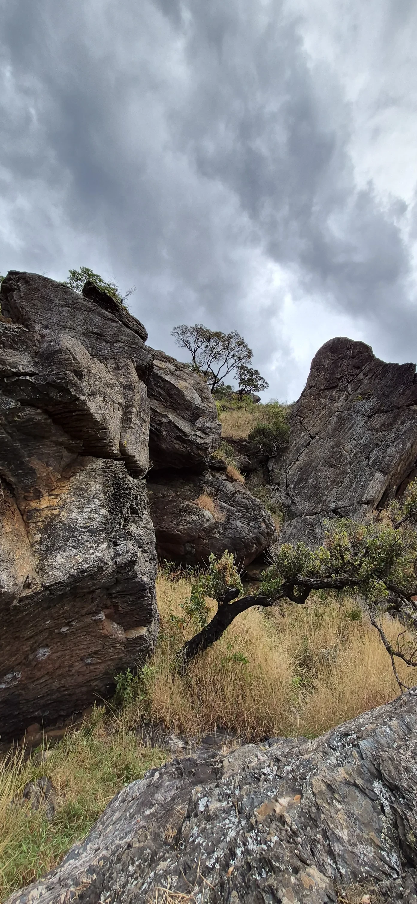
          - **largura_mapa**: 1392
          - **altura_mapa**: 3013
          - **referencias**:
            - **[0]**:
              - **grupo**: Sherpa
              - **setor**: Tarja Preta
              - **escalada**: Película
            - **[1]**:
              - **grupo**: Sherpa
              - **setor**: Tarja Preta
              - **escalada**: Tarja Preta
      - **precomputados**:
        - **total_escaladas**: 2
        - **total_boulders**: 2
  - **[1]**:
    - **conteudo**:
      - **descricao**: 
      - **nome**: Jeitinho Brasileiro
      - **localizacao_escalada**:
        - **latitude**: -201225340
        - **longitude**: -443609520
      - **sinal_de_celular**: True
      - **escaladas**:
        - **[0]**:
          - **boulder**:
            - **descricao**: 
            - **nome**: Jeitinho Brasileiro
            - **dificuldade**: V4
            - **tipo_parede**: NEGATIVO
            - **conquistadores**:
              - Julio G. 
            - **data_abertura**: Maio 2026
            - **destaque**: True
        - **[1]**:
          - **boulder**:
            - **descricao**: 
            - **nome**: Força G
            - **dificuldade**: V1
            - **data_abertura**: Maio 2026
        - **[2]**:
          - **boulder**:
            - **descricao**: 
            - **nome**: Itália
            - **dificuldade**: V4
            - **data_abertura**: Maio 2026
            - **destaque**: True
        - **[3]**:
          - **boulder**:
            - **descricao**: 
            - **nome**: Glorioso
            - **dificuldade**: V2
            - **tipo_parede**: NEGATIVO
            - **data_abertura**: Maio 2026
            - **destaque**: True
      - **mapas**:
        - **[0]**:
          - **caminho_imagem_mapa**: 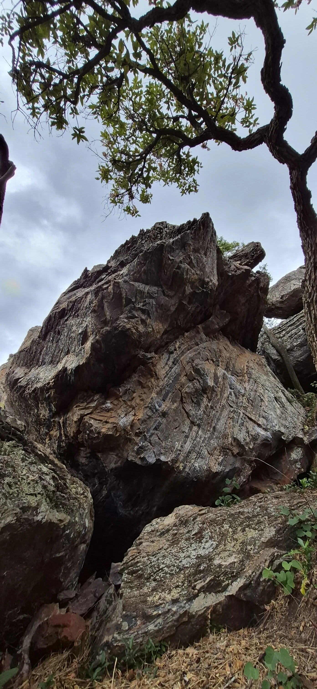
          - **largura_mapa**: 1392
          - **altura_mapa**: 3013
          - **referencias**:
            - **[0]**:
              - **grupo**: Sherpa
              - **setor**: Jeitinho Brasileiro
              - **escalada**: Jeitinho Brasileiro
            - **[1]**:
              - **grupo**: Sherpa
              - **setor**: Jeitinho Brasileiro
              - **escalada**: Força G
            - **[2]**:
              - **grupo**: Sherpa
              - **setor**: Jeitinho Brasileiro
              - **escalada**: Itália
            - **[3]**:
              - **grupo**: Sherpa
              - **setor**: Jeitinho Brasileiro
              - **escalada**: Glorioso
      - **precomputados**:
        - **total_escaladas**: 4
        - **total_boulders**: 4
  - **[2]**:
    - **conteudo**:
      - **descricao**: 
      - **nome**: Nectar
      - **localizacao_escalada**:
        - **latitude**: -201225690
        - **longitude**: -443610090
      - **escaladas**:
        - **[0]**:
          - **boulder**:
            - **descricao**:
                
                
                
            - **nome**: Nectar
            - **dificuldade**: V9
            - **conquistadores**:
              - Frederico Gonçalves (Bull)
            - **data_abertura**: 30/06/2026
            - **url_video_beta**: https://www.instagram.com/p/DaMdaQKTtFk/
            - **destaque**: True
      - **mapas**:
        - **[0]**:
          - **caminho_imagem_mapa**: 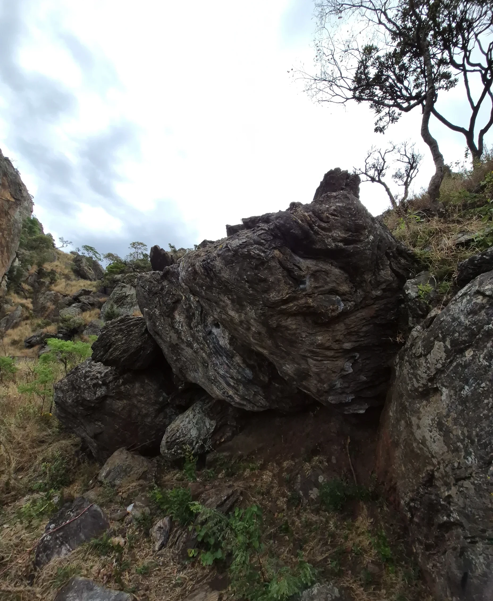
          - **largura_mapa**: 1855
          - **altura_mapa**: 2261
          - **referencias**:
            - **[0]**:
              - **grupo**: Sherpa
              - **setor**: Nectar
              - **escalada**: Nectar
      - **indice_mapa_padrao**: -1
      - **precomputados**:
        - **total_escaladas**: 1
        - **total_boulders**: 1
- **localizacao_escalada**:
  - **latitude**: -201224250
  - **longitude**: -443608700
- **precomputados**:
  - **total_escaladas**: 7
  - **total_boulders**: 7

## Parte: setor_fugitivos_i (não listada em partes.json)

### Setor (Pico: Complexo Pedra Grande)

- **descricao**: Veja a trilha para chegar ao setor no Wikiloc: https://loc.wiki/t/169742661?wa=sc
- **nome**: Bloco Fugitivos I
- **escaladas**:
  - **[0]**:
    - **boulder**:
      - **nome**: Polydance
      - **dificuldade**: V4
  - **[1]**:
    - **boulder**:
      - **nome**: Bigdance
      - **dificuldade**: V5_BARRA_V6
  - **[2]**:
    - **boulder**:
      - **nome**: Boulder do Bola
      - **dificuldade**: V5
  - **[3]**:
    - **boulder**:
      - **nome**: Trolls
      - **dificuldade**: V1
  - **[4]**:
    - **boulder**:
      - **nome**: Calcinha Larga
      - **dificuldade**: V2_BARRA_V3
  - **[5]**:
    - **boulder**:
      - **nome**: Tanga Frouxa
      - **dificuldade**: V2
  - **[6]**:
    - **boulder**:
      - **nome**: Barriga de Aluguel
      - **dificuldade**: V5
  - **[7]**:
    - **boulder**:
      - **nome**: Primeiro de todos
      - **dificuldade**: V1
  - **[8]**:
    - **boulder**:
      - **nome**: Sem nome 18
      - **dificuldade**: V0
  - **[9]**:
    - **boulder**:
      - **nome**: Bananinha
      - **dificuldade**: V1
  - **[10]**:
    - **boulder**:
      - **nome**: Cactos kid
      - **dificuldade**: V2
  - **[11]**:
    - **boulder**:
      - **nome**: Quem vai primeiro
      - **dificuldade**: V1
- **mapas**:
  - **[0]**:
    - **caminho_imagem_mapa**: 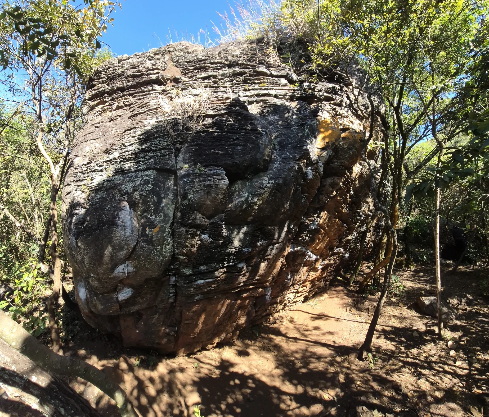
    - **largura_mapa**: 1847
    - **altura_mapa**: 1577
    - **pontos_de_interesse**:
      - **[0]**:
        - **id**: 2
        - **label**: 2
        - **linha**:
          - **estilo**: TRACEJADO
          - **espessura**: 3
          - **compilado**:
            - **caminho_svg**: M 678 1132 C 670.0 1037.0, 655.1 943.0, 654 847 C 652.9 749.1, 666.3 645.2, 672 550 C 677.3 461.8, 682.0 380.0, 687 295
            - **caixa_delimitadora**:
              - **x**: 670
              - **y**: 714
              - **comprimento**: 33
              - **largura**: 837
            - **marcadores**:
              - **[0]**:
                - **tipo**: CIRCULO_IDENTIFICADOR
                - **x**: 678
                - **y**: 1132
                - **angulo_graus_x100**: -9481
                - **rotulo**: 2
              - **[1]**:
                - **tipo**: FIM_TOP
                - **x**: 687
                - **y**: 295
                - **angulo_graus_x100**: -8663
                - **rotulo**: B
        - **cor**: #FFD600
      - **[1]**:
        - **id**: 3
        - **label**: 3
        - **linha**:
          - **estilo**: TRACEJADO
          - **espessura**: 3
          - **compilado**:
            - **caminho_svg**: M 1008 1116 C 1044.0 1048.0, 1080.0 980.0, 1116 912
            - **caixa_delimitadora**:
              - **x**: 1062
              - **y**: 1014
              - **comprimento**: 108
              - **largura**: 204
            - **marcadores**:
              - **[0]**:
                - **tipo**: CIRCULO_IDENTIFICADOR
                - **x**: 1008
                - **y**: 1116
                - **angulo_graus_x100**: -6210
                - **rotulo**: 3
        - **cor**: #FFD600
      - **[2]**:
        - **id**: 4
        - **label**: 4
        - **linha**:
          - **estilo**: TRACEJADO
          - **espessura**: 3
          - **compilado**:
            - **caminho_svg**: M 1305 961 C 1332.7 896.7, 1378.3 825.2, 1388 768 C 1395.3 725.4, 1382.7 690.7, 1380 652
            - **caixa_delimitadora**:
              - **x**: 1346
              - **y**: 806
              - **comprimento**: 83
              - **largura**: 309
            - **marcadores**:
              - **[0]**:
                - **tipo**: CIRCULO_IDENTIFICADOR
                - **x**: 1305
                - **y**: 961
                - **angulo_graus_x100**: -6673
                - **rotulo**: 4
        - **cor**: #FFD600
      - **[3]**:
        - **id**: 5
        - **label**: 5
        - **linha**:
          - **estilo**: TRACEJADO
          - **espessura**: 3
          - **compilado**:
            - **caminho_svg**: M 1461 842 C 1414.3 863.3, 1359.2 882.8, 1321 906 C 1291.2 924.2, 1269.1 953.3, 1247 964 C 1232.2 971.2, 1219.7 970.7, 1206 974
            - **caixa_delimitadora**:
              - **x**: 1334
              - **y**: 908
              - **comprimento**: 255
              - **largura**: 132
            - **marcadores**:
              - **[0]**:
                - **tipo**: CIRCULO_IDENTIFICADOR
                - **x**: 1461
                - **y**: 842
                - **angulo_graus_x100**: 15543
                - **rotulo**: 5
        - **cor**: #FFD600
      - **[4]**:
        - **id**: X
        - **label**: X
        - **linha**:
          - **estilo**: TRACEJADO
          - **espessura**: 3
          - **compilado**:
            - **caminho_svg**: M 1205 973 C 1136.0 991.7, 1075.4 1014.7, 998 1029 C 902.5 1046.7, 765.1 1047.9, 673 1062 C 603.9 1072.6, 523.6 1120.4, 493 1099 C 468.6 1081.9, 481.7 1021.7, 476 983
            - **caixa_delimitadora**:
              - **x**: 840
              - **y**: 1036
              - **comprimento**: 729
              - **largura**: 126
            - **marcadores**: []
        - **cor**: #FFD600
      - **[5]**:
        - **id**: ▲
        - **label**: ▲
        - **linha**:
          - **estilo**: TRACEJADO
          - **espessura**: 3
          - **compilado**:
            - **caminho_svg**: M 1205 974 C 1187.3 968.7, 1167.1 964.1, 1152 958 C 1140.0 953.2, 1126.9 950.1, 1121 942 C 1115.5 934.4, 1117.7 922.0, 1116 912
            - **caixa_delimitadora**:
              - **x**: 1160
              - **y**: 943
              - **comprimento**: 89
              - **largura**: 62
            - **marcadores**:
              - **[0]**:
                - **tipo**: CIRCULO_IDENTIFICADOR
                - **x**: 1152
                - **y**: 958
                - **angulo_graus_x100**: -15915
                - **rotulo**: ▲
                - **raio**: 14
        - **cor**: #FFD600
      - **[6]**:
        - **id**: D
        - **label**: D
        - **linha**:
          - **estilo**: TRACEJADO
          - **espessura**: 3
          - **compilado**:
            - **caminho_svg**: M 1116 912 C 1142.7 854.0, 1201.2 808.0, 1196 738 C 1187.2 619.5, 996.0 432.0, 896 279
            - **caixa_delimitadora**:
              - **x**: 1046
              - **y**: 596
              - **comprimento**: 300
              - **largura**: 633
            - **marcadores**:
              - **[0]**:
                - **tipo**: CIRCULO_IDENTIFICADOR
                - **x**: 896
                - **y**: 279
                - **angulo_graus_x100**: -12317
                - **rotulo**: C
        - **cor**: #FFD600
      - **[7]**:
        - **id**: linha_1
        - **label**: 
        - **linha**:
          - **estilo**: TRACEJADO
          - **espessura**: 3
          - **compilado**:
            - **caminho_svg**: M 284 1097 C 325.0 1110.0, 378.7 1147.7, 407 1136 C 431.5 1125.9, 440.0 1077.3, 452 1050 C 462.2 1026.6, 468.0 1005.3, 476 983
            - **caixa_delimitadora**:
              - **x**: 380
              - **y**: 1060
              - **comprimento**: 192
              - **largura**: 153
            - **marcadores**:
              - **[0]**:
                - **tipo**: CIRCULO_IDENTIFICADOR
                - **x**: 284
                - **y**: 1097
                - **angulo_graus_x100**: 1759
                - **rotulo**: 1
        - **cor**: #FFD600
      - **[8]**:
        - **id**: linha_10
        - **label**: 
        - **linha**:
          - **estilo**: TRACEJADO
          - **espessura**: 3
          - **compilado**:
            - **caminho_svg**: M 476 982 C 483.0 946.7, 493.7 911.7, 497 876 C 500.3 840.3, 497.5 816.8, 496 768 C 492.7 665.0, 478.7 448.0, 470 288
            - **caixa_delimitadora**:
              - **x**: 484
              - **y**: 635
              - **comprimento**: 27
              - **largura**: 694
            - **marcadores**:
              - **[0]**:
                - **tipo**: CIRCULO_IDENTIFICADOR
                - **x**: 470
                - **y**: 288
                - **angulo_graus_x100**: -9310
                - **rotulo**: A
        - **cor**: #FFD600
      - **[9]**:
        - **id**: linha_7
        - **label**: d
        - **linha**:
          - **estilo**: TRACEJADO
          - **espessura**: 3
          - **compilado**:
            - **caminho_svg**: M 1205 974 C 1263.3 866.7, 1321.7 759.3, 1380 652
            - **caixa_delimitadora**:
              - **x**: 1292
              - **y**: 813
              - **comprimento**: 175
              - **largura**: 322
            - **marcadores**: []
        - **cor**: #FFD600
      - **[10]**:
        - **id**: linha_14
        - **label**: d
        - **linha**:
          - **estilo**: TRACEJADO
          - **espessura**: 3
          - **compilado**:
            - **caminho_svg**: M 1380 652 C 1401.3 575.7, 1422.7 499.3, 1444 423
            - **caixa_delimitadora**:
              - **x**: 1412
              - **y**: 538
              - **comprimento**: 64
              - **largura**: 229
            - **marcadores**:
              - **[0]**:
                - **tipo**: FIM_TOP
                - **x**: 1444
                - **y**: 423
                - **angulo_graus_x100**: -7439
                - **rotulo**: D
        - **cor**: #FFD600
    - **referencias**:
      - **[0]**:
        - **ids**:
          - 5
          - ▲
          - D
        - **escalada**: Polydance
      - **[1]**:
        - **ids**:
          - 5
          - linha_10
          - X
        - **escalada**: Bigdance
      - **[2]**:
        - **ids**:
          - 3
          - ▲
          - linha_7
          - linha_14
        - **escalada**: Boulder do Bola
      - **[3]**:
        - **ids**:
          - 4
          - linha_14
        - **escalada**: Trolls
      - **[4]**:
        - **ids**:
          - 3
          - D
        - **escalada**: Calcinha Larga
      - **[5]**:
        - **ids**:
          - 2
        - **escalada**: Tanga Frouxa
      - **[6]**:
        - **ids**:
          - linha_1
          - linha_10
        - **escalada**: Barriga de Aluguel
  - **[1]**:
    - **caminho_imagem_mapa**: 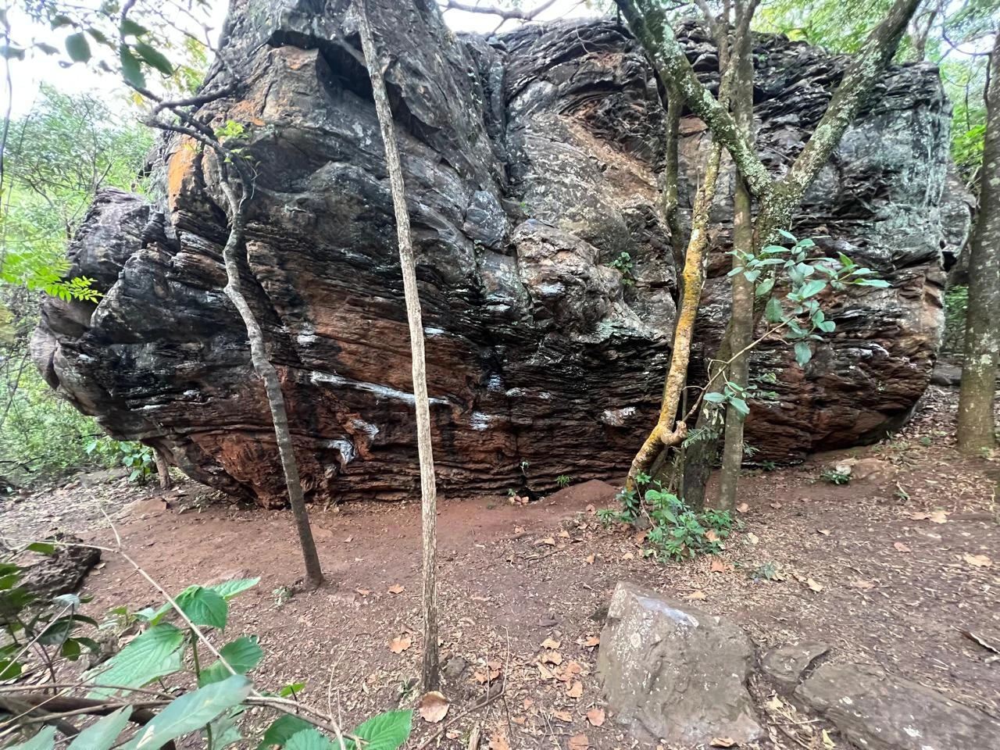
    - **largura_mapa**: 1280
    - **altura_mapa**: 960
    - **pontos_de_interesse**:
      - **[0]**:
        - **id**: linha_3
        - **label**: 
        - **linha**:
          - **estilo**: TRACEJADO
          - **espessura**: 3
          - **compilado**:
            - **caminho_svg**: M 1006 507 C 1006.7 450.3, 1005.4 394.4, 1008 337 C 1010.6 277.8, 1023.3 208.5, 1022 157 C 1021.0 118.1, 1013.3 89.0, 1009 55
            - **caixa_delimitadora**:
              - **x**: 1014
              - **y**: 281
              - **comprimento**: 16
              - **largura**: 452
            - **marcadores**:
              - **[0]**:
                - **tipo**: CIRCULO_IDENTIFICADOR
                - **x**: 1006
                - **y**: 507
                - **angulo_graus_x100**: -8933
                - **rotulo**: 6
                - **raio**: 14
              - **[1]**:
                - **tipo**: FIM_TOP
                - **x**: 1009
                - **y**: 55
                - **angulo_graus_x100**: -9726
                - **rotulo**: E
                - **raio**: 14
        - **cor**: #FFD600
      - **[1]**:
        - **id**: linha_4
        - **label**: 
        - **linha**:
          - **estilo**: TRACEJADO
          - **espessura**: 3
          - **compilado**:
            - **caminho_svg**: M 1137 455 C 1136.0 404.7, 1139.3 359.6, 1134 304 C 1127.4 234.5, 1107.3 148.7, 1094 71
            - **caixa_delimitadora**:
              - **x**: 1116
              - **y**: 263
              - **comprimento**: 43
              - **largura**: 384
            - **marcadores**:
              - **[0]**:
                - **tipo**: CIRCULO_IDENTIFICADOR
                - **x**: 1137
                - **y**: 455
                - **angulo_graus_x100**: -9114
                - **rotulo**: 5
                - **raio**: 14
              - **[1]**:
                - **tipo**: FIM_TOP
                - **x**: 1094
                - **y**: 71
                - **angulo_graus_x100**: -9974
                - **rotulo**: F
                - **raio**: 14
        - **cor**: #FFD600
      - **[2]**:
        - **id**: linha_8
        - **linha**:
          - **estilo**: TRACEJADO
          - **espessura**: 3
          - **compilado**:
            - **caminho_svg**: M 439 615 C 444.0 589.0, 449.0 563.0, 454 537
            - **caixa_delimitadora**:
              - **x**: 446
              - **y**: 576
              - **comprimento**: 15
              - **largura**: 78
            - **marcadores**:
              - **[0]**:
                - **tipo**: CIRCULO_IDENTIFICADOR
                - **x**: 439
                - **y**: 615
                - **angulo_graus_x100**: -7911
                - **rotulo**: 3
                - **raio**: 14
        - **cor**: #FFD600
      - **[3]**:
        - **id**: linha_11
        - **linha**:
          - **estilo**: TRACEJADO
          - **espessura**: 3
          - **compilado**:
            - **caminho_svg**: M 651 557 C 658.3 506.0, 675.2 451.3, 673 404 C 671.0 362.5, 654.3 326.7, 645 288
            - **caixa_delimitadora**:
              - **x**: 659
              - **y**: 422
              - **comprimento**: 28
              - **largura**: 269
            - **marcadores**:
              - **[0]**:
                - **tipo**: CIRCULO_IDENTIFICADOR
                - **x**: 651
                - **y**: 557
                - **angulo_graus_x100**: -8182
                - **rotulo**: 4
                - **raio**: 14
        - **cor**: #FFD600
        - **label**: 
      - **[4]**:
        - **id**: linha_13
        - **linha**:
          - **estilo**: TRACEJADO
          - **espessura**: 3
          - **compilado**:
            - **caminho_svg**: M 646 289 C 636.7 211.3, 627.3 133.7, 618 56
            - **caixa_delimitadora**:
              - **x**: 632
              - **y**: 172
              - **comprimento**: 28
              - **largura**: 233
            - **marcadores**:
              - **[0]**:
                - **tipo**: FIM_TOP
                - **x**: 618
                - **y**: 56
                - **angulo_graus_x100**: -9685
                - **rotulo**: D
                - **raio**: 14
        - **cor**: #FFD600
      - **[5]**:
        - **id**: linha_15
        - **linha**:
          - **estilo**: TRACEJADO
          - **espessura**: 3
          - **compilado**:
            - **caminho_svg**: M 454 537 C 465.7 525.3, 477.3 513.7, 489 502
            - **caixa_delimitadora**:
              - **x**: 472
              - **y**: 520
              - **comprimento**: 35
              - **largura**: 35
            - **marcadores**: []
        - **cor**: #FFD600
      - **[6]**:
        - **id**: linha_16
        - **linha**:
          - **estilo**: TRACEJADO
          - **espessura**: 3
          - **compilado**:
            - **caminho_svg**: M 489 502 C 515.3 506.3, 541.7 510.7, 568 515
            - **caixa_delimitadora**:
              - **x**: 528
              - **y**: 508
              - **comprimento**: 79
              - **largura**: 13
            - **marcadores**: []
        - **cor**: #FFD600
      - **[7]**:
        - **id**: linha_17
        - **linha**:
          - **estilo**: TRACEJADO
          - **espessura**: 3
          - **compilado**:
            - **caminho_svg**: M 568 515 C 573.7 486.0, 573.5 452.8, 585 428 C 595.5 405.5, 620.8 393.2, 631 371 C 641.9 347.3, 641.0 316.3, 646 289
            - **caixa_delimitadora**:
              - **x**: 607
              - **y**: 402
              - **comprimento**: 78
              - **largura**: 226
            - **marcadores**: []
        - **cor**: #FFD600
      - **[8]**:
        - **id**: linha_12
        - **label**: 
        - **linha**:
          - **estilo**: TRACEJADO
          - **espessura**: 3
          - **compilado**:
            - **caminho_svg**: M 1138 455 C 1094.3 455.0, 1052.7 452.8, 1007 455 C 956.5 457.4, 898.7 463.5, 848 470 C 801.1 476.0, 747.7 487.5, 713 492 C 691.3 494.8, 680.0 494.1, 660 497 C 633.7 500.8, 599.3 509.0, 569 515
            - **caixa_delimitadora**:
              - **x**: 854
              - **y**: 485
              - **comprimento**: 569
              - **largura**: 60
            - **marcadores**:
              - **[0]**:
                - **tipo**: CIRCULO_IDENTIFICADOR
                - **x**: 1138
                - **y**: 455
                - **angulo_graus_x100**: 18000
                - **rotulo**: 5
                - **raio**: 14
        - **cor**: #FFD600
      - **[9]**:
        - **id**: linha_19
        - **linha**:
          - **estilo**: TRACEJADO
          - **espessura**: 3
          - **compilado**:
            - **caminho_svg**: M 454 537 C 454.3 528.0, 456.9 517.5, 455 510 C 453.5 504.0, 449.0 500.0, 446 495
            - **caixa_delimitadora**:
              - **x**: 450
              - **y**: 516
              - **comprimento**: 9
              - **largura**: 42
            - **marcadores**: []
        - **cor**: #FFD600
      - **[10]**:
        - **id**: linha_9
        - **label**: 
        - **linha**:
          - **estilo**: TRACEJADO
          - **espessura**: 3
          - **compilado**:
            - **caminho_svg**: M 489 502 C 474.7 499.7, 460.3 497.3, 446 495
            - **caixa_delimitadora**:
              - **x**: 468
              - **y**: 498
              - **comprimento**: 43
              - **largura**: 7
            - **marcadores**: []
        - **cor**: #FFD600
      - **[11]**:
        - **id**: linha_50
        - **label**: 
        - **linha**:
          - **estilo**: TRACEJADO
          - **espessura**: 3
          - **compilado**:
            - **caminho_svg**: M 397 480 C 373.3 480.3, 353.1 476.9, 326 481 C 288.0 486.7, 234.4 518.1, 192 520 C 154.5 521.7, 106.9 519.6, 85 499 C 64.1 479.4, 57.5 438.0, 60 403 C 63.2 358.5, 101.3 304.3, 122 255
            - **caixa_delimitadora**:
              - **x**: 228
              - **y**: 388
              - **comprimento**: 337
              - **largura**: 265
            - **marcadores**:
              - **[0]**:
                - **tipo**: FIM_TOP
                - **x**: 122
                - **y**: 255
                - **angulo_graus_x100**: -6727
                - **rotulo**: A
                - **raio**: 14
        - **cor**: #FFD600
      - **[12]**:
        - **id**: linha_18
        - **linha**:
          - **estilo**: TRACEJADO
          - **espessura**: 3
          - **compilado**:
            - **caminho_svg**: M 446 495 C 438.7 491.7, 431.9 487.5, 424 485 C 415.6 482.4, 406.0 481.7, 397 480
            - **caixa_delimitadora**:
              - **x**: 422
              - **y**: 488
              - **comprimento**: 49
              - **largura**: 15
            - **marcadores**: []
        - **cor**: #FFD600
      - **[13]**:
        - **id**: linha_21
        - **linha**:
          - **estilo**: TRACEJADO
          - **espessura**: 3
          - **compilado**:
            - **caminho_svg**: M 397 480 C 378.3 447.0, 359.7 414.3, 341 381 C 322.0 347.3, 300.9 313.3, 284 279 C 267.7 245.9, 255.3 212.3, 241 179
            - **caixa_delimitadora**:
              - **x**: 319
              - **y**: 330
              - **comprimento**: 156
              - **largura**: 301
            - **marcadores**:
              - **[0]**:
                - **tipo**: FIM_TOP
                - **x**: 241
                - **y**: 179
                - **angulo_graus_x100**: -11327
                - **rotulo**: C
                - **raio**: 14
        - **cor**: #FFD600
    - **referencias**:
      - **[0]**:
        - **ids**:
          - linha_3
        - **escalada**: Primeiro de todos
      - **[1]**:
        - **ids**:
          - linha_4
        - **escalada**: Sem nome 18
      - **[2]**:
        - **ids**:
          - linha_8
          - linha_19
          - linha_18
          - linha_21
        - **escalada**: Calcinha Larga
      - **[3]**:
        - **ids**:
          - linha_8
          - linha_15
          - linha_16
          - linha_17
          - linha_13
        - **escalada**: Boulder do Bola
      - **[4]**:
        - **ids**:
          - linha_11
          - linha_13
        - **escalada**: Trolls
      - **[5]**:
        - **ids**:
          - linha_12
          - linha_16
          - linha_9
          - linha_18
          - linha_21
        - **escalada**: Polydance
      - **[6]**:
        - **ids**:
          - linha_12
          - linha_16
          - linha_9
          - linha_50
          - linha_18
        - **escalada**: Bigdance
  - **[2]**:
    - **caminho_imagem_mapa**: 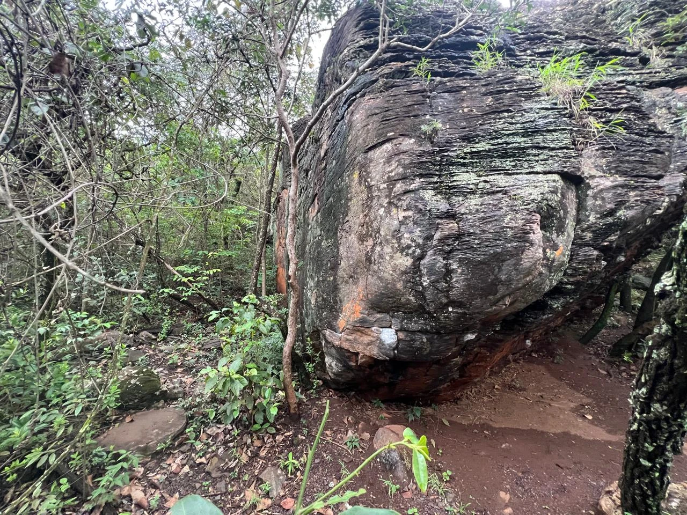
    - **largura_mapa**: 1280
    - **altura_mapa**: 960
    - **pontos_de_interesse**:
      - **[0]**:
        - **id**: linha_2
        - **label**: 
        - **linha**:
          - **estilo**: TRACEJADO
          - **espessura**: 3
          - **compilado**:
            - **caminho_svg**: M 632 626 C 662.7 630.0, 695.1 644.4, 724 638 C 753.9 631.4, 791.2 611.3, 808 585 C 826.2 556.5, 820.0 511.6, 823 469 C 826.6 417.2, 829.3 352.2, 825 296 C 820.9 242.0, 804.7 185.5, 799 138 C 794.4 99.3, 793.7 67.3, 791 32
            - **caixa_delimitadora**:
              - **x**: 728
              - **y**: 335
              - **comprimento**: 193
              - **largura**: 606
            - **marcadores**:
              - **[0]**:
                - **tipo**: CIRCULO_IDENTIFICADOR
                - **x**: 632
                - **y**: 626
                - **angulo_graus_x100**: 743
                - **rotulo**: 1
                - **raio**: 14
              - **[1]**:
                - **tipo**: CIRCULO_IDENTIFICADOR
                - **x**: 791
                - **y**: 32
                - **angulo_graus_x100**: -9432
                - **rotulo**: A
                - **raio**: 14
        - **cor**: #FFD600
    - **referencias**:
      - **[0]**:
        - **ids**:
          - linha_2
        - **escalada**: Barriga de Aluguel
  - **[3]**:
    - **caminho_imagem_mapa**: 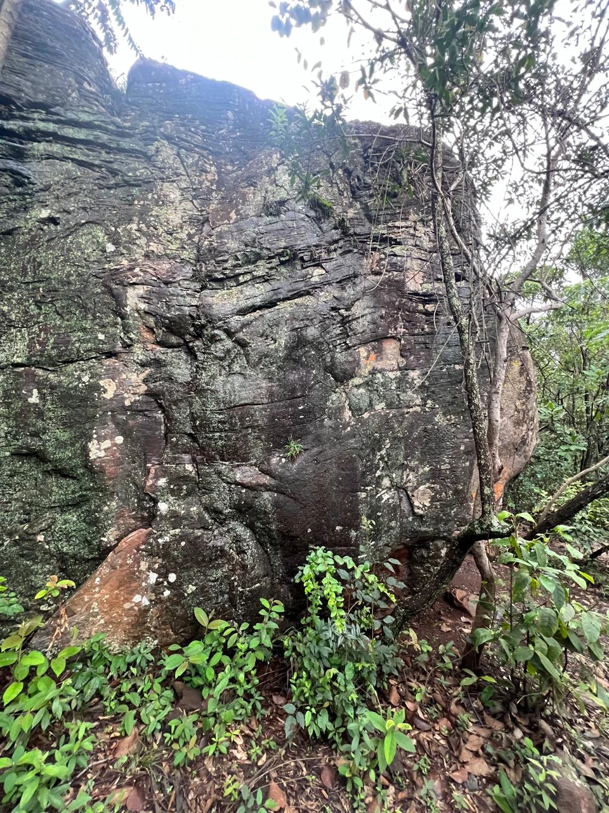
    - **largura_mapa**: 960
    - **altura_mapa**: 1280
    - **pontos_de_interesse**:
      - **[0]**:
        - **id**: linha_5
        - **label**: 
        - **linha**:
          - **estilo**: TRACEJADO
          - **espessura**: 3
          - **compilado**:
            - **caminho_svg**: M 615 776 C 598.3 724.0, 576.0 675.8, 565 620 C 552.8 558.6, 553.6 489.8, 549 422 C 544.2 350.6, 541.0 275.3, 537 202
            - **caixa_delimitadora**:
              - **x**: 576
              - **y**: 489
              - **comprimento**: 78
              - **largura**: 574
            - **marcadores**:
              - **[0]**:
                - **tipo**: CIRCULO_IDENTIFICADOR
                - **x**: 615
                - **y**: 776
                - **angulo_graus_x100**: -10777
                - **rotulo**: 7
        - **cor**: #FFD600
      - **[1]**:
        - **id**: linha_6
        - **label**: 
        - **linha**:
          - **estilo**: TRACEJADO
          - **espessura**: 3
          - **compilado**:
            - **caminho_svg**: M 227 856 C 241.7 787.3, 256.5 717.2, 271 650 C 284.9 585.6, 302.5 532.0, 312 461 C 323.9 371.7, 322.7 257.0, 328 155
            - **caixa_delimitadora**:
              - **x**: 278
              - **y**: 506
              - **comprimento**: 101
              - **largura**: 701
            - **marcadores**:
              - **[0]**:
                - **tipo**: CIRCULO_IDENTIFICADOR
                - **x**: 227
                - **y**: 856
                - **angulo_graus_x100**: -7794
                - **rotulo**: 8
        - **cor**: #FFD600
    - **referencias**:
      - **[0]**:
        - **ids**:
          - linha_5
        - **escalada**: Bananinha
      - **[1]**:
        - **ids**:
          - linha_6
        - **escalada**: Cactos kid
  - **[4]**:
    - **caminho_imagem_mapa**: 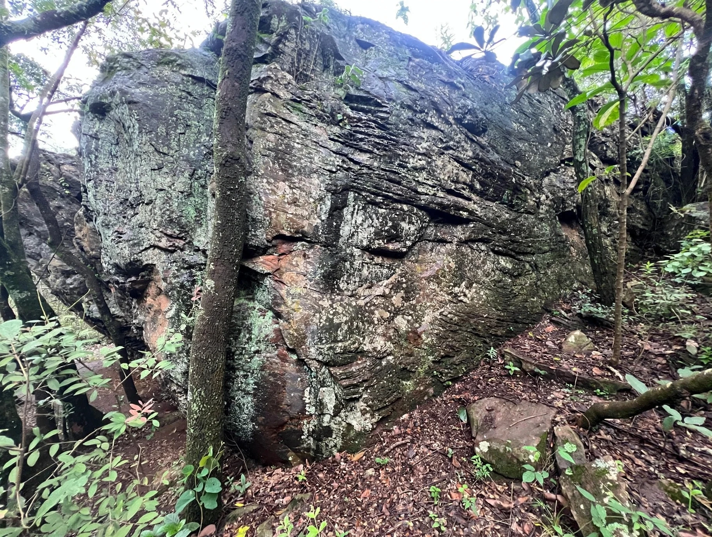
    - **largura_mapa**: 1824
    - **altura_mapa**: 1376
    - **pontos_de_interesse**:
      - **[0]**:
        - **id**: linha_20
        - **label**: 
        - **linha**:
          - **estilo**: TRACEJADO
          - **espessura**: 4
          - **compilado**:
            - **caminho_svg**: M 821 995 C 807.0 880.0, 792.1 767.2, 779 650 C 765.4 528.6, 734.6 391.1, 741 279 C 746.4 184.5, 779.0 106.3, 798 20
            - **caixa_delimitadora**:
              - **x**: 781
              - **y**: 508
              - **comprimento**: 80
              - **largura**: 975
            - **marcadores**:
              - **[0]**:
                - **tipo**: CIRCULO_IDENTIFICADOR
                - **x**: 821
                - **y**: 995
                - **angulo_graus_x100**: -9694
                - **rotulo**: 9
                - **raio**: 21
        - **cor**: #FFD600
    - **referencias**:
      - **[0]**:
        - **ids**:
          - linha_20
        - **escalada**: Quem vai primeiro
- **precomputados**:
  - **total_escaladas**: 12
  - **total_boulders**: 12

## Parte: setor_viva_o_climb (não listada em partes.json)

### Setor (Pico: Complexo Pedra Grande)

- **descricao**: Veja a trilha para chegar ao setor no Wikiloc: https://loc.wiki/t/169742661?wa=sc
- **nome**: Bloco Viva o Climb
- **escaladas**:
  - **[0]**:
    - **boulder**:
      - **nome**: Viva o climb
      - **dificuldade**: V6
  - **[1]**:
    - **boulder**:
      - **descricao**: Saindo em pé com as mãos abertas
      - **nome**: Pérola negra
      - **dificuldade**: V11
  - **[2]**:
    - **boulder**:
      - **descricao**: Projeto, sem FA, talvez V12.
      - **nome**: Pérola negra SDS
      - **dificuldade**: INDEFINIDO
  - **[3]**:
    - **boulder**:
      - **nome**: Sem nome 19
      - **dificuldade**: V3
  - **[4]**:
    - **boulder**:
      - **descricao**: Crux duro e toca pra esquerda
      - **nome**: Malandro não para
      - **dificuldade**: V10
  - **[5]**:
    - **boulder**:
      - **descricao**: Mesma saída do Malandro não para, mas toca reto
      - **nome**: Malandragem
      - **dificuldade**: V8_BARRA_V9
  - **[6]**:
    - **boulder**:
      - **descricao**: Sai com as mãos bem abertas na esquerda e direita
      - **nome**: Abraca
      - **dificuldade**: V5
  - **[7]**:
    - **boulder**:
      - **nome**: Pica fumo
      - **dificuldade**: V5
  - **[8]**:
    - **boulder**:
      - **nome**: Mad max
      - **dificuldade**: V8
- **mapas**:
  - **[0]**:
    - **caminho_imagem_mapa**: 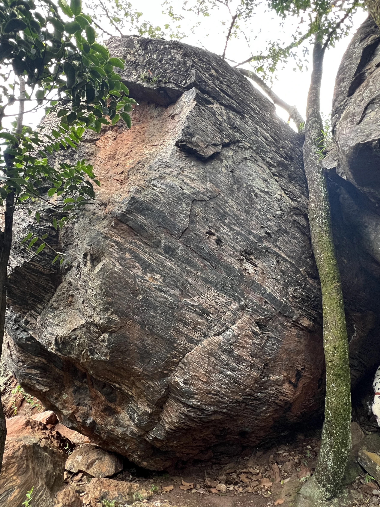
    - **largura_mapa**: 1773
    - **altura_mapa**: 2364
    - **pontos_de_interesse**:
      - **[0]**:
        - **id**: linha_1
        - **label**: 
        - **linha**:
          - **estilo**: TRACEJADO
          - **espessura**: 5
          - **compilado**:
            - **caminho_svg**: M 721 2033 C 751.0 1942.0, 795.3 1850.9, 811 1760 C 825.9 1673.9, 817.5 1594.7, 817 1502 C 816.4 1393.5, 808.5 1268.8, 805 1149 C 801.4 1024.7, 787.2 875.0, 796 769 C 802.4 691.6, 828.4 646.1, 834 570 C 841.4 469.4, 824.0 334.7, 819 217
            - **caixa_delimitadora**:
              - **x**: 778
              - **y**: 1125
              - **comprimento**: 113
              - **largura**: 1816
            - **marcadores**:
              - **[0]**:
                - **tipo**: CIRCULO_IDENTIFICADOR
                - **x**: 721
                - **y**: 2033
                - **angulo_graus_x100**: -7175
                - **rotulo**: 1
                - **raio**: 26
        - **cor**: #FFD600
    - **referencias**:
      - **[0]**:
        - **ids**:
          - linha_1
        - **escalada**: Viva o climb
  - **[1]**:
    - **caminho_imagem_mapa**: 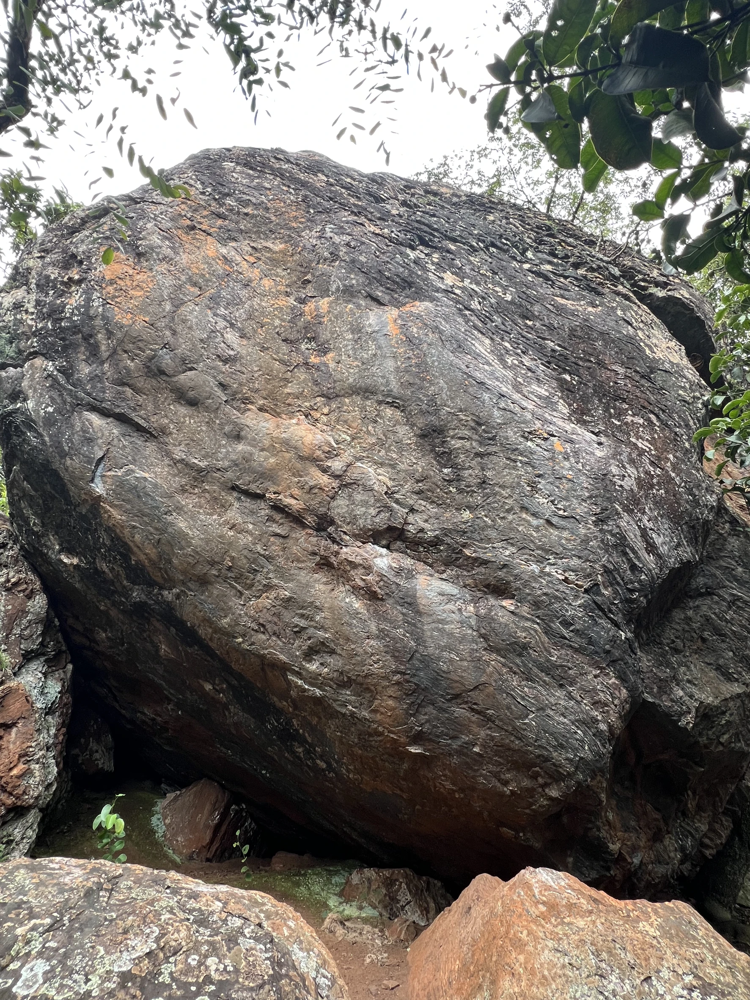
    - **largura_mapa**: 1773
    - **altura_mapa**: 2364
    - **pontos_de_interesse**:
      - **[0]**:
        - **id**: linha_2
        - **label**: 
        - **linha**:
          - **estilo**: TRACEJADO
          - **espessura**: 5
          - **compilado**:
            - **caminho_svg**: M 187 1242 C 149.3 1117.3, 81.9 980.5, 74 868 C 67.7 778.2, 99.3 704.0, 112 622
            - **caixa_delimitadora**:
              - **x**: 130
              - **y**: 932
              - **comprimento**: 113
              - **largura**: 620
            - **marcadores**:
              - **[0]**:
                - **tipo**: CIRCULO_IDENTIFICADOR
                - **x**: 187
                - **y**: 1242
                - **angulo_graus_x100**: -10681
                - **rotulo**: 2
                - **raio**: 24
              - **[1]**:
                - **tipo**: FIM_TOP
                - **x**: 112
                - **y**: 622
                - **angulo_graus_x100**: -8122
                - **rotulo**: A
                - **raio**: 24
        - **cor**: #FFD600
      - **[1]**:
        - **id**: linha_3
        - **label**: 
        - **linha**:
          - **estilo**: TRACEJADO
          - **espessura**: 5
          - **compilado**:
            - **caminho_svg**: M 575 1700 C 488.3 1619.3, 380.3 1538.5, 315 1458 C 263.3 1394.2, 238.3 1330.7, 200 1267
            - **caixa_delimitadora**:
              - **x**: 388
              - **y**: 1484
              - **comprimento**: 375
              - **largura**: 433
            - **marcadores**:
              - **[0]**:
                - **tipo**: CIRCULO_IDENTIFICADOR
                - **x**: 575
                - **y**: 1700
                - **angulo_graus_x100**: -13705
                - **rotulo**: 3
                - **raio**: 24
        - **cor**: #FFD600
      - **[2]**:
        - **id**: linha_4
        - **label**: 
        - **linha**:
          - **estilo**: TRACEJADO
          - **espessura**: 5
          - **compilado**:
            - **caminho_svg**: M 910 1344 C 912.3 1254.3, 941.7 1148.7, 917 1075 C 895.8 1012.0, 823.6 980.9, 794 921 C 761.9 856.1, 748.2 774.5, 738 696 C 727.1 612.3, 735.3 520.7, 734 433
            - **caixa_delimitadora**:
              - **x**: 826
              - **y**: 888
              - **comprimento**: 183
              - **largura**: 911
            - **marcadores**:
              - **[0]**:
                - **tipo**: CIRCULO_IDENTIFICADOR
                - **x**: 910
                - **y**: 1344
                - **angulo_graus_x100**: -8851
                - **rotulo**: 4
                - **raio**: 24
              - **[1]**:
                - **tipo**: FIM_TOP
                - **x**: 734
                - **y**: 433
                - **angulo_graus_x100**: -9087
                - **rotulo**: B
                - **raio**: 24
        - **cor**: #FFD600
      - **[3]**:
        - **id**: linha_6
        - **linha**:
          - **estilo**: TRACEJADO
          - **espessura**: 5
          - **compilado**:
            - **caminho_svg**: M 1177 1810 C 1175.0 1705.7, 1173.0 1601.3, 1171 1497
            - **caixa_delimitadora**:
              - **x**: 1174
              - **y**: 1654
              - **comprimento**: 6
              - **largura**: 313
            - **marcadores**:
              - **[0]**:
                - **tipo**: CIRCULO_IDENTIFICADOR
                - **x**: 1177
                - **y**: 1810
                - **angulo_graus_x100**: -9110
                - **rotulo**: 5
                - **raio**: 24
        - **cor**: #FFD600
      - **[4]**:
        - **id**: linha_7
        - **linha**:
          - **estilo**: TRACEJADO
          - **espessura**: 5
          - **compilado**:
            - **caminho_svg**: M 1171 1497 C 1159.0 1444.3, 1168.6 1387.5, 1135 1339 C 1086.9 1269.5, 941.5 1212.1, 858 1156 C 788.5 1109.3, 720.0 1083.8, 668 1026 C 611.2 962.9, 561.2 875.6, 538 785 C 512.1 683.6, 536.7 556.3, 536 442
            - **caixa_delimitadora**:
              - **x**: 854
              - **y**: 970
              - **comprimento**: 635
              - **largura**: 1055
            - **marcadores**:
              - **[0]**:
                - **tipo**: FIM_TOP
                - **x**: 536
                - **y**: 442
                - **angulo_graus_x100**: -9033
                - **rotulo**: C
                - **raio**: 24
        - **cor**: #FFD600
      - **[5]**:
        - **id**: linha_5
        - **label**: 
        - **linha**:
          - **estilo**: TRACEJADO
          - **espessura**: 5
          - **compilado**:
            - **caminho_svg**: M 1171 1497 C 1148.7 1341.7, 1137.6 1162.9, 1104 1031 C 1078.0 929.0, 1027.5 856.1, 1006 767 C 985.2 680.7, 985.5 560.3, 975 505 C 970.0 478.8, 965.0 467.0, 960 448
            - **caixa_delimitadora**:
              - **x**: 1066
              - **y**: 972
              - **comprimento**: 211
              - **largura**: 1049
            - **marcadores**:
              - **[0]**:
                - **tipo**: FIM_TOP
                - **x**: 960
                - **y**: 448
                - **angulo_graus_x100**: -10474
                - **rotulo**: D
                - **raio**: 24
        - **cor**: #FFD600
    - **referencias**:
      - **[0]**:
        - **ids**:
          - linha_2
        - **escalada**: Pérola negra
      - **[1]**:
        - **ids**:
          - linha_3
          - linha_2
        - **escalada**: Pérola negra SDS
      - **[2]**:
        - **ids**:
          - linha_4
        - **escalada**: Sem nome 19
      - **[3]**:
        - **ids**:
          - linha_6
          - linha_7
        - **escalada**: Malandro não para
      - **[4]**:
        - **ids**:
          - linha_6
          - linha_5
        - **escalada**: Malandragem
  - **[2]**:
    - **caminho_imagem_mapa**: 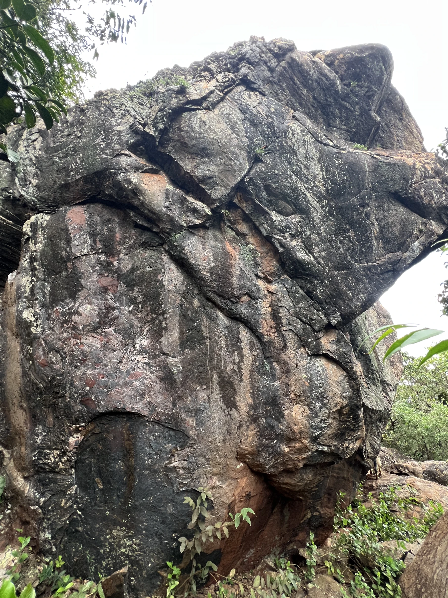
    - **largura_mapa**: 1773
    - **altura_mapa**: 2364
    - **pontos_de_interesse**:
      - **[0]**:
        - **id**: linha_10
        - **label**: 
        - **linha**:
          - **estilo**: TRACEJADO
          - **espessura**: 5
          - **compilado**:
            - **caminho_svg**: M 1325 1490 C 1318.0 1414.0, 1296.1 1325.3, 1304 1262 C 1310.0 1214.6, 1345.2 1179.2, 1347 1141 C 1348.6 1107.7, 1340.6 1072.0, 1323 1046 C 1304.5 1018.8, 1267.1 1004.3, 1236 983 C 1201.3 959.3, 1149.5 946.2, 1124 911 C 1095.8 872.0, 1089.7 811.7, 1083 753 C 1074.8 681.8, 1089.0 598.4, 1089 513 C 1089.0 415.1, 1083.7 303.0, 1081 198
            - **caixa_delimitadora**:
              - **x**: 1214
              - **y**: 844
              - **comprimento**: 266
              - **largura**: 1292
            - **marcadores**:
              - **[0]**:
                - **tipo**: CIRCULO_IDENTIFICADOR
                - **x**: 1325
                - **y**: 1490
                - **angulo_graus_x100**: -9526
                - **rotulo**: 6
                - **raio**: 24
        - **cor**: #FFD600
    - **referencias**:
      - **[0]**:
        - **ids**:
          - linha_10
        - **escalada**: Mad max
        - **setor**: Bloco Viva o Climb
  - **[3]**:
    - **caminho_imagem_mapa**: 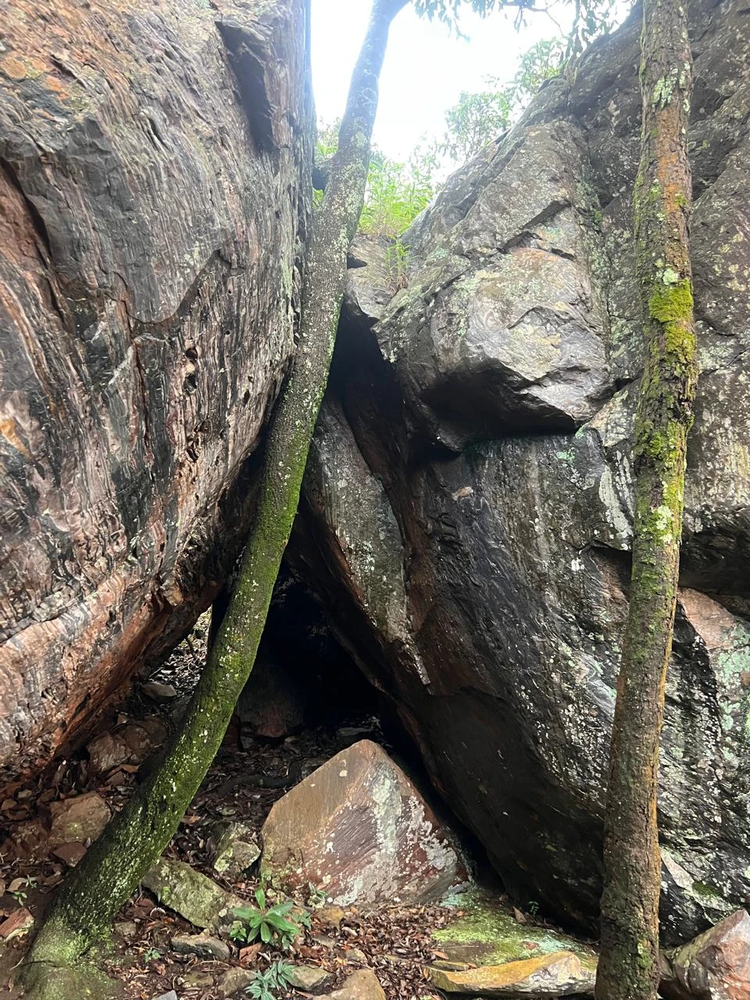
    - **largura_mapa**: 960
    - **altura_mapa**: 1280
    - **pontos_de_interesse**:
      - **[0]**:
        - **id**: linha_8
        - **label**: 
        - **linha**:
          - **estilo**: TRACEJADO
          - **espessura**: 3
          - **compilado**:
            - **caminho_svg**: M 661 849 C 645.3 774.0, 624.9 696.9, 614 624 C 603.9 556.2, 600.5 491.5, 596 426 C 591.6 361.6, 590.0 298.0, 587 234
            - **caixa_delimitadora**:
              - **x**: 624
              - **y**: 542
              - **comprimento**: 74
              - **largura**: 615
            - **marcadores**:
              - **[0]**:
                - **tipo**: CIRCULO_IDENTIFICADOR
                - **x**: 661
                - **y**: 849
                - **angulo_graus_x100**: -10180
                - **rotulo**: 7
                - **raio**: 17
        - **cor**: #FFD600
      - **[1]**:
        - **id**: sai1
        - **label**: 
        - **circulo**:
          - **x**: 532
          - **y**: 849
          - **raio**: 34
        - **cor**: #FFD600
      - **[2]**:
        - **id**: sai2
        - **label**: 
        - **circulo**:
          - **x**: 790
          - **y**: 759
          - **raio**: 31
        - **cor**: #FFD600
    - **referencias**:
      - **[0]**:
        - **ids**:
          - linha_8
          - sai2
          - sai1
        - **escalada**: Abraca
  - **[4]**:
    - **caminho_imagem_mapa**: 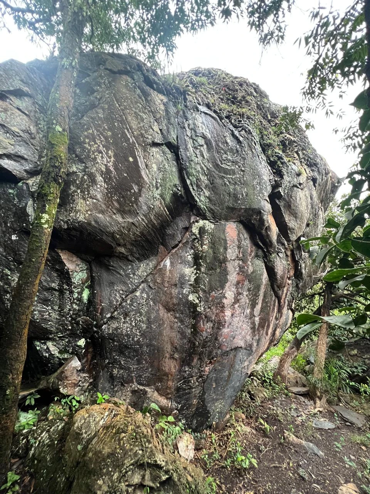
    - **largura_mapa**: 960
    - **altura_mapa**: 1280
    - **pontos_de_interesse**:
      - **[0]**:
        - **id**: linha_9
        - **label**: 
        - **linha**:
          - **estilo**: TRACEJADO
          - **espessura**: 3
          - **compilado**:
            - **caminho_svg**: M 211 899 C 240.0 870.0, 269.4 840.9, 298 812 C 326.1 783.6, 354.1 756.3, 381 727 C 408.1 697.4, 432.6 661.0, 460 635 C 484.2 612.0, 506.9 587.6, 535 577 C 562.7 566.5, 599.2 574.9, 627 571 C 650.4 567.7, 675.8 569.0, 691 557 C 705.8 545.3, 712.6 522.4, 718 501 C 724.4 475.5, 725.7 440.1, 722 413 C 718.7 388.6, 705.5 368.5, 700 345 C 694.3 320.6, 692.7 294.3, 689 269
            - **caixa_delimitadora**:
              - **x**: 466
              - **y**: 584
              - **comprimento**: 511
              - **largura**: 630
            - **marcadores**:
              - **[0]**:
                - **tipo**: CIRCULO_IDENTIFICADOR
                - **x**: 211
                - **y**: 899
                - **angulo_graus_x100**: -4500
                - **rotulo**: 8
                - **raio**: 17
        - **cor**: #FFD600
    - **referencias**:
      - **[0]**:
        - **ids**:
          - linha_9
        - **escalada**: Pica fumo
- **precomputados**:
  - **total_escaladas**: 9
  - **total_boulders**: 9

## Parte: setor_fugitivos_ii (não listada em partes.json)

### Setor (Pico: Complexo Pedra Grande)

- **descricao**: 
- **nome**: Bloco Fugitivos II
- **escaladas**:
  - **[0]**:
    - **boulder**:
      - **descricao**: Escala a face fendilhada
      - **nome**: Olha a Jaca
      - **dificuldade**: V7
  - **[1]**:
    - **boulder**:
      - **descricao**: Olha a Jaca no Low rider
      - **nome**: Olha o Rider
      - **dificuldade**: V6_BARRA_V7
  - **[2]**:
    - **boulder**:
      - **descricao**: Sai da invertida e escala a diagonal para a esquerda
      - **nome**: Low Rider
      - **dificuldade**: V7_BARRA_V8
  - **[3]**:
    - **boulder**:
      - **descricao**: Low Rider finalizando no Fugitivos
      - **nome**: Easy Rider
      - **dificuldade**: V8
  - **[4]**:
    - **boulder**:
      - **descricao**: Fugitivos finalizando no Low Rider
      - **nome**: Big Rider
      - **dificuldade**: V9_BARRA_V10
  - **[5]**:
    - **boulder**:
      - **descricao**: Saída sentada abaixo da pedra e escala para a esquerda, dominando em cima da pedra
      - **nome**: Fugitivos
      - **dificuldade**: V7
  - **[6]**:
    - **boulder**:
      - **descricao**: Escala a face negativa à direita do bloco, iniciando igual ao Fugitivos
      - **nome**: Igarapedra
      - **dificuldade**: V10_BARRA_V11
  - **[7]**:
    - **boulder**:
      - **descricao**: Travessia pelas agarras baixas virando na extrema direita do bloco
      - **nome**: Trombose
      - **dificuldade**: V8_BARRA_V9
  - **[8]**:
    - **boulder**:
      - **descricao**: Sai do Olha a Jaca e vira no Audácia, travessia por cima
      - **nome**: Corrida do Ouro
      - **dificuldade**: V6
  - **[9]**:
    - **boulder**:
      - **descricao**: Saída em pé em regletes e escala reto
      - **nome**: Audácia
      - **dificuldade**: V8_BARRA_V9
- **mapas**:
  - **[0]**:
    - **caminho_imagem_mapa**: 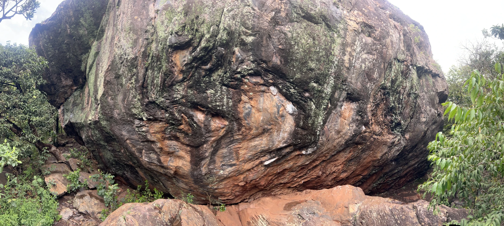
    - **largura_mapa**: 2796
    - **altura_mapa**: 1259
    - **pontos_de_interesse**:
      - **[0]**:
        - **id**: linha_2
        - **linha**:
          - **estilo**: TRACEJADO
          - **espessura**: 3
          - **compilado**:
            - **caminho_svg**: M 883 948 C 878.7 915.0, 872.9 876.3, 870 849 C 868.0 829.9, 867.3 816.3, 866 800
            - **caixa_delimitadora**:
              - **x**: 874
              - **y**: 874
              - **comprimento**: 17
              - **largura**: 148
            - **marcadores**:
              - **[0]**:
                - **tipo**: CIRCULO_IDENTIFICADOR
                - **x**: 883
                - **y**: 948
                - **angulo_graus_x100**: -9748
                - **rotulo**: 2
        - **cor**: #FFD600
      - **[1]**:
        - **id**: linha_5
        - **linha**:
          - **estilo**: TRACEJADO
          - **espessura**: 3
          - **compilado**:
            - **caminho_svg**: M 866 799 C 871.0 778.7, 871.9 757.4, 881 738 C 890.9 716.9, 901.4 693.2, 925 678 C 961.4 654.6, 1046.8 660.6, 1098 642 C 1142.9 625.7, 1190.1 610.8, 1218 578 C 1247.1 543.8, 1254.1 493.0, 1266 438 C 1282.1 363.8, 1283.3 259.3, 1292 170
            - **caixa_delimitadora**:
              - **x**: 1079
              - **y**: 484
              - **comprimento**: 426
              - **largura**: 629
            - **marcadores**: []
        - **cor**: #FFD600
      - **[2]**:
        - **id**: linha_6
        - **linha**:
          - **estilo**: TRACEJADO
          - **espessura**: 3
          - **compilado**:
            - **caminho_svg**: M 1298 173 C 1299.0 128.7, 1300.0 84.3, 1301 40
            - **caixa_delimitadora**:
              - **x**: 1300
              - **y**: 106
              - **comprimento**: 3
              - **largura**: 133
            - **marcadores**:
              - **[0]**:
                - **tipo**: FIM_TOP
                - **x**: 1301
                - **y**: 40
                - **angulo_graus_x100**: -8871
                - **rotulo**: C
        - **cor**: #FFD600
      - **[3]**:
        - **id**: linha_1
        - **linha**:
          - **estilo**: TRACEJADO
          - **espessura**: 3
          - **compilado**:
            - **caminho_svg**: M 1721 873 C 1722.0 831.0, 1722.5 782.6, 1724 747 C 1725.1 720.9, 1726.7 701.7, 1728 679
            - **caixa_delimitadora**:
              - **x**: 1724
              - **y**: 776
              - **comprimento**: 7
              - **largura**: 194
            - **marcadores**:
              - **[0]**:
                - **tipo**: CIRCULO_IDENTIFICADOR
                - **x**: 1721
                - **y**: 873
                - **angulo_graus_x100**: -8864
                - **rotulo**: 3
        - **cor**: #FFD600
      - **[4]**:
        - **id**: linha_9
        - **linha**:
          - **estilo**: TRACEJADO
          - **espessura**: 3
          - **compilado**:
            - **caminho_svg**: M 1728 679 C 1728.3 658.0, 1732.3 636.9, 1729 616 C 1725.6 594.2, 1714.3 572.7, 1707 551
            - **caixa_delimitadora**:
              - **x**: 1718
              - **y**: 615
              - **comprimento**: 22
              - **largura**: 128
            - **marcadores**: []
        - **cor**: #FFD600
      - **[5]**:
        - **id**: linha_10
        - **linha**:
          - **estilo**: TRACEJADO
          - **espessura**: 3
          - **compilado**:
            - **caminho_svg**: M 1707 551 C 1650.7 508.7, 1588.1 460.3, 1538 424 C 1498.8 395.6, 1466.5 373.7, 1432 350 C 1399.3 327.5, 1358.3 314.3, 1336 285 C 1313.5 255.4, 1310.7 210.3, 1298 173
            - **caixa_delimitadora**:
              - **x**: 1502
              - **y**: 362
              - **comprimento**: 409
              - **largura**: 378
            - **marcadores**: []
        - **cor**: #FFD600
      - **[6]**:
        - **id**: linha_7
        - **label**: 
        - **linha**:
          - **estilo**: TRACEJADO
          - **espessura**: 3
          - **compilado**:
            - **caminho_svg**: M 2205 766 C 2195.0 753.7, 2182.9 744.0, 2175 729 C 2165.6 711.1, 2160.9 688.8, 2156 664 C 2149.7 632.2, 2145.6 586.7, 2144 553 C 2142.7 525.0, 2143.3 502.1, 2145 476 C 2146.8 448.8, 2151.7 420.7, 2155 393
            - **caixa_delimitadora**:
              - **x**: 2174
              - **y**: 580
              - **comprimento**: 61
              - **largura**: 373
            - **marcadores**: []
        - **cor**: #FFD600
      - **[7]**:
        - **id**: linha_12
        - **linha**:
          - **estilo**: TRACEJADO
          - **espessura**: 3
          - **compilado**:
            - **caminho_svg**: M 2205 764 C 2166.7 758.0, 2130.1 754.5, 2090 746 C 2044.9 736.5, 1993.6 724.9, 1948 708 C 1902.6 691.2, 1857.2 671.1, 1817 645 C 1776.9 619.0, 1743.7 583.0, 1707 552
            - **caixa_delimitadora**:
              - **x**: 1956
              - **y**: 658
              - **comprimento**: 498
              - **largura**: 212
            - **marcadores**: []
        - **cor**: #FFD600
      - **[8]**:
        - **id**: linha_8
        - **linha**:
          - **estilo**: TRACEJADO
          - **espessura**: 3
          - **compilado**:
            - **caminho_svg**: M 1728 679 C 1737.7 665.7, 1744.8 650.0, 1757 639 C 1769.6 627.5, 1781.7 618.3, 1803 612 C 1841.2 600.7, 1929.3 610.6, 1975 604 C 2006.0 599.5, 2030.7 600.6, 2052 585 C 2077.0 566.7, 2092.0 523.9, 2109 492 C 2125.9 460.3, 2139.0 426.7, 2154 394
            - **caixa_delimitadora**:
              - **x**: 1941
              - **y**: 536
              - **comprimento**: 426
              - **largura**: 285
            - **marcadores**: []
        - **cor**: #FFD600
      - **[9]**:
        - **id**: linha_13
        - **linha**:
          - **estilo**: TRACEJADO
          - **espessura**: 3
          - **compilado**:
            - **caminho_svg**: M 2155 393 C 2163.3 363.3, 2170.7 335.6, 2180 304 C 2190.7 267.8, 2209.9 221.7, 2216 188 C 2220.6 162.9, 2218.7 143.3, 2220 121
            - **caixa_delimitadora**:
              - **x**: 2188
              - **y**: 257
              - **comprimento**: 65
              - **largura**: 272
            - **marcadores**:
              - **[0]**:
                - **tipo**: FIM_TOP
                - **x**: 2220
                - **y**: 121
                - **angulo_graus_x100**: -8658
                - **rotulo**: D
        - **cor**: #FFD600
      - **[10]**:
        - **id**: linha_14
        - **linha**:
          - **estilo**: TRACEJADO
          - **espessura**: 3
          - **compilado**:
            - **caminho_svg**: M 2250 903 C 2259.3 870.7, 2285.4 827.4, 2278 806 C 2272.8 791.0, 2251.2 783.8, 2238 777 C 2226.9 771.3, 2216.0 769.7, 2205 766
            - **caixa_delimitadora**:
              - **x**: 2242
              - **y**: 834
              - **comprimento**: 73
              - **largura**: 137
            - **marcadores**: []
        - **cor**: #FFD600
      - **[11]**:
        - **id**: linha_15
        - **linha**:
          - **estilo**: TRACEJADO
          - **espessura**: 3
          - **compilado**:
            - **caminho_svg**: M 2250 903 C 2277.7 864.0, 2315.7 817.2, 2333 786 C 2343.4 767.2, 2345.0 756.6, 2353 738 C 2364.1 712.0, 2374.4 663.1, 2394 645 C 2408.7 631.4, 2435.3 635.7, 2448 626 C 2457.9 618.4, 2461.3 606.7, 2468 597
            - **caixa_delimitadora**:
              - **x**: 2359
              - **y**: 750
              - **comprimento**: 218
              - **largura**: 306
            - **marcadores**:
              - **[0]**:
                - **tipo**: CIRCULO_IDENTIFICADOR
                - **x**: 2353
                - **y**: 738
                - **angulo_graus_x100**: -6661
                - **rotulo**: ▲
        - **cor**: #FFD600
      - **[12]**:
        - **id**: linha_16
        - **linha**:
          - **estilo**: TRACEJADO
          - **espessura**: 3
          - **compilado**:
            - **caminho_svg**: M 2468 597 C 2474.7 570.3, 2488.9 547.4, 2488 517 C 2486.8 476.1, 2463.6 406.3, 2443 374 C 2429.4 352.7, 2406.9 350.6, 2395 330 C 2379.0 302.3, 2376.5 243.1, 2369 215 C 2364.6 198.5, 2361.0 189.0, 2357 176
            - **caixa_delimitadora**:
              - **x**: 2422
              - **y**: 386
              - **comprimento**: 131
              - **largura**: 421
            - **marcadores**:
              - **[0]**:
                - **tipo**: FIM_TOP
                - **x**: 2357
                - **y**: 176
                - **angulo_graus_x100**: -10710
                - **rotulo**: E
        - **cor**: #FFD600
      - **[13]**:
        - **id**: linha_11
        - **linha**:
          - **estilo**: TRACEJADO
          - **espessura**: 3
          - **compilado**:
            - **caminho_svg**: M 2172 1011 C 2185.7 992.3, 2199.3 973.7, 2213 955
            - **caixa_delimitadora**:
              - **x**: 2192
              - **y**: 983
              - **comprimento**: 41
              - **largura**: 56
            - **marcadores**:
              - **[0]**:
                - **tipo**: CIRCULO_IDENTIFICADOR
                - **x**: 2172
                - **y**: 1011
                - **angulo_graus_x100**: -5379
                - **rotulo**: 4
        - **cor**: #FFD600
      - **[14]**:
        - **id**: linha_17
        - **linha**:
          - **estilo**: TRACEJADO
          - **espessura**: 3
          - **compilado**:
            - **caminho_svg**: M 2213 955 C 2225.3 937.7, 2237.7 920.3, 2250 903
            - **caixa_delimitadora**:
              - **x**: 2232
              - **y**: 929
              - **comprimento**: 37
              - **largura**: 52
            - **marcadores**: []
        - **cor**: #FFD600
      - **[15]**:
        - **id**: linha_4
        - **label**: 
        - **linha**:
          - **estilo**: TRACEJADO
          - **espessura**: 3
          - **compilado**:
            - **caminho_svg**: M 2212 954 C 2227.7 946.3, 2242.6 936.7, 2259 931 C 2275.6 925.3, 2292.4 926.4, 2311 920 C 2334.4 912.0, 2366.9 895.0, 2387 883 C 2401.3 874.5, 2412.7 870.7, 2422 858 C 2434.8 840.6, 2439.4 805.0, 2447 781 C 2453.6 760.1, 2461.3 742.0, 2465 722 C 2468.6 702.0, 2468.5 681.6, 2469 661 C 2469.5 639.9, 2468.3 618.3, 2468 597
            - **caixa_delimitadora**:
              - **x**: 2340
              - **y**: 776
              - **comprimento**: 257
              - **largura**: 357
            - **marcadores**:
              - **[0]**:
                - **tipo**: CIRCULO_IDENTIFICADOR
                - **x**: 2422
                - **y**: 858
                - **angulo_graus_x100**: -5953
                - **rotulo**: ★
        - **cor**: #FFD600
      - **[16]**:
        - **id**: linha_19
        - **linha**:
          - **estilo**: TRACEJADO
          - **espessura**: 3
          - **compilado**:
            - **caminho_svg**: M 866 800 C 861.3 773.0, 856.7 746.0, 852 719
            - **caixa_delimitadora**:
              - **x**: 859
              - **y**: 760
              - **comprimento**: 14
              - **largura**: 81
            - **marcadores**: []
        - **cor**: #FFD600
      - **[17]**:
        - **id**: linha_20
        - **linha**:
          - **estilo**: TRACEJADO
          - **espessura**: 3
          - **compilado**:
            - **caminho_svg**: M 853 720 C 849.3 694.7, 844.9 677.3, 842 644 C 836.6 581.2, 830.2 467.3, 834 371 C 838.3 262.1, 859.3 139.7, 872 24
            - **caixa_delimitadora**:
              - **x**: 853
              - **y**: 372
              - **comprimento**: 38
              - **largura**: 696
            - **marcadores**:
              - **[0]**:
                - **tipo**: FIM_TOP
                - **x**: 872
                - **y**: 24
                - **angulo_graus_x100**: -8375
                - **rotulo**: B
        - **cor**: #FFD600
      - **[18]**:
        - **id**: linha_3
        - **linha**:
          - **estilo**: TRACEJADO
          - **espessura**: 3
          - **compilado**:
            - **caminho_svg**: M 853 720 C 847.0 707.0, 843.4 693.8, 835 681 C 825.0 665.8, 813.5 647.4, 795 636 C 771.0 621.2, 730.6 621.3, 697 610 C 659.8 597.5, 601.7 587.8, 582 563 C 566.6 543.6, 574.0 513.0, 570 488
            - **caixa_delimitadora**:
              - **x**: 712
              - **y**: 604
              - **comprimento**: 283
              - **largura**: 232
            - **marcadores**: []
        - **cor**: #FFD600
      - **[19]**:
        - **id**: linha_21
        - **linha**:
          - **estilo**: TRACEJADO
          - **espessura**: 3
          - **compilado**:
            - **caminho_svg**: M 570 488 C 572.3 448.3, 572.7 413.1, 577 369 C 582.5 313.2, 595.4 239.6, 603 180 C 609.8 126.6, 615.0 78.7, 621 28
            - **caixa_delimitadora**:
              - **x**: 596
              - **y**: 258
              - **comprimento**: 51
              - **largura**: 460
            - **marcadores**:
              - **[0]**:
                - **tipo**: FIM_TOP
                - **x**: 621
                - **y**: 28
                - **angulo_graus_x100**: -8325
                - **rotulo**: A
        - **cor**: #FFD600
      - **[20]**:
        - **id**: linha_18
        - **label**: 
        - **linha**:
          - **estilo**: TRACEJADO
          - **espessura**: 3
          - **compilado**:
            - **caminho_svg**: M 477 714 C 496.7 692.3, 522.4 672.8, 536 649 C 548.5 627.1, 552.4 603.3, 558 578 C 564.2 550.0, 566.0 518.0, 570 488
            - **caixa_delimitadora**:
              - **x**: 524
              - **y**: 601
              - **comprimento**: 93
              - **largura**: 226
            - **marcadores**:
              - **[0]**:
                - **tipo**: CIRCULO_IDENTIFICADOR
                - **x**: 477
                - **y**: 714
                - **angulo_graus_x100**: -4777
                - **rotulo**: 1
        - **cor**: #FFD600
    - **referencias**:
      - **[0]**:
        - **ids**:
          - linha_2
          - linha_19
          - linha_20
        - **escalada**: Olha a Jaca
      - **[1]**:
        - **ids**:
          - linha_2
          - linha_5
          - linha_6
        - **escalada**: Olha o Rider
      - **[2]**:
        - **ids**:
          - linha_1
          - linha_9
          - linha_10
          - linha_6
        - **escalada**: Low Rider
      - **[3]**:
        - **ids**:
          - linha_1
          - linha_8
          - linha_13
        - **escalada**: Easy Rider
      - **[4]**:
        - **ids**:
          - linha_11
          - linha_17
          - linha_14
          - linha_12
          - linha_10
          - linha_6
        - **escalada**: Big Rider
      - **[5]**:
        - **ids**:
          - linha_11
          - linha_17
          - linha_14
          - linha_7
          - linha_13
        - **escalada**: Fugitivos
      - **[6]**:
        - **ids**:
          - linha_11
          - linha_17
          - linha_15
          - linha_16
        - **escalada**: Igarapedra
      - **[7]**:
        - **ids**:
          - linha_11
          - linha_4
          - linha_16
        - **escalada**: Trombose
      - **[8]**:
        - **ids**:
          - linha_2
          - linha_19
          - linha_3
          - linha_21
        - **escalada**: Corrida do Ouro
      - **[9]**:
        - **ids**:
          - linha_18
          - linha_21
        - **escalada**: Audácia
  - **[1]**:
    - **caminho_imagem_mapa**: 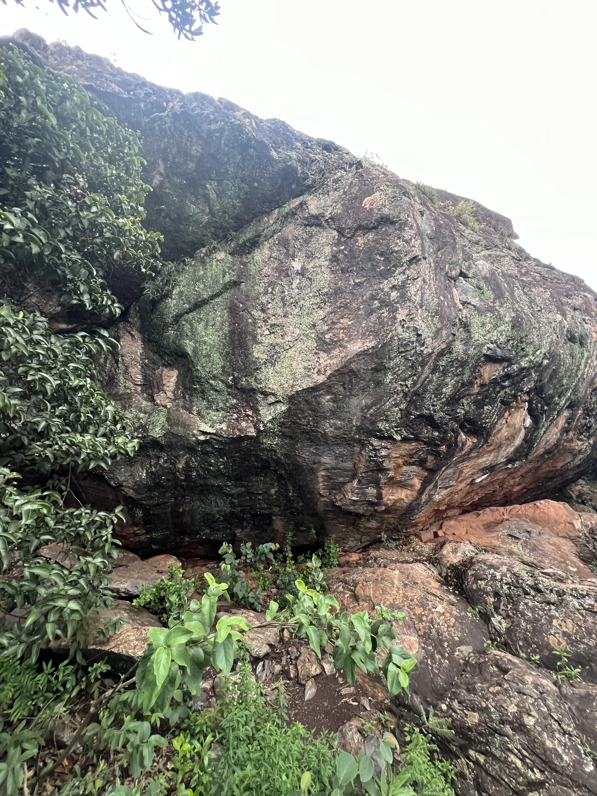
    - **largura_mapa**: 1773
    - **altura_mapa**: 2364
  - **[2]**:
    - **caminho_imagem_mapa**: 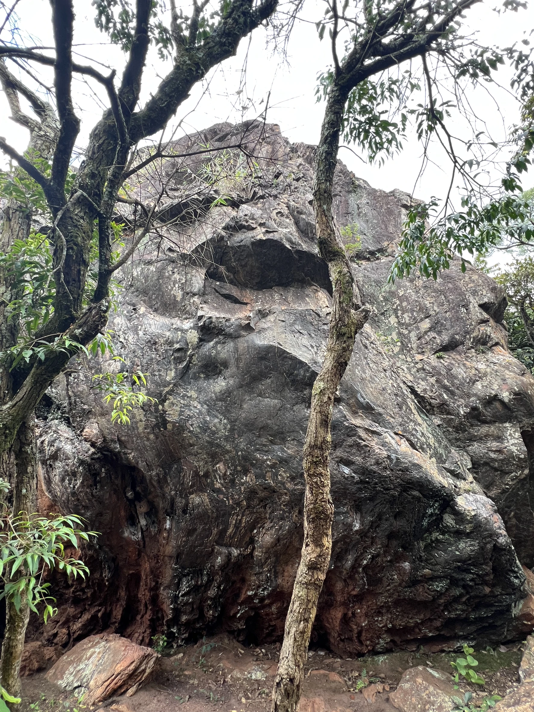
    - **largura_mapa**: 1773
    - **altura_mapa**: 2364
- **precomputados**:
  - **total_escaladas**: 10
  - **total_boulders**: 10

## Arquivos Externos

- **arquivos_externos**:
  - **[0]**:
    - **caminho**: 
    - **checksum_sha256**: b4887c391eaf1911eaf809e7132944c4f46760657ebe56af30f2890698fbe289
  - **[1]**:
    - **caminho**: 
    - **checksum_sha256**: 35328b7fcdf2d9a789fcd300af00cb67997589078e4dc645f00d1180b3ea707d
  - **[2]**:
    - **caminho**: 
    - **checksum_sha256**: a25c26a236f78956f6a9eef3b49be1a49e00ac995003bbc7b521a82708113c10
  - **[3]**:
    - **caminho**: 
    - **checksum_sha256**: 46f1c43fe65af207fde61b213d7876a9eee14afe36a686633b6309a4b9e0bb2c
  - **[4]**:
    - **caminho**: 
    - **checksum_sha256**: 852e3b9ba55da91bda3283501c992927fd6cae1166c0c21717190aa15f51066c
  - **[5]**:
    - **caminho**: 
    - **checksum_sha256**: 4182ec353e7d169bf4ea4bf1f245e97df7f3b359560ddf5d6d77ebd462259d88
  - **[6]**:
    - **caminho**: 
    - **checksum_sha256**: 54a37eb42350ba07c9f3490356d5b77fe8b940b07a3fffc08332c8d730344d31
  - **[7]**:
    - **caminho**: 
    - **checksum_sha256**: 77cc1dfdcaa11031b3bae33d41b033d9ab60a98c1bd248334e06b2b0debfb90b
  - **[8]**:
    - **caminho**: 
    - **checksum_sha256**: 33ba92f155decab3882d3768ca9d9e0a161a5db5402f2d6e522326c8ed56f8ba
  - **[9]**:
    - **caminho**: 
    - **checksum_sha256**: 9a165e9848c25a0f9c0595150de68226ce70344246a22d523d4d3438c1204276
  - **[10]**:
    - **caminho**: 
    - **checksum_sha256**: c0b10e222fdaed24818c31db7a4f62e69cef20e19182efd1f390a605d7023292
  - **[11]**:
    - **caminho**: 
    - **checksum_sha256**: 70ff91fdbc683bf71dcd9a33dbc042e170ef4f49c88b9bc9ce9956edb3fef48c
  - **[12]**:
    - **caminho**: 
    - **checksum_sha256**: 445e010c4cbaca2db0d2bfc12bb93dc9da30e427bac970d7e06ebe08cee2b0cf
  - **[13]**:
    - **caminho**: 
    - **checksum_sha256**: feae5245d8419ab4dd0698de889b4879cbe9b7a1324205ceae8dc47d77eb1038
  - **[14]**:
    - **caminho**: 
    - **checksum_sha256**: 8435be258ad2d6ed69cd0d4c540050a44bab6186bb884efae83a4998ef1101d3
  - **[15]**:
    - **caminho**: 
    - **checksum_sha256**: 4f3e4bedfed21fafc2284c19063d969b3aae82cd32409bd7bf62d4c941c32765
  - **[16]**:
    - **caminho**: 
    - **checksum_sha256**: 95239b7b899a1e56c8d919fcbfa733d0e9ae4f9b028a23eeb2a950c5dbabdf25
  - **[17]**:
    - **caminho**: 
    - **checksum_sha256**: 40266b678b64ad905696f58ace40b125d04162bfdb4a8c4f8a5f9313ee7a672d
  - **[18]**:
    - **caminho**: 
    - **checksum_sha256**: 66fbcb3356cdcbb3001fa95dbd17cdb0989d9e22a394cf2cf96890c3099ed794
  - **[19]**:
    - **caminho**: 
    - **checksum_sha256**: 06bd0ef4287fd6e7fa0255e706e814ea441be9d74e11b0d0a5a17173de6d4474
  - **[20]**:
    - **caminho**: 
    - **checksum_sha256**: e79e4daa827532abd0ff0a16e096f1df0eea148c8589dc7686fa268ba1c84102
  - **[21]**:
    - **caminho**: 
    - **checksum_sha256**: b2ab0e0a16eb19fe5d54f6a899456ac5ff07671862249a012699dc3631c64662
  - **[22]**:
    - **caminho**: 
    - **checksum_sha256**: 3a6b8f636bd121e5fa888a5dc855ddb627cea151389890532ba4f50053c78f30
  - **[23]**:
    - **caminho**: 
    - **checksum_sha256**: 9aa633be14db3f0c96a1a656470f87f5bfb7a259a02cb58babd6733dadc8d535
  - **[24]**:
    - **caminho**: 
    - **checksum_sha256**: acb374ec8c0ecf85d537c86dd1328bbb91e4fd41576659d596457a818254cd2d
  - **[25]**:
    - **caminho**: 
    - **checksum_sha256**: e59d63c298cd1049ee8636ce3e3b78b993f5b2358f4e3fc57a10508e739e8536
  - **[26]**:
    - **caminho**: 
    - **checksum_sha256**: 27321d933aca314b50a98e486f662138fd61b049dcb90248b6bb2d162c7b944c
  - **[27]**:
    - **caminho**: 
    - **checksum_sha256**: 2b3caa8b248dc3f33ae226aa25d1456c0eb589c5b694e66cf201cd7c4f7927fa
  - **[28]**:
    - **caminho**: 
    - **checksum_sha256**: ec34526d21a825cbefa2049a1fe82cc4a1d77a4dd1072d39804852cf5c38daf3
  - **[29]**:
    - **caminho**: 
    - **checksum_sha256**: 42e142af39766186c13a61691e384bddc064bcad6e4a07ce0e802cb429fe73ba
  - **[30]**:
    - **caminho**: 
    - **checksum_sha256**: 9afa2f619eda4053a096d19b64aa9262e8b85f9f9b05815ad2379e66ccc227e1
  - **[31]**:
    - **caminho**: 
    - **checksum_sha256**: d60317f3226a9af417557bf7f1d73d46aa152cfbded8a2d8e2a876834398ed64
  - **[32]**:
    - **caminho**: 
    - **checksum_sha256**: 42f0988f5b3b2455e050c55af801a4422327538c6acf4a39706557d91edea940
  - **[33]**:
    - **caminho**: 
    - **checksum_sha256**: 88013468ab3f1c12bc710281758d6e1e205443645aba8dff2828a8b52ee7f2e6
  - **[34]**:
    - **caminho**: 
    - **checksum_sha256**: 4d12e846ce75ebfd1587a51a5661715826e1c800dcfdc1cf99124fa710576d2d
  - **[35]**:
    - **caminho**: 
    - **checksum_sha256**: eb605d166d35d36c3b23981ec6144eba7f3375955bed6b1954eff3d1ea441044
  - **[36]**:
    - **caminho**: 
    - **checksum_sha256**: 028f8cb259043ddcfd39cf2fb64041b88c41cd3538b6604d384ab2f08514edbf
  - **[37]**:
    - **caminho**: 
    - **checksum_sha256**: fa73e3e2fa27a74255e21b0c499f6e72bc47a99626b5bd780473d967c257eaad
  - **[38]**:
    - **caminho**: 
    - **checksum_sha256**: 94d2480252708d7f25f9234befb17df302bcc0876bbe53025fc3d5ab5321b7c1
  - **[39]**:
    - **caminho**: 
    - **checksum_sha256**: be43e895f74116ff63a5ec7ac25290dbce75ad67bf1df0a3ab079d7e4c17ac68
  - **[40]**:
    - **caminho**: 
    - **checksum_sha256**: e3544af684cab5da717ea03b4f77d05f0652be42e0cab50c3f41d62ba5120d57
  - **[41]**:
    - **caminho**: 
    - **checksum_sha256**: 7ca2f6791409aa498f402729b4d426bf972d8db7689f9052a490fe4ee31b7773
  - **[42]**:
    - **caminho**: 
    - **checksum_sha256**: c8e95292e609405375d46753e1010ff78f1ba889355e5f80b6b29321cf8cee5c

