# Croqui: Igarameca - Complexo Pedra Grande

## Informações Gerais

- **descricao**: Este croqui documenta e divulga a prática da escalada no Complexo da Pedra Grande em Igarapé/MG, reunindo informações sobre diversos setores e vias.
- **id**: br_mg_igarape_pedra_grande
- **nome**: Igarameca - Complexo Pedra Grande
- **uid**: nxZd44LfKUlR1H
- **creditos**:
  - Equipe Igarameca
  - Alexsandro
- **caminho_thumbnail**: 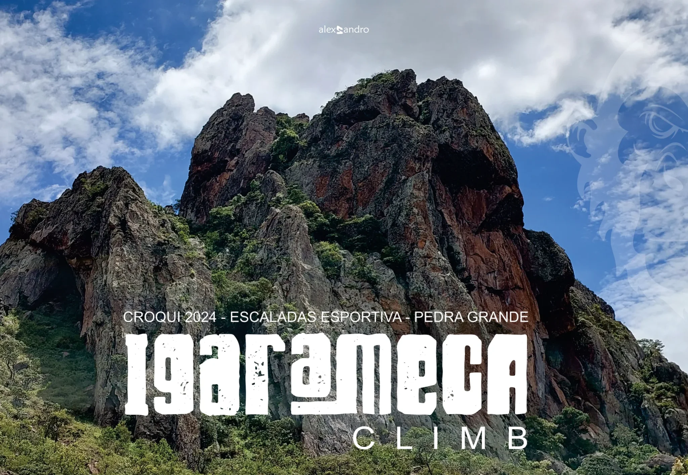
- **revisado_manualmente**: True
- **status_desenho_extraivel**: NAO_TEM_DESENHO
- **botoes**:
  - **[0]**:
    - **uid**: axpnQInJsigqZt
    - **texto**: Capa
    - **destino**:
      - **secao_textual**:
        - **conteudo**:
            # Igarameca Climb
            
            |  |
            | :--: |
            | *Capa do Croqui 2024 - Escaladas Esportivas - Pedra Grande* |
            
            **CROQUI 2024 - ESCALADAS ESPORTIVA - PEDRA GRANDE**
            
            Alexsandro
  - **[1]**:
    - **uid**: 6hlPaF0ggRKKsj
    - **texto**: Introdução
    - **destino**:
      - **secao_textual**:
        - **conteudo**:
            # Introdução
            
            Este croqui é apenas um auxílio de consulta a localização, não serve como instruções a prática da escalada.
            Não nos responsabilizamos pelas informações aqui contidas, são apenas ponto de vista.
            
            ## ATENÇÃO
            
            Os nomes das vias, seus respectivos conquistadores e a graduação sugerida para cada uma delas são resultados de uma pesquisa oral conduzida entre os escaladores que frequentam o pico, e com base em registros fragmentados sobre o tema.
            
            O resultado desse trabalho pode eventualmente conter erros, os quais peço que não sejam entendidos como desrespeito.
            
            O objetivo é documentar e divulgar a prática da escalada no centro-oeste mineiro da maneira mais exata possível.
            
            ## OBSERVAÇÕES
            
            Como algumas vias são de conquistadores(as) desconhecidos(as) foi utilizado apelido + (*) para identificá-las.
            
            Caso encontre algum engano nos dados citados neste croqui, peço que me envie a correção.
            
            Terei satisfação em atendê-lo, pois todos os envolvidos com a escalada tem a ganhar com o aprimoramento desse trabalho.
            
            [@igarameca](https://www.instagram.com/igarameca)
            
            Muito obrigado aos conquistadores e conquistadoras das linhas (rotas) de escalada, **GRATIDÃO** a vocês sempre!!!
            
            Obrigado a todas as pessoas que contribuíram para o desenvolvimento desse excepcional parque natural de escaladas.
            
            Obrigado em especial ao **Bruno Berbari** e **Warleson Campos (Bunitin)** na captação e catalogação das vias.
            
            > Organização, Revisão e Graduação sugerida das vias: **Equipe Igarameca**
            > arte/desenhos/produção: **alexsandro**
            > 1ª versão - Junho/2024 (vias esportivas) 24 páginas
  - **[2]**:
    - **uid**: vwBbHXq9wO2MXn
    - **texto**: Recomendações e Regras
    - **destino**:
      - **secao_textual**:
        - **conteudo**:
            # SEJA CONSCIENTE!
            
            - **UTILIZE APENAS AS TRILHAS PRINCIPAIS;**
            - **As grutas não são banheiros!** Faça suas necessidades fisiológicas em casa, caso não consiga segurar, faça longe das pedras e cubra com folhas ou terra;
            - **Leve todo seu lixo de volta** e o lixo de outros visitantes descuidados (inclusive papel higiênico, garrafas plásticas, bitucas, pontas, papel de bala...);
            - Os animais locais e plantas nativas devem permanecer em seus lugares. Lembre-se que eles estão em seu habitat natural e precisam ser respeitados;
            - Os animais domésticos (ex. cães) não devem ser trazidos a este local, desta forma, você os protege de doenças silvestres e vice-versa;
            - Fogueiras além de provocar queimadas, danificam o local;
            - Estacione de maneira adequada e no local adequado a fim de não atrapalhar o fluxo de outros veículos e/ou caminhões;
            - Utilize equipamentos de segurança e verifique seu estado de conservação;
            - Cuidado com pedras soltas principalmente em setores e vias novas;
            - Antes de conquistar uma via de escalada entre em contato com a Equipe Igarameca.
            
            [@igarameca](https://www.instagram.com/igarameca)
  - **[3]**:
    - **uid**: rrXbjlSk8nFJGB
    - **texto**: História de Igarapé
    - **destino**:
      - **secao_textual**:
        - **conteudo**:
            # História de Igarapé - MG
            
            Igarapé localiza-se na Região Metropolitana de Belo Horizonte, é um município brasileiro do estado de Minas Gerais. Seu nome que vem do tupi-guarani, e significa "caminho da canoa", enquanto cidade teve suas bases iniciais de ocupação do território no "garimpo de ouro" no distrito de São Joaquim de Bicas e posteriormente na agropecuária. Certamente centenas de anos antes, por aqui já existiam fazendas e diversas famílias com residências fixas.
            
            Com base em documentos podemos afirmar que por volta de 1830, já existia muita gente vivendo no próprio local que seria mais tarde o Barreiro (nesta época, o Barreiro nem era propriamente um povoado, era um simples aglomerado de pequenas e velhas fazendas mais ou menos perto umas das outras) e, posteriormente, denominada cidade de Igarapé.
            
            Portanto, a ideia de que a origem da cidade remonta a estas antigas fazendas existentes, não pode ser tomada como o marco da fundação de Igarapé, afinal, em tempos mais longínquos viviam os povos indígenas, verdadeiros habitantes originários da região, bem como de todo o continente.
            
            | 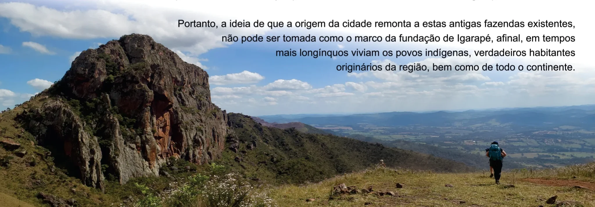 |
            | :--: |
            | *Vista de Igarapé* |
            
            [@igarameca](https://www.instagram.com/igarameca)
  - **[4]**:
    - **uid**: WtedtNvmgS6M60
    - **texto**: Sobre o Complexo Pedra Grande
    - **destino**:
      - **secao_textual**:
        - **conteudo**:
            # COMPLEXO PEDRA GRANDE
            
            A Pedra Grande, um marco histórico e geográfico de Igarapé, tem sido uma referência importante para viajantes ao longo dos anos. No século XX, a mineração de ferro ameaçou a integridade da Serra do Itatiaiuçu, o que levou à criação da Área de Proteção Especial (APE) e, posteriormente, da Área de Proteção Ambiental (APA) Municipal de Igarapé, visando preservar os mananciais de abastecimento humano.
            
            A Pedra Grande possui características escultóricas naturais que atraem visitantes, oferece belezas naturais, como matas e fontes d'água, que aumentam o turismo e promovem atividades de aventura na região. No entanto, a visitação descontrolada tem causado depredação e poluição. Esta atitude é repudiada por escaladores que frequentam o local e se empenham em recolher seus próprios lixos e os de visitantes descuidados.
            
            O município de Igarapé decretou o tombamento sob proteção Municipal do bem cultural denominado "Conjunto Natural e Paisagístico da Pedra Grande" que também é cartograficamente importante, situada na Serra do Itatiaiuçu, compondo a zona limítrofe entre Igarapé, Itatiaiuçu e Mateus Leme. A área tem significância econômica devido às jazidas de ferro e manganês, sendo notável por sua beleza cênica e valor didático.
            
            O bem natural tem importância regional estratégica por ser berço de nascentes responsáveis pela recarga hídrica de um dos aquíferos que abastecem a região metropolitana de Belo Horizonte. A área faz parte do Quadrilátero Ferrífero, uma província geológica conhecida por seus depósitos e minas de ferro, manganês, ouro, calcário e bauxita, recursos naturais amplamente explorados pelas mineradoras que se instalaram na região.
            
            [@igarameca](https://www.instagram.com/igarameca)
  - **[5]**:
    - **uid**: WGEft5sbQ0xBVt
    - **texto**: Sobre o Igarameca
    - **destino**:
      - **secao_textual**:
        - **conteudo**:
            # IGARAMECA
            
            Não se sabe ao certo quando começou a escada na região, estudos em andamento apontam entre as décadas de 80/90. Há três anos, um grupo de escaladores de Belo Horizonte se reuniu com a ideia de transformar o Complexo da Pedra Grande em um dos principais picos de escalada da região. Foi assim que nasceu o @igarameca, numa prosa após um dia de muito climbing no pé da pedra.
            
            Esse sonho tem se tornado realidade dia após dia, com muito trabalho, dedicação e claro, muita escalada boa. Atualmente o complexo possui mais de 150 vias esportivas e 500 boulders, além de rotas tradicionais e móveis, todas esculpidas na rocha única de Itabirito.
            
            Os croquis são os "mapas" que guiam os praticantes da escalada no local, sendo um facilitador para a pratica do esporte e acreditamos resultar em um ganho a todos. E para que cada vez mais escaladores possam usufruir e desbravar o potencial do local, inicialmente estamos lançando este **CROQUI DOS SETORES E VIAS DE ESCALADAS ESPORTIVA** catalogadas no complexo da Pedra Grande em Igarapé/MG, atualizações serão adicionadas no decorrer do projeto... "e as vias trad, móvel e os boulders!?". C A L M A turma, anos e anos de desenvolvimento, muita informação a receber e em breve teremos um livro gigante repleto de informações e detalhes!!! Vamoooo!!!
            
            | 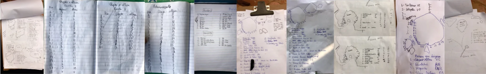 |
            | :--: |
            | *Anotações e croquis iniciais* |
            
            [@igarameca](https://www.instagram.com/igarameca)
  - **[6]**:
    - **uid**: 8pNS03RiiaTjUa
    - **texto**: Patrocinadores
    - **destino**:
      - **secao_textual**:
        - **conteudo**:
            # Patrocinadores
            
            Essas marcas apoiam a escalada na região e o croqui de Igarameca 2024:
            
            | 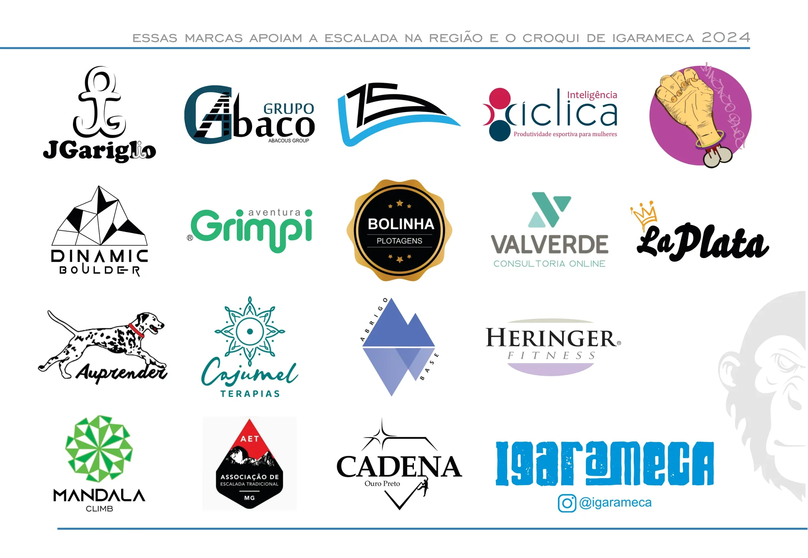 |
            | :--: |
            | *Marcas que apoiam a escalada na região* |
            
            - JGariglio
            - Grupo Abaco
            - Cíclica
            - Dinamic Boulder
            - Grimpi Aventura
            - Bolinha Plotagens
            - Valverde Consultoria Online
            - La Plata
            - Aprender
            - Cajumel Terapias
            - Abrigo Base
            - Heringer Fitness
            - Mandala Climb
            - AET (Associação de Escalada Tradicional MG)
            - Cadena Ouro Preto
            - Igarameca Climb
            
            [@igarameca](https://www.instagram.com/igarameca)
- **ultima_migracao**: 5
- **publicar_croqui**: True
- **revisado_bounding_circle**: True

## Parte: setor_familia_i

### Setor (Pico: Complexo Pedra Grande)

- **descricao**:
    O setor fica do lado direito do início da trilha para a Pedra Grande. Sombra o dia todo (varia de acordo com a estação).
    
    Veja a trilha para chegar ao setor no Wikiloc: https://loc.wiki/t/169745893?wa=sc
- **nome**: Setor Família I
- **uid**: ZTPu3KeCXIJisV
- **mapas**:
  - **[0]**:
    - **caminho_imagem_mapa**: 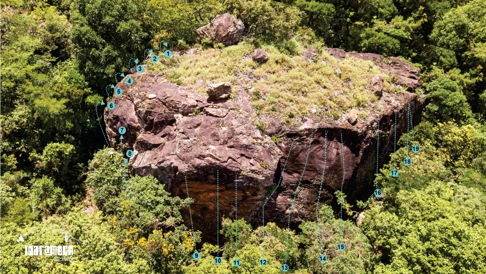
    - **largura_mapa**: 2304
    - **altura_mapa**: 1300
    - **pontos_de_interesse**:
      - **[0]**:
        - **id**: qlXn6FUKL7METH
        - **uid**: qlXn6FUKL7METH
        - **rotulo**: 01
        - **circulo**:
          - **x**: 794
          - **y**: 257
          - **raio**: 17
        - **label**: 01
      - **[1]**:
        - **id**: o2K5QjirIxNwwK
        - **uid**: o2K5QjirIxNwwK
        - **rotulo**: 02
        - **circulo**:
          - **x**: 731
          - **y**: 281
          - **raio**: 17
        - **label**: 02
      - **[2]**:
        - **id**: yz2AQIQG6ehbBv
        - **uid**: yz2AQIQG6ehbBv
        - **rotulo**: 03
        - **circulo**:
          - **x**: 661
          - **y**: 328
          - **raio**: 17
        - **label**: 03
      - **[3]**:
        - **id**: kcJbFThHUX5Bn2
        - **uid**: kcJbFThHUX5Bn2
        - **rotulo**: 04
        - **circulo**:
          - **x**: 611
          - **y**: 387
          - **raio**: 17
        - **label**: 04
      - **[4]**:
        - **id**: 0CerCMNwS5f2ed
        - **uid**: 0CerCMNwS5f2ed
        - **rotulo**: 05
        - **circulo**:
          - **x**: 562
          - **y**: 437
          - **raio**: 17
        - **label**: 05
      - **[5]**:
        - **id**: DNdDtH7tKvhkUH
        - **uid**: DNdDtH7tKvhkUH
        - **rotulo**: 06
        - **circulo**:
          - **x**: 526
          - **y**: 503
          - **raio**: 17
        - **label**: 06
      - **[6]**:
        - **id**: dLDPZenBZsHYVc
        - **uid**: dLDPZenBZsHYVc
        - **rotulo**: 07
        - **circulo**:
          - **x**: 578
          - **y**: 619
          - **raio**: 17
        - **label**: 07
      - **[7]**:
        - **id**: 6VfeYwe88YdjGO
        - **uid**: 6VfeYwe88YdjGO
        - **rotulo**: 08
        - **circulo**:
          - **x**: 614
          - **y**: 729
          - **raio**: 17
        - **label**: 08
      - **[8]**:
        - **id**: m5bWWBFMK7z2L4
        - **uid**: m5bWWBFMK7z2L4
        - **rotulo**: 09
        - **circulo**:
          - **x**: 929
          - **y**: 1212
          - **raio**: 17
        - **label**: 09
      - **[9]**:
        - **id**: mknuFc1BB80CDd
        - **uid**: mknuFc1BB80CDd
        - **rotulo**: 10
        - **circulo**:
          - **x**: 1030
          - **y**: 1236
          - **raio**: 18
        - **label**: 10
      - **[10]**:
        - **id**: OBnTLDJJvr0D8f
        - **uid**: OBnTLDJJvr0D8f
        - **rotulo**: 11
        - **circulo**:
          - **x**: 1119
          - **y**: 1245
          - **raio**: 18
        - **label**: 11
      - **[11]**:
        - **id**: ac9b06xwq95HML
        - **uid**: ac9b06xwq95HML
        - **rotulo**: 12
        - **circulo**:
          - **x**: 1245
          - **y**: 1244
          - **raio**: 19
        - **label**: 12
      - **[12]**:
        - **id**: E4cmZiMlB03FuM
        - **uid**: E4cmZiMlB03FuM
        - **rotulo**: 13
        - **circulo**:
          - **x**: 1347
          - **y**: 1269
          - **raio**: 18
        - **label**: 13
      - **[13]**:
        - **id**: zkdM1zdskgPkVO
        - **uid**: zkdM1zdskgPkVO
        - **rotulo**: 14
        - **circulo**:
          - **x**: 1527
          - **y**: 1227
          - **raio**: 19
        - **label**: 14
      - **[14]**:
        - **id**: Dbd16PihzEk3aM
        - **uid**: Dbd16PihzEk3aM
        - **rotulo**: 15
        - **circulo**:
          - **x**: 1613
          - **y**: 1170
          - **raio**: 19
        - **label**: 15
      - **[15]**:
        - **id**: m1cHE7LKd5teZF
        - **uid**: m1cHE7LKd5teZF
        - **rotulo**: 16
        - **circulo**:
          - **x**: 1787
          - **y**: 915
          - **raio**: 19
        - **label**: 16
      - **[16]**:
        - **id**: HodDVHPtqeELsn
        - **uid**: HodDVHPtqeELsn
        - **rotulo**: 17
        - **circulo**:
          - **x**: 1866
          - **y**: 820
          - **raio**: 19
        - **label**: 17
      - **[17]**:
        - **id**: tozyDLtdRIKngk
        - **uid**: tozyDLtdRIKngk
        - **rotulo**: 18
        - **circulo**:
          - **x**: 1927
          - **y**: 768
          - **raio**: 18
        - **label**: 18
      - **[18]**:
        - **id**: H5hJTC0A8qXnA9
        - **uid**: H5hJTC0A8qXnA9
        - **rotulo**: 19
        - **circulo**:
          - **x**: 1967
          - **y**: 707
          - **raio**: 18
        - **label**: 19
    - **referencias**:
      - **[0]**:
        - **alvo_uid**: FLoTnCFVLni9Pb
        - **pontos_uids**:
          - qlXn6FUKL7METH
        - **escalada**: Florestinha
        - **ids**:
          - qlXn6FUKL7METH
      - **[1]**:
        - **alvo_uid**: Tlhx6eoXoQUziK
        - **pontos_uids**:
          - o2K5QjirIxNwwK
        - **escalada**: Ação Total
        - **ids**:
          - o2K5QjirIxNwwK
      - **[2]**:
        - **alvo_uid**: OupOVdyw9uVkcl
        - **pontos_uids**:
          - yz2AQIQG6ehbBv
        - **escalada**: Escravos da Pedra
        - **ids**:
          - yz2AQIQG6ehbBv
      - **[3]**:
        - **alvo_uid**: qlHWtFXgXqhPcC
        - **pontos_uids**:
          - kcJbFThHUX5Bn2
        - **escalada**: Esquerdinha Caviar
        - **ids**:
          - kcJbFThHUX5Bn2
      - **[4]**:
        - **alvo_uid**: gKHvpeEKWrYjfZ
        - **pontos_uids**:
          - 0CerCMNwS5f2ed
        - **escalada**: Mônica
        - **ids**:
          - 0CerCMNwS5f2ed
      - **[5]**:
        - **alvo_uid**: zG2c0gEGEcy7Ir
        - **pontos_uids**:
          - DNdDtH7tKvhkUH
        - **escalada**: Queijo Suíço
        - **ids**:
          - DNdDtH7tKvhkUH
      - **[6]**:
        - **alvo_uid**: yuiS5Mtx9m1Wb3
        - **pontos_uids**:
          - dLDPZenBZsHYVc
        - **escalada**: Aranha Gato
        - **ids**:
          - dLDPZenBZsHYVc
      - **[7]**:
        - **alvo_uid**: JuAN9QaLjO1jwZ
        - **pontos_uids**:
          - mknuFc1BB80CDd
        - **escalada**: Totalflex
        - **ids**:
          - mknuFc1BB80CDd
      - **[8]**:
        - **alvo_uid**: rmw1FR9aRvSYJ4
        - **pontos_uids**:
          - OBnTLDJJvr0D8f
        - **escalada**: Haja Broca
        - **ids**:
          - OBnTLDJJvr0D8f
      - **[9]**:
        - **alvo_uid**: tPIqRns6HRbmmk
        - **pontos_uids**:
          - ac9b06xwq95HML
        - **escalada**: Juliana
        - **ids**:
          - ac9b06xwq95HML
      - **[10]**:
        - **alvo_uid**: EgdS4xxfulupK0
        - **pontos_uids**:
          - E4cmZiMlB03FuM
        - **escalada**: Lisebra
        - **ids**:
          - E4cmZiMlB03FuM
      - **[11]**:
        - **alvo_uid**: to5ABN7omIJ37i
        - **pontos_uids**:
          - zkdM1zdskgPkVO
        - **escalada**: Croque Monsieur
        - **ids**:
          - zkdM1zdskgPkVO
      - **[12]**:
        - **alvo_uid**: eBV9ImpSW6WA1a
        - **pontos_uids**:
          - Dbd16PihzEk3aM
        - **escalada**: Playground
        - **ids**:
          - Dbd16PihzEk3aM
      - **[13]**:
        - **alvo_uid**: Pp9quWTMtrDNcq
        - **pontos_uids**:
          - m1cHE7LKd5teZF
        - **escalada**: Depressão Pós Reforma
        - **ids**:
          - m1cHE7LKd5teZF
      - **[14]**:
        - **alvo_uid**: NHIJ7jGaMUKTbj
        - **pontos_uids**:
          - HodDVHPtqeELsn
        - **escalada**: Chuvasca
        - **ids**:
          - HodDVHPtqeELsn
      - **[15]**:
        - **alvo_uid**: NGFJC7ykiPLGB5
        - **pontos_uids**:
          - tozyDLtdRIKngk
        - **escalada**: Pau Oco
        - **ids**:
          - tozyDLtdRIKngk
      - **[16]**:
        - **alvo_uid**: Qqxx0DB6T4r3t3
        - **pontos_uids**:
          - H5hJTC0A8qXnA9
        - **escalada**: Franzinha
        - **ids**:
          - H5hJTC0A8qXnA9
      - **[17]**:
        - **alvo_uid**: PUdsJLmWSHjxEt
        - **pontos_uids**:
          - 6VfeYwe88YdjGO
        - **escalada**: Chapas Onorixicas
        - **ids**:
          - 6VfeYwe88YdjGO
      - **[18]**:
        - **alvo_uid**: HOwsUPLqGlJMvX
        - **pontos_uids**:
          - m5bWWBFMK7z2L4
        - **escalada**: Tora Flex
        - **ids**:
          - m5bWWBFMK7z2L4
  - **[1]**:
    - **caminho_imagem_mapa**: 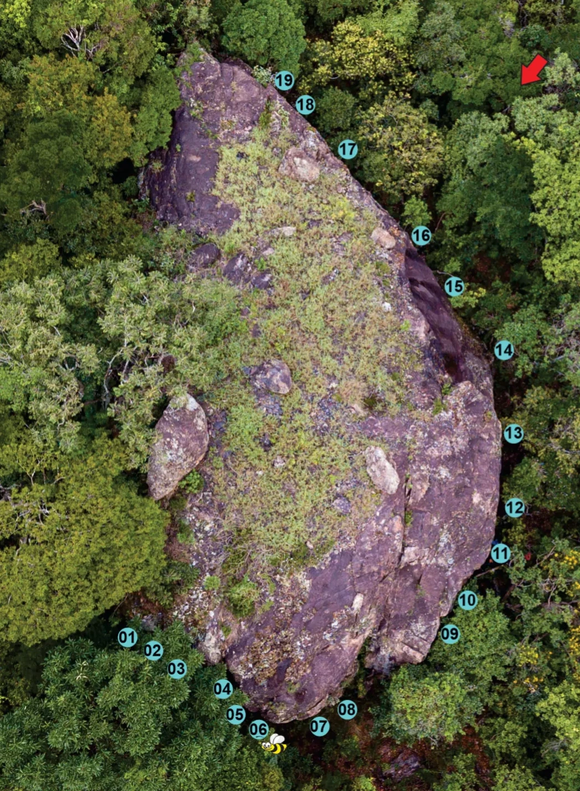
    - **largura_mapa**: 1121
    - **altura_mapa**: 1440
    - **pontos_de_interesse**:
      - **[0]**:
        - **id**: Kidqg1yeT9ur0h
        - **uid**: Kidqg1yeT9ur0h
        - **rotulo**: 19
        - **circulo**:
          - **x**: 523
          - **y**: 133
          - **raio**: 19
        - **label**: 19
      - **[1]**:
        - **id**: s6Zs89BCKrp0CI
        - **uid**: s6Zs89BCKrp0CI
        - **rotulo**: 18
        - **circulo**:
          - **x**: 562
          - **y**: 177
          - **raio**: 19
        - **label**: 18
      - **[2]**:
        - **id**: tVsR50LUA2ZDrC
        - **uid**: tVsR50LUA2ZDrC
        - **rotulo**: 17
        - **circulo**:
          - **x**: 638
          - **y**: 257
          - **raio**: 19
        - **label**: 17
      - **[3]**:
        - **id**: EP4rcx2InNNQzK
        - **uid**: EP4rcx2InNNQzK
        - **rotulo**: 16
        - **circulo**:
          - **x**: 771
          - **y**: 414
          - **raio**: 19
        - **label**: 16
      - **[4]**:
        - **id**: uF6aHByLscOpdd
        - **uid**: uF6aHByLscOpdd
        - **rotulo**: 15
        - **circulo**:
          - **x**: 830
          - **y**: 505
          - **raio**: 19
        - **label**: 15
      - **[5]**:
        - **id**: 2pRZiwtRv1fLFg
        - **uid**: 2pRZiwtRv1fLFg
        - **rotulo**: 14
        - **circulo**:
          - **x**: 920
          - **y**: 620
          - **raio**: 19
        - **label**: 14
      - **[6]**:
        - **id**: P01p9Cal7LnRam
        - **uid**: P01p9Cal7LnRam
        - **rotulo**: 13
        - **circulo**:
          - **x**: 937
          - **y**: 770
          - **raio**: 19
        - **label**: 13
      - **[7]**:
        - **id**: Ud8ho50Tuv9nMA
        - **uid**: Ud8ho50Tuv9nMA
        - **rotulo**: 12
        - **circulo**:
          - **x**: 940
          - **y**: 904
          - **raio**: 19
        - **label**: 12
      - **[8]**:
        - **id**: KQyiBdcw2mqzO5
        - **uid**: KQyiBdcw2mqzO5
        - **rotulo**: 11
        - **circulo**:
          - **x**: 914
          - **y**: 986
          - **raio**: 19
        - **label**: 11
      - **[9]**:
        - **id**: ynaXcUbxwHB9Mg
        - **uid**: ynaXcUbxwHB9Mg
        - **rotulo**: 10
        - **circulo**:
          - **x**: 855
          - **y**: 1071
          - **raio**: 18
        - **label**: 10
      - **[10]**:
        - **id**: ejYBUskluteW5A
        - **uid**: ejYBUskluteW5A
        - **rotulo**: 01
        - **circulo**:
          - **x**: 241
          - **y**: 1138
          - **raio**: 18
        - **label**: 01
      - **[11]**:
        - **id**: OSw3Yut8UJNQTV
        - **uid**: OSw3Yut8UJNQTV
        - **rotulo**: 09
        - **circulo**:
          - **x**: 823
          - **y**: 1132
          - **raio**: 19
        - **label**: 09
      - **[12]**:
        - **id**: Dwa5jRMxNSbOtj
        - **uid**: Dwa5jRMxNSbOtj
        - **rotulo**: 02
        - **circulo**:
          - **x**: 287
          - **y**: 1162
          - **raio**: 19
        - **label**: 02
      - **[13]**:
        - **id**: o5pAHGiVi1N8yW
        - **uid**: o5pAHGiVi1N8yW
        - **rotulo**: 03
        - **circulo**:
          - **x**: 330
          - **y**: 1195
          - **raio**: 19
        - **label**: 03
      - **[14]**:
        - **id**: e1UwaKn8XDaiTt
        - **uid**: e1UwaKn8XDaiTt
        - **rotulo**: 04
        - **circulo**:
          - **x**: 412
          - **y**: 1231
          - **raio**: 19
        - **label**: 04
      - **[15]**:
        - **id**: APU5ghbENEu31q
        - **uid**: APU5ghbENEu31q
        - **rotulo**: 05
        - **circulo**:
          - **x**: 436
          - **y**: 1277
          - **raio**: 19
        - **label**: 05
      - **[16]**:
        - **id**: QRr7USrPyHUd5Z
        - **uid**: QRr7USrPyHUd5Z
        - **rotulo**: 08
        - **circulo**:
          - **x**: 637
          - **y**: 1268
          - **raio**: 19
        - **label**: 08
      - **[17]**:
        - **id**: 4EK3SYCcRpHWqT
        - **uid**: 4EK3SYCcRpHWqT
        - **rotulo**: 06
        - **circulo**:
          - **x**: 477
          - **y**: 1304
          - **raio**: 19
        - **label**: 06
      - **[18]**:
        - **id**: 7cLnLDXpgAzOid
        - **uid**: 7cLnLDXpgAzOid
        - **rotulo**: 07
        - **circulo**:
          - **x**: 587
          - **y**: 1299
          - **raio**: 19
        - **label**: 07
    - **referencias**:
      - **[0]**:
        - **alvo_uid**: FLoTnCFVLni9Pb
        - **pontos_uids**:
          - ejYBUskluteW5A
        - **escalada**: Florestinha
        - **ids**:
          - ejYBUskluteW5A
      - **[1]**:
        - **alvo_uid**: Tlhx6eoXoQUziK
        - **pontos_uids**:
          - Dwa5jRMxNSbOtj
        - **escalada**: Ação Total
        - **ids**:
          - Dwa5jRMxNSbOtj
      - **[2]**:
        - **alvo_uid**: OupOVdyw9uVkcl
        - **pontos_uids**:
          - o5pAHGiVi1N8yW
        - **escalada**: Escravos da Pedra
        - **ids**:
          - o5pAHGiVi1N8yW
      - **[3]**:
        - **alvo_uid**: qlHWtFXgXqhPcC
        - **pontos_uids**:
          - e1UwaKn8XDaiTt
        - **escalada**: Esquerdinha Caviar
        - **ids**:
          - e1UwaKn8XDaiTt
      - **[4]**:
        - **alvo_uid**: gKHvpeEKWrYjfZ
        - **pontos_uids**:
          - APU5ghbENEu31q
        - **escalada**: Mônica
        - **ids**:
          - APU5ghbENEu31q
      - **[5]**:
        - **alvo_uid**: zG2c0gEGEcy7Ir
        - **pontos_uids**:
          - 4EK3SYCcRpHWqT
        - **escalada**: Queijo Suíço
        - **ids**:
          - 4EK3SYCcRpHWqT
      - **[6]**:
        - **alvo_uid**: yuiS5Mtx9m1Wb3
        - **pontos_uids**:
          - 7cLnLDXpgAzOid
        - **escalada**: Aranha Gato
        - **ids**:
          - 7cLnLDXpgAzOid
      - **[7]**:
        - **alvo_uid**: JuAN9QaLjO1jwZ
        - **pontos_uids**:
          - ynaXcUbxwHB9Mg
        - **escalada**: Totalflex
        - **ids**:
          - ynaXcUbxwHB9Mg
      - **[8]**:
        - **alvo_uid**: rmw1FR9aRvSYJ4
        - **pontos_uids**:
          - KQyiBdcw2mqzO5
        - **escalada**: Haja Broca
        - **ids**:
          - KQyiBdcw2mqzO5
      - **[9]**:
        - **alvo_uid**: tPIqRns6HRbmmk
        - **pontos_uids**:
          - Ud8ho50Tuv9nMA
        - **escalada**: Juliana
        - **ids**:
          - Ud8ho50Tuv9nMA
      - **[10]**:
        - **alvo_uid**: EgdS4xxfulupK0
        - **pontos_uids**:
          - P01p9Cal7LnRam
        - **escalada**: Lisebra
        - **ids**:
          - P01p9Cal7LnRam
      - **[11]**:
        - **alvo_uid**: to5ABN7omIJ37i
        - **pontos_uids**:
          - 2pRZiwtRv1fLFg
        - **escalada**: Croque Monsieur
        - **ids**:
          - 2pRZiwtRv1fLFg
      - **[12]**:
        - **alvo_uid**: eBV9ImpSW6WA1a
        - **pontos_uids**:
          - uF6aHByLscOpdd
        - **escalada**: Playground
        - **ids**:
          - uF6aHByLscOpdd
      - **[13]**:
        - **alvo_uid**: Pp9quWTMtrDNcq
        - **pontos_uids**:
          - EP4rcx2InNNQzK
        - **escalada**: Depressão Pós Reforma
        - **ids**:
          - EP4rcx2InNNQzK
      - **[14]**:
        - **alvo_uid**: NHIJ7jGaMUKTbj
        - **pontos_uids**:
          - tVsR50LUA2ZDrC
        - **escalada**: Chuvasca
        - **ids**:
          - tVsR50LUA2ZDrC
      - **[15]**:
        - **alvo_uid**: NGFJC7ykiPLGB5
        - **pontos_uids**:
          - s6Zs89BCKrp0CI
        - **escalada**: Pau Oco
        - **ids**:
          - s6Zs89BCKrp0CI
      - **[16]**:
        - **alvo_uid**: Qqxx0DB6T4r3t3
        - **pontos_uids**:
          - Kidqg1yeT9ur0h
        - **escalada**: Franzinha
        - **ids**:
          - Kidqg1yeT9ur0h
      - **[17]**:
        - **alvo_uid**: PUdsJLmWSHjxEt
        - **pontos_uids**:
          - QRr7USrPyHUd5Z
        - **escalada**: Chapas Onorixicas
        - **ids**:
          - QRr7USrPyHUd5Z
      - **[18]**:
        - **alvo_uid**: HOwsUPLqGlJMvX
        - **pontos_uids**:
          - OSw3Yut8UJNQTV
        - **escalada**: Tora Flex
        - **ids**:
          - OSw3Yut8UJNQTV
- **escaladas**:
  - **[0]**:
    - **uid**: FLoTnCFVLni9Pb
    - **via_esportiva**:
      - **nome**: Florestinha
      - **dificuldade**: BR_6SUP
      - **conquistadores**:
        - Berbari
        - Ró
      - **data_abertura**: 2011
  - **[1]**:
    - **uid**: Tlhx6eoXoQUziK
    - **via_esportiva**:
      - **nome**: Ação Total
      - **dificuldade**: BR_7A
      - **quantidade_protecoes_intermediarias**: 3
      - **quantidade_protecoes_parada**: 2
      - **extensao**: 10
      - **conquistadores**:
        - Berbari
        - Ró
        - Rômulo
      - **data_abertura**: 2011
  - **[2]**:
    - **uid**: OupOVdyw9uVkcl
    - **via_esportiva**:
      - **nome**: Escravos da Pedra
      - **dificuldade**: BR_8C
      - **quantidade_protecoes_intermediarias**: 4
      - **quantidade_protecoes_parada**: 2
      - **extensao**: 11
      - **conquistadores**:
        - Berbari
        - Ró
        - Chinha
      - **data_abertura**: 2011
  - **[3]**:
    - **uid**: qlHWtFXgXqhPcC
    - **via_esportiva**:
      - **nome**: Esquerdinha Caviar
      - **dificuldade**: BR_7C
      - **quantidade_protecoes_intermediarias**: 4
      - **quantidade_protecoes_parada**: 2
      - **extensao**: 12
      - **conquistadores**:
        - Berbari
        - Ró
        - Rômulo
      - **data_abertura**: 2011
  - **[4]**:
    - **uid**: gKHvpeEKWrYjfZ
    - **via_esportiva**:
      - **nome**: Mônica
      - **dificuldade**: BR_8B
      - **quantidade_protecoes_intermediarias**: 4
      - **quantidade_protecoes_parada**: 2
      - **extensao**: 12
      - **conquistadores**:
        - Berbari
        - Ró
      - **data_abertura**: 2011
  - **[5]**:
    - **uid**: zG2c0gEGEcy7Ir
    - **via_esportiva**:
      - **nome**: Queijo Suíço
      - **dificuldade**: BR_7A_BARRA_7B
      - **quantidade_protecoes_intermediarias**: 3
      - **quantidade_protecoes_parada**: 2
      - **extensao**: 11
      - **conquistadores**:
        - Berbari
        - Ró
      - **data_abertura**: 2011
  - **[6]**:
    - **uid**: yuiS5Mtx9m1Wb3
    - **via_esportiva**:
      - **nome**: Aranha Gato
      - **dificuldade**: BR_6_BARRA_6SUP
      - **quantidade_protecoes_intermediarias**: 3
      - **quantidade_protecoes_parada**: 2
      - **extensao**: 11
      - **conquistadores**:
        - Berbari
        - Ró
        - Chinha
      - **data_abertura**: 2011
  - **[7]**:
    - **uid**: PUdsJLmWSHjxEt
    - **via_esportiva**:
      - **nome**: Chapas Onorixicas
      - **dificuldade**: BR_6SUP
      - **quantidade_protecoes_intermediarias**: 3
      - **quantidade_protecoes_parada**: 2
      - **extensao**: 11
      - **conquistadores**:
        - Macena
        - Ivo
      - **data_abertura**: 2011
  - **[8]**:
    - **uid**: HOwsUPLqGlJMvX
    - **via_esportiva**:
      - **nome**: Tora Flex
      - **dificuldade**: BR_6SUP
      - **quantidade_protecoes_intermediarias**: 3
      - **quantidade_protecoes_parada**: 2
      - **extensao**: 11
      - **conquistadores**:
        - Berbari
        - Ró
        - Chinha
      - **data_abertura**: 2011
  - **[9]**:
    - **uid**: JuAN9QaLjO1jwZ
    - **via_esportiva**:
      - **nome**: Totalflex
      - **dificuldade**: BR_6SUP
      - **quantidade_protecoes_intermediarias**: 3
      - **quantidade_protecoes_parada**: 2
      - **extensao**: 11
      - **conquistadores**:
        - Berbari
        - Ró
        - Chinha
      - **data_abertura**: 2011
  - **[10]**:
    - **uid**: rmw1FR9aRvSYJ4
    - **via_esportiva**:
      - **nome**: Haja Broca
      - **dificuldade**: BR_6SUP
      - **quantidade_protecoes_intermediarias**: 3
      - **quantidade_protecoes_parada**: 2
      - **extensao**: 11
      - **conquistadores**:
        - Berbari
        - Ró
      - **data_abertura**: 2011
  - **[11]**:
    - **uid**: tPIqRns6HRbmmk
    - **via_esportiva**:
      - **nome**: Juliana
      - **dificuldade**: BR_5
      - **quantidade_protecoes_intermediarias**: 4
      - **quantidade_protecoes_parada**: 2
      - **extensao**: 10
      - **conquistadores**:
        - Berbari
        - Ró
      - **data_abertura**: 2011
  - **[12]**:
    - **uid**: EgdS4xxfulupK0
    - **via_esportiva**:
      - **nome**: Lisebra
      - **dificuldade**: BR_4
      - **quantidade_protecoes_intermediarias**: 3
      - **quantidade_protecoes_parada**: 2
      - **extensao**: 10
      - **conquistadores**:
        - Macena
        - Ivo
      - **data_abertura**: 2011
  - **[13]**:
    - **uid**: to5ABN7omIJ37i
    - **via_esportiva**:
      - **nome**: Croque Monsieur
      - **dificuldade**: BR_5
      - **quantidade_protecoes_intermediarias**: 4
      - **quantidade_protecoes_parada**: 2
      - **extensao**: 9
      - **conquistadores**:
        - Berbari
        - Ró
      - **data_abertura**: 2011
  - **[14]**:
    - **uid**: eBV9ImpSW6WA1a
    - **via_esportiva**:
      - **nome**: Playground
      - **dificuldade**: BR_4
      - **quantidade_protecoes_intermediarias**: 2
      - **quantidade_protecoes_parada**: 2
      - **extensao**: 8
      - **conquistadores**:
        - Macena
      - **data_abertura**: 2013
  - **[15]**:
    - **uid**: Pp9quWTMtrDNcq
    - **via_esportiva**:
      - **nome**: Depressão Pós Reforma
      - **dificuldade**: BR_4
      - **quantidade_protecoes_intermediarias**: 2
      - **quantidade_protecoes_parada**: 2
      - **extensao**: 7
      - **conquistadores**:
        - Macena
      - **data_abertura**: 2013
  - **[16]**:
    - **uid**: NHIJ7jGaMUKTbj
    - **via_esportiva**:
      - **nome**: Chuvasca
      - **dificuldade**: BR_4
      - **quantidade_protecoes_intermediarias**: 2
      - **quantidade_protecoes_parada**: 2
      - **extensao**: 6
      - **conquistadores**:
        - Macena
      - **data_abertura**: 2013
  - **[17]**:
    - **uid**: NGFJC7ykiPLGB5
    - **via_esportiva**:
      - **descricao**: Termina no mesmo tope que a via Franzinha.
      - **nome**: Pau Oco
      - **dificuldade**: BR_4
      - **quantidade_protecoes_intermediarias**: 2
      - **quantidade_protecoes_parada**: 2
      - **extensao**: 6
      - **conquistadores**:
        - Toninho
        - Fran
      - **data_abertura**: 2013
  - **[18]**:
    - **uid**: Qqxx0DB6T4r3t3
    - **via_esportiva**:
      - **descricao**: Termina no mesmo tope que a via Pau Oco.
      - **nome**: Franzinha
      - **dificuldade**: BR_4
      - **quantidade_protecoes_intermediarias**: 2
      - **quantidade_protecoes_parada**: 2
      - **extensao**: 6
      - **conquistadores**:
        - Toninho
        - Fran
      - **data_abertura**: 2013
- **precomputados**:
  - **total_escaladas**: 19
  - **total_esportivas**: 19

## Parte: setor_familia_ii

### Setor (Pico: Complexo Pedra Grande)

- **descricao**:
    Sombra após 14h (varia de acordo com a estação).
    
    Veja a trilha para chegar ao Família II no WikiLoc (começando a partir do Família I): https://loc.wiki/t/157623201?wa=sc
- **nome**: Setor Família II
- **uid**: 4GJDAcwWEJb4Ca
- **mapas**:
  - **[0]**:
    - **caminho_imagem_mapa**: 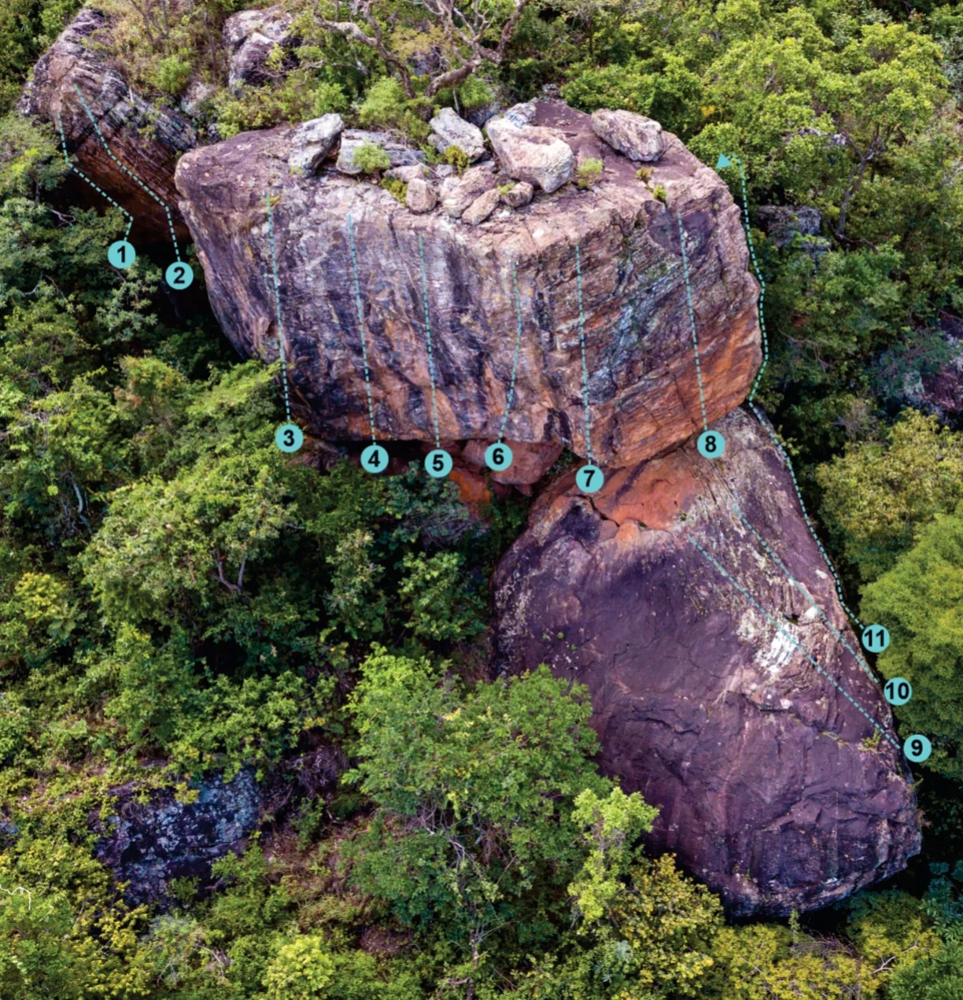
    - **largura_mapa**: 1224
    - **altura_mapa**: 1271
    - **pontos_de_interesse**:
      - **[0]**:
        - **id**: wQ4UdyjQnD4D1t
        - **uid**: wQ4UdyjQnD4D1t
        - **rotulo**: 01
        - **circulo**:
          - **x**: 154
          - **y**: 323
          - **raio**: 17
        - **label**: 01
      - **[1]**:
        - **id**: HkNiaV48SWEzjf
        - **uid**: HkNiaV48SWEzjf
        - **rotulo**: 02
        - **circulo**:
          - **x**: 228
          - **y**: 350
          - **raio**: 17
        - **label**: 02
      - **[2]**:
        - **id**: PsDi20MGgjYmob
        - **uid**: PsDi20MGgjYmob
        - **rotulo**: 03
        - **circulo**:
          - **x**: 368
          - **y**: 557
          - **raio**: 17
        - **label**: 03
      - **[3]**:
        - **id**: j8Sy1uzEKRX5yc
        - **uid**: j8Sy1uzEKRX5yc
        - **rotulo**: 04
        - **circulo**:
          - **x**: 476
          - **y**: 584
          - **raio**: 17
        - **label**: 04
      - **[4]**:
        - **id**: tzUyUN8HgmkIxz
        - **uid**: tzUyUN8HgmkIxz
        - **rotulo**: 05
        - **circulo**:
          - **x**: 558
          - **y**: 589
          - **raio**: 17
        - **label**: 05
      - **[5]**:
        - **id**: ecLJl29N0Qzuvy
        - **uid**: ecLJl29N0Qzuvy
        - **rotulo**: 06
        - **circulo**:
          - **x**: 634
          - **y**: 581
          - **raio**: 17
        - **label**: 06
      - **[6]**:
        - **id**: BfFM9UvLBpOGLB
        - **uid**: BfFM9UvLBpOGLB
        - **rotulo**: 07
        - **circulo**:
          - **x**: 749
          - **y**: 609
          - **raio**: 17
        - **label**: 07
      - **[7]**:
        - **id**: 2B9XZZgE4mXMHK
        - **uid**: 2B9XZZgE4mXMHK
        - **rotulo**: 08
        - **circulo**:
          - **x**: 903
          - **y**: 565
          - **raio**: 17
        - **label**: 08
      - **[8]**:
        - **id**: 7PTuZiJ0mVR9DJ
        - **uid**: 7PTuZiJ0mVR9DJ
        - **rotulo**: 11
        - **circulo**:
          - **x**: 1113
          - **y**: 812
          - **raio**: 17
        - **label**: 11
      - **[9]**:
        - **id**: OTbT7e7Is6sKDC
        - **uid**: OTbT7e7Is6sKDC
        - **rotulo**: 10
        - **circulo**:
          - **x**: 1141
          - **y**: 878
          - **raio**: 17
        - **label**: 10
      - **[10]**:
        - **id**: G5WL3H7fVvauXp
        - **uid**: G5WL3H7fVvauXp
        - **rotulo**: 09
        - **circulo**:
          - **x**: 1166
          - **y**: 951
          - **raio**: 17
        - **label**: 09
    - **referencias**:
      - **[0]**:
        - **alvo_uid**: O2j0FWWfqfCIgS
        - **pontos_uids**:
          - wQ4UdyjQnD4D1t
        - **escalada**: Filhos da Revolução
        - **ids**:
          - wQ4UdyjQnD4D1t
      - **[1]**:
        - **alvo_uid**: 7hfAbFgvJJtqvX
        - **pontos_uids**:
          - HkNiaV48SWEzjf
        - **escalada**: Pedra Vermelha
        - **ids**:
          - HkNiaV48SWEzjf
      - **[2]**:
        - **alvo_uid**: 80zrL5t68QLmQl
        - **pontos_uids**:
          - PsDi20MGgjYmob
        - **escalada**: Projeto 1
        - **ids**:
          - PsDi20MGgjYmob
      - **[3]**:
        - **alvo_uid**: XMe232LH75CqCF
        - **pontos_uids**:
          - j8Sy1uzEKRX5yc
        - **escalada**: Projeto 2
        - **ids**:
          - j8Sy1uzEKRX5yc
      - **[4]**:
        - **alvo_uid**: ZH9kYUV3w8aHap
        - **pontos_uids**:
          - tzUyUN8HgmkIxz
        - **escalada**: Via inacabada 1
        - **ids**:
          - tzUyUN8HgmkIxz
      - **[5]**:
        - **alvo_uid**: rPofbf9N83AHHj
        - **pontos_uids**:
          - ecLJl29N0Qzuvy
        - **escalada**: Trinca Ferro
        - **ids**:
          - ecLJl29N0Qzuvy
      - **[6]**:
        - **alvo_uid**: 7mKfEm9aTXPyLR
        - **pontos_uids**:
          - BfFM9UvLBpOGLB
        - **escalada**: Marimbondes me Mordam
        - **ids**:
          - BfFM9UvLBpOGLB
      - **[7]**:
        - **alvo_uid**: dpJ3AQRgKjl3Q3
        - **pontos_uids**:
          - OTbT7e7Is6sKDC
        - **escalada**: Pula Um
        - **ids**:
          - OTbT7e7Is6sKDC
      - **[8]**:
        - **alvo_uid**: R371v4tIOASOF5
        - **pontos_uids**:
          - 7PTuZiJ0mVR9DJ
        - **escalada**: Cerro Azul
        - **ids**:
          - 7PTuZiJ0mVR9DJ
      - **[9]**:
        - **alvo_uid**: ce13FYzMSa3nsT
        - **pontos_uids**:
          - 2B9XZZgE4mXMHK
        - **escalada**: Sumchine
        - **ids**:
          - 2B9XZZgE4mXMHK
      - **[10]**:
        - **alvo_uid**: 6sqgXRmLbld8lN
        - **pontos_uids**:
          - G5WL3H7fVvauXp
        - **escalada**: Cater Pillar
        - **ids**:
          - G5WL3H7fVvauXp
  - **[1]**:
    - **caminho_imagem_mapa**: 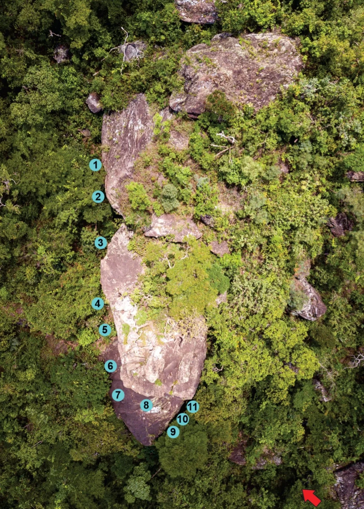
    - **largura_mapa**: 1032
    - **altura_mapa**: 1442
    - **pontos_de_interesse**:
      - **[0]**:
        - **id**: nsknW6k04Ykjj6
        - **uid**: nsknW6k04Ykjj6
        - **rotulo**: 01
        - **circulo**:
          - **x**: 270
          - **y**: 467
          - **raio**: 17
        - **label**: 01
      - **[1]**:
        - **id**: OKGoVn4nBjUwaO
        - **uid**: OKGoVn4nBjUwaO
        - **rotulo**: 02
        - **circulo**:
          - **x**: 278
          - **y**: 557
          - **raio**: 17
        - **label**: 02
      - **[2]**:
        - **id**: apMoQAvLWvmz3M
        - **uid**: apMoQAvLWvmz3M
        - **rotulo**: 03
        - **circulo**:
          - **x**: 285
          - **y**: 687
          - **raio**: 17
        - **label**: 03
      - **[3]**:
        - **id**: 2N3fmtKJoM6Vs3
        - **uid**: 2N3fmtKJoM6Vs3
        - **rotulo**: 04
        - **circulo**:
          - **x**: 277
          - **y**: 860
          - **raio**: 17
        - **label**: 04
      - **[4]**:
        - **id**: EkKbJ7sYl8rzkj
        - **uid**: EkKbJ7sYl8rzkj
        - **rotulo**: 05
        - **circulo**:
          - **x**: 298
          - **y**: 935
          - **raio**: 18
        - **label**: 05
      - **[5]**:
        - **id**: cBCcIa6kuqCpZq
        - **uid**: cBCcIa6kuqCpZq
        - **rotulo**: 06
        - **circulo**:
          - **x**: 314
          - **y**: 1037
          - **raio**: 17
        - **label**: 06
      - **[6]**:
        - **id**: xO6RFxufhGq6rQ
        - **uid**: xO6RFxufhGq6rQ
        - **rotulo**: 07
        - **circulo**:
          - **x**: 335
          - **y**: 1119
          - **raio**: 17
        - **label**: 07
      - **[7]**:
        - **id**: MvlxD3hdq8hJn7
        - **uid**: MvlxD3hdq8hJn7
        - **rotulo**: 08
        - **circulo**:
          - **x**: 415
          - **y**: 1149
          - **raio**: 17
        - **label**: 08
      - **[8]**:
        - **id**: khhmOwQZQuZeDx
        - **uid**: khhmOwQZQuZeDx
        - **rotulo**: 11
        - **circulo**:
          - **x**: 547
          - **y**: 1152
          - **raio**: 17
        - **label**: 11
      - **[9]**:
        - **id**: FJh39bFVJ8QJ4M
        - **uid**: FJh39bFVJ8QJ4M
        - **rotulo**: 10
        - **circulo**:
          - **x**: 518
          - **y**: 1187
          - **raio**: 17
        - **label**: 10
      - **[10]**:
        - **id**: 2W8ncFY2D3lOAt
        - **uid**: 2W8ncFY2D3lOAt
        - **rotulo**: 09
        - **circulo**:
          - **x**: 491
          - **y**: 1224
          - **raio**: 17
        - **label**: 09
    - **referencias**:
      - **[0]**:
        - **alvo_uid**: O2j0FWWfqfCIgS
        - **pontos_uids**:
          - nsknW6k04Ykjj6
        - **escalada**: Filhos da Revolução
        - **ids**:
          - nsknW6k04Ykjj6
      - **[1]**:
        - **alvo_uid**: 7hfAbFgvJJtqvX
        - **pontos_uids**:
          - OKGoVn4nBjUwaO
        - **escalada**: Pedra Vermelha
        - **ids**:
          - OKGoVn4nBjUwaO
      - **[2]**:
        - **alvo_uid**: 80zrL5t68QLmQl
        - **pontos_uids**:
          - apMoQAvLWvmz3M
        - **escalada**: Projeto 1
        - **ids**:
          - apMoQAvLWvmz3M
      - **[3]**:
        - **alvo_uid**: XMe232LH75CqCF
        - **pontos_uids**:
          - 2N3fmtKJoM6Vs3
        - **escalada**: Projeto 2
        - **ids**:
          - 2N3fmtKJoM6Vs3
      - **[4]**:
        - **alvo_uid**: ZH9kYUV3w8aHap
        - **pontos_uids**:
          - EkKbJ7sYl8rzkj
        - **escalada**: Via inacabada 1
        - **ids**:
          - EkKbJ7sYl8rzkj
      - **[5]**:
        - **alvo_uid**: rPofbf9N83AHHj
        - **pontos_uids**:
          - cBCcIa6kuqCpZq
        - **escalada**: Trinca Ferro
        - **ids**:
          - cBCcIa6kuqCpZq
      - **[6]**:
        - **alvo_uid**: 7mKfEm9aTXPyLR
        - **pontos_uids**:
          - xO6RFxufhGq6rQ
        - **escalada**: Marimbondes me Mordam
        - **ids**:
          - xO6RFxufhGq6rQ
      - **[7]**:
        - **alvo_uid**: dpJ3AQRgKjl3Q3
        - **pontos_uids**:
          - FJh39bFVJ8QJ4M
        - **escalada**: Pula Um
        - **ids**:
          - FJh39bFVJ8QJ4M
      - **[8]**:
        - **alvo_uid**: R371v4tIOASOF5
        - **pontos_uids**:
          - khhmOwQZQuZeDx
        - **escalada**: Cerro Azul
        - **ids**:
          - khhmOwQZQuZeDx
      - **[9]**:
        - **alvo_uid**: ce13FYzMSa3nsT
        - **pontos_uids**:
          - MvlxD3hdq8hJn7
        - **escalada**: Sumchine
        - **ids**:
          - MvlxD3hdq8hJn7
      - **[10]**:
        - **alvo_uid**: 6sqgXRmLbld8lN
        - **pontos_uids**:
          - 2W8ncFY2D3lOAt
        - **escalada**: Cater Pillar
        - **ids**:
          - 2W8ncFY2D3lOAt
- **escaladas**:
  - **[0]**:
    - **uid**: O2j0FWWfqfCIgS
    - **via_esportiva**:
      - **nome**: Filhos da Revolução
      - **dificuldade**: BR_7A
      - **quantidade_protecoes_intermediarias**: 5
      - **quantidade_protecoes_parada**: 2
      - **extensao**: 10
      - **conquistadores**:
        - Berbari
        - Ró
        - Toninho
      - **data_abertura**: 2012
  - **[1]**:
    - **uid**: 7hfAbFgvJJtqvX
    - **via_esportiva**:
      - **nome**: Pedra Vermelha
      - **dificuldade**: BR_7C
      - **conquistadores**:
        - Berbari
        - Ró
      - **data_abertura**: 2012
  - **[2]**:
    - **uid**: 80zrL5t68QLmQl
    - **via_esportiva**:
      - **nome**: Projeto 1
      - **dificuldade**: PROJETO
      - **quantidade_protecoes_intermediarias**: 4
      - **quantidade_protecoes_parada**: 2
      - **extensao**: 10
      - **conquistadores**:
        - Berbari
      - **data_abertura**: 2012
  - **[3]**:
    - **uid**: XMe232LH75CqCF
    - **via_esportiva**:
      - **nome**: Projeto 2
      - **dificuldade**: PROJETO
      - **quantidade_protecoes_intermediarias**: 4
      - **quantidade_protecoes_parada**: 2
      - **extensao**: 10
      - **conquistadores**:
        - Berbari
        - Alex
      - **data_abertura**: 2012
  - **[4]**:
    - **uid**: ZH9kYUV3w8aHap
    - **via_esportiva**:
      - **nome**: Via inacabada 1
      - **dificuldade**: INDEFINIDO
      - **quantidade_protecoes_intermediarias**: 3
      - **quantidade_protecoes_parada**: 2
      - **extensao**: 10
      - **conquistadores**:
        - Berbari
        - Alex
      - **data_abertura**: 2012
  - **[5]**:
    - **uid**: rPofbf9N83AHHj
    - **via_esportiva**:
      - **nome**: Trinca Ferro
      - **dificuldade**: BR_8B
      - **quantidade_protecoes_intermediarias**: 6
      - **quantidade_protecoes_parada**: 2
      - **extensao**: 12
      - **conquistadores**:
        - Berbari
      - **data_abertura**: 2013
  - **[6]**:
    - **uid**: 7mKfEm9aTXPyLR
    - **via_esportiva**:
      - **nome**: Marimbondes me Mordam
      - **dificuldade**: BR_7C
      - **quantidade_protecoes_intermediarias**: 4
      - **quantidade_protecoes_parada**: 2
      - **extensao**: 8
      - **conquistadores**:
        - Berbari
        - Ró
      - **data_abertura**: 2009
  - **[7]**:
    - **uid**: ce13FYzMSa3nsT
    - **via_esportiva**:
      - **nome**: Sumchine
      - **dificuldade**: BR_6SUP_BARRA_7A
      - **quantidade_protecoes_intermediarias**: 3
      - **quantidade_protecoes_parada**: 2
      - **extensao**: 7
      - **conquistadores**:
        - Berbari
        - Ró
      - **data_abertura**: 2009
  - **[8]**:
    - **uid**: 6sqgXRmLbld8lN
    - **via_esportiva**:
      - **nome**: Cater Pillar
      - **dificuldade**: BR_6
      - **quantidade_protecoes_intermediarias**: 2
      - **quantidade_protecoes_parada**: 2
      - **extensao**: 7
      - **conquistadores**:
        - Berbari
        - Ró
        - Cater
      - **data_abertura**: 2009
  - **[9]**:
    - **uid**: dpJ3AQRgKjl3Q3
    - **via_esportiva**:
      - **nome**: Pula Um
      - **dificuldade**: BR_5
      - **quantidade_protecoes_intermediarias**: 2
      - **quantidade_protecoes_parada**: 2
      - **extensao**: 7
      - **conquistadores**:
        - Berbari
        - Ró
      - **data_abertura**: 2009
  - **[10]**:
    - **uid**: R371v4tIOASOF5
    - **via_esportiva**:
      - **nome**: Cerro Azul
      - **dificuldade**: BR_6_BARRA_6SUP
      - **quantidade_protecoes_intermediarias**: 5
      - **quantidade_protecoes_parada**: 2
      - **extensao**: 15
      - **conquistadores**:
        - Berbari
        - Ró
      - **data_abertura**: 2009
- **precomputados**:
  - **total_escaladas**: 11
  - **total_esportivas**: 11

## Parte: setor_micos

### Setor (Pico: Complexo Pedra Grande)

- **descricao**:
    Sombra até 11h e após 15h.
    Risco de agarras se quebrarem e pedras soltas, é recomendado o uso de capacete ao escalar e nas bases das vias.
    Escalar com a corda passada na primeira proteção nas vias esportivas.
    Siga a trilha a partir do estacionamento até onde o tronco atravessa o caminho. A rocha fica logo a direita.
    
    Veja a trilha para chegar ao setor no WikiLoc: https://loc.wiki/t/157666336?wa=sc
- **nome**: Setor Micos
- **uid**: 8CUeyL0A3dX1EL
- **mapas**:
  - **[0]**:
    - **caminho_imagem_mapa**: 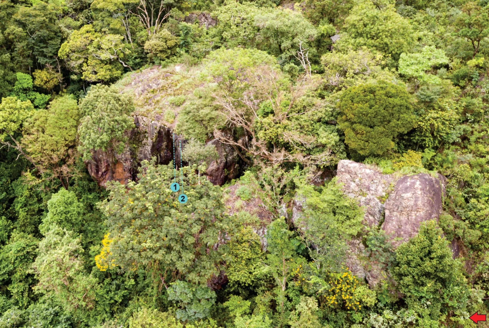
    - **largura_mapa**: 1861
    - **altura_mapa**: 1246
    - **pontos_de_interesse**:
      - **[0]**:
        - **id**: AerH38FdL0Sn2T
        - **uid**: AerH38FdL0Sn2T
        - **rotulo**: 01
        - **circulo**:
          - **x**: 667
          - **y**: 711
          - **raio**: 17
        - **label**: 01
      - **[1]**:
        - **id**: KZ0Ef4D4YsdGoY
        - **uid**: KZ0Ef4D4YsdGoY
        - **rotulo**: 02
        - **circulo**:
          - **x**: 696
          - **y**: 755
          - **raio**: 17
        - **label**: 02
    - **referencias**:
      - **[0]**:
        - **alvo_uid**: 7CzUWE07k46dcT
        - **pontos_uids**:
          - AerH38FdL0Sn2T
        - **escalada**: Eu Também Vou
        - **ids**:
          - AerH38FdL0Sn2T
      - **[1]**:
        - **alvo_uid**: UtD230MoDpfz6N
        - **pontos_uids**:
          - KZ0Ef4D4YsdGoY
        - **escalada**: Lambe Lambe
        - **ids**:
          - KZ0Ef4D4YsdGoY
  - **[1]**:
    - **caminho_imagem_mapa**: 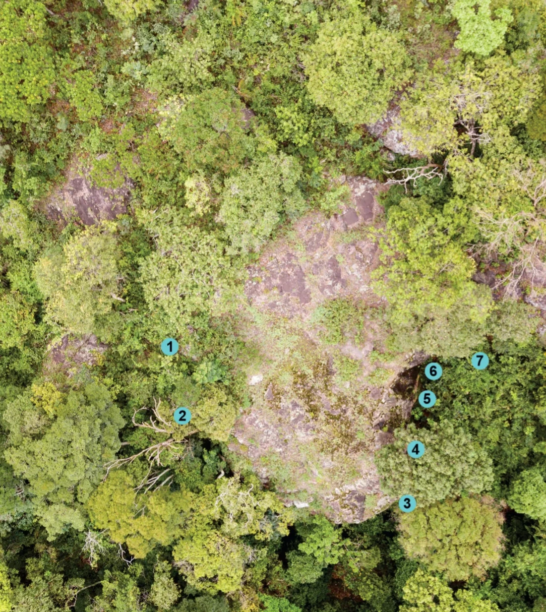
    - **largura_mapa**: 1101
    - **altura_mapa**: 1234
    - **pontos_de_interesse**:
      - **[0]**:
        - **id**: d6vOugTD64B6Oj
        - **uid**: d6vOugTD64B6Oj
        - **rotulo**: 01
        - **circulo**:
          - **x**: 343
          - **y**: 699
          - **raio**: 17
        - **label**: 01
      - **[1]**:
        - **id**: 58UDKEdWFIl3Qx
        - **uid**: 58UDKEdWFIl3Qx
        - **rotulo**: 07
        - **circulo**:
          - **x**: 968
          - **y**: 727
          - **raio**: 17
        - **label**: 07
      - **[2]**:
        - **id**: WhVNfbav4zur71
        - **uid**: WhVNfbav4zur71
        - **rotulo**: 06
        - **circulo**:
          - **x**: 874
          - **y**: 748
          - **raio**: 17
        - **label**: 06
      - **[3]**:
        - **id**: dKMqRTaDiSiptS
        - **uid**: dKMqRTaDiSiptS
        - **rotulo**: 05
        - **circulo**:
          - **x**: 862
          - **y**: 804
          - **raio**: 17
        - **label**: 05
      - **[4]**:
        - **id**: YwnKnh6Vl5Pmar
        - **uid**: YwnKnh6Vl5Pmar
        - **rotulo**: 02
        - **circulo**:
          - **x**: 368
          - **y**: 838
          - **raio**: 17
        - **label**: 02
      - **[5]**:
        - **id**: ngQ9yFbFEKHE7j
        - **uid**: ngQ9yFbFEKHE7j
        - **rotulo**: 04
        - **circulo**:
          - **x**: 839
          - **y**: 906
          - **raio**: 17
        - **label**: 04
      - **[6]**:
        - **id**: FCI2BShJEIP9eS
        - **uid**: FCI2BShJEIP9eS
        - **rotulo**: 03
        - **circulo**:
          - **x**: 821
          - **y**: 1015
          - **raio**: 17
        - **label**: 03
    - **referencias**:
      - **[0]**:
        - **alvo_uid**: 7CzUWE07k46dcT
        - **pontos_uids**:
          - d6vOugTD64B6Oj
        - **escalada**: Eu Também Vou
        - **ids**:
          - d6vOugTD64B6Oj
      - **[1]**:
        - **alvo_uid**: UtD230MoDpfz6N
        - **pontos_uids**:
          - YwnKnh6Vl5Pmar
        - **escalada**: Lambe Lambe
        - **ids**:
          - YwnKnh6Vl5Pmar
      - **[2]**:
        - **alvo_uid**: 9AhZOjV0L4M7Xt
        - **pontos_uids**:
          - FCI2BShJEIP9eS
        - **escalada**: TNT
        - **ids**:
          - FCI2BShJEIP9eS
      - **[3]**:
        - **alvo_uid**: y1AzRCvyqUVehW
        - **pontos_uids**:
          - ngQ9yFbFEKHE7j
        - **escalada**: For My Brother
        - **ids**:
          - ngQ9yFbFEKHE7j
      - **[4]**:
        - **alvo_uid**: BHATLw3EnYHNSG
        - **pontos_uids**:
          - dKMqRTaDiSiptS
        - **escalada**: Diamante Negro
        - **ids**:
          - dKMqRTaDiSiptS
      - **[5]**:
        - **alvo_uid**: 1IcwhemeeMae5w
        - **pontos_uids**:
          - WhVNfbav4zur71
        - **escalada**: Chapa Quente
        - **ids**:
          - WhVNfbav4zur71
      - **[6]**:
        - **alvo_uid**: OeSOzZNj4q7chm
        - **pontos_uids**:
          - 58UDKEdWFIl3Qx
        - **escalada**: Via inacabada 2
        - **ids**:
          - 58UDKEdWFIl3Qx
  - **[2]**:
    - **caminho_imagem_mapa**: 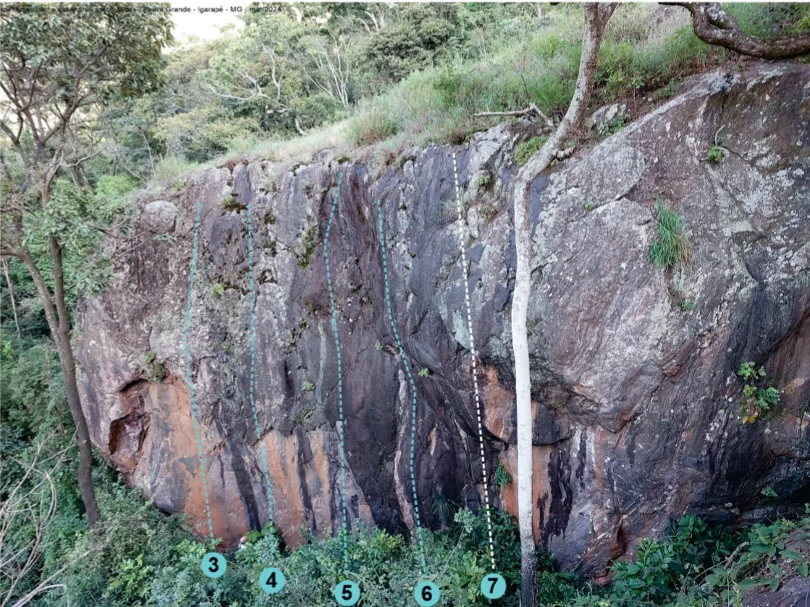
    - **largura_mapa**: 1119
    - **altura_mapa**: 840
    - **pontos_de_interesse**:
      - **[0]**:
        - **id**: beRQP7zASHZYc9
        - **uid**: beRQP7zASHZYc9
        - **rotulo**: 03
        - **circulo**:
          - **x**: 295
          - **y**: 782
          - **raio**: 17
        - **label**: 03
      - **[1]**:
        - **id**: zOMjIP6ZMLSd3x
        - **uid**: zOMjIP6ZMLSd3x
        - **rotulo**: 04
        - **circulo**:
          - **x**: 376
          - **y**: 803
          - **raio**: 17
        - **label**: 04
      - **[2]**:
        - **id**: SEckjU4BA2oYue
        - **uid**: SEckjU4BA2oYue
        - **rotulo**: 05
        - **circulo**:
          - **x**: 480
          - **y**: 821
          - **raio**: 17
        - **label**: 05
      - **[3]**:
        - **id**: QmIH1pc6RGobZd
        - **uid**: QmIH1pc6RGobZd
        - **rotulo**: 06
        - **circulo**:
          - **x**: 590
          - **y**: 821
          - **raio**: 17
        - **label**: 06
      - **[4]**:
        - **id**: Ax2AP0QoyCS1yt
        - **uid**: Ax2AP0QoyCS1yt
        - **rotulo**: 07
        - **circulo**:
          - **x**: 681
          - **y**: 811
          - **raio**: 17
        - **label**: 07
    - **referencias**:
      - **[0]**:
        - **alvo_uid**: 9AhZOjV0L4M7Xt
        - **pontos_uids**:
          - beRQP7zASHZYc9
        - **escalada**: TNT
        - **ids**:
          - beRQP7zASHZYc9
      - **[1]**:
        - **alvo_uid**: y1AzRCvyqUVehW
        - **pontos_uids**:
          - zOMjIP6ZMLSd3x
        - **escalada**: For My Brother
        - **ids**:
          - zOMjIP6ZMLSd3x
      - **[2]**:
        - **alvo_uid**: BHATLw3EnYHNSG
        - **pontos_uids**:
          - SEckjU4BA2oYue
        - **escalada**: Diamante Negro
        - **ids**:
          - SEckjU4BA2oYue
      - **[3]**:
        - **alvo_uid**: 1IcwhemeeMae5w
        - **pontos_uids**:
          - QmIH1pc6RGobZd
        - **escalada**: Chapa Quente
        - **ids**:
          - QmIH1pc6RGobZd
      - **[4]**:
        - **alvo_uid**: OeSOzZNj4q7chm
        - **pontos_uids**:
          - Ax2AP0QoyCS1yt
        - **escalada**: Via inacabada 2
        - **ids**:
          - Ax2AP0QoyCS1yt
- **escaladas**:
  - **[0]**:
    - **uid**: 7CzUWE07k46dcT
    - **via_esportiva**:
      - **nome**: Eu Também Vou
      - **dificuldade**: BR_7A
      - **quantidade_protecoes_intermediarias**: 4
      - **quantidade_protecoes_parada**: 2
      - **extensao**: 12
      - **conquistadores**:
        - Berbari
        - Ró
      - **data_abertura**: 2011
  - **[1]**:
    - **uid**: UtD230MoDpfz6N
    - **via_esportiva**:
      - **nome**: Lambe Lambe
      - **dificuldade**: BR_7A
      - **quantidade_protecoes_intermediarias**: 4
      - **quantidade_protecoes_parada**: 2
      - **extensao**: 12
      - **conquistadores**:
        - Berbari
        - Toninho
      - **data_abertura**: 2011
  - **[2]**:
    - **uid**: 9AhZOjV0L4M7Xt
    - **via_esportiva**:
      - **nome**: TNT
      - **dificuldade**: BR_9B
      - **quantidade_protecoes_intermediarias**: 4
      - **quantidade_protecoes_parada**: 2
      - **extensao**: 12
      - **conquistadores**:
        - Berbari
        - Ró
      - **data_abertura**: 2011
  - **[3]**:
    - **uid**: y1AzRCvyqUVehW
    - **via_esportiva**:
      - **nome**: For My Brother
      - **dificuldade**: BR_8A
      - **quantidade_protecoes_intermediarias**: 4
      - **quantidade_protecoes_parada**: 2
      - **extensao**: 12
      - **conquistadores**:
        - Berbari
        - Ró
      - **data_abertura**: 2011
  - **[4]**:
    - **uid**: BHATLw3EnYHNSG
    - **via_esportiva**:
      - **nome**: Diamante Negro
      - **dificuldade**: BR_8B
      - **quantidade_protecoes_intermediarias**: 4
      - **quantidade_protecoes_parada**: 2
      - **extensao**: 12
      - **conquistadores**:
        - Berbari
        - Ró
        - Chinha
        - Rômulo
      - **data_abertura**: 2011
  - **[5]**:
    - **uid**: 1IcwhemeeMae5w
    - **via_esportiva**:
      - **nome**: Chapa Quente
      - **dificuldade**: BR_7C
      - **quantidade_protecoes_intermediarias**: 4
      - **quantidade_protecoes_parada**: 2
      - **extensao**: 12
      - **conquistadores**:
        - Berbari
        - Ró
        - Chinha
        - Rômulo
      - **data_abertura**: 2011
  - **[6]**:
    - **uid**: OeSOzZNj4q7chm
    - **via_esportiva**:
      - **nome**: Via inacabada 2
      - **dificuldade**: INDEFINIDO
      - **quantidade_protecoes_intermediarias**: 0
      - **quantidade_protecoes_parada**: 2
      - **extensao**: 12
      - **conquistadores**:
        - Berbari
        - Chinha
      - **data_abertura**: 2011
- **precomputados**:
  - **total_escaladas**: 7
  - **total_esportivas**: 7

## Parte: setor_totem

### Setor (Pico: Complexo Pedra Grande)

- **descricao**:
    Sombra até 10h e após 16h.
    
    Veja a trilha para chegar ao setor no WikiLoc: https://loc.wiki/t/160199352?wa=sc
- **nome**: Setor Totem
- **uid**: BVZ1UjMtLg5NQp
- **mapas**:
  - **[0]**:
    - **caminho_imagem_mapa**: 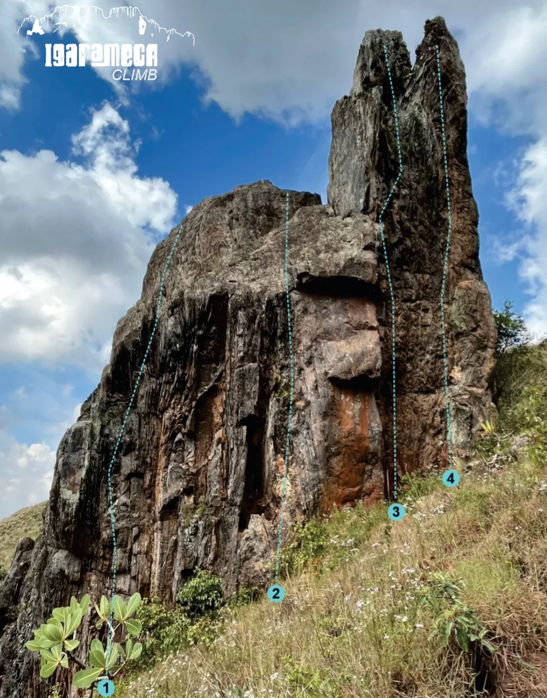
    - **largura_mapa**: 1112
    - **altura_mapa**: 1418
    - **pontos_de_interesse**:
      - **[0]**:
        - **id**: 56Lspd7LBQ2E1O
        - **uid**: 56Lspd7LBQ2E1O
        - **rotulo**: 01
        - **circulo**:
          - **x**: 216
          - **y**: 1397
          - **raio**: 17
        - **label**: 01
      - **[1]**:
        - **id**: nn8ryaXpOPShk6
        - **uid**: nn8ryaXpOPShk6
        - **rotulo**: 02
        - **circulo**:
          - **x**: 561
          - **y**: 1206
          - **raio**: 17
        - **label**: 02
      - **[2]**:
        - **id**: lzEL4v4y1F4RAk
        - **uid**: lzEL4v4y1F4RAk
        - **rotulo**: 03
        - **circulo**:
          - **x**: 806
          - **y**: 1040
          - **raio**: 17
        - **label**: 03
      - **[3]**:
        - **id**: vqrMtWNlacSfco
        - **uid**: vqrMtWNlacSfco
        - **rotulo**: 04
        - **circulo**:
          - **x**: 917
          - **y**: 972
          - **raio**: 17
        - **label**: 04
    - **referencias**:
      - **[0]**:
        - **alvo_uid**: vFTU5spDu48Ta1
        - **pontos_uids**:
          - 56Lspd7LBQ2E1O
        - **escalada**: Takeyeasy
        - **ids**:
          - 56Lspd7LBQ2E1O
      - **[1]**:
        - **alvo_uid**: UMBlT3ScLVyPS0
        - **pontos_uids**:
          - nn8ryaXpOPShk6
        - **escalada**: Pâncepis
        - **ids**:
          - nn8ryaXpOPShk6
      - **[2]**:
        - **alvo_uid**: zxD2SJXyaSoi7S
        - **pontos_uids**:
          - lzEL4v4y1F4RAk
        - **escalada**: Totem
        - **ids**:
          - lzEL4v4y1F4RAk
      - **[3]**:
        - **alvo_uid**: tp0z2QexOT3ufH
        - **pontos_uids**:
          - vqrMtWNlacSfco
        - **escalada**: 69
        - **ids**:
          - vqrMtWNlacSfco
  - **[1]**:
    - **caminho_imagem_mapa**: 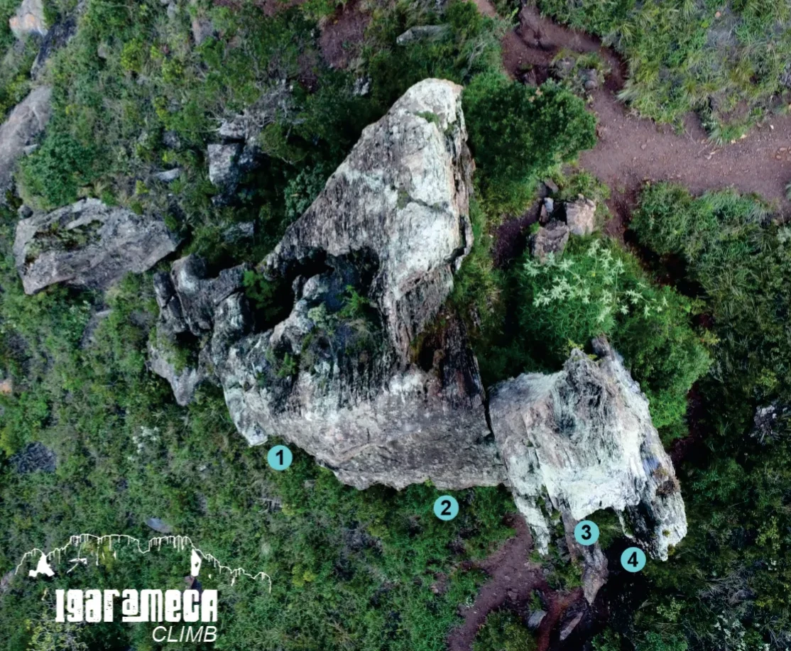
    - **largura_mapa**: 1114
    - **altura_mapa**: 917
    - **pontos_de_interesse**:
      - **[0]**:
        - **id**: f2Vlst8RiQPZmp
        - **uid**: f2Vlst8RiQPZmp
        - **rotulo**: 01
        - **circulo**:
          - **x**: 394
          - **y**: 644
          - **raio**: 17
        - **label**: 01
      - **[1]**:
        - **id**: s3lkBW6RUqo3Hk
        - **uid**: s3lkBW6RUqo3Hk
        - **rotulo**: 02
        - **circulo**:
          - **x**: 628
          - **y**: 715
          - **raio**: 17
        - **label**: 02
      - **[2]**:
        - **id**: 4IfzW5nVpMy5Rk
        - **uid**: 4IfzW5nVpMy5Rk
        - **rotulo**: 03
        - **circulo**:
          - **x**: 826
          - **y**: 750
          - **raio**: 17
        - **label**: 03
      - **[3]**:
        - **id**: iMZtQSR54twKix
        - **uid**: iMZtQSR54twKix
        - **rotulo**: 04
        - **circulo**:
          - **x**: 892
          - **y**: 788
          - **raio**: 17
        - **label**: 04
    - **referencias**:
      - **[0]**:
        - **alvo_uid**: vFTU5spDu48Ta1
        - **pontos_uids**:
          - f2Vlst8RiQPZmp
        - **escalada**: Takeyeasy
        - **ids**:
          - f2Vlst8RiQPZmp
      - **[1]**:
        - **alvo_uid**: UMBlT3ScLVyPS0
        - **pontos_uids**:
          - s3lkBW6RUqo3Hk
        - **escalada**: Pâncepis
        - **ids**:
          - s3lkBW6RUqo3Hk
      - **[2]**:
        - **alvo_uid**: zxD2SJXyaSoi7S
        - **pontos_uids**:
          - 4IfzW5nVpMy5Rk
        - **escalada**: Totem
        - **ids**:
          - 4IfzW5nVpMy5Rk
      - **[3]**:
        - **alvo_uid**: tp0z2QexOT3ufH
        - **pontos_uids**:
          - iMZtQSR54twKix
        - **escalada**: 69
        - **ids**:
          - iMZtQSR54twKix
- **escaladas**:
  - **[0]**:
    - **uid**: vFTU5spDu48Ta1
    - **via_esportiva**:
      - **descricao**: INTERDITADA: TOPS FORAM ROUBADOS
      - **nome**: Takeyeasy
      - **dificuldade**: BR_6
      - **quantidade_protecoes_intermediarias**: 4
      - **quantidade_protecoes_parada**: 2
      - **extensao**: 10
      - **conquistadores**:
        - Berbari
        - Chinha
        - Ró
        - Alexandre
      - **data_abertura**: 2005
  - **[1]**:
    - **uid**: UMBlT3ScLVyPS0
    - **via_esportiva**:
      - **descricao**: INTERDITADA: TOPS FORAM ROUBADOS
      - **nome**: Pâncepis
      - **dificuldade**: BR_7B
      - **quantidade_protecoes_intermediarias**: 4
      - **quantidade_protecoes_parada**: 2
      - **extensao**: 10
      - **conquistadores**:
        - Berbari
        - Chinha
        - Ró
        - Alexandre
      - **data_abertura**: 2005
  - **[2]**:
    - **uid**: zxD2SJXyaSoi7S
    - **via_esportiva**:
      - **nome**: Totem
      - **dificuldade**: BR_8A
      - **quantidade_protecoes_intermediarias**: 4
      - **quantidade_protecoes_parada**: 2
      - **extensao**: 10
      - **conquistadores**:
        - Berbari
        - Chinha
        - Ró
        - Alex
        - Ruy
      - **data_abertura**: 2005
  - **[3]**:
    - **uid**: tp0z2QexOT3ufH
    - **via_esportiva**:
      - **nome**: 69
      - **dificuldade**: BR_8B
      - **quantidade_protecoes_intermediarias**: 4
      - **quantidade_protecoes_parada**: 2
      - **extensao**: 10
      - **conquistadores**:
        - Berbari
        - Tchoco
        - Tonin
        - Alex
        - Ruy
      - **data_abertura**: 2005
- **precomputados**:
  - **total_escaladas**: 4
  - **total_esportivas**: 4

## Parte: setor_igarameca

### Setor (Pico: Complexo Pedra Grande)

- **descricao**:
    Sombra após 12h (varia de acordo com a estação).
    
    Veja a trilha para chegar ao setor no WikiLoc: https://loc.wiki/t/160199352?wa=sc
- **nome**: Setor Igarameca
- **uid**: sIe5O02lheR33Z
- **mapas**:
  - **[0]**:
    - **caminho_imagem_mapa**: 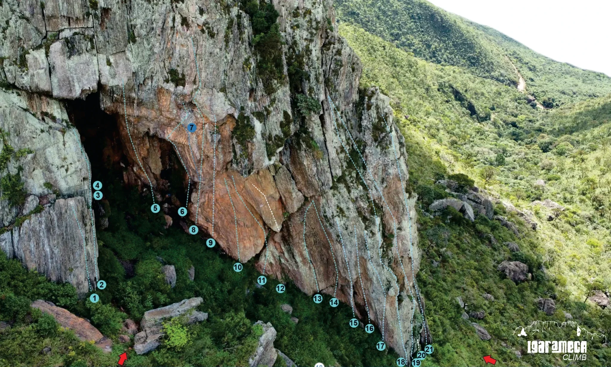
    - **largura_mapa**: 2048
    - **altura_mapa**: 1232
    - **pontos_de_interesse**:
      - **[0]**:
        - **id**: bs3SCfR6OMHFw1
        - **uid**: bs3SCfR6OMHFw1
        - **rotulo**: 01
        - **circulo**:
          - **x**: 317
          - **y**: 1001
          - **raio**: 15
        - **label**: 01
      - **[1]**:
        - **id**: 7Iv4DkBH6qB87w
        - **uid**: 7Iv4DkBH6qB87w
        - **rotulo**: 02
        - **circulo**:
          - **x**: 341
          - **y**: 956
          - **raio**: 15
        - **label**: 02
      - **[2]**:
        - **id**: 8WFrCK5v8BFOpZ
        - **uid**: 8WFrCK5v8BFOpZ
        - **rotulo**: 03
        - **circulo**:
          - **x**: 329
          - **y**: 656
          - **raio**: 15
        - **label**: 03
      - **[3]**:
        - **id**: 1ZcqYKFAKWov9Y
        - **uid**: 1ZcqYKFAKWov9Y
        - **rotulo**: 04
        - **circulo**:
          - **x**: 327
          - **y**: 622
          - **raio**: 15
        - **label**: 04
      - **[4]**:
        - **id**: Ml4sb9e9UzxSSr
        - **uid**: Ml4sb9e9UzxSSr
        - **rotulo**: 05
        - **circulo**:
          - **x**: 521
          - **y**: 699
          - **raio**: 15
        - **label**: 05
      - **[5]**:
        - **id**: Eug8KBl35uMl0H
        - **uid**: Eug8KBl35uMl0H
        - **rotulo**: 06
        - **circulo**:
          - **x**: 612
          - **y**: 711
          - **raio**: 15
        - **label**: 06
      - **[6]**:
        - **id**: 8oi1Ldq067ZTZc
        - **uid**: 8oi1Ldq067ZTZc
        - **rotulo**: 07
        - **circulo**:
          - **x**: 643
          - **y**: 428
          - **raio**: 15
        - **label**: 07
      - **[7]**:
        - **id**: UUVOHe44fNoBt9
        - **uid**: UUVOHe44fNoBt9
        - **rotulo**: 08
        - **circulo**:
          - **x**: 649
          - **y**: 772
          - **raio**: 15
        - **label**: 08
      - **[8]**:
        - **id**: uwyHPEidm2qWvo
        - **uid**: uwyHPEidm2qWvo
        - **rotulo**: 09
        - **circulo**:
          - **x**: 707
          - **y**: 815
          - **raio**: 15
        - **label**: 09
      - **[9]**:
        - **id**: imZa7LK7TMBdjL
        - **uid**: imZa7LK7TMBdjL
        - **rotulo**: 10
        - **circulo**:
          - **x**: 797
          - **y**: 897
          - **raio**: 15
        - **label**: 10
      - **[10]**:
        - **id**: FMdNiatzbMt1QG
        - **uid**: FMdNiatzbMt1QG
        - **rotulo**: 11
        - **circulo**:
          - **x**: 878
          - **y**: 941
          - **raio**: 15
        - **label**: 11
      - **[11]**:
        - **id**: i3eBiG9o359nm6
        - **uid**: i3eBiG9o359nm6
        - **rotulo**: 12
        - **circulo**:
          - **x**: 940
          - **y**: 968
          - **raio**: 15
        - **label**: 12
      - **[12]**:
        - **id**: T7jg7Wli3whpku
        - **uid**: T7jg7Wli3whpku
        - **rotulo**: 13
        - **circulo**:
          - **x**: 1065
          - **y**: 1002
          - **raio**: 15
        - **label**: 13
      - **[13]**:
        - **id**: OgkqTq1CUtiFW1
        - **uid**: OgkqTq1CUtiFW1
        - **rotulo**: 14
        - **circulo**:
          - **x**: 1120
          - **y**: 1015
          - **raio**: 15
        - **label**: 14
      - **[14]**:
        - **id**: JUQIzwRuO0kofR
        - **uid**: JUQIzwRuO0kofR
        - **rotulo**: 15
        - **circulo**:
          - **x**: 1186
          - **y**: 1084
          - **raio**: 15
        - **label**: 15
      - **[15]**:
        - **id**: J7zLToXG1RfgFD
        - **uid**: J7zLToXG1RfgFD
        - **rotulo**: 16
        - **circulo**:
          - **x**: 1239
          - **y**: 1103
          - **raio**: 15
        - **label**: 16
      - **[16]**:
        - **id**: XHwwbe1fL0kgz7
        - **uid**: XHwwbe1fL0kgz7
        - **rotulo**: 17
        - **circulo**:
          - **x**: 1277
          - **y**: 1162
          - **raio**: 16
        - **label**: 17
      - **[17]**:
        - **id**: ZHL4EWZCO4jxtG
        - **uid**: ZHL4EWZCO4jxtG
        - **rotulo**: 18
        - **circulo**:
          - **x**: 1345
          - **y**: 1216
          - **raio**: 15
        - **label**: 18
      - **[18]**:
        - **id**: 3Wf9AtaYCDEXPd
        - **uid**: 3Wf9AtaYCDEXPd
        - **rotulo**: 19
        - **circulo**:
          - **x**: 1395
          - **y**: 1218
          - **raio**: 15
        - **label**: 19
      - **[19]**:
        - **id**: 09BQTAEDf7a3pY
        - **uid**: 09BQTAEDf7a3pY
        - **rotulo**: 20
        - **circulo**:
          - **x**: 1413
          - **y**: 1193
          - **raio**: 15
        - **label**: 20
      - **[20]**:
        - **id**: ot1QFUtM9Ftwzm
        - **uid**: ot1QFUtM9Ftwzm
        - **rotulo**: 21
        - **circulo**:
          - **x**: 1438
          - **y**: 1173
          - **raio**: 15
        - **label**: 21
    - **referencias**:
      - **[0]**:
        - **alvo_uid**: prwge1ANOjgvOz
        - **pontos_uids**:
          - bs3SCfR6OMHFw1
        - **escalada**: Beatrix
        - **ids**:
          - bs3SCfR6OMHFw1
      - **[1]**:
        - **alvo_uid**: 5tVLaB1cMSyvyR
        - **pontos_uids**:
          - 7Iv4DkBH6qB87w
        - **escalada**: Na Boca da Gruta Tem Dente
        - **ids**:
          - 7Iv4DkBH6qB87w
      - **[2]**:
        - **alvo_uid**: 0YlP0rmJycJM4L
        - **pontos_uids**:
          - 8WFrCK5v8BFOpZ
        - **escalada**: Sunday Bloody Sunday
        - **ids**:
          - 8WFrCK5v8BFOpZ
      - **[3]**:
        - **alvo_uid**: OOwYQAaNVR21jG
        - **pontos_uids**:
          - 1ZcqYKFAKWov9Y
        - **escalada**: People Let's Stop The War
        - **ids**:
          - 1ZcqYKFAKWov9Y
      - **[4]**:
        - **alvo_uid**: 8RFhDjMBbFyjTa
        - **pontos_uids**:
          - Ml4sb9e9UzxSSr
        - **escalada**: Apolo 13
        - **ids**:
          - Ml4sb9e9UzxSSr
      - **[5]**:
        - **alvo_uid**: RqRjF82FyuRmE6
        - **pontos_uids**:
          - Eug8KBl35uMl0H
        - **escalada**: Liga Extraordinária
        - **ids**:
          - Eug8KBl35uMl0H
      - **[6]**:
        - **alvo_uid**: PmAcd4OV0p4JEz
        - **pontos_uids**:
          - 8oi1Ldq067ZTZc
        - **escalada**: Poneis Malditos
        - **ids**:
          - 8oi1Ldq067ZTZc
      - **[7]**:
        - **alvo_uid**: cK2TZlyCxV1bVg
        - **pontos_uids**:
          - imZa7LK7TMBdjL
        - **escalada**: U.F.O
        - **ids**:
          - imZa7LK7TMBdjL
      - **[8]**:
        - **alvo_uid**: q3qP0GQamt5TxF
        - **pontos_uids**:
          - FMdNiatzbMt1QG
        - **escalada**: 127 Horas
        - **ids**:
          - FMdNiatzbMt1QG
      - **[9]**:
        - **alvo_uid**: ImxnLXRSuVMATC
        - **pontos_uids**:
          - i3eBiG9o359nm6
        - **escalada**: Lero Lero é Mato
        - **ids**:
          - i3eBiG9o359nm6
      - **[10]**:
        - **alvo_uid**: IZUMF6ldESlbyG
        - **pontos_uids**:
          - T7jg7Wli3whpku
        - **escalada**: Renegados de Igarapé
        - **ids**:
          - T7jg7Wli3whpku
      - **[11]**:
        - **alvo_uid**: dz4pPsUjgtrfuL
        - **pontos_uids**:
          - OgkqTq1CUtiFW1
        - **escalada**: Coisa Linda
        - **ids**:
          - OgkqTq1CUtiFW1
      - **[12]**:
        - **alvo_uid**: KfulcSJCsVH6BY
        - **pontos_uids**:
          - JUQIzwRuO0kofR
        - **escalada**: Doce Veneno
        - **ids**:
          - JUQIzwRuO0kofR
      - **[13]**:
        - **alvo_uid**: MEALJtEHeEtZoe
        - **pontos_uids**:
          - J7zLToXG1RfgFD
        - **escalada**: Alguém Tem Que Ceder
        - **ids**:
          - J7zLToXG1RfgFD
      - **[14]**:
        - **alvo_uid**: KVKh5ob4socgZS
        - **pontos_uids**:
          - XHwwbe1fL0kgz7
        - **escalada**: Napa
        - **ids**:
          - XHwwbe1fL0kgz7
      - **[15]**:
        - **alvo_uid**: 02kQAYs3kXod8O
        - **pontos_uids**:
          - ZHL4EWZCO4jxtG
        - **escalada**: Alpes Suínos*
        - **ids**:
          - ZHL4EWZCO4jxtG
      - **[16]**:
        - **alvo_uid**: pTpTF5vrtHvKVX
        - **pontos_uids**:
          - 3Wf9AtaYCDEXPd
        - **escalada**: Viagem ao Centro da Terra
        - **ids**:
          - 3Wf9AtaYCDEXPd
      - **[17]**:
        - **alvo_uid**: n1e6iVt9d4ovzb
        - **pontos_uids**:
          - 09BQTAEDf7a3pY
        - **escalada**: Rolitos
        - **ids**:
          - 09BQTAEDf7a3pY
      - **[18]**:
        - **alvo_uid**: SXdNmD9n12tauu
        - **pontos_uids**:
          - ot1QFUtM9Ftwzm
        - **escalada**: Balança Mas Não Cai
        - **ids**:
          - ot1QFUtM9Ftwzm
      - **[19]**:
        - **alvo_uid**: kGM0034v2495s9
        - **pontos_uids**:
          - UUVOHe44fNoBt9
        - **escalada**: I Like This
        - **ids**:
          - UUVOHe44fNoBt9
      - **[20]**:
        - **alvo_uid**: Ljyw9KglAKkKFb
        - **pontos_uids**:
          - uwyHPEidm2qWvo
        - **escalada**: Igarameca
        - **ids**:
          - uwyHPEidm2qWvo
  - **[1]**:
    - **caminho_imagem_mapa**: 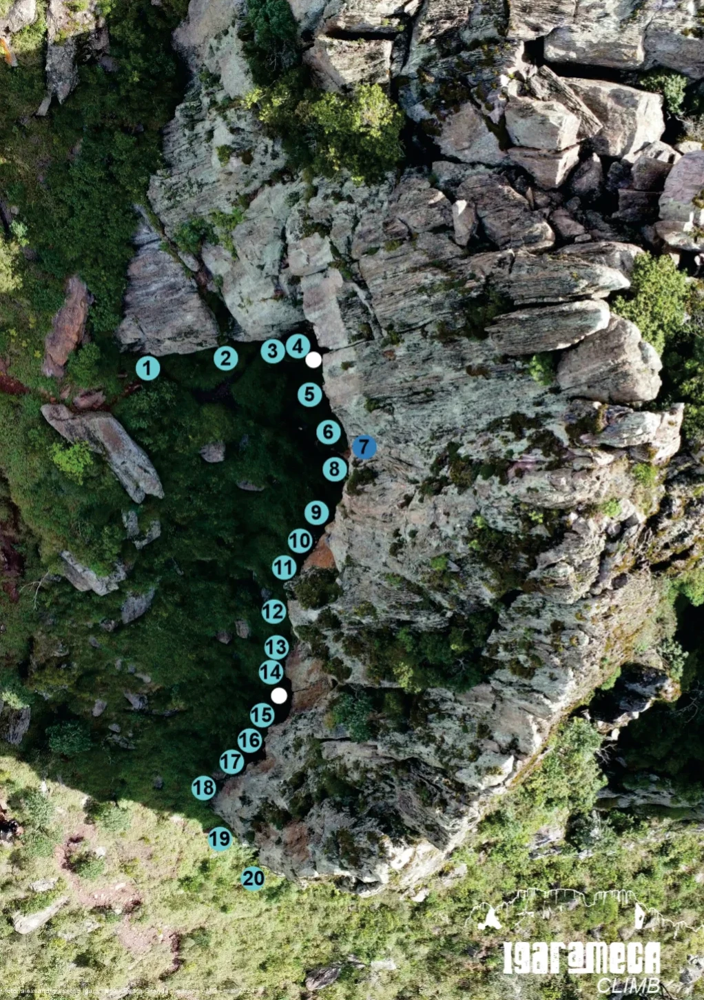
    - **largura_mapa**: 1022
    - **altura_mapa**: 1450
    - **pontos_de_interesse**:
      - **[0]**:
        - **id**: 2OadTAgvrjK843
        - **uid**: 2OadTAgvrjK843
        - **rotulo**: 01
        - **circulo**:
          - **x**: 215
          - **y**: 534
          - **raio**: 17
        - **label**: 01
      - **[1]**:
        - **id**: gFi7sTsv1gm7ZB
        - **uid**: gFi7sTsv1gm7ZB
        - **rotulo**: 02
        - **circulo**:
          - **x**: 328
          - **y**: 520
          - **raio**: 17
        - **label**: 02
      - **[2]**:
        - **id**: WOlrWzsaZhmOvx
        - **uid**: WOlrWzsaZhmOvx
        - **rotulo**: 03
        - **circulo**:
          - **x**: 396
          - **y**: 509
          - **raio**: 17
        - **label**: 03
      - **[3]**:
        - **id**: ywsLvawSp5eV3T
        - **uid**: ywsLvawSp5eV3T
        - **rotulo**: 04
        - **circulo**:
          - **x**: 433
          - **y**: 502
          - **raio**: 17
        - **label**: 04
      - **[4]**:
        - **id**: 3LnQXgTnM68SAo
        - **uid**: 3LnQXgTnM68SAo
        - **rotulo**: 05
        - **circulo**:
          - **x**: 450
          - **y**: 572
          - **raio**: 17
        - **label**: 05
      - **[5]**:
        - **id**: jDroLUDU2U5jlC
        - **uid**: jDroLUDU2U5jlC
        - **rotulo**: 06
        - **circulo**:
          - **x**: 477
          - **y**: 626
          - **raio**: 17
        - **label**: 06
      - **[6]**:
        - **id**: Moy27xMRgx6nZX
        - **uid**: Moy27xMRgx6nZX
        - **rotulo**: 07
        - **circulo**:
          - **x**: 529
          - **y**: 648
          - **raio**: 17
        - **label**: 07
      - **[7]**:
        - **id**: EJgyBKNBUAbErg
        - **uid**: EJgyBKNBUAbErg
        - **rotulo**: 08
        - **circulo**:
          - **x**: 486
          - **y**: 680
          - **raio**: 17
        - **label**: 08
      - **[8]**:
        - **id**: DTtETvJqpoKXYI
        - **uid**: DTtETvJqpoKXYI
        - **rotulo**: 09
        - **circulo**:
          - **x**: 460
          - **y**: 744
          - **raio**: 17
        - **label**: 09
      - **[9]**:
        - **id**: K2gyCfDlRSztqS
        - **uid**: K2gyCfDlRSztqS
        - **rotulo**: 10
        - **circulo**:
          - **x**: 436
          - **y**: 784
          - **raio**: 17
        - **label**: 10
      - **[10]**:
        - **id**: JJZ141BTFnIs6t
        - **uid**: JJZ141BTFnIs6t
        - **rotulo**: 11
        - **circulo**:
          - **x**: 412
          - **y**: 823
          - **raio**: 17
        - **label**: 11
      - **[11]**:
        - **id**: 09OPBYCyTrVtOy
        - **uid**: 09OPBYCyTrVtOy
        - **rotulo**: 12
        - **circulo**:
          - **x**: 397
          - **y**: 887
          - **raio**: 17
        - **label**: 12
      - **[12]**:
        - **id**: zmN1O4yaocMx2v
        - **uid**: zmN1O4yaocMx2v
        - **rotulo**: 13
        - **circulo**:
          - **x**: 402
          - **y**: 938
          - **raio**: 17
        - **label**: 13
      - **[13]**:
        - **id**: kqR0BajgQg3b8B
        - **uid**: kqR0BajgQg3b8B
        - **rotulo**: 14
        - **circulo**:
          - **x**: 393
          - **y**: 975
          - **raio**: 17
        - **label**: 14
      - **[14]**:
        - **id**: DBcErid9fxVHj7
        - **uid**: DBcErid9fxVHj7
        - **rotulo**: 15
        - **circulo**:
          - **x**: 381
          - **y**: 1037
          - **raio**: 17
        - **label**: 15
      - **[15]**:
        - **id**: ZgKLgPSYpwpueR
        - **uid**: ZgKLgPSYpwpueR
        - **rotulo**: 16
        - **circulo**:
          - **x**: 363
          - **y**: 1074
          - **raio**: 17
        - **label**: 16
      - **[16]**:
        - **id**: QGRBmOxfs6Mkx0
        - **uid**: QGRBmOxfs6Mkx0
        - **rotulo**: 17
        - **circulo**:
          - **x**: 337
          - **y**: 1104
          - **raio**: 17
        - **label**: 17
      - **[17]**:
        - **id**: CKcQ3eY2xqoAbv
        - **uid**: CKcQ3eY2xqoAbv
        - **rotulo**: 18
        - **circulo**:
          - **x**: 296
          - **y**: 1142
          - **raio**: 17
        - **label**: 18
      - **[18]**:
        - **id**: QjdDzXTgUzP9qt
        - **uid**: QjdDzXTgUzP9qt
        - **rotulo**: 19
        - **circulo**:
          - **x**: 319
          - **y**: 1216
          - **raio**: 17
        - **label**: 19
      - **[19]**:
        - **id**: X2LvKrgUH20ZzD
        - **uid**: X2LvKrgUH20ZzD
        - **rotulo**: 20
        - **circulo**:
          - **x**: 367
          - **y**: 1274
          - **raio**: 18
        - **label**: 20
    - **referencias**:
      - **[0]**:
        - **alvo_uid**: prwge1ANOjgvOz
        - **pontos_uids**:
          - 2OadTAgvrjK843
        - **escalada**: Beatrix
        - **ids**:
          - 2OadTAgvrjK843
      - **[1]**:
        - **alvo_uid**: 5tVLaB1cMSyvyR
        - **pontos_uids**:
          - gFi7sTsv1gm7ZB
        - **escalada**: Na Boca da Gruta Tem Dente
        - **ids**:
          - gFi7sTsv1gm7ZB
      - **[2]**:
        - **alvo_uid**: 0YlP0rmJycJM4L
        - **pontos_uids**:
          - WOlrWzsaZhmOvx
        - **escalada**: Sunday Bloody Sunday
        - **ids**:
          - WOlrWzsaZhmOvx
      - **[3]**:
        - **alvo_uid**: OOwYQAaNVR21jG
        - **pontos_uids**:
          - ywsLvawSp5eV3T
        - **escalada**: People Let's Stop The War
        - **ids**:
          - ywsLvawSp5eV3T
      - **[4]**:
        - **alvo_uid**: 8RFhDjMBbFyjTa
        - **pontos_uids**:
          - 3LnQXgTnM68SAo
        - **escalada**: Apolo 13
        - **ids**:
          - 3LnQXgTnM68SAo
      - **[5]**:
        - **alvo_uid**: RqRjF82FyuRmE6
        - **pontos_uids**:
          - jDroLUDU2U5jlC
        - **escalada**: Liga Extraordinária
        - **ids**:
          - jDroLUDU2U5jlC
      - **[6]**:
        - **alvo_uid**: PmAcd4OV0p4JEz
        - **pontos_uids**:
          - Moy27xMRgx6nZX
        - **escalada**: Poneis Malditos
        - **ids**:
          - Moy27xMRgx6nZX
      - **[7]**:
        - **alvo_uid**: cK2TZlyCxV1bVg
        - **pontos_uids**:
          - K2gyCfDlRSztqS
        - **escalada**: U.F.O
        - **ids**:
          - K2gyCfDlRSztqS
      - **[8]**:
        - **alvo_uid**: q3qP0GQamt5TxF
        - **pontos_uids**:
          - JJZ141BTFnIs6t
        - **escalada**: 127 Horas
        - **ids**:
          - JJZ141BTFnIs6t
      - **[9]**:
        - **alvo_uid**: ImxnLXRSuVMATC
        - **pontos_uids**:
          - 09OPBYCyTrVtOy
        - **escalada**: Lero Lero é Mato
        - **ids**:
          - 09OPBYCyTrVtOy
      - **[10]**:
        - **alvo_uid**: IZUMF6ldESlbyG
        - **pontos_uids**:
          - zmN1O4yaocMx2v
        - **escalada**: Renegados de Igarapé
        - **ids**:
          - zmN1O4yaocMx2v
      - **[11]**:
        - **alvo_uid**: dz4pPsUjgtrfuL
        - **pontos_uids**:
          - kqR0BajgQg3b8B
        - **escalada**: Coisa Linda
        - **ids**:
          - kqR0BajgQg3b8B
      - **[12]**:
        - **alvo_uid**: KfulcSJCsVH6BY
        - **pontos_uids**:
          - DBcErid9fxVHj7
        - **escalada**: Doce Veneno
        - **ids**:
          - DBcErid9fxVHj7
      - **[13]**:
        - **alvo_uid**: MEALJtEHeEtZoe
        - **pontos_uids**:
          - ZgKLgPSYpwpueR
        - **escalada**: Alguém Tem Que Ceder
        - **ids**:
          - ZgKLgPSYpwpueR
      - **[14]**:
        - **alvo_uid**: KVKh5ob4socgZS
        - **pontos_uids**:
          - QGRBmOxfs6Mkx0
        - **escalada**: Napa
        - **ids**:
          - QGRBmOxfs6Mkx0
      - **[15]**:
        - **alvo_uid**: 02kQAYs3kXod8O
        - **pontos_uids**:
          - CKcQ3eY2xqoAbv
        - **escalada**: Alpes Suínos*
        - **ids**:
          - CKcQ3eY2xqoAbv
      - **[16]**:
        - **alvo_uid**: pTpTF5vrtHvKVX
        - **pontos_uids**:
          - QjdDzXTgUzP9qt
        - **escalada**: Viagem ao Centro da Terra
        - **ids**:
          - QjdDzXTgUzP9qt
      - **[17]**:
        - **alvo_uid**: n1e6iVt9d4ovzb
        - **pontos_uids**:
          - X2LvKrgUH20ZzD
        - **escalada**: Rolitos
        - **ids**:
          - X2LvKrgUH20ZzD
      - **[18]**:
        - **alvo_uid**: kGM0034v2495s9
        - **pontos_uids**:
          - EJgyBKNBUAbErg
        - **escalada**: I Like This
        - **ids**:
          - EJgyBKNBUAbErg
      - **[19]**:
        - **alvo_uid**: Ljyw9KglAKkKFb
        - **pontos_uids**:
          - DTtETvJqpoKXYI
        - **escalada**: Igarameca
        - **ids**:
          - DTtETvJqpoKXYI
  - **[2]**:
    - **caminho_imagem_mapa**: 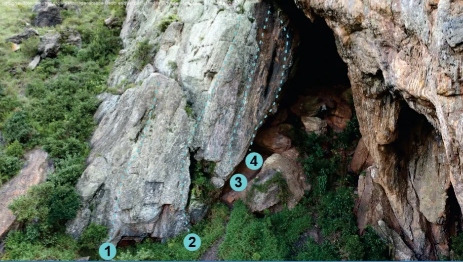
    - **largura_mapa**: 938
    - **altura_mapa**: 530
    - **pontos_de_interesse**:
      - **[0]**:
        - **id**: dUmQnFazoQm2jV
        - **uid**: dUmQnFazoQm2jV
        - **rotulo**: 04
        - **circulo**:
          - **x**: 515
          - **y**: 326
          - **raio**: 17
        - **label**: 04
      - **[1]**:
        - **id**: 4E0sbpTom54PqV
        - **uid**: 4E0sbpTom54PqV
        - **rotulo**: 03
        - **circulo**:
          - **x**: 484
          - **y**: 369
          - **raio**: 17
        - **label**: 03
      - **[2]**:
        - **id**: qdMD1fVV6sEcDL
        - **uid**: qdMD1fVV6sEcDL
        - **rotulo**: 02
        - **circulo**:
          - **x**: 389
          - **y**: 490
          - **raio**: 17
        - **label**: 02
      - **[3]**:
        - **id**: wOGVh7WNKpJXDk
        - **uid**: wOGVh7WNKpJXDk
        - **rotulo**: 01
        - **circulo**:
          - **x**: 218
          - **y**: 508
          - **raio**: 17
        - **label**: 01
    - **referencias**:
      - **[0]**:
        - **alvo_uid**: prwge1ANOjgvOz
        - **pontos_uids**:
          - wOGVh7WNKpJXDk
        - **escalada**: Beatrix
        - **ids**:
          - wOGVh7WNKpJXDk
      - **[1]**:
        - **alvo_uid**: 5tVLaB1cMSyvyR
        - **pontos_uids**:
          - qdMD1fVV6sEcDL
        - **escalada**: Na Boca da Gruta Tem Dente
        - **ids**:
          - qdMD1fVV6sEcDL
      - **[2]**:
        - **alvo_uid**: 0YlP0rmJycJM4L
        - **pontos_uids**:
          - 4E0sbpTom54PqV
        - **escalada**: Sunday Bloody Sunday
        - **ids**:
          - 4E0sbpTom54PqV
      - **[3]**:
        - **alvo_uid**: OOwYQAaNVR21jG
        - **pontos_uids**:
          - dUmQnFazoQm2jV
        - **escalada**: People Let's Stop The War
        - **ids**:
          - dUmQnFazoQm2jV
- **escaladas**:
  - **[0]**:
    - **uid**: prwge1ANOjgvOz
    - **via_esportiva**:
      - **nome**: Beatrix
      - **dificuldade**: BR_5
      - **quantidade_protecoes_intermediarias**: 4
      - **quantidade_protecoes_parada**: 2
      - **extensao**: 8
      - **conquistadores**:
        - Berbari
        - Toninho
      - **data_abertura**: 2023
  - **[1]**:
    - **uid**: 5tVLaB1cMSyvyR
    - **via_esportiva**:
      - **nome**: Na Boca da Gruta Tem Dente
      - **dificuldade**: BR_7B
      - **quantidade_protecoes_intermediarias**: 6
      - **quantidade_protecoes_parada**: 2
      - **extensao**: 16
      - **conquistadores**:
        - Berbari
        - Toninho
        - Alex
      - **data_abertura**: 2004
  - **[2]**:
    - **uid**: 0YlP0rmJycJM4L
    - **via_esportiva**:
      - **nome**: Sunday Bloody Sunday
      - **dificuldade**: BR_8C
      - **quantidade_protecoes_intermediarias**: 6
      - **quantidade_protecoes_parada**: 2
      - **extensao**: 14
      - **conquistadores**:
        - Berbari
        - Alex
        - Ruy
      - **data_abertura**: 2006
  - **[3]**:
    - **uid**: OOwYQAaNVR21jG
    - **via_esportiva**:
      - **nome**: People Let's Stop The War
      - **dificuldade**: BR_8B
      - **quantidade_protecoes_intermediarias**: 6
      - **quantidade_protecoes_parada**: 2
      - **extensao**: 14
      - **conquistadores**:
        - Berbari
        - Alex
        - Toninho
      - **data_abertura**: 2006
  - **[4]**:
    - **uid**: 8RFhDjMBbFyjTa
    - **via_esportiva**:
      - **nome**: Apolo 13
      - **dificuldade**: BR_10B
      - **quantidade_protecoes_intermediarias**: 8
      - **quantidade_protecoes_parada**: 2
      - **extensao**: 20
      - **conquistadores**:
        - Berbari
        - Moleza
        - Alex
        - Chinha
      - **data_abertura**: 2012
  - **[5]**:
    - **uid**: RqRjF82FyuRmE6
    - **via_esportiva**:
      - **nome**: Liga Extraordinária
      - **dificuldade**: BR_9C
      - **quantidade_protecoes_intermediarias**: 9
      - **quantidade_protecoes_parada**: 2
      - **extensao**: 25
      - **conquistadores**:
        - Berbari
        - Moleza
        - Alex
      - **data_abertura**: 2012
  - **[6]**:
    - **uid**: PmAcd4OV0p4JEz
    - **via_esportiva**:
      - **nome**: Poneis Malditos
      - **dificuldade**: BR_9B
      - **quantidade_protecoes_intermediarias**: 11
      - **quantidade_protecoes_parada**: 2
      - **extensao**: 25
      - **conquistadores**:
        - Berbari
        - Moleza
        - Alex
      - **data_abertura**: 2011
  - **[7]**:
    - **uid**: kGM0034v2495s9
    - **via_esportiva**:
      - **descricao**: Variante da Boneis Malditos.
      - **nome**: I Like This
      - **dificuldade**: BR_8B
      - **quantidade_protecoes_intermediarias**: 13
      - **quantidade_protecoes_parada**: 2
      - **extensao**: 30
      - **conquistadores**:
        - Berbari
        - Alex
        - Toninho
      - **data_abertura**: 2010
  - **[8]**:
    - **uid**: Ljyw9KglAKkKFb
    - **via_multiplas_enfiadas**:
      - **nome**: Igarameca
      - **dificuldade_media**: BR_7B
      - **dificuldade_maxima**: BR_9A
      - **numero_enfiadas**: 2
      - **comprimento_total**: 10
      - **conquistadores**:
        - Berbari
        - Toninho
        - Pilão
      - **data_abertura**: 2022
      - **enfiadas**:
        - **[0]**:
          - **via_esportiva**:
            - **nome**: Enfiada 1
            - **dificuldade**: BR_7B
            - **quantidade_protecoes_intermediarias**: 5
            - **quantidade_protecoes_parada**: 2
        - **[1]**:
          - **via_esportiva**:
            - **nome**: Enfiada 2
            - **dificuldade**: BR_9A
            - **quantidade_protecoes_intermediarias**: 5
            - **quantidade_protecoes_parada**: 2
  - **[9]**:
    - **uid**: cK2TZlyCxV1bVg
    - **via_esportiva**:
      - **nome**: U.F.O
      - **dificuldade**: BR_7B
      - **quantidade_protecoes_intermediarias**: 5
      - **quantidade_protecoes_parada**: 2
      - **extensao**: 12
      - **conquistadores**:
        - Berbari
        - Bunitinho
        - Chinha
        - Toninho
      - **data_abertura**: 2022
  - **[10]**:
    - **uid**: q3qP0GQamt5TxF
    - **via_esportiva**:
      - **nome**: 127 Horas
      - **dificuldade**: BR_7C
      - **quantidade_protecoes_intermediarias**: 6
      - **quantidade_protecoes_parada**: 2
      - **extensao**: 14
      - **conquistadores**:
        - Berbari
        - Bunitinho
        - Chinha
      - **data_abertura**: 2022
  - **[11]**:
    - **uid**: ImxnLXRSuVMATC
    - **via_esportiva**:
      - **nome**: Lero Lero é Mato
      - **dificuldade**: INDEFINIDO
      - **quantidade_protecoes_intermediarias**: 6
      - **quantidade_protecoes_parada**: 2
      - **extensao**: 15
      - **conquistadores**:
        - Berbari
        - Bunitinho
        - Chinha
      - **data_abertura**: 2022
  - **[12]**:
    - **uid**: IZUMF6ldESlbyG
    - **via_esportiva**:
      - **nome**: Renegados de Igarapé
      - **dificuldade**: BR_7B
      - **quantidade_protecoes_intermediarias**: 9
      - **quantidade_protecoes_parada**: 2
      - **extensao**: 23
      - **conquistadores**:
        - Berbari
        - Bunitinho
        - Chinha
        - Bolinha
      - **data_abertura**: 2022
  - **[13]**:
    - **uid**: dz4pPsUjgtrfuL
    - **via_esportiva**:
      - **nome**: Coisa Linda
      - **dificuldade**: BR_8B
      - **quantidade_protecoes_intermediarias**: 8
      - **quantidade_protecoes_parada**: 2
      - **extensao**: 23
      - **conquistadores**:
        - Bunitinho
        - Bolinha
      - **data_abertura**: 2022
  - **[14]**:
    - **uid**: KfulcSJCsVH6BY
    - **via_esportiva**:
      - **nome**: Doce Veneno
      - **dificuldade**: BR_7A
      - **quantidade_protecoes_intermediarias**: 6
      - **quantidade_protecoes_parada**: 2
      - **extensao**: 15
      - **conquistadores**:
        - Berbari
        - Bunitinho
        - Chinha
      - **data_abertura**: 2022
  - **[15]**:
    - **uid**: MEALJtEHeEtZoe
    - **via_esportiva**:
      - **nome**: Alguém Tem Que Ceder
      - **dificuldade**: BR_7C
      - **quantidade_protecoes_intermediarias**: 7
      - **quantidade_protecoes_parada**: 2
      - **extensao**: 16
      - **conquistadores**:
        - Berbari
        - Bunitinho
        - Chinha
      - **data_abertura**: 2022
  - **[16]**:
    - **uid**: KVKh5ob4socgZS
    - **via_esportiva**:
      - **nome**: Napa
      - **dificuldade**: BR_7B
      - **quantidade_protecoes_intermediarias**: 10
      - **quantidade_protecoes_parada**: 2
      - **extensao**: 20
      - **conquistadores**:
        - Berbari
        - Toninho
      - **data_abertura**: 2022
  - **[17]**:
    - **uid**: 02kQAYs3kXod8O
    - **via_esportiva**:
      - **nome**: Alpes Suínos*
      - **dificuldade**: BR_6SUP
      - **quantidade_protecoes_intermediarias**: 16
      - **quantidade_protecoes_parada**: 2
      - **extensao**: 35
      - **conquistadores**:
        - Berbari
        - Toninho
      - **data_abertura**: 2022
  - **[18]**:
    - **uid**: pTpTF5vrtHvKVX
    - **via_esportiva**:
      - **nome**: Viagem ao Centro da Terra
      - **dificuldade**: BR_6
      - **quantidade_protecoes_intermediarias**: 14
      - **quantidade_protecoes_parada**: 2
      - **extensao**: 35
      - **conquistadores**:
        - Berbari
        - Toninho
      - **data_abertura**: 2022
  - **[19]**:
    - **uid**: n1e6iVt9d4ovzb
    - **via_esportiva**:
      - **descricao**: Via inacabada.
      - **nome**: Rolitos
      - **dificuldade**: INDEFINIDO
      - **quantidade_protecoes_intermediarias**: 1
      - **quantidade_protecoes_parada**: 0
      - **conquistadores**:
        - Bunitin
  - **[20]**:
    - **uid**: SXdNmD9n12tauu
    - **via_esportiva**:
      - **nome**: Balança Mas Não Cai
      - **dificuldade**: BR_6
      - **quantidade_protecoes_intermediarias**: 10
      - **quantidade_protecoes_parada**: 2
      - **extensao**: 25
      - **conquistadores**:
        - Bunitinho
        - Marcão
      - **data_abertura**: 2022
- **precomputados**:
  - **total_escaladas**: 21
  - **total_esportivas**: 20
  - **total_multiplas_enfiadas**: 1

## Parte: setor_pracinha

### Setor (Pico: Complexo Pedra Grande)

- **descricao**: Sombra o dia todo (varia de acordo com a estação).
- **nome**: Setor Pracinha
- **uid**: 1g1CrSzJzHeyrv
- **caminho_imagem_capa**: 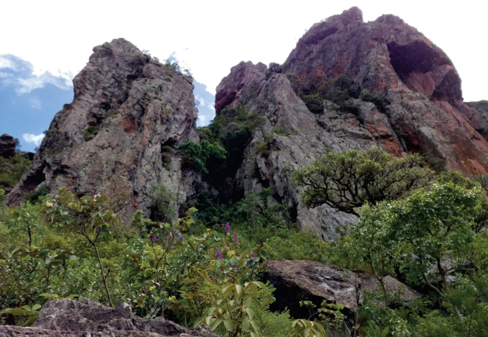
- **mapas**:
  - **[0]**:
    - **caminho_imagem_mapa**: 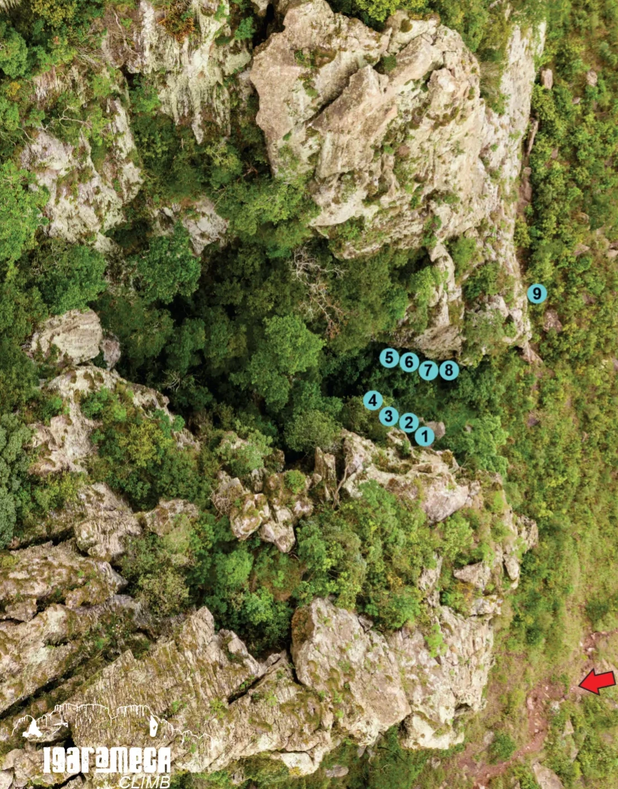
    - **largura_mapa**: 1107
    - **altura_mapa**: 1413
    - **pontos_de_interesse**:
      - **[0]**:
        - **id**: Xhsz1Wtp4s2ULs
        - **uid**: Xhsz1Wtp4s2ULs
        - **rotulo**: 01
        - **circulo**:
          - **x**: 761
          - **y**: 782
          - **raio**: 17
        - **label**: 01
      - **[1]**:
        - **id**: yUMuADA01pyFbP
        - **uid**: yUMuADA01pyFbP
        - **rotulo**: 02
        - **circulo**:
          - **x**: 732
          - **y**: 757
          - **raio**: 17
        - **label**: 02
      - **[2]**:
        - **id**: nYGYGhVBIkjy28
        - **uid**: nYGYGhVBIkjy28
        - **rotulo**: 03
        - **circulo**:
          - **x**: 697
          - **y**: 746
          - **raio**: 17
        - **label**: 03
      - **[3]**:
        - **id**: Rj6RP5lDxZ9kUk
        - **uid**: Rj6RP5lDxZ9kUk
        - **rotulo**: 04
        - **circulo**:
          - **x**: 668
          - **y**: 717
          - **raio**: 17
        - **label**: 04
      - **[4]**:
        - **id**: w9xngGToGrJqf6
        - **uid**: w9xngGToGrJqf6
        - **rotulo**: 05
        - **circulo**:
          - **x**: 697
          - **y**: 641
          - **raio**: 17
        - **label**: 05
      - **[5]**:
        - **id**: AsDs9blGiwVd8m
        - **uid**: AsDs9blGiwVd8m
        - **rotulo**: 06
        - **circulo**:
          - **x**: 734
          - **y**: 649
          - **raio**: 17
        - **label**: 06
      - **[6]**:
        - **id**: XKqdU1C14Y0Whc
        - **uid**: XKqdU1C14Y0Whc
        - **rotulo**: 07
        - **circulo**:
          - **x**: 768
          - **y**: 663
          - **raio**: 17
        - **label**: 07
      - **[7]**:
        - **id**: g8wsUkaZ9tjAov
        - **uid**: g8wsUkaZ9tjAov
        - **rotulo**: 08
        - **circulo**:
          - **x**: 805
          - **y**: 663
          - **raio**: 17
        - **label**: 08
      - **[8]**:
        - **id**: mQJf4urE1dSo1Y
        - **uid**: mQJf4urE1dSo1Y
        - **rotulo**: 09
        - **circulo**:
          - **x**: 962
          - **y**: 526
          - **raio**: 17
        - **label**: 09
    - **referencias**:
      - **[0]**:
        - **alvo_uid**: XrBXrtqP2wt0we
        - **pontos_uids**:
          - Xhsz1Wtp4s2ULs
        - **escalada**: Conflito sensual
        - **ids**:
          - Xhsz1Wtp4s2ULs
      - **[1]**:
        - **alvo_uid**: loqFlZSEj2AvjM
        - **pontos_uids**:
          - yUMuADA01pyFbP
        - **escalada**: Duracell
        - **ids**:
          - yUMuADA01pyFbP
      - **[2]**:
        - **alvo_uid**: WOnWuf7KQFxy4R
        - **pontos_uids**:
          - nYGYGhVBIkjy28
        - **escalada**: Djavú
        - **ids**:
          - nYGYGhVBIkjy28
      - **[3]**:
        - **alvo_uid**: i6tD6IoexGPduC
        - **pontos_uids**:
          - Rj6RP5lDxZ9kUk
        - **escalada**: Muita coisa envolvida
        - **ids**:
          - Rj6RP5lDxZ9kUk
      - **[4]**:
        - **alvo_uid**: gT6feZ5pEHYVwR
        - **pontos_uids**:
          - w9xngGToGrJqf6
        - **escalada**: Netfrix
        - **ids**:
          - w9xngGToGrJqf6
      - **[5]**:
        - **alvo_uid**: kUqcdOIbVmZwIy
        - **pontos_uids**:
          - AsDs9blGiwVd8m
        - **escalada**: Pouca prática
        - **ids**:
          - AsDs9blGiwVd8m
      - **[6]**:
        - **alvo_uid**: 1pS7HXbpuOnmDz
        - **pontos_uids**:
          - XKqdU1C14Y0Whc
        - **escalada**: Vainafé
        - **ids**:
          - XKqdU1C14Y0Whc
      - **[7]**:
        - **alvo_uid**: G25vdSyMTkyCNa
        - **pontos_uids**:
          - g8wsUkaZ9tjAov
        - **escalada**: People crazy
        - **ids**:
          - g8wsUkaZ9tjAov
      - **[8]**:
        - **alvo_uid**: cJzFnD4vy9LxJP
        - **pontos_uids**:
          - mQJf4urE1dSo1Y
        - **escalada**: Aresta Daniel
        - **ids**:
          - mQJf4urE1dSo1Y
  - **[1]**:
    - **caminho_imagem_mapa**: 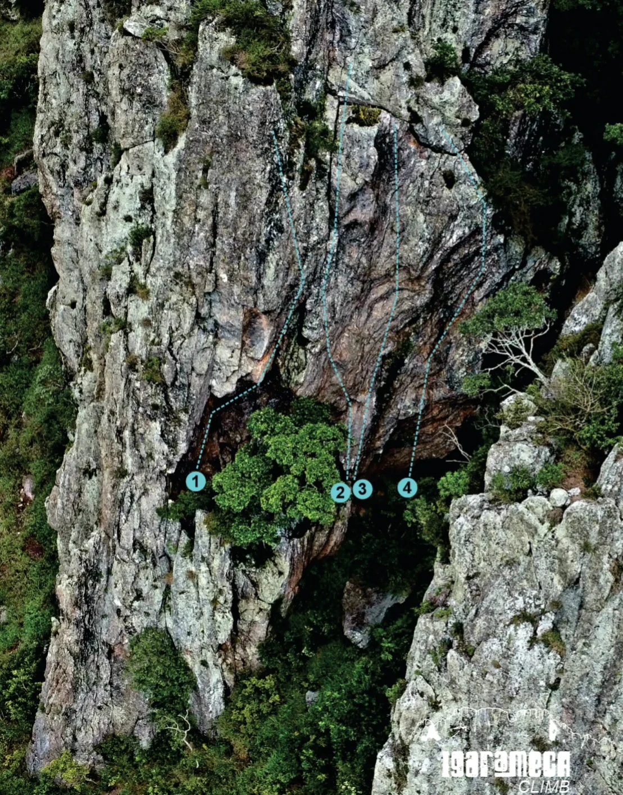
    - **largura_mapa**: 1109
    - **altura_mapa**: 1413
    - **pontos_de_interesse**:
      - **[0]**:
        - **id**: B0p8hl3AvHe0d5
        - **uid**: B0p8hl3AvHe0d5
        - **rotulo**: 01
        - **circulo**:
          - **x**: 349
          - **y**: 855
          - **raio**: 17
        - **label**: 01
      - **[1]**:
        - **id**: o5bq4YT33Vr7oL
        - **uid**: o5bq4YT33Vr7oL
        - **rotulo**: 02
        - **circulo**:
          - **x**: 606
          - **y**: 876
          - **raio**: 17
        - **label**: 02
      - **[2]**:
        - **id**: TkVjLe0nZcJ1EG
        - **uid**: TkVjLe0nZcJ1EG
        - **rotulo**: 03
        - **circulo**:
          - **x**: 646
          - **y**: 870
          - **raio**: 17
        - **label**: 03
      - **[3]**:
        - **id**: XX2L0p85lzkV9C
        - **uid**: XX2L0p85lzkV9C
        - **rotulo**: 04
        - **circulo**:
          - **x**: 725
          - **y**: 867
          - **raio**: 17
        - **label**: 04
    - **referencias**:
      - **[0]**:
        - **alvo_uid**: XrBXrtqP2wt0we
        - **pontos_uids**:
          - B0p8hl3AvHe0d5
        - **escalada**: Conflito sensual
        - **ids**:
          - B0p8hl3AvHe0d5
      - **[1]**:
        - **alvo_uid**: loqFlZSEj2AvjM
        - **pontos_uids**:
          - o5bq4YT33Vr7oL
        - **escalada**: Duracell
        - **ids**:
          - o5bq4YT33Vr7oL
      - **[2]**:
        - **alvo_uid**: WOnWuf7KQFxy4R
        - **pontos_uids**:
          - TkVjLe0nZcJ1EG
        - **escalada**: Djavú
        - **ids**:
          - TkVjLe0nZcJ1EG
      - **[3]**:
        - **alvo_uid**: i6tD6IoexGPduC
        - **pontos_uids**:
          - XX2L0p85lzkV9C
        - **escalada**: Muita coisa envolvida
        - **ids**:
          - XX2L0p85lzkV9C
  - **[2]**:
    - **caminho_imagem_mapa**: 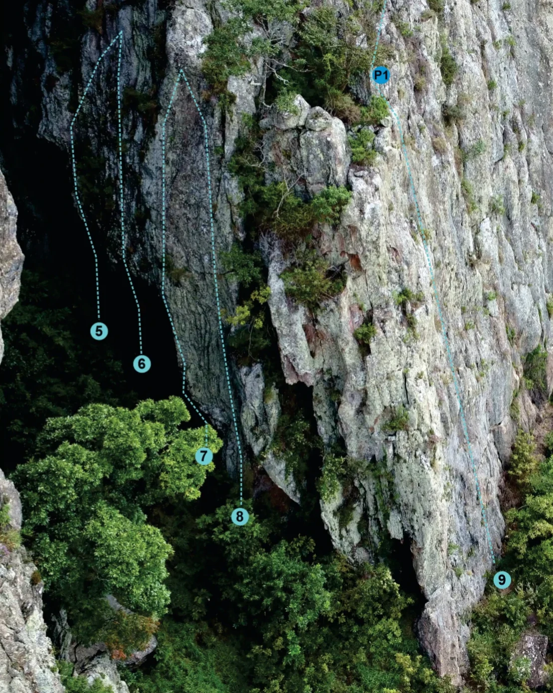
    - **largura_mapa**: 1109
    - **altura_mapa**: 1391
    - **pontos_de_interesse**:
      - **[0]**:
        - **id**: vZhcHQiXnW3LXc
        - **uid**: vZhcHQiXnW3LXc
        - **rotulo**: P1
        - **circulo**:
          - **x**: 764
          - **y**: 151
          - **raio**: 18
        - **label**: P1
      - **[1]**:
        - **id**: GAiRdvunkolu2J
        - **uid**: GAiRdvunkolu2J
        - **rotulo**: 05
        - **circulo**:
          - **x**: 199
          - **y**: 665
          - **raio**: 17
        - **label**: 05
      - **[2]**:
        - **id**: Cge74BY2zSTbVJ
        - **uid**: Cge74BY2zSTbVJ
        - **rotulo**: 06
        - **circulo**:
          - **x**: 285
          - **y**: 731
          - **raio**: 17
        - **label**: 06
      - **[3]**:
        - **id**: OvKgHwrmIil4MQ
        - **uid**: OvKgHwrmIil4MQ
        - **rotulo**: 07
        - **circulo**:
          - **x**: 409
          - **y**: 915
          - **raio**: 17
        - **label**: 07
      - **[4]**:
        - **id**: nSSYVwEOAFIRya
        - **uid**: nSSYVwEOAFIRya
        - **rotulo**: 08
        - **circulo**:
          - **x**: 481
          - **y**: 1037
          - **raio**: 17
        - **label**: 08
      - **[5]**:
        - **id**: FWfLgjyAhy69Rh
        - **uid**: FWfLgjyAhy69Rh
        - **rotulo**: 09
        - **circulo**:
          - **x**: 1007
          - **y**: 1164
          - **raio**: 17
        - **label**: 09
    - **referencias**:
      - **[0]**:
        - **alvo_uid**: gT6feZ5pEHYVwR
        - **pontos_uids**:
          - GAiRdvunkolu2J
        - **escalada**: Netfrix
        - **ids**:
          - GAiRdvunkolu2J
      - **[1]**:
        - **alvo_uid**: kUqcdOIbVmZwIy
        - **pontos_uids**:
          - Cge74BY2zSTbVJ
        - **escalada**: Pouca prática
        - **ids**:
          - Cge74BY2zSTbVJ
      - **[2]**:
        - **alvo_uid**: 1pS7HXbpuOnmDz
        - **pontos_uids**:
          - OvKgHwrmIil4MQ
        - **escalada**: Vainafé
        - **ids**:
          - OvKgHwrmIil4MQ
      - **[3]**:
        - **alvo_uid**: G25vdSyMTkyCNa
        - **pontos_uids**:
          - nSSYVwEOAFIRya
        - **escalada**: People crazy
        - **ids**:
          - nSSYVwEOAFIRya
      - **[4]**:
        - **alvo_uid**: cJzFnD4vy9LxJP
        - **pontos_uids**:
          - FWfLgjyAhy69Rh
          - vZhcHQiXnW3LXc
        - **escalada**: Aresta Daniel
        - **ids**:
          - FWfLgjyAhy69Rh
          - vZhcHQiXnW3LXc
- **escaladas**:
  - **[0]**:
    - **uid**: XrBXrtqP2wt0we
    - **via_esportiva**:
      - **nome**: Conflito sensual
      - **dificuldade**: PROJETO
      - **quantidade_protecoes_intermediarias**: 10
      - **quantidade_protecoes_parada**: 2
      - **extensao**: 20
      - **conquistadores**:
        - Berbari
        - Bunitin
      - **data_abertura**: 2022
  - **[1]**:
    - **uid**: loqFlZSEj2AvjM
    - **via_esportiva**:
      - **nome**: Duracell
      - **dificuldade**: BR_8C
      - **quantidade_protecoes_intermediarias**: 9
      - **quantidade_protecoes_parada**: 2
      - **extensao**: 22
      - **conquistadores**:
        - Bunitin
        - Marcão
      - **data_abertura**: 2022
  - **[2]**:
    - **uid**: WOnWuf7KQFxy4R
    - **via_esportiva**:
      - **nome**: Djavú
      - **dificuldade**: BR_8B
      - **quantidade_protecoes_intermediarias**: 9
      - **quantidade_protecoes_parada**: 2
      - **extensao**: 22
      - **conquistadores**:
        - Berbari
        - Chinha
        - Tonin
      - **data_abertura**: 2022
  - **[3]**:
    - **uid**: i6tD6IoexGPduC
    - **via_esportiva**:
      - **nome**: Muita coisa envolvida
      - **dificuldade**: BR_8A
      - **quantidade_protecoes_intermediarias**: 10
      - **quantidade_protecoes_parada**: 2
      - **extensao**: 22
      - **conquistadores**:
        - Berbari
        - Tonin
      - **data_abertura**: 2022
  - **[4]**:
    - **uid**: gT6feZ5pEHYVwR
    - **via_esportiva**:
      - **nome**: Netfrix
      - **dificuldade**: BR_7A
      - **quantidade_protecoes_intermediarias**: 6
      - **quantidade_protecoes_parada**: 2
      - **extensao**: 18
      - **conquistadores**:
        - Berbari
        - Tonin
      - **data_abertura**: 2022
  - **[5]**:
    - **uid**: kUqcdOIbVmZwIy
    - **via_esportiva**:
      - **nome**: Pouca prática
      - **dificuldade**: BR_6SUP
      - **quantidade_protecoes_intermediarias**: 7
      - **quantidade_protecoes_parada**: 2
      - **extensao**: 18
      - **conquistadores**:
        - Berbari
        - Tonin
      - **data_abertura**: 2022
  - **[6]**:
    - **uid**: 1pS7HXbpuOnmDz
    - **via_esportiva**:
      - **nome**: Vainafé
      - **dificuldade**: BR_7A
      - **quantidade_protecoes_intermediarias**: 8
      - **quantidade_protecoes_parada**: 2
      - **extensao**: 18
      - **conquistadores**:
        - Berbari
        - Tonin
      - **data_abertura**: 2022
  - **[7]**:
    - **uid**: G25vdSyMTkyCNa
    - **via_esportiva**:
      - **nome**: People crazy
      - **dificuldade**: BR_6SUP
      - **quantidade_protecoes_intermediarias**: 9
      - **quantidade_protecoes_parada**: 2
      - **extensao**: 20
      - **conquistadores**:
        - Berbari
        - Toninho
      - **data_abertura**: 2022
- **precomputados**:
  - **total_escaladas**: 8
  - **total_esportivas**: 8

## Parte: setor_tetos

### Setor (Pico: Complexo Pedra Grande)

- **descricao**: Sombra após 14h.
- **nome**: Setor dos Tetos
- **uid**: WVQC6bQetKztOL
- **caminho_imagem_capa**: 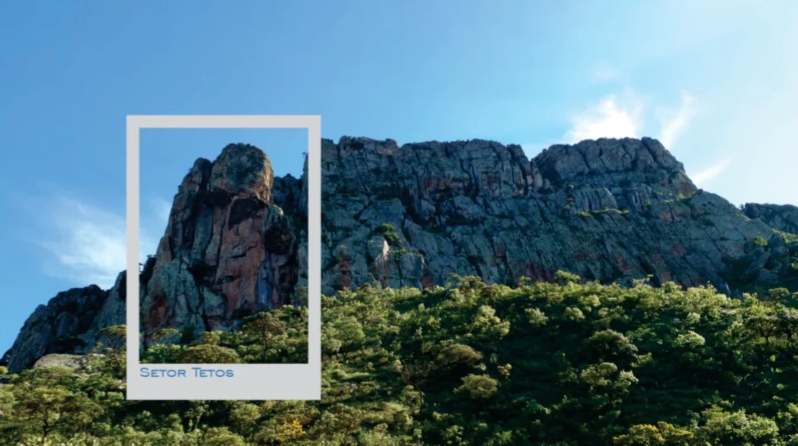
- **mapas**:
  - **[0]**:
    - **caminho_imagem_mapa**: 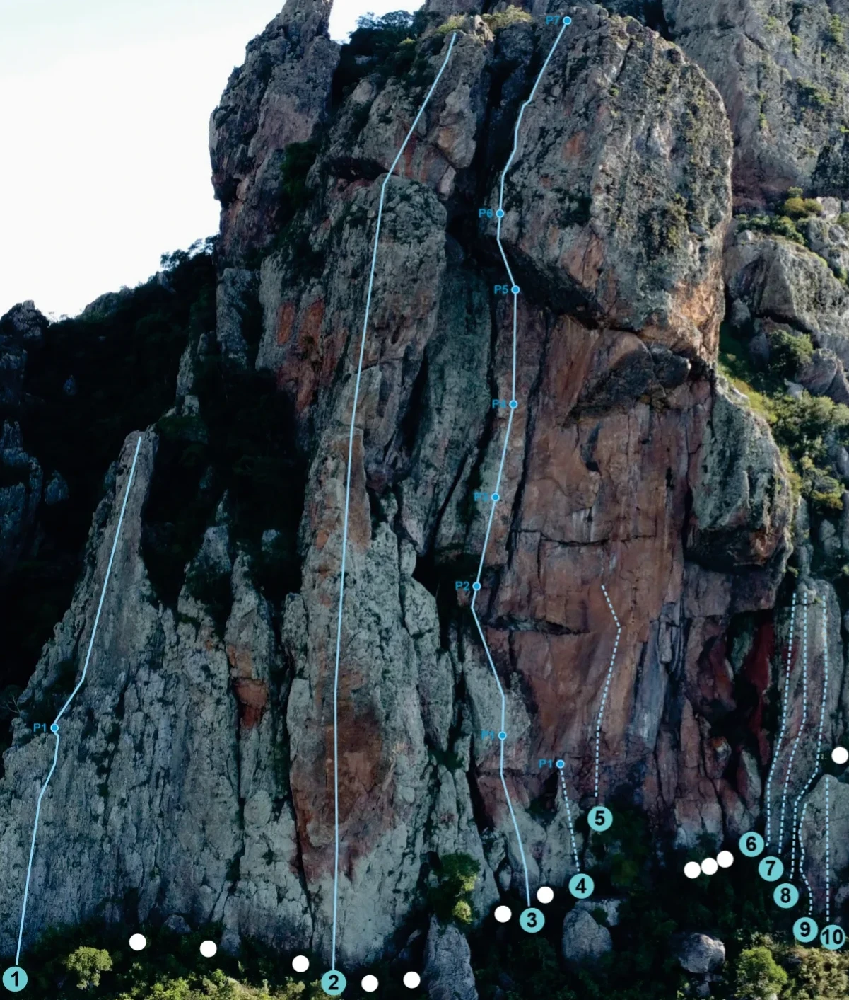
    - **largura_mapa**: 1201
    - **altura_mapa**: 1413
    - **pontos_de_interesse**:
      - **[0]**:
        - **id**: 4xqiWVLDRLMeoZ
        - **uid**: 4xqiWVLDRLMeoZ
        - **rotulo**: 01
        - **circulo**:
          - **x**: 21
          - **y**: 1383
          - **raio**: 17
        - **label**: 01
      - **[1]**:
        - **id**: QXDLFztcin6tw1
        - **uid**: QXDLFztcin6tw1
        - **rotulo**: 02
        - **circulo**:
          - **x**: 472
          - **y**: 1389
          - **raio**: 17
        - **label**: 02
      - **[2]**:
        - **id**: uXQs6ERJ9FTChT
        - **uid**: uXQs6ERJ9FTChT
        - **rotulo**: 03
        - **circulo**:
          - **x**: 753
          - **y**: 1300
          - **raio**: 17
        - **label**: 03
      - **[3]**:
        - **id**: ixtWjc7eu4G649
        - **uid**: ixtWjc7eu4G649
        - **rotulo**: 04
        - **circulo**:
          - **x**: 823
          - **y**: 1252
          - **raio**: 17
        - **label**: 04
      - **[4]**:
        - **id**: KydQu2zET9QhOX
        - **uid**: KydQu2zET9QhOX
        - **rotulo**: 05
        - **circulo**:
          - **x**: 849
          - **y**: 1157
          - **raio**: 17
        - **label**: 05
      - **[5]**:
        - **id**: LSsiz9ZDLo7K73
        - **uid**: LSsiz9ZDLo7K73
        - **rotulo**: 06
        - **circulo**:
          - **x**: 1063
          - **y**: 1193
          - **raio**: 17
        - **label**: 06
      - **[6]**:
        - **id**: VRlRiEZrLRbPk6
        - **uid**: VRlRiEZrLRbPk6
        - **rotulo**: 07
        - **circulo**:
          - **x**: 1091
          - **y**: 1228
          - **raio**: 17
        - **label**: 07
      - **[7]**:
        - **id**: PNeJh70DqfH5Hu
        - **uid**: PNeJh70DqfH5Hu
        - **rotulo**: 08
        - **circulo**:
          - **x**: 1112
          - **y**: 1266
          - **raio**: 17
        - **label**: 08
      - **[8]**:
        - **id**: GFCrmTiI3qRbV6
        - **uid**: GFCrmTiI3qRbV6
        - **rotulo**: 09
        - **circulo**:
          - **x**: 1140
          - **y**: 1313
          - **raio**: 17
        - **label**: 09
      - **[9]**:
        - **id**: sXwXvg2Qc8uuNk
        - **uid**: sXwXvg2Qc8uuNk
        - **rotulo**: 10
        - **circulo**:
          - **x**: 1178
          - **y**: 1324
          - **raio**: 17
        - **label**: 10
    - **referencias**:
      - **[0]**:
        - **alvo_uid**: IJzJWjgcEnN4P3
        - **pontos_uids**:
          - QXDLFztcin6tw1
        - **escalada**: A Quina
        - **ids**:
          - QXDLFztcin6tw1
      - **[1]**:
        - **alvo_uid**: LGdkbkKaNxAOvn
        - **pontos_uids**:
          - uXQs6ERJ9FTChT
        - **escalada**: Pachamama
        - **ids**:
          - uXQs6ERJ9FTChT
      - **[2]**:
        - **alvo_uid**: znMosS9QDi4vTK
        - **pontos_uids**:
          - ixtWjc7eu4G649
        - **escalada**: Baba Yaga
        - **ids**:
          - ixtWjc7eu4G649
      - **[3]**:
        - **alvo_uid**: TlEHvI4lIqZraa
        - **pontos_uids**:
          - KydQu2zET9QhOX
        - **escalada**: Soy Loco Por Ti América
        - **ids**:
          - KydQu2zET9QhOX
      - **[4]**:
        - **alvo_uid**: I0ZBhEX3IR2sus
        - **pontos_uids**:
          - LSsiz9ZDLo7K73
        - **escalada**: Afrodite
        - **ids**:
          - LSsiz9ZDLo7K73
      - **[5]**:
        - **alvo_uid**: YqmTq54R5XIqn1
        - **pontos_uids**:
          - VRlRiEZrLRbPk6
        - **escalada**: Ponto de Equilíbrio
        - **ids**:
          - VRlRiEZrLRbPk6
      - **[6]**:
        - **alvo_uid**: JAsfjB7rBTIrHr
        - **pontos_uids**:
          - sXwXvg2Qc8uuNk
        - **escalada**: Deu Nois
        - **ids**:
          - sXwXvg2Qc8uuNk
      - **[7]**:
        - **alvo_uid**: cJzFnD4vy9LxJP
        - **pontos_uids**:
          - 4xqiWVLDRLMeoZ
        - **escalada**: Aresta Daniel
        - **ids**:
          - 4xqiWVLDRLMeoZ
      - **[8]**:
        - **alvo_uid**: r0pWLG8DX3cuvD
        - **pontos_uids**:
          - PNeJh70DqfH5Hu
        - **escalada**: Lilith
        - **ids**:
          - PNeJh70DqfH5Hu
      - **[9]**:
        - **alvo_uid**: 60DjIAnZ9Bz0G5
        - **pontos_uids**:
          - GFCrmTiI3qRbV6
        - **escalada**: Deu Brasil
        - **ids**:
          - GFCrmTiI3qRbV6
- **escaladas**:
  - **[0]**:
    - **uid**: znMosS9QDi4vTK
    - **via_esportiva**:
      - **descricao**: Via inacabada.
      - **nome**: Baba Yaga
      - **dificuldade**: BR_5
      - **conquistadores**:
        - Berbari
        - Neander
        - Bunitin
        - Ana
      - **data_abertura**: 2024
  - **[1]**:
    - **uid**: TlEHvI4lIqZraa
    - **via_esportiva**:
      - **nome**: Soy Loco Por Ti América
      - **dificuldade**: BR_9C_BARRA_10A
      - **extensao**: 30
      - **quantidade_protecoes_intermediarias**: 12
      - **quantidade_protecoes_parada**: 2
      - **conquistadores**:
        - Berbari
        - Chinha
      - **data_abertura**: 2016
  - **[2]**:
    - **uid**: I0ZBhEX3IR2sus
    - **via_esportiva**:
      - **nome**: Afrodite
      - **dificuldade**: BR_7B
      - **conquistadores**:
        - Bunitinho
        - Clebinho
      - **data_abertura**: 2024
      - **extensao**: 30
      - **quantidade_protecoes_intermediarias**: 11
      - **quantidade_protecoes_parada**: 2
  - **[3]**:
    - **uid**: YqmTq54R5XIqn1
    - **via_esportiva**:
      - **nome**: Ponto de Equilíbrio
      - **dificuldade**: BR_8B_BARRA_8C
      - **conquistadores**:
        - Berbari
        - Chinha
      - **data_abertura**: 2019
      - **extensao**: 30
      - **quantidade_protecoes_intermediarias**: 11
      - **quantidade_protecoes_parada**: 2
  - **[4]**:
    - **uid**: r0pWLG8DX3cuvD
    - **via_esportiva**:
      - **nome**: Lilith
      - **dificuldade**: BR_7A
      - **quantidade_protecoes_intermediarias**: 11
      - **quantidade_protecoes_parada**: 2
      - **extensao**: 30
      - **conquistadores**:
        - Berbari
        - Chinha
        - Bunitinho
      - **data_abertura**: 2024
  - **[5]**:
    - **uid**: 60DjIAnZ9Bz0G5
    - **via_esportiva**:
      - **nome**: Deu Brasil
      - **dificuldade**: BR_7B
      - **quantidade_protecoes_intermediarias**: 7
      - **quantidade_protecoes_parada**: 2
      - **extensao**: 12
      - **conquistadores**:
        - Berbari
        - Chinha
        - Bolinha
      - **data_abertura**: 2019
  - **[6]**:
    - **uid**: JAsfjB7rBTIrHr
    - **via_esportiva**:
      - **nome**: Deu Nois
      - **dificuldade**: BR_6SUP
      - **quantidade_protecoes_intermediarias**: 7
      - **quantidade_protecoes_parada**: 2
      - **extensao**: 14
      - **conquistadores**:
        - Berbari
        - Alex
        - Tonin
      - **data_abertura**: 2006
- **precomputados**:
  - **total_escaladas**: 7
  - **total_esportivas**: 7

## Parte: setor_trad

### Setor (Pico: Complexo Pedra Grande)

- **descricao**:
    Este setor engloba as vias tradicionais e de proteção móvel do Complexo Pedra Grande. As informações aqui contidas são provisórias e serão atualizadas conforme o catálogo for sendo refinado.
    
    Catálogo provisório das vias tradicionais e/ou em proteção móvel do Complexo Pedra Grande.
- **nome**: Setor Trad
- **uid**: nTt7CckR83PXNl
- **mapas**:
  - **[0]**:
    - **caminho_imagem_mapa**: 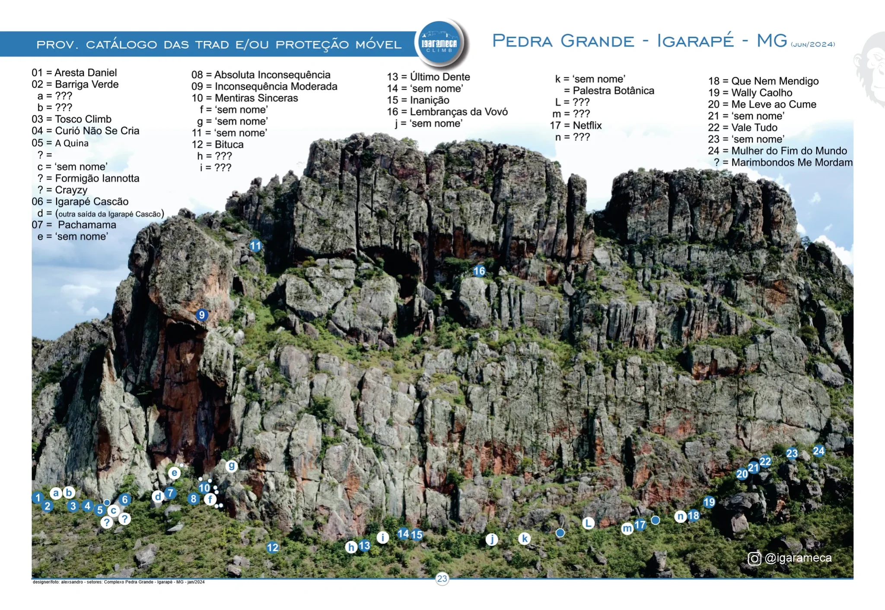
    - **largura_mapa**: 2048
    - **altura_mapa**: 1414
    - **pontos_de_interesse**:
      - **[0]**:
        - **id**: Bz1aVrdrsZEr6z
        - **uid**: Bz1aVrdrsZEr6z
        - **rotulo**: 01
        - **circulo**:
          - **x**: 88
          - **y**: 1153
          - **raio**: 14
        - **label**: 01
      - **[1]**:
        - **id**: 9NontZmdSc7wIz
        - **uid**: 9NontZmdSc7wIz
        - **rotulo**: a
        - **circulo**:
          - **x**: 130
          - **y**: 1144
          - **raio**: 14
        - **label**: a
      - **[2]**:
        - **id**: pK4rYNfDfVD4WG
        - **uid**: pK4rYNfDfVD4WG
        - **rotulo**: b
        - **circulo**:
          - **x**: 160
          - **y**: 1141
          - **raio**: 14
        - **label**: b
      - **[3]**:
        - **id**: 4F2cpOjkJHNtW5
        - **uid**: 4F2cpOjkJHNtW5
        - **rotulo**: 02
        - **circulo**:
          - **x**: 110
          - **y**: 1173
          - **raio**: 14
        - **label**: 02
      - **[4]**:
        - **id**: 0s59blOISy7jkJ
        - **uid**: 0s59blOISy7jkJ
        - **rotulo**: 03
        - **circulo**:
          - **x**: 169
          - **y**: 1173
          - **raio**: 15
        - **label**: 03
      - **[5]**:
        - **id**: wnqVy1nU7Hv30v
        - **uid**: wnqVy1nU7Hv30v
        - **rotulo**: 04
        - **circulo**:
          - **x**: 202
          - **y**: 1172
          - **raio**: 15
        - **label**: 04
      - **[6]**:
        - **id**: qWQLMjeZotg8qd
        - **uid**: qWQLMjeZotg8qd
        - **rotulo**: 05
        - **circulo**:
          - **x**: 231
          - **y**: 1183
          - **raio**: 14
        - **label**: 05
      - **[7]**:
        - **id**: uDPDBfEJD5pGih
        - **uid**: uDPDBfEJD5pGih
        - **rotulo**: c
        - **circulo**:
          - **x**: 263
          - **y**: 1184
          - **raio**: 14
        - **label**: c
      - **[8]**:
        - **id**: 82F2jTmBiGkWgp
        - **uid**: 82F2jTmBiGkWgp
        - **rotulo**: 06
        - **circulo**:
          - **x**: 289
          - **y**: 1158
          - **raio**: 14
        - **label**: 06
      - **[9]**:
        - **id**: 4U3XJkuhQJzJVk
        - **uid**: 4U3XJkuhQJzJVk
        - **rotulo**: d
        - **circulo**:
          - **x**: 366
          - **y**: 1151
          - **raio**: 14
        - **label**: d
      - **[10]**:
        - **id**: rfIbPxwvjByzyF
        - **uid**: rfIbPxwvjByzyF
        - **rotulo**: 07
        - **circulo**:
          - **x**: 395
          - **y**: 1142
          - **raio**: 14
        - **label**: 07
      - **[11]**:
        - **id**: NqmUX4Qzw8UWNK
        - **uid**: NqmUX4Qzw8UWNK
        - **rotulo**: e
        - **circulo**:
          - **x**: 404
          - **y**: 1096
          - **raio**: 14
        - **label**: e
      - **[12]**:
        - **id**: 81EjpfLcQlnDK3
        - **uid**: 81EjpfLcQlnDK3
        - **rotulo**: 08
        - **circulo**:
          - **x**: 448
          - **y**: 1157
          - **raio**: 14
        - **label**: 08
      - **[13]**:
        - **id**: qo8FXb752Yvepo
        - **uid**: qo8FXb752Yvepo
        - **rotulo**: f
        - **circulo**:
          - **x**: 487
          - **y**: 1157
          - **raio**: 14
        - **label**: f
      - **[14]**:
        - **id**: qdDQxPSP0ewUuM
        - **uid**: qdDQxPSP0ewUuM
        - **rotulo**: 10
        - **circulo**:
          - **x**: 473
          - **y**: 1131
          - **raio**: 14
        - **label**: 10
      - **[15]**:
        - **id**: wCgmWeIBgwhiZx
        - **uid**: wCgmWeIBgwhiZx
        - **rotulo**: g
        - **circulo**:
          - **x**: 536
          - **y**: 1081
          - **raio**: 14
        - **label**: g
      - **[16]**:
        - **id**: PgvQorRgXEMSV5
        - **uid**: PgvQorRgXEMSV5
        - **rotulo**: 11
        - **circulo**:
          - **x**: 592
          - **y**: 569
          - **raio**: 15
        - **label**: 11
      - **[17]**:
        - **id**: 9LYo75MzeKZJRZ
        - **uid**: 9LYo75MzeKZJRZ
        - **rotulo**: 16
        - **circulo**:
          - **x**: 1110
          - **y**: 628
          - **raio**: 15
        - **label**: 16
      - **[18]**:
        - **id**: wLQBmqGgaihdHy
        - **uid**: wLQBmqGgaihdHy
        - **rotulo**: 09
        - **circulo**:
          - **x**: 468
          - **y**: 730
          - **raio**: 14
        - **label**: 09
      - **[19]**:
        - **id**: IBrMdBTVkBUnbX
        - **uid**: IBrMdBTVkBUnbX
        - **rotulo**: 12
        - **circulo**:
          - **x**: 631
          - **y**: 1269
          - **raio**: 15
        - **label**: 12
      - **[20]**:
        - **id**: ctl8mSQl5rEKjz
        - **uid**: ctl8mSQl5rEKjz
        - **rotulo**: h
        - **circulo**:
          - **x**: 813
          - **y**: 1268
          - **raio**: 14
        - **label**: h
      - **[21]**:
        - **id**: YmwMcV09GTOZrD
        - **uid**: YmwMcV09GTOZrD
        - **rotulo**: 13
        - **circulo**:
          - **x**: 844
          - **y**: 1265
          - **raio**: 14
        - **label**: 13
      - **[22]**:
        - **id**: CiC4AlK9jAz1E1
        - **uid**: CiC4AlK9jAz1E1
        - **rotulo**: i
        - **circulo**:
          - **x**: 886
          - **y**: 1246
          - **raio**: 14
        - **label**: i
      - **[23]**:
        - **id**: absBrsztlqf9Ac
        - **uid**: absBrsztlqf9Ac
        - **rotulo**: 14
        - **circulo**:
          - **x**: 934
          - **y**: 1237
          - **raio**: 14
        - **label**: 14
      - **[24]**:
        - **id**: ltOn3VI0eIV98c
        - **uid**: ltOn3VI0eIV98c
        - **rotulo**: 15
        - **circulo**:
          - **x**: 965
          - **y**: 1239
          - **raio**: 15
        - **label**: 15
      - **[25]**:
        - **id**: rClv484uQDXQFm
        - **uid**: rClv484uQDXQFm
        - **rotulo**: j
        - **circulo**:
          - **x**: 1138
          - **y**: 1251
          - **raio**: 14
        - **label**: j
      - **[26]**:
        - **id**: YLACwBnZBkgFdm
        - **uid**: YLACwBnZBkgFdm
        - **rotulo**: k
        - **circulo**:
          - **x**: 1214
          - **y**: 1249
          - **raio**: 14
        - **label**: k
      - **[27]**:
        - **id**: tYVEgzI7qWcGYg
        - **uid**: tYVEgzI7qWcGYg
        - **rotulo**: 17
        - **circulo**:
          - **x**: 1481
          - **y**: 1216
          - **raio**: 14
        - **label**: 17
      - **[28]**:
        - **id**: sAW420qjj2pJ1l
        - **uid**: sAW420qjj2pJ1l
        - **rotulo**: m
        - **circulo**:
          - **x**: 1452
          - **y**: 1226
          - **raio**: 14
        - **label**: m
      - **[29]**:
        - **id**: Q3VFJiQRNy3uuv
        - **uid**: Q3VFJiQRNy3uuv
        - **rotulo**: n
        - **circulo**:
          - **x**: 1575
          - **y**: 1198
          - **raio**: 14
        - **label**: n
      - **[30]**:
        - **id**: 9EX1sSKxHuoeZt
        - **uid**: 9EX1sSKxHuoeZt
        - **rotulo**: 18
        - **circulo**:
          - **x**: 1606
          - **y**: 1195
          - **raio**: 14
        - **label**: 18
      - **[31]**:
        - **id**: hFAEicgfEwcDIw
        - **uid**: hFAEicgfEwcDIw
        - **rotulo**: 19
        - **circulo**:
          - **x**: 1641
          - **y**: 1164
          - **raio**: 14
        - **label**: 19
      - **[32]**:
        - **id**: v9Cqs4dusCQIcf
        - **uid**: v9Cqs4dusCQIcf
        - **rotulo**: 20
        - **circulo**:
          - **x**: 1717
          - **y**: 1098
          - **raio**: 14
        - **label**: 20
      - **[33]**:
        - **id**: iLM37GBpLxf7Yf
        - **uid**: iLM37GBpLxf7Yf
        - **rotulo**: 21
        - **circulo**:
          - **x**: 1744
          - **y**: 1084
          - **raio**: 14
        - **label**: 21
      - **[34]**:
        - **id**: UoyESJoyl2hJsz
        - **uid**: UoyESJoyl2hJsz
        - **rotulo**: 22
        - **circulo**:
          - **x**: 1771
          - **y**: 1069
          - **raio**: 15
        - **label**: 22
      - **[35]**:
        - **id**: 21Y6TcY8TkOlhC
        - **uid**: 21Y6TcY8TkOlhC
        - **rotulo**: 23
        - **circulo**:
          - **x**: 1833
          - **y**: 1051
          - **raio**: 15
        - **label**: 23
      - **[36]**:
        - **id**: M2SfNCILjk46Kg
        - **uid**: M2SfNCILjk46Kg
        - **rotulo**: 24
        - **circulo**:
          - **x**: 1895
          - **y**: 1045
          - **raio**: 15
        - **label**: 24
      - **[37]**:
        - **id**: N7fN7YJ6ifrwDe
        - **uid**: N7fN7YJ6ifrwDe
        - **rotulo**: L
        - **circulo**:
          - **x**: 1362
          - **y**: 1213
          - **raio**: 14
        - **label**: L
      - **[38]**:
        - **id**: IJHhc6fb1XYD6K
        - **uid**: IJHhc6fb1XYD6K
        - **rotulo**: ?
        - **circulo**:
          - **x**: 247
          - **y**: 1211
          - **raio**: 14
        - **cor**: 
        - **label**: ?
      - **[39]**:
        - **id**: FsqNbMoWXP7NUD
        - **uid**: FsqNbMoWXP7NUD
        - **rotulo**: ?
        - **circulo**:
          - **x**: 289
          - **y**: 1202
          - **raio**: 14
        - **cor**: 
        - **label**: ?
      - **[40]**:
        - **id**: JB75yuXtHNnG3p
        - **uid**: JB75yuXtHNnG3p
        - **rotulo**: ?
        - **retangulo**:
          - **x**: 1410
          - **y**: 211
          - **comprimento**: 223
          - **largura**: 30
        - **cor**: 
        - **label**: ?
    - **referencias**:
      - **[0]**:
        - **alvo_uid**: cJzFnD4vy9LxJP
        - **pontos_uids**:
          - Bz1aVrdrsZEr6z
        - **escalada**: Aresta Daniel
        - **ids**:
          - Bz1aVrdrsZEr6z
      - **[1]**:
        - **alvo_uid**: V5xoVSIHfWoEl8
        - **pontos_uids**:
          - 4F2cpOjkJHNtW5
        - **escalada**: Barriga Verde
        - **ids**:
          - 4F2cpOjkJHNtW5
      - **[2]**:
        - **alvo_uid**: 4S6JIEdOIBCpJq
        - **pontos_uids**:
          - 9NontZmdSc7wIz
        - **escalada**: Sem nome 1
        - **ids**:
          - 9NontZmdSc7wIz
      - **[3]**:
        - **alvo_uid**: C9yxTcMLdjxJsH
        - **pontos_uids**:
          - pK4rYNfDfVD4WG
        - **escalada**: Sem nome 2
        - **ids**:
          - pK4rYNfDfVD4WG
      - **[4]**:
        - **alvo_uid**: jEHP8PsRwzcu2U
        - **pontos_uids**:
          - 0s59blOISy7jkJ
        - **escalada**: Tosco Climb
        - **ids**:
          - 0s59blOISy7jkJ
      - **[5]**:
        - **alvo_uid**: LgVLPG8oOVAo4e
        - **pontos_uids**:
          - wnqVy1nU7Hv30v
        - **escalada**: Curió Não Se Cria
        - **ids**:
          - wnqVy1nU7Hv30v
      - **[6]**:
        - **alvo_uid**: IJzJWjgcEnN4P3
        - **pontos_uids**:
          - qWQLMjeZotg8qd
        - **escalada**: A Quina
        - **ids**:
          - qWQLMjeZotg8qd
      - **[7]**:
        - **alvo_uid**: 4Ub7yySD8FglcR
        - **pontos_uids**:
          - uDPDBfEJD5pGih
        - **escalada**: Sem nome 3
        - **ids**:
          - uDPDBfEJD5pGih
      - **[8]**:
        - **alvo_uid**: wPn9DzZAWC1rr2
        - **pontos_uids**:
          - 82F2jTmBiGkWgp
        - **escalada**: Igarapé Cascão
        - **ids**:
          - 82F2jTmBiGkWgp
      - **[9]**:
        - **alvo_uid**: fEB2sh15G6486N
        - **pontos_uids**:
          - 4U3XJkuhQJzJVk
        - **escalada**: Outra saída da Igarapé Cascão
        - **ids**:
          - 4U3XJkuhQJzJVk
      - **[10]**:
        - **alvo_uid**: LGdkbkKaNxAOvn
        - **pontos_uids**:
          - rfIbPxwvjByzyF
        - **escalada**: Pachamama
        - **ids**:
          - rfIbPxwvjByzyF
      - **[11]**:
        - **alvo_uid**: ptfuJ7GIDc9z9L
        - **pontos_uids**:
          - NqmUX4Qzw8UWNK
        - **escalada**: Sem nome 4
        - **ids**:
          - NqmUX4Qzw8UWNK
      - **[12]**:
        - **alvo_uid**: j5QN4QLvXRrZvZ
        - **pontos_uids**:
          - 81EjpfLcQlnDK3
        - **escalada**: Absoluta Inconsequência
        - **ids**:
          - 81EjpfLcQlnDK3
      - **[13]**:
        - **alvo_uid**: Z21mfAnWOTghPr
        - **pontos_uids**:
          - wLQBmqGgaihdHy
        - **escalada**: Inconsequência Moderada
        - **ids**:
          - wLQBmqGgaihdHy
      - **[14]**:
        - **alvo_uid**: urfzODjSBDwHyW
        - **pontos_uids**:
          - qdDQxPSP0ewUuM
        - **escalada**: Mentiras Sinceras
        - **ids**:
          - qdDQxPSP0ewUuM
      - **[15]**:
        - **alvo_uid**: l86Ex4CUGc4xcd
        - **pontos_uids**:
          - qo8FXb752Yvepo
        - **escalada**: Sem nome 5
        - **ids**:
          - qo8FXb752Yvepo
      - **[16]**:
        - **alvo_uid**: iuG0WV0DtLrDHz
        - **pontos_uids**:
          - wCgmWeIBgwhiZx
        - **escalada**: Sem nome 6
        - **ids**:
          - wCgmWeIBgwhiZx
      - **[17]**:
        - **alvo_uid**: 5Fo4KkUOgEv7bd
        - **pontos_uids**:
          - PgvQorRgXEMSV5
        - **escalada**: Sem nome 7
        - **ids**:
          - PgvQorRgXEMSV5
      - **[18]**:
        - **alvo_uid**: TaPw2ZU5wBy5fO
        - **pontos_uids**:
          - IBrMdBTVkBUnbX
        - **escalada**: Bituca
        - **ids**:
          - IBrMdBTVkBUnbX
      - **[19]**:
        - **alvo_uid**: y16FognxgkQaL3
        - **pontos_uids**:
          - ctl8mSQl5rEKjz
        - **escalada**: Sem nome 8
        - **ids**:
          - ctl8mSQl5rEKjz
      - **[20]**:
        - **alvo_uid**: YsJjNkcVBL4zWh
        - **pontos_uids**:
          - CiC4AlK9jAz1E1
        - **escalada**: Sem nome 9
        - **ids**:
          - CiC4AlK9jAz1E1
      - **[21]**:
        - **alvo_uid**: 4e42aZhkaZZRtX
        - **pontos_uids**:
          - YmwMcV09GTOZrD
        - **escalada**: Último Dente
        - **ids**:
          - YmwMcV09GTOZrD
      - **[22]**:
        - **alvo_uid**: 4ktVVgbiyGRs2C
        - **pontos_uids**:
          - absBrsztlqf9Ac
        - **escalada**: Sem nome 10
        - **ids**:
          - absBrsztlqf9Ac
      - **[23]**:
        - **alvo_uid**: APDpEygya3aOma
        - **pontos_uids**:
          - ltOn3VI0eIV98c
        - **escalada**: Inanição
        - **ids**:
          - ltOn3VI0eIV98c
      - **[24]**:
        - **alvo_uid**: p9UV2v115WdSxh
        - **pontos_uids**:
          - 9LYo75MzeKZJRZ
        - **escalada**: Lembranças da Vovó
        - **ids**:
          - 9LYo75MzeKZJRZ
      - **[25]**:
        - **alvo_uid**: IGGT1l93XFJXUt
        - **pontos_uids**:
          - rClv484uQDXQFm
        - **escalada**: Sem nome 11
        - **ids**:
          - rClv484uQDXQFm
      - **[26]**:
        - **alvo_uid**: sRZa1RAD2ESRfw
        - **pontos_uids**:
          - YLACwBnZBkgFdm
        - **escalada**: Sem nome 12
        - **ids**:
          - YLACwBnZBkgFdm
      - **[27]**:
        - **alvo_uid**: QJwA8nIF4Ya1FW
        - **pontos_uids**:
          - N7fN7YJ6ifrwDe
        - **escalada**: Sem nome 13
        - **ids**:
          - N7fN7YJ6ifrwDe
      - **[28]**:
        - **alvo_uid**: u12s6Vd53HFw2q
        - **pontos_uids**:
          - sAW420qjj2pJ1l
        - **escalada**: Sem nome 14
        - **ids**:
          - sAW420qjj2pJ1l
      - **[29]**:
        - **alvo_uid**: SOlYrlZ3Qpi2EX
        - **pontos_uids**:
          - tYVEgzI7qWcGYg
        - **escalada**: Netflix
        - **ids**:
          - tYVEgzI7qWcGYg
      - **[30]**:
        - **alvo_uid**: N1bYEhgUkAC9NZ
        - **pontos_uids**:
          - Q3VFJiQRNy3uuv
        - **escalada**: Sem nome 15
        - **ids**:
          - Q3VFJiQRNy3uuv
      - **[31]**:
        - **alvo_uid**: SStGB0zibsanRA
        - **pontos_uids**:
          - 9EX1sSKxHuoeZt
        - **escalada**: Que Nem Mendigo
        - **ids**:
          - 9EX1sSKxHuoeZt
      - **[32]**:
        - **alvo_uid**: MgOVsfrA1xXDIv
        - **pontos_uids**:
          - hFAEicgfEwcDIw
        - **escalada**: Wally Caolho
        - **ids**:
          - hFAEicgfEwcDIw
      - **[33]**:
        - **alvo_uid**: sQBuyJX4kDFb7M
        - **pontos_uids**:
          - v9Cqs4dusCQIcf
        - **escalada**: Me Leve ao Cume
        - **ids**:
          - v9Cqs4dusCQIcf
      - **[34]**:
        - **alvo_uid**: X0RRGSUeNEDYD9
        - **pontos_uids**:
          - iLM37GBpLxf7Yf
        - **escalada**: Sem nome 16
        - **ids**:
          - iLM37GBpLxf7Yf
      - **[35]**:
        - **alvo_uid**: MZkOXZeQpUaFHU
        - **pontos_uids**:
          - UoyESJoyl2hJsz
        - **escalada**: Vale Tudo
        - **ids**:
          - UoyESJoyl2hJsz
      - **[36]**:
        - **alvo_uid**: NlRdWMP6DPXWWe
        - **pontos_uids**:
          - 21Y6TcY8TkOlhC
        - **escalada**: Sem nome 17
        - **ids**:
          - 21Y6TcY8TkOlhC
      - **[37]**:
        - **alvo_uid**: ZJmlFH2ogAUj2F
        - **pontos_uids**:
          - M2SfNCILjk46Kg
        - **escalada**: Mulher do Fim do Mundo
        - **ids**:
          - M2SfNCILjk46Kg
      - **[38]**:
        - **alvo_uid**: iPXTXlrkPYDkC5
        - **pontos_uids**:
          - IJHhc6fb1XYD6K
        - **escalada**: Crayzy
        - **ids**:
          - IJHhc6fb1XYD6K
      - **[39]**:
        - **alvo_uid**: uwJWBAzBFzYiDs
        - **pontos_uids**:
          - FsqNbMoWXP7NUD
        - **escalada**: Formigão Iannotta
        - **ids**:
          - FsqNbMoWXP7NUD
      - **[40]**:
        - **alvo_uid**: UfUYeNCCgevN1k
        - **pontos_uids**:
          - JB75yuXtHNnG3p
        - **escalada**: Palestra Botânica
        - **ids**:
          - JB75yuXtHNnG3p
- **escaladas**:
  - **[0]**:
    - **uid**: cJzFnD4vy9LxJP
    - **via_movel**:
      - **descricao**: Via com marimbondos!!! INTERDITADA.
      - **nome**: Aresta Daniel
      - **dificuldade**: BR_6SUP
      - **exposicao**: E1
  - **[1]**:
    - **uid**: V5xoVSIHfWoEl8
    - **via_movel**:
      - **nome**: Barriga Verde
      - **dificuldade**: INDEFINIDO
  - **[2]**:
    - **uid**: 4S6JIEdOIBCpJq
    - **via_movel**:
      - **nome**: Sem nome 1
      - **dificuldade**: INDEFINIDO
  - **[3]**:
    - **uid**: C9yxTcMLdjxJsH
    - **via_movel**:
      - **nome**: Sem nome 2
      - **dificuldade**: INDEFINIDO
  - **[4]**:
    - **uid**: jEHP8PsRwzcu2U
    - **via_movel**:
      - **nome**: Tosco Climb
      - **dificuldade**: INDEFINIDO
  - **[5]**:
    - **uid**: LgVLPG8oOVAo4e
    - **via_movel**:
      - **nome**: Curió Não Se Cria
      - **dificuldade**: INDEFINIDO
  - **[6]**:
    - **uid**: IJzJWjgcEnN4P3
    - **via_movel**:
      - **nome**: A Quina
      - **dificuldade**: INDEFINIDO
  - **[7]**:
    - **uid**: 4Ub7yySD8FglcR
    - **via_movel**:
      - **nome**: Sem nome 3
      - **dificuldade**: INDEFINIDO
  - **[8]**:
    - **uid**: uwJWBAzBFzYiDs
    - **via_movel**:
      - **nome**: Formigão Iannotta
      - **dificuldade**: INDEFINIDO
  - **[9]**:
    - **uid**: iPXTXlrkPYDkC5
    - **via_movel**:
      - **nome**: Crayzy
      - **dificuldade**: INDEFINIDO
  - **[10]**:
    - **uid**: wPn9DzZAWC1rr2
    - **via_movel**:
      - **descricao**:
          Via com caminhada de volta do cume, não é necessário fazer rapel.
          
          Veja a trilha para voltar do cume da via de volta para a base: https://loc.wiki/t/162907398?wa=sc
      - **nome**: Igarapé Cascão
      - **dificuldade**: INDEFINIDO
  - **[11]**:
    - **uid**: fEB2sh15G6486N
    - **via_movel**:
      - **descricao**:
          Via com caminhada de volta do cume, não é necessário fazer rapel.
          
          Veja a trilha para voltar do cume da via de volta para a base: https://loc.wiki/t/162907398?wa=sc
      - **nome**: Outra saída da Igarapé Cascão
      - **dificuldade**: INDEFINIDO
  - **[12]**:
    - **uid**: LGdkbkKaNxAOvn
    - **via_movel**:
      - **descricao**:
          Via com caminhada de volta do cume, não é necessário fazer rapel.
          
          Veja a trilha para voltar do cume da via de volta para a base: https://loc.wiki/t/162907398?wa=sc
      - **nome**: Pachamama
      - **dificuldade**: INDEFINIDO
  - **[13]**:
    - **uid**: ptfuJ7GIDc9z9L
    - **via_movel**:
      - **nome**: Sem nome 4
      - **dificuldade**: INDEFINIDO
  - **[14]**:
    - **uid**: j5QN4QLvXRrZvZ
    - **via_movel**:
      - **nome**: Absoluta Inconsequência
      - **dificuldade**: INDEFINIDO
  - **[15]**:
    - **uid**: Z21mfAnWOTghPr
    - **via_movel**:
      - **nome**: Inconsequência Moderada
      - **dificuldade**: INDEFINIDO
  - **[16]**:
    - **uid**: urfzODjSBDwHyW
    - **via_movel**:
      - **nome**: Mentiras Sinceras
      - **dificuldade**: INDEFINIDO
  - **[17]**:
    - **uid**: l86Ex4CUGc4xcd
    - **via_movel**:
      - **nome**: Sem nome 5
      - **dificuldade**: INDEFINIDO
  - **[18]**:
    - **uid**: iuG0WV0DtLrDHz
    - **via_movel**:
      - **nome**: Sem nome 6
      - **dificuldade**: INDEFINIDO
  - **[19]**:
    - **uid**: 5Fo4KkUOgEv7bd
    - **via_movel**:
      - **nome**: Sem nome 7
      - **dificuldade**: INDEFINIDO
  - **[20]**:
    - **uid**: TaPw2ZU5wBy5fO
    - **via_movel**:
      - **nome**: Bituca
      - **dificuldade**: INDEFINIDO
  - **[21]**:
    - **uid**: y16FognxgkQaL3
    - **via_movel**:
      - **nome**: Sem nome 8
      - **dificuldade**: INDEFINIDO
  - **[22]**:
    - **uid**: YsJjNkcVBL4zWh
    - **via_movel**:
      - **nome**: Sem nome 9
      - **dificuldade**: INDEFINIDO
  - **[23]**:
    - **uid**: 4e42aZhkaZZRtX
    - **via_movel**:
      - **nome**: Último Dente
      - **dificuldade**: INDEFINIDO
  - **[24]**:
    - **uid**: 4ktVVgbiyGRs2C
    - **via_movel**:
      - **nome**: Sem nome 10
      - **dificuldade**: INDEFINIDO
  - **[25]**:
    - **uid**: APDpEygya3aOma
    - **via_movel**:
      - **nome**: Inanição
      - **dificuldade**: INDEFINIDO
  - **[26]**:
    - **uid**: p9UV2v115WdSxh
    - **via_movel**:
      - **nome**: Lembranças da Vovó
      - **dificuldade**: INDEFINIDO
  - **[27]**:
    - **uid**: IGGT1l93XFJXUt
    - **via_movel**:
      - **nome**: Sem nome 11
      - **dificuldade**: INDEFINIDO
  - **[28]**:
    - **uid**: sRZa1RAD2ESRfw
    - **via_movel**:
      - **nome**: Sem nome 12
      - **dificuldade**: INDEFINIDO
  - **[29]**:
    - **uid**: UfUYeNCCgevN1k
    - **via_movel**:
      - **nome**: Palestra Botânica
      - **dificuldade**: INDEFINIDO
  - **[30]**:
    - **uid**: QJwA8nIF4Ya1FW
    - **via_movel**:
      - **nome**: Sem nome 13
      - **dificuldade**: INDEFINIDO
  - **[31]**:
    - **uid**: u12s6Vd53HFw2q
    - **via_movel**:
      - **nome**: Sem nome 14
      - **dificuldade**: INDEFINIDO
  - **[32]**:
    - **uid**: SOlYrlZ3Qpi2EX
    - **via_movel**:
      - **nome**: Netflix
      - **dificuldade**: INDEFINIDO
  - **[33]**:
    - **uid**: N1bYEhgUkAC9NZ
    - **via_movel**:
      - **nome**: Sem nome 15
      - **dificuldade**: INDEFINIDO
  - **[34]**:
    - **uid**: SStGB0zibsanRA
    - **via_movel**:
      - **nome**: Que Nem Mendigo
      - **dificuldade**: INDEFINIDO
  - **[35]**:
    - **uid**: MgOVsfrA1xXDIv
    - **via_movel**:
      - **nome**: Wally Caolho
      - **dificuldade**: INDEFINIDO
  - **[36]**:
    - **uid**: sQBuyJX4kDFb7M
    - **via_movel**:
      - **descricao**:
          Trilha principal para a via no WikiLoc: https://loc.wiki/t/142136363?wa=sc
          
          Trilha alternativa pelo setor Sherpa (pode estar mais sujo / com mais mato): https://loc.wiki/t/255009916?wa=sc
      - **nome**: Me Leve ao Cume
      - **dificuldade**: BR_6
  - **[37]**:
    - **uid**: X0RRGSUeNEDYD9
    - **via_movel**:
      - **nome**: Sem nome 16
      - **dificuldade**: INDEFINIDO
  - **[38]**:
    - **uid**: MZkOXZeQpUaFHU
    - **via_movel**:
      - **nome**: Vale Tudo
      - **dificuldade**: INDEFINIDO
  - **[39]**:
    - **uid**: NlRdWMP6DPXWWe
    - **via_movel**:
      - **nome**: Sem nome 17
      - **dificuldade**: INDEFINIDO
  - **[40]**:
    - **uid**: ZJmlFH2ogAUj2F
    - **via_movel**:
      - **nome**: Mulher do Fim do Mundo
      - **dificuldade**: INDEFINIDO
- **precomputados**:
  - **total_escaladas**: 41

## Parte: grupo_estacionamento (não listada em partes.json)

### Grupo (Pico: Complexo Pedra Grande)

- **descricao**: 
- **nome**: Setor Estacionamento
- **uid**: hv7YWgTBQGyWOX
- **setores**:
  - **[0]**:
    - **conteudo**:
      - **descricao**: O setor fica na lateral da estrada, ao lado do estacionamento da trilha para a Pedra Grande. A via "Route Setter" e a via "Teto Preto" compartilham as primeiras chapas na saída. Lado esquerdo setor tem sombra após 11h, e o lado direito sombra até 10h.
      - **nome**: Estacionamento - Esportivas
      - **uid**: SS5kn15JBXfnej
      - **mapas**:
        - **[0]**:
          - **caminho_imagem_mapa**: 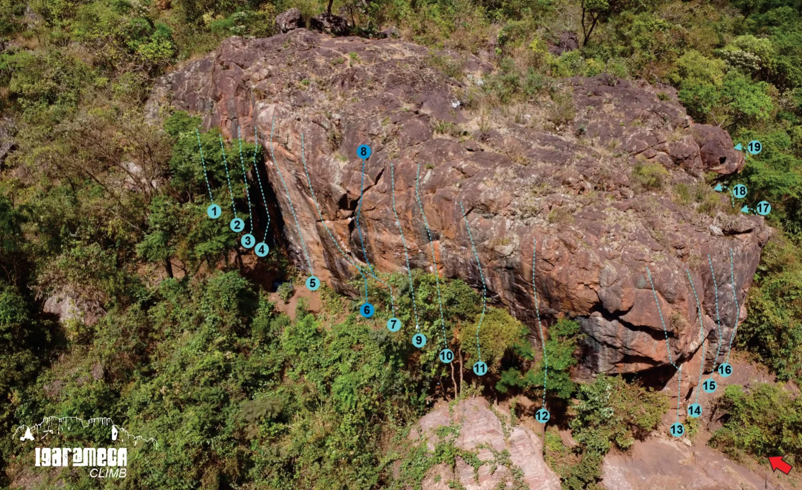
          - **largura_mapa**: 1995
          - **altura_mapa**: 1222
          - **pontos_de_interesse**:
            - **[0]**:
              - **id**: gqZzpAlWcDpqnw
              - **uid**: gqZzpAlWcDpqnw
              - **rotulo**: 01
              - **circulo**:
                - **x**: 533
                - **y**: 527
                - **raio**: 17
              - **label**: 01
            - **[1]**:
              - **id**: UJvvcOUffSyc5O
              - **uid**: UJvvcOUffSyc5O
              - **rotulo**: 02
              - **circulo**:
                - **x**: 590
                - **y**: 561
                - **raio**: 17
              - **label**: 02
            - **[2]**:
              - **id**: 1nwE8ZBQFTVwbu
              - **uid**: 1nwE8ZBQFTVwbu
              - **rotulo**: 03
              - **circulo**:
                - **x**: 617
                - **y**: 601
                - **raio**: 17
              - **label**: 03
            - **[3]**:
              - **id**: 6CsxjMVDNWLvmF
              - **uid**: 6CsxjMVDNWLvmF
              - **rotulo**: 04
              - **circulo**:
                - **x**: 651
                - **y**: 623
                - **raio**: 17
              - **label**: 04
            - **[4]**:
              - **id**: 9RaQoPJNVuWYlv
              - **uid**: 9RaQoPJNVuWYlv
              - **rotulo**: 05
              - **circulo**:
                - **x**: 778
                - **y**: 706
                - **raio**: 17
              - **label**: 05
            - **[5]**:
              - **id**: lB3dIwg2CLaFMS
              - **uid**: lB3dIwg2CLaFMS
              - **rotulo**: 08
              - **circulo**:
                - **x**: 905
                - **y**: 377
                - **raio**: 18
              - **label**: 08
            - **[6]**:
              - **id**: 7HQfAUrXFcisN2
              - **uid**: 7HQfAUrXFcisN2
              - **rotulo**: 06
              - **circulo**:
                - **x**: 913
                - **y**: 774
                - **raio**: 18
              - **label**: 06
            - **[7]**:
              - **id**: 3RzWrlTq9BOxI3
              - **uid**: 3RzWrlTq9BOxI3
              - **rotulo**: 07
              - **circulo**:
                - **x**: 980
                - **y**: 809
                - **raio**: 17
              - **label**: 07
            - **[8]**:
              - **id**: 1E9kN0aLlSPuYy
              - **uid**: 1E9kN0aLlSPuYy
              - **rotulo**: 09
              - **circulo**:
                - **x**: 1043
                - **y**: 849
                - **raio**: 17
              - **label**: 09
            - **[9]**:
              - **id**: YAZiYat2DlsVLU
              - **uid**: YAZiYat2DlsVLU
              - **rotulo**: 10
              - **circulo**:
                - **x**: 1111
                - **y**: 888
                - **raio**: 17
              - **label**: 10
            - **[10]**:
              - **id**: WJim9kSnegxcUM
              - **uid**: WJim9kSnegxcUM
              - **rotulo**: 11
              - **circulo**:
                - **x**: 1195
                - **y**: 918
                - **raio**: 17
              - **label**: 11
            - **[11]**:
              - **id**: UG3G73VSH9Y8t7
              - **uid**: UG3G73VSH9Y8t7
              - **rotulo**: 12
              - **circulo**:
                - **x**: 1349
                - **y**: 1037
                - **raio**: 17
              - **label**: 12
            - **[12]**:
              - **id**: WPQtEVTT4862Ig
              - **uid**: WPQtEVTT4862Ig
              - **rotulo**: 13
              - **circulo**:
                - **x**: 1684
                - **y**: 1071
                - **raio**: 17
              - **label**: 13
            - **[13]**:
              - **id**: WMrxDw8byqJF44
              - **uid**: WMrxDw8byqJF44
              - **rotulo**: 14
              - **circulo**:
                - **x**: 1729
                - **y**: 1024
                - **raio**: 17
              - **label**: 14
            - **[14]**:
              - **id**: 13vkXOg8Hhimo8
              - **uid**: 13vkXOg8Hhimo8
              - **rotulo**: 15
              - **circulo**:
                - **x**: 1765
                - **y**: 963
                - **raio**: 17
              - **label**: 15
            - **[15]**:
              - **id**: OQU7FBYJHlxY3b
              - **uid**: OQU7FBYJHlxY3b
              - **rotulo**: 16
              - **circulo**:
                - **x**: 1804
                - **y**: 923
                - **raio**: 17
              - **label**: 16
            - **[16]**:
              - **id**: uBntOlGwCBNlMR
              - **uid**: uBntOlGwCBNlMR
              - **rotulo**: 18
              - **circulo**:
                - **x**: 1840
                - **y**: 476
                - **raio**: 17
              - **label**: 18
            - **[17]**:
              - **id**: lmQ5HSsmuAAMT4
              - **uid**: lmQ5HSsmuAAMT4
              - **rotulo**: 19
              - **circulo**:
                - **x**: 1877
                - **y**: 367
                - **raio**: 17
              - **label**: 19
            - **[18]**:
              - **id**: Sj3poHldXM1kBA
              - **uid**: Sj3poHldXM1kBA
              - **rotulo**: 17
              - **circulo**:
                - **x**: 1901
                - **y**: 519
                - **raio**: 17
              - **label**: 17
          - **referencias**:
            - **[0]**:
              - **alvo_uid**: SvpYGaIypqXVaJ
              - **pontos_uids**:
                - gqZzpAlWcDpqnw
              - **escalada**: Bacon com Linguiça
              - **ids**:
                - gqZzpAlWcDpqnw
            - **[1]**:
              - **alvo_uid**: u3SqsRBblkUIBQ
              - **pontos_uids**:
                - UJvvcOUffSyc5O
              - **escalada**: Quatchú
              - **ids**:
                - UJvvcOUffSyc5O
            - **[2]**:
              - **alvo_uid**: J0WtO3cd9ir4t6
              - **pontos_uids**:
                - 1nwE8ZBQFTVwbu
              - **escalada**: Xoquito
              - **ids**:
                - 1nwE8ZBQFTVwbu
            - **[3]**:
              - **alvo_uid**: rgYplkzcRHID1A
              - **pontos_uids**:
                - 6CsxjMVDNWLvmF
              - **escalada**: Slow Motion
              - **ids**:
                - 6CsxjMVDNWLvmF
            - **[4]**:
              - **alvo_uid**: Q9233O9pjDa0nG
              - **pontos_uids**:
                - 9RaQoPJNVuWYlv
              - **escalada**: Berbaridade Máxima
              - **ids**:
                - 9RaQoPJNVuWYlv
            - **[5]**:
              - **alvo_uid**: MzyNYgbtGPyAxz
              - **pontos_uids**:
                - 7HQfAUrXFcisN2
              - **escalada**: Cirque du Soleil
              - **ids**:
                - 7HQfAUrXFcisN2
            - **[6]**:
              - **alvo_uid**: CAU2HdknKsAFjY
              - **pontos_uids**:
                - 3RzWrlTq9BOxI3
              - **escalada**: Route Setter
              - **ids**:
                - 3RzWrlTq9BOxI3
            - **[7]**:
              - **alvo_uid**: OD3hodezGpb6tL
              - **pontos_uids**:
                - YAZiYat2DlsVLU
              - **escalada**: Fúria de Titãs
              - **ids**:
                - YAZiYat2DlsVLU
            - **[8]**:
              - **alvo_uid**: NcnwXSx5hJxEpA
              - **pontos_uids**:
                - WJim9kSnegxcUM
              - **escalada**: Prima Donna
              - **ids**:
                - WJim9kSnegxcUM
            - **[9]**:
              - **alvo_uid**: erUMGs5lTxpW6m
              - **pontos_uids**:
                - UG3G73VSH9Y8t7
              - **escalada**: Dama de Ferro
              - **ids**:
                - UG3G73VSH9Y8t7
            - **[10]**:
              - **alvo_uid**: qJgBRFSjkInmIw
              - **pontos_uids**:
                - WPQtEVTT4862Ig
              - **escalada**: Primeira de Todas
              - **ids**:
                - WPQtEVTT4862Ig
            - **[11]**:
              - **alvo_uid**: yCEONmu5NJpeLH
              - **pontos_uids**:
                - WMrxDw8byqJF44
              - **escalada**: Brinco de Odalisca
              - **ids**:
                - WMrxDw8byqJF44
            - **[12]**:
              - **alvo_uid**: CiDBGkwAx09rVo
              - **pontos_uids**:
                - 13vkXOg8Hhimo8
              - **escalada**: 10%
              - **ids**:
                - 13vkXOg8Hhimo8
            - **[13]**:
              - **alvo_uid**: SIM0d3tPnCRovg
              - **pontos_uids**:
                - OQU7FBYJHlxY3b
              - **escalada**: Quebra Tudo
              - **ids**:
                - OQU7FBYJHlxY3b
            - **[14]**:
              - **alvo_uid**: po16Yv24rTyjjE
              - **pontos_uids**:
                - Sj3poHldXM1kBA
              - **escalada**: Acorrentado
              - **ids**:
                - Sj3poHldXM1kBA
            - **[15]**:
              - **alvo_uid**: 71bGb40IDDqCqL
              - **pontos_uids**:
                - uBntOlGwCBNlMR
              - **escalada**: Fidefenda
              - **ids**:
                - uBntOlGwCBNlMR
            - **[16]**:
              - **alvo_uid**: GaMGRAJtWpO9tq
              - **pontos_uids**:
                - lmQ5HSsmuAAMT4
              - **escalada**: Cochyna Blue
              - **ids**:
                - lmQ5HSsmuAAMT4
            - **[17]**:
              - **alvo_uid**: 07pscabGabeyhu
              - **pontos_uids**:
                - lB3dIwg2CLaFMS
              - **escalada**: Teto Preto
              - **ids**:
                - lB3dIwg2CLaFMS
            - **[18]**:
              - **alvo_uid**: aRYxrZmlUwG61o
              - **pontos_uids**:
                - 1E9kN0aLlSPuYy
              - **escalada**: 101 Dalmatas
              - **ids**:
                - 1E9kN0aLlSPuYy
        - **[1]**:
          - **caminho_imagem_mapa**: 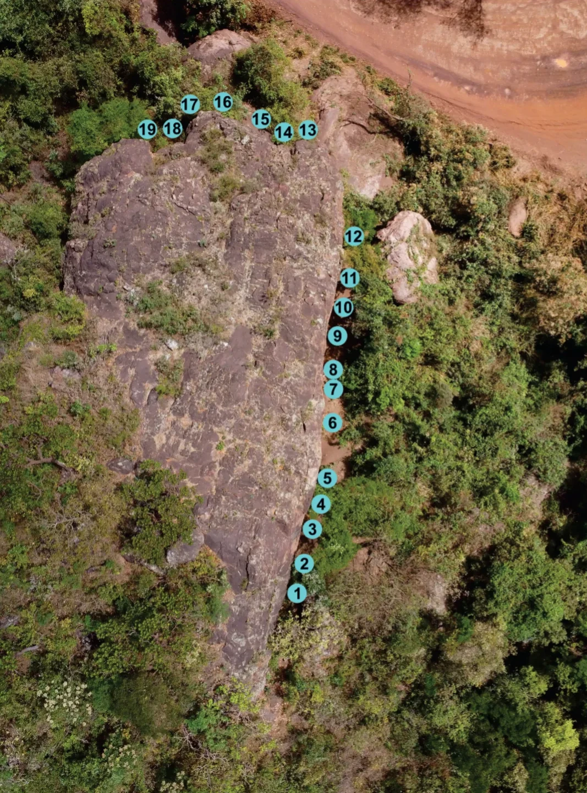
          - **largura_mapa**: 1067
          - **altura_mapa**: 1440
          - **pontos_de_interesse**:
            - **[0]**:
              - **id**: 0wEF0XnFS9ERUt
              - **uid**: 0wEF0XnFS9ERUt
              - **rotulo**: 17
              - **circulo**:
                - **x**: 346
                - **y**: 189
                - **raio**: 17
              - **label**: 17
            - **[1]**:
              - **id**: 46eqULlOCvT6D5
              - **uid**: 46eqULlOCvT6D5
              - **rotulo**: 16
              - **circulo**:
                - **x**: 406
                - **y**: 185
                - **raio**: 18
              - **label**: 16
            - **[2]**:
              - **id**: jp513vCbGzwtTd
              - **uid**: jp513vCbGzwtTd
              - **rotulo**: 15
              - **circulo**:
                - **x**: 475
                - **y**: 216
                - **raio**: 18
              - **label**: 15
            - **[3]**:
              - **id**: xGtMm2uQzyH8bW
              - **uid**: xGtMm2uQzyH8bW
              - **rotulo**: 19
              - **circulo**:
                - **x**: 269
                - **y**: 235
                - **raio**: 17
              - **label**: 19
            - **[4]**:
              - **id**: jubPKv97I4hY0r
              - **uid**: jubPKv97I4hY0r
              - **rotulo**: 18
              - **circulo**:
                - **x**: 314
                - **y**: 233
                - **raio**: 17
              - **label**: 18
            - **[5]**:
              - **id**: pcy04Q9g9rk4xR
              - **uid**: pcy04Q9g9rk4xR
              - **rotulo**: 14
              - **circulo**:
                - **x**: 516
                - **y**: 240
                - **raio**: 17
              - **label**: 14
            - **[6]**:
              - **id**: R7HxClQ8VPvZFS
              - **uid**: R7HxClQ8VPvZFS
              - **rotulo**: 13
              - **circulo**:
                - **x**: 560
                - **y**: 236
                - **raio**: 18
              - **label**: 13
            - **[7]**:
              - **id**: pq5OcwhTIWgNaS
              - **uid**: pq5OcwhTIWgNaS
              - **rotulo**: 12
              - **circulo**:
                - **x**: 644
                - **y**: 429
                - **raio**: 17
              - **label**: 12
            - **[8]**:
              - **id**: fK6nH6d0QUFmlx
              - **uid**: fK6nH6d0QUFmlx
              - **rotulo**: 11
              - **circulo**:
                - **x**: 636
                - **y**: 505
                - **raio**: 17
              - **label**: 11
            - **[9]**:
              - **id**: UcOZ88YLladJpN
              - **uid**: UcOZ88YLladJpN
              - **rotulo**: 10
              - **circulo**:
                - **x**: 625
                - **y**: 558
                - **raio**: 17
              - **label**: 10
            - **[10]**:
              - **id**: tm0n9STQuvFdut
              - **uid**: tm0n9STQuvFdut
              - **rotulo**: 09
              - **circulo**:
                - **x**: 614
                - **y**: 610
                - **raio**: 17
              - **label**: 09
            - **[11]**:
              - **id**: 5pQUowxSiO0u71
              - **uid**: 5pQUowxSiO0u71
              - **rotulo**: 08
              - **circulo**:
                - **x**: 606
                - **y**: 671
                - **raio**: 17
              - **label**: 08
            - **[12]**:
              - **id**: jcz6DQ5tDMrzLk
              - **uid**: jcz6DQ5tDMrzLk
              - **rotulo**: 07
              - **circulo**:
                - **x**: 606
                - **y**: 707
                - **raio**: 17
              - **label**: 07
            - **[13]**:
              - **id**: bMQ3kd7ptbSOKC
              - **uid**: bMQ3kd7ptbSOKC
              - **rotulo**: 06
              - **circulo**:
                - **x**: 604
                - **y**: 768
                - **raio**: 17
              - **label**: 06
            - **[14]**:
              - **id**: jU6IhYTaz9HSYN
              - **uid**: jU6IhYTaz9HSYN
              - **rotulo**: 05
              - **circulo**:
                - **x**: 595
                - **y**: 868
                - **raio**: 17
              - **label**: 05
            - **[15]**:
              - **id**: OEjQyz7DVHdCvl
              - **uid**: OEjQyz7DVHdCvl
              - **rotulo**: 04
              - **circulo**:
                - **x**: 584
                - **y**: 915
                - **raio**: 17
              - **label**: 04
            - **[16]**:
              - **id**: yKPRjByuvZAADK
              - **uid**: yKPRjByuvZAADK
              - **rotulo**: 03
              - **circulo**:
                - **x**: 569
                - **y**: 961
                - **raio**: 17
              - **label**: 03
            - **[17]**:
              - **id**: 7wZMeEUihWJyKj
              - **uid**: 7wZMeEUihWJyKj
              - **rotulo**: 02
              - **circulo**:
                - **x**: 553
                - **y**: 1024
                - **raio**: 17
              - **label**: 02
            - **[18]**:
              - **id**: qOOsqb6VB9YPVo
              - **uid**: qOOsqb6VB9YPVo
              - **rotulo**: 01
              - **circulo**:
                - **x**: 541
                - **y**: 1077
                - **raio**: 17
              - **label**: 01
          - **referencias**:
            - **[0]**:
              - **alvo_uid**: SvpYGaIypqXVaJ
              - **pontos_uids**:
                - qOOsqb6VB9YPVo
              - **escalada**: Bacon com Linguiça
              - **ids**:
                - qOOsqb6VB9YPVo
            - **[1]**:
              - **alvo_uid**: u3SqsRBblkUIBQ
              - **pontos_uids**:
                - 7wZMeEUihWJyKj
              - **escalada**: Quatchú
              - **ids**:
                - 7wZMeEUihWJyKj
            - **[2]**:
              - **alvo_uid**: J0WtO3cd9ir4t6
              - **pontos_uids**:
                - yKPRjByuvZAADK
              - **escalada**: Xoquito
              - **ids**:
                - yKPRjByuvZAADK
            - **[3]**:
              - **alvo_uid**: rgYplkzcRHID1A
              - **pontos_uids**:
                - OEjQyz7DVHdCvl
              - **escalada**: Slow Motion
              - **ids**:
                - OEjQyz7DVHdCvl
            - **[4]**:
              - **alvo_uid**: Q9233O9pjDa0nG
              - **pontos_uids**:
                - jU6IhYTaz9HSYN
              - **escalada**: Berbaridade Máxima
              - **ids**:
                - jU6IhYTaz9HSYN
            - **[5]**:
              - **alvo_uid**: MzyNYgbtGPyAxz
              - **pontos_uids**:
                - bMQ3kd7ptbSOKC
              - **escalada**: Cirque du Soleil
              - **ids**:
                - bMQ3kd7ptbSOKC
            - **[6]**:
              - **alvo_uid**: CAU2HdknKsAFjY
              - **pontos_uids**:
                - jcz6DQ5tDMrzLk
              - **escalada**: Route Setter
              - **ids**:
                - jcz6DQ5tDMrzLk
            - **[7]**:
              - **alvo_uid**: OD3hodezGpb6tL
              - **pontos_uids**:
                - UcOZ88YLladJpN
              - **escalada**: Fúria de Titãs
              - **ids**:
                - UcOZ88YLladJpN
            - **[8]**:
              - **alvo_uid**: NcnwXSx5hJxEpA
              - **pontos_uids**:
                - fK6nH6d0QUFmlx
              - **escalada**: Prima Donna
              - **ids**:
                - fK6nH6d0QUFmlx
            - **[9]**:
              - **alvo_uid**: erUMGs5lTxpW6m
              - **pontos_uids**:
                - pq5OcwhTIWgNaS
              - **escalada**: Dama de Ferro
              - **ids**:
                - pq5OcwhTIWgNaS
            - **[10]**:
              - **alvo_uid**: qJgBRFSjkInmIw
              - **pontos_uids**:
                - R7HxClQ8VPvZFS
              - **escalada**: Primeira de Todas
              - **ids**:
                - R7HxClQ8VPvZFS
            - **[11]**:
              - **alvo_uid**: yCEONmu5NJpeLH
              - **pontos_uids**:
                - pcy04Q9g9rk4xR
              - **escalada**: Brinco de Odalisca
              - **ids**:
                - pcy04Q9g9rk4xR
            - **[12]**:
              - **alvo_uid**: CiDBGkwAx09rVo
              - **pontos_uids**:
                - jp513vCbGzwtTd
              - **escalada**: 10%
              - **ids**:
                - jp513vCbGzwtTd
            - **[13]**:
              - **alvo_uid**: SIM0d3tPnCRovg
              - **pontos_uids**:
                - 46eqULlOCvT6D5
              - **escalada**: Quebra Tudo
              - **ids**:
                - 46eqULlOCvT6D5
            - **[14]**:
              - **alvo_uid**: po16Yv24rTyjjE
              - **pontos_uids**:
                - 0wEF0XnFS9ERUt
              - **escalada**: Acorrentado
              - **ids**:
                - 0wEF0XnFS9ERUt
            - **[15]**:
              - **alvo_uid**: 71bGb40IDDqCqL
              - **pontos_uids**:
                - jubPKv97I4hY0r
              - **escalada**: Fidefenda
              - **ids**:
                - jubPKv97I4hY0r
            - **[16]**:
              - **alvo_uid**: GaMGRAJtWpO9tq
              - **pontos_uids**:
                - xGtMm2uQzyH8bW
              - **escalada**: Cochyna Blue
              - **ids**:
                - xGtMm2uQzyH8bW
            - **[17]**:
              - **alvo_uid**: 07pscabGabeyhu
              - **pontos_uids**:
                - 5pQUowxSiO0u71
              - **escalada**: Teto Preto
              - **ids**:
                - 5pQUowxSiO0u71
            - **[18]**:
              - **alvo_uid**: aRYxrZmlUwG61o
              - **pontos_uids**:
                - tm0n9STQuvFdut
              - **escalada**: 101 Dalmatas
              - **ids**:
                - tm0n9STQuvFdut
      - **escaladas**:
        - **[0]**:
          - **uid**: SvpYGaIypqXVaJ
          - **via_esportiva**:
            - **nome**: Bacon com Linguiça
            - **dificuldade**: BR_6SUP
            - **quantidade_protecoes_intermediarias**: 2
            - **quantidade_protecoes_parada**: 2
            - **extensao**: 8
            - **conquistadores**:
              - Berbari
              - Chinha
              - Pauleti
            - **data_abertura**: 2006
        - **[1]**:
          - **uid**: u3SqsRBblkUIBQ
          - **via_esportiva**:
            - **nome**: Quatchú
            - **dificuldade**: BR_8A
            - **quantidade_protecoes_intermediarias**: 2
            - **quantidade_protecoes_parada**: 2
            - **extensao**: 9
            - **conquistadores**:
              - Berbari
              - Ró
              - Chinha
            - **data_abertura**: 2006
        - **[2]**:
          - **uid**: J0WtO3cd9ir4t6
          - **via_esportiva**:
            - **nome**: Xoquito
            - **dificuldade**: BR_8B
            - **quantidade_protecoes_intermediarias**: 3
            - **quantidade_protecoes_parada**: 2
            - **extensao**: 10
            - **conquistadores**:
              - Berbari
              - Chinha
              - Ró
            - **data_abertura**: 2006
        - **[3]**:
          - **uid**: rgYplkzcRHID1A
          - **via_esportiva**:
            - **nome**: Slow Motion
            - **dificuldade**: BR_8B
            - **quantidade_protecoes_intermediarias**: 5
            - **quantidade_protecoes_parada**: 2
            - **extensao**: 12
            - **conquistadores**:
              - Berbari
              - Chinha
              - Ró
              - Toninho
            - **data_abertura**: 2023
        - **[4]**:
          - **uid**: Q9233O9pjDa0nG
          - **via_esportiva**:
            - **nome**: Berbaridade Máxima
            - **dificuldade**: BR_8C
            - **quantidade_protecoes_intermediarias**: 8
            - **quantidade_protecoes_parada**: 2
            - **extensao**: 14
            - **conquistadores**:
              - Berbari
              - Toninho
              - Chinha
            - **data_abertura**: 2023
        - **[5]**:
          - **uid**: MzyNYgbtGPyAxz
          - **via_esportiva**:
            - **nome**: Cirque du Soleil
            - **dificuldade**: BR_9B
            - **quantidade_protecoes_intermediarias**: 5
            - **quantidade_protecoes_parada**: 2
            - **extensao**: 14
            - **conquistadores**:
              - Berbari
              - Chinha
              - Ró
              - Moleza
            - **data_abertura**: 2010
        - **[6]**:
          - **uid**: CAU2HdknKsAFjY
          - **via_esportiva**:
            - **descricao**: Finaliza na via 06 (Cirque du Soleil).
            - **nome**: Route Setter
            - **dificuldade**: BR_9A
            - **quantidade_protecoes_intermediarias**: 6
            - **quantidade_protecoes_parada**: 2
            - **extensao**: 15
            - **conquistadores**:
              - Berbari
              - Ró
            - **data_abertura**: 2010
        - **[7]**:
          - **uid**: 07pscabGabeyhu
          - **via_esportiva**:
            - **descricao**: Saída na via 07 (Route Setter).
            - **nome**: Teto Preto
            - **dificuldade**: BR_8B
            - **quantidade_protecoes_intermediarias**: 8
            - **quantidade_protecoes_parada**: 2
            - **extensao**: 14
            - **conquistadores**:
              - Berbari
              - Chinha
            - **data_abertura**: 2023
        - **[8]**:
          - **uid**: aRYxrZmlUwG61o
          - **via_esportiva**:
            - **nome**: 101 Dalmatas
            - **dificuldade**: BR_8A
            - **quantidade_protecoes_intermediarias**: 4
            - **quantidade_protecoes_parada**: 2
            - **extensao**: 13
            - **conquistadores**:
              - Berbari
              - Chinha
            - **data_abertura**: 2023
        - **[9]**:
          - **uid**: OD3hodezGpb6tL
          - **via_esportiva**:
            - **nome**: Fúria de Titãs
            - **dificuldade**: BR_10A
            - **quantidade_protecoes_intermediarias**: 4
            - **quantidade_protecoes_parada**: 2
            - **extensao**: 13
            - **conquistadores**:
              - Berbari
              - Chinha
              - Toninho
              - Ró
            - **data_abertura**: 2010
        - **[10]**:
          - **uid**: NcnwXSx5hJxEpA
          - **via_esportiva**:
            - **nome**: Prima Donna
            - **dificuldade**: BR_10A
            - **quantidade_protecoes_intermediarias**: 4
            - **quantidade_protecoes_parada**: 2
            - **extensao**: 12
            - **conquistadores**:
              - Berbari
              - Chinha
              - Toninho
              - Bunitin
            - **data_abertura**: 2023
        - **[11]**:
          - **uid**: erUMGs5lTxpW6m
          - **via_esportiva**:
            - **nome**: Dama de Ferro
            - **dificuldade**: BR_10C
            - **quantidade_protecoes_intermediarias**: 2
            - **quantidade_protecoes_parada**: 2
            - **extensao**: 12
            - **conquistadores**:
              - Berbari
              - Moleza
            - **data_abertura**: 2010
        - **[12]**:
          - **uid**: qJgBRFSjkInmIw
          - **via_esportiva**:
            - **nome**: Primeira de Todas
            - **dificuldade**: BR_7A
            - **quantidade_protecoes_intermediarias**: 2
            - **quantidade_protecoes_parada**: 2
            - **extensao**: 9
            - **conquistadores**:
              - Berbari
              - Ró
            - **data_abertura**: 2006
        - **[13]**:
          - **uid**: yCEONmu5NJpeLH
          - **via_esportiva**:
            - **nome**: Brinco de Odalisca
            - **dificuldade**: BR_6
            - **quantidade_protecoes_intermediarias**: 3
            - **quantidade_protecoes_parada**: 2
            - **extensao**: 9
            - **conquistadores**:
              - Márcio Maçona
              - Jovinei
            - **data_abertura**: 2023
        - **[14]**:
          - **uid**: CiDBGkwAx09rVo
          - **via_esportiva**:
            - **nome**: 10%
            - **dificuldade**: BR_6_BARRA_6SUP
            - **quantidade_protecoes_intermediarias**: 3
            - **quantidade_protecoes_parada**: 2
            - **extensao**: 9
            - **conquistadores**:
              - Berbari
              - Ró
            - **data_abertura**: 2006
        - **[15]**:
          - **uid**: SIM0d3tPnCRovg
          - **via_esportiva**:
            - **nome**: Quebra Tudo
            - **dificuldade**: BR_6_BARRA_6SUP
            - **quantidade_protecoes_intermediarias**: 2
            - **quantidade_protecoes_parada**: 2
            - **extensao**: 7
            - **conquistadores**:
              - Berbari
              - Ró
            - **data_abertura**: 2006
        - **[16]**:
          - **uid**: po16Yv24rTyjjE
          - **via_esportiva**:
            - **nome**: Acorrentado
            - **dificuldade**: BR_6SUP
            - **quantidade_protecoes_intermediarias**: 2
            - **quantidade_protecoes_parada**: 2
            - **extensao**: 7
            - **conquistadores**:
              - Berbari
              - Ró
            - **data_abertura**: 2006
        - **[17]**:
          - **uid**: 71bGb40IDDqCqL
          - **via_esportiva**:
            - **nome**: Fidefenda
            - **dificuldade**: BR_5SUP
            - **quantidade_protecoes_intermediarias**: 2
            - **quantidade_protecoes_parada**: 2
            - **extensao**: 7
            - **conquistadores**:
              - Berbari
              - Ró
              - Chinha
            - **data_abertura**: 2006
        - **[18]**:
          - **uid**: GaMGRAJtWpO9tq
          - **via_esportiva**:
            - **nome**: Cochyna Blue
            - **dificuldade**: BR_6
            - **quantidade_protecoes_intermediarias**: 2
            - **quantidade_protecoes_parada**: 2
            - **extensao**: 7
            - **conquistadores**:
              - Berbari
              - Chinha
            - **data_abertura**: 2006
      - **precomputados**:
        - **total_escaladas**: 19
        - **total_esportivas**: 19
  - **[1]**:
    - **conteudo**:
      - **descricao**: Boulders no bloco principal do estacionamento, onde estão as vias esportivas.
      - **nome**: Estacionamento - Boulders
      - **uid**: rdMF3EdVWbCT4B
      - **escaladas**:
        - **[0]**:
          - **uid**: y6AZSly8Hpuq5y
          - **boulder**:
            - **nome**: Raio
            - **dificuldade**: V4
        - **[1]**:
          - **uid**: 6YHQgzP3OTY9eP
          - **boulder**:
            - **nome**: Dama de ferro (boulder)
            - **dificuldade**: V6
      - **mapas**:
        - **[0]**:
          - **caminho_imagem_mapa**: 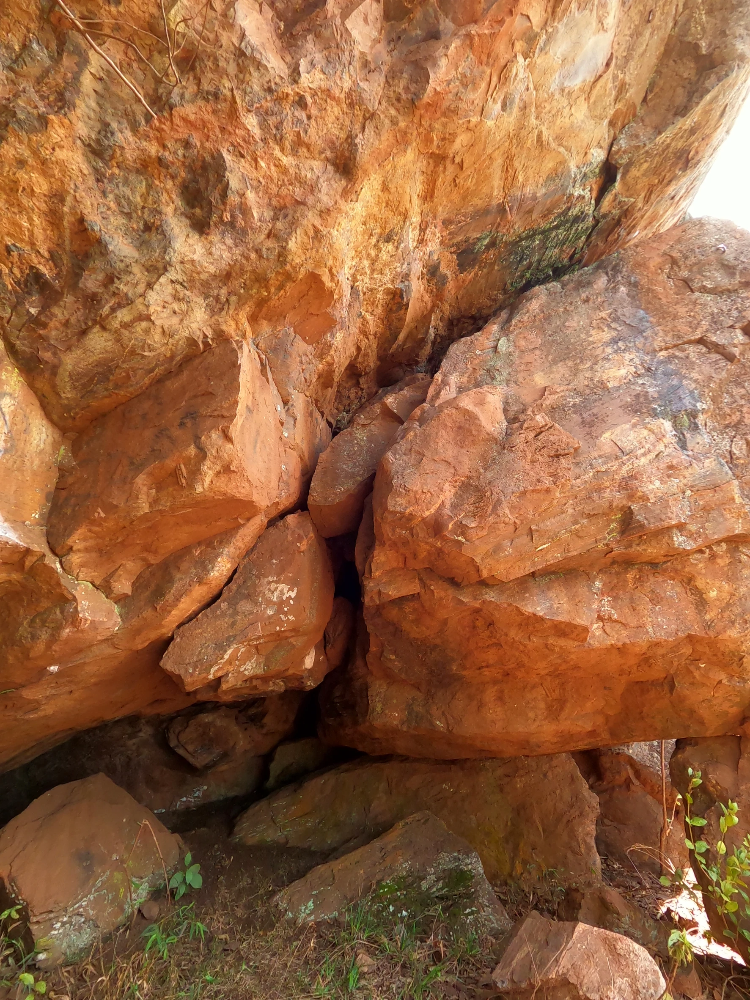
          - **largura_mapa**: 1773
          - **altura_mapa**: 2364
          - **pontos_de_interesse**:
            - **[0]**:
              - **id**: c5jKPTaPO5TQmO
              - **uid**: c5jKPTaPO5TQmO
              - **rotulo**: 
              - **linha**:
                - **estilo**: TRACEJADO
                - **espessura**: 5
                - **compilado**:
                  - **caminho_svg**: M 467 1795 C 485.3 1764.0, 528.5 1728.9, 522 1702 C 514.6 1671.2, 425.3 1657.3, 402 1626 C 383.6 1601.4, 369.9 1565.2, 378 1541 C 386.9 1514.3, 437.3 1496.0, 463 1476 C 484.5 1459.2, 498.9 1450.8, 522 1429 C 562.2 1391.0, 634.3 1305.3, 674 1259 C 700.6 1228.0, 719.3 1213.0, 739 1180 C 765.1 1136.3, 772.4 1056.9, 807 1014 C 839.1 974.3, 889.5 960.0, 934 927 C 986.3 888.2, 1038.8 833.5, 1100 794 C 1165.3 751.8, 1244.0 720.2, 1316 684 C 1387.7 647.9, 1466.0 607.5, 1531 577 C 1583.8 552.2, 1627.7 534.3, 1676 513
                  - **caixa_delimitadora**:
                    - **x**: 1027
                    - **y**: 1154
                    - **comprimento**: 1298
                    - **largura**: 1282
                  - **marcadores**:
                    - **[0]**:
                      - **tipo**: CIRCULO_IDENTIFICADOR
                      - **x**: 467
                      - **y**: 1795
                      - **angulo_graus_x100**: -5940
                      - **rotulo**: 1
                      - **raio**: 24
              - **cor**: #00E5FF
              - **label**: 
          - **referencias**:
            - **[0]**:
              - **alvo_uid**: y6AZSly8Hpuq5y
              - **pontos_uids**:
                - c5jKPTaPO5TQmO
              - **escalada**: Raio
              - **ids**:
                - c5jKPTaPO5TQmO
        - **[1]**:
          - **caminho_imagem_mapa**: 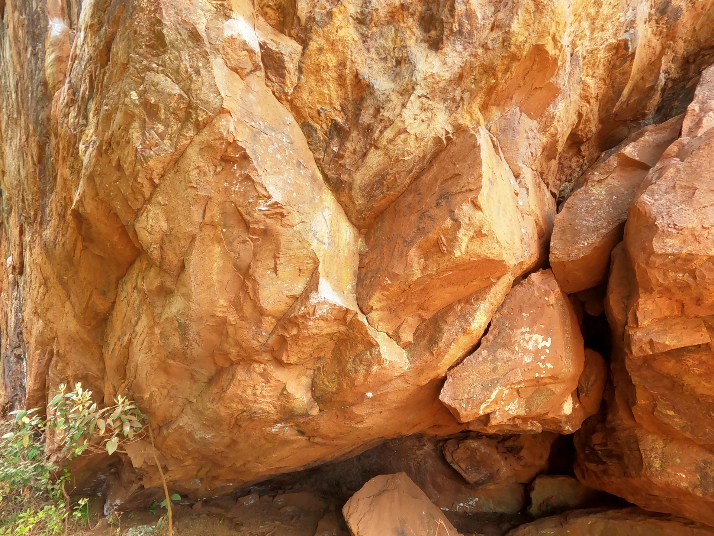
          - **largura_mapa**: 1376
          - **altura_mapa**: 1824
          - **pontos_de_interesse**:
            - **[0]**:
              - **id**: D8roTsgyrTkubQ
              - **uid**: D8roTsgyrTkubQ
              - **rotulo**: 
              - **linha**:
                - **estilo**: TRACEJADO
                - **espessura**: 5
                - **compilado**:
                  - **caminho_svg**: M 645 1465 C 677.0 1412.0, 717.3 1367.2, 741 1306 C 768.6 1234.8, 788.1 1133.3, 790 1059 C 791.6 998.3, 784.9 946.2, 766 893 C 745.9 836.6, 704.1 785.1, 669 731 C 632.1 674.1, 584.1 613.6, 549 560 C 519.1 514.2, 495.3 473.2, 470 430 C 445.3 387.9, 421.6 342.5, 399 304 C 379.5 270.7, 361.7 242.7, 343 212
                  - **caixa_delimitadora**:
                    - **x**: 566
                    - **y**: 838
                    - **comprimento**: 447
                    - **largura**: 1253
                  - **marcadores**:
                    - **[0]**:
                      - **tipo**: CIRCULO_IDENTIFICADOR
                      - **x**: 645
                      - **y**: 1465
                      - **angulo_graus_x100**: -5888
                      - **rotulo**: 2
                      - **raio**: 24
              - **cor**: #00E5FF
              - **label**: 
          - **referencias**:
            - **[0]**:
              - **alvo_uid**: 6YHQgzP3OTY9eP
              - **pontos_uids**:
                - D8roTsgyrTkubQ
              - **escalada**: Dama de ferro (boulder)
              - **ids**:
                - D8roTsgyrTkubQ
      - **precomputados**:
        - **total_escaladas**: 2
        - **total_boulders**: 2
  - **[2]**:
    - **conteudo**:
      - **descricao**: 
      - **nome**: Estacionamento - Bloco Pega negativo
      - **uid**: GCTYEYl7veyIXo
      - **escaladas**:
        - **[0]**:
          - **uid**: VVu7xhtrjKPIO4
          - **boulder**:
            - **nome**: Pega negativo
            - **dificuldade**: V7
        - **[1]**:
          - **uid**: KtHmfhs8lqZhU0
          - **boulder**:
            - **nome**: Serrado
            - **dificuldade**: V1
        - **[2]**:
          - **uid**: lvM5aiWcsrkiuo
          - **boulder**:
            - **nome**: Coruja
            - **dificuldade**: V1
        - **[3]**:
          - **uid**: b5gtS6LrXSTpZW
          - **boulder**:
            - **nome**: Projeto 3
      - **mapas**:
        - **[0]**:
          - **caminho_imagem_mapa**: 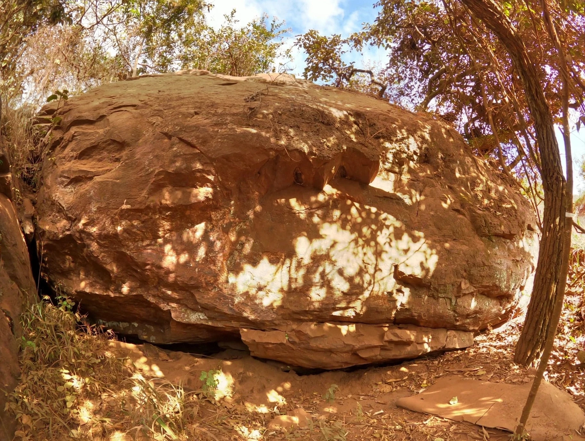
          - **largura_mapa**: 1824
          - **altura_mapa**: 1376
          - **pontos_de_interesse**:
            - **[0]**:
              - **id**: bcjWAfP34ZV42J
              - **uid**: bcjWAfP34ZV42J
              - **rotulo**: 
              - **linha**:
                - **estilo**: TRACEJADO
                - **espessura**: 4
                - **compilado**:
                  - **caminho_svg**: M 1280 1041 C 1259.7 922.7, 1234.6 790.7, 1219 686 C 1206.7 603.5, 1201.9 530.5, 1191 464 C 1182.0 409.2, 1171.0 364.7, 1161 315
                  - **caixa_delimitadora**:
                    - **x**: 1220
                    - **y**: 678
                    - **comprimento**: 119
                    - **largura**: 726
                  - **marcadores**:
                    - **[0]**:
                      - **tipo**: FIM_TOP
                      - **x**: 1161
                      - **y**: 315
                      - **angulo_graus_x100**: -10138
                      - **rotulo**: B
              - **cor**: #00E5FF
              - **label**: 
            - **[1]**:
              - **id**: KqPjEVpsxVqrkJ
              - **uid**: KqPjEVpsxVqrkJ
              - **linha**:
                - **estilo**: TRACEJADO
                - **espessura**: 4
                - **compilado**:
                  - **caminho_svg**: M 1285 1074 C 1283.0 1063.3, 1281.0 1052.7, 1279 1042
                  - **caixa_delimitadora**:
                    - **x**: 1282
                    - **y**: 1058
                    - **comprimento**: 6
                    - **largura**: 32
                  - **marcadores**:
                    - **[0]**:
                      - **tipo**: CIRCULO_IDENTIFICADOR
                      - **x**: 1285
                      - **y**: 1074
                      - **angulo_graus_x100**: -10062
                      - **rotulo**: 1
              - **cor**: #FFD600
            - **[2]**:
              - **id**: Hwpweh0VHvvO8H
              - **uid**: Hwpweh0VHvvO8H
              - **linha**:
                - **estilo**: TRACEJADO
                - **espessura**: 4
                - **compilado**:
                  - **caminho_svg**: M 1279 1042 C 1274.0 1036.7, 1271.9 1029.7, 1264 1026 C 1249.9 1019.4, 1219.4 1023.6, 1194 1022 C 1163.6 1020.1, 1128.2 1016.5, 1094 1015 C 1058.0 1013.4, 1013.7 1013.8, 983 1013 C 961.2 1012.4, 947.1 1015.0, 927 1011 C 901.7 1006.0, 873.5 992.0, 844 980 C 809.5 966.0, 762.0 953.5, 733 931 C 707.5 911.2, 682.3 882.5, 675 857 C 668.9 835.6, 682.7 812.2, 682 791 C 681.3 771.0, 678.4 753.0, 672 733 C 664.5 709.6, 655.9 674.4, 637 660 C 618.6 645.9, 584.0 653.6, 561 646 C 540.1 639.1, 518.1 634.2, 504 618 C 486.6 598.1, 482.9 559.9, 474 527 C 463.8 489.3, 455.8 444.3, 448 404 C 440.5 365.3, 433.5 319.1, 428 290 C 424.6 271.9, 422.0 260.7, 419 246
                  - **caixa_delimitadora**:
                    - **x**: 849
                    - **y**: 644
                    - **comprimento**: 860
                    - **largura**: 796
                  - **marcadores**:
                    - **[0]**:
                      - **tipo**: FIM_TOP
                      - **x**: 419
                      - **y**: 246
                      - **angulo_graus_x100**: -10156
                      - **rotulo**: A
              - **cor**: #00E5FF
            - **[3]**:
              - **id**: oWWr3YB0LJByaH
              - **uid**: oWWr3YB0LJByaH
              - **rotulo**: 
              - **linha**:
                - **estilo**: TRACEJADO
                - **espessura**: 3
                - **compilado**:
                  - **caminho_svg**: M 1570 965 C 1572.0 925.0, 1578.6 886.3, 1576 845 C 1573.1 800.2, 1559.4 746.4, 1551 706 C 1544.4 674.4, 1539.8 650.5, 1531 622 C 1521.5 591.2, 1509.7 559.8, 1495 528 C 1478.9 493.2, 1453.7 445.7, 1437 422 C 1427.5 408.6, 1419.7 402.7, 1411 393
                  - **caixa_delimitadora**:
                    - **x**: 1494
                    - **y**: 679
                    - **comprimento**: 165
                    - **largura**: 572
                  - **marcadores**:
                    - **[0]**:
                      - **tipo**: CIRCULO_IDENTIFICADOR
                      - **x**: 1570
                      - **y**: 965
                      - **angulo_graus_x100**: -8714
                      - **rotulo**: 2
                    - **[1]**:
                      - **tipo**: FIM_TOP
                      - **x**: 1411
                      - **y**: 393
                      - **angulo_graus_x100**: -13188
                      - **rotulo**: C
              - **cor**: #00E5FF
              - **label**: 
            - **[4]**:
              - **id**: sxdlHr9M6WoZNQ
              - **uid**: sxdlHr9M6WoZNQ
              - **rotulo**: 
              - **linha**:
                - **estilo**: TRACEJADO
                - **espessura**: 3
                - **compilado**:
                  - **caminho_svg**: M 714 1035 C 646.3 1005.0, 566.5 982.2, 511 945 C 464.0 913.5, 431.6 873.4, 396 835 C 361.1 797.4, 314.2 761.7, 299 717 C 284.1 673.2, 305.4 616.2, 304 570 C 302.8 528.7, 306.6 491.2, 293 453 C 277.4 409.3, 235.7 367.7, 207 325
                  - **caixa_delimitadora**:
                    - **x**: 460
                    - **y**: 680
                    - **comprimento**: 507
                    - **largura**: 710
                  - **marcadores**:
                    - **[0]**:
                      - **tipo**: CIRCULO_IDENTIFICADOR
                      - **x**: 714
                      - **y**: 1035
                      - **angulo_graus_x100**: -15609
                      - **rotulo**: 3
                    - **[1]**:
                      - **tipo**: FIM_TOP
                      - **x**: 207
                      - **y**: 325
                      - **angulo_graus_x100**: -12390
                      - **rotulo**: D
              - **cor**: #00E5FF
              - **label**: 
          - **referencias**:
            - **[0]**:
              - **alvo_uid**: VVu7xhtrjKPIO4
              - **pontos_uids**:
                - KqPjEVpsxVqrkJ
                - Hwpweh0VHvvO8H
              - **escalada**: Pega negativo
              - **ids**:
                - KqPjEVpsxVqrkJ
                - Hwpweh0VHvvO8H
            - **[1]**:
              - **alvo_uid**: KtHmfhs8lqZhU0
              - **pontos_uids**:
                - KqPjEVpsxVqrkJ
                - bcjWAfP34ZV42J
              - **escalada**: Serrado
              - **ids**:
                - KqPjEVpsxVqrkJ
                - bcjWAfP34ZV42J
            - **[2]**:
              - **alvo_uid**: lvM5aiWcsrkiuo
              - **pontos_uids**:
                - oWWr3YB0LJByaH
              - **escalada**: Coruja
              - **ids**:
                - oWWr3YB0LJByaH
            - **[3]**:
              - **alvo_uid**: b5gtS6LrXSTpZW
              - **pontos_uids**:
                - sxdlHr9M6WoZNQ
              - **escalada**: Projeto 3
              - **ids**:
                - sxdlHr9M6WoZNQ
      - **precomputados**:
        - **total_escaladas**: 4
        - **total_boulders**: 4
  - **[3]**:
    - **conteudo**:
      - **descricao**: 
      - **nome**: Estacionamento - Bloco Solaris
      - **uid**: Qk0h1mdjo20Ebg
      - **escaladas**:
        - **[0]**:
          - **uid**: GKiRIJblwHNW6U
          - **boulder**:
            - **nome**: Solaris
            - **dificuldade**: V4
        - **[1]**:
          - **uid**: JHLvsJu4kpoON0
          - **boulder**:
            - **nome**: Pump
            - **dificuldade**: V3
        - **[2]**:
          - **uid**: sY8xWcg71pO29X
          - **boulder**:
            - **nome**: Lítio
            - **dificuldade**: V2
        - **[3]**:
          - **uid**: avryK8CUi2fKkK
          - **boulder**:
            - **nome**: Tório
            - **dificuldade**: V0
        - **[4]**:
          - **uid**: o5BIftKa38x04o
          - **boulder**:
            - **nome**: Irídio
            - **dificuldade**: V0
      - **mapas**:
        - **[0]**:
          - **caminho_imagem_mapa**: 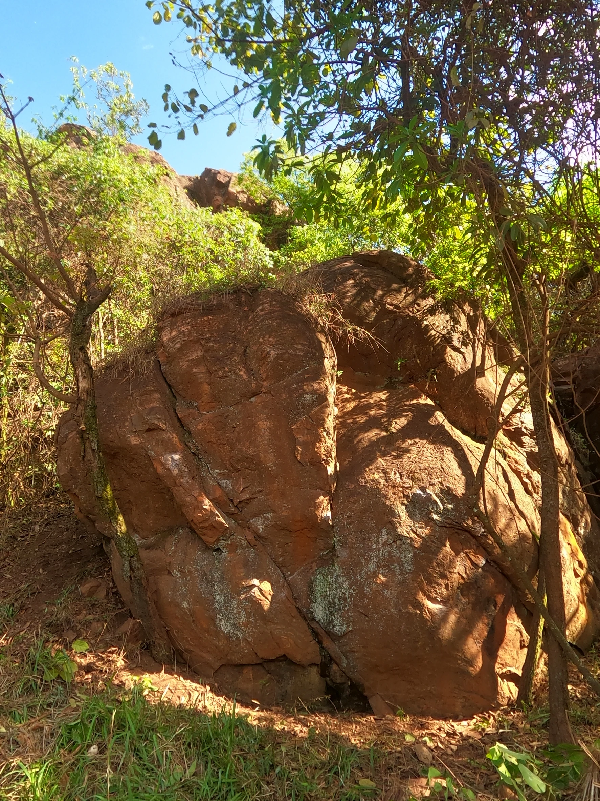
          - **largura_mapa**: 1773
          - **altura_mapa**: 2364
          - **pontos_de_interesse**:
            - **[0]**:
              - **id**: QmahXN7YGx5qnn
              - **uid**: QmahXN7YGx5qnn
              - **linha**:
                - **estilo**: TRACEJADO
                - **espessura**: 4
                - **compilado**:
                  - **caminho_svg**: M 1530 1748 C 1499.0 1706.3, 1468.2 1655.5, 1437 1623 C 1412.8 1597.8, 1392.9 1582.5, 1364 1564 C 1328.5 1541.3, 1278.8 1522.3, 1237 1501 C 1195.8 1480.0, 1152.4 1456.9, 1115 1437 C 1082.9 1419.9, 1045.8 1416.3, 1026 1389 C 1001.2 1354.8, 1007.3 1285.0, 998 1233
                  - **caixa_delimitadora**:
                    - **x**: 1264
                    - **y**: 1490
                    - **comprimento**: 532
                    - **largura**: 515
                  - **marcadores**:
                    - **[0]**:
                      - **tipo**: CIRCULO_IDENTIFICADOR
                      - **x**: 1530
                      - **y**: 1748
                      - **angulo_graus_x100**: -12665
                      - **rotulo**: 1
              - **cor**: #00E5FF
            - **[1]**:
              - **id**: 1QRa2eTvzsq8M5
              - **uid**: 1QRa2eTvzsq8M5
              - **linha**:
                - **estilo**: TRACEJADO
                - **espessura**: 4
                - **compilado**:
                  - **caminho_svg**: M 998 1233 C 997.7 1180.3, 997.1 1111.4, 997 1075 C 996.9 1055.8, 997.7 1049.5, 997 1031 C 995.8 999.1, 991.1 942.4, 987 901 C 983.3 863.0, 978.3 828.3, 974 792
                  - **caixa_delimitadora**:
                    - **x**: 986
                    - **y**: 1012
                    - **comprimento**: 24
                    - **largura**: 441
                  - **marcadores**:
                    - **[0]**:
                      - **tipo**: FIM_TOP
                      - **x**: 974
                      - **y**: 792
                      - **angulo_graus_x100**: -9680
                      - **rotulo**: A
              - **cor**: #00E5FF
            - **[2]**:
              - **id**: 4qwbkzxFtp77YL
              - **uid**: 4qwbkzxFtp77YL
              - **linha**:
                - **estilo**: TRACEJADO
                - **espessura**: 4
                - **compilado**:
                  - **caminho_svg**: M 780 1794 C 782.3 1776.3, 784.7 1758.7, 787 1741
                  - **caixa_delimitadora**:
                    - **x**: 784
                    - **y**: 1768
                    - **comprimento**: 7
                    - **largura**: 53
                  - **marcadores**:
                    - **[0]**:
                      - **tipo**: CIRCULO_IDENTIFICADOR
                      - **x**: 780
                      - **y**: 1794
                      - **angulo_graus_x100**: -8248
                      - **rotulo**: 2
              - **cor**: #FFD600
            - **[3]**:
              - **id**: 1gfxPrZK4NbB4K
              - **uid**: 1gfxPrZK4NbB4K
              - **linha**:
                - **estilo**: TRACEJADO
                - **espessura**: 4
                - **compilado**:
                  - **caminho_svg**: M 787 1741 C 794.0 1733.0, 796.0 1724.7, 808 1717 C 835.6 1699.2, 940.8 1702.4, 970 1668 C 996.4 1636.8, 984.8 1580.0, 988 1530 C 991.8 1471.2, 985.4 1391.4, 988 1337 C 989.9 1297.0, 994.7 1267.7, 998 1233
                  - **caixa_delimitadora**:
                    - **x**: 892
                    - **y**: 1487
                    - **comprimento**: 211
                    - **largura**: 508
                  - **marcadores**: []
              - **cor**: #00E5FF
            - **[4]**:
              - **id**: I6Q9kgngRiO1YX
              - **uid**: I6Q9kgngRiO1YX
              - **linha**:
                - **estilo**: TRACEJADO
                - **espessura**: 4
                - **compilado**:
                  - **caminho_svg**: M 784 1738 C 776.0 1724.3, 772.8 1715.3, 760 1697 C 729.1 1653.0, 631.4 1550.3, 583 1485 C 544.7 1433.3, 517.6 1384.1, 488 1340 C 462.8 1302.6, 434.0 1277.6, 417 1237 C 397.2 1189.5, 395.7 1125.0, 385 1069
                  - **caixa_delimitadora**:
                    - **x**: 584
                    - **y**: 1404
                    - **comprimento**: 399
                    - **largura**: 669
                  - **marcadores**:
                    - **[0]**:
                      - **tipo**: FIM_TOP
                      - **x**: 385
                      - **y**: 1069
                      - **angulo_graus_x100**: -10078
                      - **rotulo**: B
              - **cor**: #00E5FF
          - **referencias**:
            - **[0]**:
              - **alvo_uid**: GKiRIJblwHNW6U
              - **pontos_uids**:
                - QmahXN7YGx5qnn
                - 1QRa2eTvzsq8M5
              - **escalada**: Solaris
              - **ids**:
                - QmahXN7YGx5qnn
                - 1QRa2eTvzsq8M5
            - **[1]**:
              - **alvo_uid**: JHLvsJu4kpoON0
              - **pontos_uids**:
                - 4qwbkzxFtp77YL
                - 1gfxPrZK4NbB4K
                - 1QRa2eTvzsq8M5
              - **escalada**: Pump
              - **ids**:
                - 4qwbkzxFtp77YL
                - 1gfxPrZK4NbB4K
                - 1QRa2eTvzsq8M5
            - **[2]**:
              - **alvo_uid**: sY8xWcg71pO29X
              - **pontos_uids**:
                - 4qwbkzxFtp77YL
                - I6Q9kgngRiO1YX
              - **escalada**: Lítio
              - **ids**:
                - 4qwbkzxFtp77YL
                - I6Q9kgngRiO1YX
        - **[1]**:
          - **caminho_imagem_mapa**: 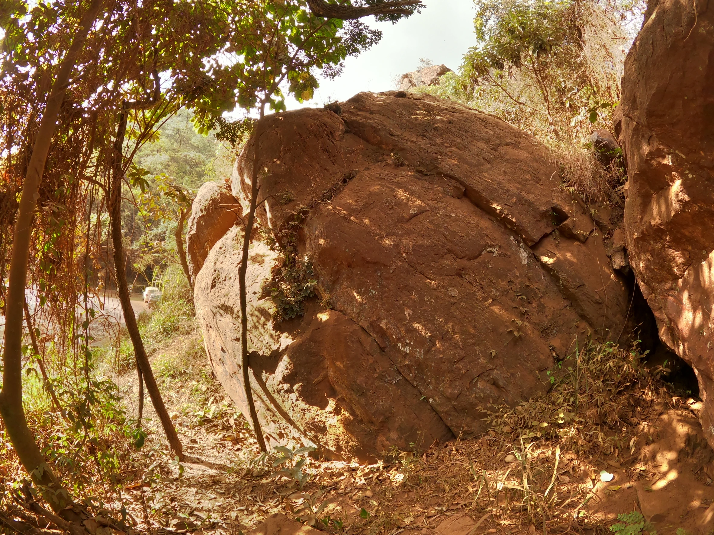
          - **largura_mapa**: 2364
          - **altura_mapa**: 1773
          - **pontos_de_interesse**:
            - **[0]**:
              - **id**: 6F8xEKAjDezlkF
              - **uid**: 6F8xEKAjDezlkF
              - **rotulo**: 
              - **linha**:
                - **estilo**: TRACEJADO
                - **espessura**: 4
                - **compilado**:
                  - **caminho_svg**: M 1366 1285 C 1320.7 1230.0, 1273.9 1162.9, 1230 1120 C 1196.5 1087.3, 1160.8 1078.0, 1132 1043 C 1095.5 998.7, 1061.0 923.5, 1041 865 C 1023.3 813.4, 1023.7 766.6, 1012 712 C 998.4 648.3, 975.3 563.3, 963 506 C 954.3 465.3, 949.7 436.0, 943 401
                  - **caixa_delimitadora**:
                    - **x**: 1154
                    - **y**: 843
                    - **comprimento**: 423
                    - **largura**: 884
                  - **marcadores**:
                    - **[0]**:
                      - **tipo**: CIRCULO_IDENTIFICADOR
                      - **x**: 1366
                      - **y**: 1285
                      - **angulo_graus_x100**: -12950
                      - **rotulo**: 3
              - **cor**: #00E5FF
              - **label**: 
            - **[1]**:
              - **id**: 5z0xDzAl5rd8JW
              - **uid**: 5z0xDzAl5rd8JW
              - **rotulo**: 
              - **linha**:
                - **estilo**: TRACEJADO
                - **espessura**: 4
                - **compilado**:
                  - **caminho_svg**: M 1771 1100 C 1757.7 1045.3, 1751.8 990.1, 1731 936 C 1708.5 877.4, 1670.2 808.3, 1637 762 C 1611.4 726.4, 1587.1 709.2, 1557 676 C 1516.8 631.5, 1462.1 565.2, 1418 518 C 1380.4 477.7, 1340.5 443.5, 1310 409 C 1285.0 380.7, 1267.3 355.0, 1246 328
                  - **caixa_delimitadora**:
                    - **x**: 1508
                    - **y**: 714
                    - **comprimento**: 525
                    - **largura**: 772
                  - **marcadores**:
                    - **[0]**:
                      - **tipo**: CIRCULO_IDENTIFICADOR
                      - **x**: 1771
                      - **y**: 1100
                      - **angulo_graus_x100**: -10371
                      - **rotulo**: 4
              - **cor**: #00E5FF
              - **label**: 
          - **referencias**:
            - **[0]**:
              - **alvo_uid**: avryK8CUi2fKkK
              - **pontos_uids**:
                - 6F8xEKAjDezlkF
              - **escalada**: Tório
              - **ids**:
                - 6F8xEKAjDezlkF
            - **[1]**:
              - **alvo_uid**: o5BIftKa38x04o
              - **pontos_uids**:
                - 5z0xDzAl5rd8JW
              - **escalada**: Irídio
              - **ids**:
                - 5z0xDzAl5rd8JW
      - **precomputados**:
        - **total_escaladas**: 5
        - **total_boulders**: 5
  - **[4]**:
    - **conteudo**:
      - **descricao**: 
      - **nome**: Estacionamento - Bloco Dengoso
      - **uid**: 3UrbFi1RskxEbz
      - **mapas**:
        - **[0]**:
          - **caminho_imagem_mapa**: 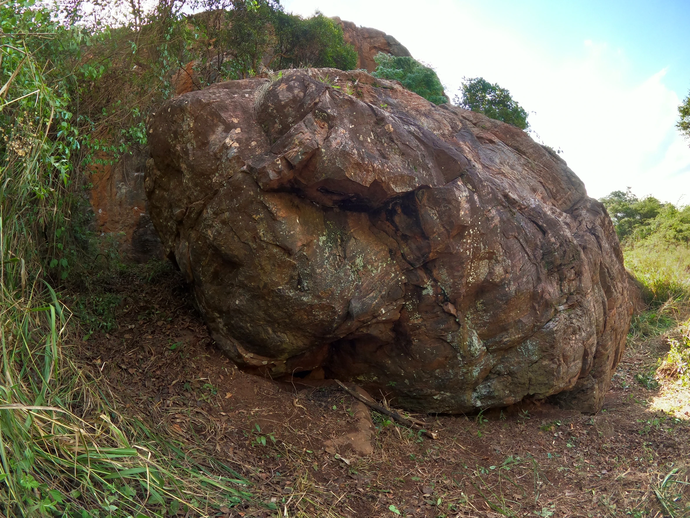
          - **largura_mapa**: 2364
          - **altura_mapa**: 1773
          - **pontos_de_interesse**:
            - **[0]**:
              - **id**: U9sK5P09Prqoch
              - **uid**: U9sK5P09Prqoch
              - **linha**:
                - **estilo**: TRACEJADO
                - **espessura**: 5
                - **compilado**:
                  - **caminho_svg**: M 1099 1196 C 1119.3 1173.0, 1139.7 1150.0, 1160 1127
                  - **caixa_delimitadora**:
                    - **x**: 1130
                    - **y**: 1162
                    - **comprimento**: 61
                    - **largura**: 69
                  - **marcadores**:
                    - **[0]**:
                      - **tipo**: CIRCULO_IDENTIFICADOR
                      - **x**: 1099
                      - **y**: 1196
                      - **angulo_graus_x100**: -4852
                      - **rotulo**: 2
                      - **raio**: 24
              - **cor**: #FFD600
            - **[1]**:
              - **id**: mRwEsWs51g076b
              - **uid**: mRwEsWs51g076b
              - **rotulo**: 
              - **linha**:
                - **estilo**: TRACEJADO
                - **espessura**: 5
                - **compilado**:
                  - **caminho_svg**: M 1160 1127 C 1176.7 1116.7, 1191.6 1105.0, 1210 1096 C 1230.3 1086.1, 1253.2 1080.6, 1277 1071 C 1304.9 1059.7, 1339.9 1052.5, 1367 1032 C 1398.2 1008.3, 1433.1 972.9, 1449 931 C 1468.0 881.0, 1457.4 805.3, 1457 746 C 1456.6 691.0, 1453.0 638.9, 1448 587 C 1443.2 536.9, 1438.6 487.0, 1428 440 C 1417.9 395.1, 1400.7 354.0, 1387 311
                  - **caixa_delimitadora**:
                    - **x**: 1308
                    - **y**: 719
                    - **comprimento**: 297
                    - **largura**: 816
                  - **marcadores**:
                    - **[0]**:
                      - **tipo**: FIM_TOP
                      - **x**: 1387
                      - **y**: 311
                      - **angulo_graus_x100**: -10763
                      - **rotulo**: B
                      - **raio**: 24
              - **cor**: #FFD600
              - **label**: 
            - **[2]**:
              - **id**: LRibEzdYZH0Iot
              - **uid**: LRibEzdYZH0Iot
              - **linha**:
                - **estilo**: TRACEJADO
                - **espessura**: 5
                - **compilado**:
                  - **caminho_svg**: M 1160 1127 C 1168.3 1108.3, 1184.9 1089.4, 1185 1071 C 1185.1 1053.1, 1174.6 1034.9, 1162 1018 C 1145.8 996.4, 1117.3 978.9, 1089 957 C 1052.3 928.6, 1000.5 892.9, 959 864 C 921.5 837.9, 887.7 812.0, 851 791 C 816.0 771.0, 778.7 752.2, 744 740 C 713.6 729.3, 681.5 727.2, 655 719 C 632.8 712.2, 610.0 707.0, 595 696 C 582.6 686.9, 577.0 673.3, 568 662
                  - **caixa_delimitadora**:
                    - **x**: 876
                    - **y**: 894
                    - **comprimento**: 617
                    - **largura**: 465
                  - **marcadores**: []
              - **cor**: #FFD600
            - **[3]**:
              - **id**: uyFTqk25UWAbgM
              - **uid**: uyFTqk25UWAbgM
              - **linha**:
                - **estilo**: TRACEJADO
                - **espessura**: 5
                - **compilado**:
                  - **caminho_svg**: M 568 662 C 554.3 616.3, 532.7 572.4, 527 525 C 521.1 475.9, 532.3 423.0, 535 372
                  - **caixa_delimitadora**:
                    - **x**: 548
                    - **y**: 517
                    - **comprimento**: 41
                    - **largura**: 290
                  - **marcadores**:
                    - **[0]**:
                      - **tipo**: FIM_TOP
                      - **x**: 535
                      - **y**: 372
                      - **angulo_graus_x100**: -8701
                      - **rotulo**: A
                      - **raio**: 24
              - **cor**: #FFD600
            - **[4]**:
              - **id**: pfDg5P1AonAAi9
              - **uid**: pfDg5P1AonAAi9
              - **rotulo**: 
              - **linha**:
                - **estilo**: TRACEJADO
                - **espessura**: 5
                - **compilado**:
                  - **caminho_svg**: M 626 915 C 622.7 875.3, 622.3 828.5, 616 796 C 611.5 772.6, 605.3 757.7, 598 737 C 589.7 713.3, 578.0 687.0, 568 662
                  - **caixa_delimitadora**:
                    - **x**: 597
                    - **y**: 788
                    - **comprimento**: 58
                    - **largura**: 253
                  - **marcadores**:
                    - **[0]**:
                      - **tipo**: CIRCULO_IDENTIFICADOR
                      - **x**: 626
                      - **y**: 915
                      - **angulo_graus_x100**: -9480
                      - **rotulo**: 1
                      - **raio**: 24
              - **cor**: #FFD600
              - **label**: 
          - **referencias**:
            - **[0]**:
              - **alvo_uid**: vo6nadNzA5cVa3
              - **pontos_uids**:
                - U9sK5P09Prqoch
                - LRibEzdYZH0Iot
                - uyFTqk25UWAbgM
              - **escalada**: Dengoso
              - **ids**:
                - U9sK5P09Prqoch
                - LRibEzdYZH0Iot
                - uyFTqk25UWAbgM
            - **[1]**:
              - **alvo_uid**: D4F2u8Lg2XgoBZ
              - **pontos_uids**:
                - U9sK5P09Prqoch
                - mRwEsWs51g076b
              - **escalada**: Fênix
              - **ids**:
                - U9sK5P09Prqoch
                - mRwEsWs51g076b
            - **[2]**:
              - **alvo_uid**: Iypt5SbOECadzL
              - **pontos_uids**:
                - pfDg5P1AonAAi9
                - uyFTqk25UWAbgM
              - **escalada**: V5 do Bull
              - **ids**:
                - pfDg5P1AonAAi9
                - uyFTqk25UWAbgM
        - **[1]**:
          - **caminho_imagem_mapa**: 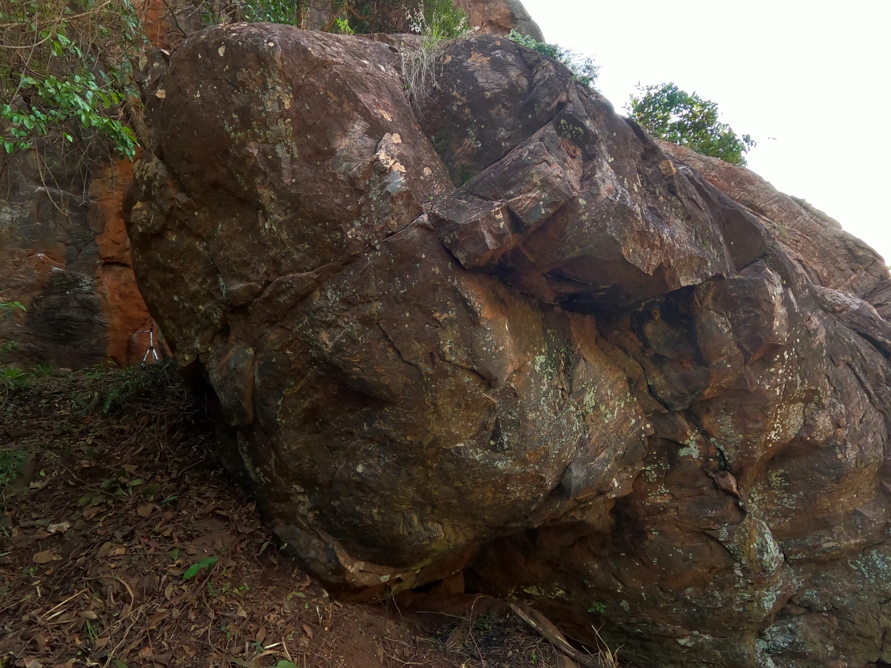
          - **largura_mapa**: 2364
          - **altura_mapa**: 1773
          - **pontos_de_interesse**:
            - **[0]**:
              - **id**: sjVcuFmrsATb6E
              - **uid**: sjVcuFmrsATb6E
              - **linha**:
                - **estilo**: TRACEJADO
                - **espessura**: 5
                - **compilado**:
                  - **caminho_svg**: M 598 1047 C 606.7 981.0, 628.2 913.7, 624 849 C 619.9 785.1, 590.7 723.7, 574 661
                  - **caixa_delimitadora**:
                    - **x**: 599
                    - **y**: 854
                    - **comprimento**: 50
                    - **largura**: 386
                  - **marcadores**:
                    - **[0]**:
                      - **tipo**: CIRCULO_IDENTIFICADOR
                      - **x**: 598
                      - **y**: 1047
                      - **angulo_graus_x100**: -8252
                      - **rotulo**: 1
                      - **raio**: 24
              - **cor**: #FFD600
            - **[1]**:
              - **id**: mxtFc6aXmNZM62
              - **uid**: mxtFc6aXmNZM62
              - **linha**:
                - **estilo**: TRACEJADO
                - **espessura**: 5
                - **compilado**:
                  - **caminho_svg**: M 574 661 C 566.0 643.7, 561.9 631.0, 550 609 C 527.2 566.8, 469.5 486.2, 439 431 C 413.9 385.5, 377.3 345.4, 377 303 C 376.7 261.4, 415.7 220.3, 435 179
                  - **caixa_delimitadora**:
                    - **x**: 476
                    - **y**: 420
                    - **comprimento**: 197
                    - **largura**: 482
                  - **marcadores**:
                    - **[0]**:
                      - **tipo**: FIM_TOP
                      - **x**: 435
                      - **y**: 179
                      - **angulo_graus_x100**: -6493
                      - **rotulo**: A
                      - **raio**: 24
              - **cor**: #FFD600
            - **[2]**:
              - **id**: oACEazp9fJuY7y
              - **uid**: oACEazp9fJuY7y
              - **linha**:
                - **estilo**: TRACEJADO
                - **espessura**: 5
                - **compilado**:
                  - **caminho_svg**: M 1228 1493 C 1267.3 1465.7, 1314.5 1432.5, 1346 1411 C 1366.8 1396.8, 1380.7 1387.7, 1398 1376
                  - **caixa_delimitadora**:
                    - **x**: 1313
                    - **y**: 1434
                    - **comprimento**: 170
                    - **largura**: 117
                  - **marcadores**:
                    - **[0]**:
                      - **tipo**: CIRCULO_IDENTIFICADOR
                      - **x**: 1228
                      - **y**: 1493
                      - **angulo_graus_x100**: -3480
                      - **rotulo**: 2
                      - **raio**: 24
              - **cor**: #FFD600
            - **[3]**:
              - **id**: RjXJpiC3GesNMr
              - **uid**: RjXJpiC3GesNMr
              - **linha**:
                - **estilo**: TRACEJADO
                - **espessura**: 5
                - **compilado**:
                  - **caminho_svg**: M 1398 1376 C 1418.3 1355.3, 1443.9 1336.2, 1459 1314 C 1472.5 1294.2, 1485.5 1272.8, 1487 1251 C 1488.6 1228.6, 1481.7 1202.4, 1467 1181 C 1448.0 1153.4, 1405.6 1134.8, 1370 1108 C 1326.5 1075.3, 1269.6 1027.6, 1225 999 C 1190.0 976.6, 1159.1 969.5, 1127 946 C 1089.2 918.4, 1065.4 867.3, 1016 839 C 950.3 801.3, 822.7 791.0, 753 765 C 704.7 747.0, 666.0 729.0, 634 709 C 609.5 693.8, 594.0 677.0, 574 661
                  - **caixa_delimitadora**:
                    - **x**: 1030
                    - **y**: 1018
                    - **comprimento**: 913
                    - **largura**: 715
                  - **marcadores**: []
              - **cor**: #FFD600
            - **[4]**:
              - **id**: MLPLzokXjMmRMG
              - **uid**: MLPLzokXjMmRMG
              - **rotulo**: 
              - **linha**:
                - **estilo**: TRACEJADO
                - **espessura**: 5
                - **compilado**:
                  - **caminho_svg**: M 1398 1376 C 1431.3 1368.3, 1465.3 1360.8, 1498 1353 C 1529.6 1345.5, 1563.6 1339.4, 1591 1330 C 1613.9 1322.2, 1631.3 1311.7, 1652 1303 C 1673.2 1294.1, 1696.2 1290.0, 1717 1277 C 1740.8 1262.1, 1765.7 1236.5, 1785 1215 C 1802.4 1195.7, 1814.9 1177.6, 1829 1155 C 1845.5 1128.6, 1860.2 1095.7, 1876 1065 C 1892.5 1033.1, 1916.2 1006.2, 1926 967 C 1938.7 916.0, 1930.1 834.0, 1929 781 C 1928.2 741.3, 1931.5 716.4, 1923 677 C 1910.9 620.7, 1876.1 530.9, 1847 479 C 1825.4 440.6, 1799.7 417.7, 1776 387
                  - **caixa_delimitadora**:
                    - **x**: 1664
                    - **y**: 882
                    - **comprimento**: 531
                    - **largura**: 989
                  - **marcadores**:
                    - **[0]**:
                      - **tipo**: FIM_TOP
                      - **x**: 1776
                      - **y**: 387
                      - **angulo_graus_x100**: -12766
                      - **rotulo**: B
                      - **raio**: 24
              - **cor**: #FFD600
              - **label**: 
          - **referencias**:
            - **[0]**:
              - **alvo_uid**: Iypt5SbOECadzL
              - **pontos_uids**:
                - sjVcuFmrsATb6E
                - mxtFc6aXmNZM62
              - **escalada**: V5 do Bull
              - **ids**:
                - sjVcuFmrsATb6E
                - mxtFc6aXmNZM62
            - **[1]**:
              - **alvo_uid**: vo6nadNzA5cVa3
              - **pontos_uids**:
                - oACEazp9fJuY7y
                - RjXJpiC3GesNMr
                - mxtFc6aXmNZM62
              - **escalada**: Dengoso
              - **ids**:
                - oACEazp9fJuY7y
                - RjXJpiC3GesNMr
                - mxtFc6aXmNZM62
            - **[2]**:
              - **alvo_uid**: D4F2u8Lg2XgoBZ
              - **pontos_uids**:
                - oACEazp9fJuY7y
                - MLPLzokXjMmRMG
              - **escalada**: Fênix
              - **ids**:
                - oACEazp9fJuY7y
                - MLPLzokXjMmRMG
        - **[2]**:
          - **caminho_imagem_mapa**: 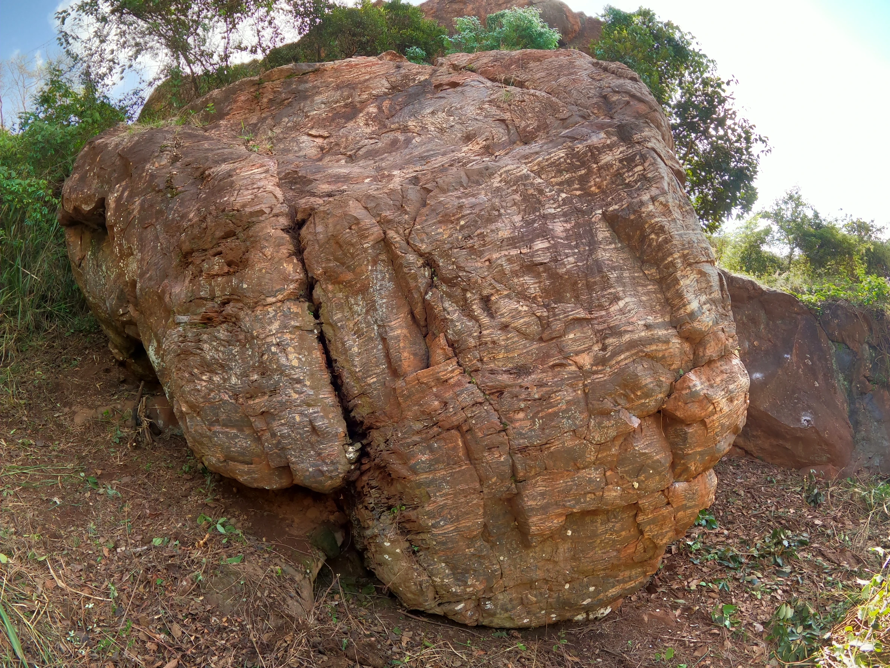
          - **largura_mapa**: 2364
          - **altura_mapa**: 1773
          - **pontos_de_interesse**:
            - **[0]**:
              - **id**: JasR2A0QHoDT13
              - **uid**: JasR2A0QHoDT13
              - **rotulo**: 
              - **linha**:
                - **estilo**: TRACEJADO
                - **espessura**: 5
                - **compilado**:
                  - **caminho_svg**: M 1792 1370 C 1780.3 1290.0, 1774.0 1203.8, 1757 1130 C 1741.9 1064.5, 1718.0 1011.7, 1699 948 C 1678.2 878.3, 1658.8 798.3, 1638 728 C 1618.7 662.7, 1591.2 598.4, 1579 540 C 1568.7 491.0, 1577.7 449.3, 1564 402 C 1548.0 346.5, 1498.6 278.5, 1480 230 C 1467.2 196.5, 1463.3 171.3, 1455 142
                  - **caixa_delimitadora**:
                    - **x**: 1624
                    - **y**: 756
                    - **comprimento**: 337
                    - **largura**: 1228
                  - **marcadores**:
                    - **[0]**:
                      - **tipo**: CIRCULO_IDENTIFICADOR
                      - **x**: 1792
                      - **y**: 1370
                      - **angulo_graus_x100**: -9830
                      - **rotulo**: 6
                      - **raio**: 24
                    - **[1]**:
                      - **tipo**: FIM_TOP
                      - **x**: 1455
                      - **y**: 142
                      - **angulo_graus_x100**: -10586
                      - **rotulo**: G
                      - **raio**: 24
              - **cor**: #FFD600
              - **label**: 
            - **[1]**:
              - **id**: 3PYTnEbgnp4ZPb
              - **uid**: 3PYTnEbgnp4ZPb
              - **rotulo**: 
              - **linha**:
                - **estilo**: TRACEJADO
                - **espessura**: 5
                - **compilado**:
                  - **caminho_svg**: M 1495 1497 C 1477.3 1427.7, 1460.0 1359.6, 1442 1289 C 1423.3 1215.7, 1409.1 1132.0, 1385 1065 C 1364.1 1006.9, 1330.0 969.5, 1311 908 C 1286.6 829.1, 1275.2 706.1, 1266 626 C 1259.2 567.1, 1267.7 524.6, 1255 472 C 1240.5 412.0, 1197.1 340.7, 1176 287 C 1160.0 246.4, 1150.0 215.0, 1137 179
                  - **caixa_delimitadora**:
                    - **x**: 1316
                    - **y**: 838
                    - **comprimento**: 358
                    - **largura**: 1318
                  - **marcadores**:
                    - **[0]**:
                      - **tipo**: CIRCULO_IDENTIFICADOR
                      - **x**: 1495
                      - **y**: 1497
                      - **angulo_graus_x100**: -10430
                      - **rotulo**: 5
                      - **raio**: 24
                    - **[1]**:
                      - **tipo**: FIM_TOP
                      - **x**: 1137
                      - **y**: 179
                      - **angulo_graus_x100**: -10986
                      - **rotulo**: F
                      - **raio**: 24
              - **cor**: #FFD600
              - **label**: 
            - **[2]**:
              - **id**: FgQM0hUvaAHlhx
              - **uid**: FgQM0hUvaAHlhx
              - **rotulo**: 
              - **linha**:
                - **estilo**: TRACEJADO
                - **espessura**: 5
                - **compilado**:
                  - **caminho_svg**: M 1043 1424 C 1030.7 1381.0, 1022.5 1339.9, 1006 1295 C 986.9 1243.2, 953.6 1185.7, 932 1132 C 911.6 1081.4, 897.2 1039.4, 879 982 C 855.0 906.5, 822.1 788.1, 804 717 C 791.9 669.7, 787.7 640.5, 777 598 C 764.6 548.5, 746.1 496.7, 733 438 C 717.4 367.7, 706.3 282.0, 693 204
                  - **caixa_delimitadora**:
                    - **x**: 868
                    - **y**: 814
                    - **comprimento**: 350
                    - **largura**: 1220
                  - **marcadores**:
                    - **[0]**:
                      - **tipo**: CIRCULO_IDENTIFICADOR
                      - **x**: 1043
                      - **y**: 1424
                      - **angulo_graus_x100**: -10600
                      - **rotulo**: 4
                      - **raio**: 24
                    - **[1]**:
                      - **tipo**: FIM_TOP
                      - **x**: 693
                      - **y**: 204
                      - **angulo_graus_x100**: -9970
                      - **rotulo**: E
                      - **raio**: 24
              - **cor**: #FFD600
              - **label**: 
            - **[3]**:
              - **id**: HWMVxMmL9vu4Rb
              - **uid**: HWMVxMmL9vu4Rb
              - **rotulo**: 
              - **linha**:
                - **estilo**: TRACEJADO
                - **espessura**: 5
                - **compilado**:
                  - **caminho_svg**: M 599 1230 C 584.0 1200.0, 565.2 1172.5, 554 1140 C 542.0 1105.2, 536.2 1068.3, 531 1027 C 524.8 978.1, 527.2 914.8, 523 865 C 519.4 822.2, 512.8 782.4, 509 746 C 505.8 715.3, 505.6 692.2, 501 661 C 495.3 622.1, 480.8 575.5, 475 531 C 469.0 484.9, 470.4 427.1, 466 389 C 463.0 363.1, 458.7 345.7, 455 324
                  - **caixa_delimitadora**:
                    - **x**: 527
                    - **y**: 777
                    - **comprimento**: 144
                    - **largura**: 906
                  - **marcadores**:
                    - **[0]**:
                      - **tipo**: CIRCULO_IDENTIFICADOR
                      - **x**: 599
                      - **y**: 1230
                      - **angulo_graus_x100**: -11657
                      - **rotulo**: 3
                      - **raio**: 24
                    - **[1]**:
                      - **tipo**: FIM_TOP
                      - **x**: 455
                      - **y**: 324
                      - **angulo_graus_x100**: -9961
                      - **rotulo**: D
                      - **raio**: 24
              - **cor**: #FFD600
              - **label**: 
            - **[4]**:
              - **id**: 3nbowXWnLqVbnb
              - **uid**: 3nbowXWnLqVbnb
              - **rotulo**: 
              - **linha**:
                - **estilo**: TRACEJADO
                - **espessura**: 5
                - **compilado**:
                  - **caminho_svg**: M 1964 1119 C 1938.7 1089.3, 1919.9 1045.9, 1888 1030 C 1856.4 1014.3, 1815.3 1022.9, 1774 1023 C 1724.9 1023.2, 1656.4 1047.8, 1613 1034 C 1576.8 1022.5, 1556.0 980.5, 1526 963 C 1499.4 947.5, 1479.5 941.0, 1444 931 C 1383.1 913.8, 1259.2 899.3, 1189 885 C 1139.2 874.8, 1108.4 873.2, 1062 856 C 999.2 832.8, 917.5 773.1, 851 745 C 795.3 721.4, 751.4 706.8, 692 693 C 619.6 676.1, 514.1 683.9, 446 658 C 390.0 636.7, 337.3 598.7, 306 565 C 283.1 540.4, 275.2 512.1, 262 487 C 250.1 464.3, 240.7 443.0, 230 421
                  - **caixa_delimitadora**:
                    - **x**: 1097
                    - **y**: 770
                    - **comprimento**: 1734
                    - **largura**: 698
                  - **marcadores**:
                    - **[0]**:
                      - **tipo**: CIRCULO_IDENTIFICADOR
                      - **x**: 1964
                      - **y**: 1119
                      - **angulo_graus_x100**: -13050
                      - **rotulo**: 7
                      - **raio**: 24
                    - **[1]**:
                      - **tipo**: FIM_TOP
                      - **x**: 230
                      - **y**: 421
                      - **angulo_graus_x100**: -11587
                      - **rotulo**: C
                      - **raio**: 24
              - **cor**: #FFD600
              - **label**: 
          - **referencias**:
            - **[0]**:
              - **alvo_uid**: tkXSRSpNWY5yL3
              - **pontos_uids**:
                - JasR2A0QHoDT13
              - **escalada**: Só o pó
              - **ids**:
                - JasR2A0QHoDT13
            - **[1]**:
              - **alvo_uid**: 1E48e1PlohVfeJ
              - **pontos_uids**:
                - 3PYTnEbgnp4ZPb
              - **escalada**: Só poeira
              - **ids**:
                - 3PYTnEbgnp4ZPb
            - **[2]**:
              - **alvo_uid**: bNsbFE3U6jby2Q
              - **pontos_uids**:
                - FgQM0hUvaAHlhx
              - **escalada**: Poeirando
              - **ids**:
                - FgQM0hUvaAHlhx
            - **[3]**:
              - **alvo_uid**: wqMD6zlHac7ZXq
              - **pontos_uids**:
                - HWMVxMmL9vu4Rb
              - **escalada**: Barla Pé
              - **ids**:
                - HWMVxMmL9vu4Rb
            - **[4]**:
              - **alvo_uid**: w44WoxqtaM6ZhW
              - **pontos_uids**:
                - 3nbowXWnLqVbnb
              - **escalada**: Saara
              - **ids**:
                - 3nbowXWnLqVbnb
        - **[3]**:
          - **caminho_imagem_mapa**: 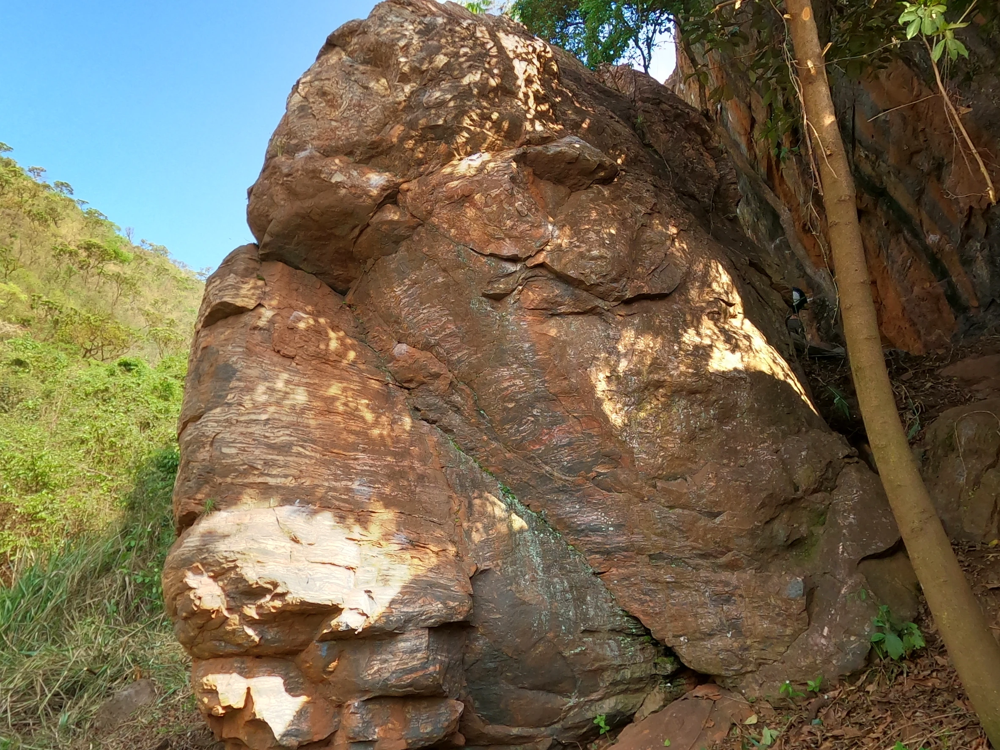
          - **largura_mapa**: 2364
          - **altura_mapa**: 1773
          - **pontos_de_interesse**:
            - **[0]**:
              - **id**: tJ7FfEoJdlIf6V
              - **uid**: tJ7FfEoJdlIf6V
              - **linha**:
                - **estilo**: TRACEJADO
                - **espessura**: 5
                - **compilado**:
                  - **caminho_svg**: M 971 1749 C 969.7 1712.7, 967.5 1667.8, 967 1640 C 966.7 1622.7, 967.0 1612.0, 967 1598
                  - **caixa_delimitadora**:
                    - **x**: 969
                    - **y**: 1674
                    - **comprimento**: 4
                    - **largura**: 151
                  - **marcadores**:
                    - **[0]**:
                      - **tipo**: CIRCULO_IDENTIFICADOR
                      - **x**: 971
                      - **y**: 1749
                      - **angulo_graus_x100**: -9210
                      - **rotulo**: 8
              - **cor**: #FFD600
            - **[1]**:
              - **id**: QMPGG3MYfcmGwp
              - **uid**: QMPGG3MYfcmGwp
              - **linha**:
                - **estilo**: TRACEJADO
                - **espessura**: 5
                - **compilado**:
                  - **caminho_svg**: M 967 1598 C 960.3 1560.3, 967.8 1519.7, 947 1485 C 919.8 1439.6, 839.3 1396.9, 793 1364 C 757.3 1338.6, 731.5 1326.6, 695 1301 C 645.7 1266.4, 561.0 1223.7, 526 1172 C 495.6 1127.2, 490.3 1071.5, 483 1018 C 475.3 962.0, 477.2 899.7, 483 843 C 488.6 788.2, 500.1 726.4, 516 683 C 527.9 650.4, 544.7 633.7, 560 602 C 580.6 559.3, 608.4 500.4, 625 448 C 641.2 396.7, 647.7 343.3, 659 291
                  - **caixa_delimitadora**:
                    - **x**: 725
                    - **y**: 944
                    - **comprimento**: 484
                    - **largura**: 1307
                  - **marcadores**:
                    - **[0]**:
                      - **tipo**: FIM_TOP
                      - **x**: 659
                      - **y**: 291
                      - **angulo_graus_x100**: -7778
                      - **rotulo**: H
              - **cor**: #FFD600
            - **[2]**:
              - **id**: dmDcYG804HYCiM
              - **uid**: dmDcYG804HYCiM
              - **rotulo**: 
              - **linha**:
                - **estilo**: TRACEJADO
                - **espessura**: 5
                - **compilado**:
                  - **caminho_svg**: M 967 1598 C 980.0 1574.3, 989.6 1549.5, 1006 1527 C 1023.7 1502.6, 1053.8 1486.5, 1071 1458 C 1091.1 1424.8, 1111.7 1380.0, 1113 1336 C 1114.6 1285.1, 1076.2 1226.8, 1067 1170 C 1057.6 1112.2, 1044.9 1039.6, 1058 992 C 1068.2 954.9, 1099.2 934.3, 1118 902 C 1138.4 867.0, 1160.3 830.6, 1175 789 C 1191.4 742.6, 1209.3 690.1, 1208 635 C 1206.5 570.5, 1172.8 492.0, 1153 426 C 1134.9 365.6, 1109.2 312.4, 1095 254 C 1080.9 196.0, 1074.8 118.2, 1068 77 C 1064.4 54.8, 1062.0 43.0, 1059 26
                  - **caixa_delimitadora**:
                    - **x**: 1088
                    - **y**: 812
                    - **comprimento**: 241
                    - **largura**: 1572
                  - **marcadores**:
                    - **[0]**:
                      - **tipo**: FIM_TOP
                      - **x**: 1059
                      - **y**: 26
                      - **angulo_graus_x100**: -10001
                      - **rotulo**: I
              - **cor**: #FFD600
              - **label**: 
            - **[3]**:
              - **id**: L6BdT85blb9sKI
              - **uid**: L6BdT85blb9sKI
              - **rotulo**: 
              - **linha**:
                - **estilo**: TRACEJADO
                - **espessura**: 5
                - **compilado**:
                  - **caminho_svg**: M 1702 1334 C 1686.7 1281.0, 1676.9 1229.7, 1656 1175 C 1632.2 1112.8, 1595.3 1039.5, 1563 982 C 1535.3 932.6, 1496.8 898.9, 1477 849 C 1455.7 795.4, 1466.1 731.3, 1444 669 C 1417.1 593.1, 1351.1 496.7, 1314 431 C 1287.5 384.0, 1266.3 356.4, 1244 311 C 1217.1 256.2, 1181.0 171.3, 1168 123 C 1160.3 94.3, 1161.3 75.7, 1158 52
                  - **caixa_delimitadora**:
                    - **x**: 1430
                    - **y**: 693
                    - **comprimento**: 544
                    - **largura**: 1282
                  - **marcadores**:
                    - **[0]**:
                      - **tipo**: CIRCULO_IDENTIFICADOR
                      - **x**: 1702
                      - **y**: 1334
                      - **angulo_graus_x100**: -10614
                      - **rotulo**: 9
                    - **[1]**:
                      - **tipo**: FIM_TOP
                      - **x**: 1158
                      - **y**: 52
                      - **angulo_graus_x100**: -9802
                      - **rotulo**: J
              - **cor**: #FFD600
              - **label**: 
            - **[4]**:
              - **id**: emNdipEI4O45NQ
              - **uid**: emNdipEI4O45NQ
              - **rotulo**: 
              - **circulo**:
                - **x**: 859
                - **y**: 1717
                - **raio**: 40
              - **cor**: #FF6D00
              - **label**: 
            - **[5]**:
              - **id**: C5naCsBOw3oCcf
              - **uid**: C5naCsBOw3oCcf
              - **rotulo**: 
              - **circulo**:
                - **x**: 1080
                - **y**: 1672
                - **raio**: 40
              - **cor**: #FF6D00
              - **label**: 
          - **referencias**:
            - **[0]**:
              - **alvo_uid**: j8jNzNVmSPwRCU
              - **pontos_uids**:
                - tJ7FfEoJdlIf6V
                - QMPGG3MYfcmGwp
                - emNdipEI4O45NQ
                - C5naCsBOw3oCcf
              - **escalada**: Sem nome 21
              - **ids**:
                - tJ7FfEoJdlIf6V
                - QMPGG3MYfcmGwp
                - emNdipEI4O45NQ
                - C5naCsBOw3oCcf
            - **[1]**:
              - **alvo_uid**: FxFvwakoPrIZpQ
              - **pontos_uids**:
                - emNdipEI4O45NQ
                - C5naCsBOw3oCcf
                - tJ7FfEoJdlIf6V
                - dmDcYG804HYCiM
              - **escalada**: Só poeirinha
              - **ids**:
                - emNdipEI4O45NQ
                - C5naCsBOw3oCcf
                - tJ7FfEoJdlIf6V
                - dmDcYG804HYCiM
            - **[2]**:
              - **alvo_uid**: KxvXtpyF8myGW9
              - **pontos_uids**:
                - L6BdT85blb9sKI
              - **escalada**: Sem nome 23
              - **ids**:
                - L6BdT85blb9sKI
        - **[4]**:
          - **caminho_imagem_mapa**: 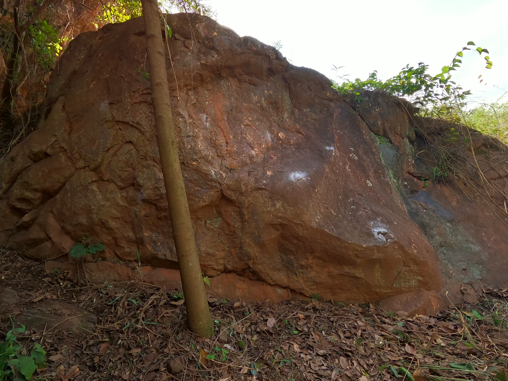
          - **largura_mapa**: 2364
          - **altura_mapa**: 1773
          - **pontos_de_interesse**:
            - **[0]**:
              - **id**: cN98a82t2JCMQP
              - **uid**: cN98a82t2JCMQP
              - **rotulo**: 
              - **linha**:
                - **estilo**: TRACEJADO
                - **espessura**: 5
                - **compilado**:
                  - **caminho_svg**: M 1087 1109 C 1066.7 1053.3, 1049.4 1002.1, 1026 942 C 998.1 870.3, 959.2 776.3, 929 708 C 905.0 653.9, 898.6 599.8, 861 564 C 819.7 524.6, 731.8 519.4, 683 490 C 643.4 466.1, 606.8 445.8, 585 409 C 559.8 366.4, 559.8 291.3, 553 242 C 547.6 203.4, 547.0 172.7, 544 138
                  - **caixa_delimitadora**:
                    - **x**: 816
                    - **y**: 624
                    - **comprimento**: 543
                    - **largura**: 971
                  - **marcadores**:
                    - **[0]**:
                      - **tipo**: CIRCULO_IDENTIFICADOR
                      - **x**: 1087
                      - **y**: 1109
                      - **angulo_graus_x100**: -11007
                      - **rotulo**: 10
                      - **raio**: 24
              - **cor**: #FFD600
              - **label**: 
            - **[1]**:
              - **id**: Qck4hKYZBivTQo
              - **uid**: Qck4hKYZBivTQo
              - **rotulo**: 
              - **linha**:
                - **estilo**: TRACEJADO
                - **espessura**: 5
                - **compilado**:
                  - **caminho_svg**: M 1833 1135 C 1793.0 1101.0, 1759.5 1064.7, 1713 1033 C 1658.6 995.9, 1578.7 966.3, 1523 931 C 1475.5 900.9, 1422.1 876.1, 1397 838 C 1375.1 804.8, 1377.5 762.6, 1370 722 C 1361.9 677.9, 1352.8 628.0, 1351 583 C 1349.3 540.8, 1362.0 500.3, 1358 460 C 1354.0 419.9, 1337.8 378.9, 1327 342 C 1317.4 309.0, 1307.0 280.0, 1297 249
                  - **caixa_delimitadora**:
                    - **x**: 1565
                    - **y**: 692
                    - **comprimento**: 536
                    - **largura**: 886
                  - **marcadores**:
                    - **[0]**:
                      - **tipo**: CIRCULO_IDENTIFICADOR
                      - **x**: 1833
                      - **y**: 1135
                      - **angulo_graus_x100**: -13964
                      - **rotulo**: 11
                      - **raio**: 24
              - **cor**: #FFD600
              - **label**: 
          - **referencias**:
            - **[0]**:
              - **alvo_uid**: ifePMiw1H74Dti
              - **pontos_uids**:
                - cN98a82t2JCMQP
              - **escalada**: Auto seg
              - **ids**:
                - cN98a82t2JCMQP
            - **[1]**:
              - **alvo_uid**: PHUYBVvWm9rvAZ
              - **pontos_uids**:
                - Qck4hKYZBivTQo
              - **escalada**: Arla
              - **ids**:
                - Qck4hKYZBivTQo
      - **escaladas**:
        - **[0]**:
          - **uid**: vo6nadNzA5cVa3
          - **boulder**:
            - **nome**: Dengoso
            - **dificuldade**: V7
        - **[1]**:
          - **uid**: D4F2u8Lg2XgoBZ
          - **boulder**:
            - **nome**: Fênix
            - **dificuldade**: V5
        - **[2]**:
          - **uid**: Iypt5SbOECadzL
          - **boulder**:
            - **nome**: V5 do Bull
            - **dificuldade**: V5
        - **[3]**:
          - **uid**: tkXSRSpNWY5yL3
          - **boulder**:
            - **nome**: Só o pó
            - **dificuldade**: V1
        - **[4]**:
          - **uid**: 1E48e1PlohVfeJ
          - **boulder**:
            - **nome**: Só poeira
            - **dificuldade**: V1
        - **[5]**:
          - **uid**: bNsbFE3U6jby2Q
          - **boulder**:
            - **nome**: Poeirando
            - **dificuldade**: V1
        - **[6]**:
          - **uid**: wqMD6zlHac7ZXq
          - **boulder**:
            - **nome**: Barla Pé
            - **dificuldade**: V2
        - **[7]**:
          - **uid**: w44WoxqtaM6ZhW
          - **boulder**:
            - **nome**: Saara
            - **dificuldade**: V4
        - **[8]**:
          - **uid**: j8jNzNVmSPwRCU
          - **boulder**:
            - **nome**: Sem nome 21
            - **dificuldade**: V2
        - **[9]**:
          - **uid**: FxFvwakoPrIZpQ
          - **boulder**:
            - **nome**: Só poeirinha
            - **dificuldade**: V3
        - **[10]**:
          - **uid**: KxvXtpyF8myGW9
          - **boulder**:
            - **nome**: Sem nome 23
            - **dificuldade**: V1
        - **[11]**:
          - **uid**: ifePMiw1H74Dti
          - **boulder**:
            - **nome**: Auto seg
            - **dificuldade**: V0
        - **[12]**:
          - **uid**: PHUYBVvWm9rvAZ
          - **boulder**:
            - **nome**: Arla
            - **dificuldade**: V3
      - **precomputados**:
        - **total_escaladas**: 13
        - **total_boulders**: 13
  - **[5]**:
    - **conteudo**:
      - **descricao**: 
      - **nome**: Estacionamento - Bloco Virada Brasil
      - **uid**: XzxxlTtKqrsYLl
      - **escaladas**:
        - **[0]**:
          - **uid**: ps4v5J4jjV7Hfq
          - **boulder**:
            - **nome**: Virada Brasil
            - **dificuldade**: V0
        - **[1]**:
          - **uid**: AKaga5P3UUaAhd
          - **boulder**:
            - **nome**: Tio peruca
            - **dificuldade**: V1
        - **[2]**:
          - **uid**: 7AxyC75DOr49wa
          - **boulder**:
            - **nome**: Sem nome 24
            - **dificuldade**: V0
      - **mapas**:
        - **[0]**:
          - **caminho_imagem_mapa**: 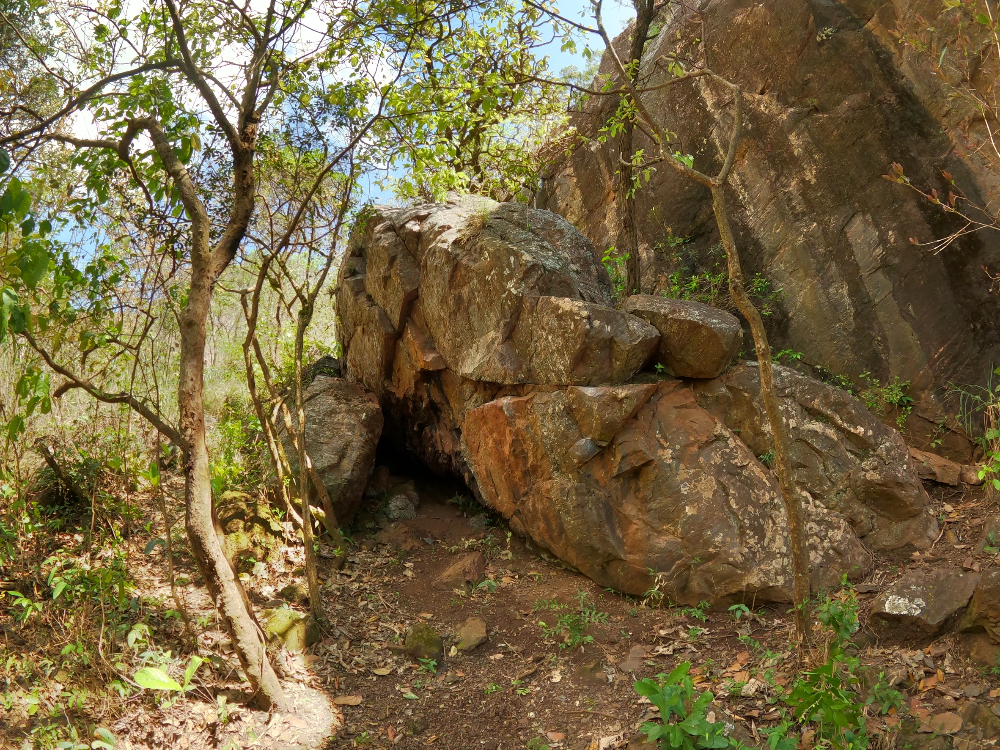
          - **largura_mapa**: 2364
          - **altura_mapa**: 1773
          - **pontos_de_interesse**:
            - **[0]**:
              - **id**: TCqSo3l4scy9Cr
              - **uid**: TCqSo3l4scy9Cr
              - **rotulo**: 
              - **linha**:
                - **estilo**: TRACEJADO
                - **espessura**: 4
                - **compilado**:
                  - **caminho_svg**: M 1681 1349 C 1655.7 1280.7, 1628.3 1214.9, 1605 1144 C 1580.5 1069.5, 1579.3 979.9, 1538 912 C 1494.8 841.0, 1387.7 770.1, 1346 730 C 1325.7 710.4, 1313.8 703.4, 1301 686 C 1287.0 667.0, 1275.8 637.9, 1267 619 C 1260.7 605.6, 1257.3 595.7, 1252 584 C 1246.6 572.0, 1241.1 561.1, 1235 548 C 1227.7 532.3, 1219.0 513.3, 1211 496
                  - **caixa_delimitadora**:
                    - **x**: 1446
                    - **y**: 922
                    - **comprimento**: 470
                    - **largura**: 853
                  - **marcadores**:
                    - **[0]**:
                      - **tipo**: CIRCULO_IDENTIFICADOR
                      - **x**: 1681
                      - **y**: 1349
                      - **angulo_graus_x100**: -11034
                      - **rotulo**: 3
                      - **raio**: 19
                    - **[1]**:
                      - **tipo**: FIM_TOP
                      - **x**: 1211
                      - **y**: 496
                      - **angulo_graus_x100**: -11478
                      - **rotulo**: B
                      - **raio**: 19
              - **cor**: #FFD600
              - **label**: 
            - **[1]**:
              - **id**: dq3Z8gzMAG78T6
              - **uid**: dq3Z8gzMAG78T6
              - **linha**:
                - **estilo**: TRACEJADO
                - **espessura**: 4
                - **compilado**:
                  - **caminho_svg**: M 1466 1370 C 1452.7 1306.7, 1436.3 1234.2, 1426 1180 C 1418.3 1139.6, 1416.0 1104.6, 1408 1074 C 1401.6 1049.7, 1395.7 1029.1, 1385 1010 C 1374.8 991.6, 1361.6 971.7, 1346 961 C 1332.1 951.4, 1315.4 948.2, 1298 946 C 1278.4 943.5, 1254.0 947.5, 1234 949 C 1216.3 950.3, 1202.1 957.4, 1184 954 C 1159.8 949.4, 1128.6 934.1, 1104 913 C 1073.1 886.6, 1038.9 835.5, 1021 799 C 1007.0 770.4, 1005.0 743.7, 997 716
                  - **caixa_delimitadora**:
                    - **x**: 1232
                    - **y**: 1043
                    - **comprimento**: 469
                    - **largura**: 654
                  - **marcadores**:
                    - **[0]**:
                      - **tipo**: CIRCULO_IDENTIFICADOR
                      - **x**: 1466
                      - **y**: 1370
                      - **angulo_graus_x100**: -10189
                      - **rotulo**: 2
                      - **raio**: 19
              - **cor**: #FFD600
            - **[2]**:
              - **id**: enl6MWJpNyBsAG
              - **uid**: enl6MWJpNyBsAG
              - **linha**:
                - **estilo**: TRACEJADO
                - **espessura**: 4
                - **compilado**:
                  - **caminho_svg**: M 997 716 C 999.3 691.7, 1001.6 666.5, 1004 643 C 1006.3 621.0, 1009.9 601.4, 1011 579 C 1012.2 554.3, 1010.3 527.0, 1010 501
                  - **caixa_delimitadora**:
                    - **x**: 1004
                    - **y**: 608
                    - **comprimento**: 14
                    - **largura**: 215
                  - **marcadores**:
                    - **[0]**:
                      - **tipo**: FIM_TOP
                      - **x**: 1010
                      - **y**: 501
                      - **angulo_graus_x100**: -9073
                      - **rotulo**: A
                      - **raio**: 19
              - **cor**: #FFD600
            - **[3]**:
              - **id**: d7TPFX7nth7n3n
              - **uid**: d7TPFX7nth7n3n
              - **rotulo**: 
              - **linha**:
                - **estilo**: TRACEJADO
                - **espessura**: 4
                - **compilado**:
                  - **caminho_svg**: M 864 1225 C 871.7 1198.7, 880.2 1169.9, 887 1146 C 892.6 1126.3, 896.9 1111.5, 902 1092 C 907.9 1069.3, 913.8 1041.8, 920 1018 C 925.8 995.6, 931.4 974.8, 938 953 C 944.7 930.5, 954.3 906.4, 960 885 C 964.9 866.4, 966.5 853.1, 971 832 C 977.7 800.8, 988.3 754.7, 997 716
                  - **caixa_delimitadora**:
                    - **x**: 930
                    - **y**: 970
                    - **comprimento**: 133
                    - **largura**: 509
                  - **marcadores**:
                    - **[0]**:
                      - **tipo**: CIRCULO_IDENTIFICADOR
                      - **x**: 864
                      - **y**: 1225
                      - **angulo_graus_x100**: -7377
                      - **rotulo**: 1
                      - **raio**: 19
              - **cor**: #FFD600
              - **label**: 
          - **referencias**:
            - **[0]**:
              - **alvo_uid**: ps4v5J4jjV7Hfq
              - **pontos_uids**:
                - TCqSo3l4scy9Cr
              - **escalada**: Virada Brasil
              - **ids**:
                - TCqSo3l4scy9Cr
            - **[1]**:
              - **alvo_uid**: AKaga5P3UUaAhd
              - **pontos_uids**:
                - dq3Z8gzMAG78T6
                - enl6MWJpNyBsAG
              - **escalada**: Tio peruca
              - **ids**:
                - dq3Z8gzMAG78T6
                - enl6MWJpNyBsAG
            - **[2]**:
              - **alvo_uid**: 7AxyC75DOr49wa
              - **pontos_uids**:
                - d7TPFX7nth7n3n
                - enl6MWJpNyBsAG
              - **escalada**: Sem nome 24
              - **ids**:
                - d7TPFX7nth7n3n
                - enl6MWJpNyBsAG
      - **precomputados**:
        - **total_escaladas**: 3
        - **total_boulders**: 3
  - **[6]**:
    - **conteudo**:
      - **descricao**: 
      - **nome**: Estacionamento - Bloco Mega drive
      - **uid**: BHZYeEEiafGcj0
      - **escaladas**:
        - **[0]**:
          - **uid**: xL63RFAFiH1cCt
          - **boulder**:
            - **nome**: Atari
            - **dificuldade**: V5
        - **[1]**:
          - **uid**: eeGIOqgQCtVtqW
          - **boulder**:
            - **nome**: Projeto Igarapé
            - **dificuldade**: INDEFINIDO
        - **[2]**:
          - **uid**: baJERd9KO4QDMT
          - **boulder**:
            - **nome**: Sem Nome 25
            - **dificuldade**: V2
        - **[3]**:
          - **uid**: h4PnFTagpsHZpB
          - **boulder**:
            - **nome**: Master System
            - **dificuldade**: V10_BARRA_V11
            - **conquistadores**:
              - Drosa
        - **[4]**:
          - **uid**: 95yqksfZ3WIflC
          - **boulder**:
            - **nome**: Mega drive
            - **dificuldade**: V7
      - **mapas**:
        - **[0]**:
          - **caminho_imagem_mapa**: 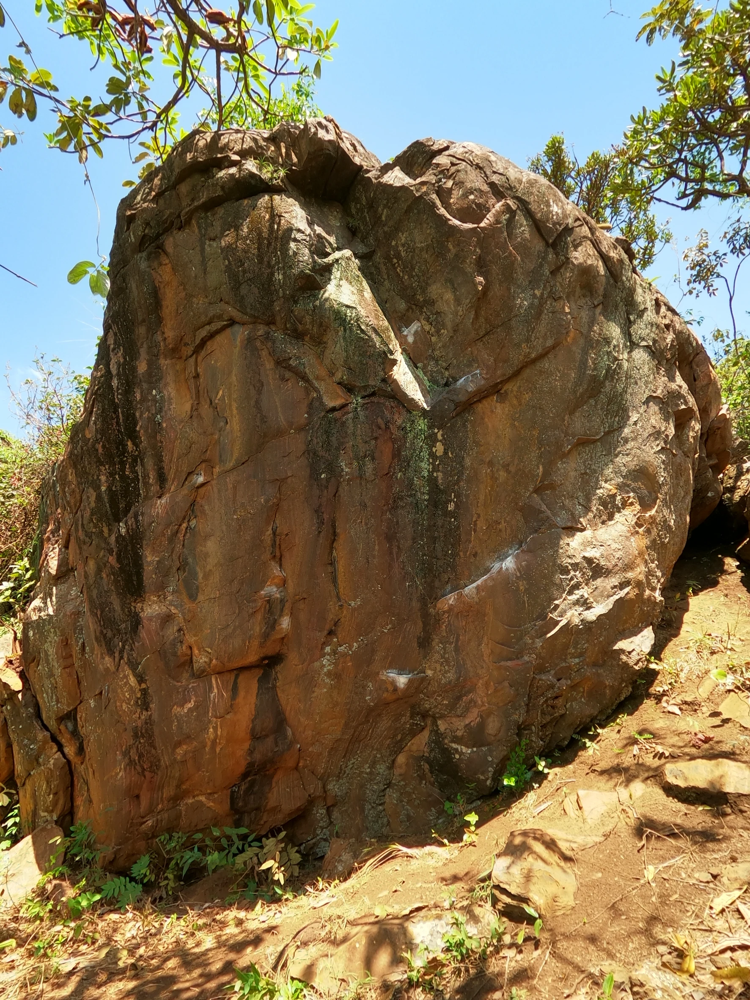
          - **largura_mapa**: 1773
          - **altura_mapa**: 2364
          - **pontos_de_interesse**:
            - **[0]**:
              - **id**: 3U1xMV1hDr2FtN
              - **uid**: 3U1xMV1hDr2FtN
              - **linha**:
                - **estilo**: TRACEJADO
                - **espessura**: 5
                - **compilado**:
                  - **caminho_svg**: M 948 1676 C 950.0 1663.0, 952.0 1650.0, 954 1637
                  - **caixa_delimitadora**:
                    - **x**: 951
                    - **y**: 1656
                    - **comprimento**: 6
                    - **largura**: 39
                  - **marcadores**:
                    - **[0]**:
                      - **tipo**: CIRCULO_IDENTIFICADOR
                      - **x**: 948
                      - **y**: 1676
                      - **angulo_graus_x100**: -8125
                      - **rotulo**: 2
              - **cor**: #00E5FF
            - **[1]**:
              - **id**: Q8apI2RjUAnula
              - **uid**: Q8apI2RjUAnula
              - **rotulo**: 
              - **linha**:
                - **estilo**: TRACEJADO
                - **espessura**: 5
                - **compilado**:
                  - **caminho_svg**: M 331 1226 C 321.3 1197.7, 314.2 1173.7, 302 1141 C 284.9 1095.2, 246.5 1021.7, 236 978 C 229.4 950.4, 228.1 934.1, 230 908 C 232.4 873.8, 248.0 830.0, 257 791
                  - **caixa_delimitadora**:
                    - **x**: 280
                    - **y**: 1008
                    - **comprimento**: 101
                    - **largura**: 435
                  - **marcadores**:
                    - **[0]**:
                      - **tipo**: CIRCULO_IDENTIFICADOR
                      - **x**: 331
                      - **y**: 1226
                      - **angulo_graus_x100**: -10884
                      - **rotulo**: 1
              - **cor**: #00E5FF
              - **label**: 
            - **[2]**:
              - **id**: ULYhKCswkt7tOz
              - **uid**: ULYhKCswkt7tOz
              - **linha**:
                - **estilo**: TRACEJADO
                - **espessura**: 5
                - **compilado**:
                  - **caminho_svg**: M 954 1637 C 948.3 1622.7, 948.1 1605.7, 937 1594 C 922.5 1578.9, 891.5 1569.3, 866 1562 C 838.8 1554.2, 806.2 1562.3, 778 1550 C 744.8 1535.5, 708.4 1499.9, 683 1472 C 660.9 1447.8, 647.3 1427.4, 631 1395 C 607.6 1348.5, 600.6 1256.7, 567 1214 C 539.7 1179.4, 492.8 1176.3, 461 1145 C 423.8 1108.4, 390.3 1041.4, 364 1001 C 345.2 972.1, 332.3 950.4, 317 926 C 302.4 902.8, 284.1 881.4, 274 858 C 264.7 836.3, 262.7 813.3, 257 791
                  - **caixa_delimitadora**:
                    - **x**: 606
                    - **y**: 1214
                    - **comprimento**: 697
                    - **largura**: 846
                  - **marcadores**: []
              - **cor**: #00E5FF
            - **[3]**:
              - **id**: nZw977PekLEm59
              - **uid**: nZw977PekLEm59
              - **linha**:
                - **estilo**: TRACEJADO
                - **espessura**: 5
                - **compilado**:
                  - **caminho_svg**: M 257 791 C 261.3 740.3, 266.0 689.3, 270 639 C 274.0 589.6, 277.3 541.0, 281 492
                  - **caixa_delimitadora**:
                    - **x**: 269
                    - **y**: 642
                    - **comprimento**: 24
                    - **largura**: 299
                  - **marcadores**:
                    - **[0]**:
                      - **tipo**: FIM_TOP
                      - **x**: 281
                      - **y**: 492
                      - **angulo_graus_x100**: -8572
                      - **rotulo**: A
              - **cor**: #00E5FF
            - **[4]**:
              - **id**: 6A5nPuW5RHYy6h
              - **uid**: 6A5nPuW5RHYy6h
              - **rotulo**: 
              - **circulo**:
                - **x**: 380
                - **y**: 1183
                - **raio**: 26
              - **cor**: #FFD600
              - **label**: 
            - **[5]**:
              - **id**: 7nFSCoZsYda0nZ
              - **uid**: 7nFSCoZsYda0nZ
              - **rotulo**: 
              - **linha**:
                - **estilo**: TRACEJADO
                - **espessura**: 5
                - **compilado**:
                  - **caminho_svg**: M 1223 1289 C 1227.7 1273.7, 1239.8 1261.3, 1237 1243 C 1232.0 1210.4, 1168.7 1160.3, 1151 1117 C 1135.3 1078.7, 1133.4 1039.3, 1130 999 C 1126.5 957.4, 1127.5 914.2, 1131 871 C 1134.6 826.2, 1142.5 776.9, 1152 735 C 1160.4 698.0, 1172.8 664.1, 1183 632 C 1192.1 603.6, 1203.6 577.9, 1210 552 C 1215.8 528.4, 1223.9 507.1, 1221 483 C 1217.5 454.5, 1201.0 417.7, 1183 393 C 1166.3 370.1, 1140.3 356.3, 1119 338
                  - **caixa_delimitadora**:
                    - **x**: 1178
                    - **y**: 814
                    - **comprimento**: 118
                    - **largura**: 951
                  - **marcadores**:
                    - **[0]**:
                      - **tipo**: CIRCULO_IDENTIFICADOR
                      - **x**: 1119
                      - **y**: 338
                      - **angulo_graus_x100**: -13933
                      - **rotulo**: B
              - **cor**: #00E5FF
              - **label**: 
            - **[6]**:
              - **id**: 3lLONxHYDVabzD
              - **uid**: 3lLONxHYDVabzD
              - **linha**:
                - **estilo**: TRACEJADO
                - **espessura**: 5
                - **compilado**:
                  - **caminho_svg**: M 954 1637 C 963.3 1587.3, 963.7 1528.8, 982 1488 C 997.4 1453.8, 1020.2 1429.3, 1047 1404 C 1076.7 1376.0, 1122.7 1350.0, 1155 1330 C 1179.9 1314.6, 1200.3 1304.7, 1223 1292
                  - **caixa_delimitadora**:
                    - **x**: 1088
                    - **y**: 1464
                    - **comprimento**: 269
                    - **largura**: 345
                  - **marcadores**: []
              - **cor**: #00E5FF
            - **[7]**:
              - **id**: 8kvZVJW2QzC2n3
              - **uid**: 8kvZVJW2QzC2n3
              - **linha**:
                - **estilo**: TRACEJADO
                - **espessura**: 5
                - **compilado**:
                  - **caminho_svg**: M 1223 1289 C 1268.3 1273.3, 1315.0 1256.4, 1359 1242 C 1400.1 1228.6, 1442.8 1220.4, 1479 1205 C 1511.4 1191.2, 1546.6 1179.7, 1567 1156 C 1587.0 1132.7, 1590.1 1096.5, 1601 1065 C 1612.5 1031.6, 1628.5 995.7, 1634 961 C 1639.3 928.0, 1635.6 891.1, 1635 862 C 1634.6 838.9, 1633.0 820.7, 1632 800
                  - **caixa_delimitadora**:
                    - **x**: 1429
                    - **y**: 1044
                    - **comprimento**: 412
                    - **largura**: 489
                  - **marcadores**:
                    - **[0]**:
                      - **tipo**: FIM_TOP
                      - **x**: 1632
                      - **y**: 800
                      - **angulo_graus_x100**: -9277
                      - **rotulo**: C
              - **cor**: #00E5FF
            - **[8]**:
              - **id**: Iqacn5BbIeHWk9
              - **uid**: Iqacn5BbIeHWk9
              - **rotulo**: 
              - **circulo**:
                - **x**: 284
                - **y**: 1248
                - **raio**: 27
              - **cor**: #FFD600
              - **label**: 
          - **referencias**:
            - **[0]**:
              - **alvo_uid**: xL63RFAFiH1cCt
              - **pontos_uids**:
                - 3U1xMV1hDr2FtN
                - 3lLONxHYDVabzD
                - 8kvZVJW2QzC2n3
              - **escalada**: Atari
              - **ids**:
                - 3U1xMV1hDr2FtN
                - 3lLONxHYDVabzD
                - 8kvZVJW2QzC2n3
            - **[1]**:
              - **alvo_uid**: eeGIOqgQCtVtqW
              - **pontos_uids**:
                - 3U1xMV1hDr2FtN
                - ULYhKCswkt7tOz
                - nZw977PekLEm59
              - **escalada**: Projeto Igarapé
              - **ids**:
                - 3U1xMV1hDr2FtN
                - ULYhKCswkt7tOz
                - nZw977PekLEm59
            - **[2]**:
              - **alvo_uid**: h4PnFTagpsHZpB
              - **pontos_uids**:
                - Q8apI2RjUAnula
                - nZw977PekLEm59
                - 6A5nPuW5RHYy6h
                - Iqacn5BbIeHWk9
              - **escalada**: Master System
              - **ids**:
                - Q8apI2RjUAnula
                - nZw977PekLEm59
                - 6A5nPuW5RHYy6h
                - Iqacn5BbIeHWk9
            - **[3]**:
              - **alvo_uid**: 95yqksfZ3WIflC
              - **pontos_uids**:
                - 3U1xMV1hDr2FtN
                - 3lLONxHYDVabzD
                - 7nFSCoZsYda0nZ
              - **escalada**: Mega drive
              - **ids**:
                - 3U1xMV1hDr2FtN
                - 3lLONxHYDVabzD
                - 7nFSCoZsYda0nZ
        - **[1]**:
          - **caminho_imagem_mapa**: 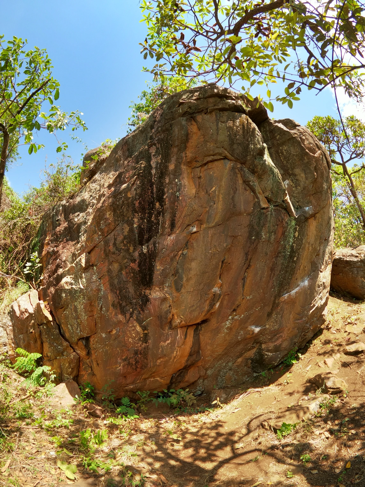
          - **largura_mapa**: 1773
          - **altura_mapa**: 2364
          - **pontos_de_interesse**:
            - **[0]**:
              - **id**: Ak8gIju2Ss3zzz
              - **uid**: Ak8gIju2Ss3zzz
              - **rotulo**: 
              - **linha**:
                - **estilo**: TRACEJADO
                - **espessura**: 5
                - **compilado**:
                  - **caminho_svg**: M 412 1718 C 388.3 1684.3, 360.6 1651.4, 341 1617 C 322.8 1584.9, 306.2 1554.3, 297 1519 C 287.1 1481.3, 278.1 1435.5, 286 1397 C 293.9 1358.1, 326.3 1326.8, 345 1287 C 365.9 1242.3, 386.5 1186.6, 404 1141 C 419.3 1101.3, 428.0 1065.0, 445 1029 C 462.2 992.6, 486.6 962.2, 507 924 C 530.3 880.5, 554.5 822.9, 576 781 C 593.3 747.3, 609.7 714.7, 625 691 C 635.8 674.2, 645.7 663.7, 656 650
                  - **caixa_delimitadora**:
                    - **x**: 471
                    - **y**: 1184
                    - **comprimento**: 370
                    - **largura**: 1068
                  - **marcadores**:
                    - **[0]**:
                      - **tipo**: CIRCULO_IDENTIFICADOR
                      - **x**: 412
                      - **y**: 1718
                      - **angulo_graus_x100**: -12511
                      - **rotulo**: 3
                      - **raio**: 24
              - **cor**: #00E5FF
              - **label**: 
            - **[1]**:
              - **id**: o1JJil8lMGPbIY
              - **uid**: o1JJil8lMGPbIY
              - **rotulo**: 
              - **linha**:
                - **estilo**: TRACEJADO
                - **espessura**: 5
                - **compilado**:
                  - **caminho_svg**: M 769 1204 C 751.3 1111.3, 736.7 987.9, 716 926 C 704.9 892.8, 684.9 882.7, 680 853 C 673.2 812.1, 680.9 745.8, 700 700 C 719.2 654.1, 788.8 613.3, 795 578 C 799.0 555.1, 781.7 536.7, 775 516
                  - **caixa_delimitadora**:
                    - **x**: 738
                    - **y**: 860
                    - **comprimento**: 115
                    - **largura**: 688
                  - **marcadores**:
                    - **[0]**:
                      - **tipo**: CIRCULO_IDENTIFICADOR
                      - **x**: 769
                      - **y**: 1204
                      - **angulo_graus_x100**: -10079
                      - **rotulo**: 1
              - **cor**: #00E5FF
              - **label**: 
            - **[2]**:
              - **id**: FPyqUxmgtaGlod
              - **uid**: FPyqUxmgtaGlod
              - **rotulo**: 
              - **circulo**:
                - **x**: 696
                - **y**: 1206
                - **raio**: 28
              - **cor**: #FFD600
              - **label**: 
            - **[3]**:
              - **id**: ttaawpem2ChoyF
              - **uid**: ttaawpem2ChoyF
              - **rotulo**: 
              - **circulo**:
                - **x**: 836
                - **y**: 1142
                - **raio**: 27
              - **cor**: #FFD600
              - **label**: 
          - **referencias**:
            - **[0]**:
              - **alvo_uid**: baJERd9KO4QDMT
              - **pontos_uids**:
                - Ak8gIju2Ss3zzz
              - **escalada**: Sem Nome 25
              - **ids**:
                - Ak8gIju2Ss3zzz
            - **[1]**:
              - **alvo_uid**: h4PnFTagpsHZpB
              - **pontos_uids**:
                - o1JJil8lMGPbIY
                - ttaawpem2ChoyF
                - FPyqUxmgtaGlod
              - **escalada**: Master System
              - **ids**:
                - o1JJil8lMGPbIY
                - ttaawpem2ChoyF
                - FPyqUxmgtaGlod
      - **precomputados**:
        - **total_escaladas**: 5
        - **total_boulders**: 5
- **precomputados**:
  - **total_escaladas**: 51
  - **total_esportivas**: 19
  - **total_boulders**: 32

## Parte: setor_fugitivos_i (não listada em partes.json)

### Setor (Pico: Complexo Pedra Grande)

- **descricao**: Veja a trilha para chegar ao setor no Wikiloc: https://loc.wiki/t/169742661?wa=sc
- **nome**: Bloco Fugitivos I
- **uid**: 7TPrkAyBIkfebu
- **escaladas**:
  - **[0]**:
    - **uid**: ylP5dyJeN3B2O3
    - **boulder**:
      - **nome**: Polydance
      - **dificuldade**: V4
  - **[1]**:
    - **uid**: 4Fg4D2G7fatIQu
    - **boulder**:
      - **nome**: Bigdance
      - **dificuldade**: V5_BARRA_V6
  - **[2]**:
    - **uid**: 5UWi9FU93v9Wn7
    - **boulder**:
      - **nome**: Boulder do Bola
      - **dificuldade**: V5
  - **[3]**:
    - **uid**: f21zxSYALzzqd4
    - **boulder**:
      - **nome**: Trolls
      - **dificuldade**: V1
  - **[4]**:
    - **uid**: JRWNVEWv9PW7cT
    - **boulder**:
      - **nome**: Calcinha Larga
      - **dificuldade**: V2_BARRA_V3
  - **[5]**:
    - **uid**: DR9Kr2iM95wsLA
    - **boulder**:
      - **nome**: Tanga Frouxa
      - **dificuldade**: V2
  - **[6]**:
    - **uid**: dVJ3EOevp6RUsJ
    - **boulder**:
      - **nome**: Barriga de Aluguel
      - **dificuldade**: V5
  - **[7]**:
    - **uid**: OM7GKqux35ulMX
    - **boulder**:
      - **nome**: Primeiro de todos
      - **dificuldade**: V1
  - **[8]**:
    - **uid**: pWxY9RRKmbZAD1
    - **boulder**:
      - **nome**: Sem nome 18
      - **dificuldade**: V0
  - **[9]**:
    - **uid**: 4BYQJGarCXVMZm
    - **boulder**:
      - **nome**: Bananinha
      - **dificuldade**: V1
  - **[10]**:
    - **uid**: xeGaxvtdw12rIT
    - **boulder**:
      - **nome**: Cactos kid
      - **dificuldade**: V2
  - **[11]**:
    - **uid**: lwQFVyVhn6goph
    - **boulder**:
      - **nome**: Quem vai primeiro
      - **dificuldade**: V1
- **mapas**:
  - **[0]**:
    - **caminho_imagem_mapa**: 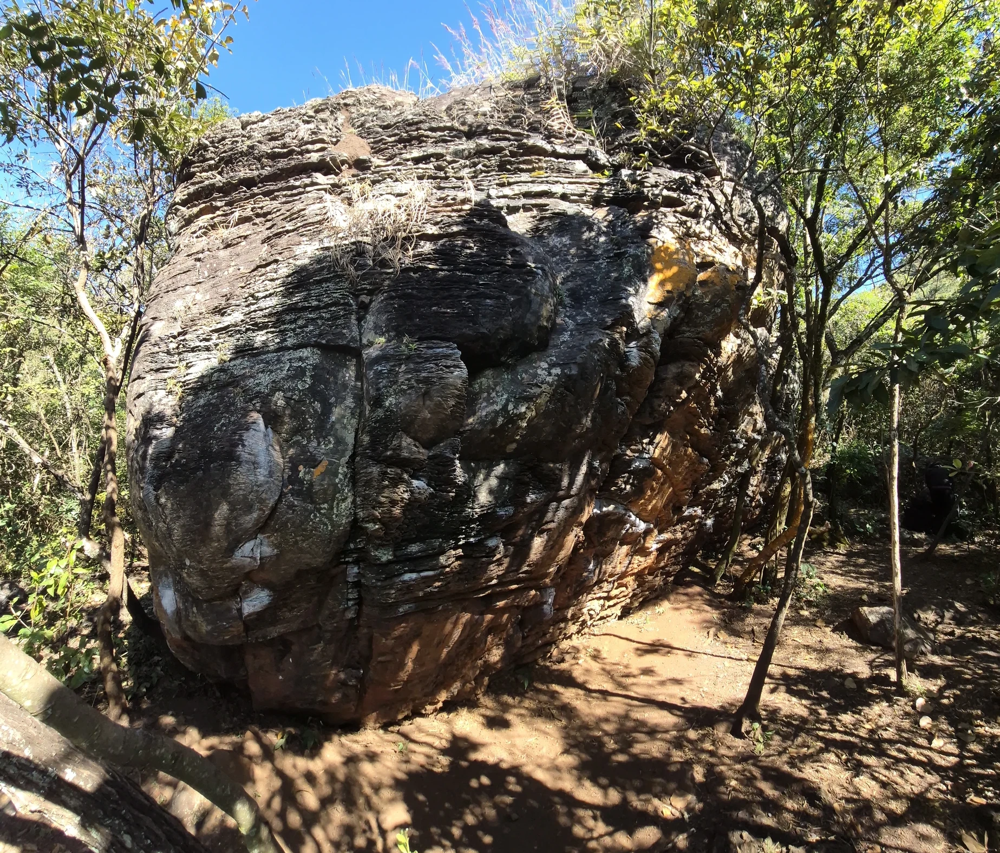
    - **largura_mapa**: 1847
    - **altura_mapa**: 1577
    - **pontos_de_interesse**:
      - **[0]**:
        - **id**: 29CR0yWUubJgsh
        - **uid**: 29CR0yWUubJgsh
        - **rotulo**: 2
        - **linha**:
          - **estilo**: TRACEJADO
          - **espessura**: 3
          - **compilado**:
            - **caminho_svg**: M 678 1132 C 670.0 1037.0, 655.1 943.0, 654 847 C 652.9 749.1, 666.3 645.2, 672 550 C 677.3 461.8, 682.0 380.0, 687 295
            - **caixa_delimitadora**:
              - **x**: 670
              - **y**: 714
              - **comprimento**: 33
              - **largura**: 837
            - **marcadores**:
              - **[0]**:
                - **tipo**: CIRCULO_IDENTIFICADOR
                - **x**: 678
                - **y**: 1132
                - **angulo_graus_x100**: -9481
                - **rotulo**: 2
              - **[1]**:
                - **tipo**: FIM_TOP
                - **x**: 687
                - **y**: 295
                - **angulo_graus_x100**: -8663
                - **rotulo**: B
        - **cor**: #FFD600
        - **label**: 2
      - **[1]**:
        - **id**: 889TBw74ifLuxF
        - **uid**: 889TBw74ifLuxF
        - **rotulo**: 3
        - **linha**:
          - **estilo**: TRACEJADO
          - **espessura**: 3
          - **compilado**:
            - **caminho_svg**: M 1008 1116 C 1044.0 1048.0, 1080.0 980.0, 1116 912
            - **caixa_delimitadora**:
              - **x**: 1062
              - **y**: 1014
              - **comprimento**: 108
              - **largura**: 204
            - **marcadores**:
              - **[0]**:
                - **tipo**: CIRCULO_IDENTIFICADOR
                - **x**: 1008
                - **y**: 1116
                - **angulo_graus_x100**: -6210
                - **rotulo**: 3
        - **cor**: #FFD600
        - **label**: 3
      - **[2]**:
        - **id**: THBRLUul62myxD
        - **uid**: THBRLUul62myxD
        - **rotulo**: 4
        - **linha**:
          - **estilo**: TRACEJADO
          - **espessura**: 3
          - **compilado**:
            - **caminho_svg**: M 1305 961 C 1332.7 896.7, 1378.3 825.2, 1388 768 C 1395.3 725.4, 1382.7 690.7, 1380 652
            - **caixa_delimitadora**:
              - **x**: 1346
              - **y**: 806
              - **comprimento**: 83
              - **largura**: 309
            - **marcadores**:
              - **[0]**:
                - **tipo**: CIRCULO_IDENTIFICADOR
                - **x**: 1305
                - **y**: 961
                - **angulo_graus_x100**: -6673
                - **rotulo**: 4
        - **cor**: #FFD600
        - **label**: 4
      - **[3]**:
        - **id**: Dj12Nq8fQktwyt
        - **uid**: Dj12Nq8fQktwyt
        - **rotulo**: 5
        - **linha**:
          - **estilo**: TRACEJADO
          - **espessura**: 3
          - **compilado**:
            - **caminho_svg**: M 1461 842 C 1414.3 863.3, 1359.2 882.8, 1321 906 C 1291.2 924.2, 1269.1 953.3, 1247 964 C 1232.2 971.2, 1219.7 970.7, 1206 974
            - **caixa_delimitadora**:
              - **x**: 1334
              - **y**: 908
              - **comprimento**: 255
              - **largura**: 132
            - **marcadores**:
              - **[0]**:
                - **tipo**: CIRCULO_IDENTIFICADOR
                - **x**: 1461
                - **y**: 842
                - **angulo_graus_x100**: 15543
                - **rotulo**: 5
        - **cor**: #FFD600
        - **label**: 5
      - **[4]**:
        - **id**: c6VFijpXyPqMOR
        - **uid**: c6VFijpXyPqMOR
        - **rotulo**: X
        - **linha**:
          - **estilo**: TRACEJADO
          - **espessura**: 3
          - **compilado**:
            - **caminho_svg**: M 1205 973 C 1136.0 991.7, 1075.4 1014.7, 998 1029 C 902.5 1046.7, 765.1 1047.9, 673 1062 C 603.9 1072.6, 523.6 1120.4, 493 1099 C 468.6 1081.9, 481.7 1021.7, 476 983
            - **caixa_delimitadora**:
              - **x**: 840
              - **y**: 1036
              - **comprimento**: 729
              - **largura**: 126
            - **marcadores**: []
        - **cor**: #FFD600
        - **label**: X
      - **[5]**:
        - **id**: IpevDPdsnVHfkx
        - **uid**: IpevDPdsnVHfkx
        - **rotulo**: ▲
        - **linha**:
          - **estilo**: TRACEJADO
          - **espessura**: 3
          - **compilado**:
            - **caminho_svg**: M 1205 974 C 1187.3 968.7, 1167.1 964.1, 1152 958 C 1140.0 953.2, 1126.9 950.1, 1121 942 C 1115.5 934.4, 1117.7 922.0, 1116 912
            - **caixa_delimitadora**:
              - **x**: 1160
              - **y**: 943
              - **comprimento**: 89
              - **largura**: 62
            - **marcadores**:
              - **[0]**:
                - **tipo**: CIRCULO_IDENTIFICADOR
                - **x**: 1152
                - **y**: 958
                - **angulo_graus_x100**: -15915
                - **rotulo**: ▲
                - **raio**: 14
        - **cor**: #FFD600
        - **label**: ▲
      - **[6]**:
        - **id**: kp1FBa7XztavAz
        - **uid**: kp1FBa7XztavAz
        - **rotulo**: D
        - **linha**:
          - **estilo**: TRACEJADO
          - **espessura**: 3
          - **compilado**:
            - **caminho_svg**: M 1116 912 C 1142.7 854.0, 1201.2 808.0, 1196 738 C 1187.2 619.5, 996.0 432.0, 896 279
            - **caixa_delimitadora**:
              - **x**: 1046
              - **y**: 596
              - **comprimento**: 300
              - **largura**: 633
            - **marcadores**:
              - **[0]**:
                - **tipo**: CIRCULO_IDENTIFICADOR
                - **x**: 896
                - **y**: 279
                - **angulo_graus_x100**: -12317
                - **rotulo**: C
        - **cor**: #FFD600
        - **label**: D
      - **[7]**:
        - **id**: eyMQLEIXumeXrC
        - **uid**: eyMQLEIXumeXrC
        - **rotulo**: 
        - **linha**:
          - **estilo**: TRACEJADO
          - **espessura**: 3
          - **compilado**:
            - **caminho_svg**: M 284 1097 C 325.0 1110.0, 378.7 1147.7, 407 1136 C 431.5 1125.9, 440.0 1077.3, 452 1050 C 462.2 1026.6, 468.0 1005.3, 476 983
            - **caixa_delimitadora**:
              - **x**: 380
              - **y**: 1060
              - **comprimento**: 192
              - **largura**: 153
            - **marcadores**:
              - **[0]**:
                - **tipo**: CIRCULO_IDENTIFICADOR
                - **x**: 284
                - **y**: 1097
                - **angulo_graus_x100**: 1759
                - **rotulo**: 1
        - **cor**: #FFD600
        - **label**: 
      - **[8]**:
        - **id**: Jfeu3ieoYdblPv
        - **uid**: Jfeu3ieoYdblPv
        - **rotulo**: 
        - **linha**:
          - **estilo**: TRACEJADO
          - **espessura**: 3
          - **compilado**:
            - **caminho_svg**: M 476 982 C 483.0 946.7, 493.7 911.7, 497 876 C 500.3 840.3, 497.5 816.8, 496 768 C 492.7 665.0, 478.7 448.0, 470 288
            - **caixa_delimitadora**:
              - **x**: 484
              - **y**: 635
              - **comprimento**: 27
              - **largura**: 694
            - **marcadores**:
              - **[0]**:
                - **tipo**: CIRCULO_IDENTIFICADOR
                - **x**: 470
                - **y**: 288
                - **angulo_graus_x100**: -9310
                - **rotulo**: A
        - **cor**: #FFD600
        - **label**: 
      - **[9]**:
        - **id**: 2S8qvQRGUah2OE
        - **uid**: 2S8qvQRGUah2OE
        - **rotulo**: d
        - **linha**:
          - **estilo**: TRACEJADO
          - **espessura**: 3
          - **compilado**:
            - **caminho_svg**: M 1205 974 C 1263.3 866.7, 1321.7 759.3, 1380 652
            - **caixa_delimitadora**:
              - **x**: 1292
              - **y**: 813
              - **comprimento**: 175
              - **largura**: 322
            - **marcadores**: []
        - **cor**: #FFD600
        - **label**: d
      - **[10]**:
        - **id**: 3rqfVJ0dJgmYpW
        - **uid**: 3rqfVJ0dJgmYpW
        - **rotulo**: d
        - **linha**:
          - **estilo**: TRACEJADO
          - **espessura**: 3
          - **compilado**:
            - **caminho_svg**: M 1380 652 C 1401.3 575.7, 1422.7 499.3, 1444 423
            - **caixa_delimitadora**:
              - **x**: 1412
              - **y**: 538
              - **comprimento**: 64
              - **largura**: 229
            - **marcadores**:
              - **[0]**:
                - **tipo**: FIM_TOP
                - **x**: 1444
                - **y**: 423
                - **angulo_graus_x100**: -7439
                - **rotulo**: D
        - **cor**: #FFD600
        - **label**: d
    - **referencias**:
      - **[0]**:
        - **alvo_uid**: ylP5dyJeN3B2O3
        - **pontos_uids**:
          - Dj12Nq8fQktwyt
          - IpevDPdsnVHfkx
          - kp1FBa7XztavAz
        - **escalada**: Polydance
        - **ids**:
          - Dj12Nq8fQktwyt
          - IpevDPdsnVHfkx
          - kp1FBa7XztavAz
      - **[1]**:
        - **alvo_uid**: 4Fg4D2G7fatIQu
        - **pontos_uids**:
          - Dj12Nq8fQktwyt
          - Jfeu3ieoYdblPv
          - c6VFijpXyPqMOR
        - **escalada**: Bigdance
        - **ids**:
          - Dj12Nq8fQktwyt
          - Jfeu3ieoYdblPv
          - c6VFijpXyPqMOR
      - **[2]**:
        - **alvo_uid**: 5UWi9FU93v9Wn7
        - **pontos_uids**:
          - 889TBw74ifLuxF
          - IpevDPdsnVHfkx
          - 2S8qvQRGUah2OE
          - 3rqfVJ0dJgmYpW
        - **escalada**: Boulder do Bola
        - **ids**:
          - 889TBw74ifLuxF
          - IpevDPdsnVHfkx
          - 2S8qvQRGUah2OE
          - 3rqfVJ0dJgmYpW
      - **[3]**:
        - **alvo_uid**: f21zxSYALzzqd4
        - **pontos_uids**:
          - THBRLUul62myxD
          - 3rqfVJ0dJgmYpW
        - **escalada**: Trolls
        - **ids**:
          - THBRLUul62myxD
          - 3rqfVJ0dJgmYpW
      - **[4]**:
        - **alvo_uid**: JRWNVEWv9PW7cT
        - **pontos_uids**:
          - 889TBw74ifLuxF
          - kp1FBa7XztavAz
        - **escalada**: Calcinha Larga
        - **ids**:
          - 889TBw74ifLuxF
          - kp1FBa7XztavAz
      - **[5]**:
        - **alvo_uid**: DR9Kr2iM95wsLA
        - **pontos_uids**:
          - 29CR0yWUubJgsh
        - **escalada**: Tanga Frouxa
        - **ids**:
          - 29CR0yWUubJgsh
      - **[6]**:
        - **alvo_uid**: dVJ3EOevp6RUsJ
        - **pontos_uids**:
          - eyMQLEIXumeXrC
          - Jfeu3ieoYdblPv
        - **escalada**: Barriga de Aluguel
        - **ids**:
          - eyMQLEIXumeXrC
          - Jfeu3ieoYdblPv
  - **[1]**:
    - **caminho_imagem_mapa**: 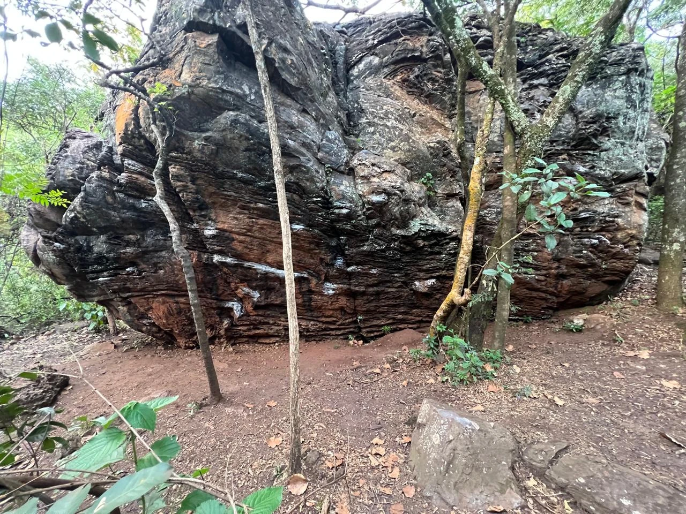
    - **largura_mapa**: 1280
    - **altura_mapa**: 960
    - **pontos_de_interesse**:
      - **[0]**:
        - **id**: Qg3SyAyd6Yylso
        - **uid**: Qg3SyAyd6Yylso
        - **rotulo**: 
        - **linha**:
          - **estilo**: TRACEJADO
          - **espessura**: 3
          - **compilado**:
            - **caminho_svg**: M 1006 507 C 1006.7 450.3, 1005.4 394.4, 1008 337 C 1010.6 277.8, 1023.3 208.5, 1022 157 C 1021.0 118.1, 1013.3 89.0, 1009 55
            - **caixa_delimitadora**:
              - **x**: 1014
              - **y**: 281
              - **comprimento**: 16
              - **largura**: 452
            - **marcadores**:
              - **[0]**:
                - **tipo**: CIRCULO_IDENTIFICADOR
                - **x**: 1006
                - **y**: 507
                - **angulo_graus_x100**: -8933
                - **rotulo**: 6
                - **raio**: 14
              - **[1]**:
                - **tipo**: FIM_TOP
                - **x**: 1009
                - **y**: 55
                - **angulo_graus_x100**: -9726
                - **rotulo**: E
                - **raio**: 14
        - **cor**: #FFD600
        - **label**: 
      - **[1]**:
        - **id**: r1RWbYxbGxNh4q
        - **uid**: r1RWbYxbGxNh4q
        - **rotulo**: 
        - **linha**:
          - **estilo**: TRACEJADO
          - **espessura**: 3
          - **compilado**:
            - **caminho_svg**: M 1137 455 C 1136.0 404.7, 1139.3 359.6, 1134 304 C 1127.4 234.5, 1107.3 148.7, 1094 71
            - **caixa_delimitadora**:
              - **x**: 1116
              - **y**: 263
              - **comprimento**: 43
              - **largura**: 384
            - **marcadores**:
              - **[0]**:
                - **tipo**: CIRCULO_IDENTIFICADOR
                - **x**: 1137
                - **y**: 455
                - **angulo_graus_x100**: -9114
                - **rotulo**: 5
                - **raio**: 14
              - **[1]**:
                - **tipo**: FIM_TOP
                - **x**: 1094
                - **y**: 71
                - **angulo_graus_x100**: -9974
                - **rotulo**: F
                - **raio**: 14
        - **cor**: #FFD600
        - **label**: 
      - **[2]**:
        - **id**: cxHVpp0pV2HDdc
        - **uid**: cxHVpp0pV2HDdc
        - **linha**:
          - **estilo**: TRACEJADO
          - **espessura**: 3
          - **compilado**:
            - **caminho_svg**: M 439 615 C 444.0 589.0, 449.0 563.0, 454 537
            - **caixa_delimitadora**:
              - **x**: 446
              - **y**: 576
              - **comprimento**: 15
              - **largura**: 78
            - **marcadores**:
              - **[0]**:
                - **tipo**: CIRCULO_IDENTIFICADOR
                - **x**: 439
                - **y**: 615
                - **angulo_graus_x100**: -7911
                - **rotulo**: 3
                - **raio**: 14
        - **cor**: #FFD600
      - **[3]**:
        - **id**: 6AXDXEHiYZDc39
        - **uid**: 6AXDXEHiYZDc39
        - **rotulo**: 
        - **linha**:
          - **estilo**: TRACEJADO
          - **espessura**: 3
          - **compilado**:
            - **caminho_svg**: M 651 557 C 658.3 506.0, 675.2 451.3, 673 404 C 671.0 362.5, 654.3 326.7, 645 288
            - **caixa_delimitadora**:
              - **x**: 659
              - **y**: 422
              - **comprimento**: 28
              - **largura**: 269
            - **marcadores**:
              - **[0]**:
                - **tipo**: CIRCULO_IDENTIFICADOR
                - **x**: 651
                - **y**: 557
                - **angulo_graus_x100**: -8182
                - **rotulo**: 4
                - **raio**: 14
        - **cor**: #FFD600
        - **label**: 
      - **[4]**:
        - **id**: UqW5Vdic5cdh5s
        - **uid**: UqW5Vdic5cdh5s
        - **linha**:
          - **estilo**: TRACEJADO
          - **espessura**: 3
          - **compilado**:
            - **caminho_svg**: M 646 289 C 636.7 211.3, 627.3 133.7, 618 56
            - **caixa_delimitadora**:
              - **x**: 632
              - **y**: 172
              - **comprimento**: 28
              - **largura**: 233
            - **marcadores**:
              - **[0]**:
                - **tipo**: FIM_TOP
                - **x**: 618
                - **y**: 56
                - **angulo_graus_x100**: -9685
                - **rotulo**: D
                - **raio**: 14
        - **cor**: #FFD600
      - **[5]**:
        - **id**: Cm7tY17wrZK3Wp
        - **uid**: Cm7tY17wrZK3Wp
        - **linha**:
          - **estilo**: TRACEJADO
          - **espessura**: 3
          - **compilado**:
            - **caminho_svg**: M 454 537 C 465.7 525.3, 477.3 513.7, 489 502
            - **caixa_delimitadora**:
              - **x**: 472
              - **y**: 520
              - **comprimento**: 35
              - **largura**: 35
            - **marcadores**: []
        - **cor**: #FFD600
      - **[6]**:
        - **id**: o2IkqfXURRXDw3
        - **uid**: o2IkqfXURRXDw3
        - **linha**:
          - **estilo**: TRACEJADO
          - **espessura**: 3
          - **compilado**:
            - **caminho_svg**: M 489 502 C 515.3 506.3, 541.7 510.7, 568 515
            - **caixa_delimitadora**:
              - **x**: 528
              - **y**: 508
              - **comprimento**: 79
              - **largura**: 13
            - **marcadores**: []
        - **cor**: #FFD600
      - **[7]**:
        - **id**: OTcUfRsFOnjDk0
        - **uid**: OTcUfRsFOnjDk0
        - **linha**:
          - **estilo**: TRACEJADO
          - **espessura**: 3
          - **compilado**:
            - **caminho_svg**: M 568 515 C 573.7 486.0, 573.5 452.8, 585 428 C 595.5 405.5, 620.8 393.2, 631 371 C 641.9 347.3, 641.0 316.3, 646 289
            - **caixa_delimitadora**:
              - **x**: 607
              - **y**: 402
              - **comprimento**: 78
              - **largura**: 226
            - **marcadores**: []
        - **cor**: #FFD600
      - **[8]**:
        - **id**: ZnUSwyudUfVn2U
        - **uid**: ZnUSwyudUfVn2U
        - **rotulo**: 
        - **linha**:
          - **estilo**: TRACEJADO
          - **espessura**: 3
          - **compilado**:
            - **caminho_svg**: M 1138 455 C 1094.3 455.0, 1052.7 452.8, 1007 455 C 956.5 457.4, 898.7 463.5, 848 470 C 801.1 476.0, 747.7 487.5, 713 492 C 691.3 494.8, 680.0 494.1, 660 497 C 633.7 500.8, 599.3 509.0, 569 515
            - **caixa_delimitadora**:
              - **x**: 854
              - **y**: 485
              - **comprimento**: 569
              - **largura**: 60
            - **marcadores**:
              - **[0]**:
                - **tipo**: CIRCULO_IDENTIFICADOR
                - **x**: 1138
                - **y**: 455
                - **angulo_graus_x100**: 18000
                - **rotulo**: 5
                - **raio**: 14
        - **cor**: #FFD600
        - **label**: 
      - **[9]**:
        - **id**: d0kTCKro3sfCw0
        - **uid**: d0kTCKro3sfCw0
        - **linha**:
          - **estilo**: TRACEJADO
          - **espessura**: 3
          - **compilado**:
            - **caminho_svg**: M 454 537 C 454.3 528.0, 456.9 517.5, 455 510 C 453.5 504.0, 449.0 500.0, 446 495
            - **caixa_delimitadora**:
              - **x**: 450
              - **y**: 516
              - **comprimento**: 9
              - **largura**: 42
            - **marcadores**: []
        - **cor**: #FFD600
      - **[10]**:
        - **id**: 2gzP6aTpHqJ8KN
        - **uid**: 2gzP6aTpHqJ8KN
        - **rotulo**: 
        - **linha**:
          - **estilo**: TRACEJADO
          - **espessura**: 3
          - **compilado**:
            - **caminho_svg**: M 489 502 C 474.7 499.7, 460.3 497.3, 446 495
            - **caixa_delimitadora**:
              - **x**: 468
              - **y**: 498
              - **comprimento**: 43
              - **largura**: 7
            - **marcadores**: []
        - **cor**: #FFD600
        - **label**: 
      - **[11]**:
        - **id**: O4g3rMMzncA2s1
        - **uid**: O4g3rMMzncA2s1
        - **rotulo**: 
        - **linha**:
          - **estilo**: TRACEJADO
          - **espessura**: 3
          - **compilado**:
            - **caminho_svg**: M 397 480 C 373.3 480.3, 353.1 476.9, 326 481 C 288.0 486.7, 234.4 518.1, 192 520 C 154.5 521.7, 106.9 519.6, 85 499 C 64.1 479.4, 57.5 438.0, 60 403 C 63.2 358.5, 101.3 304.3, 122 255
            - **caixa_delimitadora**:
              - **x**: 228
              - **y**: 388
              - **comprimento**: 337
              - **largura**: 265
            - **marcadores**:
              - **[0]**:
                - **tipo**: FIM_TOP
                - **x**: 122
                - **y**: 255
                - **angulo_graus_x100**: -6727
                - **rotulo**: A
                - **raio**: 14
        - **cor**: #FFD600
        - **label**: 
      - **[12]**:
        - **id**: 87JwkW3LS5NWd2
        - **uid**: 87JwkW3LS5NWd2
        - **linha**:
          - **estilo**: TRACEJADO
          - **espessura**: 3
          - **compilado**:
            - **caminho_svg**: M 446 495 C 438.7 491.7, 431.9 487.5, 424 485 C 415.6 482.4, 406.0 481.7, 397 480
            - **caixa_delimitadora**:
              - **x**: 422
              - **y**: 488
              - **comprimento**: 49
              - **largura**: 15
            - **marcadores**: []
        - **cor**: #FFD600
      - **[13]**:
        - **id**: UUTTGa1l6VaHjj
        - **uid**: UUTTGa1l6VaHjj
        - **linha**:
          - **estilo**: TRACEJADO
          - **espessura**: 3
          - **compilado**:
            - **caminho_svg**: M 397 480 C 378.3 447.0, 359.7 414.3, 341 381 C 322.0 347.3, 300.9 313.3, 284 279 C 267.7 245.9, 255.3 212.3, 241 179
            - **caixa_delimitadora**:
              - **x**: 319
              - **y**: 330
              - **comprimento**: 156
              - **largura**: 301
            - **marcadores**:
              - **[0]**:
                - **tipo**: FIM_TOP
                - **x**: 241
                - **y**: 179
                - **angulo_graus_x100**: -11327
                - **rotulo**: C
                - **raio**: 14
        - **cor**: #FFD600
    - **referencias**:
      - **[0]**:
        - **alvo_uid**: OM7GKqux35ulMX
        - **pontos_uids**:
          - Qg3SyAyd6Yylso
        - **escalada**: Primeiro de todos
        - **ids**:
          - Qg3SyAyd6Yylso
      - **[1]**:
        - **alvo_uid**: pWxY9RRKmbZAD1
        - **pontos_uids**:
          - r1RWbYxbGxNh4q
        - **escalada**: Sem nome 18
        - **ids**:
          - r1RWbYxbGxNh4q
      - **[2]**:
        - **alvo_uid**: JRWNVEWv9PW7cT
        - **pontos_uids**:
          - cxHVpp0pV2HDdc
          - d0kTCKro3sfCw0
          - 87JwkW3LS5NWd2
          - UUTTGa1l6VaHjj
        - **escalada**: Calcinha Larga
        - **ids**:
          - cxHVpp0pV2HDdc
          - d0kTCKro3sfCw0
          - 87JwkW3LS5NWd2
          - UUTTGa1l6VaHjj
      - **[3]**:
        - **alvo_uid**: 5UWi9FU93v9Wn7
        - **pontos_uids**:
          - cxHVpp0pV2HDdc
          - Cm7tY17wrZK3Wp
          - o2IkqfXURRXDw3
          - OTcUfRsFOnjDk0
          - UqW5Vdic5cdh5s
        - **escalada**: Boulder do Bola
        - **ids**:
          - cxHVpp0pV2HDdc
          - Cm7tY17wrZK3Wp
          - o2IkqfXURRXDw3
          - OTcUfRsFOnjDk0
          - UqW5Vdic5cdh5s
      - **[4]**:
        - **alvo_uid**: f21zxSYALzzqd4
        - **pontos_uids**:
          - 6AXDXEHiYZDc39
          - UqW5Vdic5cdh5s
        - **escalada**: Trolls
        - **ids**:
          - 6AXDXEHiYZDc39
          - UqW5Vdic5cdh5s
      - **[5]**:
        - **alvo_uid**: ylP5dyJeN3B2O3
        - **pontos_uids**:
          - ZnUSwyudUfVn2U
          - o2IkqfXURRXDw3
          - 2gzP6aTpHqJ8KN
          - 87JwkW3LS5NWd2
          - UUTTGa1l6VaHjj
        - **escalada**: Polydance
        - **ids**:
          - ZnUSwyudUfVn2U
          - o2IkqfXURRXDw3
          - 2gzP6aTpHqJ8KN
          - 87JwkW3LS5NWd2
          - UUTTGa1l6VaHjj
      - **[6]**:
        - **alvo_uid**: 4Fg4D2G7fatIQu
        - **pontos_uids**:
          - ZnUSwyudUfVn2U
          - o2IkqfXURRXDw3
          - 2gzP6aTpHqJ8KN
          - O4g3rMMzncA2s1
          - 87JwkW3LS5NWd2
        - **escalada**: Bigdance
        - **ids**:
          - ZnUSwyudUfVn2U
          - o2IkqfXURRXDw3
          - 2gzP6aTpHqJ8KN
          - O4g3rMMzncA2s1
          - 87JwkW3LS5NWd2
  - **[2]**:
    - **caminho_imagem_mapa**: 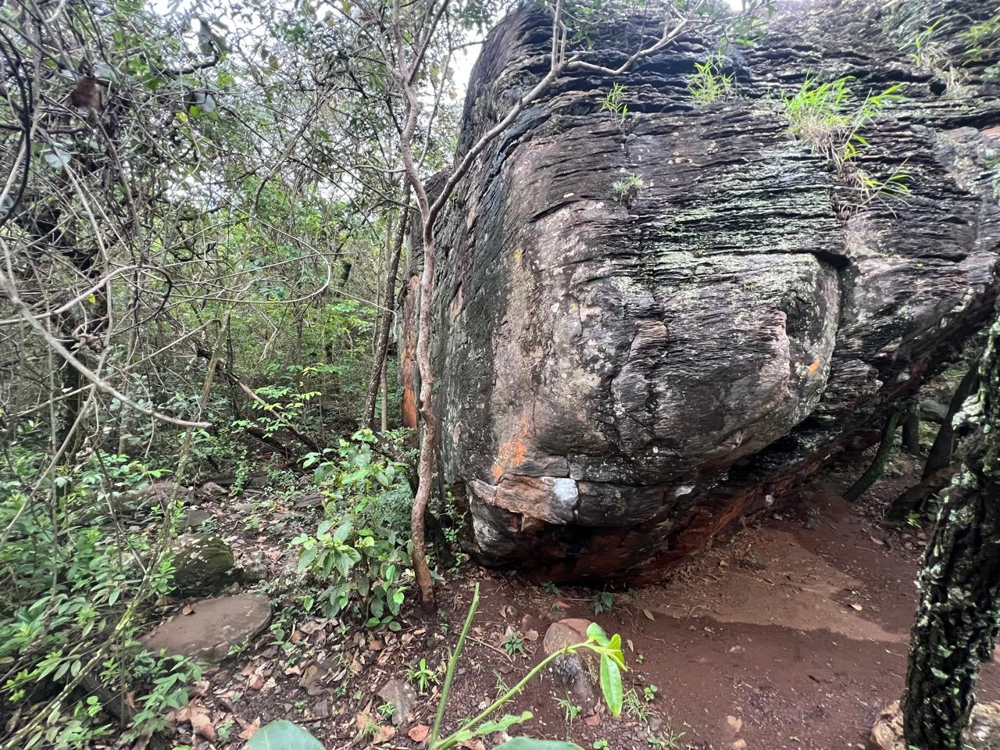
    - **largura_mapa**: 1280
    - **altura_mapa**: 960
    - **pontos_de_interesse**:
      - **[0]**:
        - **id**: TDHfBQNHVuOQU5
        - **uid**: TDHfBQNHVuOQU5
        - **rotulo**: 
        - **linha**:
          - **estilo**: TRACEJADO
          - **espessura**: 3
          - **compilado**:
            - **caminho_svg**: M 632 626 C 662.7 630.0, 695.1 644.4, 724 638 C 753.9 631.4, 791.2 611.3, 808 585 C 826.2 556.5, 820.0 511.6, 823 469 C 826.6 417.2, 829.3 352.2, 825 296 C 820.9 242.0, 804.7 185.5, 799 138 C 794.4 99.3, 793.7 67.3, 791 32
            - **caixa_delimitadora**:
              - **x**: 728
              - **y**: 335
              - **comprimento**: 193
              - **largura**: 606
            - **marcadores**:
              - **[0]**:
                - **tipo**: CIRCULO_IDENTIFICADOR
                - **x**: 632
                - **y**: 626
                - **angulo_graus_x100**: 743
                - **rotulo**: 1
                - **raio**: 14
              - **[1]**:
                - **tipo**: CIRCULO_IDENTIFICADOR
                - **x**: 791
                - **y**: 32
                - **angulo_graus_x100**: -9432
                - **rotulo**: A
                - **raio**: 14
        - **cor**: #FFD600
        - **label**: 
    - **referencias**:
      - **[0]**:
        - **alvo_uid**: dVJ3EOevp6RUsJ
        - **pontos_uids**:
          - TDHfBQNHVuOQU5
        - **escalada**: Barriga de Aluguel
        - **ids**:
          - TDHfBQNHVuOQU5
  - **[3]**:
    - **caminho_imagem_mapa**: 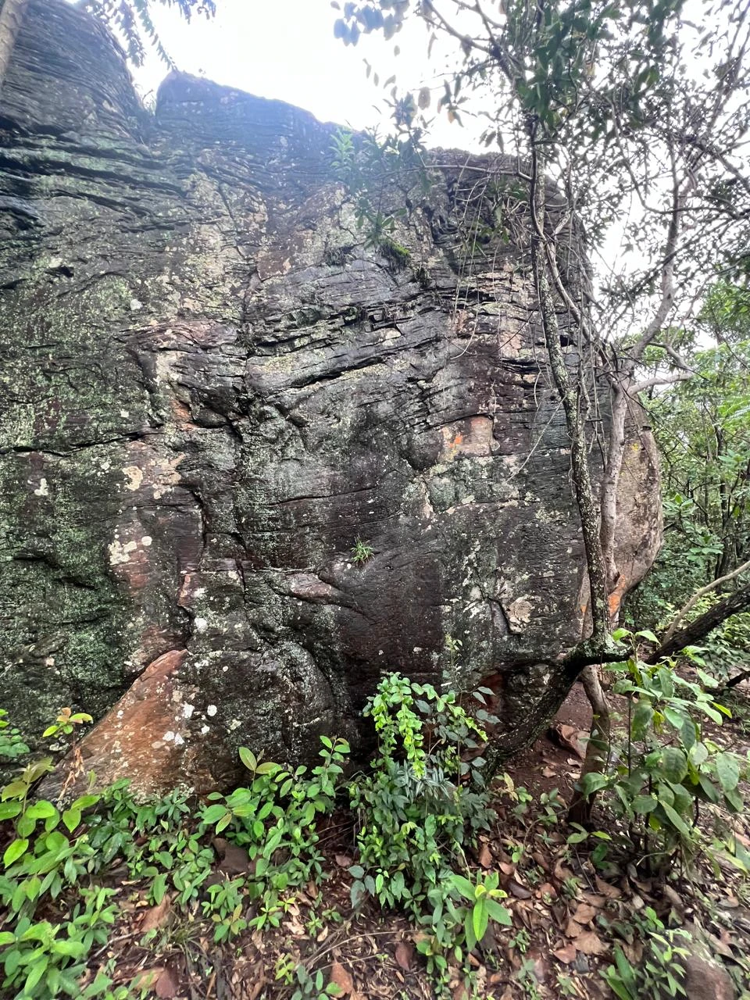
    - **largura_mapa**: 960
    - **altura_mapa**: 1280
    - **pontos_de_interesse**:
      - **[0]**:
        - **id**: GP83pY4VtyA1QX
        - **uid**: GP83pY4VtyA1QX
        - **rotulo**: 
        - **linha**:
          - **estilo**: TRACEJADO
          - **espessura**: 3
          - **compilado**:
            - **caminho_svg**: M 615 776 C 598.3 724.0, 576.0 675.8, 565 620 C 552.8 558.6, 553.6 489.8, 549 422 C 544.2 350.6, 541.0 275.3, 537 202
            - **caixa_delimitadora**:
              - **x**: 576
              - **y**: 489
              - **comprimento**: 78
              - **largura**: 574
            - **marcadores**:
              - **[0]**:
                - **tipo**: CIRCULO_IDENTIFICADOR
                - **x**: 615
                - **y**: 776
                - **angulo_graus_x100**: -10777
                - **rotulo**: 7
        - **cor**: #FFD600
        - **label**: 
      - **[1]**:
        - **id**: r6ErvxZMGWC1bX
        - **uid**: r6ErvxZMGWC1bX
        - **rotulo**: 
        - **linha**:
          - **estilo**: TRACEJADO
          - **espessura**: 3
          - **compilado**:
            - **caminho_svg**: M 227 856 C 241.7 787.3, 256.5 717.2, 271 650 C 284.9 585.6, 302.5 532.0, 312 461 C 323.9 371.7, 322.7 257.0, 328 155
            - **caixa_delimitadora**:
              - **x**: 278
              - **y**: 506
              - **comprimento**: 101
              - **largura**: 701
            - **marcadores**:
              - **[0]**:
                - **tipo**: CIRCULO_IDENTIFICADOR
                - **x**: 227
                - **y**: 856
                - **angulo_graus_x100**: -7794
                - **rotulo**: 8
        - **cor**: #FFD600
        - **label**: 
    - **referencias**:
      - **[0]**:
        - **alvo_uid**: 4BYQJGarCXVMZm
        - **pontos_uids**:
          - GP83pY4VtyA1QX
        - **escalada**: Bananinha
        - **ids**:
          - GP83pY4VtyA1QX
      - **[1]**:
        - **alvo_uid**: xeGaxvtdw12rIT
        - **pontos_uids**:
          - r6ErvxZMGWC1bX
        - **escalada**: Cactos kid
        - **ids**:
          - r6ErvxZMGWC1bX
  - **[4]**:
    - **caminho_imagem_mapa**: 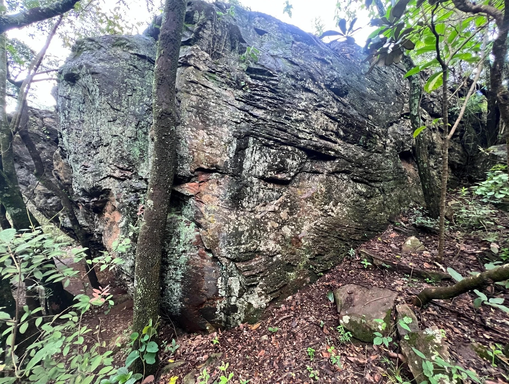
    - **largura_mapa**: 1824
    - **altura_mapa**: 1376
    - **pontos_de_interesse**:
      - **[0]**:
        - **id**: BYw7OkD4pwJDY0
        - **uid**: BYw7OkD4pwJDY0
        - **rotulo**: 
        - **linha**:
          - **estilo**: TRACEJADO
          - **espessura**: 4
          - **compilado**:
            - **caminho_svg**: M 821 995 C 807.0 880.0, 792.1 767.2, 779 650 C 765.4 528.6, 734.6 391.1, 741 279 C 746.4 184.5, 779.0 106.3, 798 20
            - **caixa_delimitadora**:
              - **x**: 781
              - **y**: 508
              - **comprimento**: 80
              - **largura**: 975
            - **marcadores**:
              - **[0]**:
                - **tipo**: CIRCULO_IDENTIFICADOR
                - **x**: 821
                - **y**: 995
                - **angulo_graus_x100**: -9694
                - **rotulo**: 9
                - **raio**: 21
        - **cor**: #FFD600
        - **label**: 
    - **referencias**:
      - **[0]**:
        - **alvo_uid**: lwQFVyVhn6goph
        - **pontos_uids**:
          - BYw7OkD4pwJDY0
        - **escalada**: Quem vai primeiro
        - **ids**:
          - BYw7OkD4pwJDY0
- **precomputados**:
  - **total_escaladas**: 12
  - **total_boulders**: 12

## Parte: setor_viva_o_climb (não listada em partes.json)

### Setor (Pico: Complexo Pedra Grande)

- **descricao**:
    Veja a trilha para chegar ao setor no Wikiloc: https://loc.wiki/t/169742661?wa=sc
    
    O bloco Viva o Climb fica entre os blocos Fugitivos I e Fugitivos II.
- **nome**: Bloco Viva o Climb
- **uid**: xNOT4evG3tUx7A
- **escaladas**:
  - **[0]**:
    - **uid**: 127Y7Onh5dlHIa
    - **boulder**:
      - **nome**: Viva o climb
      - **dificuldade**: V6
  - **[1]**:
    - **uid**: 9FOTxju26napvJ
    - **boulder**:
      - **descricao**: Saindo em pé com as mãos abertas
      - **nome**: Pérola negra
      - **dificuldade**: V11
  - **[2]**:
    - **uid**: FWKMVo2XPTCgfu
    - **boulder**:
      - **descricao**: Projeto, sem FA, talvez V12.
      - **nome**: Pérola negra SDS
      - **dificuldade**: INDEFINIDO
  - **[3]**:
    - **uid**: KCXMeslMlcq19N
    - **boulder**:
      - **nome**: Sem nome 19
      - **dificuldade**: V3
  - **[4]**:
    - **uid**: uGvMvqInmren8X
    - **boulder**:
      - **descricao**: Crux duro e toca pra esquerda
      - **nome**: Malandro não para
      - **dificuldade**: V10
  - **[5]**:
    - **uid**: yl2Y3f1sAKWJTm
    - **boulder**:
      - **descricao**: Mesma saída do Malandro não para, mas toca reto
      - **nome**: Malandragem
      - **dificuldade**: V8_BARRA_V9
  - **[6]**:
    - **uid**: JMLOmX3AdUsyoc
    - **boulder**:
      - **descricao**: Sai com as mãos bem abertas na esquerda e direita
      - **nome**: Abraca
      - **dificuldade**: V5
  - **[7]**:
    - **uid**: 6SDz8FjKJeVrFC
    - **boulder**:
      - **nome**: Pica fumo
      - **dificuldade**: V5
  - **[8]**:
    - **uid**: fBgahsaPkfJt64
    - **boulder**:
      - **nome**: Mad max
      - **dificuldade**: V8
- **mapas**:
  - **[0]**:
    - **caminho_imagem_mapa**: 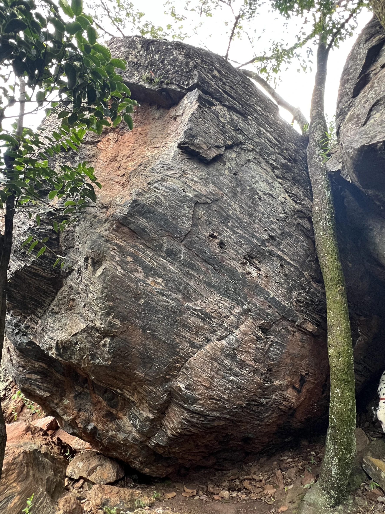
    - **largura_mapa**: 1773
    - **altura_mapa**: 2364
    - **pontos_de_interesse**:
      - **[0]**:
        - **id**: 26iFohS5VSQkiP
        - **uid**: 26iFohS5VSQkiP
        - **rotulo**: 
        - **linha**:
          - **estilo**: TRACEJADO
          - **espessura**: 5
          - **compilado**:
            - **caminho_svg**: M 721 2033 C 751.0 1942.0, 795.3 1850.9, 811 1760 C 825.9 1673.9, 817.5 1594.7, 817 1502 C 816.4 1393.5, 808.5 1268.8, 805 1149 C 801.4 1024.7, 787.2 875.0, 796 769 C 802.4 691.6, 828.4 646.1, 834 570 C 841.4 469.4, 824.0 334.7, 819 217
            - **caixa_delimitadora**:
              - **x**: 778
              - **y**: 1125
              - **comprimento**: 113
              - **largura**: 1816
            - **marcadores**:
              - **[0]**:
                - **tipo**: CIRCULO_IDENTIFICADOR
                - **x**: 721
                - **y**: 2033
                - **angulo_graus_x100**: -7175
                - **rotulo**: 1
                - **raio**: 26
        - **cor**: #FFD600
        - **label**: 
    - **referencias**:
      - **[0]**:
        - **alvo_uid**: 127Y7Onh5dlHIa
        - **pontos_uids**:
          - 26iFohS5VSQkiP
        - **escalada**: Viva o climb
        - **ids**:
          - 26iFohS5VSQkiP
  - **[1]**:
    - **caminho_imagem_mapa**: 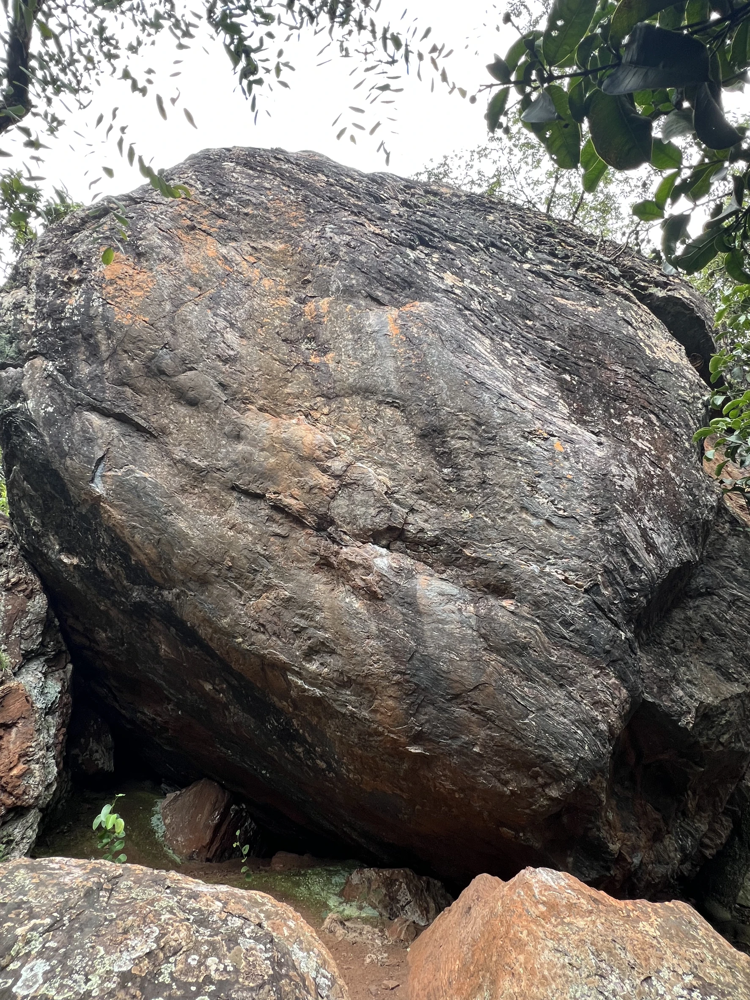
    - **largura_mapa**: 1773
    - **altura_mapa**: 2364
    - **pontos_de_interesse**:
      - **[0]**:
        - **id**: UvGNl07TSBGzV1
        - **uid**: UvGNl07TSBGzV1
        - **rotulo**: 
        - **linha**:
          - **estilo**: TRACEJADO
          - **espessura**: 5
          - **compilado**:
            - **caminho_svg**: M 187 1242 C 149.3 1117.3, 81.9 980.5, 74 868 C 67.7 778.2, 99.3 704.0, 112 622
            - **caixa_delimitadora**:
              - **x**: 130
              - **y**: 932
              - **comprimento**: 113
              - **largura**: 620
            - **marcadores**:
              - **[0]**:
                - **tipo**: CIRCULO_IDENTIFICADOR
                - **x**: 187
                - **y**: 1242
                - **angulo_graus_x100**: -10681
                - **rotulo**: 2
                - **raio**: 24
              - **[1]**:
                - **tipo**: FIM_TOP
                - **x**: 112
                - **y**: 622
                - **angulo_graus_x100**: -8122
                - **rotulo**: A
                - **raio**: 24
        - **cor**: #FFD600
        - **label**: 
      - **[1]**:
        - **id**: ZCYntgQ6VMC1FS
        - **uid**: ZCYntgQ6VMC1FS
        - **rotulo**: 
        - **linha**:
          - **estilo**: TRACEJADO
          - **espessura**: 5
          - **compilado**:
            - **caminho_svg**: M 575 1700 C 488.3 1619.3, 380.3 1538.5, 315 1458 C 263.3 1394.2, 238.3 1330.7, 200 1267
            - **caixa_delimitadora**:
              - **x**: 388
              - **y**: 1484
              - **comprimento**: 375
              - **largura**: 433
            - **marcadores**:
              - **[0]**:
                - **tipo**: CIRCULO_IDENTIFICADOR
                - **x**: 575
                - **y**: 1700
                - **angulo_graus_x100**: -13705
                - **rotulo**: 3
                - **raio**: 24
        - **cor**: #FFD600
        - **label**: 
      - **[2]**:
        - **id**: Lwogd7HmsT36NC
        - **uid**: Lwogd7HmsT36NC
        - **rotulo**: 
        - **linha**:
          - **estilo**: TRACEJADO
          - **espessura**: 5
          - **compilado**:
            - **caminho_svg**: M 910 1344 C 912.3 1254.3, 941.7 1148.7, 917 1075 C 895.8 1012.0, 823.6 980.9, 794 921 C 761.9 856.1, 748.2 774.5, 738 696 C 727.1 612.3, 735.3 520.7, 734 433
            - **caixa_delimitadora**:
              - **x**: 826
              - **y**: 888
              - **comprimento**: 183
              - **largura**: 911
            - **marcadores**:
              - **[0]**:
                - **tipo**: CIRCULO_IDENTIFICADOR
                - **x**: 910
                - **y**: 1344
                - **angulo_graus_x100**: -8851
                - **rotulo**: 4
                - **raio**: 24
              - **[1]**:
                - **tipo**: FIM_TOP
                - **x**: 734
                - **y**: 433
                - **angulo_graus_x100**: -9087
                - **rotulo**: B
                - **raio**: 24
        - **cor**: #FFD600
        - **label**: 
      - **[3]**:
        - **id**: CsBsRmPha9utR8
        - **uid**: CsBsRmPha9utR8
        - **linha**:
          - **estilo**: TRACEJADO
          - **espessura**: 5
          - **compilado**:
            - **caminho_svg**: M 1177 1810 C 1175.0 1705.7, 1173.0 1601.3, 1171 1497
            - **caixa_delimitadora**:
              - **x**: 1174
              - **y**: 1654
              - **comprimento**: 6
              - **largura**: 313
            - **marcadores**:
              - **[0]**:
                - **tipo**: CIRCULO_IDENTIFICADOR
                - **x**: 1177
                - **y**: 1810
                - **angulo_graus_x100**: -9110
                - **rotulo**: 5
                - **raio**: 24
        - **cor**: #FFD600
      - **[4]**:
        - **id**: SxNPSahI02iZag
        - **uid**: SxNPSahI02iZag
        - **linha**:
          - **estilo**: TRACEJADO
          - **espessura**: 5
          - **compilado**:
            - **caminho_svg**: M 1171 1497 C 1159.0 1444.3, 1168.6 1387.5, 1135 1339 C 1086.9 1269.5, 941.5 1212.1, 858 1156 C 788.5 1109.3, 720.0 1083.8, 668 1026 C 611.2 962.9, 561.2 875.6, 538 785 C 512.1 683.6, 536.7 556.3, 536 442
            - **caixa_delimitadora**:
              - **x**: 854
              - **y**: 970
              - **comprimento**: 635
              - **largura**: 1055
            - **marcadores**:
              - **[0]**:
                - **tipo**: FIM_TOP
                - **x**: 536
                - **y**: 442
                - **angulo_graus_x100**: -9033
                - **rotulo**: C
                - **raio**: 24
        - **cor**: #FFD600
      - **[5]**:
        - **id**: aLiU7BOMR2xyly
        - **uid**: aLiU7BOMR2xyly
        - **rotulo**: 
        - **linha**:
          - **estilo**: TRACEJADO
          - **espessura**: 5
          - **compilado**:
            - **caminho_svg**: M 1171 1497 C 1148.7 1341.7, 1137.6 1162.9, 1104 1031 C 1078.0 929.0, 1027.5 856.1, 1006 767 C 985.2 680.7, 985.5 560.3, 975 505 C 970.0 478.8, 965.0 467.0, 960 448
            - **caixa_delimitadora**:
              - **x**: 1066
              - **y**: 972
              - **comprimento**: 211
              - **largura**: 1049
            - **marcadores**:
              - **[0]**:
                - **tipo**: FIM_TOP
                - **x**: 960
                - **y**: 448
                - **angulo_graus_x100**: -10474
                - **rotulo**: D
                - **raio**: 24
        - **cor**: #FFD600
        - **label**: 
    - **referencias**:
      - **[0]**:
        - **alvo_uid**: 9FOTxju26napvJ
        - **pontos_uids**:
          - UvGNl07TSBGzV1
        - **escalada**: Pérola negra
        - **ids**:
          - UvGNl07TSBGzV1
      - **[1]**:
        - **alvo_uid**: FWKMVo2XPTCgfu
        - **pontos_uids**:
          - ZCYntgQ6VMC1FS
          - UvGNl07TSBGzV1
        - **escalada**: Pérola negra SDS
        - **ids**:
          - ZCYntgQ6VMC1FS
          - UvGNl07TSBGzV1
      - **[2]**:
        - **alvo_uid**: KCXMeslMlcq19N
        - **pontos_uids**:
          - Lwogd7HmsT36NC
        - **escalada**: Sem nome 19
        - **ids**:
          - Lwogd7HmsT36NC
      - **[3]**:
        - **alvo_uid**: uGvMvqInmren8X
        - **pontos_uids**:
          - CsBsRmPha9utR8
          - SxNPSahI02iZag
        - **escalada**: Malandro não para
        - **ids**:
          - CsBsRmPha9utR8
          - SxNPSahI02iZag
      - **[4]**:
        - **alvo_uid**: yl2Y3f1sAKWJTm
        - **pontos_uids**:
          - CsBsRmPha9utR8
          - aLiU7BOMR2xyly
        - **escalada**: Malandragem
        - **ids**:
          - CsBsRmPha9utR8
          - aLiU7BOMR2xyly
  - **[2]**:
    - **caminho_imagem_mapa**: 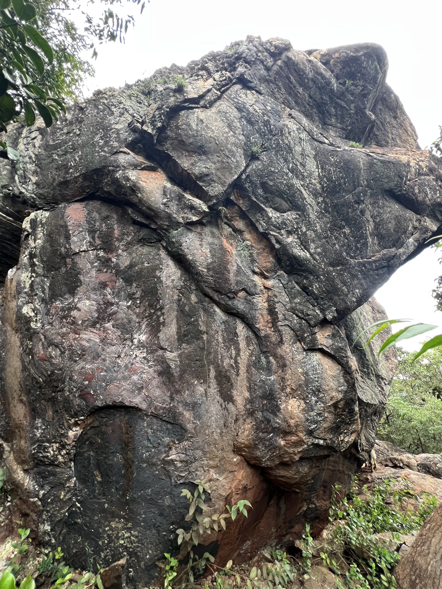
    - **largura_mapa**: 1773
    - **altura_mapa**: 2364
    - **pontos_de_interesse**:
      - **[0]**:
        - **id**: wlS4znO71NbnJU
        - **uid**: wlS4znO71NbnJU
        - **rotulo**: 
        - **linha**:
          - **estilo**: TRACEJADO
          - **espessura**: 5
          - **compilado**:
            - **caminho_svg**: M 1325 1490 C 1318.0 1414.0, 1296.1 1325.3, 1304 1262 C 1310.0 1214.6, 1345.2 1179.2, 1347 1141 C 1348.6 1107.7, 1340.6 1072.0, 1323 1046 C 1304.5 1018.8, 1267.1 1004.3, 1236 983 C 1201.3 959.3, 1149.5 946.2, 1124 911 C 1095.8 872.0, 1089.7 811.7, 1083 753 C 1074.8 681.8, 1089.0 598.4, 1089 513 C 1089.0 415.1, 1083.7 303.0, 1081 198
            - **caixa_delimitadora**:
              - **x**: 1214
              - **y**: 844
              - **comprimento**: 266
              - **largura**: 1292
            - **marcadores**:
              - **[0]**:
                - **tipo**: CIRCULO_IDENTIFICADOR
                - **x**: 1325
                - **y**: 1490
                - **angulo_graus_x100**: -9526
                - **rotulo**: 6
                - **raio**: 24
        - **cor**: #FFD600
        - **label**: 
    - **referencias**:
      - **[0]**:
        - **alvo_uid**: fBgahsaPkfJt64
        - **pontos_uids**:
          - wlS4znO71NbnJU
        - **escalada**: Mad max
        - **ids**:
          - wlS4znO71NbnJU
  - **[3]**:
    - **caminho_imagem_mapa**: 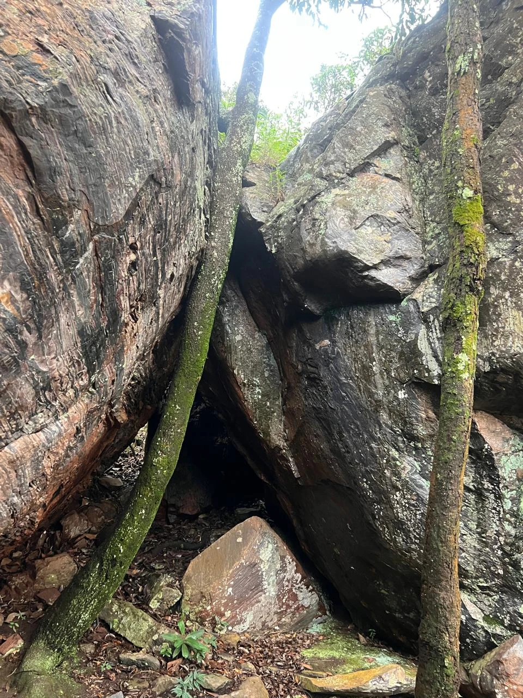
    - **largura_mapa**: 960
    - **altura_mapa**: 1280
    - **pontos_de_interesse**:
      - **[0]**:
        - **id**: mElKIE2yRagjoF
        - **uid**: mElKIE2yRagjoF
        - **rotulo**: 
        - **linha**:
          - **estilo**: TRACEJADO
          - **espessura**: 3
          - **compilado**:
            - **caminho_svg**: M 661 849 C 645.3 774.0, 624.9 696.9, 614 624 C 603.9 556.2, 600.5 491.5, 596 426 C 591.6 361.6, 590.0 298.0, 587 234
            - **caixa_delimitadora**:
              - **x**: 624
              - **y**: 542
              - **comprimento**: 74
              - **largura**: 615
            - **marcadores**:
              - **[0]**:
                - **tipo**: CIRCULO_IDENTIFICADOR
                - **x**: 661
                - **y**: 849
                - **angulo_graus_x100**: -10180
                - **rotulo**: 7
                - **raio**: 17
        - **cor**: #FFD600
        - **label**: 
      - **[1]**:
        - **id**: 4asD6mDT2oKDy1
        - **uid**: 4asD6mDT2oKDy1
        - **rotulo**: 
        - **circulo**:
          - **x**: 532
          - **y**: 849
          - **raio**: 34
        - **cor**: #FFD600
        - **label**: 
      - **[2]**:
        - **id**: AhwnZFJqgSfXtQ
        - **uid**: AhwnZFJqgSfXtQ
        - **rotulo**: 
        - **circulo**:
          - **x**: 790
          - **y**: 759
          - **raio**: 31
        - **cor**: #FFD600
        - **label**: 
    - **referencias**:
      - **[0]**:
        - **alvo_uid**: JMLOmX3AdUsyoc
        - **pontos_uids**:
          - mElKIE2yRagjoF
          - AhwnZFJqgSfXtQ
          - 4asD6mDT2oKDy1
        - **escalada**: Abraca
        - **ids**:
          - mElKIE2yRagjoF
          - AhwnZFJqgSfXtQ
          - 4asD6mDT2oKDy1
  - **[4]**:
    - **caminho_imagem_mapa**: 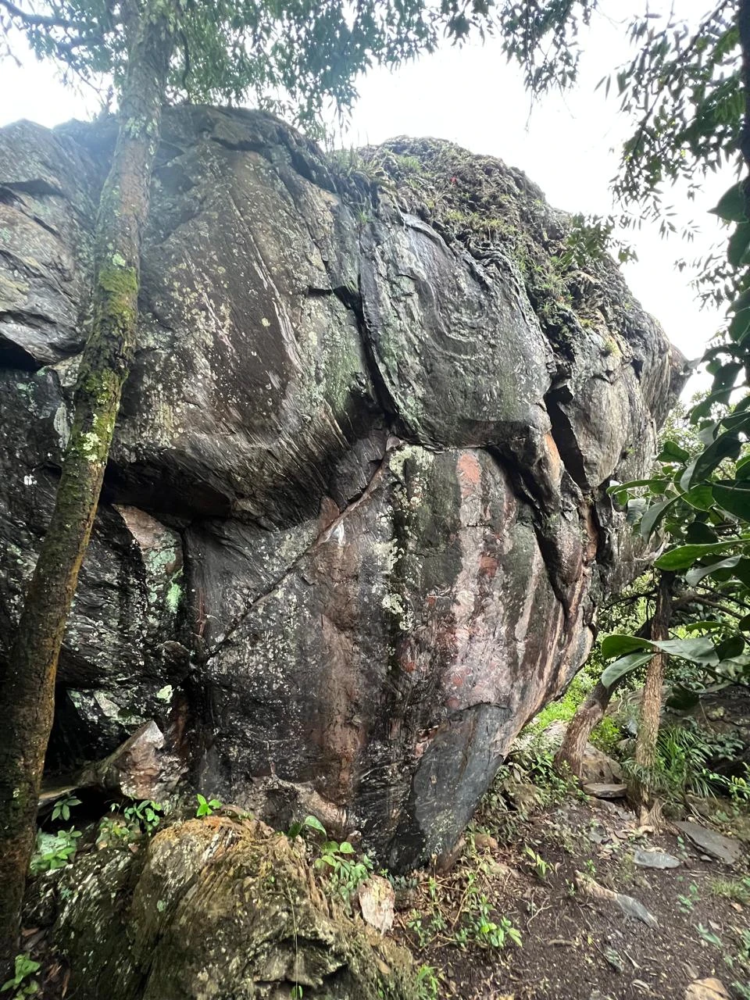
    - **largura_mapa**: 960
    - **altura_mapa**: 1280
    - **pontos_de_interesse**:
      - **[0]**:
        - **id**: dyxaEUtJO3gkFp
        - **uid**: dyxaEUtJO3gkFp
        - **rotulo**: 
        - **linha**:
          - **estilo**: TRACEJADO
          - **espessura**: 3
          - **compilado**:
            - **caminho_svg**: M 211 899 C 240.0 870.0, 269.4 840.9, 298 812 C 326.1 783.6, 354.1 756.3, 381 727 C 408.1 697.4, 432.6 661.0, 460 635 C 484.2 612.0, 506.9 587.6, 535 577 C 562.7 566.5, 599.2 574.9, 627 571 C 650.4 567.7, 675.8 569.0, 691 557 C 705.8 545.3, 712.6 522.4, 718 501 C 724.4 475.5, 725.7 440.1, 722 413 C 718.7 388.6, 705.5 368.5, 700 345 C 694.3 320.6, 692.7 294.3, 689 269
            - **caixa_delimitadora**:
              - **x**: 466
              - **y**: 584
              - **comprimento**: 511
              - **largura**: 630
            - **marcadores**:
              - **[0]**:
                - **tipo**: CIRCULO_IDENTIFICADOR
                - **x**: 211
                - **y**: 899
                - **angulo_graus_x100**: -4500
                - **rotulo**: 8
                - **raio**: 17
        - **cor**: #FFD600
        - **label**: 
    - **referencias**:
      - **[0]**:
        - **alvo_uid**: 6SDz8FjKJeVrFC
        - **pontos_uids**:
          - dyxaEUtJO3gkFp
        - **escalada**: Pica fumo
        - **ids**:
          - dyxaEUtJO3gkFp
- **precomputados**:
  - **total_escaladas**: 9
  - **total_boulders**: 9

## Parte: setor_fugitivos_ii (não listada em partes.json)

### Setor (Pico: Complexo Pedra Grande)

- **descricao**: Veja a trilha para chegar ao setor no Wikiloc: https://loc.wiki/t/169742661?wa=sc
- **nome**: Bloco Fugitivos II
- **uid**: jPzv6byW0dO0Gj
- **escaladas**:
  - **[0]**:
    - **uid**: 8r0NgWYmApDTKh
    - **boulder**:
      - **descricao**: Escala a face fendilhada
      - **nome**: Olha a Jaca
      - **dificuldade**: V7
  - **[1]**:
    - **uid**: TT5jscP5lXr9jv
    - **boulder**:
      - **descricao**: Olha a Jaca no Low rider
      - **nome**: Olha o Rider
      - **dificuldade**: V6_BARRA_V7
  - **[2]**:
    - **uid**: GtV1xXFHyjL2e1
    - **boulder**:
      - **descricao**: Sai da invertida e escala a diagonal para a esquerda
      - **nome**: Low Rider
      - **dificuldade**: V7_BARRA_V8
  - **[3]**:
    - **uid**: 86nFPbmZHTbTYz
    - **boulder**:
      - **descricao**: Low Rider finalizando no Fugitivos
      - **nome**: Easy Rider
      - **dificuldade**: V8
  - **[4]**:
    - **uid**: dLvFTaSbTEvo1x
    - **boulder**:
      - **descricao**: Fugitivos finalizando no Low Rider
      - **nome**: Big Rider
      - **dificuldade**: V9_BARRA_V10
  - **[5]**:
    - **uid**: 8bY2zKcMz4Rkl6
    - **boulder**:
      - **descricao**: Saída sentada abaixo da pedra e escala para a esquerda, dominando em cima da pedra
      - **nome**: Fugitivos
      - **dificuldade**: V7
  - **[6]**:
    - **uid**: ILJ785LLhC7IEo
    - **boulder**:
      - **descricao**: Escala a face negativa à direita do bloco, iniciando igual ao Fugitivos
      - **nome**: Igarapedra
      - **dificuldade**: V10_BARRA_V11
  - **[7]**:
    - **uid**: iLwqTfjvxeqmQK
    - **boulder**:
      - **descricao**: Travessia pelas agarras baixas virando na extrema direita do bloco
      - **nome**: Trombose
      - **dificuldade**: V8_BARRA_V9
  - **[8]**:
    - **uid**: woERfweaFycFQA
    - **boulder**:
      - **descricao**: Sai do Olha a Jaca e vira no Audácia, travessia por cima
      - **nome**: Corrida do Ouro
      - **dificuldade**: V6
  - **[9]**:
    - **uid**: tS7TrVU7B8E10y
    - **boulder**:
      - **descricao**: Saída em pé em regletes e escala reto
      - **nome**: Audácia
      - **dificuldade**: V8_BARRA_V9
  - **[10]**:
    - **uid**: ptCJXNPHvhWLqO
    - **boulder**:
      - **nome**: Tandrilax
      - **dificuldade**: V7
  - **[11]**:
    - **uid**: 1KyNGmo1hKDps6
    - **boulder**:
      - **nome**: Curandeiros
      - **dificuldade**: V5
  - **[12]**:
    - **uid**: 9dZGN3If4u7irB
    - **boulder**:
      - **nome**: Sem nome 20
      - **dificuldade**: V2
- **mapas**:
  - **[0]**:
    - **caminho_imagem_mapa**: 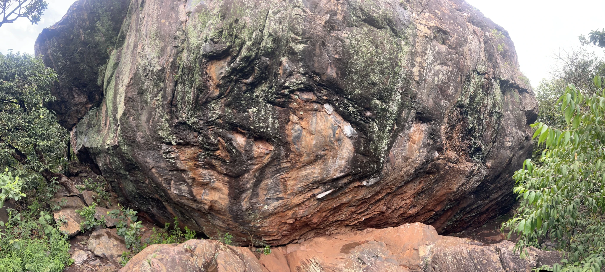
    - **largura_mapa**: 2796
    - **altura_mapa**: 1259
    - **pontos_de_interesse**:
      - **[0]**:
        - **id**: ihoIqsysq4uYJd
        - **uid**: ihoIqsysq4uYJd
        - **linha**:
          - **estilo**: TRACEJADO
          - **espessura**: 5
          - **compilado**:
            - **caminho_svg**: M 883 948 C 878.7 915.0, 872.9 876.3, 870 849 C 868.0 829.9, 867.3 816.3, 866 800
            - **caixa_delimitadora**:
              - **x**: 874
              - **y**: 874
              - **comprimento**: 17
              - **largura**: 148
            - **marcadores**:
              - **[0]**:
                - **tipo**: CIRCULO_IDENTIFICADOR
                - **x**: 883
                - **y**: 948
                - **angulo_graus_x100**: -9748
                - **rotulo**: 2
                - **raio**: 24
        - **cor**: #FFD600
      - **[1]**:
        - **id**: vtUAS6DvoJEf0x
        - **uid**: vtUAS6DvoJEf0x
        - **linha**:
          - **estilo**: TRACEJADO
          - **espessura**: 5
          - **compilado**:
            - **caminho_svg**: M 866 799 C 871.0 778.7, 871.9 757.4, 881 738 C 890.9 716.9, 901.4 693.2, 925 678 C 961.4 654.6, 1046.8 660.6, 1098 642 C 1142.9 625.7, 1190.1 610.8, 1218 578 C 1247.1 543.8, 1253.1 492.8, 1266 438 C 1283.3 364.2, 1289.3 260.7, 1301 172
            - **caixa_delimitadora**:
              - **x**: 1084
              - **y**: 486
              - **comprimento**: 435
              - **largura**: 627
            - **marcadores**: []
        - **cor**: #FFD600
      - **[2]**:
        - **id**: ITwa1RryXsUEwD
        - **uid**: ITwa1RryXsUEwD
        - **linha**:
          - **estilo**: TRACEJADO
          - **espessura**: 5
          - **compilado**:
            - **caminho_svg**: M 1301 172 C 1301.7 127.7, 1302.3 83.3, 1303 39
            - **caixa_delimitadora**:
              - **x**: 1302
              - **y**: 106
              - **comprimento**: 2
              - **largura**: 133
            - **marcadores**:
              - **[0]**:
                - **tipo**: FIM_TOP
                - **x**: 1303
                - **y**: 39
                - **angulo_graus_x100**: -8914
                - **rotulo**: C
                - **raio**: 24
        - **cor**: #FFD600
      - **[3]**:
        - **id**: umRf96kV1lxQHD
        - **uid**: umRf96kV1lxQHD
        - **linha**:
          - **estilo**: TRACEJADO
          - **espessura**: 5
          - **compilado**:
            - **caminho_svg**: M 1721 873 C 1722.0 831.0, 1722.5 782.6, 1724 747 C 1725.1 720.9, 1726.7 701.7, 1728 679
            - **caixa_delimitadora**:
              - **x**: 1724
              - **y**: 776
              - **comprimento**: 7
              - **largura**: 194
            - **marcadores**:
              - **[0]**:
                - **tipo**: CIRCULO_IDENTIFICADOR
                - **x**: 1721
                - **y**: 873
                - **angulo_graus_x100**: -8864
                - **rotulo**: 3
                - **raio**: 24
        - **cor**: #FFD600
      - **[4]**:
        - **id**: 9Rfa8YgUGe4Mt8
        - **uid**: 9Rfa8YgUGe4Mt8
        - **linha**:
          - **estilo**: TRACEJADO
          - **espessura**: 5
          - **compilado**:
            - **caminho_svg**: M 1728 679 C 1728.3 658.0, 1732.3 636.9, 1729 616 C 1725.6 594.2, 1714.3 572.7, 1707 551
            - **caixa_delimitadora**:
              - **x**: 1718
              - **y**: 615
              - **comprimento**: 22
              - **largura**: 128
            - **marcadores**: []
        - **cor**: #FFD600
      - **[5]**:
        - **id**: VwZXDPxczxcu3b
        - **uid**: VwZXDPxczxcu3b
        - **linha**:
          - **estilo**: TRACEJADO
          - **espessura**: 5
          - **compilado**:
            - **caminho_svg**: M 1708 554 C 1651.7 511.7, 1589.1 463.3, 1539 427 C 1499.8 398.6, 1467.5 376.7, 1433 353 C 1400.3 330.5, 1359.0 317.6, 1337 288 C 1314.5 257.7, 1313.0 210.7, 1301 172
            - **caixa_delimitadora**:
              - **x**: 1504
              - **y**: 363
              - **comprimento**: 407
              - **largura**: 382
            - **marcadores**: []
        - **cor**: #FFD600
      - **[6]**:
        - **id**: LlDQFuYH5B74CX
        - **uid**: LlDQFuYH5B74CX
        - **rotulo**: 
        - **linha**:
          - **estilo**: TRACEJADO
          - **espessura**: 5
          - **compilado**:
            - **caminho_svg**: M 2205 766 C 2195.0 753.7, 2182.9 744.0, 2175 729 C 2165.6 711.1, 2160.9 688.8, 2156 664 C 2149.7 632.2, 2145.6 586.7, 2144 553 C 2142.7 525.0, 2143.3 502.1, 2145 476 C 2146.8 448.8, 2151.7 420.7, 2155 393
            - **caixa_delimitadora**:
              - **x**: 2174
              - **y**: 580
              - **comprimento**: 61
              - **largura**: 373
            - **marcadores**: []
        - **cor**: #FFD600
        - **label**: 
      - **[7]**:
        - **id**: RP9XdRnYHi3H2x
        - **uid**: RP9XdRnYHi3H2x
        - **linha**:
          - **estilo**: TRACEJADO
          - **espessura**: 5
          - **compilado**:
            - **caminho_svg**: M 2205 764 C 2166.7 758.0, 2130.1 754.5, 2090 746 C 2044.9 736.5, 1993.6 724.9, 1948 708 C 1902.6 691.2, 1857.2 671.1, 1817 645 C 1776.9 619.0, 1743.7 583.0, 1707 552
            - **caixa_delimitadora**:
              - **x**: 1956
              - **y**: 658
              - **comprimento**: 498
              - **largura**: 212
            - **marcadores**: []
        - **cor**: #FFD600
      - **[8]**:
        - **id**: Te7HQwNDEfG81J
        - **uid**: Te7HQwNDEfG81J
        - **linha**:
          - **estilo**: TRACEJADO
          - **espessura**: 5
          - **compilado**:
            - **caminho_svg**: M 1728 679 C 1737.7 665.7, 1744.8 650.0, 1757 639 C 1769.6 627.5, 1781.7 618.3, 1803 612 C 1841.2 600.7, 1929.3 610.6, 1975 604 C 2006.0 599.5, 2030.7 600.6, 2052 585 C 2077.0 566.7, 2092.0 523.9, 2109 492 C 2125.9 460.3, 2139.0 426.7, 2154 394
            - **caixa_delimitadora**:
              - **x**: 1941
              - **y**: 536
              - **comprimento**: 426
              - **largura**: 285
            - **marcadores**: []
        - **cor**: #FFD600
      - **[9]**:
        - **id**: oiJNBR0gaOIOTu
        - **uid**: oiJNBR0gaOIOTu
        - **linha**:
          - **estilo**: TRACEJADO
          - **espessura**: 5
          - **compilado**:
            - **caminho_svg**: M 2155 393 C 2163.3 363.3, 2170.7 335.6, 2180 304 C 2190.7 267.8, 2209.9 221.7, 2216 188 C 2220.6 162.9, 2218.7 143.3, 2220 121
            - **caixa_delimitadora**:
              - **x**: 2188
              - **y**: 257
              - **comprimento**: 65
              - **largura**: 272
            - **marcadores**:
              - **[0]**:
                - **tipo**: FIM_TOP
                - **x**: 2220
                - **y**: 121
                - **angulo_graus_x100**: -8658
                - **rotulo**: D
                - **raio**: 24
        - **cor**: #FFD600
      - **[10]**:
        - **id**: StAN7GLKiJyF92
        - **uid**: StAN7GLKiJyF92
        - **linha**:
          - **estilo**: TRACEJADO
          - **espessura**: 5
          - **compilado**:
            - **caminho_svg**: M 2250 903 C 2259.3 870.7, 2285.4 827.4, 2278 806 C 2272.8 791.0, 2251.2 783.8, 2238 777 C 2226.9 771.3, 2216.0 769.7, 2205 766
            - **caixa_delimitadora**:
              - **x**: 2242
              - **y**: 834
              - **comprimento**: 73
              - **largura**: 137
            - **marcadores**: []
        - **cor**: #FFD600
      - **[11]**:
        - **id**: 4JpovgbGvXcRSy
        - **uid**: 4JpovgbGvXcRSy
        - **linha**:
          - **estilo**: TRACEJADO
          - **espessura**: 5
          - **compilado**:
            - **caminho_svg**: M 2250 903 C 2277.7 864.0, 2315.7 817.2, 2333 786 C 2343.4 767.2, 2345.0 756.6, 2353 738 C 2364.1 712.0, 2374.4 663.1, 2394 645 C 2408.7 631.4, 2435.3 635.7, 2448 626 C 2457.9 618.4, 2461.3 606.7, 2468 597
            - **caixa_delimitadora**:
              - **x**: 2359
              - **y**: 750
              - **comprimento**: 218
              - **largura**: 306
            - **marcadores**:
              - **[0]**:
                - **tipo**: CIRCULO_IDENTIFICADOR
                - **x**: 2353
                - **y**: 738
                - **angulo_graus_x100**: -6661
                - **rotulo**: ▲
                - **raio**: 24
        - **cor**: #FFD600
      - **[12]**:
        - **id**: N8eV2qZTa52bb3
        - **uid**: N8eV2qZTa52bb3
        - **linha**:
          - **estilo**: TRACEJADO
          - **espessura**: 5
          - **compilado**:
            - **caminho_svg**: M 2468 597 C 2474.7 570.3, 2488.9 547.4, 2488 517 C 2486.8 476.1, 2463.6 406.3, 2443 374 C 2429.4 352.7, 2406.9 350.6, 2395 330 C 2379.0 302.3, 2376.5 243.1, 2369 215 C 2364.6 198.5, 2361.0 189.0, 2357 176
            - **caixa_delimitadora**:
              - **x**: 2422
              - **y**: 386
              - **comprimento**: 131
              - **largura**: 421
            - **marcadores**:
              - **[0]**:
                - **tipo**: FIM_TOP
                - **x**: 2357
                - **y**: 176
                - **angulo_graus_x100**: -10710
                - **rotulo**: E
                - **raio**: 24
        - **cor**: #FFD600
      - **[13]**:
        - **id**: qdC43Gvz0L0P0G
        - **uid**: qdC43Gvz0L0P0G
        - **linha**:
          - **estilo**: TRACEJADO
          - **espessura**: 5
          - **compilado**:
            - **caminho_svg**: M 2172 1011 C 2185.7 992.3, 2199.3 973.7, 2213 955
            - **caixa_delimitadora**:
              - **x**: 2192
              - **y**: 983
              - **comprimento**: 41
              - **largura**: 56
            - **marcadores**:
              - **[0]**:
                - **tipo**: CIRCULO_IDENTIFICADOR
                - **x**: 2172
                - **y**: 1011
                - **angulo_graus_x100**: -5379
                - **rotulo**: 4
                - **raio**: 24
        - **cor**: #FFD600
      - **[14]**:
        - **id**: Cs5pbHTNWRtoXm
        - **uid**: Cs5pbHTNWRtoXm
        - **linha**:
          - **estilo**: TRACEJADO
          - **espessura**: 5
          - **compilado**:
            - **caminho_svg**: M 2213 955 C 2225.3 937.7, 2237.7 920.3, 2250 903
            - **caixa_delimitadora**:
              - **x**: 2232
              - **y**: 929
              - **comprimento**: 37
              - **largura**: 52
            - **marcadores**: []
        - **cor**: #FFD600
      - **[15]**:
        - **id**: vYBkJi6sUeryqP
        - **uid**: vYBkJi6sUeryqP
        - **rotulo**: 
        - **linha**:
          - **estilo**: TRACEJADO
          - **espessura**: 5
          - **compilado**:
            - **caminho_svg**: M 2212 954 C 2227.7 946.3, 2242.6 936.7, 2259 931 C 2275.6 925.3, 2292.4 926.4, 2311 920 C 2334.4 912.0, 2366.9 895.0, 2387 883 C 2401.3 874.5, 2412.7 870.7, 2422 858 C 2434.8 840.6, 2439.4 805.0, 2447 781 C 2453.6 760.1, 2461.3 742.0, 2465 722 C 2468.6 702.0, 2468.5 681.6, 2469 661 C 2469.5 639.9, 2468.3 618.3, 2468 597
            - **caixa_delimitadora**:
              - **x**: 2340
              - **y**: 776
              - **comprimento**: 257
              - **largura**: 357
            - **marcadores**:
              - **[0]**:
                - **tipo**: CIRCULO_IDENTIFICADOR
                - **x**: 2422
                - **y**: 858
                - **angulo_graus_x100**: -5953
                - **rotulo**: ★
                - **raio**: 24
        - **cor**: #FFD600
        - **label**: 
      - **[16]**:
        - **id**: ymzZz1cPWO9C7s
        - **uid**: ymzZz1cPWO9C7s
        - **linha**:
          - **estilo**: TRACEJADO
          - **espessura**: 5
          - **compilado**:
            - **caminho_svg**: M 866 800 C 861.3 773.0, 856.7 746.0, 852 719
            - **caixa_delimitadora**:
              - **x**: 859
              - **y**: 760
              - **comprimento**: 14
              - **largura**: 81
            - **marcadores**: []
        - **cor**: #FFD600
      - **[17]**:
        - **id**: tiShTDYIgu9k0A
        - **uid**: tiShTDYIgu9k0A
        - **linha**:
          - **estilo**: TRACEJADO
          - **espessura**: 5
          - **compilado**:
            - **caminho_svg**: M 853 720 C 849.3 694.7, 844.9 677.3, 842 644 C 836.6 581.2, 830.2 467.3, 834 371 C 838.3 262.1, 859.3 139.7, 872 24
            - **caixa_delimitadora**:
              - **x**: 853
              - **y**: 372
              - **comprimento**: 38
              - **largura**: 696
            - **marcadores**:
              - **[0]**:
                - **tipo**: FIM_TOP
                - **x**: 872
                - **y**: 24
                - **angulo_graus_x100**: -8375
                - **rotulo**: B
                - **raio**: 24
        - **cor**: #FFD600
      - **[18]**:
        - **id**: SDXdXU9ZyL8mGT
        - **uid**: SDXdXU9ZyL8mGT
        - **linha**:
          - **estilo**: TRACEJADO
          - **espessura**: 5
          - **compilado**:
            - **caminho_svg**: M 853 720 C 847.0 707.0, 843.4 693.8, 835 681 C 825.0 665.8, 813.5 647.4, 795 636 C 771.0 621.2, 730.6 621.3, 697 610 C 659.8 597.5, 601.7 587.8, 582 563 C 566.6 543.6, 574.0 513.0, 570 488
            - **caixa_delimitadora**:
              - **x**: 712
              - **y**: 604
              - **comprimento**: 283
              - **largura**: 232
            - **marcadores**: []
        - **cor**: #FFD600
      - **[19]**:
        - **id**: GdABU1fWF6h7H7
        - **uid**: GdABU1fWF6h7H7
        - **linha**:
          - **estilo**: TRACEJADO
          - **espessura**: 5
          - **compilado**:
            - **caminho_svg**: M 570 488 C 572.3 448.3, 572.7 413.1, 577 369 C 582.5 313.2, 595.4 239.6, 603 180 C 609.8 126.6, 615.0 78.7, 621 28
            - **caixa_delimitadora**:
              - **x**: 596
              - **y**: 258
              - **comprimento**: 51
              - **largura**: 460
            - **marcadores**:
              - **[0]**:
                - **tipo**: FIM_TOP
                - **x**: 621
                - **y**: 28
                - **angulo_graus_x100**: -8325
                - **rotulo**: A
                - **raio**: 24
        - **cor**: #FFD600
      - **[20]**:
        - **id**: aldE8nfEzfEwES
        - **uid**: aldE8nfEzfEwES
        - **rotulo**: 
        - **linha**:
          - **estilo**: TRACEJADO
          - **espessura**: 5
          - **compilado**:
            - **caminho_svg**: M 477 714 C 496.7 692.3, 522.4 672.8, 536 649 C 548.5 627.1, 552.4 603.3, 558 578 C 564.2 550.0, 566.0 518.0, 570 488
            - **caixa_delimitadora**:
              - **x**: 524
              - **y**: 601
              - **comprimento**: 93
              - **largura**: 226
            - **marcadores**:
              - **[0]**:
                - **tipo**: CIRCULO_IDENTIFICADOR
                - **x**: 477
                - **y**: 714
                - **angulo_graus_x100**: -4777
                - **rotulo**: 1
                - **raio**: 24
        - **cor**: #FFD600
        - **label**: 
    - **referencias**:
      - **[0]**:
        - **alvo_uid**: 8r0NgWYmApDTKh
        - **pontos_uids**:
          - ihoIqsysq4uYJd
          - ymzZz1cPWO9C7s
          - tiShTDYIgu9k0A
        - **escalada**: Olha a Jaca
        - **ids**:
          - ihoIqsysq4uYJd
          - ymzZz1cPWO9C7s
          - tiShTDYIgu9k0A
      - **[1]**:
        - **alvo_uid**: TT5jscP5lXr9jv
        - **pontos_uids**:
          - ihoIqsysq4uYJd
          - vtUAS6DvoJEf0x
          - ITwa1RryXsUEwD
        - **escalada**: Olha o Rider
        - **ids**:
          - ihoIqsysq4uYJd
          - vtUAS6DvoJEf0x
          - ITwa1RryXsUEwD
      - **[2]**:
        - **alvo_uid**: GtV1xXFHyjL2e1
        - **pontos_uids**:
          - umRf96kV1lxQHD
          - 9Rfa8YgUGe4Mt8
          - VwZXDPxczxcu3b
          - ITwa1RryXsUEwD
        - **escalada**: Low Rider
        - **ids**:
          - umRf96kV1lxQHD
          - 9Rfa8YgUGe4Mt8
          - VwZXDPxczxcu3b
          - ITwa1RryXsUEwD
      - **[3]**:
        - **alvo_uid**: 86nFPbmZHTbTYz
        - **pontos_uids**:
          - umRf96kV1lxQHD
          - Te7HQwNDEfG81J
          - oiJNBR0gaOIOTu
        - **escalada**: Easy Rider
        - **ids**:
          - umRf96kV1lxQHD
          - Te7HQwNDEfG81J
          - oiJNBR0gaOIOTu
      - **[4]**:
        - **alvo_uid**: dLvFTaSbTEvo1x
        - **pontos_uids**:
          - qdC43Gvz0L0P0G
          - Cs5pbHTNWRtoXm
          - StAN7GLKiJyF92
          - RP9XdRnYHi3H2x
          - VwZXDPxczxcu3b
          - ITwa1RryXsUEwD
        - **escalada**: Big Rider
        - **ids**:
          - qdC43Gvz0L0P0G
          - Cs5pbHTNWRtoXm
          - StAN7GLKiJyF92
          - RP9XdRnYHi3H2x
          - VwZXDPxczxcu3b
          - ITwa1RryXsUEwD
      - **[5]**:
        - **alvo_uid**: 8bY2zKcMz4Rkl6
        - **pontos_uids**:
          - qdC43Gvz0L0P0G
          - Cs5pbHTNWRtoXm
          - StAN7GLKiJyF92
          - LlDQFuYH5B74CX
          - oiJNBR0gaOIOTu
        - **escalada**: Fugitivos
        - **ids**:
          - qdC43Gvz0L0P0G
          - Cs5pbHTNWRtoXm
          - StAN7GLKiJyF92
          - LlDQFuYH5B74CX
          - oiJNBR0gaOIOTu
      - **[6]**:
        - **alvo_uid**: ILJ785LLhC7IEo
        - **pontos_uids**:
          - qdC43Gvz0L0P0G
          - Cs5pbHTNWRtoXm
          - 4JpovgbGvXcRSy
          - N8eV2qZTa52bb3
        - **escalada**: Igarapedra
        - **ids**:
          - qdC43Gvz0L0P0G
          - Cs5pbHTNWRtoXm
          - 4JpovgbGvXcRSy
          - N8eV2qZTa52bb3
      - **[7]**:
        - **alvo_uid**: iLwqTfjvxeqmQK
        - **pontos_uids**:
          - qdC43Gvz0L0P0G
          - vYBkJi6sUeryqP
          - N8eV2qZTa52bb3
        - **escalada**: Trombose
        - **ids**:
          - qdC43Gvz0L0P0G
          - vYBkJi6sUeryqP
          - N8eV2qZTa52bb3
      - **[8]**:
        - **alvo_uid**: woERfweaFycFQA
        - **pontos_uids**:
          - ihoIqsysq4uYJd
          - ymzZz1cPWO9C7s
          - SDXdXU9ZyL8mGT
          - GdABU1fWF6h7H7
        - **escalada**: Corrida do Ouro
        - **ids**:
          - ihoIqsysq4uYJd
          - ymzZz1cPWO9C7s
          - SDXdXU9ZyL8mGT
          - GdABU1fWF6h7H7
      - **[9]**:
        - **alvo_uid**: tS7TrVU7B8E10y
        - **pontos_uids**:
          - aldE8nfEzfEwES
          - GdABU1fWF6h7H7
        - **escalada**: Audácia
        - **ids**:
          - aldE8nfEzfEwES
          - GdABU1fWF6h7H7
  - **[1]**:
    - **caminho_imagem_mapa**: 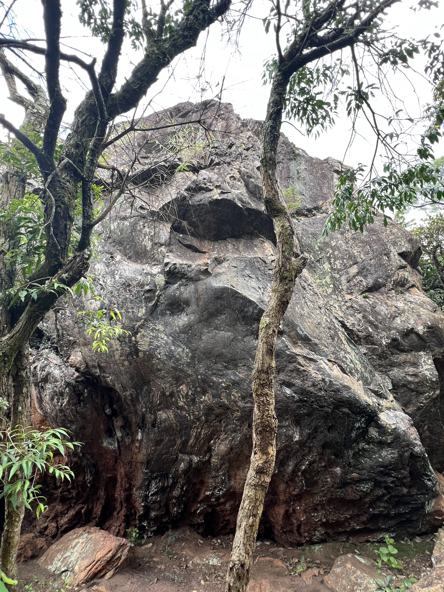
    - **largura_mapa**: 1773
    - **altura_mapa**: 2364
    - **pontos_de_interesse**:
      - **[0]**:
        - **id**: 8mgH7klWCHeynf
        - **uid**: 8mgH7klWCHeynf
        - **linha**:
          - **estilo**: TRACEJADO
          - **espessura**: 5
          - **compilado**:
            - **caminho_svg**: M 1627 1719 C 1602.0 1689.3, 1577.0 1659.7, 1552 1630
            - **caixa_delimitadora**:
              - **x**: 1590
              - **y**: 1674
              - **comprimento**: 75
              - **largura**: 89
            - **marcadores**:
              - **[0]**:
                - **tipo**: CIRCULO_IDENTIFICADOR
                - **x**: 1627
                - **y**: 1719
                - **angulo_graus_x100**: -13012
                - **rotulo**: 6
                - **raio**: 24
        - **cor**: #FFD600
      - **[1]**:
        - **id**: p9cK1ZztG5P96S
        - **uid**: p9cK1ZztG5P96S
        - **linha**:
          - **estilo**: TRACEJADO
          - **espessura**: 5
          - **compilado**:
            - **caminho_svg**: M 1552 1630 C 1515.7 1608.0, 1479.6 1590.4, 1443 1564 C 1401.3 1534.0, 1351.5 1498.5, 1317 1457 C 1283.0 1416.0, 1273.0 1353.1, 1237 1317 C 1202.3 1282.2, 1153.7 1269.4, 1107 1242 C 1052.0 1209.7, 978.9 1160.1, 928 1135 C 892.8 1117.6, 858.3 1123.8, 835 1098 C 802.6 1062.2, 794.4 966.4, 782 913 C 772.7 873.0, 764.8 851.6, 763 807 C 760.1 732.1, 794.1 562.7, 793 504 C 792.5 479.9, 788.3 470.0, 786 453
            - **caixa_delimitadora**:
              - **x**: 1158
              - **y**: 1042
              - **comprimento**: 789
              - **largura**: 1177
            - **marcadores**:
              - **[0]**:
                - **tipo**: FIM_TOP
                - **x**: 786
                - **y**: 453
                - **angulo_graus_x100**: -9782
                - **rotulo**: B
                - **raio**: 24
        - **cor**: #FFD600
      - **[2]**:
        - **id**: SxhynjM7dmmrkO
        - **uid**: SxhynjM7dmmrkO
        - **rotulo**: 
        - **linha**:
          - **estilo**: TRACEJADO
          - **espessura**: 5
          - **compilado**:
            - **caminho_svg**: M 1552 1630 C 1529.3 1576.0, 1512.1 1518.8, 1484 1468 C 1456.0 1417.5, 1406.5 1378.2, 1384 1326 C 1361.4 1273.6, 1368.1 1212.5, 1349 1154 C 1327.5 1088.1, 1287.7 1019.3, 1256 952 C 1224.1 884.3, 1181.6 809.3, 1158 749 C 1140.1 703.1, 1132.7 665.7, 1120 624
            - **caixa_delimitadora**:
              - **x**: 1336
              - **y**: 1127
              - **comprimento**: 432
              - **largura**: 1006
            - **marcadores**: []
        - **cor**: #FFD600
        - **label**: 
      - **[3]**:
        - **id**: BlYabbjunYAlwJ
        - **uid**: BlYabbjunYAlwJ
        - **linha**:
          - **estilo**: TRACEJADO
          - **espessura**: 5
          - **compilado**:
            - **caminho_svg**: M 1203 1975 C 1203.7 1928.3, 1205.0 1883.1, 1205 1835 C 1205.0 1783.9, 1206.4 1732.1, 1203 1677 C 1199.3 1616.3, 1202.5 1535.9, 1182 1486 C 1165.9 1446.9, 1134.1 1428.2, 1109 1394 C 1079.1 1353.4, 1037.0 1302.7, 1016 1257 C 998.0 1217.7, 985.3 1180.6, 984 1139 C 982.6 1093.1, 1001.7 1042.6, 1014 993 C 1027.1 940.4, 1045.5 886.2, 1061 832 C 1076.8 776.9, 1097.4 701.9, 1108 665 C 1113.3 646.7, 1116.0 637.7, 1120 624
            - **caixa_delimitadora**:
              - **x**: 1094
              - **y**: 1300
              - **comprimento**: 221
              - **largura**: 1351
            - **marcadores**:
              - **[0]**:
                - **tipo**: CIRCULO_IDENTIFICADOR
                - **x**: 1203
                - **y**: 1975
                - **angulo_graus_x100**: -8918
                - **rotulo**: 5
                - **raio**: 24
        - **cor**: #FFD600
      - **[4]**:
        - **id**: 1I2bSGk2aU2aIj
        - **uid**: 1I2bSGk2aU2aIj
        - **linha**:
          - **estilo**: TRACEJADO
          - **espessura**: 5
          - **compilado**:
            - **caminho_svg**: M 1120 624 C 1124.0 600.7, 1128.0 577.3, 1132 554
            - **caixa_delimitadora**:
              - **x**: 1126
              - **y**: 589
              - **comprimento**: 12
              - **largura**: 70
            - **marcadores**:
              - **[0]**:
                - **tipo**: FIM_TOP
                - **x**: 1132
                - **y**: 554
                - **angulo_graus_x100**: -8027
                - **rotulo**: A
                - **raio**: 24
        - **cor**: #FFD600
    - **referencias**:
      - **[0]**:
        - **alvo_uid**: ptCJXNPHvhWLqO
        - **pontos_uids**:
          - BlYabbjunYAlwJ
          - 1I2bSGk2aU2aIj
        - **escalada**: Tandrilax
        - **ids**:
          - BlYabbjunYAlwJ
          - 1I2bSGk2aU2aIj
      - **[1]**:
        - **alvo_uid**: 1KyNGmo1hKDps6
        - **pontos_uids**:
          - 8mgH7klWCHeynf
          - p9cK1ZztG5P96S
        - **escalada**: Curandeiros
        - **ids**:
          - 8mgH7klWCHeynf
          - p9cK1ZztG5P96S
      - **[2]**:
        - **alvo_uid**: 9dZGN3If4u7irB
        - **pontos_uids**:
          - SxhynjM7dmmrkO
          - 8mgH7klWCHeynf
          - 1I2bSGk2aU2aIj
        - **escalada**: Sem nome 20
        - **ids**:
          - SxhynjM7dmmrkO
          - 8mgH7klWCHeynf
          - 1I2bSGk2aU2aIj
- **precomputados**:
  - **total_escaladas**: 13
  - **total_boulders**: 13

## Parte: setor_tramontina (não listada em partes.json)

### Setor (Pico: Complexo Pedra Grande)

- **descricao**:
    Descida do topo do bloco Tramontina é feita pelo boulder "Sobe e desce".
    
    Setor com vários boulders dos mais variados graus. Destaque a boulders bem acessíveis para pessoal iniciando no climb.
    
    Trilha para o setor começa no setor Fugitivos II, cerca de 2 minutos de caminhada do boulder Olha a Jaca no Fugitivos II. Link para a trilha: https://loc.wiki/t/287028747?wa=sc
- **nome**: Setor Tramontina
- **uid**: qzJk3jLJiw9ibf
- **escaladas**:
  - **[0]**:
    - **uid**: tQ6mCOffU1yNAJ
    - **boulder**:
      - **descricao**:
          Boulder usado para descer do topo do bloco. Desça de frente para a rocha, desescalando.
          
          
      - **nome**: Sobe e desce
      - **dificuldade**: VB
      - **conquistadores**:
        - Renato Utsch
        - Bunitin
        - Ana
        - Camila
        - Lucas
        - Evandro
  - **[1]**:
    - **uid**: iH3rfH5c2jJ4lf
    - **boulder**:
      - **nome**: Questionamentos
      - **dificuldade**: V0
      - **conquistadores**:
        - Renato Utsch
        - Ana
        - Lucas
        - Evandro
  - **[2]**:
    - **uid**: WthDQ7VrYwnusI
    - **boulder**:
      - **nome**: Não vai descalço
      - **dificuldade**: V0
      - **conquistadores**:
        - Bunitin
        - Lucas
        - Ana
        - Renato Utsch
        - Evandro
  - **[3]**:
    - **uid**: vPdU7tcHsAHVup
    - **boulder**:
      - **descricao**:
          Boulder sai bem aberto, com as duas mãos em barbatanas opostas. A ideia é subir mantendo a oposição em agarras opostas entre as duas linhas até a virada!
          
          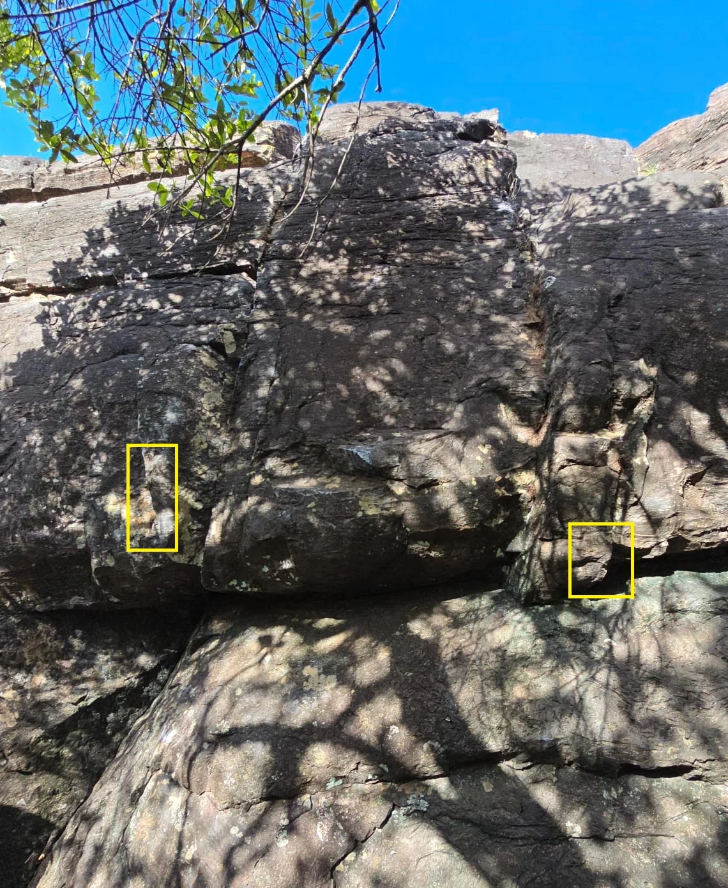
      - **nome**: Linhas paralelas
      - **dificuldade**: V1
      - **conquistadores**:
        - Renato Utsch
        - Evandro
        - Ana
  - **[4]**:
    - **uid**: 3LJyhlH8K7HUwD
    - **boulder**:
      - **descricao**: Virada um pouco mais delicada do que os boulders ao lado desse boulder.
      - **nome**: Só vejo almas
      - **dificuldade**: V1
      - **conquistadores**:
        - Bunitin
        - Renato Utsch
- **mapas**:
  - **[0]**:
    - **caminho_imagem_mapa**: 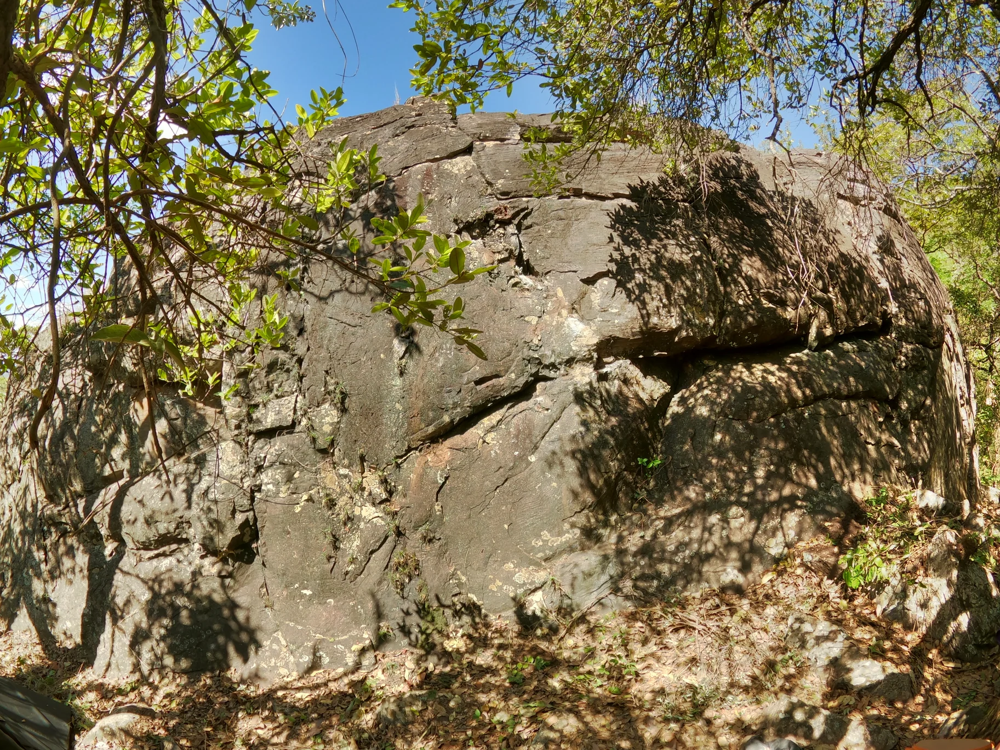
    - **largura_mapa**: 1825
    - **altura_mapa**: 1369
    - **pontos_de_interesse**:
      - **[0]**:
        - **id**: K9ehICREvSL3cg
        - **uid**: K9ehICREvSL3cg
        - **rotulo**: 
        - **linha**:
          - **estilo**: TRACEJADO
          - **espessura**: 4
          - **compilado**:
            - **caminho_svg**: M 100 925 C 109.3 875.3, 120.5 821.0, 128 776 C 134.2 738.9, 138.0 707.1, 143 674 C 147.7 642.5, 150.2 605.3, 157 582 C 161.4 566.9, 167.7 558.0, 173 546
            - **caixa_delimitadora**:
              - **x**: 136
              - **y**: 736
              - **comprimento**: 73
              - **largura**: 379
            - **marcadores**:
              - **[0]**:
                - **tipo**: CIRCULO_IDENTIFICADOR
                - **x**: 100
                - **y**: 925
                - **angulo_graus_x100**: -7936
                - **rotulo**: 1
                - **raio**: 21
        - **cor**: #00E5FF
        - **label**: 
      - **[1]**:
        - **id**: ro0Hl5fiBBIIRb
        - **uid**: ro0Hl5fiBBIIRb
        - **rotulo**: 
        - **linha**:
          - **estilo**: TRACEJADO
          - **espessura**: 4
          - **compilado**:
            - **caminho_svg**: M 447 805 C 440.7 755.3, 430.8 705.8, 428 656 C 425.2 606.2, 427.5 554.2, 430 506 C 432.4 461.1, 438.1 414.5, 442 376 C 445.1 345.2, 448.0 320.7, 451 293
            - **caixa_delimitadora**:
              - **x**: 440
              - **y**: 549
              - **comprimento**: 23
              - **largura**: 512
            - **marcadores**:
              - **[0]**:
                - **tipo**: CIRCULO_IDENTIFICADOR
                - **x**: 447
                - **y**: 805
                - **angulo_graus_x100**: -9727
                - **rotulo**: 2
                - **raio**: 21
        - **cor**: #00E5FF
        - **label**: 
      - **[2]**:
        - **id**: hViAQGmev4O97T
        - **uid**: hViAQGmev4O97T
        - **rotulo**: 
        - **linha**:
          - **estilo**: TRACEJADO
          - **espessura**: 4
          - **compilado**:
            - **caminho_svg**: M 991 720 C 981.7 668.0, 976.4 619.0, 963 564 C 947.5 500.3, 921.1 418.1, 900 361 C 884.1 318.0, 864.1 281.4, 852 250 C 843.3 227.5, 838.7 210.7, 832 191
            - **caixa_delimitadora**:
              - **x**: 912
              - **y**: 456
              - **comprimento**: 159
              - **largura**: 529
            - **marcadores**:
              - **[0]**:
                - **tipo**: CIRCULO_IDENTIFICADOR
                - **x**: 991
                - **y**: 720
                - **angulo_graus_x100**: -10018
                - **rotulo**: 3
                - **raio**: 21
        - **cor**: #00E5FF
        - **label**: 
      - **[3]**:
        - **id**: qBSK7cjr4w6akU
        - **uid**: qBSK7cjr4w6akU
        - **rotulo**: 
        - **linha**:
          - **estilo**: TRACEJADO
          - **espessura**: 4
          - **compilado**:
            - **caminho_svg**: M 1420 579 C 1405.0 525.7, 1393.3 469.6, 1375 419 C 1357.6 370.9, 1330.5 314.8, 1314 282 C 1304.4 263.0, 1297.3 252.7, 1289 238
            - **caixa_delimitadora**:
              - **x**: 1354
              - **y**: 408
              - **comprimento**: 131
              - **largura**: 341
            - **marcadores**:
              - **[0]**:
                - **tipo**: CIRCULO_IDENTIFICADOR
                - **x**: 1420
                - **y**: 579
                - **angulo_graus_x100**: -10571
                - **rotulo**: 4
                - **raio**: 21
        - **cor**: #00E5FF
        - **label**: 
      - **[4]**:
        - **id**: AieY8mTSHCWNZ5
        - **uid**: AieY8mTSHCWNZ5
        - **rotulo**: 
        - **linha**:
          - **estilo**: TRACEJADO
          - **espessura**: 4
          - **compilado**:
            - **caminho_svg**: M 1629 634 C 1616.7 589.3, 1606.6 538.2, 1592 500 C 1580.4 469.6, 1564.8 446.3, 1553 421 C 1542.3 398.1, 1535.2 377.9, 1524 355 C 1511.3 329.1, 1494.7 301.0, 1480 274
            - **caixa_delimitadora**:
              - **x**: 1554
              - **y**: 454
              - **comprimento**: 149
              - **largura**: 360
            - **marcadores**:
              - **[0]**:
                - **tipo**: CIRCULO_IDENTIFICADOR
                - **x**: 1629
                - **y**: 634
                - **angulo_graus_x100**: -10544
                - **rotulo**: 5
                - **raio**: 21
        - **cor**: #00E5FF
        - **label**: 
      - **[5]**:
        - **id**: yxQI8yhj2Rm44J
        - **uid**: yxQI8yhj2Rm44J
        - **rotulo**: 
        - **circulo**:
          - **x**: 1232
          - **y**: 562
          - **raio**: 26
        - **cor**: #FFD600
        - **label**: 
      - **[6]**:
        - **id**: O98g57fVPORYXE
        - **uid**: O98g57fVPORYXE
        - **rotulo**: 
        - **circulo**:
          - **x**: 1519
          - **y**: 613
          - **raio**: 24
        - **cor**: #FFD600
        - **label**: 
    - **referencias**:
      - **[0]**:
        - **alvo_uid**: tQ6mCOffU1yNAJ
        - **pontos_uids**:
          - K9ehICREvSL3cg
        - **escalada**: Sobe e desce
        - **ids**:
          - K9ehICREvSL3cg
      - **[1]**:
        - **alvo_uid**: iH3rfH5c2jJ4lf
        - **pontos_uids**:
          - ro0Hl5fiBBIIRb
        - **escalada**: Questionamentos
        - **ids**:
          - ro0Hl5fiBBIIRb
      - **[2]**:
        - **alvo_uid**: WthDQ7VrYwnusI
        - **pontos_uids**:
          - hViAQGmev4O97T
        - **escalada**: Não vai descalço
        - **ids**:
          - hViAQGmev4O97T
      - **[3]**:
        - **alvo_uid**: vPdU7tcHsAHVup
        - **pontos_uids**:
          - qBSK7cjr4w6akU
          - O98g57fVPORYXE
          - yxQI8yhj2Rm44J
        - **escalada**: Linhas paralelas
        - **ids**:
          - qBSK7cjr4w6akU
          - O98g57fVPORYXE
          - yxQI8yhj2Rm44J
      - **[4]**:
        - **alvo_uid**: 3LJyhlH8K7HUwD
        - **pontos_uids**:
          - AieY8mTSHCWNZ5
        - **escalada**: Só vejo almas
        - **ids**:
          - AieY8mTSHCWNZ5
  - **[1]**:
    - **caminho_imagem_mapa**: 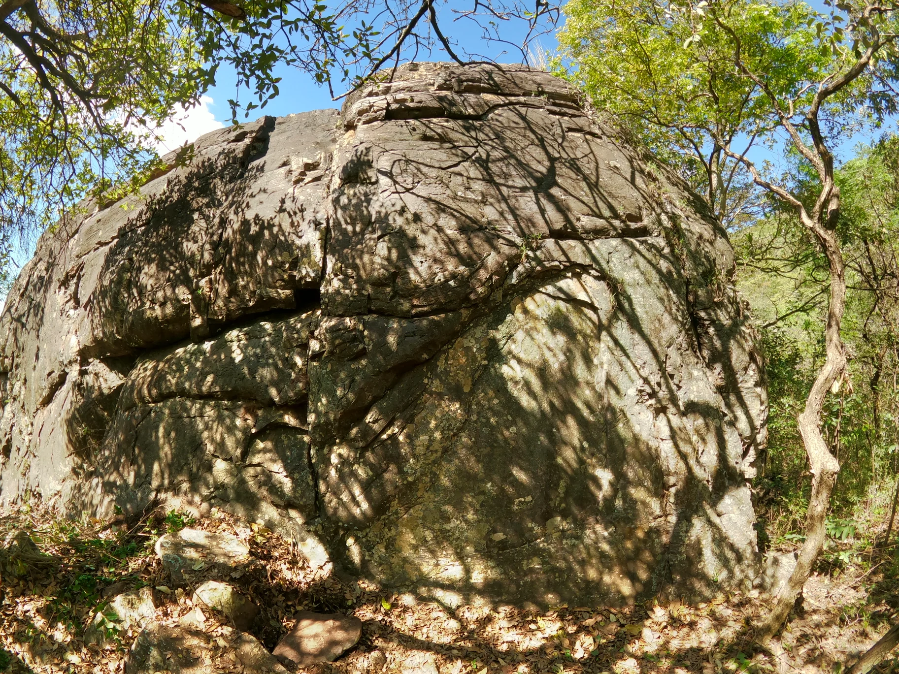
    - **largura_mapa**: 1825
    - **altura_mapa**: 1369
    - **pontos_de_interesse**:
      - **[0]**:
        - **id**: W1kKMX98Onkp9P
        - **uid**: W1kKMX98Onkp9P
        - **rotulo**: 
        - **linha**:
          - **estilo**: TRACEJADO
          - **espessura**: 4
          - **compilado**:
            - **caminho_svg**: M 331 690 C 332.3 640.0, 328.8 585.7, 335 540 C 340.4 500.5, 349.6 465.7, 362 431 C 374.1 397.1, 394.2 363.9, 408 334 C 419.8 308.6, 429.3 286.7, 440 263
            - **caixa_delimitadora**:
              - **x**: 386
              - **y**: 476
              - **comprimento**: 109
              - **largura**: 427
            - **marcadores**:
              - **[0]**:
                - **tipo**: CIRCULO_IDENTIFICADOR
                - **x**: 331
                - **y**: 690
                - **angulo_graus_x100**: -8847
                - **rotulo**: 4
                - **raio**: 21
        - **cor**: #00E5FF
        - **label**: 
      - **[1]**:
        - **id**: 4BsMYWmatRVbXz
        - **uid**: 4BsMYWmatRVbXz
        - **rotulo**: 
        - **linha**:
          - **estilo**: TRACEJADO
          - **espessura**: 4
          - **compilado**:
            - **caminho_svg**: M 651 658 C 655.0 580.0, 658.6 488.9, 663 424 C 666.1 377.7, 667.4 339.2, 673 305 C 677.3 278.4, 686.1 252.3, 690 235 C 692.3 224.9, 693.3 219.0, 695 211
            - **caixa_delimitadora**:
              - **x**: 673
              - **y**: 434
              - **comprimento**: 44
              - **largura**: 447
            - **marcadores**:
              - **[0]**:
                - **tipo**: CIRCULO_IDENTIFICADOR
                - **x**: 651
                - **y**: 658
                - **angulo_graus_x100**: -8706
                - **rotulo**: 5
                - **raio**: 21
        - **cor**: #00E5FF
        - **label**: 
      - **[2]**:
        - **id**: aWQoFSsr4ZAzi9
        - **uid**: aWQoFSsr4ZAzi9
        - **rotulo**: 
        - **circulo**:
          - **x**: 207
          - **y**: 642
          - **raio**: 21
        - **cor**: #FFD600
        - **label**: 
      - **[3]**:
        - **id**: vHjGEFoPBzi5y7
        - **uid**: vHjGEFoPBzi5y7
        - **rotulo**: 
        - **circulo**:
          - **x**: 437
          - **y**: 660
          - **raio**: 27
        - **cor**: #FFD600
        - **label**: 
    - **referencias**:
      - **[0]**:
        - **alvo_uid**: vPdU7tcHsAHVup
        - **pontos_uids**:
          - W1kKMX98Onkp9P
          - vHjGEFoPBzi5y7
          - aWQoFSsr4ZAzi9
        - **escalada**: Linhas paralelas
        - **ids**:
          - W1kKMX98Onkp9P
          - vHjGEFoPBzi5y7
          - aWQoFSsr4ZAzi9
      - **[1]**:
        - **alvo_uid**: 3LJyhlH8K7HUwD
        - **pontos_uids**:
          - 4BsMYWmatRVbXz
        - **escalada**: Só vejo almas
        - **ids**:
          - 4BsMYWmatRVbXz
  - **[2]**:
    - **caminho_imagem_mapa**: 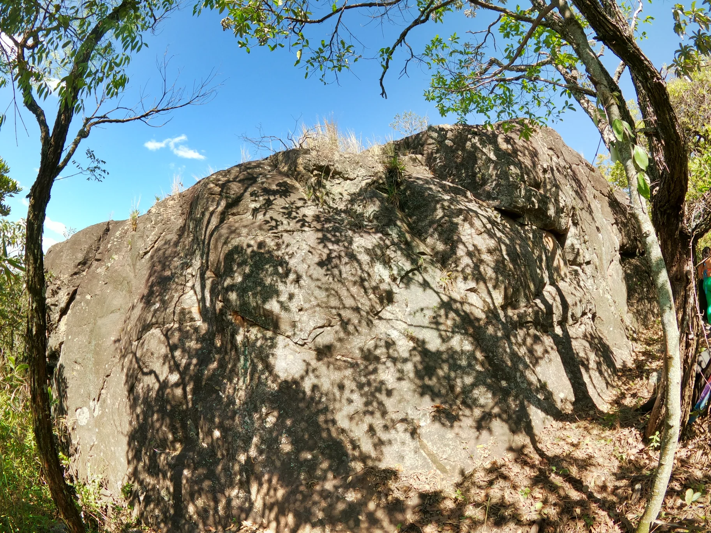
    - **largura_mapa**: 1825
    - **altura_mapa**: 1369
    - **pontos_de_interesse**:
      - **[0]**:
        - **id**: MfhaEzPjkVfcUS
        - **uid**: MfhaEzPjkVfcUS
        - **rotulo**: 
        - **linha**:
          - **estilo**: TRACEJADO
          - **espessura**: 4
          - **compilado**:
            - **caminho_svg**: M 1376 764 C 1358.3 719.7, 1334.8 670.7, 1323 631 C 1313.8 600.3, 1312.6 577.2, 1306 547 C 1298.3 511.4, 1296.7 462.4, 1279 431 C 1263.1 402.8, 1232.6 382.9, 1210 364 C 1190.7 347.8, 1172.0 336.7, 1153 323
            - **caixa_delimitadora**:
              - **x**: 1264
              - **y**: 544
              - **comprimento**: 223
              - **largura**: 441
            - **marcadores**:
              - **[0]**:
                - **tipo**: CIRCULO_IDENTIFICADOR
                - **x**: 1376
                - **y**: 764
                - **angulo_graus_x100**: -11173
                - **rotulo**: 1
                - **raio**: 21
        - **cor**: #00E5FF
        - **label**: 
    - **referencias**:
      - **[0]**:
        - **alvo_uid**: tQ6mCOffU1yNAJ
        - **pontos_uids**:
          - MfhaEzPjkVfcUS
        - **escalada**: Sobe e desce
        - **ids**:
          - MfhaEzPjkVfcUS
- **precomputados**:
  - **total_escaladas**: 5
  - **total_boulders**: 5

## Parte: setor_democracia (não listada em partes.json)

### Setor (Pico: Complexo Pedra Grande)

- **descricao**: Trilha para chegar ao setor: https://loc.wiki/t/169745893?wa=sc
- **nome**: Bloco Democracia
- **uid**: sQ7YgEG6ONsPXt
- **escaladas**:
  - **[0]**:
    - **uid**: JeenN3HpFf1fWM
    - **boulder**:
      - **nome**: Escalda pé
      - **dificuldade**: V3
  - **[1]**:
    - **uid**: jGt3wUqr2UdYcj
    - **boulder**:
      - **descricao**: Sai sentado segurando no batente.
      - **nome**: Sai sentado
      - **dificuldade**: V1
  - **[2]**:
    - **uid**: BFD04ZpI8eEHTN
    - **boulder**:
      - **nome**: Titi terremoto
      - **dificuldade**: V4
  - **[3]**:
    - **uid**: AGstgVoht7LBwf
    - **boulder**:
      - **nome**: Faixa preta
      - **dificuldade**: V2
  - **[4]**:
    - **uid**: 16GQnrumERO86h
    - **boulder**:
      - **nome**: Portátil
      - **dificuldade**: V6
  - **[5]**:
    - **uid**: tpZlh2cdAgBqAq
    - **boulder**:
      - **nome**: Democracia
      - **dificuldade**: V4
  - **[6]**:
    - **uid**: 9z8dS2eDjBrLkU
    - **boulder**:
      - **nome**: 127 horas (boulder)
      - **dificuldade**: V5
  - **[7]**:
    - **uid**: lEDeoMRWQIsyvt
    - **boulder**:
      - **nome**: Perda de memória recente
      - **dificuldade**: V6
  - **[8]**:
    - **uid**: Nj1FTueB1enlTt
    - **boulder**:
      - **descricao**: Começa na parede da direita e muda pra parede da esquerda no meio do boulder.
      - **nome**: Utopia
      - **dificuldade**: V6
  - **[9]**:
    - **uid**: fVhTfbikhEidfi
    - **boulder**:
      - **nome**: Dejavu
      - **dificuldade**: V5
  - **[10]**:
    - **uid**: 93e0jZbep0Me2K
    - **boulder**:
      - **nome**: Maquiavel
      - **dificuldade**: V8
  - **[11]**:
    - **uid**: YcNowMFY5WnIqB
    - **boulder**:
      - **nome**: Dejavu SDS
      - **dificuldade**: V6
  - **[12]**:
    - **uid**: MjbF0c0oN3HNGe
    - **boulder**:
      - **nome**: Sem nome 26
      - **dificuldade**: V6
  - **[13]**:
    - **uid**: E7MTuSCnwN9m2r
    - **boulder**:
      - **nome**: Vai mas não cai
      - **dificuldade**: V4
  - **[14]**:
    - **uid**: GdhGbnKKRc2vE2
    - **boulder**:
      - **nome**: Direita que me resta
      - **dificuldade**: V3
  - **[15]**:
    - **uid**: WVn9cRbuoJKTJe
    - **boulder**:
      - **descricao**: Mesma saída do Utopia.
      - **nome**: Distopia
      - **dificuldade**: V10
  - **[16]**:
    - **uid**: ysYI1TVvJS1kyy
    - **boulder**:
      - **nome**: Sem nome 27
      - **dificuldade**: V1
  - **[17]**:
    - **uid**: njS3Txwlt4gGPg
    - **boulder**:
      - **nome**: Engana bobo
      - **dificuldade**: V2
  - **[18]**:
    - **uid**: wqbq8WmwGdnfLw
    - **boulder**:
      - **nome**: Sem nome 29
      - **dificuldade**: V2
  - **[19]**:
    - **uid**: Ux0VzrqpFMAebD
    - **boulder**:
      - **nome**: Sem nome 30
      - **dificuldade**: V4
  - **[20]**:
    - **uid**: HfH0Q9Q86GoM6f
    - **boulder**:
      - **nome**: Pequeno desafio
      - **dificuldade**: V1
  - **[21]**:
    - **uid**: qSVuKvprARRGaM
    - **boulder**:
      - **nome**: Porco espinho
      - **dificuldade**: V2
  - **[22]**:
    - **uid**: bzxfCNiVVFBEnp
    - **boulder**:
      - **nome**: Passa um
      - **dificuldade**: V1
- **mapas**:
  - **[0]**:
    - **caminho_imagem_mapa**: 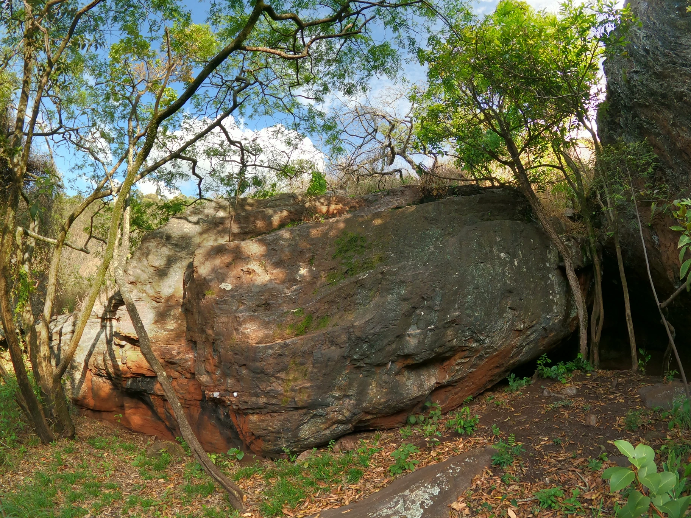
    - **largura_mapa**: 1825
    - **altura_mapa**: 1369
    - **pontos_de_interesse**:
      - **[0]**:
        - **id**: xgcJQ7IfL2MsEo
        - **uid**: xgcJQ7IfL2MsEo
        - **linha**:
          - **estilo**: TRACEJADO
          - **espessura**: 3
          - **compilado**:
            - **caminho_svg**: M 615 1117 C 611.3 1102.3, 607.7 1087.7, 604 1073
            - **caixa_delimitadora**:
              - **x**: 610
              - **y**: 1095
              - **comprimento**: 11
              - **largura**: 44
            - **marcadores**:
              - **[0]**:
                - **tipo**: CIRCULO_IDENTIFICADOR
                - **x**: 615
                - **y**: 1117
                - **angulo_graus_x100**: -10404
                - **rotulo**: 2
                - **raio**: 17
        - **cor**: #FFD600
      - **[1]**:
        - **id**: Rz6FEtYQ3eIWZv
        - **uid**: Rz6FEtYQ3eIWZv
        - **linha**:
          - **estilo**: TRACEJADO
          - **espessura**: 3
          - **compilado**:
            - **caminho_svg**: M 604 1073 C 596.0 1064.3, 590.1 1055.6, 580 1047 C 566.9 1035.8, 542.4 1031.9, 530 1014 C 512.3 988.4, 509.9 934.1, 503 895 C 496.4 857.8, 487.6 822.4, 489 785 C 490.5 745.5, 498.8 692.7, 514 664 C 524.6 644.0, 544.8 635.8, 556 621 C 565.8 608.0, 574.8 595.4, 579 581 C 583.2 566.4, 580.3 549.7, 581 534
            - **caixa_delimitadora**:
              - **x**: 546
              - **y**: 804
              - **comprimento**: 115
              - **largura**: 539
            - **marcadores**:
              - **[0]**:
                - **tipo**: FIM_TOP
                - **x**: 581
                - **y**: 534
                - **angulo_graus_x100**: -8756
                - **rotulo**: B
                - **raio**: 17
        - **cor**: #FFD600
      - **[2]**:
        - **id**: yrBoCO3F14z3ea
        - **uid**: yrBoCO3F14z3ea
        - **rotulo**: 
        - **linha**:
          - **estilo**: TRACEJADO
          - **espessura**: 3
          - **compilado**:
            - **caminho_svg**: M 326 1061 C 324.7 1045.7, 323.9 1029.9, 322 1015 C 320.2 1000.9, 316.1 987.0, 315 974 C 314.0 962.4, 315.0 953.4, 315 941 C 315.0 924.8, 315.2 903.9, 315 885 C 314.8 865.6, 312.2 846.9, 314 826 C 316.1 801.9, 320.9 777.4, 329 749 C 339.6 711.9, 361.0 665.7, 377 624
            - **caixa_delimitadora**:
              - **x**: 346
              - **y**: 842
              - **comprimento**: 63
              - **largura**: 437
            - **marcadores**:
              - **[0]**:
                - **tipo**: CIRCULO_IDENTIFICADOR
                - **x**: 326
                - **y**: 1061
                - **angulo_graus_x100**: -9497
                - **rotulo**: 1
                - **raio**: 17
              - **[1]**:
                - **tipo**: FIM_TOP
                - **x**: 377
                - **y**: 624
                - **angulo_graus_x100**: -6899
                - **rotulo**: A
                - **raio**: 17
        - **cor**: #FFD600
        - **label**: 
      - **[3]**:
        - **id**: juE1R9MVCEtmxr
        - **uid**: juE1R9MVCEtmxr
        - **linha**:
          - **estilo**: TRACEJADO
          - **espessura**: 3
          - **compilado**:
            - **caminho_svg**: M 604 1073 C 604.7 1057.7, 600.9 1040.3, 606 1027 C 610.9 1014.2, 623.0 1000.0, 633 994 C 640.7 989.4, 650.0 992.6, 658 989 C 667.1 984.9, 676.6 977.6, 684 969 C 692.3 959.4, 694.5 942.8, 704 933 C 714.1 922.5, 728.8 915.6, 744 909 C 761.8 901.4, 783.7 898.8, 805 892 C 829.1 884.4, 857.2 873.8, 881 865 C 902.2 857.2, 921.4 849.6, 941 842 C 960.0 834.6, 986.2 829.9, 997 820 C 1003.9 813.7, 1004.3 805.3, 1008 798
            - **caixa_delimitadora**:
              - **x**: 806
              - **y**: 936
              - **comprimento**: 404
              - **largura**: 275
            - **marcadores**: []
        - **cor**: #FFD600
      - **[4]**:
        - **id**: FoAMrUf6AwBUCB
        - **uid**: FoAMrUf6AwBUCB
        - **linha**:
          - **estilo**: TRACEJADO
          - **espessura**: 3
          - **compilado**:
            - **caminho_svg**: M 1008 798 C 1011.0 779.7, 1006.2 757.9, 1017 743 C 1030.4 724.4, 1081.5 725.1, 1093 703 C 1105.9 678.1, 1082.2 628.9, 1079 595 C 1076.2 565.0, 1075.7 538.3, 1074 510
            - **caixa_delimitadora**:
              - **x**: 1050
              - **y**: 654
              - **comprimento**: 85
              - **largura**: 288
            - **marcadores**:
              - **[0]**:
                - **tipo**: FIM_TOP
                - **x**: 1074
                - **y**: 510
                - **angulo_graus_x100**: -9337
                - **rotulo**: C
                - **raio**: 17
        - **cor**: #FFD600
      - **[5]**:
        - **id**: jyFvAsGlGqFMM5
        - **uid**: jyFvAsGlGqFMM5
        - **rotulo**: 
        - **linha**:
          - **estilo**: TRACEJADO
          - **espessura**: 3
          - **compilado**:
            - **caminho_svg**: M 979 962 C 978.3 953.7, 976.1 945.6, 977 937 C 978.0 927.4, 982.4 917.6, 986 907 C 990.2 894.8, 997.4 883.2, 1001 868 C 1005.7 848.3, 1005.7 821.3, 1008 798
            - **caixa_delimitadora**:
              - **x**: 992
              - **y**: 880
              - **comprimento**: 31
              - **largura**: 164
            - **marcadores**:
              - **[0]**:
                - **tipo**: CIRCULO_IDENTIFICADOR
                - **x**: 979
                - **y**: 962
                - **angulo_graus_x100**: -9457
                - **rotulo**: 3
                - **raio**: 17
        - **cor**: #FFD600
        - **label**: 
      - **[6]**:
        - **id**: a4k5Nb9INw1YLO
        - **uid**: a4k5Nb9INw1YLO
        - **rotulo**: 
        - **linha**:
          - **estilo**: TRACEJADO
          - **espessura**: 3
          - **compilado**:
            - **caminho_svg**: M 1394 897 C 1380.7 871.3, 1364.6 847.1, 1354 820 C 1343.1 792.2, 1338.4 759.0, 1330 732 C 1322.7 708.5, 1317.4 689.5, 1307 667 C 1294.8 640.5, 1275.3 610.8, 1259 584 C 1243.3 558.2, 1227.0 534.0, 1211 509
            - **caixa_delimitadora**:
              - **x**: 1302
              - **y**: 703
              - **comprimento**: 183
              - **largura**: 388
            - **marcadores**:
              - **[0]**:
                - **tipo**: CIRCULO_IDENTIFICADOR
                - **x**: 1394
                - **y**: 897
                - **angulo_graus_x100**: -11745
                - **rotulo**: 4
                - **raio**: 17
              - **[1]**:
                - **tipo**: FIM_TOP
                - **x**: 1211
                - **y**: 509
                - **angulo_graus_x100**: -12262
                - **rotulo**: D
                - **raio**: 17
        - **cor**: #FFD600
        - **label**: 
      - **[7]**:
        - **id**: Sq5Lrg1w93d0JW
        - **uid**: Sq5Lrg1w93d0JW
        - **rotulo**: 
        - **circulo**:
          - **x**: 1027
          - **y**: 967
          - **raio**: 19
        - **cor**: 
        - **label**: 
      - **[8]**:
        - **id**: KJn5rHYYg43lmm
        - **uid**: KJn5rHYYg43lmm
        - **rotulo**: 
        - **circulo**:
          - **x**: 927
          - **y**: 875
          - **raio**: 20
        - **cor**: 
        - **label**: 
    - **referencias**:
      - **[0]**:
        - **alvo_uid**: JeenN3HpFf1fWM
        - **pontos_uids**:
          - xgcJQ7IfL2MsEo
          - Rz6FEtYQ3eIWZv
        - **escalada**: Escalda pé
        - **ids**:
          - xgcJQ7IfL2MsEo
          - Rz6FEtYQ3eIWZv
      - **[1]**:
        - **alvo_uid**: jGt3wUqr2UdYcj
        - **pontos_uids**:
          - yrBoCO3F14z3ea
        - **escalada**: Sai sentado
        - **ids**:
          - yrBoCO3F14z3ea
      - **[2]**:
        - **alvo_uid**: BFD04ZpI8eEHTN
        - **pontos_uids**:
          - xgcJQ7IfL2MsEo
          - juE1R9MVCEtmxr
          - FoAMrUf6AwBUCB
        - **escalada**: Titi terremoto
        - **ids**:
          - xgcJQ7IfL2MsEo
          - juE1R9MVCEtmxr
          - FoAMrUf6AwBUCB
      - **[3]**:
        - **alvo_uid**: AGstgVoht7LBwf
        - **pontos_uids**:
          - jyFvAsGlGqFMM5
          - FoAMrUf6AwBUCB
          - Sq5Lrg1w93d0JW
          - KJn5rHYYg43lmm
        - **escalada**: Faixa preta
        - **ids**:
          - jyFvAsGlGqFMM5
          - FoAMrUf6AwBUCB
          - Sq5Lrg1w93d0JW
          - KJn5rHYYg43lmm
      - **[4]**:
        - **alvo_uid**: 16GQnrumERO86h
        - **pontos_uids**:
          - a4k5Nb9INw1YLO
        - **escalada**: Portátil
        - **ids**:
          - a4k5Nb9INw1YLO
  - **[1]**:
    - **caminho_imagem_mapa**: 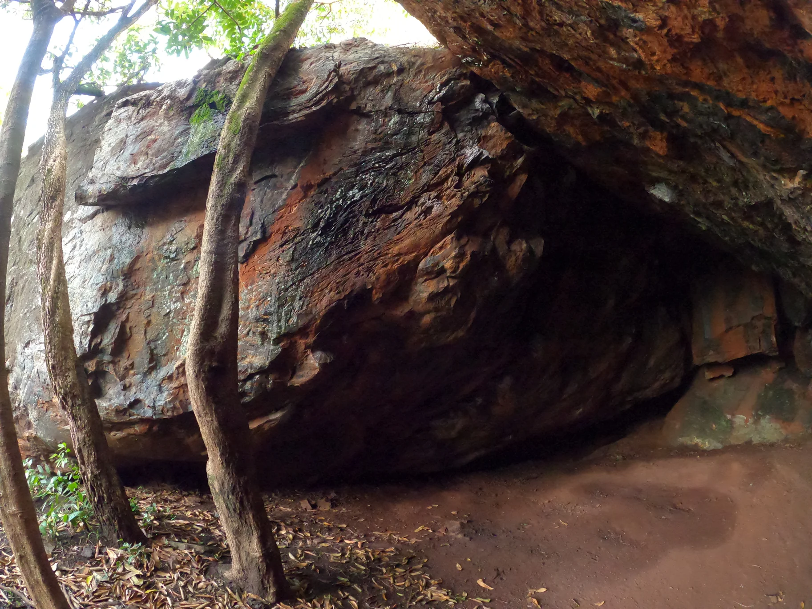
    - **largura_mapa**: 1825
    - **altura_mapa**: 1369
    - **pontos_de_interesse**:
      - **[0]**:
        - **id**: 4xFsLZKWl4AdtM
        - **uid**: 4xFsLZKWl4AdtM
        - **rotulo**: 
        - **linha**:
          - **estilo**: TRACEJADO
          - **espessura**: 3
          - **compilado**:
            - **caminho_svg**: M 1503 834 C 1500.3 810.3, 1499.5 788.1, 1495 763 C 1489.8 733.9, 1489.0 693.8, 1472 670 C 1455.5 646.9, 1418.2 620.1, 1396 621 C 1377.9 621.8, 1367.3 652.2, 1348 658 C 1325.8 664.7, 1285.5 665.9, 1268 652 C 1250.2 637.9, 1251.3 599.3, 1243 573
            - **caixa_delimitadora**:
              - **x**: 1373
              - **y**: 704
              - **comprimento**: 260
              - **largura**: 261
            - **marcadores**:
              - **[0]**:
                - **tipo**: CIRCULO_IDENTIFICADOR
                - **x**: 1503
                - **y**: 834
                - **angulo_graus_x100**: -9643
                - **rotulo**: 7
        - **cor**: #FFD600
        - **label**: 
      - **[1]**:
        - **id**: HUwTLvTBBGjsnz
        - **uid**: HUwTLvTBBGjsnz
        - **linha**:
          - **estilo**: TRACEJADO
          - **espessura**: 3
          - **compilado**:
            - **caminho_svg**: M 1021 930 C 1044.0 907.3, 1067.8 886.0, 1090 862 C 1112.8 837.4, 1136.1 812.2, 1156 784 C 1176.6 754.7, 1196.6 723.2, 1211 689 C 1226.0 653.2, 1232.3 611.7, 1243 573
            - **caixa_delimitadora**:
              - **x**: 1132
              - **y**: 752
              - **comprimento**: 222
              - **largura**: 357
            - **marcadores**:
              - **[0]**:
                - **tipo**: CIRCULO_IDENTIFICADOR
                - **x**: 1021
                - **y**: 930
                - **angulo_graus_x100**: -4458
                - **rotulo**: 6
        - **cor**: #FFD600
      - **[2]**:
        - **id**: d1hYpyX2npuSmv
        - **uid**: d1hYpyX2npuSmv
        - **rotulo**: 
        - **linha**:
          - **estilo**: TRACEJADO
          - **espessura**: 3
          - **compilado**:
            - **caminho_svg**: M 638 928 C 663.0 892.3, 695.1 859.1, 713 821 C 730.3 784.3, 722.2 733.4, 745 704 C 767.7 674.8, 817.4 662.3, 849 645 C 875.1 630.7, 897.7 623.6, 921 607 C 947.5 588.1, 976.2 557.9, 998 535 C 1015.9 516.2, 1029.6 502.1, 1044 481 C 1061.0 456.0, 1091.0 420.2, 1091 393 C 1091.0 369.4, 1067.7 349.0, 1056 327
            - **caixa_delimitadora**:
              - **x**: 864
              - **y**: 628
              - **comprimento**: 453
              - **largura**: 601
            - **marcadores**:
              - **[0]**:
                - **tipo**: CIRCULO_IDENTIFICADOR
                - **x**: 638
                - **y**: 928
                - **angulo_graus_x100**: -5497
                - **rotulo**: 5
        - **cor**: #FFD600
        - **label**: 
      - **[3]**:
        - **id**: N4Wu08VRRMLamh
        - **uid**: N4Wu08VRRMLamh
        - **linha**:
          - **estilo**: TRACEJADO
          - **espessura**: 3
          - **compilado**:
            - **caminho_svg**: M 1241 575 C 1240.7 538.0, 1253.4 494.8, 1240 464 C 1227.0 434.1, 1193.0 413.8, 1164 392 C 1132.1 368.0, 1091.3 349.3, 1055 328
            - **caixa_delimitadora**:
              - **x**: 1148
              - **y**: 452
              - **comprimento**: 186
              - **largura**: 247
            - **marcadores**: []
        - **cor**: #FFD600
      - **[4]**:
        - **id**: Kz0YuBGAhccOB5
        - **uid**: Kz0YuBGAhccOB5
        - **linha**:
          - **estilo**: TRACEJADO
          - **espessura**: 3
          - **compilado**:
            - **caminho_svg**: M 1055 328 C 1024.3 305.3, 989.9 288.5, 963 260 C 933.5 228.7, 903.6 173.2, 888 145 C 879.5 129.7, 876.7 120.3, 871 108
            - **caixa_delimitadora**:
              - **x**: 963
              - **y**: 218
              - **comprimento**: 184
              - **largura**: 220
            - **marcadores**:
              - **[0]**:
                - **tipo**: FIM_TOP
                - **x**: 871
                - **y**: 108
                - **angulo_graus_x100**: -11468
                - **rotulo**: E
        - **cor**: #FFD600
    - **referencias**:
      - **[0]**:
        - **alvo_uid**: tpZlh2cdAgBqAq
        - **pontos_uids**:
          - HUwTLvTBBGjsnz
          - N4Wu08VRRMLamh
          - Kz0YuBGAhccOB5
        - **escalada**: Democracia
        - **ids**:
          - HUwTLvTBBGjsnz
          - N4Wu08VRRMLamh
          - Kz0YuBGAhccOB5
      - **[1]**:
        - **alvo_uid**: 9z8dS2eDjBrLkU
        - **pontos_uids**:
          - 4xFsLZKWl4AdtM
          - N4Wu08VRRMLamh
          - Kz0YuBGAhccOB5
        - **escalada**: 127 horas (boulder)
        - **ids**:
          - 4xFsLZKWl4AdtM
          - N4Wu08VRRMLamh
          - Kz0YuBGAhccOB5
      - **[2]**:
        - **alvo_uid**: lEDeoMRWQIsyvt
        - **pontos_uids**:
          - d1hYpyX2npuSmv
          - Kz0YuBGAhccOB5
        - **escalada**: Perda de memória recente
        - **ids**:
          - d1hYpyX2npuSmv
          - Kz0YuBGAhccOB5
  - **[2]**:
    - **caminho_imagem_mapa**: 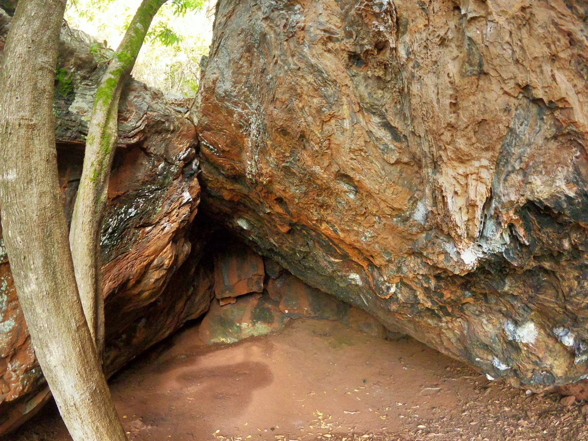
    - **largura_mapa**: 1825
    - **altura_mapa**: 1369
    - **pontos_de_interesse**:
      - **[0]**:
        - **id**: jnQoVwmwnQ2H0k
        - **uid**: jnQoVwmwnQ2H0k
        - **rotulo**: 
        - **linha**:
          - **estilo**: TRACEJADO
          - **espessura**: 3
          - **compilado**:
            - **caminho_svg**: M 942 871 C 921.7 855.7, 901.6 842.1, 881 825 C 858.3 806.1, 832.0 780.4, 812 762 C 796.5 747.8, 783.4 737.9, 771 724 C 758.4 709.9, 751.1 692.8, 737 678 C 720.5 660.6, 692.3 643.7, 676 628 C 663.7 616.1, 654.9 592.8, 646 594 C 635.8 595.4, 631.2 637.0, 620 648 C 612.0 655.9, 598.7 664.2, 592 661 C 583.1 656.7, 583.8 625.0, 579 608 C 574.4 592.0, 566.9 575.3, 564 562 C 561.9 552.2, 561.9 546.5, 561 536 C 559.7 520.0, 558.0 496.7, 558 475 C 558.0 450.1, 562.9 417.8, 562 395 C 561.3 377.8, 558.0 365.0, 556 350
            - **caixa_delimitadora**:
              - **x**: 749
              - **y**: 610
              - **comprimento**: 386
              - **largura**: 521
            - **marcadores**:
              - **[0]**:
                - **tipo**: CIRCULO_IDENTIFICADOR
                - **x**: 942
                - **y**: 871
                - **angulo_graus_x100**: -14298
                - **rotulo**: 8
              - **[1]**:
                - **tipo**: CIRCULO_IDENTIFICADOR
                - **x**: 556
                - **y**: 350
                - **angulo_graus_x100**: -9759
                - **rotulo**: E
        - **cor**: #FFD600
        - **label**: 
    - **referencias**:
      - **[0]**:
        - **alvo_uid**: Nj1FTueB1enlTt
        - **pontos_uids**:
          - jnQoVwmwnQ2H0k
        - **escalada**: Utopia
        - **ids**:
          - jnQoVwmwnQ2H0k
  - **[3]**:
    - **caminho_imagem_mapa**: 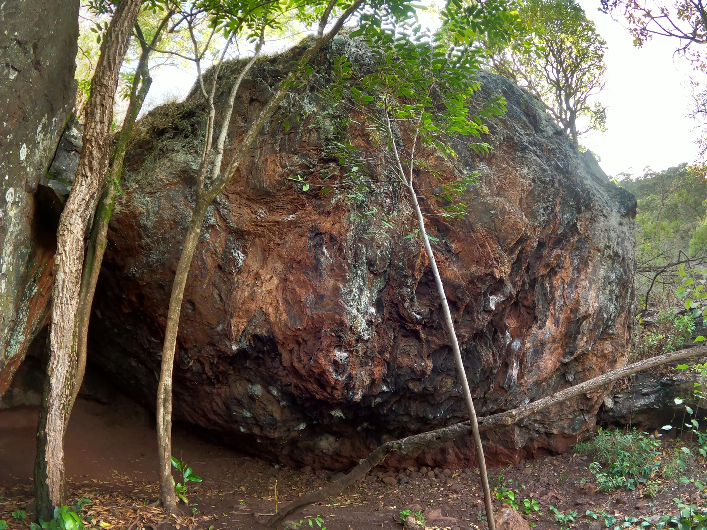
    - **largura_mapa**: 1825
    - **altura_mapa**: 1369
    - **pontos_de_interesse**:
      - **[0]**:
        - **id**: n27STFDby4rocC
        - **uid**: n27STFDby4rocC
        - **linha**:
          - **estilo**: TRACEJADO
          - **espessura**: 3
          - **compilado**:
            - **caminho_svg**: M 1095 1113 C 1076.7 1111.7, 1058.7 1108.7, 1040 1109 C 1020.4 1109.3, 997.7 1114.6, 980 1115 C 965.9 1115.3, 949.1 1119.0, 942 1113 C 936.0 1107.9, 934.3 1094.6, 936 1086 C 937.9 1076.6, 947.8 1066.8, 955 1059 C 961.9 1051.6, 974.3 1048.3, 978 1040 C 981.9 1031.4, 981.9 1016.7, 977 1008 C 971.6 998.3, 952.4 995.3, 944 986 C 936.0 977.1, 930.1 965.7, 927 954 C 923.8 941.8, 923.9 927.3, 926 914 C 928.3 900.0, 936.2 885.8, 941 872 C 945.6 858.8, 950.2 846.6, 954 833 C 958.0 818.6, 961.8 803.8, 964 788 C 966.4 770.7, 972.9 750.6, 967 733 C 959.9 712.0, 937.5 691.5, 916 673 C 890.0 650.5, 853.1 629.5, 818 612 C 781.1 593.6, 736.0 576.9, 699 566 C 668.1 556.9, 634.2 556.3, 612 548 C 596.9 542.4, 588.0 534.7, 576 528
            - **caixa_delimitadora**:
              - **x**: 836
              - **y**: 822
              - **comprimento**: 519
              - **largura**: 587
            - **marcadores**:
              - **[0]**:
                - **tipo**: CIRCULO_IDENTIFICADOR
                - **x**: 1095
                - **y**: 1113
                - **angulo_graus_x100**: -17584
                - **rotulo**: 11
        - **cor**: #FFD600
      - **[1]**:
        - **id**: n1ql6PZ4p49sVz
        - **uid**: n1ql6PZ4p49sVz
        - **linha**:
          - **estilo**: TRACEJADO
          - **espessura**: 3
          - **compilado**:
            - **caminho_svg**: M 576 529 C 563.7 509.3, 549.7 490.9, 539 470 C 527.9 448.4, 516.6 424.3, 511 401 C 505.6 378.6, 507.7 356.6, 505 333 C 502.1 307.4, 497.7 279.7, 494 253
            - **caixa_delimitadora**:
              - **x**: 535
              - **y**: 391
              - **comprimento**: 82
              - **largura**: 276
            - **marcadores**:
              - **[0]**:
                - **tipo**: FIM_TOP
                - **x**: 494
                - **y**: 253
                - **angulo_graus_x100**: -9783
                - **rotulo**: A
        - **cor**: #FFD600
      - **[2]**:
        - **id**: DkBnfCPwRA9ZPY
        - **uid**: DkBnfCPwRA9ZPY
        - **rotulo**: 
        - **linha**:
          - **estilo**: TRACEJADO
          - **espessura**: 3
          - **compilado**:
            - **caminho_svg**: M 297 902 C 318.7 910.7, 340.0 922.3, 362 928 C 383.1 933.4, 404.5 933.8, 426 936 C 447.8 938.2, 472.3 945.8, 492 941 C 510.3 936.6, 526.9 927.4, 541 911 C 561.7 886.9, 573.0 835.0, 589 797
            - **caixa_delimitadora**:
              - **x**: 443
              - **y**: 869
              - **comprimento**: 292
              - **largura**: 144
            - **marcadores**:
              - **[0]**:
                - **tipo**: CIRCULO_IDENTIFICADOR
                - **x**: 297
                - **y**: 902
                - **angulo_graus_x100**: 2180
                - **rotulo**: 9
        - **cor**: #FFD600
        - **label**: 
      - **[3]**:
        - **id**: GkGoOZC3WJhbAL
        - **uid**: GkGoOZC3WJhbAL
        - **linha**:
          - **estilo**: TRACEJADO
          - **espessura**: 3
          - **compilado**:
            - **caminho_svg**: M 845 1136 C 823.7 1134.0, 802.2 1133.5, 781 1130 C 759.5 1126.5, 733.9 1124.7, 717 1115 C 702.3 1106.6, 694.5 1091.6, 683 1079 C 670.8 1065.6, 655.7 1051.6, 646 1037 C 637.2 1023.8, 632.0 1011.1, 626 996 C 619.1 978.6, 613.0 958.4, 608 938 C 602.5 915.9, 598.2 891.5, 595 868 C 591.8 844.5, 591.0 820.7, 589 797
            - **caixa_delimitadora**:
              - **x**: 717
              - **y**: 966
              - **comprimento**: 256
              - **largura**: 339
            - **marcadores**:
              - **[0]**:
                - **tipo**: CIRCULO_IDENTIFICADOR
                - **x**: 845
                - **y**: 1136
                - **angulo_graus_x100**: -17464
                - **rotulo**: 10
        - **cor**: #FFD600
      - **[4]**:
        - **id**: pzCZCit4gVZvId
        - **uid**: pzCZCit4gVZvId
        - **linha**:
          - **estilo**: TRACEJADO
          - **espessura**: 3
          - **compilado**:
            - **caminho_svg**: M 588 798 C 591.3 774.7, 594.9 748.5, 598 728 C 600.5 711.9, 604.6 702.1, 605 685 C 605.5 660.1, 599.5 620.8, 594 593 C 589.3 569.3, 582.0 549.7, 576 528
            - **caixa_delimitadora**:
              - **x**: 590
              - **y**: 663
              - **comprimento**: 29
              - **largura**: 270
            - **marcadores**: []
        - **cor**: #FFD600
    - **referencias**:
      - **[0]**:
        - **alvo_uid**: fVhTfbikhEidfi
        - **pontos_uids**:
          - n27STFDby4rocC
          - n1ql6PZ4p49sVz
        - **escalada**: Dejavu
        - **ids**:
          - n27STFDby4rocC
          - n1ql6PZ4p49sVz
      - **[1]**:
        - **alvo_uid**: 93e0jZbep0Me2K
        - **pontos_uids**:
          - GkGoOZC3WJhbAL
          - pzCZCit4gVZvId
          - n1ql6PZ4p49sVz
        - **escalada**: Maquiavel
        - **ids**:
          - GkGoOZC3WJhbAL
          - pzCZCit4gVZvId
          - n1ql6PZ4p49sVz
      - **[2]**:
        - **alvo_uid**: WVn9cRbuoJKTJe
        - **pontos_uids**:
          - DkBnfCPwRA9ZPY
          - pzCZCit4gVZvId
          - n1ql6PZ4p49sVz
        - **escalada**: Distopia
        - **ids**:
          - DkBnfCPwRA9ZPY
          - pzCZCit4gVZvId
          - n1ql6PZ4p49sVz
  - **[4]**:
    - **caminho_imagem_mapa**: 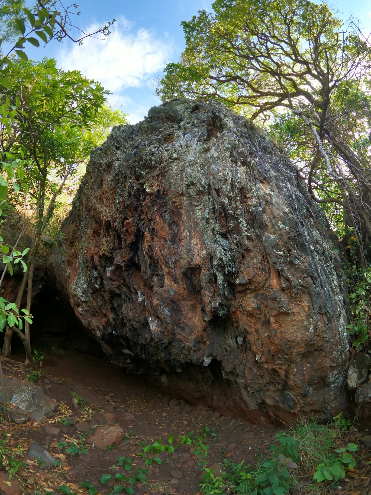
    - **largura_mapa**: 1369
    - **altura_mapa**: 1825
    - **pontos_de_interesse**:
      - **[0]**:
        - **id**: SHCOhsdHYBae5A
        - **uid**: SHCOhsdHYBae5A
        - **linha**:
          - **estilo**: TRACEJADO
          - **espessura**: 3
          - **compilado**:
            - **caminho_svg**: M 1232 1406 C 1199.7 1410.7, 1167.3 1415.3, 1135 1420
            - **caixa_delimitadora**:
              - **x**: 1184
              - **y**: 1413
              - **comprimento**: 97
              - **largura**: 14
            - **marcadores**:
              - **[0]**:
                - **tipo**: CIRCULO_IDENTIFICADOR
                - **x**: 1232
                - **y**: 1406
                - **angulo_graus_x100**: 17179
                - **rotulo**: 13
        - **cor**: #FFD600
      - **[1]**:
        - **id**: 6TPsswIRL43wbg
        - **uid**: 6TPsswIRL43wbg
        - **linha**:
          - **estilo**: TRACEJADO
          - **espessura**: 3
          - **compilado**:
            - **caminho_svg**: M 1135 1420 C 1105.0 1424.7, 1076.2 1431.3, 1045 1434 C 1011.7 1436.9, 973.3 1442.1, 941 1436 C 910.6 1430.3, 879.4 1414.9, 856 1401 C 837.1 1389.8, 820.6 1376.1, 809 1363 C 799.8 1352.6, 799.4 1336.6, 789 1331 C 776.8 1324.4, 754.1 1332.9, 737 1332 C 720.1 1331.2, 703.2 1331.0, 687 1326 C 669.8 1320.7, 652.5 1310.7, 637 1300 C 621.1 1289.1, 606.6 1277.1, 593 1261 C 576.9 1242.0, 556.6 1213.0, 549 1191 C 543.2 1174.2, 548.5 1159.2, 544 1143 C 538.9 1124.6, 527.1 1104.5, 518 1087 C 509.7 1071.0, 504.8 1054.4, 492 1042 C 477.4 1027.9, 451.4 1019.3, 432 1010 C 414.5 1001.6, 394.6 999.0, 381 988 C 367.9 977.4, 358.7 962.1, 351 946 C 342.5 928.2, 339.6 905.1, 334 885 C 328.6 865.4, 325.0 844.5, 318 827 C 311.7 811.2, 301.0 799.9, 295 784 C 288.3 766.3, 285.7 744.7, 281 725
            - **caixa_delimitadora**:
              - **x**: 708
              - **y**: 1080
              - **comprimento**: 854
              - **largura**: 711
            - **marcadores**:
              - **[0]**:
                - **tipo**: FIM_TOP
                - **x**: 281
                - **y**: 725
                - **angulo_graus_x100**: -10335
                - **rotulo**: F
        - **cor**: #FFD600
      - **[2]**:
        - **id**: GA9j8Ik294SeTh
        - **uid**: GA9j8Ik294SeTh
        - **rotulo**: 
        - **linha**:
          - **estilo**: TRACEJADO
          - **espessura**: 3
          - **compilado**:
            - **caminho_svg**: M 1135 1420 C 1108.0 1409.0, 1076.8 1400.1, 1054 1387 C 1035.1 1376.1, 1019.5 1362.5, 1006 1350 C 994.6 1339.5, 983.0 1331.3, 977 1318 C 970.3 1303.0, 970.8 1281.3, 971 1263 C 971.2 1244.7, 970.9 1224.0, 978 1208 C 984.9 1192.4, 1003.4 1182.2, 1012 1168 C 1020.0 1154.8, 1026.2 1140.4, 1029 1126 C 1031.8 1111.8, 1031.8 1100.3, 1029 1082 C 1024.2 1050.0, 1003.4 992.7, 989 953 C 976.2 917.8, 961.8 889.4, 948 855 C 932.9 817.4, 914.8 773.8, 902 736 C 890.7 702.5, 883.4 672.7, 874 640 C 864.1 605.8, 852.2 570.4, 844 535 C 835.8 499.7, 832.7 454.6, 825 428 C 820.2 411.5, 814.3 402.0, 809 389
            - **caixa_delimitadora**:
              - **x**: 972
              - **y**: 904
              - **comprimento**: 326
              - **largura**: 1031
            - **marcadores**:
              - **[0]**:
                - **tipo**: FIM_TOP
                - **x**: 809
                - **y**: 389
                - **angulo_graus_x100**: -11231
                - **rotulo**: H
        - **cor**: #FFD600
        - **label**: 
      - **[3]**:
        - **id**: q3xH3oo4YeOuGX
        - **uid**: q3xH3oo4YeOuGX
        - **rotulo**: 
        - **linha**:
          - **estilo**: TRACEJADO
          - **espessura**: 3
          - **compilado**:
            - **caminho_svg**: M 889 1475 C 862.7 1457.3, 830.2 1447.5, 810 1422 C 786.3 1392.1, 765.8 1335.6, 764 1300 C 762.6 1273.1, 773.0 1250.1, 783 1228 C 792.8 1206.2, 812.5 1188.4, 823 1168 C 832.8 1149.0, 841.1 1132.9, 845 1110 C 850.2 1079.2, 848.5 1039.0, 842 998 C 833.7 945.7, 804.6 878.1, 790 823 C 777.2 774.5, 768.9 728.5, 758 685 C 748.2 645.6, 737.9 615.3, 728 573 C 715.2 518.8, 702.7 448.3, 690 386
            - **caixa_delimitadora**:
              - **x**: 790
              - **y**: 930
              - **comprimento**: 199
              - **largura**: 1089
            - **marcadores**:
              - **[0]**:
                - **tipo**: CIRCULO_IDENTIFICADOR
                - **x**: 889
                - **y**: 1475
                - **angulo_graus_x100**: -14614
                - **rotulo**: 12
              - **[1]**:
                - **tipo**: FIM_TOP
                - **x**: 690
                - **y**: 386
                - **angulo_graus_x100**: -10149
                - **rotulo**: G
        - **cor**: #FFD600
        - **label**: 
      - **[4]**:
        - **id**: 9DLFJCbuMQKSI2
        - **uid**: 9DLFJCbuMQKSI2
        - **rotulo**: 
        - **linha**:
          - **estilo**: TRACEJADO
          - **espessura**: 3
          - **compilado**:
            - **caminho_svg**: M 1272 1389 C 1273.3 1336.3, 1278.9 1280.8, 1276 1231 C 1273.4 1186.0, 1266.8 1143.4, 1258 1103 C 1249.8 1065.4, 1237.6 1031.6, 1226 996 C 1214.3 959.9, 1200.7 923.9, 1188 888 C 1175.4 852.2, 1165.7 819.0, 1150 781 C 1131.3 735.7, 1103.1 676.5, 1081 635 C 1063.8 602.7, 1051.8 577.1, 1031 551 C 1008.7 523.1, 977.0 499.7, 950 474
            - **caixa_delimitadora**:
              - **x**: 1113
              - **y**: 932
              - **comprimento**: 326
              - **largura**: 915
            - **marcadores**:
              - **[0]**:
                - **tipo**: CIRCULO_IDENTIFICADOR
                - **x**: 1272
                - **y**: 1389
                - **angulo_graus_x100**: -8855
                - **rotulo**: 14
              - **[1]**:
                - **tipo**: FIM_TOP
                - **x**: 950
                - **y**: 474
                - **angulo_graus_x100**: -13645
                - **rotulo**: I
        - **cor**: #FFD600
        - **label**: 
    - **referencias**:
      - **[0]**:
        - **alvo_uid**: YcNowMFY5WnIqB
        - **pontos_uids**:
          - SHCOhsdHYBae5A
          - 6TPsswIRL43wbg
        - **escalada**: Dejavu SDS
        - **ids**:
          - SHCOhsdHYBae5A
          - 6TPsswIRL43wbg
      - **[1]**:
        - **alvo_uid**: MjbF0c0oN3HNGe
        - **pontos_uids**:
          - SHCOhsdHYBae5A
          - GA9j8Ik294SeTh
        - **escalada**: Sem nome 26
        - **ids**:
          - SHCOhsdHYBae5A
          - GA9j8Ik294SeTh
      - **[2]**:
        - **alvo_uid**: E7MTuSCnwN9m2r
        - **pontos_uids**:
          - q3xH3oo4YeOuGX
        - **escalada**: Vai mas não cai
        - **ids**:
          - q3xH3oo4YeOuGX
      - **[3]**:
        - **alvo_uid**: GdhGbnKKRc2vE2
        - **pontos_uids**:
          - 9DLFJCbuMQKSI2
        - **escalada**: Direita que me resta
        - **ids**:
          - 9DLFJCbuMQKSI2
  - **[5]**:
    - **caminho_imagem_mapa**: 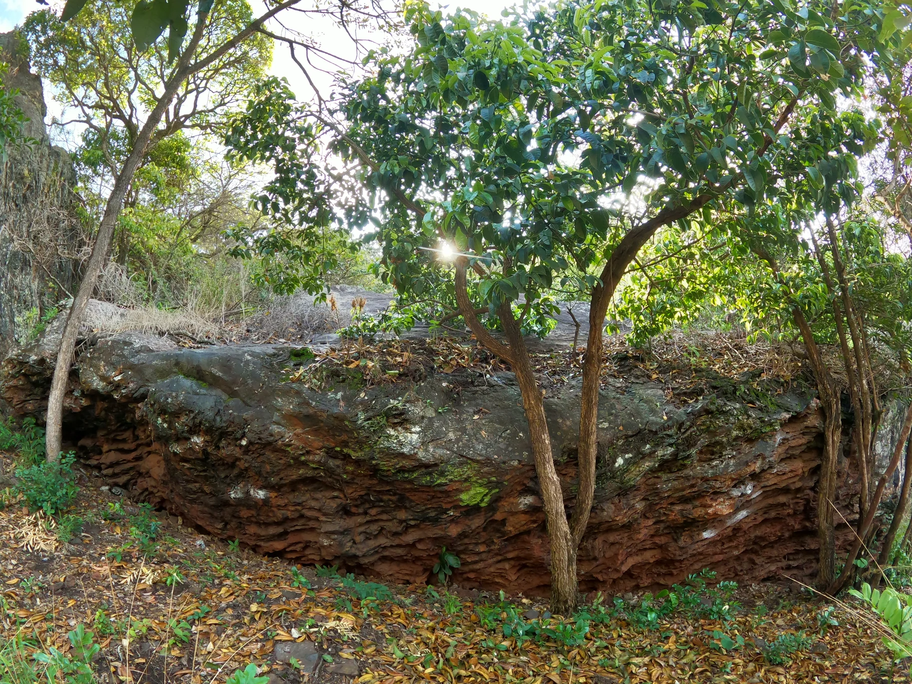
    - **largura_mapa**: 1825
    - **altura_mapa**: 1369
    - **pontos_de_interesse**:
      - **[0]**:
        - **id**: h02BCusv8ZjmXc
        - **uid**: h02BCusv8ZjmXc
        - **rotulo**: 
        - **linha**:
          - **estilo**: TRACEJADO
          - **espessura**: 3
          - **compilado**:
            - **caminho_svg**: M 1261 1102 C 1255.7 1091.0, 1245.8 1080.3, 1245 1069 C 1244.2 1057.7, 1254.2 1047.2, 1256 1034 C 1258.2 1017.9, 1255.9 1000.0, 1254 979 C 1251.4 950.5, 1245.8 913.3, 1239 879 C 1231.7 842.1, 1220.3 803.0, 1211 765
            - **caixa_delimitadora**:
              - **x**: 1236
              - **y**: 934
              - **comprimento**: 50
              - **largura**: 337
            - **marcadores**:
              - **[0]**:
                - **tipo**: CIRCULO_IDENTIFICADOR
                - **x**: 1261
                - **y**: 1102
                - **angulo_graus_x100**: -11587
                - **rotulo**: 20
                - **raio**: 17
        - **cor**: #FFD600
        - **label**: 
      - **[1]**:
        - **id**: Xzyhq0GSNfF517
        - **uid**: Xzyhq0GSNfF517
        - **rotulo**: 
        - **linha**:
          - **estilo**: TRACEJADO
          - **espessura**: 3
          - **compilado**:
            - **caminho_svg**: M 1434 1088 C 1446.7 1073.0, 1462.9 1060.3, 1472 1043 C 1481.5 1024.9, 1481.3 1001.4, 1489 981 C 1497.1 959.7, 1511.7 939.3, 1520 918 C 1527.9 897.6, 1539.3 880.3, 1538 856 C 1536.1 819.8, 1502.0 767.3, 1484 723
            - **caixa_delimitadora**:
              - **x**: 1486
              - **y**: 906
              - **comprimento**: 104
              - **largura**: 365
            - **marcadores**:
              - **[0]**:
                - **tipo**: CIRCULO_IDENTIFICADOR
                - **x**: 1434
                - **y**: 1088
                - **angulo_graus_x100**: -4982
                - **rotulo**: 21
                - **raio**: 17
        - **cor**: #FFD600
        - **label**: 
      - **[2]**:
        - **id**: 2rLr793Ak1FDdh
        - **uid**: 2rLr793Ak1FDdh
        - **rotulo**: 
        - **linha**:
          - **estilo**: TRACEJADO
          - **espessura**: 3
          - **compilado**:
            - **caminho_svg**: M 1017 1133 C 1016.3 1113.3, 1008.5 1089.1, 1015 1074 C 1020.6 1061.0, 1040.3 1056.1, 1048 1045 C 1055.0 1034.9, 1059.2 1024.1, 1061 1011 C 1063.3 994.5, 1062.8 971.2, 1056 953 C 1048.7 933.3, 1029.9 916.1, 1016 898 C 1001.9 879.7, 986.7 862.0, 972 844
            - **caixa_delimitadora**:
              - **x**: 1016
              - **y**: 988
              - **comprimento**: 89
              - **largura**: 289
            - **marcadores**:
              - **[0]**:
                - **tipo**: CIRCULO_IDENTIFICADOR
                - **x**: 1017
                - **y**: 1133
                - **angulo_graus_x100**: -9194
                - **rotulo**: 19
                - **raio**: 17
        - **cor**: #FFD600
        - **label**: 
      - **[3]**:
        - **id**: xcdwg1f9RHrPlV
        - **uid**: xcdwg1f9RHrPlV
        - **rotulo**: 
        - **linha**:
          - **estilo**: TRACEJADO
          - **espessura**: 3
          - **compilado**:
            - **caminho_svg**: M 650 1076 C 657.3 1061.0, 667.5 1047.4, 672 1031 C 676.9 1013.3, 682.7 989.3, 677 973 C 671.6 957.6, 655.8 944.4, 641 935 C 625.2 924.9, 600.6 926.8, 584 916 C 566.7 904.8, 549.2 886.5, 540 868 C 531.0 849.8, 528.9 824.1, 529 806 C 529.0 791.8, 532.3 781.1, 536 768 C 540.2 753.2, 548.0 737.3, 554 722
            - **caixa_delimitadora**:
              - **x**: 603
              - **y**: 899
              - **comprimento**: 148
              - **largura**: 354
            - **marcadores**:
              - **[0]**:
                - **tipo**: CIRCULO_IDENTIFICADOR
                - **x**: 650
                - **y**: 1076
                - **angulo_graus_x100**: -6395
                - **rotulo**: 18
                - **raio**: 17
        - **cor**: #FFD600
        - **label**: 
      - **[4]**:
        - **id**: A2BbCF9f9xQgU8
        - **uid**: A2BbCF9f9xQgU8
        - **rotulo**: 
        - **linha**:
          - **estilo**: TRACEJADO
          - **espessura**: 3
          - **compilado**:
            - **caminho_svg**: M 496 1010 C 480.7 983.7, 468.7 951.3, 450 931 C 433.8 913.5, 405.7 910.2, 394 892 C 381.5 872.6, 382.4 840.1, 380 816 C 377.8 794.4, 374.9 772.6, 379 754 C 382.7 737.3, 393.7 724.0, 401 709
            - **caixa_delimitadora**:
              - **x**: 438
              - **y**: 860
              - **comprimento**: 117
              - **largura**: 301
            - **marcadores**:
              - **[0]**:
                - **tipo**: CIRCULO_IDENTIFICADOR
                - **x**: 496
                - **y**: 1010
                - **angulo_graus_x100**: -12021
                - **rotulo**: 17
                - **raio**: 17
        - **cor**: #FFD600
        - **label**: 
      - **[5]**:
        - **id**: zQ0GQzbQWKTXAM
        - **uid**: zQ0GQzbQWKTXAM
        - **rotulo**: 
        - **linha**:
          - **estilo**: TRACEJADO
          - **espessura**: 3
          - **compilado**:
            - **caminho_svg**: M 348 965 C 348.3 951.3, 350.6 936.7, 349 924 C 347.6 912.6, 344.4 903.0, 340 892 C 334.9 879.2, 324.6 866.4, 319 852 C 313.0 836.6, 307.5 819.0, 306 802 C 304.4 784.7, 305.6 764.5, 310 749 C 313.8 735.7, 322.0 725.7, 328 714
            - **caixa_delimitadora**:
              - **x**: 328
              - **y**: 840
              - **comprimento**: 43
              - **largura**: 251
            - **marcadores**:
              - **[0]**:
                - **tipo**: CIRCULO_IDENTIFICADOR
                - **x**: 348
                - **y**: 965
                - **angulo_graus_x100**: -8860
                - **rotulo**: 16
                - **raio**: 17
        - **cor**: #FFD600
        - **label**: 
      - **[6]**:
        - **id**: jxMv2oQ52G1U3o
        - **uid**: jxMv2oQ52G1U3o
        - **rotulo**: 
        - **linha**:
          - **estilo**: TRACEJADO
          - **espessura**: 3
          - **compilado**:
            - **caminho_svg**: M 278 871 C 262.7 856.7, 250.1 838.0, 232 828 C 213.3 817.7, 188.6 817.7, 167 811 C 144.9 804.1, 118.7 799.6, 101 787 C 84.6 775.3, 69.1 756.8, 63 740 C 57.6 725.2, 57.4 707.5, 62 693 C 66.9 677.7, 82.3 664.0, 93 651 C 103.0 638.8, 113.7 628.3, 124 617
            - **caixa_delimitadora**:
              - **x**: 170
              - **y**: 744
              - **comprimento**: 216
              - **largura**: 254
            - **marcadores**:
              - **[0]**:
                - **tipo**: CIRCULO_IDENTIFICADOR
                - **x**: 278
                - **y**: 871
                - **angulo_graus_x100**: -13693
                - **rotulo**: 15
                - **raio**: 17
        - **cor**: #FFD600
        - **label**: 
    - **referencias**:
      - **[0]**:
        - **alvo_uid**: HfH0Q9Q86GoM6f
        - **pontos_uids**:
          - h02BCusv8ZjmXc
        - **escalada**: Pequeno desafio
        - **ids**:
          - h02BCusv8ZjmXc
      - **[1]**:
        - **alvo_uid**: njS3Txwlt4gGPg
        - **pontos_uids**:
          - A2BbCF9f9xQgU8
        - **escalada**: Engana bobo
        - **ids**:
          - A2BbCF9f9xQgU8
      - **[2]**:
        - **alvo_uid**: Ux0VzrqpFMAebD
        - **pontos_uids**:
          - 2rLr793Ak1FDdh
        - **escalada**: Sem nome 30
        - **ids**:
          - 2rLr793Ak1FDdh
      - **[3]**:
        - **alvo_uid**: wqbq8WmwGdnfLw
        - **pontos_uids**:
          - xcdwg1f9RHrPlV
        - **escalada**: Sem nome 29
        - **ids**:
          - xcdwg1f9RHrPlV
      - **[4]**:
        - **alvo_uid**: ysYI1TVvJS1kyy
        - **pontos_uids**:
          - zQ0GQzbQWKTXAM
        - **escalada**: Sem nome 27
        - **ids**:
          - zQ0GQzbQWKTXAM
      - **[5]**:
        - **alvo_uid**: qSVuKvprARRGaM
        - **pontos_uids**:
          - Xzyhq0GSNfF517
        - **escalada**: Porco espinho
        - **ids**:
          - Xzyhq0GSNfF517
      - **[6]**:
        - **alvo_uid**: bzxfCNiVVFBEnp
        - **pontos_uids**:
          - jxMv2oQ52G1U3o
        - **escalada**: Passa um
        - **ids**:
          - jxMv2oQ52G1U3o
  - **[6]**:
    - **caminho_imagem_mapa**: 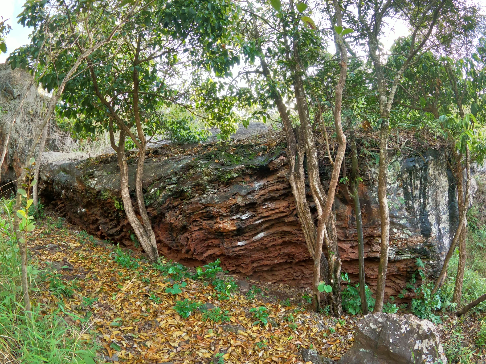
    - **largura_mapa**: 1825
    - **altura_mapa**: 1369
    - **pontos_de_interesse**:
      - **[0]**:
        - **id**: FgUzqh9xM3pM1t
        - **uid**: FgUzqh9xM3pM1t
        - **rotulo**: 
        - **linha**:
          - **estilo**: TRACEJADO
          - **espessura**: 3
          - **compilado**:
            - **caminho_svg**: M 715 932 C 712.3 909.3, 718.4 879.0, 707 864 C 696.5 850.1, 669.0 852.5, 653 842 C 637.0 831.5, 619.9 817.9, 611 801 C 601.7 783.2, 602.2 759.1, 600 737 C 597.7 713.5, 597.4 684.1, 598 664 C 598.4 649.9, 600.0 640.0, 601 628
            - **caixa_delimitadora**:
              - **x**: 656
              - **y**: 780
              - **comprimento**: 117
              - **largura**: 304
            - **marcadores**:
              - **[0]**:
                - **tipo**: CIRCULO_IDENTIFICADOR
                - **x**: 715
                - **y**: 932
                - **angulo_graus_x100**: -9671
                - **rotulo**: 20
                - **raio**: 17
        - **cor**: #FFD600
        - **label**: 
      - **[1]**:
        - **id**: CDYYbmZlLuSROd
        - **uid**: CDYYbmZlLuSROd
        - **rotulo**: 
        - **linha**:
          - **estilo**: TRACEJADO
          - **espessura**: 3
          - **compilado**:
            - **caminho_svg**: M 911 954 C 911.7 941.7, 905.9 926.9, 913 917 C 923.2 902.8, 976.3 904.7, 983 889 C 989.2 874.3, 964.3 849.2, 958 828 C 951.5 806.3, 944.3 780.9, 945 760 C 945.6 742.0, 955.2 726.7, 958 710 C 960.8 693.7, 962.6 677.0, 962 661 C 961.5 645.4, 959.0 630.9, 955 615 C 950.5 597.0, 941.7 577.7, 935 559
            - **caixa_delimitadora**:
              - **x**: 947
              - **y**: 756
              - **comprimento**: 72
              - **largura**: 395
            - **marcadores**:
              - **[0]**:
                - **tipo**: CIRCULO_IDENTIFICADOR
                - **x**: 911
                - **y**: 954
                - **angulo_graus_x100**: -8691
                - **rotulo**: 21
                - **raio**: 19
        - **cor**: #FFD600
        - **label**: 
    - **referencias**:
      - **[0]**:
        - **alvo_uid**: HfH0Q9Q86GoM6f
        - **pontos_uids**:
          - FgUzqh9xM3pM1t
        - **escalada**: Pequeno desafio
        - **ids**:
          - FgUzqh9xM3pM1t
      - **[1]**:
        - **alvo_uid**: qSVuKvprARRGaM
        - **pontos_uids**:
          - CDYYbmZlLuSROd
        - **escalada**: Porco espinho
        - **ids**:
          - CDYYbmZlLuSROd
- **precomputados**:
  - **total_escaladas**: 23
  - **total_boulders**: 23

## Parte: grupo_setor_sherpa (não listada em partes.json)

### Grupo (Pico: Complexo Pedra Grande)

- **descricao**: Trilha para os blocos: https://loc.wiki/t/283472918?wa=share&og=4EnP4vijgDE
- **nome**: Setor Sherpa
- **uid**: cqT5nqQ4pvPub7
- **setores**:
  - **[0]**:
    - **conteudo**:
      - **descricao**: Trilha para os blocos: https://loc.wiki/t/283472918?wa=share&og=4EnP4vijgDE
      - **nome**: Setor Sherpa - Boulders
      - **uid**: B70in7mhtc7bin
      - **escaladas**:
        - **[0]**:
          - **uid**: sJTr3wt4x20WVI
          - **boulder**:
            - **nome**: Jetinho Brasileiro
            - **dificuldade**: V4
        - **[1]**:
          - **uid**: XyCdEhjXvwDBrA
          - **boulder**:
            - **nome**: Fenda do Bikini
            - **dificuldade**: V4
        - **[2]**:
          - **uid**: PPcjTRF5GhIwY8
          - **boulder**:
            - **nome**: Força G
            - **dificuldade**: V2
        - **[3]**:
          - **uid**: 5v4P18ITqGjtRQ
          - **boulder**:
            - **nome**: Francês
        - **[4]**:
          - **uid**: DmaPRWS9ztpavr
          - **boulder**:
            - **nome**: Glorioso
            - **dificuldade**: V2
        - **[5]**:
          - **uid**: QW990go8L7eTCV
          - **boulder**:
            - **nome**: Itália
            - **dificuldade**: V4
        - **[6]**:
          - **uid**: KHczOH5F3LH2DG
          - **boulder**:
            - **nome**: Garganta
            - **dificuldade**: V5
        - **[7]**:
          - **uid**: sbGqDQhqpW9lLX
          - **boulder**:
            - **nome**: Guela
            - **dificuldade**: V5
        - **[8]**:
          - **uid**: YqsJ6HPMFyKrLo
          - **boulder**:
            - **nome**: Nectar
            - **dificuldade**: V9
      - **mapas**:
        - **[0]**:
          - **caminho_imagem_mapa**: 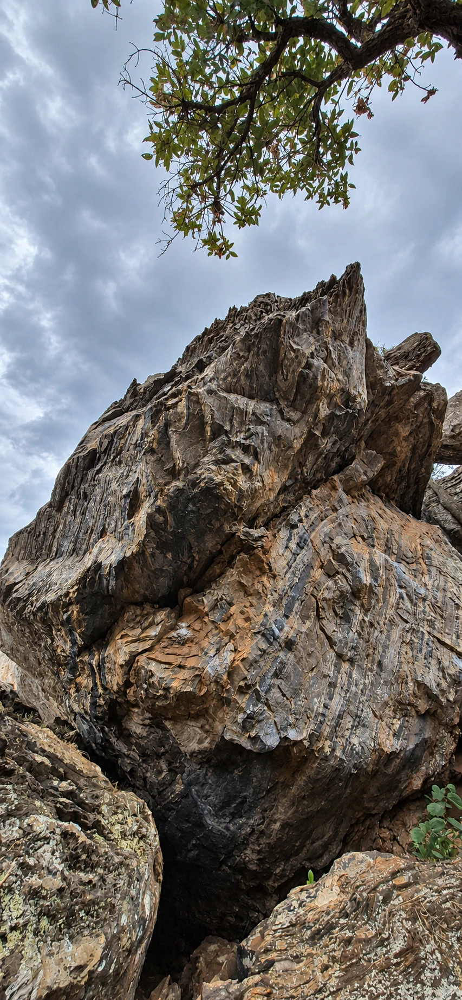
          - **largura_mapa**: 853
          - **altura_mapa**: 1844
          - **pontos_de_interesse**:
            - **[0]**:
              - **id**: g2qJ1wEmGyf3cG
              - **uid**: g2qJ1wEmGyf3cG
              - **rotulo**: 
              - **linha**:
                - **estilo**: TRACEJADO
                - **espessura**: 3
                - **compilado**:
                  - **caminho_svg**: M 490 1372 C 450.7 1330.3, 417.3 1278.7, 372 1247 C 328.0 1216.2, 265.4 1212.0, 223 1183 C 183.2 1155.8, 147.1 1121.3, 123 1081 C 98.2 1039.4, 93.0 984.3, 78 936
                  - **caixa_delimitadora**:
                    - **x**: 284
                    - **y**: 1154
                    - **comprimento**: 412
                    - **largura**: 436
                  - **marcadores**:
                    - **[0]**:
                      - **tipo**: CIRCULO_IDENTIFICADOR
                      - **x**: 490
                      - **y**: 1372
                      - **angulo_graus_x100**: -13335
                      - **rotulo**: 1
                    - **[1]**:
                      - **tipo**: FIM_TOP
                      - **x**: 78
                      - **y**: 936
                      - **angulo_graus_x100**: -10724
                      - **rotulo**: A
              - **cor**: #FFD600
              - **label**: 
            - **[1]**:
              - **id**: ik3qO5ASjPb4xa
              - **uid**: ik3qO5ASjPb4xa
              - **rotulo**: 
              - **linha**:
                - **estilo**: TRACEJADO
                - **espessura**: 3
                - **compilado**:
                  - **caminho_svg**: M 490 1372 C 491.3 1316.0, 492.9 1252.2, 494 1204 C 494.8 1167.6, 500.5 1139.3, 496 1108 C 491.5 1076.6, 470.0 1040.0, 467 1016 C 465.1 1001.1, 462.2 990.6, 469 979 C 479.9 960.5, 525.5 947.2, 549 929 C 570.3 912.6, 586.2 889.9, 605 876 C 620.9 864.3, 638.7 861.7, 653 849 C 669.3 834.5, 683.2 814.0, 695 791 C 709.3 763.1, 714.0 721.3, 728 691 C 740.8 663.1, 758.7 640.3, 774 615
                  - **caixa_delimitadora**:
                    - **x**: 620
                    - **y**: 994
                    - **comprimento**: 307
                    - **largura**: 757
                  - **marcadores**:
                    - **[0]**:
                      - **tipo**: CIRCULO_IDENTIFICADOR
                      - **x**: 490
                      - **y**: 1372
                      - **angulo_graus_x100**: -8864
                      - **rotulo**: 2
                    - **[1]**:
                      - **tipo**: FIM_TOP
                      - **x**: 774
                      - **y**: 615
                      - **angulo_graus_x100**: -5882
                      - **rotulo**: B
              - **cor**: #FFD600
              - **label**: 
            - **[2]**:
              - **id**: WQEZogAPCVZCVe
              - **uid**: WQEZogAPCVZCVe
              - **rotulo**: 
              - **linha**:
                - **estilo**: TRACEJADO
                - **espessura**: 3
                - **compilado**:
                  - **caminho_svg**: M 731 1045 C 717.7 997.7, 680.5 911.1, 691 903 C 697.0 898.4, 718.9 919.7, 732 927 C 743.8 933.6, 758.5 947.7, 766 945 C 772.5 942.7, 773.3 927.7, 777 919
                  - **caixa_delimitadora**:
                    - **x**: 734
                    - **y**: 974
                    - **comprimento**: 86
                    - **largura**: 142
                  - **marcadores**:
                    - **[0]**:
                      - **tipo**: CIRCULO_IDENTIFICADOR
                      - **x**: 731
                      - **y**: 1045
                      - **angulo_graus_x100**: -10573
                      - **rotulo**: 3
              - **cor**: #FFD600
              - **label**: 
            - **[3]**:
              - **id**: lprOfHt44C6VGf
              - **uid**: lprOfHt44C6VGf
              - **rotulo**: 
              - **linha**:
                - **estilo**: TRACEJADO
                - **espessura**: 3
                - **compilado**:
                  - **caminho_svg**: M 766 945 C 769.7 936.3, 773.3 927.7, 777 919
                  - **caixa_delimitadora**:
                    - **x**: 772
                    - **y**: 932
                    - **comprimento**: 11
                    - **largura**: 26
                  - **marcadores**:
                    - **[0]**:
                      - **tipo**: CIRCULO_IDENTIFICADOR
                      - **x**: 766
                      - **y**: 945
                      - **angulo_graus_x100**: -6707
                      - **rotulo**: 4
              - **cor**: #FFD600
              - **label**: 
          - **referencias**:
            - **[0]**:
              - **alvo_uid**: sJTr3wt4x20WVI
              - **pontos_uids**:
                - g2qJ1wEmGyf3cG
              - **escalada**: Jetinho Brasileiro
              - **ids**:
                - g2qJ1wEmGyf3cG
            - **[1]**:
              - **alvo_uid**: XyCdEhjXvwDBrA
              - **pontos_uids**:
                - ik3qO5ASjPb4xa
              - **escalada**: Fenda do Bikini
              - **ids**:
                - ik3qO5ASjPb4xa
            - **[2]**:
              - **alvo_uid**: PPcjTRF5GhIwY8
              - **pontos_uids**:
                - WQEZogAPCVZCVe
              - **escalada**: Força G
              - **ids**:
                - WQEZogAPCVZCVe
            - **[3]**:
              - **alvo_uid**: 5v4P18ITqGjtRQ
              - **pontos_uids**:
                - lprOfHt44C6VGf
              - **escalada**: Francês
              - **ids**:
                - lprOfHt44C6VGf
        - **[1]**:
          - **caminho_imagem_mapa**: 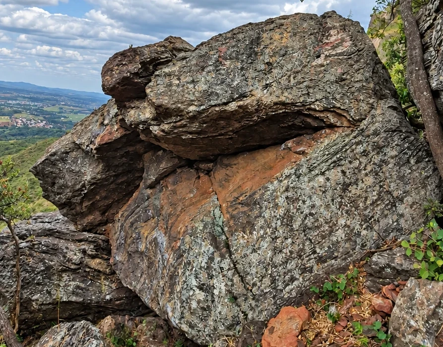
          - **largura_mapa**: 893
          - **altura_mapa**: 700
          - **pontos_de_interesse**:
            - **[0]**:
              - **id**: aOdPqWNRnf2uqz
              - **uid**: aOdPqWNRnf2uqz
              - **linha**:
                - **estilo**: TRACEJADO
                - **espessura**: 3
                - **compilado**:
                  - **caminho_svg**: M 320 483 C 325.7 442.7, 313.4 390.3, 337 362 C 363.8 329.8, 438.6 327.6, 487 312 C 532.1 297.4, 574.3 284.7, 618 271
                  - **caixa_delimitadora**:
                    - **x**: 469
                    - **y**: 377
                    - **comprimento**: 298
                    - **largura**: 212
                  - **marcadores**:
                    - **[0]**:
                      - **tipo**: CIRCULO_IDENTIFICADOR
                      - **x**: 320
                      - **y**: 483
                      - **angulo_graus_x100**: -8200
                      - **rotulo**: 1
              - **cor**: #FFD600
            - **[1]**:
              - **id**: cBoyDvIZHtIX4l
              - **uid**: cBoyDvIZHtIX4l
              - **linha**:
                - **estilo**: TRACEJADO
                - **espessura**: 3
                - **compilado**:
                  - **caminho_svg**: M 618 271 C 647.0 264.0, 689.3 270.1, 705 250 C 724.0 225.7, 709.0 158.6, 704 120 C 699.9 88.1, 689.3 62.7, 682 34
                  - **caixa_delimitadora**:
                    - **x**: 662
                    - **y**: 152
                    - **comprimento**: 87
                    - **largura**: 237
                  - **marcadores**:
                    - **[0]**:
                      - **tipo**: CIRCULO_IDENTIFICADOR
                      - **x**: 618
                      - **y**: 271
                      - **angulo_graus_x100**: -1357
                      - **rotulo**: 2
              - **cor**: #FFD600
            - **[2]**:
              - **id**: 0NNFRTfCbUwUuN
              - **uid**: 0NNFRTfCbUwUuN
              - **linha**:
                - **estilo**: TRACEJADO
                - **espessura**: 3
                - **compilado**:
                  - **caminho_svg**: M 682 34
                  - **caixa_delimitadora**:
                    - **x**: 682
                    - **y**: 34
                    - **comprimento**: 1
                    - **largura**: 1
                  - **marcadores**:
                    - **[0]**:
                      - **tipo**: FIM_TOP
                      - **x**: 682
                      - **y**: 34
                      - **angulo_graus_x100**: 0
                      - **rotulo**: A
              - **cor**: #FFD600
            - **[3]**:
              - **id**: LNwf2jrszO1ytd
              - **uid**: LNwf2jrszO1ytd
              - **rotulo**: 
              - **linha**:
                - **estilo**: TRACEJADO
                - **espessura**: 3
                - **compilado**:
                  - **caminho_svg**: M 682 34
                  - **caixa_delimitadora**:
                    - **x**: 682
                    - **y**: 34
                    - **comprimento**: 1
                    - **largura**: 1
                  - **marcadores**:
                    - **[0]**:
                      - **tipo**: FIM_TOP
                      - **x**: 682
                      - **y**: 34
                      - **angulo_graus_x100**: 0
                      - **rotulo**: A
              - **cor**: #FFD600
              - **label**: 
          - **referencias**:
            - **[0]**:
              - **alvo_uid**: PPcjTRF5GhIwY8
              - **pontos_uids**:
                - aOdPqWNRnf2uqz
                - cBoyDvIZHtIX4l
                - 0NNFRTfCbUwUuN
              - **escalada**: Força G
              - **ids**:
                - aOdPqWNRnf2uqz
                - cBoyDvIZHtIX4l
                - 0NNFRTfCbUwUuN
            - **[1]**:
              - **alvo_uid**: 5v4P18ITqGjtRQ
              - **pontos_uids**:
                - cBoyDvIZHtIX4l
                - LNwf2jrszO1ytd
              - **escalada**: Francês
              - **ids**:
                - cBoyDvIZHtIX4l
                - LNwf2jrszO1ytd
        - **[2]**:
          - **caminho_imagem_mapa**: 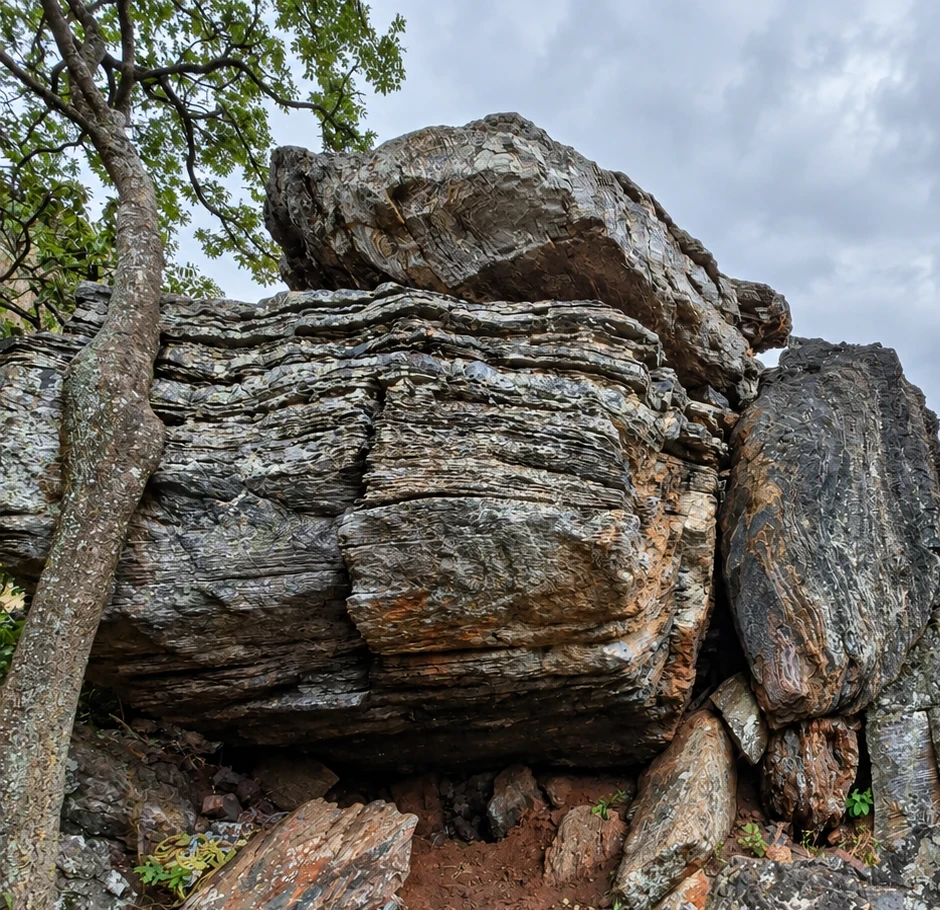
          - **largura_mapa**: 940
          - **altura_mapa**: 910
          - **pontos_de_interesse**:
            - **[0]**:
              - **id**: OfgDeurgL8xjXZ
              - **uid**: OfgDeurgL8xjXZ
              - **rotulo**: 
              - **linha**:
                - **estilo**: TRACEJADO
                - **espessura**: 3
                - **compilado**:
                  - **caminho_svg**: M 316 705 C 329.3 689.7, 349.5 676.8, 356 659 C 362.4 641.4, 356.8 620.1, 355 599 C 352.9 575.1, 342.5 551.1, 343 523 C 343.6 487.7, 362.6 436.0, 366 404 C 368.2 382.6, 370.0 368.3, 367 350 C 363.7 329.8, 352.3 308.7, 345 288
                  - **caixa_delimitadora**:
                    - **x**: 342
                    - **y**: 496
                    - **comprimento**: 51
                    - **largura**: 417
                  - **marcadores**:
                    - **[0]**:
                      - **tipo**: CIRCULO_IDENTIFICADOR
                      - **x**: 316
                      - **y**: 705
                      - **angulo_graus_x100**: -4899
                      - **rotulo**: 1
                    - **[1]**:
                      - **tipo**: FIM_TOP
                      - **x**: 345
                      - **y**: 288
                      - **angulo_graus_x100**: -10954
                      - **rotulo**: A
              - **cor**: #FFD600
              - **label**: 
            - **[1]**:
              - **id**: pnqFRZh57P4cXM
              - **uid**: pnqFRZh57P4cXM
              - **rotulo**: 
              - **linha**:
                - **estilo**: TRACEJADO
                - **espessura**: 3
                - **compilado**:
                  - **caminho_svg**: M 491 722 C 533.3 714.3, 589.9 716.1, 618 699 C 637.5 687.2, 649.6 666.7, 656 650 C 661.3 636.2, 660.2 624.3, 659 608 C 657.3 584.5, 650.2 550.7, 640 523 C 629.3 493.9, 619.9 460.5, 595 438 C 563.8 409.8, 497.1 406.5, 455 381 C 413.9 356.2, 381.7 319.0, 345 288
                  - **caixa_delimitadora**:
                    - **x**: 502
                    - **y**: 505
                    - **comprimento**: 314
                    - **largura**: 434
                  - **marcadores**:
                    - **[0]**:
                      - **tipo**: CIRCULO_IDENTIFICADOR
                      - **x**: 491
                      - **y**: 722
                      - **angulo_graus_x100**: -1027
                      - **rotulo**: 2
                    - **[1]**:
                      - **tipo**: FIM_TOP
                      - **x**: 345
                      - **y**: 288
                      - **angulo_graus_x100**: 0
                      - **rotulo**: A
              - **cor**: #FFD600
              - **label**: 
          - **referencias**:
            - **[0]**:
              - **alvo_uid**: DmaPRWS9ztpavr
              - **pontos_uids**:
                - OfgDeurgL8xjXZ
              - **escalada**: Glorioso
              - **ids**:
                - OfgDeurgL8xjXZ
            - **[1]**:
              - **alvo_uid**: QW990go8L7eTCV
              - **pontos_uids**:
                - pnqFRZh57P4cXM
              - **escalada**: Itália
              - **ids**:
                - pnqFRZh57P4cXM
        - **[3]**:
          - **caminho_imagem_mapa**: 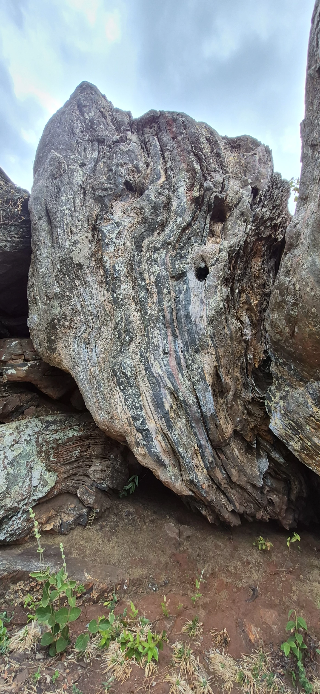
          - **largura_mapa**: 1392
          - **altura_mapa**: 3013
          - **pontos_de_interesse**:
            - **[0]**:
              - **id**: gIdTXNgfyNjlSe
              - **uid**: gIdTXNgfyNjlSe
              - **rotulo**: 
              - **linha**:
                - **estilo**: TRACEJADO
                - **espessura**: 3
                - **compilado**:
                  - **caminho_svg**: M 1155 2036 C 1133.7 1919.7, 1130.7 1795.8, 1091 1687 C 1051.9 1579.7, 961.7 1476.1, 920 1387 C 888.7 1320.2, 876.5 1270.2, 852 1205 C 823.5 1129.1, 783.2 1055.2, 759 959 C 727.0 831.6, 701.6 541.3, 699 502 C 698.6 496.2, 699.0 495.3, 699 492
                  - **caixa_delimitadora**:
                    - **x**: 927
                    - **y**: 1264
                    - **comprimento**: 456
                    - **largura**: 1544
                  - **marcadores**:
                    - **[0]**:
                      - **tipo**: CIRCULO_IDENTIFICADOR
                      - **x**: 1155
                      - **y**: 2036
                      - **angulo_graus_x100**: -10039
                      - **rotulo**: 1
                    - **[1]**:
                      - **tipo**: CIRCULO_IDENTIFICADOR
                      - **x**: 699
                      - **y**: 492
                      - **angulo_graus_x100**: -9000
                      - **rotulo**: A
              - **cor**: #FFD600
              - **label**: 
          - **referencias**:
            - **[0]**:
              - **alvo_uid**: KHczOH5F3LH2DG
              - **pontos_uids**:
                - gIdTXNgfyNjlSe
              - **escalada**: Garganta
              - **ids**:
                - gIdTXNgfyNjlSe
        - **[4]**:
          - **caminho_imagem_mapa**: 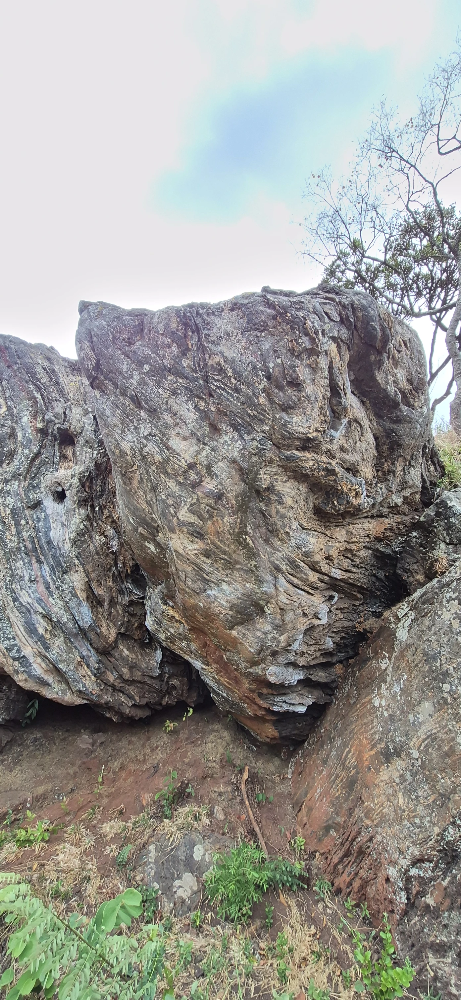
          - **largura_mapa**: 1392
          - **altura_mapa**: 3013
          - **pontos_de_interesse**:
            - **[0]**:
              - **id**: 0pCL0UqpGYto5v
              - **uid**: 0pCL0UqpGYto5v
              - **rotulo**: 
              - **linha**:
                - **estilo**: TRACEJADO
                - **espessura**: 3
                - **compilado**:
                  - **caminho_svg**: M 898 2129 C 891.7 2091.7, 872.4 2059.1, 879 2017 C 888.6 1955.3, 961.8 1879.5, 991 1801 C 1022.6 1715.9, 1044.7 1618.7, 1057 1523 C 1069.8 1423.6, 1083.9 1317.3, 1064 1215 C 1042.6 1104.6, 969.3 995.0, 922 885
                  - **caixa_delimitadora**:
                    - **x**: 972
                    - **y**: 1507
                    - **comprimento**: 185
                    - **largura**: 1244
                  - **marcadores**:
                    - **[0]**:
                      - **tipo**: CIRCULO_IDENTIFICADOR
                      - **x**: 898
                      - **y**: 2129
                      - **angulo_graus_x100**: -9963
                      - **rotulo**: 3
                      - **raio**: 30
                    - **[1]**:
                      - **tipo**: FIM_TOP
                      - **x**: 922
                      - **y**: 885
                      - **angulo_graus_x100**: -11328
                      - **rotulo**: A
                      - **raio**: 25
                      - **tamanho_fonte**: 28
              - **cor**: #FFD600
              - **label**: 
            - **[1]**:
              - **id**: On9tYHVMCsuFKE
              - **uid**: On9tYHVMCsuFKE
              - **rotulo**: 
              - **linha**:
                - **estilo**: TRACEJADO
                - **espessura**: 3
                - **compilado**:
                  - **caminho_svg**: M 805 2050 C 735.7 2039.7, 656.1 2048.7, 597 2019 C 538.7 1989.8, 478.7 1928.5, 452 1875 C 428.9 1828.8, 445.0 1772.7, 431 1724 C 416.8 1674.6, 382.4 1631.3, 367 1581 C 351.1 1529.1, 351.3 1473.9, 338 1417 C 323.2 1353.7, 297.4 1280.7, 280 1219 C 264.8 1165.1, 244.5 1117.0, 239 1067 C 233.8 1019.8, 243.0 973.7, 245 927
                  - **caixa_delimitadora**:
                    - **x**: 522
                    - **y**: 1488
                    - **comprimento**: 566
                    - **largura**: 1123
                  - **marcadores**:
                    - **[0]**:
                      - **tipo**: CIRCULO_IDENTIFICADOR
                      - **x**: 805
                      - **y**: 2050
                      - **angulo_graus_x100**: -17152
                      - **rotulo**: 2
                      - **raio**: 25
                    - **[1]**:
                      - **tipo**: FIM_TOP
                      - **x**: 245
                      - **y**: 927
                      - **angulo_graus_x100**: 0
                      - **rotulo**: B
              - **cor**: #FFD600
              - **label**: 
            - **[2]**:
              - **id**: DN7m1qc736k5mX
              - **uid**: DN7m1qc736k5mX
              - **rotulo**: 
              - **linha**:
                - **estilo**: TRACEJADO
                - **espessura**: 3
                - **compilado**:
                  - **caminho_svg**: M 474 1976 C 448.7 1913.3, 434.7 1842.4, 398 1788 C 361.8 1734.3, 293.5 1701.0, 256 1651 C 221.2 1604.7, 187.1 1555.7, 177 1501 C 166.3 1442.9, 213.0 1375.9, 200 1311 C 184.3 1232.9, 83.8 1123.3, 63 1070 C 53.5 1045.7, 54.3 1032.7, 50 1014
                  - **caixa_delimitadora**:
                    - **x**: 262
                    - **y**: 1495
                    - **comprimento**: 424
                    - **largura**: 962
                  - **marcadores**:
                    - **[0]**:
                      - **tipo**: CIRCULO_IDENTIFICADOR
                      - **x**: 474
                      - **y**: 1976
                      - **angulo_graus_x100**: -11201
                      - **rotulo**: 1
                    - **[1]**:
                      - **tipo**: FIM_TOP
                      - **x**: 50
                      - **y**: 1014
                      - **angulo_graus_x100**: -10307
                      - **rotulo**: C
              - **cor**: #FFD600
              - **label**: 
          - **referencias**:
            - **[0]**:
              - **alvo_uid**: sbGqDQhqpW9lLX
              - **pontos_uids**:
                - 0pCL0UqpGYto5v
              - **escalada**: Guela
              - **ids**:
                - 0pCL0UqpGYto5v
            - **[1]**:
              - **alvo_uid**: YqsJ6HPMFyKrLo
              - **pontos_uids**:
                - On9tYHVMCsuFKE
              - **escalada**: Nectar
              - **ids**:
                - On9tYHVMCsuFKE
            - **[2]**:
              - **alvo_uid**: KHczOH5F3LH2DG
              - **pontos_uids**:
                - DN7m1qc736k5mX
              - **escalada**: Garganta
              - **ids**:
                - DN7m1qc736k5mX
        - **[5]**:
          - **caminho_imagem_mapa**: 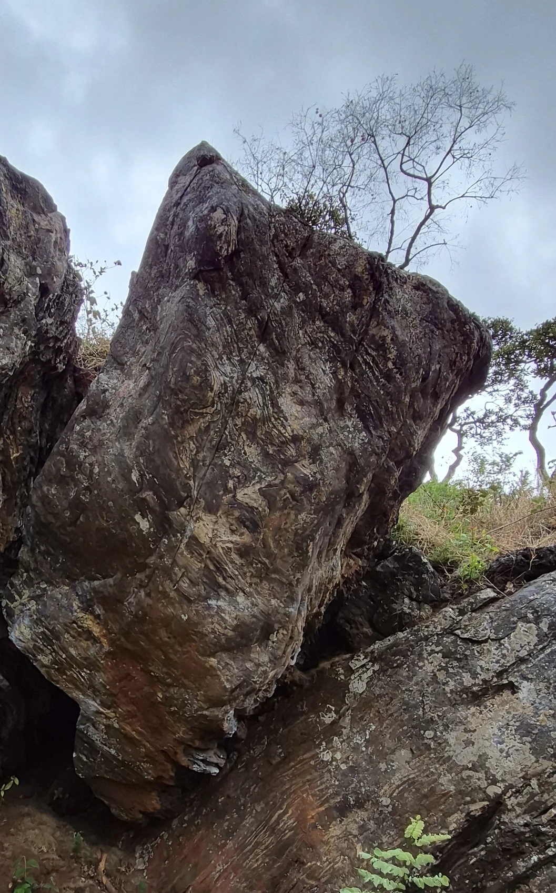
          - **largura_mapa**: 1057
          - **altura_mapa**: 1697
          - **pontos_de_interesse**:
            - **[0]**:
              - **id**: jQ9GhuTtWSfP6I
              - **uid**: jQ9GhuTtWSfP6I
              - **rotulo**: 
              - **linha**:
                - **estilo**: TRACEJADO
                - **espessura**: 3
                - **compilado**:
                  - **caminho_svg**: M 377 1468 C 357.3 1454.7, 343.4 1443.2, 318 1428 C 276.0 1402.8, 194.9 1375.5, 145 1337 C 96.8 1299.9, 39.1 1255.5, 22 1203 C 4.9 1150.3, 27.0 1085.1, 43 1021 C 62.3 944.0, 107.5 838.6, 140 775 C 162.3 731.3, 187.4 709.3, 207 670 C 229.2 625.3, 244.8 569.8, 263 519 C 281.5 467.5, 293.7 407.0, 317 363 C 336.6 326.0, 363.7 300.3, 387 269
                  - **caixa_delimitadora**:
                    - **x**: 204
                    - **y**: 868
                    - **comprimento**: 365
                    - **largura**: 1199
                  - **marcadores**:
                    - **[0]**:
                      - **tipo**: CIRCULO_IDENTIFICADOR
                      - **x**: 377
                      - **y**: 1468
                      - **angulo_graus_x100**: -14586
                      - **rotulo**: 1
                    - **[1]**:
                      - **tipo**: CIRCULO_IDENTIFICADOR
                      - **x**: 387
                      - **y**: 269
                      - **angulo_graus_x100**: 0
                      - **rotulo**: A
              - **cor**: #FFD600
              - **label**: 
          - **referencias**:
            - **[0]**:
              - **alvo_uid**: YqsJ6HPMFyKrLo
              - **pontos_uids**:
                - jQ9GhuTtWSfP6I
              - **escalada**: Nectar
              - **ids**:
                - jQ9GhuTtWSfP6I
      - **precomputados**:
        - **total_escaladas**: 9
        - **total_boulders**: 9
- **precomputados**:
  - **total_escaladas**: 9
  - **total_boulders**: 9

## Arquivos Externos

- **arquivos_externos**:
  - **[0]**:
    - **caminho**: 
    - **checksum_sha256**: b4887c391eaf1911eaf809e7132944c4f46760657ebe56af30f2890698fbe289
  - **[1]**:
    - **caminho**: 
    - **checksum_sha256**: 47a46351235b0b2d4359b979af15cda193a1488e6b24cb62b2c9d2aa8e28026d
  - **[2]**:
    - **caminho**: 
    - **checksum_sha256**: 8be773a31d18ecb61fb9955800d7e675f894082bf9e52d1b882ac5e4feb8fe99
  - **[3]**:
    - **caminho**: 
    - **checksum_sha256**: 54c520d7b0dbd100fbdfb0c41e64eab7d3d1939b7ff3448d4fb1673ec05d0dbc
  - **[4]**:
    - **caminho**: 
    - **checksum_sha256**: 68a2364b65e2f15249ea9e774d143eaa52739e0575f7bb28c8c7677059663d4a
  - **[5]**:
    - **caminho**: 
    - **checksum_sha256**: b6e1e04f1bab627ead15cf9f1565a5379a17e70184dda91b2f7d7bba71de0166
  - **[6]**:
    - **caminho**: 
    - **checksum_sha256**: 09539e80afd0a6694cb9c95e640266c6c36ff871b6e6b94bf252982e834adc44
  - **[7]**:
    - **caminho**: 
    - **checksum_sha256**: 2006b2fd7865dd3d9f359e052b4d94657ba78ce0fab1e2b47d62125f60582e45
  - **[8]**:
    - **caminho**: 
    - **checksum_sha256**: 69bb2525361c1048730d730954f8dc6c1bdcd77846b0d2511966fd71b49d8918
  - **[9]**:
    - **caminho**: 
    - **checksum_sha256**: 89c3fb1bda489f51b94cf6914d82ecbf5ca2186e2b2ee1e5d24be59f43befb30
  - **[10]**:
    - **caminho**: 
    - **checksum_sha256**: 171a740a6f3d60f6cfb107255c74c9ed1540e82ff2fb4f33510292cf3d3a5adc
  - **[11]**:
    - **caminho**: 
    - **checksum_sha256**: a1f6450e67322bcd2010397db656c5ef5e3711cbd38c646df82e0c7e59d207a1
  - **[12]**:
    - **caminho**: 
    - **checksum_sha256**: 35328b7fcdf2d9a789fcd300af00cb67997589078e4dc645f00d1180b3ea707d
  - **[13]**:
    - **caminho**: 
    - **checksum_sha256**: a25c26a236f78956f6a9eef3b49be1a49e00ac995003bbc7b521a82708113c10
  - **[14]**:
    - **caminho**: 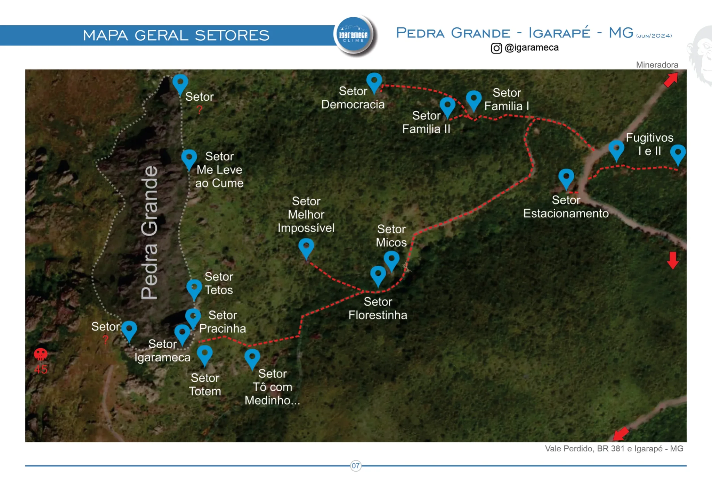
    - **checksum_sha256**: 46f1c43fe65af207fde61b213d7876a9eee14afe36a686633b6309a4b9e0bb2c
  - **[15]**:
    - **caminho**: 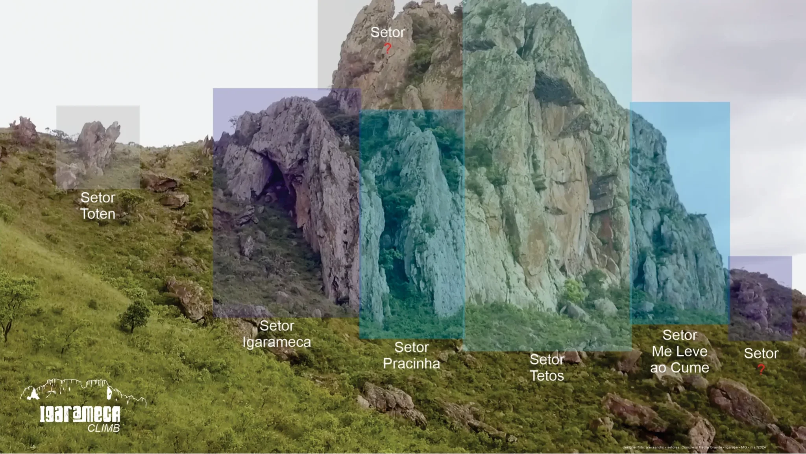
    - **checksum_sha256**: 852e3b9ba55da91bda3283501c992927fd6cae1166c0c21717190aa15f51066c
  - **[16]**:
    - **caminho**: 
    - **checksum_sha256**: 4182ec353e7d169bf4ea4bf1f245e97df7f3b359560ddf5d6d77ebd462259d88
  - **[17]**:
    - **caminho**: 
    - **checksum_sha256**: ca3eb9f7551a11b7a69aa87fb8fdb3e1fcc0026fc31bff7e6ffabcb523873b2e
  - **[18]**:
    - **caminho**: 
    - **checksum_sha256**: daffa105a6302b241b26f9357a7def2c74177c5d61a35a051bf2488ecef1c507
  - **[19]**:
    - **caminho**: 
    - **checksum_sha256**: de154bb0f77993971843b9266c24fcdc620c7281a04dda449079a73f0352a5a2
  - **[20]**:
    - **caminho**: 
    - **checksum_sha256**: e7814c2517b99feb5f8b8bdf43aab1710f76adb71ca6c48f6280b5e39b50a761
  - **[21]**:
    - **caminho**: 
    - **checksum_sha256**: 12895f794bd5e53a9544616e1e579f545dd5a784a7ae1b818fba477f384dd5e1
  - **[22]**:
    - **caminho**: 
    - **checksum_sha256**: 9095c11badd601f256fc23ee39925adf784595f01185440e547cb947279c4ab7
  - **[23]**:
    - **caminho**: 
    - **checksum_sha256**: 017ab76dce1ea63c414f79f6b3e3fc7600f86337fc3ce8084d7d6802167cc0f1
  - **[24]**:
    - **caminho**: 
    - **checksum_sha256**: 54a37eb42350ba07c9f3490356d5b77fe8b940b07a3fffc08332c8d730344d31
  - **[25]**:
    - **caminho**: 
    - **checksum_sha256**: 77cc1dfdcaa11031b3bae33d41b033d9ab60a98c1bd248334e06b2b0debfb90b
  - **[26]**:
    - **caminho**: 
    - **checksum_sha256**: 9a165e9848c25a0f9c0595150de68226ce70344246a22d523d4d3438c1204276
  - **[27]**:
    - **caminho**: 
    - **checksum_sha256**: 4293ad52cc79acd4d2aa7e220dd7d8aa18e3cc140991c66125ed03e9b6d25b50
  - **[28]**:
    - **caminho**: 
    - **checksum_sha256**: d4922fff99024e1fce8231ad8b4e15e0c274e44827319b35f5f2bda98d1692f0
  - **[29]**:
    - **caminho**: 
    - **checksum_sha256**: c0b10e222fdaed24818c31db7a4f62e69cef20e19182efd1f390a605d7023292
  - **[30]**:
    - **caminho**: 
    - **checksum_sha256**: 70ff91fdbc683bf71dcd9a33dbc042e170ef4f49c88b9bc9ce9956edb3fef48c
  - **[31]**:
    - **caminho**: 
    - **checksum_sha256**: 445e010c4cbaca2db0d2bfc12bb93dc9da30e427bac970d7e06ebe08cee2b0cf
  - **[32]**:
    - **caminho**: 
    - **checksum_sha256**: feae5245d8419ab4dd0698de889b4879cbe9b7a1324205ceae8dc47d77eb1038
  - **[33]**:
    - **caminho**: 
    - **checksum_sha256**: 8435be258ad2d6ed69cd0d4c540050a44bab6186bb884efae83a4998ef1101d3
  - **[34]**:
    - **caminho**: 
    - **checksum_sha256**: 4f3e4bedfed21fafc2284c19063d969b3aae82cd32409bd7bf62d4c941c32765
  - **[35]**:
    - **caminho**: 
    - **checksum_sha256**: 95239b7b899a1e56c8d919fcbfa733d0e9ae4f9b028a23eeb2a950c5dbabdf25
  - **[36]**:
    - **caminho**: 
    - **checksum_sha256**: 40266b678b64ad905696f58ace40b125d04162bfdb4a8c4f8a5f9313ee7a672d
  - **[37]**:
    - **caminho**: 
    - **checksum_sha256**: 66fbcb3356cdcbb3001fa95dbd17cdb0989d9e22a394cf2cf96890c3099ed794
  - **[38]**:
    - **caminho**: 
    - **checksum_sha256**: 06bd0ef4287fd6e7fa0255e706e814ea441be9d74e11b0d0a5a17173de6d4474
  - **[39]**:
    - **caminho**: 
    - **checksum_sha256**: e79e4daa827532abd0ff0a16e096f1df0eea148c8589dc7686fa268ba1c84102
  - **[40]**:
    - **caminho**: 
    - **checksum_sha256**: b2ab0e0a16eb19fe5d54f6a899456ac5ff07671862249a012699dc3631c64662
  - **[41]**:
    - **caminho**: 
    - **checksum_sha256**: 3a6b8f636bd121e5fa888a5dc855ddb627cea151389890532ba4f50053c78f30
  - **[42]**:
    - **caminho**: 
    - **checksum_sha256**: acb374ec8c0ecf85d537c86dd1328bbb91e4fd41576659d596457a818254cd2d
  - **[43]**:
    - **caminho**: 
    - **checksum_sha256**: e59d63c298cd1049ee8636ce3e3b78b993f5b2358f4e3fc57a10508e739e8536
  - **[44]**:
    - **caminho**: 
    - **checksum_sha256**: 27321d933aca314b50a98e486f662138fd61b049dcb90248b6bb2d162c7b944c
  - **[45]**:
    - **caminho**: 
    - **checksum_sha256**: ec34526d21a825cbefa2049a1fe82cc4a1d77a4dd1072d39804852cf5c38daf3
  - **[46]**:
    - **caminho**: 
    - **checksum_sha256**: 42e142af39766186c13a61691e384bddc064bcad6e4a07ce0e802cb429fe73ba
  - **[47]**:
    - **caminho**: 
    - **checksum_sha256**: 9afa2f619eda4053a096d19b64aa9262e8b85f9f9b05815ad2379e66ccc227e1
  - **[48]**:
    - **caminho**: 
    - **checksum_sha256**: d60317f3226a9af417557bf7f1d73d46aa152cfbded8a2d8e2a876834398ed64
  - **[49]**:
    - **caminho**: 
    - **checksum_sha256**: 1f6a6b52c8cb2aa8be37300d1fd11fd6f77f3efe33a003b9f8880bae59f3f0a7
  - **[50]**:
    - **caminho**: 
    - **checksum_sha256**: cc6b406bd22c8997daed188dd52a1d62ec8f96a4a208af442ec596d7f59a790f
  - **[51]**:
    - **caminho**: 
    - **checksum_sha256**: fd5ba7245fe8b6e8774cfee47bc6905685e6051f4300f5aeed7e73913cffba26
  - **[52]**:
    - **caminho**: 
    - **checksum_sha256**: 2ea7865c35ad12890fe46561ce34276871c62604692931257e17c60f0a847cb7
  - **[53]**:
    - **caminho**: 
    - **checksum_sha256**: e524f72e5094d9b3dde579c09f360b43d0b391b85bd1ebab13807aa555fb25fa
  - **[54]**:
    - **caminho**: 
    - **checksum_sha256**: 5b3347cb5f967cd0112ef013c0030d8cd6403efacd2595db2a4438ccdf02198a
  - **[55]**:
    - **caminho**: 
    - **checksum_sha256**: 88013468ab3f1c12bc710281758d6e1e205443645aba8dff2828a8b52ee7f2e6
  - **[56]**:
    - **caminho**: 
    - **checksum_sha256**: 4d12e846ce75ebfd1587a51a5661715826e1c800dcfdc1cf99124fa710576d2d
  - **[57]**:
    - **caminho**: 
    - **checksum_sha256**: eb605d166d35d36c3b23981ec6144eba7f3375955bed6b1954eff3d1ea441044
  - **[58]**:
    - **caminho**: 
    - **checksum_sha256**: 028f8cb259043ddcfd39cf2fb64041b88c41cd3538b6604d384ab2f08514edbf
  - **[59]**:
    - **caminho**: 
    - **checksum_sha256**: fa73e3e2fa27a74255e21b0c499f6e72bc47a99626b5bd780473d967c257eaad
  - **[60]**:
    - **caminho**: 
    - **checksum_sha256**: c3265e2e1274d9ac2753a5250b00ba29d7b574fa98c726590789d8ac9d7cd88d
  - **[61]**:
    - **caminho**: 
    - **checksum_sha256**: fba91288226c80da9013c25237888e5824a76429b030e6eb5a50272949952b6e
  - **[62]**:
    - **caminho**: 
    - **checksum_sha256**: 89e5e41344a084648a8f83d6639583b664eedbc3f55481d234d4c9cb5dc14374
  - **[63]**:
    - **caminho**: 
    - **checksum_sha256**: 747b1d807ed7d0ecbf1a980a05fd5afe79c337a165daf1e827a91a25678f61c8
  - **[64]**:
    - **caminho**: 
    - **checksum_sha256**: 94d2480252708d7f25f9234befb17df302bcc0876bbe53025fc3d5ab5321b7c1
  - **[65]**:
    - **caminho**: 
    - **checksum_sha256**: be43e895f74116ff63a5ec7ac25290dbce75ad67bf1df0a3ab079d7e4c17ac68
  - **[66]**:
    - **caminho**: 
    - **checksum_sha256**: e3544af684cab5da717ea03b4f77d05f0652be42e0cab50c3f41d62ba5120d57
  - **[67]**:
    - **caminho**: 
    - **checksum_sha256**: 7ca2f6791409aa498f402729b4d426bf972d8db7689f9052a490fe4ee31b7773
  - **[68]**:
    - **caminho**: 
    - **checksum_sha256**: c8e95292e609405375d46753e1010ff78f1ba889355e5f80b6b29321cf8cee5c
  - **[69]**:
    - **caminho**: 
    - **checksum_sha256**: 39f87f0b083f245ee120402bc41beb2ba89c62aa9a4f44af8efccf47f8d60b3e

