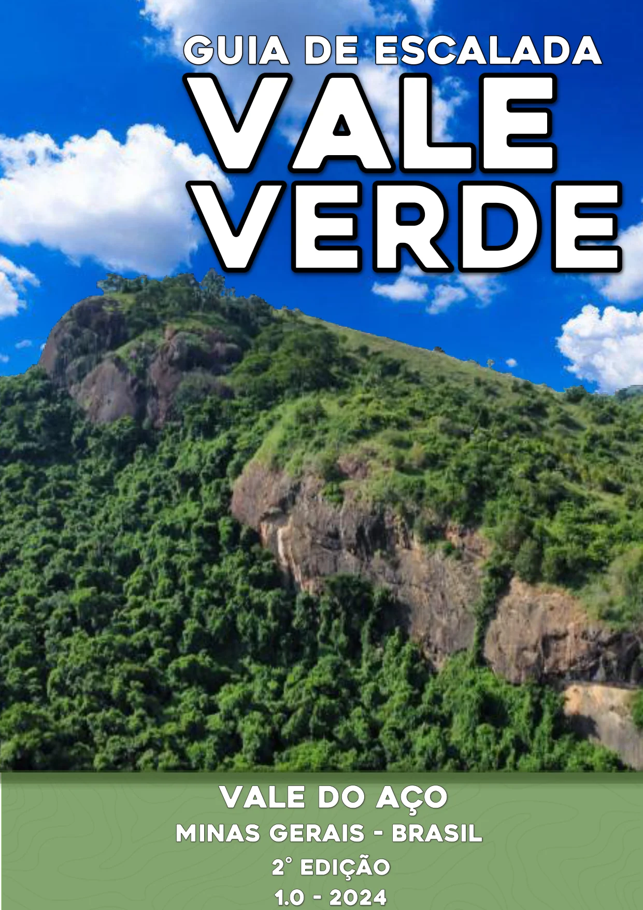
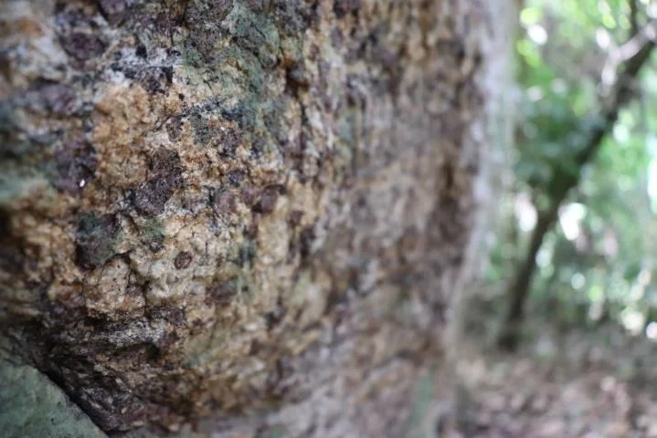
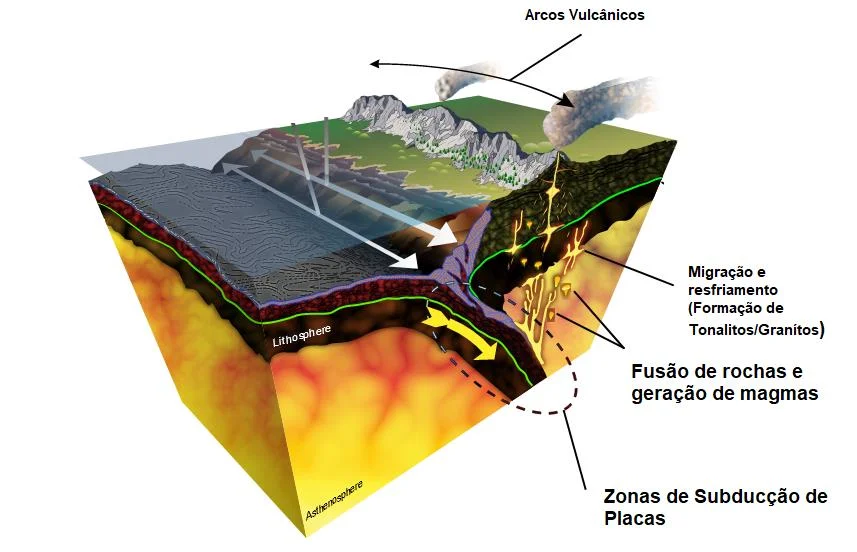
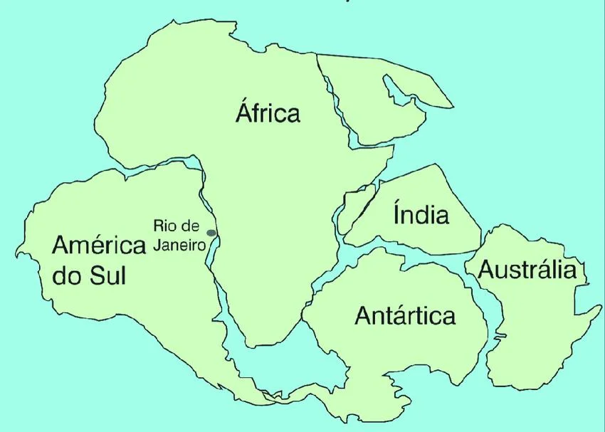
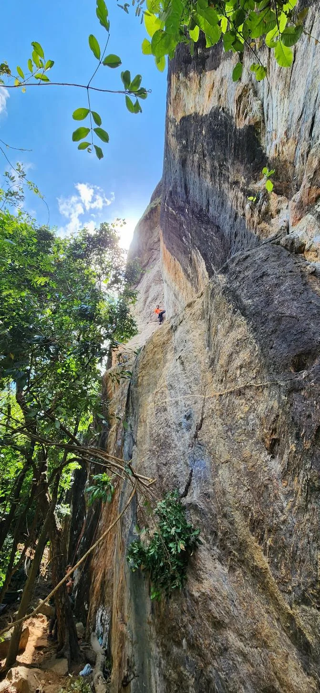
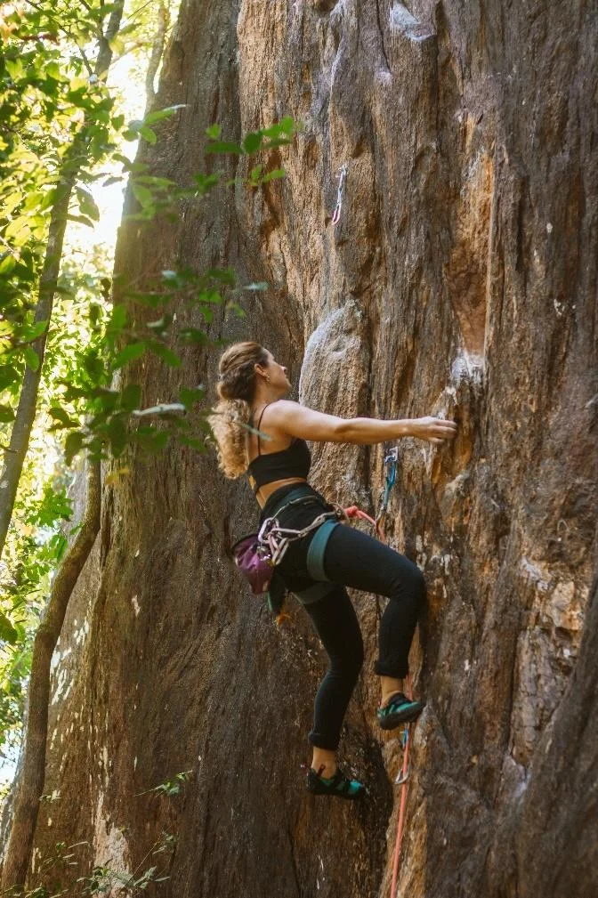
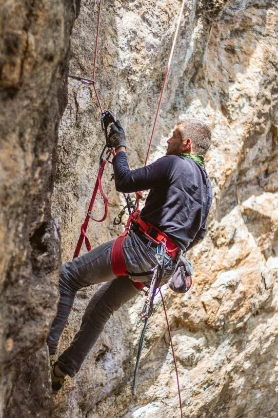
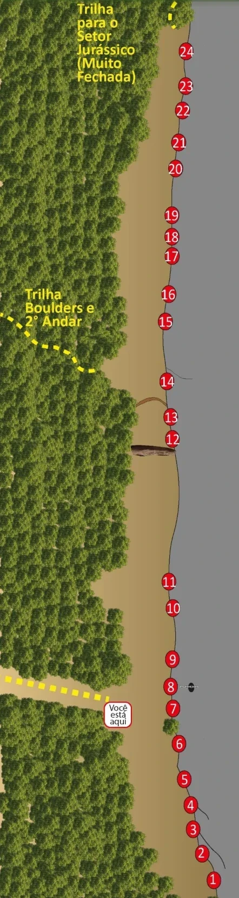
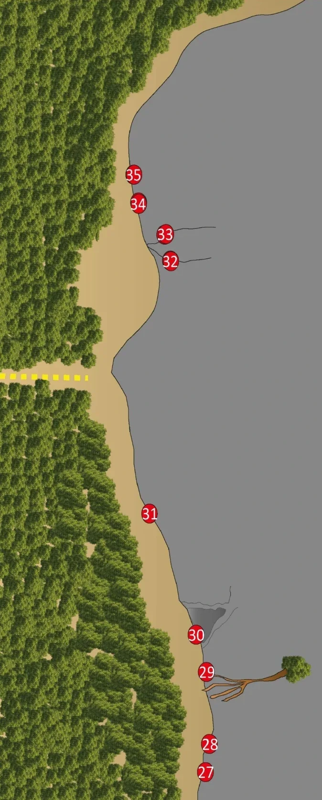

# Croqui: Vale Verde

## Informações Gerais

- **descricao**: O Vale Verde é uma falésia de Tonalito localizada no Vale do Aço, Minas Gerais, com vias técnicas em regletes.
- **id**: br_mg_ipatinga_ipaba_vale_verde
- **nome**: Vale Verde
- **creditos**:
  - Renato Miranda (Toba)
  - Gustavo Soares (Poul)
  - João Santana (TG)
- **caminho_thumbnail**: 
- **revisado_manualmente**: True
- **status_desenho_extraivel**: NAO_TEM_DESENHO
- **botoes**:
  - **[0]**:
    - **texto**: Capa
    - **destino**:
      - **secao_textual**:
        - **conteudo**:
            # Guia de Escalada Vale Verde
            
            |  |
            | :--: |
            | *Capa do Guia de Escalada Vale Verde* |
            
            **Vale do Aço**
            **Minas Gerais - Brasil**
            **2ª Edição**
            **1.0 - 2024**
  - **[1]**:
    - **texto**: Betas
    - **destino**:
      - **secao_textual**:
        - **conteudo**:
            # Se liga nos betas!
            
            Esse croqui foi idealizado por Renato Miranda (Toba), Gustavo Soares (Poul) e João Santana (TG) junto a toda equipe da AMEVA, nosso objetivo é compartilhar e manter atualizado as informações sobre a escalada na Falésia do Vale Verde.
            
            Esse guia de escalada está em constante atualização, não nos responsabilizamos pela má utilização do guia ou algum erro de informação. Você é o único responsável pela sua segurança na escalada, utilize esse guia com sabedoria! Qualquer informação que esteja em desacordo favor informar a AMEVA para correção e atualização.
            
            A Falésia do Vale Verde está em área particular e seu uso é acordado entre a AMEVA e o proprietário, seja consciente e gentil com os moradores locais, cuide do seu lixo (inclusive o micro-lixo), evite fazer fogueiras, evite a utilização de aparelhos de som e cuide da nossa fauna e flora local. Na dúvida utilize o bom senso!
            
            @associacao.ameva
            
            |  |
            | :--: |
            | *Apoios* |
  - **[2]**:
    - **texto**: Localização
    - **destino**:
      - **secao_textual**:
        - **conteudo**:
            # Localização
            
            No Google Maps procure por **"Setor de Escalada Vale Verde"**.
            
            Saindo de Ipatinga siga por 21,1 KM no sentido IPABA pela BR-458 até o **Ponto Caipira** (Direta da estrada), do outro lado da pista há uma bifurcação de estrada de chão, atravesse a pista e siga a direita. Continue na estrada principal até uma bifurcação, mantenha-se a esquerda pela estrada principal, cruze a pequena ponte de ferro (COPASA) sobre o córrego. Continue pela estrada principal até o campo de futebol. Estacione nos arredores do Campo de Futebol e siga por trilha até o setor.
            
            |  |
            | :--: |
            | *Fachada do Ponto Caipira* |
            
            |  |
            | :--: |
            | *Bifurcação a direita logo em frente ao Ponto Caipira* |
            
            |  |
            | :--: |
            | *Trajeto do Ponto Caipira ao Estacionamento* |
            
            |  |
            | :--: |
            | *Local do Estacionamento* |
  - **[3]**:
    - **texto**: História
    - **destino**:
      - **secao_textual**:
        - **conteudo**:
            # História
            
            Durante suas idas e vindas no Espírito Santo para Ipatinga, Poul sempre passava pela BR 458 buscando novas possibilidades de setores no Vale do Aço, onde de longe se avista a falésia do Vale Verde, destacada na paisagem pelo afloramento rochoso de face amarelada e bem próximo estrada. Em dezembro de 2014, Poul e Antônia já vieram preparados para o período de Natal com a furadeira na mala, que Papai Noel que nada, quem daria o presente de natal a toda a comunidade de escalada do Vale do Aço era esse querido casal.
            
            No dia 20 de dezembro de 2014 a primeira via foi furada na falésia do Vale Verde, foi a via “HoHoHo”, um 4/5° grau localizado na parte superior do 1° Andar. Essa via serviu para dar acesso a parte superior da falésia, onde foi instalado o rapel e abriu-se a primeira parte da da clássica “Ragnarok (9°)”.
            
            Poul e Antônia voltam três dias depois, só que agora com uma contratação de peso: Léo Madeira, Tinelson e Danilinho. Nesse dia deixaram mais duas vias, “Presentim” e “Pedra no Saco”.
            
            Depois disso ficaram 3 longos anos sem mais nenhuma conquista na falésia, Poul ainda morava no Espírito Santo e seu projeto da falésia ficou adormecido. Em 2017 quando Poul volta a morar no Vale do Aço ele se junta ao João TG e aí sim desenvolve a maioria das vias furadas no Vale Verde. Outros conquistadores também deixaram suas vias na falésia, como João Paulo Vieira (Queixão), Vitor Oliveira (Slot) e Josué Falcim.
            
            O setor do Vale Verde tem uma particularidade que torna as conquistas ainda mais desafiadoras, algumas agarras comumente são quebradiças e exigem ser coladas para serem utilizadas. Esse foi uma escola para os conquistadores aprenderem a conquistar vias em rochas quebradiças e na arte de colar agarras.
            
            Durante esse período foram conquistadas as vias de entrada no setor 1° Andar e depois foi realizado um evento de inauguração da falésia, onde vieram diversos escaladores a falésia e também foi encadenado o primeiro 9° do setor. Logo após veio a trágica pandemia e o setor ficou um bom tempo sendo muito pouco frequentado. Em 2022 restauramos os acessos ao setor e agora continuamos escrevendo essa história com a abertura da ATM 2024 e atualização do croqui.
  - **[4]**:
    - **texto**: Geologia
    - **destino**:
      - **secao_textual**:
        - **conteudo**:
            # Mas que rocha é essa?
            
            As rochas do Vale Verde são chamadas **Granada - Biotita Tonalito**, são correspondentes a um magmatismo sintéctonico de idade Neoproterozoíca (1000 a 570 milhões de anos) denominadas de Tonalito Bom Jesus do Galho (CPRM, Folha Dom Cavati – 2014).
            
            De forma simplificada essas rochas seriam um tipo de Granitoíde (um tipo de rocha ígnea que se cristaliza no interior da crosta), rico em minerais como a Granada, Biotita, Plagioclásio, Cianita e outros minerais ricos em sílica. Essas rochas após cristalizadas passaram posteriormente por processos de metamorfismo (aumento de pressão e temperatura que promovem alterações na sua composição mineral e estrutura) sendo esse fato evidenciado pelas foliações identificadas nas rochas do Vale Verde.
            
            |  |
            | :--: |
            | *Vista da face dos blocos de Boulder no Vale Verde* |
            
            |  |
            | :--: |
            | *Cristais de Granada Piropo* |
            
            Os registros nessas rochas contam um pouco da história da formação de um supercontinente chamado Gondwana, que ocorreu aproximadamente à 750 e 600 Milhões de anos atrás, durante a colisão do que hoje seriam os continentes da América do Sul, Antártida, África, Índia e Oceania. Durante esse episódio de colisões de placas tectônicas foi gerado uma enorme cordilheira de montanhas, correspondente ao que seria hoje o Himalaia.
            
            Os Granitos/Tonalito são formados no interior dessa cordilheira, a partir de processos de fusão de rochas, migração e resfriamento de magmas no interior da crosta terrestre. Quando placas tectônicas colidem, as mais densas e espessas são subductadas até porções profundas da crosta, que se fundem como resultado da alta pressão e temperatura, gerando um extenso volume de magmas. Esses magmas caso consigam ascender e romper toda a crosta terrestre acabam sendo expelidos na forma de erupções vulcânicas, se não conseguirem acabam se cristalizando no interior da crosta, formando diversos tipos de rochas ígneas intrusivas como por exemplo os Granitos e os Tonalitos.
            
            |  |
            | :--: |
            | *Modelo Esquemático da Subducção de Placas* |
            
            |  |
            | :--: |
            | *Reconstrução Paleogeográfica do Gondwana* |
            
            Depois que esse magma se cristalizou no interior da crosta foi só aguardar cerca de 600 milhões de ano até a natureza fazer o seu papel, erodindo aproximadamente entre 6 e 7km de quilômetros de rocha e expondo a base dessa cordilheira, repleta de lindos monólitos de granitos e tonalitos sedentos por um escalador.
            
            # É boa para escalar?
            
            O Tonalito do Vale Verde apresenta uma boa condição para a escalada, são conhecidos por ser uma rocha abrasiva sobretudo por causa de sua granulação grossa e composição rica em granadas, quazto e feldspato. Devido sua exposição em falésia é comum encontrarmos agarras quebradiças, por isso a equipe de conquista sempre se atenta em colar as agarras que estão frágeis, aumentando a segurança na escalada e preservando as agarras cruciais para a realização da via. Se identificar alguma agarra com esse risco favor comunicar imediatamente a AMEVA para a tomada das devidas providências.
            
            As vias são majoritariamente verticais ou levemente negativas, com bastante regletes potentes, abaulados e oposições clássicas. Devido a abrasão da rocha os pés funcionam até mesmo nos pequenos cristais, tornando a escalada no Vale Verde bastante técnica e exigente em relação ao equilíbrio e força de regletes.
  - **[5]**:
    - **texto**: Os Betas de Ouro
    - **destino**:
      - **secao_textual**:
        - **conteudo**:
            # Os Betas de Ouro
            
            A Falésia do Vale Verde tem uma posição privilegiada com sua face voltada para a posição Sudeste, tem sombra em todo o setor na parte da manhã, e como a vegetação recobre boa parte das vias na parte da tarde a diversas opções de vias nas sombras.
            
            Há presença moderada de pernilongos e mosquitos sobretudo durante o período chuvoso, mais exclusivamente na parte da manhã e final da tarde. É recomendável levar repelentes e realizar a queima (controlada) de caixas de ovos na base das vias para espantar os pernilongos. Lembre-se da responsabilidade ao realizar essa queima das caixas, tomando TODOS OS CUIDADOS NECESSÁRIOS para não ocasionar um incêndio e levando todo o restante não queimado embora. A área é propriedade particular e a continuidade das atividades de escalada no local dependem do nosso comportamento comunitário, seja educado com todos e respeitem as regras.
            
            O clima no Vale do Aço de forma geral é considerado quente e úmido, podendo atingir temperaturas elevadas durante o verão com período chuvoso de Outubro e Abril, com maior intensidade entre Novembro e Março. Como a falésia do Vale Verde é bastante exposta ao tempo, após chuvas intensas ou longos periodos chuvosos é necessário um periódo moderado para que as vias sequem e se tornem aptas a escalada novamente.
            
            Ao final da escalada se quiser comemorar a cadena sugerimos o bar no campo de futebol ou o Ponto Caipira na entrada da BR, se for a Ipatinga indicamos o nosso grande templo, a TG Rock Climb Bar, lá é certeza de uma boa prosa, música boa e cerveja gelada.
            
            Segue abaixo dois contatos de hospitais na região que possuem soro antiofídico:
            
            **CORONEL FABRICIANO**
            Hospital Unimed Vale do Aço - Av. Rubens Siqueira Maia, nº 2030 - Santa Terezinha – Tel: (31) 2109-8668
            
            **IPATINGA**
            Hospital Márcio Cunha - Av. Engº Kiyoshi Tsunawaki, s/nº - Das Águas - TEL: (31) 3829-9000
- **ultima_migracao**: 4
- **publicar_croqui**: True
- **revisado_bounding_circle**: True

## Parte: setor_1_andar

### Setor (Pico: Falésia do Vale Verde)

- **descricao**:
    # 1° Andar
    
    O 1° Andar é o principal setor da Falésia do Vale Verde, com uma grande concentração de vias de alta dificuldade técnica.
    
    |  |
    | :--: |
    | *Poul na Extensão do Vale do Verde* |
    
    |  |
    | :--: |
    | *Vista do 1° Andar* |
    
    |  |
    | :--: |
    | *Emília escalando a Vale do Verde* |
    
    |  |
    | :--: |
    | *João TG nos trabalhos de conquista* |
- **nome**: 1° Andar
- **mapas**:
  - **[0]**:
    - **caminho_imagem_mapa**: 
    - **largura_mapa**: 442
    - **altura_mapa**: 1653
    - **pontos_de_interesse**:
      - **[0]**:
        - **id**: 01
        - **label**: 1
        - **circulo**:
          - **x**: 395
          - **y**: 1620
          - **raio**: 15
      - **[1]**:
        - **id**: 02
        - **label**: 2
        - **circulo**:
          - **x**: 373
          - **y**: 1571
          - **raio**: 14
      - **[2]**:
        - **id**: 03
        - **label**: 3
        - **circulo**:
          - **x**: 357
          - **y**: 1527
          - **raio**: 14
      - **[3]**:
        - **id**: 04
        - **label**: 4
        - **circulo**:
          - **x**: 352
          - **y**: 1482
          - **raio**: 14
      - **[4]**:
        - **id**: 05
        - **label**: 5
        - **circulo**:
          - **x**: 341
          - **y**: 1435
          - **raio**: 14
      - **[5]**:
        - **id**: 06
        - **label**: 6
        - **circulo**:
          - **x**: 332
          - **y**: 1369
          - **raio**: 13
      - **[6]**:
        - **id**: 07
        - **label**: 7
        - **circulo**:
          - **x**: 320
          - **y**: 1305
          - **raio**: 14
      - **[7]**:
        - **id**: 08
        - **label**: 8
        - **circulo**:
          - **x**: 316
          - **y**: 1264
          - **raio**: 14
      - **[8]**:
        - **id**: 09
        - **label**: 9
        - **circulo**:
          - **x**: 319
          - **y**: 1213
          - **raio**: 14
      - **[9]**:
        - **id**: 10
        - **label**: 10
        - **circulo**:
          - **x**: 321
          - **y**: 1120
          - **raio**: 15
      - **[10]**:
        - **id**: 11
        - **label**: 11
        - **circulo**:
          - **x**: 312
          - **y**: 1070
          - **raio**: 15
      - **[11]**:
        - **id**: 12
        - **label**: 12
        - **circulo**:
          - **x**: 319
          - **y**: 808
          - **raio**: 15
      - **[12]**:
        - **id**: 13
        - **label**: 13
        - **circulo**:
          - **x**: 316
          - **y**: 768
          - **raio**: 15
      - **[13]**:
        - **id**: 14
        - **label**: 14
        - **circulo**:
          - **x**: 309
          - **y**: 702
          - **raio**: 15
      - **[14]**:
        - **id**: 15
        - **label**: 15
        - **circulo**:
          - **x**: 306
          - **y**: 592
          - **raio**: 16
      - **[15]**:
        - **id**: 16
        - **label**: 16
        - **circulo**:
          - **x**: 312
          - **y**: 541
          - **raio**: 16
      - **[16]**:
        - **id**: 17
        - **label**: 17
        - **circulo**:
          - **x**: 318
          - **y**: 471
          - **raio**: 15
      - **[17]**:
        - **id**: 18
        - **label**: 18
        - **circulo**:
          - **x**: 317
          - **y**: 436
          - **raio**: 15
      - **[18]**:
        - **id**: 19
        - **label**: 19
        - **circulo**:
          - **x**: 318
          - **y**: 396
          - **raio**: 16
      - **[19]**:
        - **id**: 20
        - **label**: 20
        - **circulo**:
          - **x**: 324
          - **y**: 310
          - **raio**: 15
      - **[20]**:
        - **id**: 21
        - **label**: 21
        - **circulo**:
          - **x**: 331
          - **y**: 262
          - **raio**: 15
      - **[21]**:
        - **id**: 22
        - **label**: 22
        - **circulo**:
          - **x**: 338
          - **y**: 203
          - **raio**: 16
      - **[22]**:
        - **id**: 23
        - **label**: 23
        - **circulo**:
          - **x**: 343
          - **y**: 158
          - **raio**: 15
      - **[23]**:
        - **id**: 24
        - **label**: 24
        - **circulo**:
          - **x**: 345
          - **y**: 95
          - **raio**: 15
      - **[24]**:
        - **id**: Trilha_Jurassico
        - **label**: Trilha para o Setor Jurássico (Muito Fechada)
        - **retangulo**:
          - **x**: 196
          - **y**: 78
          - **comprimento**: 115
          - **largura**: 157
      - **[25]**:
        - **id**: Trilha_Boulders_2nd
        - **label**: Trilha Boulders e 2º Andar
        - **retangulo**:
          - **x**: 110
          - **y**: 565
          - **comprimento**: 134
          - **largura**: 82
    - **referencias**:
      - **[0]**:
        - **escalada**: Jardineiro
        - **ids**:
          - 01
      - **[1]**:
        - **escalada**: Somelier Canábico
        - **ids**:
          - 02
      - **[2]**:
        - **escalada**: Jovens Dinâmicos
        - **ids**:
          - 03
      - **[3]**:
        - **escalada**: Anunnaki
        - **ids**:
          - 04
      - **[4]**:
        - **escalada**: Peyote Sativo
        - **ids**:
          - 05
      - **[5]**:
        - **escalada**: Fake News
        - **ids**:
          - 06
      - **[6]**:
        - **escalada**: Bruxa
        - **ids**:
          - 07
      - **[7]**:
        - **escalada**: Fundão
        - **ids**:
          - 08
      - **[8]**:
        - **escalada**: Caminho da Luz
        - **ids**:
          - 09
      - **[9]**:
        - **escalada**: Eu quero é ver o oco
        - **ids**:
          - 10
      - **[10]**:
        - **escalada**: Mister Amaral
        - **ids**:
          - 11
      - **[11]**:
        - **escalada**: Loki
        - **ids**:
          - 12
      - **[12]**:
        - **escalada**: Thor
        - **ids**:
          - 13
      - **[13]**:
        - **escalada**: A Flor da Vida
        - **ids**:
          - 14
      - **[14]**:
        - **escalada**: Vale do Verde
        - **ids**:
          - 15
      - **[15]**:
        - **escalada**: Ragnarok
        - **ids**:
          - 16
      - **[16]**:
        - **escalada**: Filho de Odin
        - **ids**:
          - 17
      - **[17]**:
        - **escalada**: Vahala
        - **ids**:
          - 18
      - **[18]**:
        - **escalada**: Pedra no Saco
        - **ids**:
          - 19
      - **[19]**:
        - **escalada**: Endorfina
        - **ids**:
          - 20
      - **[20]**:
        - **escalada**: Isaurinha
        - **ids**:
          - 21
      - **[21]**:
        - **escalada**: Presentim
        - **ids**:
          - 22
      - **[22]**:
        - **escalada**: Antes tarde do que nunca
        - **ids**:
          - 23
      - **[23]**:
        - **escalada**: Ho Ho Ho
        - **ids**:
          - 24
      - **[24]**:
        - **ids**:
          - Trilha_Boulders_2nd
        - **setor**: 2° Andar
- **escaladas**:
  - **[0]**:
    - **via_esportiva**:
      - **nome**: Jardineiro
      - **dificuldade**: BR_8A
      - **quantidade_protecoes_intermediarias**: 8
      - **quantidade_protecoes_parada**: 2
      - **extensao**: 15
      - **destaque**: True
  - **[1]**:
    - **via_esportiva**:
      - **nome**: Somelier Canábico
      - **dificuldade**: BR_7A
      - **quantidade_protecoes_intermediarias**: 8
      - **quantidade_protecoes_parada**: 2
      - **extensao**: 15
      - **destaque**: True
  - **[2]**:
    - **via_esportiva**:
      - **nome**: Jovens Dinâmicos
      - **dificuldade**: BR_7A
      - **quantidade_protecoes_intermediarias**: 8
      - **quantidade_protecoes_parada**: 2
      - **extensao**: 15
      - **destaque**: True
  - **[3]**:
    - **via_esportiva**:
      - **nome**: Anunnaki
      - **dificuldade**: BR_7C
      - **quantidade_protecoes_intermediarias**: 8
      - **quantidade_protecoes_parada**: 2
      - **extensao**: 15
      - **destaque**: True
  - **[4]**:
    - **via_esportiva**:
      - **nome**: Peyote Sativo
      - **dificuldade**: BR_7A
      - **quantidade_protecoes_intermediarias**: 8
      - **quantidade_protecoes_parada**: 2
      - **extensao**: 13
      - **destaque**: True
  - **[5]**:
    - **via_esportiva**:
      - **nome**: Fake News
      - **dificuldade**: BR_7B
      - **quantidade_protecoes_intermediarias**: 7
      - **quantidade_protecoes_parada**: 2
      - **extensao**: 12
      - **destaque**: True
  - **[6]**:
    - **via_esportiva**:
      - **nome**: Bruxa
      - **dificuldade**: BR_5
      - **quantidade_protecoes_intermediarias**: 4
      - **quantidade_protecoes_parada**: 2
      - **extensao**: 8
  - **[7]**:
    - **via_esportiva**:
      - **descricao**: Extensão Projeto (6+2).
      - **nome**: Fundão
      - **dificuldade**: BR_6
      - **quantidade_protecoes_intermediarias**: 4
      - **quantidade_protecoes_parada**: 2
      - **extensao**: 8
  - **[8]**:
    - **via_esportiva**:
      - **nome**: Caminho da Luz
      - **dificuldade**: BR_7B
      - **quantidade_protecoes_intermediarias**: 8
      - **quantidade_protecoes_parada**: 2
      - **extensao**: 20
      - **destaque**: True
  - **[9]**:
    - **via_esportiva**:
      - **nome**: Eu quero é ver o oco
      - **dificuldade**: BR_8B
      - **quantidade_protecoes_intermediarias**: 8
      - **quantidade_protecoes_parada**: 2
      - **extensao**: 20
      - **destaque**: True
  - **[10]**:
    - **via_esportiva**:
      - **nome**: Mister Amaral
      - **dificuldade**: BR_8B
      - **quantidade_protecoes_intermediarias**: 11
      - **quantidade_protecoes_parada**: 2
      - **extensao**: 20
      - **destaque**: True
  - **[11]**:
    - **via_esportiva**:
      - **nome**: Loki
      - **dificuldade**: PROJETO
      - **quantidade_protecoes_intermediarias**: 11
      - **quantidade_protecoes_parada**: 2
  - **[12]**:
    - **via_esportiva**:
      - **nome**: Thor
      - **dificuldade**: BR_8B
      - **quantidade_protecoes_intermediarias**: 8
      - **quantidade_protecoes_parada**: 2
      - **destaque**: True
  - **[13]**:
    - **via_esportiva**:
      - **descricao**: Possui Extensão Projeto (7+2).
      - **nome**: A Flor da Vida
      - **dificuldade**: BR_7A
      - **quantidade_protecoes_intermediarias**: 5
      - **quantidade_protecoes_parada**: 2
      - **extensao**: 12
      - **destaque**: True
  - **[14]**:
    - **via_esportiva**:
      - **descricao**: Possui Extensão 8c (10+2).
      - **nome**: Vale do Verde
      - **dificuldade**: BR_7C
      - **quantidade_protecoes_intermediarias**: 4
      - **quantidade_protecoes_parada**: 2
      - **extensao**: 10
      - **destaque**: True
  - **[15]**:
    - **via_esportiva**:
      - **nome**: Ragnarok
      - **dificuldade**: BR_9A
      - **quantidade_protecoes_intermediarias**: 11
      - **quantidade_protecoes_parada**: 2
      - **extensao**: 25
      - **destaque**: True
  - **[16]**:
    - **via_esportiva**:
      - **descricao**: Possui Extensão Proj. (5+2).
      - **nome**: Filho de Odin
      - **dificuldade**: BR_8B
      - **quantidade_protecoes_intermediarias**: 5
      - **quantidade_protecoes_parada**: 2
      - **extensao**: 15
      - **destaque**: True
  - **[17]**:
    - **via_esportiva**:
      - **nome**: Vahala
      - **dificuldade**: PROJETO
      - **quantidade_protecoes_intermediarias**: 12
      - **quantidade_protecoes_parada**: 2
      - **extensao**: 20
  - **[18]**:
    - **via_esportiva**:
      - **nome**: Pedra no Saco
      - **dificuldade**: BR_7A
      - **quantidade_protecoes_intermediarias**: 10
      - **quantidade_protecoes_parada**: 2
      - **extensao**: 20
  - **[19]**:
    - **via_esportiva**:
      - **nome**: Endorfina
      - **dificuldade**: BR_7A
      - **quantidade_protecoes_intermediarias**: 11
      - **quantidade_protecoes_parada**: 2
      - **extensao**: 22
      - **destaque**: True
  - **[20]**:
    - **via_esportiva**:
      - **nome**: Isaurinha
      - **dificuldade**: BR_7A
      - **quantidade_protecoes_intermediarias**: 10
      - **quantidade_protecoes_parada**: 2
      - **extensao**: 18
      - **destaque**: True
  - **[21]**:
    - **via_esportiva**:
      - **nome**: Presentim
      - **dificuldade**: BR_7A
      - **quantidade_protecoes_intermediarias**: 8
      - **quantidade_protecoes_parada**: 2
      - **extensao**: 18
  - **[22]**:
    - **via_esportiva**:
      - **nome**: Antes tarde do que nunca
      - **dificuldade**: BR_6
      - **quantidade_protecoes_intermediarias**: 9
      - **quantidade_protecoes_parada**: 2
      - **extensao**: 15
  - **[23]**:
    - **via_esportiva**:
      - **nome**: Ho Ho Ho
      - **dificuldade**: BR_5
      - **quantidade_protecoes_intermediarias**: 9
      - **quantidade_protecoes_parada**: 2
      - **extensao**: 15

## Parte: setor_2_andar

### Setor (Pico: Falésia do Vale Verde)

- **descricao**:
    # 2° Andar
    
    O 2° Andar é um setor mais tranquilo com vias de graduação moderada e muitos projetos aguardando a primeira ascensão.
- **nome**: 2° Andar
- **mapas**:
  - **[0]**:
    - **caminho_imagem_mapa**: 
    - **largura_mapa**: 674
    - **altura_mapa**: 1671
    - **pontos_de_interesse**:
      - **[0]**:
        - **id**: 27
        - **label**: 27
        - **circulo**:
          - **x**: 430
          - **y**: 1612
          - **raio**: 20
      - **[1]**:
        - **id**: 28
        - **label**: 28
        - **circulo**:
          - **x**: 439
          - **y**: 1554
          - **raio**: 20
      - **[2]**:
        - **id**: 29
        - **label**: 29
        - **circulo**:
          - **x**: 432
          - **y**: 1404
          - **raio**: 19
      - **[3]**:
        - **id**: 30
        - **label**: 30
        - **circulo**:
          - **x**: 410
          - **y**: 1326
          - **raio**: 20
      - **[4]**:
        - **id**: 31
        - **label**: 31
        - **circulo**:
          - **x**: 313
          - **y**: 1073
          - **raio**: 19
      - **[5]**:
        - **id**: 32
        - **label**: 32
        - **circulo**:
          - **x**: 356
          - **y**: 545
          - **raio**: 20
      - **[6]**:
        - **id**: 33
        - **label**: 33
        - **circulo**:
          - **x**: 345
          - **y**: 489
          - **raio**: 20
      - **[7]**:
        - **id**: 34
        - **label**: 34
        - **circulo**:
          - **x**: 289
          - **y**: 425
          - **raio**: 20
      - **[8]**:
        - **id**: 35
        - **label**: 35
        - **circulo**:
          - **x**: 280
          - **y**: 365
          - **raio**: 20
    - **referencias**:
      - **[0]**:
        - **escalada**: CrossFit
        - **ids**:
          - 27
      - **[1]**:
        - **escalada**: Bromeliacea
        - **ids**:
          - 28
      - **[2]**:
        - **escalada**: Amnésia
        - **ids**:
          - 29
      - **[3]**:
        - **escalada**: A espera de Yam
        - **ids**:
          - 30
      - **[4]**:
        - **escalada**: Caixa Alta
        - **ids**:
          - 31
      - **[5]**:
        - **escalada**: Sexta - Feira 13
        - **ids**:
          - 32
      - **[6]**:
        - **escalada**: Hora do Pesadelo
        - **ids**:
          - 33
      - **[7]**:
        - **escalada**: O silêncio dos Inoscentes
        - **ids**:
          - 34
- **escaladas**:
  - **[0]**:
    - **via_esportiva**:
      - **nome**: CrossFit
      - **dificuldade**: BR_5SUP
      - **quantidade_protecoes_intermediarias**: 6
      - **quantidade_protecoes_parada**: 2
      - **extensao**: 15
  - **[1]**:
    - **via_esportiva**:
      - **nome**: Bromeliacea
      - **dificuldade**: BR_5SUP
      - **quantidade_protecoes_intermediarias**: 7
      - **quantidade_protecoes_parada**: 2
      - **extensao**: 15
  - **[2]**:
    - **via_esportiva**:
      - **nome**: Amnésia
      - **dificuldade**: BR_6SUP
      - **quantidade_protecoes_intermediarias**: 8
      - **quantidade_protecoes_parada**: 2
      - **extensao**: 18
  - **[3]**:
    - **via_esportiva**:
      - **nome**: A espera de Yam
      - **dificuldade**: PROJETO
      - **quantidade_protecoes_intermediarias**: 11
      - **quantidade_protecoes_parada**: 2
      - **extensao**: 22
  - **[4]**:
    - **via_esportiva**:
      - **nome**: Caixa Alta
      - **dificuldade**: BR_6SUP
      - **quantidade_protecoes_intermediarias**: 8
      - **quantidade_protecoes_parada**: 2
      - **extensao**: 13
  - **[5]**:
    - **via_esportiva**:
      - **nome**: Sexta - Feira 13
      - **dificuldade**: PROJETO
      - **quantidade_protecoes_intermediarias**: 10
      - **quantidade_protecoes_parada**: 2
      - **extensao**: 12
  - **[6]**:
    - **via_esportiva**:
      - **nome**: Hora do Pesadelo
      - **dificuldade**: PROJETO
      - **quantidade_protecoes_intermediarias**: 10
      - **quantidade_protecoes_parada**: 2
      - **extensao**: 12
  - **[7]**:
    - **via_esportiva**:
      - **nome**: O silêncio dos Inoscentes
      - **dificuldade**: PROJETO
      - **quantidade_protecoes_intermediarias**: 10
      - **quantidade_protecoes_parada**: 2

## Arquivos Externos

- **arquivos_externos**:
  - **[0]**:
    - **caminho**: 
    - **checksum_sha256**: 1919f54a455eb7877849495a189ef4dd64440c276e35d944d4eaabc4fa2c410d
  - **[1]**:
    - **caminho**: 
    - **checksum_sha256**: 26ca50116fae9fe45252b6dd4351325b30cbf19f941f37da306c29870f8291d0
  - **[2]**:
    - **caminho**: 
    - **checksum_sha256**: bae96a3ba1facd6477e7f10a92f19d569c3a585ffe663bc080cbe36ed7cd96a3
  - **[3]**:
    - **caminho**: 
    - **checksum_sha256**: f9c6c1366326058bfb06e154048ed8d0cca7bcc895e58275cd372327397e07fc
  - **[4]**:
    - **caminho**: 
    - **checksum_sha256**: 3e64f08b034eca0b37272653e3d6afdefcd7fff4dcf39341bd9cc3b9dab9579f
  - **[5]**:
    - **caminho**: 
    - **checksum_sha256**: 149de752cf5eba3945dd789d4ad08d99facfee231b08faf557c9eaa9b990c271
  - **[6]**:
    - **caminho**: 
    - **checksum_sha256**: 9cb4a2187dc22ca9107e880d7d520620e0994dcf0a9f45bf6e10522aa76fcd58
  - **[7]**:
    - **caminho**: 
    - **checksum_sha256**: 4d86c5a69244cf35da201217f007889acbe30a695f9bd9fe466a9df43b8cd7a8
  - **[8]**:
    - **caminho**: 
    - **checksum_sha256**: 9d60d6dcf3251edb7793586f1863a1d545ed41c4afd4c4d8be42a648f7c79bac
  - **[9]**:
    - **caminho**: 
    - **checksum_sha256**: aeb6d262b8eb03e303230c3a179a5e859dfd4956cf6e614df8a4b19b9954a9fd
  - **[10]**:
    - **caminho**: 
    - **checksum_sha256**: dee80b6f3742ea20872608127209dfe8c1ab6daadd32cb1a1efe72065f78a5d6
  - **[11]**:
    - **caminho**: 
    - **checksum_sha256**: 661977d31c1ae8573f6d95a4e9dc145fd858b73f12d57e7ec3ad0defeeee4276
  - **[12]**:
    - **caminho**: 
    - **checksum_sha256**: c663e45ff10333e453c8e4b1df7cb2fd8916b3d46b87af2b12567955e8ad8b3a
  - **[13]**:
    - **caminho**: 
    - **checksum_sha256**: dde0efc4f737cac32d8b45ecb30e15895546fd5e63806ff121325c36c57d9249
  - **[14]**:
    - **caminho**: 
    - **checksum_sha256**: 1e6c9508b92d7be5afc8cfe64ccdf6897faef1933172825bbcd5b9c87bab9a2e
  - **[15]**:
    - **caminho**: 
    - **checksum_sha256**: 2fb3bf044098d2134440273e1683f9d93ead3db767b1ecb992d23eba95281dd8
  - **[16]**:
    - **caminho**: 
    - **checksum_sha256**: 3d4ce74dcdf5622b86dfec0fc2ceecd13c334f7f4f5610851fe7914a142bb450

