# Croqui: Salão Encantado

## Informações Gerais

- **descricao**: Croqui do Salão Encantado em Januária, MG.
- **id**: br_mg_januaria_salao_encantado
- **nome**: Salão Encantado
- **uid**: j1xEFSrZQm7IFN
- **creditos**:
  - ACEC-MG
  - AENMG
  - Equilíbrio Natural
- **caminho_thumbnail**: 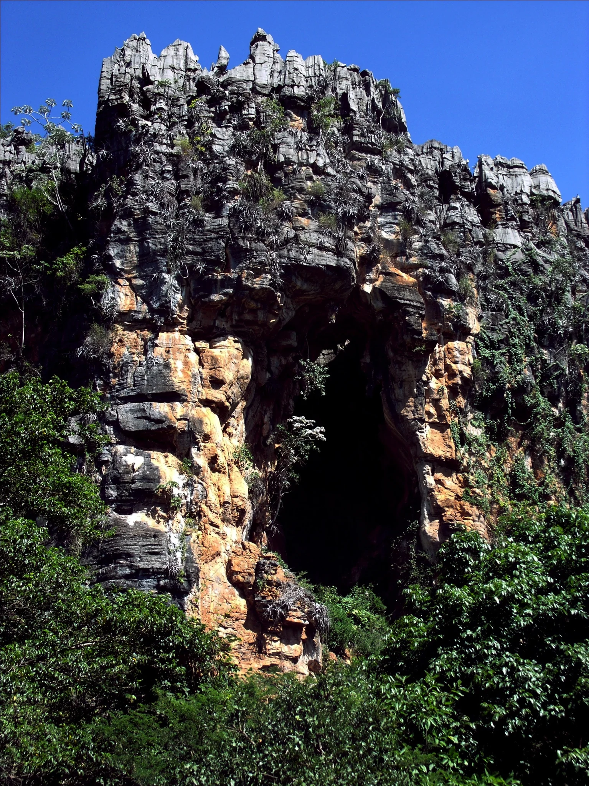
- **revisado_manualmente**: True
- **status_desenho_extraivel**: NAO_TEM_DESENHO
- **botoes**:
  - **[0]**:
    - **uid**: lunWvP28wQh9dx
    - **texto**: Capa
    - **destino**:
      - **secao_textual**:
        - **conteudo**:
            |  |
            | :--: |
            | *Salão Encantado* |
  - **[1]**:
    - **uid**: Ci8Cw1vDC8e6ay
    - **texto**: Informações
    - **destino**:
      - **secao_textual**:
        - **conteudo**:
            # CROQUI DO SALÃO ENCANTADO – JANUÁRIA MG
            
            |  |
            | :--: |
            | *AENMG* |
            
            | 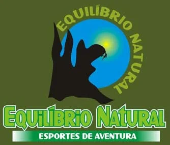 |
            | :--: |
            | *EQUILÍBRIO NATURAL* |
            
            ## Importante!!
            A região do Salão Encantado é foco do **mosquito palha**.
            **É extremamente necessário o uso de repelentes para evitar a ação do mosquito.**
            Aconselhável o uso de roupas compridas (blusa longa e calça).
            
            O local possui temperaturas um pouco elevadas em horários próximos ao meio dia. Aconselha-se levar muita água para não desidratar.
            
            ## Como chegar
            **De carro.** Em Montes Claros siga para o Distrito Industrial (Av. João 23) até a fábrica de cimento. Passe em frente a fábrica e continue na estrada (BR 135) seguindo para Januária. A primeira cidade é Mirabela, continue seguindo a BR 135 passando por Japonvar seguindo até a cidade de Lontra e logo depois a cidade de Januária. A distância de Lontra até a ponte sobre o rio são Francisco são exatamente 40 km. Depois de passar sobre a ponte, aproximadamente 10 km depois chegará no posto da policia rodoviária, logo depois será o trevo de januária, vire a esquerda no trevo. Chegará a um segundo trevo (chapada gaúcha) continue seguindo reto até um terceiro trevo que fica próximo ao aeroporto. Vire a esquerda no terceiro trevo no sentido para Barreiro em uma estrada de terra. Siga na estrada aproximadamente 5 km depois do trevo e vire a esquerda em um aglomerado rochoso.
            
            **De Ônibus.** Chegando na rodoviária de Januária (aproximadamente 10 km do salão encantado), seguir em direção à comunidade de Barreiro próximo ao aeroporto. De Montes Claros, procurar na rodoviária pela empresa Transnorte. Até o dia 01 de outubro de 2012 o horário de saída do ônibus é as 05:00 horas (cinco horas da manhã).
            
            **De Avião.** Desembarcar no aeroporto de Montes Claros e seguir de carro ou de ônibus para Januária.
- **ultima_migracao**: 5
- **publicar_croqui**: True
- **revisado_bounding_circle**: True

## Parte: setor_parede_principal

### Setor (Pico: Salão Encantado)

- **descricao**: 
- **nome**: Setor Parede Principal
- **uid**: f4TxVRX5QEcLpH
- **mapas**:
  - **[0]**:
    - **caminho_imagem_mapa**: 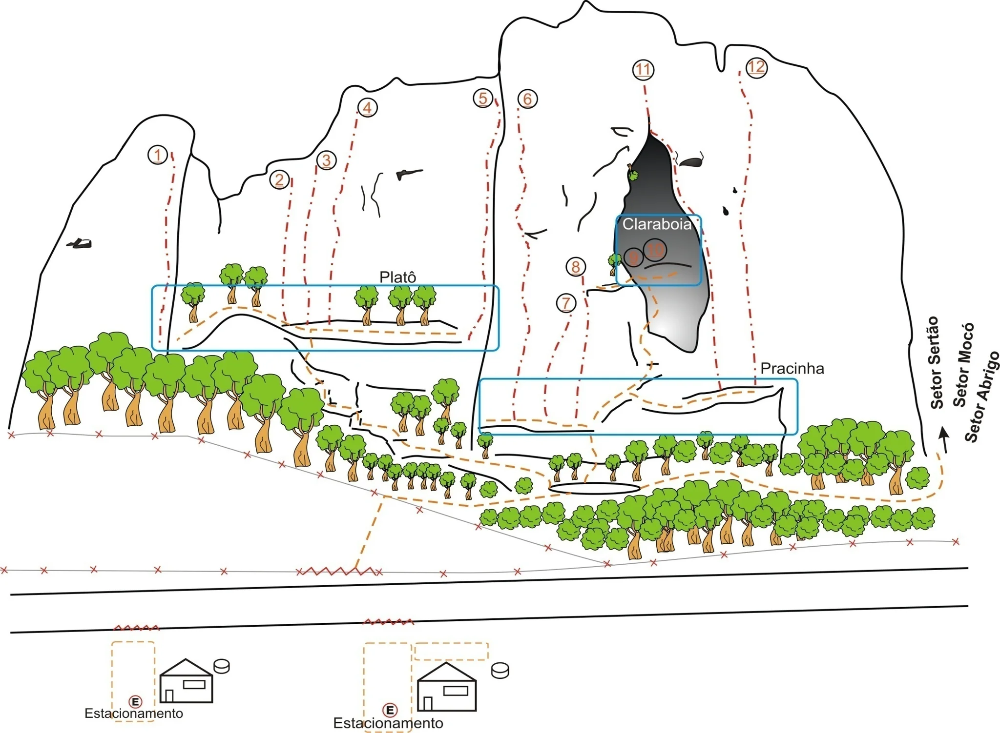
    - **largura_mapa**: 2048
    - **altura_mapa**: 1503
    - **pontos_de_interesse**:
      - **[0]**:
        - **id**: 10clin9jif893l
        - **uid**: 10clin9jif893l
        - **rotulo**: 01
        - **circulo**:
          - **x**: 323
          - **y**: 317
          - **raio**: 19
        - **label**: 01
      - **[1]**:
        - **id**: d0rvG3VzcWKOk4
        - **uid**: d0rvG3VzcWKOk4
        - **rotulo**: 02
        - **circulo**:
          - **x**: 572
          - **y**: 367
          - **raio**: 19
        - **label**: 02
      - **[2]**:
        - **id**: A0emUB9iCAe1Dq
        - **uid**: A0emUB9iCAe1Dq
        - **rotulo**: 03
        - **circulo**:
          - **x**: 669
          - **y**: 328
          - **raio**: 19
        - **label**: 03
      - **[3]**:
        - **id**: VgFGvFFCnYKhXD
        - **uid**: VgFGvFFCnYKhXD
        - **rotulo**: 04
        - **circulo**:
          - **x**: 753
          - **y**: 220
          - **raio**: 19
        - **label**: 04
      - **[4]**:
        - **id**: xLJAQipkvSsHmY
        - **uid**: xLJAQipkvSsHmY
        - **rotulo**: 05
        - **circulo**:
          - **x**: 989
          - **y**: 201
          - **raio**: 19
        - **label**: 05
      - **[5]**:
        - **id**: 5fKw2LyGONG1aR
        - **uid**: 5fKw2LyGONG1aR
        - **rotulo**: 06
        - **circulo**:
          - **x**: 1081
          - **y**: 202
          - **raio**: 19
        - **label**: 06
      - **[6]**:
        - **id**: 8j45SSHSsow3Yn
        - **uid**: 8j45SSHSsow3Yn
        - **rotulo**: 07
        - **circulo**:
          - **x**: 1160
          - **y**: 621
          - **raio**: 19
        - **label**: 07
      - **[7]**:
        - **id**: iZh2vF3GmOEj2j
        - **uid**: iZh2vF3GmOEj2j
        - **rotulo**: 08
        - **circulo**:
          - **x**: 1180
          - **y**: 546
          - **raio**: 19
        - **label**: 08
      - **[8]**:
        - **id**: Qwos9iSMPiF3lp
        - **uid**: Qwos9iSMPiF3lp
        - **rotulo**: 09
        - **circulo**:
          - **x**: 1298
          - **y**: 528
          - **raio**: 19
        - **label**: 09
      - **[9]**:
        - **id**: YQH6hG6YMHkwvU
        - **uid**: YQH6hG6YMHkwvU
        - **rotulo**: 10
        - **circulo**:
          - **x**: 1342
          - **y**: 513
          - **raio**: 23
        - **label**: 10
      - **[10]**:
        - **id**: cgSmgXHsVErMDr
        - **uid**: cgSmgXHsVErMDr
        - **rotulo**: 11
        - **circulo**:
          - **x**: 1317
          - **y**: 143
          - **raio**: 21
        - **label**: 11
      - **[11]**:
        - **id**: fOQzBaZSLIA17S
        - **uid**: fOQzBaZSLIA17S
        - **rotulo**: 12
        - **circulo**:
          - **x**: 1550
          - **y**: 139
          - **raio**: 21
        - **label**: 12
      - **[12]**:
        - **id**: QQMlWEt14BTXq2
        - **uid**: QQMlWEt14BTXq2
        - **rotulo**: Claraboia
        - **retangulo**:
          - **x**: 1348
          - **y**: 458
          - **comprimento**: 157
          - **largura**: 37
        - **label**: Claraboia
      - **[13]**:
        - **id**: Z3Q8PTZ0MI62ZP
        - **uid**: Z3Q8PTZ0MI62ZP
        - **rotulo**: Platô
        - **retangulo**:
          - **x**: 814
          - **y**: 566
          - **comprimento**: 86
          - **largura**: 41
        - **label**: Platô
      - **[14]**:
        - **id**: l04hKaa6xoJwkC
        - **uid**: l04hKaa6xoJwkC
        - **rotulo**: Pracinha
        - **retangulo**:
          - **x**: 1624
          - **y**: 754
          - **comprimento**: 151
          - **largura**: 38
        - **label**: Pracinha
      - **[15]**:
        - **id**: QxJMldEX9amFvh
        - **uid**: QxJMldEX9amFvh
        - **rotulo**: Setor Sertão
        - **retangulo**:
          - **x**: 1913
          - **y**: 740
          - **comprimento**: 36
          - **largura**: 203
          - **angulo_graus_x100**: -298
        - **label**: Setor Sertão
      - **[16]**:
        - **id**: rYL6DATJtrt6F7
        - **uid**: rYL6DATJtrt6F7
        - **rotulo**: Setor Mocó
        - **retangulo**:
          - **x**: 1974
          - **y**: 744
          - **comprimento**: 34
          - **largura**: 183
          - **angulo_graus_x100**: 650
        - **label**: Setor Mocó
      - **[17]**:
        - **id**: mluCaTHl9VQ2gG
        - **uid**: mluCaTHl9VQ2gG
        - **rotulo**: Setor Abrigo
        - **retangulo**:
          - **x**: 2013
          - **y**: 812
          - **comprimento**: 36
          - **largura**: 199
          - **angulo_graus_x100**: 1655
        - **label**: Setor Abrigo
    - **referencias**:
      - **[0]**:
        - **alvo_uid**: Jrc4nGI2kSQUDq
        - **pontos_uids**:
          - 10clin9jif893l
        - **escalada**: Pescador de Planta
        - **ids**:
          - 10clin9jif893l
      - **[1]**:
        - **alvo_uid**: SDcksS3OYp0L9X
        - **pontos_uids**:
          - d0rvG3VzcWKOk4
        - **escalada**: Maria Doida
        - **ids**:
          - d0rvG3VzcWKOk4
      - **[2]**:
        - **alvo_uid**: hwWnPgqHuHeWhl
        - **pontos_uids**:
          - A0emUB9iCAe1Dq
        - **escalada**: Chuva de Bromélias
        - **ids**:
          - A0emUB9iCAe1Dq
      - **[3]**:
        - **alvo_uid**: TGx0bL9vdeBzkj
        - **pontos_uids**:
          - VgFGvFFCnYKhXD
        - **escalada**: Visitante Oculto
        - **ids**:
          - VgFGvFFCnYKhXD
      - **[4]**:
        - **alvo_uid**: AjG4ArXWA6drXk
        - **pontos_uids**:
          - xLJAQipkvSsHmY
        - **escalada**: Bestial Devastation
        - **ids**:
          - xLJAQipkvSsHmY
      - **[5]**:
        - **alvo_uid**: ChN3dpFO8UTDc3
        - **pontos_uids**:
          - 5fKw2LyGONG1aR
        - **escalada**: Velho Chico
        - **ids**:
          - 5fKw2LyGONG1aR
      - **[6]**:
        - **alvo_uid**: gYFE7vOfUzpfU5
        - **pontos_uids**:
          - 8j45SSHSsow3Yn
        - **escalada**: Dom Quixote
        - **ids**:
          - 8j45SSHSsow3Yn
      - **[7]**:
        - **alvo_uid**: m9Opqb0RTh6u33
        - **pontos_uids**:
          - iZh2vF3GmOEj2j
        - **escalada**: Cordadinha
        - **ids**:
          - iZh2vF3GmOEj2j
      - **[8]**:
        - **alvo_uid**: epQfMvXlTOrYSU
        - **pontos_uids**:
          - Qwos9iSMPiF3lp
        - **escalada**: Calazar Certo
        - **ids**:
          - Qwos9iSMPiF3lp
      - **[9]**:
        - **alvo_uid**: P7iqCMVOTn7tO2
        - **pontos_uids**:
          - YQH6hG6YMHkwvU
        - **escalada**: Cabeça de Rato
        - **ids**:
          - YQH6hG6YMHkwvU
      - **[10]**:
        - **alvo_uid**: IHIIfLt4jkNU0I
        - **pontos_uids**:
          - cgSmgXHsVErMDr
        - **escalada**: Pelas Mãos do Senhor
        - **ids**:
          - cgSmgXHsVErMDr
      - **[11]**:
        - **alvo_uid**: LcQQkTM5a3MdLx
        - **pontos_uids**:
          - fOQzBaZSLIA17S
        - **escalada**: Uma Lágrima que Cai
        - **ids**:
          - fOQzBaZSLIA17S
      - **[12]**:
        - **alvo_uid**: QMjvo9hzwJjnZD
        - **pontos_uids**:
          - Z3Q8PTZ0MI62ZP
        - **setor**: Setor do Platô
        - **ids**:
          - Z3Q8PTZ0MI62ZP
      - **[13]**:
        - **alvo_uid**: p60Ye0QY35tMCe
        - **pontos_uids**:
          - l04hKaa6xoJwkC
        - **setor**: Setor da Pracinha
        - **ids**:
          - l04hKaa6xoJwkC
      - **[14]**:
        - **alvo_uid**: SB6PaS5IMGBuEl
        - **pontos_uids**:
          - QQMlWEt14BTXq2
        - **setor**: Setor da Claraboia
        - **ids**:
          - QQMlWEt14BTXq2
      - **[15]**:
        - **alvo_uid**: 2D521Xlwq8lN5s
        - **pontos_uids**:
          - QxJMldEX9amFvh
        - **setor**: Setor do Sertão
        - **ids**:
          - QxJMldEX9amFvh
      - **[16]**:
        - **alvo_uid**: GUndzg4TCADnuo
        - **pontos_uids**:
          - rYL6DATJtrt6F7
        - **setor**: Setor do Mocó
        - **ids**:
          - rYL6DATJtrt6F7
      - **[17]**:
        - **alvo_uid**: K6RbtXvIhTm7g2
        - **pontos_uids**:
          - mluCaTHl9VQ2gG
        - **setor**: Setor do Abrigo
        - **ids**:
          - mluCaTHl9VQ2gG
- **escaladas**:
  - **[0]**:
    - **uid**: Jrc4nGI2kSQUDq
    - **via_esportiva**:
      - **nome**: Pescador de Planta
      - **dificuldade**: BR_6SUP
  - **[1]**:
    - **uid**: SDcksS3OYp0L9X
    - **via_esportiva**:
      - **nome**: Maria Doida
      - **dificuldade**: BR_6SUP
  - **[2]**:
    - **uid**: hwWnPgqHuHeWhl
    - **via_esportiva**:
      - **nome**: Chuva de Bromélias
      - **dificuldade**: BR_6SUP
  - **[3]**:
    - **uid**: TGx0bL9vdeBzkj
    - **via_esportiva**:
      - **nome**: Visitante Oculto
      - **dificuldade**: BR_8A
  - **[4]**:
    - **uid**: AjG4ArXWA6drXk
    - **via_esportiva**:
      - **nome**: Bestial Devastation
      - **dificuldade**: BR_7A
  - **[5]**:
    - **uid**: ChN3dpFO8UTDc3
    - **via_esportiva**:
      - **nome**: Velho Chico
      - **dificuldade**: BR_7B
  - **[6]**:
    - **uid**: gYFE7vOfUzpfU5
    - **via_esportiva**:
      - **nome**: Dom Quixote
      - **dificuldade**: BR_7A
  - **[7]**:
    - **uid**: m9Opqb0RTh6u33
    - **via_esportiva**:
      - **nome**: Cordadinha
      - **dificuldade**: BR_6SUP_BARRA_7A
  - **[8]**:
    - **uid**: epQfMvXlTOrYSU
    - **via_esportiva**:
      - **nome**: Calazar Certo
      - **dificuldade**: BR_7B
  - **[9]**:
    - **uid**: P7iqCMVOTn7tO2
    - **via_esportiva**:
      - **nome**: Cabeça de Rato
      - **dificuldade**: BR_7A
  - **[10]**:
    - **uid**: IHIIfLt4jkNU0I
    - **via_esportiva**:
      - **nome**: Pelas Mãos do Senhor
      - **dificuldade**: PROJETO
  - **[11]**:
    - **uid**: LcQQkTM5a3MdLx
    - **via_esportiva**:
      - **nome**: Uma Lágrima que Cai
      - **dificuldade**: PROJETO
- **precomputados**:
  - **total_escaladas**: 12
  - **total_esportivas**: 12

## Parte: setor_da_pracinha

### Setor (Pico: Salão Encantado)

- **descricao**: Para chegar até o setor é preciso fazer uma escalaminhada. Cuidado ao caminhar nas trilhas altas e pedras soltas.
- **nome**: Setor da Pracinha
- **uid**: p60Ye0QY35tMCe
- **caminho_imagem_capa**: 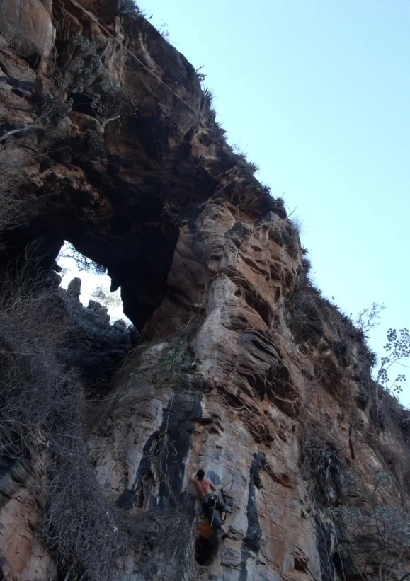
- **mapas**:
  - **[0]**:
    - **caminho_imagem_mapa**: 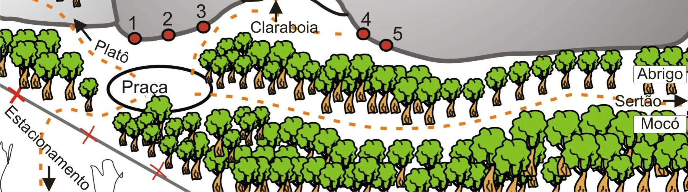
    - **largura_mapa**: 1801
    - **altura_mapa**: 505
    - **pontos_de_interesse**:
      - **[0]**:
        - **id**: LvgorzTVOOfTtj
        - **uid**: LvgorzTVOOfTtj
        - **rotulo**: 01
        - **retangulo**:
          - **x**: 348
          - **y**: 60
          - **comprimento**: 30
          - **largura**: 45
        - **label**: 01
      - **[1]**:
        - **id**: BDxOEsUEaundK9
        - **uid**: BDxOEsUEaundK9
        - **rotulo**: 02
        - **retangulo**:
          - **x**: 438
          - **y**: 49
          - **comprimento**: 37
          - **largura**: 46
        - **label**: 02
      - **[2]**:
        - **id**: ylwjswAGdnLTzu
        - **uid**: ylwjswAGdnLTzu
        - **rotulo**: 03
        - **retangulo**:
          - **x**: 526
          - **y**: 28
          - **comprimento**: 41
          - **largura**: 50
        - **label**: 03
      - **[3]**:
        - **id**: mViaSKUP9R8DYA
        - **uid**: mViaSKUP9R8DYA
        - **rotulo**: 04
        - **retangulo**:
          - **x**: 958
          - **y**: 50
          - **comprimento**: 35
          - **largura**: 45
        - **label**: 04
      - **[4]**:
        - **id**: dRpOz7iSDxj1na
        - **uid**: dRpOz7iSDxj1na
        - **rotulo**: 05
        - **retangulo**:
          - **x**: 1041
          - **y**: 87
          - **comprimento**: 32
          - **largura**: 44
        - **label**: 05
      - **[5]**:
        - **id**: NFEWFsXKUMZZ53
        - **uid**: NFEWFsXKUMZZ53
        - **rotulo**: Claraboia
        - **retangulo**:
          - **x**: 746
          - **y**: 70
          - **comprimento**: 192
          - **largura**: 49
        - **label**: Claraboia
      - **[6]**:
        - **id**: BDjfYlldVJjrGU
        - **uid**: BDjfYlldVJjrGU
        - **rotulo**: Platô
        - **retangulo**:
          - **x**: 294
          - **y**: 138
          - **comprimento**: 107
          - **largura**: 45
          - **angulo_graus_x100**: 2536
        - **label**: Platô
      - **[7]**:
        - **id**: 8AL23sSJdXHA0K
        - **uid**: 8AL23sSJdXHA0K
        - **rotulo**: Praça
        - **retangulo**:
          - **x**: 380
          - **y**: 226
          - **comprimento**: 119
          - **largura**: 55
        - **label**: Praça
      - **[8]**:
        - **id**: fJDPLx0odmJHh8
        - **uid**: fJDPLx0odmJHh8
        - **rotulo**: Abrigo
        - **retangulo**:
          - **x**: 1729
          - **y**: 196
          - **comprimento**: 132
          - **largura**: 44
        - **label**: Abrigo
      - **[9]**:
        - **id**: kSwQGt3GWSjRxf
        - **uid**: kSwQGt3GWSjRxf
        - **rotulo**: Sertão
        - **retangulo**:
          - **x**: 1671
          - **y**: 265
          - **comprimento**: 128
          - **largura**: 46
        - **label**: Sertão
      - **[10]**:
        - **id**: 7by9pOqJubzifa
        - **uid**: 7by9pOqJubzifa
        - **rotulo**: Mocó
        - **retangulo**:
          - **x**: 1728
          - **y**: 326
          - **comprimento**: 107
          - **largura**: 39
        - **label**: Mocó
    - **referencias**:
      - **[0]**:
        - **alvo_uid**: 4PFqO3P6FE6Em9
        - **pontos_uids**:
          - LvgorzTVOOfTtj
        - **escalada**: Velho Chico
        - **ids**:
          - LvgorzTVOOfTtj
      - **[1]**:
        - **alvo_uid**: GxZB5D7CMtgEYK
        - **pontos_uids**:
          - BDxOEsUEaundK9
        - **escalada**: Dom Quixote
        - **ids**:
          - BDxOEsUEaundK9
      - **[2]**:
        - **alvo_uid**: 9e4ASTVQCsj4ta
        - **pontos_uids**:
          - ylwjswAGdnLTzu
        - **escalada**: Cordadinha
        - **ids**:
          - ylwjswAGdnLTzu
      - **[3]**:
        - **alvo_uid**: T3Sd4CAV52DAEj
        - **pontos_uids**:
          - mViaSKUP9R8DYA
        - **escalada**: Pelas Mãos do Senhor
        - **ids**:
          - mViaSKUP9R8DYA
      - **[4]**:
        - **alvo_uid**: zbK8al5oPpzx5Z
        - **pontos_uids**:
          - dRpOz7iSDxj1na
        - **escalada**: Uma Lágrima que Cai
        - **ids**:
          - dRpOz7iSDxj1na
      - **[5]**:
        - **alvo_uid**: QMjvo9hzwJjnZD
        - **pontos_uids**:
          - BDjfYlldVJjrGU
        - **setor**: Setor do Platô
        - **ids**:
          - BDjfYlldVJjrGU
      - **[6]**:
        - **alvo_uid**: SB6PaS5IMGBuEl
        - **pontos_uids**:
          - NFEWFsXKUMZZ53
        - **setor**: Setor da Claraboia
        - **ids**:
          - NFEWFsXKUMZZ53
      - **[7]**:
        - **alvo_uid**: K6RbtXvIhTm7g2
        - **pontos_uids**:
          - fJDPLx0odmJHh8
        - **setor**: Setor do Abrigo
        - **ids**:
          - fJDPLx0odmJHh8
      - **[8]**:
        - **alvo_uid**: 2D521Xlwq8lN5s
        - **pontos_uids**:
          - kSwQGt3GWSjRxf
        - **setor**: Setor do Sertão
        - **ids**:
          - kSwQGt3GWSjRxf
      - **[9]**:
        - **alvo_uid**: GUndzg4TCADnuo
        - **pontos_uids**:
          - 7by9pOqJubzifa
        - **setor**: Setor do Mocó
        - **ids**:
          - 7by9pOqJubzifa
- **escaladas**:
  - **[0]**:
    - **uid**: 4PFqO3P6FE6Em9
    - **via_esportiva**:
      - **descricao**: Via clássica do setor.
      - **nome**: Velho Chico
      - **dificuldade**: BR_7B
      - **extensao**: 40
  - **[1]**:
    - **uid**: GxZB5D7CMtgEYK
    - **via_esportiva**:
      - **descricao**: Termina na metade da parede.
      - **nome**: Dom Quixote
      - **dificuldade**: BR_7A
  - **[2]**:
    - **uid**: 9e4ASTVQCsj4ta
    - **via_esportiva**:
      - **descricao**: Termina um pouco acima da via Dom Quixote.
      - **nome**: Cordadinha
      - **dificuldade**: BR_6SUP_BARRA_7A
  - **[3]**:
    - **uid**: T3Sd4CAV52DAEj
    - **via_esportiva**:
      - **descricao**: Via que passa pelo teto a direita da claraboia. Via de muita resistência.
      - **nome**: Pelas Mãos do Senhor
      - **dificuldade**: PROJETO
  - **[4]**:
    - **uid**: zbK8al5oPpzx5Z
    - **via_esportiva**:
      - **descricao**: Via a direita da pelas mãos do senhor. Cuidado ao caminhar na base
      - **nome**: Uma Lágrima que Cai
      - **dificuldade**: PROJETO
- **precomputados**:
  - **total_escaladas**: 5
  - **total_esportivas**: 5

## Parte: setor_do_plato

### Setor (Pico: Salão Encantado)

- **descricao**: Para chegar até o setor é necessário fazer uma escalaminhada. Cuidado com pedras soltas.
- **nome**: Setor do Platô
- **uid**: QMjvo9hzwJjnZD
- **caminho_imagem_capa**: 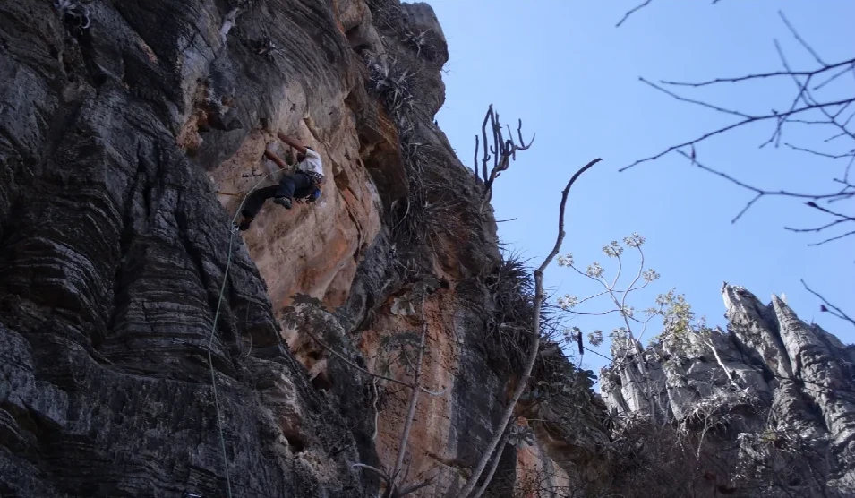
- **mapas**:
  - **[0]**:
    - **caminho_imagem_mapa**: 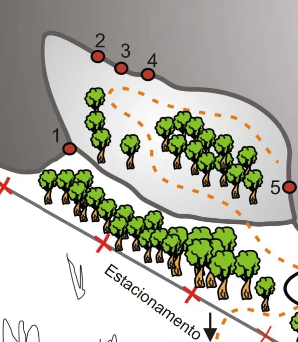
    - **largura_mapa**: 592
    - **altura_mapa**: 680
    - **pontos_de_interesse**:
      - **[0]**:
        - **id**: oYhfhMQr5TK5Kw
        - **uid**: oYhfhMQr5TK5Kw
        - **rotulo**: 01
        - **retangulo**:
          - **x**: 111
          - **y**: 268
          - **comprimento**: 30
          - **largura**: 40
        - **label**: 01
      - **[1]**:
        - **id**: 2qaU1E0ultIgcv
        - **uid**: 2qaU1E0ultIgcv
        - **rotulo**: 02
        - **retangulo**:
          - **x**: 198
          - **y**: 80
          - **comprimento**: 29
          - **largura**: 38
        - **label**: 02
      - **[2]**:
        - **id**: wsL5LuI4hqDyTQ
        - **uid**: wsL5LuI4hqDyTQ
        - **rotulo**: 03
        - **retangulo**:
          - **x**: 248
          - **y**: 99
          - **comprimento**: 29
          - **largura**: 38
        - **label**: 03
      - **[3]**:
        - **id**: ly6vXFi9dkzF64
        - **uid**: ly6vXFi9dkzF64
        - **rotulo**: 04
        - **retangulo**:
          - **x**: 302
          - **y**: 120
          - **comprimento**: 30
          - **largura**: 40
        - **label**: 04
      - **[4]**:
        - **id**: gfEr40EmgcWNtD
        - **uid**: gfEr40EmgcWNtD
        - **rotulo**: 05
        - **retangulo**:
          - **x**: 546
          - **y**: 372
          - **comprimento**: 33
          - **largura**: 39
        - **label**: 05
    - **referencias**:
      - **[0]**:
        - **alvo_uid**: CcTCoFRXGogA0B
        - **pontos_uids**:
          - oYhfhMQr5TK5Kw
        - **escalada**: Pescador de Planta
        - **ids**:
          - oYhfhMQr5TK5Kw
      - **[1]**:
        - **alvo_uid**: NyZIelp4GoLNLn
        - **pontos_uids**:
          - 2qaU1E0ultIgcv
        - **escalada**: Maria Doida
        - **ids**:
          - 2qaU1E0ultIgcv
      - **[2]**:
        - **alvo_uid**: icpHNOApr7w6Lz
        - **pontos_uids**:
          - wsL5LuI4hqDyTQ
        - **escalada**: Chuva de Bromélias
        - **ids**:
          - wsL5LuI4hqDyTQ
      - **[3]**:
        - **alvo_uid**: 4Q43gZOQLpXNWl
        - **pontos_uids**:
          - ly6vXFi9dkzF64
        - **escalada**: Visitante Oculto
        - **ids**:
          - ly6vXFi9dkzF64
      - **[4]**:
        - **alvo_uid**: N3vKmzkDVkj7Cm
        - **pontos_uids**:
          - gfEr40EmgcWNtD
        - **escalada**: Bestial Devastation
        - **ids**:
          - gfEr40EmgcWNtD
- **escaladas**:
  - **[0]**:
    - **uid**: CcTCoFRXGogA0B
    - **via_esportiva**:
      - **descricao**: Via na aresta esquerda do platô.
      - **nome**: Pescador de Planta
      - **dificuldade**: BR_6SUP
  - **[1]**:
    - **uid**: NyZIelp4GoLNLn
    - **via_esportiva**:
      - **descricao**: Primeira via da parede.
      - **nome**: Maria Doida
      - **dificuldade**: BR_6SUP
  - **[2]**:
    - **uid**: icpHNOApr7w6Lz
    - **via_esportiva**:
      - **descricao**: Via técnica. Recomendada para quem quer escalar 6º grau.
      - **nome**: Chuva de Bromélias
      - **dificuldade**: BR_6SUP
  - **[3]**:
    - **uid**: 4Q43gZOQLpXNWl
    - **via_esportiva**:
      - **descricao**: Via longa e técnica uma fenda na metade da parede. Opção para quem quer escalar 8º grau.
      - **nome**: Visitante Oculto
      - **dificuldade**: BR_8A
  - **[4]**:
    - **uid**: N3vKmzkDVkj7Cm
    - **via_esportiva**:
      - **descricao**: Ultima via da parede. Se quiser fazer a via a partir da base tem que descer até o platô mais baixo.
      - **nome**: Bestial Devastation
      - **dificuldade**: BR_7A
- **precomputados**:
  - **total_escaladas**: 5
  - **total_esportivas**: 5

## Parte: setor_da_claraboia

### Setor (Pico: Salão Encantado)

- **descricao**: ATENÇÃO! Para chegar no o setor é preciso fazer uma escalaminhada cuidadosa. Cuidado com pedras soltas e trilhas altas. Opção para descida é fazer um rapel a partir do top da via Cordadinha.
- **nome**: Setor da Claraboia
- **uid**: SB6PaS5IMGBuEl
- **caminho_imagem_capa**: 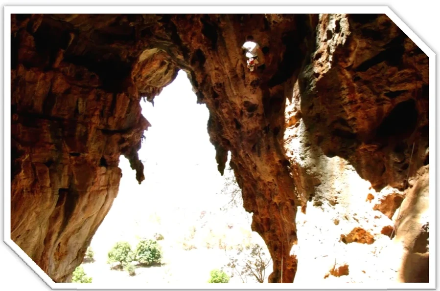
- **mapas**:
  - **[0]**:
    - **caminho_imagem_mapa**: 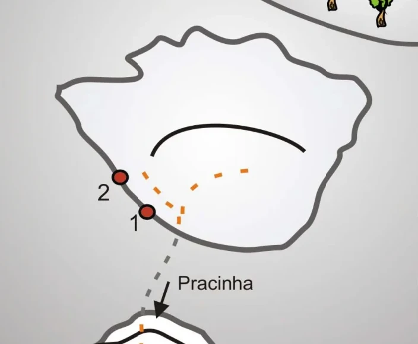
    - **largura_mapa**: 704
    - **altura_mapa**: 580
    - **pontos_de_interesse**:
      - **[0]**:
        - **id**: A9rbkHObHSWqkM
        - **uid**: A9rbkHObHSWqkM
        - **rotulo**: 01
        - **retangulo**:
          - **x**: 228
          - **y**: 375
          - **comprimento**: 30
          - **largura**: 42
        - **label**: 01
      - **[1]**:
        - **id**: yyV1hjISNFjKuU
        - **uid**: yyV1hjISNFjKuU
        - **rotulo**: 02
        - **retangulo**:
          - **x**: 174
          - **y**: 324
          - **comprimento**: 29
          - **largura**: 37
        - **label**: 02
      - **[2]**:
        - **id**: 0Bz4H7hUhDUqOe
        - **uid**: 0Bz4H7hUhDUqOe
        - **rotulo**: Pracinha
        - **retangulo**:
          - **x**: 362
          - **y**: 476
          - **comprimento**: 134
          - **largura**: 35
        - **label**: Pracinha
    - **referencias**:
      - **[0]**:
        - **alvo_uid**: uimq5lby4Qe07T
        - **pontos_uids**:
          - A9rbkHObHSWqkM
        - **escalada**: Calazar Certo
        - **ids**:
          - A9rbkHObHSWqkM
      - **[1]**:
        - **alvo_uid**: NfGkmvOCREPU7q
        - **pontos_uids**:
          - yyV1hjISNFjKuU
        - **escalada**: Cabeça de Rato
        - **ids**:
          - yyV1hjISNFjKuU
      - **[2]**:
        - **alvo_uid**: p60Ye0QY35tMCe
        - **pontos_uids**:
          - 0Bz4H7hUhDUqOe
        - **setor**: Setor da Pracinha
        - **ids**:
          - 0Bz4H7hUhDUqOe
- **escaladas**:
  - **[0]**:
    - **uid**: uimq5lby4Qe07T
    - **via_esportiva**:
      - **descricao**: Via mais clássica do salão encantado. Via longa em chorreiras e agarrões. Recomendada para todos.
      - **nome**: Calazar Certo
      - **dificuldade**: BR_7B
  - **[1]**:
    - **uid**: NfGkmvOCREPU7q
    - **via_esportiva**:
      - **descricao**: Primeiro grampo a 5 metros do chão. Escalada de um 3º grau positivo para chegar ao grampo.
      - **nome**: Cabeça de Rato
      - **dificuldade**: BR_7A
- **precomputados**:
  - **total_escaladas**: 2
  - **total_esportivas**: 2

## Parte: setor_do_sertao

### Setor (Pico: Salão Encantado)

- **descricao**: Setor com sol quase o dia todo. Horário ideal para escalar aqui é bem cedo pela manhã e a partir das 15 horas.
- **nome**: Setor do Sertão
- **uid**: 2D521Xlwq8lN5s
- **caminho_imagem_capa**: 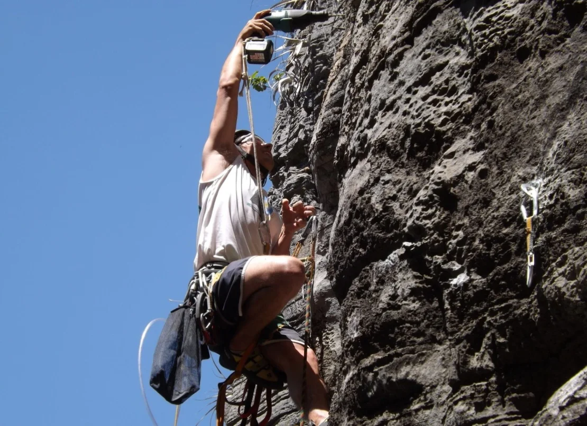
- **mapas**:
  - **[0]**:
    - **caminho_imagem_mapa**: 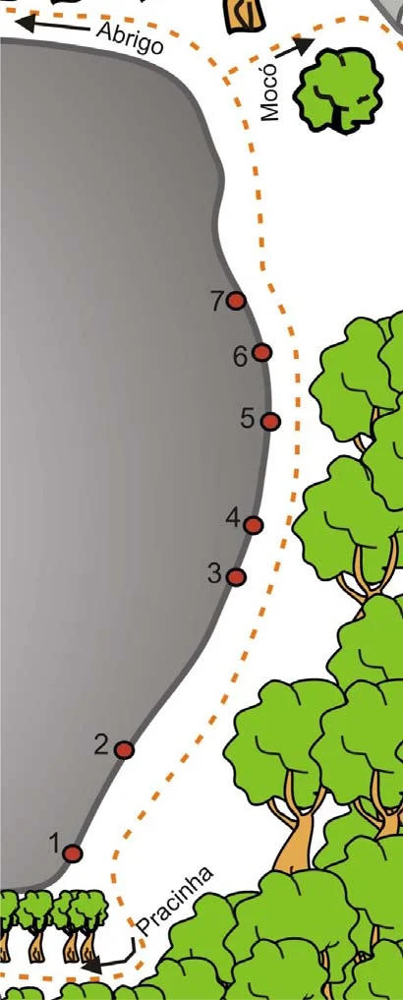
    - **largura_mapa**: 410
    - **altura_mapa**: 1017
    - **pontos_de_interesse**:
      - **[0]**:
        - **id**: LP8rHJrvsiX5OL
        - **uid**: LP8rHJrvsiX5OL
        - **rotulo**: 01
        - **retangulo**:
          - **x**: 56
          - **y**: 857
          - **comprimento**: 25
          - **largura**: 30
        - **label**: 01
      - **[1]**:
        - **id**: 7GvoSnb2dQgI4m
        - **uid**: 7GvoSnb2dQgI4m
        - **rotulo**: 02
        - **retangulo**:
          - **x**: 104
          - **y**: 756
          - **comprimento**: 23
          - **largura**: 29
        - **label**: 02
      - **[2]**:
        - **id**: LAD2fhll04qI6L
        - **uid**: LAD2fhll04qI6L
        - **rotulo**: 03
        - **retangulo**:
          - **x**: 218
          - **y**: 582
          - **comprimento**: 24
          - **largura**: 29
        - **label**: 03
      - **[3]**:
        - **id**: VpIeyjvVjL0E5S
        - **uid**: VpIeyjvVjL0E5S
        - **rotulo**: 04
        - **retangulo**:
          - **x**: 236
          - **y**: 526
          - **comprimento**: 20
          - **largura**: 30
        - **label**: 04
      - **[4]**:
        - **id**: rNM97l1nDVrtkd
        - **uid**: rNM97l1nDVrtkd
        - **rotulo**: 05
        - **retangulo**:
          - **x**: 252
          - **y**: 423
          - **comprimento**: 21
          - **largura**: 30
        - **label**: 05
      - **[5]**:
        - **id**: sClRGNuY67phWk
        - **uid**: sClRGNuY67phWk
        - **rotulo**: 06
        - **retangulo**:
          - **x**: 244
          - **y**: 362
          - **comprimento**: 24
          - **largura**: 31
        - **label**: 06
      - **[6]**:
        - **id**: kOB06goF4EcqIC
        - **uid**: kOB06goF4EcqIC
        - **rotulo**: 07
        - **retangulo**:
          - **x**: 219
          - **y**: 303
          - **comprimento**: 24
          - **largura**: 30
        - **label**: 07
      - **[7]**:
        - **id**: YaKNRrf2VFNmcG
        - **uid**: YaKNRrf2VFNmcG
        - **rotulo**: Abrigo
        - **retangulo**:
          - **x**: 133
          - **y**: 38
          - **comprimento**: 82
          - **largura**: 35
          - **angulo_graus_x100**: 1810
        - **label**: Abrigo
      - **[8]**:
        - **id**: WGB4EywYAlctU1
        - **uid**: WGB4EywYAlctU1
        - **rotulo**: Mocó
        - **retangulo**:
          - **x**: 273
          - **y**: 92
          - **comprimento**: 36
          - **largura**: 74
        - **label**: Mocó
      - **[9]**:
        - **id**: ZXqQtgXa52vbkE
        - **uid**: ZXqQtgXa52vbkE
        - **rotulo**: Pracinha
        - **retangulo**:
          - **x**: 176
          - **y**: 914
          - **comprimento**: 117
          - **largura**: 33
          - **angulo_graus_x100**: -4464
        - **label**: Pracinha
    - **referencias**:
      - **[0]**:
        - **alvo_uid**: vno7XojdXecv2U
        - **pontos_uids**:
          - LP8rHJrvsiX5OL
        - **escalada**: Sol da Manhã
        - **ids**:
          - LP8rHJrvsiX5OL
      - **[1]**:
        - **alvo_uid**: 2rlpBgU5hNcUwv
        - **pontos_uids**:
          - 7GvoSnb2dQgI4m
        - **escalada**: Filha do Sol
        - **ids**:
          - 7GvoSnb2dQgI4m
      - **[2]**:
        - **alvo_uid**: 8ZUM9SsP3fzMEc
        - **pontos_uids**:
          - LAD2fhll04qI6L
        - **escalada**: Nuvens de Agosto
        - **ids**:
          - LAD2fhll04qI6L
      - **[3]**:
        - **alvo_uid**: YPK60j95KcESrK
        - **pontos_uids**:
          - VpIeyjvVjL0E5S
        - **escalada**: A Laka
        - **ids**:
          - VpIeyjvVjL0E5S
      - **[4]**:
        - **alvo_uid**: 1baocvuoCNt7bQ
        - **pontos_uids**:
          - rNM97l1nDVrtkd
        - **escalada**: Dazão e o pé de Feijão
        - **ids**:
          - rNM97l1nDVrtkd
      - **[5]**:
        - **alvo_uid**: pL7QUB34s2lLzR
        - **pontos_uids**:
          - sClRGNuY67phWk
        - **escalada**: Explosão de Sabores
        - **ids**:
          - sClRGNuY67phWk
      - **[6]**:
        - **alvo_uid**: vsl0th0aJQrz7g
        - **pontos_uids**:
          - kOB06goF4EcqIC
        - **escalada**: Insolação
        - **ids**:
          - kOB06goF4EcqIC
      - **[7]**:
        - **alvo_uid**: p60Ye0QY35tMCe
        - **pontos_uids**:
          - ZXqQtgXa52vbkE
        - **setor**: Setor da Pracinha
        - **ids**:
          - ZXqQtgXa52vbkE
      - **[8]**:
        - **alvo_uid**: GUndzg4TCADnuo
        - **pontos_uids**:
          - WGB4EywYAlctU1
        - **setor**: Setor do Mocó
        - **ids**:
          - WGB4EywYAlctU1
      - **[9]**:
        - **alvo_uid**: K6RbtXvIhTm7g2
        - **pontos_uids**:
          - YaKNRrf2VFNmcG
        - **setor**: Setor do Abrigo
        - **ids**:
          - YaKNRrf2VFNmcG
- **escaladas**:
  - **[0]**:
    - **uid**: vno7XojdXecv2U
    - **via_esportiva**:
      - **descricao**: Primeira via do setor. Começa na aresta.
      - **nome**: Sol da Manhã
      - **dificuldade**: PROJETO
  - **[1]**:
    - **uid**: 2rlpBgU5hNcUwv
    - **via_esportiva**:
      - **descricao**: Via completa e longa. Um pouco de Resistência e técnica
      - **nome**: Filha do Sol
      - **dificuldade**: PROJETO
  - **[2]**:
    - **uid**: 8ZUM9SsP3fzMEc
    - **via_esportiva**:
      - **descricao**: Primeira via de grampos acima da filha do sol.
      - **nome**: Nuvens de Agosto
      - **dificuldade**: BR_7A_BARRA_7B
  - **[3]**:
    - **uid**: YPK60j95KcESrK
    - **via_esportiva**:
      - **descricao**: Via com grampos a direita da nuvens de agosto
      - **nome**: A Laka
      - **dificuldade**: BR_7B_BARRA_7C
  - **[4]**:
    - **uid**: 1baocvuoCNt7bQ
    - **via_esportiva**:
      - **descricao**: Via com grampos. O ideal é sair com a primeira costura clipada.
      - **nome**: Dazão e o pé de Feijão
      - **dificuldade**: BR_7A
  - **[5]**:
    - **uid**: pL7QUB34s2lLzR
    - **via_esportiva**:
      - **descricao**: Penúltima via da parede.
      - **nome**: Explosão de Sabores
      - **dificuldade**: BR_7B
  - **[6]**:
    - **uid**: vsl0th0aJQrz7g
    - **via_esportiva**:
      - **descricao**: Via oposições em fendas. Protegida com chapeletas.
      - **nome**: Insolação
      - **dificuldade**: BR_7A
- **precomputados**:
  - **total_escaladas**: 7
  - **total_esportivas**: 7

## Parte: setor_do_moco

### Setor (Pico: Salão Encantado)

- **descricao**: Setor localizado em outro bloco de rocha. Para chegar no setor é necessário caminhar um pouco, passando em frente ao setor do sertão. Setor fica a direta do bloco da claraboia.
- **nome**: Setor do Mocó
- **uid**: GUndzg4TCADnuo
- **caminho_imagem_capa**: 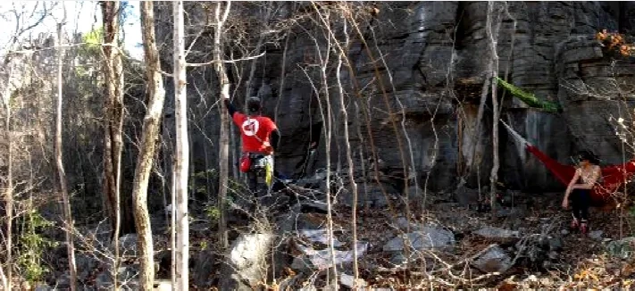
- **mapas**:
  - **[0]**:
    - **caminho_imagem_mapa**: 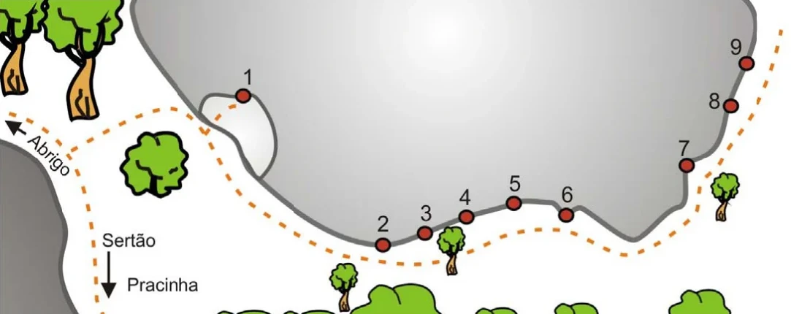
    - **largura_mapa**: 1083
    - **altura_mapa**: 430
    - **pontos_de_interesse**:
      - **[0]**:
        - **id**: p3z9XXX8tjG7Ny
        - **uid**: p3z9XXX8tjG7Ny
        - **rotulo**: 01
        - **retangulo**:
          - **x**: 338
          - **y**: 105
          - **comprimento**: 21
          - **largura**: 32
        - **label**: 01
      - **[1]**:
        - **id**: hdwzYW4AhlB2JK
        - **uid**: hdwzYW4AhlB2JK
        - **rotulo**: 02
        - **retangulo**:
          - **x**: 525
          - **y**: 307
          - **comprimento**: 22
          - **largura**: 28
        - **label**: 02
      - **[2]**:
        - **id**: kyfBkK2gcXAL5M
        - **uid**: kyfBkK2gcXAL5M
        - **rotulo**: 03
        - **retangulo**:
          - **x**: 582
          - **y**: 291
          - **comprimento**: 21
          - **largura**: 28
        - **label**: 03
      - **[3]**:
        - **id**: n5uXH9OzDKn5J8
        - **uid**: n5uXH9OzDKn5J8
        - **rotulo**: 04
        - **retangulo**:
          - **x**: 636
          - **y**: 270
          - **comprimento**: 21
          - **largura**: 27
        - **label**: 04
      - **[4]**:
        - **id**: HaUc5bWsQcwnqB
        - **uid**: HaUc5bWsQcwnqB
        - **rotulo**: 05
        - **retangulo**:
          - **x**: 704
          - **y**: 250
          - **comprimento**: 24
          - **largura**: 31
        - **label**: 05
      - **[5]**:
        - **id**: qtBWNlRPhn6c2p
        - **uid**: qtBWNlRPhn6c2p
        - **rotulo**: 06
        - **retangulo**:
          - **x**: 776
          - **y**: 266
          - **comprimento**: 20
          - **largura**: 28
        - **label**: 06
      - **[6]**:
        - **id**: IGiCs8bc4RXwW0
        - **uid**: IGiCs8bc4RXwW0
        - **rotulo**: 07
        - **retangulo**:
          - **x**: 936
          - **y**: 202
          - **comprimento**: 20
          - **largura**: 27
        - **label**: 07
      - **[7]**:
        - **id**: xYfr41gFUhIniR
        - **uid**: xYfr41gFUhIniR
        - **rotulo**: 08
        - **retangulo**:
          - **x**: 977
          - **y**: 137
          - **comprimento**: 24
          - **largura**: 30
        - **label**: 08
      - **[8]**:
        - **id**: wiurXwPGebzjj5
        - **uid**: wiurXwPGebzjj5
        - **rotulo**: 09
        - **retangulo**:
          - **x**: 1006
          - **y**: 63
          - **comprimento**: 23
          - **largura**: 30
        - **label**: 09
      - **[9]**:
        - **id**: MjzI9rdm2Do7f5
        - **uid**: MjzI9rdm2Do7f5
        - **rotulo**: Abrigo
        - **retangulo**:
          - **x**: 66
          - **y**: 212
          - **comprimento**: 35
          - **largura**: 84
          - **angulo_graus_x100**: -4434
        - **label**: Abrigo
      - **[10]**:
        - **id**: GxGPxt4eYDdds1
        - **uid**: GxGPxt4eYDdds1
        - **rotulo**: Sertão
        - **retangulo**:
          - **x**: 176
          - **y**: 329
          - **comprimento**: 78
          - **largura**: 24
        - **label**: Sertão
      - **[11]**:
        - **id**: wiZUdYXSzRTL4X
        - **uid**: wiZUdYXSzRTL4X
        - **rotulo**: Pracinha
        - **retangulo**:
          - **x**: 222
          - **y**: 390
          - **comprimento**: 102
          - **largura**: 25
        - **label**: Pracinha
    - **referencias**:
      - **[0]**:
        - **alvo_uid**: 9qMhOYyJ0FJwV1
        - **pontos_uids**:
          - p3z9XXX8tjG7Ny
        - **escalada**: Vezúvio
        - **ids**:
          - p3z9XXX8tjG7Ny
      - **[1]**:
        - **alvo_uid**: TovD77F1WtCvNR
        - **pontos_uids**:
          - hdwzYW4AhlB2JK
        - **escalada**: Meia Pegada
        - **ids**:
          - hdwzYW4AhlB2JK
      - **[2]**:
        - **alvo_uid**: k0TkXMJMjRIN4g
        - **pontos_uids**:
          - kyfBkK2gcXAL5M
        - **escalada**: Rasta Man
        - **ids**:
          - kyfBkK2gcXAL5M
      - **[3]**:
        - **alvo_uid**: s2SimUiA02v1bL
        - **pontos_uids**:
          - n5uXH9OzDKn5J8
        - **escalada**: Malandragem da um Tempo
        - **ids**:
          - n5uXH9OzDKn5J8
      - **[4]**:
        - **alvo_uid**: Zx4YlZgjSPkrrJ
        - **pontos_uids**:
          - HaUc5bWsQcwnqB
        - **escalada**: Complexo Bipolar
        - **ids**:
          - HaUc5bWsQcwnqB
      - **[5]**:
        - **alvo_uid**: 8uQG2vjFzTLthZ
        - **pontos_uids**:
          - qtBWNlRPhn6c2p
        - **escalada**: Aresta que me Resta
        - **ids**:
          - qtBWNlRPhn6c2p
      - **[6]**:
        - **alvo_uid**: f2lUzQgAkA1JKH
        - **pontos_uids**:
          - IGiCs8bc4RXwW0
        - **escalada**: Barbarvore
        - **ids**:
          - IGiCs8bc4RXwW0
      - **[7]**:
        - **alvo_uid**: SUgbvE5pCS9fas
        - **pontos_uids**:
          - xYfr41gFUhIniR
        - **escalada**: Suposta Exposição
        - **ids**:
          - xYfr41gFUhIniR
      - **[8]**:
        - **alvo_uid**: B9Q8AHcjq7GRpP
        - **pontos_uids**:
          - wiurXwPGebzjj5
        - **escalada**: Bicho Morto
        - **ids**:
          - wiurXwPGebzjj5
      - **[9]**:
        - **alvo_uid**: K6RbtXvIhTm7g2
        - **pontos_uids**:
          - MjzI9rdm2Do7f5
        - **setor**: Setor do Abrigo
        - **ids**:
          - MjzI9rdm2Do7f5
      - **[10]**:
        - **alvo_uid**: 2D521Xlwq8lN5s
        - **pontos_uids**:
          - GxGPxt4eYDdds1
        - **setor**: Setor do Sertão
        - **ids**:
          - GxGPxt4eYDdds1
      - **[11]**:
        - **alvo_uid**: p60Ye0QY35tMCe
        - **pontos_uids**:
          - wiZUdYXSzRTL4X
        - **setor**: Setor da Pracinha
        - **ids**:
          - wiZUdYXSzRTL4X
- **escaladas**:
  - **[0]**:
    - **uid**: 9qMhOYyJ0FJwV1
    - **via_esportiva**:
      - **descricao**: Via em cima do platô.
      - **nome**: Vezúvio
      - **dificuldade**: BR_6SUP
  - **[1]**:
    - **uid**: TovD77F1WtCvNR
    - **via_esportiva**:
      - **descricao**: Primeira via da parede.
      - **nome**: Meia Pegada
      - **dificuldade**: BR_7A
  - **[2]**:
    - **uid**: k0TkXMJMjRIN4g
    - **via_esportiva**:
      - **descricao**: Via antes da árvore.
      - **nome**: Rasta Man
      - **dificuldade**: BR_7A
  - **[3]**:
    - **uid**: s2SimUiA02v1bL
    - **via_esportiva**:
      - **descricao**: Via depois da árvore.
      - **nome**: Malandragem da um Tempo
      - **dificuldade**: BR_7B_BARRA_7C
  - **[4]**:
    - **uid**: Zx4YlZgjSPkrrJ
    - **via_esportiva**:
      - **descricao**: Via antes da aresta.
      - **nome**: Complexo Bipolar
      - **dificuldade**: BR_7C_BARRA_8A
  - **[5]**:
    - **uid**: 8uQG2vjFzTLthZ
    - **via_esportiva**:
      - **descricao**: Via na aresta.
      - **nome**: Aresta que me Resta
      - **dificuldade**: BR_7A
  - **[6]**:
    - **uid**: f2lUzQgAkA1JKH
    - **via_esportiva**:
      - **descricao**: Primeira via na parede de trás.
      - **nome**: Barbarvore
      - **dificuldade**: BR_6
  - **[7]**:
    - **uid**: SUgbvE5pCS9fas
    - **via_esportiva**:
      - **descricao**: Via depois da árvore.
      - **nome**: Suposta Exposição
      - **dificuldade**: BR_6
  - **[8]**:
    - **uid**: B9Q8AHcjq7GRpP
    - **via_esportiva**:
      - **descricao**: Última via da parede.
      - **nome**: Bicho Morto
      - **dificuldade**: BR_6SUP
- **precomputados**:
  - **total_escaladas**: 9
  - **total_esportivas**: 9

## Parte: setor_do_abrigo

### Setor (Pico: Salão Encantado)

- **descricao**: O setor fica localizado acima da claraboia. Para chegar até o Abrigo é preciso fazer uma caminhada passando em frente ao setor do sertão. É necessário escalar um pequeno bloco de rocha para chegar ao setor.
- **nome**: Setor do Abrigo
- **uid**: K6RbtXvIhTm7g2
- **caminho_imagem_capa**: 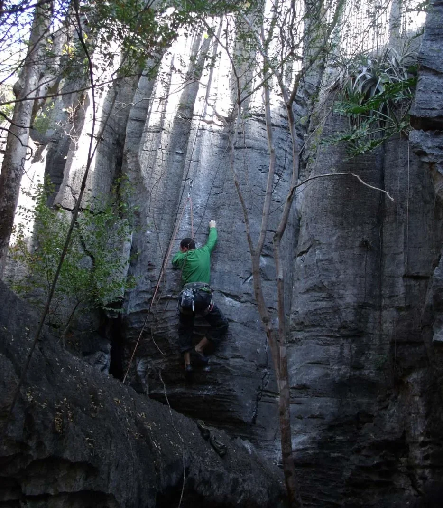
- **mapas**:
  - **[0]**:
    - **caminho_imagem_mapa**: 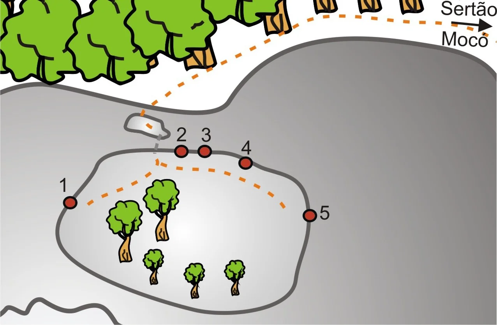
    - **largura_mapa**: 1276
    - **altura_mapa**: 835
    - **pontos_de_interesse**:
      - **[0]**:
        - **id**: fdbKT8kJ8D3QzY
        - **uid**: fdbKT8kJ8D3QzY
        - **rotulo**: 01
        - **retangulo**:
          - **x**: 163
          - **y**: 474
          - **comprimento**: 30
          - **largura**: 52
        - **label**: 01
      - **[1]**:
        - **id**: 4OlCb1TrNLOly1
        - **uid**: 4OlCb1TrNLOly1
        - **rotulo**: 02
        - **retangulo**:
          - **x**: 466
          - **y**: 344
          - **comprimento**: 33
          - **largura**: 45
        - **label**: 02
      - **[2]**:
        - **id**: Rhc24ZKWB4vYpo
        - **uid**: Rhc24ZKWB4vYpo
        - **rotulo**: 03
        - **retangulo**:
          - **x**: 528
          - **y**: 346
          - **comprimento**: 34
          - **largura**: 46
        - **label**: 03
      - **[3]**:
        - **id**: j7r0KlYlHKnfJ6
        - **uid**: j7r0KlYlHKnfJ6
        - **rotulo**: 04
        - **retangulo**:
          - **x**: 634
          - **y**: 378
          - **comprimento**: 33
          - **largura**: 51
        - **label**: 04
      - **[4]**:
        - **id**: e207SEaPl0grQX
        - **uid**: e207SEaPl0grQX
        - **rotulo**: 05
        - **retangulo**:
          - **x**: 833
          - **y**: 547
          - **comprimento**: 30
          - **largura**: 50
        - **label**: 05
      - **[5]**:
        - **id**: zAi2C9o6ddUvsQ
        - **uid**: zAi2C9o6ddUvsQ
        - **rotulo**: Sertão
        - **retangulo**:
          - **x**: 1201
          - **y**: 25
          - **comprimento**: 150
          - **largura**: 50
        - **label**: Sertão
      - **[6]**:
        - **id**: TEFzz5fAtqwU8R
        - **uid**: TEFzz5fAtqwU8R
        - **rotulo**: Mocó
        - **retangulo**:
          - **x**: 1193
          - **y**: 102
          - **comprimento**: 130
          - **largura**: 53
        - **label**: Mocó
    - **referencias**:
      - **[0]**:
        - **alvo_uid**: H5cRoIIOYcRZX5
        - **pontos_uids**:
          - fdbKT8kJ8D3QzY
        - **escalada**: Gamon
        - **ids**:
          - fdbKT8kJ8D3QzY
      - **[1]**:
        - **alvo_uid**: IkBa90eWAtgVTL
        - **pontos_uids**:
          - 4OlCb1TrNLOly1
        - **escalada**: Estrela no Coco
        - **ids**:
          - 4OlCb1TrNLOly1
      - **[2]**:
        - **alvo_uid**: OjVHTJCfW3qGQz
        - **pontos_uids**:
          - Rhc24ZKWB4vYpo
        - **escalada**: Fendinha
        - **ids**:
          - Rhc24ZKWB4vYpo
      - **[3]**:
        - **alvo_uid**: VKLpDKsAhchoxa
        - **pontos_uids**:
          - j7r0KlYlHKnfJ6
        - **escalada**: Guariba
        - **ids**:
          - j7r0KlYlHKnfJ6
      - **[4]**:
        - **alvo_uid**: VsKtQBCFwozLDY
        - **pontos_uids**:
          - e207SEaPl0grQX
        - **escalada**: Tardia
        - **ids**:
          - e207SEaPl0grQX
      - **[5]**:
        - **alvo_uid**: 2D521Xlwq8lN5s
        - **pontos_uids**:
          - zAi2C9o6ddUvsQ
        - **setor**: Setor do Sertão
        - **ids**:
          - zAi2C9o6ddUvsQ
      - **[6]**:
        - **alvo_uid**: GUndzg4TCADnuo
        - **pontos_uids**:
          - TEFzz5fAtqwU8R
        - **setor**: Setor do Mocó
        - **ids**:
          - TEFzz5fAtqwU8R
- **escaladas**:
  - **[0]**:
    - **uid**: H5cRoIIOYcRZX5
    - **via_esportiva**:
      - **descricao**: Primeira via da parede.
      - **nome**: Gamon
      - **dificuldade**: BR_6SUP
  - **[1]**:
    - **uid**: IkBa90eWAtgVTL
    - **via_esportiva**:
      - **descricao**: Via atrás de um bloco de pedra.
      - **nome**: Estrela no Coco
      - **dificuldade**: BR_7B
  - **[2]**:
    - **uid**: OjVHTJCfW3qGQz
    - **via_esportiva**:
      - **descricao**: Via a direita da estrela no coco.
      - **nome**: Fendinha
      - **dificuldade**: BR_7A
  - **[3]**:
    - **uid**: VKLpDKsAhchoxa
    - **via_esportiva**:
      - **descricao**: Via a direita do bloco de pedra.
      - **nome**: Guariba
      - **dificuldade**: BR_6
  - **[4]**:
    - **uid**: VsKtQBCFwozLDY
    - **via_esportiva**:
      - **descricao**: Ultima via da parede.
      - **nome**: Tardia
      - **dificuldade**: BR_7A
- **precomputados**:
  - **total_escaladas**: 5
  - **total_esportivas**: 5

## Arquivos Externos

- **arquivos_externos**:
  - **[0]**:
    - **caminho**: 
    - **checksum_sha256**: 0ab7762be0ddbf55a1b473fb4a32f3e6e4395a2abf37005de4d8522c8a4311f2
  - **[1]**:
    - **caminho**: 
    - **checksum_sha256**: 111b123a552d9440244610ce41bcdfe8c5af3cc86b72e1cca090e56488a52c6b
  - **[2]**:
    - **caminho**: 
    - **checksum_sha256**: 1dd67185233c82bdb943ab9f2ad5e7add6ef540cec41ec20a4b728104696ded5
  - **[3]**:
    - **caminho**: 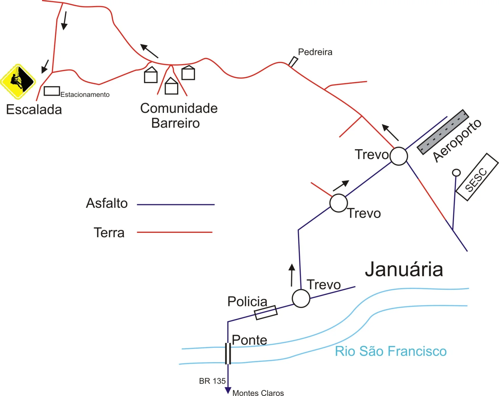
    - **checksum_sha256**: cf5a77d8c638d74be364fd7732985b847de6a4328e54833265019a04b1ae225b
  - **[4]**:
    - **caminho**: 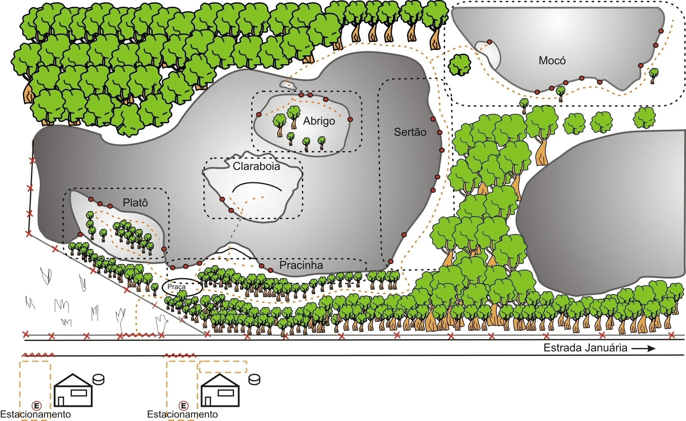
    - **checksum_sha256**: 3b99ed0ff1b2779ed43a20f1d945a761bd59f334bc39b245cd41ae565d874dc1
  - **[5]**:
    - **caminho**: 
    - **checksum_sha256**: b72ab4e7ed7ebc351c59c93c96c50f06089419d7a20f143ca1c62cfb983853dd
  - **[6]**:
    - **caminho**: 
    - **checksum_sha256**: 3990d6723d4cfbd3af32284b97f3ad819f80cc79ee50780ceada202e454a6dc0
  - **[7]**:
    - **caminho**: 
    - **checksum_sha256**: 9663cb8d80562fb7e09deda7aaafe0609a51400305ddf3d65aeb3d4360e5dc1f
  - **[8]**:
    - **caminho**: 
    - **checksum_sha256**: ffd7880590985b9bca54af49611f7cb8e1076bc01f88b16c37c1b43cff298277
  - **[9]**:
    - **caminho**: 
    - **checksum_sha256**: 36097b9d58a6e8c0329a204ae32ea49d26802c6911c89644ce34501b90ceedef
  - **[10]**:
    - **caminho**: 
    - **checksum_sha256**: 194d37ffc681a18b9c823bd962f349ca2611de7442091a3eb4dbc007da9080f2
  - **[11]**:
    - **caminho**: 
    - **checksum_sha256**: fece16e9e088ed2969eeb59be686e84feeb3c41c3e5eaa760394204951b910ec
  - **[12]**:
    - **caminho**: 
    - **checksum_sha256**: 31e9fd52afcd671606c15c73e7b36e44fba4746e3af75ddcd404f2f9c9e28b4a
  - **[13]**:
    - **caminho**: 
    - **checksum_sha256**: 61a3c81321ea2b5a935b659a1823735bcc16d73d77c07b8bb81aaeb5e6f76cc4
  - **[14]**:
    - **caminho**: 
    - **checksum_sha256**: f88985648b85414e298afe2a65d576c6b15fe52b50cece370158898232749752
  - **[15]**:
    - **caminho**: 
    - **checksum_sha256**: 15491d7fa7580f330aaabdce1e424f2146059472e7305778c23742f81db75525
  - **[16]**:
    - **caminho**: 
    - **checksum_sha256**: d113dd8e00ffba4fda3cee1f41a5bc3166f214893d16202be214470d3c2333c2
  - **[17]**:
    - **caminho**: 
    - **checksum_sha256**: 5774476d9339c1ad497498e763b55cb56ea641852a091b9b72005d59e7609bfe

