# Croqui: Gruta da Lapinha

## Informações Gerais

- **descricao**: Guia de escalada da Gruta da Lapinha em Lagoa Santa, MG.
- **id**: br_mg_lagoa_santa_gruta_da_lapinha
- **nome**: Gruta da Lapinha
- **uid**: 9jDSsMY9R5bPSY
- **caminho_thumbnail**: 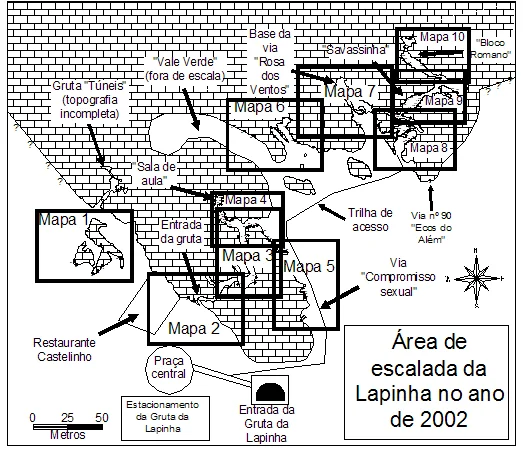
- **revisado_manualmente**: True
- **status_desenho_extraivel**: NAO_TEM_DESENHO
- **botoes**:
  - **[0]**:
    - **uid**: bd8N6s3AVnvUzT
    - **texto**: Capa
    - **destino**:
      - **secao_textual**:
        - **conteudo**:
            # Guia de escaladas da Lapinha
            
            Lagoa Santa - MG
            
            |  |
            | :--: |
            | *Mapa geral da Gruta da Lapinha* |
            
            **Autores:** Daniel Ferreira Mariano e Eustáquio Macedo Melo Júnior
            
            **Ano:** 2002
  - **[1]**:
    - **uid**: PR5VXagPRY4PKz
    - **texto**: Créditos
    - **destino**:
      - **secao_textual**:
        - **conteudo**:
            # Créditos
            
            Este guia é de autoria de:
            
            - **Daniel Ferreira Mariano**
            - **Eustáquio Macedo Melo Júnior**
            
            **Ano:** 2002
            
            **Disponível em:** [www.rumos.net.br](http://www.rumos.net.br)
            
            |  |
            | :--: |
            | *Logo Rumos Navegação em Montanhas* |
            
            |  |
            | :--: |
            | *Logo AltaMontanha.com* |
            
            |  |
            | :--: |
            | *Logo Loja AltaMontanha.com* |
            
            |  |
            | :--: |
            | *Logo FEMEMG - Federação de Montanhismo e Escalada de Minas Gerais* |
            
            ## Revitalização e Manutenções (2026)
            
            Inspeções técnicas e manutenções coordenadas e executadas por:
            
            - **ACEC-MG** (Associação Cultural e Esportiva do Carste de Minas Gerais)
            - **Rupestre da Lapa Aventuras**
            
            Grupo de Trabalho de Escalada da Lapinha - GTEL.
            
            Em conformidade com a Portaria IEF nº 72/2023, protocolos operacionais do Parque
            Estadual do Sumidouro (PESU) e autorização dos conquistadores.
            
            > Escale com segurança, respeite o local e traga seu lixo de volta para casa.
- **ultima_migracao**: 5
- **publicar_croqui**: True
- **revisado_bounding_circle**: True

## Parte: setor_mapa_1

### Setor (Pico: Gruta da Lapinha)

- **descricao**:
    # Setor Castelinho
    
    Setor localizado próximo ao Restaurante Castelinho. Possui vias de graduação
    variada, incluindo algumas vias em móvel.
- **nome**: Castelinho
- **uid**: pcQfnDIAUZk99g
- **mapas**:
  - **[0]**:
    - **caminho_imagem_mapa**: 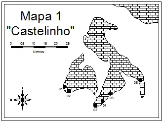
    - **largura_mapa**: 330
    - **altura_mapa**: 246
    - **pontos_de_interesse**:
      - **[0]**:
        - **id**: IXdi9b6ANAZqas
        - **uid**: IXdi9b6ANAZqas
        - **rotulo**: 01
        - **retangulo**:
          - **x**: 123
          - **y**: 180
          - **comprimento**: 10
          - **largura**: 9
        - **label**: 01
      - **[1]**:
        - **id**: kl6xM7uAYzA7Da
        - **uid**: kl6xM7uAYzA7Da
        - **rotulo**: 02
        - **retangulo**:
          - **x**: 138
          - **y**: 193
          - **comprimento**: 9
          - **largura**: 8
        - **label**: 02
      - **[2]**:
        - **id**: yqIuqsvKHtOHCY
        - **uid**: yqIuqsvKHtOHCY
        - **rotulo**: 03
        - **retangulo**:
          - **x**: 193
          - **y**: 222
          - **comprimento**: 10
          - **largura**: 9
        - **label**: 03
      - **[3]**:
        - **id**: ZvQxcq7VXB3oo5
        - **uid**: ZvQxcq7VXB3oo5
        - **rotulo**: 04
        - **retangulo**:
          - **x**: 211
          - **y**: 212
          - **comprimento**: 10
          - **largura**: 9
        - **label**: 04
      - **[4]**:
        - **id**: WCop4MeMLmO1OZ
        - **uid**: WCop4MeMLmO1OZ
        - **rotulo**: 05
        - **retangulo**:
          - **x**: 226
          - **y**: 198
          - **comprimento**: 10
          - **largura**: 9
        - **label**: 05
      - **[5]**:
        - **id**: tzWTPn01zEiYeE
        - **uid**: tzWTPn01zEiYeE
        - **rotulo**: 06
        - **retangulo**:
          - **x**: 275
          - **y**: 166
          - **comprimento**: 10
          - **largura**: 9
        - **label**: 06
    - **referencias**:
      - **[0]**:
        - **alvo_uid**: GwiarHNNEXnfly
        - **pontos_uids**:
          - IXdi9b6ANAZqas
        - **escalada**: Sai que é vaca
        - **ids**:
          - IXdi9b6ANAZqas
      - **[1]**:
        - **alvo_uid**: IkF7tbLlAt5Zdz
        - **pontos_uids**:
          - kl6xM7uAYzA7Da
        - **escalada**: Favo de Mel
        - **ids**:
          - kl6xM7uAYzA7Da
      - **[2]**:
        - **alvo_uid**: uMZtAWeka4OQlJ
        - **pontos_uids**:
          - yqIuqsvKHtOHCY
        - **escalada**: Retorno do Marco
        - **ids**:
          - yqIuqsvKHtOHCY
      - **[3]**:
        - **alvo_uid**: gcztZvEGjZmcgV
        - **pontos_uids**:
          - ZvQxcq7VXB3oo5
        - **escalada**: Tomara que não chova
        - **ids**:
          - ZvQxcq7VXB3oo5
      - **[4]**:
        - **alvo_uid**: QBYl00QZT0YkrW
        - **pontos_uids**:
          - WCop4MeMLmO1OZ
        - **escalada**: Castelinho
        - **ids**:
          - WCop4MeMLmO1OZ
      - **[5]**:
        - **alvo_uid**: YJo7r0hFIoOXTZ
        - **pontos_uids**:
          - tzWTPn01zEiYeE
        - **escalada**: Projeto
        - **ids**:
          - tzWTPn01zEiYeE
- **escaladas**:
  - **[0]**:
    - **uid**: GwiarHNNEXnfly
    - **via_movel**:
      - **nome**: Sai que é vaca
      - **dificuldade**: BR_6
      - **conquistadores**:
        - Márcio Soares Macena
        - Wilson Novaes
  - **[1]**:
    - **uid**: IkF7tbLlAt5Zdz
    - **via_movel**:
      - **nome**: Favo de Mel
      - **dificuldade**: BR_6
      - **quantidade_protecoes_intermediarias**: 3
      - **quantidade_protecoes_parada**: 1
      - **conquistadores**:
        - Márcio Soares Macena
        - Wilson Novaes
  - **[2]**:
    - **uid**: uMZtAWeka4OQlJ
    - **via_movel**:
      - **nome**: Retorno do Marco
      - **dificuldade**: BR_3
      - **conquistadores**:
        - Antonio C. Magalhães
        - Marco Antônio Canelas
  - **[3]**:
    - **uid**: gcztZvEGjZmcgV
    - **via_esportiva**:
      - **nome**: Tomara que não chova
      - **dificuldade**: BR_6SUP
      - **quantidade_protecoes_intermediarias**: 6
      - **quantidade_protecoes_parada**: 2
      - **conquistadores**:
        - Christian A. N. Costa
        - Leo Guimarães "Léo Dandão"
      - **data_abertura**: 2001
  - **[4]**:
    - **uid**: QBYl00QZT0YkrW
    - **via_esportiva**:
      - **nome**: Castelinho
      - **dificuldade**: BR_6
      - **quantidade_protecoes_intermediarias**: 6
      - **quantidade_protecoes_parada**: 1
      - **conquistadores**:
        - Marcelo Henrique Grijó Utsch
        - Cristiano Loureiro
      - **data_abertura**: 1993
  - **[5]**:
    - **uid**: YJo7r0hFIoOXTZ
    - **via_esportiva**:
      - **descricao**: **INTERDITADA:** Via inacabada, conta com apenas 3 proteções intermediárias e sem parada instalada no topo.
      - **nome**: Projeto
      - **dificuldade**: PROJETO
      - **quantidade_protecoes_intermediarias**: 3
      - **quantidade_protecoes_parada**: 0
- **precomputados**:
  - **total_escaladas**: 6
  - **total_esportivas**: 3

## Parte: setor_mapa_2

### Setor (Pico: Gruta da Lapinha)

- **descricao**:
    # Setor Mapa 2
    
    Localizado próximo à entrada da gruta. 
    **Atenção:** "Não entre em cavernas".
- **nome**: Setor Mapa 2
- **uid**: k6xxkL2askccdr
- **mapas**:
  - **[0]**:
    - **caminho_imagem_mapa**: 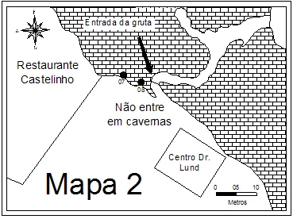
    - **largura_mapa**: 369
    - **altura_mapa**: 276
    - **pontos_de_interesse**:
      - **[0]**:
        - **id**: 8TWtxGbJHVaSf3
        - **uid**: 8TWtxGbJHVaSf3
        - **rotulo**: 07
        - **retangulo**:
          - **x**: 153
          - **y**: 102
          - **comprimento**: 10
          - **largura**: 9
        - **label**: 07
      - **[1]**:
        - **id**: xjTKAZAl2qzvRu
        - **uid**: xjTKAZAl2qzvRu
        - **rotulo**: 08
        - **retangulo**:
          - **x**: 178
          - **y**: 112
          - **comprimento**: 10
          - **largura**: 9
        - **label**: 08
    - **referencias**:
      - **[0]**:
        - **alvo_uid**: lJSlR2A2Xnc174
        - **pontos_uids**:
          - 8TWtxGbJHVaSf3
        - **escalada**: Ajoelhou tem que Rezar
        - **ids**:
          - 8TWtxGbJHVaSf3
      - **[1]**:
        - **alvo_uid**: VzHgiUIINvtKec
        - **pontos_uids**:
          - xjTKAZAl2qzvRu
        - **escalada**: O Exibicionista
        - **ids**:
          - xjTKAZAl2qzvRu
- **escaladas**:
  - **[0]**:
    - **uid**: lJSlR2A2Xnc174
    - **via_movel**:
      - **nome**: Ajoelhou tem que Rezar
      - **dificuldade**: BR_6SUP
      - **conquistadores**:
        - Antonio Carlos Magalhães
  - **[1]**:
    - **uid**: VzHgiUIINvtKec
    - **via_esportiva**:
      - **descricao**: **INTERDITADA:** Grampos com palheta demandam substituição por novas ancoragens. Parada simples que necessita ser duplicada.
      - **nome**: O Exibicionista
      - **dificuldade**: BR_5
      - **quantidade_protecoes_intermediarias**: 2
      - **quantidade_protecoes_parada**: 1
      - **conquistadores**:
        - Daniel Fernandes "Salim"
- **precomputados**:
  - **total_escaladas**: 2
  - **total_esportivas**: 1

## Parte: setor_mapa_3

### Setor (Pico: Gruta da Lapinha)

- **descricao**:
    # Setor Gruta - Mapa 3
    
    Parte interna e externa da gruta com vias esportivas e móveis.
- **nome**: Setor Gruta - Mapa 3
- **uid**: ZxeynNWtcoJYj9
- **mapas**:
  - **[0]**:
    - **caminho_imagem_mapa**: 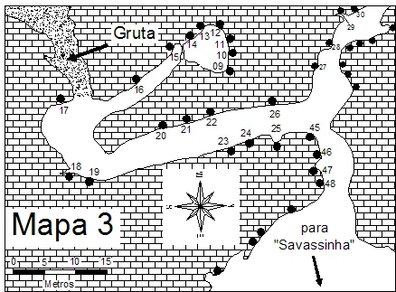
    - **largura_mapa**: 438
    - **altura_mapa**: 323
    - **pontos_de_interesse**:
      - **[0]**:
        - **id**: a84jXjlGaIfYvu
        - **uid**: a84jXjlGaIfYvu
        - **rotulo**: 09
        - **retangulo**:
          - **x**: 241
          - **y**: 73
          - **comprimento**: 12
          - **largura**: 10
        - **label**: 09
      - **[1]**:
        - **id**: hYDYj3defdj6iz
        - **uid**: hYDYj3defdj6iz
        - **rotulo**: 10
        - **retangulo**:
          - **x**: 246
          - **y**: 61
          - **comprimento**: 12
          - **largura**: 10
        - **label**: 10
      - **[2]**:
        - **id**: G9obv6HGygmW39
        - **uid**: G9obv6HGygmW39
        - **rotulo**: 11
        - **retangulo**:
          - **x**: 243
          - **y**: 48
          - **comprimento**: 10
          - **largura**: 9
        - **label**: 11
      - **[3]**:
        - **id**: g3Rw9n92cRMheO
        - **uid**: g3Rw9n92cRMheO
        - **rotulo**: 12
        - **retangulo**:
          - **x**: 238
          - **y**: 36
          - **comprimento**: 11
          - **largura**: 10
        - **label**: 12
      - **[4]**:
        - **id**: YXUlxFX4b4dt9T
        - **uid**: YXUlxFX4b4dt9T
        - **rotulo**: 13
        - **retangulo**:
          - **x**: 226
          - **y**: 40
          - **comprimento**: 11
          - **largura**: 10
        - **label**: 13
      - **[5]**:
        - **id**: 0HJznidvGc2Dc8
        - **uid**: 0HJznidvGc2Dc8
        - **rotulo**: 14
        - **retangulo**:
          - **x**: 213
          - **y**: 50
          - **comprimento**: 12
          - **largura**: 11
        - **label**: 14
      - **[6]**:
        - **id**: JdGRvR0UrHptAj
        - **uid**: JdGRvR0UrHptAj
        - **rotulo**: 15
        - **retangulo**:
          - **x**: 193
          - **y**: 63
          - **comprimento**: 14
          - **largura**: 12
        - **label**: 15
      - **[7]**:
        - **id**: iEnAxu5pPCP2uq
        - **uid**: iEnAxu5pPCP2uq
        - **rotulo**: 16
        - **retangulo**:
          - **x**: 154
          - **y**: 99
          - **comprimento**: 14
          - **largura**: 12
        - **label**: 16
      - **[8]**:
        - **id**: L6nrJpbgYPskOU
        - **uid**: L6nrJpbgYPskOU
        - **rotulo**: 17
        - **retangulo**:
          - **x**: 71
          - **y**: 122
          - **comprimento**: 14
          - **largura**: 12
        - **label**: 17
      - **[9]**:
        - **id**: igWL4CK3ObDb9x
        - **uid**: igWL4CK3ObDb9x
        - **rotulo**: 18
        - **retangulo**:
          - **x**: 85
          - **y**: 184
          - **comprimento**: 14
          - **largura**: 12
        - **label**: 18
      - **[10]**:
        - **id**: yJ1uPbPJ91BGt5
        - **uid**: yJ1uPbPJ91BGt5
        - **rotulo**: 19
        - **retangulo**:
          - **x**: 105
          - **y**: 190
          - **comprimento**: 14
          - **largura**: 12
        - **label**: 19
      - **[11]**:
        - **id**: alEy3QpZYuqo68
        - **uid**: alEy3QpZYuqo68
        - **rotulo**: 20
        - **retangulo**:
          - **x**: 178
          - **y**: 150
          - **comprimento**: 14
          - **largura**: 12
        - **label**: 20
      - **[12]**:
        - **id**: qPV8P7gZFP9zOE
        - **uid**: qPV8P7gZFP9zOE
        - **rotulo**: 21
        - **retangulo**:
          - **x**: 205
          - **y**: 143
          - **comprimento**: 14
          - **largura**: 12
        - **label**: 21
      - **[13]**:
        - **id**: WhG4Tcjw6pFH2I
        - **uid**: WhG4Tcjw6pFH2I
        - **rotulo**: 22
        - **retangulo**:
          - **x**: 234
          - **y**: 135
          - **comprimento**: 14
          - **largura**: 12
        - **label**: 22
      - **[14]**:
        - **id**: Z7GhMueq5Bh0B2
        - **uid**: Z7GhMueq5Bh0B2
        - **rotulo**: 23
        - **retangulo**:
          - **x**: 247
          - **y**: 156
          - **comprimento**: 14
          - **largura**: 12
        - **label**: 23
      - **[15]**:
        - **id**: AP5c4pEkUft5Ha
        - **uid**: AP5c4pEkUft5Ha
        - **rotulo**: 24
        - **retangulo**:
          - **x**: 272
          - **y**: 147
          - **comprimento**: 14
          - **largura**: 12
        - **label**: 24
      - **[16]**:
        - **id**: nO20GQLPlKGRlp
        - **uid**: nO20GQLPlKGRlp
        - **rotulo**: 25
        - **retangulo**:
          - **x**: 305
          - **y**: 142
          - **comprimento**: 14
          - **largura**: 12
        - **label**: 25
      - **[17]**:
        - **id**: ilkHCRhKLKj1qT
        - **uid**: ilkHCRhKLKj1qT
        - **rotulo**: 26
        - **retangulo**:
          - **x**: 304
          - **y**: 126
          - **comprimento**: 14
          - **largura**: 12
        - **label**: 26
      - **[18]**:
        - **id**: z7gK35M0FeYIoC
        - **uid**: z7gK35M0FeYIoC
        - **rotulo**: 27
        - **retangulo**:
          - **x**: 357
          - **y**: 74
          - **comprimento**: 12
          - **largura**: 10
        - **label**: 27
      - **[19]**:
        - **id**: GlPuO5cJt5exdV
        - **uid**: GlPuO5cJt5exdV
        - **rotulo**: 28
        - **retangulo**:
          - **x**: 372
          - **y**: 52
          - **comprimento**: 14
          - **largura**: 11
        - **label**: 28
      - **[20]**:
        - **id**: ssl4fxO4hxIlky
        - **uid**: ssl4fxO4hxIlky
        - **rotulo**: 29
        - **retangulo**:
          - **x**: 388
          - **y**: 30
          - **comprimento**: 14
          - **largura**: 11
        - **label**: 29
      - **[21]**:
        - **id**: ZdrpCXFkdGihXw
        - **uid**: ZdrpCXFkdGihXw
        - **rotulo**: 30
        - **retangulo**:
          - **x**: 399
          - **y**: 16
          - **comprimento**: 14
          - **largura**: 11
        - **label**: 30
      - **[22]**:
        - **id**: WYGuHzuajIpHHg
        - **uid**: WYGuHzuajIpHHg
        - **rotulo**: 45
        - **retangulo**:
          - **x**: 348
          - **y**: 141
          - **comprimento**: 14
          - **largura**: 12
        - **label**: 45
      - **[23]**:
        - **id**: Yl5UK7yi3GfgnS
        - **uid**: Yl5UK7yi3GfgnS
        - **rotulo**: 46
        - **retangulo**:
          - **x**: 361
          - **y**: 168
          - **comprimento**: 14
          - **largura**: 12
        - **label**: 46
      - **[24]**:
        - **id**: kDYLtWk7Idc3Sr
        - **uid**: kDYLtWk7Idc3Sr
        - **rotulo**: 47
        - **retangulo**:
          - **x**: 362
          - **y**: 188
          - **comprimento**: 14
          - **largura**: 12
        - **label**: 47
      - **[25]**:
        - **id**: fQOs3Q3snLnG8Q
        - **uid**: fQOs3Q3snLnG8Q
        - **rotulo**: 48
        - **retangulo**:
          - **x**: 366
          - **y**: 203
          - **comprimento**: 14
          - **largura**: 12
        - **label**: 48
    - **referencias**:
      - **[0]**:
        - **alvo_uid**: YckbIoWKQKTLkS
        - **pontos_uids**:
          - a84jXjlGaIfYvu
        - **escalada**: Lua Cheia
        - **ids**:
          - a84jXjlGaIfYvu
      - **[1]**:
        - **alvo_uid**: JZxQkEyA4lXM9C
        - **pontos_uids**:
          - hYDYj3defdj6iz
        - **escalada**: Jornada nas Estrelas
        - **ids**:
          - hYDYj3defdj6iz
      - **[2]**:
        - **alvo_uid**: egUwOsiMnN45Tu
        - **pontos_uids**:
          - G9obv6HGygmW39
        - **escalada**: Egotrip
        - **ids**:
          - G9obv6HGygmW39
      - **[3]**:
        - **alvo_uid**: cbZ263w7zUzsEf
        - **pontos_uids**:
          - g3Rw9n92cRMheO
        - **escalada**: Boicote de comunicação
        - **ids**:
          - g3Rw9n92cRMheO
      - **[4]**:
        - **alvo_uid**: PsWevz52vrX9CP
        - **pontos_uids**:
          - YXUlxFX4b4dt9T
        - **escalada**: Vicio
        - **ids**:
          - YXUlxFX4b4dt9T
      - **[5]**:
        - **alvo_uid**: bCJDqPZpZ6a12y
        - **pontos_uids**:
          - 0HJznidvGc2Dc8
        - **escalada**: Conspiração Sanguessuga
        - **ids**:
          - 0HJznidvGc2Dc8
      - **[6]**:
        - **alvo_uid**: CyKGqcG4aTKxfn
        - **pontos_uids**:
          - JdGRvR0UrHptAj
        - **escalada**: Gota D’água
        - **ids**:
          - JdGRvR0UrHptAj
      - **[7]**:
        - **alvo_uid**: trj4G3vGOArENf
        - **pontos_uids**:
          - iEnAxu5pPCP2uq
        - **escalada**: Sai de Baixo
        - **ids**:
          - iEnAxu5pPCP2uq
      - **[8]**:
        - **alvo_uid**: IOUnxnbFfZEGs4
        - **pontos_uids**:
          - L6nrJpbgYPskOU
        - **escalada**: Pipeline
        - **ids**:
          - L6nrJpbgYPskOU
      - **[9]**:
        - **alvo_uid**: LtbPet4uTXi7Pg
        - **pontos_uids**:
          - igWL4CK3ObDb9x
        - **escalada**: Jurubeba
        - **ids**:
          - igWL4CK3ObDb9x
      - **[10]**:
        - **alvo_uid**: s6aziD9QKGJOpP
        - **pontos_uids**:
          - yJ1uPbPJ91BGt5
        - **escalada**: Perigo Mora ao Lado
        - **ids**:
          - yJ1uPbPJ91BGt5
      - **[11]**:
        - **alvo_uid**: PhAfEvHO25UiXj
        - **pontos_uids**:
          - alEy3QpZYuqo68
        - **escalada**: Pretexto da Traição
        - **ids**:
          - alEy3QpZYuqo68
      - **[12]**:
        - **alvo_uid**: 3YGXOKygemgTsz
        - **pontos_uids**:
          - qPV8P7gZFP9zOE
        - **escalada**: Sorriso do Lagarto
        - **ids**:
          - qPV8P7gZFP9zOE
      - **[13]**:
        - **alvo_uid**: 5de82BQO55DmG8
        - **pontos_uids**:
          - WhG4Tcjw6pFH2I
        - **escalada**: Orgasmatrom
        - **ids**:
          - WhG4Tcjw6pFH2I
      - **[14]**:
        - **alvo_uid**: 6qtIK6oko89RLT
        - **pontos_uids**:
          - Z7GhMueq5Bh0B2
        - **escalada**: Escaramuça
        - **ids**:
          - Z7GhMueq5Bh0B2
      - **[15]**:
        - **alvo_uid**: fTlGW2iOfrQfhh
        - **pontos_uids**:
          - AP5c4pEkUft5Ha
        - **escalada**: Túnel do Tempo
        - **ids**:
          - AP5c4pEkUft5Ha
      - **[16]**:
        - **alvo_uid**: zrPctwMqr1OhvR
        - **pontos_uids**:
          - nO20GQLPlKGRlp
        - **escalada**: Dédalos
        - **ids**:
          - nO20GQLPlKGRlp
      - **[17]**:
        - **alvo_uid**: KW35NZAOeB6cPC
        - **pontos_uids**:
          - ilkHCRhKLKj1qT
        - **escalada**: Bouquet de Rosas
        - **ids**:
          - ilkHCRhKLKj1qT
      - **[18]**:
        - **alvo_uid**: MHuDaw7hjXX15m
        - **pontos_uids**:
          - z7gK35M0FeYIoC
        - **escalada**: Fogo no Rabo
        - **ids**:
          - z7gK35M0FeYIoC
      - **[19]**:
        - **alvo_uid**: JOmpj2z9VixPwr
        - **pontos_uids**:
          - GlPuO5cJt5exdV
        - **escalada**: Bobeou Sobrou
        - **ids**:
          - GlPuO5cJt5exdV
      - **[20]**:
        - **alvo_uid**: lD3cxvUuA8Gf2i
        - **pontos_uids**:
          - ssl4fxO4hxIlky
        - **escalada**: Los Cubanos
        - **ids**:
          - ssl4fxO4hxIlky
      - **[21]**:
        - **alvo_uid**: FHwRMLcg9gfbK6
        - **pontos_uids**:
          - ZdrpCXFkdGihXw
        - **escalada**: Folião
        - **ids**:
          - ZdrpCXFkdGihXw
      - **[22]**:
        - **alvo_uid**: 0kjmgCEQvr7jqR
        - **pontos_uids**:
          - WYGuHzuajIpHHg
        - **escalada**: Escalador sem mãe
        - **ids**:
          - WYGuHzuajIpHHg
      - **[23]**:
        - **alvo_uid**: nzc62lIrSNVui8
        - **pontos_uids**:
          - Yl5UK7yi3GfgnS
        - **escalada**: Projeto inacabado
        - **ids**:
          - Yl5UK7yi3GfgnS
      - **[24]**:
        - **alvo_uid**: 0XkrqDPEYpl2vw
        - **pontos_uids**:
          - kDYLtWk7Idc3Sr
        - **escalada**: Sobrevibrenf´s
        - **ids**:
          - kDYLtWk7Idc3Sr
      - **[25]**:
        - **alvo_uid**: f8fyK7B3Fuo95O
        - **pontos_uids**:
          - fQOs3Q3snLnG8Q
        - **escalada**: Sobreviventes
        - **ids**:
          - fQOs3Q3snLnG8Q
- **escaladas**:
  - **[0]**:
    - **uid**: YckbIoWKQKTLkS
    - **via_movel**:
      - **nome**: Lua Cheia
      - **dificuldade**: BR_5
      - **conquistadores**:
        - Antonio Carlos Magalhães
        - Vladmir Haddad
  - **[1]**:
    - **uid**: JZxQkEyA4lXM9C
    - **via_esportiva**:
      - **nome**: Jornada nas Estrelas
      - **dificuldade**: BR_7A
      - **conquistadores**:
        - Antonio Carlos Magalhães
        - Vladmir Haddad
      - **data_abertura**: 1997
  - **[2]**:
    - **uid**: egUwOsiMnN45Tu
    - **via_esportiva**:
      - **nome**: Egotrip
      - **dificuldade**: BR_6SUP
      - **conquistadores**:
        - Antonio Carlos Magalhães
        - Vladmir Haddad
      - **data_abertura**: 1997
  - **[3]**:
    - **uid**: cbZ263w7zUzsEf
    - **via_esportiva**:
      - **nome**: Boicote de comunicação
      - **dificuldade**: BR_6SUP
      - **conquistadores**:
        - Leonardo Hoffmann
        - Fao
      - **data_abertura**: 2001
  - **[4]**:
    - **uid**: PsWevz52vrX9CP
    - **via_esportiva**:
      - **nome**: Vicio
      - **dificuldade**: BR_6
      - **conquistadores**:
        - Antonio Carlos Magalhães
        - Vladmir Haddad
      - **data_abertura**: 1997
  - **[5]**:
    - **uid**: bCJDqPZpZ6a12y
    - **via_esportiva**:
      - **nome**: Conspiração Sanguessuga
      - **dificuldade**: BR_6SUP
      - **conquistadores**:
        - Leonardo Hoffmann
        - Alexandre
  - **[6]**:
    - **uid**: CyKGqcG4aTKxfn
    - **via_movel**:
      - **nome**: Gota D’água
      - **dificuldade**: BR_6
      - **conquistadores**:
        - Antonio Carlos Magalhães
        - Vladmir Haddad
      - **data_abertura**: 1997
  - **[7]**:
    - **uid**: trj4G3vGOArENf
    - **via_movel**:
      - **nome**: Sai de Baixo
      - **dificuldade**: BR_5
      - **conquistadores**:
        - Antonio Carlos Magalhães
        - Danilo Abreu
      - **data_abertura**: 1997
  - **[8]**:
    - **uid**: IOUnxnbFfZEGs4
    - **via_esportiva**:
      - **descricao**: **INTERDITADA:** Via totalmente desequipada, restando apenas as pontas de bolts cortados.
      - **nome**: Pipeline
      - **dificuldade**: BR_6SUP
      - **quantidade_protecoes_intermediarias**: 0
      - **quantidade_protecoes_parada**: 0
      - **conquistadores**:
        - Gabriel Fillizola
        - Sílvio Om
      - **data_abertura**: 1997
  - **[9]**:
    - **uid**: LtbPet4uTXi7Pg
    - **via_esportiva**:
      - **descricao**: **INTERDITADA:** 1ª proteção muito baixa; grampos em teto/negativo com dimensionamento a verificar, demandando substituição.
      - **nome**: Jurubeba
      - **dificuldade**: BR_8B
      - **quantidade_protecoes_intermediarias**: 5
      - **quantidade_protecoes_parada**: 2
      - **conquistadores**:
        - Wagner Morin Gomes
        - Wilson Novaes
      - **data_abertura**: 1998
  - **[10]**:
    - **uid**: s6aziD9QKGJOpP
    - **via_esportiva**:
      - **descricao**: **INTERDITADA:** Grampos com palheta em má situação e instalados em negativo.
      - **nome**: Perigo Mora ao Lado
      - **dificuldade**: BR_8A
      - **quantidade_protecoes_intermediarias**: 4
      - **quantidade_protecoes_parada**: 2
      - **conquistadores**:
        - Márcio Soares Macena
        - Mozart
      - **data_abertura**: 1998
  - **[11]**:
    - **uid**: PhAfEvHO25UiXj
    - **via_esportiva**:
      - **descricao**: **INTERDITADA:** 1ª chapa alta; grampos de menor diâmetro que necessitam de substituição integral. Top simples.
      - **nome**: Pretexto da Traição
      - **dificuldade**: BR_6SUP
      - **quantidade_protecoes_intermediarias**: 3
      - **quantidade_protecoes_parada**: 1
      - **conquistadores**:
        - Daniel Fernandes "Salim"
        - Ramaya Vallias
      - **data_abertura**: 1994
  - **[12]**:
    - **uid**: 3YGXOKygemgTsz
    - **via_esportiva**:
      - **descricao**: **INTERDITADA:** Parada simples; grampos de menor diâmetro a substituir.
      - **nome**: Sorriso do Lagarto
      - **dificuldade**: BR_6
      - **quantidade_protecoes_intermediarias**: 3
      - **quantidade_protecoes_parada**: 1
      - **conquistadores**:
        - André C. B. "Andrezão"
        - J. Roberto Cardoso "Dagó"
      - **data_abertura**: 1995
  - **[13]**:
    - **uid**: 5de82BQO55DmG8
    - **via_esportiva**:
      - **descricao**: **INTERDITADA:** Grampos de olhal estreito (dificuldade de clipagem de 2 mosquetões); substituição necessária.
      - **nome**: Orgasmatrom
      - **dificuldade**: BR_6
      - **quantidade_protecoes_intermediarias**: 5
      - **quantidade_protecoes_parada**: 1
      - **conquistadores**:
        - André C. B. "Andrezão"
        - J. Roberto Cardoso "Dagó"
      - **data_abertura**: 1995
  - **[14]**:
    - **uid**: 6qtIK6oko89RLT
    - **via_movel**:
      - **nome**: Escaramuça
      - **dificuldade**: BR_3
      - **conquistadores**:
        - Antonio Carlos Magalhães
      - **data_abertura**: 1997
  - **[15]**:
    - **uid**: fTlGW2iOfrQfhh
    - **via_movel**:
      - **nome**: Túnel do Tempo
      - **dificuldade**: BR_5
      - **conquistadores**:
        - Antonio Carlos Magalhães
        - Lúcia Magalhães
      - **data_abertura**: 1997
  - **[16]**:
    - **uid**: zrPctwMqr1OhvR
    - **via_movel**:
      - **nome**: Dédalos
      - **dificuldade**: BR_4SUP
      - **conquistadores**:
        - Antonio Carlos Magalhães
        - Lúcia Magalhães
      - **data_abertura**: 1997
  - **[17]**:
    - **uid**: KW35NZAOeB6cPC
    - **via_movel**:
      - **nome**: Bouquet de Rosas
      - **dificuldade**: BR_4SUP
      - **conquistadores**:
        - Antonio C. Magalhães
        - Danilo Abreu
      - **data_abertura**: 1997
  - **[18]**:
    - **uid**: MHuDaw7hjXX15m
    - **via_esportiva**:
      - **nome**: Fogo no Rabo
      - **dificuldade**: BR_6SUP
      - **conquistadores**:
        - Fabiano da Silva Fernandes
        - Viviane da Silva Euler
      - **data_abertura**: 1998
      - **data_manutencao**: 27/05/2022
  - **[19]**:
    - **uid**: JOmpj2z9VixPwr
    - **via_esportiva**:
      - **nome**: Bobeou Sobrou
      - **dificuldade**: BR_7A
      - **conquistadores**:
        - Fabiano da Silva Fernandes
        - Viviane da Silva Euler
      - **data_abertura**: 1998
  - **[20]**:
    - **uid**: lD3cxvUuA8Gf2i
    - **via_esportiva**:
      - **nome**: Los Cubanos
      - **dificuldade**: BR_6SUP
      - **conquistadores**:
        - Fabiano da Silva Fernandes
        - Viviane da Silva Euler
      - **data_abertura**: 1999
      - **data_manutencao**: 12/07/2022
  - **[21]**:
    - **uid**: FHwRMLcg9gfbK6
    - **via_movel**:
      - **nome**: Folião
      - **dificuldade**: BR_6
      - **conquistadores**:
        - Antonio Carlos Magalhães
        - Lúcia Magalhães
      - **data_abertura**: 1997
  - **[22]**:
    - **uid**: 0kjmgCEQvr7jqR
    - **via_esportiva**:
      - **nome**: Escalador sem mãe
      - **dificuldade**: BR_8A
      - **conquistadores**:
        - Jovinei M. Medeiros
        - Dante M. Borges
        - Sérgio B. da Silva.
      - **data_abertura**: 1997
  - **[23]**:
    - **uid**: nzc62lIrSNVui8
    - **via_esportiva**:
      - **descricao**: **INTERDITADA:** Via inacabada, conta com 2 grampos com palheta e sem parada instalada no topo.
      - **nome**: Projeto inacabado
      - **dificuldade**: PROJETO
      - **quantidade_protecoes_intermediarias**: 2
      - **quantidade_protecoes_parada**: 0
      - **conquistadores**:
        - André Coutinho
  - **[24]**:
    - **uid**: 0XkrqDPEYpl2vw
    - **via_esportiva**:
      - **nome**: Sobrevibrenf´s
      - **dificuldade**: BR_6SUP
      - **quantidade_protecoes_intermediarias**: 4
      - **quantidade_protecoes_parada**: 2
      - **conquistadores**:
        - Leonardo Hoffmann
      - **data_abertura**: 2001
      - **data_manutencao**: 10/08/2022
  - **[25]**:
    - **uid**: f8fyK7B3Fuo95O
    - **via_esportiva**:
      - **nome**: Sobreviventes
      - **dificuldade**: BR_6
      - **quantidade_protecoes_intermediarias**: 6
      - **quantidade_protecoes_parada**: 2
      - **conquistadores**:
        - Anderson (Neném)
        - Douglas
        - Bombom
      - **data_abertura**: 1994
- **precomputados**:
  - **total_escaladas**: 26
  - **total_esportivas**: 18

## Parte: setor_mapa_4

### Setor (Pico: Gruta da Lapinha)

- **descricao**:
    # Setor Gruta - Mapa 4 (Sala de Aula)
    
    Vias localizadas na região da Sala de Aula e em direção ao setor Savassinha.
- **nome**: Setor Gruta - Mapa 4 (Sala de Aula)
- **uid**: UsSUW7apVi41SD
- **mapas**:
  - **[0]**:
    - **caminho_imagem_mapa**: 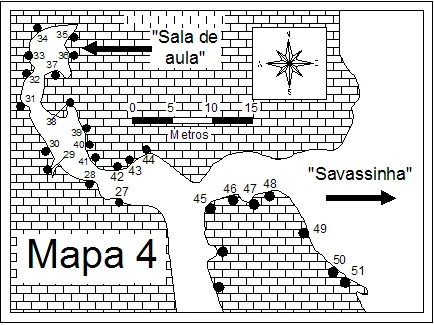
    - **largura_mapa**: 434
    - **altura_mapa**: 325
    - **pontos_de_interesse**:
      - **[0]**:
        - **id**: YbwIrMGf3g0rBr
        - **uid**: YbwIrMGf3g0rBr
        - **rotulo**: 27
        - **retangulo**:
          - **x**: 122
          - **y**: 191
          - **comprimento**: 16
          - **largura**: 12
        - **label**: 27
      - **[1]**:
        - **id**: hbW6qWslU23clk
        - **uid**: hbW6qWslU23clk
        - **rotulo**: 28
        - **retangulo**:
          - **x**: 90
          - **y**: 174
          - **comprimento**: 14
          - **largura**: 10
        - **label**: 28
      - **[2]**:
        - **id**: eOxeQzw0fioIOS
        - **uid**: eOxeQzw0fioIOS
        - **rotulo**: 29
        - **retangulo**:
          - **x**: 69
          - **y**: 154
          - **comprimento**: 12
          - **largura**: 10
        - **label**: 29
      - **[3]**:
        - **id**: vBLxVGcDZRvJud
        - **uid**: vBLxVGcDZRvJud
        - **rotulo**: 30
        - **retangulo**:
          - **x**: 54
          - **y**: 144
          - **comprimento**: 11
          - **largura**: 9
        - **label**: 30
      - **[4]**:
        - **id**: kVRiPsoYtbRGRW
        - **uid**: kVRiPsoYtbRGRW
        - **rotulo**: 31
        - **retangulo**:
          - **x**: 30
          - **y**: 98
          - **comprimento**: 14
          - **largura**: 12
        - **label**: 31
      - **[5]**:
        - **id**: WcMk6ADqlyWuEi
        - **uid**: WcMk6ADqlyWuEi
        - **rotulo**: 32
        - **retangulo**:
          - **x**: 35
          - **y**: 79
          - **comprimento**: 14
          - **largura**: 12
        - **label**: 32
      - **[6]**:
        - **id**: zAYs5SVbqCn9Vy
        - **uid**: zAYs5SVbqCn9Vy
        - **rotulo**: 33
        - **retangulo**:
          - **x**: 39
          - **y**: 55
          - **comprimento**: 12
          - **largura**: 10
        - **label**: 33
      - **[7]**:
        - **id**: W2qBCpwNNJ9k8u
        - **uid**: W2qBCpwNNJ9k8u
        - **rotulo**: 34
        - **retangulo**:
          - **x**: 42
          - **y**: 38
          - **comprimento**: 13
          - **largura**: 10
        - **label**: 34
      - **[8]**:
        - **id**: 8EAtC0V19Wjn54
        - **uid**: 8EAtC0V19Wjn54
        - **rotulo**: 35
        - **retangulo**:
          - **x**: 62
          - **y**: 34
          - **comprimento**: 12
          - **largura**: 11
        - **label**: 35
      - **[9]**:
        - **id**: DK8P4ULhqv5lBG
        - **uid**: DK8P4ULhqv5lBG
        - **rotulo**: 36
        - **retangulo**:
          - **x**: 64
          - **y**: 55
          - **comprimento**: 11
          - **largura**: 10
        - **label**: 36
      - **[10]**:
        - **id**: A06uD9gFWxhcYT
        - **uid**: A06uD9gFWxhcYT
        - **rotulo**: 37
        - **retangulo**:
          - **x**: 52
          - **y**: 64
          - **comprimento**: 11
          - **largura**: 9
        - **label**: 37
      - **[11]**:
        - **id**: kTllLRySz1Isb6
        - **uid**: kTllLRySz1Isb6
        - **rotulo**: 38
        - **retangulo**:
          - **x**: 50
          - **y**: 121
          - **comprimento**: 14
          - **largura**: 12
        - **label**: 38
      - **[12]**:
        - **id**: 1uIvbfEaAqbb3d
        - **uid**: 1uIvbfEaAqbb3d
        - **rotulo**: 39
        - **retangulo**:
          - **x**: 76
          - **y**: 132
          - **comprimento**: 11
          - **largura**: 10
        - **label**: 39
      - **[13]**:
        - **id**: yuMnis7fVuEmVl
        - **uid**: yuMnis7fVuEmVl
        - **rotulo**: 40
        - **retangulo**:
          - **x**: 78
          - **y**: 144
          - **comprimento**: 10
          - **largura**: 8
        - **label**: 40
      - **[14]**:
        - **id**: Yj2yGgPtNAJck6
        - **uid**: Yj2yGgPtNAJck6
        - **rotulo**: 41
        - **retangulo**:
          - **x**: 84
          - **y**: 162
          - **comprimento**: 11
          - **largura**: 9
        - **label**: 41
      - **[15]**:
        - **id**: qL5hm95WO6YW2A
        - **uid**: qL5hm95WO6YW2A
        - **rotulo**: 42
        - **retangulo**:
          - **x**: 117
          - **y**: 176
          - **comprimento**: 14
          - **largura**: 12
        - **label**: 42
      - **[16]**:
        - **id**: mIQ6BoZIFWnpzd
        - **uid**: mIQ6BoZIFWnpzd
        - **rotulo**: 43
        - **retangulo**:
          - **x**: 135
          - **y**: 171
          - **comprimento**: 14
          - **largura**: 12
        - **label**: 43
      - **[17]**:
        - **id**: Fo3bDOOX5AvnLS
        - **uid**: Fo3bDOOX5AvnLS
        - **rotulo**: 44
        - **retangulo**:
          - **x**: 149
          - **y**: 159
          - **comprimento**: 14
          - **largura**: 12
        - **label**: 44
      - **[18]**:
        - **id**: TzfHeUzGtWrhfI
        - **uid**: TzfHeUzGtWrhfI
        - **rotulo**: 45
        - **retangulo**:
          - **x**: 200
          - **y**: 198
          - **comprimento**: 15
          - **largura**: 11
        - **label**: 45
      - **[19]**:
        - **id**: FNnXhaNsCkS317
        - **uid**: FNnXhaNsCkS317
        - **rotulo**: 46
        - **retangulo**:
          - **x**: 230
          - **y**: 189
          - **comprimento**: 16
          - **largura**: 12
        - **label**: 46
      - **[20]**:
        - **id**: Q3wymOY56A2tvK
        - **uid**: Q3wymOY56A2tvK
        - **rotulo**: 47
        - **retangulo**:
          - **x**: 250
          - **y**: 188
          - **comprimento**: 14
          - **largura**: 13
        - **label**: 47
      - **[21]**:
        - **id**: 8jLM33q08m09jN
        - **uid**: 8jLM33q08m09jN
        - **rotulo**: 48
        - **retangulo**:
          - **x**: 270
          - **y**: 184
          - **comprimento**: 15
          - **largura**: 13
        - **label**: 48
      - **[22]**:
        - **id**: 69uCcDNsRqJK6d
        - **uid**: 69uCcDNsRqJK6d
        - **rotulo**: 49
        - **retangulo**:
          - **x**: 320
          - **y**: 228
          - **comprimento**: 18
          - **largura**: 15
        - **label**: 49
      - **[23]**:
        - **id**: Oe8hpZkQ4qjkll
        - **uid**: Oe8hpZkQ4qjkll
        - **rotulo**: 50
        - **retangulo**:
          - **x**: 340
          - **y**: 259
          - **comprimento**: 15
          - **largura**: 12
        - **label**: 50
      - **[24]**:
        - **id**: ZIFl9D0Bczeb7l
        - **uid**: ZIFl9D0Bczeb7l
        - **rotulo**: 51
        - **retangulo**:
          - **x**: 358
          - **y**: 270
          - **comprimento**: 16
          - **largura**: 13
        - **label**: 51
      - **[25]**:
        - **id**: VhXFpYrylmzxCu
        - **uid**: VhXFpYrylmzxCu
        - **rotulo**: Savassinha
        - **retangulo**:
          - **x**: 360
          - **y**: 172
          - **comprimento**: 109
          - **largura**: 21
        - **label**: Savassinha
    - **referencias**:
      - **[0]**:
        - **alvo_uid**: MHuDaw7hjXX15m
        - **pontos_uids**:
          - YbwIrMGf3g0rBr
        - **escalada**: Fogo no Rabo
        - **ids**:
          - YbwIrMGf3g0rBr
      - **[1]**:
        - **alvo_uid**: JOmpj2z9VixPwr
        - **pontos_uids**:
          - hbW6qWslU23clk
        - **escalada**: Bobeou Sobrou
        - **ids**:
          - hbW6qWslU23clk
      - **[2]**:
        - **alvo_uid**: lD3cxvUuA8Gf2i
        - **pontos_uids**:
          - eOxeQzw0fioIOS
        - **escalada**: Los Cubanos
        - **ids**:
          - eOxeQzw0fioIOS
      - **[3]**:
        - **alvo_uid**: FHwRMLcg9gfbK6
        - **pontos_uids**:
          - vBLxVGcDZRvJud
        - **escalada**: Folião
        - **ids**:
          - vBLxVGcDZRvJud
      - **[4]**:
        - **alvo_uid**: Jn3ntinFsz4Mej
        - **pontos_uids**:
          - kVRiPsoYtbRGRW
        - **escalada**: Luzes
        - **ids**:
          - kVRiPsoYtbRGRW
      - **[5]**:
        - **alvo_uid**: hTFVFnVNlXtvJf
        - **pontos_uids**:
          - WcMk6ADqlyWuEi
        - **escalada**: Via sem informação
        - **ids**:
          - WcMk6ADqlyWuEi
      - **[6]**:
        - **alvo_uid**: 4y9VOJODOjiUwZ
        - **pontos_uids**:
          - zAYs5SVbqCn9Vy
        - **escalada**: Êta Sô
        - **ids**:
          - zAYs5SVbqCn9Vy
      - **[7]**:
        - **alvo_uid**: qLY9XVrCzvCVqL
        - **pontos_uids**:
          - W2qBCpwNNJ9k8u
        - **escalada**: Via do Tetinho
        - **ids**:
          - W2qBCpwNNJ9k8u
      - **[8]**:
        - **alvo_uid**: CwigryYDSWgxcb
        - **pontos_uids**:
          - 8EAtC0V19Wjn54
        - **escalada**: Ataque das Bolinhas
        - **ids**:
          - 8EAtC0V19Wjn54
      - **[9]**:
        - **alvo_uid**: RC5i9eNc3bCcBy
        - **pontos_uids**:
          - DK8P4ULhqv5lBG
        - **escalada**: Via do curso
        - **ids**:
          - DK8P4ULhqv5lBG
      - **[10]**:
        - **alvo_uid**: phjsdSbCT8uzmK
        - **pontos_uids**:
          - A06uD9gFWxhcYT
        - **escalada**: Viajandão Grampeando na Chuva
        - **ids**:
          - A06uD9gFWxhcYT
      - **[11]**:
        - **alvo_uid**: 6XVtUPIENKTN1i
        - **pontos_uids**:
          - kTllLRySz1Isb6
        - **escalada**: Martelo Voador
        - **ids**:
          - kTllLRySz1Isb6
      - **[12]**:
        - **alvo_uid**: wFjo0Cyi5O4lQ1
        - **pontos_uids**:
          - 1uIvbfEaAqbb3d
        - **escalada**: Coquetel de Maracujá
        - **ids**:
          - 1uIvbfEaAqbb3d
      - **[13]**:
        - **alvo_uid**: O24NOv7tMTcj2m
        - **pontos_uids**:
          - yuMnis7fVuEmVl
        - **escalada**: Ravenloft
        - **ids**:
          - yuMnis7fVuEmVl
      - **[14]**:
        - **alvo_uid**: dXlxB7P6VbEhc4
        - **pontos_uids**:
          - Yj2yGgPtNAJck6
        - **escalada**: Muro das Lamentações
        - **ids**:
          - Yj2yGgPtNAJck6
      - **[15]**:
        - **alvo_uid**: lfaYDI92Vpufa7
        - **pontos_uids**:
          - qL5hm95WO6YW2A
        - **escalada**: Equilíbrio Distante
        - **ids**:
          - qL5hm95WO6YW2A
      - **[16]**:
        - **alvo_uid**: iE2bR4i3ORITBt
        - **pontos_uids**:
          - mIQ6BoZIFWnpzd
        - **escalada**: Careta do Calango
        - **ids**:
          - mIQ6BoZIFWnpzd
      - **[17]**:
        - **alvo_uid**: lnwPHtyMsnk7PX
        - **pontos_uids**:
          - Fo3bDOOX5AvnLS
        - **escalada**: Pierrô e Colombina
        - **ids**:
          - Fo3bDOOX5AvnLS
      - **[18]**:
        - **alvo_uid**: 0kjmgCEQvr7jqR
        - **pontos_uids**:
          - TzfHeUzGtWrhfI
        - **escalada**: Escalador sem mãe
        - **ids**:
          - TzfHeUzGtWrhfI
      - **[19]**:
        - **alvo_uid**: nzc62lIrSNVui8
        - **pontos_uids**:
          - FNnXhaNsCkS317
        - **escalada**: Projeto inacabado
        - **ids**:
          - FNnXhaNsCkS317
      - **[20]**:
        - **alvo_uid**: 0XkrqDPEYpl2vw
        - **pontos_uids**:
          - Q3wymOY56A2tvK
        - **escalada**: Sobrevibrenf´s
        - **ids**:
          - Q3wymOY56A2tvK
      - **[21]**:
        - **alvo_uid**: f8fyK7B3Fuo95O
        - **pontos_uids**:
          - 8jLM33q08m09jN
        - **escalada**: Sobreviventes
        - **ids**:
          - 8jLM33q08m09jN
      - **[22]**:
        - **alvo_uid**: CHeLwtTXSiOQCo
        - **pontos_uids**:
          - 69uCcDNsRqJK6d
        - **escalada**: Scarface
        - **ids**:
          - 69uCcDNsRqJK6d
      - **[23]**:
        - **alvo_uid**: 6faaxq4WPUk78M
        - **pontos_uids**:
          - Oe8hpZkQ4qjkll
        - **escalada**: Posições Exóticas
        - **ids**:
          - Oe8hpZkQ4qjkll
      - **[24]**:
        - **alvo_uid**: HD6YyW6TnowhuN
        - **pontos_uids**:
          - ZIFl9D0Bczeb7l
        - **escalada**: Garotos não Choram
        - **ids**:
          - ZIFl9D0Bczeb7l
      - **[25]**:
        - **alvo_uid**: UlccfwkdM6gnf0
        - **pontos_uids**:
          - VhXFpYrylmzxCu
        - **setor**: Savassinha (Mapa 9)
        - **ids**:
          - VhXFpYrylmzxCu
- **escaladas**:
  - **[0]**:
    - **uid**: Jn3ntinFsz4Mej
    - **via_movel**:
      - **nome**: Luzes
      - **dificuldade**: BR_4
      - **conquistadores**:
        - Antonio Carlos Magalhães
        - Lúcia Magalhães
      - **data_abertura**: 1997
  - **[1]**:
    - **uid**: hTFVFnVNlXtvJf
    - **via_esportiva**:
      - **nome**: Via sem informação
      - **dificuldade**: BR_4
      - **conquistadores**:
        - Leonardo Guimarães "Léo Dandão"
      - **data_abertura**: 1994
  - **[2]**:
    - **uid**: 4y9VOJODOjiUwZ
    - **via_movel**:
      - **nome**: Êta Sô
      - **dificuldade**: BR_6
      - **conquistadores**:
        - Antonio Carlos Magalhães
        - Lúcia Magalhães
      - **data_abertura**: 1997
  - **[3]**:
    - **uid**: qLY9XVrCzvCVqL
    - **via_esportiva**:
      - **nome**: Via do Tetinho
      - **dificuldade**: BR_5SUP
      - **conquistadores**:
        - Leonardo Guimarães "Léo Dandão"
      - **data_abertura**: 1994
  - **[4]**:
    - **uid**: CwigryYDSWgxcb
    - **via_esportiva**:
      - **nome**: Ataque das Bolinhas
      - **dificuldade**: BR_4
      - **conquistadores**:
        - Fabiano da Silva Fernandes
        - Viviane da Silva Euler
      - **data_abertura**: 1998
      - **data_manutencao**: 27/05/2022
  - **[5]**:
    - **uid**: RC5i9eNc3bCcBy
    - **via_esportiva**:
      - **nome**: Via do curso
      - **conquistadores**:
        - Eustáquio Macedo Melo Júnior
        - Felipe
        - Emerson Alves Azeredo
      - **data_abertura**: 1997
      - **dificuldade**: BR_3
      - **data_manutencao**: 27/05/2022
  - **[6]**:
    - **uid**: phjsdSbCT8uzmK
    - **via_esportiva**:
      - **nome**: Viajandão Grampeando na Chuva
      - **dificuldade**: BR_3
      - **conquistadores**:
        - Eustáquio M. Melo Júnior e alunos
      - **data_abertura**: 1997
      - **data_manutencao**: 27/05/2022
  - **[7]**:
    - **uid**: 6XVtUPIENKTN1i
    - **via_esportiva**:
      - **nome**: Martelo Voador
      - **dificuldade**: BR_4
      - **conquistadores**:
        - Ramaya Vallias
        - Sérgio Soares
      - **data_abertura**: 1999
  - **[8]**:
    - **uid**: wFjo0Cyi5O4lQ1
    - **via_esportiva**:
      - **nome**: Coquetel de Maracujá
      - **dificuldade**: BR_4
      - **conquistadores**:
        - Fabiano da Silva Fernandes
        - Viviane da Silva Euler
      - **data_abertura**: 1998
  - **[9]**:
    - **uid**: O24NOv7tMTcj2m
    - **via_esportiva**:
      - **nome**: Ravenloft
      - **dificuldade**: BR_6
      - **data_abertura**: 1997
      - **conquistadores**:
        - Leonardo Guimarães "Léo Dandão"
  - **[10]**:
    - **uid**: dXlxB7P6VbEhc4
    - **via_esportiva**:
      - **nome**: Muro das Lamentações
      - **dificuldade**: BR_7B
      - **conquistadores**:
        - Fabiano da Silva Fernandes
        - Viviane da Silva Euler
      - **data_abertura**: 1998
      - **data_manutencao**: 12/07/2022
  - **[11]**:
    - **uid**: lfaYDI92Vpufa7
    - **via_esportiva**:
      - **nome**: Equilíbrio Distante
      - **dificuldade**: BR_8A
      - **conquistadores**:
        - Fabiano da Silva Fernandes
        - Viviane da Silva Euler
      - **data_abertura**: 1997
      - **data_manutencao**: 12/07/2022
  - **[12]**:
    - **uid**: iE2bR4i3ORITBt
    - **via_esportiva**:
      - **nome**: Careta do Calango
      - **dificuldade**: BR_9A
      - **conquistadores**:
        - Cristiano Loureiro "Negão"
      - **data_abertura**: 1998
  - **[13]**:
    - **uid**: lnwPHtyMsnk7PX
    - **via_movel**:
      - **nome**: Pierrô e Colombina
      - **dificuldade**: BR_4SUP
      - **conquistadores**:
        - Antonio Carlos Magalhães
        - Lúcia Magalhães
      - **data_abertura**: 2002
  - **[14]**:
    - **uid**: CHeLwtTXSiOQCo
    - **via_esportiva**:
      - **nome**: Scarface
      - **dificuldade**: BR_7A
      - **quantidade_protecoes_intermediarias**: 6
      - **quantidade_protecoes_parada**: 2
      - **conquistadores**:
        - Gustavo Piancastelli
        - Ronie
      - **data_abertura**: 1997
  - **[15]**:
    - **uid**: 6faaxq4WPUk78M
    - **via_esportiva**:
      - **nome**: Posições Exóticas
      - **dificuldade**: BR_7B
      - **quantidade_protecoes_intermediarias**: 7
      - **quantidade_protecoes_parada**: 2
      - **conquistadores**:
        - Ivo Ferreira Marcelino
      - **data_abertura**: 1994
  - **[16]**:
    - **uid**: HD6YyW6TnowhuN
    - **via_esportiva**:
      - **nome**: Garotos não Choram
      - **dificuldade**: BR_7A
      - **quantidade_protecoes_intermediarias**: 4
      - **quantidade_protecoes_parada**: 2
      - **conquistadores**:
        - Eustáquio Macedo Melo Júnior
        - Emerson Alves Azeredo
      - **data_abertura**: 1997
- **precomputados**:
  - **total_escaladas**: 17
  - **total_esportivas**: 14

## Parte: setor_mapa_5

### Setor (Pico: Gruta da Lapinha)

- **descricao**:
    # Setor Mapa 5
    
    Vias localizadas próximo à região do "Pasto" e "Mancha amarela".
    Confira a localização no mapa.
- **nome**: Setor Mapa 5
- **uid**: WACdTSW0GaT2WF
- **mapas**:
  - **[0]**:
    - **caminho_imagem_mapa**: 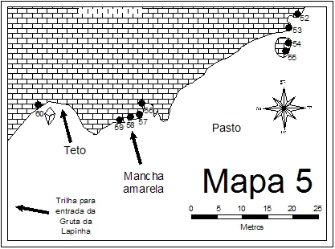
    - **largura_mapa**: 417
    - **altura_mapa**: 310
    - **pontos_de_interesse**:
      - **[0]**:
        - **id**: mwcrIssn7Fbu7K
        - **uid**: mwcrIssn7Fbu7K
        - **rotulo**: 52
        - **retangulo**:
          - **x**: 379
          - **y**: 20
          - **comprimento**: 14
          - **largura**: 9
        - **label**: 52
      - **[1]**:
        - **id**: YUblEqH5pfshO9
        - **uid**: YUblEqH5pfshO9
        - **rotulo**: 53
        - **retangulo**:
          - **x**: 370
          - **y**: 36
          - **comprimento**: 13
          - **largura**: 10
        - **label**: 53
      - **[2]**:
        - **id**: 37wN9SXE44Of5s
        - **uid**: 37wN9SXE44Of5s
        - **rotulo**: 54
        - **retangulo**:
          - **x**: 370
          - **y**: 54
          - **comprimento**: 14
          - **largura**: 12
        - **label**: 54
      - **[3]**:
        - **id**: vuYjNb3dRUZhdn
        - **uid**: vuYjNb3dRUZhdn
        - **rotulo**: 55
        - **retangulo**:
          - **x**: 364
          - **y**: 71
          - **comprimento**: 14
          - **largura**: 12
        - **label**: 55
      - **[4]**:
        - **id**: zNpqRoysKs59g9
        - **uid**: zNpqRoysKs59g9
        - **rotulo**: 56
        - **retangulo**:
          - **x**: 185
          - **y**: 137
          - **comprimento**: 14
          - **largura**: 12
        - **label**: 56
      - **[5]**:
        - **id**: Rlf1iauiC1twwi
        - **uid**: Rlf1iauiC1twwi
        - **rotulo**: 57
        - **retangulo**:
          - **x**: 178
          - **y**: 152
          - **comprimento**: 14
          - **largura**: 12
        - **label**: 57
      - **[6]**:
        - **id**: peXLU6yqiBgVaf
        - **uid**: peXLU6yqiBgVaf
        - **rotulo**: 58
        - **retangulo**:
          - **x**: 162
          - **y**: 155
          - **comprimento**: 13
          - **largura**: 10
        - **label**: 58
      - **[7]**:
        - **id**: 4KXPOHRpCXHQzF
        - **uid**: 4KXPOHRpCXHQzF
        - **rotulo**: 59
        - **retangulo**:
          - **x**: 148
          - **y**: 158
          - **comprimento**: 13
          - **largura**: 11
        - **label**: 59
      - **[8]**:
        - **id**: 7BYlpEkL6jr0Uy
        - **uid**: 7BYlpEkL6jr0Uy
        - **rotulo**: 60
        - **retangulo**:
          - **x**: 49
          - **y**: 141
          - **comprimento**: 14
          - **largura**: 12
        - **label**: 60
    - **referencias**:
      - **[0]**:
        - **alvo_uid**: Ugy016aDHDPI6Y
        - **pontos_uids**:
          - mwcrIssn7Fbu7K
        - **escalada**: Ben Moon
        - **ids**:
          - mwcrIssn7Fbu7K
      - **[1]**:
        - **alvo_uid**: ntptButHFotLLK
        - **pontos_uids**:
          - YUblEqH5pfshO9
        - **escalada**: Come Quieto
        - **ids**:
          - YUblEqH5pfshO9
      - **[2]**:
        - **alvo_uid**: LlhTp0HQEPx14C
        - **pontos_uids**:
          - 37wN9SXE44Of5s
        - **escalada**: O Perigo que Veio do Céu
        - **ids**:
          - 37wN9SXE44Of5s
      - **[3]**:
        - **alvo_uid**: 0ea9JvzzJRmTMc
        - **pontos_uids**:
          - vuYjNb3dRUZhdn
        - **escalada**: Arranca Couro
        - **ids**:
          - vuYjNb3dRUZhdn
      - **[4]**:
        - **alvo_uid**: Y3VMbBAjE0gzDE
        - **pontos_uids**:
          - zNpqRoysKs59g9
        - **escalada**: Ônibus Inglês
        - **ids**:
          - zNpqRoysKs59g9
      - **[5]**:
        - **alvo_uid**: 8BmdmUZ3J2Ioaf
        - **pontos_uids**:
          - Rlf1iauiC1twwi
        - **escalada**: Gigante de Bronze
        - **ids**:
          - Rlf1iauiC1twwi
      - **[6]**:
        - **alvo_uid**: gIzPvcOt3tcfaW
        - **pontos_uids**:
          - peXLU6yqiBgVaf
        - **escalada**: Karrenglass
        - **ids**:
          - peXLU6yqiBgVaf
      - **[7]**:
        - **alvo_uid**: lieFJxvgjD0T4C
        - **pontos_uids**:
          - 4KXPOHRpCXHQzF
        - **escalada**: Retorno dos Anões
        - **ids**:
          - 4KXPOHRpCXHQzF
      - **[8]**:
        - **alvo_uid**: RnZKGhZfGOypo1
        - **pontos_uids**:
          - 7BYlpEkL6jr0Uy
        - **escalada**: Compromisso Sexual
        - **ids**:
          - 7BYlpEkL6jr0Uy
- **escaladas**:
  - **[0]**:
    - **uid**: Ugy016aDHDPI6Y
    - **via_esportiva**:
      - **descricao**: Via em Top Rope (sem proteções fixas na linha).
      - **nome**: Ben Moon
      - **dificuldade**: BR_7C
      - **quantidade_protecoes_intermediarias**: 0
      - **quantidade_protecoes_parada**: 0
      - **conquistadores**:
        - Eustáquio Macedo
        - Emerson Alves Azeredo
      - **data_abertura**: 1994
  - **[1]**:
    - **uid**: ntptButHFotLLK
    - **via_esportiva**:
      - **nome**: Come Quieto
      - **dificuldade**: BR_8B
      - **quantidade_protecoes_intermediarias**: 3
      - **quantidade_protecoes_parada**: 1
      - **conquistadores**:
        - Alexandre Galvão
        - Glauco
        - Fabinho de Petrópolis
      - **data_abertura**: 1995
  - **[2]**:
    - **uid**: LlhTp0HQEPx14C
    - **via_esportiva**:
      - **nome**: O Perigo que Veio do Céu
      - **dificuldade**: BR_7A
      - **quantidade_protecoes_intermediarias**: 5
      - **quantidade_protecoes_parada**: 2
      - **conquistadores**:
        - Fabiano da Silva Fernandes
        - Charles Costa Marinho
      - **data_abertura**: 1993
  - **[3]**:
    - **uid**: 0ea9JvzzJRmTMc
    - **via_esportiva**:
      - **nome**: Arranca Couro
      - **dificuldade**: BR_7A
      - **quantidade_protecoes_intermediarias**: 3
      - **quantidade_protecoes_parada**: 2
      - **conquistadores**:
        - Charles C. Marinho
        - Emerson A. Azeredo
        - Fabiano Fernandes
      - **data_abertura**: 1993
  - **[4]**:
    - **uid**: Y3VMbBAjE0gzDE
    - **via_esportiva**:
      - **nome**: Ônibus Inglês
      - **dificuldade**: BR_6
      - **conquistadores**:
        - Daniel Fernandes "Salim"
        - Leonardo Hoffmann
      - **data_abertura**: 1993
  - **[5]**:
    - **uid**: 8BmdmUZ3J2Ioaf
    - **via_esportiva**:
      - **nome**: Gigante de Bronze
      - **dificuldade**: BR_6
      - **conquistadores**:
        - André C. B. "Andrezão"
        - Anderson B. Felisário
      - **data_abertura**: 1994
  - **[6]**:
    - **uid**: gIzPvcOt3tcfaW
    - **via_esportiva**:
      - **nome**: Karrenglass
      - **dificuldade**: BR_5SUP
      - **conquistadores**:
        - Eduardo V. de A. "Ralf"
        - Ricardo Leal
        - Rodrigo Tinoco
      - **data_abertura**: 1993
  - **[7]**:
    - **uid**: lieFJxvgjD0T4C
    - **via_esportiva**:
      - **nome**: Retorno dos Anões
      - **dificuldade**: BR_6SUP
      - **conquistadores**:
        - Fábio Luiz Faria "Fabinho"
        - Míriam Morato Duarte
        - Denise
      - **data_abertura**: 1996
  - **[8]**:
    - **uid**: RnZKGhZfGOypo1
    - **via_esportiva**:
      - **nome**: Compromisso Sexual
      - **dificuldade**: BR_7C
      - **conquistadores**:
        - Emerson A. Azeredo
        - Eustáquio Júnior
        - Fabiano Fernandes
      - **data_abertura**: 1994
- **precomputados**:
  - **total_escaladas**: 9
  - **total_esportivas**: 9

## Parte: setor_mapa_6

### Setor (Pico: Gruta da Lapinha)

- **descricao**:
    # Setor Vale Verde (Mapa 6)
    
    Setor com vias técnicas e atléticas. O mapa está fora de escala ("fora de escala").
    O Bloco do Raul Seixas está localizado próximo às vias 73, 74 e 75.
- **nome**: Vale Verde (Mapa 6)
- **uid**: DzpVy5IyHcY19t
- **mapas**:
  - **[0]**:
    - **caminho_imagem_mapa**: 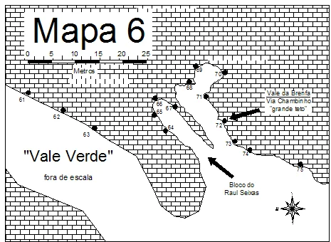
    - **largura_mapa**: 465
    - **altura_mapa**: 340
    - **pontos_de_interesse**:
      - **[0]**:
        - **id**: co0L3lzfGktyam
        - **uid**: co0L3lzfGktyam
        - **rotulo**: 62
        - **retangulo**:
          - **x**: 79
          - **y**: 164
          - **comprimento**: 14
          - **largura**: 12
        - **label**: 62
      - **[1]**:
        - **id**: Pcws7jdnBdkFf1
        - **uid**: Pcws7jdnBdkFf1
        - **rotulo**: 63
        - **retangulo**:
          - **x**: 122
          - **y**: 189
          - **comprimento**: 14
          - **largura**: 12
        - **label**: 63
      - **[2]**:
        - **id**: 4D7AxhkAElF1mz
        - **uid**: 4D7AxhkAElF1mz
        - **rotulo**: 64
        - **retangulo**:
          - **x**: 240
          - **y**: 179
          - **comprimento**: 10
          - **largura**: 8
        - **label**: 64
      - **[3]**:
        - **id**: 0RePZDZwatc55x
        - **uid**: 0RePZDZwatc55x
        - **rotulo**: 65
        - **retangulo**:
          - **x**: 224
          - **y**: 157
          - **comprimento**: 10
          - **largura**: 8
        - **label**: 65
      - **[4]**:
        - **id**: EQFl6xqRj25XKk
        - **uid**: EQFl6xqRj25XKk
        - **rotulo**: 66
        - **retangulo**:
          - **x**: 224
          - **y**: 146
          - **comprimento**: 10
          - **largura**: 8
        - **label**: 66
      - **[5]**:
        - **id**: JB20lEvPwjBEBN
        - **uid**: JB20lEvPwjBEBN
        - **rotulo**: 67
        - **retangulo**:
          - **x**: 237
          - **y**: 152
          - **comprimento**: 10
          - **largura**: 8
        - **label**: 67
      - **[6]**:
        - **id**: cOiGV79bJTTXwi
        - **uid**: cOiGV79bJTTXwi
        - **rotulo**: 68
        - **retangulo**:
          - **x**: 266
          - **y**: 123
          - **comprimento**: 10
          - **largura**: 10
        - **label**: 68
      - **[7]**:
        - **id**: EwJiGCEgNO1IGL
        - **uid**: EwJiGCEgNO1IGL
        - **rotulo**: 69
        - **retangulo**:
          - **x**: 280
          - **y**: 97
          - **comprimento**: 14
          - **largura**: 12
        - **label**: 69
      - **[8]**:
        - **id**: IYOCbXYeGlRztu
        - **uid**: IYOCbXYeGlRztu
        - **rotulo**: 70
        - **retangulo**:
          - **x**: 307
          - **y**: 104
          - **comprimento**: 14
          - **largura**: 12
        - **label**: 70
      - **[9]**:
        - **id**: Zvh5xGHFKkbg94
        - **uid**: Zvh5xGHFKkbg94
        - **rotulo**: 71
        - **retangulo**:
          - **x**: 280
          - **y**: 136
          - **comprimento**: 11
          - **largura**: 10
        - **label**: 71
      - **[10]**:
        - **id**: yRDVKSBrLmJfm0
        - **uid**: yRDVKSBrLmJfm0
        - **rotulo**: 72
        - **retangulo**:
          - **x**: 307
          - **y**: 175
          - **comprimento**: 14
          - **largura**: 12
        - **label**: 72
      - **[11]**:
        - **id**: Yh8x0r08rqjWW6
        - **uid**: Yh8x0r08rqjWW6
        - **rotulo**: 73
        - **retangulo**:
          - **x**: 321
          - **y**: 202
          - **comprimento**: 14
          - **largura**: 12
        - **label**: 73
      - **[12]**:
        - **id**: L3Kv1lkQnUiHIE
        - **uid**: L3Kv1lkQnUiHIE
        - **rotulo**: 74
        - **retangulo**:
          - **x**: 345
          - **y**: 216
          - **comprimento**: 14
          - **largura**: 12
        - **label**: 74
      - **[13]**:
        - **id**: h3386PrCzycAkF
        - **uid**: h3386PrCzycAkF
        - **rotulo**: 75
        - **retangulo**:
          - **x**: 421
          - **y**: 238
          - **comprimento**: 14
          - **largura**: 12
        - **label**: 75
    - **referencias**:
      - **[0]**:
        - **alvo_uid**: WNnbACHqlufqB4
        - **pontos_uids**:
          - co0L3lzfGktyam
        - **escalada**: Psico Circus
        - **ids**:
          - co0L3lzfGktyam
      - **[1]**:
        - **alvo_uid**: E47PBUWaztdeq5
        - **pontos_uids**:
          - Pcws7jdnBdkFf1
        - **escalada**: Os impossíveis
        - **ids**:
          - Pcws7jdnBdkFf1
      - **[2]**:
        - **alvo_uid**: AlhpLzBbvxdARj
        - **pontos_uids**:
          - 4D7AxhkAElF1mz
        - **escalada**: Carbonáticus Calcicus
        - **ids**:
          - 4D7AxhkAElF1mz
      - **[3]**:
        - **alvo_uid**: yz8k8QP3JY3b7D
        - **pontos_uids**:
          - 0RePZDZwatc55x
        - **escalada**: Para não dizer que não falei de flores
        - **ids**:
          - 0RePZDZwatc55x
      - **[4]**:
        - **alvo_uid**: OmqF412h2OG31Q
        - **pontos_uids**:
          - EQFl6xqRj25XKk
        - **escalada**: As Aparências Enganam
        - **ids**:
          - EQFl6xqRj25XKk
      - **[5]**:
        - **alvo_uid**: uN41mUNxKhQLnR
        - **pontos_uids**:
          - JB20lEvPwjBEBN
        - **escalada**: Eu quero é ver o oco
        - **ids**:
          - JB20lEvPwjBEBN
      - **[6]**:
        - **alvo_uid**: XAjgOmiFU8VgRi
        - **pontos_uids**:
          - cOiGV79bJTTXwi
        - **escalada**: Cortando Prego
        - **ids**:
          - cOiGV79bJTTXwi
      - **[7]**:
        - **alvo_uid**: 6HNjjzHD8ZgV5A
        - **pontos_uids**:
          - EwJiGCEgNO1IGL
        - **escalada**: Vive lá brenf
        - **ids**:
          - EwJiGCEgNO1IGL
      - **[8]**:
        - **alvo_uid**: 40ZgWfXSRvNVRD
        - **pontos_uids**:
          - IYOCbXYeGlRztu
        - **escalada**: Rastafary Baby
        - **ids**:
          - IYOCbXYeGlRztu
      - **[9]**:
        - **alvo_uid**: nRjQg6NF3gMoB5
        - **pontos_uids**:
          - Zvh5xGHFKkbg94
        - **escalada**: Varinha de Condon
        - **ids**:
          - Zvh5xGHFKkbg94
      - **[10]**:
        - **alvo_uid**: tJ3b11CN9Dk1k8
        - **pontos_uids**:
          - yRDVKSBrLmJfm0
        - **escalada**: Tempestade Cerebral
        - **ids**:
          - yRDVKSBrLmJfm0
      - **[11]**:
        - **alvo_uid**: mPhlYzOBycx1yO
        - **pontos_uids**:
          - Yh8x0r08rqjWW6
        - **escalada**: Chambinho
        - **ids**:
          - Yh8x0r08rqjWW6
      - **[12]**:
        - **alvo_uid**: a601ekOt4Z8grf
        - **pontos_uids**:
          - L3Kv1lkQnUiHIE
        - **escalada**: Revolução dos Micos
        - **ids**:
          - L3Kv1lkQnUiHIE
      - **[13]**:
        - **alvo_uid**: gCEazUeMzsA3dp
        - **pontos_uids**:
          - h3386PrCzycAkF
        - **escalada**: Al Capote
        - **ids**:
          - h3386PrCzycAkF
- **escaladas**:
  - **[0]**:
    - **uid**: WNnbACHqlufqB4
    - **via_esportiva**:
      - **nome**: Psico Circus
      - **dificuldade**: BR_8A
      - **conquistadores**:
        - André C. B. "Andrezão"
        - Anderson B. Felisário
      - **data_abertura**: 1999
  - **[1]**:
    - **uid**: E47PBUWaztdeq5
    - **via_esportiva**:
      - **nome**: Os impossíveis
      - **dificuldade**: BR_8B
      - **conquistadores**:
        - André C. B. "Andrezão"
        - Anderson B. Felisário
  - **[2]**:
    - **uid**: AlhpLzBbvxdARj
    - **via_esportiva**:
      - **nome**: Carbonáticus Calcicus
      - **dificuldade**: BR_7A
      - **conquistadores**:
        - Leonardo Hoffmann
        - Eduardo Viana de Azevedo "Ralf"
      - **data_abertura**: 2000
  - **[3]**:
    - **uid**: yz8k8QP3JY3b7D
    - **via_movel**:
      - **nome**: Para não dizer que não falei de flores
      - **dificuldade**: BR_5SUP
      - **conquistadores**:
        - Antonio Carlos Magalhães
        - Ricardo Jardim Leal
  - **[4]**:
    - **uid**: OmqF412h2OG31Q
    - **via_movel**:
      - **nome**: As Aparências Enganam
      - **dificuldade**: BR_5SUP
      - **conquistadores**:
        - Antonio Carlos Magalhães
        - Júlio César Cardoso
  - **[5]**:
    - **uid**: uN41mUNxKhQLnR
    - **via_esportiva**:
      - **nome**: Eu quero é ver o oco
      - **dificuldade**: BR_7B
      - **conquistadores**:
        - Ricardo Jardim Leal
        - Leonardo Oliveira
        - Danilo Tolentino
      - **data_abertura**: 1995
  - **[6]**:
    - **uid**: XAjgOmiFU8VgRi
    - **via_movel**:
      - **nome**: Cortando Prego
      - **dificuldade**: BR_6SUP
      - **conquistadores**:
        - Edgardo Abreu "Caca"
        - Leandro Antônio Reis
      - **data_abertura**: 1998
  - **[7]**:
    - **uid**: 6HNjjzHD8ZgV5A
    - **via_esportiva**:
      - **nome**: Vive lá brenf
      - **dificuldade**: BR_6SUP
      - **conquistadores**:
        - André "DJ"
        - Léo Hoffmann
        - André "Granola"
        - Guta Piancastelli
      - **data_abertura**: 1997
  - **[8]**:
    - **uid**: 40ZgWfXSRvNVRD
    - **via_esportiva**:
      - **nome**: Rastafary Baby
      - **dificuldade**: BR_7C
      - **conquistadores**:
        - Leonardo Hoffman
      - **data_abertura**: 1999
  - **[9]**:
    - **uid**: nRjQg6NF3gMoB5
    - **via_esportiva**:
      - **nome**: Varinha de Condon
      - **dificuldade**: BR_7A
      - **conquistadores**:
        - Wilson Novaes
        - Márcio Soares Macenas
      - **data_abertura**: 2000
  - **[10]**:
    - **uid**: tJ3b11CN9Dk1k8
    - **via_esportiva**:
      - **nome**: Tempestade Cerebral
      - **dificuldade**: BR_8A
      - **conquistadores**:
        - André C. B. "Andrezão"
        - Anderson B. Felisário
      - **data_abertura**: 1999
  - **[11]**:
    - **uid**: mPhlYzOBycx1yO
    - **via_esportiva**:
      - **nome**: Chambinho
      - **dificuldade**: BR_8C
      - **conquistadores**:
        - Anderson Felisário
        - Andrezão
        - Eduardo "Ralf"
        - Eustáquio Jr.
      - **data_abertura**: 1996
  - **[12]**:
    - **uid**: a601ekOt4Z8grf
    - **via_esportiva**:
      - **nome**: Revolução dos Micos
      - **dificuldade**: BR_7B
      - **conquistadores**:
        - Eduardo Amaral
        - Jean Ouriques
        - Anne Ouriques
        - Leonardo Rocenik
      - **data_abertura**: 2000
  - **[13]**:
    - **uid**: gCEazUeMzsA3dp
    - **via_esportiva**:
      - **nome**: Al Capote
      - **dificuldade**: BR_8B
      - **conquistadores**:
        - Ricardo Jardim Leal
      - **data_abertura**: 1998
- **precomputados**:
  - **total_escaladas**: 14
  - **total_esportivas**: 11

## Parte: setor_mapa_7

### Setor (Pico: Gruta da Lapinha)

- **descricao**:
    # Setor Mapa 7
    
    Este setor abriga a base da via "Monte Calvário". Possui vias predominantemente esportivas.
- **nome**: Setor Mapa 7
- **uid**: n7TZtwIPFNeMNy
- **mapas**:
  - **[0]**:
    - **caminho_imagem_mapa**: 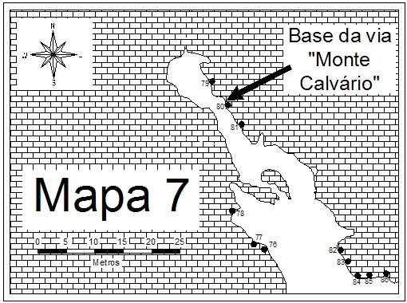
    - **largura_mapa**: 510
    - **altura_mapa**: 380
    - **pontos_de_interesse**:
      - **[0]**:
        - **id**: Kkw0WF7eShPHQ8
        - **uid**: Kkw0WF7eShPHQ8
        - **rotulo**: 76
        - **retangulo**:
          - **x**: 342
          - **y**: 306
          - **comprimento**: 14
          - **largura**: 12
        - **label**: 76
      - **[1]**:
        - **id**: FlNc2a4cMFVuPg
        - **uid**: FlNc2a4cMFVuPg
        - **rotulo**: 77
        - **retangulo**:
          - **x**: 324
          - **y**: 297
          - **comprimento**: 14
          - **largura**: 12
        - **label**: 77
      - **[2]**:
        - **id**: 1WtCp5Xuy9POGb
        - **uid**: 1WtCp5Xuy9POGb
        - **rotulo**: 78
        - **retangulo**:
          - **x**: 301
          - **y**: 267
          - **comprimento**: 14
          - **largura**: 12
        - **label**: 78
      - **[3]**:
        - **id**: V9q3se1M4hzUIm
        - **uid**: V9q3se1M4hzUIm
        - **rotulo**: 79
        - **retangulo**:
          - **x**: 257
          - **y**: 104
          - **comprimento**: 14
          - **largura**: 12
        - **label**: 79
      - **[4]**:
        - **id**: 45OBUc8wgaEmDC
        - **uid**: 45OBUc8wgaEmDC
        - **rotulo**: 80
        - **retangulo**:
          - **x**: 276
          - **y**: 133
          - **comprimento**: 14
          - **largura**: 12
        - **label**: 80
      - **[5]**:
        - **id**: l4cY9pnkIm6cdZ
        - **uid**: l4cY9pnkIm6cdZ
        - **rotulo**: 81
        - **retangulo**:
          - **x**: 294
          - **y**: 159
          - **comprimento**: 14
          - **largura**: 12
        - **label**: 81
      - **[6]**:
        - **id**: pUVsoiEYth6L1r
        - **uid**: pUVsoiEYth6L1r
        - **rotulo**: 82
        - **retangulo**:
          - **x**: 417
          - **y**: 313
          - **comprimento**: 14
          - **largura**: 12
        - **label**: 82
      - **[7]**:
        - **id**: aygeQ7pVVesHih
        - **uid**: aygeQ7pVVesHih
        - **rotulo**: 83
        - **retangulo**:
          - **x**: 427
          - **y**: 328
          - **comprimento**: 14
          - **largura**: 12
        - **label**: 83
      - **[8]**:
        - **id**: dLQ9rYaZPJS2bw
        - **uid**: dLQ9rYaZPJS2bw
        - **rotulo**: 84
        - **retangulo**:
          - **x**: 447
          - **y**: 354
          - **comprimento**: 12
          - **largura**: 9
        - **label**: 84
      - **[9]**:
        - **id**: KIPcwRIBu5sXru
        - **uid**: KIPcwRIBu5sXru
        - **rotulo**: 85
        - **retangulo**:
          - **x**: 462
          - **y**: 352
          - **comprimento**: 11
          - **largura**: 10
        - **label**: 85
      - **[10]**:
        - **id**: erY00uih2b1m1B
        - **uid**: erY00uih2b1m1B
        - **rotulo**: 86
        - **retangulo**:
          - **x**: 482
          - **y**: 350
          - **comprimento**: 12
          - **largura**: 9
        - **label**: 86
    - **referencias**:
      - **[0]**:
        - **alvo_uid**: afC111TsB5Shpo
        - **pontos_uids**:
          - Kkw0WF7eShPHQ8
        - **escalada**: Cariocas não dizem Uai
        - **ids**:
          - Kkw0WF7eShPHQ8
      - **[1]**:
        - **alvo_uid**: qqE2Xa62AWdHkq
        - **pontos_uids**:
          - FlNc2a4cMFVuPg
        - **escalada**: Doutor Lund
        - **ids**:
          - FlNc2a4cMFVuPg
      - **[2]**:
        - **alvo_uid**: CQy3SWhpDCc528
        - **pontos_uids**:
          - 1WtCp5Xuy9POGb
        - **escalada**: Aceitam-se Sugestões
        - **ids**:
          - 1WtCp5Xuy9POGb
      - **[3]**:
        - **alvo_uid**: OXAvr0Rdr0rU5G
        - **pontos_uids**:
          - V9q3se1M4hzUIm
        - **escalada**: Rosa dos Ventos
        - **ids**:
          - V9q3se1M4hzUIm
      - **[4]**:
        - **alvo_uid**: TAvEhL1wTI6EwM
        - **pontos_uids**:
          - 45OBUc8wgaEmDC
        - **escalada**: Monte Calvário
        - **ids**:
          - 45OBUc8wgaEmDC
      - **[5]**:
        - **alvo_uid**: Mpm6oLaVnlHimt
        - **pontos_uids**:
          - l4cY9pnkIm6cdZ
        - **escalada**: Pó-na-beiça
        - **ids**:
          - l4cY9pnkIm6cdZ
      - **[6]**:
        - **alvo_uid**: ZYG9ghLMTzMJVk
        - **pontos_uids**:
          - pUVsoiEYth6L1r
        - **escalada**: Três dentro, três fora
        - **ids**:
          - pUVsoiEYth6L1r
      - **[7]**:
        - **alvo_uid**: G4Gdw4XvIlJXQX
        - **pontos_uids**:
          - aygeQ7pVVesHih
        - **escalada**: Só para eles
        - **ids**:
          - aygeQ7pVVesHih
      - **[8]**:
        - **alvo_uid**: p77Iy4sAShvmg2
        - **pontos_uids**:
          - dLQ9rYaZPJS2bw
        - **escalada**: Só para elas
        - **ids**:
          - dLQ9rYaZPJS2bw
      - **[9]**:
        - **alvo_uid**: WHJ53V0DkIbf7P
        - **pontos_uids**:
          - KIPcwRIBu5sXru
        - **escalada**: Prestobarba
        - **ids**:
          - KIPcwRIBu5sXru
      - **[10]**:
        - **alvo_uid**: 46pgZmHpsgEsde
        - **pontos_uids**:
          - erY00uih2b1m1B
        - **escalada**: Bigode Limpo
        - **ids**:
          - erY00uih2b1m1B
- **escaladas**:
  - **[0]**:
    - **uid**: afC111TsB5Shpo
    - **via_esportiva**:
      - **nome**: Cariocas não dizem Uai
      - **dificuldade**: BR_7A
      - **quantidade_protecoes_intermediarias**: 8
      - **quantidade_protecoes_parada**: 2
      - **conquistadores**:
        - Ivo Júnior
        - Rma
      - **data_abertura**: 1999
  - **[1]**:
    - **uid**: qqE2Xa62AWdHkq
    - **via_esportiva**:
      - **nome**: Doutor Lund
      - **dificuldade**: BR_7A
      - **data_manutencao**: 05/09/2026
      - **quantidade_protecoes_intermediarias**: 8
      - **quantidade_protecoes_parada**: 2
      - **conquistadores**:
        - Eustáquio Macedo Melo Júnior
        - Mário Almeida Neto
      - **data_abertura**: 1993
  - **[2]**:
    - **uid**: CQy3SWhpDCc528
    - **via_esportiva**:
      - **descricao**: **INTERDITADA:** Grande quantidade de chapas de spit antigas; chumbador da 1ª proteção com rosca excessivamente exposta para fora; via muito suja.
      - **nome**: Aceitam-se Sugestões
      - **dificuldade**: BR_7C
      - **quantidade_protecoes_intermediarias**: 6
      - **quantidade_protecoes_parada**: 2
      - **conquistadores**:
        - Juan Kempen
        - Pedro Assis Leite
      - **data_abertura**: 1998
  - **[3]**:
    - **uid**: OXAvr0Rdr0rU5G
    - **via_esportiva**:
      - **nome**: Rosa dos Ventos
      - **dificuldade**: BR_9A
      - **conquistadores**:
        - Ramaya Vallias
        - Léo Quirino
      - **data_abertura**: 1994
  - **[4]**:
    - **uid**: TAvEhL1wTI6EwM
    - **via_esportiva**:
      - **nome**: Monte Calvário
      - **dificuldade**: BR_5SUP
      - **conquistadores**:
        - Ramaya Vallias
        - Léo Quirino
      - **data_abertura**: 1994
  - **[5]**:
    - **uid**: Mpm6oLaVnlHimt
    - **via_movel**:
      - **nome**: Pó-na-beiça
      - **dificuldade**: BR_5
      - **conquistadores**:
        - Wilson Novaes
        - Márcio Soares Macenas
  - **[6]**:
    - **uid**: ZYG9ghLMTzMJVk
    - **via_esportiva**:
      - **nome**: Três dentro, três fora
      - **dificuldade**: BR_7A
      - **data_manutencao**: 08/08/2026
      - **quantidade_protecoes_intermediarias**: 8
      - **quantidade_protecoes_parada**: 2
      - **conquistadores**:
        - Jovinei Miguel Medeiros
        - Helon Brazil Neto
        - Paulo R. Patrocínio
      - **data_abertura**: 2000
  - **[7]**:
    - **uid**: G4Gdw4XvIlJXQX
    - **via_esportiva**:
      - **nome**: Só para eles
      - **dificuldade**: BR_6SUP
      - **quantidade_protecoes_intermediarias**: 4
      - **quantidade_protecoes_parada**: 2
      - **conquistadores**:
        - Daniel Fernandes "Salim"
        - Ramaya Vallias
      - **data_abertura**: 1999
  - **[8]**:
    - **uid**: p77Iy4sAShvmg2
    - **via_esportiva**:
      - **nome**: Só para elas
      - **dificuldade**: BR_4
      - **quantidade_protecoes_intermediarias**: 7
      - **quantidade_protecoes_parada**: 2
      - **conquistadores**:
        - Daniel Fernandes "Salim"
        - Ramaya Vallias
      - **data_abertura**: 1995
  - **[9]**:
    - **uid**: WHJ53V0DkIbf7P
    - **via_esportiva**:
      - **nome**: Prestobarba
      - **dificuldade**: BR_5
      - **quantidade_protecoes_intermediarias**: 5
      - **quantidade_protecoes_parada**: 2
      - **conquistadores**:
        - Daniel Fernandes "Salim"
      - **data_abertura**: 1999
  - **[10]**:
    - **uid**: 46pgZmHpsgEsde
    - **via_esportiva**:
      - **nome**: Bigode Limpo
      - **dificuldade**: BR_5SUP
      - **quantidade_protecoes_intermediarias**: 5
      - **quantidade_protecoes_parada**: 2
      - **conquistadores**:
        - Antonio Carlos Magalhães
        - Emerson Alves Azeredo
      - **data_abertura**: 1993
- **precomputados**:
  - **total_escaladas**: 11
  - **total_esportivas**: 10

## Parte: setor_mapa_8

### Setor (Pico: Gruta da Lapinha)

- **descricao**:
    # Setor Túnel de Pedra (Mapa 8)
    
    Vias localizadas na região do Túnel de Pedra.
    O setor possui uma grande concentração de vias esportivas de graduação variada.
- **nome**: Setor Túnel de Pedra (Mapa 8)
- **uid**: R4T6GZbgabQodt
- **mapas**:
  - **[0]**:
    - **caminho_imagem_mapa**: 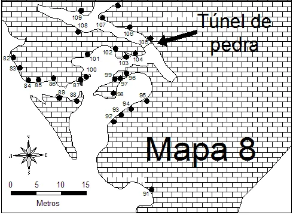
    - **largura_mapa**: 490
    - **altura_mapa**: 360
    - **pontos_de_interesse**:
      - **[0]**:
        - **id**: hGcCpqISgO5Ez7
        - **uid**: hGcCpqISgO5Ez7
        - **rotulo**: 82
        - **retangulo**:
          - **x**: 11
          - **y**: 97
          - **comprimento**: 14
          - **largura**: 12
        - **label**: 82
      - **[1]**:
        - **id**: VenVi5yQvRC9tJ
        - **uid**: VenVi5yQvRC9tJ
        - **rotulo**: 83
        - **retangulo**:
          - **x**: 21
          - **y**: 114
          - **comprimento**: 14
          - **largura**: 12
        - **label**: 83
      - **[2]**:
        - **id**: 2El8JpemBA1uin
        - **uid**: 2El8JpemBA1uin
        - **rotulo**: 84
        - **retangulo**:
          - **x**: 46
          - **y**: 144
          - **comprimento**: 14
          - **largura**: 12
        - **label**: 84
      - **[3]**:
        - **id**: ZDoKi59PYOnpQ5
        - **uid**: ZDoKi59PYOnpQ5
        - **rotulo**: 85
        - **retangulo**:
          - **x**: 64
          - **y**: 142
          - **comprimento**: 14
          - **largura**: 12
        - **label**: 85
      - **[4]**:
        - **id**: NgVYaSiIhijBMj
        - **uid**: NgVYaSiIhijBMj
        - **rotulo**: 86
        - **retangulo**:
          - **x**: 87
          - **y**: 140
          - **comprimento**: 14
          - **largura**: 12
        - **label**: 86
      - **[5]**:
        - **id**: FqPvQyqLrSWjjj
        - **uid**: FqPvQyqLrSWjjj
        - **rotulo**: 87
        - **retangulo**:
          - **x**: 128
          - **y**: 142
          - **comprimento**: 14
          - **largura**: 12
        - **label**: 87
      - **[6]**:
        - **id**: Ov4O25jS3cuaP8
        - **uid**: Ov4O25jS3cuaP8
        - **rotulo**: 88
        - **retangulo**:
          - **x**: 122
          - **y**: 158
          - **comprimento**: 14
          - **largura**: 12
        - **label**: 88
      - **[7]**:
        - **id**: 4FxCluDk4Rtj00
        - **uid**: 4FxCluDk4Rtj00
        - **rotulo**: 89
        - **retangulo**:
          - **x**: 103
          - **y**: 154
          - **comprimento**: 14
          - **largura**: 12
        - **label**: 89
      - **[8]**:
        - **id**: RRYXB42aOGnIxX
        - **uid**: RRYXB42aOGnIxX
        - **rotulo**: 91
        - **retangulo**:
          - **x**: 243
          - **y**: 324
          - **comprimento**: 14
          - **largura**: 12
        - **label**: 91
      - **[9]**:
        - **id**: WaTUfE5SA2tfw8
        - **uid**: WaTUfE5SA2tfw8
        - **rotulo**: 92
        - **retangulo**:
          - **x**: 182
          - **y**: 194
          - **comprimento**: 12
          - **largura**: 9
        - **label**: 92
      - **[10]**:
        - **id**: kTNF5z1DbFB7OT
        - **uid**: kTNF5z1DbFB7OT
        - **rotulo**: 93
        - **retangulo**:
          - **x**: 194
          - **y**: 184
          - **comprimento**: 11
          - **largura**: 9
        - **label**: 93
      - **[11]**:
        - **id**: yGfWjbBH9O6G6C
        - **uid**: yGfWjbBH9O6G6C
        - **rotulo**: 94
        - **retangulo**:
          - **x**: 211
          - **y**: 173
          - **comprimento**: 14
          - **largura**: 12
        - **label**: 94
      - **[12]**:
        - **id**: WDWCKnErNiKSiQ
        - **uid**: WDWCKnErNiKSiQ
        - **rotulo**: 95
        - **retangulo**:
          - **x**: 239
          - **y**: 159
          - **comprimento**: 14
          - **largura**: 12
        - **label**: 95
      - **[13]**:
        - **id**: wLT0df5guGG1CC
        - **uid**: wLT0df5guGG1CC
        - **rotulo**: 96
        - **retangulo**:
          - **x**: 221
          - **y**: 130
          - **comprimento**: 12
          - **largura**: 9
        - **label**: 96
      - **[14]**:
        - **id**: MwEF9ydeMOTn6a
        - **uid**: MwEF9ydeMOTn6a
        - **rotulo**: 97
        - **retangulo**:
          - **x**: 207
          - **y**: 140
          - **comprimento**: 12
          - **largura**: 8
        - **label**: 97
      - **[15]**:
        - **id**: mlFawOfgOWPo3G
        - **uid**: mlFawOfgOWPo3G
        - **rotulo**: 98
        - **retangulo**:
          - **x**: 202
          - **y**: 158
          - **comprimento**: 11
          - **largura**: 11
        - **label**: 98
      - **[16]**:
        - **id**: OCK4VtAc2DnDsP
        - **uid**: OCK4VtAc2DnDsP
        - **rotulo**: 99
        - **retangulo**:
          - **x**: 181
          - **y**: 126
          - **comprimento**: 14
          - **largura**: 11
        - **label**: 99
      - **[17]**:
        - **id**: gHm3OJhkalYdks
        - **uid**: gHm3OJhkalYdks
        - **rotulo**: 100
        - **retangulo**:
          - **x**: 152
          - **y**: 116
          - **comprimento**: 17
          - **largura**: 10
        - **label**: 100
      - **[18]**:
        - **id**: CwMStfSGesutnN
        - **uid**: CwMStfSGesutnN
        - **rotulo**: 101
        - **retangulo**:
          - **x**: 158
          - **y**: 98
          - **comprimento**: 17
          - **largura**: 9
        - **label**: 101
      - **[19]**:
        - **id**: OOJRyvkJi3NfZG
        - **uid**: OOJRyvkJi3NfZG
        - **rotulo**: 102
        - **retangulo**:
          - **x**: 180
          - **y**: 88
          - **comprimento**: 17
          - **largura**: 11
        - **label**: 102
      - **[20]**:
        - **id**: xqErmEnBxlsY7V
        - **uid**: xqErmEnBxlsY7V
        - **rotulo**: 103
        - **retangulo**:
          - **x**: 207
          - **y**: 105
          - **comprimento**: 18
          - **largura**: 10
        - **label**: 103
      - **[21]**:
        - **id**: d2JXIHtHmANt1j
        - **uid**: d2JXIHtHmANt1j
        - **rotulo**: 104
        - **retangulo**:
          - **x**: 230
          - **y**: 99
          - **comprimento**: 17
          - **largura**: 10
        - **label**: 104
      - **[22]**:
        - **id**: Ein8Cu9aEzNSjP
        - **uid**: Ein8Cu9aEzNSjP
        - **rotulo**: 105
        - **retangulo**:
          - **x**: 240
          - **y**: 70
          - **comprimento**: 17
          - **largura**: 10
        - **label**: 105
      - **[23]**:
        - **id**: ypnf6FyerErnVr
        - **uid**: ypnf6FyerErnVr
        - **rotulo**: 106
        - **retangulo**:
          - **x**: 216
          - **y**: 56
          - **comprimento**: 19
          - **largura**: 10
        - **label**: 106
      - **[24]**:
        - **id**: YRAg2GMUGnbfcR
        - **uid**: YRAg2GMUGnbfcR
        - **rotulo**: 107
        - **retangulo**:
          - **x**: 168
          - **y**: 42
          - **comprimento**: 19
          - **largura**: 9
        - **label**: 107
      - **[25]**:
        - **id**: u2jYmRiNJiWfqo
        - **uid**: u2jYmRiNJiWfqo
        - **rotulo**: 108
        - **retangulo**:
          - **x**: 138
          - **y**: 42
          - **comprimento**: 17
          - **largura**: 9
        - **label**: 108
      - **[26]**:
        - **id**: LMPZw4fLITrUWo
        - **uid**: LMPZw4fLITrUWo
        - **rotulo**: 109
        - **retangulo**:
          - **x**: 130
          - **y**: 29
          - **comprimento**: 17
          - **largura**: 10
        - **label**: 109
    - **referencias**:
      - **[0]**:
        - **alvo_uid**: IqzNu0BRjbdzLz
        - **pontos_uids**:
          - FqPvQyqLrSWjjj
        - **escalada**: Bigode de Cristo
        - **ids**:
          - FqPvQyqLrSWjjj
      - **[1]**:
        - **alvo_uid**: ZgB4gVcfZ1FoTC
        - **pontos_uids**:
          - Ov4O25jS3cuaP8
        - **escalada**: Bigode Sujo
        - **ids**:
          - Ov4O25jS3cuaP8
      - **[2]**:
        - **alvo_uid**: 74NzqIsXX385XP
        - **pontos_uids**:
          - 4FxCluDk4Rtj00
        - **escalada**: Bigode de Espinho
        - **ids**:
          - 4FxCluDk4Rtj00
      - **[3]**:
        - **alvo_uid**: GksFepQerd6kj3
        - **pontos_uids**:
          - RRYXB42aOGnIxX
        - **escalada**: Trombeta Acéfala
        - **ids**:
          - RRYXB42aOGnIxX
      - **[4]**:
        - **alvo_uid**: L69C6jL7Bphv5T
        - **pontos_uids**:
          - WaTUfE5SA2tfw8
        - **escalada**: Meio Cubanos
        - **ids**:
          - WaTUfE5SA2tfw8
      - **[5]**:
        - **alvo_uid**: PBMAKEwduou7iM
        - **pontos_uids**:
          - kTNF5z1DbFB7OT
        - **escalada**: Golpe Ninja
        - **ids**:
          - kTNF5z1DbFB7OT
      - **[6]**:
        - **alvo_uid**: CDDjlHX6ZPFIfg
        - **pontos_uids**:
          - yGfWjbBH9O6G6C
        - **escalada**: Tripla Traição
        - **ids**:
          - yGfWjbBH9O6G6C
      - **[7]**:
        - **alvo_uid**: 8b8K01Oui85IB0
        - **pontos_uids**:
          - WDWCKnErNiKSiQ
        - **escalada**: Noivado da Feiticeira
        - **ids**:
          - WDWCKnErNiKSiQ
      - **[8]**:
        - **alvo_uid**: 6laLGWjMZtyl5K
        - **pontos_uids**:
          - wLT0df5guGG1CC
        - **escalada**: Planeta dos Macacos
        - **ids**:
          - wLT0df5guGG1CC
      - **[9]**:
        - **alvo_uid**: kulsF9JNdpDYC3
        - **pontos_uids**:
          - MwEF9ydeMOTn6a
        - **escalada**: Rota de colisão
        - **ids**:
          - MwEF9ydeMOTn6a
      - **[10]**:
        - **alvo_uid**: yMYiuu4C1XwTsU
        - **pontos_uids**:
          - mlFawOfgOWPo3G
        - **escalada**: Projeto Daniel Salim
        - **ids**:
          - mlFawOfgOWPo3G
      - **[11]**:
        - **alvo_uid**: fuAERj0RgZMLR5
        - **pontos_uids**:
          - OCK4VtAc2DnDsP
        - **escalada**: Vale Perdido
        - **ids**:
          - OCK4VtAc2DnDsP
      - **[12]**:
        - **alvo_uid**: Edh9kZy5L2CndU
        - **pontos_uids**:
          - gHm3OJhkalYdks
        - **escalada**: Consolo da Surucucu
        - **ids**:
          - gHm3OJhkalYdks
      - **[13]**:
        - **alvo_uid**: 3i1j443nXNqSp1
        - **pontos_uids**:
          - CwMStfSGesutnN
        - **escalada**: Santos e Hereges
        - **ids**:
          - CwMStfSGesutnN
      - **[14]**:
        - **alvo_uid**: uJRx7yglftzDUo
        - **pontos_uids**:
          - OOJRyvkJi3NfZG
        - **escalada**: O Império Contra Ataca
        - **ids**:
          - OOJRyvkJi3NfZG
      - **[15]**:
        - **alvo_uid**: ZX3E7xP5ZmQP0s
        - **pontos_uids**:
          - xqErmEnBxlsY7V
        - **escalada**: Jegue Voador
        - **ids**:
          - xqErmEnBxlsY7V
      - **[16]**:
        - **alvo_uid**: 3RNMY4E3VJdcjO
        - **pontos_uids**:
          - d2JXIHtHmANt1j
        - **escalada**: Labirinto das Maritacas
        - **ids**:
          - d2JXIHtHmANt1j
      - **[17]**:
        - **alvo_uid**: vXnlfUKuk8bH78
        - **pontos_uids**:
          - Ein8Cu9aEzNSjP
        - **escalada**: Tentações de Maria Madalena
        - **ids**:
          - Ein8Cu9aEzNSjP
      - **[18]**:
        - **alvo_uid**: 1HqUU8JAEawaHB
        - **pontos_uids**:
          - ypnf6FyerErnVr
        - **escalada**: Sai do chão
        - **ids**:
          - ypnf6FyerErnVr
      - **[19]**:
        - **alvo_uid**: Ro3Eflgqd8pPx9
        - **pontos_uids**:
          - YRAg2GMUGnbfcR
        - **escalada**: Ato Imperdoável
        - **ids**:
          - YRAg2GMUGnbfcR
      - **[20]**:
        - **alvo_uid**: cQzxdvJXXi1bmC
        - **pontos_uids**:
          - u2jYmRiNJiWfqo
        - **escalada**: Projeto Rodrigo do Paraná
        - **ids**:
          - u2jYmRiNJiWfqo
      - **[21]**:
        - **alvo_uid**: ULAvbV9FOKor89
        - **pontos_uids**:
          - LMPZw4fLITrUWo
        - **escalada**: Pequena Criança
        - **ids**:
          - LMPZw4fLITrUWo
      - **[22]**:
        - **alvo_uid**: ZYG9ghLMTzMJVk
        - **pontos_uids**:
          - hGcCpqISgO5Ez7
        - **escalada**: Três dentro, três fora
        - **ids**:
          - hGcCpqISgO5Ez7
      - **[23]**:
        - **alvo_uid**: G4Gdw4XvIlJXQX
        - **pontos_uids**:
          - VenVi5yQvRC9tJ
        - **escalada**: Só para eles
        - **ids**:
          - VenVi5yQvRC9tJ
      - **[24]**:
        - **alvo_uid**: p77Iy4sAShvmg2
        - **pontos_uids**:
          - 2El8JpemBA1uin
        - **escalada**: Só para elas
        - **ids**:
          - 2El8JpemBA1uin
      - **[25]**:
        - **alvo_uid**: WHJ53V0DkIbf7P
        - **pontos_uids**:
          - ZDoKi59PYOnpQ5
        - **escalada**: Prestobarba
        - **ids**:
          - ZDoKi59PYOnpQ5
      - **[26]**:
        - **alvo_uid**: 46pgZmHpsgEsde
        - **pontos_uids**:
          - NgVYaSiIhijBMj
        - **escalada**: Bigode Limpo
        - **ids**:
          - NgVYaSiIhijBMj
- **escaladas**:
  - **[0]**:
    - **uid**: IqzNu0BRjbdzLz
    - **via_esportiva**:
      - **descricao**: ATENÇÃO: não utilizar o bico de pedra próximo ao top rope como agarra! Risco de queda do bloco!
      - **nome**: Bigode de Cristo
      - **dificuldade**: BR_6
      - **quantidade_protecoes_intermediarias**: 4
      - **quantidade_protecoes_parada**: 2
      - **conquistadores**:
        - Eustáquio Macedo Melo Júnior
        - Fábio Luiz Farias "Fabinho"
      - **data_abertura**: 1993
  - **[1]**:
    - **uid**: ZgB4gVcfZ1FoTC
    - **via_esportiva**:
      - **nome**: Bigode Sujo
      - **dificuldade**: BR_7C
      - **data_manutencao**: 04/07/2026
      - **quantidade_protecoes_intermediarias**: 5
      - **quantidade_protecoes_parada**: 2
      - **conquistadores**:
        - Emerson Alves Azeredo
        - Eustáquio Macedo Melo Júnior
        - Gilberto Torres
      - **data_abertura**: 1993
  - **[2]**:
    - **uid**: 74NzqIsXX385XP
    - **via_esportiva**:
      - **nome**: Bigode de Espinho
      - **dificuldade**: BR_6SUP
      - **quantidade_protecoes_intermediarias**: 0
      - **quantidade_protecoes_parada**: 0
      - **conquistadores**:
        - Alexandre F. de Queiroz "Caverna"
        - Edgardo Abreu "Caca"
      - **data_abertura**: 1995
  - **[3]**:
    - **uid**: UxgAsYgQCFlueX
    - **via_esportiva**:
      - **nome**: Ecos do Além
      - **dificuldade**: BR_6SUP
      - **quantidade_protecoes_intermediarias**: 4
      - **quantidade_protecoes_parada**: 2
      - **conquistadores**:
        - Dante Martins Borges
        - Sérgio Bastos da Silva
  - **[4]**:
    - **uid**: GksFepQerd6kj3
    - **via_movel**:
      - **nome**: Trombeta Acéfala
      - **dificuldade**: BR_5SUP
      - **conquistadores**:
        - Eustáquio M. Melo Júnior
        - Leonardo Hoffmann
      - **data_abertura**: 1994
  - **[5]**:
    - **uid**: L69C6jL7Bphv5T
    - **via_movel**:
      - **nome**: Meio Cubanos
      - **dificuldade**: BR_6SUP
      - **conquistadores**:
        - Roberto Lincoln de Freitas
  - **[6]**:
    - **uid**: PBMAKEwduou7iM
    - **via_esportiva**:
      - **descricao**: **INTERDITADA:** Bloco com fratura/rachadura crítica na altura da 2ª proteção, com alto risco de descolamento.
      - **nome**: Golpe Ninja
      - **dificuldade**: BR_7C
      - **quantidade_protecoes_intermediarias**: 4
      - **quantidade_protecoes_parada**: 2
      - **conquistadores**:
        - Dante Martins Borges
        - Sérgio Bastos da Silva
      - **data_abertura**: 2000
  - **[7]**:
    - **uid**: CDDjlHX6ZPFIfg
    - **via_esportiva**:
      - **nome**: Tripla Traição
      - **dificuldade**: BR_5
      - **data_manutencao**: 05/09/2026
      - **quantidade_protecoes_intermediarias**: 5
      - **quantidade_protecoes_parada**: 2
      - **conquistadores**:
        - Emerson A. Azeredo
        - Eustáquio M. M. Júnior
        - Léo Hoffmann
      - **data_abertura**: 1994
  - **[8]**:
    - **uid**: 8b8K01Oui85IB0
    - **via_esportiva**:
      - **nome**: Noivado da Feiticeira
      - **dificuldade**: BR_6
      - **quantidade_protecoes_intermediarias**: 4
      - **quantidade_protecoes_parada**: 2
      - **conquistadores**:
        - Emerson Alves Azeredo
        - Leonardo Hoffmann
        - Ramaya Vallias
      - **data_abertura**: 1994
  - **[9]**:
    - **uid**: 6laLGWjMZtyl5K
    - **via_esportiva**:
      - **descricao**: **INTERDITADA:** Via inacabada, sem parada no topo. Presença de spits e grampos com palheta antigos.
      - **nome**: Planeta dos Macacos
      - **dificuldade**: PROJETO
      - **quantidade_protecoes_intermediarias**: 4
      - **quantidade_protecoes_parada**: 0
      - **conquistadores**:
        - Leonardo Hoffmann
        - Alexandre "Caverna"
  - **[10]**:
    - **uid**: kulsF9JNdpDYC3
    - **via_esportiva**:
      - **nome**: Rota de colisão
      - **dificuldade**: BR_8A
      - **quantidade_protecoes_intermediarias**: 4
      - **quantidade_protecoes_parada**: 2
      - **conquistadores**:
        - Leonardo Hoffmann
        - Marco Antônio Canelas
      - **data_abertura**: 2001
  - **[11]**:
    - **uid**: yMYiuu4C1XwTsU
    - **via_esportiva**:
      - **descricao**: **INTERDITADA:** Via inacabada, possui apenas 1 proteção com palheta e não possui parada no topo.
      - **nome**: Projeto Daniel Salim
      - **dificuldade**: PROJETO
      - **quantidade_protecoes_intermediarias**: 1
      - **quantidade_protecoes_parada**: 0
      - **conquistadores**:
        - Daniel Fernandes "Salim"
  - **[12]**:
    - **uid**: fuAERj0RgZMLR5
    - **via_esportiva**:
      - **descricao**:
          Via mista, laçar a ponte de pedra com uma fita de 120cm entre a 3a proteção e o top.
          
          Muito cuidado nas primeiras três proteções por causa do bloco na base da via.
      - **nome**: Vale Perdido
      - **dificuldade**: BR_6SUP
      - **quantidade_protecoes_intermediarias**: 3
      - **quantidade_protecoes_parada**: 2
      - **conquistadores**:
        - Emerson Alves Azeredo
        - Gilberto Torres
      - **data_abertura**: 1993
  - **[13]**:
    - **uid**: Edh9kZy5L2CndU
    - **via_esportiva**:
      - **nome**: Consolo da Surucucu
      - **dificuldade**: BR_6SUP
      - **quantidade_protecoes_intermediarias**: 8
      - **quantidade_protecoes_parada**: 1
      - **conquistadores**:
        - Vinícius B. Assis
      - **data_abertura**: 1997
  - **[14]**:
    - **uid**: 3i1j443nXNqSp1
    - **via_esportiva**:
      - **nome**: Santos e Hereges
      - **dificuldade**: BR_9B
      - **quantidade_protecoes_intermediarias**: 3
      - **quantidade_protecoes_parada**: 1
      - **conquistadores**:
        - Eustáquio Macedo Melo Júnior
        - Mário Almeida Neto
      - **data_abertura**: 1993
  - **[15]**:
    - **uid**: uJRx7yglftzDUo
    - **via_esportiva**:
      - **nome**: O Império Contra Ataca
      - **dificuldade**: BR_7C
      - **quantidade_protecoes_intermediarias**: 4
      - **quantidade_protecoes_parada**: 2
      - **conquistadores**:
        - Eustáquio Macedo Melo Júnior
        - Fabiano da Silva Fernandes
      - **data_abertura**: 1993
  - **[16]**:
    - **uid**: ZX3E7xP5ZmQP0s
    - **via_esportiva**:
      - **nome**: Jegue Voador
      - **dificuldade**: BR_6SUP
      - **quantidade_protecoes_intermediarias**: 5
      - **quantidade_protecoes_parada**: 2
      - **conquistadores**:
        - Léo Hoffmann
        - Marco Antônio Canelas
        - Marcelo Andrê
      - **data_abertura**: 1994
  - **[17]**:
    - **uid**: 3RNMY4E3VJdcjO
    - **via_esportiva**:
      - **nome**: Labirinto das Maritacas
      - **dificuldade**: BR_6
      - **quantidade_protecoes_intermediarias**: 5
      - **quantidade_protecoes_parada**: 2
      - **conquistadores**:
        - Emerson Alves Azeredo
        - Gilberto Torres
      - **data_abertura**: 1993
  - **[18]**:
    - **uid**: vXnlfUKuk8bH78
    - **via_movel**:
      - **nome**: Tentações de Maria Madalena
      - **dificuldade**: BR_6
      - **conquistadores**:
        - Eustáquio Macedo Melo Júnior
        - Leonardo Hoffmann
      - **data_abertura**: 1993
  - **[19]**:
    - **uid**: 1HqUU8JAEawaHB
    - **via_esportiva**:
      - **nome**: Sai do chão
      - **dificuldade**: BR_9A
      - **conquistadores**:
        - Jovinei Miguel Medeiros
        - Helon Brazil Neto
      - **data_abertura**: 2001
  - **[20]**:
    - **uid**: Ro3Eflgqd8pPx9
    - **via_esportiva**:
      - **nome**: Ato Imperdoável
      - **dificuldade**: BR_8A
      - **conquistadores**:
        - Eustáquio Macedo Melo Júnior
        - Fabiano da Silva Fernandes
      - **data_abertura**: 1994
  - **[21]**:
    - **uid**: cQzxdvJXXi1bmC
    - **via_esportiva**:
      - **nome**: Projeto Rodrigo do Paraná
      - **conquistadores**:
        - Pedro (PR)
        - Rodrigo (PR)
        - Antônio Paulo
        - Chico
  - **[22]**:
    - **uid**: ULAvbV9FOKor89
    - **via_esportiva**:
      - **nome**: Pequena Criança
      - **dificuldade**: BR_7A
      - **conquistadores**:
        - Wilson Novaes
        - Ivo Ferreira Marcelino
        - Alexandre Magos
      - **data_abertura**: 1998
- **precomputados**:
  - **total_escaladas**: 23
  - **total_esportivas**: 20

## Parte: setor_mapa_9

### Setor (Pico: Gruta da Lapinha)

- **descricao**:
    # Setor Savassinha (Mapa 9)
    
    Setor com vias de alto nível técnico e físico.
    Vias localizadas em uma das áreas mais frequentadas da Lapinha.
- **nome**: Savassinha (Mapa 9)
- **uid**: UlccfwkdM6gnf0
- **mapas**:
  - **[0]**:
    - **caminho_imagem_mapa**: 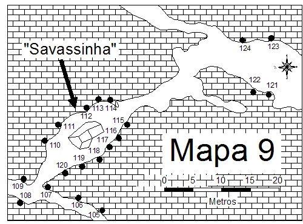
    - **largura_mapa**: 500
    - **altura_mapa**: 370
    - **pontos_de_interesse**:
      - **[0]**:
        - **id**: 5rePH1Xeu0vvUL
        - **uid**: 5rePH1Xeu0vvUL
        - **rotulo**: 105
        - **retangulo**:
          - **x**: 156
          - **y**: 354
          - **comprimento**: 20
          - **largura**: 11
        - **label**: 105
      - **[1]**:
        - **id**: OakaStG3ucy0bb
        - **uid**: OakaStG3ucy0bb
        - **rotulo**: 106
        - **retangulo**:
          - **x**: 128
          - **y**: 338
          - **comprimento**: 19
          - **largura**: 11
        - **label**: 106
      - **[2]**:
        - **id**: LjZtCpbWJYU6By
        - **uid**: LjZtCpbWJYU6By
        - **rotulo**: 107
        - **retangulo**:
          - **x**: 76
          - **y**: 321
          - **comprimento**: 21
          - **largura**: 12
        - **label**: 107
      - **[3]**:
        - **id**: Yw4cWIL4NQYZK6
        - **uid**: Yw4cWIL4NQYZK6
        - **rotulo**: 108
        - **retangulo**:
          - **x**: 43
          - **y**: 322
          - **comprimento**: 18
          - **largura**: 10
        - **label**: 108
      - **[4]**:
        - **id**: QbaoL1j61sC3NE
        - **uid**: QbaoL1j61sC3NE
        - **rotulo**: 109
        - **retangulo**:
          - **x**: 29
          - **y**: 307
          - **comprimento**: 18
          - **largura**: 10
        - **label**: 109
      - **[5]**:
        - **id**: dVjpUgxOLlCH1W
        - **uid**: dVjpUgxOLlCH1W
        - **rotulo**: 110
        - **retangulo**:
          - **x**: 90
          - **y**: 239
          - **comprimento**: 19
          - **largura**: 12
        - **label**: 110
      - **[6]**:
        - **id**: uzHQrr8ByT7za7
        - **uid**: uzHQrr8ByT7za7
        - **rotulo**: 111
        - **retangulo**:
          - **x**: 114
          - **y**: 208
          - **comprimento**: 18
          - **largura**: 11
        - **label**: 111
      - **[7]**:
        - **id**: 2t1kd8qmSlbBvk
        - **uid**: 2t1kd8qmSlbBvk
        - **rotulo**: 112
        - **retangulo**:
          - **x**: 142
          - **y**: 191
          - **comprimento**: 18
          - **largura**: 12
        - **label**: 112
      - **[8]**:
        - **id**: Rpl7wyHLorKqzq
        - **uid**: Rpl7wyHLorKqzq
        - **rotulo**: 113
        - **retangulo**:
          - **x**: 162
          - **y**: 178
          - **comprimento**: 17
          - **largura**: 12
        - **label**: 113
      - **[9]**:
        - **id**: pm4Dgugnw1ll9G
        - **uid**: pm4Dgugnw1ll9G
        - **rotulo**: 114
        - **retangulo**:
          - **x**: 184
          - **y**: 178
          - **comprimento**: 17
          - **largura**: 12
        - **label**: 114
      - **[10]**:
        - **id**: QOUMJXIgOQkNqp
        - **uid**: QOUMJXIgOQkNqp
        - **rotulo**: 115
        - **retangulo**:
          - **x**: 195
          - **y**: 198
          - **comprimento**: 18
          - **largura**: 12
        - **label**: 115
      - **[11]**:
        - **id**: ZYr0Z2CMYswyhj
        - **uid**: ZYr0Z2CMYswyhj
        - **rotulo**: 116
        - **retangulo**:
          - **x**: 184
          - **y**: 215
          - **comprimento**: 18
          - **largura**: 12
        - **label**: 116
      - **[12]**:
        - **id**: CZ8tMAJy7olXeL
        - **uid**: CZ8tMAJy7olXeL
        - **rotulo**: 117
        - **retangulo**:
          - **x**: 168
          - **y**: 230
          - **comprimento**: 19
          - **largura**: 12
        - **label**: 117
      - **[13]**:
        - **id**: sDyx0O7IDKlndB
        - **uid**: sDyx0O7IDKlndB
        - **rotulo**: 118
        - **retangulo**:
          - **x**: 156
          - **y**: 248
          - **comprimento**: 19
          - **largura**: 11
        - **label**: 118
      - **[14]**:
        - **id**: WNK3MziIwfs6gK
        - **uid**: WNK3MziIwfs6gK
        - **rotulo**: 119
        - **retangulo**:
          - **x**: 130
          - **y**: 261
          - **comprimento**: 19
          - **largura**: 12
        - **label**: 119
      - **[15]**:
        - **id**: lQmIbNulRiIPbE
        - **uid**: lQmIbNulRiIPbE
        - **rotulo**: 120
        - **retangulo**:
          - **x**: 102
          - **y**: 272
          - **comprimento**: 19
          - **largura**: 11
        - **label**: 120
      - **[16]**:
        - **id**: A8rpj2zbcQOQon
        - **uid**: A8rpj2zbcQOQon
        - **rotulo**: 121
        - **retangulo**:
          - **x**: 449
          - **y**: 141
          - **comprimento**: 20
          - **largura**: 12
        - **label**: 121
      - **[17]**:
        - **id**: DKaCgDIP3QOO0w
        - **uid**: DKaCgDIP3QOO0w
        - **rotulo**: 123
        - **retangulo**:
          - **x**: 451
          - **y**: 76
          - **comprimento**: 20
          - **largura**: 12
        - **label**: 123
      - **[18]**:
        - **id**: HbIxLsHJPHWIOs
        - **uid**: HbIxLsHJPHWIOs
        - **rotulo**: 124
        - **retangulo**:
          - **x**: 404
          - **y**: 79
          - **comprimento**: 21
          - **largura**: 12
        - **label**: 124
    - **referencias**:
      - **[0]**:
        - **alvo_uid**: xaZU9xGBqraEEw
        - **pontos_uids**:
          - dVjpUgxOLlCH1W
        - **escalada**: Corvo Gigante
        - **ids**:
          - dVjpUgxOLlCH1W
      - **[1]**:
        - **alvo_uid**: HbyvMay2qZAWe8
        - **pontos_uids**:
          - uzHQrr8ByT7za7
        - **escalada**: Gralha Pigmeia
        - **ids**:
          - uzHQrr8ByT7za7
      - **[2]**:
        - **alvo_uid**: YtEytEnRAxkFxc
        - **pontos_uids**:
          - 2t1kd8qmSlbBvk
        - **escalada**: Anjo de Pedra
        - **ids**:
          - 2t1kd8qmSlbBvk
      - **[3]**:
        - **alvo_uid**: mKED1qNqrmdGHj
        - **pontos_uids**:
          - Rpl7wyHLorKqzq
        - **escalada**: Um Porco que Sobe
        - **ids**:
          - Rpl7wyHLorKqzq
      - **[4]**:
        - **alvo_uid**: y4NYbcV7IdM2vX
        - **pontos_uids**:
          - pm4Dgugnw1ll9G
        - **escalada**: Um Corpo que Cai
        - **ids**:
          - pm4Dgugnw1ll9G
      - **[5]**:
        - **alvo_uid**: WEywEUghxL4mZj
        - **pontos_uids**:
          - QOUMJXIgOQkNqp
        - **escalada**: Realidade da Coisa
        - **ids**:
          - QOUMJXIgOQkNqp
      - **[6]**:
        - **alvo_uid**: C883Mwi7oTTO47
        - **pontos_uids**:
          - ZYr0Z2CMYswyhj
        - **escalada**: Realidade Sobreposta
        - **ids**:
          - ZYr0Z2CMYswyhj
      - **[7]**:
        - **alvo_uid**: jYYHO2cKIcdbSA
        - **pontos_uids**:
          - CZ8tMAJy7olXeL
        - **escalada**: Talhadeira Passa
        - **ids**:
          - CZ8tMAJy7olXeL
      - **[8]**:
        - **alvo_uid**: gWN5ChcePCIBxL
        - **pontos_uids**:
          - sDyx0O7IDKlndB
        - **escalada**: Cova dos Leões
        - **ids**:
          - sDyx0O7IDKlndB
      - **[9]**:
        - **alvo_uid**: 9AjpygLA38EGdx
        - **pontos_uids**:
          - WNK3MziIwfs6gK
        - **escalada**: Mentalidade Suburbana
        - **ids**:
          - WNK3MziIwfs6gK
      - **[10]**:
        - **alvo_uid**: gHWveURBBDxMSG
        - **pontos_uids**:
          - lQmIbNulRiIPbE
        - **escalada**: Rato Assassino
        - **ids**:
          - lQmIbNulRiIPbE
      - **[11]**:
        - **alvo_uid**: RkACWCnC4LYvb1
        - **pontos_uids**:
          - DKaCgDIP3QOO0w
        - **escalada**: Masturbações de Calígula
        - **ids**:
          - DKaCgDIP3QOO0w
      - **[12]**:
        - **alvo_uid**: gEn9QjBaACWP6y
        - **pontos_uids**:
          - HbIxLsHJPHWIOs
        - **escalada**: Primeiro General
        - **ids**:
          - HbIxLsHJPHWIOs
      - **[13]**:
        - **alvo_uid**: vXnlfUKuk8bH78
        - **pontos_uids**:
          - 5rePH1Xeu0vvUL
        - **escalada**: Tentações de Maria Madalena
        - **ids**:
          - 5rePH1Xeu0vvUL
      - **[14]**:
        - **alvo_uid**: 1HqUU8JAEawaHB
        - **pontos_uids**:
          - OakaStG3ucy0bb
        - **escalada**: Sai do chão
        - **ids**:
          - OakaStG3ucy0bb
      - **[15]**:
        - **alvo_uid**: Ro3Eflgqd8pPx9
        - **pontos_uids**:
          - LjZtCpbWJYU6By
        - **escalada**: Ato Imperdoável
        - **ids**:
          - LjZtCpbWJYU6By
      - **[16]**:
        - **alvo_uid**: cQzxdvJXXi1bmC
        - **pontos_uids**:
          - Yw4cWIL4NQYZK6
        - **escalada**: Projeto Rodrigo do Paraná
        - **ids**:
          - Yw4cWIL4NQYZK6
      - **[17]**:
        - **alvo_uid**: ULAvbV9FOKor89
        - **pontos_uids**:
          - QbaoL1j61sC3NE
        - **escalada**: Pequena Criança
        - **ids**:
          - QbaoL1j61sC3NE
      - **[18]**:
        - **alvo_uid**: cREoYdqil3YrLf
        - **pontos_uids**:
          - A8rpj2zbcQOQon
        - **escalada**: Três Pontos
        - **ids**:
          - A8rpj2zbcQOQon
- **escaladas**:
  - **[0]**:
    - **uid**: xaZU9xGBqraEEw
    - **via_esportiva**:
      - **nome**: Corvo Gigante
      - **dificuldade**: BR_7A
      - **conquistadores**:
        - Eustáquio Macedo Melo Júnior
        - Gilberto Torres
      - **data_abertura**: 1993
  - **[1]**:
    - **uid**: HbyvMay2qZAWe8
    - **via_esportiva**:
      - **nome**: Gralha Pigmeia
      - **dificuldade**: BR_6
      - **conquistadores**:
        - W. Novaes
        - Ivo Marcelino
        - Alexandre Magos
        - Léo Hoffmann
      - **data_abertura**: 1999
      - **data_manutencao**: 02/08/2022
  - **[2]**:
    - **uid**: YtEytEnRAxkFxc
    - **via_esportiva**:
      - **nome**: Anjo de Pedra
      - **dificuldade**: BR_5SUP
      - **conquistadores**:
        - Rodrigo Tinoco França
        - Vinícius
      - **data_abertura**: 1997
  - **[3]**:
    - **uid**: mKED1qNqrmdGHj
    - **via_esportiva**:
      - **nome**: Um Porco que Sobe
      - **dificuldade**: BR_7A
      - **conquistadores**:
        - Leonardo Hoffmann
        - Henriquinho
      - **data_abertura**: 1996
  - **[4]**:
    - **uid**: y4NYbcV7IdM2vX
    - **via_esportiva**:
      - **nome**: Um Corpo que Cai
      - **dificuldade**: BR_6
      - **conquistadores**:
        - Emerson Alves Azeredo
        - Fábio C. Araújo
        - Júlio Cesar Cardoso
      - **data_abertura**: 1993
  - **[5]**:
    - **uid**: WEywEUghxL4mZj
    - **via_esportiva**:
      - **nome**: Realidade da Coisa
      - **dificuldade**: BR_9B
      - **conquistadores**:
        - Fabinho de Petrópolis
        - Marquinhos
        - Xacundum
      - **data_abertura**: 1994
  - **[6]**:
    - **uid**: C883Mwi7oTTO47
    - **via_esportiva**:
      - **nome**: Realidade Sobreposta
      - **dificuldade**: BR_8C
      - **conquistadores**:
        - Fabiano da Silva Fernandes
        - Fabinho de Teresópolis
      - **data_abertura**: 1993
  - **[7]**:
    - **uid**: jYYHO2cKIcdbSA
    - **via_esportiva**:
      - **nome**: Talhadeira Passa
      - **dificuldade**: BR_8B
      - **conquistadores**:
        - Felipe
        - Tiago Abobrinha
      - **data_abertura**: 1996
  - **[8]**:
    - **uid**: gWN5ChcePCIBxL
    - **via_esportiva**:
      - **nome**: Cova dos Leões
      - **dificuldade**: BR_7A
      - **conquistadores**:
        - Emerson Alves Azeredo
        - Gilberto Torres
      - **data_abertura**: 1993
  - **[9]**:
    - **uid**: 9AjpygLA38EGdx
    - **via_esportiva**:
      - **nome**: Mentalidade Suburbana
      - **dificuldade**: BR_7A
      - **conquistadores**:
        - Ricardo J. Leal
        - Rodrigo Tinoco
        - Fábio L. Farias "Fabinho"
      - **data_abertura**: 1994
  - **[10]**:
    - **uid**: gHWveURBBDxMSG
    - **via_esportiva**:
      - **nome**: Rato Assassino
      - **dificuldade**: BR_8A
      - **conquistadores**:
        - Fabinho de Petrópolis
        - Alexandre Xacundum
      - **data_abertura**: 1996
  - **[11]**:
    - **uid**: RkACWCnC4LYvb1
    - **via_esportiva**:
      - **nome**: Masturbações de Calígula
      - **dificuldade**: BR_7A
      - **conquistadores**:
        - Márcio Soares Macenas
        - Wilson Novaes
  - **[12]**:
    - **uid**: gEn9QjBaACWP6y
    - **via_movel**:
      - **descricao**: Vía de proteção mista
      - **nome**: Primeiro General
      - **dificuldade**: BR_6SUP
      - **conquistadores**:
        - Roberto Lincoln de Freitas
      - **data_abertura**: 1998
  - **[13]**:
    - **uid**: cREoYdqil3YrLf
    - **via_esportiva**:
      - **nome**: Três Pontos
      - **dificuldade**: BR_7A
      - **conquistadores**:
        - Adherbal Muniz
        - Anderson Vila Nova
        - Bruno Madeira
- **precomputados**:
  - **total_escaladas**: 14
  - **total_esportivas**: 13

## Parte: setor_mapa_10

### Setor (Pico: Gruta da Lapinha)

- **descricao**:
    # Setor Bloco Romano (Mapa 10)
    
    Setor final do guia, localizado próximo ao Túnel de Pedra e ao Teto.
    Possui vias predominantemente esportivas.
- **nome**: Bloco Romano (Mapa 10)
- **uid**: UOqpFYTCHoAXZp
- **mapas**:
  - **[0]**:
    - **caminho_imagem_mapa**: 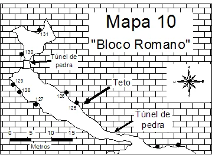
    - **largura_mapa**: 359
    - **altura_mapa**: 263
    - **pontos_de_interesse**:
      - **[0]**:
        - **id**: W3bno5EqeLrrV4
        - **uid**: W3bno5EqeLrrV4
        - **rotulo**: 125
        - **retangulo**:
          - **x**: 123
          - **y**: 183
          - **comprimento**: 14
          - **largura**: 12
        - **label**: 125
      - **[1]**:
        - **id**: zkLTjwtLX19nhf
        - **uid**: zkLTjwtLX19nhf
        - **rotulo**: 126
        - **retangulo**:
          - **x**: 103
          - **y**: 163
          - **comprimento**: 14
          - **largura**: 12
        - **label**: 126
      - **[2]**:
        - **id**: V2jZxGqcd48WAa
        - **uid**: V2jZxGqcd48WAa
        - **rotulo**: 127
        - **retangulo**:
          - **x**: 67
          - **y**: 168
          - **comprimento**: 14
          - **largura**: 12
        - **label**: 127
      - **[3]**:
        - **id**: JJY1d3ERuhOejy
        - **uid**: JJY1d3ERuhOejy
        - **rotulo**: 128
        - **retangulo**:
          - **x**: 45
          - **y**: 153
          - **comprimento**: 14
          - **largura**: 12
        - **label**: 128
      - **[4]**:
        - **id**: sUbXB2cbIVvgJb
        - **uid**: sUbXB2cbIVvgJb
        - **rotulo**: 129
        - **retangulo**:
          - **x**: 33
          - **y**: 137
          - **comprimento**: 14
          - **largura**: 12
        - **label**: 129
      - **[5]**:
        - **id**: XgHgIyvkl5fwkc
        - **uid**: XgHgIyvkl5fwkc
        - **rotulo**: 130
        - **retangulo**:
          - **x**: 50
          - **y**: 88
          - **comprimento**: 14
          - **largura**: 12
        - **label**: 130
      - **[6]**:
        - **id**: blvwnvOwK8HlNY
        - **uid**: blvwnvOwK8HlNY
        - **rotulo**: 131
        - **retangulo**:
          - **x**: 75
          - **y**: 58
          - **comprimento**: 14
          - **largura**: 12
        - **label**: 131
    - **referencias**:
      - **[0]**:
        - **alvo_uid**: LaIUgNNRmAfhqz
        - **pontos_uids**:
          - W3bno5EqeLrrV4
        - **escalada**: Spartacus
        - **ids**:
          - W3bno5EqeLrrV4
      - **[1]**:
        - **alvo_uid**: oPLa4xCzRYXrVG
        - **pontos_uids**:
          - zkLTjwtLX19nhf
        - **escalada**: A Era dos Patrícios
        - **ids**:
          - zkLTjwtLX19nhf
      - **[2]**:
        - **alvo_uid**: uSw0jQzVmg9ExX
        - **pontos_uids**:
          - V2jZxGqcd48WAa
        - **escalada**: Coliseu
        - **ids**:
          - V2jZxGqcd48WAa
      - **[3]**:
        - **alvo_uid**: HwvzyrjBiIz5pv
        - **pontos_uids**:
          - JJY1d3ERuhOejy
        - **escalada**: Pobre César
        - **ids**:
          - JJY1d3ERuhOejy
      - **[4]**:
        - **alvo_uid**: ptCjqUWrNwEPlI
        - **pontos_uids**:
          - sUbXB2cbIVvgJb
        - **escalada**: Soprano (inacabada)
        - **ids**:
          - sUbXB2cbIVvgJb
      - **[5]**:
        - **alvo_uid**: Fgz8Lc1dNFdZrG
        - **pontos_uids**:
          - XgHgIyvkl5fwkc
        - **escalada**: Sodoma e Gomorra
        - **ids**:
          - XgHgIyvkl5fwkc
      - **[6]**:
        - **alvo_uid**: sjR4IxURCOCn7w
        - **pontos_uids**:
          - blvwnvOwK8HlNY
        - **escalada**: Calígula
        - **ids**:
          - blvwnvOwK8HlNY
- **escaladas**:
  - **[0]**:
    - **uid**: LaIUgNNRmAfhqz
    - **via_esportiva**:
      - **descricao**: Vía em Top Rope
      - **nome**: Spartacus
      - **dificuldade**: BR_5
      - **conquistadores**:
        - Fabiano Fernandes da Silva
      - **data_abertura**: 1993
  - **[1]**:
    - **uid**: oPLa4xCzRYXrVG
    - **via_esportiva**:
      - **nome**: A Era dos Patrícios
      - **dificuldade**: BR_7A
      - **conquistadores**:
        - Eustáquio Macedo Melo Júnior
        - Gilberto Torres
      - **data_abertura**: 1994
  - **[2]**:
    - **uid**: uSw0jQzVmg9ExX
    - **via_esportiva**:
      - **nome**: Coliseu
      - **dificuldade**: BR_6
      - **conquistadores**:
        - Ramaya Vallias
  - **[3]**:
    - **uid**: HwvzyrjBiIz5pv
    - **via_esportiva**:
      - **nome**: Pobre César
      - **dificuldade**: BR_7A
      - **conquistadores**:
        - Emerson Alves Azeredo
        - Eustáquio Macedo Melo Júnior
        - Fabiano da Silva Fernandes
        - Gilberto Torres
      - **data_abertura**: 1993
  - **[4]**:
    - **uid**: ptCjqUWrNwEPlI
    - **via_esportiva**:
      - **nome**: Soprano (inacabada)
      - **conquistadores**:
        - Márcio Soares Macena
        - Eduardo Feliciano
        - Alexandre Magos
        - Ivo Ferreira Marcelino
  - **[5]**:
    - **uid**: Fgz8Lc1dNFdZrG
    - **via_esportiva**:
      - **nome**: Sodoma e Gomorra
      - **dificuldade**: BR_4
      - **conquistadores**:
        - Daniel Fernandes "Salim"
        - Eustáquio Macedo Melo Júnior
      - **data_abertura**: 1993
  - **[6]**:
    - **uid**: sjR4IxURCOCn7w
    - **via_esportiva**:
      - **nome**: Calígula
      - **dificuldade**: BR_6SUP
      - **conquistadores**:
        - Eustáquio Macedo Melo Júnior
        - Fabiano da Silva Fernandes
        - Gilberto Torres
        - Emerson Alves Azeredo
      - **data_abertura**: 1993
- **precomputados**:
  - **total_escaladas**: 7
  - **total_esportivas**: 7

## Arquivos Externos

- **arquivos_externos**:
  - **[0]**:
    - **caminho**: 
    - **checksum_sha256**: 62a972fe6e8f30f6e636d276f401029a7d49a419775bfd097ff742e8d0455cf8
  - **[1]**:
    - **caminho**: 
    - **checksum_sha256**: 0a1d32803d7f00a6a15aee8c5c28f279de6509496465cbab6a51589f476ace71
  - **[2]**:
    - **caminho**: 
    - **checksum_sha256**: a90f59ed83561dae6f8b09b7f0f56ef5661fa9ca42677c45a0d5ae25b074036f
  - **[3]**:
    - **caminho**: 
    - **checksum_sha256**: 0a202e424c83e16a41f8c0efcf7f31d272958f2188aa35f24445a0207ba17d15
  - **[4]**:
    - **caminho**: 
    - **checksum_sha256**: 8eb6750a3217dd5c6133d90bf69c4acbe042953aa3cfe0e1729009bd9835c4b3
  - **[5]**:
    - **caminho**: 
    - **checksum_sha256**: 62a972fe6e8f30f6e636d276f401029a7d49a419775bfd097ff742e8d0455cf8
  - **[6]**:
    - **caminho**: 
    - **checksum_sha256**: 75b179f92e187a612bab741f9849b0cc51eed0272c7d406ea6efe6b931c7c780
  - **[7]**:
    - **caminho**: 
    - **checksum_sha256**: 47479117c3c0421aff27796f2539cf0cc7b47454c0f0cc8679b38e8b996343eb
  - **[8]**:
    - **caminho**: 
    - **checksum_sha256**: 963fec6411a164bd15633c7d0a77148ccedfed48c43643818262d3a45a401814
  - **[9]**:
    - **caminho**: 
    - **checksum_sha256**: e1cc5b87d2cf6f1c06a7b9f2753f4cdf0a250d6b3aac4a11e921a99e54b25228
  - **[10]**:
    - **caminho**: 
    - **checksum_sha256**: bfc898d70882e428bb26ef4755e4c88ad28b7c5e7572f05ea8dc19b1db2a0512
  - **[11]**:
    - **caminho**: 
    - **checksum_sha256**: 87ad809b9d4b91eb0927b455cfa9bce479b4c74155e78f674a72e9360c451f21
  - **[12]**:
    - **caminho**: 
    - **checksum_sha256**: c051c0519ed5cafdf5af6b387dbee3278e21a01ab054ee5d2c235520c5e5bed2
  - **[13]**:
    - **caminho**: 
    - **checksum_sha256**: 51fa8ade3d81d0ac60a5d6993929e65248a22ad2a7354de961c50ff8c4e899b4
  - **[14]**:
    - **caminho**: 
    - **checksum_sha256**: dae4e2f505b7bbe2ffaef21956a5551a432332d105d5018452e14fa5cd453747
  - **[15]**:
    - **caminho**: 
    - **checksum_sha256**: e9f415800c4e7311d2d7da6fbd76eafafba99ec58c1c3453a7131eaee20d5cae

