# Croqui: Sítio do Rod

## Informações Gerais

- **id**: br_mg_lagoa_santa_sitio_do_rod
- **nome**: Sítio do Rod
- **uid**: GrHAA4JNn9WUhF
- **creditos**:
  - Marcus Vinicius de Souza
- **caminho_thumbnail**: 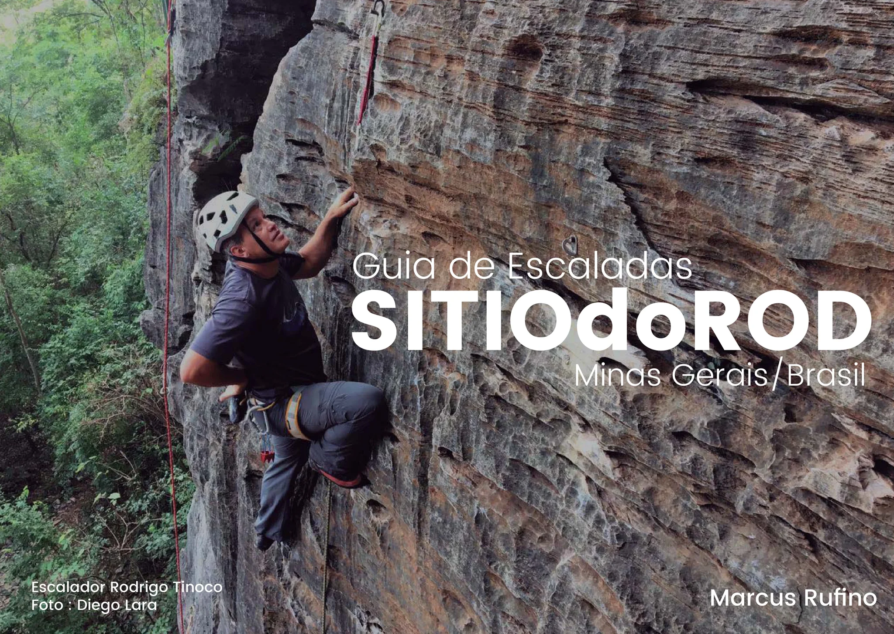
- **revisado_manualmente**: True
- **status_desenho_extraivel**: NAO_TEM_DESENHO
- **botoes**:
  - **[0]**:
    - **uid**: 9PYh4zwGeZAl7M
    - **texto**: Capa
    - **destino**:
      - **secao_textual**:
        - **conteudo**:
            # Guia de Escaladas SÍTIO do ROD
            ## Minas Gerais / Brasil
            
            |  |
            | :--: |
            | *Capa* |
            
            Escalador: Rodrigo Tinoco
            Foto: Diego Lara
            Marcus Rufino
  - **[1]**:
    - **uid**: En6hH15FE6DPWX
    - **texto**: Aviso
    - **destino**:
      - **secao_textual**:
        - **conteudo**:
            # AVISO:
            
            A escalada em rocha é um esporte que envolve riscos. Praticá-la implica em assumir a possibilidade de ocorrência de acidente grave ou mesmo a morte.
            
            As informações contidas neste guia, vem para auxiliar, informar e ajudar na segurança do esporte, estas informações são destinadas a escaladores que já possuem bom nível de conhecimento das técnicas de escalada em rocha e domínio de uso dos equipamentos de segurança.
            
            Lembrando que acidentes acontecem tanto com escaladores inexperientes quanto com os experientes, por isso é importantíssimo que todos sigam as regras de segurança do **Sítio do ROD**.
            
            Se você ainda não sabe escalar ou escala e não domina bem as técnicas verticais de uso de equipamentos, é fundamental o acompanhamento de um instrutor de escalada profissional qualificado.
            
            Existem cursos básicos, avançados, auto resgate, reciclagem de conhecimento das técnicas verticais e primeiros socorros.
            
            Sua segurança é sua responsabilidade, respeite seus limites e seja prudente.
            
            |  |
            | :--: |
            | *blogdeescalada.com* |
  - **[2]**:
    - **uid**: X9fM5E9OoSKQgA
    - **texto**: Créditos
    - **destino**:
      - **secao_textual**:
        - **conteudo**:
            Copyright© 2017 Marcus Vinicius de Souza
            
            **Desenho dos mapas:**
            Frederico Moreira
            Lívia Lages
            Thiago Rodrigues
            Marcus Vinicius
            
            **Design:**
            Natalia De Marco
            
            **Textos:**
            Marcus Vinicius
            Paula Souza
            
            **Revisão:**
            Marcus Vinicius
            
            | 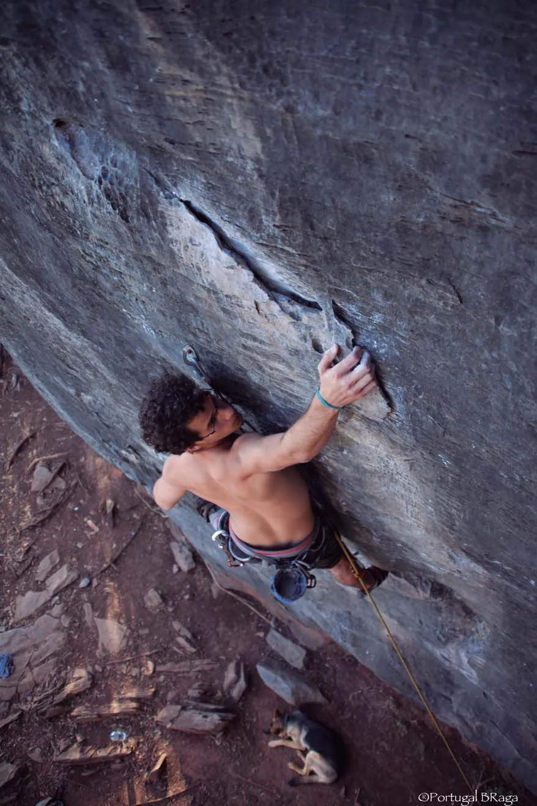 |
            | :--: |
            | *O escalador Francês **Louis Gerald** escalando a clássica **"Atretas do climb"**. Foto **Portugal Braga*** |
  - **[3]**:
    - **uid**: 9wSCMa5V5bcx4V
    - **texto**: Agradecimentos
    - **destino**:
      - **secao_textual**:
        - **conteudo**:
            # Agradecimentos
            
            | 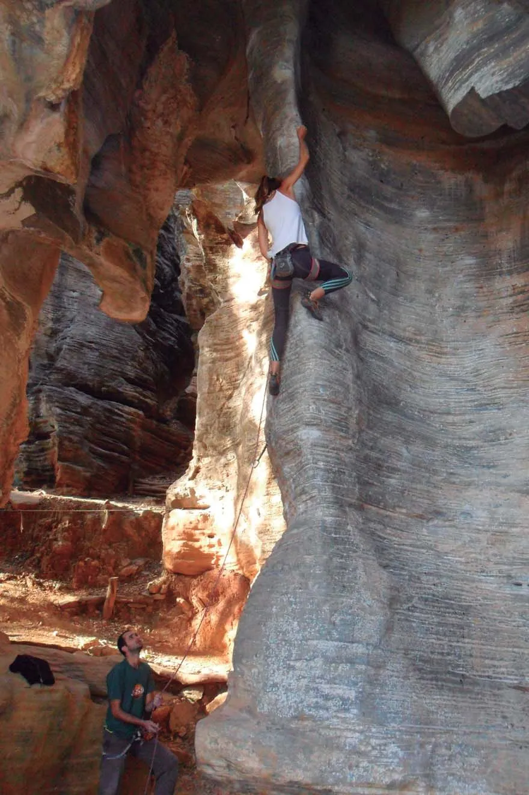 |
            | :--: |
            | *Felipe Belisário atento na segurança enquanto Marcela Romanelli escala a via "Sublime Obsessão". Foto: Marcus "Rufino"* |
            
            * André Portugal
            * Diana Barbosa
            * Diego Lara
            * Felipe Belisário
            * Frederico Moreira
            * Frederico Gualberto
            * Gabriel Fernandes
            * Gustavo Vianna
            * Luiz Francisco Fernandes
            * Marcela Romanelli
            * Paula Gualberto
            * Rodrigo Gualberto
            * Rodrigo "Tinoco"
            * Tiago "Vá"
  - **[4]**:
    - **uid**: LVNkAWuN1OlOp0
    - **texto**: A Escalada
    - **destino**:
      - **secao_textual**:
        - **conteudo**:
            # A Escalada
            
            | 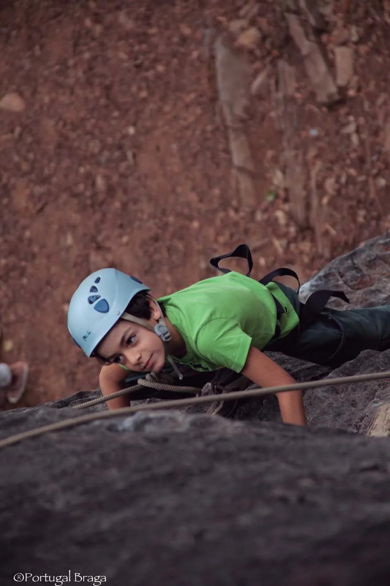 |
            | :--: |
            | *O Sítio do Rod é perfeito para iniciar crianças na escalada e vivências em ambientes naturais. Foto: Portugal Braga* |
            
            Este é um esporte fascinante, bonito para se ver e incrivelmente prazeroso de se praticar.
            
            Para muitos uma filosofia de vida, um estilo, uma devoção a este esporte que uni força e concentração, técnica e resistência, domínio de técnicas específicas e uso de equipamentos, além de proporcionar um intimo contato com a natureza.
            
            Dividido em estilos e modalidades a escalada é pessoal, superação dos próprios limites, aliado a busca da essência deste esporte e o prazer que ele pode proporcionar.
            
            Que possamos encontrar este fluxo e sentir está essência...
            
            Boas escaladas...
            
            Marcus Vinicius
  - **[5]**:
    - **uid**: x7kOUotY0RpBOE
    - **texto**: Regras e Código de Conduta
    - **destino**:
      - **secao_textual**:
        - **conteudo**:
            # Regras e Conduta
            
            | 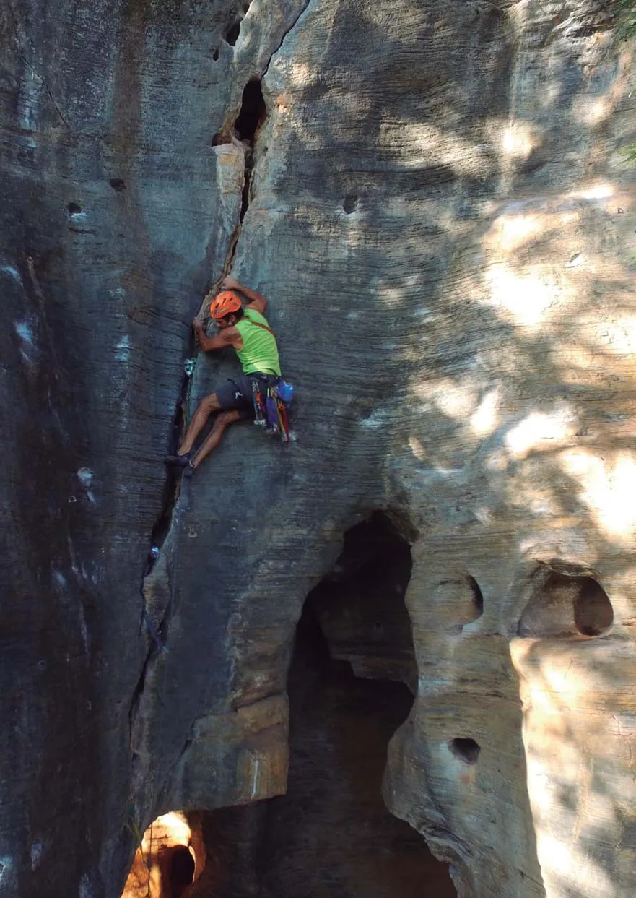 |
            | :--: |
            | *Marcus "Rufino" escalando a via "Fósseis do velho mundo", uma ótima opção para quem gosta de escalar vias com proteções móveis. Foto: Elton Soares* |
            
            ### Regras de Segurança do Sítio Do Rod:
            
            * Muita atenção com a segurança sua e de seu parceiro
            * É importante conferir seus equipamentos e de seu parceiro antes de começar a escalar
            * Use Capacete
            * Muito cuidado com Abelhas, Cobras e Aranhas
            
            Somente pratique escalada se já tiver o domínio de uso dos equipamentos ou acompanhado por um instrutor qualificado.
            
            ### Código de conduta do visitante:
            
            * Respeite os animais e o ambiente a sua volta
            * Proibido a retirada de plantas e pedras
            * Traga seu lixo de volta
            * É proibido o uso de aparelhos sonoros
            * Use os banheiros do camping
            * É necessário autorização para entrar nas Cavernas
  - **[6]**:
    - **uid**: iOeGFNkYEKjVST
    - **texto**: O Sítio do Rod e Hospedagem
    - **destino**:
      - **secao_textual**:
        - **conteudo**:
            # O Sítio do Rod:
            
            O Sítio está Localizado na região que é considerada um dos berços da escalada esportiva em Minas Gerais. Desde a abertura de suas primeiras vias, na segunda metade da década de 90, se destaca como um importante Campo Escola de escalada na região.
            Desde então o Sítio do Rod foi e continua sendo palco de inúmeras histórias de escaladores que por aqui passam e desfrutaram desse pequeno reduto da escalada esportiva mineira.
            
            Fica localizado a apenas 50 km do centro de Belo Horizonte e 16 km do Aeroporto Internacional de Confins.
            Possui hoje cerca de 70 vias de escalada entre esportivas e móveis com graduações que vão do 4° ao 10° grau, com qualidade e variedade de estilos e algumas vias se mantém secas mesmo nos dias mais chuvosos.
            É muito fácil o acesso aos setores de escalada, são cerca de cinco minutos de caminhada do estacionamento até a base da Rocha, com isso também se torna perfeito para as Crianças terem seus primeiros contatos com a escalada e vivências em ambiente de natureza.
            
            A proximidade com outras áreas de escalada como a Lapa do Seu Antão, as Grutas da Lapinha e do Baú e Serra do Cipó, formando assim o maior circuito de escalada em Calcário do Brasil, atraindo escaladores de todas as partes do país e do mundo inteiro.
            
            | 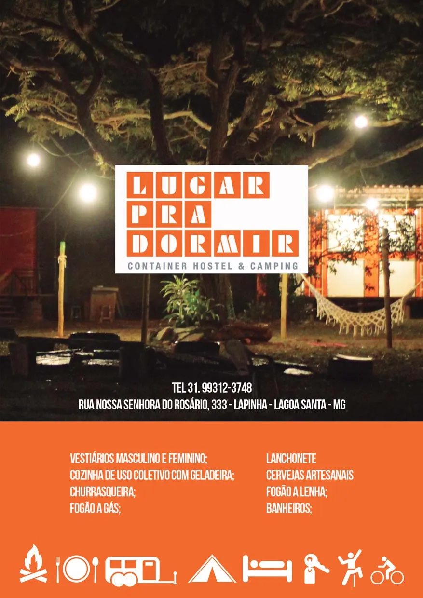 |
            | :--: |
            | ***LUGAR PRA DORMIR*** |
            Container Hostel & Camping
            TEL 31. 99312-3748
            Rua Nossa Senhora do Rosário, 333 - Lapinha - Lagoa Santa - MG
            
            * Vestiários masculino e feminino
            * Cozinha de uso coletivo com geladeira
            * Churrasqueira
            * Fogão a gás
            * Lanchonete
            * Cervejas artesanais
            * Fogão a lenha
            * Banheiros
  - **[7]**:
    - **uid**: 7nybNF05xQYbRX
    - **texto**: Parque Estadual do Sumidouro
    - **destino**:
      - **secao_textual**:
        - **conteudo**:
            # Parque Estadual do Sumidouro
            
            | 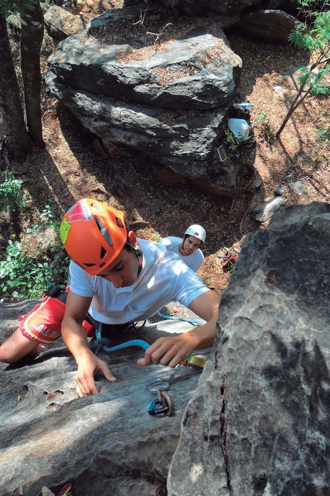 |
            | :--: |
            | *Escaladores Dimitri e Bernado durante o curso básico de escalada em rocha. Foto: Marcus "Rufino"* |
            
            Caracterizado como Unidade de Proteção Integral, O Parque tem o objetivo principal de promover a preservação ambiental e cultural, possibilitando atividades de pesquisa, conservação, educação ambiental e turismo.
            
            A unidade recebeu este nome devido a sua lagoa, que possui um ponto de drenagem das águas da bacia típica dos terrenos calcários. Trata-se de uma abertura natural para uma rede de galerias, por meio da qual um curso d'água penetra no subsolo denominado "sumidouro", termo que vem da palavra indígena "Anhanhonhacanhuva", que significa "água parada que some no buraco da terra".
            
            **Algumas das atividades oferecidas pelo Parque:**
            
            Visita a Gruta da Lapinha, com acompanhamento de um guia especializado, onde turistas entre crianças e adultos podem conhecer um pouco do fantástico mundo das cavernas e seus arredores, com direito a entrada no Museu Peter Lund; Circuito Lapinha; Trilha Sumidouro; Escalada; Trilha da Travessia.
            
            Mais informações: www.pesumidouro.blogspot.com
            Telefone: (31) 3689 8592
  - **[8]**:
    - **uid**: xrYOAKjIwocFrx
    - **texto**: APA Carste Lagoa Santa
    - **destino**:
      - **secao_textual**:
        - **conteudo**:
            # APA Carste Lagoa Santa:
            
            O **Sítio do Rod** fica na Lapinha em Lagoa Santa MG, que é uma das regiões brasileiras mais importantes em termos de paisagens cárstica carbonática e da história das ciências naturais do Brasil.
            
            Nesta região foram encontrados grande quantidade de fósseis de animais extintos da megafauna como Preguiças gigantes, Tigres dentes-de-sabre, bem como vestígios de fosseis humanos, o padrão morfológico definido como Homem de Lagoa santa esta fauna extinta viveu na região nos períodos entre 13,5 a 9,5 mil anos atrás.
            
            Grande parte destas descobertas se deve ao trabalho do naturalista dinamarquês Peter Wilhelm Lund e outros estudiosos que por aqui passaram e outros que ainda estudam sobre a região nos dias atuais.
            
            | 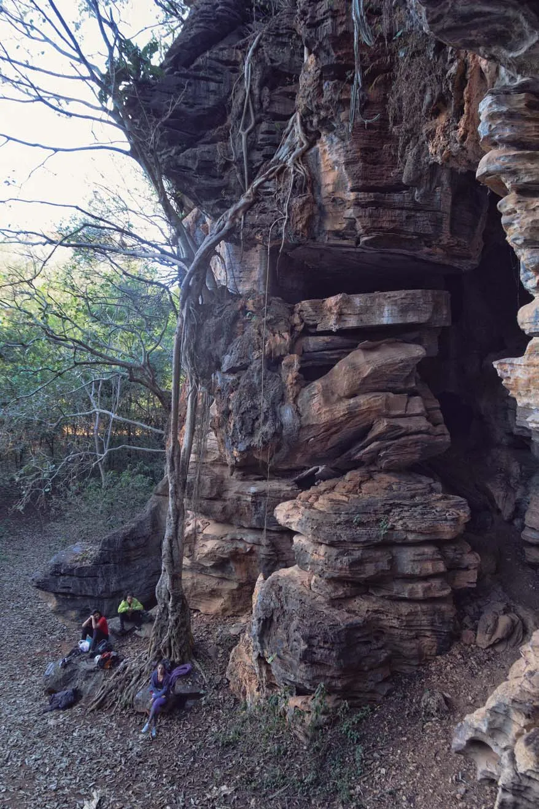 |
            | :--: |
            | *Setor G1, tem ótimas vias e boulder. Porem é necessário manter o silêncio e prestar muita atenção quanto a presença de abelhas. Foto: Jean Carlos* |
  - **[9]**:
    - **uid**: Ls5enbN1v5jD5v
    - **texto**: Comércio Local
    - **destino**:
      - **secao_textual**:
        - **conteudo**:
            # Comércio local:
            
            * **Bar da Neri:**
            Serve bebidas, tira gostos e almoço. Este é o bar tem mais de 20 anos e fica a 200 metros da entrada do Sítio é o mais clássico para os escaladores, onde a Senhora Neri faz questão de receber muito bem! funciona de terça a domingo das 11:00 as 22:00
            
            * **Casa da Jacque:**
            Oferece almoço, produtos artesanais, aluguel de cavalos, UBER. Funciona de segunda a sexta para almoço e jantar, aos fins de semana com reservas.
            Endereço: Rua São Vicente de Paula 181
            
            * **Mercado Caminho da Roça:** Alimentos e produtos de higiene - R. Guillermina Pereira de Freitas 830.
            Ter a Dom. de 7:00 as 18:00
            
            * **Restaurante Gruta da Lapinha:** Pratos a la carte - R. do Rosario 831 Ter. a Dom. 11:00 as 16:00.
            
            * **Tocaias Bar: PF e bebidas** - R. do Engenho 35
            Quin a Ter. de 10:00 as 20:00
            
            * **Tele Marmitex da Adriana:** Tel. 31. 99525.8869
            Sábados e Domingos
            
            * **Distribuidora Hudson:** Churrasquinhos, porções e bebidas - R Gulhermina Pereira de Freitas 866
            Ter. a Dom. de 10:00 as 22:00 Tel 31.3689.8078
            
            * **Vila Real:** Padaria, Farmacia, Açougue e Horti Fruti
            Av São Sebastião 1650 Seg. a Sab. de 7:00 as 19:30
            
            | 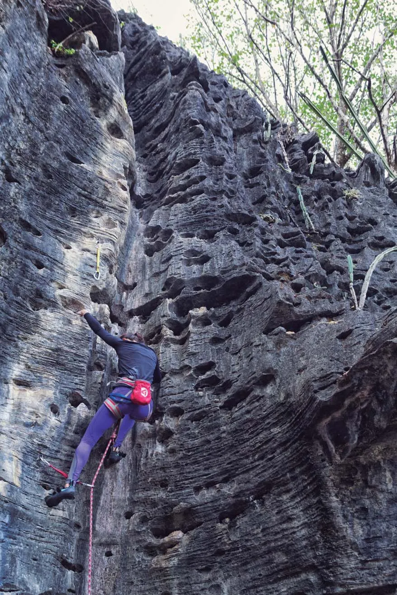 |
            | :--: |
            | *Escaladora **Luciana dos Anjos** na via **"Cactos Talidomida"**, esta é uma ótima opção para crianças e iniciantes. Foto: **Jean Carlos*** |
  - **[10]**:
    - **uid**: UQIevlK7ZL0xkM
    - **texto**: Telefones Úteis
    - **destino**:
      - **secao_textual**:
        - **conteudo**:
            # Telefones úteis:
            
            **Telefone de emergências : 190**
            
            **Polícia Militar de Pedro Leopoldo** - Rua Goianazes, nº 246 - Pedro Leopoldo MG - Telefone : (31) 3661-2601
            
            **Centro Integrado de Operações da Polícia Militar Belo Horizonte** - Rua da Bahia, nº 2115 - Funcionários - Belo Horizonte MG - Telefone : (31) 3071-2554
            
            **Corpo de Bombeiros Militar de Minas Gerais** - Avenida Amazonas, nº 3155 - Barroca - Belo Horizonte MG Telefone: (31) 3379-3641
            
            **1º Batalhão de Operações em Desastres do Corpo de Bombeiros Comunitários** – Ribeirão das Neves MG
            Rua Maria Das Neves Figueiredo Carlos, nº 53, Sevilha A, 1ª SEÇÃO - Telefone : (31) 3161-5040
            
            **Hospitais 24h**
            
            **Pronto Atendimento e Hospital Municipal de Pedro Leopoldo** - Rua Progresso, nº 985 - Centro - Pedro Leopoldo MG - Telefone : (31) 3660-2122
            
            **Hospital João XXIII** - Avenida Prof. Alfredo Balena, nº 400 - Santa Efigênia - Belo Horizonte MG
            Telefone: (31) 3239-9200
            
            **Hospital Belo Horizonte** - Avenida Pres. Antônio Carlos, nº 1694 - Cachoeirinha - Belo Horizonte MG
            Telefone: (31) 3449-7000
            
            **Hospital Mater Dei** - Rua Mato Grosso, nº 1100 - Santo Agostinho - Belo Horizonte MG - Telefone : (31) 3292-6000
            
            | 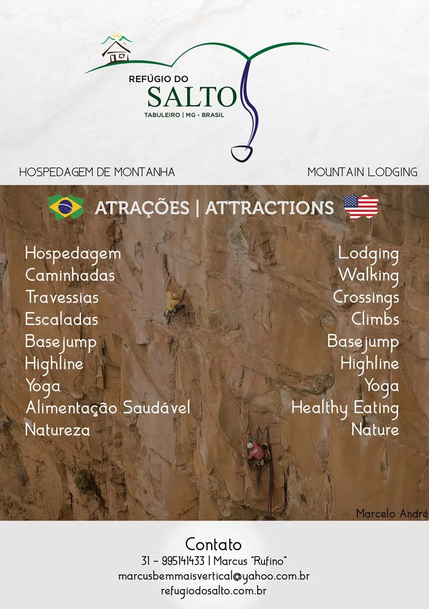 |
            | :--: |
            | ***Refúgio do Salto*** |
            HOSPEDAGEM DE MONTANHA
            Contato: 31 - 995141433 | Marcus "Rufino"
            marcusbemmaisvertical@yahoo.com.br
            refugiodosalto.com.br
  - **[11]**:
    - **uid**: dJbYISnaFEJIfM
    - **texto**: Como Chegar
    - **destino**:
      - **secao_textual**:
        - **conteudo**:
            # Como chegar:
            
            R. Nossa Sra. do Rosário, 333 - Lapinha, Lagoa Santa - MG.
            
            **Distâncias:**
            * Belo Horizonte (centro) 50 km
            * Rio de Janeiro - 494 km
            * São Paulo - 630 km
            * Brasília - 710 km
            
            **De ônibus:**
            Saindo da Rodoviária de Belo Horizonte: Pegar o ônibus 5782 até Rodoviária de Lagoa Santa, lá linhas 3003/3004 e descer no ponto mais próximo da Igreja Nossa Sra. do Rosário, a 100m do Sítio do Rod.
            
            **Saindo do Aeroporto:**
            Pegar sentido Lagoa Santa, seguir para a Lapinha o Sítio está a 1 km da Gruta da Lapinha.
            
            | 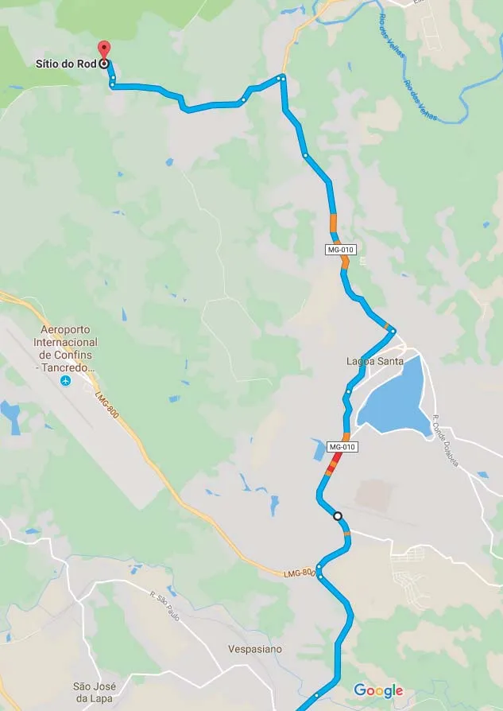 |
            | :--: |
            | *Mapa Como Chegar* |
  - **[12]**:
    - **uid**: tIkjbHplijPzVA
    - **texto**: Como usar este guia
    - **destino**:
      - **secao_textual**:
        - **conteudo**:
            # Como usar este guia:
            
            * Este Guia vem com a finalidade de facilitar, informar e divulgar as vias de escalada no Sítio do Rod.
            * Nele as vias vem divididas em circuitos de cores, cada cor corresponde a uma graduação.
            * Traz também informações rápidas sobre o estilo da escala da via seja ela esportiva ou móvel.
            
            **Legenda:**
            * 4º e 5º grau: Amarelo
            * 6º grau: Verde
            * 7º grau: Azul
            * 8º grau: Roxo
            * 9º grau: Vermelho
            * 10º grau: Preto
            * V: Variante
            * B: Boulders
            * T: Travessias
            * o: Vias Fixas
            * +: Vias Móveis
            
            | 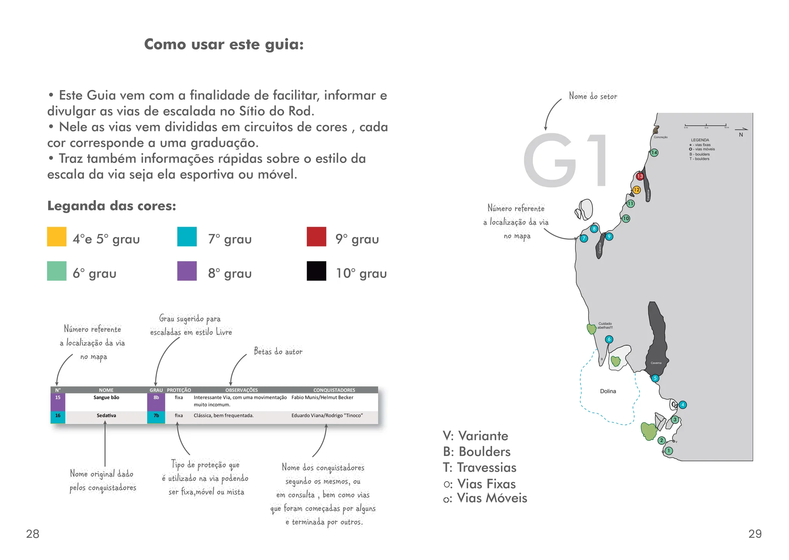 |
            | :--: |
            | *Como usar guia* |
  - **[13]**:
    - **uid**: Y0NrTIFiRzfWyv
    - **texto**: Contra Capa
    - **destino**:
      - **secao_textual**:
        - **conteudo**:
            | 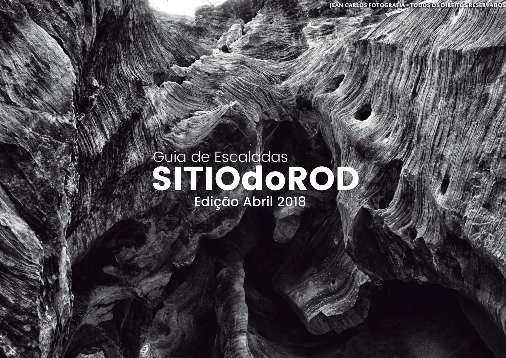 |
            | :--: |
            | *Contra capa* |
- **ultima_migracao**: 5
- **publicar_croqui**: True
- **revisado_bounding_circle**: True

## Parte: setor_g1

### Setor (Pico: Sítio do Rod)

- **descricao**:
    O setor G1 tem ótimas vias e boulder. Porem é necessário manter o silêncio e prestar muita atenção quanto a presença de abelhas.
    
    **Boulders:**
    Boulders clássicos entre V0 e V4.
- **nome**: Setor G1
- **uid**: JQThCUNwxqH4AX
- **caminho_imagem_capa**: 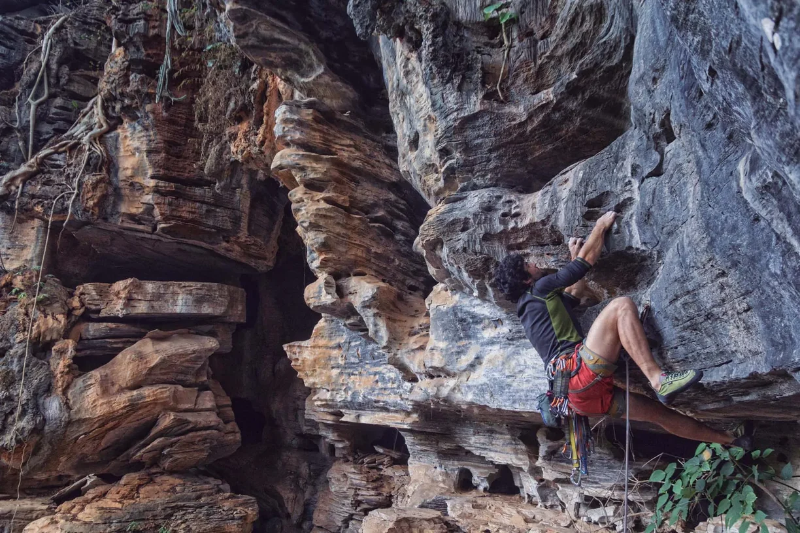
- **mapas**:
  - **[0]**:
    - **caminho_imagem_mapa**: 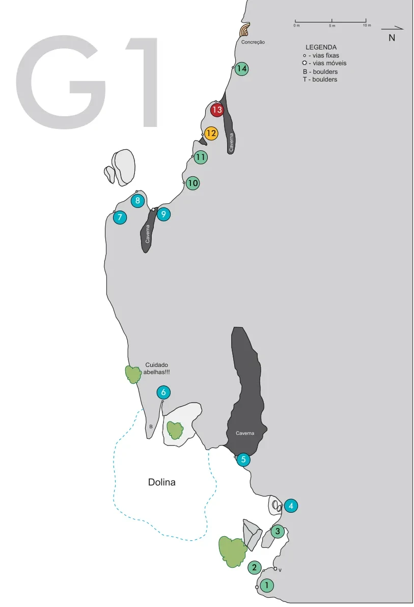
    - **largura_mapa**: 813
    - **altura_mapa**: 1191
    - **pontos_de_interesse**:
      - **[0]**:
        - **id**: ptykxW7a7qg7XB
        - **uid**: ptykxW7a7qg7XB
        - **rotulo**: 1
        - **circulo**:
          - **x**: 524
          - **y**: 1149
          - **raio**: 13
        - **label**: 1
      - **[1]**:
        - **id**: RFEInGUBytnDeJ
        - **uid**: RFEInGUBytnDeJ
        - **rotulo**: 2
        - **circulo**:
          - **x**: 500
          - **y**: 1114
          - **raio**: 13
        - **label**: 2
      - **[2]**:
        - **id**: GVYZaSqUqYMVRP
        - **uid**: GVYZaSqUqYMVRP
        - **rotulo**: 3
        - **circulo**:
          - **x**: 545
          - **y**: 1043
          - **raio**: 13
        - **label**: 3
      - **[3]**:
        - **id**: X7Kli74r586piS
        - **uid**: X7Kli74r586piS
        - **rotulo**: 4
        - **circulo**:
          - **x**: 572
          - **y**: 992
          - **raio**: 13
        - **label**: 4
      - **[4]**:
        - **id**: hb1SmYJbgpROte
        - **uid**: hb1SmYJbgpROte
        - **rotulo**: 5
        - **circulo**:
          - **x**: 478
          - **y**: 902
          - **raio**: 13
        - **label**: 5
      - **[5]**:
        - **id**: u7tkti4nkLASRN
        - **uid**: u7tkti4nkLASRN
        - **rotulo**: 6
        - **circulo**:
          - **x**: 321
          - **y**: 770
          - **raio**: 13
        - **label**: 6
      - **[6]**:
        - **id**: 6iCACRtJczbBle
        - **uid**: 6iCACRtJczbBle
        - **rotulo**: 7
        - **circulo**:
          - **x**: 236
          - **y**: 427
          - **raio**: 13
        - **label**: 7
      - **[7]**:
        - **id**: 1p216I6L7WsfXk
        - **uid**: 1p216I6L7WsfXk
        - **rotulo**: 8
        - **circulo**:
          - **x**: 271
          - **y**: 394
          - **raio**: 13
        - **label**: 8
      - **[8]**:
        - **id**: bW7WbSqBrTKvv8
        - **uid**: bW7WbSqBrTKvv8
        - **rotulo**: 9
        - **circulo**:
          - **x**: 322
          - **y**: 421
          - **raio**: 13
        - **label**: 9
      - **[9]**:
        - **id**: JYVKRaYOaxLEDp
        - **uid**: JYVKRaYOaxLEDp
        - **rotulo**: 10
        - **circulo**:
          - **x**: 379
          - **y**: 359
          - **raio**: 13
        - **label**: 10
      - **[10]**:
        - **id**: 0ZJ9KagIP3J9R7
        - **uid**: 0ZJ9KagIP3J9R7
        - **rotulo**: 11
        - **circulo**:
          - **x**: 394
          - **y**: 309
          - **raio**: 13
        - **label**: 11
      - **[11]**:
        - **id**: qIXawlHb62HYSh
        - **uid**: qIXawlHb62HYSh
        - **rotulo**: 12
        - **circulo**:
          - **x**: 415
          - **y**: 262
          - **raio**: 13
        - **label**: 12
      - **[12]**:
        - **id**: BtXwhI1YbFtuv9
        - **uid**: BtXwhI1YbFtuv9
        - **rotulo**: 13
        - **circulo**:
          - **x**: 426
          - **y**: 216
          - **raio**: 13
        - **label**: 13
      - **[13]**:
        - **id**: nHVXxBbUU6IRKo
        - **uid**: nHVXxBbUU6IRKo
        - **rotulo**: 14
        - **circulo**:
          - **x**: 475
          - **y**: 135
          - **raio**: 13
        - **label**: 14
    - **referencias**:
      - **[0]**:
        - **alvo_uid**: OCTKiJdy4PEOYW
        - **pontos_uids**:
          - ptykxW7a7qg7XB
        - **escalada**: Mão de martelo
        - **ids**:
          - ptykxW7a7qg7XB
      - **[1]**:
        - **alvo_uid**: FjMCRvAXU0U6oZ
        - **pontos_uids**:
          - RFEInGUBytnDeJ
        - **escalada**: Calibre 44
        - **ids**:
          - RFEInGUBytnDeJ
      - **[2]**:
        - **alvo_uid**: AAWIwSYiPEJ1wI
        - **pontos_uids**:
          - GVYZaSqUqYMVRP
        - **escalada**: Antro dos mosquitos
        - **ids**:
          - GVYZaSqUqYMVRP
      - **[3]**:
        - **alvo_uid**: s6VUrdB017oKsO
        - **pontos_uids**:
          - X7Kli74r586piS
        - **escalada**: Poder do silêncio
        - **ids**:
          - X7Kli74r586piS
      - **[4]**:
        - **alvo_uid**: Stl18z42g4jTzV
        - **pontos_uids**:
          - hb1SmYJbgpROte
        - **escalada**: Não contavam com minha astucia
        - **ids**:
          - hb1SmYJbgpROte
      - **[5]**:
        - **alvo_uid**: pKMhsAzTkKgith
        - **pontos_uids**:
          - u7tkti4nkLASRN
        - **escalada**: Terra do nunca
        - **ids**:
          - u7tkti4nkLASRN
      - **[6]**:
        - **alvo_uid**: 7fT9qRaUP4zohz
        - **pontos_uids**:
          - 6iCACRtJczbBle
        - **escalada**: Voz apocalíptica
        - **ids**:
          - 6iCACRtJczbBle
      - **[7]**:
        - **alvo_uid**: RPrekvCkw957V7
        - **pontos_uids**:
          - 1p216I6L7WsfXk
        - **escalada**: Vivendo no crux da larica
        - **ids**:
          - 1p216I6L7WsfXk
      - **[8]**:
        - **alvo_uid**: f96bqEmXGp4ICK
        - **pontos_uids**:
          - bW7WbSqBrTKvv8
        - **escalada**: Capitão caverna
        - **ids**:
          - bW7WbSqBrTKvv8
      - **[9]**:
        - **alvo_uid**: FCv3yDH8sLbk7K
        - **pontos_uids**:
          - JYVKRaYOaxLEDp
        - **escalada**: Sai do chão
        - **ids**:
          - JYVKRaYOaxLEDp
      - **[10]**:
        - **alvo_uid**: Abt28MEhC51Byp
        - **pontos_uids**:
          - 0ZJ9KagIP3J9R7
        - **escalada**: Os pica pedra
        - **ids**:
          - 0ZJ9KagIP3J9R7
      - **[11]**:
        - **alvo_uid**: vGhIO5NFcVnq8G
        - **pontos_uids**:
          - qIXawlHb62HYSh
        - **escalada**: O resgate dos barbarás no meio do corredor polonês
        - **ids**:
          - qIXawlHb62HYSh
      - **[12]**:
        - **alvo_uid**: ABd6krn0uFe433
        - **pontos_uids**:
          - BtXwhI1YbFtuv9
        - **escalada**: ?
        - **ids**:
          - BtXwhI1YbFtuv9
      - **[13]**:
        - **alvo_uid**: ABd6krn0uFe433
        - **pontos_uids**:
          - nHVXxBbUU6IRKo
        - **escalada**: ?
        - **ids**:
          - nHVXxBbUU6IRKo
- **escaladas**:
  - **[0]**:
    - **uid**: OCTKiJdy4PEOYW
    - **via_movel**:
      - **descricao**: Friends médios e tricam #5. Crux depois do platô. 1 grampo no topo.
      - **nome**: Mão de martelo
      - **dificuldade**: BR_6SUP
      - **quantidade_protecoes_parada**: 1
      - **conquistadores**:
        - Felipe Belisario
        - Marcus "Rufino"
  - **[1]**:
    - **uid**: FjMCRvAXU0U6oZ
    - **via_esportiva**:
      - **descricao**: Boa opção, **atenção** com o platô.
      - **nome**: Calibre 44
      - **dificuldade**: BR_6SUP
      - **conquistadores**:
        - Grots
        - Marcio Macena
  - **[2]**:
    - **uid**: AAWIwSYiPEJ1wI
    - **via_esportiva**:
      - **descricao**: Via curta, porem de muita movimentação.
      - **nome**: Antro dos mosquitos
      - **dificuldade**: BR_6SUP
      - **conquistadores**:
        - Ivo Ferreira
        - Márcio Macena
  - **[3]**:
    - **uid**: s6VUrdB017oKsO
    - **via_esportiva**:
      - **descricao**: Boa via, bom usar stiq-clip nas 2 primeiras. **Atenção se tem abelhas por perto!**
      - **nome**: Poder do silêncio
      - **dificuldade**: BR_7A
      - **conquistadores**:
        - Grots
        - Marcus "Rufino"
  - **[4]**:
    - **uid**: Stl18z42g4jTzV
    - **via_esportiva**:
      - **descricao**: Curta, porem atraente. **Atenção se tem abelhas por perto!**
      - **nome**: Não contavam com minha astucia
      - **dificuldade**: BR_7B
      - **conquistadores**:
        - Grots
        - Felipe Belisario
        - Marcus "Rufino"
  - **[5]**:
    - **uid**: pKMhsAzTkKgith
    - **via_esportiva**:
      - **descricao**: Ótima via, muito boa movimentação. **Atenção se tem abelhas por perto!**
      - **nome**: Terra do nunca
      - **dificuldade**: BR_7C
      - **conquistadores**:
        - Grots
        - Marcus "Rufino"
  - **[6]**:
    - **uid**: 7fT9qRaUP4zohz
    - **via_esportiva**:
      - **descricao**: Via interditada. Abelhas!
      - **nome**: Voz apocalíptica
      - **dificuldade**: BR_7A
      - **conquistadores**:
        - Leonardo Hoffman
        - Rod
  - **[7]**:
    - **uid**: RPrekvCkw957V7
    - **via_esportiva**:
      - **descricao**: Via interditada. Abelhas!
      - **nome**: Vivendo no crux da larica
      - **dificuldade**: BR_7B
      - **conquistadores**:
        - Gabriel
        - Silvio
  - **[8]**:
    - **uid**: f96bqEmXGp4ICK
    - **via_movel**:
      - **descricao**: Ótima via, Peças pequenas e médias, camalot 4, top duplo P.
      - **nome**: Capitão caverna
      - **dificuldade**: BR_7A
      - **quantidade_protecoes_parada**: 2
      - **conquistadores**:
        - "Marcelinho" Terra Zoni
        - Marcus "Rufino"
  - **[9]**:
    - **uid**: FCv3yDH8sLbk7K
    - **via_esportiva**:
      - **descricao**: Via curtinha de boa escalada, podendo fazer a saida de boulder.
      - **nome**: Sai do chão
      - **dificuldade**: BR_7A
      - **conquistadores**:
        - Ágata
        - Gilberto
  - **[10]**:
    - **uid**: Abt28MEhC51Byp
    - **via_esportiva**:
      - **descricao**: Boa opção.
      - **nome**: Os pica pedra
      - **dificuldade**: BR_6
      - **conquistadores**:
        - Ágata
        - Gilberto
  - **[11]**:
    - **uid**: vGhIO5NFcVnq8G
    - **via_esportiva**:
      - **descricao**: Via interditada. Abelhas!
      - **nome**: O resgate dos barbarás no meio do corredor polonês
      - **dificuldade**: BR_5SUP
      - **conquistadores**:
        - Grots
        - Marcio Macena
  - **[12]**:
    - **uid**: 2UGL7D8xOXoEC3
    - **via_esportiva**:
      - **descricao**: **Atenção se tem abelhas por perto!**
      - **nome**: ?
      - **dificuldade**: BR_9B
  - **[13]**:
    - **uid**: ABd6krn0uFe433
    - **via_esportiva**:
      - **descricao**: Via inacabada. Cuidado abelhas!
      - **nome**: ?
      - **dificuldade**: BR_6
- **precomputados**:
  - **total_escaladas**: 14
  - **total_esportivas**: 12

## Parte: setor_g2

### Setor (Pico: Sítio do Rod)

- **descricao**:
    **Travessias:**
    * C: Boas opções de travessias, muito legais.
    * D: Boas opções de travessias, muito legais.
- **nome**: Setor G2
- **uid**: lge5uD507M5WRB
- **caminho_imagem_capa**: 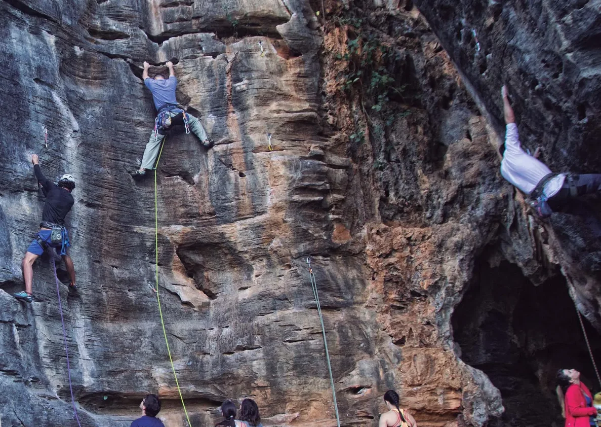
- **mapas**:
  - **[0]**:
    - **caminho_imagem_mapa**: 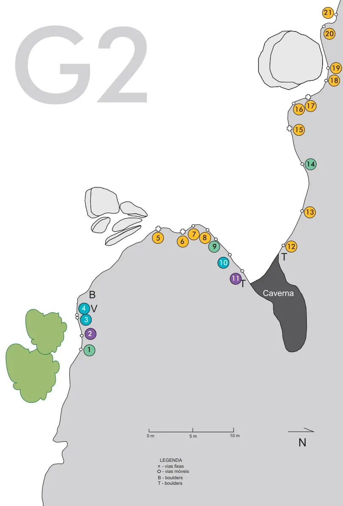
    - **largura_mapa**: 808
    - **altura_mapa**: 1191
    - **pontos_de_interesse**:
      - **[0]**:
        - **id**: QmIdPfjbs80Gw3
        - **uid**: QmIdPfjbs80Gw3
        - **rotulo**: 1
        - **circulo**:
          - **x**: 211
          - **y**: 825
          - **raio**: 13
        - **label**: 1
      - **[1]**:
        - **id**: niU8HKFFGU2Jd0
        - **uid**: niU8HKFFGU2Jd0
        - **rotulo**: 2
        - **circulo**:
          - **x**: 213
          - **y**: 786
          - **raio**: 13
        - **label**: 2
      - **[2]**:
        - **id**: fn9nzknaqT7vLU
        - **uid**: fn9nzknaqT7vLU
        - **rotulo**: 3
        - **circulo**:
          - **x**: 202
          - **y**: 753
          - **raio**: 13
        - **label**: 3
      - **[3]**:
        - **id**: XZwd7cNMcWYXt7
        - **uid**: XZwd7cNMcWYXt7
        - **rotulo**: 4
        - **circulo**:
          - **x**: 198
          - **y**: 726
          - **raio**: 13
        - **label**: 4
      - **[4]**:
        - **id**: Bo3sfhkHBnn0uG
        - **uid**: Bo3sfhkHBnn0uG
        - **rotulo**: 5
        - **circulo**:
          - **x**: 372
          - **y**: 560
          - **raio**: 13
        - **label**: 5
      - **[5]**:
        - **id**: klKJDaUTtxRAK2
        - **uid**: klKJDaUTtxRAK2
        - **rotulo**: 6
        - **circulo**:
          - **x**: 431
          - **y**: 568
          - **raio**: 13
        - **label**: 6
      - **[6]**:
        - **id**: SmQDRc1qTG0m6j
        - **uid**: SmQDRc1qTG0m6j
        - **rotulo**: 7
        - **circulo**:
          - **x**: 456
          - **y**: 551
          - **raio**: 13
        - **label**: 7
      - **[7]**:
        - **id**: ppdabD6q7qUqUi
        - **uid**: ppdabD6q7qUqUi
        - **rotulo**: 8
        - **circulo**:
          - **x**: 483
          - **y**: 560
          - **raio**: 13
        - **label**: 8
      - **[8]**:
        - **id**: F1aJtvPTCNAP4G
        - **uid**: F1aJtvPTCNAP4G
        - **rotulo**: 9
        - **circulo**:
          - **x**: 505
          - **y**: 581
          - **raio**: 13
        - **label**: 9
      - **[9]**:
        - **id**: 4EW6c7G9TqeqTJ
        - **uid**: 4EW6c7G9TqeqTJ
        - **rotulo**: 10
        - **circulo**:
          - **x**: 526
          - **y**: 618
          - **raio**: 13
        - **label**: 10
      - **[10]**:
        - **id**: y8CDoFya2D8FcH
        - **uid**: y8CDoFya2D8FcH
        - **rotulo**: 11
        - **circulo**:
          - **x**: 555
          - **y**: 656
          - **raio**: 14
        - **label**: 11
      - **[11]**:
        - **id**: JJSFntgO9G11u6
        - **uid**: JJSFntgO9G11u6
        - **rotulo**: 12
        - **circulo**:
          - **x**: 686
          - **y**: 580
          - **raio**: 13
        - **label**: 12
      - **[12]**:
        - **id**: eFuwQbP4EKX1U1
        - **uid**: eFuwQbP4EKX1U1
        - **rotulo**: 13
        - **circulo**:
          - **x**: 730
          - **y**: 499
          - **raio**: 13
        - **label**: 13
      - **[13]**:
        - **id**: cKQKzxfwWeBQUw
        - **uid**: cKQKzxfwWeBQUw
        - **rotulo**: 14
        - **circulo**:
          - **x**: 732
          - **y**: 387
          - **raio**: 13
        - **label**: 14
      - **[14]**:
        - **id**: XNFf2WsehBu90T
        - **uid**: XNFf2WsehBu90T
        - **rotulo**: 15
        - **circulo**:
          - **x**: 704
          - **y**: 305
          - **raio**: 13
        - **label**: 15
      - **[15]**:
        - **id**: sG0WdUKWENdUZ2
        - **uid**: sG0WdUKWENdUZ2
        - **rotulo**: 16
        - **circulo**:
          - **x**: 704
          - **y**: 258
          - **raio**: 14
        - **label**: 16
      - **[16]**:
        - **id**: osYPsTWEb6K1NR
        - **uid**: osYPsTWEb6K1NR
        - **rotulo**: 17
        - **circulo**:
          - **x**: 732
          - **y**: 249
          - **raio**: 13
        - **label**: 17
      - **[17]**:
        - **id**: NohN364QNufezn
        - **uid**: NohN364QNufezn
        - **rotulo**: 18
        - **circulo**:
          - **x**: 787
          - **y**: 190
          - **raio**: 13
        - **label**: 18
      - **[18]**:
        - **id**: OQOpSlkXZHS3bo
        - **uid**: OQOpSlkXZHS3bo
        - **rotulo**: 19
        - **circulo**:
          - **x**: 792
          - **y**: 160
          - **raio**: 13
        - **label**: 19
      - **[19]**:
        - **id**: OufBWNYmKzr7uW
        - **uid**: OufBWNYmKzr7uW
        - **rotulo**: 20
        - **circulo**:
          - **x**: 776
          - **y**: 79
          - **raio**: 13
        - **label**: 20
      - **[20]**:
        - **id**: yhbp8mIxDZDwbA
        - **uid**: yhbp8mIxDZDwbA
        - **rotulo**: 21
        - **circulo**:
          - **x**: 773
          - **y**: 30
          - **raio**: 13
        - **label**: 21
    - **referencias**:
      - **[0]**:
        - **alvo_uid**: OfEMsjmlqyCUcS
        - **pontos_uids**:
          - QmIdPfjbs80Gw3
        - **escalada**: Pé da Gameleira
        - **ids**:
          - QmIdPfjbs80Gw3
      - **[1]**:
        - **alvo_uid**: DDulHh7vXareS0
        - **pontos_uids**:
          - niU8HKFFGU2Jd0
        - **escalada**: Sangue bão
        - **ids**:
          - niU8HKFFGU2Jd0
      - **[2]**:
        - **alvo_uid**: sVthQOrPafxnRM
        - **pontos_uids**:
          - fn9nzknaqT7vLU
        - **escalada**: Sedativa
        - **ids**:
          - fn9nzknaqT7vLU
      - **[3]**:
        - **alvo_uid**: ioDz0EILNSXgu1
        - **pontos_uids**:
          - XZwd7cNMcWYXt7
        - **escalada**: Pressão da abelha (variante)
        - **ids**:
          - XZwd7cNMcWYXt7
      - **[4]**:
        - **alvo_uid**: KLsuh8RZ3FUONx
        - **pontos_uids**:
          - Bo3sfhkHBnn0uG
        - **escalada**: Prezinho
        - **ids**:
          - Bo3sfhkHBnn0uG
      - **[5]**:
        - **alvo_uid**: OqcTCdARZIIrVo
        - **pontos_uids**:
          - klKJDaUTtxRAK2
        - **escalada**: Super canaleta
        - **ids**:
          - klKJDaUTtxRAK2
      - **[6]**:
        - **alvo_uid**: 49EHkJKF4z5uZY
        - **pontos_uids**:
          - SmQDRc1qTG0m6j
        - **escalada**: Cactos talidomida
        - **ids**:
          - SmQDRc1qTG0m6j
      - **[7]**:
        - **alvo_uid**: qhv0kKI6eiFiFs
        - **pontos_uids**:
          - ppdabD6q7qUqUi
        - **escalada**: Logo sai
        - **ids**:
          - ppdabD6q7qUqUi
      - **[8]**:
        - **alvo_uid**: anxdB46ZVIXlQM
        - **pontos_uids**:
          - F1aJtvPTCNAP4G
        - **escalada**: Cariocas
        - **ids**:
          - F1aJtvPTCNAP4G
      - **[9]**:
        - **alvo_uid**: wz3fi67AzYyAXK
        - **pontos_uids**:
          - 4EW6c7G9TqeqTJ
        - **escalada**: Tapa na aranha
        - **ids**:
          - 4EW6c7G9TqeqTJ
      - **[10]**:
        - **alvo_uid**: wuIOHvNQg40cXT
        - **pontos_uids**:
          - y8CDoFya2D8FcH
        - **escalada**: Titãs atônitos
        - **ids**:
          - y8CDoFya2D8FcH
      - **[11]**:
        - **alvo_uid**: kQYoMdRcHTt86X
        - **pontos_uids**:
          - JJSFntgO9G11u6
        - **escalada**: Enganaram o cabo
        - **ids**:
          - JJSFntgO9G11u6
      - **[12]**:
        - **alvo_uid**: KlKw3sXIXE8qll
        - **pontos_uids**:
          - eFuwQbP4EKX1U1
        - **escalada**: Urtigas
        - **ids**:
          - eFuwQbP4EKX1U1
      - **[13]**:
        - **alvo_uid**: sYAcnxiMbBA7RT
        - **pontos_uids**:
          - cKQKzxfwWeBQUw
        - **escalada**: Atretas do climb (mapa do Brasil)
        - **ids**:
          - cKQKzxfwWeBQUw
      - **[14]**:
        - **alvo_uid**: DpDFCaGAYmeIm5
        - **pontos_uids**:
          - XNFf2WsehBu90T
        - **escalada**: Ossos do orifício
        - **ids**:
          - XNFf2WsehBu90T
      - **[15]**:
        - **alvo_uid**: O6CLvjL2vx3MiH
        - **pontos_uids**:
          - sG0WdUKWENdUZ2
        - **escalada**: Baião de dois
        - **ids**:
          - sG0WdUKWENdUZ2
      - **[16]**:
        - **alvo_uid**: Nl7xKy2GD1O6p6
        - **pontos_uids**:
          - osYPsTWEb6K1NR
        - **escalada**: Entre linhas
        - **ids**:
          - osYPsTWEb6K1NR
      - **[17]**:
        - **alvo_uid**: cUBWjKVDKP0SWw
        - **pontos_uids**:
          - NohN364QNufezn
        - **escalada**: SOS mandacaru
        - **ids**:
          - NohN364QNufezn
      - **[18]**:
        - **alvo_uid**: KHljwh9Bno85vs
        - **pontos_uids**:
          - OQOpSlkXZHS3bo
        - **escalada**: Socorro vem de baixo
        - **ids**:
          - OQOpSlkXZHS3bo
      - **[19]**:
        - **alvo_uid**: I5yOBuXwMObxQL
        - **pontos_uids**:
          - OufBWNYmKzr7uW
        - **escalada**: Mato queimado
        - **ids**:
          - OufBWNYmKzr7uW
      - **[20]**:
        - **alvo_uid**: N6hvfKwGBDHbG3
        - **pontos_uids**:
          - yhbp8mIxDZDwbA
        - **escalada**: De Mariah
        - **ids**:
          - yhbp8mIxDZDwbA
- **escaladas**:
  - **[0]**:
    - **uid**: OfEMsjmlqyCUcS
    - **via_esportiva**:
      - **descricao**: Atenção no Platô
      - **nome**: Pé da Gameleira
      - **dificuldade**: BR_6
      - **conquistadores**:
        - Thiago "Vá"
        - Rodrigo "Tinoco"
        - Rodrigo "Baiano"
        - Pedro Alves
  - **[1]**:
    - **uid**: DDulHh7vXareS0
    - **via_esportiva**:
      - **descricao**: Interessante Via, com uma movimentação muito incomum.
      - **nome**: Sangue bão
      - **dificuldade**: BR_8B
      - **conquistadores**:
        - Fabio Munis
        - Helmut Becker
  - **[2]**:
    - **uid**: sVthQOrPafxnRM
    - **via_esportiva**:
      - **descricao**: Clássica, bem frequentada.
      - **nome**: Sedativa
      - **dificuldade**: BR_7B
      - **conquistadores**:
        - Eduardo Viana
        - Rodrigo "Tinoco"
  - **[3]**:
    - **uid**: ioDz0EILNSXgu1
    - **via_esportiva**:
      - **descricao**: Divide a primeira chapa com a Sedativa
      - **nome**: Pressão da abelha (variante)
      - **dificuldade**: BR_7A
      - **conquistadores**:
        - Thiago "Vá"
        - Thiago "Tato"
        - Robson Lins
        - Pedro Alves
  - **[4]**:
    - **uid**: KLsuh8RZ3FUONx
    - **via_movel**:
      - **descricao**: Fenda em diagonal, peças medias, rapel na árvore.
      - **nome**: Prezinho
      - **dificuldade**: BR_4
      - **conquistadores**:
        - Grots
        - Marcus "Rufino"
  - **[5]**:
    - **uid**: OqcTCdARZIIrVo
    - **via_movel**:
      - **descricao**: Boa pra iniciantes, Segue ligeiramente a direita da Cactos, peças pequenas e medias, top duplo no final da canaleta.
      - **nome**: Super canaleta
      - **dificuldade**: BR_5
      - **conquistadores**:
        - Grots
        - Marcus "Rufino"
  - **[6]**:
    - **uid**: 49EHkJKF4z5uZY
    - **via_esportiva**:
      - **descricao**: Muito frequentada, boa para iniciantes e crianças.
      - **nome**: Cactos talidomida
      - **dificuldade**: BR_4
      - **conquistadores**:
        - Alexandre "Caverna"
        - Leonardo Hoffman
        - Rod
  - **[7]**:
    - **uid**: qhv0kKI6eiFiFs
    - **via_esportiva**:
      - **descricao**: Via curta de boa movimentação.
      - **nome**: Logo sai
      - **dificuldade**: BR_5
  - **[8]**:
    - **uid**: anxdB46ZVIXlQM
    - **via_esportiva**:
      - **descricao**: Pode ser escalada tanto pela direita ou esquerda das proteções.
      - **nome**: Cariocas
      - **dificuldade**: BR_6
      - **conquistadores**:
        - Escaladores Gaúchos
  - **[9]**:
    - **uid**: wz3fi67AzYyAXK
    - **via_esportiva**:
      - **descricao**: Clássica, bem frequentada. Extensão por Felipe Belisario.
      - **nome**: Tapa na aranha
      - **dificuldade**: BR_7A
      - **conquistadores**:
        - Anderson Barbosa
        - "Andrezão"
        - Gustavo Piancastelli
        - Felipe Belisario
  - **[10]**:
    - **uid**: wuIOHvNQg40cXT
    - **via_esportiva**:
      - **descricao**: Meio exposta.
      - **nome**: Titãs atônitos
      - **dificuldade**: BR_8A
      - **conquistadores**:
        - Gustavo Piancastelli
        - Pedro Leite
  - **[11]**:
    - **uid**: kQYoMdRcHTt86X
    - **via_esportiva**:
      - **descricao**: Boa opção.
      - **nome**: Enganaram o cabo
      - **dificuldade**: BR_5
      - **conquistadores**:
        - Márcio Macena
        - Ivo Ferreira
  - **[12]**:
    - **uid**: KlKw3sXIXE8qll
    - **via_esportiva**:
      - **descricao**: Clássica, de boa movimentação.
      - **nome**: Urtigas
      - **dificuldade**: BR_5SUP
      - **conquistadores**:
        - Eustáquio Macedo
        - Waguer
        - Rod
  - **[13]**:
    - **uid**: sYAcnxiMbBA7RT
    - **via_esportiva**:
      - **descricao**: Muito frequentada, com ótima movimentação.
      - **nome**: Atretas do climb (mapa do Brasil)
      - **dificuldade**: BR_6SUP
      - **conquistadores**:
        - Eustáquio Macedo
        - Rod
  - **[14]**:
    - **uid**: DpDFCaGAYmeIm5
    - **via_movel**:
      - **descricao**: Linda fenda que corta a parte superior da parede. Peças pequenas e médias. Termina no top da "mapa". Ótima opção!
      - **nome**: Ossos do orifício
      - **dificuldade**: BR_5
  - **[15]**:
    - **uid**: O6CLvjL2vx3MiH
    - **via_esportiva**:
      - **descricao**: Muito frequentada, com ótima movimentação, boa para iniciante.
      - **nome**: Baião de dois
      - **dificuldade**: BR_5
      - **conquistadores**:
        - Chico
        - Rod
  - **[16]**:
    - **uid**: Nl7xKy2GD1O6p6
    - **via_movel**:
      - **descricao**: Termina no top da SOS mandacaru. Peças pequenas e médias. Boa opção para iniciantes em móvel.
      - **nome**: Entre linhas
      - **dificuldade**: BR_5
      - **conquistadores**:
        - Gustavo Vianna
        - Marcus "Rufino"
  - **[17]**:
    - **uid**: cUBWjKVDKP0SWw
    - **via_esportiva**:
      - **descricao**: Muito frequentada, com ótima movimentação, boa para iniciante.
      - **nome**: SOS mandacaru
      - **dificuldade**: BR_5
      - **conquistadores**:
        - Chico
        - Rod
  - **[18]**:
    - **uid**: KHljwh9Bno85vs
    - **via_esportiva**:
      - **descricao**: Boa opção para iniciantes
      - **nome**: Socorro vem de baixo
      - **dificuldade**: BR_5
      - **conquistadores**:
        - Thiago "Vá"
        - Thiago "Tato"
  - **[19]**:
    - **uid**: I5yOBuXwMObxQL
    - **via_esportiva**:
      - **descricao**: Via curta
      - **nome**: Mato queimado
      - **dificuldade**: BR_6SUP
      - **conquistadores**:
        - Alexandre Queiroz
        - Rod
  - **[20]**:
    - **uid**: N6hvfKwGBDHbG3
    - **via_esportiva**:
      - **descricao**: Via de equilibrio
      - **nome**: De Mariah
      - **dificuldade**: BR_5
      - **conquistadores**:
        - Thiago "Vá"
        - Thiago "Tato"
- **precomputados**:
  - **total_escaladas**: 21
  - **total_esportivas**: 17

## Parte: setor_g3

### Setor (Pico: Sítio do Rod)

- **descricao**:
    O setor G3 é o maior setor do Sítio do Rod, com vias que variam do 3º ao 10º grau.
    
    **Boulders e travessias:**
    * Boulders e travessias nas colunas desse setor.
    * Boulder tetinho: V3 a V8.
- **nome**: Setor G3
- **uid**: eHmTU7FgrKO1h2
- **mapas**:
  - **[0]**:
    - **caminho_imagem_mapa**: 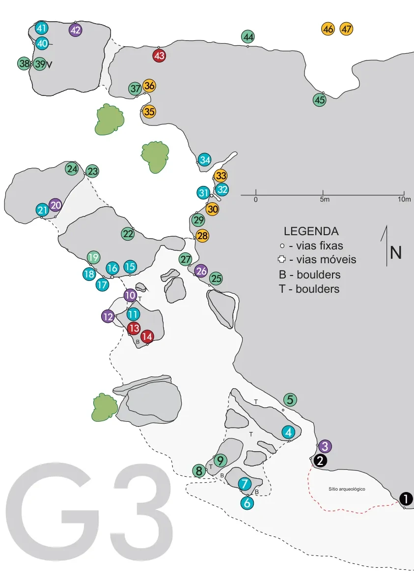
    - **largura_mapa**: 843
    - **altura_mapa**: 1191
    - **pontos_de_interesse**:
      - **[0]**:
        - **id**: 6AngR9VUXYkLUx
        - **uid**: 6AngR9VUXYkLUx
        - **rotulo**: 1
        - **circulo**:
          - **x**: 827
          - **y**: 1013
          - **raio**: 14
        - **label**: 1
      - **[1]**:
        - **id**: vJN7Lu62t0B4EF
        - **uid**: vJN7Lu62t0B4EF
        - **rotulo**: 2
        - **circulo**:
          - **x**: 652
          - **y**: 936
          - **raio**: 14
        - **label**: 2
      - **[2]**:
        - **id**: B4WQ9i4bVAp1bC
        - **uid**: B4WQ9i4bVAp1bC
        - **rotulo**: 3
        - **circulo**:
          - **x**: 662
          - **y**: 907
          - **raio**: 13
        - **label**: 3
      - **[3]**:
        - **id**: 0XlAFLS5LcwrxY
        - **uid**: 0XlAFLS5LcwrxY
        - **rotulo**: 4
        - **circulo**:
          - **x**: 587
          - **y**: 878
          - **raio**: 13
        - **label**: 4
      - **[4]**:
        - **id**: PqodMvKGk6LkEZ
        - **uid**: PqodMvKGk6LkEZ
        - **rotulo**: 5
        - **circulo**:
          - **x**: 591
          - **y**: 812
          - **raio**: 14
        - **label**: 5
      - **[5]**:
        - **id**: dh9wqqQCmppGFp
        - **uid**: dh9wqqQCmppGFp
        - **rotulo**: 6
        - **circulo**:
          - **x**: 503
          - **y**: 1023
          - **raio**: 13
        - **label**: 6
      - **[6]**:
        - **id**: uhdaQB6PCW5ZKd
        - **uid**: uhdaQB6PCW5ZKd
        - **rotulo**: 7
        - **circulo**:
          - **x**: 498
          - **y**: 983
          - **raio**: 13
        - **label**: 7
      - **[7]**:
        - **id**: Jp4cebHIGLqJQ9
        - **uid**: Jp4cebHIGLqJQ9
        - **rotulo**: 8
        - **circulo**:
          - **x**: 404
          - **y**: 955
          - **raio**: 17
        - **label**: 8
      - **[8]**:
        - **id**: 8JIrvUbKMJPr0o
        - **uid**: 8JIrvUbKMJPr0o
        - **rotulo**: 9
        - **circulo**:
          - **x**: 450
          - **y**: 936
          - **raio**: 17
        - **label**: 9
      - **[9]**:
        - **id**: WUqzMehsjx6uEZ
        - **uid**: WUqzMehsjx6uEZ
        - **rotulo**: 10
        - **circulo**:
          - **x**: 265
          - **y**: 600
          - **raio**: 13
        - **label**: 10
      - **[10]**:
        - **id**: t37WizPLDXn3v2
        - **uid**: t37WizPLDXn3v2
        - **rotulo**: 11
        - **circulo**:
          - **x**: 271
          - **y**: 638
          - **raio**: 13
        - **label**: 11
      - **[11]**:
        - **id**: evShYwPR2ozz3F
        - **uid**: evShYwPR2ozz3F
        - **rotulo**: 12
        - **circulo**:
          - **x**: 220
          - **y**: 643
          - **raio**: 13
        - **label**: 12
      - **[12]**:
        - **id**: O2CMfKUrMBHLnD
        - **uid**: O2CMfKUrMBHLnD
        - **rotulo**: 13
        - **circulo**:
          - **x**: 273
          - **y**: 667
          - **raio**: 13
        - **label**: 13
      - **[13]**:
        - **id**: fAofVJomgC6Jri
        - **uid**: fAofVJomgC6Jri
        - **rotulo**: 14
        - **circulo**:
          - **x**: 300
          - **y**: 684
          - **raio**: 13
        - **label**: 14
      - **[14]**:
        - **id**: vNlWx6j7q8cQIv
        - **uid**: vNlWx6j7q8cQIv
        - **rotulo**: 15
        - **circulo**:
          - **x**: 265
          - **y**: 542
          - **raio**: 13
        - **label**: 15
      - **[15]**:
        - **id**: IGd26RWxn26k6O
        - **uid**: IGd26RWxn26k6O
        - **rotulo**: 16
        - **circulo**:
          - **x**: 229
          - **y**: 545
          - **raio**: 13
        - **label**: 16
      - **[16]**:
        - **id**: 5ROs2IfsBDcItT
        - **uid**: 5ROs2IfsBDcItT
        - **rotulo**: 17
        - **circulo**:
          - **x**: 208
          - **y**: 579
          - **raio**: 13
        - **label**: 17
      - **[17]**:
        - **id**: vtUGJfqXbXnpNU
        - **uid**: vtUGJfqXbXnpNU
        - **rotulo**: 18
        - **circulo**:
          - **x**: 182
          - **y**: 557
          - **raio**: 13
        - **label**: 18
      - **[18]**:
        - **id**: QyqYpXuHZ1lY1o
        - **uid**: QyqYpXuHZ1lY1o
        - **rotulo**: 19
        - **circulo**:
          - **x**: 190
          - **y**: 523
          - **raio**: 13
        - **label**: 19
      - **[19]**:
        - **id**: ehgeFvx16JkxOo
        - **uid**: ehgeFvx16JkxOo
        - **rotulo**: 20
        - **circulo**:
          - **x**: 113
          - **y**: 417
          - **raio**: 13
        - **label**: 20
      - **[20]**:
        - **id**: 78c5y2KRdqisXe
        - **uid**: 78c5y2KRdqisXe
        - **rotulo**: 21
        - **circulo**:
          - **x**: 86
          - **y**: 426
          - **raio**: 13
        - **label**: 21
      - **[21]**:
        - **id**: mzsuNyAneBkv3F
        - **uid**: mzsuNyAneBkv3F
        - **rotulo**: 22
        - **circulo**:
          - **x**: 260
          - **y**: 475
          - **raio**: 13
        - **label**: 22
      - **[22]**:
        - **id**: 6ftfCW2idzFWrc
        - **uid**: 6ftfCW2idzFWrc
        - **rotulo**: 23
        - **circulo**:
          - **x**: 188
          - **y**: 348
          - **raio**: 13
        - **label**: 23
      - **[23]**:
        - **id**: lrJrCDpgaJsVFu
        - **uid**: lrJrCDpgaJsVFu
        - **rotulo**: 24
        - **circulo**:
          - **x**: 146
          - **y**: 343
          - **raio**: 13
        - **label**: 24
      - **[24]**:
        - **id**: eLFYB4uYP2G6kX
        - **uid**: eLFYB4uYP2G6kX
        - **rotulo**: 25
        - **circulo**:
          - **x**: 440
          - **y**: 566
          - **raio**: 13
        - **label**: 25
      - **[25]**:
        - **id**: WzdmLp1qmF0mHg
        - **uid**: WzdmLp1qmF0mHg
        - **rotulo**: 26
        - **circulo**:
          - **x**: 409
          - **y**: 550
          - **raio**: 13
        - **label**: 26
      - **[26]**:
        - **id**: g7H93BolFVwtHo
        - **uid**: g7H93BolFVwtHo
        - **rotulo**: 27
        - **circulo**:
          - **x**: 377
          - **y**: 526
          - **raio**: 13
        - **label**: 27
      - **[27]**:
        - **id**: j6VtForjbcvmDU
        - **uid**: j6VtForjbcvmDU
        - **rotulo**: 28
        - **circulo**:
          - **x**: 412
          - **y**: 479
          - **raio**: 13
        - **label**: 28
      - **[28]**:
        - **id**: rxdJC09j0C1r9E
        - **uid**: rxdJC09j0C1r9E
        - **rotulo**: 29
        - **circulo**:
          - **x**: 404
          - **y**: 447
          - **raio**: 13
        - **label**: 29
      - **[29]**:
        - **id**: bhD549s0ezfREs
        - **uid**: bhD549s0ezfREs
        - **rotulo**: 30
        - **circulo**:
          - **x**: 432
          - **y**: 425
          - **raio**: 13
        - **label**: 30
      - **[30]**:
        - **id**: nQbRlg6mnEXoZL
        - **uid**: nQbRlg6mnEXoZL
        - **rotulo**: 31
        - **circulo**:
          - **x**: 414
          - **y**: 392
          - **raio**: 13
        - **label**: 31
      - **[31]**:
        - **id**: H7QI5X3hGDHGJz
        - **uid**: H7QI5X3hGDHGJz
        - **rotulo**: 32
        - **circulo**:
          - **x**: 452
          - **y**: 385
          - **raio**: 13
        - **label**: 32
      - **[32]**:
        - **id**: S0w9pd3ygFZTGb
        - **uid**: S0w9pd3ygFZTGb
        - **rotulo**: 33
        - **circulo**:
          - **x**: 450
          - **y**: 357
          - **raio**: 13
        - **label**: 33
      - **[33]**:
        - **id**: C6is4p5FVWkIA8
        - **uid**: C6is4p5FVWkIA8
        - **rotulo**: 34
        - **circulo**:
          - **x**: 417
          - **y**: 324
          - **raio**: 13
        - **label**: 34
      - **[34]**:
        - **id**: hMDB4QMV0XKfBz
        - **uid**: hMDB4QMV0XKfBz
        - **rotulo**: 35
        - **circulo**:
          - **x**: 304
          - **y**: 226
          - **raio**: 13
        - **label**: 35
      - **[35]**:
        - **id**: FAVkvA1rHkIba8
        - **uid**: FAVkvA1rHkIba8
        - **rotulo**: 36
        - **circulo**:
          - **x**: 304
          - **y**: 174
          - **raio**: 13
        - **label**: 36
      - **[36]**:
        - **id**: LWpDGtz4qazvpg
        - **uid**: LWpDGtz4qazvpg
        - **rotulo**: 37
        - **circulo**:
          - **x**: 275
          - **y**: 180
          - **raio**: 13
        - **label**: 37
      - **[37]**:
        - **id**: PmpQM2NKQ6Xrc6
        - **uid**: PmpQM2NKQ6Xrc6
        - **rotulo**: 38
        - **circulo**:
          - **x**: 49
          - **y**: 129
          - **raio**: 13
        - **label**: 38
      - **[38]**:
        - **id**: 3l3CwX0h18qJBm
        - **uid**: 3l3CwX0h18qJBm
        - **rotulo**: 39
        - **circulo**:
          - **x**: 81
          - **y**: 130
          - **raio**: 13
        - **label**: 39
      - **[39]**:
        - **id**: vSsRIr3ZfQ4U65
        - **uid**: vSsRIr3ZfQ4U65
        - **rotulo**: 40
        - **circulo**:
          - **x**: 86
          - **y**: 87
          - **raio**: 13
        - **label**: 40
      - **[40]**:
        - **id**: dE9KFbJWJqeOMh
        - **uid**: dE9KFbJWJqeOMh
        - **rotulo**: 41
        - **circulo**:
          - **x**: 85
          - **y**: 57
          - **raio**: 13
        - **label**: 41
      - **[41]**:
        - **id**: 69AOa1swYqQk7R
        - **uid**: 69AOa1swYqQk7R
        - **rotulo**: 42
        - **circulo**:
          - **x**: 154
          - **y**: 61
          - **raio**: 13
        - **label**: 42
      - **[42]**:
        - **id**: XCag8d52J1B5Fj
        - **uid**: XCag8d52J1B5Fj
        - **rotulo**: 43
        - **circulo**:
          - **x**: 324
          - **y**: 113
          - **raio**: 13
        - **label**: 43
      - **[43]**:
        - **id**: QZgsd1iCWd1kPw
        - **uid**: QZgsd1iCWd1kPw
        - **rotulo**: 44
        - **circulo**:
          - **x**: 505
          - **y**: 74
          - **raio**: 13
        - **label**: 44
      - **[44]**:
        - **id**: 3Ad0FgyZ7ZBz7x
        - **uid**: 3Ad0FgyZ7ZBz7x
        - **rotulo**: 45
        - **circulo**:
          - **x**: 651
          - **y**: 203
          - **raio**: 13
        - **label**: 45
      - **[45]**:
        - **id**: VgKF7wCRln5I8r
        - **uid**: VgKF7wCRln5I8r
        - **rotulo**: 46
        - **circulo**:
          - **x**: 668
          - **y**: 58
          - **raio**: 13
        - **label**: 46
      - **[46]**:
        - **id**: dPFVZVC8Bxq6CU
        - **uid**: dPFVZVC8Bxq6CU
        - **rotulo**: 47
        - **circulo**:
          - **x**: 705
          - **y**: 58
          - **raio**: 13
        - **label**: 47
    - **referencias**:
      - **[0]**:
        - **alvo_uid**: kCmvzGsc9vclWr
        - **pontos_uids**:
          - 6AngR9VUXYkLUx
        - **escalada**: Quem manda aqui sou Eu "Eterosapiens"
        - **ids**:
          - 6AngR9VUXYkLUx
      - **[1]**:
        - **alvo_uid**: jcTf8bMTQSzdRI
        - **pontos_uids**:
          - vJN7Lu62t0B4EF
        - **escalada**: Poder paralelos
        - **ids**:
          - vJN7Lu62t0B4EF
      - **[2]**:
        - **alvo_uid**: oPR3AQpEM2qAtk
        - **pontos_uids**:
          - B4WQ9i4bVAp1bC
        - **escalada**: Pra você
        - **ids**:
          - B4WQ9i4bVAp1bC
      - **[3]**:
        - **alvo_uid**: 8nz9fG1i2lvlHl
        - **pontos_uids**:
          - 0XlAFLS5LcwrxY
        - **escalada**: 100 limites
        - **ids**:
          - 0XlAFLS5LcwrxY
      - **[4]**:
        - **alvo_uid**: pb0AZAzfCwQL0S
        - **pontos_uids**:
          - PqodMvKGk6LkEZ
        - **escalada**: Mentira não faz
        - **ids**:
          - PqodMvKGk6LkEZ
      - **[5]**:
        - **alvo_uid**: hlYDTl2RiGslzC
        - **pontos_uids**:
          - dh9wqqQCmppGFp
        - **escalada**: Elvira a rainha das trevas
        - **ids**:
          - dh9wqqQCmppGFp
      - **[6]**:
        - **alvo_uid**: a9sOswMwnTVNXu
        - **pontos_uids**:
          - uhdaQB6PCW5ZKd
        - **escalada**: Pescoço de peixe
        - **ids**:
          - uhdaQB6PCW5ZKd
      - **[7]**:
        - **alvo_uid**: TASmZRqlj39ndT
        - **pontos_uids**:
          - Jp4cebHIGLqJQ9
        - **escalada**: Lá fora chove, aqui dentro só pinga
        - **ids**:
          - Jp4cebHIGLqJQ9
      - **[8]**:
        - **alvo_uid**: kQiXMWkmVpgdrB
        - **pontos_uids**:
          - 8JIrvUbKMJPr0o
        - **escalada**: Climb in the rain
        - **ids**:
          - 8JIrvUbKMJPr0o
      - **[9]**:
        - **alvo_uid**: riZGNVTlHJpLyg
        - **pontos_uids**:
          - WUqzMehsjx6uEZ
        - **escalada**: Invasão de privacidade
        - **ids**:
          - WUqzMehsjx6uEZ
      - **[10]**:
        - **alvo_uid**: 4UVLL2SGgFmJ0A
        - **pontos_uids**:
          - t37WizPLDXn3v2
        - **escalada**: El paseo
        - **ids**:
          - t37WizPLDXn3v2
      - **[11]**:
        - **alvo_uid**: VHpfhs8NHBGw1v
        - **pontos_uids**:
          - evShYwPR2ozz3F
        - **escalada**: Dinamicuzão
        - **ids**:
          - evShYwPR2ozz3F
      - **[12]**:
        - **alvo_uid**: TwXskHCUe8KvMm
        - **pontos_uids**:
          - O2CMfKUrMBHLnD
        - **escalada**: Catapulta
        - **ids**:
          - O2CMfKUrMBHLnD
      - **[13]**:
        - **alvo_uid**: mvch2fD1K5KCmf
        - **pontos_uids**:
          - fAofVJomgC6Jri
        - **escalada**: Rodilar
        - **ids**:
          - fAofVJomgC6Jri
      - **[14]**:
        - **alvo_uid**: zDk3xEIjB9snXQ
        - **pontos_uids**:
          - vNlWx6j7q8cQIv
        - **escalada**: Fósseis do velho mundo
        - **ids**:
          - vNlWx6j7q8cQIv
      - **[15]**:
        - **alvo_uid**: gpZmZWq400vUe2
        - **pontos_uids**:
          - IGd26RWxn26k6O
        - **escalada**: Querendo velho mundo
        - **ids**:
          - IGd26RWxn26k6O
      - **[16]**:
        - **alvo_uid**: 3jAC5cfhd35TRz
        - **pontos_uids**:
          - 5ROs2IfsBDcItT
        - **escalada**: Sem querer querendo
        - **ids**:
          - 5ROs2IfsBDcItT
      - **[17]**:
        - **alvo_uid**: Y24nN8xmfRIdyk
        - **pontos_uids**:
          - vtUGJfqXbXnpNU
        - **escalada**: Segunda sem lei
        - **ids**:
          - vtUGJfqXbXnpNU
      - **[18]**:
        - **alvo_uid**: Ul4jHQNWsBbTOS
        - **pontos_uids**:
          - QyqYpXuHZ1lY1o
        - **escalada**: Quinta desordeira
        - **ids**:
          - QyqYpXuHZ1lY1o
      - **[19]**:
        - **alvo_uid**: ZfLVIc0yOQIlox
        - **pontos_uids**:
          - ehgeFvx16JkxOo
        - **escalada**: Decapitados
        - **ids**:
          - ehgeFvx16JkxOo
      - **[20]**:
        - **alvo_uid**: wXaHsI7pxZ2nsF
        - **pontos_uids**:
          - 78c5y2KRdqisXe
        - **escalada**: Já tá lá
        - **ids**:
          - 78c5y2KRdqisXe
      - **[21]**:
        - **alvo_uid**: hIsCTCc8nlGpG6
        - **pontos_uids**:
          - mzsuNyAneBkv3F
        - **escalada**: Tente outra vez
        - **ids**:
          - mzsuNyAneBkv3F
      - **[22]**:
        - **alvo_uid**: UNirvrxDGNXKaF
        - **pontos_uids**:
          - 6ftfCW2idzFWrc
        - **escalada**: A troca
        - **ids**:
          - 6ftfCW2idzFWrc
      - **[23]**:
        - **alvo_uid**: aWoDk4WJmMfOGQ
        - **pontos_uids**:
          - lrJrCDpgaJsVFu
        - **escalada**: No mato com os cachorros
        - **ids**:
          - lrJrCDpgaJsVFu
      - **[24]**:
        - **alvo_uid**: mXLdsMtoJaNGgM
        - **pontos_uids**:
          - eLFYB4uYP2G6kX
        - **escalada**: Secuzinho
        - **ids**:
          - eLFYB4uYP2G6kX
      - **[25]**:
        - **alvo_uid**: QfxHLbP8enlmjP
        - **pontos_uids**:
          - WzdmLp1qmF0mHg
        - **escalada**: Sublime obsessão
        - **ids**:
          - WzdmLp1qmF0mHg
      - **[26]**:
        - **alvo_uid**: Y7ogpbrEfN5SDZ
        - **pontos_uids**:
          - g7H93BolFVwtHo
        - **escalada**: Não guenta senta
        - **ids**:
          - g7H93BolFVwtHo
      - **[27]**:
        - **alvo_uid**: Jrk4GhgmwbHxph
        - **pontos_uids**:
          - j6VtForjbcvmDU
        - **escalada**: Despertar da curriola
        - **ids**:
          - j6VtForjbcvmDU
      - **[28]**:
        - **alvo_uid**: igt0m7ZsV6rRh3
        - **pontos_uids**:
          - rxdJC09j0C1r9E
        - **escalada**: Variante
        - **ids**:
          - rxdJC09j0C1r9E
      - **[29]**:
        - **alvo_uid**: phZGZQ88jJIPU3
        - **pontos_uids**:
          - bhD549s0ezfREs
        - **escalada**: Um dia depois de amanhã
        - **ids**:
          - bhD549s0ezfREs
      - **[30]**:
        - **alvo_uid**: m28nBrsBUK99aP
        - **pontos_uids**:
          - nQbRlg6mnEXoZL
        - **escalada**: Prakaramba
        - **ids**:
          - nQbRlg6mnEXoZL
      - **[31]**:
        - **alvo_uid**: 7gTRexxZCkE7NV
        - **pontos_uids**:
          - H7QI5X3hGDHGJz
        - **escalada**: Estilo junkie
        - **ids**:
          - H7QI5X3hGDHGJz
      - **[32]**:
        - **alvo_uid**: rJMPyYaNb5xKlc
        - **pontos_uids**:
          - S0w9pd3ygFZTGb
        - **escalada**: Escalão Hilário
        - **ids**:
          - S0w9pd3ygFZTGb
      - **[33]**:
        - **alvo_uid**: nP301ZzemueFY4
        - **pontos_uids**:
          - C6is4p5FVWkIA8
        - **escalada**: Missão impossível
        - **ids**:
          - C6is4p5FVWkIA8
      - **[34]**:
        - **alvo_uid**: IFcwEEy1ZZuKS3
        - **pontos_uids**:
          - hMDB4QMV0XKfBz
        - **escalada**: Bode negro
        - **ids**:
          - hMDB4QMV0XKfBz
      - **[35]**:
        - **alvo_uid**: tUnoeSk1oPFe02
        - **pontos_uids**:
          - FAVkvA1rHkIba8
        - **escalada**: V da via
        - **ids**:
          - FAVkvA1rHkIba8
      - **[36]**:
        - **alvo_uid**: IEAibl84wLzVJB
        - **pontos_uids**:
          - LWpDGtz4qazvpg
        - **escalada**: Até que enfim
        - **ids**:
          - LWpDGtz4qazvpg
      - **[37]**:
        - **alvo_uid**: aaO9oUr9Rro5Zh
        - **pontos_uids**:
          - PmpQM2NKQ6Xrc6
        - **escalada**: Noiados do maguina
        - **ids**:
          - PmpQM2NKQ6Xrc6
      - **[38]**:
        - **alvo_uid**: EEpet2HVBn69jA
        - **pontos_uids**:
          - 3l3CwX0h18qJBm
        - **escalada**: Da Cuca Lelé (variante)
        - **ids**:
          - 3l3CwX0h18qJBm
      - **[39]**:
        - **alvo_uid**: TaZQFKayl8mAeP
        - **pontos_uids**:
          - vSsRIr3ZfQ4U65
        - **escalada**: Deus dos quatro anos
        - **ids**:
          - vSsRIr3ZfQ4U65
      - **[40]**:
        - **alvo_uid**: HllGw2msTGMj1N
        - **pontos_uids**:
          - dE9KFbJWJqeOMh
        - **escalada**: Gaibous in the laibous
        - **ids**:
          - dE9KFbJWJqeOMh
      - **[41]**:
        - **alvo_uid**: lRkli5XRyIMCGk
        - **pontos_uids**:
          - 69AOa1swYqQk7R
        - **escalada**: Power katronca
        - **ids**:
          - 69AOa1swYqQk7R
      - **[42]**:
        - **alvo_uid**: TlRQFwUmzTUKk4
        - **pontos_uids**:
          - XCag8d52J1B5Fj
        - **escalada**: Muito punk
        - **ids**:
          - XCag8d52J1B5Fj
      - **[43]**:
        - **alvo_uid**: KihNxnY9ICSBIi
        - **pontos_uids**:
          - QZgsd1iCWd1kPw
        - **escalada**: Demolição
        - **ids**:
          - QZgsd1iCWd1kPw
      - **[44]**:
        - **alvo_uid**: mEOGgFtzxODOuN
        - **pontos_uids**:
          - 3Ad0FgyZ7ZBz7x
        - **escalada**: Big Wall do Salim
        - **ids**:
          - 3Ad0FgyZ7ZBz7x
      - **[45]**:
        - **alvo_uid**: VPpf4y493PsUF3
        - **pontos_uids**:
          - VgKF7wCRln5I8r
        - **escalada**: Patati Patata
        - **ids**:
          - VgKF7wCRln5I8r
      - **[46]**:
        - **alvo_uid**: V7jBsQsEgKctEy
        - **pontos_uids**:
          - fAofVJomgC6Jri
        - **escalada**: Dinamicuzão em Rodlá
        - **ids**:
          - fAofVJomgC6Jri
      - **[47]**:
        - **alvo_uid**: H3QghtOqkjRIfh
        - **pontos_uids**:
          - O2CMfKUrMBHLnD
        - **escalada**: Dinamicuzão em catapulta
        - **ids**:
          - O2CMfKUrMBHLnD
      - **[48]**:
        - **alvo_uid**: G2a7URYoDebtVu
        - **pontos_uids**:
          - evShYwPR2ozz3F
        - **escalada**: Dinamicuzão em El paseo
        - **ids**:
          - evShYwPR2ozz3F
      - **[49]**:
        - **alvo_uid**: Dpr13udQb9RUxa
        - **pontos_uids**:
          - t37WizPLDXn3v2
        - **escalada**: El paseo em Dinamicuzão
        - **ids**:
          - t37WizPLDXn3v2
- **escaladas**:
  - **[0]**:
    - **uid**: kCmvzGsc9vclWr
    - **via_esportiva**:
      - **descricao**: Uma das mais duras
      - **nome**: Quem manda aqui sou Eu "Eterosapiens"
      - **dificuldade**: BR_10B
      - **conquistadores**:
        - Gustavo Piancastelli
        - Pêpe Ceará
        - Gustavo Veiga
        - Felipe Belisário
  - **[1]**:
    - **uid**: jcTf8bMTQSzdRI
    - **via_esportiva**:
      - **descricao**: Em uma linha magnifica que corta a parte mais negativa da parede é a mais bonita e também a mais difícil do Sítio.
      - **nome**: Poder paralelos
      - **dificuldade**: BR_10C
      - **conquistadores**:
        - Felipe Belisário
        - Marcela Romanelli
  - **[2]**:
    - **uid**: oPR3AQpEM2qAtk
    - **via_esportiva**:
      - **descricao**: Via curta porem de muita movimentação com um boulder na saída.
      - **nome**: Pra você
      - **dificuldade**: BR_8C
      - **conquistadores**:
        - Luiz Munrhá
        - Michael
  - **[3]**:
    - **uid**: 8nz9fG1i2lvlHl
    - **via_esportiva**:
      - **descricao**: Via curta porem de muita movimentação.
      - **nome**: 100 limites
      - **dificuldade**: BR_7B
      - **conquistadores**:
        - Igor
        - Natália
  - **[4]**:
    - **uid**: pb0AZAzfCwQL0S
    - **via_esportiva**:
      - **descricao**: Chaminé no teto. Via bem diferente e necessário que um segundo escale limpando as costuras.
      - **nome**: Mentira não faz
      - **dificuldade**: BR_6SUP
      - **conquistadores**:
        - Marius Bagnati
        - escaladores do Sul
  - **[5]**:
    - **uid**: hlYDTl2RiGslzC
    - **via_esportiva**:
      - **descricao**: Via curtinha, quase um boulder.
      - **nome**: Elvira a rainha das trevas
      - **dificuldade**: BR_7C
      - **conquistadores**:
        - Emerson Corradi
        - Gustavo Piancastelli
  - **[6]**:
    - **uid**: a9sOswMwnTVNXu
    - **via_esportiva**:
      - **descricao**: Via curtinha que mistura força e técnica de encaixe.
      - **nome**: Pescoço de peixe
      - **dificuldade**: BR_7C
      - **conquistadores**:
        - Wilson Novaes
        - Ivo
  - **[7]**:
    - **uid**: TASmZRqlj39ndT
    - **via_esportiva**:
      - **descricao**: Atenção com as abelhas
      - **nome**: Lá fora chove, aqui dentro só pinga
      - **dificuldade**: BR_5SUP
      - **conquistadores**:
        - Thiago "Vá"
        - Rodrigo "Tinoco"
        - Thiago "Tato"
        - Adraiano "Beckler"
  - **[8]**:
    - **uid**: kQiXMWkmVpgdrB
    - **via_esportiva**:
      - **descricao**: Até o mosquetão.
      - **nome**: Climb in the rain
      - **dificuldade**: BR_6SUP
      - **conquistadores**:
        - Gustavo Piancastelli
  - **[9]**:
    - **uid**: riZGNVTlHJpLyg
    - **via_esportiva**:
      - **descricao**: Boulder na saída.
      - **nome**: Invasão de privacidade
      - **dificuldade**: BR_8C
      - **conquistadores**:
        - Felipe Belisario
        - Marcus "Rufino"
        - Paulo "Exu"
  - **[10]**:
    - **uid**: 4UVLL2SGgFmJ0A
    - **via_esportiva**:
      - **descricao**: Clássica !!! dos sétimos o mais bonito...
      - **nome**: El paseo
      - **dificuldade**: BR_7B
      - **conquistadores**:
        - André Viana
        - Cláudia Ferreira
  - **[11]**:
    - **uid**: VHpfhs8NHBGw1v
    - **via_esportiva**:
      - **descricao**: Clássica, muito técnica e equilíbrio, linda via.
      - **nome**: Dinamicuzão
      - **dificuldade**: BR_8B
  - **[12]**:
    - **uid**: TwXskHCUe8KvMm
    - **via_esportiva**:
      - **descricao**: Via muito incrível, com um super Bote e um boulder no teto final.
      - **nome**: Catapulta
      - **dificuldade**: BR_9C
      - **conquistadores**:
        - Alexandre "Fei"
        - Felipe Belisario
        - Marcus "Rufino"
  - **[13]**:
    - **uid**: mvch2fD1K5KCmf
    - **via_esportiva**:
      - **descricao**: Linda via, saída pela Catapulta, vai pra direita e depois pra cima.
      - **nome**: Rodilar
      - **dificuldade**: BR_9A
      - **conquistadores**:
        - Alexandre "Fei"
        - Felipe Belisario
        - Marcus "Rufino"
  - **[14]**:
    - **uid**: V7jBsQsEgKctEy
    - **via_esportiva**:
      - **descricao**: Variante muito bacana, para desmontar e preciso desescalar até uma parada abaixo ou o segundo subir limpando.
      - **nome**: Dinamicuzão em Rodlá
      - **dificuldade**: BR_8A
      - **conquistadores**:
        - Felipe Belisario
        - Marcus "Rufino"
  - **[15]**:
    - **uid**: H3QghtOqkjRIfh
    - **via_esportiva**:
      - **descricao**: A Partir da quarta proteção, entra da Catapulta.
      - **nome**: Dinamicuzão em catapulta
      - **dificuldade**: BR_9A
      - **conquistadores**:
        - Felipe Belisario
        - Marcus "Rufino"
  - **[16]**:
    - **uid**: G2a7URYoDebtVu
    - **via_esportiva**:
      - **descricao**: A partir da quarta proteção, entra na El paseo.
      - **nome**: Dinamicuzão em El paseo
      - **dificuldade**: BR_8A
      - **conquistadores**:
        - Felipe Belisario
        - Marcus "Rufino"
  - **[17]**:
    - **uid**: Dpr13udQb9RUxa
    - **via_esportiva**:
      - **descricao**: A partir da quarta proteção, entra na Dinamicuzão.
      - **nome**: El paseo em Dinamicuzão
      - **dificuldade**: BR_8A
      - **conquistadores**:
        - Felipe Belisario
        - Marcus "Rufino"
  - **[18]**:
    - **uid**: zDk3xEIjB9snXQ
    - **via_movel**:
      - **descricao**: Linda via em fenda. Um jogo completo de friends Ótima opção!
      - **nome**: Fósseis do velho mundo
      - **dificuldade**: BR_7B
      - **conquistadores**:
        - Andre Coutinho
        - Eduardo Viana
  - **[19]**:
    - **uid**: gpZmZWq400vUe2
    - **via_esportiva**:
      - **descricao**: Boa via, com passadas de equilíbrio e muita movimentação.
      - **nome**: Querendo velho mundo
      - **dificuldade**: BR_7C
      - **conquistadores**:
        - Aloizio Carvalho
  - **[20]**:
    - **uid**: 3jAC5cfhd35TRz
    - **via_esportiva**:
      - **descricao**: Clássica, bem completa com um boulder na saida, lances técnicos e de equilíbrio.
      - **nome**: Sem querer querendo
      - **dificuldade**: BR_7A
      - **conquistadores**:
        - Juan Kemper
        - Pedro Assis
        - Yan Ouriques
  - **[21]**:
    - **uid**: Y24nN8xmfRIdyk
    - **via_esportiva**:
      - **nome**: Segunda sem lei
      - **dificuldade**: BR_7C
      - **conquistadores**:
        - Thiago "Vá"
        - GROTS
  - **[22]**:
    - **uid**: Ul4jHQNWsBbTOS
    - **via_movel**:
      - **descricao**: 1ª e 3ª proteções feitas com fitas em pontes de pedra, com um crux muito bacana.
      - **nome**: Quinta desordeira
      - **dificuldade**: BR_6
      - **conquistadores**:
        - Andre Coutinho
        - Vinicius de Assis
        - Daniel Mariano
  - **[23]**:
    - **uid**: ZfLVIc0yOQIlox
    - **via_esportiva**:
      - **descricao**: Boa via, saída boulderistica com um crux depois meio esticado.
      - **nome**: Decapitados
      - **dificuldade**: BR_8C
      - **conquistadores**:
        - Aloizio Carvalho
        - Gustavo Piancastelli
        - Neuber Tadeu
  - **[24]**:
    - **uid**: wXaHsI7pxZ2nsF
    - **via_esportiva**:
      - **descricao**: Boa pedida, via curta levemente negativa com boas agarrras.
      - **nome**: Já tá lá
      - **dificuldade**: BR_7A
      - **conquistadores**:
        - Anderson Barbosa
        - André Coutinho
  - **[25]**:
    - **uid**: hIsCTCc8nlGpG6
    - **via_esportiva**:
      - **descricao**: Muito frequentada.
      - **nome**: Tente outra vez
      - **dificuldade**: BR_7A
      - **conquistadores**:
        - Edgardo Abreu
        - Juliano Profeta
        - Ricardo Leal
  - **[26]**:
    - **uid**: UNirvrxDGNXKaF
    - **via_esportiva**:
      - **descricao**: Clássica, de ótima movimentação.
      - **nome**: A troca
      - **dificuldade**: BR_6SUP
      - **conquistadores**:
        - Vinicios Barbosa
  - **[27]**:
    - **uid**: aWoDk4WJmMfOGQ
    - **via_esportiva**:
      - **descricao**: Via bem legal, escorregadia...
      - **nome**: No mato com os cachorros
      - **dificuldade**: BR_6SUP
  - **[28]**:
    - **uid**: mXLdsMtoJaNGgM
    - **via_esportiva**:
      - **descricao**: Boa opção
      - **nome**: Secuzinho
      - **dificuldade**: BR_6SUP
      - **conquistadores**:
        - Rod
        - Maximos
  - **[29]**:
    - **uid**: QfxHLbP8enlmjP
    - **via_esportiva**:
      - **descricao**: Via bem boulderistica curta e grossa.
      - **nome**: Sublime obsessão
      - **dificuldade**: BR_8B
      - **conquistadores**:
        - Marcelo Braga
  - **[30]**:
    - **uid**: Y7ogpbrEfN5SDZ
    - **via_esportiva**:
      - **descricao**: Boa opção!
      - **nome**: Não guenta senta
      - **dificuldade**: BR_6SUP
      - **conquistadores**:
        - Aloísio Carvalho
  - **[31]**:
    - **uid**: Jrk4GhgmwbHxph
    - **via_esportiva**:
      - **descricao**: Bem frequentada. Boa para iniciantes!
      - **nome**: Despertar da curriola
      - **dificuldade**: BR_5
      - **conquistadores**:
        - Leonardo Hoffman
        - Rod
  - **[32]**:
    - **uid**: igt0m7ZsV6rRh3
    - **via_movel**:
      - **descricao**: Peças médias. Top na Despertar da curriola.
      - **nome**: Variante
      - **dificuldade**: BR_6
  - **[33]**:
    - **uid**: phZGZQ88jJIPU3
    - **via_movel**:
      - **descricao**: Peças medias, proteções de fitas. Boa opção para o fim do dia. Top em árvore no cume. Melhor o segundo subir de top limpando.
      - **nome**: Um dia depois de amanhã
      - **dificuldade**: BR_4
      - **conquistadores**:
        - "Marcelinho" Terra Zoni
        - Marcus "Rufino"
  - **[34]**:
    - **uid**: m28nBrsBUK99aP
    - **via_esportiva**:
      - **descricao**: Via bem bacana de boa movimentação. Nota: escalador abrindo o pé na parede do lado o grau cai para 6sup.
      - **nome**: Prakaramba
      - **dificuldade**: BR_7B
      - **conquistadores**:
        - Grots
        - Marcus "Rufino"
  - **[35]**:
    - **uid**: 7gTRexxZCkE7NV
    - **via_movel**:
      - **descricao**: Via interessante, porem pouco frequentada, atenção top desconfortável.
      - **nome**: Estilo junkie
      - **dificuldade**: BR_7A
      - **conquistadores**:
        - Gustavo Piancastelli
        - Vinicius
  - **[36]**:
    - **uid**: rJMPyYaNb5xKlc
    - **via_esportiva**:
      - **descricao**: Boa opção para iniciantes
      - **nome**: Escalão Hilário
      - **dificuldade**: BR_5
      - **conquistadores**:
        - Chico
  - **[37]**:
    - **uid**: nP301ZzemueFY4
    - **via_esportiva**:
      - **descricao**: Crux com uma agarra que machuca!
      - **nome**: Missão impossível
      - **dificuldade**: BR_7C
      - **conquistadores**:
        - Alexandre Fonseca
  - **[38]**:
    - **uid**: IFcwEEy1ZZuKS3
    - **via_esportiva**:
      - **descricao**: Bem frequentada, curtinha, negativa de boas agarrras.
      - **nome**: Bode negro
      - **dificuldade**: BR_5SUP
      - **conquistadores**:
        - Leonardo Hoffman
        - Rod
  - **[39]**:
    - **uid**: tUnoeSk1oPFe02
    - **via_esportiva**:
      - **descricao**: Tem duas opções de escalada, subir até terceira proteção em chaminé (5sup), ou pela parede (7c). Neste caso fica exposto, tenha atenção com um bloco inseguro perto da saída.
      - **nome**: V da via
      - **dificuldade**: BR_7C
      - **conquistadores**:
        - Ágata
        - Gilberto
        - Geraldo "Araxá"
        - Marcus "Rufino"
  - **[40]**:
    - **uid**: IEAibl84wLzVJB
    - **via_esportiva**:
      - **descricao**: Boa opção
      - **nome**: Até que enfim
      - **dificuldade**: BR_7A
      - **conquistadores**:
        - Thiago "Vá"
        - Thiago "Tato"
        - Joviney Medeiros
  - **[41]**:
    - **uid**: aaO9oUr9Rro5Zh
    - **via_esportiva**:
      - **descricao**: Boa opção
      - **nome**: Noiados do maguina
      - **dificuldade**: BR_7A
      - **conquistadores**:
        - Thiago "Vá"
        - Thiago "Tato"
        - Antonio
  - **[42]**:
    - **uid**: EEpet2HVBn69jA
    - **via_esportiva**:
      - **descricao**: Começa na 3º proteção da "Noiados do Maguina"
      - **nome**: Da Cuca Lelé (variante)
      - **dificuldade**: BR_7A
      - **conquistadores**:
        - Arthur Garcia
  - **[43]**:
    - **uid**: TaZQFKayl8mAeP
    - **via_esportiva**:
      - **descricao**: Boa opção, fica meio escondida, a saída a direita da Gaibous.
      - **nome**: Deus dos quatro anos
      - **dificuldade**: BR_7A
      - **conquistadores**:
        - Vinicius Barbosa
  - **[44]**:
    - **uid**: HllGw2msTGMj1N
    - **via_esportiva**:
      - **descricao**: Clássica, negativa com boas agarrras.
      - **nome**: Gaibous in the laibous
      - **dificuldade**: BR_7B
      - **conquistadores**:
        - Escaladores gauchos
  - **[45]**:
    - **uid**: lRkli5XRyIMCGk
    - **via_esportiva**:
      - **descricao**: Boulderistica!
      - **nome**: Power katronca
      - **dificuldade**: BR_8B
      - **conquistadores**:
        - Marius Bagnati
  - **[46]**:
    - **uid**: TlRQFwUmzTUKk4
    - **via_esportiva**:
      - **descricao**: Curta e grossa!
      - **nome**: Muito punk
      - **dificuldade**: BR_9A
      - **conquistadores**:
        - Gilberto
        - Agata
  - **[47]**:
    - **uid**: KihNxnY9ICSBIi
    - **via_esportiva**:
      - **descricao**: Fica pouco escondida mas é muito boa opção.
      - **nome**: Demolição
      - **dificuldade**: BR_6
      - **conquistadores**:
        - Diogo
        - Galbi
        - Felipe Belisario
  - **[48]**:
    - **uid**: mEOGgFtzxODOuN
    - **via_esportiva**:
      - **descricao**: Via de curso.
      - **nome**: Big Wall do Salim
      - **dificuldade**: BR_3
      - **conquistadores**:
        - Daniel "Salim"
  - **[49]**:
    - **uid**: VPpf4y493PsUF3
    - **via_esportiva**:
      - **descricao**: Boa para iniciantes
      - **nome**: Patati Patata
      - **dificuldade**: BR_4
      - **conquistadores**:
        - Thiago "Vá"
        - GROTS
- **precomputados**:
  - **total_escaladas**: 50
  - **total_esportivas**: 45

## Arquivos Externos

- **arquivos_externos**:
  - **[0]**:
    - **caminho**: 
    - **checksum_sha256**: 9ca4adfca1f23d08d3c7b84ed7bf68544b927a4c5f1c6fb8ae7c906831e789d8
  - **[1]**:
    - **caminho**: 
    - **checksum_sha256**: 13ac9a8f275b2702a80d37a1894597f8dce0160eb26c7897993bca5e443789f0
  - **[2]**:
    - **caminho**: 
    - **checksum_sha256**: 980cf4cd7731bf1ab902de9357b58b5b090f1cc25044ecdb58f2209eb46ede7c
  - **[3]**:
    - **caminho**: 
    - **checksum_sha256**: d7d2550a12aa05c18061e70e0de1f599513408a1a677f3d85f1b5e0946cd14c3
  - **[4]**:
    - **caminho**: 
    - **checksum_sha256**: 15f4c0075c0d1b52eda7f4a67cd079d12e410bcdc15ec007fd44a7f12223d90b
  - **[5]**:
    - **caminho**: 
    - **checksum_sha256**: 190adc4502d7e0a4419ed1758d23be1ae947e9559493f302342652049bff2472
  - **[6]**:
    - **caminho**: 
    - **checksum_sha256**: 6f2a91f2cc9bccb67eed301cc91cda44750db17bbb9ff860a7e86f149a67542f
  - **[7]**:
    - **caminho**: 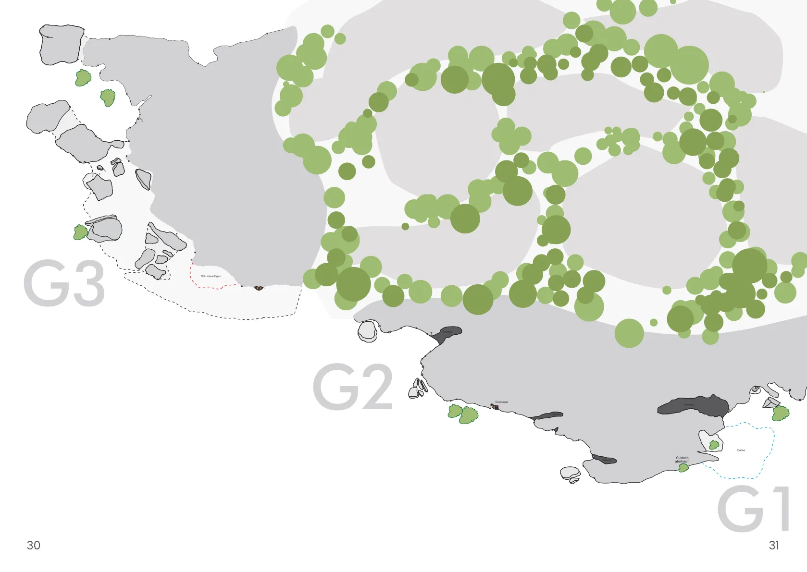
    - **checksum_sha256**: 90f4b60b4e5661119bc07d231bae2ec637f844c95c8f030d9ecd9c7021352a9f
  - **[8]**:
    - **caminho**: 
    - **checksum_sha256**: 693618076bfabd1987ce77f624b241981352e0260d3602ef49adac9ea3277229
  - **[9]**:
    - **caminho**: 
    - **checksum_sha256**: 2557759a09f8a3a296c8f0c8eb2fff466acd0a5d4168d9705c61486a2016db1e
  - **[10]**:
    - **caminho**: 
    - **checksum_sha256**: 055f5c5f4a66ed5fb44cc115a2429ef8521a0910eec24cb559adc6bdcb7d6dd1
  - **[11]**:
    - **caminho**: 
    - **checksum_sha256**: e695fb5e84615f50a877edef89eaa43fdb1ee04c38fcddf276f3461c849fe829
  - **[12]**:
    - **caminho**: 
    - **checksum_sha256**: f9ea6ff74b06347f667b07f0008ecde640afa741f72698d2a660d5f8133ef548
  - **[13]**:
    - **caminho**: 
    - **checksum_sha256**: dfabae26b54fa1e12655d106c7be6f69f628c0ae586cd494218bbe20b15ddf5d
  - **[14]**:
    - **caminho**: 
    - **checksum_sha256**: f120fda35ae25e3d4cd3eb8f7312d125b5bb199621eab410bb34a6c474bb9b16
  - **[15]**:
    - **caminho**: 
    - **checksum_sha256**: 3479c1da48225cb717238b30eceb9792a0046a8794ee74146a3c06424290f3df
  - **[16]**:
    - **caminho**: 
    - **checksum_sha256**: fb6fd4361845dfdb4886e4254d9a1d8cf8cf1989e5d6f6acd7b77eacf52af49e
  - **[17]**:
    - **caminho**: 
    - **checksum_sha256**: fc84629e6ec7ae2b7b7dbfe32f7c8f6253ead36460907e79447809c12df39c32
  - **[18]**:
    - **caminho**: 
    - **checksum_sha256**: 73e907d824967c9fdf41c0f74b81d67ce626e9f1f1fff70fe604cd2f81b7498f
  - **[19]**:
    - **caminho**: 
    - **checksum_sha256**: 7e414c19af5e57d238220b9808660b548d93e8cbc15793e72a8f98a813add20d

