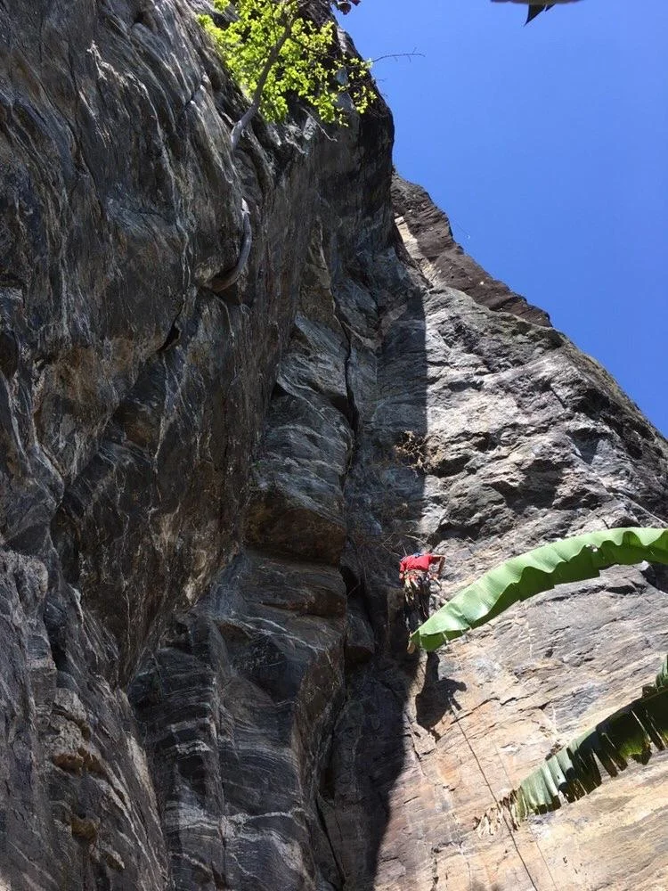
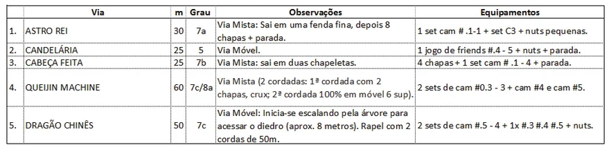
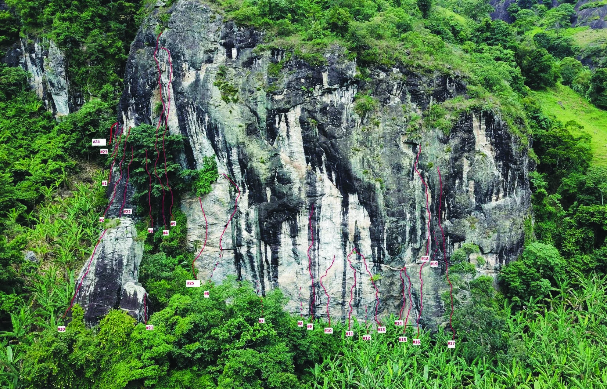

# Croqui: Pedra do Zé

## Informações Gerais

- **id**: br_mg_luminosa_pedra_do_ze
- **nome**: Pedra do Zé
- **creditos**:
  - Bruno Matta (Kbeça)
- **caminho_thumbnail**: 
- **botoes**:
  - **[0]**:
    - **texto**: Capa
    - **destino**:
      - **secao_textual**:
        - **conteudo**:
            # Guia de Escalada Pedra do Zé
            
            |  |
            | :--: |
            | *Capa* |
            
            **Bairro dos Bentos-Lúcios - Luminosa - MG**
            **2020**
  - **[1]**:
    - **texto**: Agradecimentos
    - **destino**:
      - **secao_textual**:
        - **conteudo**:
            # Agradecimentos
            
            |  |
            | :--: |
            | *Linha da via "Homem Curado" - Croqui ref. nº 18* |
            
            Um agradecimento póstumo ao Sr. José Luis, antigo proprietário que liberou inicialmente o acesso ao setor de escalada. Agradeço à viúva e atual proprietária, Dona Rose, por continuar permitindo o acesso. Um agradecimento aos amigos escaladores que contribuíram para que de alguma maneira o setor virasse realidade. A todos o meu obrigado! Bito Meyer, Diego Serrano (Kri), Rodrigo (Braga), Fernando Aranha, Karina Filgueiras, Paula Manso, Renato (Mineiro), Edu Felício, Marcio Rosa, Claudia Faria, Antero Macedo, Débora Abe, Luiz Coslope (pelo acesso às imagens do drone), Azeite e Dionísio, e a todos que não foram citados nessa lista!
            
            Como diria John Muir: "As montanhas estão chamando e eu preciso ir".
            
            Boas escaladas!
            
            **Bruno Matta (Kbeça)**
            
            |  |
            | :--: |
            | *Escalador* |
            
            > [!IMPORTANT]
            > **ATENÇÃO!**
            > ESTA É UMA ÁREA PARTICULAR
            > RESPEITE AS REGRAS!
  - **[2]**:
    - **texto**: Orientações aos Escaladores
    - **destino**:
      - **secao_textual**:
        - **conteudo**:
            # Orientações aos Escaladores
            
            |  |
            | :--: |
            | *Fundo* |
            
            ## Segurança
            A escalada é um esporte que expõe ao risco de acidentes, e a ajuda externa pode não estar disponível. Com isto em mente, a escolha de realizar esta atividade é sua responsabilidade. Você é responsável por sua própria segurança. As ações individuais não devem colocar em risco as pessoas ao seu redor, nem o meio ambiente, por isso atente-se a essas questões.
            
            ## Marimbondos, Vespas e Abelhas
            Por ser um setor novo de escalada, recomenda-se levar inseticida (p.e: alcance) para retirada de marimbondos e vespas; No caso de abelhas não utilize o veneno e baixe do ponto de onde estiver o mais rápido possível. Existe um enxame mapeado no cume do totem, na face oposta da via nº 20 "Se meu fusca escalasse".
            
            ## Meio Ambiente
            A liberdade de acesso às montanhas e falésias deve ser usufruída de maneira responsável e é um direito fundamental. Devemos sempre praticar nossas atividades de maneira ambientalmente sensível e ser pró-ativos na preservação da natureza. Respeite as restrições e regulamentos de acesso acordados pelos escaladores locais com os proprietários.
            
            ## Conquista
            A conquista de uma via é um ato criativo. Deve ser feito com um estilo tão bom quanto as tradições do local e mostrar responsabilidade para com a comunidade local de escalada e as necessidades dos futuros escaladores.
            
            ---
            *Textos extraídos da Declaração do Tyrol (Ética em ambientes de montanha) que pode ser encontrada na íntegra aqui: https://www.theuiaa.org/declarations/tyrol-declaration/.
  - **[3]**:
    - **texto**: Localização & Acesso
    - **destino**:
      - **secao_textual**:
        - **conteudo**:
            # Localização & Acesso
            
            ## Acesso Experimental
            Trata-se de um setor novo e, portanto, a proprietária nunca experimentou um fluxo de pessoas frequentando sua área. Deste modo, obedeça as regras do setor, seja cordial com os moradores locais e tente minimizar o impacto da sua visita.
            
            ## Estacionamento
            O espaço para estacionamento é restrito (aprox. 06 carros, dependendo da disposição). Existe uma zona de estacionamento que está sinalizada, à esquerda, onde está localizada a caixinha para a contribuição da taxa de estacionamento. Caso não existam vagas, retornar na estrada e estacionar de modo a não bloquear a passagem.
  - **[4]**:
    - **texto**: Como Chegar
    - **destino**:
      - **secao_textual**:
        - **conteudo**:
            # Como Chegar
            
            **Coordenadas: 22° 37' 29.41" S - 45° 37' 46.52" O**
            
            |  |
            | :--: |
            | *Mapa Geral de Acesso* |
            
            |  |
            | :--: |
            | *Detalhes do Acesso* |
            
            Partindo do acampamento Paiol Grande em direção a Pedra do Zé.
  - **[5]**:
    - **texto**: Créditos
    - **destino**:
      - **secao_textual**:
        - **conteudo**:
            # Créditos
            
            **Guia de Escalada Pedra do Zé**
            **Edição 01 / 2020**
            **Atualização: Agosto 2020**
            
            ## Realização, Textos e Fotos
            **Bruno Matta (Kbeça)**
            brunommatta@gmail.com
            
            ## Arte Gráfica e Diagramação
            **Débora Abe**
            deboraabe.projetos@gmail.com
            
            Dê preferência ao arquivo digital. Não imprima.
- **ultima_migracao**: 1

## Parte: setor_principal

### Setor (Pico: Pedra do Zé)

- **descricao**:
    # Setor Principal
    
    O Setor Principal da Pedra do Zé oferece uma grande variedade de vias, desde móveis clássicas até esportivas de alta dificuldade.
    
    |  |
    | :--: |
    | *Croqui Geral do Setor Principal* |
    
    |  |
    | :--: |
    | *Detalhe Esquerda* |
    
    |  |
    | :--: |
    | *Detalhe Meio* |
    
    |  |
    | :--: |
    | *Detalhe Direita* |
    
    |  |
    | :--: |
    | *Totem* |
- **nome**: Setor Principal
- **mapas**:
  - **[0]**:
    - **caminho_imagem_mapa**: 
    - **largura_mapa**: 1652
    - **altura_mapa**: 1060
- **escaladas**:
  - **[0]**:
    - **via_movel**:
      - **descricao**: Via Mista: Sai em uma fenda fina, depois 8 chapas + parada. Equipamentos: 1 set cam #.1-1 + set C3 + nuts pequenas.
      - **nome**: Astro Rei
      - **id_no_mapa**: 1
      - **dificuldade**: BR_7A
      - **extensao**: 30
      - **quantidade_protecoes_intermediarias**: 8
      - **quantidade_protecoes_parada**: 1
      - **conquistadores**:
        - Bruno Matta (Kbeça)
  - **[1]**:
    - **via_movel**:
      - **descricao**: Via Móvel. Equipamentos: 1 jogo de friends #.4-5 + nuts + parada.
      - **nome**: Candelária
      - **id_no_mapa**: 2
      - **dificuldade**: BR_5
      - **extensao**: 25
      - **conquistadores**:
        - Bruno Matta (Kbeça)
  - **[2]**:
    - **via_movel**:
      - **descricao**: Via Mista: sai em duas chapeletas. Equipamentos: 4 chapas + 1 set cam #.1-4 + parada.
      - **nome**: Cabeça Feita
      - **id_no_mapa**: 3
      - **dificuldade**: BR_7B
      - **extensao**: 25
      - **quantidade_protecoes_intermediarias**: 4
      - **quantidade_protecoes_parada**: 1
      - **conquistadores**:
        - Bruno Matta (Kbeça)
  - **[3]**:
    - **via_multiplas_enfiadas**:
      - **descricao**: Via Mista (2 cordadas: 1ª cordada com 2 chapas, crux; 2ª cordada 100% em móvel 6 sup). Equipamentos: 2 sets de cam #0.3-3 + cam #4 e cam #5.
      - **nome**: Queijin Machine
      - **id_no_mapa**: 4
      - **dificuldade_maxima**: BR_7C_BARRA_8A
      - **comprimento_total**: 60
      - **numero_enfiadas**: 2
      - **conquistadores**:
        - Bruno Matta (Kbeça)
  - **[4]**:
    - **via_movel**:
      - **descricao**: Via Móvel: Inicia-se escalando pela árvore para acessar o diedro (aprox. 8 metros). Rapel com 2 cordas de 50m. Equipamentos: 2 sets de cam #.5-4 + 1x #.3 #.4 #.5 + nuts.
      - **nome**: Dragão Chinês
      - **id_no_mapa**: 5
      - **dificuldade**: BR_7C
      - **extensao**: 50
      - **conquistadores**:
        - Bruno Matta (Kbeça)
  - **[5]**:
    - **via_movel**:
      - **descricao**: Equipamentos: 2 jogos completos do #.3 ao 3 + adicional (1x #.75 + #1 + #2) + 1x #4.
      - **nome**: Kriptonita (1ª cordada)
      - **id_no_mapa**: 6
      - **dificuldade**: BR_7C
      - **extensao**: 32
      - **conquistadores**:
        - Bruno Matta (Kbeça)
  - **[6]**:
    - **via_esportiva**:
      - **descricao**: Projeto
      - **nome**: Via dos Alunos
      - **id_no_mapa**: 7
      - **dificuldade**: PROJETO
      - **quantidade_protecoes_intermediarias**: 6
  - **[7]**:
    - **via_esportiva**:
      - **descricao**: Projeto
      - **nome**: Via Inacabada
      - **id_no_mapa**: 8
      - **dificuldade**: PROJETO
      - **quantidade_protecoes_intermediarias**: 3
  - **[8]**:
    - **via_esportiva**:
      - **descricao**: Proteção fixa. 13 chapas + parada.
      - **nome**: La Medicina Paraguaya
      - **id_no_mapa**: 9
      - **dificuldade**: BR_9A
      - **extensao**: 30
      - **quantidade_protecoes_intermediarias**: 13
      - **quantidade_protecoes_parada**: 1
      - **conquistadores**:
        - Bruno Matta (Kbeça)
  - **[9]**:
    - **via_esportiva**:
      - **descricao**: Proteção fixa. 9 chapas + parada.
      - **nome**: Churrasco de Marimbondo
      - **id_no_mapa**: 10
      - **dificuldade**: BR_9A
      - **extensao**: 20
      - **quantidade_protecoes_intermediarias**: 9
      - **quantidade_protecoes_parada**: 1
      - **conquistadores**:
        - Bruno Matta (Kbeça)
  - **[10]**:
    - **via_movel**:
      - **descricao**: Via Mista: sai de cima do totem, 6 chapas e depois finaliza na fenda até o platô. Parada compartilhada com via 13 (Fenda da árvore). Equipamentos: 1 set cam #.2-5 + 6 chapas + parada.
      - **nome**: Dá a Patinha
      - **id_no_mapa**: 11
      - **dificuldade**: BR_7B
      - **extensao**: 20
      - **quantidade_protecoes_intermediarias**: 6
      - **quantidade_protecoes_parada**: 1
      - **conquistadores**:
        - Bruno Matta (Kbeça)
  - **[11]**:
    - **via_esportiva**:
      - **descricao**: Projeto
      - **nome**: Via Inacabada
      - **id_no_mapa**: 12
      - **dificuldade**: PROJETO
      - **quantidade_protecoes_intermediarias**: 3
  - **[12]**:
    - **via_movel**:
      - **descricao**: Via Mista: sai na fenda e depois 4 chapas. Parada compartilhada com via 11 (Dá a patinha). Equipamentos: 1 set cam #.3-3 + nuts + 4 chapas + parada.
      - **nome**: Fenda da Árvore
      - **id_no_mapa**: 13
      - **dificuldade**: BR_8A
      - **extensao**: 20
      - **quantidade_protecoes_intermediarias**: 4
      - **quantidade_protecoes_parada**: 1
      - **conquistadores**:
        - Bruno Matta (Kbeça)
  - **[13]**:
    - **via_movel**:
      - **descricao**: Via Móvel: diedro que sai à direita da Santinha. Parada compartilhada com a via 15 (Meninas Massachussets). Equipamentos: 1 set cam #.2-4 + 1x #.75, #1 + nuts.
      - **nome**: Iluminosa
      - **id_no_mapa**: 14
      - **dificuldade**: BR_7B
      - **extensao**: 20
      - **conquistadores**:
        - Bruno Matta (Kbeça)
  - **[14]**:
    - **via_esportiva**:
      - **descricao**: Proteção fixa. Parada compartilhada com a via 14 (Iluminosa). 9 chapas + parada.
      - **nome**: Meninas Massachussets
      - **id_no_mapa**: 15
      - **dificuldade**: BR_8C
      - **extensao**: 20
      - **quantidade_protecoes_intermediarias**: 9
      - **quantidade_protecoes_parada**: 1
      - **conquistadores**:
        - Bruno Matta (Kbeça)
  - **[15]**:
    - **via_movel**:
      - **descricao**: Via Mista: sai em uma fenda, depois 4 chapas até parada. Equipamentos: 1 set cam #.2-1 + c3 + 4 chapas + parada.
      - **nome**: De Novo Não
      - **id_no_mapa**: 16
      - **dificuldade**: BR_8A
      - **extensao**: 20
      - **quantidade_protecoes_intermediarias**: 4
      - **quantidade_protecoes_parada**: 1
      - **conquistadores**:
        - Bruno Matta (Kbeça)
  - **[16]**:
    - **via_esportiva**:
      - **descricao**: Proteção fixa. 15 chapas + parada.
      - **nome**: Bragasilia
      - **id_no_mapa**: 17
      - **dificuldade**: BR_9A
      - **extensao**: 30
      - **quantidade_protecoes_intermediarias**: 15
      - **quantidade_protecoes_parada**: 1
      - **conquistadores**:
        - Bruno Matta (Kbeça)
  - **[17]**:
    - **via_movel**:
      - **descricao**: Via Móvel: diedro que sai do platô com 1 chapa. Equipamentos: 2 sets cam #.3-4 + 1x #5 + nuts + 1 chapa + parada.
      - **nome**: Homem Curado
      - **id_no_mapa**: 18
      - **dificuldade**: BR_7A
      - **extensao**: 25
      - **quantidade_protecoes_intermediarias**: 1
      - **quantidade_protecoes_parada**: 1
      - **conquistadores**:
        - Bruno Matta (Kbeça)
  - **[18]**:
    - **via_esportiva**:
      - **descricao**: Projeto
      - **nome**: Via Inacabada
      - **id_no_mapa**: 19
      - **dificuldade**: PROJETO
      - **quantidade_protecoes_intermediarias**: 4
  - **[19]**:
    - **via_movel**:
      - **descricao**: Via Mista localizada no totem na frente da parede principal. Equipamentos: 01 set cam #.3-4 + 2 chapas + parada.
      - **nome**: Se Meu Fusca Escalasse
      - **id_no_mapa**: 20
      - **dificuldade**: BR_6SUP
      - **extensao**: 15
      - **quantidade_protecoes_intermediarias**: 2
      - **quantidade_protecoes_parada**: 1
      - **conquistadores**:
        - Bruno Matta (Kbeça)
  - **[20]**:
    - **via_esportiva**:
      - **descricao**: Via localizada no totem na frente da parede principal. 5 chapas + parada.
      - **nome**: Tapas e Beijos
      - **id_no_mapa**: 21
      - **dificuldade**: BR_8A
      - **extensao**: 12
      - **quantidade_protecoes_intermediarias**: 5
      - **quantidade_protecoes_parada**: 1
      - **conquistadores**:
        - Bruno Matta (Kbeça)
  - **[21]**:
    - **via_esportiva**:
      - **descricao**: Proteção fixa. 12 chapas + parada.
      - **nome**: Faca no Pescoço
      - **id_no_mapa**: 22
      - **dificuldade**: BR_9A
      - **extensao**: 20
      - **quantidade_protecoes_intermediarias**: 12
      - **quantidade_protecoes_parada**: 1
      - **conquistadores**:
        - Bruno Matta (Kbeça)
  - **[22]**:
    - **via_movel**:
      - **descricao**: Via Mista. 9 chapas + parada + 1 set cam #0.3 até o cam#2.
      - **nome**: Para Com Isso
      - **id_no_mapa**: 23
      - **dificuldade**: BR_6_BARRA_6SUP
      - **extensao**: 25
      - **quantidade_protecoes_intermediarias**: 9
      - **quantidade_protecoes_parada**: 1
      - **conquistadores**:
        - Bruno Matta (Kbeça)
  - **[23]**:
    - **via_esportiva**:
      - **descricao**: Proteção fixa. 9 chapas + parada (compartilhada com a via 23).
      - **nome**: Zé Patinha
      - **id_no_mapa**: 24
      - **dificuldade**: BR_6SUP
      - **extensao**: 25
      - **quantidade_protecoes_intermediarias**: 9
      - **quantidade_protecoes_parada**: 1
      - **conquistadores**:
        - Bruno Matta (Kbeça)
  - **[24]**:
    - **via_esportiva**:
      - **descricao**: Projeto
      - **nome**: Mathilda Meu Amor
      - **id_no_mapa**: 25
      - **dificuldade**: PROJETO

## Arquivos Externos

- **arquivos_externos**:
  - **[0]**:
    - **caminho**: 
    - **checksum_sha256**: 1d36071b6d0ab70dea5445c273558d0b695349fd8bec71ec4ce41e49f399255f
  - **[1]**:
    - **caminho**: 
    - **checksum_sha256**: a5c61b3cfbcf3f6fcb6690ca3c55188fb3a10da5c5b32a157a0c2ac9862f1843
  - **[2]**:
    - **caminho**: 
    - **checksum_sha256**: 05b96b5f6b8cfcba3e0930cc36661924a00c2123ac7088470029fa45467c1738
  - **[3]**:
    - **caminho**: 
    - **checksum_sha256**: d241900108e0b7b815c6d16128d4371e12989326576c14ec0ebc76acfd9e2ea1
  - **[4]**:
    - **caminho**: 
    - **checksum_sha256**: 49b3afde24b8db6ea0068c2c7412224e6862e5be404fd0e1060f6662ce4f79fe
  - **[5]**:
    - **caminho**: 
    - **checksum_sha256**: f82eb76b8dd4465c662d41291375e5b91e0d80d0a6ccf2ef67fc0f710ca90a34
  - **[6]**:
    - **caminho**: 
    - **checksum_sha256**: e80a92726383fde656cc48dc0060db9660e638370b5ef9755d7d7d214fbb8ca7
  - **[7]**:
    - **caminho**: 
    - **checksum_sha256**: e80a92726383fde656cc48dc0060db9660e638370b5ef9755d7d7d214fbb8ca7
  - **[8]**:
    - **caminho**: 
    - **checksum_sha256**: 53ab97d691548eed708a35e4bbf814f6787b077f24f510493686db2f838b9180
  - **[9]**:
    - **caminho**: 
    - **checksum_sha256**: b906ced14c94b38778094c4becd98f83108f086145a4da3fd0350e2cf5e81107
  - **[10]**:
    - **caminho**: 
    - **checksum_sha256**: 64158ba23ccb692bfefe25ab629e3b5a4dac097444629724299ed494a56340f9
  - **[11]**:
    - **caminho**: 
    - **checksum_sha256**: 941f678586e2d734f7df02ba9a1bac0a3f26179d451936803ca5a54d445d3daa

