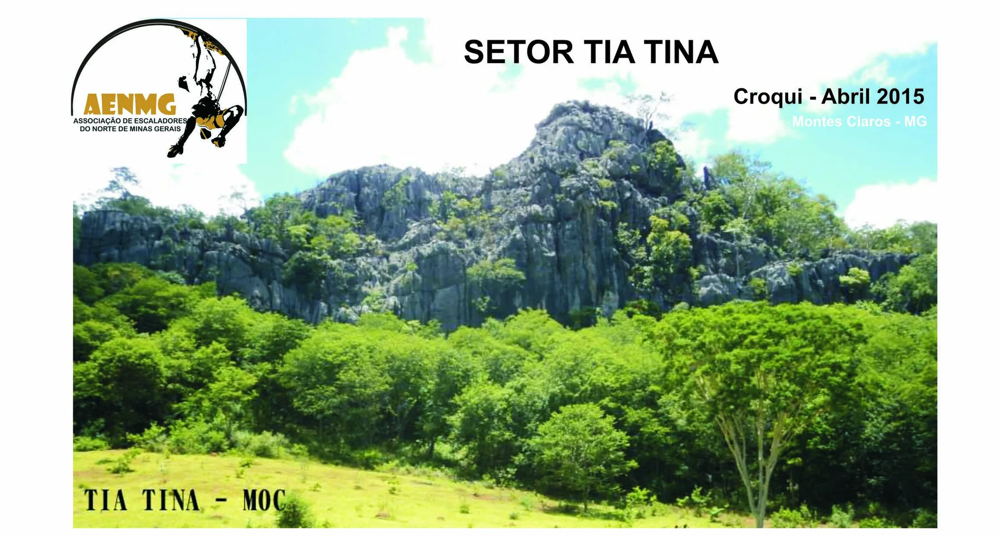
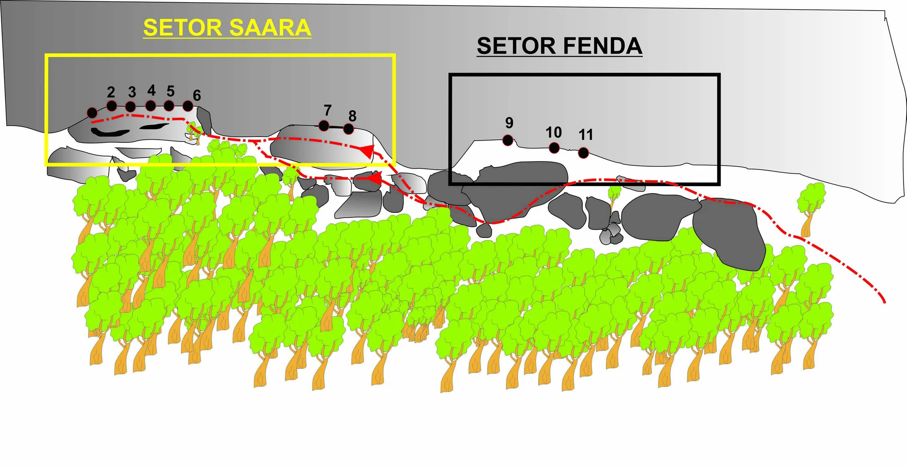
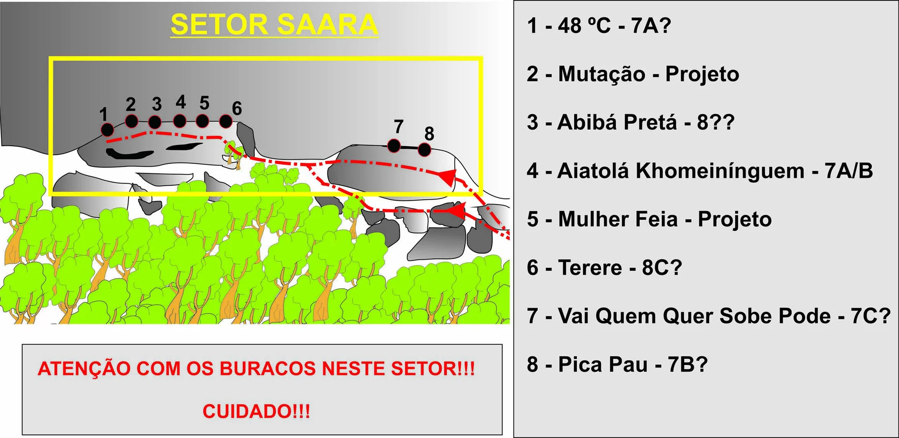
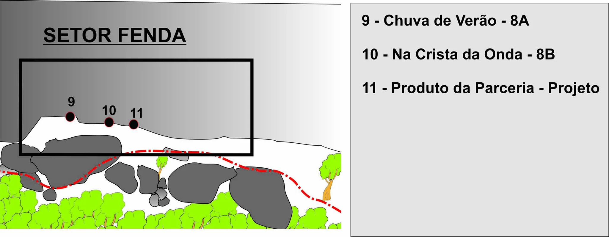
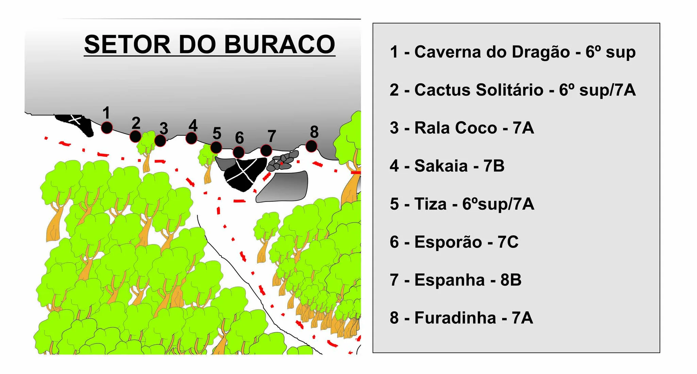
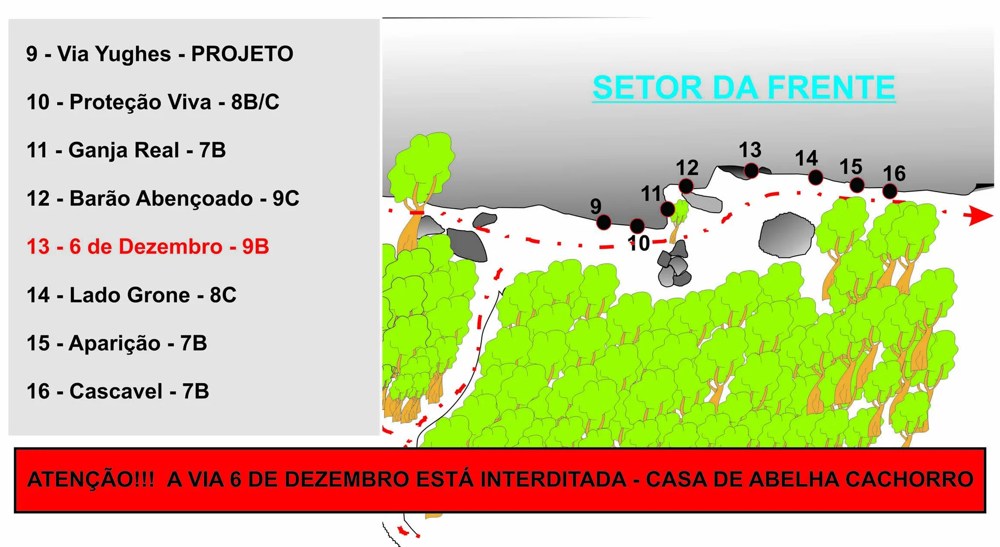
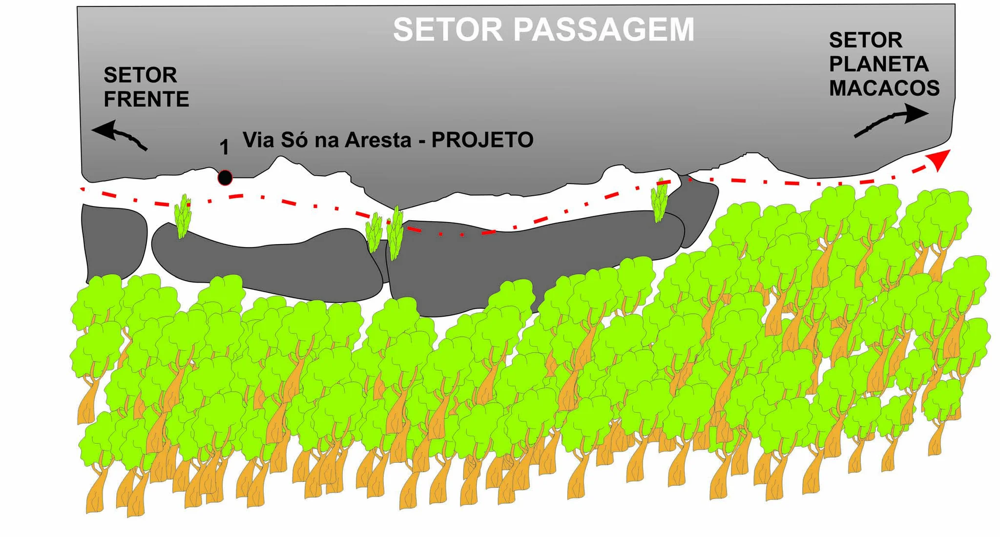
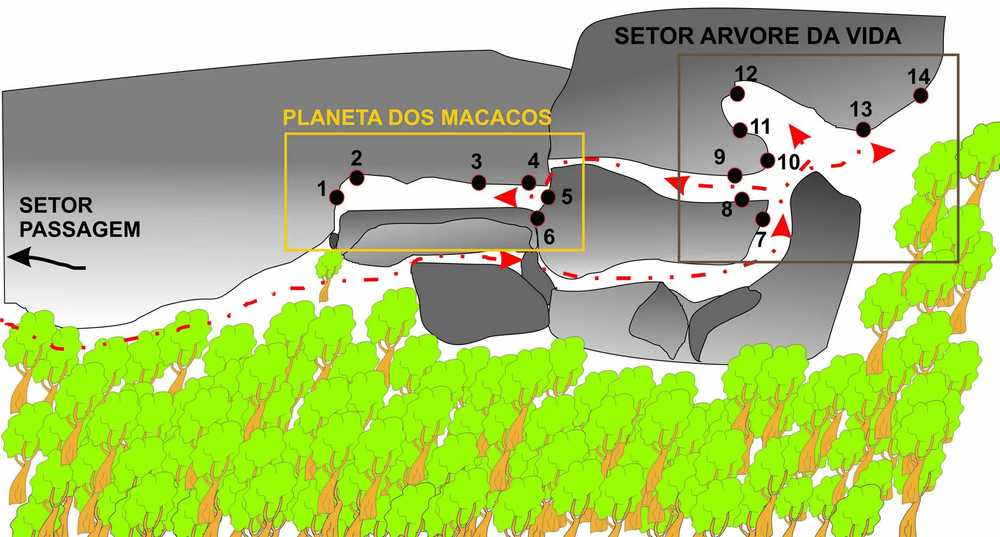

# Croqui: Setor Tia Tina (Montes Claros)

## Informações Gerais

- **descricao**: Guia de escalada do Setor Tia Tina em Montes Claros, MG.
- **id**: br_mg_montes_claros_tia_tina
- **nome**: Setor Tia Tina (Montes Claros)
- **creditos**:
  - AENMG - Associação de Escaladores do Norte de Minas Gerais
- **caminho_thumbnail**: 
- **status_desenho_extraivel**: NAO_TEM_DESENHO
- **botoes**:
  - **[0]**:
    - **texto**: Capa
    - **destino**:
      - **secao_textual**:
        - **conteudo**:
            # Setor Tia Tina
            
            |  |
            | :--: |
            | *Capa* |
            
            **Croqui - Abril 2015**
            **Montes Claros - MG**
            
            AENMG - ASSOCIAÇÃO DE ESCALADORES DO NORTE DE MINAS GERAIS
  - **[1]**:
    - **texto**: Mapas Gerais
    - **destino**:
      - **secao_textual**:
        - **conteudo**:
            # Mapas Gerais
            
            Estes mapas mostram a localização dos principais setores do Setor Tia Tina.
            
            ## Localização dos Setores Saara e Fenda
            
            |  |
            | :--: |
            | *Mapa Geral 1* |
            
            ## Localização dos Setores do Buraco e da Frente
            
            |  |
            | :--: |
            | *Mapa Geral 2* |
- **ultima_migracao**: 2

## Parte: setor_saara

### Setor (Pico: Setor Tia Tina)

- **descricao**: ATENÇÃO COM OS BURACOS NESTE SETOR!!! CUIDADO!!!
- **nome**: Setor Saara
- **mapas**:
  - **[0]**:
    - **caminho_imagem_mapa**: 
    - **referencias**:
      - **[0]**:
        - **escalada**: 48 °C
        - **ids**:
          - 1
      - **[1]**:
        - **escalada**: Mutação
        - **ids**:
          - 2
      - **[2]**:
        - **escalada**: Abibá Pretá
        - **ids**:
          - 3
      - **[3]**:
        - **escalada**: Aiatolá Khomeiniinguem
        - **ids**:
          - 4
      - **[4]**:
        - **escalada**: Mulher Feia
        - **ids**:
          - 5
      - **[5]**:
        - **escalada**: Terere
        - **ids**:
          - 6
      - **[6]**:
        - **escalada**: Vai Quem Quer Sobe Pode
        - **ids**:
          - 7
      - **[7]**:
        - **escalada**: Pica Pau
        - **ids**:
          - 8
    - **largura_mapa**: 2048
    - **altura_mapa**: 998
- **escaladas**:
  - **[0]**:
    - **via_esportiva**:
      - **nome**: 48 °C
      - **dificuldade**: BR_7A
  - **[1]**:
    - **via_esportiva**:
      - **nome**: Mutação
      - **dificuldade**: PROJETO
  - **[2]**:
    - **via_esportiva**:
      - **nome**: Abibá Pretá
      - **dificuldade**: BR_8A
  - **[3]**:
    - **via_esportiva**:
      - **nome**: Aiatolá Khomeiniinguem
      - **dificuldade**: BR_7A_BARRA_7B
  - **[4]**:
    - **via_esportiva**:
      - **nome**: Mulher Feia
      - **dificuldade**: PROJETO
  - **[5]**:
    - **via_esportiva**:
      - **nome**: Terere
      - **dificuldade**: BR_8C
  - **[6]**:
    - **via_esportiva**:
      - **nome**: Vai Quem Quer Sobe Pode
      - **dificuldade**: BR_7C
  - **[7]**:
    - **via_esportiva**:
      - **nome**: Pica Pau
      - **dificuldade**: BR_7B

## Parte: setor_fenda

### Setor (Pico: Setor Tia Tina)

- **descricao**: 
- **nome**: Setor Fenda
- **mapas**:
  - **[0]**:
    - **caminho_imagem_mapa**: 
    - **referencias**:
      - **[0]**:
        - **escalada**: Chuva de Verão
        - **ids**:
          - 9
      - **[1]**:
        - **escalada**: Na Crista da Onda
        - **ids**:
          - 10
      - **[2]**:
        - **escalada**: Produto da Parceria
        - **ids**:
          - 11
    - **largura_mapa**: 2048
    - **altura_mapa**: 797
- **escaladas**:
  - **[0]**:
    - **via_esportiva**:
      - **nome**: Chuva de Verão
      - **dificuldade**: BR_8A
  - **[1]**:
    - **via_esportiva**:
      - **nome**: Na Crista da Onda
      - **dificuldade**: BR_8B
  - **[2]**:
    - **via_esportiva**:
      - **nome**: Produto da Parceria
      - **dificuldade**: PROJETO

## Parte: setor_do_buraco

### Setor (Pico: Setor Tia Tina)

- **descricao**: 
- **nome**: Setor do Buraco
- **mapas**:
  - **[0]**:
    - **caminho_imagem_mapa**: 
    - **referencias**:
      - **[0]**:
        - **escalada**: Caverna do Dragão
        - **ids**:
          - 1
      - **[1]**:
        - **escalada**: Cactus Solitário
        - **ids**:
          - 2
      - **[2]**:
        - **escalada**: Rala Coco
        - **ids**:
          - 3
      - **[3]**:
        - **escalada**: Sakaia
        - **ids**:
          - 4
      - **[4]**:
        - **escalada**: Tiza
        - **ids**:
          - 5
      - **[5]**:
        - **escalada**: Esporão
        - **ids**:
          - 6
      - **[6]**:
        - **escalada**: Espanha
        - **ids**:
          - 7
      - **[7]**:
        - **escalada**: Furadinha
        - **ids**:
          - 8
    - **largura_mapa**: 2048
    - **altura_mapa**: 1100
- **escaladas**:
  - **[0]**:
    - **via_esportiva**:
      - **nome**: Caverna do Dragão
      - **dificuldade**: BR_6SUP
  - **[1]**:
    - **via_esportiva**:
      - **nome**: Cactus Solitário
      - **dificuldade**: BR_6SUP_BARRA_7A
  - **[2]**:
    - **via_esportiva**:
      - **nome**: Rala Coco
      - **dificuldade**: BR_7A
  - **[3]**:
    - **via_esportiva**:
      - **nome**: Sakaia
      - **dificuldade**: BR_7B
  - **[4]**:
    - **via_esportiva**:
      - **nome**: Tiza
      - **dificuldade**: BR_6SUP_BARRA_7A
  - **[5]**:
    - **via_esportiva**:
      - **nome**: Esporão
      - **dificuldade**: BR_7C
  - **[6]**:
    - **via_esportiva**:
      - **nome**: Espanha
      - **dificuldade**: BR_8B
  - **[7]**:
    - **via_esportiva**:
      - **nome**: Furadinha
      - **dificuldade**: BR_7A

## Parte: setor_da_frente

### Setor (Pico: Setor Tia Tina)

- **descricao**: 
- **nome**: Setor da Frente
- **mapas**:
  - **[0]**:
    - **caminho_imagem_mapa**: 
    - **referencias**:
      - **[0]**:
        - **escalada**: Via Yughes
        - **ids**:
          - 9
      - **[1]**:
        - **escalada**: Proteção Viva
        - **ids**:
          - 10
      - **[2]**:
        - **escalada**: Ganja Real
        - **ids**:
          - 11
      - **[3]**:
        - **escalada**: Barão Abençoado
        - **ids**:
          - 12
      - **[4]**:
        - **escalada**: 6 de Dezembro
        - **ids**:
          - 13
      - **[5]**:
        - **escalada**: Lado Grone
        - **ids**:
          - 14
      - **[6]**:
        - **escalada**: Aparição
        - **ids**:
          - 15
      - **[7]**:
        - **escalada**: Cascavel
        - **ids**:
          - 16
    - **largura_mapa**: 2048
    - **altura_mapa**: 1122
- **escaladas**:
  - **[0]**:
    - **via_esportiva**:
      - **nome**: Via Yughes
      - **dificuldade**: PROJETO
  - **[1]**:
    - **via_esportiva**:
      - **nome**: Proteção Viva
      - **dificuldade**: BR_8B_BARRA_8C
  - **[2]**:
    - **via_esportiva**:
      - **nome**: Ganja Real
      - **dificuldade**: BR_7B
  - **[3]**:
    - **via_esportiva**:
      - **nome**: Barão Abençoado
      - **dificuldade**: BR_9C
  - **[4]**:
    - **via_esportiva**:
      - **descricao**: ATENÇÃO!!! ESTÁ INTERDITADA - CASA DE ABELHA CACHORRO
      - **nome**: 6 de Dezembro
      - **dificuldade**: BR_9B
  - **[5]**:
    - **via_esportiva**:
      - **nome**: Lado Grone
      - **dificuldade**: BR_8C
  - **[6]**:
    - **via_esportiva**:
      - **nome**: Aparição
      - **dificuldade**: BR_7B
  - **[7]**:
    - **via_esportiva**:
      - **nome**: Cascavel
      - **dificuldade**: BR_7B

## Parte: setor_passagem

### Setor (Pico: Setor Tia Tina)

- **descricao**: 
- **nome**: Setor Passagem
- **mapas**:
  - **[0]**:
    - **caminho_imagem_mapa**: 
    - **referencias**:
      - **[0]**:
        - **escalada**: Via Só na Aresta
        - **ids**:
          - 1
    - **largura_mapa**: 2048
    - **altura_mapa**: 1100
- **escaladas**:
  - **[0]**:
    - **via_esportiva**:
      - **nome**: Via Só na Aresta
      - **dificuldade**: PROJETO

## Parte: setor_arvore_da_vida

### Setor (Pico: Setor Tia Tina)

- **descricao**: 
- **nome**: Setor Árvore da Vida
- **mapas**:
  - **[0]**:
    - **caminho_imagem_mapa**: 
    - **largura_mapa**: 2048
    - **altura_mapa**: 1100
- **escaladas**: []

## Parte: setor_planeta_dos_macacos

### Setor (Pico: Setor Tia Tina)

- **descricao**: 
- **nome**: Setor Planeta dos Macacos
- **mapas**:
  - **[0]**:
    - **caminho_imagem_mapa**: 
    - **referencias**:
      - **[0]**:
        - **escalada**: Chimpanzé
        - **ids**:
          - 1
      - **[1]**:
        - **escalada**: Los Macacos
        - **ids**:
          - 2
      - **[2]**:
        - **escalada**: Macaco Loco
        - **ids**:
          - 3
      - **[3]**:
        - **escalada**: Macaco Prego
        - **ids**:
          - 4
      - **[4]**:
        - **escalada**: Chita
        - **ids**:
          - 5
      - **[5]**:
        - **escalada**: Monga
        - **ids**:
          - 6
    - **largura_mapa**: 2048
    - **altura_mapa**: 1100
- **escaladas**:
  - **[0]**:
    - **via_esportiva**:
      - **nome**: Chimpanzé
      - **dificuldade**: BR_7C
  - **[1]**:
    - **via_esportiva**:
      - **nome**: Los Macacos
      - **dificuldade**: BR_7C
  - **[2]**:
    - **via_esportiva**:
      - **nome**: Macaco Loco
      - **dificuldade**: BR_8C
  - **[3]**:
    - **via_esportiva**:
      - **nome**: Macaco Prego
      - **dificuldade**: PROJETO
  - **[4]**:
    - **via_esportiva**:
      - **nome**: Chita
      - **dificuldade**: BR_8A
  - **[5]**:
    - **via_esportiva**:
      - **nome**: Monga
      - **dificuldade**: BR_6SUP_BARRA_7A

## Arquivos Externos

- **arquivos_externos**:
  - **[0]**:
    - **caminho**: 
    - **checksum_sha256**: fd9dad9574cb6806a22df45be2404f16a7063c7547f83e299242a64da0dd706d
  - **[1]**:
    - **caminho**: 
    - **checksum_sha256**: 82620405655e34314223b92aea36c812e93b2a48ec8aae7a2109d372b0fc5ad7
  - **[2]**:
    - **caminho**: 
    - **checksum_sha256**: fb5cb89d2b8ad38b3e3d419f4308bf93e47542a3a26835da08a0253016c7de09
  - **[3]**:
    - **caminho**: 
    - **checksum_sha256**: f28f8d3f7750b6a787e191e5e0b4016639effcff92eaebaa42e8f7f77e10e9c5
  - **[4]**:
    - **caminho**: 
    - **checksum_sha256**: f1709d94c6a1eca1053b0e22481da17bc0cce899023f1f1e250758b5256e4e07
  - **[5]**:
    - **caminho**: 
    - **checksum_sha256**: 14129e7634888031a10ff7763bffee6e89ce7585fadca3f21d56dce88c01e286
  - **[6]**:
    - **caminho**: 
    - **checksum_sha256**: 5ed6c64ac5cd5d7b8f6e42dfca35b2de2b9fce1256f67c614a9438882b474389
  - **[7]**:
    - **caminho**: 
    - **checksum_sha256**: 31ac1e0738ef4d7be4a0c195abdba284da5c576cfa35c9c0b27d714a669c5dc4
  - **[8]**:
    - **caminho**: 
    - **checksum_sha256**: f28f8d3f7750b6a787e191e5e0b4016639effcff92eaebaa42e8f7f77e10e9c5
  - **[9]**:
    - **caminho**: 
    - **checksum_sha256**: fd951007c5af5d19b0a0f4fc16e93f2f6337d064ee882978176a9528bc665fbe

