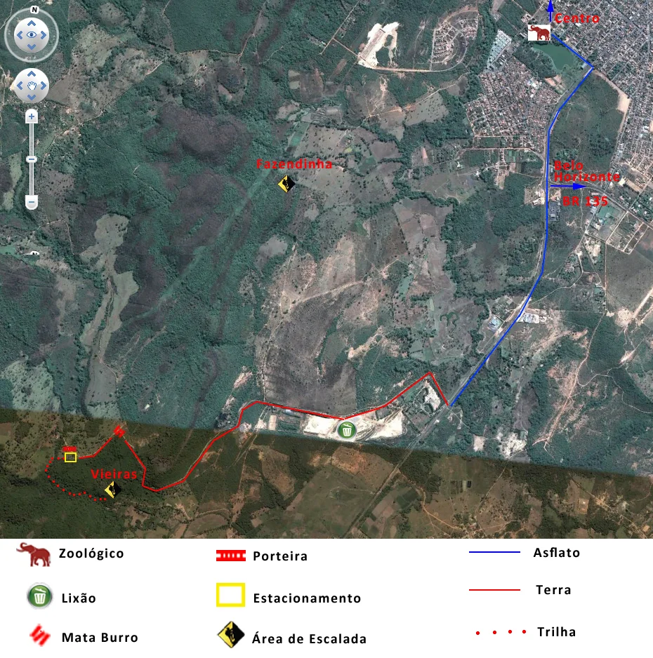
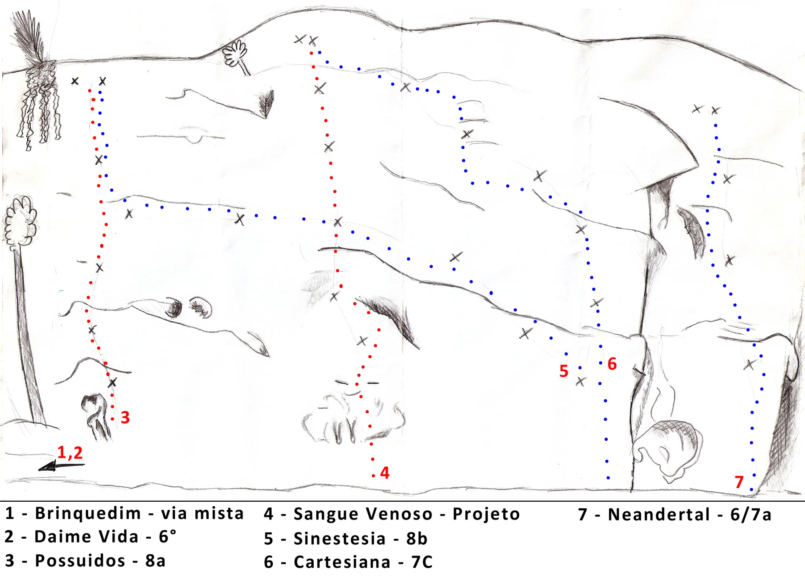
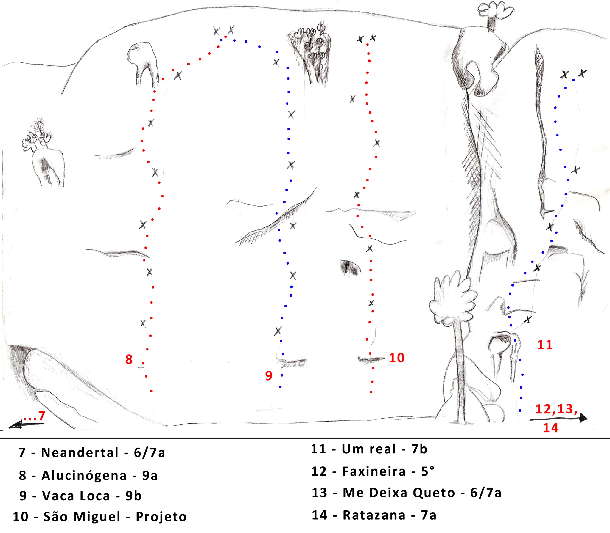

# Croqui: Montes Claros - Vieiras

## Informações Gerais

- **id**: br_mg_montes_claros_vieiras
- **nome**: Montes Claros - Vieiras
- **caminho_thumbnail**: 
- **status_desenho_extraivel**: NAO_TEM_DESENHO
- **ultima_migracao**: 3
- **botoes**: []

## Parte: setor_vieiras

### Setor (Pico: Vieiras)

- **descricao**:
    # Setor Vieiras
    
    O setor Vieiras é um dos setores clássicos de Montes Claros, com vias que variam do 5° ao 9b.
- **nome**: Vieiras
- **mapas**:
  - **[0]**:
    - **caminho_imagem_mapa**: 
    - **largura_mapa**: 2048
    - **altura_mapa**: 1489
  - **[1]**:
    - **caminho_imagem_mapa**: 
    - **largura_mapa**: 2048
    - **altura_mapa**: 1793
- **escaladas**:
  - **[0]**:
    - **via_movel**:
      - **descricao**: Via mista.
      - **nome**: Brinquedim
  - **[1]**:
    - **via_esportiva**:
      - **nome**: Daime Vida
      - **dificuldade**: BR_6
  - **[2]**:
    - **via_esportiva**:
      - **nome**: Possuidos
      - **dificuldade**: BR_8A
  - **[3]**:
    - **via_esportiva**:
      - **nome**: Sangue Venoso
      - **dificuldade**: PROJETO
  - **[4]**:
    - **via_esportiva**:
      - **nome**: Sinestesia
      - **dificuldade**: BR_8B
  - **[5]**:
    - **via_esportiva**:
      - **nome**: Cartesiana
      - **dificuldade**: BR_7C
  - **[6]**:
    - **via_esportiva**:
      - **nome**: Neandertal
      - **dificuldade**: BR_6SUP_BARRA_7A
  - **[7]**:
    - **via_esportiva**:
      - **nome**: Alucinógena
      - **dificuldade**: BR_9A
  - **[8]**:
    - **via_esportiva**:
      - **nome**: Vaca Loca
      - **dificuldade**: BR_9B
  - **[9]**:
    - **via_esportiva**:
      - **nome**: São Miguel
      - **dificuldade**: PROJETO
  - **[10]**:
    - **via_esportiva**:
      - **nome**: Um real
      - **dificuldade**: BR_7B
  - **[11]**:
    - **via_esportiva**:
      - **nome**: Faxineira
      - **dificuldade**: BR_5
  - **[12]**:
    - **via_esportiva**:
      - **nome**: Me Deixa Queto
      - **dificuldade**: BR_6SUP_BARRA_7A
  - **[13]**:
    - **via_esportiva**:
      - **nome**: Ratazana
      - **dificuldade**: BR_7A

## Arquivos Externos

- **arquivos_externos**:
  - **[0]**:
    - **caminho**: 
    - **checksum_sha256**: 1244b07055f4998ee6211887e7c9478c7edcd801b03edbf7f23fb78553ad79fc
  - **[1]**:
    - **caminho**: 
    - **checksum_sha256**: fd306fc89c3568f4073f1a626ca74d296ec95eb431d085a43d9bbf1c4b85ed79
  - **[2]**:
    - **caminho**: 
    - **checksum_sha256**: ada822a2c3f33f5beb31f112a7d5f1c2c0c6191a8fd80f00360682e3d5cd9059

