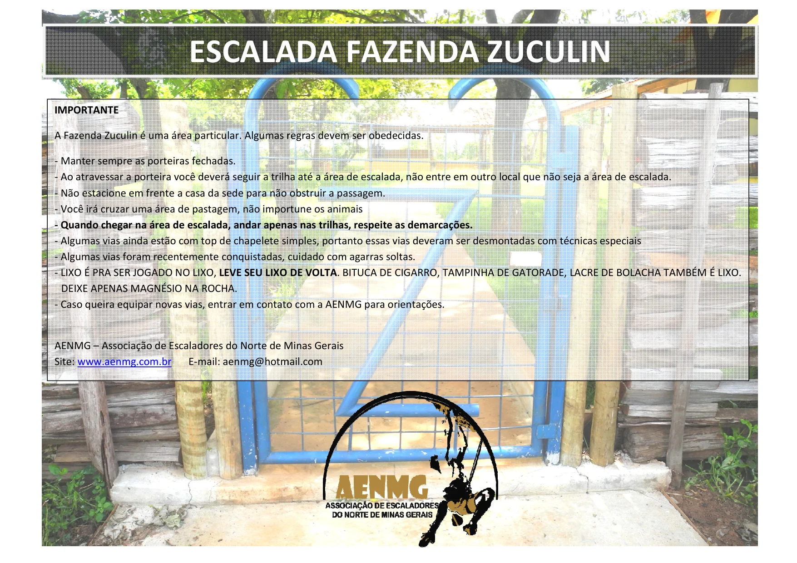
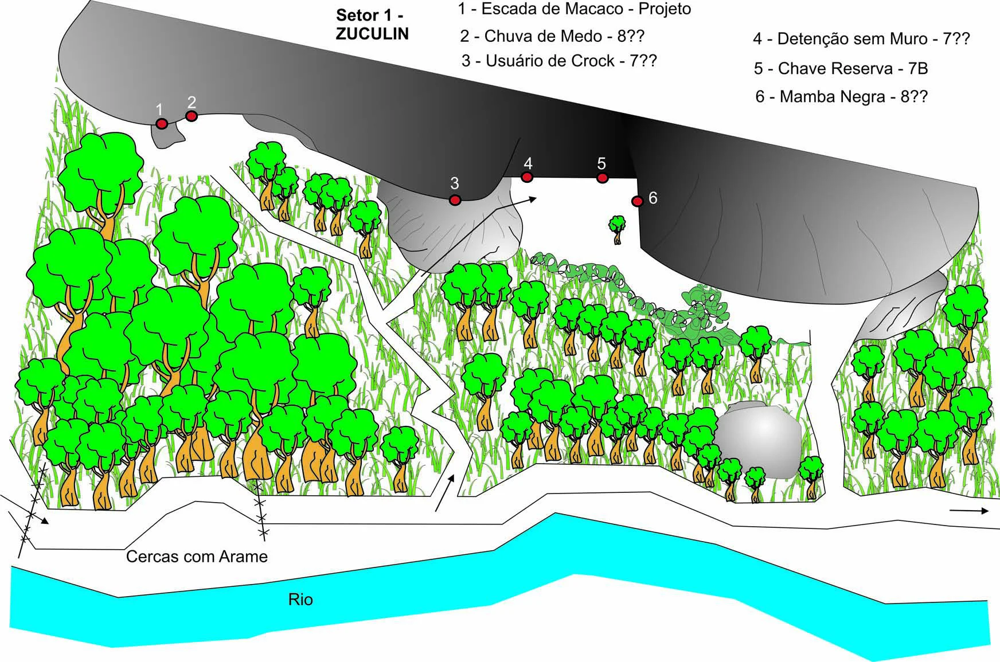
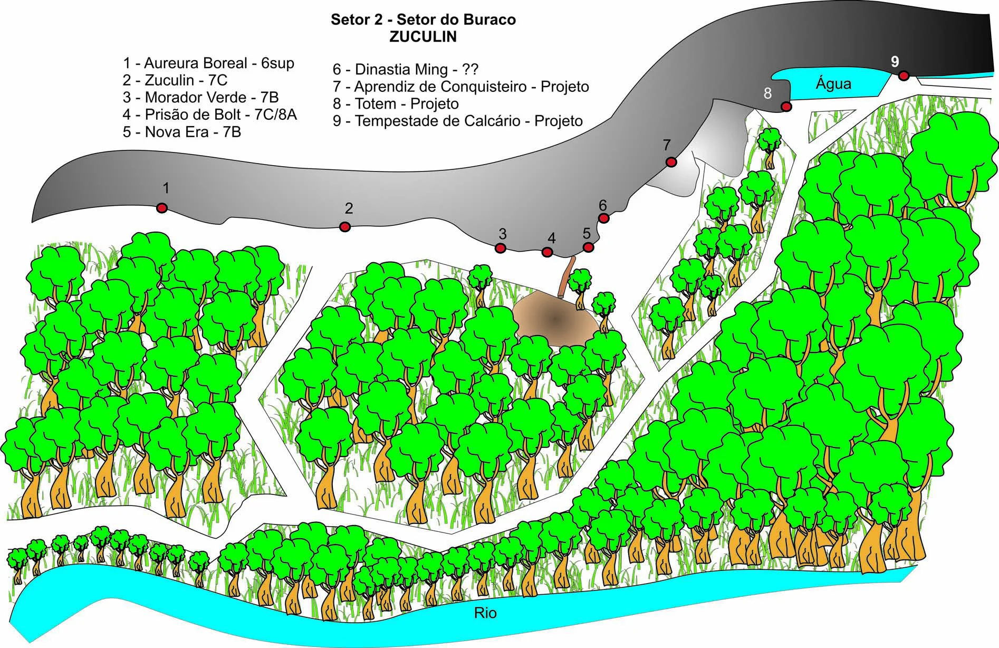
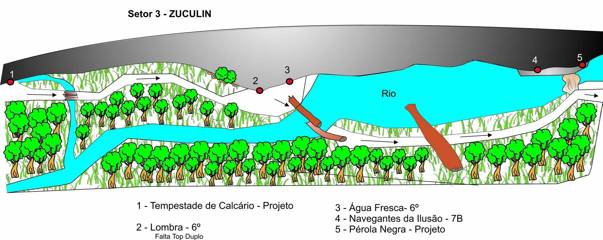
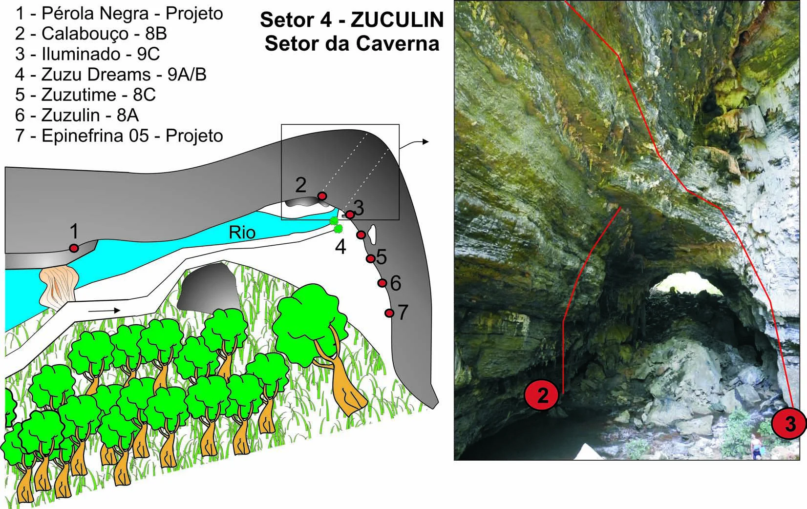
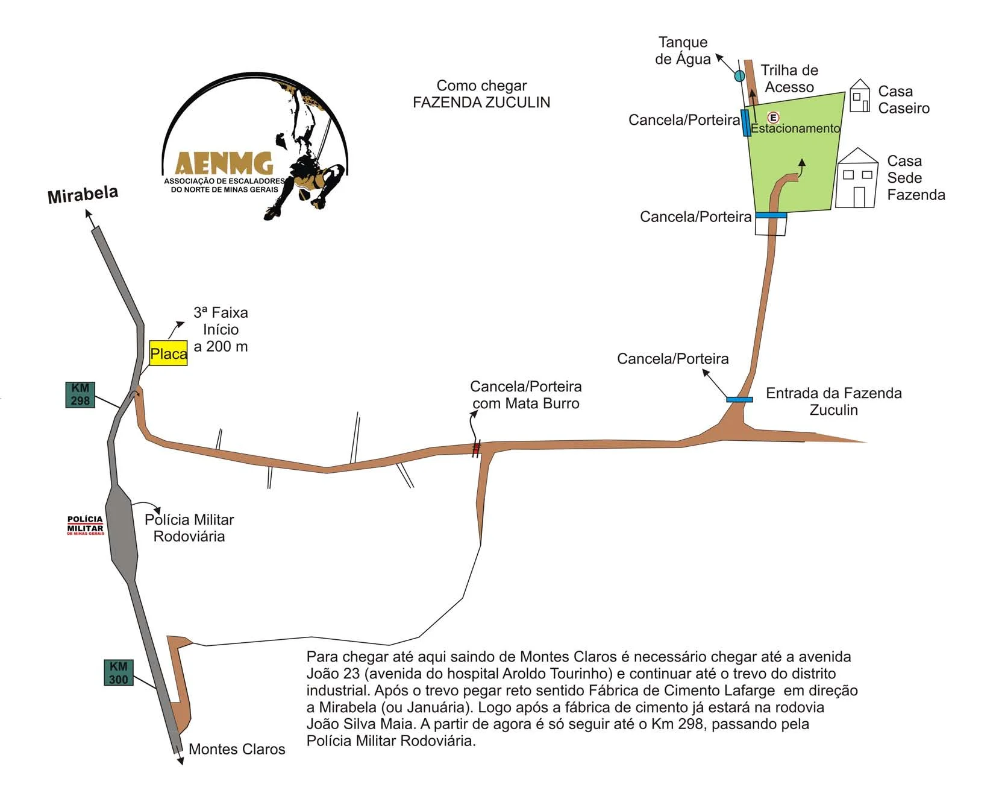

# Croqui: Fazenda Zuculin

## Informações Gerais

- **id**: br_mg_montes_claros_zuculim
- **nome**: Fazenda Zuculin
- **status_desenho_extraivel**: NAO_TEM_DESENHO
- **caminho_thumbnail**: 
- **botoes**:
  - **[0]**:
    - **texto**: Capa
    - **destino**:
      - **secao_textual**:
        - **conteudo**:
            # ESCALADA FAZENDA ZUCULIN
            
            |  |
            | :--: |
            | *Escalada Fazenda Zuculin* |
            
            A Fazenda Zuculin é uma área particular. Algumas regras devem ser obedecidas.
            
            - Manter sempre as porteiras fechadas.
            - Ao atravessar a porteira você deverá seguir a trilha até a área de escalada, não entre em outro local que não seja a área de escalada.
            - Não estacione em frente a casa da sede para não obstruir a passagem.
            - Você irá cruzar uma área de pastagem, não importune os animais.
            - Quando chegar na área de escalada, andar apenas nas trilhas, respeite as demarcações.
            - Algumas vias ainda estão com top de chapelete simples, portanto essas vias deveram ser desmontadas com técnicas especiais.
            - Algumas vias foram recentemente conquistadas, cuidado com agarras soltas.
            - LIXO É PRA SER JOGADO NO LIXO, LEVE SEU LIXO DE VOLTA. BITUCA DE CIGARRO, TAMPINHA DE GATORADE, LACRE DE BOLACHA TAMBÉM É LIXO. DEIXE APENAS MAGNÉSIO NA ROCHA.
            - Caso queira equipar novas vias, entrar em contato com a AENMG para orientações.
            
            AENMG – Associação de Escaladores do Norte de Minas Gerais
            Site: www.aenmg.com.br
            E-mail: aenmg@hotmail.com
  - **[1]**:
    - **texto**: Regras Importantes
    - **destino**:
      - **secao_textual**:
        - **conteudo**:
            # Regras Importantes
            
            A Fazenda Zuculin é uma área particular. Algumas regras devem ser obedecidas.
            
            - Manter sempre as porteiras fechadas.
            - Ao atravessar a porteira você deverá seguir a trilha até a área de escalada, não entre em outro local que não seja a área de escalada.
            - Não estacione em frente a casa da sede para não obstruir a passagem.
            - Você irá cruzar uma área de pastagem, não importune os animais.
            - Quando chegar na área de escalada, andar apenas nas trilhas, respeite as demarcações.
            - Algumas vias ainda estão com top de chapelete simples, portanto essas vias deveram ser desmontadas com técnicas especiais.
            - Algumas vias foram recentemente conquistadas, cuidado com agarras soltas.
            - LIXO É PRA SER JOGADO NO LIXO, LEVE SEU LIXO DE VOLTA. BITUCA DE CIGARRO, TAMPINHA DE GATORADE, LACRE DE BOLACHA TAMBÉM É LIXO. DEIXE APENAS MAGNÉSIO NA ROCHA.
            - Caso queira equipar novas vias, entrar em contato com a AENMG para orientações.
            
            AENMG – Associação de Escaladores do Norte de Minas Gerais
            Site: www.aenmg.com.br
            E-mail: aenmg@hotmail.com
- **ultima_migracao**: 3

## Parte: setor_1

### Setor (Pico: Fazenda Zuculin)

- **descricao**: 
- **nome**: Setor 1 - ZUCULIN
- **mapas**:
  - **[0]**:
    - **caminho_imagem_mapa**: 
    - **largura_mapa**: 1744
    - **altura_mapa**: 1155
- **escaladas**:
  - **[0]**:
    - **via_esportiva**:
      - **nome**: Escada de Macaco
      - **dificuldade**: PROJETO
  - **[1]**:
    - **via_esportiva**:
      - **nome**: Chuva de Medo
      - **dificuldade**: BR_8A
  - **[2]**:
    - **via_esportiva**:
      - **nome**: Usuário de Crock
      - **dificuldade**: BR_7A
  - **[3]**:
    - **via_esportiva**:
      - **nome**: Detenção sem Muro
      - **dificuldade**: BR_7A
  - **[4]**:
    - **via_esportiva**:
      - **nome**: Chave Reserva
      - **dificuldade**: BR_7B
  - **[5]**:
    - **via_esportiva**:
      - **nome**: Mamba Negra
      - **dificuldade**: BR_8A

## Parte: setor_2_do_buraco

### Setor (Pico: Fazenda Zuculin)

- **descricao**: 
- **nome**: Setor 2 - Setor do Buraco
- **mapas**:
  - **[0]**:
    - **caminho_imagem_mapa**: 
    - **largura_mapa**: 1894
    - **altura_mapa**: 1228
- **escaladas**:
  - **[0]**:
    - **via_esportiva**:
      - **nome**: Aureura Boreal
      - **dificuldade**: BR_6SUP
  - **[1]**:
    - **via_esportiva**:
      - **nome**: Zuculin
      - **dificuldade**: BR_7C
  - **[2]**:
    - **via_esportiva**:
      - **nome**: Morador Verde
      - **dificuldade**: BR_7B
  - **[3]**:
    - **via_esportiva**:
      - **nome**: Prisão de Bolt
      - **dificuldade**: BR_7C_BARRA_8A
  - **[4]**:
    - **via_esportiva**:
      - **nome**: Nova Era
      - **dificuldade**: BR_7B
  - **[5]**:
    - **via_esportiva**:
      - **nome**: Dinastia Ming
      - **dificuldade**: INDEFINIDO
  - **[6]**:
    - **via_esportiva**:
      - **nome**: Aprendiz de Conquisteiro
      - **dificuldade**: PROJETO
  - **[7]**:
    - **via_esportiva**:
      - **nome**: Totem
      - **dificuldade**: PROJETO
  - **[8]**:
    - **via_esportiva**:
      - **nome**: Tempestade de Calcário
      - **dificuldade**: PROJETO

## Parte: setor_3

### Setor (Pico: Fazenda Zuculin)

- **descricao**: 
- **nome**: Setor 3 - ZUCULIN
- **mapas**:
  - **[0]**:
    - **caminho_imagem_mapa**: 
    - **largura_mapa**: 1820
    - **altura_mapa**: 727
- **escaladas**:
  - **[0]**:
    - **via_esportiva**:
      - **nome**: Tempestade de Calcário
      - **dificuldade**: PROJETO
  - **[1]**:
    - **via_esportiva**:
      - **descricao**: Falta Top Duplo
      - **nome**: Lombra
      - **dificuldade**: BR_6
  - **[2]**:
    - **via_esportiva**:
      - **nome**: Água Fresca
      - **dificuldade**: BR_6
  - **[3]**:
    - **via_esportiva**:
      - **nome**: Navegantes da Ilusão
      - **dificuldade**: BR_7B
  - **[4]**:
    - **via_esportiva**:
      - **nome**: Pérola Negra
      - **dificuldade**: PROJETO

## Parte: setor_4_da_caverna

### Setor (Pico: Fazenda Zuculin)

- **descricao**: 
- **nome**: Setor 4 - Setor da Caverna
- **mapas**:
  - **[0]**:
    - **caminho_imagem_mapa**: 
    - **largura_mapa**: 1652
    - **altura_mapa**: 1044
- **escaladas**:
  - **[0]**:
    - **via_esportiva**:
      - **nome**: Pérola Negra
      - **dificuldade**: PROJETO
  - **[1]**:
    - **via_esportiva**:
      - **nome**: Calabouço
      - **dificuldade**: BR_8B
  - **[2]**:
    - **via_esportiva**:
      - **nome**: Iluminado
      - **dificuldade**: BR_9C
  - **[3]**:
    - **via_esportiva**:
      - **nome**: Zuzu Dreams
      - **dificuldade**: BR_9A_BARRA_9B
  - **[4]**:
    - **via_esportiva**:
      - **nome**: Zuzutime
      - **dificuldade**: BR_8C
  - **[5]**:
    - **via_esportiva**:
      - **nome**: Zuzulin
      - **dificuldade**: BR_8A
  - **[6]**:
    - **via_esportiva**:
      - **nome**: Epinefrina 05
      - **dificuldade**: PROJETO

## Arquivos Externos

- **arquivos_externos**:
  - **[0]**:
    - **caminho**: 
    - **checksum_sha256**: 3e52cc86ff6673868115dc35462b3b6bf1ad0940db866f0a5b3f565de851bd88
  - **[1]**:
    - **caminho**: 
    - **checksum_sha256**: 22bb323ef26dbad47997bb39589e56281601a57081573760833ed488ee9d25e1
  - **[2]**:
    - **caminho**: 
    - **checksum_sha256**: 8a2ea3e5e64f3075bdb1ab48313d875d940a2a2f46a16a79057f82557a7ccdcd
  - **[3]**:
    - **caminho**: 
    - **checksum_sha256**: dbcc84cc73d7de8110d5ef6eda929888e4f9f850126dd0b5d9b67188d7ac6466
  - **[4]**:
    - **caminho**: 
    - **checksum_sha256**: d9b35aae095d2a7a7830dc1858b9b1a9f6c3cbf7ac3c4f57b8440d52d7915e3a
  - **[5]**:
    - **caminho**: 
    - **checksum_sha256**: 725cd720e477705a80e2dc9ed5fbfd127ff5d24f6fdbf75daa56968ef0a026e4
  - **[6]**:
    - **caminho**: 
    - **checksum_sha256**: 22a36f1eb8e1500ef655f4140721a7add652dd4bf6da6962400c64692d0887f0

