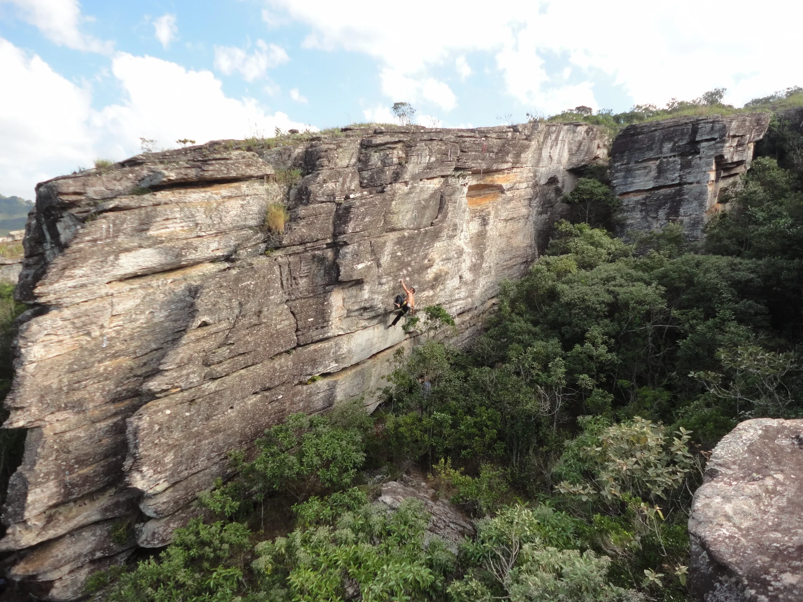
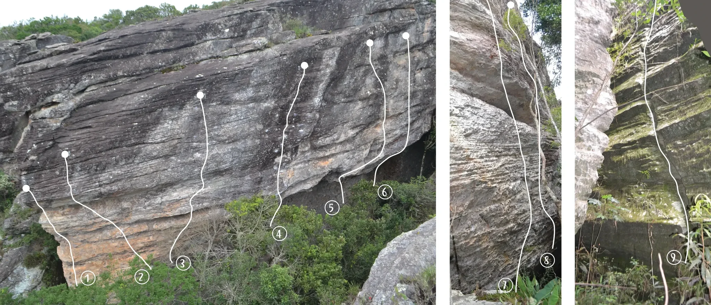
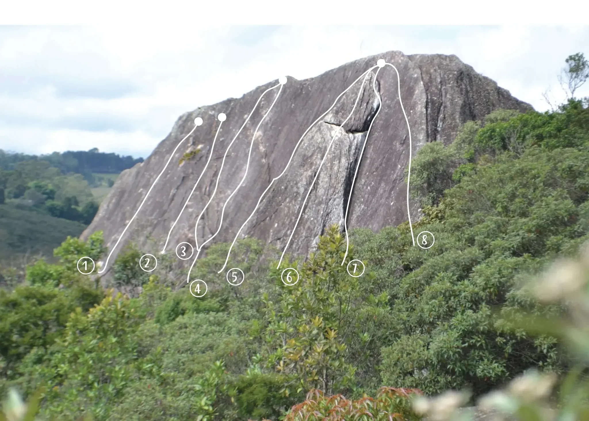
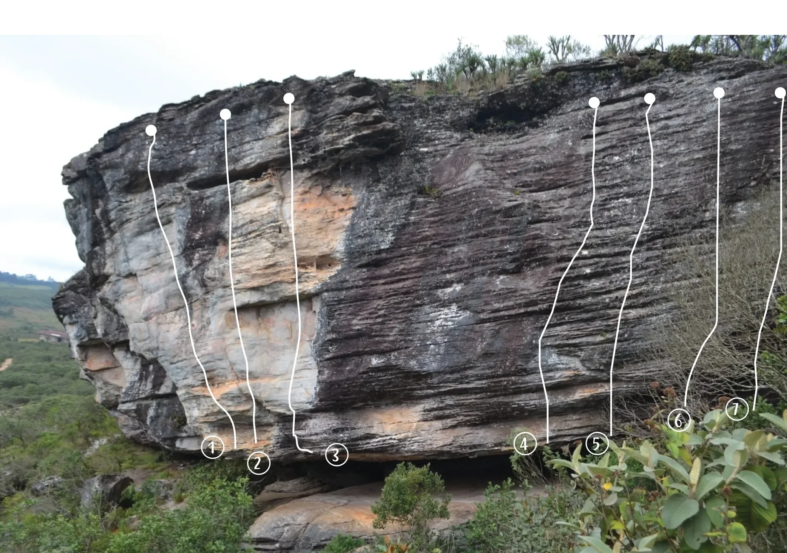
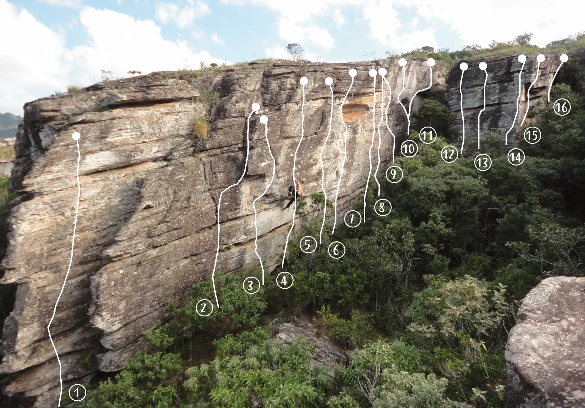
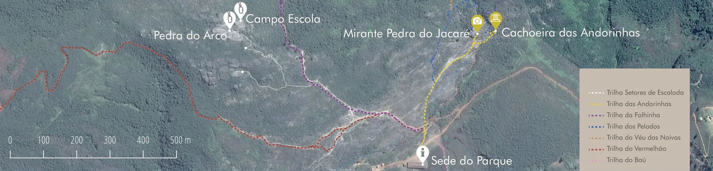
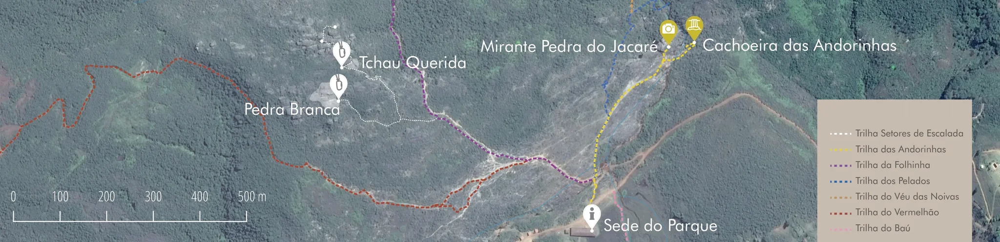

# Croqui: Parque Natural Municipal das Andorinhas

## Informações Gerais

- **id**: br_mg_ouro_preto_andorinhas
- **nome**: Parque Natural Municipal das Andorinhas
- **creditos**:
  - ATM 2018
- **caminho_thumbnail**: 
- **revisado_manualmente**: True
- **status_desenho_extraivel**: DESENHO_EXTRAIDO
- **ultima_migracao**: 4
- **publicar_croqui**: True
- **revisado_bounding_circle**: True
- **botoes**: []

## Parte: setor_pedra_do_arco

### Setor (Pico: Andorinhas)

- **descricao**:
    # Setor Pedra do Arco
    
    Setor com vias de 12m até 17m.
    
    Tempo de aproximação: 20min.
    
    Características: Escalada vertical e negativa.
    
    Recomendações: Uso de capacete. Algumas vias requerem equipamento móvel.
- **nome**: Pedra do Arco
- **mapas**:
  - **[0]**:
    - **caminho_imagem_mapa**: 
    - **largura_mapa**: 2048
    - **altura_mapa**: 880
    - **pontos_de_interesse**:
      - **[0]**:
        - **id**: 1
        - **label**: 1
        - **circulo**:
          - **x**: 253
          - **y**: 803
          - **raio**: 20
      - **[1]**:
        - **id**: 2
        - **label**: 2
        - **circulo**:
          - **x**: 409
          - **y**: 799
          - **raio**: 20
      - **[2]**:
        - **id**: 3
        - **label**: 3
        - **circulo**:
          - **x**: 528
          - **y**: 759
          - **raio**: 21
      - **[3]**:
        - **id**: 4
        - **label**: 4
        - **circulo**:
          - **x**: 805
          - **y**: 674
          - **raio**: 20
      - **[4]**:
        - **id**: 5
        - **label**: 5
        - **circulo**:
          - **x**: 957
          - **y**: 599
          - **raio**: 20
      - **[5]**:
        - **id**: 6
        - **label**: 6
        - **circulo**:
          - **x**: 1110
          - **y**: 554
          - **raio**: 20
      - **[6]**:
        - **id**: 7
        - **label**: 7
        - **circulo**:
          - **x**: 1456
          - **y**: 823
          - **raio**: 20
      - **[7]**:
        - **id**: 8
        - **label**: 8
        - **circulo**:
          - **x**: 1577
          - **y**: 750
          - **raio**: 20
      - **[8]**:
        - **id**: 9
        - **label**: 9
        - **circulo**:
          - **x**: 1942
          - **y**: 743
          - **raio**: 20
    - **referencias**:
      - **[0]**:
        - **escalada**: Aresta do Apicultor
        - **ids**:
          - 1
      - **[1]**:
        - **escalada**: Se Segura Malandro
        - **ids**:
          - 2
      - **[2]**:
        - **escalada**: Filosofia Lusitana
        - **ids**:
          - 3
      - **[3]**:
        - **escalada**: Titanomaquia
        - **ids**:
          - 4
      - **[4]**:
        - **escalada**: Sika Loca
        - **ids**:
          - 5
      - **[5]**:
        - **escalada**: Caba Não Mundão
        - **ids**:
          - 6
      - **[6]**:
        - **escalada**: Marreta Porreta
        - **ids**:
          - 7
      - **[7]**:
        - **escalada**: Cabron da Peste
        - **ids**:
          - 8
      - **[8]**:
        - **escalada**: Paralaxologística
        - **ids**:
          - 9
- **escaladas**:
  - **[0]**:
    - **via_esportiva**:
      - **nome**: Aresta do Apicultor
      - **dificuldade**: BR_9B
      - **extensao**: 17
      - **quantidade_protecoes_intermediarias**: 7
      - **quantidade_protecoes_parada**: 2
      - **conquistadores**:
        - Fábio de Melo
        - Rodrigo 'Mussula'
  - **[1]**:
    - **via_esportiva**:
      - **nome**: Se Segura Malandro
      - **dificuldade**: BR_7B
      - **extensao**: 15
      - **quantidade_protecoes_intermediarias**: 6
      - **quantidade_protecoes_parada**: 2
      - **conquistadores**:
        - Fábio de Melo
        - Rodrigo 'Mussula'
  - **[2]**:
    - **via_esportiva**:
      - **nome**: Filosofia Lusitana
      - **dificuldade**: BR_8B
      - **extensao**: 17
      - **quantidade_protecoes_intermediarias**: 7
      - **quantidade_protecoes_parada**: 2
      - **conquistadores**:
        - Fábio de Melo
        - Rodrigo 'Mussula'
  - **[3]**:
    - **via_esportiva**:
      - **nome**: Titanomaquia
      - **dificuldade**: BR_9A
      - **extensao**: 17
      - **quantidade_protecoes_intermediarias**: 7
      - **quantidade_protecoes_parada**: 2
      - **conquistadores**:
        - Fábio de Melo
        - Rodrigo 'Mussula'
  - **[4]**:
    - **via_esportiva**:
      - **nome**: Sika Loca
      - **dificuldade**: INDEFINIDO
      - **extensao**: 17
      - **quantidade_protecoes_intermediarias**: 7
      - **quantidade_protecoes_parada**: 2
      - **conquistadores**:
        - F. de Melo
        - R. 'Mussula'
        - Fred Moreira
  - **[5]**:
    - **via_esportiva**:
      - **nome**: Caba Não Mundão
      - **dificuldade**: INDEFINIDO
      - **extensao**: 17
      - **quantidade_protecoes_intermediarias**: 7
      - **quantidade_protecoes_parada**: 2
      - **conquistadores**:
        - Fábio de Melo
        - Rodrigo 'Mussula'
  - **[6]**:
    - **via_movel**:
      - **nome**: Marreta Porreta
      - **dificuldade**: BR_6SUP
      - **extensao**: 12
      - **protecoes_moveis**: Móvel
      - **quantidade_protecoes_parada**: 1
      - **conquistadores**:
        - Ian Belo
        - Felipe Dias
  - **[7]**:
    - **via_esportiva**:
      - **nome**: Cabron da Peste
      - **dificuldade**: INDEFINIDO
      - **extensao**: 12
      - **quantidade_protecoes_intermediarias**: 4
      - **quantidade_protecoes_parada**: 2
      - **conquistadores**:
        - Fábio de Melo
        - Rodrigo 'Mussula'
  - **[8]**:
    - **via_esportiva**:
      - **nome**: Paralaxologística
      - **dificuldade**: BR_8B
      - **extensao**: 12
      - **quantidade_protecoes_intermediarias**: 4
      - **quantidade_protecoes_parada**: 2
      - **conquistadores**:
        - Fábio de Melo
        - Rodrigo 'Mussula'
- **precomputados**:
  - **total_escaladas**: 9

## Parte: setor_campo_escola

### Setor (Pico: Andorinhas)

- **descricao**:
    # Setor Campo Escola
    
    Setor com vias de 8m até 10m.
    
    Tempo de aproximação: 25min.
    
    Características: Escalada positiva.
    
    Recomendações: Uso de capacete. Algumas vias requerem equipamento móvel.
- **nome**: Campo Escola
- **mapas**:
  - **[0]**:
    - **caminho_imagem_mapa**: 
    - **largura_mapa**: 2048
    - **altura_mapa**: 1464
    - **pontos_de_interesse**:
      - **[0]**:
        - **id**: 1
        - **label**: 1
        - **circulo**:
          - **x**: 299
          - **y**: 923
          - **raio**: 29
      - **[1]**:
        - **id**: 2
        - **label**: 2
        - **circulo**:
          - **x**: 515
          - **y**: 914
          - **raio**: 29
      - **[2]**:
        - **id**: 3
        - **label**: 3
        - **circulo**:
          - **x**: 642
          - **y**: 872
          - **raio**: 29
      - **[3]**:
        - **id**: 4
        - **label**: 4
        - **circulo**:
          - **x**: 691
          - **y**: 1002
          - **raio**: 29
      - **[4]**:
        - **id**: 5
        - **label**: 5
        - **circulo**:
          - **x**: 819
          - **y**: 962
          - **raio**: 29
      - **[5]**:
        - **id**: 6
        - **label**: 6
        - **circulo**:
          - **x**: 1009
          - **y**: 962
          - **raio**: 29
      - **[6]**:
        - **id**: 7
        - **label**: 7
        - **circulo**:
          - **x**: 1237
          - **y**: 933
          - **raio**: 29
      - **[7]**:
        - **id**: 8
        - **label**: 8
        - **circulo**:
          - **x**: 1480
          - **y**: 835
          - **raio**: 29
    - **referencias**:
      - **[0]**:
        - **escalada**: Vivi Fernandes
        - **ids**:
          - 1
      - **[1]**:
        - **escalada**: Kid Bengala
        - **ids**:
          - 2
      - **[2]**:
        - **escalada**: Lolla
        - **ids**:
          - 3
      - **[3]**:
        - **escalada**: Emanuelle
        - **ids**:
          - 4
      - **[4]**:
        - **escalada**: Bruna Surfistinha
        - **ids**:
          - 5
      - **[5]**:
        - **escalada**: Hilda Furacão
        - **ids**:
          - 6
      - **[6]**:
        - **escalada**: Cicciolina
        - **ids**:
          - 7
      - **[7]**:
        - **escalada**: Bordel
        - **ids**:
          - 8
- **escaladas**:
  - **[0]**:
    - **via_esportiva**:
      - **nome**: Vivi Fernandes
      - **dificuldade**: BR_6
      - **extensao**: 10
      - **quantidade_protecoes_intermediarias**: 3
      - **quantidade_protecoes_parada**: 1
      - **conquistadores**:
        - Fábio de Melo
        - Rodrigo 'Mussula'
  - **[1]**:
    - **via_esportiva**:
      - **nome**: Kid Bengala
      - **dificuldade**: BR_4
      - **extensao**: 10
      - **quantidade_protecoes_intermediarias**: 3
      - **quantidade_protecoes_parada**: 1
      - **conquistadores**:
        - Fábio de Melo
        - Rodrigo 'Mussula'
  - **[2]**:
    - **via_esportiva**:
      - **nome**: Lolla
      - **dificuldade**: BR_3
      - **extensao**: 10
      - **quantidade_protecoes_intermediarias**: 3
      - **quantidade_protecoes_parada**: 2
      - **conquistadores**:
        - Fábio de Melo
        - Rodrigo 'Mussula'
  - **[3]**:
    - **via_esportiva**:
      - **nome**: Emanuelle
      - **dificuldade**: BR_3
      - **extensao**: 10
      - **quantidade_protecoes_intermediarias**: 3
      - **quantidade_protecoes_parada**: 2
      - **conquistadores**:
        - Fábio de Melo
        - Rodrigo 'Mussula'
  - **[4]**:
    - **via_movel**:
      - **nome**: Bruna Surfistinha
      - **dificuldade**: BR_4
      - **extensao**: 10
      - **protecoes_moveis**: Móvel
      - **quantidade_protecoes_parada**: 2
      - **conquistadores**:
        - Ian Belo
        - Felipe Dias
  - **[5]**:
    - **via_esportiva**:
      - **nome**: Hilda Furacão
      - **dificuldade**: BR_5
      - **extensao**: 10
      - **quantidade_protecoes_intermediarias**: 3
      - **quantidade_protecoes_parada**: 2
      - **conquistadores**:
        - Fábio de Melo
  - **[6]**:
    - **via_movel**:
      - **nome**: Cicciolina
      - **dificuldade**: BR_4
      - **extensao**: 10
      - **protecoes_moveis**: Móvel
      - **quantidade_protecoes_parada**: 2
      - **conquistadores**:
        - Ian Belo
        - Felipe Dias
  - **[7]**:
    - **via_esportiva**:
      - **nome**: Bordel
      - **dificuldade**: BR_3
      - **extensao**: 8
      - **quantidade_protecoes_intermediarias**: 3
      - **quantidade_protecoes_parada**: 2
      - **conquistadores**:
        - Rodrigo 'Mussula'
- **precomputados**:
  - **total_escaladas**: 8

## Parte: setor_tchau_querida

### Setor (Pico: Andorinhas)

- **descricao**:
    # Setor Tchau Querida
    
    Setor com vias de 11m até 12m.
    
    Tempo de aproximação: 10min.
    
    Características: Escalada vertical e negativa.
    
    Recomendações: Uso de capacete.
- **nome**: Tchau Querida
- **mapas**:
  - **[0]**:
    - **caminho_imagem_mapa**: 
    - **largura_mapa**: 2048
    - **altura_mapa**: 1441
    - **pontos_de_interesse**:
      - **[0]**:
        - **id**: 1
        - **label**: 1
        - **circulo**:
          - **x**: 553
          - **y**: 1165
          - **raio**: 29
      - **[1]**:
        - **id**: 2
        - **label**: 2
        - **circulo**:
          - **x**: 673
          - **y**: 1207
          - **raio**: 29
      - **[2]**:
        - **id**: 3
        - **label**: 3
        - **circulo**:
          - **x**: 876
          - **y**: 1185
          - **raio**: 29
      - **[3]**:
        - **id**: 4
        - **label**: 4
        - **circulo**:
          - **x**: 1367
          - **y**: 1156
          - **raio**: 29
      - **[4]**:
        - **id**: 5
        - **label**: 5
        - **circulo**:
          - **x**: 1554
          - **y**: 1156
          - **raio**: 29
      - **[5]**:
        - **id**: 6
        - **label**: 6
        - **circulo**:
          - **x**: 1767
          - **y**: 1095
          - **raio**: 29
      - **[6]**:
        - **id**: 7
        - **label**: 7
        - **circulo**:
          - **x**: 1918
          - **y**: 1066
          - **raio**: 29
    - **referencias**:
      - **[0]**:
        - **escalada**: Temer Jamais
        - **ids**:
          - 1
      - **[1]**:
        - **escalada**: Escalar sem Temer
        - **ids**:
          - 2
      - **[2]**:
        - **escalada**: Tchau Querida
        - **ids**:
          - 3
      - **[3]**:
        - **escalada**: República do Pó Royal
        - **ids**:
          - 4
      - **[4]**:
        - **escalada**: República das Bananas
        - **ids**:
          - 5
      - **[5]**:
        - **escalada**: República do Café com Leite
        - **ids**:
          - 6
      - **[6]**:
        - **escalada**: Lava Jato
        - **ids**:
          - 7
- **escaladas**:
  - **[0]**:
    - **via_esportiva**:
      - **nome**: Temer Jamais
      - **dificuldade**: INDEFINIDO
      - **extensao**: 12
      - **quantidade_protecoes_intermediarias**: 5
      - **quantidade_protecoes_parada**: 2
      - **conquistadores**:
        - Fábio de Melo
        - Rodrigo 'Mussula'
  - **[1]**:
    - **via_esportiva**:
      - **nome**: Escalar sem Temer
      - **dificuldade**: INDEFINIDO
      - **extensao**: 12
      - **quantidade_protecoes_intermediarias**: 5
      - **quantidade_protecoes_parada**: 2
      - **conquistadores**:
        - Fábio de Melo
        - Rodrigo 'Mussula'
  - **[2]**:
    - **via_esportiva**:
      - **nome**: Tchau Querida
      - **dificuldade**: BR_7B_BARRA_7C
      - **extensao**: 12
      - **quantidade_protecoes_intermediarias**: 5
      - **quantidade_protecoes_parada**: 2
      - **conquistadores**:
        - Fábio de Melo
        - Rodrigo 'Mussula'
  - **[3]**:
    - **via_esportiva**:
      - **nome**: República do Pó Royal
      - **dificuldade**: BR_8A
      - **extensao**: 12
      - **quantidade_protecoes_intermediarias**: 4
      - **quantidade_protecoes_parada**: 2
      - **conquistadores**:
        - Fábio de Melo
        - Rodrigo 'Mussula'
  - **[4]**:
    - **via_esportiva**:
      - **nome**: República das Bananas
      - **dificuldade**: BR_7A
      - **extensao**: 11
      - **quantidade_protecoes_intermediarias**: 4
      - **quantidade_protecoes_parada**: 2
      - **conquistadores**:
        - Fábio de Melo
        - Rodrigo 'Mussula'
  - **[5]**:
    - **via_esportiva**:
      - **nome**: República do Café com Leite
      - **dificuldade**: BR_7A
      - **extensao**: 11
      - **quantidade_protecoes_intermediarias**: 4
      - **quantidade_protecoes_parada**: 2
      - **conquistadores**:
        - Fábio de Melo
        - Rodrigo 'Mussula'
  - **[6]**:
    - **via_esportiva**:
      - **nome**: Lava Jato
      - **dificuldade**: BR_7B
      - **extensao**: 11
      - **quantidade_protecoes_intermediarias**: 4
      - **quantidade_protecoes_parada**: 2
      - **conquistadores**:
        - Fábio de Melo
        - Rodrigo 'Mussula'
- **precomputados**:
  - **total_escaladas**: 7

## Parte: setor_pedra_branca

### Setor (Pico: Andorinhas)

- **descricao**:
    # Setor Pedra Branca
    
    Setor com vias de 9m até 12m.
    
    Tempo de aproximação: 25min.
    
    Características: Escalada vertical.
    
    Recomendações: Uso de capacete. Algumas vias requerem equipamento móvel.
- **nome**: Pedra Branca
- **mapas**:
  - **[0]**:
    - **caminho_imagem_mapa**: 
    - **largura_mapa**: 2048
    - **altura_mapa**: 1430
    - **pontos_de_interesse**:
      - **[0]**:
        - **id**: 1
        - **label**: 1
        - **circulo**:
          - **x**: 271
          - **y**: 1376
          - **raio**: 28
      - **[1]**:
        - **id**: 2
        - **label**: 2
        - **circulo**:
          - **x**: 716
          - **y**: 1078
          - **raio**: 28
      - **[2]**:
        - **id**: 3
        - **label**: 3
        - **circulo**:
          - **x**: 881
          - **y**: 1000
          - **raio**: 29
      - **[3]**:
        - **id**: 4
        - **label**: 4
        - **circulo**:
          - **x**: 998
          - **y**: 982
          - **raio**: 29
      - **[4]**:
        - **id**: 5
        - **label**: 5
        - **circulo**:
          - **x**: 1079
          - **y**: 857
          - **raio**: 29
      - **[5]**:
        - **id**: 6
        - **label**: 6
        - **circulo**:
          - **x**: 1178
          - **y**: 875
          - **raio**: 29
      - **[6]**:
        - **id**: 7
        - **label**: 7
        - **circulo**:
          - **x**: 1235
          - **y**: 767
          - **raio**: 28
      - **[7]**:
        - **id**: 8
        - **label**: 8
        - **circulo**:
          - **x**: 1341
          - **y**: 726
          - **raio**: 29
      - **[8]**:
        - **id**: 9
        - **label**: 9
        - **circulo**:
          - **x**: 1380
          - **y**: 610
          - **raio**: 29
      - **[9]**:
        - **id**: 10
        - **label**: 10
        - **circulo**:
          - **x**: 1433
          - **y**: 521
          - **raio**: 28
      - **[10]**:
        - **id**: 11
        - **label**: 11
        - **circulo**:
          - **x**: 1498
          - **y**: 474
          - **raio**: 29
      - **[11]**:
        - **id**: 12
        - **label**: 12
        - **circulo**:
          - **x**: 1573
          - **y**: 540
          - **raio**: 29
      - **[12]**:
        - **id**: 13
        - **label**: 13
        - **circulo**:
          - **x**: 1691
          - **y**: 569
          - **raio**: 29
      - **[13]**:
        - **id**: 14
        - **label**: 14
        - **circulo**:
          - **x**: 1806
          - **y**: 550
          - **raio**: 29
      - **[14]**:
        - **id**: 15
        - **label**: 15
        - **circulo**:
          - **x**: 1865
          - **y**: 474
          - **raio**: 29
      - **[15]**:
        - **id**: 16
        - **label**: 16
        - **circulo**:
          - **x**: 1968
          - **y**: 375
          - **raio**: 29
    - **referencias**:
      - **[0]**:
        - **escalada**: Vaca Virgem
        - **ids**:
          - 1
      - **[1]**:
        - **escalada**: Route 162
        - **ids**:
          - 2
      - **[2]**:
        - **escalada**: Dia de Protesto
        - **ids**:
          - 3
      - **[3]**:
        - **escalada**: Atestado de Cadena
        - **ids**:
          - 4
      - **[4]**:
        - **escalada**: Janela do Universo
        - **ids**:
          - 5
      - **[5]**:
        - **escalada**: Musgonoszói
        - **ids**:
          - 6
      - **[6]**:
        - **escalada**: Fala meu Justo
        - **ids**:
          - 7
      - **[7]**:
        - **escalada**: Regletes Ocultos
        - **ids**:
          - 8
      - **[8]**:
        - **escalada**: Batata com Sal
        - **ids**:
          - 9
      - **[9]**:
        - **escalada**: Argentina
        - **ids**:
          - 10
      - **[10]**:
        - **escalada**: Alemanha
        - **ids**:
          - 11
      - **[11]**:
        - **escalada**: Melodrama
        - **ids**:
          - 12
      - **[12]**:
        - **escalada**: Sapiência
        - **ids**:
          - 13
      - **[13]**:
        - **escalada**: Lagartixa de Pedra
        - **ids**:
          - 14
      - **[14]**:
        - **escalada**: Meu Amigo Friend
        - **ids**:
          - 15
      - **[15]**:
        - **escalada**: Meu Amigo Broca
        - **ids**:
          - 16
- **escaladas**:
  - **[0]**:
    - **via_esportiva**:
      - **nome**: Vaca Virgem
      - **dificuldade**: BR_6
      - **extensao**: 10
      - **quantidade_protecoes_intermediarias**: 3
      - **quantidade_protecoes_parada**: 2
      - **conquistadores**:
        - Fábio de Melo
        - Ângela Poleto
  - **[1]**:
    - **via_movel**:
      - **nome**: Route 162
      - **dificuldade**: BR_5
      - **extensao**: 10
      - **protecoes_moveis**: Móvel
      - **quantidade_protecoes_parada**: 1
      - **conquistadores**:
        - Fábio de Melo
        - Marcelo Henriques
  - **[2]**:
    - **via_esportiva**:
      - **nome**: Dia de Protesto
      - **dificuldade**: BR_6
      - **extensao**: 9
      - **quantidade_protecoes_intermediarias**: 2
      - **quantidade_protecoes_parada**: 1
      - **conquistadores**:
        - Fábio de Melo
  - **[3]**:
    - **via_esportiva**:
      - **nome**: Atestado de Cadena
      - **dificuldade**: BR_7C
      - **extensao**: 12
      - **quantidade_protecoes_intermediarias**: 3
      - **quantidade_protecoes_parada**: 2
      - **conquistadores**:
        - Fábio de Melo
        - Marcelo Henriques
  - **[4]**:
    - **via_esportiva**:
      - **nome**: Janela do Universo
      - **dificuldade**: BR_7A
      - **extensao**: 12
      - **quantidade_protecoes_intermediarias**: 3
      - **quantidade_protecoes_parada**: 2
      - **conquistadores**:
        - Fábio de Melo
        - Marcelo Henriques
  - **[5]**:
    - **via_esportiva**:
      - **nome**: Musgonoszói
      - **dificuldade**: BR_6
      - **extensao**: 12
      - **quantidade_protecoes_intermediarias**: 4
      - **quantidade_protecoes_parada**: 2
      - **conquistadores**:
        - Fábio de Melo
        - Marcelo Henriques
  - **[6]**:
    - **via_esportiva**:
      - **nome**: Fala meu Justo
      - **dificuldade**: BR_7B
      - **extensao**: 10
      - **quantidade_protecoes_intermediarias**: 3
      - **quantidade_protecoes_parada**: 1
      - **conquistadores**:
        - Fábio de Melo
        - Marcelo Henriques
  - **[7]**:
    - **via_esportiva**:
      - **nome**: Regletes Ocultos
      - **dificuldade**: BR_6
      - **extensao**: 10
      - **quantidade_protecoes_intermediarias**: 3
      - **quantidade_protecoes_parada**: 2
      - **conquistadores**:
        - Fábio de Melo
        - Marcelo Henriques
  - **[8]**:
    - **via_movel**:
      - **nome**: Batata com Sal
      - **dificuldade**: BR_5
      - **extensao**: 10
      - **protecoes_moveis**: Móvel
      - **quantidade_protecoes_parada**: 2
      - **conquistadores**:
        - Igor Murta
        - Natália Simone
  - **[9]**:
    - **via_esportiva**:
      - **nome**: Argentina
      - **dificuldade**: BR_5
      - **extensao**: 10
      - **quantidade_protecoes_intermediarias**: 3
      - **quantidade_protecoes_parada**: 1
      - **conquistadores**:
        - Rodrigo 'Mussula'
        - Marcelo Henriques
  - **[10]**:
    - **via_esportiva**:
      - **nome**: Alemanha
      - **dificuldade**: BR_7A
      - **extensao**: 10
      - **quantidade_protecoes_intermediarias**: 2
      - **quantidade_protecoes_parada**: 1
      - **conquistadores**:
        - Rodrigo 'Mussula'
        - Marcelo Henriques
  - **[11]**:
    - **via_esportiva**:
      - **nome**: Melodrama
      - **dificuldade**: BR_7A
      - **extensao**: 12
      - **quantidade_protecoes_intermediarias**: 3
      - **quantidade_protecoes_parada**: 1
      - **conquistadores**:
        - F. de Melo
        - R. 'Mussula'
        - Pablo Brito
  - **[12]**:
    - **via_movel**:
      - **nome**: Sapiência
      - **dificuldade**: BR_7B
      - **extensao**: 12
      - **protecoes_moveis**: Móvel
      - **quantidade_protecoes_parada**: 2
      - **conquistadores**:
        - Fábio de Melo
  - **[13]**:
    - **via_esportiva**:
      - **nome**: Lagartixa de Pedra
      - **dificuldade**: BR_7A
      - **extensao**: 12
      - **quantidade_protecoes_intermediarias**: 3
      - **quantidade_protecoes_parada**: 1
      - **conquistadores**:
        - Fábio de Melo
        - Marcelo Henriques
  - **[14]**:
    - **via_movel**:
      - **nome**: Meu Amigo Friend
      - **dificuldade**: BR_6
      - **extensao**: 10
      - **protecoes_moveis**: Móvel
      - **quantidade_protecoes_parada**: 2
      - **conquistadores**:
        - Fábio de Melo
        - Marcelo Henriques
  - **[15]**:
    - **via_esportiva**:
      - **nome**: Meu Amigo Broca
      - **dificuldade**: BR_6
      - **extensao**: 10
      - **quantidade_protecoes_intermediarias**: 3
      - **quantidade_protecoes_parada**: 2
      - **conquistadores**:
        - Fábio de Melo
        - Rodrigo 'Mussula'
  - **[16]**:
    - **via_esportiva**:
      - **nome**: Babilon Go Up
      - **dificuldade**: BR_8C
      - **extensao**: 10
      - **quantidade_protecoes_intermediarias**: 3
      - **quantidade_protecoes_parada**: 1
      - **conquistadores**:
        - F. de Melo
        - R. 'Mussula'
        - L. 'Minicraque'
  - **[17]**:
    - **via_esportiva**:
      - **nome**: Sem Dúvida Nem Piedade
      - **dificuldade**: BR_8B
      - **extensao**: 12
      - **quantidade_protecoes_intermediarias**: 5
      - **quantidade_protecoes_parada**: 2
      - **conquistadores**:
        - Leonardo 'Thunder'
        - F. Melo
        - Mussula
  - **[18]**:
    - **via_movel**:
      - **nome**: Chanasclý
      - **dificuldade**: BR_5
      - **extensao**: 12
      - **protecoes_moveis**: Móvel
      - **quantidade_protecoes_parada**: 2
      - **conquistadores**:
        - Leonardo 'Thunder'
  - **[19]**:
    - **via_esportiva**:
      - **nome**: Segredo da Cadena
      - **dificuldade**: BR_7A
      - **extensao**: 12
      - **quantidade_protecoes_intermediarias**: 4
      - **quantidade_protecoes_parada**: 2
      - **conquistadores**:
        - Fábio de Melo
        - Marcelo Henriques
- **precomputados**:
  - **total_escaladas**: 20

## Arquivos Externos

- **arquivos_externos**:
  - **[0]**:
    - **caminho**: 
    - **checksum_sha256**: ccfccce8595ca9b12616502a4d2ed721463d08f2448bdcd4c2d2785dd301a445
  - **[1]**:
    - **caminho**: 
    - **checksum_sha256**: 1880d30192693089d990e4984aa40b0196b46e859bf2cf55772a366830a426cf
  - **[2]**:
    - **caminho**: 
    - **checksum_sha256**: 77c7edbae88a499b22a60aef038de1dea0cfd862389870d02825e33aea0e39ec
  - **[3]**:
    - **caminho**: 
    - **checksum_sha256**: 45b649897965af777f34cae30675680af99bcccbd3a5a8c95898a1027b67cd5c
  - **[4]**:
    - **caminho**: 
    - **checksum_sha256**: ccc5d20699f66366e98cbf9cfa047c91c0540639cbb2871c341c095ca8fa0038
  - **[5]**:
    - **caminho**: 
    - **checksum_sha256**: 5645c4d90ba14445907172296c0222d0f73e2cb917ac5fda89e84552ffb83ebe
  - **[6]**:
    - **caminho**: 
    - **checksum_sha256**: 1d38e55236e681b23e438e548a4d2b70fa0c4d6a265a33c9c7fc0acbfb8cbe94

