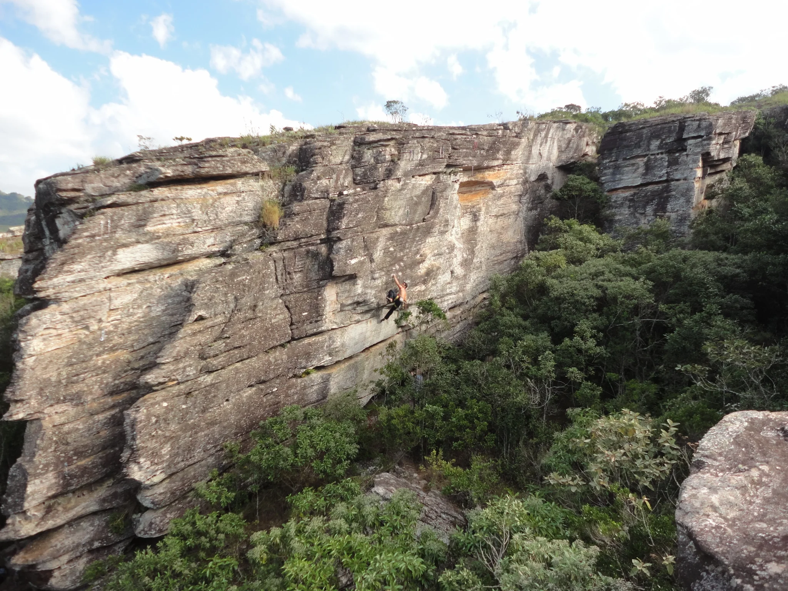
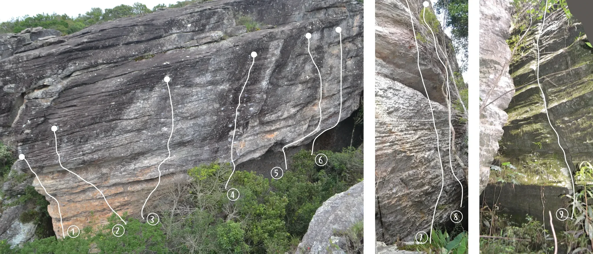
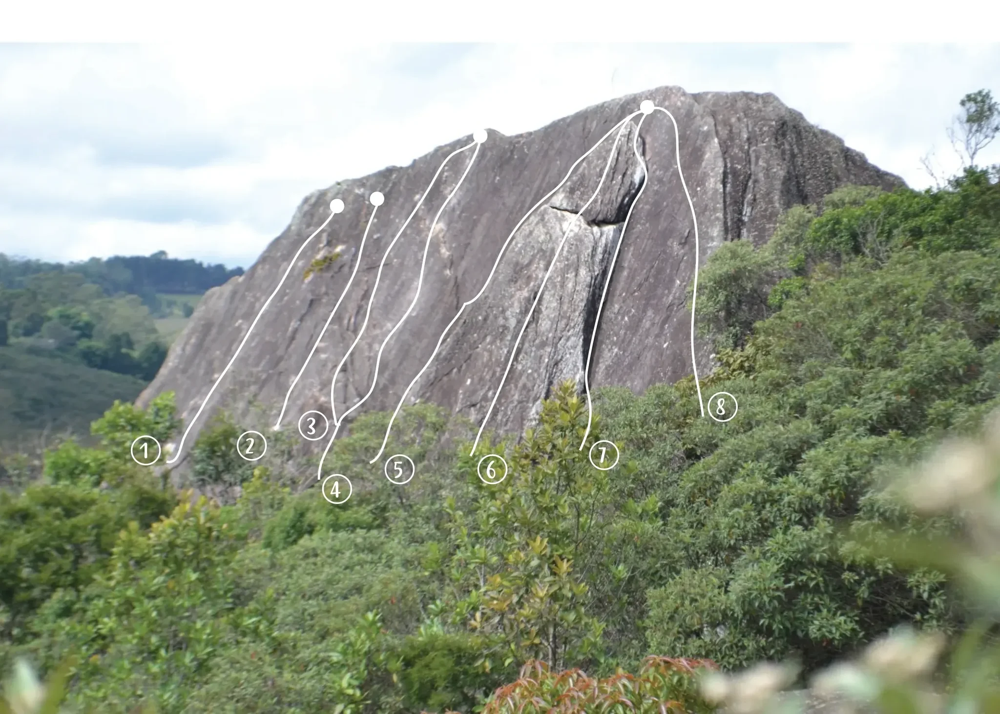
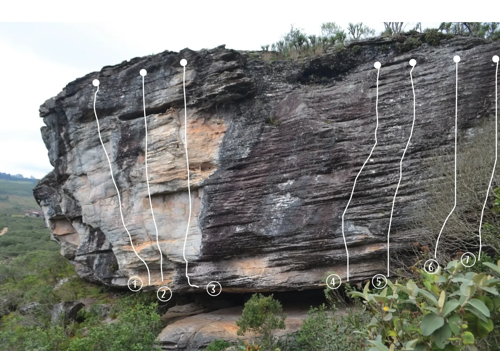
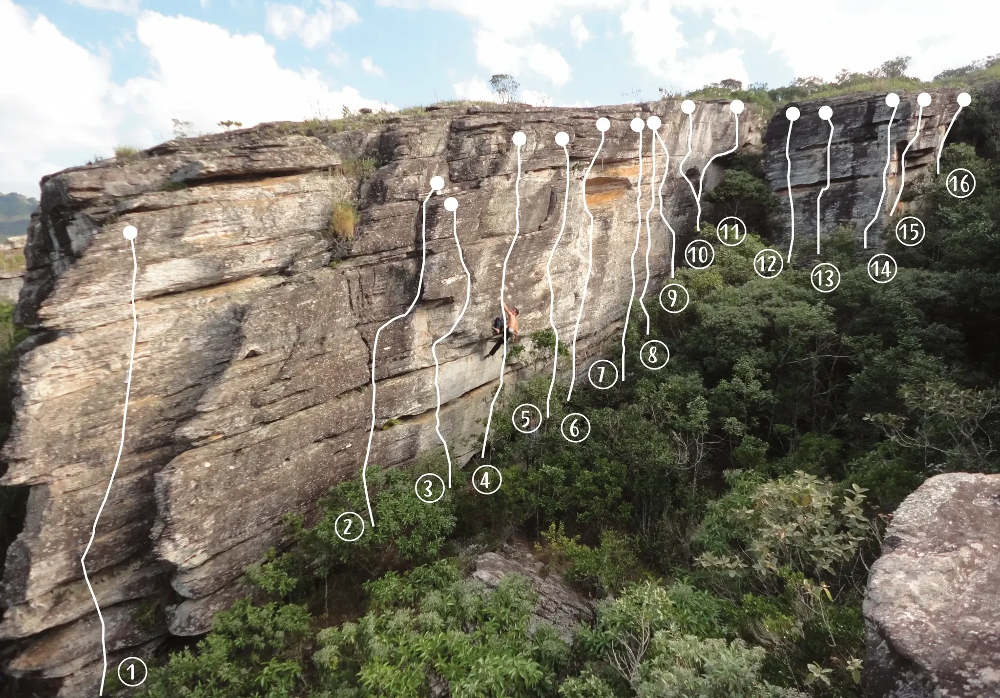
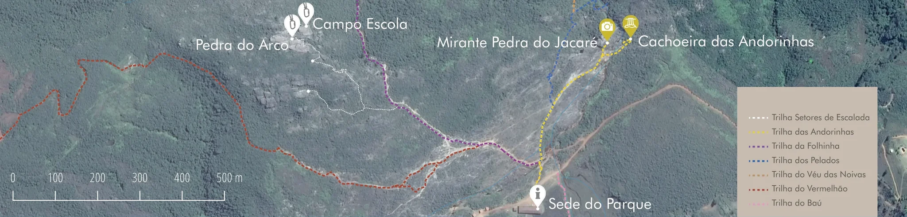
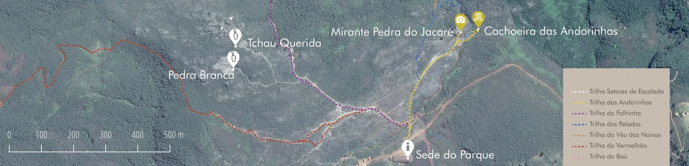

# Croqui: Parque Natural Municipal das Andorinhas

## Informações Gerais

- **id**: br_mg_ouro_preto_andorinhas
- **nome**: Parque Natural Municipal das Andorinhas
- **uid**: CiVmE57KaMXmNl
- **creditos**:
  - ATM 2018
- **caminho_thumbnail**: 
- **revisado_manualmente**: True
- **status_desenho_extraivel**: DESENHO_EXTRAIDO
- **ultima_migracao**: 5
- **publicar_croqui**: True
- **revisado_bounding_circle**: True
- **botoes**: []

## Parte: setor_pedra_do_arco

### Setor (Pico: Andorinhas)

- **descricao**:
    # Setor Pedra do Arco
    
    Setor com vias de 12m até 17m.
    
    Tempo de aproximação: 20min.
    
    Características: Escalada vertical e negativa.
    
    Recomendações: Uso de capacete. Algumas vias requerem equipamento móvel.
- **nome**: Pedra do Arco
- **uid**: zkSbaQVnPkafaq
- **mapas**:
  - **[0]**:
    - **caminho_imagem_mapa**: 
    - **largura_mapa**: 2048
    - **altura_mapa**: 880
    - **pontos_de_interesse**:
      - **[0]**:
        - **id**: s1r3kZAliEpkAT
        - **uid**: s1r3kZAliEpkAT
        - **rotulo**: 1
        - **circulo**:
          - **x**: 253
          - **y**: 803
          - **raio**: 20
        - **label**: 1
      - **[1]**:
        - **id**: Mqj2EClYZ4ujtk
        - **uid**: Mqj2EClYZ4ujtk
        - **rotulo**: 2
        - **circulo**:
          - **x**: 409
          - **y**: 799
          - **raio**: 20
        - **label**: 2
      - **[2]**:
        - **id**: magnWwwQCNU7fF
        - **uid**: magnWwwQCNU7fF
        - **rotulo**: 3
        - **circulo**:
          - **x**: 528
          - **y**: 759
          - **raio**: 21
        - **label**: 3
      - **[3]**:
        - **id**: BeXkX3odFKdQz3
        - **uid**: BeXkX3odFKdQz3
        - **rotulo**: 4
        - **circulo**:
          - **x**: 805
          - **y**: 674
          - **raio**: 20
        - **label**: 4
      - **[4]**:
        - **id**: sdiL6ScDymSd01
        - **uid**: sdiL6ScDymSd01
        - **rotulo**: 5
        - **circulo**:
          - **x**: 957
          - **y**: 599
          - **raio**: 20
        - **label**: 5
      - **[5]**:
        - **id**: egxjGifeS1x7kR
        - **uid**: egxjGifeS1x7kR
        - **rotulo**: 6
        - **circulo**:
          - **x**: 1110
          - **y**: 554
          - **raio**: 20
        - **label**: 6
      - **[6]**:
        - **id**: XXp8u1XQbh5ODl
        - **uid**: XXp8u1XQbh5ODl
        - **rotulo**: 7
        - **circulo**:
          - **x**: 1456
          - **y**: 823
          - **raio**: 20
        - **label**: 7
      - **[7]**:
        - **id**: fBtl87Gp8aN5T5
        - **uid**: fBtl87Gp8aN5T5
        - **rotulo**: 8
        - **circulo**:
          - **x**: 1577
          - **y**: 750
          - **raio**: 20
        - **label**: 8
      - **[8]**:
        - **id**: S9Ds7ARE1uQlMQ
        - **uid**: S9Ds7ARE1uQlMQ
        - **rotulo**: 9
        - **circulo**:
          - **x**: 1942
          - **y**: 743
          - **raio**: 20
        - **label**: 9
    - **referencias**:
      - **[0]**:
        - **alvo_uid**: 7ti0xqs5ZYdgI8
        - **pontos_uids**:
          - s1r3kZAliEpkAT
        - **escalada**: Aresta do Apicultor
        - **ids**:
          - s1r3kZAliEpkAT
      - **[1]**:
        - **alvo_uid**: 2s26SZMYbOI0fQ
        - **pontos_uids**:
          - Mqj2EClYZ4ujtk
        - **escalada**: Se Segura Malandro
        - **ids**:
          - Mqj2EClYZ4ujtk
      - **[2]**:
        - **alvo_uid**: MDblrI3ejId0jF
        - **pontos_uids**:
          - magnWwwQCNU7fF
        - **escalada**: Filosofia Lusitana
        - **ids**:
          - magnWwwQCNU7fF
      - **[3]**:
        - **alvo_uid**: fvyztQVeT6vS4k
        - **pontos_uids**:
          - BeXkX3odFKdQz3
        - **escalada**: Titanomaquia
        - **ids**:
          - BeXkX3odFKdQz3
      - **[4]**:
        - **alvo_uid**: eYAgd9R8FqvcUs
        - **pontos_uids**:
          - sdiL6ScDymSd01
        - **escalada**: Sika Loca
        - **ids**:
          - sdiL6ScDymSd01
      - **[5]**:
        - **alvo_uid**: DyRbkcQa5clvgn
        - **pontos_uids**:
          - egxjGifeS1x7kR
        - **escalada**: Caba Não Mundão
        - **ids**:
          - egxjGifeS1x7kR
      - **[6]**:
        - **alvo_uid**: ObKrAHaISV84Z4
        - **pontos_uids**:
          - XXp8u1XQbh5ODl
        - **escalada**: Marreta Porreta
        - **ids**:
          - XXp8u1XQbh5ODl
      - **[7]**:
        - **alvo_uid**: aB43zLdALJYMeU
        - **pontos_uids**:
          - fBtl87Gp8aN5T5
        - **escalada**: Cabron da Peste
        - **ids**:
          - fBtl87Gp8aN5T5
      - **[8]**:
        - **alvo_uid**: vZbJVBdzjPd6Cs
        - **pontos_uids**:
          - S9Ds7ARE1uQlMQ
        - **escalada**: Paralaxologística
        - **ids**:
          - S9Ds7ARE1uQlMQ
- **escaladas**:
  - **[0]**:
    - **uid**: 7ti0xqs5ZYdgI8
    - **via_esportiva**:
      - **nome**: Aresta do Apicultor
      - **dificuldade**: BR_9B
      - **extensao**: 17
      - **quantidade_protecoes_intermediarias**: 7
      - **quantidade_protecoes_parada**: 2
      - **conquistadores**:
        - Fábio de Melo
        - Rodrigo 'Mussula'
  - **[1]**:
    - **uid**: 2s26SZMYbOI0fQ
    - **via_esportiva**:
      - **nome**: Se Segura Malandro
      - **dificuldade**: BR_7B
      - **extensao**: 15
      - **quantidade_protecoes_intermediarias**: 6
      - **quantidade_protecoes_parada**: 2
      - **conquistadores**:
        - Fábio de Melo
        - Rodrigo 'Mussula'
  - **[2]**:
    - **uid**: MDblrI3ejId0jF
    - **via_esportiva**:
      - **nome**: Filosofia Lusitana
      - **dificuldade**: BR_8B
      - **extensao**: 17
      - **quantidade_protecoes_intermediarias**: 7
      - **quantidade_protecoes_parada**: 2
      - **conquistadores**:
        - Fábio de Melo
        - Rodrigo 'Mussula'
  - **[3]**:
    - **uid**: fvyztQVeT6vS4k
    - **via_esportiva**:
      - **nome**: Titanomaquia
      - **dificuldade**: BR_9A
      - **extensao**: 17
      - **quantidade_protecoes_intermediarias**: 7
      - **quantidade_protecoes_parada**: 2
      - **conquistadores**:
        - Fábio de Melo
        - Rodrigo 'Mussula'
  - **[4]**:
    - **uid**: eYAgd9R8FqvcUs
    - **via_esportiva**:
      - **nome**: Sika Loca
      - **dificuldade**: INDEFINIDO
      - **extensao**: 17
      - **quantidade_protecoes_intermediarias**: 7
      - **quantidade_protecoes_parada**: 2
      - **conquistadores**:
        - F. de Melo
        - R. 'Mussula'
        - Fred Moreira
  - **[5]**:
    - **uid**: DyRbkcQa5clvgn
    - **via_esportiva**:
      - **nome**: Caba Não Mundão
      - **dificuldade**: INDEFINIDO
      - **extensao**: 17
      - **quantidade_protecoes_intermediarias**: 7
      - **quantidade_protecoes_parada**: 2
      - **conquistadores**:
        - Fábio de Melo
        - Rodrigo 'Mussula'
  - **[6]**:
    - **uid**: ObKrAHaISV84Z4
    - **via_movel**:
      - **nome**: Marreta Porreta
      - **dificuldade**: BR_6SUP
      - **extensao**: 12
      - **protecoes_moveis**: Móvel
      - **quantidade_protecoes_parada**: 1
      - **conquistadores**:
        - Ian Belo
        - Felipe Dias
  - **[7]**:
    - **uid**: aB43zLdALJYMeU
    - **via_esportiva**:
      - **nome**: Cabron da Peste
      - **dificuldade**: INDEFINIDO
      - **extensao**: 12
      - **quantidade_protecoes_intermediarias**: 4
      - **quantidade_protecoes_parada**: 2
      - **conquistadores**:
        - Fábio de Melo
        - Rodrigo 'Mussula'
  - **[8]**:
    - **uid**: vZbJVBdzjPd6Cs
    - **via_esportiva**:
      - **nome**: Paralaxologística
      - **dificuldade**: BR_8B
      - **extensao**: 12
      - **quantidade_protecoes_intermediarias**: 4
      - **quantidade_protecoes_parada**: 2
      - **conquistadores**:
        - Fábio de Melo
        - Rodrigo 'Mussula'
- **precomputados**:
  - **total_escaladas**: 9
  - **total_esportivas**: 8

## Parte: setor_campo_escola

### Setor (Pico: Andorinhas)

- **descricao**:
    # Setor Campo Escola
    
    Setor com vias de 8m até 10m.
    
    Tempo de aproximação: 25min.
    
    Características: Escalada positiva.
    
    Recomendações: Uso de capacete. Algumas vias requerem equipamento móvel.
- **nome**: Campo Escola
- **uid**: TFb7MHt7YSa4Am
- **mapas**:
  - **[0]**:
    - **caminho_imagem_mapa**: 
    - **largura_mapa**: 2048
    - **altura_mapa**: 1464
    - **pontos_de_interesse**:
      - **[0]**:
        - **id**: SL5beigFdmMPpa
        - **uid**: SL5beigFdmMPpa
        - **rotulo**: 1
        - **circulo**:
          - **x**: 299
          - **y**: 923
          - **raio**: 29
        - **label**: 1
      - **[1]**:
        - **id**: 8N0TMzWLsd6kWp
        - **uid**: 8N0TMzWLsd6kWp
        - **rotulo**: 2
        - **circulo**:
          - **x**: 515
          - **y**: 914
          - **raio**: 29
        - **label**: 2
      - **[2]**:
        - **id**: B1B9rVRVjLCiVx
        - **uid**: B1B9rVRVjLCiVx
        - **rotulo**: 3
        - **circulo**:
          - **x**: 642
          - **y**: 872
          - **raio**: 29
        - **label**: 3
      - **[3]**:
        - **id**: ebZtAni3NdfAGN
        - **uid**: ebZtAni3NdfAGN
        - **rotulo**: 4
        - **circulo**:
          - **x**: 691
          - **y**: 1002
          - **raio**: 29
        - **label**: 4
      - **[4]**:
        - **id**: Yu1y8joy7B6YUk
        - **uid**: Yu1y8joy7B6YUk
        - **rotulo**: 5
        - **circulo**:
          - **x**: 819
          - **y**: 962
          - **raio**: 29
        - **label**: 5
      - **[5]**:
        - **id**: DN3nDZ1UuI8UTg
        - **uid**: DN3nDZ1UuI8UTg
        - **rotulo**: 6
        - **circulo**:
          - **x**: 1009
          - **y**: 962
          - **raio**: 29
        - **label**: 6
      - **[6]**:
        - **id**: exWnLXdm6YeHMm
        - **uid**: exWnLXdm6YeHMm
        - **rotulo**: 7
        - **circulo**:
          - **x**: 1237
          - **y**: 933
          - **raio**: 29
        - **label**: 7
      - **[7]**:
        - **id**: klXGpHy9c2z2VH
        - **uid**: klXGpHy9c2z2VH
        - **rotulo**: 8
        - **circulo**:
          - **x**: 1480
          - **y**: 835
          - **raio**: 29
        - **label**: 8
    - **referencias**:
      - **[0]**:
        - **alvo_uid**: sY1Zku2jMT7ovP
        - **pontos_uids**:
          - SL5beigFdmMPpa
        - **escalada**: Vivi Fernandes
        - **ids**:
          - SL5beigFdmMPpa
      - **[1]**:
        - **alvo_uid**: rApTGpneJUxHKh
        - **pontos_uids**:
          - 8N0TMzWLsd6kWp
        - **escalada**: Kid Bengala
        - **ids**:
          - 8N0TMzWLsd6kWp
      - **[2]**:
        - **alvo_uid**: tARmWmeUlv9QaW
        - **pontos_uids**:
          - B1B9rVRVjLCiVx
        - **escalada**: Lolla
        - **ids**:
          - B1B9rVRVjLCiVx
      - **[3]**:
        - **alvo_uid**: bZknDsQconM5dD
        - **pontos_uids**:
          - ebZtAni3NdfAGN
        - **escalada**: Emanuelle
        - **ids**:
          - ebZtAni3NdfAGN
      - **[4]**:
        - **alvo_uid**: eZhakU1rJiCqbC
        - **pontos_uids**:
          - Yu1y8joy7B6YUk
        - **escalada**: Bruna Surfistinha
        - **ids**:
          - Yu1y8joy7B6YUk
      - **[5]**:
        - **alvo_uid**: hv5CLql5boxvHS
        - **pontos_uids**:
          - DN3nDZ1UuI8UTg
        - **escalada**: Hilda Furacão
        - **ids**:
          - DN3nDZ1UuI8UTg
      - **[6]**:
        - **alvo_uid**: Xs9g67SPKCz8Of
        - **pontos_uids**:
          - exWnLXdm6YeHMm
        - **escalada**: Cicciolina
        - **ids**:
          - exWnLXdm6YeHMm
      - **[7]**:
        - **alvo_uid**: KGdCAnb0BbRV1C
        - **pontos_uids**:
          - klXGpHy9c2z2VH
        - **escalada**: Bordel
        - **ids**:
          - klXGpHy9c2z2VH
- **escaladas**:
  - **[0]**:
    - **uid**: sY1Zku2jMT7ovP
    - **via_esportiva**:
      - **nome**: Vivi Fernandes
      - **dificuldade**: BR_6
      - **extensao**: 10
      - **quantidade_protecoes_intermediarias**: 3
      - **quantidade_protecoes_parada**: 1
      - **conquistadores**:
        - Fábio de Melo
        - Rodrigo 'Mussula'
  - **[1]**:
    - **uid**: rApTGpneJUxHKh
    - **via_esportiva**:
      - **nome**: Kid Bengala
      - **dificuldade**: BR_4
      - **extensao**: 10
      - **quantidade_protecoes_intermediarias**: 3
      - **quantidade_protecoes_parada**: 1
      - **conquistadores**:
        - Fábio de Melo
        - Rodrigo 'Mussula'
  - **[2]**:
    - **uid**: tARmWmeUlv9QaW
    - **via_esportiva**:
      - **nome**: Lolla
      - **dificuldade**: BR_3
      - **extensao**: 10
      - **quantidade_protecoes_intermediarias**: 3
      - **quantidade_protecoes_parada**: 2
      - **conquistadores**:
        - Fábio de Melo
        - Rodrigo 'Mussula'
  - **[3]**:
    - **uid**: bZknDsQconM5dD
    - **via_esportiva**:
      - **nome**: Emanuelle
      - **dificuldade**: BR_3
      - **extensao**: 10
      - **quantidade_protecoes_intermediarias**: 3
      - **quantidade_protecoes_parada**: 2
      - **conquistadores**:
        - Fábio de Melo
        - Rodrigo 'Mussula'
  - **[4]**:
    - **uid**: eZhakU1rJiCqbC
    - **via_movel**:
      - **nome**: Bruna Surfistinha
      - **dificuldade**: BR_4
      - **extensao**: 10
      - **protecoes_moveis**: Móvel
      - **quantidade_protecoes_parada**: 2
      - **conquistadores**:
        - Ian Belo
        - Felipe Dias
  - **[5]**:
    - **uid**: hv5CLql5boxvHS
    - **via_esportiva**:
      - **nome**: Hilda Furacão
      - **dificuldade**: BR_5
      - **extensao**: 10
      - **quantidade_protecoes_intermediarias**: 3
      - **quantidade_protecoes_parada**: 2
      - **conquistadores**:
        - Fábio de Melo
  - **[6]**:
    - **uid**: Xs9g67SPKCz8Of
    - **via_movel**:
      - **nome**: Cicciolina
      - **dificuldade**: BR_4
      - **extensao**: 10
      - **protecoes_moveis**: Móvel
      - **quantidade_protecoes_parada**: 2
      - **conquistadores**:
        - Ian Belo
        - Felipe Dias
  - **[7]**:
    - **uid**: KGdCAnb0BbRV1C
    - **via_esportiva**:
      - **nome**: Bordel
      - **dificuldade**: BR_3
      - **extensao**: 8
      - **quantidade_protecoes_intermediarias**: 3
      - **quantidade_protecoes_parada**: 2
      - **conquistadores**:
        - Rodrigo 'Mussula'
- **precomputados**:
  - **total_escaladas**: 8
  - **total_esportivas**: 6

## Parte: setor_tchau_querida

### Setor (Pico: Andorinhas)

- **descricao**:
    # Setor Tchau Querida
    
    Setor com vias de 11m até 12m.
    
    Tempo de aproximação: 10min.
    
    Características: Escalada vertical e negativa.
    
    Recomendações: Uso de capacete.
- **nome**: Tchau Querida
- **uid**: wsG4L2MDOjEQyv
- **mapas**:
  - **[0]**:
    - **caminho_imagem_mapa**: 
    - **largura_mapa**: 2048
    - **altura_mapa**: 1441
    - **pontos_de_interesse**:
      - **[0]**:
        - **id**: OAqwOD0xxV1vPu
        - **uid**: OAqwOD0xxV1vPu
        - **rotulo**: 1
        - **circulo**:
          - **x**: 553
          - **y**: 1165
          - **raio**: 29
        - **label**: 1
      - **[1]**:
        - **id**: MuwmgaCCQZRwWx
        - **uid**: MuwmgaCCQZRwWx
        - **rotulo**: 2
        - **circulo**:
          - **x**: 673
          - **y**: 1207
          - **raio**: 29
        - **label**: 2
      - **[2]**:
        - **id**: K5QKDGoccW19NA
        - **uid**: K5QKDGoccW19NA
        - **rotulo**: 3
        - **circulo**:
          - **x**: 876
          - **y**: 1185
          - **raio**: 29
        - **label**: 3
      - **[3]**:
        - **id**: cdfIXsByranGf7
        - **uid**: cdfIXsByranGf7
        - **rotulo**: 4
        - **circulo**:
          - **x**: 1367
          - **y**: 1156
          - **raio**: 29
        - **label**: 4
      - **[4]**:
        - **id**: AjkqTGkt4Ch8hA
        - **uid**: AjkqTGkt4Ch8hA
        - **rotulo**: 5
        - **circulo**:
          - **x**: 1554
          - **y**: 1156
          - **raio**: 29
        - **label**: 5
      - **[5]**:
        - **id**: RfbWzFwbo770MS
        - **uid**: RfbWzFwbo770MS
        - **rotulo**: 6
        - **circulo**:
          - **x**: 1767
          - **y**: 1095
          - **raio**: 29
        - **label**: 6
      - **[6]**:
        - **id**: teBEMz2j8ndVhN
        - **uid**: teBEMz2j8ndVhN
        - **rotulo**: 7
        - **circulo**:
          - **x**: 1918
          - **y**: 1066
          - **raio**: 29
        - **label**: 7
    - **referencias**:
      - **[0]**:
        - **alvo_uid**: k6oqTOgZAjU9kt
        - **pontos_uids**:
          - OAqwOD0xxV1vPu
        - **escalada**: Temer Jamais
        - **ids**:
          - OAqwOD0xxV1vPu
      - **[1]**:
        - **alvo_uid**: xW0Mkv77JFWs9p
        - **pontos_uids**:
          - MuwmgaCCQZRwWx
        - **escalada**: Escalar sem Temer
        - **ids**:
          - MuwmgaCCQZRwWx
      - **[2]**:
        - **alvo_uid**: J1pGNoThE1bwfk
        - **pontos_uids**:
          - K5QKDGoccW19NA
        - **escalada**: Tchau Querida
        - **ids**:
          - K5QKDGoccW19NA
      - **[3]**:
        - **alvo_uid**: CRBMqp1Q6DVjAx
        - **pontos_uids**:
          - cdfIXsByranGf7
        - **escalada**: República do Pó Royal
        - **ids**:
          - cdfIXsByranGf7
      - **[4]**:
        - **alvo_uid**: R8rkbqPrKLHDxA
        - **pontos_uids**:
          - AjkqTGkt4Ch8hA
        - **escalada**: República das Bananas
        - **ids**:
          - AjkqTGkt4Ch8hA
      - **[5]**:
        - **alvo_uid**: aW9uZrzgmc7ttE
        - **pontos_uids**:
          - RfbWzFwbo770MS
        - **escalada**: República do Café com Leite
        - **ids**:
          - RfbWzFwbo770MS
      - **[6]**:
        - **alvo_uid**: VjT3UV27gMKhc0
        - **pontos_uids**:
          - teBEMz2j8ndVhN
        - **escalada**: Lava Jato
        - **ids**:
          - teBEMz2j8ndVhN
- **escaladas**:
  - **[0]**:
    - **uid**: k6oqTOgZAjU9kt
    - **via_esportiva**:
      - **nome**: Temer Jamais
      - **dificuldade**: INDEFINIDO
      - **extensao**: 12
      - **quantidade_protecoes_intermediarias**: 5
      - **quantidade_protecoes_parada**: 2
      - **conquistadores**:
        - Fábio de Melo
        - Rodrigo 'Mussula'
  - **[1]**:
    - **uid**: xW0Mkv77JFWs9p
    - **via_esportiva**:
      - **nome**: Escalar sem Temer
      - **dificuldade**: INDEFINIDO
      - **extensao**: 12
      - **quantidade_protecoes_intermediarias**: 5
      - **quantidade_protecoes_parada**: 2
      - **conquistadores**:
        - Fábio de Melo
        - Rodrigo 'Mussula'
  - **[2]**:
    - **uid**: J1pGNoThE1bwfk
    - **via_esportiva**:
      - **nome**: Tchau Querida
      - **dificuldade**: BR_7B_BARRA_7C
      - **extensao**: 12
      - **quantidade_protecoes_intermediarias**: 5
      - **quantidade_protecoes_parada**: 2
      - **conquistadores**:
        - Fábio de Melo
        - Rodrigo 'Mussula'
  - **[3]**:
    - **uid**: CRBMqp1Q6DVjAx
    - **via_esportiva**:
      - **nome**: República do Pó Royal
      - **dificuldade**: BR_8A
      - **extensao**: 12
      - **quantidade_protecoes_intermediarias**: 4
      - **quantidade_protecoes_parada**: 2
      - **conquistadores**:
        - Fábio de Melo
        - Rodrigo 'Mussula'
  - **[4]**:
    - **uid**: R8rkbqPrKLHDxA
    - **via_esportiva**:
      - **nome**: República das Bananas
      - **dificuldade**: BR_7A
      - **extensao**: 11
      - **quantidade_protecoes_intermediarias**: 4
      - **quantidade_protecoes_parada**: 2
      - **conquistadores**:
        - Fábio de Melo
        - Rodrigo 'Mussula'
  - **[5]**:
    - **uid**: aW9uZrzgmc7ttE
    - **via_esportiva**:
      - **nome**: República do Café com Leite
      - **dificuldade**: BR_7A
      - **extensao**: 11
      - **quantidade_protecoes_intermediarias**: 4
      - **quantidade_protecoes_parada**: 2
      - **conquistadores**:
        - Fábio de Melo
        - Rodrigo 'Mussula'
  - **[6]**:
    - **uid**: VjT3UV27gMKhc0
    - **via_esportiva**:
      - **nome**: Lava Jato
      - **dificuldade**: BR_7B
      - **extensao**: 11
      - **quantidade_protecoes_intermediarias**: 4
      - **quantidade_protecoes_parada**: 2
      - **conquistadores**:
        - Fábio de Melo
        - Rodrigo 'Mussula'
- **precomputados**:
  - **total_escaladas**: 7
  - **total_esportivas**: 7

## Parte: setor_pedra_branca

### Setor (Pico: Andorinhas)

- **descricao**:
    # Setor Pedra Branca
    
    Setor com vias de 9m até 12m.
    
    Tempo de aproximação: 25min.
    
    Características: Escalada vertical.
    
    Recomendações: Uso de capacete. Algumas vias requerem equipamento móvel.
- **nome**: Pedra Branca
- **uid**: LwsbKpA62X0tMd
- **mapas**:
  - **[0]**:
    - **caminho_imagem_mapa**: 
    - **largura_mapa**: 2048
    - **altura_mapa**: 1430
    - **pontos_de_interesse**:
      - **[0]**:
        - **id**: Kw2r26BhWKm3HW
        - **uid**: Kw2r26BhWKm3HW
        - **rotulo**: 1
        - **circulo**:
          - **x**: 271
          - **y**: 1376
          - **raio**: 28
        - **label**: 1
      - **[1]**:
        - **id**: S94l8t3Kowypzj
        - **uid**: S94l8t3Kowypzj
        - **rotulo**: 2
        - **circulo**:
          - **x**: 716
          - **y**: 1078
          - **raio**: 28
        - **label**: 2
      - **[2]**:
        - **id**: UQA4cM8WDOTV6g
        - **uid**: UQA4cM8WDOTV6g
        - **rotulo**: 3
        - **circulo**:
          - **x**: 881
          - **y**: 1000
          - **raio**: 29
        - **label**: 3
      - **[3]**:
        - **id**: rrXCVCX315PvDh
        - **uid**: rrXCVCX315PvDh
        - **rotulo**: 4
        - **circulo**:
          - **x**: 998
          - **y**: 982
          - **raio**: 29
        - **label**: 4
      - **[4]**:
        - **id**: 167oZQUL97DvEX
        - **uid**: 167oZQUL97DvEX
        - **rotulo**: 5
        - **circulo**:
          - **x**: 1079
          - **y**: 857
          - **raio**: 29
        - **label**: 5
      - **[5]**:
        - **id**: J2HhYo5NDZ6t4Q
        - **uid**: J2HhYo5NDZ6t4Q
        - **rotulo**: 6
        - **circulo**:
          - **x**: 1178
          - **y**: 875
          - **raio**: 29
        - **label**: 6
      - **[6]**:
        - **id**: Ziwxy16uv4OHif
        - **uid**: Ziwxy16uv4OHif
        - **rotulo**: 7
        - **circulo**:
          - **x**: 1235
          - **y**: 767
          - **raio**: 28
        - **label**: 7
      - **[7]**:
        - **id**: 6TOSSMM6oJLdCA
        - **uid**: 6TOSSMM6oJLdCA
        - **rotulo**: 8
        - **circulo**:
          - **x**: 1341
          - **y**: 726
          - **raio**: 29
        - **label**: 8
      - **[8]**:
        - **id**: 244HBnuym2IWDk
        - **uid**: 244HBnuym2IWDk
        - **rotulo**: 9
        - **circulo**:
          - **x**: 1380
          - **y**: 610
          - **raio**: 29
        - **label**: 9
      - **[9]**:
        - **id**: EcPEuN3CknJ9Ga
        - **uid**: EcPEuN3CknJ9Ga
        - **rotulo**: 10
        - **circulo**:
          - **x**: 1433
          - **y**: 521
          - **raio**: 28
        - **label**: 10
      - **[10]**:
        - **id**: UoEPxqRveqDfjl
        - **uid**: UoEPxqRveqDfjl
        - **rotulo**: 11
        - **circulo**:
          - **x**: 1498
          - **y**: 474
          - **raio**: 29
        - **label**: 11
      - **[11]**:
        - **id**: arqatt4PQTrUTw
        - **uid**: arqatt4PQTrUTw
        - **rotulo**: 12
        - **circulo**:
          - **x**: 1573
          - **y**: 540
          - **raio**: 29
        - **label**: 12
      - **[12]**:
        - **id**: TfkQQLiEb8mFpE
        - **uid**: TfkQQLiEb8mFpE
        - **rotulo**: 13
        - **circulo**:
          - **x**: 1691
          - **y**: 569
          - **raio**: 29
        - **label**: 13
      - **[13]**:
        - **id**: Ydiim87OstKvuh
        - **uid**: Ydiim87OstKvuh
        - **rotulo**: 14
        - **circulo**:
          - **x**: 1806
          - **y**: 550
          - **raio**: 29
        - **label**: 14
      - **[14]**:
        - **id**: Ni8v7sYqnxZo1m
        - **uid**: Ni8v7sYqnxZo1m
        - **rotulo**: 15
        - **circulo**:
          - **x**: 1865
          - **y**: 474
          - **raio**: 29
        - **label**: 15
      - **[15]**:
        - **id**: uVC6RLcQ3zqjlW
        - **uid**: uVC6RLcQ3zqjlW
        - **rotulo**: 16
        - **circulo**:
          - **x**: 1968
          - **y**: 375
          - **raio**: 29
        - **label**: 16
    - **referencias**:
      - **[0]**:
        - **alvo_uid**: ncix4p5uZLrqy0
        - **pontos_uids**:
          - Kw2r26BhWKm3HW
        - **escalada**: Vaca Virgem
        - **ids**:
          - Kw2r26BhWKm3HW
      - **[1]**:
        - **alvo_uid**: iov2bA83sPMsij
        - **pontos_uids**:
          - S94l8t3Kowypzj
        - **escalada**: Route 162
        - **ids**:
          - S94l8t3Kowypzj
      - **[2]**:
        - **alvo_uid**: LhFUxPxLieUX2g
        - **pontos_uids**:
          - UQA4cM8WDOTV6g
        - **escalada**: Dia de Protesto
        - **ids**:
          - UQA4cM8WDOTV6g
      - **[3]**:
        - **alvo_uid**: PkPBem3YrKiswl
        - **pontos_uids**:
          - rrXCVCX315PvDh
        - **escalada**: Atestado de Cadena
        - **ids**:
          - rrXCVCX315PvDh
      - **[4]**:
        - **alvo_uid**: GSLSwkP3r8Nv5e
        - **pontos_uids**:
          - 167oZQUL97DvEX
        - **escalada**: Janela do Universo
        - **ids**:
          - 167oZQUL97DvEX
      - **[5]**:
        - **alvo_uid**: yUMkkSy5pUXvun
        - **pontos_uids**:
          - J2HhYo5NDZ6t4Q
        - **escalada**: Musgonoszói
        - **ids**:
          - J2HhYo5NDZ6t4Q
      - **[6]**:
        - **alvo_uid**: HNPFjPzBUYf7Xy
        - **pontos_uids**:
          - Ziwxy16uv4OHif
        - **escalada**: Fala meu Justo
        - **ids**:
          - Ziwxy16uv4OHif
      - **[7]**:
        - **alvo_uid**: vbb51jADyW5oVP
        - **pontos_uids**:
          - 6TOSSMM6oJLdCA
        - **escalada**: Regletes Ocultos
        - **ids**:
          - 6TOSSMM6oJLdCA
      - **[8]**:
        - **alvo_uid**: na69PGh4fGdXcu
        - **pontos_uids**:
          - 244HBnuym2IWDk
        - **escalada**: Batata com Sal
        - **ids**:
          - 244HBnuym2IWDk
      - **[9]**:
        - **alvo_uid**: 2KqcKn1JWXZDp3
        - **pontos_uids**:
          - EcPEuN3CknJ9Ga
        - **escalada**: Argentina
        - **ids**:
          - EcPEuN3CknJ9Ga
      - **[10]**:
        - **alvo_uid**: 5SbiIbYHODL7kP
        - **pontos_uids**:
          - UoEPxqRveqDfjl
        - **escalada**: Alemanha
        - **ids**:
          - UoEPxqRveqDfjl
      - **[11]**:
        - **alvo_uid**: DWWb2P32J9uKJM
        - **pontos_uids**:
          - arqatt4PQTrUTw
        - **escalada**: Melodrama
        - **ids**:
          - arqatt4PQTrUTw
      - **[12]**:
        - **alvo_uid**: 1lZVDxj1BfgQ5y
        - **pontos_uids**:
          - TfkQQLiEb8mFpE
        - **escalada**: Sapiência
        - **ids**:
          - TfkQQLiEb8mFpE
      - **[13]**:
        - **alvo_uid**: c0Rn16b1e6hv8B
        - **pontos_uids**:
          - Ydiim87OstKvuh
        - **escalada**: Lagartixa de Pedra
        - **ids**:
          - Ydiim87OstKvuh
      - **[14]**:
        - **alvo_uid**: 5uT1gvvyYGLqm9
        - **pontos_uids**:
          - Ni8v7sYqnxZo1m
        - **escalada**: Meu Amigo Friend
        - **ids**:
          - Ni8v7sYqnxZo1m
      - **[15]**:
        - **alvo_uid**: TX15wb9KDkB0R7
        - **pontos_uids**:
          - uVC6RLcQ3zqjlW
        - **escalada**: Meu Amigo Broca
        - **ids**:
          - uVC6RLcQ3zqjlW
- **escaladas**:
  - **[0]**:
    - **uid**: ncix4p5uZLrqy0
    - **via_esportiva**:
      - **nome**: Vaca Virgem
      - **dificuldade**: BR_6
      - **extensao**: 10
      - **quantidade_protecoes_intermediarias**: 3
      - **quantidade_protecoes_parada**: 2
      - **conquistadores**:
        - Fábio de Melo
        - Ângela Poleto
  - **[1]**:
    - **uid**: iov2bA83sPMsij
    - **via_movel**:
      - **nome**: Route 162
      - **dificuldade**: BR_5
      - **extensao**: 10
      - **protecoes_moveis**: Móvel
      - **quantidade_protecoes_parada**: 1
      - **conquistadores**:
        - Fábio de Melo
        - Marcelo Henriques
  - **[2]**:
    - **uid**: LhFUxPxLieUX2g
    - **via_esportiva**:
      - **nome**: Dia de Protesto
      - **dificuldade**: BR_6
      - **extensao**: 9
      - **quantidade_protecoes_intermediarias**: 2
      - **quantidade_protecoes_parada**: 1
      - **conquistadores**:
        - Fábio de Melo
  - **[3]**:
    - **uid**: PkPBem3YrKiswl
    - **via_esportiva**:
      - **nome**: Atestado de Cadena
      - **dificuldade**: BR_7C
      - **extensao**: 12
      - **quantidade_protecoes_intermediarias**: 3
      - **quantidade_protecoes_parada**: 2
      - **conquistadores**:
        - Fábio de Melo
        - Marcelo Henriques
  - **[4]**:
    - **uid**: GSLSwkP3r8Nv5e
    - **via_esportiva**:
      - **nome**: Janela do Universo
      - **dificuldade**: BR_7A
      - **extensao**: 12
      - **quantidade_protecoes_intermediarias**: 3
      - **quantidade_protecoes_parada**: 2
      - **conquistadores**:
        - Fábio de Melo
        - Marcelo Henriques
  - **[5]**:
    - **uid**: yUMkkSy5pUXvun
    - **via_esportiva**:
      - **nome**: Musgonoszói
      - **dificuldade**: BR_6
      - **extensao**: 12
      - **quantidade_protecoes_intermediarias**: 4
      - **quantidade_protecoes_parada**: 2
      - **conquistadores**:
        - Fábio de Melo
        - Marcelo Henriques
  - **[6]**:
    - **uid**: HNPFjPzBUYf7Xy
    - **via_esportiva**:
      - **nome**: Fala meu Justo
      - **dificuldade**: BR_7B
      - **extensao**: 10
      - **quantidade_protecoes_intermediarias**: 3
      - **quantidade_protecoes_parada**: 1
      - **conquistadores**:
        - Fábio de Melo
        - Marcelo Henriques
  - **[7]**:
    - **uid**: vbb51jADyW5oVP
    - **via_esportiva**:
      - **nome**: Regletes Ocultos
      - **dificuldade**: BR_6
      - **extensao**: 10
      - **quantidade_protecoes_intermediarias**: 3
      - **quantidade_protecoes_parada**: 2
      - **conquistadores**:
        - Fábio de Melo
        - Marcelo Henriques
  - **[8]**:
    - **uid**: na69PGh4fGdXcu
    - **via_movel**:
      - **nome**: Batata com Sal
      - **dificuldade**: BR_5
      - **extensao**: 10
      - **protecoes_moveis**: Móvel
      - **quantidade_protecoes_parada**: 2
      - **conquistadores**:
        - Igor Murta
        - Natália Simone
  - **[9]**:
    - **uid**: 2KqcKn1JWXZDp3
    - **via_esportiva**:
      - **nome**: Argentina
      - **dificuldade**: BR_5
      - **extensao**: 10
      - **quantidade_protecoes_intermediarias**: 3
      - **quantidade_protecoes_parada**: 1
      - **conquistadores**:
        - Rodrigo 'Mussula'
        - Marcelo Henriques
  - **[10]**:
    - **uid**: 5SbiIbYHODL7kP
    - **via_esportiva**:
      - **nome**: Alemanha
      - **dificuldade**: BR_7A
      - **extensao**: 10
      - **quantidade_protecoes_intermediarias**: 2
      - **quantidade_protecoes_parada**: 1
      - **conquistadores**:
        - Rodrigo 'Mussula'
        - Marcelo Henriques
  - **[11]**:
    - **uid**: DWWb2P32J9uKJM
    - **via_esportiva**:
      - **nome**: Melodrama
      - **dificuldade**: BR_7A
      - **extensao**: 12
      - **quantidade_protecoes_intermediarias**: 3
      - **quantidade_protecoes_parada**: 1
      - **conquistadores**:
        - F. de Melo
        - R. 'Mussula'
        - Pablo Brito
  - **[12]**:
    - **uid**: 1lZVDxj1BfgQ5y
    - **via_movel**:
      - **nome**: Sapiência
      - **dificuldade**: BR_7B
      - **extensao**: 12
      - **protecoes_moveis**: Móvel
      - **quantidade_protecoes_parada**: 2
      - **conquistadores**:
        - Fábio de Melo
  - **[13]**:
    - **uid**: c0Rn16b1e6hv8B
    - **via_esportiva**:
      - **nome**: Lagartixa de Pedra
      - **dificuldade**: BR_7A
      - **extensao**: 12
      - **quantidade_protecoes_intermediarias**: 3
      - **quantidade_protecoes_parada**: 1
      - **conquistadores**:
        - Fábio de Melo
        - Marcelo Henriques
  - **[14]**:
    - **uid**: 5uT1gvvyYGLqm9
    - **via_movel**:
      - **nome**: Meu Amigo Friend
      - **dificuldade**: BR_6
      - **extensao**: 10
      - **protecoes_moveis**: Móvel
      - **quantidade_protecoes_parada**: 2
      - **conquistadores**:
        - Fábio de Melo
        - Marcelo Henriques
  - **[15]**:
    - **uid**: TX15wb9KDkB0R7
    - **via_esportiva**:
      - **nome**: Meu Amigo Broca
      - **dificuldade**: BR_6
      - **extensao**: 10
      - **quantidade_protecoes_intermediarias**: 3
      - **quantidade_protecoes_parada**: 2
      - **conquistadores**:
        - Fábio de Melo
        - Rodrigo 'Mussula'
  - **[16]**:
    - **uid**: QlW0BrRmcEJElE
    - **via_esportiva**:
      - **nome**: Babilon Go Up
      - **dificuldade**: BR_8C
      - **extensao**: 10
      - **quantidade_protecoes_intermediarias**: 3
      - **quantidade_protecoes_parada**: 1
      - **conquistadores**:
        - F. de Melo
        - R. 'Mussula'
        - L. 'Minicraque'
  - **[17]**:
    - **uid**: vbTRakNEkn8ZAR
    - **via_esportiva**:
      - **nome**: Sem Dúvida Nem Piedade
      - **dificuldade**: BR_8B
      - **extensao**: 12
      - **quantidade_protecoes_intermediarias**: 5
      - **quantidade_protecoes_parada**: 2
      - **conquistadores**:
        - Leonardo 'Thunder'
        - F. Melo
        - Mussula
  - **[18]**:
    - **uid**: ktG44eqbGzTWqt
    - **via_movel**:
      - **nome**: Chanasclý
      - **dificuldade**: BR_5
      - **extensao**: 12
      - **protecoes_moveis**: Móvel
      - **quantidade_protecoes_parada**: 2
      - **conquistadores**:
        - Leonardo 'Thunder'
  - **[19]**:
    - **uid**: BXVyyqvrZdQRgh
    - **via_esportiva**:
      - **nome**: Segredo da Cadena
      - **dificuldade**: BR_7A
      - **extensao**: 12
      - **quantidade_protecoes_intermediarias**: 4
      - **quantidade_protecoes_parada**: 2
      - **conquistadores**:
        - Fábio de Melo
        - Marcelo Henriques
- **precomputados**:
  - **total_escaladas**: 20
  - **total_esportivas**: 15

## Arquivos Externos

- **arquivos_externos**:
  - **[0]**:
    - **caminho**: 
    - **checksum_sha256**: ccfccce8595ca9b12616502a4d2ed721463d08f2448bdcd4c2d2785dd301a445
  - **[1]**:
    - **caminho**: 
    - **checksum_sha256**: 1880d30192693089d990e4984aa40b0196b46e859bf2cf55772a366830a426cf
  - **[2]**:
    - **caminho**: 
    - **checksum_sha256**: 77c7edbae88a499b22a60aef038de1dea0cfd862389870d02825e33aea0e39ec
  - **[3]**:
    - **caminho**: 
    - **checksum_sha256**: 45b649897965af777f34cae30675680af99bcccbd3a5a8c95898a1027b67cd5c
  - **[4]**:
    - **caminho**: 
    - **checksum_sha256**: ccc5d20699f66366e98cbf9cfa047c91c0540639cbb2871c341c095ca8fa0038
  - **[5]**:
    - **caminho**: 
    - **checksum_sha256**: 5645c4d90ba14445907172296c0222d0f73e2cb917ac5fda89e84552ffb83ebe
  - **[6]**:
    - **caminho**: 
    - **checksum_sha256**: 1d38e55236e681b23e438e548a4d2b70fa0c4d6a265a33c9c7fc0acbfb8cbe94

