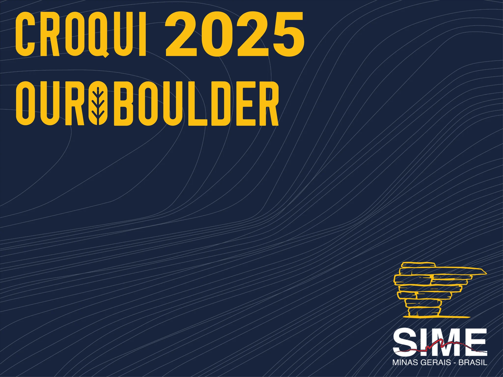
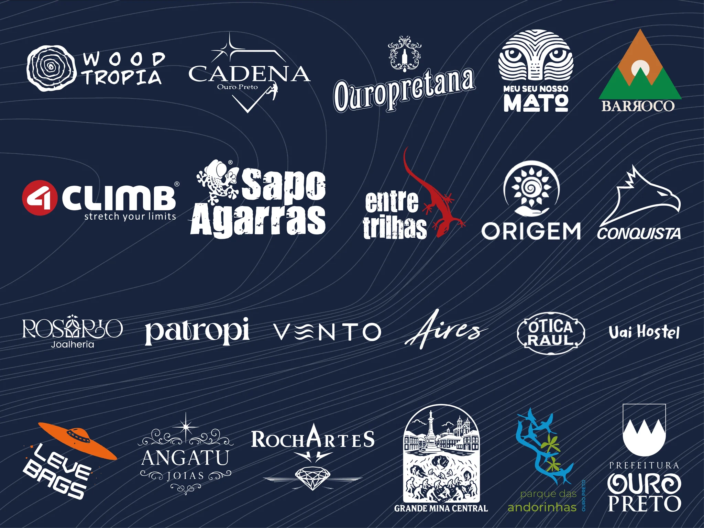
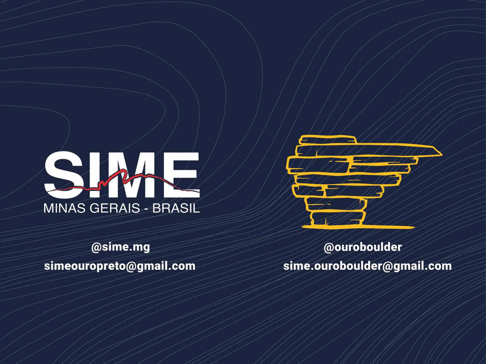
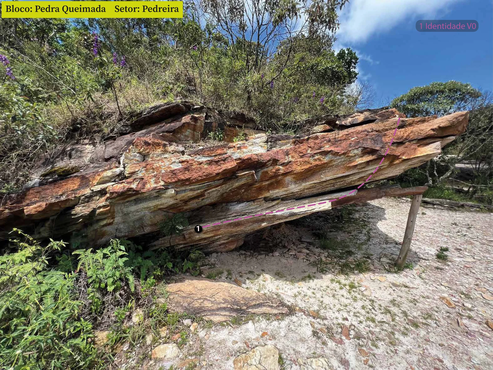
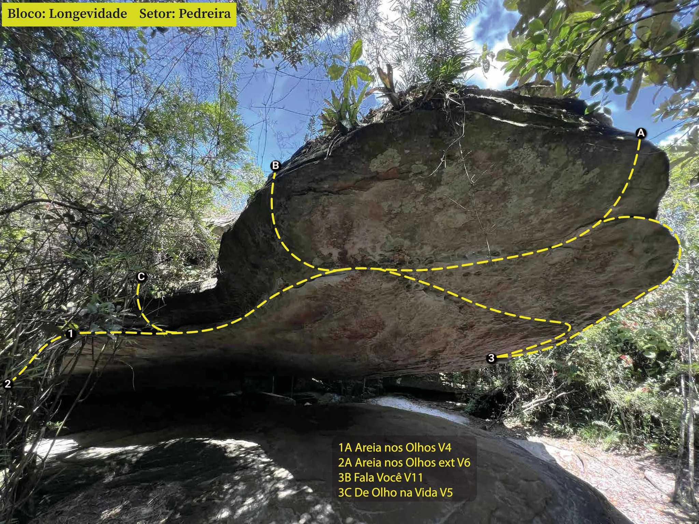
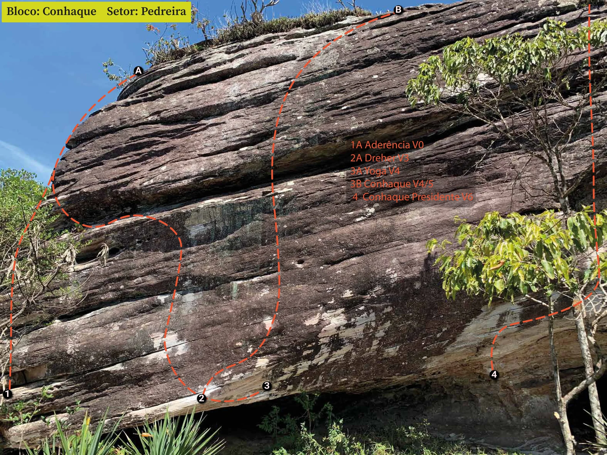
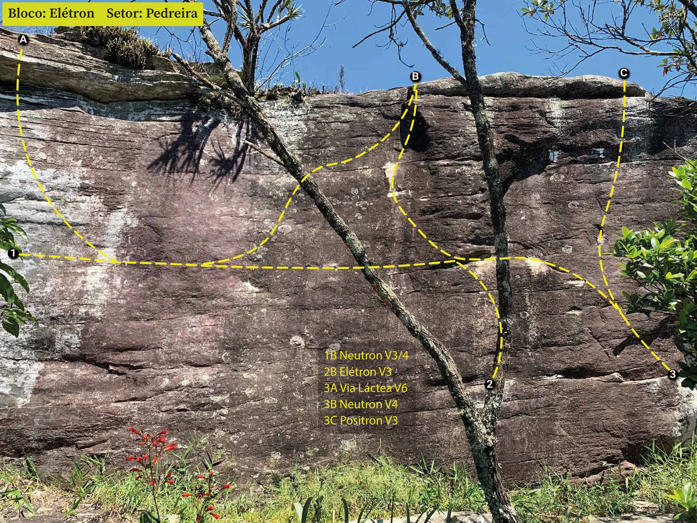
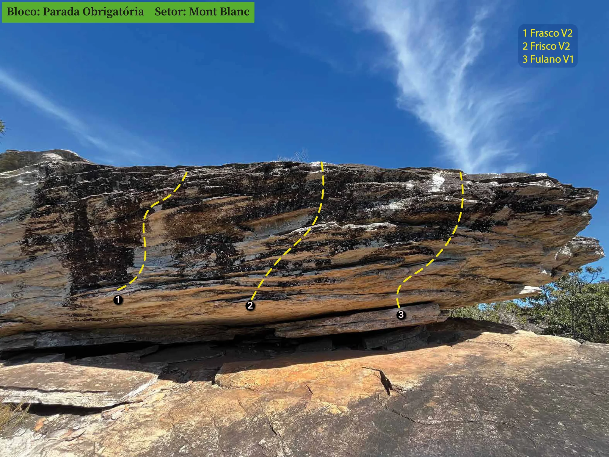
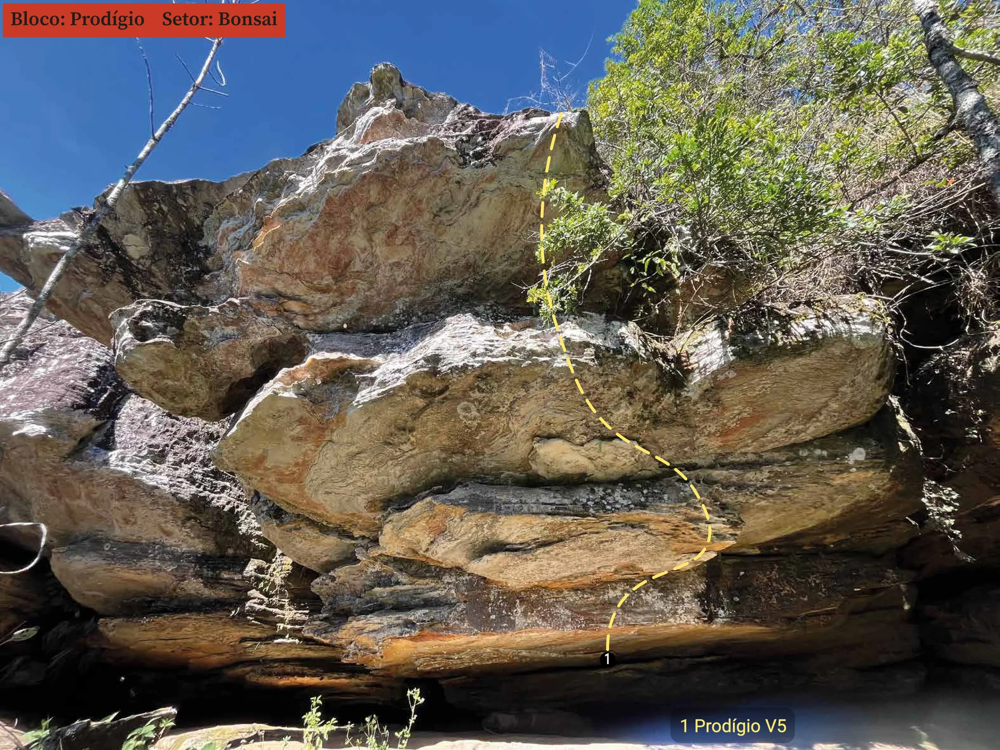

# Croqui: Ouroboulder

## Informações Gerais

- **id**: br_mg_ouro_preto_ouroboulder
- **nome**: Ouroboulder
- **caminho_thumbnail**: 
- **status_desenho_extraivel**: TEM_DESENHO_MAS_NAO_EXTRAIDO
- **botoes**:
  - **[0]**:
    - **texto**: Capa
    - **destino**:
      - **secao_textual**:
        - **conteudo**:
            # CROQUI 2025 OUROBOULDER
            
            |  |
            | :--: |
            | *SIME MINAS GERAIS - BRASIL* |
  - **[1]**:
    - **texto**: Apoio
    - **destino**:
      - **secao_textual**:
        - **conteudo**:
            # APOIO
            
            |  |
            | :--: |
            | *Logos de apoiadores* |
  - **[2]**:
    - **texto**: O Evento
    - **destino**:
      - **secao_textual**:
        - **conteudo**:
            # O EVENTO
            
            ## História e Tradição
            
            O OUROBOULDER é um tradicional encontro de escaladores que acontece anualmente na histórica cidade de Ouro Preto, Minas Gerais. Em 2025, o evento celebra sua 17ª edição, reunindo atletas e praticantes da escalada em boulder, aproveitando a alta temporada e a excelente qualidade das formações rochosas da região.
            
            Surgido em meados de 2006, ocorre atualmente nos setores de escalada localizados no Parque Municipal das Andorinhas, como Pedreira, Bonsai, Mont Blanc e Sunset. Desde 2024 passou ser organizado pela SIME, entidade representativa de montanhistas e escaladores da Região dos Inconfidentes.
            
            Ao longo dos anos, o evento tem atraído um público cativo e grandes nomes do esporte, como o escalador espanhol Daniel Andrada, que participou da segunda edição em 2007. O evento busca evoluir a cada edição, sempre mantendo o foco na sustentabilidade e na conscientização ambiental, utilizando materiais biodegradáveis e promovendo a preservação da fauna e flora local.
            
            Além da escalada, o OUROBOULDER visa oferecer uma experiência completa aos participantes, com tenda de apoio, croquis dos setores, desafios, sorteio de brindes e outras atividades. É um evento que promove a união de pessoas de diversos países e estados com o mesmo intuito: escalar e se conectar com a natureza e a comunidade da escalada.
  - **[3]**:
    - **texto**: A Cidade
    - **destino**:
      - **secao_textual**:
        - **conteudo**:
            # A CIDADE
            
            Ouro Preto é um tesouro histórico e cultural do Brasil, reconhecida como Patrimônio Cultural da Humanidade pela UNESCO em 1980. Sua origem remonta ao final do século XVII, com a descoberta de ouro aluvião por bandeirantes paulistas, o que impulsionou o desenvolvimento da região e a transformou em um dos principais centros econômicos do Brasil Colônia. Inicialmente conhecida como Vila Rica, a cidade foi elevada à categoria de vila em 1711 e tornou-se capital da Capitania de Minas Gerais em 1720. Em 1823, após a Independência do Brasil, recebeu o título de Imperial Cidade de Ouro Preto.
            
            A arquitetura de Ouro Preto é um dos seus maiores atrativos, com um conjunto homogêneo de construções barrocas que refletem a riqueza e o esplendor da época do ouro. As igrejas, muitas delas projetadas e adornadas por artistas renomados como Aleijadinho e Mestre Ataíde, são verdadeiras obras de arte, destacando-se pela riqueza de detalhes, adornos e o uso abundante de ouro em seu interior. Exemplos notáveis incluem a Basílica Nossa Senhora do Pilar, com mais de 400 quilos de ouro, e a Igreja de São Francisco de Assis, considerada uma das mais importantes obras coloniais do Brasil.
            
            Além de sua importância histórica e arquitetônica, Ouro Preto oferece uma rica vida cultural e turística. A cidade possui diversos museus, como o Museu da Inconfidência e o Museu Casa dos Contos, que preservam a memória do Ciclo do Ouro e da Inconfidência Mineira. O turismo é uma atividade econômica fundamental para a cidade, que atrai visitantes de todo o mundo interessados em sua história, art e paisagens montanhosas.
  - **[4]**:
    - **texto**: Parque Municipal das Andorinhas
    - **destino**:
      - **secao_textual**:
        - **conteudo**:
            # PARQUE MUNICIPAL DAS ANDORINHAS
            
            O Parque Municipal Natural das Andorinhas (PNMA), localizado em Ouro Preto, é um refúgio ecológico de grande beleza cênica. Criado em 2005, o parque abrange uma área de mais de 550 hectares, caracterizada por formações rochosas impressionantes e uma rica biodiversidade, marcando a transição entre a Mata Atlântica e o Cerrado.
            
            Um dos grandes atrativos do PNMA é a presença de diversas cachoeiras e trilhas bem sinalizadas, que convidam os visitantes à prática do ecoturismo. A nascente do Rio das Velhas, um dos mais importantes de Minas Gerais, encontra-se dentro dos limites do parque, adicionando um valor hídrico e ambiental significativo à região.
            
            Além de sua importância natural, o Parque das Andorinhas também se destaca por seu potencial para o geoturismo, com elementos abióticos que contam a história geológica local. A paisagem de campos rupestres quartzíticos e cursos d'água oferece um cenário único para estudos e apreciação da natureza.
  - **[5]**:
    - **texto**: Regras e Boa Convivência
    - **destino**:
      - **secao_textual**:
        - **conteudo**:
            # REGRAS E BOA CONVIVÊNCIA
            
            O OUROBOULDER adota os princípios internacionais do Leave No Trace (Não Deixe Rastros), filosofia de uso responsável de áreas naturais que visa minimizar o impacto humano no ambiente. Esses princípios devem ser rigorosamente seguidos por todos os participantes.
            
            1. Planeje e Prepare-se com Antecedência
            O planejamento adequado reduz a necessidade de improvisações que podem gerar impactos ambientais. Escaladores devem pesquisar as condições locais, verificar regulamentações específicas e preparar os equipamentos adequados antes da visita.
            
            2. Viaje e Acampe em Superfícies Resistentes
            Durante o deslocamento dentro do parque, utilize sempre trilhas já estabelecidas e evite abrir novos caminhos. O pisoteio em áreas de vegetação sensível pode causar danos permanentes, levando décadas para se recuperar. Importante: É estritamente proibido acampar dentro do parque. Essa regra visa proteger os ecossistemas noturnos e reduzir o impacto acumulado da presença humana. Durante o evento é permitido acampar na área designada pela organização.
            
            3. Descarte Adequadamente os Resíduos
            Todo resíduo gerado durante a escalada deve ser removido da área natural. Isso inclui não apenas lixo comum, mas também restos orgânicos, como cascas de frutas, que podem alterar o equilíbrio nutricional do solo e atrair fauna inadequada.
            
            4. Deixe o que Encontrar
            Evite remover ou alterar elementos naturais da área. Rochas, plantas, minerais e demais componentes do ecossistema devem permanecer em seus locais originais. A coleta de "souvenires" naturais pode parecer inofensiva, mas seu impacto acumulado é significativo.
            
            5. Minimize o Impacto das Fogueiras
            Fogueiras são proibidas em todo o parque. Essa medida visa prevenir incêndios florestais e proteger a vegetação local. Para aquecimento e preparo de alimentos, utilize equipamentos portáteis apropriados.
            
            6. Respeite a Vida Selvagem
            Mantenha distância segura da fauna local e nunca alimente os animais silvestres. A alimentação artificial altera o comportamento dos animais e pode torná-los dependentes da presença humana, prejudicando sua sobrevivência.
            
            7. Seja Cordial com Outros Visitantes
            O parque é frequentado por diversos grupos: escaladores, caminhantes, pesquisadores e turistas. Mantenha níveis de ruído adequados e respeite o direito de todos de desfrutarem o ambiente natural com tranquilidade.
            
            **ATENÇÃO: Assim como nas demais Unidades de Conservação - UC’s, é expressamente proibido trazer animais domésticos para o PNMA!**
  - **[6]**:
    - **texto**: Geologia e História
    - **destino**:
      - **secao_textual**:
        - **conteudo**:
            # A Pedreira do Morro São Sebastião: Geologia, História e Revalorização Social
            
            Por Artur Simões e Gabriel Amora
            
            ## A Paisagem Forjada ao longo de Bilhões de Anos
            
            Os setores de escalada acessados pelo Morro São Sebastião em Ouro Preto (MG) são localizados na área do Parque Natural Municipal da Andorinhas. É um espaço que reúne um passado geológico complexo, uma história de exploração mineral intensa e uma recente transformação social e ambiental.
            
            As rochas que formam a pedreira do Morro São Sebastião pertencem à Formação Moeda, unidade geológica registrada no Quadrilátero Ferrífero. Há aproximadamente 2,5 bilhões de anos, a crosta terrestre dessa região foi alongada e fragmentada por grandes falhas, formando depressões chamadas bacias rifte.
            
            Ao longo de milhões de anos, essas bacias foram preenchidas por sedimentos trazidos por rios e leques aluviais. Esses sedimentos, inicialmente arenosos, passaram por processos de compactação, acumulando um volume significativo de material ao ponto de atingir condições de temperatura e pressão que favoreceram a cimentação e recristalização mineral, etapas da litificação: nome dado ao conjunto de processos que permitem a “transformação” de sedimentos em rochas sedimentares.
            
            Esses processos deram origem a uma série de rochas sedimentares, dentre elas, arenitos que posteriormente passaram por processos de metamorfismo que resultaram nos quartzitos que observamos hoje.
            
            Dois eventos tectônicos são descritos na literatura como os principais processos responsáveis pelo metamorfismo observado na região do QF: A Orogênese Transamazônica, que ocorreu entre 2,2 e 2,0 bilhões de anos (Renger & Chemale Jr., 1989; Noce et al., 2007), e a Orogênese Brasiliana, ocorrida entre 650 e 500 milhões de anos (Alkmim & Marshak, 1998; Noce et al., 2007).
            
            Os processos metamórficos deformam as rochas, conferindo-lhes planos naturais denominados foliações. Essas estruturas são responsáveis pela inclinação dos blocos que observamos, por exemplo, na área da Pedreira – os famosos “tetos ouropretanos” representados na logo do evento.
            
            Pela mesma razão é comum que os blocos, em sua grande maioria compostos por afloramentos naturais, apresentem agarras em posições similares uma vez que essas mesmas foliações são também planos naturais por onde normalmente as agarras são formadas. Também por isso o quartzito da região se destaca pela formação de placas, muito valorizadas como revestimento ornamental e amplamente exploradas pela mineração local na segunda metade do século XX.
            
            ## A Exploração Mineral e Seus Impactos
            
            Durante muitos anos, o quartzito do Morro São Sebastião foi amplamente explorado como rocha ornamental, sendo utilizado na construção civil, especialmente para revestimentos e calçamentos. A extração mineral foi uma importante fonte de renda para as comunidades locais, mas também trouxe consequências ambientais. O desmatamento, a degradação do solo e o assoreamento do Rio das Velhas, um dos principais rios da região, foram alguns dos impactos diretos causados pela mineração desordenada.
            
            Com a criação da Área de Proteção Ambiental (APA) Cachoeira das Andorinhas, a extração mineral foi progressivamente restringida, o que gerou tensões sociais. Muitas famílias que dependiam da atividade se viram obrigadas a buscar novas formas de sustento, e surgiram movimentos comunitários reivindicando alternativas econômicas viáveis.
            
            ## A Ressignificação da Pedreira: Esporte e Sustentabilidade
            
            Após o encerramento das atividades mineradoras, a antiga pedreira foi gradualmente transformada em um espaço de convivência e prática esportiva. A partir de meados dos anos 2000, o local se tornou um dos principais pontos de escalada no estilo boulder da região e do Brasil, atraindo escaladores de todo o mundo, especialmente devido à proximidade com Belo Horizonte e à facilidade de acesso.
            
            A escalada no Morro São Sebastião representa um exemplo de uso sustentável de áreas degradadas, promovendo a valorização ambiental e social do espaço. A atividade contribui para o turismo local, incentiva a conservação e aproxima as pessoas da natureza, despertando o interesse pela geologia e pela proteção ambiental. Ressalta-se, no entanto, a importância dessa prática continuar sendo realizada com responsabilidade, respeitando os princípios do mínimo impacto e contribuindo para a preservação da região.
            
            ## Um Espaço de Memória e Convivência
            
            A história do Morro São Sebastião é marcada por transformações profundas. De uma área formada por processos geológicos de bilhões de anos, a um espaço de intensa exploração mineral, o local passou por um ciclo de degradação e hoje se destaca como um exemplo de reaproveitamento positivo. A escalada trouxe uma nova identidade para a antiga pedreira, integrando o esporte, a educação ambiental e o lazer de forma harmônica com a natureza.
            
            Os autores são geólogos formados pela Universidade Federal de Ouro Preto (UFOP). Ambos tiveram a pedreira como uma segunda casa em Ouro Preto, espaço que proporcionou encontros, experiências e memórias clássicas!
            
            **Viva a escalada ouropretana!**
  - **[7]**:
    - **texto**: Mapas Gerais
    - **destino**:
      - **secao_textual**:
        - **conteudo**:
            # MAPAS GERAIS
            
            ## Mapa de Localização - Unidade de Conservação
            
            |  |
            | :--: |
            | *Mapa de Localização - Unidade de Conservação* |
            
            ## Mapa de Localização - Setores
            
            |  |
            | :--: |
            | *Mapa de Localização - Setores* |
  - **[8]**:
    - **texto**: Agradecimentos
    - **destino**:
      - **secao_textual**:
        - **conteudo**:
            # AGRADECIMENTOS
            
            Este croqui é uma realização da SIME, entidade representativa de montanhistas e escaladores da Região dos Inconfidentes, e foi possibilitado por todos os associados que acreditaram e apoiaram o montanhismo organizado a várias mãos.
            
            Ele é fruto do trabalho de diversas pessoas, associadas ou não, que doaram seu tempo e se dedicaram a fazê-lo para que todos possam ter a melhor experiência possível quando estiverem escalando boulder em Ouro Preto.
            
            As informações nele contidas podem divergir de croquis anteriores, e foram consideradas conforme as conhecemos atualmente, com dúvidas sendo sanadas no site 9a.nu, especialmente para conferência da graduação atual das linhas. Apesar de revisado por grande parte das pessoas que abriram as linhas e continuam escalando conosco atualmente, não está livre de erros. Portanto, se você tiver alguma crítica ou sugestão, envie-nos um email e teremos o prazer de realizar correções e incluir novas linhas em versões posteriores.
            
            Agradecemos a todos que já participaram dessa estória, seja abrindo linhas, construindo bases, fotografando, patrocinando ou apoiando de alguma forma na realização do OuroBoulder, mas especialmente às seguintes pessoas que auxiliaram de forma direta na realização desse trabalho: Lincoln “Mônika”, Mari Miranda, Rodrigo “Mussula”, Artur “Cunha”, Nathan Monge, Gustavo Broglio, Inaê Magalhães, Lídia Botelho, Pedro Rocha, Ana Carla, Lucas “Rino”, Jimi Maggi, Thainá Leão, Lucas Gaião, Gabriel Amora, Gabriel Trópia, Júnior Conca, Thalita Barbosa, Tomaz “Droza” e Pedro “Cisco”.
            
            Diretoria da SIME
            Gestão 2024-25
  - **[9]**:
    - **texto**: Créditos
    - **destino**:
      - **secao_textual**:
        - **conteudo**:
            # CRÉDITOS
            
            **Coordenação:**
            Lincoln Turati
            
            **Fotografia:**
            Inaê Magalhães
            Lincoln Turati
            Mariane Miranda
            Nathan Monge
            
            **Arte Gráfica:**
            Gustavo Broglio
            Lincoln Turati
            
            **Revisão:**
            Artur Simões
            Rodrigo Figueiredo
            
            **Textos:**
            Artur Simões
            Gabriel Amora
            Lincoln Turati
            
            **Mapas:**
            Ana Carla Favero
            Lucas Dorini
  - **[10]**:
    - **texto**: Telefones Úteis
    - **destino**:
      - **secao_textual**:
        - **conteudo**:
            # TELEFONES ÚTEIS
            
            *   **POLÍCIA MILITAR:** 190
            *   **SAMU:** 192
            *   **BOMBEIROS:** 193
            
            ## ATENDIMENTO MÉDICO
            
            *   **Unidade de Pronto Atendimento (UPA) - 24 horas**
                Av. Américo Renê Gianetti, 555 - Saramenha, Ouro Preto - MG
            *   **Hospital Santa Casa Misericórdia - 24 horas**
                Rua José Moringa, 620 - Bauxita, Ouro Preto - MG
  - **[11]**:
    - **texto**: Contatos
    - **destino**:
      - **secao_textual**:
        - **conteudo**:
            # CONTATOS
            
            |  |
            | :--: |
            | *Logo SIME* |
            
            *   **Instagram:** @sime.mg
            *   **Email:** simeouropreto@gmail.com
            
            *   **Instagram:** @ouroboulder
            *   **Email:** sime.ouroboulder@gmail.com
- **ultima_migracao**: 2
- **publicar_croqui**: True

## Parte: grupo_pedreira

### Grupo (Pico: Ouroboulder (PNMA))

- **descricao**: 
- **nome**: Pedreira
- **localizacao_estacionamento**:
  - **latitude**: -203677334
  - **longitude**: -435075136
- **localizacao_escalada**:
  - **latitude**: -203682961
  - **longitude**: -435064877
- **mapas**:
  - **[0]**:
    - **caminho_imagem_mapa**: 
    - **largura_mapa**: 1529
    - **altura_mapa**: 1135
    - **pontos_de_interesse**:
      - **[0]**:
        - **id**: travessia
        - **label**: Travessia
        - **box**:
          - **x**: 190
          - **y**: 450
          - **comprimento**: 80
          - **largura**: 14
      - **[1]**:
        - **id**: jah
        - **label**: Jah
        - **box**:
          - **x**: 275
          - **y**: 428
          - **comprimento**: 35
          - **largura**: 15
      - **[2]**:
        - **id**: sauna
        - **label**: Sauna
        - **box**:
          - **x**: 358
          - **y**: 466
          - **comprimento**: 48
          - **largura**: 15
      - **[3]**:
        - **id**: joao_de_barro
        - **label**: João de Barro
        - **box**:
          - **x**: 358
          - **y**: 408
          - **comprimento**: 110
          - **largura**: 19
      - **[4]**:
        - **id**: mata_mata
        - **label**: Mata Mata
        - **box**:
          - **x**: 335
          - **y**: 338
          - **comprimento**: 84
          - **largura**: 18
      - **[5]**:
        - **id**: red_bull
        - **label**: Red Bull
        - **box**:
          - **x**: 387
          - **y**: 255
          - **comprimento**: 64
          - **largura**: 19
      - **[6]**:
        - **id**: bob
        - **label**: Bob
        - **box**:
          - **x**: 338
          - **y**: 258
          - **comprimento**: 30
          - **largura**: 15
      - **[7]**:
        - **id**: lagartixa
        - **label**: Lagartixa
        - **box**:
          - **x**: 360
          - **y**: 512
          - **comprimento**: 71
          - **largura**: 17
      - **[8]**:
        - **id**: entretidos
        - **label**: Entretidos
        - **box**:
          - **x**: 520
          - **y**: 395
          - **comprimento**: 80
          - **largura**: 17
      - **[9]**:
        - **id**: fiat_lux
        - **label**: Fiat Lux
        - **box**:
          - **x**: 480
          - **y**: 362
          - **comprimento**: 65
          - **largura**: 14
      - **[10]**:
        - **id**: teto_de_vidro
        - **label**: Teto de Vidro
        - **box**:
          - **x**: 615
          - **y**: 554
          - **comprimento**: 105
          - **largura**: 18
      - **[11]**:
        - **id**: to_de_boa
        - **label**: Tô de Boa
        - **box**:
          - **x**: 605
          - **y**: 425
          - **comprimento**: 78
          - **largura**: 18
      - **[12]**:
        - **id**: pedra_queimada
        - **label**: Pedra Queimada
        - **box**:
          - **x**: 770
          - **y**: 518
          - **comprimento**: 150
          - **largura**: 15
      - **[13]**:
        - **id**: hora_da_janta
        - **label**: Hora da Janta
        - **box**:
          - **x**: 535
          - **y**: 770
          - **comprimento**: 100
          - **largura**: 15
      - **[14]**:
        - **id**: mezanino
        - **label**: Mezanino
        - **box**:
          - **x**: 690
          - **y**: 761
          - **comprimento**: 75
          - **largura**: 14
      - **[15]**:
        - **id**: chicletes
        - **label**: Chicletes
        - **box**:
          - **x**: 625
          - **y**: 827
          - **comprimento**: 75
          - **largura**: 14
      - **[16]**:
        - **id**: longevidade
        - **label**: Longevidade
        - **box**:
          - **x**: 395
          - **y**: 924
          - **comprimento**: 92
          - **largura**: 17
      - **[17]**:
        - **id**: sossega_leao
        - **label**: Sossega Leão
        - **box**:
          - **x**: 910
          - **y**: 786
          - **comprimento**: 105
          - **largura**: 19
      - **[18]**:
        - **id**: sonar
        - **label**: Sonar
        - **box**:
          - **x**: 535
          - **y**: 850
          - **comprimento**: 45
          - **largura**: 16
      - **[19]**:
        - **id**: meia_parede
        - **label**: Meia-Parede
        - **box**:
          - **x**: 884
          - **y**: 833
          - **comprimento**: 96
          - **largura**: 18
      - **[20]**:
        - **id**: nave_mae
        - **label**: Nave Mãe
        - **box**:
          - **x**: 850
          - **y**: 585
          - **comprimento**: 85
          - **largura**: 17
      - **[21]**:
        - **id**: abaulados
        - **label**: Abaulados
        - **box**:
          - **x**: 1030
          - **y**: 454
          - **comprimento**: 83
          - **largura**: 17
      - **[22]**:
        - **id**: deep_inside
        - **label**: Deep Inside
        - **box**:
          - **x**: 1045
          - **y**: 624
          - **comprimento**: 99
          - **largura**: 19
      - **[23]**:
        - **id**: complexo
        - **label**: Complexo
        - **box**:
          - **x**: 1105
          - **y**: 660
          - **comprimento**: 75
          - **largura**: 15
      - **[24]**:
        - **id**: conhaque
        - **label**: Conhaque
        - **box**:
          - **x**: 1280
          - **y**: 635
          - **comprimento**: 83
          - **largura**: 18
      - **[25]**:
        - **id**: eletron
        - **label**: Elétron/Positron
        - **box**:
          - **x**: 1330
          - **y**: 710
          - **comprimento**: 122
          - **largura**: 18
- **setores**:
  - **[0]**:
    - **conteudo**:
      - **descricao**: 
      - **nome**: Bloco: Travessia
      - **mapas**:
        - **[0]**:
          - **caminho_imagem_mapa**: 
          - **largura_mapa**: 1575
          - **altura_mapa**: 1182
          - **pontos_de_interesse**:
            - **[0]**:
              - **id**: A
              - **label**: A
              - **circular**:
                - **x**: 312
                - **y**: 288
                - **raio**: 13
            - **[1]**:
              - **id**: B
              - **label**: B
              - **circular**:
                - **x**: 444
                - **y**: 118
                - **raio**: 13
            - **[2]**:
              - **id**: C
              - **label**: C
              - **circular**:
                - **x**: 814
                - **y**: 74
                - **raio**: 13
            - **[3]**:
              - **id**: 1
              - **label**: 1
              - **circular**:
                - **x**: 38
                - **y**: 553
                - **raio**: 13
            - **[4]**:
              - **id**: 2
              - **label**: 2
              - **circular**:
                - **x**: 112
                - **y**: 632
                - **raio**: 13
            - **[5]**:
              - **id**: 3
              - **label**: 3
              - **circular**:
                - **x**: 262
                - **y**: 706
                - **raio**: 13
            - **[6]**:
              - **id**: 4
              - **label**: 4
              - **circular**:
                - **x**: 452
                - **y**: 684
                - **raio**: 13
            - **[7]**:
              - **id**: 5
              - **label**: 5
              - **circular**:
                - **x**: 752
                - **y**: 706
                - **raio**: 13
            - **[8]**:
              - **id**: 6
              - **label**: 6
              - **circular**:
                - **x**: 862
                - **y**: 634
                - **raio**: 13
          - **referencias**:
            - **[0]**:
              - **escalada**: Travessia ext
              - **ids**:
                - 1C/1E
            - **[1]**:
              - **escalada**: Travessia
              - **ids**:
                - 2C/2E
            - **[2]**:
              - **escalada**: Enjambrado
              - **ids**:
                - 3A/3C
            - **[3]**:
              - **escalada**: Face Vertical
              - **ids**:
                - 4B/4D
            - **[4]**:
              - **escalada**: Será
              - **ids**:
                - 5C/5E
            - **[5]**:
              - **escalada**: Bem-vindo ao Climb
              - **ids**:
                - 6
            - **[6]**:
              - **escalada**: Monodedo
              - **ids**:
                - 2A
            - **[7]**:
              - **escalada**: Movimentos Eróticos
              - **ids**:
                - 2B
        - **[1]**:
          - **caminho_imagem_mapa**: 
          - **largura_mapa**: 1575
          - **altura_mapa**: 1182
          - **pontos_de_interesse**:
            - **[0]**:
              - **id**: A
              - **label**: A
              - **circular**:
                - **x**: 10
                - **y**: 345
                - **raio**: 13
            - **[1]**:
              - **id**: B
              - **label**: B
              - **circular**:
                - **x**: 554
                - **y**: 242
                - **raio**: 13
            - **[2]**:
              - **id**: C
              - **label**: C
              - **circular**:
                - **x**: 1220
                - **y**: 342
                - **raio**: 13
            - **[3]**:
              - **id**: D
              - **label**: D
              - **circular**:
                - **x**: 1390
                - **y**: 330
                - **raio**: 13
            - **[4]**:
              - **id**: E
              - **label**: E
              - **circular**:
                - **x**: 1522
                - **y**: 430
                - **raio**: 13
            - **[5]**:
              - **id**: 1
              - **label**: 1
              - **circular**:
                - **x**: 24
                - **y**: 553
                - **raio**: 13
            - **[6]**:
              - **id**: 2
              - **label**: 2
              - **circular**:
                - **x**: 588
                - **y**: 855
                - **raio**: 13
            - **[7]**:
              - **id**: 3
              - **label**: 3
              - **circular**:
                - **x**: 1272
                - **y**: 852
                - **raio**: 13
            - **[8]**:
              - **id**: 4
              - **label**: 4
              - **circular**:
                - **x**: 1374
                - **y**: 784
                - **raio**: 13
            - **[9]**:
              - **id**: 5
              - **label**: 5
              - **circular**:
                - **x**: 1491
                - **y**: 750
                - **raio**: 13
      - **escaladas**:
        - **[0]**:
          - **boulder**:
            - **nome**: Travessia ext
            - **dificuldade**: V2
        - **[1]**:
          - **boulder**:
            - **nome**: Travessia
            - **dificuldade**: V1
        - **[2]**:
          - **boulder**:
            - **nome**: Enjambrado
            - **dificuldade**: V3
        - **[3]**:
          - **boulder**:
            - **nome**: Face Vertical
            - **dificuldade**: V1
        - **[4]**:
          - **boulder**:
            - **nome**: Será
            - **dificuldade**: V1
        - **[5]**:
          - **boulder**:
            - **nome**: Bem-vindo ao Climb
            - **dificuldade**: V0
        - **[6]**:
          - **boulder**:
            - **nome**: Monodedo
            - **dificuldade**: V1
        - **[7]**:
          - **boulder**:
            - **nome**: Movimentos Eróticos
            - **dificuldade**: V1
  - **[1]**:
    - **conteudo**:
      - **descricao**: 
      - **nome**: Bloco: Jah
      - **mapas**:
        - **[0]**:
          - **caminho_imagem_mapa**: 
          - **largura_mapa**: 1575
          - **altura_mapa**: 1182
          - **pontos_de_interesse**:
            - **[0]**:
              - **id**: A
              - **label**: A
              - **circular**:
                - **x**: 576
                - **y**: 335
                - **raio**: 13
            - **[1]**:
              - **id**: B
              - **label**: B
              - **circular**:
                - **x**: 1016
                - **y**: 314
                - **raio**: 13
            - **[2]**:
              - **id**: 1
              - **label**: 1
              - **circular**:
                - **x**: 642
                - **y**: 755
                - **raio**: 13
            - **[3]**:
              - **id**: 2
              - **label**: 2
              - **circular**:
                - **x**: 1065
                - **y**: 795
                - **raio**: 13
          - **referencias**:
            - **[0]**:
              - **escalada**: De Jah
              - **ids**:
                - 1A
            - **[1]**:
              - **escalada**: Jah
              - **ids**:
                - 1B
            - **[2]**:
              - **escalada**: Invertido
              - **ids**:
                - 2B
      - **escaladas**:
        - **[0]**:
          - **boulder**:
            - **nome**: De Jah
            - **dificuldade**: V0_BARRA_V1
        - **[1]**:
          - **boulder**:
            - **nome**: Jah
            - **dificuldade**: V1
        - **[2]**:
          - **boulder**:
            - **nome**: Invertido
            - **dificuldade**: V2
  - **[2]**:
    - **conteudo**:
      - **descricao**: 
      - **nome**: Bloco: Sauna
      - **mapas**:
        - **[0]**:
          - **caminho_imagem_mapa**: 
          - **largura_mapa**: 1576
          - **altura_mapa**: 1182
          - **pontos_de_interesse**:
            - **[0]**:
              - **id**: A
              - **label**: A
              - **circular**:
                - **x**: 618
                - **y**: 151
                - **raio**: 13
            - **[1]**:
              - **id**: B
              - **label**: B
              - **circular**:
                - **x**: 1070
                - **y**: 227
                - **raio**: 13
            - **[2]**:
              - **id**: C
              - **label**: C
              - **circular**:
                - **x**: 1255
                - **y**: 250
                - **raio**: 13
            - **[3]**:
              - **id**: 1
              - **label**: 1
              - **circular**:
                - **x**: 872
                - **y**: 922
                - **raio**: 13
            - **[4]**:
              - **id**: 2
              - **label**: 2
              - **circular**:
                - **x**: 952
                - **y**: 900
                - **raio**: 13
            - **[5]**:
              - **id**: 3
              - **label**: 3
              - **circular**:
                - **x**: 1078
                - **y**: 832
                - **raio**: 13
          - **referencias**:
            - **[0]**:
              - **escalada**: Sauna Seca
              - **ids**:
                - 1A
            - **[1]**:
              - **escalada**: Sauna Úmida
              - **ids**:
                - 2B
            - **[2]**:
              - **escalada**: Sauna Mista
              - **ids**:
                - 3A
            - **[3]**:
              - **escalada**: Sauna a Vapor
              - **ids**:
                - 3C
      - **escaladas**:
        - **[0]**:
          - **boulder**:
            - **nome**: Sauna Seca
            - **dificuldade**: V4
        - **[1]**:
          - **boulder**:
            - **nome**: Sauna Úmida
            - **dificuldade**: V4
        - **[2]**:
          - **boulder**:
            - **nome**: Sauna Mista
            - **dificuldade**: V5
        - **[3]**:
          - **boulder**:
            - **descricao**: (não usa a face direita da linha)
            - **nome**: Sauna a Vapor
            - **dificuldade**: V6
  - **[3]**:
    - **conteudo**:
      - **descricao**: 
      - **nome**: Bloco: João de Barro
      - **mapas**:
        - **[0]**:
          - **caminho_imagem_mapa**: 
          - **largura_mapa**: 1576
          - **altura_mapa**: 1182
          - **pontos_de_interesse**:
            - **[0]**:
              - **id**: A
              - **label**: A
              - **circular**:
                - **x**: 84
                - **y**: 253
                - **raio**: 13
            - **[1]**:
              - **id**: B
              - **label**: B
              - **circular**:
                - **x**: 718
                - **y**: 258
                - **raio**: 13
            - **[2]**:
              - **id**: 1
              - **label**: 1
              - **circular**:
                - **x**: 1238
                - **y**: 1030
                - **raio**: 13
          - **referencias**:
            - **[0]**:
              - **escalada**: Porra Nenhuma
              - **ids**:
                - 1A
            - **[1]**:
              - **escalada**: Ringue
              - **ids**:
                - 1B
            - **[2]**:
              - **escalada**: Arco Magmático
              - **ids**:
                - 1A
            - **[3]**:
              - **escalada**: Du Mussula
              - **ids**:
                - 1B
            - **[4]**:
              - **escalada**: No Montê
              - **ids**:
                - 2C
            - **[5]**:
              - **escalada**: Bola 7
              - **ids**:
                - 1A
            - **[6]**:
              - **escalada**: Morcegão
              - **ids**:
                - 2A
            - **[7]**:
              - **escalada**: João de Barro
              - **ids**:
                - 2B
        - **[1]**:
          - **caminho_imagem_mapa**: 
          - **largura_mapa**: 1575
          - **altura_mapa**: 1182
          - **pontos_de_interesse**:
            - **[0]**:
              - **id**: 1
              - **label**: 1
              - **circular**:
                - **x**: 1302
                - **y**: 922
                - **raio**: 13
            - **[1]**:
              - **id**: C
              - **label**: C
              - **circular**:
                - **x**: 376
                - **y**: 74
                - **raio**: 13
        - **[2]**:
          - **caminho_imagem_mapa**: 
          - **largura_mapa**: 1576
          - **altura_mapa**: 1182
          - **pontos_de_interesse**:
            - **[0]**:
              - **id**: 1
              - **label**: 1
              - **circular**:
                - **x**: 460
                - **y**: 882
                - **raio**: 13
            - **[1]**:
              - **id**: 2
              - **label**: 2
              - **circular**:
                - **x**: 500
                - **y**: 882
                - **raio**: 13
            - **[2]**:
              - **id**: A
              - **label**: A
              - **circular**:
                - **x**: 630
                - **y**: 124
                - **raio**: 13
            - **[3]**:
              - **id**: B
              - **label**: B
              - **circular**:
                - **x**: 1358
                - **y**: 104
                - **raio**: 13
      - **escaladas**:
        - **[0]**:
          - **boulder**:
            - **nome**: Porra Nenhuma
            - **dificuldade**: V4
        - **[1]**:
          - **boulder**:
            - **nome**: Ringue
            - **dificuldade**: V3
        - **[2]**:
          - **boulder**:
            - **descricao**: (saída pelo Morcegão)
            - **nome**: Arco Magmático
            - **dificuldade**: V8
        - **[3]**:
          - **boulder**:
            - **descricao**: (saída pelo Bola 7)
            - **nome**: Du Mussula
            - **dificuldade**: V10
        - **[4]**:
          - **boulder**:
            - **nome**: No Montê
            - **dificuldade**: V6
        - **[5]**:
          - **boulder**:
            - **nome**: Bola 7
            - **dificuldade**: V4
        - **[6]**:
          - **boulder**:
            - **nome**: Morcegão
            - **dificuldade**: V5
        - **[7]**:
          - **boulder**:
            - **nome**: João de Barro
            - **dificuldade**: V4
  - **[4]**:
    - **conteudo**:
      - **descricao**: 
      - **nome**: Bloco: Mata-Mata
      - **mapas**:
        - **[0]**:
          - **caminho_imagem_mapa**: 
          - **largura_mapa**: 1576
          - **altura_mapa**: 1182
          - **pontos_de_interesse**:
            - **[0]**:
              - **id**: A
              - **label**: A
              - **circular**:
                - **x**: 380
                - **y**: 399
                - **raio**: 13
            - **[1]**:
              - **id**: ★
              - **label**: ★
              - **circular**:
                - **x**: 690
                - **y**: 610
                - **raio**: 13
            - **[2]**:
              - **id**: ▲
              - **label**: ▲
              - **circular**:
                - **x**: 765
                - **y**: 803
                - **raio**: 13
            - **[3]**:
              - **id**: 1
              - **label**: 1
              - **circular**:
                - **x**: 599
                - **y**: 961
                - **raio**: 13
            - **[4]**:
              - **id**: 2
              - **label**: 2
              - **circular**:
                - **x**: 1053
                - **y**: 876
                - **raio**: 13
          - **referencias**:
            - **[0]**:
              - **escalada**: Mata-Mata
              - **ids**:
                - 1A
            - **[1]**:
              - **escalada**: Mata-Mata ext
              - **ids**:
                - 2A▲
            - **[2]**:
              - **escalada**: 001
              - **ids**:
                - 2A★
            - **[3]**:
              - **escalada**: Sem as Mãos
              - **ids**:
                - 1
            - **[4]**:
              - **escalada**: Ética
              - **ids**:
                - 2
            - **[5]**:
              - **escalada**: Risada
              - **ids**:
                - 3
            - **[6]**:
              - **escalada**: Batentes
              - **ids**:
                - 1
            - **[7]**:
              - **escalada**: Regletes
              - **ids**:
                - 2
            - **[8]**:
              - **escalada**: Cocal é Gueto
              - **ids**:
                - 1
            - **[9]**:
              - **escalada**: 002
              - **ids**:
                - 2
        - **[1]**:
          - **caminho_imagem_mapa**: 
          - **largura_mapa**: 1576
          - **altura_mapa**: 1182
          - **pontos_de_interesse**:
            - **[0]**:
              - **id**: 1
              - **label**: 1
              - **circular**:
                - **x**: 502
                - **y**: 815
                - **raio**: 13
            - **[1]**:
              - **id**: 2
              - **label**: 2
              - **circular**:
                - **x**: 936
                - **y**: 740
                - **raio**: 13
            - **[2]**:
              - **id**: 3
              - **label**: 3
              - **circular**:
                - **x**: 1243
                - **y**: 938
                - **raio**: 13
        - **[2]**:
          - **caminho_imagem_mapa**: 
          - **largura_mapa**: 1575
          - **altura_mapa**: 1182
          - **pontos_de_interesse**:
            - **[0]**:
              - **id**: 1
              - **label**: 1
              - **circular**:
                - **x**: 1121
                - **y**: 722
                - **raio**: 13
            - **[1]**:
              - **id**: 2
              - **label**: 2
              - **circular**:
                - **x**: 1404
                - **y**: 691
                - **raio**: 13
        - **[3]**:
          - **caminho_imagem_mapa**: 
          - **largura_mapa**: 1576
          - **altura_mapa**: 1182
          - **pontos_de_interesse**:
            - **[0]**:
              - **id**: 1
              - **label**: 1
              - **circular**:
                - **x**: 457
                - **y**: 780
                - **raio**: 13
            - **[1]**:
              - **id**: 2
              - **label**: 2
              - **circular**:
                - **x**: 962
                - **y**: 890
                - **raio**: 13
      - **escaladas**:
        - **[0]**:
          - **boulder**:
            - **nome**: Mata-Mata
            - **dificuldade**: V2
        - **[1]**:
          - **boulder**:
            - **nome**: Mata-Mata ext
            - **dificuldade**: V3
        - **[2]**:
          - **boulder**:
            - **nome**: 001
            - **dificuldade**: V3
        - **[3]**:
          - **boulder**:
            - **nome**: Sem as Mãos
            - **dificuldade**: V0
        - **[4]**:
          - **boulder**:
            - **nome**: Ética
            - **dificuldade**: V0
        - **[5]**:
          - **boulder**:
            - **nome**: Risada
            - **dificuldade**: V0
        - **[6]**:
          - **boulder**:
            - **nome**: Batentes
            - **dificuldade**: V1
        - **[7]**:
          - **boulder**:
            - **nome**: Regletes
            - **dificuldade**: V2
        - **[8]**:
          - **boulder**:
            - **nome**: Cocal é Gueto
            - **dificuldade**: V3
        - **[9]**:
          - **boulder**:
            - **nome**: 002
            - **dificuldade**: V2
  - **[5]**:
    - **conteudo**:
      - **descricao**: 
      - **nome**: Bloco: Bob
      - **mapas**:
        - **[0]**:
          - **caminho_imagem_mapa**: 
          - **largura_mapa**: 1575
          - **altura_mapa**: 1182
          - **pontos_de_interesse**:
            - **[0]**:
              - **id**: A
              - **label**: A
              - **circular**:
                - **x**: 398
                - **y**: 183
                - **raio**: 13
            - **[1]**:
              - **id**: B
              - **label**: B
              - **circular**:
                - **x**: 598
                - **y**: 196
                - **raio**: 13
            - **[2]**:
              - **id**: 1
              - **label**: 1
              - **circular**:
                - **x**: 776
                - **y**: 791
                - **raio**: 13
            - **[3]**:
              - **id**: 2
              - **label**: 2
              - **circular**:
                - **x**: 993
                - **y**: 730
                - **raio**: 13
          - **referencias**:
            - **[0]**:
              - **escalada**: Albino
              - **ids**:
                - 1A
            - **[1]**:
              - **escalada**: Encardido
              - **ids**:
                - 1B
            - **[2]**:
              - **escalada**: Bob
              - **ids**:
                - 2
            - **[3]**:
              - **escalada**: Reto
              - **ids**:
                - 1A
            - **[4]**:
              - **escalada**: Dor nas Costas
              - **ids**:
                - 1B
            - **[5]**:
              - **escalada**: Albino
              - **ids**:
                - 2C
            - **[6]**:
              - **escalada**: Encardido
              - **ids**:
                - 2D
        - **[1]**:
          - **caminho_imagem_mapa**: 
          - **largura_mapa**: 1575
          - **altura_mapa**: 1182
          - **pontos_de_interesse**:
            - **[0]**:
              - **id**: A
              - **label**: A
              - **circular**:
                - **x**: 600
                - **y**: 145
                - **raio**: 13
            - **[1]**:
              - **id**: B
              - **label**: B
              - **circular**:
                - **x**: 900
                - **y**: 100
                - **raio**: 13
            - **[2]**:
              - **id**: C
              - **label**: C
              - **circular**:
                - **x**: 1080
                - **y**: 182
                - **raio**: 13
            - **[3]**:
              - **id**: D
              - **label**: D
              - **circular**:
                - **x**: 1246
                - **y**: 308
                - **raio**: 13
            - **[4]**:
              - **id**: 1
              - **label**: 1
              - **circular**:
                - **x**: 698
                - **y**: 1018
                - **raio**: 13
            - **[5]**:
              - **id**: 2
              - **label**: 2
              - **circular**:
                - **x**: 1062
                - **y**: 770
                - **raio**: 13
      - **escaladas**:
        - **[0]**:
          - **boulder**:
            - **nome**: Albino
            - **dificuldade**: V4
        - **[1]**:
          - **boulder**:
            - **nome**: Encardido
            - **dificuldade**: V4
        - **[2]**:
          - **boulder**:
            - **nome**: Bob
            - **dificuldade**: V1
        - **[3]**:
          - **boulder**:
            - **nome**: Reto
            - **dificuldade**: V2
        - **[4]**:
          - **boulder**:
            - **nome**: Dor nas Costas
            - **dificuldade**: V3
        - **[5]**:
          - **boulder**:
            - **nome**: Albino
            - **dificuldade**: V4
        - **[6]**:
          - **boulder**:
            - **nome**: Encardido
            - **dificuldade**: V4
  - **[6]**:
    - **conteudo**:
      - **descricao**: 
      - **nome**: Bloco: Red Bull
      - **mapas**:
        - **[0]**:
          - **caminho_imagem_mapa**: 
          - **largura_mapa**: 1576
          - **altura_mapa**: 1182
          - **pontos_de_interesse**:
            - **[0]**:
              - **id**: A
              - **label**: A
              - **circular**:
                - **x**: 842
                - **y**: 108
                - **raio**: 13
            - **[1]**:
              - **id**: B
              - **label**: B
              - **circular**:
                - **x**: 1136
                - **y**: 511
                - **raio**: 13
            - **[2]**:
              - **id**: 1
              - **label**: 1
              - **circular**:
                - **x**: 498
                - **y**: 925
                - **raio**: 13
            - **[3]**:
              - **id**: 2
              - **label**: 2
              - **circular**:
                - **x**: 1037
                - **y**: 833
                - **raio**: 13
            - **[4]**:
              - **id**: ▲
              - **label**: ▲
              - **circular**:
                - **x**: 344
                - **y**: 443
                - **raio**: 13
            - **[5]**:
              - **id**: ★
              - **label**: ★
              - **circular**:
                - **x**: 738
                - **y**: 380
                - **raio**: 13
          - **referencias**:
            - **[0]**:
              - **escalada**: Flying Horse
              - **ids**:
                - 1A▲
            - **[1]**:
              - **escalada**: Pingado
              - **ids**:
                - 1A★
            - **[2]**:
              - **escalada**: Expresso
              - **ids**:
                - 1B
            - **[3]**:
              - **escalada**: Macchiato
              - **ids**:
                - 2A▲
            - **[4]**:
              - **escalada**: Red Bull
              - **ids**:
                - 2A★
            - **[5]**:
              - **escalada**: Mad Dog
              - **ids**:
                - 2B
      - **escaladas**:
        - **[0]**:
          - **boulder**:
            - **nome**: Flying Horse
            - **dificuldade**: V2
        - **[1]**:
          - **boulder**:
            - **nome**: Pingado
            - **dificuldade**: V3
        - **[2]**:
          - **boulder**:
            - **nome**: Expresso
            - **dificuldade**: V7
        - **[3]**:
          - **boulder**:
            - **nome**: Macchiato
            - **dificuldade**: V6
        - **[4]**:
          - **boulder**:
            - **nome**: Red Bull
            - **dificuldade**: V6
        - **[5]**:
          - **boulder**:
            - **nome**: Mad Dog
            - **dificuldade**: V1
  - **[7]**:
    - **conteudo**:
      - **descricao**: 
      - **nome**: Bloco: Lagartixa
      - **mapas**:
        - **[0]**:
          - **caminho_imagem_mapa**: 
          - **largura_mapa**: 1576
          - **altura_mapa**: 1182
          - **pontos_de_interesse**:
            - **[0]**:
              - **id**: 1
              - **label**: 1
              - **circular**:
                - **x**: 695
                - **y**: 902
                - **raio**: 13
            - **[1]**:
              - **id**: 2
              - **label**: 2
              - **circular**:
                - **x**: 698
                - **y**: 754
                - **raio**: 13
            - **[2]**:
              - **id**: 3
              - **label**: 3
              - **circular**:
                - **x**: 892
                - **y**: 712
                - **raio**: 13
            - **[3]**:
              - **id**: 4
              - **label**: 4
              - **circular**:
                - **x**: 914
                - **y**: 832
                - **raio**: 13
            - **[4]**:
              - **id**: 5
              - **label**: 5
              - **circular**:
                - **x**: 1114
                - **y**: 798
                - **raio**: 13
            - **[5]**:
              - **id**: 6
              - **label**: 6
              - **circular**:
                - **x**: 1190
                - **y**: 816
                - **raio**: 13
            - **[6]**:
              - **id**: A
              - **label**: A
              - **circular**:
                - **x**: 855
                - **y**: 308
                - **raio**: 13
            - **[7]**:
              - **id**: B
              - **label**: B
              - **circular**:
                - **x**: 1464
                - **y**: 152
                - **raio**: 13
          - **referencias**:
            - **[0]**:
              - **escalada**: Last Samurai
              - **ids**:
                - 1
            - **[1]**:
              - **escalada**: Samurai
              - **ids**:
                - 2
            - **[2]**:
              - **escalada**: Doce de Leite
              - **ids**:
                - 3B/2B
            - **[3]**:
              - **escalada**: Panamá
              - **ids**:
                - 4A/1A
            - **[4]**:
              - **escalada**: Doce de Leite sds
              - **ids**:
                - 4B/1B
            - **[5]**:
              - **escalada**: Rocambole
              - **ids**:
                - 5B/3B
            - **[6]**:
              - **escalada**: Falha Humana
              - **ids**:
                - 6B/4B
            - **[7]**:
              - **escalada**: Teiú
              - **ids**:
                - 1C
            - **[8]**:
              - **escalada**: Rabo de Lagartixa
              - **ids**:
                - 4C
            - **[9]**:
              - **escalada**: Camaleão
              - **ids**:
                - 5B
            - **[10]**:
              - **escalada**: Lagartixa
              - **ids**:
                - 5C
            - **[11]**:
              - **escalada**: Rabo de Camaleão
              - **ids**:
                - 6B
            - **[12]**:
              - **escalada**: Lagartixa sem Rabo
              - **ids**:
                - 6C
            - **[13]**:
              - **escalada**: Guerreiro
              - **ids**:
                - 1A
            - **[14]**:
              - **escalada**: Major
              - **ids**:
                - 2A
            - **[15]**:
              - **escalada**: Geoterapia
              - **ids**:
                - 2D
            - **[16]**:
              - **escalada**: Nativo
              - **ids**:
                - 3B
            - **[17]**:
              - **escalada**: Protesto
              - **ids**:
                - 4A
            - **[18]**:
              - **escalada**: Cadena Imaginária
              - **ids**:
                - 4D
            - **[19]**:
              - **escalada**: Golpe Militar
              - **ids**:
                - 5A
            - **[20]**:
              - **escalada**: Aurora Explosion
              - **ids**:
                - 5B
            - **[21]**:
              - **escalada**: Escravos da Pedra
              - **ids**:
                - 5D
            - **[22]**:
              - **escalada**: Ditadvor
              - **ids**:
                - 6A
            - **[23]**:
              - **escalada**: Lobo Mau
              - **ids**:
                - 6D
            - **[24]**:
              - **escalada**: Coronel
              - **ids**:
                - 7A
            - **[25]**:
              - **escalada**: Chapeuzinho Vermelho
              - **ids**:
                - 7C
        - **[1]**:
          - **caminho_imagem_mapa**: 
          - **largura_mapa**: 1575
          - **altura_mapa**: 1182
          - **pontos_de_interesse**:
            - **[0]**:
              - **id**: A
              - **label**: A
              - **circular**:
                - **x**: 28
                - **y**: 301
                - **raio**: 13
            - **[1]**:
              - **id**: B
              - **label**: B
              - **circular**:
                - **x**: 369
                - **y**: 245
                - **raio**: 13
            - **[2]**:
              - **id**: C
              - **label**: C
              - **circular**:
                - **x**: 1510
                - **y**: 380
                - **raio**: 13
            - **[3]**:
              - **id**: 1
              - **label**: 1
              - **circular**:
                - **x**: 275
                - **y**: 890
                - **raio**: 13
            - **[4]**:
              - **id**: 2
              - **label**: 2
              - **circular**:
                - **x**: 238
                - **y**: 768
                - **raio**: 13
            - **[5]**:
              - **id**: 3
              - **label**: 3
              - **circular**:
                - **x**: 529
                - **y**: 844
                - **raio**: 13
            - **[6]**:
              - **id**: 4
              - **label**: 4
              - **circular**:
                - **x**: 650
                - **y**: 852
                - **raio**: 13
            - **[7]**:
              - **id**: 5
              - **label**: 5
              - **circular**:
                - **x**: 978
                - **y**: 718
                - **raio**: 13
            - **[8]**:
              - **id**: 6
              - **label**: 6
              - **circular**:
                - **x**: 966
                - **y**: 870
                - **raio**: 13
        - **[2]**:
          - **caminho_imagem_mapa**: 
          - **largura_mapa**: 1576
          - **altura_mapa**: 1182
          - **pontos_de_interesse**:
            - **[0]**:
              - **id**: A
              - **label**: A
              - **circular**:
                - **x**: 32
                - **y**: 240
                - **raio**: 13
            - **[1]**:
              - **id**: B
              - **label**: B
              - **circular**:
                - **x**: 608
                - **y**: 198
                - **raio**: 13
            - **[2]**:
              - **id**: C
              - **label**: C
              - **circular**:
                - **x**: 1546
                - **y**: 392
                - **raio**: 13
            - **[3]**:
              - **id**: D
              - **label**: D
              - **circular**:
                - **x**: 1400
                - **y**: 815
                - **raio**: 13
            - **[4]**:
              - **id**: 1
              - **label**: 1
              - **circular**:
                - **x**: 362
                - **y**: 765
                - **raio**: 13
            - **[5]**:
              - **id**: 2
              - **label**: 2
              - **circular**:
                - **x**: 394
                - **y**: 975
                - **raio**: 13
            - **[6]**:
              - **id**: 3
              - **label**: 3
              - **circular**:
                - **x**: 770
                - **y**: 645
                - **raio**: 13
            - **[7]**:
              - **id**: 4
              - **label**: 4
              - **circular**:
                - **x**: 789
                - **y**: 950
                - **raio**: 13
            - **[8]**:
              - **id**: 5
              - **label**: 5
              - **circular**:
                - **x**: 844
                - **y**: 930
                - **raio**: 13
            - **[9]**:
              - **id**: 6
              - **label**: 6
              - **circular**:
                - **x**: 975
                - **y**: 870
                - **raio**: 13
            - **[10]**:
              - **id**: 7
              - **label**: 7
              - **circular**:
                - **x**: 1172
                - **y**: 835
                - **raio**: 13
      - **escaladas**:
        - **[0]**:
          - **boulder**:
            - **nome**: Last Samurai
            - **dificuldade**: V14
        - **[1]**:
          - **boulder**:
            - **nome**: Samurai
            - **dificuldade**: V12
        - **[2]**:
          - **boulder**:
            - **nome**: Doce de Leite
            - **dificuldade**: V3
        - **[3]**:
          - **boulder**:
            - **nome**: Panamá
            - **dificuldade**: V10
        - **[4]**:
          - **boulder**:
            - **nome**: Doce de Leite sds
            - **dificuldade**: V5
        - **[5]**:
          - **boulder**:
            - **nome**: Rocambole
            - **dificuldade**: V5
        - **[6]**:
          - **boulder**:
            - **nome**: Falha Humana
            - **dificuldade**: V4
        - **[7]**:
          - **boulder**:
            - **nome**: Teiú
            - **dificuldade**: V11
        - **[8]**:
          - **boulder**:
            - **nome**: Rabo de Lagartixa
            - **dificuldade**: V10
        - **[9]**:
          - **boulder**:
            - **nome**: Camaleão
            - **dificuldade**: V8
        - **[10]**:
          - **boulder**:
            - **nome**: Lagartixa
            - **dificuldade**: V7
        - **[11]**:
          - **boulder**:
            - **nome**: Rabo de Camaleão
            - **dificuldade**: V9
        - **[12]**:
          - **boulder**:
            - **nome**: Lagartixa sem Rabo
            - **dificuldade**: V9
        - **[13]**:
          - **boulder**:
            - **nome**: Guerreiro
            - **dificuldade**: V8_BARRA_V9
        - **[14]**:
          - **boulder**:
            - **nome**: Major
            - **dificuldade**: V11
        - **[15]**:
          - **boulder**:
            - **nome**: Geoterapia
            - **dificuldade**: V9
        - **[16]**:
          - **boulder**:
            - **nome**: Nativo
            - **dificuldade**: V12
        - **[17]**:
          - **boulder**:
            - **nome**: Protesto
            - **dificuldade**: V10
        - **[18]**:
          - **boulder**:
            - **nome**: Cadena Imaginária
            - **dificuldade**: V8
        - **[19]**:
          - **boulder**:
            - **nome**: Golpe Militar
            - **dificuldade**: V13
        - **[20]**:
          - **boulder**:
            - **nome**: Aurora Explosion
            - **dificuldade**: V13
        - **[21]**:
          - **boulder**:
            - **nome**: Escravos da Pedra
            - **dificuldade**: V9
        - **[22]**:
          - **boulder**:
            - **nome**: Ditadvor
            - **dificuldade**: V12
        - **[23]**:
          - **boulder**:
            - **nome**: Lobo Mau
            - **dificuldade**: V5
        - **[24]**:
          - **boulder**:
            - **nome**: Coronel
            - **dificuldade**: V12
        - **[25]**:
          - **boulder**:
            - **nome**: Chapeuzinho Vermelho
            - **dificuldade**: V13
  - **[8]**:
    - **conteudo**:
      - **descricao**: 
      - **nome**: Bloco: Entretidos
      - **mapas**:
        - **[0]**:
          - **caminho_imagem_mapa**: 
          - **largura_mapa**: 1575
          - **altura_mapa**: 1182
          - **pontos_de_interesse**:
            - **[0]**:
              - **id**: 1
              - **label**: 1
              - **circular**:
                - **x**: 708
                - **y**: 710
                - **raio**: 13
            - **[1]**:
              - **id**: 2
              - **label**: 2
              - **circular**:
                - **x**: 1173
                - **y**: 782
                - **raio**: 13
          - **referencias**:
            - **[0]**:
              - **escalada**: Ianque
              - **ids**:
                - 1
            - **[1]**:
              - **escalada**: Apache
              - **ids**:
                - 2
            - **[2]**:
              - **escalada**: Garoto Andrada
              - **ids**:
                - 1
            - **[3]**:
              - **escalada**: Embalados pelo Vovô
              - **ids**:
                - 2
            - **[4]**:
              - **escalada**: Pressão no Vovô
              - **ids**:
                - 3
            - **[5]**:
              - **escalada**: Pressão dos Barbosa
              - **ids**:
                - 4
            - **[6]**:
              - **escalada**: Helicoidal
              - **ids**:
                - 1
            - **[7]**:
              - **escalada**: Em Busca do Equilíbrio
              - **ids**:
                - 2
            - **[8]**:
              - **escalada**: Em Busca do Equilíbrio sds
              - **ids**:
                - 3
            - **[9]**:
              - **escalada**: Brígida
              - **ids**:
                - 1
            - **[10]**:
              - **escalada**: Carranca
              - **ids**:
                - 2
        - **[1]**:
          - **caminho_imagem_mapa**: 
          - **largura_mapa**: 1575
          - **altura_mapa**: 1182
          - **pontos_de_interesse**:
            - **[0]**:
              - **id**: 1
              - **label**: 1
              - **circular**:
                - **x**: 1100
                - **y**: 608
                - **raio**: 13
            - **[1]**:
              - **id**: 2
              - **label**: 2
              - **circular**:
                - **x**: 470
                - **y**: 703
                - **raio**: 13
            - **[2]**:
              - **id**: 3
              - **label**: 3
              - **circular**:
                - **x**: 154
                - **y**: 722
                - **raio**: 13
            - **[3]**:
              - **id**: 4
              - **label**: 4
              - **circular**:
                - **x**: 710
                - **y**: 723
                - **raio**: 13
        - **[2]**:
          - **caminho_imagem_mapa**: 
          - **largura_mapa**: 1575
          - **altura_mapa**: 1182
          - **pontos_de_interesse**:
            - **[0]**:
              - **id**: 1
              - **label**: 1
              - **circular**:
                - **x**: 198
                - **y**: 1008
                - **raio**: 13
            - **[1]**:
              - **id**: 2
              - **label**: 2
              - **circular**:
                - **x**: 876
                - **y**: 812
                - **raio**: 13
            - **[2]**:
              - **id**: 3
              - **label**: 3
              - **circular**:
                - **x**: 510
                - **y**: 940
                - **raio**: 13
        - **[3]**:
          - **caminho_imagem_mapa**: 
          - **largura_mapa**: 1576
          - **altura_mapa**: 1182
          - **pontos_de_interesse**:
            - **[0]**:
              - **id**: 1
              - **label**: 1
              - **circular**:
                - **x**: 349
                - **y**: 942
                - **raio**: 13
            - **[1]**:
              - **id**: 2
              - **label**: 2
              - **circular**:
                - **x**: 766
                - **y**: 886
                - **raio**: 13
      - **escaladas**:
        - **[0]**:
          - **boulder**:
            - **nome**: Ianque
            - **dificuldade**: V2
        - **[1]**:
          - **boulder**:
            - **nome**: Apache
            - **dificuldade**: V2
        - **[2]**:
          - **boulder**:
            - **nome**: Garoto Andrada
            - **dificuldade**: V3
        - **[3]**:
          - **boulder**:
            - **nome**: Embalados pelo Vovô
            - **dificuldade**: V7
        - **[4]**:
          - **boulder**:
            - **nome**: Pressão no Vovô
            - **dificuldade**: V9
        - **[5]**:
          - **boulder**:
            - **nome**: Pressão dos Barbosa
            - **dificuldade**: V6_BARRA_V7
        - **[6]**:
          - **boulder**:
            - **nome**: Helicoidal
            - **dificuldade**: V6
        - **[7]**:
          - **boulder**:
            - **nome**: Em Busca do Equilíbrio
            - **dificuldade**: V7
        - **[8]**:
          - **boulder**:
            - **descricao**: (sai nas agarras do Pressão no Vovô)
            - **nome**: Em Busca do Equilíbrio sds
            - **dificuldade**: V10
        - **[9]**:
          - **boulder**:
            - **nome**: Brígida
            - **dificuldade**: V6
        - **[10]**:
          - **boulder**:
            - **nome**: Carranca
            - **dificuldade**: V3
  - **[9]**:
    - **conteudo**:
      - **descricao**: 
      - **nome**: Bloco: Fiat Lux
      - **mapas**:
        - **[0]**:
          - **caminho_imagem_mapa**: 
          - **largura_mapa**: 1575
          - **altura_mapa**: 1182
          - **pontos_de_interesse**:
            - **[0]**:
              - **id**: 1
              - **label**: 1
              - **circular**:
                - **x**: 904
                - **y**: 818
                - **raio**: 13
            - **[1]**:
              - **id**: 2
              - **label**: 2
              - **circular**:
                - **x**: 782
                - **y**: 818
                - **raio**: 13
          - **referencias**:
            - **[0]**:
              - **escalada**: Fiat Lux
              - **ids**:
                - 1
            - **[1]**:
              - **escalada**: Frita Crux
              - **ids**:
                - 2
      - **escaladas**:
        - **[0]**:
          - **boulder**:
            - **nome**: Fiat Lux
            - **dificuldade**: V11
        - **[1]**:
          - **boulder**:
            - **descricao**: (vira pela aresta atrás do bloco)
            - **nome**: Frita Crux
            - **dificuldade**: V4
  - **[10]**:
    - **conteudo**:
      - **descricao**: 
      - **nome**: Bloco: Teto de Vidro
      - **mapas**:
        - **[0]**:
          - **caminho_imagem_mapa**: 
          - **largura_mapa**: 1575
          - **altura_mapa**: 1182
          - **pontos_de_interesse**:
            - **[0]**:
              - **id**: A
              - **label**: A
              - **circular**:
                - **x**: 687
                - **y**: 310
                - **raio**: 13
            - **[1]**:
              - **id**: B
              - **label**: B
              - **circular**:
                - **x**: 1095
                - **y**: 740
                - **raio**: 13
            - **[2]**:
              - **id**: 1
              - **label**: 1
              - **circular**:
                - **x**: 452
                - **y**: 835
                - **raio**: 13
            - **[3]**:
              - **id**: 2
              - **label**: 2
              - **circular**:
                - **x**: 1008
                - **y**: 718
                - **raio**: 13
            - **[4]**:
              - **id**: 3
              - **label**: 3
              - **circular**:
                - **x**: 917
                - **y**: 711
                - **raio**: 13
            - **[5]**:
              - **id**: ▲
              - **label**: ▲
              - **circular**:
                - **x**: 958
                - **y**: 726
                - **raio**: 13
            - **[6]**:
              - **id**: ★
              - **label**: ★
              - **circular**:
                - **x**: 996
                - **y**: 660
                - **raio**: 13
          - **referencias**:
            - **[0]**:
              - **escalada**: Buena Onda
              - **ids**:
                - 1A
            - **[1]**:
              - **escalada**: Teto de Vidro
              - **ids**:
                - 1B▲/1A
            - **[2]**:
              - **escalada**: Gringo de Vidro
              - **ids**:
                - 1B★
            - **[3]**:
              - **escalada**: Teto Quebrado
              - **ids**:
                - 2B/2A
            - **[4]**:
              - **escalada**: Gringo
              - **ids**:
                - 3A
            - **[5]**:
              - **escalada**: Manobra
              - **ids**:
                - 3A
            - **[6]**:
              - **escalada**: Casquinha
              - **ids**:
                - 4A
            - **[7]**:
              - **escalada**: Wafer
              - **ids**:
                - 4B
        - **[1]**:
          - **caminho_imagem_mapa**: 
          - **largura_mapa**: 1575
          - **altura_mapa**: 1182
          - **pontos_de_interesse**:
            - **[0]**:
              - **id**: A
              - **label**: A
              - **circular**:
                - **x**: 999
                - **y**: 294
                - **raio**: 13
            - **[1]**:
              - **id**: B
              - **label**: B
              - **circular**:
                - **x**: 1162
                - **y**: 422
                - **raio**: 13
            - **[2]**:
              - **id**: 1
              - **label**: 1
              - **circular**:
                - **x**: 538
                - **y**: 886
                - **raio**: 13
            - **[3]**:
              - **id**: 2
              - **label**: 2
              - **circular**:
                - **x**: 465
                - **y**: 742
                - **raio**: 13
            - **[4]**:
              - **id**: 3
              - **label**: 3
              - **circular**:
                - **x**: 848
                - **y**: 890
                - **raio**: 13
            - **[5]**:
              - **id**: 4
              - **label**: 4
              - **circular**:
                - **x**: 1258
                - **y**: 970
                - **raio**: 13
            - **[6]**:
              - **id**: Seta
              - **label**: Seta
              - **circular**:
                - **x**: 740
                - **y**: 650
                - **raio**: 13
      - **escaladas**:
        - **[0]**:
          - **boulder**:
            - **nome**: Buena Onda
            - **dificuldade**: V11
        - **[1]**:
          - **boulder**:
            - **nome**: Teto de Vidro
            - **dificuldade**: V9
        - **[2]**:
          - **boulder**:
            - **nome**: Gringo de Vidro
            - **dificuldade**: V7
        - **[3]**:
          - **boulder**:
            - **nome**: Teto Quebrado
            - **dificuldade**: V4
        - **[4]**:
          - **boulder**:
            - **nome**: Gringo
            - **dificuldade**: V10
        - **[5]**:
          - **boulder**:
            - **descricao**: (dinâmico para a agarra indicada)
            - **nome**: Manobra
            - **dificuldade**: V5
        - **[6]**:
          - **boulder**:
            - **nome**: Casquinha
            - **dificuldade**: V2
        - **[7]**:
          - **boulder**:
            - **nome**: Wafer
            - **dificuldade**: V1
  - **[11]**:
    - **conteudo**:
      - **descricao**: 
      - **nome**: Bloco: Tô de Boa
      - **mapas**:
        - **[0]**:
          - **caminho_imagem_mapa**: 
          - **largura_mapa**: 1576
          - **altura_mapa**: 1182
          - **pontos_de_interesse**:
            - **[0]**:
              - **id**: 1
              - **label**: 1
              - **circular**:
                - **x**: 547
                - **y**: 721
                - **raio**: 13
            - **[1]**:
              - **id**: 2
              - **label**: 2
              - **circular**:
                - **x**: 903
                - **y**: 928
                - **raio**: 13
            - **[2]**:
              - **id**: Seta
              - **label**: Seta
              - **circular**:
                - **x**: 484
                - **y**: 320
                - **raio**: 13
          - **referencias**:
            - **[0]**:
              - **escalada**: NBA
              - **ids**:
                - 1
            - **[1]**:
              - **escalada**: Pedra Única
              - **ids**:
                - 2
            - **[2]**:
              - **escalada**: Tô na Esquiva
              - **ids**:
                - 1A
            - **[3]**:
              - **escalada**: Tô Legal
              - **ids**:
                - 1B
            - **[4]**:
              - **escalada**: Tô Calmo
              - **ids**:
                - 2C
            - **[5]**:
              - **escalada**: Tô de Boa
              - **ids**:
                - 2D
            - **[6]**:
              - **escalada**: Jaguatirica
              - **ids**:
                - 2E
            - **[7]**:
              - **escalada**: Tô Suave
              - **ids**:
                - 3
        - **[1]**:
          - **caminho_imagem_mapa**: 
          - **largura_mapa**: 1575
          - **altura_mapa**: 1182
          - **pontos_de_interesse**:
            - **[0]**:
              - **id**: A
              - **label**: A
              - **circular**:
                - **x**: 146
                - **y**: 432
                - **raio**: 13
            - **[1]**:
              - **id**: B
              - **label**: B
              - **circular**:
                - **x**: 346
                - **y**: 329
                - **raio**: 13
            - **[2]**:
              - **id**: C
              - **label**: C
              - **circular**:
                - **x**: 639
                - **y**: 295
                - **raio**: 13
            - **[3]**:
              - **id**: D
              - **label**: D
              - **circular**:
                - **x**: 1008
                - **y**: 373
                - **raio**: 13
            - **[4]**:
              - **id**: E
              - **label**: E
              - **circular**:
                - **x**: 1211
                - **y**: 446
                - **raio**: 13
            - **[5]**:
              - **id**: 1
              - **label**: 1
              - **circular**:
                - **x**: 420
                - **y**: 640
                - **raio**: 13
            - **[6]**:
              - **id**: 2
              - **label**: 2
              - **circular**:
                - **x**: 450
                - **y**: 635
                - **raio**: 13
            - **[7]**:
              - **id**: 3
              - **label**: 3
              - **circular**:
                - **x**: 1210
                - **y**: 705
                - **raio**: 13
      - **escaladas**:
        - **[0]**:
          - **boulder**:
            - **descricao**: (dinâmico de 2 regletes para a borda)
            - **nome**: NBA
            - **dificuldade**: V6
        - **[1]**:
          - **boulder**:
            - **nome**: Pedra Única
            - **dificuldade**: V4
        - **[2]**:
          - **boulder**:
            - **nome**: Tô na Esquiva
            - **dificuldade**: V6
        - **[3]**:
          - **boulder**:
            - **nome**: Tô Legal
            - **dificuldade**: V3
        - **[4]**:
          - **boulder**:
            - **nome**: Tô Calmo
            - **dificuldade**: V5
        - **[5]**:
          - **boulder**:
            - **nome**: Tô de Boa
            - **dificuldade**: V5
        - **[6]**:
          - **boulder**:
            - **nome**: Jaguatirica
            - **dificuldade**: V6
        - **[7]**:
          - **boulder**:
            - **nome**: Tô Suave
            - **dificuldade**: V4_BARRA_V5
  - **[12]**:
    - **conteudo**:
      - **descricao**: 
      - **nome**: Bloco: Pedra Queimada
      - **mapas**:
        - **[0]**:
          - **caminho_imagem_mapa**: 
          - **largura_mapa**: 1575
          - **altura_mapa**: 1182
          - **pontos_de_interesse**:
            - **[0]**:
              - **id**: A
              - **label**: A
              - **circular**:
                - **x**: 1508
                - **y**: 280
                - **raio**: 13
            - **[1]**:
              - **id**: B
              - **label**: B
              - **circular**:
                - **x**: 684
                - **y**: 306
                - **raio**: 13
            - **[2]**:
              - **id**: 1
              - **label**: 1
              - **circular**:
                - **x**: 392
                - **y**: 802
                - **raio**: 13
            - **[3]**:
              - **id**: 2
              - **label**: 2
              - **circular**:
                - **x**: 705
                - **y**: 855
                - **raio**: 13
            - **[4]**:
              - **id**: 3
              - **label**: 3
              - **circular**:
                - **x**: 513
                - **y**: 778
                - **raio**: 13
            - **[5]**:
              - **id**: 4
              - **label**: 4
              - **circular**:
                - **x**: 760
                - **y**: 785
                - **raio**: 13
            - **[6]**:
              - **id**: 5
              - **label**: 5
              - **circular**:
                - **x**: 1108
                - **y**: 603
                - **raio**: 13
            - **[7]**:
              - **id**: 6
              - **label**: 6
              - **circular**:
                - **x**: 1308
                - **y**: 758
                - **raio**: 13
          - **referencias**:
            - **[0]**:
              - **escalada**: Flap
              - **ids**:
                - 1
            - **[1]**:
              - **escalada**: Alfândega
              - **ids**:
                - 2
            - **[2]**:
              - **escalada**: México
              - **ids**:
                - 3
            - **[3]**:
              - **escalada**: Passaporte
              - **ids**:
                - 4
            - **[4]**:
              - **escalada**: Dinamite
              - **ids**:
                - 5A
            - **[5]**:
              - **escalada**: Pedra Queimada
              - **ids**:
                - 5B
            - **[6]**:
              - **escalada**: Dinamite sds
              - **ids**:
                - 6A
            - **[7]**:
              - **escalada**: Pedra Queimada sds
              - **ids**:
                - 6B
            - **[8]**:
              - **escalada**: Identidade
              - **ids**:
                - 1
        - **[1]**:
          - **caminho_imagem_mapa**: 
          - **largura_mapa**: 1575
          - **altura_mapa**: 1182
          - **pontos_de_interesse**:
            - **[0]**:
              - **id**: 1
              - **label**: 1
              - **circular**:
                - **x**: 630
                - **y**: 730
                - **raio**: 13
      - **escaladas**:
        - **[0]**:
          - **boulder**:
            - **nome**: Flap
            - **dificuldade**: V5
        - **[1]**:
          - **boulder**:
            - **nome**: Alfândega
            - **dificuldade**: V9
        - **[2]**:
          - **boulder**:
            - **descricao**: (começa em duas agarras invertidas no teto)
            - **nome**: México
            - **dificuldade**: V9
        - **[3]**:
          - **boulder**:
            - **nome**: Passaporte
            - **dificuldade**: V6
        - **[4]**:
          - **boulder**:
            - **nome**: Dinamite
            - **dificuldade**: V2
        - **[5]**:
          - **boulder**:
            - **nome**: Pedra Queimada
            - **dificuldade**: V8
        - **[6]**:
          - **boulder**:
            - **nome**: Dinamite sds
            - **dificuldade**: V5_BARRA_V6
        - **[7]**:
          - **boulder**:
            - **nome**: Pedra Queimada sds
            - **dificuldade**: V9
        - **[8]**:
          - **boulder**:
            - **nome**: Identidade
            - **dificuldade**: V0
  - **[13]**:
    - **conteudo**:
      - **descricao**: 
      - **nome**: Bloco: Hora da Janta
      - **mapas**:
        - **[0]**:
          - **caminho_imagem_mapa**: 
          - **largura_mapa**: 1575
          - **altura_mapa**: 1182
          - **pontos_de_interesse**:
            - **[0]**:
              - **id**: 1
              - **label**: 1
              - **circular**:
                - **x**: 420
                - **y**: 1042
                - **raio**: 13
            - **[1]**:
              - **id**: 2
              - **label**: 2
              - **circular**:
                - **x**: 507
                - **y**: 1064
                - **raio**: 13
            - **[2]**:
              - **id**: 3
              - **label**: 3
              - **circular**:
                - **x**: 744
                - **y**: 732
                - **raio**: 13
            - **[3]**:
              - **id**: 4
              - **label**: 4
              - **circular**:
                - **x**: 1026
                - **y**: 758
                - **raio**: 13
            - **[4]**:
              - **id**: 5
              - **label**: 5
              - **circular**:
                - **x**: 1338
                - **y**: 877
                - **raio**: 13
            - **[5]**:
              - **id**: A
              - **label**: A
              - **circular**:
                - **x**: 292
                - **y**: 440
                - **raio**: 13
            - **[6]**:
              - **id**: B
              - **label**: B
              - **circular**:
                - **x**: 443
                - **y**: 276
                - **raio**: 13
            - **[7]**:
              - **id**: C
              - **label**: C
              - **circular**:
                - **x**: 786
                - **y**: 52
                - **raio**: 13
            - **[8]**:
              - **id**: D
              - **label**: D
              - **circular**:
                - **x**: 915
                - **y**: 62
                - **raio**: 13
            - **[9]**:
              - **id**: E
              - **label**: E
              - **circular**:
                - **x**: 1161
                - **y**: 136
                - **raio**: 13
            - **[10]**:
              - **id**: triangulo
              - **label**: ▲
              - **circular**:
                - **x**: 630
                - **y**: 390
                - **raio**: 13
            - **[11]**:
              - **id**: estrela
              - **label**: ★
              - **circular**:
                - **x**: 710
                - **y**: 538
                - **raio**: 13
          - **referencias**:
            - **[0]**:
              - **escalada**: Aranha
              - **ids**:
                - 1
            - **[1]**:
              - **escalada**: Desafio do Superman
              - **ids**:
                - 2A
            - **[2]**:
              - **escalada**: Hora da Janta
              - **ids**:
                - 2B
            - **[3]**:
              - **escalada**: Larica
              - **ids**:
                - 2C▲
            - **[4]**:
              - **escalada**: Sobremesa
              - **ids**:
                - 2C★
            - **[5]**:
              - **escalada**: Voo do Superman
              - **ids**:
                - 3C
            - **[6]**:
              - **escalada**: Conha Conha
              - **ids**:
                - 4D
            - **[7]**:
              - **escalada**: Maconhaque
              - **ids**:
                - 4E
            - **[8]**:
              - **escalada**: Tapa na Pantera
              - **ids**:
                - 5
      - **escaladas**:
        - **[0]**:
          - **boulder**:
            - **nome**: Aranha
            - **dificuldade**: V2
        - **[1]**:
          - **boulder**:
            - **nome**: Desafio do Superman
            - **dificuldade**: V3
        - **[2]**:
          - **boulder**:
            - **nome**: Hora da Janta
            - **dificuldade**: V3
        - **[3]**:
          - **boulder**:
            - **nome**: Larica
            - **dificuldade**: V3
        - **[4]**:
          - **boulder**:
            - **nome**: Sobremesa
            - **dificuldade**: V6
        - **[5]**:
          - **boulder**:
            - **nome**: Voo do Superman
            - **dificuldade**: INDEFINIDO
        - **[6]**:
          - **boulder**:
            - **nome**: Conha Conha
            - **dificuldade**: V5
        - **[7]**:
          - **boulder**:
            - **nome**: Maconhaque
            - **dificuldade**: V5
        - **[8]**:
          - **boulder**:
            - **nome**: Tapa na Pantera
            - **dificuldade**: V1
  - **[14]**:
    - **conteudo**:
      - **descricao**: 
      - **nome**: Bloco: Mezanino
      - **mapas**:
        - **[0]**:
          - **caminho_imagem_mapa**: 
          - **largura_mapa**: 1575
          - **altura_mapa**: 1182
          - **pontos_de_interesse**:
            - **[0]**:
              - **id**: 1
              - **label**: 1
              - **circular**:
                - **x**: 360
                - **y**: 823
                - **raio**: 13
            - **[1]**:
              - **id**: 2
              - **label**: 2
              - **circular**:
                - **x**: 1032
                - **y**: 998
                - **raio**: 13
          - **referencias**:
            - **[0]**:
              - **escalada**: Mezanino
              - **ids**:
                - 1
            - **[1]**:
              - **escalada**: Mesa
              - **ids**:
                - 2/1
        - **[1]**:
          - **caminho_imagem_mapa**: 
          - **largura_mapa**: 1576
          - **altura_mapa**: 1182
          - **pontos_de_interesse**:
            - **[0]**:
              - **id**: 1
              - **label**: 1
              - **circular**:
                - **x**: 660
                - **y**: 950
                - **raio**: 13
      - **escaladas**:
        - **[0]**:
          - **boulder**:
            - **nome**: Mezanino
            - **dificuldade**: V7
        - **[1]**:
          - **boulder**:
            - **nome**: Mesa
            - **dificuldade**: V5
  - **[15]**:
    - **conteudo**:
      - **descricao**: 
      - **nome**: Bloco: Chicletes
      - **mapas**:
        - **[0]**:
          - **caminho_imagem_mapa**: 
          - **largura_mapa**: 1575
          - **altura_mapa**: 1182
          - **pontos_de_interesse**:
            - **[0]**:
              - **id**: 1
              - **label**: 1
              - **circular**:
                - **x**: 565
                - **y**: 790
                - **raio**: 13
            - **[1]**:
              - **id**: 2
              - **label**: 2
              - **circular**:
                - **x**: 635
                - **y**: 829
                - **raio**: 13
            - **[2]**:
              - **id**: 3/1A
              - **label**: 3
              - **circular**:
                - **x**: 966
                - **y**: 956
                - **raio**: 13
          - **referencias**:
            - **[0]**:
              - **escalada**: Trident
              - **ids**:
                - 1
            - **[1]**:
              - **escalada**: Big-Big
              - **ids**:
                - 2
            - **[2]**:
              - **escalada**: Babaloo
              - **ids**:
                - 3/1A
            - **[3]**:
              - **escalada**: Chicletes
              - **ids**:
                - 1B
        - **[1]**:
          - **caminho_imagem_mapa**: 
          - **largura_mapa**: 1575
          - **altura_mapa**: 1182
          - **pontos_de_interesse**:
            - **[0]**:
              - **id**: A
              - **label**: A
              - **circular**:
                - **x**: 570
                - **y**: 198
                - **raio**: 13
            - **[1]**:
              - **id**: B
              - **label**: B
              - **circular**:
                - **x**: 1566
                - **y**: 650
                - **raio**: 13
            - **[2]**:
              - **id**: 1
              - **label**: 1
              - **circular**:
                - **x**: 603
                - **y**: 1000
                - **raio**: 13
      - **escaladas**:
        - **[0]**:
          - **boulder**:
            - **nome**: Trident
            - **dificuldade**: V10
        - **[1]**:
          - **boulder**:
            - **nome**: Big-Big
            - **dificuldade**: V9
        - **[2]**:
          - **boulder**:
            - **nome**: Babaloo
            - **dificuldade**: V7
        - **[3]**:
          - **boulder**:
            - **nome**: Chicletes
            - **dificuldade**: V11
  - **[16]**:
    - **conteudo**:
      - **descricao**: 
      - **nome**: Bloco: Longevidade
      - **mapas**:
        - **[0]**:
          - **caminho_imagem_mapa**: 
          - **largura_mapa**: 1576
          - **altura_mapa**: 1182
          - **pontos_de_interesse**:
            - **[0]**:
              - **id**: 1
              - **label**: 1
              - **circular**:
                - **x**: 172
                - **y**: 647
                - **raio**: 13
            - **[1]**:
              - **id**: 2
              - **label**: 2
              - **circular**:
                - **x**: 17
                - **y**: 724
                - **raio**: 13
            - **[2]**:
              - **id**: 3
              - **label**: 3
              - **circular**:
                - **x**: 1100
                - **y**: 815
                - **raio**: 13
            - **[3]**:
              - **id**: A
              - **label**: A
              - **circular**:
                - **x**: 1436
                - **y**: 298
                - **raio**: 13
            - **[4]**:
              - **id**: B
              - **label**: B
              - **circular**:
                - **x**: 622
                - **y**: 372
                - **raio**: 13
            - **[5]**:
              - **id**: C
              - **label**: C
              - **circular**:
                - **x**: 322
                - **y**: 552
                - **raio**: 13
          - **referencias**:
            - **[0]**:
              - **escalada**: Areia nos Olhos
              - **ids**:
                - 1A
            - **[1]**:
              - **escalada**: Areia nos Olhos ext
              - **ids**:
                - 2A
            - **[2]**:
              - **escalada**: Fala Você
              - **ids**:
                - 3B
            - **[3]**:
              - **escalada**: De Olho na Vida
              - **ids**:
                - 3C
            - **[4]**:
              - **escalada**: Fala Vida
              - **ids**:
                - 1A
            - **[5]**:
              - **escalada**: Vida Curta
              - **ids**:
                - 1B
            - **[6]**:
              - **escalada**: Sem Vida
              - **ids**:
                - 1C
            - **[7]**:
              - **escalada**: Arenito
              - **ids**:
                - 2C
            - **[8]**:
              - **escalada**: Vida Longa
              - **ids**:
                - 3A
            - **[9]**:
              - **escalada**: Longevidade
              - **ids**:
                - 3C
            - **[10]**:
              - **escalada**: Guerreiro Jedi
              - **ids**:
                - 3D
            - **[11]**:
              - **escalada**: Jedi
              - **ids**:
                - 4D
        - **[1]**:
          - **caminho_imagem_mapa**: 
          - **largura_mapa**: 1576
          - **altura_mapa**: 1182
          - **pontos_de_interesse**:
            - **[0]**:
              - **id**: A
              - **label**: A
              - **circular**:
                - **x**: 61
                - **y**: 288
                - **raio**: 13
            - **[1]**:
              - **id**: B
              - **label**: B
              - **circular**:
                - **x**: 515
                - **y**: 227
                - **raio**: 13
            - **[2]**:
              - **id**: C
              - **label**: C
              - **circular**:
                - **x**: 855
                - **y**: 284
                - **raio**: 13
            - **[3]**:
              - **id**: D
              - **label**: D
              - **circular**:
                - **x**: 1568
                - **y**: 758
                - **raio**: 13
            - **[4]**:
              - **id**: 1
              - **label**: 1
              - **circular**:
                - **x**: 538
                - **y**: 720
                - **raio**: 13
            - **[5]**:
              - **id**: 2
              - **label**: 2
              - **circular**:
                - **x**: 1038
                - **y**: 835
                - **raio**: 13
            - **[6]**:
              - **id**: 3
              - **label**: 3
              - **circular**:
                - **x**: 1224
                - **y**: 930
                - **raio**: 13
            - **[7]**:
              - **id**: 4
              - **label**: 4
              - **circular**:
                - **x**: 1378
                - **y**: 835
                - **raio**: 13
      - **escaladas**:
        - **[0]**:
          - **boulder**:
            - **nome**: Areia nos Olhos
            - **dificuldade**: V4
        - **[1]**:
          - **boulder**:
            - **nome**: Areia nos Olhos ext
            - **dificuldade**: V6
        - **[2]**:
          - **boulder**:
            - **nome**: Fala Você
            - **dificuldade**: V11
        - **[3]**:
          - **boulder**:
            - **nome**: De Olho na Vida
            - **dificuldade**: V5
        - **[4]**:
          - **boulder**:
            - **nome**: Fala Vida
            - **dificuldade**: V3
        - **[5]**:
          - **boulder**:
            - **nome**: Vida Curta
            - **dificuldade**: V2
        - **[6]**:
          - **boulder**:
            - **nome**: Sem Vida
            - **dificuldade**: V3
        - **[7]**:
          - **boulder**:
            - **nome**: Arenito
            - **dificuldade**: V5
        - **[8]**:
          - **boulder**:
            - **nome**: Vida Longa
            - **dificuldade**: V8
        - **[9]**:
          - **boulder**:
            - **nome**: Longevidade
            - **dificuldade**: V7
        - **[10]**:
          - **boulder**:
            - **nome**: Guerreiro Jedi
            - **dificuldade**: V11
        - **[11]**:
          - **boulder**:
            - **nome**: Jedi
            - **dificuldade**: V10
  - **[17]**:
    - **conteudo**:
      - **descricao**: 
      - **nome**: Bloco: Sonar
      - **mapas**:
        - **[0]**:
          - **caminho_imagem_mapa**: 
          - **largura_mapa**: 1575
          - **altura_mapa**: 1182
          - **pontos_de_interesse**:
            - **[0]**:
              - **id**: A
              - **label**: A
              - **circular**:
                - **x**: 642
                - **y**: 233
                - **raio**: 13
            - **[1]**:
              - **id**: B
              - **label**: B
              - **circular**:
                - **x**: 938
                - **y**: 358
                - **raio**: 13
            - **[2]**:
              - **id**: C
              - **label**: C
              - **circular**:
                - **x**: 1455
                - **y**: 708
                - **raio**: 13
            - **[3]**:
              - **id**: 1
              - **label**: 1
              - **circular**:
                - **x**: 571
                - **y**: 934
                - **raio**: 13
          - **referencias**:
            - **[0]**:
              - **escalada**: Braúna
              - **ids**:
                - 1A
            - **[1]**:
              - **escalada**: Sonar
              - **ids**:
                - 1B
            - **[2]**:
              - **escalada**: Periscópio
              - **ids**:
                - 1C
      - **escaladas**:
        - **[0]**:
          - **boulder**:
            - **nome**: Braúna
            - **dificuldade**: V7
        - **[1]**:
          - **boulder**:
            - **nome**: Sonar
            - **dificuldade**: V4
        - **[2]**:
          - **boulder**:
            - **nome**: Periscópio
            - **dificuldade**: V5
  - **[18]**:
    - **conteudo**:
      - **descricao**: 
      - **nome**: Bloco: Meia-Parede
      - **mapas**:
        - **[0]**:
          - **caminho_imagem_mapa**: 
          - **largura_mapa**: 1575
          - **altura_mapa**: 1182
          - **pontos_de_interesse**:
            - **[0]**:
              - **id**: 1
              - **label**: 1
              - **circular**:
                - **x**: 818
                - **y**: 802
                - **raio**: 13
          - **referencias**:
            - **[0]**:
              - **escalada**: Tatuagens do Ofício
              - **ids**:
                - 1
            - **[1]**:
              - **escalada**: Rastaman
              - **ids**:
                - 1A
            - **[2]**:
              - **escalada**: Meia Parede
              - **ids**:
                - 1B
            - **[3]**:
              - **escalada**: Slab
              - **ids**:
                - 1A
            - **[4]**:
              - **escalada**: Aresta do Lenine
              - **ids**:
                - 1B
            - **[5]**:
              - **escalada**: Jardim de Orquídeas
              - **ids**:
                - 1
            - **[6]**:
              - **escalada**: Jardim Suspenso
              - **ids**:
                - 2
        - **[1]**:
          - **caminho_imagem_mapa**: 
          - **largura_mapa**: 1575
          - **altura_mapa**: 1182
          - **pontos_de_interesse**:
            - **[0]**:
              - **id**: 1
              - **label**: 1
              - **circular**:
                - **x**: 835
                - **y**: 915
                - **raio**: 13
            - **[1]**:
              - **id**: 1A
              - **label**: A
              - **circular**:
                - **x**: 186
                - **y**: 444
                - **raio**: 13
            - **[2]**:
              - **id**: 1B
              - **label**: B
              - **circular**:
                - **x**: 1162
                - **y**: 444
                - **raio**: 13
        - **[2]**:
          - **caminho_imagem_mapa**: 
          - **largura_mapa**: 1575
          - **altura_mapa**: 1182
          - **pontos_de_interesse**:
            - **[0]**:
              - **id**: 1
              - **label**: 1
              - **circular**:
                - **x**: 306
                - **y**: 1052
                - **raio**: 13
            - **[1]**:
              - **id**: A
              - **label**: A
              - **circular**:
                - **x**: 688
                - **y**: 232
                - **raio**: 13
            - **[2]**:
              - **id**: B
              - **label**: B
              - **circular**:
                - **x**: 950
                - **y**: 105
                - **raio**: 13
        - **[3]**:
          - **caminho_imagem_mapa**: 
          - **largura_mapa**: 1575
          - **altura_mapa**: 1182
          - **pontos_de_interesse**:
            - **[0]**:
              - **id**: 1
              - **label**: 1
              - **circular**:
                - **x**: 1042
                - **y**: 836
                - **raio**: 13
            - **[1]**:
              - **id**: 2
              - **label**: 2
              - **circular**:
                - **x**: 1202
                - **y**: 798
                - **raio**: 13
      - **escaladas**:
        - **[0]**:
          - **boulder**:
            - **nome**: Tatuagens do Ofício
            - **dificuldade**: V2
        - **[1]**:
          - **boulder**:
            - **nome**: Rastaman
            - **dificuldade**: V6
        - **[2]**:
          - **boulder**:
            - **nome**: Meia Parede
            - **dificuldade**: V4
        - **[3]**:
          - **boulder**:
            - **nome**: Slab
            - **dificuldade**: V4
        - **[4]**:
          - **boulder**:
            - **nome**: Aresta do Lenine
            - **dificuldade**: V5
        - **[5]**:
          - **boulder**:
            - **nome**: Jardim de Orquídeas
            - **dificuldade**: V5
        - **[6]**:
          - **boulder**:
            - **nome**: Jardim Suspenso
            - **dificuldade**: V6
  - **[19]**:
    - **conteudo**:
      - **descricao**: 
      - **nome**: Bloco: Nave-Mãe
      - **mapas**:
        - **[0]**:
          - **caminho_imagem_mapa**: 
          - **largura_mapa**: 1576
          - **altura_mapa**: 1182
          - **pontos_de_interesse**:
            - **[0]**:
              - **id**: A
              - **label**: A
              - **circular**:
                - **x**: 415
                - **y**: 475
                - **raio**: 13
            - **[1]**:
              - **id**: B
              - **label**: B
              - **circular**:
                - **x**: 580
                - **y**: 505
                - **raio**: 13
            - **[2]**:
              - **id**: C
              - **label**: C
              - **circular**:
                - **x**: 902
                - **y**: 455
                - **raio**: 13
            - **[3]**:
              - **id**: D
              - **label**: D
              - **circular**:
                - **x**: 1375
                - **y**: 425
                - **raio**: 13
            - **[4]**:
              - **id**: E
              - **label**: E
              - **circular**:
                - **x**: 1518
                - **y**: 445
                - **raio**: 13
            - **[5]**:
              - **id**: F
              - **label**: F
              - **circular**:
                - **x**: 1460
                - **y**: 715
                - **raio**: 13
            - **[6]**:
              - **id**: 1
              - **label**: 1
              - **circular**:
                - **x**: 235
                - **y**: 730
                - **raio**: 13
            - **[7]**:
              - **id**: 2
              - **label**: 2
              - **circular**:
                - **x**: 715
                - **y**: 815
                - **raio**: 13
            - **[8]**:
              - **id**: 4
              - **label**: 4
              - **circular**:
                - **x**: 870
                - **y**: 805
                - **raio**: 13
            - **[9]**:
              - **id**: 5
              - **label**: 5
              - **circular**:
                - **x**: 905
                - **y**: 805
                - **raio**: 13
            - **[10]**:
              - **id**: 6
              - **label**: 6
              - **circular**:
                - **x**: 1062
                - **y**: 845
                - **raio**: 13
            - **[11]**:
              - **id**: 9
              - **label**: 9
              - **circular**:
                - **x**: 1078
                - **y**: 860
                - **raio**: 13
            - **[12]**:
              - **id**: 7
              - **label**: 7
              - **circular**:
                - **x**: 1295
                - **y**: 745
                - **raio**: 13
            - **[13]**:
              - **id**: 10
              - **label**: 10
              - **circular**:
                - **x**: 1342
                - **y**: 760
                - **raio**: 13
            - **[14]**:
              - **id**: 8
              - **label**: 8
              - **circular**:
                - **x**: 1448
                - **y**: 685
                - **raio**: 13
          - **referencias**:
            - **[0]**:
              - **escalada**: Monte Mor
              - **ids**:
                - 1A
            - **[1]**:
              - **escalada**: Irmãos Coragem
              - **ids**:
                - 1B
            - **[2]**:
              - **escalada**: Irmãos na Vibe
              - **ids**:
                - 2B
            - **[3]**:
              - **escalada**: Ora-Por-Todos
              - **ids**:
                - 4C/1A★
            - **[4]**:
              - **escalada**: Orai-Por-Noix
              - **ids**:
                - 5C/1A▲
            - **[5]**:
              - **escalada**: Ora-Pra-Jah
              - **ids**:
                - 5D/1B
            - **[6]**:
              - **escalada**: Ouroboulder
              - **ids**:
                - 5E/1C
            - **[7]**:
              - **escalada**: Ora-Pro-Nóbis
              - **ids**:
                - 6D/2B
            - **[8]**:
              - **escalada**: Ora-Pros-Crash
              - **ids**:
                - 6E/2C
            - **[9]**:
              - **escalada**: Oratório
              - **ids**:
                - 7E/5C
            - **[10]**:
              - **escalada**: Quebra Galho
              - **ids**:
                - 8E/3C
            - **[11]**:
              - **escalada**: Libertadores
              - **ids**:
                - 9F/2D
            - **[12]**:
              - **escalada**: Eu Acredito
              - **ids**:
                - 10F/4D
            - **[13]**:
              - **escalada**: Umbriacone
              - **ids**:
                - 1
            - **[14]**:
              - **escalada**: Mortal Kombat
              - **ids**:
                - 2▲ / 1▲
            - **[15]**:
              - **escalada**: Sub-Zero
              - **ids**:
                - 2★ / 1★
            - **[16]**:
              - **escalada**: Raiden
              - **ids**:
                - 3▲ / 2▲
            - **[17]**:
              - **escalada**: Carcomendo
              - **ids**:
                - 3★ / 2★
            - **[18]**:
              - **escalada**: 003
              - **ids**:
                - 1
            - **[19]**:
              - **escalada**: Novos Baianos
              - **ids**:
                - 1A★
            - **[20]**:
              - **escalada**: De Inverno
              - **ids**:
                - 1B★
            - **[21]**:
              - **escalada**: De Verão
              - **ids**:
                - 1C★
            - **[22]**:
              - **escalada**: Maverick
              - **ids**:
                - 1B▲
            - **[23]**:
              - **escalada**: Vem Verão
              - **ids**:
                - 2B
            - **[24]**:
              - **escalada**: Passível
              - **ids**:
                - 1A
        - **[1]**:
          - **caminho_imagem_mapa**: 
          - **largura_mapa**: 1575
          - **altura_mapa**: 1182
          - **pontos_de_interesse**:
            - **[0]**:
              - **id**: B
              - **label**: B
              - **circular**:
                - **x**: 151
                - **y**: 388
                - **raio**: 13
            - **[1]**:
              - **id**: A
              - **label**: A
              - **circular**:
                - **x**: 80
                - **y**: 509
                - **raio**: 13
            - **[2]**:
              - **id**: C
              - **label**: C
              - **circular**:
                - **x**: 580
                - **y**: 122
                - **raio**: 13
            - **[3]**:
              - **id**: D
              - **label**: D
              - **circular**:
                - **x**: 1262
                - **y**: 304
                - **raio**: 13
            - **[4]**:
              - **id**: ▲
              - **label**: ▲
              - **circular**:
                - **x**: 299
                - **y**: 637
                - **raio**: 13
            - **[5]**:
              - **id**: ★
              - **label**: ★
              - **circular**:
                - **x**: 280
                - **y**: 708
                - **raio**: 13
            - **[6]**:
              - **id**: 1
              - **label**: 1
              - **circular**:
                - **x**: 373
                - **y**: 808
                - **raio**: 13
            - **[7]**:
              - **id**: 2
              - **label**: 2
              - **circular**:
                - **x**: 718
                - **y**: 817
                - **raio**: 13
            - **[8]**:
              - **id**: 3
              - **label**: 3
              - **circular**:
                - **x**: 624
                - **y**: 451
                - **raio**: 13
            - **[9]**:
              - **id**: 4
              - **label**: 4
              - **circular**:
                - **x**: 975
                - **y**: 621
                - **raio**: 13
            - **[10]**:
              - **id**: 5
              - **label**: 5
              - **circular**:
                - **x**: 812
                - **y**: 670
                - **raio**: 13
        - **[2]**:
          - **caminho_imagem_mapa**: 
          - **largura_mapa**: 1575
          - **altura_mapa**: 1182
          - **pontos_de_interesse**:
            - **[0]**:
              - **id**: 1
              - **label**: 1
              - **circular**:
                - **x**: 156
                - **y**: 693
                - **raio**: 13
            - **[1]**:
              - **id**: 2
              - **label**: 2
              - **circular**:
                - **x**: 808
                - **y**: 822
                - **raio**: 13
            - **[2]**:
              - **id**: 3
              - **label**: 3
              - **circular**:
                - **x**: 837
                - **y**: 822
                - **raio**: 13
            - **[3]**:
              - **id**: ▲_esquerda
              - **label**: ▲
              - **circular**:
                - **x**: 783
                - **y**: 705
                - **raio**: 13
            - **[4]**:
              - **id**: ★_esquerda
              - **label**: ★
              - **circular**:
                - **x**: 848
                - **y**: 725
                - **raio**: 13
            - **[5]**:
              - **id**: ▲_direita
              - **label**: ▲
              - **circular**:
                - **x**: 967
                - **y**: 697
                - **raio**: 13
            - **[6]**:
              - **id**: ★_direita
              - **label**: ★
              - **circular**:
                - **x**: 1034
                - **y**: 783
                - **raio**: 13
        - **[3]**:
          - **caminho_imagem_mapa**: 
          - **largura_mapa**: 1575
          - **altura_mapa**: 1182
          - **pontos_de_interesse**:
            - **[0]**:
              - **id**: 1
              - **label**: 1
              - **circular**:
                - **x**: 343
                - **y**: 1048
                - **raio**: 13
            - **[1]**:
              - **id**: 2
              - **label**: 2
              - **circular**:
                - **x**: 416
                - **y**: 1050
                - **raio**: 13
            - **[2]**:
              - **id**: ▲_esquerda
              - **label**: ▲
              - **circular**:
                - **x**: 230
                - **y**: 730
                - **raio**: 13
            - **[3]**:
              - **id**: ★_esquerda
              - **label**: ★
              - **circular**:
                - **x**: 370
                - **y**: 613
                - **raio**: 13
            - **[4]**:
              - **id**: ▲_direita
              - **label**: ▲
              - **circular**:
                - **x**: 577
                - **y**: 680
                - **raio**: 13
            - **[5]**:
              - **id**: ★_direita
              - **label**: ★
              - **circular**:
                - **x**: 895
                - **y**: 828
                - **raio**: 13
        - **[4]**:
          - **caminho_imagem_mapa**: 
          - **largura_mapa**: 1576
          - **altura_mapa**: 1182
          - **pontos_de_interesse**:
            - **[0]**:
              - **id**: A
              - **label**: A
              - **circular**:
                - **x**: 74
                - **y**: 318
                - **raio**: 13
            - **[1]**:
              - **id**: 1
              - **label**: 1
              - **circular**:
                - **x**: 230
                - **y**: 460
                - **raio**: 13
        - **[5]**:
          - **caminho_imagem_mapa**: 
          - **largura_mapa**: 1575
          - **altura_mapa**: 1182
          - **pontos_de_interesse**:
            - **[0]**:
              - **id**: A
              - **label**: A
              - **circular**:
                - **x**: 340
                - **y**: 524
                - **raio**: 13
            - **[1]**:
              - **id**: B
              - **label**: B
              - **circular**:
                - **x**: 856
                - **y**: 400
                - **raio**: 13
            - **[2]**:
              - **id**: C
              - **label**: C
              - **circular**:
                - **x**: 900
                - **y**: 706
                - **raio**: 13
            - **[3]**:
              - **id**: triangulo
              - **label**: ▲
              - **circular**:
                - **x**: 1100
                - **y**: 785
                - **raio**: 13
            - **[4]**:
              - **id**: estrela
              - **label**: ★
              - **circular**:
                - **x**: 955
                - **y**: 878
                - **raio**: 13
            - **[5]**:
              - **id**: 2
              - **label**: 2
              - **circular**:
                - **x**: 732
                - **y**: 848
                - **raio**: 13
            - **[6]**:
              - **id**: 1
              - **label**: 1
              - **circular**:
                - **x**: 1070
                - **y**: 950
                - **raio**: 13
        - **[6]**:
          - **caminho_imagem_mapa**: 
          - **largura_mapa**: 1575
          - **altura_mapa**: 1182
          - **pontos_de_interesse**:
            - **[0]**:
              - **id**: A
              - **label**: A
              - **circular**:
                - **x**: 1000
                - **y**: 222
                - **raio**: 13
            - **[1]**:
              - **id**: 1
              - **label**: 1
              - **circular**:
                - **x**: 1096
                - **y**: 764
                - **raio**: 13
      - **escaladas**:
        - **[0]**:
          - **boulder**:
            - **nome**: Monte Mor
            - **dificuldade**: V3
        - **[1]**:
          - **boulder**:
            - **nome**: Irmãos Coragem
            - **dificuldade**: V8
        - **[2]**:
          - **boulder**:
            - **nome**: Irmãos na Vibe
            - **dificuldade**: V8
        - **[3]**:
          - **boulder**:
            - **nome**: Ora-Por-Todos
            - **dificuldade**: V3
        - **[4]**:
          - **boulder**:
            - **nome**: Orai-Por-Noix
            - **dificuldade**: V5
        - **[5]**:
          - **boulder**:
            - **nome**: Ora-Pra-Jah
            - **dificuldade**: V9
        - **[6]**:
          - **boulder**:
            - **nome**: Ouroboulder
            - **dificuldade**: V11
        - **[7]**:
          - **boulder**:
            - **nome**: Ora-Pro-Nóbis
            - **dificuldade**: V7
        - **[8]**:
          - **boulder**:
            - **nome**: Ora-Pros-Crash
            - **dificuldade**: V10
        - **[9]**:
          - **boulder**:
            - **nome**: Oratório
            - **dificuldade**: V10
        - **[10]**:
          - **boulder**:
            - **nome**: Quebra Galho
            - **dificuldade**: V6
        - **[11]**:
          - **boulder**:
            - **nome**: Libertadores
            - **dificuldade**: V14
        - **[12]**:
          - **boulder**:
            - **nome**: Eu Acredito
            - **dificuldade**: V11
        - **[13]**:
          - **boulder**:
            - **nome**: Umbriacone
            - **dificuldade**: V8
        - **[14]**:
          - **boulder**:
            - **nome**: Mortal Kombat
            - **dificuldade**: V8
        - **[15]**:
          - **boulder**:
            - **nome**: Sub-Zero
            - **dificuldade**: V6
        - **[16]**:
          - **boulder**:
            - **nome**: Raiden
            - **dificuldade**: V4
        - **[17]**:
          - **boulder**:
            - **nome**: Carcomendo
            - **dificuldade**: V7
        - **[18]**:
          - **boulder**:
            - **nome**: 003
            - **dificuldade**: V5
        - **[19]**:
          - **boulder**:
            - **nome**: Novos Baianos
            - **dificuldade**: V11
        - **[20]**:
          - **boulder**:
            - **nome**: De Inverno
            - **dificuldade**: V10
        - **[21]**:
          - **boulder**:
            - **nome**: De Verão
            - **dificuldade**: V10
        - **[22]**:
          - **boulder**:
            - **nome**: Maverick
            - **dificuldade**: V9
        - **[23]**:
          - **boulder**:
            - **nome**: Vem Verão
            - **dificuldade**: V9
        - **[24]**:
          - **boulder**:
            - **nome**: Passível
            - **dificuldade**: V2
  - **[20]**:
    - **conteudo**:
      - **descricao**: 
      - **nome**: Bloco: Abaulados
      - **mapas**:
        - **[0]**:
          - **caminho_imagem_mapa**: 
          - **largura_mapa**: 1575
          - **altura_mapa**: 1182
          - **pontos_de_interesse**:
            - **[0]**:
              - **id**: 1
              - **label**: 1
              - **circular**:
                - **x**: 828
                - **y**: 850
                - **raio**: 13
          - **referencias**:
            - **[0]**:
              - **escalada**: Abaulados
              - **ids**:
                - 1
            - **[1]**:
              - **escalada**: 004
              - **ids**:
                - 1
            - **[2]**:
              - **escalada**: Jardim Secreto
              - **ids**:
                - 1A
            - **[3]**:
              - **escalada**: Papo Reto
              - **ids**:
                - 1B
            - **[4]**:
              - **escalada**: Papo Reto sds
              - **ids**:
                - 2B
        - **[1]**:
          - **caminho_imagem_mapa**: 
          - **largura_mapa**: 1575
          - **altura_mapa**: 1182
          - **pontos_de_interesse**:
            - **[0]**:
              - **id**: 1
              - **label**: 1
              - **circular**:
                - **x**: 570
                - **y**: 822
                - **raio**: 13
        - **[2]**:
          - **caminho_imagem_mapa**: 
          - **largura_mapa**: 1575
          - **altura_mapa**: 1182
          - **pontos_de_interesse**:
            - **[0]**:
              - **id**: A
              - **label**: A
              - **circular**:
                - **x**: 202
                - **y**: 333
                - **raio**: 13
            - **[1]**:
              - **id**: B
              - **label**: B
              - **circular**:
                - **x**: 948
                - **y**: 107
                - **raio**: 13
            - **[2]**:
              - **id**: 1
              - **label**: 1
              - **circular**:
                - **x**: 816
                - **y**: 780
                - **raio**: 13
            - **[3]**:
              - **id**: 2
              - **label**: 2
              - **circular**:
                - **x**: 720
                - **y**: 983
                - **raio**: 13
      - **escaladas**:
        - **[0]**:
          - **boulder**:
            - **nome**: Abaulados
            - **dificuldade**: V3
        - **[1]**:
          - **boulder**:
            - **nome**: 004
            - **dificuldade**: V4
        - **[2]**:
          - **boulder**:
            - **nome**: Jardim Secreto
            - **dificuldade**: V11
        - **[3]**:
          - **boulder**:
            - **nome**: Papo Reto
            - **dificuldade**: V11
        - **[4]**:
          - **boulder**:
            - **nome**: Papo Reto sds
            - **dificuldade**: V12
  - **[21]**:
    - **conteudo**:
      - **descricao**: 
      - **nome**: Bloco: Deep Inside
      - **mapas**:
        - **[0]**:
          - **caminho_imagem_mapa**: 
          - **largura_mapa**: 1575
          - **altura_mapa**: 1182
          - **pontos_de_interesse**:
            - **[0]**:
              - **id**: 1
              - **label**: 1
              - **circular**:
                - **x**: 242
                - **y**: 835
                - **raio**: 13
            - **[1]**:
              - **id**: 2
              - **label**: 2
              - **circular**:
                - **x**: 1050
                - **y**: 834
                - **raio**: 13
            - **[2]**:
              - **id**: 3
              - **label**: 3
              - **circular**:
                - **x**: 1006
                - **y**: 908
                - **raio**: 13
            - **[3]**:
              - **id**: A
              - **label**: A
              - **circular**:
                - **x**: 718
                - **y**: 284
                - **raio**: 13
            - **[4]**:
              - **id**: B
              - **label**: B
              - **circular**:
                - **x**: 1398
                - **y**: 238
                - **raio**: 13
            - **[5]**:
              - **id**: C
              - **label**: C
              - **circular**:
                - **x**: 1511
                - **y**: 625
                - **raio**: 13
            - **[6]**:
              - **id**: triangulo
              - **label**: ▲
              - **circular**:
                - **x**: 1072
                - **y**: 740
                - **raio**: 13
            - **[7]**:
              - **id**: estrela
              - **label**: ★
              - **circular**:
                - **x**: 1335
                - **y**: 780
                - **raio**: 13
          - **referencias**:
            - **[0]**:
              - **escalada**: Buda
              - **ids**:
                - 1A
            - **[1]**:
              - **escalada**: Arestides
              - **ids**:
                - 1B
            - **[2]**:
              - **escalada**: Arestides ext
              - **ids**:
                - 1C/1D▲
            - **[3]**:
              - **escalada**: Nataraja
              - **ids**:
                - 2B▲/2A▲
            - **[4]**:
              - **escalada**: Sidarta
              - **ids**:
                - 2B★
            - **[5]**:
              - **escalada**: Sidarta sds
              - **ids**:
                - 3B★
            - **[6]**:
              - **escalada**: Deep Inside ext
              - **ids**:
                - 4A▲
            - **[7]**:
              - **escalada**: Deep Inside
              - **ids**:
                - 4B★
            - **[8]**:
              - **escalada**: Canindé
              - **ids**:
                - 4C
            - **[9]**:
              - **escalada**: Canindé de Cima
              - **ids**:
                - 5C
            - **[10]**:
              - **escalada**: Cara de Boi
              - **ids**:
                - 6B
            - **[11]**:
              - **escalada**: Cara de Vaca
              - **ids**:
                - 6C
            - **[12]**:
              - **escalada**: Invertides
              - **ids**:
                - 7A▲
            - **[13]**:
              - **escalada**: Promoção
              - **ids**:
                - 7D/2B
            - **[14]**:
              - **escalada**: Promocinha
              - **ids**:
                - 1A
            - **[15]**:
              - **escalada**: Bolinho de Chuva
              - **ids**:
                - 3C
        - **[1]**:
          - **caminho_imagem_mapa**: 
          - **largura_mapa**: 1575
          - **altura_mapa**: 1182
          - **pontos_de_interesse**:
            - **[0]**:
              - **id**: A
              - **label**: A
              - **circular**:
                - **x**: 246
                - **y**: 407
                - **raio**: 13
            - **[1]**:
              - **id**: B
              - **label**: B
              - **circular**:
                - **x**: 558
                - **y**: 283
                - **raio**: 13
            - **[2]**:
              - **id**: C
              - **label**: C
              - **circular**:
                - **x**: 871
                - **y**: 240
                - **raio**: 13
            - **[3]**:
              - **id**: D
              - **label**: D
              - **circular**:
                - **x**: 1198
                - **y**: 345
                - **raio**: 13
            - **[4]**:
              - **id**: 1
              - **label**: 1
              - **circular**:
                - **x**: 68
                - **y**: 774
                - **raio**: 13
            - **[5]**:
              - **id**: triangulo
              - **label**: ▲
              - **circular**:
                - **x**: 324
                - **y**: 684
                - **raio**: 13
            - **[6]**:
              - **id**: estrela
              - **label**: ★
              - **circular**:
                - **x**: 525
                - **y**: 655
                - **raio**: 13
            - **[7]**:
              - **id**: 2
              - **label**: 2
              - **circular**:
                - **x**: 473
                - **y**: 746
                - **raio**: 13
            - **[8]**:
              - **id**: 3
              - **label**: 3
              - **circular**:
                - **x**: 473
                - **y**: 795
                - **raio**: 13
            - **[9]**:
              - **id**: 4
              - **label**: 4
              - **circular**:
                - **x**: 656
                - **y**: 776
                - **raio**: 13
            - **[10]**:
              - **id**: 5
              - **label**: 5
              - **circular**:
                - **x**: 702
                - **y**: 751
                - **raio**: 13
            - **[11]**:
              - **id**: 6
              - **label**: 6
              - **circular**:
                - **x**: 755
                - **y**: 588
                - **raio**: 13
            - **[12]**:
              - **id**: 7
              - **label**: 7
              - **circular**:
                - **x**: 1200
                - **y**: 680
                - **raio**: 13
        - **[2]**:
          - **caminho_imagem_mapa**: 
          - **largura_mapa**: 1575
          - **altura_mapa**: 1182
          - **pontos_de_interesse**:
            - **[0]**:
              - **id**: 1
              - **label**: 1
              - **circular**:
                - **x**: 510
                - **y**: 782
                - **raio**: 13
            - **[1]**:
              - **id**: 2
              - **label**: 2
              - **circular**:
                - **x**: 602
                - **y**: 788
                - **raio**: 13
            - **[2]**:
              - **id**: 3
              - **label**: 3
              - **circular**:
                - **x**: 1220
                - **y**: 748
                - **raio**: 13
            - **[3]**:
              - **id**: B
              - **label**: B
              - **circular**:
                - **x**: 555
                - **y**: 253
                - **raio**: 13
            - **[4]**:
              - **id**: A
              - **label**: A
              - **circular**:
                - **x**: 695
                - **y**: 161
                - **raio**: 13
            - **[5]**:
              - **id**: C
              - **label**: C
              - **circular**:
                - **x**: 854
                - **y**: 95
                - **raio**: 13
      - **escaladas**:
        - **[0]**:
          - **boulder**:
            - **nome**: Buda
            - **dificuldade**: V3
        - **[1]**:
          - **boulder**:
            - **nome**: Arestides
            - **dificuldade**: V5
        - **[2]**:
          - **boulder**:
            - **nome**: Arestides ext
            - **dificuldade**: V7
        - **[3]**:
          - **boulder**:
            - **nome**: Nataraja
            - **dificuldade**: V6
        - **[4]**:
          - **boulder**:
            - **nome**: Sidarta
            - **dificuldade**: V5
        - **[5]**:
          - **boulder**:
            - **nome**: Sidarta sds
            - **dificuldade**: V9
        - **[6]**:
          - **boulder**:
            - **nome**: Deep Inside ext
            - **dificuldade**: V11
        - **[7]**:
          - **boulder**:
            - **nome**: Deep Inside
            - **dificuldade**: V10
        - **[8]**:
          - **boulder**:
            - **nome**: Canindé
            - **dificuldade**: V10
        - **[9]**:
          - **boulder**:
            - **nome**: Canindé de Cima
            - **dificuldade**: V9
        - **[10]**:
          - **boulder**:
            - **nome**: Cara de Boi
            - **dificuldade**: V2
        - **[11]**:
          - **boulder**:
            - **nome**: Cara de Vaca
            - **dificuldade**: V1
        - **[12]**:
          - **boulder**:
            - **nome**: Invertides
            - **dificuldade**: V8
        - **[13]**:
          - **boulder**:
            - **nome**: Promoção
            - **dificuldade**: V4
        - **[14]**:
          - **boulder**:
            - **nome**: Promocinha
            - **dificuldade**: V7
        - **[15]**:
          - **boulder**:
            - **nome**: Bolinho de Chuva
            - **dificuldade**: VB
  - **[22]**:
    - **conteudo**:
      - **descricao**: 
      - **nome**: Bloco: Complexo
      - **mapas**:
        - **[0]**:
          - **caminho_imagem_mapa**: 
          - **largura_mapa**: 2048
          - **altura_mapa**: 1536
          - **pontos_de_interesse**:
            - **[0]**:
              - **id**: 1
              - **label**: 1
              - **circular**:
                - **x**: 112
                - **y**: 1352
                - **raio**: 13
            - **[1]**:
              - **id**: 2
              - **label**: 2
              - **circular**:
                - **x**: 516
                - **y**: 1310
                - **raio**: 13
            - **[2]**:
              - **id**: 3
              - **label**: 3
              - **circular**:
                - **x**: 1188
                - **y**: 1364
                - **raio**: 13
            - **[3]**:
              - **id**: A
              - **label**: A
              - **circular**:
                - **x**: 1032
                - **y**: 28
                - **raio**: 13
            - **[4]**:
              - **id**: B
              - **label**: B
              - **circular**:
                - **x**: 1548
                - **y**: 150
                - **raio**: 13
            - **[5]**:
              - **id**: p
              - **label**: p
              - **circular**:
                - **x**: 1732
                - **y**: 1056
                - **raio**: 13
            - **[6]**:
              - **id**: 5
              - **label**: 5
              - **circular**:
                - **x**: 1988
                - **y**: 994
                - **raio**: 13
          - **referencias**:
            - **[0]**:
              - **escalada**: Talhadeira
              - **ids**:
                - 1/1B
            - **[1]**:
              - **escalada**: Complexo
              - **ids**:
                - 2A
            - **[2]**:
              - **escalada**: Ajoelhou, Tem que Rezar
              - **ids**:
                - 2B
            - **[3]**:
              - **escalada**: Descomplicado
              - **ids**:
                - 3B
            - **[4]**:
              - **escalada**: Sofá
              - **ids**:
                - 1A
            - **[5]**:
              - **escalada**: Porosíssimo
              - **ids**:
                - 1
            - **[6]**:
              - **escalada**: Poroso
              - **ids**:
                - 2
            - **[7]**:
              - **escalada**: Não Poroso
              - **ids**:
                - 3
            - **[8]**:
              - **escalada**: Triangular
              - **ids**:
                - 4
            - **[9]**:
              - **escalada**: Boulder de Raiz
              - **ids**:
                - 1
            - **[10]**:
              - **escalada**: Travessia Ouro Preto-Bocaina
              - **ids**:
                - 2
            - **[11]**:
              - **escalada**: Perereca
              - **ids**:
                - 3
            - **[12]**:
              - **escalada**: Respira
              - **ids**:
                - 1
        - **[1]**:
          - **caminho_imagem_mapa**: 
          - **largura_mapa**: 1575
          - **altura_mapa**: 1182
          - **pontos_de_interesse**:
            - **[0]**:
              - **id**: A
              - **label**: A
              - **circular**:
                - **x**: 662
                - **y**: 215
                - **raio**: 13
            - **[1]**:
              - **id**: B
              - **label**: B
              - **circular**:
                - **x**: 886
                - **y**: 108
                - **raio**: 13
            - **[2]**:
              - **id**: 1
              - **label**: 1
              - **circular**:
                - **x**: 978
                - **y**: 980
                - **raio**: 13
        - **[2]**:
          - **caminho_imagem_mapa**: 
          - **largura_mapa**: 1575
          - **altura_mapa**: 1182
          - **pontos_de_interesse**:
            - **[0]**:
              - **id**: 1
              - **label**: 1
              - **box**:
                - **x**: 488
                - **y**: 860
                - **comprimento**: 28
                - **largura**: 28
            - **[1]**:
              - **id**: 2
              - **label**: 2
              - **box**:
                - **x**: 686
                - **y**: 855
                - **comprimento**: 28
                - **largura**: 28
            - **[2]**:
              - **id**: 3
              - **label**: 3
              - **box**:
                - **x**: 966
                - **y**: 839
                - **comprimento**: 28
                - **largura**: 28
            - **[3]**:
              - **id**: 4
              - **label**: 4
              - **box**:
                - **x**: 1052
                - **y**: 822
                - **comprimento**: 28
                - **largura**: 28
        - **[3]**:
          - **caminho_imagem_mapa**: 
          - **largura_mapa**: 1575
          - **altura_mapa**: 1182
          - **pontos_de_interesse**:
            - **[0]**:
              - **id**: 1
              - **label**: 1
              - **box**:
                - **x**: 416
                - **y**: 727
                - **comprimento**: 28
                - **largura**: 28
            - **[1]**:
              - **id**: 2
              - **label**: 2
              - **box**:
                - **x**: 1424
                - **y**: 948
                - **comprimento**: 28
                - **largura**: 28
            - **[2]**:
              - **id**: 3
              - **label**: 3
              - **box**:
                - **x**: 1195
                - **y**: 805
                - **comprimento**: 28
                - **largura**: 28
            - **[3]**:
              - **id**: 4
              - **label**: 4
              - **box**:
                - **x**: 694
                - **y**: 1004
                - **comprimento**: 28
                - **largura**: 28
        - **[4]**:
          - **caminho_imagem_mapa**: 
          - **largura_mapa**: 1575
          - **altura_mapa**: 1182
          - **pontos_de_interesse**:
            - **[0]**:
              - **id**: 1
              - **label**: 1
              - **circular**:
                - **x**: 416
                - **y**: 956
                - **raio**: 13
      - **escaladas**:
        - **[0]**:
          - **boulder**:
            - **nome**: Talhadeira
            - **dificuldade**: V4
        - **[1]**:
          - **boulder**:
            - **nome**: Complexo
            - **dificuldade**: V5
        - **[2]**:
          - **boulder**:
            - **nome**: Ajoelhou, Tem que Rezar
            - **dificuldade**: V5
        - **[3]**:
          - **boulder**:
            - **nome**: Descomplicado
            - **dificuldade**: V3
        - **[4]**:
          - **boulder**:
            - **nome**: Sofá
            - **dificuldade**: V3
        - **[5]**:
          - **boulder**:
            - **nome**: Porosíssimo
            - **dificuldade**: V3
        - **[6]**:
          - **boulder**:
            - **nome**: Poroso
            - **dificuldade**: V2
        - **[7]**:
          - **boulder**:
            - **nome**: Não Poroso
            - **dificuldade**: V3
        - **[8]**:
          - **boulder**:
            - **nome**: Triangular
            - **dificuldade**: V5
        - **[9]**:
          - **boulder**:
            - **nome**: Boulder de Raiz
            - **dificuldade**: V2
        - **[10]**:
          - **boulder**:
            - **nome**: Travessia Ouro Preto-Bocaina
            - **dificuldade**: V4
        - **[11]**:
          - **boulder**:
            - **nome**: Perereca
            - **dificuldade**: V4
        - **[12]**:
          - **boulder**:
            - **nome**: Respira
            - **dificuldade**: V6
  - **[23]**:
    - **conteudo**:
      - **descricao**: 
      - **nome**: Bloco: Conhaque
      - **mapas**:
        - **[0]**:
          - **caminho_imagem_mapa**: 
          - **largura_mapa**: 1575
          - **altura_mapa**: 1182
          - **pontos_de_interesse**:
            - **[0]**:
              - **id**: 1
              - **label**: 1
              - **box**:
                - **x**: 15
                - **y**: 965
                - **comprimento**: 28
                - **largura**: 28
            - **[1]**:
              - **id**: 2
              - **label**: 2
              - **box**:
                - **x**: 504
                - **y**: 1022
                - **comprimento**: 28
                - **largura**: 28
            - **[2]**:
              - **id**: 3
              - **label**: 3
              - **box**:
                - **x**: 676
                - **y**: 990
                - **comprimento**: 28
                - **largura**: 28
            - **[3]**:
              - **id**: 4
              - **label**: 4
              - **box**:
                - **x**: 1273
                - **y**: 965
                - **comprimento**: 28
                - **largura**: 28
            - **[4]**:
              - **id**: A
              - **label**: A
              - **box**:
                - **x**: 370
                - **y**: 245
                - **comprimento**: 28
                - **largura**: 28
            - **[5]**:
              - **id**: B
              - **label**: B
              - **box**:
                - **x**: 1044
                - **y**: 24
                - **comprimento**: 28
                - **largura**: 28
          - **referencias**:
            - **[0]**:
              - **escalada**: Aderência
              - **ids**:
                - 1A
            - **[1]**:
              - **escalada**: Dreher
              - **ids**:
                - 2A
            - **[2]**:
              - **escalada**: Yoga
              - **ids**:
                - 3A
            - **[3]**:
              - **escalada**: Conhaque
              - **ids**:
                - 3B
            - **[4]**:
              - **escalada**: Conhaque Presidente
              - **ids**:
                - 4
      - **escaladas**:
        - **[0]**:
          - **boulder**:
            - **nome**: Aderência
            - **dificuldade**: VB
        - **[1]**:
          - **boulder**:
            - **nome**: Dreher
            - **dificuldade**: V3
        - **[2]**:
          - **boulder**:
            - **nome**: Yoga
            - **dificuldade**: V4
        - **[3]**:
          - **boulder**:
            - **nome**: Conhaque
            - **dificuldade**: V4_BARRA_V5
        - **[4]**:
          - **boulder**:
            - **nome**: Conhaque Presidente
            - **dificuldade**: V6
  - **[24]**:
    - **conteudo**:
      - **descricao**: 
      - **nome**: Bloco: Elétron
      - **mapas**:
        - **[0]**:
          - **caminho_imagem_mapa**: 
          - **largura_mapa**: 1575
          - **altura_mapa**: 1182
          - **pontos_de_interesse**:
            - **[0]**:
              - **id**: 1
              - **label**: 1
              - **circular**:
                - **x**: 24
                - **y**: 568
                - **raio**: 13
            - **[1]**:
              - **id**: 2
              - **label**: 2
              - **circular**:
                - **x**: 1108
                - **y**: 868
                - **raio**: 13
            - **[2]**:
              - **id**: 3
              - **label**: 3
              - **circular**:
                - **x**: 1530
                - **y**: 852
                - **raio**: 13
            - **[3]**:
              - **id**: A
              - **label**: A
              - **circular**:
                - **x**: 26
                - **y**: 107
                - **raio**: 13
            - **[4]**:
              - **id**: B
              - **label**: B
              - **circular**:
                - **x**: 940
                - **y**: 210
                - **raio**: 13
            - **[5]**:
              - **id**: C
              - **label**: C
              - **circular**:
                - **x**: 1410
                - **y**: 206
                - **raio**: 13
          - **referencias**:
            - **[0]**:
              - **escalada**: Neutron
              - **ids**:
                - 1B
            - **[1]**:
              - **escalada**: Elétron
              - **ids**:
                - 2B
            - **[2]**:
              - **escalada**: Via Láctea
              - **ids**:
                - 3A
            - **[3]**:
              - **escalada**: Neutron
              - **ids**:
                - 3B
            - **[4]**:
              - **escalada**: Positron
              - **ids**:
                - 3C
      - **escaladas**:
        - **[0]**:
          - **boulder**:
            - **nome**: Neutron
            - **dificuldade**: V3_BARRA_V4
        - **[1]**:
          - **boulder**:
            - **nome**: Elétron
            - **dificuldade**: V3
        - **[2]**:
          - **boulder**:
            - **nome**: Via Láctea
            - **dificuldade**: V6
        - **[3]**:
          - **boulder**:
            - **nome**: Neutron
            - **dificuldade**: V4
        - **[4]**:
          - **boulder**:
            - **nome**: Positron
            - **dificuldade**: V3

## Parte: grupo_mont_blanc

### Grupo (Pico: Ouroboulder (PNMA))

- **descricao**: 
- **nome**: Mont Blanc
- **localizacao_estacionamento**:
  - **latitude**: -203677334
  - **longitude**: -435075136
- **localizacao_escalada**:
  - **latitude**: -203694658
  - **longitude**: -435034308
- **mapas**:
  - **[0]**:
    - **caminho_imagem_mapa**: 
    - **largura_mapa**: 1527
    - **altura_mapa**: 1134
    - **pontos_de_interesse**:
      - **[0]**:
        - **id**: mont_blanc
        - **label**: Mont Blanc
        - **box**:
          - **x**: 535
          - **y**: 231
          - **comprimento**: 128
          - **largura**: 24
      - **[1]**:
        - **id**: o_pequeno
        - **label**: O Pequeno
        - **box**:
          - **x**: 525
          - **y**: 474
          - **comprimento**: 120
          - **largura**: 25
      - **[2]**:
        - **id**: salao_dos_ossos
        - **label**: Salão dos Ossos
        - **box**:
          - **x**: 518
          - **y**: 511
          - **comprimento**: 175
          - **largura**: 25
      - **[3]**:
        - **id**: parada_obrigatoria
        - **label**: Parada Obrigatória
        - **box**:
          - **x**: 445
          - **y**: 648
          - **comprimento**: 190
          - **largura**: 23
      - **[4]**:
        - **id**: cabocla_da_mata
        - **label**: Caboclo da Mata
        - **box**:
          - **x**: 365
          - **y**: 713
          - **comprimento**: 175
          - **largura**: 24
      - **[5]**:
        - **id**: silencio_da_mutuca
        - **label**: Silêncio da Mutuca
        - **box**:
          - **x**: 888
          - **y**: 830
          - **comprimento**: 206
          - **largura**: 24
      - **[6]**:
        - **id**: espreguicadeira
        - **label**: Espreguiçadeira
        - **box**:
          - **x**: 1165
          - **y**: 978
          - **comprimento**: 176
          - **largura**: 25
- **setores**:
  - **[0]**:
    - **conteudo**:
      - **descricao**: 
      - **nome**: Bloco: Mont Blanc
      - **mapas**:
        - **[0]**:
          - **caminho_imagem_mapa**: 
          - **largura_mapa**: 1575
          - **altura_mapa**: 1182
          - **pontos_de_interesse**:
            - **[0]**:
              - **id**: A
              - **label**: A
              - **circular**:
                - **x**: 476
                - **y**: 438
                - **raio**: 13
            - **[1]**:
              - **id**: B
              - **label**: B
              - **circular**:
                - **x**: 954
                - **y**: 398
                - **raio**: 13
            - **[2]**:
              - **id**: C
              - **label**: C
              - **circular**:
                - **x**: 1086
                - **y**: 428
                - **raio**: 13
            - **[3]**:
              - **id**: 1
              - **label**: 1
              - **circular**:
                - **x**: 194
                - **y**: 927
                - **raio**: 13
            - **[4]**:
              - **id**: 2
              - **label**: 2
              - **circular**:
                - **x**: 583
                - **y**: 941
                - **raio**: 13
            - **[5]**:
              - **id**: 3
              - **label**: 3
              - **circular**:
                - **x**: 805
                - **y**: 858
                - **raio**: 13
            - **[6]**:
              - **id**: 4
              - **label**: 4
              - **circular**:
                - **x**: 935
                - **y**: 810
                - **raio**: 13
            - **[7]**:
              - **id**: 5
              - **label**: 5
              - **circular**:
                - **x**: 984
                - **y**: 946
                - **raio**: 13
            - **[8]**:
              - **id**: 6
              - **label**: 6
              - **circular**:
                - **x**: 1220
                - **y**: 1001
                - **raio**: 13
            - **[9]**:
              - **id**: 7
              - **label**: 7
              - **circular**:
                - **x**: 1190
                - **y**: 780
                - **raio**: 13
          - **referencias**:
            - **[0]**:
              - **escalada**: Pico da Neblina ext
              - **ids**:
                - 1A
            - **[1]**:
              - **escalada**: Inquilinismo Frenético ext
              - **ids**:
                - 1C
            - **[2]**:
              - **escalada**: Pico da Neblina
              - **ids**:
                - 2A
            - **[3]**:
              - **escalada**: Inquilinismo Frenético
              - **ids**:
                - 2C
            - **[4]**:
              - **escalada**: Bife do Mário
              - **ids**:
                - 3B
            - **[5]**:
              - **escalada**: Painel
              - **ids**:
                - 4C
            - **[6]**:
              - **escalada**: Mont Blanc
              - **ids**:
                - 5C
            - **[7]**:
              - **escalada**: Mont Blanc do Oeste
              - **ids**:
                - 6C
            - **[8]**:
              - **escalada**: Deja Ir
              - **ids**:
                - 7
            - **[9]**:
              - **escalada**: Colibri
              - **ids**:
                - 1
            - **[10]**:
              - **escalada**: 005
              - **ids**:
                - 1
            - **[11]**:
              - **escalada**: Raízes do Brasil
              - **ids**:
                - 1A
            - **[12]**:
              - **escalada**: Raízes do Cerrado
              - **ids**:
                - 2A
            - **[13]**:
              - **escalada**: Tec Bond
              - **ids**:
                - 3B
            - **[14]**:
              - **escalada**: Super Bonder
              - **ids**:
                - 4B
        - **[1]**:
          - **caminho_imagem_mapa**: 
          - **largura_mapa**: 1575
          - **altura_mapa**: 1182
          - **pontos_de_interesse**:
            - **[0]**:
              - **id**: 1
              - **label**: 1
              - **circular**:
                - **x**: 475
                - **y**: 804
                - **raio**: 13
        - **[2]**:
          - **caminho_imagem_mapa**: 
          - **largura_mapa**: 1575
          - **altura_mapa**: 1182
          - **pontos_de_interesse**:
            - **[0]**:
              - **id**: 1
              - **label**: 1
              - **circular**:
                - **x**: 415
                - **y**: 955
                - **raio**: 13
        - **[3]**:
          - **caminho_imagem_mapa**: 
          - **largura_mapa**: 1575
          - **altura_mapa**: 1182
          - **pontos_de_interesse**:
            - **[0]**:
              - **id**: 1
              - **label**: 1
              - **circular**:
                - **x**: 148
                - **y**: 960
                - **raio**: 13
            - **[1]**:
              - **id**: 2
              - **label**: 2
              - **circular**:
                - **x**: 520
                - **y**: 960
                - **raio**: 13
            - **[2]**:
              - **id**: 4
              - **label**: 4
              - **circular**:
                - **x**: 912
                - **y**: 945
                - **raio**: 13
            - **[3]**:
              - **id**: A
              - **label**: A
              - **circular**:
                - **x**: 497
                - **y**: 227
                - **raio**: 13
            - **[4]**:
              - **id**: B
              - **label**: B
              - **circular**:
                - **x**: 1362
                - **y**: 120
                - **raio**: 13
      - **escaladas**:
        - **[0]**:
          - **boulder**:
            - **nome**: Pico da Neblina ext
            - **dificuldade**: V8
        - **[1]**:
          - **boulder**:
            - **nome**: Inquilinismo Frenético ext
            - **dificuldade**: V11
        - **[2]**:
          - **boulder**:
            - **nome**: Pico da Neblina
            - **dificuldade**: V7
        - **[3]**:
          - **boulder**:
            - **nome**: Inquilinismo Frenético
            - **dificuldade**: V10
        - **[4]**:
          - **boulder**:
            - **nome**: Bife do Mário
            - **dificuldade**: V9
        - **[5]**:
          - **boulder**:
            - **nome**: Painel
            - **dificuldade**: V7
        - **[6]**:
          - **boulder**:
            - **nome**: Mont Blanc
            - **dificuldade**: V10
        - **[7]**:
          - **boulder**:
            - **nome**: Mont Blanc do Oeste
            - **dificuldade**: V11
        - **[8]**:
          - **boulder**:
            - **nome**: Deja Ir
            - **dificuldade**: V12
        - **[9]**:
          - **boulder**:
            - **nome**: Colibri
            - **dificuldade**: V10
        - **[10]**:
          - **boulder**:
            - **nome**: 005
            - **dificuldade**: V2
        - **[11]**:
          - **boulder**:
            - **nome**: Raízes do Brasil
            - **dificuldade**: V4
        - **[12]**:
          - **boulder**:
            - **nome**: Raízes do Cerrado
            - **dificuldade**: V3
        - **[13]**:
          - **boulder**:
            - **nome**: Tec Bond
            - **dificuldade**: V5
        - **[14]**:
          - **boulder**:
            - **nome**: Super Bonder
            - **dificuldade**: V6
  - **[1]**:
    - **conteudo**:
      - **descricao**: 
      - **nome**: Bloco: Parada Obrigatória
      - **mapas**:
        - **[0]**:
          - **caminho_imagem_mapa**: 
          - **largura_mapa**: 1575
          - **altura_mapa**: 1182
          - **pontos_de_interesse**:
            - **[0]**:
              - **id**: A
              - **label**: A
              - **circular**:
                - **x**: 156
                - **y**: 600
                - **raio**: 13
            - **[1]**:
              - **id**: B
              - **label**: B
              - **circular**:
                - **x**: 226
                - **y**: 497
                - **raio**: 13
            - **[2]**:
              - **id**: C
              - **label**: C
              - **circular**:
                - **x**: 988
                - **y**: 260
                - **raio**: 13
            - **[3]**:
              - **id**: 1
              - **label**: 1
              - **circular**:
                - **x**: 601
                - **y**: 907
                - **raio**: 13
            - **[4]**:
              - **id**: 2
              - **label**: 2
              - **circular**:
                - **x**: 1012
                - **y**: 834
                - **raio**: 13
          - **referencias**:
            - **[0]**:
              - **escalada**: Parada Obrigatória
              - **ids**:
                - 1A
            - **[1]**:
              - **escalada**: Rio Doce
              - **ids**:
                - 1B
            - **[2]**:
              - **escalada**: Rio das Velhas
              - **ids**:
                - 1C
            - **[3]**:
              - **escalada**: Igarapé
              - **ids**:
                - 2C
            - **[4]**:
              - **escalada**: Frasco
              - **ids**:
                - 1
            - **[5]**:
              - **escalada**: Frisco
              - **ids**:
                - 2
            - **[6]**:
              - **escalada**: Fulano
              - **ids**:
                - 3
        - **[1]**:
          - **caminho_imagem_mapa**: 
          - **largura_mapa**: 1575
          - **altura_mapa**: 1182
          - **pontos_de_interesse**:
            - **[0]**:
              - **id**: 1
              - **label**: 1
              - **circular**:
                - **x**: 292
                - **y**: 770
                - **raio**: 13
            - **[1]**:
              - **id**: 2
              - **label**: 2
              - **circular**:
                - **x**: 645
                - **y**: 780
                - **raio**: 13
            - **[2]**:
              - **id**: 3
              - **label**: 3
              - **circular**:
                - **x**: 1036
                - **y**: 810
                - **raio**: 13
      - **escaladas**:
        - **[0]**:
          - **boulder**:
            - **nome**: Parada Obrigatória
            - **dificuldade**: V3
        - **[1]**:
          - **boulder**:
            - **nome**: Rio Doce
            - **dificuldade**: V4
        - **[2]**:
          - **boulder**:
            - **nome**: Rio das Velhas
            - **dificuldade**: V8
        - **[3]**:
          - **boulder**:
            - **nome**: Igarapé
            - **dificuldade**: V7
        - **[4]**:
          - **boulder**:
            - **nome**: Frasco
            - **dificuldade**: V2
        - **[5]**:
          - **boulder**:
            - **nome**: Frisco
            - **dificuldade**: V2
        - **[6]**:
          - **boulder**:
            - **nome**: Fulano
            - **dificuldade**: V1
  - **[2]**:
    - **conteudo**:
      - **descricao**: 
      - **nome**: Bloco: Salão dos Ossos
      - **mapas**:
        - **[0]**:
          - **caminho_imagem_mapa**: 
          - **largura_mapa**: 1575
          - **altura_mapa**: 1182
          - **pontos_de_interesse**:
            - **[0]**:
              - **id**: 1
              - **label**: 1
              - **circular**:
                - **x**: 368
                - **y**: 872
                - **raio**: 13
            - **[1]**:
              - **id**: 2
              - **label**: 2
              - **circular**:
                - **x**: 312
                - **y**: 770
                - **raio**: 13
            - **[2]**:
              - **id**: 3
              - **label**: 3
              - **circular**:
                - **x**: 588
                - **y**: 847
                - **raio**: 13
            - **[3]**:
              - **id**: 4
              - **label**: 4
              - **circular**:
                - **x**: 688
                - **y**: 616
                - **raio**: 13
            - **[4]**:
              - **id**: 5
              - **label**: 5
              - **circular**:
                - **x**: 808
                - **y**: 700
                - **raio**: 13
            - **[5]**:
              - **id**: A
              - **label**: A
              - **circular**:
                - **x**: 258
                - **y**: 272
                - **raio**: 13
            - **[6]**:
              - **id**: B
              - **label**: B
              - **circular**:
                - **x**: 403
                - **y**: 131
                - **raio**: 13
            - **[7]**:
              - **id**: C
              - **label**: C
              - **circular**:
                - **x**: 1520
                - **y**: 375
                - **raio**: 13
          - **referencias**:
            - **[0]**:
              - **escalada**: Dolinha
              - **ids**:
                - 1B
            - **[1]**:
              - **escalada**: 006
              - **ids**:
                - 2A
            - **[2]**:
              - **escalada**: 007
              - **ids**:
                - 3A
            - **[3]**:
              - **escalada**: Salão dos Ossos
              - **ids**:
                - 3B
            - **[4]**:
              - **escalada**: Osso
              - **ids**:
                - 4B
            - **[5]**:
              - **escalada**: Osso Duro de Roer
              - **ids**:
                - 5B
            - **[6]**:
              - **escalada**: Tutano
              - **ids**:
                - 5C
      - **escaladas**:
        - **[0]**:
          - **boulder**:
            - **nome**: Dolinha
            - **dificuldade**: V8
        - **[1]**:
          - **boulder**:
            - **nome**: 006
            - **dificuldade**: V1
        - **[2]**:
          - **boulder**:
            - **nome**: 007
            - **dificuldade**: V3
        - **[3]**:
          - **boulder**:
            - **nome**: Salão dos Ossos
            - **dificuldade**: V5
        - **[4]**:
          - **boulder**:
            - **nome**: Osso
            - **dificuldade**: V7
        - **[5]**:
          - **boulder**:
            - **nome**: Osso Duro de Roer
            - **dificuldade**: V10
        - **[6]**:
          - **boulder**:
            - **nome**: Tutano
            - **dificuldade**: V10
  - **[3]**:
    - **conteudo**:
      - **descricao**: 
      - **nome**: Bloco: O Pequeno
      - **mapas**:
        - **[0]**:
          - **caminho_imagem_mapa**: 
          - **largura_mapa**: 1575
          - **altura_mapa**: 1182
          - **pontos_de_interesse**:
            - **[0]**:
              - **id**: A
              - **label**: A
              - **circular**:
                - **x**: 711
                - **y**: 64
                - **raio**: 13
            - **[1]**:
              - **id**: 2
              - **label**: 2
              - **circular**:
                - **x**: 456
                - **y**: 713
                - **raio**: 13
            - **[2]**:
              - **id**: 1
              - **label**: 1
              - **circular**:
                - **x**: 1074
                - **y**: 960
                - **raio**: 13
          - **referencias**:
            - **[0]**:
              - **escalada**: Toe de Ouro
              - **ids**:
                - 1A
            - **[1]**:
              - **escalada**: Toebogã
              - **ids**:
                - 1B
            - **[2]**:
              - **escalada**: Tobocrash
              - **ids**:
                - 2B
            - **[3]**:
              - **escalada**: Jardim de Inverno
              - **ids**:
                - 1
            - **[4]**:
              - **escalada**: O Pequeno
              - **ids**:
                - 2
        - **[1]**:
          - **caminho_imagem_mapa**: 
          - **largura_mapa**: 1575
          - **altura_mapa**: 1182
          - **pontos_de_interesse**:
            - **[0]**:
              - **id**: 1
              - **label**: 1
              - **circular**:
                - **x**: 528
                - **y**: 1020
                - **raio**: 13
            - **[1]**:
              - **id**: 2
              - **label**: 2
              - **circular**:
                - **x**: 1018
                - **y**: 918
                - **raio**: 13
      - **escaladas**:
        - **[0]**:
          - **boulder**:
            - **nome**: Toe de Ouro
            - **dificuldade**: V9
        - **[1]**:
          - **boulder**:
            - **nome**: Toebogã
            - **dificuldade**: V9
        - **[2]**:
          - **boulder**:
            - **nome**: Tobocrash
            - **dificuldade**: V4
        - **[3]**:
          - **boulder**:
            - **nome**: Jardim de Inverno
            - **dificuldade**: V3
        - **[4]**:
          - **boulder**:
            - **nome**: O Pequeno
            - **dificuldade**: V8
  - **[4]**:
    - **conteudo**:
      - **descricao**: 
      - **nome**: Bloco: Cabocla da Mata
      - **mapas**:
        - **[0]**:
          - **caminho_imagem_mapa**: 
          - **largura_mapa**: 1575
          - **altura_mapa**: 1182
          - **pontos_de_interesse**:
            - **[0]**:
              - **id**: A
              - **label**: A
              - **circular**:
                - **x**: 388
                - **y**: 572
                - **raio**: 13
            - **[1]**:
              - **id**: B
              - **label**: B
              - **circular**:
                - **x**: 1301
                - **y**: 598
                - **raio**: 13
            - **[2]**:
              - **id**: 1
              - **label**: 1
              - **circular**:
                - **x**: 1158
                - **y**: 980
                - **raio**: 13
            - **[3]**:
              - **id**: 2
              - **label**: 2
              - **circular**:
                - **x**: 995
                - **y**: 965
                - **raio**: 13
          - **referencias**:
            - **[0]**:
              - **escalada**: Cabocla da Mata
              - **ids**:
                - 1A
            - **[1]**:
              - **escalada**: Caboclo das Sete Encruzilhadas
              - **ids**:
                - 2B
      - **escaladas**:
        - **[0]**:
          - **boulder**:
            - **nome**: Cabocla da Mata
            - **dificuldade**: V4
        - **[1]**:
          - **boulder**:
            - **nome**: Caboclo das Sete Encruzilhadas
            - **dificuldade**: V5
  - **[5]**:
    - **conteudo**:
      - **descricao**: 
      - **nome**: Bloco: Silêncio da Mutuca
      - **mapas**:
        - **[0]**:
          - **caminho_imagem_mapa**: 
          - **largura_mapa**: 1575
          - **altura_mapa**: 1182
          - **pontos_de_interesse**:
            - **[0]**:
              - **id**: 1
              - **label**: 1
              - **circular**:
                - **x**: 696
                - **y**: 1112
                - **raio**: 13
            - **[1]**:
              - **id**: 2
              - **label**: 2
              - **circular**:
                - **x**: 818
                - **y**: 1104
                - **raio**: 13
            - **[2]**:
              - **id**: A
              - **label**: A
              - **circular**:
                - **x**: 200
                - **y**: 372
                - **raio**: 13
            - **[3]**:
              - **id**: B
              - **label**: B
              - **circular**:
                - **x**: 355
                - **y**: 105
                - **raio**: 13
          - **referencias**:
            - **[0]**:
              - **escalada**: Transição
              - **ids**:
                - 1A
            - **[1]**:
              - **escalada**: Silêncio da Mutuca
              - **ids**:
                - 1B
            - **[2]**:
              - **escalada**: Íngreme
              - **ids**:
                - 2
      - **escaladas**:
        - **[0]**:
          - **boulder**:
            - **nome**: Transição
            - **dificuldade**: V5
        - **[1]**:
          - **boulder**:
            - **nome**: Silêncio da Mutuca
            - **dificuldade**: V3
        - **[2]**:
          - **boulder**:
            - **nome**: Íngreme
            - **dificuldade**: V3
  - **[6]**:
    - **conteudo**:
      - **descricao**: 
      - **nome**: Bloco: Espreguiçadeira
      - **mapas**:
        - **[0]**:
          - **caminho_imagem_mapa**: 
          - **largura_mapa**: 1575
          - **altura_mapa**: 1182
          - **pontos_de_interesse**:
            - **[0]**:
              - **id**: 1
              - **label**: 1
              - **circular**:
                - **x**: 508
                - **y**: 760
                - **raio**: 13
            - **[1]**:
              - **id**: 2
              - **label**: 2
              - **circular**:
                - **x**: 1037
                - **y**: 885
                - **raio**: 13
            - **[2]**:
              - **id**: A
              - **label**: A
              - **circular**:
                - **x**: 378
                - **y**: 390
                - **raio**: 13
            - **[3]**:
              - **id**: B
              - **label**: B
              - **circular**:
                - **x**: 866
                - **y**: 204
                - **raio**: 13
          - **referencias**:
            - **[0]**:
              - **escalada**: Heavy Metal
              - **ids**:
                - 1
            - **[1]**:
              - **escalada**: Rock n Roll
              - **ids**:
                - 2A
            - **[2]**:
              - **escalada**: Hard Core
              - **ids**:
                - 2B
      - **escaladas**:
        - **[0]**:
          - **boulder**:
            - **nome**: Heavy Metal
            - **dificuldade**: V2
        - **[1]**:
          - **boulder**:
            - **nome**: Rock n Roll
            - **dificuldade**: V1_BARRA_V2
        - **[2]**:
          - **boulder**:
            - **nome**: Hard Core
            - **dificuldade**: V6_BARRA_V7

## Parte: grupo_bonsai

### Grupo (Pico: Ouroboulder (PNMA))

- **descricao**: 
- **nome**: Bonsai
- **localizacao_estacionamento**:
  - **latitude**: -203732472
  - **longitude**: -435016976
- **localizacao_escalada**:
  - **latitude**: -203720315
  - **longitude**: -435016842
- **mapas**:
  - **[0]**:
    - **caminho_imagem_mapa**: 
    - **largura_mapa**: 1527
    - **altura_mapa**: 1134
    - **pontos_de_interesse**:
      - **[0]**:
        - **id**: bonsai
        - **label**: Bonsai
        - **box**:
          - **x**: 375
          - **y**: 384
          - **comprimento**: 80
          - **largura**: 26
      - **[1]**:
        - **id**: crocancia
        - **label**: Crocância
        - **box**:
          - **x**: 496
          - **y**: 370
          - **comprimento**: 114
          - **largura**: 24
      - **[2]**:
        - **id**: mantra
        - **label**: Mantra
        - **box**:
          - **x**: 718
          - **y**: 372
          - **comprimento**: 78
          - **largura**: 30
      - **[3]**:
        - **id**: dali_goiabada
        - **label**: Dali Goiabada
        - **box**:
          - **x**: 820
          - **y**: 378
          - **comprimento**: 160
          - **largura**: 28
      - **[4]**:
        - **id**: pedra
        - **label**: Pedra
        - **box**:
          - **x**: 1295
          - **y**: 658
          - **comprimento**: 72
          - **largura**: 27
      - **[5]**:
        - **id**: seg_samambaia
        - **label**: Seg-Samambaia
        - **box**:
          - **x**: 1060
          - **y**: 1054
          - **comprimento**: 175
          - **largura**: 27
- **setores**:
  - **[0]**:
    - **conteudo**:
      - **descricao**: 
      - **nome**: Bloco: Bonsai
      - **mapas**:
        - **[0]**:
          - **caminho_imagem_mapa**: 
          - **largura_mapa**: 1575
          - **altura_mapa**: 1182
          - **pontos_de_interesse**:
            - **[0]**:
              - **id**: A
              - **label**: A
              - **circular**:
                - **x**: 247
                - **y**: 514
                - **raio**: 13
            - **[1]**:
              - **id**: B
              - **label**: B
              - **circular**:
                - **x**: 498
                - **y**: 412
                - **raio**: 13
            - **[2]**:
              - **id**: C
              - **label**: C
              - **circular**:
                - **x**: 1396
                - **y**: 314
                - **raio**: 13
            - **[3]**:
              - **id**: 1
              - **label**: 1
              - **circular**:
                - **x**: 460
                - **y**: 930
                - **raio**: 13
            - **[4]**:
              - **id**: 2
              - **label**: 2
              - **circular**:
                - **x**: 1374
                - **y**: 852
                - **raio**: 13
          - **referencias**:
            - **[0]**:
              - **escalada**: Possível
              - **ids**:
                - 1A
            - **[1]**:
              - **escalada**: Bonsai
              - **ids**:
                - 1B
            - **[2]**:
              - **escalada**: Bonsai do Cerrado
              - **ids**:
                - 1C
            - **[3]**:
              - **escalada**: Mancada
              - **ids**:
                - 2C
      - **escaladas**:
        - **[0]**:
          - **boulder**:
            - **nome**: Possível
            - **dificuldade**: V3
        - **[1]**:
          - **boulder**:
            - **nome**: Bonsai
            - **dificuldade**: V5
        - **[2]**:
          - **boulder**:
            - **nome**: Bonsai do Cerrado
            - **dificuldade**: V3
        - **[3]**:
          - **boulder**:
            - **nome**: Mancada
            - **dificuldade**: V3
  - **[1]**:
    - **conteudo**:
      - **descricao**: 
      - **nome**: Bloco: Crocância
      - **mapas**:
        - **[0]**:
          - **caminho_imagem_mapa**: 
          - **largura_mapa**: 1575
          - **altura_mapa**: 1182
          - **pontos_de_interesse**:
            - **[0]**:
              - **id**: 1
              - **label**: 1
              - **circular**:
                - **x**: 1380
                - **y**: 805
                - **raio**: 13
          - **referencias**:
            - **[0]**:
              - **escalada**: Beija-Flor
              - **ids**:
                - 1
            - **[1]**:
              - **escalada**: Tarântula
              - **ids**:
                - 1
            - **[2]**:
              - **escalada**: Porém
              - **ids**:
                - 1A
            - **[3]**:
              - **escalada**: Xaxado
              - **ids**:
                - 1B
            - **[4]**:
              - **escalada**: Rouba Monte
              - **ids**:
                - 2B/4B
            - **[5]**:
              - **escalada**: Crocância do Além
              - **ids**:
                - 3A
            - **[6]**:
              - **escalada**: Lodo
              - **ids**:
                - 1
            - **[7]**:
              - **escalada**: Crocância
              - **ids**:
                - 2A
            - **[8]**:
              - **escalada**: Crocância Rouba Monte
              - **ids**:
                - 2B
            - **[9]**:
              - **escalada**: Crocância sds
              - **ids**:
                - 3A
            - **[10]**:
              - **escalada**: Crocância Rouba Monte sds
              - **ids**:
                - 3B
        - **[1]**:
          - **caminho_imagem_mapa**: 
          - **largura_mapa**: 1575
          - **altura_mapa**: 1182
          - **pontos_de_interesse**:
            - **[0]**:
              - **id**: 1
              - **label**: 1
              - **circular**:
                - **x**: 1230
                - **y**: 745
                - **raio**: 13
        - **[2]**:
          - **caminho_imagem_mapa**: 
          - **largura_mapa**: 1575
          - **altura_mapa**: 1182
          - **pontos_de_interesse**:
            - **[0]**:
              - **id**: A
              - **label**: A
              - **circular**:
                - **x**: 1570
                - **y**: 440
                - **raio**: 13
            - **[1]**:
              - **id**: B
              - **label**: B
              - **circular**:
                - **x**: 646
                - **y**: 366
                - **raio**: 13
            - **[2]**:
              - **id**: 1
              - **label**: 1
              - **circular**:
                - **x**: 1292
                - **y**: 558
                - **raio**: 13
            - **[3]**:
              - **id**: 2
              - **label**: 2
              - **circular**:
                - **x**: 436
                - **y**: 710
                - **raio**: 13
            - **[4]**:
              - **id**: 3
              - **label**: 3
              - **circular**:
                - **x**: 114
                - **y**: 758
                - **raio**: 13
        - **[3]**:
          - **caminho_imagem_mapa**: 
          - **largura_mapa**: 1575
          - **altura_mapa**: 1182
          - **pontos_de_interesse**:
            - **[0]**:
              - **id**: 1
              - **label**: 1
              - **circular**:
                - **x**: 537
                - **y**: 678
                - **raio**: 13
            - **[1]**:
              - **id**: 2
              - **label**: 2
              - **circular**:
                - **x**: 980
                - **y**: 780
                - **raio**: 13
            - **[2]**:
              - **id**: 3
              - **label**: 3
              - **circular**:
                - **x**: 1104
                - **y**: 852
                - **raio**: 13
            - **[3]**:
              - **id**: 4
              - **label**: 4
              - **circular**:
                - **x**: 1416
                - **y**: 696
                - **raio**: 13
            - **[4]**:
              - **id**: A
              - **label**: A
              - **circular**:
                - **x**: 800
                - **y**: 182
                - **raio**: 13
            - **[5]**:
              - **id**: B
              - **label**: B
              - **circular**:
                - **x**: 1348
                - **y**: 115
                - **raio**: 13
      - **escaladas**:
        - **[0]**:
          - **boulder**:
            - **nome**: Beija-Flor
            - **dificuldade**: V5
        - **[1]**:
          - **boulder**:
            - **nome**: Tarântula
            - **dificuldade**: V7
        - **[2]**:
          - **boulder**:
            - **nome**: Porém
            - **dificuldade**: V1
        - **[3]**:
          - **boulder**:
            - **nome**: Xaxado
            - **dificuldade**: V5
        - **[4]**:
          - **boulder**:
            - **nome**: Rouba Monte
            - **dificuldade**: V4
        - **[5]**:
          - **boulder**:
            - **nome**: Crocância do Além
            - **dificuldade**: V11
        - **[6]**:
          - **boulder**:
            - **nome**: Lodo
            - **dificuldade**: V8
        - **[7]**:
          - **boulder**:
            - **nome**: Crocância
            - **dificuldade**: V9
        - **[8]**:
          - **boulder**:
            - **nome**: Crocância Rouba Monte
            - **dificuldade**: V10
        - **[9]**:
          - **boulder**:
            - **nome**: Crocância sds
            - **dificuldade**: V10
        - **[10]**:
          - **boulder**:
            - **nome**: Crocância Rouba Monte sds
            - **dificuldade**: V11
  - **[2]**:
    - **conteudo**:
      - **descricao**: 
      - **nome**: Bloco: Mantra
      - **mapas**:
        - **[0]**:
          - **caminho_imagem_mapa**: 
          - **largura_mapa**: 1575
          - **altura_mapa**: 1182
          - **pontos_de_interesse**:
            - **[0]**:
              - **id**: 1
              - **label**: 1
              - **circular**:
                - **x**: 954
                - **y**: 1036
                - **raio**: 13
          - **referencias**:
            - **[0]**:
              - **escalada**: Prodígio
              - **ids**:
                - 1
            - **[1]**:
              - **escalada**: Briga de Galo
              - **ids**:
                - 1
            - **[2]**:
              - **escalada**: Oráculo
              - **ids**:
                - 2
            - **[3]**:
              - **escalada**: 008
              - **ids**:
                - 3
            - **[4]**:
              - **escalada**: Afrodisíaco
              - **ids**:
                - 1
            - **[5]**:
              - **escalada**: Lava Pés
              - **ids**:
                - 2A
            - **[6]**:
              - **escalada**: Mantra
              - **ids**:
                - 2B
            - **[7]**:
              - **escalada**: Samadhi
              - **ids**:
                - 2C
            - **[8]**:
              - **escalada**: Tantra
              - **ids**:
                - 3C
            - **[9]**:
              - **escalada**: Psicótico
              - **ids**:
                - 1
            - **[10]**:
              - **escalada**: Popeye
              - **ids**:
                - 2
        - **[1]**:
          - **caminho_imagem_mapa**: 
          - **largura_mapa**: 1575
          - **altura_mapa**: 1182
          - **pontos_de_interesse**:
            - **[0]**:
              - **id**: 1
              - **label**: 1
              - **circular**:
                - **x**: 716
                - **y**: 1012
                - **raio**: 13
        - **[2]**:
          - **caminho_imagem_mapa**: 
          - **largura_mapa**: 1575
          - **altura_mapa**: 1182
          - **pontos_de_interesse**:
            - **[0]**:
              - **id**: A
              - **label**: A
              - **circular**:
                - **x**: 79
                - **y**: 398
                - **raio**: 13
            - **[1]**:
              - **id**: B
              - **label**: B
              - **circular**:
                - **x**: 412
                - **y**: 344
                - **raio**: 13
            - **[2]**:
              - **id**: C
              - **label**: C
              - **circular**:
                - **x**: 1068
                - **y**: 344
                - **raio**: 13
            - **[3]**:
              - **id**: 1
              - **label**: 1
              - **circular**:
                - **x**: 196
                - **y**: 839
                - **raio**: 13
            - **[4]**:
              - **id**: 2
              - **label**: 2
              - **circular**:
                - **x**: 722
                - **y**: 939
                - **raio**: 13
            - **[5]**:
              - **id**: 3
              - **label**: 3
              - **circular**:
                - **x**: 614
                - **y**: 794
                - **raio**: 13
        - **[3]**:
          - **caminho_imagem_mapa**: 
          - **largura_mapa**: 1575
          - **altura_mapa**: 1182
          - **pontos_de_interesse**:
            - **[0]**:
              - **id**: 1
              - **label**: 1
              - **circular**:
                - **x**: 394
                - **y**: 780
                - **raio**: 13
            - **[1]**:
              - **id**: 2
              - **label**: 2
              - **circular**:
                - **x**: 956
                - **y**: 816
                - **raio**: 13
      - **escaladas**:
        - **[0]**:
          - **boulder**:
            - **nome**: Prodígio
            - **dificuldade**: V5
        - **[1]**:
          - **boulder**:
            - **nome**: Briga de Galo
            - **dificuldade**: V6
        - **[2]**:
          - **boulder**:
            - **nome**: Oráculo
            - **dificuldade**: V9
        - **[3]**:
          - **boulder**:
            - **nome**: 008
            - **dificuldade**: V5
        - **[4]**:
          - **boulder**:
            - **nome**: Afrodisíaco
            - **dificuldade**: V9
        - **[5]**:
          - **boulder**:
            - **nome**: Lava Pés
            - **dificuldade**: V7
        - **[6]**:
          - **boulder**:
            - **nome**: Mantra
            - **dificuldade**: V8
        - **[7]**:
          - **boulder**:
            - **nome**: Samadhi
            - **dificuldade**: V10
        - **[8]**:
          - **boulder**:
            - **nome**: Tantra
            - **dificuldade**: V7
        - **[9]**:
          - **boulder**:
            - **nome**: Psicótico
            - **dificuldade**: V3
        - **[10]**:
          - **boulder**:
            - **nome**: Popeye
            - **dificuldade**: V2
  - **[3]**:
    - **conteudo**:
      - **descricao**: 
      - **nome**: Bloco: Dali Goiabada
      - **mapas**:
        - **[0]**:
          - **caminho_imagem_mapa**: 
          - **largura_mapa**: 1575
          - **altura_mapa**: 1182
          - **pontos_de_interesse**:
            - **[0]**:
              - **id**: 1
              - **label**: 1
              - **circular**:
                - **x**: 810
                - **y**: 955
                - **raio**: 13
          - **referencias**:
            - **[0]**:
              - **escalada**: Dali Goiabada
              - **ids**:
                - 1
      - **escaladas**:
        - **[0]**:
          - **boulder**:
            - **nome**: Dali Goiabada
            - **dificuldade**: V9
  - **[4]**:
    - **conteudo**:
      - **descricao**: 
      - **nome**: Bloco: Seg-Samambaia
      - **mapas**:
        - **[0]**:
          - **caminho_imagem_mapa**: 
          - **largura_mapa**: 1575
          - **altura_mapa**: 1182
          - **pontos_de_interesse**:
            - **[0]**:
              - **id**: 1A
              - **label**: A
              - **circular**:
                - **x**: 193
                - **y**: 458
                - **raio**: 13
            - **[1]**:
              - **id**: 1B
              - **label**: B
              - **circular**:
                - **x**: 371
                - **y**: 313
                - **raio**: 13
            - **[2]**:
              - **id**: 1C
              - **label**: C
              - **circular**:
                - **x**: 766
                - **y**: 221
                - **raio**: 13
            - **[3]**:
              - **id**: 1D
              - **label**: D
              - **circular**:
                - **x**: 955
                - **y**: 146
                - **raio**: 13
          - **referencias**:
            - **[0]**:
              - **escalada**: Seg da Árvore
              - **ids**:
                - 1A
            - **[1]**:
              - **escalada**: Seg-Samambaia
              - **ids**:
                - 1B
            - **[2]**:
              - **escalada**: Seg dos Inferno
              - **ids**:
                - 1C
            - **[3]**:
              - **escalada**: Toca Toca
              - **ids**:
                - 1D
      - **escaladas**:
        - **[0]**:
          - **boulder**:
            - **nome**: Seg da Árvore
            - **dificuldade**: V2
        - **[1]**:
          - **boulder**:
            - **nome**: Seg-Samambaia
            - **dificuldade**: V4
        - **[2]**:
          - **boulder**:
            - **nome**: Seg dos Inferno
            - **dificuldade**: V6
        - **[3]**:
          - **boulder**:
            - **nome**: Toca Toca
            - **dificuldade**: V4
  - **[5]**:
    - **conteudo**:
      - **descricao**: 
      - **nome**: Bloco: Pedra
      - **mapas**:
        - **[0]**:
          - **caminho_imagem_mapa**: 
          - **largura_mapa**: 1575
          - **altura_mapa**: 1182
          - **pontos_de_interesse**:
            - **[0]**:
              - **id**: 1
              - **label**: 1
              - **circular**:
                - **x**: 410
                - **y**: 880
                - **raio**: 13
            - **[1]**:
              - **id**: 2
              - **label**: 2
              - **circular**:
                - **x**: 1140
                - **y**: 944
                - **raio**: 13
            - **[2]**:
              - **id**: A
              - **label**: A
              - **circular**:
                - **x**: 148
                - **y**: 420
                - **raio**: 13
            - **[3]**:
              - **id**: B
              - **label**: B
              - **circular**:
                - **x**: 410
                - **y**: 285
                - **raio**: 13
            - **[4]**:
              - **id**: C
              - **label**: C
              - **circular**:
                - **x**: 1128
                - **y**: 255
                - **raio**: 13
          - **referencias**:
            - **[0]**:
              - **escalada**: Billy The Kid
              - **ids**:
                - 1A
            - **[1]**:
              - **escalada**: Durango Kid
              - **ids**:
                - 1B
            - **[2]**:
              - **escalada**: Pedra
              - **ids**:
                - 1C
            - **[3]**:
              - **escalada**: Semiárido
              - **ids**:
                - 2
      - **escaladas**:
        - **[0]**:
          - **boulder**:
            - **nome**: Billy The Kid
            - **dificuldade**: V1
        - **[1]**:
          - **boulder**:
            - **nome**: Durango Kid
            - **dificuldade**: V3
        - **[2]**:
          - **boulder**:
            - **nome**: Pedra
            - **dificuldade**: V7
        - **[3]**:
          - **boulder**:
            - **nome**: Semiárido
            - **dificuldade**: V5

## Arquivos Externos

- **arquivos_externos**:
  - **[0]**:
    - **caminho**: 
    - **checksum_sha256**: 6d8f9f08b705a7df00cf14760c6902cbc8e9c5bc6d5547886757e6daec8d7e0b
  - **[1]**:
    - **caminho**: 
    - **checksum_sha256**: 5e5c6afd271c706569ffb501b83a79d04326f68efb80c8d9ea324761913ed7f3
  - **[2]**:
    - **caminho**: 
    - **checksum_sha256**: 79305bc49e10c77807fc502fe2e08628f6e51ae6f94dccf0af5037eda158db69
  - **[3]**:
    - **caminho**: 
    - **checksum_sha256**: a14ef5d2f611248af5a4a594b19c57674050633d2669c218a4b1b15296d36083
  - **[4]**:
    - **caminho**: 
    - **checksum_sha256**: d6092c9f10385b6b9961ddcb0cf292dae15ed1d42a2828e77bcb2e01793efd22
  - **[5]**:
    - **caminho**: 
    - **checksum_sha256**: 5fd1fd0f37566daca66e6a0d95c645f30318d2de4af4d895e833522ef838e9f7
  - **[6]**:
    - **caminho**: 
    - **checksum_sha256**: b0442bfe78977458a4f76148ccb4fd42695f4e092065ec5efd342e528ef8ea90
  - **[7]**:
    - **caminho**: 
    - **checksum_sha256**: 82889fdcc4e031d980352ca2dd4e2556942e3da6b85d6f347011b1157866d2c3
  - **[8]**:
    - **caminho**: 
    - **checksum_sha256**: efc4d2f707613bd0d918e8e7d34d6e3efdb0825dc5c704ae50c48a2c4197f4ea
  - **[9]**:
    - **caminho**: 
    - **checksum_sha256**: 2320ffc7fe899f36fd76e628aecb0da7f28b9dc3ff9b89b86f5e3313d4a5f3a0
  - **[10]**:
    - **caminho**: 
    - **checksum_sha256**: 74744bf4e4fa27814f9d069f9ff17e19fa31c7e0ae654b5a0ecf8315fc440aff
  - **[11]**:
    - **caminho**: 
    - **checksum_sha256**: 60c0045342a4cf564cbc7b33ddb54882eb14b5379b6e5facc0018021f5629612
  - **[12]**:
    - **caminho**: 
    - **checksum_sha256**: 69571d1243dfd403c6742df12fb848a93bbe2dd2cfedfd6843f5e9d0dfaaacbb
  - **[13]**:
    - **caminho**: 
    - **checksum_sha256**: 3923fed1745aa5190623382edd016a39cce9456e41ed3d44c2aa6db7960e2e4d
  - **[14]**:
    - **caminho**: 
    - **checksum_sha256**: f8a68900a5c9c847e1bccb2475e3047580e5a7adaeca0f5f734ac70bcf977770
  - **[15]**:
    - **caminho**: 
    - **checksum_sha256**: 75b85fe531878deb11c9b859d72d69e0cdb74cd74ec65121bea827b9fa35b53d
  - **[16]**:
    - **caminho**: 
    - **checksum_sha256**: 51ce83771d303cc419f49e28b6138dacbff49aa630d59900999ff44239d47cdb
  - **[17]**:
    - **caminho**: 
    - **checksum_sha256**: ec03717286a5e25d42a1b207fff69c2048c5f83d3f3571074b18ad33990a31c3
  - **[18]**:
    - **caminho**: 
    - **checksum_sha256**: 956653cecb30fa4affd5f41b95b981ee6b6601b50a63f9e4f749f4a1b75c7c8b
  - **[19]**:
    - **caminho**: 
    - **checksum_sha256**: 887dadd51be8112138ce944fb0c370135fd87288c3152482fa6d0cba2e8358c1
  - **[20]**:
    - **caminho**: 
    - **checksum_sha256**: 32c7d185f2d5157c088b0c56f4414ffc57c12ab02c29b9bde910565f927b62de
  - **[21]**:
    - **caminho**: 
    - **checksum_sha256**: 09424ec73cf0f5bb6fec4292fd399e7acdf4613c6a905d7a74b7297c9998be49
  - **[22]**:
    - **caminho**: 
    - **checksum_sha256**: 4fba2a28535b36fad5e40d825cfea71cebb39007ac08c5975ef5d42e3f7069fa
  - **[23]**:
    - **caminho**: 
    - **checksum_sha256**: 5b3446f4a9aea91cc170964e32a6e869fd9ee79cb9453ff2a50aace7570bb949
  - **[24]**:
    - **caminho**: 
    - **checksum_sha256**: 3aceaccc3ada3e0f25838a77e9941624eb72fd4bb0437706f30307b073fd70d3
  - **[25]**:
    - **caminho**: 
    - **checksum_sha256**: e20f8df48646ea870a6fb9bcf398b6c4c36254b3ac3e518599ff01c9deb65fa6
  - **[26]**:
    - **caminho**: 
    - **checksum_sha256**: 4a8cf6ffec86a12d468e2f616a4589499e8144b3fdbf13bb87a744b0c2f9f5ec
  - **[27]**:
    - **caminho**: 
    - **checksum_sha256**: d8ebf34257ba66f0e7da36125c883fcc5e5268489cad21da74df8b095ea2fc87
  - **[28]**:
    - **caminho**: 
    - **checksum_sha256**: 7934cd4abbbeaa13cce81fa965510fbb693d0691024e81d509f8f3f46a0fd855
  - **[29]**:
    - **caminho**: 
    - **checksum_sha256**: 7884e0ef5187518312602c7a9c82e929af7727408e37c1ee16eef141288d8ee1
  - **[30]**:
    - **caminho**: 
    - **checksum_sha256**: cc1b9cd38d39d8302c8582cb89cfa8a5a7a6c522e9ce4f932b4b7235dd71130a
  - **[31]**:
    - **caminho**: 
    - **checksum_sha256**: 2009799a71180648fd0efdc0933ae3aa2be446db998a2380b970e294cde59af2
  - **[32]**:
    - **caminho**: 
    - **checksum_sha256**: d4872bcb3abdb758faa7fcba22bd849986421844d9291bdc8213d25d08564f28
  - **[33]**:
    - **caminho**: 
    - **checksum_sha256**: 4d1a509cc1c5429ab343293ab82e4eb4e2b7c2cc56eeb2e5147241ecc280613e
  - **[34]**:
    - **caminho**: 
    - **checksum_sha256**: 05b877c8226e674f985860a1c894198c9855a7cb3e14c042861844d4f31aee23
  - **[35]**:
    - **caminho**: 
    - **checksum_sha256**: f56c167996d9a9fa99bb037c58ebce80946688ceb6dfe6465683d1b3888dfc53
  - **[36]**:
    - **caminho**: 
    - **checksum_sha256**: fd1a85437fed0c96602cbc7678492de16232577b9ac399099da5ae43b0531598
  - **[37]**:
    - **caminho**: 
    - **checksum_sha256**: 3705b0ab80bb006a4bfc1bed6883afa6ef1c9f1cbb5eec08c188f0c04ec909a3
  - **[38]**:
    - **caminho**: 
    - **checksum_sha256**: a740add85a1ffbb2d6298f6e2a0890193b3946bd624862adc574c1ee3519e3ee
  - **[39]**:
    - **caminho**: 
    - **checksum_sha256**: 81ef4426af8acdf37777a53e4267ba9e0bb5edd44d34f5a5b2a4a754045d773e
  - **[40]**:
    - **caminho**: 
    - **checksum_sha256**: c4dc8d7dbe494b493a3764525d5078e78ac0101984ef06c4ffab40fd964c5626
  - **[41]**:
    - **caminho**: 
    - **checksum_sha256**: 995a76d40832456d0fae88cbc818d2d246d53ec51d91e2d1a83c0be924d1a554
  - **[42]**:
    - **caminho**: 
    - **checksum_sha256**: 2c56acbeb9db67a74986b8720916e16566fad9b8745090bf1ed83b716fac3731
  - **[43]**:
    - **caminho**: 
    - **checksum_sha256**: 1fc2eda38c21e9f05feb024f24c0f7ac167a7830151aecb26d5b2e5ca45bc4f4
  - **[44]**:
    - **caminho**: 
    - **checksum_sha256**: e20ffa66c3d0758053760b34ff46d18a5ec4d429eb1e6bbc06157d6d913eca2b
  - **[45]**:
    - **caminho**: 
    - **checksum_sha256**: 6254e01551d00a53cc8f43502ff5aac644bceaa702ed82bd19a6b39d481a2c4b
  - **[46]**:
    - **caminho**: 
    - **checksum_sha256**: e6055337b3dc0e4db8d43f3cef9d05b8818e89e633f09c76cb31e4dad2509a17
  - **[47]**:
    - **caminho**: 
    - **checksum_sha256**: 96d26b1f7152357a42a87dbc3f8bae3c335f74fea501af590c542787f8c8a707
  - **[48]**:
    - **caminho**: 
    - **checksum_sha256**: eebee3a072d3bfeda120563abfc12050461422331f9e366ec9bce3db9ed4121c
  - **[49]**:
    - **caminho**: 
    - **checksum_sha256**: 78561da415455212d303c725f2985f1e5d17aeb5fd9363e0190654b3b094fe83
  - **[50]**:
    - **caminho**: 
    - **checksum_sha256**: a704569eb9a131936886312bfc2f72bd856155b4bda9c80ad161f9b863832ca0
  - **[51]**:
    - **caminho**: 
    - **checksum_sha256**: 14cfdadbf0348a664799c417599689ba92e0a774a51bba5dc030f93d751f6041
  - **[52]**:
    - **caminho**: 
    - **checksum_sha256**: 544332240512a2a12859fde458ff8c77f74f529da25432cc30fd026cafd60747
  - **[53]**:
    - **caminho**: 
    - **checksum_sha256**: 05067fb4a4b2a855646baf19644cfdb1dfdde0a80dd418072f5736457c7dfb5c
  - **[54]**:
    - **caminho**: 
    - **checksum_sha256**: 93c64e3da13482b6d44545cad93b199943e8d2ab26e55802da40b8ec2a795f7d
  - **[55]**:
    - **caminho**: 
    - **checksum_sha256**: 8411d610eb20373f67e810cc9ee98b59da8b3f1b232d9c62c09362c2e9209192
  - **[56]**:
    - **caminho**: 
    - **checksum_sha256**: efc980db901ff96ed2153105875522107543da66620ebbac1269ccace4b582a9
  - **[57]**:
    - **caminho**: 
    - **checksum_sha256**: a2c2c15415492c0c2c473089419d42663c48043aa3610b6f7f142ffa6ed93f22
  - **[58]**:
    - **caminho**: 
    - **checksum_sha256**: c485d7fb367c3ae8dbf7daf94def0a216e2f3eeecf177047d7c4cad32795ed53
  - **[59]**:
    - **caminho**: 
    - **checksum_sha256**: 966b1a69e32547968ff41463986106891b371aad0c33c4c7f5f60525590003e5
  - **[60]**:
    - **caminho**: 
    - **checksum_sha256**: 3708890364b2ad2165d865a65e916435809e1e2fc45bf2d153ac080f60d9dc7f
  - **[61]**:
    - **caminho**: 
    - **checksum_sha256**: 2a3a2b61a19c76185053fac092a4cc7eaf6ae578b180919862fa1806390fa810
  - **[62]**:
    - **caminho**: 
    - **checksum_sha256**: 788233f821d14417b0ea90356be6e49eecb880e295f631927a0394bf68f8b976
  - **[63]**:
    - **caminho**: 
    - **checksum_sha256**: 4c6d72939a94aad243fd35b092fd258bf45dfa7dfe615901614fa99596776ef1
  - **[64]**:
    - **caminho**: 
    - **checksum_sha256**: 656d7410a42c96240f5b444f58ada705f51084b65fa8069017329d3282b3463f
  - **[65]**:
    - **caminho**: 
    - **checksum_sha256**: e59b915a788ac6d4c76429cf842ec6223e36999fcd8f8b8a47b57e6c10dd2e4d
  - **[66]**:
    - **caminho**: 
    - **checksum_sha256**: debeb836451cbf844b1adb768d7752f10ec433c01a0cc86fa24a748024178dfa
  - **[67]**:
    - **caminho**: 
    - **checksum_sha256**: ed894f6a75d948d31cdb12048a9871225d616527cb6d72ddc82803a8cb80bf87
  - **[68]**:
    - **caminho**: 
    - **checksum_sha256**: 2f7279367ca6f7bdadaf3a6ced9e266b304c07ed70dce3c06d90111f5bb604b7
  - **[69]**:
    - **caminho**: 
    - **checksum_sha256**: 6562aff8cbaf0e1581ffb3009fcde7ddcd7eecd925cf0026c9135b7f55948306
  - **[70]**:
    - **caminho**: 
    - **checksum_sha256**: e6c773b12d68b6d1ff9fc19e90f401056c18d987b0d018f57546b738f3762e0a
  - **[71]**:
    - **caminho**: 
    - **checksum_sha256**: 63177e8443d1986e854f4ee13081cbfb94d69c23c8b69450497384b1a027294b
  - **[72]**:
    - **caminho**: 
    - **checksum_sha256**: 0546853eb3c128c2985383a15d78714828610cad26bb9274b23d1bf38cadcc1e
  - **[73]**:
    - **caminho**: 
    - **checksum_sha256**: 573a6fbab60a9db74e74bd94467922161f733b11db4c4313b3c109b3cac20344
  - **[74]**:
    - **caminho**: 
    - **checksum_sha256**: 3c8e45bc275dddbfd1c90c875183bab51e28fcd92f90b2d979158dd1503a63b3
  - **[75]**:
    - **caminho**: 
    - **checksum_sha256**: ec171156e3437126b3b86705ed307a4dc8b70c962aab5b48329c13a1714ff98a
  - **[76]**:
    - **caminho**: 
    - **checksum_sha256**: ecd5220a56e71a81bcd8fb69f2515ccf4ea0108b307a0b8ef101a6177ca4e35b
  - **[77]**:
    - **caminho**: 
    - **checksum_sha256**: be140bc793e08d119d428fc77ed4272f6610848c96e92144e7fe8c93ad1a68bd
  - **[78]**:
    - **caminho**: 
    - **checksum_sha256**: 1a4638fdcbccd96aa565f2287b5d6c205dd39126dcd5f212bc3d857ac69929f0
  - **[79]**:
    - **caminho**: 
    - **checksum_sha256**: abf00a12c03c43290d8c88b6a321ddb0b374aeef558e0df4da9ebc4eaea432b3
  - **[80]**:
    - **caminho**: 
    - **checksum_sha256**: 9dfd8f2972c6bf3a66f3cbcda5cafaaf27934fb467e7a7e3d5e14c899446803e
  - **[81]**:
    - **caminho**: 
    - **checksum_sha256**: ae061410389a7f673cfa0c7ba313b6c3a9f7a0513f9d7b1742580f92192a0f28
  - **[82]**:
    - **caminho**: 
    - **checksum_sha256**: 1ff210c8970c39ce7d6890cde25e89680e3a84b59e9dc0054b61c7a6c035eaaa
  - **[83]**:
    - **caminho**: 
    - **checksum_sha256**: 90f734b9280098259f5f9b802e8dd2c6925440b915cc7667fd6880839a644679
  - **[84]**:
    - **caminho**: 
    - **checksum_sha256**: 6d5682ed0fe6ab4df9741e4968ae4af7abc663dd9be1c82bdcbdd30db4a13b74
  - **[85]**:
    - **caminho**: 
    - **checksum_sha256**: ba96339e2487ea2a46e098ca2876cb6fea30a0324279c785b9948d71dca5505b
  - **[86]**:
    - **caminho**: 
    - **checksum_sha256**: 610f8dae0714d29efeb737564dfa4c67c2a7c288ffba7b3cb4508f5a3eeac8a5
  - **[87]**:
    - **caminho**: 
    - **checksum_sha256**: bec0d24a587492b8b04f0306cc8f7e486bf902fcd64557b5cacc8b91ca212123
  - **[88]**:
    - **caminho**: 
    - **checksum_sha256**: dfb43acf92c4a75f62c3228409595dd775c0f73de2a81b33d0108bfb3f1ef9a7
  - **[89]**:
    - **caminho**: 
    - **checksum_sha256**: 6770206b9b137b69e86952df89177b53461f20d9774b650d350dffc6ef6c651e
  - **[90]**:
    - **caminho**: 
    - **checksum_sha256**: ffc99257fd391b719aefca787f76d302074a74d1947c90ee8fa274f60350de4a
  - **[91]**:
    - **caminho**: 
    - **checksum_sha256**: 0aafbc80dd60a558922c6cd0647475fb2ef99b0ae2155c678945f8f55409db84

