# Croqui: Ouroboulder

## Informações Gerais

- **id**: br_mg_ouro_preto_ouroboulder
- **nome**: Ouroboulder
- **uid**: 6d55ble314H5Q1
- **caminho_thumbnail**: 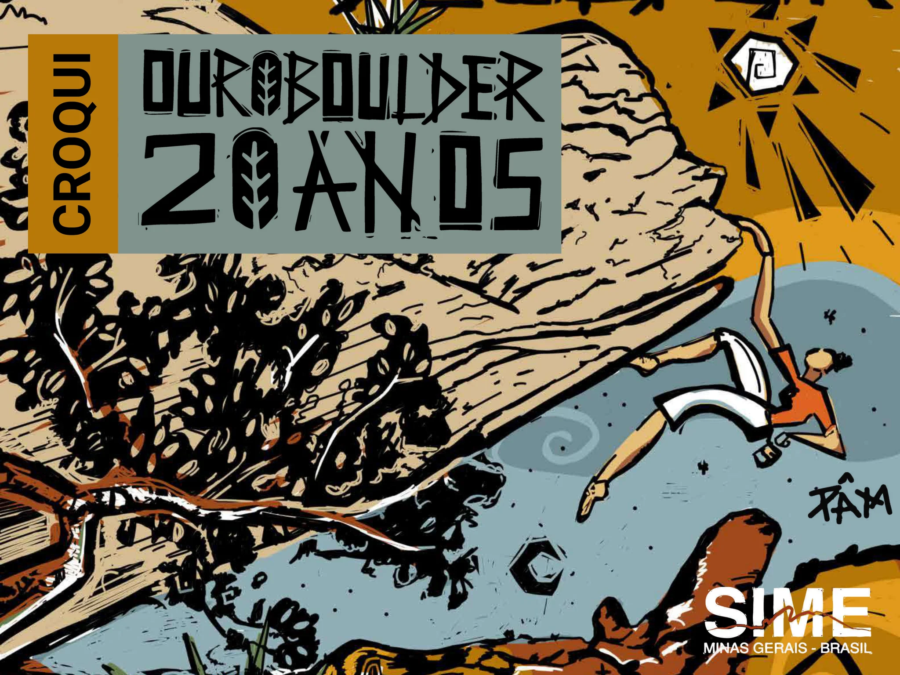
- **status_desenho_extraivel**: DESENHO_EXTRAIDO
- **botoes**:
  - **[0]**:
    - **uid**: iffvcFsDiafgLT
    - **texto**: Capa
    - **destino**:
      - **secao_textual**:
        - **conteudo**:
            # CROQUI 2025 OUROBOULDER
            
            |  |
            | :--: |
            | *SIME MINAS GERAIS - BRASIL* |
  - **[1]**:
    - **uid**: nLdWlOHmCpCaS2
    - **texto**: Apoio
    - **destino**:
      - **secao_textual**:
        - **conteudo**:
            # APOIO
            
            | 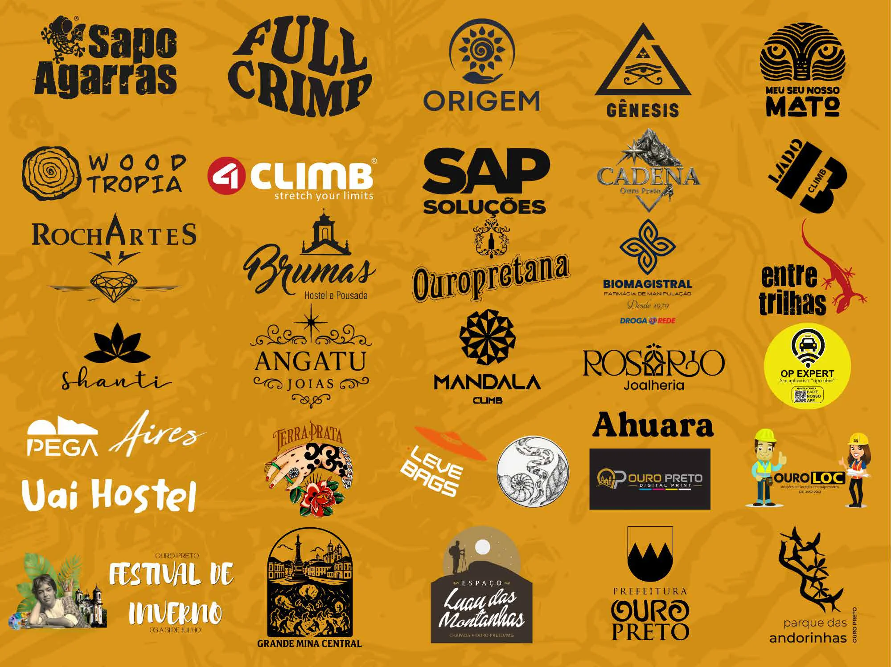 |
            | :--: |
            | *Logos de apoiadores* |
  - **[2]**:
    - **uid**: v0gRBOvfwCOHLw
    - **texto**: Introdução
    - **destino**:
      - **secao_textual**:
        - **conteudo**:
            # OUROBOULDER 20 ANOS
            
            Em 2026, o OUROBOULDER celebra uma marca histórica: 20 anos de existência, consolidando-se como um dos mais tradicionais encontros de escalada em boulder do Brasil. Ao longo de duas décadas, o evento transformou-se em muito mais do que um festival esportivo, tornando-se um espaço de integração, amizade, cultura e valorização das montanhas e paisagens de Ouro Preto.
            
            Nascido da paixão pela escalada e do espírito de comunidade que caracteriza os praticantes do esporte, o OUROBOULDER construiu uma trajetória marcada por desafios, superação e momentos inesquecíveis. A cada edição, atletas, iniciantes, famílias e amantes da natureza se reúnem para compartilhar experiências, celebrar conquistas e fortalecer os laços que unem a comunidade da escalada.
            
            Realizado em um dos mais importantes patrimônios históricos e culturais do país, o evento combina a beleza singular das formações rochosas da região com a riqueza histórica de Ouro Preto, proporcionando uma experiência única aos participantes. O ambiente descontraído, a convivência ao ar livre, as atividades culturais, as ações de educação ambiental e o incentivo à prática esportiva fazem parte da identidade que tornou o OUROBOULDER uma referência nacional.
            
            A edição comemorativa de 2026 serve para homenagear todos aqueles que ajudaram a construir essa história.
  - **[3]**:
    - **uid**: rklvsHWw4vHkHd
    - **texto**: Sobre Ouro Preto
    - **destino**:
      - **secao_textual**:
        - **conteudo**:
            # Ouro Preto
            
            Ouro Preto é um tesouro histórico e cultural do Brasil, reconhecida como Patrimônio Cultural da Humanidade pela UNESCO em 1980. Sua origem remonta ao final do século XVII, com a descoberta de ouro de aluvião por bandeirantes paulistas, o que impulsionou o desenvolvimento da região e a transformou em um dos principais centros econômicos do Brasil Colônia. Inicialmente conhecida como Vila Rica, a cidade foi elevada à categoria de vila em 1711 e tornou-se capital da Capitania de Minas Gerais em 1720. Em 1823, após a Independência do Brasil, recebeu o título de Imperial Cidade de Ouro Preto.
            
            A arquitetura de Ouro Preto é um dos seus maiores atrativos, com um conjunto homogêneo de construções barrocas que refletem a riqueza e o esplendor da época do ouro. As igrejas, muitas delas projetadas e adornadas por artistas renomados como Aleijadinho e Mestre Ataíde, são verdadeiras obras de arte, destacando-se pela riqueza de detalhes, adornos e o uso abundante de ouro em seu interior. Exemplos notáveis incluem a Basílica Nossa Senhora do Pilar, com mais de 400 quilos de ouro, e a Igreja de São Francisco de Assis, considerada uma das mais importantes obras coloniais do Brasil.
            
            Além de sua importância histórica e arquitetônica, Ouro Preto oferece uma rica vida cultural e turística, com diversos museus, teatro, festivais ao ar livre, restaurantes, bares e inúmeras outras atividades que atraem visitantes de todo o mundo interessados em sua história, arte e paisagens montanhosas.
            
            | 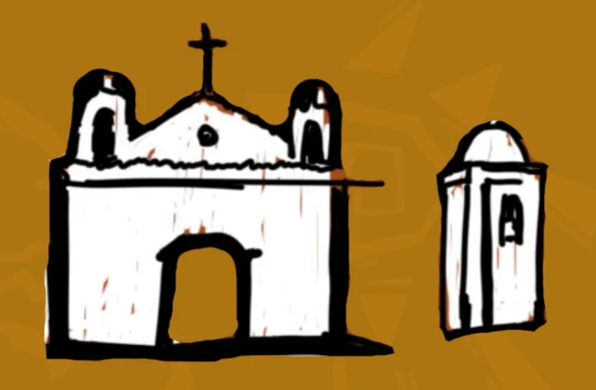 |
            | :--: |
            | *Igreja* |
            
            O OUROBOULDER é realizado dentro do Parque Natural Municipal das Andorinhas (PNMA), e da Área de Proteção Ambiental da Cachoeira das Andorinhas (APA-Andorinhas), refúgio ecológico de grande beleza cênica. Criado em 2005, abrange uma área de mais de 550 hectares, caracterizada por formações rochosas impressionantes e uma rica biodiversidade, marcando a transição entre a Mata Atlântica e o Cerrado.
            
            | 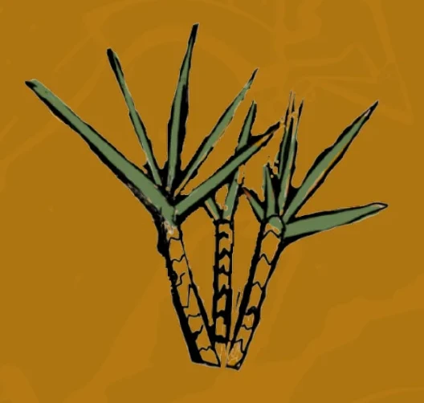 |
            | :--: |
            | *Sapo* |
            
            Um dos grandes atrativos do PNMA é a presença de diversas cachoeiras e trilhas bem sinalizadas, que convidam os visitantes à prática do ecoturismo. A nascente do Rio das Velhas, um dos mais importantes de Minas Gerais, encontra-se dentro dos limites do parque, adicionando um valor hídrico e ambiental significativo à região.
            
            |  |
            | :--: |
            | *Planta* |
            
            Além de sua importância natural, o Parque das Andorinhas também se destaca por seu potencial para o geoturismo, com elementos abióticos que contam a história geológica local. A paisagem de campos rupestres quartzíticos e cursos d'água oferece um cenário único para estudos e apreciação da natureza.
  - **[4]**:
    - **uid**: J06LujAbhZbcXN
    - **texto**: Parque Municipal das Andorinhas
    - **destino**:
      - **secao_textual**:
        - **conteudo**:
            # PARQUE MUNICIPAL DAS ANDORINHAS
            
            | 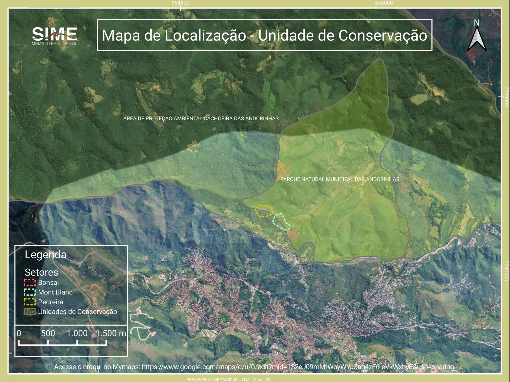 |
            | :--: |
            | *mapa unidade de conservação* |
            
            O Parque Municipal Natural das Andorinhas (PNMA), localizado em Ouro Preto, é um refúgio ecológico de grande beleza cênica. Criado em 2005, o parque abrange uma área de mais de 550 hectares, caracterizada por formações rochosas impressionantes e uma rica biodiversidade, marcando a transição entre a Mata Atlântica e o Cerrado.
            
            Um dos grandes atrativos do PNMA é a presença de diversas cachoeiras e trilhas bem sinalizadas, que convidam os visitantes à prática do ecoturismo. A nascente do Rio das Velhas, um dos mais importantes de Minas Gerais, encontra-se dentro dos limites do parque, adicionando um valor hídrico e ambiental significativo à região.
            
            Além de sua importância natural, o Parque das Andorinhas também se destaca por seu potencial para o geoturismo, com elementos abióticos que contam a história geológica local. A paisagem de campos rupestres quartzíticos e cursos d'água oferece um cenário único para estudos e apreciação da natureza.
  - **[5]**:
    - **uid**: PP4tm5IVd53toE
    - **texto**: Regras e Boa Convivência
    - **destino**:
      - **secao_textual**:
        - **conteudo**:
            # REGRAS PARA BOA CONVIVÊNCIA
            
            O OUROBOULDER adota os princípios e valores fundamentais para os esportes de montanha consagrados no texto da Declaração de Tirol.
            
            1. **Respeite a natureza** - Não retire plantas, pedras ou qualquer elemento natural do ambiente. Evite abrir trilhas alternativas e utilize apenas os acessos autorizados.
            
            2. **Leve todo o seu lixo de volta** - Nada deve ser deixado na área de escalada. Traga uma sacola para recolher seus resíduos e, sempre que possível, recolha também o lixo encontrado pelo caminho.
            
            3. **Preserve a fauna local** - Não alimente animais silvestres e mantenha distância para evitar interferências em seu comportamento natural. Cães e outros animais domésticos não são permitidos.
            
            4. **Utilize os sanitários e estruturas disponibilizadas** - Evite qualquer descarte inadequado de resíduos. Caso seja necessário utilizar áreas naturais, siga as orientações da organização e dos gestores da Unidade de Conservação.
            
            5. **Respeite as áreas permitidas** - Alguns setores podem possuir restrições de acesso para proteção ambiental. Siga sempre as orientações dos organizadores, monitores e gestores da Unidade de Conservação.
            
            6. **Mantenha o ambiente tranquilo** - Evite o uso excessivo de caixas de som e ruídos que possam prejudicar a experiência dos demais participantes e causar impactos à fauna local.
            
            7. **Compartilhe os blocos e respeite a fila** - Todos estão no setor para se divertir. Revezar as tentativas, incentivar os colegas e manter uma postura colaborativa fazem parte do espírito da escalada.
            
            8. **Valorize a diversidade e o espírito de comunidade** - O OUROBOULDER é um espaço de inclusão, amizade e respeito mútuo. Não serão toleradas atitudes discriminatórias, agressivas ou que comprometam a integridade física ou moral de qualquer pessoa.
            
            9. **Preserve o espírito do montanhismo** - Busque o desafio, a superação e a aventura com honestidade, sem comprometer os valores que fazem da escalada uma atividade única.
            
            10. **Deixe o local melhor do que encontrou** - A melhor lembrança que podemos deixar para os próximos 20 anos é um ambiente preservado. Seja um exemplo de cuidado com a natureza e de respeito à comunidade da escalada.
            
            > "As montanhas estão chamando, e eu preciso ir." — John Muir
  - **[6]**:
    - **uid**: IGVTaj2bBBeW4C
    - **texto**: Geologia e História
    - **destino**:
      - **secao_textual**:
        - **conteudo**:
            # A Pedreira do Morro São Sebastião: Geologia, História e Revalorização Social
            
            Por Artur Simões e Gabriel Amora
            
            ## A Paisagem Forjada ao longo de Bilhões de Anos
            
            Os setores de escalada acessados pelo Morro São Sebastião em Ouro Preto (MG) são localizados na área do Parque Natural Municipal da Andorinhas. É um espaço que reúne um passado geológico complexo, uma história de exploração mineral intensa e uma recente transformação social e ambiental.
            
            As rochas que formam a pedreira do Morro São Sebastião pertencem à Formação Moeda, unidade geológica registrada no Quadrilátero Ferrífero. Há aproximadamente 2,5 bilhões de anos, a crosta terrestre dessa região foi alongada e fragmentada por grandes falhas, formando depressões chamadas bacias rifte.
            
            Ao longo de milhões de anos, essas bacias foram preenchidas por sedimentos trazidos por rios e leques aluviais. Esses sedimentos, inicialmente arenosos, passaram por processos de compactação, acumulando um volume significativo de material ao ponto de atingir condições de temperatura e pressão que favoreceram a cimentação e recristalização mineral, etapas da litificação: nome dado ao conjunto de processos que permitem a “transformação” de sedimentos em rochas sedimentares.
            
            Esses processos deram origem a uma série de rochas sedimentares, dentre elas, arenitos que posteriormente passaram por processos de metamorfismo que resultaram nos quartzitos que observamos hoje.
            
            Dois eventos tectônicos são descritos na literatura como os principais processos responsáveis pelo metamorfismo observado na região do QF: A Orogênese Transamazônica, que ocorreu entre 2,2 e 2,0 bilhões de anos (Renger & Chemale Jr., 1989; Noce et al., 2007), e a Orogênese Brasiliana, ocorrida entre 650 e 500 milhões de anos (Alkmim & Marshak, 1998; Noce et al., 2007).
            
            Os processos metamórficos deformam as rochas, conferindo-lhes planos naturais denominados foliações. Essas estruturas são responsáveis pela inclinação dos blocos que observamos, por exemplo, na área da Pedreira – os famosos “tetos ouropretanos” representados na logo do evento.
            
            Pela mesma razão é comum que os blocos, em sua grande maioria compostos por afloramentos naturais, apresentem agarras em posições similares uma vez que essas mesmas foliações são também planos naturais por onde normalmente as agarras são formadas. Também por isso o quartzito da região se destaca pela formação de placas, muito valorizadas como revestimento ornamental e amplamente exploradas pela mineração local na segunda metade do século XX.
            
            ## A Exploração Mineral e Seus Impactos
            
            Durante muitos anos, o quartzito do Morro São Sebastião foi amplamente explorado como rocha ornamental, sendo utilizado na construção civil, especialmente para revestimentos e calçamentos. A extração mineral foi uma importante fonte de renda para as comunidades locais, mas também trouxe consequências ambientais. O desmatamento, a degradação do solo e o assoreamento do Rio das Velhas, um dos principais rios da região, foram alguns dos impactos diretos causados pela mineração desordenada.
            
            Com a criação da Área de Proteção Ambiental (APA) Cachoeira das Andorinhas, a extração mineral foi progressivamente restringida, o que gerou tensões sociais. Muitas famílias que dependiam da atividade se viram obrigadas a buscar novas formas de sustento, e surgiram movimentos comunitários reivindicando alternativas econômicas viáveis.
            
            ## A Ressignificação da Pedreira: Esporte e Sustentabilidade
            
            Após o encerramento das atividades mineradoras, a antiga pedreira foi gradualmente transformada em um espaço de convivência e prática esportiva. A partir de meados dos anos 2000, o local se tornou um dos principais pontos de escalada no estilo boulder da região e do Brasil, atraindo escaladores de todo o mundo, especialmente devido à proximidade com Belo Horizonte e à facilidade de acesso.
            
            A escalada no Morro São Sebastião representa um exemplo de uso sustentável de áreas degradadas, promovendo a valorização ambiental e social do espaço. A atividade contribui para o turismo local, incentiva a conservação e aproxima as pessoas da natureza, despertando o interesse pela geologia e pela proteção ambiental. Ressalta-se, no entanto, a importância dessa prática continuar sendo realizada com responsabilidade, respeitando os princípios do mínimo impacto e contribuindo para a preservação da vegetação e fauna locais.
            
            ## Um Espaço de Memória e Convivência
            
            A história do Morro São Sebastião é marcada por transformações profundas. De uma área formada por processos geológicos de bilhões de anos, a um espaço de intensa exploração mineral, o local passou por um ciclo de degradação e hoje se destaca como um exemplo de reaproveitamento positivo. A escalada trouxe uma nova identidade para a antiga pedreira, integrando o esporte, a educação ambiental e o lazer de forma harmônica com a natureza.
            
            Os autores são geólogos formados pela Universidade Federal de Ouro Preto (UFOP). Ambos tiveram a pedreira como uma segunda casa em Ouro Preto, espaço que proporcionou encontros, experiências e memórias clássicas!
            
            **Viva a escalada ouropretana!**
  - **[7]**:
    - **uid**: q2lbnCpN6AFs1e
    - **texto**: Agradecimentos
    - **destino**:
      - **secao_textual**:
        - **conteudo**:
            # AGRADECIMENTOS
            
            Duas décadas de história.
            
            Milhares de movimentos, incontáveis tentativas, amizades construídas sobre a rocha e um legado escrito coletivamente por pessoas apaixonadas pela escalada.
            
            Ao longo desses 20 anos, o OUROBOULDER acompanhou o crescimento da escalada no Brasil, fortaleceu os laços entre diferentes gerações e reafirmou o compromisso da comunidade com a conservação das áreas naturais que tornam essa experiência possível, consolidando-se como um espaço de convivência, aprendizado, celebração e respeito à natureza.
            
            Esta edição comemorativa presta homenagem a todos aqueles que fizeram parte dessa caminhada: aos pioneiros que enxergaram potencial onde muitos viam apenas pedras; aos conquistadores de novas linhas; aos voluntários que dedicaram seu tempo e sua energia para manter vivo o evento; aos gestores das áreas que tornaram possível a prática responsável da escalada; aos patrocinadores e apoiadores; e a cada participante que, em algum momento destas duas décadas, contribuiu para fortalecer a comunidade da escalada em Ouro Preto.
            
            Registramos também nosso agradecimento especial às pessoas que contribuíram diretamente para a elaboração deste croqui e para a realização desta edição comemorativa, dando continuidade ao trabalho coletivo que tornou possível preservar, organizar e compartilhar este patrimônio da escalada.
            
            Que este croqui seja mais do que um guia de blocos: que seja um registro vivo da memória construída por centenas de mãos e uma homenagem àqueles que fizeram do OUROBOULDER uma referência para a escalada brasileira. Que ele inspire as próximas gerações a continuar escrevendo essa história.
            
            Obrigado por fazer parte destes 20 anos. Que venham os próximos 20.
            
            Diretoria da SIME  
            Gestão 2026-27
  - **[8]**:
    - **uid**: YHUNjCcXQFDInl
    - **texto**: A Artista e a Arte
    - **destino**:
      - **secao_textual**:
        - **conteudo**:
            # A Artista e A Arte
            
            |  |
            | :--: |
            | *Pâm Bergamini* |
            
            Pâm Bergamini (1997, João Monlevade, MG) é multiartista independente e pesquisadora em arte. Residente em Ouro Preto, MG, desenvolve uma produção atravessada pelo corpo, pela memória, pela natureza e pelos processos artesanais, utilizando tintas naturais extraídas da terra como parte de sua pesquisa poética e visual.
            
            | 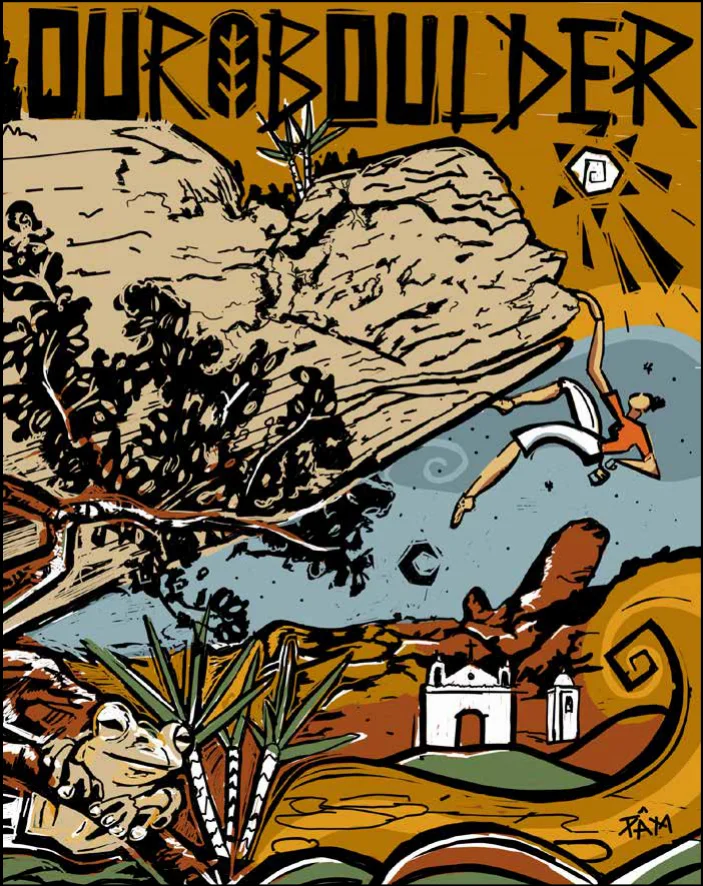 |
            | :--: |
            | *Arte Ouro Boulder 20 Anos* |
            
            Transita entre pintura, murais, fotografia, xilogravura, design e tatuagem, desenvolvendo projetos que unem arte, identidade visual e território. É autora da arte comemorativa dos 20 anos do evento Ouro Boulder, aplicada também na camisa oficial, com uma paleta inspirada em sua pesquisa com tintas de terra e na paisagem do Parque das Andorinhas. Moradora do bairro São Sebastião, onde o evento acontece, estabelece em seu trabalho uma relação direta entre criação, pertencimento e memória local.
  - **[9]**:
    - **uid**: YSUOSbUzASExPt
    - **texto**: Créditos
    - **destino**:
      - **secao_textual**:
        - **conteudo**:
            # CRÉDITOS
            
            **Arte Especial 20 Anos:**
            Pâmela Bergamini (@pambergaminii)
            
            **Fotografia documental:**
            Inaê Magalhães
            Lincoln Turati
            Mariane Miranda
            Nathan Monge
            
            **Fotografia esportiva:**
            Gustavo Broglio (@gustavobroglio)
            Gabriel Trindade (@gabriel.st.jpg)
            
            **Arte Gráfica:**
            Gustavo Broglio
            Lincoln Turati
            
            **Revisão:**
            Artur Simões
            Rodrigo Figueiredo
            Renato Utsch
            Maria Luiza Machado Roman
            
            **Textos:**
            Artur Simões
            Gabriel Amora
            Lincoln Turati
            
            **Mapas:**
            Ana Carla Favero
            Lucas Dorini
  - **[10]**:
    - **uid**: 65NMfBDwSfnQPI
    - **texto**: Telefones Úteis
    - **destino**:
      - **secao_textual**:
        - **conteudo**:
            # TELEFONES ÚTEIS
            
            *   **POLÍCIA MILITAR:** 190
            *   **SAMU:** 192
            *   **BOMBEIROS:** 193
            
            ## ATENDIMENTO MÉDICO
            
            *   **Unidade de Pronto Atendimento (UPA) - 24 horas**
                Av. Américo Renê Gianetti, 555 - Saramenha, Ouro Preto - MG
            *   **Hospital Santa Casa Misericórdia - 24 horas**
                Rua José Moringa, 620 - Bauxita, Ouro Preto - MG
  - **[11]**:
    - **uid**: 0YtXO4ialEj82m
    - **texto**: Contatos
    - **destino**:
      - **secao_textual**:
        - **conteudo**:
            # CONTATOS
            
            | 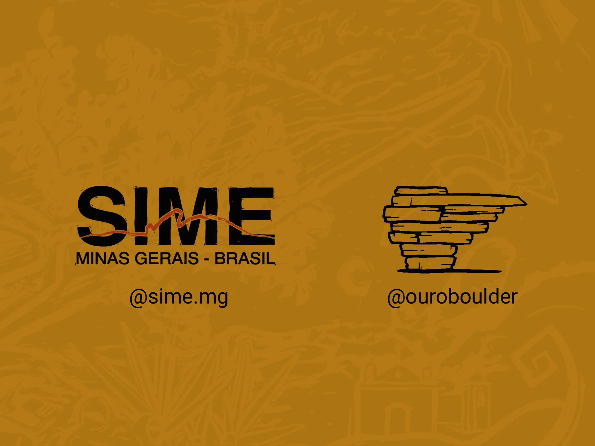 |
            | :--: |
            | *Logo SIME* |
            
            - **Instagram:** [@sime.mg](https://www.instagram.com/sime.mg/)
            - **Email:** simeouropreto@gmail.com
            
            - **Instagram:** [@ouroboulder](https://www.instagram.com/ouroboulder/)
            - **Email:** sime.ouroboulder@gmail.com
- **ultima_migracao**: 5
- **publicar_croqui**: True
- **revisado_manualmente**: True
- **revisado_bounding_circle**: True

## Parte: grupo_pedreira

### Grupo (Pico: Ouroboulder (PNMA))

- **descricao**: 
- **nome**: Pedreira
- **uid**: njKRa4SMSWh1aK
- **localizacao_estacionamento**:
  - **latitude**: -203677334
  - **longitude**: -435075136
- **localizacao_escalada**:
  - **latitude**: -203682961
  - **longitude**: -435064877
- **mapas**:
  - **[0]**:
    - **caminho_imagem_mapa**: 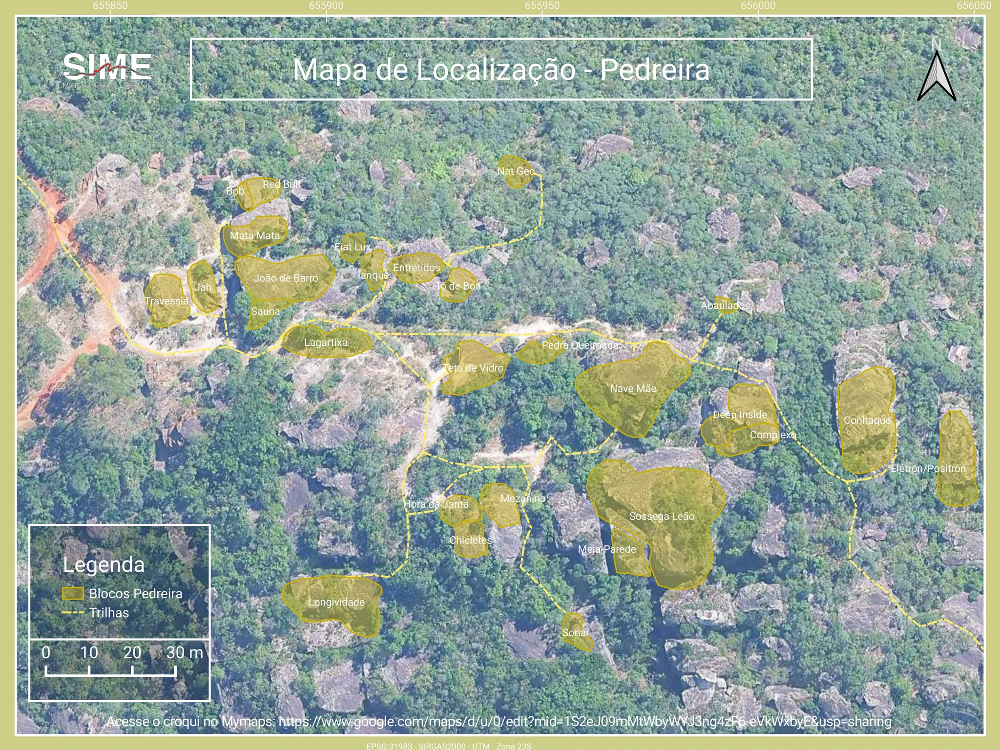
    - **largura_mapa**: 1529
    - **altura_mapa**: 1135
    - **pontos_de_interesse**:
      - **[0]**:
        - **id**: SrodlxFzWycRNv
        - **uid**: SrodlxFzWycRNv
        - **rotulo**: Travessia
        - **retangulo**:
          - **x**: 240
          - **y**: 450
          - **comprimento**: 73
          - **largura**: 16
        - **label**: Travessia
      - **[1]**:
        - **id**: XnPaUDgbHTSQQF
        - **uid**: XnPaUDgbHTSQQF
        - **rotulo**: Jah
        - **retangulo**:
          - **x**: 298
          - **y**: 428
          - **comprimento**: 29
          - **largura**: 16
        - **label**: Jah
      - **[2]**:
        - **id**: cdCfyg0KAxxftc
        - **uid**: cdCfyg0KAxxftc
        - **rotulo**: Sauna
        - **retangulo**:
          - **x**: 395
          - **y**: 466
          - **comprimento**: 48
          - **largura**: 15
        - **label**: Sauna
      - **[3]**:
        - **id**: GFxUo38yhltsmc
        - **uid**: GFxUo38yhltsmc
        - **rotulo**: João de Barro
        - **retangulo**:
          - **x**: 427
          - **y**: 414
          - **comprimento**: 108
          - **largura**: 19
        - **label**: João de Barro
      - **[4]**:
        - **id**: ASPAif99kT41D7
        - **uid**: ASPAif99kT41D7
        - **rotulo**: Mata Mata
        - **retangulo**:
          - **x**: 378
          - **y**: 347
          - **comprimento**: 84
          - **largura**: 18
        - **label**: Mata Mata
      - **[5]**:
        - **id**: qzrysJlkloj8yq
        - **uid**: qzrysJlkloj8yq
        - **rotulo**: Red Bull
        - **retangulo**:
          - **x**: 420
          - **y**: 266
          - **comprimento**: 64
          - **largura**: 19
        - **label**: Red Bull
      - **[6]**:
        - **id**: XO8SvAeEAxW08W
        - **uid**: XO8SvAeEAxW08W
        - **rotulo**: Bob
        - **retangulo**:
          - **x**: 347
          - **y**: 276
          - **comprimento**: 30
          - **largura**: 15
        - **label**: Bob
      - **[7]**:
        - **id**: f8UgIIIcVqVib0
        - **uid**: f8UgIIIcVqVib0
        - **rotulo**: Lagartixa
        - **retangulo**:
          - **x**: 490
          - **y**: 516
          - **comprimento**: 71
          - **largura**: 17
        - **label**: Lagartixa
      - **[8]**:
        - **id**: QVFyH0SZUQ77YE
        - **uid**: QVFyH0SZUQ77YE
        - **rotulo**: Entretidos
        - **retangulo**:
          - **x**: 633
          - **y**: 398
          - **comprimento**: 76
          - **largura**: 16
        - **label**: Entretidos
      - **[9]**:
        - **id**: KhjenZwe3YBpgr
        - **uid**: KhjenZwe3YBpgr
        - **rotulo**: Fiat Lux
        - **retangulo**:
          - **x**: 532
          - **y**: 365
          - **comprimento**: 61
          - **largura**: 16
        - **label**: Fiat Lux
      - **[10]**:
        - **id**: HD5kaVfzPRMrB8
        - **uid**: HD5kaVfzPRMrB8
        - **rotulo**: Teto de Vidro
        - **retangulo**:
          - **x**: 722
          - **y**: 556
          - **comprimento**: 105
          - **largura**: 18
        - **label**: Teto de Vidro
      - **[11]**:
        - **id**: EQbXCGN5bYQ6bn
        - **uid**: EQbXCGN5bYQ6bn
        - **rotulo**: Tô de Boa
        - **retangulo**:
          - **x**: 699
          - **y**: 426
          - **comprimento**: 78
          - **largura**: 18
        - **label**: Tô de Boa
      - **[12]**:
        - **id**: Aiisv2McTHGSqf
        - **uid**: Aiisv2McTHGSqf
        - **rotulo**: Pedra Queimada
        - **retangulo**:
          - **x**: 892
          - **y**: 519
          - **comprimento**: 128
          - **largura**: 20
        - **label**: Pedra Queimada
      - **[13]**:
        - **id**: ggTYALSjRHHHij
        - **uid**: ggTYALSjRHHHij
        - **rotulo**: Hora da Janta
        - **retangulo**:
          - **x**: 664
          - **y**: 770
          - **comprimento**: 107
          - **largura**: 17
        - **label**: Hora da Janta
      - **[14]**:
        - **id**: bpx1wMBqM0euDV
        - **uid**: bpx1wMBqM0euDV
        - **rotulo**: Mezanino
        - **retangulo**:
          - **x**: 802
          - **y**: 761
          - **comprimento**: 79
          - **largura**: 18
        - **label**: Mezanino
      - **[15]**:
        - **id**: DzEov7sE2h2NWI
        - **uid**: DzEov7sE2h2NWI
        - **rotulo**: Chicletes
        - **retangulo**:
          - **x**: 719
          - **y**: 828
          - **comprimento**: 74
          - **largura**: 17
        - **label**: Chicletes
      - **[16]**:
        - **id**: CykDFU0u6jPNXC
        - **uid**: CykDFU0u6jPNXC
        - **rotulo**: Longevidade
        - **retangulo**:
          - **x**: 507
          - **y**: 925
          - **comprimento**: 92
          - **largura**: 20
        - **label**: Longevidade
      - **[17]**:
        - **id**: 2gJdOvbar8dr44
        - **uid**: 2gJdOvbar8dr44
        - **rotulo**: Sossega Leão
        - **retangulo**:
          - **x**: 1019
          - **y**: 790
          - **comprimento**: 106
          - **largura**: 19
        - **label**: Sossega Leão
      - **[18]**:
        - **id**: QuwRzmTfTdNPZW
        - **uid**: QuwRzmTfTdNPZW
        - **rotulo**: Sonar
        - **retangulo**:
          - **x**: 884
          - **y**: 972
          - **comprimento**: 46
          - **largura**: 17
        - **label**: Sonar
      - **[19]**:
        - **id**: pH0ehrMFSAfdbF
        - **uid**: pH0ehrMFSAfdbF
        - **rotulo**: Meia-Parede
        - **retangulo**:
          - **x**: 933
          - **y**: 841
          - **comprimento**: 96
          - **largura**: 18
        - **label**: Meia-Parede
      - **[20]**:
        - **id**: 2i0xDOIO7pZzqj
        - **uid**: 2i0xDOIO7pZzqj
        - **rotulo**: Nave Mãe
        - **retangulo**:
          - **x**: 974
          - **y**: 588
          - **comprimento**: 78
          - **largura**: 18
        - **label**: Nave Mãe
      - **[21]**:
        - **id**: 3Ij9wUnFgCMUkJ
        - **uid**: 3Ij9wUnFgCMUkJ
        - **rotulo**: Abaulados
        - **retangulo**:
          - **x**: 1120
          - **y**: 458
          - **comprimento**: 81
          - **largura**: 19
        - **label**: Abaulados
      - **[22]**:
        - **id**: KooxkWLfoqTxSS
        - **uid**: KooxkWLfoqTxSS
        - **rotulo**: Deep Inside
        - **retangulo**:
          - **x**: 1144
          - **y**: 628
          - **comprimento**: 89
          - **largura**: 19
        - **label**: Deep Inside
      - **[23]**:
        - **id**: NQaPXQ61gC8Cb4
        - **uid**: NQaPXQ61gC8Cb4
        - **rotulo**: Complexo
        - **retangulo**:
          - **x**: 1194
          - **y**: 662
          - **comprimento**: 81
          - **largura**: 19
        - **label**: Complexo
      - **[24]**:
        - **id**: l0vFmrbWwZVIYC
        - **uid**: l0vFmrbWwZVIYC
        - **rotulo**: Conhaque
        - **retangulo**:
          - **x**: 1344
          - **y**: 638
          - **comprimento**: 83
          - **largura**: 18
        - **label**: Conhaque
      - **[25]**:
        - **id**: hWIpAs5jBT7kNW
        - **uid**: hWIpAs5jBT7kNW
        - **rotulo**: Elétron/Positron
        - **retangulo**:
          - **x**: 1440
          - **y**: 714
          - **comprimento**: 123
          - **largura**: 21
        - **label**: Elétron/Positron
      - **[26]**:
        - **id**: Bq5Lr10QlDSA5k
        - **uid**: Bq5Lr10QlDSA5k
        - **rotulo**: Ianque
        - **retangulo**:
          - **x**: 564
          - **y**: 409
          - **comprimento**: 53
          - **largura**: 16
        - **label**: Ianque
      - **[27]**:
        - **id**: JKLft2MFxn2i9l
        - **uid**: JKLft2MFxn2i9l
        - **rotulo**: Nat Geo
        - **retangulo**:
          - **x**: 789
          - **y**: 244
          - **comprimento**: 64
          - **largura**: 21
        - **label**: Nat Geo
    - **referencias**:
      - **[0]**:
        - **alvo_uid**: LzzE8JkjUAUuZT
        - **pontos_uids**:
          - XO8SvAeEAxW08W
        - **setor**: Bloco: Bob
        - **ids**:
          - XO8SvAeEAxW08W
      - **[1]**:
        - **alvo_uid**: rrVPaOcjQ56Hj1
        - **pontos_uids**:
          - qzrysJlkloj8yq
        - **setor**: Bloco: Red Bull
        - **ids**:
          - qzrysJlkloj8yq
      - **[2]**:
        - **alvo_uid**: hx1sKO5WXcRaCh
        - **pontos_uids**:
          - ASPAif99kT41D7
        - **setor**: Bloco: Mata-Mata
        - **ids**:
          - ASPAif99kT41D7
      - **[3]**:
        - **alvo_uid**: UjCcyV0WXvofY6
        - **pontos_uids**:
          - SrodlxFzWycRNv
        - **setor**: Bloco: Travessia
        - **ids**:
          - SrodlxFzWycRNv
      - **[4]**:
        - **alvo_uid**: TcyDbEuEYt75wU
        - **pontos_uids**:
          - XnPaUDgbHTSQQF
        - **setor**: Bloco: Jah
        - **ids**:
          - XnPaUDgbHTSQQF
      - **[5]**:
        - **alvo_uid**: 4rqHCeJjg5oS60
        - **pontos_uids**:
          - cdCfyg0KAxxftc
        - **setor**: Bloco: Sauna
        - **ids**:
          - cdCfyg0KAxxftc
      - **[6]**:
        - **alvo_uid**: jBNPDMi5TIeAZ7
        - **pontos_uids**:
          - GFxUo38yhltsmc
        - **setor**: Bloco: João de Barro
        - **ids**:
          - GFxUo38yhltsmc
      - **[7]**:
        - **alvo_uid**: K4x0wtbQQInu43
        - **pontos_uids**:
          - KhjenZwe3YBpgr
        - **setor**: Bloco: Fiat Lux
        - **ids**:
          - KhjenZwe3YBpgr
      - **[8]**:
        - **alvo_uid**: EMYCxTJIBZ3Dcm
        - **pontos_uids**:
          - Bq5Lr10QlDSA5k
        - **escalada**: Ianque
        - **ids**:
          - Bq5Lr10QlDSA5k
      - **[9]**:
        - **alvo_uid**: VIh2SjBR5kXfig
        - **pontos_uids**:
          - QVFyH0SZUQ77YE
        - **setor**: Bloco: Entretidos
        - **ids**:
          - QVFyH0SZUQ77YE
      - **[10]**:
        - **alvo_uid**: OtOutua1Xh2AuI
        - **pontos_uids**:
          - f8UgIIIcVqVib0
        - **setor**: Bloco: Lagartixa
        - **ids**:
          - f8UgIIIcVqVib0
      - **[11]**:
        - **alvo_uid**: K1nxqIQUlAj9s2
        - **pontos_uids**:
          - EQbXCGN5bYQ6bn
        - **setor**: Bloco: Tô de Boa
        - **ids**:
          - EQbXCGN5bYQ6bn
      - **[12]**:
        - **alvo_uid**: szhFTxC1PLd0dP
        - **pontos_uids**:
          - HD5kaVfzPRMrB8
        - **setor**: Bloco: Teto de Vidro
        - **ids**:
          - HD5kaVfzPRMrB8
      - **[13]**:
        - **alvo_uid**: KMgvZxpGaKri2z
        - **pontos_uids**:
          - Aiisv2McTHGSqf
        - **setor**: Bloco: Pedra Queimada
        - **ids**:
          - Aiisv2McTHGSqf
      - **[14]**:
        - **alvo_uid**: skAZrDygCrcu3g
        - **pontos_uids**:
          - 2i0xDOIO7pZzqj
        - **setor**: Bloco: Nave-Mãe
        - **ids**:
          - 2i0xDOIO7pZzqj
      - **[15]**:
        - **alvo_uid**: 3Uw8HtSki5ZE57
        - **pontos_uids**:
          - 3Ij9wUnFgCMUkJ
        - **setor**: Bloco: Abaulados
        - **ids**:
          - 3Ij9wUnFgCMUkJ
      - **[16]**:
        - **alvo_uid**: YFVMcRLMGxb9Tr
        - **pontos_uids**:
          - CykDFU0u6jPNXC
        - **setor**: Bloco: Longevidade
        - **ids**:
          - CykDFU0u6jPNXC
      - **[17]**:
        - **alvo_uid**: 6uiUlaIemsIKR1
        - **pontos_uids**:
          - ggTYALSjRHHHij
        - **setor**: Bloco: Hora da Janta
        - **ids**:
          - ggTYALSjRHHHij
      - **[18]**:
        - **alvo_uid**: 7RfNsbD2lIpnKG
        - **pontos_uids**:
          - DzEov7sE2h2NWI
        - **setor**: Bloco: Chicletes
        - **ids**:
          - DzEov7sE2h2NWI
      - **[19]**:
        - **alvo_uid**: wEISHXN8e9nWM3
        - **pontos_uids**:
          - bpx1wMBqM0euDV
        - **setor**: Bloco: Mezanino
        - **ids**:
          - bpx1wMBqM0euDV
      - **[20]**:
        - **alvo_uid**: YNCeAFBEFQJbNm
        - **pontos_uids**:
          - pH0ehrMFSAfdbF
        - **setor**: Bloco: Meia-Parede
        - **ids**:
          - pH0ehrMFSAfdbF
      - **[21]**:
        - **alvo_uid**: PNLVN5yl680Wbv
        - **pontos_uids**:
          - QuwRzmTfTdNPZW
        - **setor**: Bloco: Sonar
        - **ids**:
          - QuwRzmTfTdNPZW
      - **[22]**:
        - **alvo_uid**: NWLsTOFnn1cQbN
        - **pontos_uids**:
          - KooxkWLfoqTxSS
        - **setor**: Bloco: Deep Inside
        - **ids**:
          - KooxkWLfoqTxSS
      - **[23]**:
        - **alvo_uid**: pDA23Gjf4c95Ek
        - **pontos_uids**:
          - NQaPXQ61gC8Cb4
        - **setor**: Bloco: Complexo
        - **ids**:
          - NQaPXQ61gC8Cb4
      - **[24]**:
        - **alvo_uid**: R0RK7LEXxz5JfS
        - **pontos_uids**:
          - l0vFmrbWwZVIYC
        - **setor**: Bloco: Conhaque
        - **ids**:
          - l0vFmrbWwZVIYC
      - **[25]**:
        - **alvo_uid**: Bk5xx6SIISCIDN
        - **pontos_uids**:
          - hWIpAs5jBT7kNW
        - **setor**: Bloco: Eléctron
        - **ids**:
          - hWIpAs5jBT7kNW
      - **[26]**:
        - **alvo_uid**: yZ6TvCV4MLKTEj
        - **pontos_uids**:
          - JKLft2MFxn2i9l
        - **setor**: Bloco: Nat Geo
        - **ids**:
          - JKLft2MFxn2i9l
- **setores**:
  - **[0]**:
    - **conteudo**:
      - **descricao**: 
      - **nome**: Bloco: Abaulados
      - **uid**: 3Uw8HtSki5ZE57
      - **mapas**:
        - **[0]**:
          - **caminho_imagem_mapa**: 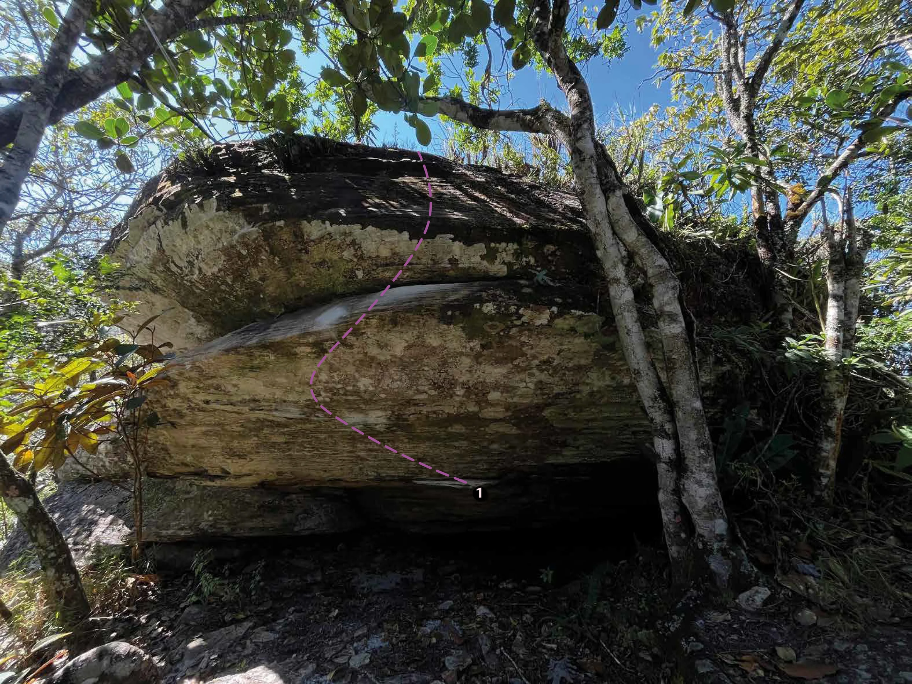
          - **largura_mapa**: 2364
          - **altura_mapa**: 1773
          - **pontos_de_interesse**:
            - **[0]**:
              - **id**: 7yKSXhIJKleGY7
              - **uid**: 7yKSXhIJKleGY7
              - **rotulo**: 1
              - **circulo**:
                - **x**: 1244
                - **y**: 1279
                - **raio**: 20
              - **label**: 1
          - **referencias**:
            - **[0]**:
              - **alvo_uid**: l2nrLeOFQfqiJw
              - **pontos_uids**:
                - 7yKSXhIJKleGY7
              - **escalada**: Abaulados
              - **ids**:
                - 7yKSXhIJKleGY7
        - **[1]**:
          - **caminho_imagem_mapa**: 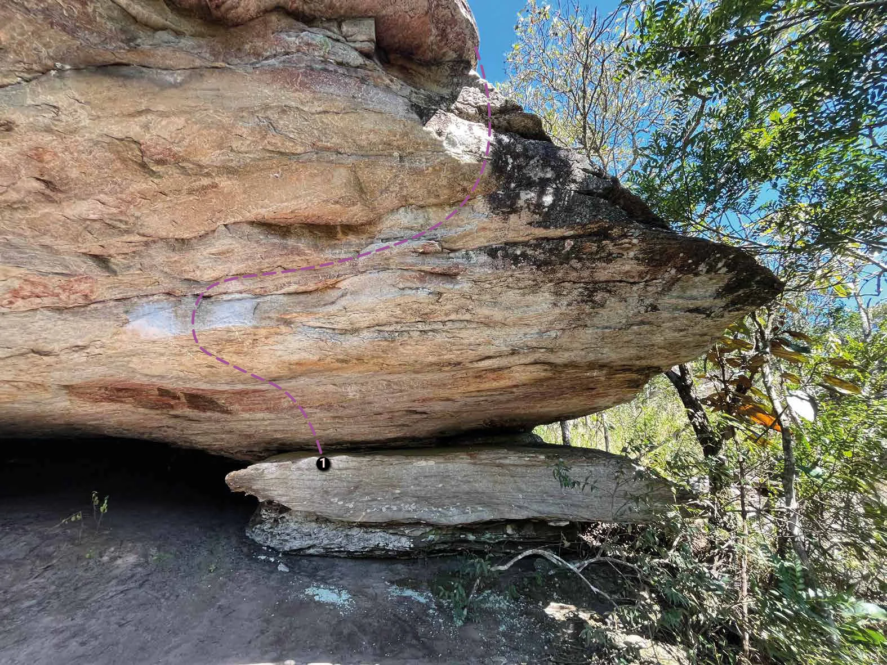
          - **largura_mapa**: 2364
          - **altura_mapa**: 1773
          - **pontos_de_interesse**:
            - **[0]**:
              - **id**: C7Q8VjXc2Caa8E
              - **uid**: C7Q8VjXc2Caa8E
              - **rotulo**: 1
              - **circulo**:
                - **x**: 862
                - **y**: 1238
                - **raio**: 20
              - **label**: 1
          - **referencias**:
            - **[0]**:
              - **alvo_uid**: Qcf64UxXI1HkCw
              - **pontos_uids**:
                - C7Q8VjXc2Caa8E
              - **escalada**: 004
              - **ids**:
                - C7Q8VjXc2Caa8E
        - **[2]**:
          - **caminho_imagem_mapa**: 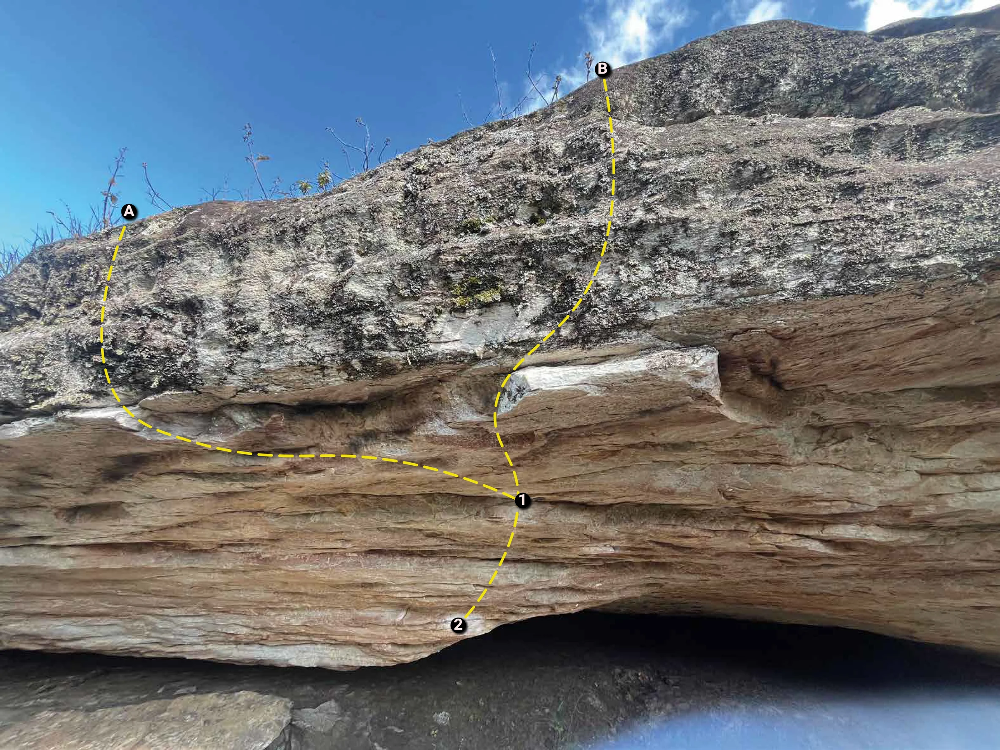
          - **largura_mapa**: 2364
          - **altura_mapa**: 1773
          - **pontos_de_interesse**:
            - **[0]**:
              - **id**: bTA8ynqQsrg5at
              - **uid**: bTA8ynqQsrg5at
              - **rotulo**: A
              - **circulo**:
                - **x**: 305
                - **y**: 500
                - **raio**: 20
              - **label**: A
            - **[1]**:
              - **id**: H29xrwWNREg1xJ
              - **uid**: H29xrwWNREg1xJ
              - **rotulo**: B
              - **circulo**:
                - **x**: 1424
                - **y**: 164
                - **raio**: 20
              - **label**: B
            - **[2]**:
              - **id**: ddlNSY06N6jNIS
              - **uid**: ddlNSY06N6jNIS
              - **rotulo**: 1
              - **circulo**:
                - **x**: 1236
                - **y**: 1184
                - **raio**: 20
              - **label**: 1
            - **[3]**:
              - **id**: t736gSfk9bYGPp
              - **uid**: t736gSfk9bYGPp
              - **rotulo**: 2
              - **circulo**:
                - **x**: 1084
                - **y**: 1478
                - **raio**: 20
              - **label**: 2
          - **referencias**:
            - **[0]**:
              - **alvo_uid**: K4Bw1TsBCiEo3Y
              - **pontos_uids**:
                - ddlNSY06N6jNIS
                - bTA8ynqQsrg5at
              - **escalada**: Jardim Secreto
              - **ids**:
                - ddlNSY06N6jNIS
                - bTA8ynqQsrg5at
            - **[1]**:
              - **alvo_uid**: umPoMUWjcEHbyJ
              - **pontos_uids**:
                - ddlNSY06N6jNIS
                - H29xrwWNREg1xJ
              - **escalada**: Papo Reto
              - **ids**:
                - ddlNSY06N6jNIS
                - H29xrwWNREg1xJ
            - **[2]**:
              - **alvo_uid**: LR4DzckIyTBgqo
              - **pontos_uids**:
                - t736gSfk9bYGPp
                - H29xrwWNREg1xJ
              - **escalada**: Papo Reto sds
              - **ids**:
                - t736gSfk9bYGPp
                - H29xrwWNREg1xJ
      - **escaladas**:
        - **[0]**:
          - **uid**: l2nrLeOFQfqiJw
          - **boulder**:
            - **nome**: Abaulados
            - **dificuldade**: V3
        - **[1]**:
          - **uid**: Qcf64UxXI1HkCw
          - **boulder**:
            - **nome**: 004
            - **dificuldade**: V4
        - **[2]**:
          - **uid**: K4Bw1TsBCiEo3Y
          - **boulder**:
            - **nome**: Jardim Secreto
            - **dificuldade**: V11
        - **[3]**:
          - **uid**: umPoMUWjcEHbyJ
          - **boulder**:
            - **nome**: Papo Reto
            - **dificuldade**: V11
        - **[4]**:
          - **uid**: LR4DzckIyTBgqo
          - **boulder**:
            - **nome**: Papo Reto sds
            - **dificuldade**: V12
      - **precomputados**:
        - **total_escaladas**: 5
        - **total_boulders**: 5
  - **[1]**:
    - **conteudo**:
      - **descricao**: 
      - **nome**: Bloco: Altinho
      - **uid**: qOUPKWR6GufZoB
      - **caminho_imagem_capa**: 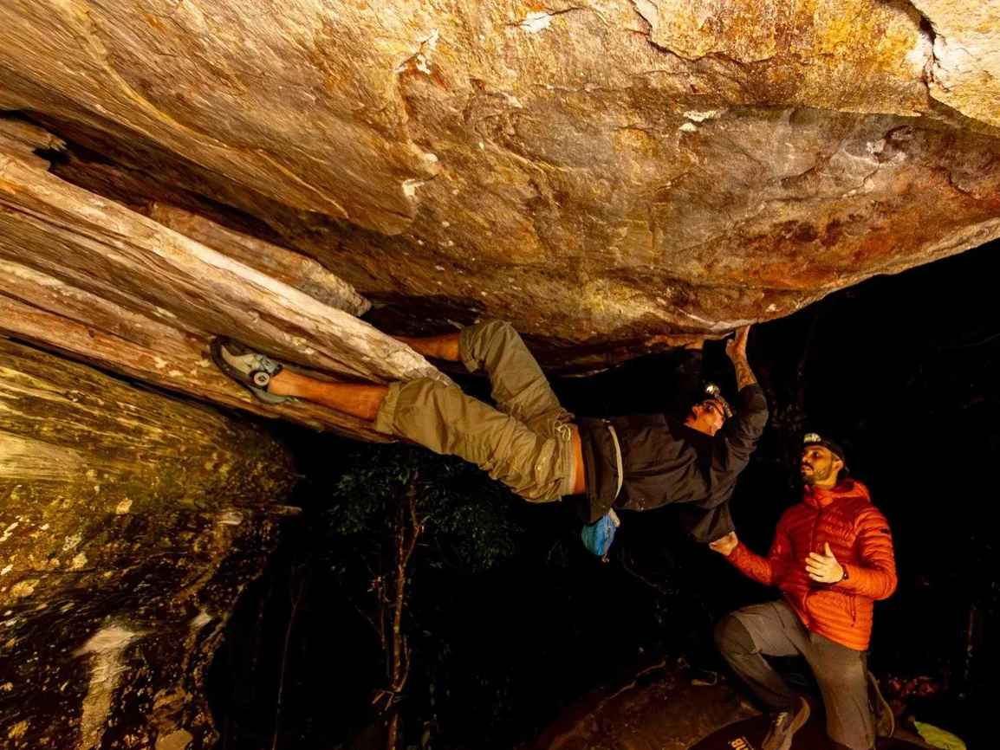
      - **mapas**:
        - **[0]**:
          - **caminho_imagem_mapa**: 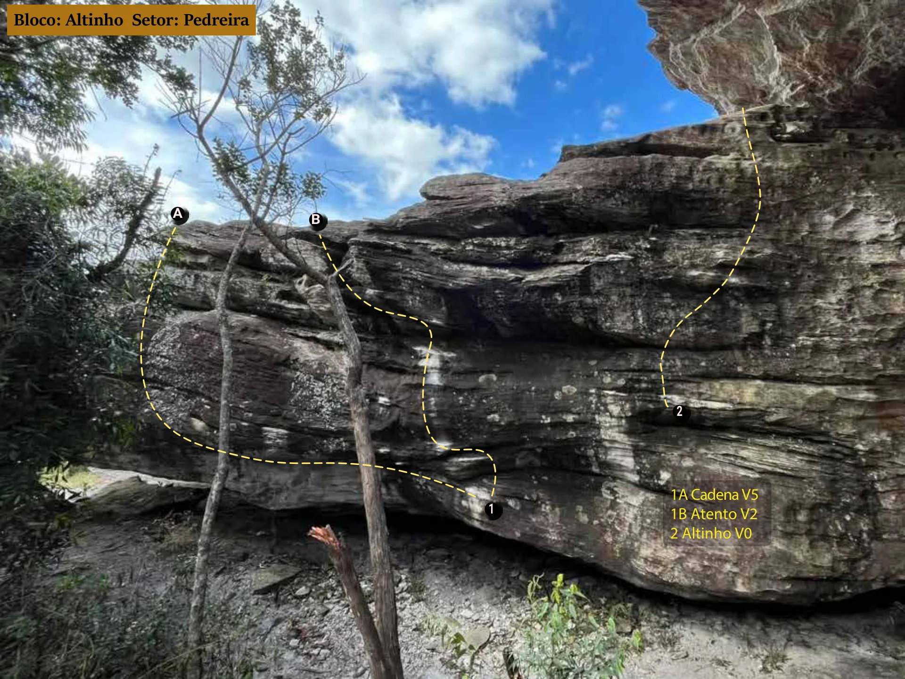
          - **referencias**:
            - **[0]**:
              - **alvo_uid**: o1f74ICKPJTGL5
              - **pontos_uids**:
                - 1A
                - P0ZmPcXgjCNANg
                - EqY5XCn7i5Cw5B
              - **escalada**: Cadena
              - **ids**:
                - 1A
                - P0ZmPcXgjCNANg
                - EqY5XCn7i5Cw5B
            - **[1]**:
              - **alvo_uid**: wvMzuTIbBgWhKt
              - **pontos_uids**:
                - 1B
                - P0ZmPcXgjCNANg
                - 22ARKWqbNX43y6
              - **escalada**: Atento
              - **ids**:
                - 1B
                - P0ZmPcXgjCNANg
                - 22ARKWqbNX43y6
            - **[2]**:
              - **alvo_uid**: 5PaObgvZcIbcag
              - **pontos_uids**:
                - I7qbpuL4Gb0Sxl
              - **escalada**: Altinho
              - **ids**:
                - I7qbpuL4Gb0Sxl
          - **largura_mapa**: 2364
          - **altura_mapa**: 1773
          - **pontos_de_interesse**:
            - **[0]**:
              - **id**: EqY5XCn7i5Cw5B
              - **uid**: EqY5XCn7i5Cw5B
              - **rotulo**: A
              - **circulo**:
                - **x**: 464
                - **y**: 558
                - **raio**: 18
              - **label**: A
            - **[1]**:
              - **id**: 22ARKWqbNX43y6
              - **uid**: 22ARKWqbNX43y6
              - **rotulo**: B
              - **circulo**:
                - **x**: 825
                - **y**: 573
                - **raio**: 18
              - **label**: B
            - **[2]**:
              - **id**: P0ZmPcXgjCNANg
              - **uid**: P0ZmPcXgjCNANg
              - **rotulo**: 1
              - **circulo**:
                - **x**: 1283
                - **y**: 1330
                - **raio**: 18
              - **label**: 1
            - **[3]**:
              - **id**: I7qbpuL4Gb0Sxl
              - **uid**: I7qbpuL4Gb0Sxl
              - **rotulo**: 2
              - **circulo**:
                - **x**: 1775
                - **y**: 1076
                - **raio**: 18
              - **label**: 2
      - **escaladas**:
        - **[0]**:
          - **uid**: o1f74ICKPJTGL5
          - **boulder**:
            - **nome**: Cadena
            - **dificuldade**: V5
        - **[1]**:
          - **uid**: wvMzuTIbBgWhKt
          - **boulder**:
            - **nome**: Atento
            - **dificuldade**: V2
        - **[2]**:
          - **uid**: 5PaObgvZcIbcag
          - **boulder**:
            - **nome**: Altinho
            - **dificuldade**: V0
      - **precomputados**:
        - **total_escaladas**: 3
        - **total_boulders**: 3
  - **[2]**:
    - **conteudo**:
      - **descricao**: 
      - **nome**: Bloco: Bob
      - **uid**: LzzE8JkjUAUuZT
      - **mapas**:
        - **[0]**:
          - **caminho_imagem_mapa**: 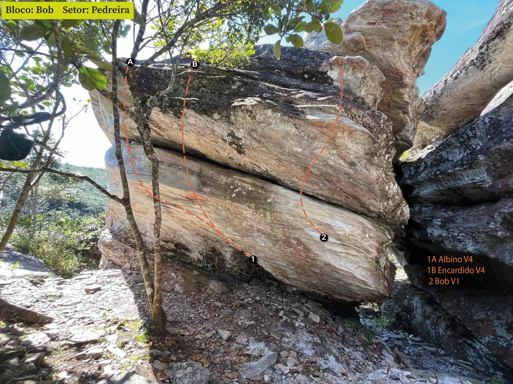
          - **largura_mapa**: 2364
          - **altura_mapa**: 1773
          - **pontos_de_interesse**:
            - **[0]**:
              - **id**: 1rjINUF0YaoVd5
              - **uid**: 1rjINUF0YaoVd5
              - **rotulo**: A
              - **circulo**:
                - **x**: 600
                - **y**: 286
                - **raio**: 20
              - **label**: A
            - **[1]**:
              - **id**: E219VDHLgez46k
              - **uid**: E219VDHLgez46k
              - **rotulo**: B
              - **circulo**:
                - **x**: 898
                - **y**: 297
                - **raio**: 20
              - **label**: B
            - **[2]**:
              - **id**: BzzXlLNCKwF859
              - **uid**: BzzXlLNCKwF859
              - **rotulo**: 1
              - **circulo**:
                - **x**: 1167
                - **y**: 1198
                - **raio**: 20
              - **label**: 1
            - **[3]**:
              - **id**: spJsInMa4yrMJW
              - **uid**: spJsInMa4yrMJW
              - **rotulo**: 2
              - **circulo**:
                - **x**: 1494
                - **y**: 1097
                - **raio**: 20
              - **label**: 2
          - **referencias**:
            - **[0]**:
              - **alvo_uid**: PFj0IEAKg3TURZ
              - **pontos_uids**:
                - BzzXlLNCKwF859
                - 1rjINUF0YaoVd5
              - **escalada**: Albino
              - **ids**:
                - BzzXlLNCKwF859
                - 1rjINUF0YaoVd5
            - **[1]**:
              - **alvo_uid**: oai4Vq7LjB9kDX
              - **pontos_uids**:
                - BzzXlLNCKwF859
                - E219VDHLgez46k
              - **escalada**: Encardido
              - **ids**:
                - BzzXlLNCKwF859
                - E219VDHLgez46k
            - **[2]**:
              - **alvo_uid**: keVVa2XDtSi4HF
              - **pontos_uids**:
                - spJsInMa4yrMJW
              - **escalada**: Bob
              - **ids**:
                - spJsInMa4yrMJW
        - **[1]**:
          - **caminho_imagem_mapa**: 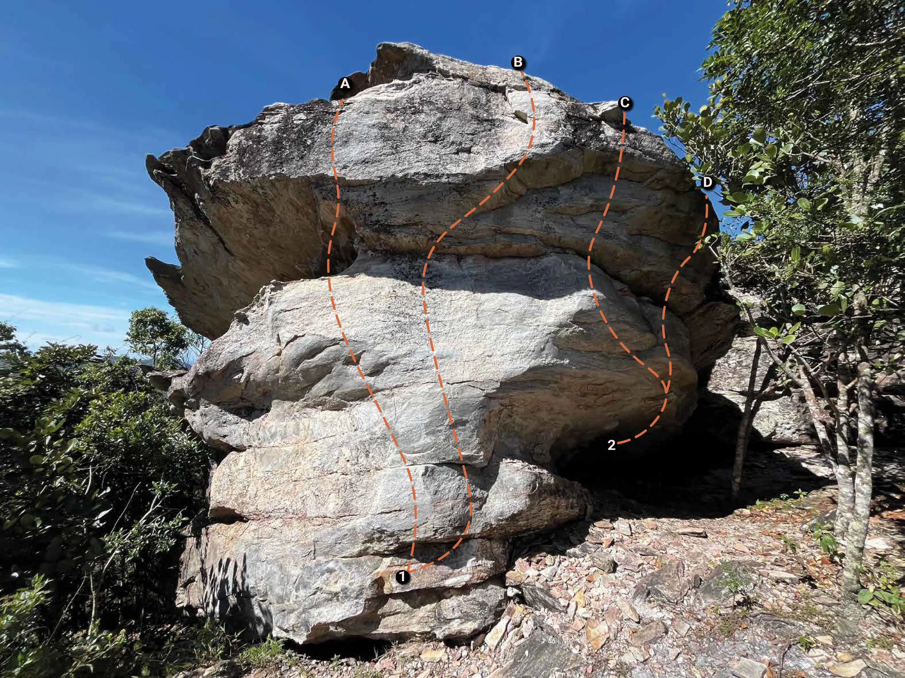
          - **largura_mapa**: 2364
          - **altura_mapa**: 1773
          - **pontos_de_interesse**:
            - **[0]**:
              - **id**: zY0u5X3vn2z9No
              - **uid**: zY0u5X3vn2z9No
              - **rotulo**: A
              - **circulo**:
                - **x**: 902
                - **y**: 219
                - **raio**: 20
              - **label**: A
            - **[1]**:
              - **id**: GtitNSc17dq5ta
              - **uid**: GtitNSc17dq5ta
              - **rotulo**: B
              - **circulo**:
                - **x**: 1354
                - **y**: 164
                - **raio**: 20
              - **label**: B
            - **[2]**:
              - **id**: Fr4iwl5FtgHNp4
              - **uid**: Fr4iwl5FtgHNp4
              - **rotulo**: C
              - **circulo**:
                - **x**: 1633
                - **y**: 270
                - **raio**: 20
              - **label**: C
            - **[3]**:
              - **id**: 4CwQ6m5e5iIUdr
              - **uid**: 4CwQ6m5e5iIUdr
              - **rotulo**: D
              - **circulo**:
                - **x**: 1848
                - **y**: 478
                - **raio**: 20
              - **label**: D
            - **[4]**:
              - **id**: xdN4h0WInqNDKL
              - **uid**: xdN4h0WInqNDKL
              - **rotulo**: 1
              - **circulo**:
                - **x**: 1052
                - **y**: 1510
                - **raio**: 20
              - **label**: 1
            - **[5]**:
              - **id**: VL1p55xIvbscMc
              - **uid**: VL1p55xIvbscMc
              - **rotulo**: 2
              - **circulo**:
                - **x**: 1597
                - **y**: 1164
                - **raio**: 20
              - **label**: 2
          - **referencias**:
            - **[0]**:
              - **alvo_uid**: PFj0IEAKg3TURZ
              - **pontos_uids**:
                - VL1p55xIvbscMc
                - Fr4iwl5FtgHNp4
              - **escalada**: Albino
              - **ids**:
                - VL1p55xIvbscMc
                - Fr4iwl5FtgHNp4
            - **[1]**:
              - **alvo_uid**: oai4Vq7LjB9kDX
              - **pontos_uids**:
                - VL1p55xIvbscMc
                - 4CwQ6m5e5iIUdr
              - **escalada**: Encardido
              - **ids**:
                - VL1p55xIvbscMc
                - 4CwQ6m5e5iIUdr
            - **[2]**:
              - **alvo_uid**: 139tOdPVfSB1wp
              - **pontos_uids**:
                - xdN4h0WInqNDKL
                - zY0u5X3vn2z9No
              - **escalada**: Reto
              - **ids**:
                - xdN4h0WInqNDKL
                - zY0u5X3vn2z9No
            - **[3]**:
              - **alvo_uid**: WeMtHFZYG0xxTh
              - **pontos_uids**:
                - xdN4h0WInqNDKL
                - GtitNSc17dq5ta
              - **escalada**: Dor nas Costas
              - **ids**:
                - xdN4h0WInqNDKL
                - GtitNSc17dq5ta
      - **escaladas**:
        - **[0]**:
          - **uid**: PFj0IEAKg3TURZ
          - **boulder**:
            - **nome**: Albino
            - **dificuldade**: V4
        - **[1]**:
          - **uid**: oai4Vq7LjB9kDX
          - **boulder**:
            - **nome**: Encardido
            - **dificuldade**: V4
        - **[2]**:
          - **uid**: keVVa2XDtSi4HF
          - **boulder**:
            - **nome**: Bob
            - **dificuldade**: V1
        - **[3]**:
          - **uid**: 139tOdPVfSB1wp
          - **boulder**:
            - **nome**: Reto
            - **dificuldade**: V2
        - **[4]**:
          - **uid**: WeMtHFZYG0xxTh
          - **boulder**:
            - **nome**: Dor nas Costas
            - **dificuldade**: V3
      - **precomputados**:
        - **total_escaladas**: 5
        - **total_boulders**: 5
  - **[3]**:
    - **conteudo**:
      - **descricao**: 
      - **nome**: Bloco: Chicletes
      - **uid**: 7RfNsbD2lIpnKG
      - **mapas**:
        - **[0]**:
          - **caminho_imagem_mapa**: 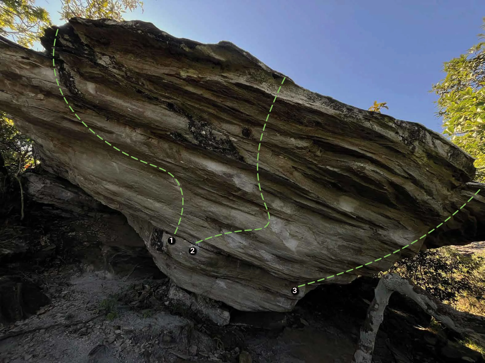
          - **largura_mapa**: 2364
          - **altura_mapa**: 1773
          - **pontos_de_interesse**:
            - **[0]**:
              - **id**: lsaAoE2BPiMHVI
              - **uid**: lsaAoE2BPiMHVI
              - **rotulo**: 1
              - **circulo**:
                - **x**: 836
                - **y**: 1176
                - **raio**: 20
              - **label**: 1
            - **[1]**:
              - **id**: ybp2bzg7qHMri7
              - **uid**: ybp2bzg7qHMri7
              - **rotulo**: 2
              - **circulo**:
                - **x**: 939
                - **y**: 1226
                - **raio**: 20
              - **label**: 2
            - **[2]**:
              - **id**: 8riABqsXcA1jQ9
              - **uid**: 8riABqsXcA1jQ9
              - **rotulo**: 3
              - **circulo**:
                - **x**: 1437
                - **y**: 1420
                - **raio**: 20
              - **label**: 3
          - **referencias**:
            - **[0]**:
              - **alvo_uid**: kfb4tIe2Pedrb9
              - **pontos_uids**:
                - lsaAoE2BPiMHVI
              - **escalada**: Trident
              - **ids**:
                - lsaAoE2BPiMHVI
            - **[1]**:
              - **alvo_uid**: yACkUisr7sYOol
              - **pontos_uids**:
                - ybp2bzg7qHMri7
              - **escalada**: Big-Big
              - **ids**:
                - ybp2bzg7qHMri7
            - **[2]**:
              - **alvo_uid**: aDSPlQUVyhC9GM
              - **pontos_uids**:
                - 8riABqsXcA1jQ9
              - **escalada**: Babaloo
              - **ids**:
                - 8riABqsXcA1jQ9
        - **[1]**:
          - **caminho_imagem_mapa**: 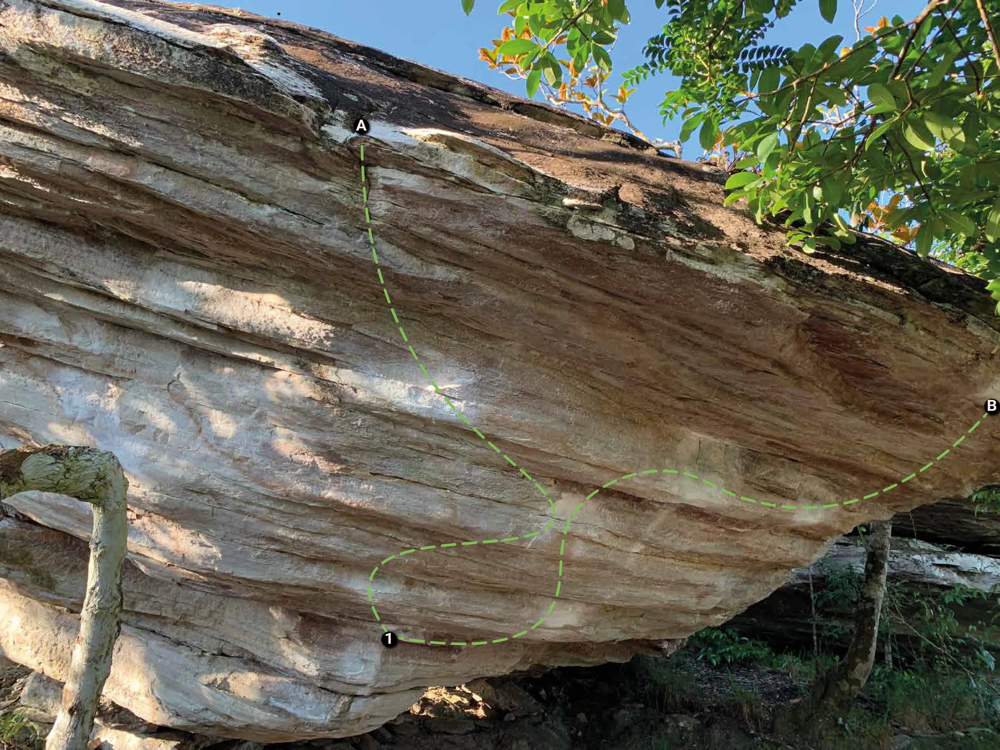
          - **largura_mapa**: 2364
          - **altura_mapa**: 1773
          - **pontos_de_interesse**:
            - **[0]**:
              - **id**: 56P2fhQnQqsnXF
              - **uid**: 56P2fhQnQqsnXF
              - **rotulo**: A
              - **circulo**:
                - **x**: 854
                - **y**: 298
                - **raio**: 20
              - **label**: A
            - **[1]**:
              - **id**: saRcFFdltSi3av
              - **uid**: saRcFFdltSi3av
              - **rotulo**: B
              - **circulo**:
                - **x**: 2344
                - **y**: 960
                - **raio**: 20
              - **label**: B
            - **[2]**:
              - **id**: cU300KQnP6LF7m
              - **uid**: cU300KQnP6LF7m
              - **rotulo**: 1
              - **circulo**:
                - **x**: 920
                - **y**: 1511
                - **raio**: 20
              - **label**: 1
          - **referencias**:
            - **[0]**:
              - **alvo_uid**: aDSPlQUVyhC9GM
              - **pontos_uids**:
                - cU300KQnP6LF7m
                - 56P2fhQnQqsnXF
              - **escalada**: Babaloo
              - **ids**:
                - cU300KQnP6LF7m
                - 56P2fhQnQqsnXF
            - **[1]**:
              - **alvo_uid**: bOrP36rxSM6TMr
              - **pontos_uids**:
                - cU300KQnP6LF7m
                - saRcFFdltSi3av
              - **escalada**: Chicletes
              - **ids**:
                - cU300KQnP6LF7m
                - saRcFFdltSi3av
      - **escaladas**:
        - **[0]**:
          - **uid**: kfb4tIe2Pedrb9
          - **boulder**:
            - **nome**: Trident
            - **dificuldade**: V10
        - **[1]**:
          - **uid**: yACkUisr7sYOol
          - **boulder**:
            - **nome**: Big-Big
            - **dificuldade**: V9
        - **[2]**:
          - **uid**: aDSPlQUVyhC9GM
          - **boulder**:
            - **nome**: Babaloo
            - **dificuldade**: V7
        - **[3]**:
          - **uid**: bOrP36rxSM6TMr
          - **boulder**:
            - **nome**: Chicletes
            - **dificuldade**: V11
      - **precomputados**:
        - **total_escaladas**: 4
        - **total_boulders**: 4
  - **[4]**:
    - **conteudo**:
      - **descricao**: 
      - **nome**: Bloco: Complexo
      - **uid**: pDA23Gjf4c95Ek
      - **mapas**:
        - **[0]**:
          - **caminho_imagem_mapa**: 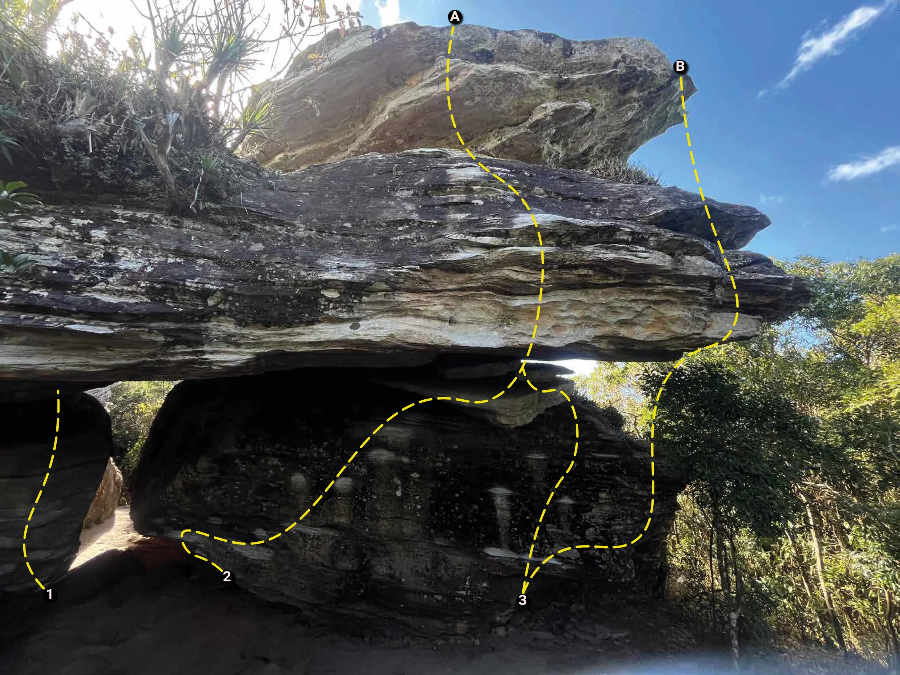
          - **largura_mapa**: 2364
          - **altura_mapa**: 1773
          - **pontos_de_interesse**:
            - **[0]**:
              - **id**: Ps71RyTRxAmZ38
              - **uid**: Ps71RyTRxAmZ38
              - **rotulo**: 1
              - **circulo**:
                - **x**: 132
                - **y**: 1561
                - **raio**: 18
              - **label**: 1
            - **[1]**:
              - **id**: 2MJl8jlqWJpkW4
              - **uid**: 2MJl8jlqWJpkW4
              - **rotulo**: 2
              - **circulo**:
                - **x**: 597
                - **y**: 1514
                - **raio**: 18
              - **label**: 2
            - **[2]**:
              - **id**: MpccQVQGdSgnPp
              - **uid**: MpccQVQGdSgnPp
              - **rotulo**: 3
              - **circulo**:
                - **x**: 1372
                - **y**: 1577
                - **raio**: 18
              - **label**: 3
            - **[3]**:
              - **id**: NO0J16L3sXk3Gh
              - **uid**: NO0J16L3sXk3Gh
              - **rotulo**: A
              - **circulo**:
                - **x**: 1196
                - **y**: 44
                - **raio**: 18
              - **label**: A
            - **[4]**:
              - **id**: mePZKI5IABgaMv
              - **uid**: mePZKI5IABgaMv
              - **rotulo**: B
              - **circulo**:
                - **x**: 1787
                - **y**: 175
                - **raio**: 20
              - **label**: B
          - **referencias**:
            - **[0]**:
              - **alvo_uid**: nnYFOByNZW2Kv3
              - **pontos_uids**:
                - Ps71RyTRxAmZ38
              - **escalada**: Talhadeira
              - **ids**:
                - Ps71RyTRxAmZ38
            - **[1]**:
              - **alvo_uid**: l5q37CcrQU4qJI
              - **pontos_uids**:
                - 2MJl8jlqWJpkW4
                - NO0J16L3sXk3Gh
              - **escalada**: Complexo
              - **ids**:
                - 2MJl8jlqWJpkW4
                - NO0J16L3sXk3Gh
            - **[2]**:
              - **alvo_uid**: N4JcdxwOwkbGmj
              - **pontos_uids**:
                - 2MJl8jlqWJpkW4
                - mePZKI5IABgaMv
              - **escalada**: Ajoelhou, Tem que Rezar
              - **ids**:
                - 2MJl8jlqWJpkW4
                - mePZKI5IABgaMv
            - **[3]**:
              - **alvo_uid**: fi0dueZw32BRuI
              - **pontos_uids**:
                - MpccQVQGdSgnPp
                - mePZKI5IABgaMv
              - **escalada**: Descomplicado
              - **ids**:
                - MpccQVQGdSgnPp
                - mePZKI5IABgaMv
        - **[1]**:
          - **caminho_imagem_mapa**: 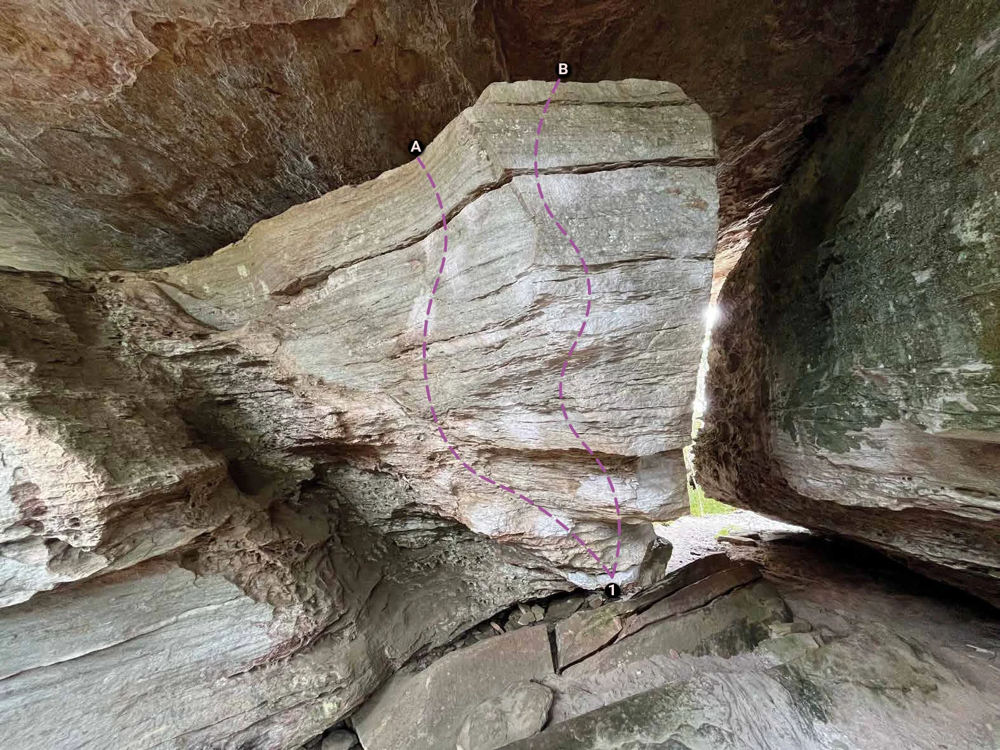
          - **largura_mapa**: 2364
          - **altura_mapa**: 1773
          - **pontos_de_interesse**:
            - **[0]**:
              - **id**: rW0atQAPZiCPh9
              - **uid**: rW0atQAPZiCPh9
              - **rotulo**: A
              - **circulo**:
                - **x**: 983
                - **y**: 350
                - **raio**: 20
              - **label**: A
            - **[1]**:
              - **id**: z3ui6AGdvFm9aF
              - **uid**: z3ui6AGdvFm9aF
              - **rotulo**: B
              - **circulo**:
                - **x**: 1331
                - **y**: 164
                - **raio**: 20
              - **label**: B
            - **[2]**:
              - **id**: c5CPMYyJiNhbsv
              - **uid**: c5CPMYyJiNhbsv
              - **rotulo**: 1
              - **circulo**:
                - **x**: 1448
                - **y**: 1397
                - **raio**: 20
              - **label**: 1
          - **referencias**:
            - **[0]**:
              - **alvo_uid**: nnYFOByNZW2Kv3
              - **pontos_uids**:
                - c5CPMYyJiNhbsv
                - z3ui6AGdvFm9aF
              - **escalada**: Talhadeira
              - **ids**:
                - c5CPMYyJiNhbsv
                - z3ui6AGdvFm9aF
            - **[1]**:
              - **alvo_uid**: OyQjIsQKIPU6Y2
              - **pontos_uids**:
                - c5CPMYyJiNhbsv
                - rW0atQAPZiCPh9
              - **escalada**: Sofá
              - **ids**:
                - c5CPMYyJiNhbsv
                - rW0atQAPZiCPh9
        - **[2]**:
          - **caminho_imagem_mapa**: 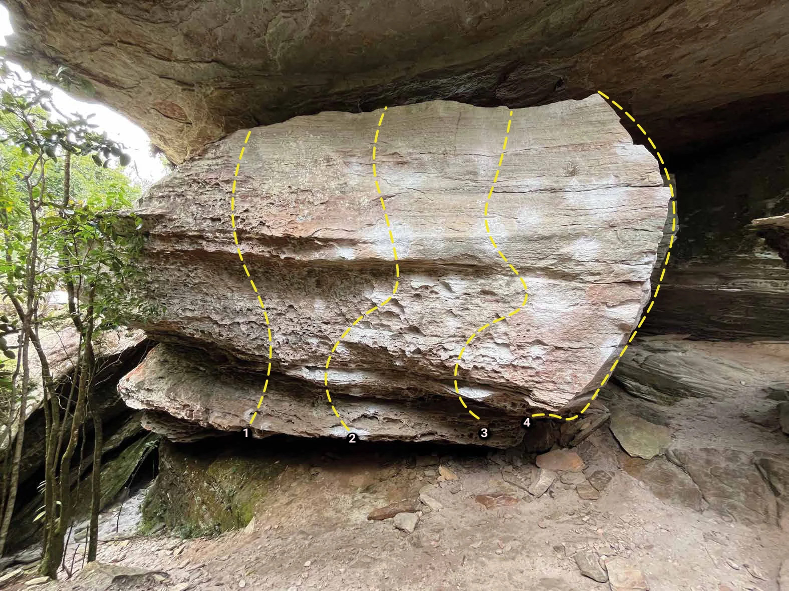
          - **largura_mapa**: 2364
          - **altura_mapa**: 1773
          - **pontos_de_interesse**:
            - **[0]**:
              - **id**: EW07d9e4QqFxjv
              - **uid**: EW07d9e4QqFxjv
              - **rotulo**: 1
              - **circulo**:
                - **x**: 737
                - **y**: 1302
                - **raio**: 21
              - **label**: 1
            - **[1]**:
              - **id**: BLKPoAjWzcYYLl
              - **uid**: BLKPoAjWzcYYLl
              - **rotulo**: 2
              - **circulo**:
                - **x**: 1055
                - **y**: 1317
                - **raio**: 21
              - **label**: 2
            - **[2]**:
              - **id**: fNAMZjQfYW8Rqq
              - **uid**: fNAMZjQfYW8Rqq
              - **rotulo**: 3
              - **circulo**:
                - **x**: 1451
                - **y**: 1300
                - **raio**: 21
              - **label**: 3
            - **[3]**:
              - **id**: lOUy7ugwcuayul
              - **uid**: lOUy7ugwcuayul
              - **rotulo**: 4
              - **circulo**:
                - **x**: 1581
                - **y**: 1269
                - **raio**: 21
              - **label**: 4
          - **referencias**:
            - **[0]**:
              - **alvo_uid**: zNpxQBg2uZcHaa
              - **pontos_uids**:
                - EW07d9e4QqFxjv
              - **escalada**: Porosíssimo
              - **ids**:
                - EW07d9e4QqFxjv
            - **[1]**:
              - **alvo_uid**: qxpo59PeH6YSkp
              - **pontos_uids**:
                - BLKPoAjWzcYYLl
              - **escalada**: Poroso
              - **ids**:
                - BLKPoAjWzcYYLl
            - **[2]**:
              - **alvo_uid**: Pp4D0QzwKizUMT
              - **pontos_uids**:
                - fNAMZjQfYW8Rqq
              - **escalada**: Não Poroso
              - **ids**:
                - fNAMZjQfYW8Rqq
            - **[3]**:
              - **alvo_uid**: gL32IneUp3xGi2
              - **pontos_uids**:
                - lOUy7ugwcuayul
              - **escalada**: Triangular
              - **ids**:
                - lOUy7ugwcuayul
        - **[3]**:
          - **caminho_imagem_mapa**: 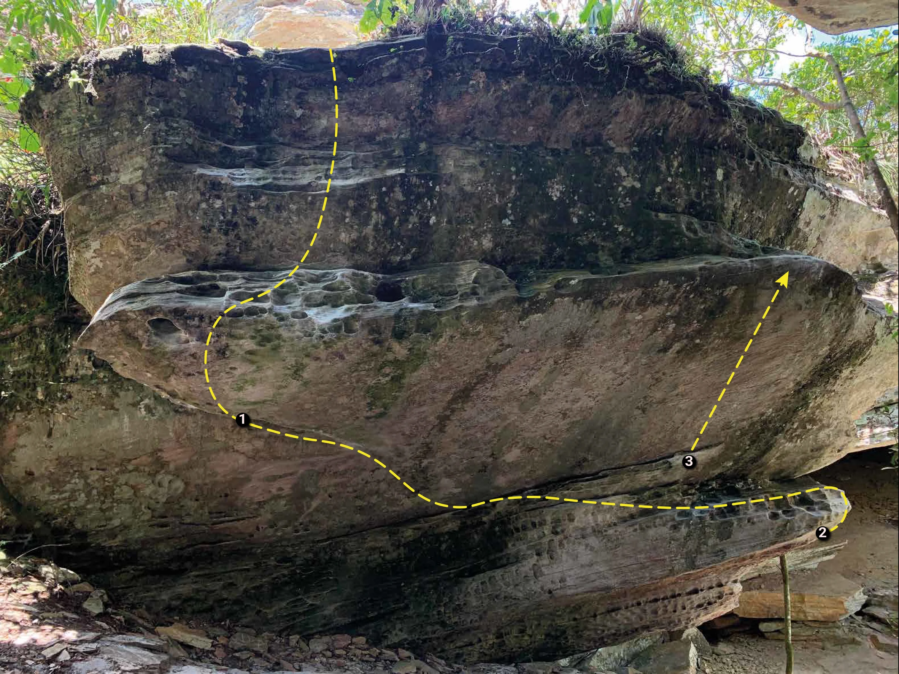
          - **largura_mapa**: 2364
          - **altura_mapa**: 1773
          - **pontos_de_interesse**:
            - **[0]**:
              - **id**: RVL2rP8fNCFY8G
              - **uid**: RVL2rP8fNCFY8G
              - **rotulo**: 1
              - **circulo**:
                - **x**: 639
                - **y**: 1104
                - **raio**: 20
              - **label**: 1
            - **[1]**:
              - **id**: xMoiAvRec1dbB2
              - **uid**: xMoiAvRec1dbB2
              - **rotulo**: 2
              - **circulo**:
                - **x**: 2164
                - **y**: 1402
                - **raio**: 20
              - **label**: 2
            - **[2]**:
              - **id**: 6BRwWdWFaHGFip
              - **uid**: 6BRwWdWFaHGFip
              - **rotulo**: 3
              - **circulo**:
                - **x**: 1812
                - **y**: 1215
                - **raio**: 20
              - **label**: 3
          - **referencias**:
            - **[0]**:
              - **alvo_uid**: uRGbPYR41aZrqO
              - **pontos_uids**:
                - RVL2rP8fNCFY8G
              - **escalada**: Boulder de Raiz
              - **ids**:
                - RVL2rP8fNCFY8G
            - **[1]**:
              - **alvo_uid**: gx5WYjL66sbtVD
              - **pontos_uids**:
                - xMoiAvRec1dbB2
              - **escalada**: Travessia Ouro Preto-Bocaina
              - **ids**:
                - xMoiAvRec1dbB2
            - **[2]**:
              - **alvo_uid**: pZ8PU0QRp0vhnA
              - **pontos_uids**:
                - 6BRwWdWFaHGFip
              - **escalada**: Perereca
              - **ids**:
                - 6BRwWdWFaHGFip
        - **[4]**:
          - **caminho_imagem_mapa**: 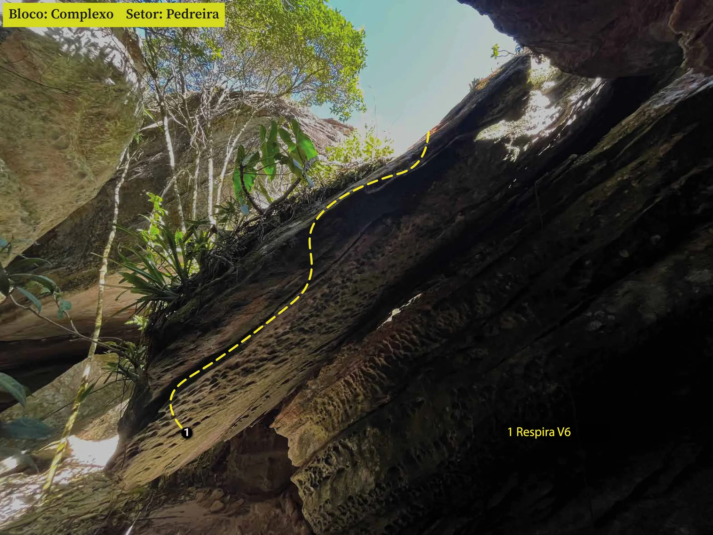
          - **largura_mapa**: 2364
          - **altura_mapa**: 1773
          - **pontos_de_interesse**:
            - **[0]**:
              - **id**: NKIMuZNcLRFNVq
              - **uid**: NKIMuZNcLRFNVq
              - **rotulo**: 1
              - **circulo**:
                - **x**: 619
                - **y**: 1434
                - **raio**: 20
              - **label**: 1
          - **referencias**:
            - **[0]**:
              - **alvo_uid**: ShPehd9lTU5u9L
              - **pontos_uids**:
                - NKIMuZNcLRFNVq
              - **escalada**: Respira
              - **ids**:
                - NKIMuZNcLRFNVq
      - **escaladas**:
        - **[0]**:
          - **uid**: nnYFOByNZW2Kv3
          - **boulder**:
            - **nome**: Talhadeira
            - **dificuldade**: V4
        - **[1]**:
          - **uid**: l5q37CcrQU4qJI
          - **boulder**:
            - **nome**: Complexo
            - **dificuldade**: V5
        - **[2]**:
          - **uid**: N4JcdxwOwkbGmj
          - **boulder**:
            - **nome**: Ajoelhou, Tem que Rezar
            - **dificuldade**: V5
        - **[3]**:
          - **uid**: fi0dueZw32BRuI
          - **boulder**:
            - **nome**: Descomplicado
            - **dificuldade**: V3
        - **[4]**:
          - **uid**: OyQjIsQKIPU6Y2
          - **boulder**:
            - **nome**: Sofá
            - **dificuldade**: V3
        - **[5]**:
          - **uid**: zNpxQBg2uZcHaa
          - **boulder**:
            - **nome**: Porosíssimo
            - **dificuldade**: V3
        - **[6]**:
          - **uid**: qxpo59PeH6YSkp
          - **boulder**:
            - **nome**: Poroso
            - **dificuldade**: V2
        - **[7]**:
          - **uid**: Pp4D0QzwKizUMT
          - **boulder**:
            - **nome**: Não Poroso
            - **dificuldade**: V3
        - **[8]**:
          - **uid**: gL32IneUp3xGi2
          - **boulder**:
            - **nome**: Triangular
            - **dificuldade**: V5
        - **[9]**:
          - **uid**: uRGbPYR41aZrqO
          - **boulder**:
            - **nome**: Boulder de Raiz
            - **dificuldade**: V2
        - **[10]**:
          - **uid**: gx5WYjL66sbtVD
          - **boulder**:
            - **nome**: Travessia Ouro Preto-Bocaina
            - **dificuldade**: V4
        - **[11]**:
          - **uid**: pZ8PU0QRp0vhnA
          - **boulder**:
            - **nome**: Perereca
            - **dificuldade**: V4
        - **[12]**:
          - **uid**: ShPehd9lTU5u9L
          - **boulder**:
            - **nome**: Respira
            - **dificuldade**: V6
      - **precomputados**:
        - **total_escaladas**: 13
        - **total_boulders**: 13
  - **[5]**:
    - **conteudo**:
      - **descricao**: 
      - **nome**: Bloco: Conhaque
      - **uid**: R0RK7LEXxz5JfS
      - **mapas**:
        - **[0]**:
          - **caminho_imagem_mapa**: 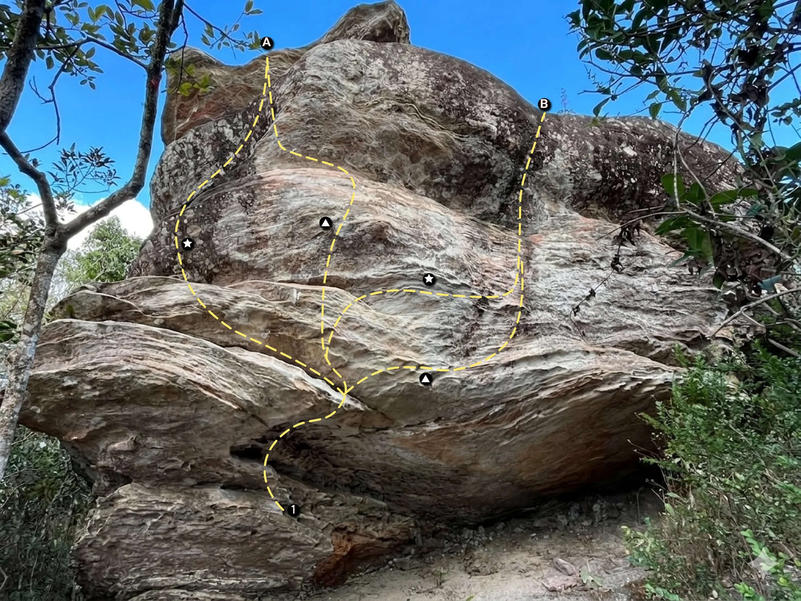
          - **referencias**:
            - **[0]**:
              - **alvo_uid**: pHUCfb3vJ9LflT
              - **pontos_uids**:
                - WSXhPPwtZZpahQ
                - dtvlcLkBkkBNXH
                - 5UP87O9KaPtywf
              - **escalada**: 005
              - **ids**:
                - WSXhPPwtZZpahQ
                - dtvlcLkBkkBNXH
                - 5UP87O9KaPtywf
            - **[1]**:
              - **alvo_uid**: AOr9ujkI0P4OX0
              - **pontos_uids**:
                - WSXhPPwtZZpahQ
                - dtvlcLkBkkBNXH
                - KuyyG6pLbtsA8L
              - **escalada**: 006
              - **ids**:
                - WSXhPPwtZZpahQ
                - dtvlcLkBkkBNXH
                - KuyyG6pLbtsA8L
            - **[2]**:
              - **alvo_uid**: LCXWVN8XmGVa50
              - **pontos_uids**:
                - WSXhPPwtZZpahQ
                - mBd2oN5QIsgy7a
                - q1sgMxHASTAgN1
              - **escalada**: 007
              - **ids**:
                - WSXhPPwtZZpahQ
                - mBd2oN5QIsgy7a
                - q1sgMxHASTAgN1
            - **[3]**:
              - **alvo_uid**: ybib9mdTt8soKN
              - **pontos_uids**:
                - WSXhPPwtZZpahQ
                - C
                - vh1idVQI2G0aFz
              - **escalada**: 008
              - **ids**:
                - WSXhPPwtZZpahQ
                - C
                - vh1idVQI2G0aFz
          - **pontos_de_interesse**:
            - **[0]**:
              - **id**: WSXhPPwtZZpahQ
              - **uid**: WSXhPPwtZZpahQ
              - **rotulo**: 1
              - **circulo**:
                - **x**: 866
                - **y**: 1505
                - **raio**: 20
              - **label**: 1
            - **[1]**:
              - **id**: 5UP87O9KaPtywf
              - **uid**: 5UP87O9KaPtywf
              - **rotulo**: ★
              - **circulo**:
                - **x**: 554
                - **y**: 721
                - **raio**: 20
              - **label**: ★
            - **[2]**:
              - **id**: q1sgMxHASTAgN1
              - **uid**: q1sgMxHASTAgN1
              - **rotulo**: ★
              - **circulo**:
                - **x**: 1266
                - **y**: 824
                - **raio**: 20
              - **label**: ★
            - **[3]**:
              - **id**: KuyyG6pLbtsA8L
              - **uid**: KuyyG6pLbtsA8L
              - **rotulo**: ▲
              - **circulo**:
                - **x**: 961
                - **y**: 658
                - **raio**: 20
              - **label**: ▲
            - **[4]**:
              - **id**: vh1idVQI2G0aFz
              - **uid**: vh1idVQI2G0aFz
              - **rotulo**: ▲
              - **circulo**:
                - **x**: 1256
                - **y**: 1118
                - **raio**: 20
              - **label**: ▲
            - **[5]**:
              - **id**: dtvlcLkBkkBNXH
              - **uid**: dtvlcLkBkkBNXH
              - **rotulo**: A
              - **circulo**:
                - **x**: 787
                - **y**: 127
                - **raio**: 20
              - **label**: A
            - **[6]**:
              - **id**: mBd2oN5QIsgy7a
              - **uid**: mBd2oN5QIsgy7a
              - **rotulo**: B
              - **circulo**:
                - **x**: 1606
                - **y**: 308
                - **raio**: 20
              - **label**: B
          - **largura_mapa**: 2364
          - **altura_mapa**: 1773
        - **[1]**:
          - **caminho_imagem_mapa**: 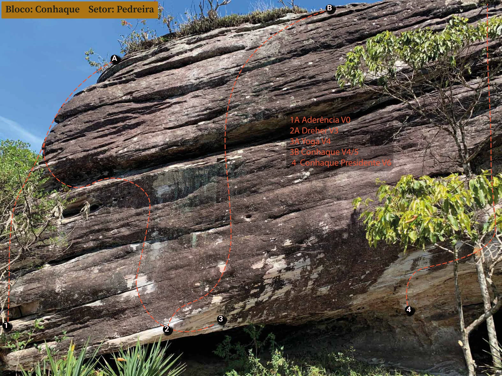
          - **pontos_de_interesse**:
            - **[0]**:
              - **id**: 8w05ggfu2nRKhf
              - **uid**: 8w05ggfu2nRKhf
              - **rotulo**: 1
              - **circulo**:
                - **x**: 30
                - **y**: 1538
                - **raio**: 19
              - **label**: 1
            - **[1]**:
              - **id**: nVZRFRajZw40M2
              - **uid**: nVZRFRajZw40M2
              - **rotulo**: 2
              - **circulo**:
                - **x**: 786
                - **y**: 1554
                - **raio**: 19
              - **label**: 2
            - **[2]**:
              - **id**: 2eyX4k5oh3fqnS
              - **uid**: 2eyX4k5oh3fqnS
              - **rotulo**: 3
              - **circulo**:
                - **x**: 1040
                - **y**: 1505
                - **raio**: 19
              - **label**: 3
            - **[3]**:
              - **id**: hAiQJFGRKqshy5
              - **uid**: hAiQJFGRKqshy5
              - **rotulo**: 4
              - **circulo**:
                - **x**: 1926
                - **y**: 1461
                - **raio**: 19
              - **label**: 4
            - **[4]**:
              - **id**: qZYSix5AmxBxOb
              - **uid**: qZYSix5AmxBxOb
              - **rotulo**: A
              - **circulo**:
                - **x**: 539
                - **y**: 277
                - **raio**: 19
              - **label**: A
            - **[5]**:
              - **id**: s82JehqMylqQ2B
              - **uid**: s82JehqMylqQ2B
              - **rotulo**: B
              - **circulo**:
                - **x**: 1552
                - **y**: 39
                - **raio**: 19
              - **label**: B
          - **referencias**:
            - **[0]**:
              - **alvo_uid**: L6VRdaV9P8swtf
              - **pontos_uids**:
                - 8w05ggfu2nRKhf
                - qZYSix5AmxBxOb
              - **escalada**: Aderência
              - **ids**:
                - 8w05ggfu2nRKhf
                - qZYSix5AmxBxOb
            - **[1]**:
              - **alvo_uid**: G4pkLUXok0TuIu
              - **pontos_uids**:
                - nVZRFRajZw40M2
                - qZYSix5AmxBxOb
              - **escalada**: Dreher
              - **ids**:
                - nVZRFRajZw40M2
                - qZYSix5AmxBxOb
            - **[2]**:
              - **alvo_uid**: VqPCGOhogs1xII
              - **pontos_uids**:
                - 2eyX4k5oh3fqnS
                - qZYSix5AmxBxOb
              - **escalada**: Yoga
              - **ids**:
                - 2eyX4k5oh3fqnS
                - qZYSix5AmxBxOb
            - **[3]**:
              - **alvo_uid**: CJhL8WoyH82eSX
              - **pontos_uids**:
                - 2eyX4k5oh3fqnS
                - s82JehqMylqQ2B
              - **escalada**: Conhaque
              - **ids**:
                - 2eyX4k5oh3fqnS
                - s82JehqMylqQ2B
            - **[4]**:
              - **alvo_uid**: 291gcEuK7oH5U8
              - **pontos_uids**:
                - hAiQJFGRKqshy5
              - **escalada**: Conhaque Presidente
              - **ids**:
                - hAiQJFGRKqshy5
          - **largura_mapa**: 2364
          - **altura_mapa**: 1773
      - **escaladas**:
        - **[0]**:
          - **uid**: pHUCfb3vJ9LflT
          - **boulder**:
            - **nome**: 005
            - **dificuldade**: V1
            - **destaque**: True
        - **[1]**:
          - **uid**: AOr9ujkI0P4OX0
          - **boulder**:
            - **nome**: 006
            - **dificuldade**: V2
        - **[2]**:
          - **uid**: LCXWVN8XmGVa50
          - **boulder**:
            - **nome**: 007
            - **dificuldade**: V3
            - **destaque**: True
        - **[3]**:
          - **uid**: ybib9mdTt8soKN
          - **boulder**:
            - **nome**: 008
            - **dificuldade**: V4
        - **[4]**:
          - **uid**: L6VRdaV9P8swtf
          - **boulder**:
            - **nome**: Aderência
            - **dificuldade**: VB
        - **[5]**:
          - **uid**: G4pkLUXok0TuIu
          - **boulder**:
            - **nome**: Dreher
            - **dificuldade**: V3
        - **[6]**:
          - **uid**: VqPCGOhogs1xII
          - **boulder**:
            - **nome**: Yoga
            - **dificuldade**: V4
        - **[7]**:
          - **uid**: CJhL8WoyH82eSX
          - **boulder**:
            - **nome**: Conhaque
            - **dificuldade**: V4_BARRA_V5
        - **[8]**:
          - **uid**: 291gcEuK7oH5U8
          - **boulder**:
            - **nome**: Conhaque Presidente
            - **dificuldade**: V6
      - **precomputados**:
        - **total_escaladas**: 9
        - **total_boulders**: 9
  - **[6]**:
    - **conteudo**:
      - **descricao**: 
      - **nome**: Bloco: Deep Inside
      - **uid**: NWLsTOFnn1cQbN
      - **mapas**:
        - **[0]**:
          - **caminho_imagem_mapa**: 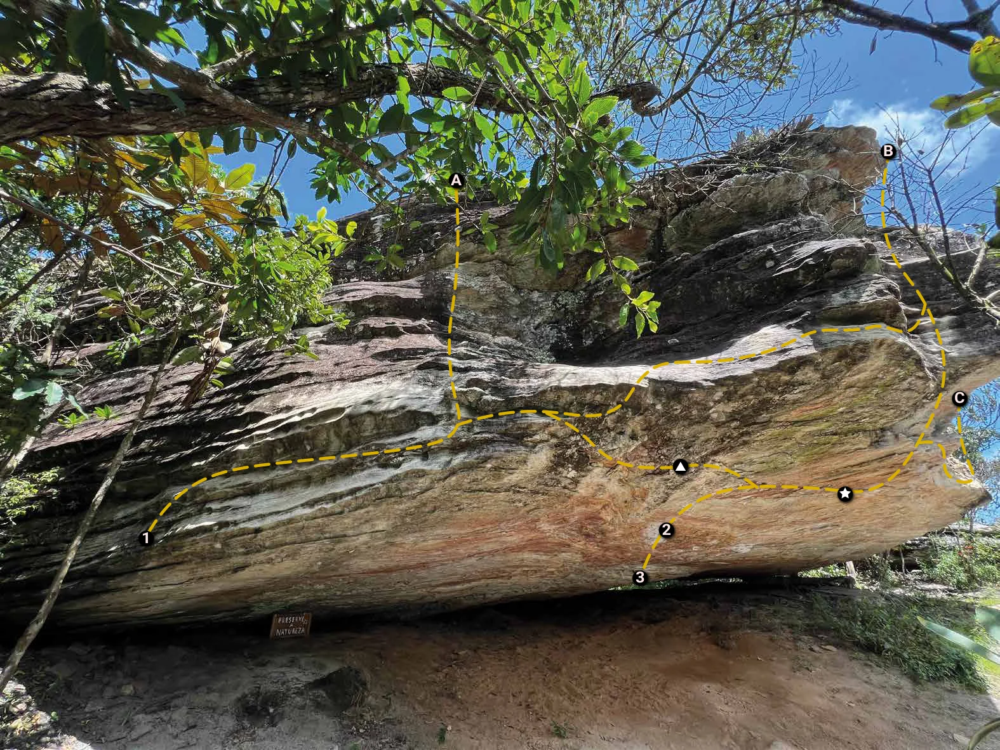
          - **largura_mapa**: 2364
          - **altura_mapa**: 1773
          - **pontos_de_interesse**:
            - **[0]**:
              - **id**: WLqis7lSTY0xcv
              - **uid**: WLqis7lSTY0xcv
              - **rotulo**: 1
              - **circulo**:
                - **x**: 345
                - **y**: 1274
                - **raio**: 20
              - **label**: 1
            - **[1]**:
              - **id**: jcF8uYqZKoCOij
              - **uid**: jcF8uYqZKoCOij
              - **rotulo**: 2
              - **circulo**:
                - **x**: 1576
                - **y**: 1254
                - **raio**: 20
              - **label**: 2
            - **[2]**:
              - **id**: wDvNsPJCeOAgeI
              - **uid**: wDvNsPJCeOAgeI
              - **rotulo**: 3
              - **circulo**:
                - **x**: 1513
                - **y**: 1367
                - **raio**: 20
              - **label**: 3
            - **[3]**:
              - **id**: VcDDmlKQwcLzE9
              - **uid**: VcDDmlKQwcLzE9
              - **rotulo**: A
              - **circulo**:
                - **x**: 1079
                - **y**: 426
                - **raio**: 20
              - **label**: A
            - **[4]**:
              - **id**: kBED2F82l4nKW7
              - **uid**: kBED2F82l4nKW7
              - **rotulo**: B
              - **circulo**:
                - **x**: 2100
                - **y**: 357
                - **raio**: 20
              - **label**: B
            - **[5]**:
              - **id**: LcjnrI4eSKKuSK
              - **uid**: LcjnrI4eSKKuSK
              - **rotulo**: C
              - **circulo**:
                - **x**: 2270
                - **y**: 943
                - **raio**: 20
              - **label**: C
            - **[6]**:
              - **id**: ymP3chPBGB0aOS
              - **uid**: ymP3chPBGB0aOS
              - **rotulo**: ▲
              - **circulo**:
                - **x**: 1609
                - **y**: 1104
                - **raio**: 20
              - **label**: ▲
            - **[7]**:
              - **id**: 9qeAPt0Desc97z
              - **uid**: 9qeAPt0Desc97z
              - **rotulo**: ★
              - **circulo**:
                - **x**: 1998
                - **y**: 1169
                - **raio**: 20
              - **label**: ★
          - **referencias**:
            - **[0]**:
              - **alvo_uid**: uaoxlDFUBS5Zea
              - **pontos_uids**:
                - WLqis7lSTY0xcv
                - VcDDmlKQwcLzE9
              - **escalada**: Buda
              - **ids**:
                - WLqis7lSTY0xcv
                - VcDDmlKQwcLzE9
            - **[1]**:
              - **alvo_uid**: lDuEB2wS2RjHMk
              - **pontos_uids**:
                - WLqis7lSTY0xcv
                - kBED2F82l4nKW7
              - **escalada**: Arestides
              - **ids**:
                - WLqis7lSTY0xcv
                - kBED2F82l4nKW7
            - **[2]**:
              - **alvo_uid**: lLfjQkQHcLiZfC
              - **pontos_uids**:
                - WLqis7lSTY0xcv
                - LcjnrI4eSKKuSK
              - **escalada**: Arestides ext
              - **ids**:
                - WLqis7lSTY0xcv
                - LcjnrI4eSKKuSK
            - **[3]**:
              - **alvo_uid**: Ce83rF3gsozE5x
              - **pontos_uids**:
                - jcF8uYqZKoCOij
                - ymP3chPBGB0aOS
                - kBED2F82l4nKW7
              - **escalada**: Nataraja
              - **ids**:
                - jcF8uYqZKoCOij
                - ymP3chPBGB0aOS
                - kBED2F82l4nKW7
            - **[4]**:
              - **alvo_uid**: wcBf8JywEG1he3
              - **pontos_uids**:
                - jcF8uYqZKoCOij
                - 9qeAPt0Desc97z
                - kBED2F82l4nKW7
              - **escalada**: Sidarta
              - **ids**:
                - jcF8uYqZKoCOij
                - 9qeAPt0Desc97z
                - kBED2F82l4nKW7
            - **[5]**:
              - **alvo_uid**: b9tTRBDOAJsjmf
              - **pontos_uids**:
                - wDvNsPJCeOAgeI
                - 9qeAPt0Desc97z
                - kBED2F82l4nKW7
              - **escalada**: Sidarta sds
              - **ids**:
                - wDvNsPJCeOAgeI
                - 9qeAPt0Desc97z
                - kBED2F82l4nKW7
        - **[1]**:
          - **caminho_imagem_mapa**: 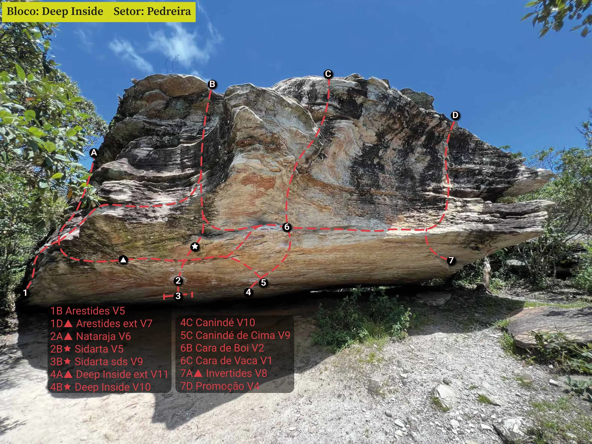
          - **largura_mapa**: 2364
          - **altura_mapa**: 1773
          - **pontos_de_interesse**:
            - **[0]**:
              - **id**: xlFMErTXpk64pH
              - **uid**: xlFMErTXpk64pH
              - **rotulo**: A
              - **circulo**:
                - **x**: 375
                - **y**: 610
                - **raio**: 20
              - **label**: A
            - **[1]**:
              - **id**: jOBeXQSeQw4hVO
              - **uid**: jOBeXQSeQw4hVO
              - **rotulo**: B
              - **circulo**:
                - **x**: 848
                - **y**: 338
                - **raio**: 20
              - **label**: B
            - **[2]**:
              - **id**: b2XBke5sUtmtcp
              - **uid**: b2XBke5sUtmtcp
              - **rotulo**: C
              - **circulo**:
                - **x**: 1312
                - **y**: 296
                - **raio**: 20
              - **label**: C
            - **[3]**:
              - **id**: ToSzRWBaYguTDG
              - **uid**: ToSzRWBaYguTDG
              - **rotulo**: D
              - **circulo**:
                - **x**: 1819
                - **y**: 461
                - **raio**: 20
              - **label**: D
            - **[4]**:
              - **id**: 53Mq12gooErVwi
              - **uid**: 53Mq12gooErVwi
              - **rotulo**: 1
              - **circulo**:
                - **x**: 101
                - **y**: 1171
                - **raio**: 20
              - **label**: 1
            - **[5]**:
              - **id**: VQD3nVXmEOLVl2
              - **uid**: VQD3nVXmEOLVl2
              - **rotulo**: ▲
              - **circulo**:
                - **x**: 492
                - **y**: 1038
                - **raio**: 20
              - **label**: ▲
            - **[6]**:
              - **id**: EB2OtdIX6KJXOy
              - **uid**: EB2OtdIX6KJXOy
              - **rotulo**: ★
              - **circulo**:
                - **x**: 779
                - **y**: 986
                - **raio**: 20
              - **label**: ★
            - **[7]**:
              - **id**: 1ovcHLcB9Urd36
              - **uid**: 1ovcHLcB9Urd36
              - **rotulo**: 2
              - **circulo**:
                - **x**: 712
                - **y**: 1123
                - **raio**: 20
              - **label**: 2
            - **[8]**:
              - **id**: PYPjgx756DQYV4
              - **uid**: PYPjgx756DQYV4
              - **rotulo**: 3
              - **circulo**:
                - **x**: 712
                - **y**: 1184
                - **raio**: 20
              - **label**: 3
            - **[9]**:
              - **id**: QwkpCOXjTZ8hHT
              - **uid**: QwkpCOXjTZ8hHT
              - **rotulo**: 4
              - **circulo**:
                - **x**: 994
                - **y**: 1168
                - **raio**: 20
              - **label**: 4
            - **[10]**:
              - **id**: 5P6KcY4BSM5dQh
              - **uid**: 5P6KcY4BSM5dQh
              - **rotulo**: 5
              - **circulo**:
                - **x**: 1053
                - **y**: 1130
                - **raio**: 20
              - **label**: 5
            - **[11]**:
              - **id**: ZKVjICEphNar4W
              - **uid**: ZKVjICEphNar4W
              - **rotulo**: 6
              - **circulo**:
                - **x**: 1147
                - **y**: 908
                - **raio**: 20
              - **label**: 6
            - **[12]**:
              - **id**: JeeqWM3Obcn5kg
              - **uid**: JeeqWM3Obcn5kg
              - **rotulo**: 7
              - **circulo**:
                - **x**: 1803
                - **y**: 1041
                - **raio**: 20
              - **label**: 7
          - **referencias**:
            - **[0]**:
              - **alvo_uid**: lDuEB2wS2RjHMk
              - **pontos_uids**:
                - 53Mq12gooErVwi
                - jOBeXQSeQw4hVO
              - **escalada**: Arestides
              - **ids**:
                - 53Mq12gooErVwi
                - jOBeXQSeQw4hVO
            - **[1]**:
              - **alvo_uid**: NAULSQ4PsWms9m
              - **pontos_uids**:
                - QwkpCOXjTZ8hHT
                - b2XBke5sUtmtcp
              - **escalada**: Canindé
              - **ids**:
                - QwkpCOXjTZ8hHT
                - b2XBke5sUtmtcp
            - **[2]**:
              - **alvo_uid**: KvUmXUCcaoQ3HB
              - **pontos_uids**:
                - 5P6KcY4BSM5dQh
                - b2XBke5sUtmtcp
              - **escalada**: Canindé de Cima
              - **ids**:
                - 5P6KcY4BSM5dQh
                - b2XBke5sUtmtcp
            - **[3]**:
              - **alvo_uid**: 7aXYfPXOfYbZlD
              - **pontos_uids**:
                - ZKVjICEphNar4W
                - jOBeXQSeQw4hVO
              - **escalada**: Cara de Boi
              - **ids**:
                - ZKVjICEphNar4W
                - jOBeXQSeQw4hVO
            - **[4]**:
              - **alvo_uid**: 9ZrZS9IMzAx4eh
              - **pontos_uids**:
                - ZKVjICEphNar4W
                - b2XBke5sUtmtcp
              - **escalada**: Cara de Vaca
              - **ids**:
                - ZKVjICEphNar4W
                - b2XBke5sUtmtcp
            - **[5]**:
              - **alvo_uid**: iLqxmcVYwx5Z0s
              - **pontos_uids**:
                - JeeqWM3Obcn5kg
                - ToSzRWBaYguTDG
              - **escalada**: Promoção
              - **ids**:
                - JeeqWM3Obcn5kg
                - ToSzRWBaYguTDG
            - **[6]**:
              - **alvo_uid**: MMePvK3uJayXzs
              - **pontos_uids**:
                - JeeqWM3Obcn5kg
                - xlFMErTXpk64pH
                - VQD3nVXmEOLVl2
              - **escalada**: Invertides
              - **ids**:
                - JeeqWM3Obcn5kg
                - xlFMErTXpk64pH
                - VQD3nVXmEOLVl2
            - **[7]**:
              - **alvo_uid**: lLfjQkQHcLiZfC
              - **pontos_uids**:
                - 53Mq12gooErVwi
                - VQD3nVXmEOLVl2
                - ToSzRWBaYguTDG
              - **escalada**: Arestides ext
              - **ids**:
                - 53Mq12gooErVwi
                - VQD3nVXmEOLVl2
                - ToSzRWBaYguTDG
            - **[8]**:
              - **alvo_uid**: Ce83rF3gsozE5x
              - **pontos_uids**:
                - 1ovcHLcB9Urd36
                - VQD3nVXmEOLVl2
                - xlFMErTXpk64pH
              - **escalada**: Nataraja
              - **ids**:
                - 1ovcHLcB9Urd36
                - VQD3nVXmEOLVl2
                - xlFMErTXpk64pH
            - **[9]**:
              - **alvo_uid**: wcBf8JywEG1he3
              - **pontos_uids**:
                - 1ovcHLcB9Urd36
                - EB2OtdIX6KJXOy
                - jOBeXQSeQw4hVO
              - **escalada**: Sidarta
              - **ids**:
                - 1ovcHLcB9Urd36
                - EB2OtdIX6KJXOy
                - jOBeXQSeQw4hVO
            - **[10]**:
              - **alvo_uid**: b9tTRBDOAJsjmf
              - **pontos_uids**:
                - PYPjgx756DQYV4
                - EB2OtdIX6KJXOy
                - jOBeXQSeQw4hVO
              - **escalada**: Sidarta sds
              - **ids**:
                - PYPjgx756DQYV4
                - EB2OtdIX6KJXOy
                - jOBeXQSeQw4hVO
            - **[11]**:
              - **alvo_uid**: LPYHM9ny9JBaki
              - **pontos_uids**:
                - QwkpCOXjTZ8hHT
                - VQD3nVXmEOLVl2
                - xlFMErTXpk64pH
              - **escalada**: Deep Inside ext
              - **ids**:
                - QwkpCOXjTZ8hHT
                - VQD3nVXmEOLVl2
                - xlFMErTXpk64pH
            - **[12]**:
              - **alvo_uid**: tV2bazjmpz5LqH
              - **pontos_uids**:
                - QwkpCOXjTZ8hHT
                - EB2OtdIX6KJXOy
                - jOBeXQSeQw4hVO
              - **escalada**: Deep Inside
              - **ids**:
                - QwkpCOXjTZ8hHT
                - EB2OtdIX6KJXOy
                - jOBeXQSeQw4hVO
        - **[2]**:
          - **caminho_imagem_mapa**: 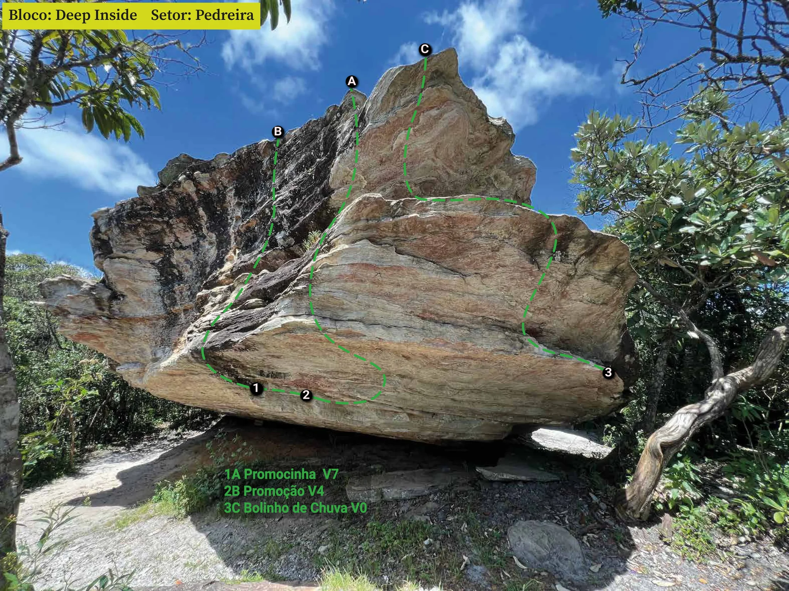
          - **largura_mapa**: 2364
          - **altura_mapa**: 1773
          - **pontos_de_interesse**:
            - **[0]**:
              - **id**: ywZCNUzjAMbf2w
              - **uid**: ywZCNUzjAMbf2w
              - **rotulo**: 1
              - **circulo**:
                - **x**: 768
                - **y**: 1166
                - **raio**: 21
              - **label**: 1
            - **[1]**:
              - **id**: NZ3TrxAlCw2ujq
              - **uid**: NZ3TrxAlCw2ujq
              - **rotulo**: 2
              - **circulo**:
                - **x**: 918
                - **y**: 1187
                - **raio**: 20
              - **label**: 2
            - **[2]**:
              - **id**: ZvrZDSAMHSJzXn
              - **uid**: ZvrZDSAMHSJzXn
              - **rotulo**: 3
              - **circulo**:
                - **x**: 1824
                - **y**: 1118
                - **raio**: 20
              - **label**: 3
            - **[3]**:
              - **id**: 7RPpe7NX7XTVQ7
              - **uid**: 7RPpe7NX7XTVQ7
              - **rotulo**: B
              - **circulo**:
                - **x**: 833
                - **y**: 395
                - **raio**: 20
              - **label**: B
            - **[4]**:
              - **id**: bIkZCFC5LMZntc
              - **uid**: bIkZCFC5LMZntc
              - **rotulo**: A
              - **circulo**:
                - **x**: 1054
                - **y**: 245
                - **raio**: 20
              - **label**: A
            - **[5]**:
              - **id**: A64hDEoZ1pBcmA
              - **uid**: A64hDEoZ1pBcmA
              - **rotulo**: C
              - **circulo**:
                - **x**: 1275
                - **y**: 149
                - **raio**: 20
              - **label**: C
          - **referencias**:
            - **[0]**:
              - **alvo_uid**: hX5yA4UvUp9657
              - **pontos_uids**:
                - ywZCNUzjAMbf2w
                - bIkZCFC5LMZntc
              - **escalada**: Promocinha
              - **ids**:
                - ywZCNUzjAMbf2w
                - bIkZCFC5LMZntc
            - **[1]**:
              - **alvo_uid**: fyczdQgCDp1h38
              - **pontos_uids**:
                - ZvrZDSAMHSJzXn
                - A64hDEoZ1pBcmA
              - **escalada**: Bolinho de Chuva
              - **ids**:
                - ZvrZDSAMHSJzXn
                - A64hDEoZ1pBcmA
            - **[2]**:
              - **alvo_uid**: iLqxmcVYwx5Z0s
              - **pontos_uids**:
                - NZ3TrxAlCw2ujq
                - 7RPpe7NX7XTVQ7
              - **escalada**: Promoção
              - **ids**:
                - NZ3TrxAlCw2ujq
                - 7RPpe7NX7XTVQ7
      - **escaladas**:
        - **[0]**:
          - **uid**: uaoxlDFUBS5Zea
          - **boulder**:
            - **nome**: Buda
            - **dificuldade**: V3
        - **[1]**:
          - **uid**: lDuEB2wS2RjHMk
          - **boulder**:
            - **nome**: Arestides
            - **dificuldade**: V5
        - **[2]**:
          - **uid**: lLfjQkQHcLiZfC
          - **boulder**:
            - **nome**: Arestides ext
            - **dificuldade**: V7
        - **[3]**:
          - **uid**: Ce83rF3gsozE5x
          - **boulder**:
            - **nome**: Nataraja
            - **dificuldade**: V6
        - **[4]**:
          - **uid**: wcBf8JywEG1he3
          - **boulder**:
            - **nome**: Sidarta
            - **dificuldade**: V5
        - **[5]**:
          - **uid**: b9tTRBDOAJsjmf
          - **boulder**:
            - **nome**: Sidarta sds
            - **dificuldade**: V9
        - **[6]**:
          - **uid**: LPYHM9ny9JBaki
          - **boulder**:
            - **nome**: Deep Inside ext
            - **dificuldade**: V11
        - **[7]**:
          - **uid**: tV2bazjmpz5LqH
          - **boulder**:
            - **nome**: Deep Inside
            - **dificuldade**: V10
        - **[8]**:
          - **uid**: NAULSQ4PsWms9m
          - **boulder**:
            - **nome**: Canindé
            - **dificuldade**: V10
        - **[9]**:
          - **uid**: KvUmXUCcaoQ3HB
          - **boulder**:
            - **nome**: Canindé de Cima
            - **dificuldade**: V9
        - **[10]**:
          - **uid**: 7aXYfPXOfYbZlD
          - **boulder**:
            - **nome**: Cara de Boi
            - **dificuldade**: V2
        - **[11]**:
          - **uid**: 9ZrZS9IMzAx4eh
          - **boulder**:
            - **nome**: Cara de Vaca
            - **dificuldade**: V1
        - **[12]**:
          - **uid**: MMePvK3uJayXzs
          - **boulder**:
            - **nome**: Invertides
            - **dificuldade**: V8
        - **[13]**:
          - **uid**: iLqxmcVYwx5Z0s
          - **boulder**:
            - **nome**: Promoção
            - **dificuldade**: V4
        - **[14]**:
          - **uid**: hX5yA4UvUp9657
          - **boulder**:
            - **nome**: Promocinha
            - **dificuldade**: V7
        - **[15]**:
          - **uid**: fyczdQgCDp1h38
          - **boulder**:
            - **nome**: Bolinho de Chuva
            - **dificuldade**: VB
      - **precomputados**:
        - **total_escaladas**: 16
        - **total_boulders**: 16
  - **[7]**:
    - **conteudo**:
      - **descricao**: 
      - **nome**: Bloco: Eléctron
      - **uid**: Bk5xx6SIISCIDN
      - **mapas**:
        - **[0]**:
          - **caminho_imagem_mapa**: 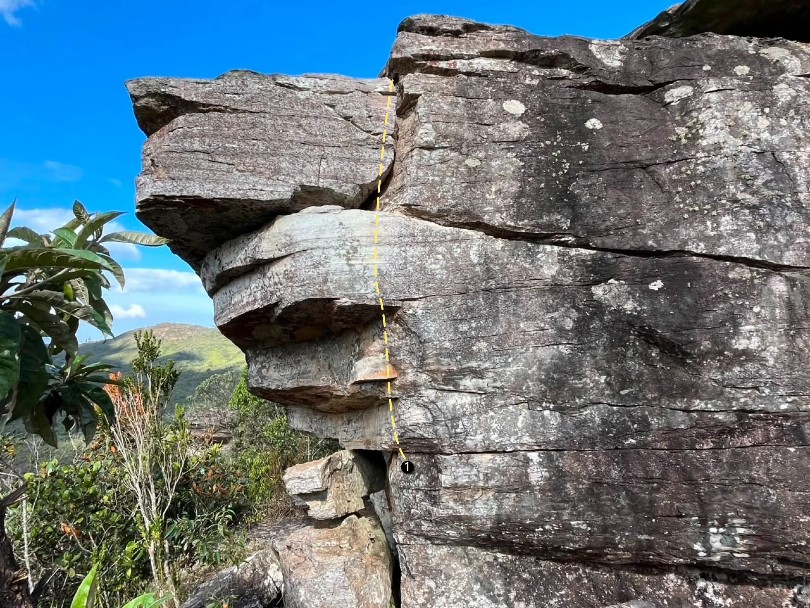
          - **referencias**:
            - **[0]**:
              - **alvo_uid**: gHvKFRncvebtA8
              - **pontos_uids**:
                - JEcg0TlzYLS6hQ
              - **escalada**: Quark
              - **ids**:
                - JEcg0TlzYLS6hQ
          - **largura_mapa**: 2364
          - **altura_mapa**: 1773
          - **pontos_de_interesse**:
            - **[0]**:
              - **id**: JEcg0TlzYLS6hQ
              - **uid**: JEcg0TlzYLS6hQ
              - **rotulo**: 1
              - **circulo**:
                - **x**: 1189
                - **y**: 1362
                - **raio**: 19
              - **label**: 1
        - **[1]**:
          - **caminho_imagem_mapa**: 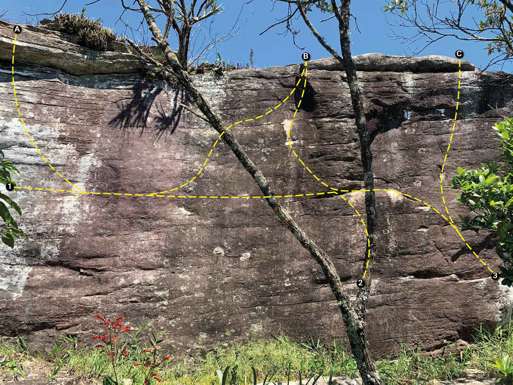
          - **largura_mapa**: 2364
          - **altura_mapa**: 1773
          - **pontos_de_interesse**:
            - **[0]**:
              - **id**: Cvr0kSgNPU2kfX
              - **uid**: Cvr0kSgNPU2kfX
              - **rotulo**: 1
              - **circulo**:
                - **x**: 45
                - **y**: 859
                - **raio**: 20
              - **label**: 1
            - **[1]**:
              - **id**: LO0KouBM7Ir89b
              - **uid**: LO0KouBM7Ir89b
              - **rotulo**: 2
              - **circulo**:
                - **x**: 1662
                - **y**: 1303
                - **raio**: 20
              - **label**: 2
            - **[2]**:
              - **id**: breHek3NBflexP
              - **uid**: breHek3NBflexP
              - **rotulo**: 3
              - **circulo**:
                - **x**: 2282
                - **y**: 1269
                - **raio**: 19
              - **label**: 3
            - **[3]**:
              - **id**: nVpdEssQmbvbpT
              - **uid**: nVpdEssQmbvbpT
              - **rotulo**: A
              - **circulo**:
                - **x**: 79
                - **y**: 135
                - **raio**: 20
              - **label**: A
            - **[4]**:
              - **id**: vbdrUE35K5FP0o
              - **uid**: vbdrUE35K5FP0o
              - **rotulo**: B
              - **circulo**:
                - **x**: 1409
                - **y**: 260
                - **raio**: 20
              - **label**: B
            - **[5]**:
              - **id**: uJph7WvwOoScA5
              - **uid**: uJph7WvwOoScA5
              - **rotulo**: C
              - **circulo**:
                - **x**: 2117
                - **y**: 249
                - **raio**: 20
              - **label**: C
          - **referencias**:
            - **[0]**:
              - **alvo_uid**: NIhv58491m957W
              - **pontos_uids**:
                - Cvr0kSgNPU2kfX
                - vbdrUE35K5FP0o
              - **escalada**: Neutron (1B)
              - **ids**:
                - Cvr0kSgNPU2kfX
                - vbdrUE35K5FP0o
            - **[1]**:
              - **alvo_uid**: CPYuI5Xd8SWruM
              - **pontos_uids**:
                - LO0KouBM7Ir89b
                - vbdrUE35K5FP0o
              - **escalada**: Elétron
              - **ids**:
                - LO0KouBM7Ir89b
                - vbdrUE35K5FP0o
            - **[2]**:
              - **alvo_uid**: gqzuvn3r5t0wKr
              - **pontos_uids**:
                - breHek3NBflexP
                - nVpdEssQmbvbpT
              - **escalada**: Via Láctea
              - **ids**:
                - breHek3NBflexP
                - nVpdEssQmbvbpT
            - **[3]**:
              - **alvo_uid**: VnqQXs2KepPNhp
              - **pontos_uids**:
                - breHek3NBflexP
                - vbdrUE35K5FP0o
              - **escalada**: Neutron (3B)
              - **ids**:
                - breHek3NBflexP
                - vbdrUE35K5FP0o
            - **[4]**:
              - **alvo_uid**: 6vpYejKdifv575
              - **pontos_uids**:
                - breHek3NBflexP
                - uJph7WvwOoScA5
              - **escalada**: Positron
              - **ids**:
                - breHek3NBflexP
                - uJph7WvwOoScA5
      - **escaladas**:
        - **[0]**:
          - **uid**: gHvKFRncvebtA8
          - **boulder**:
            - **nome**: Quark
            - **dificuldade**: V1
        - **[1]**:
          - **uid**: NIhv58491m957W
          - **boulder**:
            - **nome**: Neutron (1B)
            - **dificuldade**: V3_BARRA_V4
        - **[2]**:
          - **uid**: CPYuI5Xd8SWruM
          - **boulder**:
            - **nome**: Elétron
            - **dificuldade**: V3
        - **[3]**:
          - **uid**: gqzuvn3r5t0wKr
          - **boulder**:
            - **nome**: Via Láctea
            - **dificuldade**: V6
        - **[4]**:
          - **uid**: VnqQXs2KepPNhp
          - **boulder**:
            - **nome**: Neutron (3B)
            - **dificuldade**: V4
        - **[5]**:
          - **uid**: 6vpYejKdifv575
          - **boulder**:
            - **nome**: Positron
            - **dificuldade**: V3
      - **precomputados**:
        - **total_escaladas**: 6
        - **total_boulders**: 6
  - **[8]**:
    - **conteudo**:
      - **descricao**: 
      - **nome**: Bloco: Entretidos
      - **uid**: VIh2SjBR5kXfig
      - **mapas**:
        - **[0]**:
          - **caminho_imagem_mapa**: 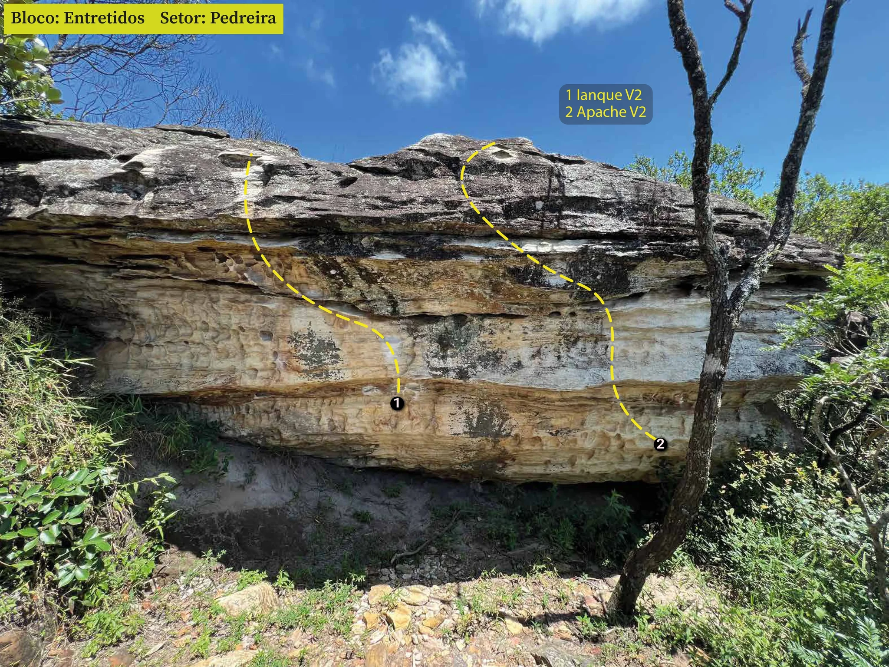
          - **largura_mapa**: 2364
          - **altura_mapa**: 1773
          - **pontos_de_interesse**:
            - **[0]**:
              - **id**: 39lUJlHU7sR3wa
              - **uid**: 39lUJlHU7sR3wa
              - **rotulo**: 1
              - **circulo**:
                - **x**: 1057
                - **y**: 1072
                - **raio**: 19
              - **label**: 1
            - **[1]**:
              - **id**: PLuHqrmtd03XdR
              - **uid**: PLuHqrmtd03XdR
              - **rotulo**: 2
              - **circulo**:
                - **x**: 1757
                - **y**: 1182
                - **raio**: 19
              - **label**: 2
          - **referencias**:
            - **[0]**:
              - **alvo_uid**: EMYCxTJIBZ3Dcm
              - **pontos_uids**:
                - 39lUJlHU7sR3wa
              - **escalada**: Ianque
              - **ids**:
                - 39lUJlHU7sR3wa
            - **[1]**:
              - **alvo_uid**: 2kxPUtC29eHaJA
              - **pontos_uids**:
                - PLuHqrmtd03XdR
              - **escalada**: Apache
              - **ids**:
                - PLuHqrmtd03XdR
        - **[1]**:
          - **caminho_imagem_mapa**: 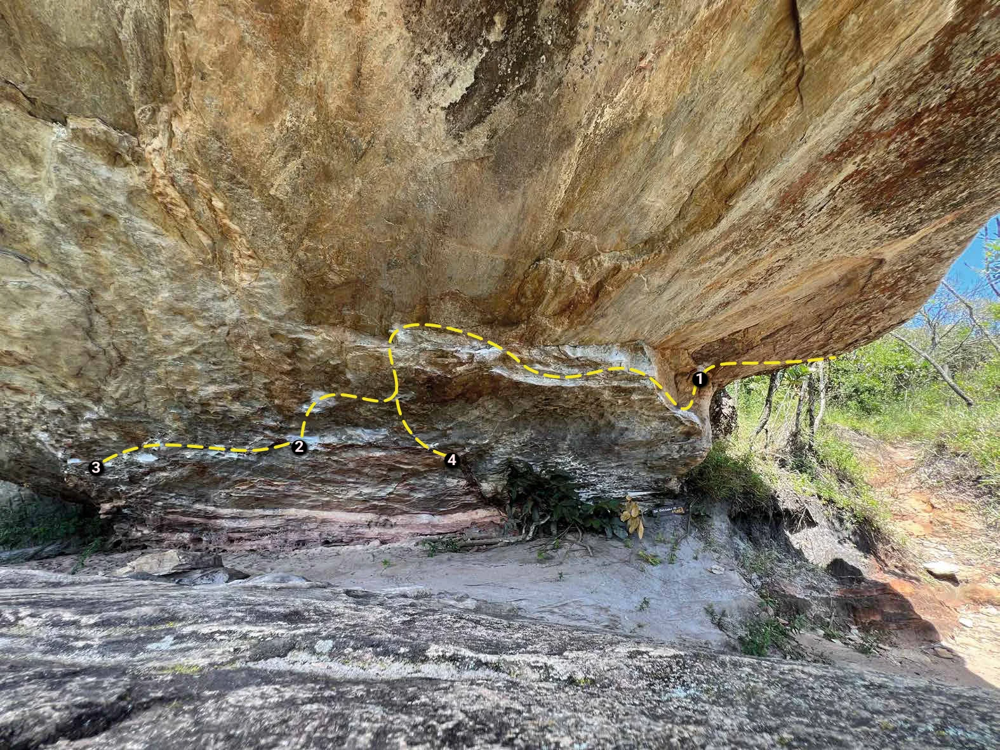
          - **largura_mapa**: 2364
          - **altura_mapa**: 1773
          - **pontos_de_interesse**:
            - **[0]**:
              - **id**: ACPjpKarku7aHC
              - **uid**: ACPjpKarku7aHC
              - **rotulo**: 1
              - **circulo**:
                - **x**: 1656
                - **y**: 897
                - **raio**: 20
              - **label**: 1
            - **[1]**:
              - **id**: Nltu8rDBw5Kcqa
              - **uid**: Nltu8rDBw5Kcqa
              - **rotulo**: 2
              - **circulo**:
                - **x**: 707
                - **y**: 1058
                - **raio**: 20
              - **label**: 2
            - **[2]**:
              - **id**: m7OcsDLQklwypG
              - **uid**: m7OcsDLQklwypG
              - **rotulo**: 3
              - **circulo**:
                - **x**: 227
                - **y**: 1107
                - **raio**: 20
              - **label**: 3
            - **[3]**:
              - **id**: iOjpKIWu3x1TUX
              - **uid**: iOjpKIWu3x1TUX
              - **rotulo**: 4
              - **circulo**:
                - **x**: 1069
                - **y**: 1088
                - **raio**: 20
              - **label**: 4
          - **referencias**:
            - **[0]**:
              - **alvo_uid**: csDenJwys8oNNJ
              - **pontos_uids**:
                - ACPjpKarku7aHC
              - **escalada**: Garoto Andrada
              - **ids**:
                - ACPjpKarku7aHC
            - **[1]**:
              - **alvo_uid**: a1W8x1I01gqufA
              - **pontos_uids**:
                - Nltu8rDBw5Kcqa
              - **escalada**: Embalados pelo Vovô
              - **ids**:
                - Nltu8rDBw5Kcqa
            - **[2]**:
              - **alvo_uid**: Nne9Tms4ucGSnA
              - **pontos_uids**:
                - m7OcsDLQklwypG
              - **escalada**: Pressão no Vovô
              - **ids**:
                - m7OcsDLQklwypG
            - **[3]**:
              - **alvo_uid**: X5ZoRmpf7l6tC1
              - **pontos_uids**:
                - iOjpKIWu3x1TUX
              - **escalada**: Pressão dos Barbosa
              - **ids**:
                - iOjpKIWu3x1TUX
        - **[2]**:
          - **caminho_imagem_mapa**: 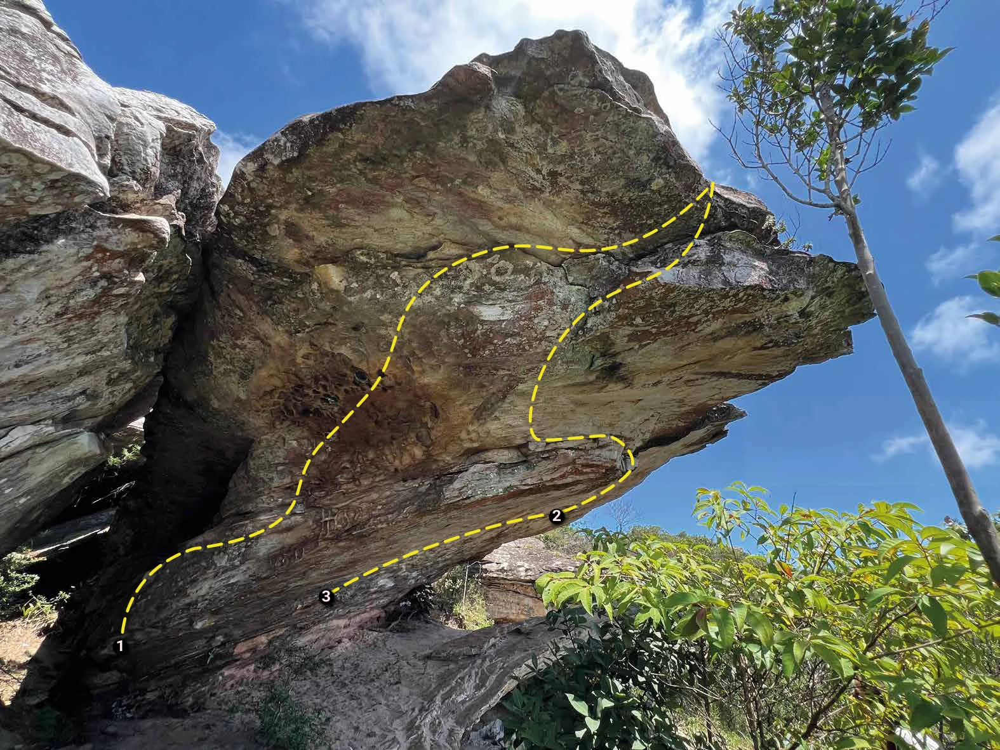
          - **largura_mapa**: 2364
          - **altura_mapa**: 1773
          - **pontos_de_interesse**:
            - **[0]**:
              - **id**: I2rNmRFCFaXfDK
              - **uid**: I2rNmRFCFaXfDK
              - **rotulo**: 1
              - **circulo**:
                - **x**: 285
                - **y**: 1528
                - **raio**: 20
              - **label**: 1
            - **[1]**:
              - **id**: zJ3sCmLDl7XTU4
              - **uid**: zJ3sCmLDl7XTU4
              - **rotulo**: 2
              - **circulo**:
                - **x**: 1316
                - **y**: 1221
                - **raio**: 20
              - **label**: 2
            - **[2]**:
              - **id**: PkkAORmT1upJ2g
              - **uid**: PkkAORmT1upJ2g
              - **rotulo**: 3
              - **circulo**:
                - **x**: 771
                - **y**: 1412
                - **raio**: 20
              - **label**: 3
          - **referencias**:
            - **[0]**:
              - **alvo_uid**: E03QJWrmRinejt
              - **pontos_uids**:
                - I2rNmRFCFaXfDK
              - **escalada**: Helicoidal
              - **ids**:
                - I2rNmRFCFaXfDK
            - **[1]**:
              - **alvo_uid**: gJEMTZzrKCDDfx
              - **pontos_uids**:
                - zJ3sCmLDl7XTU4
              - **escalada**: Em Busca do Equilíbrio
              - **ids**:
                - zJ3sCmLDl7XTU4
            - **[2]**:
              - **alvo_uid**: EA4GOV9uKTroHC
              - **pontos_uids**:
                - PkkAORmT1upJ2g
              - **escalada**: Em Busca do Equilíbrio sds
              - **ids**:
                - PkkAORmT1upJ2g
        - **[3]**:
          - **caminho_imagem_mapa**: 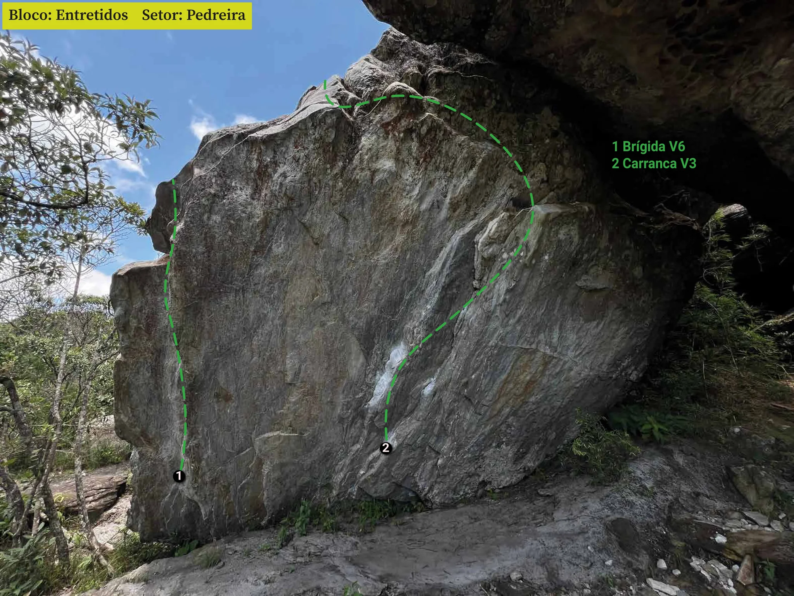
          - **largura_mapa**: 2364
          - **altura_mapa**: 1773
          - **pontos_de_interesse**:
            - **[0]**:
              - **id**: 6pD8Lc3FeIsVz3
              - **uid**: 6pD8Lc3FeIsVz3
              - **rotulo**: 1
              - **circulo**:
                - **x**: 534
                - **y**: 1417
                - **raio**: 20
              - **label**: 1
            - **[1]**:
              - **id**: ntkCvicPvDVCTm
              - **uid**: ntkCvicPvDVCTm
              - **rotulo**: 2
              - **circulo**:
                - **x**: 1149
                - **y**: 1334
                - **raio**: 20
              - **label**: 2
          - **referencias**:
            - **[0]**:
              - **alvo_uid**: WS60IlFHjOIn2r
              - **pontos_uids**:
                - 6pD8Lc3FeIsVz3
              - **escalada**: Brígida
              - **ids**:
                - 6pD8Lc3FeIsVz3
            - **[1]**:
              - **alvo_uid**: 8uyw8VCTXje3Ix
              - **pontos_uids**:
                - ntkCvicPvDVCTm
              - **escalada**: Carranca
              - **ids**:
                - ntkCvicPvDVCTm
      - **escaladas**:
        - **[0]**:
          - **uid**: EMYCxTJIBZ3Dcm
          - **boulder**:
            - **nome**: Ianque
            - **dificuldade**: V2
        - **[1]**:
          - **uid**: 2kxPUtC29eHaJA
          - **boulder**:
            - **nome**: Apache
            - **dificuldade**: V2
        - **[2]**:
          - **uid**: csDenJwys8oNNJ
          - **boulder**:
            - **nome**: Garoto Andrada
            - **dificuldade**: V3
        - **[3]**:
          - **uid**: a1W8x1I01gqufA
          - **boulder**:
            - **nome**: Embalados pelo Vovô
            - **dificuldade**: V7
        - **[4]**:
          - **uid**: Nne9Tms4ucGSnA
          - **boulder**:
            - **nome**: Pressão no Vovô
            - **dificuldade**: V9
        - **[5]**:
          - **uid**: X5ZoRmpf7l6tC1
          - **boulder**:
            - **nome**: Pressão dos Barbosa
            - **dificuldade**: V6_BARRA_V7
        - **[6]**:
          - **uid**: E03QJWrmRinejt
          - **boulder**:
            - **nome**: Helicoidal
            - **dificuldade**: V6
        - **[7]**:
          - **uid**: gJEMTZzrKCDDfx
          - **boulder**:
            - **nome**: Em Busca do Equilíbrio
            - **dificuldade**: V7
        - **[8]**:
          - **uid**: EA4GOV9uKTroHC
          - **boulder**:
            - **descricao**: (sai nas agarras do Pressão no Vovô)
            - **nome**: Em Busca do Equilíbrio sds
            - **dificuldade**: V10
        - **[9]**:
          - **uid**: WS60IlFHjOIn2r
          - **boulder**:
            - **nome**: Brígida
            - **dificuldade**: V6
        - **[10]**:
          - **uid**: 8uyw8VCTXje3Ix
          - **boulder**:
            - **nome**: Carranca
            - **dificuldade**: V3
      - **precomputados**:
        - **total_escaladas**: 11
        - **total_boulders**: 11
  - **[9]**:
    - **conteudo**:
      - **descricao**: 
      - **nome**: Bloco: Fiat Lux
      - **uid**: K4x0wtbQQInu43
      - **caminho_imagem_capa**: 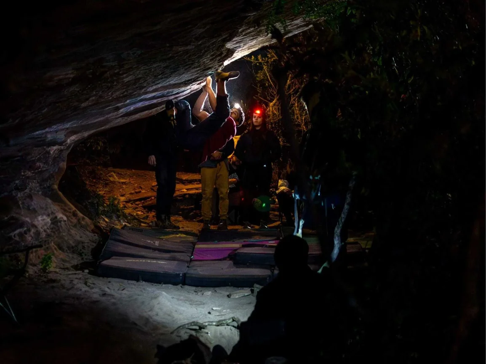
      - **mapas**:
        - **[0]**:
          - **caminho_imagem_mapa**: 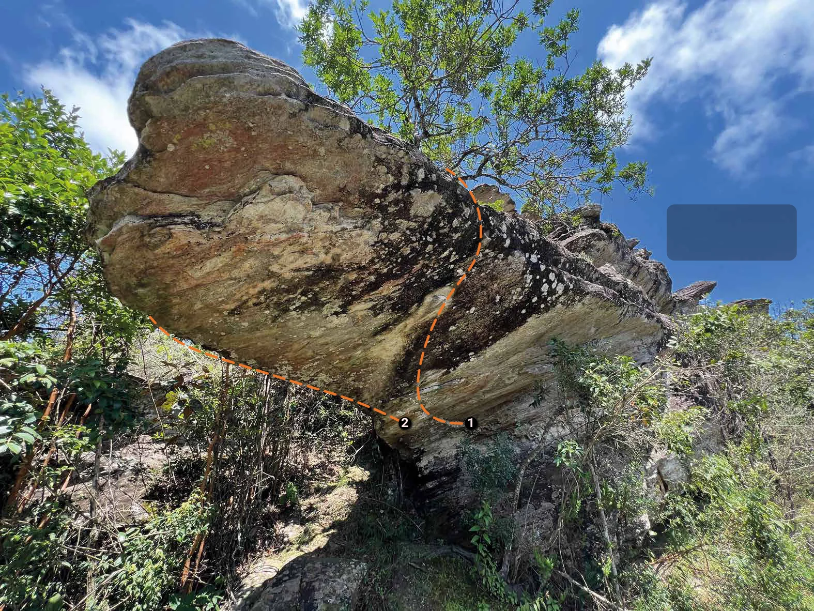
          - **largura_mapa**: 2364
          - **altura_mapa**: 1773
          - **pontos_de_interesse**:
            - **[0]**:
              - **id**: ZtlztjFHUSR0I6
              - **uid**: ZtlztjFHUSR0I6
              - **rotulo**: 1
              - **circulo**:
                - **x**: 1368
                - **y**: 1229
                - **raio**: 20
              - **label**: 1
            - **[1]**:
              - **id**: 8iaYwxrPe6gFfZ
              - **uid**: 8iaYwxrPe6gFfZ
              - **rotulo**: 2
              - **circulo**:
                - **x**: 1176
                - **y**: 1229
                - **raio**: 20
              - **label**: 2
          - **referencias**:
            - **[0]**:
              - **alvo_uid**: d2MdU7pd0M9cDH
              - **pontos_uids**:
                - ZtlztjFHUSR0I6
              - **escalada**: Fiat Lux
              - **ids**:
                - ZtlztjFHUSR0I6
            - **[1]**:
              - **alvo_uid**: TOSIZMjDkvkpys
              - **pontos_uids**:
                - 8iaYwxrPe6gFfZ
              - **escalada**: Frita Crux
              - **ids**:
                - 8iaYwxrPe6gFfZ
      - **escaladas**:
        - **[0]**:
          - **uid**: d2MdU7pd0M9cDH
          - **boulder**:
            - **nome**: Fiat Lux
            - **dificuldade**: V11
        - **[1]**:
          - **uid**: TOSIZMjDkvkpys
          - **boulder**:
            - **descricao**: (vira pela aresta atrás do bloco)
            - **nome**: Frita Crux
            - **dificuldade**: V4
      - **precomputados**:
        - **total_escaladas**: 2
        - **total_boulders**: 2
  - **[10]**:
    - **conteudo**:
      - **descricao**: 
      - **nome**: Bloco: Hora da Janta
      - **uid**: 6uiUlaIemsIKR1
      - **mapas**:
        - **[0]**:
          - **caminho_imagem_mapa**: 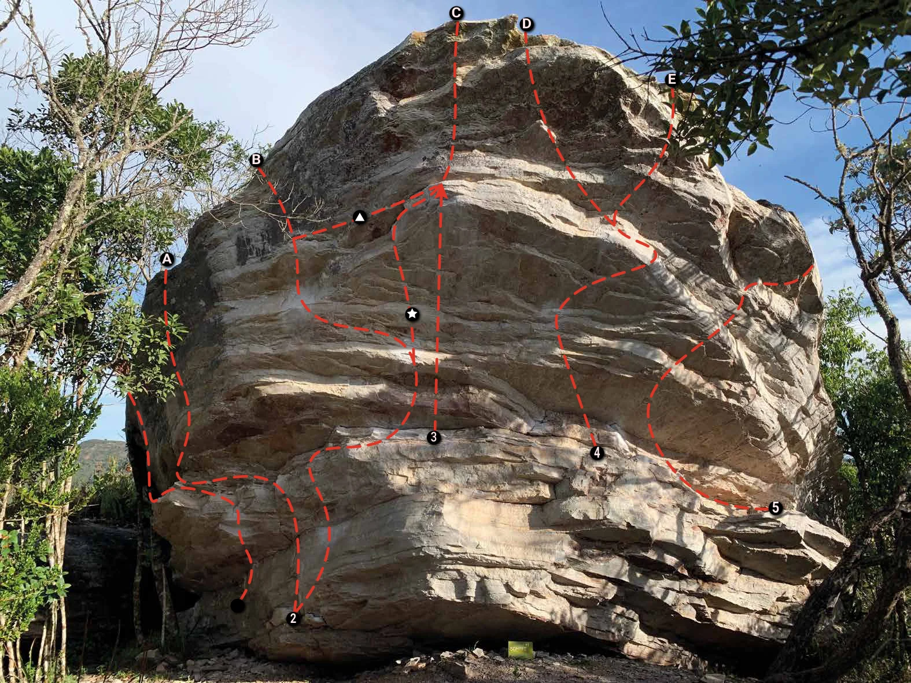
          - **largura_mapa**: 2364
          - **altura_mapa**: 1773
          - **pontos_de_interesse**:
            - **[0]**:
              - **id**: YLTfGQI7Qkqb4M
              - **uid**: YLTfGQI7Qkqb4M
              - **rotulo**: 1
              - **circulo**:
                - **x**: 615
                - **y**: 1572
                - **raio**: 20
              - **label**: 1
            - **[1]**:
              - **id**: rJ6Zfp3CRbr3yU
              - **uid**: rJ6Zfp3CRbr3yU
              - **rotulo**: 2
              - **circulo**:
                - **x**: 761
                - **y**: 1608
                - **raio**: 20
              - **label**: 2
            - **[2]**:
              - **id**: lzB8EfV1b2OrDn
              - **uid**: lzB8EfV1b2OrDn
              - **rotulo**: 3
              - **circulo**:
                - **x**: 1126
                - **y**: 1137
                - **raio**: 20
              - **label**: 3
            - **[3]**:
              - **id**: JZMao3vRHQRQkJ
              - **uid**: JZMao3vRHQRQkJ
              - **rotulo**: 4
              - **circulo**:
                - **x**: 1550
                - **y**: 1176
                - **raio**: 20
              - **label**: 4
            - **[4]**:
              - **id**: zgeF9PoXW5vl0F
              - **uid**: zgeF9PoXW5vl0F
              - **rotulo**: 5
              - **circulo**:
                - **x**: 2013
                - **y**: 1319
                - **raio**: 20
              - **label**: 5
            - **[5]**:
              - **id**: ydlXB5oCxATwQi
              - **uid**: ydlXB5oCxATwQi
              - **rotulo**: A
              - **circulo**:
                - **x**: 434
                - **y**: 674
                - **raio**: 20
              - **label**: A
            - **[6]**:
              - **id**: 0lNRqPUxsGEhW6
              - **uid**: 0lNRqPUxsGEhW6
              - **rotulo**: B
              - **circulo**:
                - **x**: 665
                - **y**: 416
                - **raio**: 20
              - **label**: B
            - **[7]**:
              - **id**: s1Zi11DFPVQlNq
              - **uid**: s1Zi11DFPVQlNq
              - **rotulo**: C
              - **circulo**:
                - **x**: 1184
                - **y**: 34
                - **raio**: 20
              - **label**: C
            - **[8]**:
              - **id**: jfRYS2Kwk4vNj2
              - **uid**: jfRYS2Kwk4vNj2
              - **rotulo**: D
              - **circulo**:
                - **x**: 1367
                - **y**: 63
                - **raio**: 20
              - **label**: D
            - **[9]**:
              - **id**: KzfA2400IY8UbN
              - **uid**: KzfA2400IY8UbN
              - **rotulo**: E
              - **circulo**:
                - **x**: 1744
                - **y**: 207
                - **raio**: 20
              - **label**: E
            - **[10]**:
              - **id**: 4pzNYYvQdMo7Fo
              - **uid**: 4pzNYYvQdMo7Fo
              - **rotulo**: ▲
              - **circulo**:
                - **x**: 934
                - **y**: 564
                - **raio**: 20
              - **label**: ▲
            - **[11]**:
              - **id**: OlQvBaO28LXWXz
              - **uid**: OlQvBaO28LXWXz
              - **rotulo**: ★
              - **circulo**:
                - **x**: 1070
                - **y**: 816
                - **raio**: 20
              - **label**: ★
          - **referencias**:
            - **[0]**:
              - **alvo_uid**: sDTRBZzDBx3lzU
              - **pontos_uids**:
                - YLTfGQI7Qkqb4M
              - **escalada**: Aranha
              - **ids**:
                - YLTfGQI7Qkqb4M
            - **[1]**:
              - **alvo_uid**: XrhgFQQmFGdybF
              - **pontos_uids**:
                - rJ6Zfp3CRbr3yU
                - ydlXB5oCxATwQi
              - **escalada**: Desafio do Superman
              - **ids**:
                - rJ6Zfp3CRbr3yU
                - ydlXB5oCxATwQi
            - **[2]**:
              - **alvo_uid**: fGrYJX9EEXbNLo
              - **pontos_uids**:
                - rJ6Zfp3CRbr3yU
                - 0lNRqPUxsGEhW6
              - **escalada**: Hora da Janta
              - **ids**:
                - rJ6Zfp3CRbr3yU
                - 0lNRqPUxsGEhW6
            - **[3]**:
              - **alvo_uid**: 1JeWCcc9HDwdv0
              - **pontos_uids**:
                - lzB8EfV1b2OrDn
                - s1Zi11DFPVQlNq
              - **escalada**: Voo do Superman
              - **ids**:
                - lzB8EfV1b2OrDn
                - s1Zi11DFPVQlNq
            - **[4]**:
              - **alvo_uid**: 5F6p52OuZfk2mN
              - **pontos_uids**:
                - JZMao3vRHQRQkJ
                - jfRYS2Kwk4vNj2
              - **escalada**: Conha Conha
              - **ids**:
                - JZMao3vRHQRQkJ
                - jfRYS2Kwk4vNj2
            - **[5]**:
              - **alvo_uid**: 0G6532coufGEbT
              - **pontos_uids**:
                - JZMao3vRHQRQkJ
                - KzfA2400IY8UbN
              - **escalada**: Maconhaque
              - **ids**:
                - JZMao3vRHQRQkJ
                - KzfA2400IY8UbN
            - **[6]**:
              - **alvo_uid**: izhJxu0CahN83O
              - **pontos_uids**:
                - zgeF9PoXW5vl0F
              - **escalada**: Tapa na Pantera
              - **ids**:
                - zgeF9PoXW5vl0F
            - **[7]**:
              - **alvo_uid**: jMwSTQe0owro27
              - **pontos_uids**:
                - rJ6Zfp3CRbr3yU
                - s1Zi11DFPVQlNq
                - 4pzNYYvQdMo7Fo
              - **escalada**: Larica
              - **ids**:
                - rJ6Zfp3CRbr3yU
                - s1Zi11DFPVQlNq
                - 4pzNYYvQdMo7Fo
            - **[8]**:
              - **alvo_uid**: jO40B9uBHKOWTE
              - **pontos_uids**:
                - rJ6Zfp3CRbr3yU
                - OlQvBaO28LXWXz
                - s1Zi11DFPVQlNq
              - **escalada**: Sobremesa
              - **ids**:
                - rJ6Zfp3CRbr3yU
                - OlQvBaO28LXWXz
                - s1Zi11DFPVQlNq
      - **escaladas**:
        - **[0]**:
          - **uid**: sDTRBZzDBx3lzU
          - **boulder**:
            - **nome**: Aranha
            - **dificuldade**: V2
        - **[1]**:
          - **uid**: XrhgFQQmFGdybF
          - **boulder**:
            - **nome**: Desafio do Superman
            - **dificuldade**: V3
        - **[2]**:
          - **uid**: fGrYJX9EEXbNLo
          - **boulder**:
            - **nome**: Hora da Janta
            - **dificuldade**: V3
        - **[3]**:
          - **uid**: jMwSTQe0owro27
          - **boulder**:
            - **nome**: Larica
            - **dificuldade**: V3
        - **[4]**:
          - **uid**: jO40B9uBHKOWTE
          - **boulder**:
            - **nome**: Sobremesa
            - **dificuldade**: V6
        - **[5]**:
          - **uid**: 1JeWCcc9HDwdv0
          - **boulder**:
            - **nome**: Voo do Superman
            - **dificuldade**: INDEFINIDO
        - **[6]**:
          - **uid**: 5F6p52OuZfk2mN
          - **boulder**:
            - **nome**: Conha Conha
            - **dificuldade**: V5
        - **[7]**:
          - **uid**: 0G6532coufGEbT
          - **boulder**:
            - **nome**: Maconhaque
            - **dificuldade**: V5
        - **[8]**:
          - **uid**: izhJxu0CahN83O
          - **boulder**:
            - **nome**: Tapa na Pantera
            - **dificuldade**: V1
      - **precomputados**:
        - **total_escaladas**: 9
        - **total_boulders**: 9
  - **[11]**:
    - **conteudo**:
      - **descricao**: 
      - **nome**: Bloco: Jah
      - **uid**: TcyDbEuEYt75wU
      - **mapas**:
        - **[0]**:
          - **caminho_imagem_mapa**: 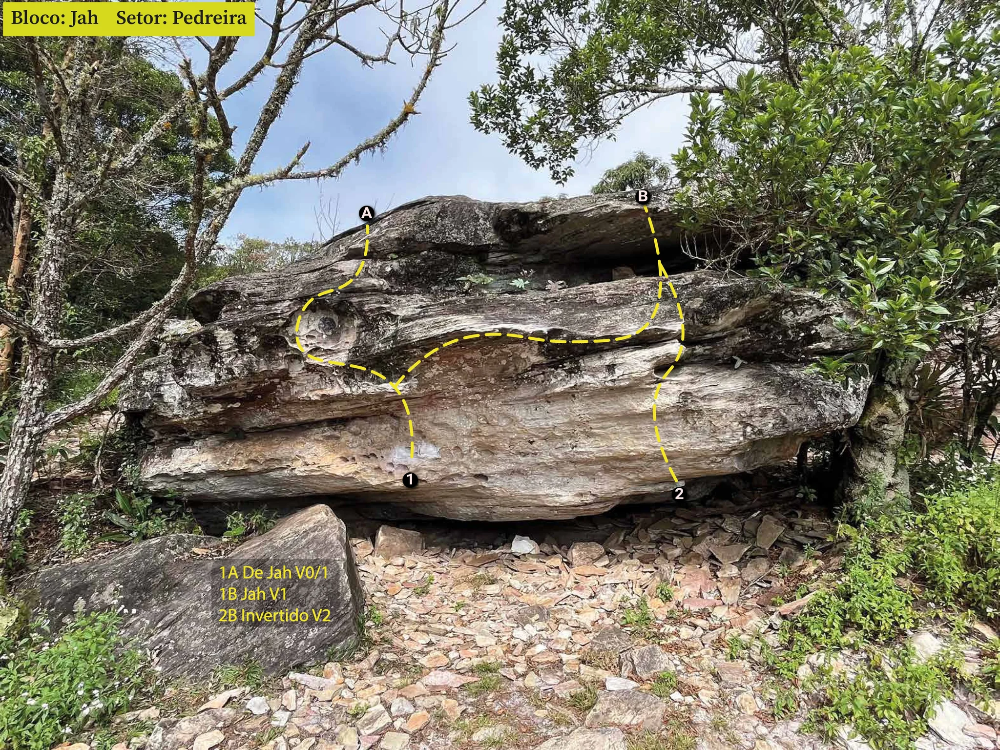
          - **largura_mapa**: 2364
          - **altura_mapa**: 1773
          - **pontos_de_interesse**:
            - **[0]**:
              - **id**: l5unQSdbtoFCxY
              - **uid**: l5unQSdbtoFCxY
              - **rotulo**: A
              - **circulo**:
                - **x**: 867
                - **y**: 505
                - **raio**: 19
              - **label**: A
            - **[1]**:
              - **id**: sUoGw8vse74wnU
              - **uid**: sUoGw8vse74wnU
              - **rotulo**: B
              - **circulo**:
                - **x**: 1520
                - **y**: 466
                - **raio**: 19
              - **label**: B
            - **[2]**:
              - **id**: bdaDWJtpL5dZql
              - **uid**: bdaDWJtpL5dZql
              - **rotulo**: 1
              - **circulo**:
                - **x**: 971
                - **y**: 1135
                - **raio**: 19
              - **label**: 1
            - **[3]**:
              - **id**: mJBXh2RnVwYTLd
              - **uid**: mJBXh2RnVwYTLd
              - **rotulo**: 2
              - **circulo**:
                - **x**: 1606
                - **y**: 1169
                - **raio**: 19
              - **label**: 2
          - **referencias**:
            - **[0]**:
              - **alvo_uid**: v8W8ZGULrJ3MdC
              - **pontos_uids**:
                - bdaDWJtpL5dZql
                - l5unQSdbtoFCxY
              - **escalada**: De Jah
              - **ids**:
                - bdaDWJtpL5dZql
                - l5unQSdbtoFCxY
            - **[1]**:
              - **alvo_uid**: RHyFAxkoGkGerf
              - **pontos_uids**:
                - bdaDWJtpL5dZql
                - sUoGw8vse74wnU
              - **escalada**: Jah
              - **ids**:
                - bdaDWJtpL5dZql
                - sUoGw8vse74wnU
            - **[2]**:
              - **alvo_uid**: tByES8ctww3gO6
              - **pontos_uids**:
                - mJBXh2RnVwYTLd
                - sUoGw8vse74wnU
              - **escalada**: Invertido
              - **ids**:
                - mJBXh2RnVwYTLd
                - sUoGw8vse74wnU
      - **escaladas**:
        - **[0]**:
          - **uid**: v8W8ZGULrJ3MdC
          - **boulder**:
            - **nome**: De Jah
            - **dificuldade**: V0_BARRA_V1
        - **[1]**:
          - **uid**: RHyFAxkoGkGerf
          - **boulder**:
            - **nome**: Jah
            - **dificuldade**: V1
        - **[2]**:
          - **uid**: tByES8ctww3gO6
          - **boulder**:
            - **nome**: Invertido
            - **dificuldade**: V2
      - **precomputados**:
        - **total_escaladas**: 3
        - **total_boulders**: 3
  - **[12]**:
    - **conteudo**:
      - **descricao**: 
      - **nome**: Bloco: João de Barro
      - **uid**: jBNPDMi5TIeAZ7
      - **mapas**:
        - **[0]**:
          - **caminho_imagem_mapa**: 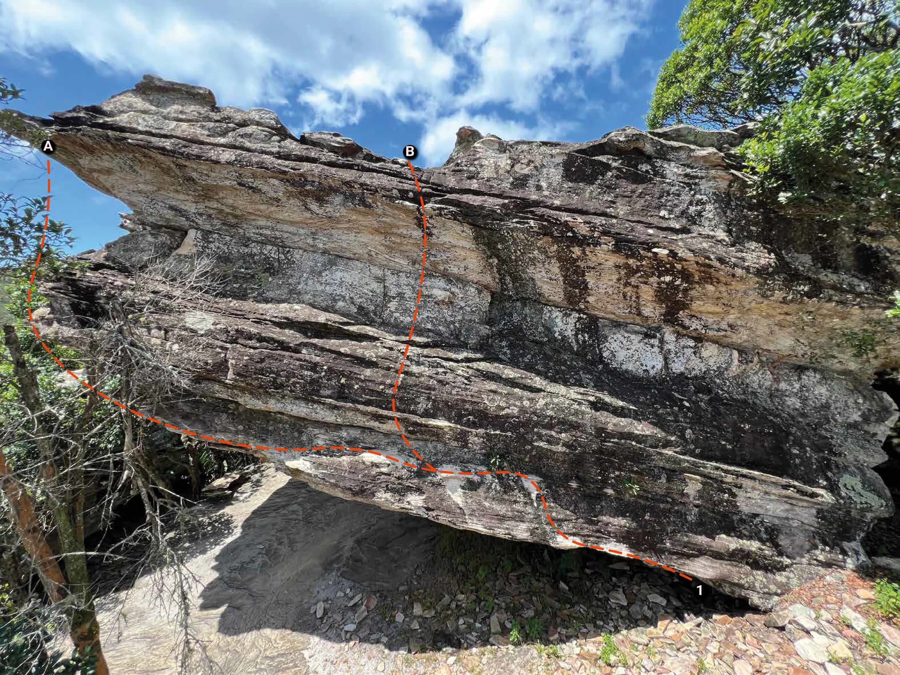
          - **largura_mapa**: 2364
          - **altura_mapa**: 1773
          - **pontos_de_interesse**:
            - **[0]**:
              - **id**: tWo2Kyb1dgzQhR
              - **uid**: tWo2Kyb1dgzQhR
              - **rotulo**: A
              - **circulo**:
                - **x**: 126
                - **y**: 386
                - **raio**: 20
              - **label**: A
            - **[1]**:
              - **id**: dfmAYZEaoSOrUq
              - **uid**: dfmAYZEaoSOrUq
              - **rotulo**: B
              - **circulo**:
                - **x**: 1077
                - **y**: 399
                - **raio**: 20
              - **label**: B
            - **[2]**:
              - **id**: lrSj6rAgjtyzyi
              - **uid**: lrSj6rAgjtyzyi
              - **rotulo**: 1
              - **circulo**:
                - **x**: 1839
                - **y**: 1551
                - **raio**: 20
              - **label**: 1
          - **referencias**:
            - **[0]**:
              - **alvo_uid**: 2QpNcYMCJMesi8
              - **pontos_uids**:
                - lrSj6rAgjtyzyi
                - tWo2Kyb1dgzQhR
              - **escalada**: Porra Nenhuma
              - **ids**:
                - lrSj6rAgjtyzyi
                - tWo2Kyb1dgzQhR
            - **[1]**:
              - **alvo_uid**: 2ZGgy4eB8GX5nM
              - **pontos_uids**:
                - lrSj6rAgjtyzyi
                - dfmAYZEaoSOrUq
              - **escalada**: Ringue
              - **ids**:
                - lrSj6rAgjtyzyi
                - dfmAYZEaoSOrUq
        - **[1]**:
          - **caminho_imagem_mapa**: 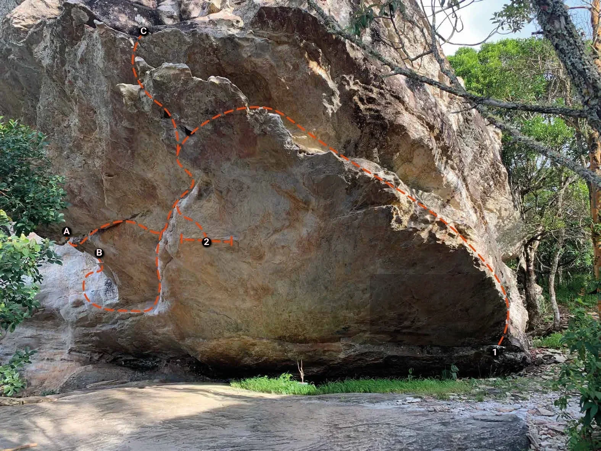
          - **largura_mapa**: 2364
          - **altura_mapa**: 1773
          - **pontos_de_interesse**:
            - **[0]**:
              - **id**: QlviXaanU9YpHg
              - **uid**: QlviXaanU9YpHg
              - **rotulo**: 1
              - **circulo**:
                - **x**: 1946
                - **y**: 1385
                - **raio**: 19
              - **label**: 1
            - **[1]**:
              - **id**: rJoIGrtmJ7b5mo
              - **uid**: rJoIGrtmJ7b5mo
              - **rotulo**: C
              - **circulo**:
                - **x**: 566
                - **y**: 122
                - **raio**: 19
              - **label**: C
            - **[2]**:
              - **id**: 0pZGt5nTYH3AqX
              - **uid**: 0pZGt5nTYH3AqX
              - **rotulo**: 2
              - **circulo**:
                - **x**: 813
                - **y**: 953
                - **raio**: 19
              - **label**: 2
            - **[3]**:
              - **id**: mUD9Cdnf8ZlRSU
              - **uid**: mUD9Cdnf8ZlRSU
              - **rotulo**: B
              - **circulo**:
                - **x**: 390
                - **y**: 995
                - **raio**: 19
              - **label**: B
            - **[4]**:
              - **id**: XZShii47pzhark
              - **uid**: XZShii47pzhark
              - **rotulo**: A
              - **circulo**:
                - **x**: 262
                - **y**: 911
                - **raio**: 20
              - **label**: A
          - **referencias**:
            - **[0]**:
              - **alvo_uid**: b9LBwPakqj50iA
              - **pontos_uids**:
                - QlviXaanU9YpHg
                - XZShii47pzhark
              - **escalada**: Arco Magmático
              - **ids**:
                - QlviXaanU9YpHg
                - XZShii47pzhark
            - **[1]**:
              - **alvo_uid**: 5FIzj8lwV78ECf
              - **pontos_uids**:
                - QlviXaanU9YpHg
                - mUD9Cdnf8ZlRSU
              - **escalada**: Du Mussula
              - **ids**:
                - QlviXaanU9YpHg
                - mUD9Cdnf8ZlRSU
            - **[2]**:
              - **alvo_uid**: rrZkI3jLZwWJF6
              - **pontos_uids**:
                - 0pZGt5nTYH3AqX
                - rJoIGrtmJ7b5mo
              - **escalada**: No Montê
              - **ids**:
                - 0pZGt5nTYH3AqX
                - rJoIGrtmJ7b5mo
        - **[2]**:
          - **caminho_imagem_mapa**: 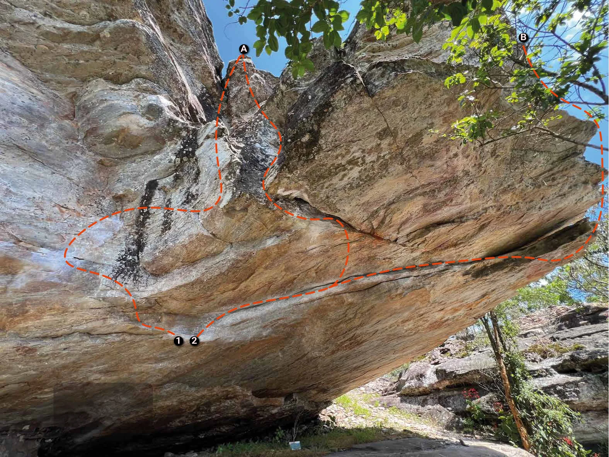
          - **largura_mapa**: 2364
          - **altura_mapa**: 1773
          - **pontos_de_interesse**:
            - **[0]**:
              - **id**: UVFd3gPhPLV9Il
              - **uid**: UVFd3gPhPLV9Il
              - **rotulo**: 1
              - **circulo**:
                - **x**: 694
                - **y**: 1324
                - **raio**: 20
              - **label**: 1
            - **[1]**:
              - **id**: HmncabzPnN3ixA
              - **uid**: HmncabzPnN3ixA
              - **rotulo**: 2
              - **circulo**:
                - **x**: 755
                - **y**: 1324
                - **raio**: 20
              - **label**: 2
            - **[2]**:
              - **id**: SMiRAVxNehVUqg
              - **uid**: SMiRAVxNehVUqg
              - **rotulo**: A
              - **circulo**:
                - **x**: 948
                - **y**: 191
                - **raio**: 20
              - **label**: A
            - **[3]**:
              - **id**: hb4HpEK99HPDZ4
              - **uid**: hb4HpEK99HPDZ4
              - **rotulo**: B
              - **circulo**:
                - **x**: 2033
                - **y**: 146
                - **raio**: 20
              - **label**: B
          - **referencias**:
            - **[0]**:
              - **alvo_uid**: CLN82VCJpSeHYS
              - **pontos_uids**:
                - UVFd3gPhPLV9Il
                - SMiRAVxNehVUqg
              - **escalada**: Bola 7
              - **ids**:
                - UVFd3gPhPLV9Il
                - SMiRAVxNehVUqg
            - **[1]**:
              - **alvo_uid**: HGCiVhUrmPSq1q
              - **pontos_uids**:
                - HmncabzPnN3ixA
                - SMiRAVxNehVUqg
              - **escalada**: Morcegão
              - **ids**:
                - HmncabzPnN3ixA
                - SMiRAVxNehVUqg
            - **[2]**:
              - **alvo_uid**: PnJVzpiFxKdlAU
              - **pontos_uids**:
                - HmncabzPnN3ixA
                - hb4HpEK99HPDZ4
              - **escalada**: João de Barro
              - **ids**:
                - HmncabzPnN3ixA
                - hb4HpEK99HPDZ4
      - **escaladas**:
        - **[0]**:
          - **uid**: 2QpNcYMCJMesi8
          - **boulder**:
            - **nome**: Porra Nenhuma
            - **dificuldade**: V4
        - **[1]**:
          - **uid**: 2ZGgy4eB8GX5nM
          - **boulder**:
            - **nome**: Ringue
            - **dificuldade**: V3
        - **[2]**:
          - **uid**: b9LBwPakqj50iA
          - **boulder**:
            - **descricao**: (saída pelo Morcegão)
            - **nome**: Arco Magmático
            - **dificuldade**: V8
        - **[3]**:
          - **uid**: 5FIzj8lwV78ECf
          - **boulder**:
            - **descricao**: (saída pelo Bola 7)
            - **nome**: Du Mussula
            - **dificuldade**: V10
        - **[4]**:
          - **uid**: rrZkI3jLZwWJF6
          - **boulder**:
            - **nome**: No Montê
            - **dificuldade**: V6
        - **[5]**:
          - **uid**: CLN82VCJpSeHYS
          - **boulder**:
            - **nome**: Bola 7
            - **dificuldade**: V4
        - **[6]**:
          - **uid**: HGCiVhUrmPSq1q
          - **boulder**:
            - **nome**: Morcegão
            - **dificuldade**: V5
        - **[7]**:
          - **uid**: PnJVzpiFxKdlAU
          - **boulder**:
            - **nome**: João de Barro
            - **dificuldade**: V4
      - **precomputados**:
        - **total_escaladas**: 8
        - **total_boulders**: 8
  - **[13]**:
    - **conteudo**:
      - **descricao**:
          |  |
          | :--: |
          | *Escalada 2* |
      - **nome**: Bloco: Lagartixa
      - **uid**: OtOutua1Xh2AuI
      - **caminho_imagem_capa**: 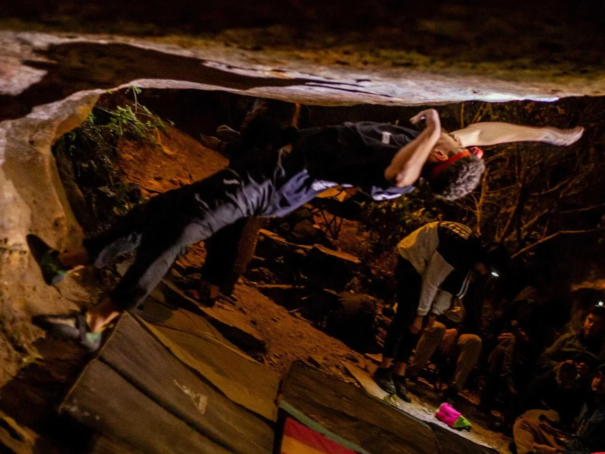
      - **mapas**:
        - **[0]**:
          - **caminho_imagem_mapa**: 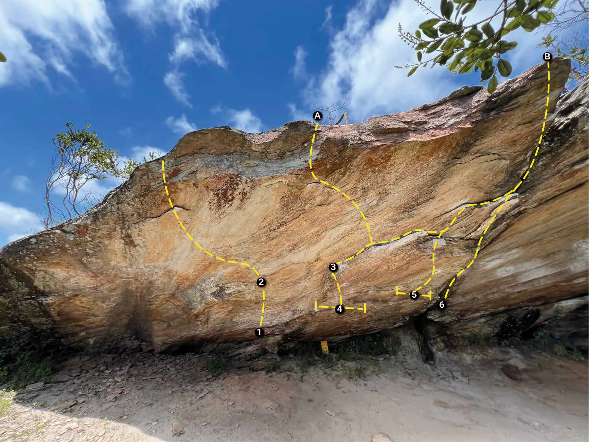
          - **largura_mapa**: 2364
          - **altura_mapa**: 1773
          - **pontos_de_interesse**:
            - **[0]**:
              - **id**: OIMjbTNweN3uvw
              - **uid**: OIMjbTNweN3uvw
              - **rotulo**: 1
              - **circulo**:
                - **x**: 1042
                - **y**: 1334
                - **raio**: 19
              - **label**: 1
            - **[1]**:
              - **id**: YNAwwk5oXXREpi
              - **uid**: YNAwwk5oXXREpi
              - **rotulo**: 2
              - **circulo**:
                - **x**: 1049
                - **y**: 1132
                - **raio**: 19
              - **label**: 2
            - **[2]**:
              - **id**: atMYutwGA62ZEk
              - **uid**: atMYutwGA62ZEk
              - **rotulo**: 3
              - **circulo**:
                - **x**: 1339
                - **y**: 1072
                - **raio**: 19
              - **label**: 3
            - **[3]**:
              - **id**: uXLPIBpaVQ49KP
              - **uid**: uXLPIBpaVQ49KP
              - **rotulo**: 4
              - **circulo**:
                - **x**: 1365
                - **y**: 1241
                - **raio**: 19
              - **label**: 4
            - **[4]**:
              - **id**: se2ARSBtYmUtkx
              - **uid**: se2ARSBtYmUtkx
              - **rotulo**: 5
              - **circulo**:
                - **x**: 1664
                - **y**: 1184
                - **raio**: 19
              - **label**: 5
            - **[5]**:
              - **id**: NPk6NKAknsYzQg
              - **uid**: NPk6NKAknsYzQg
              - **rotulo**: 6
              - **circulo**:
                - **x**: 1775
                - **y**: 1223
                - **raio**: 19
              - **label**: 6
            - **[6]**:
              - **id**: RYL4qldNXegC2S
              - **uid**: RYL4qldNXegC2S
              - **rotulo**: A
              - **circulo**:
                - **x**: 1275
                - **y**: 465
                - **raio**: 19
              - **label**: A
            - **[7]**:
              - **id**: anFygudYQKyYfX
              - **uid**: anFygudYQKyYfX
              - **rotulo**: B
              - **circulo**:
                - **x**: 2198
                - **y**: 228
                - **raio**: 19
              - **label**: B
          - **referencias**:
            - **[0]**:
              - **alvo_uid**: 1OBG9Zmp2sWdmJ
              - **pontos_uids**:
                - OIMjbTNweN3uvw
              - **escalada**: Last Samurai
              - **ids**:
                - OIMjbTNweN3uvw
            - **[1]**:
              - **alvo_uid**: xsbEWS3M0XvhdL
              - **pontos_uids**:
                - YNAwwk5oXXREpi
              - **escalada**: Samurai
              - **ids**:
                - YNAwwk5oXXREpi
            - **[2]**:
              - **alvo_uid**: e1RxIJFKtUXo6J
              - **pontos_uids**:
                - atMYutwGA62ZEk
                - anFygudYQKyYfX
              - **escalada**: Doce de Leite
              - **ids**:
                - atMYutwGA62ZEk
                - anFygudYQKyYfX
            - **[3]**:
              - **alvo_uid**: OvcfulQ2iFW0v2
              - **pontos_uids**:
                - uXLPIBpaVQ49KP
                - RYL4qldNXegC2S
              - **escalada**: Panamá
              - **ids**:
                - uXLPIBpaVQ49KP
                - RYL4qldNXegC2S
            - **[4]**:
              - **alvo_uid**: 7tLVLG0DZgoFua
              - **pontos_uids**:
                - uXLPIBpaVQ49KP
                - anFygudYQKyYfX
              - **escalada**: Doce de Leite sds
              - **ids**:
                - uXLPIBpaVQ49KP
                - anFygudYQKyYfX
            - **[5]**:
              - **alvo_uid**: FggDyQ1Jk0EJrb
              - **pontos_uids**:
                - se2ARSBtYmUtkx
                - anFygudYQKyYfX
              - **escalada**: Rocambole
              - **ids**:
                - se2ARSBtYmUtkx
                - anFygudYQKyYfX
            - **[6]**:
              - **alvo_uid**: OWjd6pcV8SanGm
              - **pontos_uids**:
                - NPk6NKAknsYzQg
                - anFygudYQKyYfX
              - **escalada**: Falha Humana
              - **ids**:
                - NPk6NKAknsYzQg
                - anFygudYQKyYfX
        - **[1]**:
          - **caminho_imagem_mapa**: 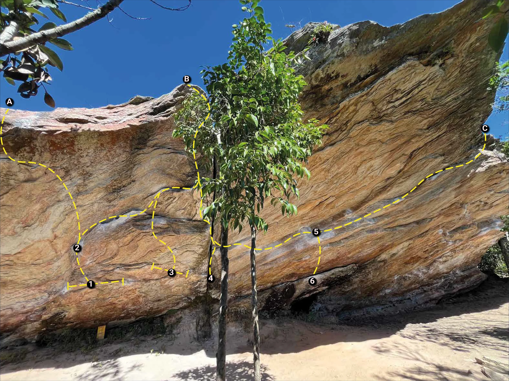
          - **largura_mapa**: 2364
          - **altura_mapa**: 1773
          - **pontos_de_interesse**:
            - **[0]**:
              - **id**: T3ZXXyUW5BxbE7
              - **uid**: T3ZXXyUW5BxbE7
              - **rotulo**: A
              - **circulo**:
                - **x**: 44
                - **y**: 474
                - **raio**: 20
              - **label**: A
            - **[1]**:
              - **id**: vtRG1Z7S6YjF6O
              - **uid**: vtRG1Z7S6YjF6O
              - **rotulo**: B
              - **circulo**:
                - **x**: 868
                - **y**: 369
                - **raio**: 20
              - **label**: B
            - **[2]**:
              - **id**: jvkc7NY6gDYO4D
              - **uid**: jvkc7NY6gDYO4D
              - **rotulo**: C
              - **circulo**:
                - **x**: 2254
                - **y**: 598
                - **raio**: 20
              - **label**: C
            - **[3]**:
              - **id**: FpdWxlpqvy9xq8
              - **uid**: FpdWxlpqvy9xq8
              - **rotulo**: 1
              - **circulo**:
                - **x**: 422
                - **y**: 1323
                - **raio**: 20
              - **label**: 1
            - **[4]**:
              - **id**: UYFQdCGvLa9zvA
              - **uid**: UYFQdCGvLa9zvA
              - **rotulo**: 2
              - **circulo**:
                - **x**: 359
                - **y**: 1154
                - **raio**: 20
              - **label**: 2
            - **[5]**:
              - **id**: m8tvlQw6RQRMov
              - **uid**: m8tvlQw6RQRMov
              - **rotulo**: 3
              - **circulo**:
                - **x**: 797
                - **y**: 1269
                - **raio**: 20
              - **label**: 3
            - **[6]**:
              - **id**: UwA1rUF1WUmGaw
              - **uid**: UwA1rUF1WUmGaw
              - **rotulo**: 4
              - **circulo**:
                - **x**: 980
                - **y**: 1296
                - **raio**: 20
              - **label**: 4
            - **[7]**:
              - **id**: wp9oikLNacNp4S
              - **uid**: wp9oikLNacNp4S
              - **rotulo**: 5
              - **circulo**:
                - **x**: 1469
                - **y**: 1080
                - **raio**: 20
              - **label**: 5
            - **[8]**:
              - **id**: UQta5sI32mShCb
              - **uid**: UQta5sI32mShCb
              - **rotulo**: 6
              - **circulo**:
                - **x**: 1451
                - **y**: 1310
                - **raio**: 20
              - **label**: 6
          - **referencias**:
            - **[0]**:
              - **alvo_uid**: e1RxIJFKtUXo6J
              - **pontos_uids**:
                - UYFQdCGvLa9zvA
                - vtRG1Z7S6YjF6O
              - **escalada**: Doce de Leite
              - **ids**:
                - UYFQdCGvLa9zvA
                - vtRG1Z7S6YjF6O
            - **[1]**:
              - **alvo_uid**: OvcfulQ2iFW0v2
              - **pontos_uids**:
                - FpdWxlpqvy9xq8
                - T3ZXXyUW5BxbE7
              - **escalada**: Panamá
              - **ids**:
                - FpdWxlpqvy9xq8
                - T3ZXXyUW5BxbE7
            - **[2]**:
              - **alvo_uid**: 7tLVLG0DZgoFua
              - **pontos_uids**:
                - FpdWxlpqvy9xq8
                - vtRG1Z7S6YjF6O
              - **escalada**: Doce de Leite sds
              - **ids**:
                - FpdWxlpqvy9xq8
                - vtRG1Z7S6YjF6O
            - **[3]**:
              - **alvo_uid**: FggDyQ1Jk0EJrb
              - **pontos_uids**:
                - m8tvlQw6RQRMov
                - vtRG1Z7S6YjF6O
              - **escalada**: Rocambole
              - **ids**:
                - m8tvlQw6RQRMov
                - vtRG1Z7S6YjF6O
            - **[4]**:
              - **alvo_uid**: OWjd6pcV8SanGm
              - **pontos_uids**:
                - UwA1rUF1WUmGaw
                - vtRG1Z7S6YjF6O
              - **escalada**: Falha Humana
              - **ids**:
                - UwA1rUF1WUmGaw
                - vtRG1Z7S6YjF6O
            - **[5]**:
              - **alvo_uid**: ln91DbtQ62IGbZ
              - **pontos_uids**:
                - FpdWxlpqvy9xq8
                - jvkc7NY6gDYO4D
              - **escalada**: Teiú
              - **ids**:
                - FpdWxlpqvy9xq8
                - jvkc7NY6gDYO4D
            - **[6]**:
              - **alvo_uid**: xALzdgwDF8xq0k
              - **pontos_uids**:
                - UwA1rUF1WUmGaw
                - jvkc7NY6gDYO4D
              - **escalada**: Rabo de Lagartixa
              - **ids**:
                - UwA1rUF1WUmGaw
                - jvkc7NY6gDYO4D
            - **[7]**:
              - **alvo_uid**: 6Y8dKcx5tJM381
              - **pontos_uids**:
                - wp9oikLNacNp4S
                - vtRG1Z7S6YjF6O
              - **escalada**: Camaleão
              - **ids**:
                - wp9oikLNacNp4S
                - vtRG1Z7S6YjF6O
            - **[8]**:
              - **alvo_uid**: srt1JwUqYYuhDg
              - **pontos_uids**:
                - wp9oikLNacNp4S
                - jvkc7NY6gDYO4D
              - **escalada**: Lagartixa
              - **ids**:
                - wp9oikLNacNp4S
                - jvkc7NY6gDYO4D
            - **[9]**:
              - **alvo_uid**: WIy549JHQQDDko
              - **pontos_uids**:
                - UQta5sI32mShCb
                - vtRG1Z7S6YjF6O
              - **escalada**: Rabo de Camaleão
              - **ids**:
                - UQta5sI32mShCb
                - vtRG1Z7S6YjF6O
            - **[10]**:
              - **alvo_uid**: teZRSRQ70qL2BO
              - **pontos_uids**:
                - UQta5sI32mShCb
                - jvkc7NY6gDYO4D
              - **escalada**: Lagartixa sem Rabo
              - **ids**:
                - UQta5sI32mShCb
                - jvkc7NY6gDYO4D
        - **[2]**:
          - **caminho_imagem_mapa**: 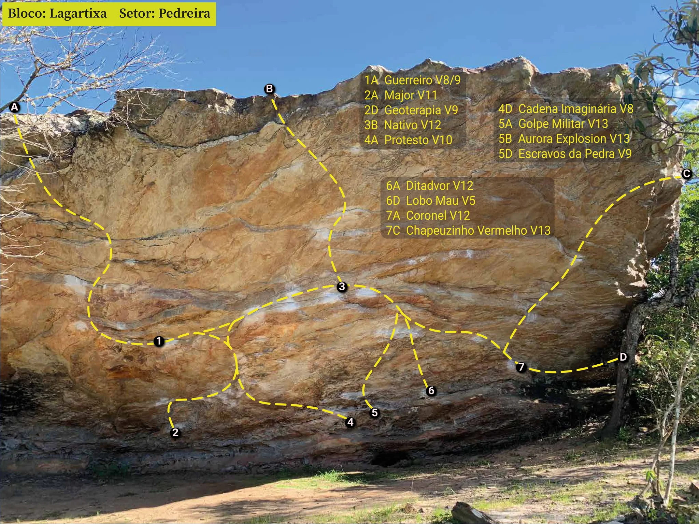
          - **largura_mapa**: 2364
          - **altura_mapa**: 1773
          - **pontos_de_interesse**:
            - **[0]**:
              - **id**: VsKWEMg0lZ2NYg
              - **uid**: VsKWEMg0lZ2NYg
              - **rotulo**: A
              - **circulo**:
                - **x**: 50
                - **y**: 363
                - **raio**: 19
              - **label**: A
            - **[1]**:
              - **id**: 2httylkaaIN5Qr
              - **uid**: 2httylkaaIN5Qr
              - **rotulo**: B
              - **circulo**:
                - **x**: 912
                - **y**: 302
                - **raio**: 19
              - **label**: B
            - **[2]**:
              - **id**: axlblItPxsIDJn
              - **uid**: axlblItPxsIDJn
              - **rotulo**: C
              - **circulo**:
                - **x**: 2323
                - **y**: 589
                - **raio**: 19
              - **label**: C
            - **[3]**:
              - **id**: xtiNQSSkWNTXbC
              - **uid**: xtiNQSSkWNTXbC
              - **rotulo**: D
              - **circulo**:
                - **x**: 2108
                - **y**: 1209
                - **raio**: 19
              - **label**: D
            - **[4]**:
              - **id**: OhNIazyq74dUWM
              - **uid**: OhNIazyq74dUWM
              - **rotulo**: 1
              - **circulo**:
                - **x**: 538
                - **y**: 1156
                - **raio**: 19
              - **label**: 1
            - **[5]**:
              - **id**: PLiYVorL6MlSC2
              - **uid**: PLiYVorL6MlSC2
              - **rotulo**: 2
              - **circulo**:
                - **x**: 593
                - **y**: 1466
                - **raio**: 19
              - **label**: 2
            - **[6]**:
              - **id**: oECZXcIqBxan60
              - **uid**: oECZXcIqBxan60
              - **rotulo**: 3
              - **circulo**:
                - **x**: 1157
                - **y**: 972
                - **raio**: 19
              - **label**: 3
            - **[7]**:
              - **id**: icdNm6GYVUWhAz
              - **uid**: icdNm6GYVUWhAz
              - **rotulo**: 4
              - **circulo**:
                - **x**: 1186
                - **y**: 1431
                - **raio**: 19
              - **label**: 4
            - **[8]**:
              - **id**: WfKTekrpKQCxvy
              - **uid**: WfKTekrpKQCxvy
              - **rotulo**: 5
              - **circulo**:
                - **x**: 1268
                - **y**: 1398
                - **raio**: 19
              - **label**: 5
            - **[9]**:
              - **id**: ujBI1bgZoOQWhW
              - **uid**: ujBI1bgZoOQWhW
              - **rotulo**: 6
              - **circulo**:
                - **x**: 1460
                - **y**: 1324
                - **raio**: 19
              - **label**: 6
            - **[10]**:
              - **id**: r9QOUkHDtJL2B9
              - **uid**: r9QOUkHDtJL2B9
              - **rotulo**: 7
              - **circulo**:
                - **x**: 1764
                - **y**: 1244
                - **raio**: 19
              - **label**: 7
          - **referencias**:
            - **[0]**:
              - **alvo_uid**: 0cUwdNtqvEcKoh
              - **pontos_uids**:
                - OhNIazyq74dUWM
                - VsKWEMg0lZ2NYg
              - **escalada**: Guerreiro
              - **ids**:
                - OhNIazyq74dUWM
                - VsKWEMg0lZ2NYg
            - **[1]**:
              - **alvo_uid**: Nf2533m5zrrFG2
              - **pontos_uids**:
                - PLiYVorL6MlSC2
                - VsKWEMg0lZ2NYg
              - **escalada**: Major
              - **ids**:
                - PLiYVorL6MlSC2
                - VsKWEMg0lZ2NYg
            - **[2]**:
              - **alvo_uid**: toxcelInFFWAq1
              - **pontos_uids**:
                - PLiYVorL6MlSC2
                - xtiNQSSkWNTXbC
              - **escalada**: Geoterapia
              - **ids**:
                - PLiYVorL6MlSC2
                - xtiNQSSkWNTXbC
            - **[3]**:
              - **alvo_uid**: 9tZfKoZdpP3fpS
              - **pontos_uids**:
                - oECZXcIqBxan60
                - 2httylkaaIN5Qr
              - **escalada**: Nativo
              - **ids**:
                - oECZXcIqBxan60
                - 2httylkaaIN5Qr
            - **[4]**:
              - **alvo_uid**: pcftvMSlINg9Hf
              - **pontos_uids**:
                - icdNm6GYVUWhAz
                - VsKWEMg0lZ2NYg
              - **escalada**: Protesto
              - **ids**:
                - icdNm6GYVUWhAz
                - VsKWEMg0lZ2NYg
            - **[5]**:
              - **alvo_uid**: AWjjM6YkI9dyGO
              - **pontos_uids**:
                - icdNm6GYVUWhAz
                - xtiNQSSkWNTXbC
              - **escalada**: Cadena Imaginária
              - **ids**:
                - icdNm6GYVUWhAz
                - xtiNQSSkWNTXbC
            - **[6]**:
              - **alvo_uid**: fQ3vCdyp1n0HMg
              - **pontos_uids**:
                - WfKTekrpKQCxvy
                - VsKWEMg0lZ2NYg
              - **escalada**: Golpe Militar
              - **ids**:
                - WfKTekrpKQCxvy
                - VsKWEMg0lZ2NYg
            - **[7]**:
              - **alvo_uid**: 82pHfoKYsvWEwk
              - **pontos_uids**:
                - WfKTekrpKQCxvy
                - 2httylkaaIN5Qr
              - **escalada**: Aurora Explosion
              - **ids**:
                - WfKTekrpKQCxvy
                - 2httylkaaIN5Qr
            - **[8]**:
              - **alvo_uid**: LUFL8kDL9K6eG7
              - **pontos_uids**:
                - WfKTekrpKQCxvy
                - xtiNQSSkWNTXbC
              - **escalada**: Escravos da Pedra
              - **ids**:
                - WfKTekrpKQCxvy
                - xtiNQSSkWNTXbC
            - **[9]**:
              - **alvo_uid**: g7iaofpXHfKRlx
              - **pontos_uids**:
                - ujBI1bgZoOQWhW
                - VsKWEMg0lZ2NYg
              - **escalada**: Ditadvor
              - **ids**:
                - ujBI1bgZoOQWhW
                - VsKWEMg0lZ2NYg
            - **[10]**:
              - **alvo_uid**: SgF3g35rVyuJcE
              - **pontos_uids**:
                - ujBI1bgZoOQWhW
                - xtiNQSSkWNTXbC
              - **escalada**: Lobo Mau
              - **ids**:
                - ujBI1bgZoOQWhW
                - xtiNQSSkWNTXbC
            - **[11]**:
              - **alvo_uid**: kF2TBaBhwwuWWH
              - **pontos_uids**:
                - r9QOUkHDtJL2B9
                - VsKWEMg0lZ2NYg
              - **escalada**: Coronel
              - **ids**:
                - r9QOUkHDtJL2B9
                - VsKWEMg0lZ2NYg
            - **[12]**:
              - **alvo_uid**: EsbNvU6nXSg2b8
              - **pontos_uids**:
                - r9QOUkHDtJL2B9
                - axlblItPxsIDJn
              - **escalada**: Chapeuzinho Vermelho
              - **ids**:
                - r9QOUkHDtJL2B9
                - axlblItPxsIDJn
      - **escaladas**:
        - **[0]**:
          - **uid**: 1OBG9Zmp2sWdmJ
          - **boulder**:
            - **nome**: Last Samurai
            - **dificuldade**: V14
        - **[1]**:
          - **uid**: xsbEWS3M0XvhdL
          - **boulder**:
            - **nome**: Samurai
            - **dificuldade**: V12
        - **[2]**:
          - **uid**: e1RxIJFKtUXo6J
          - **boulder**:
            - **nome**: Doce de Leite
            - **dificuldade**: V3
        - **[3]**:
          - **uid**: OvcfulQ2iFW0v2
          - **boulder**:
            - **nome**: Panamá
            - **dificuldade**: V10
        - **[4]**:
          - **uid**: 7tLVLG0DZgoFua
          - **boulder**:
            - **nome**: Doce de Leite sds
            - **dificuldade**: V5
        - **[5]**:
          - **uid**: FggDyQ1Jk0EJrb
          - **boulder**:
            - **nome**: Rocambole
            - **dificuldade**: V5
        - **[6]**:
          - **uid**: OWjd6pcV8SanGm
          - **boulder**:
            - **nome**: Falha Humana
            - **dificuldade**: V4
        - **[7]**:
          - **uid**: ln91DbtQ62IGbZ
          - **boulder**:
            - **nome**: Teiú
            - **dificuldade**: V11
        - **[8]**:
          - **uid**: xALzdgwDF8xq0k
          - **boulder**:
            - **nome**: Rabo de Lagartixa
            - **dificuldade**: V10
        - **[9]**:
          - **uid**: 6Y8dKcx5tJM381
          - **boulder**:
            - **nome**: Camaleão
            - **dificuldade**: V8
        - **[10]**:
          - **uid**: srt1JwUqYYuhDg
          - **boulder**:
            - **nome**: Lagartixa
            - **dificuldade**: V7
        - **[11]**:
          - **uid**: WIy549JHQQDDko
          - **boulder**:
            - **nome**: Rabo de Camaleão
            - **dificuldade**: V9
        - **[12]**:
          - **uid**: teZRSRQ70qL2BO
          - **boulder**:
            - **nome**: Lagartixa sem Rabo
            - **dificuldade**: V9
        - **[13]**:
          - **uid**: 0cUwdNtqvEcKoh
          - **boulder**:
            - **nome**: Guerreiro
            - **dificuldade**: V8_BARRA_V9
        - **[14]**:
          - **uid**: Nf2533m5zrrFG2
          - **boulder**:
            - **nome**: Major
            - **dificuldade**: V11
        - **[15]**:
          - **uid**: toxcelInFFWAq1
          - **boulder**:
            - **nome**: Geoterapia
            - **dificuldade**: V9
        - **[16]**:
          - **uid**: 9tZfKoZdpP3fpS
          - **boulder**:
            - **nome**: Nativo
            - **dificuldade**: V12
        - **[17]**:
          - **uid**: pcftvMSlINg9Hf
          - **boulder**:
            - **nome**: Protesto
            - **dificuldade**: V10
        - **[18]**:
          - **uid**: AWjjM6YkI9dyGO
          - **boulder**:
            - **nome**: Cadena Imaginária
            - **dificuldade**: V8
        - **[19]**:
          - **uid**: fQ3vCdyp1n0HMg
          - **boulder**:
            - **nome**: Golpe Militar
            - **dificuldade**: V13
        - **[20]**:
          - **uid**: 82pHfoKYsvWEwk
          - **boulder**:
            - **nome**: Aurora Explosion
            - **dificuldade**: V13
        - **[21]**:
          - **uid**: LUFL8kDL9K6eG7
          - **boulder**:
            - **nome**: Escravos da Pedra
            - **dificuldade**: V9
        - **[22]**:
          - **uid**: g7iaofpXHfKRlx
          - **boulder**:
            - **nome**: Ditadvor
            - **dificuldade**: V12
        - **[23]**:
          - **uid**: SgF3g35rVyuJcE
          - **boulder**:
            - **nome**: Lobo Mau
            - **dificuldade**: V5
        - **[24]**:
          - **uid**: kF2TBaBhwwuWWH
          - **boulder**:
            - **nome**: Coronel
            - **dificuldade**: V12
        - **[25]**:
          - **uid**: EsbNvU6nXSg2b8
          - **boulder**:
            - **nome**: Chapeuzinho Vermelho
            - **dificuldade**: V13
      - **precomputados**:
        - **total_escaladas**: 26
        - **total_boulders**: 26
  - **[14]**:
    - **conteudo**:
      - **descricao**: 
      - **nome**: Bloco: Longevidade
      - **uid**: YFVMcRLMGxb9Tr
      - **mapas**:
        - **[0]**:
          - **caminho_imagem_mapa**: 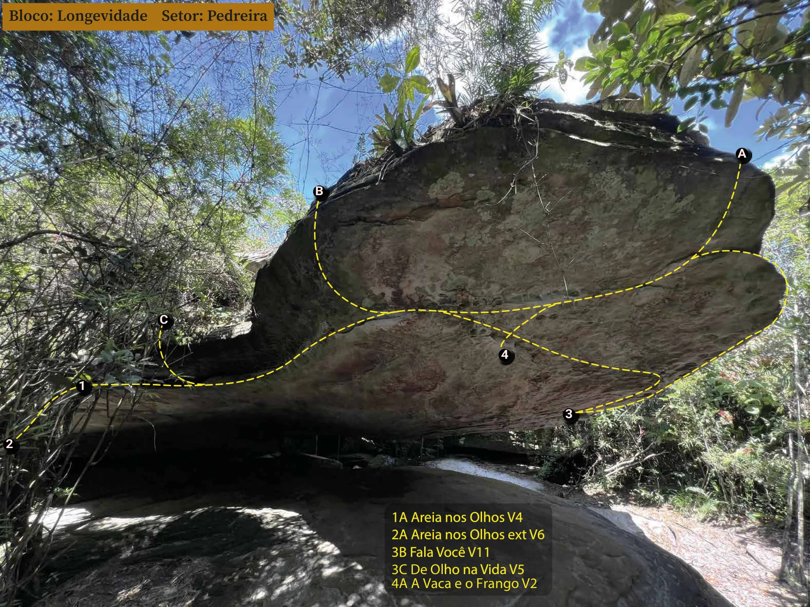
          - **largura_mapa**: 2364
          - **altura_mapa**: 1773
          - **pontos_de_interesse**:
            - **[0]**:
              - **id**: 8ENnDIgQ7AgUGt
              - **uid**: 8ENnDIgQ7AgUGt
              - **rotulo**: 1
              - **circulo**:
                - **x**: 241
                - **y**: 1128
                - **raio**: 19
              - **label**: 1
            - **[1]**:
              - **id**: QnjxUtHvoZeQzL
              - **uid**: QnjxUtHvoZeQzL
              - **rotulo**: 2
              - **circulo**:
                - **x**: 28
                - **y**: 1299
                - **raio**: 19
              - **label**: 2
            - **[2]**:
              - **id**: ikn20aN6z8f4T7
              - **uid**: ikn20aN6z8f4T7
              - **rotulo**: 3
              - **circulo**:
                - **x**: 1661
                - **y**: 1210
                - **raio**: 19
              - **label**: 3
            - **[3]**:
              - **id**: gLsI2FXL4ox1OT
              - **uid**: gLsI2FXL4ox1OT
              - **rotulo**: A
              - **circulo**:
                - **x**: 2166
                - **y**: 450
                - **raio**: 19
              - **label**: A
            - **[4]**:
              - **id**: nQFB3uR40wwnV7
              - **uid**: nQFB3uR40wwnV7
              - **rotulo**: B
              - **circulo**:
                - **x**: 932
                - **y**: 560
                - **raio**: 19
              - **label**: B
            - **[5]**:
              - **id**: zxkWwG5R32lL6G
              - **uid**: zxkWwG5R32lL6G
              - **rotulo**: C
              - **circulo**:
                - **x**: 479
                - **y**: 935
                - **raio**: 19
              - **label**: C
            - **[6]**:
              - **id**: r4jlYamVBMQ4fS
              - **uid**: r4jlYamVBMQ4fS
              - **rotulo**: 4
              - **circulo**:
                - **x**: 1474
                - **y**: 1037
                - **raio**: 19
              - **label**: 4
            - **[7]**:
              - **id**: fNEd2QZ1GerD5Y
              - **uid**: fNEd2QZ1GerD5Y
              - **rotulo**: ★
              - **circulo**:
                - **x**: 1725
                - **y**: 1065
                - **raio**: 20
              - **label**: ★
            - **[8]**:
              - **id**: QuDFkr1JOWjknj
              - **uid**: QuDFkr1JOWjknj
              - **rotulo**: ▲
              - **circulo**:
                - **x**: 2297
                - **y**: 818
                - **raio**: 19
              - **label**: ▲
          - **referencias**:
            - **[0]**:
              - **alvo_uid**: 7JZNyAbzQzBsaR
              - **pontos_uids**:
                - 8ENnDIgQ7AgUGt
                - gLsI2FXL4ox1OT
              - **escalada**: Areia nos Olhos
              - **ids**:
                - 8ENnDIgQ7AgUGt
                - gLsI2FXL4ox1OT
            - **[1]**:
              - **alvo_uid**: zFNj9y59i8t23v
              - **pontos_uids**:
                - QnjxUtHvoZeQzL
                - gLsI2FXL4ox1OT
              - **escalada**: Areia nos Olhos ext
              - **ids**:
                - QnjxUtHvoZeQzL
                - gLsI2FXL4ox1OT
            - **[2]**:
              - **alvo_uid**: wb9MoxIDysm5R3
              - **pontos_uids**:
                - ikn20aN6z8f4T7
                - nQFB3uR40wwnV7
                - fNEd2QZ1GerD5Y
              - **escalada**: Fala Você
              - **ids**:
                - ikn20aN6z8f4T7
                - nQFB3uR40wwnV7
                - fNEd2QZ1GerD5Y
            - **[3]**:
              - **alvo_uid**: yTV2lI9CxvQD9H
              - **pontos_uids**:
                - ikn20aN6z8f4T7
                - zxkWwG5R32lL6G
                - QuDFkr1JOWjknj
              - **escalada**: De Olho na Vida
              - **ids**:
                - ikn20aN6z8f4T7
                - zxkWwG5R32lL6G
                - QuDFkr1JOWjknj
            - **[4]**:
              - **alvo_uid**: sZOvNXCq39pNjy
              - **pontos_uids**:
                - r4jlYamVBMQ4fS
                - gLsI2FXL4ox1OT
              - **escalada**: A Vaca e o Frango
              - **ids**:
                - r4jlYamVBMQ4fS
                - gLsI2FXL4ox1OT
        - **[1]**:
          - **caminho_imagem_mapa**: 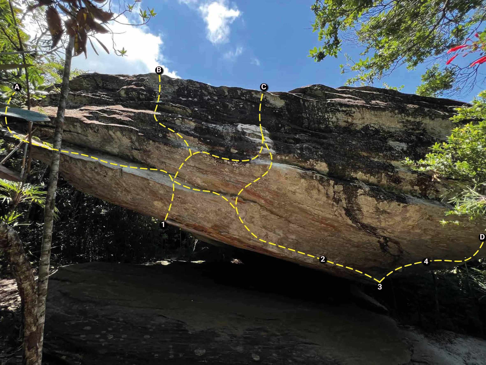
          - **largura_mapa**: 2364
          - **altura_mapa**: 1773
          - **pontos_de_interesse**:
            - **[0]**:
              - **id**: R1k2i0PzCMF0D9
              - **uid**: R1k2i0PzCMF0D9
              - **rotulo**: A
              - **circulo**:
                - **x**: 83
                - **y**: 423
                - **raio**: 19
              - **label**: A
            - **[1]**:
              - **id**: Ko9Ob97e5kNLNO
              - **uid**: Ko9Ob97e5kNLNO
              - **rotulo**: B
              - **circulo**:
                - **x**: 773
                - **y**: 341
                - **raio**: 19
              - **label**: B
            - **[2]**:
              - **id**: ECTws2AHXskFiM
              - **uid**: ECTws2AHXskFiM
              - **rotulo**: C
              - **circulo**:
                - **x**: 1283
                - **y**: 423
                - **raio**: 19
              - **label**: C
            - **[3]**:
              - **id**: jEhhfNuuguJtw7
              - **uid**: jEhhfNuuguJtw7
              - **rotulo**: D
              - **circulo**:
                - **x**: 2346
                - **y**: 1153
                - **raio**: 19
              - **label**: D
            - **[4]**:
              - **id**: j7a49QhVtl6kxM
              - **uid**: j7a49QhVtl6kxM
              - **rotulo**: 1
              - **circulo**:
                - **x**: 794
                - **y**: 1092
                - **raio**: 19
              - **label**: 1
            - **[5]**:
              - **id**: i5QH4qodH1AUva
              - **uid**: i5QH4qodH1AUva
              - **rotulo**: 2
              - **circulo**:
                - **x**: 1570
                - **y**: 1260
                - **raio**: 19
              - **label**: 2
            - **[6]**:
              - **id**: wdWUISkD23k41f
              - **uid**: wdWUISkD23k41f
              - **rotulo**: 3
              - **circulo**:
                - **x**: 1847
                - **y**: 1394
                - **raio**: 19
              - **label**: 3
            - **[7]**:
              - **id**: xkbKQVsI6kmefV
              - **uid**: xkbKQVsI6kmefV
              - **rotulo**: 4
              - **circulo**:
                - **x**: 2073
                - **y**: 1271
                - **raio**: 19
              - **label**: 4
          - **referencias**:
            - **[0]**:
              - **alvo_uid**: eQG3dwtyyX5Nx5
              - **pontos_uids**:
                - j7a49QhVtl6kxM
                - R1k2i0PzCMF0D9
              - **escalada**: Fala Vida
              - **ids**:
                - j7a49QhVtl6kxM
                - R1k2i0PzCMF0D9
            - **[1]**:
              - **alvo_uid**: eUfZ67v5JMxACV
              - **pontos_uids**:
                - j7a49QhVtl6kxM
                - Ko9Ob97e5kNLNO
              - **escalada**: Vida Curta
              - **ids**:
                - j7a49QhVtl6kxM
                - Ko9Ob97e5kNLNO
            - **[2]**:
              - **alvo_uid**: ocCYSL5tQUETwF
              - **pontos_uids**:
                - j7a49QhVtl6kxM
                - ECTws2AHXskFiM
              - **escalada**: Sem Vida
              - **ids**:
                - j7a49QhVtl6kxM
                - ECTws2AHXskFiM
            - **[3]**:
              - **alvo_uid**: Wd0CsnZWL4w89c
              - **pontos_uids**:
                - i5QH4qodH1AUva
                - ECTws2AHXskFiM
              - **escalada**: Arenito
              - **ids**:
                - i5QH4qodH1AUva
                - ECTws2AHXskFiM
            - **[4]**:
              - **alvo_uid**: MQGzuppAj5aELc
              - **pontos_uids**:
                - wdWUISkD23k41f
                - R1k2i0PzCMF0D9
              - **escalada**: Vida Longa
              - **ids**:
                - wdWUISkD23k41f
                - R1k2i0PzCMF0D9
            - **[5]**:
              - **alvo_uid**: 1wc56E1PNIsLNK
              - **pontos_uids**:
                - wdWUISkD23k41f
                - ECTws2AHXskFiM
              - **escalada**: Longevidade
              - **ids**:
                - wdWUISkD23k41f
                - ECTws2AHXskFiM
            - **[6]**:
              - **alvo_uid**: J9OUjwIJRaPvFB
              - **pontos_uids**:
                - wdWUISkD23k41f
                - jEhhfNuuguJtw7
              - **escalada**: Guerreiro Jedi
              - **ids**:
                - wdWUISkD23k41f
                - jEhhfNuuguJtw7
            - **[7]**:
              - **alvo_uid**: iPuWx1mEGyaYwD
              - **pontos_uids**:
                - xkbKQVsI6kmefV
                - jEhhfNuuguJtw7
              - **escalada**: Jedi
              - **ids**:
                - xkbKQVsI6kmefV
                - jEhhfNuuguJtw7
      - **escaladas**:
        - **[0]**:
          - **uid**: 7JZNyAbzQzBsaR
          - **boulder**:
            - **nome**: Areia nos Olhos
            - **dificuldade**: V4
        - **[1]**:
          - **uid**: zFNj9y59i8t23v
          - **boulder**:
            - **nome**: Areia nos Olhos ext
            - **dificuldade**: V6
        - **[2]**:
          - **uid**: wb9MoxIDysm5R3
          - **boulder**:
            - **nome**: Fala Você
            - **dificuldade**: V11
        - **[3]**:
          - **uid**: yTV2lI9CxvQD9H
          - **boulder**:
            - **nome**: De Olho na Vida
            - **dificuldade**: V5
        - **[4]**:
          - **uid**: sZOvNXCq39pNjy
          - **boulder**:
            - **nome**: A Vaca e o Frango
            - **dificuldade**: V2
        - **[5]**:
          - **uid**: eQG3dwtyyX5Nx5
          - **boulder**:
            - **nome**: Fala Vida
            - **dificuldade**: V3
        - **[6]**:
          - **uid**: eUfZ67v5JMxACV
          - **boulder**:
            - **nome**: Vida Curta
            - **dificuldade**: V2
        - **[7]**:
          - **uid**: ocCYSL5tQUETwF
          - **boulder**:
            - **nome**: Sem Vida
            - **dificuldade**: V3
        - **[8]**:
          - **uid**: Wd0CsnZWL4w89c
          - **boulder**:
            - **nome**: Arenito
            - **dificuldade**: V5
        - **[9]**:
          - **uid**: MQGzuppAj5aELc
          - **boulder**:
            - **nome**: Vida Longa
            - **dificuldade**: V8
        - **[10]**:
          - **uid**: 1wc56E1PNIsLNK
          - **boulder**:
            - **nome**: Longevidade
            - **dificuldade**: V7
        - **[11]**:
          - **uid**: J9OUjwIJRaPvFB
          - **boulder**:
            - **nome**: Guerreiro Jedi
            - **dificuldade**: V11
        - **[12]**:
          - **uid**: iPuWx1mEGyaYwD
          - **boulder**:
            - **nome**: Jedi
            - **dificuldade**: V10
      - **precomputados**:
        - **total_escaladas**: 13
        - **total_boulders**: 13
  - **[15]**:
    - **conteudo**:
      - **descricao**: 
      - **nome**: Bloco: Mata-Mata
      - **uid**: hx1sKO5WXcRaCh
      - **mapas**:
        - **[0]**:
          - **caminho_imagem_mapa**: 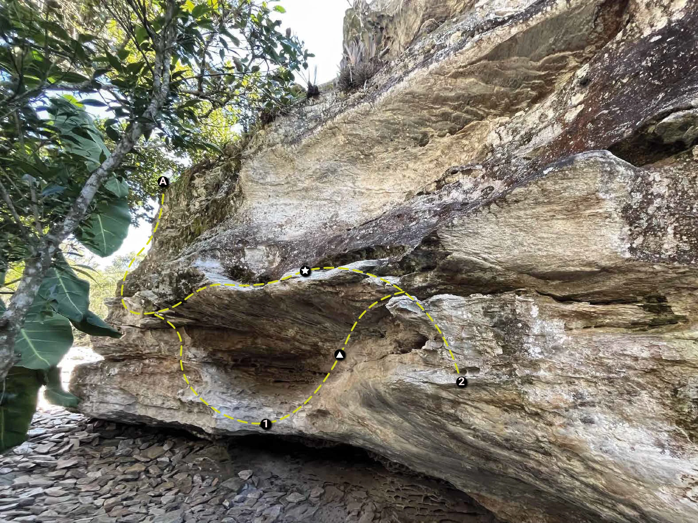
          - **largura_mapa**: 2364
          - **altura_mapa**: 1773
          - **pontos_de_interesse**:
            - **[0]**:
              - **id**: H6ayc5y5tajDSz
              - **uid**: H6ayc5y5tajDSz
              - **rotulo**: A
              - **circulo**:
                - **x**: 552
                - **y**: 616
                - **raio**: 20
              - **label**: A
            - **[1]**:
              - **id**: v13dwIyP7OmGQM
              - **uid**: v13dwIyP7OmGQM
              - **rotulo**: ★
              - **circulo**:
                - **x**: 1034
                - **y**: 920
                - **raio**: 20
              - **label**: ★
            - **[2]**:
              - **id**: vextmRrq2sNZmJ
              - **uid**: vextmRrq2sNZmJ
              - **rotulo**: ▲
              - **circulo**:
                - **x**: 1151
                - **y**: 1204
                - **raio**: 20
              - **label**: ▲
            - **[3]**:
              - **id**: kPwwB0YPUoW31g
              - **uid**: kPwwB0YPUoW31g
              - **rotulo**: 1
              - **circulo**:
                - **x**: 901
                - **y**: 1438
                - **raio**: 20
              - **label**: 1
            - **[4]**:
              - **id**: wF7SzgTCRi1ZyW
              - **uid**: wF7SzgTCRi1ZyW
              - **rotulo**: 2
              - **circulo**:
                - **x**: 1563
                - **y**: 1295
                - **raio**: 20
              - **label**: 2
          - **referencias**:
            - **[0]**:
              - **alvo_uid**: JiGDDnlCdHopeP
              - **pontos_uids**:
                - kPwwB0YPUoW31g
                - H6ayc5y5tajDSz
              - **escalada**: Mata-Mata
              - **ids**:
                - kPwwB0YPUoW31g
                - H6ayc5y5tajDSz
            - **[1]**:
              - **alvo_uid**: tc4ePOWYgjIpyI
              - **pontos_uids**:
                - wF7SzgTCRi1ZyW
                - H6ayc5y5tajDSz
                - vextmRrq2sNZmJ
              - **escalada**: Mata-Mata ext
              - **ids**:
                - wF7SzgTCRi1ZyW
                - H6ayc5y5tajDSz
                - vextmRrq2sNZmJ
            - **[2]**:
              - **alvo_uid**: lgQ5rQ13EENvwT
              - **pontos_uids**:
                - wF7SzgTCRi1ZyW
                - H6ayc5y5tajDSz
                - v13dwIyP7OmGQM
              - **escalada**: 001
              - **ids**:
                - wF7SzgTCRi1ZyW
                - H6ayc5y5tajDSz
                - v13dwIyP7OmGQM
        - **[1]**:
          - **caminho_imagem_mapa**: 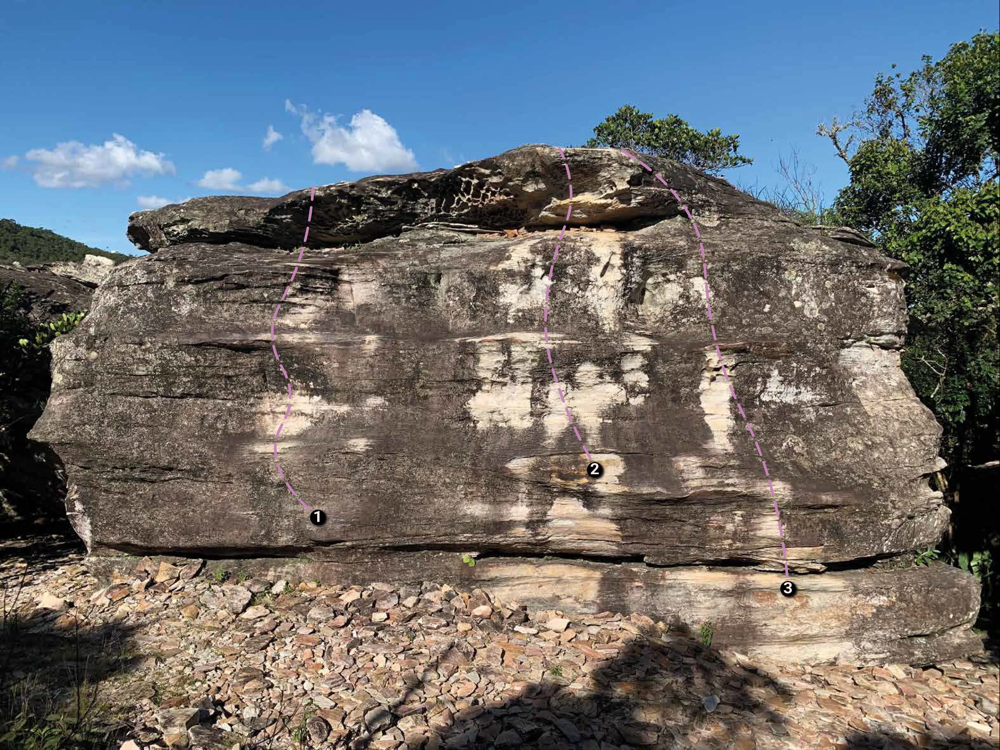
          - **largura_mapa**: 2364
          - **altura_mapa**: 1773
          - **pontos_de_interesse**:
            - **[0]**:
              - **id**: vz6MVtsaWmxwLZ
              - **uid**: vz6MVtsaWmxwLZ
              - **rotulo**: 1
              - **circulo**:
                - **x**: 752
                - **y**: 1223
                - **raio**: 20
              - **label**: 1
            - **[1]**:
              - **id**: JsF6TgprLm0KYw
              - **uid**: JsF6TgprLm0KYw
              - **rotulo**: 2
              - **circulo**:
                - **x**: 1406
                - **y**: 1111
                - **raio**: 20
              - **label**: 2
            - **[2]**:
              - **id**: qX5FKKydUcdiz6
              - **uid**: qX5FKKydUcdiz6
              - **rotulo**: 3
              - **circulo**:
                - **x**: 1863
                - **y**: 1392
                - **raio**: 20
              - **label**: 3
          - **referencias**:
            - **[0]**:
              - **alvo_uid**: xGq4JafMbakUMI
              - **pontos_uids**:
                - vz6MVtsaWmxwLZ
              - **escalada**: Sem as Mãos
              - **ids**:
                - vz6MVtsaWmxwLZ
            - **[1]**:
              - **alvo_uid**: F7uUCNTTQqX7Rz
              - **pontos_uids**:
                - JsF6TgprLm0KYw
              - **escalada**: Ética
              - **ids**:
                - JsF6TgprLm0KYw
            - **[2]**:
              - **alvo_uid**: AJNfb2W2znCYdG
              - **pontos_uids**:
                - qX5FKKydUcdiz6
              - **escalada**: Risada
              - **ids**:
                - qX5FKKydUcdiz6
        - **[2]**:
          - **caminho_imagem_mapa**: 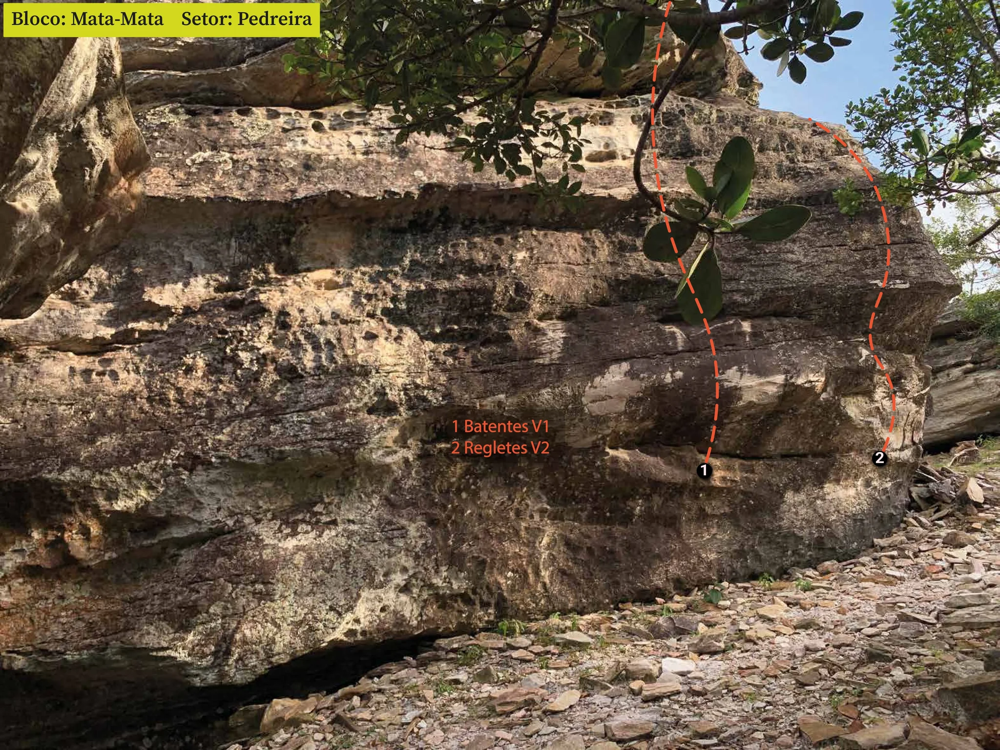
          - **largura_mapa**: 2364
          - **altura_mapa**: 1773
          - **pontos_de_interesse**:
            - **[0]**:
              - **id**: jpFJgvicZcxjrP
              - **uid**: jpFJgvicZcxjrP
              - **rotulo**: 1
              - **circulo**:
                - **x**: 1666
                - **y**: 1113
                - **raio**: 20
              - **label**: 1
            - **[1]**:
              - **id**: xIyXtbaHz7Qutb
              - **uid**: xIyXtbaHz7Qutb
              - **rotulo**: 2
              - **circulo**:
                - **x**: 2080
                - **y**: 1084
                - **raio**: 20
              - **label**: 2
          - **referencias**:
            - **[0]**:
              - **alvo_uid**: YWJzeOyY9Ze0q7
              - **pontos_uids**:
                - jpFJgvicZcxjrP
              - **escalada**: Batentes
              - **ids**:
                - jpFJgvicZcxjrP
            - **[1]**:
              - **alvo_uid**: q2d07DWRBLFgw7
              - **pontos_uids**:
                - xIyXtbaHz7Qutb
              - **escalada**: Regletes
              - **ids**:
                - xIyXtbaHz7Qutb
        - **[3]**:
          - **caminho_imagem_mapa**: 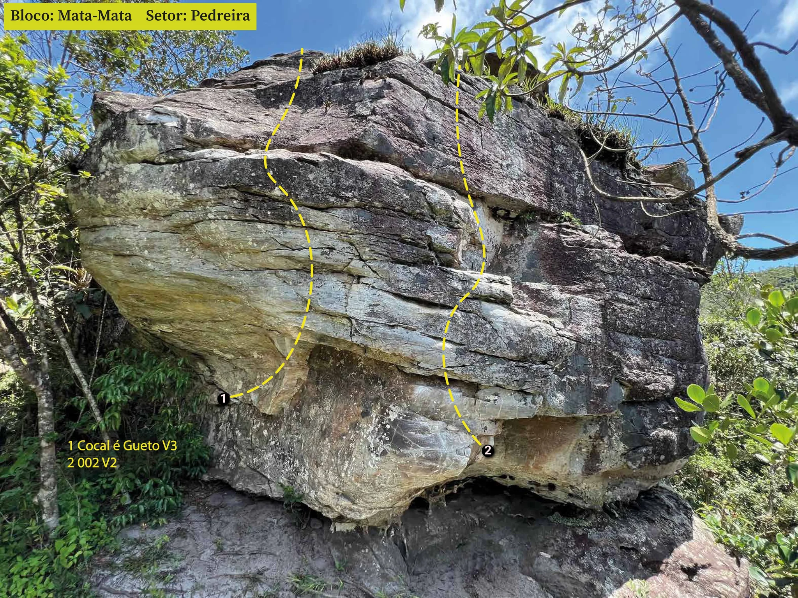
          - **largura_mapa**: 2364
          - **altura_mapa**: 1773
          - **pontos_de_interesse**:
            - **[0]**:
              - **id**: DR3WqWHX6SNeiM
              - **uid**: DR3WqWHX6SNeiM
              - **rotulo**: 1
              - **circulo**:
                - **x**: 663
                - **y**: 1185
                - **raio**: 20
              - **label**: 1
            - **[1]**:
              - **id**: rQXbrg9IbfeITD
              - **uid**: rQXbrg9IbfeITD
              - **rotulo**: 2
              - **circulo**:
                - **x**: 1446
                - **y**: 1339
                - **raio**: 20
              - **label**: 2
          - **referencias**:
            - **[0]**:
              - **alvo_uid**: 9D4ILLINQzR4ha
              - **pontos_uids**:
                - DR3WqWHX6SNeiM
              - **escalada**: Cocal é Gueto
              - **ids**:
                - DR3WqWHX6SNeiM
            - **[1]**:
              - **alvo_uid**: CDmL59O7X81Wu4
              - **pontos_uids**:
                - rQXbrg9IbfeITD
              - **escalada**: 002
              - **ids**:
                - rQXbrg9IbfeITD
      - **escaladas**:
        - **[0]**:
          - **uid**: JiGDDnlCdHopeP
          - **boulder**:
            - **nome**: Mata-Mata
            - **dificuldade**: V2
        - **[1]**:
          - **uid**: tc4ePOWYgjIpyI
          - **boulder**:
            - **nome**: Mata-Mata ext
            - **dificuldade**: V3
        - **[2]**:
          - **uid**: lgQ5rQ13EENvwT
          - **boulder**:
            - **nome**: 001
            - **dificuldade**: V3
        - **[3]**:
          - **uid**: xGq4JafMbakUMI
          - **boulder**:
            - **nome**: Sem as Mãos
            - **dificuldade**: V0
        - **[4]**:
          - **uid**: F7uUCNTTQqX7Rz
          - **boulder**:
            - **nome**: Ética
            - **dificuldade**: V0
        - **[5]**:
          - **uid**: AJNfb2W2znCYdG
          - **boulder**:
            - **nome**: Risada
            - **dificuldade**: V0
        - **[6]**:
          - **uid**: YWJzeOyY9Ze0q7
          - **boulder**:
            - **nome**: Batentes
            - **dificuldade**: V1
        - **[7]**:
          - **uid**: q2d07DWRBLFgw7
          - **boulder**:
            - **nome**: Regletes
            - **dificuldade**: V2
        - **[8]**:
          - **uid**: 9D4ILLINQzR4ha
          - **boulder**:
            - **nome**: Cocal é Gueto
            - **dificuldade**: V3
        - **[9]**:
          - **uid**: CDmL59O7X81Wu4
          - **boulder**:
            - **nome**: 002
            - **dificuldade**: V2
      - **precomputados**:
        - **total_escaladas**: 10
        - **total_boulders**: 10
  - **[16]**:
    - **conteudo**:
      - **descricao**: 
      - **nome**: Bloco: Meia-Parede
      - **uid**: YNCeAFBEFQJbNm
      - **mapas**:
        - **[0]**:
          - **caminho_imagem_mapa**: 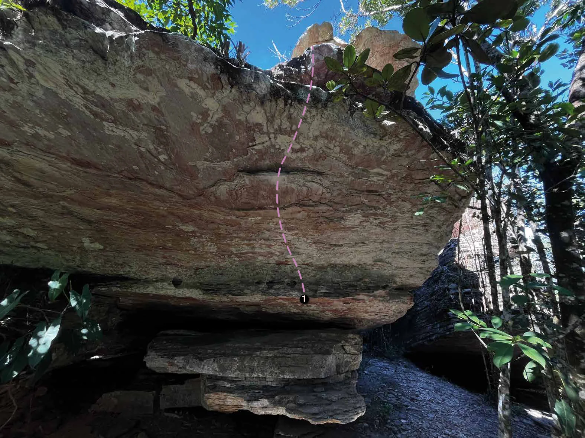
          - **largura_mapa**: 2364
          - **altura_mapa**: 1773
          - **pontos_de_interesse**:
            - **[0]**:
              - **id**: zXvZkOsbEZkciI
              - **uid**: zXvZkOsbEZkciI
              - **rotulo**: 1
              - **circulo**:
                - **x**: 1229
                - **y**: 1212
                - **raio**: 20
              - **label**: 1
          - **referencias**:
            - **[0]**:
              - **alvo_uid**: j9bYZHdppTm9GB
              - **pontos_uids**:
                - zXvZkOsbEZkciI
              - **escalada**: Tatuagens do Ofício
              - **ids**:
                - zXvZkOsbEZkciI
        - **[1]**:
          - **caminho_imagem_mapa**: 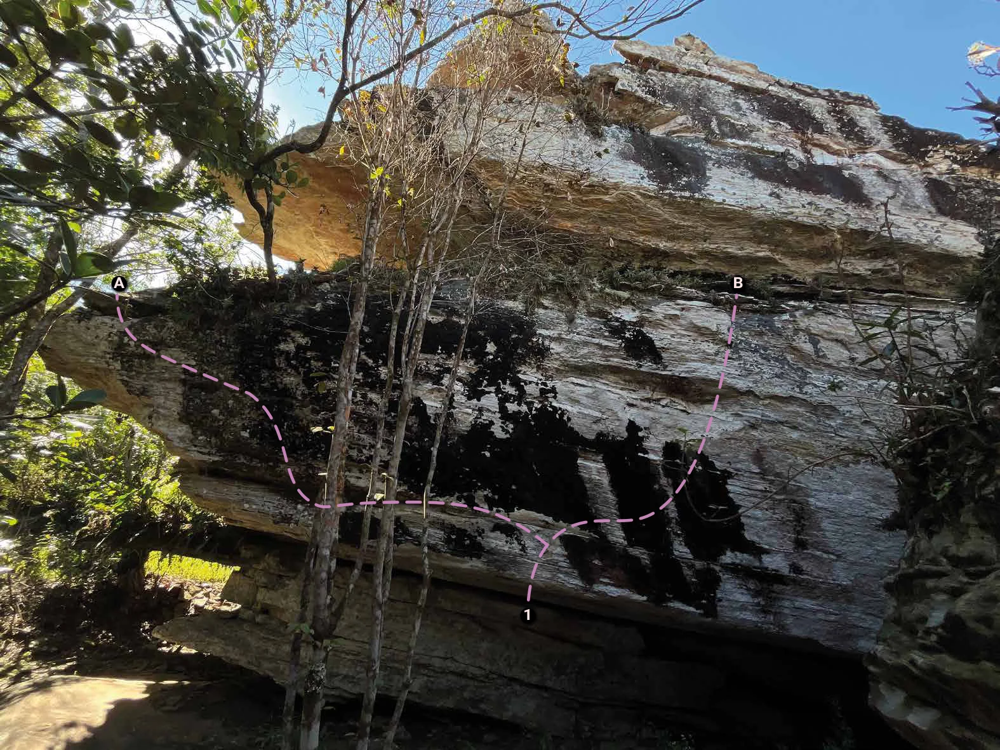
          - **largura_mapa**: 2364
          - **altura_mapa**: 1773
          - **pontos_de_interesse**:
            - **[0]**:
              - **id**: zJNVBIRs7bQvEW
              - **uid**: zJNVBIRs7bQvEW
              - **rotulo**: 1
              - **circulo**:
                - **x**: 1249
                - **y**: 1456
                - **raio**: 20
              - **label**: 1
            - **[1]**:
              - **id**: Q5XKQ3Nu1r6B4a
              - **uid**: Q5XKQ3Nu1r6B4a
              - **rotulo**: A
              - **circulo**:
                - **x**: 282
                - **y**: 671
                - **raio**: 20
              - **label**: A
            - **[2]**:
              - **id**: ZRNXOylYxhhnEq
              - **uid**: ZRNXOylYxhhnEq
              - **rotulo**: B
              - **circulo**:
                - **x**: 1744
                - **y**: 671
                - **raio**: 20
              - **label**: B
          - **referencias**:
            - **[0]**:
              - **alvo_uid**: wlzpJ6Alg7rNq9
              - **pontos_uids**:
                - Q5XKQ3Nu1r6B4a
                - zJNVBIRs7bQvEW
              - **escalada**: Rastaman
              - **ids**:
                - Q5XKQ3Nu1r6B4a
                - zJNVBIRs7bQvEW
            - **[1]**:
              - **alvo_uid**: L7FGfK2KXczfvg
              - **pontos_uids**:
                - ZRNXOylYxhhnEq
                - zJNVBIRs7bQvEW
              - **escalada**: Meia Parede
              - **ids**:
                - ZRNXOylYxhhnEq
                - zJNVBIRs7bQvEW
        - **[2]**:
          - **caminho_imagem_mapa**: 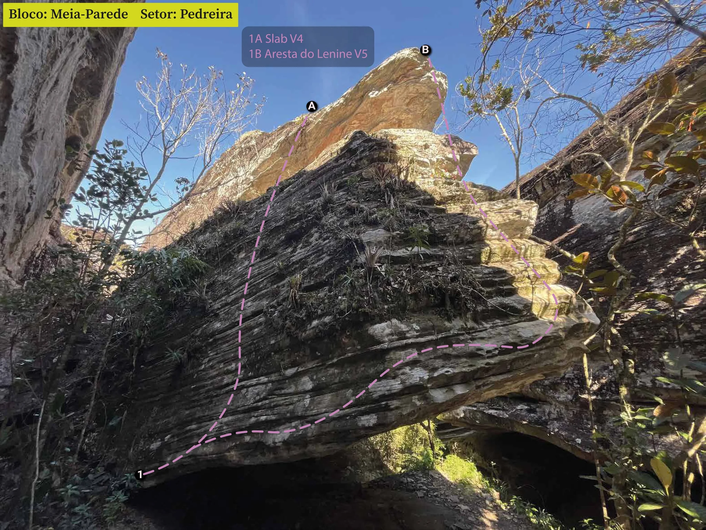
          - **largura_mapa**: 2364
          - **altura_mapa**: 1773
          - **pontos_de_interesse**:
            - **[0]**:
              - **id**: fYMK2FjzsSDInT
              - **uid**: fYMK2FjzsSDInT
              - **rotulo**: 1
              - **circulo**:
                - **x**: 469
                - **y**: 1589
                - **raio**: 20
              - **label**: 1
            - **[1]**:
              - **id**: 8muJAOtyk0xBso
              - **uid**: 8muJAOtyk0xBso
              - **rotulo**: A
              - **circulo**:
                - **x**: 1045
                - **y**: 357
                - **raio**: 20
              - **label**: A
            - **[2]**:
              - **id**: a5HN7dPmQIv57B
              - **uid**: a5HN7dPmQIv57B
              - **rotulo**: B
              - **circulo**:
                - **x**: 1425
                - **y**: 168
                - **raio**: 20
              - **label**: B
          - **referencias**:
            - **[0]**:
              - **alvo_uid**: DtiEzq2Xxk6i7B
              - **pontos_uids**:
                - fYMK2FjzsSDInT
                - a5HN7dPmQIv57B
              - **escalada**: Aresta do Lenine
              - **ids**:
                - fYMK2FjzsSDInT
                - a5HN7dPmQIv57B
            - **[1]**:
              - **alvo_uid**: AdXhWkJg9o0u31
              - **pontos_uids**:
                - fYMK2FjzsSDInT
                - 8muJAOtyk0xBso
              - **escalada**: Slab
              - **ids**:
                - fYMK2FjzsSDInT
                - 8muJAOtyk0xBso
        - **[3]**:
          - **caminho_imagem_mapa**: 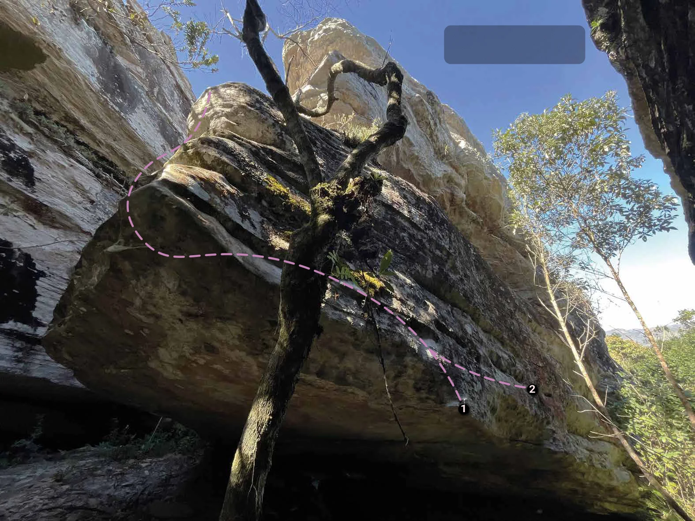
          - **largura_mapa**: 2364
          - **altura_mapa**: 1773
          - **pontos_de_interesse**:
            - **[0]**:
              - **id**: lytFrwcizQoxDS
              - **uid**: lytFrwcizQoxDS
              - **rotulo**: 1
              - **circulo**:
                - **x**: 1577
                - **y**: 1393
                - **raio**: 20
              - **label**: 1
            - **[1]**:
              - **id**: GOPBsUhShupFPw
              - **uid**: GOPBsUhShupFPw
              - **rotulo**: 2
              - **circulo**:
                - **x**: 1811
                - **y**: 1326
                - **raio**: 20
              - **label**: 2
          - **referencias**:
            - **[0]**:
              - **alvo_uid**: aibgHT6y1rwtrf
              - **pontos_uids**:
                - lytFrwcizQoxDS
              - **escalada**: Jardim de Orquídeas
              - **ids**:
                - lytFrwcizQoxDS
            - **[1]**:
              - **alvo_uid**: ezVswlVM7ZbIV5
              - **pontos_uids**:
                - GOPBsUhShupFPw
              - **escalada**: Jardim Suspenso
              - **ids**:
                - GOPBsUhShupFPw
      - **escaladas**:
        - **[0]**:
          - **uid**: j9bYZHdppTm9GB
          - **boulder**:
            - **nome**: Tatuagens do Ofício
            - **dificuldade**: V2
        - **[1]**:
          - **uid**: wlzpJ6Alg7rNq9
          - **boulder**:
            - **nome**: Rastaman
            - **dificuldade**: V6
        - **[2]**:
          - **uid**: L7FGfK2KXczfvg
          - **boulder**:
            - **nome**: Meia Parede
            - **dificuldade**: V4
        - **[3]**:
          - **uid**: AdXhWkJg9o0u31
          - **boulder**:
            - **nome**: Slab
            - **dificuldade**: V4
        - **[4]**:
          - **uid**: DtiEzq2Xxk6i7B
          - **boulder**:
            - **nome**: Aresta do Lenine
            - **dificuldade**: V5
        - **[5]**:
          - **uid**: aibgHT6y1rwtrf
          - **boulder**:
            - **nome**: Jardim de Orquídeas
            - **dificuldade**: V5
        - **[6]**:
          - **uid**: ezVswlVM7ZbIV5
          - **boulder**:
            - **nome**: Jardim Suspenso
            - **dificuldade**: V6
      - **precomputados**:
        - **total_escaladas**: 7
        - **total_boulders**: 7
  - **[17]**:
    - **conteudo**:
      - **descricao**: 
      - **nome**: Bloco: Mezanino
      - **uid**: wEISHXN8e9nWM3
      - **mapas**:
        - **[0]**:
          - **caminho_imagem_mapa**: 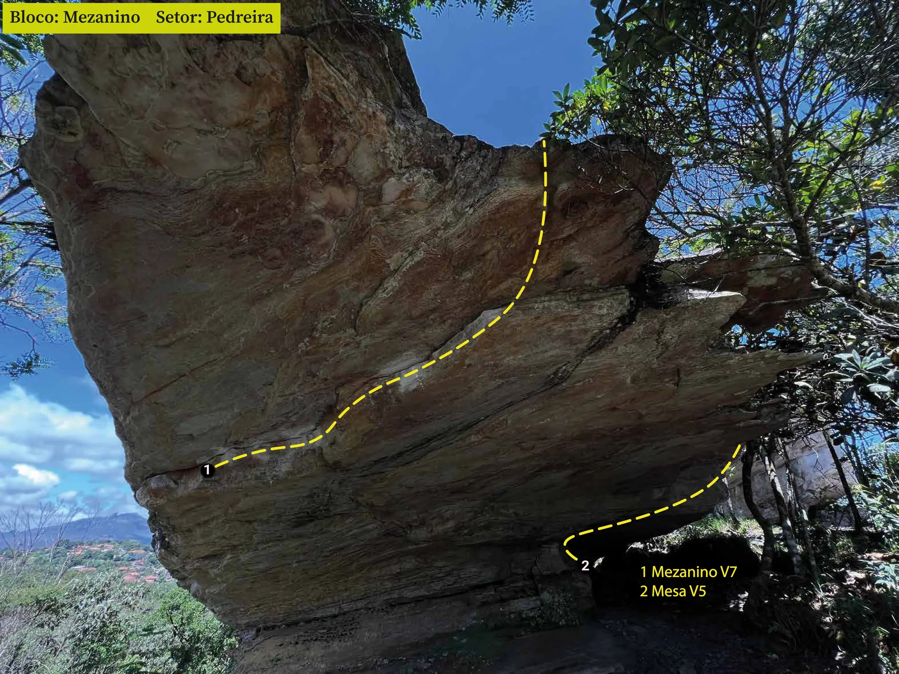
          - **largura_mapa**: 2364
          - **altura_mapa**: 1773
          - **pontos_de_interesse**:
            - **[0]**:
              - **id**: 8ISQbz4mTbKZ9f
              - **uid**: 8ISQbz4mTbKZ9f
              - **rotulo**: 1
              - **circulo**:
                - **x**: 546
                - **y**: 1237
                - **raio**: 20
              - **label**: 1
            - **[1]**:
              - **id**: CqdOd3Qfv7Mgvj
              - **uid**: CqdOd3Qfv7Mgvj
              - **rotulo**: 2
              - **circulo**:
                - **x**: 1538
                - **y**: 1488
                - **raio**: 20
              - **label**: 2
          - **referencias**:
            - **[0]**:
              - **alvo_uid**: O4ZT9qXPV0EYub
              - **pontos_uids**:
                - 8ISQbz4mTbKZ9f
              - **escalada**: Mezanino
              - **ids**:
                - 8ISQbz4mTbKZ9f
            - **[1]**:
              - **alvo_uid**: sBVXRpr71VrV5j
              - **pontos_uids**:
                - CqdOd3Qfv7Mgvj
              - **escalada**: Mesa
              - **ids**:
                - CqdOd3Qfv7Mgvj
        - **[1]**:
          - **caminho_imagem_mapa**: 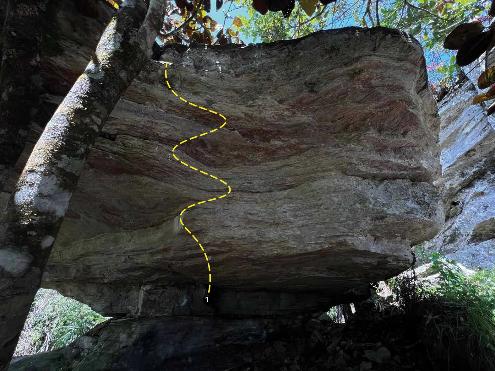
          - **largura_mapa**: 2364
          - **altura_mapa**: 1773
          - **pontos_de_interesse**:
            - **[0]**:
              - **id**: BzWZgjIJkQ783a
              - **uid**: BzWZgjIJkQ783a
              - **rotulo**: 1
              - **circulo**:
                - **x**: 987
                - **y**: 1435
                - **raio**: 20
              - **label**: 1
          - **referencias**:
            - **[0]**:
              - **alvo_uid**: sBVXRpr71VrV5j
              - **pontos_uids**:
                - BzWZgjIJkQ783a
              - **escalada**: Mesa
              - **ids**:
                - BzWZgjIJkQ783a
      - **escaladas**:
        - **[0]**:
          - **uid**: O4ZT9qXPV0EYub
          - **boulder**:
            - **nome**: Mezanino
            - **dificuldade**: V7
        - **[1]**:
          - **uid**: sBVXRpr71VrV5j
          - **boulder**:
            - **nome**: Mesa
            - **dificuldade**: V5
      - **precomputados**:
        - **total_escaladas**: 2
        - **total_boulders**: 2
  - **[18]**:
    - **conteudo**:
      - **descricao**: 
      - **nome**: Bloco: Nat Geo
      - **uid**: yZ6TvCV4MLKTEj
      - **caminho_imagem_capa**: 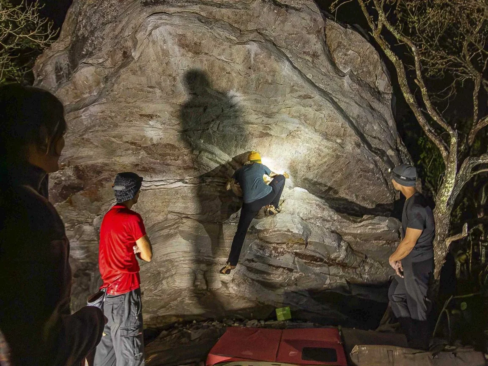
      - **mapas**:
        - **[0]**:
          - **caminho_imagem_mapa**: 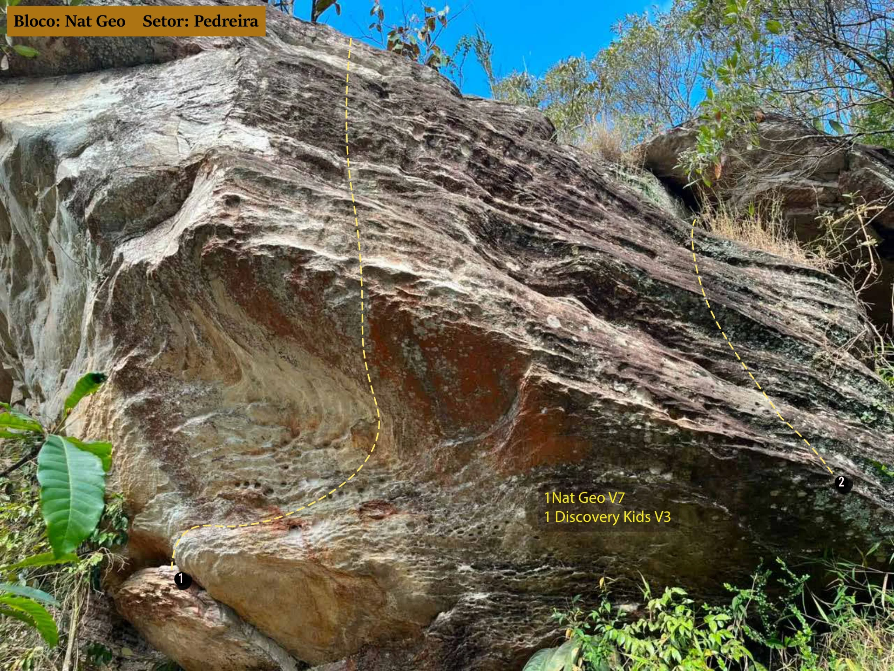
          - **referencias**:
            - **[0]**:
              - **alvo_uid**: fKldQ5d6KjUsBC
              - **pontos_uids**:
                - MWyPdhR9M1tTRz
              - **escalada**: Nat Geo
              - **ids**:
                - MWyPdhR9M1tTRz
            - **[1]**:
              - **alvo_uid**: LL5kNoDBLZqexT
              - **pontos_uids**:
                - rliKualNmyIrvH
              - **escalada**: Discovery Kids
              - **ids**:
                - rliKualNmyIrvH
          - **largura_mapa**: 2364
          - **altura_mapa**: 1773
          - **pontos_de_interesse**:
            - **[0]**:
              - **id**: MWyPdhR9M1tTRz
              - **uid**: MWyPdhR9M1tTRz
              - **rotulo**: 1
              - **circulo**:
                - **x**: 479
                - **y**: 1530
                - **raio**: 19
              - **label**: 1
            - **[1]**:
              - **id**: rliKualNmyIrvH
              - **uid**: rliKualNmyIrvH
              - **rotulo**: 2
              - **circulo**:
                - **x**: 2225
                - **y**: 1275
                - **raio**: 19
              - **label**: 2
      - **escaladas**:
        - **[0]**:
          - **uid**: fKldQ5d6KjUsBC
          - **boulder**:
            - **nome**: Nat Geo
            - **dificuldade**: V7
        - **[1]**:
          - **uid**: LL5kNoDBLZqexT
          - **boulder**:
            - **nome**: Discovery Kids
            - **dificuldade**: V3
      - **precomputados**:
        - **total_escaladas**: 2
        - **total_boulders**: 2
  - **[19]**:
    - **conteudo**:
      - **descricao**: 
      - **nome**: Bloco: Nave-Mãe
      - **uid**: skAZrDygCrcu3g
      - **mapas**:
        - **[0]**:
          - **caminho_imagem_mapa**: 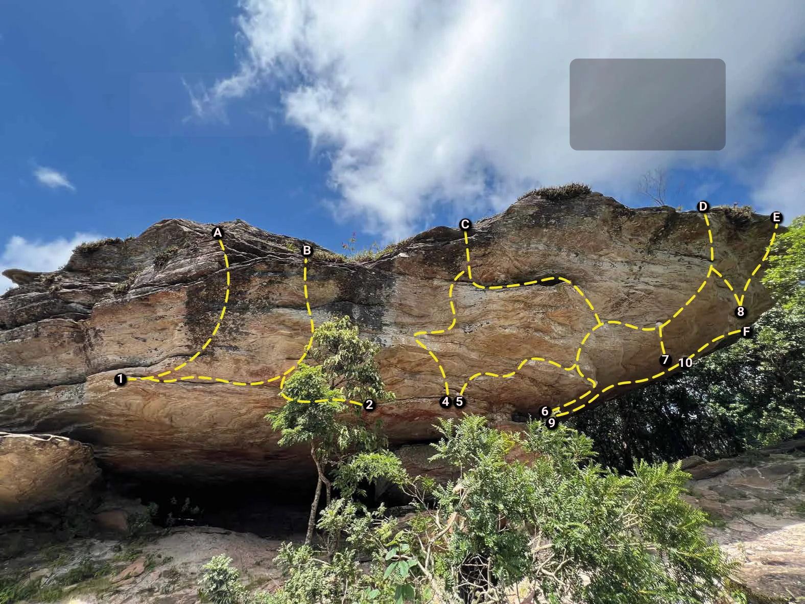
          - **largura_mapa**: 2364
          - **altura_mapa**: 1773
          - **pontos_de_interesse**:
            - **[0]**:
              - **id**: xw2WrNccpZp0ZP
              - **uid**: xw2WrNccpZp0ZP
              - **rotulo**: A
              - **circulo**:
                - **x**: 640
                - **y**: 685
                - **raio**: 19
              - **label**: A
            - **[1]**:
              - **id**: M2UBmFajwkeEa2
              - **uid**: M2UBmFajwkeEa2
              - **rotulo**: B
              - **circulo**:
                - **x**: 902
                - **y**: 736
                - **raio**: 19
              - **label**: B
            - **[2]**:
              - **id**: NRCwUGTDPI4I45
              - **uid**: NRCwUGTDPI4I45
              - **rotulo**: C
              - **circulo**:
                - **x**: 1367
                - **y**: 660
                - **raio**: 19
              - **label**: C
            - **[3]**:
              - **id**: fymC3Y7GvEu64M
              - **uid**: fymC3Y7GvEu64M
              - **rotulo**: D
              - **circulo**:
                - **x**: 2066
                - **y**: 607
                - **raio**: 19
              - **label**: D
            - **[4]**:
              - **id**: zwtvLfGHdpL9hK
              - **uid**: zwtvLfGHdpL9hK
              - **rotulo**: E
              - **circulo**:
                - **x**: 2282
                - **y**: 639
                - **raio**: 20
              - **label**: E
            - **[5]**:
              - **id**: Qw4t5HIjhSOeaF
              - **uid**: Qw4t5HIjhSOeaF
              - **rotulo**: F
              - **circulo**:
                - **x**: 2193
                - **y**: 974
                - **raio**: 19
              - **label**: F
            - **[6]**:
              - **id**: vCckg7HrzHWiVj
              - **uid**: vCckg7HrzHWiVj
              - **rotulo**: 1
              - **circulo**:
                - **x**: 354
                - **y**: 1114
                - **raio**: 19
              - **label**: 1
            - **[7]**:
              - **id**: sMBmPocdXVL7EF
              - **uid**: sMBmPocdXVL7EF
              - **rotulo**: 2
              - **circulo**:
                - **x**: 1086
                - **y**: 1191
                - **raio**: 19
              - **label**: 2
            - **[8]**:
              - **id**: qFW3jmTfYqoait
              - **uid**: qFW3jmTfYqoait
              - **rotulo**: 4
              - **circulo**:
                - **x**: 1310
                - **y**: 1181
                - **raio**: 19
              - **label**: 4
            - **[9]**:
              - **id**: xmKASdg6MNs1Pl
              - **uid**: xmKASdg6MNs1Pl
              - **rotulo**: 5
              - **circulo**:
                - **x**: 1350
                - **y**: 1181
                - **raio**: 19
              - **label**: 5
            - **[10]**:
              - **id**: 25NDTLC9zJIwF4
              - **uid**: 25NDTLC9zJIwF4
              - **rotulo**: 6
              - **circulo**:
                - **x**: 1601
                - **y**: 1209
                - **raio**: 19
              - **label**: 6
            - **[11]**:
              - **id**: 1j4xqwWadpNys6
              - **uid**: 1j4xqwWadpNys6
              - **rotulo**: 9
              - **circulo**:
                - **x**: 1622
                - **y**: 1244
                - **raio**: 19
              - **label**: 9
            - **[12]**:
              - **id**: rsBdetu5BnYj9x
              - **uid**: rsBdetu5BnYj9x
              - **rotulo**: 7
              - **circulo**:
                - **x**: 1956
                - **y**: 1058
                - **raio**: 19
              - **label**: 7
            - **[13]**:
              - **id**: WEtbTvtycmFP7N
              - **uid**: WEtbTvtycmFP7N
              - **rotulo**: 10
              - **circulo**:
                - **x**: 2014
                - **y**: 1065
                - **raio**: 23
              - **label**: 10
            - **[14]**:
              - **id**: ZkX53td8f3ORSy
              - **uid**: ZkX53td8f3ORSy
              - **rotulo**: 8
              - **circulo**:
                - **x**: 2177
                - **y**: 918
                - **raio**: 19
              - **label**: 8
          - **referencias**:
            - **[0]**:
              - **alvo_uid**: NhxZTj9giBFCyP
              - **pontos_uids**:
                - vCckg7HrzHWiVj
                - xw2WrNccpZp0ZP
              - **escalada**: Monte Mor
              - **ids**:
                - vCckg7HrzHWiVj
                - xw2WrNccpZp0ZP
            - **[1]**:
              - **alvo_uid**: yrmqjQkWzgc2F8
              - **pontos_uids**:
                - vCckg7HrzHWiVj
                - M2UBmFajwkeEa2
              - **escalada**: Irmãos Coragem
              - **ids**:
                - vCckg7HrzHWiVj
                - M2UBmFajwkeEa2
            - **[2]**:
              - **alvo_uid**: LFASLEsrPebwQW
              - **pontos_uids**:
                - sMBmPocdXVL7EF
                - M2UBmFajwkeEa2
              - **escalada**: Irmãos na Vibe
              - **ids**:
                - sMBmPocdXVL7EF
                - M2UBmFajwkeEa2
            - **[3]**:
              - **alvo_uid**: MaIF4mfMkWZ34L
              - **pontos_uids**:
                - qFW3jmTfYqoait
                - NRCwUGTDPI4I45
              - **escalada**: Ora-Por-Todos
              - **ids**:
                - qFW3jmTfYqoait
                - NRCwUGTDPI4I45
            - **[4]**:
              - **alvo_uid**: MCUL9v1evEYdHd
              - **pontos_uids**:
                - xmKASdg6MNs1Pl
                - NRCwUGTDPI4I45
              - **escalada**: Orai-Por-Noix
              - **ids**:
                - xmKASdg6MNs1Pl
                - NRCwUGTDPI4I45
            - **[5]**:
              - **alvo_uid**: m7gk4wtsCyFp1i
              - **pontos_uids**:
                - xmKASdg6MNs1Pl
                - fymC3Y7GvEu64M
              - **escalada**: Ora-Pra-Jah
              - **ids**:
                - xmKASdg6MNs1Pl
                - fymC3Y7GvEu64M
            - **[6]**:
              - **alvo_uid**: 5pTWXLMlqls565
              - **pontos_uids**:
                - xmKASdg6MNs1Pl
                - zwtvLfGHdpL9hK
              - **escalada**: Ouroboulder
              - **ids**:
                - xmKASdg6MNs1Pl
                - zwtvLfGHdpL9hK
            - **[7]**:
              - **alvo_uid**: 18NHtGJEgPAW9B
              - **pontos_uids**:
                - 25NDTLC9zJIwF4
                - fymC3Y7GvEu64M
              - **escalada**: Ora-Pro-Nóbis
              - **ids**:
                - 25NDTLC9zJIwF4
                - fymC3Y7GvEu64M
            - **[8]**:
              - **alvo_uid**: blpENBkvARWOXN
              - **pontos_uids**:
                - 25NDTLC9zJIwF4
                - zwtvLfGHdpL9hK
              - **escalada**: Ora-Pros-Crash
              - **ids**:
                - 25NDTLC9zJIwF4
                - zwtvLfGHdpL9hK
            - **[9]**:
              - **alvo_uid**: DGRsLWRpr4Fe9e
              - **pontos_uids**:
                - rsBdetu5BnYj9x
                - zwtvLfGHdpL9hK
              - **escalada**: Oratório
              - **ids**:
                - rsBdetu5BnYj9x
                - zwtvLfGHdpL9hK
            - **[10]**:
              - **alvo_uid**: BxsLsGXWDzJ5eF
              - **pontos_uids**:
                - ZkX53td8f3ORSy
                - zwtvLfGHdpL9hK
              - **escalada**: Quebra Galho
              - **ids**:
                - ZkX53td8f3ORSy
                - zwtvLfGHdpL9hK
            - **[11]**:
              - **alvo_uid**: hxVPscZihPx3r1
              - **pontos_uids**:
                - 1j4xqwWadpNys6
                - Qw4t5HIjhSOeaF
              - **escalada**: Libertadores
              - **ids**:
                - 1j4xqwWadpNys6
                - Qw4t5HIjhSOeaF
            - **[12]**:
              - **alvo_uid**: 4LUhmyqHPJIvhN
              - **pontos_uids**:
                - WEtbTvtycmFP7N
                - Qw4t5HIjhSOeaF
              - **escalada**: Eu Acredito
              - **ids**:
                - WEtbTvtycmFP7N
                - Qw4t5HIjhSOeaF
        - **[1]**:
          - **caminho_imagem_mapa**: 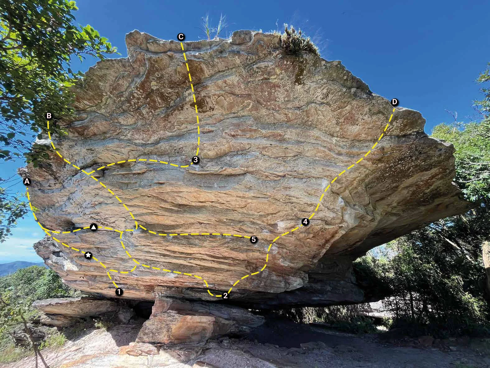
          - **largura_mapa**: 2364
          - **altura_mapa**: 1773
          - **pontos_de_interesse**:
            - **[0]**:
              - **id**: WiKk0Phg2tkuDq
              - **uid**: WiKk0Phg2tkuDq
              - **rotulo**: B
              - **circulo**:
                - **x**: 236
                - **y**: 558
                - **raio**: 19
              - **label**: B
            - **[1]**:
              - **id**: gvG3ixgVMxrjO4
              - **uid**: gvG3ixgVMxrjO4
              - **rotulo**: A
              - **circulo**:
                - **x**: 130
                - **y**: 876
                - **raio**: 19
              - **label**: A
            - **[2]**:
              - **id**: DB9bDOvLdYq2hY
              - **uid**: DB9bDOvLdYq2hY
              - **rotulo**: C
              - **circulo**:
                - **x**: 874
                - **y**: 178
                - **raio**: 19
              - **label**: C
            - **[3]**:
              - **id**: FUhmF0YsJHMCJf
              - **uid**: FUhmF0YsJHMCJf
              - **rotulo**: D
              - **circulo**:
                - **x**: 1904
                - **y**: 492
                - **raio**: 19
              - **label**: D
            - **[4]**:
              - **id**: EP7kIXeDvzcLu3
              - **uid**: EP7kIXeDvzcLu3
              - **rotulo**: ▲
              - **circulo**:
                - **x**: 452
                - **y**: 1095
                - **raio**: 19
              - **label**: ▲
            - **[5]**:
              - **id**: 4k7BFASp7bnFMc
              - **uid**: 4k7BFASp7bnFMc
              - **rotulo**: ★
              - **circulo**:
                - **x**: 427
                - **y**: 1231
                - **raio**: 19
              - **label**: ★
            - **[6]**:
              - **id**: XZwFSxlPVi0vNs
              - **uid**: XZwFSxlPVi0vNs
              - **rotulo**: 1
              - **circulo**:
                - **x**: 576
                - **y**: 1408
                - **raio**: 19
              - **label**: 1
            - **[7]**:
              - **id**: FWGP7Agj4MeoJ3
              - **uid**: FWGP7Agj4MeoJ3
              - **rotulo**: 2
              - **circulo**:
                - **x**: 1087
                - **y**: 1426
                - **raio**: 19
              - **label**: 2
            - **[8]**:
              - **id**: TzmdsQE1sUmlep
              - **uid**: TzmdsQE1sUmlep
              - **rotulo**: 3
              - **circulo**:
                - **x**: 944
                - **y**: 771
                - **raio**: 19
              - **label**: 3
            - **[9]**:
              - **id**: X7KWESevYJGD79
              - **uid**: X7KWESevYJGD79
              - **rotulo**: 4
              - **circulo**:
                - **x**: 1473
                - **y**: 1070
                - **raio**: 19
              - **label**: 4
            - **[10]**:
              - **id**: vmlD5gDcQlBqBb
              - **uid**: vmlD5gDcQlBqBb
              - **rotulo**: 5
              - **circulo**:
                - **x**: 1224
                - **y**: 1155
                - **raio**: 19
              - **label**: 5
          - **referencias**:
            - **[0]**:
              - **alvo_uid**: MaIF4mfMkWZ34L
              - **pontos_uids**:
                - XZwFSxlPVi0vNs
                - gvG3ixgVMxrjO4
                - 4k7BFASp7bnFMc
              - **escalada**: Ora-Por-Todos
              - **ids**:
                - XZwFSxlPVi0vNs
                - gvG3ixgVMxrjO4
                - 4k7BFASp7bnFMc
            - **[1]**:
              - **alvo_uid**: MCUL9v1evEYdHd
              - **pontos_uids**:
                - XZwFSxlPVi0vNs
                - gvG3ixgVMxrjO4
                - EP7kIXeDvzcLu3
              - **escalada**: Orai-Por-Noix
              - **ids**:
                - XZwFSxlPVi0vNs
                - gvG3ixgVMxrjO4
                - EP7kIXeDvzcLu3
            - **[2]**:
              - **alvo_uid**: m7gk4wtsCyFp1i
              - **pontos_uids**:
                - XZwFSxlPVi0vNs
                - WiKk0Phg2tkuDq
              - **escalada**: Ora-Pra-Jah
              - **ids**:
                - XZwFSxlPVi0vNs
                - WiKk0Phg2tkuDq
            - **[3]**:
              - **alvo_uid**: 5pTWXLMlqls565
              - **pontos_uids**:
                - XZwFSxlPVi0vNs
                - DB9bDOvLdYq2hY
              - **escalada**: Ouroboulder
              - **ids**:
                - XZwFSxlPVi0vNs
                - DB9bDOvLdYq2hY
            - **[4]**:
              - **alvo_uid**: 18NHtGJEgPAW9B
              - **pontos_uids**:
                - FWGP7Agj4MeoJ3
                - WiKk0Phg2tkuDq
              - **escalada**: Ora-Pro-Nóbis
              - **ids**:
                - FWGP7Agj4MeoJ3
                - WiKk0Phg2tkuDq
            - **[5]**:
              - **alvo_uid**: blpENBkvARWOXN
              - **pontos_uids**:
                - FWGP7Agj4MeoJ3
                - DB9bDOvLdYq2hY
              - **escalada**: Ora-Pros-Crash
              - **ids**:
                - FWGP7Agj4MeoJ3
                - DB9bDOvLdYq2hY
            - **[6]**:
              - **alvo_uid**: DGRsLWRpr4Fe9e
              - **pontos_uids**:
                - vmlD5gDcQlBqBb
                - DB9bDOvLdYq2hY
              - **escalada**: Oratório
              - **ids**:
                - vmlD5gDcQlBqBb
                - DB9bDOvLdYq2hY
            - **[7]**:
              - **alvo_uid**: BxsLsGXWDzJ5eF
              - **pontos_uids**:
                - TzmdsQE1sUmlep
                - DB9bDOvLdYq2hY
              - **escalada**: Quebra Galho
              - **ids**:
                - TzmdsQE1sUmlep
                - DB9bDOvLdYq2hY
            - **[8]**:
              - **alvo_uid**: hxVPscZihPx3r1
              - **pontos_uids**:
                - FWGP7Agj4MeoJ3
                - FUhmF0YsJHMCJf
              - **escalada**: Libertadores
              - **ids**:
                - FWGP7Agj4MeoJ3
                - FUhmF0YsJHMCJf
            - **[9]**:
              - **alvo_uid**: 4LUhmyqHPJIvhN
              - **pontos_uids**:
                - X7KWESevYJGD79
                - FUhmF0YsJHMCJf
              - **escalada**: Eu Acredito
              - **ids**:
                - X7KWESevYJGD79
                - FUhmF0YsJHMCJf
        - **[2]**:
          - **caminho_imagem_mapa**: 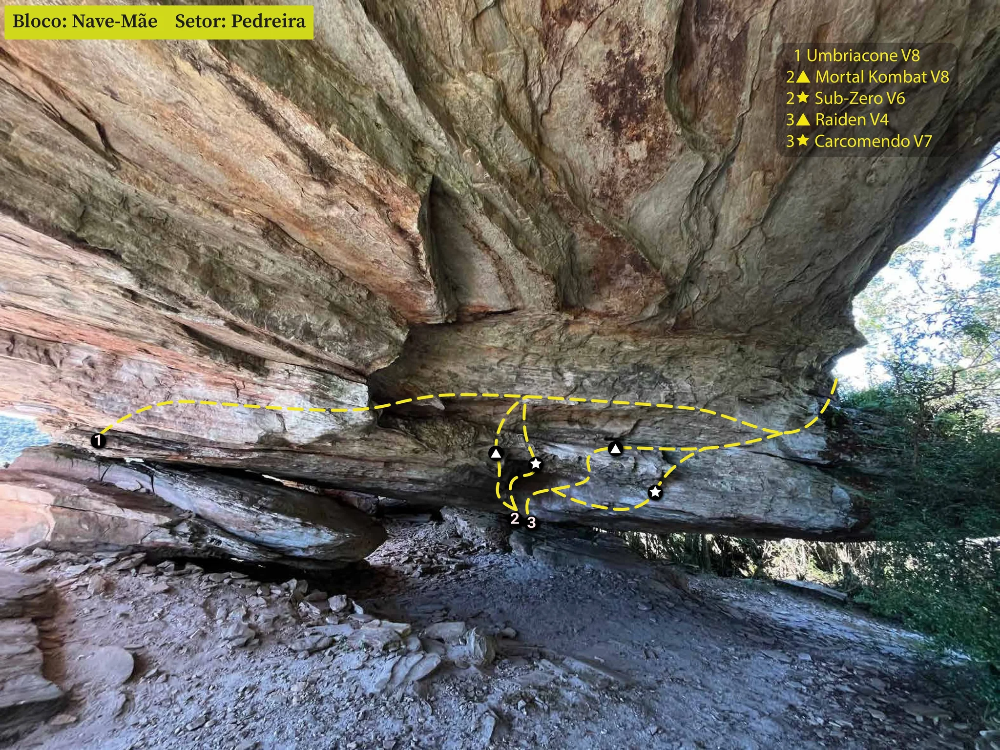
          - **largura_mapa**: 2364
          - **altura_mapa**: 1773
          - **pontos_de_interesse**:
            - **[0]**:
              - **id**: uwcvDogJf5sqyO
              - **uid**: uwcvDogJf5sqyO
              - **rotulo**: 1
              - **circulo**:
                - **x**: 233
                - **y**: 1042
                - **raio**: 19
              - **label**: 1
            - **[1]**:
              - **id**: sEPgNXchWVUMUM
              - **uid**: sEPgNXchWVUMUM
              - **rotulo**: 2
              - **circulo**:
                - **x**: 1217
                - **y**: 1227
                - **raio**: 19
              - **label**: 2
            - **[2]**:
              - **id**: BmXibCqGGnl02j
              - **uid**: BmXibCqGGnl02j
              - **rotulo**: 3
              - **circulo**:
                - **x**: 1257
                - **y**: 1236
                - **raio**: 19
              - **label**: 3
            - **[3]**:
              - **id**: 0fl4BCzCbiAl3p
              - **uid**: 0fl4BCzCbiAl3p
              - **rotulo**: ▲
              - **circulo**:
                - **x**: 1173
                - **y**: 1072
                - **raio**: 19
              - **label**: ▲
            - **[4]**:
              - **id**: Y9ZEr9Tk9z1xPy
              - **uid**: Y9ZEr9Tk9z1xPy
              - **rotulo**: ★
              - **circulo**:
                - **x**: 1267
                - **y**: 1098
                - **raio**: 19
              - **label**: ★
            - **[5]**:
              - **id**: wt7aIijsTpstP3
              - **uid**: wt7aIijsTpstP3
              - **rotulo**: ▲
              - **circulo**:
                - **x**: 1456
                - **y**: 1062
                - **raio**: 19
              - **label**: ▲
            - **[6]**:
              - **id**: ee9iX9Dvy5u5kT
              - **uid**: ee9iX9Dvy5u5kT
              - **rotulo**: ★
              - **circulo**:
                - **x**: 1550
                - **y**: 1164
                - **raio**: 19
              - **label**: ★
          - **referencias**:
            - **[0]**:
              - **alvo_uid**: 9s8Nm9OPEymGt6
              - **pontos_uids**:
                - uwcvDogJf5sqyO
              - **escalada**: Umbriacone
              - **ids**:
                - uwcvDogJf5sqyO
            - **[1]**:
              - **alvo_uid**: IPoFMh7oAmqESL
              - **pontos_uids**:
                - sEPgNXchWVUMUM
                - 0fl4BCzCbiAl3p
              - **escalada**: Mortal Kombat
              - **ids**:
                - sEPgNXchWVUMUM
                - 0fl4BCzCbiAl3p
            - **[2]**:
              - **alvo_uid**: bytVqz2d6aTQtE
              - **pontos_uids**:
                - sEPgNXchWVUMUM
                - Y9ZEr9Tk9z1xPy
              - **escalada**: Sub-Zero
              - **ids**:
                - sEPgNXchWVUMUM
                - Y9ZEr9Tk9z1xPy
            - **[3]**:
              - **alvo_uid**: GNGf04oKhScqxn
              - **pontos_uids**:
                - BmXibCqGGnl02j
                - wt7aIijsTpstP3
              - **escalada**: Raiden
              - **ids**:
                - BmXibCqGGnl02j
                - wt7aIijsTpstP3
            - **[4]**:
              - **alvo_uid**: fUbTu07KRCSQd7
              - **pontos_uids**:
                - BmXibCqGGnl02j
                - ee9iX9Dvy5u5kT
              - **escalada**: Carcomendo
              - **ids**:
                - BmXibCqGGnl02j
                - ee9iX9Dvy5u5kT
        - **[3]**:
          - **caminho_imagem_mapa**: 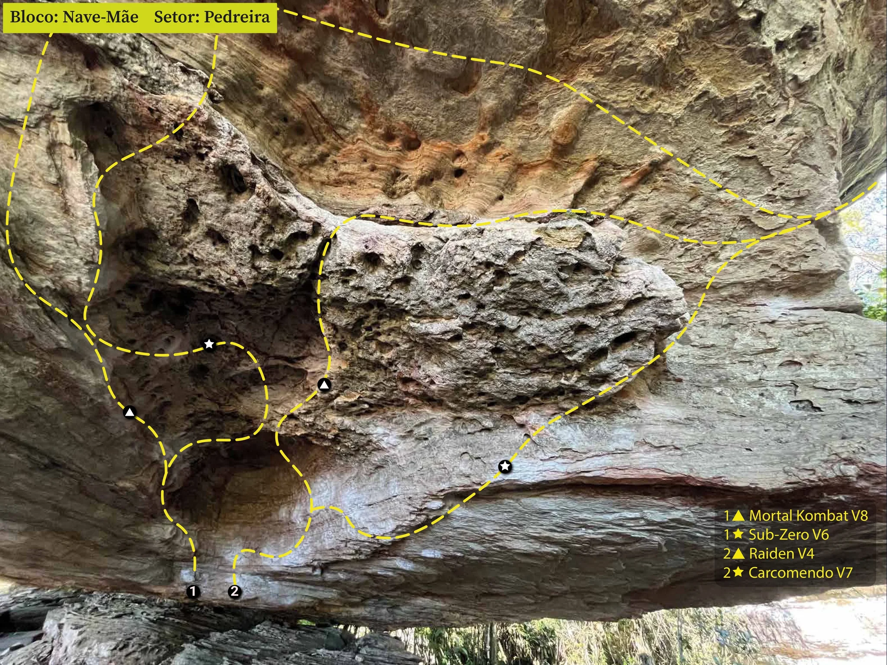
          - **largura_mapa**: 2364
          - **altura_mapa**: 1773
          - **pontos_de_interesse**:
            - **[0]**:
              - **id**: C5XgoSQ4SjRhSJ
              - **uid**: C5XgoSQ4SjRhSJ
              - **rotulo**: 1
              - **circulo**:
                - **x**: 515
                - **y**: 1578
                - **raio**: 20
              - **label**: 1
            - **[1]**:
              - **id**: J5AjOsOKIXa5lV
              - **uid**: J5AjOsOKIXa5lV
              - **rotulo**: 2
              - **circulo**:
                - **x**: 626
                - **y**: 1578
                - **raio**: 20
              - **label**: 2
            - **[2]**:
              - **id**: 3ubPXYDk1YDhOo
              - **uid**: 3ubPXYDk1YDhOo
              - **rotulo**: ▲
              - **circulo**:
                - **x**: 346
                - **y**: 1100
                - **raio**: 20
              - **label**: ▲
            - **[3]**:
              - **id**: vvA8LdxrXwrMLO
              - **uid**: vvA8LdxrXwrMLO
              - **rotulo**: ★
              - **circulo**:
                - **x**: 557
                - **y**: 917
                - **raio**: 20
              - **label**: ★
            - **[4]**:
              - **id**: TVbPqHOxkN0pY4
              - **uid**: TVbPqHOxkN0pY4
              - **rotulo**: ▲
              - **circulo**:
                - **x**: 864
                - **y**: 1027
                - **raio**: 20
              - **label**: ▲
            - **[5]**:
              - **id**: k5wArRPNW1ZWD9
              - **uid**: k5wArRPNW1ZWD9
              - **rotulo**: ★
              - **circulo**:
                - **x**: 1346
                - **y**: 1245
                - **raio**: 20
              - **label**: ★
          - **referencias**:
            - **[0]**:
              - **alvo_uid**: IPoFMh7oAmqESL
              - **pontos_uids**:
                - C5XgoSQ4SjRhSJ
                - 3ubPXYDk1YDhOo
              - **escalada**: Mortal Kombat
              - **ids**:
                - C5XgoSQ4SjRhSJ
                - 3ubPXYDk1YDhOo
            - **[1]**:
              - **alvo_uid**: bytVqz2d6aTQtE
              - **pontos_uids**:
                - C5XgoSQ4SjRhSJ
                - vvA8LdxrXwrMLO
              - **escalada**: Sub-Zero
              - **ids**:
                - C5XgoSQ4SjRhSJ
                - vvA8LdxrXwrMLO
            - **[2]**:
              - **alvo_uid**: GNGf04oKhScqxn
              - **pontos_uids**:
                - J5AjOsOKIXa5lV
                - TVbPqHOxkN0pY4
              - **escalada**: Raiden
              - **ids**:
                - J5AjOsOKIXa5lV
                - TVbPqHOxkN0pY4
            - **[3]**:
              - **alvo_uid**: fUbTu07KRCSQd7
              - **pontos_uids**:
                - J5AjOsOKIXa5lV
                - k5wArRPNW1ZWD9
              - **escalada**: Carcomendo
              - **ids**:
                - J5AjOsOKIXa5lV
                - k5wArRPNW1ZWD9
        - **[4]**:
          - **caminho_imagem_mapa**: 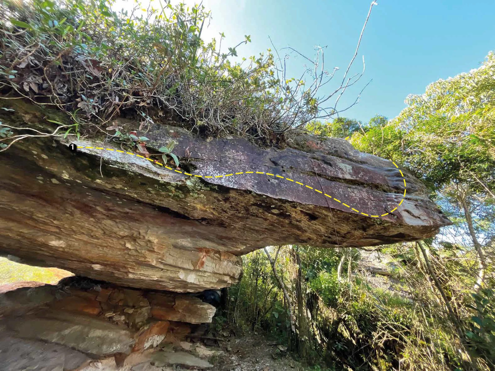
          - **largura_mapa**: 2364
          - **altura_mapa**: 1773
          - **pontos_de_interesse**:
            - **[0]**:
              - **id**: Xsi5RDrcJ46IQv
              - **uid**: Xsi5RDrcJ46IQv
              - **rotulo**: 1
              - **circulo**:
                - **x**: 346
                - **y**: 704
                - **raio**: 20
              - **label**: 1
          - **referencias**:
            - **[0]**:
              - **alvo_uid**: p5Kd6jSdIFnRdA
              - **pontos_uids**:
                - Xsi5RDrcJ46IQv
              - **escalada**: 003
              - **ids**:
                - Xsi5RDrcJ46IQv
        - **[5]**:
          - **caminho_imagem_mapa**: 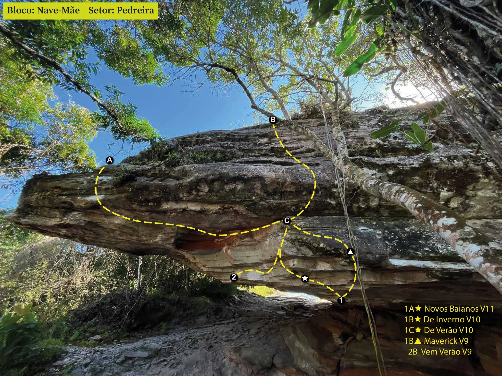
          - **largura_mapa**: 2364
          - **altura_mapa**: 1773
          - **pontos_de_interesse**:
            - **[0]**:
              - **id**: 2PPELBJ2dzMx90
              - **uid**: 2PPELBJ2dzMx90
              - **rotulo**: A
              - **circulo**:
                - **x**: 517
                - **y**: 756
                - **raio**: 19
              - **label**: A
            - **[1]**:
              - **id**: QO7d8Kg4pwrpWA
              - **uid**: QO7d8Kg4pwrpWA
              - **rotulo**: B
              - **circulo**:
                - **x**: 1286
                - **y**: 565
                - **raio**: 19
              - **label**: B
            - **[2]**:
              - **id**: drTHnfSDL3TiUE
              - **uid**: drTHnfSDL3TiUE
              - **rotulo**: C
              - **circulo**:
                - **x**: 1352
                - **y**: 1040
                - **raio**: 18
              - **label**: C
            - **[3]**:
              - **id**: mTetANUTRrUzU1
              - **uid**: mTetANUTRrUzU1
              - **rotulo**: ▲
              - **circulo**:
                - **x**: 1651
                - **y**: 1188
                - **raio**: 19
              - **label**: ▲
            - **[4]**:
              - **id**: jEOzZMCoLiWH5C
              - **uid**: jEOzZMCoLiWH5C
              - **rotulo**: ★
              - **circulo**:
                - **x**: 1437
                - **y**: 1314
                - **raio**: 19
              - **label**: ★
            - **[5]**:
              - **id**: 7TR0ApHxx9bWOS
              - **uid**: 7TR0ApHxx9bWOS
              - **rotulo**: 2
              - **circulo**:
                - **x**: 1102
                - **y**: 1308
                - **raio**: 19
              - **label**: 2
            - **[6]**:
              - **id**: aH38cbYIMhibw7
              - **uid**: aH38cbYIMhibw7
              - **rotulo**: 1
              - **circulo**:
                - **x**: 1607
                - **y**: 1417
                - **raio**: 19
              - **label**: 1
          - **referencias**:
            - **[0]**:
              - **alvo_uid**: Ahbhee1OlW69Ga
              - **pontos_uids**:
                - 2PPELBJ2dzMx90
                - aH38cbYIMhibw7
                - jEOzZMCoLiWH5C
              - **escalada**: Pico do Baiano
              - **ids**:
                - 2PPELBJ2dzMx90
                - aH38cbYIMhibw7
                - jEOzZMCoLiWH5C
            - **[1]**:
              - **alvo_uid**: MlhIBqYsf7n2Fp
              - **pontos_uids**:
                - aH38cbYIMhibw7
                - QO7d8Kg4pwrpWA
                - jEOzZMCoLiWH5C
              - **escalada**: De Inverno
              - **ids**:
                - aH38cbYIMhibw7
                - QO7d8Kg4pwrpWA
                - jEOzZMCoLiWH5C
            - **[2]**:
              - **alvo_uid**: chYHZr2YNq8Xf0
              - **pontos_uids**:
                - aH38cbYIMhibw7
                - jEOzZMCoLiWH5C
                - drTHnfSDL3TiUE
              - **escalada**: De Verão
              - **ids**:
                - aH38cbYIMhibw7
                - jEOzZMCoLiWH5C
                - drTHnfSDL3TiUE
            - **[3]**:
              - **alvo_uid**: YAhKmGbZFYKZDd
              - **pontos_uids**:
                - aH38cbYIMhibw7
                - mTetANUTRrUzU1
                - QO7d8Kg4pwrpWA
              - **escalada**: Maverick
              - **ids**:
                - aH38cbYIMhibw7
                - mTetANUTRrUzU1
                - QO7d8Kg4pwrpWA
            - **[4]**:
              - **alvo_uid**: p6GJ35FDjCU1PV
              - **pontos_uids**:
                - 7TR0ApHxx9bWOS
                - QO7d8Kg4pwrpWA
              - **escalada**: Vem Verão
              - **ids**:
                - 7TR0ApHxx9bWOS
                - QO7d8Kg4pwrpWA
        - **[6]**:
          - **caminho_imagem_mapa**: 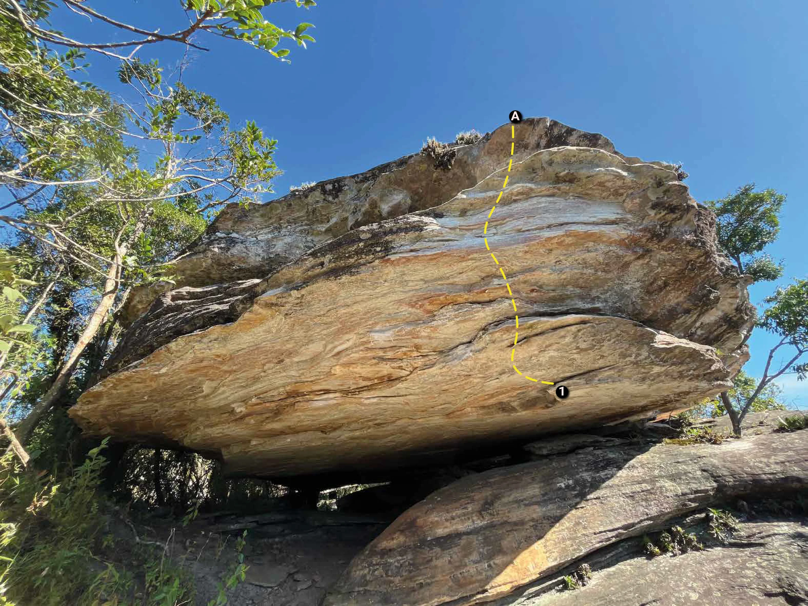
          - **largura_mapa**: 2364
          - **altura_mapa**: 1773
          - **pontos_de_interesse**:
            - **[0]**:
              - **id**: Qx5KiftdufZy8x
              - **uid**: Qx5KiftdufZy8x
              - **rotulo**: A
              - **circulo**:
                - **x**: 1508
                - **y**: 342
                - **raio**: 20
              - **label**: A
            - **[1]**:
              - **id**: JQ4ZtSqlFKDmmo
              - **uid**: JQ4ZtSqlFKDmmo
              - **rotulo**: 1
              - **circulo**:
                - **x**: 1645
                - **y**: 1147
                - **raio**: 20
              - **label**: 1
          - **referencias**:
            - **[0]**:
              - **alvo_uid**: GtmyTIaOUFRz3J
              - **pontos_uids**:
                - JQ4ZtSqlFKDmmo
                - Qx5KiftdufZy8x
              - **escalada**: Passível
              - **ids**:
                - JQ4ZtSqlFKDmmo
                - Qx5KiftdufZy8x
      - **escaladas**:
        - **[0]**:
          - **uid**: NhxZTj9giBFCyP
          - **boulder**:
            - **nome**: Monte Mor
            - **dificuldade**: V3
        - **[1]**:
          - **uid**: yrmqjQkWzgc2F8
          - **boulder**:
            - **nome**: Irmãos Coragem
            - **dificuldade**: V8
        - **[2]**:
          - **uid**: LFASLEsrPebwQW
          - **boulder**:
            - **nome**: Irmãos na Vibe
            - **dificuldade**: V8
        - **[3]**:
          - **uid**: MaIF4mfMkWZ34L
          - **boulder**:
            - **nome**: Ora-Por-Todos
            - **dificuldade**: V3
        - **[4]**:
          - **uid**: MCUL9v1evEYdHd
          - **boulder**:
            - **nome**: Orai-Por-Noix
            - **dificuldade**: V5
        - **[5]**:
          - **uid**: m7gk4wtsCyFp1i
          - **boulder**:
            - **nome**: Ora-Pra-Jah
            - **dificuldade**: V9
        - **[6]**:
          - **uid**: 5pTWXLMlqls565
          - **boulder**:
            - **nome**: Ouroboulder
            - **dificuldade**: V11
        - **[7]**:
          - **uid**: 18NHtGJEgPAW9B
          - **boulder**:
            - **nome**: Ora-Pro-Nóbis
            - **dificuldade**: V7
        - **[8]**:
          - **uid**: blpENBkvARWOXN
          - **boulder**:
            - **nome**: Ora-Pros-Crash
            - **dificuldade**: V10
        - **[9]**:
          - **uid**: DGRsLWRpr4Fe9e
          - **boulder**:
            - **nome**: Oratório
            - **dificuldade**: V10
        - **[10]**:
          - **uid**: BxsLsGXWDzJ5eF
          - **boulder**:
            - **nome**: Quebra Galho
            - **dificuldade**: V6
        - **[11]**:
          - **uid**: hxVPscZihPx3r1
          - **boulder**:
            - **nome**: Libertadores
            - **dificuldade**: V14
        - **[12]**:
          - **uid**: 4LUhmyqHPJIvhN
          - **boulder**:
            - **nome**: Eu Acredito
            - **dificuldade**: V11
        - **[13]**:
          - **uid**: 9s8Nm9OPEymGt6
          - **boulder**:
            - **nome**: Umbriacone
            - **dificuldade**: V8
        - **[14]**:
          - **uid**: IPoFMh7oAmqESL
          - **boulder**:
            - **nome**: Mortal Kombat
            - **dificuldade**: V8
        - **[15]**:
          - **uid**: bytVqz2d6aTQtE
          - **boulder**:
            - **nome**: Sub-Zero
            - **dificuldade**: V6
        - **[16]**:
          - **uid**: GNGf04oKhScqxn
          - **boulder**:
            - **nome**: Raiden
            - **dificuldade**: V4
        - **[17]**:
          - **uid**: fUbTu07KRCSQd7
          - **boulder**:
            - **nome**: Carcomendo
            - **dificuldade**: V7
        - **[18]**:
          - **uid**: p5Kd6jSdIFnRdA
          - **boulder**:
            - **nome**: 003
            - **dificuldade**: V5
        - **[19]**:
          - **uid**: Ahbhee1OlW69Ga
          - **boulder**:
            - **nome**: Pico do Baiano
            - **dificuldade**: V11
        - **[20]**:
          - **uid**: MlhIBqYsf7n2Fp
          - **boulder**:
            - **nome**: De Inverno
            - **dificuldade**: V10
        - **[21]**:
          - **uid**: chYHZr2YNq8Xf0
          - **boulder**:
            - **nome**: De Verão
            - **dificuldade**: V10
        - **[22]**:
          - **uid**: YAhKmGbZFYKZDd
          - **boulder**:
            - **nome**: Maverick
            - **dificuldade**: V9
        - **[23]**:
          - **uid**: p6GJ35FDjCU1PV
          - **boulder**:
            - **nome**: Vem Verão
            - **dificuldade**: V9
        - **[24]**:
          - **uid**: GtmyTIaOUFRz3J
          - **boulder**:
            - **nome**: Passível
            - **dificuldade**: V2
      - **precomputados**:
        - **total_escaladas**: 25
        - **total_boulders**: 25
  - **[20]**:
    - **conteudo**:
      - **descricao**: 
      - **nome**: Bloco: Pedra Queimada
      - **uid**: KMgvZxpGaKri2z
      - **caminho_imagem_capa**: 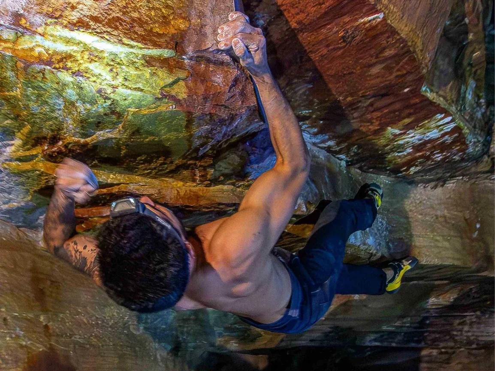
      - **mapas**:
        - **[0]**:
          - **caminho_imagem_mapa**: 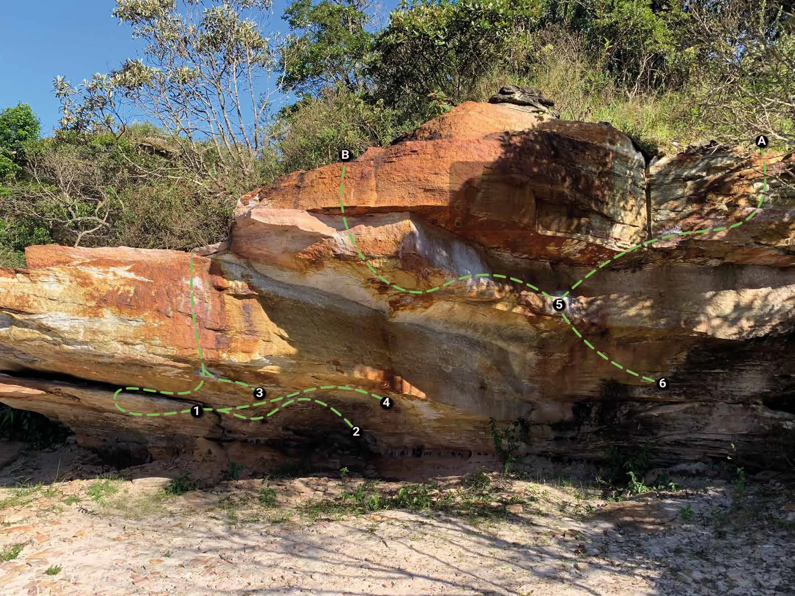
          - **largura_mapa**: 2364
          - **altura_mapa**: 1773
          - **pontos_de_interesse**:
            - **[0]**:
              - **id**: EJvD8fxrfVOqi0
              - **uid**: EJvD8fxrfVOqi0
              - **rotulo**: A
              - **circulo**:
                - **x**: 2265
                - **y**: 421
                - **raio**: 20
              - **label**: A
            - **[1]**:
              - **id**: QGUW0ci1xi4mUQ
              - **uid**: QGUW0ci1xi4mUQ
              - **rotulo**: B
              - **circulo**:
                - **x**: 1027
                - **y**: 462
                - **raio**: 20
              - **label**: B
            - **[2]**:
              - **id**: VXcVDy8quHipHs
              - **uid**: VXcVDy8quHipHs
              - **rotulo**: 1
              - **circulo**:
                - **x**: 772
                - **y**: 1171
                - **raio**: 20
              - **label**: 1
            - **[3]**:
              - **id**: nXtkg4Z4FwLpUU
              - **uid**: nXtkg4Z4FwLpUU
              - **rotulo**: 2
              - **circulo**:
                - **x**: 1662
                - **y**: 907
                - **raio**: 20
              - **label**: 2
            - **[4]**:
              - **id**: PCh1E0YaaDTNuq
              - **uid**: PCh1E0YaaDTNuq
              - **rotulo**: 3
              - **circulo**:
                - **x**: 1971
                - **y**: 1142
                - **raio**: 20
              - **label**: 3
          - **referencias**:
            - **[0]**:
              - **alvo_uid**: LG8kAWuA8BhFcZ
              - **pontos_uids**:
                - VXcVDy8quHipHs
              - **escalada**: México
              - **ids**:
                - VXcVDy8quHipHs
            - **[1]**:
              - **alvo_uid**: dIVl3zJfPRK1JB
              - **pontos_uids**:
                - nXtkg4Z4FwLpUU
                - EJvD8fxrfVOqi0
              - **escalada**: Dinamite
              - **ids**:
                - nXtkg4Z4FwLpUU
                - EJvD8fxrfVOqi0
            - **[2]**:
              - **alvo_uid**: 2Z1wL1iUT61CWL
              - **pontos_uids**:
                - nXtkg4Z4FwLpUU
                - QGUW0ci1xi4mUQ
              - **escalada**: Pedra Queimada
              - **ids**:
                - nXtkg4Z4FwLpUU
                - QGUW0ci1xi4mUQ
            - **[3]**:
              - **alvo_uid**: 4ufRkG6ve9B7Ks
              - **pontos_uids**:
                - PCh1E0YaaDTNuq
                - EJvD8fxrfVOqi0
              - **escalada**: Dinamite sds
              - **ids**:
                - PCh1E0YaaDTNuq
                - EJvD8fxrfVOqi0
            - **[4]**:
              - **alvo_uid**: SBP4lCwy215ZFx
              - **pontos_uids**:
                - PCh1E0YaaDTNuq
                - QGUW0ci1xi4mUQ
              - **escalada**: Pedra Queimada sds
              - **ids**:
                - PCh1E0YaaDTNuq
                - QGUW0ci1xi4mUQ
      - **escaladas**:
        - **[0]**:
          - **uid**: LG8kAWuA8BhFcZ
          - **boulder**:
            - **nome**: México
            - **dificuldade**: V9
        - **[1]**:
          - **uid**: dIVl3zJfPRK1JB
          - **boulder**:
            - **nome**: Dinamite
            - **dificuldade**: V2
        - **[2]**:
          - **uid**: 2Z1wL1iUT61CWL
          - **boulder**:
            - **nome**: Pedra Queimada
            - **dificuldade**: V8
        - **[3]**:
          - **uid**: 4ufRkG6ve9B7Ks
          - **boulder**:
            - **nome**: Dinamite sds
            - **dificuldade**: V5_BARRA_V6
        - **[4]**:
          - **uid**: SBP4lCwy215ZFx
          - **boulder**:
            - **nome**: Pedra Queimada sds
            - **dificuldade**: V9
      - **precomputados**:
        - **total_escaladas**: 5
        - **total_boulders**: 5
  - **[21]**:
    - **conteudo**:
      - **descricao**: 
      - **nome**: Bloco: Red Bull
      - **uid**: rrVPaOcjQ56Hj1
      - **mapas**:
        - **[0]**:
          - **caminho_imagem_mapa**: 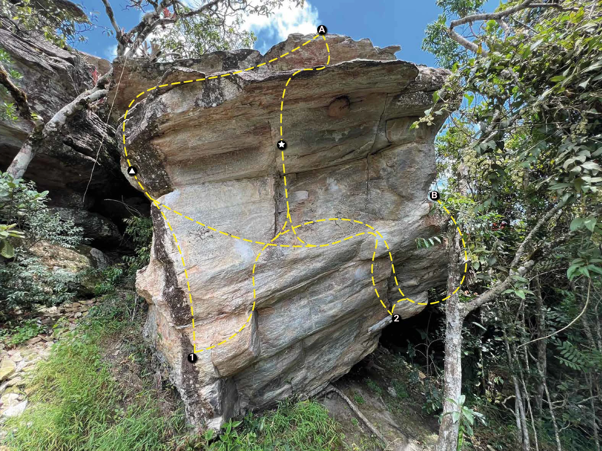
          - **largura_mapa**: 2364
          - **altura_mapa**: 1773
          - **pontos_de_interesse**:
            - **[0]**:
              - **id**: N1k3NSvwTcc1T5
              - **uid**: N1k3NSvwTcc1T5
              - **rotulo**: A
              - **circulo**:
                - **x**: 1264
                - **y**: 117
                - **raio**: 20
              - **label**: A
            - **[1]**:
              - **id**: fsLrX4NXQs90cE
              - **uid**: fsLrX4NXQs90cE
              - **rotulo**: B
              - **circulo**:
                - **x**: 1706
                - **y**: 769
                - **raio**: 20
              - **label**: B
            - **[2]**:
              - **id**: bcdgefmsxMsJLJ
              - **uid**: bcdgefmsxMsJLJ
              - **rotulo**: 1
              - **circulo**:
                - **x**: 754
                - **y**: 1407
                - **raio**: 20
              - **label**: 1
            - **[3]**:
              - **id**: xBjLKqD5XYZwfS
              - **uid**: xBjLKqD5XYZwfS
              - **rotulo**: 2
              - **circulo**:
                - **x**: 1557
                - **y**: 1252
                - **raio**: 20
              - **label**: 2
            - **[4]**:
              - **id**: Qe8IpRyVyV1YtM
              - **uid**: Qe8IpRyVyV1YtM
              - **rotulo**: ▲
              - **circulo**:
                - **x**: 519
                - **y**: 672
                - **raio**: 20
              - **label**: ▲
            - **[5]**:
              - **id**: I5jZ7XmeQWzkby
              - **uid**: I5jZ7XmeQWzkby
              - **rotulo**: ★
              - **circulo**:
                - **x**: 1106
                - **y**: 570
                - **raio**: 20
              - **label**: ★
          - **referencias**:
            - **[0]**:
              - **alvo_uid**: iD4KRe0gKxpt8n
              - **pontos_uids**:
                - bcdgefmsxMsJLJ
                - N1k3NSvwTcc1T5
                - Qe8IpRyVyV1YtM
              - **escalada**: Flying Horse
              - **ids**:
                - bcdgefmsxMsJLJ
                - N1k3NSvwTcc1T5
                - Qe8IpRyVyV1YtM
            - **[1]**:
              - **alvo_uid**: r5aXNKMfSAkxrn
              - **pontos_uids**:
                - bcdgefmsxMsJLJ
                - N1k3NSvwTcc1T5
                - I5jZ7XmeQWzkby
              - **escalada**: Pingado
              - **ids**:
                - bcdgefmsxMsJLJ
                - N1k3NSvwTcc1T5
                - I5jZ7XmeQWzkby
            - **[2]**:
              - **alvo_uid**: K2gwZEgw8Z0wkN
              - **pontos_uids**:
                - bcdgefmsxMsJLJ
                - fsLrX4NXQs90cE
              - **escalada**: Expresso
              - **ids**:
                - bcdgefmsxMsJLJ
                - fsLrX4NXQs90cE
            - **[3]**:
              - **alvo_uid**: j3iAn0tMUEIXZ4
              - **pontos_uids**:
                - xBjLKqD5XYZwfS
                - N1k3NSvwTcc1T5
                - Qe8IpRyVyV1YtM
              - **escalada**: Macchiato
              - **ids**:
                - xBjLKqD5XYZwfS
                - N1k3NSvwTcc1T5
                - Qe8IpRyVyV1YtM
            - **[4]**:
              - **alvo_uid**: HCkXRiPIIC6Ix7
              - **pontos_uids**:
                - xBjLKqD5XYZwfS
                - N1k3NSvwTcc1T5
                - I5jZ7XmeQWzkby
              - **escalada**: Red Bull
              - **ids**:
                - xBjLKqD5XYZwfS
                - N1k3NSvwTcc1T5
                - I5jZ7XmeQWzkby
            - **[5]**:
              - **alvo_uid**: XO7WLzyP5Zts9n
              - **pontos_uids**:
                - xBjLKqD5XYZwfS
                - fsLrX4NXQs90cE
              - **escalada**: Mad Dog
              - **ids**:
                - xBjLKqD5XYZwfS
                - fsLrX4NXQs90cE
      - **escaladas**:
        - **[0]**:
          - **uid**: iD4KRe0gKxpt8n
          - **boulder**:
            - **nome**: Flying Horse
            - **dificuldade**: V2
        - **[1]**:
          - **uid**: r5aXNKMfSAkxrn
          - **boulder**:
            - **nome**: Pingado
            - **dificuldade**: V3
        - **[2]**:
          - **uid**: K2gwZEgw8Z0wkN
          - **boulder**:
            - **nome**: Expresso
            - **dificuldade**: V7
        - **[3]**:
          - **uid**: j3iAn0tMUEIXZ4
          - **boulder**:
            - **nome**: Macchiato
            - **dificuldade**: V6
        - **[4]**:
          - **uid**: HCkXRiPIIC6Ix7
          - **boulder**:
            - **nome**: Red Bull
            - **dificuldade**: V6
        - **[5]**:
          - **uid**: XO7WLzyP5Zts9n
          - **boulder**:
            - **nome**: Mad Dog
            - **dificuldade**: V1
      - **precomputados**:
        - **total_escaladas**: 6
        - **total_boulders**: 6
  - **[22]**:
    - **conteudo**:
      - **descricao**: 
      - **nome**: Bloco: Sauna
      - **uid**: 4rqHCeJjg5oS60
      - **mapas**:
        - **[0]**:
          - **caminho_imagem_mapa**: 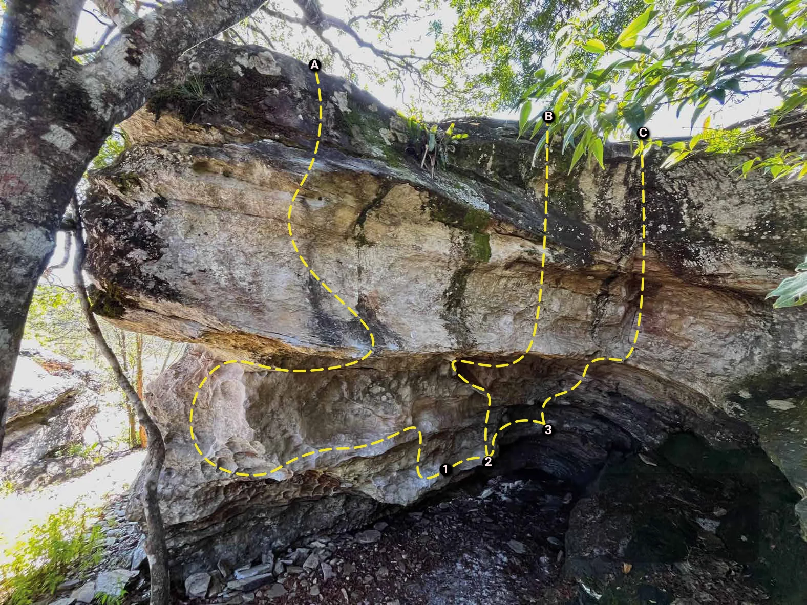
          - **largura_mapa**: 2364
          - **altura_mapa**: 1773
          - **pontos_de_interesse**:
            - **[0]**:
              - **id**: yAFSlml0SapFjm
              - **uid**: yAFSlml0SapFjm
              - **rotulo**: A
              - **circulo**:
                - **x**: 922
                - **y**: 192
                - **raio**: 20
              - **label**: A
            - **[1]**:
              - **id**: dkEsYaookEbWC6
              - **uid**: dkEsYaookEbWC6
              - **rotulo**: B
              - **circulo**:
                - **x**: 1608
                - **y**: 342
                - **raio**: 20
              - **label**: B
            - **[2]**:
              - **id**: PE0I4U8nsuji9D
              - **uid**: PE0I4U8nsuji9D
              - **rotulo**: C
              - **circulo**:
                - **x**: 1885
                - **y**: 391
                - **raio**: 20
              - **label**: C
            - **[3]**:
              - **id**: uPFv6wCBhddzGe
              - **uid**: uPFv6wCBhddzGe
              - **rotulo**: 1
              - **circulo**:
                - **x**: 1306
                - **y**: 1377
                - **raio**: 20
              - **label**: 1
            - **[4]**:
              - **id**: 9JIY9OCcLh422g
              - **uid**: 9JIY9OCcLh422g
              - **rotulo**: 2
              - **circulo**:
                - **x**: 1431
                - **y**: 1354
                - **raio**: 20
              - **label**: 2
            - **[5]**:
              - **id**: A0WwaYH8S4uROW
              - **uid**: A0WwaYH8S4uROW
              - **rotulo**: 3
              - **circulo**:
                - **x**: 1606
                - **y**: 1262
                - **raio**: 20
              - **label**: 3
          - **referencias**:
            - **[0]**:
              - **alvo_uid**: N0YceOhNwq45DN
              - **pontos_uids**:
                - uPFv6wCBhddzGe
                - yAFSlml0SapFjm
              - **escalada**: Sauna Seca
              - **ids**:
                - uPFv6wCBhddzGe
                - yAFSlml0SapFjm
            - **[1]**:
              - **alvo_uid**: pLyTMS3Fi2Tc9y
              - **pontos_uids**:
                - 9JIY9OCcLh422g
                - dkEsYaookEbWC6
              - **escalada**: Sauna Úmida
              - **ids**:
                - 9JIY9OCcLh422g
                - dkEsYaookEbWC6
            - **[2]**:
              - **alvo_uid**: RjFtnqol3rLFW4
              - **pontos_uids**:
                - A0WwaYH8S4uROW
                - yAFSlml0SapFjm
              - **escalada**: Sauna Mista
              - **ids**:
                - A0WwaYH8S4uROW
                - yAFSlml0SapFjm
            - **[3]**:
              - **alvo_uid**: 5NPmBrPrKOWnSt
              - **pontos_uids**:
                - A0WwaYH8S4uROW
                - PE0I4U8nsuji9D
              - **escalada**: Sauna a Vapor
              - **ids**:
                - A0WwaYH8S4uROW
                - PE0I4U8nsuji9D
      - **escaladas**:
        - **[0]**:
          - **uid**: N0YceOhNwq45DN
          - **boulder**:
            - **nome**: Sauna Seca
            - **dificuldade**: V4
        - **[1]**:
          - **uid**: pLyTMS3Fi2Tc9y
          - **boulder**:
            - **nome**: Sauna Úmida
            - **dificuldade**: V4
        - **[2]**:
          - **uid**: RjFtnqol3rLFW4
          - **boulder**:
            - **nome**: Sauna Mista
            - **dificuldade**: V5
        - **[3]**:
          - **uid**: 5NPmBrPrKOWnSt
          - **boulder**:
            - **descricao**: (não usa a face direita da linha)
            - **nome**: Sauna a Vapor
            - **dificuldade**: V6
      - **precomputados**:
        - **total_escaladas**: 4
        - **total_boulders**: 4
  - **[23]**:
    - **conteudo**:
      - **descricao**: 
      - **nome**: Bloco: Sonar
      - **uid**: PNLVN5yl680Wbv
      - **mapas**:
        - **[0]**:
          - **caminho_imagem_mapa**: 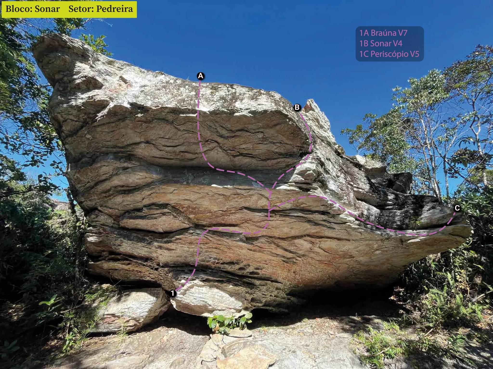
          - **largura_mapa**: 2364
          - **altura_mapa**: 1773
          - **pontos_de_interesse**:
            - **[0]**:
              - **id**: iZ5SjheABHJXHV
              - **uid**: iZ5SjheABHJXHV
              - **rotulo**: A
              - **circulo**:
                - **x**: 962
                - **y**: 366
                - **raio**: 19
              - **label**: A
            - **[1]**:
              - **id**: Zuuoo9f6HMtSFX
              - **uid**: Zuuoo9f6HMtSFX
              - **rotulo**: B
              - **circulo**:
                - **x**: 1425
                - **y**: 517
                - **raio**: 19
              - **label**: B
            - **[2]**:
              - **id**: cvIzIbrCQSTvoN
              - **uid**: cvIzIbrCQSTvoN
              - **rotulo**: C
              - **circulo**:
                - **x**: 2193
                - **y**: 1001
                - **raio**: 19
              - **label**: C
            - **[3]**:
              - **id**: KrnzDowj5O23d1
              - **uid**: KrnzDowj5O23d1
              - **rotulo**: 1
              - **circulo**:
                - **x**: 828
                - **y**: 1411
                - **raio**: 19
              - **label**: 1
          - **referencias**:
            - **[0]**:
              - **alvo_uid**: knn4yEnmGveY8u
              - **pontos_uids**:
                - KrnzDowj5O23d1
                - iZ5SjheABHJXHV
              - **escalada**: Braúna
              - **ids**:
                - KrnzDowj5O23d1
                - iZ5SjheABHJXHV
            - **[1]**:
              - **alvo_uid**: VZecRgHlfYHAKx
              - **pontos_uids**:
                - KrnzDowj5O23d1
                - Zuuoo9f6HMtSFX
              - **escalada**: Sonar
              - **ids**:
                - KrnzDowj5O23d1
                - Zuuoo9f6HMtSFX
            - **[2]**:
              - **alvo_uid**: qibofmLFHUuK38
              - **pontos_uids**:
                - KrnzDowj5O23d1
                - cvIzIbrCQSTvoN
              - **escalada**: Periscópio
              - **ids**:
                - KrnzDowj5O23d1
                - cvIzIbrCQSTvoN
      - **escaladas**:
        - **[0]**:
          - **uid**: knn4yEnmGveY8u
          - **boulder**:
            - **nome**: Braúna
            - **dificuldade**: V7
        - **[1]**:
          - **uid**: VZecRgHlfYHAKx
          - **boulder**:
            - **nome**: Sonar
            - **dificuldade**: V4
        - **[2]**:
          - **uid**: qibofmLFHUuK38
          - **boulder**:
            - **nome**: Periscópio
            - **dificuldade**: V5
      - **precomputados**:
        - **total_escaladas**: 3
        - **total_boulders**: 3
  - **[24]**:
    - **conteudo**:
      - **descricao**: 
      - **nome**: Bloco: Teto de Vidro
      - **uid**: szhFTxC1PLd0dP
      - **caminho_imagem_capa**: 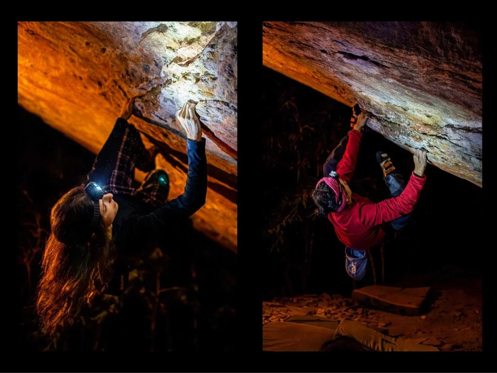
      - **mapas**:
        - **[0]**:
          - **caminho_imagem_mapa**: 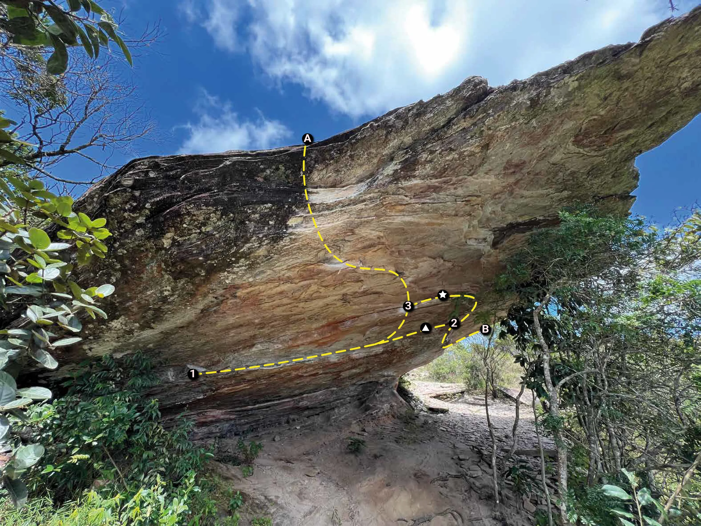
          - **largura_mapa**: 2364
          - **altura_mapa**: 1773
          - **pontos_de_interesse**:
            - **[0]**:
              - **id**: 7YWkZbtDg7AXL1
              - **uid**: 7YWkZbtDg7AXL1
              - **rotulo**: A
              - **circulo**:
                - **x**: 1037
                - **y**: 468
                - **raio**: 19
              - **label**: A
            - **[1]**:
              - **id**: L0Ix6cDuk5GMDW
              - **uid**: L0Ix6cDuk5GMDW
              - **rotulo**: B
              - **circulo**:
                - **x**: 1637
                - **y**: 1111
                - **raio**: 19
              - **label**: B
            - **[2]**:
              - **id**: EdDNqxEUV1mWAx
              - **uid**: EdDNqxEUV1mWAx
              - **rotulo**: 1
              - **circulo**:
                - **x**: 651
                - **y**: 1262
                - **raio**: 19
              - **label**: 1
            - **[3]**:
              - **id**: DGcBpiNNT86tTj
              - **uid**: DGcBpiNNT86tTj
              - **rotulo**: 2
              - **circulo**:
                - **x**: 1532
                - **y**: 1090
                - **raio**: 19
              - **label**: 2
            - **[4]**:
              - **id**: BqYMnbfOEWx4xH
              - **uid**: BqYMnbfOEWx4xH
              - **rotulo**: 3
              - **circulo**:
                - **x**: 1377
                - **y**: 1033
                - **raio**: 19
              - **label**: 3
            - **[5]**:
              - **id**: kLJmjHHjhbAkYp
              - **uid**: kLJmjHHjhbAkYp
              - **rotulo**: ▲
              - **circulo**:
                - **x**: 1436
                - **y**: 1106
                - **raio**: 19
              - **label**: ▲
            - **[6]**:
              - **id**: 57DikQUBmtQiR8
              - **uid**: 57DikQUBmtQiR8
              - **rotulo**: ★
              - **circulo**:
                - **x**: 1494
                - **y**: 995
                - **raio**: 19
              - **label**: ★
          - **referencias**:
            - **[0]**:
              - **alvo_uid**: YEvifZ2w2zHs4U
              - **pontos_uids**:
                - EdDNqxEUV1mWAx
                - 7YWkZbtDg7AXL1
              - **escalada**: Buena Onda
              - **ids**:
                - EdDNqxEUV1mWAx
                - 7YWkZbtDg7AXL1
            - **[1]**:
              - **alvo_uid**: WWwpgpRbdBXjWy
              - **pontos_uids**:
                - EdDNqxEUV1mWAx
                - L0Ix6cDuk5GMDW
                - kLJmjHHjhbAkYp
              - **escalada**: Teto de Vidro
              - **ids**:
                - EdDNqxEUV1mWAx
                - L0Ix6cDuk5GMDW
                - kLJmjHHjhbAkYp
            - **[2]**:
              - **alvo_uid**: 0dxocBw3UTvEbi
              - **pontos_uids**:
                - EdDNqxEUV1mWAx
                - L0Ix6cDuk5GMDW
                - 57DikQUBmtQiR8
              - **escalada**: Gringo de Vidro
              - **ids**:
                - EdDNqxEUV1mWAx
                - L0Ix6cDuk5GMDW
                - 57DikQUBmtQiR8
            - **[3]**:
              - **alvo_uid**: RRUnjQahwOi7LW
              - **pontos_uids**:
                - DGcBpiNNT86tTj
                - L0Ix6cDuk5GMDW
              - **escalada**: Teto Quebrado
              - **ids**:
                - DGcBpiNNT86tTj
                - L0Ix6cDuk5GMDW
            - **[4]**:
              - **alvo_uid**: GiR3oU1tjYEobE
              - **pontos_uids**:
                - BqYMnbfOEWx4xH
                - 7YWkZbtDg7AXL1
              - **escalada**: Gringo
              - **ids**:
                - BqYMnbfOEWx4xH
                - 7YWkZbtDg7AXL1
        - **[1]**:
          - **caminho_imagem_mapa**: 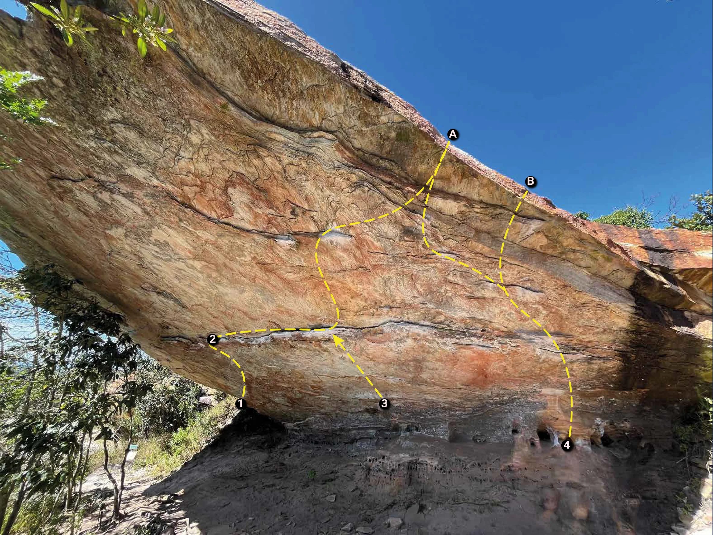
          - **largura_mapa**: 2364
          - **altura_mapa**: 1773
          - **pontos_de_interesse**:
            - **[0]**:
              - **id**: XDkg7Y8rXthgIR
              - **uid**: XDkg7Y8rXthgIR
              - **rotulo**: A
              - **circulo**:
                - **x**: 1502
                - **y**: 446
                - **raio**: 20
              - **label**: A
            - **[1]**:
              - **id**: v846xLxySV3lHd
              - **uid**: v846xLxySV3lHd
              - **rotulo**: B
              - **circulo**:
                - **x**: 1759
                - **y**: 602
                - **raio**: 20
              - **label**: B
            - **[2]**:
              - **id**: YbuBQANXt6t1xo
              - **uid**: YbuBQANXt6t1xo
              - **rotulo**: 1
              - **circulo**:
                - **x**: 799
                - **y**: 1339
                - **raio**: 20
              - **label**: 1
            - **[3]**:
              - **id**: Ak7uUO9lodIKgB
              - **uid**: Ak7uUO9lodIKgB
              - **rotulo**: 2
              - **circulo**:
                - **x**: 705
                - **y**: 1125
                - **raio**: 20
              - **label**: 2
            - **[4]**:
              - **id**: kkIbXSksmoHa9q
              - **uid**: kkIbXSksmoHa9q
              - **rotulo**: 3
              - **circulo**:
                - **x**: 1275
                - **y**: 1339
                - **raio**: 20
              - **label**: 3
            - **[5]**:
              - **id**: DoYqsbeKw5gO5G
              - **uid**: DoYqsbeKw5gO5G
              - **rotulo**: 4
              - **circulo**:
                - **x**: 1881
                - **y**: 1476
                - **raio**: 20
              - **label**: 4
          - **referencias**:
            - **[0]**:
              - **alvo_uid**: WWwpgpRbdBXjWy
              - **pontos_uids**:
                - YbuBQANXt6t1xo
                - XDkg7Y8rXthgIR
              - **escalada**: Teto de Vidro
              - **ids**:
                - YbuBQANXt6t1xo
                - XDkg7Y8rXthgIR
            - **[1]**:
              - **alvo_uid**: RRUnjQahwOi7LW
              - **pontos_uids**:
                - Ak7uUO9lodIKgB
                - XDkg7Y8rXthgIR
              - **escalada**: Teto Quebrado
              - **ids**:
                - Ak7uUO9lodIKgB
                - XDkg7Y8rXthgIR
            - **[2]**:
              - **alvo_uid**: SKGjb25vOdLqD2
              - **pontos_uids**:
                - kkIbXSksmoHa9q
                - XDkg7Y8rXthgIR
              - **escalada**: Manobra
              - **ids**:
                - kkIbXSksmoHa9q
                - XDkg7Y8rXthgIR
            - **[3]**:
              - **alvo_uid**: bQbhO9cakYAixh
              - **pontos_uids**:
                - DoYqsbeKw5gO5G
                - XDkg7Y8rXthgIR
              - **escalada**: Casquinha
              - **ids**:
                - DoYqsbeKw5gO5G
                - XDkg7Y8rXthgIR
            - **[4]**:
              - **alvo_uid**: 9edBfBXyjVjIPH
              - **pontos_uids**:
                - DoYqsbeKw5gO5G
                - v846xLxySV3lHd
              - **escalada**: Wafer
              - **ids**:
                - DoYqsbeKw5gO5G
                - v846xLxySV3lHd
      - **escaladas**:
        - **[0]**:
          - **uid**: YEvifZ2w2zHs4U
          - **boulder**:
            - **nome**: Buena Onda
            - **dificuldade**: V11
        - **[1]**:
          - **uid**: WWwpgpRbdBXjWy
          - **boulder**:
            - **nome**: Teto de Vidro
            - **dificuldade**: V9
        - **[2]**:
          - **uid**: 0dxocBw3UTvEbi
          - **boulder**:
            - **nome**: Gringo de Vidro
            - **dificuldade**: V7
        - **[3]**:
          - **uid**: RRUnjQahwOi7LW
          - **boulder**:
            - **nome**: Teto Quebrado
            - **dificuldade**: V4
        - **[4]**:
          - **uid**: GiR3oU1tjYEobE
          - **boulder**:
            - **nome**: Gringo
            - **dificuldade**: V10
        - **[5]**:
          - **uid**: SKGjb25vOdLqD2
          - **boulder**:
            - **descricao**: (dinâmico para a agarra indicada)
            - **nome**: Manobra
            - **dificuldade**: V5
        - **[6]**:
          - **uid**: bQbhO9cakYAixh
          - **boulder**:
            - **nome**: Casquinha
            - **dificuldade**: V2
        - **[7]**:
          - **uid**: 9edBfBXyjVjIPH
          - **boulder**:
            - **nome**: Wafer
            - **dificuldade**: V1
      - **precomputados**:
        - **total_escaladas**: 8
        - **total_boulders**: 8
  - **[25]**:
    - **conteudo**:
      - **descricao**: 
      - **nome**: Bloco: Tô de Boa
      - **uid**: K1nxqIQUlAj9s2
      - **caminho_imagem_capa**: 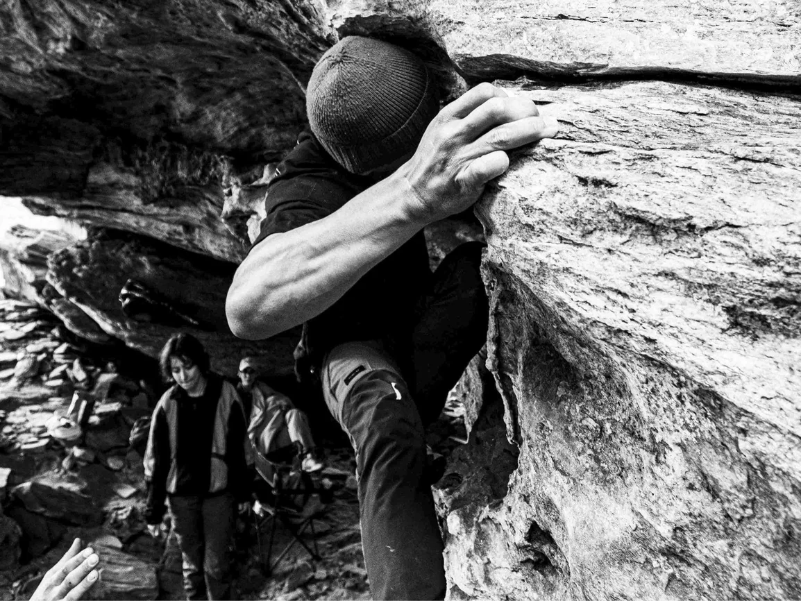
      - **mapas**:
        - **[0]**:
          - **caminho_imagem_mapa**: 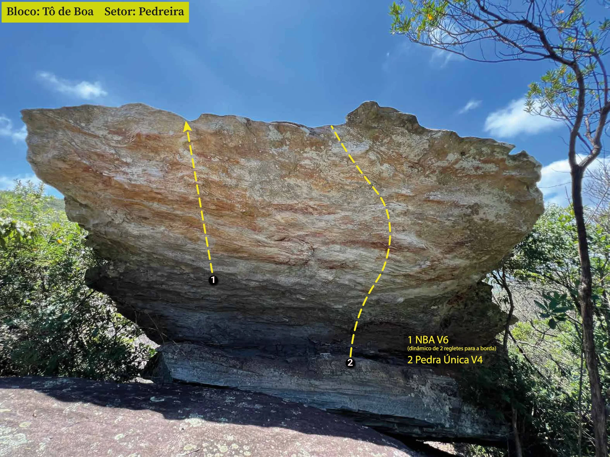
          - **largura_mapa**: 2364
          - **altura_mapa**: 1773
          - **pontos_de_interesse**:
            - **[0]**:
              - **id**: XtzwcYAWA5Avfe
              - **uid**: XtzwcYAWA5Avfe
              - **rotulo**: 1
              - **circulo**:
                - **x**: 826
                - **y**: 1088
                - **raio**: 20
              - **label**: 1
            - **[1]**:
              - **id**: HemjSh6cKeuicJ
              - **uid**: HemjSh6cKeuicJ
              - **rotulo**: 2
              - **circulo**:
                - **x**: 1358
                - **y**: 1410
                - **raio**: 20
              - **label**: 2
          - **referencias**:
            - **[0]**:
              - **alvo_uid**: QFO5zV8Vj60acY
              - **pontos_uids**:
                - XtzwcYAWA5Avfe
              - **escalada**: NBA
              - **ids**:
                - XtzwcYAWA5Avfe
            - **[1]**:
              - **alvo_uid**: c7Jx7HkHhlFEJN
              - **pontos_uids**:
                - HemjSh6cKeuicJ
              - **escalada**: Pedra Única
              - **ids**:
                - HemjSh6cKeuicJ
        - **[1]**:
          - **caminho_imagem_mapa**: 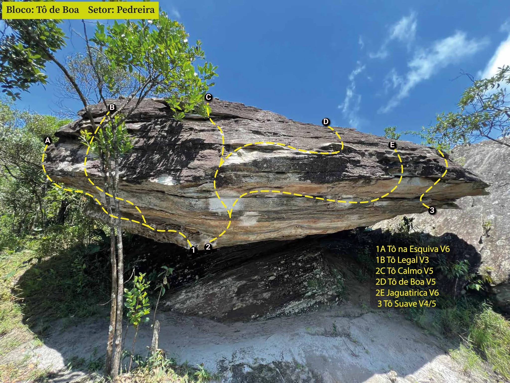
          - **largura_mapa**: 2364
          - **altura_mapa**: 1773
          - **pontos_de_interesse**:
            - **[0]**:
              - **id**: VoN7W1OuMWsJpv
              - **uid**: VoN7W1OuMWsJpv
              - **rotulo**: A
              - **circulo**:
                - **x**: 221
                - **y**: 651
                - **raio**: 20
              - **label**: A
            - **[1]**:
              - **id**: Py4n8Lxh2JCCQ4
              - **uid**: Py4n8Lxh2JCCQ4
              - **rotulo**: B
              - **circulo**:
                - **x**: 520
                - **y**: 498
                - **raio**: 20
              - **label**: B
            - **[2]**:
              - **id**: 2q2yQ4nvWb0XYy
              - **uid**: 2q2yQ4nvWb0XYy
              - **rotulo**: C
              - **circulo**:
                - **x**: 966
                - **y**: 451
                - **raio**: 20
              - **label**: C
            - **[3]**:
              - **id**: fpj8H6ZJ3EnGMo
              - **uid**: fpj8H6ZJ3EnGMo
              - **rotulo**: D
              - **circulo**:
                - **x**: 1511
                - **y**: 565
                - **raio**: 20
              - **label**: D
            - **[4]**:
              - **id**: 0WhRYWdQTsmZrM
              - **uid**: 0WhRYWdQTsmZrM
              - **rotulo**: E
              - **circulo**:
                - **x**: 1819
                - **y**: 672
                - **raio**: 20
              - **label**: E
            - **[5]**:
              - **id**: YdbiBefPaPg7hX
              - **uid**: YdbiBefPaPg7hX
              - **rotulo**: 1
              - **circulo**:
                - **x**: 896
                - **y**: 1161
                - **raio**: 20
              - **label**: 1
            - **[6]**:
              - **id**: UQi4ziTKpkWOgq
              - **uid**: UQi4ziTKpkWOgq
              - **rotulo**: 2
              - **circulo**:
                - **x**: 965
                - **y**: 1145
                - **raio**: 20
              - **label**: 2
            - **[7]**:
              - **id**: JAF7vjKLydXQRs
              - **uid**: JAF7vjKLydXQRs
              - **rotulo**: 3
              - **circulo**:
                - **x**: 2004
                - **y**: 976
                - **raio**: 20
              - **label**: 3
          - **referencias**:
            - **[0]**:
              - **alvo_uid**: Xa6aHaxm9EavYQ
              - **pontos_uids**:
                - YdbiBefPaPg7hX
                - VoN7W1OuMWsJpv
              - **escalada**: Tô na Esquiva
              - **ids**:
                - YdbiBefPaPg7hX
                - VoN7W1OuMWsJpv
            - **[1]**:
              - **alvo_uid**: cGcNjljQijDcdm
              - **pontos_uids**:
                - YdbiBefPaPg7hX
                - Py4n8Lxh2JCCQ4
              - **escalada**: Tô Legal
              - **ids**:
                - YdbiBefPaPg7hX
                - Py4n8Lxh2JCCQ4
            - **[2]**:
              - **alvo_uid**: CqUzVkd2IQyvgW
              - **pontos_uids**:
                - UQi4ziTKpkWOgq
                - 2q2yQ4nvWb0XYy
              - **escalada**: Tô Calmo
              - **ids**:
                - UQi4ziTKpkWOgq
                - 2q2yQ4nvWb0XYy
            - **[3]**:
              - **alvo_uid**: CS1E6YnOmSsSpJ
              - **pontos_uids**:
                - UQi4ziTKpkWOgq
                - fpj8H6ZJ3EnGMo
              - **escalada**: Tô de Boa
              - **ids**:
                - UQi4ziTKpkWOgq
                - fpj8H6ZJ3EnGMo
            - **[4]**:
              - **alvo_uid**: fpuOel6tZdkuiw
              - **pontos_uids**:
                - UQi4ziTKpkWOgq
                - 0WhRYWdQTsmZrM
              - **escalada**: Jaguatirica
              - **ids**:
                - UQi4ziTKpkWOgq
                - 0WhRYWdQTsmZrM
            - **[5]**:
              - **alvo_uid**: DoCybi2Yn1ujWM
              - **pontos_uids**:
                - JAF7vjKLydXQRs
              - **escalada**: Tô Suave
              - **ids**:
                - JAF7vjKLydXQRs
      - **escaladas**:
        - **[0]**:
          - **uid**: QFO5zV8Vj60acY
          - **boulder**:
            - **descricao**: (dinâmico de 2 regletes para a borda)
            - **nome**: NBA
            - **dificuldade**: V6
        - **[1]**:
          - **uid**: c7Jx7HkHhlFEJN
          - **boulder**:
            - **nome**: Pedra Única
            - **dificuldade**: V4
        - **[2]**:
          - **uid**: Xa6aHaxm9EavYQ
          - **boulder**:
            - **nome**: Tô na Esquiva
            - **dificuldade**: V6
        - **[3]**:
          - **uid**: cGcNjljQijDcdm
          - **boulder**:
            - **nome**: Tô Legal
            - **dificuldade**: V3
        - **[4]**:
          - **uid**: CqUzVkd2IQyvgW
          - **boulder**:
            - **nome**: Tô Calmo
            - **dificuldade**: V5
        - **[5]**:
          - **uid**: CS1E6YnOmSsSpJ
          - **boulder**:
            - **nome**: Tô de Boa
            - **dificuldade**: V5
        - **[6]**:
          - **uid**: fpuOel6tZdkuiw
          - **boulder**:
            - **nome**: Jaguatirica
            - **dificuldade**: V6
        - **[7]**:
          - **uid**: DoCybi2Yn1ujWM
          - **boulder**:
            - **nome**: Tô Suave
            - **dificuldade**: V4_BARRA_V5
      - **precomputados**:
        - **total_escaladas**: 8
        - **total_boulders**: 8
  - **[26]**:
    - **conteudo**:
      - **descricao**: 
      - **nome**: Bloco: Travessia
      - **uid**: UjCcyV0WXvofY6
      - **mapas**:
        - **[0]**:
          - **caminho_imagem_mapa**: 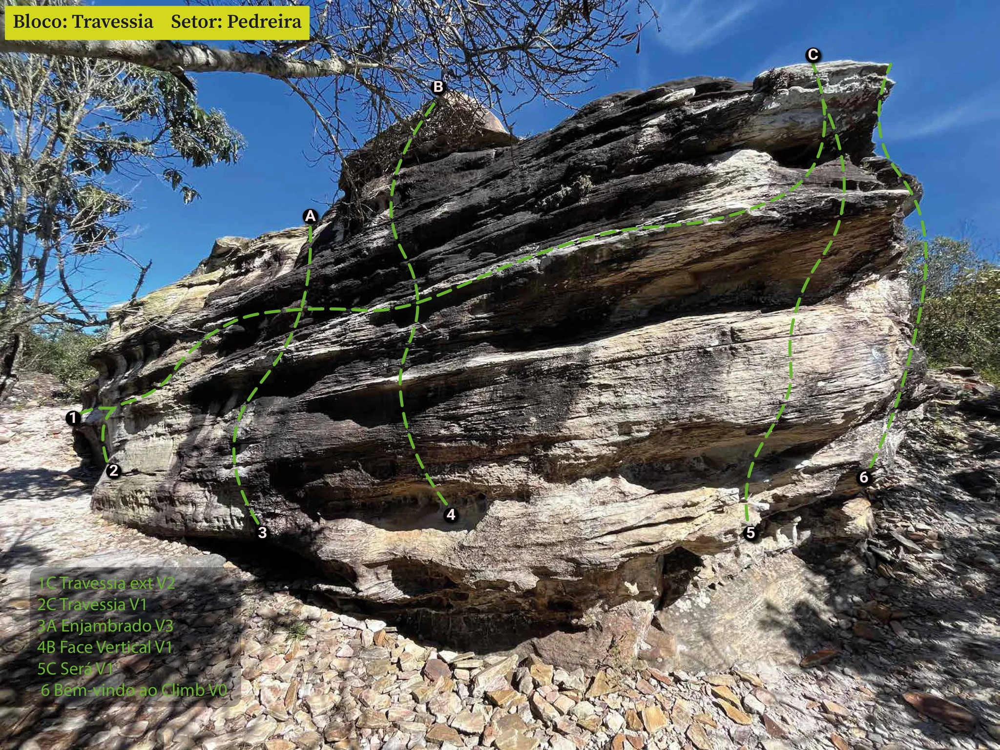
          - **largura_mapa**: 2364
          - **altura_mapa**: 1773
          - **pontos_de_interesse**:
            - **[0]**:
              - **id**: quzUQmVSrlpYTL
              - **uid**: quzUQmVSrlpYTL
              - **rotulo**: A
              - **circulo**:
                - **x**: 733
                - **y**: 509
                - **raio**: 20
              - **label**: A
            - **[1]**:
              - **id**: Ab23FMRcQRSW7S
              - **uid**: Ab23FMRcQRSW7S
              - **rotulo**: B
              - **circulo**:
                - **x**: 1036
                - **y**: 208
                - **raio**: 20
              - **label**: B
            - **[2]**:
              - **id**: Mar7pxdQjxCPw3
              - **uid**: Mar7pxdQjxCPw3
              - **rotulo**: C
              - **circulo**:
                - **x**: 1922
                - **y**: 132
                - **raio**: 20
              - **label**: C
            - **[3]**:
              - **id**: YWN5IkMSkeZsRW
              - **uid**: YWN5IkMSkeZsRW
              - **rotulo**: 1
              - **circulo**:
                - **x**: 173
                - **y**: 989
                - **raio**: 20
              - **label**: 1
            - **[4]**:
              - **id**: c2b86M5bD7vIRW
              - **uid**: c2b86M5bD7vIRW
              - **rotulo**: 2
              - **circulo**:
                - **x**: 269
                - **y**: 1115
                - **raio**: 20
              - **label**: 2
            - **[5]**:
              - **id**: i0FCFCwDw12wTu
              - **uid**: i0FCFCwDw12wTu
              - **rotulo**: 3
              - **circulo**:
                - **x**: 621
                - **y**: 1261
                - **raio**: 20
              - **label**: 3
            - **[6]**:
              - **id**: Hap2vmeTY5JDty
              - **uid**: Hap2vmeTY5JDty
              - **rotulo**: 4
              - **circulo**:
                - **x**: 1067
                - **y**: 1218
                - **raio**: 20
              - **label**: 4
            - **[7]**:
              - **id**: rIAIQwYt9x20Fs
              - **uid**: rIAIQwYt9x20Fs
              - **rotulo**: 5
              - **circulo**:
                - **x**: 1775
                - **y**: 1261
                - **raio**: 20
              - **label**: 5
            - **[8]**:
              - **id**: Vt1yHUmzeJB0SS
              - **uid**: Vt1yHUmzeJB0SS
              - **rotulo**: 6
              - **circulo**:
                - **x**: 2043
                - **y**: 1130
                - **raio**: 20
              - **label**: 6
          - **referencias**:
            - **[0]**:
              - **alvo_uid**: pcyCmtjr9v4kzY
              - **pontos_uids**:
                - YWN5IkMSkeZsRW
                - Mar7pxdQjxCPw3
              - **escalada**: Travessia ext
              - **ids**:
                - YWN5IkMSkeZsRW
                - Mar7pxdQjxCPw3
            - **[1]**:
              - **alvo_uid**: vTGk8NEg8PUPn7
              - **pontos_uids**:
                - c2b86M5bD7vIRW
                - Mar7pxdQjxCPw3
              - **escalada**: Travessia
              - **ids**:
                - c2b86M5bD7vIRW
                - Mar7pxdQjxCPw3
            - **[2]**:
              - **alvo_uid**: EDirwiq9GgBt1R
              - **pontos_uids**:
                - i0FCFCwDw12wTu
                - quzUQmVSrlpYTL
              - **escalada**: Enjambrado
              - **ids**:
                - i0FCFCwDw12wTu
                - quzUQmVSrlpYTL
            - **[3]**:
              - **alvo_uid**: QzdY0co6Cwx0vF
              - **pontos_uids**:
                - Hap2vmeTY5JDty
                - Ab23FMRcQRSW7S
              - **escalada**: Face Vertical
              - **ids**:
                - Hap2vmeTY5JDty
                - Ab23FMRcQRSW7S
            - **[4]**:
              - **alvo_uid**: lapfndpzYs9ajq
              - **pontos_uids**:
                - rIAIQwYt9x20Fs
                - Mar7pxdQjxCPw3
              - **escalada**: Será
              - **ids**:
                - rIAIQwYt9x20Fs
                - Mar7pxdQjxCPw3
            - **[5]**:
              - **alvo_uid**: hD9a4gUGcuvsgJ
              - **pontos_uids**:
                - Vt1yHUmzeJB0SS
              - **escalada**: Bem-vindo ao Climb
              - **ids**:
                - Vt1yHUmzeJB0SS
        - **[1]**:
          - **caminho_imagem_mapa**: 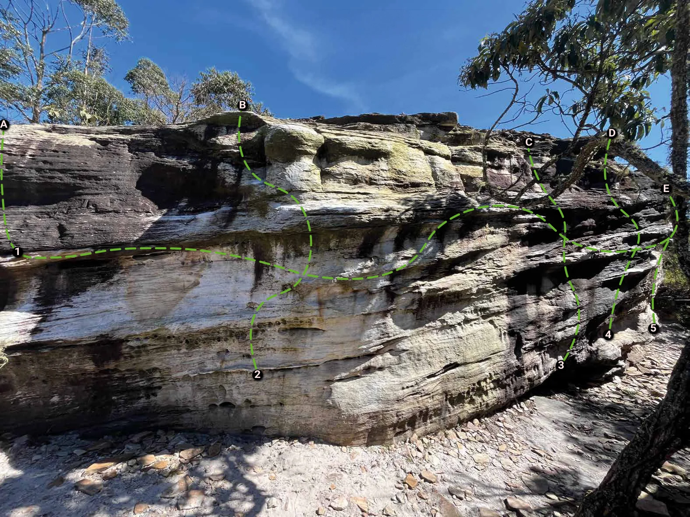
          - **largura_mapa**: 2364
          - **altura_mapa**: 1773
          - **pontos_de_interesse**:
            - **[0]**:
              - **id**: zFrBtO72do1TPZ
              - **uid**: zFrBtO72do1TPZ
              - **rotulo**: A
              - **circulo**:
                - **x**: 13
                - **y**: 429
                - **raio**: 20
              - **label**: A
            - **[1]**:
              - **id**: x79n5Rn9dstTjr
              - **uid**: x79n5Rn9dstTjr
              - **rotulo**: B
              - **circulo**:
                - **x**: 831
                - **y**: 362
                - **raio**: 20
              - **label**: B
            - **[2]**:
              - **id**: rbSgbyRSovMZ90
              - **uid**: rbSgbyRSovMZ90
              - **rotulo**: C
              - **circulo**:
                - **x**: 1812
                - **y**: 488
                - **raio**: 20
              - **label**: C
            - **[3]**:
              - **id**: T74sQDVVsrPo4Q
              - **uid**: T74sQDVVsrPo4Q
              - **rotulo**: D
              - **circulo**:
                - **x**: 2098
                - **y**: 449
                - **raio**: 19
              - **label**: D
            - **[4]**:
              - **id**: 19NNef4ApP3pAr
              - **uid**: 19NNef4ApP3pAr
              - **rotulo**: E
              - **circulo**:
                - **x**: 2283
                - **y**: 647
                - **raio**: 20
              - **label**: E
            - **[5]**:
              - **id**: Xb43krrjLpIWXu
              - **uid**: Xb43krrjLpIWXu
              - **rotulo**: 1
              - **circulo**:
                - **x**: 61
                - **y**: 865
                - **raio**: 20
              - **label**: 1
            - **[6]**:
              - **id**: 8Wxo4WfVrbv9bR
              - **uid**: 8Wxo4WfVrbv9bR
              - **rotulo**: 2
              - **circulo**:
                - **x**: 883
                - **y**: 1288
                - **raio**: 20
              - **label**: 2
            - **[7]**:
              - **id**: 26KFrG2WK6mhnB
              - **uid**: 26KFrG2WK6mhnB
              - **rotulo**: 3
              - **circulo**:
                - **x**: 1923
                - **y**: 1254
                - **raio**: 19
              - **label**: 3
            - **[8]**:
              - **id**: 4U3sJtXR0ji5Yd
              - **uid**: 4U3sJtXR0ji5Yd
              - **rotulo**: 4
              - **circulo**:
                - **x**: 2085
                - **y**: 1150
                - **raio**: 20
              - **label**: 4
            - **[9]**:
              - **id**: KeOQCuNTtmt0N3
              - **uid**: KeOQCuNTtmt0N3
              - **rotulo**: 5
              - **circulo**:
                - **x**: 2240
                - **y**: 1128
                - **raio**: 19
              - **label**: 5
          - **referencias**:
            - **[0]**:
              - **alvo_uid**: pcyCmtjr9v4kzY
              - **pontos_uids**:
                - Xb43krrjLpIWXu
                - 19NNef4ApP3pAr
              - **escalada**: Travessia ext
              - **ids**:
                - Xb43krrjLpIWXu
                - 19NNef4ApP3pAr
            - **[1]**:
              - **alvo_uid**: vTGk8NEg8PUPn7
              - **pontos_uids**:
                - 8Wxo4WfVrbv9bR
                - 19NNef4ApP3pAr
              - **escalada**: Travessia
              - **ids**:
                - 8Wxo4WfVrbv9bR
                - 19NNef4ApP3pAr
            - **[2]**:
              - **alvo_uid**: EDirwiq9GgBt1R
              - **pontos_uids**:
                - 26KFrG2WK6mhnB
                - rbSgbyRSovMZ90
              - **escalada**: Enjambrado
              - **ids**:
                - 26KFrG2WK6mhnB
                - rbSgbyRSovMZ90
            - **[3]**:
              - **alvo_uid**: QzdY0co6Cwx0vF
              - **pontos_uids**:
                - 4U3sJtXR0ji5Yd
                - T74sQDVVsrPo4Q
              - **escalada**: Face Vertical
              - **ids**:
                - 4U3sJtXR0ji5Yd
                - T74sQDVVsrPo4Q
            - **[4]**:
              - **alvo_uid**: lapfndpzYs9ajq
              - **pontos_uids**:
                - KeOQCuNTtmt0N3
                - 19NNef4ApP3pAr
              - **escalada**: Será
              - **ids**:
                - KeOQCuNTtmt0N3
                - 19NNef4ApP3pAr
            - **[5]**:
              - **alvo_uid**: BGG35KucWj5dvM
              - **pontos_uids**:
                - 8Wxo4WfVrbv9bR
                - zFrBtO72do1TPZ
              - **escalada**: Monodedo
              - **ids**:
                - 8Wxo4WfVrbv9bR
                - zFrBtO72do1TPZ
            - **[6]**:
              - **alvo_uid**: qTZt0Fhbko675Z
              - **pontos_uids**:
                - 8Wxo4WfVrbv9bR
                - x79n5Rn9dstTjr
              - **escalada**: Movimentos Eróticos
              - **ids**:
                - 8Wxo4WfVrbv9bR
                - x79n5Rn9dstTjr
      - **escaladas**:
        - **[0]**:
          - **uid**: pcyCmtjr9v4kzY
          - **boulder**:
            - **nome**: Travessia ext
            - **dificuldade**: V2
        - **[1]**:
          - **uid**: vTGk8NEg8PUPn7
          - **boulder**:
            - **nome**: Travessia
            - **dificuldade**: V1
        - **[2]**:
          - **uid**: EDirwiq9GgBt1R
          - **boulder**:
            - **nome**: Enjambrado
            - **dificuldade**: V3
        - **[3]**:
          - **uid**: QzdY0co6Cwx0vF
          - **boulder**:
            - **nome**: Face Vertical
            - **dificuldade**: V1
        - **[4]**:
          - **uid**: lapfndpzYs9ajq
          - **boulder**:
            - **nome**: Será
            - **dificuldade**: V1
        - **[5]**:
          - **uid**: hD9a4gUGcuvsgJ
          - **boulder**:
            - **nome**: Bem-vindo ao Climb
            - **dificuldade**: V0
        - **[6]**:
          - **uid**: BGG35KucWj5dvM
          - **boulder**:
            - **nome**: Monodedo
            - **dificuldade**: V1
        - **[7]**:
          - **uid**: qTZt0Fhbko675Z
          - **boulder**:
            - **nome**: Movimentos Eróticos
            - **dificuldade**: V1
      - **precomputados**:
        - **total_escaladas**: 8
        - **total_boulders**: 8
  - **[27]**:
    - **conteudo**:
      - **descricao**: 
      - **nome**: Bloco: Véia Doida
      - **uid**: kgtdjfbk5ACj10
      - **mapas**:
        - **[0]**:
          - **caminho_imagem_mapa**: 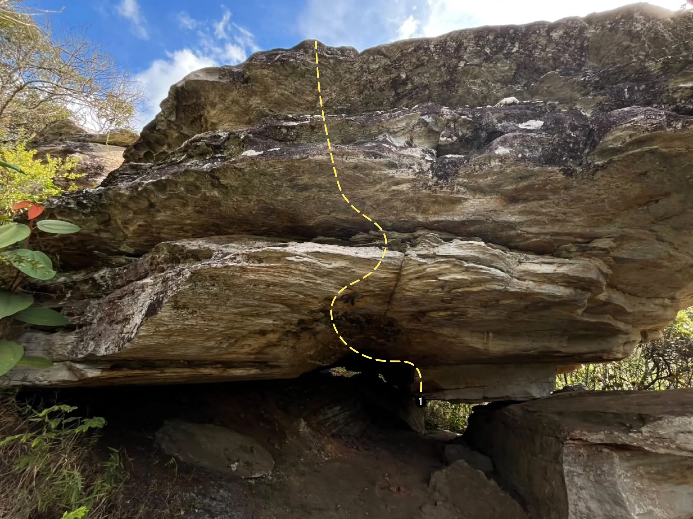
          - **largura_mapa**: 2364
          - **altura_mapa**: 1773
          - **pontos_de_interesse**:
            - **[0]**:
              - **id**: n1m5SO9etQaAtv
              - **uid**: n1m5SO9etQaAtv
              - **rotulo**: 1
              - **circulo**:
                - **x**: 1435
                - **y**: 1370
                - **raio**: 19
              - **label**: 1
          - **referencias**:
            - **[0]**:
              - **alvo_uid**: G2mJ4k1ZaGgXc2
              - **pontos_uids**:
                - n1m5SO9etQaAtv
              - **escalada**: Véia Doida
              - **ids**:
                - n1m5SO9etQaAtv
      - **escaladas**:
        - **[0]**:
          - **uid**: G2mJ4k1ZaGgXc2
          - **boulder**:
            - **nome**: Véia Doida
            - **dificuldade**: V4
      - **precomputados**:
        - **total_escaladas**: 1
        - **total_boulders**: 1
  - **[28]**:
    - **conteudo**:
      - **descricao**: 
      - **nome**: Bloco: Vitamina Jungle
      - **uid**: 7mDnFwq43CjOWP
      - **mapas**:
        - **[0]**:
          - **caminho_imagem_mapa**: 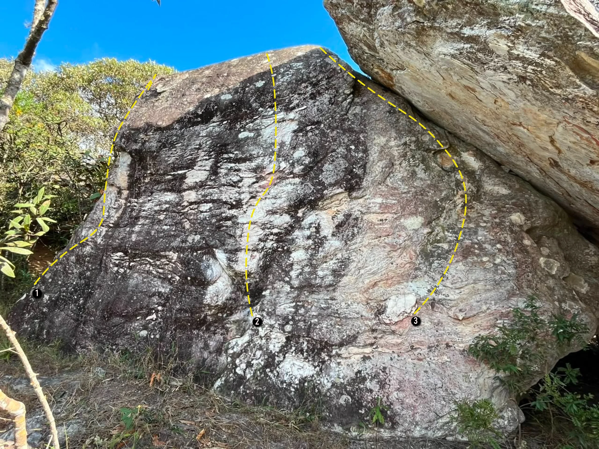
          - **referencias**:
            - **[0]**:
              - **alvo_uid**: UBwALl6BBva9h6
              - **pontos_uids**:
                - OKIXHvtiTpHt1c
              - **escalada**: 009
              - **ids**:
                - OKIXHvtiTpHt1c
            - **[1]**:
              - **alvo_uid**: ayF1HWH1778CLV
              - **pontos_uids**:
                - FPJNN7pKQhHt1v
              - **escalada**: Vitamina Jungle
              - **ids**:
                - FPJNN7pKQhHt1v
            - **[2]**:
              - **alvo_uid**: wPFkMDhFBCo6S1
              - **pontos_uids**:
                - zoTD2iLwuJoivh
              - **escalada**: 010
              - **ids**:
                - zoTD2iLwuJoivh
          - **largura_mapa**: 2364
          - **altura_mapa**: 1773
          - **pontos_de_interesse**:
            - **[0]**:
              - **id**: OKIXHvtiTpHt1c
              - **uid**: OKIXHvtiTpHt1c
              - **rotulo**: 1
              - **circulo**:
                - **x**: 146
                - **y**: 1158
                - **raio**: 19
              - **label**: 1
            - **[1]**:
              - **id**: FPJNN7pKQhHt1v
              - **uid**: FPJNN7pKQhHt1v
              - **rotulo**: 2
              - **circulo**:
                - **x**: 1015
                - **y**: 1270
                - **raio**: 18
              - **label**: 2
            - **[2]**:
              - **id**: zoTD2iLwuJoivh
              - **uid**: zoTD2iLwuJoivh
              - **rotulo**: 3
              - **circulo**:
                - **x**: 1641
                - **y**: 1267
                - **raio**: 18
              - **label**: 3
      - **escaladas**:
        - **[0]**:
          - **uid**: UBwALl6BBva9h6
          - **boulder**:
            - **nome**: 009
            - **dificuldade**: V3
        - **[1]**:
          - **uid**: ayF1HWH1778CLV
          - **boulder**:
            - **nome**: Vitamina Jungle
            - **dificuldade**: V7
        - **[2]**:
          - **uid**: wPFkMDhFBCo6S1
          - **boulder**:
            - **nome**: 010
            - **dificuldade**: V3
      - **precomputados**:
        - **total_escaladas**: 3
        - **total_boulders**: 3
- **precomputados**:
  - **total_escaladas**: 225
  - **total_boulders**: 225

## Parte: grupo_mont_blanc

### Grupo (Pico: Ouroboulder (PNMA))

- **descricao**: 
- **nome**: Mont Blanc
- **uid**: XfBdBMDd0eH2Ii
- **localizacao_estacionamento**:
  - **latitude**: -203677334
  - **longitude**: -435075136
- **localizacao_escalada**:
  - **latitude**: -203694658
  - **longitude**: -435034308
- **mapas**:
  - **[0]**:
    - **caminho_imagem_mapa**: 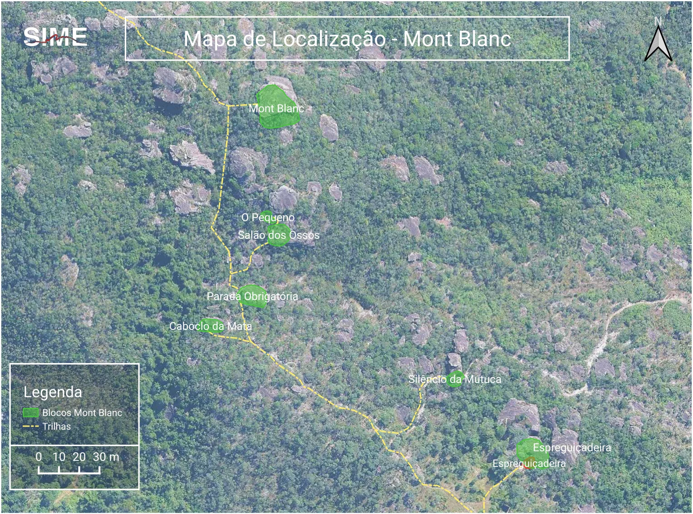
    - **largura_mapa**: 1527
    - **altura_mapa**: 1134
    - **pontos_de_interesse**:
      - **[0]**:
        - **id**: FG7fb95O5nYBb5
        - **uid**: FG7fb95O5nYBb5
        - **rotulo**: Mont Blanc
        - **retangulo**:
          - **x**: 610
          - **y**: 239
          - **comprimento**: 128
          - **largura**: 24
        - **label**: Mont Blanc
      - **[1]**:
        - **id**: 8ge4pkya9aSD5a
        - **uid**: 8ge4pkya9aSD5a
        - **rotulo**: O Pequeno
        - **retangulo**:
          - **x**: 591
          - **y**: 480
          - **comprimento**: 120
          - **largura**: 25
        - **label**: O Pequeno
      - **[2]**:
        - **id**: OL4IGr0iVF18CY
        - **uid**: OL4IGr0iVF18CY
        - **rotulo**: Salão dos Ossos
        - **retangulo**:
          - **x**: 616
          - **y**: 518
          - **comprimento**: 183
          - **largura**: 23
        - **label**: Salão dos Ossos
      - **[3]**:
        - **id**: vALageLc2YwT4M
        - **uid**: vALageLc2YwT4M
        - **rotulo**: Parada Obrigatória
        - **retangulo**:
          - **x**: 557
          - **y**: 654
          - **comprimento**: 206
          - **largura**: 24
        - **label**: Parada Obrigatória
      - **[4]**:
        - **id**: 580sgjs024ezil
        - **uid**: 580sgjs024ezil
        - **rotulo**: Caboclo da Mata
        - **retangulo**:
          - **x**: 465
          - **y**: 718
          - **comprimento**: 188
          - **largura**: 23
        - **label**: Caboclo da Mata
      - **[5]**:
        - **id**: AJncL6IJbXqbdS
        - **uid**: AJncL6IJbXqbdS
        - **rotulo**: Silêncio da Mutuca
        - **retangulo**:
          - **x**: 1004
          - **y**: 837
          - **comprimento**: 211
          - **largura**: 24
        - **label**: Silêncio da Mutuca
      - **[6]**:
        - **id**: coHhza0VmZJ1Sp
        - **uid**: coHhza0VmZJ1Sp
        - **rotulo**: Espreguiçadeira
        - **retangulo**:
          - **x**: 1261
          - **y**: 988
          - **comprimento**: 176
          - **largura**: 25
        - **label**: Espreguiçadeira
      - **[7]**:
        - **id**: OjVPhDEP26CQrW
        - **uid**: OjVPhDEP26CQrW
        - **rotulo**: Espreguiçadeira
        - **retangulo**:
          - **x**: 1166
          - **y**: 1022
          - **comprimento**: 169
          - **largura**: 28
        - **label**: Espreguiçadeira
    - **referencias**:
      - **[0]**:
        - **alvo_uid**: fgmvBg43tS98cN
        - **pontos_uids**:
          - FG7fb95O5nYBb5
        - **setor**: Bloco: Mont Blanc
        - **ids**:
          - FG7fb95O5nYBb5
      - **[1]**:
        - **alvo_uid**: ZJVQc9suLiF4NT
        - **pontos_uids**:
          - 8ge4pkya9aSD5a
        - **setor**: Bloco: O Pequeno
        - **ids**:
          - 8ge4pkya9aSD5a
      - **[2]**:
        - **alvo_uid**: 24qEZNrzLWzCh7
        - **pontos_uids**:
          - OL4IGr0iVF18CY
        - **setor**: Bloco: Salão dos Ossos
        - **ids**:
          - OL4IGr0iVF18CY
      - **[3]**:
        - **alvo_uid**: Yxr8Ifci5wj175
        - **pontos_uids**:
          - vALageLc2YwT4M
        - **setor**: Bloco: Parada Obrigatória
        - **ids**:
          - vALageLc2YwT4M
      - **[4]**:
        - **alvo_uid**: ka0xDrNaPASN32
        - **pontos_uids**:
          - 580sgjs024ezil
        - **setor**: Bloco: Cabocla da Mata
        - **ids**:
          - 580sgjs024ezil
      - **[5]**:
        - **alvo_uid**: 6yBaMVkS6Qr1uz
        - **pontos_uids**:
          - AJncL6IJbXqbdS
        - **setor**: Bloco: Silêncio da Mutuca
        - **ids**:
          - AJncL6IJbXqbdS
      - **[6]**:
        - **alvo_uid**: S1KezKyo1wzcRj
        - **pontos_uids**:
          - coHhza0VmZJ1Sp
          - OjVPhDEP26CQrW
        - **setor**: Bloco: Espreguiçadeira
        - **ids**:
          - coHhza0VmZJ1Sp
          - OjVPhDEP26CQrW
- **setores**:
  - **[0]**:
    - **conteudo**:
      - **descricao**: 
      - **nome**: Bloco: Mont Blanc
      - **uid**: fgmvBg43tS98cN
      - **mapas**:
        - **[0]**:
          - **caminho_imagem_mapa**: 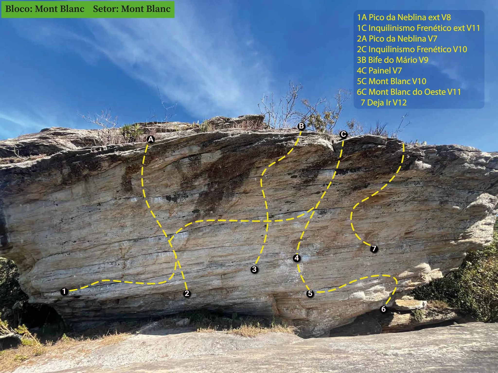
          - **largura_mapa**: 2364
          - **altura_mapa**: 1773
          - **pontos_de_interesse**:
            - **[0]**:
              - **id**: MgI961ArsmoseJ
              - **uid**: MgI961ArsmoseJ
              - **rotulo**: A
              - **circulo**:
                - **x**: 716
                - **y**: 662
                - **raio**: 20
              - **label**: A
            - **[1]**:
              - **id**: NSJEWm5l152LeX
              - **uid**: NSJEWm5l152LeX
              - **rotulo**: B
              - **circulo**:
                - **x**: 1431
                - **y**: 601
                - **raio**: 20
              - **label**: B
            - **[2]**:
              - **id**: RkCuLA5gHiIHEb
              - **uid**: RkCuLA5gHiIHEb
              - **rotulo**: C
              - **circulo**:
                - **x**: 1631
                - **y**: 640
                - **raio**: 20
              - **label**: C
            - **[3]**:
              - **id**: YPcp0YPv580Whc
              - **uid**: YPcp0YPv580Whc
              - **rotulo**: 1
              - **circulo**:
                - **x**: 305
                - **y**: 1387
                - **raio**: 20
              - **label**: 1
            - **[4]**:
              - **id**: 6AWseOSLUkgPK8
              - **uid**: 6AWseOSLUkgPK8
              - **rotulo**: 2
              - **circulo**:
                - **x**: 889
                - **y**: 1397
                - **raio**: 20
              - **label**: 2
            - **[5]**:
              - **id**: TSalA4rxoxE3vj
              - **uid**: TSalA4rxoxE3vj
              - **rotulo**: 3
              - **circulo**:
                - **x**: 1208
                - **y**: 1282
                - **raio**: 20
              - **label**: 3
            - **[6]**:
              - **id**: PVIdxUlmaO4qKj
              - **uid**: PVIdxUlmaO4qKj
              - **rotulo**: 4
              - **circulo**:
                - **x**: 1409
                - **y**: 1228
                - **raio**: 20
              - **label**: 4
            - **[7]**:
              - **id**: 6JvgIjni2IrcpY
              - **uid**: 6JvgIjni2IrcpY
              - **rotulo**: 5
              - **circulo**:
                - **x**: 1473
                - **y**: 1397
                - **raio**: 20
              - **label**: 5
            - **[8]**:
              - **id**: mcykqIBH26Ck8Q
              - **uid**: mcykqIBH26Ck8Q
              - **rotulo**: 6
              - **circulo**:
                - **x**: 1821
                - **y**: 1472
                - **raio**: 20
              - **label**: 6
            - **[9]**:
              - **id**: mmifEVOuE1eovt
              - **uid**: mmifEVOuE1eovt
              - **rotulo**: 7
              - **circulo**:
                - **x**: 1776
                - **y**: 1183
                - **raio**: 20
              - **label**: 7
          - **referencias**:
            - **[0]**:
              - **alvo_uid**: HxvqK4w4aJuvQ6
              - **pontos_uids**:
                - YPcp0YPv580Whc
                - MgI961ArsmoseJ
              - **escalada**: Pico da Neblina ext
              - **ids**:
                - YPcp0YPv580Whc
                - MgI961ArsmoseJ
            - **[1]**:
              - **alvo_uid**: obciegyHD2L2k0
              - **pontos_uids**:
                - YPcp0YPv580Whc
                - RkCuLA5gHiIHEb
              - **escalada**: Inquilinismo Frenético ext
              - **ids**:
                - YPcp0YPv580Whc
                - RkCuLA5gHiIHEb
            - **[2]**:
              - **alvo_uid**: HG5YWkKCFKQhje
              - **pontos_uids**:
                - 6AWseOSLUkgPK8
                - MgI961ArsmoseJ
              - **escalada**: Pico da Neblina
              - **ids**:
                - 6AWseOSLUkgPK8
                - MgI961ArsmoseJ
            - **[3]**:
              - **alvo_uid**: DLdVVQSqkRGt72
              - **pontos_uids**:
                - 6AWseOSLUkgPK8
                - RkCuLA5gHiIHEb
              - **escalada**: Inquilinismo Frenético
              - **ids**:
                - 6AWseOSLUkgPK8
                - RkCuLA5gHiIHEb
            - **[4]**:
              - **alvo_uid**: KpSQnFIXTEPD2k
              - **pontos_uids**:
                - TSalA4rxoxE3vj
                - NSJEWm5l152LeX
              - **escalada**: Bife do Mário
              - **ids**:
                - TSalA4rxoxE3vj
                - NSJEWm5l152LeX
            - **[5]**:
              - **alvo_uid**: hzm9vuQX67C1Wc
              - **pontos_uids**:
                - PVIdxUlmaO4qKj
                - RkCuLA5gHiIHEb
              - **escalada**: Painel
              - **ids**:
                - PVIdxUlmaO4qKj
                - RkCuLA5gHiIHEb
            - **[6]**:
              - **alvo_uid**: AJf18flQDH3I0x
              - **pontos_uids**:
                - 6JvgIjni2IrcpY
                - RkCuLA5gHiIHEb
              - **escalada**: Mont Blanc
              - **ids**:
                - 6JvgIjni2IrcpY
                - RkCuLA5gHiIHEb
            - **[7]**:
              - **alvo_uid**: GCgUYKVZhloIHw
              - **pontos_uids**:
                - mcykqIBH26Ck8Q
                - RkCuLA5gHiIHEb
              - **escalada**: Mont Blanc do Oeste
              - **ids**:
                - mcykqIBH26Ck8Q
                - RkCuLA5gHiIHEb
            - **[8]**:
              - **alvo_uid**: Kvo1CxiDkGbOaU
              - **pontos_uids**:
                - mmifEVOuE1eovt
              - **escalada**: Deja Ir
              - **ids**:
                - mmifEVOuE1eovt
        - **[1]**:
          - **caminho_imagem_mapa**: 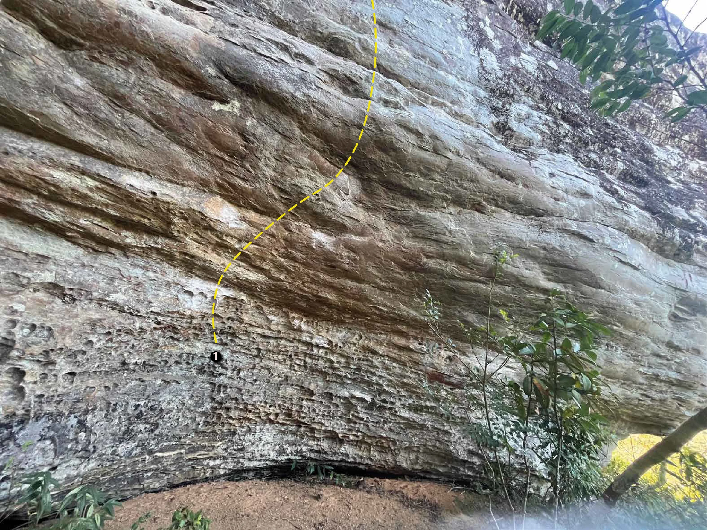
          - **largura_mapa**: 2364
          - **altura_mapa**: 1773
          - **pontos_de_interesse**:
            - **[0]**:
              - **id**: hwjFloVQJNPvzA
              - **uid**: hwjFloVQJNPvzA
              - **rotulo**: 1
              - **circulo**:
                - **x**: 722
                - **y**: 1193
                - **raio**: 20
              - **label**: 1
          - **referencias**:
            - **[0]**:
              - **alvo_uid**: 8OsuQIZfom43zc
              - **pontos_uids**:
                - hwjFloVQJNPvzA
              - **escalada**: Colibri
              - **ids**:
                - hwjFloVQJNPvzA
        - **[2]**:
          - **caminho_imagem_mapa**: 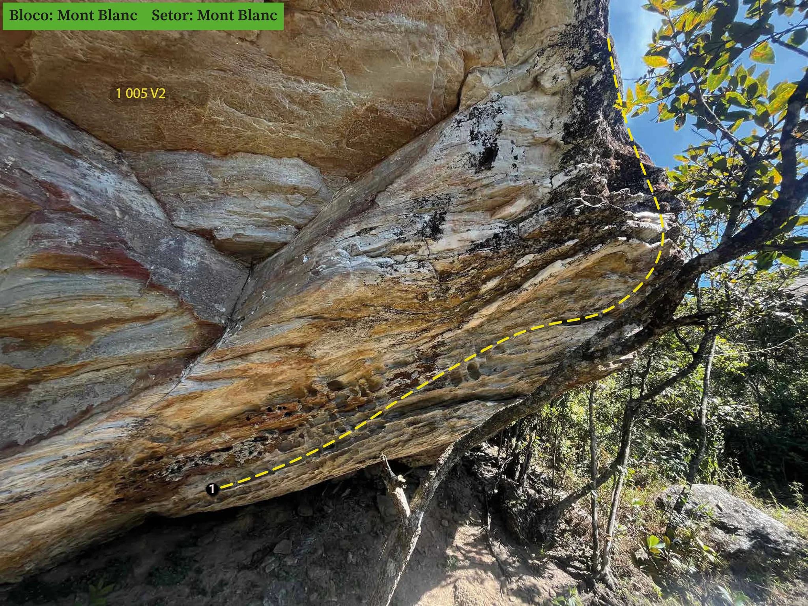
          - **largura_mapa**: 2364
          - **altura_mapa**: 1773
          - **pontos_de_interesse**:
            - **[0]**:
              - **id**: o9kifzUkZpAbpV
              - **uid**: o9kifzUkZpAbpV
              - **rotulo**: 1
              - **circulo**:
                - **x**: 621
                - **y**: 1432
                - **raio**: 20
              - **label**: 1
          - **referencias**:
            - **[0]**:
              - **alvo_uid**: pzd2TA0RieVhod
              - **pontos_uids**:
                - o9kifzUkZpAbpV
              - **escalada**: 011
              - **ids**:
                - o9kifzUkZpAbpV
        - **[3]**:
          - **caminho_imagem_mapa**: 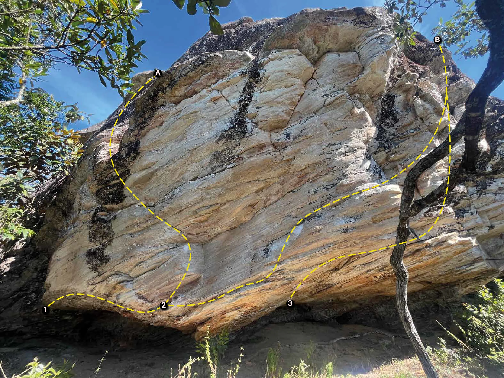
          - **largura_mapa**: 2364
          - **altura_mapa**: 1773
          - **pontos_de_interesse**:
            - **[0]**:
              - **id**: QItOyfVn5aBd7w
              - **uid**: QItOyfVn5aBd7w
              - **rotulo**: 1
              - **circulo**:
                - **x**: 213
                - **y**: 1454
                - **raio**: 19
              - **label**: 1
            - **[1]**:
              - **id**: NpREQQ1xHmvTTK
              - **uid**: NpREQQ1xHmvTTK
              - **rotulo**: 2
              - **circulo**:
                - **x**: 768
                - **y**: 1434
                - **raio**: 19
              - **label**: 2
            - **[2]**:
              - **id**: iHulBl47wvUsPt
              - **uid**: iHulBl47wvUsPt
              - **rotulo**: 3
              - **circulo**:
                - **x**: 1361
                - **y**: 1423
                - **raio**: 19
              - **label**: 3
            - **[3]**:
              - **id**: IjQowFLvchErDe
              - **uid**: IjQowFLvchErDe
              - **rotulo**: A
              - **circulo**:
                - **x**: 741
                - **y**: 344
                - **raio**: 19
              - **label**: A
            - **[4]**:
              - **id**: PrJLXRnuMdWN81
              - **uid**: PrJLXRnuMdWN81
              - **rotulo**: B
              - **circulo**:
                - **x**: 2052
                - **y**: 187
                - **raio**: 19
              - **label**: B
          - **referencias**:
            - **[0]**:
              - **alvo_uid**: i4p4NwcUZatCSY
              - **pontos_uids**:
                - QItOyfVn5aBd7w
                - IjQowFLvchErDe
              - **escalada**: Raízes do Brasil
              - **ids**:
                - QItOyfVn5aBd7w
                - IjQowFLvchErDe
            - **[1]**:
              - **alvo_uid**: KKYpO4NPL92GCF
              - **pontos_uids**:
                - NpREQQ1xHmvTTK
                - IjQowFLvchErDe
              - **escalada**: Raízes do Cerrado
              - **ids**:
                - NpREQQ1xHmvTTK
                - IjQowFLvchErDe
            - **[2]**:
              - **alvo_uid**: GFagObO00xjOIA
              - **pontos_uids**:
                - iHulBl47wvUsPt
                - PrJLXRnuMdWN81
              - **escalada**: Super Bonder
              - **ids**:
                - iHulBl47wvUsPt
                - PrJLXRnuMdWN81
            - **[3]**:
              - **alvo_uid**: WUD3ZHG02732ZR
              - **pontos_uids**:
                - NpREQQ1xHmvTTK
                - PrJLXRnuMdWN81
              - **escalada**: Tec Bond
              - **ids**:
                - NpREQQ1xHmvTTK
                - PrJLXRnuMdWN81
      - **escaladas**:
        - **[0]**:
          - **uid**: HxvqK4w4aJuvQ6
          - **boulder**:
            - **nome**: Pico da Neblina ext
            - **dificuldade**: V8
        - **[1]**:
          - **uid**: obciegyHD2L2k0
          - **boulder**:
            - **nome**: Inquilinismo Frenético ext
            - **dificuldade**: V11
        - **[2]**:
          - **uid**: HG5YWkKCFKQhje
          - **boulder**:
            - **nome**: Pico da Neblina
            - **dificuldade**: V7
        - **[3]**:
          - **uid**: DLdVVQSqkRGt72
          - **boulder**:
            - **nome**: Inquilinismo Frenético
            - **dificuldade**: V10
        - **[4]**:
          - **uid**: KpSQnFIXTEPD2k
          - **boulder**:
            - **nome**: Bife do Mário
            - **dificuldade**: V9
        - **[5]**:
          - **uid**: hzm9vuQX67C1Wc
          - **boulder**:
            - **nome**: Painel
            - **dificuldade**: V7
        - **[6]**:
          - **uid**: AJf18flQDH3I0x
          - **boulder**:
            - **nome**: Mont Blanc
            - **dificuldade**: V10
        - **[7]**:
          - **uid**: GCgUYKVZhloIHw
          - **boulder**:
            - **nome**: Mont Blanc do Oeste
            - **dificuldade**: V11
        - **[8]**:
          - **uid**: Kvo1CxiDkGbOaU
          - **boulder**:
            - **nome**: Deja Ir
            - **dificuldade**: V12
        - **[9]**:
          - **uid**: 8OsuQIZfom43zc
          - **boulder**:
            - **nome**: Colibri
            - **dificuldade**: V10
        - **[10]**:
          - **uid**: pzd2TA0RieVhod
          - **boulder**:
            - **nome**: 011
            - **dificuldade**: V2
        - **[11]**:
          - **uid**: i4p4NwcUZatCSY
          - **boulder**:
            - **nome**: Raízes do Brasil
            - **dificuldade**: V4
        - **[12]**:
          - **uid**: KKYpO4NPL92GCF
          - **boulder**:
            - **nome**: Raízes do Cerrado
            - **dificuldade**: V3
        - **[13]**:
          - **uid**: WUD3ZHG02732ZR
          - **boulder**:
            - **nome**: Tec Bond
            - **dificuldade**: V5
        - **[14]**:
          - **uid**: GFagObO00xjOIA
          - **boulder**:
            - **nome**: Super Bonder
            - **dificuldade**: V6
      - **precomputados**:
        - **total_escaladas**: 15
        - **total_boulders**: 15
  - **[1]**:
    - **conteudo**:
      - **descricao**: 
      - **nome**: Bloco: Parada Obrigatória
      - **uid**: Yxr8Ifci5wj175
      - **caminho_imagem_capa**: 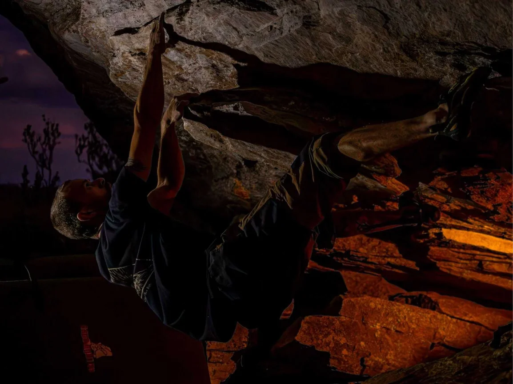
      - **mapas**:
        - **[0]**:
          - **caminho_imagem_mapa**: 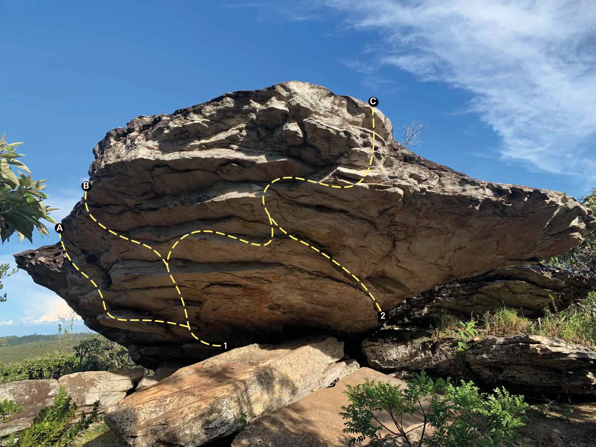
          - **largura_mapa**: 2364
          - **altura_mapa**: 1773
          - **pontos_de_interesse**:
            - **[0]**:
              - **id**: 8FivKRD2b2uyR9
              - **uid**: 8FivKRD2b2uyR9
              - **rotulo**: A
              - **circulo**:
                - **x**: 236
                - **y**: 904
                - **raio**: 19
              - **label**: A
            - **[1]**:
              - **id**: fmgUnNB9iLw6sp
              - **uid**: fmgUnNB9iLw6sp
              - **rotulo**: B
              - **circulo**:
                - **x**: 341
                - **y**: 738
                - **raio**: 19
              - **label**: B
            - **[2]**:
              - **id**: LIHRJtfgQRPJER
              - **uid**: LIHRJtfgQRPJER
              - **rotulo**: C
              - **circulo**:
                - **x**: 1480
                - **y**: 402
                - **raio**: 19
              - **label**: C
            - **[3]**:
              - **id**: Yv9QyDEhXlVIw2
              - **uid**: Yv9QyDEhXlVIw2
              - **rotulo**: 1
              - **circulo**:
                - **x**: 895
                - **y**: 1371
                - **raio**: 19
              - **label**: 1
            - **[4]**:
              - **id**: Gl7F6RahQnCRwL
              - **uid**: Gl7F6RahQnCRwL
              - **rotulo**: 2
              - **circulo**:
                - **x**: 1519
                - **y**: 1252
                - **raio**: 19
              - **label**: 2
          - **referencias**:
            - **[0]**:
              - **alvo_uid**: Gs0fPWNas9pHR4
              - **pontos_uids**:
                - Yv9QyDEhXlVIw2
                - 8FivKRD2b2uyR9
              - **escalada**: Parada Obrigatória
              - **ids**:
                - Yv9QyDEhXlVIw2
                - 8FivKRD2b2uyR9
            - **[1]**:
              - **alvo_uid**: YQEWfuJCKqYaN0
              - **pontos_uids**:
                - Yv9QyDEhXlVIw2
                - fmgUnNB9iLw6sp
              - **escalada**: Rio Doce
              - **ids**:
                - Yv9QyDEhXlVIw2
                - fmgUnNB9iLw6sp
            - **[2]**:
              - **alvo_uid**: oIkPMXqSrbjtCn
              - **pontos_uids**:
                - Yv9QyDEhXlVIw2
                - LIHRJtfgQRPJER
              - **escalada**: Rio das Velhas
              - **ids**:
                - Yv9QyDEhXlVIw2
                - LIHRJtfgQRPJER
            - **[3]**:
              - **alvo_uid**: mUTr10pmaWeSi5
              - **pontos_uids**:
                - Gl7F6RahQnCRwL
                - LIHRJtfgQRPJER
              - **escalada**: Igarapé
              - **ids**:
                - Gl7F6RahQnCRwL
                - LIHRJtfgQRPJER
        - **[1]**:
          - **caminho_imagem_mapa**: 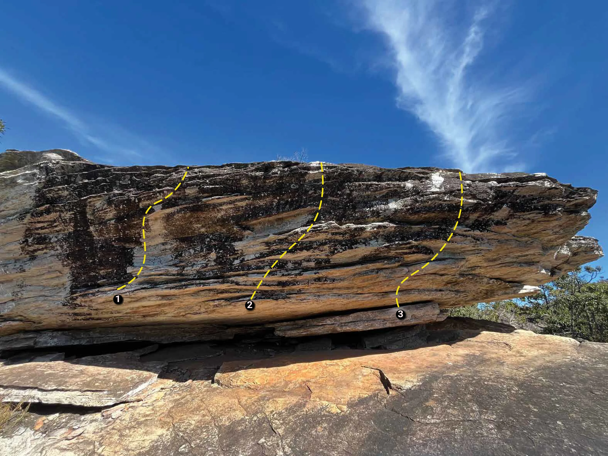
          - **largura_mapa**: 2364
          - **altura_mapa**: 1773
          - **pontos_de_interesse**:
            - **[0]**:
              - **id**: pQmgDQVRc5lTIi
              - **uid**: pQmgDQVRc5lTIi
              - **rotulo**: 1
              - **circulo**:
                - **x**: 459
                - **y**: 1164
                - **raio**: 19
              - **label**: 1
            - **[1]**:
              - **id**: zV4qD2JlV2XjVt
              - **uid**: zV4qD2JlV2XjVt
              - **rotulo**: 2
              - **circulo**:
                - **x**: 972
                - **y**: 1187
                - **raio**: 19
              - **label**: 2
            - **[2]**:
              - **id**: bvoxRdNNUAyNG5
              - **uid**: bvoxRdNNUAyNG5
              - **rotulo**: 3
              - **circulo**:
                - **x**: 1558
                - **y**: 1222
                - **raio**: 19
              - **label**: 3
          - **referencias**:
            - **[0]**:
              - **alvo_uid**: LQeDGzN0CRGPg7
              - **pontos_uids**:
                - pQmgDQVRc5lTIi
              - **escalada**: Frasco
              - **ids**:
                - pQmgDQVRc5lTIi
            - **[1]**:
              - **alvo_uid**: RPXGcVsvnjcDrK
              - **pontos_uids**:
                - zV4qD2JlV2XjVt
              - **escalada**: Frisco
              - **ids**:
                - zV4qD2JlV2XjVt
            - **[2]**:
              - **alvo_uid**: Y3t9wt580u8CHp
              - **pontos_uids**:
                - bvoxRdNNUAyNG5
              - **escalada**: Fulano
              - **ids**:
                - bvoxRdNNUAyNG5
      - **escaladas**:
        - **[0]**:
          - **uid**: Gs0fPWNas9pHR4
          - **boulder**:
            - **nome**: Parada Obrigatória
            - **dificuldade**: V3
        - **[1]**:
          - **uid**: YQEWfuJCKqYaN0
          - **boulder**:
            - **nome**: Rio Doce
            - **dificuldade**: V4
        - **[2]**:
          - **uid**: oIkPMXqSrbjtCn
          - **boulder**:
            - **nome**: Rio das Velhas
            - **dificuldade**: V8
        - **[3]**:
          - **uid**: mUTr10pmaWeSi5
          - **boulder**:
            - **nome**: Igarapé
            - **dificuldade**: V7
        - **[4]**:
          - **uid**: LQeDGzN0CRGPg7
          - **boulder**:
            - **nome**: Frasco
            - **dificuldade**: V2
        - **[5]**:
          - **uid**: RPXGcVsvnjcDrK
          - **boulder**:
            - **nome**: Frisco
            - **dificuldade**: V2
        - **[6]**:
          - **uid**: Y3t9wt580u8CHp
          - **boulder**:
            - **nome**: Fulano
            - **dificuldade**: V1
      - **precomputados**:
        - **total_escaladas**: 7
        - **total_boulders**: 7
  - **[2]**:
    - **conteudo**:
      - **descricao**: 
      - **nome**: Bloco: Salão dos Ossos
      - **uid**: 24qEZNrzLWzCh7
      - **mapas**:
        - **[0]**:
          - **caminho_imagem_mapa**: 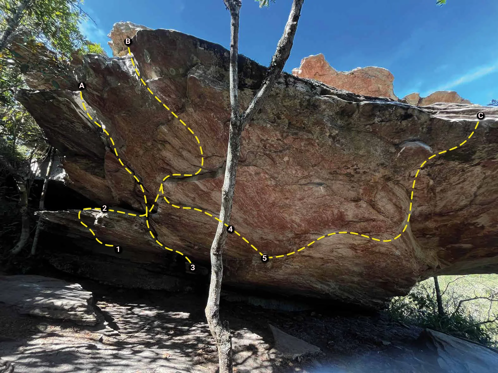
          - **largura_mapa**: 2364
          - **altura_mapa**: 1773
          - **pontos_de_interesse**:
            - **[0]**:
              - **id**: iy1FEogziPepyS
              - **uid**: iy1FEogziPepyS
              - **rotulo**: 1
              - **circulo**:
                - **x**: 561
                - **y**: 1185
                - **raio**: 19
              - **label**: 1
            - **[1]**:
              - **id**: embankF29SyGbK
              - **uid**: embankF29SyGbK
              - **rotulo**: 2
              - **circulo**:
                - **x**: 497
                - **y**: 990
                - **raio**: 19
              - **label**: 2
            - **[2]**:
              - **id**: NXvzcxkuj4puZq
              - **uid**: NXvzcxkuj4puZq
              - **rotulo**: 3
              - **circulo**:
                - **x**: 916
                - **y**: 1272
                - **raio**: 19
              - **label**: 3
            - **[3]**:
              - **id**: 8SLRBV9uUW6imY
              - **uid**: 8SLRBV9uUW6imY
              - **rotulo**: 4
              - **circulo**:
                - **x**: 1095
                - **y**: 1090
                - **raio**: 19
              - **label**: 4
            - **[4]**:
              - **id**: bs2JHxB6lPRPIW
              - **uid**: bs2JHxB6lPRPIW
              - **rotulo**: 5
              - **circulo**:
                - **x**: 1256
                - **y**: 1229
                - **raio**: 19
              - **label**: 5
            - **[5]**:
              - **id**: c594kRFZ2Z2Ifb
              - **uid**: c594kRFZ2Z2Ifb
              - **rotulo**: A
              - **circulo**:
                - **x**: 389
                - **y**: 408
                - **raio**: 19
              - **label**: A
            - **[6]**:
              - **id**: YyFlc2QYp36NXy
              - **uid**: YyFlc2QYp36NXy
              - **rotulo**: B
              - **circulo**:
                - **x**: 606
                - **y**: 198
                - **raio**: 19
              - **label**: B
            - **[7]**:
              - **id**: r6KBHc6qeU9eth
              - **uid**: r6KBHc6qeU9eth
              - **rotulo**: C
              - **circulo**:
                - **x**: 2282
                - **y**: 550
                - **raio**: 19
              - **label**: C
          - **referencias**:
            - **[0]**:
              - **alvo_uid**: IcXryiUdm4USMB
              - **pontos_uids**:
                - iy1FEogziPepyS
                - YyFlc2QYp36NXy
              - **escalada**: Dolinha
              - **ids**:
                - iy1FEogziPepyS
                - YyFlc2QYp36NXy
            - **[1]**:
              - **alvo_uid**: qb8LZgJjZP7G99
              - **pontos_uids**:
                - embankF29SyGbK
                - c594kRFZ2Z2Ifb
              - **escalada**: 012
              - **ids**:
                - embankF29SyGbK
                - c594kRFZ2Z2Ifb
            - **[2]**:
              - **alvo_uid**: bbK3JZ6oM3qTEe
              - **pontos_uids**:
                - NXvzcxkuj4puZq
                - c594kRFZ2Z2Ifb
              - **escalada**: 013
              - **ids**:
                - NXvzcxkuj4puZq
                - c594kRFZ2Z2Ifb
            - **[3]**:
              - **alvo_uid**: JdG4AuswcT0TBQ
              - **pontos_uids**:
                - NXvzcxkuj4puZq
                - YyFlc2QYp36NXy
              - **escalada**: Salão dos Ossos
              - **ids**:
                - NXvzcxkuj4puZq
                - YyFlc2QYp36NXy
            - **[4]**:
              - **alvo_uid**: K37CwoiYrVJ7ch
              - **pontos_uids**:
                - 8SLRBV9uUW6imY
                - YyFlc2QYp36NXy
              - **escalada**: Osso
              - **ids**:
                - 8SLRBV9uUW6imY
                - YyFlc2QYp36NXy
            - **[5]**:
              - **alvo_uid**: 7QQKD1w2UWTtvu
              - **pontos_uids**:
                - bs2JHxB6lPRPIW
                - YyFlc2QYp36NXy
              - **escalada**: Osso Duro de Roer
              - **ids**:
                - bs2JHxB6lPRPIW
                - YyFlc2QYp36NXy
            - **[6]**:
              - **alvo_uid**: UFPCV6xyVWZYzO
              - **pontos_uids**:
                - bs2JHxB6lPRPIW
                - r6KBHc6qeU9eth
              - **escalada**: Tutano
              - **ids**:
                - bs2JHxB6lPRPIW
                - r6KBHc6qeU9eth
      - **escaladas**:
        - **[0]**:
          - **uid**: IcXryiUdm4USMB
          - **boulder**:
            - **nome**: Dolinha
            - **dificuldade**: V8
        - **[1]**:
          - **uid**: qb8LZgJjZP7G99
          - **boulder**:
            - **nome**: 012
            - **dificuldade**: V1
        - **[2]**:
          - **uid**: bbK3JZ6oM3qTEe
          - **boulder**:
            - **nome**: 013
            - **dificuldade**: V3
        - **[3]**:
          - **uid**: JdG4AuswcT0TBQ
          - **boulder**:
            - **nome**: Salão dos Ossos
            - **dificuldade**: V5
        - **[4]**:
          - **uid**: K37CwoiYrVJ7ch
          - **boulder**:
            - **nome**: Osso
            - **dificuldade**: V7
        - **[5]**:
          - **uid**: 7QQKD1w2UWTtvu
          - **boulder**:
            - **nome**: Osso Duro de Roer
            - **dificuldade**: V10
        - **[6]**:
          - **uid**: UFPCV6xyVWZYzO
          - **boulder**:
            - **nome**: Tutano
            - **dificuldade**: V10
      - **precomputados**:
        - **total_escaladas**: 7
        - **total_boulders**: 7
  - **[3]**:
    - **conteudo**:
      - **descricao**: 
      - **nome**: Bloco: O Pequeno
      - **uid**: ZJVQc9suLiF4NT
      - **mapas**:
        - **[0]**:
          - **caminho_imagem_mapa**: 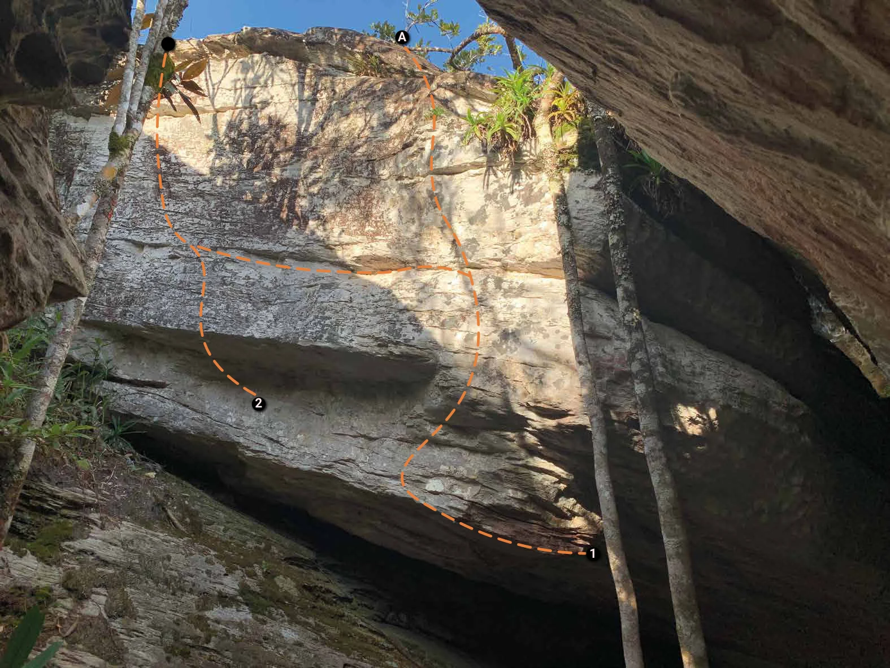
          - **largura_mapa**: 2364
          - **altura_mapa**: 1773
          - **pontos_de_interesse**:
            - **[0]**:
              - **id**: fvY2ZpJM2UwKQ5
              - **uid**: fvY2ZpJM2UwKQ5
              - **rotulo**: A
              - **circulo**:
                - **x**: 1069
                - **y**: 99
                - **raio**: 20
              - **label**: A
            - **[1]**:
              - **id**: MkDRSzdvQ5toKx
              - **uid**: MkDRSzdvQ5toKx
              - **rotulo**: 2
              - **circulo**:
                - **x**: 688
                - **y**: 1073
                - **raio**: 20
              - **label**: 2
            - **[2]**:
              - **id**: cGh2akFNlCQQlG
              - **uid**: cGh2akFNlCQQlG
              - **rotulo**: 1
              - **circulo**:
                - **x**: 1576
                - **y**: 1470
                - **raio**: 20
              - **label**: 1
            - **[3]**:
              - **id**: 5G5znfvdHlcHev
              - **uid**: 5G5znfvdHlcHev
              - **rotulo**: B
              - **circulo**:
                - **x**: 447
                - **y**: 117
                - **raio**: 20
              - **label**: B
          - **referencias**:
            - **[0]**:
              - **alvo_uid**: 5ybh2vVi771XMg
              - **pontos_uids**:
                - cGh2akFNlCQQlG
                - fvY2ZpJM2UwKQ5
              - **escalada**: Toe de Ouro
              - **ids**:
                - cGh2akFNlCQQlG
                - fvY2ZpJM2UwKQ5
            - **[1]**:
              - **alvo_uid**: QjSYV7rtdyahQ9
              - **pontos_uids**:
                - cGh2akFNlCQQlG
                - 5G5znfvdHlcHev
              - **escalada**: Toebogã
              - **ids**:
                - cGh2akFNlCQQlG
                - 5G5znfvdHlcHev
            - **[2]**:
              - **alvo_uid**: 1oSJzWf3Lqtury
              - **pontos_uids**:
                - MkDRSzdvQ5toKx
                - 5G5znfvdHlcHev
              - **escalada**: Tobocrash
              - **ids**:
                - MkDRSzdvQ5toKx
                - 5G5znfvdHlcHev
        - **[1]**:
          - **caminho_imagem_mapa**: 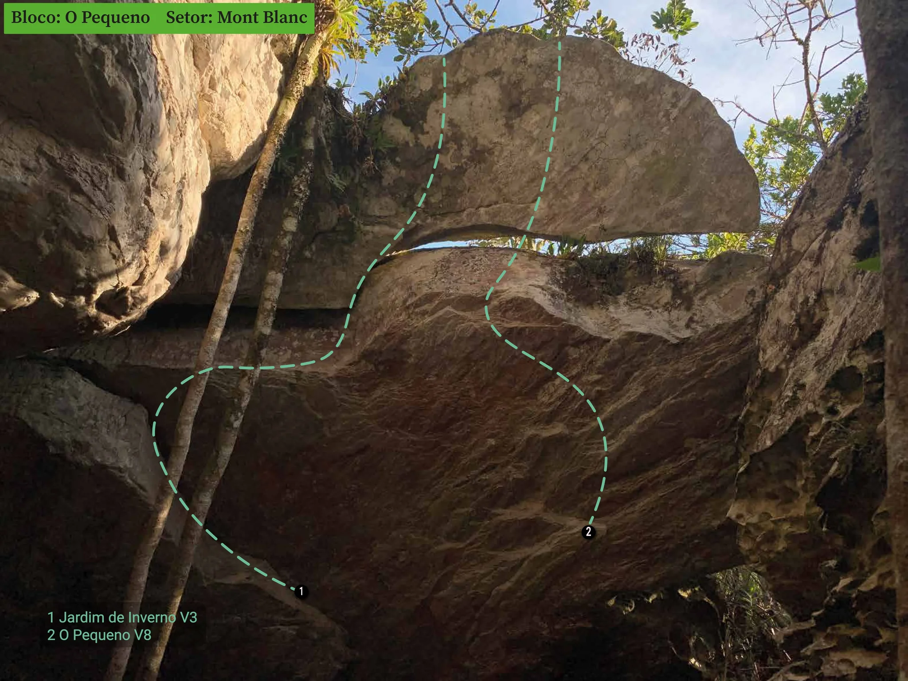
          - **largura_mapa**: 2364
          - **altura_mapa**: 1773
          - **pontos_de_interesse**:
            - **[0]**:
              - **id**: tY1nTcL3ZIeNPj
              - **uid**: tY1nTcL3ZIeNPj
              - **rotulo**: 1
              - **circulo**:
                - **x**: 785
                - **y**: 1540
                - **raio**: 19
              - **label**: 1
            - **[1]**:
              - **id**: HuwkDIFVQorXoB
              - **uid**: HuwkDIFVQorXoB
              - **rotulo**: 2
              - **circulo**:
                - **x**: 1533
                - **y**: 1386
                - **raio**: 19
              - **label**: 2
          - **referencias**:
            - **[0]**:
              - **alvo_uid**: Yt2lGsDhehDRqU
              - **pontos_uids**:
                - tY1nTcL3ZIeNPj
              - **escalada**: Jardim de Inverno
              - **ids**:
                - tY1nTcL3ZIeNPj
            - **[1]**:
              - **alvo_uid**: h2aInynYP5hOsr
              - **pontos_uids**:
                - HuwkDIFVQorXoB
              - **escalada**: O Pequeno
              - **ids**:
                - HuwkDIFVQorXoB
      - **escaladas**:
        - **[0]**:
          - **uid**: 5ybh2vVi771XMg
          - **boulder**:
            - **nome**: Toe de Ouro
            - **dificuldade**: V9
        - **[1]**:
          - **uid**: QjSYV7rtdyahQ9
          - **boulder**:
            - **nome**: Toebogã
            - **dificuldade**: V9
        - **[2]**:
          - **uid**: 1oSJzWf3Lqtury
          - **boulder**:
            - **nome**: Tobocrash
            - **dificuldade**: V4
        - **[3]**:
          - **uid**: Yt2lGsDhehDRqU
          - **boulder**:
            - **nome**: Jardim de Inverno
            - **dificuldade**: V3
        - **[4]**:
          - **uid**: h2aInynYP5hOsr
          - **boulder**:
            - **nome**: O Pequeno
            - **dificuldade**: V8
      - **precomputados**:
        - **total_escaladas**: 5
        - **total_boulders**: 5
  - **[4]**:
    - **conteudo**:
      - **descricao**: 
      - **nome**: Bloco: Cabocla da Mata
      - **uid**: ka0xDrNaPASN32
      - **mapas**:
        - **[0]**:
          - **caminho_imagem_mapa**: 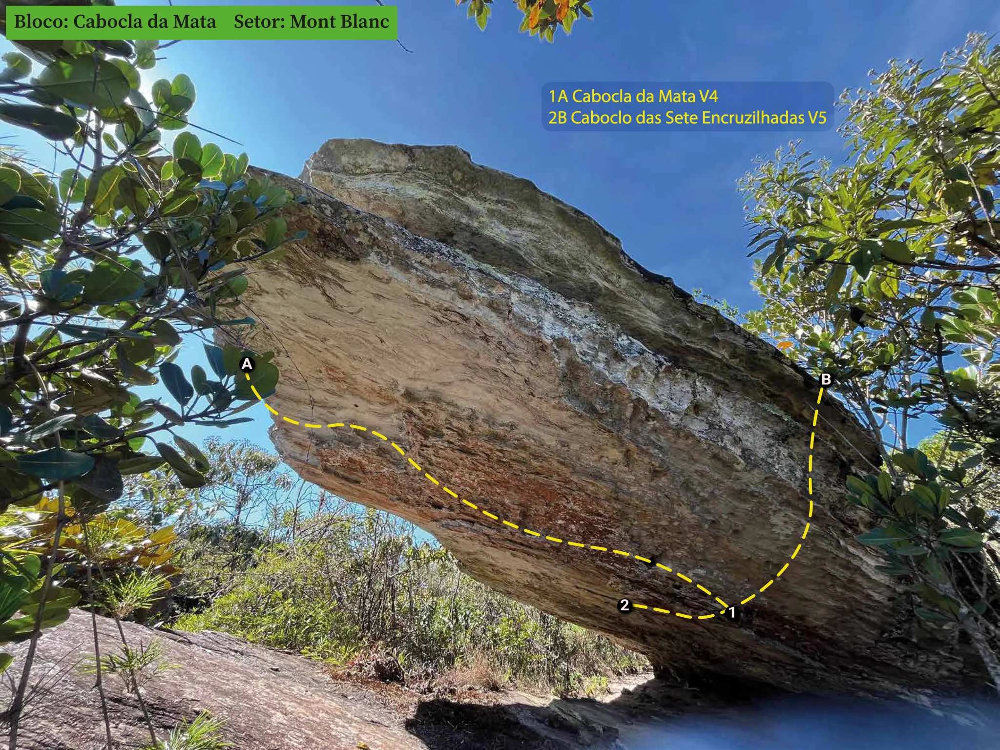
          - **largura_mapa**: 2364
          - **altura_mapa**: 1773
          - **pontos_de_interesse**:
            - **[0]**:
              - **id**: Lte8XncHgaNmFd
              - **uid**: Lte8XncHgaNmFd
              - **rotulo**: A
              - **circulo**:
                - **x**: 584
                - **y**: 861
                - **raio**: 19
              - **label**: A
            - **[1]**:
              - **id**: TSoH4i8gPYTm6v
              - **uid**: TSoH4i8gPYTm6v
              - **rotulo**: B
              - **circulo**:
                - **x**: 1953
                - **y**: 887
                - **raio**: 18
              - **label**: B
            - **[2]**:
              - **id**: mQdcLk7qlWjp2d
              - **uid**: mQdcLk7qlWjp2d
              - **rotulo**: 1
              - **circulo**:
                - **x**: 1732
                - **y**: 1449
                - **raio**: 18
              - **label**: 1
            - **[3]**:
              - **id**: WEqk1aIQXSbAkW
              - **uid**: WEqk1aIQXSbAkW
              - **rotulo**: 2
              - **circulo**:
                - **x**: 1477
                - **y**: 1433
                - **raio**: 18
              - **label**: 2
          - **referencias**:
            - **[0]**:
              - **alvo_uid**: Yeuc5wbOD2CdCt
              - **pontos_uids**:
                - mQdcLk7qlWjp2d
                - Lte8XncHgaNmFd
              - **escalada**: Cabocla da Mata
              - **ids**:
                - mQdcLk7qlWjp2d
                - Lte8XncHgaNmFd
            - **[1]**:
              - **alvo_uid**: X1LWxlJ2QtbU6J
              - **pontos_uids**:
                - WEqk1aIQXSbAkW
                - TSoH4i8gPYTm6v
              - **escalada**: Caboclo das Sete Encruzilhadas
              - **ids**:
                - WEqk1aIQXSbAkW
                - TSoH4i8gPYTm6v
      - **escaladas**:
        - **[0]**:
          - **uid**: Yeuc5wbOD2CdCt
          - **boulder**:
            - **nome**: Cabocla da Mata
            - **dificuldade**: V4
        - **[1]**:
          - **uid**: X1LWxlJ2QtbU6J
          - **boulder**:
            - **nome**: Caboclo das Sete Encruzilhadas
            - **dificuldade**: V5
      - **precomputados**:
        - **total_escaladas**: 2
        - **total_boulders**: 2
  - **[5]**:
    - **conteudo**:
      - **descricao**: 
      - **nome**: Bloco: Silêncio da Mutuca
      - **uid**: 6yBaMVkS6Qr1uz
      - **mapas**:
        - **[0]**:
          - **caminho_imagem_mapa**: 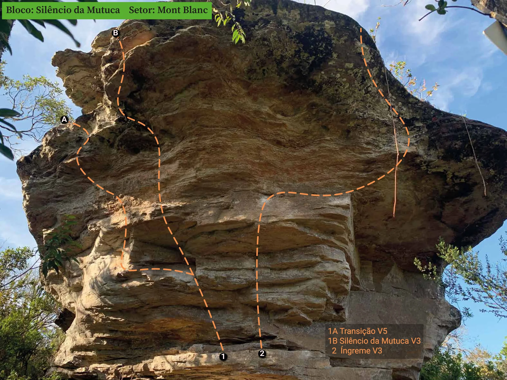
          - **largura_mapa**: 2364
          - **altura_mapa**: 1773
          - **pontos_de_interesse**:
            - **[0]**:
              - **id**: MvSHoJbv6C9xyh
              - **uid**: MvSHoJbv6C9xyh
              - **rotulo**: 1
              - **circulo**:
                - **x**: 1042
                - **y**: 1665
                - **raio**: 20
              - **label**: 1
            - **[1]**:
              - **id**: Gi7yVR5bMxWjYz
              - **uid**: Gi7yVR5bMxWjYz
              - **rotulo**: 2
              - **circulo**:
                - **x**: 1222
                - **y**: 1650
                - **raio**: 20
              - **label**: 2
            - **[2]**:
              - **id**: Ne63tQjsWUb2c5
              - **uid**: Ne63tQjsWUb2c5
              - **rotulo**: A
              - **circulo**:
                - **x**: 300
                - **y**: 558
                - **raio**: 20
              - **label**: A
            - **[3]**:
              - **id**: TeZY5RBos2Wetp
              - **uid**: TeZY5RBos2Wetp
              - **rotulo**: B
              - **circulo**:
                - **x**: 539
                - **y**: 154
                - **raio**: 20
              - **label**: B
          - **referencias**:
            - **[0]**:
              - **alvo_uid**: WYeoBQrpSRWfpw
              - **pontos_uids**:
                - MvSHoJbv6C9xyh
                - Ne63tQjsWUb2c5
              - **escalada**: Transição
              - **ids**:
                - MvSHoJbv6C9xyh
                - Ne63tQjsWUb2c5
            - **[1]**:
              - **alvo_uid**: onAR6O3zuf1k5W
              - **pontos_uids**:
                - MvSHoJbv6C9xyh
                - TeZY5RBos2Wetp
              - **escalada**: Silêncio da Mutuca
              - **ids**:
                - MvSHoJbv6C9xyh
                - TeZY5RBos2Wetp
            - **[2]**:
              - **alvo_uid**: zcRQkcUd7sMIM2
              - **pontos_uids**:
                - Gi7yVR5bMxWjYz
              - **escalada**: Íngreme
              - **ids**:
                - Gi7yVR5bMxWjYz
      - **escaladas**:
        - **[0]**:
          - **uid**: WYeoBQrpSRWfpw
          - **boulder**:
            - **nome**: Transição
            - **dificuldade**: V5
        - **[1]**:
          - **uid**: onAR6O3zuf1k5W
          - **boulder**:
            - **nome**: Silêncio da Mutuca
            - **dificuldade**: V3
        - **[2]**:
          - **uid**: zcRQkcUd7sMIM2
          - **boulder**:
            - **nome**: Íngreme
            - **dificuldade**: V3
      - **precomputados**:
        - **total_escaladas**: 3
        - **total_boulders**: 3
  - **[6]**:
    - **conteudo**:
      - **descricao**: 
      - **nome**: Bloco: Espreguiçadeira
      - **uid**: S1KezKyo1wzcRj
      - **mapas**:
        - **[0]**:
          - **caminho_imagem_mapa**: 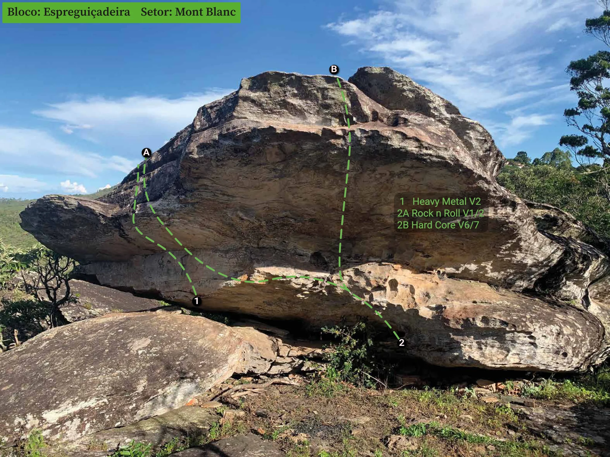
          - **largura_mapa**: 2364
          - **altura_mapa**: 1773
          - **pontos_de_interesse**:
            - **[0]**:
              - **id**: AL4p6NTF4jYqgi
              - **uid**: AL4p6NTF4jYqgi
              - **rotulo**: 1
              - **circulo**:
                - **x**: 763
                - **y**: 1169
                - **raio**: 19
              - **label**: 1
            - **[1]**:
              - **id**: PQEVM9a5Rtz4PU
              - **uid**: PQEVM9a5Rtz4PU
              - **rotulo**: 2
              - **circulo**:
                - **x**: 1557
                - **y**: 1331
                - **raio**: 19
              - **label**: 2
            - **[2]**:
              - **id**: rcAJzlsLeMsdXf
              - **uid**: rcAJzlsLeMsdXf
              - **rotulo**: A
              - **circulo**:
                - **x**: 568
                - **y**: 592
                - **raio**: 19
              - **label**: A
            - **[3]**:
              - **id**: ZQigMQVlnrV0CG
              - **uid**: ZQigMQVlnrV0CG
              - **rotulo**: B
              - **circulo**:
                - **x**: 1295
                - **y**: 269
                - **raio**: 19
              - **label**: B
          - **referencias**:
            - **[0]**:
              - **alvo_uid**: BVS9vNwXZmTOOD
              - **pontos_uids**:
                - AL4p6NTF4jYqgi
              - **escalada**: Heavy Metal
              - **ids**:
                - AL4p6NTF4jYqgi
            - **[1]**:
              - **alvo_uid**: Cd9g9Z3lzABbe2
              - **pontos_uids**:
                - PQEVM9a5Rtz4PU
                - rcAJzlsLeMsdXf
              - **escalada**: Rock n Roll
              - **ids**:
                - PQEVM9a5Rtz4PU
                - rcAJzlsLeMsdXf
            - **[2]**:
              - **alvo_uid**: dmxQliBl75AFif
              - **pontos_uids**:
                - PQEVM9a5Rtz4PU
                - ZQigMQVlnrV0CG
              - **escalada**: Hard Core
              - **ids**:
                - PQEVM9a5Rtz4PU
                - ZQigMQVlnrV0CG
      - **escaladas**:
        - **[0]**:
          - **uid**: BVS9vNwXZmTOOD
          - **boulder**:
            - **nome**: Heavy Metal
            - **dificuldade**: V2
        - **[1]**:
          - **uid**: Cd9g9Z3lzABbe2
          - **boulder**:
            - **nome**: Rock n Roll
            - **dificuldade**: V1_BARRA_V2
        - **[2]**:
          - **uid**: dmxQliBl75AFif
          - **boulder**:
            - **nome**: Hard Core
            - **dificuldade**: V6_BARRA_V7
      - **precomputados**:
        - **total_escaladas**: 3
        - **total_boulders**: 3
- **precomputados**:
  - **total_escaladas**: 42
  - **total_boulders**: 42

## Parte: grupo_bonsai

### Grupo (Pico: Ouroboulder (PNMA))

- **descricao**: 
- **nome**: Bonsai
- **uid**: t59PHz1Ca8jRr3
- **localizacao_estacionamento**:
  - **latitude**: -203732472
  - **longitude**: -435016976
- **localizacao_escalada**:
  - **latitude**: -203720315
  - **longitude**: -435016842
- **mapas**:
  - **[0]**:
    - **caminho_imagem_mapa**: 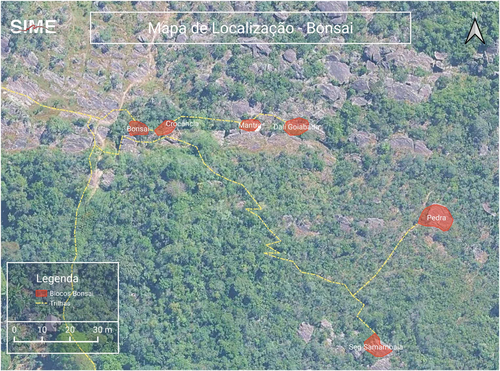
    - **largura_mapa**: 1527
    - **altura_mapa**: 1134
    - **pontos_de_interesse**:
      - **[0]**:
        - **id**: Tftzc71XEppuC7
        - **uid**: Tftzc71XEppuC7
        - **rotulo**: Bonsai
        - **retangulo**:
          - **x**: 422
          - **y**: 393
          - **comprimento**: 74
          - **largura**: 26
        - **label**: Bonsai
      - **[1]**:
        - **id**: kpoEkNgtz0DRpJ
        - **uid**: kpoEkNgtz0DRpJ
        - **rotulo**: Crocância
        - **retangulo**:
          - **x**: 557
          - **y**: 378
          - **comprimento**: 108
          - **largura**: 24
        - **label**: Crocância
      - **[2]**:
        - **id**: 1Xrb7MJpEQYNBs
        - **uid**: 1Xrb7MJpEQYNBs
        - **rotulo**: Mantra
        - **retangulo**:
          - **x**: 764
          - **y**: 383
          - **comprimento**: 76
          - **largura**: 24
        - **label**: Mantra
      - **[3]**:
        - **id**: 9Bednxz56U3UQp
        - **uid**: 9Bednxz56U3UQp
        - **rotulo**: Dali Goiabada
        - **retangulo**:
          - **x**: 906
          - **y**: 387
          - **comprimento**: 144
          - **largura**: 24
        - **label**: Dali Goiabada
      - **[4]**:
        - **id**: iykOwP7yoplP9B
        - **uid**: iykOwP7yoplP9B
        - **rotulo**: Pedra
        - **retangulo**:
          - **x**: 1334
          - **y**: 664
          - **comprimento**: 66
          - **largura**: 25
        - **label**: Pedra
      - **[5]**:
        - **id**: XbWxQ39tPOYta3
        - **uid**: XbWxQ39tPOYta3
        - **rotulo**: Seg-Samambaia
        - **retangulo**:
          - **x**: 1148
          - **y**: 1062
          - **comprimento**: 175
          - **largura**: 27
        - **label**: Seg-Samambaia
    - **referencias**:
      - **[0]**:
        - **alvo_uid**: iOsJDN3Gqit8fp
        - **pontos_uids**:
          - Tftzc71XEppuC7
        - **setor**: Bloco: Bonsai
        - **ids**:
          - Tftzc71XEppuC7
      - **[1]**:
        - **alvo_uid**: TPRjWnwThDobZV
        - **pontos_uids**:
          - kpoEkNgtz0DRpJ
        - **setor**: Bloco: Crocância
        - **ids**:
          - kpoEkNgtz0DRpJ
      - **[2]**:
        - **alvo_uid**: KcZsQ5PEhlLpvR
        - **pontos_uids**:
          - 1Xrb7MJpEQYNBs
        - **setor**: Bloco: Mantra
        - **ids**:
          - 1Xrb7MJpEQYNBs
      - **[3]**:
        - **alvo_uid**: 8L4I7wHhCDxSbL
        - **pontos_uids**:
          - 9Bednxz56U3UQp
        - **setor**: Bloco: Dali Goiabada
        - **ids**:
          - 9Bednxz56U3UQp
      - **[4]**:
        - **alvo_uid**: fpzJyfVqzqymGz
        - **pontos_uids**:
          - XbWxQ39tPOYta3
        - **setor**: Bloco: Seg-Samambaia
        - **ids**:
          - XbWxQ39tPOYta3
      - **[5]**:
        - **alvo_uid**: MP7vYlyWnMk3fm
        - **pontos_uids**:
          - iykOwP7yoplP9B
        - **setor**: Bloco: Pedra
        - **ids**:
          - iykOwP7yoplP9B
- **setores**:
  - **[0]**:
    - **conteudo**:
      - **descricao**: 
      - **nome**: Bloco: Bonsai
      - **uid**: iOsJDN3Gqit8fp
      - **mapas**:
        - **[0]**:
          - **caminho_imagem_mapa**: 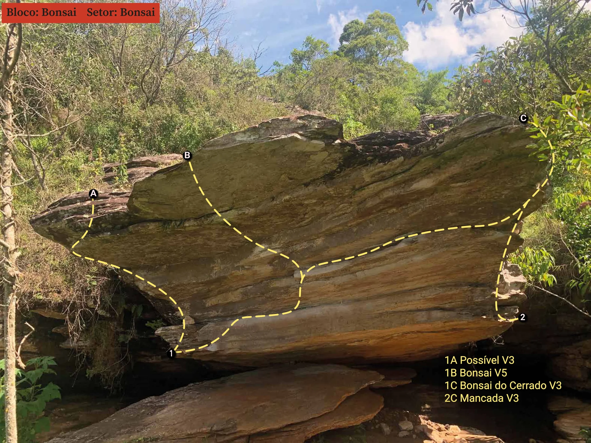
          - **largura_mapa**: 2364
          - **altura_mapa**: 1773
          - **pontos_de_interesse**:
            - **[0]**:
              - **id**: Sh0MdJuJbf04RK
              - **uid**: Sh0MdJuJbf04RK
              - **rotulo**: A
              - **circulo**:
                - **x**: 374
                - **y**: 776
                - **raio**: 19
              - **label**: A
            - **[1]**:
              - **id**: VFwLSz5o8UBNYB
              - **uid**: VFwLSz5o8UBNYB
              - **rotulo**: B
              - **circulo**:
                - **x**: 749
                - **y**: 622
                - **raio**: 19
              - **label**: B
            - **[2]**:
              - **id**: OtNZqk58rCH23s
              - **uid**: OtNZqk58rCH23s
              - **rotulo**: C
              - **circulo**:
                - **x**: 2094
                - **y**: 473
                - **raio**: 18
              - **label**: C
            - **[3]**:
              - **id**: eYmwLmRNLpxFIW
              - **uid**: eYmwLmRNLpxFIW
              - **rotulo**: 1
              - **circulo**:
                - **x**: 685
                - **y**: 1415
                - **raio**: 18
              - **label**: 1
            - **[4]**:
              - **id**: UCxFNcOISIcCsI
              - **uid**: UCxFNcOISIcCsI
              - **rotulo**: 2
              - **circulo**:
                - **x**: 2091
                - **y**: 1269
                - **raio**: 18
              - **label**: 2
          - **referencias**:
            - **[0]**:
              - **alvo_uid**: UiHdsiOkgqiuQo
              - **pontos_uids**:
                - eYmwLmRNLpxFIW
                - Sh0MdJuJbf04RK
              - **escalada**: Possível
              - **ids**:
                - eYmwLmRNLpxFIW
                - Sh0MdJuJbf04RK
            - **[1]**:
              - **alvo_uid**: TOhw8uZJ3tF20O
              - **pontos_uids**:
                - eYmwLmRNLpxFIW
                - VFwLSz5o8UBNYB
              - **escalada**: Bonsai
              - **ids**:
                - eYmwLmRNLpxFIW
                - VFwLSz5o8UBNYB
            - **[2]**:
              - **alvo_uid**: ztKfWJTPdp4mOd
              - **pontos_uids**:
                - eYmwLmRNLpxFIW
                - OtNZqk58rCH23s
              - **escalada**: Bonsai do Cerrado
              - **ids**:
                - eYmwLmRNLpxFIW
                - OtNZqk58rCH23s
            - **[3]**:
              - **alvo_uid**: s4CbVF6hWbo9NU
              - **pontos_uids**:
                - UCxFNcOISIcCsI
                - OtNZqk58rCH23s
              - **escalada**: Mancada
              - **ids**:
                - UCxFNcOISIcCsI
                - OtNZqk58rCH23s
      - **escaladas**:
        - **[0]**:
          - **uid**: UiHdsiOkgqiuQo
          - **boulder**:
            - **nome**: Possível
            - **dificuldade**: V3
        - **[1]**:
          - **uid**: TOhw8uZJ3tF20O
          - **boulder**:
            - **nome**: Bonsai
            - **dificuldade**: V5
        - **[2]**:
          - **uid**: ztKfWJTPdp4mOd
          - **boulder**:
            - **nome**: Bonsai do Cerrado
            - **dificuldade**: V3
        - **[3]**:
          - **uid**: s4CbVF6hWbo9NU
          - **boulder**:
            - **nome**: Mancada
            - **dificuldade**: V3
      - **precomputados**:
        - **total_escaladas**: 4
        - **total_boulders**: 4
  - **[1]**:
    - **conteudo**:
      - **descricao**: 
      - **nome**: Bloco: Crocância
      - **uid**: TPRjWnwThDobZV
      - **mapas**:
        - **[0]**:
          - **caminho_imagem_mapa**: 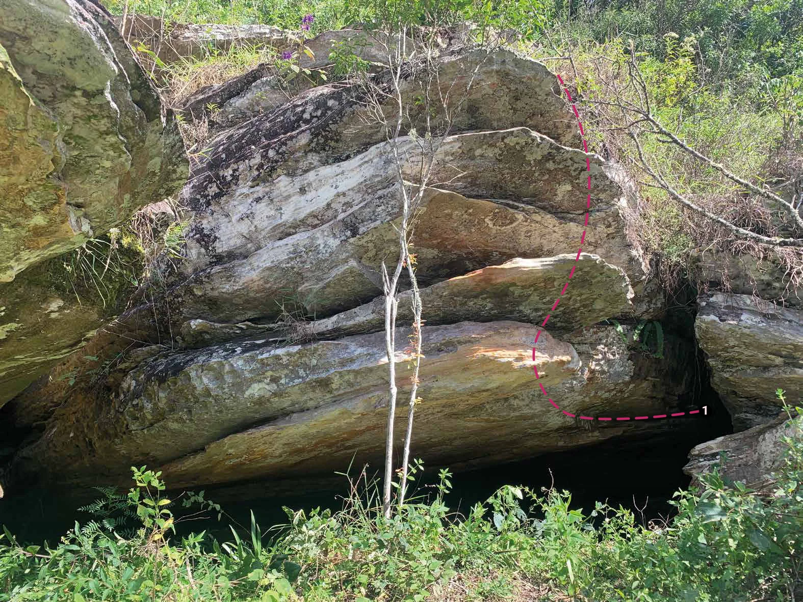
          - **largura_mapa**: 2364
          - **altura_mapa**: 1773
          - **pontos_de_interesse**:
            - **[0]**:
              - **id**: 5V4CGtuGeI17Dp
              - **uid**: 5V4CGtuGeI17Dp
              - **rotulo**: 1
              - **circulo**:
                - **x**: 2077
                - **y**: 1209
                - **raio**: 20
              - **label**: 1
          - **referencias**:
            - **[0]**:
              - **alvo_uid**: lgFzebgsiJwJxJ
              - **pontos_uids**:
                - 5V4CGtuGeI17Dp
              - **escalada**: Beija-Flor
              - **ids**:
                - 5V4CGtuGeI17Dp
        - **[1]**:
          - **caminho_imagem_mapa**: 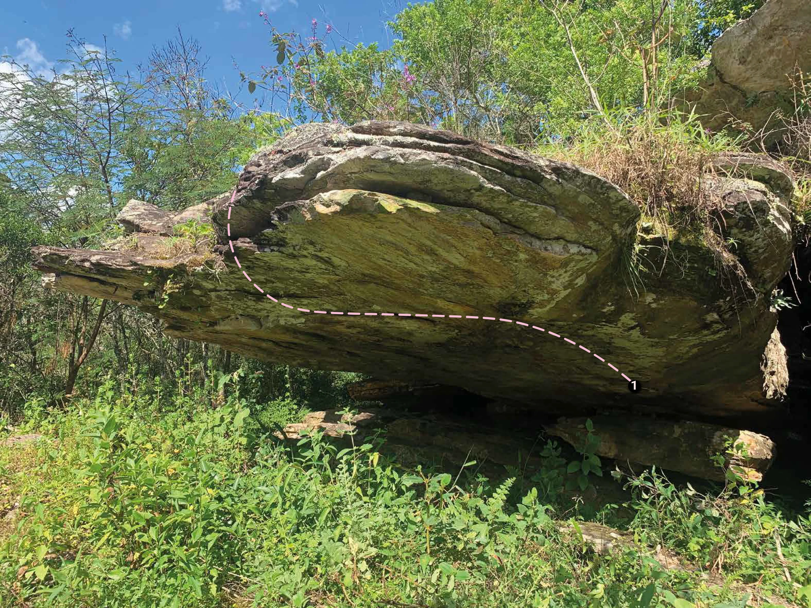
          - **largura_mapa**: 2364
          - **altura_mapa**: 1773
          - **pontos_de_interesse**:
            - **[0]**:
              - **id**: skhIwVhk35YLWm
              - **uid**: skhIwVhk35YLWm
              - **rotulo**: 1
              - **circulo**:
                - **x**: 1849
                - **y**: 1125
                - **raio**: 19
              - **label**: 1
          - **referencias**:
            - **[0]**:
              - **alvo_uid**: w0otGQNZxDdJ4f
              - **pontos_uids**:
                - skhIwVhk35YLWm
              - **escalada**: Tarântula
              - **ids**:
                - skhIwVhk35YLWm
        - **[2]**:
          - **caminho_imagem_mapa**: 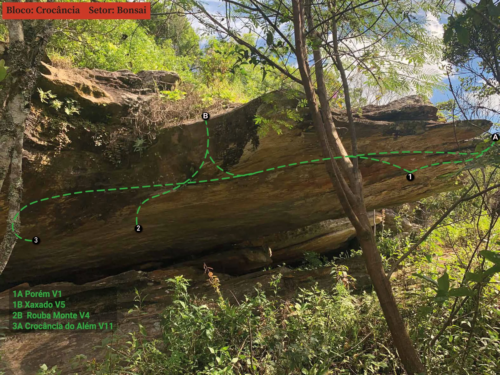
          - **largura_mapa**: 2364
          - **altura_mapa**: 1773
          - **pontos_de_interesse**:
            - **[0]**:
              - **id**: DyHx4RqjGYGAqz
              - **uid**: DyHx4RqjGYGAqz
              - **rotulo**: A
              - **circulo**:
                - **x**: 2343
                - **y**: 650
                - **raio**: 19
              - **label**: A
            - **[1]**:
              - **id**: ikfr7CYqGetXgD
              - **uid**: ikfr7CYqGetXgD
              - **rotulo**: B
              - **circulo**:
                - **x**: 972
                - **y**: 549
                - **raio**: 19
              - **label**: B
            - **[2]**:
              - **id**: XHHGcCyIy6q9Zj
              - **uid**: XHHGcCyIy6q9Zj
              - **rotulo**: 1
              - **circulo**:
                - **x**: 1941
                - **y**: 837
                - **raio**: 19
              - **label**: 1
            - **[3]**:
              - **id**: VkIzm4jA49p7PR
              - **uid**: VkIzm4jA49p7PR
              - **rotulo**: 2
              - **circulo**:
                - **x**: 655
                - **y**: 1081
                - **raio**: 19
              - **label**: 2
            - **[4]**:
              - **id**: 6UyGI7SsYplQiE
              - **uid**: 6UyGI7SsYplQiE
              - **rotulo**: 3
              - **circulo**:
                - **x**: 171
                - **y**: 1136
                - **raio**: 19
              - **label**: 3
          - **referencias**:
            - **[0]**:
              - **alvo_uid**: hRprYfQgJG0jrB
              - **pontos_uids**:
                - XHHGcCyIy6q9Zj
                - DyHx4RqjGYGAqz
              - **escalada**: Porém
              - **ids**:
                - XHHGcCyIy6q9Zj
                - DyHx4RqjGYGAqz
            - **[1]**:
              - **alvo_uid**: n5Krcf8FHcy3kc
              - **pontos_uids**:
                - XHHGcCyIy6q9Zj
                - ikfr7CYqGetXgD
              - **escalada**: Xaxado
              - **ids**:
                - XHHGcCyIy6q9Zj
                - ikfr7CYqGetXgD
            - **[2]**:
              - **alvo_uid**: v41UeMSQ2Ws81X
              - **pontos_uids**:
                - 6UyGI7SsYplQiE
                - DyHx4RqjGYGAqz
              - **escalada**: Crocância do Além
              - **ids**:
                - 6UyGI7SsYplQiE
                - DyHx4RqjGYGAqz
            - **[3]**:
              - **alvo_uid**: bDRUB6NuVTKvlW
              - **pontos_uids**:
                - VkIzm4jA49p7PR
                - ikfr7CYqGetXgD
              - **escalada**: Rouba Monte
              - **ids**:
                - VkIzm4jA49p7PR
                - ikfr7CYqGetXgD
        - **[3]**:
          - **caminho_imagem_mapa**: 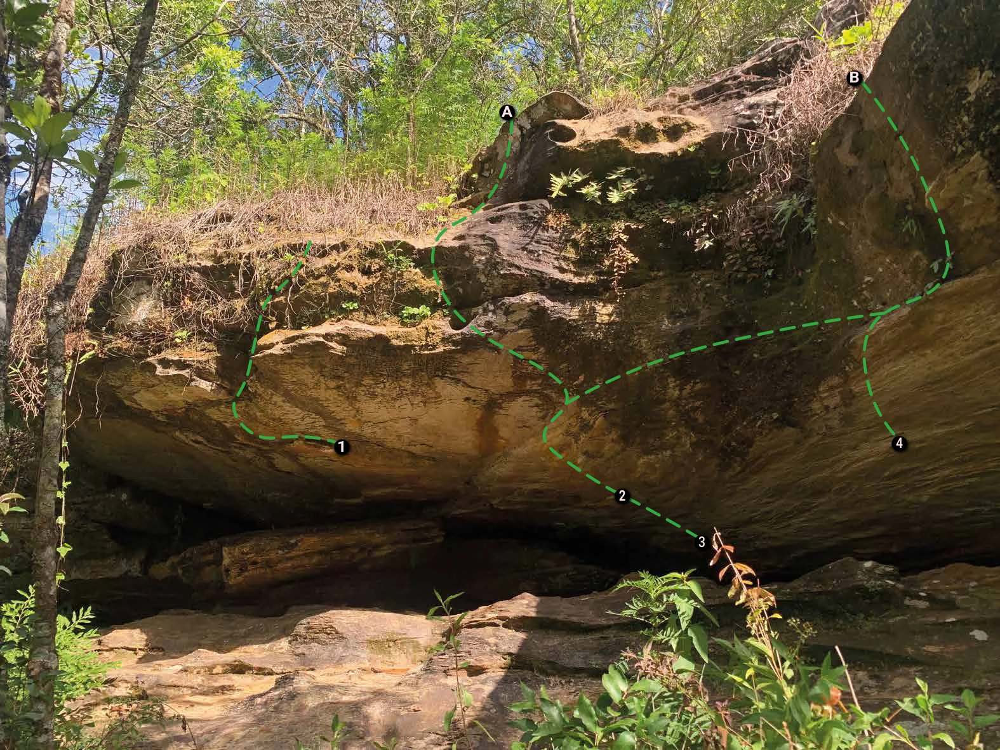
          - **largura_mapa**: 2364
          - **altura_mapa**: 1773
          - **pontos_de_interesse**:
            - **[0]**:
              - **id**: MvuR0YL1GkW4vS
              - **uid**: MvuR0YL1GkW4vS
              - **rotulo**: 1
              - **circulo**:
                - **x**: 808
                - **y**: 1058
                - **raio**: 19
              - **label**: 1
            - **[1]**:
              - **id**: wxte9kCW3QjnTo
              - **uid**: wxte9kCW3QjnTo
              - **rotulo**: 2
              - **circulo**:
                - **x**: 1471
                - **y**: 1174
                - **raio**: 19
              - **label**: 2
            - **[2]**:
              - **id**: xTlsrNV6Kxyj7L
              - **uid**: xTlsrNV6Kxyj7L
              - **rotulo**: 3
              - **circulo**:
                - **x**: 1659
                - **y**: 1282
                - **raio**: 19
              - **label**: 3
            - **[3]**:
              - **id**: EfagVwc1dZPULv
              - **uid**: EfagVwc1dZPULv
              - **rotulo**: 4
              - **circulo**:
                - **x**: 2127
                - **y**: 1048
                - **raio**: 19
              - **label**: 4
            - **[4]**:
              - **id**: moSXTONeTttaDi
              - **uid**: moSXTONeTttaDi
              - **rotulo**: A
              - **circulo**:
                - **x**: 1199
                - **y**: 266
                - **raio**: 19
              - **label**: A
            - **[5]**:
              - **id**: 9mHT4IGAaNu9P2
              - **uid**: 9mHT4IGAaNu9P2
              - **rotulo**: B
              - **circulo**:
                - **x**: 2020
                - **y**: 184
                - **raio**: 19
              - **label**: B
          - **referencias**:
            - **[0]**:
              - **alvo_uid**: hgfIRqD9quInCG
              - **pontos_uids**:
                - MvuR0YL1GkW4vS
              - **escalada**: Lodo
              - **ids**:
                - MvuR0YL1GkW4vS
            - **[1]**:
              - **alvo_uid**: iMQg9MWgbnHMIt
              - **pontos_uids**:
                - wxte9kCW3QjnTo
                - moSXTONeTttaDi
              - **escalada**: Crocância
              - **ids**:
                - wxte9kCW3QjnTo
                - moSXTONeTttaDi
            - **[2]**:
              - **alvo_uid**: X0EZ4SPnRj8Ht3
              - **pontos_uids**:
                - wxte9kCW3QjnTo
                - 9mHT4IGAaNu9P2
              - **escalada**: Crocância Rouba Monte
              - **ids**:
                - wxte9kCW3QjnTo
                - 9mHT4IGAaNu9P2
            - **[3]**:
              - **alvo_uid**: eY4TDkxuioAB4k
              - **pontos_uids**:
                - xTlsrNV6Kxyj7L
                - moSXTONeTttaDi
              - **escalada**: Crocância sds
              - **ids**:
                - xTlsrNV6Kxyj7L
                - moSXTONeTttaDi
            - **[4]**:
              - **alvo_uid**: Kj0gf6yqWWfYZK
              - **pontos_uids**:
                - xTlsrNV6Kxyj7L
                - 9mHT4IGAaNu9P2
              - **escalada**: Crocância Rouba Monte sds
              - **ids**:
                - xTlsrNV6Kxyj7L
                - 9mHT4IGAaNu9P2
            - **[5]**:
              - **alvo_uid**: bDRUB6NuVTKvlW
              - **pontos_uids**:
                - EfagVwc1dZPULv
                - 9mHT4IGAaNu9P2
              - **escalada**: Rouba Monte
              - **ids**:
                - EfagVwc1dZPULv
                - 9mHT4IGAaNu9P2
      - **escaladas**:
        - **[0]**:
          - **uid**: lgFzebgsiJwJxJ
          - **boulder**:
            - **nome**: Beija-Flor
            - **dificuldade**: V5
        - **[1]**:
          - **uid**: w0otGQNZxDdJ4f
          - **boulder**:
            - **nome**: Tarântula
            - **dificuldade**: V7
        - **[2]**:
          - **uid**: hRprYfQgJG0jrB
          - **boulder**:
            - **nome**: Porém
            - **dificuldade**: V1
        - **[3]**:
          - **uid**: n5Krcf8FHcy3kc
          - **boulder**:
            - **nome**: Xaxado
            - **dificuldade**: V5
        - **[4]**:
          - **uid**: bDRUB6NuVTKvlW
          - **boulder**:
            - **nome**: Rouba Monte
            - **dificuldade**: V4
        - **[5]**:
          - **uid**: v41UeMSQ2Ws81X
          - **boulder**:
            - **nome**: Crocância do Além
            - **dificuldade**: V11
        - **[6]**:
          - **uid**: hgfIRqD9quInCG
          - **boulder**:
            - **nome**: Lodo
            - **dificuldade**: V8
        - **[7]**:
          - **uid**: iMQg9MWgbnHMIt
          - **boulder**:
            - **nome**: Crocância
            - **dificuldade**: V9
        - **[8]**:
          - **uid**: X0EZ4SPnRj8Ht3
          - **boulder**:
            - **nome**: Crocância Rouba Monte
            - **dificuldade**: V10
        - **[9]**:
          - **uid**: eY4TDkxuioAB4k
          - **boulder**:
            - **nome**: Crocância sds
            - **dificuldade**: V10
        - **[10]**:
          - **uid**: Kj0gf6yqWWfYZK
          - **boulder**:
            - **nome**: Crocância Rouba Monte sds
            - **dificuldade**: V11
      - **precomputados**:
        - **total_escaladas**: 11
        - **total_boulders**: 11
  - **[2]**:
    - **conteudo**:
      - **descricao**: 
      - **nome**: Bloco: Mantra
      - **uid**: KcZsQ5PEhlLpvR
      - **mapas**:
        - **[0]**:
          - **caminho_imagem_mapa**: 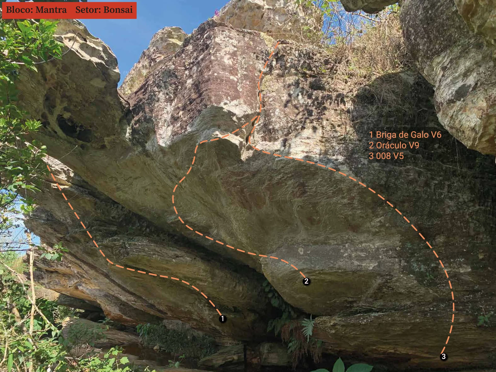
          - **largura_mapa**: 2364
          - **altura_mapa**: 1773
          - **pontos_de_interesse**:
            - **[0]**:
              - **id**: swivpWDUiF2hUv
              - **uid**: swivpWDUiF2hUv
              - **rotulo**: 1
              - **circulo**:
                - **x**: 1062
                - **y**: 1520
                - **raio**: 20
              - **label**: 1
            - **[1]**:
              - **id**: 6HzIbrqrhUKjK7
              - **uid**: 6HzIbrqrhUKjK7
              - **rotulo**: 2
              - **circulo**:
                - **x**: 1461
                - **y**: 1342
                - **raio**: 20
              - **label**: 2
            - **[2]**:
              - **id**: sOEFH2OXl4CpnE
              - **uid**: sOEFH2OXl4CpnE
              - **rotulo**: 3
              - **circulo**:
                - **x**: 2116
                - **y**: 1702
                - **raio**: 20
              - **label**: 3
          - **referencias**:
            - **[0]**:
              - **alvo_uid**: dn6IRx0DewmHdq
              - **pontos_uids**:
                - swivpWDUiF2hUv
              - **escalada**: Briga de Galo
              - **ids**:
                - swivpWDUiF2hUv
            - **[1]**:
              - **alvo_uid**: yBKegKW3DlOf9N
              - **pontos_uids**:
                - 6HzIbrqrhUKjK7
              - **escalada**: Oráculo
              - **ids**:
                - 6HzIbrqrhUKjK7
            - **[2]**:
              - **alvo_uid**: ujNhKcKG5Lcmqv
              - **pontos_uids**:
                - sOEFH2OXl4CpnE
              - **escalada**: 014
              - **ids**:
                - sOEFH2OXl4CpnE
        - **[1]**:
          - **caminho_imagem_mapa**: 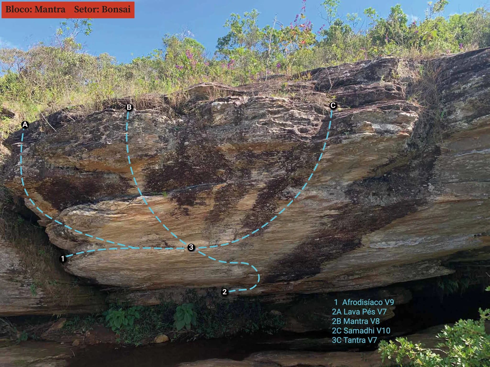
          - **largura_mapa**: 2364
          - **altura_mapa**: 1773
          - **pontos_de_interesse**:
            - **[0]**:
              - **id**: oYwWnXIqDL8bcX
              - **uid**: oYwWnXIqDL8bcX
              - **rotulo**: A
              - **circulo**:
                - **x**: 121
                - **y**: 602
                - **raio**: 19
              - **label**: A
            - **[1]**:
              - **id**: R617rmY3DBebRB
              - **uid**: R617rmY3DBebRB
              - **rotulo**: B
              - **circulo**:
                - **x**: 623
                - **y**: 519
                - **raio**: 19
              - **label**: B
            - **[2]**:
              - **id**: 4UrdhduRFIkabx
              - **uid**: 4UrdhduRFIkabx
              - **rotulo**: C
              - **circulo**:
                - **x**: 1608
                - **y**: 510
                - **raio**: 19
              - **label**: C
            - **[3]**:
              - **id**: MTqnvw9GP0vc4k
              - **uid**: MTqnvw9GP0vc4k
              - **rotulo**: 1
              - **circulo**:
                - **x**: 303
                - **y**: 1251
                - **raio**: 19
              - **label**: 1
            - **[4]**:
              - **id**: Nwid5rKY8lJ3Z4
              - **uid**: Nwid5rKY8lJ3Z4
              - **rotulo**: 2
              - **circulo**:
                - **x**: 1084
                - **y**: 1412
                - **raio**: 19
              - **label**: 2
            - **[5]**:
              - **id**: 4Q7RJGV3mTAoyv
              - **uid**: 4Q7RJGV3mTAoyv
              - **rotulo**: 3
              - **circulo**:
                - **x**: 923
                - **y**: 1196
                - **raio**: 19
              - **label**: 3
          - **referencias**:
            - **[0]**:
              - **alvo_uid**: faZNgdRlRXZXj1
              - **pontos_uids**:
                - MTqnvw9GP0vc4k
              - **escalada**: Afrodisíaco
              - **ids**:
                - MTqnvw9GP0vc4k
            - **[1]**:
              - **alvo_uid**: tRdwJW2nKKPjja
              - **pontos_uids**:
                - Nwid5rKY8lJ3Z4
                - oYwWnXIqDL8bcX
              - **escalada**: Lava Pés
              - **ids**:
                - Nwid5rKY8lJ3Z4
                - oYwWnXIqDL8bcX
            - **[2]**:
              - **alvo_uid**: oiDeE3060h5Rtq
              - **pontos_uids**:
                - Nwid5rKY8lJ3Z4
                - R617rmY3DBebRB
              - **escalada**: Mantra
              - **ids**:
                - Nwid5rKY8lJ3Z4
                - R617rmY3DBebRB
            - **[3]**:
              - **alvo_uid**: QHn99gpfzj3HEw
              - **pontos_uids**:
                - Nwid5rKY8lJ3Z4
                - 4UrdhduRFIkabx
              - **escalada**: Samadhi
              - **ids**:
                - Nwid5rKY8lJ3Z4
                - 4UrdhduRFIkabx
            - **[4]**:
              - **alvo_uid**: NZ2nfbf6H5wwm8
              - **pontos_uids**:
                - 4Q7RJGV3mTAoyv
                - 4UrdhduRFIkabx
              - **escalada**: Tantra
              - **ids**:
                - 4Q7RJGV3mTAoyv
                - 4UrdhduRFIkabx
        - **[2]**:
          - **caminho_imagem_mapa**: 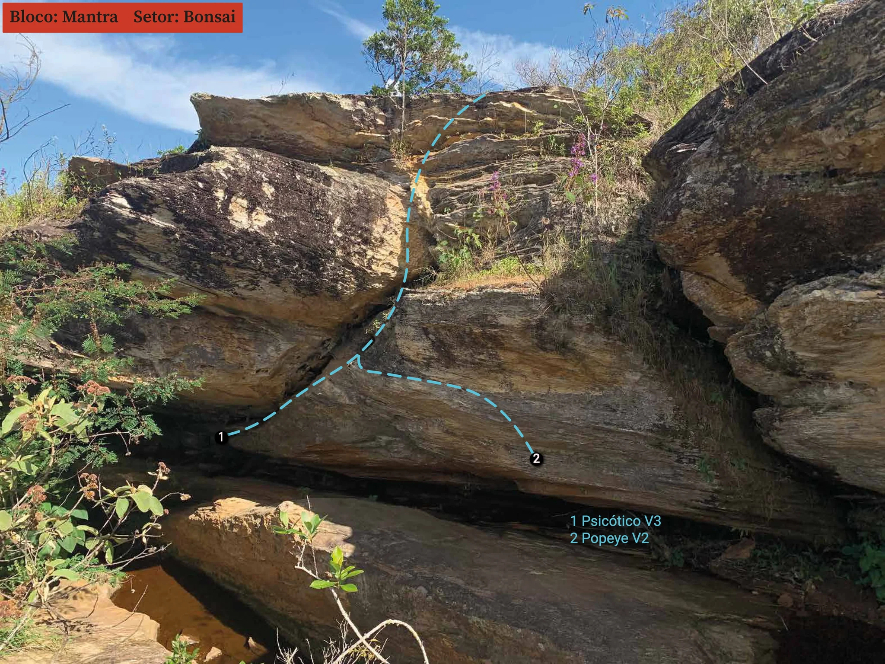
          - **largura_mapa**: 2364
          - **altura_mapa**: 1773
          - **pontos_de_interesse**:
            - **[0]**:
              - **id**: Hd8ZYqXFVBySqn
              - **uid**: Hd8ZYqXFVBySqn
              - **rotulo**: 1
              - **circulo**:
                - **x**: 591
                - **y**: 1168
                - **raio**: 20
              - **label**: 1
            - **[1]**:
              - **id**: mPTWTqHwHYo3JX
              - **uid**: mPTWTqHwHYo3JX
              - **rotulo**: 2
              - **circulo**:
                - **x**: 1434
                - **y**: 1227
                - **raio**: 20
              - **label**: 2
          - **referencias**:
            - **[0]**:
              - **alvo_uid**: A6q51yDtKOK64v
              - **pontos_uids**:
                - Hd8ZYqXFVBySqn
              - **escalada**: Psicótico
              - **ids**:
                - Hd8ZYqXFVBySqn
            - **[1]**:
              - **alvo_uid**: x9TNdNsYT4YCS1
              - **pontos_uids**:
                - mPTWTqHwHYo3JX
              - **escalada**: Popeye
              - **ids**:
                - mPTWTqHwHYo3JX
      - **escaladas**:
        - **[0]**:
          - **uid**: dn6IRx0DewmHdq
          - **boulder**:
            - **nome**: Briga de Galo
            - **dificuldade**: V6
        - **[1]**:
          - **uid**: yBKegKW3DlOf9N
          - **boulder**:
            - **nome**: Oráculo
            - **dificuldade**: V9
        - **[2]**:
          - **uid**: ujNhKcKG5Lcmqv
          - **boulder**:
            - **nome**: 014
            - **dificuldade**: V5
        - **[3]**:
          - **uid**: faZNgdRlRXZXj1
          - **boulder**:
            - **nome**: Afrodisíaco
            - **dificuldade**: V9
        - **[4]**:
          - **uid**: tRdwJW2nKKPjja
          - **boulder**:
            - **nome**: Lava Pés
            - **dificuldade**: V7
        - **[5]**:
          - **uid**: oiDeE3060h5Rtq
          - **boulder**:
            - **nome**: Mantra
            - **dificuldade**: V8
        - **[6]**:
          - **uid**: QHn99gpfzj3HEw
          - **boulder**:
            - **nome**: Samadhi
            - **dificuldade**: V10
        - **[7]**:
          - **uid**: NZ2nfbf6H5wwm8
          - **boulder**:
            - **nome**: Tantra
            - **dificuldade**: V7
        - **[8]**:
          - **uid**: A6q51yDtKOK64v
          - **boulder**:
            - **nome**: Psicótico
            - **dificuldade**: V3
        - **[9]**:
          - **uid**: x9TNdNsYT4YCS1
          - **boulder**:
            - **nome**: Popeye
            - **dificuldade**: V2
      - **precomputados**:
        - **total_escaladas**: 10
        - **total_boulders**: 10
  - **[3]**:
    - **conteudo**:
      - **descricao**: 
      - **nome**: Bloco: Dali Goiabada
      - **uid**: 8L4I7wHhCDxSbL
      - **mapas**:
        - **[0]**:
          - **caminho_imagem_mapa**: 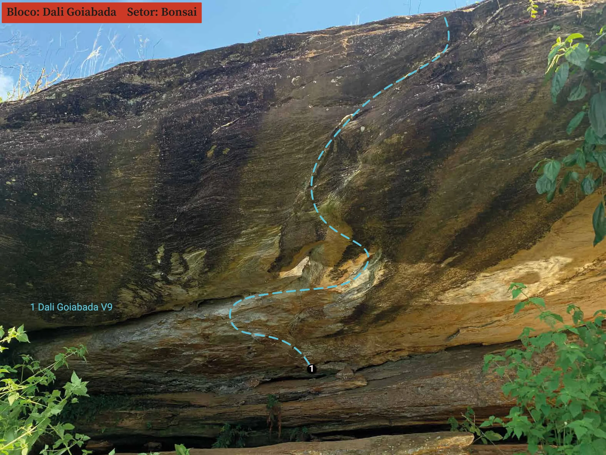
          - **largura_mapa**: 2364
          - **altura_mapa**: 1773
          - **pontos_de_interesse**:
            - **[0]**:
              - **id**: BA24VNJ0VmjBfv
              - **uid**: BA24VNJ0VmjBfv
              - **rotulo**: 1
              - **circulo**:
                - **x**: 1216
                - **y**: 1438
                - **raio**: 20
              - **label**: 1
          - **referencias**:
            - **[0]**:
              - **alvo_uid**: FKMaao2BmvsDKy
              - **pontos_uids**:
                - BA24VNJ0VmjBfv
              - **escalada**: Dali Goiabada
              - **ids**:
                - BA24VNJ0VmjBfv
      - **escaladas**:
        - **[0]**:
          - **uid**: FKMaao2BmvsDKy
          - **boulder**:
            - **nome**: Dali Goiabada
            - **dificuldade**: V9
      - **precomputados**:
        - **total_escaladas**: 1
        - **total_boulders**: 1
  - **[4]**:
    - **conteudo**:
      - **descricao**: 
      - **nome**: Bloco: Seg-Samambaia
      - **uid**: fpzJyfVqzqymGz
      - **mapas**:
        - **[0]**:
          - **caminho_imagem_mapa**: 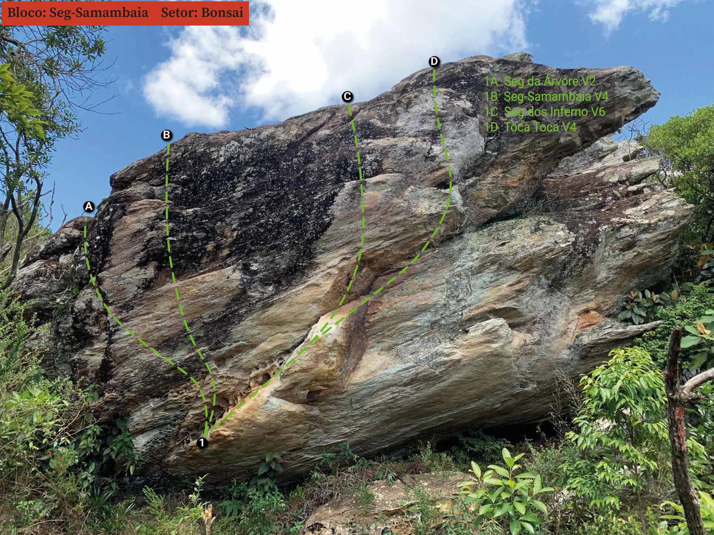
          - **largura_mapa**: 2364
          - **altura_mapa**: 1773
          - **pontos_de_interesse**:
            - **[0]**:
              - **id**: eQpc6VdG3XOvjl
              - **uid**: eQpc6VdG3XOvjl
              - **rotulo**: A
              - **circulo**:
                - **x**: 295
                - **y**: 685
                - **raio**: 20
              - **label**: A
            - **[1]**:
              - **id**: faJjyMn6lUXKC5
              - **uid**: faJjyMn6lUXKC5
              - **rotulo**: B
              - **circulo**:
                - **x**: 552
                - **y**: 449
                - **raio**: 20
              - **label**: B
            - **[2]**:
              - **id**: oGrDWnYBXuaYa6
              - **uid**: oGrDWnYBXuaYa6
              - **rotulo**: C
              - **circulo**:
                - **x**: 1151
                - **y**: 321
                - **raio**: 20
              - **label**: C
            - **[3]**:
              - **id**: LbZZscRzpKlkma
              - **uid**: LbZZscRzpKlkma
              - **rotulo**: D
              - **circulo**:
                - **x**: 1438
                - **y**: 205
                - **raio**: 20
              - **label**: D
            - **[4]**:
              - **id**: c8uBBzY6TrT4cp
              - **uid**: c8uBBzY6TrT4cp
              - **rotulo**: 1
              - **circulo**:
                - **x**: 669
                - **y**: 1469
                - **raio**: 20
              - **label**: 1
          - **referencias**:
            - **[0]**:
              - **alvo_uid**: bXG38UbhImD9Zy
              - **pontos_uids**:
                - eQpc6VdG3XOvjl
                - c8uBBzY6TrT4cp
              - **escalada**: Seg da Árvore
              - **ids**:
                - eQpc6VdG3XOvjl
                - c8uBBzY6TrT4cp
            - **[1]**:
              - **alvo_uid**: QGUdICUDrTgFwH
              - **pontos_uids**:
                - faJjyMn6lUXKC5
                - c8uBBzY6TrT4cp
              - **escalada**: Seg-Samambaia
              - **ids**:
                - faJjyMn6lUXKC5
                - c8uBBzY6TrT4cp
            - **[2]**:
              - **alvo_uid**: LKdsUdeVDThXbw
              - **pontos_uids**:
                - oGrDWnYBXuaYa6
                - c8uBBzY6TrT4cp
              - **escalada**: Seg dos Inferno
              - **ids**:
                - oGrDWnYBXuaYa6
                - c8uBBzY6TrT4cp
            - **[3]**:
              - **alvo_uid**: z7cZnsQr9ktRSy
              - **pontos_uids**:
                - LbZZscRzpKlkma
                - c8uBBzY6TrT4cp
              - **escalada**: Toca Toca
              - **ids**:
                - LbZZscRzpKlkma
                - c8uBBzY6TrT4cp
      - **escaladas**:
        - **[0]**:
          - **uid**: bXG38UbhImD9Zy
          - **boulder**:
            - **nome**: Seg da Árvore
            - **dificuldade**: V2
        - **[1]**:
          - **uid**: QGUdICUDrTgFwH
          - **boulder**:
            - **nome**: Seg-Samambaia
            - **dificuldade**: V4
        - **[2]**:
          - **uid**: LKdsUdeVDThXbw
          - **boulder**:
            - **nome**: Seg dos Inferno
            - **dificuldade**: V6
        - **[3]**:
          - **uid**: z7cZnsQr9ktRSy
          - **boulder**:
            - **nome**: Toca Toca
            - **dificuldade**: V4
      - **precomputados**:
        - **total_escaladas**: 4
        - **total_boulders**: 4
  - **[5]**:
    - **conteudo**:
      - **descricao**: 
      - **nome**: Bloco: Pedra
      - **uid**: MP7vYlyWnMk3fm
      - **mapas**:
        - **[0]**:
          - **caminho_imagem_mapa**: 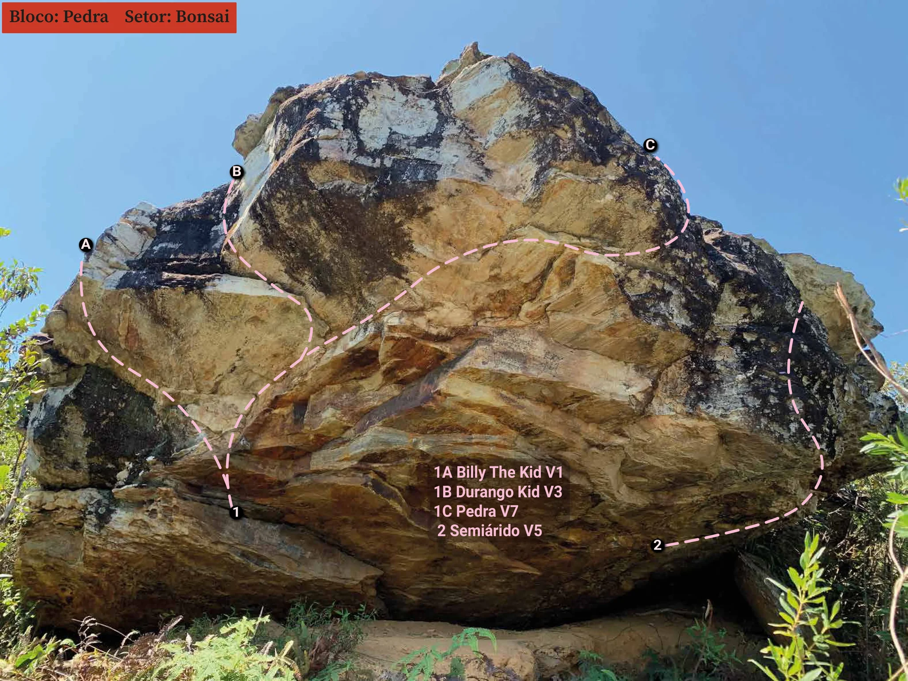
          - **largura_mapa**: 2364
          - **altura_mapa**: 1773
          - **pontos_de_interesse**:
            - **[0]**:
              - **id**: iT2pftH9RJqP2v
              - **uid**: iT2pftH9RJqP2v
              - **rotulo**: 1
              - **circulo**:
                - **x**: 616
                - **y**: 1335
                - **raio**: 20
              - **label**: 1
            - **[1]**:
              - **id**: x97Dv8i4d7CeMn
              - **uid**: x97Dv8i4d7CeMn
              - **rotulo**: 2
              - **circulo**:
                - **x**: 1713
                - **y**: 1421
                - **raio**: 20
              - **label**: 2
            - **[2]**:
              - **id**: XsJiogzBuYvaYm
              - **uid**: XsJiogzBuYvaYm
              - **rotulo**: A
              - **circulo**:
                - **x**: 224
                - **y**: 638
                - **raio**: 20
              - **label**: A
            - **[3]**:
              - **id**: KeOcPkJyh6wVDk
              - **uid**: KeOcPkJyh6wVDk
              - **rotulo**: B
              - **circulo**:
                - **x**: 617
                - **y**: 448
                - **raio**: 20
              - **label**: B
            - **[4]**:
              - **id**: am7kDpFZNKlVwN
              - **uid**: am7kDpFZNKlVwN
              - **rotulo**: C
              - **circulo**:
                - **x**: 1694
                - **y**: 379
                - **raio**: 20
              - **label**: C
          - **referencias**:
            - **[0]**:
              - **alvo_uid**: kgcRgph8dYmc75
              - **pontos_uids**:
                - iT2pftH9RJqP2v
                - XsJiogzBuYvaYm
              - **escalada**: Billy The Kid
              - **ids**:
                - iT2pftH9RJqP2v
                - XsJiogzBuYvaYm
            - **[1]**:
              - **alvo_uid**: Pya0IrYfhPalMr
              - **pontos_uids**:
                - iT2pftH9RJqP2v
                - KeOcPkJyh6wVDk
              - **escalada**: Durango Kid
              - **ids**:
                - iT2pftH9RJqP2v
                - KeOcPkJyh6wVDk
            - **[2]**:
              - **alvo_uid**: UH3evCbCXYN7KW
              - **pontos_uids**:
                - iT2pftH9RJqP2v
                - am7kDpFZNKlVwN
              - **escalada**: Pedra
              - **ids**:
                - iT2pftH9RJqP2v
                - am7kDpFZNKlVwN
            - **[3]**:
              - **alvo_uid**: wYQgp2m7I7c9Qo
              - **pontos_uids**:
                - x97Dv8i4d7CeMn
              - **escalada**: Semiárido
              - **ids**:
                - x97Dv8i4d7CeMn
      - **escaladas**:
        - **[0]**:
          - **uid**: kgcRgph8dYmc75
          - **boulder**:
            - **nome**: Billy The Kid
            - **dificuldade**: V1
        - **[1]**:
          - **uid**: Pya0IrYfhPalMr
          - **boulder**:
            - **nome**: Durango Kid
            - **dificuldade**: V3
        - **[2]**:
          - **uid**: UH3evCbCXYN7KW
          - **boulder**:
            - **nome**: Pedra
            - **dificuldade**: V7
        - **[3]**:
          - **uid**: wYQgp2m7I7c9Qo
          - **boulder**:
            - **nome**: Semiárido
            - **dificuldade**: V5
      - **precomputados**:
        - **total_escaladas**: 4
        - **total_boulders**: 4
  - **[6]**:
    - **conteudo**:
      - **descricao**: 
      - **nome**: Prodígio
      - **uid**: m0uYdNThoV6XvM
      - **escaladas**:
        - **[0]**:
          - **uid**: k1fyrJmOefrOal
          - **boulder**:
            - **nome**: Prodígio
            - **dificuldade**: V5
      - **mapas**:
        - **[0]**:
          - **caminho_imagem_mapa**: 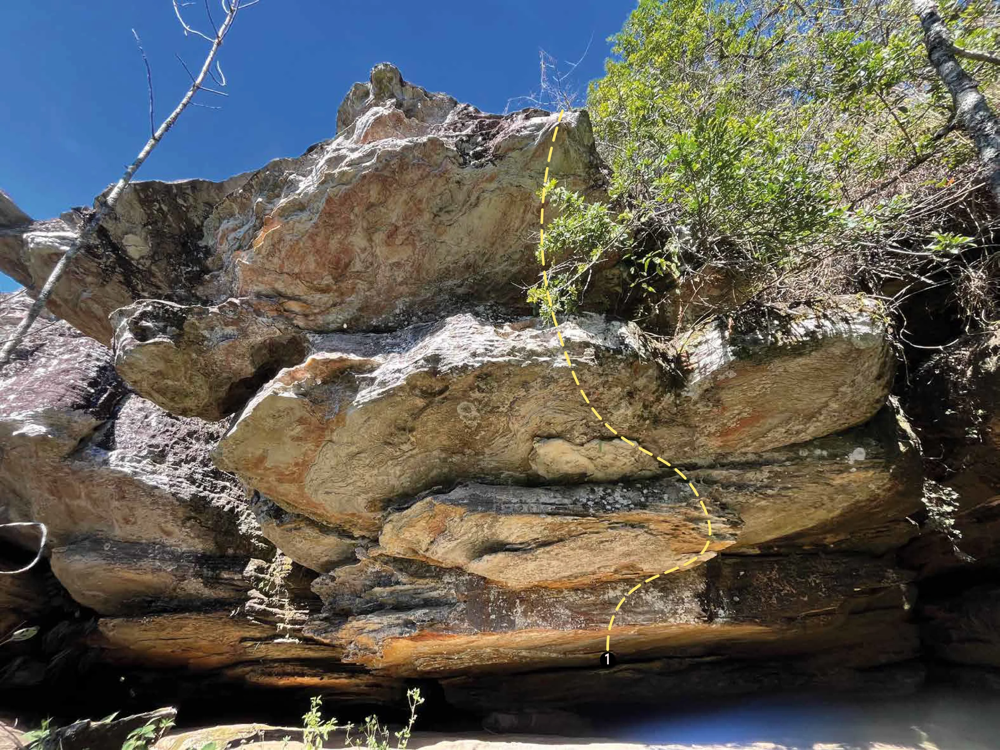
          - **largura_mapa**: 2364
          - **altura_mapa**: 1773
          - **pontos_de_interesse**:
            - **[0]**:
              - **id**: LziTsR3J4eKcpb
              - **uid**: LziTsR3J4eKcpb
              - **rotulo**: 1
              - **circulo**:
                - **x**: 1437
                - **y**: 1560
                - **raio**: 20
              - **label**: 1
          - **referencias**:
            - **[0]**:
              - **alvo_uid**: k1fyrJmOefrOal
              - **pontos_uids**:
                - LziTsR3J4eKcpb
              - **escalada**: Prodígio
              - **ids**:
                - LziTsR3J4eKcpb
      - **precomputados**:
        - **total_escaladas**: 1
        - **total_boulders**: 1
- **precomputados**:
  - **total_escaladas**: 35
  - **total_boulders**: 35

## Arquivos Externos

- **arquivos_externos**:
  - **[0]**:
    - **caminho**: 
    - **checksum_sha256**: 080402976e534cab209c7a58b434216f0e4792ef4f58b287c2cf4b34372d78b3
  - **[1]**:
    - **caminho**: 
    - **checksum_sha256**: e3d2207be8db060dde3782c9465f282e7e51ce474eab6fff2f61ef7b96b86302
  - **[2]**:
    - **caminho**: 
    - **checksum_sha256**: 68844379c67541908cdc13fb340eb681aee7c9c89bff15e603c454395d14fb29
  - **[3]**:
    - **caminho**: 
    - **checksum_sha256**: d98b731dee61159942f86c8c81abca3e1514de0dca3a4685977889e116c1a4e5
  - **[4]**:
    - **caminho**: 
    - **checksum_sha256**: 403bd49fcfc5f03f98d47f1c95d161bc83daffeb3c6ab5f051098ec7762bf994
  - **[5]**:
    - **caminho**: 
    - **checksum_sha256**: a14ef5d2f611248af5a4a594b19c57674050633d2669c218a4b1b15296d36083
  - **[6]**:
    - **caminho**: 
    - **checksum_sha256**: 9227690d987b7806dd255868f68694934a292831eb7984be1eab6b1b16d602d7
  - **[7]**:
    - **caminho**: 
    - **checksum_sha256**: 6d630b886ffe4c7200b17ab29a4a0076ebfc02925c8d9bda2b2619869f88c9ec
  - **[8]**:
    - **caminho**: 
    - **checksum_sha256**: af6738d5f3ca34d2fd44dbc6a5868ad91ff16b9c88b11a50085ac0bd38164f3a
  - **[9]**:
    - **caminho**: 
    - **checksum_sha256**: 99b4721af75b48ed5f5ad8794a97db1397b9f1c1974e0c61d1f9d3be5cffb291
  - **[10]**:
    - **caminho**: 
    - **checksum_sha256**: 1b0c2bd741ed7e93252e418e5298d59cd435f9db15f8c88720af8fe732a366bf
  - **[11]**:
    - **caminho**: 
    - **checksum_sha256**: 1f5981cac8f50d6e25b8e02c929adf82309b5da5a89295e1b1fdf8a6e8c0d575
  - **[12]**:
    - **caminho**: 
    - **checksum_sha256**: a96a9f2bf04fa3f3fe06f99dfca49741ada41f4a2252fca5cf882dbb91dccc3f
  - **[13]**:
    - **caminho**: 
    - **checksum_sha256**: 119c68894df6a7043b18a3640dfc1030483377bc7dc2810c4a8a60bf6cf1ca6b
  - **[14]**:
    - **caminho**: 
    - **checksum_sha256**: 7089843cae6fefdfab942d034b089af04a3b123ae56d90acf448f88ca1de59f6
  - **[15]**:
    - **caminho**: 
    - **checksum_sha256**: 98866b0607ea4497a64a3f7c8ce2f8f099ffca56e13031d93611e7d75d3003a6
  - **[16]**:
    - **caminho**: 
    - **checksum_sha256**: 6e5d521dc4fbd0b2dfabf1f2c789d052fffc95b7084d7d19e670d2f47849ad04
  - **[17]**:
    - **caminho**: 
    - **checksum_sha256**: ece71980c863f2a8ccad8b9150836fa4aad882ba2441fa4865d3c309cc3d019c
  - **[18]**:
    - **caminho**: 
    - **checksum_sha256**: 51ce83771d303cc419f49e28b6138dacbff49aa630d59900999ff44239d47cdb
  - **[19]**:
    - **caminho**: 
    - **checksum_sha256**: 280d7fdbf176fc3e990a70889f94d9ba1c953bc0fb5a3d47e5f82da10dd9c705
  - **[20]**:
    - **caminho**: 
    - **checksum_sha256**: e77df3e8abab34116ab03b11d127aedb0302f4113757c8edf91576c52b3a439a
  - **[21]**:
    - **caminho**: 
    - **checksum_sha256**: 6c7a7158389d39cf5efd1e67e8760b7b21c13336f711f45dcbeb5f2068614bf5
  - **[22]**:
    - **caminho**: 
    - **checksum_sha256**: ca2969222818876ed835399cd9b33770ee3c858fa65e9bb3b8538c83a599fef0
  - **[23]**:
    - **caminho**: 
    - **checksum_sha256**: 803a3296f408ffcbdc7db118b918e402deea72d356b885752966a2e8b438dbc0
  - **[24]**:
    - **caminho**: 
    - **checksum_sha256**: d7877c4dea173cf26e0060b8ee984c8765002cdd02a48f5d375ffd9fa8fe3e1b
  - **[25]**:
    - **caminho**: 
    - **checksum_sha256**: 544841550755abcffc5c97b2368c12c420a73107b9a3c77be26213af517667b9
  - **[26]**:
    - **caminho**: 
    - **checksum_sha256**: 573ff58a696a5ff35ff03184044926d9f07ca5ed6662c5ddfb03bbfa99523d23
  - **[27]**:
    - **caminho**: 
    - **checksum_sha256**: e19e1498e7ff7805878b4216aa6a1915f4b168f98b09682978820bc04539de38
  - **[28]**:
    - **caminho**: 
    - **checksum_sha256**: bcc662e6c74c857e0ec6b8f66a4183bfbd143aeb08f8c0096dd70844916255fc
  - **[29]**:
    - **caminho**: 
    - **checksum_sha256**: 6552e12fbfcc3403186f2d8bef3198ab798d6770713ea8abd072a71112598185
  - **[30]**:
    - **caminho**: 
    - **checksum_sha256**: 130b6b0bbfe944e353b1cdcadf3f45352c14e2ea46e6bdddc7aa5bbd54385a78
  - **[31]**:
    - **caminho**: 
    - **checksum_sha256**: 28dda52455a9acfa99a3cd0db12647adff1afe6f3d82cc5632e237d04ce7e991
  - **[32]**:
    - **caminho**: 
    - **checksum_sha256**: 7884e0ef5187518312602c7a9c82e929af7727408e37c1ee16eef141288d8ee1
  - **[33]**:
    - **caminho**: 
    - **checksum_sha256**: 491f401e4c48ec6b9c727cdea824b7e6962891a5ce7fd5a441eb0dd45f23a0c4
  - **[34]**:
    - **caminho**: 
    - **checksum_sha256**: 24eab1c9c5d64f81f5e713b624444ddd032ba70d435873488adc0d9e2cf0473a
  - **[35]**:
    - **caminho**: 
    - **checksum_sha256**: f91ca00a1a487d66b1178ac2a1bee802926b9e0a56d177e73a2250a7c3f5c767
  - **[36]**:
    - **caminho**: 
    - **checksum_sha256**: ee9c54dc48ab20a7184cb41ce08f6e264f78c8f99f67f6bd7264c66a43e4fe24
  - **[37]**:
    - **caminho**: 
    - **checksum_sha256**: f369437d1046c4279d37d59d5481e712f04e7f26af44a0e1c6f887122b58b2ba
  - **[38]**:
    - **caminho**: 
    - **checksum_sha256**: 317d0a1de150ee3baab01895ab7e2a31030b77030570960aef5b7e2c5470814e
  - **[39]**:
    - **caminho**: 
    - **checksum_sha256**: f6961e941158e55ccdc2d8a150e0ebe265da42c8d4b7e2f7dd3e835a9b448ff0
  - **[40]**:
    - **caminho**: 
    - **checksum_sha256**: 11f28358c43f6a6317aa2362950fe6f3741abbcd269a9931ba8ec0a3a8f6eb99
  - **[41]**:
    - **caminho**: 
    - **checksum_sha256**: cdbac04f62d402a29ba5fc529a2c78e6a53a97980006182b4d9371496b946f4f
  - **[42]**:
    - **caminho**: 
    - **checksum_sha256**: 4e0e6072506b1c6451f5190306b1f368c326c9ce015a4c1a0f5eb9129179f6dc
  - **[43]**:
    - **caminho**: 
    - **checksum_sha256**: de7bbd258373c9934726c8a33455b808a8b3416038840ccd92e6785fcdb63b33
  - **[44]**:
    - **caminho**: 
    - **checksum_sha256**: 2cfeae3f0b89856c8ecf572308b60fc65419cd3d93aff88aa8ddb0fbff6b3121
  - **[45]**:
    - **caminho**: 
    - **checksum_sha256**: 63464b299b093c3c10e6be1ceb0c893fc575efa2faa47e9a5bc0fb29a34abea7
  - **[46]**:
    - **caminho**: 
    - **checksum_sha256**: 24a027e36525e90666649d6a81ce80b76837e47527ab8ea4ce602e23f99ddbc8
  - **[47]**:
    - **caminho**: 
    - **checksum_sha256**: db2f446af6aa39177552d8ce0cc203de93d757058c2b6a23ae18d7ad0817f1a4
  - **[48]**:
    - **caminho**: 
    - **checksum_sha256**: f1e438cf9f781c74b3fce71dafdbc4e805469e3918ae6482214723f0eb145589
  - **[49]**:
    - **caminho**: 
    - **checksum_sha256**: c98e27dc1bbd7e32921c78615f0076b602270ba16dea1385732b70406f615064
  - **[50]**:
    - **caminho**: 
    - **checksum_sha256**: 536182c397f586e487663e9a94a1084836d90de3ed23762a6d5df16a17603dad
  - **[51]**:
    - **caminho**: 
    - **checksum_sha256**: 2dcdd6c953155cdbda6d7e3bc197f08675fac9de8d6cda91caef8a69579ae614
  - **[52]**:
    - **caminho**: 
    - **checksum_sha256**: f09c4dda4588dc76ac52e0944bbd0bfa369fdbe78db073b3c2fff9c07c30f606
  - **[53]**:
    - **caminho**: 
    - **checksum_sha256**: c81303ca1532766f80e1c3887b2bdd60c59a81c8680bc57e265d13464337537d
  - **[54]**:
    - **caminho**: 
    - **checksum_sha256**: 6e69a51b05f2939a233feb1bbe66cce5eca26399f0278fe34c660c7f7af7d597
  - **[55]**:
    - **caminho**: 
    - **checksum_sha256**: bdded62a09ad83db382e45d38588ede6e4b4080c95e4cde8eef0841b06d49479
  - **[56]**:
    - **caminho**: 
    - **checksum_sha256**: e0064f6f3eb80112b9edc0e1ecedd2627a1c69f7c56159108f55235f2a9dcee7
  - **[57]**:
    - **caminho**: 
    - **checksum_sha256**: 81edc13c8ce09ee3ca78fc0678f56c8cf9a82c6c3d2535ba22e63a88a9480823
  - **[58]**:
    - **caminho**: 
    - **checksum_sha256**: e789f06c2389c2333e818b832f7d4bdf1201920e774639c66bb6e35314d94e35
  - **[59]**:
    - **caminho**: 
    - **checksum_sha256**: a03c6472e4d1521f3fbd0354d3f473cd56955e103ca444adb6f03d38b1d950ee
  - **[60]**:
    - **caminho**: 
    - **checksum_sha256**: 430dc49308456fd23cc9274b75b5ee1ea7837316e3ff6d14976cb2b0c1c7e462
  - **[61]**:
    - **caminho**: 
    - **checksum_sha256**: df9e300c98fb70851b4031b6b3ae1a9b7f1adc13c17ab562ecaf44b9e15a707e
  - **[62]**:
    - **caminho**: 
    - **checksum_sha256**: 571be2959b8afbdde2ccfc236fb3a10444487732ff75b00298a48631946590f9
  - **[63]**:
    - **caminho**: 
    - **checksum_sha256**: 7c99faa3e1cc17a2432494623bfd57fd164a944ac9fd46da29acacf8b6de9330
  - **[64]**:
    - **caminho**: 
    - **checksum_sha256**: b22214bb75b409102073f5e58cc75704b9554872f157493c9040f43351269ef8
  - **[65]**:
    - **caminho**: 
    - **checksum_sha256**: 24bb4fc3311edb80862a6776d73684fe983e1d431fa9c016ed2740f8361690e1
  - **[66]**:
    - **caminho**: 
    - **checksum_sha256**: a9c82aa5b62d7fd7f583b89d5fad6ce62cb3412441e0eeec6c1dbed78501efcf
  - **[67]**:
    - **caminho**: 
    - **checksum_sha256**: 22e14b252cc05d1072adbbde7f00e03ee2337dd6363785350fde6b4c8d8fc532
  - **[68]**:
    - **caminho**: 
    - **checksum_sha256**: 1db84b3f0d7bdb4b5f307de56af31afb133581a64d8d04fc03b2a431f89f78ee
  - **[69]**:
    - **caminho**: 
    - **checksum_sha256**: b2300c002604310e104e90492e05485a145358291c73adb66cd1672a19b632e0
  - **[70]**:
    - **caminho**: 
    - **checksum_sha256**: 38318f46414c7077a94dad23ead285c6ec679cd9cbddf2379ba5a2a011fcdae3
  - **[71]**:
    - **caminho**: 
    - **checksum_sha256**: 474739d4d07d23c465748243ff517c96404cc480bda9d9085745da0886aef74c
  - **[72]**:
    - **caminho**: 
    - **checksum_sha256**: 01cbed2d8ae8ebb34228343f3fd2d1b36dd69ebf76f594bc59ec28f2ea8230e3
  - **[73]**:
    - **caminho**: 
    - **checksum_sha256**: f1ab688d3bad73b5977586f4bb2c8f7291117daba42d5c1651866753d7cde1c4
  - **[74]**:
    - **caminho**: 
    - **checksum_sha256**: dd885f17fd965968a176f13cba9693676ac8805ea27c8cfc763760e64dcb5b46
  - **[75]**:
    - **caminho**: 
    - **checksum_sha256**: 354976f94f07ed28e8124dbae66492ef73a2ce26042256fb10fa3f7d3dee514b
  - **[76]**:
    - **caminho**: 
    - **checksum_sha256**: 91821d4d826297806a2ba6168d934812ec764b56cd31a9c2e65f4f9cf44b4f97
  - **[77]**:
    - **caminho**: 
    - **checksum_sha256**: a069cc8e25929dae6817bc2cb16861d92c36fb54450837f6bc3c28ba83c7db1b
  - **[78]**:
    - **caminho**: 
    - **checksum_sha256**: 486bf0594385117da4c0c4c34994c6e97a6e2c5d5b4559c2dde8afdd022a2321
  - **[79]**:
    - **caminho**: 
    - **checksum_sha256**: 8b7232252a8c87c0c75785dc0a2bf12e00e9702f0d554554fa605e89903d37c5
  - **[80]**:
    - **caminho**: 
    - **checksum_sha256**: bd11de489c6dbf657e23b5dcab7efad49ea94ddd6e969e438afb65375fd20b09
  - **[81]**:
    - **caminho**: 
    - **checksum_sha256**: 7ac70f331dabffc9dc99381ea426d954abf8323a3601e80885cf64a396d57031
  - **[82]**:
    - **caminho**: 
    - **checksum_sha256**: fc03dfd6ae2c5c1b28300740508e76bfb3473f76c7d7945953d9754b38f086f9
  - **[83]**:
    - **caminho**: 
    - **checksum_sha256**: 7f0b2fc9b9f5c7d0c5c25d3e08dce432e00bc01054d15a7158806ef9c811e64d
  - **[84]**:
    - **caminho**: 
    - **checksum_sha256**: 6ffe339c6743a1938665aa50669543e3e50bc9212470fade61f79908f69cb5a3
  - **[85]**:
    - **caminho**: 
    - **checksum_sha256**: 3bdba83356ff94563fbc074c82ba206375e2e6f7c6f0c66b19d54d74eeade56a
  - **[86]**:
    - **caminho**: 
    - **checksum_sha256**: 290e5145d5a9c255298c1c5fae72ab15950cb6cb424eac49981b5be597eef4ed
  - **[87]**:
    - **caminho**: 
    - **checksum_sha256**: 7d64070e9e60f30536f8c0bdf431f7dc836f8c467203c15263e9b3ae8d60c8be
  - **[88]**:
    - **caminho**: 
    - **checksum_sha256**: 44e51628c90486d480ab856ff9483e4010ce52aec0120f8018e0f9595aa62c62
  - **[89]**:
    - **caminho**: 
    - **checksum_sha256**: a17e12f39d20e6a016a37d1ada30bacf4202b6834b826d4c7adbe36a2fbbfa0a
  - **[90]**:
    - **caminho**: 
    - **checksum_sha256**: 8687d2f16f5de7fe07fd55fe2947e2f631c3d701d8cb32a718878c5b3463bb51
  - **[91]**:
    - **caminho**: 
    - **checksum_sha256**: 39cd20e711dac0fa6c7b7b6b9579af6016a5d6c29aade78dde284720db4eb35e
  - **[92]**:
    - **caminho**: 
    - **checksum_sha256**: 4a2739b56f30b985c1bcf33ec1da36b6d940644784c5e433af6dfabdd427895f
  - **[93]**:
    - **caminho**: 
    - **checksum_sha256**: a4f429dfce861bbb1bd33e8b21a36c29605464f4afe9aa9ae5941d57f321d775
  - **[94]**:
    - **caminho**: 
    - **checksum_sha256**: e25776bfb9027b13299054bf950ce62c481535ae3d426043414e91934645deab
  - **[95]**:
    - **caminho**: 
    - **checksum_sha256**: 40f15905b2b65d298bfd4cd863ec478d171c55aaddf4549ca02a8dc917dd17c5
  - **[96]**:
    - **caminho**: 
    - **checksum_sha256**: dfa9cbaf6e405b561b52acead17ce0d27a7208b7ff3989efb6a2840fa23b8548
  - **[97]**:
    - **caminho**: 
    - **checksum_sha256**: 874c8a98aac23e92476d51d75d25d350afe1d37ce24357de98f62748f26ee0df
  - **[98]**:
    - **caminho**: 
    - **checksum_sha256**: 613c77886704bd5ac1f831231fab90d78e40d0f823740135fcaa5b282ca8b562
  - **[99]**:
    - **caminho**: 
    - **checksum_sha256**: cf20d077e5ef559d0776dc520c3eb11e0a2a19ee1245fddf27331fde25eb8264
  - **[100]**:
    - **caminho**: 
    - **checksum_sha256**: c4ee9379c20ffe34f4922fc60360b13d4235ddf090f2b56a4c5035ee4e43baa5
  - **[101]**:
    - **caminho**: 
    - **checksum_sha256**: b60c49e1cd1972a6a4751f97b1d9bc8db39f2451e31fb28f88496ad7a2274c69
  - **[102]**:
    - **caminho**: 
    - **checksum_sha256**: 7554d99f5f8c5cff3e8da84c2eb2b6723ecd78067939ca2c2d66784cf5308efe
  - **[103]**:
    - **caminho**: 
    - **checksum_sha256**: 24038624f9e313653503fdf469ab81356381345f2670bfb0799635ba43f6f26d
  - **[104]**:
    - **caminho**: 
    - **checksum_sha256**: 835de44c47ffc37f41073dbdceae5df000700d52dd90aef670c0efb4d334e5d1
  - **[105]**:
    - **caminho**: 
    - **checksum_sha256**: b254a126ef4f73c66dabaab49530e80a5075f1b869646fa429310802f6685819
  - **[106]**:
    - **caminho**: 
    - **checksum_sha256**: ffc99257fd391b719aefca787f76d302074a74d1947c90ee8fa274f60350de4a
  - **[107]**:
    - **caminho**: 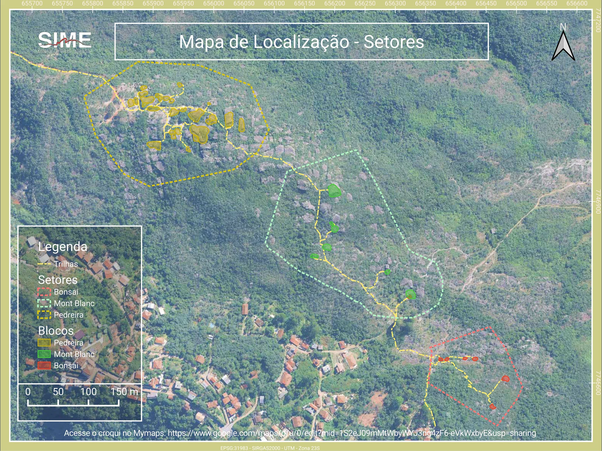
    - **checksum_sha256**: 0aafbc80dd60a558922c6cd0647475fb2ef99b0ae2155c678945f8f55409db84
  - **[108]**:
    - **caminho**: 
    - **checksum_sha256**: 4c7b6cafeecf90e09ba678d90218a338404be9577bdfc7b180ddd4a04e66e93f
  - **[109]**:
    - **caminho**: 
    - **checksum_sha256**: a6f5ab836f94633eb038869760e60ee03f73b69ef029b9adf29df92c02b4d875
  - **[110]**:
    - **caminho**: 
    - **checksum_sha256**: db70f068ad17cac698cf815163b5a909c7284c3f2bd3c5998fbbe28d9db29082

