# Croqui: OuroBoulder Sunset

## Informações Gerais

- **id**: br_mg_ouro_preto_ouroboulder_sunset
- **nome**: OuroBoulder Sunset
- **creditos**:
  - OuroBoulder 2020
- **caminho_thumbnail**: 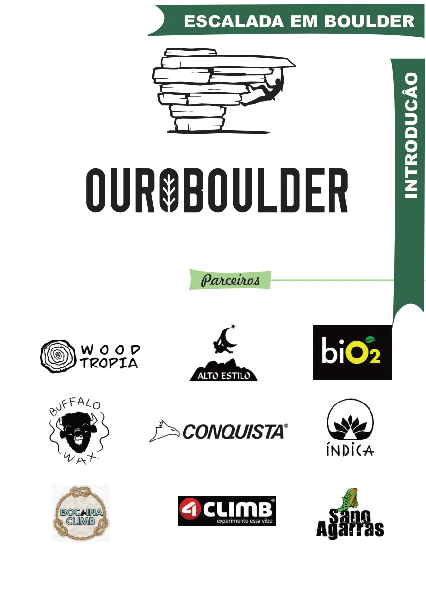
- **revisado_manualmente**: True
- **status_desenho_extraivel**: DESENHO_EXTRAIDO
- **botoes**:
  - **[0]**:
    - **texto**: Capa
    - **destino**:
      - **secao_textual**:
        - **conteudo**:
            # OuroBoulder - Sunset
            
            ESCALADA EM BOULDER
            
            |  |
            | :--: |
            | *Capa OuroBoulder Sunset* |
            
            ## Parceiros
            - Wood Tropia
            - Alto Estilo
            - Bio2
            - Buffalo Wax
            - Conquista
            - Índica
            - Bocaina Climb
            - 4Climb
            - Sano Agarras
  - **[1]**:
    - **texto**: Introdução
    - **destino**:
      - **secao_textual**:
        - **conteudo**:
            # Introdução
            
            O Ouroboulder é um encontro de escaladores que acontece na cidade de Ouro Preto desde 2006. O grande potencial do pico reuniu atletas de todo país logo no primeiro ano, desde então faz parte do circuito de escaladores durante a alta temporada no Brasil.
            
            ## Linha do Tempo
            
            - **2006**: 1º Festival Pico do Itacolomi
            - **2007**: Descoberta Setor da Pedreira; Visita do espanhol Dani Andrada
            - **2008... 2012**
            - **2013**: Felipe Camargo cadena o Libertadores, o que seria o primeiro V14 do Brasil; 1º Croqui impresso do Brasil
            - **2014**
            - **2015**: 10 anos de Ouroboulder
            - **2016... 2018**
            - **2019**: O Japonês Jun Shibanuma manda o Libertadores de flash, decota para V13 e abre o Last Samurai V14
            - **2020**: Primeiro ano sem festival (COVID-19); Descoberta do setor Sunset
            
            |  |
            | :--: |
            | *Registro durante a confraternização do Ouroboulder de 2013* |
            
            *Registro durante a confraternização do Ouroboulder de 2013. Foto: Estúdio Buena Onda.*
  - **[2]**:
    - **texto**: Conversão e Legenda
    - **destino**:
      - **secao_textual**:
        - **conteudo**:
            # Tabela de Conversão e Legenda
            
            ## Considerações
            Este croqui foi produzido para orientar escaladores a respeito dos setores de escalada, vias e cuidados a se tomar ao se praticar a escalada de boulder em Ouro Preto. As graduações dos boulders são apenas uma sugestão embasadas em conhecimento local e pesquisas no site 8a.nu.
            
            ## Tabela de Conversão (V -> Francesa)
            | Brasil (V) | Francesa |
            | :--- | :--- |
            | V0 | 5B |
            | V1 | 5C |
            | V2 | 6A/6A+ |
            | V3 | 6B/6B+ |
            | V4 | 6C/6C+ |
            | V5 | 7A |
            | V6 | 7A+ |
            | V7 | 7B |
            | V8 | 7B+ |
            | V9 | 7C |
            | V10 | 7C+ |
            | V11 | 8A |
            | V12 | 8A+ |
            | V13 | 8B |
            | V14 | 8B+ |
            | V15 | 9C |
            | V16 | 9C+ |
            
            ## Legenda
            | 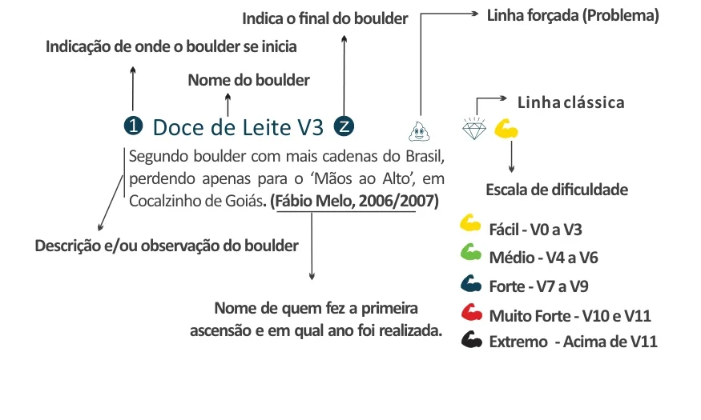 |
            | :--: |
            | *Legenda* |
            
            - **Número (ex: ①)**: Indicação de onde o boulder se inicia.
            - **Letra (ex: Z)**: Indica o final do boulder.
            - **Diamante**: Linha clássica.
            - **Emoji Braço**: Escala de dificuldade.
            - **Emoji Cocô**: Linha forçada (Problema).
            
            ### Escala de Dificuldade
            - **Fácil**: V0 a V3 (Amarelo)
            - **Médio**: V4 a V6 (Verde)
            - **Forte**: V7 a V9 (Azul)
            - **Muito Forte**: V10 e V11 (Vermelho)
            - **Extremo**: Acima de V11 (Preto)
  - **[3]**:
    - **texto**: Responsabilidade e Orientações
    - **destino**:
      - **secao_textual**:
        - **conteudo**:
            # Responsabilidade e Orientações
            
            O principal objetivo do guia de montanha é fortalecer as práticas na natureza de forma consciente, segura e controlada. Portanto, é responsabilidade de cada leitor se atentar aos cuidados, normas e diretrizes de cada local, respeitando a ética local, os moradores e horários de visitação.
            
            ## Atenção
            
            - **Risco**: A prática de atividades na natureza oferece risco. Procure orientações corretas.
            - **Fogueiras**: Não é permitido fazer fogueiras nos parques e ambientes públicos.
            - **Prudência**: Evite praticar atividades outdoor sozinho. Avise familiares e amigos.
            - **Acidentes Naturais**: Fique atento a pedras soltas, buracos, animais, penhascos, raios, etc.
            - **Respeito**: Preserve a vida do próximo e respeite o momento de cada um.
            - **Lixo**: **RECOLHA SEU LIXO.** Caminhe sempre dentro das trilhas existentes.
            - **Prevenção**: Previna-se contra desidratação, insolação, frio e fome.
            
            ## Cães e Animais Domésticos
            
            - Os principais picos estão em áreas de preservação ambiental com espécimes endêmicas ameaçadas.
            - Cães podem cavar buracos, caçar fauna local e danificar a vegetação (como orquídeas raras).
            - Animais domésticos podem ser vetores de doenças para a fauna local.
            - Respeite o espaço individual; muitas pessoas ficam desconfortáveis com animais circulando nos crash pads e perto de alimentos.
            
            ## Gestão Local
            Antes de praticar qualquer atividade, atente-se aos gestores:
            - **Parque Municipal das Andorinhas**
            - **Parque Estadual do Itacolomi**
- **ultima_migracao**: 4
- **publicar_croqui**: True
- **revisado_bounding_circle**: True

## Parte: grupo_sunset

### Grupo (Pico: Sunset)

- **descricao**:
    # Grupo Sunset
    
    O local está localizado a 15 minutos da entrada do setor da pedreira, bem no cume da montanha, o que proporciona um visual amplo e belo, sempre com um maravilhoso pôr-do-sol!
    
    Os boulders deste setor oferecem uma característica mais técnica e menos negativa. Os acessos entre os blocos são mais íngremes e requerem maior atenção no deslocamento. As trilhas estão sinalizadas com fita reflexiva e totens.
- **nome**: Sunset
- **mapas**:
  - **[0]**:
    - **caminho_imagem_mapa**: 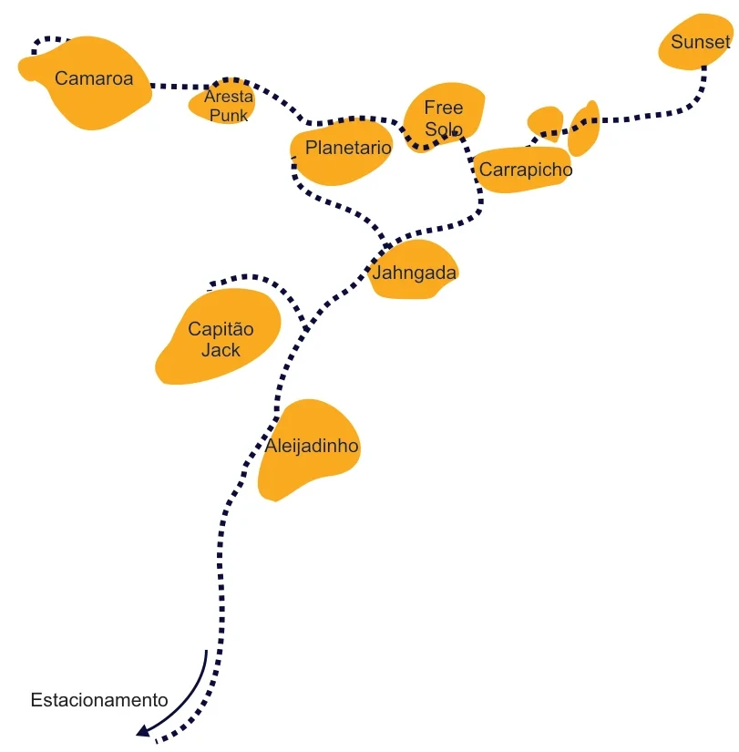
    - **largura_mapa**: 811
    - **altura_mapa**: 825
    - **pontos_de_interesse**:
      - **[0]**:
        - **id**: Sunset
        - **label**: Sunset
        - **retangulo**:
          - **x**: 768
          - **y**: 45
          - **comprimento**: 75
          - **largura**: 30
      - **[1]**:
        - **id**: Camaroa
        - **label**: Camaroa
        - **retangulo**:
          - **x**: 102
          - **y**: 86
          - **comprimento**: 92
          - **largura**: 31
      - **[2]**:
        - **id**: Aresta_Punk
        - **label**: Aresta Punk
        - **retangulo**:
          - **x**: 252
          - **y**: 114
          - **comprimento**: 65
          - **largura**: 46
      - **[3]**:
        - **id**: Planetario
        - **label**: Planetario
        - **retangulo**:
          - **x**: 381
          - **y**: 161
          - **comprimento**: 102
          - **largura**: 30
      - **[4]**:
        - **id**: Free_Solo
        - **label**: Free Solo
        - **retangulo**:
          - **x**: 487
          - **y**: 128
          - **comprimento**: 56
          - **largura**: 55
      - **[5]**:
        - **id**: Carrapicho
        - **label**: Carrapicho
        - **retangulo**:
          - **x**: 578
          - **y**: 185
          - **comprimento**: 110
          - **largura**: 30
      - **[6]**:
        - **id**: Jahngada
        - **label**: Jahngada
        - **retangulo**:
          - **x**: 454
          - **y**: 298
          - **comprimento**: 104
          - **largura**: 36
      - **[7]**:
        - **id**: Capitão_Jack
        - **label**: Capitão Jack
        - **retangulo**:
          - **x**: 243
          - **y**: 372
          - **comprimento**: 78
          - **largura**: 53
      - **[8]**:
        - **id**: Aleijadinho
        - **label**: Aleijadinho
        - **retangulo**:
          - **x**: 343
          - **y**: 488
          - **comprimento**: 118
          - **largura**: 33
    - **referencias**:
      - **[0]**:
        - **ids**:
          - Aleijadinho
        - **grupo**: Sunset
        - **setor**: Aleijadinho
      - **[1]**:
        - **ids**:
          - Capitão_Jack
        - **grupo**: Sunset
        - **setor**: Capitão Jack
      - **[2]**:
        - **ids**:
          - Jahngada
        - **grupo**: Sunset
        - **setor**: Jahngada
      - **[3]**:
        - **ids**:
          - Planetario
        - **grupo**: Sunset
        - **setor**: Planetário
      - **[4]**:
        - **ids**:
          - Free_Solo
        - **grupo**: Sunset
        - **setor**: Free Solo
      - **[5]**:
        - **ids**:
          - Carrapicho
        - **grupo**: Sunset
        - **setor**: Carrapicho
      - **[6]**:
        - **ids**:
          - Sunset
        - **grupo**: Sunset
        - **setor**: Sunset
      - **[7]**:
        - **ids**:
          - Camaroa
        - **grupo**: Sunset
        - **setor**: Camaroa
- **setores**:
  - **[0]**:
    - **conteudo**:
      - **descricao**: # Bloco Aleijadinho
      - **nome**: Aleijadinho
      - **escaladas**:
        - **[0]**:
          - **boulder**:
            - **nome**: Aleijadinho
            - **dificuldade**: V5
            - **destaque**: True
      - **mapas**:
        - **[0]**:
          - **caminho_imagem_mapa**: 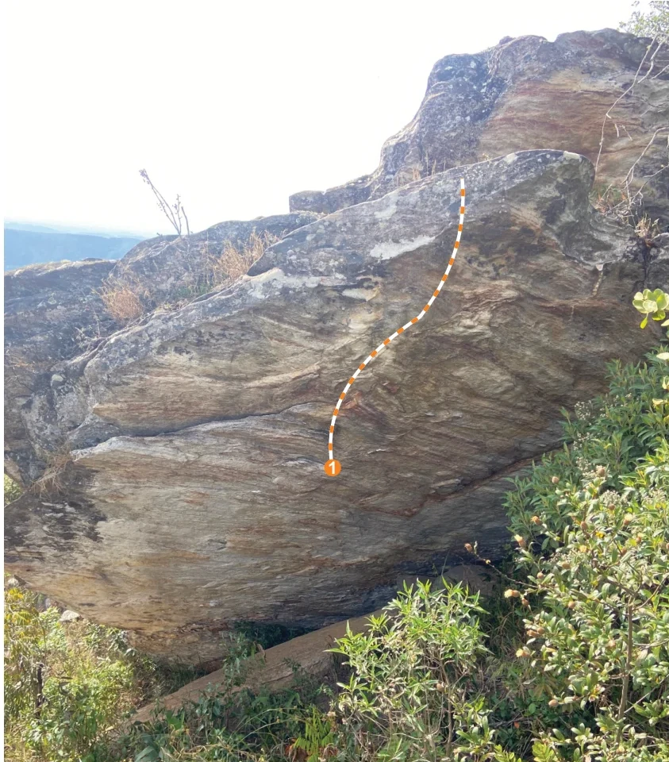
          - **largura_mapa**: 843
          - **altura_mapa**: 960
          - **pontos_de_interesse**:
            - **[0]**:
              - **id**: 1
              - **label**: 1
              - **circulo**:
                - **x**: 419
                - **y**: 589
                - **raio**: 11
          - **referencias**:
            - **[0]**:
              - **escalada**: Aleijadinho
              - **ids**:
                - 1
  - **[1]**:
    - **conteudo**:
      - **descricao**: # Bloco Capitão Jack
      - **nome**: Capitão Jack
      - **escaladas**:
        - **[0]**:
          - **boulder**:
            - **nome**: Amnesia
            - **destaque**: True
            - **dificuldade**: V3
        - **[1]**:
          - **boulder**:
            - **descricao**: Virada exposta, atenção na segurança!
            - **nome**: Capitão Jack
            - **destaque**: True
            - **dificuldade**: V6
        - **[2]**:
          - **boulder**:
            - **descricao**: Começa em uma fenda bem a esquerda, faz a travessia e vira no Amnésia
            - **nome**: Purple Rase
            - **dificuldade**: V5
        - **[3]**:
          - **boulder**:
            - **descricao**: Começa perto do chão de areia bem a direita e vira no Amnésia
            - **nome**: Sunshine
            - **dificuldade**: V6
      - **mapas**:
        - **[0]**:
          - **caminho_imagem_mapa**: 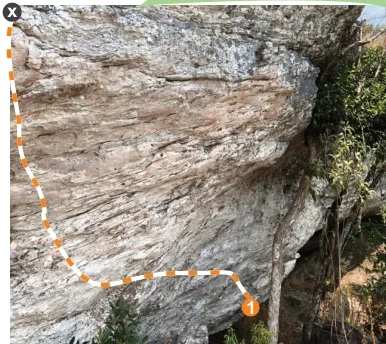
          - **largura_mapa**: 386
          - **altura_mapa**: 344
          - **pontos_de_interesse**:
            - **[0]**:
              - **id**: 1
              - **label**: 1
              - **circulo**:
                - **x**: 251
                - **y**: 307
                - **raio**: 9
            - **[1]**:
              - **id**: x
              - **label**: x
              - **circulo**:
                - **x**: 12
                - **y**: 12
                - **raio**: 9
          - **referencias**:
            - **[0]**:
              - **escalada**: Sunshine
              - **ids**:
                - 1
                - x
        - **[1]**:
          - **caminho_imagem_mapa**: 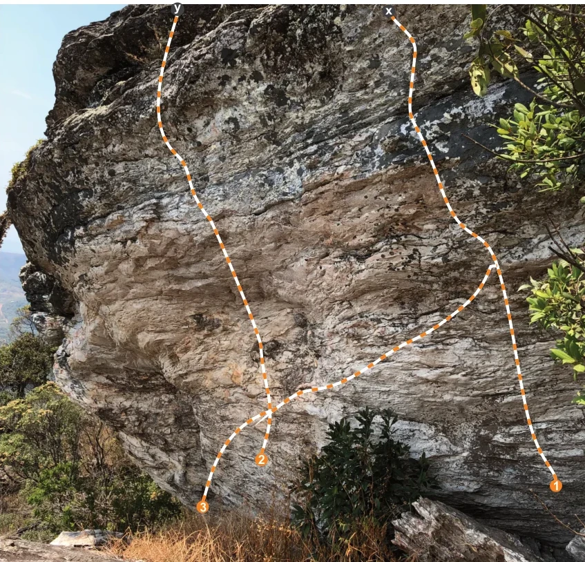
          - **largura_mapa**: 847
          - **altura_mapa**: 814
          - **pontos_de_interesse**:
            - **[0]**:
              - **id**: 1_b
              - **label**: 1
              - **circulo**:
                - **x**: 805
                - **y**: 704
                - **raio**: 9
            - **[1]**:
              - **id**: 2
              - **label**: 2
              - **circulo**:
                - **x**: 379
                - **y**: 666
                - **raio**: 10
            - **[2]**:
              - **id**: 3
              - **label**: 3
              - **circulo**:
                - **x**: 294
                - **y**: 734
                - **raio**: 9
            - **[3]**:
              - **id**: y
              - **label**: y
              - **circulo**:
                - **x**: 256
                - **y**: 13
                - **raio**: 10
            - **[4]**:
              - **id**: x_b
              - **label**: x
              - **circulo**:
                - **x**: 562
                - **y**: 15
                - **raio**: 9
          - **referencias**:
            - **[0]**:
              - **escalada**: Amnesia
              - **ids**:
                - 1_b
                - x_b
            - **[1]**:
              - **escalada**: Capitão Jack
              - **ids**:
                - 2
                - y
            - **[2]**:
              - **escalada**: Purple Rase
              - **ids**:
                - 3
                - x_b
  - **[2]**:
    - **conteudo**:
      - **descricao**: # Bloco Jahngada
      - **nome**: Jahngada
      - **escaladas**:
        - **[0]**:
          - **boulder**:
            - **descricao**: Base alta, recomenda-se o uso de pelo menos 6 Crash Pads
            - **nome**: Jahngada
            - **dificuldade**: V9
            - **destaque**: True
        - **[1]**:
          - **boulder**:
            - **nome**: Jahngada SDS
            - **dificuldade**: V10
            - **destaque**: True
        - **[2]**:
          - **boulder**:
            - **nome**: Guaicuí
            - **dificuldade**: V5
        - **[3]**:
          - **boulder**:
            - **nome**: Camundongo
            - **dificuldade**: V7
      - **mapas**:
        - **[0]**:
          - **caminho_imagem_mapa**: 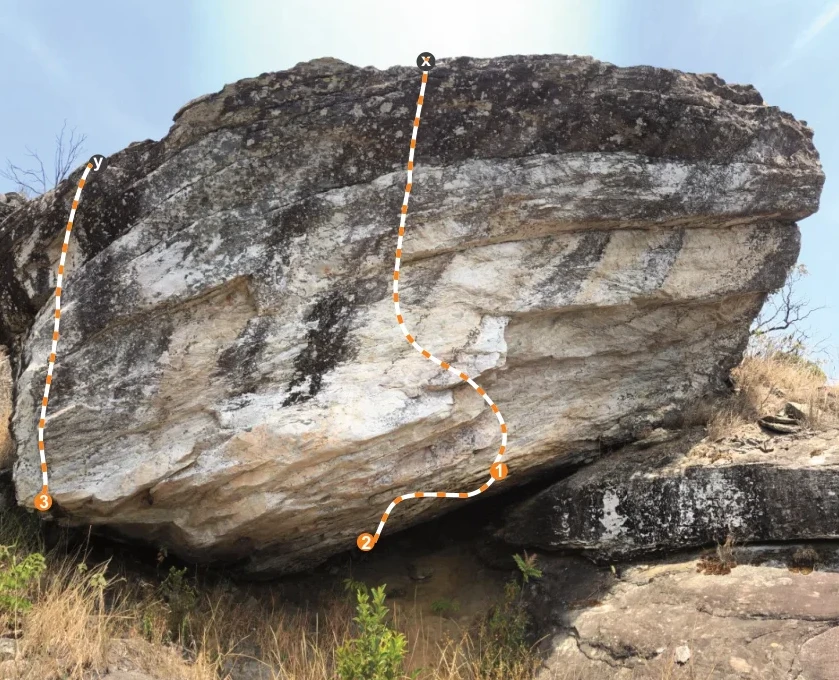
          - **largura_mapa**: 839
          - **altura_mapa**: 680
          - **pontos_de_interesse**:
            - **[0]**:
              - **id**: 1
              - **label**: 1
              - **circulo**:
                - **x**: 499
                - **y**: 470
                - **raio**: 9
            - **[1]**:
              - **id**: 2
              - **label**: 2
              - **circulo**:
                - **x**: 365
                - **y**: 542
                - **raio**: 8
            - **[2]**:
              - **id**: 3
              - **label**: 3
              - **circulo**:
                - **x**: 43
                - **y**: 501
                - **raio**: 8
            - **[3]**:
              - **id**: x
              - **label**: x
              - **circulo**:
                - **x**: 425
                - **y**: 61
                - **raio**: 10
            - **[4]**:
              - **id**: y
              - **label**: y
              - **circulo**:
                - **x**: 97
                - **y**: 164
                - **raio**: 10
          - **referencias**:
            - **[0]**:
              - **escalada**: Jahngada
              - **ids**:
                - 1
                - x
            - **[1]**:
              - **escalada**: Jahngada SDS
              - **ids**:
                - 2
                - x
            - **[2]**:
              - **escalada**: Guaicuí
              - **ids**:
                - 3
                - y
        - **[1]**:
          - **caminho_imagem_mapa**: 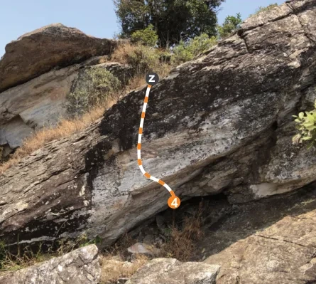
          - **largura_mapa**: 445
          - **altura_mapa**: 399
          - **pontos_de_interesse**:
            - **[0]**:
              - **id**: 4
              - **label**: 4
              - **circulo**:
                - **x**: 245
                - **y**: 284
                - **raio**: 9
            - **[1]**:
              - **id**: z
              - **label**: z
              - **circulo**:
                - **x**: 214
                - **y**: 111
                - **raio**: 9
          - **referencias**:
            - **[0]**:
              - **escalada**: Camundongo
              - **ids**:
                - 4
                - z
  - **[3]**:
    - **conteudo**:
      - **descricao**: # Bloco Planetário
      - **nome**: Planetário
      - **escaladas**:
        - **[0]**:
          - **boulder**:
            - **nome**: Planetário
            - **destaque**: True
            - **dificuldade**: V11
        - **[1]**:
          - **boulder**:
            - **nome**: Náufrago
            - **destaque**: True
            - **dificuldade**: V7
        - **[2]**:
          - **boulder**:
            - **nome**: Golfinho
            - **dificuldade**: V4
        - **[3]**:
          - **boulder**:
            - **nome**: Clarete
            - **dificuldade**: V3
        - **[4]**:
          - **boulder**:
            - **nome**: Odisséia na Babilônia
            - **dificuldade**: V6
            - **destaque**: True
        - **[5]**:
          - **boulder**:
            - **nome**: Canais da Babilônia
            - **dificuldade**: V5
      - **mapas**:
        - **[0]**:
          - **caminho_imagem_mapa**: 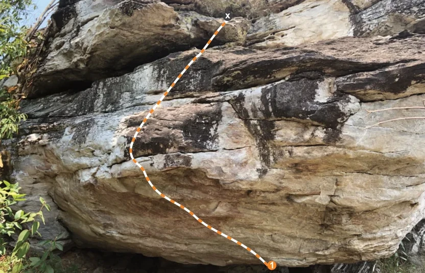
          - **largura_mapa**: 832
          - **altura_mapa**: 536
          - **pontos_de_interesse**:
            - **[0]**:
              - **id**: 1
              - **label**: 1
              - **circulo**:
                - **x**: 532
                - **y**: 520
                - **raio**: 9
            - **[1]**:
              - **id**: x
              - **label**: x
              - **circulo**:
                - **x**: 445
                - **y**: 31
                - **raio**: 9
          - **referencias**:
            - **[0]**:
              - **escalada**: Planetário
              - **ids**:
                - 1
                - x
        - **[1]**:
          - **caminho_imagem_mapa**: 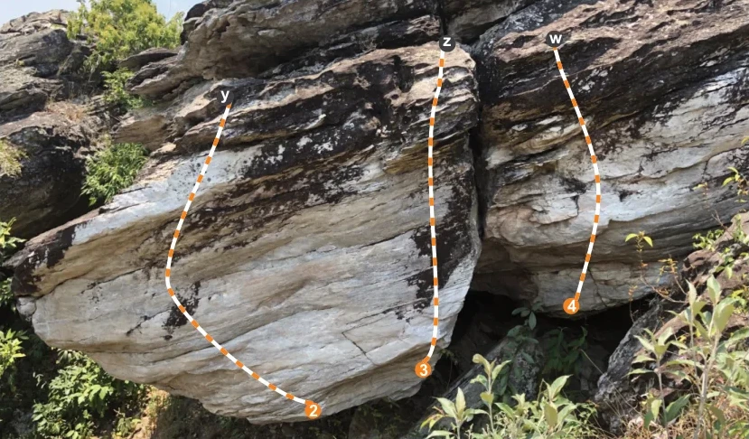
          - **largura_mapa**: 829
          - **altura_mapa**: 486
          - **pontos_de_interesse**:
            - **[0]**:
              - **id**: 2
              - **label**: 2
              - **circulo**:
                - **x**: 346
                - **y**: 454
                - **raio**: 9
            - **[1]**:
              - **id**: 3
              - **label**: 3
              - **circulo**:
                - **x**: 468
                - **y**: 409
                - **raio**: 9
            - **[2]**:
              - **id**: 4
              - **label**: 4
              - **circulo**:
                - **x**: 632
                - **y**: 338
                - **raio**: 9
            - **[3]**:
              - **id**: y
              - **label**: y
              - **circulo**:
                - **x**: 248
                - **y**: 106
                - **raio**: 11
            - **[4]**:
              - **id**: z
              - **label**: z
              - **circulo**:
                - **x**: 495
                - **y**: 47
                - **raio**: 9
            - **[5]**:
              - **id**: w
              - **label**: w
              - **circulo**:
                - **x**: 614
                - **y**: 42
                - **raio**: 10
          - **referencias**:
            - **[0]**:
              - **escalada**: Náufrago
              - **ids**:
                - 2
                - y
            - **[1]**:
              - **escalada**: Golfinho
              - **ids**:
                - 3
                - z
            - **[2]**:
              - **escalada**: Clarete
              - **ids**:
                - 4
                - w
        - **[2]**:
          - **caminho_imagem_mapa**: 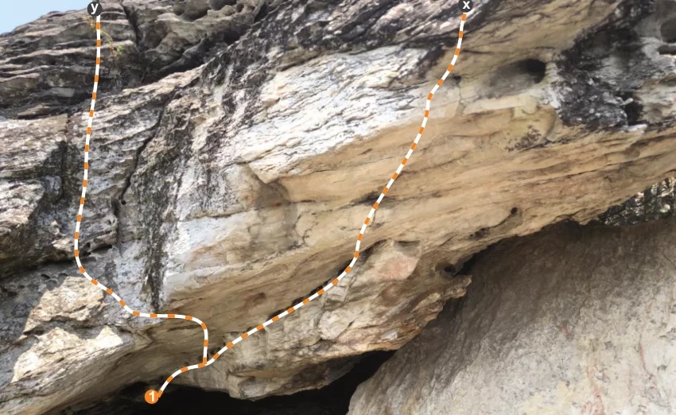
          - **largura_mapa**: 850
          - **altura_mapa**: 522
          - **pontos_de_interesse**:
            - **[0]**:
              - **id**: 1_b
              - **label**: 1
              - **circulo**:
                - **x**: 191
                - **y**: 499
                - **raio**: 9
            - **[1]**:
              - **id**: y_b
              - **label**: y
              - **circulo**:
                - **x**: 118
                - **y**: 10
                - **raio**: 9
            - **[2]**:
              - **id**: x_b
              - **label**: x
              - **circulo**:
                - **x**: 585
                - **y**: 6
                - **raio**: 8
          - **referencias**:
            - **[0]**:
              - **escalada**: Odisséia na Babilônia
              - **ids**:
                - 1_b
                - x_b
            - **[1]**:
              - **escalada**: Canais da Babilônia
              - **ids**:
                - 1_b
                - y_b
  - **[4]**:
    - **conteudo**:
      - **descricao**: # Bloco Free Solo
      - **nome**: Free Solo
      - **escaladas**:
        - **[0]**:
          - **boulder**:
            - **nome**: Fomiagem
            - **dificuldade**: V4
        - **[1]**:
          - **boulder**:
            - **nome**: Projeto
            - **destaque**: True
        - **[2]**:
          - **boulder**:
            - **nome**: Free Solo
            - **destaque**: True
            - **dificuldade**: V5
        - **[3]**:
          - **boulder**:
            - **descricao**: Apenas desafio de virar o bloco
            - **nome**: Tartaruga
            - **dificuldade**: V3
        - **[4]**:
          - **boulder**:
            - **nome**: Mobilete
            - **dificuldade**: V3
        - **[5]**:
          - **boulder**:
            - **nome**: Walkmachine
            - **dificuldade**: V6
      - **mapas**:
        - **[0]**:
          - **caminho_imagem_mapa**: 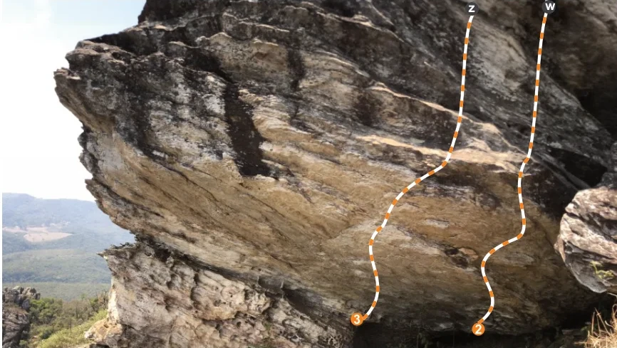
          - **largura_mapa**: 866
          - **altura_mapa**: 489
          - **pontos_de_interesse**:
            - **[0]**:
              - **id**: 2
              - **label**: 2
              - **circulo**:
                - **x**: 671
                - **y**: 463
                - **raio**: 9
            - **[1]**:
              - **id**: 3
              - **label**: 3
              - **circulo**:
                - **x**: 500
                - **y**: 448
                - **raio**: 9
            - **[2]**:
              - **id**: Z
              - **label**: Z
              - **circulo**:
                - **x**: 662
                - **y**: 12
                - **raio**: 9
            - **[3]**:
              - **id**: W
              - **label**: W
              - **circulo**:
                - **x**: 772
                - **y**: 9
                - **raio**: 10
          - **referencias**:
            - **[0]**:
              - **escalada**: Fomiagem
              - **ids**:
                - 2
                - W
            - **[1]**:
              - **escalada**: Projeto
              - **ids**:
                - 3
                - Z
        - **[1]**:
          - **caminho_imagem_mapa**: 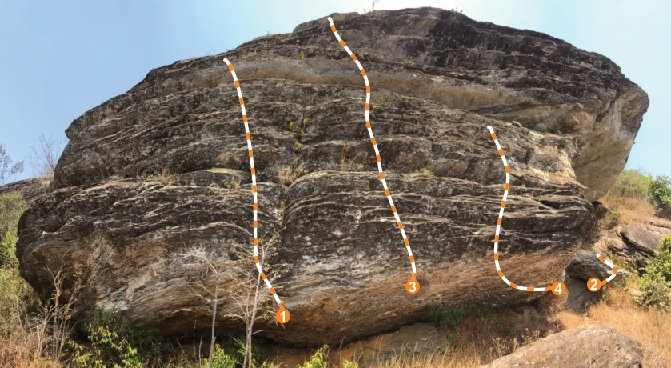
          - **largura_mapa**: 839
          - **altura_mapa**: 460
          - **pontos_de_interesse**:
            - **[0]**:
              - **id**: 1
              - **label**: 1
              - **circulo**:
                - **x**: 354
                - **y**: 396
                - **raio**: 9
            - **[1]**:
              - **id**: 3_b
              - **label**: 3
              - **circulo**:
                - **x**: 516
                - **y**: 358
                - **raio**: 9
            - **[2]**:
              - **id**: 4
              - **label**: 4
              - **circulo**:
                - **x**: 698
                - **y**: 360
                - **raio**: 9
            - **[3]**:
              - **id**: 2_b
              - **label**: 2
              - **circulo**:
                - **x**: 743
                - **y**: 356
                - **raio**: 9
          - **referencias**:
            - **[0]**:
              - **escalada**: Free Solo
              - **ids**:
                - 1
            - **[1]**:
              - **escalada**: Tartaruga
              - **ids**:
                - 2_b
            - **[2]**:
              - **escalada**: Mobilete
              - **ids**:
                - 3_b
            - **[3]**:
              - **escalada**: Walkmachine
              - **ids**:
                - 4
  - **[5]**:
    - **conteudo**:
      - **descricao**: # Bloco Carrapicho
      - **nome**: Carrapicho
      - **escaladas**:
        - **[0]**:
          - **boulder**:
            - **nome**: Carrapato
            - **dificuldade**: V5
        - **[1]**:
          - **boulder**:
            - **nome**: Carrapicho
            - **dificuldade**: V6
        - **[2]**:
          - **boulder**:
            - **nome**: Oratório
            - **dificuldade**: V7
        - **[3]**:
          - **boulder**:
            - **nome**: Pistol
            - **dificuldade**: V2
        - **[4]**:
          - **boulder**:
            - **nome**: Dart Vader
            - **dificuldade**: V4
      - **mapas**:
        - **[0]**:
          - **caminho_imagem_mapa**: 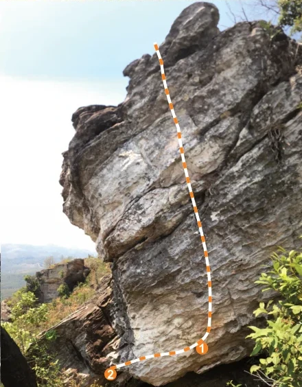
          - **largura_mapa**: 440
          - **altura_mapa**: 564
          - **pontos_de_interesse**:
            - **[0]**:
              - **id**: 1
              - **label**: 1
              - **circulo**:
                - **x**: 294
                - **y**: 507
                - **raio**: 9
            - **[1]**:
              - **id**: 2
              - **label**: 2
              - **circulo**:
                - **x**: 160
                - **y**: 545
                - **raio**: 9
          - **referencias**:
            - **[0]**:
              - **escalada**: Carrapato
              - **ids**:
                - 1
            - **[1]**:
              - **escalada**: Carrapicho
              - **ids**:
                - 2
        - **[1]**:
          - **caminho_imagem_mapa**: 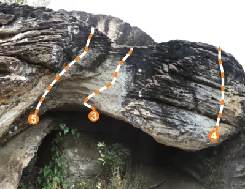
          - **largura_mapa**: 399
          - **altura_mapa**: 309
          - **pontos_de_interesse**:
            - **[0]**:
              - **id**: 3
              - **label**: 3
              - **circulo**:
                - **x**: 152
                - **y**: 189
                - **raio**: 9
            - **[1]**:
              - **id**: 4
              - **label**: 4
              - **circulo**:
                - **x**: 348
                - **y**: 221
                - **raio**: 9
            - **[2]**:
              - **id**: 5
              - **label**: 5
              - **circulo**:
                - **x**: 54
                - **y**: 194
                - **raio**: 9
          - **referencias**:
            - **[0]**:
              - **escalada**: Oratório
              - **ids**:
                - 3
            - **[1]**:
              - **escalada**: Pistol
              - **ids**:
                - 4
            - **[2]**:
              - **escalada**: Dart Vader
              - **ids**:
                - 5
  - **[6]**:
    - **conteudo**:
      - **descricao**: # Bloco Sunset
      - **nome**: Sunset
      - **escaladas**:
        - **[0]**:
          - **boulder**:
            - **nome**: Sucrilhos
            - **dificuldade**: V5
            - **destaque**: True
        - **[1]**:
          - **boulder**:
            - **nome**: Faxineiro do Universo
            - **dificuldade**: V5
        - **[2]**:
          - **boulder**:
            - **nome**: Arestinha Vibration
            - **dificuldade**: V1
        - **[3]**:
          - **boulder**:
            - **nome**: Sujeirinha
            - **dificuldade**: V3
        - **[4]**:
          - **boulder**:
            - **nome**: Projeto Sunset
            - **dificuldade**: V3
            - **destaque**: True
      - **mapas**:
        - **[0]**:
          - **caminho_imagem_mapa**: 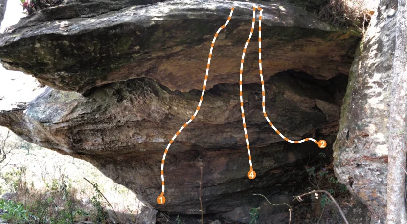
          - **largura_mapa**: 832
          - **altura_mapa**: 459
          - **pontos_de_interesse**:
            - **[0]**:
              - **id**: 1
              - **label**: 1
              - **circulo**:
                - **x**: 329
                - **y**: 409
                - **raio**: 9
            - **[1]**:
              - **id**: 4
              - **label**: 4
              - **circulo**:
                - **x**: 514
                - **y**: 357
                - **raio**: 9
            - **[2]**:
              - **id**: 2
              - **label**: 2
              - **circulo**:
                - **x**: 658
                - **y**: 294
                - **raio**: 9
          - **referencias**:
            - **[0]**:
              - **escalada**: Sucrilhos
              - **ids**:
                - 1
            - **[1]**:
              - **escalada**: Faxineiro do Universo
              - **ids**:
                - 2
            - **[2]**:
              - **escalada**: Sujeirinha
              - **ids**:
                - 4
        - **[1]**:
          - **caminho_imagem_mapa**: 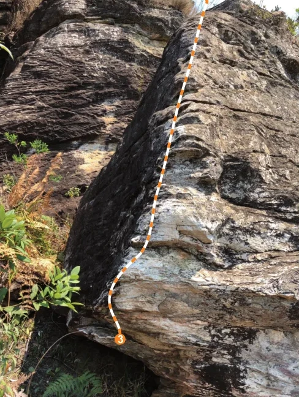
          - **largura_mapa**: 488
          - **altura_mapa**: 648
          - **pontos_de_interesse**:
            - **[0]**:
              - **id**: 3
              - **label**: 3
              - **circulo**:
                - **x**: 195
                - **y**: 554
                - **raio**: 9
          - **referencias**:
            - **[0]**:
              - **escalada**: Arestinha Vibration
              - **ids**:
                - 3
        - **[2]**:
          - **caminho_imagem_mapa**: 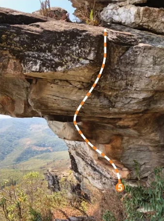
          - **largura_mapa**: 338
          - **altura_mapa**: 456
          - **pontos_de_interesse**:
            - **[0]**:
              - **id**: 5
              - **label**: 5
              - **circulo**:
                - **x**: 246
                - **y**: 386
                - **raio**: 9
          - **referencias**:
            - **[0]**:
              - **escalada**: Projeto Sunset
              - **ids**:
                - 5
  - **[7]**:
    - **conteudo**:
      - **descricao**: # Bloco Camaroa
      - **nome**: Camaroa
      - **escaladas**:
        - **[0]**:
          - **boulder**:
            - **nome**: Fissura
            - **dificuldade**: V8
            - **destaque**: True
        - **[1]**:
          - **boulder**:
            - **nome**: Pure
            - **dificuldade**: V6
            - **destaque**: True
        - **[2]**:
          - **boulder**:
            - **nome**: Lpita
            - **dificuldade**: V7
            - **destaque**: True
        - **[3]**:
          - **boulder**:
            - **nome**: Nave
            - **dificuldade**: V3
            - **destaque**: True
        - **[4]**:
          - **boulder**:
            - **nome**: Camaroa
            - **dificuldade**: V10
            - **destaque**: True
      - **mapas**:
        - **[0]**:
          - **caminho_imagem_mapa**: 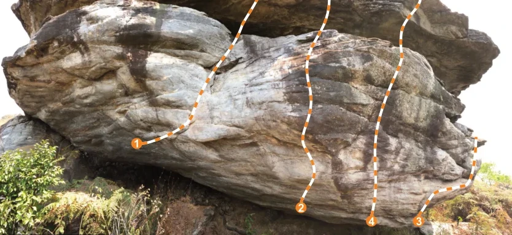
          - **largura_mapa**: 834
          - **altura_mapa**: 384
          - **pontos_de_interesse**:
            - **[0]**:
              - **id**: 1
              - **label**: 1
              - **circulo**:
                - **x**: 222
                - **y**: 234
                - **raio**: 8
            - **[1]**:
              - **id**: 2
              - **label**: 2
              - **circulo**:
                - **x**: 490
                - **y**: 339
                - **raio**: 9
            - **[2]**:
              - **id**: 4
              - **label**: 4
              - **circulo**:
                - **x**: 605
                - **y**: 361
                - **raio**: 9
            - **[3]**:
              - **id**: 3
              - **label**: 3
              - **circulo**:
                - **x**: 682
                - **y**: 361
                - **raio**: 8
          - **referencias**:
            - **[0]**:
              - **escalada**: Fissura
              - **ids**:
                - 1
            - **[1]**:
              - **escalada**: Pure
              - **ids**:
                - 2
            - **[2]**:
              - **escalada**: Lpita
              - **ids**:
                - 3
            - **[3]**:
              - **escalada**: Nave
              - **ids**:
                - 4
        - **[1]**:
          - **caminho_imagem_mapa**: 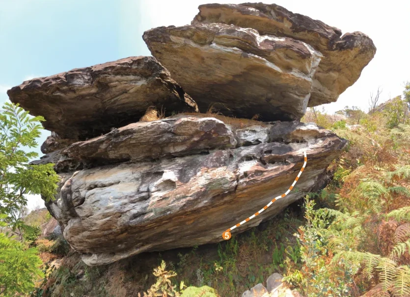
          - **largura_mapa**: 835
          - **altura_mapa**: 606
          - **pontos_de_interesse**:
            - **[0]**:
              - **id**: 5
              - **label**: 5
              - **circulo**:
                - **x**: 462
                - **y**: 480
                - **raio**: 10
          - **referencias**:
            - **[0]**:
              - **escalada**: Camaroa
              - **ids**:
                - 5

## Arquivos Externos

- **arquivos_externos**:
  - **[0]**:
    - **caminho**: 
    - **checksum_sha256**: b0c19afb64dc5ecdea6682dbd7b31a92fab38ce152066a859052e7c8e24312d4
  - **[1]**:
    - **caminho**: 
    - **checksum_sha256**: 2278679473a7d653e2906310ccb17ea686c37e4ae976523a8fc1cf17f186559e
  - **[2]**:
    - **caminho**: 
    - **checksum_sha256**: 200959c53d5214862beb98a84125424647d2d47ecfb37b3bc4fce5e8af5ae190
  - **[3]**:
    - **caminho**: 
    - **checksum_sha256**: 45b342d993cd9b59ba9127bf380e614fda80e45ad58fd8b2b5354973df11592f
  - **[4]**:
    - **caminho**: 
    - **checksum_sha256**: eb73d3d92a8a9074834f73a90a5a6b0f788632f568a81daad0efad54f839f79b
  - **[5]**:
    - **caminho**: 
    - **checksum_sha256**: b39ea938ee85c4d5f9f62061e545cd3c84df257d772dc623c33e3c27b0185094
  - **[6]**:
    - **caminho**: 
    - **checksum_sha256**: 93430d4d18405a8cded0b6839555466564d0b18f9182fd2a458cbc2b8b839548
  - **[7]**:
    - **caminho**: 
    - **checksum_sha256**: ae72f06891e83bb819c9acec7d068255535953e222d2975bdee86a3a09160611
  - **[8]**:
    - **caminho**: 
    - **checksum_sha256**: 8e06fb0a594ca36b9f49e6e63a8dc333e84a31703de60a9a7f5641fcc8804d8c
  - **[9]**:
    - **caminho**: 
    - **checksum_sha256**: 98472ccacd3cd28ca9881c68738932d32eca614e2407d06cd34ad10f0782a053
  - **[10]**:
    - **caminho**: 
    - **checksum_sha256**: c61dfacb7fc5df848ed0b8908ff5170cae98158a2a34bc572d39dc861a980584
  - **[11]**:
    - **caminho**: 
    - **checksum_sha256**: 6dcb718c08142ecd9c63d6663a7bbceb788c7b542c91e2df89440c478f61d6fa
  - **[12]**:
    - **caminho**: 
    - **checksum_sha256**: a9e16efdf40ee7ba3e002eb2e9bcc4237a1b1d96b3234d0f6eff9c78639dc58b
  - **[13]**:
    - **caminho**: 
    - **checksum_sha256**: 5288055b392be17864381916ca27f550bae205b8743c79811fb4818c1ce1e1c1
  - **[14]**:
    - **caminho**: 
    - **checksum_sha256**: 4e5dd02db9dd90bc9d0872ecb56ee7980a4f31507c154509e51def43562b9bf3
  - **[15]**:
    - **caminho**: 
    - **checksum_sha256**: 924aa2029c1b19abab06e1d9c59662332f43c1751caefe82855040594859a705
  - **[16]**:
    - **caminho**: 
    - **checksum_sha256**: 62af4acbef4415d38fdb487c9a5d0d486ac8a2c858b35fcfe4b623cc452ff2aa
  - **[17]**:
    - **caminho**: 
    - **checksum_sha256**: d57446323c5978a3c6d3f1fa263095913e76e098dd99675e7aaa56284390b14d
  - **[18]**:
    - **caminho**: 
    - **checksum_sha256**: d34e68e1d3ad3d9a8a67d984c948d9d136ce00b04c6b80911284267c7478b1bd
  - **[19]**:
    - **caminho**: 
    - **checksum_sha256**: cd9eeaf27370694f6356d1bc4ea7ff3c561d50143b662d2bff71db12f41b6f33
  - **[20]**:
    - **caminho**: 
    - **checksum_sha256**: 6be356b2f418891b1b379f7433ba4f8240e7531ebed1b2e0a246aac7817cfa05
  - **[21]**:
    - **caminho**: 
    - **checksum_sha256**: 76bf730bbb663e5e0907044c468a68cc1d80079a776eeab308e29d1f9a2ac852

