# Croqui: OuroBoulder Sunset

## Informações Gerais

- **id**: br_mg_ouro_preto_ouroboulder_sunset
- **nome**: OuroBoulder Sunset
- **uid**: 37b8pZznCQRql0
- **creditos**:
  - OuroBoulder 2020
- **caminho_thumbnail**: 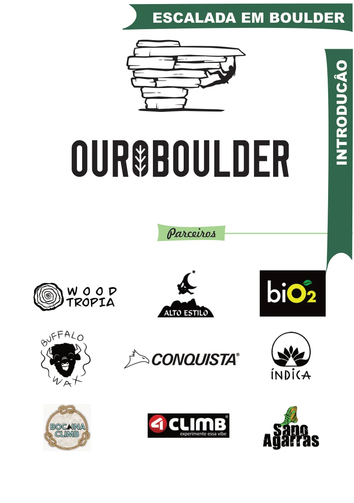
- **revisado_manualmente**: True
- **status_desenho_extraivel**: DESENHO_EXTRAIDO
- **botoes**:
  - **[0]**:
    - **uid**: hknS4iyr6zfaaA
    - **texto**: Capa
    - **destino**:
      - **secao_textual**:
        - **conteudo**:
            # OuroBoulder - Sunset
            
            ESCALADA EM BOULDER
            
            |  |
            | :--: |
            | *Capa OuroBoulder Sunset* |
            
            ## Parceiros
            - Wood Tropia
            - Alto Estilo
            - Bio2
            - Buffalo Wax
            - Conquista
            - Índica
            - Bocaina Climb
            - 4Climb
            - Sano Agarras
  - **[1]**:
    - **uid**: MkJKETmN5GU4XB
    - **texto**: Introdução
    - **destino**:
      - **secao_textual**:
        - **conteudo**:
            # Introdução
            
            O Ouroboulder é um encontro de escaladores que acontece na cidade de Ouro Preto desde 2006. O grande potencial do pico reuniu atletas de todo país logo no primeiro ano, desde então faz parte do circuito de escaladores durante a alta temporada no Brasil.
            
            ## Linha do Tempo
            
            - **2006**: 1º Festival Pico do Itacolomi
            - **2007**: Descoberta Setor da Pedreira; Visita do espanhol Dani Andrada
            - **2008... 2012**
            - **2013**: Felipe Camargo cadena o Libertadores, o que seria o primeiro V14 do Brasil; 1º Croqui impresso do Brasil
            - **2014**
            - **2015**: 10 anos de Ouroboulder
            - **2016... 2018**
            - **2019**: O Japonês Jun Shibanuma manda o Libertadores de flash, decota para V13 e abre o Last Samurai V14
            - **2020**: Primeiro ano sem festival (COVID-19); Descoberta do setor Sunset
            
            | 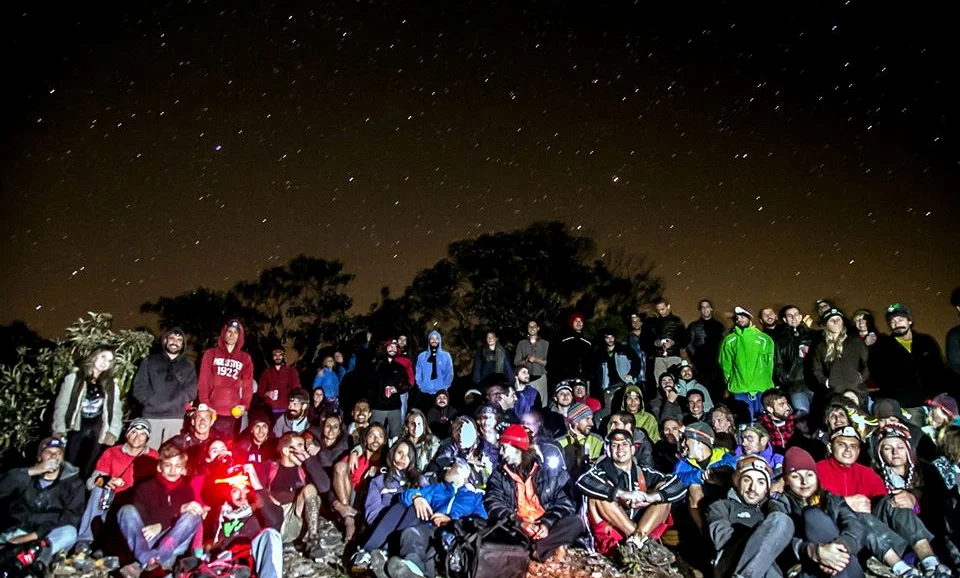 |
            | :--: |
            | *Registro durante a confraternização do Ouroboulder de 2013* |
            
            *Registro durante a confraternização do Ouroboulder de 2013. Foto: Estúdio Buena Onda.*
  - **[2]**:
    - **uid**: 9FWTCuttvdwK7w
    - **texto**: Conversão e Legenda
    - **destino**:
      - **secao_textual**:
        - **conteudo**:
            # Tabela de Conversão e Legenda
            
            ## Considerações
            Este croqui foi produzido para orientar escaladores a respeito dos setores de escalada, vias e cuidados a se tomar ao se praticar a escalada de boulder em Ouro Preto. As graduações dos boulders são apenas uma sugestão embasadas em conhecimento local e pesquisas no site 8a.nu.
            
            ## Tabela de Conversão (V -> Francesa)
            | Brasil (V) | Francesa |
            | :--- | :--- |
            | V0 | 5B |
            | V1 | 5C |
            | V2 | 6A/6A+ |
            | V3 | 6B/6B+ |
            | V4 | 6C/6C+ |
            | V5 | 7A |
            | V6 | 7A+ |
            | V7 | 7B |
            | V8 | 7B+ |
            | V9 | 7C |
            | V10 | 7C+ |
            | V11 | 8A |
            | V12 | 8A+ |
            | V13 | 8B |
            | V14 | 8B+ |
            | V15 | 9C |
            | V16 | 9C+ |
            
            ## Legenda
            | 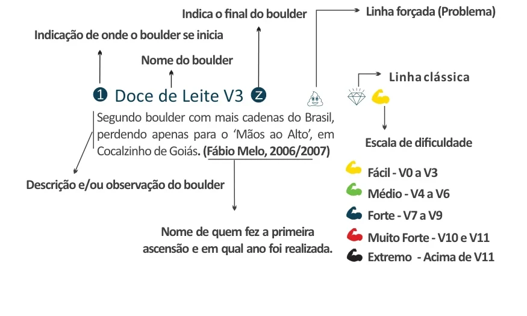 |
            | :--: |
            | *Legenda* |
            
            - **Número (ex: ①)**: Indicação de onde o boulder se inicia.
            - **Letra (ex: Z)**: Indica o final do boulder.
            - **Diamante**: Linha clássica.
            - **Emoji Braço**: Escala de dificuldade.
            - **Emoji Cocô**: Linha forçada (Problema).
            
            ### Escala de Dificuldade
            - **Fácil**: V0 a V3 (Amarelo)
            - **Médio**: V4 a V6 (Verde)
            - **Forte**: V7 a V9 (Azul)
            - **Muito Forte**: V10 e V11 (Vermelho)
            - **Extremo**: Acima de V11 (Preto)
  - **[3]**:
    - **uid**: xzaxZUnjyyl4hT
    - **texto**: Responsabilidade e Orientações
    - **destino**:
      - **secao_textual**:
        - **conteudo**:
            # Responsabilidade e Orientações
            
            O principal objetivo do guia de montanha é fortalecer as práticas na natureza de forma consciente, segura e controlada. Portanto, é responsabilidade de cada leitor se atentar aos cuidados, normas e diretrizes de cada local, respeitando a ética local, os moradores e horários de visitação.
            
            ## Atenção
            
            - **Risco**: A prática de atividades na natureza oferece risco. Procure orientações corretas.
            - **Fogueiras**: Não é permitido fazer fogueiras nos parques e ambientes públicos.
            - **Prudência**: Evite praticar atividades outdoor sozinho. Avise familiares e amigos.
            - **Acidentes Naturais**: Fique atento a pedras soltas, buracos, animais, penhascos, raios, etc.
            - **Respeito**: Preserve a vida do próximo e respeite o momento de cada um.
            - **Lixo**: **RECOLHA SEU LIXO.** Caminhe sempre dentro das trilhas existentes.
            - **Prevenção**: Previna-se contra desidratação, insolação, frio e fome.
            
            ## Cães e Animais Domésticos
            
            - Os principais picos estão em áreas de preservação ambiental com espécimes endêmicas ameaçadas.
            - Cães podem cavar buracos, caçar fauna local e danificar a vegetação (como orquídeas raras).
            - Animais domésticos podem ser vetores de doenças para a fauna local.
            - Respeite o espaço individual; muitas pessoas ficam desconfortáveis com animais circulando nos crash pads e perto de alimentos.
            
            ## Gestão Local
            Antes de praticar qualquer atividade, atente-se aos gestores:
            - **Parque Municipal das Andorinhas**
            - **Parque Estadual do Itacolomi**
- **ultima_migracao**: 5
- **publicar_croqui**: True
- **revisado_bounding_circle**: True

## Parte: grupo_sunset

### Grupo (Pico: Sunset)

- **descricao**:
    # Grupo Sunset
    
    O local está localizado a 15 minutos da entrada do setor da pedreira, bem no cume da montanha, o que proporciona um visual amplo e belo, sempre com um maravilhoso pôr-do-sol!
    
    Os boulders deste setor oferecem uma característica mais técnica e menos negativa. Os acessos entre os blocos são mais íngremes e requerem maior atenção no deslocamento. As trilhas estão sinalizadas com fita reflexiva e totens.
- **nome**: Sunset
- **uid**: Eud9CvpwldFcd2
- **mapas**:
  - **[0]**:
    - **caminho_imagem_mapa**: 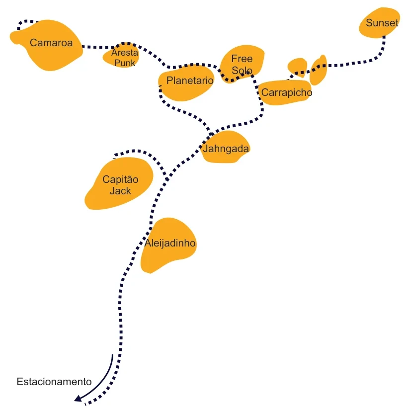
    - **largura_mapa**: 811
    - **altura_mapa**: 825
    - **pontos_de_interesse**:
      - **[0]**:
        - **id**: cKe0q7xwUWzZuq
        - **uid**: cKe0q7xwUWzZuq
        - **rotulo**: Sunset
        - **retangulo**:
          - **x**: 768
          - **y**: 45
          - **comprimento**: 75
          - **largura**: 30
        - **label**: Sunset
      - **[1]**:
        - **id**: FCZWeLPC0vA91e
        - **uid**: FCZWeLPC0vA91e
        - **rotulo**: Camaroa
        - **retangulo**:
          - **x**: 102
          - **y**: 86
          - **comprimento**: 92
          - **largura**: 31
        - **label**: Camaroa
      - **[2]**:
        - **id**: 0rZx5rVyx5I7MM
        - **uid**: 0rZx5rVyx5I7MM
        - **rotulo**: Aresta Punk
        - **retangulo**:
          - **x**: 252
          - **y**: 114
          - **comprimento**: 65
          - **largura**: 46
        - **label**: Aresta Punk
      - **[3]**:
        - **id**: MRXQpJtofQGGDD
        - **uid**: MRXQpJtofQGGDD
        - **rotulo**: Planetario
        - **retangulo**:
          - **x**: 381
          - **y**: 161
          - **comprimento**: 102
          - **largura**: 30
        - **label**: Planetario
      - **[4]**:
        - **id**: CgWESKR6t2XYc1
        - **uid**: CgWESKR6t2XYc1
        - **rotulo**: Free Solo
        - **retangulo**:
          - **x**: 487
          - **y**: 128
          - **comprimento**: 56
          - **largura**: 55
        - **label**: Free Solo
      - **[5]**:
        - **id**: O2PwAnGVQ7xqJy
        - **uid**: O2PwAnGVQ7xqJy
        - **rotulo**: Carrapicho
        - **retangulo**:
          - **x**: 578
          - **y**: 185
          - **comprimento**: 110
          - **largura**: 30
        - **label**: Carrapicho
      - **[6]**:
        - **id**: cDZTeCrzxcErS6
        - **uid**: cDZTeCrzxcErS6
        - **rotulo**: Jahngada
        - **retangulo**:
          - **x**: 454
          - **y**: 298
          - **comprimento**: 104
          - **largura**: 36
        - **label**: Jahngada
      - **[7]**:
        - **id**: mtFNeX5ImnsqX5
        - **uid**: mtFNeX5ImnsqX5
        - **rotulo**: Capitão Jack
        - **retangulo**:
          - **x**: 243
          - **y**: 372
          - **comprimento**: 78
          - **largura**: 53
        - **label**: Capitão Jack
      - **[8]**:
        - **id**: iEOTJY7v5TaLXx
        - **uid**: iEOTJY7v5TaLXx
        - **rotulo**: Aleijadinho
        - **retangulo**:
          - **x**: 343
          - **y**: 488
          - **comprimento**: 118
          - **largura**: 33
        - **label**: Aleijadinho
    - **referencias**:
      - **[0]**:
        - **alvo_uid**: 8ByzIvimI8JjlP
        - **pontos_uids**:
          - iEOTJY7v5TaLXx
        - **setor**: Aleijadinho
        - **ids**:
          - iEOTJY7v5TaLXx
      - **[1]**:
        - **alvo_uid**: WbGHKuEY0c29Qu
        - **pontos_uids**:
          - mtFNeX5ImnsqX5
        - **setor**: Capitão Jack
        - **ids**:
          - mtFNeX5ImnsqX5
      - **[2]**:
        - **alvo_uid**: n9RzqdO3IwqBxO
        - **pontos_uids**:
          - cDZTeCrzxcErS6
        - **setor**: Jahngada
        - **ids**:
          - cDZTeCrzxcErS6
      - **[3]**:
        - **alvo_uid**: saaNQTQBg9DF7a
        - **pontos_uids**:
          - MRXQpJtofQGGDD
        - **setor**: Planetário
        - **ids**:
          - MRXQpJtofQGGDD
      - **[4]**:
        - **alvo_uid**: hvbt8d3J7iRNJ4
        - **pontos_uids**:
          - CgWESKR6t2XYc1
        - **setor**: Free Solo
        - **ids**:
          - CgWESKR6t2XYc1
      - **[5]**:
        - **alvo_uid**: jsAkOxynMs1Q1y
        - **pontos_uids**:
          - O2PwAnGVQ7xqJy
        - **setor**: Carrapicho
        - **ids**:
          - O2PwAnGVQ7xqJy
      - **[6]**:
        - **alvo_uid**: Kvnf8ufa5QUEaC
        - **pontos_uids**:
          - cKe0q7xwUWzZuq
        - **setor**: Sunset
        - **ids**:
          - cKe0q7xwUWzZuq
      - **[7]**:
        - **alvo_uid**: rsyrhOCEGQJFIs
        - **pontos_uids**:
          - FCZWeLPC0vA91e
        - **setor**: Camaroa
        - **ids**:
          - FCZWeLPC0vA91e
- **setores**:
  - **[0]**:
    - **conteudo**:
      - **descricao**: # Bloco Aleijadinho
      - **nome**: Aleijadinho
      - **uid**: 8ByzIvimI8JjlP
      - **escaladas**:
        - **[0]**:
          - **uid**: gLUBc0gxHnWRFG
          - **boulder**:
            - **nome**: Aleijadinho
            - **dificuldade**: V5
            - **destaque**: True
      - **mapas**:
        - **[0]**:
          - **caminho_imagem_mapa**: 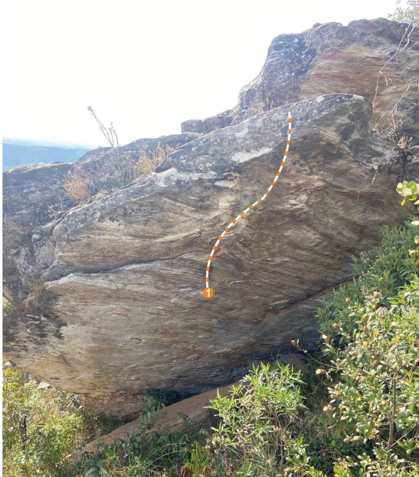
          - **largura_mapa**: 843
          - **altura_mapa**: 960
          - **pontos_de_interesse**:
            - **[0]**:
              - **id**: BepwayUIkwvQgw
              - **uid**: BepwayUIkwvQgw
              - **rotulo**: 1
              - **circulo**:
                - **x**: 419
                - **y**: 589
                - **raio**: 11
              - **label**: 1
          - **referencias**:
            - **[0]**:
              - **alvo_uid**: gLUBc0gxHnWRFG
              - **pontos_uids**:
                - BepwayUIkwvQgw
              - **escalada**: Aleijadinho
              - **ids**:
                - BepwayUIkwvQgw
      - **precomputados**:
        - **total_escaladas**: 1
        - **total_boulders**: 1
  - **[1]**:
    - **conteudo**:
      - **descricao**: # Bloco Capitão Jack
      - **nome**: Capitão Jack
      - **uid**: WbGHKuEY0c29Qu
      - **escaladas**:
        - **[0]**:
          - **uid**: r4kmo4hFKS1LUc
          - **boulder**:
            - **nome**: Amnesia
            - **destaque**: True
            - **dificuldade**: V3
        - **[1]**:
          - **uid**: teYWWb74iHNuTM
          - **boulder**:
            - **descricao**: Virada exposta, atenção na segurança!
            - **nome**: Capitão Jack
            - **destaque**: True
            - **dificuldade**: V6
        - **[2]**:
          - **uid**: 0luuM6N2Oo1RVa
          - **boulder**:
            - **descricao**: Começa em uma fenda bem a esquerda, faz a travessia e vira no Amnésia
            - **nome**: Purple Rase
            - **dificuldade**: V5
        - **[3]**:
          - **uid**: uzP7ISfjzOd1ec
          - **boulder**:
            - **descricao**: Começa perto do chão de areia bem a direita e vira no Amnésia
            - **nome**: Sunshine
            - **dificuldade**: V6
      - **mapas**:
        - **[0]**:
          - **caminho_imagem_mapa**: 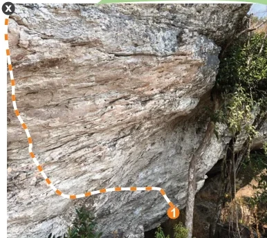
          - **largura_mapa**: 386
          - **altura_mapa**: 344
          - **pontos_de_interesse**:
            - **[0]**:
              - **id**: 9zBgTGalp61NWO
              - **uid**: 9zBgTGalp61NWO
              - **rotulo**: 1
              - **circulo**:
                - **x**: 251
                - **y**: 307
                - **raio**: 9
              - **label**: 1
            - **[1]**:
              - **id**: BMqKeFxbgsxDrR
              - **uid**: BMqKeFxbgsxDrR
              - **rotulo**: x
              - **circulo**:
                - **x**: 12
                - **y**: 12
                - **raio**: 9
              - **label**: x
          - **referencias**:
            - **[0]**:
              - **alvo_uid**: uzP7ISfjzOd1ec
              - **pontos_uids**:
                - 9zBgTGalp61NWO
                - BMqKeFxbgsxDrR
              - **escalada**: Sunshine
              - **ids**:
                - 9zBgTGalp61NWO
                - BMqKeFxbgsxDrR
        - **[1]**:
          - **caminho_imagem_mapa**: 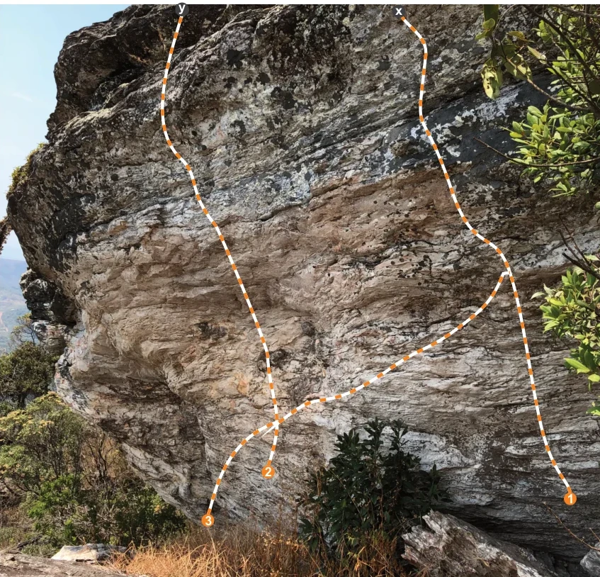
          - **largura_mapa**: 847
          - **altura_mapa**: 814
          - **pontos_de_interesse**:
            - **[0]**:
              - **id**: THvR6FkgIcMxJz
              - **uid**: THvR6FkgIcMxJz
              - **rotulo**: 1
              - **circulo**:
                - **x**: 805
                - **y**: 704
                - **raio**: 9
              - **label**: 1
            - **[1]**:
              - **id**: uhA69wc4u9QWzp
              - **uid**: uhA69wc4u9QWzp
              - **rotulo**: 2
              - **circulo**:
                - **x**: 379
                - **y**: 666
                - **raio**: 10
              - **label**: 2
            - **[2]**:
              - **id**: 8yWZVDkH0adIXC
              - **uid**: 8yWZVDkH0adIXC
              - **rotulo**: 3
              - **circulo**:
                - **x**: 294
                - **y**: 734
                - **raio**: 9
              - **label**: 3
            - **[3]**:
              - **id**: kfdlNDWbgbqSvn
              - **uid**: kfdlNDWbgbqSvn
              - **rotulo**: y
              - **circulo**:
                - **x**: 256
                - **y**: 13
                - **raio**: 10
              - **label**: y
            - **[4]**:
              - **id**: BQuEV7gKbWT3yU
              - **uid**: BQuEV7gKbWT3yU
              - **rotulo**: x
              - **circulo**:
                - **x**: 562
                - **y**: 15
                - **raio**: 9
              - **label**: x
          - **referencias**:
            - **[0]**:
              - **alvo_uid**: r4kmo4hFKS1LUc
              - **pontos_uids**:
                - THvR6FkgIcMxJz
                - BQuEV7gKbWT3yU
              - **escalada**: Amnesia
              - **ids**:
                - THvR6FkgIcMxJz
                - BQuEV7gKbWT3yU
            - **[1]**:
              - **alvo_uid**: teYWWb74iHNuTM
              - **pontos_uids**:
                - uhA69wc4u9QWzp
                - kfdlNDWbgbqSvn
              - **escalada**: Capitão Jack
              - **ids**:
                - uhA69wc4u9QWzp
                - kfdlNDWbgbqSvn
            - **[2]**:
              - **alvo_uid**: 0luuM6N2Oo1RVa
              - **pontos_uids**:
                - 8yWZVDkH0adIXC
                - BQuEV7gKbWT3yU
              - **escalada**: Purple Rase
              - **ids**:
                - 8yWZVDkH0adIXC
                - BQuEV7gKbWT3yU
      - **precomputados**:
        - **total_escaladas**: 4
        - **total_boulders**: 4
  - **[2]**:
    - **conteudo**:
      - **descricao**: # Bloco Jahngada
      - **nome**: Jahngada
      - **uid**: n9RzqdO3IwqBxO
      - **escaladas**:
        - **[0]**:
          - **uid**: z53F6vTUHsg8Sy
          - **boulder**:
            - **descricao**: Base alta, recomenda-se o uso de pelo menos 6 Crash Pads
            - **nome**: Jahngada
            - **dificuldade**: V9
            - **destaque**: True
        - **[1]**:
          - **uid**: osEqMSD9mX9qwn
          - **boulder**:
            - **nome**: Jahngada SDS
            - **dificuldade**: V10
            - **destaque**: True
        - **[2]**:
          - **uid**: xfvrVLAr2QVq5e
          - **boulder**:
            - **nome**: Guaicuí
            - **dificuldade**: V5
        - **[3]**:
          - **uid**: 8k0ldDKlkUnBVj
          - **boulder**:
            - **nome**: Camundongo
            - **dificuldade**: V7
      - **mapas**:
        - **[0]**:
          - **caminho_imagem_mapa**: 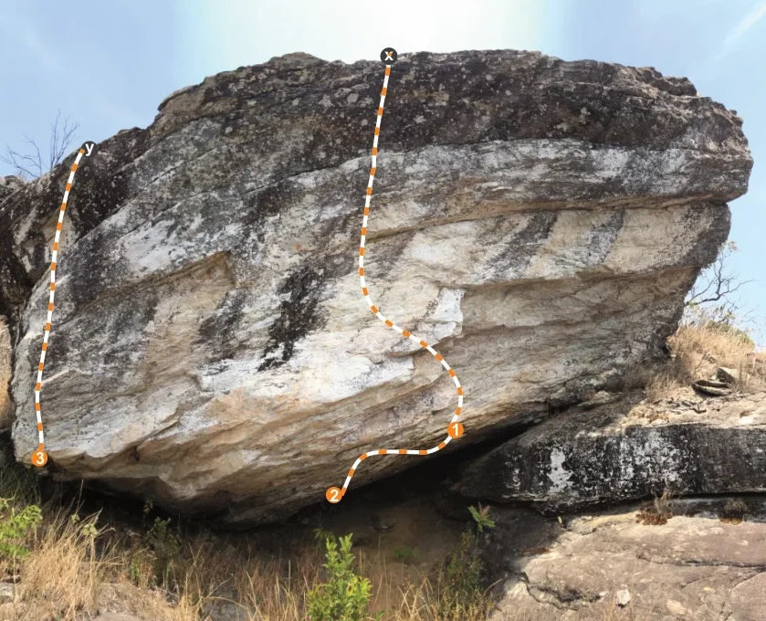
          - **largura_mapa**: 839
          - **altura_mapa**: 680
          - **pontos_de_interesse**:
            - **[0]**:
              - **id**: QN04uXCFxHdBaF
              - **uid**: QN04uXCFxHdBaF
              - **rotulo**: 1
              - **circulo**:
                - **x**: 499
                - **y**: 470
                - **raio**: 9
              - **label**: 1
            - **[1]**:
              - **id**: dT6nG5TTFQY3fk
              - **uid**: dT6nG5TTFQY3fk
              - **rotulo**: 2
              - **circulo**:
                - **x**: 365
                - **y**: 542
                - **raio**: 8
              - **label**: 2
            - **[2]**:
              - **id**: O4ULaZgMYUYK2H
              - **uid**: O4ULaZgMYUYK2H
              - **rotulo**: 3
              - **circulo**:
                - **x**: 43
                - **y**: 501
                - **raio**: 8
              - **label**: 3
            - **[3]**:
              - **id**: jcgscx35vflRYl
              - **uid**: jcgscx35vflRYl
              - **rotulo**: x
              - **circulo**:
                - **x**: 425
                - **y**: 61
                - **raio**: 10
              - **label**: x
            - **[4]**:
              - **id**: EwncURUcLaWZIz
              - **uid**: EwncURUcLaWZIz
              - **rotulo**: y
              - **circulo**:
                - **x**: 97
                - **y**: 164
                - **raio**: 10
              - **label**: y
          - **referencias**:
            - **[0]**:
              - **alvo_uid**: z53F6vTUHsg8Sy
              - **pontos_uids**:
                - QN04uXCFxHdBaF
                - jcgscx35vflRYl
              - **escalada**: Jahngada
              - **ids**:
                - QN04uXCFxHdBaF
                - jcgscx35vflRYl
            - **[1]**:
              - **alvo_uid**: osEqMSD9mX9qwn
              - **pontos_uids**:
                - dT6nG5TTFQY3fk
                - jcgscx35vflRYl
              - **escalada**: Jahngada SDS
              - **ids**:
                - dT6nG5TTFQY3fk
                - jcgscx35vflRYl
            - **[2]**:
              - **alvo_uid**: xfvrVLAr2QVq5e
              - **pontos_uids**:
                - O4ULaZgMYUYK2H
                - EwncURUcLaWZIz
              - **escalada**: Guaicuí
              - **ids**:
                - O4ULaZgMYUYK2H
                - EwncURUcLaWZIz
        - **[1]**:
          - **caminho_imagem_mapa**: 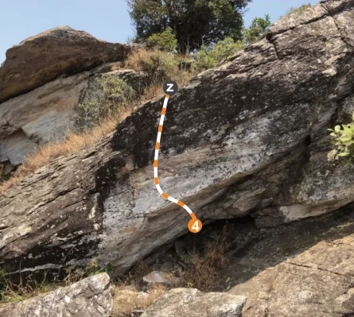
          - **largura_mapa**: 445
          - **altura_mapa**: 399
          - **pontos_de_interesse**:
            - **[0]**:
              - **id**: v1kffiw28KKZDA
              - **uid**: v1kffiw28KKZDA
              - **rotulo**: 4
              - **circulo**:
                - **x**: 245
                - **y**: 284
                - **raio**: 9
              - **label**: 4
            - **[1]**:
              - **id**: uenysVUibsZ6he
              - **uid**: uenysVUibsZ6he
              - **rotulo**: z
              - **circulo**:
                - **x**: 214
                - **y**: 111
                - **raio**: 9
              - **label**: z
          - **referencias**:
            - **[0]**:
              - **alvo_uid**: 8k0ldDKlkUnBVj
              - **pontos_uids**:
                - v1kffiw28KKZDA
                - uenysVUibsZ6he
              - **escalada**: Camundongo
              - **ids**:
                - v1kffiw28KKZDA
                - uenysVUibsZ6he
      - **precomputados**:
        - **total_escaladas**: 4
        - **total_boulders**: 4
  - **[3]**:
    - **conteudo**:
      - **descricao**: # Bloco Planetário
      - **nome**: Planetário
      - **uid**: saaNQTQBg9DF7a
      - **escaladas**:
        - **[0]**:
          - **uid**: sWepsfzqCoKmIf
          - **boulder**:
            - **nome**: Planetário
            - **destaque**: True
            - **dificuldade**: V11
        - **[1]**:
          - **uid**: 0aiqIzp2eyeH0J
          - **boulder**:
            - **nome**: Náufrago
            - **destaque**: True
            - **dificuldade**: V7
        - **[2]**:
          - **uid**: wPSobwcfqp7dud
          - **boulder**:
            - **nome**: Golfinho
            - **dificuldade**: V4
        - **[3]**:
          - **uid**: LXPLykpm0q6F9t
          - **boulder**:
            - **nome**: Clarete
            - **dificuldade**: V3
        - **[4]**:
          - **uid**: urMRlcvDBDKi0E
          - **boulder**:
            - **nome**: Odisséia na Babilônia
            - **dificuldade**: V6
            - **destaque**: True
        - **[5]**:
          - **uid**: KBle49fGYwOvue
          - **boulder**:
            - **nome**: Canais da Babilônia
            - **dificuldade**: V5
      - **mapas**:
        - **[0]**:
          - **caminho_imagem_mapa**: 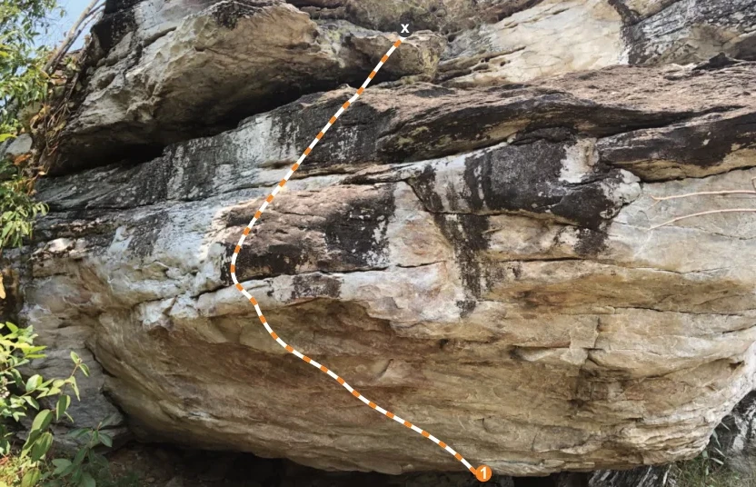
          - **largura_mapa**: 832
          - **altura_mapa**: 536
          - **pontos_de_interesse**:
            - **[0]**:
              - **id**: KOqtBFIO4n372p
              - **uid**: KOqtBFIO4n372p
              - **rotulo**: 1
              - **circulo**:
                - **x**: 532
                - **y**: 520
                - **raio**: 9
              - **label**: 1
            - **[1]**:
              - **id**: y4ucFSkOg1cove
              - **uid**: y4ucFSkOg1cove
              - **rotulo**: x
              - **circulo**:
                - **x**: 445
                - **y**: 31
                - **raio**: 9
              - **label**: x
          - **referencias**:
            - **[0]**:
              - **alvo_uid**: sWepsfzqCoKmIf
              - **pontos_uids**:
                - KOqtBFIO4n372p
                - y4ucFSkOg1cove
              - **escalada**: Planetário
              - **ids**:
                - KOqtBFIO4n372p
                - y4ucFSkOg1cove
        - **[1]**:
          - **caminho_imagem_mapa**: 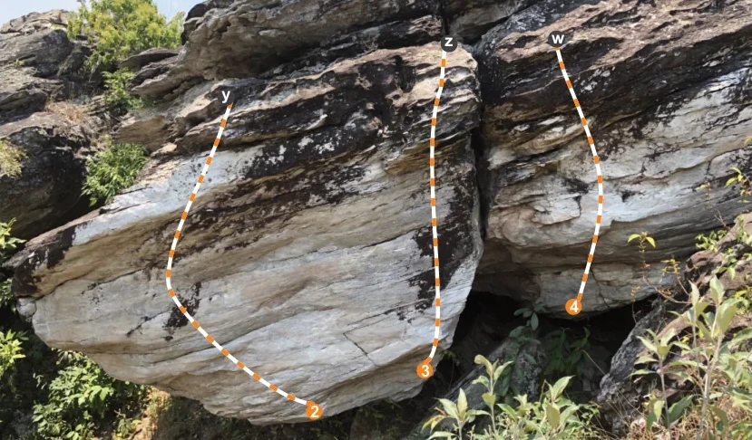
          - **largura_mapa**: 829
          - **altura_mapa**: 486
          - **pontos_de_interesse**:
            - **[0]**:
              - **id**: PDCZ2azVdamApL
              - **uid**: PDCZ2azVdamApL
              - **rotulo**: 2
              - **circulo**:
                - **x**: 346
                - **y**: 454
                - **raio**: 9
              - **label**: 2
            - **[1]**:
              - **id**: SsadBRferzHqoo
              - **uid**: SsadBRferzHqoo
              - **rotulo**: 3
              - **circulo**:
                - **x**: 468
                - **y**: 409
                - **raio**: 9
              - **label**: 3
            - **[2]**:
              - **id**: iVZcXLeU4F23AL
              - **uid**: iVZcXLeU4F23AL
              - **rotulo**: 4
              - **circulo**:
                - **x**: 632
                - **y**: 338
                - **raio**: 9
              - **label**: 4
            - **[3]**:
              - **id**: IpIpAQLLUX8ACB
              - **uid**: IpIpAQLLUX8ACB
              - **rotulo**: y
              - **circulo**:
                - **x**: 248
                - **y**: 106
                - **raio**: 11
              - **label**: y
            - **[4]**:
              - **id**: 95pV12jykprucg
              - **uid**: 95pV12jykprucg
              - **rotulo**: z
              - **circulo**:
                - **x**: 495
                - **y**: 47
                - **raio**: 9
              - **label**: z
            - **[5]**:
              - **id**: MtrgRvCRP7oSkw
              - **uid**: MtrgRvCRP7oSkw
              - **rotulo**: w
              - **circulo**:
                - **x**: 614
                - **y**: 42
                - **raio**: 10
              - **label**: w
          - **referencias**:
            - **[0]**:
              - **alvo_uid**: 0aiqIzp2eyeH0J
              - **pontos_uids**:
                - PDCZ2azVdamApL
                - IpIpAQLLUX8ACB
              - **escalada**: Náufrago
              - **ids**:
                - PDCZ2azVdamApL
                - IpIpAQLLUX8ACB
            - **[1]**:
              - **alvo_uid**: wPSobwcfqp7dud
              - **pontos_uids**:
                - SsadBRferzHqoo
                - 95pV12jykprucg
              - **escalada**: Golfinho
              - **ids**:
                - SsadBRferzHqoo
                - 95pV12jykprucg
            - **[2]**:
              - **alvo_uid**: LXPLykpm0q6F9t
              - **pontos_uids**:
                - iVZcXLeU4F23AL
                - MtrgRvCRP7oSkw
              - **escalada**: Clarete
              - **ids**:
                - iVZcXLeU4F23AL
                - MtrgRvCRP7oSkw
        - **[2]**:
          - **caminho_imagem_mapa**: 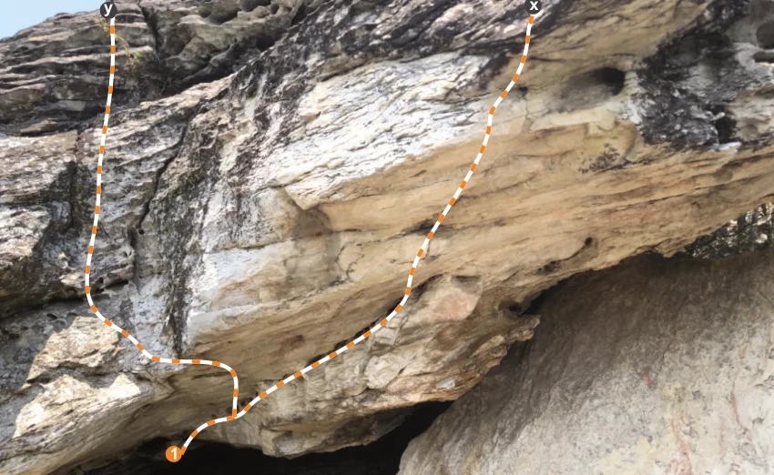
          - **largura_mapa**: 850
          - **altura_mapa**: 522
          - **pontos_de_interesse**:
            - **[0]**:
              - **id**: xe8rGeTEqeOzNz
              - **uid**: xe8rGeTEqeOzNz
              - **rotulo**: 1
              - **circulo**:
                - **x**: 191
                - **y**: 499
                - **raio**: 9
              - **label**: 1
            - **[1]**:
              - **id**: TcKj8RRsR58cmk
              - **uid**: TcKj8RRsR58cmk
              - **rotulo**: y
              - **circulo**:
                - **x**: 118
                - **y**: 10
                - **raio**: 9
              - **label**: y
            - **[2]**:
              - **id**: 3FUDgbW8pu3cPC
              - **uid**: 3FUDgbW8pu3cPC
              - **rotulo**: x
              - **circulo**:
                - **x**: 585
                - **y**: 6
                - **raio**: 8
              - **label**: x
          - **referencias**:
            - **[0]**:
              - **alvo_uid**: urMRlcvDBDKi0E
              - **pontos_uids**:
                - xe8rGeTEqeOzNz
                - 3FUDgbW8pu3cPC
              - **escalada**: Odisséia na Babilônia
              - **ids**:
                - xe8rGeTEqeOzNz
                - 3FUDgbW8pu3cPC
            - **[1]**:
              - **alvo_uid**: KBle49fGYwOvue
              - **pontos_uids**:
                - xe8rGeTEqeOzNz
                - TcKj8RRsR58cmk
              - **escalada**: Canais da Babilônia
              - **ids**:
                - xe8rGeTEqeOzNz
                - TcKj8RRsR58cmk
      - **precomputados**:
        - **total_escaladas**: 6
        - **total_boulders**: 6
  - **[4]**:
    - **conteudo**:
      - **descricao**: # Bloco Free Solo
      - **nome**: Free Solo
      - **uid**: hvbt8d3J7iRNJ4
      - **escaladas**:
        - **[0]**:
          - **uid**: YfMW47oCbmPzNq
          - **boulder**:
            - **nome**: Fomiagem
            - **dificuldade**: V4
        - **[1]**:
          - **uid**: 2YG4P2AcR84cJu
          - **boulder**:
            - **nome**: Projeto
            - **destaque**: True
        - **[2]**:
          - **uid**: 9tB0ICDkkEkIQV
          - **boulder**:
            - **nome**: Free Solo
            - **destaque**: True
            - **dificuldade**: V5
        - **[3]**:
          - **uid**: FgU9rkbPSl70LL
          - **boulder**:
            - **descricao**: Apenas desafio de virar o bloco
            - **nome**: Tartaruga
            - **dificuldade**: V3
        - **[4]**:
          - **uid**: rzxtfME7nU2goW
          - **boulder**:
            - **nome**: Mobilete
            - **dificuldade**: V3
        - **[5]**:
          - **uid**: Wybze4GIPVfugE
          - **boulder**:
            - **nome**: Walkmachine
            - **dificuldade**: V6
      - **mapas**:
        - **[0]**:
          - **caminho_imagem_mapa**: 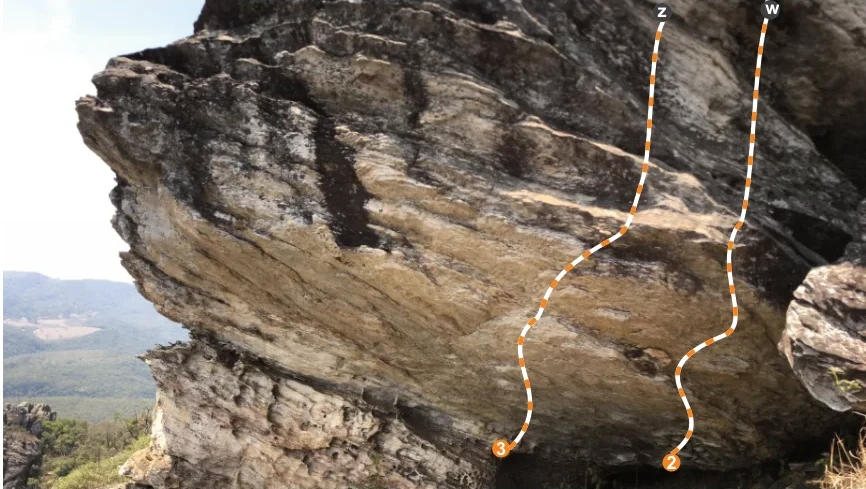
          - **largura_mapa**: 866
          - **altura_mapa**: 489
          - **pontos_de_interesse**:
            - **[0]**:
              - **id**: ekNX8LgSqtXQOO
              - **uid**: ekNX8LgSqtXQOO
              - **rotulo**: 2
              - **circulo**:
                - **x**: 671
                - **y**: 463
                - **raio**: 9
              - **label**: 2
            - **[1]**:
              - **id**: mjzpwVBL7KcDPO
              - **uid**: mjzpwVBL7KcDPO
              - **rotulo**: 3
              - **circulo**:
                - **x**: 500
                - **y**: 448
                - **raio**: 9
              - **label**: 3
            - **[2]**:
              - **id**: zK3EBk5Od0f72e
              - **uid**: zK3EBk5Od0f72e
              - **rotulo**: Z
              - **circulo**:
                - **x**: 662
                - **y**: 12
                - **raio**: 9
              - **label**: Z
            - **[3]**:
              - **id**: tvf9U4OeraSIqE
              - **uid**: tvf9U4OeraSIqE
              - **rotulo**: W
              - **circulo**:
                - **x**: 772
                - **y**: 9
                - **raio**: 10
              - **label**: W
          - **referencias**:
            - **[0]**:
              - **alvo_uid**: YfMW47oCbmPzNq
              - **pontos_uids**:
                - ekNX8LgSqtXQOO
                - tvf9U4OeraSIqE
              - **escalada**: Fomiagem
              - **ids**:
                - ekNX8LgSqtXQOO
                - tvf9U4OeraSIqE
            - **[1]**:
              - **alvo_uid**: 2YG4P2AcR84cJu
              - **pontos_uids**:
                - mjzpwVBL7KcDPO
                - zK3EBk5Od0f72e
              - **escalada**: Projeto
              - **ids**:
                - mjzpwVBL7KcDPO
                - zK3EBk5Od0f72e
        - **[1]**:
          - **caminho_imagem_mapa**: 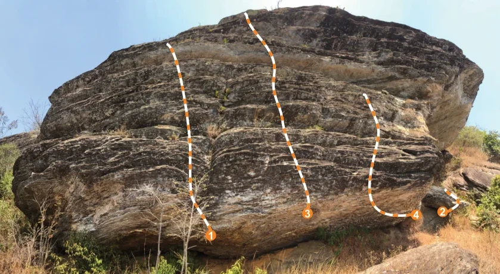
          - **largura_mapa**: 839
          - **altura_mapa**: 460
          - **pontos_de_interesse**:
            - **[0]**:
              - **id**: E1NVEWLoAmokHV
              - **uid**: E1NVEWLoAmokHV
              - **rotulo**: 1
              - **circulo**:
                - **x**: 354
                - **y**: 396
                - **raio**: 9
              - **label**: 1
            - **[1]**:
              - **id**: 0maguSKGOpbhyN
              - **uid**: 0maguSKGOpbhyN
              - **rotulo**: 3
              - **circulo**:
                - **x**: 516
                - **y**: 358
                - **raio**: 9
              - **label**: 3
            - **[2]**:
              - **id**: wrQHbOl8h8h1Gs
              - **uid**: wrQHbOl8h8h1Gs
              - **rotulo**: 4
              - **circulo**:
                - **x**: 698
                - **y**: 360
                - **raio**: 9
              - **label**: 4
            - **[3]**:
              - **id**: fZvY3GzXmNwaXu
              - **uid**: fZvY3GzXmNwaXu
              - **rotulo**: 2
              - **circulo**:
                - **x**: 743
                - **y**: 356
                - **raio**: 9
              - **label**: 2
          - **referencias**:
            - **[0]**:
              - **alvo_uid**: 9tB0ICDkkEkIQV
              - **pontos_uids**:
                - E1NVEWLoAmokHV
              - **escalada**: Free Solo
              - **ids**:
                - E1NVEWLoAmokHV
            - **[1]**:
              - **alvo_uid**: FgU9rkbPSl70LL
              - **pontos_uids**:
                - fZvY3GzXmNwaXu
              - **escalada**: Tartaruga
              - **ids**:
                - fZvY3GzXmNwaXu
            - **[2]**:
              - **alvo_uid**: rzxtfME7nU2goW
              - **pontos_uids**:
                - 0maguSKGOpbhyN
              - **escalada**: Mobilete
              - **ids**:
                - 0maguSKGOpbhyN
            - **[3]**:
              - **alvo_uid**: Wybze4GIPVfugE
              - **pontos_uids**:
                - wrQHbOl8h8h1Gs
              - **escalada**: Walkmachine
              - **ids**:
                - wrQHbOl8h8h1Gs
      - **precomputados**:
        - **total_escaladas**: 6
        - **total_boulders**: 6
  - **[5]**:
    - **conteudo**:
      - **descricao**: # Bloco Carrapicho
      - **nome**: Carrapicho
      - **uid**: jsAkOxynMs1Q1y
      - **escaladas**:
        - **[0]**:
          - **uid**: yYu9f7Q8LNizSu
          - **boulder**:
            - **nome**: Carrapato
            - **dificuldade**: V5
        - **[1]**:
          - **uid**: mg4HItbc9NLNOZ
          - **boulder**:
            - **nome**: Carrapicho
            - **dificuldade**: V6
        - **[2]**:
          - **uid**: wPlI5DCRYzKr7I
          - **boulder**:
            - **nome**: Oratório
            - **dificuldade**: V7
        - **[3]**:
          - **uid**: 5twZm2EkJubxMM
          - **boulder**:
            - **nome**: Pistol
            - **dificuldade**: V2
        - **[4]**:
          - **uid**: tXhx0XaxaPmKhr
          - **boulder**:
            - **nome**: Dart Vader
            - **dificuldade**: V4
      - **mapas**:
        - **[0]**:
          - **caminho_imagem_mapa**: 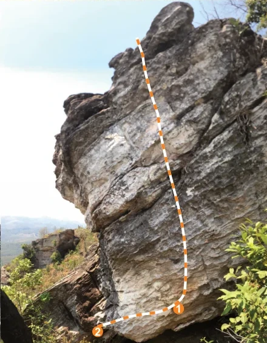
          - **largura_mapa**: 440
          - **altura_mapa**: 564
          - **pontos_de_interesse**:
            - **[0]**:
              - **id**: iqURLjxf3ToeKN
              - **uid**: iqURLjxf3ToeKN
              - **rotulo**: 1
              - **circulo**:
                - **x**: 294
                - **y**: 507
                - **raio**: 9
              - **label**: 1
            - **[1]**:
              - **id**: mWtyKK9qKNOjZB
              - **uid**: mWtyKK9qKNOjZB
              - **rotulo**: 2
              - **circulo**:
                - **x**: 160
                - **y**: 545
                - **raio**: 9
              - **label**: 2
          - **referencias**:
            - **[0]**:
              - **alvo_uid**: yYu9f7Q8LNizSu
              - **pontos_uids**:
                - iqURLjxf3ToeKN
              - **escalada**: Carrapato
              - **ids**:
                - iqURLjxf3ToeKN
            - **[1]**:
              - **alvo_uid**: mg4HItbc9NLNOZ
              - **pontos_uids**:
                - mWtyKK9qKNOjZB
              - **escalada**: Carrapicho
              - **ids**:
                - mWtyKK9qKNOjZB
        - **[1]**:
          - **caminho_imagem_mapa**: 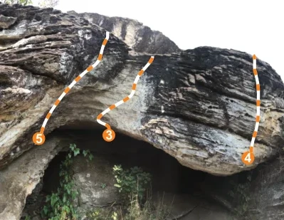
          - **largura_mapa**: 399
          - **altura_mapa**: 309
          - **pontos_de_interesse**:
            - **[0]**:
              - **id**: 7KS2cy7iL8JJhm
              - **uid**: 7KS2cy7iL8JJhm
              - **rotulo**: 3
              - **circulo**:
                - **x**: 152
                - **y**: 189
                - **raio**: 9
              - **label**: 3
            - **[1]**:
              - **id**: zN0PuLRpVV9foz
              - **uid**: zN0PuLRpVV9foz
              - **rotulo**: 4
              - **circulo**:
                - **x**: 348
                - **y**: 221
                - **raio**: 9
              - **label**: 4
            - **[2]**:
              - **id**: sUAgvK1NQUZxg9
              - **uid**: sUAgvK1NQUZxg9
              - **rotulo**: 5
              - **circulo**:
                - **x**: 54
                - **y**: 194
                - **raio**: 9
              - **label**: 5
          - **referencias**:
            - **[0]**:
              - **alvo_uid**: wPlI5DCRYzKr7I
              - **pontos_uids**:
                - 7KS2cy7iL8JJhm
              - **escalada**: Oratório
              - **ids**:
                - 7KS2cy7iL8JJhm
            - **[1]**:
              - **alvo_uid**: 5twZm2EkJubxMM
              - **pontos_uids**:
                - zN0PuLRpVV9foz
              - **escalada**: Pistol
              - **ids**:
                - zN0PuLRpVV9foz
            - **[2]**:
              - **alvo_uid**: tXhx0XaxaPmKhr
              - **pontos_uids**:
                - sUAgvK1NQUZxg9
              - **escalada**: Dart Vader
              - **ids**:
                - sUAgvK1NQUZxg9
      - **precomputados**:
        - **total_escaladas**: 5
        - **total_boulders**: 5
  - **[6]**:
    - **conteudo**:
      - **descricao**: # Bloco Sunset
      - **nome**: Sunset
      - **uid**: Kvnf8ufa5QUEaC
      - **escaladas**:
        - **[0]**:
          - **uid**: D9xTKWVJ6iApT9
          - **boulder**:
            - **nome**: Sucrilhos
            - **dificuldade**: V5
            - **destaque**: True
        - **[1]**:
          - **uid**: 83JWrElU1YdAe6
          - **boulder**:
            - **nome**: Faxineiro do Universo
            - **dificuldade**: V5
        - **[2]**:
          - **uid**: P4cfrwrdqTgvFN
          - **boulder**:
            - **nome**: Arestinha Vibration
            - **dificuldade**: V1
        - **[3]**:
          - **uid**: xpUGKp9VR90ZQk
          - **boulder**:
            - **nome**: Sujeirinha
            - **dificuldade**: V3
        - **[4]**:
          - **uid**: 4JoWpllHEYv7Zx
          - **boulder**:
            - **nome**: Projeto Sunset
            - **dificuldade**: V3
            - **destaque**: True
      - **mapas**:
        - **[0]**:
          - **caminho_imagem_mapa**: 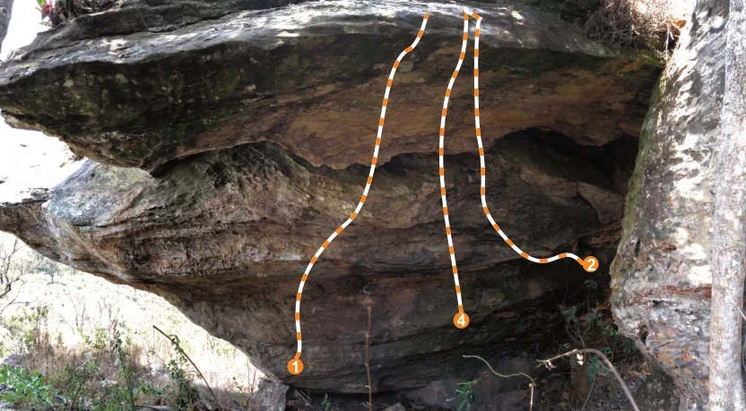
          - **largura_mapa**: 832
          - **altura_mapa**: 459
          - **pontos_de_interesse**:
            - **[0]**:
              - **id**: dfnrvEE9nK1bG4
              - **uid**: dfnrvEE9nK1bG4
              - **rotulo**: 1
              - **circulo**:
                - **x**: 329
                - **y**: 409
                - **raio**: 9
              - **label**: 1
            - **[1]**:
              - **id**: cibPAkZbM3lhvi
              - **uid**: cibPAkZbM3lhvi
              - **rotulo**: 4
              - **circulo**:
                - **x**: 514
                - **y**: 357
                - **raio**: 9
              - **label**: 4
            - **[2]**:
              - **id**: s66gmROJRbrof7
              - **uid**: s66gmROJRbrof7
              - **rotulo**: 2
              - **circulo**:
                - **x**: 658
                - **y**: 294
                - **raio**: 9
              - **label**: 2
          - **referencias**:
            - **[0]**:
              - **alvo_uid**: D9xTKWVJ6iApT9
              - **pontos_uids**:
                - dfnrvEE9nK1bG4
              - **escalada**: Sucrilhos
              - **ids**:
                - dfnrvEE9nK1bG4
            - **[1]**:
              - **alvo_uid**: 83JWrElU1YdAe6
              - **pontos_uids**:
                - s66gmROJRbrof7
              - **escalada**: Faxineiro do Universo
              - **ids**:
                - s66gmROJRbrof7
            - **[2]**:
              - **alvo_uid**: xpUGKp9VR90ZQk
              - **pontos_uids**:
                - cibPAkZbM3lhvi
              - **escalada**: Sujeirinha
              - **ids**:
                - cibPAkZbM3lhvi
        - **[1]**:
          - **caminho_imagem_mapa**: 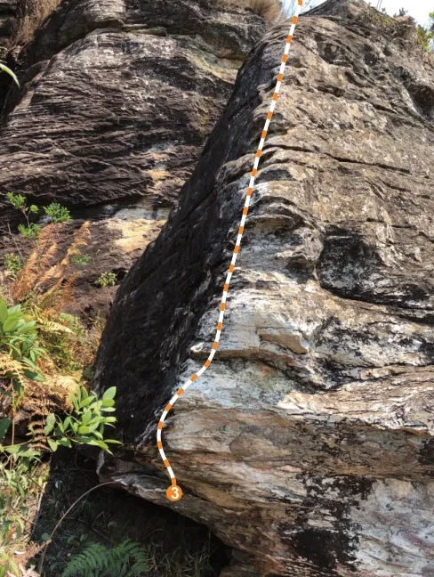
          - **largura_mapa**: 488
          - **altura_mapa**: 648
          - **pontos_de_interesse**:
            - **[0]**:
              - **id**: GSHWSrlZq7SIN6
              - **uid**: GSHWSrlZq7SIN6
              - **rotulo**: 3
              - **circulo**:
                - **x**: 195
                - **y**: 554
                - **raio**: 9
              - **label**: 3
          - **referencias**:
            - **[0]**:
              - **alvo_uid**: P4cfrwrdqTgvFN
              - **pontos_uids**:
                - GSHWSrlZq7SIN6
              - **escalada**: Arestinha Vibration
              - **ids**:
                - GSHWSrlZq7SIN6
        - **[2]**:
          - **caminho_imagem_mapa**: 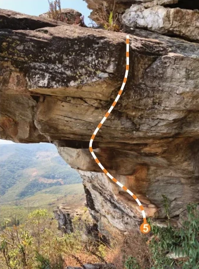
          - **largura_mapa**: 338
          - **altura_mapa**: 456
          - **pontos_de_interesse**:
            - **[0]**:
              - **id**: l4RLkaslCoVuyS
              - **uid**: l4RLkaslCoVuyS
              - **rotulo**: 5
              - **circulo**:
                - **x**: 246
                - **y**: 386
                - **raio**: 9
              - **label**: 5
          - **referencias**:
            - **[0]**:
              - **alvo_uid**: 4JoWpllHEYv7Zx
              - **pontos_uids**:
                - l4RLkaslCoVuyS
              - **escalada**: Projeto Sunset
              - **ids**:
                - l4RLkaslCoVuyS
      - **precomputados**:
        - **total_escaladas**: 5
        - **total_boulders**: 5
  - **[7]**:
    - **conteudo**:
      - **descricao**: # Bloco Camaroa
      - **nome**: Camaroa
      - **uid**: rsyrhOCEGQJFIs
      - **escaladas**:
        - **[0]**:
          - **uid**: Whht0JTY2jYPhj
          - **boulder**:
            - **nome**: Fissura
            - **dificuldade**: V8
            - **destaque**: True
        - **[1]**:
          - **uid**: IUZVhkD7BGnGMe
          - **boulder**:
            - **nome**: Pure
            - **dificuldade**: V6
            - **destaque**: True
        - **[2]**:
          - **uid**: 9IGADLX3hshhPA
          - **boulder**:
            - **nome**: Lpita
            - **dificuldade**: V7
            - **destaque**: True
        - **[3]**:
          - **uid**: XF6QJOxiGiZOoK
          - **boulder**:
            - **nome**: Nave
            - **dificuldade**: V3
            - **destaque**: True
        - **[4]**:
          - **uid**: VQbQSYRYendquh
          - **boulder**:
            - **nome**: Camaroa
            - **dificuldade**: V10
            - **destaque**: True
      - **mapas**:
        - **[0]**:
          - **caminho_imagem_mapa**: 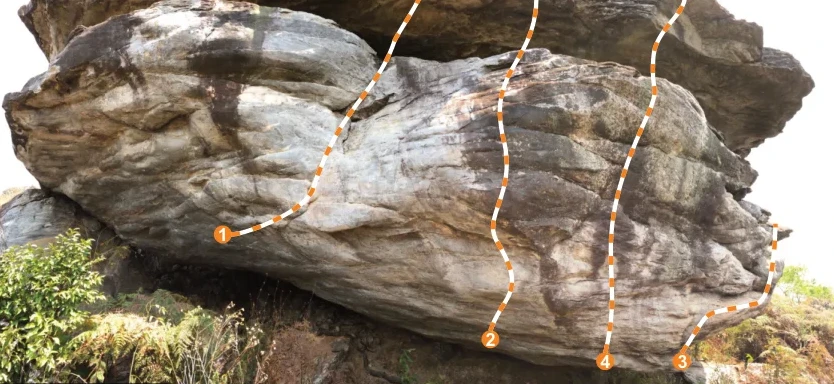
          - **largura_mapa**: 834
          - **altura_mapa**: 384
          - **pontos_de_interesse**:
            - **[0]**:
              - **id**: V6J2JJOLaI812R
              - **uid**: V6J2JJOLaI812R
              - **rotulo**: 1
              - **circulo**:
                - **x**: 222
                - **y**: 234
                - **raio**: 8
              - **label**: 1
            - **[1]**:
              - **id**: 6o8msTDADzMBC8
              - **uid**: 6o8msTDADzMBC8
              - **rotulo**: 2
              - **circulo**:
                - **x**: 490
                - **y**: 339
                - **raio**: 9
              - **label**: 2
            - **[2]**:
              - **id**: MtX6i55W63JJcr
              - **uid**: MtX6i55W63JJcr
              - **rotulo**: 4
              - **circulo**:
                - **x**: 605
                - **y**: 361
                - **raio**: 9
              - **label**: 4
            - **[3]**:
              - **id**: 9kIrzI6zIFd1dO
              - **uid**: 9kIrzI6zIFd1dO
              - **rotulo**: 3
              - **circulo**:
                - **x**: 682
                - **y**: 361
                - **raio**: 8
              - **label**: 3
          - **referencias**:
            - **[0]**:
              - **alvo_uid**: Whht0JTY2jYPhj
              - **pontos_uids**:
                - V6J2JJOLaI812R
              - **escalada**: Fissura
              - **ids**:
                - V6J2JJOLaI812R
            - **[1]**:
              - **alvo_uid**: IUZVhkD7BGnGMe
              - **pontos_uids**:
                - 6o8msTDADzMBC8
              - **escalada**: Pure
              - **ids**:
                - 6o8msTDADzMBC8
            - **[2]**:
              - **alvo_uid**: 9IGADLX3hshhPA
              - **pontos_uids**:
                - 9kIrzI6zIFd1dO
              - **escalada**: Lpita
              - **ids**:
                - 9kIrzI6zIFd1dO
            - **[3]**:
              - **alvo_uid**: XF6QJOxiGiZOoK
              - **pontos_uids**:
                - MtX6i55W63JJcr
              - **escalada**: Nave
              - **ids**:
                - MtX6i55W63JJcr
        - **[1]**:
          - **caminho_imagem_mapa**: 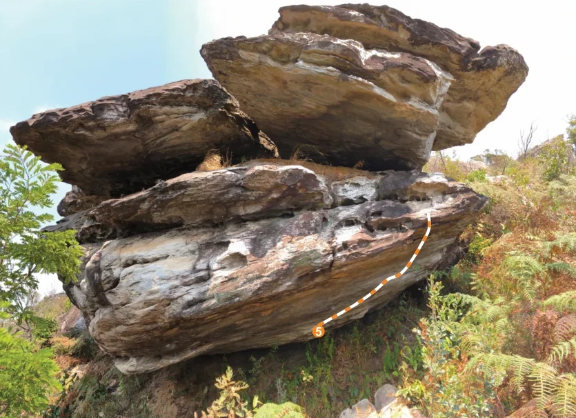
          - **largura_mapa**: 835
          - **altura_mapa**: 606
          - **pontos_de_interesse**:
            - **[0]**:
              - **id**: RXU7I5LtWkNP1C
              - **uid**: RXU7I5LtWkNP1C
              - **rotulo**: 5
              - **circulo**:
                - **x**: 462
                - **y**: 480
                - **raio**: 10
              - **label**: 5
          - **referencias**:
            - **[0]**:
              - **alvo_uid**: VQbQSYRYendquh
              - **pontos_uids**:
                - RXU7I5LtWkNP1C
              - **escalada**: Camaroa
              - **ids**:
                - RXU7I5LtWkNP1C
      - **precomputados**:
        - **total_escaladas**: 5
        - **total_boulders**: 5
- **precomputados**:
  - **total_escaladas**: 36
  - **total_boulders**: 36

## Arquivos Externos

- **arquivos_externos**:
  - **[0]**:
    - **caminho**: 
    - **checksum_sha256**: b0c19afb64dc5ecdea6682dbd7b31a92fab38ce152066a859052e7c8e24312d4
  - **[1]**:
    - **caminho**: 
    - **checksum_sha256**: 2278679473a7d653e2906310ccb17ea686c37e4ae976523a8fc1cf17f186559e
  - **[2]**:
    - **caminho**: 
    - **checksum_sha256**: 200959c53d5214862beb98a84125424647d2d47ecfb37b3bc4fce5e8af5ae190
  - **[3]**:
    - **caminho**: 
    - **checksum_sha256**: 45b342d993cd9b59ba9127bf380e614fda80e45ad58fd8b2b5354973df11592f
  - **[4]**:
    - **caminho**: 
    - **checksum_sha256**: eb73d3d92a8a9074834f73a90a5a6b0f788632f568a81daad0efad54f839f79b
  - **[5]**:
    - **caminho**: 
    - **checksum_sha256**: b39ea938ee85c4d5f9f62061e545cd3c84df257d772dc623c33e3c27b0185094
  - **[6]**:
    - **caminho**: 
    - **checksum_sha256**: 93430d4d18405a8cded0b6839555466564d0b18f9182fd2a458cbc2b8b839548
  - **[7]**:
    - **caminho**: 
    - **checksum_sha256**: ae72f06891e83bb819c9acec7d068255535953e222d2975bdee86a3a09160611
  - **[8]**:
    - **caminho**: 
    - **checksum_sha256**: 8e06fb0a594ca36b9f49e6e63a8dc333e84a31703de60a9a7f5641fcc8804d8c
  - **[9]**:
    - **caminho**: 
    - **checksum_sha256**: 98472ccacd3cd28ca9881c68738932d32eca614e2407d06cd34ad10f0782a053
  - **[10]**:
    - **caminho**: 
    - **checksum_sha256**: c61dfacb7fc5df848ed0b8908ff5170cae98158a2a34bc572d39dc861a980584
  - **[11]**:
    - **caminho**: 
    - **checksum_sha256**: 6dcb718c08142ecd9c63d6663a7bbceb788c7b542c91e2df89440c478f61d6fa
  - **[12]**:
    - **caminho**: 
    - **checksum_sha256**: a9e16efdf40ee7ba3e002eb2e9bcc4237a1b1d96b3234d0f6eff9c78639dc58b
  - **[13]**:
    - **caminho**: 
    - **checksum_sha256**: 5288055b392be17864381916ca27f550bae205b8743c79811fb4818c1ce1e1c1
  - **[14]**:
    - **caminho**: 
    - **checksum_sha256**: 4e5dd02db9dd90bc9d0872ecb56ee7980a4f31507c154509e51def43562b9bf3
  - **[15]**:
    - **caminho**: 
    - **checksum_sha256**: 924aa2029c1b19abab06e1d9c59662332f43c1751caefe82855040594859a705
  - **[16]**:
    - **caminho**: 
    - **checksum_sha256**: 62af4acbef4415d38fdb487c9a5d0d486ac8a2c858b35fcfe4b623cc452ff2aa
  - **[17]**:
    - **caminho**: 
    - **checksum_sha256**: d57446323c5978a3c6d3f1fa263095913e76e098dd99675e7aaa56284390b14d
  - **[18]**:
    - **caminho**: 
    - **checksum_sha256**: d34e68e1d3ad3d9a8a67d984c948d9d136ce00b04c6b80911284267c7478b1bd
  - **[19]**:
    - **caminho**: 
    - **checksum_sha256**: cd9eeaf27370694f6356d1bc4ea7ff3c561d50143b662d2bff71db12f41b6f33
  - **[20]**:
    - **caminho**: 
    - **checksum_sha256**: 6be356b2f418891b1b379f7433ba4f8240e7531ebed1b2e0a246aac7817cfa05
  - **[21]**:
    - **caminho**: 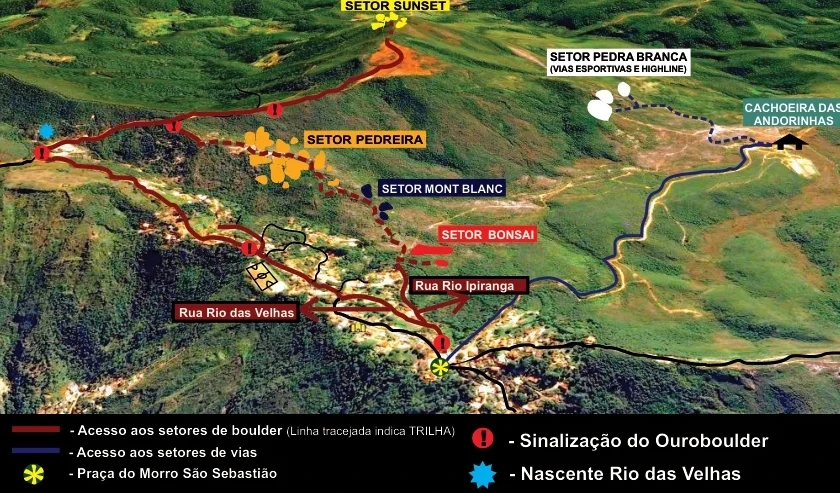
    - **checksum_sha256**: 76bf730bbb663e5e0907044c468a68cc1d80079a776eeab308e29d1f9a2ac852

