# Croqui: Pedra da Divisa - Face MG

## Informações Gerais

- **descricao**:
    Guia de escalada da face mineira da Pedra da Divisa, em Paraisópolis, MG.
    Contém vias esportivas e móveis em diversos setores como Cangaço, Ditados, Cervejas, Questão de Tempo e Hospício.
    
- **id**: br_mg_paraisopolis_pedra_da_divisa
- **nome**: Pedra da Divisa - Face MG
- **revisado_manualmente**: True
- **revisado_bounding_circle**: True
- **status_desenho_extraivel**: NAO_TEM_DESENHO
- **creditos**:
  - Ana Fujita
  - Eliseu Frechou
- **caminho_thumbnail**: 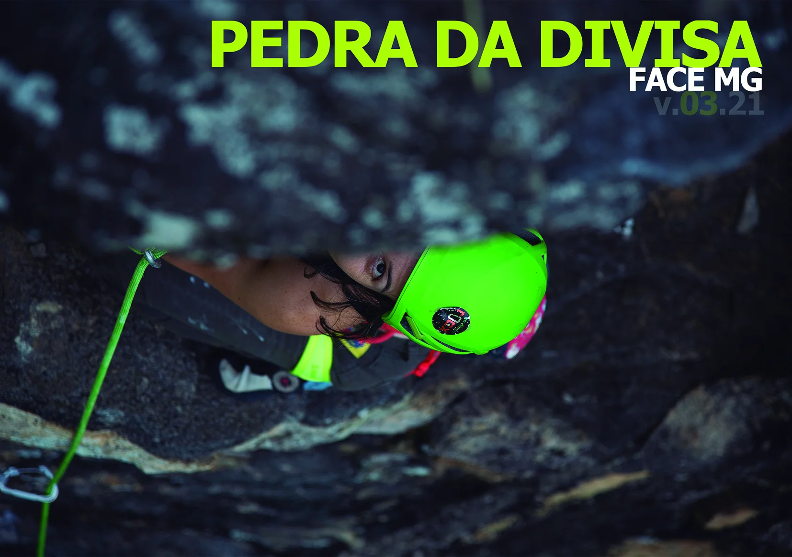
- **botoes**:
  - **[0]**:
    - **texto**: Capa
    - **destino**:
      - **secao_textual**:
        - **conteudo**:
            # Pedra da Divisa - Face MG
            
            v.03.21
            
            |  |
            | :--: |
            | *Pedra da Divisa - Face MG* |
  - **[1]**:
    - **texto**: Introdução
    - **destino**:
      - **secao_textual**:
        - **conteudo**:
            # Pedra da Divisa face MG
            
            Seja bem-vindo à face mineira da Pedra da Divisa. Desejamos que você curta ao máximo este lugar e aproveite as escaladas antigas e recém abertas desta montanha.
            
            As primeiras vias desta face, foram abertas nos anos 90. Após um longo período de esquecimento com raríssimas incursões, em janeiro de 2018, após permissão dos novos proprietários, resolvemos (Ana e Eliseu) dar um empurrão para o desenvolvimento destas paredes, o que em tempos de pandemia, se transformou rapidamente num dos points mais frequentados e populares da região.
            
            Com o importante suporte dos nossos patrocinadores DEUTER, SOLO, SBI Outdoor. ROCX e SIMOND, mais o apoio da BONIER e ÂNCORA, pudemos em um curto espaço de tempo abrir as primeiras rotas esportivas nessas lindas paredes coloridas. No primeiro momento, estabelecemos o padrão de ancoragens, espaço entre vias e sistemas proteção, abrindo o caminho para a comunidade contribuir na abertura de novas linhas e na manutenção das já existentes, mantendo nossa comunidade motivada e diluindo o tráfego nas falésias e setores mais freqüentados da nossa região.
            
            Na segunda fase de desenvolvimento, Carlos "Charlie" Alves, Antônio "Tonhão" Calvo e Leonard "Leo" Moreira contribuiram na abertura de mais de uma dezena de novas vias.
            
            Este lugar, assim como outros, requer um bom entrosamento com os proprietários para que a porteira continue aberta para todos nós. Pedimos que você respeite as regras e ajude a fiscalizá-las.
            
            ## AQUI É PROIBIDO:
            
            - Entrar com o carro no bananal. Estacione no pasto, antes da porteira de arame;
            - Coletar bananas dos pés;
            - Trazer animais;
            - Fazer barulho em demasia;
            - Acender qualquer tipo de fogo ou fogareiro;
            - Acampar ou permanecer na área após as 18h00.
            
            |  |
            | :--: |
            | *Solo e Âncora logos* |
            
            ---
            
            |  |
            | :--: |
            | *Ana Fujita na via Primogênito, 7a, Setor Cangaço* |
            
            Ana Fujita
            **Primogênito**, 7a
            Setor Cangaço
  - **[2]**:
    - **texto**: Regras
    - **destino**:
      - **secao_textual**:
        - **conteudo**:
            # AS REGRAS DESTE LOCAL
            
            - Seja cordial com as pessoas que cruzar;
            - Feche as porteiras que abrir;
            - Estacione no pasto antes do bananal. Não estacione no bananal!
            - Não faça barulho nem grite. Curta o silêncio e os sons do lugar;
            - Não deixe sujeira ou equipamentos de escalada (costuras, lonas, papel) nas paredes nem no chão;
            - Diminua o impacto visual. Limpe o excesso de magnésio e não faça marcas nas agarrras. Use uma escova de plástico para limpeza;
            - As vias possuem apenas proteções em parabolts de 3/8" e chapeletas. Este é o padrão do lugar. Se for abrir uma via, use este tipo de ancoragem e facilite o rapel nas bases com chapeletas rapeláveis ou malhas rápidas;
            - Respeite as linhas já existentes. Não cruze e muito menos estenda vias sem antes consultar os conquistadores das já existentes. Se sua nova linha terá agarras ou proteções que possam ser compartilhadas com outras já existentes, você está forçando um adensamento desnecessário em um lugar com muita rocha livre. Olhe ao redor, procure uma linha independente e crie algo novo.
            
            As atualizações do croqui desta área, assim como as demais, será publicado no Manual de Escaladas e da Pedra do Baú e Sul de Minas. Você encontra este Manual facilmente nas lojas de montanhismo. Entre uma edição e outra, o site www.eliseufrechou.com.br informará notícias relevantes desta área e outras da região.
            
            Para finalizar, lembre-se de que sua segurança é de sua inteira responsabilidade. Escalar é um esporte perigoso e pode ocasionar acidentes e morte. Escale com todos os equipamentos de segurança e use capacete.
            Não crie situações de risco para você ou outras pessoas e nem escale em vias com proteções escassas ou móveis se você não domina essa técnica.
            
            Esperamos que você se divirta tanto quanto nós.
            
            Ana Fujita + Eliseu Frechou
            São Bento do Sapucaí, julho de 2021
            
            |  |
            | :--: |
            | *Rocx e Deuter logos* |
  - **[3]**:
    - **texto**: Como Chegar e Aproximação
    - **destino**:
      - **secao_textual**:
        - **conteudo**:
            # COMO CHEGAR
            
            Partindo do trevo de entrada de São Bento do Sapucaí, zere o odômetro do seu carro e siga em direção Sul de Minas/Paraisópolis. No bairro Córrego da Foice, a exatos 5km do trevo, entre a esquerda, na estrada de terra.
            
            Siga pela estrada principal até a marca de 9,8km, onde você deve virar a esquerda.
            
            Após a porteira dos 12,8km a estrada fica bem ruim, e caso seu carro seja baixo, melhor andar a pé o último quilômetro até a entrada do bananal.
            
            Estacione seu carro no pasto antes do bananal. Não tente entrar no bananal, pois pode prejudicar o acesso dos carros do proprietário da plantação.
            
            |  |
            | :--: |
            | *Mapa de Acesso* |
            
            # APROXIMAÇÃO
            
            Após estacionar o carro, passe a porteira de arame e siga a pé pelo bananal.
            
            Mantenha-se sempre reto nas bifurcações, com a parede a sua direita, até onde termina a plantação de bananas e começa uma floresta. Neste ponto há uma trilha a direita, que segue até o setor Cangaço.
            
            Procure pelas plaquinhas metálicas de identificação das vias que em geral, estão abaixo da altura da cintura e oriente-se por elas para encontrar as demais vias.
            
            | 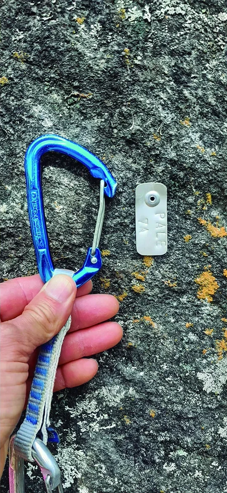 |
            | :--: |
            | *Plaquinha de identificação da via* |
            
            # ANIMAIS SELVAGENS
            
            Cuidado com animais selvagens neste setor. Além de uma irara que mora no platô acima do setor Cervejas, lobos-guará e javaporcos não são raros perto do anoitecer, e como qualquer porco selvagem, irá atacar caso se sinta encurralado. Portanto se avistar um deles, dê meia-volta ou suba numa árvore.
            
            No passado já foram avistadas cobras venenosas, mas hoje é bastante raro cruzar com alguma. A Santa Casa de São Bento do Sapucaí possui soro anti-ofídico para tratar eventuais acidentes com animais peçonhentos.
  - **[4]**:
    - **texto**: Contracapa
    - **destino**:
      - **secao_textual**:
        - **conteudo**:
            | 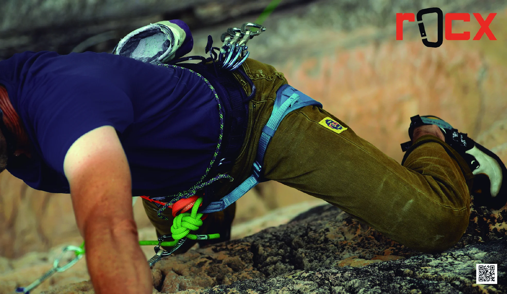 |
            | :--: |
            | *Foto de escalada na contracapa* |
- **ultima_migracao**: 4
- **publicar_croqui**: True

## Parte: setor_cangaco

### Setor (Pico: Pedra da Divisa (Face MG))

- **descricao**:
    |  |
    | :--: |
    | *Leonard Moreira na via Zé Sereno, 7b* |
    
    |  |
    | :--: |
    | *Charlie Alves na via Corisco, 6ºsup* |
    
    **Equipamentos Necessários:** Corda de 60m é obrigatória para rapelar. Para as vias
    esportivas, você vai precisar de 15 costuras.
- **nome**: Setor Cangaço
- **mapas**:
  - **[0]**:
    - **caminho_imagem_mapa**: 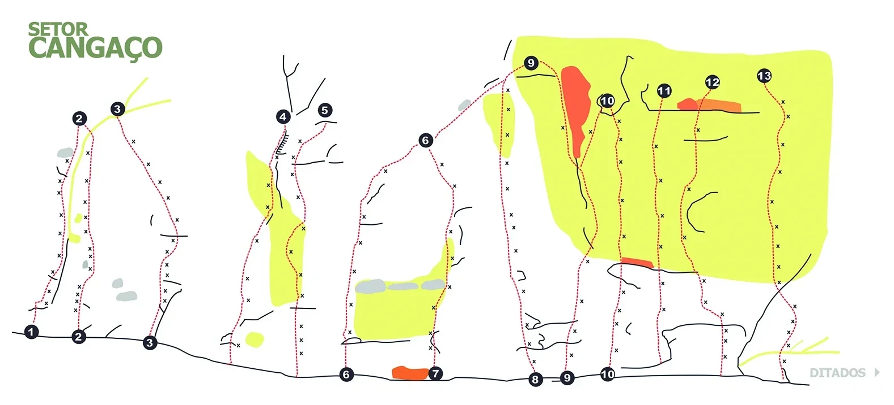
    - **largura_mapa**: 1577
    - **altura_mapa**: 717
    - **pontos_de_interesse**:
      - **[0]**:
        - **id**: titulo
        - **label**: SETOR CANGAÇO
        - **retangulo**:
          - **x**: 166
          - **y**: 72
          - **comprimento**: 256
          - **largura**: 75
      - **[1]**:
        - **id**: 01_bot
        - **label**: 01
        - **circulo**:
          - **x**: 56
          - **y**: 587
          - **raio**: 12
      - **[2]**:
        - **id**: 02_bot
        - **label**: 02
        - **circulo**:
          - **x**: 139
          - **y**: 596
          - **raio**: 12
      - **[3]**:
        - **id**: 03_bot
        - **label**: 03
        - **circulo**:
          - **x**: 265
          - **y**: 607
          - **raio**: 12
      - **[4]**:
        - **id**: 02_mid
        - **label**: 02
        - **circulo**:
          - **x**: 140
          - **y**: 210
          - **raio**: 12
      - **[5]**:
        - **id**: 03_mid
        - **label**: 03
        - **circulo**:
          - **x**: 208
          - **y**: 193
          - **raio**: 12
      - **[6]**:
        - **id**: 04_top
        - **label**: 04
        - **circulo**:
          - **x**: 500
          - **y**: 207
          - **raio**: 12
      - **[7]**:
        - **id**: 05_top
        - **label**: 05
        - **circulo**:
          - **x**: 574
          - **y**: 195
          - **raio**: 12
      - **[8]**:
        - **id**: 06_mid
        - **label**: 06
        - **circulo**:
          - **x**: 750
          - **y**: 248
          - **raio**: 12
      - **[9]**:
        - **id**: 06_bot
        - **label**: 06
        - **circulo**:
          - **x**: 612
          - **y**: 663
          - **raio**: 12
      - **[10]**:
        - **id**: 07_bot
        - **label**: 07
        - **circulo**:
          - **x**: 769
          - **y**: 661
          - **raio**: 12
      - **[11]**:
        - **id**: 08_bot
        - **label**: 08
        - **circulo**:
          - **x**: 945
          - **y**: 672
          - **raio**: 12
      - **[12]**:
        - **id**: 09_bot
        - **label**: 09
        - **circulo**:
          - **x**: 1001
          - **y**: 669
          - **raio**: 12
      - **[13]**:
        - **id**: 10_bot
        - **label**: 10
        - **circulo**:
          - **x**: 1072
          - **y**: 663
          - **raio**: 13
      - **[14]**:
        - **id**: 09_top
        - **label**: 09
        - **circulo**:
          - **x**: 937
          - **y**: 112
          - **raio**: 12
      - **[15]**:
        - **id**: 10_top
        - **label**: 10
        - **circulo**:
          - **x**: 1072
          - **y**: 178
          - **raio**: 13
      - **[16]**:
        - **id**: 11_top
        - **label**: 11
        - **circulo**:
          - **x**: 1172
          - **y**: 161
          - **raio**: 13
      - **[17]**:
        - **id**: 12_top
        - **label**: 12
        - **circulo**:
          - **x**: 1257
          - **y**: 145
          - **raio**: 13
      - **[18]**:
        - **id**: 13_top
        - **label**: 13
        - **circulo**:
          - **x**: 1348
          - **y**: 134
          - **raio**: 13
      - **[19]**:
        - **id**: ditados
        - **label**: DITADOS
        - **retangulo**:
          - **x**: 1479
          - **y**: 661
          - **comprimento**: 110
          - **largura**: 30
    - **referencias**:
      - **[0]**:
        - **escalada**: Fenômeno
        - **ids**:
          - 01_bot
          - 02_mid
      - **[1]**:
        - **escalada**: Maradona
        - **ids**:
          - 02_bot
          - 02_mid
      - **[2]**:
        - **escalada**: Primogênito
        - **ids**:
          - 03_bot
          - 03_mid
      - **[3]**:
        - **escalada**: Mil e um nomes de bebês
        - **ids**:
          - 04_top
      - **[4]**:
        - **escalada**: Diadorim
        - **ids**:
          - 05_top
      - **[5]**:
        - **escalada**: Sem reservas, por favor
        - **ids**:
          - 06_bot
          - 06_mid
      - **[6]**:
        - **escalada**: Antônio Conselheiro
        - **ids**:
          - 07_bot
          - 06_mid
      - **[7]**:
        - **escalada**: Lampião
        - **ids**:
          - 08_bot
          - 09_top
      - **[8]**:
        - **escalada**: Maria Bonita
        - **ids**:
          - 09_bot
          - 09_top
      - **[9]**:
        - **escalada**: Corisco
        - **ids**:
          - 10_bot
          - 10_top
      - **[10]**:
        - **escalada**: Volta Seca
        - **ids**:
          - 11_top
      - **[11]**:
        - **escalada**: Ameaça
        - **ids**:
          - 12_top
      - **[12]**:
        - **escalada**: Zé Sereno
        - **ids**:
          - 13_top
      - **[13]**:
        - **ids**:
          - ditados
        - **setor**: Setor Ditados
- **escaladas**:
  - **[0]**:
    - **via_esportiva**:
      - **nome**: Fenômeno
      - **dificuldade**: BR_7B
      - **conquistadores**:
        - Ana Fujita
        - Eliseu Frechou
  - **[1]**:
    - **via_esportiva**:
      - **nome**: Maradona
      - **dificuldade**: BR_7C
      - **conquistadores**:
        - Ana Fujita
        - Eliseu Frechou
  - **[2]**:
    - **via_esportiva**:
      - **nome**: Primogênito
      - **dificuldade**: BR_7A
      - **conquistadores**:
        - Eliseu Frechou
        - Leonard Moreira
      - **data_abertura**: 2021-03
  - **[3]**:
    - **via_movel**:
      - **nome**: Mil e um nomes de bebês
      - **dificuldade**: BR_6
      - **protecoes_moveis**: friends
      - **conquistadores**:
        - Ana Fujita
        - Eliseu Frechou
  - **[4]**:
    - **via_esportiva**:
      - **nome**: Diadorim
      - **dificuldade**: BR_6SUP
      - **conquistadores**:
        - Ana Fujita
        - Eliseu Frechou
  - **[5]**:
    - **via_movel**:
      - **nome**: Sem reservas, por favor
      - **dificuldade**: BR_7B
      - **protecoes_moveis**: friends
      - **conquistadores**:
        - Ana Fujita
        - Eliseu Frechou
  - **[6]**:
    - **via_movel**:
      - **nome**: Antônio Conselheiro
      - **dificuldade**: BR_7B
      - **protecoes_moveis**: nuts opcional
      - **conquistadores**:
        - Ana Fujita
        - Eliseu Frechou
  - **[7]**:
    - **via_esportiva**:
      - **nome**: Lampião
      - **dificuldade**: BR_7B
      - **conquistadores**:
        - Ana Fujita
        - Eliseu Frechou
  - **[8]**:
    - **via_movel**:
      - **nome**: Maria Bonita
      - **dificuldade**: BR_7A
      - **protecoes_moveis**: friends e nuts
      - **conquistadores**:
        - Ana Fujita
        - Eliseu Frechou
  - **[9]**:
    - **via_esportiva**:
      - **nome**: Corisco
      - **dificuldade**: BR_6SUP
      - **conquistadores**:
        - Ana Fujita
        - Eliseu Frechou
  - **[10]**:
    - **via_movel**:
      - **nome**: Volta Seca
      - **dificuldade**: BR_5
      - **protecoes_moveis**: friends
      - **conquistadores**:
        - Ana Fujita
        - Eliseu Frechou
        - Rogério Jorge
      - **data_abertura**: 2018-04
  - **[11]**:
    - **via_esportiva**:
      - **nome**: Ameaça
      - **dificuldade**: BR_7A
      - **conquistadores**:
        - Ana Fujita
        - Eliseu Frechou
  - **[12]**:
    - **via_esportiva**:
      - **nome**: Zé Sereno
      - **dificuldade**: BR_7B
      - **conquistadores**:
        - Eliseu Frechou
        - Leonard Moreira
      - **data_abertura**: 2021-03
- **precomputados**:
  - **total_escaladas**: 13
  - **total_esportivas**: 8
  - **total_moveis**: 0
  - **total_boulders**: 0
  - **total_multiplas_enfiadas**: 0
  - **total_highlines**: 0

## Parte: setor_ditados

### Setor (Pico: Pedra da Divisa (Face MG))

- **descricao**:
    |  |
    | :--: |
    | *Ana Fujita na via Boa noite Cinderela, 6ºsup* |
    
    | 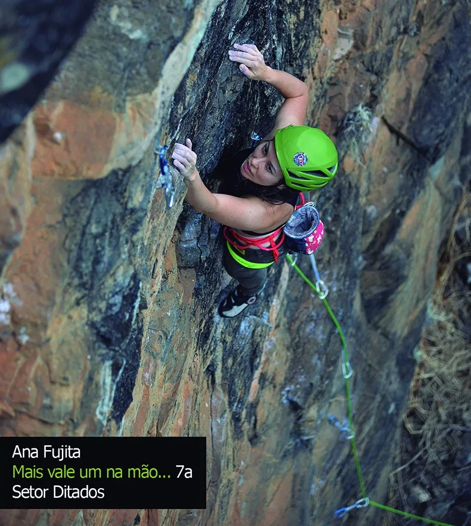 |
    | :--: |
    | *Ana Fujita na via Mais vale um na mão... 7a* |
    
    **Equipamentos Necessários:** Corda de 60m é obrigatória para rapelar. Para as vias
    esportivas, você vai precisar de 15 costuras.
- **nome**: Setor Ditados
- **mapas**:
  - **[0]**:
    - **caminho_imagem_mapa**: 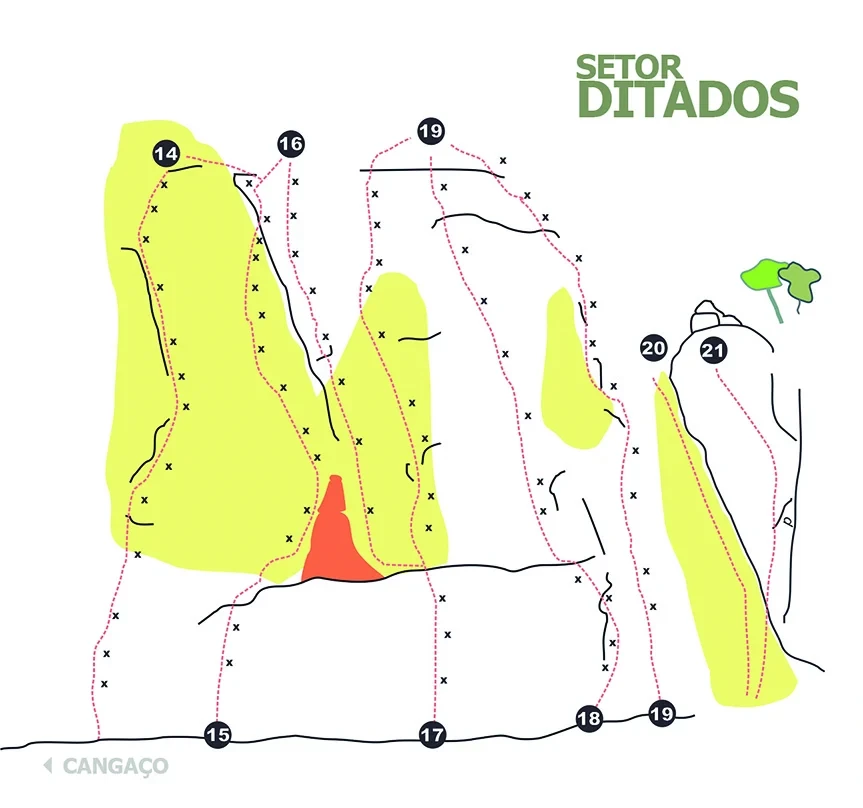
    - **largura_mapa**: 863
    - **altura_mapa**: 808
    - **pontos_de_interesse**:
      - **[0]**:
        - **id**: titulo
        - **label**: SETOR DITADOS
        - **retangulo**:
          - **x**: 689
          - **y**: 85
          - **comprimento**: 235
          - **largura**: 75
      - **[1]**:
        - **id**: 14
        - **label**: 14
        - **circulo**:
          - **x**: 166
          - **y**: 154
          - **raio**: 14
      - **[2]**:
        - **id**: 16
        - **label**: 16
        - **circulo**:
          - **x**: 291
          - **y**: 143
          - **raio**: 14
      - **[3]**:
        - **id**: 19_top
        - **label**: 19
        - **circulo**:
          - **x**: 431
          - **y**: 131
          - **raio**: 14
      - **[4]**:
        - **id**: 20
        - **label**: 20
        - **circulo**:
          - **x**: 653
          - **y**: 348
          - **raio**: 14
      - **[5]**:
        - **id**: 21
        - **label**: 21
        - **circulo**:
          - **x**: 714
          - **y**: 350
          - **raio**: 14
      - **[6]**:
        - **id**: 15
        - **label**: 15
        - **circulo**:
          - **x**: 218
          - **y**: 735
          - **raio**: 14
      - **[7]**:
        - **id**: 17
        - **label**: 17
        - **circulo**:
          - **x**: 433
          - **y**: 734
          - **raio**: 14
      - **[8]**:
        - **id**: 18
        - **label**: 18
        - **circulo**:
          - **x**: 589
          - **y**: 718
          - **raio**: 14
      - **[9]**:
        - **id**: 19_bot
        - **label**: 19
        - **circulo**:
          - **x**: 662
          - **y**: 713
          - **raio**: 14
      - **[10]**:
        - **id**: cangaco
        - **label**: CANGAÇO
        - **retangulo**:
          - **x**: 117
          - **y**: 766
          - **comprimento**: 114
          - **largura**: 29
    - **referencias**:
      - **[0]**:
        - **escalada**: Boa noite Cinderela
        - **ids**:
          - 14
      - **[1]**:
        - **escalada**: Quem dorme com criança...
        - **ids**:
          - 15
      - **[2]**:
        - **escalada**: Quem planta vento...
        - **ids**:
          - 16
      - **[3]**:
        - **escalada**: A vida é dura...
        - **ids**:
          - 17
      - **[4]**:
        - **escalada**: Mais vale um na mão...
        - **ids**:
          - 18
          - 19_top
      - **[5]**:
        - **escalada**: Por fora bela viola...
        - **ids**:
          - 19_bot
          - 19_top
      - **[6]**:
        - **escalada**: Em terra de rei...
        - **ids**:
          - 20
      - **[7]**:
        - **escalada**: Red
        - **ids**:
          - 21
      - **[8]**:
        - **ids**:
          - cangaco
        - **setor**: Setor Cangaço
- **escaladas**:
  - **[0]**:
    - **via_esportiva**:
      - **nome**: Boa noite Cinderela
      - **dificuldade**: BR_6SUP
      - **conquistadores**:
        - Ana Fujita
        - Eliseu Frechou
      - **data_abertura**: 2018
  - **[1]**:
    - **via_esportiva**:
      - **nome**: Quem dorme com criança...
      - **dificuldade**: BR_7B
      - **conquistadores**:
        - Ana Fujita
        - Eliseu Frechou
      - **data_abertura**: 2018
  - **[2]**:
    - **via_esportiva**:
      - **nome**: Quem planta vento...
      - **dificuldade**: BR_8B
      - **conquistadores**:
        - Ana Fujita
        - Eliseu Frechou
      - **data_abertura**: 2018
  - **[3]**:
    - **via_esportiva**:
      - **nome**: A vida é dura...
      - **dificuldade**: BR_7B
      - **conquistadores**:
        - Ana Fujita
        - Eliseu Frechou
      - **data_abertura**: 2018
  - **[4]**:
    - **via_esportiva**:
      - **nome**: Mais vale um na mão...
      - **dificuldade**: BR_7A
      - **conquistadores**:
        - Ana Fujita
        - Eliseu Frechou
      - **data_abertura**: 2018
  - **[5]**:
    - **via_esportiva**:
      - **nome**: Por fora bela viola...
      - **dificuldade**: BR_6
      - **conquistadores**:
        - Ana Fujita
        - Eliseu Frechou
      - **data_abertura**: 2018
  - **[6]**:
    - **via_movel**:
      - **nome**: Em terra de rei...
      - **dificuldade**: BR_6SUP
      - **protecoes_moveis**: friends grandes
      - **conquistadores**:
        - Ana Fujita
        - Eliseu Frechou
      - **data_abertura**: 2018
  - **[7]**:
    - **via_movel**:
      - **nome**: Red
      - **dificuldade**: BR_4SUP
      - **protecoes_moveis**: nuts e friends
      - **conquistadores**:
        - Ana Fujita
        - Eliseu Frechou
      - **data_abertura**: 2018
- **precomputados**:
  - **total_escaladas**: 8
  - **total_esportivas**: 6
  - **total_moveis**: 0
  - **total_boulders**: 0
  - **total_multiplas_enfiadas**: 0
  - **total_highlines**: 0

## Parte: setor_cervejas

### Setor (Pico: Pedra da Divisa (Face MG))

- **descricao**:
    | 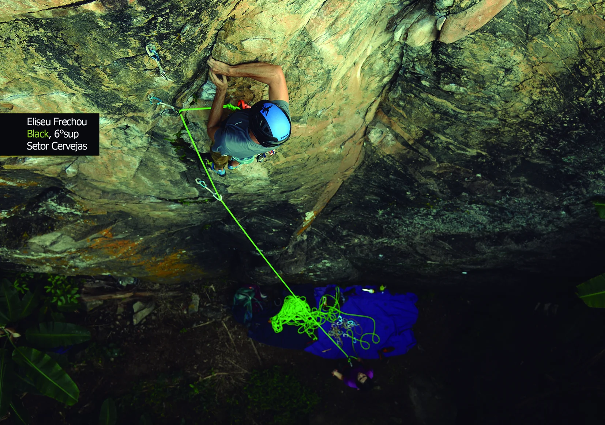 |
    | :--: |
    | *Eliseu Frechou na via Black, 6ºsup* |
    
    **Equipamentos Necessários:** Corda de 60m é obrigatória para rapelar. Para as vias esportivas, você vai precisar de 10 costuras.
- **nome**: Setor Cervejas
- **mapas**:
  - **[0]**:
    - **caminho_imagem_mapa**: 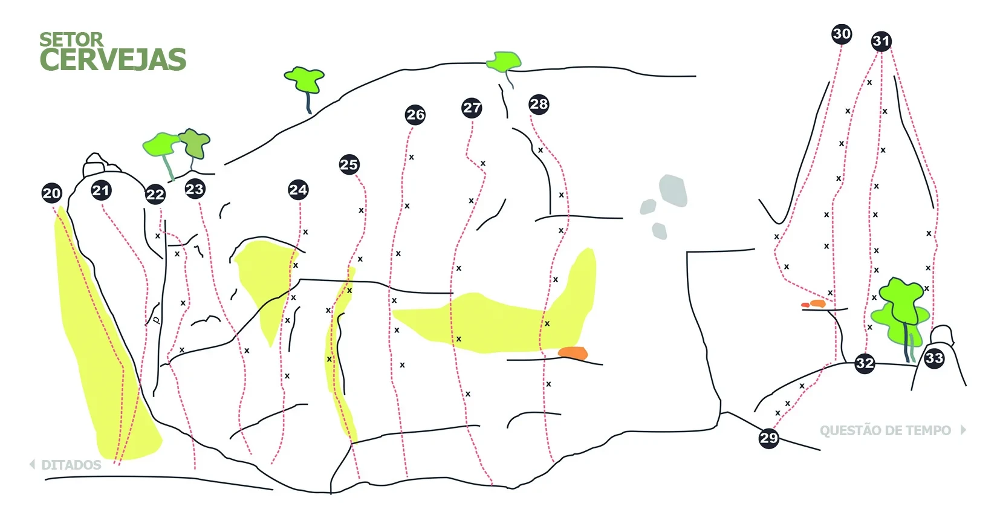
    - **largura_mapa**: 1654
    - **altura_mapa**: 857
    - **pontos_de_interesse**:
      - **[0]**:
        - **id**: titulo
        - **label**: SETOR CERVEJAS
        - **retangulo**:
          - **x**: 187
          - **y**: 87
          - **comprimento**: 250
          - **largura**: 81
      - **[1]**:
        - **id**: 20
        - **label**: 20
        - **circulo**:
          - **x**: 85
          - **y**: 319
          - **raio**: 17
      - **[2]**:
        - **id**: 21
        - **label**: 21
        - **circulo**:
          - **x**: 168
          - **y**: 314
          - **raio**: 17
      - **[3]**:
        - **id**: 22
        - **label**: 22
        - **circulo**:
          - **x**: 257
          - **y**: 321
          - **raio**: 17
      - **[4]**:
        - **id**: 23
        - **label**: 23
        - **circulo**:
          - **x**: 322
          - **y**: 312
          - **raio**: 17
      - **[5]**:
        - **id**: 24
        - **label**: 24
        - **circulo**:
          - **x**: 493
          - **y**: 313
          - **raio**: 17
      - **[6]**:
        - **id**: 25
        - **label**: 25
        - **circulo**:
          - **x**: 577
          - **y**: 271
          - **raio**: 17
      - **[7]**:
        - **id**: 26
        - **label**: 26
        - **circulo**:
          - **x**: 686
          - **y**: 190
          - **raio**: 17
      - **[8]**:
        - **id**: 27
        - **label**: 27
        - **circulo**:
          - **x**: 779
          - **y**: 178
          - **raio**: 17
      - **[9]**:
        - **id**: 28
        - **label**: 28
        - **circulo**:
          - **x**: 892
          - **y**: 172
          - **raio**: 17
      - **[10]**:
        - **id**: 29
        - **label**: 29
        - **circulo**:
          - **x**: 1271
          - **y**: 725
          - **raio**: 17
      - **[11]**:
        - **id**: 30
        - **label**: 30
        - **circulo**:
          - **x**: 1391
          - **y**: 56
          - **raio**: 17
      - **[12]**:
        - **id**: 31
        - **label**: 31
        - **circulo**:
          - **x**: 1457
          - **y**: 68
          - **raio**: 17
      - **[13]**:
        - **id**: 32
        - **label**: 32
        - **circulo**:
          - **x**: 1430
          - **y**: 602
          - **raio**: 17
      - **[14]**:
        - **id**: 33
        - **label**: 33
        - **circulo**:
          - **x**: 1545
          - **y**: 593
          - **raio**: 17
      - **[15]**:
        - **id**: ditados
        - **label**: DITADOS
        - **retangulo**:
          - **x**: 118
          - **y**: 768
          - **comprimento**: 105
          - **largura**: 25
      - **[16]**:
        - **id**: questao_de_tempo
        - **label**: QUESTÃO DE TEMPO
        - **retangulo**:
          - **x**: 1465
          - **y**: 713
          - **comprimento**: 223
          - **largura**: 27
    - **referencias**:
      - **[0]**:
        - **escalada**: Em terra de rei...
        - **ids**:
          - 20
      - **[1]**:
        - **escalada**: Red
        - **ids**:
          - 21
      - **[2]**:
        - **escalada**: Quadrupel
        - **ids**:
          - 22
      - **[3]**:
        - **escalada**: Pilsen
        - **ids**:
          - 23
      - **[4]**:
        - **escalada**: Black
        - **ids**:
          - 24
      - **[5]**:
        - **escalada**: Pale
        - **ids**:
          - 25
      - **[6]**:
        - **escalada**: Witbier
        - **ids**:
          - 26
      - **[7]**:
        - **escalada**: Blonde
        - **ids**:
          - 27
      - **[8]**:
        - **escalada**: Dubbel
        - **ids**:
          - 28
      - **[9]**:
        - **escalada**: Primeiro gole
        - **ids**:
          - 29
      - **[10]**:
        - **escalada**: Saidera
        - **ids**:
          - 30
      - **[11]**:
        - **escalada**: Porter
        - **ids**:
          - 31
      - **[12]**:
        - **escalada**: Bavariante
        - **ids**:
          - 32
          - 31
      - **[13]**:
        - **escalada**: Old Ale
        - **ids**:
          - 33
          - 31
      - **[14]**:
        - **ids**:
          - ditados
        - **setor**: Setor Ditados
      - **[15]**:
        - **ids**:
          - questao_de_tempo
        - **setor**: Setor Questão de Tempo
- **escaladas**:
  - **[0]**:
    - **via_movel**:
      - **nome**: Em terra de rei...
      - **dificuldade**: BR_6SUP
      - **protecoes_moveis**: friends grandes
      - **conquistadores**:
        - Ana Fujita
        - Eliseu Frechou
      - **data_abertura**: 2018
  - **[1]**:
    - **via_movel**:
      - **nome**: Red
      - **dificuldade**: BR_4SUP
      - **protecoes_moveis**: nuts e friends
      - **conquistadores**:
        - Ana Fujita
        - Eliseu Frechou
      - **data_abertura**: 2018
  - **[2]**:
    - **via_esportiva**:
      - **nome**: Quadrupel
      - **dificuldade**: BR_7A
      - **conquistadores**:
        - Eliseu Frechou
        - Lucas Lima
      - **data_abertura**: 2020
  - **[3]**:
    - **via_movel**:
      - **nome**: Pilsen
      - **dificuldade**: BR_5
      - **protecoes_moveis**: friends
      - **conquistadores**:
        - Ana Fujita
        - Eliseu Frechou
      - **data_abertura**: 2018
  - **[4]**:
    - **via_esportiva**:
      - **nome**: Black
      - **dificuldade**: BR_6SUP
      - **conquistadores**:
        - Ana Fujita
        - Eliseu Frechou
      - **data_abertura**: 2018
  - **[5]**:
    - **via_esportiva**:
      - **nome**: Pale
      - **dificuldade**: BR_7A
      - **conquistadores**:
        - Ana Fujita
        - Eliseu Frechou
      - **data_abertura**: 2018
  - **[6]**:
    - **via_esportiva**:
      - **nome**: Witbier
      - **dificuldade**: BR_7B
      - **conquistadores**:
        - Ana Fujita
        - Eliseu Frechou
      - **data_abertura**: 2018
  - **[7]**:
    - **via_esportiva**:
      - **nome**: Blonde
      - **dificuldade**: BR_7B
      - **conquistadores**:
        - Ana Fujita
        - Eliseu Frechou
      - **data_abertura**: 2018
  - **[8]**:
    - **via_esportiva**:
      - **nome**: Dubbel
      - **dificuldade**: BR_7C
      - **conquistadores**:
        - Ana Fujita
        - Eliseu Frechou
      - **data_abertura**: 2018
  - **[9]**:
    - **via_esportiva**:
      - **nome**: Primeiro gole
      - **dificuldade**: BR_4
      - **conquistadores**:
        - Charlie Alves
        - Antônio Calvo
  - **[10]**:
    - **via_movel**:
      - **nome**: Saidera
      - **dificuldade**: BR_6
      - **protecoes_moveis**: nuts e friends
      - **conquistadores**:
        - Charlie Alves
        - Antônio Calvo
        - Leonard Moreira
  - **[11]**:
    - **via_movel**:
      - **nome**: Porter
      - **dificuldade**: BR_7A
      - **protecoes_moveis**: friends
      - **conquistadores**:
        - Charlie Alves
        - Antônio Calvo
  - **[12]**:
    - **via_esportiva**:
      - **nome**: Bavariante
      - **dificuldade**: BR_7A
      - **conquistadores**:
        - Charlie Alves
        - Antônio Calvo
  - **[13]**:
    - **via_movel**:
      - **nome**: Old Ale
      - **dificuldade**: BR_7A
      - **protecoes_moveis**: nuts e friends
      - **conquistadores**:
        - Antônio Calvo
        - Ingo Moller
- **precomputados**:
  - **total_escaladas**: 14
  - **total_esportivas**: 8
  - **total_moveis**: 0
  - **total_boulders**: 0
  - **total_multiplas_enfiadas**: 0
  - **total_highlines**: 0

## Parte: setor_questao_de_tempo

### Setor (Pico: Pedra da Divisa (Face MG))

- **descricao**:
    | 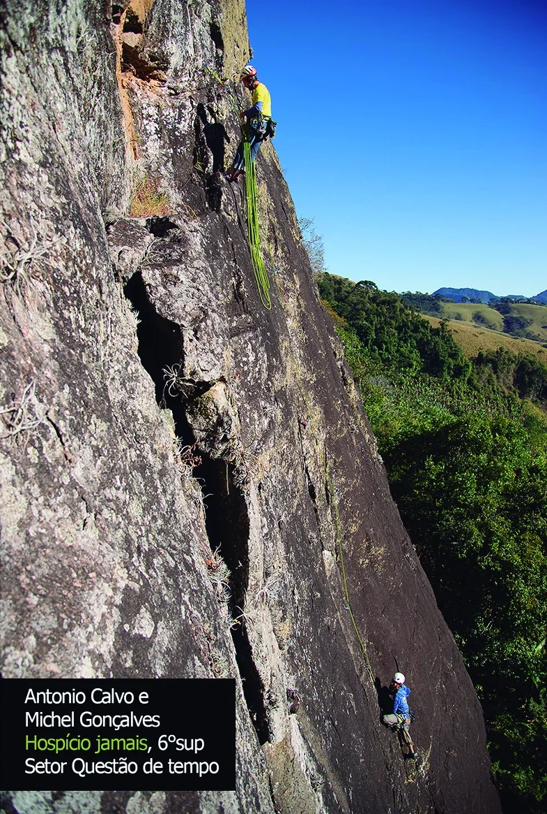 |
    | :--: |
    | *Antonio Calvo e Michel Gonçalves na via Hospício jamais, 6ºsup* |
    
    | 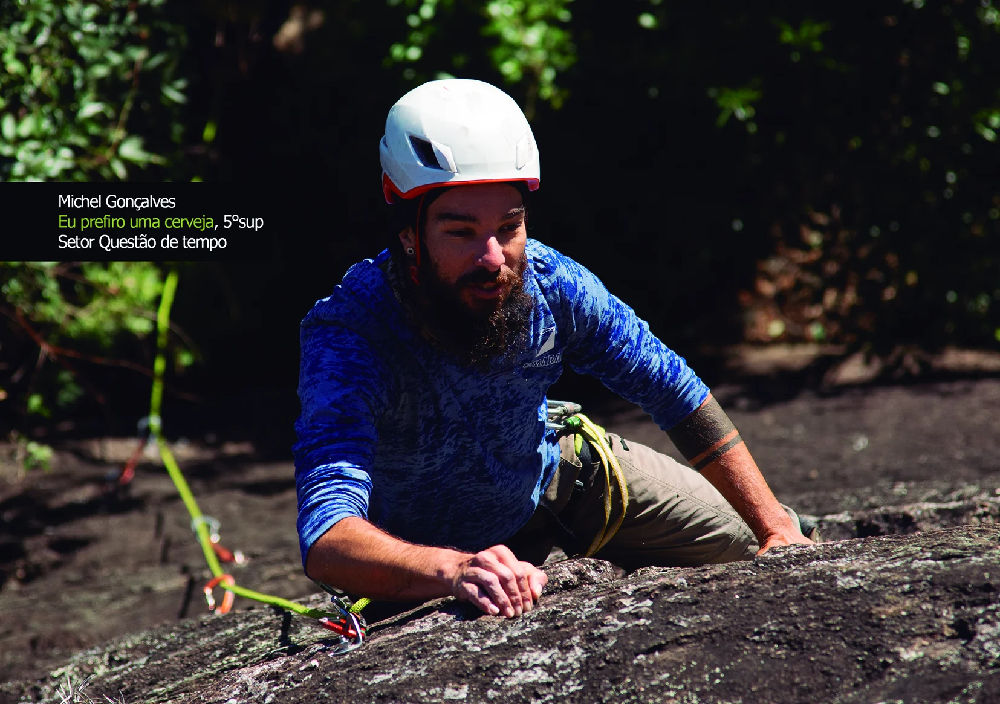 |
    | :--: |
    | *Michel Gonçalves na via Eu prefiro uma cerveja, 5ºsup* |
    
    **Equipamentos Necessários:** Corda de 60m é obrigatória para rapelar. Para as vias esportivas, você vai precisar de 10 costuras.
- **nome**: Setor Questão de Tempo
- **mapas**:
  - **[0]**:
    - **caminho_imagem_mapa**: 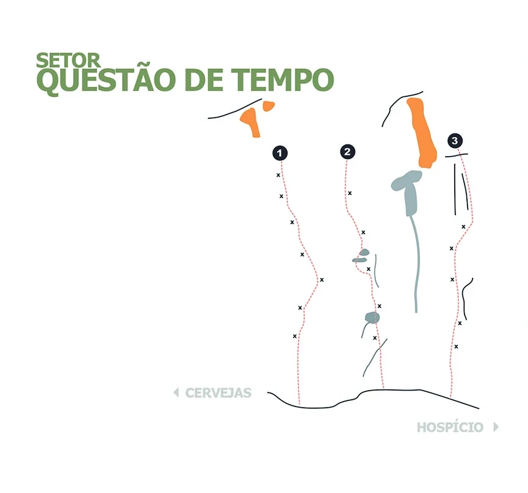
    - **largura_mapa**: 865
    - **altura_mapa**: 809
    - **pontos_de_interesse**:
      - **[0]**:
        - **id**: titulo
        - **label**: SETOR QUESTÃO DE TEMPO
        - **retangulo**:
          - **x**: 303
          - **y**: 121
          - **comprimento**: 506
          - **largura**: 87
      - **[1]**:
        - **id**: 01
        - **label**: 01
        - **circulo**:
          - **x**: 459
          - **y**: 251
          - **raio**: 13
      - **[2]**:
        - **id**: 02
        - **label**: 02
        - **circulo**:
          - **x**: 569
          - **y**: 249
          - **raio**: 13
      - **[3]**:
        - **id**: 03
        - **label**: 03
        - **circulo**:
          - **x**: 746
          - **y**: 231
          - **raio**: 13
      - **[4]**:
        - **id**: cervejas
        - **label**: CERVEJAS
        - **retangulo**:
          - **x**: 358
          - **y**: 645
          - **comprimento**: 110
          - **largura**: 30
      - **[5]**:
        - **id**: hospicio
        - **label**: HOSPÍCIO
        - **retangulo**:
          - **x**: 738
          - **y**: 702
          - **comprimento**: 110
          - **largura**: 30
    - **referencias**:
      - **[0]**:
        - **escalada**: C'est la vie
        - **ids**:
          - 01
      - **[1]**:
        - **escalada**: Eu prefiro uma cerveja
        - **ids**:
          - 02
      - **[2]**:
        - **escalada**: Hospício jamais
        - **ids**:
          - 03
      - **[3]**:
        - **ids**:
          - cervejas
        - **setor**: Setor Cervejas
      - **[4]**:
        - **ids**:
          - hospicio
        - **setor**: Setor Hospício
- **escaladas**:
  - **[0]**:
    - **via_esportiva**:
      - **nome**: C'est la vie
      - **dificuldade**: BR_6SUP
      - **conquistadores**:
        - Antonio Calvo
        - Carlos "Charlie" Alves
        - Alexandre "Jesus" Loureiro
        - Samuel Moreira
      - **data_abertura**: 2020
  - **[1]**:
    - **via_esportiva**:
      - **nome**: Eu prefiro uma cerveja
      - **dificuldade**: BR_5SUP
      - **conquistadores**:
        - Antonio Calvo
        - Carlos "Charlie" Alves
        - Alexandre "Jesus" Loureiro
        - Samuel Moreira
      - **data_abertura**: 2020
  - **[2]**:
    - **via_movel**:
      - **nome**: Hospício jamais
      - **dificuldade**: BR_6SUP
      - **protecoes_moveis**: friends médios e grandes
      - **conquistadores**:
        - Antonio Calvo
        - Carlos "Charlie" Alves
        - Alexandre "Jesus" Loureiro
        - Samuel Moreira
      - **data_abertura**: 2020
- **precomputados**:
  - **total_escaladas**: 3
  - **total_esportivas**: 2
  - **total_moveis**: 0
  - **total_boulders**: 0
  - **total_multiplas_enfiadas**: 0
  - **total_highlines**: 0

## Parte: setor_hospicio

### Setor (Pico: Pedra da Divisa (Face MG))

- **descricao**: **Equipamentos Necessários:** Corda de 60m é obrigatória para rapelar. Para as vias esportivas, você vai precisar de 12 costuras.
- **nome**: Setor Hospício
- **mapas**:
  - **[0]**:
    - **caminho_imagem_mapa**: 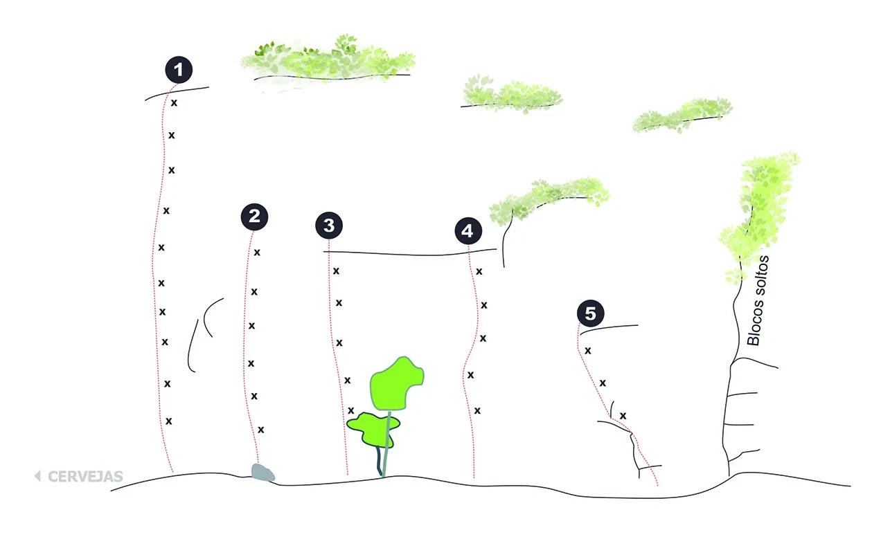
    - **largura_mapa**: 1285
    - **altura_mapa**: 779
    - **pontos_de_interesse**:
      - **[0]**:
        - **id**: 01
        - **label**: 01
        - **circulo**:
          - **x**: 257
          - **y**: 100
          - **raio**: 20
      - **[1]**:
        - **id**: 02
        - **label**: 02
        - **circulo**:
          - **x**: 368
          - **y**: 313
          - **raio**: 20
      - **[2]**:
        - **id**: 03
        - **label**: 03
        - **circulo**:
          - **x**: 475
          - **y**: 325
          - **raio**: 20
      - **[3]**:
        - **id**: 04
        - **label**: 04
        - **circulo**:
          - **x**: 676
          - **y**: 333
          - **raio**: 20
      - **[4]**:
        - **id**: 05
        - **label**: 05
        - **circulo**:
          - **x**: 853
          - **y**: 452
          - **raio**: 20
      - **[5]**:
        - **id**: cervejas
        - **label**: CERVEJAS
        - **retangulo**:
          - **x**: 124
          - **y**: 688
          - **comprimento**: 114
          - **largura**: 24
      - **[6]**:
        - **id**: blocos_soltos
        - **label**: Blocos soltos
        - **retangulo**:
          - **x**: 1095
          - **y**: 432
          - **comprimento**: 31
          - **largura**: 144
          - **angulo_graus_x100**: 735
    - **referencias**:
      - **[0]**:
        - **escalada**: Ócios do hospício
        - **ids**:
          - 01
      - **[1]**:
        - **escalada**: Psicanálise
        - **ids**:
          - 02
      - **[2]**:
        - **escalada**: Clínica de recuperação
        - **ids**:
          - 03
      - **[3]**:
        - **escalada**: Eletrochoque
        - **ids**:
          - 04
      - **[4]**:
        - **escalada**: Camisa de força
        - **ids**:
          - 05
      - **[5]**:
        - **ids**:
          - cervejas
        - **setor**: Setor Cervejas
- **escaladas**:
  - **[0]**:
    - **via_esportiva**:
      - **nome**: Ócios do hospício
      - **dificuldade**: BR_6
      - **conquistadores**:
        - Antonio Calvo
        - Carlos "Charlie" Alves
        - Leonard Moreira
        - Michel Gonçalves
      - **data_abertura**: 2020
  - **[1]**:
    - **via_esportiva**:
      - **nome**: Psicanálise
      - **dificuldade**: BR_5
      - **conquistadores**:
        - Antonio Calvo
        - Carlos "Charlie" Alves
        - Leonard Moreira
        - Michel Gonçalves
      - **data_abertura**: 2020
  - **[2]**:
    - **via_esportiva**:
      - **nome**: Clínica de recuperação
      - **dificuldade**: BR_5
      - **conquistadores**:
        - Antonio Calvo
        - Carlos "Charlie" Alves
        - Leonard Moreira
        - Michel Gonçalves
      - **data_abertura**: 2020
  - **[3]**:
    - **via_esportiva**:
      - **nome**: Eletrochoque
      - **dificuldade**: BR_5SUP
      - **conquistadores**:
        - Antonio Calvo
        - Carlos "Charlie" Alves
        - Leonard Moreira
        - Michel Gonçalves
      - **data_abertura**: 2020
  - **[4]**:
    - **via_esportiva**:
      - **nome**: Camisa de força
      - **dificuldade**: BR_4
      - **conquistadores**:
        - Antonio Calvo
        - Carlos "Charlie" Alves
        - Leonard Moreira
        - Michel Gonçalves
      - **data_abertura**: 2020
- **precomputados**:
  - **total_escaladas**: 5
  - **total_esportivas**: 5
  - **total_moveis**: 0
  - **total_boulders**: 0
  - **total_multiplas_enfiadas**: 0
  - **total_highlines**: 0

## Arquivos Externos

- **arquivos_externos**:
  - **[0]**:
    - **caminho**: 
    - **checksum_sha256**: ab0a8c9ae75ec43f10aace8ad2745e30e4419c44ff99159c83700bff4fc2ec1e
  - **[1]**:
    - **caminho**: 
    - **checksum_sha256**: 83c041e52c5fdcf51d8a695cfa09077de79a525ba150b7a02313e181b99d1b99
  - **[2]**:
    - **caminho**: 
    - **checksum_sha256**: c131517856506e3d1a7df25770095f5c793a07854d5c09daf05a51e099902d13
  - **[3]**:
    - **caminho**: 
    - **checksum_sha256**: e2e29ab9453bec2be004fb03b0c800217a0591b5bbe2853410415c64e0246a90
  - **[4]**:
    - **caminho**: 
    - **checksum_sha256**: a6085738cd7479c07ae82554dee7a285573f0b27e7e62810ad6b2cf93e2be37b
  - **[5]**:
    - **caminho**: 
    - **checksum_sha256**: 73218581c488e6ac1564a0bcc79b29e325399870d3f2229aaafe6b81079d01b3
  - **[6]**:
    - **caminho**: 
    - **checksum_sha256**: ce754bb08e432452f7916a04f9451cd51a2c4b5523a8411209255b800170dab6
  - **[7]**:
    - **caminho**: 
    - **checksum_sha256**: 54163e7131db3ce08fd8481b24dab502a62916c874b04da8bbcb43c3cd1eda20
  - **[8]**:
    - **caminho**: 
    - **checksum_sha256**: 2cbad5364b22f9874f9e99d77d012e8ad1d82a49cdae8de8384394c5cee79f0e
  - **[9]**:
    - **caminho**: 
    - **checksum_sha256**: 940c1f573244012c12e26cb4d9bd6b85fe07e3d416b857909d53de6fefee5dda
  - **[10]**:
    - **caminho**: 
    - **checksum_sha256**: aef4b0a5720159521bfa8be6dd496c465bb13bcad7ae7b81965479e7fdd2e073
  - **[11]**:
    - **caminho**: 
    - **checksum_sha256**: b13235b22917ed39f0f61333eb3cfdd1320eaa86ce55a329d2ff0c5ed3304bf8
  - **[12]**:
    - **caminho**: 
    - **checksum_sha256**: b6371882c1d34682c44a32707f2024650cb9cfaa0f393d34bf882a7747a81429
  - **[13]**:
    - **caminho**: 
    - **checksum_sha256**: e8fa92f0175c2e6bd2dda546574face20201678c11d13186bdc794ddd12b1a00
  - **[14]**:
    - **caminho**: 
    - **checksum_sha256**: e812e5a7c2f5639278470cef02b5c12eaf9bb35c6decc5bc4f4926d360d0d325
  - **[15]**:
    - **caminho**: 
    - **checksum_sha256**: 9043a0e4e73a563c67ee8dd9f5d7a6a529f41f979399e4bbeeff5837e2edcfa7
  - **[16]**:
    - **caminho**: 
    - **checksum_sha256**: 0a62f79ba937e83637b51499066ebd6c7652061ff94dcae59956639a174928d2
  - **[17]**:
    - **caminho**: 
    - **checksum_sha256**: 651ba530c163b214b3f6584aada09741e05adbed0b1657189297250b5164ecaf
  - **[18]**:
    - **caminho**: 
    - **checksum_sha256**: 1b48c99d5d4fc8dfd779007b4e865ee99076faee6a8b78ecabb470441d902a44

