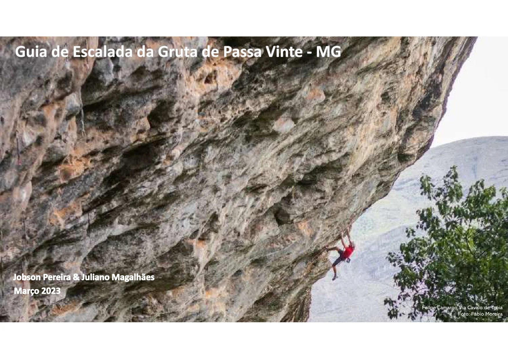
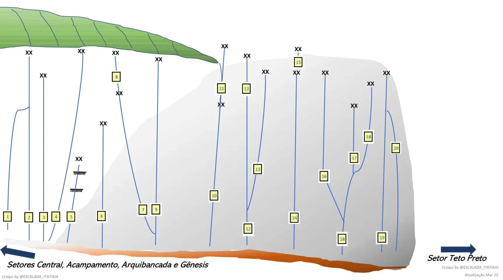
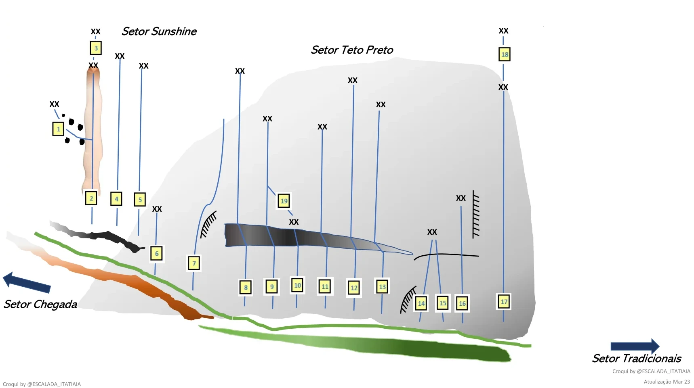
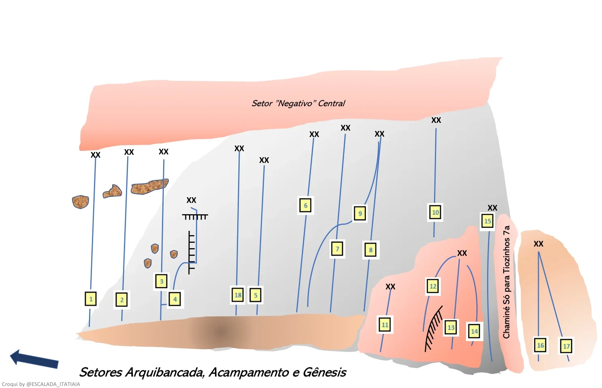
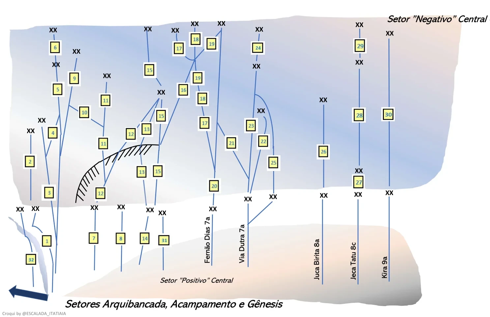
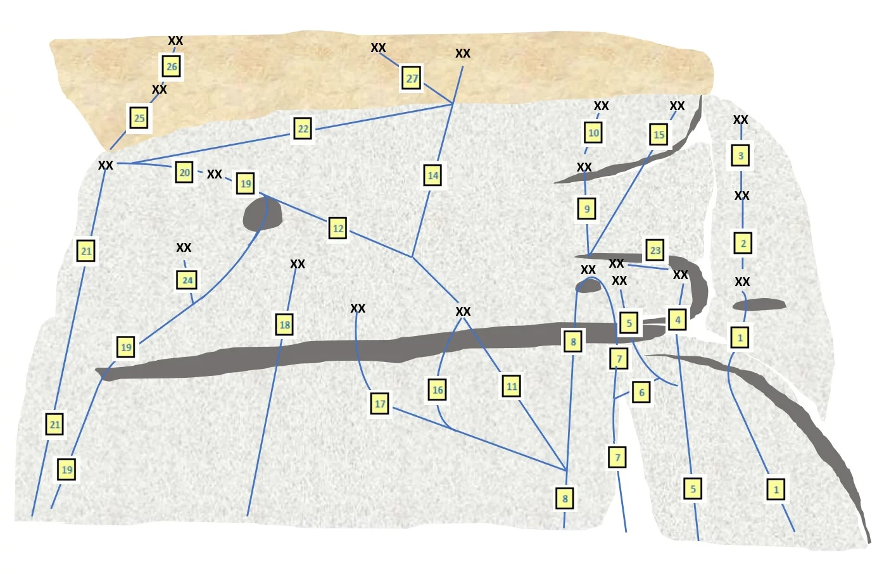
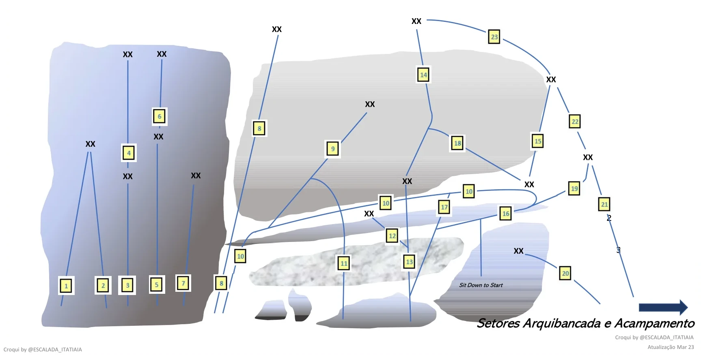
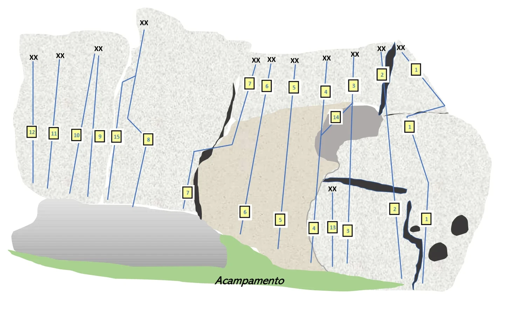
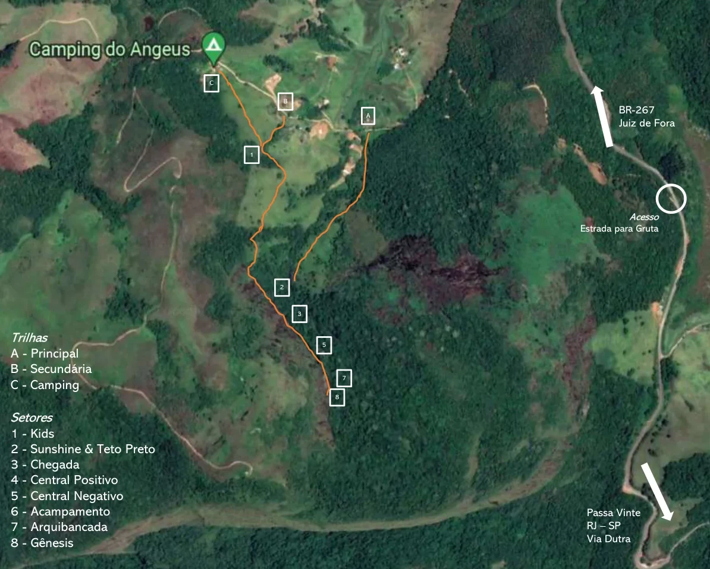

# Croqui: Gruta de Passa Vinte

## Informações Gerais

- **descricao**: Guia de Escalada da Gruta de Passa Vinte - MG
- **id**: br_mg_passa_vinte_gruta
- **nome**: Gruta de Passa Vinte
- **creditos**:
  - Jobson Pereira
  - Juliano Magalhães
- **caminho_thumbnail**: 
- **status_desenho_extraivel**: TEM_DESENHO_MAS_NAO_EXTRAIDO
- **botoes**:
  - **[0]**:
    - **texto**: Capa
    - **destino**:
      - **secao_textual**:
        - **conteudo**:
            # Guia de Escalada da Gruta de Passa Vinte - MG
            
            |  |
            | :--: |
            | *Felipe Camargo Via Cavalo de Tróia. Foto: Fábio Moreira* |
            
            Jobson Pereira & Juliano Magalhães
            Março 2023
  - **[1]**:
    - **texto**: Advertência
    - **destino**:
      - **secao_textual**:
        - **conteudo**:
            # ADVERTÊNCIA
            
            - Sua segurança é sua responsabilidade, respeite seus limites e seja prudente.
            - As informações contidas nesse croqui servem apenas para indicar as vias de escalada, não assegurando a integridade física das proteções fixas das rotas indicadas.
            - Os autores não se responsabilizam pela utilização ou má interpretação das informações contidas nessa publicação.
            - A utilização de capacete é recomendável durante toda a permanência no setor acampamento.
            - Atenção para as serpentes! Recomenda-se o uso de perneiras ou galochas na trilha.
            - Proteja e respeite a natureza. Não retire nada, leve todo seu lixo de volta e não faça fogueira.
            - Respeite o silêncio. Evite levar equipamentos sonoros para os locais de escalada.
            - O acesso aos setores de escalada é feito através de propriedade particular. Dessa forma, tenha cuidado com os animais no pasto, feche todas as porteiras que abrir e cuidado ao estacionar seu veículo para não fechar o trânsito.
  - **[2]**:
    - **texto**: Apresentação
    - **destino**:
      - **secao_textual**:
        - **conteudo**:
            # APRESENTAÇÃO
            
            |  |
            | :--: |
            | *Juliano Magalhães na Via Pau Mandado. Foto: Jobson Pereira* |
            
            A Gruta de Passa Vinte começou a se tornar um destinos dos amantes da escalada esportiva em Novembro de 2008, quando um grupo de amigos iniciaram as primeiras conquistas no local. Desde então, os trabalhos de abertura de novas vias se tornaram incessantes pela qualidade da rocha, negatividade das vias abrigadas das chuvas e acesso relativamente tranquilo, com uma caminhada de 20 a 30 minutos.
            
            Atualmente, o setor possui aproximadamente 150 vias, com graduações que vão do IV a 11c, além de vários projetos de alto grau de dificuldade. Dentre essas rotas, há uma diversidade de estilos de escalada que tornam o local completo com vias verticais, negativas, positivas e tetos. A rocha predominante é o gnaisse que proporcionada uma diversidade de formações de agarras.
            
            No inverno o sol demora um pouco mais para sair da parede, ficando no positivo central até por volta de 11h e no setor vertical da chegada até 13h. Já no verão, o sol sai do positivo central por volta das 9h e no vertical da chegada por volta das 11h. Assim, planeje os horários e setores da sua escalada se quer fugir do sol.
  - **[3]**:
    - **texto**: Como Chegar
    - **destino**:
      - **secao_textual**:
        - **conteudo**:
            # COMO CHEGAR
            
            Coordenada geográfica e link do Google Maps da entrada da estrada de terra que dá acesso ao setor de escalada, que está a aproximadamente a 2,5 km do centro da cidade de Passa Vinte - MG.
            
            Coordenadas: -22.192972, -44.236583
            
            [https://goo.gl/maps/GV6WQ7tfJhWc2RxP7](https://goo.gl/maps/GV6WQ7tfJhWc2RxP7)
            
            Ao chegar nesse ponto do link acima seguir por aproximadamente 1 km na estrada de terra até a placa indicativa de acesso a trilha da Gruta de Passa Vinte.
  - **[4]**:
    - **texto**: Contatos
    - **destino**:
      - **secao_textual**:
        - **conteudo**:
            # CONTATOS
            
            |  |
            | :--: |
            | *Gruta de Passa Vinte. Foto: Jobson Pereira* |
            
            - Jobson Pereira - Instagram: [@jobson_pereira1967](https://www.instagram.com/jobson_pereira1967)
            - Juliano Magalhães - Instagram: [@jzmagalhaes](https://www.instagram.com/jzmagalhaes)
            - Instagram: [@escalada_itatiaia](https://www.instagram.com/escalada_itatiaia)
            - Instagram: [@gruta_de_p20_climbing](https://www.instagram.com/gruta_de_p20_climbing)
- **ultima_migracao**: 3

## Parte: setor_chegada

### Setor (Pico: Gruta de Passa Vinte)

- **descricao**: 
- **nome**: Chegada
- **mapas**:
  - **[0]**:
    - **caminho_imagem_mapa**: 
    - **largura_mapa**: 1725
    - **altura_mapa**: 964
    - **pontos_de_interesse**:
      - **[0]**:
        - **id**: 01
        - **label**: 1
        - **box**:
          - **x**: 15
          - **y**: 760
          - **comprimento**: 30
          - **largura**: 30
      - **[1]**:
        - **id**: 02
        - **label**: 2
        - **box**:
          - **x**: 60
          - **y**: 760
          - **comprimento**: 30
          - **largura**: 30
      - **[2]**:
        - **id**: 03
        - **label**: 3
        - **box**:
          - **x**: 95
          - **y**: 760
          - **comprimento**: 30
          - **largura**: 30
      - **[3]**:
        - **id**: 04
        - **label**: 4
        - **box**:
          - **x**: 125
          - **y**: 760
          - **comprimento**: 30
          - **largura**: 30
      - **[4]**:
        - **id**: 05
        - **label**: 5
        - **box**:
          - **x**: 160
          - **y**: 760
          - **comprimento**: 30
          - **largura**: 30
      - **[5]**:
        - **id**: 06
        - **label**: 6
        - **box**:
          - **x**: 220
          - **y**: 760
          - **comprimento**: 30
          - **largura**: 30
      - **[6]**:
        - **id**: 07
        - **label**: 7
        - **box**:
          - **x**: 315
          - **y**: 760
          - **comprimento**: 30
          - **largura**: 30
      - **[7]**:
        - **id**: 08
        - **label**: 8
        - **box**:
          - **x**: 260
          - **y**: 265
          - **comprimento**: 30
          - **largura**: 30
      - **[8]**:
        - **id**: 09
        - **label**: 9
        - **box**:
          - **x**: 345
          - **y**: 760
          - **comprimento**: 30
          - **largura**: 30
      - **[9]**:
        - **id**: 10
        - **label**: 10
        - **box**:
          - **x**: 490
          - **y**: 695
          - **comprimento**: 30
          - **largura**: 30
      - **[10]**:
        - **id**: 11
        - **label**: 11
        - **box**:
          - **x**: 505
          - **y**: 310
          - **comprimento**: 30
          - **largura**: 30
      - **[11]**:
        - **id**: 12_topo
        - **label**: 12
        - **box**:
          - **x**: 565
          - **y**: 315
          - **comprimento**: 30
          - **largura**: 30
      - **[12]**:
        - **id**: 12_base
        - **label**: 12
        - **box**:
          - **x**: 575
          - **y**: 805
          - **comprimento**: 30
          - **largura**: 30
      - **[13]**:
        - **id**: 13
        - **label**: 13
        - **box**:
          - **x**: 605
          - **y**: 610
          - **comprimento**: 30
          - **largura**: 30
      - **[14]**:
        - **id**: 14
        - **label**: 14
        - **box**:
          - **x**: 695
          - **y**: 785
          - **comprimento**: 30
          - **largura**: 30
      - **[15]**:
        - **id**: 15
        - **label**: 15
        - **box**:
          - **x**: 695
          - **y**: 215
          - **comprimento**: 30
          - **largura**: 30
      - **[16]**:
        - **id**: 16
        - **label**: 16
        - **box**:
          - **x**: 755
          - **y**: 640
          - **comprimento**: 30
          - **largura**: 30
      - **[17]**:
        - **id**: 17
        - **label**: 17
        - **box**:
          - **x**: 835
          - **y**: 570
          - **comprimento**: 30
          - **largura**: 30
      - **[18]**:
        - **id**: 18_topo
        - **label**: 18
        - **box**:
          - **x**: 865
          - **y**: 485
          - **comprimento**: 30
          - **largura**: 30
      - **[19]**:
        - **id**: 18_base
        - **label**: 18
        - **box**:
          - **x**: 805
          - **y**: 875
          - **comprimento**: 30
          - **largura**: 30
      - **[20]**:
        - **id**: 19
        - **label**: 19
        - **box**:
          - **x**: 905
          - **y**: 865
          - **comprimento**: 30
          - **largura**: 30
      - **[21]**:
        - **id**: 20
        - **label**: 20
        - **box**:
          - **x**: 935
          - **y**: 530
          - **comprimento**: 30
          - **largura**: 30
      - **[22]**:
        - **id**: Setores_Vizinhos
        - **label**: Setores Central, Acampamento, Arquibancada e Gênesis
        - **box**:
          - **x**: 350
          - **y**: 930
          - **comprimento**: 500
          - **largura**: 30
      - **[23]**:
        - **id**: Setor_Teto_Preto
        - **label**: Setor Teto Preto
        - **box**:
          - **x**: 1050
          - **y**: 900
          - **comprimento**: 150
          - **largura**: 30
    - **referencias**:
      - **[0]**:
        - **escalada**: Fake News
        - **ids**:
          - 01
      - **[1]**:
        - **escalada**: Caliba
        - **ids**:
          - 02
      - **[2]**:
        - **escalada**: Jack Sparrow
        - **ids**:
          - 03
      - **[3]**:
        - **escalada**: Monty Python
        - **ids**:
          - 04
      - **[4]**:
        - **escalada**: Dengoso
        - **ids**:
          - 05
      - **[5]**:
        - **escalada**: Livre Arbítrio
        - **ids**:
          - 06
      - **[6]**:
        - **escalada**: Mad Max P1
        - **ids**:
          - 07
      - **[7]**:
        - **escalada**: Mad Max P2
        - **ids**:
          - 08
          - 08
      - **[8]**:
        - **escalada**: Além da Cúpula do Trovão
        - **ids**:
          - 09
      - **[9]**:
        - **escalada**: Perestroika P1
        - **ids**:
          - 10
      - **[10]**:
        - **escalada**: Perestroika P2
        - **ids**:
          - 11
          - 11
      - **[11]**:
        - **escalada**: Guliver
        - **ids**:
          - 12_base
      - **[12]**:
        - **escalada**: Ben Hur
        - **ids**:
          - 13
      - **[13]**:
        - **escalada**: Carmina Burana P1
        - **ids**:
          - 14
      - **[14]**:
        - **escalada**: Carmina Burana P2
        - **ids**:
          - 15
          - 15
      - **[15]**:
        - **escalada**: 17 Quedas
        - **ids**:
          - 16
      - **[16]**:
        - **escalada**: 8d
        - **ids**:
          - 17
      - **[17]**:
        - **escalada**: Cápsula do Tempo
        - **ids**:
          - 18_base
      - **[18]**:
        - **escalada**: Buraco Negro
        - **ids**:
          - 19
      - **[19]**:
        - **escalada**: Macunaína
        - **ids**:
          - 20
- **escaladas**:
  - **[0]**:
    - **via_esportiva**:
      - **nome**: Fake News
      - **dificuldade**: BR_9C
  - **[1]**:
    - **via_esportiva**:
      - **nome**: Caliba
      - **dificuldade**: BR_9B_BARRA_9C
  - **[2]**:
    - **via_esportiva**:
      - **nome**: Jack Sparrow
      - **dificuldade**: BR_9B
  - **[3]**:
    - **via_esportiva**:
      - **nome**: Monty Python
      - **dificuldade**: BR_9A
  - **[4]**:
    - **via_esportiva**:
      - **nome**: Dengoso
      - **dificuldade**: BR_6
  - **[5]**:
    - **via_esportiva**:
      - **nome**: Livre Arbítrio
      - **dificuldade**: BR_8B
  - **[6]**:
    - **via_esportiva**:
      - **nome**: Mad Max P1
      - **dificuldade**: BR_8C
  - **[7]**:
    - **via_esportiva**:
      - **nome**: Mad Max P2
      - **dificuldade**: BR_9C
  - **[8]**:
    - **via_esportiva**:
      - **nome**: Além da Cúpula do Trovão
      - **dificuldade**: BR_9A
  - **[9]**:
    - **via_esportiva**:
      - **nome**: Perestroika P1
      - **dificuldade**: BR_9B
  - **[10]**:
    - **via_esportiva**:
      - **nome**: Perestroika P2
      - **dificuldade**: BR_9C
  - **[11]**:
    - **via_esportiva**:
      - **nome**: Guliver
      - **dificuldade**: BR_10A
  - **[12]**:
    - **via_esportiva**:
      - **nome**: Ben Hur
      - **dificuldade**: BR_9C
  - **[13]**:
    - **via_esportiva**:
      - **nome**: Carmina Burana P1
      - **dificuldade**: BR_9B
  - **[14]**:
    - **via_esportiva**:
      - **nome**: Carmina Burana P2
      - **dificuldade**: BR_10A
  - **[15]**:
    - **via_esportiva**:
      - **nome**: 17 Quedas
      - **dificuldade**: BR_9C
  - **[16]**:
    - **via_esportiva**:
      - **nome**: 8d
      - **dificuldade**: BR_8C
  - **[17]**:
    - **via_esportiva**:
      - **nome**: Cápsula do Tempo
      - **dificuldade**: BR_8C_BARRA_9A
  - **[18]**:
    - **via_esportiva**:
      - **nome**: Buraco Negro
      - **dificuldade**: BR_9B
  - **[19]**:
    - **via_esportiva**:
      - **nome**: Macunaína
      - **dificuldade**: BR_9B

## Parte: setor_sunshine_e_teto_preto

### Setor (Pico: Gruta de Passa Vinte)

- **descricao**: 
- **nome**: Sunshine & Teto Preto
- **mapas**:
  - **[0]**:
    - **caminho_imagem_mapa**: 
    - **largura_mapa**: 1718
    - **altura_mapa**: 962
    - **pontos_de_interesse**:
      - **[0]**:
        - **id**: 01
        - **label**: 1
        - **box**:
          - **x**: 130
          - **y**: 315
          - **comprimento**: 30
          - **largura**: 30
      - **[1]**:
        - **id**: 02
        - **label**: 2
        - **box**:
          - **x**: 215
          - **y**: 510
          - **comprimento**: 30
          - **largura**: 30
      - **[2]**:
        - **id**: 03
        - **label**: 3
        - **box**:
          - **x**: 218
          - **y**: 108
          - **comprimento**: 30
          - **largura**: 30
      - **[3]**:
        - **id**: 04
        - **label**: 4
        - **box**:
          - **x**: 275
          - **y**: 510
          - **comprimento**: 30
          - **largura**: 30
      - **[4]**:
        - **id**: 05
        - **label**: 5
        - **box**:
          - **x**: 335
          - **y**: 510
          - **comprimento**: 30
          - **largura**: 30
      - **[5]**:
        - **id**: 06
        - **label**: 6
        - **box**:
          - **x**: 375
          - **y**: 650
          - **comprimento**: 30
          - **largura**: 30
      - **[6]**:
        - **id**: 07
        - **label**: 7
        - **box**:
          - **x**: 465
          - **y**: 675
          - **comprimento**: 30
          - **largura**: 30
      - **[7]**:
        - **id**: 08
        - **label**: 8
        - **box**:
          - **x**: 600
          - **y**: 740
          - **comprimento**: 30
          - **largura**: 30
      - **[8]**:
        - **id**: 09
        - **label**: 9
        - **box**:
          - **x**: 665
          - **y**: 740
          - **comprimento**: 30
          - **largura**: 30
      - **[9]**:
        - **id**: 10
        - **label**: 10
        - **box**:
          - **x**: 720
          - **y**: 740
          - **comprimento**: 30
          - **largura**: 30
      - **[10]**:
        - **id**: 11
        - **label**: 11
        - **box**:
          - **x**: 795
          - **y**: 740
          - **comprimento**: 30
          - **largura**: 30
      - **[11]**:
        - **id**: 12
        - **label**: 12
        - **box**:
          - **x**: 870
          - **y**: 740
          - **comprimento**: 30
          - **largura**: 30
      - **[12]**:
        - **id**: 13
        - **label**: 13
        - **box**:
          - **x**: 945
          - **y**: 740
          - **comprimento**: 30
          - **largura**: 30
      - **[13]**:
        - **id**: 14
        - **label**: 14
        - **box**:
          - **x**: 1040
          - **y**: 785
          - **comprimento**: 30
          - **largura**: 30
      - **[14]**:
        - **id**: 15
        - **label**: 15
        - **box**:
          - **x**: 1090
          - **y**: 785
          - **comprimento**: 30
          - **largura**: 30
      - **[15]**:
        - **id**: 16
        - **label**: 16
        - **box**:
          - **x**: 1145
          - **y**: 785
          - **comprimento**: 30
          - **largura**: 30
      - **[16]**:
        - **id**: 17
        - **label**: 17
        - **box**:
          - **x**: 1250
          - **y**: 775
          - **comprimento**: 30
          - **largura**: 30
      - **[17]**:
        - **id**: 18
        - **label**: 18
        - **box**:
          - **x**: 1230
          - **y**: 122
          - **comprimento**: 30
          - **largura**: 30
      - **[18]**:
        - **id**: 19
        - **label**: 19
        - **box**:
          - **x**: 682
          - **y**: 487
          - **comprimento**: 30
          - **largura**: 30
      - **[19]**:
        - **id**: Setor_Chegada
        - **label**: Setor Chegada
        - **box**:
          - **x**: 10
          - **y**: 800
          - **comprimento**: 200
          - **largura**: 30
      - **[20]**:
        - **id**: Setor_Tradicionais
        - **label**: Setor Tradicionais
        - **box**:
          - **x**: 1500
          - **y**: 940
          - **comprimento**: 250
          - **largura**: 30
    - **referencias**:
      - **[0]**:
        - **escalada**: Ementhal
        - **ids**:
          - 01
      - **[1]**:
        - **escalada**: Sunshine
        - **ids**:
          - 02
      - **[2]**:
        - **escalada**: Ext. Sunshine (Projeto)
        - **ids**:
          - 03
          - 03
      - **[3]**:
        - **escalada**: Luna
        - **ids**:
          - 04
      - **[4]**:
        - **escalada**: Freddie Mercury
        - **ids**:
          - 05
      - **[5]**:
        - **escalada**: Ariete
        - **ids**:
          - 06
      - **[6]**:
        - **escalada**: Eunuco (Projeto)
        - **ids**:
          - 07
      - **[7]**:
        - **escalada**: Pau Mandado
        - **ids**:
          - 08
      - **[8]**:
        - **escalada**: Imperatriz
        - **ids**:
          - 09
      - **[9]**:
        - **escalada**: Casamento de Viúva
        - **ids**:
          - 10
      - **[10]**:
        - **escalada**: Manda Chuva (Projeto)
        - **ids**:
          - 11
      - **[11]**:
        - **escalada**: Celibato
        - **ids**:
          - 12
      - **[12]**:
        - **escalada**: Manicaca
        - **ids**:
          - 13
      - **[13]**:
        - **escalada**: Ghidorah
        - **ids**:
          - 14
      - **[14]**:
        - **escalada**: Hidra
        - **ids**:
          - 15
      - **[15]**:
        - **escalada**: Medusa
        - **ids**:
          - 16
      - **[16]**:
        - **escalada**: Kátia Flávia
        - **ids**:
          - 17
      - **[17]**:
        - **escalada**: Ext. Kátia Flávia
        - **ids**:
          - 18
          - 18
      - **[18]**:
        - **escalada**: Casamento da Imperatriz (Projeto)
        - **ids**:
          - 19
- **escaladas**:
  - **[0]**:
    - **via_esportiva**:
      - **nome**: Ementhal
      - **dificuldade**: BR_7C
  - **[1]**:
    - **via_esportiva**:
      - **nome**: Sunshine
      - **dificuldade**: BR_7C
  - **[2]**:
    - **via_esportiva**:
      - **nome**: Ext. Sunshine (Projeto)
      - **dificuldade**: PROJETO
  - **[3]**:
    - **via_esportiva**:
      - **nome**: Luna
      - **dificuldade**: BR_8A_BARRA_8B
  - **[4]**:
    - **via_esportiva**:
      - **nome**: Freddie Mercury
      - **dificuldade**: BR_9A
  - **[5]**:
    - **via_esportiva**:
      - **nome**: Ariete
      - **dificuldade**: BR_7C
  - **[6]**:
    - **via_esportiva**:
      - **nome**: Eunuco (Projeto)
      - **dificuldade**: PROJETO
  - **[7]**:
    - **via_esportiva**:
      - **nome**: Pau Mandado
      - **dificuldade**: BR_9C_BARRA_10A
      - **destaque**: True
  - **[8]**:
    - **via_esportiva**:
      - **nome**: Imperatriz
      - **dificuldade**: BR_9B
  - **[9]**:
    - **via_esportiva**:
      - **nome**: Casamento de Viúva
      - **dificuldade**: BR_8A
  - **[10]**:
    - **via_esportiva**:
      - **nome**: Manda Chuva (Projeto)
      - **dificuldade**: PROJETO
  - **[11]**:
    - **via_esportiva**:
      - **nome**: Celibato
      - **dificuldade**: BR_8C
  - **[12]**:
    - **via_esportiva**:
      - **nome**: Manicaca
      - **dificuldade**: BR_7C_BARRA_8A
  - **[13]**:
    - **via_esportiva**:
      - **nome**: Ghidorah
      - **dificuldade**: BR_6
  - **[14]**:
    - **via_esportiva**:
      - **nome**: Hidra
      - **dificuldade**: BR_5
  - **[15]**:
    - **via_esportiva**:
      - **nome**: Medusa
      - **dificuldade**: BR_5
  - **[16]**:
    - **via_esportiva**:
      - **nome**: Kátia Flávia
      - **dificuldade**: BR_7A
  - **[17]**:
    - **via_esportiva**:
      - **nome**: Ext. Kátia Flávia
      - **dificuldade**: BR_7A
  - **[18]**:
    - **via_esportiva**:
      - **nome**: Casamento da Imperatriz (Projeto)
      - **dificuldade**: PROJETO

## Parte: setor_positivo_central

### Setor (Pico: Gruta de Passa Vinte)

- **descricao**: 
- **nome**: ”Positivo” Central
- **mapas**:
  - **[0]**:
    - **caminho_imagem_mapa**: 
    - **largura_mapa**: 1487
    - **altura_mapa**: 960
    - **pontos_de_interesse**:
      - **[0]**:
        - **id**: 01
        - **label**: 1
        - **box**:
          - **x**: 130
          - **y**: 740
          - **comprimento**: 30
          - **largura**: 30
      - **[1]**:
        - **id**: 02
        - **label**: 2
        - **box**:
          - **x**: 275
          - **y**: 740
          - **comprimento**: 30
          - **largura**: 30
      - **[2]**:
        - **id**: 03
        - **label**: 3
        - **box**:
          - **x**: 375
          - **y**: 700
          - **comprimento**: 30
          - **largura**: 30
      - **[3]**:
        - **id**: 04
        - **label**: 4
        - **box**:
          - **x**: 410
          - **y**: 740
          - **comprimento**: 30
          - **largura**: 30
      - **[4]**:
        - **id**: 05
        - **label**: 5
        - **box**:
          - **x**: 620
          - **y**: 730
          - **comprimento**: 30
          - **largura**: 30
      - **[5]**:
        - **id**: 06
        - **label**: 6
        - **box**:
          - **x**: 740
          - **y**: 505
          - **comprimento**: 30
          - **largura**: 30
      - **[6]**:
        - **id**: 07
        - **label**: 7
        - **box**:
          - **x**: 825
          - **y**: 610
          - **comprimento**: 30
          - **largura**: 30
      - **[7]**:
        - **id**: 08
        - **label**: 8
        - **box**:
          - **x**: 910
          - **y**: 615
          - **comprimento**: 30
          - **largura**: 30
      - **[8]**:
        - **id**: 09
        - **label**: 9
        - **box**:
          - **x**: 875
          - **y**: 520
          - **comprimento**: 30
          - **largura**: 30
      - **[9]**:
        - **id**: 10
        - **label**: 10
        - **box**:
          - **x**: 1080
          - **y**: 520
          - **comprimento**: 30
          - **largura**: 30
      - **[10]**:
        - **id**: 11
        - **label**: 11
        - **box**:
          - **x**: 925
          - **y**: 785
          - **comprimento**: 30
          - **largura**: 30
      - **[11]**:
        - **id**: 12
        - **label**: 12
        - **box**:
          - **x**: 1075
          - **y**: 710
          - **comprimento**: 30
          - **largura**: 30
      - **[12]**:
        - **id**: 13
        - **label**: 13
        - **box**:
          - **x**: 1120
          - **y**: 830
          - **comprimento**: 30
          - **largura**: 30
      - **[13]**:
        - **id**: 14
        - **label**: 14
        - **box**:
          - **x**: 1175
          - **y**: 820
          - **comprimento**: 30
          - **largura**: 30
      - **[14]**:
        - **id**: 15
        - **label**: 15
        - **box**:
          - **x**: 1179
          - **y**: 528
          - **comprimento**: 30
          - **largura**: 30
      - **[15]**:
        - **id**: 16
        - **label**: 16
        - **box**:
          - **x**: 1350
          - **y**: 860
          - **comprimento**: 30
          - **largura**: 30
      - **[16]**:
        - **id**: 17
        - **label**: 17
        - **box**:
          - **x**: 1420
          - **y**: 860
          - **comprimento**: 30
          - **largura**: 30
      - **[17]**:
        - **id**: 18
        - **label**: 18
        - **box**:
          - **x**: 565
          - **y**: 730
          - **comprimento**: 30
          - **largura**: 30
      - **[18]**:
        - **id**: Setores_Vizinhos
        - **label**: Setores Arquibancada, Acampamento e Gênesis
        - **box**:
          - **x**: 326
          - **y**: 921
          - **comprimento**: 700
          - **largura**: 30
    - **referencias**:
      - **[0]**:
        - **escalada**: Ayrton Senna
        - **ids**:
          - 01
      - **[1]**:
        - **escalada**: Fernão Dias
        - **ids**:
          - 02
      - **[2]**:
        - **escalada**: Via Dutra
        - **ids**:
          - 03
      - **[3]**:
        - **escalada**: Rua Teresa
        - **ids**:
          - 04
      - **[4]**:
        - **escalada**: Chico
        - **ids**:
          - 05
      - **[5]**:
        - **escalada**: Juca Birita
        - **ids**:
          - 06
      - **[6]**:
        - **escalada**: Jeca Tatu
        - **ids**:
          - 07
      - **[7]**:
        - **escalada**: Kira
        - **ids**:
          - 08
      - **[8]**:
        - **escalada**: JucaTatuKira
        - **ids**:
          - 09
      - **[9]**:
        - **escalada**: Free Willy
        - **ids**:
          - 10
      - **[10]**:
        - **escalada**: Homer Simpson
        - **ids**:
          - 11
      - **[11]**:
        - **escalada**: Velho do Saco
        - **ids**:
          - 12
      - **[12]**:
        - **escalada**: Incontinência
        - **ids**:
          - 13
      - **[13]**:
        - **escalada**: Vovó Mafalda
        - **ids**:
          - 14
      - **[14]**:
        - **escalada**: Chaminé Só para Tiozinhos
        - **ids**:
          - 15
      - **[15]**:
        - **escalada**: TriJeferson
        - **ids**:
          - 16
      - **[16]**:
        - **escalada**: Dunga
        - **ids**:
          - 17
      - **[17]**:
        - **escalada**: Sub-Zero
        - **ids**:
          - 18
- **escaladas**:
  - **[0]**:
    - **via_esportiva**:
      - **nome**: Ayrton Senna
      - **dificuldade**: BR_7C
  - **[1]**:
    - **via_esportiva**:
      - **nome**: Fernão Dias
      - **dificuldade**: BR_7A
  - **[2]**:
    - **via_esportiva**:
      - **nome**: Via Dutra
      - **dificuldade**: BR_7A
  - **[3]**:
    - **via_esportiva**:
      - **nome**: Rua Teresa
      - **dificuldade**: BR_7A
  - **[4]**:
    - **via_esportiva**:
      - **nome**: Chico
      - **dificuldade**: BR_8B_BARRA_8C
  - **[5]**:
    - **via_esportiva**:
      - **nome**: Juca Birita
      - **dificuldade**: BR_8A
  - **[6]**:
    - **via_esportiva**:
      - **nome**: Jeca Tatu
      - **dificuldade**: BR_8C
  - **[7]**:
    - **via_esportiva**:
      - **nome**: Kira
      - **dificuldade**: BR_9A
  - **[8]**:
    - **via_esportiva**:
      - **nome**: JucaTatuKira
      - **dificuldade**: BR_8B
  - **[9]**:
    - **via_esportiva**:
      - **nome**: Free Willy
      - **dificuldade**: BR_8C
  - **[10]**:
    - **via_esportiva**:
      - **nome**: Homer Simpson
      - **dificuldade**: BR_6
  - **[11]**:
    - **via_esportiva**:
      - **nome**: Velho do Saco
      - **dificuldade**: BR_7A
  - **[12]**:
    - **via_esportiva**:
      - **nome**: Incontinência
      - **dificuldade**: BR_8B
  - **[13]**:
    - **via_esportiva**:
      - **nome**: Vovó Mafalda
      - **dificuldade**: BR_7A
  - **[14]**:
    - **via_esportiva**:
      - **nome**: Chaminé Só para Tiozinhos
      - **dificuldade**: BR_7A
  - **[15]**:
    - **via_esportiva**:
      - **nome**: TriJeferson
      - **dificuldade**: BR_9B
  - **[16]**:
    - **via_esportiva**:
      - **nome**: Dunga
      - **dificuldade**: BR_9A
  - **[17]**:
    - **via_esportiva**:
      - **nome**: Sub-Zero
      - **dificuldade**: BR_8C

## Parte: setor_negativo_central

### Setor (Pico: Gruta de Passa Vinte)

- **descricao**: 
- **nome**: ”Negativo” Central
- **mapas**:
  - **[0]**:
    - **caminho_imagem_mapa**: 
    - **largura_mapa**: 1487
    - **altura_mapa**: 962
    - **pontos_de_interesse**:
      - **[0]**:
        - **id**: 01
        - **label**: 1
        - **box**:
          - **x**: 110
          - **y**: 745
          - **comprimento**: 30
          - **largura**: 30
      - **[1]**:
        - **id**: 02
        - **label**: 2
        - **box**:
          - **x**: 71
          - **y**: 478
          - **comprimento**: 30
          - **largura**: 30
      - **[2]**:
        - **id**: 03
        - **label**: 3
        - **box**:
          - **x**: 135
          - **y**: 585
          - **comprimento**: 30
          - **largura**: 30
      - **[3]**:
        - **id**: 04
        - **label**: 4
        - **box**:
          - **x**: 150
          - **y**: 405
          - **comprimento**: 30
          - **largura**: 30
      - **[4]**:
        - **id**: 05
        - **label**: 5
        - **box**:
          - **x**: 810
          - **y**: 484
          - **comprimento**: 30
          - **largura**: 30
      - **[5]**:
        - **id**: 06
        - **label**: 6
        - **box**:
          - **x**: 160
          - **y**: 135
          - **comprimento**: 30
          - **largura**: 30
      - **[6]**:
        - **id**: 07
        - **label**: 7
        - **box**:
          - **x**: 285
          - **y**: 725
          - **comprimento**: 30
          - **largura**: 30
      - **[7]**:
        - **id**: 08
        - **label**: 8
        - **box**:
          - **x**: 375
          - **y**: 725
          - **comprimento**: 30
          - **largura**: 30
      - **[8]**:
        - **id**: 09
        - **label**: 9
        - **box**:
          - **x**: 230
          - **y**: 235
          - **comprimento**: 30
          - **largura**: 30
      - **[9]**:
        - **id**: 10
        - **label**: 10
        - **box**:
          - **x**: 260
          - **y**: 340
          - **comprimento**: 30
          - **largura**: 30
      - **[10]**:
        - **id**: 11_topo
        - **label**: 11
        - **box**:
          - **x**: 325
          - **y**: 295
          - **comprimento**: 30
          - **largura**: 30
      - **[11]**:
        - **id**: 11_base
        - **label**: 11
        - **box**:
          - **x**: 315
          - **y**: 430
          - **comprimento**: 30
          - **largura**: 30
      - **[12]**:
        - **id**: 12_base
        - **label**: 12
        - **box**:
          - **x**: 305
          - **y**: 585
          - **comprimento**: 30
          - **largura**: 30
      - **[13]**:
        - **id**: 13_topo
        - **label**: 13
        - **box**:
          - **x**: 465
          - **y**: 385
          - **comprimento**: 30
          - **largura**: 30
      - **[14]**:
        - **id**: 13_base
        - **label**: 13
        - **box**:
          - **x**: 450
          - **y**: 515
          - **comprimento**: 30
          - **largura**: 30
      - **[15]**:
        - **id**: 14
        - **label**: 14
        - **box**:
          - **x**: 418
          - **y**: 712
          - **comprimento**: 30
          - **largura**: 30
      - **[16]**:
        - **id**: 15_topo
        - **label**: 15
        - **box**:
          - **x**: 433
          - **y**: 198
          - **comprimento**: 30
          - **largura**: 30
      - **[17]**:
        - **id**: 15_meio
        - **label**: 15
        - **box**:
          - **x**: 505
          - **y**: 345
          - **comprimento**: 30
          - **largura**: 30
      - **[18]**:
        - **id**: 15_base
        - **label**: 15
        - **box**:
          - **x**: 505
          - **y**: 515
          - **comprimento**: 30
          - **largura**: 30
      - **[19]**:
        - **id**: 16
        - **label**: 16
        - **box**:
          - **x**: 536
          - **y**: 262
          - **comprimento**: 30
          - **largura**: 30
      - **[20]**:
        - **id**: 17_topo
        - **label**: 17
        - **box**:
          - **x**: 570
          - **y**: 135
          - **comprimento**: 30
          - **largura**: 30
      - **[21]**:
        - **id**: 17_base
        - **label**: 17
        - **box**:
          - **x**: 655
          - **y**: 365
          - **comprimento**: 30
          - **largura**: 30
      - **[22]**:
        - **id**: 18_topo
        - **label**: 18
        - **box**:
          - **x**: 594
          - **y**: 288
          - **comprimento**: 30
          - **largura**: 30
      - **[23]**:
        - **id**: 18_base
        - **label**: 18
        - **box**:
          - **x**: 655
          - **y**: 295
          - **comprimento**: 30
          - **largura**: 30
      - **[24]**:
        - **id**: 19_topo
        - **label**: 19
        - **box**:
          - **x**: 580
          - **y**: 226
          - **comprimento**: 30
          - **largura**: 30
      - **[25]**:
        - **id**: 19_base
        - **label**: 19
        - **box**:
          - **x**: 645
          - **y**: 225
          - **comprimento**: 30
          - **largura**: 30
      - **[26]**:
        - **id**: 20
        - **label**: 20
        - **box**:
          - **x**: 628
          - **y**: 552
          - **comprimento**: 30
          - **largura**: 30
      - **[27]**:
        - **id**: 21
        - **label**: 21
        - **box**:
          - **x**: 682
          - **y**: 420
          - **comprimento**: 30
          - **largura**: 30
      - **[28]**:
        - **id**: 22
        - **label**: 22
        - **box**:
          - **x**: 835
          - **y**: 425
          - **comprimento**: 30
          - **largura**: 30
      - **[29]**:
        - **id**: 23
        - **label**: 23
        - **box**:
          - **x**: 743
          - **y**: 372
          - **comprimento**: 30
          - **largura**: 30
      - **[30]**:
        - **id**: 24
        - **label**: 24
        - **box**:
          - **x**: 762
          - **y**: 134
          - **comprimento**: 30
          - **largura**: 30
      - **[31]**:
        - **id**: 25
        - **label**: 25
        - **box**:
          - **x**: 880
          - **y**: 485
          - **comprimento**: 30
          - **largura**: 30
      - **[32]**:
        - **id**: 26
        - **label**: 26
        - **box**:
          - **x**: 960
          - **y**: 450
          - **comprimento**: 30
          - **largura**: 30
      - **[33]**:
        - **id**: 27
        - **label**: 27
        - **box**:
          - **x**: 1068
          - **y**: 542
          - **comprimento**: 30
          - **largura**: 30
      - **[34]**:
        - **id**: 28
        - **label**: 28
        - **box**:
          - **x**: 1068
          - **y**: 338
          - **comprimento**: 30
          - **largura**: 30
      - **[35]**:
        - **id**: 29
        - **label**: 29
        - **box**:
          - **x**: 1072
          - **y**: 126
          - **comprimento**: 30
          - **largura**: 30
      - **[36]**:
        - **id**: 30
        - **label**: 30
        - **box**:
          - **x**: 1158
          - **y**: 336
          - **comprimento**: 30
          - **largura**: 30
      - **[37]**:
        - **id**: 31
        - **label**: 31
        - **box**:
          - **x**: 478
          - **y**: 718
          - **comprimento**: 30
          - **largura**: 30
      - **[38]**:
        - **id**: 32
        - **label**: 32
        - **box**:
          - **x**: 74
          - **y**: 778
          - **comprimento**: 30
          - **largura**: 30
      - **[39]**:
        - **id**: Setores_Vizinhos
        - **label**: Setores Arquibancada, Acampamento e Gênesis
        - **box**:
          - **x**: 328
          - **y**: 923
          - **comprimento**: 700
          - **largura**: 30
    - **referencias**:
      - **[0]**:
        - **escalada**: Palo Santo P1
        - **ids**:
          - 01
      - **[1]**:
        - **escalada**: Palo Santo P2
        - **ids**:
          - 02
          - 02
      - **[2]**:
        - **escalada**: Left or Right
        - **ids**:
          - 03
      - **[3]**:
        - **escalada**: Right na Caveira
        - **ids**:
          - 04
      - **[4]**:
        - **escalada**: Piercing de Caveira
        - **ids**:
          - 05
      - **[5]**:
        - **escalada**: Ext. Piercing
        - **ids**:
          - 06
          - 06
      - **[6]**:
        - **escalada**: Mythos
        - **ids**:
          - 07
      - **[7]**:
        - **escalada**: Esqueleto
        - **ids**:
          - 08
      - **[8]**:
        - **escalada**: Brinco de Caveira
        - **ids**:
          - 09
      - **[9]**:
        - **escalada**: Bruce Lee (Projeto)
        - **ids**:
          - 10
      - **[10]**:
        - **escalada**: Bradock
        - **ids**:
          - 11_base
      - **[11]**:
        - **escalada**: Bozo
        - **ids**:
          - 12_base
      - **[12]**:
        - **escalada**: Fonte da Juventude
        - **ids**:
          - 13_base
      - **[13]**:
        - **escalada**: Cocoon P1
        - **ids**:
          - 14
      - **[14]**:
        - **escalada**: Cocoon P2
        - **ids**:
          - 15_base
          - 15_base
      - **[15]**:
        - **escalada**: Coconut
        - **ids**:
          - 16
      - **[16]**:
        - **escalada**: Apocalipse
        - **ids**:
          - 17_base
      - **[17]**:
        - **escalada**: Homem de Pedra
        - **ids**:
          - 18_base
      - **[18]**:
        - **escalada**: Inferno de Dante
        - **ids**:
          - 19_base
      - **[19]**:
        - **escalada**: Golias
        - **ids**:
          - 20
      - **[20]**:
        - **escalada**: Cova dos Leões
        - **ids**:
          - 21
      - **[21]**:
        - **escalada**: Verbo Divino (Projeto)
        - **ids**:
          - 22
      - **[22]**:
        - **escalada**: Dust in the Wind
        - **ids**:
          - 23
      - **[23]**:
        - **escalada**: Ext. Dust (Projeto)
        - **ids**:
          - 24
          - 24
      - **[24]**:
        - **escalada**: Doce de Amendoim
        - **ids**:
          - 25
      - **[25]**:
        - **escalada**: Gengis Khan
        - **ids**:
          - 26
      - **[26]**:
        - **escalada**: Gringos & Troianos
        - **ids**:
          - 27
      - **[27]**:
        - **escalada**: Gringos & Troianos
        - **ids**:
          - 28
      - **[28]**:
        - **escalada**: Cavalo de Tróia
        - **ids**:
          - 29
      - **[29]**:
        - **escalada**: Jacuzzi (Projeto)
        - **ids**:
          - 30
      - **[30]**:
        - **escalada**: Centauro
        - **ids**:
          - 31
      - **[31]**:
        - **escalada**: Ceci
        - **ids**:
          - 32
- **escaladas**:
  - **[0]**:
    - **via_esportiva**:
      - **nome**: Palo Santo P1
      - **dificuldade**: BR_5
  - **[1]**:
    - **via_esportiva**:
      - **nome**: Palo Santo P2
      - **dificuldade**: BR_10A
  - **[2]**:
    - **via_esportiva**:
      - **nome**: Left or Right
      - **dificuldade**: BR_9A
  - **[3]**:
    - **via_esportiva**:
      - **nome**: Right na Caveira
      - **dificuldade**: BR_9B_BARRA_9C
  - **[4]**:
    - **via_esportiva**:
      - **nome**: Piercing de Caveira
      - **dificuldade**: BR_9B
  - **[5]**:
    - **via_esportiva**:
      - **nome**: Ext. Piercing
      - **dificuldade**: BR_10B
  - **[6]**:
    - **via_esportiva**:
      - **nome**: Mythos
      - **dificuldade**: BR_6
  - **[7]**:
    - **via_esportiva**:
      - **nome**: Esqueleto
      - **dificuldade**: BR_7A
  - **[8]**:
    - **via_esportiva**:
      - **nome**: Brinco de Caveira
      - **dificuldade**: BR_10C
  - **[9]**:
    - **via_esportiva**:
      - **nome**: Bruce Lee (Projeto)
      - **dificuldade**: PROJETO
  - **[10]**:
    - **via_esportiva**:
      - **nome**: Bradock
      - **dificuldade**: BR_10A
  - **[11]**:
    - **via_esportiva**:
      - **nome**: Bozo
      - **dificuldade**: BR_9C
  - **[12]**:
    - **via_esportiva**:
      - **nome**: Fonte da Juventude
      - **dificuldade**: BR_9B_BARRA_9C
  - **[13]**:
    - **via_esportiva**:
      - **nome**: Cocoon P1
      - **dificuldade**: BR_7A
  - **[14]**:
    - **via_esportiva**:
      - **nome**: Cocoon P2
      - **dificuldade**: BR_10A
  - **[15]**:
    - **via_esportiva**:
      - **nome**: Coconut
      - **dificuldade**: BR_10B_BARRA_10C
  - **[16]**:
    - **via_esportiva**:
      - **nome**: Apocalipse
      - **dificuldade**: BR_10B
  - **[17]**:
    - **via_esportiva**:
      - **nome**: Homem de Pedra
      - **dificuldade**: BR_10C
  - **[18]**:
    - **via_esportiva**:
      - **nome**: Inferno de Dante
      - **dificuldade**: BR_10B
  - **[19]**:
    - **via_esportiva**:
      - **nome**: Golias
      - **dificuldade**: BR_10C
  - **[20]**:
    - **via_esportiva**:
      - **nome**: Cova dos Leões
      - **dificuldade**: BR_10B
  - **[21]**:
    - **via_esportiva**:
      - **nome**: Verbo Divino (Projeto)
      - **dificuldade**: PROJETO
  - **[22]**:
    - **via_esportiva**:
      - **nome**: Dust in the Wind
      - **dificuldade**: BR_10C
  - **[23]**:
    - **via_esportiva**:
      - **nome**: Ext. Dust (Projeto)
      - **dificuldade**: PROJETO
  - **[24]**:
    - **via_esportiva**:
      - **nome**: Doce de Amendoim
      - **dificuldade**: BR_10C
  - **[25]**:
    - **via_esportiva**:
      - **nome**: Gengis Khan
      - **dificuldade**: BR_9C
  - **[26]**:
    - **via_esportiva**:
      - **nome**: Gringos & Troianos
      - **dificuldade**: BR_9A
  - **[27]**:
    - **via_esportiva**:
      - **nome**: Gringos & Troianos
      - **dificuldade**: BR_11A_BARRA_11B
  - **[28]**:
    - **via_esportiva**:
      - **nome**: Cavalo de Tróia
      - **dificuldade**: BR_11C
  - **[29]**:
    - **via_esportiva**:
      - **nome**: Jacuzzi (Projeto)
      - **dificuldade**: PROJETO
  - **[30]**:
    - **via_esportiva**:
      - **nome**: Centauro
      - **dificuldade**: BR_6SUP
  - **[31]**:
    - **via_esportiva**:
      - **nome**: Ceci
      - **dificuldade**: BR_6SUP

## Parte: setor_arquibancada

### Setor (Pico: Gruta de Passa Vinte)

- **descricao**: 
- **nome**: Arquibancada
- **mapas**:
  - **[0]**:
    - **caminho_imagem_mapa**: 
    - **largura_mapa**: 1415
    - **altura_mapa**: 907
    - **pontos_de_interesse**:
      - **[0]**:
        - **id**: 01_topo
        - **label**: 1
        - **box**:
          - **x**: 1150
          - **y**: 525
          - **comprimento**: 30
          - **largura**: 30
      - **[1]**:
        - **id**: 01_base
        - **label**: 1
        - **box**:
          - **x**: 1210
          - **y**: 775
          - **comprimento**: 30
          - **largura**: 30
      - **[2]**:
        - **id**: 02
        - **label**: 2
        - **box**:
          - **x**: 1165
          - **y**: 385
          - **comprimento**: 30
          - **largura**: 30
      - **[3]**:
        - **id**: 03
        - **label**: 3
        - **box**:
          - **x**: 1160
          - **y**: 235
          - **comprimento**: 30
          - **largura**: 30
      - **[4]**:
        - **id**: 04_topo
        - **label**: 4
        - **box**:
          - **x**: 670
          - **y**: 261
          - **comprimento**: 40
          - **largura**: 40
      - **[5]**:
        - **id**: 04_base
        - **label**: 4
        - **box**:
          - **x**: 1055
          - **y**: 505
          - **comprimento**: 30
          - **largura**: 30
      - **[6]**:
        - **id**: 05_topo
        - **label**: 5
        - **box**:
          - **x**: 977
          - **y**: 492
          - **comprimento**: 30
          - **largura**: 30
      - **[7]**:
        - **id**: 05_base
        - **label**: 5
        - **box**:
          - **x**: 1090
          - **y**: 870
          - **comprimento**: 30
          - **largura**: 30
      - **[8]**:
        - **id**: 06_topo
        - **label**: 6
        - **box**:
          - **x**: 995
          - **y**: 605
          - **comprimento**: 30
          - **largura**: 30
      - **[9]**:
        - **id**: 06_base
        - **label**: 6
        - **box**:
          - **x**: 995
          - **y**: 635
          - **comprimento**: 30
          - **largura**: 30
      - **[10]**:
        - **id**: 07_topo
        - **label**: 7
        - **box**:
          - **x**: 962
          - **y**: 552
          - **comprimento**: 30
          - **largura**: 30
      - **[11]**:
        - **id**: 07_base
        - **label**: 7
        - **box**:
          - **x**: 961
          - **y**: 705
          - **comprimento**: 30
          - **largura**: 30
      - **[12]**:
        - **id**: 08_topo
        - **label**: 8
        - **box**:
          - **x**: 877
          - **y**: 771
          - **comprimento**: 30
          - **largura**: 30
      - **[13]**:
        - **id**: 08_base
        - **label**: 8
        - **box**:
          - **x**: 880
          - **y**: 815
          - **comprimento**: 30
          - **largura**: 30
      - **[14]**:
        - **id**: 09
        - **label**: 9
        - **box**:
          - **x**: 920
          - **y**: 330
          - **comprimento**: 30
          - **largura**: 30
      - **[15]**:
        - **id**: 10
        - **label**: 10
        - **box**:
          - **x**: 923
          - **y**: 193
          - **comprimento**: 30
          - **largura**: 30
      - **[16]**:
        - **id**: 11
        - **label**: 11
        - **box**:
          - **x**: 795
          - **y**: 675
          - **comprimento**: 30
          - **largura**: 30
      - **[17]**:
        - **id**: 12
        - **label**: 12
        - **box**:
          - **x**: 525
          - **y**: 380
          - **comprimento**: 30
          - **largura**: 30
      - **[18]**:
        - **id**: 14
        - **label**: 14
        - **box**:
          - **x**: 670
          - **y**: 290
          - **comprimento**: 30
          - **largura**: 30
      - **[19]**:
        - **id**: 15
        - **label**: 15
        - **box**:
          - **x**: 1026
          - **y**: 196
          - **comprimento**: 30
          - **largura**: 30
      - **[20]**:
        - **id**: 16
        - **label**: 16
        - **box**:
          - **x**: 675
          - **y**: 599
          - **comprimento**: 30
          - **largura**: 30
      - **[21]**:
        - **id**: 17
        - **label**: 17
        - **box**:
          - **x**: 585
          - **y**: 621
          - **comprimento**: 30
          - **largura**: 30
      - **[22]**:
        - **id**: 18
        - **label**: 18
        - **box**:
          - **x**: 434
          - **y**: 496
          - **comprimento**: 30
          - **largura**: 30
      - **[23]**:
        - **id**: 19_topo
        - **label**: 19
        - **box**:
          - **x**: 373
          - **y**: 275
          - **comprimento**: 30
          - **largura**: 30
      - **[24]**:
        - **id**: 19_meio
        - **label**: 19
        - **box**:
          - **x**: 183
          - **y**: 531
          - **comprimento**: 30
          - **largura**: 30
      - **[25]**:
        - **id**: 19_base
        - **label**: 19
        - **box**:
          - **x**: 90
          - **y**: 760
          - **comprimento**: 30
          - **largura**: 30
      - **[26]**:
        - **id**: 20
        - **label**: 20
        - **box**:
          - **x**: 277
          - **y**: 255
          - **comprimento**: 30
          - **largura**: 30
      - **[27]**:
        - **id**: 21_topo
        - **label**: 21
        - **box**:
          - **x**: 123
          - **y**: 375
          - **comprimento**: 30
          - **largura**: 30
      - **[28]**:
        - **id**: 21_base
        - **label**: 21
        - **box**:
          - **x**: 60
          - **y**: 700
          - **comprimento**: 30
          - **largura**: 30
      - **[29]**:
        - **id**: 22
        - **label**: 22
        - **box**:
          - **x**: 470
          - **y**: 200
          - **comprimento**: 30
          - **largura**: 30
      - **[30]**:
        - **id**: 23
        - **label**: 23
        - **box**:
          - **x**: 1019
          - **y**: 379
          - **comprimento**: 30
          - **largura**: 30
      - **[31]**:
        - **id**: 24
        - **label**: 24
        - **box**:
          - **x**: 281
          - **y**: 426
          - **comprimento**: 30
          - **largura**: 30
      - **[32]**:
        - **id**: 25
        - **label**: 25
        - **box**:
          - **x**: 205
          - **y**: 175
          - **comprimento**: 30
          - **largura**: 30
      - **[33]**:
        - **id**: 26
        - **label**: 26
        - **box**:
          - **x**: 260
          - **y**: 95
          - **comprimento**: 30
          - **largura**: 30
      - **[34]**:
        - **id**: 27
        - **label**: 27
        - **box**:
          - **x**: 634
          - **y**: 107
          - **comprimento**: 30
          - **largura**: 30
    - **referencias**:
      - **[0]**:
        - **escalada**: Fela
        - **ids**:
          - 01_base
      - **[1]**:
        - **escalada**: Ext. P1 Fela
        - **ids**:
          - 02
          - 02
      - **[2]**:
        - **escalada**: Ext. P2 Fela
        - **ids**:
          - 03
          - 03
      - **[3]**:
        - **escalada**: Arco do Triumfo
        - **ids**:
          - 04_base
      - **[4]**:
        - **escalada**: Remédio Amargo
        - **ids**:
          - 05_base
      - **[5]**:
        - **escalada**: Shoryuken
        - **ids**:
          - 06_base
      - **[6]**:
        - **escalada**: Jab
        - **ids**:
          - 07_base
      - **[7]**:
        - **escalada**: Soco Inglês
        - **ids**:
          - 08_base
      - **[8]**:
        - **escalada**: Ext. Soco Inglês P1
        - **ids**:
          - 09
          - 09
      - **[9]**:
        - **escalada**: Ex. Soco Inglês P2 (Projeto)
        - **ids**:
          - 10
          - 10
      - **[10]**:
        - **escalada**: Tapa na Cara
        - **ids**:
          - 11
      - **[11]**:
        - **escalada**: Tapa na Sombra
        - **ids**:
          - 12
      - **[12]**:
        - **escalada**: A Outra Face
        - **ids**:
          - 14
      - **[13]**:
        - **escalada**: Mary Lou
        - **ids**:
          - 15
      - **[14]**:
        - **escalada**: Superman
        - **ids**:
          - 16
      - **[15]**:
        - **escalada**: Oia u Trem
        - **ids**:
          - 17
      - **[16]**:
        - **escalada**: Mistério da Meia Noite
        - **ids**:
          - 18
      - **[17]**:
        - **escalada**: Entre a Sombra e a Escuridão P1
        - **ids**:
          - 19_base
      - **[18]**:
        - **escalada**: Entre a Sombra e a Escuridão P2
        - **ids**:
          - 20
          - 20
      - **[19]**:
        - **escalada**: Calabouço
        - **ids**:
          - 21_base
      - **[20]**:
        - **escalada**: Thanos (Projeto)
        - **ids**:
          - 22
      - **[21]**:
        - **escalada**: Ext. Arco do Triumfo (Projeto)
        - **ids**:
          - 23
          - 23
      - **[22]**:
        - **escalada**: Sombrinha
        - **ids**:
          - 24
      - **[23]**:
        - **escalada**: Projeto
        - **ids**:
          - 25
      - **[24]**:
        - **escalada**: Alcatraz
        - **ids**:
          - 26
      - **[25]**:
        - **escalada**: Face Oculta (Projeto)
        - **ids**:
          - 27
- **escaladas**:
  - **[0]**:
    - **via_esportiva**:
      - **nome**: Fela
      - **dificuldade**: BR_9A
  - **[1]**:
    - **via_esportiva**:
      - **nome**: Ext. P1 Fela
      - **dificuldade**: BR_10A
  - **[2]**:
    - **via_esportiva**:
      - **nome**: Ext. P2 Fela
      - **dificuldade**: BR_10B_BARRA_10C
  - **[3]**:
    - **via_esportiva**:
      - **nome**: Arco do Triumfo
      - **dificuldade**: BR_9B
  - **[4]**:
    - **via_esportiva**:
      - **nome**: Remédio Amargo
      - **dificuldade**: BR_8B
  - **[5]**:
    - **via_esportiva**:
      - **nome**: Shoryuken
      - **dificuldade**: BR_8C
  - **[6]**:
    - **via_esportiva**:
      - **nome**: Jab
      - **dificuldade**: BR_8C
  - **[7]**:
    - **via_esportiva**:
      - **nome**: Soco Inglês
      - **dificuldade**: BR_7C
  - **[8]**:
    - **via_esportiva**:
      - **nome**: Ext. Soco Inglês P1
      - **dificuldade**: BR_10B
  - **[9]**:
    - **via_esportiva**:
      - **nome**: Ex. Soco Inglês P2 (Projeto)
      - **dificuldade**: PROJETO
  - **[10]**:
    - **via_esportiva**:
      - **nome**: Tapa na Cara
      - **dificuldade**: BR_8A
  - **[11]**:
    - **via_esportiva**:
      - **nome**: Tapa na Sombra
      - **dificuldade**: BR_9A
  - **[12]**:
    - **via_esportiva**:
      - **nome**: Ext. Tapa na Sombra P2
      - **dificuldade**: BR_10A
  - **[13]**:
    - **via_esportiva**:
      - **nome**: A Outra Face
      - **dificuldade**: BR_10A
  - **[14]**:
    - **via_esportiva**:
      - **nome**: Mary Lou
      - **dificuldade**: BR_10A
  - **[15]**:
    - **via_esportiva**:
      - **nome**: Superman
      - **dificuldade**: BR_8C
  - **[16]**:
    - **via_esportiva**:
      - **nome**: Oia u Trem
      - **dificuldade**: BR_10A
  - **[17]**:
    - **via_esportiva**:
      - **nome**: Mistério da Meia Noite
      - **dificuldade**: BR_9A_BARRA_9B
  - **[18]**:
    - **via_esportiva**:
      - **nome**: Entre a Sombra e a Escuridão P1
      - **dificuldade**: BR_9C
  - **[19]**:
    - **via_esportiva**:
      - **nome**: Entre a Sombra e a Escuridão P2
      - **dificuldade**: BR_10A
  - **[20]**:
    - **via_esportiva**:
      - **nome**: Calabouço
      - **dificuldade**: BR_9B
  - **[21]**:
    - **via_esportiva**:
      - **nome**: Thanos (Projeto)
      - **dificuldade**: PROJETO
  - **[22]**:
    - **via_esportiva**:
      - **nome**: Ext. Arco do Triumfo (Projeto)
      - **dificuldade**: PROJETO
  - **[23]**:
    - **via_esportiva**:
      - **nome**: Sombrinha
      - **dificuldade**: BR_8A
  - **[24]**:
    - **via_esportiva**:
      - **nome**: Projeto
      - **dificuldade**: PROJETO
  - **[25]**:
    - **via_esportiva**:
      - **nome**: Alcatraz
      - **dificuldade**: BR_10A
  - **[26]**:
    - **via_esportiva**:
      - **nome**: Face Oculta (Projeto)
      - **dificuldade**: PROJETO

## Parte: setor_genesis

### Setor (Pico: Gruta de Passa Vinte)

- **descricao**: 
- **nome**: Gênesis
- **mapas**:
  - **[0]**:
    - **caminho_imagem_mapa**: 
    - **largura_mapa**: 1727
    - **altura_mapa**: 876
    - **pontos_de_interesse**:
      - **[0]**:
        - **id**: 01
        - **label**: 1
        - **box**:
          - **x**: 135
          - **y**: 695
          - **comprimento**: 30
          - **largura**: 30
      - **[1]**:
        - **id**: 02
        - **label**: 2
        - **box**:
          - **x**: 225
          - **y**: 695
          - **comprimento**: 30
          - **largura**: 30
      - **[2]**:
        - **id**: 03
        - **label**: 3
        - **box**:
          - **x**: 285
          - **y**: 695
          - **comprimento**: 30
          - **largura**: 30
      - **[3]**:
        - **id**: 04_topo
        - **label**: 4
        - **box**:
          - **x**: 300
          - **y**: 355
          - **comprimento**: 30
          - **largura**: 30
      - **[4]**:
        - **id**: 05
        - **label**: 5
        - **box**:
          - **x**: 365
          - **y**: 695
          - **comprimento**: 30
          - **largura**: 30
      - **[5]**:
        - **id**: 06
        - **label**: 6
        - **box**:
          - **x**: 375
          - **y**: 270
          - **comprimento**: 30
          - **largura**: 30
      - **[6]**:
        - **id**: 07
        - **label**: 7
        - **box**:
          - **x**: 430
          - **y**: 695
          - **comprimento**: 30
          - **largura**: 30
      - **[7]**:
        - **id**: 08_topo
        - **label**: 8
        - **box**:
          - **x**: 625
          - **y**: 295
          - **comprimento**: 30
          - **largura**: 30
      - **[8]**:
        - **id**: 08_base
        - **label**: 8
        - **box**:
          - **x**: 530
          - **y**: 695
          - **comprimento**: 30
          - **largura**: 30
      - **[9]**:
        - **id**: 09
        - **label**: 9
        - **box**:
          - **x**: 810
          - **y**: 355
          - **comprimento**: 30
          - **largura**: 30
      - **[10]**:
        - **id**: 10_topo
        - **label**: 10
        - **box**:
          - **x**: 945
          - **y**: 465
          - **comprimento**: 30
          - **largura**: 30
      - **[11]**:
        - **id**: 10_base
        - **label**: 10
        - **box**:
          - **x**: 570
          - **y**: 620
          - **comprimento**: 30
          - **largura**: 30
      - **[12]**:
        - **id**: 10_extra
        - **label**: 10
        - **box**:
          - **x**: 1145
          - **y**: 455
          - **comprimento**: 30
          - **largura**: 30
      - **[13]**:
        - **id**: 11
        - **label**: 11
        - **box**:
          - **x**: 835
          - **y**: 610
          - **comprimento**: 30
          - **largura**: 30
      - **[14]**:
        - **id**: 12
        - **label**: 12
        - **box**:
          - **x**: 955
          - **y**: 555
          - **comprimento**: 30
          - **largura**: 30
      - **[15]**:
        - **id**: 13
        - **label**: 13
        - **box**:
          - **x**: 1000
          - **y**: 615
          - **comprimento**: 30
          - **largura**: 30
      - **[16]**:
        - **id**: 14
        - **label**: 14
        - **box**:
          - **x**: 1040
          - **y**: 175
          - **comprimento**: 30
          - **largura**: 30
      - **[17]**:
        - **id**: 15
        - **label**: 15
        - **box**:
          - **x**: 1315
          - **y**: 335
          - **comprimento**: 30
          - **largura**: 30
      - **[18]**:
        - **id**: 16
        - **label**: 16
        - **box**:
          - **x**: 1240
          - **y**: 505
          - **comprimento**: 30
          - **largura**: 30
      - **[19]**:
        - **id**: 17
        - **label**: 17
        - **box**:
          - **x**: 1085
          - **y**: 490
          - **comprimento**: 30
          - **largura**: 30
      - **[20]**:
        - **id**: 18
        - **label**: 18
        - **box**:
          - **x**: 1120
          - **y**: 345
          - **comprimento**: 30
          - **largura**: 30
      - **[21]**:
        - **id**: 19
        - **label**: 19
        - **box**:
          - **x**: 1405
          - **y**: 435
          - **comprimento**: 30
          - **largura**: 30
      - **[22]**:
        - **id**: 20
        - **label**: 20
        - **box**:
          - **x**: 1385
          - **y**: 650
          - **comprimento**: 30
          - **largura**: 30
      - **[23]**:
        - **id**: 21
        - **label**: 21
        - **box**:
          - **x**: 1475
          - **y**: 495
          - **comprimento**: 30
          - **largura**: 30
      - **[24]**:
        - **id**: 22
        - **label**: 22
        - **box**:
          - **x**: 1405
          - **y**: 285
          - **comprimento**: 30
          - **largura**: 30
      - **[25]**:
        - **id**: 23
        - **label**: 23
        - **box**:
          - **x**: 1210
          - **y**: 75
          - **comprimento**: 30
          - **largura**: 30
      - **[26]**:
        - **id**: Setores_Vizinhos
        - **label**: Setores Arquibancada e Acampamento
        - **box**:
          - **x**: 1400
          - **y**: 787
          - **comprimento**: 500
          - **largura**: 30
    - **referencias**:
      - **[0]**:
        - **escalada**: Tow Plac Two Plow
        - **ids**:
          - 01
      - **[1]**:
        - **escalada**: Periguete
        - **ids**:
          - 02
      - **[2]**:
        - **escalada**: The Glands
        - **ids**:
          - 03
      - **[3]**:
        - **escalada**: Ext. The Glands
        - **ids**:
          - 04_topo
          - 04_topo
      - **[4]**:
        - **escalada**: Quartzolit
        - **ids**:
          - 05
      - **[5]**:
        - **escalada**: Ext. Quartzolit (Projeto)
        - **ids**:
          - 06
          - 06
      - **[6]**:
        - **escalada**: Jorginho
        - **ids**:
          - 07
      - **[7]**:
        - **escalada**: Toca do Sadu
        - **ids**:
          - 08_base
      - **[8]**:
        - **escalada**: Triplo X
        - **ids**:
          - 09
      - **[9]**:
        - **escalada**: Além do Horizonte
        - **ids**:
          - 10_base
      - **[10]**:
        - **escalada**: Salto para Infinito
        - **ids**:
          - 11
      - **[11]**:
        - **escalada**: Êxodo
        - **ids**:
          - 12
      - **[12]**:
        - **escalada**: Gênesis
        - **ids**:
          - 13
      - **[13]**:
        - **escalada**: Ext. Gênesis
        - **ids**:
          - 14
          - 14
      - **[14]**:
        - **escalada**: Cronos
        - **ids**:
          - 15
      - **[15]**:
        - **escalada**: Goela Seca
        - **ids**:
          - 16
      - **[16]**:
        - **escalada**: Gogó
        - **ids**:
          - 17
      - **[17]**:
        - **escalada**: Ext. Gogó
        - **ids**:
          - 18
          - 18
      - **[18]**:
        - **escalada**: 3.6 Turbo
        - **ids**:
          - 19
      - **[19]**:
        - **escalada**: Brown & Brow
        - **ids**:
          - 20
      - **[20]**:
        - **escalada**: Sinairo P1
        - **ids**:
          - 21
      - **[21]**:
        - **escalada**: Sinario P2
        - **ids**:
          - 22
          - 22
      - **[22]**:
        - **escalada**: Sinairo P3
        - **ids**:
          - 23
          - 23
- **escaladas**:
  - **[0]**:
    - **via_esportiva**:
      - **nome**: Tow Plac Two Plow
      - **dificuldade**: BR_9C
  - **[1]**:
    - **via_esportiva**:
      - **nome**: Periguete
      - **dificuldade**: BR_9C
  - **[2]**:
    - **via_esportiva**:
      - **nome**: The Glands
      - **dificuldade**: BR_9A
  - **[3]**:
    - **via_esportiva**:
      - **nome**: Ext. The Glands
      - **dificuldade**: BR_9C
  - **[4]**:
    - **via_esportiva**:
      - **nome**: Quartzolit
      - **dificuldade**: BR_10A
  - **[5]**:
    - **via_esportiva**:
      - **nome**: Ext. Quartzolit (Projeto)
      - **dificuldade**: PROJETO
  - **[6]**:
    - **via_esportiva**:
      - **nome**: Jorginho
      - **dificuldade**: BR_8B
  - **[7]**:
    - **via_esportiva**:
      - **nome**: Toca do Sadu
      - **dificuldade**: BR_11A
  - **[8]**:
    - **via_esportiva**:
      - **nome**: Triplo X
      - **dificuldade**: BR_9C
  - **[9]**:
    - **via_esportiva**:
      - **nome**: Além do Horizonte
      - **dificuldade**: BR_8B
  - **[10]**:
    - **via_esportiva**:
      - **nome**: Salto para Infinito
      - **dificuldade**: BR_10B
  - **[11]**:
    - **via_esportiva**:
      - **nome**: Êxodo
      - **dificuldade**: BR_8B
  - **[12]**:
    - **via_esportiva**:
      - **nome**: Gênesis
      - **dificuldade**: BR_8C
  - **[13]**:
    - **via_esportiva**:
      - **nome**: Ext. Gênesis
      - **dificuldade**: BR_10C
  - **[14]**:
    - **via_esportiva**:
      - **nome**: Cronos
      - **dificuldade**: BR_9C
  - **[15]**:
    - **via_esportiva**:
      - **nome**: Goela Seca
      - **dificuldade**: BR_8C
  - **[16]**:
    - **via_esportiva**:
      - **nome**: Gogó
      - **dificuldade**: BR_9A
  - **[17]**:
    - **via_esportiva**:
      - **nome**: Ext. Gogó
      - **dificuldade**: BR_10C
  - **[18]**:
    - **via_esportiva**:
      - **nome**: 3.6 Turbo
      - **dificuldade**: BR_9C
  - **[19]**:
    - **via_esportiva**:
      - **nome**: Brown & Brow
      - **dificuldade**: BR_10B
  - **[20]**:
    - **via_esportiva**:
      - **nome**: Sinairo P1
      - **dificuldade**: BR_10C
  - **[21]**:
    - **via_esportiva**:
      - **nome**: Sinario P2
      - **dificuldade**: BR_11B
  - **[22]**:
    - **via_esportiva**:
      - **nome**: Sinairo P3
      - **dificuldade**: PROJETO

## Parte: setor_acampamento

### Setor (Pico: Gruta de Passa Vinte)

- **descricao**: 
- **nome**: Acampamento
- **mapas**:
  - **[0]**:
    - **caminho_imagem_mapa**: 
    - **largura_mapa**: 1458
    - **altura_mapa**: 892
    - **pontos_de_interesse**:
      - **[0]**:
        - **id**: 01_topo
        - **label**: 1
        - **box**:
          - **x**: 1178
          - **y**: 195
          - **comprimento**: 30
          - **largura**: 30
      - **[1]**:
        - **id**: 01_meio
        - **label**: 1
        - **box**:
          - **x**: 1160
          - **y**: 360
          - **comprimento**: 30
          - **largura**: 30
      - **[2]**:
        - **id**: 01_base
        - **label**: 1
        - **box**:
          - **x**: 1215
          - **y**: 625
          - **comprimento**: 30
          - **largura**: 30
      - **[3]**:
        - **id**: 02_topo
        - **label**: 2
        - **box**:
          - **x**: 1085
          - **y**: 210
          - **comprimento**: 30
          - **largura**: 30
      - **[4]**:
        - **id**: 02_base
        - **label**: 2
        - **box**:
          - **x**: 1145
          - **y**: 590
          - **comprimento**: 30
          - **largura**: 30
      - **[5]**:
        - **id**: 03_topo
        - **label**: 3
        - **box**:
          - **x**: 1000
          - **y**: 245
          - **comprimento**: 30
          - **largura**: 30
      - **[6]**:
        - **id**: 03_base
        - **label**: 3
        - **box**:
          - **x**: 990
          - **y**: 655
          - **comprimento**: 30
          - **largura**: 30
      - **[7]**:
        - **id**: 04_topo
        - **label**: 4
        - **box**:
          - **x**: 910
          - **y**: 255
          - **comprimento**: 30
          - **largura**: 30
      - **[8]**:
        - **id**: 04_base
        - **label**: 4
        - **box**:
          - **x**: 855
          - **y**: 645
          - **comprimento**: 30
          - **largura**: 30
      - **[9]**:
        - **id**: 05_topo
        - **label**: 5
        - **box**:
          - **x**: 825
          - **y**: 245
          - **comprimento**: 30
          - **largura**: 30
      - **[10]**:
        - **id**: 05_base
        - **label**: 5
        - **box**:
          - **x**: 770
          - **y**: 635
          - **comprimento**: 30
          - **largura**: 30
      - **[11]**:
        - **id**: 06_topo
        - **label**: 6
        - **box**:
          - **x**: 740
          - **y**: 240
          - **comprimento**: 30
          - **largura**: 30
      - **[12]**:
        - **id**: 06_base
        - **label**: 6
        - **box**:
          - **x**: 665
          - **y**: 610
          - **comprimento**: 30
          - **largura**: 30
      - **[13]**:
        - **id**: 07_topo
        - **label**: 7
        - **box**:
          - **x**: 690
          - **y**: 235
          - **comprimento**: 30
          - **largura**: 30
      - **[14]**:
        - **id**: 07_base
        - **label**: 7
        - **box**:
          - **x**: 515
          - **y**: 550
          - **comprimento**: 30
          - **largura**: 30
      - **[15]**:
        - **id**: 08
        - **label**: 8
        - **box**:
          - **x**: 405
          - **y**: 395
          - **comprimento**: 30
          - **largura**: 30
      - **[16]**:
        - **id**: 09
        - **label**: 9
        - **box**:
          - **x**: 255
          - **y**: 380
          - **comprimento**: 30
          - **largura**: 30
      - **[17]**:
        - **id**: 10
        - **label**: 10
        - **box**:
          - **x**: 190
          - **y**: 380
          - **comprimento**: 30
          - **largura**: 30
      - **[18]**:
        - **id**: 11
        - **label**: 11
        - **box**:
          - **x**: 125
          - **y**: 375
          - **comprimento**: 30
          - **largura**: 30
      - **[19]**:
        - **id**: 12
        - **label**: 12
        - **box**:
          - **x**: 65
          - **y**: 370
          - **comprimento**: 30
          - **largura**: 30
      - **[20]**:
        - **id**: 13
        - **label**: 13
        - **box**:
          - **x**: 935
          - **y**: 650
          - **comprimento**: 30
          - **largura**: 30
      - **[21]**:
        - **id**: 14
        - **label**: 14
        - **box**:
          - **x**: 945
          - **y**: 340
          - **comprimento**: 30
          - **largura**: 30
      - **[22]**:
        - **id**: 15
        - **label**: 15
        - **box**:
          - **x**: 305
          - **y**: 385
          - **comprimento**: 30
          - **largura**: 30
      - **[23]**:
        - **id**: Acampamento
        - **label**: Acampamento
        - **box**:
          - **x**: 702
          - **y**: 795
          - **comprimento**: 250
          - **largura**: 40
    - **referencias**:
      - **[0]**:
        - **escalada**: Faraó
        - **ids**:
          - 01_base
      - **[1]**:
        - **escalada**: Esfinge
        - **ids**:
          - 02_base
      - **[2]**:
        - **escalada**: Camel
        - **ids**:
          - 03_base
      - **[3]**:
        - **escalada**: Bulimia
        - **ids**:
          - 04_base
      - **[4]**:
        - **escalada**: Venetica
        - **ids**:
          - 05_base
      - **[5]**:
        - **escalada**: Resigente
        - **ids**:
          - 06_base
      - **[6]**:
        - **escalada**: Bammalves
        - **ids**:
          - 07_base
      - **[7]**:
        - **escalada**: Tomahawk
        - **ids**:
          - 08
      - **[8]**:
        - **escalada**: Souza Paiol
        - **ids**:
          - 09
      - **[9]**:
        - **escalada**: Marlboro
        - **ids**:
          - 10
      - **[10]**:
        - **escalada**: Hollywood
        - **ids**:
          - 11
      - **[11]**:
        - **escalada**: Derby Azul
        - **ids**:
          - 12
      - **[12]**:
        - **escalada**: Adelaide
        - **ids**:
          - 13
      - **[13]**:
        - **escalada**: Bulica
        - **ids**:
          - 14
      - **[14]**:
        - **escalada**: Stinger
        - **ids**:
          - 15
- **escaladas**:
  - **[0]**:
    - **via_esportiva**:
      - **nome**: Faraó
      - **dificuldade**: BR_6
  - **[1]**:
    - **via_esportiva**:
      - **nome**: Esfinge
      - **dificuldade**: BR_7A
  - **[2]**:
    - **via_esportiva**:
      - **nome**: Camel
      - **dificuldade**: BR_7C
  - **[3]**:
    - **via_esportiva**:
      - **nome**: Bulimia
      - **dificuldade**: BR_6SUP
  - **[4]**:
    - **via_esportiva**:
      - **nome**: Venetica
      - **dificuldade**: BR_7A
  - **[5]**:
    - **via_esportiva**:
      - **nome**: Resigente
      - **dificuldade**: BR_8A
  - **[6]**:
    - **via_esportiva**:
      - **nome**: Bammalves
      - **dificuldade**: BR_8A
  - **[7]**:
    - **via_esportiva**:
      - **nome**: Tomahawk
      - **dificuldade**: BR_6SUP
  - **[8]**:
    - **via_esportiva**:
      - **nome**: Souza Paiol
      - **dificuldade**: BR_7B
  - **[9]**:
    - **via_esportiva**:
      - **nome**: Marlboro
      - **dificuldade**: BR_7A
  - **[10]**:
    - **via_esportiva**:
      - **nome**: Hollywood
      - **dificuldade**: BR_7B
  - **[11]**:
    - **via_esportiva**:
      - **nome**: Derby Azul
      - **dificuldade**: BR_5
  - **[12]**:
    - **via_esportiva**:
      - **nome**: Adelaide
      - **dificuldade**: BR_8C
  - **[13]**:
    - **via_esportiva**:
      - **nome**: Bulica
      - **dificuldade**: BR_7B_BARRA_7C
  - **[14]**:
    - **via_esportiva**:
      - **nome**: Stinger
      - **dificuldade**: BR_6SUP

## Arquivos Externos

- **arquivos_externos**:
  - **[0]**:
    - **caminho**: 
    - **checksum_sha256**: a5d17d21899e0994509c7ed1870b6f545375da5a2a92addd31a819cdd628ed8e
  - **[1]**:
    - **caminho**: 
    - **checksum_sha256**: 66bba2b9b8160dbc2aca8de9d87dbfcf6eba37c16d62e88dde5311baf9ba3979
  - **[2]**:
    - **caminho**: 
    - **checksum_sha256**: 5013e7da621e9be6dfa9462712485623af616d633da0552dbd1a74429e0c9f36
  - **[3]**:
    - **caminho**: 
    - **checksum_sha256**: 6b71d5225061319ea07ccf874953da6b8281b6db01fd79450936e8be224d1a54
  - **[4]**:
    - **caminho**: 
    - **checksum_sha256**: 5fa33cd9ca7f907dc2b1f463c6df0a3a7eb79f69959c67caeb1628d9c52adbd7
  - **[5]**:
    - **caminho**: 
    - **checksum_sha256**: 81a91a2bfb78e0214816e99813aed225e4d453347167b5d96855bf05d7af26d6
  - **[6]**:
    - **caminho**: 
    - **checksum_sha256**: 8a5d893ccec0cdaed6c8c6d59455f30eaca9b1b38196e800a2d115187b4cc3bb
  - **[7]**:
    - **caminho**: 
    - **checksum_sha256**: d948d5098d5cca03faf682ea33310b0addddab3fe3b8833bf9a76e078ecdd80a
  - **[8]**:
    - **caminho**: 
    - **checksum_sha256**: 54d2c557a48a128eaa90d9edd7b4e217e4cc2feb9fbf341231531a2af15aec28
  - **[9]**:
    - **caminho**: 
    - **checksum_sha256**: 706a9227b19154392aae4ffc27055c9b773dc8a97d10a8f4293e4616db9f3e39
  - **[10]**:
    - **caminho**: 
    - **checksum_sha256**: b71940cdd718a6617ddafa821ae6c453505932e72b4628f4e3be4815424330be

