# Croqui: Gruta de Passa Vinte

## Informações Gerais

- **descricao**: Guia de Escalada da Gruta de Passa Vinte - MG
- **id**: br_mg_passa_vinte_gruta
- **nome**: Gruta de Passa Vinte
- **uid**: UKXEzopieL0Muf
- **creditos**:
  - Jobson Pereira
  - Juliano Magalhães
- **caminho_thumbnail**: 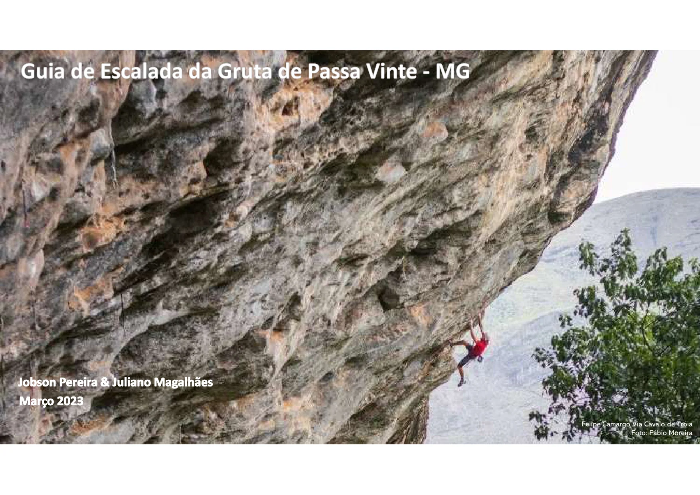
- **status_desenho_extraivel**: TEM_DESENHO_MAS_NAO_EXTRAIDO
- **botoes**:
  - **[0]**:
    - **uid**: H3jXZ6DqLBjwAC
    - **texto**: Capa
    - **destino**:
      - **secao_textual**:
        - **conteudo**:
            # Guia de Escalada da Gruta de Passa Vinte - MG
            
            |  |
            | :--: |
            | *Felipe Camargo Via Cavalo de Tróia. Foto: Fábio Moreira* |
            
            Jobson Pereira & Juliano Magalhães
            Março 2023
  - **[1]**:
    - **uid**: LDReczQyUAkHI0
    - **texto**: Advertência
    - **destino**:
      - **secao_textual**:
        - **conteudo**:
            # ADVERTÊNCIA
            
            - Sua segurança é sua responsabilidade, respeite seus limites e seja prudente.
            - As informações contidas nesse croqui servem apenas para indicar as vias de escalada, não assegurando a integridade física das proteções fixas das rotas indicadas.
            - Os autores não se responsabilizam pela utilização ou má interpretação das informações contidas nessa publicação.
            - A utilização de capacete é recomendável durante toda a permanência no setor acampamento.
            - Atenção para as serpentes! Recomenda-se o uso de perneiras ou galochas na trilha.
            - Proteja e respeite a natureza. Não retire nada, leve todo seu lixo de volta e não faça fogueira.
            - Respeite o silêncio. Evite levar equipamentos sonoros para os locais de escalada.
            - O acesso aos setores de escalada é feito através de propriedade particular. Dessa forma, tenha cuidado com os animais no pasto, feche todas as porteiras que abrir e cuidado ao estacionar seu veículo para não fechar o trânsito.
  - **[2]**:
    - **uid**: 3K5RAqqILNw0k2
    - **texto**: Apresentação
    - **destino**:
      - **secao_textual**:
        - **conteudo**:
            # APRESENTAÇÃO
            
            | 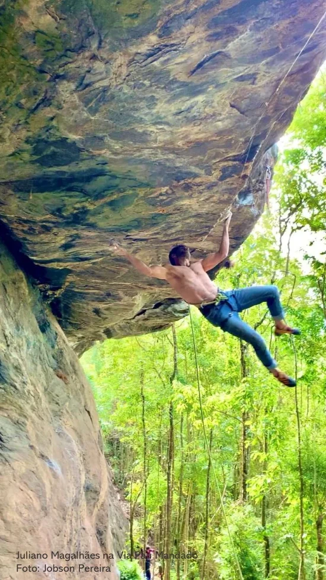 |
            | :--: |
            | *Juliano Magalhães na Via Pau Mandado. Foto: Jobson Pereira* |
            
            A Gruta de Passa Vinte começou a se tornar um destinos dos amantes da escalada esportiva em Novembro de 2008, quando um grupo de amigos iniciaram as primeiras conquistas no local. Desde então, os trabalhos de abertura de novas vias se tornaram incessantes pela qualidade da rocha, negatividade das vias abrigadas das chuvas e acesso relativamente tranquilo, com uma caminhada de 20 a 30 minutos.
            
            Atualmente, o setor possui aproximadamente 150 vias, com graduações que vão do IV a 11c, além de vários projetos de alto grau de dificuldade. Dentre essas rotas, há uma diversidade de estilos de escalada que tornam o local completo com vias verticais, negativas, positivas e tetos. A rocha predominante é o gnaisse que proporcionada uma diversidade de formações de agarras.
            
            No inverno o sol demora um pouco mais para sair da parede, ficando no positivo central até por volta de 11h e no setor vertical da chegada até 13h. Já no verão, o sol sai do positivo central por volta das 9h e no vertical da chegada por volta das 11h. Assim, planeje os horários e setores da sua escalada se quer fugir do sol.
  - **[3]**:
    - **uid**: TkMCJs4HxzXsq5
    - **texto**: Como Chegar
    - **destino**:
      - **secao_textual**:
        - **conteudo**:
            # COMO CHEGAR
            
            Coordenada geográfica e link do Google Maps da entrada da estrada de terra que dá acesso ao setor de escalada, que está a aproximadamente a 2,5 km do centro da cidade de Passa Vinte - MG.
            
            Coordenadas: -22.192972, -44.236583
            
            [https://goo.gl/maps/GV6WQ7tfJhWc2RxP7](https://goo.gl/maps/GV6WQ7tfJhWc2RxP7)
            
            Ao chegar nesse ponto do link acima seguir por aproximadamente 1 km na estrada de terra até a placa indicativa de acesso a trilha da Gruta de Passa Vinte.
  - **[4]**:
    - **uid**: W2Rva54M0yb1Ca
    - **texto**: Contatos
    - **destino**:
      - **secao_textual**:
        - **conteudo**:
            # CONTATOS
            
            | 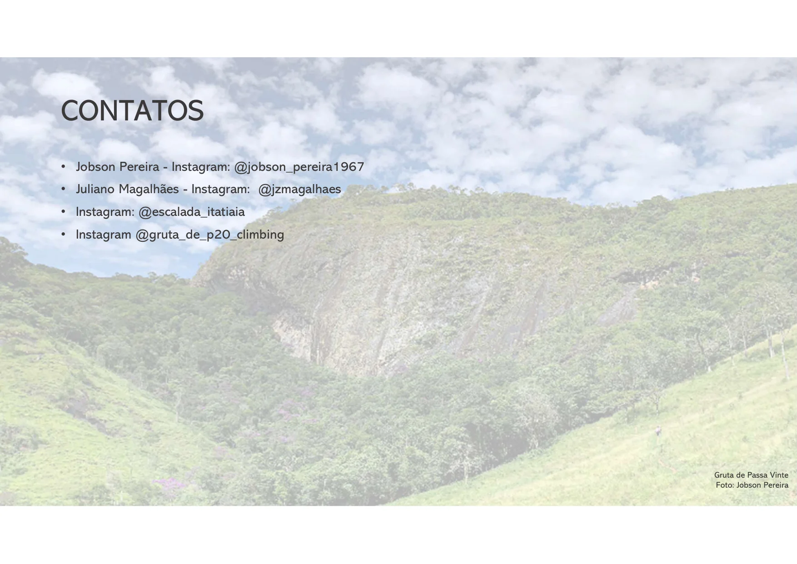 |
            | :--: |
            | *Gruta de Passa Vinte. Foto: Jobson Pereira* |
            
            - Jobson Pereira - Instagram: [@jobson_pereira1967](https://www.instagram.com/jobson_pereira1967)
            - Juliano Magalhães - Instagram: [@jzmagalhaes](https://www.instagram.com/jzmagalhaes)
            - Instagram: [@escalada_itatiaia](https://www.instagram.com/escalada_itatiaia)
            - Instagram: [@gruta_de_p20_climbing](https://www.instagram.com/gruta_de_p20_climbing)
- **ultima_migracao**: 5

## Parte: setor_chegada

### Setor (Pico: Gruta de Passa Vinte)

- **descricao**: 
- **nome**: Chegada
- **uid**: AiO7NbhclPX3uu
- **mapas**:
  - **[0]**:
    - **caminho_imagem_mapa**: 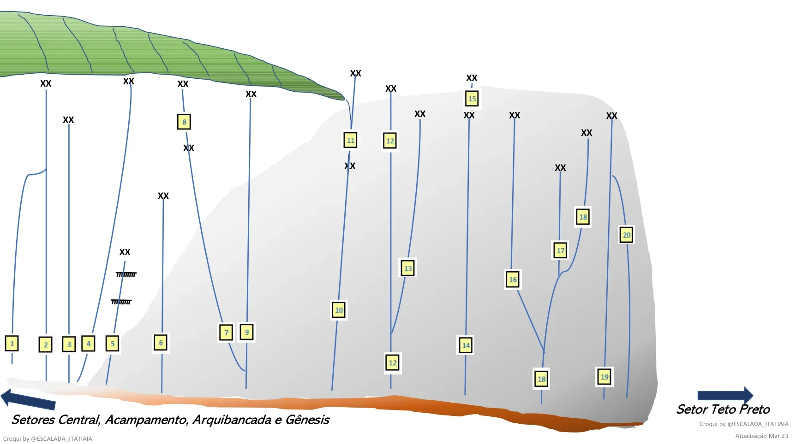
    - **largura_mapa**: 1725
    - **altura_mapa**: 964
    - **pontos_de_interesse**:
      - **[0]**:
        - **id**: DYqMe3Gnbh2cyS
        - **uid**: DYqMe3Gnbh2cyS
        - **rotulo**: 1
        - **retangulo**:
          - **x**: 15
          - **y**: 760
          - **comprimento**: 30
          - **largura**: 30
        - **label**: 1
      - **[1]**:
        - **id**: H9c4Uuv7nXdvD7
        - **uid**: H9c4Uuv7nXdvD7
        - **rotulo**: 2
        - **retangulo**:
          - **x**: 60
          - **y**: 760
          - **comprimento**: 30
          - **largura**: 30
        - **label**: 2
      - **[2]**:
        - **id**: vLObFO9rgkHY0q
        - **uid**: vLObFO9rgkHY0q
        - **rotulo**: 3
        - **retangulo**:
          - **x**: 95
          - **y**: 760
          - **comprimento**: 30
          - **largura**: 30
        - **label**: 3
      - **[3]**:
        - **id**: 6tWgwC9YJhLqit
        - **uid**: 6tWgwC9YJhLqit
        - **rotulo**: 4
        - **retangulo**:
          - **x**: 125
          - **y**: 760
          - **comprimento**: 30
          - **largura**: 30
        - **label**: 4
      - **[4]**:
        - **id**: Ideo1pDL7ymDLs
        - **uid**: Ideo1pDL7ymDLs
        - **rotulo**: 5
        - **retangulo**:
          - **x**: 160
          - **y**: 760
          - **comprimento**: 30
          - **largura**: 30
        - **label**: 5
      - **[5]**:
        - **id**: 38RBx5eEyiR8d6
        - **uid**: 38RBx5eEyiR8d6
        - **rotulo**: 6
        - **retangulo**:
          - **x**: 220
          - **y**: 760
          - **comprimento**: 30
          - **largura**: 30
        - **label**: 6
      - **[6]**:
        - **id**: aEAEbwdmZysYlJ
        - **uid**: aEAEbwdmZysYlJ
        - **rotulo**: 7
        - **retangulo**:
          - **x**: 315
          - **y**: 760
          - **comprimento**: 30
          - **largura**: 30
        - **label**: 7
      - **[7]**:
        - **id**: 9yNCSHdTuDSodb
        - **uid**: 9yNCSHdTuDSodb
        - **rotulo**: 8
        - **retangulo**:
          - **x**: 260
          - **y**: 265
          - **comprimento**: 30
          - **largura**: 30
        - **label**: 8
      - **[8]**:
        - **id**: BjV8UC2wbatO7W
        - **uid**: BjV8UC2wbatO7W
        - **rotulo**: 9
        - **retangulo**:
          - **x**: 345
          - **y**: 760
          - **comprimento**: 30
          - **largura**: 30
        - **label**: 9
      - **[9]**:
        - **id**: tk1uYaGhfEAHpe
        - **uid**: tk1uYaGhfEAHpe
        - **rotulo**: 10
        - **retangulo**:
          - **x**: 490
          - **y**: 695
          - **comprimento**: 30
          - **largura**: 30
        - **label**: 10
      - **[10]**:
        - **id**: UKX4QK26Jqps4V
        - **uid**: UKX4QK26Jqps4V
        - **rotulo**: 11
        - **retangulo**:
          - **x**: 505
          - **y**: 310
          - **comprimento**: 30
          - **largura**: 30
        - **label**: 11
      - **[11]**:
        - **id**: hxYzYkUrU6IgPD
        - **uid**: hxYzYkUrU6IgPD
        - **rotulo**: 12
        - **retangulo**:
          - **x**: 565
          - **y**: 315
          - **comprimento**: 30
          - **largura**: 30
        - **label**: 12
      - **[12]**:
        - **id**: 2cuCqwerHCGM2I
        - **uid**: 2cuCqwerHCGM2I
        - **rotulo**: 12
        - **retangulo**:
          - **x**: 575
          - **y**: 805
          - **comprimento**: 30
          - **largura**: 30
        - **label**: 12
      - **[13]**:
        - **id**: z8MZSSknZqL58v
        - **uid**: z8MZSSknZqL58v
        - **rotulo**: 13
        - **retangulo**:
          - **x**: 605
          - **y**: 610
          - **comprimento**: 30
          - **largura**: 30
        - **label**: 13
      - **[14]**:
        - **id**: zMwKoyXQLbSTKl
        - **uid**: zMwKoyXQLbSTKl
        - **rotulo**: 14
        - **retangulo**:
          - **x**: 695
          - **y**: 785
          - **comprimento**: 30
          - **largura**: 30
        - **label**: 14
      - **[15]**:
        - **id**: A4wGd8hFu2uUKt
        - **uid**: A4wGd8hFu2uUKt
        - **rotulo**: 15
        - **retangulo**:
          - **x**: 695
          - **y**: 215
          - **comprimento**: 30
          - **largura**: 30
        - **label**: 15
      - **[16]**:
        - **id**: P2ddfFaRJn5yyV
        - **uid**: P2ddfFaRJn5yyV
        - **rotulo**: 16
        - **retangulo**:
          - **x**: 755
          - **y**: 640
          - **comprimento**: 30
          - **largura**: 30
        - **label**: 16
      - **[17]**:
        - **id**: 9hIUMXn4hO78pv
        - **uid**: 9hIUMXn4hO78pv
        - **rotulo**: 17
        - **retangulo**:
          - **x**: 835
          - **y**: 570
          - **comprimento**: 30
          - **largura**: 30
        - **label**: 17
      - **[18]**:
        - **id**: YmaavivWB5caJH
        - **uid**: YmaavivWB5caJH
        - **rotulo**: 18
        - **retangulo**:
          - **x**: 865
          - **y**: 485
          - **comprimento**: 30
          - **largura**: 30
        - **label**: 18
      - **[19]**:
        - **id**: N8Anok5ApSewzF
        - **uid**: N8Anok5ApSewzF
        - **rotulo**: 18
        - **retangulo**:
          - **x**: 805
          - **y**: 875
          - **comprimento**: 30
          - **largura**: 30
        - **label**: 18
      - **[20]**:
        - **id**: Mvr819hkGOe46I
        - **uid**: Mvr819hkGOe46I
        - **rotulo**: 19
        - **retangulo**:
          - **x**: 905
          - **y**: 865
          - **comprimento**: 30
          - **largura**: 30
        - **label**: 19
      - **[21]**:
        - **id**: Hav9EZSFOT9Koh
        - **uid**: Hav9EZSFOT9Koh
        - **rotulo**: 20
        - **retangulo**:
          - **x**: 935
          - **y**: 530
          - **comprimento**: 30
          - **largura**: 30
        - **label**: 20
      - **[22]**:
        - **id**: Wp1aFwR6jXt3Sl
        - **uid**: Wp1aFwR6jXt3Sl
        - **rotulo**: Setores Central, Acampamento, Arquibancada e Gênesis
        - **retangulo**:
          - **x**: 350
          - **y**: 930
          - **comprimento**: 500
          - **largura**: 30
        - **label**: Setores Central, Acampamento, Arquibancada e Gênesis
      - **[23]**:
        - **id**: ggfQ5ieTfRmlAM
        - **uid**: ggfQ5ieTfRmlAM
        - **rotulo**: Setor Teto Preto
        - **retangulo**:
          - **x**: 1050
          - **y**: 900
          - **comprimento**: 150
          - **largura**: 30
        - **label**: Setor Teto Preto
    - **referencias**:
      - **[0]**:
        - **alvo_uid**: n5J8CSTT4kKRmC
        - **pontos_uids**:
          - DYqMe3Gnbh2cyS
        - **escalada**: Fake News
        - **ids**:
          - DYqMe3Gnbh2cyS
      - **[1]**:
        - **alvo_uid**: AjjYid5oyOZwLc
        - **pontos_uids**:
          - H9c4Uuv7nXdvD7
        - **escalada**: Caliba
        - **ids**:
          - H9c4Uuv7nXdvD7
      - **[2]**:
        - **alvo_uid**: qfmr7AMTq2VLlF
        - **pontos_uids**:
          - vLObFO9rgkHY0q
        - **escalada**: Jack Sparrow
        - **ids**:
          - vLObFO9rgkHY0q
      - **[3]**:
        - **alvo_uid**: NxqyPlwADOl0tE
        - **pontos_uids**:
          - 6tWgwC9YJhLqit
        - **escalada**: Monty Python
        - **ids**:
          - 6tWgwC9YJhLqit
      - **[4]**:
        - **alvo_uid**: YVgM9k3lj8gp7z
        - **pontos_uids**:
          - Ideo1pDL7ymDLs
        - **escalada**: Dengoso
        - **ids**:
          - Ideo1pDL7ymDLs
      - **[5]**:
        - **alvo_uid**: 6zyvag0J0Ti6AH
        - **pontos_uids**:
          - 38RBx5eEyiR8d6
        - **escalada**: Livre Arbítrio
        - **ids**:
          - 38RBx5eEyiR8d6
      - **[6]**:
        - **alvo_uid**: dooRKTkjg1TWL2
        - **pontos_uids**:
          - aEAEbwdmZysYlJ
        - **escalada**: Mad Max P1
        - **ids**:
          - aEAEbwdmZysYlJ
      - **[7]**:
        - **alvo_uid**: J5dsUvYGs9dIfW
        - **pontos_uids**:
          - 9yNCSHdTuDSodb
          - 9yNCSHdTuDSodb
        - **escalada**: Mad Max P2
        - **ids**:
          - 9yNCSHdTuDSodb
          - 9yNCSHdTuDSodb
      - **[8]**:
        - **alvo_uid**: W2Cjw929xclZIA
        - **pontos_uids**:
          - BjV8UC2wbatO7W
        - **escalada**: Além da Cúpula do Trovão
        - **ids**:
          - BjV8UC2wbatO7W
      - **[9]**:
        - **alvo_uid**: xd3m6rNzZF1jit
        - **pontos_uids**:
          - tk1uYaGhfEAHpe
        - **escalada**: Perestroika P1
        - **ids**:
          - tk1uYaGhfEAHpe
      - **[10]**:
        - **alvo_uid**: IdDHMEl2A1HbYd
        - **pontos_uids**:
          - UKX4QK26Jqps4V
          - UKX4QK26Jqps4V
        - **escalada**: Perestroika P2
        - **ids**:
          - UKX4QK26Jqps4V
          - UKX4QK26Jqps4V
      - **[11]**:
        - **alvo_uid**: uEpJuGA5SWaQ62
        - **pontos_uids**:
          - 2cuCqwerHCGM2I
        - **escalada**: Guliver
        - **ids**:
          - 2cuCqwerHCGM2I
      - **[12]**:
        - **alvo_uid**: B7x2ZptW0afIRK
        - **pontos_uids**:
          - z8MZSSknZqL58v
        - **escalada**: Ben Hur
        - **ids**:
          - z8MZSSknZqL58v
      - **[13]**:
        - **alvo_uid**: JVOTXndrnTvvrQ
        - **pontos_uids**:
          - zMwKoyXQLbSTKl
        - **escalada**: Carmina Burana P1
        - **ids**:
          - zMwKoyXQLbSTKl
      - **[14]**:
        - **alvo_uid**: V4tRFak3meniUk
        - **pontos_uids**:
          - A4wGd8hFu2uUKt
          - A4wGd8hFu2uUKt
        - **escalada**: Carmina Burana P2
        - **ids**:
          - A4wGd8hFu2uUKt
          - A4wGd8hFu2uUKt
      - **[15]**:
        - **alvo_uid**: uJN6KZdNNRnEAk
        - **pontos_uids**:
          - P2ddfFaRJn5yyV
        - **escalada**: 17 Quedas
        - **ids**:
          - P2ddfFaRJn5yyV
      - **[16]**:
        - **alvo_uid**: Vnl7ieN4CjKIuD
        - **pontos_uids**:
          - 9hIUMXn4hO78pv
        - **escalada**: 8d
        - **ids**:
          - 9hIUMXn4hO78pv
      - **[17]**:
        - **alvo_uid**: RHIR6wEjMYRqih
        - **pontos_uids**:
          - N8Anok5ApSewzF
        - **escalada**: Cápsula do Tempo
        - **ids**:
          - N8Anok5ApSewzF
      - **[18]**:
        - **alvo_uid**: O8OTvfEFUAChky
        - **pontos_uids**:
          - Mvr819hkGOe46I
        - **escalada**: Buraco Negro
        - **ids**:
          - Mvr819hkGOe46I
      - **[19]**:
        - **alvo_uid**: T9fg7GxDpsjlgp
        - **pontos_uids**:
          - Hav9EZSFOT9Koh
        - **escalada**: Macunaína
        - **ids**:
          - Hav9EZSFOT9Koh
- **escaladas**:
  - **[0]**:
    - **uid**: n5J8CSTT4kKRmC
    - **via_esportiva**:
      - **nome**: Fake News
      - **dificuldade**: BR_9C
  - **[1]**:
    - **uid**: AjjYid5oyOZwLc
    - **via_esportiva**:
      - **nome**: Caliba
      - **dificuldade**: BR_9B_BARRA_9C
  - **[2]**:
    - **uid**: qfmr7AMTq2VLlF
    - **via_esportiva**:
      - **nome**: Jack Sparrow
      - **dificuldade**: BR_9B
  - **[3]**:
    - **uid**: NxqyPlwADOl0tE
    - **via_esportiva**:
      - **nome**: Monty Python
      - **dificuldade**: BR_9A
  - **[4]**:
    - **uid**: YVgM9k3lj8gp7z
    - **via_esportiva**:
      - **nome**: Dengoso
      - **dificuldade**: BR_6
  - **[5]**:
    - **uid**: 6zyvag0J0Ti6AH
    - **via_esportiva**:
      - **nome**: Livre Arbítrio
      - **dificuldade**: BR_8B
  - **[6]**:
    - **uid**: dooRKTkjg1TWL2
    - **via_esportiva**:
      - **nome**: Mad Max P1
      - **dificuldade**: BR_8C
  - **[7]**:
    - **uid**: J5dsUvYGs9dIfW
    - **via_esportiva**:
      - **nome**: Mad Max P2
      - **dificuldade**: BR_9C
  - **[8]**:
    - **uid**: W2Cjw929xclZIA
    - **via_esportiva**:
      - **nome**: Além da Cúpula do Trovão
      - **dificuldade**: BR_9A
  - **[9]**:
    - **uid**: xd3m6rNzZF1jit
    - **via_esportiva**:
      - **nome**: Perestroika P1
      - **dificuldade**: BR_9B
  - **[10]**:
    - **uid**: IdDHMEl2A1HbYd
    - **via_esportiva**:
      - **nome**: Perestroika P2
      - **dificuldade**: BR_9C
  - **[11]**:
    - **uid**: uEpJuGA5SWaQ62
    - **via_esportiva**:
      - **nome**: Guliver
      - **dificuldade**: BR_10A
  - **[12]**:
    - **uid**: B7x2ZptW0afIRK
    - **via_esportiva**:
      - **nome**: Ben Hur
      - **dificuldade**: BR_9C
  - **[13]**:
    - **uid**: JVOTXndrnTvvrQ
    - **via_esportiva**:
      - **nome**: Carmina Burana P1
      - **dificuldade**: BR_9B
  - **[14]**:
    - **uid**: V4tRFak3meniUk
    - **via_esportiva**:
      - **nome**: Carmina Burana P2
      - **dificuldade**: BR_10A
  - **[15]**:
    - **uid**: uJN6KZdNNRnEAk
    - **via_esportiva**:
      - **nome**: 17 Quedas
      - **dificuldade**: BR_9C
  - **[16]**:
    - **uid**: Vnl7ieN4CjKIuD
    - **via_esportiva**:
      - **nome**: 8d
      - **dificuldade**: BR_8C
  - **[17]**:
    - **uid**: RHIR6wEjMYRqih
    - **via_esportiva**:
      - **nome**: Cápsula do Tempo
      - **dificuldade**: BR_8C_BARRA_9A
  - **[18]**:
    - **uid**: O8OTvfEFUAChky
    - **via_esportiva**:
      - **nome**: Buraco Negro
      - **dificuldade**: BR_9B
  - **[19]**:
    - **uid**: T9fg7GxDpsjlgp
    - **via_esportiva**:
      - **nome**: Macunaína
      - **dificuldade**: BR_9B
- **precomputados**:
  - **total_escaladas**: 20
  - **total_esportivas**: 20

## Parte: setor_sunshine_e_teto_preto

### Setor (Pico: Gruta de Passa Vinte)

- **descricao**: 
- **nome**: Sunshine & Teto Preto
- **uid**: viX8aQd4Az2cTe
- **mapas**:
  - **[0]**:
    - **caminho_imagem_mapa**: 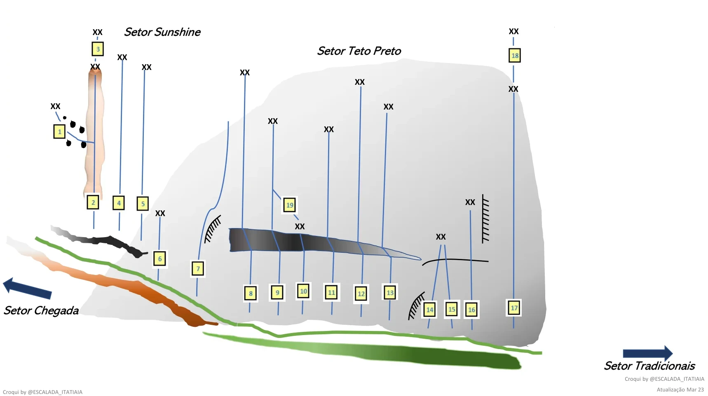
    - **largura_mapa**: 1718
    - **altura_mapa**: 962
    - **pontos_de_interesse**:
      - **[0]**:
        - **id**: o6PavNJXse8hVj
        - **uid**: o6PavNJXse8hVj
        - **rotulo**: 1
        - **retangulo**:
          - **x**: 130
          - **y**: 315
          - **comprimento**: 30
          - **largura**: 30
        - **label**: 1
      - **[1]**:
        - **id**: oamV3V5zztNcwK
        - **uid**: oamV3V5zztNcwK
        - **rotulo**: 2
        - **retangulo**:
          - **x**: 215
          - **y**: 510
          - **comprimento**: 30
          - **largura**: 30
        - **label**: 2
      - **[2]**:
        - **id**: 9rN2lgEBetVgUu
        - **uid**: 9rN2lgEBetVgUu
        - **rotulo**: 3
        - **retangulo**:
          - **x**: 218
          - **y**: 108
          - **comprimento**: 30
          - **largura**: 30
        - **label**: 3
      - **[3]**:
        - **id**: s3eyMLkPiaNQiK
        - **uid**: s3eyMLkPiaNQiK
        - **rotulo**: 4
        - **retangulo**:
          - **x**: 275
          - **y**: 510
          - **comprimento**: 30
          - **largura**: 30
        - **label**: 4
      - **[4]**:
        - **id**: 82tmvVzkcbpJEP
        - **uid**: 82tmvVzkcbpJEP
        - **rotulo**: 5
        - **retangulo**:
          - **x**: 335
          - **y**: 510
          - **comprimento**: 30
          - **largura**: 30
        - **label**: 5
      - **[5]**:
        - **id**: ZlQQD3HCWuPU0R
        - **uid**: ZlQQD3HCWuPU0R
        - **rotulo**: 6
        - **retangulo**:
          - **x**: 375
          - **y**: 650
          - **comprimento**: 30
          - **largura**: 30
        - **label**: 6
      - **[6]**:
        - **id**: Ii9EXbUqu8txKw
        - **uid**: Ii9EXbUqu8txKw
        - **rotulo**: 7
        - **retangulo**:
          - **x**: 465
          - **y**: 675
          - **comprimento**: 30
          - **largura**: 30
        - **label**: 7
      - **[7]**:
        - **id**: HLu1g4vKD9MvDN
        - **uid**: HLu1g4vKD9MvDN
        - **rotulo**: 8
        - **retangulo**:
          - **x**: 600
          - **y**: 740
          - **comprimento**: 30
          - **largura**: 30
        - **label**: 8
      - **[8]**:
        - **id**: BIBkZ5HceM0b3V
        - **uid**: BIBkZ5HceM0b3V
        - **rotulo**: 9
        - **retangulo**:
          - **x**: 665
          - **y**: 740
          - **comprimento**: 30
          - **largura**: 30
        - **label**: 9
      - **[9]**:
        - **id**: 9w2VDFcxGUFBC0
        - **uid**: 9w2VDFcxGUFBC0
        - **rotulo**: 10
        - **retangulo**:
          - **x**: 720
          - **y**: 740
          - **comprimento**: 30
          - **largura**: 30
        - **label**: 10
      - **[10]**:
        - **id**: 6IpwmSyM7NXSWw
        - **uid**: 6IpwmSyM7NXSWw
        - **rotulo**: 11
        - **retangulo**:
          - **x**: 795
          - **y**: 740
          - **comprimento**: 30
          - **largura**: 30
        - **label**: 11
      - **[11]**:
        - **id**: 1a66SSuUOASzRS
        - **uid**: 1a66SSuUOASzRS
        - **rotulo**: 12
        - **retangulo**:
          - **x**: 870
          - **y**: 740
          - **comprimento**: 30
          - **largura**: 30
        - **label**: 12
      - **[12]**:
        - **id**: z47Cj26bAi3Tsj
        - **uid**: z47Cj26bAi3Tsj
        - **rotulo**: 13
        - **retangulo**:
          - **x**: 945
          - **y**: 740
          - **comprimento**: 30
          - **largura**: 30
        - **label**: 13
      - **[13]**:
        - **id**: lDsU35NStAINCc
        - **uid**: lDsU35NStAINCc
        - **rotulo**: 14
        - **retangulo**:
          - **x**: 1040
          - **y**: 785
          - **comprimento**: 30
          - **largura**: 30
        - **label**: 14
      - **[14]**:
        - **id**: sXC1f39hbG8frR
        - **uid**: sXC1f39hbG8frR
        - **rotulo**: 15
        - **retangulo**:
          - **x**: 1090
          - **y**: 785
          - **comprimento**: 30
          - **largura**: 30
        - **label**: 15
      - **[15]**:
        - **id**: frvR1YD8fob2zA
        - **uid**: frvR1YD8fob2zA
        - **rotulo**: 16
        - **retangulo**:
          - **x**: 1145
          - **y**: 785
          - **comprimento**: 30
          - **largura**: 30
        - **label**: 16
      - **[16]**:
        - **id**: OY8Lnl9aimjZVR
        - **uid**: OY8Lnl9aimjZVR
        - **rotulo**: 17
        - **retangulo**:
          - **x**: 1250
          - **y**: 775
          - **comprimento**: 30
          - **largura**: 30
        - **label**: 17
      - **[17]**:
        - **id**: UeuQtX6iqTR1RG
        - **uid**: UeuQtX6iqTR1RG
        - **rotulo**: 18
        - **retangulo**:
          - **x**: 1230
          - **y**: 122
          - **comprimento**: 30
          - **largura**: 30
        - **label**: 18
      - **[18]**:
        - **id**: zuwOkLPZiyrtS0
        - **uid**: zuwOkLPZiyrtS0
        - **rotulo**: 19
        - **retangulo**:
          - **x**: 682
          - **y**: 487
          - **comprimento**: 30
          - **largura**: 30
        - **label**: 19
      - **[19]**:
        - **id**: TIrivuogFugDp8
        - **uid**: TIrivuogFugDp8
        - **rotulo**: Setor Chegada
        - **retangulo**:
          - **x**: 10
          - **y**: 800
          - **comprimento**: 200
          - **largura**: 30
        - **label**: Setor Chegada
      - **[20]**:
        - **id**: liXjFXUpLKSziG
        - **uid**: liXjFXUpLKSziG
        - **rotulo**: Setor Tradicionais
        - **retangulo**:
          - **x**: 1500
          - **y**: 940
          - **comprimento**: 250
          - **largura**: 30
        - **label**: Setor Tradicionais
    - **referencias**:
      - **[0]**:
        - **alvo_uid**: hqI11rJ8W5yk2U
        - **pontos_uids**:
          - o6PavNJXse8hVj
        - **escalada**: Ementhal
        - **ids**:
          - o6PavNJXse8hVj
      - **[1]**:
        - **alvo_uid**: YCK6C1EjvM4VAP
        - **pontos_uids**:
          - oamV3V5zztNcwK
        - **escalada**: Sunshine
        - **ids**:
          - oamV3V5zztNcwK
      - **[2]**:
        - **alvo_uid**: HA8vivFsWqUYQW
        - **pontos_uids**:
          - 9rN2lgEBetVgUu
          - 9rN2lgEBetVgUu
        - **escalada**: Ext. Sunshine (Projeto)
        - **ids**:
          - 9rN2lgEBetVgUu
          - 9rN2lgEBetVgUu
      - **[3]**:
        - **alvo_uid**: ehDLgKwOEaDv2b
        - **pontos_uids**:
          - s3eyMLkPiaNQiK
        - **escalada**: Luna
        - **ids**:
          - s3eyMLkPiaNQiK
      - **[4]**:
        - **alvo_uid**: 9GR57GrnWJneVa
        - **pontos_uids**:
          - 82tmvVzkcbpJEP
        - **escalada**: Freddie Mercury
        - **ids**:
          - 82tmvVzkcbpJEP
      - **[5]**:
        - **alvo_uid**: GRoxKK3QvmQ5Ca
        - **pontos_uids**:
          - ZlQQD3HCWuPU0R
        - **escalada**: Ariete
        - **ids**:
          - ZlQQD3HCWuPU0R
      - **[6]**:
        - **alvo_uid**: QJzgDDKnnpNldv
        - **pontos_uids**:
          - Ii9EXbUqu8txKw
        - **escalada**: Eunuco (Projeto)
        - **ids**:
          - Ii9EXbUqu8txKw
      - **[7]**:
        - **alvo_uid**: ouAZnfed0sSFKB
        - **pontos_uids**:
          - HLu1g4vKD9MvDN
        - **escalada**: Pau Mandado
        - **ids**:
          - HLu1g4vKD9MvDN
      - **[8]**:
        - **alvo_uid**: 6IHqW7Id3VjC18
        - **pontos_uids**:
          - BIBkZ5HceM0b3V
        - **escalada**: Imperatriz
        - **ids**:
          - BIBkZ5HceM0b3V
      - **[9]**:
        - **alvo_uid**: CaGnhl3tMnwEEz
        - **pontos_uids**:
          - 9w2VDFcxGUFBC0
        - **escalada**: Casamento de Viúva
        - **ids**:
          - 9w2VDFcxGUFBC0
      - **[10]**:
        - **alvo_uid**: PPpLej1m8Rs15A
        - **pontos_uids**:
          - 6IpwmSyM7NXSWw
        - **escalada**: Manda Chuva (Projeto)
        - **ids**:
          - 6IpwmSyM7NXSWw
      - **[11]**:
        - **alvo_uid**: CC1FfHwmwI3Z87
        - **pontos_uids**:
          - 1a66SSuUOASzRS
        - **escalada**: Celibato
        - **ids**:
          - 1a66SSuUOASzRS
      - **[12]**:
        - **alvo_uid**: mmgm4pdEg0wvAU
        - **pontos_uids**:
          - z47Cj26bAi3Tsj
        - **escalada**: Manicaca
        - **ids**:
          - z47Cj26bAi3Tsj
      - **[13]**:
        - **alvo_uid**: WtPMFGj2mQSzjc
        - **pontos_uids**:
          - lDsU35NStAINCc
        - **escalada**: Ghidorah
        - **ids**:
          - lDsU35NStAINCc
      - **[14]**:
        - **alvo_uid**: YGzuoVFDvNOEYK
        - **pontos_uids**:
          - sXC1f39hbG8frR
        - **escalada**: Hidra
        - **ids**:
          - sXC1f39hbG8frR
      - **[15]**:
        - **alvo_uid**: 7I5EF0lDFIhZzg
        - **pontos_uids**:
          - frvR1YD8fob2zA
        - **escalada**: Medusa
        - **ids**:
          - frvR1YD8fob2zA
      - **[16]**:
        - **alvo_uid**: xlhUzNq1Av9HMQ
        - **pontos_uids**:
          - OY8Lnl9aimjZVR
        - **escalada**: Kátia Flávia
        - **ids**:
          - OY8Lnl9aimjZVR
      - **[17]**:
        - **alvo_uid**: WQww3YSUlXmTpd
        - **pontos_uids**:
          - UeuQtX6iqTR1RG
          - UeuQtX6iqTR1RG
        - **escalada**: Ext. Kátia Flávia
        - **ids**:
          - UeuQtX6iqTR1RG
          - UeuQtX6iqTR1RG
      - **[18]**:
        - **alvo_uid**: sfPbzqDW7cKUKi
        - **pontos_uids**:
          - zuwOkLPZiyrtS0
        - **escalada**: Casamento da Imperatriz (Projeto)
        - **ids**:
          - zuwOkLPZiyrtS0
- **escaladas**:
  - **[0]**:
    - **uid**: hqI11rJ8W5yk2U
    - **via_esportiva**:
      - **nome**: Ementhal
      - **dificuldade**: BR_7C
  - **[1]**:
    - **uid**: YCK6C1EjvM4VAP
    - **via_esportiva**:
      - **nome**: Sunshine
      - **dificuldade**: BR_7C
  - **[2]**:
    - **uid**: HA8vivFsWqUYQW
    - **via_esportiva**:
      - **nome**: Ext. Sunshine (Projeto)
      - **dificuldade**: PROJETO
  - **[3]**:
    - **uid**: ehDLgKwOEaDv2b
    - **via_esportiva**:
      - **nome**: Luna
      - **dificuldade**: BR_8A_BARRA_8B
  - **[4]**:
    - **uid**: 9GR57GrnWJneVa
    - **via_esportiva**:
      - **nome**: Freddie Mercury
      - **dificuldade**: BR_9A
  - **[5]**:
    - **uid**: GRoxKK3QvmQ5Ca
    - **via_esportiva**:
      - **nome**: Ariete
      - **dificuldade**: BR_7C
  - **[6]**:
    - **uid**: QJzgDDKnnpNldv
    - **via_esportiva**:
      - **nome**: Eunuco (Projeto)
      - **dificuldade**: PROJETO
  - **[7]**:
    - **uid**: ouAZnfed0sSFKB
    - **via_esportiva**:
      - **nome**: Pau Mandado
      - **dificuldade**: BR_9C_BARRA_10A
      - **destaque**: True
  - **[8]**:
    - **uid**: 6IHqW7Id3VjC18
    - **via_esportiva**:
      - **nome**: Imperatriz
      - **dificuldade**: BR_9B
  - **[9]**:
    - **uid**: CaGnhl3tMnwEEz
    - **via_esportiva**:
      - **nome**: Casamento de Viúva
      - **dificuldade**: BR_8A
  - **[10]**:
    - **uid**: PPpLej1m8Rs15A
    - **via_esportiva**:
      - **nome**: Manda Chuva (Projeto)
      - **dificuldade**: PROJETO
  - **[11]**:
    - **uid**: CC1FfHwmwI3Z87
    - **via_esportiva**:
      - **nome**: Celibato
      - **dificuldade**: BR_8C
  - **[12]**:
    - **uid**: mmgm4pdEg0wvAU
    - **via_esportiva**:
      - **nome**: Manicaca
      - **dificuldade**: BR_7C_BARRA_8A
  - **[13]**:
    - **uid**: WtPMFGj2mQSzjc
    - **via_esportiva**:
      - **nome**: Ghidorah
      - **dificuldade**: BR_6
  - **[14]**:
    - **uid**: YGzuoVFDvNOEYK
    - **via_esportiva**:
      - **nome**: Hidra
      - **dificuldade**: BR_5
  - **[15]**:
    - **uid**: 7I5EF0lDFIhZzg
    - **via_esportiva**:
      - **nome**: Medusa
      - **dificuldade**: BR_5
  - **[16]**:
    - **uid**: xlhUzNq1Av9HMQ
    - **via_esportiva**:
      - **nome**: Kátia Flávia
      - **dificuldade**: BR_7A
  - **[17]**:
    - **uid**: WQww3YSUlXmTpd
    - **via_esportiva**:
      - **nome**: Ext. Kátia Flávia
      - **dificuldade**: BR_7A
  - **[18]**:
    - **uid**: sfPbzqDW7cKUKi
    - **via_esportiva**:
      - **nome**: Casamento da Imperatriz (Projeto)
      - **dificuldade**: PROJETO
- **precomputados**:
  - **total_escaladas**: 19
  - **total_esportivas**: 19

## Parte: setor_positivo_central

### Setor (Pico: Gruta de Passa Vinte)

- **descricao**: 
- **nome**: ”Positivo” Central
- **uid**: oQDOpSrgvgbJR2
- **mapas**:
  - **[0]**:
    - **caminho_imagem_mapa**: 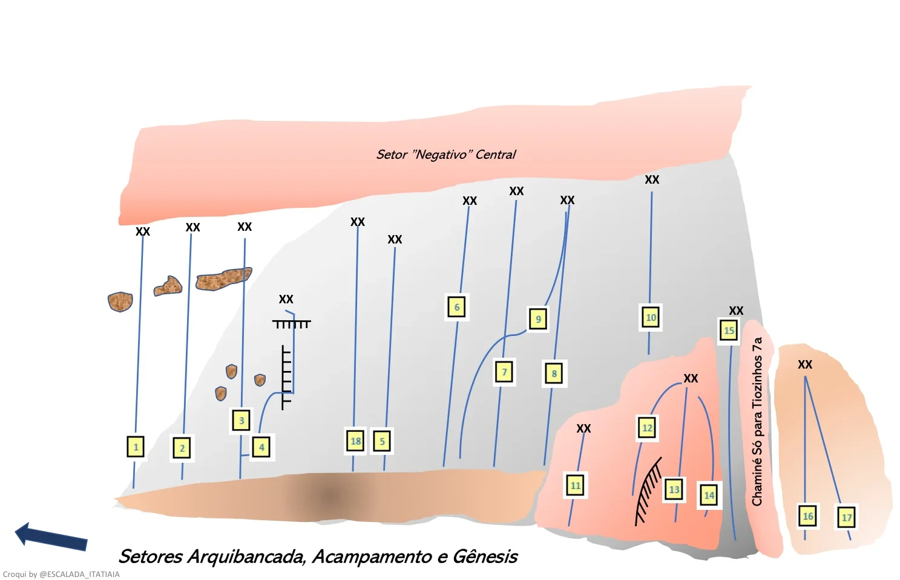
    - **largura_mapa**: 1487
    - **altura_mapa**: 960
    - **pontos_de_interesse**:
      - **[0]**:
        - **id**: HqOnp0bd5u31ah
        - **uid**: HqOnp0bd5u31ah
        - **rotulo**: 1
        - **retangulo**:
          - **x**: 130
          - **y**: 740
          - **comprimento**: 30
          - **largura**: 30
        - **label**: 1
      - **[1]**:
        - **id**: B94OmDyrhvOZ0N
        - **uid**: B94OmDyrhvOZ0N
        - **rotulo**: 2
        - **retangulo**:
          - **x**: 275
          - **y**: 740
          - **comprimento**: 30
          - **largura**: 30
        - **label**: 2
      - **[2]**:
        - **id**: TUp7905rAqT2b0
        - **uid**: TUp7905rAqT2b0
        - **rotulo**: 3
        - **retangulo**:
          - **x**: 375
          - **y**: 700
          - **comprimento**: 30
          - **largura**: 30
        - **label**: 3
      - **[3]**:
        - **id**: Px3NIywwO41Bii
        - **uid**: Px3NIywwO41Bii
        - **rotulo**: 4
        - **retangulo**:
          - **x**: 410
          - **y**: 740
          - **comprimento**: 30
          - **largura**: 30
        - **label**: 4
      - **[4]**:
        - **id**: gJrktiXqkI6yiv
        - **uid**: gJrktiXqkI6yiv
        - **rotulo**: 5
        - **retangulo**:
          - **x**: 620
          - **y**: 730
          - **comprimento**: 30
          - **largura**: 30
        - **label**: 5
      - **[5]**:
        - **id**: pFpgMzYMdqtvtn
        - **uid**: pFpgMzYMdqtvtn
        - **rotulo**: 6
        - **retangulo**:
          - **x**: 740
          - **y**: 505
          - **comprimento**: 30
          - **largura**: 30
        - **label**: 6
      - **[6]**:
        - **id**: sJRZolZXKv7RqD
        - **uid**: sJRZolZXKv7RqD
        - **rotulo**: 7
        - **retangulo**:
          - **x**: 825
          - **y**: 610
          - **comprimento**: 30
          - **largura**: 30
        - **label**: 7
      - **[7]**:
        - **id**: WUe1G7jPc1tvB8
        - **uid**: WUe1G7jPc1tvB8
        - **rotulo**: 8
        - **retangulo**:
          - **x**: 910
          - **y**: 615
          - **comprimento**: 30
          - **largura**: 30
        - **label**: 8
      - **[8]**:
        - **id**: 92y8nso219wVxp
        - **uid**: 92y8nso219wVxp
        - **rotulo**: 9
        - **retangulo**:
          - **x**: 875
          - **y**: 520
          - **comprimento**: 30
          - **largura**: 30
        - **label**: 9
      - **[9]**:
        - **id**: 0beOHOVLTV7YBk
        - **uid**: 0beOHOVLTV7YBk
        - **rotulo**: 10
        - **retangulo**:
          - **x**: 1080
          - **y**: 520
          - **comprimento**: 30
          - **largura**: 30
        - **label**: 10
      - **[10]**:
        - **id**: oZMqv2aaWcxEim
        - **uid**: oZMqv2aaWcxEim
        - **rotulo**: 11
        - **retangulo**:
          - **x**: 925
          - **y**: 785
          - **comprimento**: 30
          - **largura**: 30
        - **label**: 11
      - **[11]**:
        - **id**: JCyzOuoPQYalgZ
        - **uid**: JCyzOuoPQYalgZ
        - **rotulo**: 12
        - **retangulo**:
          - **x**: 1075
          - **y**: 710
          - **comprimento**: 30
          - **largura**: 30
        - **label**: 12
      - **[12]**:
        - **id**: nMUOdM21P80q3S
        - **uid**: nMUOdM21P80q3S
        - **rotulo**: 13
        - **retangulo**:
          - **x**: 1120
          - **y**: 830
          - **comprimento**: 30
          - **largura**: 30
        - **label**: 13
      - **[13]**:
        - **id**: QV7FaGXVQO5SaE
        - **uid**: QV7FaGXVQO5SaE
        - **rotulo**: 14
        - **retangulo**:
          - **x**: 1175
          - **y**: 820
          - **comprimento**: 30
          - **largura**: 30
        - **label**: 14
      - **[14]**:
        - **id**: 0Rwpv7a52bx3Ut
        - **uid**: 0Rwpv7a52bx3Ut
        - **rotulo**: 15
        - **retangulo**:
          - **x**: 1179
          - **y**: 528
          - **comprimento**: 30
          - **largura**: 30
        - **label**: 15
      - **[15]**:
        - **id**: cuUXjXU2ml8WPP
        - **uid**: cuUXjXU2ml8WPP
        - **rotulo**: 16
        - **retangulo**:
          - **x**: 1350
          - **y**: 860
          - **comprimento**: 30
          - **largura**: 30
        - **label**: 16
      - **[16]**:
        - **id**: EQauhBg7Fc0bFW
        - **uid**: EQauhBg7Fc0bFW
        - **rotulo**: 17
        - **retangulo**:
          - **x**: 1420
          - **y**: 860
          - **comprimento**: 30
          - **largura**: 30
        - **label**: 17
      - **[17]**:
        - **id**: iRZRfAdwzw72WI
        - **uid**: iRZRfAdwzw72WI
        - **rotulo**: 18
        - **retangulo**:
          - **x**: 565
          - **y**: 730
          - **comprimento**: 30
          - **largura**: 30
        - **label**: 18
      - **[18]**:
        - **id**: ZZHpD0xn5xwp7I
        - **uid**: ZZHpD0xn5xwp7I
        - **rotulo**: Setores Arquibancada, Acampamento e Gênesis
        - **retangulo**:
          - **x**: 326
          - **y**: 921
          - **comprimento**: 700
          - **largura**: 30
        - **label**: Setores Arquibancada, Acampamento e Gênesis
    - **referencias**:
      - **[0]**:
        - **alvo_uid**: acckyvlG8fvRyh
        - **pontos_uids**:
          - HqOnp0bd5u31ah
        - **escalada**: Ayrton Senna
        - **ids**:
          - HqOnp0bd5u31ah
      - **[1]**:
        - **alvo_uid**: ltn6JTIcWiHa35
        - **pontos_uids**:
          - B94OmDyrhvOZ0N
        - **escalada**: Fernão Dias
        - **ids**:
          - B94OmDyrhvOZ0N
      - **[2]**:
        - **alvo_uid**: gSZsatsGyahfEW
        - **pontos_uids**:
          - TUp7905rAqT2b0
        - **escalada**: Via Dutra
        - **ids**:
          - TUp7905rAqT2b0
      - **[3]**:
        - **alvo_uid**: sKTTvpT33WPdMP
        - **pontos_uids**:
          - Px3NIywwO41Bii
        - **escalada**: Rua Teresa
        - **ids**:
          - Px3NIywwO41Bii
      - **[4]**:
        - **alvo_uid**: nm3oo9X8j3PEqk
        - **pontos_uids**:
          - gJrktiXqkI6yiv
        - **escalada**: Chico
        - **ids**:
          - gJrktiXqkI6yiv
      - **[5]**:
        - **alvo_uid**: CtdAz2kpDFoGiP
        - **pontos_uids**:
          - pFpgMzYMdqtvtn
        - **escalada**: Juca Birita
        - **ids**:
          - pFpgMzYMdqtvtn
      - **[6]**:
        - **alvo_uid**: FdZBbhR7UyhiXv
        - **pontos_uids**:
          - sJRZolZXKv7RqD
        - **escalada**: Jeca Tatu
        - **ids**:
          - sJRZolZXKv7RqD
      - **[7]**:
        - **alvo_uid**: qPJ5B7wdgq5hBN
        - **pontos_uids**:
          - WUe1G7jPc1tvB8
        - **escalada**: Kira
        - **ids**:
          - WUe1G7jPc1tvB8
      - **[8]**:
        - **alvo_uid**: kRjEH0ShYK0fpF
        - **pontos_uids**:
          - 92y8nso219wVxp
        - **escalada**: JucaTatuKira
        - **ids**:
          - 92y8nso219wVxp
      - **[9]**:
        - **alvo_uid**: WaQ4IZgG9NLgL2
        - **pontos_uids**:
          - 0beOHOVLTV7YBk
        - **escalada**: Free Willy
        - **ids**:
          - 0beOHOVLTV7YBk
      - **[10]**:
        - **alvo_uid**: y05LryMt0fO0DG
        - **pontos_uids**:
          - oZMqv2aaWcxEim
        - **escalada**: Homer Simpson
        - **ids**:
          - oZMqv2aaWcxEim
      - **[11]**:
        - **alvo_uid**: dRsMSJUioAr522
        - **pontos_uids**:
          - JCyzOuoPQYalgZ
        - **escalada**: Velho do Saco
        - **ids**:
          - JCyzOuoPQYalgZ
      - **[12]**:
        - **alvo_uid**: 5ptUc3sw0fQFLu
        - **pontos_uids**:
          - nMUOdM21P80q3S
        - **escalada**: Incontinência
        - **ids**:
          - nMUOdM21P80q3S
      - **[13]**:
        - **alvo_uid**: htyFjun8swSmAw
        - **pontos_uids**:
          - QV7FaGXVQO5SaE
        - **escalada**: Vovó Mafalda
        - **ids**:
          - QV7FaGXVQO5SaE
      - **[14]**:
        - **alvo_uid**: xr4VvQkSHMijpQ
        - **pontos_uids**:
          - 0Rwpv7a52bx3Ut
        - **escalada**: Chaminé Só para Tiozinhos
        - **ids**:
          - 0Rwpv7a52bx3Ut
      - **[15]**:
        - **alvo_uid**: 5xgFT8w5sSTKcm
        - **pontos_uids**:
          - cuUXjXU2ml8WPP
        - **escalada**: TriJeferson
        - **ids**:
          - cuUXjXU2ml8WPP
      - **[16]**:
        - **alvo_uid**: BSVoucm4cG6GZW
        - **pontos_uids**:
          - EQauhBg7Fc0bFW
        - **escalada**: Dunga
        - **ids**:
          - EQauhBg7Fc0bFW
      - **[17]**:
        - **alvo_uid**: bgOvpINuWbKpeE
        - **pontos_uids**:
          - iRZRfAdwzw72WI
        - **escalada**: Sub-Zero
        - **ids**:
          - iRZRfAdwzw72WI
- **escaladas**:
  - **[0]**:
    - **uid**: acckyvlG8fvRyh
    - **via_esportiva**:
      - **nome**: Ayrton Senna
      - **dificuldade**: BR_7C
  - **[1]**:
    - **uid**: ltn6JTIcWiHa35
    - **via_esportiva**:
      - **nome**: Fernão Dias
      - **dificuldade**: BR_7A
  - **[2]**:
    - **uid**: gSZsatsGyahfEW
    - **via_esportiva**:
      - **nome**: Via Dutra
      - **dificuldade**: BR_7A
  - **[3]**:
    - **uid**: sKTTvpT33WPdMP
    - **via_esportiva**:
      - **nome**: Rua Teresa
      - **dificuldade**: BR_7A
  - **[4]**:
    - **uid**: nm3oo9X8j3PEqk
    - **via_esportiva**:
      - **nome**: Chico
      - **dificuldade**: BR_8B_BARRA_8C
  - **[5]**:
    - **uid**: CtdAz2kpDFoGiP
    - **via_esportiva**:
      - **nome**: Juca Birita
      - **dificuldade**: BR_8A
  - **[6]**:
    - **uid**: FdZBbhR7UyhiXv
    - **via_esportiva**:
      - **nome**: Jeca Tatu
      - **dificuldade**: BR_8C
  - **[7]**:
    - **uid**: qPJ5B7wdgq5hBN
    - **via_esportiva**:
      - **nome**: Kira
      - **dificuldade**: BR_9A
  - **[8]**:
    - **uid**: kRjEH0ShYK0fpF
    - **via_esportiva**:
      - **nome**: JucaTatuKira
      - **dificuldade**: BR_8B
  - **[9]**:
    - **uid**: WaQ4IZgG9NLgL2
    - **via_esportiva**:
      - **nome**: Free Willy
      - **dificuldade**: BR_8C
  - **[10]**:
    - **uid**: y05LryMt0fO0DG
    - **via_esportiva**:
      - **nome**: Homer Simpson
      - **dificuldade**: BR_6
  - **[11]**:
    - **uid**: dRsMSJUioAr522
    - **via_esportiva**:
      - **nome**: Velho do Saco
      - **dificuldade**: BR_7A
  - **[12]**:
    - **uid**: 5ptUc3sw0fQFLu
    - **via_esportiva**:
      - **nome**: Incontinência
      - **dificuldade**: BR_8B
  - **[13]**:
    - **uid**: htyFjun8swSmAw
    - **via_esportiva**:
      - **nome**: Vovó Mafalda
      - **dificuldade**: BR_7A
  - **[14]**:
    - **uid**: xr4VvQkSHMijpQ
    - **via_esportiva**:
      - **nome**: Chaminé Só para Tiozinhos
      - **dificuldade**: BR_7A
  - **[15]**:
    - **uid**: 5xgFT8w5sSTKcm
    - **via_esportiva**:
      - **nome**: TriJeferson
      - **dificuldade**: BR_9B
  - **[16]**:
    - **uid**: BSVoucm4cG6GZW
    - **via_esportiva**:
      - **nome**: Dunga
      - **dificuldade**: BR_9A
  - **[17]**:
    - **uid**: bgOvpINuWbKpeE
    - **via_esportiva**:
      - **nome**: Sub-Zero
      - **dificuldade**: BR_8C
- **precomputados**:
  - **total_escaladas**: 18
  - **total_esportivas**: 18

## Parte: setor_negativo_central

### Setor (Pico: Gruta de Passa Vinte)

- **descricao**: 
- **nome**: ”Negativo” Central
- **uid**: XFRy9L107I7q0B
- **mapas**:
  - **[0]**:
    - **caminho_imagem_mapa**: 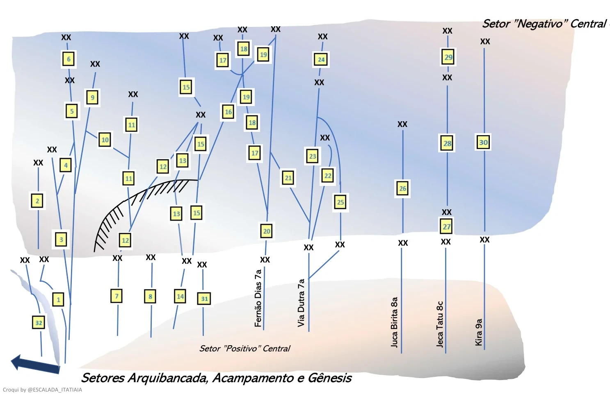
    - **largura_mapa**: 1487
    - **altura_mapa**: 962
    - **pontos_de_interesse**:
      - **[0]**:
        - **id**: XVloNcOzV9YVVo
        - **uid**: XVloNcOzV9YVVo
        - **rotulo**: 1
        - **retangulo**:
          - **x**: 110
          - **y**: 745
          - **comprimento**: 30
          - **largura**: 30
        - **label**: 1
      - **[1]**:
        - **id**: EYLC8BhU9O5ZZP
        - **uid**: EYLC8BhU9O5ZZP
        - **rotulo**: 2
        - **retangulo**:
          - **x**: 71
          - **y**: 478
          - **comprimento**: 30
          - **largura**: 30
        - **label**: 2
      - **[2]**:
        - **id**: 0wfStBE4Bvz5WN
        - **uid**: 0wfStBE4Bvz5WN
        - **rotulo**: 3
        - **retangulo**:
          - **x**: 135
          - **y**: 585
          - **comprimento**: 30
          - **largura**: 30
        - **label**: 3
      - **[3]**:
        - **id**: mKQkoMfXv6IeNI
        - **uid**: mKQkoMfXv6IeNI
        - **rotulo**: 4
        - **retangulo**:
          - **x**: 150
          - **y**: 405
          - **comprimento**: 30
          - **largura**: 30
        - **label**: 4
      - **[4]**:
        - **id**: Cq3VlZw2lah4tF
        - **uid**: Cq3VlZw2lah4tF
        - **rotulo**: 5
        - **retangulo**:
          - **x**: 810
          - **y**: 484
          - **comprimento**: 30
          - **largura**: 30
        - **label**: 5
      - **[5]**:
        - **id**: XlDgJ6cnW11hcj
        - **uid**: XlDgJ6cnW11hcj
        - **rotulo**: 6
        - **retangulo**:
          - **x**: 160
          - **y**: 135
          - **comprimento**: 30
          - **largura**: 30
        - **label**: 6
      - **[6]**:
        - **id**: BV8tlE3arUhGxA
        - **uid**: BV8tlE3arUhGxA
        - **rotulo**: 7
        - **retangulo**:
          - **x**: 285
          - **y**: 725
          - **comprimento**: 30
          - **largura**: 30
        - **label**: 7
      - **[7]**:
        - **id**: kzdAIHfjqG0nHf
        - **uid**: kzdAIHfjqG0nHf
        - **rotulo**: 8
        - **retangulo**:
          - **x**: 375
          - **y**: 725
          - **comprimento**: 30
          - **largura**: 30
        - **label**: 8
      - **[8]**:
        - **id**: cpIkjR8h5AoNkR
        - **uid**: cpIkjR8h5AoNkR
        - **rotulo**: 9
        - **retangulo**:
          - **x**: 230
          - **y**: 235
          - **comprimento**: 30
          - **largura**: 30
        - **label**: 9
      - **[9]**:
        - **id**: suJhQc3oESqNuu
        - **uid**: suJhQc3oESqNuu
        - **rotulo**: 10
        - **retangulo**:
          - **x**: 260
          - **y**: 340
          - **comprimento**: 30
          - **largura**: 30
        - **label**: 10
      - **[10]**:
        - **id**: z2zHAgvSrEjl13
        - **uid**: z2zHAgvSrEjl13
        - **rotulo**: 11
        - **retangulo**:
          - **x**: 325
          - **y**: 295
          - **comprimento**: 30
          - **largura**: 30
        - **label**: 11
      - **[11]**:
        - **id**: GGcNU9r7fjTJqG
        - **uid**: GGcNU9r7fjTJqG
        - **rotulo**: 11
        - **retangulo**:
          - **x**: 315
          - **y**: 430
          - **comprimento**: 30
          - **largura**: 30
        - **label**: 11
      - **[12]**:
        - **id**: ue7MRqZoS6xVD4
        - **uid**: ue7MRqZoS6xVD4
        - **rotulo**: 12
        - **retangulo**:
          - **x**: 305
          - **y**: 585
          - **comprimento**: 30
          - **largura**: 30
        - **label**: 12
      - **[13]**:
        - **id**: sIjKe2beRnlLfS
        - **uid**: sIjKe2beRnlLfS
        - **rotulo**: 13
        - **retangulo**:
          - **x**: 465
          - **y**: 385
          - **comprimento**: 30
          - **largura**: 30
        - **label**: 13
      - **[14]**:
        - **id**: bbNbJq4NQ7NkzC
        - **uid**: bbNbJq4NQ7NkzC
        - **rotulo**: 13
        - **retangulo**:
          - **x**: 450
          - **y**: 515
          - **comprimento**: 30
          - **largura**: 30
        - **label**: 13
      - **[15]**:
        - **id**: x9AUS2B16WnTQC
        - **uid**: x9AUS2B16WnTQC
        - **rotulo**: 14
        - **retangulo**:
          - **x**: 418
          - **y**: 712
          - **comprimento**: 30
          - **largura**: 30
        - **label**: 14
      - **[16]**:
        - **id**: qChc2hK536akdh
        - **uid**: qChc2hK536akdh
        - **rotulo**: 15
        - **retangulo**:
          - **x**: 433
          - **y**: 198
          - **comprimento**: 30
          - **largura**: 30
        - **label**: 15
      - **[17]**:
        - **id**: cDW25Wdw32o5mU
        - **uid**: cDW25Wdw32o5mU
        - **rotulo**: 15
        - **retangulo**:
          - **x**: 505
          - **y**: 345
          - **comprimento**: 30
          - **largura**: 30
        - **label**: 15
      - **[18]**:
        - **id**: duX5eFV9U7bf1X
        - **uid**: duX5eFV9U7bf1X
        - **rotulo**: 15
        - **retangulo**:
          - **x**: 505
          - **y**: 515
          - **comprimento**: 30
          - **largura**: 30
        - **label**: 15
      - **[19]**:
        - **id**: z5fKHKiFr80VK9
        - **uid**: z5fKHKiFr80VK9
        - **rotulo**: 16
        - **retangulo**:
          - **x**: 536
          - **y**: 262
          - **comprimento**: 30
          - **largura**: 30
        - **label**: 16
      - **[20]**:
        - **id**: eFRh40g009bfiX
        - **uid**: eFRh40g009bfiX
        - **rotulo**: 17
        - **retangulo**:
          - **x**: 570
          - **y**: 135
          - **comprimento**: 30
          - **largura**: 30
        - **label**: 17
      - **[21]**:
        - **id**: dAztHOScSHi3XE
        - **uid**: dAztHOScSHi3XE
        - **rotulo**: 17
        - **retangulo**:
          - **x**: 655
          - **y**: 365
          - **comprimento**: 30
          - **largura**: 30
        - **label**: 17
      - **[22]**:
        - **id**: 6oTZHyCg5OldRv
        - **uid**: 6oTZHyCg5OldRv
        - **rotulo**: 18
        - **retangulo**:
          - **x**: 594
          - **y**: 288
          - **comprimento**: 30
          - **largura**: 30
        - **label**: 18
      - **[23]**:
        - **id**: PZ0e11Pyrbetyb
        - **uid**: PZ0e11Pyrbetyb
        - **rotulo**: 18
        - **retangulo**:
          - **x**: 655
          - **y**: 295
          - **comprimento**: 30
          - **largura**: 30
        - **label**: 18
      - **[24]**:
        - **id**: InSXlFxfXTf6lQ
        - **uid**: InSXlFxfXTf6lQ
        - **rotulo**: 19
        - **retangulo**:
          - **x**: 580
          - **y**: 226
          - **comprimento**: 30
          - **largura**: 30
        - **label**: 19
      - **[25]**:
        - **id**: 7RMRhhX4zgZulM
        - **uid**: 7RMRhhX4zgZulM
        - **rotulo**: 19
        - **retangulo**:
          - **x**: 645
          - **y**: 225
          - **comprimento**: 30
          - **largura**: 30
        - **label**: 19
      - **[26]**:
        - **id**: xSFJJS45bdZVKq
        - **uid**: xSFJJS45bdZVKq
        - **rotulo**: 20
        - **retangulo**:
          - **x**: 628
          - **y**: 552
          - **comprimento**: 30
          - **largura**: 30
        - **label**: 20
      - **[27]**:
        - **id**: NdkzPCFEg26f77
        - **uid**: NdkzPCFEg26f77
        - **rotulo**: 21
        - **retangulo**:
          - **x**: 682
          - **y**: 420
          - **comprimento**: 30
          - **largura**: 30
        - **label**: 21
      - **[28]**:
        - **id**: HHtdZW4Ab1ceTW
        - **uid**: HHtdZW4Ab1ceTW
        - **rotulo**: 22
        - **retangulo**:
          - **x**: 835
          - **y**: 425
          - **comprimento**: 30
          - **largura**: 30
        - **label**: 22
      - **[29]**:
        - **id**: KhrD8JHTOq6vOl
        - **uid**: KhrD8JHTOq6vOl
        - **rotulo**: 23
        - **retangulo**:
          - **x**: 743
          - **y**: 372
          - **comprimento**: 30
          - **largura**: 30
        - **label**: 23
      - **[30]**:
        - **id**: HQMhYtJkm12oT9
        - **uid**: HQMhYtJkm12oT9
        - **rotulo**: 24
        - **retangulo**:
          - **x**: 762
          - **y**: 134
          - **comprimento**: 30
          - **largura**: 30
        - **label**: 24
      - **[31]**:
        - **id**: qrX73FrkTzbJsk
        - **uid**: qrX73FrkTzbJsk
        - **rotulo**: 25
        - **retangulo**:
          - **x**: 880
          - **y**: 485
          - **comprimento**: 30
          - **largura**: 30
        - **label**: 25
      - **[32]**:
        - **id**: QjFFft9Y9DkOf9
        - **uid**: QjFFft9Y9DkOf9
        - **rotulo**: 26
        - **retangulo**:
          - **x**: 960
          - **y**: 450
          - **comprimento**: 30
          - **largura**: 30
        - **label**: 26
      - **[33]**:
        - **id**: 18HW9Jof2fQjAY
        - **uid**: 18HW9Jof2fQjAY
        - **rotulo**: 27
        - **retangulo**:
          - **x**: 1068
          - **y**: 542
          - **comprimento**: 30
          - **largura**: 30
        - **label**: 27
      - **[34]**:
        - **id**: DGbuMR0pY6u0zR
        - **uid**: DGbuMR0pY6u0zR
        - **rotulo**: 28
        - **retangulo**:
          - **x**: 1068
          - **y**: 338
          - **comprimento**: 30
          - **largura**: 30
        - **label**: 28
      - **[35]**:
        - **id**: YoAH7aO1bsvyhJ
        - **uid**: YoAH7aO1bsvyhJ
        - **rotulo**: 29
        - **retangulo**:
          - **x**: 1072
          - **y**: 126
          - **comprimento**: 30
          - **largura**: 30
        - **label**: 29
      - **[36]**:
        - **id**: PPF5dlAMBjfSUj
        - **uid**: PPF5dlAMBjfSUj
        - **rotulo**: 30
        - **retangulo**:
          - **x**: 1158
          - **y**: 336
          - **comprimento**: 30
          - **largura**: 30
        - **label**: 30
      - **[37]**:
        - **id**: o47lITPpuqocOz
        - **uid**: o47lITPpuqocOz
        - **rotulo**: 31
        - **retangulo**:
          - **x**: 478
          - **y**: 718
          - **comprimento**: 30
          - **largura**: 30
        - **label**: 31
      - **[38]**:
        - **id**: JZaMcMkH8j2Lai
        - **uid**: JZaMcMkH8j2Lai
        - **rotulo**: 32
        - **retangulo**:
          - **x**: 74
          - **y**: 778
          - **comprimento**: 30
          - **largura**: 30
        - **label**: 32
      - **[39]**:
        - **id**: Ud9IqMwOMMiC2G
        - **uid**: Ud9IqMwOMMiC2G
        - **rotulo**: Setores Arquibancada, Acampamento e Gênesis
        - **retangulo**:
          - **x**: 328
          - **y**: 923
          - **comprimento**: 700
          - **largura**: 30
        - **label**: Setores Arquibancada, Acampamento e Gênesis
    - **referencias**:
      - **[0]**:
        - **alvo_uid**: fZd7ZOjhXb0kXL
        - **pontos_uids**:
          - XVloNcOzV9YVVo
        - **escalada**: Palo Santo P1
        - **ids**:
          - XVloNcOzV9YVVo
      - **[1]**:
        - **alvo_uid**: Ppdu08Q2dSg3bM
        - **pontos_uids**:
          - EYLC8BhU9O5ZZP
          - EYLC8BhU9O5ZZP
        - **escalada**: Palo Santo P2
        - **ids**:
          - EYLC8BhU9O5ZZP
          - EYLC8BhU9O5ZZP
      - **[2]**:
        - **alvo_uid**: Y5h46Al9gqiADg
        - **pontos_uids**:
          - 0wfStBE4Bvz5WN
        - **escalada**: Left or Right
        - **ids**:
          - 0wfStBE4Bvz5WN
      - **[3]**:
        - **alvo_uid**: QFmVr8f6t2j2nK
        - **pontos_uids**:
          - mKQkoMfXv6IeNI
        - **escalada**: Right na Caveira
        - **ids**:
          - mKQkoMfXv6IeNI
      - **[4]**:
        - **alvo_uid**: AvHvOiemZRPUP2
        - **pontos_uids**:
          - Cq3VlZw2lah4tF
        - **escalada**: Piercing de Caveira
        - **ids**:
          - Cq3VlZw2lah4tF
      - **[5]**:
        - **alvo_uid**: 03FAh2tz89kDDq
        - **pontos_uids**:
          - XlDgJ6cnW11hcj
          - XlDgJ6cnW11hcj
        - **escalada**: Ext. Piercing
        - **ids**:
          - XlDgJ6cnW11hcj
          - XlDgJ6cnW11hcj
      - **[6]**:
        - **alvo_uid**: b1ZJFdrIxpwkkj
        - **pontos_uids**:
          - BV8tlE3arUhGxA
        - **escalada**: Mythos
        - **ids**:
          - BV8tlE3arUhGxA
      - **[7]**:
        - **alvo_uid**: hqk4oB1NDFSqPI
        - **pontos_uids**:
          - kzdAIHfjqG0nHf
        - **escalada**: Esqueleto
        - **ids**:
          - kzdAIHfjqG0nHf
      - **[8]**:
        - **alvo_uid**: XTmUB4HU4gAhoT
        - **pontos_uids**:
          - cpIkjR8h5AoNkR
        - **escalada**: Brinco de Caveira
        - **ids**:
          - cpIkjR8h5AoNkR
      - **[9]**:
        - **alvo_uid**: GPoLGzF6hcdZXp
        - **pontos_uids**:
          - suJhQc3oESqNuu
        - **escalada**: Bruce Lee (Projeto)
        - **ids**:
          - suJhQc3oESqNuu
      - **[10]**:
        - **alvo_uid**: gZqvVC5zkXIMAA
        - **pontos_uids**:
          - GGcNU9r7fjTJqG
        - **escalada**: Bradock
        - **ids**:
          - GGcNU9r7fjTJqG
      - **[11]**:
        - **alvo_uid**: 6OMMcn0elBJinD
        - **pontos_uids**:
          - ue7MRqZoS6xVD4
        - **escalada**: Bozo
        - **ids**:
          - ue7MRqZoS6xVD4
      - **[12]**:
        - **alvo_uid**: vFtwOfBs2tNSZU
        - **pontos_uids**:
          - bbNbJq4NQ7NkzC
        - **escalada**: Fonte da Juventude
        - **ids**:
          - bbNbJq4NQ7NkzC
      - **[13]**:
        - **alvo_uid**: wvfvSt7juTnwBD
        - **pontos_uids**:
          - x9AUS2B16WnTQC
        - **escalada**: Cocoon P1
        - **ids**:
          - x9AUS2B16WnTQC
      - **[14]**:
        - **alvo_uid**: iLrpaeqaAXtObc
        - **pontos_uids**:
          - duX5eFV9U7bf1X
          - duX5eFV9U7bf1X
        - **escalada**: Cocoon P2
        - **ids**:
          - duX5eFV9U7bf1X
          - duX5eFV9U7bf1X
      - **[15]**:
        - **alvo_uid**: 2zSyjaWTRrvIst
        - **pontos_uids**:
          - z5fKHKiFr80VK9
        - **escalada**: Coconut
        - **ids**:
          - z5fKHKiFr80VK9
      - **[16]**:
        - **alvo_uid**: hRrD4vyGlkl2rw
        - **pontos_uids**:
          - dAztHOScSHi3XE
        - **escalada**: Apocalipse
        - **ids**:
          - dAztHOScSHi3XE
      - **[17]**:
        - **alvo_uid**: AnU47bTOnTTnEC
        - **pontos_uids**:
          - PZ0e11Pyrbetyb
        - **escalada**: Homem de Pedra
        - **ids**:
          - PZ0e11Pyrbetyb
      - **[18]**:
        - **alvo_uid**: gJtEaP6ZI2IhBR
        - **pontos_uids**:
          - 7RMRhhX4zgZulM
        - **escalada**: Inferno de Dante
        - **ids**:
          - 7RMRhhX4zgZulM
      - **[19]**:
        - **alvo_uid**: GnZyZjoku5fqjh
        - **pontos_uids**:
          - xSFJJS45bdZVKq
        - **escalada**: Golias
        - **ids**:
          - xSFJJS45bdZVKq
      - **[20]**:
        - **alvo_uid**: C3YcFEK2cgX3RN
        - **pontos_uids**:
          - NdkzPCFEg26f77
        - **escalada**: Cova dos Leões
        - **ids**:
          - NdkzPCFEg26f77
      - **[21]**:
        - **alvo_uid**: 6RaqLBzthXio0X
        - **pontos_uids**:
          - HHtdZW4Ab1ceTW
        - **escalada**: Verbo Divino (Projeto)
        - **ids**:
          - HHtdZW4Ab1ceTW
      - **[22]**:
        - **alvo_uid**: zqLVHHzDtWbrYo
        - **pontos_uids**:
          - KhrD8JHTOq6vOl
        - **escalada**: Dust in the Wind
        - **ids**:
          - KhrD8JHTOq6vOl
      - **[23]**:
        - **alvo_uid**: byQEAjiWNIXduI
        - **pontos_uids**:
          - HQMhYtJkm12oT9
          - HQMhYtJkm12oT9
        - **escalada**: Ext. Dust (Projeto)
        - **ids**:
          - HQMhYtJkm12oT9
          - HQMhYtJkm12oT9
      - **[24]**:
        - **alvo_uid**: I6kF6lRA7SiGaE
        - **pontos_uids**:
          - qrX73FrkTzbJsk
        - **escalada**: Doce de Amendoim
        - **ids**:
          - qrX73FrkTzbJsk
      - **[25]**:
        - **alvo_uid**: GsTSdsyuXY9iPp
        - **pontos_uids**:
          - QjFFft9Y9DkOf9
        - **escalada**: Gengis Khan
        - **ids**:
          - QjFFft9Y9DkOf9
      - **[26]**:
        - **alvo_uid**: cpZmootjSN4wte
        - **pontos_uids**:
          - 18HW9Jof2fQjAY
        - **escalada**: Gringos & Troianos
        - **ids**:
          - 18HW9Jof2fQjAY
      - **[27]**:
        - **alvo_uid**: cpZmootjSN4wte
        - **pontos_uids**:
          - DGbuMR0pY6u0zR
        - **escalada**: Gringos & Troianos
        - **ids**:
          - DGbuMR0pY6u0zR
      - **[28]**:
        - **alvo_uid**: LC4n5xjhqw4Oa0
        - **pontos_uids**:
          - YoAH7aO1bsvyhJ
        - **escalada**: Cavalo de Tróia
        - **ids**:
          - YoAH7aO1bsvyhJ
      - **[29]**:
        - **alvo_uid**: 74YjXKRj3YJDi7
        - **pontos_uids**:
          - PPF5dlAMBjfSUj
        - **escalada**: Jacuzzi (Projeto)
        - **ids**:
          - PPF5dlAMBjfSUj
      - **[30]**:
        - **alvo_uid**: ittlusPUutbDL8
        - **pontos_uids**:
          - o47lITPpuqocOz
        - **escalada**: Centauro
        - **ids**:
          - o47lITPpuqocOz
      - **[31]**:
        - **alvo_uid**: zlpDTPFuhk7BEn
        - **pontos_uids**:
          - JZaMcMkH8j2Lai
        - **escalada**: Ceci
        - **ids**:
          - JZaMcMkH8j2Lai
- **escaladas**:
  - **[0]**:
    - **uid**: fZd7ZOjhXb0kXL
    - **via_esportiva**:
      - **nome**: Palo Santo P1
      - **dificuldade**: BR_5
  - **[1]**:
    - **uid**: Ppdu08Q2dSg3bM
    - **via_esportiva**:
      - **nome**: Palo Santo P2
      - **dificuldade**: BR_10A
  - **[2]**:
    - **uid**: Y5h46Al9gqiADg
    - **via_esportiva**:
      - **nome**: Left or Right
      - **dificuldade**: BR_9A
  - **[3]**:
    - **uid**: QFmVr8f6t2j2nK
    - **via_esportiva**:
      - **nome**: Right na Caveira
      - **dificuldade**: BR_9B_BARRA_9C
  - **[4]**:
    - **uid**: AvHvOiemZRPUP2
    - **via_esportiva**:
      - **nome**: Piercing de Caveira
      - **dificuldade**: BR_9B
  - **[5]**:
    - **uid**: 03FAh2tz89kDDq
    - **via_esportiva**:
      - **nome**: Ext. Piercing
      - **dificuldade**: BR_10B
  - **[6]**:
    - **uid**: b1ZJFdrIxpwkkj
    - **via_esportiva**:
      - **nome**: Mythos
      - **dificuldade**: BR_6
  - **[7]**:
    - **uid**: hqk4oB1NDFSqPI
    - **via_esportiva**:
      - **nome**: Esqueleto
      - **dificuldade**: BR_7A
  - **[8]**:
    - **uid**: XTmUB4HU4gAhoT
    - **via_esportiva**:
      - **nome**: Brinco de Caveira
      - **dificuldade**: BR_10C
  - **[9]**:
    - **uid**: GPoLGzF6hcdZXp
    - **via_esportiva**:
      - **nome**: Bruce Lee (Projeto)
      - **dificuldade**: PROJETO
  - **[10]**:
    - **uid**: gZqvVC5zkXIMAA
    - **via_esportiva**:
      - **nome**: Bradock
      - **dificuldade**: BR_10A
  - **[11]**:
    - **uid**: 6OMMcn0elBJinD
    - **via_esportiva**:
      - **nome**: Bozo
      - **dificuldade**: BR_9C
  - **[12]**:
    - **uid**: vFtwOfBs2tNSZU
    - **via_esportiva**:
      - **nome**: Fonte da Juventude
      - **dificuldade**: BR_9B_BARRA_9C
  - **[13]**:
    - **uid**: wvfvSt7juTnwBD
    - **via_esportiva**:
      - **nome**: Cocoon P1
      - **dificuldade**: BR_7A
  - **[14]**:
    - **uid**: iLrpaeqaAXtObc
    - **via_esportiva**:
      - **nome**: Cocoon P2
      - **dificuldade**: BR_10A
  - **[15]**:
    - **uid**: 2zSyjaWTRrvIst
    - **via_esportiva**:
      - **nome**: Coconut
      - **dificuldade**: BR_10B_BARRA_10C
  - **[16]**:
    - **uid**: hRrD4vyGlkl2rw
    - **via_esportiva**:
      - **nome**: Apocalipse
      - **dificuldade**: BR_10B
  - **[17]**:
    - **uid**: AnU47bTOnTTnEC
    - **via_esportiva**:
      - **nome**: Homem de Pedra
      - **dificuldade**: BR_10C
  - **[18]**:
    - **uid**: gJtEaP6ZI2IhBR
    - **via_esportiva**:
      - **nome**: Inferno de Dante
      - **dificuldade**: BR_10B
  - **[19]**:
    - **uid**: GnZyZjoku5fqjh
    - **via_esportiva**:
      - **nome**: Golias
      - **dificuldade**: BR_10C
  - **[20]**:
    - **uid**: C3YcFEK2cgX3RN
    - **via_esportiva**:
      - **nome**: Cova dos Leões
      - **dificuldade**: BR_10B
  - **[21]**:
    - **uid**: 6RaqLBzthXio0X
    - **via_esportiva**:
      - **nome**: Verbo Divino (Projeto)
      - **dificuldade**: PROJETO
  - **[22]**:
    - **uid**: zqLVHHzDtWbrYo
    - **via_esportiva**:
      - **nome**: Dust in the Wind
      - **dificuldade**: BR_10C
  - **[23]**:
    - **uid**: byQEAjiWNIXduI
    - **via_esportiva**:
      - **nome**: Ext. Dust (Projeto)
      - **dificuldade**: PROJETO
  - **[24]**:
    - **uid**: I6kF6lRA7SiGaE
    - **via_esportiva**:
      - **nome**: Doce de Amendoim
      - **dificuldade**: BR_10C
  - **[25]**:
    - **uid**: GsTSdsyuXY9iPp
    - **via_esportiva**:
      - **nome**: Gengis Khan
      - **dificuldade**: BR_9C
  - **[26]**:
    - **uid**: foNMsdT5c4txrF
    - **via_esportiva**:
      - **nome**: Gringos & Troianos
      - **dificuldade**: BR_9A
  - **[27]**:
    - **uid**: cpZmootjSN4wte
    - **via_esportiva**:
      - **nome**: Gringos & Troianos
      - **dificuldade**: BR_11A_BARRA_11B
  - **[28]**:
    - **uid**: LC4n5xjhqw4Oa0
    - **via_esportiva**:
      - **nome**: Cavalo de Tróia
      - **dificuldade**: BR_11C
  - **[29]**:
    - **uid**: 74YjXKRj3YJDi7
    - **via_esportiva**:
      - **nome**: Jacuzzi (Projeto)
      - **dificuldade**: PROJETO
  - **[30]**:
    - **uid**: ittlusPUutbDL8
    - **via_esportiva**:
      - **nome**: Centauro
      - **dificuldade**: BR_6SUP
  - **[31]**:
    - **uid**: zlpDTPFuhk7BEn
    - **via_esportiva**:
      - **nome**: Ceci
      - **dificuldade**: BR_6SUP
- **precomputados**:
  - **total_escaladas**: 32
  - **total_esportivas**: 32

## Parte: setor_arquibancada

### Setor (Pico: Gruta de Passa Vinte)

- **descricao**: 
- **nome**: Arquibancada
- **uid**: lt12GNvnJUOG87
- **mapas**:
  - **[0]**:
    - **caminho_imagem_mapa**: 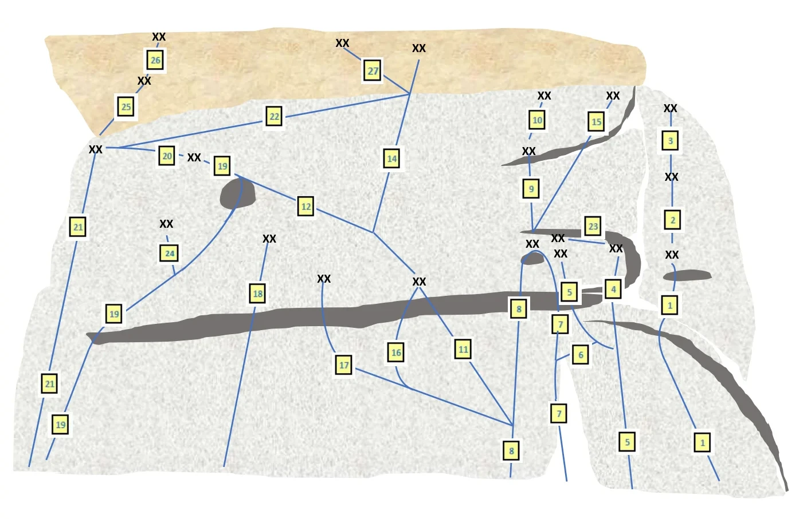
    - **largura_mapa**: 1415
    - **altura_mapa**: 907
    - **pontos_de_interesse**:
      - **[0]**:
        - **id**: 0dEURqeahqnLb2
        - **uid**: 0dEURqeahqnLb2
        - **rotulo**: 1
        - **retangulo**:
          - **x**: 1150
          - **y**: 525
          - **comprimento**: 30
          - **largura**: 30
        - **label**: 1
      - **[1]**:
        - **id**: mLsB8nOplCsDRB
        - **uid**: mLsB8nOplCsDRB
        - **rotulo**: 1
        - **retangulo**:
          - **x**: 1210
          - **y**: 775
          - **comprimento**: 30
          - **largura**: 30
        - **label**: 1
      - **[2]**:
        - **id**: srfMp22KdsZy2Y
        - **uid**: srfMp22KdsZy2Y
        - **rotulo**: 2
        - **retangulo**:
          - **x**: 1165
          - **y**: 385
          - **comprimento**: 30
          - **largura**: 30
        - **label**: 2
      - **[3]**:
        - **id**: x57PLbZanlUquZ
        - **uid**: x57PLbZanlUquZ
        - **rotulo**: 3
        - **retangulo**:
          - **x**: 1160
          - **y**: 235
          - **comprimento**: 30
          - **largura**: 30
        - **label**: 3
      - **[4]**:
        - **id**: xb7HCQE8qJBhhT
        - **uid**: xb7HCQE8qJBhhT
        - **rotulo**: 4
        - **retangulo**:
          - **x**: 670
          - **y**: 261
          - **comprimento**: 40
          - **largura**: 40
        - **label**: 4
      - **[5]**:
        - **id**: l1h4xEXVeDw19F
        - **uid**: l1h4xEXVeDw19F
        - **rotulo**: 4
        - **retangulo**:
          - **x**: 1055
          - **y**: 505
          - **comprimento**: 30
          - **largura**: 30
        - **label**: 4
      - **[6]**:
        - **id**: B3KyuUlrUzrf8z
        - **uid**: B3KyuUlrUzrf8z
        - **rotulo**: 5
        - **retangulo**:
          - **x**: 977
          - **y**: 492
          - **comprimento**: 30
          - **largura**: 30
        - **label**: 5
      - **[7]**:
        - **id**: gMv1vxlUyjDOca
        - **uid**: gMv1vxlUyjDOca
        - **rotulo**: 5
        - **retangulo**:
          - **x**: 1090
          - **y**: 870
          - **comprimento**: 30
          - **largura**: 30
        - **label**: 5
      - **[8]**:
        - **id**: JKgdhIsemJdzXu
        - **uid**: JKgdhIsemJdzXu
        - **rotulo**: 6
        - **retangulo**:
          - **x**: 995
          - **y**: 605
          - **comprimento**: 30
          - **largura**: 30
        - **label**: 6
      - **[9]**:
        - **id**: gvFvIf07rFLFRc
        - **uid**: gvFvIf07rFLFRc
        - **rotulo**: 6
        - **retangulo**:
          - **x**: 995
          - **y**: 635
          - **comprimento**: 30
          - **largura**: 30
        - **label**: 6
      - **[10]**:
        - **id**: yWQ3qAdM0uWhGP
        - **uid**: yWQ3qAdM0uWhGP
        - **rotulo**: 7
        - **retangulo**:
          - **x**: 962
          - **y**: 552
          - **comprimento**: 30
          - **largura**: 30
        - **label**: 7
      - **[11]**:
        - **id**: s9TQxG4mVXOxiw
        - **uid**: s9TQxG4mVXOxiw
        - **rotulo**: 7
        - **retangulo**:
          - **x**: 961
          - **y**: 705
          - **comprimento**: 30
          - **largura**: 30
        - **label**: 7
      - **[12]**:
        - **id**: AowmGPIbARUqdE
        - **uid**: AowmGPIbARUqdE
        - **rotulo**: 8
        - **retangulo**:
          - **x**: 877
          - **y**: 771
          - **comprimento**: 30
          - **largura**: 30
        - **label**: 8
      - **[13]**:
        - **id**: 4MFwG2IC6W6u5S
        - **uid**: 4MFwG2IC6W6u5S
        - **rotulo**: 8
        - **retangulo**:
          - **x**: 880
          - **y**: 815
          - **comprimento**: 30
          - **largura**: 30
        - **label**: 8
      - **[14]**:
        - **id**: idoSwXlB1fdgZ6
        - **uid**: idoSwXlB1fdgZ6
        - **rotulo**: 9
        - **retangulo**:
          - **x**: 920
          - **y**: 330
          - **comprimento**: 30
          - **largura**: 30
        - **label**: 9
      - **[15]**:
        - **id**: HIAhDuMzm7p8IS
        - **uid**: HIAhDuMzm7p8IS
        - **rotulo**: 10
        - **retangulo**:
          - **x**: 923
          - **y**: 193
          - **comprimento**: 30
          - **largura**: 30
        - **label**: 10
      - **[16]**:
        - **id**: d9PPQZKgY5VGJN
        - **uid**: d9PPQZKgY5VGJN
        - **rotulo**: 11
        - **retangulo**:
          - **x**: 795
          - **y**: 675
          - **comprimento**: 30
          - **largura**: 30
        - **label**: 11
      - **[17]**:
        - **id**: 2VjkpkXljcf03n
        - **uid**: 2VjkpkXljcf03n
        - **rotulo**: 12
        - **retangulo**:
          - **x**: 525
          - **y**: 380
          - **comprimento**: 30
          - **largura**: 30
        - **label**: 12
      - **[18]**:
        - **id**: j6mwcGN4Obj8P6
        - **uid**: j6mwcGN4Obj8P6
        - **rotulo**: 14
        - **retangulo**:
          - **x**: 670
          - **y**: 290
          - **comprimento**: 30
          - **largura**: 30
        - **label**: 14
      - **[19]**:
        - **id**: 0FdvAdgahgEwYr
        - **uid**: 0FdvAdgahgEwYr
        - **rotulo**: 15
        - **retangulo**:
          - **x**: 1026
          - **y**: 196
          - **comprimento**: 30
          - **largura**: 30
        - **label**: 15
      - **[20]**:
        - **id**: iqBYNgoUndbdKP
        - **uid**: iqBYNgoUndbdKP
        - **rotulo**: 16
        - **retangulo**:
          - **x**: 675
          - **y**: 599
          - **comprimento**: 30
          - **largura**: 30
        - **label**: 16
      - **[21]**:
        - **id**: Wro8texVPMorxV
        - **uid**: Wro8texVPMorxV
        - **rotulo**: 17
        - **retangulo**:
          - **x**: 585
          - **y**: 621
          - **comprimento**: 30
          - **largura**: 30
        - **label**: 17
      - **[22]**:
        - **id**: TxGQfnfB4BD2qm
        - **uid**: TxGQfnfB4BD2qm
        - **rotulo**: 18
        - **retangulo**:
          - **x**: 434
          - **y**: 496
          - **comprimento**: 30
          - **largura**: 30
        - **label**: 18
      - **[23]**:
        - **id**: C9zGyOgXnVI8g6
        - **uid**: C9zGyOgXnVI8g6
        - **rotulo**: 19
        - **retangulo**:
          - **x**: 373
          - **y**: 275
          - **comprimento**: 30
          - **largura**: 30
        - **label**: 19
      - **[24]**:
        - **id**: L7RSw4H5pFRpSE
        - **uid**: L7RSw4H5pFRpSE
        - **rotulo**: 19
        - **retangulo**:
          - **x**: 183
          - **y**: 531
          - **comprimento**: 30
          - **largura**: 30
        - **label**: 19
      - **[25]**:
        - **id**: uvPPdL22mgpgqW
        - **uid**: uvPPdL22mgpgqW
        - **rotulo**: 19
        - **retangulo**:
          - **x**: 90
          - **y**: 760
          - **comprimento**: 30
          - **largura**: 30
        - **label**: 19
      - **[26]**:
        - **id**: 6ci1eO8KWTF9A1
        - **uid**: 6ci1eO8KWTF9A1
        - **rotulo**: 20
        - **retangulo**:
          - **x**: 277
          - **y**: 255
          - **comprimento**: 30
          - **largura**: 30
        - **label**: 20
      - **[27]**:
        - **id**: LbdDCq0nm0j7zW
        - **uid**: LbdDCq0nm0j7zW
        - **rotulo**: 21
        - **retangulo**:
          - **x**: 123
          - **y**: 375
          - **comprimento**: 30
          - **largura**: 30
        - **label**: 21
      - **[28]**:
        - **id**: hRxaA3LMJUx5K0
        - **uid**: hRxaA3LMJUx5K0
        - **rotulo**: 21
        - **retangulo**:
          - **x**: 60
          - **y**: 700
          - **comprimento**: 30
          - **largura**: 30
        - **label**: 21
      - **[29]**:
        - **id**: 0QIphhX3ZyQ1nK
        - **uid**: 0QIphhX3ZyQ1nK
        - **rotulo**: 22
        - **retangulo**:
          - **x**: 470
          - **y**: 200
          - **comprimento**: 30
          - **largura**: 30
        - **label**: 22
      - **[30]**:
        - **id**: nqodqjtN6L9AdG
        - **uid**: nqodqjtN6L9AdG
        - **rotulo**: 23
        - **retangulo**:
          - **x**: 1019
          - **y**: 379
          - **comprimento**: 30
          - **largura**: 30
        - **label**: 23
      - **[31]**:
        - **id**: ncCAA4oHVFdxzE
        - **uid**: ncCAA4oHVFdxzE
        - **rotulo**: 24
        - **retangulo**:
          - **x**: 281
          - **y**: 426
          - **comprimento**: 30
          - **largura**: 30
        - **label**: 24
      - **[32]**:
        - **id**: wbXhHndD5HmIHH
        - **uid**: wbXhHndD5HmIHH
        - **rotulo**: 25
        - **retangulo**:
          - **x**: 205
          - **y**: 175
          - **comprimento**: 30
          - **largura**: 30
        - **label**: 25
      - **[33]**:
        - **id**: wOgJol2XFOBbWz
        - **uid**: wOgJol2XFOBbWz
        - **rotulo**: 26
        - **retangulo**:
          - **x**: 260
          - **y**: 95
          - **comprimento**: 30
          - **largura**: 30
        - **label**: 26
      - **[34]**:
        - **id**: hBPLtAm3PUMqyK
        - **uid**: hBPLtAm3PUMqyK
        - **rotulo**: 27
        - **retangulo**:
          - **x**: 634
          - **y**: 107
          - **comprimento**: 30
          - **largura**: 30
        - **label**: 27
    - **referencias**:
      - **[0]**:
        - **alvo_uid**: hQvszgqHr1K5BV
        - **pontos_uids**:
          - mLsB8nOplCsDRB
        - **escalada**: Fela
        - **ids**:
          - mLsB8nOplCsDRB
      - **[1]**:
        - **alvo_uid**: szO8i00GQKHsUg
        - **pontos_uids**:
          - srfMp22KdsZy2Y
          - srfMp22KdsZy2Y
        - **escalada**: Ext. P1 Fela
        - **ids**:
          - srfMp22KdsZy2Y
          - srfMp22KdsZy2Y
      - **[2]**:
        - **alvo_uid**: LK9inqXL0hxiG2
        - **pontos_uids**:
          - x57PLbZanlUquZ
          - x57PLbZanlUquZ
        - **escalada**: Ext. P2 Fela
        - **ids**:
          - x57PLbZanlUquZ
          - x57PLbZanlUquZ
      - **[3]**:
        - **alvo_uid**: ThUiNJBV2XFPQh
        - **pontos_uids**:
          - l1h4xEXVeDw19F
        - **escalada**: Arco do Triumfo
        - **ids**:
          - l1h4xEXVeDw19F
      - **[4]**:
        - **alvo_uid**: SRcMbjcB51MloB
        - **pontos_uids**:
          - gMv1vxlUyjDOca
        - **escalada**: Remédio Amargo
        - **ids**:
          - gMv1vxlUyjDOca
      - **[5]**:
        - **alvo_uid**: sqUozj85wBmTZ5
        - **pontos_uids**:
          - gvFvIf07rFLFRc
        - **escalada**: Shoryuken
        - **ids**:
          - gvFvIf07rFLFRc
      - **[6]**:
        - **alvo_uid**: nNCDWBQ5GgxCXB
        - **pontos_uids**:
          - s9TQxG4mVXOxiw
        - **escalada**: Jab
        - **ids**:
          - s9TQxG4mVXOxiw
      - **[7]**:
        - **alvo_uid**: CYGRwQR9aHOi2r
        - **pontos_uids**:
          - 4MFwG2IC6W6u5S
        - **escalada**: Soco Inglês
        - **ids**:
          - 4MFwG2IC6W6u5S
      - **[8]**:
        - **alvo_uid**: 6HM70hyIXaEIXX
        - **pontos_uids**:
          - idoSwXlB1fdgZ6
          - idoSwXlB1fdgZ6
        - **escalada**: Ext. Soco Inglês P1
        - **ids**:
          - idoSwXlB1fdgZ6
          - idoSwXlB1fdgZ6
      - **[9]**:
        - **alvo_uid**: Tju0PnjoeNDQQG
        - **pontos_uids**:
          - HIAhDuMzm7p8IS
          - HIAhDuMzm7p8IS
        - **escalada**: Ex. Soco Inglês P2 (Projeto)
        - **ids**:
          - HIAhDuMzm7p8IS
          - HIAhDuMzm7p8IS
      - **[10]**:
        - **alvo_uid**: KoPvzt0dzWfSwp
        - **pontos_uids**:
          - d9PPQZKgY5VGJN
        - **escalada**: Tapa na Cara
        - **ids**:
          - d9PPQZKgY5VGJN
      - **[11]**:
        - **alvo_uid**: TZ5FhqCuhVArvp
        - **pontos_uids**:
          - 2VjkpkXljcf03n
        - **escalada**: Tapa na Sombra
        - **ids**:
          - 2VjkpkXljcf03n
      - **[12]**:
        - **alvo_uid**: pc50UrYIbmnAZx
        - **pontos_uids**:
          - j6mwcGN4Obj8P6
        - **escalada**: A Outra Face
        - **ids**:
          - j6mwcGN4Obj8P6
      - **[13]**:
        - **alvo_uid**: T2H4pqeTiZQEsR
        - **pontos_uids**:
          - 0FdvAdgahgEwYr
        - **escalada**: Mary Lou
        - **ids**:
          - 0FdvAdgahgEwYr
      - **[14]**:
        - **alvo_uid**: po2dImRFTB1Neg
        - **pontos_uids**:
          - iqBYNgoUndbdKP
        - **escalada**: Superman
        - **ids**:
          - iqBYNgoUndbdKP
      - **[15]**:
        - **alvo_uid**: H32hudlcrxmsaj
        - **pontos_uids**:
          - Wro8texVPMorxV
        - **escalada**: Oia u Trem
        - **ids**:
          - Wro8texVPMorxV
      - **[16]**:
        - **alvo_uid**: Z0km6Car3rnS03
        - **pontos_uids**:
          - TxGQfnfB4BD2qm
        - **escalada**: Mistério da Meia Noite
        - **ids**:
          - TxGQfnfB4BD2qm
      - **[17]**:
        - **alvo_uid**: 0YjkElsgAWWKwj
        - **pontos_uids**:
          - uvPPdL22mgpgqW
        - **escalada**: Entre a Sombra e a Escuridão P1
        - **ids**:
          - uvPPdL22mgpgqW
      - **[18]**:
        - **alvo_uid**: bTKKPsntpuyi1X
        - **pontos_uids**:
          - 6ci1eO8KWTF9A1
          - 6ci1eO8KWTF9A1
        - **escalada**: Entre a Sombra e a Escuridão P2
        - **ids**:
          - 6ci1eO8KWTF9A1
          - 6ci1eO8KWTF9A1
      - **[19]**:
        - **alvo_uid**: Pl5NFYLOZypymI
        - **pontos_uids**:
          - hRxaA3LMJUx5K0
        - **escalada**: Calabouço
        - **ids**:
          - hRxaA3LMJUx5K0
      - **[20]**:
        - **alvo_uid**: GLFACkrQzZhO0b
        - **pontos_uids**:
          - 0QIphhX3ZyQ1nK
        - **escalada**: Thanos (Projeto)
        - **ids**:
          - 0QIphhX3ZyQ1nK
      - **[21]**:
        - **alvo_uid**: RAFvEtwCu1u2SU
        - **pontos_uids**:
          - nqodqjtN6L9AdG
          - nqodqjtN6L9AdG
        - **escalada**: Ext. Arco do Triumfo (Projeto)
        - **ids**:
          - nqodqjtN6L9AdG
          - nqodqjtN6L9AdG
      - **[22]**:
        - **alvo_uid**: 5N4flaMu3zlgWG
        - **pontos_uids**:
          - ncCAA4oHVFdxzE
        - **escalada**: Sombrinha
        - **ids**:
          - ncCAA4oHVFdxzE
      - **[23]**:
        - **alvo_uid**: WZGpJEh21dJJrk
        - **pontos_uids**:
          - wbXhHndD5HmIHH
        - **escalada**: Projeto
        - **ids**:
          - wbXhHndD5HmIHH
      - **[24]**:
        - **alvo_uid**: 7TaXfwxlgQnHFy
        - **pontos_uids**:
          - wOgJol2XFOBbWz
        - **escalada**: Alcatraz
        - **ids**:
          - wOgJol2XFOBbWz
      - **[25]**:
        - **alvo_uid**: z0kG9DMaxzjPZP
        - **pontos_uids**:
          - hBPLtAm3PUMqyK
        - **escalada**: Face Oculta (Projeto)
        - **ids**:
          - hBPLtAm3PUMqyK
- **escaladas**:
  - **[0]**:
    - **uid**: hQvszgqHr1K5BV
    - **via_esportiva**:
      - **nome**: Fela
      - **dificuldade**: BR_9A
  - **[1]**:
    - **uid**: szO8i00GQKHsUg
    - **via_esportiva**:
      - **nome**: Ext. P1 Fela
      - **dificuldade**: BR_10A
  - **[2]**:
    - **uid**: LK9inqXL0hxiG2
    - **via_esportiva**:
      - **nome**: Ext. P2 Fela
      - **dificuldade**: BR_10B_BARRA_10C
  - **[3]**:
    - **uid**: ThUiNJBV2XFPQh
    - **via_esportiva**:
      - **nome**: Arco do Triumfo
      - **dificuldade**: BR_9B
  - **[4]**:
    - **uid**: SRcMbjcB51MloB
    - **via_esportiva**:
      - **nome**: Remédio Amargo
      - **dificuldade**: BR_8B
  - **[5]**:
    - **uid**: sqUozj85wBmTZ5
    - **via_esportiva**:
      - **nome**: Shoryuken
      - **dificuldade**: BR_8C
  - **[6]**:
    - **uid**: nNCDWBQ5GgxCXB
    - **via_esportiva**:
      - **nome**: Jab
      - **dificuldade**: BR_8C
  - **[7]**:
    - **uid**: CYGRwQR9aHOi2r
    - **via_esportiva**:
      - **nome**: Soco Inglês
      - **dificuldade**: BR_7C
  - **[8]**:
    - **uid**: 6HM70hyIXaEIXX
    - **via_esportiva**:
      - **nome**: Ext. Soco Inglês P1
      - **dificuldade**: BR_10B
  - **[9]**:
    - **uid**: Tju0PnjoeNDQQG
    - **via_esportiva**:
      - **nome**: Ex. Soco Inglês P2 (Projeto)
      - **dificuldade**: PROJETO
  - **[10]**:
    - **uid**: KoPvzt0dzWfSwp
    - **via_esportiva**:
      - **nome**: Tapa na Cara
      - **dificuldade**: BR_8A
  - **[11]**:
    - **uid**: TZ5FhqCuhVArvp
    - **via_esportiva**:
      - **nome**: Tapa na Sombra
      - **dificuldade**: BR_9A
  - **[12]**:
    - **uid**: GsAGFgfsbV0gdq
    - **via_esportiva**:
      - **nome**: Ext. Tapa na Sombra P2
      - **dificuldade**: BR_10A
  - **[13]**:
    - **uid**: pc50UrYIbmnAZx
    - **via_esportiva**:
      - **nome**: A Outra Face
      - **dificuldade**: BR_10A
  - **[14]**:
    - **uid**: T2H4pqeTiZQEsR
    - **via_esportiva**:
      - **nome**: Mary Lou
      - **dificuldade**: BR_10A
  - **[15]**:
    - **uid**: po2dImRFTB1Neg
    - **via_esportiva**:
      - **nome**: Superman
      - **dificuldade**: BR_8C
  - **[16]**:
    - **uid**: H32hudlcrxmsaj
    - **via_esportiva**:
      - **nome**: Oia u Trem
      - **dificuldade**: BR_10A
  - **[17]**:
    - **uid**: Z0km6Car3rnS03
    - **via_esportiva**:
      - **nome**: Mistério da Meia Noite
      - **dificuldade**: BR_9A_BARRA_9B
  - **[18]**:
    - **uid**: 0YjkElsgAWWKwj
    - **via_esportiva**:
      - **nome**: Entre a Sombra e a Escuridão P1
      - **dificuldade**: BR_9C
  - **[19]**:
    - **uid**: bTKKPsntpuyi1X
    - **via_esportiva**:
      - **nome**: Entre a Sombra e a Escuridão P2
      - **dificuldade**: BR_10A
  - **[20]**:
    - **uid**: Pl5NFYLOZypymI
    - **via_esportiva**:
      - **nome**: Calabouço
      - **dificuldade**: BR_9B
  - **[21]**:
    - **uid**: GLFACkrQzZhO0b
    - **via_esportiva**:
      - **nome**: Thanos (Projeto)
      - **dificuldade**: PROJETO
  - **[22]**:
    - **uid**: RAFvEtwCu1u2SU
    - **via_esportiva**:
      - **nome**: Ext. Arco do Triumfo (Projeto)
      - **dificuldade**: PROJETO
  - **[23]**:
    - **uid**: 5N4flaMu3zlgWG
    - **via_esportiva**:
      - **nome**: Sombrinha
      - **dificuldade**: BR_8A
  - **[24]**:
    - **uid**: WZGpJEh21dJJrk
    - **via_esportiva**:
      - **nome**: Projeto
      - **dificuldade**: PROJETO
  - **[25]**:
    - **uid**: 7TaXfwxlgQnHFy
    - **via_esportiva**:
      - **nome**: Alcatraz
      - **dificuldade**: BR_10A
  - **[26]**:
    - **uid**: z0kG9DMaxzjPZP
    - **via_esportiva**:
      - **nome**: Face Oculta (Projeto)
      - **dificuldade**: PROJETO
- **precomputados**:
  - **total_escaladas**: 27
  - **total_esportivas**: 27

## Parte: setor_genesis

### Setor (Pico: Gruta de Passa Vinte)

- **descricao**: 
- **nome**: Gênesis
- **uid**: q9AKDKOS430ey8
- **mapas**:
  - **[0]**:
    - **caminho_imagem_mapa**: 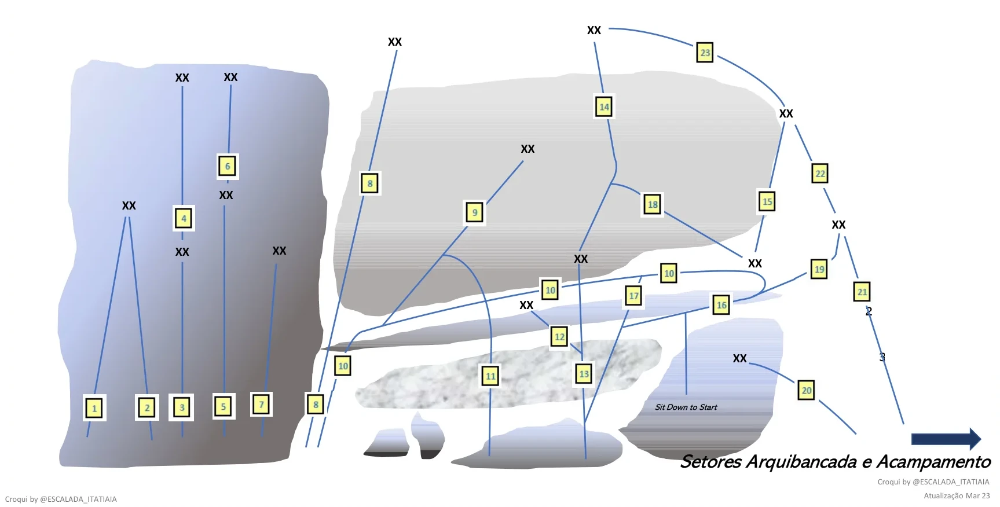
    - **largura_mapa**: 1727
    - **altura_mapa**: 876
    - **pontos_de_interesse**:
      - **[0]**:
        - **id**: abD69ST45Onc4b
        - **uid**: abD69ST45Onc4b
        - **rotulo**: 1
        - **retangulo**:
          - **x**: 135
          - **y**: 695
          - **comprimento**: 30
          - **largura**: 30
        - **label**: 1
      - **[1]**:
        - **id**: S85ixaWgWBYbh7
        - **uid**: S85ixaWgWBYbh7
        - **rotulo**: 2
        - **retangulo**:
          - **x**: 225
          - **y**: 695
          - **comprimento**: 30
          - **largura**: 30
        - **label**: 2
      - **[2]**:
        - **id**: WeNDq0tCjtungN
        - **uid**: WeNDq0tCjtungN
        - **rotulo**: 3
        - **retangulo**:
          - **x**: 285
          - **y**: 695
          - **comprimento**: 30
          - **largura**: 30
        - **label**: 3
      - **[3]**:
        - **id**: NRcwyR85Rm7ww5
        - **uid**: NRcwyR85Rm7ww5
        - **rotulo**: 4
        - **retangulo**:
          - **x**: 300
          - **y**: 355
          - **comprimento**: 30
          - **largura**: 30
        - **label**: 4
      - **[4]**:
        - **id**: IHhKeW64AbOYJq
        - **uid**: IHhKeW64AbOYJq
        - **rotulo**: 5
        - **retangulo**:
          - **x**: 365
          - **y**: 695
          - **comprimento**: 30
          - **largura**: 30
        - **label**: 5
      - **[5]**:
        - **id**: Y3e0ZVWfBCbY8S
        - **uid**: Y3e0ZVWfBCbY8S
        - **rotulo**: 6
        - **retangulo**:
          - **x**: 375
          - **y**: 270
          - **comprimento**: 30
          - **largura**: 30
        - **label**: 6
      - **[6]**:
        - **id**: sgf9JZtZ7RvDyq
        - **uid**: sgf9JZtZ7RvDyq
        - **rotulo**: 7
        - **retangulo**:
          - **x**: 430
          - **y**: 695
          - **comprimento**: 30
          - **largura**: 30
        - **label**: 7
      - **[7]**:
        - **id**: FZbKOq11mX5UuY
        - **uid**: FZbKOq11mX5UuY
        - **rotulo**: 8
        - **retangulo**:
          - **x**: 625
          - **y**: 295
          - **comprimento**: 30
          - **largura**: 30
        - **label**: 8
      - **[8]**:
        - **id**: xP2YPo3HyE7RgI
        - **uid**: xP2YPo3HyE7RgI
        - **rotulo**: 8
        - **retangulo**:
          - **x**: 530
          - **y**: 695
          - **comprimento**: 30
          - **largura**: 30
        - **label**: 8
      - **[9]**:
        - **id**: cPrLfnE2xqDCzL
        - **uid**: cPrLfnE2xqDCzL
        - **rotulo**: 9
        - **retangulo**:
          - **x**: 810
          - **y**: 355
          - **comprimento**: 30
          - **largura**: 30
        - **label**: 9
      - **[10]**:
        - **id**: rkGNXCm20aXZXX
        - **uid**: rkGNXCm20aXZXX
        - **rotulo**: 10
        - **retangulo**:
          - **x**: 945
          - **y**: 465
          - **comprimento**: 30
          - **largura**: 30
        - **label**: 10
      - **[11]**:
        - **id**: xwqQWadIyKSCLW
        - **uid**: xwqQWadIyKSCLW
        - **rotulo**: 10
        - **retangulo**:
          - **x**: 570
          - **y**: 620
          - **comprimento**: 30
          - **largura**: 30
        - **label**: 10
      - **[12]**:
        - **id**: rmi0phxTGk7eoh
        - **uid**: rmi0phxTGk7eoh
        - **rotulo**: 10
        - **retangulo**:
          - **x**: 1145
          - **y**: 455
          - **comprimento**: 30
          - **largura**: 30
        - **label**: 10
      - **[13]**:
        - **id**: cZ8fLDJx8QN3iK
        - **uid**: cZ8fLDJx8QN3iK
        - **rotulo**: 11
        - **retangulo**:
          - **x**: 835
          - **y**: 610
          - **comprimento**: 30
          - **largura**: 30
        - **label**: 11
      - **[14]**:
        - **id**: zy0vMHNNMjrEh7
        - **uid**: zy0vMHNNMjrEh7
        - **rotulo**: 12
        - **retangulo**:
          - **x**: 955
          - **y**: 555
          - **comprimento**: 30
          - **largura**: 30
        - **label**: 12
      - **[15]**:
        - **id**: 3MDo2Vv9wwJ4dt
        - **uid**: 3MDo2Vv9wwJ4dt
        - **rotulo**: 13
        - **retangulo**:
          - **x**: 1000
          - **y**: 615
          - **comprimento**: 30
          - **largura**: 30
        - **label**: 13
      - **[16]**:
        - **id**: dfR2PZgHdClS9G
        - **uid**: dfR2PZgHdClS9G
        - **rotulo**: 14
        - **retangulo**:
          - **x**: 1040
          - **y**: 175
          - **comprimento**: 30
          - **largura**: 30
        - **label**: 14
      - **[17]**:
        - **id**: Jqcg5Gra2ViLVW
        - **uid**: Jqcg5Gra2ViLVW
        - **rotulo**: 15
        - **retangulo**:
          - **x**: 1315
          - **y**: 335
          - **comprimento**: 30
          - **largura**: 30
        - **label**: 15
      - **[18]**:
        - **id**: f4ArbT8Qt1vsLp
        - **uid**: f4ArbT8Qt1vsLp
        - **rotulo**: 16
        - **retangulo**:
          - **x**: 1240
          - **y**: 505
          - **comprimento**: 30
          - **largura**: 30
        - **label**: 16
      - **[19]**:
        - **id**: Z2UqScP5v7YPiz
        - **uid**: Z2UqScP5v7YPiz
        - **rotulo**: 17
        - **retangulo**:
          - **x**: 1085
          - **y**: 490
          - **comprimento**: 30
          - **largura**: 30
        - **label**: 17
      - **[20]**:
        - **id**: CBjdLQGzvXBcah
        - **uid**: CBjdLQGzvXBcah
        - **rotulo**: 18
        - **retangulo**:
          - **x**: 1120
          - **y**: 345
          - **comprimento**: 30
          - **largura**: 30
        - **label**: 18
      - **[21]**:
        - **id**: AsprhWkvA9UMHG
        - **uid**: AsprhWkvA9UMHG
        - **rotulo**: 19
        - **retangulo**:
          - **x**: 1405
          - **y**: 435
          - **comprimento**: 30
          - **largura**: 30
        - **label**: 19
      - **[22]**:
        - **id**: ARFNbhkgMOOWTY
        - **uid**: ARFNbhkgMOOWTY
        - **rotulo**: 20
        - **retangulo**:
          - **x**: 1385
          - **y**: 650
          - **comprimento**: 30
          - **largura**: 30
        - **label**: 20
      - **[23]**:
        - **id**: P7lNVTQ25m7HFu
        - **uid**: P7lNVTQ25m7HFu
        - **rotulo**: 21
        - **retangulo**:
          - **x**: 1475
          - **y**: 495
          - **comprimento**: 30
          - **largura**: 30
        - **label**: 21
      - **[24]**:
        - **id**: kiwXIzHnIRd1XW
        - **uid**: kiwXIzHnIRd1XW
        - **rotulo**: 22
        - **retangulo**:
          - **x**: 1405
          - **y**: 285
          - **comprimento**: 30
          - **largura**: 30
        - **label**: 22
      - **[25]**:
        - **id**: pIO9bHRDT0YkPU
        - **uid**: pIO9bHRDT0YkPU
        - **rotulo**: 23
        - **retangulo**:
          - **x**: 1210
          - **y**: 75
          - **comprimento**: 30
          - **largura**: 30
        - **label**: 23
      - **[26]**:
        - **id**: b1klHtbxBEX3qP
        - **uid**: b1klHtbxBEX3qP
        - **rotulo**: Setores Arquibancada e Acampamento
        - **retangulo**:
          - **x**: 1400
          - **y**: 787
          - **comprimento**: 500
          - **largura**: 30
        - **label**: Setores Arquibancada e Acampamento
    - **referencias**:
      - **[0]**:
        - **alvo_uid**: U2RgFzLpkjsj6d
        - **pontos_uids**:
          - abD69ST45Onc4b
        - **escalada**: Tow Plac Two Plow
        - **ids**:
          - abD69ST45Onc4b
      - **[1]**:
        - **alvo_uid**: JbDORv0exPis89
        - **pontos_uids**:
          - S85ixaWgWBYbh7
        - **escalada**: Periguete
        - **ids**:
          - S85ixaWgWBYbh7
      - **[2]**:
        - **alvo_uid**: Ih24h0HxGJscUD
        - **pontos_uids**:
          - WeNDq0tCjtungN
        - **escalada**: The Glands
        - **ids**:
          - WeNDq0tCjtungN
      - **[3]**:
        - **alvo_uid**: EtM7k8d5FJpcg9
        - **pontos_uids**:
          - NRcwyR85Rm7ww5
          - NRcwyR85Rm7ww5
        - **escalada**: Ext. The Glands
        - **ids**:
          - NRcwyR85Rm7ww5
          - NRcwyR85Rm7ww5
      - **[4]**:
        - **alvo_uid**: 9DeD8fWMZrokes
        - **pontos_uids**:
          - IHhKeW64AbOYJq
        - **escalada**: Quartzolit
        - **ids**:
          - IHhKeW64AbOYJq
      - **[5]**:
        - **alvo_uid**: 9EXk83LoPKleSE
        - **pontos_uids**:
          - Y3e0ZVWfBCbY8S
          - Y3e0ZVWfBCbY8S
        - **escalada**: Ext. Quartzolit (Projeto)
        - **ids**:
          - Y3e0ZVWfBCbY8S
          - Y3e0ZVWfBCbY8S
      - **[6]**:
        - **alvo_uid**: IMbf288YNXO8pz
        - **pontos_uids**:
          - sgf9JZtZ7RvDyq
        - **escalada**: Jorginho
        - **ids**:
          - sgf9JZtZ7RvDyq
      - **[7]**:
        - **alvo_uid**: aOs5j5OnfoB5P0
        - **pontos_uids**:
          - xP2YPo3HyE7RgI
        - **escalada**: Toca do Sadu
        - **ids**:
          - xP2YPo3HyE7RgI
      - **[8]**:
        - **alvo_uid**: jUshQrfq36QhkG
        - **pontos_uids**:
          - cPrLfnE2xqDCzL
        - **escalada**: Triplo X
        - **ids**:
          - cPrLfnE2xqDCzL
      - **[9]**:
        - **alvo_uid**: 0kBLXM7iOsDOow
        - **pontos_uids**:
          - xwqQWadIyKSCLW
        - **escalada**: Além do Horizonte
        - **ids**:
          - xwqQWadIyKSCLW
      - **[10]**:
        - **alvo_uid**: oY7wO3AIfUnLRZ
        - **pontos_uids**:
          - cZ8fLDJx8QN3iK
        - **escalada**: Salto para Infinito
        - **ids**:
          - cZ8fLDJx8QN3iK
      - **[11]**:
        - **alvo_uid**: XHEsx8icNsy6HX
        - **pontos_uids**:
          - zy0vMHNNMjrEh7
        - **escalada**: Êxodo
        - **ids**:
          - zy0vMHNNMjrEh7
      - **[12]**:
        - **alvo_uid**: RyK3GN79xW609H
        - **pontos_uids**:
          - 3MDo2Vv9wwJ4dt
        - **escalada**: Gênesis
        - **ids**:
          - 3MDo2Vv9wwJ4dt
      - **[13]**:
        - **alvo_uid**: CL0tHS0fhrYw39
        - **pontos_uids**:
          - dfR2PZgHdClS9G
          - dfR2PZgHdClS9G
        - **escalada**: Ext. Gênesis
        - **ids**:
          - dfR2PZgHdClS9G
          - dfR2PZgHdClS9G
      - **[14]**:
        - **alvo_uid**: P3lsa4hvXLv6Sw
        - **pontos_uids**:
          - Jqcg5Gra2ViLVW
        - **escalada**: Cronos
        - **ids**:
          - Jqcg5Gra2ViLVW
      - **[15]**:
        - **alvo_uid**: ju3TutR9YALkry
        - **pontos_uids**:
          - f4ArbT8Qt1vsLp
        - **escalada**: Goela Seca
        - **ids**:
          - f4ArbT8Qt1vsLp
      - **[16]**:
        - **alvo_uid**: ojyhY9tsubkxPw
        - **pontos_uids**:
          - Z2UqScP5v7YPiz
        - **escalada**: Gogó
        - **ids**:
          - Z2UqScP5v7YPiz
      - **[17]**:
        - **alvo_uid**: 2Gf2EmA9JYiZAS
        - **pontos_uids**:
          - CBjdLQGzvXBcah
          - CBjdLQGzvXBcah
        - **escalada**: Ext. Gogó
        - **ids**:
          - CBjdLQGzvXBcah
          - CBjdLQGzvXBcah
      - **[18]**:
        - **alvo_uid**: 7piC42F0A4hHi4
        - **pontos_uids**:
          - AsprhWkvA9UMHG
        - **escalada**: 3.6 Turbo
        - **ids**:
          - AsprhWkvA9UMHG
      - **[19]**:
        - **alvo_uid**: kLM58Hn6C4F23i
        - **pontos_uids**:
          - ARFNbhkgMOOWTY
        - **escalada**: Brown & Brow
        - **ids**:
          - ARFNbhkgMOOWTY
      - **[20]**:
        - **alvo_uid**: TT3mEkvKvf6zDf
        - **pontos_uids**:
          - P7lNVTQ25m7HFu
        - **escalada**: Sinairo P1
        - **ids**:
          - P7lNVTQ25m7HFu
      - **[21]**:
        - **alvo_uid**: 002yNZxgpIrqot
        - **pontos_uids**:
          - kiwXIzHnIRd1XW
          - kiwXIzHnIRd1XW
        - **escalada**: Sinario P2
        - **ids**:
          - kiwXIzHnIRd1XW
          - kiwXIzHnIRd1XW
      - **[22]**:
        - **alvo_uid**: aLEde7q0gpybmY
        - **pontos_uids**:
          - pIO9bHRDT0YkPU
          - pIO9bHRDT0YkPU
        - **escalada**: Sinairo P3
        - **ids**:
          - pIO9bHRDT0YkPU
          - pIO9bHRDT0YkPU
- **escaladas**:
  - **[0]**:
    - **uid**: U2RgFzLpkjsj6d
    - **via_esportiva**:
      - **nome**: Tow Plac Two Plow
      - **dificuldade**: BR_9C
  - **[1]**:
    - **uid**: JbDORv0exPis89
    - **via_esportiva**:
      - **nome**: Periguete
      - **dificuldade**: BR_9C
  - **[2]**:
    - **uid**: Ih24h0HxGJscUD
    - **via_esportiva**:
      - **nome**: The Glands
      - **dificuldade**: BR_9A
  - **[3]**:
    - **uid**: EtM7k8d5FJpcg9
    - **via_esportiva**:
      - **nome**: Ext. The Glands
      - **dificuldade**: BR_9C
  - **[4]**:
    - **uid**: 9DeD8fWMZrokes
    - **via_esportiva**:
      - **nome**: Quartzolit
      - **dificuldade**: BR_10A
  - **[5]**:
    - **uid**: 9EXk83LoPKleSE
    - **via_esportiva**:
      - **nome**: Ext. Quartzolit (Projeto)
      - **dificuldade**: PROJETO
  - **[6]**:
    - **uid**: IMbf288YNXO8pz
    - **via_esportiva**:
      - **nome**: Jorginho
      - **dificuldade**: BR_8B
  - **[7]**:
    - **uid**: aOs5j5OnfoB5P0
    - **via_esportiva**:
      - **nome**: Toca do Sadu
      - **dificuldade**: BR_11A
  - **[8]**:
    - **uid**: jUshQrfq36QhkG
    - **via_esportiva**:
      - **nome**: Triplo X
      - **dificuldade**: BR_9C
  - **[9]**:
    - **uid**: 0kBLXM7iOsDOow
    - **via_esportiva**:
      - **nome**: Além do Horizonte
      - **dificuldade**: BR_8B
  - **[10]**:
    - **uid**: oY7wO3AIfUnLRZ
    - **via_esportiva**:
      - **nome**: Salto para Infinito
      - **dificuldade**: BR_10B
  - **[11]**:
    - **uid**: XHEsx8icNsy6HX
    - **via_esportiva**:
      - **nome**: Êxodo
      - **dificuldade**: BR_8B
  - **[12]**:
    - **uid**: RyK3GN79xW609H
    - **via_esportiva**:
      - **nome**: Gênesis
      - **dificuldade**: BR_8C
  - **[13]**:
    - **uid**: CL0tHS0fhrYw39
    - **via_esportiva**:
      - **nome**: Ext. Gênesis
      - **dificuldade**: BR_10C
  - **[14]**:
    - **uid**: P3lsa4hvXLv6Sw
    - **via_esportiva**:
      - **nome**: Cronos
      - **dificuldade**: BR_9C
  - **[15]**:
    - **uid**: ju3TutR9YALkry
    - **via_esportiva**:
      - **nome**: Goela Seca
      - **dificuldade**: BR_8C
  - **[16]**:
    - **uid**: ojyhY9tsubkxPw
    - **via_esportiva**:
      - **nome**: Gogó
      - **dificuldade**: BR_9A
  - **[17]**:
    - **uid**: 2Gf2EmA9JYiZAS
    - **via_esportiva**:
      - **nome**: Ext. Gogó
      - **dificuldade**: BR_10C
  - **[18]**:
    - **uid**: 7piC42F0A4hHi4
    - **via_esportiva**:
      - **nome**: 3.6 Turbo
      - **dificuldade**: BR_9C
  - **[19]**:
    - **uid**: kLM58Hn6C4F23i
    - **via_esportiva**:
      - **nome**: Brown & Brow
      - **dificuldade**: BR_10B
  - **[20]**:
    - **uid**: TT3mEkvKvf6zDf
    - **via_esportiva**:
      - **nome**: Sinairo P1
      - **dificuldade**: BR_10C
  - **[21]**:
    - **uid**: 002yNZxgpIrqot
    - **via_esportiva**:
      - **nome**: Sinario P2
      - **dificuldade**: BR_11B
  - **[22]**:
    - **uid**: aLEde7q0gpybmY
    - **via_esportiva**:
      - **nome**: Sinairo P3
      - **dificuldade**: PROJETO
- **precomputados**:
  - **total_escaladas**: 23
  - **total_esportivas**: 23

## Parte: setor_acampamento

### Setor (Pico: Gruta de Passa Vinte)

- **descricao**: 
- **nome**: Acampamento
- **uid**: o45FjTNWXmwkwp
- **mapas**:
  - **[0]**:
    - **caminho_imagem_mapa**: 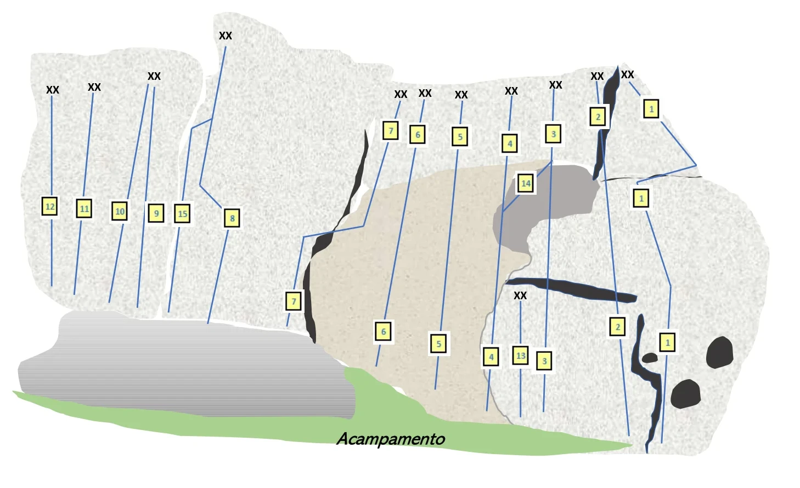
    - **largura_mapa**: 1458
    - **altura_mapa**: 892
    - **pontos_de_interesse**:
      - **[0]**:
        - **id**: HzhYKwBfzJ0rcq
        - **uid**: HzhYKwBfzJ0rcq
        - **rotulo**: 1
        - **retangulo**:
          - **x**: 1178
          - **y**: 195
          - **comprimento**: 30
          - **largura**: 30
        - **label**: 1
      - **[1]**:
        - **id**: JiYA5a0aW0x1nG
        - **uid**: JiYA5a0aW0x1nG
        - **rotulo**: 1
        - **retangulo**:
          - **x**: 1160
          - **y**: 360
          - **comprimento**: 30
          - **largura**: 30
        - **label**: 1
      - **[2]**:
        - **id**: bxFcJSWZIMJeVy
        - **uid**: bxFcJSWZIMJeVy
        - **rotulo**: 1
        - **retangulo**:
          - **x**: 1215
          - **y**: 625
          - **comprimento**: 30
          - **largura**: 30
        - **label**: 1
      - **[3]**:
        - **id**: gO33ESOpAScROz
        - **uid**: gO33ESOpAScROz
        - **rotulo**: 2
        - **retangulo**:
          - **x**: 1085
          - **y**: 210
          - **comprimento**: 30
          - **largura**: 30
        - **label**: 2
      - **[4]**:
        - **id**: j1VTVPq7ngV1p1
        - **uid**: j1VTVPq7ngV1p1
        - **rotulo**: 2
        - **retangulo**:
          - **x**: 1145
          - **y**: 590
          - **comprimento**: 30
          - **largura**: 30
        - **label**: 2
      - **[5]**:
        - **id**: croc8wGJFZdEOr
        - **uid**: croc8wGJFZdEOr
        - **rotulo**: 3
        - **retangulo**:
          - **x**: 1000
          - **y**: 245
          - **comprimento**: 30
          - **largura**: 30
        - **label**: 3
      - **[6]**:
        - **id**: Tog39o7HPbhR7i
        - **uid**: Tog39o7HPbhR7i
        - **rotulo**: 3
        - **retangulo**:
          - **x**: 990
          - **y**: 655
          - **comprimento**: 30
          - **largura**: 30
        - **label**: 3
      - **[7]**:
        - **id**: lLmJOyMDMT2iZx
        - **uid**: lLmJOyMDMT2iZx
        - **rotulo**: 4
        - **retangulo**:
          - **x**: 910
          - **y**: 255
          - **comprimento**: 30
          - **largura**: 30
        - **label**: 4
      - **[8]**:
        - **id**: M6WaRcoPoL8VQ0
        - **uid**: M6WaRcoPoL8VQ0
        - **rotulo**: 4
        - **retangulo**:
          - **x**: 855
          - **y**: 645
          - **comprimento**: 30
          - **largura**: 30
        - **label**: 4
      - **[9]**:
        - **id**: F4b4J95eMgeaCx
        - **uid**: F4b4J95eMgeaCx
        - **rotulo**: 5
        - **retangulo**:
          - **x**: 825
          - **y**: 245
          - **comprimento**: 30
          - **largura**: 30
        - **label**: 5
      - **[10]**:
        - **id**: PIPUMkdo2H6xm5
        - **uid**: PIPUMkdo2H6xm5
        - **rotulo**: 5
        - **retangulo**:
          - **x**: 770
          - **y**: 635
          - **comprimento**: 30
          - **largura**: 30
        - **label**: 5
      - **[11]**:
        - **id**: nf252a8MsrYkE0
        - **uid**: nf252a8MsrYkE0
        - **rotulo**: 6
        - **retangulo**:
          - **x**: 740
          - **y**: 240
          - **comprimento**: 30
          - **largura**: 30
        - **label**: 6
      - **[12]**:
        - **id**: tn7IUT8fwe3jd4
        - **uid**: tn7IUT8fwe3jd4
        - **rotulo**: 6
        - **retangulo**:
          - **x**: 665
          - **y**: 610
          - **comprimento**: 30
          - **largura**: 30
        - **label**: 6
      - **[13]**:
        - **id**: 2s2Sq3t07lPmnp
        - **uid**: 2s2Sq3t07lPmnp
        - **rotulo**: 7
        - **retangulo**:
          - **x**: 690
          - **y**: 235
          - **comprimento**: 30
          - **largura**: 30
        - **label**: 7
      - **[14]**:
        - **id**: HzqOAFnhEaH6QU
        - **uid**: HzqOAFnhEaH6QU
        - **rotulo**: 7
        - **retangulo**:
          - **x**: 515
          - **y**: 550
          - **comprimento**: 30
          - **largura**: 30
        - **label**: 7
      - **[15]**:
        - **id**: ZbVTusLCZA9Vsq
        - **uid**: ZbVTusLCZA9Vsq
        - **rotulo**: 8
        - **retangulo**:
          - **x**: 405
          - **y**: 395
          - **comprimento**: 30
          - **largura**: 30
        - **label**: 8
      - **[16]**:
        - **id**: pfcVQJlZCxppxf
        - **uid**: pfcVQJlZCxppxf
        - **rotulo**: 9
        - **retangulo**:
          - **x**: 255
          - **y**: 380
          - **comprimento**: 30
          - **largura**: 30
        - **label**: 9
      - **[17]**:
        - **id**: Fuu06QR9jjaAFV
        - **uid**: Fuu06QR9jjaAFV
        - **rotulo**: 10
        - **retangulo**:
          - **x**: 190
          - **y**: 380
          - **comprimento**: 30
          - **largura**: 30
        - **label**: 10
      - **[18]**:
        - **id**: HE1fauI2YWsmu2
        - **uid**: HE1fauI2YWsmu2
        - **rotulo**: 11
        - **retangulo**:
          - **x**: 125
          - **y**: 375
          - **comprimento**: 30
          - **largura**: 30
        - **label**: 11
      - **[19]**:
        - **id**: 3Ny9dDH6fVre2s
        - **uid**: 3Ny9dDH6fVre2s
        - **rotulo**: 12
        - **retangulo**:
          - **x**: 65
          - **y**: 370
          - **comprimento**: 30
          - **largura**: 30
        - **label**: 12
      - **[20]**:
        - **id**: u1u2q3hHaKx2OZ
        - **uid**: u1u2q3hHaKx2OZ
        - **rotulo**: 13
        - **retangulo**:
          - **x**: 935
          - **y**: 650
          - **comprimento**: 30
          - **largura**: 30
        - **label**: 13
      - **[21]**:
        - **id**: 6fjkUqGhm2pEPT
        - **uid**: 6fjkUqGhm2pEPT
        - **rotulo**: 14
        - **retangulo**:
          - **x**: 945
          - **y**: 340
          - **comprimento**: 30
          - **largura**: 30
        - **label**: 14
      - **[22]**:
        - **id**: TiXrwHbTAIg6Ey
        - **uid**: TiXrwHbTAIg6Ey
        - **rotulo**: 15
        - **retangulo**:
          - **x**: 305
          - **y**: 385
          - **comprimento**: 30
          - **largura**: 30
        - **label**: 15
      - **[23]**:
        - **id**: JIeSVlNXb5dZaB
        - **uid**: JIeSVlNXb5dZaB
        - **rotulo**: Acampamento
        - **retangulo**:
          - **x**: 702
          - **y**: 795
          - **comprimento**: 250
          - **largura**: 40
        - **label**: Acampamento
    - **referencias**:
      - **[0]**:
        - **alvo_uid**: SHHifSZ5NIEA4X
        - **pontos_uids**:
          - bxFcJSWZIMJeVy
        - **escalada**: Faraó
        - **ids**:
          - bxFcJSWZIMJeVy
      - **[1]**:
        - **alvo_uid**: 0A1yQsimyMtjFp
        - **pontos_uids**:
          - j1VTVPq7ngV1p1
        - **escalada**: Esfinge
        - **ids**:
          - j1VTVPq7ngV1p1
      - **[2]**:
        - **alvo_uid**: fagJSAw7O4pa9b
        - **pontos_uids**:
          - Tog39o7HPbhR7i
        - **escalada**: Camel
        - **ids**:
          - Tog39o7HPbhR7i
      - **[3]**:
        - **alvo_uid**: qSpKGogkg3CQ1b
        - **pontos_uids**:
          - M6WaRcoPoL8VQ0
        - **escalada**: Bulimia
        - **ids**:
          - M6WaRcoPoL8VQ0
      - **[4]**:
        - **alvo_uid**: MlV6bL66vEhmtF
        - **pontos_uids**:
          - PIPUMkdo2H6xm5
        - **escalada**: Venetica
        - **ids**:
          - PIPUMkdo2H6xm5
      - **[5]**:
        - **alvo_uid**: rnX6PoXbvNbzF8
        - **pontos_uids**:
          - tn7IUT8fwe3jd4
        - **escalada**: Resigente
        - **ids**:
          - tn7IUT8fwe3jd4
      - **[6]**:
        - **alvo_uid**: w7BcvT9HFkaQsA
        - **pontos_uids**:
          - HzqOAFnhEaH6QU
        - **escalada**: Bammalves
        - **ids**:
          - HzqOAFnhEaH6QU
      - **[7]**:
        - **alvo_uid**: S31QbLSrbTP2yq
        - **pontos_uids**:
          - ZbVTusLCZA9Vsq
        - **escalada**: Tomahawk
        - **ids**:
          - ZbVTusLCZA9Vsq
      - **[8]**:
        - **alvo_uid**: wqT3CmglXFPuHD
        - **pontos_uids**:
          - pfcVQJlZCxppxf
        - **escalada**: Souza Paiol
        - **ids**:
          - pfcVQJlZCxppxf
      - **[9]**:
        - **alvo_uid**: F0rMpV7KZ4TAJ6
        - **pontos_uids**:
          - Fuu06QR9jjaAFV
        - **escalada**: Marlboro
        - **ids**:
          - Fuu06QR9jjaAFV
      - **[10]**:
        - **alvo_uid**: qZHGeQ8a33ls26
        - **pontos_uids**:
          - HE1fauI2YWsmu2
        - **escalada**: Hollywood
        - **ids**:
          - HE1fauI2YWsmu2
      - **[11]**:
        - **alvo_uid**: VDnU8QQ8ZkqLiZ
        - **pontos_uids**:
          - 3Ny9dDH6fVre2s
        - **escalada**: Derby Azul
        - **ids**:
          - 3Ny9dDH6fVre2s
      - **[12]**:
        - **alvo_uid**: dFC4Rs75ZMf7kY
        - **pontos_uids**:
          - u1u2q3hHaKx2OZ
        - **escalada**: Adelaide
        - **ids**:
          - u1u2q3hHaKx2OZ
      - **[13]**:
        - **alvo_uid**: UgMFUy9M4gC3uQ
        - **pontos_uids**:
          - 6fjkUqGhm2pEPT
        - **escalada**: Bulica
        - **ids**:
          - 6fjkUqGhm2pEPT
      - **[14]**:
        - **alvo_uid**: F9y4DWJ7C06cLC
        - **pontos_uids**:
          - TiXrwHbTAIg6Ey
        - **escalada**: Stinger
        - **ids**:
          - TiXrwHbTAIg6Ey
- **escaladas**:
  - **[0]**:
    - **uid**: SHHifSZ5NIEA4X
    - **via_esportiva**:
      - **nome**: Faraó
      - **dificuldade**: BR_6
  - **[1]**:
    - **uid**: 0A1yQsimyMtjFp
    - **via_esportiva**:
      - **nome**: Esfinge
      - **dificuldade**: BR_7A
  - **[2]**:
    - **uid**: fagJSAw7O4pa9b
    - **via_esportiva**:
      - **nome**: Camel
      - **dificuldade**: BR_7C
  - **[3]**:
    - **uid**: qSpKGogkg3CQ1b
    - **via_esportiva**:
      - **nome**: Bulimia
      - **dificuldade**: BR_6SUP
  - **[4]**:
    - **uid**: MlV6bL66vEhmtF
    - **via_esportiva**:
      - **nome**: Venetica
      - **dificuldade**: BR_7A
  - **[5]**:
    - **uid**: rnX6PoXbvNbzF8
    - **via_esportiva**:
      - **nome**: Resigente
      - **dificuldade**: BR_8A
  - **[6]**:
    - **uid**: w7BcvT9HFkaQsA
    - **via_esportiva**:
      - **nome**: Bammalves
      - **dificuldade**: BR_8A
  - **[7]**:
    - **uid**: S31QbLSrbTP2yq
    - **via_esportiva**:
      - **nome**: Tomahawk
      - **dificuldade**: BR_6SUP
  - **[8]**:
    - **uid**: wqT3CmglXFPuHD
    - **via_esportiva**:
      - **nome**: Souza Paiol
      - **dificuldade**: BR_7B
  - **[9]**:
    - **uid**: F0rMpV7KZ4TAJ6
    - **via_esportiva**:
      - **nome**: Marlboro
      - **dificuldade**: BR_7A
  - **[10]**:
    - **uid**: qZHGeQ8a33ls26
    - **via_esportiva**:
      - **nome**: Hollywood
      - **dificuldade**: BR_7B
  - **[11]**:
    - **uid**: VDnU8QQ8ZkqLiZ
    - **via_esportiva**:
      - **nome**: Derby Azul
      - **dificuldade**: BR_5
  - **[12]**:
    - **uid**: dFC4Rs75ZMf7kY
    - **via_esportiva**:
      - **nome**: Adelaide
      - **dificuldade**: BR_8C
  - **[13]**:
    - **uid**: UgMFUy9M4gC3uQ
    - **via_esportiva**:
      - **nome**: Bulica
      - **dificuldade**: BR_7B_BARRA_7C
  - **[14]**:
    - **uid**: F9y4DWJ7C06cLC
    - **via_esportiva**:
      - **nome**: Stinger
      - **dificuldade**: BR_6SUP
- **precomputados**:
  - **total_escaladas**: 15
  - **total_esportivas**: 15

## Arquivos Externos

- **arquivos_externos**:
  - **[0]**:
    - **caminho**: 
    - **checksum_sha256**: a5d17d21899e0994509c7ed1870b6f545375da5a2a92addd31a819cdd628ed8e
  - **[1]**:
    - **caminho**: 
    - **checksum_sha256**: 66bba2b9b8160dbc2aca8de9d87dbfcf6eba37c16d62e88dde5311baf9ba3979
  - **[2]**:
    - **caminho**: 
    - **checksum_sha256**: 5013e7da621e9be6dfa9462712485623af616d633da0552dbd1a74429e0c9f36
  - **[3]**:
    - **caminho**: 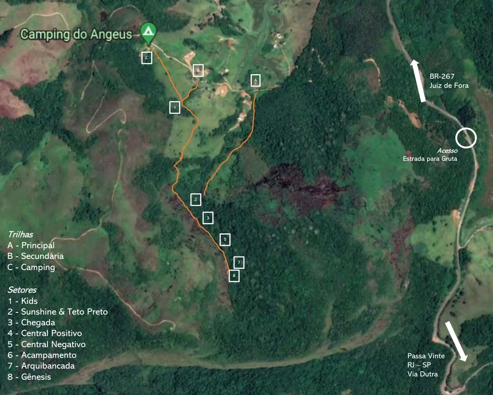
    - **checksum_sha256**: 6b71d5225061319ea07ccf874953da6b8281b6db01fd79450936e8be224d1a54
  - **[4]**:
    - **caminho**: 
    - **checksum_sha256**: 5fa33cd9ca7f907dc2b1f463c6df0a3a7eb79f69959c67caeb1628d9c52adbd7
  - **[5]**:
    - **caminho**: 
    - **checksum_sha256**: 81a91a2bfb78e0214816e99813aed225e4d453347167b5d96855bf05d7af26d6
  - **[6]**:
    - **caminho**: 
    - **checksum_sha256**: 8a5d893ccec0cdaed6c8c6d59455f30eaca9b1b38196e800a2d115187b4cc3bb
  - **[7]**:
    - **caminho**: 
    - **checksum_sha256**: d948d5098d5cca03faf682ea33310b0addddab3fe3b8833bf9a76e078ecdd80a
  - **[8]**:
    - **caminho**: 
    - **checksum_sha256**: 54d2c557a48a128eaa90d9edd7b4e217e4cc2feb9fbf341231531a2af15aec28
  - **[9]**:
    - **caminho**: 
    - **checksum_sha256**: 706a9227b19154392aae4ffc27055c9b773dc8a97d10a8f4293e4616db9f3e39
  - **[10]**:
    - **caminho**: 
    - **checksum_sha256**: b71940cdd718a6617ddafa821ae6c453505932e72b4628f4e3be4815424330be

