# Croqui: Gruta do Baú

## Informações Gerais

- **id**: br_mg_pedro_leopoldo_gruta_do_bau
- **nome**: Gruta do Baú
- **creditos**:
  - Christian Costa
- **caminho_thumbnail**: 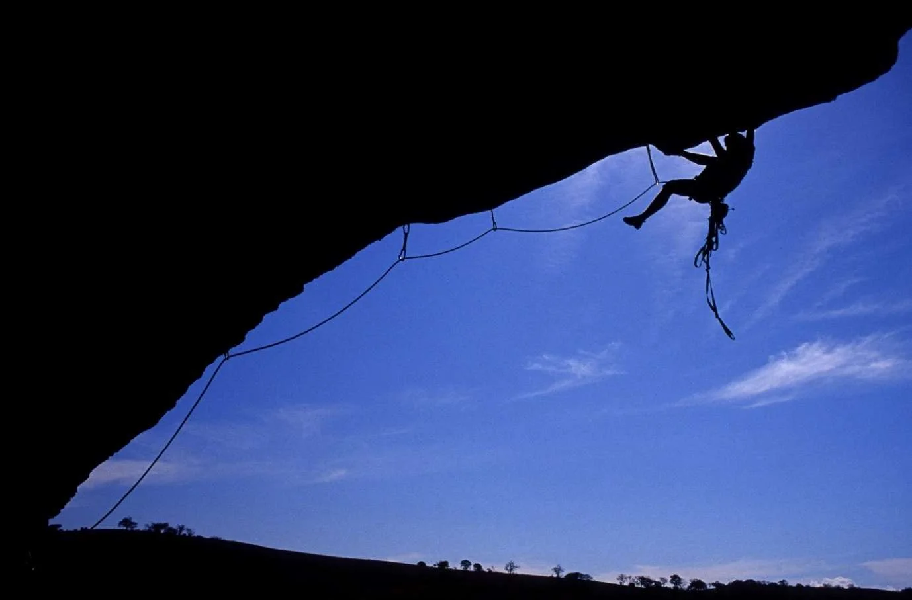
- **revisado_manualmente**: True
- **status_desenho_extraivel**: NAO_TEM_DESENHO
- **botoes**:
  - **[0]**:
    - **texto**: Capa
    - **destino**:
      - **secao_textual**:
        - **conteudo**:
            # GUIA DE ESCALADA GRUTA DO BAÚ
            
            **PEDRO LEOPOLDO – MG**
            **5ª Edição - Agosto/2025**
            
            **CHRISTIAN COSTA**
            
            |  |
            | :--: |
            | *Capa* |
  - **[1]**:
    - **texto**: Aviso
    - **destino**:
      - **secao_textual**:
        - **conteudo**:
            # AVISO
            
            A escalada é um esporte de risco, manuais e guias não substituem instrução e supervisão profissional. Somente com equipamentos de qualidade e instrução adequada se consegue minimizar os riscos do esporte.
            
            Se você ainda não sabe escalar procure uma escola com instrutores qualificados. Evite aprender na base dos erros e acertos, pois acidentes em escalada são potencialmente graves sendo fundamental a instrução profissional para perfeita compreensão das diversas técnicas de segurança.
            
            As informações contidas neste guia servem apenas para indicar os locais mais frequentados e suas principais vias de escalada, não assegurando a integridade física das proteções fixas das vias indicadas. Os autores também não se responsabilizam pela utilização ou má interpretação das informações contidas neste guia.
            
            Esteja avisado que alguns dos dados contidos no guia são subjetivos (como o grau de dificuldade por exemplo), e a utilização deste guia implica que você está ciente que, morte ou acidentes graves são riscos inerentes da escalada em rocha, assumindo assim toda a responsabilidade pelos seus atos.
            
            A utilização de capacete é recomendável durante toda a permanência nas áreas de escalada.
            
            Este guia foi feito por escaladores e não tem qualquer objetivo financeiro. Como qualquer trabalho está sujeito a erros e acertos. Qualquer dúvida, sugestão ou elogio são muito bem vindos.
            
            Lembre-se sempre:
            
            **A SEGURANÇA deve ser sempre o aspecto mais importante em toda e qualquer atividade de escalada**
            
            **VOCÊ É O MAIOR RESPONSÁVEL POR SUA SEGURANÇA, RESPEITE OS SEUS LIMITES E SEJA PRUDENTE.**
  - **[2]**:
    - **texto**: História
    - **destino**:
      - **secao_textual**:
        - **conteudo**:
            # História
            
            O maciço do Baú está localizado no município de Pedro Leopoldo a cerca de 50 km de Belo Horizonte. O local está dentro dos limites da APA Carste de Lagoa Santa em uma propriedade particular, abrigando inúmeras cavernas e formações rochosas. Os espeleólogos encontraram nestas cavernas vários fósseis além de diversos espeleotemas de rara beleza.
            
            |  |
            | :--: |
            | *Maciço do Baú* |
            
            O nome de Gruta do Baú advém da formação rochosa presente no maciço que se assemelha a uma fechadura.
            
            O Baú começou a ser frequentado pelos escaladores na década de noventa, quando Roberto Lincoln e Rômulo Brandão, ambos recém formados em um curso de escalada, visitaram o local e perceberam o potencial deste, abrindo lá suas primeiras vias de escalada, hoje as clássicas “Retorno de Pitú” e “Sentinela”.
            
            |  |
            | :--: |
            | *Poliana Lisboa – Via Arcanjo Gabriel* |
            
            No princípio seus conhecimentos sobre conquistas e grampeações eram poucos, porém eles superaram esta falta de conhecimento e equipamentos adequados com uma boa dose de criatividade, conquistando diversas vias.
            
            O proprietário atual é o empresário José Celso, um apaixonado pela natureza e por todo o complexo do Baú que preza pela boa convivência e faz de tudo para que os escaladores se sintam em casa ao frequentarem sua fazenda. Chegado a uma boa prosa, os encontros com ele sempre são recheados de boas histórias e risadas.
  - **[3]**:
    - **texto**: Acesso
    - **destino**:
      - **secao_textual**:
        - **conteudo**:
            # Acesso
            
            O Baú está localizado no município de Pedro Leopoldo, no distrito de Lagoa de Santo Antônio, há cerca de 50 km de Belo Horizonte.
            
            Na saída de Belo Horizonte para o Aeroporto internacional de Confins (MG-010) entrar no trevo para a cidade de Pedro Leopoldo, seguindo pela MG 424. Após passar por Pedro Leopoldo continuar na rodovia em direção a Matozinhos e virar à direita no trevo da correia transportadora de minério que atravessa a estrada até o distrito de Lagoa de Santo Antônio.
            
            Seguir em direção ao distrito de Fidalgo, passando próximo a uma lagoa e chegando até a Rua Pacífico Rodrigues.
            
            **Coordenadas geográficas da entrada:** -19º33'12.5 -43º59'23.4
            
            |  |
            | :--: |
            | *Vista da saída na MG 424* |
            
            | 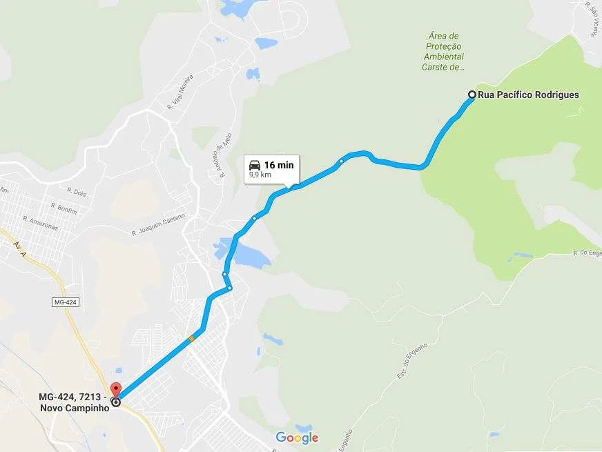 |
            | :--: |
            | *Trajeto até entrada do Baú* |
            
            | 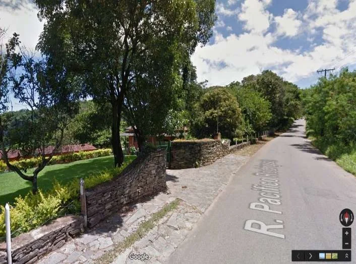 |
            | :--: |
            | *Vista da entrada da Fazenda* |
  - **[4]**:
    - **texto**: Regras de Visitação
    - **destino**:
      - **secao_textual**:
        - **conteudo**:
            # Regras de Visitação
            
            Como todas as áreas de escalada, os princípios do mínimo impacto devem ser observados e a segurança é responsabilidade única e exclusiva de cada um.
            
            A área de escalada no Baú é uma área particular, pertencente ao Sr. José Celso. Para que continue aberta a escalada é fundamental observarmos algumas regras de visitação:
            
            - Taxa de visitação: R$ 25,00 (Vinte e cinco reais);
            - **Obrigatório a utilização de Capacete e cada visitante deve portar o seu próprio equipamento.**
            - **Obrigatório que o praticante faça parte do grupo de whatsapp de informações do Baú, para que tenha ciência das regras e condutas para o local, bem como informes pertinentes da área.**
            
            | 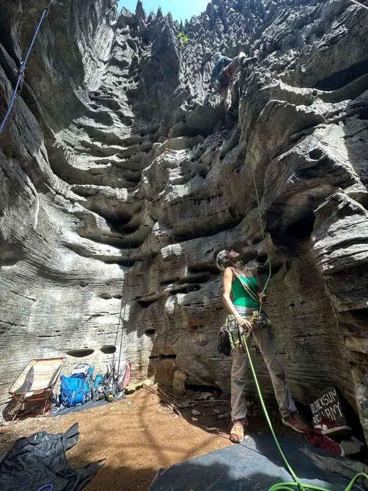 |
            | :--: |
            | *Larissa Correa dando segurança para Bruno Lapertosa no setor Segundo Andar* |
            
            - Horário de funcionamento: 08:00 às 18:00, todos os dias da semana para escalada;
            - Deixar qualquer portão, porteira ou colchete fechado;
            - É proibido retirar qualquer objeto do sítio (pedras, mudas, flores, etc...);
            - Se manter sempre nas trilhas demarcadas;
            - Não fazer qualquer modificação ou conquista de vias sem comunicar o grupo de trabalho responsável pelo local;
            
            | 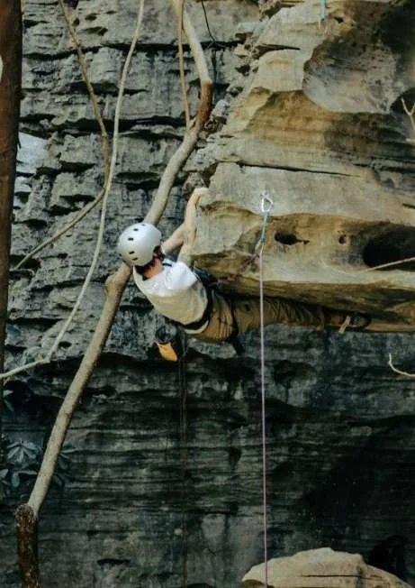 |
            | :--: |
            | *Marina Rocha - Via Fusca Azul* |
            
            **OBSERVAÇÃO:** A quantidade de proteções expressa no guia conta as proteções da via mais o Top com 1 ou 2 proteções. Por exemplo, se está expresso 6 + 2 no campo proteções, são 6 chapeletas ou grampos + o top rope.
            
            **OBSERVAÇÃO 2:** As vias com proteções móveis ou mistas estão assinaladas de vermelho no guia. O grupo de trabalho vem duplicando os top ropes dessas vias e colocando os nomes nas bases.
            
            **OBSERVAÇÃO 3:** Alguns locais tem Topropes montados baixos para cursos de escalada. Marcados em amarelo nos croquis.
            
            **É expressamente proibido a entrada na gruta sem o acompanhamento de um guia da fazenda.**
  - **[5]**:
    - **texto**: Opções de Hospedagem
    - **destino**:
      - **secao_textual**:
        - **conteudo**:
            # Opções de Hospedagem
            
            ### Casa ou quartos para alugar na própria Gruta do Baú
            
            |  |
            | :--: |
            | *Casa ou quartos para alugar na própria Gruta do Baú* |
            
            O complexo da fazenda conta com uma casa que pode ser alugada por um grupo ou somente os quartos isoladamente. Fica bem ao lado da entrada e conta ainda com uma piscina privativa e deck panorâmico.
            **CONTATOS**
            Instagram: @grutadobau
            WhatsApp - José Celso: (31) 98771-1655
            
            ### Rupestre da Lapa
            
            | 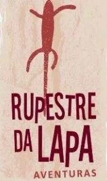 |
            | :--: |
            | *Rupestre da Lapa* |
            
            Abrigo de escalada – Hospedagem com ou sem refeições, estacionamento, área de camping, quartos coletivos, duplos e suítes. Serve café da manhã, almoço, lanche e jantar mediante agendamento.
            **CONTATOS**
            Instagram: @hospedagemrupestredalapa
            WhatsApp - Helon ou Denise: (31) 99807-8392
            
            ### Escalarte
            
            |  |
            | :--: |
            | *Escalarte* |
            
            Refúgio de escalada – Hospedagem a menos de 1 km da Gruta da Lapinha e 13 km da Gruta do Baú. Oferece quartos coletivos, duplos e suítes.
            
            | 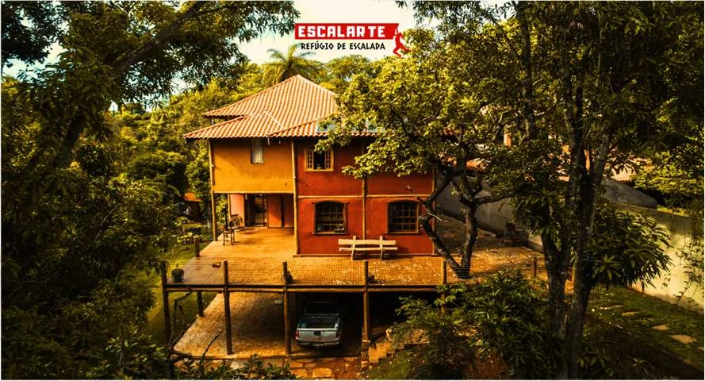 |
            | :--: |
            | *Hospedagem* |
            **CONTATOS**
            Instagram: @escalar_te
            WhatsApp – André Braga (Dedé): (31) 99831-3107
  - **[6]**:
    - **texto**: Outras atrações
    - **destino**:
      - **secao_textual**:
        - **conteudo**:
            # Outras atrações e comodidades da Gruta do Baú
            
            A área de escalada da Gruta do Baú se localiza dentro da Fazenda Gruta do Baú, que por si só, já é uma atração à parte. A Fazenda conta com diversas outras atrações e comodidades, se tornando um passeio para toda a família. Podemos destacar:
            
            | 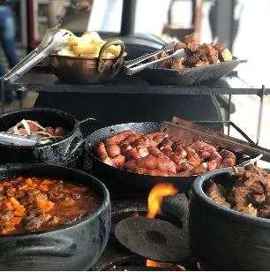 |
            | :--: |
            | *Restaurante com café da manhã, almoço e petiscos* |
            
            |  |
            | :--: |
            | *Bike Park com 18 km de trilhas* |
            
            | 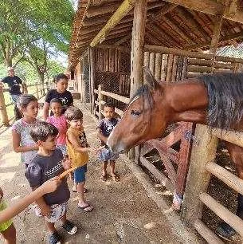 |
            | :--: |
            | *Alimentação para os animais* |
            
            |  |
            | :--: |
            | *Recreação infantil* |
            
            |  |
            | :--: |
            | *Parquinho* |
  - **[7]**:
    - **texto**: Manutenção
    - **destino**:
      - **secao_textual**:
        - **conteudo**:
            # Manutenção e conquista de novas vias
            
            A grande maioria das vias do maciço do Baú são da década de 90, quase todas atingindo os 20 anos desde a conquista... Devido a idade das vias muitas proteções se deterioraram com o tempo e não se encontram em condições de utilização. Com o intuito de proporcionar uma escalada de qualidade e sobretudo segura, um pequeno grupo de escaladores locais está realizando de maneira gradativa a substituição das proteções e duplicando os top ropes.
            
            Foi criado um grupo de trabalho em 2020 com o intuito de intermediar a abertura de novas vias junto ao proprietário. A abertura se dará de forma lenta e gradual, para diminuir os impactos gerados na área.
            
            O GT Baú vem variando os membros ao longo do tempo e em agosto de 2025 é composto pelos escaladores: André Braga, Christian Costa, Igor Andrade, Iule Ornelas, Marcelo Novais, Márcio Vasconcelos, Roberto Lincoln, Sandro Almeida e Wilson Souza “Professor”.
            
            | 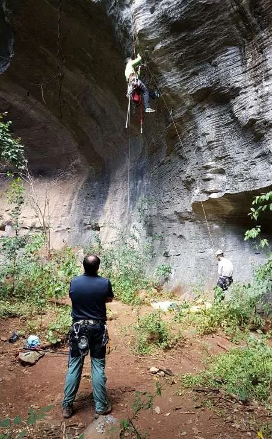 |
            | :--: |
            | *Manutenção na Rayovac* |
            
            |  |
            | :--: |
            | *Mariana Costa ajudando a colocar o nome na via aberta em sua homenagem* |
            
            |  |
            | :--: |
            | *Manutencao na Sentinela 1* |
- **ultima_migracao**: 4
- **publicar_croqui**: True
- **revisado_bounding_circle**: True

## Parte: setor_entrada_inferior

### Setor (Pico: Gruta do Baú)

- **descricao**:
    # Setor Entrada Inferior
    
    **Acesso:** Seguindo pela estrada partindo do estacionamento, é o primeiro setor que fica na chegada ao maciço.
    
    **Coordenadas na base da via É Brincadeira:** -19º32.879’ -43º59.337’
- **nome**: Setor Entrada Inferior
- **mapas**:
  - **[0]**:
    - **caminho_imagem_mapa**: 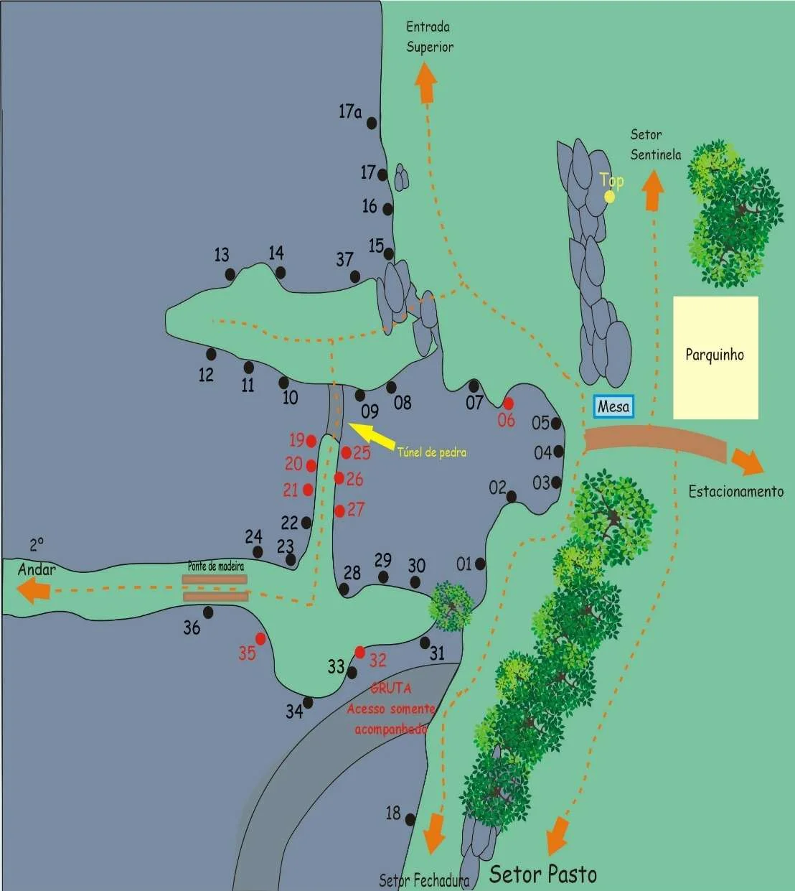
    - **largura_mapa**: 1108
    - **altura_mapa**: 1241
    - **pontos_de_interesse**:
      - **[0]**:
        - **id**: Entrada_Superior
        - **label**: Entrada Superior
        - **retangulo**:
          - **x**: 599
          - **y**: 50
          - **comprimento**: 76
          - **largura**: 57
      - **[1]**:
        - **id**: 17a
        - **label**: 17a
        - **retangulo**:
          - **x**: 489
          - **y**: 154
          - **comprimento**: 38
          - **largura**: 30
      - **[2]**:
        - **id**: Setor_Sentinela
        - **label**: Setor Sentinela
        - **retangulo**:
          - **x**: 913
          - **y**: 198
          - **comprimento**: 82
          - **largura**: 55
      - **[3]**:
        - **id**: 17
        - **label**: 17
        - **retangulo**:
          - **x**: 513
          - **y**: 240
          - **comprimento**: 26
          - **largura**: 27
      - **[4]**:
        - **id**: 16
        - **label**: 16
        - **retangulo**:
          - **x**: 516
          - **y**: 285
          - **comprimento**: 27
          - **largura**: 28
      - **[5]**:
        - **id**: 14
        - **label**: 14
        - **retangulo**:
          - **x**: 386
          - **y**: 352
          - **comprimento**: 30
          - **largura**: 30
      - **[6]**:
        - **id**: 15
        - **label**: 15
        - **retangulo**:
          - **x**: 525
          - **y**: 340
          - **comprimento**: 28
          - **largura**: 29
      - **[7]**:
        - **id**: 13
        - **label**: 13
        - **retangulo**:
          - **x**: 310
          - **y**: 354
          - **comprimento**: 30
          - **largura**: 29
      - **[8]**:
        - **id**: 37
        - **label**: 37
        - **retangulo**:
          - **x**: 480
          - **y**: 360
          - **comprimento**: 33
          - **largura**: 29
      - **[9]**:
        - **id**: 12
        - **label**: 12
        - **retangulo**:
          - **x**: 288
          - **y**: 522
          - **comprimento**: 31
          - **largura**: 31
      - **[10]**:
        - **id**: 11
        - **label**: 11
        - **retangulo**:
          - **x**: 346
          - **y**: 536
          - **comprimento**: 27
          - **largura**: 29
      - **[11]**:
        - **id**: 08
        - **label**: 08
        - **retangulo**:
          - **x**: 561
          - **y**: 560
          - **comprimento**: 34
          - **largura**: 30
      - **[12]**:
        - **id**: 07
        - **label**: 07
        - **retangulo**:
          - **x**: 662
          - **y**: 560
          - **comprimento**: 33
          - **largura**: 31
      - **[13]**:
        - **id**: 09
        - **label**: 09
        - **retangulo**:
          - **x**: 516
          - **y**: 572
          - **comprimento**: 29
          - **largura**: 28
      - **[14]**:
        - **id**: 06
        - **label**: 06
        - **retangulo**:
          - **x**: 706
          - **y**: 584
          - **comprimento**: 33
          - **largura**: 30
      - **[15]**:
        - **id**: 05
        - **label**: 05
        - **retangulo**:
          - **x**: 754
          - **y**: 588
          - **comprimento**: 31
          - **largura**: 27
      - **[16]**:
        - **id**: 19
        - **label**: 19
        - **retangulo**:
          - **x**: 414
          - **y**: 612
          - **comprimento**: 28
          - **largura**: 26
      - **[17]**:
        - **id**: 25
        - **label**: 25
        - **retangulo**:
          - **x**: 504
          - **y**: 630
          - **comprimento**: 31
          - **largura**: 28
      - **[18]**:
        - **id**: 04
        - **label**: 04
        - **retangulo**:
          - **x**: 756
          - **y**: 630
          - **comprimento**: 31
          - **largura**: 29
      - **[19]**:
        - **id**: 20
        - **label**: 20
        - **retangulo**:
          - **x**: 410
          - **y**: 646
          - **comprimento**: 31
          - **largura**: 30
      - **[20]**:
        - **id**: 26
        - **label**: 26
        - **retangulo**:
          - **x**: 494
          - **y**: 666
          - **comprimento**: 31
          - **largura**: 28
      - **[21]**:
        - **id**: 02
        - **label**: 02
        - **retangulo**:
          - **x**: 693
          - **y**: 678
          - **comprimento**: 30
          - **largura**: 20
      - **[22]**:
        - **id**: 03
        - **label**: 03
        - **retangulo**:
          - **x**: 756
          - **y**: 672
          - **comprimento**: 32
          - **largura**: 28
      - **[23]**:
        - **id**: 21
        - **label**: 21
        - **retangulo**:
          - **x**: 405
          - **y**: 682
          - **comprimento**: 28
          - **largura**: 27
      - **[24]**:
        - **id**: 27
        - **label**: 27
        - **retangulo**:
          - **x**: 498
          - **y**: 708
          - **comprimento**: 33
          - **largura**: 29
      - **[25]**:
        - **id**: 22
        - **label**: 22
        - **retangulo**:
          - **x**: 404
          - **y**: 726
          - **comprimento**: 31
          - **largura**: 27
      - **[26]**:
        - **id**: 24
        - **label**: 24
        - **retangulo**:
          - **x**: 353
          - **y**: 746
          - **comprimento**: 32
          - **largura**: 31
      - **[27]**:
        - **id**: 2_Andar
        - **label**: 2º Andar
        - **retangulo**:
          - **x**: 50
          - **y**: 775
          - **comprimento**: 61
          - **largura**: 62
      - **[28]**:
        - **id**: 23
        - **label**: 23
        - **retangulo**:
          - **x**: 398
          - **y**: 760
          - **comprimento**: 31
          - **largura**: 28
      - **[29]**:
        - **id**: 29
        - **label**: 29
        - **retangulo**:
          - **x**: 534
          - **y**: 780
          - **comprimento**: 33
          - **largura**: 31
      - **[30]**:
        - **id**: 30
        - **label**: 30
        - **retangulo**:
          - **x**: 580
          - **y**: 786
          - **comprimento**: 33
          - **largura**: 29
      - **[31]**:
        - **id**: 01
        - **label**: 01
        - **retangulo**:
          - **x**: 647
          - **y**: 784
          - **comprimento**: 30
          - **largura**: 27
      - **[32]**:
        - **id**: 28
        - **label**: 28
        - **retangulo**:
          - **x**: 491
          - **y**: 796
          - **comprimento**: 30
          - **largura**: 27
      - **[33]**:
        - **id**: 36
        - **label**: 36
        - **retangulo**:
          - **x**: 268
          - **y**: 873
          - **comprimento**: 33
          - **largura**: 30
      - **[34]**:
        - **id**: 35
        - **label**: 35
        - **retangulo**:
          - **x**: 345
          - **y**: 909
          - **comprimento**: 34
          - **largura**: 30
      - **[35]**:
        - **id**: 32
        - **label**: 32
        - **retangulo**:
          - **x**: 526
          - **y**: 918
          - **comprimento**: 34
          - **largura**: 30
      - **[36]**:
        - **id**: 31
        - **label**: 31
        - **retangulo**:
          - **x**: 608
          - **y**: 908
          - **comprimento**: 27
          - **largura**: 29
      - **[37]**:
        - **id**: 33
        - **label**: 33
        - **retangulo**:
          - **x**: 468
          - **y**: 928
          - **comprimento**: 33
          - **largura**: 31
      - **[38]**:
        - **id**: 34
        - **label**: 34
        - **retangulo**:
          - **x**: 410
          - **y**: 990
          - **comprimento**: 32
          - **largura**: 29
      - **[39]**:
        - **id**: 18
        - **label**: 18
        - **retangulo**:
          - **x**: 548
          - **y**: 1132
          - **comprimento**: 28
          - **largura**: 28
      - **[40]**:
        - **id**: Setor_Fechadura
        - **label**: Setor Fechadura
        - **retangulo**:
          - **x**: 591
          - **y**: 1224
          - **comprimento**: 136
          - **largura**: 33
      - **[41]**:
        - **id**: Setor_Pasto
        - **label**: Setor Pasto
        - **retangulo**:
          - **x**: 758
          - **y**: 1218
          - **comprimento**: 156
          - **largura**: 34
      - **[42]**:
        - **id**: 10
        - **label**: 10
        - **retangulo**:
          - **x**: 404
          - **y**: 554
          - **comprimento**: 32
          - **largura**: 31
    - **referencias**:
      - **[0]**:
        - **escalada**: Zero Um
        - **ids**:
          - 01
      - **[1]**:
        - **escalada**: Caixão e Vela Preta
        - **ids**:
          - 02
      - **[2]**:
        - **escalada**: É Brincadeira
        - **ids**:
          - 03
      - **[3]**:
        - **escalada**: Vaca Louca
        - **ids**:
          - 04
      - **[4]**:
        - **escalada**: Tarda mas não falha
        - **ids**:
          - 05
      - **[5]**:
        - **escalada**: Aresta Aperta Um
        - **ids**:
          - 06
      - **[6]**:
        - **escalada**: Túnel do Tempo
        - **ids**:
          - 07
      - **[7]**:
        - **escalada**: Caretas por Acaso
        - **ids**:
          - 08
      - **[8]**:
        - **escalada**: Pop Rock
        - **ids**:
          - 09
      - **[9]**:
        - **escalada**: A Despedida
        - **ids**:
          - 11
      - **[10]**:
        - **escalada**: Rapanui
        - **ids**:
          - 12
      - **[11]**:
        - **escalada**: Escorregador de Macacos
        - **ids**:
          - 13
      - **[12]**:
        - **escalada**: Dalai Lama
        - **ids**:
          - 14
      - **[13]**:
        - **escalada**: Céu em Chamas
        - **ids**:
          - 15
      - **[14]**:
        - **escalada**: Legolas (Variante Céu em Chamas)
        - **ids**:
          - 15
      - **[15]**:
        - **escalada**: Mithrandir
        - **ids**:
          - 16
      - **[16]**:
        - **escalada**: Cobiça
        - **ids**:
          - 17
      - **[17]**:
        - **escalada**: Cobiça (Variante da Saída a direita)
        - **ids**:
          - 17a
      - **[18]**:
        - **escalada**: Arte e Ofício – 2ª_Intenção
        - **ids**:
          - 18
      - **[19]**:
        - **escalada**: Pontes de Jah
        - **ids**:
          - 19
      - **[20]**:
        - **escalada**: Dijjins
        - **ids**:
          - 20
      - **[21]**:
        - **escalada**: Aresta
        - **ids**:
          - 21
      - **[22]**:
        - **escalada**: Verde do Violinista
        - **ids**:
          - 22
      - **[23]**:
        - **escalada**: Narcisista
        - **ids**:
          - 23
      - **[24]**:
        - **escalada**: The Wall (SadMan)
        - **ids**:
          - 24
      - **[25]**:
        - **escalada**: Eterno Regresso
        - **ids**:
          - 25
      - **[26]**:
        - **escalada**: Pro Dia Nascer Feliz
        - **ids**:
          - 26
      - **[27]**:
        - **escalada**: Abajur de Protheus
        - **ids**:
          - 27
      - **[28]**:
        - **escalada**: Perpétuos
        - **ids**:
          - 28
      - **[29]**:
        - **escalada**: O Sonhar
        - **ids**:
          - 29
      - **[30]**:
        - **escalada**: Calíope
        - **ids**:
          - 30
      - **[31]**:
        - **escalada**: Morpheus
        - **ids**:
          - 31
      - **[32]**:
        - **escalada**: Beirute
        - **ids**:
          - 32
      - **[33]**:
        - **escalada**: Desejo
        - **ids**:
          - 33
      - **[34]**:
        - **escalada**: Coríntio (DESATIVADA)
        - **ids**:
          - 34
      - **[35]**:
        - **escalada**: Triplo X
        - **ids**:
          - 35
      - **[36]**:
        - **escalada**: Durangos
        - **ids**:
          - 36
      - **[37]**:
        - **escalada**: Velha Guarda
        - **ids**:
          - 37
      - **[38]**:
        - **escalada**: Juliana
        - **ids**:
          - 10
        - **setor**: Setor Entrada Inferior
      - **[39]**:
        - **ids**:
          - Entrada_Superior
        - **setor**: Setor Entrada Superior
      - **[40]**:
        - **ids**:
          - 2_Andar
        - **setor**: Setor 2º Andar
      - **[41]**:
        - **ids**:
          - Setor_Fechadura
        - **setor**: Setor Fechadura
      - **[42]**:
        - **ids**:
          - Setor_Pasto
        - **setor**: Setor Pasto
      - **[43]**:
        - **ids**:
          - Setor_Sentinela
        - **setor**: Setor Sentinela e Vale do Joga
- **escaladas**:
  - **[0]**:
    - **via_esportiva**:
      - **nome**: Zero Um
      - **dificuldade**: BR_7A
      - **quantidade_protecoes_intermediarias**: 8
      - **quantidade_protecoes_parada**: 2
      - **conquistadores**:
        - GT Baú 2020/21
  - **[1]**:
    - **via_esportiva**:
      - **nome**: Caixão e Vela Preta
      - **dificuldade**: BR_7A
      - **quantidade_protecoes_intermediarias**: 4
      - **quantidade_protecoes_parada**: 2
      - **conquistadores**:
        - Vinicius
        - Rômulo
        - Novais
  - **[2]**:
    - **via_esportiva**:
      - **nome**: É Brincadeira
      - **dificuldade**: BR_5
      - **quantidade_protecoes_intermediarias**: 4
      - **quantidade_protecoes_parada**: 2
      - **conquistadores**:
        - Eustáquio e Alunos
  - **[3]**:
    - **via_esportiva**:
      - **nome**: Vaca Louca
      - **dificuldade**: BR_6SUP
      - **quantidade_protecoes_intermediarias**: 3
      - **quantidade_protecoes_parada**: 2
      - **conquistadores**:
        - Rômulo
  - **[4]**:
    - **via_esportiva**:
      - **nome**: Tarda mas não falha
      - **dificuldade**: BR_7A
      - **quantidade_protecoes_intermediarias**: 3
      - **quantidade_protecoes_parada**: 2
      - **conquistadores**:
        - Joviney Medeiros
  - **[5]**:
    - **via_movel**:
      - **nome**: Aresta Aperta Um
      - **dificuldade**: BR_6
      - **protecoes_moveis**: Móvel
      - **conquistadores**:
        - Roberto Lincoln
        - Emerson
  - **[6]**:
    - **via_esportiva**:
      - **nome**: Túnel do Tempo
      - **dificuldade**: BR_6
      - **quantidade_protecoes_intermediarias**: 10
      - **quantidade_protecoes_parada**: 2
      - **conquistadores**:
        - Roberto Lincoln
        - Rômulo
  - **[7]**:
    - **via_esportiva**:
      - **nome**: Caretas por Acaso
      - **dificuldade**: BR_6SUP
      - **quantidade_protecoes_intermediarias**: 6
      - **quantidade_protecoes_parada**: 2
      - **conquistadores**:
        - Roberto Lincoln
        - Ralf
        - Tinoco
  - **[8]**:
    - **via_esportiva**:
      - **nome**: Pop Rock
      - **dificuldade**: BR_7C_BARRA_8A
      - **quantidade_protecoes_intermediarias**: 11
      - **quantidade_protecoes_parada**: 2
      - **conquistadores**:
        - Felipe Belisário
        - Marcela Romanelli
  - **[9]**:
    - **via_esportiva**:
      - **nome**: Juliana
      - **dificuldade**: BR_8B
      - **quantidade_protecoes_intermediarias**: 9
      - **quantidade_protecoes_parada**: 2
      - **conquistadores**:
        - Fabinho
        - Half (Eduardo)
  - **[10]**:
    - **via_esportiva**:
      - **nome**: A Despedida
      - **dificuldade**: BR_9C
      - **quantidade_protecoes_intermediarias**: 6
      - **quantidade_protecoes_parada**: 2
      - **conquistadores**:
        - Negão
        - Fred
        - Cerquerinha
  - **[11]**:
    - **via_esportiva**:
      - **nome**: Rapanui
      - **dificuldade**: BR_9A
      - **quantidade_protecoes_intermediarias**: 9
      - **quantidade_protecoes_parada**: 2
      - **conquistadores**:
        - Fabinho
        - Leandro
        - Negão
  - **[12]**:
    - **via_esportiva**:
      - **nome**: Escorregador de Macacos
      - **dificuldade**: BR_6SUP
      - **quantidade_protecoes_intermediarias**: 4
      - **quantidade_protecoes_parada**: 2
      - **conquistadores**:
        - Aloysio
  - **[13]**:
    - **via_esportiva**:
      - **nome**: Dalai Lama
      - **dificuldade**: BR_6SUP
      - **quantidade_protecoes_intermediarias**: 6
      - **quantidade_protecoes_parada**: 2
      - **conquistadores**:
        - Cerqueirinha
        - Negão
  - **[14]**:
    - **via_esportiva**:
      - **nome**: Céu em Chamas
      - **dificuldade**: BR_7B
      - **quantidade_protecoes_intermediarias**: 12
      - **quantidade_protecoes_parada**: 2
      - **conquistadores**:
        - Andrezão
        - Anderson Barbosa
  - **[15]**:
    - **via_esportiva**:
      - **descricao**: Inacabada
      - **nome**: Legolas (Variante Céu em Chamas)
      - **dificuldade**: INDEFINIDO
      - **conquistadores**:
        - Sandro Almeida
        - Felipe Belisário
  - **[16]**:
    - **via_esportiva**:
      - **nome**: Mithrandir
      - **dificuldade**: PROJETO
      - **conquistadores**:
        - Sandro Almeida
        - Felipe Belisário
  - **[17]**:
    - **via_esportiva**:
      - **nome**: Cobiça
      - **dificuldade**: PROJETO
      - **quantidade_protecoes_intermediarias**: 14
      - **quantidade_protecoes_parada**: 2
      - **conquistadores**:
        - Pedro Leite
        - Fabiano
        - Cristiano “Negão”
        - Klaus
  - **[18]**:
    - **via_esportiva**:
      - **nome**: Cobiça (Variante da Saída a direita)
      - **dificuldade**: BR_9C_BARRA_10A
      - **quantidade_protecoes_intermediarias**: 13
      - **quantidade_protecoes_parada**: 2
      - **conquistadores**:
        - Pedro Leite
        - Fabiano
        - Cristiano “Negão”
        - Klaus
  - **[19]**:
    - **via_esportiva**:
      - **nome**: Arte e Ofício – 2ª_Intenção
      - **dificuldade**: BR_7B
      - **quantidade_protecoes_intermediarias**: 5
      - **quantidade_protecoes_parada**: 2
      - **conquistadores**:
        - Guta Piancastelli
        - André “DJ”
        - André “Dedé”
  - **[20]**:
    - **via_movel**:
      - **nome**: Pontes de Jah
      - **dificuldade**: BR_6
      - **protecoes_moveis**: Móvel
      - **conquistadores**:
        - Roberto Lincoln
        - Marco Durães
  - **[21]**:
    - **via_movel**:
      - **nome**: Dijjins
      - **dificuldade**: BR_6
      - **protecoes_moveis**: Móvel
      - **conquistadores**:
        - Roberto e Izabel Diniz
  - **[22]**:
    - **via_movel**:
      - **nome**: Aresta
      - **dificuldade**: BR_5SUP
      - **protecoes_moveis**: Móvel
      - **conquistadores**:
        - Vinícius
        - Tinoco
        - Denise
        - Gustavo Piancastelli
  - **[23]**:
    - **via_esportiva**:
      - **nome**: Verde do Violinista
      - **dificuldade**: BR_6
      - **quantidade_protecoes_intermediarias**: 11
      - **quantidade_protecoes_parada**: 2
      - **conquistadores**:
        - Roberto Lincoln
        - Marco Durães
  - **[24]**:
    - **via_esportiva**:
      - **nome**: Narcisista
      - **dificuldade**: BR_6SUP
      - **quantidade_protecoes_intermediarias**: 11
      - **quantidade_protecoes_parada**: 2
      - **conquistadores**:
        - Roberto Lincoln
        - Marco Durães
  - **[25]**:
    - **via_esportiva**:
      - **nome**: The Wall (SadMan)
      - **dificuldade**: BR_8A
      - **quantidade_protecoes_intermediarias**: 12
      - **quantidade_protecoes_parada**: 2
      - **conquistadores**:
        - Evandro Kpta
        - Waltencil “Wall”
        - André DJ
        - Roberto Lincoln
        - Marco Durães
  - **[26]**:
    - **via_movel**:
      - **nome**: Eterno Regresso
      - **dificuldade**: INDEFINIDO
      - **protecoes_moveis**: Móvel
      - **conquistadores**:
        - Roberto Lincoln
        - Marco Durães
  - **[27]**:
    - **via_movel**:
      - **nome**: Pro Dia Nascer Feliz
      - **dificuldade**: BR_4SUP
      - **protecoes_moveis**: Móvel
      - **conquistadores**:
        - ACM “Tonico”
        - Daniel
  - **[28]**:
    - **via_movel**:
      - **nome**: Abajur de Protheus
      - **dificuldade**: BR_5SUP
      - **protecoes_moveis**: Móvel
      - **conquistadores**:
        - Marcelo Bocão
  - **[29]**:
    - **via_esportiva**:
      - **nome**: Perpétuos
      - **dificuldade**: BR_7C
      - **quantidade_protecoes_intermediarias**: 7
      - **quantidade_protecoes_parada**: 2
      - **conquistadores**:
        - Roberto Lincoln
        - Marco Durães
  - **[30]**:
    - **via_esportiva**:
      - **nome**: O Sonhar
      - **dificuldade**: BR_7B
      - **quantidade_protecoes_intermediarias**: 8
      - **quantidade_protecoes_parada**: 2
      - **conquistadores**:
        - Roberto Lincoln
        - Marco Durães
  - **[31]**:
    - **via_esportiva**:
      - **nome**: Calíope
      - **dificuldade**: BR_5SUP
      - **quantidade_protecoes_intermediarias**: 6
      - **quantidade_protecoes_parada**: 2
      - **conquistadores**:
        - Roberto Lincoln
        - Marco Durães
  - **[32]**:
    - **via_esportiva**:
      - **nome**: Morpheus
      - **dificuldade**: BR_5
      - **quantidade_protecoes_intermediarias**: 7
      - **quantidade_protecoes_parada**: 2
      - **conquistadores**:
        - Roberto Lincoln
        - Marco Durães
  - **[33]**:
    - **via_movel**:
      - **nome**: Beirute
      - **dificuldade**: BR_6
      - **protecoes_moveis**: Móvel
      - **conquistadores**:
        - Roberto Lincoln
  - **[34]**:
    - **via_esportiva**:
      - **nome**: Desejo
      - **dificuldade**: BR_7A
      - **quantidade_protecoes_intermediarias**: 8
      - **quantidade_protecoes_parada**: 2
      - **conquistadores**:
        - Roberto Lincoln
        - Marco Durães
  - **[35]**:
    - **via_esportiva**:
      - **nome**: Coríntio (DESATIVADA)
      - **dificuldade**: BR_7A
      - **quantidade_protecoes_intermediarias**: 10
      - **quantidade_protecoes_parada**: 2
      - **conquistadores**:
        - Roberto Lincoln
        - Marco Durães
  - **[36]**:
    - **via_movel**:
      - **nome**: Triplo X
      - **dificuldade**: BR_6
      - **protecoes_moveis**: Móvel
      - **conquistadores**:
        - Roberto Lincoln
  - **[37]**:
    - **via_esportiva**:
      - **nome**: Durangos
      - **dificuldade**: BR_6
      - **quantidade_protecoes_intermediarias**: 10
      - **quantidade_protecoes_parada**: 2
      - **conquistadores**:
        - Roberto Lincoln
        - Marco Durães
  - **[38]**:
    - **via_esportiva**:
      - **nome**: Velha Guarda
      - **dificuldade**: BR_7A
      - **quantidade_protecoes_intermediarias**: 10
      - **quantidade_protecoes_parada**: 2
      - **conquistadores**:
        - Christian Costa
        - Marcus Rufino
- **precomputados**:
  - **total_escaladas**: 39

## Parte: setor_entrada_superior

### Setor (Pico: Gruta do Baú)

- **descricao**:
    # Setor Entrada Superior
    
    **Acesso:** Seguindo pela estrada partindo do estacionamento, chega-se no setor entrada, parte inferior. Só subir a direita margeando a parede amarela.
- **nome**: Setor Entrada Superior
- **mapas**:
  - **[0]**:
    - **caminho_imagem_mapa**: 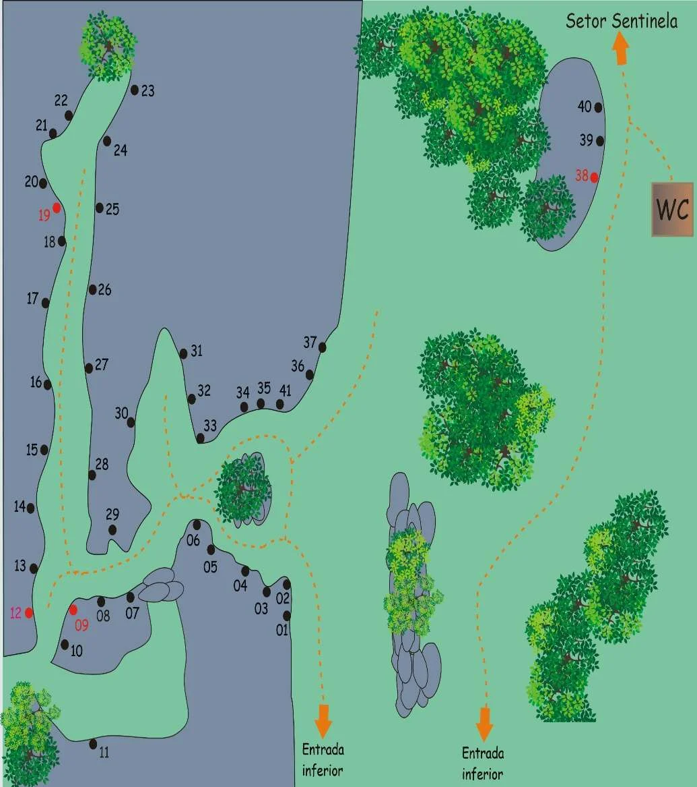
    - **largura_mapa**: 1035
    - **altura_mapa**: 1167
    - **pontos_de_interesse**:
      - **[0]**:
        - **id**: Setor_Sentinela
        - **label**: Setor Sentinela
        - **retangulo**:
          - **x**: 924
          - **y**: 30
          - **comprimento**: 173
          - **largura**: 35
      - **[1]**:
        - **id**: 23
        - **label**: 23
        - **retangulo**:
          - **x**: 220
          - **y**: 134
          - **comprimento**: 27
          - **largura**: 28
      - **[2]**:
        - **id**: 22
        - **label**: 22
        - **retangulo**:
          - **x**: 90
          - **y**: 148
          - **comprimento**: 29
          - **largura**: 27
      - **[3]**:
        - **id**: 40
        - **label**: 40
        - **retangulo**:
          - **x**: 868
          - **y**: 157
          - **comprimento**: 27
          - **largura**: 26
      - **[4]**:
        - **id**: 21
        - **label**: 21
        - **retangulo**:
          - **x**: 62
          - **y**: 184
          - **comprimento**: 26
          - **largura**: 28
      - **[5]**:
        - **id**: 39
        - **label**: 39
        - **retangulo**:
          - **x**: 870
          - **y**: 206
          - **comprimento**: 28
          - **largura**: 26
      - **[6]**:
        - **id**: 24
        - **label**: 24
        - **retangulo**:
          - **x**: 180
          - **y**: 222
          - **comprimento**: 27
          - **largura**: 28
      - **[7]**:
        - **id**: 20
        - **label**: 20
        - **retangulo**:
          - **x**: 48
          - **y**: 269
          - **comprimento**: 27
          - **largura**: 28
      - **[8]**:
        - **id**: 38
        - **label**: 38
        - **retangulo**:
          - **x**: 864
          - **y**: 260
          - **comprimento**: 25
          - **largura**: 25
      - **[9]**:
        - **id**: 25
        - **label**: 25
        - **retangulo**:
          - **x**: 167
          - **y**: 309
          - **comprimento**: 28
          - **largura**: 26
      - **[10]**:
        - **id**: 19
        - **label**: 19
        - **retangulo**:
          - **x**: 66
          - **y**: 318
          - **comprimento**: 26
          - **largura**: 27
      - **[11]**:
        - **id**: 18
        - **label**: 18
        - **retangulo**:
          - **x**: 74
          - **y**: 358
          - **comprimento**: 26
          - **largura**: 27
      - **[12]**:
        - **id**: 26
        - **label**: 26
        - **retangulo**:
          - **x**: 156
          - **y**: 428
          - **comprimento**: 28
          - **largura**: 29
      - **[13]**:
        - **id**: 17
        - **label**: 17
        - **retangulo**:
          - **x**: 48
          - **y**: 441
          - **comprimento**: 28
          - **largura**: 30
      - **[14]**:
        - **id**: 37
        - **label**: 37
        - **retangulo**:
          - **x**: 461
          - **y**: 506
          - **comprimento**: 26
          - **largura**: 28
      - **[15]**:
        - **id**: 31
        - **label**: 31
        - **retangulo**:
          - **x**: 292
          - **y**: 519
          - **comprimento**: 24
          - **largura**: 26
      - **[16]**:
        - **id**: 27
        - **label**: 27
        - **retangulo**:
          - **x**: 150
          - **y**: 540
          - **comprimento**: 29
          - **largura**: 27
      - **[17]**:
        - **id**: 36
        - **label**: 36
        - **retangulo**:
          - **x**: 442
          - **y**: 542
          - **comprimento**: 26
          - **largura**: 27
      - **[18]**:
        - **id**: 16
        - **label**: 16
        - **retangulo**:
          - **x**: 54
          - **y**: 566
          - **comprimento**: 28
          - **largura**: 27
      - **[19]**:
        - **id**: 32
        - **label**: 32
        - **retangulo**:
          - **x**: 302
          - **y**: 578
          - **comprimento**: 27
          - **largura**: 27
      - **[20]**:
        - **id**: 34
        - **label**: 34
        - **retangulo**:
          - **x**: 361
          - **y**: 580
          - **comprimento**: 26
          - **largura**: 25
      - **[21]**:
        - **id**: 35
        - **label**: 35
        - **retangulo**:
          - **x**: 392
          - **y**: 574
          - **comprimento**: 26
          - **largura**: 27
      - **[22]**:
        - **id**: 41
        - **label**: 41
        - **retangulo**:
          - **x**: 423
          - **y**: 578
          - **comprimento**: 24
          - **largura**: 25
      - **[23]**:
        - **id**: 30
        - **label**: 30
        - **retangulo**:
          - **x**: 180
          - **y**: 612
          - **comprimento**: 29
          - **largura**: 27
      - **[24]**:
        - **id**: 33
        - **label**: 33
        - **retangulo**:
          - **x**: 312
          - **y**: 630
          - **comprimento**: 27
          - **largura**: 26
      - **[25]**:
        - **id**: 15
        - **label**: 15
        - **retangulo**:
          - **x**: 48
          - **y**: 666
          - **comprimento**: 28
          - **largura**: 31
      - **[26]**:
        - **id**: 28
        - **label**: 28
        - **retangulo**:
          - **x**: 151
          - **y**: 688
          - **comprimento**: 28
          - **largura**: 29
      - **[27]**:
        - **id**: 14
        - **label**: 14
        - **retangulo**:
          - **x**: 30
          - **y**: 750
          - **comprimento**: 28
          - **largura**: 27
      - **[28]**:
        - **id**: 29
        - **label**: 29
        - **retangulo**:
          - **x**: 168
          - **y**: 762
          - **comprimento**: 29
          - **largura**: 28
      - **[29]**:
        - **id**: 06
        - **label**: 06
        - **retangulo**:
          - **x**: 287
          - **y**: 800
          - **comprimento**: 28
          - **largura**: 28
      - **[30]**:
        - **id**: 13
        - **label**: 13
        - **retangulo**:
          - **x**: 30
          - **y**: 838
          - **comprimento**: 27
          - **largura**: 29
      - **[31]**:
        - **id**: 05
        - **label**: 05
        - **retangulo**:
          - **x**: 312
          - **y**: 840
          - **comprimento**: 28
          - **largura**: 27
      - **[32]**:
        - **id**: 04
        - **label**: 04
        - **retangulo**:
          - **x**: 357
          - **y**: 866
          - **comprimento**: 30
          - **largura**: 27
      - **[33]**:
        - **id**: 02
        - **label**: 02
        - **retangulo**:
          - **x**: 420
          - **y**: 886
          - **comprimento**: 28
          - **largura**: 28
      - **[34]**:
        - **id**: 12
        - **label**: 12
        - **retangulo**:
          - **x**: 24
          - **y**: 908
          - **comprimento**: 27
          - **largura**: 29
      - **[35]**:
        - **id**: 03
        - **label**: 03
        - **retangulo**:
          - **x**: 389
          - **y**: 901
          - **comprimento**: 28
          - **largura**: 28
      - **[36]**:
        - **id**: 08
        - **label**: 08
        - **retangulo**:
          - **x**: 154
          - **y**: 914
          - **comprimento**: 28
          - **largura**: 27
      - **[37]**:
        - **id**: 07
        - **label**: 07
        - **retangulo**:
          - **x**: 196
          - **y**: 908
          - **comprimento**: 28
          - **largura**: 27
      - **[38]**:
        - **id**: 09
        - **label**: 09
        - **retangulo**:
          - **x**: 122
          - **y**: 926
          - **comprimento**: 27
          - **largura**: 25
      - **[39]**:
        - **id**: 01
        - **label**: 01
        - **retangulo**:
          - **x**: 419
          - **y**: 934
          - **comprimento**: 28
          - **largura**: 27
      - **[40]**:
        - **id**: 10
        - **label**: 10
        - **retangulo**:
          - **x**: 114
          - **y**: 964
          - **comprimento**: 26
          - **largura**: 25
      - **[41]**:
        - **id**: 11
        - **label**: 11
        - **retangulo**:
          - **x**: 155
          - **y**: 1115
          - **comprimento**: 26
          - **largura**: 26
      - **[42]**:
        - **id**: Entrada_inferior_1
        - **label**: Entrada inferior
        - **retangulo**:
          - **x**: 480
          - **y**: 1125
          - **comprimento**: 74
          - **largura**: 64
      - **[43]**:
        - **id**: Entrada_inferior_2
        - **label**: Entrada inferior
        - **retangulo**:
          - **x**: 719
          - **y**: 1132
          - **comprimento**: 78
          - **largura**: 70
    - **referencias**:
      - **[0]**:
        - **escalada**: A Fenda da Discórdia
        - **ids**:
          - 01
      - **[1]**:
        - **escalada**: Brenfisema (Sai na 5ª proteção da via 25)
        - **ids**:
          - 02
      - **[2]**:
        - **escalada**: Tamburello
        - **ids**:
          - 03
      - **[3]**:
        - **escalada**: Onda de Calcário
        - **ids**:
          - 04
      - **[4]**:
        - **escalada**: Ets de Fidalgo
        - **ids**:
          - 05
      - **[5]**:
        - **escalada**: Conquista Fatal
        - **ids**:
          - 06
      - **[6]**:
        - **escalada**: Tico Tico Space
        - **ids**:
          - 07
      - **[7]**:
        - **escalada**: Judy
        - **ids**:
          - 10
      - **[8]**:
        - **escalada**: Psicoacústica
        - **ids**:
          - 11
      - **[9]**:
        - **escalada**: Via sem informação
        - **ids**:
          - 12
      - **[10]**:
        - **escalada**: Quarto dos Sonhos
        - **ids**:
          - 13
      - **[11]**:
        - **escalada**: Ameaça Fantasma
        - **ids**:
          - 14
      - **[12]**:
        - **escalada**: Dança das Aranhas
        - **ids**:
          - 15
      - **[13]**:
        - **escalada**: First Blues
        - **ids**:
          - 16
      - **[14]**:
        - **escalada**: Saci de Corda
        - **ids**:
          - 17
      - **[15]**:
        - **escalada**: Olho que Tudo Vê
        - **ids**:
          - 18
      - **[16]**:
        - **escalada**: Preguiça Mental
        - **ids**:
          - 19
      - **[17]**:
        - **escalada**: Sete Além
        - **ids**:
          - 20
      - **[18]**:
        - **escalada**: Babylon Tower
        - **ids**:
          - 21
      - **[19]**:
        - **escalada**: Aresta de Sangue
        - **ids**:
          - 22
      - **[20]**:
        - **escalada**: Caverna do Dragão
        - **ids**:
          - 23
      - **[21]**:
        - **escalada**: Dona Ló
        - **ids**:
          - 24
      - **[22]**:
        - **escalada**: Yesterday
        - **ids**:
          - 25
      - **[23]**:
        - **escalada**: Crônicas da Dy
        - **ids**:
          - 26
      - **[24]**:
        - **escalada**: Coisa Linda
        - **ids**:
          - 27
      - **[25]**:
        - **escalada**: Um Lugar para ser Feliz
        - **ids**:
          - 28
      - **[26]**:
        - **escalada**: Diedro de Thanos
        - **ids**:
          - 29
      - **[27]**:
        - **escalada**: Eternidade em um Segundo
        - **ids**:
          - 30
      - **[28]**:
        - **escalada**: Urubu Cargueiro
        - **ids**:
          - 31
      - **[29]**:
        - **escalada**: Lucineide não deu
        - **ids**:
          - 32
      - **[30]**:
        - **escalada**: Anos de Dor
        - **ids**:
          - 33
      - **[31]**:
        - **escalada**: Sem Consenso (Antiga variante)
        - **ids**:
          - 34
      - **[32]**:
        - **escalada**: Falta de Consenso
        - **ids**:
          - 35
      - **[33]**:
        - **escalada**: Dona da Beleza
        - **ids**:
          - 36
      - **[34]**:
        - **escalada**: Vem Tranquilo
        - **ids**:
          - 37
      - **[35]**:
        - **escalada**: O Princípio da Incerteza
        - **ids**:
          - 38
      - **[36]**:
        - **escalada**: Retorno do Pitu
        - **ids**:
          - 39
      - **[37]**:
        - **escalada**: Mar Revolto
        - **ids**:
          - 40
      - **[38]**:
        - **escalada**: Zé Carlos, Domador de Cavalos
        - **ids**:
          - 41
      - **[39]**:
        - **ids**:
          - Setor_Sentinela
        - **setor**: Setor Sentinela e Vale do Joga
      - **[40]**:
        - **ids**:
          - Entrada_inferior_1
          - Entrada_inferior_2
        - **setor**: Setor Entrada Inferior
      - **[41]**:
        - **ids**:
          - 08
        - **setor**: Setor Entrada Superior
        - **escalada**: O Basilisco de Slytherin
      - **[42]**:
        - **ids**:
          - 09
        - **setor**: Setor Entrada Superior
        - **escalada**: Disparada
- **escaladas**:
  - **[0]**:
    - **via_movel**:
      - **nome**: A Fenda da Discórdia
      - **dificuldade**: BR_7B
      - **protecoes_moveis**: Móvel
      - **conquistadores**:
        - Roberto e Rômulo
  - **[1]**:
    - **via_esportiva**:
      - **nome**: Brenfisema (Sai na 5ª proteção da via 25)
      - **dificuldade**: BR_7C
      - **quantidade_protecoes_intermediarias**: 3
      - **quantidade_protecoes_parada**: 2
      - **conquistadores**:
        - Andrezão
        - Half
  - **[2]**:
    - **via_esportiva**:
      - **nome**: Tamburello
      - **dificuldade**: BR_6
      - **quantidade_protecoes_intermediarias**: 9
      - **quantidade_protecoes_parada**: 2
      - **conquistadores**:
        - Roberto Lincoln
        - Rômulo
  - **[3]**:
    - **via_esportiva**:
      - **nome**: Onda de Calcário
      - **dificuldade**: BR_7B
      - **quantidade_protecoes_intermediarias**: 14
      - **quantidade_protecoes_parada**: 2
      - **conquistadores**:
        - Roberto Lincoln
        - Rômulo
  - **[4]**:
    - **via_esportiva**:
      - **nome**: Ets de Fidalgo
      - **dificuldade**: BR_7B
      - **quantidade_protecoes_intermediarias**: 8
      - **quantidade_protecoes_parada**: 2
      - **conquistadores**:
        - Júlio
        - Gustavo Sampaio
        - Eduardo “Barão”
  - **[5]**:
    - **via_esportiva**:
      - **nome**: Conquista Fatal
      - **dificuldade**: BR_9A
      - **quantidade_protecoes_intermediarias**: 10
      - **quantidade_protecoes_parada**: 2
      - **conquistadores**:
        - Fábio Luiz Faria “Fabinho
        - Marquinho
  - **[6]**:
    - **via_esportiva**:
      - **nome**: Tico Tico Space
      - **dificuldade**: BR_8B
      - **quantidade_protecoes_intermediarias**: 11
      - **quantidade_protecoes_parada**: 2
      - **conquistadores**:
        - Fábio Luiz Faria “Fabinho
        - Mirian Morato
  - **[7]**:
    - **via_esportiva**:
      - **nome**: O Basilisco de Slytherin
      - **dificuldade**: BR_7C
      - **quantidade_protecoes_intermediarias**: 4
      - **quantidade_protecoes_parada**: 2
      - **conquistadores**:
        - Marco Durães
        - Hans Thomassen
  - **[8]**:
    - **via_movel**:
      - **nome**: Disparada
      - **dificuldade**: BR_4
      - **protecoes_moveis**: Móvel
      - **conquistadores**:
        - Antônio Carlos Magalhães
        - Fábio Cota
  - **[9]**:
    - **via_esportiva**:
      - **nome**: Judy
      - **dificuldade**: BR_5SUP
      - **quantidade_protecoes_intermediarias**: 5
      - **quantidade_protecoes_parada**: 2
      - **conquistadores**:
        - Marco Durães
  - **[10]**:
    - **via_esportiva**:
      - **nome**: Psicoacústica
      - **dificuldade**: BR_8A
      - **quantidade_protecoes_intermediarias**: 7
      - **quantidade_protecoes_parada**: 2
      - **conquistadores**:
        - Evandro “Kpeta”
  - **[11]**:
    - **via_movel**:
      - **nome**: Via sem informação
      - **dificuldade**: INDEFINIDO
      - **protecoes_moveis**: Móvel
      - **conquistadores**:
        - ??
  - **[12]**:
    - **via_esportiva**:
      - **nome**: Quarto dos Sonhos
      - **dificuldade**: BR_5
      - **quantidade_protecoes_intermediarias**: 6
      - **quantidade_protecoes_parada**: 2
      - **conquistadores**:
        - Marco Durães
  - **[13]**:
    - **via_esportiva**:
      - **nome**: Ameaça Fantasma
      - **dificuldade**: BR_6SUP
      - **quantidade_protecoes_intermediarias**: 6
      - **quantidade_protecoes_parada**: 2
      - **conquistadores**:
        - Fred
        - Cerqueirinha
        - Negão
  - **[14]**:
    - **via_esportiva**:
      - **nome**: Dança das Aranhas
      - **dificuldade**: BR_7B
      - **quantidade_protecoes_intermediarias**: 7
      - **quantidade_protecoes_parada**: 2
      - **conquistadores**:
        - Marco Durães
        - Hans Thomassen
  - **[15]**:
    - **via_esportiva**:
      - **nome**: First Blues
      - **dificuldade**: BR_7B
      - **quantidade_protecoes_intermediarias**: 7
      - **quantidade_protecoes_parada**: 2
      - **conquistadores**:
        - Marco Durães
        - Hans Thomassen
  - **[16]**:
    - **via_esportiva**:
      - **nome**: Saci de Corda
      - **dificuldade**: BR_7B
      - **quantidade_protecoes_intermediarias**: 6
      - **quantidade_protecoes_parada**: 2
      - **conquistadores**:
        - Marco Durães
        - Hans Thomassen
  - **[17]**:
    - **via_esportiva**:
      - **nome**: Olho que Tudo Vê
      - **dificuldade**: BR_6SUP
      - **quantidade_protecoes_intermediarias**: 5
      - **quantidade_protecoes_parada**: 2
      - **conquistadores**:
        - Marco Durães
        - Hans Thomassen
  - **[18]**:
    - **via_movel**:
      - **nome**: Preguiça Mental
      - **dificuldade**: BR_5
      - **protecoes_moveis**: Móvel
      - **conquistadores**:
        - Antônio Carlos Magalhães
        - Fábio Cota
  - **[19]**:
    - **via_esportiva**:
      - **nome**: Sete Além
      - **dificuldade**: BR_5
      - **quantidade_protecoes_intermediarias**: 5
      - **quantidade_protecoes_parada**: 2
      - **conquistadores**:
        - Marco Durães
  - **[20]**:
    - **via_esportiva**:
      - **nome**: Babylon Tower
      - **dificuldade**: BR_6
      - **quantidade_protecoes_intermediarias**: 5
      - **quantidade_protecoes_parada**: 2
      - **conquistadores**:
        - Marco Durães
  - **[21]**:
    - **via_esportiva**:
      - **nome**: Aresta de Sangue
      - **dificuldade**: BR_6
      - **quantidade_protecoes_intermediarias**: 5
      - **quantidade_protecoes_parada**: 2
      - **conquistadores**:
        - Marco Durães
  - **[22]**:
    - **via_esportiva**:
      - **nome**: Caverna do Dragão
      - **dificuldade**: BR_5
      - **quantidade_protecoes_intermediarias**: 3
      - **quantidade_protecoes_parada**: 2
      - **conquistadores**:
        - Marco Durães
  - **[23]**:
    - **via_esportiva**:
      - **nome**: Dona Ló
      - **dificuldade**: BR_4
      - **quantidade_protecoes_intermediarias**: 2
      - **quantidade_protecoes_parada**: 2
      - **conquistadores**:
        - Marco Durães
  - **[24]**:
    - **via_esportiva**:
      - **nome**: Yesterday
      - **dificuldade**: BR_6
      - **quantidade_protecoes_intermediarias**: 6
      - **quantidade_protecoes_parada**: 2
      - **conquistadores**:
        - Marco Durães
  - **[25]**:
    - **via_esportiva**:
      - **nome**: Crônicas da Dy
      - **dificuldade**: BR_6
      - **quantidade_protecoes_intermediarias**: 7
      - **quantidade_protecoes_parada**: 2
      - **conquistadores**:
        - Marco Durães
  - **[26]**:
    - **via_esportiva**:
      - **nome**: Coisa Linda
      - **dificuldade**: BR_6SUP
      - **quantidade_protecoes_intermediarias**: 5
      - **quantidade_protecoes_parada**: 2
      - **conquistadores**:
        - Marco Durães
  - **[27]**:
    - **via_esportiva**:
      - **nome**: Um Lugar para ser Feliz
      - **dificuldade**: BR_6
      - **quantidade_protecoes_intermediarias**: 5
      - **quantidade_protecoes_parada**: 2
      - **conquistadores**:
        - Marco Durães
        - Roberto Lincoln
  - **[28]**:
    - **via_esportiva**:
      - **nome**: Diedro de Thanos
      - **dificuldade**: BR_6
      - **quantidade_protecoes_intermediarias**: 5
      - **quantidade_protecoes_parada**: 2
      - **conquistadores**:
        - Marco Durães
  - **[29]**:
    - **via_esportiva**:
      - **nome**: Eternidade em um Segundo
      - **dificuldade**: BR_8B
      - **quantidade_protecoes_intermediarias**: 11
      - **quantidade_protecoes_parada**: 2
      - **conquistadores**:
        - Fabinho
        - Negão
  - **[30]**:
    - **via_esportiva**:
      - **nome**: Urubu Cargueiro
      - **dificuldade**: BR_7B
      - **quantidade_protecoes_intermediarias**: 7
      - **quantidade_protecoes_parada**: 2
      - **conquistadores**:
        - Fabinho
  - **[31]**:
    - **via_esportiva**:
      - **nome**: Lucineide não deu
      - **dificuldade**: BR_7B
      - **quantidade_protecoes_intermediarias**: 8
      - **quantidade_protecoes_parada**: 2
      - **conquistadores**:
        - Fabinho
        - Ricardo
        - Andreia
  - **[32]**:
    - **via_esportiva**:
      - **nome**: Anos de Dor
      - **dificuldade**: BR_7A
      - **quantidade_protecoes_intermediarias**: 5
      - **quantidade_protecoes_parada**: 2
      - **conquistadores**:
        - Fabinho
        - Tinoco
        - Douglas
  - **[33]**:
    - **via_esportiva**:
      - **nome**: Sem Consenso (Antiga variante)
      - **dificuldade**: BR_7A
      - **quantidade_protecoes_intermediarias**: 8
      - **quantidade_protecoes_parada**: 2
      - **conquistadores**:
        - Puta
        - Granola
        - Rogério
        - DJ
  - **[34]**:
    - **via_esportiva**:
      - **nome**: Falta de Consenso
      - **dificuldade**: BR_7A
      - **quantidade_protecoes_intermediarias**: 6
      - **quantidade_protecoes_parada**: 2
      - **conquistadores**:
        - Puta
        - Granola
        - Rogério
        - DJ
  - **[35]**:
    - **via_esportiva**:
      - **nome**: Dona da Beleza
      - **dificuldade**: BR_6SUP
      - **quantidade_protecoes_intermediarias**: 8
      - **quantidade_protecoes_parada**: 2
      - **conquistadores**:
        - Joviney
        - GT Baú 2021
  - **[36]**:
    - **via_esportiva**:
      - **nome**: Vem Tranquilo
      - **dificuldade**: BR_6
      - **quantidade_protecoes_intermediarias**: 8
      - **quantidade_protecoes_parada**: 2
      - **conquistadores**:
        - Joviney
        - GT Baú 2021
  - **[37]**:
    - **via_movel**:
      - **nome**: O Princípio da Incerteza
      - **dificuldade**: BR_5
      - **protecoes_moveis**: Móvel
      - **conquistadores**:
        - Daniel F. Mariano
        - Mateus Carneiro
        - Roberto
  - **[38]**:
    - **via_esportiva**:
      - **nome**: Retorno do Pitu
      - **dificuldade**: BR_6
      - **quantidade_protecoes_intermediarias**: 4
      - **quantidade_protecoes_parada**: 2
      - **conquistadores**:
        - Half
        - Tinoco
  - **[39]**:
    - **via_esportiva**:
      - **nome**: Mar Revolto
      - **dificuldade**: BR_6
      - **quantidade_protecoes_intermediarias**: 2
      - **quantidade_protecoes_parada**: 2
      - **conquistadores**:
        - Half
  - **[40]**:
    - **via_esportiva**:
      - **nome**: Zé Carlos, Domador de Cavalos
      - **dificuldade**: BR_7A
      - **quantidade_protecoes_intermediarias**: 8
      - **quantidade_protecoes_parada**: 2
      - **conquistadores**:
        - Roberto Lincoln
- **precomputados**:
  - **total_escaladas**: 41

## Parte: setor_segundo_andar

### Setor (Pico: Gruta do Baú)

- **descricao**:
    # Setor 2º Andar
    
    **Acesso:** Ao chegar ao maciço, no setor entrada, subir no “trepa pedras” a direita da via Túnel do Tempo. Passar por um túnel de pedra e seguir para direita, subindo em direção ao segundo andar. O acesso é por uma ponte com dois troncos de madeira.
    
    **Coordenadas na base da via Doc Holliday:** -19º32.916’ -43º59.336’
- **nome**: Setor 2º Andar
- **mapas**:
  - **[0]**:
    - **caminho_imagem_mapa**: 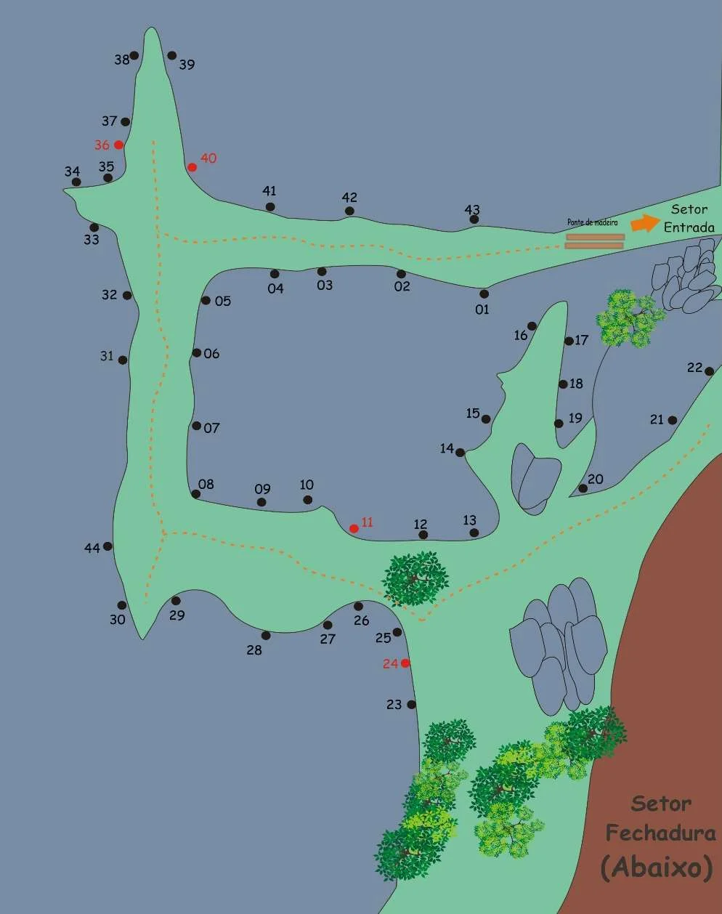
    - **largura_mapa**: 994
    - **altura_mapa**: 1258
    - **pontos_de_interesse**:
      - **[0]**:
        - **id**: 38
        - **label**: 38
        - **retangulo**:
          - **x**: 168
          - **y**: 82
          - **comprimento**: 28
          - **largura**: 24
      - **[1]**:
        - **id**: 39
        - **label**: 39
        - **retangulo**:
          - **x**: 258
          - **y**: 89
          - **comprimento**: 27
          - **largura**: 26
      - **[2]**:
        - **id**: 37
        - **label**: 37
        - **retangulo**:
          - **x**: 150
          - **y**: 166
          - **comprimento**: 26
          - **largura**: 23
      - **[3]**:
        - **id**: 36
        - **label**: 36
        - **retangulo**:
          - **x**: 140
          - **y**: 199
          - **comprimento**: 27
          - **largura**: 22
      - **[4]**:
        - **id**: 40
        - **label**: 40
        - **retangulo**:
          - **x**: 288
          - **y**: 218
          - **comprimento**: 29
          - **largura**: 25
      - **[5]**:
        - **id**: 34
        - **label**: 34
        - **retangulo**:
          - **x**: 100
          - **y**: 235
          - **comprimento**: 27
          - **largura**: 24
      - **[6]**:
        - **id**: 35
        - **label**: 35
        - **retangulo**:
          - **x**: 146
          - **y**: 228
          - **comprimento**: 27
          - **largura**: 23
      - **[7]**:
        - **id**: 41
        - **label**: 41
        - **retangulo**:
          - **x**: 370
          - **y**: 262
          - **comprimento**: 28
          - **largura**: 24
      - **[8]**:
        - **id**: 42
        - **label**: 42
        - **retangulo**:
          - **x**: 482
          - **y**: 272
          - **comprimento**: 29
          - **largura**: 27
      - **[9]**:
        - **id**: 43
        - **label**: 43
        - **retangulo**:
          - **x**: 650
          - **y**: 288
          - **comprimento**: 28
          - **largura**: 25
      - **[10]**:
        - **id**: Setor_Entrada
        - **label**: Setor Entrada
        - **retangulo**:
          - **x**: 950
          - **y**: 302
          - **comprimento**: 75
          - **largura**: 47
      - **[11]**:
        - **id**: 33
        - **label**: 33
        - **retangulo**:
          - **x**: 126
          - **y**: 330
          - **comprimento**: 25
          - **largura**: 23
      - **[12]**:
        - **id**: 04
        - **label**: 04
        - **retangulo**:
          - **x**: 380
          - **y**: 396
          - **comprimento**: 32
          - **largura**: 27
      - **[13]**:
        - **id**: 03
        - **label**: 03
        - **retangulo**:
          - **x**: 448
          - **y**: 392
          - **comprimento**: 29
          - **largura**: 27
      - **[14]**:
        - **id**: 02
        - **label**: 02
        - **retangulo**:
          - **x**: 553
          - **y**: 394
          - **comprimento**: 28
          - **largura**: 26
      - **[15]**:
        - **id**: 32
        - **label**: 32
        - **retangulo**:
          - **x**: 150
          - **y**: 404
          - **comprimento**: 29
          - **largura**: 21
      - **[16]**:
        - **id**: 05
        - **label**: 05
        - **retangulo**:
          - **x**: 308
          - **y**: 413
          - **comprimento**: 29
          - **largura**: 28
      - **[17]**:
        - **id**: 01
        - **label**: 01
        - **retangulo**:
          - **x**: 664
          - **y**: 424
          - **comprimento**: 29
          - **largura**: 25
      - **[18]**:
        - **id**: 16
        - **label**: 16
        - **retangulo**:
          - **x**: 716
          - **y**: 460
          - **comprimento**: 29
          - **largura**: 25
      - **[19]**:
        - **id**: 17
        - **label**: 17
        - **retangulo**:
          - **x**: 800
          - **y**: 467
          - **comprimento**: 28
          - **largura**: 26
      - **[20]**:
        - **id**: 31
        - **label**: 31
        - **retangulo**:
          - **x**: 146
          - **y**: 490
          - **comprimento**: 26
          - **largura**: 23
      - **[21]**:
        - **id**: 06
        - **label**: 06
        - **retangulo**:
          - **x**: 291
          - **y**: 486
          - **comprimento**: 28
          - **largura**: 27
      - **[22]**:
        - **id**: 22
        - **label**: 22
        - **retangulo**:
          - **x**: 956
          - **y**: 505
          - **comprimento**: 31
          - **largura**: 26
      - **[23]**:
        - **id**: 18
        - **label**: 18
        - **retangulo**:
          - **x**: 794
          - **y**: 526
          - **comprimento**: 28
          - **largura**: 26
      - **[24]**:
        - **id**: 15
        - **label**: 15
        - **retangulo**:
          - **x**: 652
          - **y**: 568
          - **comprimento**: 27
          - **largura**: 25
      - **[25]**:
        - **id**: 19
        - **label**: 19
        - **retangulo**:
          - **x**: 792
          - **y**: 575
          - **comprimento**: 30
          - **largura**: 26
      - **[26]**:
        - **id**: 21
        - **label**: 21
        - **retangulo**:
          - **x**: 904
          - **y**: 577
          - **comprimento**: 30
          - **largura**: 26
      - **[27]**:
        - **id**: 07
        - **label**: 07
        - **retangulo**:
          - **x**: 292
          - **y**: 588
          - **comprimento**: 31
          - **largura**: 28
      - **[28]**:
        - **id**: 14
        - **label**: 14
        - **retangulo**:
          - **x**: 616
          - **y**: 616
          - **comprimento**: 27
          - **largura**: 25
      - **[29]**:
        - **id**: 08
        - **label**: 08
        - **retangulo**:
          - **x**: 284
          - **y**: 666
          - **comprimento**: 31
          - **largura**: 28
      - **[30]**:
        - **id**: 20
        - **label**: 20
        - **retangulo**:
          - **x**: 820
          - **y**: 658
          - **comprimento**: 31
          - **largura**: 25
      - **[31]**:
        - **id**: 09
        - **label**: 09
        - **retangulo**:
          - **x**: 362
          - **y**: 672
          - **comprimento**: 29
          - **largura**: 24
      - **[32]**:
        - **id**: 10
        - **label**: 10
        - **retangulo**:
          - **x**: 422
          - **y**: 666
          - **comprimento**: 27
          - **largura**: 27
      - **[33]**:
        - **id**: 11
        - **label**: 11
        - **retangulo**:
          - **x**: 506
          - **y**: 718
          - **comprimento**: 26
          - **largura**: 25
      - **[34]**:
        - **id**: 12
        - **label**: 12
        - **retangulo**:
          - **x**: 579
          - **y**: 720
          - **comprimento**: 26
          - **largura**: 25
      - **[35]**:
        - **id**: 13
        - **label**: 13
        - **retangulo**:
          - **x**: 647
          - **y**: 715
          - **comprimento**: 26
          - **largura**: 26
      - **[36]**:
        - **id**: 44
        - **label**: 44
        - **retangulo**:
          - **x**: 126
          - **y**: 753
          - **comprimento**: 27
          - **largura**: 20
      - **[37]**:
        - **id**: 30
        - **label**: 30
        - **retangulo**:
          - **x**: 161
          - **y**: 852
          - **comprimento**: 28
          - **largura**: 22
      - **[38]**:
        - **id**: 29
        - **label**: 29
        - **retangulo**:
          - **x**: 244
          - **y**: 846
          - **comprimento**: 28
          - **largura**: 25
      - **[39]**:
        - **id**: 26
        - **label**: 26
        - **retangulo**:
          - **x**: 498
          - **y**: 853
          - **comprimento**: 27
          - **largura**: 22
      - **[40]**:
        - **id**: 27
        - **label**: 27
        - **retangulo**:
          - **x**: 451
          - **y**: 878
          - **comprimento**: 28
          - **largura**: 25
      - **[41]**:
        - **id**: 25
        - **label**: 25
        - **retangulo**:
          - **x**: 527
          - **y**: 878
          - **comprimento**: 28
          - **largura**: 24
      - **[42]**:
        - **id**: 28
        - **label**: 28
        - **retangulo**:
          - **x**: 350
          - **y**: 894
          - **comprimento**: 28
          - **largura**: 23
      - **[43]**:
        - **id**: 24
        - **label**: 24
        - **retangulo**:
          - **x**: 538
          - **y**: 912
          - **comprimento**: 27
          - **largura**: 25
      - **[44]**:
        - **id**: 23
        - **label**: 23
        - **retangulo**:
          - **x**: 542
          - **y**: 969
          - **comprimento**: 29
          - **largura**: 24
      - **[45]**:
        - **id**: Setor_Fechadura_Abaixo
        - **label**: Setor Fechadura (Abaixo)
        - **retangulo**:
          - **x**: 906
          - **y**: 1152
          - **comprimento**: 171
          - **largura**: 139
    - **referencias**:
      - **[0]**:
        - **escalada**: Criatura Hediondas
        - **ids**:
          - 01
      - **[1]**:
        - **escalada**: Wyatt Earp
        - **ids**:
          - 02
      - **[2]**:
        - **escalada**: Jimi Killer Miller
        - **ids**:
          - 03
      - **[3]**:
        - **escalada**: Jesse James
        - **ids**:
          - 04
      - **[4]**:
        - **escalada**: Tempo de Espera
        - **ids**:
          - 05
      - **[5]**:
        - **escalada**: Variante Tempo de Espera
        - **ids**:
          - 05
      - **[6]**:
        - **escalada**: La Casa de Papel
        - **ids**:
          - 06
      - **[7]**:
        - **escalada**: Cariocando
        - **ids**:
          - 07
      - **[8]**:
        - **escalada**: Neverland
        - **ids**:
          - 08
      - **[9]**:
        - **escalada**: Mestre Splinter
        - **ids**:
          - 09
      - **[10]**:
        - **escalada**: Enigma da Esfinge
        - **ids**:
          - 10
      - **[11]**:
        - **escalada**: Taj Mahal
        - **ids**:
          - 11
      - **[12]**:
        - **escalada**: The Boys
        - **ids**:
          - 12
      - **[13]**:
        - **escalada**: Ainda é Tempo
        - **ids**:
          - 13
      - **[14]**:
        - **escalada**: A Espera de um Milagre
        - **ids**:
          - 14
      - **[15]**:
        - **escalada**: Gangue Voadora
        - **ids**:
          - 15
      - **[16]**:
        - **escalada**: Benjamin Horigok
        - **ids**:
          - 16
      - **[17]**:
        - **escalada**: Edward Teacher
        - **ids**:
          - 17
      - **[18]**:
        - **escalada**: Blacksun Bellany
        - **ids**:
          - 18
      - **[19]**:
        - **escalada**: Charles Vane
        - **ids**:
          - 19
      - **[20]**:
        - **escalada**: Calcário nos Olhos
        - **ids**:
          - 20
      - **[21]**:
        - **escalada**: Cundum
        - **ids**:
          - 21
      - **[22]**:
        - **escalada**: Arte e Ofício na Lua
        - **ids**:
          - 22
      - **[23]**:
        - **escalada**: Dê do Baú
        - **ids**:
          - 23
      - **[24]**:
        - **escalada**: Variante West and Girls
        - **ids**:
          - 24
      - **[25]**:
        - **escalada**: West and Girls (Hipertrofia)
        - **ids**:
          - 25
      - **[26]**:
        - **escalada**: Port Royal
        - **ids**:
          - 26
      - **[27]**:
        - **escalada**: Comendador do Carste
        - **ids**:
          - 27
      - **[28]**:
        - **escalada**: Faraó
        - **ids**:
          - 28
      - **[29]**:
        - **escalada**: Marreta Voadora
        - **ids**:
          - 29
      - **[30]**:
        - **escalada**: El Capeton
        - **ids**:
          - 30
      - **[31]**:
        - **escalada**: Modo Fantasma
        - **ids**:
          - 31
      - **[32]**:
        - **escalada**: Doc Holiday
        - **ids**:
          - 32
      - **[33]**:
        - **escalada**: Calamity Jane
        - **ids**:
          - 33
      - **[34]**:
        - **escalada**: Moriarty
        - **ids**:
          - 34
      - **[35]**:
        - **escalada**: West World
        - **ids**:
          - 35
      - **[36]**:
        - **escalada**: Vórtex
        - **ids**:
          - 36
      - **[37]**:
        - **escalada**: Ida Chi não Sei
        - **ids**:
          - 37
      - **[38]**:
        - **escalada**: Amarelo
        - **ids**:
          - 38
      - **[39]**:
        - **escalada**: Narnia
        - **ids**:
          - 39
      - **[40]**:
        - **escalada**: Seu Truta na Coluna do Meio
        - **ids**:
          - 40
      - **[41]**:
        - **escalada**: John Wesley Hardin
        - **ids**:
          - 41
      - **[42]**:
        - **escalada**: Woody
        - **ids**:
          - 42
      - **[43]**:
        - **escalada**: Coisa de Menino
        - **ids**:
          - 43
      - **[44]**:
        - **escalada**: Amor Verdadeiro
        - **ids**:
          - 44
      - **[45]**:
        - **ids**:
          - Setor_Entrada
        - **setor**: Setor Entrada Inferior
      - **[46]**:
        - **ids**:
          - Setor_Fechadura_Abaixo
        - **setor**: Setor Fechadura
- **escaladas**:
  - **[0]**:
    - **via_esportiva**:
      - **nome**: Criatura Hediondas
      - **dificuldade**: BR_7A
      - **quantidade_protecoes_intermediarias**: 8
      - **quantidade_protecoes_parada**: 2
      - **conquistadores**:
        - Caca
        - Caverna
        - Xande
  - **[1]**:
    - **via_esportiva**:
      - **nome**: Wyatt Earp
      - **dificuldade**: BR_7C
      - **quantidade_protecoes_intermediarias**: 10
      - **quantidade_protecoes_parada**: 2
      - **conquistadores**:
        - Roberto Lincoln
        - Marco Durães
  - **[2]**:
    - **via_esportiva**:
      - **nome**: Jimi Killer Miller
      - **dificuldade**: BR_7C
      - **quantidade_protecoes_intermediarias**: 9
      - **quantidade_protecoes_parada**: 2
      - **conquistadores**:
        - Roberto Lincoln
        - Marco Durães
  - **[3]**:
    - **via_esportiva**:
      - **nome**: Jesse James
      - **dificuldade**: BR_7A
      - **quantidade_protecoes_intermediarias**: 9
      - **quantidade_protecoes_parada**: 2
      - **conquistadores**:
        - Roberto Lincoln
        - Marco Durães
  - **[4]**:
    - **via_esportiva**:
      - **nome**: Tempo de Espera
      - **dificuldade**: BR_7A
      - **quantidade_protecoes_intermediarias**: 8
      - **quantidade_protecoes_parada**: 2
      - **conquistadores**:
        - Roberto Lincoln
        - Rômulo
  - **[5]**:
    - **via_esportiva**:
      - **descricao**: Fixa (Inacabada – Grampos à Esq.)
      - **nome**: Variante Tempo de Espera
      - **dificuldade**: INDEFINIDO
  - **[6]**:
    - **via_esportiva**:
      - **nome**: La Casa de Papel
      - **dificuldade**: BR_8B_BARRA_8C
      - **conquistadores**:
        - Roberto Lincoln
        - Marco Durães
  - **[7]**:
    - **via_esportiva**:
      - **nome**: Cariocando
      - **dificuldade**: BR_8A
      - **quantidade_protecoes_intermediarias**: 8
      - **quantidade_protecoes_parada**: 2
      - **conquistadores**:
        - Roberto Lincoln
        - Marco Durães
  - **[8]**:
    - **via_esportiva**:
      - **nome**: Neverland
      - **dificuldade**: BR_7B
      - **quantidade_protecoes_intermediarias**: 10
      - **quantidade_protecoes_parada**: 2
      - **conquistadores**:
        - Roberto Lincoln
        - Marco Durães
  - **[9]**:
    - **via_esportiva**:
      - **nome**: Mestre Splinter
      - **dificuldade**: BR_7B
      - **quantidade_protecoes_intermediarias**: 9
      - **quantidade_protecoes_parada**: 2
      - **conquistadores**:
        - Roberto Lincoln
        - Marco Durães
  - **[10]**:
    - **via_esportiva**:
      - **nome**: Enigma da Esfinge
      - **dificuldade**: BR_7B
      - **quantidade_protecoes_intermediarias**: 8
      - **quantidade_protecoes_parada**: 2
      - **conquistadores**:
        - Vinicius
  - **[11]**:
    - **via_movel**:
      - **nome**: Taj Mahal
      - **dificuldade**: INDEFINIDO
      - **protecoes_moveis**: Móvel
      - **conquistadores**:
        - Cláudio Melo
        - Roberto Lincoln
  - **[12]**:
    - **via_esportiva**:
      - **nome**: The Boys
      - **dificuldade**: BR_5SUP
      - **quantidade_protecoes_intermediarias**: 8
      - **quantidade_protecoes_parada**: 2
      - **conquistadores**:
        - Roberto Lincoln
        - Marco Durães
  - **[13]**:
    - **via_esportiva**:
      - **nome**: Ainda é Tempo
      - **dificuldade**: BR_6
      - **quantidade_protecoes_intermediarias**: 8
      - **quantidade_protecoes_parada**: 2
      - **conquistadores**:
        - Roberto Lincoln
        - Marco Durães
  - **[14]**:
    - **via_esportiva**:
      - **nome**: A Espera de um Milagre
      - **dificuldade**: BR_6
      - **quantidade_protecoes_intermediarias**: 9
      - **quantidade_protecoes_parada**: 2
      - **conquistadores**:
        - Roberto Lincoln
        - Marco Durães
  - **[15]**:
    - **via_esportiva**:
      - **nome**: Gangue Voadora
      - **dificuldade**: BR_6
      - **quantidade_protecoes_intermediarias**: 10
      - **quantidade_protecoes_parada**: 2
      - **conquistadores**:
        - Roberto Lincoln
        - Marco Durães
  - **[16]**:
    - **via_esportiva**:
      - **nome**: Benjamin Horigok
      - **dificuldade**: BR_7A
      - **quantidade_protecoes_intermediarias**: 7
      - **quantidade_protecoes_parada**: 2
      - **conquistadores**:
        - Roberto Lincoln
        - Marco Durães
  - **[17]**:
    - **via_esportiva**:
      - **descricao**: Mesmo Top da via 16
      - **nome**: Edward Teacher
      - **dificuldade**: BR_6SUP
      - **quantidade_protecoes_intermediarias**: 7
      - **quantidade_protecoes_parada**: 2
      - **conquistadores**:
        - Roberto Lincoln
        - Marco Durães
  - **[18]**:
    - **via_esportiva**:
      - **nome**: Blacksun Bellany
      - **dificuldade**: BR_5
      - **quantidade_protecoes_intermediarias**: 7
      - **quantidade_protecoes_parada**: 2
      - **conquistadores**:
        - Roberto Lincoln
        - Marco Durães
  - **[19]**:
    - **via_esportiva**:
      - **nome**: Charles Vane
      - **dificuldade**: BR_5
      - **quantidade_protecoes_intermediarias**: 7
      - **quantidade_protecoes_parada**: 2
      - **conquistadores**:
        - Roberto Lincoln
        - Marco Durães
  - **[20]**:
    - **via_esportiva**:
      - **nome**: Calcário nos Olhos
      - **dificuldade**: BR_7A
      - **quantidade_protecoes_intermediarias**: 6
      - **quantidade_protecoes_parada**: 2
      - **conquistadores**:
        - Leandro Mr. Bean
        - Breno
        - Lugoma
  - **[21]**:
    - **via_esportiva**:
      - **nome**: Cundum
      - **dificuldade**: BR_8B
      - **quantidade_protecoes_intermediarias**: 6
      - **quantidade_protecoes_parada**: 2
      - **conquistadores**:
        - Negão
        - Cerqueirinha
  - **[22]**:
    - **via_esportiva**:
      - **nome**: Arte e Ofício na Lua
      - **dificuldade**: BR_8B
      - **dificuldade_artificial**: A1
      - **quantidade_protecoes_intermediarias**: 6
      - **quantidade_protecoes_parada**: 2
      - **conquistadores**:
        - Puta
        - DJ
  - **[23]**:
    - **via_esportiva**:
      - **nome**: Dê do Baú
      - **dificuldade**: BR_6SUP
      - **quantidade_protecoes_intermediarias**: 7
      - **quantidade_protecoes_parada**: 2
      - **conquistadores**:
        - Roberto Lincoln
        - Marco Durães
  - **[24]**:
    - **via_movel**:
      - **nome**: Variante West and Girls
      - **dificuldade**: BR_6SUP
      - **protecoes_moveis**: Móvel
      - **conquistadores**:
        - Roberto Lincoln
  - **[25]**:
    - **via_esportiva**:
      - **nome**: West and Girls (Hipertrofia)
      - **dificuldade**: BR_6
      - **quantidade_protecoes_intermediarias**: 6
      - **quantidade_protecoes_parada**: 2
      - **conquistadores**:
        - Cláudio Melo
        - Roberto
        - Negão
        - Cerqueirinha
        - Leandro
  - **[26]**:
    - **via_esportiva**:
      - **nome**: Port Royal
      - **dificuldade**: BR_6
      - **quantidade_protecoes_intermediarias**: 6
      - **quantidade_protecoes_parada**: 2
      - **conquistadores**:
        - Roberto Lincoln
        - Marco Durães
  - **[27]**:
    - **via_esportiva**:
      - **nome**: Comendador do Carste
      - **dificuldade**: BR_6SUP
      - **quantidade_protecoes_intermediarias**: 8
      - **quantidade_protecoes_parada**: 2
      - **conquistadores**:
        - Roberto Lincoln
        - Marco Durães
  - **[28]**:
    - **via_esportiva**:
      - **nome**: Faraó
      - **dificuldade**: BR_8A
      - **quantidade_protecoes_intermediarias**: 9
      - **quantidade_protecoes_parada**: 2
      - **conquistadores**:
        - Vinicinho
        - Roberto Lincoln
        - Marco Durães
  - **[29]**:
    - **via_esportiva**:
      - **nome**: Marreta Voadora
      - **dificuldade**: BR_7C
      - **quantidade_protecoes_intermediarias**: 9
      - **quantidade_protecoes_parada**: 2
      - **conquistadores**:
        - Roberto Lincoln
        - Marco Durães
  - **[30]**:
    - **via_esportiva**:
      - **nome**: El Capeton
      - **dificuldade**: BR_6
      - **quantidade_protecoes_intermediarias**: 8
      - **quantidade_protecoes_parada**: 2
      - **conquistadores**:
        - Gustavo Vianna
        - Gustavo Roscoe
        - Vladimir Gonçalves
  - **[31]**:
    - **via_esportiva**:
      - **nome**: Modo Fantasma
      - **dificuldade**: BR_6SUP
      - **quantidade_protecoes_intermediarias**: 8
      - **quantidade_protecoes_parada**: 2
      - **conquistadores**:
        - Marcelo Bocão
        - Roberto L.
        - Marco Durães
  - **[32]**:
    - **via_esportiva**:
      - **nome**: Doc Holiday
      - **dificuldade**: BR_5SUP
      - **quantidade_protecoes_intermediarias**: 7
      - **quantidade_protecoes_parada**: 2
      - **conquistadores**:
        - Roberto
        - Tinoco
  - **[33]**:
    - **via_esportiva**:
      - **nome**: Calamity Jane
      - **dificuldade**: BR_6
      - **quantidade_protecoes_intermediarias**: 8
      - **quantidade_protecoes_parada**: 2
      - **conquistadores**:
        - Roberto Lincoln
        - Marco Durães
  - **[34]**:
    - **via_esportiva**:
      - **nome**: Moriarty
      - **dificuldade**: BR_7C
      - **quantidade_protecoes_intermediarias**: 9
      - **quantidade_protecoes_parada**: 2
      - **conquistadores**:
        - Roberto Lincoln
        - Marco Durães
  - **[35]**:
    - **via_esportiva**:
      - **nome**: West World
      - **dificuldade**: BR_6SUP
      - **quantidade_protecoes_intermediarias**: 8
      - **quantidade_protecoes_parada**: 2
      - **conquistadores**:
        - Roberto Lincoln
        - Marco Durães
  - **[36]**:
    - **via_movel**:
      - **nome**: Vórtex
      - **dificuldade**: BR_6SUP
      - **protecoes_moveis**: Móvel
      - **conquistadores**:
        - Marcelo Bocão
        - Roberto
  - **[37]**:
    - **via_esportiva**:
      - **nome**: Ida Chi não Sei
      - **dificuldade**: BR_6SUP
      - **quantidade_protecoes_intermediarias**: 8
      - **quantidade_protecoes_parada**: 2
      - **conquistadores**:
        - Roberto Lincoln
        - Cláudio Melo
  - **[38]**:
    - **via_esportiva**:
      - **nome**: Amarelo
      - **dificuldade**: BR_6SUP
      - **quantidade_protecoes_intermediarias**: 8
      - **quantidade_protecoes_parada**: 2
      - **conquistadores**:
        - Roberto Lincoln
        - Marco Durães
  - **[39]**:
    - **via_esportiva**:
      - **nome**: Narnia
      - **dificuldade**: BR_6SUP
      - **quantidade_protecoes_intermediarias**: 8
      - **quantidade_protecoes_parada**: 2
      - **conquistadores**:
        - Roberto Lincoln
        - Marco Durães
  - **[40]**:
    - **via_movel**:
      - **nome**: Seu Truta na Coluna do Meio
      - **dificuldade**: BR_6SUP
      - **protecoes_moveis**: Móvel
      - **conquistadores**:
        - Roberto Lincoln
        - Marco Durães
  - **[41]**:
    - **via_esportiva**:
      - **nome**: John Wesley Hardin
      - **dificuldade**: BR_7C
      - **conquistadores**:
        - Roberto Lincoln
        - Marco Durães
  - **[42]**:
    - **via_esportiva**:
      - **nome**: Woody
      - **dificuldade**: BR_7C
      - **quantidade_protecoes_intermediarias**: 9
      - **quantidade_protecoes_parada**: 2
      - **conquistadores**:
        - Roberto Lincoln
        - Marco Durães
  - **[43]**:
    - **via_esportiva**:
      - **descricao**: Fixa
      - **nome**: Coisa de Menino
      - **dificuldade**: BR_8B
      - **quantidade_protecoes_parada**: 1
      - **conquistadores**:
        - Caca
        - Xande
        - Salim
  - **[44]**:
    - **via_esportiva**:
      - **nome**: Amor Verdadeiro
      - **dificuldade**: BR_6SUP
      - **quantidade_protecoes_intermediarias**: 8
      - **quantidade_protecoes_parada**: 2
      - **conquistadores**:
        - Igor Andrade
        - Iule Ornelas
        - Samuel Lucas
- **precomputados**:
  - **total_escaladas**: 45

## Parte: setor_fechadura

### Setor (Pico: Gruta do Baú)

- **descricao**:
    # Setor Fechadura
    
    **Acesso:** Ao chegar ao maciço, no setor entrada, seguir a trilha a esquerda margeando o maciço e a gruta. A primeira via do setor é a via “Era de Aquários”. A trilha segue pela esquerda, por fora da gruta.
    
    **Acesso secundário:** Contornando o maciço pela direita a partir do Setor Pasto e subindo em direção a pedra. Por este caminho chegará à base da via “Primeira Batida”.
    
    Lembrando que o acesso a gruta só é permitido com o acompanhamento de um guia da fazenda.
- **nome**: Setor Fechadura
- **mapas**:
  - **[0]**:
    - **caminho_imagem_mapa**: 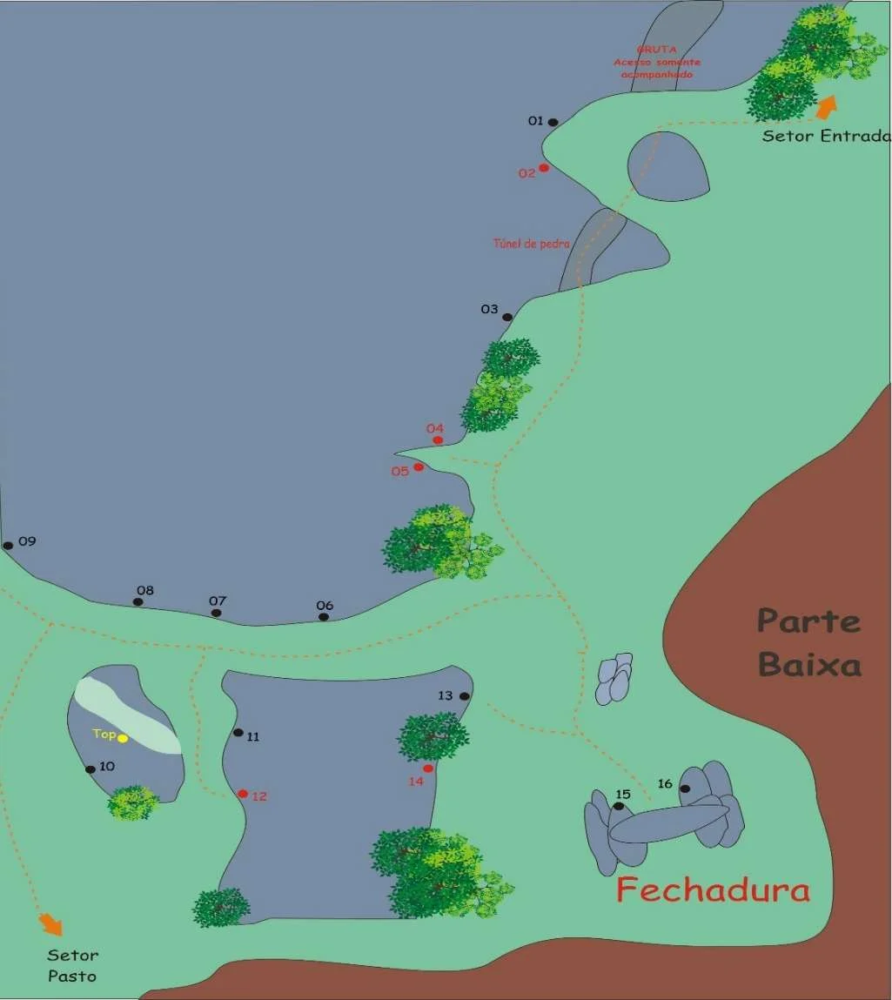
    - **largura_mapa**: 1025
    - **altura_mapa**: 1149
    - **pontos_de_interesse**:
      - **[0]**:
        - **id**: 01
        - **label**: 01
        - **retangulo**:
          - **x**: 616
          - **y**: 138
          - **comprimento**: 28
          - **largura**: 22
      - **[1]**:
        - **id**: Setor_Entrada
        - **label**: Setor Entrada
        - **retangulo**:
          - **x**: 949
          - **y**: 156
          - **comprimento**: 152
          - **largura**: 23
      - **[2]**:
        - **id**: 02
        - **label**: 02
        - **retangulo**:
          - **x**: 605
          - **y**: 198
          - **comprimento**: 28
          - **largura**: 22
      - **[3]**:
        - **id**: 03
        - **label**: 03
        - **retangulo**:
          - **x**: 563
          - **y**: 354
          - **comprimento**: 30
          - **largura**: 21
      - **[4]**:
        - **id**: 04
        - **label**: 04
        - **retangulo**:
          - **x**: 500
          - **y**: 492
          - **comprimento**: 26
          - **largura**: 23
      - **[5]**:
        - **id**: 05
        - **label**: 05
        - **retangulo**:
          - **x**: 460
          - **y**: 541
          - **comprimento**: 27
          - **largura**: 24
      - **[6]**:
        - **id**: 09
        - **label**: 09
        - **retangulo**:
          - **x**: 32
          - **y**: 622
          - **comprimento**: 28
          - **largura**: 23
      - **[7]**:
        - **id**: 08
        - **label**: 08
        - **retangulo**:
          - **x**: 167
          - **y**: 677
          - **comprimento**: 28
          - **largura**: 26
      - **[8]**:
        - **id**: 07
        - **label**: 07
        - **retangulo**:
          - **x**: 250
          - **y**: 689
          - **comprimento**: 30
          - **largura**: 26
      - **[9]**:
        - **id**: 06
        - **label**: 06
        - **retangulo**:
          - **x**: 373
          - **y**: 694
          - **comprimento**: 26
          - **largura**: 23
      - **[10]**:
        - **id**: 13
        - **label**: 13
        - **retangulo**:
          - **x**: 511
          - **y**: 800
          - **comprimento**: 26
          - **largura**: 23
      - **[11]**:
        - **id**: Top
        - **label**: Top
        - **retangulo**:
          - **x**: 120
          - **y**: 844
          - **comprimento**: 37
          - **largura**: 23
      - **[12]**:
        - **id**: 11
        - **label**: 11
        - **retangulo**:
          - **x**: 290
          - **y**: 846
          - **comprimento**: 25
          - **largura**: 23
      - **[13]**:
        - **id**: 14
        - **label**: 14
        - **retangulo**:
          - **x**: 478
          - **y**: 897
          - **comprimento**: 22
          - **largura**: 26
      - **[14]**:
        - **id**: 10
        - **label**: 10
        - **retangulo**:
          - **x**: 123
          - **y**: 880
          - **comprimento**: 26
          - **largura**: 23
      - **[15]**:
        - **id**: 16
        - **label**: 16
        - **retangulo**:
          - **x**: 764
          - **y**: 900
          - **comprimento**: 23
          - **largura**: 21
      - **[16]**:
        - **id**: 12
        - **label**: 12
        - **retangulo**:
          - **x**: 298
          - **y**: 916
          - **comprimento**: 29
          - **largura**: 23
      - **[17]**:
        - **id**: 15
        - **label**: 15
        - **retangulo**:
          - **x**: 716
          - **y**: 913
          - **comprimento**: 23
          - **largura**: 18
      - **[18]**:
        - **id**: Setor_Pasto
        - **label**: Setor Pasto
        - **retangulo**:
          - **x**: 84
          - **y**: 1108
          - **comprimento**: 65
          - **largura**: 45
    - **referencias**:
      - **[0]**:
        - **escalada**: Era de Aquários (Interditada)
        - **ids**:
          - 01
      - **[1]**:
        - **escalada**: Terra Devastada
        - **ids**:
          - 02
      - **[2]**:
        - **escalada**: Canabizados por Água
        - **ids**:
          - 03
      - **[3]**:
        - **escalada**: Cólico Espinhos
        - **ids**:
          - 04
      - **[4]**:
        - **escalada**: Passeio no Parque
        - **ids**:
          - 05
      - **[5]**:
        - **escalada**: Cobaia
        - **ids**:
          - 06
      - **[6]**:
        - **escalada**: Despedida de Solteiro
        - **ids**:
          - 07
      - **[7]**:
        - **escalada**: Via sem informação
        - **ids**:
          - 10
      - **[8]**:
        - **escalada**: Rins de Aço
        - **ids**:
          - 11
      - **[9]**:
        - **escalada**: Macacos me mordam
        - **ids**:
          - 12
      - **[10]**:
        - **escalada**: Novinha em Folha
        - **ids**:
          - 13
      - **[11]**:
        - **escalada**: Oposição em Árvore
        - **ids**:
          - 14
      - **[12]**:
        - **escalada**: Maggie
        - **ids**:
          - 15
      - **[13]**:
        - **escalada**: Chuva Orgânica
        - **ids**:
          - 16
      - **[14]**:
        - **ids**:
          - 08
        - **setor**: Setor Fechadura
        - **escalada**: Primeira Batida
      - **[15]**:
        - **ids**:
          - 09
        - **setor**: Setor Fechadura
        - **escalada**: Menino de Toca
      - **[16]**:
        - **ids**:
          - Setor_Pasto
        - **setor**: Setor Pasto
      - **[17]**:
        - **ids**:
          - Setor_Entrada
        - **setor**: Setor Entrada Inferior
- **escaladas**:
  - **[0]**:
    - **via_esportiva**:
      - **nome**: Era de Aquários (Interditada)
      - **dificuldade**: BR_6SUP
      - **quantidade_protecoes_intermediarias**: 12
      - **quantidade_protecoes_parada**: 2
      - **conquistadores**:
        - Roberto Lincoln
        - Rômulo
  - **[1]**:
    - **via_movel**:
      - **nome**: Terra Devastada
      - **dificuldade**: BR_6SUP
      - **protecoes_moveis**: Móvel
      - **conquistadores**:
        - Roberto Lincoln
        - Isabel Diniz
  - **[2]**:
    - **via_esportiva**:
      - **nome**: Canabizados por Água
      - **dificuldade**: BR_6SUP
      - **quantidade_protecoes_intermediarias**: 12
      - **quantidade_protecoes_parada**: 2
      - **conquistadores**:
        - Roberto Lincoln
        - Belga
        - Rômulo
  - **[3]**:
    - **via_movel**:
      - **nome**: Cólico Espinhos
      - **dificuldade**: BR_6SUP
      - **protecoes_moveis**: Móvel
      - **conquistadores**:
        - Roberto Lincoln
        - Marcelo Bocão
  - **[4]**:
    - **via_movel**:
      - **nome**: Passeio no Parque
      - **dificuldade**: BR_4SUP
      - **quantidade_protecoes_intermediarias**: 4
      - **quantidade_protecoes_parada**: 2
      - **protecoes_moveis**: Mista
      - **conquistadores**:
        - Daniel Ferreira Mariano
        - Matheus Carneiro
  - **[5]**:
    - **via_esportiva**:
      - **nome**: Cobaia
      - **dificuldade**: BR_6
      - **quantidade_protecoes_intermediarias**: 5
      - **quantidade_protecoes_parada**: 2
      - **conquistadores**:
        - Matheus e Daniel Ferreira Mariano Carneiro
  - **[6]**:
    - **via_esportiva**:
      - **nome**: Despedida de Solteiro
      - **dificuldade**: BR_7B
      - **quantidade_protecoes_intermediarias**: 8
      - **quantidade_protecoes_parada**: 2
      - **conquistadores**:
        - Andréa Rajão
        - Ricardo Leal
  - **[7]**:
    - **via_esportiva**:
      - **nome**: Primeira Batida
      - **dificuldade**: BR_6SUP
      - **quantidade_protecoes_intermediarias**: 8
      - **quantidade_protecoes_parada**: 2
      - **conquistadores**:
        - Roberto
        - Marcos Aurélio
        - Daida
  - **[8]**:
    - **via_esportiva**:
      - **descricao**: Inacabada
      - **nome**: Menino de Toca
      - **dificuldade**: INDEFINIDO
      - **conquistadores**:
        - Joviney
        - Novais
        - Vinicinho
  - **[9]**:
    - **via_esportiva**:
      - **descricao**: Fixa
      - **nome**: Via sem informação
      - **dificuldade**: INDEFINIDO
  - **[10]**:
    - **via_esportiva**:
      - **nome**: Rins de Aço
      - **dificuldade**: BR_6
      - **quantidade_protecoes_intermediarias**: 5
      - **quantidade_protecoes_parada**: 2
      - **conquistadores**:
        - Novais
        - Márcio
        - Fábio
  - **[11]**:
    - **via_movel**:
      - **nome**: Macacos me mordam
      - **dificuldade**: BR_5SUP
      - **protecoes_moveis**: Mista
      - **conquistadores**:
        - Daniel Ferreira
        - Matheus
  - **[12]**:
    - **via_esportiva**:
      - **nome**: Novinha em Folha
      - **dificuldade**: BR_5SUP
      - **quantidade_protecoes_intermediarias**: 3
      - **quantidade_protecoes_parada**: 2
      - **conquistadores**:
        - Ramaya Vallias
  - **[13]**:
    - **via_movel**:
      - **nome**: Oposição em Árvore
      - **dificuldade**: BR_6SUP
      - **protecoes_moveis**: Móvel
      - **conquistadores**:
        - Edgardo Abreu “Caca”
  - **[14]**:
    - **via_esportiva**:
      - **nome**: Maggie
      - **dificuldade**: BR_5
      - **quantidade_protecoes_intermediarias**: 5
      - **quantidade_protecoes_parada**: 2
      - **conquistadores**:
        - Antônio Carlos Magalhães “Tonico”
  - **[15]**:
    - **via_esportiva**:
      - **nome**: Chuva Orgânica
      - **dificuldade**: BR_4
      - **quantidade_protecoes_intermediarias**: 3
      - **quantidade_protecoes_parada**: 2
      - **conquistadores**:
        - Eustáquio e Helon
- **precomputados**:
  - **total_escaladas**: 16

## Parte: setor_pasto

### Setor (Pico: Gruta do Baú)

- **descricao**:
    # Setor Pasto
    
    **Acesso:** Seguindo pela estrada partindo do estacionamento, é o setor que se localiza a esquerda. Um pouco antes de chegar na pedra, basta pegar a trilha que desce a esquerda.
    
    **Coordenadas na base da via Rolha de Algodão:** -19º32.911’ -43º59.268’
    
    | 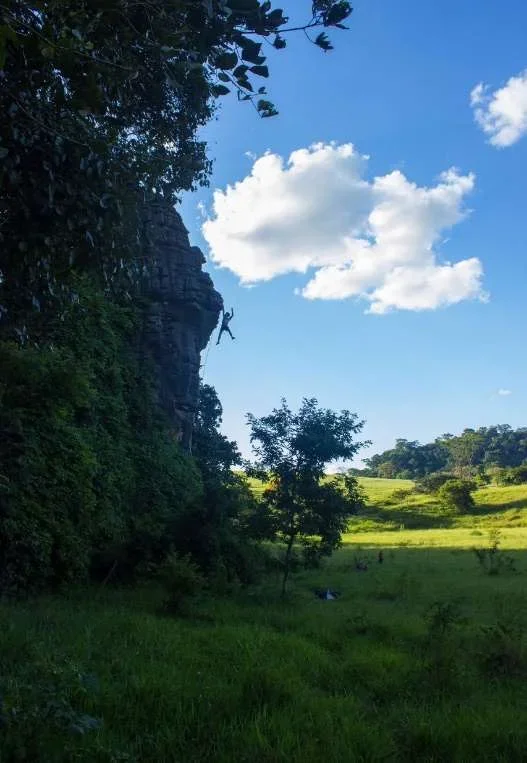 |
    | :--: |
    | *Alisson Tavares - Via Rolha de Algodão* |
- **nome**: Setor Pasto
- **mapas**:
  - **[0]**:
    - **caminho_imagem_mapa**: 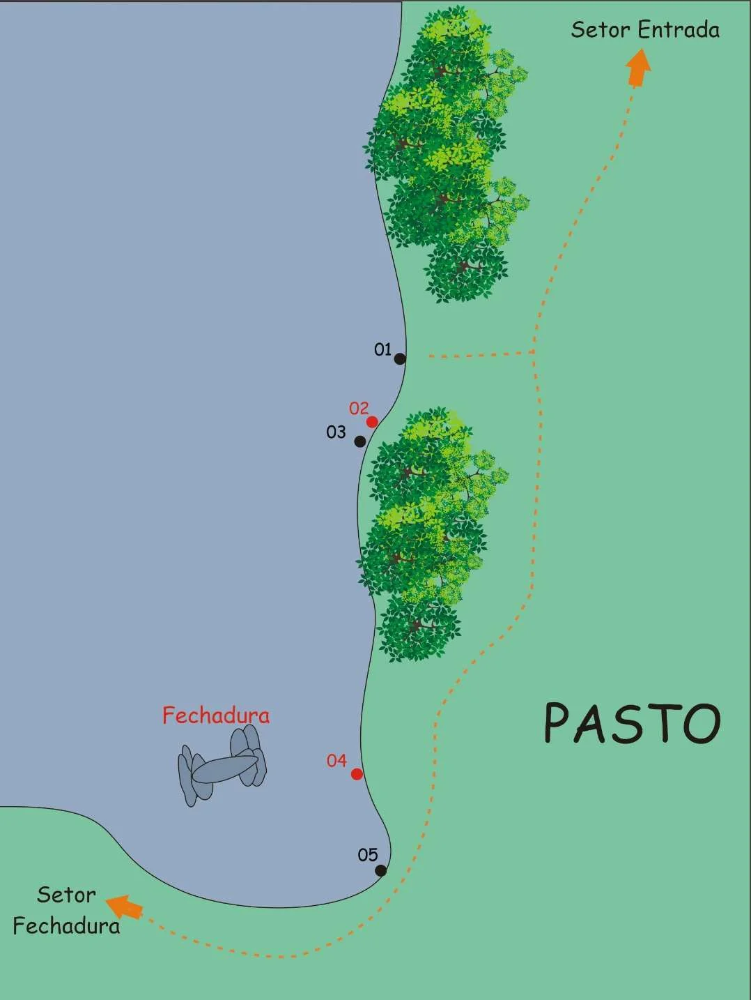
    - **largura_mapa**: 1078
    - **altura_mapa**: 1434
    - **pontos_de_interesse**:
      - **[0]**:
        - **id**: Setor_Entrada
        - **label**: Setor Entrada
        - **retangulo**:
          - **x**: 926
          - **y**: 42
          - **comprimento**: 217
          - **largura**: 34
      - **[1]**:
        - **id**: 01
        - **label**: 01
        - **retangulo**:
          - **x**: 550
          - **y**: 500
          - **comprimento**: 34
          - **largura**: 28
      - **[2]**:
        - **id**: 02
        - **label**: 02
        - **retangulo**:
          - **x**: 516
          - **y**: 584
          - **comprimento**: 39
          - **largura**: 31
      - **[3]**:
        - **id**: 03
        - **label**: 03
        - **retangulo**:
          - **x**: 482
          - **y**: 618
          - **comprimento**: 37
          - **largura**: 31
      - **[4]**:
        - **id**: 04
        - **label**: 04
        - **retangulo**:
          - **x**: 484
          - **y**: 1089
          - **comprimento**: 43
          - **largura**: 32
      - **[5]**:
        - **id**: 05
        - **label**: 05
        - **retangulo**:
          - **x**: 528
          - **y**: 1224
          - **comprimento**: 41
          - **largura**: 33
      - **[6]**:
        - **id**: Setor_Fechadura
        - **label**: Setor Fechadura
        - **retangulo**:
          - **x**: 94
          - **y**: 1303
          - **comprimento**: 167
          - **largura**: 88
    - **referencias**:
      - **[0]**:
        - **escalada**: Cemitério das Caranguejeiras - Direita
        - **ids**:
          - 01
      - **[1]**:
        - **escalada**: Água Suja - Esquerda
        - **ids**:
          - 01
      - **[2]**:
        - **escalada**: O Babão
        - **ids**:
          - 02
      - **[3]**:
        - **escalada**: Kactos Kid
        - **ids**:
          - 03
      - **[4]**:
        - **escalada**: Demônios da Mente
        - **ids**:
          - 04
      - **[5]**:
        - **escalada**: Rolha de Algodão
        - **ids**:
          - 05
      - **[6]**:
        - **ids**:
          - Setor_Entrada
        - **setor**: Setor Entrada Inferior
      - **[7]**:
        - **ids**:
          - Setor_Fechadura
        - **setor**: Setor Fechadura
- **escaladas**:
  - **[0]**:
    - **via_esportiva**:
      - **nome**: Cemitério das Caranguejeiras - Direita
      - **dificuldade**: BR_6
      - **quantidade_protecoes_intermediarias**: 4
      - **quantidade_protecoes_parada**: 2
      - **conquistadores**:
        - Vinicius
        - Joviney
  - **[1]**:
    - **via_esportiva**:
      - **descricao**: Mesmo Top da Via 1
      - **nome**: Água Suja - Esquerda
      - **dificuldade**: BR_6
      - **quantidade_protecoes_intermediarias**: 4
      - **quantidade_protecoes_parada**: 2
      - **conquistadores**:
        - Rômulo
        - Claudinho
        - Roberto Lincoln
  - **[2]**:
    - **via_movel**:
      - **nome**: O Babão
      - **dificuldade**: BR_6
      - **protecoes_moveis**: Móvel
      - **conquistadores**:
        - Roberto Lincoln
        - Rômulo
  - **[3]**:
    - **via_esportiva**:
      - **descricao**: Top Rope
      - **nome**: Kactos Kid
      - **dificuldade**: INDEFINIDO
      - **conquistadores**:
        - Roberto
  - **[4]**:
    - **via_movel**:
      - **nome**: Demônios da Mente
      - **dificuldade**: BR_6SUP
      - **protecoes_moveis**: Móvel
      - **conquistadores**:
        - Roberto Lincoln
        - Rômulo
  - **[5]**:
    - **via_esportiva**:
      - **nome**: Rolha de Algodão
      - **dificuldade**: BR_7A
      - **quantidade_protecoes_intermediarias**: 7
      - **quantidade_protecoes_parada**: 2
      - **conquistadores**:
        - Fabinho
        - Half
        - Tinoco
- **precomputados**:
  - **total_escaladas**: 6

## Parte: setor_sentinela_e_vale_do_joga

### Setor (Pico: Gruta do Baú)

- **descricao**:
    # Setor Sentinela e Vale do Joga
    
    **Acesso:** Ao chegar ao maciço, no setor entrada, sair na trilha a direita, em direção ao banheiro. Depois de passar pela base das vias “Retorno de Pitu” e “Mar Revolto” seguir por mais alguns metros e chegará na base da via “Sentinela”.
    
    **Coordenadas na base da via Sentinela:** -19º32.867’ -43º59.381’
- **nome**: Setor Sentinela e Vale do Joga
- **mapas**:
  - **[0]**:
    - **caminho_imagem_mapa**: 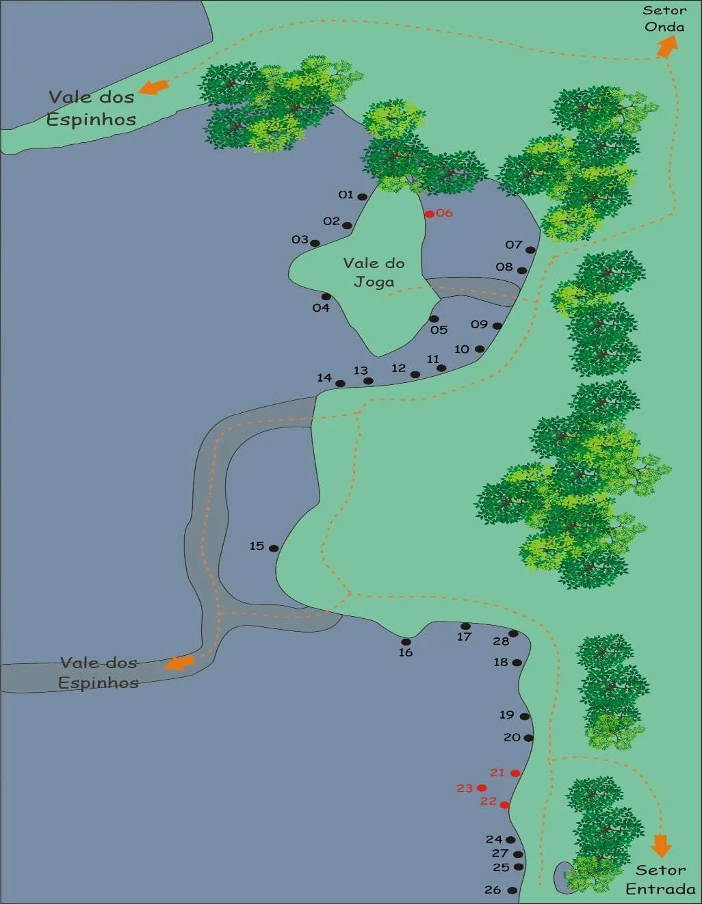
    - **largura_mapa**: 1026
    - **altura_mapa**: 1322
    - **pontos_de_interesse**:
      - **[0]**:
        - **id**: Setor_Onda
        - **label**: Setor Onda
        - **retangulo**:
          - **x**: 971
          - **y**: 28
          - **comprimento**: 72
          - **largura**: 51
      - **[1]**:
        - **id**: Vale_dos_Espinhos_Top
        - **label**: Vale dos Espinhos
        - **retangulo**:
          - **x**: 135
          - **y**: 157
          - **comprimento**: 134
          - **largura**: 64
      - **[2]**:
        - **id**: 01
        - **label**: 01
        - **retangulo**:
          - **x**: 506
          - **y**: 284
          - **comprimento**: 31
          - **largura**: 29
      - **[3]**:
        - **id**: 06
        - **label**: 06
        - **retangulo**:
          - **x**: 650
          - **y**: 311
          - **comprimento**: 29
          - **largura**: 28
      - **[4]**:
        - **id**: 02
        - **label**: 02
        - **retangulo**:
          - **x**: 484
          - **y**: 324
          - **comprimento**: 31
          - **largura**: 27
      - **[5]**:
        - **id**: 03
        - **label**: 03
        - **retangulo**:
          - **x**: 438
          - **y**: 350
          - **comprimento**: 32
          - **largura**: 28
      - **[6]**:
        - **id**: 07
        - **label**: 07
        - **retangulo**:
          - **x**: 751
          - **y**: 357
          - **comprimento**: 30
          - **largura**: 26
      - **[7]**:
        - **id**: 08
        - **label**: 08
        - **retangulo**:
          - **x**: 738
          - **y**: 390
          - **comprimento**: 31
          - **largura**: 28
      - **[8]**:
        - **id**: 04
        - **label**: 04
        - **retangulo**:
          - **x**: 469
          - **y**: 450
          - **comprimento**: 32
          - **largura**: 27
      - **[9]**:
        - **id**: 09
        - **label**: 09
        - **retangulo**:
          - **x**: 700
          - **y**: 473
          - **comprimento**: 31
          - **largura**: 28
      - **[10]**:
        - **id**: 05
        - **label**: 05
        - **retangulo**:
          - **x**: 642
          - **y**: 482
          - **comprimento**: 31
          - **largura**: 27
      - **[11]**:
        - **id**: 10
        - **label**: 10
        - **retangulo**:
          - **x**: 674
          - **y**: 510
          - **comprimento**: 31
          - **largura**: 25
      - **[12]**:
        - **id**: 11
        - **label**: 11
        - **retangulo**:
          - **x**: 632
          - **y**: 524
          - **comprimento**: 29
          - **largura**: 25
      - **[13]**:
        - **id**: 13
        - **label**: 13
        - **retangulo**:
          - **x**: 527
          - **y**: 542
          - **comprimento**: 30
          - **largura**: 27
      - **[14]**:
        - **id**: 12
        - **label**: 12
        - **retangulo**:
          - **x**: 582
          - **y**: 538
          - **comprimento**: 31
          - **largura**: 26
      - **[15]**:
        - **id**: 14
        - **label**: 14
        - **retangulo**:
          - **x**: 474
          - **y**: 551
          - **comprimento**: 30
          - **largura**: 26
      - **[16]**:
        - **id**: 15
        - **label**: 15
        - **retangulo**:
          - **x**: 375
          - **y**: 797
          - **comprimento**: 28
          - **largura**: 26
      - **[17]**:
        - **id**: 17
        - **label**: 17
        - **retangulo**:
          - **x**: 678
          - **y**: 930
          - **comprimento**: 28
          - **largura**: 26
      - **[18]**:
        - **id**: 28
        - **label**: 28
        - **retangulo**:
          - **x**: 732
          - **y**: 937
          - **comprimento**: 30
          - **largura**: 28
      - **[19]**:
        - **id**: 16
        - **label**: 16
        - **retangulo**:
          - **x**: 592
          - **y**: 954
          - **comprimento**: 29
          - **largura**: 29
      - **[20]**:
        - **id**: Vale_dos_Espinhos_Bottom
        - **label**: Vale dos Espinhos
        - **retangulo**:
          - **x**: 144
          - **y**: 982
          - **comprimento**: 127
          - **largura**: 69
      - **[21]**:
        - **id**: 18
        - **label**: 18
        - **retangulo**:
          - **x**: 732
          - **y**: 967
          - **comprimento**: 29
          - **largura**: 24
      - **[22]**:
        - **id**: 19
        - **label**: 19
        - **retangulo**:
          - **x**: 740
          - **y**: 1044
          - **comprimento**: 28
          - **largura**: 26
      - **[23]**:
        - **id**: 20
        - **label**: 20
        - **retangulo**:
          - **x**: 748
          - **y**: 1078
          - **comprimento**: 30
          - **largura**: 24
      - **[24]**:
        - **id**: 21
        - **label**: 21
        - **retangulo**:
          - **x**: 726
          - **y**: 1129
          - **comprimento**: 27
          - **largura**: 26
      - **[25]**:
        - **id**: 23
        - **label**: 23
        - **retangulo**:
          - **x**: 678
          - **y**: 1152
          - **comprimento**: 29
          - **largura**: 25
      - **[26]**:
        - **id**: 22
        - **label**: 22
        - **retangulo**:
          - **x**: 714
          - **y**: 1170
          - **comprimento**: 30
          - **largura**: 25
      - **[27]**:
        - **id**: 24
        - **label**: 24
        - **retangulo**:
          - **x**: 722
          - **y**: 1228
          - **comprimento**: 29
          - **largura**: 19
      - **[28]**:
        - **id**: 27
        - **label**: 27
        - **retangulo**:
          - **x**: 731
          - **y**: 1248
          - **comprimento**: 30
          - **largura**: 20
      - **[29]**:
        - **id**: 25
        - **label**: 25
        - **retangulo**:
          - **x**: 733
          - **y**: 1269
          - **comprimento**: 28
          - **largura**: 18
      - **[30]**:
        - **id**: Setor_Entrada
        - **label**: Setor Entrada
        - **retangulo**:
          - **x**: 966
          - **y**: 1288
          - **comprimento**: 109
          - **largura**: 59
      - **[31]**:
        - **id**: 26
        - **label**: 26
        - **retangulo**:
          - **x**: 720
          - **y**: 1300
          - **comprimento**: 27
          - **largura**: 21
    - **referencias**:
      - **[0]**:
        - **escalada**: Barbie Face última
        - **ids**:
          - 01
      - **[1]**:
        - **escalada**: Jogue que eu pego
        - **ids**:
          - 02
      - **[2]**:
        - **escalada**: Pegue que eu jogo
        - **ids**:
          - 03
      - **[3]**:
        - **escalada**: Sucuri que me abraça
        - **ids**:
          - 04
      - **[4]**:
        - **escalada**: Desesperado da Perereca
        - **ids**:
          - 05
      - **[5]**:
        - **escalada**: Início, Meio e Fim
        - **ids**:
          - 06
      - **[6]**:
        - **escalada**: Menor Abandonado
        - **ids**:
          - 07
      - **[7]**:
        - **escalada**: Gruda mas não Garra
        - **ids**:
          - 10
      - **[8]**:
        - **escalada**: 2ª Dose
        - **ids**:
          - 11
      - **[9]**:
        - **escalada**: 1ª Dose
        - **ids**:
          - 12
      - **[10]**:
        - **escalada**: Maracutaia
        - **ids**:
          - 13
      - **[11]**:
        - **escalada**: Muvuca
        - **ids**:
          - 14
      - **[12]**:
        - **escalada**: Candymam
        - **ids**:
          - 15
      - **[13]**:
        - **escalada**: Agarras de Mateus
        - **ids**:
          - 16
      - **[14]**:
        - **escalada**: Dose Dupla
        - **ids**:
          - 17
      - **[15]**:
        - **escalada**: Consciência Limpa
        - **ids**:
          - 18
      - **[16]**:
        - **escalada**: Análise de Consciência
        - **ids**:
          - 19
      - **[17]**:
        - **escalada**: Sentinela
        - **ids**:
          - 20
      - **[18]**:
        - **escalada**: Vaca Profana
        - **ids**:
          - 21
      - **[19]**:
        - **escalada**: Santuário das Aranhas
        - **ids**:
          - 22
      - **[20]**:
        - **escalada**: Professor Piló
        - **ids**:
          - 23
      - **[21]**:
        - **escalada**: O último Tango
        - **ids**:
          - 24
      - **[22]**:
        - **escalada**: Sentinela Dois
        - **ids**:
          - 25
      - **[23]**:
        - **escalada**: Wilson Fisk
        - **ids**:
          - 26
      - **[24]**:
        - **escalada**: Cobra Kai
        - **ids**:
          - 27
      - **[25]**:
        - **escalada**: Paisagistas
        - **ids**:
          - 28
      - **[26]**:
        - **ids**:
          - 08
        - **setor**: Setor Sentinela e Vale do Joga
        - **escalada**: Contagem Regressiva
      - **[27]**:
        - **ids**:
          - 09
        - **setor**: Setor Sentinela e Vale do Joga
        - **escalada**: Woodstock
      - **[28]**:
        - **ids**:
          - Vale_dos_Espinhos_Bottom
          - Vale_dos_Espinhos_Top
        - **setor**: Setor Vale dos Espinhos
      - **[29]**:
        - **ids**:
          - Setor_Onda
        - **setor**: Setor Onda de Calcário
      - **[30]**:
        - **ids**:
          - Setor_Entrada
        - **setor**: Setor Entrada Inferior
- **escaladas**:
  - **[0]**:
    - **via_esportiva**:
      - **nome**: Barbie Face última
      - **dificuldade**: BR_5
      - **quantidade_protecoes_intermediarias**: 3
      - **quantidade_protecoes_parada**: 2
      - **conquistadores**:
        - Joviney, Novais, Alexandre, Ivo, Fábio, Márcio
  - **[1]**:
    - **via_esportiva**:
      - **nome**: Jogue que eu pego
      - **dificuldade**: BR_6
      - **quantidade_protecoes_intermediarias**: 4
      - **quantidade_protecoes_parada**: 2
      - **conquistadores**:
        - Joviney
        - Novais
        - Alexandre
        - Ivo
        - Fábio
        - Márcio
  - **[2]**:
    - **via_esportiva**:
      - **nome**: Pegue que eu jogo
      - **dificuldade**: BR_6SUP
      - **quantidade_protecoes_intermediarias**: 4
      - **quantidade_protecoes_parada**: 2
  - **[3]**:
    - **via_esportiva**:
      - **nome**: Sucuri que me abraça
      - **dificuldade**: BR_7A
      - **quantidade_protecoes_intermediarias**: 4
      - **quantidade_protecoes_parada**: 2
  - **[4]**:
    - **via_esportiva**:
      - **nome**: Desesperado da Perereca
      - **dificuldade**: BR_6SUP
      - **quantidade_protecoes_intermediarias**: 6
      - **quantidade_protecoes_parada**: 2
  - **[5]**:
    - **via_movel**:
      - **nome**: Início, Meio e Fim
      - **dificuldade**: BR_4
      - **protecoes_moveis**: Móvel
      - **conquistadores**:
        - Márcio
        - Joviney
  - **[6]**:
    - **via_esportiva**:
      - **nome**: Menor Abandonado
      - **dificuldade**: BR_6
      - **quantidade_protecoes_intermediarias**: 4
      - **quantidade_protecoes_parada**: 2
      - **conquistadores**:
        - Joviney
        - Sérgio
  - **[7]**:
    - **via_esportiva**:
      - **nome**: Contagem Regressiva
      - **dificuldade**: BR_7C
      - **quantidade_protecoes_intermediarias**: 7
      - **quantidade_protecoes_parada**: 2
      - **conquistadores**:
        - Joviney
        - GT Baú 2021
  - **[8]**:
    - **via_esportiva**:
      - **nome**: Woodstock
      - **dificuldade**: BR_7A
      - **quantidade_protecoes_intermediarias**: 7
      - **quantidade_protecoes_parada**: 2
      - **conquistadores**:
        - GT Baú 2021
  - **[9]**:
    - **via_esportiva**:
      - **nome**: Gruda mas não Garra
      - **dificuldade**: BR_7C
      - **quantidade_protecoes_intermediarias**: 7
      - **quantidade_protecoes_parada**: 2
      - **conquistadores**:
        - Fabiano
        - Fred
  - **[10]**:
    - **via_esportiva**:
      - **nome**: 2ª Dose
      - **dificuldade**: BR_8B
      - **quantidade_protecoes_intermediarias**: 8
      - **quantidade_protecoes_parada**: 2
      - **conquistadores**:
        - GT Baú 2021
  - **[11]**:
    - **via_esportiva**:
      - **nome**: 1ª Dose
      - **dificuldade**: BR_7B
      - **quantidade_protecoes_intermediarias**: 7
      - **quantidade_protecoes_parada**: 2
      - **conquistadores**:
        - GT Baú 2021
  - **[12]**:
    - **via_esportiva**:
      - **nome**: Maracutaia
      - **dificuldade**: BR_6
      - **quantidade_protecoes_intermediarias**: 9
      - **quantidade_protecoes_parada**: 2
      - **conquistadores**:
        - Joviney
        - Márcio Vasconcelos
  - **[13]**:
    - **via_esportiva**:
      - **nome**: Muvuca
      - **dificuldade**: BR_6SUP
      - **quantidade_protecoes_intermediarias**: 3
      - **quantidade_protecoes_parada**: 2
      - **conquistadores**:
        - Márcio
        - Joviney
  - **[14]**:
    - **via_esportiva**:
      - **nome**: Candymam
      - **dificuldade**: BR_5SUP
      - **quantidade_protecoes_intermediarias**: 8
      - **quantidade_protecoes_parada**: 2
      - **conquistadores**:
        - Roberto
        - Romulo
  - **[15]**:
    - **via_esportiva**:
      - **nome**: Agarras de Mateus
      - **dificuldade**: BR_6SUP
      - **quantidade_protecoes_intermediarias**: 9
      - **quantidade_protecoes_parada**: 2
      - **conquistadores**:
        - Roberto
        - Romulo
  - **[16]**:
    - **via_multiplas_enfiadas**:
      - **nome**: Dose Dupla
      - **enfiadas**:
        - **[0]**:
          - **via_esportiva**:
            - **nome**: 1ª Enfiada
            - **dificuldade**: BR_5
            - **quantidade_protecoes_intermediarias**: 4
            - **quantidade_protecoes_parada**: 2
        - **[1]**:
          - **via_esportiva**:
            - **nome**: 2ª Enfiada
            - **dificuldade**: BR_6SUP
            - **quantidade_protecoes_intermediarias**: 5
            - **quantidade_protecoes_parada**: 2
      - **conquistadores**:
        - Aloysio
        - Márcio Vasconcelos
        - Marcus Rufino
  - **[17]**:
    - **via_esportiva**:
      - **nome**: Consciência Limpa
      - **dificuldade**: BR_6SUP_BARRA_7A
      - **quantidade_protecoes_intermediarias**: 8
      - **quantidade_protecoes_parada**: 2
      - **conquistadores**:
        - Márcio Vasconcelos
        - Marcus Rufino
  - **[18]**:
    - **via_esportiva**:
      - **nome**: Análise de Consciência
      - **dificuldade**: BR_7A
      - **quantidade_protecoes_intermediarias**: 12
      - **quantidade_protecoes_parada**: 2
      - **conquistadores**:
        - Half
        - Tinoco
        - Eustáquio
        - Ramaya
  - **[19]**:
    - **via_esportiva**:
      - **nome**: Sentinela
      - **dificuldade**: BR_6SUP
      - **quantidade_protecoes_intermediarias**: 10
      - **quantidade_protecoes_parada**: 2
      - **conquistadores**:
        - Roberto Lincoln
        - Rômulo
  - **[20]**:
    - **via_movel**:
      - **nome**: Vaca Profana
      - **dificuldade**: BR_6SUP
      - **protecoes_moveis**: Móvel
      - **conquistadores**:
        - Márcio
        - Macena
        - Joviney
        - Ivo
  - **[21]**:
    - **via_movel**:
      - **nome**: Santuário das Aranhas
      - **dificuldade**: BR_6SUP
      - **protecoes_moveis**: Móvel
      - **conquistadores**:
        - Vinícius Réptil
        - Fabinho
  - **[22]**:
    - **via_movel**:
      - **descricao**: Saída a partir do platô em cima das vias 21 e 22
      - **nome**: Professor Piló
      - **dificuldade**: BR_6SUP
      - **protecoes_moveis**: Móvel
      - **conquistadores**:
        - Marcus Rufino
  - **[23]**:
    - **via_esportiva**:
      - **nome**: O último Tango
      - **dificuldade**: BR_7B
      - **quantidade_protecoes_intermediarias**: 7
      - **quantidade_protecoes_parada**: 2
      - **conquistadores**:
        - Fabiano
  - **[24]**:
    - **via_esportiva**:
      - **nome**: Sentinela Dois
      - **dificuldade**: BR_6SUP
      - **quantidade_protecoes_intermediarias**: 10
      - **quantidade_protecoes_parada**: 2
      - **conquistadores**:
        - Roberto Lincoln
        - Romulo
  - **[25]**:
    - **via_movel**:
      - **nome**: Wilson Fisk
      - **dificuldade**: BR_7A
      - **protecoes_moveis**: Móvel
      - **conquistadores**:
        - Roberto Lincoln
        - Gabriel Costela
  - **[26]**:
    - **via_esportiva**:
      - **nome**: Cobra Kai
      - **dificuldade**: BR_7B_BARRA_7C
      - **quantidade_protecoes_intermediarias**: 13
      - **quantidade_protecoes_parada**: 2
      - **conquistadores**:
        - Sandro
        - Márcio
        - Cláudia
  - **[27]**:
    - **via_esportiva**:
      - **nome**: Paisagistas
      - **dificuldade**: BR_7A_BARRA_7B
      - **quantidade_protecoes_intermediarias**: 12
      - **quantidade_protecoes_parada**: 2
      - **conquistadores**:
        - Igor Andrade
        - Iule Ornelas
        - Márcio Vasconcelos
        - Samuel Lucas
- **precomputados**:
  - **total_escaladas**: 28

## Parte: setor_vale_dos_espinhos

### Setor (Pico: Gruta do Baú)

- **descricao**:
    # Setor Vale dos Espinhos
    
    **Acesso:** Depois de passar pelo setor Sentinela seguir a trilha por uma pequena subida e pegar a bifurcação a esquerda. Evitar o acesso pela gruta para preservar os espeleotemas.
    
    **Coordenadas no Vale dos Espinhos próximo a via 01 e 02:** -19º32.872’ -43º59.426’
- **nome**: Setor Vale dos Espinhos
- **mapas**:
  - **[0]**:
    - **caminho_imagem_mapa**: 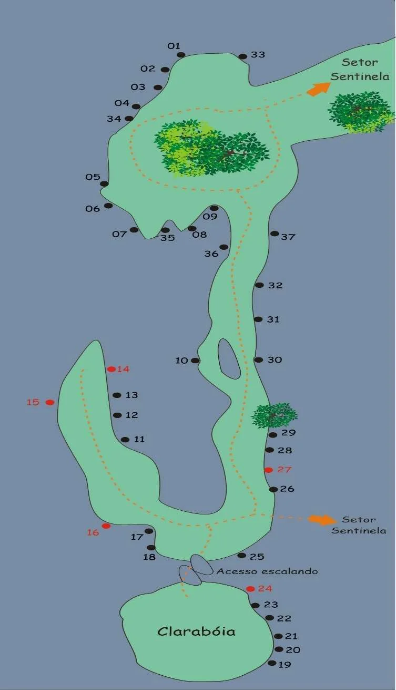
    - **largura_mapa**: 753
    - **altura_mapa**: 1309
    - **pontos_de_interesse**:
      - **[0]**:
        - **id**: 01
        - **label**: 01
        - **retangulo**:
          - **x**: 330
          - **y**: 86
          - **comprimento**: 30
          - **largura**: 24
      - **[1]**:
        - **id**: 33
        - **label**: 33
        - **retangulo**:
          - **x**: 490
          - **y**: 104
          - **comprimento**: 32
          - **largura**: 23
      - **[2]**:
        - **id**: Setor_Sentinela_Top
        - **label**: Setor Sentinela
        - **retangulo**:
          - **x**: 684
          - **y**: 132
          - **comprimento**: 118
          - **largura**: 52
      - **[3]**:
        - **id**: 02
        - **label**: 02
        - **retangulo**:
          - **x**: 282
          - **y**: 130
          - **comprimento**: 35
          - **largura**: 26
      - **[4]**:
        - **id**: 03
        - **label**: 03
        - **retangulo**:
          - **x**: 262
          - **y**: 164
          - **comprimento**: 33
          - **largura**: 25
      - **[5]**:
        - **id**: 04
        - **label**: 04
        - **retangulo**:
          - **x**: 232
          - **y**: 195
          - **comprimento**: 33
          - **largura**: 24
      - **[6]**:
        - **id**: 34
        - **label**: 34
        - **retangulo**:
          - **x**: 216
          - **y**: 225
          - **comprimento**: 32
          - **largura**: 24
      - **[7]**:
        - **id**: 05
        - **label**: 05
        - **retangulo**:
          - **x**: 176
          - **y**: 335
          - **comprimento**: 35
          - **largura**: 28
      - **[8]**:
        - **id**: 06
        - **label**: 06
        - **retangulo**:
          - **x**: 176
          - **y**: 396
          - **comprimento**: 33
          - **largura**: 27
      - **[9]**:
        - **id**: 09
        - **label**: 09
        - **retangulo**:
          - **x**: 399
          - **y**: 410
          - **comprimento**: 34
          - **largura**: 28
      - **[10]**:
        - **id**: 07
        - **label**: 07
        - **retangulo**:
          - **x**: 227
          - **y**: 444
          - **comprimento**: 32
          - **largura**: 30
      - **[11]**:
        - **id**: 35
        - **label**: 35
        - **retangulo**:
          - **x**: 318
          - **y**: 450
          - **comprimento**: 33
          - **largura**: 27
      - **[12]**:
        - **id**: 08
        - **label**: 08
        - **retangulo**:
          - **x**: 380
          - **y**: 445
          - **comprimento**: 34
          - **largura**: 26
      - **[13]**:
        - **id**: 37
        - **label**: 37
        - **retangulo**:
          - **x**: 548
          - **y**: 448
          - **comprimento**: 35
          - **largura**: 28
      - **[14]**:
        - **id**: 36
        - **label**: 36
        - **retangulo**:
          - **x**: 402
          - **y**: 480
          - **comprimento**: 35
          - **largura**: 27
      - **[15]**:
        - **id**: 32
        - **label**: 32
        - **retangulo**:
          - **x**: 524
          - **y**: 541
          - **comprimento**: 35
          - **largura**: 26
      - **[16]**:
        - **id**: 31
        - **label**: 31
        - **retangulo**:
          - **x**: 520
          - **y**: 606
          - **comprimento**: 31
          - **largura**: 27
      - **[17]**:
        - **id**: 10
        - **label**: 10
        - **retangulo**:
          - **x**: 345
          - **y**: 683
          - **comprimento**: 34
          - **largura**: 28
      - **[18]**:
        - **id**: 30
        - **label**: 30
        - **retangulo**:
          - **x**: 523
          - **y**: 682
          - **comprimento**: 36
          - **largura**: 27
      - **[19]**:
        - **id**: 14
        - **label**: 14
        - **retangulo**:
          - **x**: 235
          - **y**: 700
          - **comprimento**: 28
          - **largura**: 27
      - **[20]**:
        - **id**: 13
        - **label**: 13
        - **retangulo**:
          - **x**: 250
          - **y**: 750
          - **comprimento**: 30
          - **largura**: 25
      - **[21]**:
        - **id**: 15
        - **label**: 15
        - **retangulo**:
          - **x**: 63
          - **y**: 762
          - **comprimento**: 30
          - **largura**: 27
      - **[22]**:
        - **id**: 12
        - **label**: 12
        - **retangulo**:
          - **x**: 251
          - **y**: 787
          - **comprimento**: 30
          - **largura**: 26
      - **[23]**:
        - **id**: 29
        - **label**: 29
        - **retangulo**:
          - **x**: 548
          - **y**: 820
          - **comprimento**: 34
          - **largura**: 27
      - **[24]**:
        - **id**: 11
        - **label**: 11
        - **retangulo**:
          - **x**: 264
          - **y**: 832
          - **comprimento**: 29
          - **largura**: 23
      - **[25]**:
        - **id**: 28
        - **label**: 28
        - **retangulo**:
          - **x**: 542
          - **y**: 854
          - **comprimento**: 31
          - **largura**: 25
      - **[26]**:
        - **id**: 27
        - **label**: 27
        - **retangulo**:
          - **x**: 540
          - **y**: 890
          - **comprimento**: 31
          - **largura**: 27
      - **[27]**:
        - **id**: 26
        - **label**: 26
        - **retangulo**:
          - **x**: 546
          - **y**: 926
          - **comprimento**: 33
          - **largura**: 26
      - **[28]**:
        - **id**: Setor_Sentinela_Bottom
        - **label**: Setor Sentinela
        - **retangulo**:
          - **x**: 682
          - **y**: 996
          - **comprimento**: 110
          - **largura**: 45
      - **[29]**:
        - **id**: 16
        - **label**: 16
        - **retangulo**:
          - **x**: 176
          - **y**: 1010
          - **comprimento**: 31
          - **largura**: 26
      - **[30]**:
        - **id**: 17
        - **label**: 17
        - **retangulo**:
          - **x**: 260
          - **y**: 1018
          - **comprimento**: 30
          - **largura**: 24
      - **[31]**:
        - **id**: 18
        - **label**: 18
        - **retangulo**:
          - **x**: 284
          - **y**: 1056
          - **comprimento**: 30
          - **largura**: 23
      - **[32]**:
        - **id**: 25
        - **label**: 25
        - **retangulo**:
          - **x**: 488
          - **y**: 1055
          - **comprimento**: 34
          - **largura**: 24
      - **[33]**:
        - **id**: 24
        - **label**: 24
        - **retangulo**:
          - **x**: 504
          - **y**: 1116
          - **comprimento**: 32
          - **largura**: 24
      - **[34]**:
        - **id**: 23
        - **label**: 23
        - **retangulo**:
          - **x**: 516
          - **y**: 1146
          - **comprimento**: 32
          - **largura**: 22
      - **[35]**:
        - **id**: 22
        - **label**: 22
        - **retangulo**:
          - **x**: 540
          - **y**: 1173
          - **comprimento**: 34
          - **largura**: 22
      - **[36]**:
        - **id**: 21
        - **label**: 21
        - **retangulo**:
          - **x**: 554
          - **y**: 1205
          - **comprimento**: 31
          - **largura**: 24
      - **[37]**:
        - **id**: 20
        - **label**: 20
        - **retangulo**:
          - **x**: 558
          - **y**: 1233
          - **comprimento**: 33
          - **largura**: 24
      - **[38]**:
        - **id**: 19
        - **label**: 19
        - **retangulo**:
          - **x**: 540
          - **y**: 1260
          - **comprimento**: 31
          - **largura**: 23
    - **referencias**:
      - **[0]**:
        - **escalada**: Quase Nove
        - **ids**:
          - 01
      - **[1]**:
        - **escalada**: A Revolta da Bunda
        - **ids**:
          - 02
      - **[2]**:
        - **escalada**: O Faxineiro
        - **ids**:
          - 03
      - **[3]**:
        - **escalada**: Esquadrilha da Fumaça
        - **ids**:
          - 04
      - **[4]**:
        - **escalada**: Ronco do V8
        - **ids**:
          - 05
      - **[5]**:
        - **escalada**: Lagrimas de Calcário
        - **ids**:
          - 06
      - **[6]**:
        - **escalada**: Tá Chovendo Carrapato
        - **ids**:
          - 07
      - **[7]**:
        - **escalada**: Eau Rouge
        - **ids**:
          - 10
      - **[8]**:
        - **escalada**: Sem informação
        - **ids**:
          - 11
      - **[9]**:
        - **escalada**: Via inacabada
        - **ids**:
          - 12
      - **[10]**:
        - **escalada**: Cachinhos Dourados
        - **ids**:
          - 13
      - **[11]**:
        - **escalada**: Manto e Adaga
        - **ids**:
          - 14
      - **[12]**:
        - **escalada**: R770
        - **ids**:
          - 15
      - **[13]**:
        - **escalada**: Sem informação
        - **ids**:
          - 16
      - **[14]**:
        - **escalada**: Jornada nas Estrelas
        - **ids**:
          - 17
      - **[15]**:
        - **escalada**: Super Canaleta
        - **ids**:
          - 18
      - **[16]**:
        - **escalada**: Laboratório
        - **ids**:
          - 19
      - **[17]**:
        - **escalada**: Dark Side of the Moon
        - **ids**:
          - 20
      - **[18]**:
        - **escalada**: Mega Sena
        - **ids**:
          - 21
      - **[19]**:
        - **escalada**: La Torância
        - **ids**:
          - 22
      - **[20]**:
        - **escalada**: Comunidade Flebótomo
        - **ids**:
          - 23
      - **[21]**:
        - **escalada**: Sem informação
        - **ids**:
          - 24
      - **[22]**:
        - **escalada**: Duplo Sentido
        - **ids**:
          - 25
      - **[23]**:
        - **escalada**: Fantástico
        - **ids**:
          - 26
      - **[24]**:
        - **escalada**: Show da Vida
        - **ids**:
          - 27
      - **[25]**:
        - **escalada**: Madame Surtô
        - **ids**:
          - 28
      - **[26]**:
        - **escalada**: Lupin
        - **ids**:
          - 29
      - **[27]**:
        - **escalada**: Wall Ride
        - **ids**:
          - 30
      - **[28]**:
        - **escalada**: Dr. Lund
        - **ids**:
          - 31
      - **[29]**:
        - **escalada**: Kero Mais
        - **ids**:
          - 32
      - **[30]**:
        - **escalada**: Bruxa de Blair
        - **ids**:
          - 33
      - **[31]**:
        - **escalada**: Mentirinha
        - **ids**:
          - 34
      - **[32]**:
        - **escalada**: Zé Arigó
        - **ids**:
          - 35
      - **[33]**:
        - **escalada**: Visionário
        - **ids**:
          - 36
      - **[34]**:
        - **escalada**: Skywalker
        - **ids**:
          - 37
      - **[35]**:
        - **ids**:
          - 08
        - **setor**: Setor Vale dos Espinhos
        - **escalada**: Tá Esperando o quê?
      - **[36]**:
        - **ids**:
          - 09
        - **setor**: Setor Vale dos Espinhos
        - **escalada**: Quem Sabe ano que Vem
      - **[37]**:
        - **ids**:
          - Setor_Sentinela_Bottom
          - Setor_Sentinela_Top
        - **setor**: Setor Sentinela e Vale do Joga
- **escaladas**:
  - **[0]**:
    - **via_esportiva**:
      - **nome**: Quase Nove
      - **dificuldade**: BR_7A
      - **quantidade_protecoes_intermediarias**: 6
      - **quantidade_protecoes_parada**: 2
      - **conquistadores**:
        - Pedro Leite
        - Vinícius Wilson
  - **[1]**:
    - **via_esportiva**:
      - **nome**: A Revolta da Bunda
      - **dificuldade**: BR_7A
      - **quantidade_protecoes_intermediarias**: 6
      - **quantidade_protecoes_parada**: 2
      - **conquistadores**:
        - Pedro Leite
        - Vinícius Wilson
  - **[2]**:
    - **via_esportiva**:
      - **nome**: O Faxineiro
      - **dificuldade**: BR_7A
      - **quantidade_protecoes_intermediarias**: 6
      - **quantidade_protecoes_parada**: 2
      - **conquistadores**:
        - Pedro Leite
        - Vinícius Wilson
  - **[3]**:
    - **via_esportiva**:
      - **nome**: Esquadrilha da Fumaça
      - **dificuldade**: BR_7B
      - **quantidade_protecoes_intermediarias**: 6
      - **quantidade_protecoes_parada**: 2
      - **conquistadores**:
        - Pedro Leite
        - Vinícius Wilson
  - **[4]**:
    - **via_esportiva**:
      - **nome**: Ronco do V8
      - **dificuldade**: BR_6SUP
      - **quantidade_protecoes_intermediarias**: 10
      - **quantidade_protecoes_parada**: 2
      - **conquistadores**:
        - Sandro Almeida
        - Cláudia Heringer
        - Bruno Berbari
  - **[5]**:
    - **via_esportiva**:
      - **nome**: Lagrimas de Calcário
      - **dificuldade**: BR_7C
      - **quantidade_protecoes_intermediarias**: 12
      - **quantidade_protecoes_parada**: 2
      - **conquistadores**:
        - Sandro Almeida
        - Cláudia Heringer
        - Bruno Berbari
  - **[6]**:
    - **via_esportiva**:
      - **nome**: Tá Chovendo Carrapato
      - **dificuldade**: BR_7A
      - **quantidade_protecoes_intermediarias**: 10
      - **quantidade_protecoes_parada**: 2
      - **conquistadores**:
        - Márcio Vasconcelos
        - Joviney Miguel
  - **[7]**:
    - **via_esportiva**:
      - **nome**: Tá Esperando o quê?
      - **dificuldade**: BR_7A
      - **quantidade_protecoes_intermediarias**: 8
      - **quantidade_protecoes_parada**: 2
      - **conquistadores**:
        - GT Baú 2021
  - **[8]**:
    - **via_esportiva**:
      - **nome**: Quem Sabe ano que Vem
      - **dificuldade**: BR_8A
      - **quantidade_protecoes_intermediarias**: 7
      - **quantidade_protecoes_parada**: 2
      - **conquistadores**:
        - Pedro Leite
        - Vinícius Wilson
  - **[9]**:
    - **via_esportiva**:
      - **descricao**: Via longa – Usar corda de 60 mts
      - **nome**: Eau Rouge
      - **dificuldade**: BR_9A
      - **quantidade_protecoes_intermediarias**: 12
      - **quantidade_protecoes_parada**: 2
      - **conquistadores**:
        - GT Baú 2021
  - **[10]**:
    - **via_esportiva**:
      - **descricao**: Fixa
      - **nome**: Sem informação
      - **dificuldade**: INDEFINIDO
  - **[11]**:
    - **via_esportiva**:
      - **nome**: Via inacabada
      - **dificuldade**: INDEFINIDO
  - **[12]**:
    - **via_esportiva**:
      - **descricao**: Lance difícil só na saída. Depois fica fácil.
      - **nome**: Cachinhos Dourados
      - **dificuldade**: BR_6SUP
      - **quantidade_protecoes_intermediarias**: 8
      - **quantidade_protecoes_parada**: 2
      - **conquistadores**:
        - Christian Costa
        - Guilherme Côrrea
  - **[13]**:
    - **via_movel**:
      - **nome**: Manto e Adaga
      - **dificuldade**: BR_6
      - **protecoes_moveis**: Móvel
      - **conquistadores**:
        - Roberto Lincoln
  - **[14]**:
    - **via_movel**:
      - **nome**: R770
      - **dificuldade**: BR_5SUP
      - **protecoes_moveis**: Móvel
      - **conquistadores**:
        - Roberto Lincoln
  - **[15]**:
    - **via_movel**:
      - **nome**: Sem informação
      - **dificuldade**: INDEFINIDO
      - **protecoes_moveis**: Mista
  - **[16]**:
    - **via_esportiva**:
      - **descricao**: Via longa – Usar corda de 60 mts
      - **nome**: Jornada nas Estrelas
      - **dificuldade**: BR_7C
      - **quantidade_protecoes_intermediarias**: 14
      - **quantidade_protecoes_parada**: 2
      - **conquistadores**:
        - GT Baú 2021
  - **[17]**:
    - **via_esportiva**:
      - **descricao**: Via longa – Usar corda de 60 mts
      - **nome**: Super Canaleta
      - **dificuldade**: BR_9B
      - **quantidade_protecoes_intermediarias**: 16
      - **quantidade_protecoes_parada**: 2
      - **conquistadores**:
        - GT Baú 2021
  - **[18]**:
    - **via_esportiva**:
      - **descricao**: Via longa – Usar corda de 60 mts
      - **nome**: Laboratório
      - **dificuldade**: BR_9B
      - **quantidade_protecoes_intermediarias**: 12
      - **quantidade_protecoes_parada**: 2
      - **conquistadores**:
        - GT Baú 2021
  - **[19]**:
    - **via_esportiva**:
      - **descricao**: Via longa – Usar corda de 60 mts
      - **nome**: Dark Side of the Moon
      - **dificuldade**: BR_9A
      - **quantidade_protecoes_intermediarias**: 12
      - **quantidade_protecoes_parada**: 2
      - **conquistadores**:
        - GT Baú 2021
  - **[20]**:
    - **via_esportiva**:
      - **descricao**: Via longa – Usar corda de 60 mts
      - **nome**: Mega Sena
      - **dificuldade**: BR_8B
      - **quantidade_protecoes_intermediarias**: 13
      - **quantidade_protecoes_parada**: 2
      - **conquistadores**:
        - GT Baú 2021
  - **[21]**:
    - **via_esportiva**:
      - **descricao**: Via longa – Usar corda de 60 mts
      - **nome**: La Torância
      - **dificuldade**: BR_7B
      - **quantidade_protecoes_intermediarias**: 11
      - **quantidade_protecoes_parada**: 2
      - **conquistadores**:
        - GT Baú 2021
  - **[22]**:
    - **via_esportiva**:
      - **descricao**: Via longa – Usar corda de 60 mts
      - **nome**: Comunidade Flebótomo
      - **dificuldade**: BR_8C
      - **quantidade_protecoes_intermediarias**: 12
      - **quantidade_protecoes_parada**: 2
      - **conquistadores**:
        - GT Baú 2021
  - **[23]**:
    - **via_movel**:
      - **descricao**: Via longa – Usar corda de 60 mts
      - **nome**: Sem informação
      - **dificuldade**: INDEFINIDO
      - **protecoes_moveis**: Mista
  - **[24]**:
    - **via_multiplas_enfiadas**:
      - **nome**: Duplo Sentido
      - **enfiadas**:
        - **[0]**:
          - **via_esportiva**:
            - **nome**: 1ª Enfiada
            - **dificuldade**: BR_7A
            - **quantidade_protecoes_intermediarias**: 9
            - **quantidade_protecoes_parada**: 2
        - **[1]**:
          - **via_esportiva**:
            - **nome**: 2ª Enfiada
            - **dificuldade**: BR_6SUP
            - **quantidade_protecoes_intermediarias**: 4
            - **quantidade_protecoes_parada**: 2
      - **conquistadores**:
        - Marcus Rufino
        - Márcio Vasconcelos
  - **[25]**:
    - **via_esportiva**:
      - **descricao**: Via longa – Usar corda de 60 mts
      - **nome**: Fantástico
      - **dificuldade**: BR_5SUP
      - **quantidade_protecoes_intermediarias**: 9
      - **quantidade_protecoes_parada**: 2
      - **conquistadores**:
        - Marcus Rufino
        - Felipe B
  - **[26]**:
    - **via_movel**:
      - **descricao**: Via longa – Usar corda de 60 mts
      - **nome**: Show da Vida
      - **dificuldade**: BR_7B
      - **protecoes_moveis**: Móvel
      - **conquistadores**:
        - Marcus Rufino
  - **[27]**:
    - **via_esportiva**:
      - **descricao**: Via longa – Usar corda de 60 mts
      - **nome**: Madame Surtô
      - **dificuldade**: BR_7A
      - **quantidade_protecoes_intermediarias**: 10
      - **quantidade_protecoes_parada**: 2
      - **conquistadores**:
        - GT Baú 2021
  - **[28]**:
    - **via_esportiva**:
      - **descricao**: Via longa – Usar corda de 60 mts
      - **nome**: Lupin
      - **dificuldade**: BR_6SUP
      - **quantidade_protecoes_intermediarias**: 10
      - **quantidade_protecoes_parada**: 2
      - **conquistadores**:
        - GT Baú 2021
  - **[29]**:
    - **via_esportiva**:
      - **descricao**: Via longa – Usar corda de 60 mts
      - **nome**: Wall Ride
      - **dificuldade**: BR_6SUP
      - **quantidade_protecoes_intermediarias**: 11
      - **quantidade_protecoes_parada**: 2
      - **conquistadores**:
        - GT Baú 2021
  - **[30]**:
    - **via_esportiva**:
      - **descricao**: Via longa – Usar corda de 60 mts
      - **nome**: Dr. Lund
      - **dificuldade**: BR_7A
      - **quantidade_protecoes_intermediarias**: 9
      - **quantidade_protecoes_parada**: 2
      - **conquistadores**:
        - GT Baú 2021
  - **[31]**:
    - **via_esportiva**:
      - **descricao**: Via longa – Usar corda de 60 mts
      - **nome**: Kero Mais
      - **dificuldade**: BR_6SUP
      - **quantidade_protecoes_intermediarias**: 9
      - **quantidade_protecoes_parada**: 2
      - **conquistadores**:
        - GT Baú 2021
  - **[32]**:
    - **via_esportiva**:
      - **nome**: Bruxa de Blair
      - **dificuldade**: BR_6
      - **quantidade_protecoes_intermediarias**: 10
      - **quantidade_protecoes_parada**: 2
      - **conquistadores**:
        - Roberto Lincoln
        - Marco Durães
  - **[33]**:
    - **via_esportiva**:
      - **nome**: Mentirinha
      - **dificuldade**: BR_7A
      - **quantidade_protecoes_intermediarias**: 8
      - **quantidade_protecoes_parada**: 2
      - **conquistadores**:
        - Roberto Lincoln
        - Marco Durães
  - **[34]**:
    - **via_esportiva**:
      - **nome**: Zé Arigó
      - **dificuldade**: BR_6SUP
      - **quantidade_protecoes_intermediarias**: 8
      - **quantidade_protecoes_parada**: 2
      - **conquistadores**:
        - Roberto Lincoln
        - Marco Durães
  - **[35]**:
    - **via_esportiva**:
      - **nome**: Visionário
      - **dificuldade**: PROJETO
      - **quantidade_protecoes_intermediarias**: 10
      - **quantidade_protecoes_parada**: 2
      - **conquistadores**:
        - Dy Oliveira
        - Marco Durães
  - **[36]**:
    - **via_esportiva**:
      - **nome**: Skywalker
      - **dificuldade**: BR_6SUP
      - **quantidade_protecoes_intermediarias**: 9
      - **quantidade_protecoes_parada**: 2
      - **conquistadores**:
        - Dy Oliveira
        - Marco Durães
- **precomputados**:
  - **total_escaladas**: 37

## Parte: setor_escola

### Setor (Pico: Gruta do Baú)

- **descricao**:
    # Setor Escola
    
    **Acesso:** Após a entrada para o Setor Mr Bean, seguir sentido Vale do Cinema pela trilha. Após 1 minuto de caminhada entrar na trilha a esquerda antes do portão de metal e subir um pequeno morro.
    
    Este setor foi destinado as aulas de escalada e turista fazendo alguma vivência de escalada. Vias extremamente fáceis e com a grampeação próxima para facilitar as aulas.
- **nome**: Setor Escola
- **mapas**:
  - **[0]**:
    - **caminho_imagem_mapa**: 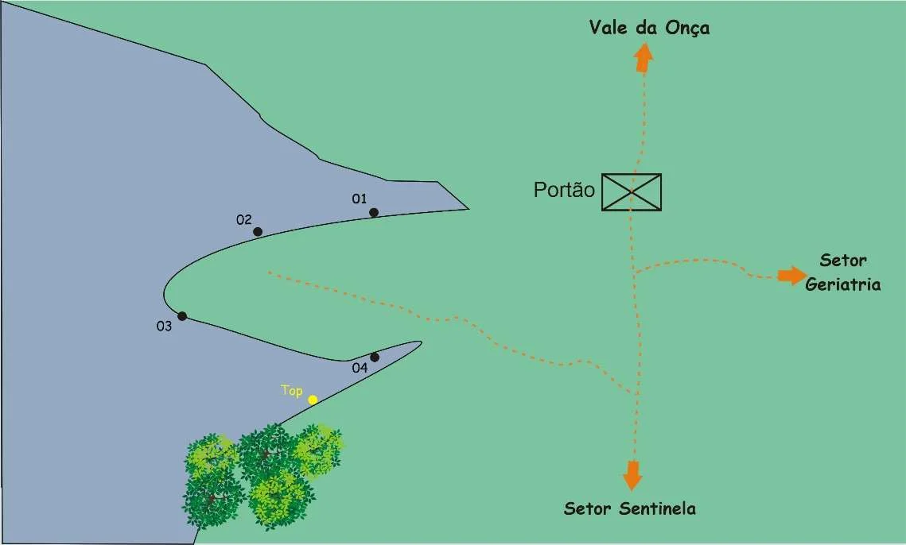
    - **largura_mapa**: 1139
    - **altura_mapa**: 686
    - **pontos_de_interesse**:
      - **[0]**:
        - **id**: Vale_da_Onca
        - **label**: Vale da Onça
        - **retangulo**:
          - **x**: 816
          - **y**: 33
          - **comprimento**: 163
          - **largura**: 36
      - **[1]**:
        - **id**: 01
        - **label**: 01
        - **retangulo**:
          - **x**: 452
          - **y**: 249
          - **comprimento**: 28
          - **largura**: 26
      - **[2]**:
        - **id**: 02
        - **label**: 02
        - **retangulo**:
          - **x**: 307
          - **y**: 274
          - **comprimento**: 28
          - **largura**: 27
      - **[3]**:
        - **id**: Setor_Geriatria
        - **label**: Setor Geriatria
        - **retangulo**:
          - **x**: 1060
          - **y**: 342
          - **comprimento**: 105
          - **largura**: 60
      - **[4]**:
        - **id**: 03
        - **label**: 03
        - **retangulo**:
          - **x**: 206
          - **y**: 409
          - **comprimento**: 28
          - **largura**: 26
      - **[5]**:
        - **id**: 04
        - **label**: 04
        - **retangulo**:
          - **x**: 452
          - **y**: 462
          - **comprimento**: 32
          - **largura**: 27
      - **[6]**:
        - **id**: Top
        - **label**: Top
        - **retangulo**:
          - **x**: 366
          - **y**: 491
          - **comprimento**: 39
          - **largura**: 28
      - **[7]**:
        - **id**: Setor_Sentinela
        - **label**: Setor Sentinela
        - **retangulo**:
          - **x**: 792
          - **y**: 638
          - **comprimento**: 177
          - **largura**: 31
    - **referencias**:
      - **[0]**:
        - **escalada**: Credo, que Delícia
        - **ids**:
          - 01
      - **[1]**:
        - **escalada**: Trem Bão é Coisa Boa
        - **ids**:
          - 02
      - **[2]**:
        - **escalada**: A Vida é um Desafio
        - **ids**:
          - 03
      - **[3]**:
        - **escalada**: Essa Molezinha vai Abacar
        - **ids**:
          - 04
      - **[4]**:
        - **ids**:
          - Setor_Sentinela
        - **setor**: Setor Sentinela e Vale do Joga
      - **[5]**:
        - **ids**:
          - Setor_Geriatria
        - **setor**: Setor Geriatria
      - **[6]**:
        - **ids**:
          - Vale_da_Onca
        - **setor**: Setor Vale da Onça
- **escaladas**:
  - **[0]**:
    - **via_esportiva**:
      - **nome**: Credo, que Delícia
      - **dificuldade**: BR_4
      - **quantidade_protecoes_intermediarias**: 4
      - **quantidade_protecoes_parada**: 2
      - **conquistadores**:
        - GT Baú 2021
  - **[1]**:
    - **via_esportiva**:
      - **nome**: Trem Bão é Coisa Boa
      - **dificuldade**: BR_3SUP
      - **quantidade_protecoes_intermediarias**: 5
      - **quantidade_protecoes_parada**: 2
      - **conquistadores**:
        - GT Baú 2021
  - **[2]**:
    - **via_esportiva**:
      - **nome**: A Vida é um Desafio
      - **dificuldade**: BR_4SUP
      - **quantidade_protecoes_intermediarias**: 4
      - **quantidade_protecoes_parada**: 2
      - **conquistadores**:
        - GT Baú 2021
  - **[3]**:
    - **via_esportiva**:
      - **nome**: Essa Molezinha vai Abacar
      - **dificuldade**: BR_3
      - **quantidade_protecoes_intermediarias**: 4
      - **quantidade_protecoes_parada**: 2
      - **conquistadores**:
        - GT Baú 2021
- **precomputados**:
  - **total_escaladas**: 4

## Parte: setor_geriatria

### Setor (Pico: Gruta do Baú)

- **descricao**:
    # Setor Geriatria
    
    **Acesso:** Após a entrada para o Setor Mr Bean, seguir sentido Vale da Onça pela trilha. Após 1 minuto de caminhada entrar na trilha a direita antes do portão de metal.
    
    **Acesso secundário:** pela trilha do Setor Onda de Calcário.
- **nome**: Setor Geriatria
- **mapas**:
  - **[0]**:
    - **caminho_imagem_mapa**: 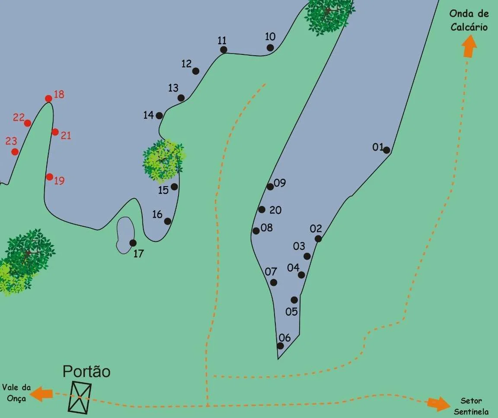
    - **largura_mapa**: 1152
    - **altura_mapa**: 968
    - **pontos_de_interesse**:
      - **[0]**:
        - **id**: Onda_de_Calcario
        - **label**: Onda de Calcário
        - **retangulo**:
          - **x**: 1085
          - **y**: 46
          - **comprimento**: 102
          - **largura**: 64
      - **[1]**:
        - **id**: 10
        - **label**: 10
        - **retangulo**:
          - **x**: 626
          - **y**: 84
          - **comprimento**: 35
          - **largura**: 31
      - **[2]**:
        - **id**: 11
        - **label**: 11
        - **retangulo**:
          - **x**: 514
          - **y**: 93
          - **comprimento**: 31
          - **largura**: 30
      - **[3]**:
        - **id**: 12
        - **label**: 12
        - **retangulo**:
          - **x**: 432
          - **y**: 146
          - **comprimento**: 35
          - **largura**: 34
      - **[4]**:
        - **id**: 13
        - **label**: 13
        - **retangulo**:
          - **x**: 400
          - **y**: 202
          - **comprimento**: 35
          - **largura**: 31
      - **[5]**:
        - **id**: 18
        - **label**: 18
        - **retangulo**:
          - **x**: 137
          - **y**: 217
          - **comprimento**: 32
          - **largura**: 26
      - **[6]**:
        - **id**: 22
        - **label**: 22
        - **retangulo**:
          - **x**: 42
          - **y**: 270
          - **comprimento**: 37
          - **largura**: 29
      - **[7]**:
        - **id**: 14
        - **label**: 14
        - **retangulo**:
          - **x**: 343
          - **y**: 264
          - **comprimento**: 34
          - **largura**: 33
      - **[8]**:
        - **id**: 21
        - **label**: 21
        - **retangulo**:
          - **x**: 152
          - **y**: 312
          - **comprimento**: 35
          - **largura**: 29
      - **[9]**:
        - **id**: 23
        - **label**: 23
        - **retangulo**:
          - **x**: 25
          - **y**: 326
          - **comprimento**: 36
          - **largura**: 29
      - **[10]**:
        - **id**: 01
        - **label**: 01
        - **retangulo**:
          - **x**: 874
          - **y**: 340
          - **comprimento**: 33
          - **largura**: 32
      - **[11]**:
        - **id**: 19
        - **label**: 19
        - **retangulo**:
          - **x**: 136
          - **y**: 416
          - **comprimento**: 32
          - **largura**: 27
      - **[12]**:
        - **id**: 09
        - **label**: 09
        - **retangulo**:
          - **x**: 647
          - **y**: 422
          - **comprimento**: 38
          - **largura**: 31
      - **[13]**:
        - **id**: 15
        - **label**: 15
        - **retangulo**:
          - **x**: 378
          - **y**: 439
          - **comprimento**: 33
          - **largura**: 30
      - **[14]**:
        - **id**: 16
        - **label**: 16
        - **retangulo**:
          - **x**: 364
          - **y**: 495
          - **comprimento**: 35
          - **largura**: 30
      - **[15]**:
        - **id**: 20
        - **label**: 20
        - **retangulo**:
          - **x**: 637
          - **y**: 485
          - **comprimento**: 38
          - **largura**: 28
      - **[16]**:
        - **id**: 08
        - **label**: 08
        - **retangulo**:
          - **x**: 617
          - **y**: 526
          - **comprimento**: 38
          - **largura**: 29
      - **[17]**:
        - **id**: 02
        - **label**: 02
        - **retangulo**:
          - **x**: 730
          - **y**: 528
          - **comprimento**: 41
          - **largura**: 33
      - **[18]**:
        - **id**: 03
        - **label**: 03
        - **retangulo**:
          - **x**: 692
          - **y**: 569
          - **comprimento**: 39
          - **largura**: 30
      - **[19]**:
        - **id**: 17
        - **label**: 17
        - **retangulo**:
          - **x**: 320
          - **y**: 586
          - **comprimento**: 34
          - **largura**: 31
      - **[20]**:
        - **id**: 07
        - **label**: 07
        - **retangulo**:
          - **x**: 626
          - **y**: 627
          - **comprimento**: 38
          - **largura**: 30
      - **[21]**:
        - **id**: 04
        - **label**: 04
        - **retangulo**:
          - **x**: 680
          - **y**: 618
          - **comprimento**: 39
          - **largura**: 29
      - **[22]**:
        - **id**: 05
        - **label**: 05
        - **retangulo**:
          - **x**: 674
          - **y**: 720
          - **comprimento**: 39
          - **largura**: 30
      - **[23]**:
        - **id**: 06
        - **label**: 06
        - **retangulo**:
          - **x**: 658
          - **y**: 781
          - **comprimento**: 37
          - **largura**: 30
      - **[24]**:
        - **id**: Vale_da_Onca
        - **label**: Vale da Onça
        - **retangulo**:
          - **x**: 37
          - **y**: 908
          - **comprimento**: 74
          - **largura**: 56
      - **[25]**:
        - **id**: Setor_Sentinela
        - **label**: Setor Sentinela
        - **retangulo**:
          - **x**: 1090
          - **y**: 940
          - **comprimento**: 91
          - **largura**: 52
    - **referencias**:
      - **[0]**:
        - **escalada**: Osteoporose
        - **ids**:
          - 01
      - **[1]**:
        - **escalada**: Pressão Baixa
        - **ids**:
          - 02
      - **[2]**:
        - **escalada**: Pressão Alta
        - **ids**:
          - 03
      - **[3]**:
        - **escalada**: Menopausa
        - **ids**:
          - 04
      - **[4]**:
        - **escalada**: Andropausa
        - **ids**:
          - 05
      - **[5]**:
        - **escalada**: Toque Retal
        - **ids**:
          - 06
      - **[6]**:
        - **escalada**: Papa Nicolau
        - **ids**:
          - 07
      - **[7]**:
        - **escalada**: Losartana
        - **ids**:
          - 10
      - **[8]**:
        - **escalada**: Captopril
        - **ids**:
          - 11
      - **[9]**:
        - **escalada**: Plenitude
        - **ids**:
          - 12
      - **[10]**:
        - **escalada**: Diabetes
        - **ids**:
          - 13
      - **[11]**:
        - **escalada**: Glifage
        - **ids**:
          - 14
      - **[12]**:
        - **escalada**: Insulina
        - **ids**:
          - 15
      - **[13]**:
        - **escalada**: AVC
        - **ids**:
          - 16
      - **[14]**:
        - **escalada**: Fusca Azul
        - **ids**:
          - 17
      - **[15]**:
        - **escalada**: The Equalizer
        - **ids**:
          - 18
      - **[16]**:
        - **escalada**: Casa da Fumaça
        - **ids**:
          - 19
      - **[17]**:
        - **escalada**: Sombra pro Morto
        - **ids**:
          - 20
      - **[18]**:
        - **escalada**: As Fúrias
        - **ids**:
          - 21
      - **[19]**:
        - **escalada**: Os Despertos
        - **ids**:
          - 22
      - **[20]**:
        - **escalada**: As Bondosas
        - **ids**:
          - 23
      - **[21]**:
        - **ids**:
          - 08
        - **setor**: Setor Geriatria
        - **escalada**: Tira o Andador e Vai
      - **[22]**:
        - **ids**:
          - 09
        - **setor**: Setor Geriatria
        - **escalada**: Rupestre
      - **[23]**:
        - **ids**:
          - Setor_Sentinela
        - **setor**: Setor Sentinela e Vale do Joga
      - **[24]**:
        - **ids**:
          - Vale_da_Onca
        - **setor**: Setor Vale da Onça
      - **[25]**:
        - **ids**:
          - Onda_de_Calcario
        - **setor**: Setor Onda de Calcário
- **escaladas**:
  - **[0]**:
    - **via_esportiva**:
      - **nome**: Osteoporose
      - **dificuldade**: BR_4
      - **quantidade_protecoes_intermediarias**: 3
      - **quantidade_protecoes_parada**: 2
      - **conquistadores**:
        - Marco Durães
        - Roberto Lincoln
  - **[1]**:
    - **via_esportiva**:
      - **nome**: Pressão Baixa
      - **dificuldade**: BR_7B
      - **quantidade_protecoes_intermediarias**: 5
      - **quantidade_protecoes_parada**: 2
      - **conquistadores**:
        - Marco Durães
        - Roberto Lincoln
  - **[2]**:
    - **via_esportiva**:
      - **nome**: Pressão Alta
      - **dificuldade**: BR_7C
      - **quantidade_protecoes_intermediarias**: 4
      - **quantidade_protecoes_parada**: 2
      - **conquistadores**:
        - Marco Durães
        - Roberto Lincoln
  - **[3]**:
    - **via_esportiva**:
      - **nome**: Menopausa
      - **dificuldade**: BR_7B
      - **quantidade_protecoes_intermediarias**: 4
      - **quantidade_protecoes_parada**: 2
      - **conquistadores**:
        - Marco Durães
        - Roberto Lincoln
  - **[4]**:
    - **via_esportiva**:
      - **nome**: Andropausa
      - **dificuldade**: BR_7A
      - **quantidade_protecoes_intermediarias**: 5
      - **quantidade_protecoes_parada**: 2
      - **conquistadores**:
        - Marco Durães
        - Roberto Lincoln
  - **[5]**:
    - **via_esportiva**:
      - **nome**: Toque Retal
      - **dificuldade**: BR_6
      - **quantidade_protecoes_intermediarias**: 5
      - **quantidade_protecoes_parada**: 2
      - **conquistadores**:
        - Marco Durães
        - Roberto Lincoln
  - **[6]**:
    - **via_esportiva**:
      - **nome**: Papa Nicolau
      - **dificuldade**: BR_5
      - **quantidade_protecoes_intermediarias**: 5
      - **quantidade_protecoes_parada**: 2
      - **conquistadores**:
        - Marco Durães
        - Roberto Lincoln
  - **[7]**:
    - **via_esportiva**:
      - **nome**: Tira o Andador e Vai
      - **dificuldade**: BR_5
      - **quantidade_protecoes_intermediarias**: 5
      - **quantidade_protecoes_parada**: 2
      - **conquistadores**:
        - Marco Durães
        - Roberto Lincoln
  - **[8]**:
    - **via_esportiva**:
      - **nome**: Rupestre
      - **dificuldade**: BR_5
      - **quantidade_protecoes_intermediarias**: 4
      - **quantidade_protecoes_parada**: 2
      - **conquistadores**:
        - Marco Durães
        - Roberto Lincoln
  - **[9]**:
    - **via_esportiva**:
      - **nome**: Losartana
      - **dificuldade**: BR_6SUP
      - **quantidade_protecoes_intermediarias**: 4
      - **quantidade_protecoes_parada**: 2
      - **conquistadores**:
        - Marco Durães
        - Roberto Lincoln
  - **[10]**:
    - **via_esportiva**:
      - **nome**: Captopril
      - **dificuldade**: BR_6
      - **quantidade_protecoes_intermediarias**: 4
      - **quantidade_protecoes_parada**: 2
      - **conquistadores**:
        - Marco Durães
        - Roberto Lincoln
  - **[11]**:
    - **via_esportiva**:
      - **nome**: Plenitude
      - **dificuldade**: BR_6SUP
      - **quantidade_protecoes_intermediarias**: 4
      - **quantidade_protecoes_parada**: 2
      - **conquistadores**:
        - Marco Durães
        - Roberto Lincoln
  - **[12]**:
    - **via_esportiva**:
      - **nome**: Diabetes
      - **dificuldade**: BR_7A
      - **quantidade_protecoes_intermediarias**: 4
      - **quantidade_protecoes_parada**: 2
      - **conquistadores**:
        - Marco Durães
        - Roberto Lincoln
  - **[13]**:
    - **via_esportiva**:
      - **nome**: Glifage
      - **dificuldade**: BR_6
      - **quantidade_protecoes_intermediarias**: 4
      - **quantidade_protecoes_parada**: 2
      - **conquistadores**:
        - Marco Durães
        - Roberto Lincoln
  - **[14]**:
    - **via_esportiva**:
      - **nome**: Insulina
      - **dificuldade**: BR_6SUP
      - **quantidade_protecoes_intermediarias**: 4
      - **quantidade_protecoes_parada**: 2
      - **conquistadores**:
        - Marco Durães
        - Roberto Lincoln
  - **[15]**:
    - **via_esportiva**:
      - **nome**: AVC
      - **dificuldade**: BR_6SUP
      - **quantidade_protecoes_intermediarias**: 4
      - **quantidade_protecoes_parada**: 2
      - **conquistadores**:
        - Marco Durães
        - Roberto Lincoln
  - **[16]**:
    - **via_esportiva**:
      - **nome**: Fusca Azul
      - **dificuldade**: BR_6
      - **quantidade_protecoes_intermediarias**: 5
      - **quantidade_protecoes_parada**: 2
      - **conquistadores**:
        - Marcus Rufino
        - Renato Utsch
        - Eduardo Utsch
  - **[17]**:
    - **via_movel**:
      - **nome**: The Equalizer
      - **dificuldade**: BR_6
      - **protecoes_moveis**: Móvel
      - **conquistadores**:
        - Roberto Lincoln
        - Rodrigo Soares
  - **[18]**:
    - **via_movel**:
      - **nome**: Casa da Fumaça
      - **dificuldade**: BR_5
      - **protecoes_moveis**: Móvel
      - **conquistadores**:
        - Roberto Lincoln
        - Fábio Mello
  - **[19]**:
    - **via_esportiva**:
      - **nome**: Sombra pro Morto
      - **dificuldade**: BR_5
      - **quantidade_protecoes_intermediarias**: 5
      - **quantidade_protecoes_parada**: 2
      - **conquistadores**:
        - Marco Durães
  - **[20]**:
    - **via_movel**:
      - **nome**: As Fúrias
      - **dificuldade**: BR_6
      - **protecoes_moveis**: Móvel
      - **conquistadores**:
        - Roberto Lincoln
        - André Braga
  - **[21]**:
    - **via_movel**:
      - **nome**: Os Despertos
      - **dificuldade**: BR_6SUP
      - **protecoes_moveis**: Móvel
      - **conquistadores**:
        - Roberto Lincoln
        - André Braga
  - **[22]**:
    - **via_movel**:
      - **nome**: As Bondosas
      - **dificuldade**: BR_5SUP
      - **protecoes_moveis**: Móvel
      - **conquistadores**:
        - Roberto Lincoln
        - André Braga
- **precomputados**:
  - **total_escaladas**: 23

## Parte: setor_mr_bean

### Setor (Pico: Gruta do Baú)

- **descricao**:
    # Setor Mr. Bean
    
    **Acesso:** Ao chegar ao maciço, no setor entrada, sair na trilha a direita, em direção ao banheiro. Passando pelo setor Sentinela, a primeira entrada a direita leva ao vale dos Espinhos. Se continuar subindo a trilha irá chegar à bifurcação que leva ao setor Mr. Bean e Onda de Calcário.
    
    O nome do setor é uma homenagem ao escalador Leandro Ianotta, que perdeu a vida fazendo o que mais amava no Fitz Roy na Patagônia argentina. Leandro, que era conhecido por Mr. Bean era um apaixonado pelo Baú e seus primeiros passos na carreira de escalador profissional passaram pela gruta do Baú.
    
    **Coordenadas do setor Mr. Bean:** -20º35.832’ -46º20.498’
    
    Membros do GT Baú 2020: Márcio, Wilson, Roberto Lincoln, André “Dedé”, Otto e Michele “Joaninha”.
- **nome**: Setor Mr. Bean
- **mapas**:
  - **[0]**:
    - **caminho_imagem_mapa**: 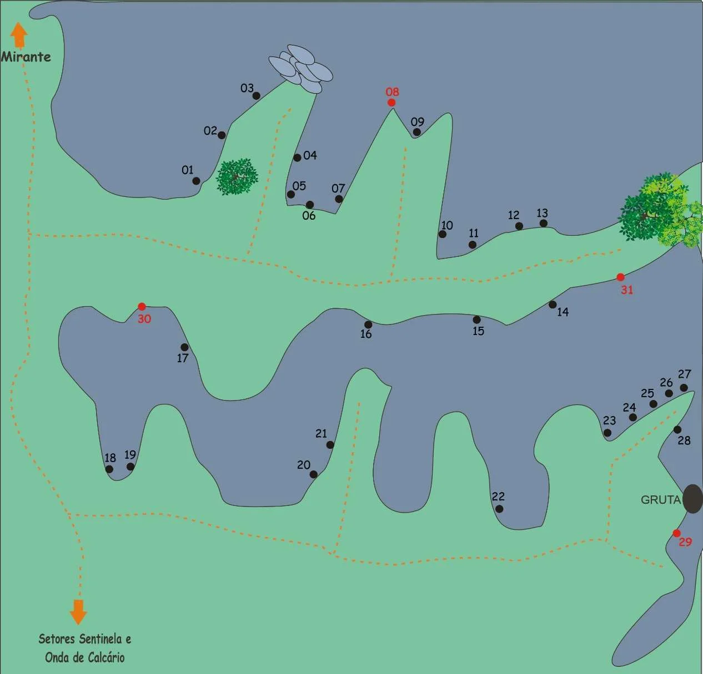
    - **largura_mapa**: 1266
    - **altura_mapa**: 1215
    - **pontos_de_interesse**:
      - **[0]**:
        - **id**: 03
        - **label**: 03
        - **retangulo**:
          - **x**: 445
          - **y**: 158
          - **comprimento**: 30
          - **largura**: 25
      - **[1]**:
        - **id**: 08
        - **label**: 08
        - **retangulo**:
          - **x**: 707
          - **y**: 164
          - **comprimento**: 32
          - **largura**: 30
      - **[2]**:
        - **id**: 09
        - **label**: 09
        - **retangulo**:
          - **x**: 752
          - **y**: 218
          - **comprimento**: 31
          - **largura**: 30
      - **[3]**:
        - **id**: 02
        - **label**: 02
        - **retangulo**:
          - **x**: 380
          - **y**: 234
          - **comprimento**: 33
          - **largura**: 28
      - **[4]**:
        - **id**: 04
        - **label**: 04
        - **retangulo**:
          - **x**: 558
          - **y**: 280
          - **comprimento**: 32
          - **largura**: 27
      - **[5]**:
        - **id**: 01
        - **label**: 01
        - **retangulo**:
          - **x**: 338
          - **y**: 305
          - **comprimento**: 29
          - **largura**: 26
      - **[6]**:
        - **id**: 05
        - **label**: 05
        - **retangulo**:
          - **x**: 538
          - **y**: 334
          - **comprimento**: 33
          - **largura**: 27
      - **[7]**:
        - **id**: 07
        - **label**: 07
        - **retangulo**:
          - **x**: 610
          - **y**: 338
          - **comprimento**: 33
          - **largura**: 27
      - **[8]**:
        - **id**: 06
        - **label**: 06
        - **retangulo**:
          - **x**: 556
          - **y**: 388
          - **comprimento**: 32
          - **largura**: 26
      - **[9]**:
        - **id**: 12
        - **label**: 12
        - **retangulo**:
          - **x**: 925
          - **y**: 388
          - **comprimento**: 30
          - **largura**: 25
      - **[10]**:
        - **id**: 13
        - **label**: 13
        - **retangulo**:
          - **x**: 976
          - **y**: 383
          - **comprimento**: 29
          - **largura**: 24
      - **[11]**:
        - **id**: 10
        - **label**: 10
        - **retangulo**:
          - **x**: 806
          - **y**: 405
          - **comprimento**: 29
          - **largura**: 26
      - **[12]**:
        - **id**: 11
        - **label**: 11
        - **retangulo**:
          - **x**: 854
          - **y**: 419
          - **comprimento**: 27
          - **largura**: 26
      - **[13]**:
        - **id**: 31
        - **label**: 31
        - **retangulo**:
          - **x**: 1129
          - **y**: 522
          - **comprimento**: 30
          - **largura**: 28
      - **[14]**:
        - **id**: 14
        - **label**: 14
        - **retangulo**:
          - **x**: 1014
          - **y**: 562
          - **comprimento**: 30
          - **largura**: 27
      - **[15]**:
        - **id**: 30
        - **label**: 30
        - **retangulo**:
          - **x**: 259
          - **y**: 574
          - **comprimento**: 32
          - **largura**: 26
      - **[16]**:
        - **id**: 16
        - **label**: 16
        - **retangulo**:
          - **x**: 659
          - **y**: 601
          - **comprimento**: 30
          - **largura**: 28
      - **[17]**:
        - **id**: 15
        - **label**: 15
        - **retangulo**:
          - **x**: 862
          - **y**: 596
          - **comprimento**: 31
          - **largura**: 28
      - **[18]**:
        - **id**: 17
        - **label**: 17
        - **retangulo**:
          - **x**: 328
          - **y**: 644
          - **comprimento**: 31
          - **largura**: 27
      - **[19]**:
        - **id**: 27
        - **label**: 27
        - **retangulo**:
          - **x**: 1233
          - **y**: 673
          - **comprimento**: 30
          - **largura**: 24
      - **[20]**:
        - **id**: 26
        - **label**: 26
        - **retangulo**:
          - **x**: 1200
          - **y**: 688
          - **comprimento**: 30
          - **largura**: 25
      - **[21]**:
        - **id**: 25
        - **label**: 25
        - **retangulo**:
          - **x**: 1166
          - **y**: 708
          - **comprimento**: 33
          - **largura**: 27
      - **[22]**:
        - **id**: 24
        - **label**: 24
        - **retangulo**:
          - **x**: 1134
          - **y**: 734
          - **comprimento**: 31
          - **largura**: 25
      - **[23]**:
        - **id**: 23
        - **label**: 23
        - **retangulo**:
          - **x**: 1098
          - **y**: 756
          - **comprimento**: 31
          - **largura**: 25
      - **[24]**:
        - **id**: 21
        - **label**: 21
        - **retangulo**:
          - **x**: 578
          - **y**: 781
          - **comprimento**: 31
          - **largura**: 30
      - **[25]**:
        - **id**: 28
        - **label**: 28
        - **retangulo**:
          - **x**: 1232
          - **y**: 793
          - **comprimento**: 30
          - **largura**: 28
      - **[26]**:
        - **id**: 18
        - **label**: 18
        - **retangulo**:
          - **x**: 200
          - **y**: 824
          - **comprimento**: 31
          - **largura**: 29
      - **[27]**:
        - **id**: 19
        - **label**: 19
        - **retangulo**:
          - **x**: 235
          - **y**: 819
          - **comprimento**: 30
          - **largura**: 24
      - **[28]**:
        - **id**: 20
        - **label**: 20
        - **retangulo**:
          - **x**: 547
          - **y**: 837
          - **comprimento**: 32
          - **largura**: 26
      - **[29]**:
        - **id**: 22
        - **label**: 22
        - **retangulo**:
          - **x**: 896
          - **y**: 896
          - **comprimento**: 30
          - **largura**: 20
      - **[30]**:
        - **id**: 29
        - **label**: 29
        - **retangulo**:
          - **x**: 1234
          - **y**: 976
          - **comprimento**: 29
          - **largura**: 29
      - **[31]**:
        - **id**: Setores_Sentinela_e_Onda_de_Calcario
        - **label**: Setores Sentinela e Onda de Calcário
        - **retangulo**:
          - **x**: 152
          - **y**: 1166
          - **comprimento**: 182
          - **largura**: 74
    - **referencias**:
      - **[0]**:
        - **escalada**: Primogênito
        - **ids**:
          - 01
      - **[1]**:
        - **escalada**: Tá de Corpo Mole
        - **ids**:
          - 02
      - **[2]**:
        - **escalada**: Dente de Tubarão
        - **ids**:
          - 03
      - **[3]**:
        - **escalada**: Besteirinha
        - **ids**:
          - 04
      - **[4]**:
        - **escalada**: O Jogo que Jogamos
        - **ids**:
          - 05
      - **[5]**:
        - **escalada**: Boca Mordida
        - **ids**:
          - 06
      - **[6]**:
        - **escalada**: Tetris
        - **ids**:
          - 07
      - **[7]**:
        - **escalada**: Golpe de Mestre
        - **ids**:
          - 10
      - **[8]**:
        - **escalada**: Voo de Ícaro
        - **ids**:
          - 11
      - **[9]**:
        - **escalada**: Y da Questão
        - **ids**:
          - 12
      - **[10]**:
        - **escalada**: Seu Perdão
        - **ids**:
          - 13
      - **[11]**:
        - **escalada**: A Linda
        - **ids**:
          - 14
      - **[12]**:
        - **escalada**: Drama
        - **ids**:
          - 15
      - **[13]**:
        - **escalada**: Escolha de Sophia
        - **ids**:
          - 16
      - **[14]**:
        - **escalada**: Pra Você
        - **ids**:
          - 17
      - **[15]**:
        - **escalada**: Titanic
        - **ids**:
          - 18
      - **[16]**:
        - **escalada**: Por Baixo dos Panos
        - **ids**:
          - 19
      - **[17]**:
        - **escalada**: Lobo Solitário
        - **ids**:
          - 20
      - **[18]**:
        - **escalada**: Currículo Atualizado
        - **ids**:
          - 21
      - **[19]**:
        - **escalada**: Pra Morrer Menos
        - **ids**:
          - 22
      - **[20]**:
        - **escalada**: Conhecendo o Criador
        - **ids**:
          - 23
      - **[21]**:
        - **escalada**: Vida Após a Morte
        - **ids**:
          - 24
      - **[22]**:
        - **escalada**: De Frente com o Renegado
        - **ids**:
          - 25
      - **[23]**:
        - **escalada**: Contra Mão
        - **ids**:
          - 26
      - **[24]**:
        - **escalada**: Sete Trabalhos de Hércules
        - **ids**:
          - 27
      - **[25]**:
        - **escalada**: Inhônho não Deixa
        - **ids**:
          - 28
      - **[26]**:
        - **escalada**: Excesso de Confiança
        - **ids**:
          - 29
      - **[27]**:
        - **escalada**: A Última Sinfonia de Bethoven
        - **ids**:
          - 30
      - **[28]**:
        - **escalada**: Vai no Molhado Mesmo (Rapel do bico de pedra)
        - **ids**:
          - 31
      - **[29]**:
        - **ids**:
          - 08
        - **setor**: Setor Mr. Bean
        - **escalada**: Fenda Gerações
      - **[30]**:
        - **ids**:
          - 09
        - **setor**: Setor Mr. Bean
        - **escalada**: Encontros Temporais
      - **[31]**:
        - **ids**:
          - Setores_Sentinela_e_Onda_de_Calcario
        - **setor**: Setor Sentinela e Vale do Joga
      - **[32]**:
        - **ids**:
          - Setores_Sentinela_e_Onda_de_Calcario
        - **setor**: Setor Onda de Calcário
- **escaladas**:
  - **[0]**:
    - **via_esportiva**:
      - **nome**: Primogênito
      - **dificuldade**: BR_5
      - **quantidade_protecoes_intermediarias**: 4
      - **quantidade_protecoes_parada**: 2
      - **conquistadores**:
        - GT Baú 2020
  - **[1]**:
    - **via_esportiva**:
      - **nome**: Tá de Corpo Mole
      - **dificuldade**: BR_6
      - **quantidade_protecoes_intermediarias**: 4
      - **quantidade_protecoes_parada**: 2
      - **conquistadores**:
        - GT Baú 2020
  - **[2]**:
    - **via_esportiva**:
      - **nome**: Dente de Tubarão
      - **dificuldade**: BR_6
      - **quantidade_protecoes_intermediarias**: 3
      - **quantidade_protecoes_parada**: 2
      - **conquistadores**:
        - GT Baú 2020
  - **[3]**:
    - **via_esportiva**:
      - **nome**: Besteirinha
      - **dificuldade**: BR_4
      - **quantidade_protecoes_intermediarias**: 3
      - **quantidade_protecoes_parada**: 2
      - **conquistadores**:
        - GT Baú 2020
  - **[4]**:
    - **via_esportiva**:
      - **nome**: O Jogo que Jogamos
      - **dificuldade**: BR_6
      - **quantidade_protecoes_intermediarias**: 3
      - **quantidade_protecoes_parada**: 2
      - **conquistadores**:
        - GT Baú 2020
  - **[5]**:
    - **via_esportiva**:
      - **nome**: Boca Mordida
      - **dificuldade**: BR_7A
      - **quantidade_protecoes_intermediarias**: 4
      - **quantidade_protecoes_parada**: 2
      - **conquistadores**:
        - GT Baú 2020
  - **[6]**:
    - **via_esportiva**:
      - **nome**: Tetris
      - **dificuldade**: BR_6
      - **quantidade_protecoes_intermediarias**: 4
      - **quantidade_protecoes_parada**: 2
      - **conquistadores**:
        - GT Baú 2020
  - **[7]**:
    - **via_movel**:
      - **nome**: Fenda Gerações
      - **dificuldade**: BR_6
      - **protecoes_moveis**: Móvel
      - **conquistadores**:
        - GT Baú 2020
  - **[8]**:
    - **via_esportiva**:
      - **nome**: Encontros Temporais
      - **dificuldade**: BR_6
      - **quantidade_protecoes_intermediarias**: 3
      - **quantidade_protecoes_parada**: 2
      - **conquistadores**:
        - GT Baú 2020
  - **[9]**:
    - **via_esportiva**:
      - **nome**: Golpe de Mestre
      - **dificuldade**: BR_6SUP
      - **quantidade_protecoes_intermediarias**: 5
      - **quantidade_protecoes_parada**: 2
      - **conquistadores**:
        - GT Baú 2020
  - **[10]**:
    - **via_esportiva**:
      - **nome**: Voo de Ícaro
      - **dificuldade**: BR_7B
      - **quantidade_protecoes_intermediarias**: 5
      - **quantidade_protecoes_parada**: 2
      - **conquistadores**:
        - GT Baú 2020
  - **[11]**:
    - **via_esportiva**:
      - **nome**: Y da Questão
      - **dificuldade**: BR_8B_BARRA_8C
      - **quantidade_protecoes_intermediarias**: 5
      - **quantidade_protecoes_parada**: 2
      - **conquistadores**:
        - GT Baú 2020
  - **[12]**:
    - **via_esportiva**:
      - **nome**: Seu Perdão
      - **dificuldade**: BR_7B
      - **quantidade_protecoes_intermediarias**: 4
      - **quantidade_protecoes_parada**: 2
      - **conquistadores**:
        - GT Baú 2020
  - **[13]**:
    - **via_esportiva**:
      - **nome**: A Linda
      - **dificuldade**: BR_4
      - **quantidade_protecoes_intermediarias**: 3
      - **quantidade_protecoes_parada**: 2
      - **conquistadores**:
        - GT Baú 2020
  - **[14]**:
    - **via_esportiva**:
      - **nome**: Drama
      - **dificuldade**: BR_4
      - **quantidade_protecoes_intermediarias**: 3
      - **quantidade_protecoes_parada**: 2
      - **conquistadores**:
        - GT Baú 2020
  - **[15]**:
    - **via_esportiva**:
      - **nome**: Escolha de Sophia
      - **dificuldade**: BR_5
      - **quantidade_protecoes_intermediarias**: 3
      - **quantidade_protecoes_parada**: 2
      - **conquistadores**:
        - GT Baú 2020
  - **[16]**:
    - **via_esportiva**:
      - **nome**: Pra Você
      - **dificuldade**: BR_4
      - **quantidade_protecoes_intermediarias**: 3
      - **quantidade_protecoes_parada**: 2
      - **conquistadores**:
        - GT Baú 2020
  - **[17]**:
    - **via_esportiva**:
      - **nome**: Titanic
      - **dificuldade**: BR_7A
      - **quantidade_protecoes_intermediarias**: 3
      - **quantidade_protecoes_parada**: 2
      - **conquistadores**:
        - GT Baú 2020
  - **[18]**:
    - **via_esportiva**:
      - **nome**: Por Baixo dos Panos
      - **dificuldade**: BR_4
      - **quantidade_protecoes_intermediarias**: 3
      - **quantidade_protecoes_parada**: 2
      - **conquistadores**:
        - GT Baú 2020
  - **[19]**:
    - **via_esportiva**:
      - **nome**: Lobo Solitário
      - **dificuldade**: BR_6
      - **quantidade_protecoes_intermediarias**: 3
      - **quantidade_protecoes_parada**: 2
      - **conquistadores**:
        - GT Baú 2020
  - **[20]**:
    - **via_esportiva**:
      - **nome**: Currículo Atualizado
      - **dificuldade**: BR_7A
      - **quantidade_protecoes_intermediarias**: 4
      - **quantidade_protecoes_parada**: 2
      - **conquistadores**:
        - GT Baú 2020
  - **[21]**:
    - **via_esportiva**:
      - **nome**: Pra Morrer Menos
      - **dificuldade**: BR_7A
      - **quantidade_protecoes_intermediarias**: 4
      - **quantidade_protecoes_parada**: 2
      - **conquistadores**:
        - GT Baú 2020
  - **[22]**:
    - **via_esportiva**:
      - **nome**: Conhecendo o Criador
      - **dificuldade**: BR_6
      - **quantidade_protecoes_intermediarias**: 5
      - **quantidade_protecoes_parada**: 2
      - **conquistadores**:
        - GT Baú 2020
  - **[23]**:
    - **via_esportiva**:
      - **nome**: Vida Após a Morte
      - **dificuldade**: BR_6SUP
      - **quantidade_protecoes_intermediarias**: 5
      - **quantidade_protecoes_parada**: 2
      - **conquistadores**:
        - GT Baú 2020
  - **[24]**:
    - **via_esportiva**:
      - **nome**: De Frente com o Renegado
      - **dificuldade**: BR_7A
      - **quantidade_protecoes_intermediarias**: 6
      - **quantidade_protecoes_parada**: 2
      - **conquistadores**:
        - GT Baú 2020
  - **[25]**:
    - **via_esportiva**:
      - **nome**: Contra Mão
      - **dificuldade**: BR_6
      - **quantidade_protecoes_intermediarias**: 6
      - **quantidade_protecoes_parada**: 2
      - **conquistadores**:
        - GT Baú 2020
  - **[26]**:
    - **via_esportiva**:
      - **nome**: Sete Trabalhos de Hércules
      - **dificuldade**: BR_8B
      - **quantidade_protecoes_intermediarias**: 8
      - **quantidade_protecoes_parada**: 2
      - **conquistadores**:
        - Joviney
        - Márcio Vasconcelos
  - **[27]**:
    - **via_esportiva**:
      - **nome**: Inhônho não Deixa
      - **dificuldade**: BR_7A
      - **quantidade_protecoes_intermediarias**: 6
      - **quantidade_protecoes_parada**: 2
      - **conquistadores**:
        - Otto
  - **[28]**:
    - **via_movel**:
      - **nome**: Excesso de Confiança
      - **dificuldade**: BR_4
      - **protecoes_moveis**: Móvel
      - **conquistadores**:
        - GT Baú 2020
  - **[29]**:
    - **via_movel**:
      - **nome**: A Última Sinfonia de Bethoven
      - **dificuldade**: BR_5SUP
      - **protecoes_moveis**: Móvel
      - **conquistadores**:
        - André “Dedé”
        - Roberto Lincoln
  - **[30]**:
    - **via_movel**:
      - **nome**: Vai no Molhado Mesmo (Rapel do bico de pedra)
      - **dificuldade**: BR_3
      - **protecoes_moveis**: Móvel
      - **conquistadores**:
        - Alberto Melo
        - Gabriel Lousada
- **precomputados**:
  - **total_escaladas**: 31

## Parte: setor_vale_do_cinema

### Setor (Pico: Gruta do Baú)

- **descricao**:
    # Setor Vale do Cinema
    
    **Acesso:** Após sair do setor sentinela, seguir sentido Onda de Calcário pela trilha. Após 5 minutos de caminhada virar em uma trilha a esquerda, passando próximo de alguns blocos de rocha. Passar pelo portão de metal e subir um pequeno morro. O setor estará à esquerda.
    
    **Coordenadas no Vale do Cinema:** -19º32.941’ -43º59.459’
- **nome**: Setor Vale do Cinema
- **mapas**:
  - **[0]**:
    - **caminho_imagem_mapa**: 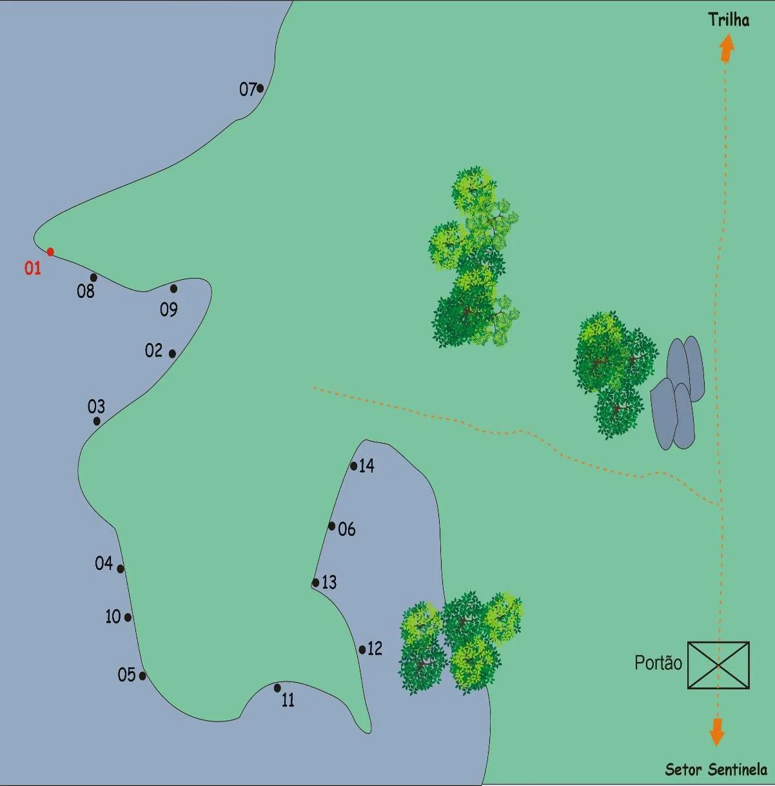
    - **largura_mapa**: 1202
    - **altura_mapa**: 1219
    - **pontos_de_interesse**:
      - **[0]**:
        - **id**: 07
        - **label**: 07
        - **retangulo**:
          - **x**: 388
          - **y**: 136
          - **comprimento**: 43
          - **largura**: 41
      - **[1]**:
        - **id**: 01
        - **label**: 01
        - **retangulo**:
          - **x**: 50
          - **y**: 414
          - **comprimento**: 37
          - **largura**: 36
      - **[2]**:
        - **id**: 08
        - **label**: 08
        - **retangulo**:
          - **x**: 134
          - **y**: 450
          - **comprimento**: 38
          - **largura**: 35
      - **[3]**:
        - **id**: 09
        - **label**: 09
        - **retangulo**:
          - **x**: 262
          - **y**: 479
          - **comprimento**: 38
          - **largura**: 34
      - **[4]**:
        - **id**: 02
        - **label**: 02
        - **retangulo**:
          - **x**: 239
          - **y**: 542
          - **comprimento**: 38
          - **largura**: 35
      - **[5]**:
        - **id**: 03
        - **label**: 03
        - **retangulo**:
          - **x**: 149
          - **y**: 629
          - **comprimento**: 38
          - **largura**: 36
      - **[6]**:
        - **id**: 14
        - **label**: 14
        - **retangulo**:
          - **x**: 568
          - **y**: 721
          - **comprimento**: 36
          - **largura**: 36
      - **[7]**:
        - **id**: 06
        - **label**: 06
        - **retangulo**:
          - **x**: 538
          - **y**: 820
          - **comprimento**: 35
          - **largura**: 36
      - **[8]**:
        - **id**: 04
        - **label**: 04
        - **retangulo**:
          - **x**: 162
          - **y**: 872
          - **comprimento**: 36
          - **largura**: 34
      - **[9]**:
        - **id**: 13
        - **label**: 13
        - **retangulo**:
          - **x**: 511
          - **y**: 901
          - **comprimento**: 36
          - **largura**: 36
      - **[10]**:
        - **id**: 10
        - **label**: 10
        - **retangulo**:
          - **x**: 176
          - **y**: 955
          - **comprimento**: 37
          - **largura**: 34
      - **[11]**:
        - **id**: 12
        - **label**: 12
        - **retangulo**:
          - **x**: 581
          - **y**: 1004
          - **comprimento**: 36
          - **largura**: 40
      - **[12]**:
        - **id**: 05
        - **label**: 05
        - **retangulo**:
          - **x**: 197
          - **y**: 1046
          - **comprimento**: 38
          - **largura**: 34
      - **[13]**:
        - **id**: 11
        - **label**: 11
        - **retangulo**:
          - **x**: 446
          - **y**: 1084
          - **comprimento**: 36
          - **largura**: 37
      - **[14]**:
        - **id**: Setor_Sentinela
        - **label**: Setor Sentinela
        - **retangulo**:
          - **x**: 1111
          - **y**: 1192
          - **comprimento**: 166
          - **largura**: 31
    - **referencias**:
      - **[0]**:
        - **escalada**: Armagedon
        - **ids**:
          - 01
      - **[1]**:
        - **escalada**: No dia em que a Terra Parou
        - **ids**:
          - 02
      - **[2]**:
        - **escalada**: Vermeio de Raiva
        - **ids**:
          - 03
      - **[3]**:
        - **escalada**: Linha Vermelha
        - **ids**:
          - 04
      - **[4]**:
        - **escalada**: Pestinha
        - **ids**:
          - 05
      - **[5]**:
        - **escalada**: Os Babás
        - **ids**:
          - 06
      - **[6]**:
        - **escalada**: Lanterninha
        - **ids**:
          - 07
      - **[7]**:
        - **escalada**: 1ª Fila
        - **ids**:
          - 10
      - **[8]**:
        - **escalada**: Saída de Emergência
        - **ids**:
          - 11
      - **[9]**:
        - **escalada**: Roteirista
        - **ids**:
          - 12
      - **[10]**:
        - **escalada**: Acenderam a Luz
        - **ids**:
          - 13
      - **[11]**:
        - **escalada**: Bilheteria
        - **ids**:
          - 14
      - **[12]**:
        - **ids**:
          - Setor_Sentinela
        - **setor**: Setor Sentinela e Vale do Joga
      - **[13]**:
        - **ids**:
          - 08
        - **setor**: Setor Vale do Cinema
        - **escalada**: Navio Fantasma
      - **[14]**:
        - **ids**:
          - 09
        - **setor**: Setor Vale do Cinema
        - **escalada**: Pata Afiada
- **escaladas**:
  - **[0]**:
    - **via_movel**:
      - **nome**: Armagedon
      - **dificuldade**: BR_6SUP
      - **protecoes_moveis**: Mista
      - **conquistadores**:
        - Novais
        - Márcio
        - Ivo
        - Joviney
  - **[1]**:
    - **via_esportiva**:
      - **nome**: No dia em que a Terra Parou
      - **dificuldade**: BR_8B
      - **quantidade_protecoes_intermediarias**: 5
      - **quantidade_protecoes_parada**: 2
      - **conquistadores**:
        - Novais
        - Márcio
        - Ivo
        - Joviney
  - **[2]**:
    - **via_esportiva**:
      - **nome**: Vermeio de Raiva
      - **dificuldade**: BR_7A
      - **quantidade_protecoes_intermediarias**: 6
      - **quantidade_protecoes_parada**: 2
      - **conquistadores**:
        - Novais
        - Márcio
        - Ivo
        - Joviney
        - Márcio Vasconcelos
  - **[3]**:
    - **via_esportiva**:
      - **nome**: Linha Vermelha
      - **dificuldade**: BR_6SUP
      - **quantidade_protecoes_intermediarias**: 4
      - **quantidade_protecoes_parada**: 2
      - **conquistadores**:
        - Novais
        - Márcio
        - Ivo
        - Joviney
  - **[4]**:
    - **via_esportiva**:
      - **nome**: Pestinha
      - **dificuldade**: BR_6SUP
      - **quantidade_protecoes_intermediarias**: 3
      - **quantidade_protecoes_parada**: 2
      - **conquistadores**:
        - Novais
        - Márcio
        - Ivo
        - Joviney
  - **[5]**:
    - **via_esportiva**:
      - **nome**: Os Babás
      - **dificuldade**: BR_7A
      - **quantidade_protecoes_intermediarias**: 4
      - **quantidade_protecoes_parada**: 2
      - **conquistadores**:
        - Joviney Miguel
        - Wilson
        - Márcio Vasconcelos
  - **[6]**:
    - **via_esportiva**:
      - **nome**: Lanterninha
      - **dificuldade**: BR_6SUP
      - **quantidade_protecoes_intermediarias**: 4
      - **quantidade_protecoes_parada**: 2
      - **conquistadores**:
        - Marco Durães
  - **[7]**:
    - **via_esportiva**:
      - **nome**: Navio Fantasma
      - **dificuldade**: BR_7C
      - **quantidade_protecoes_intermediarias**: 5
      - **quantidade_protecoes_parada**: 2
      - **conquistadores**:
        - Marcelo Novais
        - Roberto Lincoln
  - **[8]**:
    - **via_esportiva**:
      - **nome**: Pata Afiada
      - **dificuldade**: BR_8A
      - **quantidade_protecoes_intermediarias**: 5
      - **quantidade_protecoes_parada**: 2
      - **conquistadores**:
        - Marcelo Novais
        - Roberto Lincoln
  - **[9]**:
    - **via_esportiva**:
      - **nome**: 1ª Fila
      - **dificuldade**: BR_7B
      - **quantidade_protecoes_intermediarias**: 5
      - **quantidade_protecoes_parada**: 2
      - **conquistadores**:
        - Marco Durães
        - Roberto Lincoln
  - **[10]**:
    - **via_esportiva**:
      - **nome**: Saída de Emergência
      - **dificuldade**: BR_7A
      - **quantidade_protecoes_intermediarias**: 4
      - **quantidade_protecoes_parada**: 2
      - **conquistadores**:
        - Marco Durães
        - Roberto Lincoln
  - **[11]**:
    - **via_esportiva**:
      - **nome**: Roteirista
      - **dificuldade**: BR_6SUP
      - **quantidade_protecoes_intermediarias**: 4
      - **quantidade_protecoes_parada**: 2
      - **conquistadores**:
        - Marco Durães
        - Roberto Lincoln
  - **[12]**:
    - **via_esportiva**:
      - **nome**: Acenderam a Luz
      - **dificuldade**: BR_6
      - **quantidade_protecoes_intermediarias**: 4
      - **quantidade_protecoes_parada**: 2
      - **conquistadores**:
        - Marco Durães
        - Roberto Lincoln
  - **[13]**:
    - **via_esportiva**:
      - **nome**: Bilheteria
      - **dificuldade**: BR_5
      - **quantidade_protecoes_intermediarias**: 3
      - **quantidade_protecoes_parada**: 2
      - **conquistadores**:
        - Marco Durães
        - Roberto Lincoln
- **precomputados**:
  - **total_escaladas**: 14

## Parte: setor_onda_de_calcario

### Setor (Pico: Gruta do Baú)

- **descricao**:
    # Setor Onda de Calcário
    
    **Acesso:** Saindo do estacionamento, pegar a trilha que segue a direita. Após cerca de 10 minutos de caminhada, encontrará a bifurcação que dá acesso ao setor.
    
    **Coordenadas na Onda de Calcário:** -19º32.890 -43º59.578
- **nome**: Setor Onda de Calcário
- **mapas**:
  - **[0]**:
    - **caminho_imagem_mapa**: 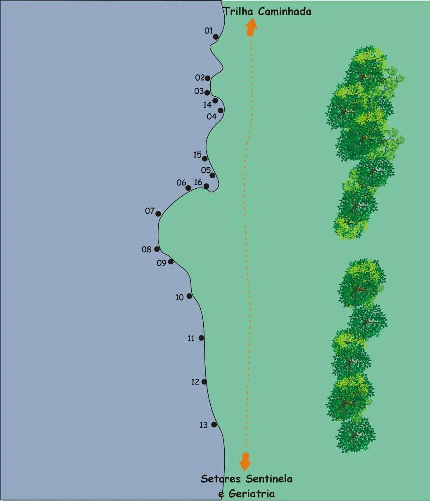
    - **largura_mapa**: 1041
    - **altura_mapa**: 1213
    - **pontos_de_interesse**:
      - **[0]**:
        - **id**: 01
        - **label**: 01
        - **retangulo**:
          - **x**: 505
          - **y**: 74
          - **comprimento**: 30
          - **largura**: 27
      - **[1]**:
        - **id**: 02
        - **label**: 02
        - **retangulo**:
          - **x**: 486
          - **y**: 186
          - **comprimento**: 31
          - **largura**: 29
      - **[2]**:
        - **id**: 03
        - **label**: 03
        - **retangulo**:
          - **x**: 482
          - **y**: 219
          - **comprimento**: 33
          - **largura**: 26
      - **[3]**:
        - **id**: 14
        - **label**: 14
        - **retangulo**:
          - **x**: 501
          - **y**: 253
          - **comprimento**: 28
          - **largura**: 26
      - **[4]**:
        - **id**: 04
        - **label**: 04
        - **retangulo**:
          - **x**: 512
          - **y**: 282
          - **comprimento**: 31
          - **largura**: 25
      - **[5]**:
        - **id**: 15
        - **label**: 15
        - **retangulo**:
          - **x**: 478
          - **y**: 374
          - **comprimento**: 31
          - **largura**: 27
      - **[6]**:
        - **id**: 05
        - **label**: 05
        - **retangulo**:
          - **x**: 500
          - **y**: 411
          - **comprimento**: 31
          - **largura**: 26
      - **[7]**:
        - **id**: 06
        - **label**: 06
        - **retangulo**:
          - **x**: 438
          - **y**: 440
          - **comprimento**: 32
          - **largura**: 29
      - **[8]**:
        - **id**: 16
        - **label**: 16
        - **retangulo**:
          - **x**: 480
          - **y**: 440
          - **comprimento**: 29
          - **largura**: 26
      - **[9]**:
        - **id**: 07
        - **label**: 07
        - **retangulo**:
          - **x**: 364
          - **y**: 510
          - **comprimento**: 31
          - **largura**: 29
      - **[10]**:
        - **id**: 08
        - **label**: 08
        - **retangulo**:
          - **x**: 355
          - **y**: 603
          - **comprimento**: 30
          - **largura**: 28
      - **[11]**:
        - **id**: 09
        - **label**: 09
        - **retangulo**:
          - **x**: 390
          - **y**: 636
          - **comprimento**: 31
          - **largura**: 29
      - **[12]**:
        - **id**: 10
        - **label**: 10
        - **retangulo**:
          - **x**: 435
          - **y**: 719
          - **comprimento**: 26
          - **largura**: 26
      - **[13]**:
        - **id**: 11
        - **label**: 11
        - **retangulo**:
          - **x**: 462
          - **y**: 818
          - **comprimento**: 25
          - **largura**: 26
      - **[14]**:
        - **id**: 12
        - **label**: 12
        - **retangulo**:
          - **x**: 472
          - **y**: 924
          - **comprimento**: 28
          - **largura**: 28
      - **[15]**:
        - **id**: 13
        - **label**: 13
        - **retangulo**:
          - **x**: 493
          - **y**: 1027
          - **comprimento**: 28
          - **largura**: 26
      - **[16]**:
        - **id**: Setores_Sentinela_e_Geriatria
        - **label**: Setores Sentinela e Geriatria
        - **retangulo**:
          - **x**: 596
          - **y**: 1176
          - **comprimento**: 232
          - **largura**: 68
    - **referencias**:
      - **[0]**:
        - **escalada**: Marreta Kamikaze
        - **ids**:
          - 01
      - **[1]**:
        - **escalada**: Entidade da Natureza
        - **ids**:
          - 02
      - **[2]**:
        - **escalada**: Mundo Verde
        - **ids**:
          - 03
      - **[3]**:
        - **escalada**: Uma Nova Esperança
        - **ids**:
          - 04
      - **[4]**:
        - **escalada**: Urtigão
        - **ids**:
          - 05
      - **[5]**:
        - **escalada**: Eternamente Jovem
        - **ids**:
          - 06
      - **[6]**:
        - **escalada**: Highlander
        - **ids**:
          - 07
      - **[7]**:
        - **escalada**: Belos e Malditos
        - **ids**:
          - 10
      - **[8]**:
        - **escalada**: Green Wood
        - **ids**:
          - 11
      - **[9]**:
        - **escalada**: Puro Malte
        - **ids**:
          - 12
      - **[10]**:
        - **escalada**: Ação Mutantes
        - **ids**:
          - 13
      - **[11]**:
        - **escalada**: Sagrada Família
        - **ids**:
          - 14
      - **[12]**:
        - **escalada**: O Poder e o Saber
        - **ids**:
          - 15
      - **[13]**:
        - **escalada**: Zig Marley
        - **ids**:
          - 16
      - **[14]**:
        - **ids**:
          - Setores_Sentinela_e_Geriatria
        - **setor**: Setor Sentinela e Vale do Joga
      - **[15]**:
        - **ids**:
          - Setores_Sentinela_e_Geriatria
        - **setor**: Setor Geriatria
      - **[16]**:
        - **ids**:
          - 08
        - **setor**: Setor Onda de Calcário
        - **escalada**: Rayovac
      - **[17]**:
        - **ids**:
          - 09
        - **setor**: Setor Onda de Calcário
        - **escalada**: O Corpo Ainda é Pouco
- **escaladas**:
  - **[0]**:
    - **via_esportiva**:
      - **nome**: Marreta Kamikaze
      - **dificuldade**: BR_7A
      - **quantidade_protecoes_intermediarias**: 5
      - **quantidade_protecoes_parada**: 2
      - **conquistadores**:
        - Alexandre “Caverna”
  - **[1]**:
    - **via_esportiva**:
      - **nome**: Entidade da Natureza
      - **dificuldade**: BR_7B
      - **quantidade_protecoes_intermediarias**: 8
      - **quantidade_protecoes_parada**: 2
      - **conquistadores**:
        - GT Baú 2021
  - **[2]**:
    - **via_esportiva**:
      - **nome**: Mundo Verde
      - **dificuldade**: BR_6SUP
      - **quantidade_protecoes_intermediarias**: 9
      - **quantidade_protecoes_parada**: 2
      - **conquistadores**:
        - GT Baú 2021
  - **[3]**:
    - **via_esportiva**:
      - **nome**: Uma Nova Esperança
      - **dificuldade**: PROJETO
      - **quantidade_protecoes_intermediarias**: 7
      - **quantidade_protecoes_parada**: 2
      - **conquistadores**:
        - Felipe Belisário
        - Marcella Romanelli
  - **[4]**:
    - **via_esportiva**:
      - **nome**: Urtigão
      - **dificuldade**: BR_8A
      - **quantidade_protecoes_intermediarias**: 6
      - **quantidade_protecoes_parada**: 1
      - **conquistadores**:
        - Eustáquio Macedo
        - Emerson “Lampião”
  - **[5]**:
    - **via_esportiva**:
      - **nome**: Eternamente Jovem
      - **dificuldade**: BR_8B
      - **quantidade_protecoes_intermediarias**: 6
      - **quantidade_protecoes_parada**: 2
      - **conquistadores**:
        - Eustáquio
        - Emerson
        - Fabiano
        - Andrezão
  - **[6]**:
    - **via_esportiva**:
      - **nome**: Highlander
      - **dificuldade**: BR_8B
      - **quantidade_protecoes_intermediarias**: 6
      - **quantidade_protecoes_parada**: 2
      - **conquistadores**:
        - Eustáquio
        - Emerson
        - Mr. Bean
        - Belisário
  - **[7]**:
    - **via_esportiva**:
      - **nome**: Rayovac
      - **dificuldade**: BR_8C
      - **quantidade_protecoes_intermediarias**: 6
      - **quantidade_protecoes_parada**: 2
      - **conquistadores**:
        - Yan Ouriques
        - Ricardo
  - **[8]**:
    - **via_esportiva**:
      - **nome**: O Corpo Ainda é Pouco
      - **dificuldade**: BR_9B
      - **quantidade_protecoes_intermediarias**: 8
      - **quantidade_protecoes_parada**: 2
      - **conquistadores**:
        - Ralf Cortes
        - Ingo
  - **[9]**:
    - **via_esportiva**:
      - **nome**: Belos e Malditos
      - **dificuldade**: BR_10B
      - **quantidade_protecoes_intermediarias**: 13
      - **quantidade_protecoes_parada**: 2
      - **conquistadores**:
        - Eustáquio
        - Emerson
        - Felipe Belisário
        - Sandro Almeida
  - **[10]**:
    - **via_esportiva**:
      - **nome**: Green Wood
      - **dificuldade**: PROJETO
      - **quantidade_protecoes_intermediarias**: 5
      - **quantidade_protecoes_parada**: 2
      - **conquistadores**:
        - Felipe Belisário
        - Sandro Almeida
        - Bernardo Barcelos
  - **[11]**:
    - **via_esportiva**:
      - **nome**: Puro Malte
      - **dificuldade**: PROJETO
      - **quantidade_protecoes_intermediarias**: 13
      - **quantidade_protecoes_parada**: 2
      - **conquistadores**:
        - Felipe Belisário
        - Marcella Romanelli
  - **[12]**:
    - **via_esportiva**:
      - **nome**: Ação Mutantes
      - **dificuldade**: BR_8B
      - **quantidade_protecoes_intermediarias**: 6
      - **quantidade_protecoes_parada**: 2
      - **conquistadores**:
        - Ralf Cortes
        - Christian Costa
        - Felipe Belisário
  - **[13]**:
    - **via_esportiva**:
      - **nome**: Sagrada Família
      - **dificuldade**: BR_7A
      - **quantidade_protecoes_intermediarias**: 6
      - **quantidade_protecoes_parada**: 2
      - **conquistadores**:
        - Iule Ornelas
        - Igor Andrade
        - Samuel Lucas
        - Márcio Vasconcelos
  - **[14]**:
    - **via_esportiva**:
      - **nome**: O Poder e o Saber
      - **dificuldade**: BR_7C
      - **quantidade_protecoes_intermediarias**: 7
      - **quantidade_protecoes_parada**: 2
      - **conquistadores**:
        - Marcelo Novais
        - Marcus Rufino
  - **[15]**:
    - **via_esportiva**:
      - **nome**: Zig Marley
      - **dificuldade**: BR_7B_BARRA_7C
      - **quantidade_protecoes_intermediarias**: 6
      - **quantidade_protecoes_parada**: 2
      - **conquistadores**:
        - Iule Ornelas
        - Igor Andrade
        - Samuel Lucas
- **precomputados**:
  - **total_escaladas**: 16

## Parte: setor_vale_da_onca

### Setor (Pico: Gruta do Baú)

- **descricao**:
    # Setor Vale da Onça
    
    **Acesso:** Seguindo a trilha, após a entrada dos setores Escola e Geriatria, passar pelo portão de metal e seguir as placas em direção ao setor. Cerca de 15 minutos de caminhada a partir do setor entrada.
- **nome**: Setor Vale da Onça
- **mapas**:
  - **[0]**:
    - **caminho_imagem_mapa**: 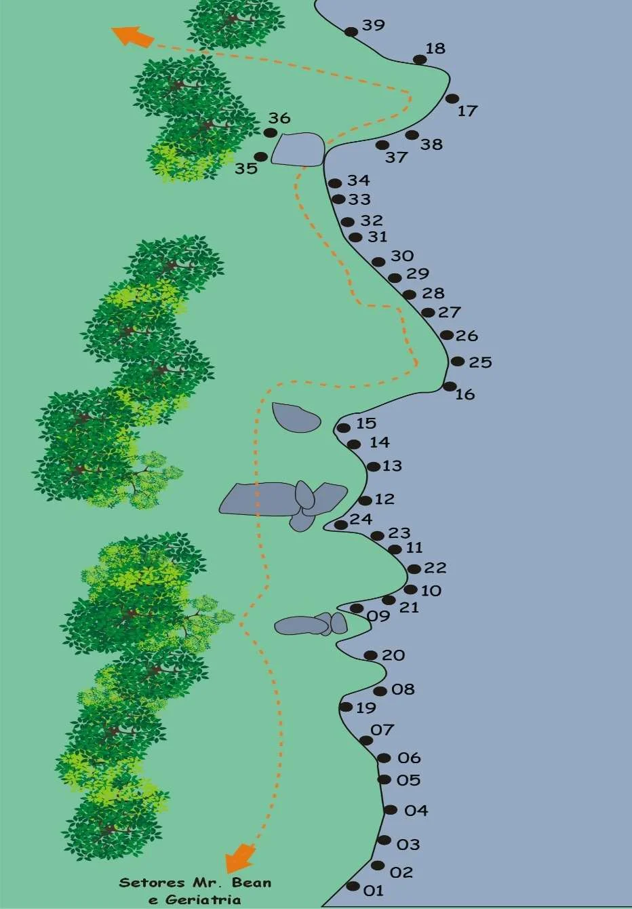
    - **largura_mapa**: 932
    - **altura_mapa**: 1340
    - **pontos_de_interesse**:
      - **[0]**:
        - **id**: 39
        - **label**: 39
        - **retangulo**:
          - **x**: 550
          - **y**: 36
          - **comprimento**: 42
          - **largura**: 27
      - **[1]**:
        - **id**: 18
        - **label**: 18
        - **retangulo**:
          - **x**: 642
          - **y**: 70
          - **comprimento**: 36
          - **largura**: 25
      - **[2]**:
        - **id**: 17
        - **label**: 17
        - **retangulo**:
          - **x**: 688
          - **y**: 162
          - **comprimento**: 35
          - **largura**: 30
      - **[3]**:
        - **id**: 36
        - **label**: 36
        - **retangulo**:
          - **x**: 412
          - **y**: 174
          - **comprimento**: 38
          - **largura**: 28
      - **[4]**:
        - **id**: 38
        - **label**: 38
        - **retangulo**:
          - **x**: 636
          - **y**: 212
          - **comprimento**: 42
          - **largura**: 27
      - **[5]**:
        - **id**: 37
        - **label**: 37
        - **retangulo**:
          - **x**: 584
          - **y**: 230
          - **comprimento**: 41
          - **largura**: 29
      - **[6]**:
        - **id**: 35
        - **label**: 35
        - **retangulo**:
          - **x**: 362
          - **y**: 248
          - **comprimento**: 41
          - **largura**: 31
      - **[7]**:
        - **id**: 34
        - **label**: 34
        - **retangulo**:
          - **x**: 528
          - **y**: 264
          - **comprimento**: 42
          - **largura**: 27
      - **[8]**:
        - **id**: 33
        - **label**: 33
        - **retangulo**:
          - **x**: 529
          - **y**: 293
          - **comprimento**: 40
          - **largura**: 24
      - **[9]**:
        - **id**: 32
        - **label**: 32
        - **retangulo**:
          - **x**: 548
          - **y**: 324
          - **comprimento**: 37
          - **largura**: 23
      - **[10]**:
        - **id**: 31
        - **label**: 31
        - **retangulo**:
          - **x**: 556
          - **y**: 349
          - **comprimento**: 36
          - **largura**: 24
      - **[11]**:
        - **id**: 30
        - **label**: 30
        - **retangulo**:
          - **x**: 594
          - **y**: 376
          - **comprimento**: 41
          - **largura**: 25
      - **[12]**:
        - **id**: 29
        - **label**: 29
        - **retangulo**:
          - **x**: 616
          - **y**: 402
          - **comprimento**: 39
          - **largura**: 25
      - **[13]**:
        - **id**: 28
        - **label**: 28
        - **retangulo**:
          - **x**: 640
          - **y**: 432
          - **comprimento**: 39
          - **largura**: 24
      - **[14]**:
        - **id**: 27
        - **label**: 27
        - **retangulo**:
          - **x**: 662
          - **y**: 460
          - **comprimento**: 39
          - **largura**: 24
      - **[15]**:
        - **id**: 26
        - **label**: 26
        - **retangulo**:
          - **x**: 689
          - **y**: 496
          - **comprimento**: 38
          - **largura**: 27
      - **[16]**:
        - **id**: 25
        - **label**: 25
        - **retangulo**:
          - **x**: 708
          - **y**: 534
          - **comprimento**: 40
          - **largura**: 31
      - **[17]**:
        - **id**: 16
        - **label**: 16
        - **retangulo**:
          - **x**: 686
          - **y**: 580
          - **comprimento**: 36
          - **largura**: 30
      - **[18]**:
        - **id**: 15
        - **label**: 15
        - **retangulo**:
          - **x**: 541
          - **y**: 622
          - **comprimento**: 36
          - **largura**: 27
      - **[19]**:
        - **id**: 14
        - **label**: 14
        - **retangulo**:
          - **x**: 560
          - **y**: 652
          - **comprimento**: 37
          - **largura**: 27
      - **[20]**:
        - **id**: 13
        - **label**: 13
        - **retangulo**:
          - **x**: 579
          - **y**: 686
          - **comprimento**: 36
          - **largura**: 29
      - **[21]**:
        - **id**: 12
        - **label**: 12
        - **retangulo**:
          - **x**: 567
          - **y**: 735
          - **comprimento**: 36
          - **largura**: 26
      - **[22]**:
        - **id**: 24
        - **label**: 24
        - **retangulo**:
          - **x**: 532
          - **y**: 766
          - **comprimento**: 40
          - **largura**: 31
      - **[23]**:
        - **id**: 23
        - **label**: 23
        - **retangulo**:
          - **x**: 590
          - **y**: 784
          - **comprimento**: 42
          - **largura**: 22
      - **[24]**:
        - **id**: 11
        - **label**: 11
        - **retangulo**:
          - **x**: 612
          - **y**: 808
          - **comprimento**: 31
          - **largura**: 23
      - **[25]**:
        - **id**: 22
        - **label**: 22
        - **retangulo**:
          - **x**: 642
          - **y**: 836
          - **comprimento**: 39
          - **largura**: 27
      - **[26]**:
        - **id**: 10
        - **label**: 10
        - **retangulo**:
          - **x**: 636
          - **y**: 870
          - **comprimento**: 37
          - **largura**: 26
      - **[27]**:
        - **id**: 21
        - **label**: 21
        - **retangulo**:
          - **x**: 602
          - **y**: 896
          - **comprimento**: 39
          - **largura**: 24
      - **[28]**:
        - **id**: 09
        - **label**: 09
        - **retangulo**:
          - **x**: 558
          - **y**: 908
          - **comprimento**: 39
          - **largura**: 30
      - **[29]**:
        - **id**: 20
        - **label**: 20
        - **retangulo**:
          - **x**: 580
          - **y**: 966
          - **comprimento**: 42
          - **largura**: 31
      - **[30]**:
        - **id**: 08
        - **label**: 08
        - **retangulo**:
          - **x**: 596
          - **y**: 1015
          - **comprimento**: 40
          - **largura**: 32
      - **[31]**:
        - **id**: 19
        - **label**: 19
        - **retangulo**:
          - **x**: 539
          - **y**: 1043
          - **comprimento**: 38
          - **largura**: 28
      - **[32]**:
        - **id**: 07
        - **label**: 07
        - **retangulo**:
          - **x**: 564
          - **y**: 1076
          - **comprimento**: 40
          - **largura**: 32
      - **[33]**:
        - **id**: 06
        - **label**: 06
        - **retangulo**:
          - **x**: 604
          - **y**: 1116
          - **comprimento**: 40
          - **largura**: 29
      - **[34]**:
        - **id**: 05
        - **label**: 05
        - **retangulo**:
          - **x**: 602
          - **y**: 1150
          - **comprimento**: 42
          - **largura**: 29
      - **[35]**:
        - **id**: 04
        - **label**: 04
        - **retangulo**:
          - **x**: 614
          - **y**: 1194
          - **comprimento**: 41
          - **largura**: 29
      - **[36]**:
        - **id**: 03
        - **label**: 03
        - **retangulo**:
          - **x**: 602
          - **y**: 1244
          - **comprimento**: 40
          - **largura**: 29
      - **[37]**:
        - **id**: 02
        - **label**: 02
        - **retangulo**:
          - **x**: 592
          - **y**: 1286
          - **comprimento**: 38
          - **largura**: 31
      - **[38]**:
        - **id**: 01
        - **label**: 01
        - **retangulo**:
          - **x**: 550
          - **y**: 1312
          - **comprimento**: 35
          - **largura**: 29
      - **[39]**:
        - **id**: Setores_Mr_Bean_e_Geriatria
        - **label**: Setores Mr. Bean e Geriatria
        - **retangulo**:
          - **x**: 288
          - **y**: 1312
          - **comprimento**: 233
          - **largura**: 53
    - **referencias**:
      - **[0]**:
        - **escalada**: Quebrando o Pau
        - **ids**:
          - 01
      - **[1]**:
        - **escalada**: Prima do Rio
        - **ids**:
          - 02
      - **[2]**:
        - **escalada**: Psiu, Calate
        - **ids**:
          - 03
      - **[3]**:
        - **escalada**: Mis cosas, cuido yo
        - **ids**:
          - 04
      - **[4]**:
        - **escalada**: Fugindo da Jiboia
        - **ids**:
          - 05
      - **[5]**:
        - **escalada**: Fugindo da Onça
        - **ids**:
          - 06
      - **[6]**:
        - **escalada**: No Pescoço do Jacaré
        - **ids**:
          - 07
      - **[7]**:
        - **escalada**: Orifícios do Ofício
        - **ids**:
          - 10
      - **[8]**:
        - **escalada**: Cercando o Perímetro
        - **ids**:
          - 11
      - **[9]**:
        - **escalada**: Trabaiá não qué
        - **ids**:
          - 12
      - **[10]**:
        - **escalada**: Na Surdina
        - **ids**:
          - 13
      - **[11]**:
        - **escalada**: Gente Boa
        - **ids**:
          - 14
      - **[12]**:
        - **escalada**: Aqui Jaz
        - **ids**:
          - 15
      - **[13]**:
        - **escalada**: Toca da Jararaca
        - **ids**:
          - 16
      - **[14]**:
        - **escalada**: Mais que Infinito
        - **ids**:
          - 17
      - **[15]**:
        - **escalada**: Fissurados
        - **ids**:
          - 18
      - **[16]**:
        - **escalada**: Olho de Hórus
        - **ids**:
          - 19
      - **[17]**:
        - **escalada**: Melhor Idade
        - **ids**:
          - 20
      - **[18]**:
        - **escalada**: Torre de Babel
        - **ids**:
          - 21
      - **[19]**:
        - **escalada**: Era Venenosa
        - **ids**:
          - 22
      - **[20]**:
        - **escalada**: Arcanjo Gabriel
        - **ids**:
          - 23
      - **[21]**:
        - **escalada**: La Bella Luna
        - **ids**:
          - 24
      - **[22]**:
        - **escalada**: Amigo da Onça
        - **ids**:
          - 25
      - **[23]**:
        - **escalada**: Baú da Felicidade
        - **ids**:
          - 26
      - **[24]**:
        - **escalada**: Cavalo de Tróia
        - **ids**:
          - 27
      - **[25]**:
        - **escalada**: Testosterona
        - **ids**:
          - 28
      - **[26]**:
        - **escalada**: Mazelados
        - **ids**:
          - 29
      - **[27]**:
        - **escalada**: A Fúria de Dandara
        - **ids**:
          - 30
      - **[28]**:
        - **escalada**: Climb Terapia
        - **ids**:
          - 31
      - **[29]**:
        - **escalada**: Atitude
        - **ids**:
          - 32
      - **[30]**:
        - **escalada**: Zona de Perigo
        - **ids**:
          - 33
      - **[31]**:
        - **escalada**: A Montanha dos 7 Abutres
        - **ids**:
          - 34
      - **[32]**:
        - **escalada**: Caixa de Pandora
        - **ids**:
          - 35
      - **[33]**:
        - **escalada**: Vivendo o Sonho
        - **ids**:
          - 36
      - **[34]**:
        - **escalada**: A Torre deu Pane
        - **ids**:
          - 37
      - **[35]**:
        - **escalada**: Sessentenário
        - **ids**:
          - 38
      - **[36]**:
        - **escalada**: Supimpa
        - **ids**:
          - 39
      - **[37]**:
        - **ids**:
          - Setores_Mr_Bean_e_Geriatria
        - **setor**: Setor Mr. Bean
      - **[38]**:
        - **ids**:
          - Setores_Mr_Bean_e_Geriatria
        - **setor**: Setor Geriatria
      - **[39]**:
        - **ids**:
          - 08
        - **setor**: Setor Vale da Onça
        - **escalada**: Retorno de Borges
      - **[40]**:
        - **ids**:
          - 09
        - **setor**: Setor Vale da Onça
        - **escalada**: 3º Pecado Capital
- **escaladas**:
  - **[0]**:
    - **via_esportiva**:
      - **nome**: Quebrando o Pau
      - **dificuldade**: BR_6
      - **quantidade_protecoes_intermediarias**: 6
      - **quantidade_protecoes_parada**: 2
      - **conquistadores**:
        - Otto
        - Lu
  - **[1]**:
    - **via_esportiva**:
      - **nome**: Prima do Rio
      - **dificuldade**: BR_7C
      - **quantidade_protecoes_intermediarias**: 8
      - **quantidade_protecoes_parada**: 2
      - **conquistadores**:
        - Otto
        - Lu
  - **[2]**:
    - **via_esportiva**:
      - **nome**: Psiu, Calate
      - **dificuldade**: BR_8B
      - **quantidade_protecoes_intermediarias**: 8
      - **quantidade_protecoes_parada**: 2
      - **conquistadores**:
        - Otto
        - Lu
  - **[3]**:
    - **via_esportiva**:
      - **nome**: Mis cosas, cuido yo
      - **dificuldade**: BR_8B
      - **quantidade_protecoes_intermediarias**: 9
      - **quantidade_protecoes_parada**: 2
      - **conquistadores**:
        - Otto
        - Lu
  - **[4]**:
    - **via_esportiva**:
      - **nome**: Fugindo da Jiboia
      - **dificuldade**: BR_8A
      - **quantidade_protecoes_intermediarias**: 7
      - **quantidade_protecoes_parada**: 2
      - **conquistadores**:
        - Otto
        - Lu
  - **[5]**:
    - **via_esportiva**:
      - **nome**: Fugindo da Onça
      - **dificuldade**: BR_8B
      - **quantidade_protecoes_intermediarias**: 9
      - **quantidade_protecoes_parada**: 2
      - **conquistadores**:
        - Otto
        - Wilson Souza
        - Jana
  - **[6]**:
    - **via_esportiva**:
      - **nome**: No Pescoço do Jacaré
      - **dificuldade**: BR_8A
      - **quantidade_protecoes_intermediarias**: 8
      - **quantidade_protecoes_parada**: 2
      - **conquistadores**:
        - Wilson Souza
        - Otto
  - **[7]**:
    - **via_esportiva**:
      - **nome**: Retorno de Borges
      - **dificuldade**: BR_6SUP
      - **quantidade_protecoes_intermediarias**: 8
      - **quantidade_protecoes_parada**: 2
      - **conquistadores**:
        - Otto
        - Lu
  - **[8]**:
    - **via_esportiva**:
      - **nome**: 3º Pecado Capital
      - **dificuldade**: BR_6
      - **quantidade_protecoes_intermediarias**: 7
      - **quantidade_protecoes_parada**: 2
      - **conquistadores**:
        - Wilson Souza
        - Otto
  - **[9]**:
    - **via_esportiva**:
      - **nome**: Orifícios do Ofício
      - **dificuldade**: BR_7B
      - **quantidade_protecoes_intermediarias**: 6
      - **quantidade_protecoes_parada**: 2
      - **conquistadores**:
        - Wilson Souza
        - Otto
  - **[10]**:
    - **via_esportiva**:
      - **nome**: Cercando o Perímetro
      - **dificuldade**: BR_5SUP
      - **quantidade_protecoes_intermediarias**: 8
      - **quantidade_protecoes_parada**: 2
      - **conquistadores**:
        - Wilson Souza
        - Otto
  - **[11]**:
    - **via_esportiva**:
      - **nome**: Trabaiá não qué
      - **dificuldade**: BR_7A
      - **quantidade_protecoes_intermediarias**: 8
      - **quantidade_protecoes_parada**: 2
      - **conquistadores**:
        - Wilson Souza
        - Otto
  - **[12]**:
    - **via_esportiva**:
      - **nome**: Na Surdina
      - **dificuldade**: BR_8A
      - **quantidade_protecoes_intermediarias**: 9
      - **quantidade_protecoes_parada**: 2
      - **conquistadores**:
        - Wilson Souza
        - Otto
  - **[13]**:
    - **via_esportiva**:
      - **nome**: Gente Boa
      - **dificuldade**: BR_7A
      - **quantidade_protecoes_intermediarias**: 9
      - **quantidade_protecoes_parada**: 2
      - **conquistadores**:
        - Wilson Souza
        - Otto
  - **[14]**:
    - **via_esportiva**:
      - **nome**: Aqui Jaz
      - **dificuldade**: BR_7A
      - **quantidade_protecoes_intermediarias**: 9
      - **quantidade_protecoes_parada**: 2
      - **conquistadores**:
        - Wilson Souza
        - Otto
  - **[15]**:
    - **via_esportiva**:
      - **nome**: Toca da Jararaca
      - **dificuldade**: BR_6SUP
      - **quantidade_protecoes_intermediarias**: 11
      - **quantidade_protecoes_parada**: 2
      - **conquistadores**:
        - Wilson Souza
        - Otto
  - **[16]**:
    - **via_esportiva**:
      - **nome**: Mais que Infinito
      - **dificuldade**: BR_7B_BARRA_7C
      - **quantidade_protecoes_intermediarias**: 10
      - **quantidade_protecoes_parada**: 2
      - **conquistadores**:
        - Márcio Macena
        - Christian Costa
        - Joviney Miguel
  - **[17]**:
    - **via_esportiva**:
      - **nome**: Fissurados
      - **dificuldade**: BR_7B
      - **quantidade_protecoes_intermediarias**: 8
      - **quantidade_protecoes_parada**: 2
      - **conquistadores**:
        - Marcus Rufino
        - Renato Utsch
  - **[18]**:
    - **via_esportiva**:
      - **nome**: Olho de Hórus
      - **dificuldade**: PROJETO
      - **quantidade_protecoes_intermediarias**: 14
      - **quantidade_protecoes_parada**: 2
      - **conquistadores**:
        - Igor Andrade
        - Iule Ornelas
  - **[19]**:
    - **via_esportiva**:
      - **nome**: Melhor Idade
      - **dificuldade**: BR_7A
      - **quantidade_protecoes_intermediarias**: 9
      - **quantidade_protecoes_parada**: 2
      - **conquistadores**:
        - Christian Costa
        - Dênio Teixeira
        - Wilson Professor
  - **[20]**:
    - **via_esportiva**:
      - **nome**: Torre de Babel
      - **dificuldade**: BR_7C
      - **quantidade_protecoes_intermediarias**: 8
      - **quantidade_protecoes_parada**: 2
      - **conquistadores**:
        - Átila Cunha
        - Marcelo Novais
        - Marcus Rufino
  - **[21]**:
    - **via_esportiva**:
      - **nome**: Era Venenosa
      - **dificuldade**: BR_6SUP
      - **quantidade_protecoes_intermediarias**: 8
      - **quantidade_protecoes_parada**: 2
      - **conquistadores**:
        - Lídia Botelho
        - Thaina Leão
  - **[22]**:
    - **via_esportiva**:
      - **nome**: Arcanjo Gabriel
      - **dificuldade**: BR_7A
      - **quantidade_protecoes_intermediarias**: 10
      - **quantidade_protecoes_parada**: 2
      - **conquistadores**:
        - Igor Andrade
        - Iule Ornelas
  - **[23]**:
    - **via_esportiva**:
      - **nome**: La Bella Luna
      - **dificuldade**: BR_7B_BARRA_7C
      - **quantidade_protecoes_intermediarias**: 11
      - **quantidade_protecoes_parada**: 2
      - **conquistadores**:
        - Igor Andrade
        - Iule Ornelas
  - **[24]**:
    - **via_esportiva**:
      - **nome**: Amigo da Onça
      - **dificuldade**: BR_6SUP
      - **quantidade_protecoes_intermediarias**: 8
      - **quantidade_protecoes_parada**: 2
      - **conquistadores**:
        - Marcelo Novais
        - Willian Cruz
        - Sidnei Cunha
  - **[25]**:
    - **via_esportiva**:
      - **nome**: Baú da Felicidade
      - **dificuldade**: BR_5SUP
      - **quantidade_protecoes_intermediarias**: 10
      - **quantidade_protecoes_parada**: 2
      - **conquistadores**:
        - Marcelo Novais
        - Willian Cruz
  - **[26]**:
    - **via_esportiva**:
      - **nome**: Cavalo de Tróia
      - **dificuldade**: BR_7B
      - **quantidade_protecoes_intermediarias**: 8
      - **quantidade_protecoes_parada**: 2
      - **conquistadores**:
        - Marcelo Novais
        - Marcus Rufino
  - **[27]**:
    - **via_esportiva**:
      - **nome**: Testosterona
      - **dificuldade**: BR_8A_BARRA_8B
      - **quantidade_protecoes_intermediarias**: 7
      - **quantidade_protecoes_parada**: 2
      - **conquistadores**:
        - Cláudio
        - Leo Rodrigues
        - Sidão
  - **[28]**:
    - **via_esportiva**:
      - **nome**: Mazelados
      - **dificuldade**: BR_7C
      - **quantidade_protecoes_intermediarias**: 9
      - **quantidade_protecoes_parada**: 2
      - **conquistadores**:
        - Cláudio
        - Leo Rodrigues
        - Sidão
  - **[29]**:
    - **via_esportiva**:
      - **nome**: A Fúria de Dandara
      - **dificuldade**: BR_7C
      - **quantidade_protecoes_intermediarias**: 7
      - **quantidade_protecoes_parada**: 2
      - **conquistadores**:
        - Marcelo Novais
        - Willian Cruz
  - **[30]**:
    - **via_esportiva**:
      - **nome**: Climb Terapia
      - **dificuldade**: BR_7C
      - **quantidade_protecoes_intermediarias**: 7
      - **quantidade_protecoes_parada**: 2
      - **conquistadores**:
        - Cláudio
        - Leo Rodrigues
        - Sidão
  - **[31]**:
    - **via_esportiva**:
      - **nome**: Atitude
      - **dificuldade**: BR_7C
      - **quantidade_protecoes_intermediarias**: 7
      - **quantidade_protecoes_parada**: 2
      - **conquistadores**:
        - Cláudio
        - Leo Rodrigues
        - Sidão
  - **[32]**:
    - **via_esportiva**:
      - **nome**: Zona de Perigo
      - **dificuldade**: BR_7C
      - **quantidade_protecoes_intermediarias**: 10
      - **quantidade_protecoes_parada**: 2
      - **conquistadores**:
        - Marcelo Novais
        - Willian Cruz
  - **[33]**:
    - **via_esportiva**:
      - **nome**: A Montanha dos 7 Abutres
      - **dificuldade**: BR_7B
      - **quantidade_protecoes_intermediarias**: 9
      - **quantidade_protecoes_parada**: 2
      - **conquistadores**:
        - Marcelo Novais
        - Roberto Lincoln
  - **[34]**:
    - **via_esportiva**:
      - **nome**: Caixa de Pandora
      - **dificuldade**: BR_6
      - **quantidade_protecoes_intermediarias**: 7
      - **quantidade_protecoes_parada**: 2
      - **conquistadores**:
        - Marcelo Novais
        - Roberto Lincoln
  - **[35]**:
    - **via_esportiva**:
      - **nome**: Vivendo o Sonho
      - **dificuldade**: BR_6
      - **quantidade_protecoes_intermediarias**: 8
      - **quantidade_protecoes_parada**: 2
      - **conquistadores**:
        - Marcelo Navais
        - Renato Utsch
  - **[36]**:
    - **via_esportiva**:
      - **nome**: A Torre deu Pane
      - **dificuldade**: BR_6SUP
      - **quantidade_protecoes_intermediarias**: 8
      - **quantidade_protecoes_parada**: 2
      - **conquistadores**:
        - Átila Cunha
        - Marcelo Novais
        - Roberto Lincoln
  - **[37]**:
    - **via_esportiva**:
      - **nome**: Sessentenário
      - **dificuldade**: BR_6SUP
      - **quantidade_protecoes_intermediarias**: 7
      - **quantidade_protecoes_parada**: 2
      - **conquistadores**:
        - Igor Andrade
        - Iule Ornelas
        - Márcio Vasconcelos
  - **[38]**:
    - **via_esportiva**:
      - **nome**: Supimpa
      - **dificuldade**: BR_6
      - **quantidade_protecoes_intermediarias**: 9
      - **quantidade_protecoes_parada**: 2
      - **conquistadores**:
        - Marcelo Novais
        - Átila Cunha
- **precomputados**:
  - **total_escaladas**: 39

## Arquivos Externos

- **arquivos_externos**:
  - **[0]**:
    - **caminho**: 
    - **checksum_sha256**: 336bbfebac3a2dea9982af6574404d369cb5beb128debd8bd12a365f9ab70b82
  - **[1]**:
    - **caminho**: 
    - **checksum_sha256**: eedc7521abba563f3fdbb446437a1c88cd4145e5a3c50396f6c73e7ff540468b
  - **[2]**:
    - **caminho**: 
    - **checksum_sha256**: abfaf2144cd9808091864f20400296e3f0d44af27c6eb74b45d6bc69cd5d0eca
  - **[3]**:
    - **caminho**: 
    - **checksum_sha256**: 26fdd1a51ff1c663a996fd7141e8cdb86639fdb77c30bd58a091ee9f9f458022
  - **[4]**:
    - **caminho**: 
    - **checksum_sha256**: 951c72b56e61bc0e783bcf58cd344341b84bd584eedd7d374fbd5b77233810e2
  - **[5]**:
    - **caminho**: 
    - **checksum_sha256**: 1fcdb2c46c7fba451f5e576bfd9bd4164f964242dc93b2b170567393a9e96f4b
  - **[6]**:
    - **caminho**: 
    - **checksum_sha256**: 51e3af36bb54d8dd55fa5ffc03af21b5dc35d5b830b2ac563e2f1d857198a57d
  - **[7]**:
    - **caminho**: 
    - **checksum_sha256**: 59e2478366cf635707ed3568a2f4d681e662a029fbc2ce8f1e1180e0b20168b4
  - **[8]**:
    - **caminho**: 
    - **checksum_sha256**: 99b9e7c953fb1b5785bd1c9bb2f8e2df69beba06d165f597c7901d74f3e011cc
  - **[9]**:
    - **caminho**: 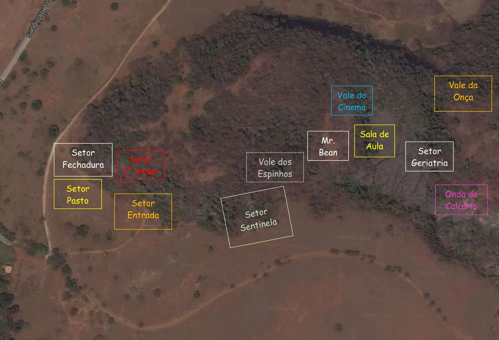
    - **checksum_sha256**: 04956f734d3fbebbf9be3c478bb3952b0fda23e2269e49f4c6852b8f2839cf20
  - **[10]**:
    - **caminho**: 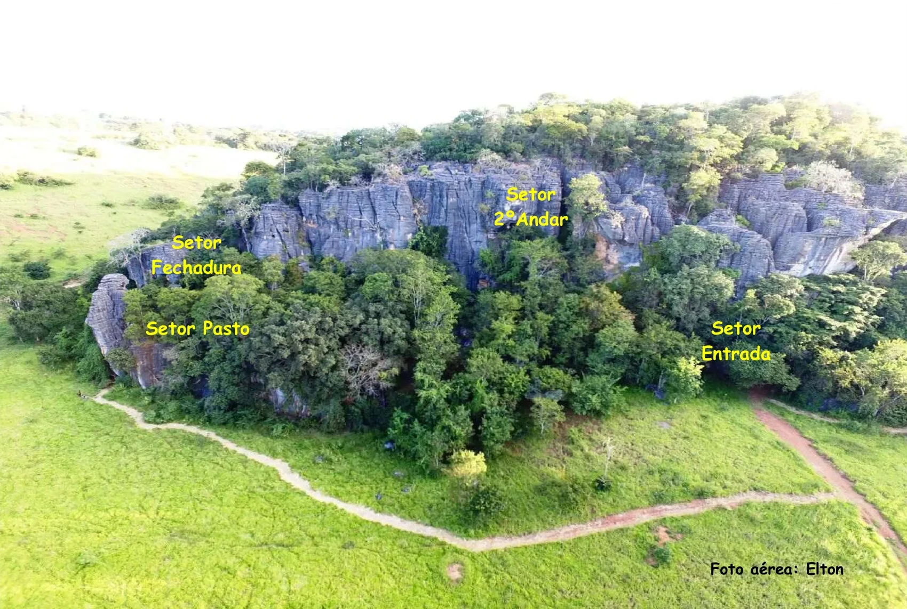
    - **checksum_sha256**: e86ea2a122e6ffc55f2889a6b190c1d93560f46e558d3b0812b58a2aa9e055dc
  - **[11]**:
    - **caminho**: 
    - **checksum_sha256**: c2c3e479054f6589614544f898e806f402d1587f89e0fd53a030c7d9ab1aaa81
  - **[12]**:
    - **caminho**: 
    - **checksum_sha256**: 2b7272d6e04b4b6090465077781bcf002417e9252f283bf3d1814894cc057fe4
  - **[13]**:
    - **caminho**: 
    - **checksum_sha256**: 1d9613be6ea88f93a2771f02130998f91cd05ae6a3e64b4062e9bbedabc5d916
  - **[14]**:
    - **caminho**: 
    - **checksum_sha256**: d671ba1029498c9208fcbd93257b9336693729a4417a49d8f491b6737df90523
  - **[15]**:
    - **caminho**: 
    - **checksum_sha256**: fd110cba7b8b60346e586d8507423e66bf16ee2a3a375fc4ac75cf4dff5ff0c8
  - **[16]**:
    - **caminho**: 
    - **checksum_sha256**: 708c09accdb6000c38cd7865123860d6c2fc3a3b1335dfef3b485dc6e19362e6
  - **[17]**:
    - **caminho**: 
    - **checksum_sha256**: 070992508790ce219fe1ac215a56db492b5feecb63ff6204014fc4f2076e0fa2
  - **[18]**:
    - **caminho**: 
    - **checksum_sha256**: d4d37a02dee7f215cda2481ffd2320f9dae6e460589a76fa726565fb5d7b02fe
  - **[19]**:
    - **caminho**: 
    - **checksum_sha256**: 6584f6d85a3edcdf2abe5af8d878d06646a7ccf7bfbefed8c6f12d57654d5301
  - **[20]**:
    - **caminho**: 
    - **checksum_sha256**: dc9fee8ba35c78dd71e3902e2e2d0301c0c0f5affa713f0a22deb09510ecaf4f
  - **[21]**:
    - **caminho**: 
    - **checksum_sha256**: 32b3233fdd40105c0b4492d2364f57b5501ce8284bc727357ad5fbfffcb386c3
  - **[22]**:
    - **caminho**: 
    - **checksum_sha256**: efbe8a4df9ebdfd4cbc827157acd06e79ae31cbf3522f1ca3b5d359c1cec78b6
  - **[23]**:
    - **caminho**: 
    - **checksum_sha256**: 1bbaf2c8795beb69697c4705d4caf5b6b640bd50148c15e757bed95b6eb2efa4
  - **[24]**:
    - **caminho**: 
    - **checksum_sha256**: fddef54aa95ff014018cb42360cdffa07dfa181a3eeb781033939d235c80371e
  - **[25]**:
    - **caminho**: 
    - **checksum_sha256**: a7da1e14f94d1faf44d3c915f77773a8af6721415b550afc8f2309018f995cb0
  - **[26]**:
    - **caminho**: 
    - **checksum_sha256**: 4e9d8b59af9df47ece34fd958e9ead4779fbcc74fb3ca4bf6af22780027aa885
  - **[27]**:
    - **caminho**: 
    - **checksum_sha256**: 1f56d3c23e28e3a04e5f81f2b7a4753a6a753d3b96d328b766f80174c5a77ab3
  - **[28]**:
    - **caminho**: 
    - **checksum_sha256**: 460166610d3ce954cf69bbe3cddde8e0e8e8e9946330db140e3e6184bf7c0169
  - **[29]**:
    - **caminho**: 
    - **checksum_sha256**: 1dbba370f4580293ef31b9317dc1ae439d3aa72e9afe207df9c1301f97ba1c4f
  - **[30]**:
    - **caminho**: 
    - **checksum_sha256**: ba2d74f99bbb480a972c4d3c40d22f923046f1f597f03198c70474c97128abfe
  - **[31]**:
    - **caminho**: 
    - **checksum_sha256**: cbd6332313e8a4023ada2df4a04e16816e0b7bfab42fb9a9235bed125d0695e4
  - **[32]**:
    - **caminho**: 
    - **checksum_sha256**: c31ef6e63437602072c84b29271e96a845d674c7e96c8a504cd5aaee5f8a23cf
  - **[33]**:
    - **caminho**: 
    - **checksum_sha256**: 0304bee041f32425ddda79c3937a17f916d4d5f97a774a4b63d20d28b3d2203b
  - **[34]**:
    - **caminho**: 
    - **checksum_sha256**: 5c98fb5af2c118fc47fc89b5c32e130438683149177f3276708a1971a8a96888
  - **[35]**:
    - **caminho**: 
    - **checksum_sha256**: 4e9c73398fdcba3611a5fe93b973779f891ed008fea953df46f9e9796b44809d

