# Croqui: Gruta do Baú

## Informações Gerais

- **id**: br_mg_pedro_leopoldo_gruta_do_bau
- **nome**: Gruta do Baú
- **uid**: Zazz5il9mKvyUZ
- **creditos**:
  - Christian Costa
- **caminho_thumbnail**: 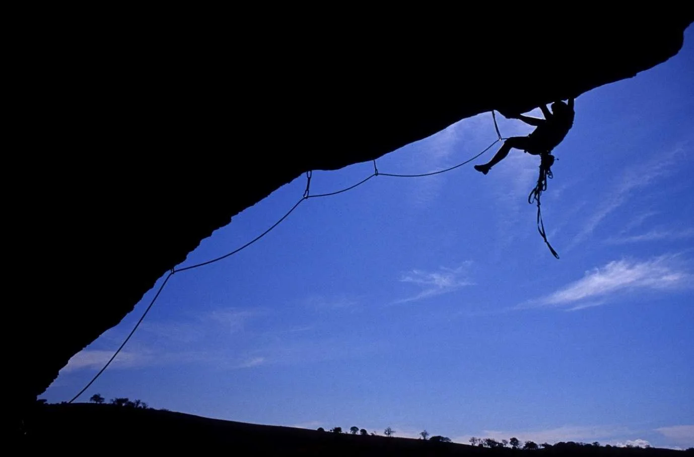
- **revisado_manualmente**: True
- **status_desenho_extraivel**: NAO_TEM_DESENHO
- **botoes**:
  - **[0]**:
    - **uid**: ULDPpvw832n2K7
    - **texto**: Capa
    - **destino**:
      - **secao_textual**:
        - **conteudo**:
            # GUIA DE ESCALADA GRUTA DO BAÚ
            
            **PEDRO LEOPOLDO – MG**
            **5ª Edição - Agosto/2025**
            
            **CHRISTIAN COSTA**
            
            |  |
            | :--: |
            | *Capa* |
  - **[1]**:
    - **uid**: Ia5LL26e7nQI3C
    - **texto**: Aviso
    - **destino**:
      - **secao_textual**:
        - **conteudo**:
            # AVISO
            
            A escalada é um esporte de risco, manuais e guias não substituem instrução e supervisão profissional. Somente com equipamentos de qualidade e instrução adequada se consegue minimizar os riscos do esporte.
            
            Se você ainda não sabe escalar procure uma escola com instrutores qualificados. Evite aprender na base dos erros e acertos, pois acidentes em escalada são potencialmente graves sendo fundamental a instrução profissional para perfeita compreensão das diversas técnicas de segurança.
            
            As informações contidas neste guia servem apenas para indicar os locais mais frequentados e suas principais vias de escalada, não assegurando a integridade física das proteções fixas das vias indicadas. Os autores também não se responsabilizam pela utilização ou má interpretação das informações contidas neste guia.
            
            Esteja avisado que alguns dos dados contidos no guia são subjetivos (como o grau de dificuldade por exemplo), e a utilização deste guia implica que você está ciente que, morte ou acidentes graves são riscos inerentes da escalada em rocha, assumindo assim toda a responsabilidade pelos seus atos.
            
            A utilização de capacete é recomendável durante toda a permanência nas áreas de escalada.
            
            Este guia foi feito por escaladores e não tem qualquer objetivo financeiro. Como qualquer trabalho está sujeito a erros e acertos. Qualquer dúvida, sugestão ou elogio são muito bem vindos.
            
            Lembre-se sempre:
            
            **A SEGURANÇA deve ser sempre o aspecto mais importante em toda e qualquer atividade de escalada**
            
            **VOCÊ É O MAIOR RESPONSÁVEL POR SUA SEGURANÇA, RESPEITE OS SEUS LIMITES E SEJA PRUDENTE.**
  - **[2]**:
    - **uid**: ayvGfM7D9EHQTW
    - **texto**: História
    - **destino**:
      - **secao_textual**:
        - **conteudo**:
            # História
            
            O maciço do Baú está localizado no município de Pedro Leopoldo a cerca de 50 km de Belo Horizonte. O local está dentro dos limites da APA Carste de Lagoa Santa em uma propriedade particular, abrigando inúmeras cavernas e formações rochosas. Os espeleólogos encontraram nestas cavernas vários fósseis além de diversos espeleotemas de rara beleza.
            
            |  |
            | :--: |
            | *Maciço do Baú* |
            
            O nome de Gruta do Baú advém da formação rochosa presente no maciço que se assemelha a uma fechadura.
            
            O Baú começou a ser frequentado pelos escaladores na década de noventa, quando Roberto Lincoln e Rômulo Brandão, ambos recém formados em um curso de escalada, visitaram o local e perceberam o potencial deste, abrindo lá suas primeiras vias de escalada, hoje as clássicas “Retorno de Pitú” e “Sentinela”.
            
            | 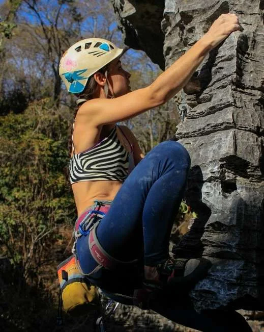 |
            | :--: |
            | *Poliana Lisboa – Via Arcanjo Gabriel* |
            
            No princípio seus conhecimentos sobre conquistas e grampeações eram poucos, porém eles superaram esta falta de conhecimento e equipamentos adequados com uma boa dose de criatividade, conquistando diversas vias.
            
            O proprietário atual é o empresário José Celso, um apaixonado pela natureza e por todo o complexo do Baú que preza pela boa convivência e faz de tudo para que os escaladores se sintam em casa ao frequentarem sua fazenda. Chegado a uma boa prosa, os encontros com ele sempre são recheados de boas histórias e risadas.
  - **[3]**:
    - **uid**: 6LbPkX9724vbfU
    - **texto**: Acesso
    - **destino**:
      - **secao_textual**:
        - **conteudo**:
            # Acesso
            
            O Baú está localizado no município de Pedro Leopoldo, no distrito de Lagoa de Santo Antônio, há cerca de 50 km de Belo Horizonte.
            
            Na saída de Belo Horizonte para o Aeroporto internacional de Confins (MG-010) entrar no trevo para a cidade de Pedro Leopoldo, seguindo pela MG 424. Após passar por Pedro Leopoldo continuar na rodovia em direção a Matozinhos e virar à direita no trevo da correia transportadora de minério que atravessa a estrada até o distrito de Lagoa de Santo Antônio.
            
            Seguir em direção ao distrito de Fidalgo, passando próximo a uma lagoa e chegando até a Rua Pacífico Rodrigues.
            
            **Coordenadas geográficas da entrada:** -19º33'12.5 -43º59'23.4
            
            | 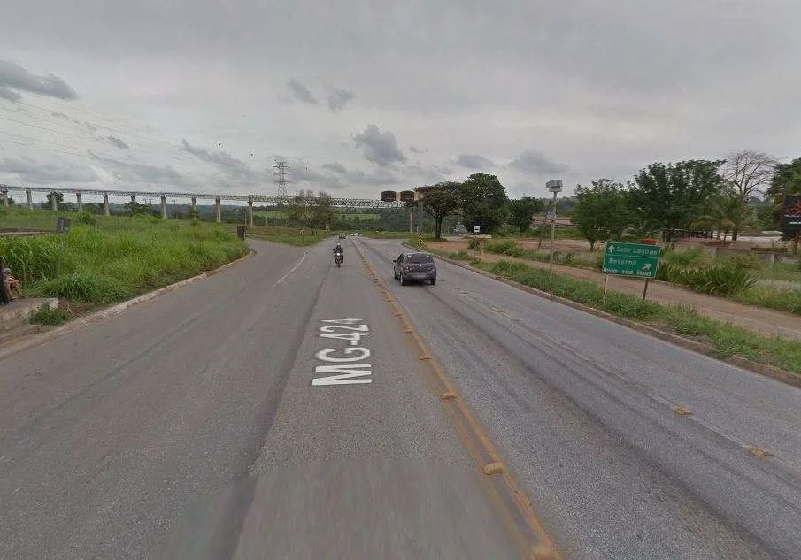 |
            | :--: |
            | *Vista da saída na MG 424* |
            
            | 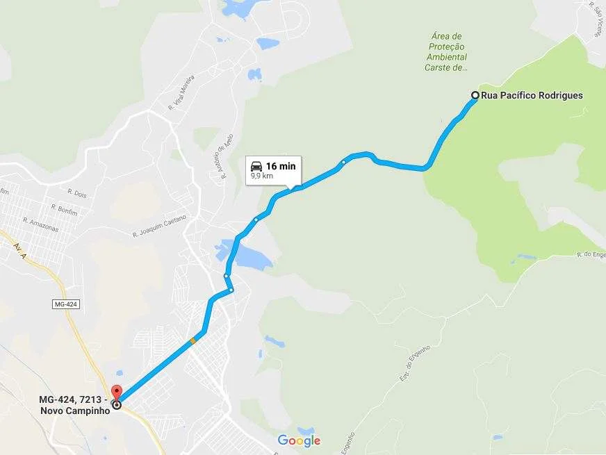 |
            | :--: |
            | *Trajeto até entrada do Baú* |
            
            | 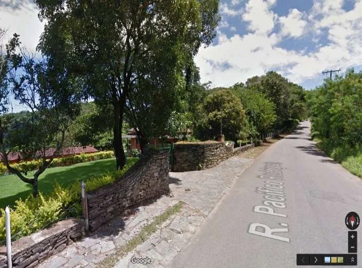 |
            | :--: |
            | *Vista da entrada da Fazenda* |
  - **[4]**:
    - **uid**: DVZ0GM3BEwI9eE
    - **texto**: Regras de Visitação
    - **destino**:
      - **secao_textual**:
        - **conteudo**:
            # Regras de Visitação
            
            Como todas as áreas de escalada, os princípios do mínimo impacto devem ser observados e a segurança é responsabilidade única e exclusiva de cada um.
            
            A área de escalada no Baú é uma área particular, pertencente ao Sr. José Celso. Para que continue aberta a escalada é fundamental observarmos algumas regras de visitação:
            
            - Taxa de visitação: R$ 25,00 (Vinte e cinco reais);
            - **Obrigatório a utilização de Capacete e cada visitante deve portar o seu próprio equipamento.**
            - **Obrigatório que o praticante faça parte do grupo de whatsapp de informações do Baú, para que tenha ciência das regras e condutas para o local, bem como informes pertinentes da área.**
            
            | 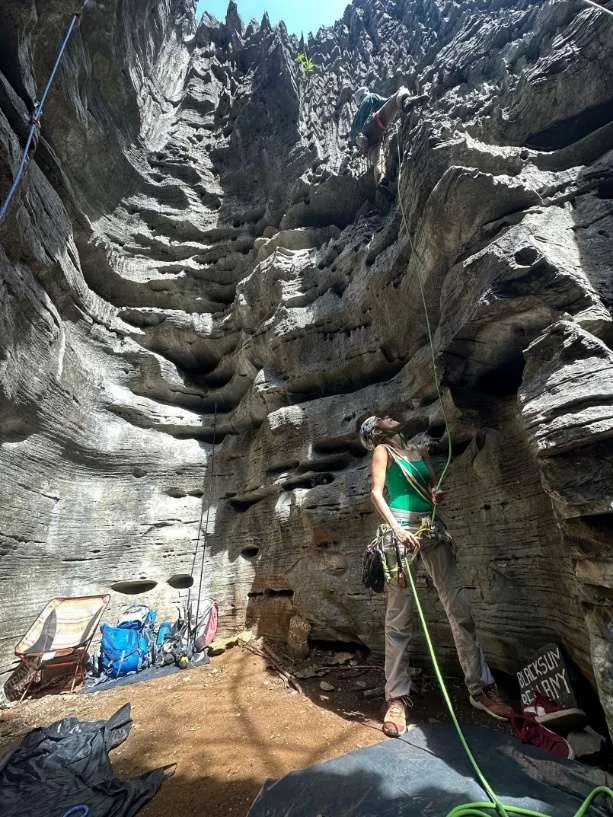 |
            | :--: |
            | *Larissa Correa dando segurança para Bruno Lapertosa no setor Segundo Andar* |
            
            - Horário de funcionamento: 08:00 às 18:00, todos os dias da semana para escalada;
            - Deixar qualquer portão, porteira ou colchete fechado;
            - É proibido retirar qualquer objeto do sítio (pedras, mudas, flores, etc...);
            - Se manter sempre nas trilhas demarcadas;
            - Não fazer qualquer modificação ou conquista de vias sem comunicar o grupo de trabalho responsável pelo local;
            
            | 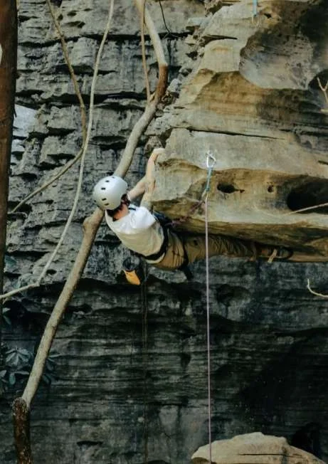 |
            | :--: |
            | *Marina Rocha - Via Fusca Azul* |
            
            **OBSERVAÇÃO:** A quantidade de proteções expressa no guia conta as proteções da via mais o Top com 1 ou 2 proteções. Por exemplo, se está expresso 6 + 2 no campo proteções, são 6 chapeletas ou grampos + o top rope.
            
            **OBSERVAÇÃO 2:** As vias com proteções móveis ou mistas estão assinaladas de vermelho no guia. O grupo de trabalho vem duplicando os top ropes dessas vias e colocando os nomes nas bases.
            
            **OBSERVAÇÃO 3:** Alguns locais tem Topropes montados baixos para cursos de escalada. Marcados em amarelo nos croquis.
            
            **É expressamente proibido a entrada na gruta sem o acompanhamento de um guia da fazenda.**
  - **[5]**:
    - **uid**: mPjshOotMbaQC3
    - **texto**: Opções de Hospedagem
    - **destino**:
      - **secao_textual**:
        - **conteudo**:
            # Opções de Hospedagem
            
            ### Casa ou quartos para alugar na própria Gruta do Baú
            
            |  |
            | :--: |
            | *Casa ou quartos para alugar na própria Gruta do Baú* |
            
            O complexo da fazenda conta com uma casa que pode ser alugada por um grupo ou somente os quartos isoladamente. Fica bem ao lado da entrada e conta ainda com uma piscina privativa e deck panorâmico.
            **CONTATOS**
            Instagram: @grutadobau
            WhatsApp - José Celso: (31) 98771-1655
            
            ### Rupestre da Lapa
            
            | 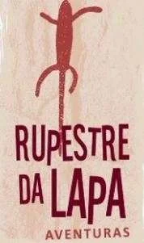 |
            | :--: |
            | *Rupestre da Lapa* |
            
            Abrigo de escalada – Hospedagem com ou sem refeições, estacionamento, área de camping, quartos coletivos, duplos e suítes. Serve café da manhã, almoço, lanche e jantar mediante agendamento.
            **CONTATOS**
            Instagram: @hospedagemrupestredalapa
            WhatsApp - Helon ou Denise: (31) 99807-8392
            
            ### Escalarte
            
            |  |
            | :--: |
            | *Escalarte* |
            
            Refúgio de escalada – Hospedagem a menos de 1 km da Gruta da Lapinha e 13 km da Gruta do Baú. Oferece quartos coletivos, duplos e suítes.
            
            | 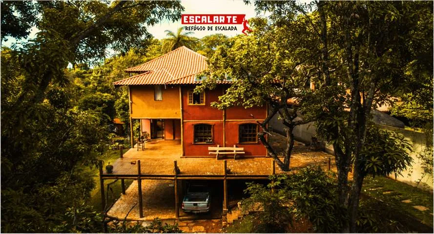 |
            | :--: |
            | *Hospedagem* |
            **CONTATOS**
            Instagram: @escalar_te
            WhatsApp – André Braga (Dedé): (31) 99831-3107
  - **[6]**:
    - **uid**: Wk76BKCNh2qEbR
    - **texto**: Outras atrações
    - **destino**:
      - **secao_textual**:
        - **conteudo**:
            # Outras atrações e comodidades da Gruta do Baú
            
            A área de escalada da Gruta do Baú se localiza dentro da Fazenda Gruta do Baú, que por si só, já é uma atração à parte. A Fazenda conta com diversas outras atrações e comodidades, se tornando um passeio para toda a família. Podemos destacar:
            
            |  |
            | :--: |
            | *Restaurante com café da manhã, almoço e petiscos* |
            
            | 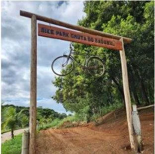 |
            | :--: |
            | *Bike Park com 18 km de trilhas* |
            
            | 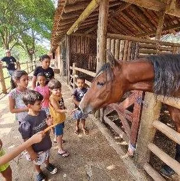 |
            | :--: |
            | *Alimentação para os animais* |
            
            | 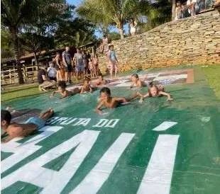 |
            | :--: |
            | *Recreação infantil* |
            
            | 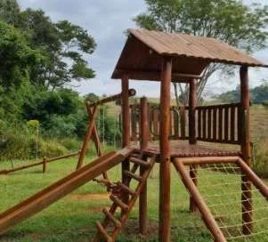 |
            | :--: |
            | *Parquinho* |
  - **[7]**:
    - **uid**: h6QXGsOVtXQxkL
    - **texto**: Manutenção
    - **destino**:
      - **secao_textual**:
        - **conteudo**:
            # Manutenção e conquista de novas vias
            
            A grande maioria das vias do maciço do Baú são da década de 90, quase todas atingindo os 20 anos desde a conquista... Devido a idade das vias muitas proteções se deterioraram com o tempo e não se encontram em condições de utilização. Com o intuito de proporcionar uma escalada de qualidade e sobretudo segura, um pequeno grupo de escaladores locais está realizando de maneira gradativa a substituição das proteções e duplicando os top ropes.
            
            Foi criado um grupo de trabalho em 2020 com o intuito de intermediar a abertura de novas vias junto ao proprietário. A abertura se dará de forma lenta e gradual, para diminuir os impactos gerados na área.
            
            O GT Baú vem variando os membros ao longo do tempo e em agosto de 2025 é composto pelos escaladores: André Braga, Christian Costa, Igor Andrade, Iule Ornelas, Marcelo Novais, Márcio Vasconcelos, Roberto Lincoln, Sandro Almeida e Wilson Souza “Professor”.
            
            | 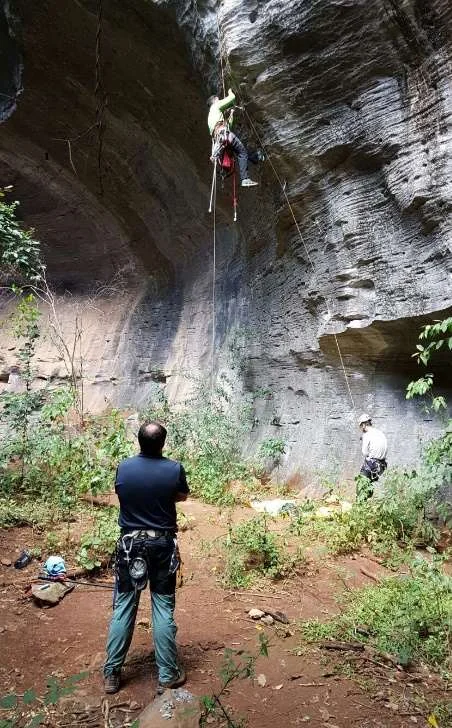 |
            | :--: |
            | *Manutenção na Rayovac* |
            
            | 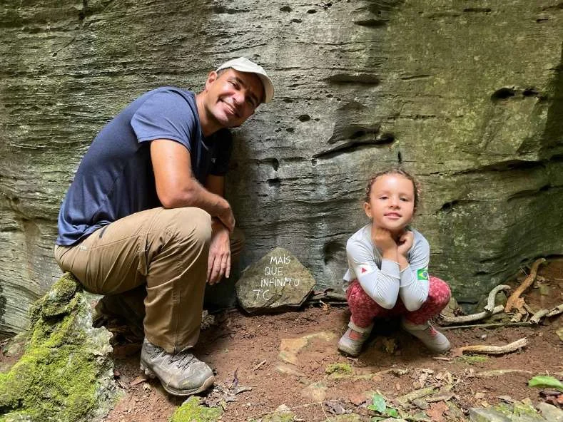 |
            | :--: |
            | *Mariana Costa ajudando a colocar o nome na via aberta em sua homenagem* |
            
            | 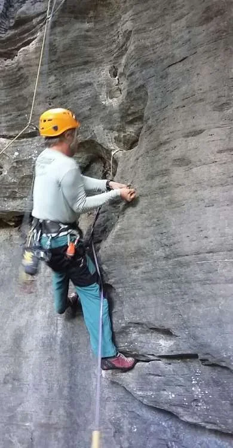 |
            | :--: |
            | *Manutencao na Sentinela 1* |
- **ultima_migracao**: 5
- **publicar_croqui**: True
- **revisado_bounding_circle**: True

## Parte: setor_entrada_inferior

### Setor (Pico: Gruta do Baú)

- **descricao**:
    # Setor Entrada Inferior
    
    **Acesso:** Seguindo pela estrada partindo do estacionamento, é o primeiro setor que fica na chegada ao maciço.
    
    **Coordenadas na base da via É Brincadeira:** -19º32.879’ -43º59.337’
- **nome**: Setor Entrada Inferior
- **uid**: 7MOvMnNTds8jZr
- **mapas**:
  - **[0]**:
    - **caminho_imagem_mapa**: 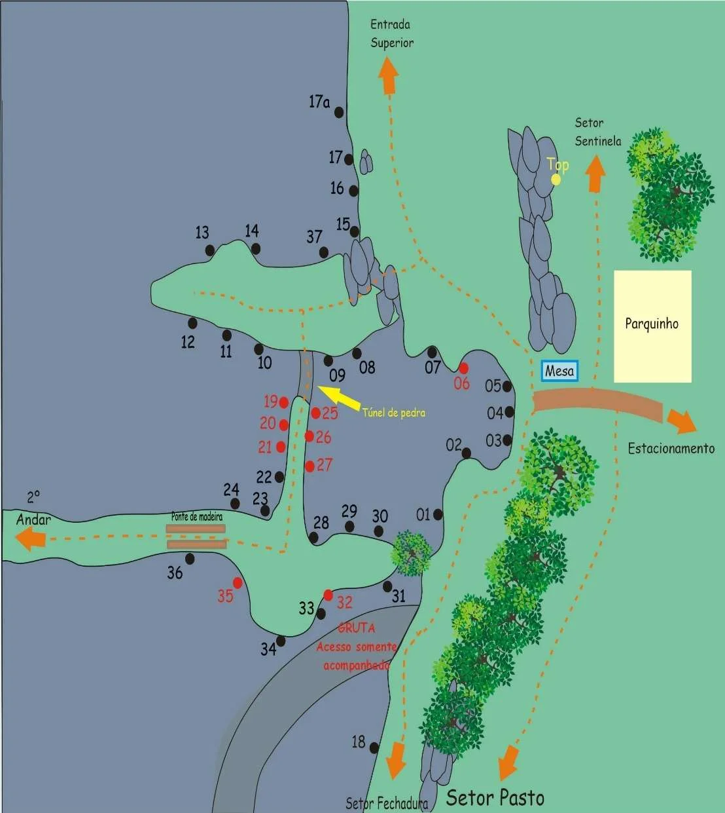
    - **largura_mapa**: 1108
    - **altura_mapa**: 1241
    - **pontos_de_interesse**:
      - **[0]**:
        - **id**: Bu79gE1WiXIkce
        - **uid**: Bu79gE1WiXIkce
        - **rotulo**: Entrada Superior
        - **retangulo**:
          - **x**: 599
          - **y**: 50
          - **comprimento**: 76
          - **largura**: 57
        - **label**: Entrada Superior
      - **[1]**:
        - **id**: DOzF5RxSZyndJX
        - **uid**: DOzF5RxSZyndJX
        - **rotulo**: 17a
        - **retangulo**:
          - **x**: 489
          - **y**: 154
          - **comprimento**: 38
          - **largura**: 30
        - **label**: 17a
      - **[2]**:
        - **id**: rw7KX2rPrJcVMB
        - **uid**: rw7KX2rPrJcVMB
        - **rotulo**: Setor Sentinela
        - **retangulo**:
          - **x**: 913
          - **y**: 198
          - **comprimento**: 82
          - **largura**: 55
        - **label**: Setor Sentinela
      - **[3]**:
        - **id**: 78D55fFe9ytu7x
        - **uid**: 78D55fFe9ytu7x
        - **rotulo**: 17
        - **retangulo**:
          - **x**: 513
          - **y**: 240
          - **comprimento**: 26
          - **largura**: 27
        - **label**: 17
      - **[4]**:
        - **id**: 1Ertok93DtoCzj
        - **uid**: 1Ertok93DtoCzj
        - **rotulo**: 16
        - **retangulo**:
          - **x**: 516
          - **y**: 285
          - **comprimento**: 27
          - **largura**: 28
        - **label**: 16
      - **[5]**:
        - **id**: U9SPZRCLEDjM53
        - **uid**: U9SPZRCLEDjM53
        - **rotulo**: 14
        - **retangulo**:
          - **x**: 386
          - **y**: 352
          - **comprimento**: 30
          - **largura**: 30
        - **label**: 14
      - **[6]**:
        - **id**: 3nmsQVOYuTAePO
        - **uid**: 3nmsQVOYuTAePO
        - **rotulo**: 15
        - **retangulo**:
          - **x**: 525
          - **y**: 340
          - **comprimento**: 28
          - **largura**: 29
        - **label**: 15
      - **[7]**:
        - **id**: rcUC5s81eXeRff
        - **uid**: rcUC5s81eXeRff
        - **rotulo**: 13
        - **retangulo**:
          - **x**: 310
          - **y**: 354
          - **comprimento**: 30
          - **largura**: 29
        - **label**: 13
      - **[8]**:
        - **id**: 4dAL828E7LMJUw
        - **uid**: 4dAL828E7LMJUw
        - **rotulo**: 37
        - **retangulo**:
          - **x**: 480
          - **y**: 360
          - **comprimento**: 33
          - **largura**: 29
        - **label**: 37
      - **[9]**:
        - **id**: 5eRZgWarypdddI
        - **uid**: 5eRZgWarypdddI
        - **rotulo**: 12
        - **retangulo**:
          - **x**: 288
          - **y**: 522
          - **comprimento**: 31
          - **largura**: 31
        - **label**: 12
      - **[10]**:
        - **id**: aA8sUej8FkDSGZ
        - **uid**: aA8sUej8FkDSGZ
        - **rotulo**: 11
        - **retangulo**:
          - **x**: 346
          - **y**: 536
          - **comprimento**: 27
          - **largura**: 29
        - **label**: 11
      - **[11]**:
        - **id**: ojh8lyjY6KFMTO
        - **uid**: ojh8lyjY6KFMTO
        - **rotulo**: 08
        - **retangulo**:
          - **x**: 561
          - **y**: 560
          - **comprimento**: 34
          - **largura**: 30
        - **label**: 08
      - **[12]**:
        - **id**: wruxtDVl83fwdu
        - **uid**: wruxtDVl83fwdu
        - **rotulo**: 07
        - **retangulo**:
          - **x**: 662
          - **y**: 560
          - **comprimento**: 33
          - **largura**: 31
        - **label**: 07
      - **[13]**:
        - **id**: Rzg9gMb5vT0mxV
        - **uid**: Rzg9gMb5vT0mxV
        - **rotulo**: 09
        - **retangulo**:
          - **x**: 516
          - **y**: 572
          - **comprimento**: 29
          - **largura**: 28
        - **label**: 09
      - **[14]**:
        - **id**: Nvjfe9t8a98kFt
        - **uid**: Nvjfe9t8a98kFt
        - **rotulo**: 06
        - **retangulo**:
          - **x**: 706
          - **y**: 584
          - **comprimento**: 33
          - **largura**: 30
        - **label**: 06
      - **[15]**:
        - **id**: w20eQ55Ucq4UO7
        - **uid**: w20eQ55Ucq4UO7
        - **rotulo**: 05
        - **retangulo**:
          - **x**: 754
          - **y**: 588
          - **comprimento**: 31
          - **largura**: 27
        - **label**: 05
      - **[16]**:
        - **id**: bYlPQaAmVXB3nn
        - **uid**: bYlPQaAmVXB3nn
        - **rotulo**: 19
        - **retangulo**:
          - **x**: 414
          - **y**: 612
          - **comprimento**: 28
          - **largura**: 26
        - **label**: 19
      - **[17]**:
        - **id**: INl5olaos0uHqz
        - **uid**: INl5olaos0uHqz
        - **rotulo**: 25
        - **retangulo**:
          - **x**: 504
          - **y**: 630
          - **comprimento**: 31
          - **largura**: 28
        - **label**: 25
      - **[18]**:
        - **id**: OVxbCf1Gsyi2DX
        - **uid**: OVxbCf1Gsyi2DX
        - **rotulo**: 04
        - **retangulo**:
          - **x**: 756
          - **y**: 630
          - **comprimento**: 31
          - **largura**: 29
        - **label**: 04
      - **[19]**:
        - **id**: HpKNiG6eaFpqKd
        - **uid**: HpKNiG6eaFpqKd
        - **rotulo**: 20
        - **retangulo**:
          - **x**: 410
          - **y**: 646
          - **comprimento**: 31
          - **largura**: 30
        - **label**: 20
      - **[20]**:
        - **id**: niMcLqGAkK6Lzm
        - **uid**: niMcLqGAkK6Lzm
        - **rotulo**: 26
        - **retangulo**:
          - **x**: 494
          - **y**: 666
          - **comprimento**: 31
          - **largura**: 28
        - **label**: 26
      - **[21]**:
        - **id**: SnXKDMFGldjhYk
        - **uid**: SnXKDMFGldjhYk
        - **rotulo**: 02
        - **retangulo**:
          - **x**: 693
          - **y**: 678
          - **comprimento**: 30
          - **largura**: 20
        - **label**: 02
      - **[22]**:
        - **id**: RoilYSI1O9GmjR
        - **uid**: RoilYSI1O9GmjR
        - **rotulo**: 03
        - **retangulo**:
          - **x**: 756
          - **y**: 672
          - **comprimento**: 32
          - **largura**: 28
        - **label**: 03
      - **[23]**:
        - **id**: h7DM35q8KKpXcT
        - **uid**: h7DM35q8KKpXcT
        - **rotulo**: 21
        - **retangulo**:
          - **x**: 405
          - **y**: 682
          - **comprimento**: 28
          - **largura**: 27
        - **label**: 21
      - **[24]**:
        - **id**: oMyGIGLA7iQyuH
        - **uid**: oMyGIGLA7iQyuH
        - **rotulo**: 27
        - **retangulo**:
          - **x**: 498
          - **y**: 708
          - **comprimento**: 33
          - **largura**: 29
        - **label**: 27
      - **[25]**:
        - **id**: uq67q7xJUHTk4l
        - **uid**: uq67q7xJUHTk4l
        - **rotulo**: 22
        - **retangulo**:
          - **x**: 404
          - **y**: 726
          - **comprimento**: 31
          - **largura**: 27
        - **label**: 22
      - **[26]**:
        - **id**: LdXKY2CrYo3qc0
        - **uid**: LdXKY2CrYo3qc0
        - **rotulo**: 24
        - **retangulo**:
          - **x**: 353
          - **y**: 746
          - **comprimento**: 32
          - **largura**: 31
        - **label**: 24
      - **[27]**:
        - **id**: 2kHDZwanjy4eFg
        - **uid**: 2kHDZwanjy4eFg
        - **rotulo**: 2º Andar
        - **retangulo**:
          - **x**: 50
          - **y**: 775
          - **comprimento**: 61
          - **largura**: 62
        - **label**: 2º Andar
      - **[28]**:
        - **id**: SL1fOi5mRhf0El
        - **uid**: SL1fOi5mRhf0El
        - **rotulo**: 23
        - **retangulo**:
          - **x**: 398
          - **y**: 760
          - **comprimento**: 31
          - **largura**: 28
        - **label**: 23
      - **[29]**:
        - **id**: 1L1UiBqXahwFgm
        - **uid**: 1L1UiBqXahwFgm
        - **rotulo**: 29
        - **retangulo**:
          - **x**: 534
          - **y**: 780
          - **comprimento**: 33
          - **largura**: 31
        - **label**: 29
      - **[30]**:
        - **id**: Y6uTadAMduquAT
        - **uid**: Y6uTadAMduquAT
        - **rotulo**: 30
        - **retangulo**:
          - **x**: 580
          - **y**: 786
          - **comprimento**: 33
          - **largura**: 29
        - **label**: 30
      - **[31]**:
        - **id**: A4yMfFpsLsVr6C
        - **uid**: A4yMfFpsLsVr6C
        - **rotulo**: 01
        - **retangulo**:
          - **x**: 647
          - **y**: 784
          - **comprimento**: 30
          - **largura**: 27
        - **label**: 01
      - **[32]**:
        - **id**: 69hgLZY7jVG13S
        - **uid**: 69hgLZY7jVG13S
        - **rotulo**: 28
        - **retangulo**:
          - **x**: 491
          - **y**: 796
          - **comprimento**: 30
          - **largura**: 27
        - **label**: 28
      - **[33]**:
        - **id**: 0nGdIK2OXxBxlm
        - **uid**: 0nGdIK2OXxBxlm
        - **rotulo**: 36
        - **retangulo**:
          - **x**: 268
          - **y**: 873
          - **comprimento**: 33
          - **largura**: 30
        - **label**: 36
      - **[34]**:
        - **id**: 9Ryt2TR3pJk0NH
        - **uid**: 9Ryt2TR3pJk0NH
        - **rotulo**: 35
        - **retangulo**:
          - **x**: 345
          - **y**: 909
          - **comprimento**: 34
          - **largura**: 30
        - **label**: 35
      - **[35]**:
        - **id**: C687AB8YTD2uQN
        - **uid**: C687AB8YTD2uQN
        - **rotulo**: 32
        - **retangulo**:
          - **x**: 526
          - **y**: 918
          - **comprimento**: 34
          - **largura**: 30
        - **label**: 32
      - **[36]**:
        - **id**: RCVgUw85LEdPjk
        - **uid**: RCVgUw85LEdPjk
        - **rotulo**: 31
        - **retangulo**:
          - **x**: 608
          - **y**: 908
          - **comprimento**: 27
          - **largura**: 29
        - **label**: 31
      - **[37]**:
        - **id**: HuEZ0zDCcLw1Og
        - **uid**: HuEZ0zDCcLw1Og
        - **rotulo**: 33
        - **retangulo**:
          - **x**: 468
          - **y**: 928
          - **comprimento**: 33
          - **largura**: 31
        - **label**: 33
      - **[38]**:
        - **id**: sfPEIWj2sAnDpq
        - **uid**: sfPEIWj2sAnDpq
        - **rotulo**: 34
        - **retangulo**:
          - **x**: 410
          - **y**: 990
          - **comprimento**: 32
          - **largura**: 29
        - **label**: 34
      - **[39]**:
        - **id**: Pm8zRGxxqVcyXZ
        - **uid**: Pm8zRGxxqVcyXZ
        - **rotulo**: 18
        - **retangulo**:
          - **x**: 548
          - **y**: 1132
          - **comprimento**: 28
          - **largura**: 28
        - **label**: 18
      - **[40]**:
        - **id**: 6tL7JQRU4lEnwx
        - **uid**: 6tL7JQRU4lEnwx
        - **rotulo**: Setor Fechadura
        - **retangulo**:
          - **x**: 591
          - **y**: 1224
          - **comprimento**: 136
          - **largura**: 33
        - **label**: Setor Fechadura
      - **[41]**:
        - **id**: ffG2KhO2XjgcIA
        - **uid**: ffG2KhO2XjgcIA
        - **rotulo**: Setor Pasto
        - **retangulo**:
          - **x**: 758
          - **y**: 1218
          - **comprimento**: 156
          - **largura**: 34
        - **label**: Setor Pasto
      - **[42]**:
        - **id**: YQecVwRDovMZJN
        - **uid**: YQecVwRDovMZJN
        - **rotulo**: 10
        - **retangulo**:
          - **x**: 404
          - **y**: 554
          - **comprimento**: 32
          - **largura**: 31
        - **label**: 10
    - **referencias**:
      - **[0]**:
        - **alvo_uid**: lHxLN2DNpArEnY
        - **pontos_uids**:
          - A4yMfFpsLsVr6C
        - **escalada**: Zero Um
        - **ids**:
          - A4yMfFpsLsVr6C
      - **[1]**:
        - **alvo_uid**: AoNQ3khxE7uB79
        - **pontos_uids**:
          - SnXKDMFGldjhYk
        - **escalada**: Caixão e Vela Preta
        - **ids**:
          - SnXKDMFGldjhYk
      - **[2]**:
        - **alvo_uid**: 3uChzuaVUROGqY
        - **pontos_uids**:
          - RoilYSI1O9GmjR
        - **escalada**: É Brincadeira
        - **ids**:
          - RoilYSI1O9GmjR
      - **[3]**:
        - **alvo_uid**: fDcsJtiuADEJ2u
        - **pontos_uids**:
          - OVxbCf1Gsyi2DX
        - **escalada**: Vaca Louca
        - **ids**:
          - OVxbCf1Gsyi2DX
      - **[4]**:
        - **alvo_uid**: XkK1yxYO1OmGQZ
        - **pontos_uids**:
          - w20eQ55Ucq4UO7
        - **escalada**: Tarda mas não falha
        - **ids**:
          - w20eQ55Ucq4UO7
      - **[5]**:
        - **alvo_uid**: ekuW5vJ83PKwzT
        - **pontos_uids**:
          - Nvjfe9t8a98kFt
        - **escalada**: Aresta Aperta Um
        - **ids**:
          - Nvjfe9t8a98kFt
      - **[6]**:
        - **alvo_uid**: ALalo1CcZDKCCF
        - **pontos_uids**:
          - wruxtDVl83fwdu
        - **escalada**: Túnel do Tempo
        - **ids**:
          - wruxtDVl83fwdu
      - **[7]**:
        - **alvo_uid**: V2d3RyQ1BiBzhK
        - **pontos_uids**:
          - ojh8lyjY6KFMTO
        - **escalada**: Caretas por Acaso
        - **ids**:
          - ojh8lyjY6KFMTO
      - **[8]**:
        - **alvo_uid**: jPx4MK65Yc3uDG
        - **pontos_uids**:
          - Rzg9gMb5vT0mxV
        - **escalada**: Pop Rock
        - **ids**:
          - Rzg9gMb5vT0mxV
      - **[9]**:
        - **alvo_uid**: Pq5e8CSbwgiYqm
        - **pontos_uids**:
          - aA8sUej8FkDSGZ
        - **escalada**: A Despedida
        - **ids**:
          - aA8sUej8FkDSGZ
      - **[10]**:
        - **alvo_uid**: vef7TpEwKIw852
        - **pontos_uids**:
          - 5eRZgWarypdddI
        - **escalada**: Rapanui
        - **ids**:
          - 5eRZgWarypdddI
      - **[11]**:
        - **alvo_uid**: n8nOwSk46r3Jgl
        - **pontos_uids**:
          - rcUC5s81eXeRff
        - **escalada**: Escorregador de Macacos
        - **ids**:
          - rcUC5s81eXeRff
      - **[12]**:
        - **alvo_uid**: EpmU6mFM886zbl
        - **pontos_uids**:
          - U9SPZRCLEDjM53
        - **escalada**: Dalai Lama
        - **ids**:
          - U9SPZRCLEDjM53
      - **[13]**:
        - **alvo_uid**: BnK1D3x2S6fG65
        - **pontos_uids**:
          - 3nmsQVOYuTAePO
        - **escalada**: Céu em Chamas
        - **ids**:
          - 3nmsQVOYuTAePO
      - **[14]**:
        - **alvo_uid**: qgfeTK1bkMbNme
        - **pontos_uids**:
          - 3nmsQVOYuTAePO
        - **escalada**: Legolas (Variante Céu em Chamas)
        - **ids**:
          - 3nmsQVOYuTAePO
      - **[15]**:
        - **alvo_uid**: hrC7EPMGaLss0a
        - **pontos_uids**:
          - 1Ertok93DtoCzj
        - **escalada**: Mithrandir
        - **ids**:
          - 1Ertok93DtoCzj
      - **[16]**:
        - **alvo_uid**: SQ6MpB4bUiVpnk
        - **pontos_uids**:
          - 78D55fFe9ytu7x
        - **escalada**: Cobiça
        - **ids**:
          - 78D55fFe9ytu7x
      - **[17]**:
        - **alvo_uid**: uGux3WzgQo5E5p
        - **pontos_uids**:
          - DOzF5RxSZyndJX
        - **escalada**: Cobiça (Variante da Saída a direita)
        - **ids**:
          - DOzF5RxSZyndJX
      - **[18]**:
        - **alvo_uid**: LtaApahDMGFhas
        - **pontos_uids**:
          - Pm8zRGxxqVcyXZ
        - **escalada**: Arte e Ofício – 2ª_Intenção
        - **ids**:
          - Pm8zRGxxqVcyXZ
      - **[19]**:
        - **alvo_uid**: KvWWXavQtzrA3H
        - **pontos_uids**:
          - bYlPQaAmVXB3nn
        - **escalada**: Pontes de Jah
        - **ids**:
          - bYlPQaAmVXB3nn
      - **[20]**:
        - **alvo_uid**: D9BI3sxq0JRMSf
        - **pontos_uids**:
          - HpKNiG6eaFpqKd
        - **escalada**: Dijjins
        - **ids**:
          - HpKNiG6eaFpqKd
      - **[21]**:
        - **alvo_uid**: 7H571BTtdnxILf
        - **pontos_uids**:
          - h7DM35q8KKpXcT
        - **escalada**: Aresta
        - **ids**:
          - h7DM35q8KKpXcT
      - **[22]**:
        - **alvo_uid**: JF1yItEEm6z1tE
        - **pontos_uids**:
          - uq67q7xJUHTk4l
        - **escalada**: Verde do Violinista
        - **ids**:
          - uq67q7xJUHTk4l
      - **[23]**:
        - **alvo_uid**: izeICTrqr5rOZw
        - **pontos_uids**:
          - SL1fOi5mRhf0El
        - **escalada**: Narcisista
        - **ids**:
          - SL1fOi5mRhf0El
      - **[24]**:
        - **alvo_uid**: JzyPF4iReOLex5
        - **pontos_uids**:
          - LdXKY2CrYo3qc0
        - **escalada**: The Wall (SadMan)
        - **ids**:
          - LdXKY2CrYo3qc0
      - **[25]**:
        - **alvo_uid**: s65a7RceWE8Ysa
        - **pontos_uids**:
          - INl5olaos0uHqz
        - **escalada**: Eterno Regresso
        - **ids**:
          - INl5olaos0uHqz
      - **[26]**:
        - **alvo_uid**: w9m4SBfmTV8cqK
        - **pontos_uids**:
          - niMcLqGAkK6Lzm
        - **escalada**: Pro Dia Nascer Feliz
        - **ids**:
          - niMcLqGAkK6Lzm
      - **[27]**:
        - **alvo_uid**: RF3oOFD4ZS5KTD
        - **pontos_uids**:
          - oMyGIGLA7iQyuH
        - **escalada**: Abajur de Protheus
        - **ids**:
          - oMyGIGLA7iQyuH
      - **[28]**:
        - **alvo_uid**: mWTcT1oGZCtjbe
        - **pontos_uids**:
          - 69hgLZY7jVG13S
        - **escalada**: Perpétuos
        - **ids**:
          - 69hgLZY7jVG13S
      - **[29]**:
        - **alvo_uid**: hEhHqzAwmno1oD
        - **pontos_uids**:
          - 1L1UiBqXahwFgm
        - **escalada**: O Sonhar
        - **ids**:
          - 1L1UiBqXahwFgm
      - **[30]**:
        - **alvo_uid**: jNApEOjwVgRCsw
        - **pontos_uids**:
          - Y6uTadAMduquAT
        - **escalada**: Calíope
        - **ids**:
          - Y6uTadAMduquAT
      - **[31]**:
        - **alvo_uid**: yij1f7qb9y8ExS
        - **pontos_uids**:
          - RCVgUw85LEdPjk
        - **escalada**: Morpheus
        - **ids**:
          - RCVgUw85LEdPjk
      - **[32]**:
        - **alvo_uid**: IUDx7TtmxLnQ0f
        - **pontos_uids**:
          - C687AB8YTD2uQN
        - **escalada**: Beirute
        - **ids**:
          - C687AB8YTD2uQN
      - **[33]**:
        - **alvo_uid**: L8BXNwLtabZK21
        - **pontos_uids**:
          - HuEZ0zDCcLw1Og
        - **escalada**: Desejo
        - **ids**:
          - HuEZ0zDCcLw1Og
      - **[34]**:
        - **alvo_uid**: Wy7YsAsz33hNPt
        - **pontos_uids**:
          - sfPEIWj2sAnDpq
        - **escalada**: Coríntio (DESATIVADA)
        - **ids**:
          - sfPEIWj2sAnDpq
      - **[35]**:
        - **alvo_uid**: 59G7qohz5syBpT
        - **pontos_uids**:
          - 9Ryt2TR3pJk0NH
        - **escalada**: Triplo X
        - **ids**:
          - 9Ryt2TR3pJk0NH
      - **[36]**:
        - **alvo_uid**: 1HUAMzvxkK90zI
        - **pontos_uids**:
          - 0nGdIK2OXxBxlm
        - **escalada**: Durangos
        - **ids**:
          - 0nGdIK2OXxBxlm
      - **[37]**:
        - **alvo_uid**: XrSBM2nXZI7RHe
        - **pontos_uids**:
          - 4dAL828E7LMJUw
        - **escalada**: Velha Guarda
        - **ids**:
          - 4dAL828E7LMJUw
      - **[38]**:
        - **alvo_uid**: RIhfgHhs8cgCGV
        - **pontos_uids**:
          - YQecVwRDovMZJN
        - **escalada**: Juliana
        - **ids**:
          - YQecVwRDovMZJN
      - **[39]**:
        - **alvo_uid**: 9F7ec7AskioCH1
        - **pontos_uids**:
          - Bu79gE1WiXIkce
        - **setor**: Setor Entrada Superior
        - **ids**:
          - Bu79gE1WiXIkce
      - **[40]**:
        - **alvo_uid**: ka606l3W2kLtXZ
        - **pontos_uids**:
          - 2kHDZwanjy4eFg
        - **setor**: Setor 2º Andar
        - **ids**:
          - 2kHDZwanjy4eFg
      - **[41]**:
        - **alvo_uid**: JKvFyKMkrPz9UF
        - **pontos_uids**:
          - 6tL7JQRU4lEnwx
        - **setor**: Setor Fechadura
        - **ids**:
          - 6tL7JQRU4lEnwx
      - **[42]**:
        - **alvo_uid**: pN9fjhBMXuRw8U
        - **pontos_uids**:
          - ffG2KhO2XjgcIA
        - **setor**: Setor Pasto
        - **ids**:
          - ffG2KhO2XjgcIA
      - **[43]**:
        - **alvo_uid**: CtxqyAwqmrD1a5
        - **pontos_uids**:
          - rw7KX2rPrJcVMB
        - **setor**: Setor Sentinela e Vale do Joga
        - **ids**:
          - rw7KX2rPrJcVMB
- **escaladas**:
  - **[0]**:
    - **uid**: lHxLN2DNpArEnY
    - **via_esportiva**:
      - **nome**: Zero Um
      - **dificuldade**: BR_7A
      - **quantidade_protecoes_intermediarias**: 8
      - **quantidade_protecoes_parada**: 2
      - **conquistadores**:
        - GT Baú 2020/21
  - **[1]**:
    - **uid**: AoNQ3khxE7uB79
    - **via_esportiva**:
      - **nome**: Caixão e Vela Preta
      - **dificuldade**: BR_7A
      - **quantidade_protecoes_intermediarias**: 4
      - **quantidade_protecoes_parada**: 2
      - **conquistadores**:
        - Vinicius
        - Rômulo
        - Novais
  - **[2]**:
    - **uid**: 3uChzuaVUROGqY
    - **via_esportiva**:
      - **nome**: É Brincadeira
      - **dificuldade**: BR_5
      - **quantidade_protecoes_intermediarias**: 4
      - **quantidade_protecoes_parada**: 2
      - **conquistadores**:
        - Eustáquio e Alunos
  - **[3]**:
    - **uid**: fDcsJtiuADEJ2u
    - **via_esportiva**:
      - **nome**: Vaca Louca
      - **dificuldade**: BR_6SUP
      - **quantidade_protecoes_intermediarias**: 3
      - **quantidade_protecoes_parada**: 2
      - **conquistadores**:
        - Rômulo
  - **[4]**:
    - **uid**: XkK1yxYO1OmGQZ
    - **via_esportiva**:
      - **nome**: Tarda mas não falha
      - **dificuldade**: BR_7A
      - **quantidade_protecoes_intermediarias**: 3
      - **quantidade_protecoes_parada**: 2
      - **conquistadores**:
        - Joviney Medeiros
  - **[5]**:
    - **uid**: ekuW5vJ83PKwzT
    - **via_movel**:
      - **nome**: Aresta Aperta Um
      - **dificuldade**: BR_6
      - **protecoes_moveis**: Móvel
      - **conquistadores**:
        - Roberto Lincoln
        - Emerson
  - **[6]**:
    - **uid**: ALalo1CcZDKCCF
    - **via_esportiva**:
      - **nome**: Túnel do Tempo
      - **dificuldade**: BR_6
      - **quantidade_protecoes_intermediarias**: 10
      - **quantidade_protecoes_parada**: 2
      - **conquistadores**:
        - Roberto Lincoln
        - Rômulo
  - **[7]**:
    - **uid**: V2d3RyQ1BiBzhK
    - **via_esportiva**:
      - **nome**: Caretas por Acaso
      - **dificuldade**: BR_6SUP
      - **quantidade_protecoes_intermediarias**: 6
      - **quantidade_protecoes_parada**: 2
      - **conquistadores**:
        - Roberto Lincoln
        - Ralf
        - Tinoco
  - **[8]**:
    - **uid**: jPx4MK65Yc3uDG
    - **via_esportiva**:
      - **nome**: Pop Rock
      - **dificuldade**: BR_7C_BARRA_8A
      - **quantidade_protecoes_intermediarias**: 11
      - **quantidade_protecoes_parada**: 2
      - **conquistadores**:
        - Felipe Belisário
        - Marcela Romanelli
  - **[9]**:
    - **uid**: RIhfgHhs8cgCGV
    - **via_esportiva**:
      - **nome**: Juliana
      - **dificuldade**: BR_8B
      - **quantidade_protecoes_intermediarias**: 9
      - **quantidade_protecoes_parada**: 2
      - **conquistadores**:
        - Fabinho
        - Half (Eduardo)
  - **[10]**:
    - **uid**: Pq5e8CSbwgiYqm
    - **via_esportiva**:
      - **nome**: A Despedida
      - **dificuldade**: BR_9C
      - **quantidade_protecoes_intermediarias**: 6
      - **quantidade_protecoes_parada**: 2
      - **conquistadores**:
        - Negão
        - Fred
        - Cerquerinha
  - **[11]**:
    - **uid**: vef7TpEwKIw852
    - **via_esportiva**:
      - **nome**: Rapanui
      - **dificuldade**: BR_9A
      - **quantidade_protecoes_intermediarias**: 9
      - **quantidade_protecoes_parada**: 2
      - **conquistadores**:
        - Fabinho
        - Leandro
        - Negão
  - **[12]**:
    - **uid**: n8nOwSk46r3Jgl
    - **via_esportiva**:
      - **nome**: Escorregador de Macacos
      - **dificuldade**: BR_6SUP
      - **quantidade_protecoes_intermediarias**: 4
      - **quantidade_protecoes_parada**: 2
      - **conquistadores**:
        - Aloysio
  - **[13]**:
    - **uid**: EpmU6mFM886zbl
    - **via_esportiva**:
      - **nome**: Dalai Lama
      - **dificuldade**: BR_6SUP
      - **quantidade_protecoes_intermediarias**: 6
      - **quantidade_protecoes_parada**: 2
      - **conquistadores**:
        - Cerqueirinha
        - Negão
  - **[14]**:
    - **uid**: BnK1D3x2S6fG65
    - **via_esportiva**:
      - **nome**: Céu em Chamas
      - **dificuldade**: BR_7B
      - **quantidade_protecoes_intermediarias**: 12
      - **quantidade_protecoes_parada**: 2
      - **conquistadores**:
        - Andrezão
        - Anderson Barbosa
  - **[15]**:
    - **uid**: qgfeTK1bkMbNme
    - **via_esportiva**:
      - **descricao**: Inacabada
      - **nome**: Legolas (Variante Céu em Chamas)
      - **dificuldade**: INDEFINIDO
      - **conquistadores**:
        - Sandro Almeida
        - Felipe Belisário
  - **[16]**:
    - **uid**: hrC7EPMGaLss0a
    - **via_esportiva**:
      - **nome**: Mithrandir
      - **dificuldade**: PROJETO
      - **conquistadores**:
        - Sandro Almeida
        - Felipe Belisário
  - **[17]**:
    - **uid**: SQ6MpB4bUiVpnk
    - **via_esportiva**:
      - **nome**: Cobiça
      - **dificuldade**: PROJETO
      - **quantidade_protecoes_intermediarias**: 14
      - **quantidade_protecoes_parada**: 2
      - **conquistadores**:
        - Pedro Leite
        - Fabiano
        - Cristiano “Negão”
        - Klaus
  - **[18]**:
    - **uid**: uGux3WzgQo5E5p
    - **via_esportiva**:
      - **nome**: Cobiça (Variante da Saída a direita)
      - **dificuldade**: BR_9C_BARRA_10A
      - **quantidade_protecoes_intermediarias**: 13
      - **quantidade_protecoes_parada**: 2
      - **conquistadores**:
        - Pedro Leite
        - Fabiano
        - Cristiano “Negão”
        - Klaus
  - **[19]**:
    - **uid**: LtaApahDMGFhas
    - **via_esportiva**:
      - **nome**: Arte e Ofício – 2ª_Intenção
      - **dificuldade**: BR_7B
      - **quantidade_protecoes_intermediarias**: 5
      - **quantidade_protecoes_parada**: 2
      - **conquistadores**:
        - Guta Piancastelli
        - André “DJ”
        - André “Dedé”
  - **[20]**:
    - **uid**: KvWWXavQtzrA3H
    - **via_movel**:
      - **nome**: Pontes de Jah
      - **dificuldade**: BR_6
      - **protecoes_moveis**: Móvel
      - **conquistadores**:
        - Roberto Lincoln
        - Marco Durães
  - **[21]**:
    - **uid**: D9BI3sxq0JRMSf
    - **via_movel**:
      - **nome**: Dijjins
      - **dificuldade**: BR_6
      - **protecoes_moveis**: Móvel
      - **conquistadores**:
        - Roberto e Izabel Diniz
  - **[22]**:
    - **uid**: 7H571BTtdnxILf
    - **via_movel**:
      - **nome**: Aresta
      - **dificuldade**: BR_5SUP
      - **protecoes_moveis**: Móvel
      - **conquistadores**:
        - Vinícius
        - Tinoco
        - Denise
        - Gustavo Piancastelli
  - **[23]**:
    - **uid**: JF1yItEEm6z1tE
    - **via_esportiva**:
      - **nome**: Verde do Violinista
      - **dificuldade**: BR_6
      - **quantidade_protecoes_intermediarias**: 11
      - **quantidade_protecoes_parada**: 2
      - **conquistadores**:
        - Roberto Lincoln
        - Marco Durães
  - **[24]**:
    - **uid**: izeICTrqr5rOZw
    - **via_esportiva**:
      - **nome**: Narcisista
      - **dificuldade**: BR_6SUP
      - **quantidade_protecoes_intermediarias**: 11
      - **quantidade_protecoes_parada**: 2
      - **conquistadores**:
        - Roberto Lincoln
        - Marco Durães
  - **[25]**:
    - **uid**: JzyPF4iReOLex5
    - **via_esportiva**:
      - **nome**: The Wall (SadMan)
      - **dificuldade**: BR_8A
      - **quantidade_protecoes_intermediarias**: 12
      - **quantidade_protecoes_parada**: 2
      - **conquistadores**:
        - Evandro Kpta
        - Waltencil “Wall”
        - André DJ
        - Roberto Lincoln
        - Marco Durães
  - **[26]**:
    - **uid**: s65a7RceWE8Ysa
    - **via_movel**:
      - **nome**: Eterno Regresso
      - **dificuldade**: INDEFINIDO
      - **protecoes_moveis**: Móvel
      - **conquistadores**:
        - Roberto Lincoln
        - Marco Durães
  - **[27]**:
    - **uid**: w9m4SBfmTV8cqK
    - **via_movel**:
      - **nome**: Pro Dia Nascer Feliz
      - **dificuldade**: BR_4SUP
      - **protecoes_moveis**: Móvel
      - **conquistadores**:
        - ACM “Tonico”
        - Daniel
  - **[28]**:
    - **uid**: RF3oOFD4ZS5KTD
    - **via_movel**:
      - **nome**: Abajur de Protheus
      - **dificuldade**: BR_5SUP
      - **protecoes_moveis**: Móvel
      - **conquistadores**:
        - Marcelo Bocão
  - **[29]**:
    - **uid**: mWTcT1oGZCtjbe
    - **via_esportiva**:
      - **nome**: Perpétuos
      - **dificuldade**: BR_7C
      - **quantidade_protecoes_intermediarias**: 7
      - **quantidade_protecoes_parada**: 2
      - **conquistadores**:
        - Roberto Lincoln
        - Marco Durães
  - **[30]**:
    - **uid**: hEhHqzAwmno1oD
    - **via_esportiva**:
      - **nome**: O Sonhar
      - **dificuldade**: BR_7B
      - **quantidade_protecoes_intermediarias**: 8
      - **quantidade_protecoes_parada**: 2
      - **conquistadores**:
        - Roberto Lincoln
        - Marco Durães
  - **[31]**:
    - **uid**: jNApEOjwVgRCsw
    - **via_esportiva**:
      - **nome**: Calíope
      - **dificuldade**: BR_5SUP
      - **quantidade_protecoes_intermediarias**: 6
      - **quantidade_protecoes_parada**: 2
      - **conquistadores**:
        - Roberto Lincoln
        - Marco Durães
  - **[32]**:
    - **uid**: yij1f7qb9y8ExS
    - **via_esportiva**:
      - **nome**: Morpheus
      - **dificuldade**: BR_5
      - **quantidade_protecoes_intermediarias**: 7
      - **quantidade_protecoes_parada**: 2
      - **conquistadores**:
        - Roberto Lincoln
        - Marco Durães
  - **[33]**:
    - **uid**: IUDx7TtmxLnQ0f
    - **via_movel**:
      - **nome**: Beirute
      - **dificuldade**: BR_6
      - **protecoes_moveis**: Móvel
      - **conquistadores**:
        - Roberto Lincoln
  - **[34]**:
    - **uid**: L8BXNwLtabZK21
    - **via_esportiva**:
      - **nome**: Desejo
      - **dificuldade**: BR_7A
      - **quantidade_protecoes_intermediarias**: 8
      - **quantidade_protecoes_parada**: 2
      - **conquistadores**:
        - Roberto Lincoln
        - Marco Durães
  - **[35]**:
    - **uid**: Wy7YsAsz33hNPt
    - **via_esportiva**:
      - **nome**: Coríntio (DESATIVADA)
      - **dificuldade**: BR_7A
      - **quantidade_protecoes_intermediarias**: 10
      - **quantidade_protecoes_parada**: 2
      - **conquistadores**:
        - Roberto Lincoln
        - Marco Durães
  - **[36]**:
    - **uid**: 59G7qohz5syBpT
    - **via_movel**:
      - **nome**: Triplo X
      - **dificuldade**: BR_6
      - **protecoes_moveis**: Móvel
      - **conquistadores**:
        - Roberto Lincoln
  - **[37]**:
    - **uid**: 1HUAMzvxkK90zI
    - **via_esportiva**:
      - **nome**: Durangos
      - **dificuldade**: BR_6
      - **quantidade_protecoes_intermediarias**: 10
      - **quantidade_protecoes_parada**: 2
      - **conquistadores**:
        - Roberto Lincoln
        - Marco Durães
  - **[38]**:
    - **uid**: XrSBM2nXZI7RHe
    - **via_esportiva**:
      - **nome**: Velha Guarda
      - **dificuldade**: BR_7A
      - **quantidade_protecoes_intermediarias**: 10
      - **quantidade_protecoes_parada**: 2
      - **conquistadores**:
        - Christian Costa
        - Marcus Rufino
- **precomputados**:
  - **total_escaladas**: 39
  - **total_esportivas**: 30

## Parte: setor_entrada_superior

### Setor (Pico: Gruta do Baú)

- **descricao**:
    # Setor Entrada Superior
    
    **Acesso:** Seguindo pela estrada partindo do estacionamento, chega-se no setor entrada, parte inferior. Só subir a direita margeando a parede amarela.
- **nome**: Setor Entrada Superior
- **uid**: 9F7ec7AskioCH1
- **mapas**:
  - **[0]**:
    - **caminho_imagem_mapa**: 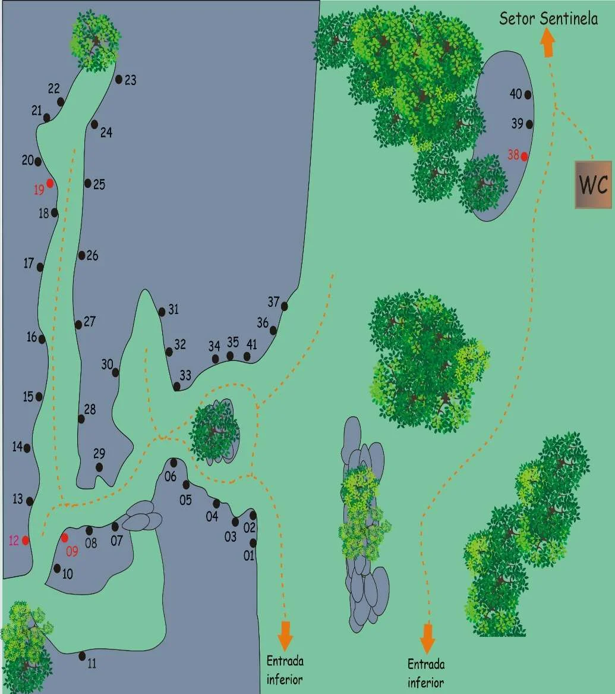
    - **largura_mapa**: 1035
    - **altura_mapa**: 1167
    - **pontos_de_interesse**:
      - **[0]**:
        - **id**: UiPXWogAXlBdvF
        - **uid**: UiPXWogAXlBdvF
        - **rotulo**: Setor Sentinela
        - **retangulo**:
          - **x**: 924
          - **y**: 30
          - **comprimento**: 173
          - **largura**: 35
        - **label**: Setor Sentinela
      - **[1]**:
        - **id**: WfpgkBWtTijnTK
        - **uid**: WfpgkBWtTijnTK
        - **rotulo**: 23
        - **retangulo**:
          - **x**: 220
          - **y**: 134
          - **comprimento**: 27
          - **largura**: 28
        - **label**: 23
      - **[2]**:
        - **id**: FCdd4ugKmpS4Ii
        - **uid**: FCdd4ugKmpS4Ii
        - **rotulo**: 22
        - **retangulo**:
          - **x**: 90
          - **y**: 148
          - **comprimento**: 29
          - **largura**: 27
        - **label**: 22
      - **[3]**:
        - **id**: TmQvpkyOStZyTK
        - **uid**: TmQvpkyOStZyTK
        - **rotulo**: 40
        - **retangulo**:
          - **x**: 868
          - **y**: 157
          - **comprimento**: 27
          - **largura**: 26
        - **label**: 40
      - **[4]**:
        - **id**: Bh1RdIR4gdWHZI
        - **uid**: Bh1RdIR4gdWHZI
        - **rotulo**: 21
        - **retangulo**:
          - **x**: 62
          - **y**: 184
          - **comprimento**: 26
          - **largura**: 28
        - **label**: 21
      - **[5]**:
        - **id**: PFC0k2XUvOXAHO
        - **uid**: PFC0k2XUvOXAHO
        - **rotulo**: 39
        - **retangulo**:
          - **x**: 870
          - **y**: 206
          - **comprimento**: 28
          - **largura**: 26
        - **label**: 39
      - **[6]**:
        - **id**: shQg76KGdXu9j2
        - **uid**: shQg76KGdXu9j2
        - **rotulo**: 24
        - **retangulo**:
          - **x**: 180
          - **y**: 222
          - **comprimento**: 27
          - **largura**: 28
        - **label**: 24
      - **[7]**:
        - **id**: 4yyrRSIQILNUNA
        - **uid**: 4yyrRSIQILNUNA
        - **rotulo**: 20
        - **retangulo**:
          - **x**: 48
          - **y**: 269
          - **comprimento**: 27
          - **largura**: 28
        - **label**: 20
      - **[8]**:
        - **id**: Am8rLtAoPI1Cz2
        - **uid**: Am8rLtAoPI1Cz2
        - **rotulo**: 38
        - **retangulo**:
          - **x**: 864
          - **y**: 260
          - **comprimento**: 25
          - **largura**: 25
        - **label**: 38
      - **[9]**:
        - **id**: vbgohCQnYmu7lU
        - **uid**: vbgohCQnYmu7lU
        - **rotulo**: 25
        - **retangulo**:
          - **x**: 167
          - **y**: 309
          - **comprimento**: 28
          - **largura**: 26
        - **label**: 25
      - **[10]**:
        - **id**: pzlgTw7LNSz8zl
        - **uid**: pzlgTw7LNSz8zl
        - **rotulo**: 19
        - **retangulo**:
          - **x**: 66
          - **y**: 318
          - **comprimento**: 26
          - **largura**: 27
        - **label**: 19
      - **[11]**:
        - **id**: TYhJTOx69zy8eB
        - **uid**: TYhJTOx69zy8eB
        - **rotulo**: 18
        - **retangulo**:
          - **x**: 74
          - **y**: 358
          - **comprimento**: 26
          - **largura**: 27
        - **label**: 18
      - **[12]**:
        - **id**: Af6exwx36TfXJu
        - **uid**: Af6exwx36TfXJu
        - **rotulo**: 26
        - **retangulo**:
          - **x**: 156
          - **y**: 428
          - **comprimento**: 28
          - **largura**: 29
        - **label**: 26
      - **[13]**:
        - **id**: 8oDxE0CQGx08hr
        - **uid**: 8oDxE0CQGx08hr
        - **rotulo**: 17
        - **retangulo**:
          - **x**: 48
          - **y**: 441
          - **comprimento**: 28
          - **largura**: 30
        - **label**: 17
      - **[14]**:
        - **id**: v00CZaWOD99X9f
        - **uid**: v00CZaWOD99X9f
        - **rotulo**: 37
        - **retangulo**:
          - **x**: 461
          - **y**: 506
          - **comprimento**: 26
          - **largura**: 28
        - **label**: 37
      - **[15]**:
        - **id**: s7q6jdewKfGRVJ
        - **uid**: s7q6jdewKfGRVJ
        - **rotulo**: 31
        - **retangulo**:
          - **x**: 292
          - **y**: 519
          - **comprimento**: 24
          - **largura**: 26
        - **label**: 31
      - **[16]**:
        - **id**: 2Q1lLswdUIZvQq
        - **uid**: 2Q1lLswdUIZvQq
        - **rotulo**: 27
        - **retangulo**:
          - **x**: 150
          - **y**: 540
          - **comprimento**: 29
          - **largura**: 27
        - **label**: 27
      - **[17]**:
        - **id**: EwUepUWyo7N8hC
        - **uid**: EwUepUWyo7N8hC
        - **rotulo**: 36
        - **retangulo**:
          - **x**: 442
          - **y**: 542
          - **comprimento**: 26
          - **largura**: 27
        - **label**: 36
      - **[18]**:
        - **id**: 7p0KPZxqvI6nZ6
        - **uid**: 7p0KPZxqvI6nZ6
        - **rotulo**: 16
        - **retangulo**:
          - **x**: 54
          - **y**: 566
          - **comprimento**: 28
          - **largura**: 27
        - **label**: 16
      - **[19]**:
        - **id**: YShxOBS4JfFVls
        - **uid**: YShxOBS4JfFVls
        - **rotulo**: 32
        - **retangulo**:
          - **x**: 302
          - **y**: 578
          - **comprimento**: 27
          - **largura**: 27
        - **label**: 32
      - **[20]**:
        - **id**: 76U4CMjKa8dpyX
        - **uid**: 76U4CMjKa8dpyX
        - **rotulo**: 34
        - **retangulo**:
          - **x**: 361
          - **y**: 580
          - **comprimento**: 26
          - **largura**: 25
        - **label**: 34
      - **[21]**:
        - **id**: e053w9nEBtyv5n
        - **uid**: e053w9nEBtyv5n
        - **rotulo**: 35
        - **retangulo**:
          - **x**: 392
          - **y**: 574
          - **comprimento**: 26
          - **largura**: 27
        - **label**: 35
      - **[22]**:
        - **id**: e6vI533p7A6mTt
        - **uid**: e6vI533p7A6mTt
        - **rotulo**: 41
        - **retangulo**:
          - **x**: 423
          - **y**: 578
          - **comprimento**: 24
          - **largura**: 25
        - **label**: 41
      - **[23]**:
        - **id**: rN3v7viUQBPL15
        - **uid**: rN3v7viUQBPL15
        - **rotulo**: 30
        - **retangulo**:
          - **x**: 180
          - **y**: 612
          - **comprimento**: 29
          - **largura**: 27
        - **label**: 30
      - **[24]**:
        - **id**: M4nOCX07a5Fnqg
        - **uid**: M4nOCX07a5Fnqg
        - **rotulo**: 33
        - **retangulo**:
          - **x**: 312
          - **y**: 630
          - **comprimento**: 27
          - **largura**: 26
        - **label**: 33
      - **[25]**:
        - **id**: 0r1dyWwxsMCHaT
        - **uid**: 0r1dyWwxsMCHaT
        - **rotulo**: 15
        - **retangulo**:
          - **x**: 48
          - **y**: 666
          - **comprimento**: 28
          - **largura**: 31
        - **label**: 15
      - **[26]**:
        - **id**: xVlnX8T7iyn95X
        - **uid**: xVlnX8T7iyn95X
        - **rotulo**: 28
        - **retangulo**:
          - **x**: 151
          - **y**: 688
          - **comprimento**: 28
          - **largura**: 29
        - **label**: 28
      - **[27]**:
        - **id**: J4IuMxH1KQt80y
        - **uid**: J4IuMxH1KQt80y
        - **rotulo**: 14
        - **retangulo**:
          - **x**: 30
          - **y**: 750
          - **comprimento**: 28
          - **largura**: 27
        - **label**: 14
      - **[28]**:
        - **id**: 5lIiJJ1dYBoehK
        - **uid**: 5lIiJJ1dYBoehK
        - **rotulo**: 29
        - **retangulo**:
          - **x**: 168
          - **y**: 762
          - **comprimento**: 29
          - **largura**: 28
        - **label**: 29
      - **[29]**:
        - **id**: vt56DAgqUOmALy
        - **uid**: vt56DAgqUOmALy
        - **rotulo**: 06
        - **retangulo**:
          - **x**: 287
          - **y**: 800
          - **comprimento**: 28
          - **largura**: 28
        - **label**: 06
      - **[30]**:
        - **id**: 2hoEedAerz5ji3
        - **uid**: 2hoEedAerz5ji3
        - **rotulo**: 13
        - **retangulo**:
          - **x**: 30
          - **y**: 838
          - **comprimento**: 27
          - **largura**: 29
        - **label**: 13
      - **[31]**:
        - **id**: cUOUgs0piwtYKL
        - **uid**: cUOUgs0piwtYKL
        - **rotulo**: 05
        - **retangulo**:
          - **x**: 312
          - **y**: 840
          - **comprimento**: 28
          - **largura**: 27
        - **label**: 05
      - **[32]**:
        - **id**: lN3he0ekbBrZ7v
        - **uid**: lN3he0ekbBrZ7v
        - **rotulo**: 04
        - **retangulo**:
          - **x**: 357
          - **y**: 866
          - **comprimento**: 30
          - **largura**: 27
        - **label**: 04
      - **[33]**:
        - **id**: ZurzR3BIJoYWTq
        - **uid**: ZurzR3BIJoYWTq
        - **rotulo**: 02
        - **retangulo**:
          - **x**: 420
          - **y**: 886
          - **comprimento**: 28
          - **largura**: 28
        - **label**: 02
      - **[34]**:
        - **id**: Dw7LpiEfiguYNn
        - **uid**: Dw7LpiEfiguYNn
        - **rotulo**: 12
        - **retangulo**:
          - **x**: 24
          - **y**: 908
          - **comprimento**: 27
          - **largura**: 29
        - **label**: 12
      - **[35]**:
        - **id**: KPdxFpobfbI78O
        - **uid**: KPdxFpobfbI78O
        - **rotulo**: 03
        - **retangulo**:
          - **x**: 389
          - **y**: 901
          - **comprimento**: 28
          - **largura**: 28
        - **label**: 03
      - **[36]**:
        - **id**: judNvZdyr2j3EM
        - **uid**: judNvZdyr2j3EM
        - **rotulo**: 08
        - **retangulo**:
          - **x**: 154
          - **y**: 914
          - **comprimento**: 28
          - **largura**: 27
        - **label**: 08
      - **[37]**:
        - **id**: BUXVwVOnrgNyos
        - **uid**: BUXVwVOnrgNyos
        - **rotulo**: 07
        - **retangulo**:
          - **x**: 196
          - **y**: 908
          - **comprimento**: 28
          - **largura**: 27
        - **label**: 07
      - **[38]**:
        - **id**: LNPGZc3xN7L9Bf
        - **uid**: LNPGZc3xN7L9Bf
        - **rotulo**: 09
        - **retangulo**:
          - **x**: 122
          - **y**: 926
          - **comprimento**: 27
          - **largura**: 25
        - **label**: 09
      - **[39]**:
        - **id**: AfJnP0sIugjmih
        - **uid**: AfJnP0sIugjmih
        - **rotulo**: 01
        - **retangulo**:
          - **x**: 419
          - **y**: 934
          - **comprimento**: 28
          - **largura**: 27
        - **label**: 01
      - **[40]**:
        - **id**: d63794cQUUM9vZ
        - **uid**: d63794cQUUM9vZ
        - **rotulo**: 10
        - **retangulo**:
          - **x**: 114
          - **y**: 964
          - **comprimento**: 26
          - **largura**: 25
        - **label**: 10
      - **[41]**:
        - **id**: jwCZlQ90wOsVQs
        - **uid**: jwCZlQ90wOsVQs
        - **rotulo**: 11
        - **retangulo**:
          - **x**: 155
          - **y**: 1115
          - **comprimento**: 26
          - **largura**: 26
        - **label**: 11
      - **[42]**:
        - **id**: E8HvyHZvk70ooy
        - **uid**: E8HvyHZvk70ooy
        - **rotulo**: Entrada inferior
        - **retangulo**:
          - **x**: 480
          - **y**: 1125
          - **comprimento**: 74
          - **largura**: 64
        - **label**: Entrada inferior
      - **[43]**:
        - **id**: sdTjkXUiMpmlo3
        - **uid**: sdTjkXUiMpmlo3
        - **rotulo**: Entrada inferior
        - **retangulo**:
          - **x**: 719
          - **y**: 1132
          - **comprimento**: 78
          - **largura**: 70
        - **label**: Entrada inferior
    - **referencias**:
      - **[0]**:
        - **alvo_uid**: t5rs55zh0DT3qF
        - **pontos_uids**:
          - AfJnP0sIugjmih
        - **escalada**: A Fenda da Discórdia
        - **ids**:
          - AfJnP0sIugjmih
      - **[1]**:
        - **alvo_uid**: 4TjptxQUqpgSq5
        - **pontos_uids**:
          - ZurzR3BIJoYWTq
        - **escalada**: Brenfisema (Sai na 5ª proteção da via 25)
        - **ids**:
          - ZurzR3BIJoYWTq
      - **[2]**:
        - **alvo_uid**: YOyIJie6FoWIsG
        - **pontos_uids**:
          - KPdxFpobfbI78O
        - **escalada**: Tamburello
        - **ids**:
          - KPdxFpobfbI78O
      - **[3]**:
        - **alvo_uid**: 8POWwul6WRS0Wf
        - **pontos_uids**:
          - lN3he0ekbBrZ7v
        - **escalada**: Onda de Calcário
        - **ids**:
          - lN3he0ekbBrZ7v
      - **[4]**:
        - **alvo_uid**: wyLUw5sxbObfZn
        - **pontos_uids**:
          - cUOUgs0piwtYKL
        - **escalada**: Ets de Fidalgo
        - **ids**:
          - cUOUgs0piwtYKL
      - **[5]**:
        - **alvo_uid**: Ut4pCuWtqonM4Z
        - **pontos_uids**:
          - vt56DAgqUOmALy
        - **escalada**: Conquista Fatal
        - **ids**:
          - vt56DAgqUOmALy
      - **[6]**:
        - **alvo_uid**: KkMp80gPdHRE1R
        - **pontos_uids**:
          - BUXVwVOnrgNyos
        - **escalada**: Tico Tico Space
        - **ids**:
          - BUXVwVOnrgNyos
      - **[7]**:
        - **alvo_uid**: kZ0yDlEwIP8VJS
        - **pontos_uids**:
          - d63794cQUUM9vZ
        - **escalada**: Judy
        - **ids**:
          - d63794cQUUM9vZ
      - **[8]**:
        - **alvo_uid**: uco0EWSiwRhIkQ
        - **pontos_uids**:
          - jwCZlQ90wOsVQs
        - **escalada**: Psicoacústica
        - **ids**:
          - jwCZlQ90wOsVQs
      - **[9]**:
        - **alvo_uid**: m10lVMFY2N5Apw
        - **pontos_uids**:
          - Dw7LpiEfiguYNn
        - **escalada**: Via sem informação
        - **ids**:
          - Dw7LpiEfiguYNn
      - **[10]**:
        - **alvo_uid**: jYyiCmRSLJ4H9i
        - **pontos_uids**:
          - 2hoEedAerz5ji3
        - **escalada**: Quarto dos Sonhos
        - **ids**:
          - 2hoEedAerz5ji3
      - **[11]**:
        - **alvo_uid**: HkPxuvpwjkld0o
        - **pontos_uids**:
          - J4IuMxH1KQt80y
        - **escalada**: Ameaça Fantasma
        - **ids**:
          - J4IuMxH1KQt80y
      - **[12]**:
        - **alvo_uid**: DpKDmp8jK55sFl
        - **pontos_uids**:
          - 0r1dyWwxsMCHaT
        - **escalada**: Dança das Aranhas
        - **ids**:
          - 0r1dyWwxsMCHaT
      - **[13]**:
        - **alvo_uid**: vxoHZUiHfZ6yrB
        - **pontos_uids**:
          - 7p0KPZxqvI6nZ6
        - **escalada**: First Blues
        - **ids**:
          - 7p0KPZxqvI6nZ6
      - **[14]**:
        - **alvo_uid**: vGRKXke8hmExPU
        - **pontos_uids**:
          - 8oDxE0CQGx08hr
        - **escalada**: Saci de Corda
        - **ids**:
          - 8oDxE0CQGx08hr
      - **[15]**:
        - **alvo_uid**: vG55U2OLm1LE1Q
        - **pontos_uids**:
          - TYhJTOx69zy8eB
        - **escalada**: Olho que Tudo Vê
        - **ids**:
          - TYhJTOx69zy8eB
      - **[16]**:
        - **alvo_uid**: mPwXvPKX07hSYQ
        - **pontos_uids**:
          - pzlgTw7LNSz8zl
        - **escalada**: Preguiça Mental
        - **ids**:
          - pzlgTw7LNSz8zl
      - **[17]**:
        - **alvo_uid**: Lw8HK21lOadgxx
        - **pontos_uids**:
          - 4yyrRSIQILNUNA
        - **escalada**: Sete Além
        - **ids**:
          - 4yyrRSIQILNUNA
      - **[18]**:
        - **alvo_uid**: GZFNkmnU58U0Ov
        - **pontos_uids**:
          - Bh1RdIR4gdWHZI
        - **escalada**: Babylon Tower
        - **ids**:
          - Bh1RdIR4gdWHZI
      - **[19]**:
        - **alvo_uid**: IBZZODoXSi0Jte
        - **pontos_uids**:
          - FCdd4ugKmpS4Ii
        - **escalada**: Aresta de Sangue
        - **ids**:
          - FCdd4ugKmpS4Ii
      - **[20]**:
        - **alvo_uid**: oNeyTwOVvZj9Cg
        - **pontos_uids**:
          - WfpgkBWtTijnTK
        - **escalada**: Caverna do Dragão
        - **ids**:
          - WfpgkBWtTijnTK
      - **[21]**:
        - **alvo_uid**: DC6jDsDSF8Z6iQ
        - **pontos_uids**:
          - shQg76KGdXu9j2
        - **escalada**: Dona Ló
        - **ids**:
          - shQg76KGdXu9j2
      - **[22]**:
        - **alvo_uid**: 752tI3jSBizGDu
        - **pontos_uids**:
          - vbgohCQnYmu7lU
        - **escalada**: Yesterday
        - **ids**:
          - vbgohCQnYmu7lU
      - **[23]**:
        - **alvo_uid**: y2p4EYk1WnhRbQ
        - **pontos_uids**:
          - Af6exwx36TfXJu
        - **escalada**: Crônicas da Dy
        - **ids**:
          - Af6exwx36TfXJu
      - **[24]**:
        - **alvo_uid**: Wys5VFtSryTXvx
        - **pontos_uids**:
          - 2Q1lLswdUIZvQq
        - **escalada**: Coisa Linda
        - **ids**:
          - 2Q1lLswdUIZvQq
      - **[25]**:
        - **alvo_uid**: Xvd9J0DMFJS3IH
        - **pontos_uids**:
          - xVlnX8T7iyn95X
        - **escalada**: Um Lugar para ser Feliz
        - **ids**:
          - xVlnX8T7iyn95X
      - **[26]**:
        - **alvo_uid**: ZKurPbjTb4w7Fe
        - **pontos_uids**:
          - 5lIiJJ1dYBoehK
        - **escalada**: Diedro de Thanos
        - **ids**:
          - 5lIiJJ1dYBoehK
      - **[27]**:
        - **alvo_uid**: 0JxjaqkIHQJDhB
        - **pontos_uids**:
          - rN3v7viUQBPL15
        - **escalada**: Eternidade em um Segundo
        - **ids**:
          - rN3v7viUQBPL15
      - **[28]**:
        - **alvo_uid**: ptvQe39Ga9gzg1
        - **pontos_uids**:
          - s7q6jdewKfGRVJ
        - **escalada**: Urubu Cargueiro
        - **ids**:
          - s7q6jdewKfGRVJ
      - **[29]**:
        - **alvo_uid**: kKFK7MQkyVzokM
        - **pontos_uids**:
          - YShxOBS4JfFVls
        - **escalada**: Lucineide não deu
        - **ids**:
          - YShxOBS4JfFVls
      - **[30]**:
        - **alvo_uid**: c0yjsnaZkx1THg
        - **pontos_uids**:
          - M4nOCX07a5Fnqg
        - **escalada**: Anos de Dor
        - **ids**:
          - M4nOCX07a5Fnqg
      - **[31]**:
        - **alvo_uid**: OcM5taIwIwXDRJ
        - **pontos_uids**:
          - 76U4CMjKa8dpyX
        - **escalada**: Sem Consenso (Antiga variante)
        - **ids**:
          - 76U4CMjKa8dpyX
      - **[32]**:
        - **alvo_uid**: icQ6CouUT7mcQ1
        - **pontos_uids**:
          - e053w9nEBtyv5n
        - **escalada**: Falta de Consenso
        - **ids**:
          - e053w9nEBtyv5n
      - **[33]**:
        - **alvo_uid**: NeFuWrGtxBNcHV
        - **pontos_uids**:
          - EwUepUWyo7N8hC
        - **escalada**: Dona da Beleza
        - **ids**:
          - EwUepUWyo7N8hC
      - **[34]**:
        - **alvo_uid**: quFtyNP1LlB2Lq
        - **pontos_uids**:
          - v00CZaWOD99X9f
        - **escalada**: Vem Tranquilo
        - **ids**:
          - v00CZaWOD99X9f
      - **[35]**:
        - **alvo_uid**: jToAJ0o5v1Xgpz
        - **pontos_uids**:
          - Am8rLtAoPI1Cz2
        - **escalada**: O Princípio da Incerteza
        - **ids**:
          - Am8rLtAoPI1Cz2
      - **[36]**:
        - **alvo_uid**: gmzPtD1lCPPAP8
        - **pontos_uids**:
          - PFC0k2XUvOXAHO
        - **escalada**: Retorno do Pitu
        - **ids**:
          - PFC0k2XUvOXAHO
      - **[37]**:
        - **alvo_uid**: lKNN98KkEUYEQ0
        - **pontos_uids**:
          - TmQvpkyOStZyTK
        - **escalada**: Mar Revolto
        - **ids**:
          - TmQvpkyOStZyTK
      - **[38]**:
        - **alvo_uid**: RpGgjI3ICTCreA
        - **pontos_uids**:
          - e6vI533p7A6mTt
        - **escalada**: Zé Carlos, Domador de Cavalos
        - **ids**:
          - e6vI533p7A6mTt
      - **[39]**:
        - **alvo_uid**: CtxqyAwqmrD1a5
        - **pontos_uids**:
          - UiPXWogAXlBdvF
        - **setor**: Setor Sentinela e Vale do Joga
        - **ids**:
          - UiPXWogAXlBdvF
      - **[40]**:
        - **alvo_uid**: 7MOvMnNTds8jZr
        - **pontos_uids**:
          - E8HvyHZvk70ooy
          - sdTjkXUiMpmlo3
        - **setor**: Setor Entrada Inferior
        - **ids**:
          - E8HvyHZvk70ooy
          - sdTjkXUiMpmlo3
      - **[41]**:
        - **alvo_uid**: Ge5v9yVTUvza7O
        - **pontos_uids**:
          - judNvZdyr2j3EM
        - **escalada**: O Basilisco de Slytherin
        - **ids**:
          - judNvZdyr2j3EM
      - **[42]**:
        - **alvo_uid**: Bws0Q3Of226lPx
        - **pontos_uids**:
          - LNPGZc3xN7L9Bf
        - **escalada**: Disparada
        - **ids**:
          - LNPGZc3xN7L9Bf
- **escaladas**:
  - **[0]**:
    - **uid**: t5rs55zh0DT3qF
    - **via_movel**:
      - **nome**: A Fenda da Discórdia
      - **dificuldade**: BR_7B
      - **protecoes_moveis**: Móvel
      - **conquistadores**:
        - Roberto e Rômulo
  - **[1]**:
    - **uid**: 4TjptxQUqpgSq5
    - **via_esportiva**:
      - **nome**: Brenfisema (Sai na 5ª proteção da via 25)
      - **dificuldade**: BR_7C
      - **quantidade_protecoes_intermediarias**: 3
      - **quantidade_protecoes_parada**: 2
      - **conquistadores**:
        - Andrezão
        - Half
  - **[2]**:
    - **uid**: YOyIJie6FoWIsG
    - **via_esportiva**:
      - **nome**: Tamburello
      - **dificuldade**: BR_6
      - **quantidade_protecoes_intermediarias**: 9
      - **quantidade_protecoes_parada**: 2
      - **conquistadores**:
        - Roberto Lincoln
        - Rômulo
  - **[3]**:
    - **uid**: 8POWwul6WRS0Wf
    - **via_esportiva**:
      - **nome**: Onda de Calcário
      - **dificuldade**: BR_7B
      - **quantidade_protecoes_intermediarias**: 14
      - **quantidade_protecoes_parada**: 2
      - **conquistadores**:
        - Roberto Lincoln
        - Rômulo
  - **[4]**:
    - **uid**: wyLUw5sxbObfZn
    - **via_esportiva**:
      - **nome**: Ets de Fidalgo
      - **dificuldade**: BR_7B
      - **quantidade_protecoes_intermediarias**: 8
      - **quantidade_protecoes_parada**: 2
      - **conquistadores**:
        - Júlio
        - Gustavo Sampaio
        - Eduardo “Barão”
  - **[5]**:
    - **uid**: Ut4pCuWtqonM4Z
    - **via_esportiva**:
      - **nome**: Conquista Fatal
      - **dificuldade**: BR_9A
      - **quantidade_protecoes_intermediarias**: 10
      - **quantidade_protecoes_parada**: 2
      - **conquistadores**:
        - Fábio Luiz Faria “Fabinho
        - Marquinho
  - **[6]**:
    - **uid**: KkMp80gPdHRE1R
    - **via_esportiva**:
      - **nome**: Tico Tico Space
      - **dificuldade**: BR_8B
      - **quantidade_protecoes_intermediarias**: 11
      - **quantidade_protecoes_parada**: 2
      - **conquistadores**:
        - Fábio Luiz Faria “Fabinho
        - Mirian Morato
  - **[7]**:
    - **uid**: Ge5v9yVTUvza7O
    - **via_esportiva**:
      - **nome**: O Basilisco de Slytherin
      - **dificuldade**: BR_7C
      - **quantidade_protecoes_intermediarias**: 4
      - **quantidade_protecoes_parada**: 2
      - **conquistadores**:
        - Marco Durães
        - Hans Thomassen
  - **[8]**:
    - **uid**: Bws0Q3Of226lPx
    - **via_movel**:
      - **nome**: Disparada
      - **dificuldade**: BR_4
      - **protecoes_moveis**: Móvel
      - **conquistadores**:
        - Antônio Carlos Magalhães
        - Fábio Cota
  - **[9]**:
    - **uid**: kZ0yDlEwIP8VJS
    - **via_esportiva**:
      - **nome**: Judy
      - **dificuldade**: BR_5SUP
      - **quantidade_protecoes_intermediarias**: 5
      - **quantidade_protecoes_parada**: 2
      - **conquistadores**:
        - Marco Durães
  - **[10]**:
    - **uid**: uco0EWSiwRhIkQ
    - **via_esportiva**:
      - **nome**: Psicoacústica
      - **dificuldade**: BR_8A
      - **quantidade_protecoes_intermediarias**: 7
      - **quantidade_protecoes_parada**: 2
      - **conquistadores**:
        - Evandro “Kpeta”
  - **[11]**:
    - **uid**: m10lVMFY2N5Apw
    - **via_movel**:
      - **nome**: Via sem informação
      - **dificuldade**: INDEFINIDO
      - **protecoes_moveis**: Móvel
      - **conquistadores**:
        - ??
  - **[12]**:
    - **uid**: jYyiCmRSLJ4H9i
    - **via_esportiva**:
      - **nome**: Quarto dos Sonhos
      - **dificuldade**: BR_5
      - **quantidade_protecoes_intermediarias**: 6
      - **quantidade_protecoes_parada**: 2
      - **conquistadores**:
        - Marco Durães
  - **[13]**:
    - **uid**: HkPxuvpwjkld0o
    - **via_esportiva**:
      - **nome**: Ameaça Fantasma
      - **dificuldade**: BR_6SUP
      - **quantidade_protecoes_intermediarias**: 6
      - **quantidade_protecoes_parada**: 2
      - **conquistadores**:
        - Fred
        - Cerqueirinha
        - Negão
  - **[14]**:
    - **uid**: DpKDmp8jK55sFl
    - **via_esportiva**:
      - **nome**: Dança das Aranhas
      - **dificuldade**: BR_7B
      - **quantidade_protecoes_intermediarias**: 7
      - **quantidade_protecoes_parada**: 2
      - **conquistadores**:
        - Marco Durães
        - Hans Thomassen
  - **[15]**:
    - **uid**: vxoHZUiHfZ6yrB
    - **via_esportiva**:
      - **nome**: First Blues
      - **dificuldade**: BR_7B
      - **quantidade_protecoes_intermediarias**: 7
      - **quantidade_protecoes_parada**: 2
      - **conquistadores**:
        - Marco Durães
        - Hans Thomassen
  - **[16]**:
    - **uid**: vGRKXke8hmExPU
    - **via_esportiva**:
      - **nome**: Saci de Corda
      - **dificuldade**: BR_7B
      - **quantidade_protecoes_intermediarias**: 6
      - **quantidade_protecoes_parada**: 2
      - **conquistadores**:
        - Marco Durães
        - Hans Thomassen
  - **[17]**:
    - **uid**: vG55U2OLm1LE1Q
    - **via_esportiva**:
      - **nome**: Olho que Tudo Vê
      - **dificuldade**: BR_6SUP
      - **quantidade_protecoes_intermediarias**: 5
      - **quantidade_protecoes_parada**: 2
      - **conquistadores**:
        - Marco Durães
        - Hans Thomassen
  - **[18]**:
    - **uid**: mPwXvPKX07hSYQ
    - **via_movel**:
      - **nome**: Preguiça Mental
      - **dificuldade**: BR_5
      - **protecoes_moveis**: Móvel
      - **conquistadores**:
        - Antônio Carlos Magalhães
        - Fábio Cota
  - **[19]**:
    - **uid**: Lw8HK21lOadgxx
    - **via_esportiva**:
      - **nome**: Sete Além
      - **dificuldade**: BR_5
      - **quantidade_protecoes_intermediarias**: 5
      - **quantidade_protecoes_parada**: 2
      - **conquistadores**:
        - Marco Durães
  - **[20]**:
    - **uid**: GZFNkmnU58U0Ov
    - **via_esportiva**:
      - **nome**: Babylon Tower
      - **dificuldade**: BR_6
      - **quantidade_protecoes_intermediarias**: 5
      - **quantidade_protecoes_parada**: 2
      - **conquistadores**:
        - Marco Durães
  - **[21]**:
    - **uid**: IBZZODoXSi0Jte
    - **via_esportiva**:
      - **nome**: Aresta de Sangue
      - **dificuldade**: BR_6
      - **quantidade_protecoes_intermediarias**: 5
      - **quantidade_protecoes_parada**: 2
      - **conquistadores**:
        - Marco Durães
  - **[22]**:
    - **uid**: oNeyTwOVvZj9Cg
    - **via_esportiva**:
      - **nome**: Caverna do Dragão
      - **dificuldade**: BR_5
      - **quantidade_protecoes_intermediarias**: 3
      - **quantidade_protecoes_parada**: 2
      - **conquistadores**:
        - Marco Durães
  - **[23]**:
    - **uid**: DC6jDsDSF8Z6iQ
    - **via_esportiva**:
      - **nome**: Dona Ló
      - **dificuldade**: BR_4
      - **quantidade_protecoes_intermediarias**: 2
      - **quantidade_protecoes_parada**: 2
      - **conquistadores**:
        - Marco Durães
  - **[24]**:
    - **uid**: 752tI3jSBizGDu
    - **via_esportiva**:
      - **nome**: Yesterday
      - **dificuldade**: BR_6
      - **quantidade_protecoes_intermediarias**: 6
      - **quantidade_protecoes_parada**: 2
      - **conquistadores**:
        - Marco Durães
  - **[25]**:
    - **uid**: y2p4EYk1WnhRbQ
    - **via_esportiva**:
      - **nome**: Crônicas da Dy
      - **dificuldade**: BR_6
      - **quantidade_protecoes_intermediarias**: 7
      - **quantidade_protecoes_parada**: 2
      - **conquistadores**:
        - Marco Durães
  - **[26]**:
    - **uid**: Wys5VFtSryTXvx
    - **via_esportiva**:
      - **nome**: Coisa Linda
      - **dificuldade**: BR_6SUP
      - **quantidade_protecoes_intermediarias**: 5
      - **quantidade_protecoes_parada**: 2
      - **conquistadores**:
        - Marco Durães
  - **[27]**:
    - **uid**: Xvd9J0DMFJS3IH
    - **via_esportiva**:
      - **nome**: Um Lugar para ser Feliz
      - **dificuldade**: BR_6
      - **quantidade_protecoes_intermediarias**: 5
      - **quantidade_protecoes_parada**: 2
      - **conquistadores**:
        - Marco Durães
        - Roberto Lincoln
  - **[28]**:
    - **uid**: ZKurPbjTb4w7Fe
    - **via_esportiva**:
      - **nome**: Diedro de Thanos
      - **dificuldade**: BR_6
      - **quantidade_protecoes_intermediarias**: 5
      - **quantidade_protecoes_parada**: 2
      - **conquistadores**:
        - Marco Durães
  - **[29]**:
    - **uid**: 0JxjaqkIHQJDhB
    - **via_esportiva**:
      - **nome**: Eternidade em um Segundo
      - **dificuldade**: BR_8B
      - **quantidade_protecoes_intermediarias**: 11
      - **quantidade_protecoes_parada**: 2
      - **conquistadores**:
        - Fabinho
        - Negão
  - **[30]**:
    - **uid**: ptvQe39Ga9gzg1
    - **via_esportiva**:
      - **nome**: Urubu Cargueiro
      - **dificuldade**: BR_7B
      - **quantidade_protecoes_intermediarias**: 7
      - **quantidade_protecoes_parada**: 2
      - **conquistadores**:
        - Fabinho
  - **[31]**:
    - **uid**: kKFK7MQkyVzokM
    - **via_esportiva**:
      - **nome**: Lucineide não deu
      - **dificuldade**: BR_7B
      - **quantidade_protecoes_intermediarias**: 8
      - **quantidade_protecoes_parada**: 2
      - **conquistadores**:
        - Fabinho
        - Ricardo
        - Andreia
  - **[32]**:
    - **uid**: c0yjsnaZkx1THg
    - **via_esportiva**:
      - **nome**: Anos de Dor
      - **dificuldade**: BR_7A
      - **quantidade_protecoes_intermediarias**: 5
      - **quantidade_protecoes_parada**: 2
      - **conquistadores**:
        - Fabinho
        - Tinoco
        - Douglas
  - **[33]**:
    - **uid**: OcM5taIwIwXDRJ
    - **via_esportiva**:
      - **nome**: Sem Consenso (Antiga variante)
      - **dificuldade**: BR_7A
      - **quantidade_protecoes_intermediarias**: 8
      - **quantidade_protecoes_parada**: 2
      - **conquistadores**:
        - Puta
        - Granola
        - Rogério
        - DJ
  - **[34]**:
    - **uid**: icQ6CouUT7mcQ1
    - **via_esportiva**:
      - **nome**: Falta de Consenso
      - **dificuldade**: BR_7A
      - **quantidade_protecoes_intermediarias**: 6
      - **quantidade_protecoes_parada**: 2
      - **conquistadores**:
        - Puta
        - Granola
        - Rogério
        - DJ
  - **[35]**:
    - **uid**: NeFuWrGtxBNcHV
    - **via_esportiva**:
      - **nome**: Dona da Beleza
      - **dificuldade**: BR_6SUP
      - **quantidade_protecoes_intermediarias**: 8
      - **quantidade_protecoes_parada**: 2
      - **conquistadores**:
        - Joviney
        - GT Baú 2021
  - **[36]**:
    - **uid**: quFtyNP1LlB2Lq
    - **via_esportiva**:
      - **nome**: Vem Tranquilo
      - **dificuldade**: BR_6
      - **quantidade_protecoes_intermediarias**: 8
      - **quantidade_protecoes_parada**: 2
      - **conquistadores**:
        - Joviney
        - GT Baú 2021
  - **[37]**:
    - **uid**: jToAJ0o5v1Xgpz
    - **via_movel**:
      - **nome**: O Princípio da Incerteza
      - **dificuldade**: BR_5
      - **protecoes_moveis**: Móvel
      - **conquistadores**:
        - Daniel F. Mariano
        - Mateus Carneiro
        - Roberto
  - **[38]**:
    - **uid**: gmzPtD1lCPPAP8
    - **via_esportiva**:
      - **nome**: Retorno do Pitu
      - **dificuldade**: BR_6
      - **quantidade_protecoes_intermediarias**: 4
      - **quantidade_protecoes_parada**: 2
      - **conquistadores**:
        - Half
        - Tinoco
  - **[39]**:
    - **uid**: lKNN98KkEUYEQ0
    - **via_esportiva**:
      - **nome**: Mar Revolto
      - **dificuldade**: BR_6
      - **quantidade_protecoes_intermediarias**: 2
      - **quantidade_protecoes_parada**: 2
      - **conquistadores**:
        - Half
  - **[40]**:
    - **uid**: RpGgjI3ICTCreA
    - **via_esportiva**:
      - **nome**: Zé Carlos, Domador de Cavalos
      - **dificuldade**: BR_7A
      - **quantidade_protecoes_intermediarias**: 8
      - **quantidade_protecoes_parada**: 2
      - **conquistadores**:
        - Roberto Lincoln
- **precomputados**:
  - **total_escaladas**: 41
  - **total_esportivas**: 36

## Parte: setor_segundo_andar

### Setor (Pico: Gruta do Baú)

- **descricao**:
    # Setor 2º Andar
    
    **Acesso:** Ao chegar ao maciço, no setor entrada, subir no “trepa pedras” a direita da via Túnel do Tempo. Passar por um túnel de pedra e seguir para direita, subindo em direção ao segundo andar. O acesso é por uma ponte com dois troncos de madeira.
    
    **Coordenadas na base da via Doc Holliday:** -19º32.916’ -43º59.336’
- **nome**: Setor 2º Andar
- **uid**: ka606l3W2kLtXZ
- **mapas**:
  - **[0]**:
    - **caminho_imagem_mapa**: 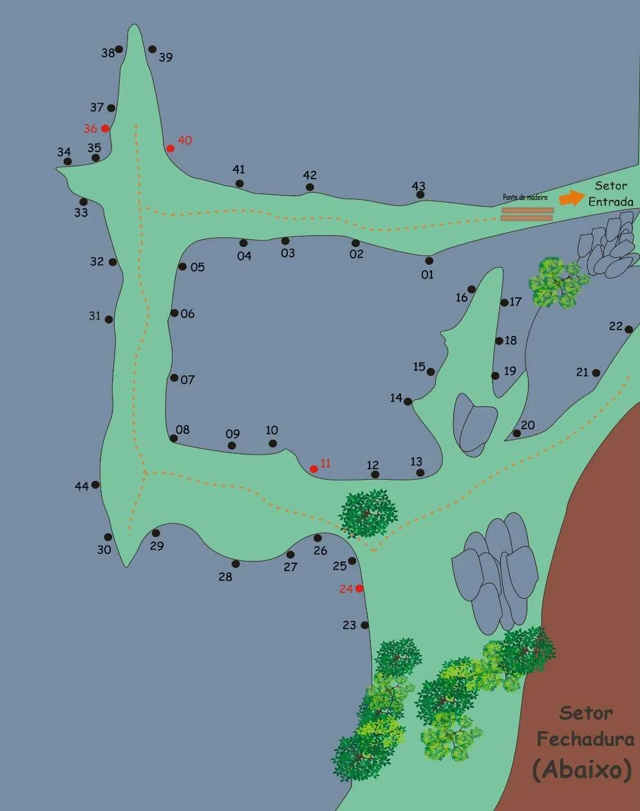
    - **largura_mapa**: 994
    - **altura_mapa**: 1258
    - **pontos_de_interesse**:
      - **[0]**:
        - **id**: 4n8lbetNLqsmqc
        - **uid**: 4n8lbetNLqsmqc
        - **rotulo**: 38
        - **retangulo**:
          - **x**: 168
          - **y**: 82
          - **comprimento**: 28
          - **largura**: 24
        - **label**: 38
      - **[1]**:
        - **id**: 62t6BE8CcLGXfj
        - **uid**: 62t6BE8CcLGXfj
        - **rotulo**: 39
        - **retangulo**:
          - **x**: 258
          - **y**: 89
          - **comprimento**: 27
          - **largura**: 26
        - **label**: 39
      - **[2]**:
        - **id**: bEelNblcAWO7m2
        - **uid**: bEelNblcAWO7m2
        - **rotulo**: 37
        - **retangulo**:
          - **x**: 150
          - **y**: 166
          - **comprimento**: 26
          - **largura**: 23
        - **label**: 37
      - **[3]**:
        - **id**: f3aBGnS9btzELG
        - **uid**: f3aBGnS9btzELG
        - **rotulo**: 36
        - **retangulo**:
          - **x**: 140
          - **y**: 199
          - **comprimento**: 27
          - **largura**: 22
        - **label**: 36
      - **[4]**:
        - **id**: aHDe1kTccB9NMb
        - **uid**: aHDe1kTccB9NMb
        - **rotulo**: 40
        - **retangulo**:
          - **x**: 288
          - **y**: 218
          - **comprimento**: 29
          - **largura**: 25
        - **label**: 40
      - **[5]**:
        - **id**: 7gOgP3A4ss8jzK
        - **uid**: 7gOgP3A4ss8jzK
        - **rotulo**: 34
        - **retangulo**:
          - **x**: 100
          - **y**: 235
          - **comprimento**: 27
          - **largura**: 24
        - **label**: 34
      - **[6]**:
        - **id**: SL854QsaDiKv6K
        - **uid**: SL854QsaDiKv6K
        - **rotulo**: 35
        - **retangulo**:
          - **x**: 146
          - **y**: 228
          - **comprimento**: 27
          - **largura**: 23
        - **label**: 35
      - **[7]**:
        - **id**: gnv1EpAtHDDafa
        - **uid**: gnv1EpAtHDDafa
        - **rotulo**: 41
        - **retangulo**:
          - **x**: 370
          - **y**: 262
          - **comprimento**: 28
          - **largura**: 24
        - **label**: 41
      - **[8]**:
        - **id**: cUC70R5iPathHk
        - **uid**: cUC70R5iPathHk
        - **rotulo**: 42
        - **retangulo**:
          - **x**: 482
          - **y**: 272
          - **comprimento**: 29
          - **largura**: 27
        - **label**: 42
      - **[9]**:
        - **id**: RmuLuV056m6PW3
        - **uid**: RmuLuV056m6PW3
        - **rotulo**: 43
        - **retangulo**:
          - **x**: 650
          - **y**: 288
          - **comprimento**: 28
          - **largura**: 25
        - **label**: 43
      - **[10]**:
        - **id**: VIbQ0fXbtfoS6E
        - **uid**: VIbQ0fXbtfoS6E
        - **rotulo**: Setor Entrada
        - **retangulo**:
          - **x**: 950
          - **y**: 302
          - **comprimento**: 75
          - **largura**: 47
        - **label**: Setor Entrada
      - **[11]**:
        - **id**: p2sNExhHG2VuN4
        - **uid**: p2sNExhHG2VuN4
        - **rotulo**: 33
        - **retangulo**:
          - **x**: 126
          - **y**: 330
          - **comprimento**: 25
          - **largura**: 23
        - **label**: 33
      - **[12]**:
        - **id**: TKdjQjboHjlWpm
        - **uid**: TKdjQjboHjlWpm
        - **rotulo**: 04
        - **retangulo**:
          - **x**: 380
          - **y**: 396
          - **comprimento**: 32
          - **largura**: 27
        - **label**: 04
      - **[13]**:
        - **id**: i0RSdZeVulsiLT
        - **uid**: i0RSdZeVulsiLT
        - **rotulo**: 03
        - **retangulo**:
          - **x**: 448
          - **y**: 392
          - **comprimento**: 29
          - **largura**: 27
        - **label**: 03
      - **[14]**:
        - **id**: ul0X3jpL8uuwuW
        - **uid**: ul0X3jpL8uuwuW
        - **rotulo**: 02
        - **retangulo**:
          - **x**: 553
          - **y**: 394
          - **comprimento**: 28
          - **largura**: 26
        - **label**: 02
      - **[15]**:
        - **id**: fHhmYwWH5DrcCW
        - **uid**: fHhmYwWH5DrcCW
        - **rotulo**: 32
        - **retangulo**:
          - **x**: 150
          - **y**: 404
          - **comprimento**: 29
          - **largura**: 21
        - **label**: 32
      - **[16]**:
        - **id**: xBUeNvGm4lBRo2
        - **uid**: xBUeNvGm4lBRo2
        - **rotulo**: 05
        - **retangulo**:
          - **x**: 308
          - **y**: 413
          - **comprimento**: 29
          - **largura**: 28
        - **label**: 05
      - **[17]**:
        - **id**: eHfSabkJxDdoNt
        - **uid**: eHfSabkJxDdoNt
        - **rotulo**: 01
        - **retangulo**:
          - **x**: 664
          - **y**: 424
          - **comprimento**: 29
          - **largura**: 25
        - **label**: 01
      - **[18]**:
        - **id**: hUMVzGGtfu9YPr
        - **uid**: hUMVzGGtfu9YPr
        - **rotulo**: 16
        - **retangulo**:
          - **x**: 716
          - **y**: 460
          - **comprimento**: 29
          - **largura**: 25
        - **label**: 16
      - **[19]**:
        - **id**: V0uqNyIzz6hAn4
        - **uid**: V0uqNyIzz6hAn4
        - **rotulo**: 17
        - **retangulo**:
          - **x**: 800
          - **y**: 467
          - **comprimento**: 28
          - **largura**: 26
        - **label**: 17
      - **[20]**:
        - **id**: ycWMTHVuKmiIek
        - **uid**: ycWMTHVuKmiIek
        - **rotulo**: 31
        - **retangulo**:
          - **x**: 146
          - **y**: 490
          - **comprimento**: 26
          - **largura**: 23
        - **label**: 31
      - **[21]**:
        - **id**: FioANgrdvNftpM
        - **uid**: FioANgrdvNftpM
        - **rotulo**: 06
        - **retangulo**:
          - **x**: 291
          - **y**: 486
          - **comprimento**: 28
          - **largura**: 27
        - **label**: 06
      - **[22]**:
        - **id**: WjVEoDTEQsKotF
        - **uid**: WjVEoDTEQsKotF
        - **rotulo**: 22
        - **retangulo**:
          - **x**: 956
          - **y**: 505
          - **comprimento**: 31
          - **largura**: 26
        - **label**: 22
      - **[23]**:
        - **id**: gKOsQxb5ZI9dGs
        - **uid**: gKOsQxb5ZI9dGs
        - **rotulo**: 18
        - **retangulo**:
          - **x**: 794
          - **y**: 526
          - **comprimento**: 28
          - **largura**: 26
        - **label**: 18
      - **[24]**:
        - **id**: crxDZhwUgaHZWt
        - **uid**: crxDZhwUgaHZWt
        - **rotulo**: 15
        - **retangulo**:
          - **x**: 652
          - **y**: 568
          - **comprimento**: 27
          - **largura**: 25
        - **label**: 15
      - **[25]**:
        - **id**: 0vDWF2XxBwPs0E
        - **uid**: 0vDWF2XxBwPs0E
        - **rotulo**: 19
        - **retangulo**:
          - **x**: 792
          - **y**: 575
          - **comprimento**: 30
          - **largura**: 26
        - **label**: 19
      - **[26]**:
        - **id**: Z15k8QqNYdYkCi
        - **uid**: Z15k8QqNYdYkCi
        - **rotulo**: 21
        - **retangulo**:
          - **x**: 904
          - **y**: 577
          - **comprimento**: 30
          - **largura**: 26
        - **label**: 21
      - **[27]**:
        - **id**: i9eQPJ8wCUL7n6
        - **uid**: i9eQPJ8wCUL7n6
        - **rotulo**: 07
        - **retangulo**:
          - **x**: 292
          - **y**: 588
          - **comprimento**: 31
          - **largura**: 28
        - **label**: 07
      - **[28]**:
        - **id**: I786rYAcOR2ml7
        - **uid**: I786rYAcOR2ml7
        - **rotulo**: 14
        - **retangulo**:
          - **x**: 616
          - **y**: 616
          - **comprimento**: 27
          - **largura**: 25
        - **label**: 14
      - **[29]**:
        - **id**: jmDTgjsJG7uqPF
        - **uid**: jmDTgjsJG7uqPF
        - **rotulo**: 08
        - **retangulo**:
          - **x**: 284
          - **y**: 666
          - **comprimento**: 31
          - **largura**: 28
        - **label**: 08
      - **[30]**:
        - **id**: HRn9Hyw0UkOrUh
        - **uid**: HRn9Hyw0UkOrUh
        - **rotulo**: 20
        - **retangulo**:
          - **x**: 820
          - **y**: 658
          - **comprimento**: 31
          - **largura**: 25
        - **label**: 20
      - **[31]**:
        - **id**: YpG77xik1SksrN
        - **uid**: YpG77xik1SksrN
        - **rotulo**: 09
        - **retangulo**:
          - **x**: 362
          - **y**: 672
          - **comprimento**: 29
          - **largura**: 24
        - **label**: 09
      - **[32]**:
        - **id**: wC3L9Qc2e6wblo
        - **uid**: wC3L9Qc2e6wblo
        - **rotulo**: 10
        - **retangulo**:
          - **x**: 422
          - **y**: 666
          - **comprimento**: 27
          - **largura**: 27
        - **label**: 10
      - **[33]**:
        - **id**: abApeDIF6BSq5s
        - **uid**: abApeDIF6BSq5s
        - **rotulo**: 11
        - **retangulo**:
          - **x**: 506
          - **y**: 718
          - **comprimento**: 26
          - **largura**: 25
        - **label**: 11
      - **[34]**:
        - **id**: icks07gpEXWGfR
        - **uid**: icks07gpEXWGfR
        - **rotulo**: 12
        - **retangulo**:
          - **x**: 579
          - **y**: 720
          - **comprimento**: 26
          - **largura**: 25
        - **label**: 12
      - **[35]**:
        - **id**: xJLB2fA5LIo6VL
        - **uid**: xJLB2fA5LIo6VL
        - **rotulo**: 13
        - **retangulo**:
          - **x**: 647
          - **y**: 715
          - **comprimento**: 26
          - **largura**: 26
        - **label**: 13
      - **[36]**:
        - **id**: JbxTwIEOLNzmK4
        - **uid**: JbxTwIEOLNzmK4
        - **rotulo**: 44
        - **retangulo**:
          - **x**: 126
          - **y**: 753
          - **comprimento**: 27
          - **largura**: 20
        - **label**: 44
      - **[37]**:
        - **id**: KCcUnsBvygvVob
        - **uid**: KCcUnsBvygvVob
        - **rotulo**: 30
        - **retangulo**:
          - **x**: 161
          - **y**: 852
          - **comprimento**: 28
          - **largura**: 22
        - **label**: 30
      - **[38]**:
        - **id**: hTUbuHQToVLEX6
        - **uid**: hTUbuHQToVLEX6
        - **rotulo**: 29
        - **retangulo**:
          - **x**: 244
          - **y**: 846
          - **comprimento**: 28
          - **largura**: 25
        - **label**: 29
      - **[39]**:
        - **id**: PrHb7CcRXkYh5u
        - **uid**: PrHb7CcRXkYh5u
        - **rotulo**: 26
        - **retangulo**:
          - **x**: 498
          - **y**: 853
          - **comprimento**: 27
          - **largura**: 22
        - **label**: 26
      - **[40]**:
        - **id**: O9omYyVK2RuRkJ
        - **uid**: O9omYyVK2RuRkJ
        - **rotulo**: 27
        - **retangulo**:
          - **x**: 451
          - **y**: 878
          - **comprimento**: 28
          - **largura**: 25
        - **label**: 27
      - **[41]**:
        - **id**: SRIvpgebONJbXE
        - **uid**: SRIvpgebONJbXE
        - **rotulo**: 25
        - **retangulo**:
          - **x**: 527
          - **y**: 878
          - **comprimento**: 28
          - **largura**: 24
        - **label**: 25
      - **[42]**:
        - **id**: P1Pdd8uSuD1JAF
        - **uid**: P1Pdd8uSuD1JAF
        - **rotulo**: 28
        - **retangulo**:
          - **x**: 350
          - **y**: 894
          - **comprimento**: 28
          - **largura**: 23
        - **label**: 28
      - **[43]**:
        - **id**: 7WuVhnRICUiafG
        - **uid**: 7WuVhnRICUiafG
        - **rotulo**: 24
        - **retangulo**:
          - **x**: 538
          - **y**: 912
          - **comprimento**: 27
          - **largura**: 25
        - **label**: 24
      - **[44]**:
        - **id**: ET696MjSAEtQkv
        - **uid**: ET696MjSAEtQkv
        - **rotulo**: 23
        - **retangulo**:
          - **x**: 542
          - **y**: 969
          - **comprimento**: 29
          - **largura**: 24
        - **label**: 23
      - **[45]**:
        - **id**: u6MsLcxIj3Aa1k
        - **uid**: u6MsLcxIj3Aa1k
        - **rotulo**: Setor Fechadura (Abaixo)
        - **retangulo**:
          - **x**: 906
          - **y**: 1152
          - **comprimento**: 171
          - **largura**: 139
        - **label**: Setor Fechadura (Abaixo)
    - **referencias**:
      - **[0]**:
        - **alvo_uid**: TdxeS0thOX3W9s
        - **pontos_uids**:
          - eHfSabkJxDdoNt
        - **escalada**: Criatura Hediondas
        - **ids**:
          - eHfSabkJxDdoNt
      - **[1]**:
        - **alvo_uid**: 6CWZUax5Slo5M4
        - **pontos_uids**:
          - ul0X3jpL8uuwuW
        - **escalada**: Wyatt Earp
        - **ids**:
          - ul0X3jpL8uuwuW
      - **[2]**:
        - **alvo_uid**: js3EMMvBVDTzAs
        - **pontos_uids**:
          - i0RSdZeVulsiLT
        - **escalada**: Jimi Killer Miller
        - **ids**:
          - i0RSdZeVulsiLT
      - **[3]**:
        - **alvo_uid**: mEaBZVYacstfQg
        - **pontos_uids**:
          - TKdjQjboHjlWpm
        - **escalada**: Jesse James
        - **ids**:
          - TKdjQjboHjlWpm
      - **[4]**:
        - **alvo_uid**: PTxPgu9Sgp1j4w
        - **pontos_uids**:
          - xBUeNvGm4lBRo2
        - **escalada**: Tempo de Espera
        - **ids**:
          - xBUeNvGm4lBRo2
      - **[5]**:
        - **alvo_uid**: knpkaASIN2pqer
        - **pontos_uids**:
          - xBUeNvGm4lBRo2
        - **escalada**: Variante Tempo de Espera
        - **ids**:
          - xBUeNvGm4lBRo2
      - **[6]**:
        - **alvo_uid**: usYW7SWKhbtIXs
        - **pontos_uids**:
          - FioANgrdvNftpM
        - **escalada**: La Casa de Papel
        - **ids**:
          - FioANgrdvNftpM
      - **[7]**:
        - **alvo_uid**: kDtP3OeKfattn6
        - **pontos_uids**:
          - i9eQPJ8wCUL7n6
        - **escalada**: Cariocando
        - **ids**:
          - i9eQPJ8wCUL7n6
      - **[8]**:
        - **alvo_uid**: SyLQhQML3iTWTq
        - **pontos_uids**:
          - jmDTgjsJG7uqPF
        - **escalada**: Neverland
        - **ids**:
          - jmDTgjsJG7uqPF
      - **[9]**:
        - **alvo_uid**: vxkZRVcwGJsjWj
        - **pontos_uids**:
          - YpG77xik1SksrN
        - **escalada**: Mestre Splinter
        - **ids**:
          - YpG77xik1SksrN
      - **[10]**:
        - **alvo_uid**: OOxh4HLhYMI5UC
        - **pontos_uids**:
          - wC3L9Qc2e6wblo
        - **escalada**: Enigma da Esfinge
        - **ids**:
          - wC3L9Qc2e6wblo
      - **[11]**:
        - **alvo_uid**: j2fIeXo0RcTvMb
        - **pontos_uids**:
          - abApeDIF6BSq5s
        - **escalada**: Taj Mahal
        - **ids**:
          - abApeDIF6BSq5s
      - **[12]**:
        - **alvo_uid**: ofOD3e5AmQ0B3k
        - **pontos_uids**:
          - icks07gpEXWGfR
        - **escalada**: The Boys
        - **ids**:
          - icks07gpEXWGfR
      - **[13]**:
        - **alvo_uid**: U7wclJgofaXELB
        - **pontos_uids**:
          - xJLB2fA5LIo6VL
        - **escalada**: Ainda é Tempo
        - **ids**:
          - xJLB2fA5LIo6VL
      - **[14]**:
        - **alvo_uid**: jEyxLVeCw5Ca0u
        - **pontos_uids**:
          - I786rYAcOR2ml7
        - **escalada**: A Espera de um Milagre
        - **ids**:
          - I786rYAcOR2ml7
      - **[15]**:
        - **alvo_uid**: mTjtxSxfyna4Wr
        - **pontos_uids**:
          - crxDZhwUgaHZWt
        - **escalada**: Gangue Voadora
        - **ids**:
          - crxDZhwUgaHZWt
      - **[16]**:
        - **alvo_uid**: QZb4cgXb5rfqyd
        - **pontos_uids**:
          - hUMVzGGtfu9YPr
        - **escalada**: Benjamin Horigok
        - **ids**:
          - hUMVzGGtfu9YPr
      - **[17]**:
        - **alvo_uid**: qeC3s4lzrRjQlQ
        - **pontos_uids**:
          - V0uqNyIzz6hAn4
        - **escalada**: Edward Teacher
        - **ids**:
          - V0uqNyIzz6hAn4
      - **[18]**:
        - **alvo_uid**: 4NRmgBJFnedqua
        - **pontos_uids**:
          - gKOsQxb5ZI9dGs
        - **escalada**: Blacksun Bellany
        - **ids**:
          - gKOsQxb5ZI9dGs
      - **[19]**:
        - **alvo_uid**: Lh1rchkOoryvuM
        - **pontos_uids**:
          - 0vDWF2XxBwPs0E
        - **escalada**: Charles Vane
        - **ids**:
          - 0vDWF2XxBwPs0E
      - **[20]**:
        - **alvo_uid**: YMUIxQm8kV2CNl
        - **pontos_uids**:
          - HRn9Hyw0UkOrUh
        - **escalada**: Calcário nos Olhos
        - **ids**:
          - HRn9Hyw0UkOrUh
      - **[21]**:
        - **alvo_uid**: ZtCpJJ13Bb86ns
        - **pontos_uids**:
          - Z15k8QqNYdYkCi
        - **escalada**: Cundum
        - **ids**:
          - Z15k8QqNYdYkCi
      - **[22]**:
        - **alvo_uid**: gwjNx49TqQsEby
        - **pontos_uids**:
          - WjVEoDTEQsKotF
        - **escalada**: Arte e Ofício na Lua
        - **ids**:
          - WjVEoDTEQsKotF
      - **[23]**:
        - **alvo_uid**: mASlG9H9Z83xQZ
        - **pontos_uids**:
          - ET696MjSAEtQkv
        - **escalada**: Dê do Baú
        - **ids**:
          - ET696MjSAEtQkv
      - **[24]**:
        - **alvo_uid**: KlUxAcdYqmELha
        - **pontos_uids**:
          - 7WuVhnRICUiafG
        - **escalada**: Variante West and Girls
        - **ids**:
          - 7WuVhnRICUiafG
      - **[25]**:
        - **alvo_uid**: FVPMXYd0dlhdrY
        - **pontos_uids**:
          - SRIvpgebONJbXE
        - **escalada**: West and Girls (Hipertrofia)
        - **ids**:
          - SRIvpgebONJbXE
      - **[26]**:
        - **alvo_uid**: jF4ZrT6BivTrT0
        - **pontos_uids**:
          - PrHb7CcRXkYh5u
        - **escalada**: Port Royal
        - **ids**:
          - PrHb7CcRXkYh5u
      - **[27]**:
        - **alvo_uid**: TtVwTp7msYflw4
        - **pontos_uids**:
          - O9omYyVK2RuRkJ
        - **escalada**: Comendador do Carste
        - **ids**:
          - O9omYyVK2RuRkJ
      - **[28]**:
        - **alvo_uid**: evbrSMr9cjeK7Q
        - **pontos_uids**:
          - P1Pdd8uSuD1JAF
        - **escalada**: Faraó
        - **ids**:
          - P1Pdd8uSuD1JAF
      - **[29]**:
        - **alvo_uid**: jBYpzOL5YjBEee
        - **pontos_uids**:
          - hTUbuHQToVLEX6
        - **escalada**: Marreta Voadora
        - **ids**:
          - hTUbuHQToVLEX6
      - **[30]**:
        - **alvo_uid**: sixBgxbGApmLXS
        - **pontos_uids**:
          - KCcUnsBvygvVob
        - **escalada**: El Capeton
        - **ids**:
          - KCcUnsBvygvVob
      - **[31]**:
        - **alvo_uid**: P62OXdJKe9PwHv
        - **pontos_uids**:
          - ycWMTHVuKmiIek
        - **escalada**: Modo Fantasma
        - **ids**:
          - ycWMTHVuKmiIek
      - **[32]**:
        - **alvo_uid**: 6ZFURP1rmIMVCR
        - **pontos_uids**:
          - fHhmYwWH5DrcCW
        - **escalada**: Doc Holiday
        - **ids**:
          - fHhmYwWH5DrcCW
      - **[33]**:
        - **alvo_uid**: GKVNaEbx9njnxg
        - **pontos_uids**:
          - p2sNExhHG2VuN4
        - **escalada**: Calamity Jane
        - **ids**:
          - p2sNExhHG2VuN4
      - **[34]**:
        - **alvo_uid**: bh3dObImco0HpP
        - **pontos_uids**:
          - 7gOgP3A4ss8jzK
        - **escalada**: Moriarty
        - **ids**:
          - 7gOgP3A4ss8jzK
      - **[35]**:
        - **alvo_uid**: emNNB0MjRSqFmv
        - **pontos_uids**:
          - SL854QsaDiKv6K
        - **escalada**: West World
        - **ids**:
          - SL854QsaDiKv6K
      - **[36]**:
        - **alvo_uid**: 639b0rBQfkKwNp
        - **pontos_uids**:
          - f3aBGnS9btzELG
        - **escalada**: Vórtex
        - **ids**:
          - f3aBGnS9btzELG
      - **[37]**:
        - **alvo_uid**: do23gddEvcUqoi
        - **pontos_uids**:
          - bEelNblcAWO7m2
        - **escalada**: Ida Chi não Sei
        - **ids**:
          - bEelNblcAWO7m2
      - **[38]**:
        - **alvo_uid**: pjadidq06WmYO6
        - **pontos_uids**:
          - 4n8lbetNLqsmqc
        - **escalada**: Amarelo
        - **ids**:
          - 4n8lbetNLqsmqc
      - **[39]**:
        - **alvo_uid**: IRTvyMRnr6aVNC
        - **pontos_uids**:
          - 62t6BE8CcLGXfj
        - **escalada**: Narnia
        - **ids**:
          - 62t6BE8CcLGXfj
      - **[40]**:
        - **alvo_uid**: p2ADn8oDDQPexM
        - **pontos_uids**:
          - aHDe1kTccB9NMb
        - **escalada**: Seu Truta na Coluna do Meio
        - **ids**:
          - aHDe1kTccB9NMb
      - **[41]**:
        - **alvo_uid**: VUmzpVg3f4mEYD
        - **pontos_uids**:
          - gnv1EpAtHDDafa
        - **escalada**: John Wesley Hardin
        - **ids**:
          - gnv1EpAtHDDafa
      - **[42]**:
        - **alvo_uid**: RXmRLs5li9ymTs
        - **pontos_uids**:
          - cUC70R5iPathHk
        - **escalada**: Woody
        - **ids**:
          - cUC70R5iPathHk
      - **[43]**:
        - **alvo_uid**: nFrEeEl1T7GNQo
        - **pontos_uids**:
          - RmuLuV056m6PW3
        - **escalada**: Coisa de Menino
        - **ids**:
          - RmuLuV056m6PW3
      - **[44]**:
        - **alvo_uid**: YjvSzYUqOHp6xU
        - **pontos_uids**:
          - JbxTwIEOLNzmK4
        - **escalada**: Amor Verdadeiro
        - **ids**:
          - JbxTwIEOLNzmK4
      - **[45]**:
        - **alvo_uid**: 7MOvMnNTds8jZr
        - **pontos_uids**:
          - VIbQ0fXbtfoS6E
        - **setor**: Setor Entrada Inferior
        - **ids**:
          - VIbQ0fXbtfoS6E
      - **[46]**:
        - **alvo_uid**: JKvFyKMkrPz9UF
        - **pontos_uids**:
          - u6MsLcxIj3Aa1k
        - **setor**: Setor Fechadura
        - **ids**:
          - u6MsLcxIj3Aa1k
- **escaladas**:
  - **[0]**:
    - **uid**: TdxeS0thOX3W9s
    - **via_esportiva**:
      - **nome**: Criatura Hediondas
      - **dificuldade**: BR_7A
      - **quantidade_protecoes_intermediarias**: 8
      - **quantidade_protecoes_parada**: 2
      - **conquistadores**:
        - Caca
        - Caverna
        - Xande
  - **[1]**:
    - **uid**: 6CWZUax5Slo5M4
    - **via_esportiva**:
      - **nome**: Wyatt Earp
      - **dificuldade**: BR_7C
      - **quantidade_protecoes_intermediarias**: 10
      - **quantidade_protecoes_parada**: 2
      - **conquistadores**:
        - Roberto Lincoln
        - Marco Durães
  - **[2]**:
    - **uid**: js3EMMvBVDTzAs
    - **via_esportiva**:
      - **nome**: Jimi Killer Miller
      - **dificuldade**: BR_7C
      - **quantidade_protecoes_intermediarias**: 9
      - **quantidade_protecoes_parada**: 2
      - **conquistadores**:
        - Roberto Lincoln
        - Marco Durães
  - **[3]**:
    - **uid**: mEaBZVYacstfQg
    - **via_esportiva**:
      - **nome**: Jesse James
      - **dificuldade**: BR_7A
      - **quantidade_protecoes_intermediarias**: 9
      - **quantidade_protecoes_parada**: 2
      - **conquistadores**:
        - Roberto Lincoln
        - Marco Durães
  - **[4]**:
    - **uid**: PTxPgu9Sgp1j4w
    - **via_esportiva**:
      - **nome**: Tempo de Espera
      - **dificuldade**: BR_7A
      - **quantidade_protecoes_intermediarias**: 8
      - **quantidade_protecoes_parada**: 2
      - **conquistadores**:
        - Roberto Lincoln
        - Rômulo
  - **[5]**:
    - **uid**: knpkaASIN2pqer
    - **via_esportiva**:
      - **descricao**: Fixa (Inacabada – Grampos à Esq.)
      - **nome**: Variante Tempo de Espera
      - **dificuldade**: INDEFINIDO
  - **[6]**:
    - **uid**: usYW7SWKhbtIXs
    - **via_esportiva**:
      - **nome**: La Casa de Papel
      - **dificuldade**: BR_8B_BARRA_8C
      - **conquistadores**:
        - Roberto Lincoln
        - Marco Durães
  - **[7]**:
    - **uid**: kDtP3OeKfattn6
    - **via_esportiva**:
      - **nome**: Cariocando
      - **dificuldade**: BR_8A
      - **quantidade_protecoes_intermediarias**: 8
      - **quantidade_protecoes_parada**: 2
      - **conquistadores**:
        - Roberto Lincoln
        - Marco Durães
  - **[8]**:
    - **uid**: SyLQhQML3iTWTq
    - **via_esportiva**:
      - **nome**: Neverland
      - **dificuldade**: BR_7B
      - **quantidade_protecoes_intermediarias**: 10
      - **quantidade_protecoes_parada**: 2
      - **conquistadores**:
        - Roberto Lincoln
        - Marco Durães
  - **[9]**:
    - **uid**: vxkZRVcwGJsjWj
    - **via_esportiva**:
      - **nome**: Mestre Splinter
      - **dificuldade**: BR_7B
      - **quantidade_protecoes_intermediarias**: 9
      - **quantidade_protecoes_parada**: 2
      - **conquistadores**:
        - Roberto Lincoln
        - Marco Durães
  - **[10]**:
    - **uid**: OOxh4HLhYMI5UC
    - **via_esportiva**:
      - **nome**: Enigma da Esfinge
      - **dificuldade**: BR_7B
      - **quantidade_protecoes_intermediarias**: 8
      - **quantidade_protecoes_parada**: 2
      - **conquistadores**:
        - Vinicius
  - **[11]**:
    - **uid**: j2fIeXo0RcTvMb
    - **via_movel**:
      - **nome**: Taj Mahal
      - **dificuldade**: INDEFINIDO
      - **protecoes_moveis**: Móvel
      - **conquistadores**:
        - Cláudio Melo
        - Roberto Lincoln
  - **[12]**:
    - **uid**: ofOD3e5AmQ0B3k
    - **via_esportiva**:
      - **nome**: The Boys
      - **dificuldade**: BR_5SUP
      - **quantidade_protecoes_intermediarias**: 8
      - **quantidade_protecoes_parada**: 2
      - **conquistadores**:
        - Roberto Lincoln
        - Marco Durães
  - **[13]**:
    - **uid**: U7wclJgofaXELB
    - **via_esportiva**:
      - **nome**: Ainda é Tempo
      - **dificuldade**: BR_6
      - **quantidade_protecoes_intermediarias**: 8
      - **quantidade_protecoes_parada**: 2
      - **conquistadores**:
        - Roberto Lincoln
        - Marco Durães
  - **[14]**:
    - **uid**: jEyxLVeCw5Ca0u
    - **via_esportiva**:
      - **nome**: A Espera de um Milagre
      - **dificuldade**: BR_6
      - **quantidade_protecoes_intermediarias**: 9
      - **quantidade_protecoes_parada**: 2
      - **conquistadores**:
        - Roberto Lincoln
        - Marco Durães
  - **[15]**:
    - **uid**: mTjtxSxfyna4Wr
    - **via_esportiva**:
      - **nome**: Gangue Voadora
      - **dificuldade**: BR_6
      - **quantidade_protecoes_intermediarias**: 10
      - **quantidade_protecoes_parada**: 2
      - **conquistadores**:
        - Roberto Lincoln
        - Marco Durães
  - **[16]**:
    - **uid**: QZb4cgXb5rfqyd
    - **via_esportiva**:
      - **nome**: Benjamin Horigok
      - **dificuldade**: BR_7A
      - **quantidade_protecoes_intermediarias**: 7
      - **quantidade_protecoes_parada**: 2
      - **conquistadores**:
        - Roberto Lincoln
        - Marco Durães
  - **[17]**:
    - **uid**: qeC3s4lzrRjQlQ
    - **via_esportiva**:
      - **descricao**: Mesmo Top da via 16
      - **nome**: Edward Teacher
      - **dificuldade**: BR_6SUP
      - **quantidade_protecoes_intermediarias**: 7
      - **quantidade_protecoes_parada**: 2
      - **conquistadores**:
        - Roberto Lincoln
        - Marco Durães
  - **[18]**:
    - **uid**: 4NRmgBJFnedqua
    - **via_esportiva**:
      - **nome**: Blacksun Bellany
      - **dificuldade**: BR_5
      - **quantidade_protecoes_intermediarias**: 7
      - **quantidade_protecoes_parada**: 2
      - **conquistadores**:
        - Roberto Lincoln
        - Marco Durães
  - **[19]**:
    - **uid**: Lh1rchkOoryvuM
    - **via_esportiva**:
      - **nome**: Charles Vane
      - **dificuldade**: BR_5
      - **quantidade_protecoes_intermediarias**: 7
      - **quantidade_protecoes_parada**: 2
      - **conquistadores**:
        - Roberto Lincoln
        - Marco Durães
  - **[20]**:
    - **uid**: YMUIxQm8kV2CNl
    - **via_esportiva**:
      - **nome**: Calcário nos Olhos
      - **dificuldade**: BR_7A
      - **quantidade_protecoes_intermediarias**: 6
      - **quantidade_protecoes_parada**: 2
      - **conquistadores**:
        - Leandro Mr. Bean
        - Breno
        - Lugoma
  - **[21]**:
    - **uid**: ZtCpJJ13Bb86ns
    - **via_esportiva**:
      - **nome**: Cundum
      - **dificuldade**: BR_8B
      - **quantidade_protecoes_intermediarias**: 6
      - **quantidade_protecoes_parada**: 2
      - **conquistadores**:
        - Negão
        - Cerqueirinha
  - **[22]**:
    - **uid**: gwjNx49TqQsEby
    - **via_esportiva**:
      - **nome**: Arte e Ofício na Lua
      - **dificuldade**: BR_8B
      - **dificuldade_artificial**: A1
      - **quantidade_protecoes_intermediarias**: 6
      - **quantidade_protecoes_parada**: 2
      - **conquistadores**:
        - Puta
        - DJ
  - **[23]**:
    - **uid**: mASlG9H9Z83xQZ
    - **via_esportiva**:
      - **nome**: Dê do Baú
      - **dificuldade**: BR_6SUP
      - **quantidade_protecoes_intermediarias**: 7
      - **quantidade_protecoes_parada**: 2
      - **conquistadores**:
        - Roberto Lincoln
        - Marco Durães
  - **[24]**:
    - **uid**: KlUxAcdYqmELha
    - **via_movel**:
      - **nome**: Variante West and Girls
      - **dificuldade**: BR_6SUP
      - **protecoes_moveis**: Móvel
      - **conquistadores**:
        - Roberto Lincoln
  - **[25]**:
    - **uid**: FVPMXYd0dlhdrY
    - **via_esportiva**:
      - **nome**: West and Girls (Hipertrofia)
      - **dificuldade**: BR_6
      - **quantidade_protecoes_intermediarias**: 6
      - **quantidade_protecoes_parada**: 2
      - **conquistadores**:
        - Cláudio Melo
        - Roberto
        - Negão
        - Cerqueirinha
        - Leandro
  - **[26]**:
    - **uid**: jF4ZrT6BivTrT0
    - **via_esportiva**:
      - **nome**: Port Royal
      - **dificuldade**: BR_6
      - **quantidade_protecoes_intermediarias**: 6
      - **quantidade_protecoes_parada**: 2
      - **conquistadores**:
        - Roberto Lincoln
        - Marco Durães
  - **[27]**:
    - **uid**: TtVwTp7msYflw4
    - **via_esportiva**:
      - **nome**: Comendador do Carste
      - **dificuldade**: BR_6SUP
      - **quantidade_protecoes_intermediarias**: 8
      - **quantidade_protecoes_parada**: 2
      - **conquistadores**:
        - Roberto Lincoln
        - Marco Durães
  - **[28]**:
    - **uid**: evbrSMr9cjeK7Q
    - **via_esportiva**:
      - **nome**: Faraó
      - **dificuldade**: BR_8A
      - **quantidade_protecoes_intermediarias**: 9
      - **quantidade_protecoes_parada**: 2
      - **conquistadores**:
        - Vinicinho
        - Roberto Lincoln
        - Marco Durães
  - **[29]**:
    - **uid**: jBYpzOL5YjBEee
    - **via_esportiva**:
      - **nome**: Marreta Voadora
      - **dificuldade**: BR_7C
      - **quantidade_protecoes_intermediarias**: 9
      - **quantidade_protecoes_parada**: 2
      - **conquistadores**:
        - Roberto Lincoln
        - Marco Durães
  - **[30]**:
    - **uid**: sixBgxbGApmLXS
    - **via_esportiva**:
      - **nome**: El Capeton
      - **dificuldade**: BR_6
      - **quantidade_protecoes_intermediarias**: 8
      - **quantidade_protecoes_parada**: 2
      - **conquistadores**:
        - Gustavo Vianna
        - Gustavo Roscoe
        - Vladimir Gonçalves
  - **[31]**:
    - **uid**: P62OXdJKe9PwHv
    - **via_esportiva**:
      - **nome**: Modo Fantasma
      - **dificuldade**: BR_6SUP
      - **quantidade_protecoes_intermediarias**: 8
      - **quantidade_protecoes_parada**: 2
      - **conquistadores**:
        - Marcelo Bocão
        - Roberto L.
        - Marco Durães
  - **[32]**:
    - **uid**: 6ZFURP1rmIMVCR
    - **via_esportiva**:
      - **nome**: Doc Holiday
      - **dificuldade**: BR_5SUP
      - **quantidade_protecoes_intermediarias**: 7
      - **quantidade_protecoes_parada**: 2
      - **conquistadores**:
        - Roberto
        - Tinoco
  - **[33]**:
    - **uid**: GKVNaEbx9njnxg
    - **via_esportiva**:
      - **nome**: Calamity Jane
      - **dificuldade**: BR_6
      - **quantidade_protecoes_intermediarias**: 8
      - **quantidade_protecoes_parada**: 2
      - **conquistadores**:
        - Roberto Lincoln
        - Marco Durães
  - **[34]**:
    - **uid**: bh3dObImco0HpP
    - **via_esportiva**:
      - **nome**: Moriarty
      - **dificuldade**: BR_7C
      - **quantidade_protecoes_intermediarias**: 9
      - **quantidade_protecoes_parada**: 2
      - **conquistadores**:
        - Roberto Lincoln
        - Marco Durães
  - **[35]**:
    - **uid**: emNNB0MjRSqFmv
    - **via_esportiva**:
      - **nome**: West World
      - **dificuldade**: BR_6SUP
      - **quantidade_protecoes_intermediarias**: 8
      - **quantidade_protecoes_parada**: 2
      - **conquistadores**:
        - Roberto Lincoln
        - Marco Durães
  - **[36]**:
    - **uid**: 639b0rBQfkKwNp
    - **via_movel**:
      - **nome**: Vórtex
      - **dificuldade**: BR_6SUP
      - **protecoes_moveis**: Móvel
      - **conquistadores**:
        - Marcelo Bocão
        - Roberto
  - **[37]**:
    - **uid**: do23gddEvcUqoi
    - **via_esportiva**:
      - **nome**: Ida Chi não Sei
      - **dificuldade**: BR_6SUP
      - **quantidade_protecoes_intermediarias**: 8
      - **quantidade_protecoes_parada**: 2
      - **conquistadores**:
        - Roberto Lincoln
        - Cláudio Melo
  - **[38]**:
    - **uid**: pjadidq06WmYO6
    - **via_esportiva**:
      - **nome**: Amarelo
      - **dificuldade**: BR_6SUP
      - **quantidade_protecoes_intermediarias**: 8
      - **quantidade_protecoes_parada**: 2
      - **conquistadores**:
        - Roberto Lincoln
        - Marco Durães
  - **[39]**:
    - **uid**: IRTvyMRnr6aVNC
    - **via_esportiva**:
      - **nome**: Narnia
      - **dificuldade**: BR_6SUP
      - **quantidade_protecoes_intermediarias**: 8
      - **quantidade_protecoes_parada**: 2
      - **conquistadores**:
        - Roberto Lincoln
        - Marco Durães
  - **[40]**:
    - **uid**: p2ADn8oDDQPexM
    - **via_movel**:
      - **nome**: Seu Truta na Coluna do Meio
      - **dificuldade**: BR_6SUP
      - **protecoes_moveis**: Móvel
      - **conquistadores**:
        - Roberto Lincoln
        - Marco Durães
  - **[41]**:
    - **uid**: VUmzpVg3f4mEYD
    - **via_esportiva**:
      - **nome**: John Wesley Hardin
      - **dificuldade**: BR_7C
      - **conquistadores**:
        - Roberto Lincoln
        - Marco Durães
  - **[42]**:
    - **uid**: RXmRLs5li9ymTs
    - **via_esportiva**:
      - **nome**: Woody
      - **dificuldade**: BR_7C
      - **quantidade_protecoes_intermediarias**: 9
      - **quantidade_protecoes_parada**: 2
      - **conquistadores**:
        - Roberto Lincoln
        - Marco Durães
  - **[43]**:
    - **uid**: nFrEeEl1T7GNQo
    - **via_esportiva**:
      - **descricao**: Fixa
      - **nome**: Coisa de Menino
      - **dificuldade**: BR_8B
      - **quantidade_protecoes_parada**: 1
      - **conquistadores**:
        - Caca
        - Xande
        - Salim
  - **[44]**:
    - **uid**: YjvSzYUqOHp6xU
    - **via_esportiva**:
      - **nome**: Amor Verdadeiro
      - **dificuldade**: BR_6SUP
      - **quantidade_protecoes_intermediarias**: 8
      - **quantidade_protecoes_parada**: 2
      - **conquistadores**:
        - Igor Andrade
        - Iule Ornelas
        - Samuel Lucas
- **precomputados**:
  - **total_escaladas**: 45
  - **total_esportivas**: 41

## Parte: setor_fechadura

### Setor (Pico: Gruta do Baú)

- **descricao**:
    # Setor Fechadura
    
    **Acesso:** Ao chegar ao maciço, no setor entrada, seguir a trilha a esquerda margeando o maciço e a gruta. A primeira via do setor é a via “Era de Aquários”. A trilha segue pela esquerda, por fora da gruta.
    
    **Acesso secundário:** Contornando o maciço pela direita a partir do Setor Pasto e subindo em direção a pedra. Por este caminho chegará à base da via “Primeira Batida”.
    
    Lembrando que o acesso a gruta só é permitido com o acompanhamento de um guia da fazenda.
- **nome**: Setor Fechadura
- **uid**: JKvFyKMkrPz9UF
- **mapas**:
  - **[0]**:
    - **caminho_imagem_mapa**: 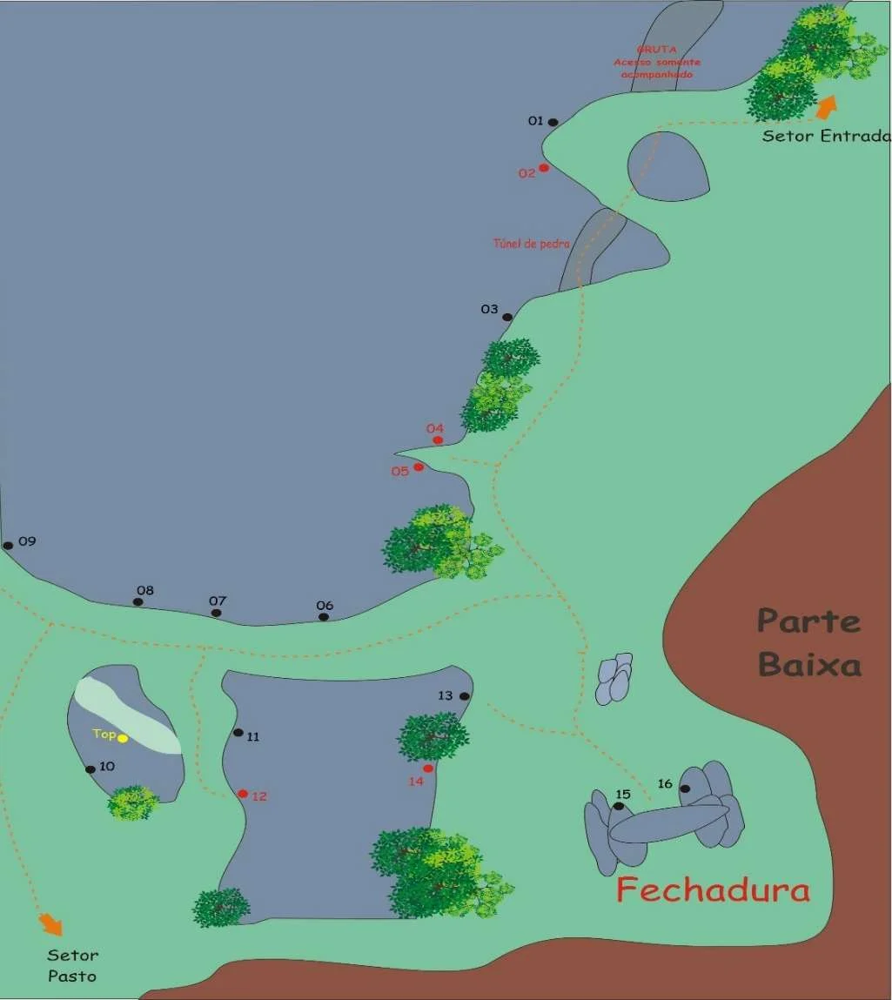
    - **largura_mapa**: 1025
    - **altura_mapa**: 1149
    - **pontos_de_interesse**:
      - **[0]**:
        - **id**: ueZBbox6jGEKfH
        - **uid**: ueZBbox6jGEKfH
        - **rotulo**: 01
        - **retangulo**:
          - **x**: 616
          - **y**: 138
          - **comprimento**: 28
          - **largura**: 22
        - **label**: 01
      - **[1]**:
        - **id**: eyrUyqyYDEGciR
        - **uid**: eyrUyqyYDEGciR
        - **rotulo**: Setor Entrada
        - **retangulo**:
          - **x**: 949
          - **y**: 156
          - **comprimento**: 152
          - **largura**: 23
        - **label**: Setor Entrada
      - **[2]**:
        - **id**: Ib1YLC3cVkAzEb
        - **uid**: Ib1YLC3cVkAzEb
        - **rotulo**: 02
        - **retangulo**:
          - **x**: 605
          - **y**: 198
          - **comprimento**: 28
          - **largura**: 22
        - **label**: 02
      - **[3]**:
        - **id**: bYJcUO23LPEc87
        - **uid**: bYJcUO23LPEc87
        - **rotulo**: 03
        - **retangulo**:
          - **x**: 563
          - **y**: 354
          - **comprimento**: 30
          - **largura**: 21
        - **label**: 03
      - **[4]**:
        - **id**: zueJL2rWREAaGj
        - **uid**: zueJL2rWREAaGj
        - **rotulo**: 04
        - **retangulo**:
          - **x**: 500
          - **y**: 492
          - **comprimento**: 26
          - **largura**: 23
        - **label**: 04
      - **[5]**:
        - **id**: 4s5Y2LgNLA1JFQ
        - **uid**: 4s5Y2LgNLA1JFQ
        - **rotulo**: 05
        - **retangulo**:
          - **x**: 460
          - **y**: 541
          - **comprimento**: 27
          - **largura**: 24
        - **label**: 05
      - **[6]**:
        - **id**: n9ZX7I2Dn2e9y6
        - **uid**: n9ZX7I2Dn2e9y6
        - **rotulo**: 09
        - **retangulo**:
          - **x**: 32
          - **y**: 622
          - **comprimento**: 28
          - **largura**: 23
        - **label**: 09
      - **[7]**:
        - **id**: F6aRLgmHLzzE8H
        - **uid**: F6aRLgmHLzzE8H
        - **rotulo**: 08
        - **retangulo**:
          - **x**: 167
          - **y**: 677
          - **comprimento**: 28
          - **largura**: 26
        - **label**: 08
      - **[8]**:
        - **id**: QKFVZGk97vSdHo
        - **uid**: QKFVZGk97vSdHo
        - **rotulo**: 07
        - **retangulo**:
          - **x**: 250
          - **y**: 689
          - **comprimento**: 30
          - **largura**: 26
        - **label**: 07
      - **[9]**:
        - **id**: VF3FkYQ9w0I1MC
        - **uid**: VF3FkYQ9w0I1MC
        - **rotulo**: 06
        - **retangulo**:
          - **x**: 373
          - **y**: 694
          - **comprimento**: 26
          - **largura**: 23
        - **label**: 06
      - **[10]**:
        - **id**: 4iKDjbziI0wrgO
        - **uid**: 4iKDjbziI0wrgO
        - **rotulo**: 13
        - **retangulo**:
          - **x**: 511
          - **y**: 800
          - **comprimento**: 26
          - **largura**: 23
        - **label**: 13
      - **[11]**:
        - **id**: oRqOO6fmoSBbzk
        - **uid**: oRqOO6fmoSBbzk
        - **rotulo**: 11
        - **retangulo**:
          - **x**: 290
          - **y**: 846
          - **comprimento**: 25
          - **largura**: 23
        - **label**: 11
      - **[12]**:
        - **id**: sBNXtgc81QrCmT
        - **uid**: sBNXtgc81QrCmT
        - **rotulo**: 14
        - **retangulo**:
          - **x**: 478
          - **y**: 897
          - **comprimento**: 22
          - **largura**: 26
        - **label**: 14
      - **[13]**:
        - **id**: IyDIBhvlFx5Gs4
        - **uid**: IyDIBhvlFx5Gs4
        - **rotulo**: 10
        - **retangulo**:
          - **x**: 123
          - **y**: 880
          - **comprimento**: 26
          - **largura**: 23
        - **label**: 10
      - **[14]**:
        - **id**: FH992nQQuFlEL1
        - **uid**: FH992nQQuFlEL1
        - **rotulo**: 16
        - **retangulo**:
          - **x**: 764
          - **y**: 900
          - **comprimento**: 23
          - **largura**: 21
        - **label**: 16
      - **[15]**:
        - **id**: M5CfU8JPuDDcME
        - **uid**: M5CfU8JPuDDcME
        - **rotulo**: 12
        - **retangulo**:
          - **x**: 298
          - **y**: 916
          - **comprimento**: 29
          - **largura**: 23
        - **label**: 12
      - **[16]**:
        - **id**: yorW9tmz3MxIOv
        - **uid**: yorW9tmz3MxIOv
        - **rotulo**: 15
        - **retangulo**:
          - **x**: 716
          - **y**: 913
          - **comprimento**: 23
          - **largura**: 18
        - **label**: 15
      - **[17]**:
        - **id**: 3NX2MvQKeIU06M
        - **uid**: 3NX2MvQKeIU06M
        - **rotulo**: Setor Pasto
        - **retangulo**:
          - **x**: 84
          - **y**: 1108
          - **comprimento**: 65
          - **largura**: 45
        - **label**: Setor Pasto
    - **referencias**:
      - **[0]**:
        - **alvo_uid**: SHurDXBIdycUvg
        - **pontos_uids**:
          - ueZBbox6jGEKfH
        - **escalada**: Era de Aquários (Interditada)
        - **ids**:
          - ueZBbox6jGEKfH
      - **[1]**:
        - **alvo_uid**: c2s9SmdhtOaAST
        - **pontos_uids**:
          - Ib1YLC3cVkAzEb
        - **escalada**: Terra Devastada
        - **ids**:
          - Ib1YLC3cVkAzEb
      - **[2]**:
        - **alvo_uid**: lpPoH6wfpYuvm6
        - **pontos_uids**:
          - bYJcUO23LPEc87
        - **escalada**: Canabizados por Água
        - **ids**:
          - bYJcUO23LPEc87
      - **[3]**:
        - **alvo_uid**: P7nxzdXyMDBoEq
        - **pontos_uids**:
          - zueJL2rWREAaGj
        - **escalada**: Cólico Espinhos
        - **ids**:
          - zueJL2rWREAaGj
      - **[4]**:
        - **alvo_uid**: JekoL6jTChhEtc
        - **pontos_uids**:
          - 4s5Y2LgNLA1JFQ
        - **escalada**: Passeio no Parque
        - **ids**:
          - 4s5Y2LgNLA1JFQ
      - **[5]**:
        - **alvo_uid**: 5NeiZ7hWyu4c0n
        - **pontos_uids**:
          - VF3FkYQ9w0I1MC
        - **escalada**: Cobaia
        - **ids**:
          - VF3FkYQ9w0I1MC
      - **[6]**:
        - **alvo_uid**: Wgqm2Msl0s6OFu
        - **pontos_uids**:
          - QKFVZGk97vSdHo
        - **escalada**: Despedida de Solteiro
        - **ids**:
          - QKFVZGk97vSdHo
      - **[7]**:
        - **alvo_uid**: lto10D0pZXNPbw
        - **pontos_uids**:
          - IyDIBhvlFx5Gs4
        - **escalada**: Via sem informação 2
        - **ids**:
          - IyDIBhvlFx5Gs4
      - **[8]**:
        - **alvo_uid**: CUSEvFxeoJQg3w
        - **pontos_uids**:
          - oRqOO6fmoSBbzk
        - **escalada**: Rins de Aço
        - **ids**:
          - oRqOO6fmoSBbzk
      - **[9]**:
        - **alvo_uid**: nDsGqyO9ogPRyN
        - **pontos_uids**:
          - M5CfU8JPuDDcME
        - **escalada**: Macacos me mordam
        - **ids**:
          - M5CfU8JPuDDcME
      - **[10]**:
        - **alvo_uid**: TShxVksiS2q5zU
        - **pontos_uids**:
          - 4iKDjbziI0wrgO
        - **escalada**: Novinha em Folha
        - **ids**:
          - 4iKDjbziI0wrgO
      - **[11]**:
        - **alvo_uid**: DxdUAdAxKVIYjX
        - **pontos_uids**:
          - sBNXtgc81QrCmT
        - **escalada**: Oposição em Árvore
        - **ids**:
          - sBNXtgc81QrCmT
      - **[12]**:
        - **alvo_uid**: r7m9sYbOEQmMFx
        - **pontos_uids**:
          - yorW9tmz3MxIOv
        - **escalada**: Maggie
        - **ids**:
          - yorW9tmz3MxIOv
      - **[13]**:
        - **alvo_uid**: 65eJ75qOL42kUp
        - **pontos_uids**:
          - FH992nQQuFlEL1
        - **escalada**: Chuva Orgânica
        - **ids**:
          - FH992nQQuFlEL1
      - **[14]**:
        - **alvo_uid**: 8stjmWQQoS7atT
        - **pontos_uids**:
          - F6aRLgmHLzzE8H
        - **escalada**: Primeira Batida
        - **ids**:
          - F6aRLgmHLzzE8H
      - **[15]**:
        - **alvo_uid**: UxICLHlRIlaDJt
        - **pontos_uids**:
          - n9ZX7I2Dn2e9y6
        - **escalada**: Menino de Toca
        - **ids**:
          - n9ZX7I2Dn2e9y6
      - **[16]**:
        - **alvo_uid**: pN9fjhBMXuRw8U
        - **pontos_uids**:
          - 3NX2MvQKeIU06M
        - **setor**: Setor Pasto
        - **ids**:
          - 3NX2MvQKeIU06M
      - **[17]**:
        - **alvo_uid**: 7MOvMnNTds8jZr
        - **pontos_uids**:
          - eyrUyqyYDEGciR
        - **setor**: Setor Entrada Inferior
        - **ids**:
          - eyrUyqyYDEGciR
- **escaladas**:
  - **[0]**:
    - **uid**: SHurDXBIdycUvg
    - **via_esportiva**:
      - **nome**: Era de Aquários (Interditada)
      - **dificuldade**: BR_6SUP
      - **quantidade_protecoes_intermediarias**: 12
      - **quantidade_protecoes_parada**: 2
      - **conquistadores**:
        - Roberto Lincoln
        - Rômulo
  - **[1]**:
    - **uid**: c2s9SmdhtOaAST
    - **via_movel**:
      - **nome**: Terra Devastada
      - **dificuldade**: BR_6SUP
      - **protecoes_moveis**: Móvel
      - **conquistadores**:
        - Roberto Lincoln
        - Isabel Diniz
  - **[2]**:
    - **uid**: lpPoH6wfpYuvm6
    - **via_esportiva**:
      - **nome**: Canabizados por Água
      - **dificuldade**: BR_6SUP
      - **quantidade_protecoes_intermediarias**: 12
      - **quantidade_protecoes_parada**: 2
      - **conquistadores**:
        - Roberto Lincoln
        - Belga
        - Rômulo
  - **[3]**:
    - **uid**: P7nxzdXyMDBoEq
    - **via_movel**:
      - **nome**: Cólico Espinhos
      - **dificuldade**: BR_6SUP
      - **protecoes_moveis**: Móvel
      - **conquistadores**:
        - Roberto Lincoln
        - Marcelo Bocão
  - **[4]**:
    - **uid**: JekoL6jTChhEtc
    - **via_movel**:
      - **nome**: Passeio no Parque
      - **dificuldade**: BR_4SUP
      - **quantidade_protecoes_intermediarias**: 4
      - **quantidade_protecoes_parada**: 2
      - **protecoes_moveis**: Mista
      - **conquistadores**:
        - Daniel Ferreira Mariano
        - Matheus Carneiro
  - **[5]**:
    - **uid**: 5NeiZ7hWyu4c0n
    - **via_esportiva**:
      - **nome**: Cobaia
      - **dificuldade**: BR_6
      - **quantidade_protecoes_intermediarias**: 5
      - **quantidade_protecoes_parada**: 2
      - **conquistadores**:
        - Matheus e Daniel Ferreira Mariano Carneiro
  - **[6]**:
    - **uid**: Wgqm2Msl0s6OFu
    - **via_esportiva**:
      - **nome**: Despedida de Solteiro
      - **dificuldade**: BR_7B
      - **quantidade_protecoes_intermediarias**: 8
      - **quantidade_protecoes_parada**: 2
      - **conquistadores**:
        - Andréa Rajão
        - Ricardo Leal
  - **[7]**:
    - **uid**: 8stjmWQQoS7atT
    - **via_esportiva**:
      - **nome**: Primeira Batida
      - **dificuldade**: BR_6SUP
      - **quantidade_protecoes_intermediarias**: 8
      - **quantidade_protecoes_parada**: 2
      - **conquistadores**:
        - Roberto
        - Marcos Aurélio
        - Daida
  - **[8]**:
    - **uid**: UxICLHlRIlaDJt
    - **via_esportiva**:
      - **descricao**: Inacabada
      - **nome**: Menino de Toca
      - **dificuldade**: INDEFINIDO
      - **conquistadores**:
        - Joviney
        - Novais
        - Vinicinho
  - **[9]**:
    - **uid**: lto10D0pZXNPbw
    - **via_esportiva**:
      - **descricao**: Fixa
      - **nome**: Via sem informação 2
      - **dificuldade**: INDEFINIDO
  - **[10]**:
    - **uid**: CUSEvFxeoJQg3w
    - **via_esportiva**:
      - **nome**: Rins de Aço
      - **dificuldade**: BR_6
      - **quantidade_protecoes_intermediarias**: 5
      - **quantidade_protecoes_parada**: 2
      - **conquistadores**:
        - Novais
        - Márcio
        - Fábio
  - **[11]**:
    - **uid**: nDsGqyO9ogPRyN
    - **via_movel**:
      - **nome**: Macacos me mordam
      - **dificuldade**: BR_5SUP
      - **protecoes_moveis**: Mista
      - **conquistadores**:
        - Daniel Ferreira
        - Matheus
  - **[12]**:
    - **uid**: TShxVksiS2q5zU
    - **via_esportiva**:
      - **nome**: Novinha em Folha
      - **dificuldade**: BR_5SUP
      - **quantidade_protecoes_intermediarias**: 3
      - **quantidade_protecoes_parada**: 2
      - **conquistadores**:
        - Ramaya Vallias
  - **[13]**:
    - **uid**: DxdUAdAxKVIYjX
    - **via_movel**:
      - **nome**: Oposição em Árvore
      - **dificuldade**: BR_6SUP
      - **protecoes_moveis**: Móvel
      - **conquistadores**:
        - Edgardo Abreu “Caca”
  - **[14]**:
    - **uid**: r7m9sYbOEQmMFx
    - **via_esportiva**:
      - **nome**: Maggie
      - **dificuldade**: BR_5
      - **quantidade_protecoes_intermediarias**: 5
      - **quantidade_protecoes_parada**: 2
      - **conquistadores**:
        - Antônio Carlos Magalhães “Tonico”
  - **[15]**:
    - **uid**: 65eJ75qOL42kUp
    - **via_esportiva**:
      - **nome**: Chuva Orgânica
      - **dificuldade**: BR_4
      - **quantidade_protecoes_intermediarias**: 3
      - **quantidade_protecoes_parada**: 2
      - **conquistadores**:
        - Eustáquio e Helon
- **precomputados**:
  - **total_escaladas**: 16
  - **total_esportivas**: 11

## Parte: setor_pasto

### Setor (Pico: Gruta do Baú)

- **descricao**:
    # Setor Pasto
    
    **Acesso:** Seguindo pela estrada partindo do estacionamento, é o setor que se localiza a esquerda. Um pouco antes de chegar na pedra, basta pegar a trilha que desce a esquerda.
    
    **Coordenadas na base da via Rolha de Algodão:** -19º32.911’ -43º59.268’
- **nome**: Setor Pasto
- **uid**: pN9fjhBMXuRw8U
- **caminho_imagem_capa**: 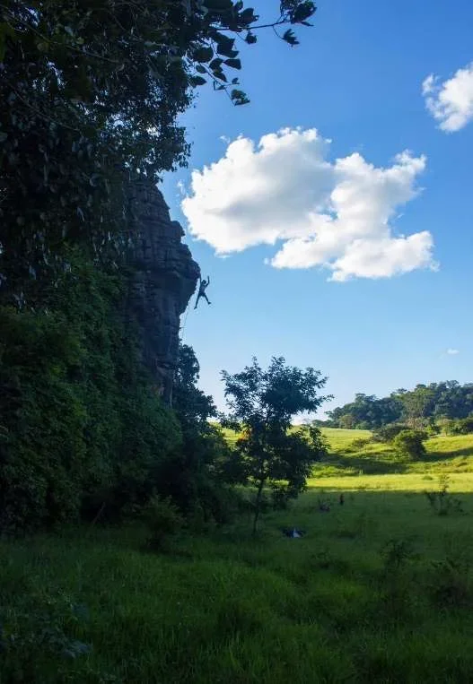
- **mapas**:
  - **[0]**:
    - **caminho_imagem_mapa**: 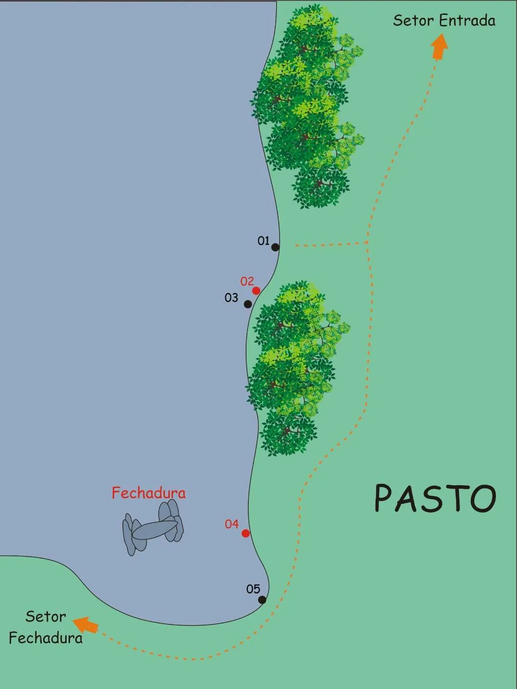
    - **largura_mapa**: 1078
    - **altura_mapa**: 1434
    - **pontos_de_interesse**:
      - **[0]**:
        - **id**: Ivjo1mxuuZiwQ8
        - **uid**: Ivjo1mxuuZiwQ8
        - **rotulo**: Setor Entrada
        - **retangulo**:
          - **x**: 926
          - **y**: 42
          - **comprimento**: 217
          - **largura**: 34
        - **label**: Setor Entrada
      - **[1]**:
        - **id**: kpc2O4uVqcmkuK
        - **uid**: kpc2O4uVqcmkuK
        - **rotulo**: 01
        - **retangulo**:
          - **x**: 550
          - **y**: 500
          - **comprimento**: 34
          - **largura**: 28
        - **label**: 01
      - **[2]**:
        - **id**: oGsg9efBd2dKNC
        - **uid**: oGsg9efBd2dKNC
        - **rotulo**: 02
        - **retangulo**:
          - **x**: 516
          - **y**: 584
          - **comprimento**: 39
          - **largura**: 31
        - **label**: 02
      - **[3]**:
        - **id**: Pd5raBVtYPFUxi
        - **uid**: Pd5raBVtYPFUxi
        - **rotulo**: 03
        - **retangulo**:
          - **x**: 482
          - **y**: 618
          - **comprimento**: 37
          - **largura**: 31
        - **label**: 03
      - **[4]**:
        - **id**: 25d2KOdvA5JZuw
        - **uid**: 25d2KOdvA5JZuw
        - **rotulo**: 04
        - **retangulo**:
          - **x**: 484
          - **y**: 1089
          - **comprimento**: 43
          - **largura**: 32
        - **label**: 04
      - **[5]**:
        - **id**: 8LbrZCFmLm19VD
        - **uid**: 8LbrZCFmLm19VD
        - **rotulo**: 05
        - **retangulo**:
          - **x**: 528
          - **y**: 1224
          - **comprimento**: 41
          - **largura**: 33
        - **label**: 05
      - **[6]**:
        - **id**: yX23DM833Nph2U
        - **uid**: yX23DM833Nph2U
        - **rotulo**: Setor Fechadura
        - **retangulo**:
          - **x**: 94
          - **y**: 1303
          - **comprimento**: 167
          - **largura**: 88
        - **label**: Setor Fechadura
    - **referencias**:
      - **[0]**:
        - **alvo_uid**: 2ov464a1nikvfY
        - **pontos_uids**:
          - kpc2O4uVqcmkuK
        - **escalada**: Cemitério das Caranguejeiras - Direita
        - **ids**:
          - kpc2O4uVqcmkuK
      - **[1]**:
        - **alvo_uid**: 6NPcA8rCHzXHEq
        - **pontos_uids**:
          - kpc2O4uVqcmkuK
        - **escalada**: Água Suja - Esquerda
        - **ids**:
          - kpc2O4uVqcmkuK
      - **[2]**:
        - **alvo_uid**: Iv9FxJcfyxliP9
        - **pontos_uids**:
          - oGsg9efBd2dKNC
        - **escalada**: O Babão
        - **ids**:
          - oGsg9efBd2dKNC
      - **[3]**:
        - **alvo_uid**: 3mdc3YsshcDi0B
        - **pontos_uids**:
          - Pd5raBVtYPFUxi
        - **escalada**: Kactos Kid
        - **ids**:
          - Pd5raBVtYPFUxi
      - **[4]**:
        - **alvo_uid**: WoiL7rWLyDZlvK
        - **pontos_uids**:
          - 25d2KOdvA5JZuw
        - **escalada**: Demônios da Mente
        - **ids**:
          - 25d2KOdvA5JZuw
      - **[5]**:
        - **alvo_uid**: BXQdm0i207iJbx
        - **pontos_uids**:
          - 8LbrZCFmLm19VD
        - **escalada**: Rolha de Algodão
        - **ids**:
          - 8LbrZCFmLm19VD
      - **[6]**:
        - **alvo_uid**: 7MOvMnNTds8jZr
        - **pontos_uids**:
          - Ivjo1mxuuZiwQ8
        - **setor**: Setor Entrada Inferior
        - **ids**:
          - Ivjo1mxuuZiwQ8
      - **[7]**:
        - **alvo_uid**: JKvFyKMkrPz9UF
        - **pontos_uids**:
          - yX23DM833Nph2U
        - **setor**: Setor Fechadura
        - **ids**:
          - yX23DM833Nph2U
- **escaladas**:
  - **[0]**:
    - **uid**: 2ov464a1nikvfY
    - **via_esportiva**:
      - **nome**: Cemitério das Caranguejeiras - Direita
      - **dificuldade**: BR_6
      - **quantidade_protecoes_intermediarias**: 4
      - **quantidade_protecoes_parada**: 2
      - **conquistadores**:
        - Vinicius
        - Joviney
  - **[1]**:
    - **uid**: 6NPcA8rCHzXHEq
    - **via_esportiva**:
      - **descricao**: Mesmo Top da Via 1
      - **nome**: Água Suja - Esquerda
      - **dificuldade**: BR_6
      - **quantidade_protecoes_intermediarias**: 4
      - **quantidade_protecoes_parada**: 2
      - **conquistadores**:
        - Rômulo
        - Claudinho
        - Roberto Lincoln
  - **[2]**:
    - **uid**: Iv9FxJcfyxliP9
    - **via_movel**:
      - **nome**: O Babão
      - **dificuldade**: BR_6
      - **protecoes_moveis**: Móvel
      - **conquistadores**:
        - Roberto Lincoln
        - Rômulo
  - **[3]**:
    - **uid**: 3mdc3YsshcDi0B
    - **via_esportiva**:
      - **descricao**: Top Rope
      - **nome**: Kactos Kid
      - **dificuldade**: INDEFINIDO
      - **conquistadores**:
        - Roberto
  - **[4]**:
    - **uid**: WoiL7rWLyDZlvK
    - **via_movel**:
      - **nome**: Demônios da Mente
      - **dificuldade**: BR_6SUP
      - **protecoes_moveis**: Móvel
      - **conquistadores**:
        - Roberto Lincoln
        - Rômulo
  - **[5]**:
    - **uid**: BXQdm0i207iJbx
    - **via_esportiva**:
      - **nome**: Rolha de Algodão
      - **dificuldade**: BR_7A
      - **quantidade_protecoes_intermediarias**: 7
      - **quantidade_protecoes_parada**: 2
      - **conquistadores**:
        - Fabinho
        - Half
        - Tinoco
- **precomputados**:
  - **total_escaladas**: 6
  - **total_esportivas**: 4

## Parte: setor_sentinela_e_vale_do_joga

### Setor (Pico: Gruta do Baú)

- **descricao**:
    # Setor Sentinela e Vale do Joga
    
    **Acesso:** Ao chegar ao maciço, no setor entrada, sair na trilha a direita, em direção ao banheiro. Depois de passar pela base das vias “Retorno de Pitu” e “Mar Revolto” seguir por mais alguns metros e chegará na base da via “Sentinela”.
    
    **Coordenadas na base da via Sentinela:** -19º32.867’ -43º59.381’
- **nome**: Setor Sentinela e Vale do Joga
- **uid**: CtxqyAwqmrD1a5
- **mapas**:
  - **[0]**:
    - **caminho_imagem_mapa**: 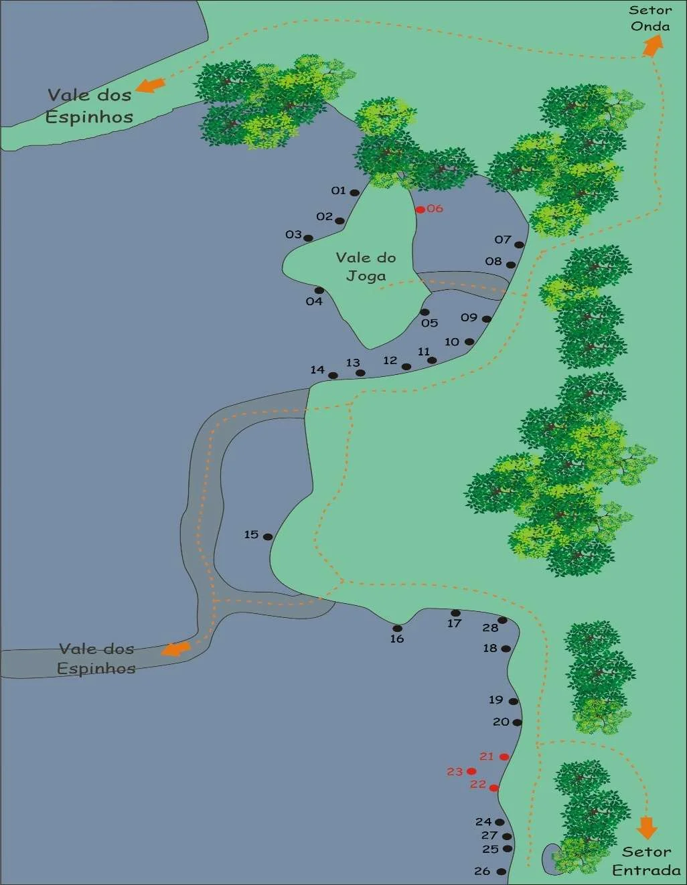
    - **largura_mapa**: 1026
    - **altura_mapa**: 1322
    - **pontos_de_interesse**:
      - **[0]**:
        - **id**: xPzLuHTv4A1nXr
        - **uid**: xPzLuHTv4A1nXr
        - **rotulo**: Setor Onda
        - **retangulo**:
          - **x**: 971
          - **y**: 28
          - **comprimento**: 72
          - **largura**: 51
        - **label**: Setor Onda
      - **[1]**:
        - **id**: FwfC6uZAaez9yz
        - **uid**: FwfC6uZAaez9yz
        - **rotulo**: Vale dos Espinhos
        - **retangulo**:
          - **x**: 135
          - **y**: 157
          - **comprimento**: 134
          - **largura**: 64
        - **label**: Vale dos Espinhos
      - **[2]**:
        - **id**: 48R5D7JDtP2e85
        - **uid**: 48R5D7JDtP2e85
        - **rotulo**: 01
        - **retangulo**:
          - **x**: 506
          - **y**: 284
          - **comprimento**: 31
          - **largura**: 29
        - **label**: 01
      - **[3]**:
        - **id**: LeCgMLvkUEeIXb
        - **uid**: LeCgMLvkUEeIXb
        - **rotulo**: 06
        - **retangulo**:
          - **x**: 650
          - **y**: 311
          - **comprimento**: 29
          - **largura**: 28
        - **label**: 06
      - **[4]**:
        - **id**: IMyfC2Vkp3n4wp
        - **uid**: IMyfC2Vkp3n4wp
        - **rotulo**: 02
        - **retangulo**:
          - **x**: 484
          - **y**: 324
          - **comprimento**: 31
          - **largura**: 27
        - **label**: 02
      - **[5]**:
        - **id**: H7p9NDBUuoKn2p
        - **uid**: H7p9NDBUuoKn2p
        - **rotulo**: 03
        - **retangulo**:
          - **x**: 438
          - **y**: 350
          - **comprimento**: 32
          - **largura**: 28
        - **label**: 03
      - **[6]**:
        - **id**: 6wKXjnpxBq6Zv0
        - **uid**: 6wKXjnpxBq6Zv0
        - **rotulo**: 07
        - **retangulo**:
          - **x**: 751
          - **y**: 357
          - **comprimento**: 30
          - **largura**: 26
        - **label**: 07
      - **[7]**:
        - **id**: FvqubP6f7oXfZF
        - **uid**: FvqubP6f7oXfZF
        - **rotulo**: 08
        - **retangulo**:
          - **x**: 738
          - **y**: 390
          - **comprimento**: 31
          - **largura**: 28
        - **label**: 08
      - **[8]**:
        - **id**: 2f1LaSJJKDhrto
        - **uid**: 2f1LaSJJKDhrto
        - **rotulo**: 04
        - **retangulo**:
          - **x**: 469
          - **y**: 450
          - **comprimento**: 32
          - **largura**: 27
        - **label**: 04
      - **[9]**:
        - **id**: a4HKONDEksGhAy
        - **uid**: a4HKONDEksGhAy
        - **rotulo**: 09
        - **retangulo**:
          - **x**: 700
          - **y**: 473
          - **comprimento**: 31
          - **largura**: 28
        - **label**: 09
      - **[10]**:
        - **id**: h62x4MKrr0qLGt
        - **uid**: h62x4MKrr0qLGt
        - **rotulo**: 05
        - **retangulo**:
          - **x**: 642
          - **y**: 482
          - **comprimento**: 31
          - **largura**: 27
        - **label**: 05
      - **[11]**:
        - **id**: 7AqTqXBY6zyIfw
        - **uid**: 7AqTqXBY6zyIfw
        - **rotulo**: 10
        - **retangulo**:
          - **x**: 674
          - **y**: 510
          - **comprimento**: 31
          - **largura**: 25
        - **label**: 10
      - **[12]**:
        - **id**: WWR1p5JJrednMX
        - **uid**: WWR1p5JJrednMX
        - **rotulo**: 11
        - **retangulo**:
          - **x**: 632
          - **y**: 524
          - **comprimento**: 29
          - **largura**: 25
        - **label**: 11
      - **[13]**:
        - **id**: Nrn77jLmOP5YnJ
        - **uid**: Nrn77jLmOP5YnJ
        - **rotulo**: 13
        - **retangulo**:
          - **x**: 527
          - **y**: 542
          - **comprimento**: 30
          - **largura**: 27
        - **label**: 13
      - **[14]**:
        - **id**: aDYuMCBl57lSiZ
        - **uid**: aDYuMCBl57lSiZ
        - **rotulo**: 12
        - **retangulo**:
          - **x**: 582
          - **y**: 538
          - **comprimento**: 31
          - **largura**: 26
        - **label**: 12
      - **[15]**:
        - **id**: oZB5HMPdQS7riW
        - **uid**: oZB5HMPdQS7riW
        - **rotulo**: 14
        - **retangulo**:
          - **x**: 474
          - **y**: 551
          - **comprimento**: 30
          - **largura**: 26
        - **label**: 14
      - **[16]**:
        - **id**: ctRVYTWjAouKFW
        - **uid**: ctRVYTWjAouKFW
        - **rotulo**: 15
        - **retangulo**:
          - **x**: 375
          - **y**: 797
          - **comprimento**: 28
          - **largura**: 26
        - **label**: 15
      - **[17]**:
        - **id**: dFwdP1Omb2dQP7
        - **uid**: dFwdP1Omb2dQP7
        - **rotulo**: 17
        - **retangulo**:
          - **x**: 678
          - **y**: 930
          - **comprimento**: 28
          - **largura**: 26
        - **label**: 17
      - **[18]**:
        - **id**: JDkGS3pDJlVE6u
        - **uid**: JDkGS3pDJlVE6u
        - **rotulo**: 28
        - **retangulo**:
          - **x**: 732
          - **y**: 937
          - **comprimento**: 30
          - **largura**: 28
        - **label**: 28
      - **[19]**:
        - **id**: e9U77PUP4Vl8FT
        - **uid**: e9U77PUP4Vl8FT
        - **rotulo**: 16
        - **retangulo**:
          - **x**: 592
          - **y**: 954
          - **comprimento**: 29
          - **largura**: 29
        - **label**: 16
      - **[20]**:
        - **id**: gAjLQMS4q4QyQ9
        - **uid**: gAjLQMS4q4QyQ9
        - **rotulo**: Vale dos Espinhos
        - **retangulo**:
          - **x**: 144
          - **y**: 982
          - **comprimento**: 127
          - **largura**: 69
        - **label**: Vale dos Espinhos
      - **[21]**:
        - **id**: WbbQVBV6R2ZHuz
        - **uid**: WbbQVBV6R2ZHuz
        - **rotulo**: 18
        - **retangulo**:
          - **x**: 732
          - **y**: 967
          - **comprimento**: 29
          - **largura**: 24
        - **label**: 18
      - **[22]**:
        - **id**: 2dg1GAkhLnoPeL
        - **uid**: 2dg1GAkhLnoPeL
        - **rotulo**: 19
        - **retangulo**:
          - **x**: 740
          - **y**: 1044
          - **comprimento**: 28
          - **largura**: 26
        - **label**: 19
      - **[23]**:
        - **id**: deyGJU4hDldfmc
        - **uid**: deyGJU4hDldfmc
        - **rotulo**: 20
        - **retangulo**:
          - **x**: 748
          - **y**: 1078
          - **comprimento**: 30
          - **largura**: 24
        - **label**: 20
      - **[24]**:
        - **id**: WIOw8CYBDR10Aw
        - **uid**: WIOw8CYBDR10Aw
        - **rotulo**: 21
        - **retangulo**:
          - **x**: 726
          - **y**: 1129
          - **comprimento**: 27
          - **largura**: 26
        - **label**: 21
      - **[25]**:
        - **id**: c2xQQFD49AxST6
        - **uid**: c2xQQFD49AxST6
        - **rotulo**: 23
        - **retangulo**:
          - **x**: 678
          - **y**: 1152
          - **comprimento**: 29
          - **largura**: 25
        - **label**: 23
      - **[26]**:
        - **id**: jFITiGsW9YafB1
        - **uid**: jFITiGsW9YafB1
        - **rotulo**: 22
        - **retangulo**:
          - **x**: 714
          - **y**: 1170
          - **comprimento**: 30
          - **largura**: 25
        - **label**: 22
      - **[27]**:
        - **id**: 28hlth1TpcIe9m
        - **uid**: 28hlth1TpcIe9m
        - **rotulo**: 24
        - **retangulo**:
          - **x**: 722
          - **y**: 1228
          - **comprimento**: 29
          - **largura**: 19
        - **label**: 24
      - **[28]**:
        - **id**: ToJPrCeB14yHQr
        - **uid**: ToJPrCeB14yHQr
        - **rotulo**: 27
        - **retangulo**:
          - **x**: 731
          - **y**: 1248
          - **comprimento**: 30
          - **largura**: 20
        - **label**: 27
      - **[29]**:
        - **id**: H68fRnZE6jz7py
        - **uid**: H68fRnZE6jz7py
        - **rotulo**: 25
        - **retangulo**:
          - **x**: 733
          - **y**: 1269
          - **comprimento**: 28
          - **largura**: 18
        - **label**: 25
      - **[30]**:
        - **id**: lCHb26tuUYI4dd
        - **uid**: lCHb26tuUYI4dd
        - **rotulo**: Setor Entrada
        - **retangulo**:
          - **x**: 966
          - **y**: 1288
          - **comprimento**: 109
          - **largura**: 59
        - **label**: Setor Entrada
      - **[31]**:
        - **id**: ZhCs5uaEVknWNr
        - **uid**: ZhCs5uaEVknWNr
        - **rotulo**: 26
        - **retangulo**:
          - **x**: 720
          - **y**: 1300
          - **comprimento**: 27
          - **largura**: 21
        - **label**: 26
    - **referencias**:
      - **[0]**:
        - **alvo_uid**: h3UAHzP6JqiYIJ
        - **pontos_uids**:
          - 48R5D7JDtP2e85
        - **escalada**: Barbie Face última
        - **ids**:
          - 48R5D7JDtP2e85
      - **[1]**:
        - **alvo_uid**: I9ScF2cAoqDWWC
        - **pontos_uids**:
          - IMyfC2Vkp3n4wp
        - **escalada**: Jogue que eu pego
        - **ids**:
          - IMyfC2Vkp3n4wp
      - **[2]**:
        - **alvo_uid**: hRcfxnNx4JXJyP
        - **pontos_uids**:
          - H7p9NDBUuoKn2p
        - **escalada**: Pegue que eu jogo
        - **ids**:
          - H7p9NDBUuoKn2p
      - **[3]**:
        - **alvo_uid**: TIAZerCHiRi8UI
        - **pontos_uids**:
          - 2f1LaSJJKDhrto
        - **escalada**: Sucuri que me abraça
        - **ids**:
          - 2f1LaSJJKDhrto
      - **[4]**:
        - **alvo_uid**: q1ZTKlTY6s0MVq
        - **pontos_uids**:
          - h62x4MKrr0qLGt
        - **escalada**: Desesperado da Perereca
        - **ids**:
          - h62x4MKrr0qLGt
      - **[5]**:
        - **alvo_uid**: ZmyY1PxrpV2zAd
        - **pontos_uids**:
          - LeCgMLvkUEeIXb
        - **escalada**: Início, Meio e Fim
        - **ids**:
          - LeCgMLvkUEeIXb
      - **[6]**:
        - **alvo_uid**: HLwWMqn9kSIneA
        - **pontos_uids**:
          - 6wKXjnpxBq6Zv0
        - **escalada**: Menor Abandonado
        - **ids**:
          - 6wKXjnpxBq6Zv0
      - **[7]**:
        - **alvo_uid**: JreyXLFWNCSq0H
        - **pontos_uids**:
          - 7AqTqXBY6zyIfw
        - **escalada**: Gruda mas não Garra
        - **ids**:
          - 7AqTqXBY6zyIfw
      - **[8]**:
        - **alvo_uid**: Ov7MGMf3AxXaAH
        - **pontos_uids**:
          - WWR1p5JJrednMX
        - **escalada**: 2ª Dose
        - **ids**:
          - WWR1p5JJrednMX
      - **[9]**:
        - **alvo_uid**: pYXro9thHKZsBz
        - **pontos_uids**:
          - aDYuMCBl57lSiZ
        - **escalada**: 1ª Dose
        - **ids**:
          - aDYuMCBl57lSiZ
      - **[10]**:
        - **alvo_uid**: 0IJ0AcTsAfdf7q
        - **pontos_uids**:
          - Nrn77jLmOP5YnJ
        - **escalada**: Maracutaia
        - **ids**:
          - Nrn77jLmOP5YnJ
      - **[11]**:
        - **alvo_uid**: A3OoXJJGbywa0I
        - **pontos_uids**:
          - oZB5HMPdQS7riW
        - **escalada**: Muvuca
        - **ids**:
          - oZB5HMPdQS7riW
      - **[12]**:
        - **alvo_uid**: Q4rWntFqeCdvzz
        - **pontos_uids**:
          - ctRVYTWjAouKFW
        - **escalada**: Candyman
        - **ids**:
          - ctRVYTWjAouKFW
      - **[13]**:
        - **alvo_uid**: Nc3ee3arhQhXE3
        - **pontos_uids**:
          - e9U77PUP4Vl8FT
        - **escalada**: Agarras de Mateus
        - **ids**:
          - e9U77PUP4Vl8FT
      - **[14]**:
        - **alvo_uid**: Lp7Y3auors5VHU
        - **pontos_uids**:
          - dFwdP1Omb2dQP7
        - **escalada**: Dose Dupla
        - **ids**:
          - dFwdP1Omb2dQP7
      - **[15]**:
        - **alvo_uid**: heFh0iHoEPEHfA
        - **pontos_uids**:
          - WbbQVBV6R2ZHuz
        - **escalada**: Consciência Limpa
        - **ids**:
          - WbbQVBV6R2ZHuz
      - **[16]**:
        - **alvo_uid**: G3hSaGefDmKqDl
        - **pontos_uids**:
          - 2dg1GAkhLnoPeL
        - **escalada**: Análise de Consciência
        - **ids**:
          - 2dg1GAkhLnoPeL
      - **[17]**:
        - **alvo_uid**: EiORHC9keKYHqv
        - **pontos_uids**:
          - deyGJU4hDldfmc
        - **escalada**: Sentinela
        - **ids**:
          - deyGJU4hDldfmc
      - **[18]**:
        - **alvo_uid**: WkeyEL7rV67XE7
        - **pontos_uids**:
          - WIOw8CYBDR10Aw
        - **escalada**: Vaca Profana
        - **ids**:
          - WIOw8CYBDR10Aw
      - **[19]**:
        - **alvo_uid**: D3Z6wAxrs5n9Yo
        - **pontos_uids**:
          - jFITiGsW9YafB1
        - **escalada**: Santuário das Aranhas
        - **ids**:
          - jFITiGsW9YafB1
      - **[20]**:
        - **alvo_uid**: 5setZWYxH06Jb1
        - **pontos_uids**:
          - c2xQQFD49AxST6
        - **escalada**: Professor Piló
        - **ids**:
          - c2xQQFD49AxST6
      - **[21]**:
        - **alvo_uid**: EUf3enORJriKoM
        - **pontos_uids**:
          - 28hlth1TpcIe9m
        - **escalada**: O último Tango
        - **ids**:
          - 28hlth1TpcIe9m
      - **[22]**:
        - **alvo_uid**: PwOh0ulpVmHT3q
        - **pontos_uids**:
          - H68fRnZE6jz7py
        - **escalada**: Sentinela Dois
        - **ids**:
          - H68fRnZE6jz7py
      - **[23]**:
        - **alvo_uid**: NpBlLODB7riPMn
        - **pontos_uids**:
          - ZhCs5uaEVknWNr
        - **escalada**: Wilson Fisk
        - **ids**:
          - ZhCs5uaEVknWNr
      - **[24]**:
        - **alvo_uid**: NNJXPCo5LBKSqh
        - **pontos_uids**:
          - ToJPrCeB14yHQr
        - **escalada**: Cobra Kai
        - **ids**:
          - ToJPrCeB14yHQr
      - **[25]**:
        - **alvo_uid**: FAvptX0AeL0oYg
        - **pontos_uids**:
          - JDkGS3pDJlVE6u
        - **escalada**: Paisagistas
        - **ids**:
          - JDkGS3pDJlVE6u
      - **[26]**:
        - **alvo_uid**: nilHYvLiSBjGjU
        - **pontos_uids**:
          - FvqubP6f7oXfZF
        - **escalada**: Contagem Regressiva
        - **ids**:
          - FvqubP6f7oXfZF
      - **[27]**:
        - **alvo_uid**: viVADQMQVGUQV7
        - **pontos_uids**:
          - a4HKONDEksGhAy
        - **escalada**: Woodstock
        - **ids**:
          - a4HKONDEksGhAy
      - **[28]**:
        - **alvo_uid**: kRRbBpiCAiblNC
        - **pontos_uids**:
          - gAjLQMS4q4QyQ9
          - FwfC6uZAaez9yz
        - **setor**: Setor Vale dos Espinhos
        - **ids**:
          - gAjLQMS4q4QyQ9
          - FwfC6uZAaez9yz
      - **[29]**:
        - **alvo_uid**: BWPnk2wxFb4Jvb
        - **pontos_uids**:
          - xPzLuHTv4A1nXr
        - **setor**: Setor Onda de Calcário
        - **ids**:
          - xPzLuHTv4A1nXr
      - **[30]**:
        - **alvo_uid**: 7MOvMnNTds8jZr
        - **pontos_uids**:
          - lCHb26tuUYI4dd
        - **setor**: Setor Entrada Inferior
        - **ids**:
          - lCHb26tuUYI4dd
- **escaladas**:
  - **[0]**:
    - **uid**: h3UAHzP6JqiYIJ
    - **via_esportiva**:
      - **nome**: Barbie Face última
      - **dificuldade**: BR_5
      - **quantidade_protecoes_intermediarias**: 3
      - **quantidade_protecoes_parada**: 2
      - **conquistadores**:
        - Joviney, Novais, Alexandre, Ivo, Fábio, Márcio
  - **[1]**:
    - **uid**: I9ScF2cAoqDWWC
    - **via_esportiva**:
      - **nome**: Jogue que eu pego
      - **dificuldade**: BR_6
      - **quantidade_protecoes_intermediarias**: 4
      - **quantidade_protecoes_parada**: 2
      - **conquistadores**:
        - Joviney
        - Novais
        - Alexandre
        - Ivo
        - Fábio
        - Márcio
  - **[2]**:
    - **uid**: hRcfxnNx4JXJyP
    - **via_esportiva**:
      - **nome**: Pegue que eu jogo
      - **dificuldade**: BR_6SUP
      - **quantidade_protecoes_intermediarias**: 4
      - **quantidade_protecoes_parada**: 2
  - **[3]**:
    - **uid**: TIAZerCHiRi8UI
    - **via_esportiva**:
      - **nome**: Sucuri que me abraça
      - **dificuldade**: BR_7A
      - **quantidade_protecoes_intermediarias**: 4
      - **quantidade_protecoes_parada**: 2
  - **[4]**:
    - **uid**: q1ZTKlTY6s0MVq
    - **via_esportiva**:
      - **nome**: Desesperado da Perereca
      - **dificuldade**: BR_6SUP
      - **quantidade_protecoes_intermediarias**: 6
      - **quantidade_protecoes_parada**: 2
  - **[5]**:
    - **uid**: ZmyY1PxrpV2zAd
    - **via_movel**:
      - **nome**: Início, Meio e Fim
      - **dificuldade**: BR_4
      - **protecoes_moveis**: Móvel
      - **conquistadores**:
        - Márcio
        - Joviney
  - **[6]**:
    - **uid**: HLwWMqn9kSIneA
    - **via_esportiva**:
      - **nome**: Menor Abandonado
      - **dificuldade**: BR_6
      - **quantidade_protecoes_intermediarias**: 4
      - **quantidade_protecoes_parada**: 2
      - **conquistadores**:
        - Joviney
        - Sérgio
  - **[7]**:
    - **uid**: nilHYvLiSBjGjU
    - **via_esportiva**:
      - **nome**: Contagem Regressiva
      - **dificuldade**: BR_7C
      - **quantidade_protecoes_intermediarias**: 7
      - **quantidade_protecoes_parada**: 2
      - **conquistadores**:
        - Joviney
        - GT Baú 2021
  - **[8]**:
    - **uid**: viVADQMQVGUQV7
    - **via_esportiva**:
      - **nome**: Woodstock
      - **dificuldade**: BR_7A
      - **quantidade_protecoes_intermediarias**: 7
      - **quantidade_protecoes_parada**: 2
      - **conquistadores**:
        - GT Baú 2021
  - **[9]**:
    - **uid**: JreyXLFWNCSq0H
    - **via_esportiva**:
      - **nome**: Gruda mas não Garra
      - **dificuldade**: BR_7C
      - **quantidade_protecoes_intermediarias**: 7
      - **quantidade_protecoes_parada**: 2
      - **conquistadores**:
        - Fabiano
        - Fred
  - **[10]**:
    - **uid**: Ov7MGMf3AxXaAH
    - **via_esportiva**:
      - **nome**: 2ª Dose
      - **dificuldade**: BR_8B
      - **quantidade_protecoes_intermediarias**: 8
      - **quantidade_protecoes_parada**: 2
      - **conquistadores**:
        - GT Baú 2021
  - **[11]**:
    - **uid**: pYXro9thHKZsBz
    - **via_esportiva**:
      - **nome**: 1ª Dose
      - **dificuldade**: BR_7B
      - **quantidade_protecoes_intermediarias**: 7
      - **quantidade_protecoes_parada**: 2
      - **conquistadores**:
        - GT Baú 2021
  - **[12]**:
    - **uid**: 0IJ0AcTsAfdf7q
    - **via_esportiva**:
      - **nome**: Maracutaia
      - **dificuldade**: BR_6
      - **quantidade_protecoes_intermediarias**: 9
      - **quantidade_protecoes_parada**: 2
      - **conquistadores**:
        - Joviney
        - Márcio Vasconcelos
  - **[13]**:
    - **uid**: A3OoXJJGbywa0I
    - **via_esportiva**:
      - **nome**: Muvuca
      - **dificuldade**: BR_6SUP
      - **quantidade_protecoes_intermediarias**: 3
      - **quantidade_protecoes_parada**: 2
      - **conquistadores**:
        - Márcio
        - Joviney
  - **[14]**:
    - **uid**: Q4rWntFqeCdvzz
    - **via_esportiva**:
      - **descricao**: Via INTERDITADA devido à ABELHAS.
      - **nome**: Candyman
      - **dificuldade**: BR_5SUP
      - **quantidade_protecoes_intermediarias**: 8
      - **quantidade_protecoes_parada**: 2
      - **conquistadores**:
        - Roberto
        - Romulo
  - **[15]**:
    - **uid**: Nc3ee3arhQhXE3
    - **via_esportiva**:
      - **nome**: Agarras de Mateus
      - **dificuldade**: BR_6SUP
      - **quantidade_protecoes_intermediarias**: 9
      - **quantidade_protecoes_parada**: 2
      - **conquistadores**:
        - Roberto
        - Romulo
  - **[16]**:
    - **uid**: Lp7Y3auors5VHU
    - **via_multiplas_enfiadas**:
      - **nome**: Dose Dupla
      - **enfiadas**:
        - **[0]**:
          - **via_esportiva**:
            - **nome**: 1ª Enfiada
            - **dificuldade**: BR_5
            - **quantidade_protecoes_intermediarias**: 4
            - **quantidade_protecoes_parada**: 2
        - **[1]**:
          - **via_esportiva**:
            - **nome**: 2ª Enfiada
            - **dificuldade**: BR_6SUP
            - **quantidade_protecoes_intermediarias**: 5
            - **quantidade_protecoes_parada**: 2
      - **conquistadores**:
        - Aloysio
        - Márcio Vasconcelos
        - Marcus Rufino
  - **[17]**:
    - **uid**: heFh0iHoEPEHfA
    - **via_esportiva**:
      - **nome**: Consciência Limpa
      - **dificuldade**: BR_6SUP_BARRA_7A
      - **quantidade_protecoes_intermediarias**: 8
      - **quantidade_protecoes_parada**: 2
      - **conquistadores**:
        - Márcio Vasconcelos
        - Marcus Rufino
  - **[18]**:
    - **uid**: G3hSaGefDmKqDl
    - **via_esportiva**:
      - **nome**: Análise de Consciência
      - **dificuldade**: BR_7A
      - **quantidade_protecoes_intermediarias**: 12
      - **quantidade_protecoes_parada**: 2
      - **conquistadores**:
        - Half
        - Tinoco
        - Eustáquio
        - Ramaya
  - **[19]**:
    - **uid**: EiORHC9keKYHqv
    - **via_esportiva**:
      - **nome**: Sentinela
      - **dificuldade**: BR_6SUP
      - **quantidade_protecoes_intermediarias**: 10
      - **quantidade_protecoes_parada**: 2
      - **conquistadores**:
        - Roberto Lincoln
        - Rômulo
  - **[20]**:
    - **uid**: WkeyEL7rV67XE7
    - **via_movel**:
      - **nome**: Vaca Profana
      - **dificuldade**: BR_6SUP
      - **protecoes_moveis**: Móvel
      - **conquistadores**:
        - Márcio
        - Macena
        - Joviney
        - Ivo
  - **[21]**:
    - **uid**: D3Z6wAxrs5n9Yo
    - **via_movel**:
      - **nome**: Santuário das Aranhas
      - **dificuldade**: BR_6SUP
      - **protecoes_moveis**: Móvel
      - **conquistadores**:
        - Vinícius Réptil
        - Fabinho
  - **[22]**:
    - **uid**: 5setZWYxH06Jb1
    - **via_movel**:
      - **descricao**: Saída a partir do platô em cima das vias 21 e 22
      - **nome**: Professor Piló
      - **dificuldade**: BR_6SUP
      - **protecoes_moveis**: Móvel
      - **conquistadores**:
        - Marcus Rufino
  - **[23]**:
    - **uid**: EUf3enORJriKoM
    - **via_esportiva**:
      - **nome**: O último Tango
      - **dificuldade**: BR_7B
      - **quantidade_protecoes_intermediarias**: 7
      - **quantidade_protecoes_parada**: 2
      - **conquistadores**:
        - Fabiano
  - **[24]**:
    - **uid**: PwOh0ulpVmHT3q
    - **via_esportiva**:
      - **nome**: Sentinela Dois
      - **dificuldade**: BR_6SUP
      - **quantidade_protecoes_intermediarias**: 10
      - **quantidade_protecoes_parada**: 2
      - **conquistadores**:
        - Roberto Lincoln
        - Romulo
  - **[25]**:
    - **uid**: NpBlLODB7riPMn
    - **via_movel**:
      - **nome**: Wilson Fisk
      - **dificuldade**: BR_7A
      - **protecoes_moveis**: Móvel
      - **conquistadores**:
        - Roberto Lincoln
        - Gabriel Costela
  - **[26]**:
    - **uid**: NNJXPCo5LBKSqh
    - **via_esportiva**:
      - **nome**: Cobra Kai
      - **dificuldade**: BR_7B_BARRA_7C
      - **quantidade_protecoes_intermediarias**: 13
      - **quantidade_protecoes_parada**: 2
      - **conquistadores**:
        - Sandro
        - Márcio
        - Cláudia
  - **[27]**:
    - **uid**: FAvptX0AeL0oYg
    - **via_esportiva**:
      - **nome**: Paisagistas
      - **dificuldade**: BR_7A_BARRA_7B
      - **quantidade_protecoes_intermediarias**: 12
      - **quantidade_protecoes_parada**: 2
      - **conquistadores**:
        - Igor Andrade
        - Iule Ornelas
        - Márcio Vasconcelos
        - Samuel Lucas
- **precomputados**:
  - **total_escaladas**: 28
  - **total_esportivas**: 22
  - **total_multiplas_enfiadas**: 1

## Parte: setor_vale_dos_espinhos

### Setor (Pico: Gruta do Baú)

- **descricao**:
    # Setor Vale dos Espinhos
    
    **Acesso:** Depois de passar pelo setor Sentinela seguir a trilha por uma pequena subida e pegar a bifurcação a esquerda. Evitar o acesso pela gruta para preservar os espeleotemas.
    
    **Coordenadas no Vale dos Espinhos próximo a via 01 e 02:** -19º32.872’ -43º59.426’
- **nome**: Setor Vale dos Espinhos
- **uid**: kRRbBpiCAiblNC
- **mapas**:
  - **[0]**:
    - **caminho_imagem_mapa**: 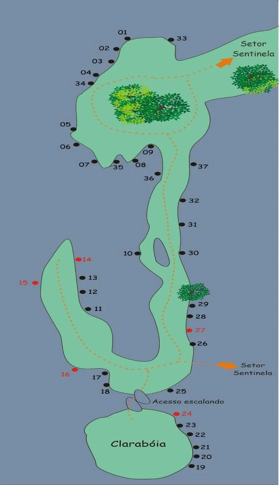
    - **largura_mapa**: 753
    - **altura_mapa**: 1309
    - **pontos_de_interesse**:
      - **[0]**:
        - **id**: qrBIPC0rVFi9E6
        - **uid**: qrBIPC0rVFi9E6
        - **rotulo**: 01
        - **retangulo**:
          - **x**: 330
          - **y**: 86
          - **comprimento**: 30
          - **largura**: 24
        - **label**: 01
      - **[1]**:
        - **id**: QAKsRfstqyJlVS
        - **uid**: QAKsRfstqyJlVS
        - **rotulo**: 33
        - **retangulo**:
          - **x**: 490
          - **y**: 104
          - **comprimento**: 32
          - **largura**: 23
        - **label**: 33
      - **[2]**:
        - **id**: BwCmtMeTq3XMQT
        - **uid**: BwCmtMeTq3XMQT
        - **rotulo**: Setor Sentinela
        - **retangulo**:
          - **x**: 684
          - **y**: 132
          - **comprimento**: 118
          - **largura**: 52
        - **label**: Setor Sentinela
      - **[3]**:
        - **id**: vciHzETo6NIWoP
        - **uid**: vciHzETo6NIWoP
        - **rotulo**: 02
        - **retangulo**:
          - **x**: 282
          - **y**: 130
          - **comprimento**: 35
          - **largura**: 26
        - **label**: 02
      - **[4]**:
        - **id**: twYYFhNDNwzQpx
        - **uid**: twYYFhNDNwzQpx
        - **rotulo**: 03
        - **retangulo**:
          - **x**: 262
          - **y**: 164
          - **comprimento**: 33
          - **largura**: 25
        - **label**: 03
      - **[5]**:
        - **id**: ZHu64w3SgOJqiW
        - **uid**: ZHu64w3SgOJqiW
        - **rotulo**: 04
        - **retangulo**:
          - **x**: 232
          - **y**: 195
          - **comprimento**: 33
          - **largura**: 24
        - **label**: 04
      - **[6]**:
        - **id**: 2OuHHKTsWUs8Lz
        - **uid**: 2OuHHKTsWUs8Lz
        - **rotulo**: 34
        - **retangulo**:
          - **x**: 216
          - **y**: 225
          - **comprimento**: 32
          - **largura**: 24
        - **label**: 34
      - **[7]**:
        - **id**: HdC3yc0RdLCx5P
        - **uid**: HdC3yc0RdLCx5P
        - **rotulo**: 05
        - **retangulo**:
          - **x**: 176
          - **y**: 335
          - **comprimento**: 35
          - **largura**: 28
        - **label**: 05
      - **[8]**:
        - **id**: nfAMhWRHidlb9w
        - **uid**: nfAMhWRHidlb9w
        - **rotulo**: 06
        - **retangulo**:
          - **x**: 176
          - **y**: 396
          - **comprimento**: 33
          - **largura**: 27
        - **label**: 06
      - **[9]**:
        - **id**: 6gER304KMpM5Qa
        - **uid**: 6gER304KMpM5Qa
        - **rotulo**: 09
        - **retangulo**:
          - **x**: 399
          - **y**: 410
          - **comprimento**: 34
          - **largura**: 28
        - **label**: 09
      - **[10]**:
        - **id**: A45EYtGSs22iJf
        - **uid**: A45EYtGSs22iJf
        - **rotulo**: 07
        - **retangulo**:
          - **x**: 227
          - **y**: 444
          - **comprimento**: 32
          - **largura**: 30
        - **label**: 07
      - **[11]**:
        - **id**: dg3dAtV99vTkLz
        - **uid**: dg3dAtV99vTkLz
        - **rotulo**: 35
        - **retangulo**:
          - **x**: 318
          - **y**: 450
          - **comprimento**: 33
          - **largura**: 27
        - **label**: 35
      - **[12]**:
        - **id**: yF19rzNCZ9pfSj
        - **uid**: yF19rzNCZ9pfSj
        - **rotulo**: 08
        - **retangulo**:
          - **x**: 380
          - **y**: 445
          - **comprimento**: 34
          - **largura**: 26
        - **label**: 08
      - **[13]**:
        - **id**: ZFD2gC6oMM5yVH
        - **uid**: ZFD2gC6oMM5yVH
        - **rotulo**: 37
        - **retangulo**:
          - **x**: 548
          - **y**: 448
          - **comprimento**: 35
          - **largura**: 28
        - **label**: 37
      - **[14]**:
        - **id**: dj5fQsXUqunab6
        - **uid**: dj5fQsXUqunab6
        - **rotulo**: 36
        - **retangulo**:
          - **x**: 402
          - **y**: 480
          - **comprimento**: 35
          - **largura**: 27
        - **label**: 36
      - **[15]**:
        - **id**: hbD5M7UIUJv2lC
        - **uid**: hbD5M7UIUJv2lC
        - **rotulo**: 32
        - **retangulo**:
          - **x**: 524
          - **y**: 541
          - **comprimento**: 35
          - **largura**: 26
        - **label**: 32
      - **[16]**:
        - **id**: CtcJGhmBU2yTSk
        - **uid**: CtcJGhmBU2yTSk
        - **rotulo**: 31
        - **retangulo**:
          - **x**: 520
          - **y**: 606
          - **comprimento**: 31
          - **largura**: 27
        - **label**: 31
      - **[17]**:
        - **id**: t39ahaUlYOiGLU
        - **uid**: t39ahaUlYOiGLU
        - **rotulo**: 10
        - **retangulo**:
          - **x**: 345
          - **y**: 683
          - **comprimento**: 34
          - **largura**: 28
        - **label**: 10
      - **[18]**:
        - **id**: X4FpIQ2gkScoDI
        - **uid**: X4FpIQ2gkScoDI
        - **rotulo**: 30
        - **retangulo**:
          - **x**: 523
          - **y**: 682
          - **comprimento**: 36
          - **largura**: 27
        - **label**: 30
      - **[19]**:
        - **id**: A1FUoOvGrBoD6S
        - **uid**: A1FUoOvGrBoD6S
        - **rotulo**: 14
        - **retangulo**:
          - **x**: 235
          - **y**: 700
          - **comprimento**: 28
          - **largura**: 27
        - **label**: 14
      - **[20]**:
        - **id**: BWcW3Cn5ZT6LBo
        - **uid**: BWcW3Cn5ZT6LBo
        - **rotulo**: 13
        - **retangulo**:
          - **x**: 250
          - **y**: 750
          - **comprimento**: 30
          - **largura**: 25
        - **label**: 13
      - **[21]**:
        - **id**: CguDsAxag7motw
        - **uid**: CguDsAxag7motw
        - **rotulo**: 15
        - **retangulo**:
          - **x**: 63
          - **y**: 762
          - **comprimento**: 30
          - **largura**: 27
        - **label**: 15
      - **[22]**:
        - **id**: S4ZhwvVTM3dEdF
        - **uid**: S4ZhwvVTM3dEdF
        - **rotulo**: 12
        - **retangulo**:
          - **x**: 251
          - **y**: 787
          - **comprimento**: 30
          - **largura**: 26
        - **label**: 12
      - **[23]**:
        - **id**: GHTnRJApdvDKzy
        - **uid**: GHTnRJApdvDKzy
        - **rotulo**: 29
        - **retangulo**:
          - **x**: 548
          - **y**: 820
          - **comprimento**: 34
          - **largura**: 27
        - **label**: 29
      - **[24]**:
        - **id**: kze6XjfXkEMTrV
        - **uid**: kze6XjfXkEMTrV
        - **rotulo**: 11
        - **retangulo**:
          - **x**: 264
          - **y**: 832
          - **comprimento**: 29
          - **largura**: 23
        - **label**: 11
      - **[25]**:
        - **id**: 7Iel8yJqJQv3MV
        - **uid**: 7Iel8yJqJQv3MV
        - **rotulo**: 28
        - **retangulo**:
          - **x**: 542
          - **y**: 854
          - **comprimento**: 31
          - **largura**: 25
        - **label**: 28
      - **[26]**:
        - **id**: anyWiTWcS57N1L
        - **uid**: anyWiTWcS57N1L
        - **rotulo**: 27
        - **retangulo**:
          - **x**: 540
          - **y**: 890
          - **comprimento**: 31
          - **largura**: 27
        - **label**: 27
      - **[27]**:
        - **id**: qqUP4czSxZTHip
        - **uid**: qqUP4czSxZTHip
        - **rotulo**: 26
        - **retangulo**:
          - **x**: 546
          - **y**: 926
          - **comprimento**: 33
          - **largura**: 26
        - **label**: 26
      - **[28]**:
        - **id**: c6I73iX48GyGpJ
        - **uid**: c6I73iX48GyGpJ
        - **rotulo**: Setor Sentinela
        - **retangulo**:
          - **x**: 682
          - **y**: 996
          - **comprimento**: 110
          - **largura**: 45
        - **label**: Setor Sentinela
      - **[29]**:
        - **id**: VGmPkZdZbOCWlZ
        - **uid**: VGmPkZdZbOCWlZ
        - **rotulo**: 16
        - **retangulo**:
          - **x**: 176
          - **y**: 1010
          - **comprimento**: 31
          - **largura**: 26
        - **label**: 16
      - **[30]**:
        - **id**: AtT7NHL6LtGMYc
        - **uid**: AtT7NHL6LtGMYc
        - **rotulo**: 17
        - **retangulo**:
          - **x**: 260
          - **y**: 1018
          - **comprimento**: 30
          - **largura**: 24
        - **label**: 17
      - **[31]**:
        - **id**: TeVpXP7wtXmXdy
        - **uid**: TeVpXP7wtXmXdy
        - **rotulo**: 18
        - **retangulo**:
          - **x**: 284
          - **y**: 1056
          - **comprimento**: 30
          - **largura**: 23
        - **label**: 18
      - **[32]**:
        - **id**: ekxF4fKMf9sx56
        - **uid**: ekxF4fKMf9sx56
        - **rotulo**: 25
        - **retangulo**:
          - **x**: 488
          - **y**: 1055
          - **comprimento**: 34
          - **largura**: 24
        - **label**: 25
      - **[33]**:
        - **id**: BuEX65kpTENw1m
        - **uid**: BuEX65kpTENw1m
        - **rotulo**: 24
        - **retangulo**:
          - **x**: 504
          - **y**: 1116
          - **comprimento**: 32
          - **largura**: 24
        - **label**: 24
      - **[34]**:
        - **id**: rfCjVH8Ik29CoG
        - **uid**: rfCjVH8Ik29CoG
        - **rotulo**: 23
        - **retangulo**:
          - **x**: 516
          - **y**: 1146
          - **comprimento**: 32
          - **largura**: 22
        - **label**: 23
      - **[35]**:
        - **id**: gjrrYfAtjK3H5Q
        - **uid**: gjrrYfAtjK3H5Q
        - **rotulo**: 22
        - **retangulo**:
          - **x**: 540
          - **y**: 1173
          - **comprimento**: 34
          - **largura**: 22
        - **label**: 22
      - **[36]**:
        - **id**: xti6IEXToIHHpi
        - **uid**: xti6IEXToIHHpi
        - **rotulo**: 21
        - **retangulo**:
          - **x**: 554
          - **y**: 1205
          - **comprimento**: 31
          - **largura**: 24
        - **label**: 21
      - **[37]**:
        - **id**: 0eTGkJ9UPqo42K
        - **uid**: 0eTGkJ9UPqo42K
        - **rotulo**: 20
        - **retangulo**:
          - **x**: 558
          - **y**: 1233
          - **comprimento**: 33
          - **largura**: 24
        - **label**: 20
      - **[38]**:
        - **id**: 8eSGqOhN9sqj7i
        - **uid**: 8eSGqOhN9sqj7i
        - **rotulo**: 19
        - **retangulo**:
          - **x**: 540
          - **y**: 1260
          - **comprimento**: 31
          - **largura**: 23
        - **label**: 19
    - **referencias**:
      - **[0]**:
        - **alvo_uid**: DLYShZH6rYCUe0
        - **pontos_uids**:
          - qrBIPC0rVFi9E6
        - **escalada**: Quase Nove
        - **ids**:
          - qrBIPC0rVFi9E6
      - **[1]**:
        - **alvo_uid**: fo2EziMi6gwWdw
        - **pontos_uids**:
          - vciHzETo6NIWoP
        - **escalada**: A Revolta da Bunda
        - **ids**:
          - vciHzETo6NIWoP
      - **[2]**:
        - **alvo_uid**: sczfLO2dLaSRoa
        - **pontos_uids**:
          - twYYFhNDNwzQpx
        - **escalada**: O Faxineiro
        - **ids**:
          - twYYFhNDNwzQpx
      - **[3]**:
        - **alvo_uid**: GiBNq1Hi7FkKiP
        - **pontos_uids**:
          - ZHu64w3SgOJqiW
        - **escalada**: Esquadrilha da Fumaça
        - **ids**:
          - ZHu64w3SgOJqiW
      - **[4]**:
        - **alvo_uid**: Ppw2smH5AZkbTx
        - **pontos_uids**:
          - HdC3yc0RdLCx5P
        - **escalada**: Ronco do V8
        - **ids**:
          - HdC3yc0RdLCx5P
      - **[5]**:
        - **alvo_uid**: Xiy9fuR6AxzQTd
        - **pontos_uids**:
          - nfAMhWRHidlb9w
        - **escalada**: Lagrimas de Calcário
        - **ids**:
          - nfAMhWRHidlb9w
      - **[6]**:
        - **alvo_uid**: EhEUWkPbrk9eGq
        - **pontos_uids**:
          - A45EYtGSs22iJf
        - **escalada**: Tá Chovendo Carrapato
        - **ids**:
          - A45EYtGSs22iJf
      - **[7]**:
        - **alvo_uid**: OXoKlaWUGNhx9J
        - **pontos_uids**:
          - t39ahaUlYOiGLU
        - **escalada**: Eau Rouge
        - **ids**:
          - t39ahaUlYOiGLU
      - **[8]**:
        - **alvo_uid**: TEug3q4ooF0THG
        - **pontos_uids**:
          - kze6XjfXkEMTrV
        - **escalada**: Via sem informação 3
        - **ids**:
          - kze6XjfXkEMTrV
      - **[9]**:
        - **alvo_uid**: Sp5tRA04t4rjdr
        - **pontos_uids**:
          - S4ZhwvVTM3dEdF
        - **escalada**: Via inacabada
        - **ids**:
          - S4ZhwvVTM3dEdF
      - **[10]**:
        - **alvo_uid**: yIdIJRHy1nNdYX
        - **pontos_uids**:
          - BWcW3Cn5ZT6LBo
        - **escalada**: Cachinhos Dourados
        - **ids**:
          - BWcW3Cn5ZT6LBo
      - **[11]**:
        - **alvo_uid**: 7UO6fxo7rh1q7X
        - **pontos_uids**:
          - A1FUoOvGrBoD6S
        - **escalada**: Manto e Adaga
        - **ids**:
          - A1FUoOvGrBoD6S
      - **[12]**:
        - **alvo_uid**: t5vhbyeUkmcb15
        - **pontos_uids**:
          - CguDsAxag7motw
        - **escalada**: R770
        - **ids**:
          - CguDsAxag7motw
      - **[13]**:
        - **alvo_uid**: GL3iDltoUymh3B
        - **pontos_uids**:
          - VGmPkZdZbOCWlZ
        - **escalada**: Via sem informação 4
        - **ids**:
          - VGmPkZdZbOCWlZ
      - **[14]**:
        - **alvo_uid**: lFzRcmE84MK8Dh
        - **pontos_uids**:
          - AtT7NHL6LtGMYc
        - **escalada**: Jornada nas Estrelas
        - **ids**:
          - AtT7NHL6LtGMYc
      - **[15]**:
        - **alvo_uid**: XrmhtoN5akykMY
        - **pontos_uids**:
          - TeVpXP7wtXmXdy
        - **escalada**: Super Canaleta
        - **ids**:
          - TeVpXP7wtXmXdy
      - **[16]**:
        - **alvo_uid**: PtlE2kPUwqwJts
        - **pontos_uids**:
          - 8eSGqOhN9sqj7i
        - **escalada**: Laboratório
        - **ids**:
          - 8eSGqOhN9sqj7i
      - **[17]**:
        - **alvo_uid**: g8bN0u93NatFr5
        - **pontos_uids**:
          - 0eTGkJ9UPqo42K
        - **escalada**: Dark Side of the Moon
        - **ids**:
          - 0eTGkJ9UPqo42K
      - **[18]**:
        - **alvo_uid**: J56dUyYQb6qcvM
        - **pontos_uids**:
          - xti6IEXToIHHpi
        - **escalada**: Mega Sena
        - **ids**:
          - xti6IEXToIHHpi
      - **[19]**:
        - **alvo_uid**: USClmdmv9gFefa
        - **pontos_uids**:
          - gjrrYfAtjK3H5Q
        - **escalada**: La Torância
        - **ids**:
          - gjrrYfAtjK3H5Q
      - **[20]**:
        - **alvo_uid**: TJXqMn0xFCddXJ
        - **pontos_uids**:
          - rfCjVH8Ik29CoG
        - **escalada**: Comunidade Flebótomo
        - **ids**:
          - rfCjVH8Ik29CoG
      - **[21]**:
        - **alvo_uid**: TpNzLRDZ0jedzu
        - **pontos_uids**:
          - BuEX65kpTENw1m
        - **escalada**: Via sem informação 5
        - **ids**:
          - BuEX65kpTENw1m
      - **[22]**:
        - **alvo_uid**: hUVauQs4FdvUlq
        - **pontos_uids**:
          - ekxF4fKMf9sx56
        - **escalada**: Duplo Sentido
        - **ids**:
          - ekxF4fKMf9sx56
      - **[23]**:
        - **alvo_uid**: MToZRcmt4qCows
        - **pontos_uids**:
          - qqUP4czSxZTHip
        - **escalada**: Fantástico
        - **ids**:
          - qqUP4czSxZTHip
      - **[24]**:
        - **alvo_uid**: Fm5IYXxFJZ2avM
        - **pontos_uids**:
          - anyWiTWcS57N1L
        - **escalada**: Show da Vida
        - **ids**:
          - anyWiTWcS57N1L
      - **[25]**:
        - **alvo_uid**: 5qPEYTe5ssxc3p
        - **pontos_uids**:
          - 7Iel8yJqJQv3MV
        - **escalada**: Madame Surtô
        - **ids**:
          - 7Iel8yJqJQv3MV
      - **[26]**:
        - **alvo_uid**: LpS2bs9NXtzlW5
        - **pontos_uids**:
          - GHTnRJApdvDKzy
        - **escalada**: Lupin
        - **ids**:
          - GHTnRJApdvDKzy
      - **[27]**:
        - **alvo_uid**: L1Gmc09yWTvADR
        - **pontos_uids**:
          - X4FpIQ2gkScoDI
        - **escalada**: Wall Ride
        - **ids**:
          - X4FpIQ2gkScoDI
      - **[28]**:
        - **alvo_uid**: n9yb2WeHFCH8Sf
        - **pontos_uids**:
          - CtcJGhmBU2yTSk
        - **escalada**: Dr. Lund
        - **ids**:
          - CtcJGhmBU2yTSk
      - **[29]**:
        - **alvo_uid**: EwPpN7AmQraGkK
        - **pontos_uids**:
          - hbD5M7UIUJv2lC
        - **escalada**: Kero Mais
        - **ids**:
          - hbD5M7UIUJv2lC
      - **[30]**:
        - **alvo_uid**: RJQ0AsyHe16imu
        - **pontos_uids**:
          - QAKsRfstqyJlVS
        - **escalada**: Bruxa de Blair
        - **ids**:
          - QAKsRfstqyJlVS
      - **[31]**:
        - **alvo_uid**: laShuZaqGbJbwT
        - **pontos_uids**:
          - 2OuHHKTsWUs8Lz
        - **escalada**: Mentirinha
        - **ids**:
          - 2OuHHKTsWUs8Lz
      - **[32]**:
        - **alvo_uid**: b4r0TcBtuCilPP
        - **pontos_uids**:
          - dg3dAtV99vTkLz
        - **escalada**: Zé Arigó
        - **ids**:
          - dg3dAtV99vTkLz
      - **[33]**:
        - **alvo_uid**: pq5ixbzsDQUZQt
        - **pontos_uids**:
          - dj5fQsXUqunab6
        - **escalada**: Visionário
        - **ids**:
          - dj5fQsXUqunab6
      - **[34]**:
        - **alvo_uid**: ws7rddRALKwvJG
        - **pontos_uids**:
          - ZFD2gC6oMM5yVH
        - **escalada**: Skywalker
        - **ids**:
          - ZFD2gC6oMM5yVH
      - **[35]**:
        - **alvo_uid**: 9h1BcwJHe0cBcz
        - **pontos_uids**:
          - yF19rzNCZ9pfSj
        - **escalada**: Tá Esperando o quê?
        - **ids**:
          - yF19rzNCZ9pfSj
      - **[36]**:
        - **alvo_uid**: ZeB3r8sA98XwqM
        - **pontos_uids**:
          - 6gER304KMpM5Qa
        - **escalada**: Quem Sabe ano que Vem
        - **ids**:
          - 6gER304KMpM5Qa
      - **[37]**:
        - **alvo_uid**: CtxqyAwqmrD1a5
        - **pontos_uids**:
          - c6I73iX48GyGpJ
          - BwCmtMeTq3XMQT
        - **setor**: Setor Sentinela e Vale do Joga
        - **ids**:
          - c6I73iX48GyGpJ
          - BwCmtMeTq3XMQT
- **escaladas**:
  - **[0]**:
    - **uid**: DLYShZH6rYCUe0
    - **via_esportiva**:
      - **nome**: Quase Nove
      - **dificuldade**: BR_7A
      - **quantidade_protecoes_intermediarias**: 6
      - **quantidade_protecoes_parada**: 2
      - **conquistadores**:
        - Pedro Leite
        - Vinícius Wilson
  - **[1]**:
    - **uid**: fo2EziMi6gwWdw
    - **via_esportiva**:
      - **nome**: A Revolta da Bunda
      - **dificuldade**: BR_7A
      - **quantidade_protecoes_intermediarias**: 6
      - **quantidade_protecoes_parada**: 2
      - **conquistadores**:
        - Pedro Leite
        - Vinícius Wilson
  - **[2]**:
    - **uid**: sczfLO2dLaSRoa
    - **via_esportiva**:
      - **nome**: O Faxineiro
      - **dificuldade**: BR_7A
      - **quantidade_protecoes_intermediarias**: 6
      - **quantidade_protecoes_parada**: 2
      - **conquistadores**:
        - Pedro Leite
        - Vinícius Wilson
  - **[3]**:
    - **uid**: GiBNq1Hi7FkKiP
    - **via_esportiva**:
      - **nome**: Esquadrilha da Fumaça
      - **dificuldade**: BR_7B
      - **quantidade_protecoes_intermediarias**: 6
      - **quantidade_protecoes_parada**: 2
      - **conquistadores**:
        - Pedro Leite
        - Vinícius Wilson
  - **[4]**:
    - **uid**: Ppw2smH5AZkbTx
    - **via_esportiva**:
      - **nome**: Ronco do V8
      - **dificuldade**: BR_6SUP
      - **quantidade_protecoes_intermediarias**: 10
      - **quantidade_protecoes_parada**: 2
      - **conquistadores**:
        - Sandro Almeida
        - Cláudia Heringer
        - Bruno Berbari
  - **[5]**:
    - **uid**: Xiy9fuR6AxzQTd
    - **via_esportiva**:
      - **nome**: Lagrimas de Calcário
      - **dificuldade**: BR_7C
      - **quantidade_protecoes_intermediarias**: 12
      - **quantidade_protecoes_parada**: 2
      - **conquistadores**:
        - Sandro Almeida
        - Cláudia Heringer
        - Bruno Berbari
  - **[6]**:
    - **uid**: EhEUWkPbrk9eGq
    - **via_esportiva**:
      - **nome**: Tá Chovendo Carrapato
      - **dificuldade**: BR_7A
      - **quantidade_protecoes_intermediarias**: 10
      - **quantidade_protecoes_parada**: 2
      - **conquistadores**:
        - Márcio Vasconcelos
        - Joviney Miguel
  - **[7]**:
    - **uid**: 9h1BcwJHe0cBcz
    - **via_esportiva**:
      - **nome**: Tá Esperando o quê?
      - **dificuldade**: BR_7A
      - **quantidade_protecoes_intermediarias**: 8
      - **quantidade_protecoes_parada**: 2
      - **conquistadores**:
        - GT Baú 2021
  - **[8]**:
    - **uid**: ZeB3r8sA98XwqM
    - **via_esportiva**:
      - **nome**: Quem Sabe ano que Vem
      - **dificuldade**: BR_8A
      - **quantidade_protecoes_intermediarias**: 7
      - **quantidade_protecoes_parada**: 2
      - **conquistadores**:
        - Pedro Leite
        - Vinícius Wilson
  - **[9]**:
    - **uid**: OXoKlaWUGNhx9J
    - **via_esportiva**:
      - **descricao**: Via longa – Usar corda de 60 mts
      - **nome**: Eau Rouge
      - **dificuldade**: BR_9A
      - **quantidade_protecoes_intermediarias**: 12
      - **quantidade_protecoes_parada**: 2
      - **conquistadores**:
        - GT Baú 2021
  - **[10]**:
    - **uid**: TEug3q4ooF0THG
    - **via_esportiva**:
      - **descricao**: Fixa
      - **nome**: Via sem informação 3
      - **dificuldade**: INDEFINIDO
  - **[11]**:
    - **uid**: Sp5tRA04t4rjdr
    - **via_esportiva**:
      - **nome**: Via inacabada
      - **dificuldade**: INDEFINIDO
  - **[12]**:
    - **uid**: yIdIJRHy1nNdYX
    - **via_esportiva**:
      - **descricao**: Lance difícil só na saída. Depois fica fácil.
      - **nome**: Cachinhos Dourados
      - **dificuldade**: BR_6SUP
      - **quantidade_protecoes_intermediarias**: 8
      - **quantidade_protecoes_parada**: 2
      - **conquistadores**:
        - Christian Costa
        - Guilherme Côrrea
  - **[13]**:
    - **uid**: 7UO6fxo7rh1q7X
    - **via_movel**:
      - **nome**: Manto e Adaga
      - **dificuldade**: BR_6
      - **protecoes_moveis**: Móvel
      - **conquistadores**:
        - Roberto Lincoln
  - **[14]**:
    - **uid**: t5vhbyeUkmcb15
    - **via_movel**:
      - **nome**: R770
      - **dificuldade**: BR_5SUP
      - **protecoes_moveis**: Móvel
      - **conquistadores**:
        - Roberto Lincoln
  - **[15]**:
    - **uid**: GL3iDltoUymh3B
    - **via_movel**:
      - **nome**: Via sem informação 4
      - **dificuldade**: INDEFINIDO
      - **protecoes_moveis**: Mista
  - **[16]**:
    - **uid**: lFzRcmE84MK8Dh
    - **via_esportiva**:
      - **descricao**: Via longa – Usar corda de 60 mts
      - **nome**: Jornada nas Estrelas
      - **dificuldade**: BR_7C
      - **quantidade_protecoes_intermediarias**: 14
      - **quantidade_protecoes_parada**: 2
      - **conquistadores**:
        - GT Baú 2021
  - **[17]**:
    - **uid**: XrmhtoN5akykMY
    - **via_esportiva**:
      - **descricao**: Via longa – Usar corda de 60 mts
      - **nome**: Super Canaleta
      - **dificuldade**: BR_9B
      - **quantidade_protecoes_intermediarias**: 16
      - **quantidade_protecoes_parada**: 2
      - **conquistadores**:
        - GT Baú 2021
  - **[18]**:
    - **uid**: PtlE2kPUwqwJts
    - **via_esportiva**:
      - **descricao**: Via longa – Usar corda de 60 mts
      - **nome**: Laboratório
      - **dificuldade**: BR_9B
      - **quantidade_protecoes_intermediarias**: 12
      - **quantidade_protecoes_parada**: 2
      - **conquistadores**:
        - GT Baú 2021
  - **[19]**:
    - **uid**: g8bN0u93NatFr5
    - **via_esportiva**:
      - **descricao**: Via longa – Usar corda de 60 mts
      - **nome**: Dark Side of the Moon
      - **dificuldade**: BR_9A
      - **quantidade_protecoes_intermediarias**: 12
      - **quantidade_protecoes_parada**: 2
      - **conquistadores**:
        - GT Baú 2021
  - **[20]**:
    - **uid**: J56dUyYQb6qcvM
    - **via_esportiva**:
      - **descricao**: Via longa – Usar corda de 60 mts
      - **nome**: Mega Sena
      - **dificuldade**: BR_8B
      - **quantidade_protecoes_intermediarias**: 13
      - **quantidade_protecoes_parada**: 2
      - **conquistadores**:
        - GT Baú 2021
  - **[21]**:
    - **uid**: USClmdmv9gFefa
    - **via_esportiva**:
      - **descricao**: Via longa – Usar corda de 60 mts
      - **nome**: La Torância
      - **dificuldade**: BR_7B
      - **quantidade_protecoes_intermediarias**: 11
      - **quantidade_protecoes_parada**: 2
      - **conquistadores**:
        - GT Baú 2021
  - **[22]**:
    - **uid**: TJXqMn0xFCddXJ
    - **via_esportiva**:
      - **descricao**: Via longa – Usar corda de 60 mts
      - **nome**: Comunidade Flebótomo
      - **dificuldade**: BR_8C
      - **quantidade_protecoes_intermediarias**: 12
      - **quantidade_protecoes_parada**: 2
      - **conquistadores**:
        - GT Baú 2021
  - **[23]**:
    - **uid**: TpNzLRDZ0jedzu
    - **via_movel**:
      - **descricao**: Via longa – Usar corda de 60 mts
      - **nome**: Via sem informação 5
      - **dificuldade**: INDEFINIDO
      - **protecoes_moveis**: Mista
  - **[24]**:
    - **uid**: hUVauQs4FdvUlq
    - **via_multiplas_enfiadas**:
      - **nome**: Duplo Sentido
      - **enfiadas**:
        - **[0]**:
          - **via_esportiva**:
            - **nome**: 1ª Enfiada
            - **dificuldade**: BR_7A
            - **quantidade_protecoes_intermediarias**: 9
            - **quantidade_protecoes_parada**: 2
        - **[1]**:
          - **via_esportiva**:
            - **nome**: 2ª Enfiada
            - **dificuldade**: BR_6SUP
            - **quantidade_protecoes_intermediarias**: 4
            - **quantidade_protecoes_parada**: 2
      - **conquistadores**:
        - Marcus Rufino
        - Márcio Vasconcelos
  - **[25]**:
    - **uid**: MToZRcmt4qCows
    - **via_esportiva**:
      - **descricao**: Via longa – Usar corda de 60 mts
      - **nome**: Fantástico
      - **dificuldade**: BR_5SUP
      - **quantidade_protecoes_intermediarias**: 9
      - **quantidade_protecoes_parada**: 2
      - **conquistadores**:
        - Marcus Rufino
        - Felipe B
  - **[26]**:
    - **uid**: Fm5IYXxFJZ2avM
    - **via_movel**:
      - **descricao**: Via longa – Usar corda de 60 mts
      - **nome**: Show da Vida
      - **dificuldade**: BR_7B
      - **protecoes_moveis**: Móvel
      - **conquistadores**:
        - Marcus Rufino
  - **[27]**:
    - **uid**: 5qPEYTe5ssxc3p
    - **via_esportiva**:
      - **descricao**: Via longa – Usar corda de 60 mts
      - **nome**: Madame Surtô
      - **dificuldade**: BR_7A
      - **quantidade_protecoes_intermediarias**: 10
      - **quantidade_protecoes_parada**: 2
      - **conquistadores**:
        - GT Baú 2021
  - **[28]**:
    - **uid**: LpS2bs9NXtzlW5
    - **via_esportiva**:
      - **descricao**: Via longa – Usar corda de 60 mts
      - **nome**: Lupin
      - **dificuldade**: BR_6SUP
      - **quantidade_protecoes_intermediarias**: 10
      - **quantidade_protecoes_parada**: 2
      - **conquistadores**:
        - GT Baú 2021
  - **[29]**:
    - **uid**: L1Gmc09yWTvADR
    - **via_esportiva**:
      - **descricao**: Via longa – Usar corda de 60 mts
      - **nome**: Wall Ride
      - **dificuldade**: BR_6SUP
      - **quantidade_protecoes_intermediarias**: 11
      - **quantidade_protecoes_parada**: 2
      - **conquistadores**:
        - GT Baú 2021
  - **[30]**:
    - **uid**: n9yb2WeHFCH8Sf
    - **via_esportiva**:
      - **descricao**: Via longa – Usar corda de 60 mts
      - **nome**: Dr. Lund
      - **dificuldade**: BR_7A
      - **quantidade_protecoes_intermediarias**: 9
      - **quantidade_protecoes_parada**: 2
      - **conquistadores**:
        - GT Baú 2021
  - **[31]**:
    - **uid**: EwPpN7AmQraGkK
    - **via_esportiva**:
      - **descricao**: Via longa – Usar corda de 60 mts
      - **nome**: Kero Mais
      - **dificuldade**: BR_6SUP
      - **quantidade_protecoes_intermediarias**: 9
      - **quantidade_protecoes_parada**: 2
      - **conquistadores**:
        - GT Baú 2021
  - **[32]**:
    - **uid**: RJQ0AsyHe16imu
    - **via_esportiva**:
      - **nome**: Bruxa de Blair
      - **dificuldade**: BR_6
      - **quantidade_protecoes_intermediarias**: 10
      - **quantidade_protecoes_parada**: 2
      - **conquistadores**:
        - Roberto Lincoln
        - Marco Durães
  - **[33]**:
    - **uid**: laShuZaqGbJbwT
    - **via_esportiva**:
      - **nome**: Mentirinha
      - **dificuldade**: BR_7A
      - **quantidade_protecoes_intermediarias**: 8
      - **quantidade_protecoes_parada**: 2
      - **conquistadores**:
        - Roberto Lincoln
        - Marco Durães
  - **[34]**:
    - **uid**: b4r0TcBtuCilPP
    - **via_esportiva**:
      - **nome**: Zé Arigó
      - **dificuldade**: BR_6SUP
      - **quantidade_protecoes_intermediarias**: 8
      - **quantidade_protecoes_parada**: 2
      - **conquistadores**:
        - Roberto Lincoln
        - Marco Durães
  - **[35]**:
    - **uid**: pq5ixbzsDQUZQt
    - **via_esportiva**:
      - **nome**: Visionário
      - **dificuldade**: PROJETO
      - **quantidade_protecoes_intermediarias**: 10
      - **quantidade_protecoes_parada**: 2
      - **conquistadores**:
        - Dy Oliveira
        - Marco Durães
  - **[36]**:
    - **uid**: ws7rddRALKwvJG
    - **via_esportiva**:
      - **nome**: Skywalker
      - **dificuldade**: BR_6SUP
      - **quantidade_protecoes_intermediarias**: 9
      - **quantidade_protecoes_parada**: 2
      - **conquistadores**:
        - Dy Oliveira
        - Marco Durães
- **precomputados**:
  - **total_escaladas**: 37
  - **total_esportivas**: 31
  - **total_multiplas_enfiadas**: 1

## Parte: setor_escola

### Setor (Pico: Gruta do Baú)

- **descricao**:
    # Setor Escola
    
    **Acesso:** Após a entrada para o Setor Mr Bean, seguir sentido Vale do Cinema pela trilha. Após 1 minuto de caminhada entrar na trilha a esquerda antes do portão de metal e subir um pequeno morro.
    
    Este setor foi destinado as aulas de escalada e turista fazendo alguma vivência de escalada. Vias extremamente fáceis e com a grampeação próxima para facilitar as aulas.
- **nome**: Setor Escola
- **uid**: vkF6qC9DQ3L7CY
- **mapas**:
  - **[0]**:
    - **caminho_imagem_mapa**: 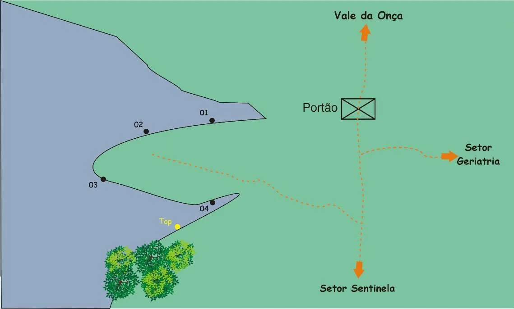
    - **largura_mapa**: 1139
    - **altura_mapa**: 686
    - **pontos_de_interesse**:
      - **[0]**:
        - **id**: SwEsSHABn30Fwg
        - **uid**: SwEsSHABn30Fwg
        - **rotulo**: Vale da Onça
        - **retangulo**:
          - **x**: 816
          - **y**: 33
          - **comprimento**: 163
          - **largura**: 36
        - **label**: Vale da Onça
      - **[1]**:
        - **id**: uURw555Ttw9s5z
        - **uid**: uURw555Ttw9s5z
        - **rotulo**: 01
        - **retangulo**:
          - **x**: 452
          - **y**: 249
          - **comprimento**: 28
          - **largura**: 26
        - **label**: 01
      - **[2]**:
        - **id**: kQ3APhoz0AhUhh
        - **uid**: kQ3APhoz0AhUhh
        - **rotulo**: 02
        - **retangulo**:
          - **x**: 307
          - **y**: 274
          - **comprimento**: 28
          - **largura**: 27
        - **label**: 02
      - **[3]**:
        - **id**: KQGRfgJGQbnQOq
        - **uid**: KQGRfgJGQbnQOq
        - **rotulo**: Setor Geriatria
        - **retangulo**:
          - **x**: 1060
          - **y**: 342
          - **comprimento**: 105
          - **largura**: 60
        - **label**: Setor Geriatria
      - **[4]**:
        - **id**: iOWo6cZBnnG9Fg
        - **uid**: iOWo6cZBnnG9Fg
        - **rotulo**: 03
        - **retangulo**:
          - **x**: 206
          - **y**: 409
          - **comprimento**: 28
          - **largura**: 26
        - **label**: 03
      - **[5]**:
        - **id**: ztxYnDjrLFYGVI
        - **uid**: ztxYnDjrLFYGVI
        - **rotulo**: 04
        - **retangulo**:
          - **x**: 452
          - **y**: 462
          - **comprimento**: 32
          - **largura**: 27
        - **label**: 04
      - **[6]**:
        - **id**: ptssRFQlWbiGBu
        - **uid**: ptssRFQlWbiGBu
        - **rotulo**: Setor Sentinela
        - **retangulo**:
          - **x**: 792
          - **y**: 638
          - **comprimento**: 177
          - **largura**: 31
        - **label**: Setor Sentinela
    - **referencias**:
      - **[0]**:
        - **alvo_uid**: OQBtQxCcejC83h
        - **pontos_uids**:
          - uURw555Ttw9s5z
        - **escalada**: Credo, que Delícia
        - **ids**:
          - uURw555Ttw9s5z
      - **[1]**:
        - **alvo_uid**: uqZ1Tmyu24exWW
        - **pontos_uids**:
          - kQ3APhoz0AhUhh
        - **escalada**: Trem Bão é Coisa Boa
        - **ids**:
          - kQ3APhoz0AhUhh
      - **[2]**:
        - **alvo_uid**: bjchGqMUgQe7Eg
        - **pontos_uids**:
          - iOWo6cZBnnG9Fg
        - **escalada**: A Vida é um Desafio
        - **ids**:
          - iOWo6cZBnnG9Fg
      - **[3]**:
        - **alvo_uid**: Q3yN9I4BuqvktH
        - **pontos_uids**:
          - ztxYnDjrLFYGVI
        - **escalada**: Essa Molezinha vai Abacar
        - **ids**:
          - ztxYnDjrLFYGVI
      - **[4]**:
        - **alvo_uid**: CtxqyAwqmrD1a5
        - **pontos_uids**:
          - ptssRFQlWbiGBu
        - **setor**: Setor Sentinela e Vale do Joga
        - **ids**:
          - ptssRFQlWbiGBu
      - **[5]**:
        - **alvo_uid**: rOeXLFY663S0bd
        - **pontos_uids**:
          - KQGRfgJGQbnQOq
        - **setor**: Setor Geriatria
        - **ids**:
          - KQGRfgJGQbnQOq
      - **[6]**:
        - **alvo_uid**: Fya8VhImuKKlNV
        - **pontos_uids**:
          - SwEsSHABn30Fwg
        - **setor**: Setor Vale da Onça
        - **ids**:
          - SwEsSHABn30Fwg
- **escaladas**:
  - **[0]**:
    - **uid**: OQBtQxCcejC83h
    - **via_esportiva**:
      - **nome**: Credo, que Delícia
      - **dificuldade**: BR_4
      - **quantidade_protecoes_intermediarias**: 4
      - **quantidade_protecoes_parada**: 2
      - **conquistadores**:
        - GT Baú 2021
  - **[1]**:
    - **uid**: uqZ1Tmyu24exWW
    - **via_esportiva**:
      - **nome**: Trem Bão é Coisa Boa
      - **dificuldade**: BR_3SUP
      - **quantidade_protecoes_intermediarias**: 5
      - **quantidade_protecoes_parada**: 2
      - **conquistadores**:
        - GT Baú 2021
  - **[2]**:
    - **uid**: bjchGqMUgQe7Eg
    - **via_esportiva**:
      - **nome**: A Vida é um Desafio
      - **dificuldade**: BR_4SUP
      - **quantidade_protecoes_intermediarias**: 4
      - **quantidade_protecoes_parada**: 2
      - **conquistadores**:
        - GT Baú 2021
  - **[3]**:
    - **uid**: Q3yN9I4BuqvktH
    - **via_esportiva**:
      - **nome**: Essa Molezinha vai Abacar
      - **dificuldade**: BR_3
      - **quantidade_protecoes_intermediarias**: 4
      - **quantidade_protecoes_parada**: 2
      - **conquistadores**:
        - GT Baú 2021
- **precomputados**:
  - **total_escaladas**: 4
  - **total_esportivas**: 4

## Parte: setor_geriatria

### Setor (Pico: Gruta do Baú)

- **descricao**:
    # Setor Geriatria
    
    **Acesso:** Após a entrada para o Setor Mr Bean, seguir sentido Vale da Onça pela trilha. Após 1 minuto de caminhada entrar na trilha a direita antes do portão de metal.
    
    **Acesso secundário:** pela trilha do Setor Onda de Calcário.
- **nome**: Setor Geriatria
- **uid**: rOeXLFY663S0bd
- **mapas**:
  - **[0]**:
    - **caminho_imagem_mapa**: 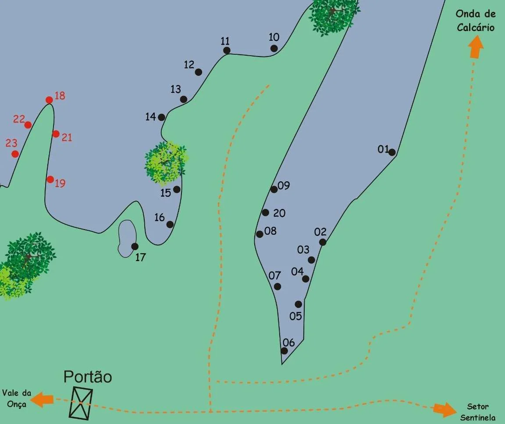
    - **largura_mapa**: 1152
    - **altura_mapa**: 968
    - **pontos_de_interesse**:
      - **[0]**:
        - **id**: cI1BuaBEPHvD1z
        - **uid**: cI1BuaBEPHvD1z
        - **rotulo**: Onda de Calcário
        - **retangulo**:
          - **x**: 1085
          - **y**: 46
          - **comprimento**: 102
          - **largura**: 64
        - **label**: Onda de Calcário
      - **[1]**:
        - **id**: ZAsA3gxU0RoCid
        - **uid**: ZAsA3gxU0RoCid
        - **rotulo**: 10
        - **retangulo**:
          - **x**: 626
          - **y**: 84
          - **comprimento**: 35
          - **largura**: 31
        - **label**: 10
      - **[2]**:
        - **id**: lcKLYLxQjIuLak
        - **uid**: lcKLYLxQjIuLak
        - **rotulo**: 11
        - **retangulo**:
          - **x**: 514
          - **y**: 93
          - **comprimento**: 31
          - **largura**: 30
        - **label**: 11
      - **[3]**:
        - **id**: 9ATyzU5YztolHf
        - **uid**: 9ATyzU5YztolHf
        - **rotulo**: 12
        - **retangulo**:
          - **x**: 432
          - **y**: 146
          - **comprimento**: 35
          - **largura**: 34
        - **label**: 12
      - **[4]**:
        - **id**: fo70JGgQtPxdFb
        - **uid**: fo70JGgQtPxdFb
        - **rotulo**: 13
        - **retangulo**:
          - **x**: 400
          - **y**: 202
          - **comprimento**: 35
          - **largura**: 31
        - **label**: 13
      - **[5]**:
        - **id**: LhAutQieoxM12t
        - **uid**: LhAutQieoxM12t
        - **rotulo**: 18
        - **retangulo**:
          - **x**: 137
          - **y**: 217
          - **comprimento**: 32
          - **largura**: 26
        - **label**: 18
      - **[6]**:
        - **id**: ct5OUO2qrC4wCg
        - **uid**: ct5OUO2qrC4wCg
        - **rotulo**: 22
        - **retangulo**:
          - **x**: 42
          - **y**: 270
          - **comprimento**: 37
          - **largura**: 29
        - **label**: 22
      - **[7]**:
        - **id**: EKri2v9WIHO9mp
        - **uid**: EKri2v9WIHO9mp
        - **rotulo**: 14
        - **retangulo**:
          - **x**: 343
          - **y**: 264
          - **comprimento**: 34
          - **largura**: 33
        - **label**: 14
      - **[8]**:
        - **id**: mi3YDN3QL3pFhv
        - **uid**: mi3YDN3QL3pFhv
        - **rotulo**: 21
        - **retangulo**:
          - **x**: 152
          - **y**: 312
          - **comprimento**: 35
          - **largura**: 29
        - **label**: 21
      - **[9]**:
        - **id**: aNknq6i6fyAxUk
        - **uid**: aNknq6i6fyAxUk
        - **rotulo**: 23
        - **retangulo**:
          - **x**: 25
          - **y**: 326
          - **comprimento**: 36
          - **largura**: 29
        - **label**: 23
      - **[10]**:
        - **id**: 1FzohJ5yaePyye
        - **uid**: 1FzohJ5yaePyye
        - **rotulo**: 01
        - **retangulo**:
          - **x**: 874
          - **y**: 340
          - **comprimento**: 33
          - **largura**: 32
        - **label**: 01
      - **[11]**:
        - **id**: 7zNuP9kq7LML5x
        - **uid**: 7zNuP9kq7LML5x
        - **rotulo**: 19
        - **retangulo**:
          - **x**: 136
          - **y**: 416
          - **comprimento**: 32
          - **largura**: 27
        - **label**: 19
      - **[12]**:
        - **id**: yM4tSkfEmFUXCH
        - **uid**: yM4tSkfEmFUXCH
        - **rotulo**: 09
        - **retangulo**:
          - **x**: 647
          - **y**: 422
          - **comprimento**: 38
          - **largura**: 31
        - **label**: 09
      - **[13]**:
        - **id**: SWDkR37g1SpL4s
        - **uid**: SWDkR37g1SpL4s
        - **rotulo**: 15
        - **retangulo**:
          - **x**: 378
          - **y**: 439
          - **comprimento**: 33
          - **largura**: 30
        - **label**: 15
      - **[14]**:
        - **id**: lUwzlrJUUT4eKE
        - **uid**: lUwzlrJUUT4eKE
        - **rotulo**: 16
        - **retangulo**:
          - **x**: 364
          - **y**: 495
          - **comprimento**: 35
          - **largura**: 30
        - **label**: 16
      - **[15]**:
        - **id**: igPAMSQzXnVg60
        - **uid**: igPAMSQzXnVg60
        - **rotulo**: 20
        - **retangulo**:
          - **x**: 637
          - **y**: 485
          - **comprimento**: 38
          - **largura**: 28
        - **label**: 20
      - **[16]**:
        - **id**: 0d8QfR2U8FK8rC
        - **uid**: 0d8QfR2U8FK8rC
        - **rotulo**: 08
        - **retangulo**:
          - **x**: 617
          - **y**: 526
          - **comprimento**: 38
          - **largura**: 29
        - **label**: 08
      - **[17]**:
        - **id**: 1PBIcLTDvcwvyr
        - **uid**: 1PBIcLTDvcwvyr
        - **rotulo**: 02
        - **retangulo**:
          - **x**: 730
          - **y**: 528
          - **comprimento**: 41
          - **largura**: 33
        - **label**: 02
      - **[18]**:
        - **id**: BpAPuZMmkKIDZP
        - **uid**: BpAPuZMmkKIDZP
        - **rotulo**: 03
        - **retangulo**:
          - **x**: 692
          - **y**: 569
          - **comprimento**: 39
          - **largura**: 30
        - **label**: 03
      - **[19]**:
        - **id**: QCu9Ao4JHBegZO
        - **uid**: QCu9Ao4JHBegZO
        - **rotulo**: 17
        - **retangulo**:
          - **x**: 320
          - **y**: 586
          - **comprimento**: 34
          - **largura**: 31
        - **label**: 17
      - **[20]**:
        - **id**: MEXZcBKrFDVPHM
        - **uid**: MEXZcBKrFDVPHM
        - **rotulo**: 07
        - **retangulo**:
          - **x**: 626
          - **y**: 627
          - **comprimento**: 38
          - **largura**: 30
        - **label**: 07
      - **[21]**:
        - **id**: IhwwEt7Tp7mEhZ
        - **uid**: IhwwEt7Tp7mEhZ
        - **rotulo**: 04
        - **retangulo**:
          - **x**: 680
          - **y**: 618
          - **comprimento**: 39
          - **largura**: 29
        - **label**: 04
      - **[22]**:
        - **id**: pW3O84WDxCbz8W
        - **uid**: pW3O84WDxCbz8W
        - **rotulo**: 05
        - **retangulo**:
          - **x**: 674
          - **y**: 720
          - **comprimento**: 39
          - **largura**: 30
        - **label**: 05
      - **[23]**:
        - **id**: eQEUXoafY3c5jy
        - **uid**: eQEUXoafY3c5jy
        - **rotulo**: 06
        - **retangulo**:
          - **x**: 658
          - **y**: 781
          - **comprimento**: 37
          - **largura**: 30
        - **label**: 06
      - **[24]**:
        - **id**: bUBvycVSjmEOB7
        - **uid**: bUBvycVSjmEOB7
        - **rotulo**: Vale da Onça
        - **retangulo**:
          - **x**: 37
          - **y**: 908
          - **comprimento**: 74
          - **largura**: 56
        - **label**: Vale da Onça
      - **[25]**:
        - **id**: JwirahFwyjsFrF
        - **uid**: JwirahFwyjsFrF
        - **rotulo**: Setor Sentinela
        - **retangulo**:
          - **x**: 1090
          - **y**: 940
          - **comprimento**: 91
          - **largura**: 52
        - **label**: Setor Sentinela
    - **referencias**:
      - **[0]**:
        - **alvo_uid**: UuY7hcR8SYNTw8
        - **pontos_uids**:
          - 1FzohJ5yaePyye
        - **escalada**: Osteoporose
        - **ids**:
          - 1FzohJ5yaePyye
      - **[1]**:
        - **alvo_uid**: DuhBkBWpkluoVk
        - **pontos_uids**:
          - 1PBIcLTDvcwvyr
        - **escalada**: Pressão Baixa
        - **ids**:
          - 1PBIcLTDvcwvyr
      - **[2]**:
        - **alvo_uid**: vesOhiTNPq9NFQ
        - **pontos_uids**:
          - BpAPuZMmkKIDZP
        - **escalada**: Pressão Alta
        - **ids**:
          - BpAPuZMmkKIDZP
      - **[3]**:
        - **alvo_uid**: MfCNTF1ZCt9Wfm
        - **pontos_uids**:
          - IhwwEt7Tp7mEhZ
        - **escalada**: Menopausa
        - **ids**:
          - IhwwEt7Tp7mEhZ
      - **[4]**:
        - **alvo_uid**: S8L0hnX8r7lgDV
        - **pontos_uids**:
          - pW3O84WDxCbz8W
        - **escalada**: Andropausa
        - **ids**:
          - pW3O84WDxCbz8W
      - **[5]**:
        - **alvo_uid**: a80B1HPdz1FBmB
        - **pontos_uids**:
          - eQEUXoafY3c5jy
        - **escalada**: Toque Retal
        - **ids**:
          - eQEUXoafY3c5jy
      - **[6]**:
        - **alvo_uid**: gO4x57YhnEZGxD
        - **pontos_uids**:
          - MEXZcBKrFDVPHM
        - **escalada**: Papa Nicolau
        - **ids**:
          - MEXZcBKrFDVPHM
      - **[7]**:
        - **alvo_uid**: dvT777GiR4TvnJ
        - **pontos_uids**:
          - ZAsA3gxU0RoCid
        - **escalada**: Losartana
        - **ids**:
          - ZAsA3gxU0RoCid
      - **[8]**:
        - **alvo_uid**: ebc52s6bwgk73U
        - **pontos_uids**:
          - lcKLYLxQjIuLak
        - **escalada**: Captopril
        - **ids**:
          - lcKLYLxQjIuLak
      - **[9]**:
        - **alvo_uid**: NzQDKFagYLgCTT
        - **pontos_uids**:
          - 9ATyzU5YztolHf
        - **escalada**: Plenitude
        - **ids**:
          - 9ATyzU5YztolHf
      - **[10]**:
        - **alvo_uid**: e887066q7ubeTj
        - **pontos_uids**:
          - fo70JGgQtPxdFb
        - **escalada**: Diabetes
        - **ids**:
          - fo70JGgQtPxdFb
      - **[11]**:
        - **alvo_uid**: r6CbB745a00kv9
        - **pontos_uids**:
          - EKri2v9WIHO9mp
        - **escalada**: Glifage
        - **ids**:
          - EKri2v9WIHO9mp
      - **[12]**:
        - **alvo_uid**: 9qhcxsv3TW95vu
        - **pontos_uids**:
          - SWDkR37g1SpL4s
        - **escalada**: Insulina
        - **ids**:
          - SWDkR37g1SpL4s
      - **[13]**:
        - **alvo_uid**: h67OV4RQL1ITRR
        - **pontos_uids**:
          - lUwzlrJUUT4eKE
        - **escalada**: AVC
        - **ids**:
          - lUwzlrJUUT4eKE
      - **[14]**:
        - **alvo_uid**: zikp4QrqVMrz5L
        - **pontos_uids**:
          - QCu9Ao4JHBegZO
        - **escalada**: Fusca Azul
        - **ids**:
          - QCu9Ao4JHBegZO
      - **[15]**:
        - **alvo_uid**: Obb4Old3q9uFNe
        - **pontos_uids**:
          - LhAutQieoxM12t
        - **escalada**: The Equalizer
        - **ids**:
          - LhAutQieoxM12t
      - **[16]**:
        - **alvo_uid**: uSFxebYMAaDuwb
        - **pontos_uids**:
          - 7zNuP9kq7LML5x
        - **escalada**: Casa da Fumaça
        - **ids**:
          - 7zNuP9kq7LML5x
      - **[17]**:
        - **alvo_uid**: jX1caQGXqo8Jjf
        - **pontos_uids**:
          - igPAMSQzXnVg60
        - **escalada**: Sombra pro Morto
        - **ids**:
          - igPAMSQzXnVg60
      - **[18]**:
        - **alvo_uid**: Yp2Lt8QP37BjRv
        - **pontos_uids**:
          - mi3YDN3QL3pFhv
        - **escalada**: As Fúrias
        - **ids**:
          - mi3YDN3QL3pFhv
      - **[19]**:
        - **alvo_uid**: RNRYM9CoGH8j3v
        - **pontos_uids**:
          - ct5OUO2qrC4wCg
        - **escalada**: Os Despertos
        - **ids**:
          - ct5OUO2qrC4wCg
      - **[20]**:
        - **alvo_uid**: aotAbgxMWMiLC4
        - **pontos_uids**:
          - aNknq6i6fyAxUk
        - **escalada**: As Bondosas
        - **ids**:
          - aNknq6i6fyAxUk
      - **[21]**:
        - **alvo_uid**: jNLTBCeQcy4vqW
        - **pontos_uids**:
          - 0d8QfR2U8FK8rC
        - **escalada**: Tira o Andador e Vai
        - **ids**:
          - 0d8QfR2U8FK8rC
      - **[22]**:
        - **alvo_uid**: FkiPSqcbqLlFqj
        - **pontos_uids**:
          - yM4tSkfEmFUXCH
        - **escalada**: Rupestre
        - **ids**:
          - yM4tSkfEmFUXCH
      - **[23]**:
        - **alvo_uid**: CtxqyAwqmrD1a5
        - **pontos_uids**:
          - JwirahFwyjsFrF
        - **setor**: Setor Sentinela e Vale do Joga
        - **ids**:
          - JwirahFwyjsFrF
      - **[24]**:
        - **alvo_uid**: Fya8VhImuKKlNV
        - **pontos_uids**:
          - bUBvycVSjmEOB7
        - **setor**: Setor Vale da Onça
        - **ids**:
          - bUBvycVSjmEOB7
      - **[25]**:
        - **alvo_uid**: BWPnk2wxFb4Jvb
        - **pontos_uids**:
          - cI1BuaBEPHvD1z
        - **setor**: Setor Onda de Calcário
        - **ids**:
          - cI1BuaBEPHvD1z
- **escaladas**:
  - **[0]**:
    - **uid**: UuY7hcR8SYNTw8
    - **via_esportiva**:
      - **nome**: Osteoporose
      - **dificuldade**: BR_4
      - **quantidade_protecoes_intermediarias**: 3
      - **quantidade_protecoes_parada**: 2
      - **conquistadores**:
        - Marco Durães
        - Roberto Lincoln
  - **[1]**:
    - **uid**: DuhBkBWpkluoVk
    - **via_esportiva**:
      - **nome**: Pressão Baixa
      - **dificuldade**: BR_7B
      - **quantidade_protecoes_intermediarias**: 5
      - **quantidade_protecoes_parada**: 2
      - **conquistadores**:
        - Marco Durães
        - Roberto Lincoln
  - **[2]**:
    - **uid**: vesOhiTNPq9NFQ
    - **via_esportiva**:
      - **nome**: Pressão Alta
      - **dificuldade**: BR_7C
      - **quantidade_protecoes_intermediarias**: 4
      - **quantidade_protecoes_parada**: 2
      - **conquistadores**:
        - Marco Durães
        - Roberto Lincoln
  - **[3]**:
    - **uid**: MfCNTF1ZCt9Wfm
    - **via_esportiva**:
      - **nome**: Menopausa
      - **dificuldade**: BR_7B
      - **quantidade_protecoes_intermediarias**: 4
      - **quantidade_protecoes_parada**: 2
      - **conquistadores**:
        - Marco Durães
        - Roberto Lincoln
  - **[4]**:
    - **uid**: S8L0hnX8r7lgDV
    - **via_esportiva**:
      - **nome**: Andropausa
      - **dificuldade**: BR_7A
      - **quantidade_protecoes_intermediarias**: 5
      - **quantidade_protecoes_parada**: 2
      - **conquistadores**:
        - Marco Durães
        - Roberto Lincoln
  - **[5]**:
    - **uid**: a80B1HPdz1FBmB
    - **via_esportiva**:
      - **nome**: Toque Retal
      - **dificuldade**: BR_6
      - **quantidade_protecoes_intermediarias**: 5
      - **quantidade_protecoes_parada**: 2
      - **conquistadores**:
        - Marco Durães
        - Roberto Lincoln
  - **[6]**:
    - **uid**: gO4x57YhnEZGxD
    - **via_esportiva**:
      - **nome**: Papa Nicolau
      - **dificuldade**: BR_5
      - **quantidade_protecoes_intermediarias**: 5
      - **quantidade_protecoes_parada**: 2
      - **conquistadores**:
        - Marco Durães
        - Roberto Lincoln
  - **[7]**:
    - **uid**: jNLTBCeQcy4vqW
    - **via_esportiva**:
      - **nome**: Tira o Andador e Vai
      - **dificuldade**: BR_5
      - **quantidade_protecoes_intermediarias**: 5
      - **quantidade_protecoes_parada**: 2
      - **conquistadores**:
        - Marco Durães
        - Roberto Lincoln
  - **[8]**:
    - **uid**: FkiPSqcbqLlFqj
    - **via_esportiva**:
      - **nome**: Rupestre
      - **dificuldade**: BR_5
      - **quantidade_protecoes_intermediarias**: 4
      - **quantidade_protecoes_parada**: 2
      - **conquistadores**:
        - Marco Durães
        - Roberto Lincoln
  - **[9]**:
    - **uid**: dvT777GiR4TvnJ
    - **via_esportiva**:
      - **nome**: Losartana
      - **dificuldade**: BR_6SUP
      - **quantidade_protecoes_intermediarias**: 4
      - **quantidade_protecoes_parada**: 2
      - **conquistadores**:
        - Marco Durães
        - Roberto Lincoln
  - **[10]**:
    - **uid**: ebc52s6bwgk73U
    - **via_esportiva**:
      - **nome**: Captopril
      - **dificuldade**: BR_6
      - **quantidade_protecoes_intermediarias**: 4
      - **quantidade_protecoes_parada**: 2
      - **conquistadores**:
        - Marco Durães
        - Roberto Lincoln
  - **[11]**:
    - **uid**: NzQDKFagYLgCTT
    - **via_esportiva**:
      - **nome**: Plenitude
      - **dificuldade**: BR_6SUP
      - **quantidade_protecoes_intermediarias**: 4
      - **quantidade_protecoes_parada**: 2
      - **conquistadores**:
        - Marco Durães
        - Roberto Lincoln
  - **[12]**:
    - **uid**: e887066q7ubeTj
    - **via_esportiva**:
      - **nome**: Diabetes
      - **dificuldade**: BR_7A
      - **quantidade_protecoes_intermediarias**: 4
      - **quantidade_protecoes_parada**: 2
      - **conquistadores**:
        - Marco Durães
        - Roberto Lincoln
  - **[13]**:
    - **uid**: r6CbB745a00kv9
    - **via_esportiva**:
      - **nome**: Glifage
      - **dificuldade**: BR_6
      - **quantidade_protecoes_intermediarias**: 4
      - **quantidade_protecoes_parada**: 2
      - **conquistadores**:
        - Marco Durães
        - Roberto Lincoln
  - **[14]**:
    - **uid**: 9qhcxsv3TW95vu
    - **via_esportiva**:
      - **nome**: Insulina
      - **dificuldade**: BR_6SUP
      - **quantidade_protecoes_intermediarias**: 4
      - **quantidade_protecoes_parada**: 2
      - **conquistadores**:
        - Marco Durães
        - Roberto Lincoln
  - **[15]**:
    - **uid**: h67OV4RQL1ITRR
    - **via_esportiva**:
      - **nome**: AVC
      - **dificuldade**: BR_6SUP
      - **quantidade_protecoes_intermediarias**: 4
      - **quantidade_protecoes_parada**: 2
      - **conquistadores**:
        - Marco Durães
        - Roberto Lincoln
  - **[16]**:
    - **uid**: zikp4QrqVMrz5L
    - **via_esportiva**:
      - **nome**: Fusca Azul
      - **dificuldade**: BR_6
      - **quantidade_protecoes_intermediarias**: 5
      - **quantidade_protecoes_parada**: 2
      - **conquistadores**:
        - Marcus Rufino
        - Renato Utsch
        - Eduardo Utsch
  - **[17]**:
    - **uid**: Obb4Old3q9uFNe
    - **via_movel**:
      - **nome**: The Equalizer
      - **dificuldade**: BR_6
      - **protecoes_moveis**: Móvel
      - **conquistadores**:
        - Roberto Lincoln
        - Rodrigo Soares
  - **[18]**:
    - **uid**: uSFxebYMAaDuwb
    - **via_movel**:
      - **nome**: Casa da Fumaça
      - **dificuldade**: BR_5
      - **protecoes_moveis**: Móvel
      - **conquistadores**:
        - Roberto Lincoln
        - Fábio Mello
  - **[19]**:
    - **uid**: jX1caQGXqo8Jjf
    - **via_esportiva**:
      - **nome**: Sombra pro Morto
      - **dificuldade**: BR_5
      - **quantidade_protecoes_intermediarias**: 5
      - **quantidade_protecoes_parada**: 2
      - **conquistadores**:
        - Marco Durães
  - **[20]**:
    - **uid**: Yp2Lt8QP37BjRv
    - **via_movel**:
      - **nome**: As Fúrias
      - **dificuldade**: BR_6
      - **protecoes_moveis**: Móvel
      - **conquistadores**:
        - Roberto Lincoln
        - André Braga
  - **[21]**:
    - **uid**: RNRYM9CoGH8j3v
    - **via_movel**:
      - **nome**: Os Despertos
      - **dificuldade**: BR_6SUP
      - **protecoes_moveis**: Móvel
      - **conquistadores**:
        - Roberto Lincoln
        - André Braga
  - **[22]**:
    - **uid**: aotAbgxMWMiLC4
    - **via_movel**:
      - **nome**: As Bondosas
      - **dificuldade**: BR_5SUP
      - **protecoes_moveis**: Móvel
      - **conquistadores**:
        - Roberto Lincoln
        - André Braga
- **precomputados**:
  - **total_escaladas**: 23
  - **total_esportivas**: 18

## Parte: setor_mr_bean

### Setor (Pico: Gruta do Baú)

- **descricao**:
    # Setor Mr. Bean
    
    **Acesso:** Ao chegar ao maciço, no setor entrada, sair na trilha a direita, em direção ao banheiro. Passando pelo setor Sentinela, a primeira entrada a direita leva ao vale dos Espinhos. Se continuar subindo a trilha irá chegar à bifurcação que leva ao setor Mr. Bean e Onda de Calcário.
    
    O nome do setor é uma homenagem ao escalador Leandro Ianotta, que perdeu a vida fazendo o que mais amava no Fitz Roy na Patagônia argentina. Leandro, que era conhecido por Mr. Bean era um apaixonado pelo Baú e seus primeiros passos na carreira de escalador profissional passaram pela gruta do Baú.
    
    **Coordenadas do setor Mr. Bean:** -20º35.832’ -46º20.498’
    
    Membros do GT Baú 2020: Márcio, Wilson, Roberto Lincoln, André “Dedé”, Otto e Michele “Joaninha”.
- **nome**: Setor Mr. Bean
- **uid**: LPLcjyLyZDlyih
- **mapas**:
  - **[0]**:
    - **caminho_imagem_mapa**: 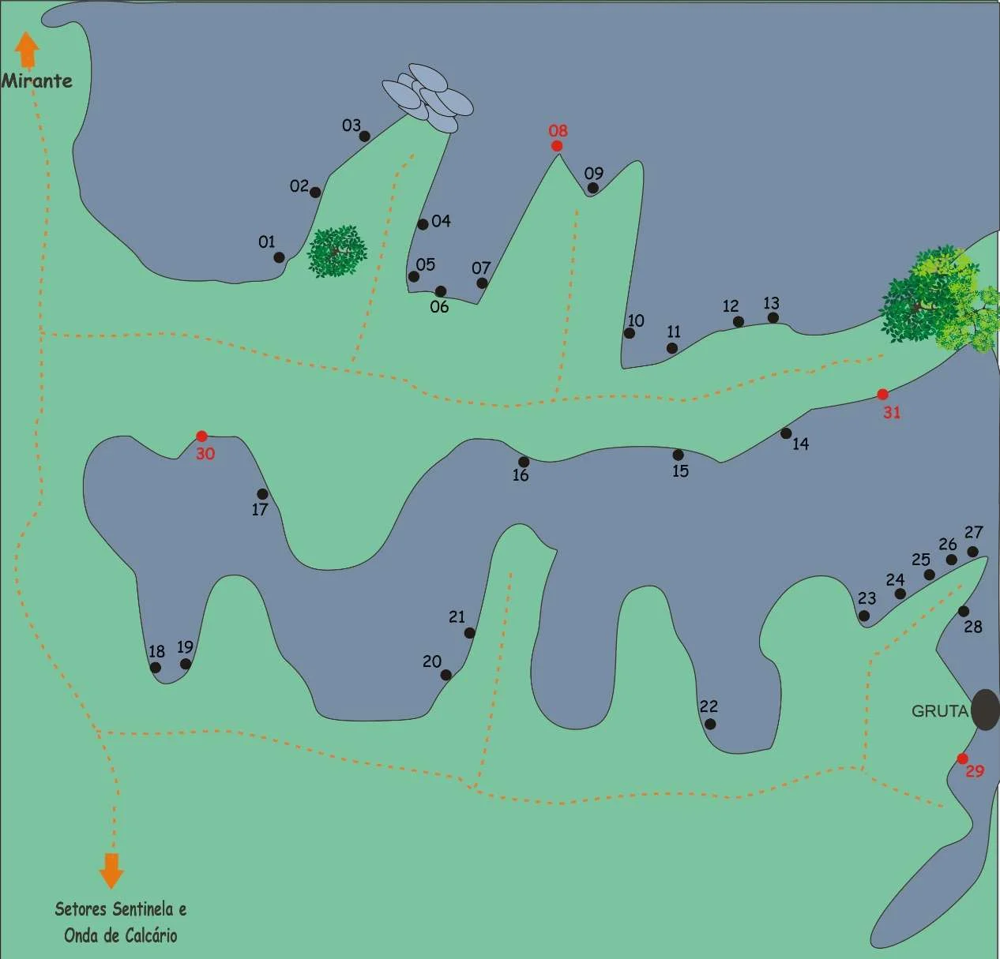
    - **largura_mapa**: 1266
    - **altura_mapa**: 1215
    - **pontos_de_interesse**:
      - **[0]**:
        - **id**: DjJdFhBznnW1XC
        - **uid**: DjJdFhBznnW1XC
        - **rotulo**: 03
        - **retangulo**:
          - **x**: 445
          - **y**: 158
          - **comprimento**: 30
          - **largura**: 25
        - **label**: 03
      - **[1]**:
        - **id**: 2T2B4ARRHSar98
        - **uid**: 2T2B4ARRHSar98
        - **rotulo**: 08
        - **retangulo**:
          - **x**: 707
          - **y**: 164
          - **comprimento**: 32
          - **largura**: 30
        - **label**: 08
      - **[2]**:
        - **id**: 4hcSz6dja4fj0H
        - **uid**: 4hcSz6dja4fj0H
        - **rotulo**: 09
        - **retangulo**:
          - **x**: 752
          - **y**: 218
          - **comprimento**: 31
          - **largura**: 30
        - **label**: 09
      - **[3]**:
        - **id**: h3IMVPbcHRytzA
        - **uid**: h3IMVPbcHRytzA
        - **rotulo**: 02
        - **retangulo**:
          - **x**: 380
          - **y**: 234
          - **comprimento**: 33
          - **largura**: 28
        - **label**: 02
      - **[4]**:
        - **id**: ZURSuX3kT3AwHv
        - **uid**: ZURSuX3kT3AwHv
        - **rotulo**: 04
        - **retangulo**:
          - **x**: 558
          - **y**: 280
          - **comprimento**: 32
          - **largura**: 27
        - **label**: 04
      - **[5]**:
        - **id**: K5HVDrubFA0HNB
        - **uid**: K5HVDrubFA0HNB
        - **rotulo**: 01
        - **retangulo**:
          - **x**: 338
          - **y**: 305
          - **comprimento**: 29
          - **largura**: 26
        - **label**: 01
      - **[6]**:
        - **id**: MGFHGWQYf2D7iZ
        - **uid**: MGFHGWQYf2D7iZ
        - **rotulo**: 05
        - **retangulo**:
          - **x**: 538
          - **y**: 334
          - **comprimento**: 33
          - **largura**: 27
        - **label**: 05
      - **[7]**:
        - **id**: 2K7GYy6IgIiMlt
        - **uid**: 2K7GYy6IgIiMlt
        - **rotulo**: 07
        - **retangulo**:
          - **x**: 610
          - **y**: 338
          - **comprimento**: 33
          - **largura**: 27
        - **label**: 07
      - **[8]**:
        - **id**: DbAMzCLfJBfedC
        - **uid**: DbAMzCLfJBfedC
        - **rotulo**: 06
        - **retangulo**:
          - **x**: 556
          - **y**: 388
          - **comprimento**: 32
          - **largura**: 26
        - **label**: 06
      - **[9]**:
        - **id**: dCz8Gneoz0GhGe
        - **uid**: dCz8Gneoz0GhGe
        - **rotulo**: 12
        - **retangulo**:
          - **x**: 925
          - **y**: 388
          - **comprimento**: 30
          - **largura**: 25
        - **label**: 12
      - **[10]**:
        - **id**: mE50F3MacCbwi6
        - **uid**: mE50F3MacCbwi6
        - **rotulo**: 13
        - **retangulo**:
          - **x**: 976
          - **y**: 383
          - **comprimento**: 29
          - **largura**: 24
        - **label**: 13
      - **[11]**:
        - **id**: 7se7G5FoGBJ71s
        - **uid**: 7se7G5FoGBJ71s
        - **rotulo**: 10
        - **retangulo**:
          - **x**: 806
          - **y**: 405
          - **comprimento**: 29
          - **largura**: 26
        - **label**: 10
      - **[12]**:
        - **id**: pQ4H8geEIg2jnr
        - **uid**: pQ4H8geEIg2jnr
        - **rotulo**: 11
        - **retangulo**:
          - **x**: 854
          - **y**: 419
          - **comprimento**: 27
          - **largura**: 26
        - **label**: 11
      - **[13]**:
        - **id**: 5AzbLgavcodayg
        - **uid**: 5AzbLgavcodayg
        - **rotulo**: 31
        - **retangulo**:
          - **x**: 1129
          - **y**: 522
          - **comprimento**: 30
          - **largura**: 28
        - **label**: 31
      - **[14]**:
        - **id**: q9gCj6GwfWtPZq
        - **uid**: q9gCj6GwfWtPZq
        - **rotulo**: 14
        - **retangulo**:
          - **x**: 1014
          - **y**: 562
          - **comprimento**: 30
          - **largura**: 27
        - **label**: 14
      - **[15]**:
        - **id**: K0uyVZApAIpqWG
        - **uid**: K0uyVZApAIpqWG
        - **rotulo**: 30
        - **retangulo**:
          - **x**: 259
          - **y**: 574
          - **comprimento**: 32
          - **largura**: 26
        - **label**: 30
      - **[16]**:
        - **id**: NCiUEdENExK776
        - **uid**: NCiUEdENExK776
        - **rotulo**: 16
        - **retangulo**:
          - **x**: 659
          - **y**: 601
          - **comprimento**: 30
          - **largura**: 28
        - **label**: 16
      - **[17]**:
        - **id**: LgJuQfD84A4ka5
        - **uid**: LgJuQfD84A4ka5
        - **rotulo**: 15
        - **retangulo**:
          - **x**: 862
          - **y**: 596
          - **comprimento**: 31
          - **largura**: 28
        - **label**: 15
      - **[18]**:
        - **id**: ReSpSK96BdoULS
        - **uid**: ReSpSK96BdoULS
        - **rotulo**: 17
        - **retangulo**:
          - **x**: 328
          - **y**: 644
          - **comprimento**: 31
          - **largura**: 27
        - **label**: 17
      - **[19]**:
        - **id**: TR7ts1HcQv4Nky
        - **uid**: TR7ts1HcQv4Nky
        - **rotulo**: 27
        - **retangulo**:
          - **x**: 1233
          - **y**: 673
          - **comprimento**: 30
          - **largura**: 24
        - **label**: 27
      - **[20]**:
        - **id**: ju4C8ZJs1tF1g7
        - **uid**: ju4C8ZJs1tF1g7
        - **rotulo**: 26
        - **retangulo**:
          - **x**: 1200
          - **y**: 688
          - **comprimento**: 30
          - **largura**: 25
        - **label**: 26
      - **[21]**:
        - **id**: PwXNUwsIbvg0Ad
        - **uid**: PwXNUwsIbvg0Ad
        - **rotulo**: 25
        - **retangulo**:
          - **x**: 1166
          - **y**: 708
          - **comprimento**: 33
          - **largura**: 27
        - **label**: 25
      - **[22]**:
        - **id**: eBsXJumyf9YJpz
        - **uid**: eBsXJumyf9YJpz
        - **rotulo**: 24
        - **retangulo**:
          - **x**: 1134
          - **y**: 734
          - **comprimento**: 31
          - **largura**: 25
        - **label**: 24
      - **[23]**:
        - **id**: lDhm9Y43SKQeKI
        - **uid**: lDhm9Y43SKQeKI
        - **rotulo**: 23
        - **retangulo**:
          - **x**: 1098
          - **y**: 756
          - **comprimento**: 31
          - **largura**: 25
        - **label**: 23
      - **[24]**:
        - **id**: xba0AvT5YWvPPE
        - **uid**: xba0AvT5YWvPPE
        - **rotulo**: 21
        - **retangulo**:
          - **x**: 578
          - **y**: 781
          - **comprimento**: 31
          - **largura**: 30
        - **label**: 21
      - **[25]**:
        - **id**: 90kZlgGK7J5fJA
        - **uid**: 90kZlgGK7J5fJA
        - **rotulo**: 28
        - **retangulo**:
          - **x**: 1232
          - **y**: 793
          - **comprimento**: 30
          - **largura**: 28
        - **label**: 28
      - **[26]**:
        - **id**: sNn2oyZfjMMK12
        - **uid**: sNn2oyZfjMMK12
        - **rotulo**: 18
        - **retangulo**:
          - **x**: 200
          - **y**: 824
          - **comprimento**: 31
          - **largura**: 29
        - **label**: 18
      - **[27]**:
        - **id**: BV1dImfj1Ty5G8
        - **uid**: BV1dImfj1Ty5G8
        - **rotulo**: 19
        - **retangulo**:
          - **x**: 235
          - **y**: 819
          - **comprimento**: 30
          - **largura**: 24
        - **label**: 19
      - **[28]**:
        - **id**: uEG6e6MJeD6k4p
        - **uid**: uEG6e6MJeD6k4p
        - **rotulo**: 20
        - **retangulo**:
          - **x**: 547
          - **y**: 837
          - **comprimento**: 32
          - **largura**: 26
        - **label**: 20
      - **[29]**:
        - **id**: kCaZkw3gtAgBKM
        - **uid**: kCaZkw3gtAgBKM
        - **rotulo**: 22
        - **retangulo**:
          - **x**: 896
          - **y**: 896
          - **comprimento**: 30
          - **largura**: 20
        - **label**: 22
      - **[30]**:
        - **id**: vIk5GuNHYQh6Ka
        - **uid**: vIk5GuNHYQh6Ka
        - **rotulo**: 29
        - **retangulo**:
          - **x**: 1234
          - **y**: 976
          - **comprimento**: 29
          - **largura**: 29
        - **label**: 29
      - **[31]**:
        - **id**: nlsoZfNcoXqRi5
        - **uid**: nlsoZfNcoXqRi5
        - **rotulo**: Setores Sentinela e Onda de Calcário
        - **retangulo**:
          - **x**: 152
          - **y**: 1166
          - **comprimento**: 182
          - **largura**: 74
        - **label**: Setores Sentinela e Onda de Calcário
    - **referencias**:
      - **[0]**:
        - **alvo_uid**: CV7uiH2VM1uMN3
        - **pontos_uids**:
          - K5HVDrubFA0HNB
        - **escalada**: Primogênito
        - **ids**:
          - K5HVDrubFA0HNB
      - **[1]**:
        - **alvo_uid**: DLY8Eblp3hbxcX
        - **pontos_uids**:
          - h3IMVPbcHRytzA
        - **escalada**: Tá de Corpo Mole
        - **ids**:
          - h3IMVPbcHRytzA
      - **[2]**:
        - **alvo_uid**: Av9lhzskO2D2dG
        - **pontos_uids**:
          - DjJdFhBznnW1XC
        - **escalada**: Dente de Tubarão
        - **ids**:
          - DjJdFhBznnW1XC
      - **[3]**:
        - **alvo_uid**: 6x0IoiFDXdgT1v
        - **pontos_uids**:
          - ZURSuX3kT3AwHv
        - **escalada**: Besteirinha
        - **ids**:
          - ZURSuX3kT3AwHv
      - **[4]**:
        - **alvo_uid**: XPR8yC6U6DunqN
        - **pontos_uids**:
          - MGFHGWQYf2D7iZ
        - **escalada**: O Jogo que Jogamos
        - **ids**:
          - MGFHGWQYf2D7iZ
      - **[5]**:
        - **alvo_uid**: Xji3gLRn3MA00I
        - **pontos_uids**:
          - DbAMzCLfJBfedC
        - **escalada**: Boca Mordida
        - **ids**:
          - DbAMzCLfJBfedC
      - **[6]**:
        - **alvo_uid**: DhgSPSgxXMKR6s
        - **pontos_uids**:
          - 2K7GYy6IgIiMlt
        - **escalada**: Tetris
        - **ids**:
          - 2K7GYy6IgIiMlt
      - **[7]**:
        - **alvo_uid**: PeJNEDdTBAM1iw
        - **pontos_uids**:
          - 7se7G5FoGBJ71s
        - **escalada**: Golpe de Mestre
        - **ids**:
          - 7se7G5FoGBJ71s
      - **[8]**:
        - **alvo_uid**: rp9mytWjobxClP
        - **pontos_uids**:
          - pQ4H8geEIg2jnr
        - **escalada**: Voo de Ícaro
        - **ids**:
          - pQ4H8geEIg2jnr
      - **[9]**:
        - **alvo_uid**: wpntPKCfLqlH5p
        - **pontos_uids**:
          - dCz8Gneoz0GhGe
        - **escalada**: Y da Questão
        - **ids**:
          - dCz8Gneoz0GhGe
      - **[10]**:
        - **alvo_uid**: f5L3dntuWHJ1WF
        - **pontos_uids**:
          - mE50F3MacCbwi6
        - **escalada**: Seu Perdão
        - **ids**:
          - mE50F3MacCbwi6
      - **[11]**:
        - **alvo_uid**: AIUMPv6CoDm0yc
        - **pontos_uids**:
          - q9gCj6GwfWtPZq
        - **escalada**: A Linda
        - **ids**:
          - q9gCj6GwfWtPZq
      - **[12]**:
        - **alvo_uid**: H9TvQP8eCPyuEi
        - **pontos_uids**:
          - LgJuQfD84A4ka5
        - **escalada**: Drama
        - **ids**:
          - LgJuQfD84A4ka5
      - **[13]**:
        - **alvo_uid**: 1LhPyr4mqMnC0v
        - **pontos_uids**:
          - NCiUEdENExK776
        - **escalada**: Escolha de Sophia
        - **ids**:
          - NCiUEdENExK776
      - **[14]**:
        - **alvo_uid**: cr3U9vOBrgOs42
        - **pontos_uids**:
          - ReSpSK96BdoULS
        - **escalada**: Pra Você
        - **ids**:
          - ReSpSK96BdoULS
      - **[15]**:
        - **alvo_uid**: 2DedonsKWtG719
        - **pontos_uids**:
          - sNn2oyZfjMMK12
        - **escalada**: Titanic
        - **ids**:
          - sNn2oyZfjMMK12
      - **[16]**:
        - **alvo_uid**: HyrDdxpJaJmPF9
        - **pontos_uids**:
          - BV1dImfj1Ty5G8
        - **escalada**: Por Baixo dos Panos
        - **ids**:
          - BV1dImfj1Ty5G8
      - **[17]**:
        - **alvo_uid**: jSAY7qihxLAcMi
        - **pontos_uids**:
          - uEG6e6MJeD6k4p
        - **escalada**: Lobo Solitário
        - **ids**:
          - uEG6e6MJeD6k4p
      - **[18]**:
        - **alvo_uid**: wNx6kvZUc7eupC
        - **pontos_uids**:
          - xba0AvT5YWvPPE
        - **escalada**: Currículo Atualizado
        - **ids**:
          - xba0AvT5YWvPPE
      - **[19]**:
        - **alvo_uid**: zKvzWxLMLZovXr
        - **pontos_uids**:
          - kCaZkw3gtAgBKM
        - **escalada**: Pra Morrer Menos
        - **ids**:
          - kCaZkw3gtAgBKM
      - **[20]**:
        - **alvo_uid**: QuO5g2ZwWBuAp1
        - **pontos_uids**:
          - lDhm9Y43SKQeKI
        - **escalada**: Conhecendo o Criador
        - **ids**:
          - lDhm9Y43SKQeKI
      - **[21]**:
        - **alvo_uid**: YcHIivSbSIlMOt
        - **pontos_uids**:
          - eBsXJumyf9YJpz
        - **escalada**: Vida Após a Morte
        - **ids**:
          - eBsXJumyf9YJpz
      - **[22]**:
        - **alvo_uid**: zADIVx0bBrrWM6
        - **pontos_uids**:
          - PwXNUwsIbvg0Ad
        - **escalada**: De Frente com o Renegado
        - **ids**:
          - PwXNUwsIbvg0Ad
      - **[23]**:
        - **alvo_uid**: ynDC14IUFFx6L6
        - **pontos_uids**:
          - ju4C8ZJs1tF1g7
        - **escalada**: Contra Mão
        - **ids**:
          - ju4C8ZJs1tF1g7
      - **[24]**:
        - **alvo_uid**: Neeo5EOsmK6QIV
        - **pontos_uids**:
          - TR7ts1HcQv4Nky
        - **escalada**: Sete Trabalhos de Hércules
        - **ids**:
          - TR7ts1HcQv4Nky
      - **[25]**:
        - **alvo_uid**: HGegHxrQI0iipn
        - **pontos_uids**:
          - 90kZlgGK7J5fJA
        - **escalada**: Inhônho não Deixa
        - **ids**:
          - 90kZlgGK7J5fJA
      - **[26]**:
        - **alvo_uid**: A49Y42oN81KPs0
        - **pontos_uids**:
          - vIk5GuNHYQh6Ka
        - **escalada**: Excesso de Confiança
        - **ids**:
          - vIk5GuNHYQh6Ka
      - **[27]**:
        - **alvo_uid**: GAsDv71Fd7lhDX
        - **pontos_uids**:
          - K0uyVZApAIpqWG
        - **escalada**: A Última Sinfonia de Bethoven
        - **ids**:
          - K0uyVZApAIpqWG
      - **[28]**:
        - **alvo_uid**: zaCbZfICN0J66w
        - **pontos_uids**:
          - 5AzbLgavcodayg
        - **escalada**: Vai no Molhado Mesmo (Rapel do bico de pedra)
        - **ids**:
          - 5AzbLgavcodayg
      - **[29]**:
        - **alvo_uid**: vqwH9GQTC3TtN1
        - **pontos_uids**:
          - 2T2B4ARRHSar98
        - **escalada**: Fenda Gerações
        - **ids**:
          - 2T2B4ARRHSar98
      - **[30]**:
        - **alvo_uid**: y0uSZm9DVMO9xS
        - **pontos_uids**:
          - 4hcSz6dja4fj0H
        - **escalada**: Encontros Temporais
        - **ids**:
          - 4hcSz6dja4fj0H
      - **[31]**:
        - **alvo_uid**: CtxqyAwqmrD1a5
        - **pontos_uids**:
          - nlsoZfNcoXqRi5
        - **setor**: Setor Sentinela e Vale do Joga
        - **ids**:
          - nlsoZfNcoXqRi5
      - **[32]**:
        - **alvo_uid**: BWPnk2wxFb4Jvb
        - **pontos_uids**:
          - nlsoZfNcoXqRi5
        - **setor**: Setor Onda de Calcário
        - **ids**:
          - nlsoZfNcoXqRi5
- **escaladas**:
  - **[0]**:
    - **uid**: CV7uiH2VM1uMN3
    - **via_esportiva**:
      - **nome**: Primogênito
      - **dificuldade**: BR_5
      - **quantidade_protecoes_intermediarias**: 4
      - **quantidade_protecoes_parada**: 2
      - **conquistadores**:
        - GT Baú 2020
  - **[1]**:
    - **uid**: DLY8Eblp3hbxcX
    - **via_esportiva**:
      - **nome**: Tá de Corpo Mole
      - **dificuldade**: BR_6
      - **quantidade_protecoes_intermediarias**: 4
      - **quantidade_protecoes_parada**: 2
      - **conquistadores**:
        - GT Baú 2020
  - **[2]**:
    - **uid**: Av9lhzskO2D2dG
    - **via_esportiva**:
      - **nome**: Dente de Tubarão
      - **dificuldade**: BR_6
      - **quantidade_protecoes_intermediarias**: 3
      - **quantidade_protecoes_parada**: 2
      - **conquistadores**:
        - GT Baú 2020
  - **[3]**:
    - **uid**: 6x0IoiFDXdgT1v
    - **via_esportiva**:
      - **nome**: Besteirinha
      - **dificuldade**: BR_4
      - **quantidade_protecoes_intermediarias**: 3
      - **quantidade_protecoes_parada**: 2
      - **conquistadores**:
        - GT Baú 2020
  - **[4]**:
    - **uid**: XPR8yC6U6DunqN
    - **via_esportiva**:
      - **nome**: O Jogo que Jogamos
      - **dificuldade**: BR_6
      - **quantidade_protecoes_intermediarias**: 3
      - **quantidade_protecoes_parada**: 2
      - **conquistadores**:
        - GT Baú 2020
  - **[5]**:
    - **uid**: Xji3gLRn3MA00I
    - **via_esportiva**:
      - **nome**: Boca Mordida
      - **dificuldade**: BR_7A
      - **quantidade_protecoes_intermediarias**: 4
      - **quantidade_protecoes_parada**: 2
      - **conquistadores**:
        - GT Baú 2020
  - **[6]**:
    - **uid**: DhgSPSgxXMKR6s
    - **via_esportiva**:
      - **nome**: Tetris
      - **dificuldade**: BR_6
      - **quantidade_protecoes_intermediarias**: 4
      - **quantidade_protecoes_parada**: 2
      - **conquistadores**:
        - GT Baú 2020
  - **[7]**:
    - **uid**: vqwH9GQTC3TtN1
    - **via_movel**:
      - **nome**: Fenda Gerações
      - **dificuldade**: BR_6
      - **protecoes_moveis**: Móvel
      - **conquistadores**:
        - GT Baú 2020
  - **[8]**:
    - **uid**: y0uSZm9DVMO9xS
    - **via_esportiva**:
      - **nome**: Encontros Temporais
      - **dificuldade**: BR_6
      - **quantidade_protecoes_intermediarias**: 3
      - **quantidade_protecoes_parada**: 2
      - **conquistadores**:
        - GT Baú 2020
  - **[9]**:
    - **uid**: PeJNEDdTBAM1iw
    - **via_esportiva**:
      - **nome**: Golpe de Mestre
      - **dificuldade**: BR_6SUP
      - **quantidade_protecoes_intermediarias**: 5
      - **quantidade_protecoes_parada**: 2
      - **conquistadores**:
        - GT Baú 2020
  - **[10]**:
    - **uid**: rp9mytWjobxClP
    - **via_esportiva**:
      - **nome**: Voo de Ícaro
      - **dificuldade**: BR_7B
      - **quantidade_protecoes_intermediarias**: 5
      - **quantidade_protecoes_parada**: 2
      - **conquistadores**:
        - GT Baú 2020
  - **[11]**:
    - **uid**: wpntPKCfLqlH5p
    - **via_esportiva**:
      - **nome**: Y da Questão
      - **dificuldade**: BR_8B_BARRA_8C
      - **quantidade_protecoes_intermediarias**: 5
      - **quantidade_protecoes_parada**: 2
      - **conquistadores**:
        - GT Baú 2020
  - **[12]**:
    - **uid**: f5L3dntuWHJ1WF
    - **via_esportiva**:
      - **nome**: Seu Perdão
      - **dificuldade**: BR_7B
      - **quantidade_protecoes_intermediarias**: 4
      - **quantidade_protecoes_parada**: 2
      - **conquistadores**:
        - GT Baú 2020
  - **[13]**:
    - **uid**: AIUMPv6CoDm0yc
    - **via_esportiva**:
      - **nome**: A Linda
      - **dificuldade**: BR_4
      - **quantidade_protecoes_intermediarias**: 3
      - **quantidade_protecoes_parada**: 2
      - **conquistadores**:
        - GT Baú 2020
  - **[14]**:
    - **uid**: H9TvQP8eCPyuEi
    - **via_esportiva**:
      - **nome**: Drama
      - **dificuldade**: BR_4
      - **quantidade_protecoes_intermediarias**: 3
      - **quantidade_protecoes_parada**: 2
      - **conquistadores**:
        - GT Baú 2020
  - **[15]**:
    - **uid**: 1LhPyr4mqMnC0v
    - **via_esportiva**:
      - **nome**: Escolha de Sophia
      - **dificuldade**: BR_5
      - **quantidade_protecoes_intermediarias**: 3
      - **quantidade_protecoes_parada**: 2
      - **conquistadores**:
        - GT Baú 2020
  - **[16]**:
    - **uid**: cr3U9vOBrgOs42
    - **via_esportiva**:
      - **nome**: Pra Você
      - **dificuldade**: BR_4
      - **quantidade_protecoes_intermediarias**: 3
      - **quantidade_protecoes_parada**: 2
      - **conquistadores**:
        - GT Baú 2020
  - **[17]**:
    - **uid**: 2DedonsKWtG719
    - **via_esportiva**:
      - **nome**: Titanic
      - **dificuldade**: BR_7A
      - **quantidade_protecoes_intermediarias**: 3
      - **quantidade_protecoes_parada**: 2
      - **conquistadores**:
        - GT Baú 2020
  - **[18]**:
    - **uid**: HyrDdxpJaJmPF9
    - **via_esportiva**:
      - **nome**: Por Baixo dos Panos
      - **dificuldade**: BR_4
      - **quantidade_protecoes_intermediarias**: 3
      - **quantidade_protecoes_parada**: 2
      - **conquistadores**:
        - GT Baú 2020
  - **[19]**:
    - **uid**: jSAY7qihxLAcMi
    - **via_esportiva**:
      - **nome**: Lobo Solitário
      - **dificuldade**: BR_6
      - **quantidade_protecoes_intermediarias**: 3
      - **quantidade_protecoes_parada**: 2
      - **conquistadores**:
        - GT Baú 2020
  - **[20]**:
    - **uid**: wNx6kvZUc7eupC
    - **via_esportiva**:
      - **nome**: Currículo Atualizado
      - **dificuldade**: BR_7A
      - **quantidade_protecoes_intermediarias**: 4
      - **quantidade_protecoes_parada**: 2
      - **conquistadores**:
        - GT Baú 2020
  - **[21]**:
    - **uid**: zKvzWxLMLZovXr
    - **via_esportiva**:
      - **nome**: Pra Morrer Menos
      - **dificuldade**: BR_7A
      - **quantidade_protecoes_intermediarias**: 4
      - **quantidade_protecoes_parada**: 2
      - **conquistadores**:
        - GT Baú 2020
  - **[22]**:
    - **uid**: QuO5g2ZwWBuAp1
    - **via_esportiva**:
      - **nome**: Conhecendo o Criador
      - **dificuldade**: BR_6
      - **quantidade_protecoes_intermediarias**: 5
      - **quantidade_protecoes_parada**: 2
      - **conquistadores**:
        - GT Baú 2020
  - **[23]**:
    - **uid**: YcHIivSbSIlMOt
    - **via_esportiva**:
      - **nome**: Vida Após a Morte
      - **dificuldade**: BR_6SUP
      - **quantidade_protecoes_intermediarias**: 5
      - **quantidade_protecoes_parada**: 2
      - **conquistadores**:
        - GT Baú 2020
  - **[24]**:
    - **uid**: zADIVx0bBrrWM6
    - **via_esportiva**:
      - **nome**: De Frente com o Renegado
      - **dificuldade**: BR_7A
      - **quantidade_protecoes_intermediarias**: 6
      - **quantidade_protecoes_parada**: 2
      - **conquistadores**:
        - GT Baú 2020
  - **[25]**:
    - **uid**: ynDC14IUFFx6L6
    - **via_esportiva**:
      - **nome**: Contra Mão
      - **dificuldade**: BR_6
      - **quantidade_protecoes_intermediarias**: 6
      - **quantidade_protecoes_parada**: 2
      - **conquistadores**:
        - GT Baú 2020
  - **[26]**:
    - **uid**: Neeo5EOsmK6QIV
    - **via_esportiva**:
      - **nome**: Sete Trabalhos de Hércules
      - **dificuldade**: BR_8B
      - **quantidade_protecoes_intermediarias**: 8
      - **quantidade_protecoes_parada**: 2
      - **conquistadores**:
        - Joviney
        - Márcio Vasconcelos
  - **[27]**:
    - **uid**: HGegHxrQI0iipn
    - **via_esportiva**:
      - **nome**: Inhônho não Deixa
      - **dificuldade**: BR_7A
      - **quantidade_protecoes_intermediarias**: 6
      - **quantidade_protecoes_parada**: 2
      - **conquistadores**:
        - Otto
  - **[28]**:
    - **uid**: A49Y42oN81KPs0
    - **via_movel**:
      - **nome**: Excesso de Confiança
      - **dificuldade**: BR_4
      - **protecoes_moveis**: Móvel
      - **conquistadores**:
        - GT Baú 2020
  - **[29]**:
    - **uid**: GAsDv71Fd7lhDX
    - **via_movel**:
      - **nome**: A Última Sinfonia de Bethoven
      - **dificuldade**: BR_5SUP
      - **protecoes_moveis**: Móvel
      - **conquistadores**:
        - André “Dedé”
        - Roberto Lincoln
  - **[30]**:
    - **uid**: zaCbZfICN0J66w
    - **via_movel**:
      - **nome**: Vai no Molhado Mesmo (Rapel do bico de pedra)
      - **dificuldade**: BR_3
      - **protecoes_moveis**: Móvel
      - **conquistadores**:
        - Alberto Melo
        - Gabriel Lousada
- **precomputados**:
  - **total_escaladas**: 31
  - **total_esportivas**: 27

## Parte: setor_vale_do_cinema

### Setor (Pico: Gruta do Baú)

- **descricao**:
    # Setor Vale do Cinema
    
    **Acesso:** Após sair do setor sentinela, seguir sentido Onda de Calcário pela trilha. Após 5 minutos de caminhada virar em uma trilha a esquerda, passando próximo de alguns blocos de rocha. Passar pelo portão de metal e subir um pequeno morro. O setor estará à esquerda.
    
    **Coordenadas no Vale do Cinema:** -19º32.941’ -43º59.459’
- **nome**: Setor Vale do Cinema
- **uid**: DKo4a4Q8Qjbrtk
- **mapas**:
  - **[0]**:
    - **caminho_imagem_mapa**: 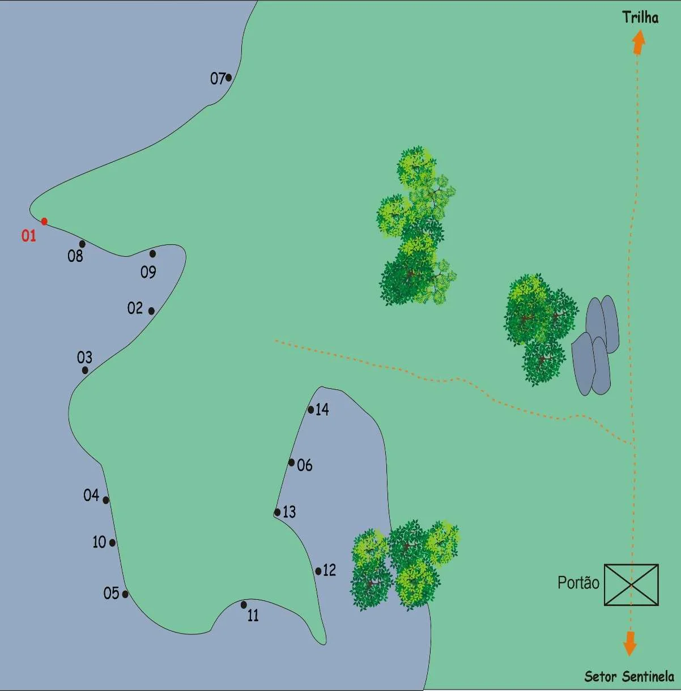
    - **largura_mapa**: 1202
    - **altura_mapa**: 1219
    - **pontos_de_interesse**:
      - **[0]**:
        - **id**: H7QJ8BYKNg4fgh
        - **uid**: H7QJ8BYKNg4fgh
        - **rotulo**: 07
        - **retangulo**:
          - **x**: 388
          - **y**: 136
          - **comprimento**: 43
          - **largura**: 41
        - **label**: 07
      - **[1]**:
        - **id**: vrNpDj4SHSrEVD
        - **uid**: vrNpDj4SHSrEVD
        - **rotulo**: 01
        - **retangulo**:
          - **x**: 50
          - **y**: 414
          - **comprimento**: 37
          - **largura**: 36
        - **label**: 01
      - **[2]**:
        - **id**: RLLGCtvn8SqGjK
        - **uid**: RLLGCtvn8SqGjK
        - **rotulo**: 08
        - **retangulo**:
          - **x**: 134
          - **y**: 450
          - **comprimento**: 38
          - **largura**: 35
        - **label**: 08
      - **[3]**:
        - **id**: fHGcqbQ8BYPjl2
        - **uid**: fHGcqbQ8BYPjl2
        - **rotulo**: 09
        - **retangulo**:
          - **x**: 262
          - **y**: 479
          - **comprimento**: 38
          - **largura**: 34
        - **label**: 09
      - **[4]**:
        - **id**: Aldhz8JdieXf5V
        - **uid**: Aldhz8JdieXf5V
        - **rotulo**: 02
        - **retangulo**:
          - **x**: 239
          - **y**: 542
          - **comprimento**: 38
          - **largura**: 35
        - **label**: 02
      - **[5]**:
        - **id**: DrgzS8XEmdD1gf
        - **uid**: DrgzS8XEmdD1gf
        - **rotulo**: 03
        - **retangulo**:
          - **x**: 149
          - **y**: 629
          - **comprimento**: 38
          - **largura**: 36
        - **label**: 03
      - **[6]**:
        - **id**: HWI7CJ61lNRtUs
        - **uid**: HWI7CJ61lNRtUs
        - **rotulo**: 14
        - **retangulo**:
          - **x**: 568
          - **y**: 721
          - **comprimento**: 36
          - **largura**: 36
        - **label**: 14
      - **[7]**:
        - **id**: 38F8893dkbll8z
        - **uid**: 38F8893dkbll8z
        - **rotulo**: 06
        - **retangulo**:
          - **x**: 538
          - **y**: 820
          - **comprimento**: 35
          - **largura**: 36
        - **label**: 06
      - **[8]**:
        - **id**: qQjcScF14Mca7Z
        - **uid**: qQjcScF14Mca7Z
        - **rotulo**: 04
        - **retangulo**:
          - **x**: 162
          - **y**: 872
          - **comprimento**: 36
          - **largura**: 34
        - **label**: 04
      - **[9]**:
        - **id**: TOZIrcbR9BO8hA
        - **uid**: TOZIrcbR9BO8hA
        - **rotulo**: 13
        - **retangulo**:
          - **x**: 511
          - **y**: 901
          - **comprimento**: 36
          - **largura**: 36
        - **label**: 13
      - **[10]**:
        - **id**: wur3LEdfSKvjI8
        - **uid**: wur3LEdfSKvjI8
        - **rotulo**: 10
        - **retangulo**:
          - **x**: 176
          - **y**: 955
          - **comprimento**: 37
          - **largura**: 34
        - **label**: 10
      - **[11]**:
        - **id**: kP2yzQWA4A2pLU
        - **uid**: kP2yzQWA4A2pLU
        - **rotulo**: 12
        - **retangulo**:
          - **x**: 581
          - **y**: 1004
          - **comprimento**: 36
          - **largura**: 40
        - **label**: 12
      - **[12]**:
        - **id**: MkR4RMFJ3tDQ2W
        - **uid**: MkR4RMFJ3tDQ2W
        - **rotulo**: 05
        - **retangulo**:
          - **x**: 197
          - **y**: 1046
          - **comprimento**: 38
          - **largura**: 34
        - **label**: 05
      - **[13]**:
        - **id**: yWnkSZOzAicgHV
        - **uid**: yWnkSZOzAicgHV
        - **rotulo**: 11
        - **retangulo**:
          - **x**: 446
          - **y**: 1084
          - **comprimento**: 36
          - **largura**: 37
        - **label**: 11
      - **[14]**:
        - **id**: r6RCLbwRMOAV1U
        - **uid**: r6RCLbwRMOAV1U
        - **rotulo**: Setor Sentinela
        - **retangulo**:
          - **x**: 1111
          - **y**: 1192
          - **comprimento**: 166
          - **largura**: 31
        - **label**: Setor Sentinela
    - **referencias**:
      - **[0]**:
        - **alvo_uid**: n8R0Lk8CBncleu
        - **pontos_uids**:
          - vrNpDj4SHSrEVD
        - **escalada**: Armagedon
        - **ids**:
          - vrNpDj4SHSrEVD
      - **[1]**:
        - **alvo_uid**: YYBzR5s2gMT5AE
        - **pontos_uids**:
          - Aldhz8JdieXf5V
        - **escalada**: No dia em que a Terra Parou
        - **ids**:
          - Aldhz8JdieXf5V
      - **[2]**:
        - **alvo_uid**: ULTLx9yjO7HB60
        - **pontos_uids**:
          - DrgzS8XEmdD1gf
        - **escalada**: Vermeio de Raiva
        - **ids**:
          - DrgzS8XEmdD1gf
      - **[3]**:
        - **alvo_uid**: yCmBMSR4HnQsiy
        - **pontos_uids**:
          - qQjcScF14Mca7Z
        - **escalada**: Linha Vermelha
        - **ids**:
          - qQjcScF14Mca7Z
      - **[4]**:
        - **alvo_uid**: NKJXS8aMbvdtzX
        - **pontos_uids**:
          - MkR4RMFJ3tDQ2W
        - **escalada**: Pestinha
        - **ids**:
          - MkR4RMFJ3tDQ2W
      - **[5]**:
        - **alvo_uid**: 00AiR220JRyWcN
        - **pontos_uids**:
          - 38F8893dkbll8z
        - **escalada**: Os Babás
        - **ids**:
          - 38F8893dkbll8z
      - **[6]**:
        - **alvo_uid**: BGbNE1PXFfBXso
        - **pontos_uids**:
          - H7QJ8BYKNg4fgh
        - **escalada**: Lanterninha
        - **ids**:
          - H7QJ8BYKNg4fgh
      - **[7]**:
        - **alvo_uid**: lmgHZxnc2gVqv0
        - **pontos_uids**:
          - wur3LEdfSKvjI8
        - **escalada**: 1ª Fila
        - **ids**:
          - wur3LEdfSKvjI8
      - **[8]**:
        - **alvo_uid**: Voe3HDXIgHEnG8
        - **pontos_uids**:
          - yWnkSZOzAicgHV
        - **escalada**: Saída de Emergência
        - **ids**:
          - yWnkSZOzAicgHV
      - **[9]**:
        - **alvo_uid**: cGwSHQ3xeD1yhW
        - **pontos_uids**:
          - kP2yzQWA4A2pLU
        - **escalada**: Roteirista
        - **ids**:
          - kP2yzQWA4A2pLU
      - **[10]**:
        - **alvo_uid**: M7q5IMIvn6Chew
        - **pontos_uids**:
          - TOZIrcbR9BO8hA
        - **escalada**: Acenderam a Luz
        - **ids**:
          - TOZIrcbR9BO8hA
      - **[11]**:
        - **alvo_uid**: JRhn0O3LNpkEkF
        - **pontos_uids**:
          - HWI7CJ61lNRtUs
        - **escalada**: Bilheteria
        - **ids**:
          - HWI7CJ61lNRtUs
      - **[12]**:
        - **alvo_uid**: CtxqyAwqmrD1a5
        - **pontos_uids**:
          - r6RCLbwRMOAV1U
        - **setor**: Setor Sentinela e Vale do Joga
        - **ids**:
          - r6RCLbwRMOAV1U
      - **[13]**:
        - **alvo_uid**: gxJN9NDU2r4JRz
        - **pontos_uids**:
          - RLLGCtvn8SqGjK
        - **escalada**: Navio Fantasma
        - **ids**:
          - RLLGCtvn8SqGjK
      - **[14]**:
        - **alvo_uid**: ZopKzjlQ9wbEqt
        - **pontos_uids**:
          - fHGcqbQ8BYPjl2
        - **escalada**: Pata Afiada
        - **ids**:
          - fHGcqbQ8BYPjl2
- **escaladas**:
  - **[0]**:
    - **uid**: n8R0Lk8CBncleu
    - **via_movel**:
      - **nome**: Armagedon
      - **dificuldade**: BR_6SUP
      - **protecoes_moveis**: Mista
      - **conquistadores**:
        - Novais
        - Márcio
        - Ivo
        - Joviney
  - **[1]**:
    - **uid**: YYBzR5s2gMT5AE
    - **via_esportiva**:
      - **nome**: No dia em que a Terra Parou
      - **dificuldade**: BR_8B
      - **quantidade_protecoes_intermediarias**: 5
      - **quantidade_protecoes_parada**: 2
      - **conquistadores**:
        - Novais
        - Márcio
        - Ivo
        - Joviney
  - **[2]**:
    - **uid**: ULTLx9yjO7HB60
    - **via_esportiva**:
      - **nome**: Vermeio de Raiva
      - **dificuldade**: BR_7A
      - **quantidade_protecoes_intermediarias**: 6
      - **quantidade_protecoes_parada**: 2
      - **conquistadores**:
        - Novais
        - Márcio
        - Ivo
        - Joviney
        - Márcio Vasconcelos
  - **[3]**:
    - **uid**: yCmBMSR4HnQsiy
    - **via_esportiva**:
      - **nome**: Linha Vermelha
      - **dificuldade**: BR_6SUP
      - **quantidade_protecoes_intermediarias**: 4
      - **quantidade_protecoes_parada**: 2
      - **conquistadores**:
        - Novais
        - Márcio
        - Ivo
        - Joviney
  - **[4]**:
    - **uid**: NKJXS8aMbvdtzX
    - **via_esportiva**:
      - **nome**: Pestinha
      - **dificuldade**: BR_6SUP
      - **quantidade_protecoes_intermediarias**: 3
      - **quantidade_protecoes_parada**: 2
      - **conquistadores**:
        - Novais
        - Márcio
        - Ivo
        - Joviney
  - **[5]**:
    - **uid**: 00AiR220JRyWcN
    - **via_esportiva**:
      - **nome**: Os Babás
      - **dificuldade**: BR_7A
      - **quantidade_protecoes_intermediarias**: 4
      - **quantidade_protecoes_parada**: 2
      - **conquistadores**:
        - Joviney Miguel
        - Wilson
        - Márcio Vasconcelos
  - **[6]**:
    - **uid**: BGbNE1PXFfBXso
    - **via_esportiva**:
      - **nome**: Lanterninha
      - **dificuldade**: BR_6SUP
      - **quantidade_protecoes_intermediarias**: 4
      - **quantidade_protecoes_parada**: 2
      - **conquistadores**:
        - Marco Durães
  - **[7]**:
    - **uid**: gxJN9NDU2r4JRz
    - **via_esportiva**:
      - **nome**: Navio Fantasma
      - **dificuldade**: BR_7C
      - **quantidade_protecoes_intermediarias**: 5
      - **quantidade_protecoes_parada**: 2
      - **conquistadores**:
        - Marcelo Novais
        - Roberto Lincoln
  - **[8]**:
    - **uid**: ZopKzjlQ9wbEqt
    - **via_esportiva**:
      - **nome**: Pata Afiada
      - **dificuldade**: BR_8A
      - **quantidade_protecoes_intermediarias**: 5
      - **quantidade_protecoes_parada**: 2
      - **conquistadores**:
        - Marcelo Novais
        - Roberto Lincoln
  - **[9]**:
    - **uid**: lmgHZxnc2gVqv0
    - **via_esportiva**:
      - **nome**: 1ª Fila
      - **dificuldade**: BR_7B
      - **quantidade_protecoes_intermediarias**: 5
      - **quantidade_protecoes_parada**: 2
      - **conquistadores**:
        - Marco Durães
        - Roberto Lincoln
  - **[10]**:
    - **uid**: Voe3HDXIgHEnG8
    - **via_esportiva**:
      - **nome**: Saída de Emergência
      - **dificuldade**: BR_7A
      - **quantidade_protecoes_intermediarias**: 4
      - **quantidade_protecoes_parada**: 2
      - **conquistadores**:
        - Marco Durães
        - Roberto Lincoln
  - **[11]**:
    - **uid**: cGwSHQ3xeD1yhW
    - **via_esportiva**:
      - **nome**: Roteirista
      - **dificuldade**: BR_6SUP
      - **quantidade_protecoes_intermediarias**: 4
      - **quantidade_protecoes_parada**: 2
      - **conquistadores**:
        - Marco Durães
        - Roberto Lincoln
  - **[12]**:
    - **uid**: M7q5IMIvn6Chew
    - **via_esportiva**:
      - **nome**: Acenderam a Luz
      - **dificuldade**: BR_6
      - **quantidade_protecoes_intermediarias**: 4
      - **quantidade_protecoes_parada**: 2
      - **conquistadores**:
        - Marco Durães
        - Roberto Lincoln
  - **[13]**:
    - **uid**: JRhn0O3LNpkEkF
    - **via_esportiva**:
      - **nome**: Bilheteria
      - **dificuldade**: BR_5
      - **quantidade_protecoes_intermediarias**: 3
      - **quantidade_protecoes_parada**: 2
      - **conquistadores**:
        - Marco Durães
        - Roberto Lincoln
- **precomputados**:
  - **total_escaladas**: 14
  - **total_esportivas**: 13

## Parte: setor_onda_de_calcario

### Setor (Pico: Gruta do Baú)

- **descricao**:
    # Setor Onda de Calcário
    
    **Acesso:** Saindo do estacionamento, pegar a trilha que segue a direita. Após cerca de 10 minutos de caminhada, encontrará a bifurcação que dá acesso ao setor.
    
    **Coordenadas na Onda de Calcário:** -19º32.890 -43º59.578
- **nome**: Setor Onda de Calcário
- **uid**: BWPnk2wxFb4Jvb
- **mapas**:
  - **[0]**:
    - **caminho_imagem_mapa**: 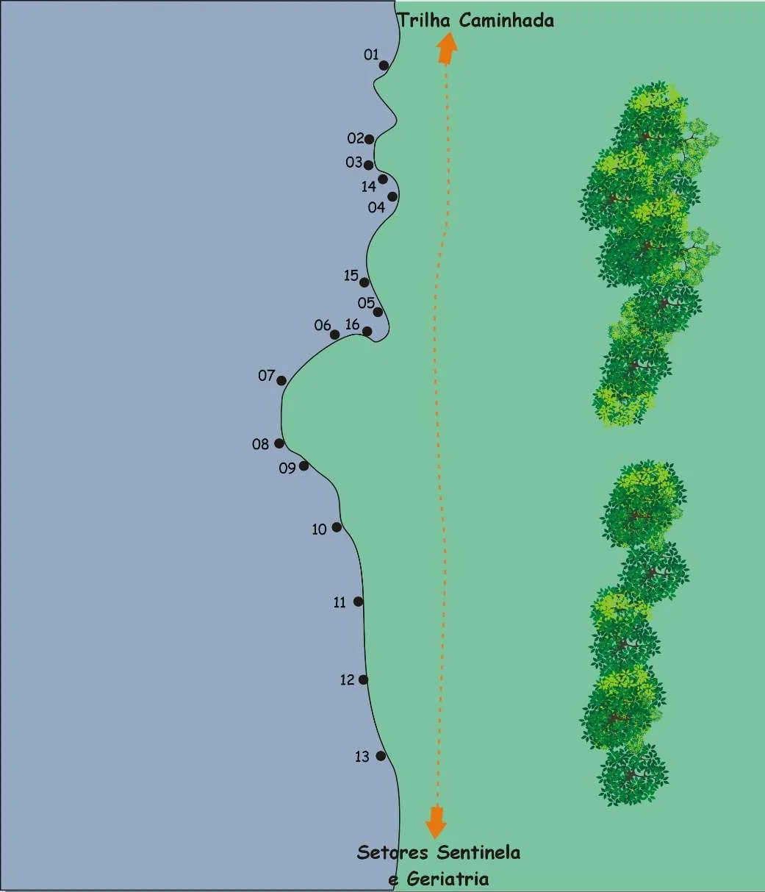
    - **largura_mapa**: 1041
    - **altura_mapa**: 1213
    - **pontos_de_interesse**:
      - **[0]**:
        - **id**: d7S5WycEPDiLZ7
        - **uid**: d7S5WycEPDiLZ7
        - **rotulo**: 01
        - **retangulo**:
          - **x**: 505
          - **y**: 74
          - **comprimento**: 30
          - **largura**: 27
        - **label**: 01
      - **[1]**:
        - **id**: qtj3NV8HAbIR4h
        - **uid**: qtj3NV8HAbIR4h
        - **rotulo**: 02
        - **retangulo**:
          - **x**: 486
          - **y**: 186
          - **comprimento**: 31
          - **largura**: 29
        - **label**: 02
      - **[2]**:
        - **id**: K4iI1p9cJmccq5
        - **uid**: K4iI1p9cJmccq5
        - **rotulo**: 03
        - **retangulo**:
          - **x**: 482
          - **y**: 219
          - **comprimento**: 33
          - **largura**: 26
        - **label**: 03
      - **[3]**:
        - **id**: 4g74fpFa1piGI2
        - **uid**: 4g74fpFa1piGI2
        - **rotulo**: 14
        - **retangulo**:
          - **x**: 501
          - **y**: 253
          - **comprimento**: 28
          - **largura**: 26
        - **label**: 14
      - **[4]**:
        - **id**: z8sAu4IRaRKNxm
        - **uid**: z8sAu4IRaRKNxm
        - **rotulo**: 04
        - **retangulo**:
          - **x**: 512
          - **y**: 282
          - **comprimento**: 31
          - **largura**: 25
        - **label**: 04
      - **[5]**:
        - **id**: xitVZpp6B0z5Y4
        - **uid**: xitVZpp6B0z5Y4
        - **rotulo**: 15
        - **retangulo**:
          - **x**: 478
          - **y**: 374
          - **comprimento**: 31
          - **largura**: 27
        - **label**: 15
      - **[6]**:
        - **id**: cwytIcLfAE8Pwq
        - **uid**: cwytIcLfAE8Pwq
        - **rotulo**: 05
        - **retangulo**:
          - **x**: 500
          - **y**: 411
          - **comprimento**: 31
          - **largura**: 26
        - **label**: 05
      - **[7]**:
        - **id**: b5lBp7YtiDUtZ3
        - **uid**: b5lBp7YtiDUtZ3
        - **rotulo**: 06
        - **retangulo**:
          - **x**: 438
          - **y**: 440
          - **comprimento**: 32
          - **largura**: 29
        - **label**: 06
      - **[8]**:
        - **id**: N7apHsykY2lnYm
        - **uid**: N7apHsykY2lnYm
        - **rotulo**: 16
        - **retangulo**:
          - **x**: 480
          - **y**: 440
          - **comprimento**: 29
          - **largura**: 26
        - **label**: 16
      - **[9]**:
        - **id**: QDQIKT4jrwoDcg
        - **uid**: QDQIKT4jrwoDcg
        - **rotulo**: 07
        - **retangulo**:
          - **x**: 364
          - **y**: 510
          - **comprimento**: 31
          - **largura**: 29
        - **label**: 07
      - **[10]**:
        - **id**: SMfIuhe7NocG4m
        - **uid**: SMfIuhe7NocG4m
        - **rotulo**: 08
        - **retangulo**:
          - **x**: 355
          - **y**: 603
          - **comprimento**: 30
          - **largura**: 28
        - **label**: 08
      - **[11]**:
        - **id**: sGiP2hEDumFjJA
        - **uid**: sGiP2hEDumFjJA
        - **rotulo**: 09
        - **retangulo**:
          - **x**: 390
          - **y**: 636
          - **comprimento**: 31
          - **largura**: 29
        - **label**: 09
      - **[12]**:
        - **id**: k5tSdAL7PJTjf5
        - **uid**: k5tSdAL7PJTjf5
        - **rotulo**: 10
        - **retangulo**:
          - **x**: 435
          - **y**: 719
          - **comprimento**: 26
          - **largura**: 26
        - **label**: 10
      - **[13]**:
        - **id**: EEGPMlDn5X1OuC
        - **uid**: EEGPMlDn5X1OuC
        - **rotulo**: 11
        - **retangulo**:
          - **x**: 462
          - **y**: 818
          - **comprimento**: 25
          - **largura**: 26
        - **label**: 11
      - **[14]**:
        - **id**: j0dXdBhC4QvGxU
        - **uid**: j0dXdBhC4QvGxU
        - **rotulo**: 12
        - **retangulo**:
          - **x**: 472
          - **y**: 924
          - **comprimento**: 28
          - **largura**: 28
        - **label**: 12
      - **[15]**:
        - **id**: iVMRs6CjKznqUV
        - **uid**: iVMRs6CjKznqUV
        - **rotulo**: 13
        - **retangulo**:
          - **x**: 493
          - **y**: 1027
          - **comprimento**: 28
          - **largura**: 26
        - **label**: 13
      - **[16]**:
        - **id**: 2Bu8eJJj9cXl8t
        - **uid**: 2Bu8eJJj9cXl8t
        - **rotulo**: Setores Sentinela e Geriatria
        - **retangulo**:
          - **x**: 596
          - **y**: 1176
          - **comprimento**: 232
          - **largura**: 68
        - **label**: Setores Sentinela e Geriatria
    - **referencias**:
      - **[0]**:
        - **alvo_uid**: 1rWVtahOYREfSQ
        - **pontos_uids**:
          - d7S5WycEPDiLZ7
        - **escalada**: Marreta Kamikaze
        - **ids**:
          - d7S5WycEPDiLZ7
      - **[1]**:
        - **alvo_uid**: 7RrFJ1qZeO6Hfh
        - **pontos_uids**:
          - qtj3NV8HAbIR4h
        - **escalada**: Entidade da Natureza
        - **ids**:
          - qtj3NV8HAbIR4h
      - **[2]**:
        - **alvo_uid**: wiWGZvPjOFR0x1
        - **pontos_uids**:
          - K4iI1p9cJmccq5
        - **escalada**: Mundo Verde
        - **ids**:
          - K4iI1p9cJmccq5
      - **[3]**:
        - **alvo_uid**: 8VKIYbJGCwjXz3
        - **pontos_uids**:
          - z8sAu4IRaRKNxm
        - **escalada**: Uma Nova Esperança
        - **ids**:
          - z8sAu4IRaRKNxm
      - **[4]**:
        - **alvo_uid**: IpAcNHSo5ICLh7
        - **pontos_uids**:
          - cwytIcLfAE8Pwq
        - **escalada**: Urtigão
        - **ids**:
          - cwytIcLfAE8Pwq
      - **[5]**:
        - **alvo_uid**: Zyq7xE4mmJjQWQ
        - **pontos_uids**:
          - b5lBp7YtiDUtZ3
        - **escalada**: Eternamente Jovem
        - **ids**:
          - b5lBp7YtiDUtZ3
      - **[6]**:
        - **alvo_uid**: MqGhRzWZ03U3Lh
        - **pontos_uids**:
          - QDQIKT4jrwoDcg
        - **escalada**: Highlander
        - **ids**:
          - QDQIKT4jrwoDcg
      - **[7]**:
        - **alvo_uid**: DirxiPH9EKii16
        - **pontos_uids**:
          - k5tSdAL7PJTjf5
        - **escalada**: Belos e Malditos
        - **ids**:
          - k5tSdAL7PJTjf5
      - **[8]**:
        - **alvo_uid**: 0Ahv2dfyyJfdST
        - **pontos_uids**:
          - EEGPMlDn5X1OuC
        - **escalada**: Green Wood
        - **ids**:
          - EEGPMlDn5X1OuC
      - **[9]**:
        - **alvo_uid**: ZsiiOUwC7P0moN
        - **pontos_uids**:
          - j0dXdBhC4QvGxU
        - **escalada**: Puro Malte
        - **ids**:
          - j0dXdBhC4QvGxU
      - **[10]**:
        - **alvo_uid**: mtGkJZ4aSgmTDx
        - **pontos_uids**:
          - iVMRs6CjKznqUV
        - **escalada**: Ação Mutantes
        - **ids**:
          - iVMRs6CjKznqUV
      - **[11]**:
        - **alvo_uid**: qifzMyF7ALDb3X
        - **pontos_uids**:
          - 4g74fpFa1piGI2
        - **escalada**: Sagrada Família
        - **ids**:
          - 4g74fpFa1piGI2
      - **[12]**:
        - **alvo_uid**: Bixjn27Iu0E6PJ
        - **pontos_uids**:
          - xitVZpp6B0z5Y4
        - **escalada**: O Poder e o Saber
        - **ids**:
          - xitVZpp6B0z5Y4
      - **[13]**:
        - **alvo_uid**: lRPYOwxTMvHp5b
        - **pontos_uids**:
          - N7apHsykY2lnYm
        - **escalada**: Zig Marley
        - **ids**:
          - N7apHsykY2lnYm
      - **[14]**:
        - **alvo_uid**: CtxqyAwqmrD1a5
        - **pontos_uids**:
          - 2Bu8eJJj9cXl8t
        - **setor**: Setor Sentinela e Vale do Joga
        - **ids**:
          - 2Bu8eJJj9cXl8t
      - **[15]**:
        - **alvo_uid**: rOeXLFY663S0bd
        - **pontos_uids**:
          - 2Bu8eJJj9cXl8t
        - **setor**: Setor Geriatria
        - **ids**:
          - 2Bu8eJJj9cXl8t
      - **[16]**:
        - **alvo_uid**: 3oEb4P3zmg2llw
        - **pontos_uids**:
          - SMfIuhe7NocG4m
        - **escalada**: Rayovac
        - **ids**:
          - SMfIuhe7NocG4m
      - **[17]**:
        - **alvo_uid**: mGQcToEnRIXuvZ
        - **pontos_uids**:
          - sGiP2hEDumFjJA
        - **escalada**: O Corpo Ainda é Pouco
        - **ids**:
          - sGiP2hEDumFjJA
- **escaladas**:
  - **[0]**:
    - **uid**: 1rWVtahOYREfSQ
    - **via_esportiva**:
      - **nome**: Marreta Kamikaze
      - **dificuldade**: BR_7A
      - **quantidade_protecoes_intermediarias**: 5
      - **quantidade_protecoes_parada**: 2
      - **conquistadores**:
        - Alexandre “Caverna”
  - **[1]**:
    - **uid**: 7RrFJ1qZeO6Hfh
    - **via_esportiva**:
      - **nome**: Entidade da Natureza
      - **dificuldade**: BR_7B
      - **quantidade_protecoes_intermediarias**: 8
      - **quantidade_protecoes_parada**: 2
      - **conquistadores**:
        - GT Baú 2021
  - **[2]**:
    - **uid**: wiWGZvPjOFR0x1
    - **via_esportiva**:
      - **nome**: Mundo Verde
      - **dificuldade**: BR_6SUP
      - **quantidade_protecoes_intermediarias**: 9
      - **quantidade_protecoes_parada**: 2
      - **conquistadores**:
        - GT Baú 2021
  - **[3]**:
    - **uid**: 8VKIYbJGCwjXz3
    - **via_esportiva**:
      - **nome**: Uma Nova Esperança
      - **dificuldade**: PROJETO
      - **quantidade_protecoes_intermediarias**: 7
      - **quantidade_protecoes_parada**: 2
      - **conquistadores**:
        - Felipe Belisário
        - Marcella Romanelli
  - **[4]**:
    - **uid**: IpAcNHSo5ICLh7
    - **via_esportiva**:
      - **nome**: Urtigão
      - **dificuldade**: BR_8A
      - **quantidade_protecoes_intermediarias**: 6
      - **quantidade_protecoes_parada**: 1
      - **conquistadores**:
        - Eustáquio Macedo
        - Emerson “Lampião”
  - **[5]**:
    - **uid**: Zyq7xE4mmJjQWQ
    - **via_esportiva**:
      - **nome**: Eternamente Jovem
      - **dificuldade**: BR_8B
      - **quantidade_protecoes_intermediarias**: 6
      - **quantidade_protecoes_parada**: 2
      - **conquistadores**:
        - Eustáquio
        - Emerson
        - Fabiano
        - Andrezão
  - **[6]**:
    - **uid**: MqGhRzWZ03U3Lh
    - **via_esportiva**:
      - **nome**: Highlander
      - **dificuldade**: BR_8B
      - **quantidade_protecoes_intermediarias**: 6
      - **quantidade_protecoes_parada**: 2
      - **conquistadores**:
        - Eustáquio
        - Emerson
        - Mr. Bean
        - Belisário
  - **[7]**:
    - **uid**: 3oEb4P3zmg2llw
    - **via_esportiva**:
      - **nome**: Rayovac
      - **dificuldade**: BR_8C
      - **quantidade_protecoes_intermediarias**: 6
      - **quantidade_protecoes_parada**: 2
      - **conquistadores**:
        - Yan Ouriques
        - Ricardo
  - **[8]**:
    - **uid**: mGQcToEnRIXuvZ
    - **via_esportiva**:
      - **nome**: O Corpo Ainda é Pouco
      - **dificuldade**: BR_9B
      - **quantidade_protecoes_intermediarias**: 8
      - **quantidade_protecoes_parada**: 2
      - **conquistadores**:
        - Ralf Cortes
        - Ingo
  - **[9]**:
    - **uid**: DirxiPH9EKii16
    - **via_esportiva**:
      - **nome**: Belos e Malditos
      - **dificuldade**: BR_10B
      - **quantidade_protecoes_intermediarias**: 13
      - **quantidade_protecoes_parada**: 2
      - **conquistadores**:
        - Eustáquio
        - Emerson
        - Felipe Belisário
        - Sandro Almeida
  - **[10]**:
    - **uid**: 0Ahv2dfyyJfdST
    - **via_esportiva**:
      - **nome**: Green Wood
      - **dificuldade**: PROJETO
      - **quantidade_protecoes_intermediarias**: 5
      - **quantidade_protecoes_parada**: 2
      - **conquistadores**:
        - Felipe Belisário
        - Sandro Almeida
        - Bernardo Barcelos
  - **[11]**:
    - **uid**: ZsiiOUwC7P0moN
    - **via_esportiva**:
      - **nome**: Puro Malte
      - **dificuldade**: PROJETO
      - **quantidade_protecoes_intermediarias**: 13
      - **quantidade_protecoes_parada**: 2
      - **conquistadores**:
        - Felipe Belisário
        - Marcella Romanelli
  - **[12]**:
    - **uid**: mtGkJZ4aSgmTDx
    - **via_esportiva**:
      - **nome**: Ação Mutantes
      - **dificuldade**: BR_8B
      - **quantidade_protecoes_intermediarias**: 6
      - **quantidade_protecoes_parada**: 2
      - **conquistadores**:
        - Ralf Cortes
        - Christian Costa
        - Felipe Belisário
  - **[13]**:
    - **uid**: qifzMyF7ALDb3X
    - **via_esportiva**:
      - **nome**: Sagrada Família
      - **dificuldade**: BR_7A
      - **quantidade_protecoes_intermediarias**: 6
      - **quantidade_protecoes_parada**: 2
      - **conquistadores**:
        - Iule Ornelas
        - Igor Andrade
        - Samuel Lucas
        - Márcio Vasconcelos
  - **[14]**:
    - **uid**: Bixjn27Iu0E6PJ
    - **via_esportiva**:
      - **nome**: O Poder e o Saber
      - **dificuldade**: BR_7C
      - **quantidade_protecoes_intermediarias**: 7
      - **quantidade_protecoes_parada**: 2
      - **conquistadores**:
        - Marcelo Novais
        - Marcus Rufino
  - **[15]**:
    - **uid**: lRPYOwxTMvHp5b
    - **via_esportiva**:
      - **nome**: Zig Marley
      - **dificuldade**: BR_7B_BARRA_7C
      - **quantidade_protecoes_intermediarias**: 6
      - **quantidade_protecoes_parada**: 2
      - **conquistadores**:
        - Iule Ornelas
        - Igor Andrade
        - Samuel Lucas
- **precomputados**:
  - **total_escaladas**: 16
  - **total_esportivas**: 16

## Parte: setor_vale_da_onca

### Setor (Pico: Gruta do Baú)

- **descricao**:
    # Setor Vale da Onça
    
    **Acesso:** Seguindo a trilha, após a entrada dos setores Escola e Geriatria, passar pelo portão de metal e seguir as placas em direção ao setor. Cerca de 15 minutos de caminhada a partir do setor entrada.
- **nome**: Setor Vale da Onça
- **uid**: Fya8VhImuKKlNV
- **mapas**:
  - **[0]**:
    - **caminho_imagem_mapa**: 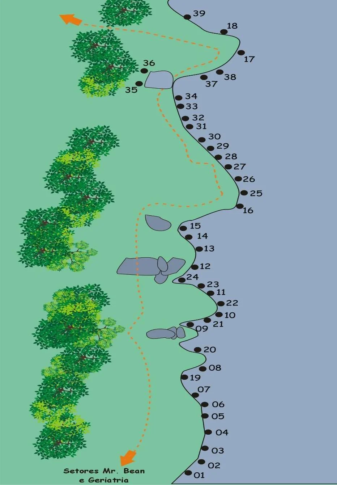
    - **largura_mapa**: 932
    - **altura_mapa**: 1340
    - **pontos_de_interesse**:
      - **[0]**:
        - **id**: 4mMftJAsL3tQ60
        - **uid**: 4mMftJAsL3tQ60
        - **rotulo**: 39
        - **retangulo**:
          - **x**: 550
          - **y**: 36
          - **comprimento**: 42
          - **largura**: 27
        - **label**: 39
      - **[1]**:
        - **id**: tRNNH4QUS4WgfM
        - **uid**: tRNNH4QUS4WgfM
        - **rotulo**: 18
        - **retangulo**:
          - **x**: 642
          - **y**: 70
          - **comprimento**: 36
          - **largura**: 25
        - **label**: 18
      - **[2]**:
        - **id**: ok82hnjQXnWTbb
        - **uid**: ok82hnjQXnWTbb
        - **rotulo**: 17
        - **retangulo**:
          - **x**: 688
          - **y**: 162
          - **comprimento**: 35
          - **largura**: 30
        - **label**: 17
      - **[3]**:
        - **id**: qAZKHmU74xPmot
        - **uid**: qAZKHmU74xPmot
        - **rotulo**: 36
        - **retangulo**:
          - **x**: 412
          - **y**: 174
          - **comprimento**: 38
          - **largura**: 28
        - **label**: 36
      - **[4]**:
        - **id**: eXWrZXgwIqeQHp
        - **uid**: eXWrZXgwIqeQHp
        - **rotulo**: 38
        - **retangulo**:
          - **x**: 636
          - **y**: 212
          - **comprimento**: 42
          - **largura**: 27
        - **label**: 38
      - **[5]**:
        - **id**: vBxKBiJWRPyKre
        - **uid**: vBxKBiJWRPyKre
        - **rotulo**: 37
        - **retangulo**:
          - **x**: 584
          - **y**: 230
          - **comprimento**: 41
          - **largura**: 29
        - **label**: 37
      - **[6]**:
        - **id**: i4jR7HU7CVYu8z
        - **uid**: i4jR7HU7CVYu8z
        - **rotulo**: 35
        - **retangulo**:
          - **x**: 362
          - **y**: 248
          - **comprimento**: 41
          - **largura**: 31
        - **label**: 35
      - **[7]**:
        - **id**: Pbb0mq6jNGJtCS
        - **uid**: Pbb0mq6jNGJtCS
        - **rotulo**: 34
        - **retangulo**:
          - **x**: 528
          - **y**: 264
          - **comprimento**: 42
          - **largura**: 27
        - **label**: 34
      - **[8]**:
        - **id**: zx9pEUqTs3XmPT
        - **uid**: zx9pEUqTs3XmPT
        - **rotulo**: 33
        - **retangulo**:
          - **x**: 529
          - **y**: 293
          - **comprimento**: 40
          - **largura**: 24
        - **label**: 33
      - **[9]**:
        - **id**: BsdchQnYUvfz6Y
        - **uid**: BsdchQnYUvfz6Y
        - **rotulo**: 32
        - **retangulo**:
          - **x**: 548
          - **y**: 324
          - **comprimento**: 37
          - **largura**: 23
        - **label**: 32
      - **[10]**:
        - **id**: cjQiaiVUHZ0ykn
        - **uid**: cjQiaiVUHZ0ykn
        - **rotulo**: 31
        - **retangulo**:
          - **x**: 556
          - **y**: 349
          - **comprimento**: 36
          - **largura**: 24
        - **label**: 31
      - **[11]**:
        - **id**: gfmAAOe2NdgKie
        - **uid**: gfmAAOe2NdgKie
        - **rotulo**: 30
        - **retangulo**:
          - **x**: 594
          - **y**: 376
          - **comprimento**: 41
          - **largura**: 25
        - **label**: 30
      - **[12]**:
        - **id**: RXGPy7l7JCpvIR
        - **uid**: RXGPy7l7JCpvIR
        - **rotulo**: 29
        - **retangulo**:
          - **x**: 616
          - **y**: 402
          - **comprimento**: 39
          - **largura**: 25
        - **label**: 29
      - **[13]**:
        - **id**: 0OSxFJgaIU3xVG
        - **uid**: 0OSxFJgaIU3xVG
        - **rotulo**: 28
        - **retangulo**:
          - **x**: 640
          - **y**: 432
          - **comprimento**: 39
          - **largura**: 24
        - **label**: 28
      - **[14]**:
        - **id**: ncc5hrob1RgzEC
        - **uid**: ncc5hrob1RgzEC
        - **rotulo**: 27
        - **retangulo**:
          - **x**: 662
          - **y**: 460
          - **comprimento**: 39
          - **largura**: 24
        - **label**: 27
      - **[15]**:
        - **id**: n6kUQmZLfwJqi3
        - **uid**: n6kUQmZLfwJqi3
        - **rotulo**: 26
        - **retangulo**:
          - **x**: 689
          - **y**: 496
          - **comprimento**: 38
          - **largura**: 27
        - **label**: 26
      - **[16]**:
        - **id**: 91Lg3W7bnb9p6R
        - **uid**: 91Lg3W7bnb9p6R
        - **rotulo**: 25
        - **retangulo**:
          - **x**: 708
          - **y**: 534
          - **comprimento**: 40
          - **largura**: 31
        - **label**: 25
      - **[17]**:
        - **id**: 1mBGlMOW6Uzerf
        - **uid**: 1mBGlMOW6Uzerf
        - **rotulo**: 16
        - **retangulo**:
          - **x**: 686
          - **y**: 580
          - **comprimento**: 36
          - **largura**: 30
        - **label**: 16
      - **[18]**:
        - **id**: Ejd2QEAuZJxoPS
        - **uid**: Ejd2QEAuZJxoPS
        - **rotulo**: 15
        - **retangulo**:
          - **x**: 541
          - **y**: 622
          - **comprimento**: 36
          - **largura**: 27
        - **label**: 15
      - **[19]**:
        - **id**: snIm0efWIbEwOb
        - **uid**: snIm0efWIbEwOb
        - **rotulo**: 14
        - **retangulo**:
          - **x**: 560
          - **y**: 652
          - **comprimento**: 37
          - **largura**: 27
        - **label**: 14
      - **[20]**:
        - **id**: oJhiAWhmR59UZv
        - **uid**: oJhiAWhmR59UZv
        - **rotulo**: 13
        - **retangulo**:
          - **x**: 579
          - **y**: 686
          - **comprimento**: 36
          - **largura**: 29
        - **label**: 13
      - **[21]**:
        - **id**: OZAMQ19n0RHB3C
        - **uid**: OZAMQ19n0RHB3C
        - **rotulo**: 12
        - **retangulo**:
          - **x**: 567
          - **y**: 735
          - **comprimento**: 36
          - **largura**: 26
        - **label**: 12
      - **[22]**:
        - **id**: WhXAVK8PJ0I2oS
        - **uid**: WhXAVK8PJ0I2oS
        - **rotulo**: 24
        - **retangulo**:
          - **x**: 532
          - **y**: 766
          - **comprimento**: 40
          - **largura**: 31
        - **label**: 24
      - **[23]**:
        - **id**: dAAqJWcjOae8Y0
        - **uid**: dAAqJWcjOae8Y0
        - **rotulo**: 23
        - **retangulo**:
          - **x**: 590
          - **y**: 784
          - **comprimento**: 42
          - **largura**: 22
        - **label**: 23
      - **[24]**:
        - **id**: LIrSEU8C2yAhfs
        - **uid**: LIrSEU8C2yAhfs
        - **rotulo**: 11
        - **retangulo**:
          - **x**: 612
          - **y**: 808
          - **comprimento**: 31
          - **largura**: 23
        - **label**: 11
      - **[25]**:
        - **id**: 3XtyidrS1LSRAJ
        - **uid**: 3XtyidrS1LSRAJ
        - **rotulo**: 22
        - **retangulo**:
          - **x**: 642
          - **y**: 836
          - **comprimento**: 39
          - **largura**: 27
        - **label**: 22
      - **[26]**:
        - **id**: fVemWOnPfKhL5l
        - **uid**: fVemWOnPfKhL5l
        - **rotulo**: 10
        - **retangulo**:
          - **x**: 636
          - **y**: 870
          - **comprimento**: 37
          - **largura**: 26
        - **label**: 10
      - **[27]**:
        - **id**: HbpfADNo8UQRNc
        - **uid**: HbpfADNo8UQRNc
        - **rotulo**: 21
        - **retangulo**:
          - **x**: 602
          - **y**: 896
          - **comprimento**: 39
          - **largura**: 24
        - **label**: 21
      - **[28]**:
        - **id**: dDg0wdt3t0ImKW
        - **uid**: dDg0wdt3t0ImKW
        - **rotulo**: 09
        - **retangulo**:
          - **x**: 558
          - **y**: 908
          - **comprimento**: 39
          - **largura**: 30
        - **label**: 09
      - **[29]**:
        - **id**: C7PSZdTZDB5kvm
        - **uid**: C7PSZdTZDB5kvm
        - **rotulo**: 20
        - **retangulo**:
          - **x**: 580
          - **y**: 966
          - **comprimento**: 42
          - **largura**: 31
        - **label**: 20
      - **[30]**:
        - **id**: sDnUQ1JgqGfrc7
        - **uid**: sDnUQ1JgqGfrc7
        - **rotulo**: 08
        - **retangulo**:
          - **x**: 596
          - **y**: 1015
          - **comprimento**: 40
          - **largura**: 32
        - **label**: 08
      - **[31]**:
        - **id**: wDTVXrQmHJMjla
        - **uid**: wDTVXrQmHJMjla
        - **rotulo**: 19
        - **retangulo**:
          - **x**: 539
          - **y**: 1043
          - **comprimento**: 38
          - **largura**: 28
        - **label**: 19
      - **[32]**:
        - **id**: EQMLtSq9HB5Vzx
        - **uid**: EQMLtSq9HB5Vzx
        - **rotulo**: 07
        - **retangulo**:
          - **x**: 564
          - **y**: 1076
          - **comprimento**: 40
          - **largura**: 32
        - **label**: 07
      - **[33]**:
        - **id**: Na4dVXikTQUj9u
        - **uid**: Na4dVXikTQUj9u
        - **rotulo**: 06
        - **retangulo**:
          - **x**: 604
          - **y**: 1116
          - **comprimento**: 40
          - **largura**: 29
        - **label**: 06
      - **[34]**:
        - **id**: KT3WKkLqwyx2XD
        - **uid**: KT3WKkLqwyx2XD
        - **rotulo**: 05
        - **retangulo**:
          - **x**: 602
          - **y**: 1150
          - **comprimento**: 42
          - **largura**: 29
        - **label**: 05
      - **[35]**:
        - **id**: 0FucMmVMfEFiF3
        - **uid**: 0FucMmVMfEFiF3
        - **rotulo**: 04
        - **retangulo**:
          - **x**: 614
          - **y**: 1194
          - **comprimento**: 41
          - **largura**: 29
        - **label**: 04
      - **[36]**:
        - **id**: 6ZPJRJSEDijilq
        - **uid**: 6ZPJRJSEDijilq
        - **rotulo**: 03
        - **retangulo**:
          - **x**: 602
          - **y**: 1244
          - **comprimento**: 40
          - **largura**: 29
        - **label**: 03
      - **[37]**:
        - **id**: dOTQQDuvhBIGBz
        - **uid**: dOTQQDuvhBIGBz
        - **rotulo**: 02
        - **retangulo**:
          - **x**: 592
          - **y**: 1286
          - **comprimento**: 38
          - **largura**: 31
        - **label**: 02
      - **[38]**:
        - **id**: s2uJ9T3U9iO7Zd
        - **uid**: s2uJ9T3U9iO7Zd
        - **rotulo**: 01
        - **retangulo**:
          - **x**: 550
          - **y**: 1312
          - **comprimento**: 35
          - **largura**: 29
        - **label**: 01
      - **[39]**:
        - **id**: YV5UUpwycpksi2
        - **uid**: YV5UUpwycpksi2
        - **rotulo**: Setores Mr. Bean e Geriatria
        - **retangulo**:
          - **x**: 288
          - **y**: 1312
          - **comprimento**: 233
          - **largura**: 53
        - **label**: Setores Mr. Bean e Geriatria
    - **referencias**:
      - **[0]**:
        - **alvo_uid**: DGBTZBr7Z4Aymc
        - **pontos_uids**:
          - s2uJ9T3U9iO7Zd
        - **escalada**: Quebrando o Pau
        - **ids**:
          - s2uJ9T3U9iO7Zd
      - **[1]**:
        - **alvo_uid**: XrhtmDNWZsnCyn
        - **pontos_uids**:
          - dOTQQDuvhBIGBz
        - **escalada**: Prima do Rio
        - **ids**:
          - dOTQQDuvhBIGBz
      - **[2]**:
        - **alvo_uid**: dnasva6XHiFPlD
        - **pontos_uids**:
          - 6ZPJRJSEDijilq
        - **escalada**: Psiu, Calate
        - **ids**:
          - 6ZPJRJSEDijilq
      - **[3]**:
        - **alvo_uid**: 032w3dHUuNq2VF
        - **pontos_uids**:
          - 0FucMmVMfEFiF3
        - **escalada**: Mis cosas, cuido yo
        - **ids**:
          - 0FucMmVMfEFiF3
      - **[4]**:
        - **alvo_uid**: q7HmX1XcrTIOM0
        - **pontos_uids**:
          - KT3WKkLqwyx2XD
        - **escalada**: Fugindo da Jiboia
        - **ids**:
          - KT3WKkLqwyx2XD
      - **[5]**:
        - **alvo_uid**: O7euQnoiRmkdi7
        - **pontos_uids**:
          - Na4dVXikTQUj9u
        - **escalada**: Fugindo da Onça
        - **ids**:
          - Na4dVXikTQUj9u
      - **[6]**:
        - **alvo_uid**: 07CXKVQTCuNFhP
        - **pontos_uids**:
          - EQMLtSq9HB5Vzx
        - **escalada**: No Pescoço do Jacaré
        - **ids**:
          - EQMLtSq9HB5Vzx
      - **[7]**:
        - **alvo_uid**: 57nDso1tnG7U9T
        - **pontos_uids**:
          - fVemWOnPfKhL5l
        - **escalada**: Orifícios do Ofício
        - **ids**:
          - fVemWOnPfKhL5l
      - **[8]**:
        - **alvo_uid**: mAccD4ydTZQTKh
        - **pontos_uids**:
          - LIrSEU8C2yAhfs
        - **escalada**: Cercando o Perímetro
        - **ids**:
          - LIrSEU8C2yAhfs
      - **[9]**:
        - **alvo_uid**: t4P9BduRQyLJAg
        - **pontos_uids**:
          - OZAMQ19n0RHB3C
        - **escalada**: Trabaiá não qué
        - **ids**:
          - OZAMQ19n0RHB3C
      - **[10]**:
        - **alvo_uid**: vUlWlygPzXw0TN
        - **pontos_uids**:
          - oJhiAWhmR59UZv
        - **escalada**: Na Surdina
        - **ids**:
          - oJhiAWhmR59UZv
      - **[11]**:
        - **alvo_uid**: V2sGEaRu8SGrTI
        - **pontos_uids**:
          - snIm0efWIbEwOb
        - **escalada**: Gente Boa
        - **ids**:
          - snIm0efWIbEwOb
      - **[12]**:
        - **alvo_uid**: 8q3LQbp3Xw5Dkn
        - **pontos_uids**:
          - Ejd2QEAuZJxoPS
        - **escalada**: Aqui Jaz
        - **ids**:
          - Ejd2QEAuZJxoPS
      - **[13]**:
        - **alvo_uid**: 6mw57wJRcMuLxu
        - **pontos_uids**:
          - 1mBGlMOW6Uzerf
        - **escalada**: Toca da Jararaca
        - **ids**:
          - 1mBGlMOW6Uzerf
      - **[14]**:
        - **alvo_uid**: TjfyhQii2rm5Rx
        - **pontos_uids**:
          - ok82hnjQXnWTbb
        - **escalada**: Mais que Infinito
        - **ids**:
          - ok82hnjQXnWTbb
      - **[15]**:
        - **alvo_uid**: 46YWiGok0dJM8K
        - **pontos_uids**:
          - tRNNH4QUS4WgfM
        - **escalada**: Fissurados
        - **ids**:
          - tRNNH4QUS4WgfM
      - **[16]**:
        - **alvo_uid**: ToGrTt89BKxjE2
        - **pontos_uids**:
          - wDTVXrQmHJMjla
        - **escalada**: Olho de Hórus
        - **ids**:
          - wDTVXrQmHJMjla
      - **[17]**:
        - **alvo_uid**: 6iWr6kRxHgag21
        - **pontos_uids**:
          - C7PSZdTZDB5kvm
        - **escalada**: Melhor Idade
        - **ids**:
          - C7PSZdTZDB5kvm
      - **[18]**:
        - **alvo_uid**: MyNlPioZPYB4kX
        - **pontos_uids**:
          - HbpfADNo8UQRNc
        - **escalada**: Torre de Babel
        - **ids**:
          - HbpfADNo8UQRNc
      - **[19]**:
        - **alvo_uid**: WzeMS5tvQ0t7Cj
        - **pontos_uids**:
          - 3XtyidrS1LSRAJ
        - **escalada**: Era Venenosa
        - **ids**:
          - 3XtyidrS1LSRAJ
      - **[20]**:
        - **alvo_uid**: p6L6DoW6L8DIta
        - **pontos_uids**:
          - dAAqJWcjOae8Y0
        - **escalada**: Arcanjo Gabriel
        - **ids**:
          - dAAqJWcjOae8Y0
      - **[21]**:
        - **alvo_uid**: Ya7RZGzor14gnK
        - **pontos_uids**:
          - WhXAVK8PJ0I2oS
        - **escalada**: La Bella Luna
        - **ids**:
          - WhXAVK8PJ0I2oS
      - **[22]**:
        - **alvo_uid**: rLidVkdsKwZ5xI
        - **pontos_uids**:
          - 91Lg3W7bnb9p6R
        - **escalada**: Amigo da Onça
        - **ids**:
          - 91Lg3W7bnb9p6R
      - **[23]**:
        - **alvo_uid**: qY0YDQFulc4dcW
        - **pontos_uids**:
          - n6kUQmZLfwJqi3
        - **escalada**: Baú da Felicidade
        - **ids**:
          - n6kUQmZLfwJqi3
      - **[24]**:
        - **alvo_uid**: EjSv6czBe71nCj
        - **pontos_uids**:
          - ncc5hrob1RgzEC
        - **escalada**: Cavalo de Tróia
        - **ids**:
          - ncc5hrob1RgzEC
      - **[25]**:
        - **alvo_uid**: OxNupKPtIhAG9K
        - **pontos_uids**:
          - 0OSxFJgaIU3xVG
        - **escalada**: Testosterona
        - **ids**:
          - 0OSxFJgaIU3xVG
      - **[26]**:
        - **alvo_uid**: yA7o6fR2aS7Fmm
        - **pontos_uids**:
          - RXGPy7l7JCpvIR
        - **escalada**: Mazelados
        - **ids**:
          - RXGPy7l7JCpvIR
      - **[27]**:
        - **alvo_uid**: q1p43mX0y2CKle
        - **pontos_uids**:
          - gfmAAOe2NdgKie
        - **escalada**: A Fúria de Dandara
        - **ids**:
          - gfmAAOe2NdgKie
      - **[28]**:
        - **alvo_uid**: pVTBGWZkyJYwc5
        - **pontos_uids**:
          - cjQiaiVUHZ0ykn
        - **escalada**: Climb Terapia
        - **ids**:
          - cjQiaiVUHZ0ykn
      - **[29]**:
        - **alvo_uid**: ZQLb6szpPabT4Z
        - **pontos_uids**:
          - BsdchQnYUvfz6Y
        - **escalada**: Atitude
        - **ids**:
          - BsdchQnYUvfz6Y
      - **[30]**:
        - **alvo_uid**: T8wocWfCdU3bIu
        - **pontos_uids**:
          - zx9pEUqTs3XmPT
        - **escalada**: Zona de Perigo
        - **ids**:
          - zx9pEUqTs3XmPT
      - **[31]**:
        - **alvo_uid**: C7AaKtRkTzQze3
        - **pontos_uids**:
          - Pbb0mq6jNGJtCS
        - **escalada**: A Montanha dos 7 Abutres
        - **ids**:
          - Pbb0mq6jNGJtCS
      - **[32]**:
        - **alvo_uid**: Y8PVeQna7eGZua
        - **pontos_uids**:
          - i4jR7HU7CVYu8z
        - **escalada**: Caixa de Pandora
        - **ids**:
          - i4jR7HU7CVYu8z
      - **[33]**:
        - **alvo_uid**: DU0zpKJ682o1UM
        - **pontos_uids**:
          - qAZKHmU74xPmot
        - **escalada**: Vivendo o Sonho
        - **ids**:
          - qAZKHmU74xPmot
      - **[34]**:
        - **alvo_uid**: YrciYL6GGC4fLJ
        - **pontos_uids**:
          - vBxKBiJWRPyKre
        - **escalada**: A Torre deu Pane
        - **ids**:
          - vBxKBiJWRPyKre
      - **[35]**:
        - **alvo_uid**: ZsVXQ7TCW3NlMZ
        - **pontos_uids**:
          - eXWrZXgwIqeQHp
        - **escalada**: Sessentenário
        - **ids**:
          - eXWrZXgwIqeQHp
      - **[36]**:
        - **alvo_uid**: 25AfICarnSmvJs
        - **pontos_uids**:
          - 4mMftJAsL3tQ60
        - **escalada**: Supimpa
        - **ids**:
          - 4mMftJAsL3tQ60
      - **[37]**:
        - **alvo_uid**: LPLcjyLyZDlyih
        - **pontos_uids**:
          - YV5UUpwycpksi2
        - **setor**: Setor Mr. Bean
        - **ids**:
          - YV5UUpwycpksi2
      - **[38]**:
        - **alvo_uid**: rOeXLFY663S0bd
        - **pontos_uids**:
          - YV5UUpwycpksi2
        - **setor**: Setor Geriatria
        - **ids**:
          - YV5UUpwycpksi2
      - **[39]**:
        - **alvo_uid**: 3s9yVQY8q4kQcv
        - **pontos_uids**:
          - sDnUQ1JgqGfrc7
        - **escalada**: Retorno de Borges
        - **ids**:
          - sDnUQ1JgqGfrc7
      - **[40]**:
        - **alvo_uid**: cgXNsbrlU9tdBZ
        - **pontos_uids**:
          - dDg0wdt3t0ImKW
        - **escalada**: 3º Pecado Capital
        - **ids**:
          - dDg0wdt3t0ImKW
- **escaladas**:
  - **[0]**:
    - **uid**: DGBTZBr7Z4Aymc
    - **via_esportiva**:
      - **nome**: Quebrando o Pau
      - **dificuldade**: BR_6
      - **quantidade_protecoes_intermediarias**: 6
      - **quantidade_protecoes_parada**: 2
      - **conquistadores**:
        - Otto
        - Lu
  - **[1]**:
    - **uid**: XrhtmDNWZsnCyn
    - **via_esportiva**:
      - **nome**: Prima do Rio
      - **dificuldade**: BR_7C
      - **quantidade_protecoes_intermediarias**: 8
      - **quantidade_protecoes_parada**: 2
      - **conquistadores**:
        - Otto
        - Lu
  - **[2]**:
    - **uid**: dnasva6XHiFPlD
    - **via_esportiva**:
      - **nome**: Psiu, Calate
      - **dificuldade**: BR_8B
      - **quantidade_protecoes_intermediarias**: 8
      - **quantidade_protecoes_parada**: 2
      - **conquistadores**:
        - Otto
        - Lu
  - **[3]**:
    - **uid**: 032w3dHUuNq2VF
    - **via_esportiva**:
      - **nome**: Mis cosas, cuido yo
      - **dificuldade**: BR_8B
      - **quantidade_protecoes_intermediarias**: 9
      - **quantidade_protecoes_parada**: 2
      - **conquistadores**:
        - Otto
        - Lu
  - **[4]**:
    - **uid**: q7HmX1XcrTIOM0
    - **via_esportiva**:
      - **nome**: Fugindo da Jiboia
      - **dificuldade**: BR_8A
      - **quantidade_protecoes_intermediarias**: 7
      - **quantidade_protecoes_parada**: 2
      - **conquistadores**:
        - Otto
        - Lu
  - **[5]**:
    - **uid**: O7euQnoiRmkdi7
    - **via_esportiva**:
      - **nome**: Fugindo da Onça
      - **dificuldade**: BR_8B
      - **quantidade_protecoes_intermediarias**: 9
      - **quantidade_protecoes_parada**: 2
      - **conquistadores**:
        - Otto
        - Wilson Souza
        - Jana
  - **[6]**:
    - **uid**: 07CXKVQTCuNFhP
    - **via_esportiva**:
      - **nome**: No Pescoço do Jacaré
      - **dificuldade**: BR_8A
      - **quantidade_protecoes_intermediarias**: 8
      - **quantidade_protecoes_parada**: 2
      - **conquistadores**:
        - Wilson Souza
        - Otto
  - **[7]**:
    - **uid**: 3s9yVQY8q4kQcv
    - **via_esportiva**:
      - **nome**: Retorno de Borges
      - **dificuldade**: BR_6SUP
      - **quantidade_protecoes_intermediarias**: 8
      - **quantidade_protecoes_parada**: 2
      - **conquistadores**:
        - Otto
        - Lu
  - **[8]**:
    - **uid**: cgXNsbrlU9tdBZ
    - **via_esportiva**:
      - **nome**: 3º Pecado Capital
      - **dificuldade**: BR_6
      - **quantidade_protecoes_intermediarias**: 7
      - **quantidade_protecoes_parada**: 2
      - **conquistadores**:
        - Wilson Souza
        - Otto
  - **[9]**:
    - **uid**: 57nDso1tnG7U9T
    - **via_esportiva**:
      - **nome**: Orifícios do Ofício
      - **dificuldade**: BR_7B
      - **quantidade_protecoes_intermediarias**: 6
      - **quantidade_protecoes_parada**: 2
      - **conquistadores**:
        - Wilson Souza
        - Otto
  - **[10]**:
    - **uid**: mAccD4ydTZQTKh
    - **via_esportiva**:
      - **nome**: Cercando o Perímetro
      - **dificuldade**: BR_5SUP
      - **quantidade_protecoes_intermediarias**: 8
      - **quantidade_protecoes_parada**: 2
      - **conquistadores**:
        - Wilson Souza
        - Otto
  - **[11]**:
    - **uid**: t4P9BduRQyLJAg
    - **via_esportiva**:
      - **nome**: Trabaiá não qué
      - **dificuldade**: BR_7A
      - **quantidade_protecoes_intermediarias**: 8
      - **quantidade_protecoes_parada**: 2
      - **conquistadores**:
        - Wilson Souza
        - Otto
  - **[12]**:
    - **uid**: vUlWlygPzXw0TN
    - **via_esportiva**:
      - **nome**: Na Surdina
      - **dificuldade**: BR_8A
      - **quantidade_protecoes_intermediarias**: 9
      - **quantidade_protecoes_parada**: 2
      - **conquistadores**:
        - Wilson Souza
        - Otto
  - **[13]**:
    - **uid**: V2sGEaRu8SGrTI
    - **via_esportiva**:
      - **nome**: Gente Boa
      - **dificuldade**: BR_7A
      - **quantidade_protecoes_intermediarias**: 9
      - **quantidade_protecoes_parada**: 2
      - **conquistadores**:
        - Wilson Souza
        - Otto
  - **[14]**:
    - **uid**: 8q3LQbp3Xw5Dkn
    - **via_esportiva**:
      - **nome**: Aqui Jaz
      - **dificuldade**: BR_7A
      - **quantidade_protecoes_intermediarias**: 9
      - **quantidade_protecoes_parada**: 2
      - **conquistadores**:
        - Wilson Souza
        - Otto
  - **[15]**:
    - **uid**: 6mw57wJRcMuLxu
    - **via_esportiva**:
      - **nome**: Toca da Jararaca
      - **dificuldade**: BR_6SUP
      - **quantidade_protecoes_intermediarias**: 11
      - **quantidade_protecoes_parada**: 2
      - **conquistadores**:
        - Wilson Souza
        - Otto
  - **[16]**:
    - **uid**: TjfyhQii2rm5Rx
    - **via_esportiva**:
      - **nome**: Mais que Infinito
      - **dificuldade**: BR_7B_BARRA_7C
      - **quantidade_protecoes_intermediarias**: 10
      - **quantidade_protecoes_parada**: 2
      - **conquistadores**:
        - Márcio Macena
        - Christian Costa
        - Joviney Miguel
  - **[17]**:
    - **uid**: 46YWiGok0dJM8K
    - **via_esportiva**:
      - **nome**: Fissurados
      - **dificuldade**: BR_7B
      - **quantidade_protecoes_intermediarias**: 8
      - **quantidade_protecoes_parada**: 2
      - **conquistadores**:
        - Marcus Rufino
        - Renato Utsch
  - **[18]**:
    - **uid**: ToGrTt89BKxjE2
    - **via_esportiva**:
      - **nome**: Olho de Hórus
      - **dificuldade**: PROJETO
      - **quantidade_protecoes_intermediarias**: 14
      - **quantidade_protecoes_parada**: 2
      - **conquistadores**:
        - Igor Andrade
        - Iule Ornelas
  - **[19]**:
    - **uid**: 6iWr6kRxHgag21
    - **via_esportiva**:
      - **nome**: Melhor Idade
      - **dificuldade**: BR_7A
      - **quantidade_protecoes_intermediarias**: 9
      - **quantidade_protecoes_parada**: 2
      - **conquistadores**:
        - Christian Costa
        - Dênio Teixeira
        - Wilson Professor
  - **[20]**:
    - **uid**: MyNlPioZPYB4kX
    - **via_esportiva**:
      - **nome**: Torre de Babel
      - **dificuldade**: BR_7C
      - **quantidade_protecoes_intermediarias**: 8
      - **quantidade_protecoes_parada**: 2
      - **conquistadores**:
        - Átila Cunha
        - Marcelo Novais
        - Marcus Rufino
  - **[21]**:
    - **uid**: WzeMS5tvQ0t7Cj
    - **via_esportiva**:
      - **nome**: Era Venenosa
      - **dificuldade**: BR_6SUP
      - **quantidade_protecoes_intermediarias**: 8
      - **quantidade_protecoes_parada**: 2
      - **conquistadores**:
        - Lídia Botelho
        - Thaina Leão
  - **[22]**:
    - **uid**: p6L6DoW6L8DIta
    - **via_esportiva**:
      - **nome**: Arcanjo Gabriel
      - **dificuldade**: BR_7A
      - **quantidade_protecoes_intermediarias**: 10
      - **quantidade_protecoes_parada**: 2
      - **conquistadores**:
        - Igor Andrade
        - Iule Ornelas
  - **[23]**:
    - **uid**: Ya7RZGzor14gnK
    - **via_esportiva**:
      - **nome**: La Bella Luna
      - **dificuldade**: BR_7B_BARRA_7C
      - **quantidade_protecoes_intermediarias**: 11
      - **quantidade_protecoes_parada**: 2
      - **conquistadores**:
        - Igor Andrade
        - Iule Ornelas
  - **[24]**:
    - **uid**: rLidVkdsKwZ5xI
    - **via_esportiva**:
      - **nome**: Amigo da Onça
      - **dificuldade**: BR_6SUP
      - **quantidade_protecoes_intermediarias**: 8
      - **quantidade_protecoes_parada**: 2
      - **conquistadores**:
        - Marcelo Novais
        - Willian Cruz
        - Sidnei Cunha
  - **[25]**:
    - **uid**: qY0YDQFulc4dcW
    - **via_esportiva**:
      - **nome**: Baú da Felicidade
      - **dificuldade**: BR_5SUP
      - **quantidade_protecoes_intermediarias**: 10
      - **quantidade_protecoes_parada**: 2
      - **conquistadores**:
        - Marcelo Novais
        - Willian Cruz
  - **[26]**:
    - **uid**: EjSv6czBe71nCj
    - **via_esportiva**:
      - **nome**: Cavalo de Tróia
      - **dificuldade**: BR_7B
      - **quantidade_protecoes_intermediarias**: 8
      - **quantidade_protecoes_parada**: 2
      - **conquistadores**:
        - Marcelo Novais
        - Marcus Rufino
  - **[27]**:
    - **uid**: OxNupKPtIhAG9K
    - **via_esportiva**:
      - **nome**: Testosterona
      - **dificuldade**: BR_8A_BARRA_8B
      - **quantidade_protecoes_intermediarias**: 7
      - **quantidade_protecoes_parada**: 2
      - **conquistadores**:
        - Cláudio
        - Leo Rodrigues
        - Sidão
  - **[28]**:
    - **uid**: yA7o6fR2aS7Fmm
    - **via_esportiva**:
      - **nome**: Mazelados
      - **dificuldade**: BR_7C
      - **quantidade_protecoes_intermediarias**: 9
      - **quantidade_protecoes_parada**: 2
      - **conquistadores**:
        - Cláudio
        - Leo Rodrigues
        - Sidão
  - **[29]**:
    - **uid**: q1p43mX0y2CKle
    - **via_esportiva**:
      - **nome**: A Fúria de Dandara
      - **dificuldade**: BR_7C
      - **quantidade_protecoes_intermediarias**: 7
      - **quantidade_protecoes_parada**: 2
      - **conquistadores**:
        - Marcelo Novais
        - Willian Cruz
  - **[30]**:
    - **uid**: pVTBGWZkyJYwc5
    - **via_esportiva**:
      - **nome**: Climb Terapia
      - **dificuldade**: BR_7C
      - **quantidade_protecoes_intermediarias**: 7
      - **quantidade_protecoes_parada**: 2
      - **conquistadores**:
        - Cláudio
        - Leo Rodrigues
        - Sidão
  - **[31]**:
    - **uid**: ZQLb6szpPabT4Z
    - **via_esportiva**:
      - **nome**: Atitude
      - **dificuldade**: BR_7C
      - **quantidade_protecoes_intermediarias**: 7
      - **quantidade_protecoes_parada**: 2
      - **conquistadores**:
        - Cláudio
        - Leo Rodrigues
        - Sidão
  - **[32]**:
    - **uid**: T8wocWfCdU3bIu
    - **via_esportiva**:
      - **nome**: Zona de Perigo
      - **dificuldade**: BR_7C
      - **quantidade_protecoes_intermediarias**: 10
      - **quantidade_protecoes_parada**: 2
      - **conquistadores**:
        - Marcelo Novais
        - Willian Cruz
  - **[33]**:
    - **uid**: C7AaKtRkTzQze3
    - **via_esportiva**:
      - **nome**: A Montanha dos 7 Abutres
      - **dificuldade**: BR_7B
      - **quantidade_protecoes_intermediarias**: 9
      - **quantidade_protecoes_parada**: 2
      - **conquistadores**:
        - Marcelo Novais
        - Roberto Lincoln
  - **[34]**:
    - **uid**: Y8PVeQna7eGZua
    - **via_esportiva**:
      - **nome**: Caixa de Pandora
      - **dificuldade**: BR_6
      - **quantidade_protecoes_intermediarias**: 7
      - **quantidade_protecoes_parada**: 2
      - **conquistadores**:
        - Marcelo Novais
        - Roberto Lincoln
  - **[35]**:
    - **uid**: DU0zpKJ682o1UM
    - **via_esportiva**:
      - **nome**: Vivendo o Sonho
      - **dificuldade**: BR_6
      - **quantidade_protecoes_intermediarias**: 8
      - **quantidade_protecoes_parada**: 2
      - **conquistadores**:
        - Marcelo Navais
        - Renato Utsch
  - **[36]**:
    - **uid**: YrciYL6GGC4fLJ
    - **via_esportiva**:
      - **nome**: A Torre deu Pane
      - **dificuldade**: BR_6SUP
      - **quantidade_protecoes_intermediarias**: 8
      - **quantidade_protecoes_parada**: 2
      - **conquistadores**:
        - Átila Cunha
        - Marcelo Novais
        - Roberto Lincoln
  - **[37]**:
    - **uid**: ZsVXQ7TCW3NlMZ
    - **via_esportiva**:
      - **nome**: Sessentenário
      - **dificuldade**: BR_6SUP
      - **quantidade_protecoes_intermediarias**: 7
      - **quantidade_protecoes_parada**: 2
      - **conquistadores**:
        - Igor Andrade
        - Iule Ornelas
        - Márcio Vasconcelos
  - **[38]**:
    - **uid**: 25AfICarnSmvJs
    - **via_esportiva**:
      - **nome**: Supimpa
      - **dificuldade**: BR_6
      - **quantidade_protecoes_intermediarias**: 9
      - **quantidade_protecoes_parada**: 2
      - **conquistadores**:
        - Marcelo Novais
        - Átila Cunha
- **precomputados**:
  - **total_escaladas**: 39
  - **total_esportivas**: 39

## Arquivos Externos

- **arquivos_externos**:
  - **[0]**:
    - **caminho**: 
    - **checksum_sha256**: 336bbfebac3a2dea9982af6574404d369cb5beb128debd8bd12a365f9ab70b82
  - **[1]**:
    - **caminho**: 
    - **checksum_sha256**: eedc7521abba563f3fdbb446437a1c88cd4145e5a3c50396f6c73e7ff540468b
  - **[2]**:
    - **caminho**: 
    - **checksum_sha256**: abfaf2144cd9808091864f20400296e3f0d44af27c6eb74b45d6bc69cd5d0eca
  - **[3]**:
    - **caminho**: 
    - **checksum_sha256**: 26fdd1a51ff1c663a996fd7141e8cdb86639fdb77c30bd58a091ee9f9f458022
  - **[4]**:
    - **caminho**: 
    - **checksum_sha256**: 951c72b56e61bc0e783bcf58cd344341b84bd584eedd7d374fbd5b77233810e2
  - **[5]**:
    - **caminho**: 
    - **checksum_sha256**: 1fcdb2c46c7fba451f5e576bfd9bd4164f964242dc93b2b170567393a9e96f4b
  - **[6]**:
    - **caminho**: 
    - **checksum_sha256**: 51e3af36bb54d8dd55fa5ffc03af21b5dc35d5b830b2ac563e2f1d857198a57d
  - **[7]**:
    - **caminho**: 
    - **checksum_sha256**: 59e2478366cf635707ed3568a2f4d681e662a029fbc2ce8f1e1180e0b20168b4
  - **[8]**:
    - **caminho**: 
    - **checksum_sha256**: 99b9e7c953fb1b5785bd1c9bb2f8e2df69beba06d165f597c7901d74f3e011cc
  - **[9]**:
    - **caminho**: 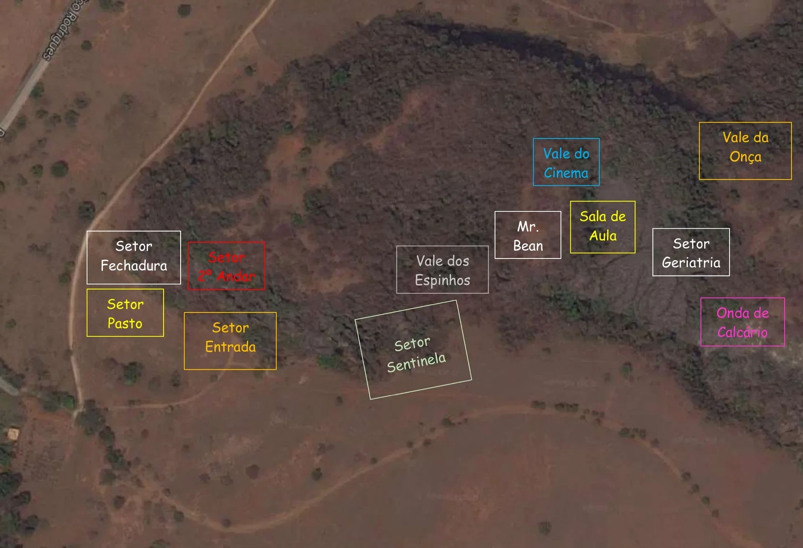
    - **checksum_sha256**: 04956f734d3fbebbf9be3c478bb3952b0fda23e2269e49f4c6852b8f2839cf20
  - **[10]**:
    - **caminho**: 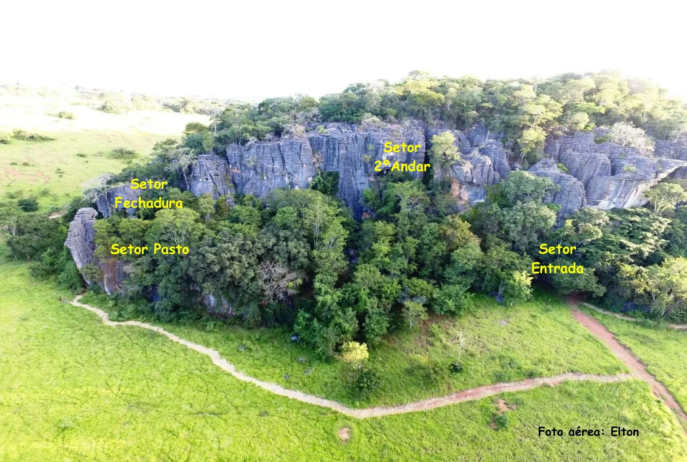
    - **checksum_sha256**: e86ea2a122e6ffc55f2889a6b190c1d93560f46e558d3b0812b58a2aa9e055dc
  - **[11]**:
    - **caminho**: 
    - **checksum_sha256**: c2c3e479054f6589614544f898e806f402d1587f89e0fd53a030c7d9ab1aaa81
  - **[12]**:
    - **caminho**: 
    - **checksum_sha256**: 2b7272d6e04b4b6090465077781bcf002417e9252f283bf3d1814894cc057fe4
  - **[13]**:
    - **caminho**: 
    - **checksum_sha256**: 1d9613be6ea88f93a2771f02130998f91cd05ae6a3e64b4062e9bbedabc5d916
  - **[14]**:
    - **caminho**: 
    - **checksum_sha256**: d671ba1029498c9208fcbd93257b9336693729a4417a49d8f491b6737df90523
  - **[15]**:
    - **caminho**: 
    - **checksum_sha256**: fd110cba7b8b60346e586d8507423e66bf16ee2a3a375fc4ac75cf4dff5ff0c8
  - **[16]**:
    - **caminho**: 
    - **checksum_sha256**: 708c09accdb6000c38cd7865123860d6c2fc3a3b1335dfef3b485dc6e19362e6
  - **[17]**:
    - **caminho**: 
    - **checksum_sha256**: 070992508790ce219fe1ac215a56db492b5feecb63ff6204014fc4f2076e0fa2
  - **[18]**:
    - **caminho**: 
    - **checksum_sha256**: d4d37a02dee7f215cda2481ffd2320f9dae6e460589a76fa726565fb5d7b02fe
  - **[19]**:
    - **caminho**: 
    - **checksum_sha256**: 6584f6d85a3edcdf2abe5af8d878d06646a7ccf7bfbefed8c6f12d57654d5301
  - **[20]**:
    - **caminho**: 
    - **checksum_sha256**: dc9fee8ba35c78dd71e3902e2e2d0301c0c0f5affa713f0a22deb09510ecaf4f
  - **[21]**:
    - **caminho**: 
    - **checksum_sha256**: 32b3233fdd40105c0b4492d2364f57b5501ce8284bc727357ad5fbfffcb386c3
  - **[22]**:
    - **caminho**: 
    - **checksum_sha256**: efbe8a4df9ebdfd4cbc827157acd06e79ae31cbf3522f1ca3b5d359c1cec78b6
  - **[23]**:
    - **caminho**: 
    - **checksum_sha256**: 1bbaf2c8795beb69697c4705d4caf5b6b640bd50148c15e757bed95b6eb2efa4
  - **[24]**:
    - **caminho**: 
    - **checksum_sha256**: fddef54aa95ff014018cb42360cdffa07dfa181a3eeb781033939d235c80371e
  - **[25]**:
    - **caminho**: 
    - **checksum_sha256**: a7da1e14f94d1faf44d3c915f77773a8af6721415b550afc8f2309018f995cb0
  - **[26]**:
    - **caminho**: 
    - **checksum_sha256**: 4e9d8b59af9df47ece34fd958e9ead4779fbcc74fb3ca4bf6af22780027aa885
  - **[27]**:
    - **caminho**: 
    - **checksum_sha256**: 1f56d3c23e28e3a04e5f81f2b7a4753a6a753d3b96d328b766f80174c5a77ab3
  - **[28]**:
    - **caminho**: 
    - **checksum_sha256**: 460166610d3ce954cf69bbe3cddde8e0e8e8e9946330db140e3e6184bf7c0169
  - **[29]**:
    - **caminho**: 
    - **checksum_sha256**: 1dbba370f4580293ef31b9317dc1ae439d3aa72e9afe207df9c1301f97ba1c4f
  - **[30]**:
    - **caminho**: 
    - **checksum_sha256**: ba2d74f99bbb480a972c4d3c40d22f923046f1f597f03198c70474c97128abfe
  - **[31]**:
    - **caminho**: 
    - **checksum_sha256**: cbd6332313e8a4023ada2df4a04e16816e0b7bfab42fb9a9235bed125d0695e4
  - **[32]**:
    - **caminho**: 
    - **checksum_sha256**: c31ef6e63437602072c84b29271e96a845d674c7e96c8a504cd5aaee5f8a23cf
  - **[33]**:
    - **caminho**: 
    - **checksum_sha256**: 0304bee041f32425ddda79c3937a17f916d4d5f97a774a4b63d20d28b3d2203b
  - **[34]**:
    - **caminho**: 
    - **checksum_sha256**: 5c98fb5af2c118fc47fc89b5c32e130438683149177f3276708a1971a8a96888
  - **[35]**:
    - **caminho**: 
    - **checksum_sha256**: 4e9c73398fdcba3611a5fe93b973779f891ed008fea953df46f9e9796b44809d

