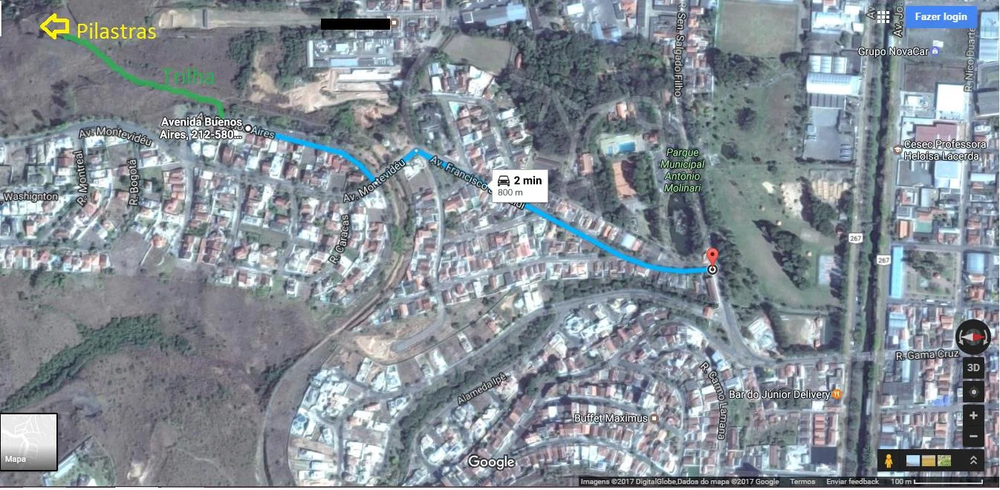
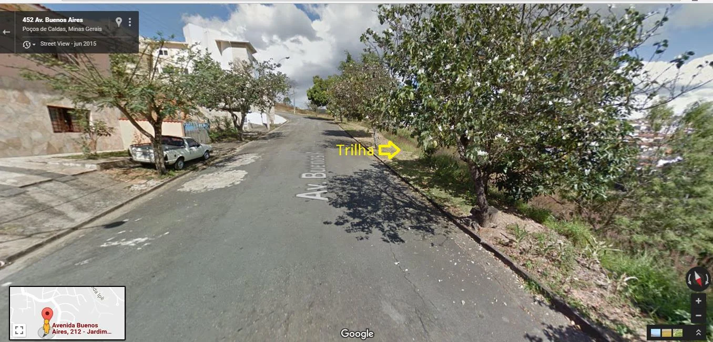
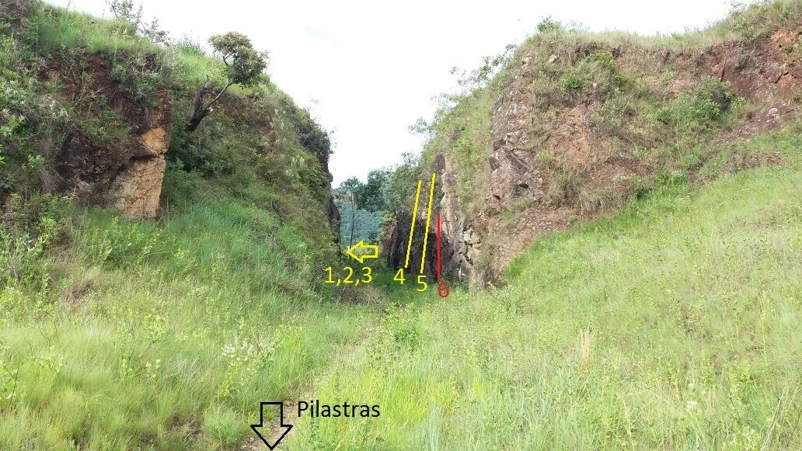
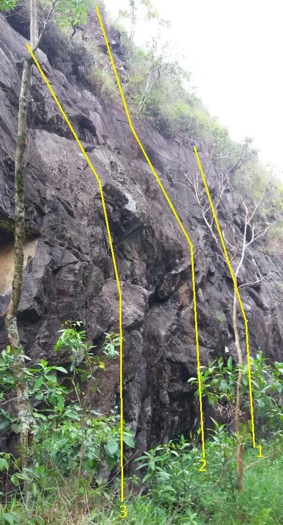
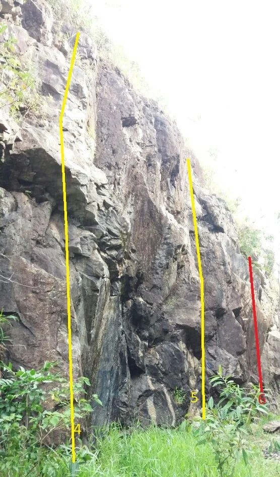
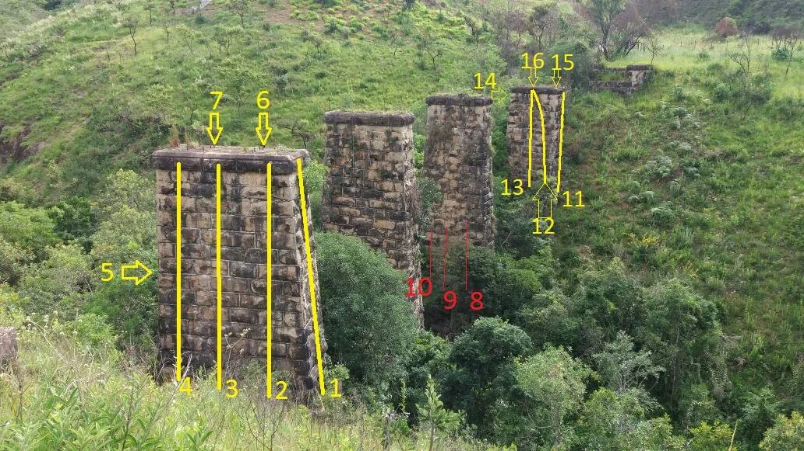
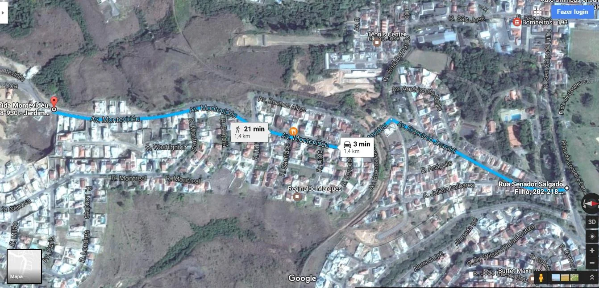
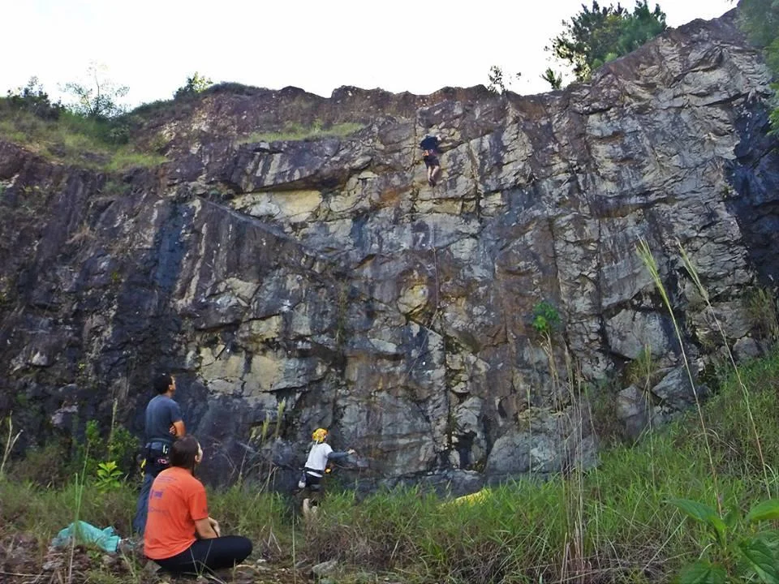
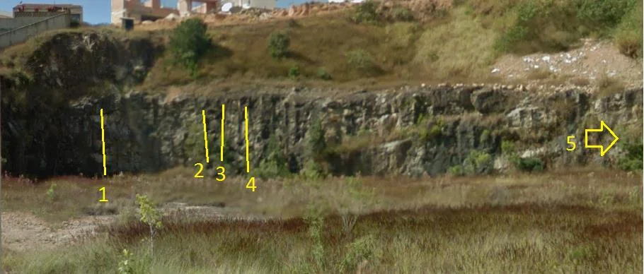
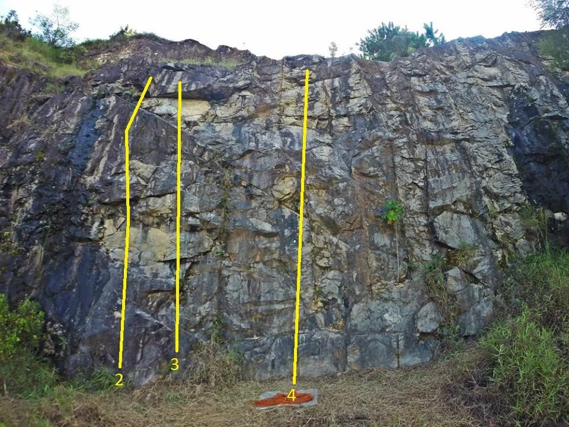

# Croqui: Pilastras + Pedreira

## Informações Gerais

- **descricao**: Croqui das Pilastras e Pedreira em Poços de Caldas, MG.
- **id**: br_mg_pocos_de_caldas_pilastras_e_pedreira
- **nome**: Pilastras + Pedreira
- **caminho_thumbnail**: 
- **botoes**:
  - **[0]**:
    - **texto**: Capa
    - **destino**:
      - **secao_textual**:
        - **conteudo**:
            # Croqui Pilastras + Pedreira – Poços de Caldas - MG
            
            |  |
            | :--: |
            | *Croqui Pilastras + Pedreira* |
            
            ## Importante:
            
            * Você é responsável pelos seus atos;
            * Esteja consciente que a escalada é um esporte de risco;
            * Este guia não tem como base o ensinamento de técnicas de escalada, nem das boas práticas do esporte, apenas orientar praticantes já experientes a se localizar nas linhas dos setores;
            * Use Capacete, eventuais pedras soltas podem rolar do cume, assim como agarras se soltarem;
            * Cuidado com animais peçonhentos;
            * Seja responsável pelo seu LIXO;
            * Contribua para a preservação do Meio Ambiente.
            * Cuidado com Abelha, evite fazer barulho e escalar em horários de muito sol, elas estão localizadas na segunda pilastra de todos os lados; 
            * Por se tratar de uma área Urbana e em constante crescimento evite algazarras e seja cordial com a vizinhança;
            * Está é uma área muito frágil, cuide para que as próximas gerações possam também usufruir deste belo local que é tão belo e conta um pouco da história de Poços de Caldas.
  - **[1]**:
    - **texto**: Avisos
    - **destino**:
      - **secao_textual**:
        - **conteudo**:
            # Croqui Pilastras + Pedreira – Poços de Caldas - MG
            
            |  |
            | :--: |
            | *Croqui Pilastras + Pedreira* |
            
            ## Importante:
            
            * Você é responsável pelos seus atos;
            * Esteja consciente que a escalada é um esporte de risco;
            * Este guia não tem como base o ensinamento de técnicas de escalada, nem das boas práticas do esporte, apenas orientar praticantes já experientes a se localizar nas linhas dos setores;
            * Use Capacete, eventuais pedras soltas podem rolar do cume, assim como agarras se soltarem;
            * Cuidado com animais peçonhentos;
            * Seja responsável pelo seu LIXO;
            * Contribua para a preservação do Meio Ambiente.
            * Cuidado com Abelha, evite fazer barulho e escalar em horários de muito sol, elas estão localizadas na segunda pilastra de todos os lados; 
            * Por se tratar de uma área Urbana e em constante crescimento evite algazarras e seja cordial com a vizinhança;
            * Está é uma área muito frágil, cuide para que as próximas gerações possam também usufruir deste belo local que é tão belo e conta um pouco da história de Poços de Caldas.
  - **[2]**:
    - **texto**: Como chegar
    - **destino**:
      - **secao_textual**:
        - **conteudo**:
            # Como chegar:
            
            ## Coordenadas Pilastras
            -21.796521, -46.591156
            
            ## Coordenadas Estacionamento
            Av. Buenos Aires, 452 - Jardim Novo Mundo
            Poços de Caldas - MG, 37701-367 - -21.793883, -46.589829
            
            ## Mapa saindo do Parque Municipal de Poços de Caldas
            
            |  |
            | :--: |
            | *Mapa de acesso* |
            
            Suba a rua a esquerda do parque Country Club (Rua Francisco Jesualdi) ao final dela encontrará a caixa d´água do bairro como da foto a seguir:
            
            |  |
            | :--: |
            | *Caixa d'água* |
            
            Vire a primeira a direita logo após o reservatório (Av. Buenos Aires) e estacione próximo ao número 452 quase ao final da rua:
            
            |  |
            | :--: |
            | *Estacionamento e início da trilha* |
            
            A trilha é toda de cascalho sem dificuldades de acesso e locomoção. Após descer o primeiro trecho, vire à esquerda e siga reto, na próxima bifurcação vire à esquerda novamente e já encontrara o primeiro setor, o Vale.
- **ultima_migracao**: 3

## Parte: setor_o_vale

### Setor (Pico: Poços de Caldas)

- **descricao**:
    Escalada tranquila, com vias fáceis, boas para quem está iniciando e aprendendo a guiar. 
    A via número 1 inicia-se a direita da parede para quem está chegando no vale, ou a esquerda para quem vem das pilastras como na foto, caracterizada por dois “P´s” em sua primeira proteção.
- **nome**: O Vale
- **mapas**:
  - **[0]**:
    - **caminho_imagem_mapa**: 
    - **largura_mapa**: 1032
    - **altura_mapa**: 581
  - **[1]**:
    - **caminho_imagem_mapa**: 
    - **largura_mapa**: 478
    - **altura_mapa**: 886
  - **[2]**:
    - **caminho_imagem_mapa**: 
    - **largura_mapa**: 556
    - **altura_mapa**: 946
- **escaladas**:
  - **[0]**:
    - **via_esportiva**:
      - **nome**: Macumba
      - **dificuldade**: BR_4
  - **[1]**:
    - **via_esportiva**:
      - **nome**: Macumbinha
      - **dificuldade**: BR_5SUP
  - **[2]**:
    - **via_esportiva**:
      - **nome**: Garage Inc.
      - **dificuldade**: BR_5SUP
  - **[3]**:
    - **via_esportiva**:
      - **nome**: Perereca suicida
      - **dificuldade**: BR_5
  - **[4]**:
    - **via_esportiva**:
      - **nome**: Via do Silas
      - **dificuldade**: BR_5
  - **[5]**:
    - **via_esportiva**:
      - **nome**: Inacabada

## Parte: setor_as_pilastras

### Setor (Pico: Poços de Caldas)

- **descricao**:
    |  |
    | :--: |
    | *Escalador na via Normal da primeira Pilastra* |
    
    Setor clássico com escalada em pilastras de pedra.
    Atenção: Abelhas em todas as faces da Segunda Pilastra.
    Terceira Pilastra possui projetos inacabados devido às abelhas.
- **nome**: As Pilastras
- **mapas**:
  - **[0]**:
    - **caminho_imagem_mapa**: 
    - **largura_mapa**: 1032
    - **altura_mapa**: 581
- **escaladas**:
  - **[0]**:
    - **via_esportiva**:
      - **nome**: Pela raiz
      - **dificuldade**: BR_5
  - **[1]**:
    - **via_esportiva**:
      - **nome**: Buraco de cobra
      - **dificuldade**: BR_6SUP
  - **[2]**:
    - **via_esportiva**:
      - **nome**: Normal
      - **dificuldade**: BR_6
  - **[3]**:
    - **via_movel**:
      - **descricao**: Base em móvel ou fazer uma travessia até a base ao lado.
      - **nome**: Bromélia
      - **dificuldade**: BR_5SUP
  - **[4]**:
    - **via_esportiva**:
      - **nome**: Pur musgo
      - **dificuldade**: BR_5
  - **[5]**:
    - **via_esportiva**:
      - **nome**: Vai cabeça
      - **dificuldade**: BR_7A
  - **[6]**:
    - **via_esportiva**:
      - **nome**: Silas and Tubarrão
      - **dificuldade**: BR_7A
  - **[7]**:
    - **via_esportiva**:
      - **nome**: Projeto 8
  - **[8]**:
    - **via_esportiva**:
      - **nome**: Projeto 9
  - **[9]**:
    - **via_esportiva**:
      - **nome**: Projeto 10
  - **[10]**:
    - **via_movel**:
      - **descricao**: Via mista.
      - **nome**: Madame satã
      - **dificuldade**: BR_5SUP
  - **[11]**:
    - **via_esportiva**:
      - **nome**: Dançando com a Chuva
      - **dificuldade**: BR_6SUP
  - **[12]**:
    - **via_esportiva**:
      - **nome**: Gambá xereta
      - **dificuldade**: BR_6SUP
  - **[13]**:
    - **via_esportiva**:
      - **nome**: Top Rope
  - **[14]**:
    - **via_esportiva**:
      - **nome**: Facinha
      - **dificuldade**: BR_4
  - **[15]**:
    - **via_esportiva**:
      - **nome**: Stuart Little
      - **dificuldade**: BR_5

## Parte: setor_a_pedreira

### Setor (Pico: Poços de Caldas)

- **descricao**:
    |  |
    | :--: |
    | *Mapa de acesso à Pedreira* |
    
    |  |
    | :--: |
    | *Escalador na via Europa* |
    
    Próximo a estes setores possui uma pedreira com algumas vias também.
    
    Como chegar:
    Siga em direção as Pilastras porém ao invés de entrar à direita após o reservatório continue em frente, passe dois redutores de velocidade e quando encontrar o terceiro olhe a sua esquerda e avistará a pedreira.
    
    Obs: Não tome os graus deste croqui como verdade são apenas sugestões, podem variar de acordo com a técnica e a estatura do escalador.
- **nome**: A Pedreira
- **mapas**:
  - **[0]**:
    - **caminho_imagem_mapa**: 
    - **largura_mapa**: 910
    - **altura_mapa**: 388
  - **[1]**:
    - **caminho_imagem_mapa**: 
    - **largura_mapa**: 960
    - **altura_mapa**: 720
- **escaladas**:
  - **[0]**:
    - **via_esportiva**:
      - **nome**: Coisa do capeta
      - **dificuldade**: BR_7A
  - **[1]**:
    - **via_esportiva**:
      - **nome**: Sabão crácrá
      - **dificuldade**: BR_7A
  - **[2]**:
    - **via_esportiva**:
      - **nome**: Europa
      - **dificuldade**: BR_6
  - **[3]**:
    - **via_esportiva**:
      - **nome**: Fica à vontade
      - **dificuldade**: BR_5
  - **[4]**:
    - **via_esportiva**:
      - **nome**: Pe pra fora
      - **dificuldade**: BR_6SUP

## Arquivos Externos

- **arquivos_externos**:
  - **[0]**:
    - **caminho**: 
    - **checksum_sha256**: 67b4bb58759dbe4c7c6256d6af5d3fe58e3c864fa7240b0a726c9d03eb431bae
  - **[1]**:
    - **caminho**: 
    - **checksum_sha256**: 5a8009d2672bca2d5d5c507e5c0ec9f0c75a74f1991200046035019a776dfcaf
  - **[2]**:
    - **caminho**: 
    - **checksum_sha256**: 6ba7953078a91ce72e408e71bf1a514809e61116af6845d5a8db060ba5dcd100
  - **[3]**:
    - **caminho**: 
    - **checksum_sha256**: 42e95a31fb4e9992db88af0553e84f2175c66462def01b7cda50f7e47506d89a
  - **[4]**:
    - **caminho**: 
    - **checksum_sha256**: 7f55bb2b663624a74e5269fafe01a447f0b9076cc236cd9f7f769031856e5d19
  - **[5]**:
    - **caminho**: 
    - **checksum_sha256**: 25b6bc110d6ae7d137e917039b6b7cf1eb6979d96bd6160847b65616da75bd6e
  - **[6]**:
    - **caminho**: 
    - **checksum_sha256**: c97fe35d0bf75df0d8a7cb4eb7e288c1c5bd52588cc9a7333f3f0c0615648070
  - **[7]**:
    - **caminho**: 
    - **checksum_sha256**: b47737230216f6cadc6154067adc5196c6d8af509f0095fcccead649889bc337
  - **[8]**:
    - **caminho**: 
    - **checksum_sha256**: 750a130667b8e3d8e4f857a229d0cb1eb048231ca6bf6e129d57941485d0cf70
  - **[9]**:
    - **caminho**: 
    - **checksum_sha256**: 2e74d14a3a58c22ed190202612c3d4195180ac13fb368b31f76da232d21084ca
  - **[10]**:
    - **caminho**: 
    - **checksum_sha256**: 729d443626c9965d0ae28bde12888dd0f32e34ecb93c25b91ea79f2b096aef15
  - **[11]**:
    - **caminho**: 
    - **checksum_sha256**: fda86963eb482de17acc912d8dde5bd114a52f51cb7d3694738221a4786f85ed
  - **[12]**:
    - **caminho**: 
    - **checksum_sha256**: 402a5923bac0221124a00cbb0b7a95c32f8aa17a6884010f40273cd25999a8d2

