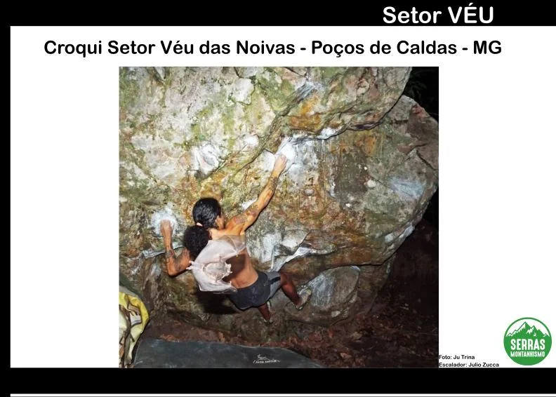
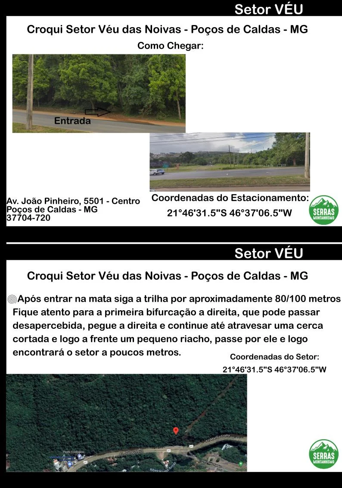
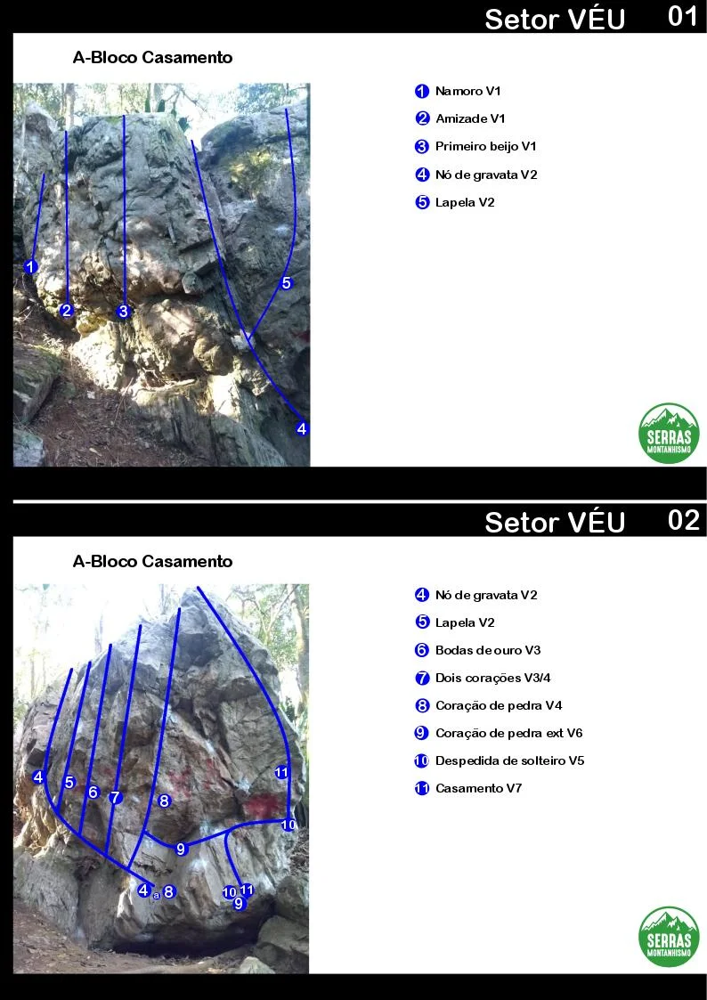
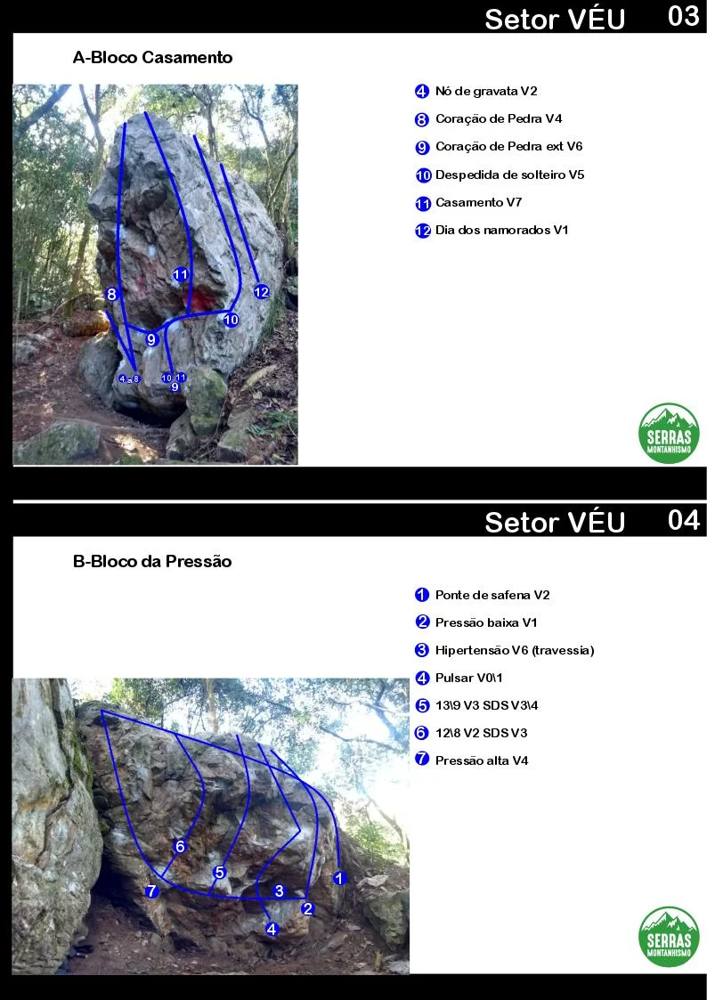
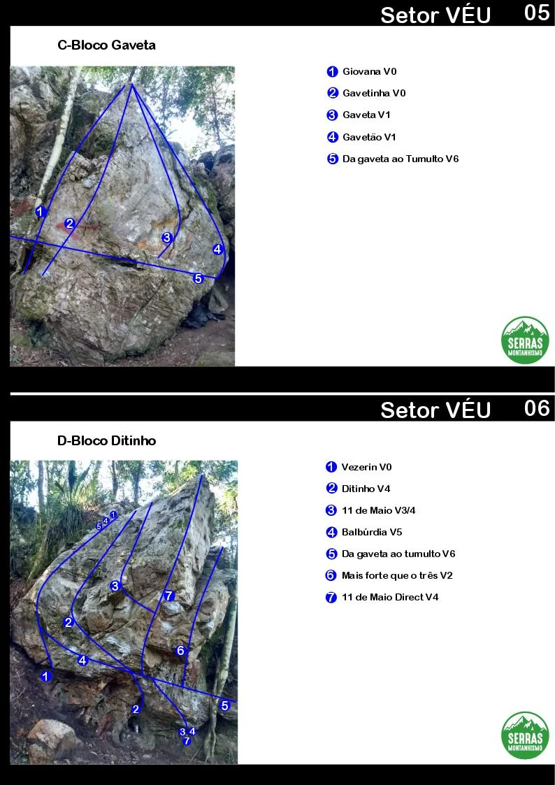
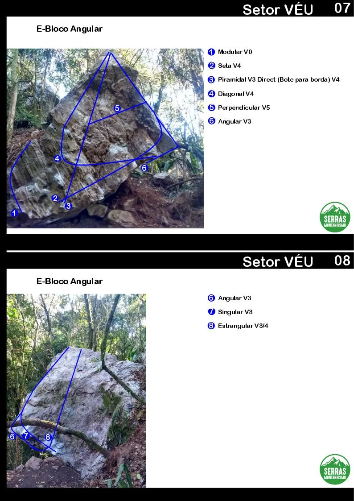
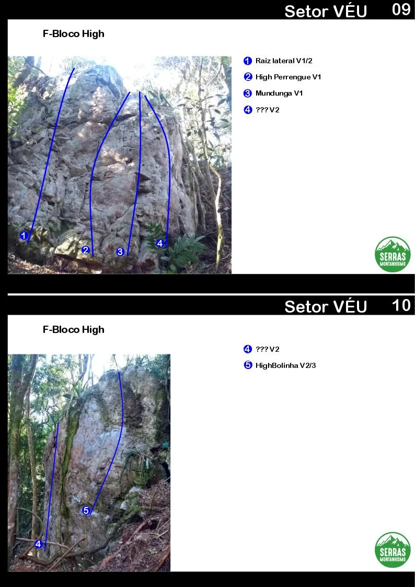
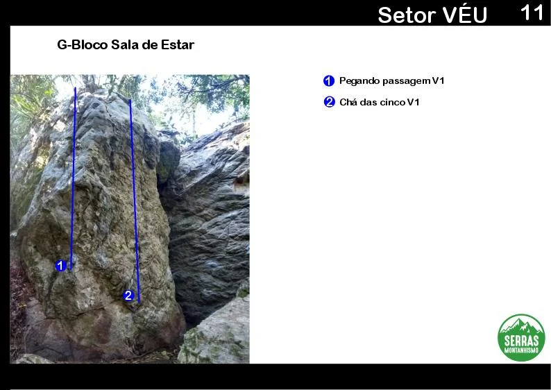

# Croqui: Setor Véu das Noivas

## Informações Gerais

- **descricao**: Croqui de boulders no Setor Véu das Noivas em Poços de Caldas, MG.
- **id**: br_mg_pocos_de_caldas_veu
- **nome**: Setor Véu das Noivas
- **creditos**:
  - ACEC-MG
  - Serras Montanhismo
- **caminho_thumbnail**: 
- **revisado_manualmente**: False
- **revisado_bounding_circle**: False
- **botoes**:
  - **[0]**:
    - **texto**: Informações
    - **destino**:
      - **secao_textual**:
        - **conteudo**:
            # Setor VÉU
            
            ## Croqui Setor Véu das Noivas - Poços de Caldas - MG
            
            |  |
            | :--: |
            | *Foto: Ju Trina. Escalador: Julio Zucca* |
            
            SERRAS MONTANHISMO
  - **[1]**:
    - **texto**: Informações
    - **destino**:
      - **secao_textual**:
        - **conteudo**:
            # Como Chegar
            
            **Endereço:** Av. João Pinheiro, 5501 - Centro, Poços de Caldas - MG, 37704-720
            
            |  |
            | :--: |
            | *Entrada* |
            
            **Coordenadas do Estacionamento:** 21°46'31.5"S 46°37'06.5"W (-21.775417, -46.618472)
            
            Após entrar na mata siga a trilha por aproximadamente 80/100 metros. Fique atento para a primeira bifurcação a direita, que pode passar desapercebida, pegue a direita e continue até atravessar uma cerca cortada e logo a frente um pequeno riacho, passe por ele e logo encontrará o setor a poucos metros.
            
            **Coordenadas do Setor:** 21°46'31.5"S 46°37'06.5"W (-21.775417, -46.618472)
- **ultima_migracao**: 1

## Parte: setor_bloco_casamento

### Setor (Pico: Véu das Noivas)

- **descricao**: 
- **nome**: Bloco Casamento
- **mapas**:
  - **[0]**:
    - **caminho_imagem_mapa**: 
    - **largura_mapa**: 794
    - **altura_mapa**: 1123
  - **[1]**:
    - **caminho_imagem_mapa**: 
    - **largura_mapa**: 794
    - **altura_mapa**: 1123
- **escaladas**:
  - **[0]**:
    - **boulder**:
      - **nome**: Namoro
      - **id_no_mapa**: 1
      - **dificuldade**: V1
  - **[1]**:
    - **boulder**:
      - **nome**: Amizade
      - **id_no_mapa**: 2
      - **dificuldade**: V1
  - **[2]**:
    - **boulder**:
      - **nome**: Primeiro beijo
      - **id_no_mapa**: 3
      - **dificuldade**: V1
  - **[3]**:
    - **boulder**:
      - **nome**: Nó de gravata
      - **id_no_mapa**: 4
      - **dificuldade**: V2
  - **[4]**:
    - **boulder**:
      - **nome**: Lapela
      - **id_no_mapa**: 5
      - **dificuldade**: V2
  - **[5]**:
    - **boulder**:
      - **nome**: Bodas de ouro
      - **id_no_mapa**: 6
      - **dificuldade**: V3
  - **[6]**:
    - **boulder**:
      - **nome**: Dois corações
      - **id_no_mapa**: 7
      - **dificuldade**: V3_BARRA_V4
  - **[7]**:
    - **boulder**:
      - **nome**: Coração de pedra
      - **id_no_mapa**: 8
      - **dificuldade**: V4
  - **[8]**:
    - **boulder**:
      - **nome**: Coração de pedra ext
      - **id_no_mapa**: 9
      - **dificuldade**: V6
  - **[9]**:
    - **boulder**:
      - **nome**: Despedida de solteiro
      - **id_no_mapa**: 10
      - **dificuldade**: V5
  - **[10]**:
    - **boulder**:
      - **nome**: Casamento
      - **id_no_mapa**: 11
      - **dificuldade**: V7
  - **[11]**:
    - **boulder**:
      - **nome**: Dia dos namorados
      - **id_no_mapa**: 12
      - **dificuldade**: V1

## Parte: setor_bloco_da_pressao

### Setor (Pico: Véu das Noivas)

- **descricao**: 
- **nome**: Bloco da Pressão
- **mapas**:
  - **[0]**:
    - **caminho_imagem_mapa**: 
    - **largura_mapa**: 794
    - **altura_mapa**: 1123
- **escaladas**:
  - **[0]**:
    - **boulder**:
      - **nome**: Ponte de safena
      - **id_no_mapa**: 1
      - **dificuldade**: V2
  - **[1]**:
    - **boulder**:
      - **nome**: Pressão baixa
      - **id_no_mapa**: 2
      - **dificuldade**: V1
  - **[2]**:
    - **boulder**:
      - **descricao**: Travessia.
      - **nome**: Hipertensão
      - **id_no_mapa**: 3
      - **dificuldade**: V6
  - **[3]**:
    - **boulder**:
      - **nome**: Pulsar
      - **id_no_mapa**: 4
      - **dificuldade**: V0_BARRA_V1
  - **[4]**:
    - **boulder**:
      - **descricao**: SDS V3/4.
      - **nome**: 13\9
      - **id_no_mapa**: 5
      - **dificuldade**: V3
  - **[5]**:
    - **boulder**:
      - **descricao**: SDS V3.
      - **nome**: 12\8
      - **id_no_mapa**: 6
      - **dificuldade**: V2
  - **[6]**:
    - **boulder**:
      - **nome**: Pressão alta
      - **id_no_mapa**: 7
      - **dificuldade**: V4

## Parte: setor_bloco_gaveta

### Setor (Pico: Véu das Noivas)

- **descricao**: 
- **nome**: Bloco Gaveta
- **mapas**:
  - **[0]**:
    - **caminho_imagem_mapa**: 
    - **largura_mapa**: 794
    - **altura_mapa**: 1123
- **escaladas**:
  - **[0]**:
    - **boulder**:
      - **nome**: Giovana
      - **id_no_mapa**: 1
      - **dificuldade**: V0
  - **[1]**:
    - **boulder**:
      - **nome**: Gavetinha
      - **id_no_mapa**: 2
      - **dificuldade**: V0
  - **[2]**:
    - **boulder**:
      - **nome**: Gaveta
      - **id_no_mapa**: 3
      - **dificuldade**: V1
  - **[3]**:
    - **boulder**:
      - **nome**: Gavetão
      - **id_no_mapa**: 4
      - **dificuldade**: V1
  - **[4]**:
    - **boulder**:
      - **nome**: Da gaveta ao Tumulto
      - **id_no_mapa**: 5
      - **dificuldade**: V6

## Parte: setor_bloco_ditinho

### Setor (Pico: Véu das Noivas)

- **descricao**: 
- **nome**: Bloco Ditinho
- **mapas**:
  - **[0]**:
    - **caminho_imagem_mapa**: 
    - **largura_mapa**: 794
    - **altura_mapa**: 1123
- **escaladas**:
  - **[0]**:
    - **boulder**:
      - **nome**: Vezerin
      - **id_no_mapa**: 1
      - **dificuldade**: V0
  - **[1]**:
    - **boulder**:
      - **nome**: Ditinho
      - **id_no_mapa**: 2
      - **dificuldade**: V4
  - **[2]**:
    - **boulder**:
      - **nome**: 11 de Maio
      - **id_no_mapa**: 3
      - **dificuldade**: V3_BARRA_V4
  - **[3]**:
    - **boulder**:
      - **nome**: Balbúrdia
      - **id_no_mapa**: 4
      - **dificuldade**: V5
  - **[4]**:
    - **boulder**:
      - **nome**: Da gaveta ao tumulto
      - **id_no_mapa**: 5
      - **dificuldade**: V6
  - **[5]**:
    - **boulder**:
      - **nome**: Mais forte que o três
      - **id_no_mapa**: 6
      - **dificuldade**: V2
  - **[6]**:
    - **boulder**:
      - **nome**: 11 de Maio Direct
      - **id_no_mapa**: 7
      - **dificuldade**: V4

## Parte: setor_bloco_angular

### Setor (Pico: Véu das Noivas)

- **descricao**: 
- **nome**: Bloco Angular
- **mapas**:
  - **[0]**:
    - **caminho_imagem_mapa**: 
    - **largura_mapa**: 794
    - **altura_mapa**: 1123
- **escaladas**:
  - **[0]**:
    - **boulder**:
      - **nome**: Modular
      - **id_no_mapa**: 1
      - **dificuldade**: V0
  - **[1]**:
    - **boulder**:
      - **nome**: Seta
      - **id_no_mapa**: 2
      - **dificuldade**: V4
  - **[2]**:
    - **boulder**:
      - **descricao**: Direct (Bote para borda) V4.
      - **nome**: Piramidal
      - **id_no_mapa**: 3
      - **dificuldade**: V3
  - **[3]**:
    - **boulder**:
      - **nome**: Diagonal
      - **id_no_mapa**: 4
      - **dificuldade**: V4
  - **[4]**:
    - **boulder**:
      - **nome**: Perpendicular
      - **id_no_mapa**: 5
      - **dificuldade**: V5
  - **[5]**:
    - **boulder**:
      - **nome**: Angular
      - **id_no_mapa**: 6
      - **dificuldade**: V3
  - **[6]**:
    - **boulder**:
      - **nome**: Singular
      - **id_no_mapa**: 7
      - **dificuldade**: V3
  - **[7]**:
    - **boulder**:
      - **nome**: Estrangular
      - **id_no_mapa**: 8
      - **dificuldade**: V3_BARRA_V4

## Parte: setor_bloco_high

### Setor (Pico: Véu das Noivas)

- **descricao**: 
- **nome**: Bloco High
- **mapas**:
  - **[0]**:
    - **caminho_imagem_mapa**: 
    - **largura_mapa**: 794
    - **altura_mapa**: 1123
- **escaladas**:
  - **[0]**:
    - **boulder**:
      - **nome**: Raiz lateral
      - **id_no_mapa**: 1
      - **dificuldade**: V1_BARRA_V2
  - **[1]**:
    - **boulder**:
      - **nome**: High Perrengue
      - **id_no_mapa**: 2
      - **dificuldade**: V1
  - **[2]**:
    - **boulder**:
      - **nome**: Mundunga
      - **id_no_mapa**: 3
      - **dificuldade**: V1
  - **[3]**:
    - **boulder**:
      - **nome**: ???
      - **id_no_mapa**: 4
      - **dificuldade**: V2
  - **[4]**:
    - **boulder**:
      - **nome**: HighBolinha
      - **id_no_mapa**: 5
      - **dificuldade**: V2_BARRA_V3

## Parte: setor_bloco_sala_de_estar

### Setor (Pico: Véu das Noivas)

- **descricao**: 
- **nome**: Bloco Sala de Estar
- **mapas**:
  - **[0]**:
    - **caminho_imagem_mapa**: 
    - **largura_mapa**: 794
    - **altura_mapa**: 562
- **escaladas**:
  - **[0]**:
    - **boulder**:
      - **nome**: Pegando passagem
      - **id_no_mapa**: 1
      - **dificuldade**: V1
  - **[1]**:
    - **boulder**:
      - **nome**: Chá das cinco
      - **id_no_mapa**: 2
      - **dificuldade**: V1

## Arquivos Externos

- **arquivos_externos**:
  - **[0]**:
    - **caminho**: 
    - **checksum_sha256**: 9adfcd73ede193a22b8f7a214bf8c97b9e566e272ff7584140bfa906df135ae5
  - **[1]**:
    - **caminho**: 
    - **checksum_sha256**: 3aabfde13ac5b8e1570cb5a8dbc36dfd23325c346a193a2330aada18c14ccc2b
  - **[2]**:
    - **caminho**: 
    - **checksum_sha256**: 15cedc4e45587f91860a53851edccf6d9aef088d32326b4f155ffbd26e9e5fb1
  - **[3]**:
    - **caminho**: 
    - **checksum_sha256**: 86fc37f5a34109eae80f2cc890f0b57c367fea2433d8fb393dd0f3b7a87c5fde
  - **[4]**:
    - **caminho**: 
    - **checksum_sha256**: 615f621c6791b769929e9ae9d757969e61bfa56f23a487d5bba67cd066c74397
  - **[5]**:
    - **caminho**: 
    - **checksum_sha256**: 615f621c6791b769929e9ae9d757969e61bfa56f23a487d5bba67cd066c74397
  - **[6]**:
    - **caminho**: 
    - **checksum_sha256**: 39be08e87fe5c2a5f2da7044f78fc2105c4ece5566ef55e226065fd4c6b61c90
  - **[7]**:
    - **caminho**: 
    - **checksum_sha256**: 39be08e87fe5c2a5f2da7044f78fc2105c4ece5566ef55e226065fd4c6b61c90
  - **[8]**:
    - **caminho**: 
    - **checksum_sha256**: 844375b252fc83f192f0728b11a1867b7982bb6056666183a4e2d90f347b378a
  - **[9]**:
    - **caminho**: 
    - **checksum_sha256**: b6d751df2e962235de811c6a08a300fcd2061d704071d0f248917e4a60d60c11

