# Croqui: Pedra Rachada Bouldering

## Informações Gerais

- **descricao**: Guia de escalada em boulder da Pedra Rachada, localizada em Sabará, Minas Gerais.
- **id**: br_mg_sabara_pedra_rachada
- **nome**: Pedra Rachada Bouldering
- **uid**: Gph57WNcpiWnzD
- **creditos**:
  - Luca Portilho
  - Nathalia Daneliczin
- **caminho_thumbnail**: 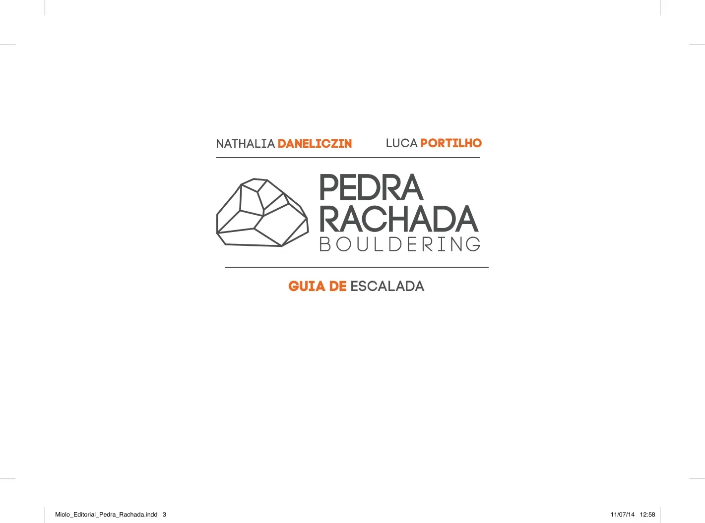
- **botoes**:
  - **[0]**:
    - **uid**: N71euFJj064jPq
    - **texto**: Capa
    - **destino**:
      - **secao_textual**:
        - **conteudo**:
            # Pedra Rachada Bouldering
            
            ## Guia de Escalada
            
            **Autores:**
            - Nathalia Daneliczin
            - Luca Portilho
            
            |  |
            | :--: |
            | *Capa da Pedra Rachada Bouldering* |
  - **[1]**:
    - **uid**: QJaLfdZhkEP15J
    - **texto**: Aviso
    - **destino**:
      - **secao_textual**:
        - **conteudo**:
            # AVISO!
            
            ### NÃO FAÇA USO DESTE LIVRO GUIA SEM LER E CONCORDAR COM O SEGUINTE:
            
            **A escalada em boulder é um esporte perigoso que pode ter como resultado morte, paralisia e/ou ferimentos graves.**
            
            Este livro serve como uma ferramenta de referência para os escaladores avançados/profissionais. A atividade e o terreno nele descritos podem ser ou são extremamente perigosos e requerem um alto grau de habilidade e experiência para lidar. Este livro não é destinado para escaladores novatos ou inexperientes e não tem como objetivo ser um manual de instruções. Se você é incerto quanto à sua habilidade para lidar com quaisquer circunstâncias que possam surgir, contrate os serviços de um guia ou instrutor profissional.
            
            Este livro se baseia em informações e opiniões, fornecidas por terceiros, que podem não ser precisas. Opiniões a respeito de dificuldades técnicas, graduação e perigos de um boulder, ou a falta dos mesmos, são subjetivas e podem ser diferentes das suas opiniões ou de outros. Graduações podem ser diferentes de uma área para outra, agarras podem se quebrar, proteção fixa pode falhar, cair ou até estar em falta, e o clima pode deteriorá-las. Esses e outros fatores, como a queda de rochas, falta de equipamento ou equipamento inadequado, etc., podem aumentar o risco de se escalar um boulder e podem contribuir para que a escalada seja diferente da descrita no livro.
            
            Ademais, podem ter ocorrido erros durante a edição, criação, prova de revisão e impressão deste livro. Portanto, a informação neste livro é não verificada, e os autores e publicadores não podem garantir sua exatidão. Há vários riscos existentes que não são descritos neste livro. Escalar em qualquer terreno descrito neste livro, independentemente de sua descrição ou graduação, pode resultar em morte, paralisia e/ou ferimentos graves.
            
            Não utilize este livro, salvo o caso de você ser um escalador hábil e experiente, que compreenda e aceite os riscos do bouldering. Se você escolher se utilizar de qualquer informação contida neste livro para planejar, tentar, ou escalar um boulder específico, você o está fazendo por sua própria conta e risco. Por favor tome todas as precauções e se utilize de sua própria habilidade, avaliação e julgamento para aferir os riscos da escalada escolhida, ao invés de contar com as informações deste livro.
            
            **O autores e publicadores não fazem representações ou garantias, expressadas ou inferidas, de quaisquer formas em relação ao conteúdo deste livro, e expressamente renunciam quaisquer e todas as representações ou garantias em relação ao conteúdo deste livro, inclusive, sem limitações, a exatidão e confiabilidade das informações incluídas. garantias de aptidão para um propósito particular e/ou comercialização estão expressamente abdicadas. O usuário assume todos os riscos associados com o uso deste livro incluindo, sem limitações, todos os riscos associados com a escalada e o bouldering.**
  - **[2]**:
    - **uid**: 52ZwfSyLPOSxnM
    - **texto**: Poema
    - **destino**:
      - **secao_textual**:
        - **conteudo**:
            # Pedra Rachada
            
            Tua pedra, rachada  
            Tua pedra, difícil  
            Tua pedra, vermelha  
            Teu chão, vermelho  
            Tua subida, íngreme  
            Tua vista, infinita  
            
            Condizem com  
            
            A vida, linha ranhurada  
            A vida, esforço bruto  
            O alimento do corpo, rubro sangue  
            A cor da força, pele que ferve  
            O caminho da força, o pico do corpo  
            O alimento da alma, sonho que não cesse  
            Escalar em Sabará é incorporar  
            - através do vermelho, luta e desejo -  
            vivência intensa e apaixonada.  
            
            **Lucas da Rocha**
            
            | 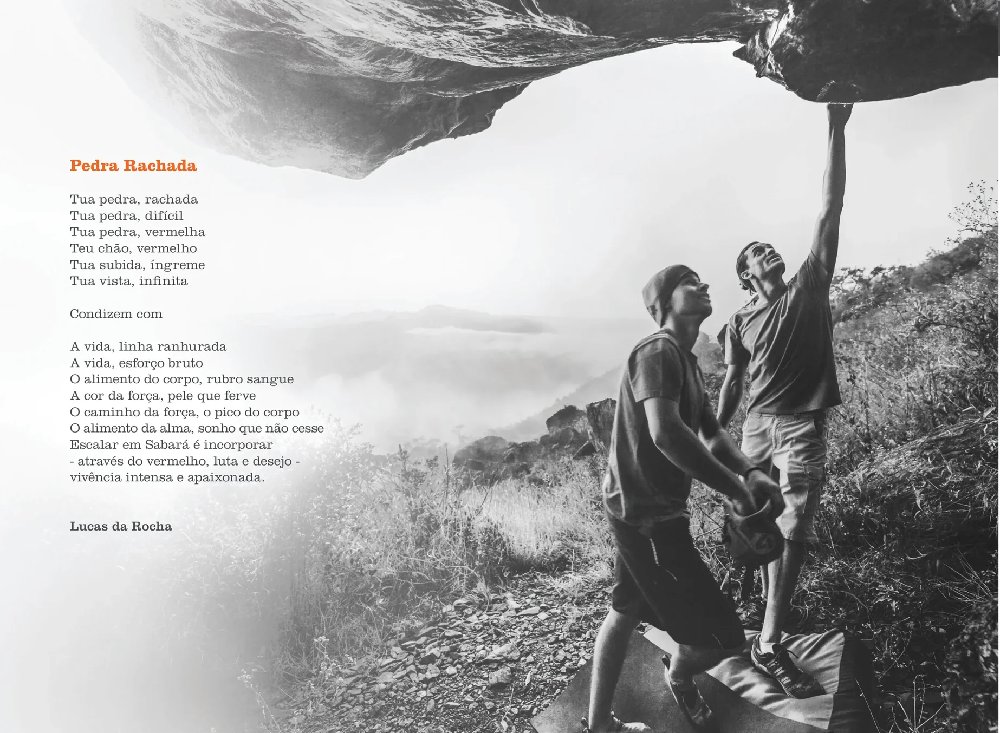 |
            | :--: |
            | *Escalada na Pedra Rachada* |
  - **[3]**:
    - **uid**: rGrYYEmxExufIw
    - **texto**: Prefácio
    - **destino**:
      - **secao_textual**:
        - **conteudo**:
            # Prefácio
            
            Quando o meu melhor amigo idealizou o guia de escalada da Pedra Rachada, em junho do ano passado, confesso que fiquei apreensiva. A cultura de croquis de escalada no Brasil ainda não era tão forte; os croquis já existentes eram feitos pelos apaixonados pelo esporte, mas que não podiam dedicar seu tempo exclusivamente para o desenvolvimento de guias mais elaborados. Além disso, o trabalho para catalogar todos os blocos e linhas de escalada seria duro, complexo e longo para apenas uma pessoa.
            
            Algum tempo depois, comecei a perceber o rumo que o projeto estava tomando e a importância desse trabalho para a comunidade escaladora do nosso país.
            
            Me envolvi no projeto, mudei de casa, passei a ajudar no levantamento de informações das escaladas, da cidade de Sabará, de todas as informações necessárias no guia. Falávamos de escalada, Boulder e Pedra Rachada vinte e quatro horas por dia. No café da manhã, almoço, durante a tarde, no jantar, na cama. Nos aniversários dos amigos, durante a Copa do Mundo de 2014. Na fila do cinema e às vezes durante o filme. Aliás, cinema nunca mais rolou até a finalização do livro.
            
            Contamos com a ajuda de muitos amigos, mas fazíamos a maioria das coisas em dupla, tarefa árdua para um peão de obra e uma ex jogadora de vôlei. Perdi as contas de quantar vezes fomos à Pedra Rachada desde que o projeto começou a ser desenvolvido. Ralamos dia e noite – são 3:47 da manhã – trabalhamos duro para oferecer o melhor conteúdo para um público apaixonado pelo o que faz.
            
            Maravilhosas fotos foram produzidas por seis dos melhores fotógrafos de escalada do Brasil, a marca Pedra Rachada Bouldering surgiu das mãos de um talentoso designer de Belo Horizonte e o Guia de Escalada Pedra Rachada Bouldering começou a ganhar forma.
            
            Cada minuto valeu a pena.
            
            O Luca deve à escalada sua filosofia de vida, sua saúde, sua alegria de viver. Eu não conheço ninguém mais apaixonado pela escalada que ele, e essa paixão você confere aqui, no Guia de Escalada mais incrível já produzido no Brasil!
            
            **Nathalia Daneliczin**
  - **[4]**:
    - **uid**: 83655UZC24Z6zp
    - **texto**: Agradecimentos
    - **destino**:
      - **secao_textual**:
        - **conteudo**:
            # Agradecimentos
            
            Um trabalho complexo como esse não poderia ser feito sem a ajuda de algumas pessoas. Mas jamais poderia imaginar quantas pessoas estariam dispostas a me acompanhar nessa empreitada.
            
            Primeiramente, meu eterno agradecimento à minha melhor amiga e companheira de todas as horas, Nathalia Daneliczin. Quando conversamos a primeira vez sobre sua participação no projeto, não pude imaginar a forma com que ela iria encarar este desafio: entrou de corpo e alma no projeto e tomou frente em todos os processos. Foram meses de dedicação total e absoluta de sua parte para que chegássemos juntos ao resultado maravilhoso deste trabalho. Sem ela, tudo não passaria de um sonho. Não tenho palavras para lhe dizer o quanto você é importante em minha vida, muito obrigado por tudo, meu amor!
            
            Gostaria de agradecer aos meus amigos Pedro Hostalácio e Ronaldo Portilho, que estiveram presentes em todas as etapas do trabalho; no levantamento de dados, na descrição de boulders, nas fotos, nos textos complementares do livro, compartilharam idéias, me acompanharam todo o tempo, disponibilizaram o seu tempo, se dedicaram. Serei eternamente grato.
            
            Quero agradecer ao meu amigo e designer, o talentoso Thales Ramonielli, pela paciência, pelo trabalho duro e pelas idéias. Pela criação da identidade da marca Pedra Rachada Bouldering e pelo design deste livro – que ficou exatamente como eu tinha imaginado. Sei que foi um trabalho complexo e difícil e você o fez com dedicação, transformando uma idéia num guia lindo. Obrigado por tudo!
            
            Ao Christian e Aira, amigos que ajudaram em todos os momentos, com dados do setor, fotos aéreas, abrigo, dados de GPS. Vocês são especiais!
            
            Aos amigos fotógrafos que fizeram muito pelo projeto: fotos e vídeos incríveis, muitas idéias, muita parceria e disponibilidade: Bruno Graciano, João Mello, Murilo Vargas, Tom Alves e Vitor Maciel. Sou muito grato pela sorte de ter grandes fotógrafos ao meu lado. Em especial ao grande amigo Gabriel Oliveira, que veio do Planalto Central especialmente para me ajudar com o projeto. Foram dias intensos de muito empenho, muitas horas de caminhada no sol quente, com poucas horas de sono e, claro, muita escalada. Muito obrigado!
            
            Ao Lucas Oliveira pelo belo poema, pelas fotos, pela amizade e parceria.
            
            Ao Pedro Furtado, Leonardo Lott e Paulo César, que fizeram as imagens aéreas fruto dos mapas deste guia, muito obrigado.
            
            À Alaine Prado, pelo texto “Fauna e Flora”, obrigado.
            
            Agradeço aos amigos que participaram das fotos, idéias, aqueles que divulgaram o trabalho, que acreditaram: César Augusto, Chander Christian, Ciro Thielmann, Eric Dornelles, Flávio Cro, Federico Sanz, Frederico Gonçalves, Gabriel Henrique, Gabriel Vargas, Gustavo Fontes, Jean Ouriques, Larissa Pena, Laura Castanheira, Laura Volponi, Lucas Sá, Luiz Veríssimo, Maíra Villas Boas, Malquior Saviotti, Mahavir Jneesh, Marcia Veira, Patrícia Antunes, Paulo Cisotto, Paulo Veríssimo, Pedro Xavier, Raiane Melo, Rafael Pimenta, Rafael Sanna, Renata Tavares, Roberta Rezende, Sandro de Castro, Tomaz Hamdan, Yan Ouriques e Hugo Barcellos. Obrigado!
            
            À minha família, pais, irmãos, primos, tios e avós. Obrigada a todos por acreditarem e apostarem em mim e no projeto desde o início! Pelas palavras de motivação, pela preocupação, pela disponibilidade, conselhos, pelo interesse, por todo o amor que recebo todos os dias. Agradeço especialmente ao meu irmão e amigo Tiago: você foi especialmente importante durante essa caminhada; obrigado pela atenção, pela revisão dos textos, pelos conselhos, obrigado por tudo!
            
            Obrigado aos patrocinadores, que viabilizaram esse livro e acreditaram que um projeto pioneiro poderia aumentar a visibilidade da escalada no Brasil.
            
            Agradeço especialmente ao Pedro Leite, que apostou no guia desde o primeiro momento, investiu e, acima de tudo, esteve disponível e me ajudou em muitos momentos!
            
            Enfim, a eles: Daniel Mendes e Felipe Álvares. Muito obrigado por investirem na escalada brasileira, por acreditarem nos projetos e por participarem de cada passo dessa longa jornada. Por me ajudar nas descrições dos boulders, por me acompanharem até a Pedra Rachada várias vezes, por investir o tempo de vocês no projeto, pelas reuniões, pelas idéias. Sem vocês esse guia não estaria impresso. Muito obrigado por tudo!
  - **[5]**:
    - **uid**: QQeyorwzgneHRA
    - **texto**: Introdução
    - **destino**:
      - **secao_textual**:
        - **conteudo**:
            # Introdução
            
            Sentimos falta de guias para escalar no Brasil. Algumas vezes não conseguimos explorar o melhor da escalada de alguns setores pela falta de informações e receio, afinal não sabemos o nível de exposição de algumas escaladas, o grau de dificuldade ou até mesmo a linha correta. No caso do boulder é ainda mais complicado, pois não temos as chapeletas para nos guiar durante o caminho. A escalada não fica menos divertida – somos adeptos da diversão no esporte! – mas torna-se mais subjetiva.
            
            Com o intuito de melhorar e ampliar a experiência dos escaladores, criamos o Guia de Escalada Pedra Rachada Bouldering. Decidimos empreender um projeto pioneiro no país e dedicamos muitas e muitas horas, durante mais de um ano, coletando e editando todas as informações que julgamos importantes para que escalar na Pedra Rachada fosse incrivelmente bom, porém não menos desafiador.
            
            A idéia sempre foi lançar um livro guia da melhor qualidade, um livro que nós, autores, também iríamos utilizar. Nos perguntávamos como inserir as informações e quais delas seriam mais relevantes para os escaladores, como trataríamos da importância dos boulders mais clássicos, como seria feita a graduação. Fizemos o levantamento de 95 blocos de pedra e quase 500 linhas de escalada. Reunimos amigos escaladores e trocamos idéias sobre o grau de dificuldade de cada linha, sobre as agarras de saída, sobre a qualidade da escalada. Utilizamos o “circuito de grau”, fotos de todos os blocos com o desenho das linhas, descrição dos boulders e tratamos dos principais projetos.
            
            Baseamos esse guia nos melhores guias de escalada em boulder do mundo, de setores mundialmente conhecidos e muito importantes, como Fontainebleau, na França, Bishop, nos Estados Unidos e Rocklands, na África do Sul.
            
            Escolhemos a Pedra Rachada porque é considerada, por muitos dos melhores escaladores do Brasil, um dos melhores setores de boulder para se escalar no país. Há linhas para todos os escaladores, desde os iniciantes, até os atletas mais experientes. O tipo de escalada é único e reúne boulders de todos os estilos: muita compressão, tensão corporal, pinças, agarrões, regletes perfeitos, abaulados, batentes, agarras de ombro, agarras de oposição, pés chapados, drops, calcanhar, tetos, verticais, positivos, negativos, proas, cavernas, highballs! O potencial e a qualidade da rocha chamam a atenção dos melhores escaladores do país. Felipe Álvares “Cabeção”, Daniel “TioDan”, Gustavo Fontes, Rafael Passos, Fred “Bull”, Mahavir Jneesh, Christian Fernandes, Maíra Villas Boas, Chander Cristian e Emerson “Caverna” são os principais responsáveis pela abertura da maioria dos boulders da Pedra Rachada e pela evolução do pico.
            
            A Pedra Rachada é considerada mágica pelos escaladores também pela sua beleza estonteante. O cume tem uma vista de tirar o fôlego: fica a quase 1500 metros de altitude e podemos avistar Belo Horizonte, a cidade de Sabará, Caeté, Cambotas, Pedra Branca, Serra do Caraça (Pico do Baiano) e a imponente Serra da Piedade. A proximidade da cidade também faz da Pedra Rachada um setor importante, já que os escaladores tem facilidade de acesso e uma ótima estrutura para descanso à disposição.
            
            Aqui, além de todas as informações sobre as escaladas do setor, você terá todas as informações necessárias para chegar, se instalar na cidade de Sabará ou Belo Horizonte, para comer e conseguir suprimentos. Indicaremos a melhor época para a prática do esporte, e alguns programas para os dias de folga – Sabará é uma belíssima cidade histórica e Belo Horizonte, a capital, é conhecida nacionalmente como a cidade dos bares.
            
            Divirta-se, boa escalada!
  - **[6]**:
    - **uid**: LIB3I8F1vewQHC
    - **texto**: Como Chegar em Sabará
    - **destino**:
      - **secao_textual**:
        - **conteudo**:
            # Como Chegar
            
            Para chegar à cidade de Sabará a partir da capital mineira Belo Horizonte, existem duas opções: acessando a Av. José Cândido através da Av. Cristiano Machado, ou pelo Anel Rodoviário (BR-381 / BR-262).
            
            ### Av. José Cândido
            
            Siga por 3,5km até uma grande rotatória e mantenha à direita, sentido Sabará. Após 12km você chegará ao Centro de Informação ao Turista de Sabará, onde você poderá conseguir mais informações sobre a cidade, de lá o Centro da cidade está a apenas 1km.
            
            ### Anel Rodoviário (BR-381 / BR-262)
            
            Siga reto por aproximadamente 3,4km depois de passar por cima da Av. Cristiano Machado e mantenha à esquerda (BR-262) na bifurcação, logo após uma passarela, seguindo as placas que indicam à cidade de Sabará. De lá, são mais 8km até o Centro de Informação ao Turista de Sabará, onde você pode conseguir mais informações sobre a cidade, e mais 1km até o Centro da cidade.
  - **[7]**:
    - **uid**: LSr1mHpps6tPr5
    - **texto**: A Cidade de Sabará
    - **destino**:
      - **secao_textual**:
        - **conteudo**:
            # A Cidade de Sabará
            
            Uma cidade que nasceu como ponto de descanso para os bandeirantes paulistas do Brasil Colônia, hoje atrai outros tipos de desbravadores: turistas de todo o mundo ávidos por viajar através de mais de três séculos de história.
            
            | 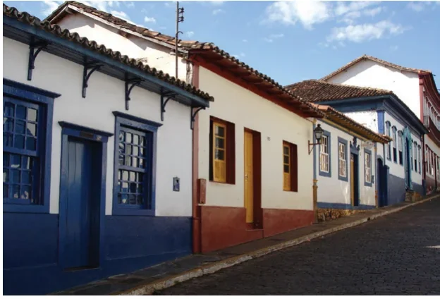 |
            | :--: |
            | *Casario colonial do Centro Histórico de Sabará* |
            
            Com pouco mais de 126mil habitantes e aproximadamente 700m de altitude, a cidade de Sabará fica a apenas 23km da capital Belo Horizonte e integra sua Região Metropolitana. É a cidade histórica mais próxima da capital.
            
            Sua história tem suas raízes nos primórdios da colonização do Brasil. Às margens do Rio das Velhas, a cidade tem mais de 330 anos de fundação. As primeiras expedições chegaram a Sabará por indicação dos índios. Eles contaram aos bandeirantes paulistas sobre o Sabaraçu (hoje Serra da Piedade), cuja fama era de possuir, em abundância, ouro, prata e outros metais e pedras preciosas. A cidade atraiu inúmeros aventureiros em busca da riqueza das serras. Em 1674, chegou à região a bandeira de Fernão Dias Paes, dando início ao que se tornaria o mais importante arraial fundado pelo bandeirante paulista.
            
            Sabará foi povoada e explorada. Muitos resquícios do período colonial provavelmente ainda esperam por serem descobertos. São 24 quilômetros de estradas e trilhas dentro da extensão da Estrada Real; nelas, 55 marcos indicam o caminho oficial. Toda a história encontra-se à disposição dos turistas.
            
            A cidade é formada por 19 conjuntos arquitetônicos e bens culturais tombados pelo Instituto do Patrimônio Histórico e Artístico Nacional (Iphan), quatro deles protegidos pelo Instituto Estadual do Patrimônio Histórico e Artístico (Iepha), e 23 obras tombadas pelo Governo Municipal.
            
            Sabará conserva muita história em suas ruas, principalmente no centro da cidade. Casarões, igrejas e capelas setecentistas encantam os visitantes pela sua imponência. No Centro Histórico está localizada a maioria dos atrativos históricos e arquitetônicos. Há igrejas que mesclam características artísticas das três diferentes fases do Barroco Mineiro e vários chafarizes. O mais conhecido é o Chafariz do Kaquende (pág xx); segundo a lenda, quem beber de sua água sempre retornará à cidade.
            
            Sabará possui, ainda, diversos festejos culturais. Considerada a capital mineira da jabuticaba, a cidade realiza todos os anos o famoso Festival da Jabuticaba. Entre música, comidas típicas e muita dança, o hospitaleiro povo sabarense acolhe com prazer a todos os seus visitantes. Como todo bom mineiro, o sabarense é caloroso e receptive. O Festival do Ora-Pro-Nobis também é realizado na cidade e atrai turistas interessados na deliciosa e famosa gastronomia mineira. Lá acontece, ainda, o Festival de Inverno, em comemoração ao aniversário da cidade, O Festival acontece durante todo o mês de julho e tem diversas atrações, como oficinas de literatura, mostras de filmes, feira de artes e cultura, festivais de dança, shows e peças teatrais.
            
            A fusão secular das etnias negra, branca e indígena moldou em Sabará uma identidade cultural extremamente rica, com tradições preservadas pelas manifestações populares e cultos que ainda povoam as ruas e templos da cidade. Dentre muitos outros, destacam-se a Folia de Reis, a Abertura do Santo Sepulcro na Semana Santa, a confecção dos tapetes artesanais na festa de Corpus Christi, o encontro das bandas de música no coreto da Praça Santa Rita, as quadrilhas nas festividades juninas, o Carnaval dos blocos caricatos, os grupos de seresta e os corais. A maioria das tradições locais está preservada e podem ser contempladas, principalmente, na ocasião destes eventos tradicionais. Estas manifestações materializam a relação destes diversos grupos com a história da cidade de Sabará.
  - **[8]**:
    - **uid**: N6Z86pvNibs8jZ
    - **texto**: Turismo Histórico e Religioso
    - **destino**:
      - **secao_textual**:
        - **conteudo**:
            # Turismo Histórico e Religioso
            
            Uma seleção de alguns dos melhores pontos turísticos da cidade de Sabará:
            
            ## Igreja Nossa Senhora do Ó, de 1717
            
            | 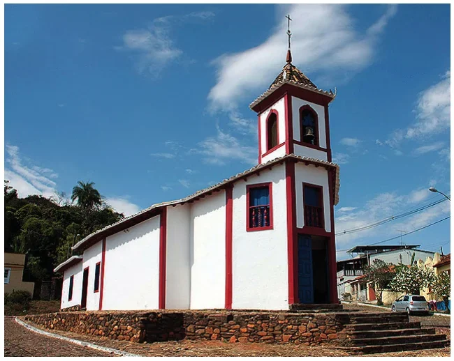 |
            | :--: |
            | *Igreja Nossa Senhora do Ó* |
            
            Uma das mais representativas do barroco mineiro, possui influência chinesa em sua arquitetura externa e na decoração interna. O seu nome é devido às ladainhas de Nossa Senhora que sempre começam com o Ó e seguem com algum louvor.
            
            - **Localização:** Largo Nossa Senhora do Ó
            - **Funcionamento:** Diário, das 08h às 17h.
            
            ## Igreja Matriz Nossa Senhora da Conceição, de 1710
            
            |  |
            | :--: |
            | *Igreja Matriz Nossa Senhora da Conceição* |
            
            É uma das mais antigas de Minas Gerais e uma das mais ricas matrizes mineiras. Representa um período em que o ouro era abundante na região. Nela se encontram influência das três fases do Barroco Brasileiro e também fortes influências orientais.
            
            - **Localização:** Praça Getúlio Vargas.
            - **Funcionamento:** Diário, das 08h às 17h.
            
            ## Igreja Nossa Senhora do Carmo, de 1763
            
            | 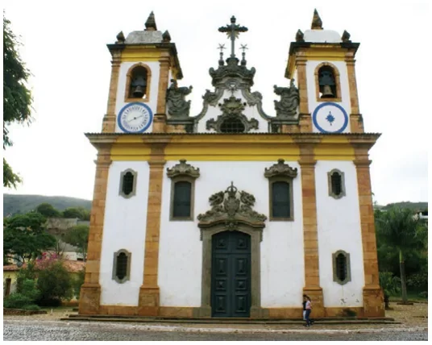 |
            | :--: |
            | *Igreja Nossa Senhora do Carmo* |
            
            A igreja é um dos palcos mais espetaculares da arte e da genialidade do Mestre Aleijadinho, ao lado de outros artistas. Templo característico da terceira fase do Barroco Mineiro e do estilo Rococó, é tombada como Patrimônio Histórico.
            
            - **Localização:** Rua do Carmo
            - **Funcionamento:** Diário, das 09h às 17h.
            
            ## Conjunto arquitetônico da Rua Dom Pedro II
            
            |  |
            | :--: |
            | *Conjunto arquitetônico da Rua Dom Pedro II - Casa da Ópera Teatro Municipal* |
            
            A antiga Rua Direita possui um conjunto arquitetônico tombado como Patrimônio Histórico e Artístico Nacional. Destacam-se entre as edificações, o Solar do Padre Correia, a Casa Azul, o Sobrado de Dona Sofia e a Casa da Ópera (Teatro Municipal).
            
            - **Localização:** Rua Dom Pedro II
            - **Funcionamento:** Varia em função ponto turístico.
  - **[9]**:
    - **uid**: oedGgIEHDEjLyk
    - **texto**: Ecoturismo
    - **destino**:
      - **secao_textual**:
        - **conteudo**:
            # Ecoturismo
            
            Em Sabará, o ecoturismo pode ser praticado principalmente no Arraial Velho e no Pompéu, pequenos vilarejos às margens da Estrada Real. Além disso, a cidade acolhe a bela Área de Proteção Ambiental da Serra da Piedade, da qual a Pedra Rachada faz parte. Com vegetação de campos ferruginosos, esta APA possui grande riqueza e diversidade de espécies. Por lá, é possível realizar vários passeios pelas suas trilhas de mata Atlântica.
            
            Nessas regiões, o visitante tem contato singular com o ambiente natural. Lá, muitos esportistas já praticam caminhadas na natureza, mountain bike e boulder. Passeios a cavalo também podem ser realizados em determinadas áreas.
            
            Além de promover o bem-estar da população envolvida, o ecoturismo propicia um maior contato do homem com o meio natural e cria um novo tipo de relação, incentivando-o a preservar os recursos naturais e a valorizar da vida. É um dos principais meios de educação sustentável e formação de uma consciência ambientalista através da interpretação do ambiente.
            
            |  |
            | :--: |
            | *Contemplação e práticas na natureza da APA da Serra da Piedade* |
            
            Em Sabará é possível, também, visitar parques ecológicos gratuitamente:
            
            ## Parque Eco Pedagógico Quinta dos Cristais
            
            O Parque possui uma grande área verde, situada na porção sul da cidade, na estrada para Olaria no bairro Adelmolândia. Possui ainda diversas atrações como o Museu Temático da Escravidão, Museu de Antiguidades, Museu da Nanoescultura, trilhas, belas vistas panorâmicas da região, nascentes e riachos. O Parque está aberto ao público aos fins de semana e feriados, das 11 às 19 horas. A visitação ao parque é gratuita.
            
            - **Endereço:** Rua Gavião, 1 - Adelmolândia
            - **Informações:** www.quintadoscristais.com.br / (31) 3671-3241.
            
            ## Parque Natural Municipal Chácara do Lessa
            
            A poucos metros do centro histórico, o visitante pode contemplar a natureza, visitar ruínas e minas remanescentes do século XVIII e XIX. No mirante, está disponível uma belíssima vista panorâmica da região. Oferece opções para trilhas interpretativas e pequenas caminhadas. O parque está aberto de terça-feira a domingo, das 08 às 16 horas e a entrada é gratuita.
            
            - **Endereço:** Rua Arthur Lima Júnior, s/nº - Terra Santa
            - **Informações:** semma@sabara.mg.gov.br / (31) 3671-2282 / (31) 3672-7694
            
            ## Bosque Alfredo Machado
            
            Localizado no centro histórico, possui área verde, viveiro de mudas, cascata, pequenas trilhas, área de descanso e pista para caminhada. Também sedia atualmente a Secretaria Municipal de Meio Ambiente. O parque está aberto de terça-feira a domingo, das 08 às 16 horas e a entrada é gratuita.
            
            - **Endereço:** Av. Serafim Mota Barros s/n – Centro
            - **Informações:** semma@sabara.mg.gov.br / (31) 3671-2282 / (31) 3672-7694
  - **[10]**:
    - **uid**: Zuun71n8Cb2uoa
    - **texto**: Ecossistema
    - **destino**:
      - **secao_textual**:
        - **conteudo**:
            # Ecossistema
            
            O Brasil é considerado como um dos países de maior biodiversidade no mundo, pois segundo Mittermeier e colaboradores (1997), calcula-se que nada menos do que 10% de toda a biota terrestre encontram-se no país.
            
            O município de Sabará localiza-se na região denominada Quadrilátero Ferrífero de Minas Gerais, levantada, sob o ponto de vista zoogeográfico, como uma área de transição entre os biomas Cerrado e Mata Atlântica, compondo um ecótono, ou seja, uma região de grande diversidade de espécies da flora e da fauna, uma vez que há o contato de diferentes comunidades que habitam ambos os biomas e seus hábitats associados (RICKLEFS, 2003; BEGON et al, 2007). Cabe ressaltar, que a vegetação típica do bioma Cerrado, predominante na paisagem, já é composta por um mosaico de diferentes tipos fisionômicos, propiciando por si só, uma grande diversidade de espécies faunísticas associadas com a expressiva diversidade de hábitats por ela oferecida. Estas características ecológicas lhes conferem uma heterogeneidade espacial ímpar, responsável pela expressiva diversidade biológica e alto número de endemismos já catalogados para o bioma (MACHADO, 2004; MACHADO, 2008; BOCCHINGLIERI et al., 2010; PAGLIA, 2012). O Quadrilátero Ferrífero destaca-se no contexto estadual, sobretudo, pela presença de campos rupestres hematíticos e por abrigar muitas espécies endêmicas assim como espécies ameaçadas de extinção, já identificadas em alguns estudos, sendo por isso, definida como prioritária para a conservação em Minas Gerais (DRUMMOND et al., 2005).
            
            ## Fauna
            
            A fauna do Cerrado brasileiro é pouco conhecida, sendo recentes os estudos mais consistentes sobre o tema. O Cerrado abriga um grande número de espécies animais, mamíferos, aves, répteis, anfíbios e peixes fazem parte das cerca de 2.500 espécies de vertebrados que utilizam o bioma como hábitat. Isso sem contar os insetos que possuem papel fundamental na ecologia e dinâmica energética dos ecossistemas terrestres.
            
            Entre os vertebrados de maior porte comumente encontrados em suas diferentes fitofisionomias, citamos a cascavel (*Crotalus durissus*), a jararaca (*Bothrops* sp.), o lagarto teiú (*Tupinambis merianae*), a siriema (*Cariama cristata*), a águia cinzenta (*Urubitinga coronata*), o carcará (*Caracara plancus*), o urubu-de-cabeça-preta (*Coragyps atratus*), tucanos (*Ramphastos* sp.), maritacas e araras, o tatu-peba (*Euphractus sexcinctus*), o tatu-galinha (*Dasypus novemcinctus*), o tatu-canastra (*Priodontes maximus*), o tatu-de-rabo-mole (*Cabassous unicinctus*), o tamanduá-bandeira (*Myrmecophaga tridactyla*), o tamanduá-mirim (*Tamandua tetradactyla*), o veado catingueiro (*Mazama gouazoubira*), a raposinha (*Lycalopex vetulus*), o cachorro-do-mato (*Cerdocyon thous*), o lobo-guará (*Chrysocyon brachyurus*), a jeritataca (*Conepatus semistriatus*), o tapeti (*Silvilagus brasiliensis*), o gato-do-mato (*Leopardus tigrinus*), a jaguatirica (*Leopardus pardalis*), o gato mourisco (*Leopardus yagouaroundi*) e as onças parda (*Puma concolor*) e pintada (*Panthera onca*). Na Pedra Rachada, escaladores já visualizaram na estrada, na “volta do nightclimb” uma onça parda atravessando-a, e também há registros de visualizações de tapetis, carcarás e raposinhas, o que não exclui a possibilidade das demais espécies, com exceção da onça pintada, também estarem presentes na região.
            
            Com relação aos invertebrados, os cupins, insetos da Ordem Isoptera, Família Termitidae, são de grande importância, sobretudo pelo seu papel no fluxo de energia no ecossistema, atuando como herbívoros vorazes e servindo de alimentos para um grande número de espécies, tais como o tamanduá-bandeira, as diversas espécies de tatus, a cobra-de-duas-cabeças, dentre outras. Outra ordem de grande importância é a das formigas e abelhas, Ordem Hymenoptera, sobretudo pelo importante papel das abelhas na polinização das flores.
            
            Com isso escaladores, devemos estar atentos a deixar sempre o ambiente da forma na qual o encontramos, para que este sempre nos surpreenda com sua riqueza e belezas naturais. Devemos nos atentar a preservá-lo sempre, mantendo-o limpo e evitando deixar restos de alimentos industrializados na base das pedras e curso das trilhas, pois estes podem ser ingeridos pelos animais silvestres lhes causando danos ao seu bem estar.
            
            Além disso:
            - Cuidado redobrado deve ser tomado com relação às abelhas, pois pessoas alérgicas podem ter fortes reações às suas picadas, portanto, evitem ao máximo estar em locais com colmeias ou na presença de enxames em voo.
            - Cascavéis e jararacas se “simpatizam” muito à ambientes como o da Pedra Rachada, então esteja sempre atento ao caminhar nas trilhas e aos locais nos quais colocará sua mochila ou se sentará para lanchar.
            - A mesma atenção dada à presença das cobras, também deve ser dada à aranhas e escorpiões, que também estão sempre presentes em ambientes de pedreiras e em campos abertos.
            
            |  |
            | :--: |
            | *Aranha em sua teia nos arredores da Pedra Rachada* |
            
            ## Vegetação
            
            A fitofisionomia se configura em um mosaico formado por Savana Arbórea ou Cerrado senso stricto, Savana graminho-lenhosa associada à Campos Rupestres geralmente com ocorrência para altitudes superiores à 1500 metros nas cristas das serras, e Campos Rupestres que aparecem nos afloramentos e solos litólicos de itabirito característicos da Pedra Rachada.
            
            ## Clima
            
            O período ideal para a prática da escalada na Pedra Rachada é durante o outono e o inverno, do início de maio até o início de setembro, quando as temperaturas tornam-se mais amenas e a umidade relativa do ar é mais baixa. Nessa época, como dizem os escaladores locais, a pedra fica “colando”, perfeita para encadear seus projetos. De outubro a abril, as temperaturas são mais elevadas e as chances de chuva aumentam, especialmente no período de dezembro a março. Esta não é a melhor época para uma escalada forte durante o dia e muita atenção para fortes tempestades deve ser tomada, mas durante a noite o tempo está sempre fresco, perfeito para o night climb, tradicional no setor.
  - **[11]**:
    - **uid**: ONHRoqILMQW3JL
    - **texto**: Onde Ficar
    - **destino**:
      - **secao_textual**:
        - **conteudo**:
            # Onde Ficar
            
            > **Mapa da Cidade de Sabará + Onde Comer + Onde Ficar**
            
            ## Adrena Sport Hostel
            
            | 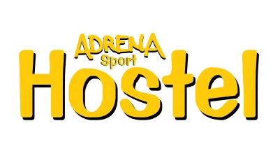 |
            | :--: |
            | *Adrena Sport Hostel* |
            
            Já imaginou dormir em uma cama suspensa, parecida com a utilizada na escalada em parede, ou dormir dentro de uma réplica de half pipe? O Adrena Sport Hostel é muito mais do que uma hospedagem, é um convite à aventura! Cada quarto é decorado com um tema de esportes de aventura. Seja pedalando, escalando, voando, remando ou caminhando; seja você experiente, amador ou curioso querendo experimentar algo novo! Aventure-se durante o dia e a noite, descanse na melhor localização de Belo Horizonte.
            
            Alugamos equipamentos e oferecemos serviços para a prática de esportes de aventura.
            
            - **Reservas e informações:** (31) 3657-9970 / 8481-8893
            - **E-mail:** contato@adrenasporthostel.com.br
            - **Site:** www.adrenasporthostel.com.br
            - **Endereço:** Av. Getulio Vargas, 1635 A - Funcionários (Savassi), Belo Horizonte - MG - CEP: 30112-021
            
            ## Pousada Villa Real
            
            | 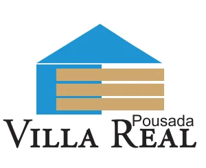 |
            | :--: |
            | *Pousada Villa Real* |
            
            A Pousada Villa Real oferece a você a melhor localização de Sabará! A apenas 100 metros do centro comercial e histórico, a pousada possui piscina, garagem para até 06 carros, wi-fi de 30mbps, televisores led e 06 apartamentos com tv a cabo. Venha se hospedar aqui, escalar na Pedra Rachada e conhecer o que Sabará tem de melhor!
            
            Diárias incluem café da manhã.  
            Ganhe 10% de desconto apresentando o Guia!
            
            - **Reservas e informações:** (31) 3671-2121 / 8893-1731
            - **E-mail:** pousadavillareal@gmail.com
            - **Site:** www.pousadavillareal.net
            - **Endereço:** Av. Prefeito Serafim Motta Barros, 76 - Centro, Sabará - MG - CEP: 34505-440
  - **[12]**:
    - **uid**: 9wdwSeEtj2ZLL5
    - **texto**: Ética Local
    - **destino**:
      - **secao_textual**:
        - **conteudo**:
            # Ética Local
            
            Amigo montanhista, antes de tudo é importante lembrar que você está entrando em uma Área de Preservação Ambiental. Para evitar a proibição da escalada no local (como já ocorreu em vários outros importantes setores de escalada nos arredores de Belo Horizonte) seja consciente em seus atos, siga as regras básicas de conduta, sejam cordiais e pratiquem o mínimo impacto. A natureza e a comunidade escaladora agradece.
            
            - Estacione sempre nos locais apropriados e sem obstruir a passagem (muitos caminhões transitam nesta estrada).
            - Entre em harmonia com a natureza, este é um local de vida selvagem. Respeite e ajude a preservar a fauna e a flora local e tome cuidado com animais peçonhentos.
            - Evite fazer fogueiras e acampar no local, seja consciente em seus atos.
            - Afaste-se das trilhas e dos boulders para fazer suas necessidades fisiológicas, enterre-as sempre e não deixe papel higiênico no local.
            - Aproveite seu momento com a natureza e evite o uso de qualquer aparelho de som. Caso queira escalar ouvindo suas músicas preferidas, lembre-se de respeitar a liberdade de escolha dos outros e também a fauna local. Uma boa alternativa é o uso dos fones de ouvido.
            - Ajude a conservar e melhorar sempre a base dos boulders e as trilhas de acesso.
            - Caminhe sempre nas trilhas demarcadas evitando danificar a vegetação local.
            
            ## Antes de escalar:
            
            - A escalada é um esporte seguro quando praticado com consciência, não se esqueça nunca que você é o responsável por sua segurança e pratique o esporte somente se for capacitado.
            - Atente para a sua segurança e a segurança de seus parceiros, tome cuidado com pedras na base dos boulders, com agarras quebrando e principalmente nas viradas dos boulders.
            - Verifique se não há nenhum animal peçonhento próximo ao boulder ou dentro das agarras.
            - Respeite a paz dos habitantes locais, se houver algum ninho em um boulder, mantenha distância e não escale próximo à ele.
            - Antes de deixar o local, escove o excesso de magnésio das agarras e verifique se não está deixando nenhum lixo para trás.
            - Lixo: você é responsável pelo seu, leve-o de volta (atenção com as guimbas de cigarro e os esparadrapos usados).
            - Aproveite seu dia de escalada e, acima de tudo, tenha bom senso.
  - **[13]**:
    - **uid**: WP2XHHRMj7oiKE
    - **texto**: Como Chegar na Pedra Rachada
    - **destino**:
      - **secao_textual**:
        - **conteudo**:
            # Como Chegar na Pedra Rachada (Mapa)
            
            | 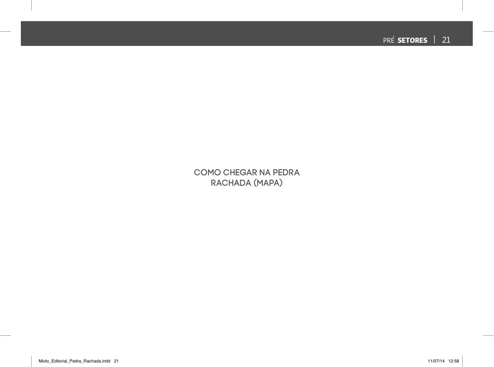 |
            | :--: |
            | *Mapa de Acesso à Pedra Rachada* |
  - **[14]**:
    - **uid**: knOYgNlGW6FM3e
    - **texto**: História
    - **destino**:
      - **secao_textual**:
        - **conteudo**:
            # História
            
            **1991** – A Pedra Rachada começa a ser explorada por três jovens amigos, de apenas 16 anos de idade, Fabiano Fernandes, Eustáquio e Emerson Azevedo, o Caverna. Eles não tinham carro, subiam a pé de Sabará até o setor e procuravam pelas pedras mais altas, para escalar de Top Rope – eles faziam o acesso ao topo do bloco e montavam o Top com os equipamentos que tinham na época.
            
            **1992** – Os três amigos começaram a frequentar outros picos de escalada em Minas Gerais, como a Serra do Cipó e a Pedra Branca, e a escalada na Pedra Rachada ficou abandonada por um tempo.
            
            **1996** – Uma nova turma começou a frequentar o setor. Os meninos Chander Cristian, Dalber Fernandes “Bim”, Francisco Queiroz “Chico” e Gustavo Rocha “Passarinho” não conheciam muito a escalada nem o boulder, mas gostaram da idéia de subir pedra e se aventurar no local! Na época não tinham equipamentos e escalavam com tênis de futsal. Adoravam o esporte, escalavam alguns boulders mais difíceis e arriscavam-se até em alguns highballs.
            
            **1998** – Chander, Bim, Chico e Passarinho fizeram um curso de escalada com Emerson “Caverna”, conseguiram comprar seus primeiros equipamentos e começaram a frequentar picos de escalada esportiva. Novamente a Pedra Rachada ficou abandonada.
            
            **2000/2001** – Christian Fernandes animou novamente a turma de Chander e Bim, e começaram a explorar a Pedra Rachada. Nesse período foram conquistados pelo menos 20 boulders nos blocos 1 e 2!
            
            **2004** – Em uma madrugada de muita conversa, os escaladores Felipe Álvares, o Cabeção e Gustavinho Fontes decidiram conhecer a Pedra Rachada. Ligaram para Emerson “Caverna” e às 4h da manhã passaram em sua casa para começar a empreitada. Ao nascer do Sol, já tinham escalado muito nos blocos 1 e 2, e logo no início da manhã voltaram para o trabalho. Maravilhados com a beleza e potencial da Pedra Rachada, começaram a fazer divulgação boca a boca do setor e juntar os amigos para escalar no local.
            
            **2005** – Nesse ano, Belo Horizonte sediou o Campeonato Brasileiro de Escalada em Belo Horizonte. A capital recebeu nomes fortes da escalada brasileira, como Tiago Veloso, Mateus Veloso e Diogo Ratacheski. Felipe “Cabeção” e Gustavinho aproveitaram a oportunidade e levaram a turma para conhecer a Pedra Rachada. Nesse dia foram abertos os boulders “Tosco” v8, “Rollings Stones” v8 e “Gaston a la meson” v6, super clássicos do setor!
            
            **2005** – Em agosto do mesmo ano, Felipe “Cabeção” e Gustavinho, que estavam bem dedicados ao setor, decidiram realizar o 1º Festival da Pedra Rachada.
            
            **2007** – Cabeção lança, em parceria com Daniel Mentes, o TioDan, o 1º croqui da Pedra Rachada! O croqui foi lançado no 3º Festival da Pedra Rachada, um evento de grande repercussão que levantou e apresentou o setor para o Brasil!
            
            **2009** – O escalador Rafael Passos realiza a primeira ascensão (FA) do “Projeto Sabará” e sugere o grau v12, a linha mais clássica do local! Este é, até hoje, o boulder mais difícil já aberto no setor.
            
            **2012** – Felipe “Cabeção” e Daniel “TioDan” organizaram a 1ª Ação Pedra Rachada de Cara Nova. A ação consistiu em limpar as trilhas e melhorar as bases dos blocos, com o deslocamento de pedras e criação de contenções no caso de buracos ou descidas íngremes. O objetivo era melhorar o setor e torná-lo mais seguro para a prática da escalada. As ações tornaram-se um evento tradicional no pico.
            
            **2014** – O Guia de Escalada Pedra Rachada Bouldering é lançado no 10º Festival Pedra Rachada Bouldering em homenagem ao aniversário do setor, um presente para os aficionados pela escalada em boulder! Foi o primeiro guia completo de escalada a ser lançado no Brasil! O Festival contou com a presença de grandes escaladores de todo o país!
  - **[15]**:
    - **uid**: VUVN6eSgZtjXmU
    - **texto**: Como Usar este Guia
    - **destino**:
      - **secao_textual**:
        - **conteudo**:
            # Como Usar Este Guia
            
            ## Graduação + Legenda
            
            |  |
            | :--: |
            | *Graduação e Legenda* |
  - **[16]**:
    - **uid**: pwghcmmhGG1oKX
    - **texto**: Sobre os Autores
    - **destino**:
      - **secao_textual**:
        - **conteudo**:
            # Sobre os Autores
            
            | 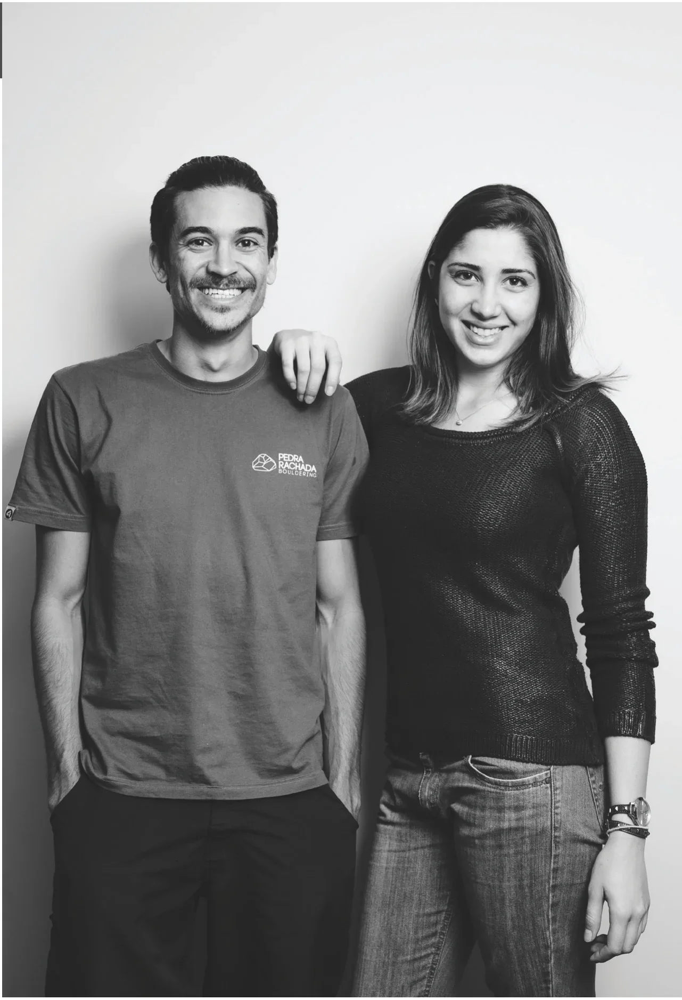 |
            | :--: |
            | *Luca Portilho e Nathalia Daneliczin* |
            
            Luca é esportista desde criança. Nasceu em 21 de março de 1988 na cidade de Uberlândia, Minas Gerais, onde corria para todos os lados. Aos 12 anos, mudou-se para Vila Velha, onde passou sua adolescência e praticou vários esportes, como corrida de aventura, triátlon e surf. Em 2010 conheceu a escalada e apaixonou-se! Veio para Belo Horizonte aos 22 anos, onde mora até hoje. Trabalha como route-setter numa academia de escalada e como rigger – responsável pela montagem e desmontagem da estrutura – no Cirque du Soleil. Nas horas vagas? Assiste a vídeos de escalada e escala. Adora um boulder clássico, mas é apaixonado mesmo pelas vias e paredes. É ávido por desafios e sonha em escalar na França, berço do esporte. Outro sonho é mudar-se para o meio do mato e morar na base de uma montanha cheia de vias clássicas. Está numa nova fase em sua vida profissional, lançou seu primeiro guia de escalada e pretende lançar novos guias em breve, sabendo da importância desse trabalho para a comunidade escaladora do Brasil.
            
            É apaixonado pela vida, pela natureza e tem um coração enorme. É o escalador mais apaixonado que eu conheço.
            
            Sou ex jogadora de vôlei – joguei dos 8 aos 21 anos, servi a Seleção Brasileira de base dos 14 aos 17, joguei seis Superligas e devo a esse esporte lindo tudo que conquistei e aprendi até hoje, e as amizades maravilhosas que tenho – e estudante de administração. Belo Horizontina apaixonada pela cidade, pelas flores e pelo mar, pelo Sol e pela vida. Meu sonho é viajar o mundo e nutrir minha alma, alimentar-me de conhecimento e ser uma pessoa melhor a cada dia. Acredito que a verdade e a sinceridade podem mudar o mundo. Acredito que felicidade é de responsabilidade nossa e devemos abraçá-la todos os dias, vivendo da melhor maneira possível, fazendo o bem e amando muito. Nasci em 26 de agosto de 1991 e me chamo Nathalia Daneliczin. Esse é o meu primeiro livro publicado, ainda espero escrever e publicar algumas idéias por aí.
- **ultima_migracao**: 5

## Parte: grupo_estacionamento

### Grupo (Pico: Pedra Rachada)

- **descricao**:
    Os trabalhos neste setor começaram apenas em 2007, com o descobrimento do imponente Bloco 0 e a abertura de seus primeiros boulders, como o incrível “Verticale” v5. Durante algum tempo o setor permaneceu sem novidades até que, em 2011, o Bloco 0 voltou a ser freqüentado e recebeu os FAs mais duros do setor, incluindo o mítico “Medalhão” v10, que até os dias de hoje recebeu poucas cadenas. Em 2013, os blocos mais próximos do estacionamento começaram a ser explorados e se mostraram um excelente playground para os iniciantes.
    
    ## Acesso (10 min)
    
    Ao estacionar o carro é possível avistar, a cerca de 100m, os 03 primeiros blocos. Para acessá-los basta pegar a trilha óbvia que vai em direção a eles por cerca de 1min. Já para os outros blocos, siga a estrada que sobe em direção ao setor “Entrada” e, pouco antes da forte curva à direita, você verá duas trilhas: a da direita te leva ao bloco “Psicotrópicos” e a da esquerda ao “Bloco 0”.
    
    ## Boulders Clássicos
    
    - 13 Davy Jones v0
    - 16 Aresta v3
    - 20 Verticale v5
    - 21 Obina v7
    - 23 Medalhão v10
    
    |  |
    | :--: |
    | *Escalador no boulder Traverse ao Tito* |
    
    | 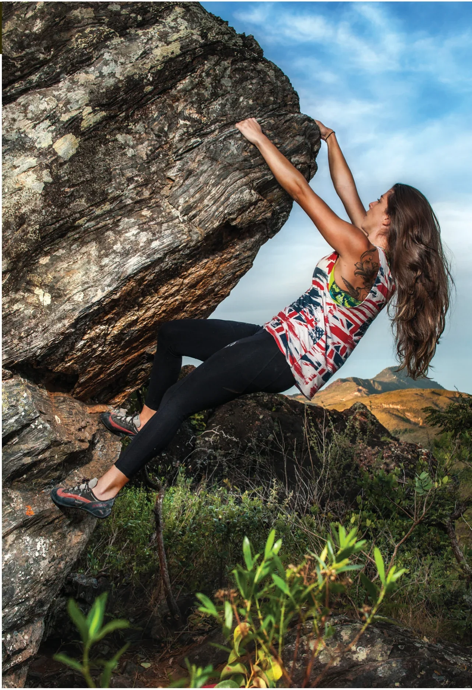 |
    | :--: |
    | *Escaladora no boulder Davy Jones* |
    
    > "O melhor escalador do mundo é aquele que mais se diverte."  
    > — *Alex Lowe*
    
    | 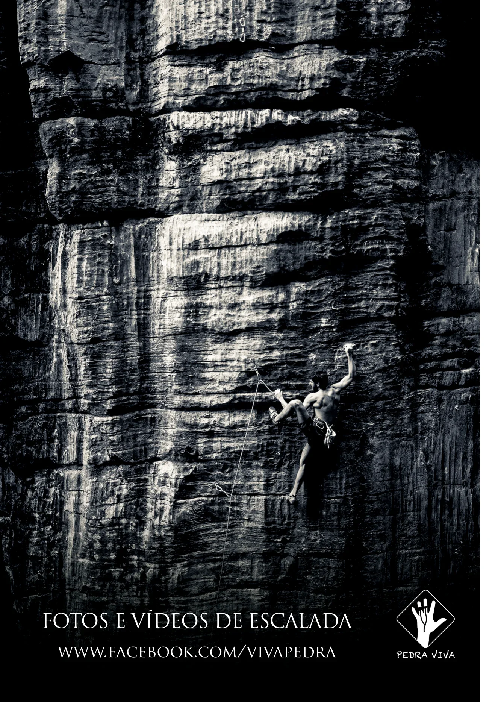 |
    | :--: |
    | *Fotos e vídeos de escalada - Pedra Viva* |
    
    *Fotos e vídeos de escalada: [www.facebook.com/vivapedra](https://www.facebook.com/vivapedra)*
- **nome**: Estacionamento
- **uid**: 953oYyZ8HlnV6T
- **caminho_imagem_capa**: 
- **setores**:
  - **[0]**:
    - **conteudo**:
      - **descricao**: 
      - **nome**: Bloco A - Traverse ao Tito
      - **uid**: UF4RAtxtLmMUH5
      - **mapas**:
        - **[0]**:
          - **caminho_imagem_mapa**: 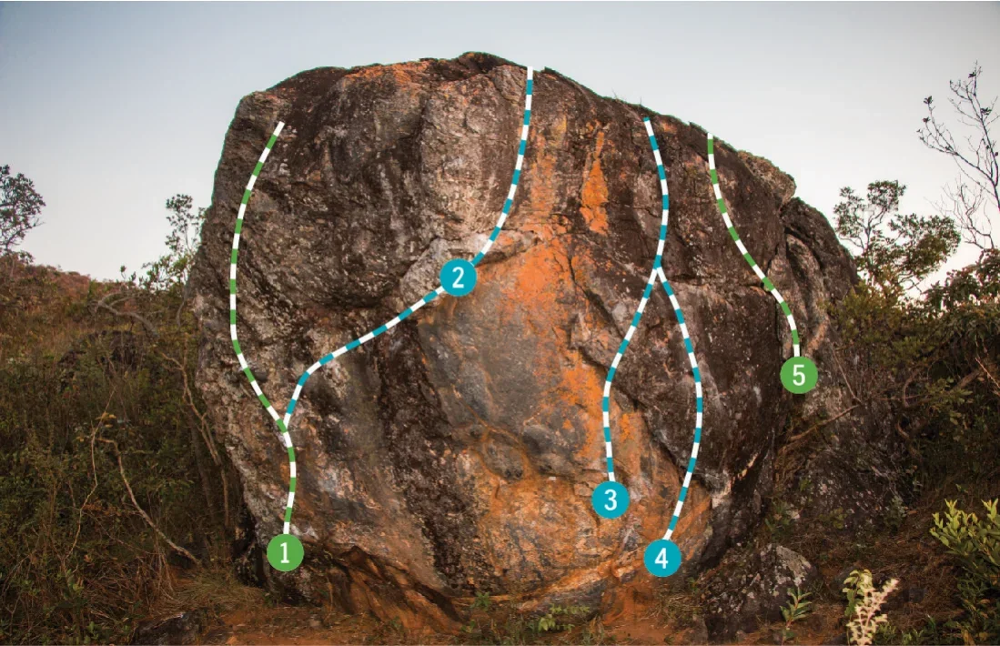
          - **largura_mapa**: 1099
          - **altura_mapa**: 710
          - **referencias**:
            - **[0]**:
              - **alvo_uid**: UcfpswteluQf9w
              - **pontos_uids**:
                - 1
              - **escalada**: Esquenta o prato
              - **ids**:
                - 1
            - **[1]**:
              - **alvo_uid**: y8pNozqXqupfuc
              - **pontos_uids**:
                - 2
              - **escalada**: Traverse ao Tito
              - **ids**:
                - 2
            - **[2]**:
              - **alvo_uid**: m5KSKHA1BNAond
              - **pontos_uids**:
                - 3
              - **escalada**: Chupa karma
              - **ids**:
                - 3
            - **[3]**:
              - **alvo_uid**: TX3Ddbo6JEPhEk
              - **pontos_uids**:
                - 4
              - **escalada**: Taco o fogo
              - **ids**:
                - 4
            - **[4]**:
              - **alvo_uid**: PADAVh9eSfibg7
              - **pontos_uids**:
                - 5
              - **escalada**: Pum
              - **ids**:
                - 5
      - **escaladas**:
        - **[0]**:
          - **uid**: UcfpswteluQf9w
          - **boulder**:
            - **descricao**: Sai sentado com a mão direita em um pequeno reglete/batente de gaston e a esquerda em um batente invertido, fazendo um movimento forte e continuando reto por agarras boas até o topo.
            - **nome**: Esquenta o prato
            - **dificuldade**: V3
        - **[1]**:
          - **uid**: y8pNozqXqupfuc
          - **boulder**:
            - **descricao**: Problema aberto em homenagem à jovem promessa da escalada italiana. Sai como o “Esquenta o prato” (1) e atravessa pelo alto para a direita, passando por um buraco e pelo módulo até um batente abaulado, finalizando com um movimento longo até a borda.
            - **nome**: Traverse ao Tito
            - **dificuldade**: V5
            - **destaque**: True
        - **[2]**:
          - **uid**: m5KSKHA1BNAond
          - **boulder**:
            - **descricao**: Sai em pé em 02 regletes/batentes invertidos e faz um movimento forte para uma agarra boa, terminando como o “Taco o fogo” (4).
            - **nome**: Chupa karma
            - **dificuldade**: V5
            - **destaque**: True
        - **[3]**:
          - **uid**: TX3Ddbo6JEPhEk
          - **boulder**:
            - **descricao**: Começa sentado, com a mão direita bem baixa num reglete e a esquerda num batente/pinça de lado e toca reto.
            - **nome**: Taco o fogo
            - **dificuldade**: V4
        - **[4]**:
          - **uid**: PADAVh9eSfibg7
          - **boulder**:
            - **descricao**: Sai em pé com a mão direita num reglete de gaston e a esquerda em uma invertida logo acima escalando por agarras boas.
            - **nome**: Pum
            - **dificuldade**: V0
            - **destaque**: True
      - **precomputados**:
        - **total_escaladas**: 5
        - **total_boulders**: 5
  - **[1]**:
    - **conteudo**:
      - **descricao**: 
      - **nome**: Bloco B - Positive Vibrations
      - **uid**: 7zovtK8xpq3Wpg
      - **mapas**:
        - **[0]**:
          - **caminho_imagem_mapa**: 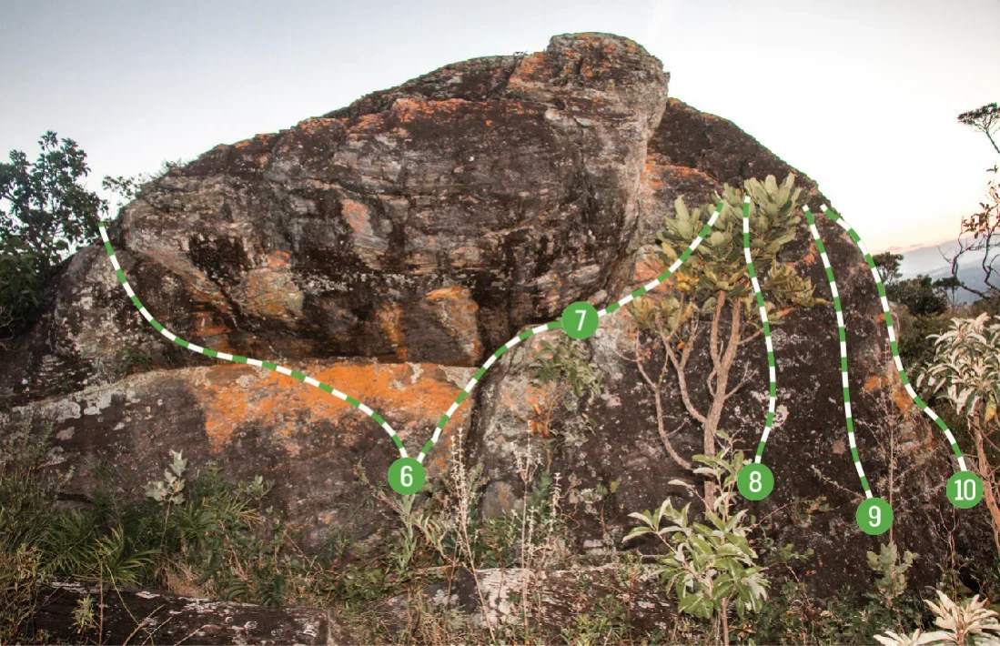
          - **largura_mapa**: 1099
          - **altura_mapa**: 710
          - **referencias**:
            - **[0]**:
              - **alvo_uid**: 2d1UWBEt6DpW7b
              - **pontos_uids**:
                - 6
              - **escalada**: La olla
              - **ids**:
                - 6
            - **[1]**:
              - **alvo_uid**: ykTyyYnc0JA4kk
              - **pontos_uids**:
                - 7
              - **escalada**: Mayday
              - **ids**:
                - 7
            - **[2]**:
              - **alvo_uid**: CVzdlBxD4MdgAm
              - **pontos_uids**:
                - 8
              - **escalada**: Positive vibrations
              - **ids**:
                - 8
            - **[3]**:
              - **alvo_uid**: FewpvWQrjZc4Ad
              - **pontos_uids**:
                - 9
              - **escalada**: Macadâmia
              - **ids**:
                - 9
            - **[4]**:
              - **alvo_uid**: BP8271Cj0nFz3A
              - **pontos_uids**:
                - 10
              - **escalada**: King Kong
              - **ids**:
                - 10
        - **[1]**:
          - **caminho_imagem_mapa**: 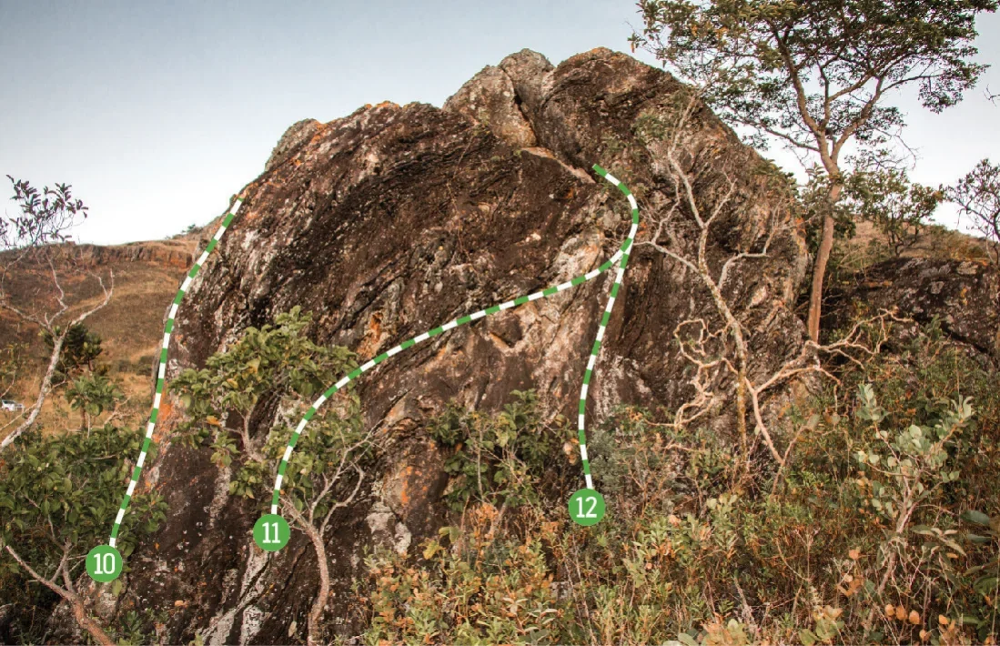
          - **largura_mapa**: 1099
          - **altura_mapa**: 710
          - **referencias**:
            - **[0]**:
              - **alvo_uid**: BP8271Cj0nFz3A
              - **pontos_uids**:
                - 10
              - **escalada**: King Kong
              - **ids**:
                - 10
            - **[1]**:
              - **alvo_uid**: LfN0apLd7Jv8m3
              - **pontos_uids**:
                - 11
              - **escalada**: FormiguinhaZ
              - **ids**:
                - 11
            - **[2]**:
              - **alvo_uid**: bdc87LGB3hHIQb
              - **pontos_uids**:
                - 12
              - **escalada**: Buttstache
              - **ids**:
                - 12
      - **escaladas**:
        - **[0]**:
          - **uid**: 2d1UWBEt6DpW7b
          - **boulder**:
            - **descricao**: Sai sentado com as mãos em um batente e atravessa para a esquerda virando na parte mais fácil do negativo.
            - **nome**: La olla
            - **dificuldade**: VB
        - **[1]**:
          - **uid**: ykTyyYnc0JA4kk
          - **boulder**:
            - **descricao**: Começa como o “La olla” (6) e segue pra direita pela fenda.
            - **nome**: Mayday
            - **dificuldade**: VB
        - **[2]**:
          - **uid**: CVzdlBxD4MdgAm
          - **boulder**:
            - **descricao**: Boulder que escala o positivo em aderência.
            - **nome**: Positive vibrations
            - **dificuldade**: VB
            - **destaque**: True
        - **[3]**:
          - **uid**: FewpvWQrjZc4Ad
          - **boulder**:
            - **descricao**: Sai sentado com a mão direita em um bico e a esquerda em um reglete bom e toca reto por agarras boas à esquerda da aresta.
            - **nome**: Macadâmia
            - **dificuldade**: VB
        - **[4]**:
          - **uid**: BP8271Cj0nFz3A
          - **boulder**:
            - **descricao**: Começa sentado com as mãos juntas em um bico na aresta e escala abraçando a aresta.
            - **nome**: King Kong
            - **dificuldade**: VB
            - **destaque**: True
        - **[5]**:
          - **uid**: LfN0apLd7Jv8m3
          - **boulder**:
            - **descricao**: Boulder que sai em pé, em umas lacas logo à direita da aresta, e escala diagonalmente pra direita por agarras boas.
            - **nome**: FormiguinhaZ
            - **dificuldade**: VB
        - **[6]**:
          - **uid**: bdc87LGB3hHIQb
          - **boulder**:
            - **descricao**: Sai em pé à direita de uma pequena árvore e toca diagonalmente à direita, até uma fenda, e depois em direção à canaleta.
            - **nome**: Buttstache
            - **dificuldade**: VB
      - **precomputados**:
        - **total_escaladas**: 7
        - **total_boulders**: 7
  - **[2]**:
    - **conteudo**:
      - **descricao**: 
      - **nome**: Bloco C - Davy Jones
      - **uid**: 3vsvWLI8sxx8RS
      - **mapas**:
        - **[0]**:
          - **caminho_imagem_mapa**: 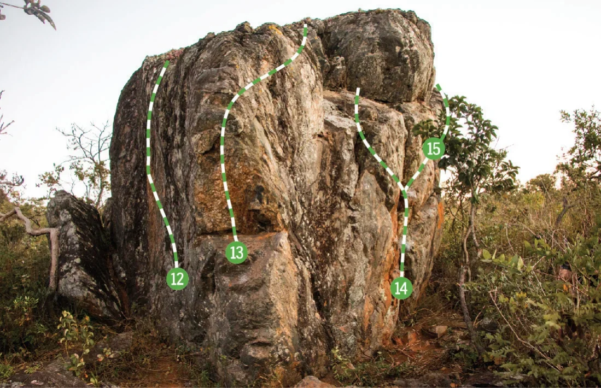
          - **largura_mapa**: 1099
          - **altura_mapa**: 710
          - **referencias**:
            - **[0]**:
              - **alvo_uid**: 6BeJykAYCkApy3
              - **pontos_uids**:
                - 12
              - **escalada**: Barba ruiva
              - **ids**:
                - 12
            - **[1]**:
              - **alvo_uid**: NLIfUSMgfjga9V
              - **pontos_uids**:
                - 13
              - **escalada**: Davy Jones
              - **ids**:
                - 13
            - **[2]**:
              - **alvo_uid**: SUbGEXfGneLyml
              - **pontos_uids**:
                - 14
              - **escalada**: Fenda do Biquíni
              - **ids**:
                - 14
            - **[3]**:
              - **alvo_uid**: peoSaKCrDorXT8
              - **pontos_uids**:
                - 15
              - **escalada**: Motim
              - **ids**:
                - 15
      - **escaladas**:
        - **[0]**:
          - **uid**: 6BeJykAYCkApy3
          - **boulder**:
            - **descricao**: Começa sentado com a mão direita em um reglete/pocket e a esquerda em um reglete e escala o vertical técnico.
            - **nome**: Barba ruiva
            - **dificuldade**: V0
            - **destaque**: True
        - **[1]**:
          - **uid**: NLIfUSMgfjga9V
          - **boulder**:
            - **descricao**: Escala a proa do bloco, começando em pé com a mão direita em um bico e a esquerda em um batente de oposição.
            - **nome**: Davy Jones
            - **dificuldade**: V0
            - **destaque**: True
        - **[2]**:
          - **uid**: SUbGEXfGneLyml
          - **boulder**:
            - **descricao**: Sai sentado com as mãos juntas em uma agarra boa, toca reto até a borda e vira à esquerda do módulo.
            - **nome**: Fenda do Biquíni
            - **dificuldade**: V0
        - **[3]**:
          - **uid**: peoSaKCrDorXT8
          - **boulder**:
            - **descricao**: Começa como o “Fenda do biquíni” (14) e domina à direita do módulo.
            - **nome**: Motim
            - **dificuldade**: V0
            - **destaque**: True
      - **precomputados**:
        - **total_escaladas**: 4
        - **total_boulders**: 4
  - **[3]**:
    - **conteudo**:
      - **descricao**: 
      - **nome**: Bloco D - Bloco 0
      - **uid**: vdjOdc1lF1PDpT
      - **mapas**:
        - **[0]**:
          - **caminho_imagem_mapa**: 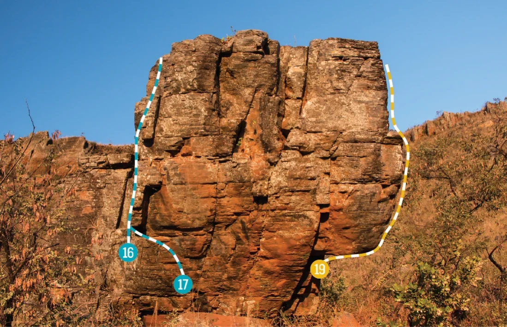
          - **largura_mapa**: 1099
          - **altura_mapa**: 710
          - **referencias**:
            - **[0]**:
              - **alvo_uid**: s57EkrSm1rRHf9
              - **pontos_uids**:
                - 16
              - **escalada**: Aresta
              - **ids**:
                - 16
            - **[1]**:
              - **alvo_uid**: UNaKoik5viSfes
              - **pontos_uids**:
                - 17
              - **escalada**: Tangente (Bloco 0)
              - **ids**:
                - 17
            - **[2]**:
              - **alvo_uid**: Dw36KnzXWquwqj
              - **pontos_uids**:
                - 19
              - **escalada**: Transferência
              - **ids**:
                - 19
        - **[1]**:
          - **caminho_imagem_mapa**: 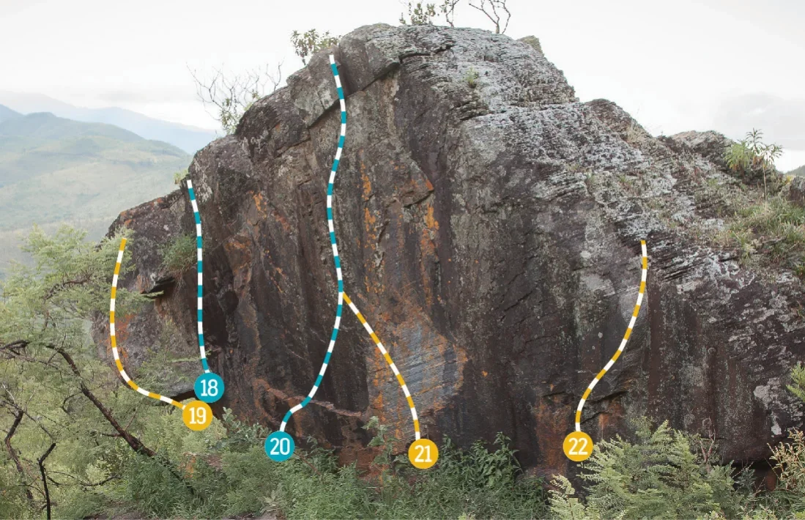
          - **largura_mapa**: 1099
          - **altura_mapa**: 710
          - **referencias**:
            - **[0]**:
              - **alvo_uid**: 1pZ2ORZUPzlSkh
              - **pontos_uids**:
                - 18
              - **escalada**: Transição
              - **ids**:
                - 18
            - **[1]**:
              - **alvo_uid**: Dw36KnzXWquwqj
              - **pontos_uids**:
                - 19
              - **escalada**: Transferência
              - **ids**:
                - 19
            - **[2]**:
              - **alvo_uid**: HXvr2ET4YJmMqi
              - **pontos_uids**:
                - 20
              - **escalada**: Verticale
              - **ids**:
                - 20
            - **[3]**:
              - **alvo_uid**: n0oAaiAr9TODeg
              - **pontos_uids**:
                - 21
              - **escalada**: Obina
              - **ids**:
                - 21
            - **[4]**:
              - **alvo_uid**: l0BtBWhuHMpgoU
              - **pontos_uids**:
                - 22
              - **escalada**: Medalha
              - **ids**:
                - 22
            - **[5]**:
              - **alvo_uid**: pYn9qgamHOWUOh
              - **pontos_uids**:
                - 22
              - **escalada**: Medalhão
              - **ids**:
                - 22
      - **escaladas**:
        - **[0]**:
          - **uid**: s57EkrSm1rRHf9
          - **boulder**:
            - **descricao**: Começa sentado com as mãos juntas em um batente na aresta e segue por ela até o topo.
            - **nome**: Aresta
            - **dificuldade**: V3
            - **destaque**: True
        - **[1]**:
          - **uid**: UNaKoik5viSfes
          - **boulder**:
            - **descricao**: Sai sentado no meio da face negativa, escala até a aresta e termina no “Aresta” (16).
            - **nome**: Tangente (Bloco 0)
            - **dificuldade**: V3
        - **[2]**:
          - **uid**: 1pZ2ORZUPzlSkh
          - **boulder**:
            - **descricao**: Começa sentado em baixo do tetinho e toca reto.
            - **nome**: Transição
            - **dificuldade**: V3
        - **[3]**:
          - **uid**: Dw36KnzXWquwqj
          - **boulder**:
            - **descricao**: Uma linha ainda sem repetições que sai como o “Transição” (18) e toca pra esquerda pelo vertical acima do tetinho.
            - **nome**: Transferência
            - **dificuldade**: V7
            - **conquistadores**:
              - Rafael Passos
            - **data_abertura**: 2011
        - **[4]**:
          - **uid**: HXvr2ET4YJmMqi
          - **boulder**:
            - **descricao**: Começa em dois regletes baixos, dá um tapa no batente e toca reto por regletes bons.
            - **nome**: Verticale
            - **dificuldade**: V5
            - **destaque**: True
            - **conquistadores**:
              - Gustavo Fontes
            - **data_abertura**: 2007
        - **[5]**:
          - **uid**: n0oAaiAr9TODeg
          - **boulder**:
            - **descricao**: Boulder com um movimento inicial muito técnico que sai em pé com a mão esquerda em um abaulado de oposição e a direita em uma invertida baixa, finalizando no “Verticale” (20).
            - **nome**: Obina
            - **dificuldade**: V7
            - **destaque**: True
            - **conquistadores**:
              - Daniel Mendes
            - **data_abertura**: 2011
        - **[6]**:
          - **uid**: l0BtBWhuHMpgoU
          - **boulder**:
            - **descricao**: Sai em pé com a mão esquerda em um reglete, a direita em uma invertida baixa e escala comprimindo a aresta abaulada.
            - **nome**: Medalha
            - **dificuldade**: V9
            - **destaque**: True
            - **conquistadores**:
              - Rafael Passos
            - **data_abertura**: 2011
        - **[7]**:
          - **uid**: pYn9qgamHOWUOh
          - **boulder**:
            - **descricao**: Sai sentado com as mãos juntas em uma agarra invertida e entra no “Medalha” (22).
            - **nome**: Medalhão
            - **dificuldade**: V10
            - **destaque**: True
            - **conquistadores**:
              - Rafael Passos
            - **data_abertura**: 2011
      - **precomputados**:
        - **total_escaladas**: 8
        - **total_boulders**: 8
  - **[4]**:
    - **conteudo**:
      - **descricao**: 
      - **nome**: Bloco E - Psicotrópicos
      - **uid**: NXumL13y78sla0
      - **mapas**:
        - **[0]**:
          - **caminho_imagem_mapa**: 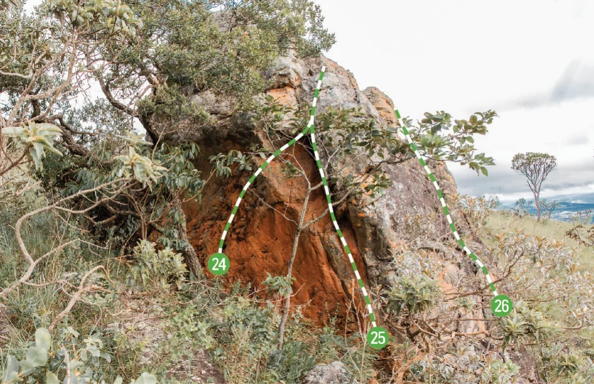
          - **largura_mapa**: 1099
          - **altura_mapa**: 710
          - **referencias**:
            - **[0]**:
              - **alvo_uid**: DT2coOZTZNypif
              - **pontos_uids**:
                - 24
              - **escalada**: Psicotrópicos
              - **ids**:
                - 24
            - **[1]**:
              - **alvo_uid**: 1frVvi6MxsXj6T
              - **pontos_uids**:
                - 25
              - **escalada**: Histeria
              - **ids**:
                - 25
            - **[2]**:
              - **alvo_uid**: zKnf8ryE2LbO7H
              - **pontos_uids**:
                - 26
              - **escalada**: Café com leite
              - **ids**:
                - 26
      - **escaladas**:
        - **[0]**:
          - **uid**: DT2coOZTZNypif
          - **boulder**:
            - **descricao**: Começa sentado com as mãos juntas em um pocket abaulado à direita da árvore e toca reto, finalizando pela aresta, como o “Histeria” (25).
            - **nome**: Psicotrópicos
            - **dificuldade**: V1
            - **destaque**: True
        - **[1]**:
          - **uid**: 1frVvi6MxsXj6T
          - **boulder**:
            - **descricao**: Sai sentado com as mãos em dois batentes verticais e escala a face negativa pela aresta por agarras boas.
            - **nome**: Histeria
            - **dificuldade**: V0
        - **[2]**:
          - **uid**: zKnf8ryE2LbO7H
          - **boulder**:
            - **descricao**: Escala o meio da face positiva por agarras boas.
            - **nome**: Café com leite
            - **dificuldade**: VB
            - **destaque**: True
      - **precomputados**:
        - **total_escaladas**: 3
        - **total_boulders**: 3
- **precomputados**:
  - **total_escaladas**: 27
  - **total_boulders**: 27

## Parte: grupo_entrada

### Grupo (Pico: Pedra Rachada)

- **descricao**:
    O mais frequentado setor da Pedra Rachada dá as boas vindas aos seus visitantes com dois grandes blocos, conhecidos por “Bloco 1” e “Bloco 2”. São quase 60 escaladas com os mais variados estilos e diversos clássicos de todos os graus. Neste setor também encontra-se a escalada mais difícil já encadenada em toda Pedra Rachada, o incrível “Projeto Sabará”. Não deixe de checar este boulder único, nem que seja para apreciar sua imponente linha!
    
    ## Acesso (15 min)
    
    Do estacionamento, pegue a estrada que sobe em direção às pedras até chegar a um plano onde se encontra o primeiro bloco, o “Libélula”. De lá, continue reto pela trilha principal que segue por mais 1min para acessar os gigantes “Bloco 1” e “Bloco 2”. Os outros blocos estão há menos de 1min deles.
    
    ## Boulders Clássicos
    
    - **8. Easy** – V1 (listado como V0 nos destaques)
    - **13. Pipe line** – V2
    - **42. Ziglyn** – V4
    - **46. Cadê minha força?** – V5
    - **36. Rala frek lek** – V7
    - **30. Projeto Sabará** – V12
    
    > "A felicidade só é real quando compartilhada."
    > 
    > — *Christopher McCandless*
    
    |  |
    | :--: |
    | *Detalhe das mãos do escalador em reglete na rocha com crashpad* |
    
    | 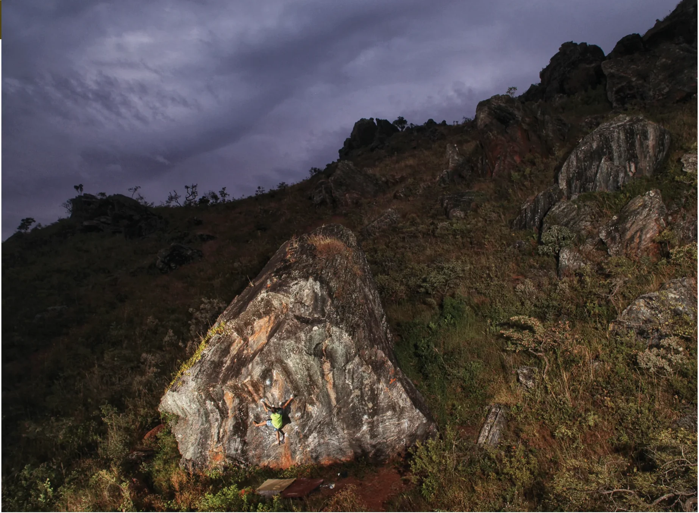 |
    | :--: |
    | *Escalador no Bloco 2 sob céu tempestuoso ao entardecer* |
    
    > "Quanto mais eu me elevo, menor eu pareço aos olhos de quem não sabe voar."
    > 
    > — *Friedrich Nietzsche*
    
    |  |
    | :--: |
    | *Escalador na linha Nave com vista panorâmica da serra* |
    
    ## Blocos do Setor
    
    - **Bloco A – Libélula**: boulders 1 a 3.
    - **Bloco B – Bloco 1**: boulders 4 a 23.
    - **Bloco C – Bloco 2**: boulders 24 a 48 (incluindo o clássico Projeto Sabará V12).
    - **Bloco D – Chupa Lombriga**: boulders 49 a 51.
    - **Bloco E – Abraço do Calango**: boulders 52 a 54.
    - **Bloco F – Nave**: boulders 55 e 56.
    
    ### Esquema dos Blocos e Conexões
    - A trilha de subida passa inicialmente pelo **Bloco A (Libélula)**.
    - Seguindo pela trilha principal chega-se aos grandes blocos centrais: **Bloco B (Bloco 1)** e **Bloco C (Bloco 2)**.
    - A partir da área dos blocos Libélula e Bloco 1 ramificam-se as trilhas secundárias para o **Setor Lua Cheia** (à esquerda) e para o **Setor Sono do Calango** (à direita).
    - Próximos ao Bloco 2 encontram-se os blocos **D (Chupa Lombriga)**, **E (Abraço do Calango)** e, mais acima na crista, o **F (Nave)**.
- **nome**: Entrada
- **uid**: hLETQNgAujWKqB
- **caminho_imagem_capa**: 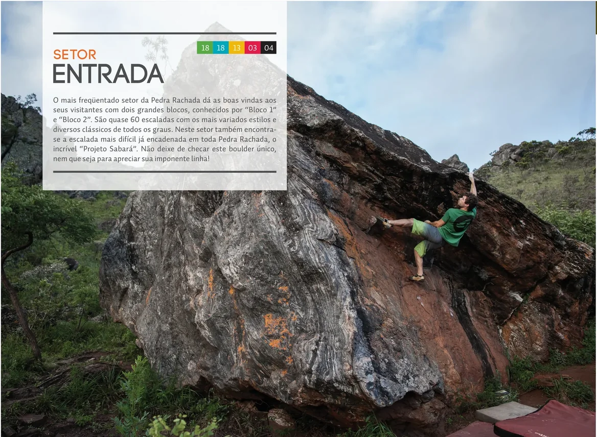
- **setores**:
  - **[0]**:
    - **conteudo**:
      - **descricao**: 
      - **nome**: Bloco A - Libélula
      - **uid**: XB90JoHKDpzLZy
      - **mapas**:
        - **[0]**:
          - **caminho_imagem_mapa**: 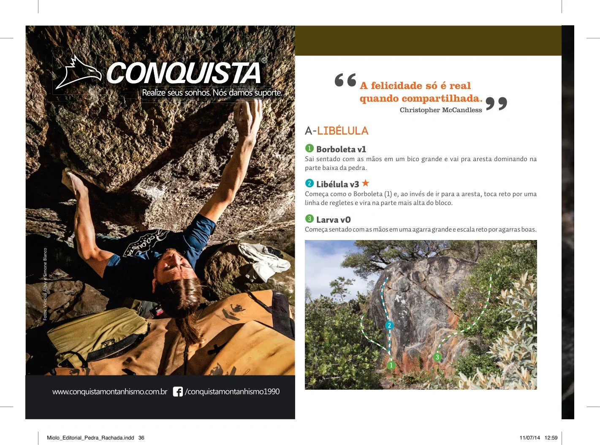
          - **largura_mapa**: 1421
          - **altura_mapa**: 1055
          - **referencias**:
            - **[0]**:
              - **alvo_uid**: SzN3x0rZtdTbjU
              - **pontos_uids**:
                - 1
              - **escalada**: Borboleta
              - **ids**:
                - 1
            - **[1]**:
              - **alvo_uid**: kzBZEahT1FKpZW
              - **pontos_uids**:
                - 2
              - **escalada**: Libélula
              - **ids**:
                - 2
            - **[2]**:
              - **alvo_uid**: cMuc6sILg49MgP
              - **pontos_uids**:
                - 3
              - **escalada**: Larva
              - **ids**:
                - 3
      - **escaladas**:
        - **[0]**:
          - **uid**: SzN3x0rZtdTbjU
          - **boulder**:
            - **descricao**: Sai sentado com as mãos em um bico grande e vai pra aresta dominando na parte baixa da pedra.
            - **nome**: Borboleta
            - **dificuldade**: V1
        - **[1]**:
          - **uid**: kzBZEahT1FKpZW
          - **boulder**:
            - **descricao**: Começa como o Borboleta (1) e, ao invés de ir para a aresta, toca reto por uma linha de regletes e vira na parte mais alta do bloco.
            - **nome**: Libélula
            - **dificuldade**: V3
            - **destaque**: True
        - **[2]**:
          - **uid**: cMuc6sILg49MgP
          - **boulder**:
            - **descricao**: Começa sentado com as mãos em uma agarra grande e escala reto por agarras boas.
            - **nome**: Larva
            - **dificuldade**: V0
      - **precomputados**:
        - **total_escaladas**: 3
        - **total_boulders**: 3
  - **[1]**:
    - **conteudo**:
      - **descricao**: 
      - **nome**: Bloco B - Bloco 1
      - **uid**: rA4a41MO7HZnmE
      - **mapas**:
        - **[0]**:
          - **caminho_imagem_mapa**: 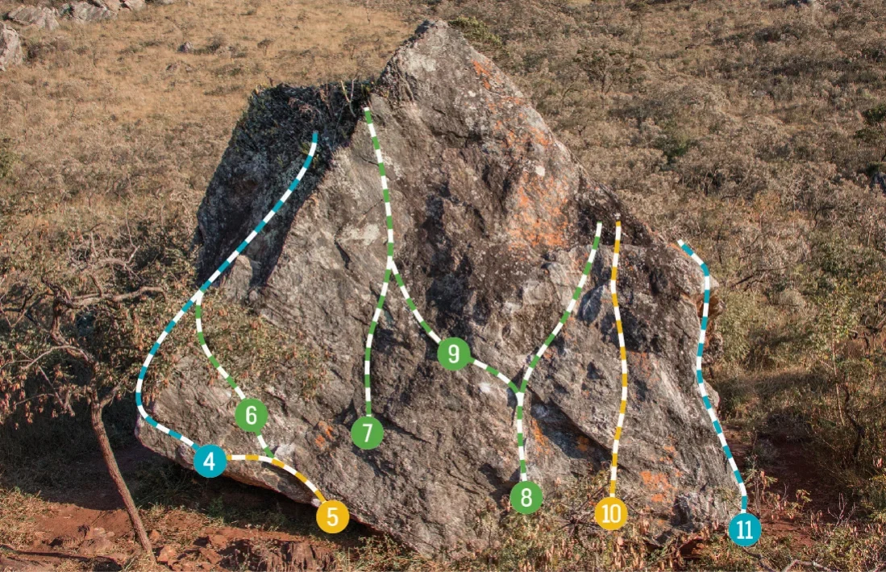
          - **largura_mapa**: 1099
          - **altura_mapa**: 710
          - **referencias**:
            - **[0]**:
              - **alvo_uid**: 8gU3oQhxOwU8xT
              - **pontos_uids**:
                - 4
              - **escalada**: No stress the blitz
              - **ids**:
                - 4
            - **[1]**:
              - **alvo_uid**: TSnYtLmrCOVEfP
              - **pontos_uids**:
                - 5
              - **escalada**: No stress the boulder
              - **ids**:
                - 5
            - **[2]**:
              - **alvo_uid**: oCcydj1LyWLKpw
              - **pontos_uids**:
                - 6
              - **escalada**: Don’t worry
              - **ids**:
                - 6
            - **[3]**:
              - **alvo_uid**: ZMIUoYT2JIw0S9
              - **pontos_uids**:
                - 7
              - **escalada**: Caxo de banana
              - **ids**:
                - 7
            - **[4]**:
              - **alvo_uid**: OWGK4eMqelppYW
              - **pontos_uids**:
                - 8
              - **escalada**: Easy
              - **ids**:
                - 8
            - **[5]**:
              - **alvo_uid**: xLTmHxR0v6yqxr
              - **pontos_uids**:
                - 9
              - **escalada**: Banana Terra
              - **ids**:
                - 9
            - **[6]**:
              - **alvo_uid**: IDYV6OzQGw4Uyr
              - **pontos_uids**:
                - 10
              - **escalada**: Check point
              - **ids**:
                - 10
            - **[7]**:
              - **alvo_uid**: HIVQjhcDLdwMLF
              - **pontos_uids**:
                - 11
              - **escalada**: Aresta in
              - **ids**:
                - 11
        - **[1]**:
          - **caminho_imagem_mapa**: 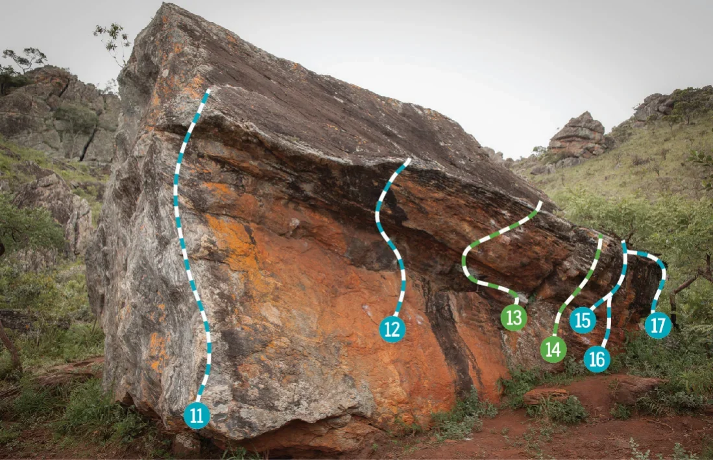
          - **largura_mapa**: 1099
          - **altura_mapa**: 710
          - **referencias**:
            - **[0]**:
              - **alvo_uid**: HIVQjhcDLdwMLF
              - **pontos_uids**:
                - 11
              - **escalada**: Aresta in
              - **ids**:
                - 11
            - **[1]**:
              - **alvo_uid**: 2CeN9A6XELWMYA
              - **pontos_uids**:
                - 12
              - **escalada**: Referência perigosa
              - **ids**:
                - 12
            - **[2]**:
              - **alvo_uid**: JRLTaJtkYUh7Ld
              - **pontos_uids**:
                - 13
              - **escalada**: Pipe line
              - **ids**:
                - 13
            - **[3]**:
              - **alvo_uid**: sV2KwpHieKKL57
              - **pontos_uids**:
                - 14
              - **escalada**: Paulista irado
              - **ids**:
                - 14
            - **[4]**:
              - **alvo_uid**: w6pNrcX8OKpUO7
              - **pontos_uids**:
                - 15
              - **escalada**: Marrentin carioca
              - **ids**:
                - 15
            - **[5]**:
              - **alvo_uid**: s4f7XudTyJSRQM
              - **pontos_uids**:
                - 16
              - **escalada**: Chato
              - **ids**:
                - 16
            - **[6]**:
              - **alvo_uid**: IUlTRTQX9r4zvI
              - **pontos_uids**:
                - 17
              - **escalada**: Mantenha o respeito
              - **ids**:
                - 17
        - **[2]**:
          - **caminho_imagem_mapa**: 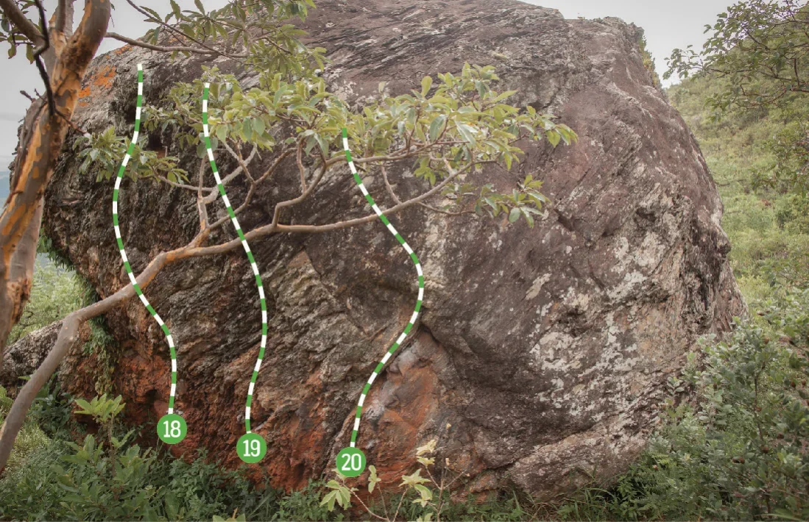
          - **largura_mapa**: 1099
          - **altura_mapa**: 710
          - **referencias**:
            - **[0]**:
              - **alvo_uid**: 7pJr5DPsMV393e
              - **pontos_uids**:
                - 18
              - **escalada**: Mineral
              - **ids**:
                - 18
            - **[1]**:
              - **alvo_uid**: aLOFMjQNHOaxAn
              - **pontos_uids**:
                - 19
              - **escalada**: Desvio
              - **ids**:
                - 19
            - **[2]**:
              - **alvo_uid**: Izs1WOCqZDzli2
              - **pontos_uids**:
                - 20
              - **escalada**: Rei do pão
              - **ids**:
                - 20
        - **[3]**:
          - **caminho_imagem_mapa**: 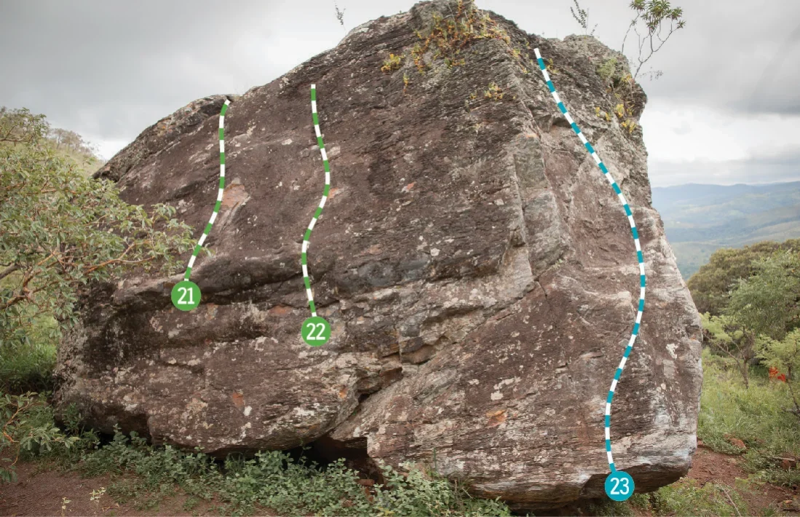
          - **largura_mapa**: 1099
          - **altura_mapa**: 710
          - **referencias**:
            - **[0]**:
              - **alvo_uid**: vcq6wl9FqoYBuH
              - **pontos_uids**:
                - 21
              - **escalada**: Equilibrista
              - **ids**:
                - 21
            - **[1]**:
              - **alvo_uid**: GeNm2SgfPJzhrI
              - **pontos_uids**:
                - 22
              - **escalada**: Parmalat
              - **ids**:
                - 22
            - **[2]**:
              - **alvo_uid**: vF8RZ3qWHTpOZg
              - **pontos_uids**:
                - 23
              - **escalada**: Bh x Brasília
              - **ids**:
                - 23
      - **escaladas**:
        - **[0]**:
          - **uid**: 8gU3oQhxOwU8xT
          - **boulder**:
            - **descricao**: Começa com a mão esquerda em um reglete no teto, a direita num reglete/pinça na aresta e o calcanhar direito em um batente escorrido e escala a aresta.
            - **nome**: No stress the blitz
            - **dificuldade**: V5
            - **destaque**: True
            - **conquistadores**:
              - Rafael Passos
            - **data_abertura**: 2005
        - **[1]**:
          - **uid**: TSnYtLmrCOVEfP
          - **boulder**:
            - **descricao**: Sai sentado com as mãos juntas em uma agarra boa na aresta do teto e finaliza pelo “No stress the blitz” (4).
            - **nome**: No stress the boulder
            - **dificuldade**: V8
            - **destaque**: True
            - **conquistadores**:
              - Mahavir Jneesh
            - **data_abertura**: 2010
        - **[2]**:
          - **uid**: oCcydj1LyWLKpw
          - **boulder**:
            - **descricao**: Sai como o “No stress the boulder” (5), mas do batente vai em direção à aresta passando por um reglete bom.
            - **nome**: Don’t worry
            - **dificuldade**: V2
        - **[3]**:
          - **uid**: ZMIUoYT2JIw0S9
          - **boulder**:
            - **descricao**: Começa em pé com a mão esquerda num reglete de lado e a direita num batente de gastón e escala reto, por regletes pequenos, até uma virada fácil.
            - **nome**: Caxo de banana
            - **dificuldade**: V2
            - **destaque**: True
        - **[4]**:
          - **uid**: OWGK4eMqelppYW
          - **boulder**:
            - **descricao**: Começa em pé com a mão esquerda em um batente/pinça e a direita em um reglete e toca reto por regletes até uma virada fácil.
            - **nome**: Easy
            - **dificuldade**: V1
            - **destaque**: True
        - **[5]**:
          - **uid**: xLTmHxR0v6yqxr
          - **boulder**:
            - **descricao**: Sai como o “Easy” (8) e termina no “Caxo de banana” (7).
            - **nome**: Banana Terra
            - **dificuldade**: V2
            - **destaque**: True
        - **[6]**:
          - **uid**: IDYV6OzQGw4Uyr
          - **boulder**:
            - **descricao**: Sai sentado com os braços bem abertos em um batente escorrido de mão esquerda, um reglet pequeno de mão direita e faz um movimento longo e muito duro para um regletinho acima do teto e toca reto.
            - **nome**: Check point
            - **dificuldade**: V8
        - **[7]**:
          - **uid**: HIVQjhcDLdwMLF
          - **boulder**:
            - **descricao**: Boulder que escala a aresta saindo sentado com as mãos num reglete e num abaulado.
            - **nome**: Aresta in
            - **dificuldade**: V3
            - **destaque**: True
        - **[8]**:
          - **uid**: 2CeN9A6XELWMYA
          - **boulder**:
            - **descricao**: Começa em pé com as mãos abertas em dois regletes no positivo, passa pelo tetinho e faz um domínio clássico.
            - **nome**: Referência perigosa
            - **dificuldade**: V3
            - **destaque**: True
        - **[9]**:
          - **uid**: JRLTaJtkYUh7Ld
          - **boulder**:
            - **descricao**: Sai em uma grande laca abaixo do teto, segue para outra laca à esquerda e domina a "onda" passando por regletes. Clássico!
            - **nome**: Pipe line
            - **dificuldade**: V2
            - **destaque**: True
        - **[10]**:
          - **uid**: sV2KwpHieKKL57
          - **boulder**:
            - **descricao**: Sai sentado com a mão esquerda em um batente e a direita em um pocket/batente.
            - **nome**: Paulista irado
            - **dificuldade**: V1
        - **[11]**:
          - **uid**: w6pNrcX8OKpUO7
          - **boulder**:
            - **descricao**: Sai sentado com as mãos juntas em um batente bom e um reglete e escala por regletes à direita da proa.
            - **nome**: Marrentin carioca
            - **dificuldade**: V3
            - **destaque**: True
        - **[12]**:
          - **uid**: s4f7XudTyJSRQM
          - **boulder**:
            - **descricao**: Sai em dois regletes bem baixos e termina no “Marrentin carioca” (15).
            - **nome**: Chato
            - **dificuldade**: V5
        - **[13]**:
          - **uid**: IUlTRTQX9r4zvI
          - **boulder**:
            - **descricao**: Começa sentado com as mão em agarras boas na aresta atrás da árvore. Faz uma travessia pra esquerda, por regletes, finalizando no “Marrentin carioca” (15).
            - **nome**: Mantenha o respeito
            - **dificuldade**: V3
        - **[14]**:
          - **uid**: 7pJr5DPsMV393e
          - **boulder**:
            - **descricao**: Sai sentado com as mãos juntas em agarras boas e toca reto pelas cracas.
            - **nome**: Mineral
            - **dificuldade**: V1
        - **[15]**:
          - **uid**: aLOFMjQNHOaxAn
          - **boulder**:
            - **descricao**: Sai sentado com as mãos juntas em agarras boas e toca reto pelas cracas.
            - **nome**: Desvio
            - **dificuldade**: V1
        - **[16]**:
          - **uid**: Izs1WOCqZDzli2
          - **boulder**:
            - **descricao**: Sai sentado com as mãos juntas em agarras boas, passa pela fenda até um reglete à direita e finaliza pela esquerda.
            - **nome**: Rei do pão
            - **dificuldade**: V1
        - **[17]**:
          - **uid**: vcq6wl9FqoYBuH
          - **boulder**:
            - **descricao**: Começa em pé com as mãos em um batente/abaulado e toca reto.
            - **nome**: Equilibrista
            - **dificuldade**: V0
        - **[18]**:
          - **uid**: GeNm2SgfPJzhrI
          - **boulder**:
            - **descricao**: Sai em pé com as mãos em regletes bons e toca reto pelo vertical/positivo.
            - **nome**: Parmalat
            - **dificuldade**: V1
        - **[19]**:
          - **uid**: vF8RZ3qWHTpOZg
          - **boulder**:
            - **descricao**: Sai sentado com as mãos na borda do tetinho e domina.
            - **nome**: Bh x Brasília
            - **dificuldade**: V3
      - **precomputados**:
        - **total_escaladas**: 20
        - **total_boulders**: 20
  - **[2]**:
    - **conteudo**:
      - **descricao**: 
      - **nome**: Bloco C - Bloco 2
      - **uid**: 3zRNftF5GzoLjS
      - **mapas**:
        - **[0]**:
          - **caminho_imagem_mapa**: 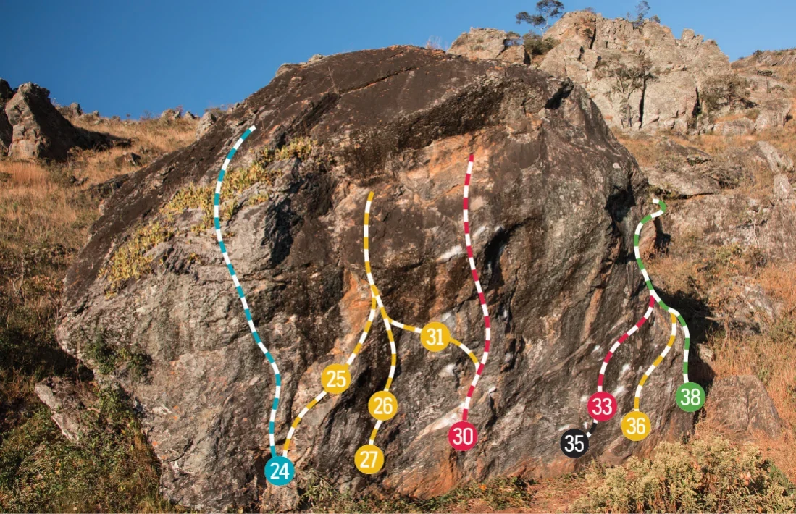
          - **largura_mapa**: 1099
          - **altura_mapa**: 710
          - **referencias**:
            - **[0]**:
              - **alvo_uid**: x8wUPYUJLBobGz
              - **pontos_uids**:
                - 24
              - **escalada**: Gaston as avessas
              - **ids**:
                - 24
            - **[1]**:
              - **alvo_uid**: uFP6AiK9oJPbp0
              - **pontos_uids**:
                - 25
              - **escalada**: Calango hidráulico
              - **ids**:
                - 25
            - **[2]**:
              - **alvo_uid**: YLBfA61HjdTbCT
              - **pontos_uids**:
                - 26
              - **escalada**: Ergot
              - **ids**:
                - 26
            - **[3]**:
              - **alvo_uid**: 53YkCd34DD4iML
              - **pontos_uids**:
                - 27
              - **escalada**: Ergot SDS
              - **ids**:
                - 27
            - **[4]**:
              - **alvo_uid**: xr2FQXXiSTj2Iz
              - **pontos_uids**:
                - 26
              - **escalada**: Trip eterna
              - **ids**:
                - 26
            - **[5]**:
              - **alvo_uid**: 5MytYt24HJg3PT
              - **pontos_uids**:
                - 27
              - **escalada**: Projeto 1
              - **ids**:
                - 27
            - **[6]**:
              - **alvo_uid**: MshAGTQ7R8wQpE
              - **pontos_uids**:
                - 30
              - **escalada**: Projeto Sabará
              - **ids**:
                - 30
            - **[7]**:
              - **alvo_uid**: C7rsQvdwzouahQ
              - **pontos_uids**:
                - 31
              - **escalada**: Crocância do sabor
              - **ids**:
                - 31
            - **[8]**:
              - **alvo_uid**: NoWEDfPUdq4MWQ
              - **pontos_uids**:
                - 30
              - **escalada**: Projeto 2
              - **ids**:
                - 30
            - **[9]**:
              - **alvo_uid**: Fkq9Y5QlyzRZCb
              - **pontos_uids**:
                - 33
              - **escalada**: Energético
              - **ids**:
                - 33
            - **[10]**:
              - **alvo_uid**: k7WAdPJsT5WzlQ
              - **pontos_uids**:
                - 33
              - **escalada**: Estimulante
              - **ids**:
                - 33
            - **[11]**:
              - **alvo_uid**: YoXKvlBtqyVEV9
              - **pontos_uids**:
                - 35
              - **escalada**: Projeto Taurina
              - **ids**:
                - 35
            - **[12]**:
              - **alvo_uid**: VVW7BKdL5q2Gbm
              - **pontos_uids**:
                - 36
              - **escalada**: Rala frek lek
              - **ids**:
                - 36
            - **[13]**:
              - **alvo_uid**: xYyG7JKqzRj6Gt
              - **pontos_uids**:
                - 36
              - **escalada**: Rala frek lek SDS
              - **ids**:
                - 36
            - **[14]**:
              - **alvo_uid**: yRvJzGiffHQFAr
              - **pontos_uids**:
                - 38
              - **escalada**: Viviane Espíndola
              - **ids**:
                - 38
        - **[1]**:
          - **caminho_imagem_mapa**: 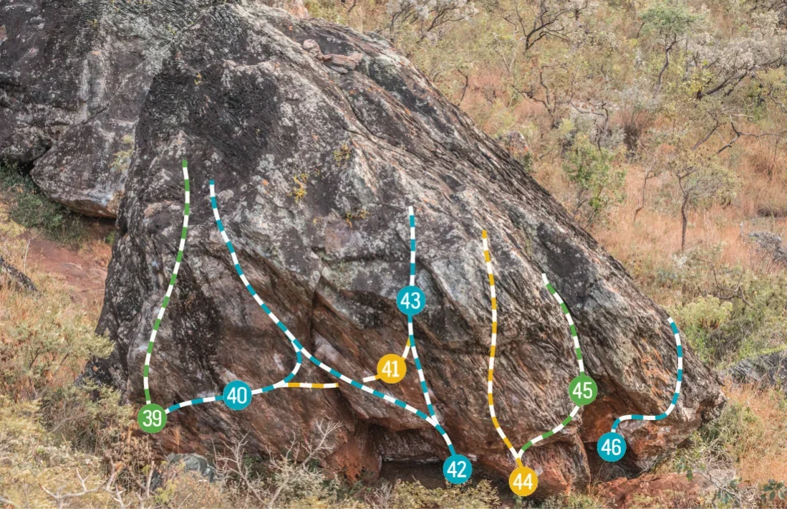
          - **largura_mapa**: 1099
          - **altura_mapa**: 710
          - **referencias**:
            - **[0]**:
              - **alvo_uid**: kMhXdT69S5Ss5c
              - **pontos_uids**:
                - 39
              - **escalada**: Escala e desescala
              - **ids**:
                - 39
            - **[1]**:
              - **alvo_uid**: qaUP5qpVGiRyTi
              - **pontos_uids**:
                - 40
              - **escalada**: Sobe e desce
              - **ids**:
                - 40
            - **[2]**:
              - **alvo_uid**: mFR1T5Vy4nRihH
              - **pontos_uids**:
                - 41
              - **escalada**: Incrível
              - **ids**:
                - 41
            - **[3]**:
              - **alvo_uid**: Bgwtet02MZqHOB
              - **pontos_uids**:
                - 42
              - **escalada**: Ziglyn
              - **ids**:
                - 42
            - **[4]**:
              - **alvo_uid**: QhcWEshmVYNEW3
              - **pontos_uids**:
                - 43
              - **escalada**: Sai de reto
              - **ids**:
                - 43
            - **[5]**:
              - **alvo_uid**: m8xOBpL7xav5yq
              - **pontos_uids**:
                - 44
              - **escalada**: Adrena da cadena
              - **ids**:
                - 44
            - **[6]**:
              - **alvo_uid**: JtTmY764yiyQ3l
              - **pontos_uids**:
                - 45
              - **escalada**: Cadena sem adrena
              - **ids**:
                - 45
            - **[7]**:
              - **alvo_uid**: NpAbMpmVlT0cN5
              - **pontos_uids**:
                - 46
              - **escalada**: Cadê minha força?
              - **ids**:
                - 46
        - **[2]**:
          - **caminho_imagem_mapa**: 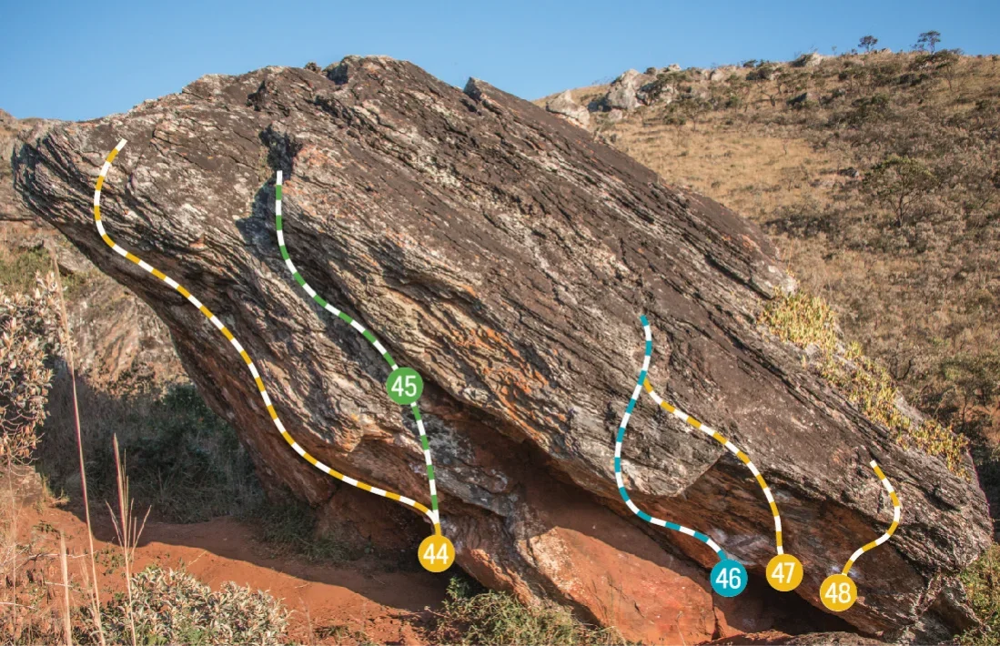
          - **largura_mapa**: 1099
          - **altura_mapa**: 710
          - **referencias**:
            - **[0]**:
              - **alvo_uid**: m8xOBpL7xav5yq
              - **pontos_uids**:
                - 44
              - **escalada**: Adrena da cadena
              - **ids**:
                - 44
            - **[1]**:
              - **alvo_uid**: JtTmY764yiyQ3l
              - **pontos_uids**:
                - 45
              - **escalada**: Cadena sem adrena
              - **ids**:
                - 45
            - **[2]**:
              - **alvo_uid**: NpAbMpmVlT0cN5
              - **pontos_uids**:
                - 46
              - **escalada**: Cadê minha força?
              - **ids**:
                - 46
            - **[3]**:
              - **alvo_uid**: Qz6KQHcVQr5b7a
              - **pontos_uids**:
                - 47
              - **escalada**: Ou vai ou racha
              - **ids**:
                - 47
            - **[4]**:
              - **alvo_uid**: pGCz7pTq0xq4ZR
              - **pontos_uids**:
                - 48
              - **escalada**: Seg atenciosa
              - **ids**:
                - 48
      - **escaladas**:
        - **[0]**:
          - **uid**: x8wUPYUJLBobGz
          - **boulder**:
            - **descricao**: Sai em pé com as mãos juntas em uma agarrão invertido, escala o vertical e faz uma virada técnica. Virando no “Ergot” (26) é o Calango hidráulico v7.
            - **nome**: Gaston as avessas
            - **dificuldade**: V4
            - **destaque**: True
        - **[1]**:
          - **uid**: uFP6AiK9oJPbp0
          - **boulder**:
            - **descricao**: Variação do Gaston as avessas (24), virando no “Ergot” (26).
            - **nome**: Calango hidráulico
            - **dificuldade**: V7
        - **[2]**:
          - **uid**: YLBfA61HjdTbCT
          - **boulder**:
            - **descricao**: Mesclando muita técnica e compressão, este boulder marca o estilo único da Rachada. Sai em pé com a mão esquerda na aresta abaulada e a direita num reglete batente invertido.
            - **nome**: Ergot
            - **dificuldade**: V6_BARRA_V7
            - **destaque**: True
            - **conquistadores**:
              - Mahavir Jneesh
            - **data_abertura**: 2010
        - **[3]**:
          - **uid**: 53YkCd34DD4iML
          - **boulder**:
            - **descricao**: Sai sentado com a mão esquerda na parte mais baixa da aresta abaulada e a direita no reglete mais baixo e entra no “Ergot” (26).
            - **nome**: Ergot SDS
            - **dificuldade**: V6_BARRA_V7
            - **destaque**: True
            - **conquistadores**:
              - Mahavir Jneesh
            - **data_abertura**: 2010
        - **[4]**:
          - **uid**: xr2FQXXiSTj2Iz
          - **boulder**:
            - **descricao**: Sai como o “Ergot” (26) e vira no “Projeto Sabará” (30).
            - **nome**: Trip eterna
            - **dificuldade**: V11_BARRA_V12
            - **conquistadores**:
              - Mahavir Jneesh
            - **data_abertura**: 2011
        - **[5]**:
          - **uid**: 5MytYt24HJg3PT
          - **boulder**:
            - **descricao**: Sai como o “Ergot SDS” (27) e vira no “Projeto Sabará” (30).
            - **nome**: Projeto 1
            - **dificuldade**: V11_BARRA_V12
        - **[6]**:
          - **uid**: MshAGTQ7R8wQpE
          - **boulder**:
            - **descricao**: Uma das escaladas mais clássicas da Pedra Rachada é também o mais duro boulder encadenado até então. Linha reta que sai em pé em um grande batente escorrido e faz movimentos duros e técnicos até uma virada delicada.
            - **nome**: Projeto Sabará
            - **dificuldade**: V12
            - **destaque**: True
            - **conquistadores**:
              - Rafael Passos
            - **data_abertura**: 2009
        - **[7]**:
          - **uid**: C7rsQvdwzouahQ
          - **boulder**:
            - **descricao**: Sai do “Projeto Sabará” (30) e vira no “Ergot” (26).
            - **nome**: Crocância do sabor
            - **dificuldade**: V9
        - **[8]**:
          - **uid**: NoWEDfPUdq4MWQ
          - **boulder**:
            - **descricao**: Começa como o “Projeto Sabará” e atravessa pra direita até a aresta.
            - **nome**: Projeto 2
            - **dificuldade**: V12_BARRA_V13
        - **[9]**:
          - **uid**: Fkq9Y5QlyzRZCb
          - **boulder**:
            - **descricao**: Começa em pé com a mão esquerda em um reglete/batente e a direita em um batente grande e escala pra direita.
            - **nome**: Energético
            - **dificuldade**: V10
            - **destaque**: True
            - **conquistadores**:
              - Gustavo Fontes
            - **data_abertura**: 2010
        - **[10]**:
          - **uid**: k7WAdPJsT5WzlQ
          - **boulder**:
            - **descricao**: Saída em pé com a mão esquerda alta em um batente e a direita em um micro reglete de lado, acima do batente grande do Energético (33).
            - **nome**: Estimulante
            - **dificuldade**: V6
        - **[11]**:
          - **uid**: YoXKvlBtqyVEV9
          - **boulder**:
            - **descricao**: Projeto que sai sentado com as mãos nas agarras mais baixas: um batente, um gaston, ou um bidedo, e faz dois fortes movimentos até chegar no “Energético” (33) e finalizar como ele.
            - **nome**: Projeto Taurina
            - **dificuldade**: V12_BARRA_V13
        - **[12]**:
          - **uid**: VVW7BKdL5q2Gbm
          - **boulder**:
            - **descricao**: Começa com a mão esquerda em um batente escorrido e a direita no reglete vertical mais baixo, faz alguns movimentos fortes de compressão e finaliza com um movimento clássico!
            - **nome**: Rala frek lek
            - **dificuldade**: V7
            - **destaque**: True
            - **conquistadores**:
              - Rafael Passos
            - **data_abertura**: 2006
        - **[13]**:
          - **uid**: xYyG7JKqzRj6Gt
          - **boulder**:
            - **descricao**: Adiciona 1 movimento ao “Rala frek lek” (36) saindo com a mão esquerda mais baixa, em um reglete vertical.
            - **nome**: Rala frek lek SDS
            - **dificuldade**: V8
            - **destaque**: True
            - **conquistadores**:
              - Gustavo Fontes
            - **data_abertura**: 2007
        - **[14]**:
          - **uid**: yRvJzGiffHQFAr
          - **boulder**:
            - **descricao**: Boulder fácil que segue pela aresta por uns batentes.
            - **nome**: Viviane Espíndola
            - **dificuldade**: V0
            - **destaque**: True
        - **[15]**:
          - **uid**: kMhXdT69S5Ss5c
          - **boulder**:
            - **descricao**: Começa sentado com as mãos em agarras boas e escala a aresta.
            - **nome**: Escala e desescala
            - **dificuldade**: V1
            - **destaque**: True
        - **[16]**:
          - **uid**: qaUP5qpVGiRyTi
          - **boulder**:
            - **descricao**: Sai como o “Escala e desescala” (39) e termina no “Ziglyn” (42).
            - **nome**: Sobe e desce
            - **dificuldade**: V3
            - **destaque**: True
        - **[17]**:
          - **uid**: mFR1T5Vy4nRihH
          - **boulder**:
            - **descricao**: Sai do “Escala e desescala” (39) e termina no “Sai de reto” (43).
            - **nome**: Incrível
            - **dificuldade**: V6
            - **destaque**: True
            - **conquistadores**:
              - Rafael Pimenta
            - **data_abertura**: 2009
        - **[18]**:
          - **uid**: Bgwtet02MZqHOB
          - **boulder**:
            - **descricao**: Provavelmente o melhor v4 da Rachada! Começa sentado com as mãos juntas em regletes invertidos e segue pela fenda diagonalmente à esquerda, para uma virada fácil.
            - **nome**: Ziglyn
            - **dificuldade**: V4
            - **destaque**: True
        - **[19]**:
          - **uid**: QhcWEshmVYNEW3
          - **boulder**:
            - **descricao**: Sai como o “Ziglyn” (42) e segue reto virando por uns batentes.
            - **nome**: Sai de reto
            - **dificuldade**: V4
            - **destaque**: True
        - **[20]**:
          - **uid**: m8xOBpL7xav5yq
          - **boulder**:
            - **descricao**: Sai sentado com as mãos juntas em um batente, escala por uns regletes e, antes de dominar, atravessa para a esquerda, passando por um movimento dinâmico para um bico/batente.
            - **nome**: Adrena da cadena
            - **dificuldade**: V6
            - **destaque**: True
        - **[21]**:
          - **uid**: JtTmY764yiyQ3l
          - **boulder**:
            - **descricao**: Começa como o “Adrena da cadena” (44) e escala pela fenda.
            - **nome**: Cadena sem adrena
            - **dificuldade**: V2
        - **[22]**:
          - **uid**: NpAbMpmVlT0cN5
          - **boulder**:
            - **descricao**: Sai sentado com as mãos juntas num batente/fenda escorrido e domina reto, passando pelo teto.
            - **nome**: Cadê minha força?
            - **dificuldade**: V5
            - **destaque**: True
        - **[23]**:
          - **uid**: Qz6KQHcVQr5b7a
          - **boulder**:
            - **descricao**: Começa sentado com a mão esquerda num batente invertido no teto e a direita em um reglete e vira no “Cadê minha força?” (46).
            - **nome**: Ou vai ou racha
            - **dificuldade**: V7
            - **destaque**: True
        - **[24]**:
          - **uid**: pGCz7pTq0xq4ZR
          - **boulder**:
            - **descricao**: Sai sentado com a mão esquerda em um batente, a direita em um reglete ao lado e toca reto para uma virada estranha.
            - **nome**: Seg atenciosa
            - **dificuldade**: V6
      - **precomputados**:
        - **total_escaladas**: 25
        - **total_boulders**: 25
  - **[3]**:
    - **conteudo**:
      - **descricao**: 
      - **nome**: Bloco D - Chupa Lombriga
      - **uid**: XHe6qP8eEZS4yz
      - **mapas**:
        - **[0]**:
          - **caminho_imagem_mapa**: 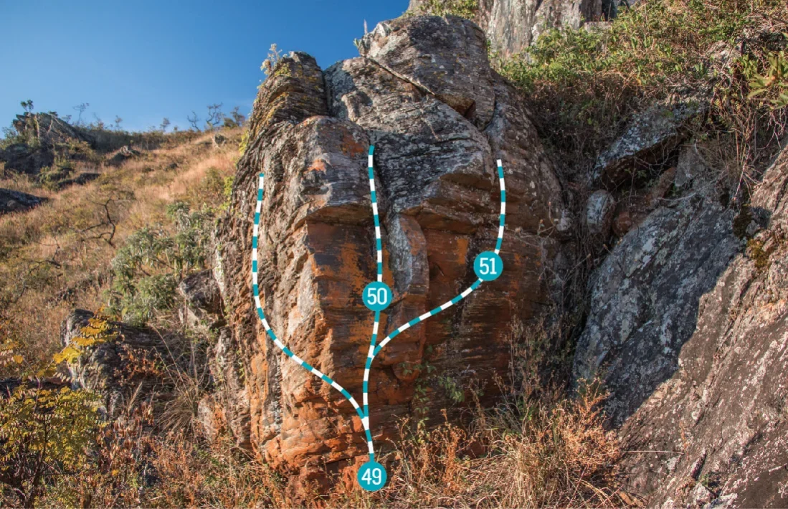
          - **largura_mapa**: 1099
          - **altura_mapa**: 710
          - **referencias**:
            - **[0]**:
              - **alvo_uid**: bECsz2Qc6otvMc
              - **pontos_uids**:
                - 49
              - **escalada**: Chupa lombriga
              - **ids**:
                - 49
            - **[1]**:
              - **alvo_uid**: 9ffWr2RL0ktUZu
              - **pontos_uids**:
                - 50
              - **escalada**: Ventos alísios
              - **ids**:
                - 50
            - **[2]**:
              - **alvo_uid**: Tvi0bcOVq2hmxn
              - **pontos_uids**:
                - 51
              - **escalada**: Esqueceram de mim
              - **ids**:
                - 51
      - **escaladas**:
        - **[0]**:
          - **uid**: bECsz2Qc6otvMc
          - **boulder**:
            - **descricao**: Começa sentado nas agarras mais baixas e toca pra esquerda.
            - **nome**: Chupa lombriga
            - **dificuldade**: V3
        - **[1]**:
          - **uid**: 9ffWr2RL0ktUZu
          - **boulder**:
            - **descricao**: Sai como o “Chupa lombriga” (49) e toca reto.
            - **nome**: Ventos alísios
            - **dificuldade**: V3
        - **[2]**:
          - **uid**: Tvi0bcOVq2hmxn
          - **boulder**:
            - **descricao**: Sai como o “Chupa lombriga” (49) e toca pra direita passando por uns regletes.
            - **nome**: Esqueceram de mim
            - **dificuldade**: V3
      - **precomputados**:
        - **total_escaladas**: 3
        - **total_boulders**: 3
  - **[4]**:
    - **conteudo**:
      - **descricao**: 
      - **nome**: Bloco E - Abraço do Calango
      - **uid**: YF9rmYrHHUoYxU
      - **mapas**:
        - **[0]**:
          - **caminho_imagem_mapa**: 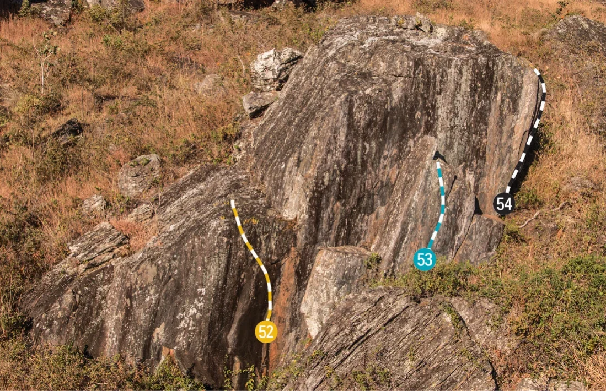
          - **largura_mapa**: 1099
          - **altura_mapa**: 710
          - **referencias**:
            - **[0]**:
              - **alvo_uid**: SNepGMpmocZxND
              - **pontos_uids**:
                - 52
              - **escalada**: Orgulho preto
              - **ids**:
                - 52
            - **[1]**:
              - **alvo_uid**: BfjKTAdMsGGuDd
              - **pontos_uids**:
                - 53
              - **escalada**: Abraço do calango
              - **ids**:
                - 53
            - **[2]**:
              - **alvo_uid**: V1pPmqvwoIVKtO
              - **pontos_uids**:
                - 54
              - **escalada**: Projeto 3
              - **ids**:
                - 54
      - **escaladas**:
        - **[0]**:
          - **uid**: SNepGMpmocZxND
          - **boulder**:
            - **descricao**: Boulder ainda sem repetições que sai sentado com a mão esquerda em um abaulado próximo à aresta e a direita em um reglete atrás da pedra.
            - **nome**: Orgulho preto
            - **dificuldade**: V6
        - **[1]**:
          - **uid**: BfjKTAdMsGGuDd
          - **boulder**:
            - **descricao**: Começa sentado com os braços abertos abraçando o pequeno bloco e escala em compressão.
            - **nome**: Abraço do calango
            - **dificuldade**: V4
            - **destaque**: True
        - **[2]**:
          - **uid**: V1pPmqvwoIVKtO
          - **boulder**:
            - **descricao**: Boulder que escala a aresta.
            - **nome**: Projeto 3
            - **dificuldade**: INDEFINIDO
      - **precomputados**:
        - **total_escaladas**: 3
        - **total_boulders**: 3
  - **[5]**:
    - **conteudo**:
      - **descricao**: 
      - **nome**: Bloco F - Nave
      - **uid**: 7iaOlaFADmalOy
      - **mapas**:
        - **[0]**:
          - **caminho_imagem_mapa**: 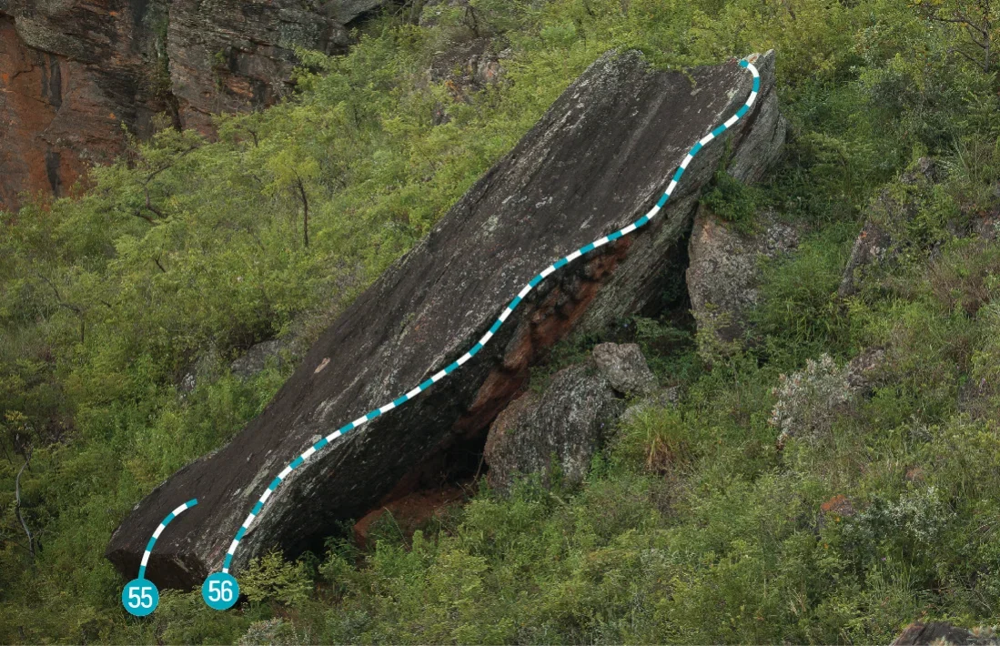
          - **largura_mapa**: 1099
          - **altura_mapa**: 710
          - **referencias**:
            - **[0]**:
              - **alvo_uid**: rRyWAHegxv7RNe
              - **pontos_uids**:
                - 55
              - **escalada**: Virada do sol
              - **ids**:
                - 55
            - **[1]**:
              - **alvo_uid**: pzEIJUulJ484co
              - **pontos_uids**:
                - 56
              - **escalada**: Nave
              - **ids**:
                - 56
      - **escaladas**:
        - **[0]**:
          - **uid**: rRyWAHegxv7RNe
          - **boulder**:
            - **descricao**: Boulder de virada que sai sentado com as mãos na borda.
            - **nome**: Virada do sol
            - **dificuldade**: V4
        - **[1]**:
          - **uid**: pzEIJUulJ484co
          - **boulder**:
            - **descricao**: Uma verdadeira prova de resistência que escala toda a borda do bloco, de uma ponta a outra.
            - **nome**: Nave
            - **dificuldade**: V4
            - **destaque**: True
      - **precomputados**:
        - **total_escaladas**: 2
        - **total_boulders**: 2
- **precomputados**:
  - **total_escaladas**: 56
  - **total_boulders**: 56

## Parte: grupo_sono_do_calango

### Grupo (Pico: Pedra Rachada)

- **descricao**:
    Setor com uma grande concentração de boulders do circuito verde e muitas linhas clássicas. Apesar de estar ao lado do Setor Entrada, é muito pouco conhecido e freqüentado. É também lugar das duas únicas vias de toda a Rachada, que valem muito a pena serem escaladas! O destaque para este setor fica por conta dos blocos “High vibe”, “Das vias” e “Sono do calango”, que possuem escaladas incríveis dos mais variados graus de dificuldade.
    
    ## Acesso (15 min)
    
    O melhor acesso para este setor, a partir do “Estacionamento 2” é pegar a trilha principal até o “Bloco 2” e continuar pela trilha que sobe à direita dele por 1min, chegando ao gigante bloco “Das vias”. Chegando a ele, o bloco “Sono do calango”, que da nome ao setor, está à direita, poucos metros mais acima. Para acessar os outros blocos, basta seguir a trilha à esquerda do bloco “Das vias”.
    
    ## Boulders Clássicos
    
    - **12. Vendo a vó pela greta** – V0
    - **28. Chaparam os bago** – V1
    - **24. Sono do calango** – V3
    - **20. Bromélia** – V4
    - **19. Módulo SDS** – V7
    
    > "As montanhas são uma espécie de reino mágico onde, por meio de algum encantamento, eu me sinto a pessoa mais feliz do mundo."
    > 
    > — *Bernardo Collares*
    
    | 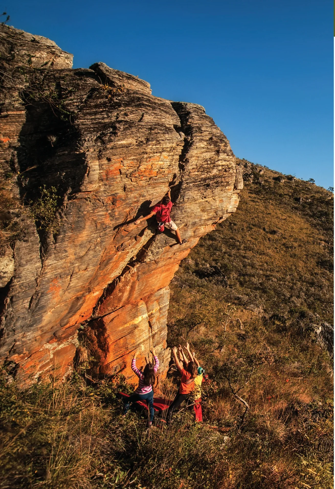 |
    | :--: |
    | *Escalador no highball Vendo a vó pela greta com seguranças de crashpad na base* |
    
    |  |
    | :--: |
    | *Escalador dominando o topo do bloco visto através da vegetação* |
    
    ## Blocos do Setor
    
    - **Bloco A – High Vibe**: boulders 1 e 2.
    - **Bloco B – Batentes**: boulders 3 e 4.
    - **Bloco C – Rala Bucho**: boulders 5 e 6.
    - **Bloco D – Varejeira**: boulder 7.
    - **Bloco E – Tótem**: boulder 8.
    - **Bloco F – Pinça**: boulders 9 a 11.
    - **Bloco G – Das Vias**: boulders e vias 12 a 16.
    - **Bloco H – Sono do Calango**: boulders 17 a 34.
- **nome**: Sono do Calango
- **uid**: UmLDLKi3UjAn2m
- **caminho_imagem_capa**: 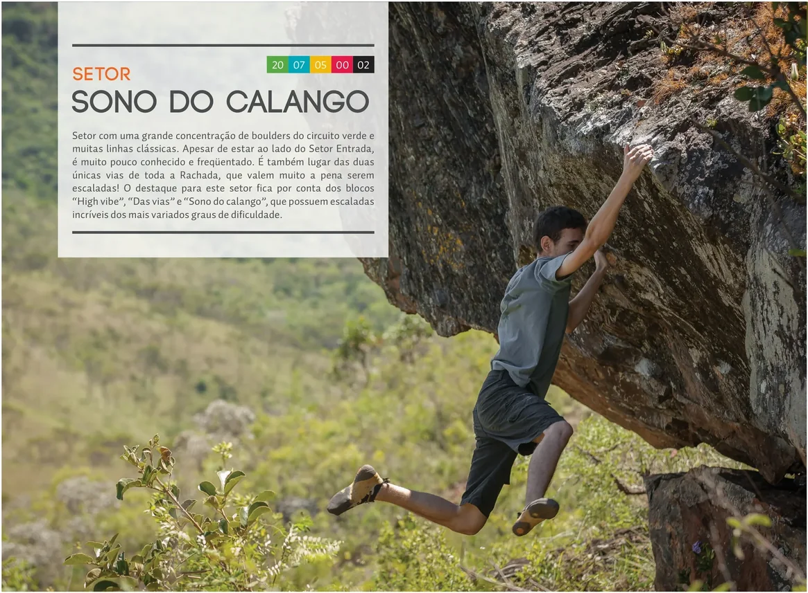
- **mapas**:
  - **[0]**:
    - **caminho_imagem_mapa**: 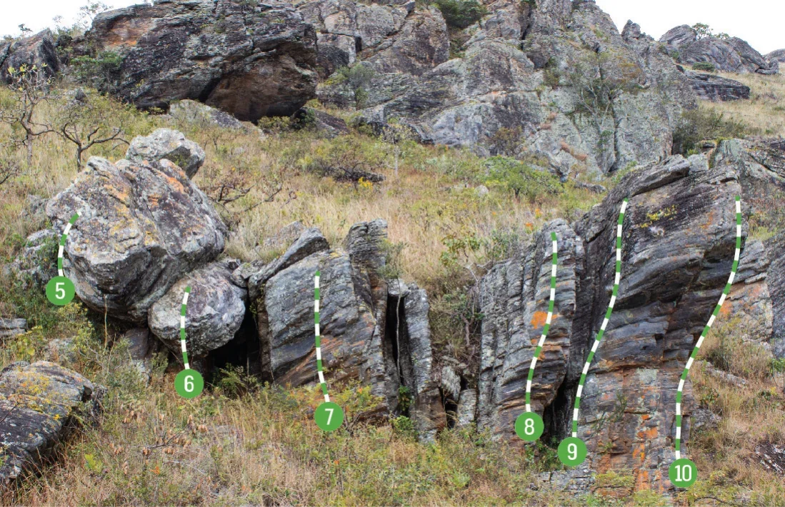
    - **largura_mapa**: 1099
    - **altura_mapa**: 710
    - **referencias**:
      - **[0]**:
        - **alvo_uid**: 9mgzVVI86Gsiy6
        - **pontos_uids**:
          - 5
        - **escalada**: Rala-bucho
        - **ids**:
          - 5
      - **[1]**:
        - **alvo_uid**: QtvkgIux4n3rHl
        - **pontos_uids**:
          - 6
        - **escalada**: Rala-queixo
        - **ids**:
          - 6
      - **[2]**:
        - **alvo_uid**: jD3BcCcMbAgcPr
        - **pontos_uids**:
          - 7
        - **escalada**: Varejeira
        - **ids**:
          - 7
      - **[3]**:
        - **alvo_uid**: QxbNvHVWQzc5Sf
        - **pontos_uids**:
          - 8
        - **escalada**: Tótem
        - **ids**:
          - 8
      - **[4]**:
        - **alvo_uid**: DniDxlnGQELR7s
        - **pontos_uids**:
          - 9
        - **escalada**: Quina
        - **ids**:
          - 9
      - **[5]**:
        - **alvo_uid**: Ah2NDaAIZH7eew
        - **pontos_uids**:
          - 10
        - **escalada**: Pinça
        - **ids**:
          - 10
  - **[1]**:
    - **caminho_imagem_mapa**: 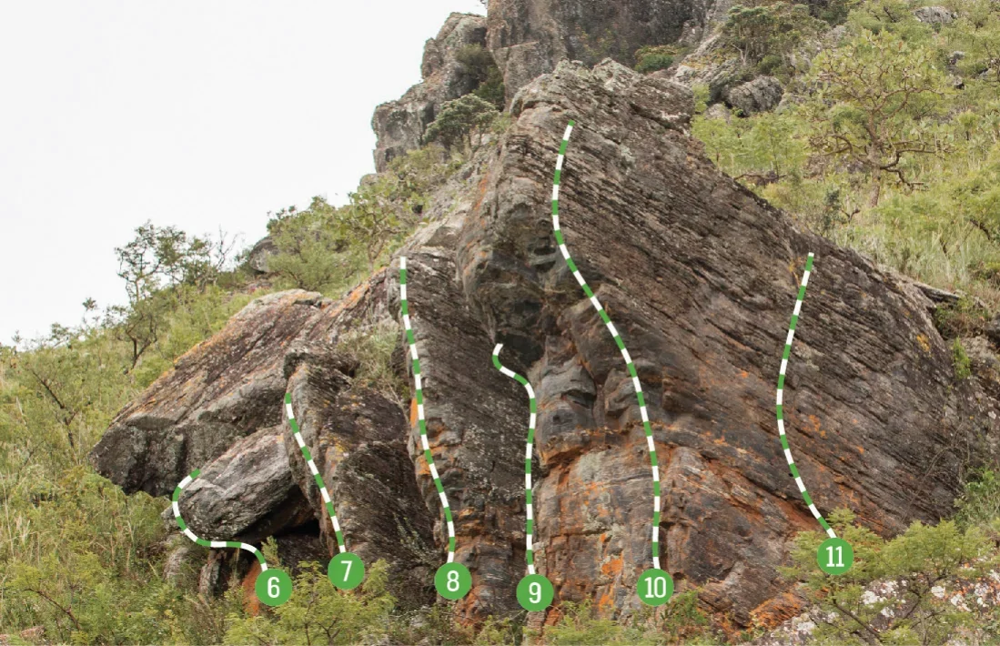
    - **largura_mapa**: 1099
    - **altura_mapa**: 710
    - **referencias**:
      - **[0]**:
        - **alvo_uid**: QtvkgIux4n3rHl
        - **pontos_uids**:
          - 6
        - **escalada**: Rala-queixo
        - **ids**:
          - 6
      - **[1]**:
        - **alvo_uid**: jD3BcCcMbAgcPr
        - **pontos_uids**:
          - 7
        - **escalada**: Varejeira
        - **ids**:
          - 7
      - **[2]**:
        - **alvo_uid**: QxbNvHVWQzc5Sf
        - **pontos_uids**:
          - 8
        - **escalada**: Tótem
        - **ids**:
          - 8
      - **[3]**:
        - **alvo_uid**: DniDxlnGQELR7s
        - **pontos_uids**:
          - 9
        - **escalada**: Quina
        - **ids**:
          - 9
      - **[4]**:
        - **alvo_uid**: Ah2NDaAIZH7eew
        - **pontos_uids**:
          - 10
        - **escalada**: Pinça
        - **ids**:
          - 10
      - **[5]**:
        - **alvo_uid**: KLKKPiTa1E1nJ6
        - **pontos_uids**:
          - 11
        - **escalada**: Pataca
        - **ids**:
          - 11
- **setores**:
  - **[0]**:
    - **conteudo**:
      - **descricao**: 
      - **nome**: Bloco A - High Vibe
      - **uid**: YBMtHAcPaK27pa
      - **mapas**:
        - **[0]**:
          - **caminho_imagem_mapa**: 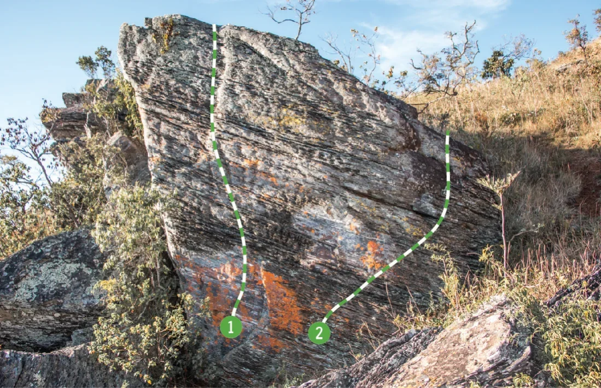
          - **largura_mapa**: 1099
          - **altura_mapa**: 710
          - **referencias**:
            - **[0]**:
              - **alvo_uid**: IH2FVjJ4laEDE2
              - **pontos_uids**:
                - 1
              - **escalada**: High vibe
              - **ids**:
                - 1
            - **[1]**:
              - **alvo_uid**: GUFEBsbKmsMJqK
              - **pontos_uids**:
                - 2
              - **escalada**: Mamãe mandou
              - **ids**:
                - 2
      - **escaladas**:
        - **[0]**:
          - **uid**: IH2FVjJ4laEDE2
          - **boulder**:
            - **descricao**: Sai sentado com a mão esquerda em uma pinça e a direita em um batente e escala reto por agarras boas até uma virada fácil.
            - **nome**: High vibe
            - **dificuldade**: V0
            - **destaque**: True
        - **[1]**:
          - **uid**: GUFEBsbKmsMJqK
          - **boulder**:
            - **descricao**: Começa agachado com as mãos juntas em um batente e toca reto por batentes e regletes bons.
            - **nome**: Mamãe mandou
            - **dificuldade**: V0
            - **destaque**: True
      - **precomputados**:
        - **total_escaladas**: 2
        - **total_boulders**: 2
  - **[1]**:
    - **conteudo**:
      - **descricao**: 
      - **nome**: Bloco B - Batentes
      - **uid**: PkRYq4CUk2jKJm
      - **mapas**:
        - **[0]**:
          - **caminho_imagem_mapa**: 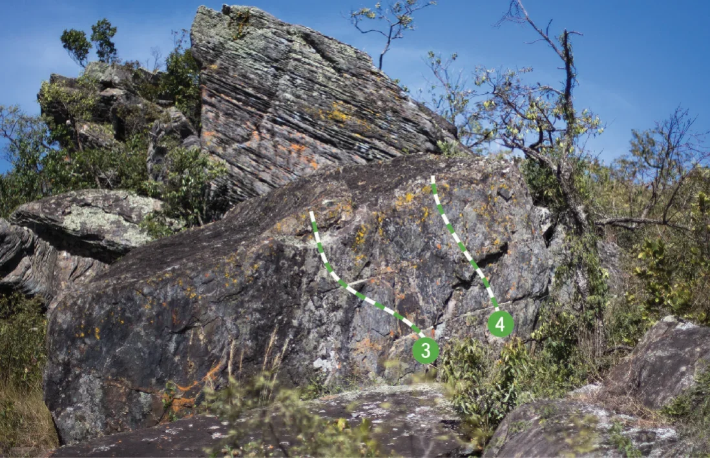
          - **largura_mapa**: 1099
          - **altura_mapa**: 710
          - **referencias**:
            - **[0]**:
              - **alvo_uid**: 17z4Ez2Si8IH9G
              - **pontos_uids**:
                - 3
              - **escalada**: Batentes
              - **ids**:
                - 3
            - **[1]**:
              - **alvo_uid**: jqM0mKITqM8HWS
              - **pontos_uids**:
                - 4
              - **escalada**: Quem procura acha
              - **ids**:
                - 4
      - **escaladas**:
        - **[0]**:
          - **uid**: 17z4Ez2Si8IH9G
          - **boulder**:
            - **descricao**: Sai sentado com as mãos juntas em um grande batente, passa por outros dois batentes e vira.
            - **nome**: Batentes
            - **dificuldade**: V0
            - **destaque**: True
        - **[1]**:
          - **uid**: jqM0mKITqM8HWS
          - **boulder**:
            - **descricao**: Começa sentado com as mãos juntas em um batente pequeno e toca reto por regletes.
            - **nome**: Quem procura acha
            - **dificuldade**: V0
      - **precomputados**:
        - **total_escaladas**: 2
        - **total_boulders**: 2
  - **[2]**:
    - **conteudo**:
      - **descricao**: 
      - **nome**: Bloco C - Rala-Bucho
      - **uid**: JbQiAHGbcATAqX
      - **escaladas**:
        - **[0]**:
          - **uid**: 9mgzVVI86Gsiy6
          - **boulder**:
            - **descricao**: Começa em um batente escorrido e toca por batentes na lateral esquerda do bloco, com uma virada técnica.
            - **nome**: Rala-bucho
            - **dificuldade**: V3
        - **[1]**:
          - **uid**: QtvkgIux4n3rHl
          - **boulder**:
            - **descricao**: Sai na pedra que apoia o bloco e domina a proa.
            - **nome**: Rala-queixo
            - **dificuldade**: V2
      - **precomputados**:
        - **total_escaladas**: 2
        - **total_boulders**: 2
  - **[3]**:
    - **conteudo**:
      - **descricao**: 
      - **nome**: Bloco D - Varejeira
      - **uid**: bkYpXt5AEC25Gu
      - **escaladas**:
        - **[0]**:
          - **uid**: jD3BcCcMbAgcPr
          - **boulder**:
            - **descricao**: Sai sentado com as mãos juntas no reglete mais baixo (sem usar a pedra que apóia o bloco) e escala reto.
            - **nome**: Varejeira
            - **dificuldade**: V1
      - **precomputados**:
        - **total_escaladas**: 1
        - **total_boulders**: 1
  - **[4]**:
    - **conteudo**:
      - **descricao**: 
      - **nome**: Bloco E - Tótem
      - **uid**: kw6YOyBmYdL6DN
      - **escaladas**:
        - **[0]**:
          - **uid**: QxbNvHVWQzc5Sf
          - **boulder**:
            - **descricao**: Sai sentado abraçando o bloco e escala até o topo.
            - **nome**: Tótem
            - **dificuldade**: V0
            - **destaque**: True
      - **precomputados**:
        - **total_escaladas**: 1
        - **total_boulders**: 1
  - **[5]**:
    - **conteudo**:
      - **descricao**: 
      - **nome**: Bloco F - Pinça
      - **uid**: coWDdbaTN1ULCv
      - **escaladas**:
        - **[0]**:
          - **uid**: DniDxlnGQELR7s
          - **boulder**:
            - **descricao**: Começa sentado com as mãos juntas em um batente bom e escala pela aresta por agarras boas.
            - **nome**: Quina
            - **dificuldade**: V0
        - **[1]**:
          - **uid**: Ah2NDaAIZH7eew
          - **boulder**:
            - **descricao**: Highball que escala a aresta do bloco.
            - **nome**: Pinça
            - **dificuldade**: V2
        - **[2]**:
          - **uid**: KLKKPiTa1E1nJ6
          - **boulder**:
            - **descricao**: Sai sentado com as mãos juntas em um agarrão e escala por agarras boas.
            - **nome**: Pataca
            - **dificuldade**: V0
            - **destaque**: True
      - **precomputados**:
        - **total_escaladas**: 3
        - **total_boulders**: 3
  - **[6]**:
    - **conteudo**:
      - **descricao**: 
      - **nome**: Bloco G - Das Vias
      - **uid**: BNeiGihRO5ZZ9i
      - **mapas**:
        - **[0]**:
          - **caminho_imagem_mapa**: 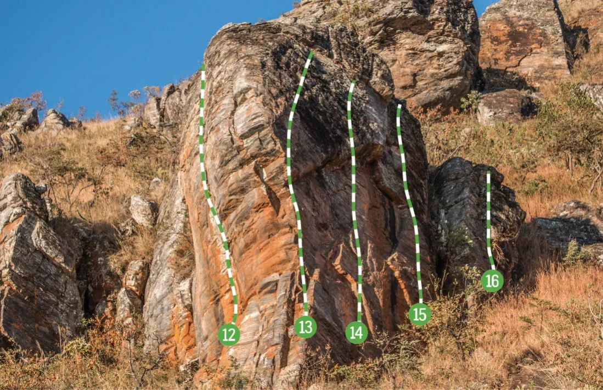
          - **largura_mapa**: 1099
          - **altura_mapa**: 710
          - **referencias**:
            - **[0]**:
              - **alvo_uid**: NeQuOfo83dk1GV
              - **pontos_uids**:
                - 12
              - **escalada**: Vendo a vó pela greta
              - **ids**:
                - 12
            - **[1]**:
              - **alvo_uid**: 5R8i9Bx1v64IKU
              - **pontos_uids**:
                - 13
              - **escalada**: Abraço do jacaré
              - **ids**:
                - 13
            - **[2]**:
              - **alvo_uid**: dIEvz3JGNyTgpY
              - **pontos_uids**:
                - 14
              - **escalada**: Papagaio preto
              - **ids**:
                - 14
            - **[3]**:
              - **alvo_uid**: 0pTamJhrWcfRNl
              - **pontos_uids**:
                - 15
              - **escalada**: Maritaca
              - **ids**:
                - 15
            - **[4]**:
              - **alvo_uid**: QoDk81uV5SAqYX
              - **pontos_uids**:
                - 16
              - **escalada**: Apêndice
              - **ids**:
                - 16
      - **escaladas**:
        - **[0]**:
          - **uid**: NeQuOfo83dk1GV
          - **boulder**:
            - **descricao**: Highball que escala a óbvia fenda off-width por agarras boas. Um desafio mental!
            - **nome**: Vendo a vó pela greta
            - **dificuldade**: V0
            - **destaque**: True
        - **[1]**:
          - **uid**: 5R8i9Bx1v64IKU
          - **boulder**:
            - **descricao**: Clássica via que segue pela aresta, domina o tetinho por regletes e finaliza no mesmo top da via “Papagaio preto” (14). Graduada no guia como 7B/v1.
            - **nome**: Abraço do jacaré
            - **dificuldade**: V1
            - **destaque**: True
        - **[2]**:
          - **uid**: dIEvz3JGNyTgpY
          - **boulder**:
            - **descricao**: Via que escala o vertical com movimentação técnica e domina o tetinho por agarras boas. Graduada no guia como 7A/v0.
            - **nome**: Papagaio preto
            - **dificuldade**: V0
            - **destaque**: True
        - **[3]**:
          - **uid**: 0pTamJhrWcfRNl
          - **boulder**:
            - **descricao**: Começa sentado com as mãos em dois pockets e escala o vertical.
            - **nome**: Maritaca
            - **dificuldade**: V0
        - **[4]**:
          - **uid**: QoDk81uV5SAqYX
          - **boulder**:
            - **descricao**: Sai sentado com as mãos juntas em uma agarra boa e toca reto.
            - **nome**: Apêndice
            - **dificuldade**: V0
      - **precomputados**:
        - **total_escaladas**: 5
        - **total_boulders**: 5
  - **[7]**:
    - **conteudo**:
      - **descricao**: 
      - **nome**: Bloco H - Sono do Calango
      - **uid**: 5Gv7q10SNGtQ9e
      - **mapas**:
        - **[0]**:
          - **caminho_imagem_mapa**: 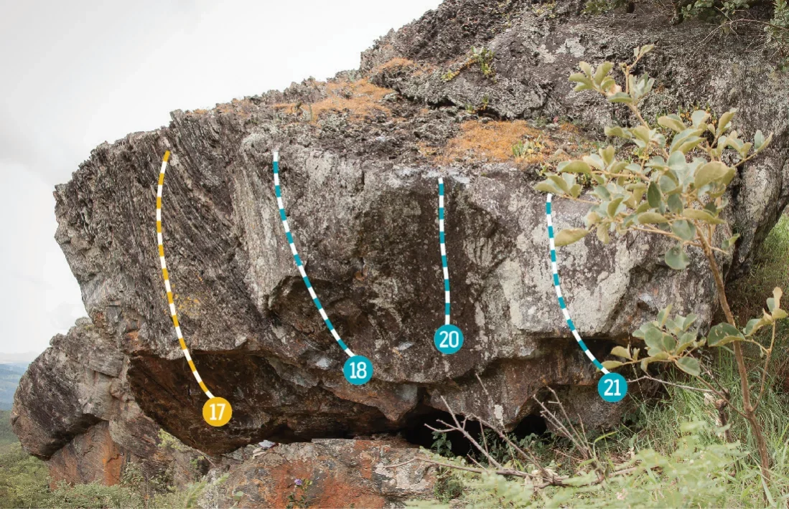
          - **largura_mapa**: 1099
          - **altura_mapa**: 710
          - **referencias**:
            - **[0]**:
              - **alvo_uid**: Giua7SB0SyanuT
              - **pontos_uids**:
                - 17
              - **escalada**: Loteria
              - **ids**:
                - 17
            - **[1]**:
              - **alvo_uid**: tzf2d1BeT5vvB2
              - **pontos_uids**:
                - 18
              - **escalada**: Módulo
              - **ids**:
                - 18
            - **[2]**:
              - **alvo_uid**: qbMma91ipsZUmL
              - **pontos_uids**:
                - 18
              - **escalada**: Módulo SDS
              - **ids**:
                - 18
            - **[3]**:
              - **alvo_uid**: HIqi6sMB0lnpau
              - **pontos_uids**:
                - 20
              - **escalada**: Bromélia
              - **ids**:
                - 20
            - **[4]**:
              - **alvo_uid**: isQ4yjkNnX6l2N
              - **pontos_uids**:
                - 21
              - **escalada**: Maré na virada
              - **ids**:
                - 21
        - **[1]**:
          - **caminho_imagem_mapa**: 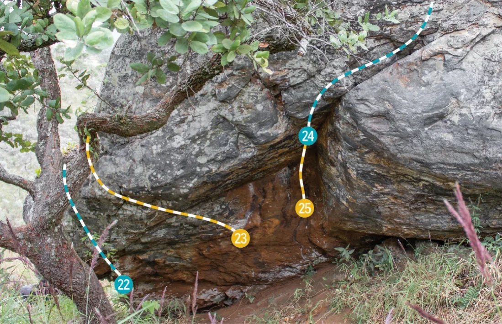
          - **largura_mapa**: 1099
          - **altura_mapa**: 710
          - **referencias**:
            - **[0]**:
              - **alvo_uid**: N1TTEw3lUIFHPq
              - **pontos_uids**:
                - 22
              - **escalada**: Orquídea
              - **ids**:
                - 22
            - **[1]**:
              - **alvo_uid**: pOPzkaXSaMBhLe
              - **pontos_uids**:
                - 23
              - **escalada**: Enverga bambu
              - **ids**:
                - 23
            - **[2]**:
              - **alvo_uid**: OBENXxsTAsUrzQ
              - **pontos_uids**:
                - 24
              - **escalada**: Sono do calango
              - **ids**:
                - 24
            - **[3]**:
              - **alvo_uid**: g9a7GtIM61K3Z9
              - **pontos_uids**:
                - 25
              - **escalada**: Sono do calango SDS
              - **ids**:
                - 25
        - **[2]**:
          - **caminho_imagem_mapa**: 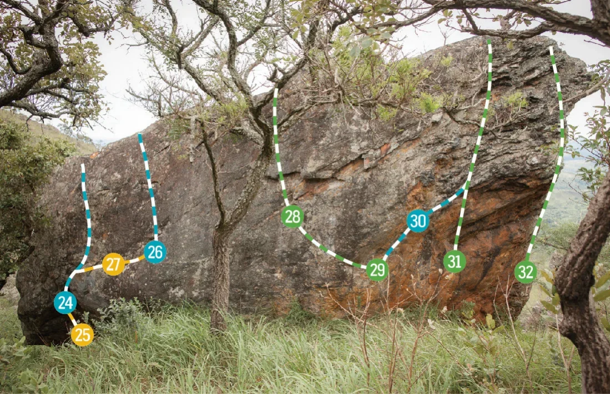
          - **largura_mapa**: 1099
          - **altura_mapa**: 710
          - **referencias**:
            - **[0]**:
              - **alvo_uid**: OBENXxsTAsUrzQ
              - **pontos_uids**:
                - 24
              - **escalada**: Sono do calango
              - **ids**:
                - 24
            - **[1]**:
              - **alvo_uid**: g9a7GtIM61K3Z9
              - **pontos_uids**:
                - 25
              - **escalada**: Sono do calango SDS
              - **ids**:
                - 25
            - **[2]**:
              - **alvo_uid**: v2GePxaARzQw4x
              - **pontos_uids**:
                - 26
              - **escalada**: Sonâmbulo
              - **ids**:
                - 26
            - **[3]**:
              - **alvo_uid**: TpgQ1yKAE8Uglp
              - **pontos_uids**:
                - 27
              - **escalada**: Calango sonâmbulo
              - **ids**:
                - 27
            - **[4]**:
              - **alvo_uid**: dcoFPafy1H950d
              - **pontos_uids**:
                - 28
              - **escalada**: Chaparam os bago
              - **ids**:
                - 28
            - **[5]**:
              - **alvo_uid**: YcO6xQwYTXLdna
              - **pontos_uids**:
                - 29
              - **escalada**: Invertida faca
              - **ids**:
                - 29
            - **[6]**:
              - **alvo_uid**: NMICfVFZDcBIST
              - **pontos_uids**:
                - 30
              - **escalada**: Core
              - **ids**:
                - 30
            - **[7]**:
              - **alvo_uid**: SbI5OJBIGVr4U0
              - **pontos_uids**:
                - 31
              - **escalada**: Mondo
              - **ids**:
                - 31
            - **[8]**:
              - **alvo_uid**: 1gg4udYDRBv26Q
              - **pontos_uids**:
                - 32
              - **escalada**: Adrena
              - **ids**:
                - 32
      - **escaladas**:
        - **[0]**:
          - **uid**: Giua7SB0SyanuT
          - **boulder**:
            - **descricao**: Sai em pé com a mão esquerda na fenda e a direita em uma agarra invertida e faz um movimento duro até a borda, virando reto.
            - **nome**: Loteria
            - **dificuldade**: V6
            - **destaque**: True
        - **[1]**:
          - **uid**: tzf2d1BeT5vvB2
          - **boulder**:
            - **descricao**: Sai com a mão direita no batente de oposição no módulo abaixo do teto e a esquerda de gaston no reglete logo acima do teto. Escala reto passando por agarras de diferentes estilos e domina o bloco.
            - **nome**: Módulo
            - **dificuldade**: V5
            - **destaque**: True
        - **[2]**:
          - **uid**: qbMma91ipsZUmL
          - **boulder**:
            - **descricao**: Começa com a mão direita no batente de oposição no “módulo” abaixo do teto e a esquerda bem aberta, em outro batente, em compressão. Faz dois fortes movimentos até entrar no “Módulo”(18). A grande dificuldade deste boulder é tensionar bem o corpo para não encostar na pedra de baixo.
            - **nome**: Módulo SDS
            - **dificuldade**: V7
            - **destaque**: True
        - **[3]**:
          - **uid**: HIqi6sMB0lnpau
          - **boulder**:
            - **descricao**: Boulder clássico de bote! Sai em pé com a mão esquerda alta em um buraco e a direita baixa em um reglete invertido no teto.
            - **nome**: Bromélia
            - **dificuldade**: V4
            - **destaque**: True
            - **conquistadores**:
              - Frederico Gonçalves
            - **data_abertura**: 2008
        - **[4]**:
          - **uid**: isQ4yjkNnX6l2N
          - **boulder**:
            - **descricao**: Sai sentado com as mãos juntas em uma laca invertida e escala comprimindo o “módulo”.
            - **nome**: Maré na virada
            - **dificuldade**: V5
            - **destaque**: True
            - **conquistadores**:
              - Mahavir Jneesh
            - **data_abertura**: 2008
        - **[5]**:
          - **uid**: N1TTEw3lUIFHPq
          - **boulder**:
            - **descricao**: Sai sentado com as mãos juntas em agarras boas à direita da aresta e toca reto.
            - **nome**: Orquídea
            - **dificuldade**: V3
            - **destaque**: True
        - **[6]**:
          - **uid**: pOPzkaXSaMBhLe
          - **boulder**:
            - **descricao**: Começa com as mãos juntas no buraco abaulado embaixo do teto e escala pra esquerda, em direção à aresta.
            - **nome**: Enverga bambu
            - **dificuldade**: V5
            - **conquistadores**:
              - Tomaz Hamdan
            - **data_abertura**: 2011
        - **[7]**:
          - **uid**: OBENXxsTAsUrzQ
          - **boulder**:
            - **descricao**: Sai com a mão direita no reglete – uma faca! – de gaston na parede do lado e com a esquerda em um reglete/bidedo acima do teto. Vai pra direita passando por agarras boas e finaliza por regletes na face vertical.
            - **nome**: Sono do calango
            - **dificuldade**: V3
            - **destaque**: True
        - **[8]**:
          - **uid**: g9a7GtIM61K3Z9
          - **boulder**:
            - **descricao**: Começa com a mão esquerda no bico/bidedo embaixo do teto e a direita no reglete invertido no tetinho mais baixo e entra no “Sono do calango” (24).
            - **nome**: Sono do calango SDS
            - **dificuldade**: V7
            - **destaque**: True
            - **conquistadores**:
              - Frederico Gonçalves
            - **data_abertura**: 2011
        - **[9]**:
          - **uid**: v2GePxaARzQw4x
          - **boulder**:
            - **descricao**: Começa em pé com as mãos em dois regletes e escala reto pelo vertical técnico e sem pés.
            - **nome**: Sonâmbulo
            - **dificuldade**: V5
            - **destaque**: True
            - **conquistadores**:
              - Frederico Gonçalves
            - **data_abertura**: 2011
        - **[10]**:
          - **uid**: TpgQ1yKAE8Uglp
          - **boulder**:
            - **descricao**: Tem o mesmo início do “Sono do calango SDS” (25), mas atravessa para a direita por uma linha de regletes e termina no “Sonâmbulo” (26).
            - **nome**: Calango sonâmbulo
            - **dificuldade**: V8
            - **conquistadores**:
              - Gustavo Fontes
            - **data_abertura**: 2011
        - **[11]**:
          - **uid**: dcoFPafy1H950d
          - **boulder**:
            - **descricao**: Sai com as mãos juntas em uma agarra boa bem alta e escala reto no vertical/positivo.
            - **nome**: Chaparam os bago
            - **dificuldade**: V1
            - **destaque**: True
        - **[12]**:
          - **uid**: YcO6xQwYTXLdna
          - **boulder**:
            - **descricao**: Começa em pé com as mãos juntas em um reglete invertido cortante e finaliza pelo “Chaparam os bago” (28).
            - **nome**: Invertida faca
            - **dificuldade**: V2
            - **destaque**: True
        - **[13]**:
          - **uid**: NMICfVFZDcBIST
          - **boulder**:
            - **descricao**: Tem a mesma saída do “Invertida faca” (29), mas escala levemente à direita finalizando pelas cracas.
            - **nome**: Core
            - **dificuldade**: V3
        - **[14]**:
          - **uid**: SbI5OJBIGVr4U0
          - **boulder**:
            - **descricao**: Começa em pé com as mãos juntas num agarrão e toca reto pelas cracas.
            - **nome**: Mondo
            - **dificuldade**: V1
        - **[15]**:
          - **uid**: 1gg4udYDRBv26Q
          - **boulder**:
            - **descricao**: Sai em pé em agarras boas na aresta e escala por ela até o topo.
            - **nome**: Adrena
            - **dificuldade**: V1
        - **[16]**:
          - **uid**: PaxBuIepHPl8AZ
          - **boulder**:
            - **descricao**: Projeto que sai sentado com as mãos em dois regletes logo acima do teto.
            - **nome**: Projeto 4
            - **dificuldade**: INDEFINIDO
        - **[17]**:
          - **uid**: KDP7RTrqqmk9Os
          - **boulder**:
            - **descricao**: Projeto que sai sentado com as mãos em duas invertidas no teto.
            - **nome**: Projeto 5
            - **dificuldade**: INDEFINIDO
      - **precomputados**:
        - **total_escaladas**: 18
        - **total_boulders**: 18
- **precomputados**:
  - **total_escaladas**: 34
  - **total_boulders**: 34

## Parte: grupo_deslize

### Grupo (Pico: Pedra Rachada)

- **descricao**:
    Setor com uma grande concentração de boulders, principalmente do circuito amarelo, o Deslize é também berço do boulder com o maior registro de cadenas no site 8a.nu, o mega-clássico “Lua cheia” v5. Neste setor também está o primeiro boulder aberto em um teto na Pedra Rachada, o incrível “Terceira entrada” v7 além de muitas outras escaladas clássicas, como o bote do “Carne moída” v6, o “Deslize” v8 e o “Hey Fred”, um v10 no melhor estilo compressão da Pedra Rachada!
    
    ## Acesso (15 min)
    
    Para acessar este setor, a partir do “Estacionamento 2”, pegue a trilha principal logo em frente e siga reto. Ao passar o “Bloco 1”, à sua direita, siga pela trilha que sobe ao lado dela por mais 2min e chegará ao primeiro bloco deste setor, o “Lua cheia”. Todos os outros blocos estão a menos de 50m daí.
    
    ## Mapa de Blocos
    
    | 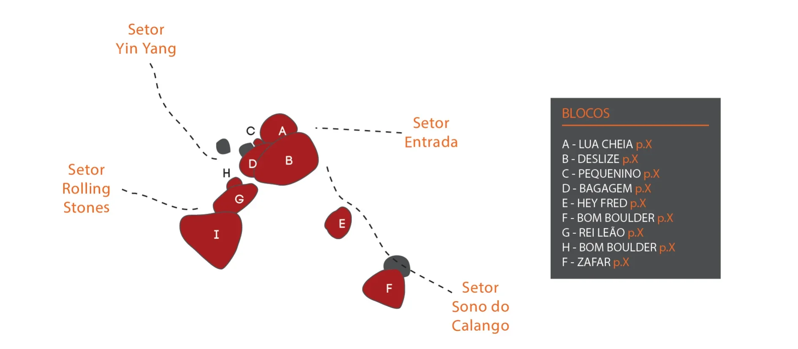 |
    | :--: |
    | *Mapa esquemático de blocos do Setor Deslize* |
    
    ### Blocos
    - **A** – Lua Cheia
    - **B** – Deslize
    - **C** – Pequenino
    - **D** – Bagagem
    - **E** – Hey Fred
    - **F** – Bom Boulder
    - **G** – Rei Leão
    - **H** – Musgo Centenário
    - **I** – Zafar
    
    ### Conexões de Trilhas
    - Trilha a noroeste para o **Setor Yin Yang**
    - Trilha a oeste para o **Setor Rolling Stones**
    - Trilha a leste vindo do **Setor Entrada**
    - Trilha a sudeste para o **Setor Sono do Calango**
    
    ## Boulders Clássicos
    
    - **42. Musgo centenário** – V1
    - **1. Rala peito** – V2
    - **6. Lua cheia** – V5
    - **15. Terceira entrada** – V7
    - **21. Bagagem** – V6
    - **11. Deslize** – V8
    - **26. Hey Fred** – V10
    
    > "O mais importante não é chegar ao cume, mas tentar e aprender algo ao longo do caminho."  
    > — *Ester Sabadell*
    
    |  |
    | :--: |
    | *Escalador em boulder clássico com vista panorâmica da serra* |
    
    | 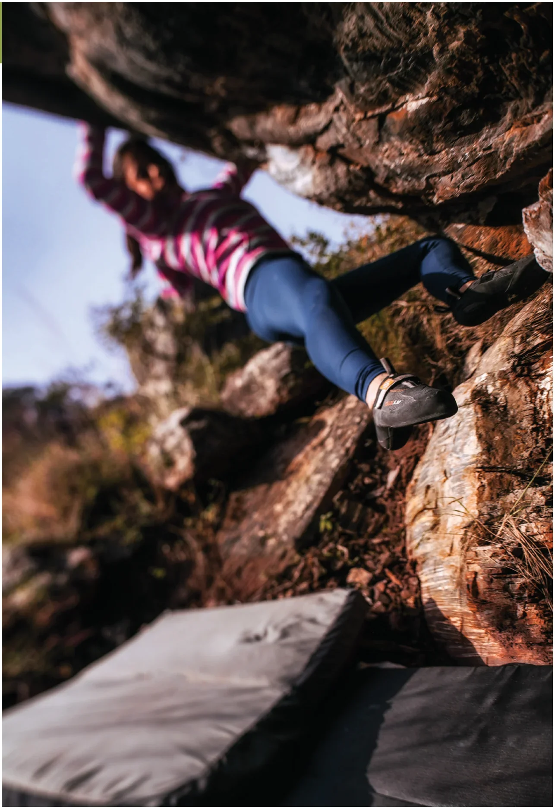 |
    | :--: |
    | *Escalador executando movimento de calcanhar em teto* |
    
    > "O tempo dura bastante para aqueles que sabem aproveitá-lo."  
    > — *Leonardo Da Vinci*
    
    |  |
    | :--: |
    | *Escalador dominando o topo de bloco imponente* |
    
    |  |
    | :--: |
    | *Escalador em teto negativo com mar de nuvens ao fundo e segurador com crashpad* |
    
    |  |
    | :--: |
    | *Projeto: Expedição Am420nia 2015 no Salto Angel, Venezuela* |
    
    *Salto Angel, Venezuela. 979 metros, a maior cachoeira do mundo. Projeto: Expedição Am420nia 2015. Acesse o site am420nia.com e saiba como participar dessa aventura.*
    
    |  |
    | :--: |
    | *Detalhe das mãos do escalador nas agarras* |
- **nome**: Deslize
- **uid**: urgscxU5OKv7Bx
- **caminho_imagem_capa**: 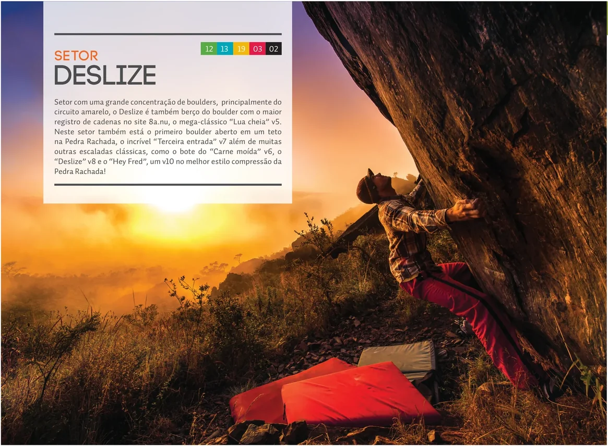
- **mapas**:
  - **[0]**:
    - **caminho_imagem_mapa**: 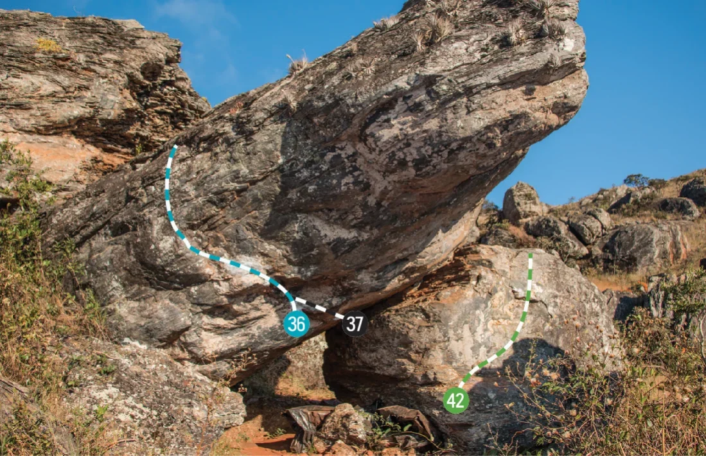
    - **largura_mapa**: 1099
    - **altura_mapa**: 710
    - **referencias**:
      - **[0]**:
        - **alvo_uid**: 5MvjSmhdvuNGLA
        - **pontos_uids**:
          - 36
        - **escalada**: Rei Leão
        - **ids**:
          - 36
      - **[1]**:
        - **alvo_uid**: wZJ977AVAc4ADg
        - **pontos_uids**:
          - 37
        - **escalada**: Projeto Grifon
        - **ids**:
          - 37
      - **[2]**:
        - **alvo_uid**: icm1VwJD6wEswr
        - **pontos_uids**:
          - 42
        - **escalada**: Musgo centenário
        - **ids**:
          - 42
- **setores**:
  - **[0]**:
    - **conteudo**:
      - **descricao**: 
      - **nome**: Bloco A - Lua Cheia
      - **uid**: 23f0ZZqIRwG7DQ
      - **mapas**:
        - **[0]**:
          - **caminho_imagem_mapa**: 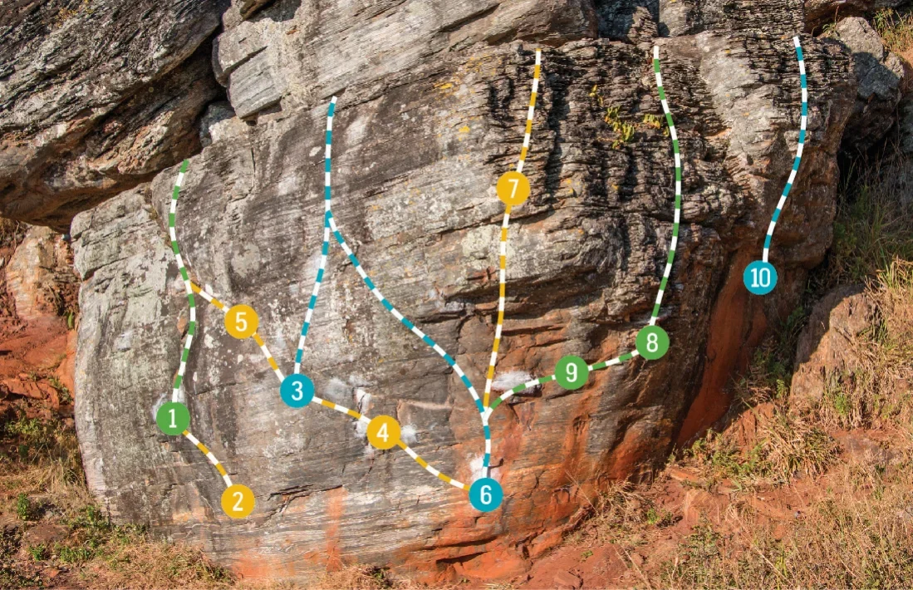
          - **largura_mapa**: 1099
          - **altura_mapa**: 710
          - **referencias**:
            - **[0]**:
              - **alvo_uid**: qXsbKftz6eEoGs
              - **pontos_uids**:
                - 1
              - **escalada**: Rala peito
              - **ids**:
                - 1
            - **[1]**:
              - **alvo_uid**: WSx72zTeldQqw3
              - **pontos_uids**:
                - 2
              - **escalada**: Rala peito SDS
              - **ids**:
                - 2
            - **[2]**:
              - **alvo_uid**: 2DnZFhkDbQZsAB
              - **pontos_uids**:
                - 3
              - **escalada**: Regletes batentes
              - **ids**:
                - 3
            - **[3]**:
              - **alvo_uid**: YHqLJ4IGhaUhlG
              - **pontos_uids**:
                - 4
              - **escalada**: Rebordose
              - **ids**:
                - 4
            - **[4]**:
              - **alvo_uid**: V3B59fYmv7suwR
              - **pontos_uids**:
                - 5
              - **escalada**: Sabará não para
              - **ids**:
                - 5
            - **[5]**:
              - **alvo_uid**: 8MaKxN6zSVXdhb
              - **pontos_uids**:
                - 6
              - **escalada**: Lua cheia
              - **ids**:
                - 6
            - **[6]**:
              - **alvo_uid**: PGhG1Hh5vofzaw
              - **pontos_uids**:
                - 7
              - **escalada**: Carne moída
              - **ids**:
                - 7
            - **[7]**:
              - **alvo_uid**: I70i6DK6O0dg4w
              - **pontos_uids**:
                - 8
              - **escalada**: Toca da cobra
              - **ids**:
                - 8
            - **[8]**:
              - **alvo_uid**: 4NVfNeAQxPcoVu
              - **pontos_uids**:
                - 9
              - **escalada**: Lua nova
              - **ids**:
                - 9
            - **[9]**:
              - **alvo_uid**: sdhkyi0zRxcLed
              - **pontos_uids**:
                - 10
              - **escalada**: Quarentinha
              - **ids**:
                - 10
      - **escaladas**:
        - **[0]**:
          - **uid**: qXsbKftz6eEoGs
          - **boulder**:
            - **descricao**: Sai em pé com a mão esquerda num reglete e a direita num gastón e escala reto.
            - **nome**: Rala peito
            - **dificuldade**: V2
            - **destaque**: True
        - **[1]**:
          - **uid**: WSx72zTeldQqw3
          - **boulder**:
            - **descricao**: Começa sentado com as mãos em dois regletes de oposição bem baixos e praticamente sem pés, faz um movimento muito duro para a saída do “Rala peito” (1) e termina como ele.
            - **nome**: Rala peito SDS
            - **dificuldade**: V7
            - **conquistadores**:
              - Frederico Gonçalves
            - **data_abertura**: 2011
        - **[2]**:
          - **uid**: 2DnZFhkDbQZsAB
          - **boulder**:
            - **descricao**: Sai em pé com a mão esquerda em um reglete/batente e a direita em outro reglete/batente um pouco mais alto. Começa fazendo um movimento forte e continua reto, escalando por regletes.
            - **nome**: Regletes batentes
            - **dificuldade**: V4
        - **[3]**:
          - **uid**: YHqLJ4IGhaUhlG
          - **boulder**:
            - **descricao**: Começa como o “Lua cheia” (6) e atravessa pra esquerda, finalizando no “Regletes batentes” (3).
            - **nome**: Rebordose
            - **dificuldade**: V7
            - **conquistadores**:
              - Tomaz Hamdan
            - **data_abertura**: 2011
        - **[4]**:
          - **uid**: V3B59fYmv7suwR
          - **boulder**:
            - **descricao**: Sai como o “Rebordose” (4) e atravessa pra esquerda até o “Rala peito” (2), terminando por ele.
            - **nome**: Sabará não para
            - **dificuldade**: V8
            - **conquistadores**:
              - Frederico Gonçalves
            - **data_abertura**: 2011
        - **[5]**:
          - **uid**: 8MaKxN6zSVXdhb
          - **boulder**:
            - **descricao**: É o boulder da Pedra Rachada com maior número de cadenas registradas no site 8a.nu, um clássico! Começa em uma grande agarra de lado, vai para um reglete logo acima, escala pela esquerda passando por agarras invertidas e domina o bloco escalando por regletes.
            - **nome**: Lua cheia
            - **dificuldade**: V5
            - **destaque**: True
        - **[6]**:
          - **uid**: PGhG1Hh5vofzaw
          - **boulder**:
            - **descricao**: Uma linha incrível, mas que recebeu poucas cadenas. Sai como o “Lua cheia” (6), porém do reglete, vai para uma pequena pinça alta de esquerda e dá um bote em um batente alto com agarras cortantes.
            - **nome**: Carne moída
            - **dificuldade**: V6
            - **destaque**: True
        - **[7]**:
          - **uid**: I70i6DK6O0dg4w
          - **boulder**:
            - **descricao**: Sai em pé com as mãos juntas em uma agarra boa e escala reto pelas cracas.
            - **nome**: Toca da cobra
            - **dificuldade**: V0
        - **[8]**:
          - **uid**: 4NVfNeAQxPcoVu
          - **boulder**:
            - **descricao**: Começa como o “Lua cheia” (6) e termina no “Toca da cobra” (8).
            - **nome**: Lua nova
            - **dificuldade**: V2
            - **destaque**: True
        - **[9]**:
          - **uid**: sdhkyi0zRxcLed
          - **boulder**:
            - **descricao**: Sai com as mãos em duas pinças/batentes em baixo do tetinho e escala reto.
            - **nome**: Quarentinha
            - **dificuldade**: V3
      - **precomputados**:
        - **total_escaladas**: 10
        - **total_boulders**: 10
  - **[1]**:
    - **conteudo**:
      - **descricao**: 
      - **nome**: Bloco B - Deslize
      - **uid**: GT0Fi3x5hIAnAM
      - **mapas**:
        - **[0]**:
          - **caminho_imagem_mapa**: 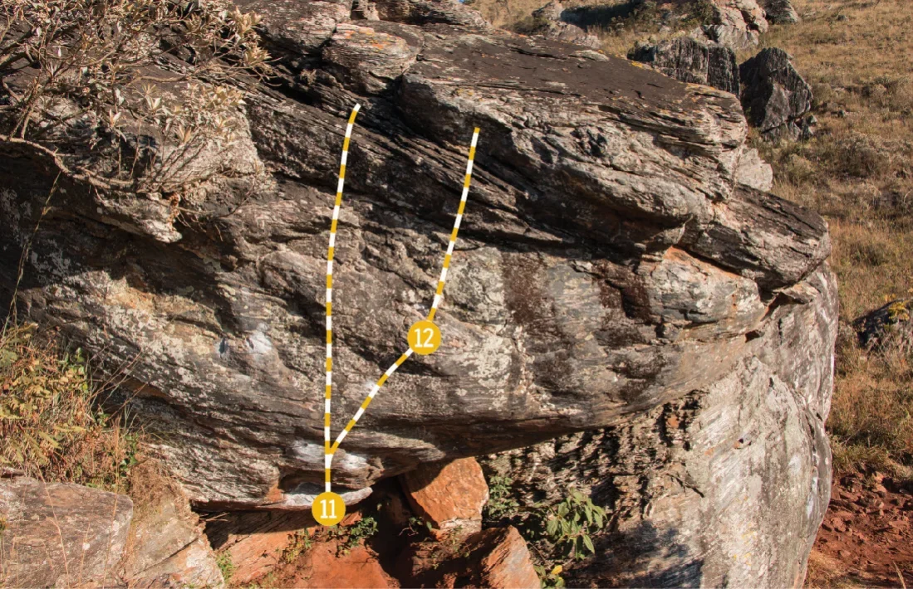
          - **largura_mapa**: 1099
          - **altura_mapa**: 710
          - **referencias**:
            - **[0]**:
              - **alvo_uid**: qMm3dXKo8O21un
              - **pontos_uids**:
                - 11
              - **escalada**: Deslize
              - **ids**:
                - 11
            - **[1]**:
              - **alvo_uid**: OF78evauZ6gbbR
              - **pontos_uids**:
                - 12
              - **escalada**: Desnível
              - **ids**:
                - 12
            - **[2]**:
              - **alvo_uid**: FSsBOjtFVeHF0F
              - **pontos_uids**:
                - 11
              - **escalada**: Deslizamento
              - **ids**:
                - 11
            - **[3]**:
              - **alvo_uid**: hGlsbbD7sD8woU
              - **pontos_uids**:
                - 12
              - **escalada**: Desnivelado
              - **ids**:
                - 12
      - **escaladas**:
        - **[0]**:
          - **uid**: qMm3dXKo8O21un
          - **boulder**:
            - **descricao**: Começa com as mãos em um grande batente escorrido e escala reto por regletes.
            - **nome**: Deslize
            - **dificuldade**: V8
            - **destaque**: True
        - **[1]**:
          - **uid**: OF78evauZ6gbbR
          - **boulder**:
            - **descricao**: Finalizando mais à direita do “Deslize” (11), com uma movimentação diferente. Se ligue com a torção no entalamento de calcanhar.
            - **nome**: Desnível
            - **dificuldade**: V8
        - **[2]**:
          - **uid**: FSsBOjtFVeHF0F
          - **boulder**:
            - **descricao**: Começa com as mãos em dois regletes no teto e termina como o “Deslize” (11).
            - **nome**: Deslizamento
            - **dificuldade**: V9
            - **destaque**: True
            - **conquistadores**:
              - Gustavo Fontes
            - **data_abertura**: 2013
        - **[3]**:
          - **uid**: hGlsbbD7sD8woU
          - **boulder**:
            - **descricao**: Começa com as mãos em dois regletes no teto e termina no “Desnível” (12). Se ligue com a torção no entalamento de calcanhar.
            - **nome**: Desnivelado
            - **dificuldade**: V9
            - **conquistadores**:
              - Gustavo Fontes
            - **data_abertura**: 2013
      - **precomputados**:
        - **total_escaladas**: 4
        - **total_boulders**: 4
  - **[2]**:
    - **conteudo**:
      - **descricao**: 
      - **nome**: Bloco C - Pequenino
      - **uid**: 6uW0jHXkyFgWMp
      - **mapas**:
        - **[0]**:
          - **caminho_imagem_mapa**: 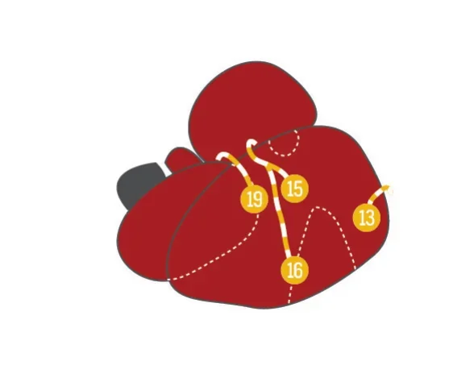
          - **largura_mapa**: 583
          - **altura_mapa**: 464
          - **referencias**:
            - **[0]**:
              - **alvo_uid**: DzicJeyPEtd8Sq
              - **pontos_uids**:
                - 19
              - **escalada**: Quem diria
              - **ids**:
                - 19
            - **[1]**:
              - **alvo_uid**: in2Xla2JBPQcTY
              - **pontos_uids**:
                - 15
              - **escalada**: Terceira entrada
              - **ids**:
                - 15
            - **[2]**:
              - **alvo_uid**: VzC1nqfFtnmvvh
              - **pontos_uids**:
                - 16
              - **escalada**: Última passagem
              - **ids**:
                - 16
            - **[3]**:
              - **alvo_uid**: C0qDsR8dsf3PrL
              - **pontos_uids**:
                - 13
                - 17
              - **escalada**: Primeira saída
              - **ids**:
                - 13
                - 17
      - **escaladas**:
        - **[0]**:
          - **uid**: in2Xla2JBPQcTY
          - **boulder**:
            - **descricao**: Boulder clássico de teto! Sai em dois regletes e escala por movimentos clássicos para sair da caverna. Tem uma virada fácil.
            - **nome**: Terceira entrada
            - **dificuldade**: V7
            - **destaque**: True
            - **conquistadores**:
              - Rafael Pimenta
            - **data_abertura**: 2007
        - **[1]**:
          - **uid**: VzC1nqfFtnmvvh
          - **boulder**:
            - **descricao**: Boulder clássico de teto! Sai em dois regletes e escala por movimentos clássicos para sair da caverna. Tem uma virada fácil. A linha leva este nome pois a maioria das pessoas a mandou na terceira tentativa.
            - **nome**: Última passagem
            - **dificuldade**: V8
            - **conquistadores**:
              - Frederico Gonçalves
            - **data_abertura**: 2013
        - **[2]**:
          - **uid**: C0qDsR8dsf3PrL
          - **boulder**:
            - **descricao**: Começa nas agarras mais ao fundo da caverna, escala por agarras boas até uma difícil transição para o “Terceira entrada” (15) terminando como ele.
            - **nome**: Primeira saída
            - **dificuldade**: V8
            - **destaque**: True
            - **conquistadores**:
              - Daniel Mendes
            - **data_abertura**: 2008
        - **[3]**:
          - **uid**: R9WKx9ZwCJGfXF
          - **boulder**:
            - **descricao**: Bloco C (Pequenino). Começa sentado com a mão esquerda em um batente/pinça e a direita em um batente na aresta e domina o pequeno bloco.
            - **nome**: Pequenino
            - **dificuldade**: V3
        - **[4]**:
          - **uid**: DzicJeyPEtd8Sq
          - **boulder**:
            - **descricao**: Este boulder fica dentro da caverna do “Terceira entrada”, ao lado direito. Sai sentado com a mão esquerda em um reglete na aresta e a direita em um reglete abaixo do teto, escalando pela aresta do bloco.
            - **nome**: Quem diria
            - **dificuldade**: V8
            - **conquistadores**:
              - Frederico Gonçalves
            - **data_abertura**: 2012
      - **precomputados**:
        - **total_escaladas**: 5
        - **total_boulders**: 5
  - **[3]**:
    - **conteudo**:
      - **descricao**: 
      - **nome**: Bloco D - Bagagem
      - **uid**: 1xPmvjHaFJihgk
      - **mapas**:
        - **[0]**:
          - **caminho_imagem_mapa**: 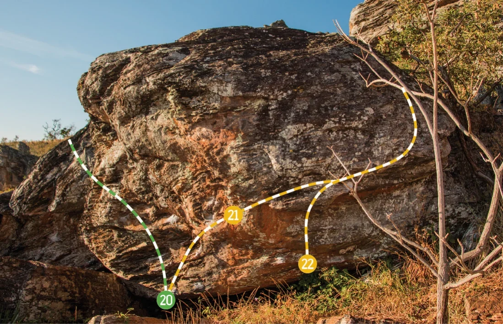
          - **largura_mapa**: 1099
          - **altura_mapa**: 710
          - **referencias**:
            - **[0]**:
              - **alvo_uid**: sZIwmA414YiZnR
              - **pontos_uids**:
                - 20
              - **escalada**: Viagem
              - **ids**:
                - 20
            - **[1]**:
              - **alvo_uid**: 9MqzvBnRLd1z62
              - **pontos_uids**:
                - 21
              - **escalada**: Bagagem
              - **ids**:
                - 21
            - **[2]**:
              - **alvo_uid**: p1HSEXAv0ionNk
              - **pontos_uids**:
                - 22
              - **escalada**: Mala educacion
              - **ids**:
                - 22
            - **[3]**:
              - **alvo_uid**: ixm51lDIZJCC9X
              - **pontos_uids**:
                - 22
              - **escalada**: Enigma
              - **ids**:
                - 22
      - **escaladas**:
        - **[0]**:
          - **uid**: sZIwmA414YiZnR
          - **boulder**:
            - **descricao**: Começa sentado com as mãos juntas em um batente bom, escala por agarras boas e domina à esquerda.
            - **nome**: Viagem
            - **dificuldade**: V1
            - **destaque**: True
        - **[1]**:
          - **uid**: 9MqzvBnRLd1z62
          - **boulder**:
            - **descricao**: Sai no “Viagem” (20) e faz uma longa travessia para a direita, finalizando na extrema direita do bloco.
            - **nome**: Bagagem
            - **dificuldade**: V6
            - **destaque**: True
            - **conquistadores**:
              - Gustavo Fontes
            - **data_abertura**: 2012
        - **[2]**:
          - **uid**: p1HSEXAv0ionNk
          - **boulder**:
            - **descricao**: Começa sentado com a mão esquerda no bico/reglete e a direita em um abaulado e entra no fim do “Bagagem” (21).
            - **nome**: Mala educacion
            - **dificuldade**: V6
            - **destaque**: True
        - **[3]**:
          - **uid**: ixm51lDIZJCC9X
          - **boulder**:
            - **descricao**: Saindo com as duas mãos juntas no abaulado da direita e entra no fim do “Bagagem” (21).
            - **nome**: Enigma
            - **dificuldade**: V7
      - **precomputados**:
        - **total_escaladas**: 4
        - **total_boulders**: 4
  - **[4]**:
    - **conteudo**:
      - **descricao**: 
      - **nome**: Bloco E - Hey Fred
      - **uid**: Z9yQJow6IJmoSb
      - **mapas**:
        - **[0]**:
          - **caminho_imagem_mapa**: 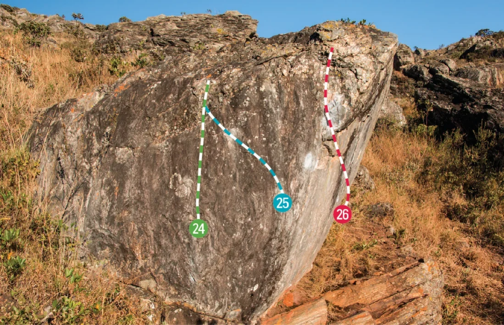
          - **largura_mapa**: 1099
          - **altura_mapa**: 710
          - **referencias**:
            - **[0]**:
              - **alvo_uid**: Z5PX5P3ewbIaUk
              - **pontos_uids**:
                - 24
              - **escalada**: Pedrita
              - **ids**:
                - 24
            - **[1]**:
              - **alvo_uid**: Z0Tjpo9capRG8H
              - **pontos_uids**:
                - 25
              - **escalada**: Barney
              - **ids**:
                - 25
            - **[2]**:
              - **alvo_uid**: x9i9s722cax0Ch
              - **pontos_uids**:
                - 26
              - **escalada**: Hey Fred
              - **ids**:
                - 26
            - **[3]**:
              - **alvo_uid**: Jwwko7zS545r3n
              - **pontos_uids**:
                - 26
              - **escalada**: Hey Fred SDS
              - **ids**:
                - 26
        - **[1]**:
          - **caminho_imagem_mapa**: 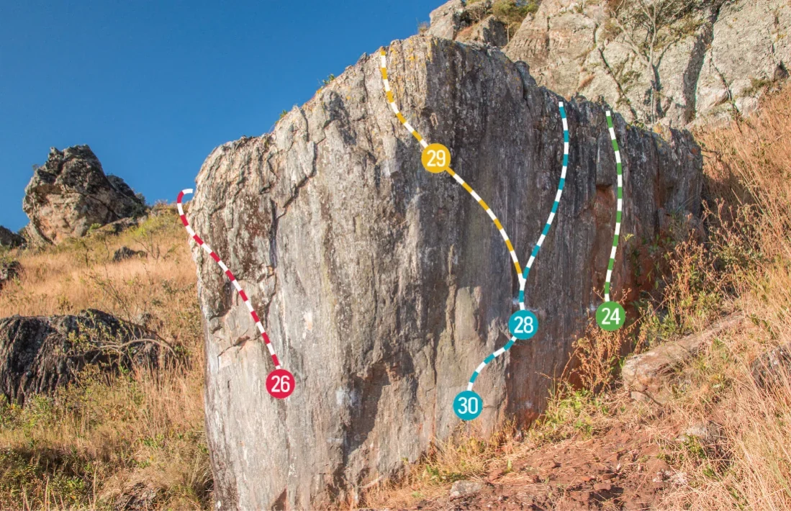
          - **largura_mapa**: 1099
          - **altura_mapa**: 710
          - **referencias**:
            - **[0]**:
              - **alvo_uid**: x9i9s722cax0Ch
              - **pontos_uids**:
                - 26
              - **escalada**: Hey Fred
              - **ids**:
                - 26
            - **[1]**:
              - **alvo_uid**: EGxrC1H2pmKoCM
              - **pontos_uids**:
                - 28
              - **escalada**: Era
              - **ids**:
                - 28
            - **[2]**:
              - **alvo_uid**: BCVxcTX9z1VzGe
              - **pontos_uids**:
                - 29
              - **escalada**: Yabadabadoo
              - **ids**:
                - 29
            - **[3]**:
              - **alvo_uid**: yIoJRHFvKRQIh2
              - **pontos_uids**:
                - 30
              - **escalada**: Nova era
              - **ids**:
                - 30
            - **[4]**:
              - **alvo_uid**: qWfML9BEmH1wSF
              - **pontos_uids**:
                - 29
                - 30
              - **escalada**: Era o que faltava
              - **ids**:
                - 29
                - 30
            - **[5]**:
              - **alvo_uid**: Z5PX5P3ewbIaUk
              - **pontos_uids**:
                - 24
              - **escalada**: Pedrita
              - **ids**:
                - 24
      - **escaladas**:
        - **[0]**:
          - **uid**: Z5PX5P3ewbIaUk
          - **boulder**:
            - **descricao**: Sai em pé com a mão esquerda em um reglete vertical baixo, a direita em outro reglete e toca reto.
            - **nome**: Pedrita
            - **dificuldade**: V2
        - **[1]**:
          - **uid**: Z0Tjpo9capRG8H
          - **boulder**:
            - **descricao**: Começa em pé fazendo compressão com a mão esquerda em um reglete vertical bem baixo e a direita em uma pinça alta e faz um movimento forte finalizando no “Pedrita” (24).
            - **nome**: Barney
            - **dificuldade**: V5
            - **destaque**: True
            - **conquistadores**:
              - Frederico Gonçalves
            - **data_abertura**: 2010
        - **[2]**:
          - **uid**: x9i9s722cax0Ch
          - **boulder**:
            - **descricao**: Boulder clássico no melhor estilo Pedra Rachada: muita compressão! Começa em pé abraçando a pedra com a mão direita em um batente de oposição e a esquerda em uma pinça alta e escala pra esquerda dominando o pequeno módulo.
            - **nome**: Hey Fred
            - **dificuldade**: V10
            - **destaque**: True
            - **conquistadores**:
              - Rafael Passos
            - **data_abertura**: 2010
        - **[3]**:
          - **uid**: Jwwko7zS545r3n
          - **boulder**:
            - **descricao**: Adiciona um movimento ao “Hey Fred” (26), saindo com a mão direita no batente de baixo, mais próximo ao chão.
            - **nome**: Hey Fred SDS
            - **dificuldade**: V11
            - **destaque**: True
            - **conquistadores**:
              - Rafael Passos
            - **data_abertura**: 2010
        - **[4]**:
          - **uid**: EGxrC1H2pmKoCM
          - **boulder**:
            - **descricao**: Começa sentado com as mãos nas agarras acima do batente de oposição e segue pela fenda.
            - **nome**: Era
            - **dificuldade**: V3
        - **[5]**:
          - **uid**: BCVxcTX9z1VzGe
          - **boulder**:
            - **descricao**: Variante do “Era” (28) que vai para a esquerda em busca de uma pinça alta e termina com um tapa na borda na reta da pinça.
            - **nome**: Yabadabadoo
            - **dificuldade**: V6
        - **[6]**:
          - **uid**: yIoJRHFvKRQIh2
          - **boulder**:
            - **descricao**: Começa com a mão esquerda em uma pinça próxima ao chão, a direita no batente de oposição, faz um movimento forte para as agarras boas e termina pela fenda.
            - **nome**: Nova era
            - **dificuldade**: V5
            - **conquistadores**:
              - Gustavo Fontes
            - **data_abertura**: 2013
        - **[7]**:
          - **uid**: qWfML9BEmH1wSF
          - **boulder**:
            - **descricao**: Começa como o “Nova era” (30) e termina como o “Yabadabadoo” (29).
            - **nome**: Era o que faltava
            - **dificuldade**: V7
            - **conquistadores**:
              - Gustavo Fontes
            - **data_abertura**: 2013
        - **[8]**:
          - **uid**: j0zVpp9Lm1SDtX
          - **boulder**:
            - **descricao**: Sai sentado com as mãos juntas em um bico e segue reto.
            - **nome**: Dino
            - **dificuldade**: V1
      - **precomputados**:
        - **total_escaladas**: 9
        - **total_boulders**: 9
  - **[5]**:
    - **conteudo**:
      - **descricao**: 
      - **nome**: Bloco F - Bom Boulder
      - **uid**: 3vwraBCMfktto8
      - **mapas**:
        - **[0]**:
          - **caminho_imagem_mapa**: 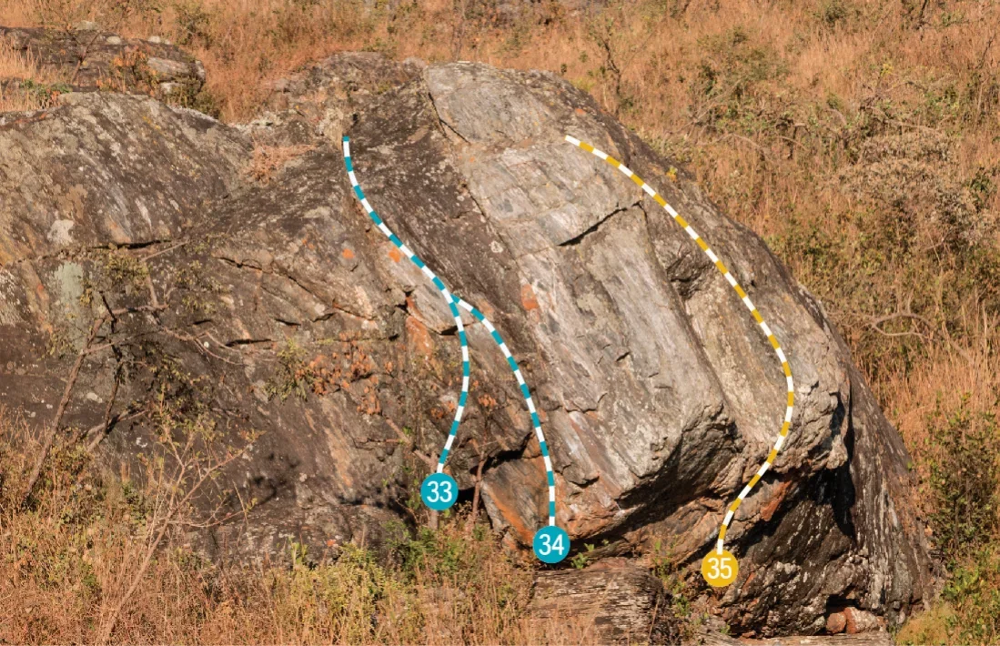
          - **largura_mapa**: 1099
          - **altura_mapa**: 710
          - **referencias**:
            - **[0]**:
              - **alvo_uid**: oy3HCAmP1NNxTJ
              - **pontos_uids**:
                - 33
              - **escalada**: Invertida
              - **ids**:
                - 33
            - **[1]**:
              - **alvo_uid**: 3qtQ9afzSbSqab
              - **pontos_uids**:
                - 34
              - **escalada**: Bom boulder
              - **ids**:
                - 34
            - **[2]**:
              - **alvo_uid**: eYiSv4K262Sl6a
              - **pontos_uids**:
                - 35
              - **escalada**: Armadilha
              - **ids**:
                - 35
      - **escaladas**:
        - **[0]**:
          - **uid**: oy3HCAmP1NNxTJ
          - **boulder**:
            - **descricao**: Sai em pé com as mãos juntas em uma agarra invertida e escala reto.
            - **nome**: Invertida
            - **dificuldade**: V3
        - **[1]**:
          - **uid**: 3qtQ9afzSbSqab
          - **boulder**:
            - **descricao**: Começa sentado com a mão direita no reglete/batente no teto, a esquerda no batente de oposição em baixo da saída do “Invertida” (33) e termina como ele.
            - **nome**: Bom boulder
            - **dificuldade**: V5
            - **destaque**: True
        - **[2]**:
          - **uid**: eYiSv4K262Sl6a
          - **boulder**:
            - **descricao**: Sai sentado com as mãos em agarras invertidas bem baixas e escala o negativo fazendo movimentos fortes.
            - **nome**: Armadilha
            - **dificuldade**: V6
      - **precomputados**:
        - **total_escaladas**: 3
        - **total_boulders**: 3
  - **[6]**:
    - **conteudo**:
      - **descricao**: 
      - **nome**: Bloco G - Rei Leão
      - **uid**: bXsoJAcNyth0mw
      - **escaladas**:
        - **[0]**:
          - **uid**: 5MvjSmhdvuNGLA
          - **boulder**:
            - **descricao**: Boulder que sai com as mãos juntas em dois regletes no meio do teto e escala pra esquerda.
            - **nome**: Rei Leão
            - **dificuldade**: V5
            - **destaque**: True
            - **conquistadores**:
              - Gustavo Veiga
            - **data_abertura**: 2007
        - **[1]**:
          - **uid**: wZJ977AVAc4ADg
          - **boulder**:
            - **descricao**: Sai de um batente mais à direita, faz dois movimentos fortes, entra no “Rei Leão” (36) e termina como ele.
            - **nome**: Projeto Grifon
            - **dificuldade**: V9_BARRA_V10
      - **precomputados**:
        - **total_escaladas**: 2
        - **total_boulders**: 2
  - **[7]**:
    - **conteudo**:
      - **descricao**: 
      - **nome**: Bloco H - Musgo Centenário
      - **uid**: McYlobTLS4cVCj
      - **mapas**:
        - **[0]**:
          - **caminho_imagem_mapa**: 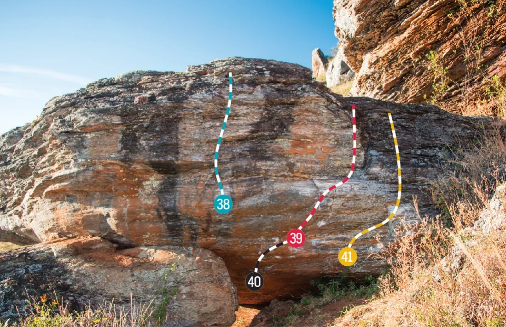
          - **largura_mapa**: 1099
          - **altura_mapa**: 710
          - **referencias**:
            - **[0]**:
              - **alvo_uid**: fOoHRihO76Um6H
              - **pontos_uids**:
                - 38
              - **escalada**: Portal da dimensão
              - **ids**:
                - 38
            - **[1]**:
              - **alvo_uid**: Ekscdusp1EYAL9
              - **pontos_uids**:
                - 39
              - **escalada**: Esmagador
              - **ids**:
                - 39
            - **[2]**:
              - **alvo_uid**: eQRQ3IocvUcUaw
              - **pontos_uids**:
                - 40
              - **escalada**: Projeto Os Incríveis
              - **ids**:
                - 40
            - **[3]**:
              - **alvo_uid**: 96PYZQX2LH0oiF
              - **pontos_uids**:
                - 41
              - **escalada**: Caverna do Dragão
              - **ids**:
                - 41
      - **escaladas**:
        - **[0]**:
          - **uid**: fOoHRihO76Um6H
          - **boulder**:
            - **descricao**: Começa em pé com as mãos juntas em dois regletes pequenos e toca reto.
            - **nome**: Portal da dimensão
            - **dificuldade**: V3
            - **destaque**: True
        - **[1]**:
          - **uid**: Ekscdusp1EYAL9
          - **boulder**:
            - **descricao**: Final do projeto “Os incríveis” (40), saindo em dois regletes pequenos, à esquerda do “Caverna do Dragão” (41).
            - **nome**: Esmagador
            - **dificuldade**: V10
            - **conquistadores**:
              - Frederico Gonçalves
            - **data_abertura**: 2013
        - **[2]**:
          - **uid**: eQRQ3IocvUcUaw
          - **boulder**:
            - **descricao**: Projeto que sai em dois regletes no teto e faz movimentos fortes até o “Esmagador” (39) finalizando como ele.
            - **nome**: Projeto Os Incríveis
            - **dificuldade**: V13
        - **[3]**:
          - **uid**: 96PYZQX2LH0oiF
          - **boulder**:
            - **descricao**: Sai com a mão esquerda no reglete/bidedo vertical e a direita em um abaulado de ombro. Faz uma sequencia de movimentos duros até um agarrão à direita e domina o boulder.
            - **nome**: Caverna do Dragão
            - **dificuldade**: V8
            - **destaque**: True
            - **conquistadores**:
              - Rafael Passos
            - **data_abertura**: 2009
        - **[4]**:
          - **uid**: icm1VwJD6wEswr
          - **boulder**:
            - **descricao**: Bloco H (Musgo Centenário). Sai sentado com a mão esquerda em um abaulado e a direita em um reglete. Escala reto e domina o pequeno bloco.
            - **nome**: Musgo centenário
            - **dificuldade**: V1
            - **destaque**: True
        - **[5]**:
          - **uid**: MACg1TU0oDgKCY
          - **boulder**:
            - **descricao**: Bloco H (Musgo Centenário). Começa sentado com as mãos juntas em um reglete bom e domina o boulder.
            - **nome**: Regletão da árvore
            - **dificuldade**: V2
            - **destaque**: True
      - **precomputados**:
        - **total_escaladas**: 6
        - **total_boulders**: 6
  - **[8]**:
    - **conteudo**:
      - **descricao**: 
      - **nome**: Bloco I - Zafar
      - **uid**: Ouw62BU1UhhFif
      - **mapas**:
        - **[0]**:
          - **caminho_imagem_mapa**: 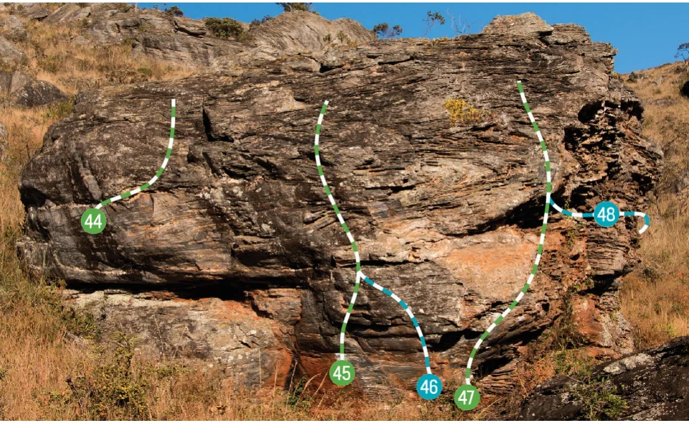
          - **largura_mapa**: 1099
          - **altura_mapa**: 677
          - **referencias**:
            - **[0]**:
              - **alvo_uid**: oF1je6BKxun04P
              - **pontos_uids**:
                - 44
              - **escalada**: Nala
              - **ids**:
                - 44
            - **[1]**:
              - **alvo_uid**: RY8KInGbssq9bu
              - **pontos_uids**:
                - 45
              - **escalada**: Timão
              - **ids**:
                - 45
            - **[2]**:
              - **alvo_uid**: qcDWRtEs50DkL8
              - **pontos_uids**:
                - 46
              - **escalada**: Pumba
              - **ids**:
                - 46
            - **[3]**:
              - **alvo_uid**: bzZdAESnwCC0gI
              - **pontos_uids**:
                - 47
              - **escalada**: Zafar
              - **ids**:
                - 47
            - **[4]**:
              - **alvo_uid**: mr3y8M9CmEN5Mm
              - **pontos_uids**:
                - 48
              - **escalada**: Caverna
              - **ids**:
                - 48
      - **escaladas**:
        - **[0]**:
          - **uid**: oF1je6BKxun04P
          - **boulder**:
            - **descricao**: Sai em pé com as mãos em dois batentes, atravessa para a direita e domina.
            - **nome**: Nala
            - **dificuldade**: V1
        - **[1]**:
          - **uid**: RY8KInGbssq9bu
          - **boulder**:
            - **descricao**: Começa sentado com as mãos juntas no reglete/pocket e escala reto.
            - **nome**: Timão
            - **dificuldade**: V1
            - **destaque**: True
        - **[2]**:
          - **uid**: qcDWRtEs50DkL8
          - **boulder**:
            - **descricao**: Sai sentado com as mãos juntas em dois regletes baixos à esquerda da saída do “Zafar” (47) e escala diagonalmente à esquerda, passando por batentes invertidos.
            - **nome**: Pumba
            - **dificuldade**: V3
        - **[3]**:
          - **uid**: bzZdAESnwCC0gI
          - **boulder**:
            - **descricao**: Começa sentado com as mãos em batentes bons e escala por agarras boas.
            - **nome**: Zafar
            - **dificuldade**: V2
            - **destaque**: True
        - **[4]**:
          - **uid**: mr3y8M9CmEN5Mm
          - **boulder**:
            - **descricao**: Boulder que sai sentado com as mãos juntas em uma agarra boa no fundo da caverna. Faz alguns movimentos fortes até sair dessa caverna e, ao invés de tocar reto pelas cracas quebradiças, atravessa pela esquerda terminando no “Zafar” (47).
            - **nome**: Caverna
            - **dificuldade**: V4
      - **precomputados**:
        - **total_escaladas**: 5
        - **total_boulders**: 5
- **precomputados**:
  - **total_escaladas**: 48
  - **total_boulders**: 48

## Parte: grupo_yin_yang

### Grupo (Pico: Pedra Rachada)

- **descricao**:
    Esse pequeno aglomerado de blocos, à direita do setor do Deslize, começou a ser explorado em 2006, com a abertura do clássico “Bicicletinha 2000”. Permaneceu sem novidades expressivas por alguns anos até que, em 2011, o escalador Mahavir Jneesh realizou a primeira ascensão do boulder “Yang” e, logo após, sua saída sentada denominada “Yin Yang”, dois mega clássicos da Pedra Rachada!
    
    ## Acesso (15 min)
    
    A partir do “Estacionamento 2”, siga pela trilha principal e, após passar à esquerda do “Bloco 1”, continue subindo até o bloco “Lua Cheia” e contorne-o pela direita, de onde será possível avistar o setor “Yin Yang” à sua direita. Para acessá-lo, basta tomar a trilha à direita em frente ao bloco “Bagagem” que vai em direção ao setor.
    
    ## Boulders Clássicos
    
    - 19 Fenda Cega v0
    - 7 Bicicletinha 2000 v5
    - 15 Yin Yang v10/11
    
    |  |
    | :--: |
    | *Escaladora em teto com mar de nuvens ao fundo* |
    
    > "A felicidade não está na estrada que leva a algum lugar. A felicidade é a própria estrada."  
    > — *Bob Dylan*
    
    | 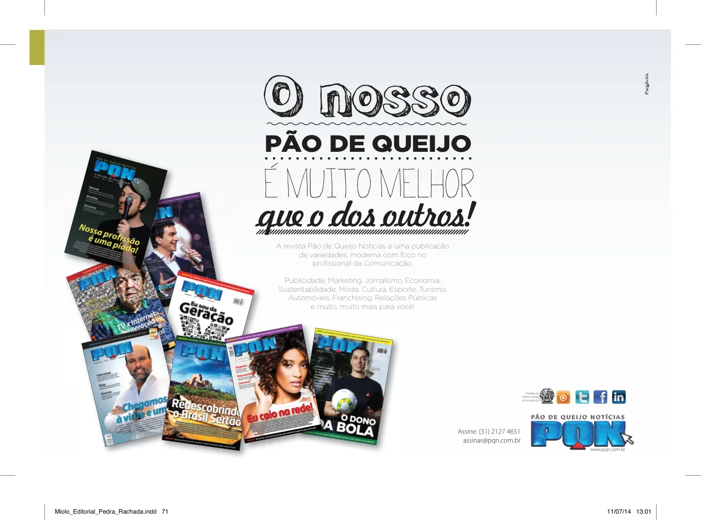 |
    | :--: |
    | *Anúncio Revista PQN - Pão de Queijo Notícias* |
    
    ### Revista PQN (Pão de Queijo Notícias)
    
    O nosso PÃO DE QUEIJO É MUITO MELHOR que o dos outros!
    
    A revista Pão de Queijo Notícias é uma publicação de variedades, moderna com foco no profissional da Comunicação. Publicidade, Marketing, Jornalismo, Economia, Sustentabilidade, Moda, Cultura, Esporte, Turismo, Automóveis, Franchising, Relações Públicas e muito, muito mais para você!
    
    - **Assine:** (31) 2127 4651 | assinar@pqn.com.br | [www.pqn.com.br](http://www.pqn.com.br)
    - **Finalista do Prêmio Sebrae de Jornalismo**
    
    *Destaques da Edição:*
    - **Capa:** Érika Januza, a mineira que faz sucesso na novela das nove – *Eu caio na rede!*
      O comportamento da nova Classe C, que entrou de vez na onda tecnológica e terminou o ano de 2013 com 17% de alcance na rede - mais que o dobro dos 8% registrados em 2012 - reflete um pouco do modo de ser da atriz mineira Érika Januza. Sucesso na novela das 9, da Rede Globo, “Em Família”, a mineira de Contagem vive a personagem Alice, uma estudante de música, fruto de um estupro coletivo sofrido por sua mãe. Com o sucesso, ela mostra-se consciente de seu papel de “Relações Públicas” para a cidade mineira e não abre mão de suas raízes e de sua interação nas redes sociais. Érika, que adora postar suas fotos no Facebook – seja com os amigos, família ou elenco da novela – é fã das novas tecnologias do mundo moderno e não liga para essa grande exposição virtual. Vale tudo para se aproximar ainda mais de sua legião de fãs e ainda humanizar o seu trabalho na telinha.
    - **Entrevista:** Márcio Lacerda e suas duas novas conquistas: Carnaval 2014 e o BRT Move.
    - **Negócios:** BH Fala a Sua Língua oferece 2300 títulos de jornais de 150 países.
    - **Empreendedor:** Carioca edita revista voltada aos imigrantes brasileiros em Portugal.
    - **Carnaval:** Revista PQN cai na folia, lança o bloco “Quem não se comunica, se trumbica!” e arrasta multidão.
    - **Turismo:** Você já fez a sua reserva de hotel para assistir aos jogos da Copa do Mundo?
    
    | 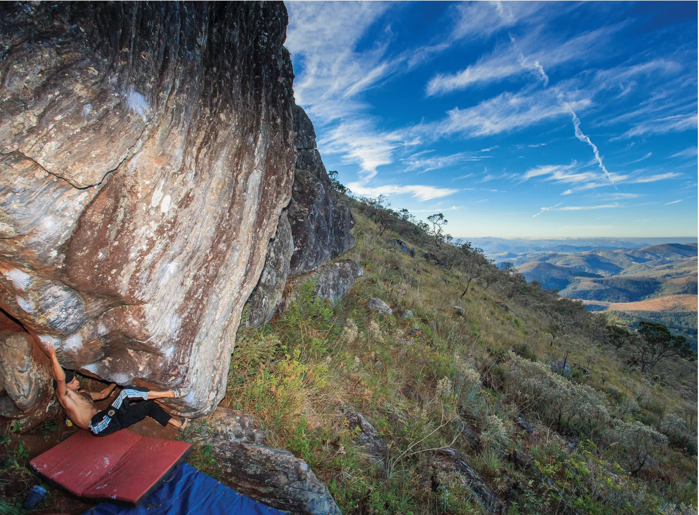 |
    | :--: |
    | *Escalador na saída do boulder com vista panorâmica para a serra* |
- **nome**: Yin Yang
- **uid**: cmS7FR9WNzcmF1
- **caminho_imagem_capa**: 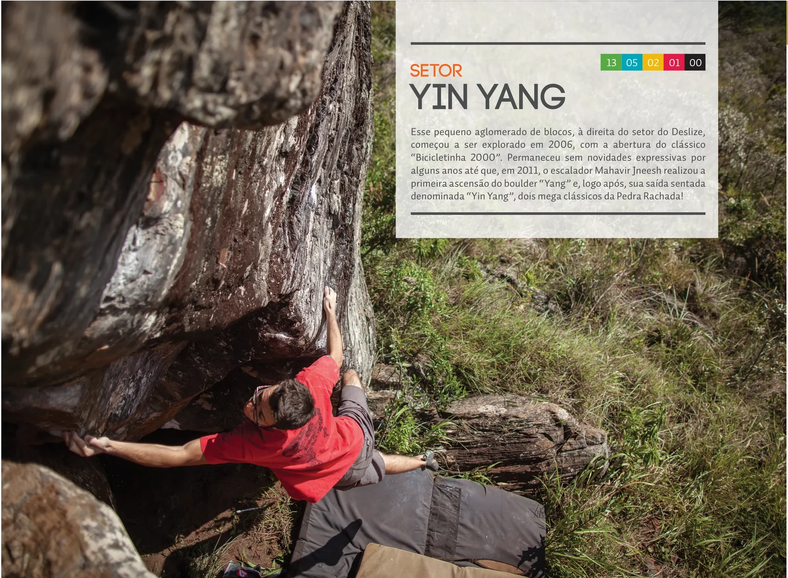
- **setores**:
  - **[0]**:
    - **conteudo**:
      - **descricao**: 
      - **nome**: Bloco A - Abraço
      - **uid**: ZUYYFmkBLl0lgW
      - **mapas**:
        - **[0]**:
          - **caminho_imagem_mapa**: 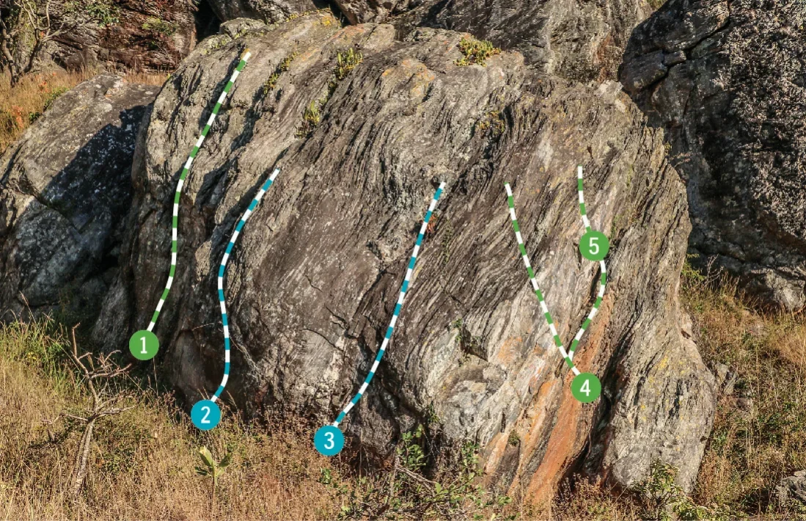
          - **largura_mapa**: 1099
          - **altura_mapa**: 710
          - **referencias**:
            - **[0]**:
              - **alvo_uid**: 9UfNQXvgRS9u0P
              - **pontos_uids**:
                - 1
              - **escalada**: Siga-me
              - **ids**:
                - 1
            - **[1]**:
              - **alvo_uid**: 2IdZw4r8vtXsfQ
              - **pontos_uids**:
                - 2
              - **escalada**: Abraço
              - **ids**:
                - 2
            - **[2]**:
              - **alvo_uid**: cGmOgbbvXX2PPA
              - **pontos_uids**:
                - 3
              - **escalada**: Jah Vibes
              - **ids**:
                - 3
            - **[3]**:
              - **alvo_uid**: Mwpx7ARnrgPMzB
              - **pontos_uids**:
                - 4
              - **escalada**: Dreadlock
              - **ids**:
                - 4
            - **[4]**:
              - **alvo_uid**: rfBHek5ZFDLvgM
              - **pontos_uids**:
                - 5
              - **escalada**: Rasta
              - **ids**:
                - 5
      - **escaladas**:
        - **[0]**:
          - **uid**: 9UfNQXvgRS9u0P
          - **boulder**:
            - **descricao**: Sai sentado com as mãos juntas em um pocket invertido baixo, na linha da fenda, seguindo por ela até o topo.
            - **nome**: Siga-me
            - **dificuldade**: V0
            - **destaque**: True
        - **[1]**:
          - **uid**: 2IdZw4r8vtXsfQ
          - **boulder**:
            - **descricao**: Começa sentado com a mão esquerda baixa em um abaulado vertical e a direita em um batente. Faz uma sequência de movimentos abraçando a pedra e domina reto.
            - **nome**: Abraço
            - **dificuldade**: V4
            - **destaque**: True
        - **[2]**:
          - **uid**: cGmOgbbvXX2PPA
          - **boulder**:
            - **descricao**: Sai sentado com as mãos nos pockets e escala reto pelo positivo técnico.
            - **nome**: Jah Vibes
            - **dificuldade**: V3
        - **[3]**:
          - **uid**: Mwpx7ARnrgPMzB
          - **boulder**:
            - **descricao**: Sai em pé em um reglete e toca reto pelo vertical, levemente positivo. Cuidado com agarras soltas!
            - **nome**: Dreadlock
            - **dificuldade**: V0
            - **destaque**: True
        - **[4]**:
          - **uid**: rfBHek5ZFDLvgM
          - **boulder**:
            - **descricao**: Começa como o “Dreadlock” (4), faz uma travessia para a direita pela grande laca e domina reto.
            - **nome**: Rasta
            - **dificuldade**: V1
            - **destaque**: True
      - **precomputados**:
        - **total_escaladas**: 5
        - **total_boulders**: 5
  - **[1]**:
    - **conteudo**:
      - **descricao**: 
      - **nome**: Bloco B - Bicicletinha 2000
      - **uid**: CF3VY8Q8gKccI5
      - **mapas**:
        - **[0]**:
          - **caminho_imagem_mapa**: 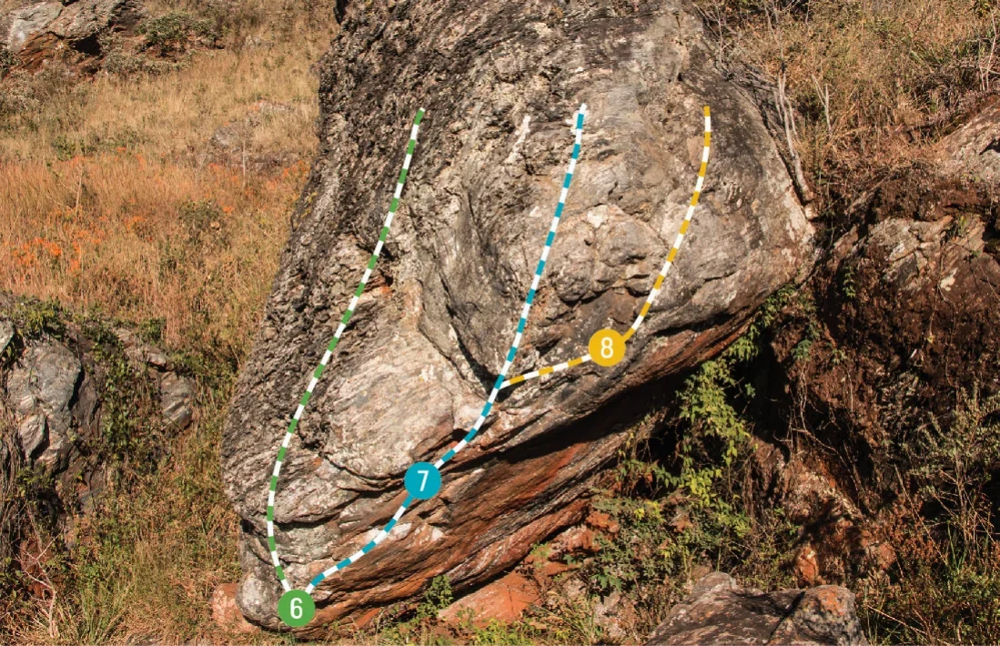
          - **largura_mapa**: 1099
          - **altura_mapa**: 710
          - **referencias**:
            - **[0]**:
              - **alvo_uid**: XTovn10JUAEcPB
              - **pontos_uids**:
                - 6
              - **escalada**: Velocípede
              - **ids**:
                - 6
            - **[1]**:
              - **alvo_uid**: uLcbrhyvMrCjNU
              - **pontos_uids**:
                - 7
              - **escalada**: Bicicletinha 2000
              - **ids**:
                - 7
            - **[2]**:
              - **alvo_uid**: xGCF7hV9FgP7AY
              - **pontos_uids**:
                - 8
              - **escalada**: Shark Attack
              - **ids**:
                - 8
      - **escaladas**:
        - **[0]**:
          - **uid**: XTovn10JUAEcPB
          - **boulder**:
            - **descricao**: Sai sentado com a mão esquerda em um pocket e a direita em um batente. Faz alguns movimentos até a aresta e escala o positivo até o topo.
            - **nome**: Velocípede
            - **dificuldade**: V2
        - **[1]**:
          - **uid**: uLcbrhyvMrCjNU
          - **boulder**:
            - **descricao**: Um dos primeiros boulders a serem abertos no setor. Sai como o “Velocípede” (6) e escala para a direita, passando por um batente, uma invertida e um abaulado até o módulo, finalizando reto por agarras boas.
            - **nome**: Bicicletinha 2000
            - **dificuldade**: V5
            - **destaque**: True
        - **[2]**:
          - **uid**: xGCF7hV9FgP7AY
          - **boulder**:
            - **descricao**: Escala o “Bicicletinha 2000” (7) até o abaulado e depois toca pra direita passando por uns regletinhos e um gastón até um forte movimento de direita para um biquinho, ao invés de utilizar o módulo da esquerda.
            - **nome**: Shark Attack
            - **dificuldade**: V8
            - **destaque**: True
            - **conquistadores**:
              - Gustavo Fontes
            - **data_abertura**: 2007
      - **precomputados**:
        - **total_escaladas**: 3
        - **total_boulders**: 3
  - **[2]**:
    - **conteudo**:
      - **descricao**: 
      - **nome**: Bloco C - Travezinha
      - **uid**: ITSfk4PBbxbkyu
      - **mapas**:
        - **[0]**:
          - **caminho_imagem_mapa**: 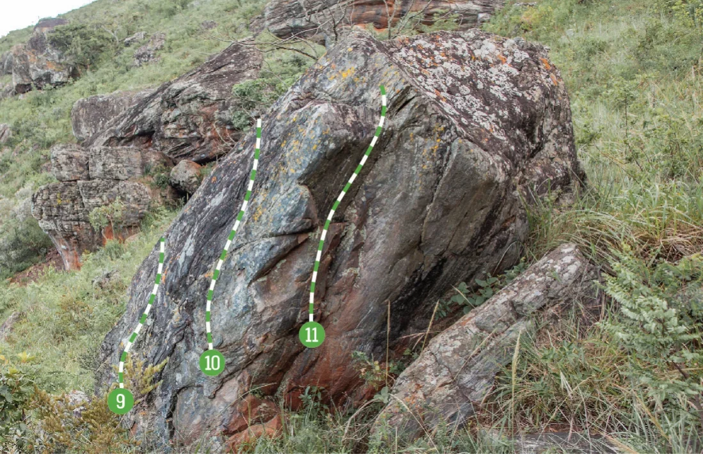
          - **largura_mapa**: 1099
          - **altura_mapa**: 710
          - **referencias**:
            - **[0]**:
              - **alvo_uid**: QOMpFpqVqW9Eep
              - **pontos_uids**:
                - 9
              - **escalada**: Louva a Deus
              - **ids**:
                - 9
            - **[1]**:
              - **alvo_uid**: Phd1JSH90lSOqo
              - **pontos_uids**:
                - 10
              - **escalada**: Travezinha
              - **ids**:
                - 10
            - **[2]**:
              - **alvo_uid**: jCjUZlPcILFfVj
              - **pontos_uids**:
                - 11
              - **escalada**: São Carlos
              - **ids**:
                - 11
      - **escaladas**:
        - **[0]**:
          - **uid**: QOMpFpqVqW9Eep
          - **boulder**:
            - **descricao**: Sai sentado e escala diagonalmente à direita passando por uns regletes e dominando reto.
            - **nome**: Louva a Deus
            - **dificuldade**: VB
        - **[1]**:
          - **uid**: Phd1JSH90lSOqo
          - **boulder**:
            - **descricao**: Começa com as mãos juntas em um reglete e um gaston, faz alguns movimentos até um agarrão e vira.
            - **nome**: Travezinha
            - **dificuldade**: V0
            - **destaque**: True
        - **[2]**:
          - **uid**: jCjUZlPcILFfVj
          - **boulder**:
            - **descricao**: Escala a face negativa do bloco saindo baixo, com as mãos juntas em uma grande agarra invertido.
            - **nome**: São Carlos
            - **dificuldade**: V0
            - **destaque**: True
      - **precomputados**:
        - **total_escaladas**: 3
        - **total_boulders**: 3
  - **[3]**:
    - **conteudo**:
      - **descricao**: 
      - **nome**: Bloco D - 12 de Outubro
      - **uid**: Z9Dq7oenKRrxTq
      - **mapas**:
        - **[0]**:
          - **caminho_imagem_mapa**: 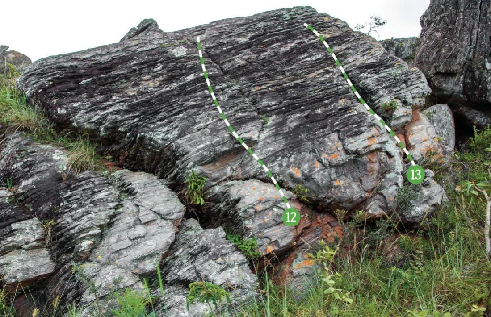
          - **largura_mapa**: 1099
          - **altura_mapa**: 710
          - **referencias**:
            - **[0]**:
              - **alvo_uid**: ECpjzkvvSRpD0E
              - **pontos_uids**:
                - 12
              - **escalada**: Vale Tudo
              - **ids**:
                - 12
            - **[1]**:
              - **alvo_uid**: mO3oa0oNDd0937
              - **pontos_uids**:
                - 13
              - **escalada**: 12 de Outubro
              - **ids**:
                - 13
      - **escaladas**:
        - **[0]**:
          - **uid**: ECpjzkvvSRpD0E
          - **boulder**:
            - **descricao**: Escala a face levemente positiva por agarras boas, saindo no módulo. Fique atento com agarras quebradiças!
            - **nome**: Vale Tudo
            - **dificuldade**: V0
        - **[1]**:
          - **uid**: mO3oa0oNDd0937
          - **boulder**:
            - **descricao**: Sai em pé no módulo e domina reto passando pela fenda. Cuidado com agarras que podem vir a quebrar!
            - **nome**: 12 de Outubro
            - **dificuldade**: V0
      - **precomputados**:
        - **total_escaladas**: 2
        - **total_boulders**: 2
  - **[4]**:
    - **conteudo**:
      - **descricao**: 
      - **nome**: Bloco E - Yin Yang
      - **uid**: KDBISU3Tntr9nE
      - **mapas**:
        - **[0]**:
          - **caminho_imagem_mapa**: 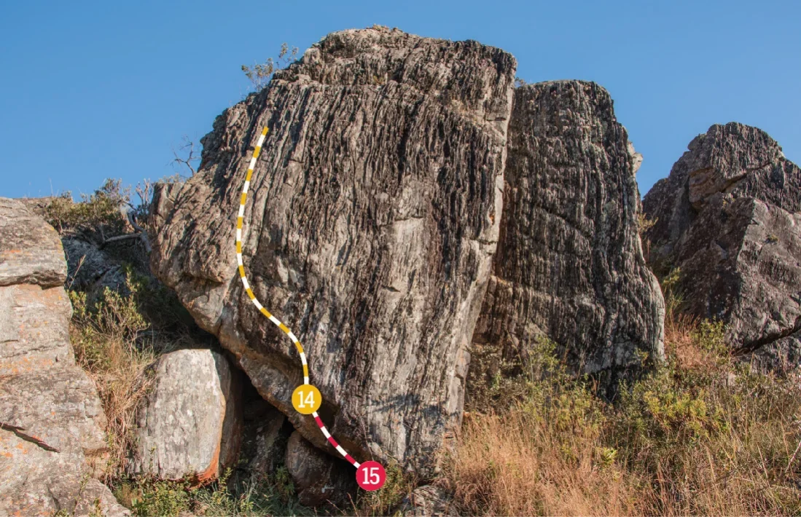
          - **largura_mapa**: 1099
          - **altura_mapa**: 710
          - **referencias**:
            - **[0]**:
              - **alvo_uid**: bJTZ3Edp5zILox
              - **pontos_uids**:
                - 14
              - **escalada**: Yang
              - **ids**:
                - 14
            - **[1]**:
              - **alvo_uid**: XzG7Q9yIRsXCuK
              - **pontos_uids**:
                - 15
              - **escalada**: Yin Yang
              - **ids**:
                - 15
      - **escaladas**:
        - **[0]**:
          - **uid**: bJTZ3Edp5zILox
          - **boulder**:
            - **descricao**: Começa com a mão direita em um regletinho na aresta e a esquerda em um batente no negativo, e escala reto por movimentos clássicos e técnicos no positivo.
            - **nome**: Yang
            - **dificuldade**: V8
            - **destaque**: True
            - **conquistadores**:
              - Mahavir Jneesh
            - **data_abertura**: 2011
        - **[1]**:
          - **uid**: XzG7Q9yIRsXCuK
          - **boulder**:
            - **descricao**: A saída mais clássica para este boulder é com a mão esquerda em uma pinça invertida próxima ao chão e a mão direita no batente, fazendo uma sequência dura e entrando no “Yang” (14). Há rumores de que originalmente a saída foi feita com a mão direita em um reglete abaixo do batente, mas nenhuma repetição foi realizada desta maneira.
            - **nome**: Yin Yang
            - **dificuldade**: V10_BARRA_V11
            - **destaque**: True
            - **conquistadores**:
              - Mahavir Jneesh
            - **data_abertura**: 2011
        - **[2]**:
          - **uid**: iIwyd1o0SStIJK
          - **boulder**:
            - **descricao**: Para acessar este boulder, contorne o bloco “Geladeira” e desça atrás dele até a canaleta. Ele fica no meio da parede vertical e começa em pé com as mãos juntas em uma agarra boa.
            - **nome**: Agosto
            - **dificuldade**: V1
            - **destaque**: True
      - **precomputados**:
        - **total_escaladas**: 3
        - **total_boulders**: 3
  - **[5]**:
    - **conteudo**:
      - **descricao**: 
      - **nome**: Bloco F - Geladeira
      - **uid**: X68boIjYE41BNm
      - **mapas**:
        - **[0]**:
          - **caminho_imagem_mapa**: 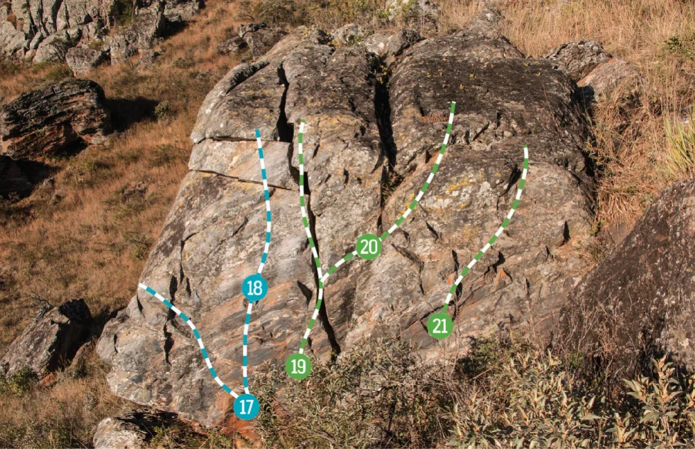
          - **largura_mapa**: 1099
          - **altura_mapa**: 710
          - **referencias**:
            - **[0]**:
              - **alvo_uid**: Ns9Hn56OTIkreO
              - **pontos_uids**:
                - 17
              - **escalada**: Congelador
              - **ids**:
                - 17
            - **[1]**:
              - **alvo_uid**: yg43IPyhVNA5kU
              - **pontos_uids**:
                - 18
              - **escalada**: Geladeira
              - **ids**:
                - 18
            - **[2]**:
              - **alvo_uid**: 6qmeJYKY3v1V1w
              - **pontos_uids**:
                - 19
              - **escalada**: Fenda Cega
              - **ids**:
                - 19
            - **[3]**:
              - **alvo_uid**: xgOg32KmOIqnRt
              - **pontos_uids**:
                - 20
              - **escalada**: Diagonal (Geladeira)
              - **ids**:
                - 20
            - **[4]**:
              - **alvo_uid**: Zx8yus4jhgQVQW
              - **pontos_uids**:
                - 21
              - **escalada**: Avesso
              - **ids**:
                - 21
      - **escaladas**:
        - **[0]**:
          - **uid**: Ns9Hn56OTIkreO
          - **boulder**:
            - **descricao**: Sai sentado com as mãos juntas em um batente e escala em direção à aresta.
            - **nome**: Congelador
            - **dificuldade**: V3
        - **[1]**:
          - **uid**: yg43IPyhVNA5kU
          - **boulder**:
            - **descricao**: Começa como o “Congelador” (17) e toca reto sem usar a pedra à direita da fenda.
            - **nome**: Geladeira
            - **dificuldade**: V3
        - **[2]**:
          - **uid**: 6qmeJYKY3v1V1w
          - **boulder**:
            - **descricao**: Sai sentado com as mãos juntas em uma laca e toca reto pela fenda.
            - **nome**: Fenda Cega
            - **dificuldade**: V0
            - **destaque**: True
        - **[3]**:
          - **uid**: xgOg32KmOIqnRt
          - **boulder**:
            - **descricao**: Começa como o “Fenda cega” (19), passa pela fenda e segue em diagonal pra direita.
            - **nome**: Diagonal (Geladeira)
            - **dificuldade**: V0
            - **destaque**: True
        - **[4]**:
          - **uid**: Zx8yus4jhgQVQW
          - **boulder**:
            - **descricao**: Sai em pé com as mãos juntas em uma agarra boa invertida e escala reto.
            - **nome**: Avesso
            - **dificuldade**: VB
      - **precomputados**:
        - **total_escaladas**: 5
        - **total_boulders**: 5
- **precomputados**:
  - **total_escaladas**: 21
  - **total_boulders**: 21

## Parte: grupo_rolling_stones

### Grupo (Pico: Pedra Rachada)

- **descricao**:
    Em 2013, os trabalhos no bloco “Pantaloneta” proporcionaram o surgimento de vários novos boulders que confirmaram este setor como um dos melhores da Pedra Rachada. Os blocos “Rolling Stones” e “Pantaloneta”, que juntos somam a maior concentração de clássicos do local, são obrigatórios a qualquer visitante do local. Aproveite também para conhecer os blocos “Gaston a la meson” e as escaladas do bloco “Universo Paralello”.
    
    ## Acesso (20 min)
    
    Este setor fica logo acima do setor “Deslize”. Para acessá-lo, basta seguir a trilha principal que sobe passando pelo setor Entrada (à esquerda do “Bloco 1”) e pelo setor “Deslize”, contornando o bloco Lua cheia pela direita. Logo após o bloco “Zafar”, a primeira trilha à esquerda dá acesso aos blocos “Gaston a la meson”, “Casulo” e “Marrento”. Continuando reto estará bloco “Rolling Stones” e o bloco “Eject”. Um pouco mais a direita está o bloco “Universo Paralello” e, acima dele, o complexo das aranhas, com os blocos “Pantaloneta”, “Octopus”, “Protons” e “Aranha albina”.
    
    ### Blocos
    - **A** – Gastón a la Mesón
    - **B** – Casulo
    - **C** – Marrento
    - **D** – Rolling Stones
    - **E** – Eject
    - **F** – Universo Paralelo
    - **G** – Pantaloneta
    - **H** – Octopus
    - **I** – Protóns
    - **J** – Aranha Albina
    
    ## Boulders Clássicos
    
    - **28. The Doors** – V5
    - **7. Gastón a la meson** – V6
    - **24. Rolling Stones** – V8
    - **26. Amanhã vai ser outro dia** – V9
    - **36. Universo Paralello** – V9
    - **47. Pantaloneta** – V7
    - **45. Tapete mágico** – V10
    - **61. Aladim** – V11
    - **64. Vaqueros** – V10
    
    |  |
    | :--: |
    | *Escalador executando o movimento duro de gastón no teto do bloco Gastón a la Mesón* |
    
    > "Quando tudo o que existe entre você e o chão é uma coisa chamada segurança."  
    > — *Alto Estilo*
    
    | 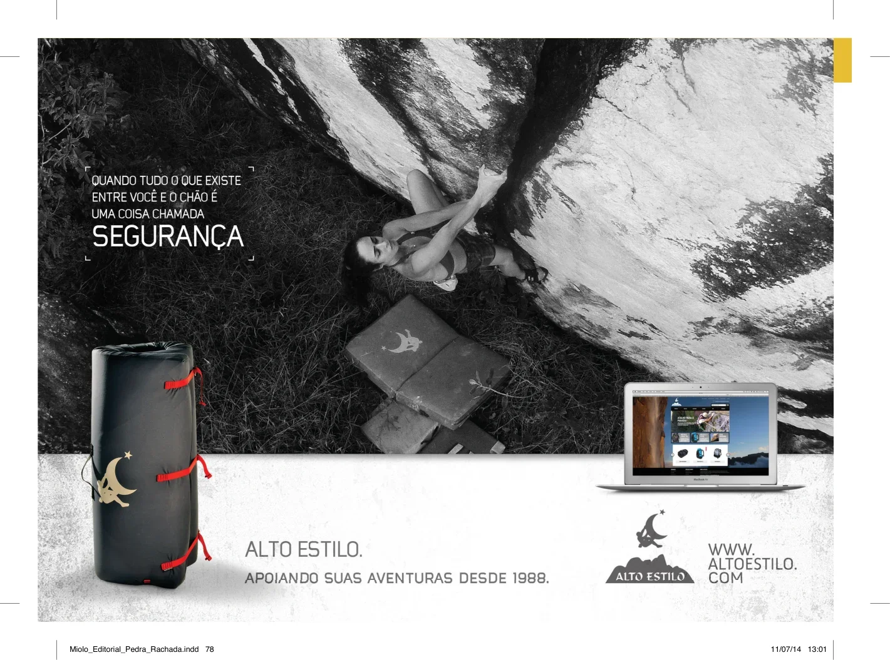 |
    | :--: |
    | *Alto Estilo: Apoiando suas aventuras desde 1988* |
    
    *Alto Estilo. Apoiando suas aventuras desde 1988. Acesse o site altoestilo.com.*
    
    | 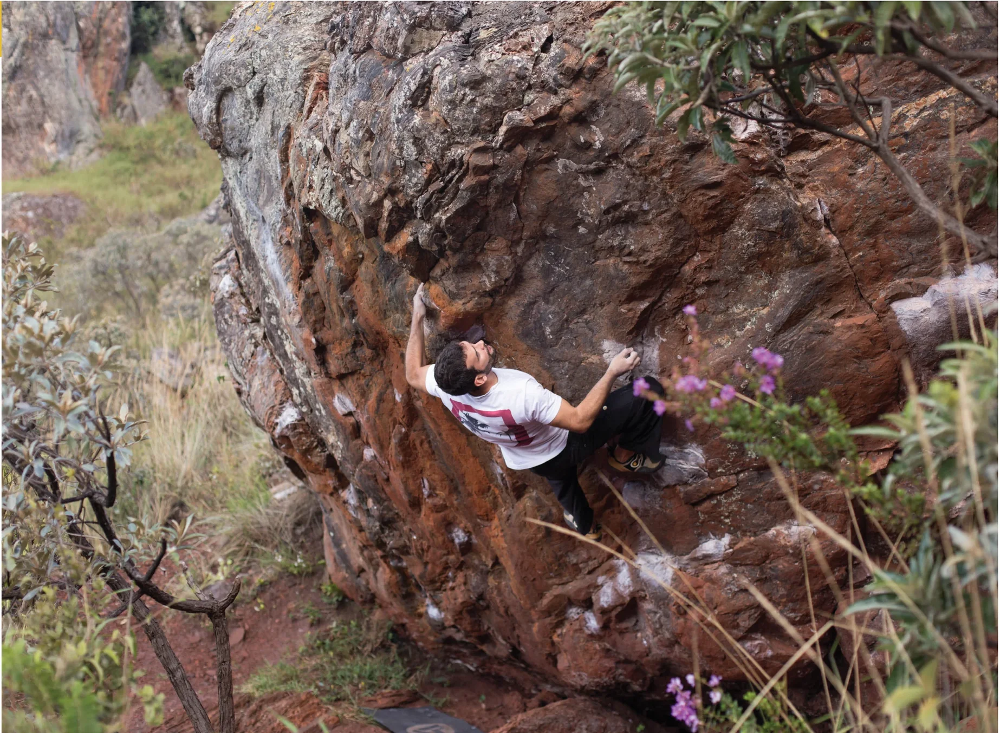 |
    | :--: |
    | *Escalador no negativo do bloco Rolling Stones cercado pela vegetação nativa* |
    
    | 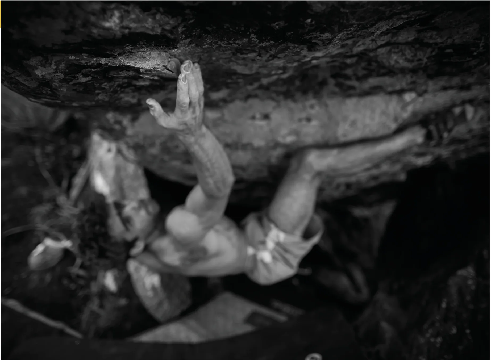 |
    | :--: |
    | *Escalador em teto horizontal com calcanhar encaixado no bloco Universo Paralelo* |
    
    | 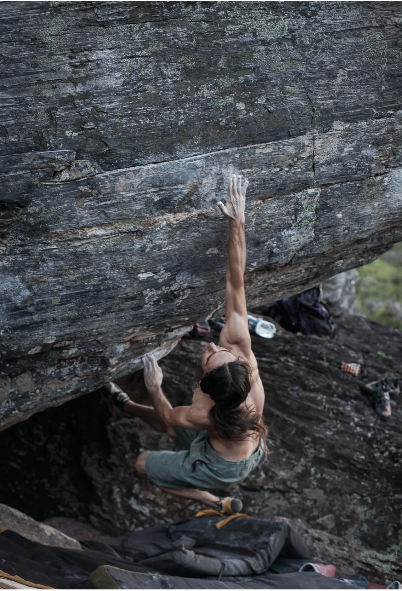 |
    | :--: |
    | *Escalador no teto na saída do boulder Octopus com segurador e crashpads na base* |
    
    > "Linha Stretch Limits: Alta performance para esportes outdoor."  
    > — *4Climb*
- **nome**: Rolling Stones
- **uid**: ii1Vc1rhEZBxdg
- **caminho_imagem_capa**: 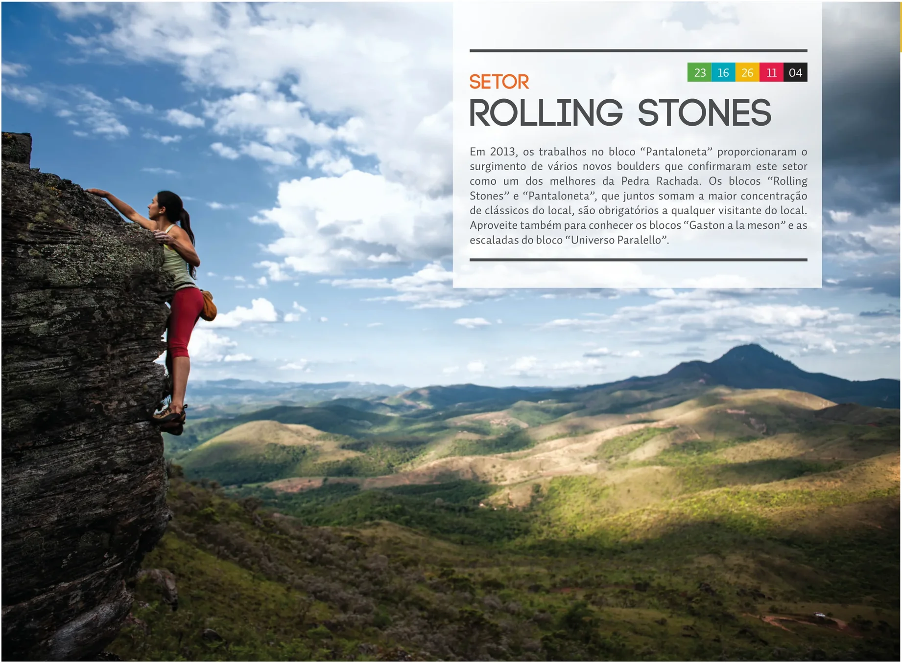
- **mapas**:
  - **[0]**:
    - **caminho_imagem_mapa**: 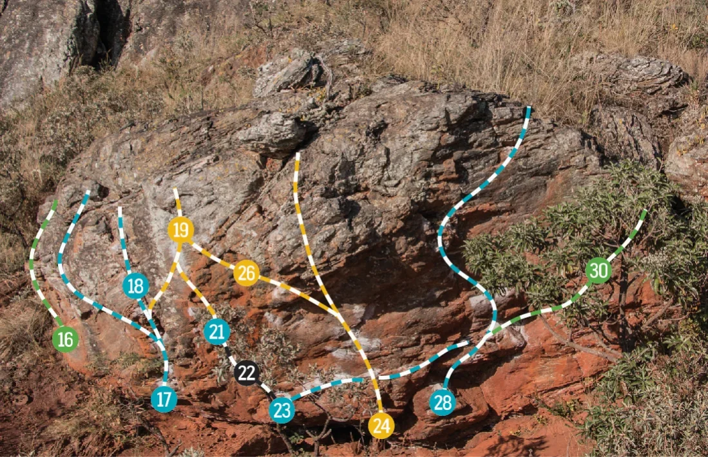
    - **largura_mapa**: 1099
    - **altura_mapa**: 710
    - **referencias**:
      - **[0]**:
        - **alvo_uid**: mH9UMRDep84NtG
        - **pontos_uids**:
          - 16
        - **escalada**: Rock it
        - **ids**:
          - 16
      - **[1]**:
        - **alvo_uid**: Q1orsULzJtpaaG
        - **pontos_uids**:
          - 17
        - **escalada**: Esquerdinha
        - **ids**:
          - 17
      - **[2]**:
        - **alvo_uid**: dt0bRRLOzoCVqq
        - **pontos_uids**:
          - 18
        - **escalada**: Cuidado aí
        - **ids**:
          - 18
      - **[3]**:
        - **alvo_uid**: bwdW2nKMsWbV93
        - **pontos_uids**:
          - 19
        - **escalada**: Invasorzinho
        - **ids**:
          - 19
      - **[4]**:
        - **alvo_uid**: sxdZPRBR1hC0Ix
        - **pontos_uids**:
          - 19
          - 28
        - **escalada**: Bob Marley
        - **ids**:
          - 19
          - 28
      - **[5]**:
        - **alvo_uid**: QucAyHXRK9pG9l
        - **pontos_uids**:
          - 21
        - **escalada**: Já Elvis
        - **ids**:
          - 21
      - **[6]**:
        - **alvo_uid**: fo4FyMaBs28otf
        - **pontos_uids**:
          - 22
        - **escalada**: Projeto 6
        - **ids**:
          - 22
      - **[7]**:
        - **alvo_uid**: M1qdIBNIbIiw1W
        - **pontos_uids**:
          - 23
        - **escalada**: Janis Joplin
        - **ids**:
          - 23
      - **[8]**:
        - **alvo_uid**: iJbbNkITKQzfOv
        - **pontos_uids**:
          - 24
        - **escalada**: Rolling Stones
        - **ids**:
          - 24
      - **[9]**:
        - **alvo_uid**: i5fVKy19DDkaZ3
        - **pontos_uids**:
          - 24
        - **escalada**: Jimi Hendrix
        - **ids**:
          - 24
      - **[10]**:
        - **alvo_uid**: u29cekP2By8WEh
        - **pontos_uids**:
          - 26
        - **escalada**: Amanhã vai ser outro dia
        - **ids**:
          - 26
      - **[11]**:
        - **alvo_uid**: tGJjFXF4luW3Sl
        - **pontos_uids**:
          - 26
        - **escalada**: Woodstock
        - **ids**:
          - 26
      - **[12]**:
        - **alvo_uid**: xzPGqtj32XmbeH
        - **pontos_uids**:
          - 28
        - **escalada**: The Doors
        - **ids**:
          - 28
      - **[13]**:
        - **alvo_uid**: X4zxdGrUVfR1JS
        - **pontos_uids**:
          - 28
        - **escalada**: Open the doors
        - **ids**:
          - 28
      - **[14]**:
        - **alvo_uid**: ITFvZkPPyuvRV8
        - **pontos_uids**:
          - 30
        - **escalada**: Travessa
        - **ids**:
          - 30
      - **[15]**:
        - **alvo_uid**: Evr23e9jPoNFgu
        - **pontos_uids**:
          - 31
        - **escalada**: Eject
        - **ids**:
          - 31
  - **[1]**:
    - **caminho_imagem_mapa**: 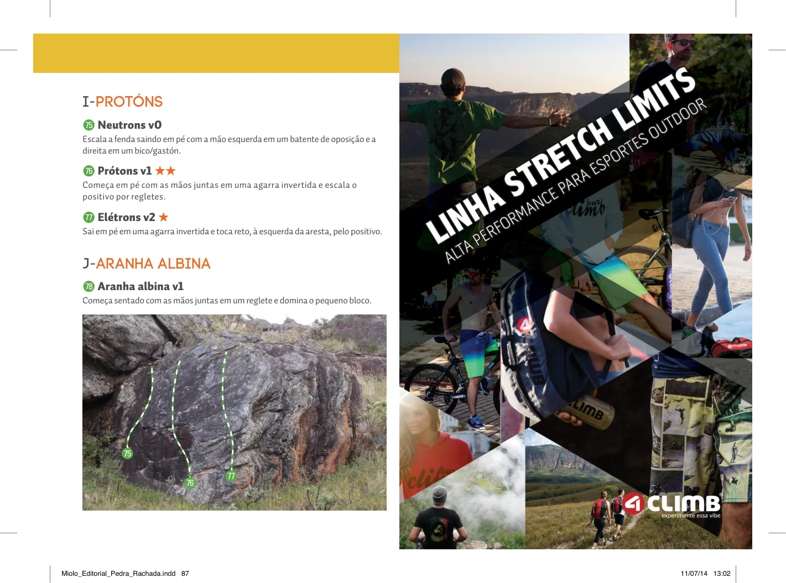
    - **largura_mapa**: 1421
    - **altura_mapa**: 1055
    - **referencias**:
      - **[0]**:
        - **alvo_uid**: 6vrJrkqdMONL6f
        - **pontos_uids**:
          - 75
        - **escalada**: Neutrons
        - **ids**:
          - 75
      - **[1]**:
        - **alvo_uid**: FSAMhsj9HgfrHi
        - **pontos_uids**:
          - 76
        - **escalada**: Prótons
        - **ids**:
          - 76
      - **[2]**:
        - **alvo_uid**: KNudy0y8E1v8vp
        - **pontos_uids**:
          - 77
        - **escalada**: Elétrons
        - **ids**:
          - 77
      - **[3]**:
        - **alvo_uid**: 6eXK3NTyCuFt0o
        - **pontos_uids**:
          - 78
        - **escalada**: Aranha albina
        - **ids**:
          - 78
- **setores**:
  - **[0]**:
    - **conteudo**:
      - **descricao**: 
      - **nome**: Bloco A - Gastón a la Mesón
      - **uid**: Not6YbEUHBNfCR
      - **mapas**:
        - **[0]**:
          - **caminho_imagem_mapa**: 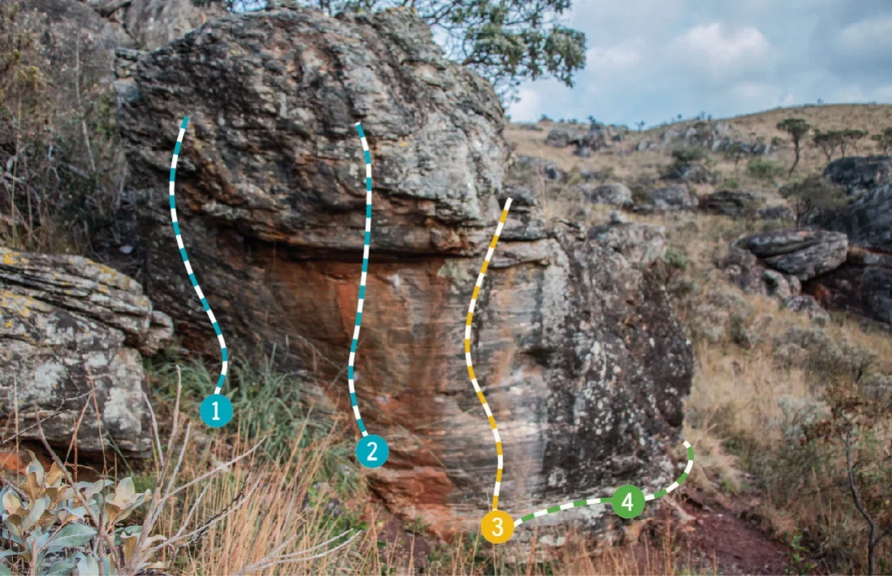
          - **largura_mapa**: 1099
          - **altura_mapa**: 710
          - **referencias**:
            - **[0]**:
              - **alvo_uid**: GTN3eQT6qTv1yQ
              - **pontos_uids**:
                - 1
              - **escalada**: Coral
              - **ids**:
                - 1
            - **[1]**:
              - **alvo_uid**: L4LyF7mhoD8Us8
              - **pontos_uids**:
                - 2
              - **escalada**: Surpreendente
              - **ids**:
                - 2
            - **[2]**:
              - **alvo_uid**: zAe6hLpGjg8vOW
              - **pontos_uids**:
                - 3
              - **escalada**: Frito
              - **ids**:
                - 3
            - **[3]**:
              - **alvo_uid**: 0swtYbPEnXHPkF
              - **pontos_uids**:
                - 4
              - **escalada**: Fritei
              - **ids**:
                - 4
        - **[1]**:
          - **caminho_imagem_mapa**: 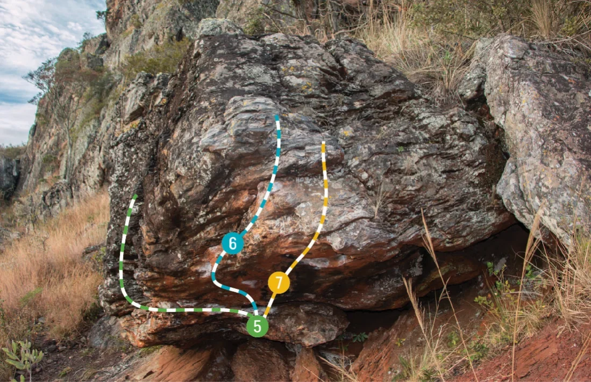
          - **largura_mapa**: 1099
          - **altura_mapa**: 710
          - **referencias**:
            - **[0]**:
              - **alvo_uid**: f1cXKsZObhP6jD
              - **pontos_uids**:
                - 5
              - **escalada**: Vem de baixo
              - **ids**:
                - 5
            - **[1]**:
              - **alvo_uid**: Ftob4NunF8Vtbw
              - **pontos_uids**:
                - 6
              - **escalada**: Quina da mesa
              - **ids**:
                - 6
            - **[2]**:
              - **alvo_uid**: 57BLtHxGgd97eO
              - **pontos_uids**:
                - 7
              - **escalada**: Gaston à la meson
              - **ids**:
                - 7
            - **[3]**:
              - **alvo_uid**: tRyDwsk7WLKaYt
              - **pontos_uids**:
                - 7
              - **escalada**: Gaston à la meson FDS
              - **ids**:
                - 7
      - **escaladas**:
        - **[0]**:
          - **uid**: GTN3eQT6qTv1yQ
          - **boulder**:
            - **descricao**: Boulder que sai sentado em pequenos regletes de oposição e segue por umas cracas.
            - **nome**: Coral
            - **dificuldade**: V3
        - **[1]**:
          - **uid**: L4LyF7mhoD8Us8
          - **boulder**:
            - **descricao**: Sai em pé com a mão esquerda em uma pinça invertida perto do chão e a mão direita num reglete alto e faz um movimento forte de esquerda até uma agarra cortante, virando reto pelas cracas.
            - **nome**: Surpreendente
            - **dificuldade**: V5
            - **destaque**: True
        - **[2]**:
          - **uid**: zAe6hLpGjg8vOW
          - **boulder**:
            - **descricao**: Começa sentado em um grande batente e faz uma sequência de movimentos duros até o domínio.
            - **nome**: Frito
            - **dificuldade**: V8
            - **conquistadores**:
              - Gustavo Fontes
            - **data_abertura**: 2010
        - **[3]**:
          - **uid**: 0swtYbPEnXHPkF
          - **boulder**:
            - **descricao**: Sai como o “Frito” (xx) e atravessa pra direita pelo mesmo batente até um domínio fácil.
            - **nome**: Fritei
            - **dificuldade**: V0
        - **[4]**:
          - **uid**: f1cXKsZObhP6jD
          - **boulder**:
            - **descricao**: Começa com as mãos juntas em batente e escala por agarras boas até a saída do teto, fazendo uma virada tranqüila.
            - **nome**: Vem de baixo
            - **dificuldade**: V1
            - **destaque**: True
        - **[5]**:
          - **uid**: Ftob4NunF8Vtbw
          - **boulder**:
            - **descricao**: Sai como o “Vem de baixo” (5), vai para um reglete no teto e depois para um pocket/abaulado na aresta e segue por ela até o fim do “Gastón a la meson” (7).
            - **nome**: Quina da mesa
            - **dificuldade**: V3
            - **destaque**: True
        - **[6]**:
          - **uid**: 57BLtHxGgd97eO
          - **boulder**:
            - **descricao**: Começa como o “Vem de baixo” (5) e atravessa pelo teto passando por um movimento duro de gastón, como na foto ao lado.
            - **nome**: Gaston à la meson
            - **dificuldade**: V6
            - **destaque**: True
        - **[7]**:
          - **uid**: tRyDwsk7WLKaYt
          - **boulder**:
            - **descricao**: Extensão do “Gastón a la meson” (7) saindo de dois pockets mais abaixo.
            - **nome**: Gaston à la meson FDS
            - **dificuldade**: V7
            - **destaque**: True
            - **conquistadores**:
              - Frederico Gonçalves
            - **data_abertura**: 2008
      - **precomputados**:
        - **total_escaladas**: 8
        - **total_boulders**: 8
  - **[1]**:
    - **conteudo**:
      - **descricao**: 
      - **nome**: Bloco B - Casulo
      - **uid**: b9UBZtnzcTrCRR
      - **mapas**:
        - **[0]**:
          - **caminho_imagem_mapa**: 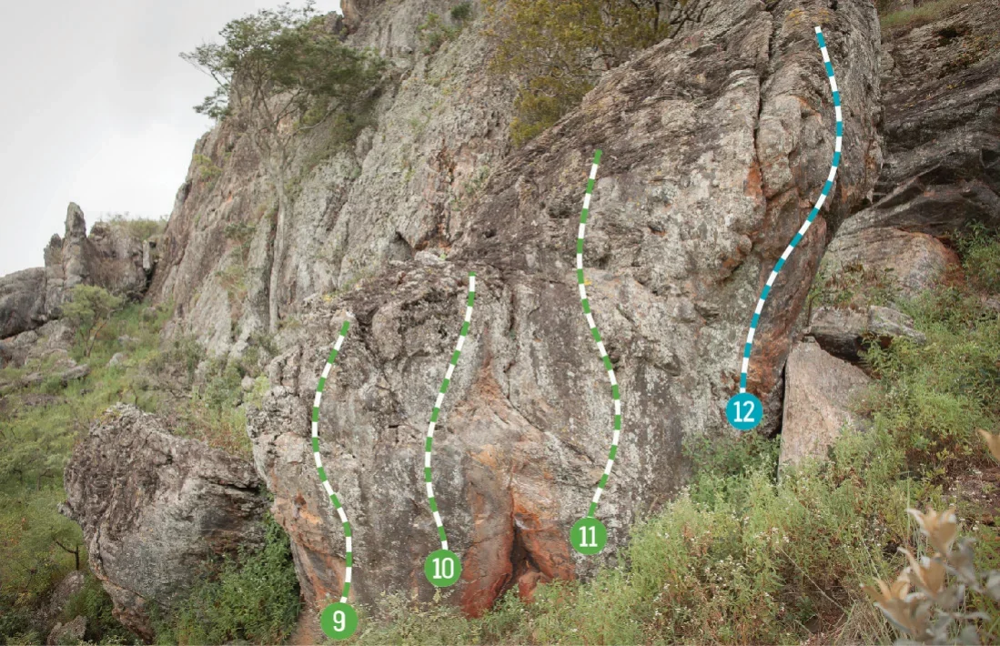
          - **largura_mapa**: 1099
          - **altura_mapa**: 710
          - **referencias**:
            - **[0]**:
              - **alvo_uid**: tMSHq1RCIEaCim
              - **pontos_uids**:
                - 9
              - **escalada**: A onda
              - **ids**:
                - 9
            - **[1]**:
              - **alvo_uid**: w8139ceg1G99bI
              - **pontos_uids**:
                - 10
              - **escalada**: Estaca
              - **ids**:
                - 10
            - **[2]**:
              - **alvo_uid**: 2k6k5gQ3wL4WVz
              - **pontos_uids**:
                - 11
              - **escalada**: Mariposa
              - **ids**:
                - 11
            - **[3]**:
              - **alvo_uid**: bsCDm9Z1I9vI5s
              - **pontos_uids**:
                - 12
              - **escalada**: Casulo
              - **ids**:
                - 12
      - **escaladas**:
        - **[0]**:
          - **uid**: tMSHq1RCIEaCim
          - **boulder**:
            - **descricao**: Sai sentado com as mãos em dois regletes e escala “a onda”.
            - **nome**: A onda
            - **dificuldade**: V1
        - **[1]**:
          - **uid**: w8139ceg1G99bI
          - **boulder**:
            - **descricao**: Começa sentado com as mãos juntas num bico e num reglete e toca reto.
            - **nome**: Estaca
            - **dificuldade**: V0
        - **[2]**:
          - **uid**: 2k6k5gQ3wL4WVz
          - **boulder**:
            - **descricao**: Sai sentado com as mãos juntas num batente e um reglete e escala reto por agarras boas.
            - **nome**: Mariposa
            - **dificuldade**: V0
        - **[3]**:
          - **uid**: bsCDm9Z1I9vI5s
          - **boulder**:
            - **descricao**: Começa sentado com as mãos juntas em um bico/laca e escala reto pela pedra em forma de casulo.
            - **nome**: Casulo
            - **dificuldade**: V4
      - **precomputados**:
        - **total_escaladas**: 4
        - **total_boulders**: 4
  - **[2]**:
    - **conteudo**:
      - **descricao**: 
      - **nome**: Bloco C - Marrento
      - **uid**: ok27kAzvZl05g9
      - **mapas**:
        - **[0]**:
          - **caminho_imagem_mapa**: 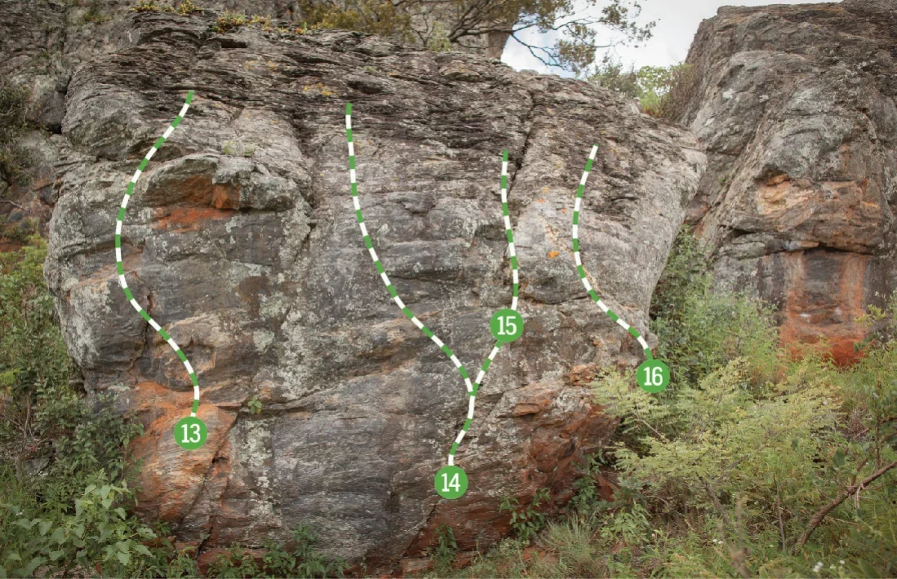
          - **largura_mapa**: 1099
          - **altura_mapa**: 710
          - **referencias**:
            - **[0]**:
              - **alvo_uid**: qVOo6g5kmbH7XL
              - **pontos_uids**:
                - 13
              - **escalada**: Banzai
              - **ids**:
                - 13
            - **[1]**:
              - **alvo_uid**: nsF3x2WBZncYhf
              - **pontos_uids**:
                - 14
              - **escalada**: Marrento
              - **ids**:
                - 14
            - **[2]**:
              - **alvo_uid**: fypT4uNFpgpg2e
              - **pontos_uids**:
                - 15
              - **escalada**: Carioquinha
              - **ids**:
                - 15
            - **[3]**:
              - **alvo_uid**: q1B1CcWGgGZD7y
              - **pontos_uids**:
                - 16
              - **escalada**: Baiano
              - **ids**:
                - 16
      - **escaladas**:
        - **[0]**:
          - **uid**: qVOo6g5kmbH7XL
          - **boulder**:
            - **descricao**: Começa com as mãos juntas em um batente grande, passa por uma laca e termina reto.
            - **nome**: Banzai
            - **dificuldade**: V0
        - **[1]**:
          - **uid**: nsF3x2WBZncYhf
          - **boulder**:
            - **descricao**: Sai sentado com as mãos juntas em uns regletes/pockets e faz uma diagonal pra esquerda por regletes.
            - **nome**: Marrento
            - **dificuldade**: V3
        - **[2]**:
          - **uid**: fypT4uNFpgpg2e
          - **boulder**:
            - **descricao**: Começa como o “Marrento” (14) e escala reto por agarras boas.
            - **nome**: Carioquinha
            - **dificuldade**: V1
        - **[3]**:
          - **uid**: q1B1CcWGgGZD7y
          - **boulder**:
            - **descricao**: Sai sentado com as mãos juntas em um batente à direita da aresta, atravessa pra esquerda e termina como o “Carioquinha” (15).
            - **nome**: Baiano
            - **dificuldade**: V0
      - **precomputados**:
        - **total_escaladas**: 4
        - **total_boulders**: 4
  - **[3]**:
    - **conteudo**:
      - **descricao**: 
      - **nome**: Bloco D - Rolling Stones
      - **uid**: MdqiBRREJag3jS
      - **escaladas**:
        - **[0]**:
          - **uid**: mH9UMRDep84NtG
          - **boulder**:
            - **descricao**: Boulder mais acessível do bloco que sai em pé, em agarras boas, e escala reto até uma virada fácil.
            - **nome**: Rock it
            - **dificuldade**: V0
            - **destaque**: True
        - **[1]**:
          - **uid**: Q1orsULzJtpaaG
          - **boulder**:
            - **descricao**: Começa sentado com as mãos em uns batentes, faz alguns movimentos e, ao invés de seguir reto pela fenda, faz uma travessia para a esquerda passando por uns regletes.
            - **nome**: Esquerdinha
            - **dificuldade**: V4
            - **destaque**: True
        - **[2]**:
          - **uid**: dt0bRRLOzoCVqq
          - **boulder**:
            - **descricao**: Sai do “Esquerdinha” (17) e toca reto pela fenda.
            - **nome**: Cuidado aí
            - **dificuldade**: V3
            - **destaque**: True
        - **[3]**:
          - **uid**: bwdW2nKMsWbV93
          - **boulder**:
            - **descricao**: Sai do “Esquerdinha” (17) e atravessa para a direita, no alto, por uma linha de regletes terminando na parte mais alta do bloco. Há também uma variante que continua atravessando para a direita terminando no “The Doors” (28) chamada a Bob Marley v7.
            - **nome**: Invasorzinho
            - **dificuldade**: V6
            - **destaque**: True
            - **conquistadores**:
              - Rafael Passos
            - **data_abertura**: 2005
        - **[4]**:
          - **uid**: sxdZPRBR1hC0Ix
          - **boulder**:
            - **descricao**: Variante do “Invasorzinho” (19) que continua atravessando para a direita terminando no “The Doors” (28).
            - **nome**: Bob Marley
            - **dificuldade**: V7
        - **[5]**:
          - **uid**: QucAyHXRK9pG9l
          - **boulder**:
            - **descricao**: Começa em pé com a mão esquerda em um reglete bom de gastón e a direita em um reglete pequeno invertido terminando no “Invasorzinho” (xx).
            - **nome**: Já Elvis
            - **dificuldade**: V5
            - **destaque**: True
            - **conquistadores**:
              - Frederico Gonçalves
            - **data_abertura**: 2009
        - **[6]**:
          - **uid**: fo4FyMaBs28otf
          - **boulder**:
            - **descricao**: Sai do “Janis Joplin” (23) e termina no “Invasorzinho” (19).
            - **nome**: Projeto 6
            - **dificuldade**: INDEFINIDO
        - **[7]**:
          - **uid**: M1qdIBNIbIiw1W
          - **boulder**:
            - **descricao**: Começa sentado com as mãos em dois regletinhos e atravessa pra direita terminando como o “Travessa” (30).
            - **nome**: Janis Joplin
            - **dificuldade**: V4
            - **destaque**: True
        - **[8]**:
          - **uid**: iJbbNkITKQzfOv
          - **boulder**:
            - **descricao**: Uma das linhas mais conhecidas da Pedra Rachada, escala a clássica linha reta da parte mais negativa do bloco. Com a retirada de umas pedras da base, sua saída passou a ser feita do batente mais baixo à direita (onde se saía com o calcanhar), consolidando o grau v8. Saindo no “Janis Joplin” (23) é o j Jimi Hendrix v8 ★.
            - **nome**: Rolling Stones
            - **dificuldade**: V8
            - **destaque**: True
            - **conquistadores**:
              - Diogo Ratacheski
            - **data_abertura**: 2005
        - **[9]**:
          - **uid**: i5fVKy19DDkaZ3
          - **boulder**:
            - **descricao**: Variante do “Rolling Stones” (24) saindo no “Janis Joplin” (23).
            - **nome**: Jimi Hendrix
            - **dificuldade**: V8
            - **destaque**: True
        - **[10]**:
          - **uid**: u29cekP2By8WEh
          - **boulder**:
            - **descricao**: Sai do “Rolling Stones” (24) e, ao invés de seguir reto pelo negativo, atravessa para a esquerda até os regletes do “Invasorzinho” (19) terminando por ele. Saindo no “Janis Joplin” (23) é o k Woodstock v10.
            - **nome**: Amanhã vai ser outro dia
            - **dificuldade**: V9
            - **destaque**: True
            - **conquistadores**:
              - Rafael Passos
            - **data_abertura**: 2006
        - **[11]**:
          - **uid**: tGJjFXF4luW3Sl
          - **boulder**:
            - **descricao**: Variante do “Amanhã vai ser outro dia” (26) saindo no “Janis Joplin” (23).
            - **nome**: Woodstock
            - **dificuldade**: V10
        - **[12]**:
          - **uid**: xzPGqtj32XmbeH
          - **boulder**:
            - **descricao**: Começa sentado com as mãos juntas em um batente bom e escala levemente para a esquerda. Saindo no “Janis Joplin” (23) é o ; Open the doors v6 ★.
            - **nome**: The Doors
            - **dificuldade**: V5
            - **destaque**: True
            - **conquistadores**:
              - Gustavo Fontes
            - **data_abertura**: 2006
        - **[13]**:
          - **uid**: X4zxdGrUVfR1JS
          - **boulder**:
            - **descricao**: Variante do “The Doors” (28) saindo no “Janis Joplin” (23).
            - **nome**: Open the doors
            - **dificuldade**: V6
            - **destaque**: True
        - **[14]**:
          - **uid**: ITFvZkPPyuvRV8
          - **boulder**:
            - **descricao**: Sai do “The Doors” (28), atravessa para a direita e vira na parte mais baixa do bloco.
            - **nome**: Travessa
            - **dificuldade**: V2
            - **destaque**: True
      - **precomputados**:
        - **total_escaladas**: 15
        - **total_boulders**: 15
  - **[4]**:
    - **conteudo**:
      - **descricao**: 
      - **nome**: Bloco E - Eject
      - **uid**: qoi9TE27jV5Gja
      - **escaladas**:
        - **[0]**:
          - **uid**: Evr23e9jPoNFgu
          - **boulder**:
            - **descricao**: Pequeno bloco à direita do "Rolling Stones". Começa sentado com as mãos em dois regletes/batentes, faz um movimento técnico e domina.
            - **nome**: Eject
            - **dificuldade**: V3
            - **destaque**: True
      - **precomputados**:
        - **total_escaladas**: 1
        - **total_boulders**: 1
  - **[5]**:
    - **conteudo**:
      - **descricao**: 
      - **nome**: Bloco F - Universo Paralello
      - **uid**: dJb3OBUZI4vgKN
      - **mapas**:
        - **[0]**:
          - **caminho_imagem_mapa**: 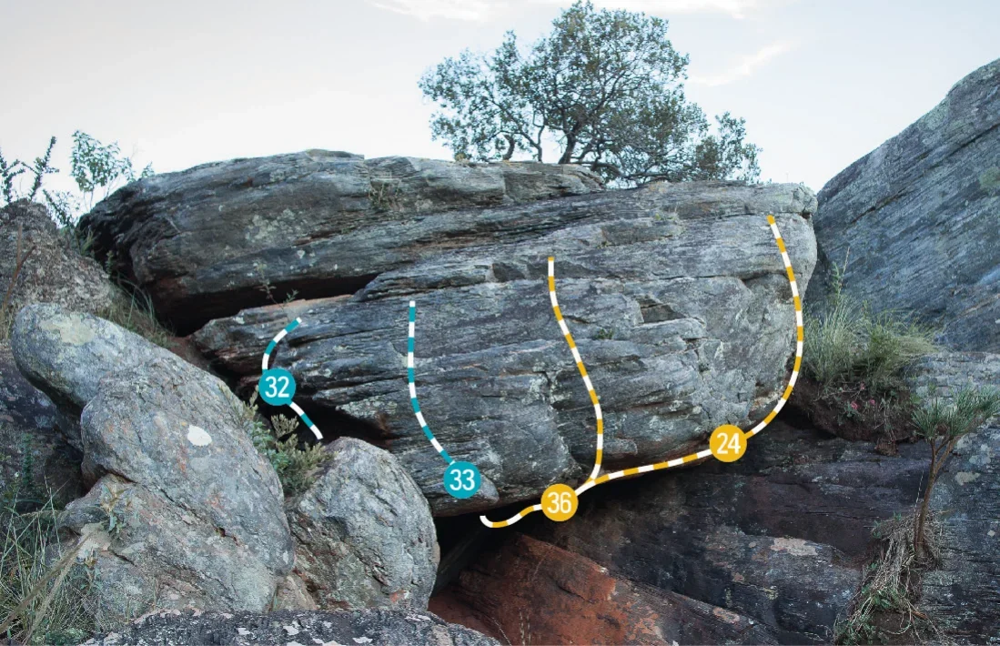
          - **largura_mapa**: 1099
          - **altura_mapa**: 710
          - **referencias**:
            - **[0]**:
              - **alvo_uid**: rSnTo0oL4fdxAU
              - **pontos_uids**:
                - 32
              - **escalada**: Cachoeira alta
              - **ids**:
                - 32
            - **[1]**:
              - **alvo_uid**: MTVBsmMtwBW4QZ
              - **pontos_uids**:
                - 33
              - **escalada**: Hard core
              - **ids**:
                - 33
            - **[2]**:
              - **alvo_uid**: Obd6pqhIAzWLyd
              - **pontos_uids**:
                - 33
                - 36
              - **escalada**: Tribe
              - **ids**:
                - 33
                - 36
            - **[3]**:
              - **alvo_uid**: tmbl883ZxStVLU
              - **pontos_uids**:
                - 33
                - 38
              - **escalada**: Calangute
              - **ids**:
                - 33
                - 38
            - **[4]**:
              - **alvo_uid**: XPBP9j2i05SHGh
              - **pontos_uids**:
                - 36
              - **escalada**: Universo Paralello
              - **ids**:
                - 36
            - **[5]**:
              - **alvo_uid**: 9jEmdQ0ATspj9T
              - **pontos_uids**:
                - 36
              - **escalada**: Trancedance
              - **ids**:
                - 36
            - **[6]**:
              - **alvo_uid**: AD4lN8jFPTDL28
              - **pontos_uids**:
                - 38
              - **escalada**: Rave
              - **ids**:
                - 38
            - **[7]**:
              - **alvo_uid**: D7czwgySOlLrYS
              - **pontos_uids**:
                - 36
                - 38
              - **escalada**: Fora do tempo
              - **ids**:
                - 36
                - 38
            - **[8]**:
              - **alvo_uid**: IYExAWsffJeyvE
              - **pontos_uids**:
                - 36
                - 33
              - **escalada**: Samsara
              - **ids**:
                - 36
                - 33
      - **escaladas**:
        - **[0]**:
          - **uid**: rSnTo0oL4fdxAU
          - **boulder**:
            - **descricao**: Sai na agarra mais ao fundo da caverna, passa por um grande batente escorrido e domina pelo buraco entre uns blocos.
            - **nome**: Cachoeira alta
            - **dificuldade**: V4
            - **destaque**: True
            - **conquistadores**:
              - Gustavo Fontes
            - **data_abertura**: 2007
        - **[1]**:
          - **uid**: MTVBsmMtwBW4QZ
          - **boulder**:
            - **descricao**: Começa com a mão direita num batente no teto e a esquerda em um batente na aresta acima do pequeno bloco que escora o boulder e domina pela aresta.
            - **nome**: Hard core
            - **dificuldade**: V3
        - **[2]**:
          - **uid**: Obd6pqhIAzWLyd
          - **boulder**:
            - **descricao**: Começa como o “Hard core” (33) e atravessa para a direita até o “Universo Paralello” (36) terminando por ele.
            - **nome**: Tribe
            - **dificuldade**: V5
            - **conquistadores**:
              - Gustavo Fontes
            - **data_abertura**: 2009
        - **[3]**:
          - **uid**: tmbl883ZxStVLU
          - **boulder**:
            - **descricao**: Sai como o “Hard core” (33) e atravessa até a aresta direita do bloco, terminando como o “Rave” (38).
            - **nome**: Calangute
            - **dificuldade**: V7
            - **conquistadores**:
              - Gustavo Fontes
            - **data_abertura**: 2009
        - **[4]**:
          - **uid**: XPBP9j2i05SHGh
          - **boulder**:
            - **descricao**: Começa como o “Cachoeira alta” (32) e atravessa todo o teto finalizando reto.
            - **nome**: Universo Paralello
            - **dificuldade**: V9
            - **destaque**: True
            - **conquistadores**:
              - Gustavo Fontes
            - **data_abertura**: 2007
        - **[5]**:
          - **uid**: 9jEmdQ0ATspj9T
          - **boulder**:
            - **descricao**: Sai com as mãos juntas no grande batente escorrido do teto, após a saída do “Universo Paralello” (36), e termina como ele.
            - **nome**: Trancedance
            - **dificuldade**: V9
            - **destaque**: True
            - **conquistadores**:
              - Gustavo Fontes
            - **data_abertura**: 2007
        - **[6]**:
          - **uid**: AD4lN8jFPTDL28
          - **boulder**:
            - **descricao**: Sai na agarra sikada do final do “Universo Paralello” (36) e atravessa pra direita terminando pela aresta.
            - **nome**: Rave
            - **dificuldade**: V6
            - **conquistadores**:
              - Gustavo Fontes
            - **data_abertura**: 2009
        - **[7]**:
          - **uid**: D7czwgySOlLrYS
          - **boulder**:
            - **descricao**: É o “Universo Paralello” (36) terminando no “Rave” (38).
            - **nome**: Fora do tempo
            - **dificuldade**: V10
            - **conquistadores**:
              - Gustavo Fontes
            - **data_abertura**: 2009
        - **[8]**:
          - **uid**: IYExAWsffJeyvE
          - **boulder**:
            - **descricao**: “Universo Paralello” (36) virando pelo “Hard core” (33).
            - **nome**: Samsara
            - **dificuldade**: V9
            - **conquistadores**:
              - Gustavo Fontes
            - **data_abertura**: 2009
      - **precomputados**:
        - **total_escaladas**: 9
        - **total_boulders**: 9
  - **[6]**:
    - **conteudo**:
      - **descricao**: 
      - **nome**: Bloco G - Pantaloneta
      - **uid**: YOOO9jSie0uDws
      - **mapas**:
        - **[0]**:
          - **caminho_imagem_mapa**: 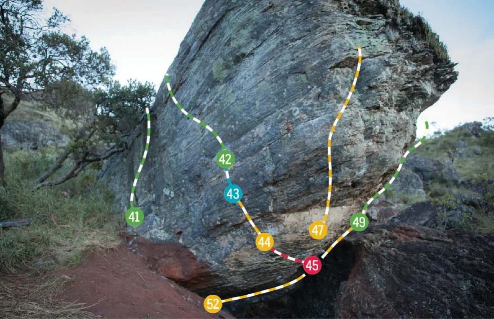
          - **largura_mapa**: 1099
          - **altura_mapa**: 710
          - **referencias**:
            - **[0]**:
              - **alvo_uid**: W7dr4fykimpvCL
              - **pontos_uids**:
                - 41
              - **escalada**: Cara nova
              - **ids**:
                - 41
            - **[1]**:
              - **alvo_uid**: t3IZuF38yZU4TF
              - **pontos_uids**:
                - 42
              - **escalada**: Buraco louco
              - **ids**:
                - 42
            - **[2]**:
              - **alvo_uid**: XTF6sn3i4N4fQw
              - **pontos_uids**:
                - 43
              - **escalada**: Morena
              - **ids**:
                - 43
            - **[3]**:
              - **alvo_uid**: 5MzXHe2apxaIWf
              - **pontos_uids**:
                - 44
              - **escalada**: Hard crimp
              - **ids**:
                - 44
            - **[4]**:
              - **alvo_uid**: FT6ejI1pLAUfOb
              - **pontos_uids**:
                - 45
              - **escalada**: Tapete mágico
              - **ids**:
                - 45
            - **[5]**:
              - **alvo_uid**: NgTMsoyRNvqGXg
              - **pontos_uids**:
                - 46
              - **escalada**: Jasmim
              - **ids**:
                - 46
            - **[6]**:
              - **alvo_uid**: vYvQn0umxFCDSL
              - **pontos_uids**:
                - 47
              - **escalada**: Pantaloneta
              - **ids**:
                - 47
            - **[7]**:
              - **alvo_uid**: KK5gfZqMUBrw4U
              - **pontos_uids**:
                - 48
              - **escalada**: Pantalones
              - **ids**:
                - 48
            - **[8]**:
              - **alvo_uid**: QDSQi7JR7CJnYc
              - **pontos_uids**:
                - 49
              - **escalada**: Teto da aranha
              - **ids**:
                - 49
            - **[9]**:
              - **alvo_uid**: mRG7JjKQXHkjVz
              - **pontos_uids**:
                - 50
              - **escalada**: Aranha cabeluda
              - **ids**:
                - 50
            - **[10]**:
              - **alvo_uid**: oYfnw194M0Ql5A
              - **pontos_uids**:
                - 51
              - **escalada**: Cabelo louco
              - **ids**:
                - 51
            - **[11]**:
              - **alvo_uid**: LwleA4cuNVIWle
              - **pontos_uids**:
                - 52
              - **escalada**: Abismo
              - **ids**:
                - 52
            - **[12]**:
              - **alvo_uid**: S1Va6cJrHkz1rt
              - **pontos_uids**:
                - 53
              - **escalada**: Buraco negro
              - **ids**:
                - 53
            - **[13]**:
              - **alvo_uid**: 2jTceieERkmygP
              - **pontos_uids**:
                - 54
              - **escalada**: Cotonete
              - **ids**:
                - 54
            - **[14]**:
              - **alvo_uid**: SUleoDocJP55Ke
              - **pontos_uids**:
                - 55
              - **escalada**: Buraquinho
              - **ids**:
                - 55
            - **[15]**:
              - **alvo_uid**: tjK6SZyPJR89bd
              - **pontos_uids**:
                - 56
              - **escalada**: Caranguejeira
              - **ids**:
                - 56
        - **[1]**:
          - **caminho_imagem_mapa**: 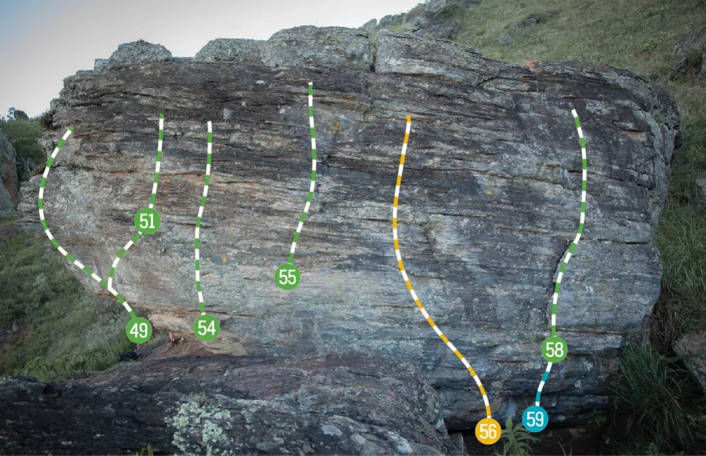
          - **largura_mapa**: 1099
          - **altura_mapa**: 710
          - **referencias**:
            - **[0]**:
              - **alvo_uid**: QDSQi7JR7CJnYc
              - **pontos_uids**:
                - 49
              - **escalada**: Teto da aranha
              - **ids**:
                - 49
            - **[1]**:
              - **alvo_uid**: oYfnw194M0Ql5A
              - **pontos_uids**:
                - 51
              - **escalada**: Cabelo louco
              - **ids**:
                - 51
            - **[2]**:
              - **alvo_uid**: 2jTceieERkmygP
              - **pontos_uids**:
                - 54
              - **escalada**: Cotonete
              - **ids**:
                - 54
            - **[3]**:
              - **alvo_uid**: SUleoDocJP55Ke
              - **pontos_uids**:
                - 55
              - **escalada**: Buraquinho
              - **ids**:
                - 55
            - **[4]**:
              - **alvo_uid**: tjK6SZyPJR89bd
              - **pontos_uids**:
                - 56
              - **escalada**: Caranguejeira
              - **ids**:
                - 56
            - **[5]**:
              - **alvo_uid**: h7tmttaNLSEBWI
              - **pontos_uids**:
                - 57
              - **escalada**: Armadeira
              - **ids**:
                - 57
            - **[6]**:
              - **alvo_uid**: zI8ITYwJz3yhVk
              - **pontos_uids**:
                - 58
              - **escalada**: Quero mais
              - **ids**:
                - 58
            - **[7]**:
              - **alvo_uid**: d8JEuHZrBYbgZZ
              - **pontos_uids**:
                - 59
              - **escalada**: Proteste já
              - **ids**:
                - 59
            - **[8]**:
              - **alvo_uid**: vjOagg8UIkG2r0
              - **pontos_uids**:
                - 60
              - **escalada**: Manifestante
              - **ids**:
                - 60
            - **[9]**:
              - **alvo_uid**: PoTG0PW17r2tR5
              - **pontos_uids**:
                - 61
              - **escalada**: Aladim
              - **ids**:
                - 61
            - **[10]**:
              - **alvo_uid**: njmE5ITmXutiN8
              - **pontos_uids**:
                - 62
              - **escalada**: Projeto 7
              - **ids**:
                - 62
            - **[11]**:
              - **alvo_uid**: HQqhkz2cCwF9ik
              - **pontos_uids**:
                - 63
              - **escalada**: Projeto 8
              - **ids**:
                - 63
            - **[12]**:
              - **alvo_uid**: CTAYXLiNKJSb4B
              - **pontos_uids**:
                - 64
              - **escalada**: Vaqueros
              - **ids**:
                - 64
            - **[13]**:
              - **alvo_uid**: VB6mjwsDdcCIEa
              - **pontos_uids**:
                - 65
              - **escalada**: Esporte fino
              - **ids**:
                - 65
            - **[14]**:
              - **alvo_uid**: ltVfeHriXX54zw
              - **pontos_uids**:
                - 66
              - **escalada**: Passeio completo
              - **ids**:
                - 66
            - **[15]**:
              - **alvo_uid**: WIkiUzxzR2uNrq
              - **pontos_uids**:
                - 67
              - **escalada**: Aracnofobia
              - **ids**:
                - 67
            - **[16]**:
              - **alvo_uid**: KpooB7pWbjKhVg
              - **pontos_uids**:
                - 68
              - **escalada**: Teia de aranha
              - **ids**:
                - 68
            - **[17]**:
              - **alvo_uid**: k6pjyNoZouY2rf
              - **pontos_uids**:
                - 69
              - **escalada**: Rolo compressor
              - **ids**:
                - 69
            - **[18]**:
              - **alvo_uid**: HcdXAO985EuQ3i
              - **pontos_uids**:
                - 70
              - **escalada**: Comprimido
              - **ids**:
                - 70
            - **[19]**:
              - **alvo_uid**: Eppjf4w5Y4Y1Fd
              - **pontos_uids**:
                - 71
              - **escalada**: Prensa
              - **ids**:
                - 71
            - **[20]**:
              - **alvo_uid**: vxzTlMaSXvvYhb
              - **pontos_uids**:
                - 72
              - **escalada**: Compressão
              - **ids**:
                - 72
      - **escaladas**:
        - **[0]**:
          - **uid**: W7dr4fykimpvCL
          - **boulder**:
            - **descricao**: Sai com a mão esquerda em um gastón e a direita em um bico e toca reto.
            - **nome**: Cara nova
            - **dificuldade**: V0
        - **[1]**:
          - **uid**: t3IZuF38yZU4TF
          - **boulder**:
            - **descricao**: Começa em pé com as mãos juntas em um batente e escalada por uma linha de regletes diagonalmente à esquerda.
            - **nome**: Buraco louco
            - **dificuldade**: V1
            - **destaque**: True
        - **[2]**:
          - **uid**: XTF6sn3i4N4fQw
          - **boulder**:
            - **descricao**: Sai em pé com a mão direita em um reglete de oposição e a direita bem aberta em um batente/tridedo em compressão e da um tapa no batente de saída do “Buraco louco” (42) terminando como ele.
            - **nome**: Morena
            - **dificuldade**: V4
            - **destaque**: True
            - **conquistadores**:
              - Leonardo Boscolo
            - **data_abertura**: 2013
        - **[3]**:
          - **uid**: 5MzXHe2apxaIWf
          - **boulder**:
            - **descricao**: Começa com as mãos juntas em dois regletes/pockets e faz três fortes movimentos até o batente do “Buraco louco” (42) finalizando como ele. Saindo na agarra grande na parte mais baixa do bloco, antes do teto e em cima do “deck”, é o Tapete mágico v10 ★★★. Saindo da “proa”, logo após o “deck” é o Jasmim v10.
            - **nome**: Hard crimp
            - **dificuldade**: V9
            - **destaque**: True
            - **conquistadores**:
              - Frederico Gonçalves
            - **data_abertura**: 2013
        - **[4]**:
          - **uid**: FT6ejI1pLAUfOb
          - **boulder**:
            - **descricao**: Saindo na agarra grande na parte mais baixa do bloco, antes do teto e em cima do “deck”, terminando no “Hard crimp” (44).
            - **nome**: Tapete mágico
            - **dificuldade**: V10
            - **destaque**: True
        - **[5]**:
          - **uid**: NgTMsoyRNvqGXg
          - **boulder**:
            - **descricao**: Saindo da “proa”, logo após o “deck”, terminando no “Hard crimp” (44).
            - **nome**: Jasmim
            - **dificuldade**: V10
        - **[6]**:
          - **uid**: vYvQn0umxFCDSL
          - **boulder**:
            - **descricao**: Sai em pé com a mão esquerda no reglete/pocket mais baixo e a direita em uma pinça abaixo do teto, faz alguns movimentos no teto e dá um dinâmico em um batente bom na aresta da esquerda. Saindo da “proa”, logo após o “deck” é o Pantalones v9 ★★.
            - **nome**: Pantaloneta
            - **dificuldade**: V7
            - **destaque**: True
            - **conquistadores**:
              - Federico Sanz
            - **data_abertura**: 2013
        - **[7]**:
          - **uid**: KK5gfZqMUBrw4U
          - **boulder**:
            - **descricao**: Saindo da “proa”, logo após o “deck”, terminando no “Pantaloneta” (47).
            - **nome**: Pantalones
            - **dificuldade**: V9
            - **destaque**: True
        - **[8]**:
          - **uid**: QDSQi7JR7CJnYc
          - **boulder**:
            - **descricao**: Começa sentado com as mãos juntas em umas cracas e escala em diagonal pra esquerda finalizando por agarras boas. Saindo da “proa”, logo após o “deck” é o Aranha cabeluda v4 ★.
            - **nome**: Teto da aranha
            - **dificuldade**: V2
            - **destaque**: True
        - **[9]**:
          - **uid**: mRG7JjKQXHkjVz
          - **boulder**:
            - **descricao**: Saindo da “proa”, logo após o “deck”, terminando no “Teto da aranha” (49).
            - **nome**: Aranha cabeluda
            - **dificuldade**: V4
            - **destaque**: True
        - **[10]**:
          - **uid**: oYfnw194M0Ql5A
          - **boulder**:
            - **descricao**: Sai como o “Teto da aranha” e domina pela direita do teto, passando por um gaston.
            - **nome**: Cabelo louco
            - **dificuldade**: V2
            - **destaque**: True
        - **[11]**:
          - **uid**: LwleA4cuNVIWle
          - **boulder**:
            - **descricao**: Sai do “Rolo compressor” (69) e termina no “Teto da aranha” (49).
            - **nome**: Abismo
            - **dificuldade**: V6
            - **destaque**: True
            - **conquistadores**:
              - Daniel Mendes
            - **data_abertura**: 2013
        - **[12]**:
          - **uid**: S1Va6cJrHkz1rt
          - **boulder**:
            - **descricao**: Sai sentado com as mãos juntas nos dois regletes bons mais ao fundo do teto e termina no “Teto da aranha” (49).
            - **nome**: Buraco negro
            - **dificuldade**: V8
            - **destaque**: True
            - **conquistadores**:
              - Daniel Mendes
            - **data_abertura**: 2013
        - **[13]**:
          - **uid**: 2jTceieERkmygP
          - **boulder**:
            - **descricao**: A saída deve ser feita sem crash, deitado na pedra com a mão esquerda em um reglete, a direita em um pocket e o calcanhar na saída do “Teto da aranha” (49).
            - **nome**: Cotonete
            - **dificuldade**: V2
        - **[14]**:
          - **uid**: SUleoDocJP55Ke
          - **boulder**:
            - **descricao**: Sai sentado com as mãos juntas em um pocket e escala o positivo por agarras boas.
            - **nome**: Buraquinho
            - **dificuldade**: V0
        - **[15]**:
          - **uid**: tjK6SZyPJR89bd
          - **boulder**:
            - **descricao**: Sai sentado abraçando a pedra com a mão direita em uma pinça/batente e a esquerda dentro da cave em um reglete e escala diagonalmente pra esquerda, na face vertical, por uns regletes. Virando no “Quero mais” (58) é o Armadeira v7.
            - **nome**: Caranguejeira
            - **dificuldade**: V7
            - **destaque**: True
            - **conquistadores**:
              - Frederico Gonçalves
            - **data_abertura**: 2012
        - **[16]**:
          - **uid**: h7tmttaNLSEBWI
          - **boulder**:
            - **descricao**: Sai como o “Caranguejeira” (56) e vira no “Quero mais” (58).
            - **nome**: Armadeira
            - **dificuldade**: V7
        - **[17]**:
          - **uid**: zI8ITYwJz3yhVk
          - **boulder**:
            - **descricao**: Começa em pé com as mãos juntas em um batente e escala reto pela fenda.
            - **nome**: Quero mais
            - **dificuldade**: V0
            - **destaque**: True
        - **[18]**:
          - **uid**: d8JEuHZrBYbgZZ
          - **boulder**:
            - **descricao**: Sai sentado com a mão esquerda em um abaulado de gaston e direita em um batente de oposição, tocando reto por regletes, terminando como o “Quero mais” (58). Terminando como o “Caranguejeira” (56) é o Manifestante v5.
            - **nome**: Proteste já
            - **dificuldade**: V5
            - **destaque**: True
            - **conquistadores**:
              - Gustavo Fontes
            - **data_abertura**: 2013
        - **[19]**:
          - **uid**: vjOagg8UIkG2r0
          - **boulder**:
            - **descricao**: Começa como o “Proteste já” (59) e termina como o “Caranguejeira” (56).
            - **nome**: Manifestante
            - **dificuldade**: V5
        - **[20]**:
          - **uid**: PoTG0PW17r2tR5
          - **boulder**:
            - **descricao**: Sai do “Abismo” (52) e termina no “Hard crimp” (44).
            - **nome**: Aladim
            - **dificuldade**: V11
            - **destaque**: True
            - **conquistadores**:
              - Rafael Passos
            - **data_abertura**: 2014
        - **[21]**:
          - **uid**: njmE5ITmXutiN8
          - **boulder**:
            - **descricao**: Sai do “Buraco negro” (59) e termina no “Hard crimp” (44).
            - **nome**: Projeto 7
            - **dificuldade**: INDEFINIDO
        - **[22]**:
          - **uid**: HQqhkz2cCwF9ik
          - **boulder**:
            - **descricao**: Sai do “Proteste já” (59) e termina no “Hard crimp” (44).
            - **nome**: Projeto 8
            - **dificuldade**: INDEFINIDO
        - **[23]**:
          - **uid**: CTAYXLiNKJSb4B
          - **boulder**:
            - **descricao**: Sai do “Abismo” (52) e termina no “Pantaloneta” (47).
            - **nome**: Vaqueros
            - **dificuldade**: V10
            - **destaque**: True
            - **conquistadores**:
              - Felipe Camargo
            - **data_abertura**: 2013
        - **[24]**:
          - **uid**: VB6mjwsDdcCIEa
          - **boulder**:
            - **descricao**: Sai do “Buraco negro” (53) e termina no “Pantaloneta” (47).
            - **nome**: Esporte fino
            - **dificuldade**: V11
            - **destaque**: True
            - **conquistadores**:
              - Gustavo Fontes
            - **data_abertura**: 2014
        - **[25]**:
          - **uid**: ltVfeHriXX54zw
          - **boulder**:
            - **descricao**: Sai do “Proteste já” (59) e termina no “Pantaloneta” (47).
            - **nome**: Passeio completo
            - **dificuldade**: V11
            - **destaque**: True
            - **conquistadores**:
              - Gustavo Fontes
            - **data_abertura**: 2014
        - **[26]**:
          - **uid**: WIkiUzxzR2uNrq
          - **boulder**:
            - **descricao**: Sai do “Proteste já” (59) e termina no “Teto da aranha” (49). Saindo do “Caranguejeira” (56) é o Teia de aranha v8.
            - **nome**: Aracnofobia
            - **dificuldade**: V9
            - **destaque**: True
            - **conquistadores**:
              - Gustavo Fontes
            - **data_abertura**: 2013
        - **[27]**:
          - **uid**: KpooB7pWbjKhVg
          - **boulder**:
            - **descricao**: Sai do “Caranguejeira” (56) e termina no “Teto da aranha” (49).
            - **nome**: Teia de aranha
            - **dificuldade**: V8
        - **[28]**:
          - **uid**: k6pjyNoZouY2rf
          - **boulder**:
            - **descricao**: É o “Caranguejeira” (56) saindo do “Abismo” (52). Virando no “Quero mais” (58) é o Comprimido v8.
            - **nome**: Rolo compressor
            - **dificuldade**: V8
            - **destaque**: True
            - **conquistadores**:
              - Frederico Gonçalves
            - **data_abertura**: 2013
        - **[29]**:
          - **uid**: HcdXAO985EuQ3i
          - **boulder**:
            - **descricao**: É o “Caranguejeira” (56) saindo do “Abismo” (52), virando no “Quero mais” (58).
            - **nome**: Comprimido
            - **dificuldade**: V8
        - **[30]**:
          - **uid**: Eppjf4w5Y4Y1Fd
          - **boulder**:
            - **descricao**: Sai do “Buraco negro” (59) e termina no Caranguejeira (56). Virando no “Quero mais” (58) é o Compressão v11.
            - **nome**: Prensa
            - **dificuldade**: V11
            - **destaque**: True
            - **conquistadores**:
              - Daniel Mendes
            - **data_abertura**: 2013
        - **[31]**:
          - **uid**: vxzTlMaSXvvYhb
          - **boulder**:
            - **descricao**: Sai do “Buraco negro” (59) e vira no “Quero mais” (58).
            - **nome**: Compressão
            - **dificuldade**: V11
      - **precomputados**:
        - **total_escaladas**: 32
        - **total_boulders**: 32
  - **[7]**:
    - **conteudo**:
      - **descricao**: 
      - **nome**: Bloco H - Octopus
      - **uid**: fTYl4fV5ZSIJej
      - **escaladas**:
        - **[0]**:
          - **uid**: PlEkw4EGoCPeXp
          - **boulder**:
            - **descricao**: Começa com as mãos juntas em um reglete e faz movimentos duros para sair do teto à esquerda.
            - **nome**: Aracnídeo
            - **dificuldade**: V9
            - **destaque**: True
            - **conquistadores**:
              - Daniel Mendes
            - **data_abertura**: 2013
        - **[1]**:
          - **uid**: UJnfrRGOCOiq1V
          - **boulder**:
            - **descricao**: Sai sentado com as mãos juntas em um batente escorrido, faz dois movimentos para entrar no “Aracnídeo” (73) e finaliza por ele.
            - **nome**: Octopus
            - **dificuldade**: V10
            - **destaque**: True
            - **conquistadores**:
              - Daniel Mendes
            - **data_abertura**: 2013
      - **precomputados**:
        - **total_escaladas**: 2
        - **total_boulders**: 2
  - **[8]**:
    - **conteudo**:
      - **descricao**: 
      - **nome**: Bloco I - Prótons
      - **uid**: mF82XDuXLMe8l5
      - **escaladas**:
        - **[0]**:
          - **uid**: 6vrJrkqdMONL6f
          - **boulder**:
            - **descricao**: Escala a fenda saindo em pé com a mão esquerda em um batente de oposição e a direita em um bico/gastón.
            - **nome**: Neutrons
            - **dificuldade**: V0
        - **[1]**:
          - **uid**: FSAMhsj9HgfrHi
          - **boulder**:
            - **descricao**: Começa em pé com as mãos juntas em uma agarra invertida e escala o positivo por regletes.
            - **nome**: Prótons
            - **dificuldade**: V1
            - **destaque**: True
        - **[2]**:
          - **uid**: KNudy0y8E1v8vp
          - **boulder**:
            - **descricao**: Sai em pé em uma agarra invertida e toca reto, à esquerda da aresta, pelo positivo.
            - **nome**: Elétrons
            - **dificuldade**: V2
            - **destaque**: True
      - **precomputados**:
        - **total_escaladas**: 3
        - **total_boulders**: 3
  - **[9]**:
    - **conteudo**:
      - **descricao**: 
      - **nome**: Bloco J - Aranha Albina
      - **uid**: wBYvo4c5sJG6C9
      - **escaladas**:
        - **[0]**:
          - **uid**: 6eXK3NTyCuFt0o
          - **boulder**:
            - **descricao**: Começa sentado com as mãos juntas em um reglete e domina o pequeno bloco.
            - **nome**: Aranha albina
            - **dificuldade**: V1
      - **precomputados**:
        - **total_escaladas**: 1
        - **total_boulders**: 1
- **precomputados**:
  - **total_escaladas**: 79
  - **total_boulders**: 79

## Parte: grupo_pena_de_ganso

### Grupo (Pico: Pedra Rachada)

- **descricao**:
    Após muito tempo sem muitas novidades, no ano de 2013 novas linhas abertas nos blocos “Gangrena” e “Pena de ganso” colocaram o setor mais uma vez em movimento. Apesar destas novas linhas, o maior destaque para este setor continua sendo uma de suas escaladas mais antigas, o clássico “Pena de ganso”, que possui uma movimentação única.
    
    ## Acesso (15 min)
    
    Para acessar este setor, a partir do “Estacionamento 2”, siga a trilha principal que sobe passando à esquerda do “Bloco 1” e à direita do bloco “Lua cheia”, chegando ao bloco “Rolling Stones”. Contorne-o pela direita e siga reto pela trilha por cerca de 1min até o primeiro bloco deste setor, o “Gangrena”. Os outros blocos estão mais a frente, continuando pela trilha à direita deste bloco.
    
    ## Boulders Clássicos
    
    - **25. Tartaruga** – V1
    - **23. Lesma** – V2
    - **3. Aderência** – V3
    - **24. Caramujo** – V4
    - **19. Lacrimogênio** – V6
    - **15. Pena de ganso** – V8
    
    | 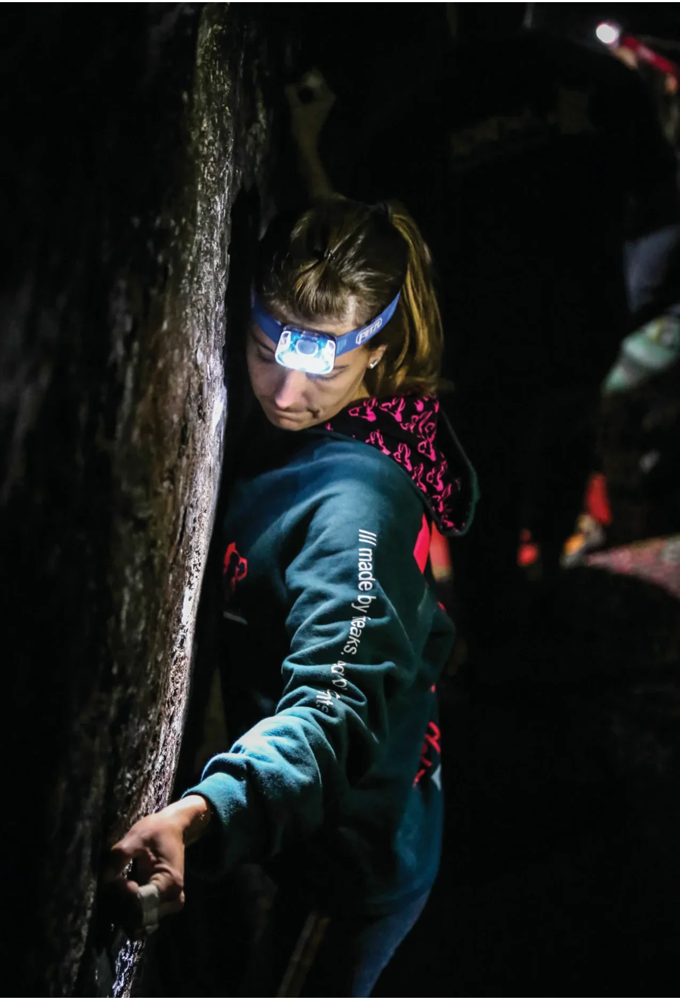 |
    | :--: |
    | *Escaladora com lanterna de cabeça na Pedra Rachada* |
    
    > "A coisa mais essencial do espírito vivo de um homem é sua paixão pela aventura. A alegria da vida vem de nossos encontros com novas experiências."
    > 
    > — *Into The Wild*
    
    ## Blocos do Setor
    
    - **Bloco A – Gangrena**: boulders 1 a 8 (e 9 e 10 na face posterior).
    - **Bloco B – Exilado**: boulders 11 e 12.
    - **Bloco C – Pena de Ganso**: boulders 13 a 20.
    - **Bloco D – Escondido**: boulder 21.
    - **Bloco E – Caramujo**: boulders 22 a 25.
- **nome**: Pena de Ganso
- **uid**: I0dDogAbSmJ8gY
- **caminho_imagem_capa**: 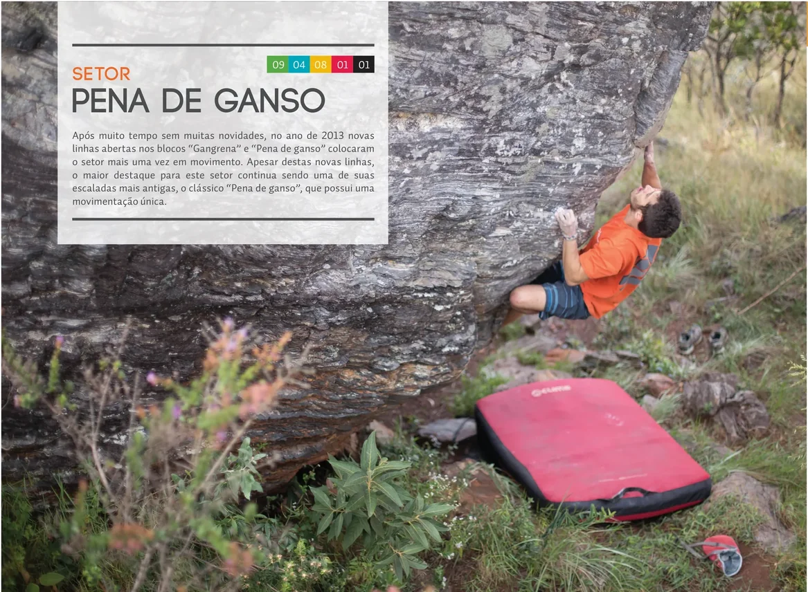
- **setores**:
  - **[0]**:
    - **conteudo**:
      - **descricao**: 
      - **nome**: Bloco A - Gangrena
      - **uid**: 8nG1nyqYVvmIYC
      - **mapas**:
        - **[0]**:
          - **caminho_imagem_mapa**: 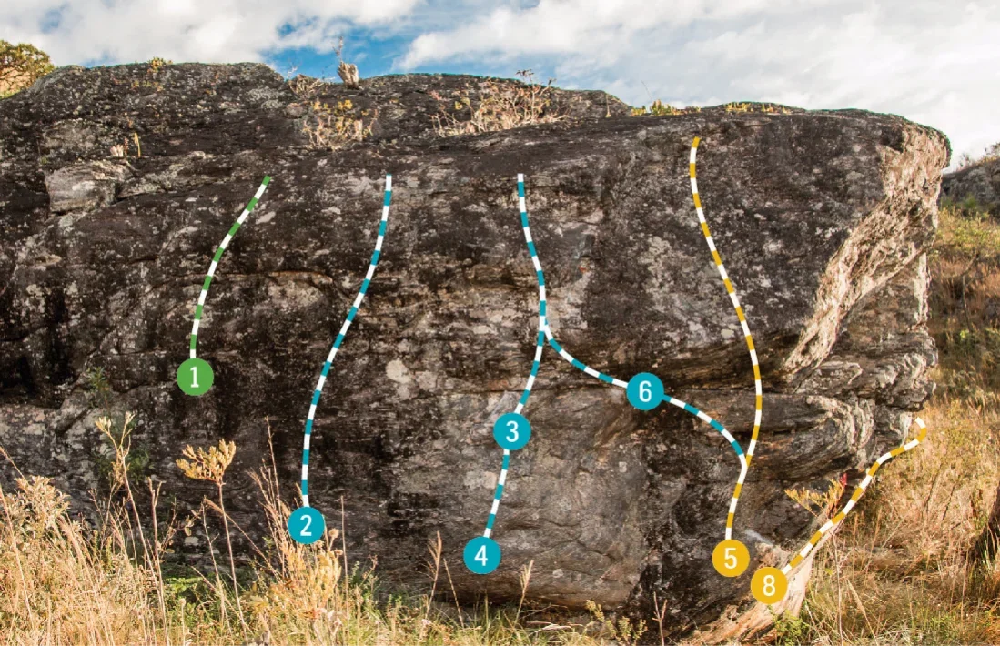
          - **largura_mapa**: 1099
          - **altura_mapa**: 710
          - **referencias**:
            - **[0]**:
              - **alvo_uid**: Ea1iX0CCKEZEbA
              - **pontos_uids**:
                - 1
              - **escalada**: Tala
              - **ids**:
                - 1
            - **[1]**:
              - **alvo_uid**: 3xWjC2f7El0fj4
              - **pontos_uids**:
                - 2
              - **escalada**: Banho de sangue
              - **ids**:
                - 2
            - **[2]**:
              - **alvo_uid**: YFtzhNrc3J72pe
              - **pontos_uids**:
                - 3
              - **escalada**: Aderência
              - **ids**:
                - 3
            - **[3]**:
              - **alvo_uid**: myxuj5Jn4Zoihl
              - **pontos_uids**:
                - 4
              - **escalada**: Textura
              - **ids**:
                - 4
            - **[4]**:
              - **alvo_uid**: dBGZABlDDZ2Tfm
              - **pontos_uids**:
                - 5
              - **escalada**: Gangrena
              - **ids**:
                - 5
            - **[5]**:
              - **alvo_uid**: WdLdWdUZvLnAym
              - **pontos_uids**:
                - 6
              - **escalada**: Quelóide
              - **ids**:
                - 6
            - **[6]**:
              - **alvo_uid**: IawWgdBSGS18lt
              - **pontos_uids**:
                - 5
                - 2
              - **escalada**: Sanguinário
              - **ids**:
                - 5
                - 2
            - **[7]**:
              - **alvo_uid**: 2zsEzcZfVd6WZm
              - **pontos_uids**:
                - 8
              - **escalada**: Cicatriz
              - **ids**:
                - 8
        - **[1]**:
          - **caminho_imagem_mapa**: 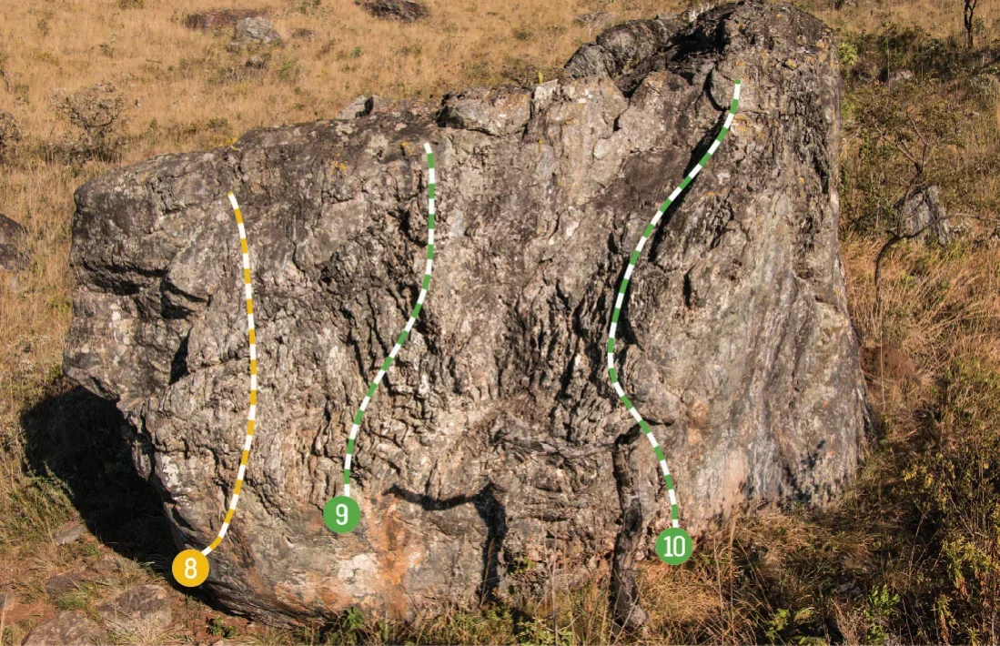
          - **largura_mapa**: 1099
          - **altura_mapa**: 710
          - **referencias**:
            - **[0]**:
              - **alvo_uid**: 2zsEzcZfVd6WZm
              - **pontos_uids**:
                - 8
              - **escalada**: Cicatriz
              - **ids**:
                - 8
            - **[1]**:
              - **alvo_uid**: YyykDapSvsSFDN
              - **pontos_uids**:
                - 9
              - **escalada**: Diagramando
              - **ids**:
                - 9
            - **[2]**:
              - **alvo_uid**: EJ8D361Lo0HAr9
              - **pontos_uids**:
                - 10
              - **escalada**: InDesign
              - **ids**:
                - 10
      - **escaladas**:
        - **[0]**:
          - **uid**: Ea1iX0CCKEZEbA
          - **boulder**:
            - **descricao**: Sai em pé com as mãos em dois regletes e toca reto para um domínio fácil.
            - **nome**: Tala
            - **dificuldade**: VB
        - **[1]**:
          - **uid**: 3xWjC2f7El0fj4
          - **boulder**:
            - **descricao**: Começa sentado com a mão direita em um pequeno reglete de gastón, a esquerda em um outro regletinho logo acima dele e escala a face vertical por regletes pequenos.
            - **nome**: Banho de sangue
            - **dificuldade**: V4
            - **destaque**: True
        - **[2]**:
          - **uid**: YFtzhNrc3J72pe
          - **boulder**:
            - **descricao**: Começa em pé, com as mãos juntas em um grande reglete de lado e toca reto.
            - **nome**: Aderência
            - **dificuldade**: V3
            - **destaque**: True
        - **[3]**:
          - **uid**: myxuj5Jn4Zoihl
          - **boulder**:
            - **descricao**: Saída sentada do “Aderência” (3) que começa com a mão esquerda num pequeno reglete de lado e a direita aberta em outro reglete.
            - **nome**: Textura
            - **dificuldade**: V4
        - **[4]**:
          - **uid**: dBGZABlDDZ2Tfm
          - **boulder**:
            - **descricao**: Sai sentado com a mão esquerda em um reglete, a mão direita em um batente/abaulado e escala pelo positivo à esquerda da aresta.
            - **nome**: Gangrena
            - **dificuldade**: V6
            - **conquistadores**:
              - Ruy Castro
            - **data_abertura**: 2007
        - **[5]**:
          - **uid**: WdLdWdUZvLnAym
          - **boulder**:
            - **descricao**: Começa como o “Gangrena” (5) faz uma travessia para a esquerda terminando no “Aderência” (3).
            - **nome**: Quelóide
            - **dificuldade**: V4
            - **destaque**: True
        - **[6]**:
          - **uid**: IawWgdBSGS18lt
          - **boulder**:
            - **descricao**: Sai do “Gangrena” (5) e faz uma travessia para a esquerda terminando no “Banho de sangue” (2).
            - **nome**: Sanguinário
            - **dificuldade**: V6
        - **[7]**:
          - **uid**: 2zsEzcZfVd6WZm
          - **boulder**:
            - **descricao**: Sai sentado com a mão esquerda no batente/abaulado da saída do “Gangrena” (5) e a direita em um bidedinho e escala à direita da aresta pelas cracas.
            - **nome**: Cicatriz
            - **dificuldade**: V6
        - **[8]**:
          - **uid**: YyykDapSvsSFDN
          - **boulder**:
            - **descricao**: Começa em pé com as mãos juntas em uma laca / pinça e toca reto pelas cracas.
            - **nome**: Diagramando
            - **dificuldade**: V0
        - **[9]**:
          - **uid**: EJ8D361Lo0HAr9
          - **boulder**:
            - **descricao**: Sai em pé com as mãos nas lacas de lado e escala em diagonal pra direita.
            - **nome**: InDesign
            - **dificuldade**: V0
      - **precomputados**:
        - **total_escaladas**: 10
        - **total_boulders**: 10
  - **[1]**:
    - **conteudo**:
      - **descricao**: 
      - **nome**: Bloco B - Exilado
      - **uid**: MkigFlguTDTQrj
      - **mapas**:
        - **[0]**:
          - **caminho_imagem_mapa**: 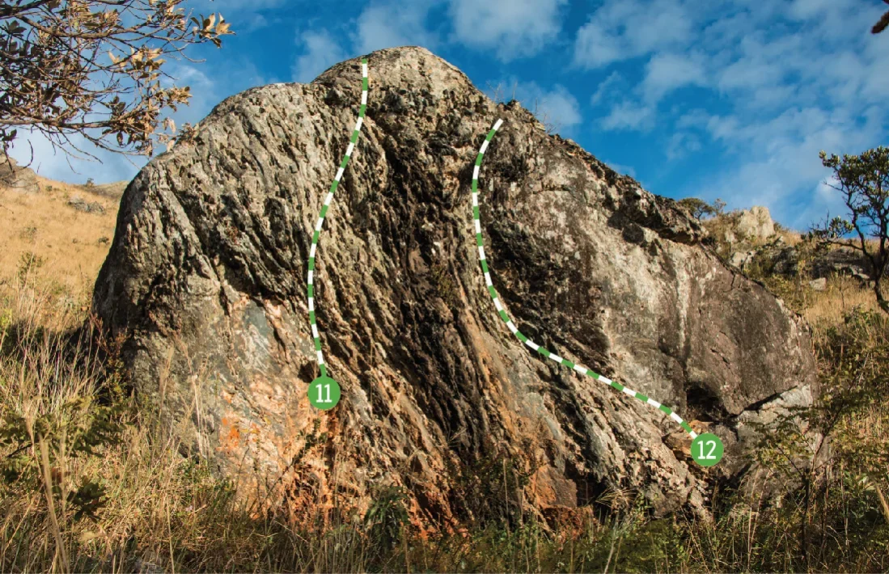
          - **largura_mapa**: 1099
          - **altura_mapa**: 710
          - **referencias**:
            - **[0]**:
              - **alvo_uid**: kFIIwjBbIQaklo
              - **pontos_uids**:
                - 11
              - **escalada**: Exilado
              - **ids**:
                - 11
            - **[1]**:
              - **alvo_uid**: 730eOGnmOQ5CEk
              - **pontos_uids**:
                - 12
              - **escalada**: A busca
              - **ids**:
                - 12
      - **escaladas**:
        - **[0]**:
          - **uid**: kFIIwjBbIQaklo
          - **boulder**:
            - **descricao**: Sai com as mãos juntas em uma grande laca e escala por agarras boas até uma virada tranqüila.
            - **nome**: Exilado
            - **dificuldade**: V0
        - **[1]**:
          - **uid**: 730eOGnmOQ5CEk
          - **boulder**:
            - **descricao**: Começa sentado com as mãos no batente e escala em diagonal pra esquerda em busca das melhores agarras.
            - **nome**: A busca
            - **dificuldade**: V0
      - **precomputados**:
        - **total_escaladas**: 2
        - **total_boulders**: 2
  - **[2]**:
    - **conteudo**:
      - **descricao**: 
      - **nome**: Bloco C - Pena de Ganso
      - **uid**: 7FDG024uaqj8Jr
      - **mapas**:
        - **[0]**:
          - **caminho_imagem_mapa**: 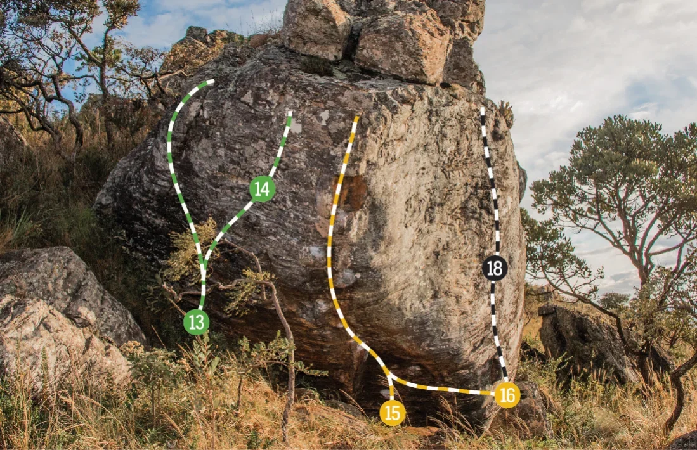
          - **largura_mapa**: 1099
          - **altura_mapa**: 710
          - **referencias**:
            - **[0]**:
              - **alvo_uid**: gJ61r3TXBT9LEv
              - **pontos_uids**:
                - 13
              - **escalada**: Despenado
              - **ids**:
                - 13
            - **[1]**:
              - **alvo_uid**: wg8ZaQ3d0k2RAZ
              - **pontos_uids**:
                - 14
              - **escalada**: Penadinho
              - **ids**:
                - 14
            - **[2]**:
              - **alvo_uid**: 6X8YqheiJZQphD
              - **pontos_uids**:
                - 15
              - **escalada**: Pena de ganso
              - **ids**:
                - 15
            - **[3]**:
              - **alvo_uid**: Z0idqej51Ndfjk
              - **pontos_uids**:
                - 16
              - **escalada**: Jamaica abaixo de zero
              - **ids**:
                - 16
            - **[4]**:
              - **alvo_uid**: S6Lk3QIeQ9Bu03
              - **pontos_uids**:
                - 16
              - **escalada**: Jamaica abaixo de zero SDS
              - **ids**:
                - 16
            - **[5]**:
              - **alvo_uid**: doFPS2VLzy61Sg
              - **pontos_uids**:
                - 18
              - **escalada**: Projeto 9
              - **ids**:
                - 18
        - **[1]**:
          - **caminho_imagem_mapa**: 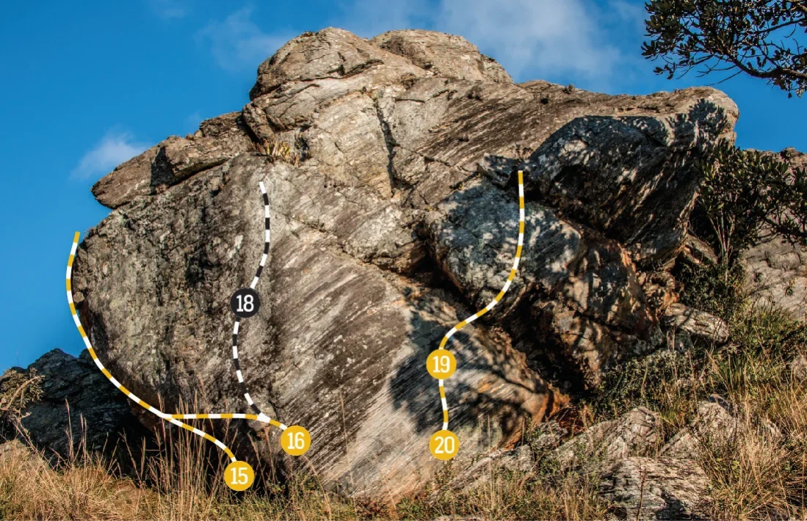
          - **largura_mapa**: 1099
          - **altura_mapa**: 710
          - **referencias**:
            - **[0]**:
              - **alvo_uid**: 6X8YqheiJZQphD
              - **pontos_uids**:
                - 15
              - **escalada**: Pena de ganso
              - **ids**:
                - 15
            - **[1]**:
              - **alvo_uid**: Z0idqej51Ndfjk
              - **pontos_uids**:
                - 16
              - **escalada**: Jamaica abaixo de zero
              - **ids**:
                - 16
            - **[2]**:
              - **alvo_uid**: S6Lk3QIeQ9Bu03
              - **pontos_uids**:
                - 16
              - **escalada**: Jamaica abaixo de zero SDS
              - **ids**:
                - 16
            - **[3]**:
              - **alvo_uid**: doFPS2VLzy61Sg
              - **pontos_uids**:
                - 18
              - **escalada**: Projeto 9
              - **ids**:
                - 18
            - **[4]**:
              - **alvo_uid**: yS7dYPaceOeAoF
              - **pontos_uids**:
                - 19
              - **escalada**: Lacrimogênio
              - **ids**:
                - 19
            - **[5]**:
              - **alvo_uid**: F0aytRBsK2K3MP
              - **pontos_uids**:
                - 20
              - **escalada**: Gás lacrimogênio
              - **ids**:
                - 20
      - **escaladas**:
        - **[0]**:
          - **uid**: gJ61r3TXBT9LEv
          - **boulder**:
            - **descricao**: Começa sentado com as mãos juntas em um batente e escala em diagonal pra esquerda dominando na parte baixa.
            - **nome**: Despenado
            - **dificuldade**: V1
        - **[1]**:
          - **uid**: wg8ZaQ3d0k2RAZ
          - **boulder**:
            - **descricao**: Sai como o “Despenado” (13) e escala em diagonal pra esquerda terminando na parte alta do bloco.
            - **nome**: Penadinho
            - **dificuldade**: V2
            - **destaque**: True
        - **[2]**:
          - **uid**: 6X8YqheiJZQphD
          - **boulder**:
            - **descricao**: Começa sentado com as mãos juntas em um batente no fundo do tetinho e escala uma sequencia longa de movimentos consistentes.
            - **nome**: Pena de ganso
            - **dificuldade**: V8
            - **destaque**: True
        - **[3]**:
          - **uid**: Z0idqej51Ndfjk
          - **boulder**:
            - **descricao**: Extensão do “Pena de ganso” (15) que sai com a mão direita em um reglete de gaston e a esquerda na parte de baixo do “módulo” e atravessa pra esquerda.
            - **nome**: Jamaica abaixo de zero
            - **dificuldade**: V9
            - **destaque**: True
            - **conquistadores**:
              - Gustavo Fontes
            - **data_abertura**: 2013
        - **[4]**:
          - **uid**: S6Lk3QIeQ9Bu03
          - **boulder**:
            - **descricao**: Adiciona um movimento à saída de cima, começando com a mão esquerda em um batente/pocket.
            - **nome**: Jamaica abaixo de zero SDS
            - **dificuldade**: V10
            - **conquistadores**:
              - Daniel Mendes
            - **data_abertura**: 2013
        - **[5]**:
          - **uid**: doFPS2VLzy61Sg
          - **boulder**:
            - **descricao**: Sai do “módulo” e escala a face vertical por micro agarras.
            - **nome**: Projeto 9
            - **dificuldade**: INDEFINIDO
        - **[6]**:
          - **uid**: yS7dYPaceOeAoF
          - **boulder**:
            - **descricao**: Começa em pé com a mão esquerda em um pequeno reglete/pocket, a direita no abaulado e escala em diagonal pra direita, passando pelo tetinho.
            - **nome**: Lacrimogênio
            - **dificuldade**: V6
            - **destaque**: True
            - **conquistadores**:
              - Daniel Mendes
            - **data_abertura**: 2013
        - **[7]**:
          - **uid**: F0aytRBsK2K3MP
          - **boulder**:
            - **descricao**: Sai com a mão direita em um reglete baixo, adicionando um movimento ao “Lacrimogênio” (19).
            - **nome**: Gás lacrimogênio
            - **dificuldade**: V9
            - **conquistadores**:
              - Daniel Mendes
            - **data_abertura**: 2013
      - **precomputados**:
        - **total_escaladas**: 8
        - **total_boulders**: 8
  - **[3]**:
    - **conteudo**:
      - **descricao**: 
      - **nome**: Bloco D - Escondido
      - **uid**: uk3gLmUoNBsQNX
      - **mapas**:
        - **[0]**:
          - **caminho_imagem_mapa**: 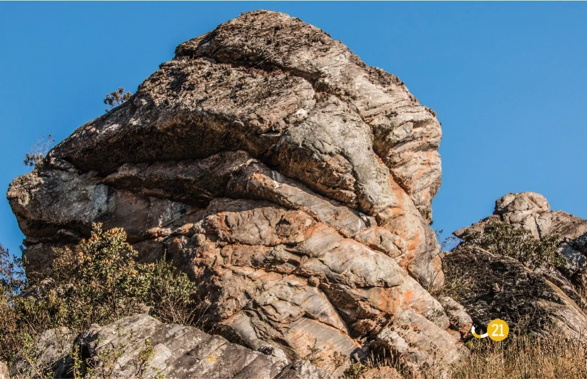
          - **largura_mapa**: 1099
          - **altura_mapa**: 710
          - **referencias**:
            - **[0]**:
              - **alvo_uid**: UJhBbNXjtAxHYC
              - **pontos_uids**:
                - 21
              - **escalada**: Escondido
              - **ids**:
                - 21
      - **escaladas**:
        - **[0]**:
          - **uid**: UJhBbNXjtAxHYC
          - **boulder**:
            - **descricao**: Boulder que fica dentro de um bloco escorado no blocão à direita do “Pena de ganso” (15). Sai na face que aponta pro estacionamento, com a mão direita na aresta e a esquerda em um reglete baixo dentro do teto e atravessa por ele dominando pelo outro lado.
            - **nome**: Escondido
            - **dificuldade**: V6
      - **precomputados**:
        - **total_escaladas**: 1
        - **total_boulders**: 1
  - **[4]**:
    - **conteudo**:
      - **descricao**: 
      - **nome**: Bloco E - Caramujo
      - **uid**: csVP38h5v0m0xD
      - **mapas**:
        - **[0]**:
          - **caminho_imagem_mapa**: 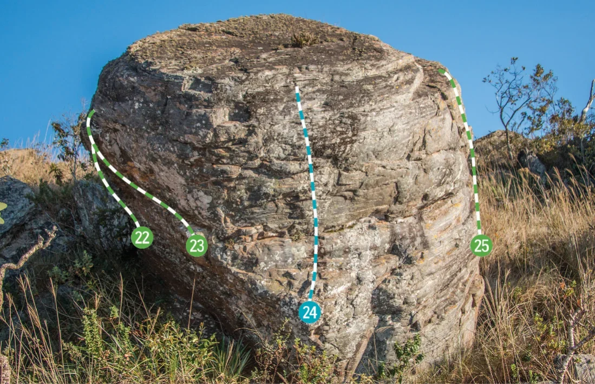
          - **largura_mapa**: 1099
          - **altura_mapa**: 710
          - **referencias**:
            - **[0]**:
              - **alvo_uid**: xHfXCQ9OUmsJr5
              - **pontos_uids**:
                - 22
              - **escalada**: Preguiça
              - **ids**:
                - 22
            - **[1]**:
              - **alvo_uid**: wsdvBGnYM34l4W
              - **pontos_uids**:
                - 23
              - **escalada**: Lesma
              - **ids**:
                - 23
            - **[2]**:
              - **alvo_uid**: ghflHg2drbmDYj
              - **pontos_uids**:
                - 24
              - **escalada**: Caramujo
              - **ids**:
                - 24
            - **[3]**:
              - **alvo_uid**: DlxdhqTloXaDXt
              - **pontos_uids**:
                - 25
              - **escalada**: Tartaruga
              - **ids**:
                - 25
      - **escaladas**:
        - **[0]**:
          - **uid**: xHfXCQ9OUmsJr5
          - **boulder**:
            - **descricao**: Começa sentado com as mãos juntas em um batente grande e escala reto pelas cracas.
            - **nome**: Preguiça
            - **dificuldade**: V0
        - **[1]**:
          - **uid**: wsdvBGnYM34l4W
          - **boulder**:
            - **descricao**: Sai em pé com as mãos juntas no “módulo” batente, atravessa pra esquerda pelos pockets e termina no canto esquerdo do bloco, nas cracas.
            - **nome**: Lesma
            - **dificuldade**: V2
            - **destaque**: True
        - **[2]**:
          - **uid**: ghflHg2drbmDYj
          - **boulder**:
            - **descricao**: Começa com a mão esquerda em um batente e a direita em um reglete ao lado e toca reto pela proa com um domínio técnico no positivo.
            - **nome**: Caramujo
            - **dificuldade**: V4
            - **destaque**: True
        - **[3]**:
          - **uid**: DlxdhqTloXaDXt
          - **boulder**:
            - **descricao**: Sai sentado com a mão esquerda em um batente, a direita em um reglete e domina reto.
            - **nome**: Tartaruga
            - **dificuldade**: V1
            - **destaque**: True
      - **precomputados**:
        - **total_escaladas**: 4
        - **total_boulders**: 4
- **precomputados**:
  - **total_escaladas**: 25
  - **total_boulders**: 25

## Parte: grupo_tosco

### Grupo (Pico: Pedra Rachada)

- **descricao**:
    Setor que abriga uma grande quantidade de boulders do circuito verde e azul, com destaque para o clássico “Aresta visual” v3. Por outro lado, se você escala boulders do circuito amarelo ou vermelho e gosta de dinâmicos, este será um de seus setores preferidos, com escaladas incríveis deste estilo nos blocos “Aresta visual”, “Tosco” e “Motricidade”. Mas não pense que a diversão acaba por aí, se você curte aderência não deixe de visitar o mítico “Frita pé” e quebrar a cabeça desvendando seus betas!
    
    ## Acesso (25 min)
    
    A partir do “Estacionamento 2” siga a trilha principal, passando à esquerda do “Bloco 1” e à direita do bloco “Lua cheia” até chegar ao bloco “Rolling Stones”. De lá, siga pela trilha que segue para a esquerda do bloco por 1min até os blocos “Boliche”, o “Amarelão” e o “Lajinha”. Logo acima dele, encontra-se o bloco “Aresta visual” e o acesso para todos os outros blocos.
    
    ## Boulders Clássicos
    
    - **9. Aresta visual** – V3
    - **15. Frita pé** – V6
    - **22. Tosco** – V8
    - **36. Potencial de ação** – V11
    - **38. Motricidade fina** – V11
    
    ## Blocos
    
    - **Bloco A** – Boliche (boulders 1 a 3)
    - **Bloco B** – Amarelão (boulders 4 e 5)
    - **Bloco C** – Aresta Visual (boulders 6 a 11)
    - **Bloco D** – Lajinha (boulders 12 e 13)
    - **Bloco E** – Viradinha Nacional (boulder 14)
    - **Bloco F** – Frita Pé (boulders 15 e 16)
    - **Bloco G** – Rolezinho (boulders 17 e 18)
    - **Bloco H** – Cor do Bicho (boulders 19 e 20)
    - **Bloco I** – Tosco (boulders 21 a 25)
    - **Bloco J** – Tô Partindo (boulders 26 a 28)
    - **Bloco K** – Oval (boulders 29 a 34)
    - **Bloco L** – Motricidade (boulders 35 a 44)
    - **Bloco M** – Night Climb (boulders 45 a 47)
    - **Bloco N** – Piolho de Cobra (boulders 48 a 50)
    - **Bloco O** – Democrático (boulders 51 a 54)
    - **Bloco P** – Ferrugem (boulders 55 a 58)
    
    |  |
    | :--: |
    | *Vitor Maciel Fotografia - Você nasceu para grandes coisas. Eternize as que são mais importantes.* |
    
    > "Você nasceu para grandes coisas. Eternize as que são mais importantes."  
    > — *Vitor Maciel Fotografia*
    
    |  |
    | :--: |
    | *Solo - Sua experiência é única. Vista sua liberdade.* |
    
    *Sua experiência é única. Solo – Vista sua liberdade. www.solobr.com*
    
    |  |
    | :--: |
    | *Escalador em boulder no Setor Tosco* |
    
    | 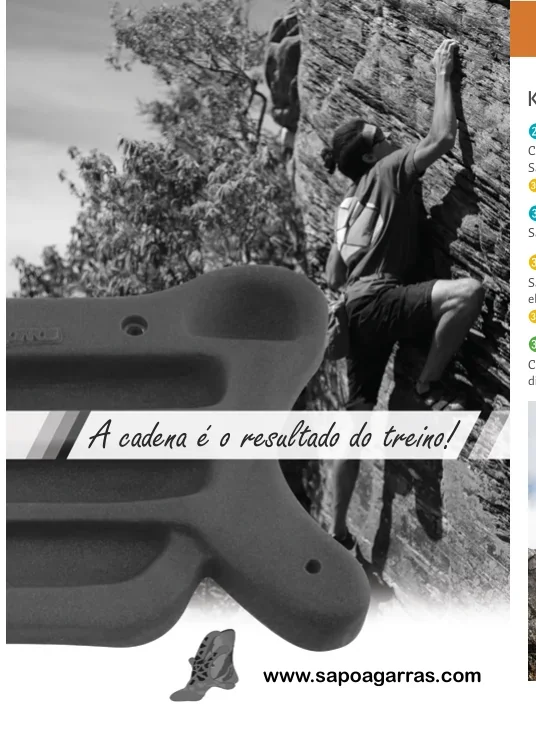 |
    | :--: |
    | *Sapo Agarras - A cadena é o resultado do treino!* |
    
    > "A cadena é o resultado do treino!"  
    > — *www.sapoagarras.com*
    
    > "Se você encontrar um caminho sem obstáculos, ele provavelmente não leva a lugar nenhum."  
    > — *Frank Clark*
    
    > "Não existe um caminho para a felicidade. A felicidade é o caminho."  
    > — *Mahatma Gandhi*
- **nome**: Tosco
- **uid**: 7EqmzEyqPqt31Z
- **caminho_imagem_capa**: 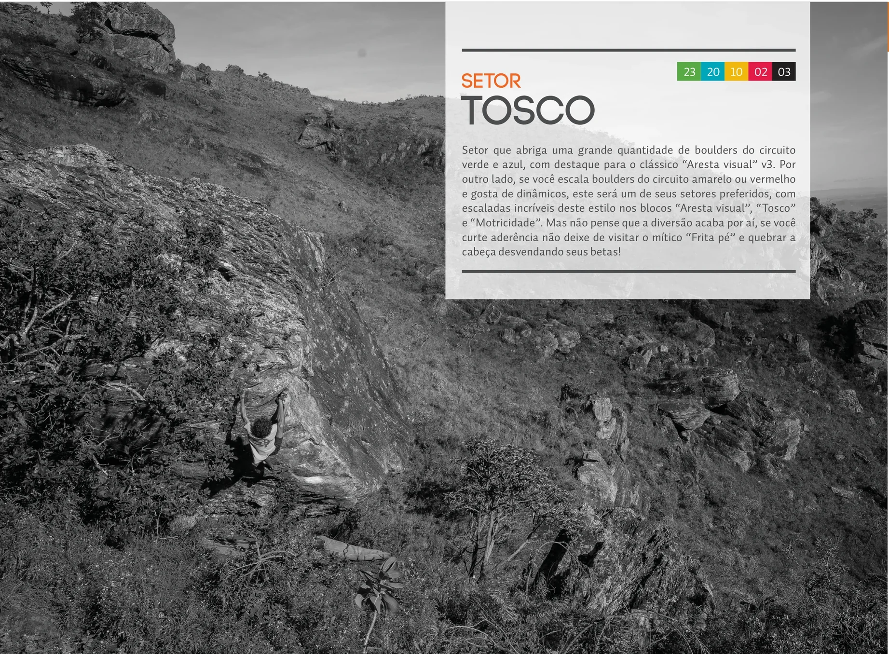
- **mapas**:
  - **[0]**:
    - **caminho_imagem_mapa**: 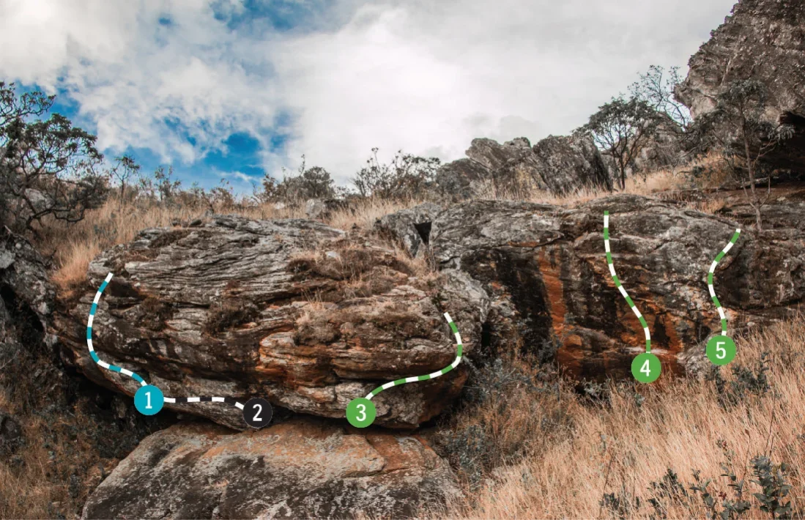
    - **largura_mapa**: 1099
    - **altura_mapa**: 710
    - **referencias**:
      - **[0]**:
        - **alvo_uid**: zShGRCExk0eQSH
        - **pontos_uids**:
          - 1
        - **escalada**: Boliche
        - **ids**:
          - 1
      - **[1]**:
        - **alvo_uid**: cVyqOSGghaA5Rh
        - **pontos_uids**:
          - 2
        - **escalada**: Projeto 10
        - **ids**:
          - 2
      - **[2]**:
        - **alvo_uid**: oqgqj8KsgyyVbf
        - **pontos_uids**:
          - 3
        - **escalada**: Strike
        - **ids**:
          - 3
      - **[3]**:
        - **alvo_uid**: kZYUwpDIYjOTdd
        - **pontos_uids**:
          - 4
        - **escalada**: Amarelão
        - **ids**:
          - 4
      - **[4]**:
        - **alvo_uid**: aesG73VkIAQPEb
        - **pontos_uids**:
          - 5
        - **escalada**: Amarelinha
        - **ids**:
          - 5
  - **[1]**:
    - **caminho_imagem_mapa**: 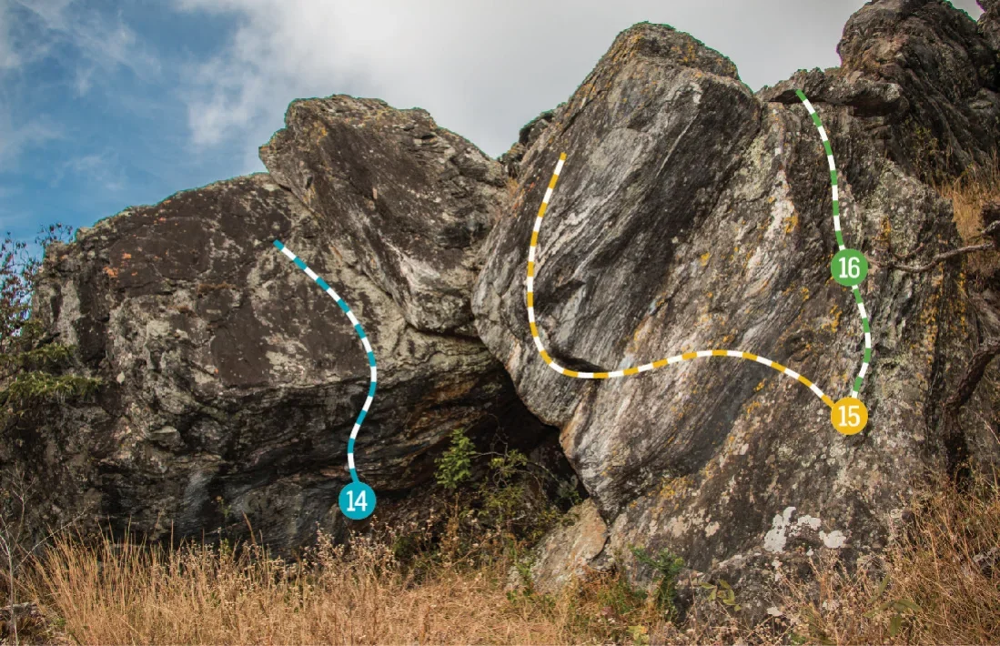
    - **largura_mapa**: 1099
    - **altura_mapa**: 710
    - **referencias**:
      - **[0]**:
        - **alvo_uid**: u3GH2EF68VFGaY
        - **pontos_uids**:
          - 14
        - **escalada**: Viradinha nacional
        - **ids**:
          - 14
      - **[1]**:
        - **alvo_uid**: 9n8GMoJqxIGEZg
        - **pontos_uids**:
          - 15
        - **escalada**: Frita pé
        - **ids**:
          - 15
      - **[2]**:
        - **alvo_uid**: ifkPVO6Ogjt8Qn
        - **pontos_uids**:
          - 16
        - **escalada**: Tô legal
        - **ids**:
          - 16
  - **[2]**:
    - **caminho_imagem_mapa**: 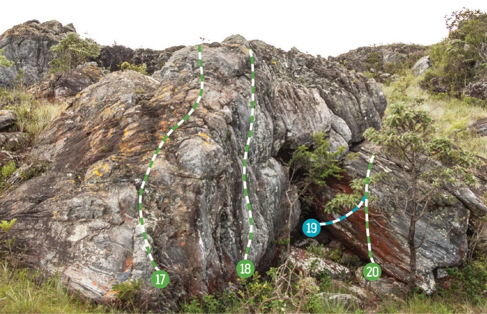
    - **largura_mapa**: 1099
    - **altura_mapa**: 710
    - **referencias**:
      - **[0]**:
        - **alvo_uid**: h1XjAJx3SprebY
        - **pontos_uids**:
          - 17
        - **escalada**: Os malaco
        - **ids**:
          - 17
      - **[1]**:
        - **alvo_uid**: QufF7tXMeGSBZH
        - **pontos_uids**:
          - 18
        - **escalada**: Rolezinho
        - **ids**:
          - 18
      - **[2]**:
        - **alvo_uid**: TpH0gDFHVVIHB6
        - **pontos_uids**:
          - 19
        - **escalada**: Cor do bicho
        - **ids**:
          - 19
      - **[3]**:
        - **alvo_uid**: 4bIt8vF8RWlffk
        - **pontos_uids**:
          - 20
        - **escalada**: Colorau
        - **ids**:
          - 20
- **setores**:
  - **[0]**:
    - **conteudo**:
      - **descricao**: 
      - **nome**: Bloco A - Boliche
      - **uid**: 99alQsSLFdPsE3
      - **escaladas**:
        - **[0]**:
          - **uid**: zShGRCExk0eQSH
          - **boulder**:
            - **descricao**: Começa com as mãos nas agarras boas da fenda e domina pela esquerda, passando por um abaulado.
            - **nome**: Boliche
            - **dificuldade**: V4
        - **[1]**:
          - **uid**: cVyqOSGghaA5Rh
          - **boulder**:
            - **descricao**: Extensão do “Boliche” (1) que sai do meio do bloco em agarras boas e atravessa pra esquerda terminando da mesma forma.
            - **nome**: Projeto 10
            - **dificuldade**: INDEFINIDO
        - **[2]**:
          - **uid**: oqgqj8KsgyyVbf
          - **boulder**:
            - **descricao**: Começa sentado com as mãos juntas em um bico batente e escala pra direita terminando por agarras boas.
            - **nome**: Strike
            - **dificuldade**: V2
      - **precomputados**:
        - **total_escaladas**: 3
        - **total_boulders**: 3
  - **[1]**:
    - **conteudo**:
      - **descricao**: 
      - **nome**: Bloco B - Amarelão
      - **uid**: FtiDFZPTn9JHbY
      - **escaladas**:
        - **[0]**:
          - **uid**: kZYUwpDIYjOTdd
          - **boulder**:
            - **descricao**: Sai com a mão direita em um reglete, a esquerda em um batente e escala por agarras boas.
            - **nome**: Amarelão
            - **dificuldade**: V2
            - **destaque**: True
        - **[1]**:
          - **uid**: aesG73VkIAQPEb
          - **boulder**:
            - **descricao**: Começa com as mãos juntas em uma agarra boa e escala reto.
            - **nome**: Amarelinha
            - **dificuldade**: V0
      - **precomputados**:
        - **total_escaladas**: 2
        - **total_boulders**: 2
  - **[2]**:
    - **conteudo**:
      - **descricao**: 
      - **nome**: Bloco C - Aresta Visual
      - **uid**: L3p2qmIDt060sz
      - **mapas**:
        - **[0]**:
          - **caminho_imagem_mapa**: 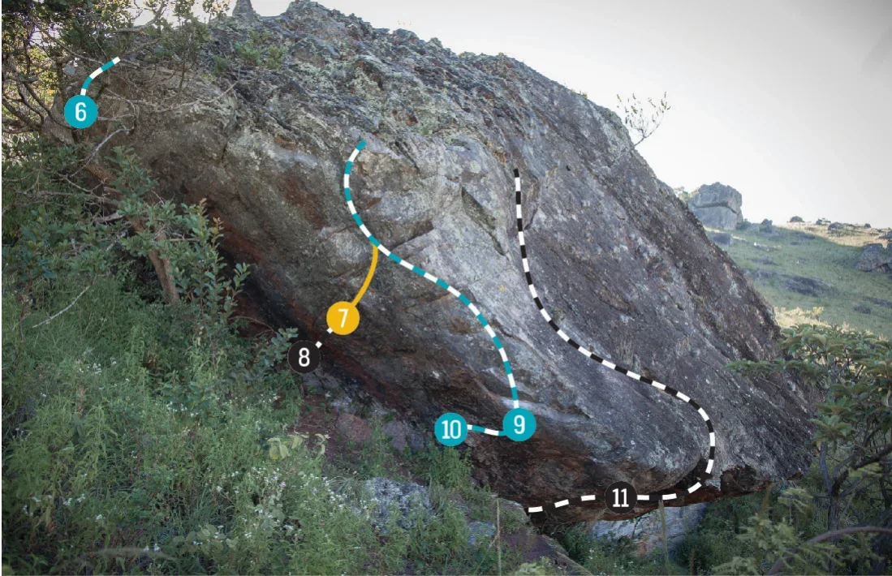
          - **largura_mapa**: 1099
          - **altura_mapa**: 710
          - **referencias**:
            - **[0]**:
              - **alvo_uid**: GnID3fq6XKY8gl
              - **pontos_uids**:
                - 6
              - **escalada**: V clássico
              - **ids**:
                - 6
            - **[1]**:
              - **alvo_uid**: tgsjTugwgyR4wq
              - **pontos_uids**:
                - 7
              - **escalada**: O tempo e o vento
              - **ids**:
                - 7
            - **[2]**:
              - **alvo_uid**: dokQ7NFkEg7qlt
              - **pontos_uids**:
                - 8
              - **escalada**: Projeto 11
              - **ids**:
                - 8
            - **[3]**:
              - **alvo_uid**: yCJ0ncJjnim0OQ
              - **pontos_uids**:
                - 9
              - **escalada**: Aresta visual
              - **ids**:
                - 9
            - **[4]**:
              - **alvo_uid**: o5VAuvJWTiwCwG
              - **pontos_uids**:
                - 10
              - **escalada**: Aresta visual SDS
              - **ids**:
                - 10
            - **[5]**:
              - **alvo_uid**: 6svGlmUj5nRvlf
              - **pontos_uids**:
                - 11
              - **escalada**: Projeto 12
              - **ids**:
                - 11
      - **escaladas**:
        - **[0]**:
          - **uid**: GnID3fq6XKY8gl
          - **boulder**:
            - **descricao**: Começa em pé com as mãos juntas em um batente, faz uma movimento de campus para a borda e domina.
            - **nome**: V clássico
            - **dificuldade**: V5
            - **destaque**: True
            - **conquistadores**:
              - Rafael Passos
            - **data_abertura**: 2009
        - **[1]**:
          - **uid**: tgsjTugwgyR4wq
          - **boulder**:
            - **descricao**: Final do projeto da fenda. Sai em pé em dois pequenos regletes/batentes na fenda e faz uma sequência de movimentos fortes e sem pés até as agarras boas, terminando como o “Aresta visual” (9).
            - **nome**: O tempo e o vento
            - **dificuldade**: V6
            - **conquistadores**:
              - Frederico Gonçalves
            - **data_abertura**: 2010
        - **[2]**:
          - **uid**: dokQ7NFkEg7qlt
          - **boulder**:
            - **descricao**: Extensão do boulder “O tempo e o vento” saindo sentado com as mãos nas agarras mais baixas na fenda.
            - **nome**: Projeto 11
            - **dificuldade**: INDEFINIDO
        - **[3]**:
          - **uid**: yCJ0ncJjnim0OQ
          - **boulder**:
            - **descricao**: Começa sentado com as mãos juntas em um batente/abaulado e segue pela aresta dominando na parte mais alta do bloco.
            - **nome**: Aresta visual
            - **dificuldade**: V3
            - **destaque**: True
        - **[4]**:
          - **uid**: o5VAuvJWTiwCwG
          - **boulder**:
            - **descricao**: Sai sentado com as mãos juntas em dois regletes/cracas, faz um movimento forte até a saída do “Aresta visual” (9) e termina como ele.
            - **nome**: Aresta visual SDS
            - **dificuldade**: V4
            - **destaque**: True
        - **[5]**:
          - **uid**: 6svGlmUj5nRvlf
          - **boulder**:
            - **descricao**: Projeto que escala o “túnel de pedra” no meio do bloco, abaixo do boulder “Aresta visual” (9), sobre a lage de pedra.
            - **nome**: Projeto 12
            - **dificuldade**: INDEFINIDO
      - **precomputados**:
        - **total_escaladas**: 6
        - **total_boulders**: 6
  - **[3]**:
    - **conteudo**:
      - **descricao**: 
      - **nome**: Bloco D - Lajinha
      - **uid**: Nd5d0HbsulnbTk
      - **escaladas**:
        - **[0]**:
          - **uid**: 8VFn7v1sChk59a
          - **boulder**:
            - **descricao**: Começa sentado com as mãos em dois regletes e faz uma seqüência de movimentos fortes até um domínio técnico.
            - **nome**: Lajinha
            - **dificuldade**: V4
        - **[1]**:
          - **uid**: lcfZW2QvYQxkHM
          - **boulder**:
            - **descricao**: Sai sentado com a mão esquerda em um bico e a direita em uma agarra boa, passa por um batente e domina pela grande laca.
            - **nome**: Molde
            - **dificuldade**: V2
      - **precomputados**:
        - **total_escaladas**: 2
        - **total_boulders**: 2
  - **[4]**:
    - **conteudo**:
      - **descricao**: 
      - **nome**: Bloco E - Viradinha Nacional
      - **uid**: GTseUW4vGNLtVc
      - **escaladas**:
        - **[0]**:
          - **uid**: u3GH2EF68VFGaY
          - **boulder**:
            - **descricao**: Começa sentado com a mão direita em um pocket e a esquerda em um batente escorrido, faz uma sequência de movimentos de muita tensão corporal até a borda e domina por uma virada técnica.
            - **nome**: Viradinha nacional
            - **dificuldade**: V4
      - **precomputados**:
        - **total_escaladas**: 1
        - **total_boulders**: 1
  - **[5]**:
    - **conteudo**:
      - **descricao**: 
      - **nome**: Bloco F - Frita Pé
      - **uid**: h4WDPKu4z6sKgP
      - **escaladas**:
        - **[0]**:
          - **uid**: 9n8GMoJqxIGEZg
          - **boulder**:
            - **descricao**: Boulder único que mistura muita técnica de movimentação de pés e compressão. Começa em pé com as mãos juntas na aresta da direita do bloco, faz uma travessia pra esquerda e domina pelo positivo.
            - **nome**: Frita pé
            - **dificuldade**: V6
            - **destaque**: True
            - **conquistadores**:
              - Stefano Mastrocola
            - **data_abertura**: 2009
        - **[1]**:
          - **uid**: ifkPVO6Ogjt8Qn
          - **boulder**:
            - **descricao**: Sai como o “Frita pé” (15) e escala a aresta em oposição até o topo.
            - **nome**: Tô legal
            - **dificuldade**: V1
      - **precomputados**:
        - **total_escaladas**: 2
        - **total_boulders**: 2
  - **[6]**:
    - **conteudo**:
      - **descricao**: 
      - **nome**: Bloco G - Rolezinho
      - **uid**: AvIUYDdfklVTyh
      - **escaladas**:
        - **[0]**:
          - **uid**: h1XjAJx3SprebY
          - **boulder**:
            - **descricao**: Sai em pé com as mãos juntas em uma agarra boa de lado e escala reto o positivo à direita da aresta.
            - **nome**: Os malaco
            - **dificuldade**: V0
        - **[1]**:
          - **uid**: QufF7tXMeGSBZH
          - **boulder**:
            - **descricao**: Começa sentado com as mãos juntas em um bico dentro de uma fenda e toca reto por fendas diagonais virando na parte mais alta do bloco.
            - **nome**: Rolezinho
            - **dificuldade**: V1
            - **destaque**: True
      - **precomputados**:
        - **total_escaladas**: 2
        - **total_boulders**: 2
  - **[7]**:
    - **conteudo**:
      - **descricao**: 
      - **nome**: Bloco H - Cor do Bicho
      - **uid**: QjLe2HtYJTzjAz
      - **escaladas**:
        - **[0]**:
          - **uid**: TpH0gDFHVVIHB6
          - **boulder**:
            - **descricao**: Sai sentado no fundo da caverna com as mãos juntas em um reglete e um abaulado, faz um movimento duro para sair da caverna e termina como o “Colorau” (20).
            - **nome**: Cor do bicho
            - **dificuldade**: V3
        - **[1]**:
          - **uid**: 4bIt8vF8RWlffk
          - **boulder**:
            - **descricao**: Sai sentado com as mãos nos dois regletes mais baixos, e escala reto até uma virada fácil.
            - **nome**: Colorau
            - **dificuldade**: V2
            - **destaque**: True
      - **precomputados**:
        - **total_escaladas**: 2
        - **total_boulders**: 2
  - **[8]**:
    - **conteudo**:
      - **descricao**: 
      - **nome**: Bloco I - Tosco
      - **uid**: RZGfs6DU9fMukU
      - **mapas**:
        - **[0]**:
          - **caminho_imagem_mapa**: 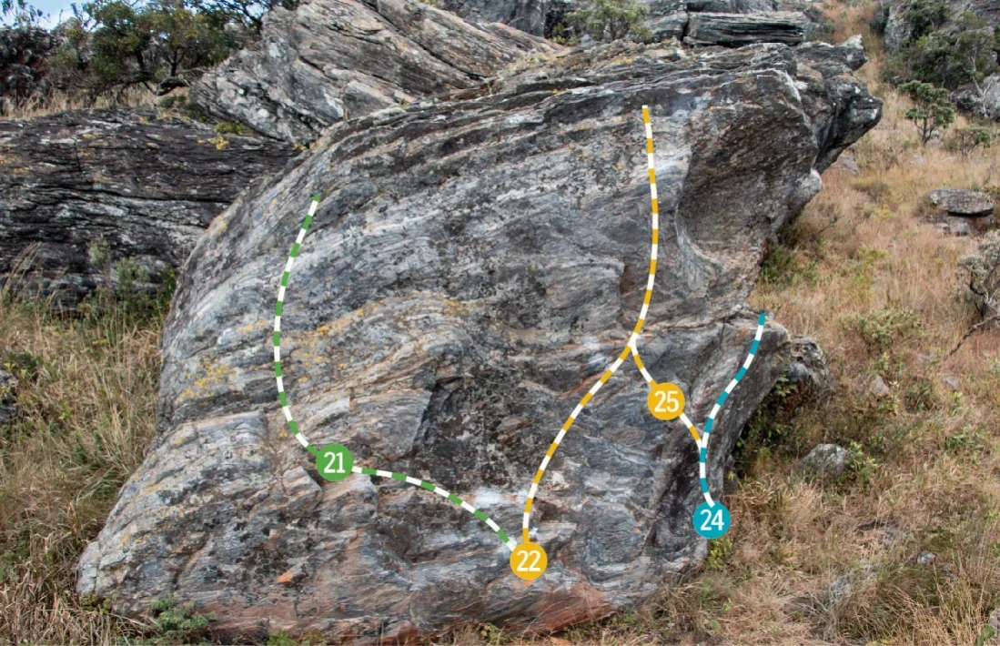
          - **largura_mapa**: 1099
          - **altura_mapa**: 710
          - **referencias**:
            - **[0]**:
              - **alvo_uid**: it9URqn15smHsO
              - **pontos_uids**:
                - 21
              - **escalada**: McDonald’s
              - **ids**:
                - 21
            - **[1]**:
              - **alvo_uid**: zv45eMrvxygInB
              - **pontos_uids**:
                - 22
              - **escalada**: Tosco
              - **ids**:
                - 22
            - **[2]**:
              - **alvo_uid**: 93aq7fDD37gcTV
              - **pontos_uids**:
                - 22
                - 24
              - **escalada**: Tosqueira
              - **ids**:
                - 22
                - 24
            - **[3]**:
              - **alvo_uid**: MRzbpUk6ljnTMX
              - **pontos_uids**:
                - 24
              - **escalada**: Senta no porco
              - **ids**:
                - 24
            - **[4]**:
              - **alvo_uid**: CkNAAVw6gVMhkT
              - **pontos_uids**:
                - 25
              - **escalada**: Mr. Rocha Pura
              - **ids**:
                - 25
      - **escaladas**:
        - **[0]**:
          - **uid**: it9URqn15smHsO
          - **boulder**:
            - **descricao**: Sai sentado com a mão esquerda em um batente e a direita em um reglete, faz uma travessia para a esquerda e finaliza reto, na parte alta.
            - **nome**: McDonald’s
            - **dificuldade**: V2
        - **[1]**:
          - **uid**: zv45eMrvxygInB
          - **boulder**:
            - **descricao**: Começa como o “McDonald’s” (21) e toca reto passando por uma pinça, e dando um dinâmico clássico de uns regletes até um batente alto, finalizando com um domínio fácil.
            - **nome**: Tosco
            - **dificuldade**: V8
            - **destaque**: True
            - **conquistadores**:
              - Thiago Veloso
            - **data_abertura**: 2005
        - **[2]**:
          - **uid**: 93aq7fDD37gcTV
          - **boulder**:
            - **descricao**: Começa como o “Tosco” (22) e termina pelo “Senta no porco” (24).
            - **nome**: Tosqueira
            - **dificuldade**: V4
        - **[3]**:
          - **uid**: MRzbpUk6ljnTMX
          - **boulder**:
            - **descricao**: Começa sentado com as mãos na aresta da direita e escala reto dominando a parte mais baixa do bloco.
            - **nome**: Senta no porco
            - **dificuldade**: V3
        - **[4]**:
          - **uid**: CkNAAVw6gVMhkT
          - **boulder**:
            - **descricao**: Sai do “Senta no porco” (24) e atravessa para a esquerda terminando no “Tosco” (22).
            - **nome**: Mr. Rocha Pura
            - **dificuldade**: V8
            - **destaque**: True
            - **conquistadores**:
              - Rafael Passos
            - **data_abertura**: 2008
      - **precomputados**:
        - **total_escaladas**: 5
        - **total_boulders**: 5
  - **[9]**:
    - **conteudo**:
      - **descricao**: 
      - **nome**: Bloco J - Tô Partindo
      - **uid**: rHY1rbrGbLQVty
      - **mapas**:
        - **[0]**:
          - **caminho_imagem_mapa**: 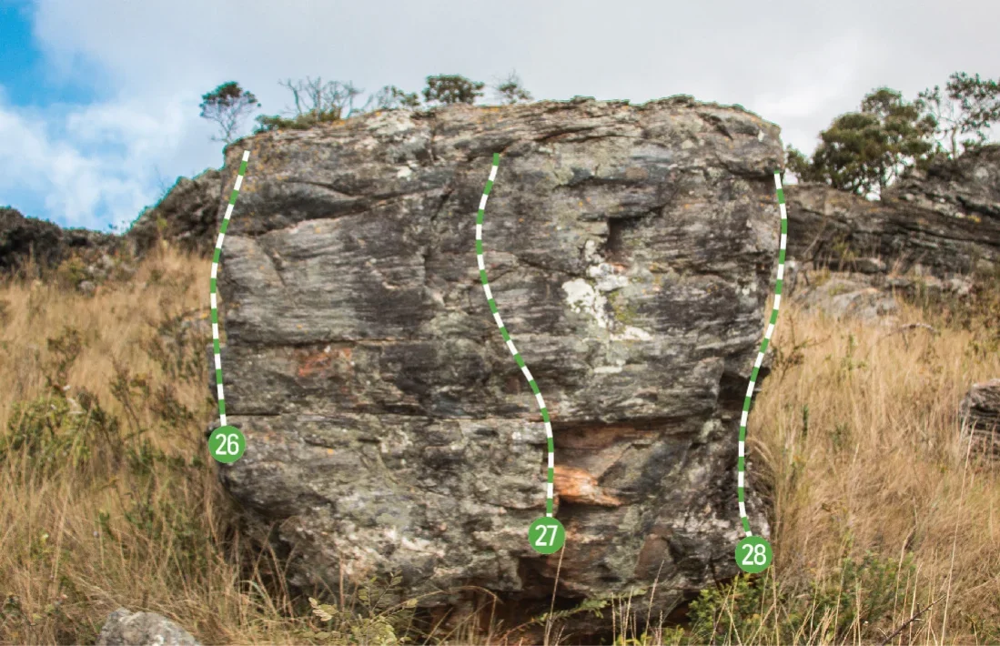
          - **largura_mapa**: 1099
          - **altura_mapa**: 710
          - **referencias**:
            - **[0]**:
              - **alvo_uid**: CRTElAJKI1khEP
              - **pontos_uids**:
                - 26
              - **escalada**: As legítimas
              - **ids**:
                - 26
            - **[1]**:
              - **alvo_uid**: HoeZ5KIKVOZSxP
              - **pontos_uids**:
                - 27
              - **escalada**: Tô partindo
              - **ids**:
                - 27
            - **[2]**:
              - **alvo_uid**: SlktdfDXrYvsg6
              - **pontos_uids**:
                - 28
              - **escalada**: Já parti
              - **ids**:
                - 28
      - **escaladas**:
        - **[0]**:
          - **uid**: CRTElAJKI1khEP
          - **boulder**:
            - **descricao**: Escala a aresta à esquerda saindo de um batente.
            - **nome**: As legítimas
            - **dificuldade**: V8
        - **[1]**:
          - **uid**: HoeZ5KIKVOZSxP
          - **boulder**:
            - **descricao**: Começa sentado nas agarras mais baixas do meio do bloco e escala reto.
            - **nome**: Tô partindo
            - **dificuldade**: V1
        - **[2]**:
          - **uid**: SlktdfDXrYvsg6
          - **boulder**:
            - **descricao**: Sai praticamente deitado com as mãos juntas em um batente bem baixo e escala por agarras boas.
            - **nome**: Já parti
            - **dificuldade**: V1
      - **precomputados**:
        - **total_escaladas**: 3
        - **total_boulders**: 3
  - **[10]**:
    - **conteudo**:
      - **descricao**: 
      - **nome**: Bloco K - Oval
      - **uid**: Z1yJXlbRBaHJmV
      - **mapas**:
        - **[0]**:
          - **caminho_imagem_mapa**: 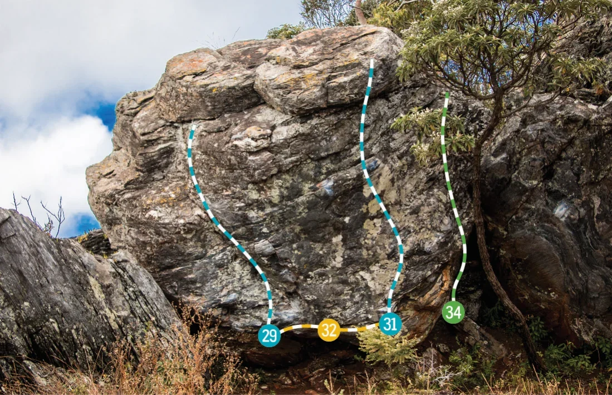
          - **largura_mapa**: 1099
          - **altura_mapa**: 710
          - **referencias**:
            - **[0]**:
              - **alvo_uid**: UVUVlZbjoOhvXs
              - **pontos_uids**:
                - 29
              - **escalada**: Oval
              - **ids**:
                - 29
            - **[1]**:
              - **alvo_uid**: qFehUUpPqzUToA
              - **pontos_uids**:
                - 29
              - **escalada**: Oval SDS
              - **ids**:
                - 29
            - **[2]**:
              - **alvo_uid**: nACBX89aEy56A5
              - **pontos_uids**:
                - 31
              - **escalada**: Teimoso
              - **ids**:
                - 31
            - **[3]**:
              - **alvo_uid**: fGvk5Qo1xiYSY1
              - **pontos_uids**:
                - 32
              - **escalada**: Descompassado
              - **ids**:
                - 32
            - **[4]**:
              - **alvo_uid**: FNxwoqAOpB3x6d
              - **pontos_uids**:
                - 32
              - **escalada**: Descompassado SDS
              - **ids**:
                - 32
            - **[5]**:
              - **alvo_uid**: 33rtFWCa2LXyjQ
              - **pontos_uids**:
                - 34
              - **escalada**: Compasso
              - **ids**:
                - 34
      - **escaladas**:
        - **[0]**:
          - **uid**: UVUVlZbjoOhvXs
          - **boulder**:
            - **descricao**: Começa sentado com as mãos nos batentes da aresta do tetinho e escala reto.
            - **nome**: Oval
            - **dificuldade**: V3
            - **destaque**: True
        - **[1]**:
          - **uid**: qFehUUpPqzUToA
          - **boulder**:
            - **descricao**: Saindo com as mãos juntas em um batente/pocket escorrido no teto e escala reto terminando como o “Oval” (29).
            - **nome**: Oval SDS
            - **dificuldade**: V6
            - **destaque**: True
        - **[2]**:
          - **uid**: nACBX89aEy56A5
          - **boulder**:
            - **descricao**: Sai sentado com as mãos juntas num batente triangular e escala reto.
            - **nome**: Teimoso
            - **dificuldade**: V4
            - **destaque**: True
        - **[3]**:
          - **uid**: fGvk5Qo1xiYSY1
          - **boulder**:
            - **descricao**: Sai do “Oval” (29), atravessa para a saída do “Teimoso” (31) e termina como ele.
            - **nome**: Descompassado
            - **dificuldade**: V6
            - **destaque**: True
            - **conquistadores**:
              - Rafael Passos
            - **data_abertura**: 2008
        - **[4]**:
          - **uid**: FNxwoqAOpB3x6d
          - **boulder**:
            - **descricao**: Saindo com as mãos juntas em um batente/pocket escorrido no teto, entra no “Descompassado” (32) e termina no “Teimoso” (31).
            - **nome**: Descompassado SDS
            - **dificuldade**: V7
            - **destaque**: True
        - **[5]**:
          - **uid**: 33rtFWCa2LXyjQ
          - **boulder**:
            - **descricao**: Começa sentado atrás da árvore com a mão esquerda em um reglete/pocket e a direita em um reglete e escala reto pelas cracas.
            - **nome**: Compasso
            - **dificuldade**: V1
      - **precomputados**:
        - **total_escaladas**: 6
        - **total_boulders**: 6
  - **[11]**:
    - **conteudo**:
      - **descricao**: 
      - **nome**: Bloco L - Motricidade
      - **uid**: j3UF2Z1GJzVY2M
      - **mapas**:
        - **[0]**:
          - **caminho_imagem_mapa**: 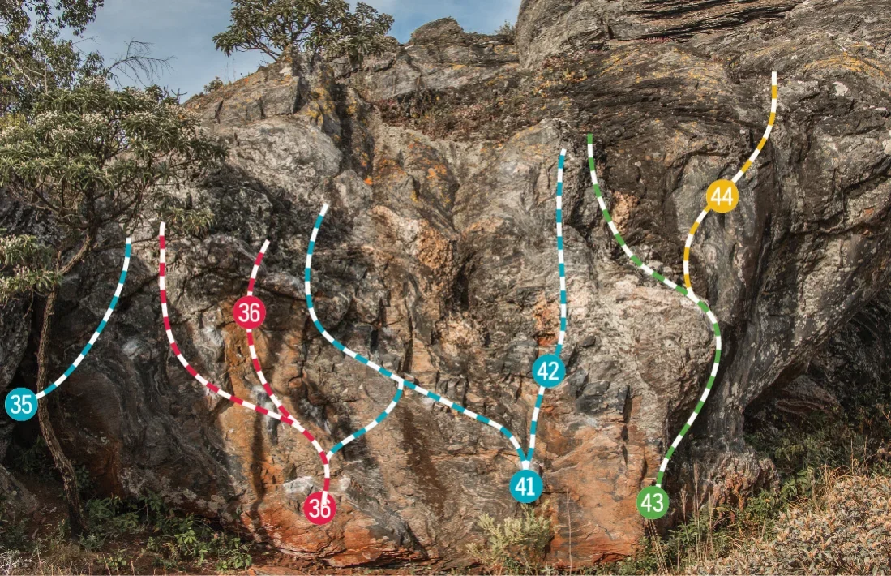
          - **largura_mapa**: 1099
          - **altura_mapa**: 710
          - **referencias**:
            - **[0]**:
              - **alvo_uid**: 3vlGFA0yJH79LJ
              - **pontos_uids**:
                - 35
              - **escalada**: Série continua
              - **ids**:
                - 35
            - **[1]**:
              - **alvo_uid**: ePBGBYtv3KTNUK
              - **pontos_uids**:
                - 36
              - **escalada**: Potencial de ação
              - **ids**:
                - 36
            - **[2]**:
              - **alvo_uid**: 8m05ndYY7TW9t9
              - **pontos_uids**:
                - 36
              - **escalada**: Impulso elétrico
              - **ids**:
                - 36
            - **[3]**:
              - **alvo_uid**: eHXYEBq38sq147
              - **pontos_uids**:
                - 36
              - **escalada**: Motricidade fina
              - **ids**:
                - 36
            - **[4]**:
              - **alvo_uid**: U7fmbcmGEG1p4h
              - **pontos_uids**:
                - 36
              - **escalada**: Tam tam
              - **ids**:
                - 36
            - **[5]**:
              - **alvo_uid**: baIMu0tteb1Oba
              - **pontos_uids**:
                - 36
              - **escalada**: Tio Cabeça
              - **ids**:
                - 36
            - **[6]**:
              - **alvo_uid**: x1LXbRsFidPzfi
              - **pontos_uids**:
                - 41
              - **escalada**: Jornada
              - **ids**:
                - 41
            - **[7]**:
              - **alvo_uid**: PArsjJQRd0HXdT
              - **pontos_uids**:
                - 42
              - **escalada**: Motricidade curta
              - **ids**:
                - 42
            - **[8]**:
              - **alvo_uid**: eWq2nTr3YugGFH
              - **pontos_uids**:
                - 43
              - **escalada**: Primavera
              - **ids**:
                - 43
            - **[9]**:
              - **alvo_uid**: ky1HtFKgCKvjhM
              - **pontos_uids**:
                - 44
              - **escalada**: Irmandade
              - **ids**:
                - 44
      - **escaladas**:
        - **[0]**:
          - **uid**: 3vlGFA0yJH79LJ
          - **boulder**:
            - **descricao**: Começa sentado com as mãos nas agarras mais à direita do bloco, na cave, e escala pra direita terminando como o “Potencial de ação” (36).
            - **nome**: Série continua
            - **dificuldade**: V4
        - **[1]**:
          - **uid**: ePBGBYtv3KTNUK
          - **boulder**:
            - **descricao**: Sai sentado com a mão esquerda em um batente e a direita em um reglete, faz uma sequência de movimentos fortes e muito técnicos, atravessa para a direita e finaliza com um dinâmico.
            - **nome**: Potencial de ação
            - **dificuldade**: V11
            - **destaque**: True
            - **conquistadores**:
              - Rafael Passos
            - **data_abertura**: 2008
        - **[2]**:
          - **uid**: 8m05ndYY7TW9t9
          - **boulder**:
            - **descricao**: Saída em pé para o “Potencial de ação” (36), que começa com a mão esquerda em uma pinça alta e a direita em batente abaulado de lado.
            - **nome**: Impulso elétrico
            - **dificuldade**: V7
            - **destaque**: True
        - **[3]**:
          - **uid**: eHXYEBq38sq147
          - **boulder**:
            - **descricao**: Começa como o “Potencial de ação” (36), segue reto por movimentos duros e técnicos e termina com um dinâmico.
            - **nome**: Motricidade fina
            - **dificuldade**: V11
            - **destaque**: True
            - **conquistadores**:
              - Rafael Passos
            - **data_abertura**: 2008
        - **[4]**:
          - **uid**: U7fmbcmGEG1p4h
          - **boulder**:
            - **descricao**: Saída em pé para o “Motricidade fina” (38), que começa com a mão esquerda em um reglete cortante e a direita em uma invertida.
            - **nome**: Tam tam
            - **dificuldade**: V6
            - **destaque**: True
        - **[5]**:
          - **uid**: baIMu0tteb1Oba
          - **boulder**:
            - **descricao**: Começa como o “Potencial de ação” (36), faz um movimento forte para a direita e segue reto por agarras boas.
            - **nome**: Tio Cabeça
            - **dificuldade**: V5
        - **[6]**:
          - **uid**: x1LXbRsFidPzfi
          - **boulder**:
            - **descricao**: Começa sentado com as mãos juntas em dois regletes pequenos e faz um forte movimento para um batente à esquerda, terminando por agarras boas.
            - **nome**: Jornada
            - **dificuldade**: V4
        - **[7]**:
          - **uid**: PArsjJQRd0HXdT
          - **boulder**:
            - **descricao**: Sai como o “Jornada” (41) e faz uma sequência de movimentos muito fortes até chegar em um agarrão, fazendo um domínio fácil.
            - **nome**: Motricidade curta
            - **dificuldade**: V5
            - **destaque**: True
            - **conquistadores**:
              - Mahavir Jneesh
            - **data_abertura**: 2010
        - **[8]**:
          - **uid**: eWq2nTr3YugGFH
          - **boulder**:
            - **descricao**: Começa sentado com as mãos juntas em uma agarra de oposição na aresta e escala por agarras boas até um domínio fácil.
            - **nome**: Primavera
            - **dificuldade**: V1
            - **destaque**: True
        - **[9]**:
          - **uid**: ky1HtFKgCKvjhM
          - **boulder**:
            - **descricao**: Sai como o “Primavera” (43), faz alguns movimentos e, ao invés de seguir pra esquerda pelas agarras boas, domina pela direita, passando por um crux técnico.
            - **nome**: Irmandade
            - **dificuldade**: V6
            - **conquistadores**:
              - Frederico Gonçalves
            - **data_abertura**: 2008
      - **precomputados**:
        - **total_escaladas**: 10
        - **total_boulders**: 10
  - **[12]**:
    - **conteudo**:
      - **descricao**: 
      - **nome**: Bloco M - Night Climb
      - **uid**: tVKJfjKkPJdUix
      - **mapas**:
        - **[0]**:
          - **caminho_imagem_mapa**: 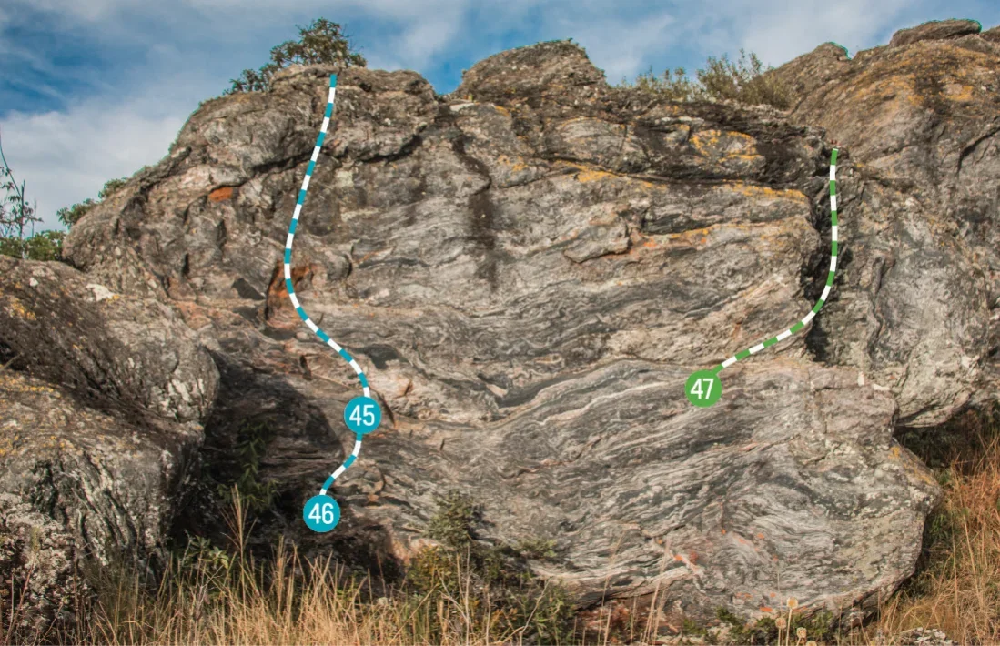
          - **largura_mapa**: 1099
          - **altura_mapa**: 710
          - **referencias**:
            - **[0]**:
              - **alvo_uid**: zUdTPzJWVcaa6y
              - **pontos_uids**:
                - 45
              - **escalada**: Night climb
              - **ids**:
                - 45
            - **[1]**:
              - **alvo_uid**: U1Ctm2yFtfXFOs
              - **pontos_uids**:
                - 46
              - **escalada**: Night climb SDS
              - **ids**:
                - 46
            - **[2]**:
              - **alvo_uid**: lrnM8jDDAlTeqv
              - **pontos_uids**:
                - 47
              - **escalada**: Tramontina
              - **ids**:
                - 47
      - **escaladas**:
        - **[0]**:
          - **uid**: zUdTPzJWVcaa6y
          - **boulder**:
            - **descricao**: Sai em pé com as mãos em dois batentes e escala levemente à esquerda.
            - **nome**: Night climb
            - **dificuldade**: V3
            - **destaque**: True
        - **[1]**:
          - **uid**: U1Ctm2yFtfXFOs
          - **boulder**:
            - **descricao**: Começa sentado com as mãos juntas em um reglete cavado e termina como o “Night climb” (45).
            - **nome**: Night climb SDS
            - **dificuldade**: V4
            - **destaque**: True
        - **[2]**:
          - **uid**: lrnM8jDDAlTeqv
          - **boulder**:
            - **descricao**: Sai em pé com as mãos em dois regletes cortantes na fendinha e escala pra direita em direção à aresta.
            - **nome**: Tramontina
            - **dificuldade**: V1
      - **precomputados**:
        - **total_escaladas**: 3
        - **total_boulders**: 3
  - **[13]**:
    - **conteudo**:
      - **descricao**: 
      - **nome**: Bloco N - Piolho de Cobra
      - **uid**: a9iYrnv8ZnEoaH
      - **mapas**:
        - **[0]**:
          - **caminho_imagem_mapa**: 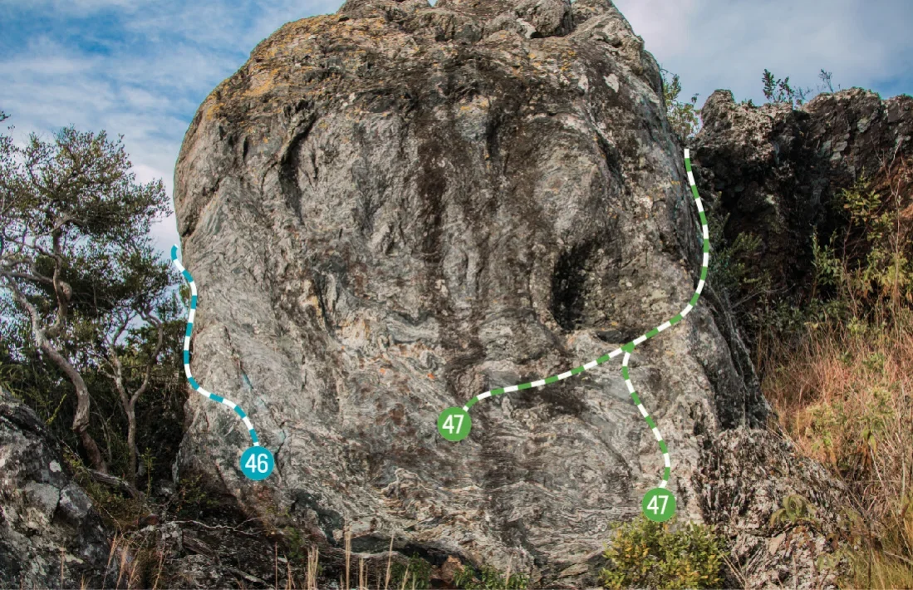
          - **largura_mapa**: 1099
          - **altura_mapa**: 710
          - **referencias**:
            - **[0]**:
              - **alvo_uid**: drHfi7XqlqMdYW
              - **pontos_uids**:
                - 48
              - **escalada**: Piolho de pedra
              - **ids**:
                - 48
            - **[1]**:
              - **alvo_uid**: KihrJAepLiaXAD
              - **pontos_uids**:
                - 49
              - **escalada**: Grilo falante
              - **ids**:
                - 49
            - **[2]**:
              - **alvo_uid**: aMVAmD70TYbLfO
              - **pontos_uids**:
                - 50
              - **escalada**: Piolho de cobra
              - **ids**:
                - 50
      - **escaladas**:
        - **[0]**:
          - **uid**: drHfi7XqlqMdYW
          - **boulder**:
            - **descricao**: Começa com a mão esquerda em uma invertida, na base da fendinha, e a mão direita em um reglete de oposição, terminando pela aresta.
            - **nome**: Piolho de pedra
            - **dificuldade**: V5
            - **destaque**: True
        - **[1]**:
          - **uid**: KihrJAepLiaXAD
          - **boulder**:
            - **descricao**: Sai em pé com a mão esquerda em um gaston e a direita em um reglete, faz um movimento forte para um agarrão e escala em diagonal para a direita, dominando o positivo da face lateral do bloco.
            - **nome**: Grilo falante
            - **dificuldade**: V1
        - **[2]**:
          - **uid**: aMVAmD70TYbLfO
          - **boulder**:
            - **descricao**: Começa sentado com a mão esquerda em um batente/pocket e a direita em um batente, faz um movimento forte para o agarrão e termina como o “Grilo falante” (49).
            - **nome**: Piolho de cobra
            - **dificuldade**: V2
      - **precomputados**:
        - **total_escaladas**: 3
        - **total_boulders**: 3
  - **[14]**:
    - **conteudo**:
      - **descricao**: 
      - **nome**: Bloco O - Democrático
      - **uid**: cBzYvmPe4YbsGj
      - **mapas**:
        - **[0]**:
          - **caminho_imagem_mapa**: 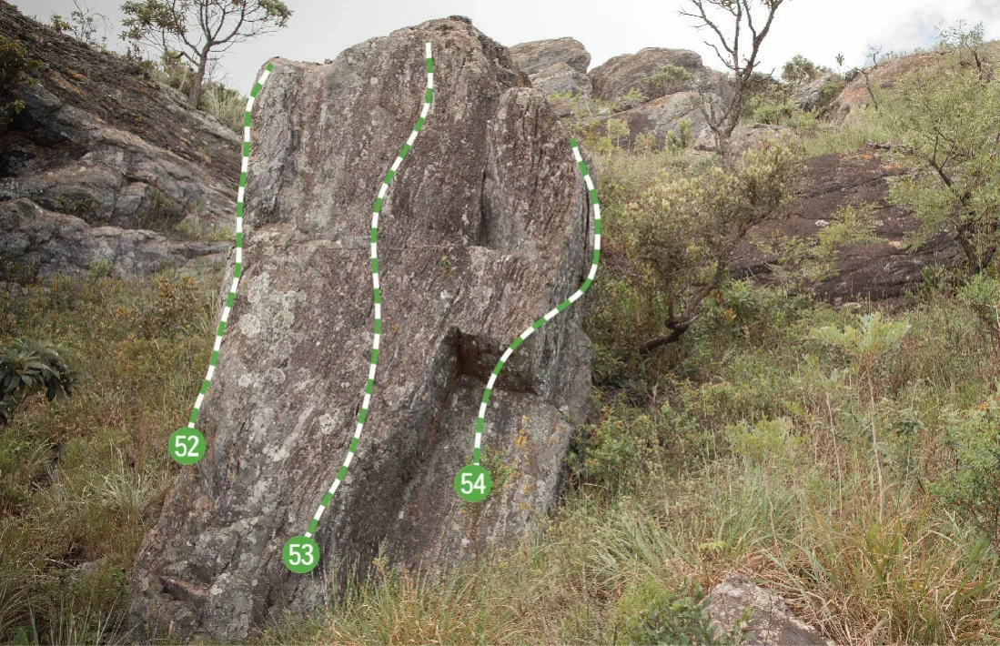
          - **largura_mapa**: 1099
          - **altura_mapa**: 710
          - **referencias**:
            - **[0]**:
              - **alvo_uid**: UjU5A1i47qvufM
              - **pontos_uids**:
                - 51
              - **escalada**: Nulo
              - **ids**:
                - 51
            - **[1]**:
              - **alvo_uid**: TQ4TF1epx1LdYe
              - **pontos_uids**:
                - 52
              - **escalada**: Viva
              - **ids**:
                - 52
            - **[2]**:
              - **alvo_uid**: i83pEet4R8EVhA
              - **pontos_uids**:
                - 53
              - **escalada**: Democrático
              - **ids**:
                - 53
            - **[3]**:
              - **alvo_uid**: 0wYRB7AqIHxWaT
              - **pontos_uids**:
                - 54
              - **escalada**: Espacial
              - **ids**:
                - 54
      - **escaladas**:
        - **[0]**:
          - **uid**: UjU5A1i47qvufM
          - **boulder**:
            - **descricao**: Escala o postivo à esquerda da aresta saindo em pé.
            - **nome**: Nulo
            - **dificuldade**: VB
        - **[1]**:
          - **uid**: TQ4TF1epx1LdYe
          - **boulder**:
            - **descricao**: Boulder que escala a aresta, saindo em pé.
            - **nome**: Viva
            - **dificuldade**: VB
        - **[2]**:
          - **uid**: i83pEet4R8EVhA
          - **boulder**:
            - **descricao**: Começa sentado com a mão esquerda em um reglete baixo e a direita em uma pinça um pouco mais alta, na aresta, e escala reto.
            - **nome**: Democrático
            - **dificuldade**: V0
            - **destaque**: True
        - **[3]**:
          - **uid**: 0wYRB7AqIHxWaT
          - **boulder**:
            - **descricao**: Sai sentado, em baixo do tetinho, com a mão esquerda em uma pinça invertida na aresta e a direita aberta no batente e escala em diagonal pra direita.
            - **nome**: Espacial
            - **dificuldade**: V0
            - **destaque**: True
      - **precomputados**:
        - **total_escaladas**: 4
        - **total_boulders**: 4
  - **[15]**:
    - **conteudo**:
      - **descricao**: 
      - **nome**: Bloco P - Ferrugem
      - **uid**: PSH8qN1KhqcoDN
      - **mapas**:
        - **[0]**:
          - **caminho_imagem_mapa**: 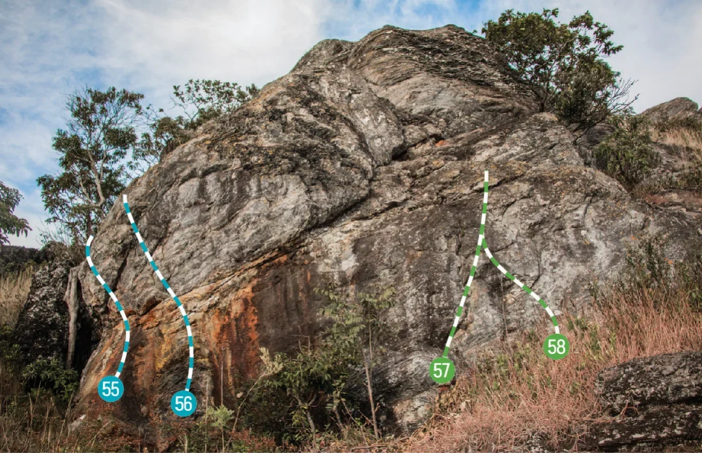
          - **largura_mapa**: 1099
          - **altura_mapa**: 710
          - **referencias**:
            - **[0]**:
              - **alvo_uid**: 1FxsRAU1O49nKM
              - **pontos_uids**:
                - 55
              - **escalada**: Oxidante
              - **ids**:
                - 55
            - **[1]**:
              - **alvo_uid**: HrXGzd2iEudZxO
              - **pontos_uids**:
                - 56
              - **escalada**: Ferrugem
              - **ids**:
                - 56
            - **[2]**:
              - **alvo_uid**: 4wMQMv20gcd1fM
              - **pontos_uids**:
                - 57
              - **escalada**: Corrosivo
              - **ids**:
                - 57
            - **[3]**:
              - **alvo_uid**: ORK6wT1dXx0p99
              - **pontos_uids**:
                - 58
              - **escalada**: Antitetânica
              - **ids**:
                - 58
      - **escaladas**:
        - **[0]**:
          - **uid**: 1FxsRAU1O49nKM
          - **boulder**:
            - **descricao**: Começa em pé com as mãos juntas em um batente/abaulado de lado e escala em diagonal para a esquerda.
            - **nome**: Oxidante
            - **dificuldade**: V1
            - **destaque**: True
        - **[1]**:
          - **uid**: HrXGzd2iEudZxO
          - **boulder**:
            - **descricao**: Sai em pé com as mãos juntas em um reglete/pocket e escala em diagonal para a esquerda.
            - **nome**: Ferrugem
            - **dificuldade**: V3
            - **destaque**: True
        - **[2]**:
          - **uid**: 4wMQMv20gcd1fM
          - **boulder**:
            - **descricao**: Começa com a mão direita em uma agarra invertida e a esquerda em um batente de gaston e escala em linha reta.
            - **nome**: Corrosivo
            - **dificuldade**: V2
            - **destaque**: True
        - **[3]**:
          - **uid**: ORK6wT1dXx0p99
          - **boulder**:
            - **descricao**: Sai sentado com as mãos em dois regletes/pockets e toca reto.
            - **nome**: Antitetânica
            - **dificuldade**: V2
      - **precomputados**:
        - **total_escaladas**: 4
        - **total_boulders**: 4
- **precomputados**:
  - **total_escaladas**: 58
  - **total_boulders**: 58

## Parte: grupo_canaleta

### Grupo (Pico: Pedra Rachada)

- **descricao**:
    O setor menos explorado de todos abriga uma das escaladas mais clássicas da Pedra Rachada. Seu nome deve-se à sua formação, uma espécie de canaleta de blocos que se estende por toda a “crista” do morro, de norte a sul. São inúmeros blocos praticamente inexplorados em toda a sua extensão, que se concentram principalmente a sudoeste do setor ”Sono do calango”, um convite aos caçadores de boulders de plantão.
    
    ## Acesso (20 min)
    
    Para chegar a este setor, a melhor forma é pegar a trilha principal a partir do “Estacionamento 2” e entrar à esquerda na primeira bifurcação, pouco antes da placa “Seja bem vindo a Pedra Rachada”. Para acessar os blocos “Cavalo de Tróia” e “Destinos”, pegue para a direita em frente ao bloco “High vibe”, 50m após a bifurcação.
    
    ## Boulders Clássicos
    
    - **30. The Dark Side of the Moon** – V3
    - **12. Logística** – V5
    - **28. Prisma** – V6
    - **19. Toca da onça** – V6
    - **15. Puma** – V8
    - **17. Esparrachado** – V8
    
    > "Escalada em particular, é um passatempo paradoxalmente intelectual, mas com a seguinte diferença: você tem que pensar com seu corpo. [...] Por um curto período eu sou diretamente responsável pelas minhas ações. No belo, silencioso, mundo das montanhas, me parece válido esse pequeno risco."  
    > — *Al Alvarez*
    
    ## Blocos do Setor
    
    - **Bloco A – Cavalo de Tróia**: boulders 1 a 3.
    - **Bloco B – Destinos**: boulders 4 a 7.
    - **Bloco C – Forrest Gump**: boulder 8.
    - **Bloco D – Fábulas**: boulder 9.
    - **Bloco E – Logística**: boulders 10 a 12.
    - **Bloco F – Puma**: boulders 13 a 15.
    - **Bloco G – Esparrachado**: boulders 16 a 23.
    - **Bloco H – Beto Carneiro**: boulders 24 a 27.
    - **Bloco I – Prisma**: boulders 28 a 33.
    
    | 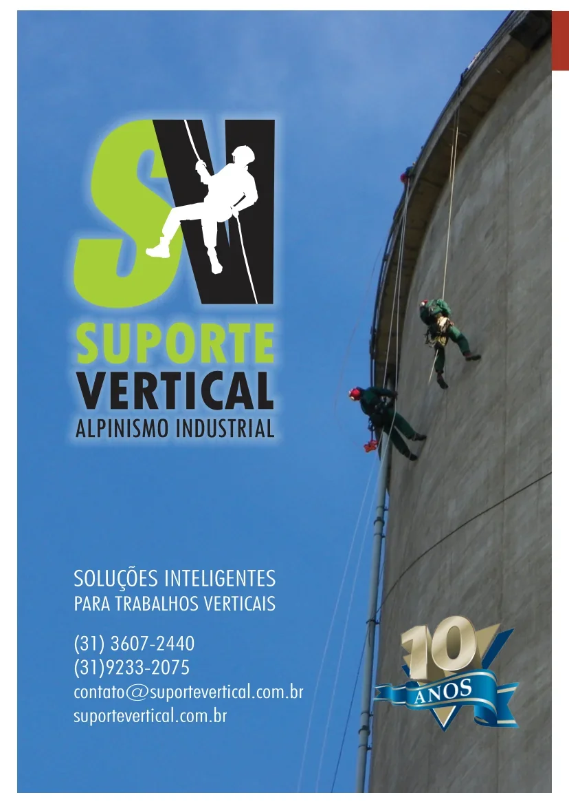 |
    | :--: |
    | *Suporte Vertical - Alpinismo Industrial* |
    
    *Suporte Vertical – Alpinismo Industrial: Soluções inteligentes para trabalhos verticais. (31) 3607-2440 / (31) 9233-2075 | contato@suportevertical.com.br | suportevertical.com.br*
- **nome**: Canaleta
- **uid**: RRfc3AYzipzGZu
- **caminho_imagem_capa**: 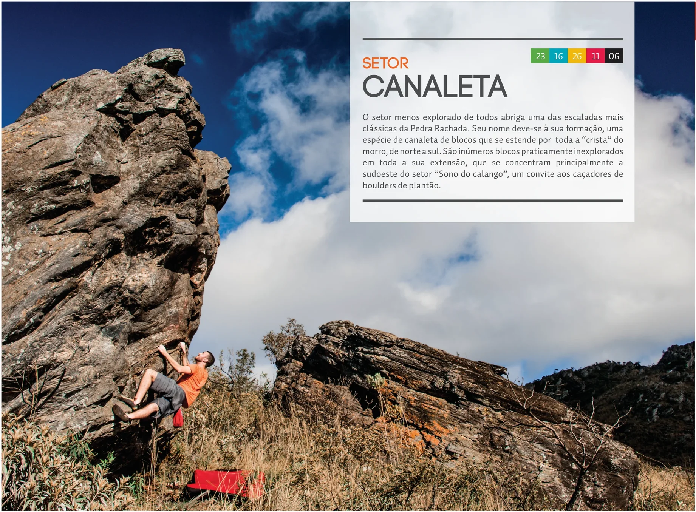
- **setores**:
  - **[0]**:
    - **conteudo**:
      - **descricao**: 
      - **nome**: Bloco A - Cavalo de Tróia
      - **uid**: oe0oM3OKf5mGtz
      - **mapas**:
        - **[0]**:
          - **caminho_imagem_mapa**: 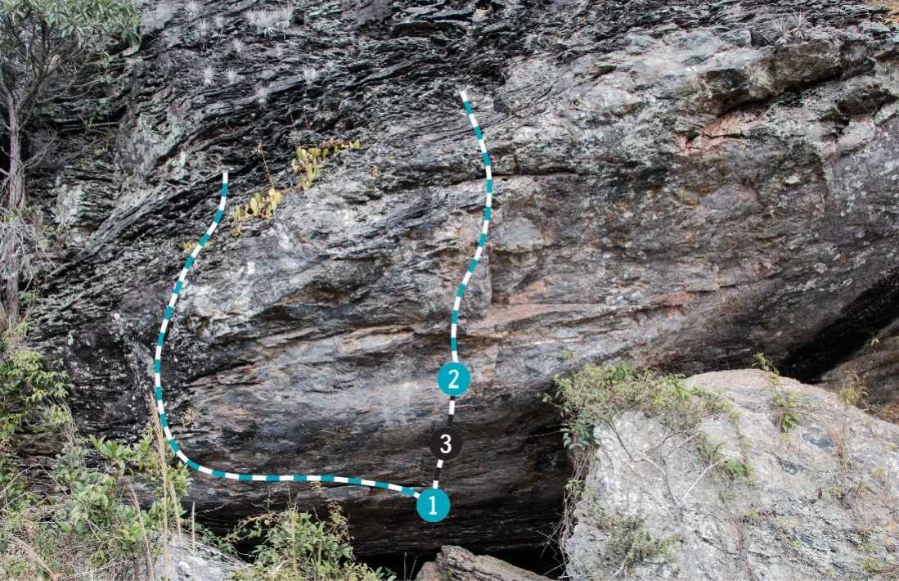
          - **largura_mapa**: 1099
          - **altura_mapa**: 710
          - **referencias**:
            - **[0]**:
              - **alvo_uid**: bsMo0GTJJ8zumN
              - **pontos_uids**:
                - 1
              - **escalada**: Cachorro de Tróia
              - **ids**:
                - 1
            - **[1]**:
              - **alvo_uid**: ypKVS0x7xDsXy2
              - **pontos_uids**:
                - 2
              - **escalada**: Tróia
              - **ids**:
                - 2
            - **[2]**:
              - **alvo_uid**: gu69FPgUp6JRBw
              - **pontos_uids**:
                - 3
              - **escalada**: Projeto Cavalo de Tróia
              - **ids**:
                - 3
      - **escaladas**:
        - **[0]**:
          - **uid**: bsMo0GTJJ8zumN
          - **boulder**:
            - **descricao**: Sai sentado com as mãos juntas em um grande batente, passa por outros dois batentes e vira.
            - **nome**: Cachorro de Tróia
            - **dificuldade**: V3
            - **destaque**: True
        - **[1]**:
          - **uid**: ypKVS0x7xDsXy2
          - **boulder**:
            - **descricao**: Saída em pé do projeto “Cavalo de Tróia” (3). Começa com as mãos nos regletes pequenos e da um tapa no agarrão.
            - **nome**: Tróia
            - **dificuldade**: V5
        - **[2]**:
          - **uid**: gu69FPgUp6JRBw
          - **boulder**:
            - **descricao**: Este boulder foi aberto há alguns anos e teve o grau sugerido como v7. Logo após sua abertura, um dos regletes se quebrou e ele permanece como projeto desde então. Começa como o “Cachorro de Tróia” (1) e segue reto pelo negativo passando por regletes pequenos até um agarrão..
            - **nome**: Projeto Cavalo de Tróia
            - **dificuldade**: INDEFINIDO
      - **precomputados**:
        - **total_escaladas**: 3
        - **total_boulders**: 3
  - **[1]**:
    - **conteudo**:
      - **descricao**: 
      - **nome**: Bloco B - Destinos
      - **uid**: IcRPBpWO0uiVyd
      - **mapas**:
        - **[0]**:
          - **caminho_imagem_mapa**: 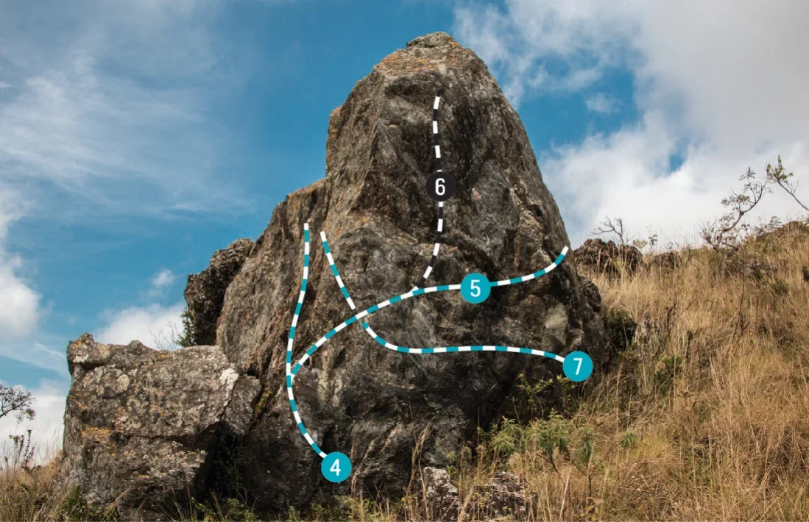
          - **largura_mapa**: 1099
          - **altura_mapa**: 710
          - **referencias**:
            - **[0]**:
              - **alvo_uid**: VriY2xUGHI5vaI
              - **pontos_uids**:
                - 4
              - **escalada**: Destino oposto
              - **ids**:
                - 4
            - **[1]**:
              - **alvo_uid**: 7iYOiusovqp3vT
              - **pontos_uids**:
                - 5
              - **escalada**: Destino certo
              - **ids**:
                - 5
            - **[2]**:
              - **alvo_uid**: isbiK0AJiugz4Q
              - **pontos_uids**:
                - 6
              - **escalada**: Projeto Destino Incerto
              - **ids**:
                - 6
            - **[3]**:
              - **alvo_uid**: ox58e5UmPF2xTL
              - **pontos_uids**:
                - 7
              - **escalada**: Quanta loucura
              - **ids**:
                - 7
      - **escaladas**:
        - **[0]**:
          - **uid**: VriY2xUGHI5vaI
          - **boulder**:
            - **descricao**: Sai sentado com as mãos em um batente invertido, faz um movimento forte para uma agarra boa e domina pelo positivo.
            - **nome**: Destino oposto
            - **dificuldade**: V3
        - **[1]**:
          - **uid**: 7iYOiusovqp3vT
          - **boulder**:
            - **descricao**: Começa como o “Destino oposto” (4) e, do agarrão, faz uma travessia pelos regletes do negativo dominando na direita do bloco.
            - **nome**: Destino certo
            - **dificuldade**: V4
            - **destaque**: True
        - **[2]**:
          - **uid**: isbiK0AJiugz4Q
          - **boulder**:
            - **descricao**: Projeto que escala o “Destino oposto” (5) até o meio do negativo e segue reto, dominando pela proa.
            - **nome**: Projeto Destino Incerto
            - **dificuldade**: INDEFINIDO
        - **[3]**:
          - **uid**: ox58e5UmPF2xTL
          - **boulder**:
            - **descricao**: Começa sentado com as mãos juntas em uma agarra boa e atravessa para a esquerda, pelo negativo, terminando como o “Destino oposto” (4)
            - **nome**: Quanta loucura
            - **dificuldade**: V3
      - **precomputados**:
        - **total_escaladas**: 4
        - **total_boulders**: 4
  - **[2]**:
    - **conteudo**:
      - **descricao**: 
      - **nome**: Bloco C - Forrest Gump
      - **uid**: hb3raOpphILWEB
      - **mapas**:
        - **[0]**:
          - **caminho_imagem_mapa**: 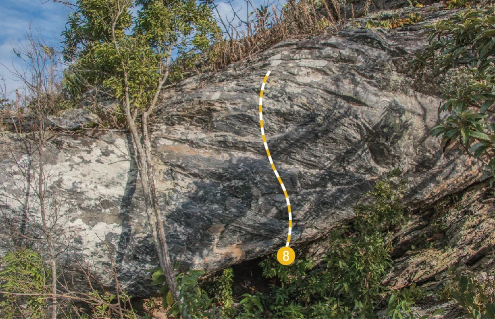
          - **largura_mapa**: 1099
          - **altura_mapa**: 710
          - **referencias**:
            - **[0]**:
              - **alvo_uid**: T5ZRVnfZVDAcwo
              - **pontos_uids**:
                - 8
              - **escalada**: Forest Gump
              - **ids**:
                - 8
      - **escaladas**:
        - **[0]**:
          - **uid**: T5ZRVnfZVDAcwo
          - **boulder**:
            - **descricao**: Sai sentado com as mãos nas agarras boas do teto e escala o pequeno bloco com uma movimentação única e que exige muita tensão corporal.
            - **nome**: Forest Gump
            - **dificuldade**: V7
            - **destaque**: True
      - **precomputados**:
        - **total_escaladas**: 1
        - **total_boulders**: 1
  - **[3]**:
    - **conteudo**:
      - **descricao**: 
      - **nome**: Bloco D - Fábulas
      - **uid**: JB9CpY74cAciLe
      - **mapas**:
        - **[0]**:
          - **caminho_imagem_mapa**: 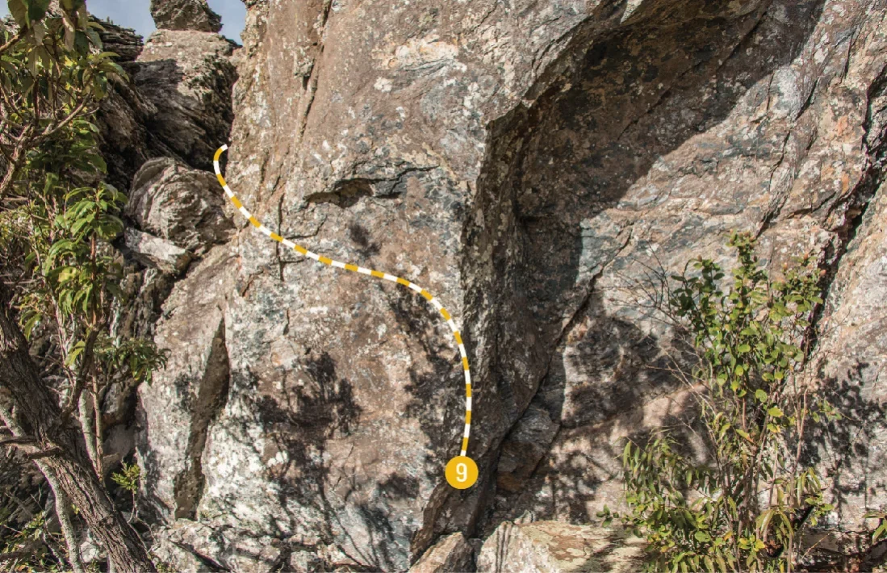
          - **largura_mapa**: 1099
          - **altura_mapa**: 710
          - **referencias**:
            - **[0]**:
              - **alvo_uid**: bEKrYFPyVQYHy4
              - **pontos_uids**:
                - 9
              - **escalada**: Fábulas
              - **ids**:
                - 9
      - **escaladas**:
        - **[0]**:
          - **uid**: bEKrYFPyVQYHy4
          - **boulder**:
            - **descricao**: Começa sentado com as mãos juntas em um reglete/batente de oposição na face lateral, próximo à aresta, e atravessa para a esquerda, pelo vertical, dominando pela parte fácil.
            - **nome**: Fábulas
            - **dificuldade**: V6
            - **conquistadores**:
              - Frederico Gonçalves
            - **data_abertura**: 2012
      - **precomputados**:
        - **total_escaladas**: 1
        - **total_boulders**: 1
  - **[4]**:
    - **conteudo**:
      - **descricao**: 
      - **nome**: Bloco E - Logística
      - **uid**: OzndYQaTozxg9q
      - **mapas**:
        - **[0]**:
          - **caminho_imagem_mapa**: 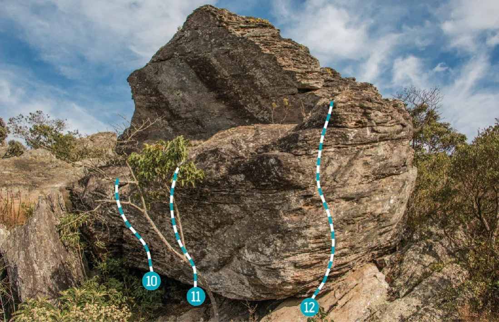
          - **largura_mapa**: 1099
          - **altura_mapa**: 710
          - **referencias**:
            - **[0]**:
              - **alvo_uid**: Kj51yGScp8nlFR
              - **pontos_uids**:
                - 10
              - **escalada**: Sequência ilógica
              - **ids**:
                - 10
            - **[1]**:
              - **alvo_uid**: n2lQJAYPpovSwh
              - **pontos_uids**:
                - 11
              - **escalada**: Logística de crashs
              - **ids**:
                - 11
            - **[2]**:
              - **alvo_uid**: fHJXICckDJ2ZbX
              - **pontos_uids**:
                - 12
              - **escalada**: Logística
              - **ids**:
                - 12
      - **escaladas**:
        - **[0]**:
          - **uid**: Kj51yGScp8nlFR
          - **boulder**:
            - **descricao**: Sai com as mãos nos batentes na borda do teto e escala o negativo pelas lacas.
            - **nome**: Sequência ilógica
            - **dificuldade**: V3
        - **[1]**:
          - **uid**: n2lQJAYPpovSwh
          - **boulder**:
            - **descricao**: Começa com as mãos nos regletes na borda do teto logo à esquerda da árvore e segue reto pelas cracas.
            - **nome**: Logística de crashs
            - **dificuldade**: V4
            - **destaque**: True
        - **[2]**:
          - **uid**: fHJXICckDJ2ZbX
          - **boulder**:
            - **descricao**: Sai sentado com as mãos nas lacas mais baixas e escala a “proa” pelos pockets.
            - **nome**: Logística
            - **dificuldade**: V5
            - **destaque**: True
      - **precomputados**:
        - **total_escaladas**: 3
        - **total_boulders**: 3
  - **[5]**:
    - **conteudo**:
      - **descricao**: 
      - **nome**: Bloco F - Puma
      - **uid**: 59WWOgPejfYyAK
      - **mapas**:
        - **[0]**:
          - **caminho_imagem_mapa**: 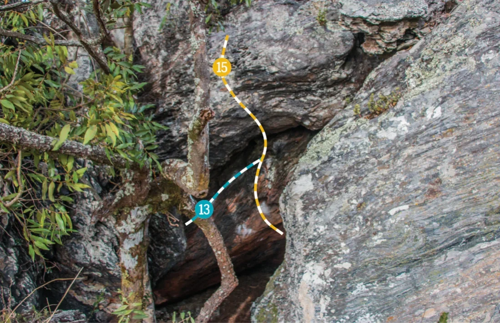
          - **largura_mapa**: 1099
          - **altura_mapa**: 710
          - **referencias**:
            - **[0]**:
              - **alvo_uid**: h7wyNouGXO9BFQ
              - **pontos_uids**:
                - 13
              - **escalada**: Xanim
              - **ids**:
                - 13
            - **[1]**:
              - **alvo_uid**: eU9tsPm8nTSb3a
              - **pontos_uids**:
                - 15
              - **escalada**: Jaguatirica
              - **ids**:
                - 15
            - **[2]**:
              - **alvo_uid**: wBnIJo84rbqj0a
              - **pontos_uids**:
                - 15
              - **escalada**: Puma
              - **ids**:
                - 15
      - **escaladas**:
        - **[0]**:
          - **uid**: h7wyNouGXO9BFQ
          - **boulder**:
            - **descricao**: Este boulder fica na entrada lateral da caverna, em baixo de um bloco encaixado no teto. Sai com as mãos juntas em uma agarra boa e escala a aresta de agarrões dentro da caverna, terminando como o “Puma” (15).
            - **nome**: Xanim
            - **dificuldade**: V3
            - **destaque**: True
        - **[1]**:
          - **uid**: eU9tsPm8nTSb3a
          - **boulder**:
            - **descricao**: Este boulder não usa a pedra onde fica a saída do “Puma” (15). Começa com as mãos juntas em um batente bom na aresta do teto e entra no “Jaguatirica” (15).
            - **nome**: Jaguatirica
            - **dificuldade**: V8
            - **destaque**: True
            - **conquistadores**:
              - Gustavo Fontes
            - **data_abertura**: 2010
        - **[2]**:
          - **uid**: wBnIJo84rbqj0a
          - **boulder**:
            - **descricao**: Começa com as mãos em duas agarras boas de lado na pedra mais ao fundo da caverna, passa para o outro bloco e atravessa todo o teto dominando pelo bloco encaixado acima da árvore na boca da caverna.
            - **nome**: Puma
            - **dificuldade**: V8
            - **destaque**: True
            - **conquistadores**:
              - Gustavo Fontes
            - **data_abertura**: 2010
      - **precomputados**:
        - **total_escaladas**: 3
        - **total_boulders**: 3
  - **[6]**:
    - **conteudo**:
      - **descricao**: 
      - **nome**: Bloco G - Esparrachado
      - **uid**: zZctFAl97yZ9dd
      - **mapas**:
        - **[0]**:
          - **caminho_imagem_mapa**: 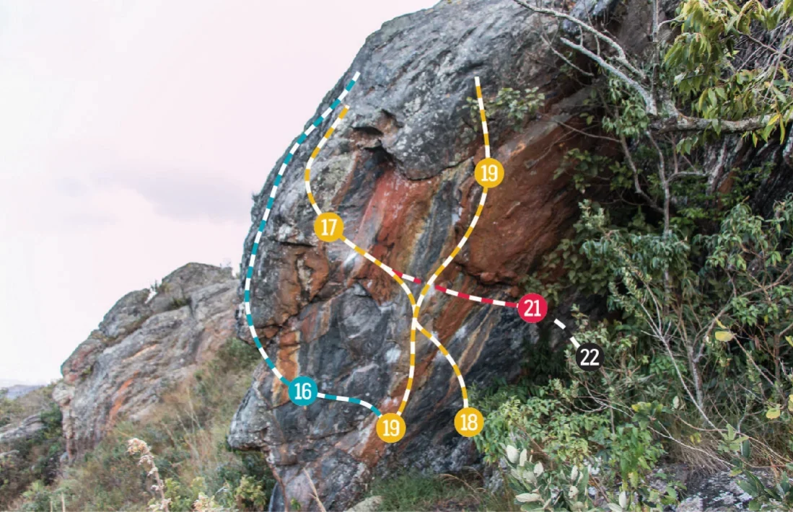
          - **largura_mapa**: 1099
          - **altura_mapa**: 710
          - **referencias**:
            - **[0]**:
              - **alvo_uid**: zXvQtEuEV09Lxo
              - **pontos_uids**:
                - 16
              - **escalada**: Gatuno
              - **ids**:
                - 16
            - **[1]**:
              - **alvo_uid**: X6b33peQ0ZjdbO
              - **pontos_uids**:
                - 17
              - **escalada**: Esparrachado
              - **ids**:
                - 17
            - **[2]**:
              - **alvo_uid**: JNLfl70F6Xs2LW
              - **pontos_uids**:
                - 18
              - **escalada**: Pantera negra
              - **ids**:
                - 18
            - **[3]**:
              - **alvo_uid**: 1aPJXsPj3aHUgn
              - **pontos_uids**:
                - 19
              - **escalada**: Toca da onça
              - **ids**:
                - 19
            - **[4]**:
              - **alvo_uid**: F7EFuRhEvJ4KDH
              - **pontos_uids**:
                - 18
                - 19
              - **escalada**: Pantera
              - **ids**:
                - 18
                - 19
            - **[5]**:
              - **alvo_uid**: 7PhQvxJxFxvrPS
              - **pontos_uids**:
                - 21
              - **escalada**: Holograma
              - **ids**:
                - 21
            - **[6]**:
              - **alvo_uid**: 7KgDGIOEOlxZSp
              - **pontos_uids**:
                - 22
              - **escalada**: Projeto 13
              - **ids**:
                - 22
      - **escaladas**:
        - **[0]**:
          - **uid**: zXvQtEuEV09Lxo
          - **boulder**:
            - **descricao**: Começa como o “Toca da onça” (19) e faz uma travessia para a esquerda dominando pela aresta.
            - **nome**: Gatuno
            - **dificuldade**: V2
        - **[1]**:
          - **uid**: X6b33peQ0ZjdbO
          - **boulder**:
            - **descricao**: Sai como o “Toca da onça” (19) mas do meio do bloco atravessa para a esquerda dominando pela aresta. Um dos mais clássicos deste grau de toda a Pedra Rachada!
            - **nome**: Esparrachado
            - **dificuldade**: V8
            - **destaque**: True
        - **[2]**:
          - **uid**: JNLfl70F6Xs2LW
          - **boulder**:
            - **descricao**: Começa em pé com as mãos juntas em uma agarra invertida e termina no “Esparrachado” (17).
            - **nome**: Pantera negra
            - **dificuldade**: V9
            - **destaque**: True
            - **conquistadores**:
              - Ruy Castro
            - **data_abertura**: 2010
        - **[3]**:
          - **uid**: 1aPJXsPj3aHUgn
          - **boulder**:
            - **descricao**: Sai sentado com as mãos nas agarras boas mais baixas e escala em diagonal pra direita pelo negativo dominando na parte mais alta do bloco.
            - **nome**: Toca da onça
            - **dificuldade**: V6
            - **destaque**: True
            - **conquistadores**:
              - Ruy Castro
            - **data_abertura**: 2010
        - **[4]**:
          - **uid**: F7EFuRhEvJ4KDH
          - **boulder**:
            - **descricao**: Começa como o “Pantera Negra” (18) e termina no “Toca da onça” (19).
            - **nome**: Pantera
            - **dificuldade**: V8
            - **destaque**: True
            - **conquistadores**:
              - Gustavo Fontes
            - **data_abertura**: 2010
        - **[5]**:
          - **uid**: 7PhQvxJxFxvrPS
          - **boulder**:
            - **descricao**: Travessia que sai em pé em um agarrão invertido e termina como o “Esparrachado” (17).
            - **nome**: Holograma
            - **dificuldade**: V10
            - **destaque**: True
        - **[6]**:
          - **uid**: 7KgDGIOEOlxZSp
          - **boulder**:
            - **descricao**: Começa como o Holograma e termina no “Toca da onça” (19).
            - **nome**: Projeto 13
            - **dificuldade**: INDEFINIDO
        - **[7]**:
          - **uid**: ZXzDrvH1dF7zwH
          - **boulder**:
            - **descricao**: Projeto duro que sai sentado nas agarras mais baixas, próximas à entrada da caverna, e atravessa para a esquerda.
            - **nome**: Projeto 14
            - **dificuldade**: INDEFINIDO
      - **precomputados**:
        - **total_escaladas**: 8
        - **total_boulders**: 8
  - **[7]**:
    - **conteudo**:
      - **descricao**: 
      - **nome**: Bloco H - Beto Carneiro
      - **uid**: SHWTAwWaEAqPSD
      - **mapas**:
        - **[0]**:
          - **caminho_imagem_mapa**: 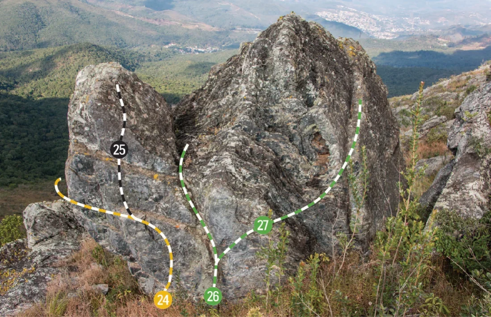
          - **largura_mapa**: 1099
          - **altura_mapa**: 710
          - **referencias**:
            - **[0]**:
              - **alvo_uid**: Jz6UIaoogBj14p
              - **pontos_uids**:
                - 24
              - **escalada**: Beto Carneiro
              - **ids**:
                - 24
            - **[1]**:
              - **alvo_uid**: zFJlmP2a7RXP8d
              - **pontos_uids**:
                - 25
              - **escalada**: Projeto 15
              - **ids**:
                - 25
            - **[2]**:
              - **alvo_uid**: Ku8WADvDQom434
              - **pontos_uids**:
                - 26
              - **escalada**: Bozó
              - **ids**:
                - 26
            - **[3]**:
              - **alvo_uid**: 6wPU9NOrZNskNu
              - **pontos_uids**:
                - 27
              - **escalada**: Tim Tones
              - **ids**:
                - 27
      - **escaladas**:
        - **[0]**:
          - **uid**: Jz6UIaoogBj14p
          - **boulder**:
            - **descricao**: Sai sentado com a mão esquerda em uma agarra boa invertida, e a direita em um bico, escala até o meio do bloco e domina pela aresta.
            - **nome**: Beto Carneiro
            - **dificuldade**: V6
            - **destaque**: True
        - **[1]**:
          - **uid**: zFJlmP2a7RXP8d
          - **boulder**:
            - **descricao**: Sai como o “Beto Carneiro ” (24) e segue reto dominando na parte mais alta da pedra.
            - **nome**: Projeto 15
            - **dificuldade**: INDEFINIDO
        - **[2]**:
          - **uid**: Ku8WADvDQom434
          - **boulder**:
            - **descricao**: Sai sentado com a mão esquerda em um reglete pequeno e a direita em um reglete bom, mais baixo, e segue reto pela fenda.
            - **nome**: Bozó
            - **dificuldade**: V3
            - **destaque**: True
        - **[3]**:
          - **uid**: 6wPU9NOrZNskNu
          - **boulder**:
            - **descricao**: Começa como o “Tim Tones” (25) e atravessa para a direita, dominando pelo positivo.
            - **nome**: Tim Tones
            - **dificuldade**: V2
            - **destaque**: True
      - **precomputados**:
        - **total_escaladas**: 4
        - **total_boulders**: 4
  - **[8]**:
    - **conteudo**:
      - **descricao**: 
      - **nome**: Bloco I - Prisma
      - **uid**: ZexkRSjLjQ5djK
      - **escaladas**:
        - **[0]**:
          - **uid**: paDvpeVAUzHPOh
          - **boulder**:
            - **descricao**: Sai sentado com as mãos nos dois batentes óbvios e escala por regletes, dominando o bloco pela esquerda.
            - **nome**: Prisma
            - **dificuldade**: V6
            - **destaque**: True
            - **conquistadores**:
              - Maíra Vilas Boas
            - **data_abertura**: 2013
        - **[1]**:
          - **uid**: dZOuIDh6JYE3TS
          - **boulder**:
            - **descricao**: Linha reta que escala toda a “proa”, saindo como o “Prisma” (29.
            - **nome**: Projeto 16
            - **dificuldade**: INDEFINIDO
        - **[2]**:
          - **uid**: aSdBa0yVcVocVQ
          - **boulder**:
            - **descricao**: Começa como o “Prisma”, atravessa para a direita por agarras boas e domina reto.
            - **nome**: The Dark Side of the Moon
            - **dificuldade**: V3
            - **destaque**: True
        - **[3]**:
          - **uid**: X9RRtvfgHXQpYz
          - **boulder**:
            - **descricao**: Sai como o “Prisma” (31) e atravessa para a direita por agarras boas dominando na parte mais baixa do bloco.
            - **nome**: Refração
            - **dificuldade**: V2
            - **destaque**: True
        - **[4]**:
          - **uid**: 7hfPhev1SsfhMR
          - **boulder**:
            - **descricao**: Sai sentado, com a mão direita em um reglete pequeno e a esquerda ao lado, em um abaulado, e termina como o “The Dark Side Of The Moon” (30). Terminado como o “Refração” (31) é o Difração v4.
            - **nome**: Pote de ouro
            - **dificuldade**: V5
            - **destaque**: True
            - **conquistadores**:
              - Luca Portilho
            - **data_abertura**: 2013
        - **[5]**:
          - **uid**: ebVnpuF8syfE0I
          - **boulder**:
            - **descricao**: Sai como o “Pote de ouro” (32), sentado, com a mão direita em um reglete pequeno e a esquerda ao lado, em um abaulado, e termina como o “Refração” (31).
            - **nome**: Difração
            - **dificuldade**: V4
      - **precomputados**:
        - **total_escaladas**: 6
        - **total_boulders**: 6
- **precomputados**:
  - **total_escaladas**: 33
  - **total_boulders**: 33

## Parte: grupo_tubarao

### Grupo (Pico: Pedra Rachada)

- **descricao**:
    Setor com os projetos mais difíceis da Pedra Rachada, sendo alguns extensões do clássico “Abrigo de ferro”, v11 sólido de movimentação única. O bloco “Fogos de Vênus”, que apoia o bloco Abrigo de Ferro, possui algumas das escaladas verticais mais divertidas de toda a área. Já o bloco “Tubarão”, possui um dos tetos mais explorados da Rachada, com várias linhas e variantes incríveis que garantem aos escaladores do circuito amarelo muita diversão!
    
    ## Acesso (25 min)
    
    Para acessar este setor, a partir do “Estacionamento 2”, siga a trilha principal que passa à esquerda do “Bloco 1” e à direita do bloco “Lua cheia” e suba até o bloco “Rolling Stones”. A partir daí, existem duas opções: para os blocos “Fogos de Vênus” e “Abrigo de ferro”, contorne o bloco “Rolling Stones” pela esquerda e pegue a trilha que sobe à direita por 3min. Para acessar o “Tubarão” e os outros blocos, contorne o bloco “Rolling Stones pela direita e pegue a primeira trilha larga à esquerda, subindo por 5min.
    
    ## Boulders Clássicos
    
    - **3. Fogos de Vênus** – V2
    - **2. Vênus** – V3
    - **15. Tubarão** – V5
    - **21. Chivas** – V7
    - **6. Abrigo de ferro** – V11
    
    | 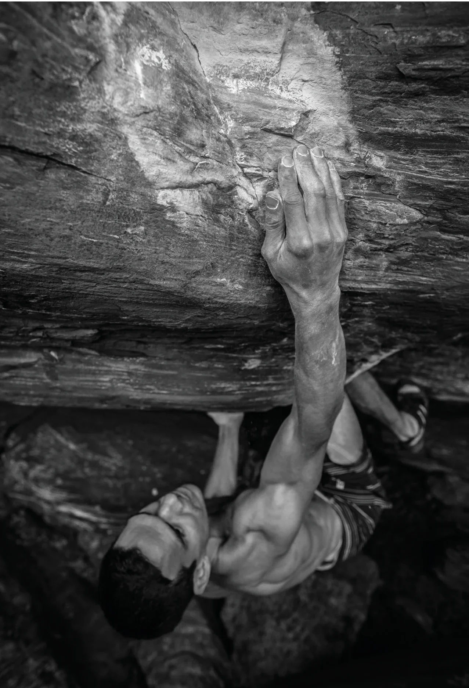 |
    | :--: |
    | *Escalador com a mão em reglete em teto* |
    
    ## Blocos do Setor
    
    - **Bloco A – Fogos de Vênus**: boulders 1 a 5.
    - **Bloco B – Abrigo de Ferro**: boulders 6 a 10.
    - **Bloco C – Meteoro**: boulders 11 e 12.
    - **Bloco D – Tubarão**: boulders 13 a 37.
    - **Bloco E – Hindu**: boulder 38.
    - **Bloco F – Ganesh**: boulder 39.
    - **Bloco G – Croissant**: boulders 40 e 41.
    - **Bloco H – Túnel do Vento**: boulders 42 e 43.
    
    | 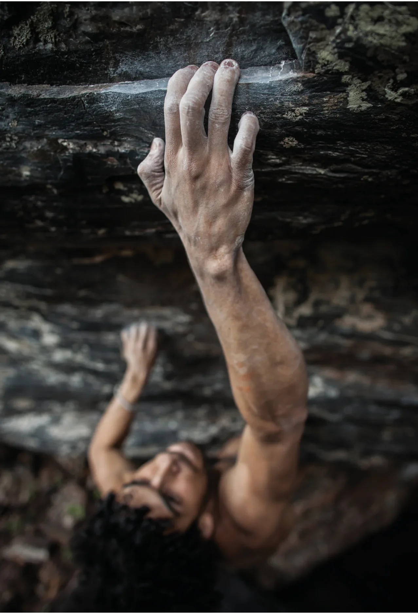 |
    | :--: |
    | *Escalador dominando a borda com agarras de reglete* |
    
    > "É impossível avaliar a força que possuímos sem medir o tamanho do obstáculo que podemos vencer, nem o valor de uma ação sem sabermos o sacrifício que ela comporta."  
    > — *H. W. Beecher*
    
    | 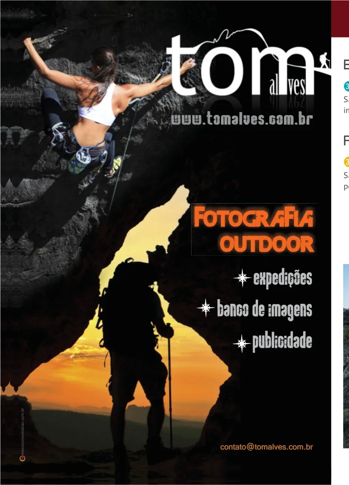 |
    | :--: |
    | *Publicidade Tom Alves Fotografia Outdoor* |
- **nome**: Tubarão
- **uid**: vTCuBTiO5Vxa50
- **caminho_imagem_capa**: 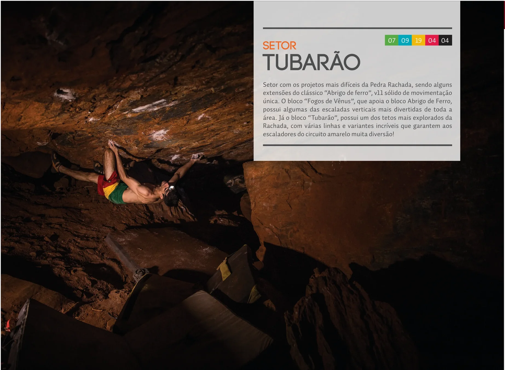
- **mapas**:
  - **[0]**:
    - **caminho_imagem_mapa**: 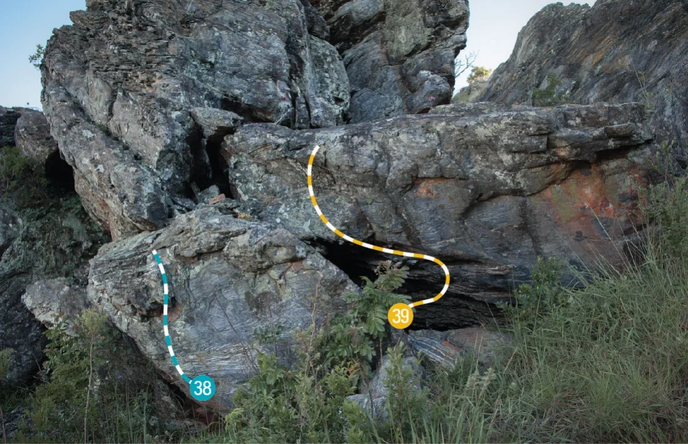
    - **largura_mapa**: 1099
    - **altura_mapa**: 710
    - **referencias**:
      - **[0]**:
        - **alvo_uid**: zv5NtIcIMYETqs
        - **pontos_uids**:
          - 38
        - **escalada**: Hindu
        - **ids**:
          - 38
      - **[1]**:
        - **alvo_uid**: bUiuIXOJiCIFRX
        - **pontos_uids**:
          - 39
        - **escalada**: Ganesh
        - **ids**:
          - 39
- **setores**:
  - **[0]**:
    - **conteudo**:
      - **descricao**: 
      - **nome**: Bloco A - Fogos de Vênus
      - **uid**: mKWD3p0D9UW2pR
      - **mapas**:
        - **[0]**:
          - **caminho_imagem_mapa**: 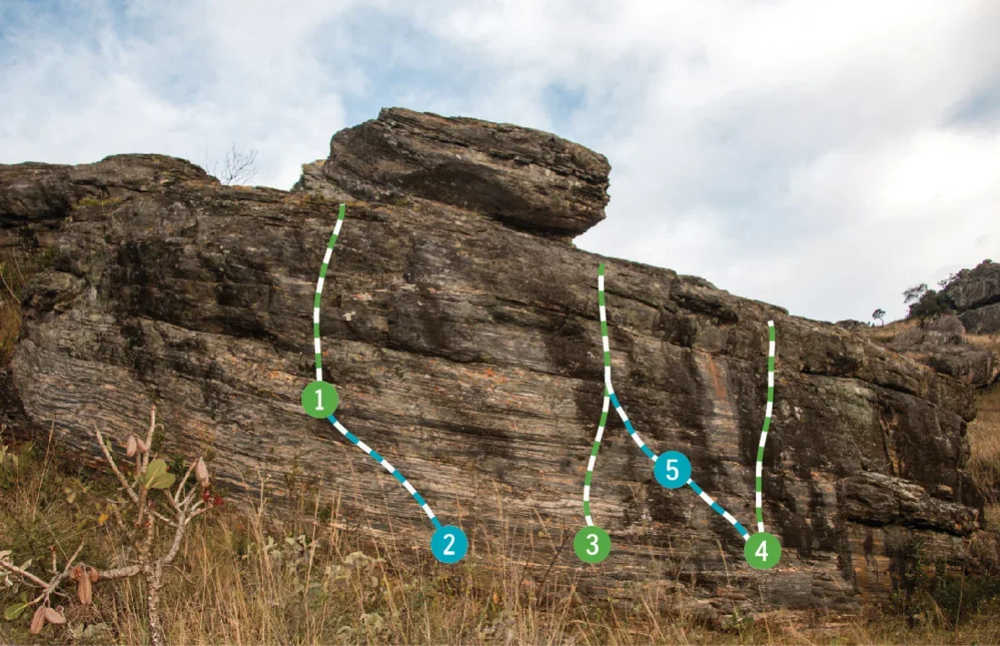
          - **largura_mapa**: 1099
          - **altura_mapa**: 710
          - **referencias**:
            - **[0]**:
              - **alvo_uid**: ICRxLlYCUmUcj1
              - **pontos_uids**:
                - 1
              - **escalada**: Marte
              - **ids**:
                - 1
            - **[1]**:
              - **alvo_uid**: 9PoqYTII76vLNp
              - **pontos_uids**:
                - 2
              - **escalada**: Vênus
              - **ids**:
                - 2
            - **[2]**:
              - **alvo_uid**: Q1deUXKrjXTsTL
              - **pontos_uids**:
                - 3
              - **escalada**: Fogos de Vênus
              - **ids**:
                - 3
            - **[3]**:
              - **alvo_uid**: PwG74tbbKINaNV
              - **pontos_uids**:
                - 4
              - **escalada**: Pôr da Lua
              - **ids**:
                - 4
            - **[4]**:
              - **alvo_uid**: C36eTL7FHNd1P3
              - **pontos_uids**:
                - 5
              - **escalada**: Pôr de Vênus
              - **ids**:
                - 5
      - **escaladas**:
        - **[0]**:
          - **uid**: ICRxLlYCUmUcj1
          - **boulder**:
            - **descricao**: Sai em pé com as mãos em um batente e segue reto por agarras boas.
            - **nome**: Marte
            - **dificuldade**: V0
            - **destaque**: True
        - **[1]**:
          - **uid**: 9PoqYTII76vLNp
          - **boulder**:
            - **descricao**: Sai no “Fogos de Vênus” (3) e escala em diagonal pra esquerda terminando no “Marte” (1).
            - **nome**: Vênus
            - **dificuldade**: V3
            - **destaque**: True
        - **[2]**:
          - **uid**: Q1deUXKrjXTsTL
          - **boulder**:
            - **descricao**: Sai sentado com as mãos juntas em um batente e toca reto.
            - **nome**: Fogos de Vênus
            - **dificuldade**: V2
            - **destaque**: True
        - **[3]**:
          - **uid**: PwG74tbbKINaNV
          - **boulder**:
            - **descricao**: Começa sentado com as mãos juntas em um batente e segue reto.
            - **nome**: Pôr da Lua
            - **dificuldade**: V1
            - **destaque**: True
        - **[4]**:
          - **uid**: C36eTL7FHNd1P3
          - **boulder**:
            - **descricao**: Sai do “Pôr da Lua” (4) e termina no “Fogos de Vênus” (3).
            - **nome**: Pôr de Vênus
            - **dificuldade**: V3
      - **precomputados**:
        - **total_escaladas**: 5
        - **total_boulders**: 5
  - **[1]**:
    - **conteudo**:
      - **descricao**: 
      - **nome**: Bloco B - Abrigo de Ferro
      - **uid**: KDG2BgZXZa0s84
      - **mapas**:
        - **[0]**:
          - **caminho_imagem_mapa**: 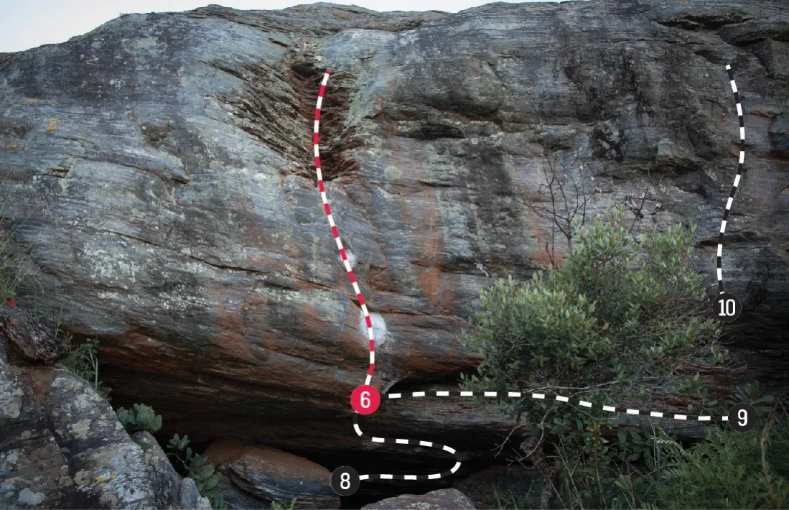
          - **largura_mapa**: 1099
          - **altura_mapa**: 710
          - **referencias**:
            - **[0]**:
              - **alvo_uid**: p8CcIcovwoFCGv
              - **pontos_uids**:
                - 6
              - **escalada**: Abrigo de ferro
              - **ids**:
                - 6
            - **[1]**:
              - **alvo_uid**: LaUKqUV22UDGz7
              - **pontos_uids**:
                - 6
              - **escalada**: Medalha de lata
              - **ids**:
                - 6
            - **[2]**:
              - **alvo_uid**: kdBfmBP950TvI6
              - **pontos_uids**:
                - 8
              - **escalada**: Projeto 17
              - **ids**:
                - 8
            - **[3]**:
              - **alvo_uid**: 1hVECMyQagZqnw
              - **pontos_uids**:
                - 9
              - **escalada**: Projeto 18
              - **ids**:
                - 9
            - **[4]**:
              - **alvo_uid**: 7QGLeUwcc4yKvl
              - **pontos_uids**:
                - 10
              - **escalada**: Projeto 19
              - **ids**:
                - 10
      - **escaladas**:
        - **[0]**:
          - **uid**: p8CcIcovwoFCGv
          - **boulder**:
            - **descricao**: Sai com as mãos juntas num batente abaulado invertido no teto e faz movimentos surreais pra sair da caverna e dominar esta, que é uma das escaladas mais exigentes da Pedra Rachada! Há também uma saída em pé para este boulder, com a mão esquerda alta, no reglete, e a direita no batente abaulado invertido chamado 7 Medalha de lata v9.
            - **nome**: Abrigo de ferro
            - **dificuldade**: V11
            - **destaque**: True
            - **conquistadores**:
              - Rafael Passos
            - **data_abertura**: 2009
        - **[1]**:
          - **uid**: LaUKqUV22UDGz7
          - **boulder**:
            - **descricao**: Saída em pé para o “Abrigo de ferro” (6), com a mão esquerda alta, no reglete, e a direita no batente abaulado invertido.
            - **nome**: Medalha de lata
            - **dificuldade**: V9
        - **[2]**:
          - **uid**: kdBfmBP950TvI6
          - **boulder**:
            - **descricao**: Projeto que sai mais ao fundo da caverna e escala uma sequência dura no teto terminando como o “Abrigo de ferro” (6).
            - **nome**: Projeto 17
            - **dificuldade**: V13_BARRA_V14
        - **[3]**:
          - **uid**: 1hVECMyQagZqnw
          - **boulder**:
            - **descricao**: Projeto que sai com as mãos em juntas em um batente bom e atravessa para a esquerda, terminando como o “Abrigo de ferro” (6).
            - **nome**: Projeto 18
            - **dificuldade**: V12
        - **[4]**:
          - **uid**: 7QGLeUwcc4yKvl
          - **boulder**:
            - **descricao**: Projeto que começa em pé com as mãos em uns regletes pequenos acima do teto e toca reto por uma sequência dura.
            - **nome**: Projeto 19
            - **dificuldade**: V10_BARRA_V11
      - **precomputados**:
        - **total_escaladas**: 5
        - **total_boulders**: 5
  - **[2]**:
    - **conteudo**:
      - **descricao**: 
      - **nome**: Bloco C - Meteoro
      - **uid**: MdIc7ontK2Nvt0
      - **mapas**:
        - **[0]**:
          - **caminho_imagem_mapa**: 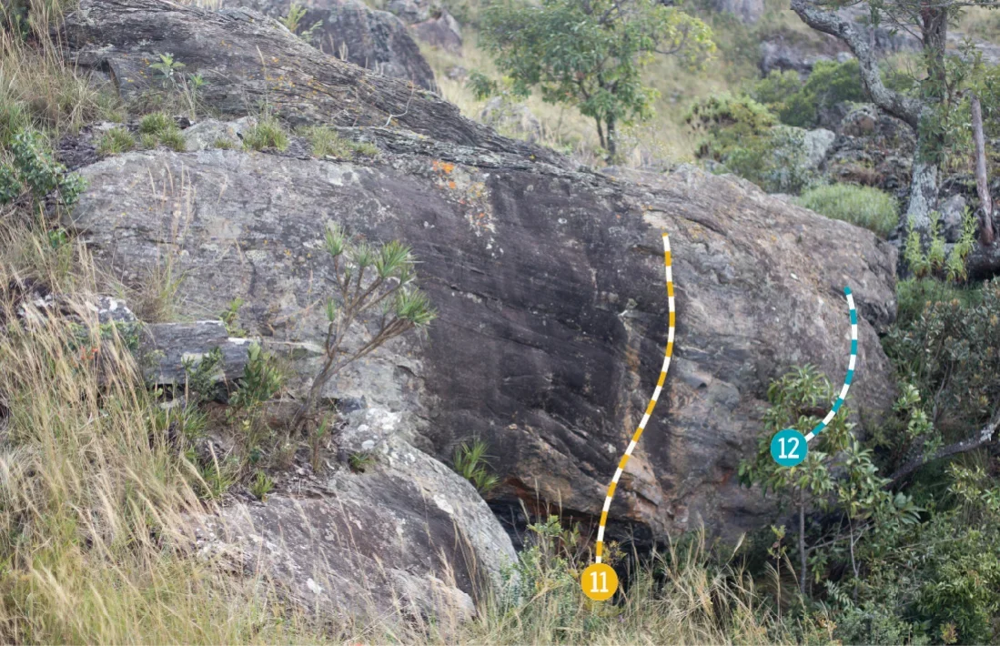
          - **largura_mapa**: 1099
          - **altura_mapa**: 710
          - **referencias**:
            - **[0]**:
              - **alvo_uid**: kCGQWGq1HYSVs8
              - **pontos_uids**:
                - 11
              - **escalada**: Meteoro
              - **ids**:
                - 11
            - **[1]**:
              - **alvo_uid**: ONCcxisRpIdROU
              - **pontos_uids**:
                - 12
              - **escalada**: Cometa
              - **ids**:
                - 12
      - **escaladas**:
        - **[0]**:
          - **uid**: kCGQWGq1HYSVs8
          - **boulder**:
            - **descricao**: Sai sentado com a mão esquerda em um batente invertido e a direita em um reglete, ambos em baixo do teto, e escala a face vertical com um crux bem definido.
            - **nome**: Meteoro
            - **dificuldade**: V9
            - **destaque**: True
            - **conquistadores**:
              - Ruy Castro
            - **data_abertura**: 2010
        - **[1]**:
          - **uid**: ONCcxisRpIdROU
          - **boulder**:
            - **descricao**: Sai em pé com as mãos em dois regletes pequenos e faz um movimento forte para um batente de oposição, terminando reto.
            - **nome**: Cometa
            - **dificuldade**: V3
      - **precomputados**:
        - **total_escaladas**: 2
        - **total_boulders**: 2
  - **[3]**:
    - **conteudo**:
      - **descricao**: 
      - **nome**: Bloco D - Tubarão
      - **uid**: 0bBb6m3oawRRva
      - **mapas**:
        - **[0]**:
          - **caminho_imagem_mapa**: 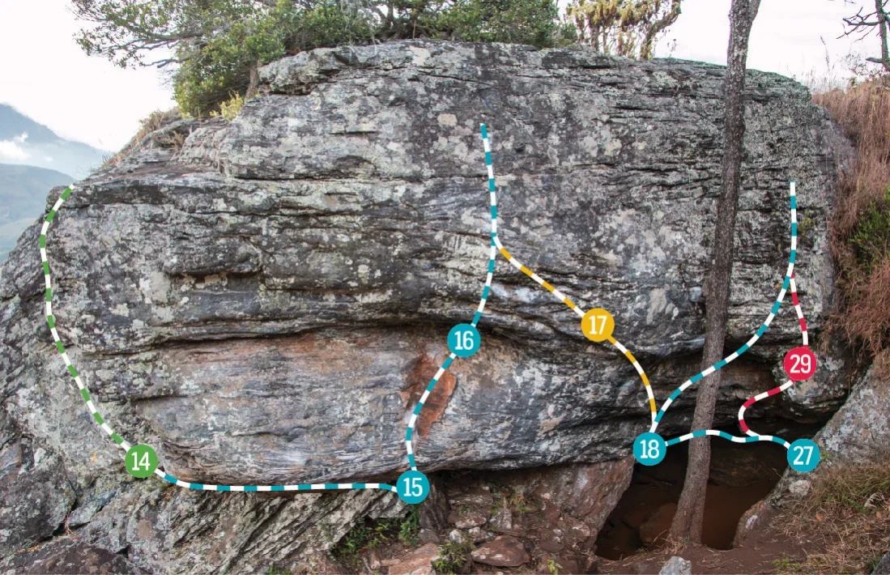
          - **largura_mapa**: 1099
          - **altura_mapa**: 710
          - **referencias**:
            - **[0]**:
              - **alvo_uid**: 6Ub5bCSAXn4lxn
              - **pontos_uids**:
                - 15
              - **escalada**: Tubarão Branco
              - **ids**:
                - 15
            - **[1]**:
              - **alvo_uid**: 1jwFY1XXUN7OXw
              - **pontos_uids**:
                - 14
              - **escalada**: Cação
              - **ids**:
                - 14
            - **[2]**:
              - **alvo_uid**: ScD4eUMQ0Wi9we
              - **pontos_uids**:
                - 15
              - **escalada**: Tubarão
              - **ids**:
                - 15
            - **[3]**:
              - **alvo_uid**: VJumZMb8mBo4sw
              - **pontos_uids**:
                - 16
              - **escalada**: Brahma
              - **ids**:
                - 16
            - **[4]**:
              - **alvo_uid**: 48KOWK1c5AwcFp
              - **pontos_uids**:
                - 17
              - **escalada**: Hanuman
              - **ids**:
                - 17
            - **[5]**:
              - **alvo_uid**: dKEvDsXqLowp0l
              - **pontos_uids**:
                - 18
              - **escalada**: Jurubeba
              - **ids**:
                - 18
            - **[6]**:
              - **alvo_uid**: eSvYxD5g7Zygz1
              - **pontos_uids**:
                - 18
              - **escalada**: Backer
              - **ids**:
                - 18
            - **[7]**:
              - **alvo_uid**: 4KMNyZQ3KwQ7y4
              - **pontos_uids**:
                - 17
              - **escalada**: Original
              - **ids**:
                - 17
            - **[8]**:
              - **alvo_uid**: 0teJtmFXKKZqVb
              - **pontos_uids**:
                - 18
              - **escalada**: Chivas
              - **ids**:
                - 18
            - **[9]**:
              - **alvo_uid**: N2Z9OsdN9jWE3g
              - **pontos_uids**:
                - 17
              - **escalada**: Black Label
              - **ids**:
                - 17
            - **[10]**:
              - **alvo_uid**: dkz6QV6rAbEsil
              - **pontos_uids**:
                - 18
              - **escalada**: Chivas SDS
              - **ids**:
                - 18
            - **[11]**:
              - **alvo_uid**: KfKqedalsOiExz
              - **pontos_uids**:
                - 17
              - **escalada**: Royal Salute
              - **ids**:
                - 17
            - **[12]**:
              - **alvo_uid**: szLrJ03hLBMTXy
              - **pontos_uids**:
                - 18
              - **escalada**: Escolha certa
              - **ids**:
                - 18
            - **[13]**:
              - **alvo_uid**: QOo3Dtpl0oDzxV
              - **pontos_uids**:
                - 17
              - **escalada**: Múltipla escolha
              - **ids**:
                - 17
            - **[14]**:
              - **alvo_uid**: 7xoWKKDQZuRAac
              - **pontos_uids**:
                - 27
              - **escalada**: Halls
              - **ids**:
                - 27
            - **[15]**:
              - **alvo_uid**: 08KyixA9OS8fmp
              - **pontos_uids**:
                - 17
              - **escalada**: In the halls
              - **ids**:
                - 17
            - **[16]**:
              - **alvo_uid**: RxjVDmWyiJIoq8
              - **pontos_uids**:
                - 29
              - **escalada**: Green Label
              - **ids**:
                - 29
            - **[17]**:
              - **alvo_uid**: AdHh9oCr7wVff4
              - **pontos_uids**:
                - 18
              - **escalada**: Serra Malte
              - **ids**:
                - 18
            - **[18]**:
              - **alvo_uid**: rdgXwLYq9J77Sr
              - **pontos_uids**:
                - 17
              - **escalada**: Áustria
              - **ids**:
                - 17
            - **[19]**:
              - **alvo_uid**: 5GAd3ssJil1PQC
              - **pontos_uids**:
                - 18
              - **escalada**: Corona
              - **ids**:
                - 18
            - **[20]**:
              - **alvo_uid**: nDW5ChYkfFHJMg
              - **pontos_uids**:
                - 17
              - **escalada**: Saideira
              - **ids**:
                - 17
            - **[21]**:
              - **alvo_uid**: JCNZFn8GC3CtIf
              - **pontos_uids**:
                - 18
              - **escalada**: Muniz
              - **ids**:
                - 18
            - **[22]**:
              - **alvo_uid**: NjEDuoVrQFQfOD
              - **pontos_uids**:
                - 17
              - **escalada**: Passagem
              - **ids**:
                - 17
            - **[23]**:
              - **alvo_uid**: xfbvokA5f8mH61
              - **pontos_uids**:
                - 18
              - **escalada**: Espírito Guerreiro
              - **ids**:
                - 18
            - **[24]**:
              - **alvo_uid**: eSukaQ0A9lFtSh
              - **pontos_uids**:
                - 17
              - **escalada**: Voa colibri
              - **ids**:
                - 17
      - **escaladas**:
        - **[0]**:
          - **uid**: 6Ub5bCSAXn4lxn
          - **boulder**:
            - **descricao**: Sai sentado com as mãos em regletes à direita da árvore e escala a face vertical da esquerda da proa do “Tubarão” (15).
            - **nome**: Tubarão Branco
            - **dificuldade**: V6
            - **destaque**: True
            - **conquistadores**:
              - Fabrício Mamão
            - **data_abertura**: 2010
        - **[1]**:
          - **uid**: 1jwFY1XXUN7OXw
          - **boulder**:
            - **descricao**: Começa em pé, com as mãos juntas em um batente bom na proa e escala por agarras boas.
            - **nome**: Cação
            - **dificuldade**: V1
            - **destaque**: True
        - **[2]**:
          - **uid**: ScD4eUMQ0Wi9we
          - **boulder**:
            - **descricao**: Começa abraçando o teto com a mão esquerda num reglete na face esquerda e a direita num reglete na face direita e escala o teto em compressão finalizando pelo “Cação” (14).
            - **nome**: Tubarão
            - **dificuldade**: V5
            - **destaque**: True
            - **conquistadores**:
              - Ruy Castro
            - **data_abertura**: 2007
        - **[3]**:
          - **uid**: VJumZMb8mBo4sw
          - **boulder**:
            - **descricao**: Sai como o “Tubarão” (15) e escala a face da direita.
            - **nome**: Brahma
            - **dificuldade**: V5
            - **destaque**: True
            - **conquistadores**:
              - Leandro Iannota
            - **data_abertura**: 2010
        - **[4]**:
          - **uid**: 48KOWK1c5AwcFp
          - **boulder**:
            - **descricao**: Começa como o “Jurubeba” (18) e escala pela esquerda da árvore terminando no “Brahma” (16).
            - **nome**: Hanuman
            - **dificuldade**: V7
            - **destaque**: True
            - **conquistadores**:
              - Frederico Gonçalves
            - **data_abertura**: 2012
        - **[5]**:
          - **uid**: dKEvDsXqLowp0l
          - **boulder**:
            - **descricao**: Sai em pé, na aresta do teto, com as mãos juntas em um batente e escala pela direita da árvore, passando pela pequena proa à direita.
            - **nome**: Jurubeba
            - **dificuldade**: V3
        - **[6]**:
          - **uid**: eSvYxD5g7Zygz1
          - **boulder**:
            - **descricao**: Começa sentado com a mão esquerda em um regletinho na aresta e a mão direita em uma invertida e escala o teto por agarras boas dominando pelo no “Jurubeba” (18). Terminando no “Hanuman” (17) é o a Original v7.
            - **nome**: Backer
            - **dificuldade**: V4
            - **destaque**: True
            - **conquistadores**:
              - Gabriel Vargas
            - **data_abertura**: 2014
        - **[7]**:
          - **uid**: 4KMNyZQ3KwQ7y4
          - **boulder**:
            - **descricao**: Começa no “Backer” (19) e termina no “Hanuman” (17).
            - **nome**: Original
            - **dificuldade**: V7
        - **[8]**:
          - **uid**: 0teJtmFXKKZqVb
          - **boulder**:
            - **descricao**: Sai sentado com a mão esquerda em uma agarra boa, a direita em um reglete invertido e escala em linha reta pelo teto, finalizando no “Jurubeba” (18). Terminando no “Hanuman” (17) é o d Black Label v8.
            - **nome**: Chivas
            - **dificuldade**: V7
            - **destaque**: True
            - **conquistadores**:
              - Felipe Alvares
            - **data_abertura**: 2006
        - **[9]**:
          - **uid**: N2Z9OsdN9jWE3g
          - **boulder**:
            - **descricao**: Começa no “Chivas” (21) e termina no “Hanuman” (17).
            - **nome**: Black Label
            - **dificuldade**: V8
        - **[10]**:
          - **uid**: dkz6QV6rAbEsil
          - **boulder**:
            - **descricao**: Começa nas agarras mais ao fundo da caverna com as mãos em dois regletes, faz dois movimentos para a saída do “Chivas” (21) e termina por ele. Terminando no “Hanuman” (17) é o g Royal Salute v9.
            - **nome**: Chivas SDS
            - **dificuldade**: V8
            - **destaque**: True
            - **conquistadores**:
              - Frederico Gonçalves
            - **data_abertura**: 2010
        - **[11]**:
          - **uid**: KfKqedalsOiExz
          - **boulder**:
            - **descricao**: Começa no “Chivas SDS” (23) e termina no “Hanuman” (17).
            - **nome**: Royal Salute
            - **dificuldade**: V9
        - **[12]**:
          - **uid**: szLrJ03hLBMTXy
          - **boulder**:
            - **descricao**: Sai em pé com as mãos em duas agarras boas e escala até entrar no “Jurubeba” (18), finalizando como ele. Terminando no “Hanuman” (17) é o j Múltipla escolha v8.
            - **nome**: Escolha certa
            - **dificuldade**: V5
            - **destaque**: True
            - **conquistadores**:
              - Gustavo Fontes
            - **data_abertura**: 2013
        - **[13]**:
          - **uid**: QOo3Dtpl0oDzxV
          - **boulder**:
            - **descricao**: Começa no “Escolha certa” (25) e termina no “Hanuman” (17).
            - **nome**: Múltipla escolha
            - **dificuldade**: V8
        - **[14]**:
          - **uid**: 7xoWKKDQZuRAac
          - **boulder**:
            - **descricao**: Começa sentado com as mãos juntas num batente na pequena proa à direita da caverna, atravessa para a face à esquerda e termina no “Jurubeba” (18). Terminando no “Hanuman” (17) é o l In the halls v7.
            - **nome**: Halls
            - **dificuldade**: V5
            - **conquistadores**:
              - Gustavo Fontes
            - **data_abertura**: 2013
        - **[15]**:
          - **uid**: 08KyixA9OS8fmp
          - **boulder**:
            - **descricao**: Começa no “Halls” (27) e termina no “Hanuman” (17).
            - **nome**: In the halls
            - **dificuldade**: V7
        - **[16]**:
          - **uid**: RxjVDmWyiJIoq8
          - **boulder**:
            - **descricao**: Começa como o “Halls” (27), mas ao invés de atravessar para a face da esquerda, escala comprimindo o teto e finaliza à direita.
            - **nome**: Green Label
            - **dificuldade**: V10
            - **destaque**: True
            - **conquistadores**:
              - Daniel Mendes
            - **data_abertura**: 2013
        - **[17]**:
          - **uid**: AdHh9oCr7wVff4
          - **boulder**:
            - **descricao**: Sai do “Chivas” (21) e entra no “Backer” (19). Terminando no “Hanuman” (17) é o x Áustria v8.
            - **nome**: Serra Malte
            - **dificuldade**: V7
            - **conquistadores**:
              - Gabriel Vargas
            - **data_abertura**: 2014
        - **[18]**:
          - **uid**: rdgXwLYq9J77Sr
          - **boulder**:
            - **descricao**: Variante do “Serra Malte” (30) que sai do “Chivas” (21), entra no “Backer” (19) e termina no “Hanuman” (17).
            - **nome**: Áustria
            - **dificuldade**: V8
        - **[19]**:
          - **uid**: 5GAd3ssJil1PQC
          - **boulder**:
            - **descricao**: Começa como o “Chivas SDS” (23) e entra no “Backer” (19). Terminando no “Hanuman” (17) é o v Saideira v9.
            - **nome**: Corona
            - **dificuldade**: V8
            - **conquistadores**:
              - Gustavo Fontes
            - **data_abertura**: 2014
        - **[20]**:
          - **uid**: nDW5ChYkfFHJMg
          - **boulder**:
            - **descricao**: Variante do “Corona” (32) que começa como o “Chivas SDS” (23), entra no “Backer” (19) e termina no “Hanuman” (17).
            - **nome**: Saideira
            - **dificuldade**: V9
        - **[21]**:
          - **uid**: JCNZFn8GC3CtIf
          - **boulder**:
            - **descricao**: Boulder aberto em homenagem ao escalador carioca Fábio Muniz, o Fabinho. Sai do “Chivas” (21) e, após alguns movimentos, atravessa para a direita passando por uma invertida, escalando até o “Escolha certa” (25) e terminando como ele. Terminando no “Hanuman” (17) é o n Passagem v10.
            - **nome**: Muniz
            - **dificuldade**: V9
            - **destaque**: True
            - **conquistadores**:
              - Gustavo Fontes
            - **data_abertura**: 2013
        - **[22]**:
          - **uid**: NjEDuoVrQFQfOD
          - **boulder**:
            - **descricao**: Variante do “Muniz” (34) terminando no “Hanuman” (17).
            - **nome**: Passagem
            - **dificuldade**: V10
        - **[23]**:
          - **uid**: xfbvokA5f8mH61
          - **boulder**:
            - **descricao**: É o “Muniz” (34) saindo do “Chivas SDS” (23). Terminando no “Hanuman” (17) é o , Voa colibri v11.
            - **nome**: Espírito Guerreiro
            - **dificuldade**: V10
            - **destaque**: True
            - **conquistadores**:
              - Rafael Pimenta
            - **data_abertura**: 2014
        - **[24]**:
          - **uid**: eSukaQ0A9lFtSh
          - **boulder**:
            - **descricao**: Variante do “Espírito Guerreiro” (36) terminando no “Hanuman” (17).
            - **nome**: Voa colibri
            - **dificuldade**: V11
      - **precomputados**:
        - **total_escaladas**: 25
        - **total_boulders**: 25
  - **[4]**:
    - **conteudo**:
      - **descricao**: 
      - **nome**: Bloco E - Hindu
      - **uid**: S0x3xhhSDsx82d
      - **escaladas**:
        - **[0]**:
          - **uid**: zv5NtIcIMYETqs
          - **boulder**:
            - **descricao**: Sai sentado com a mão direita em um batente e a esquerda em um reglete invertido baixo e escala o pequeno bloco.
            - **nome**: Hindu
            - **dificuldade**: V3
            - **destaque**: True
      - **precomputados**:
        - **total_escaladas**: 1
        - **total_boulders**: 1
  - **[5]**:
    - **conteudo**:
      - **descricao**: 
      - **nome**: Bloco F - Ganesh
      - **uid**: 7rL1q5fxDz4nZQ
      - **escaladas**:
        - **[0]**:
          - **uid**: bUiuIXOJiCIFRX
          - **boulder**:
            - **descricao**: Sai sentado com as mãos juntas numa agarra boa no fundo da caverna, escala por agarras boas até um final duro e domina.
            - **nome**: Ganesh
            - **dificuldade**: V8
            - **destaque**: True
            - **conquistadores**:
              - Frederico Gonçalves
            - **data_abertura**: 2010
      - **precomputados**:
        - **total_escaladas**: 1
        - **total_boulders**: 1
  - **[6]**:
    - **conteudo**:
      - **descricao**: 
      - **nome**: Bloco G - Croissant
      - **uid**: sRHRKezuqWr6zh
      - **mapas**:
        - **[0]**:
          - **caminho_imagem_mapa**: 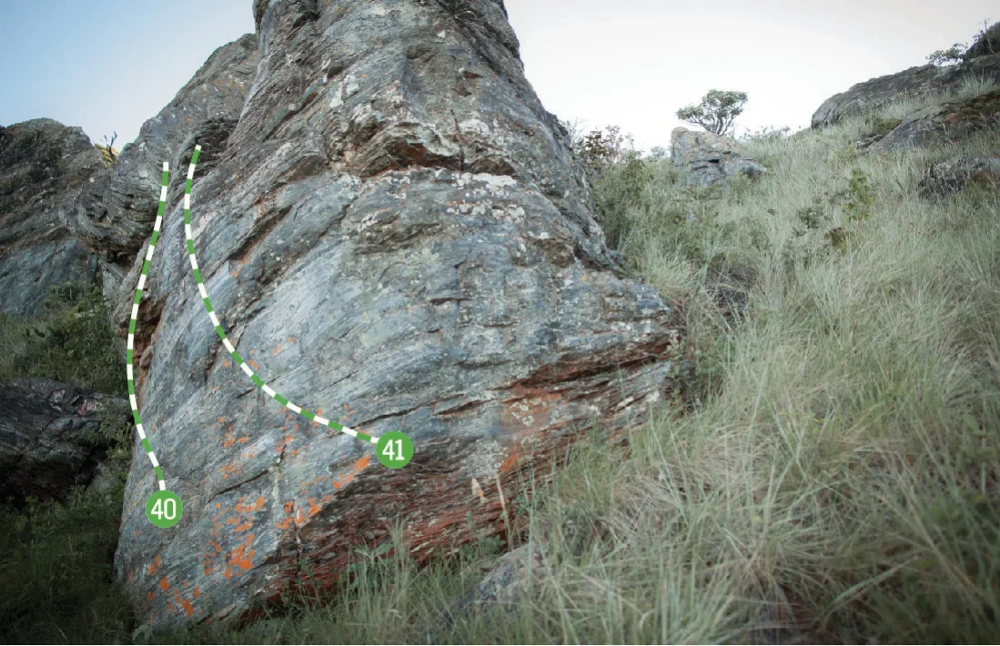
          - **largura_mapa**: 1099
          - **altura_mapa**: 710
          - **referencias**:
            - **[0]**:
              - **alvo_uid**: AtW8Hq4jaNP6r3
              - **pontos_uids**:
                - 40
              - **escalada**: Misto quente
              - **ids**:
                - 40
            - **[1]**:
              - **alvo_uid**: KVKL7lCRmXlB6j
              - **pontos_uids**:
                - 41
              - **escalada**: Croissant
              - **ids**:
                - 41
      - **escaladas**:
        - **[0]**:
          - **uid**: AtW8Hq4jaNP6r3
          - **boulder**:
            - **descricao**: Começa sentado com as mãos em dois batentes e toca reto.
            - **nome**: Misto quente
            - **dificuldade**: V2
        - **[1]**:
          - **uid**: KVKL7lCRmXlB6j
          - **boulder**:
            - **descricao**: Sai sentado com as mãos juntas em um batente loco acima do tetinho e escala em diagonal pra esquerda.
            - **nome**: Croissant
            - **dificuldade**: V2
      - **precomputados**:
        - **total_escaladas**: 2
        - **total_boulders**: 2
  - **[7]**:
    - **conteudo**:
      - **descricao**: 
      - **nome**: Bloco H - Túnel do Vento
      - **uid**: VFfp0CKDJiXsd3
      - **mapas**:
        - **[0]**:
          - **caminho_imagem_mapa**: 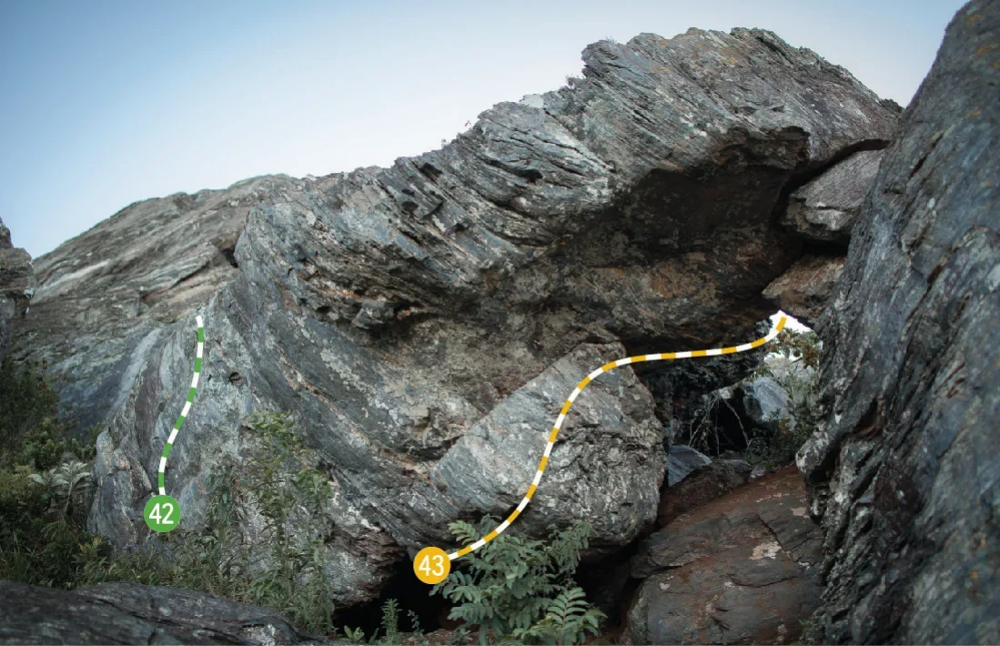
          - **largura_mapa**: 1099
          - **altura_mapa**: 710
          - **referencias**:
            - **[0]**:
              - **alvo_uid**: qPeywhSgAIVSpS
              - **pontos_uids**:
                - 42
                - 43
              - **escalada**: Túnel do vento
              - **ids**:
                - 42
                - 43
            - **[1]**:
              - **alvo_uid**: ruK2ChvKCGHihG
              - **pontos_uids**:
                - 42
                - 43
              - **escalada**: Diagonal (Túnel do Vento)
              - **ids**:
                - 42
                - 43
      - **escaladas**:
        - **[0]**:
          - **uid**: qPeywhSgAIVSpS
          - **boulder**:
            - **descricao**: Começa sentado com as mãos juntas em um batente invertido, escala comprimindo o “módulo” e atravessa o teto pela direita, passando por algumas lacas e pinças e dominando pela “chaminé”.
            - **nome**: Túnel do vento
            - **dificuldade**: V7
            - **destaque**: True
            - **conquistadores**:
              - Mahavir Jneesh
            - **data_abertura**: 2011
        - **[1]**:
          - **uid**: ruK2ChvKCGHihG
          - **boulder**:
            - **descricao**: Começa sentado com as mãos em dois gastons e domina a parte baixa do bloco.
            - **nome**: Diagonal (Túnel do Vento)
            - **dificuldade**: V1
      - **precomputados**:
        - **total_escaladas**: 2
        - **total_boulders**: 2
- **precomputados**:
  - **total_escaladas**: 43
  - **total_boulders**: 43

## Parte: grupo_daqui_a_20_anos

### Grupo (Pico: Pedra Rachada)

- **descricao**:
    Último setor antes do cume da Pedra Rachada que, apesar de possuir poucos blocos, guarda algumas das escaladas mais desafiadoras mentalmente de todo o complexo. Dois clássicos highball fazem deste setor um dos preferidos de muitos viciados em adrenalina. Se você gosta de apertar, não deixe de tentar o único “Amanita” v11.
    
    ## Acesso (25 min)
    
    Este é o último setor antes do cume. Para acessá-lo, a partir do “Estacionamento 2”, siga a trilha principal que sobe passando à esquerda do “Bloco 1” e à direita do bloco “Lua cheia”, chegando ao bloco “Rolling Stones”. Contorne-o pela direita e siga a trilha pegando a segunda trilha que sobe à esquerda, em direção à grande pedra com uma rachadura no meio (em forma de boca). O primeiro bloco, o “Análise crítica” estará logo acima, uns 100m, à sua direita.
    
    ## Boulders Clássicos
    
    - 4 Surpresa v3
    - 1 Análise crítica v6
    - 2 Daqui a 20 anos v7
    - 3 Amanita v11
    
    |  |
    | :--: |
    | *Escalador no boulder Amanita v11* |
    
    > "No que diz respeito ao empenho, ao compromisso, ao esforço, à dedicação, não existe meio termo. Ou você faz uma coisa bem feita ou não faz."  
    > — *Airton Senna*
    
    | 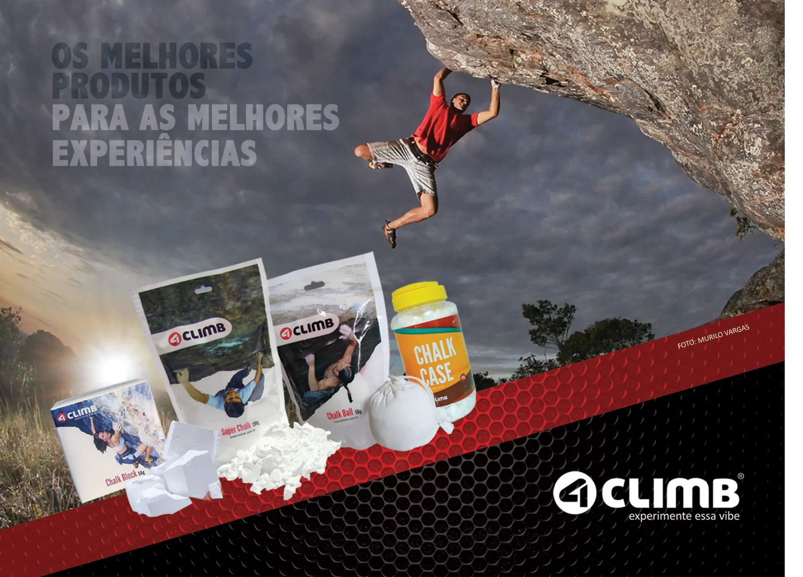 |
    | :--: |
    | *Anúncio 4Climb* |
    
    ### 4Climb
    
    Os melhores produtos para as melhores experiências. Experimente essa vibe.  
    *Foto: Murilo Vargas*
- **nome**: Daqui a 20 Anos
- **uid**: 1FEa0SXhF5iG30
- **caminho_imagem_capa**: 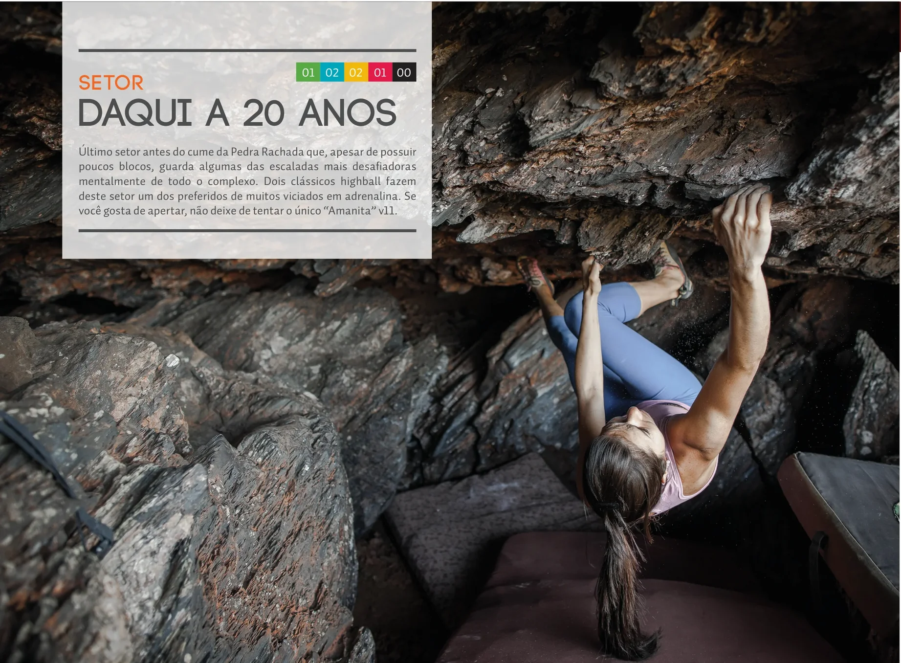
- **mapas**:
  - **[0]**:
    - **caminho_imagem_mapa**: 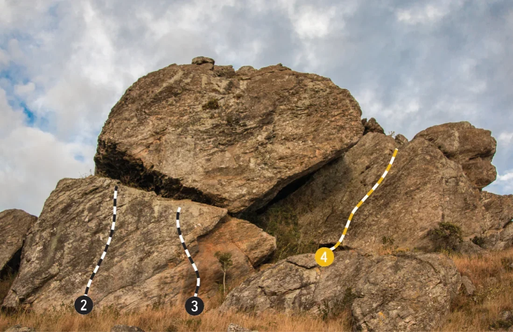
    - **largura_mapa**: 1099
    - **altura_mapa**: 710
    - **referencias**:
      - **[0]**:
        - **alvo_uid**: Ast0EufLPzelsS
        - **pontos_uids**:
          - 2
        - **escalada**: Daqui a 20 anos
        - **ids**:
          - 2
      - **[1]**:
        - **alvo_uid**: PGYw60JTsOBSHJ
        - **pontos_uids**:
          - 4
        - **escalada**: Surpresa
        - **ids**:
          - 4
- **setores**:
  - **[0]**:
    - **conteudo**:
      - **descricao**: 
      - **nome**: Bloco A - Análise Crítica
      - **uid**: onz2AdFseL2O0S
      - **mapas**:
        - **[0]**:
          - **caminho_imagem_mapa**: 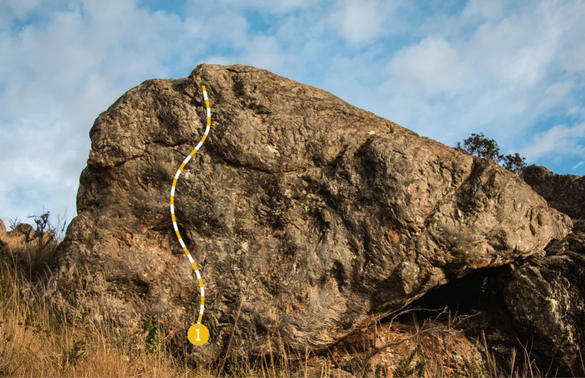
          - **largura_mapa**: 1099
          - **altura_mapa**: 710
          - **referencias**:
            - **[0]**:
              - **alvo_uid**: VzexNCktS0Y93x
              - **pontos_uids**:
                - 1
              - **escalada**: Análise crítica
              - **ids**:
                - 1
      - **escaladas**:
        - **[0]**:
          - **uid**: VzexNCktS0Y93x
          - **boulder**:
            - **descricao**: Sai em pé com as mãos em um buraco e um pocket e escala a face levemente negativa com um domínio técnico.
            - **nome**: Análise crítica
            - **dificuldade**: V6
            - **destaque**: True
            - **conquistadores**:
              - Ruy Castro
            - **data_abertura**: 2008
      - **precomputados**:
        - **total_escaladas**: 1
        - **total_boulders**: 1
  - **[1]**:
    - **conteudo**:
      - **descricao**: 
      - **nome**: Bloco B - Daqui a 20 Anos
      - **uid**: FPiCkhwVy5b8ST
      - **escaladas**:
        - **[0]**:
          - **uid**: Ast0EufLPzelsS
          - **boulder**:
            - **descricao**: Highball clássico, uma das escaladas mais completas da Pedra Rachada! Começa sentado com as mãos nas agarras mais ao fundo da caverna, escala o teto por agarras boas, faz uma virada técnica à direita da arvorezinha e termina pelo positivo fácil.
            - **nome**: Daqui a 20 anos
            - **dificuldade**: V7
            - **destaque**: True
      - **precomputados**:
        - **total_escaladas**: 1
        - **total_boulders**: 1
  - **[2]**:
    - **conteudo**:
      - **descricao**: 
      - **nome**: Bloco C - Amanita
      - **uid**: rQMrzXIEzDPsDs
      - **mapas**:
        - **[0]**:
          - **caminho_imagem_mapa**: 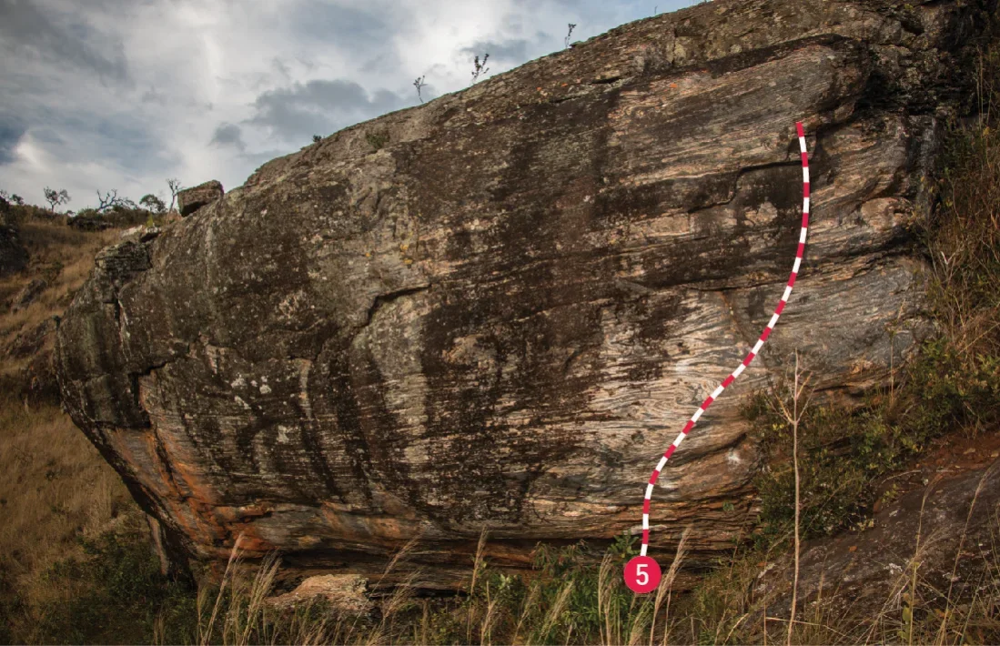
          - **largura_mapa**: 1099
          - **altura_mapa**: 710
          - **referencias**:
            - **[0]**:
              - **alvo_uid**: dFHTeiIuEuDYDh
              - **pontos_uids**:
                - 3
              - **escalada**: Amanita
              - **ids**:
                - 3
      - **escaladas**:
        - **[0]**:
          - **uid**: dFHTeiIuEuDYDh
          - **boulder**:
            - **descricao**: Sai sentado com as mãos juntas em um reglete bom e escala o negativo com um crux bem definido.
            - **nome**: Amanita
            - **dificuldade**: V11
            - **destaque**: True
      - **precomputados**:
        - **total_escaladas**: 1
        - **total_boulders**: 1
  - **[3]**:
    - **conteudo**:
      - **descricao**: 
      - **nome**: Bloco D - Surpresa
      - **uid**: wEpe9H6ywEQmrY
      - **escaladas**:
        - **[0]**:
          - **uid**: PGYw60JTsOBSHJ
          - **boulder**:
            - **descricao**: Começa com a mão esquerda em uma pinça grande e a direita em um reglete/pinça e sai do teto com uma movimentação clássica.
            - **nome**: Surpresa
            - **dificuldade**: V3
            - **destaque**: True
      - **precomputados**:
        - **total_escaladas**: 1
        - **total_boulders**: 1
  - **[4]**:
    - **conteudo**:
      - **descricao**: 
      - **nome**: Bloco E - Escorregador
      - **uid**: 2oOJLXY7yzCM2H
      - **mapas**:
        - **[0]**:
          - **caminho_imagem_mapa**: 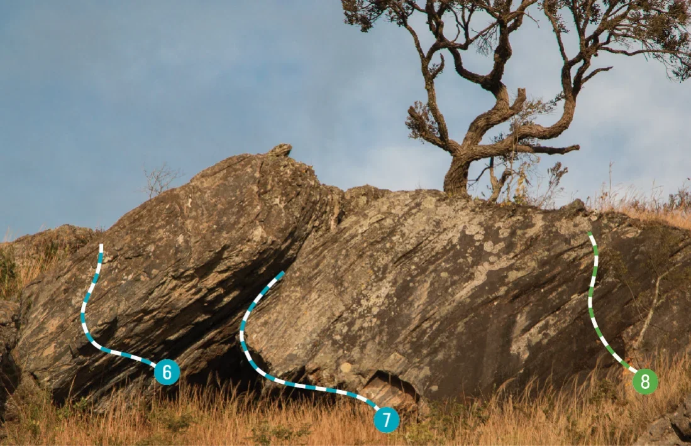
          - **largura_mapa**: 1099
          - **altura_mapa**: 710
          - **referencias**:
            - **[0]**:
              - **alvo_uid**: CJy19laYKmoU7i
              - **pontos_uids**:
                - 5
              - **escalada**: Escorregador
              - **ids**:
                - 5
            - **[1]**:
              - **alvo_uid**: 6nUufzuXoydp1C
              - **pontos_uids**:
                - 6
              - **escalada**: Controler
              - **ids**:
                - 6
      - **escaladas**:
        - **[0]**:
          - **uid**: CJy19laYKmoU7i
          - **boulder**:
            - **descricao**: Sai sentado com a mão esquerda em uma laca e a direita em um bico/buraco ao lado e escala todo o negativo pelas lacas.
            - **nome**: Escorregador
            - **dificuldade**: V3
            - **destaque**: True
        - **[1]**:
          - **uid**: 6nUufzuXoydp1C
          - **boulder**:
            - **descricao**: Começa sentado com as mãos juntas em um batente de oposição e escala o vertical.
            - **nome**: Controler
            - **dificuldade**: V2
      - **precomputados**:
        - **total_escaladas**: 2
        - **total_boulders**: 2
- **precomputados**:
  - **total_escaladas**: 6
  - **total_boulders**: 6

## Parte: grupo_cume

### Grupo (Pico: Pedra Rachada)

- **descricao**:
    Além de algumas das melhores escaladas de toda a Pedra Rachada em todos os circuitos de grau, o setor “Cume” impressiona também pelo visual de tirar o fôlego. São quase 1500m de altitude que proporcionam 360º de uma vista estonteante de toda a região metropolitana de Belo Horizonte e seus arredores, com um pôr do sol digno de filme. Difícil aqui é decidir qual linha escalar, mas, independente do seu grau de escalada, não saia de lá sem ao menos conhecer o mega-clássico “Blood América”.
    
    ## Acesso (30 min)
    
    A partir do “Estacionamento 2”, siga a trilha principal que passa à esquerda do “Bloco 1”, à direita do bloco “Lua cheia” e chega ao bloco “Rolling Stones”. Contorne-o pela direita e siga a trilha pegando a segunda trilha que sobe à esquerda, em direção à grande pedra com uma rachadura no meio (em forma de boca). O setor “Cume” consiste em um grande platô com um aglomerado de blocos no cume do morro.
    
    ## Boulders Clássicos
    
    - **4. Mosquitos** – V2
    - **19. Sai do teto** – V3
    - **28. Seriema** – V3
    - **8. Blood América** – V4
    - **12. Mistral** – V7
    - **11. The summit** – V7
    - **21. Laranja mecânica** – V8
    - **14. Testarossa** – V10
    
    > "Superar o fácil não tem mérito, é obrigação; vencer o difícil é glorificante; ultrapassar o outrora impossível é esplendoroso."  
    > — *Alexandre Fonteles*
    
    | 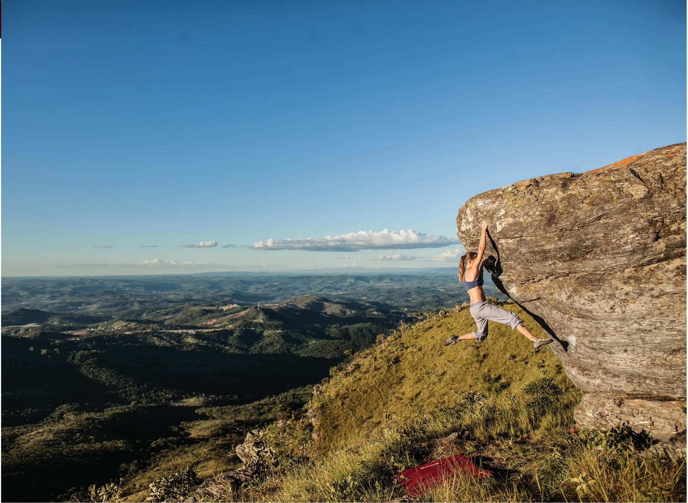 |
    | :--: |
    | *Escaladora no boulder Ulísses* |
    
    |  |
    | :--: |
    | *Escalada no pôr do sol no boulder Blood América* |
    
    > "É melhor viver dez anos a mil do que mil anos a dez."  
    > — *Lobão*
    
    |  |
    | :--: |
    | *Escalador no bloco Testarossa* |
- **nome**: Cume
- **uid**: VeLO20IMW2oWhc
- **caminho_imagem_capa**: 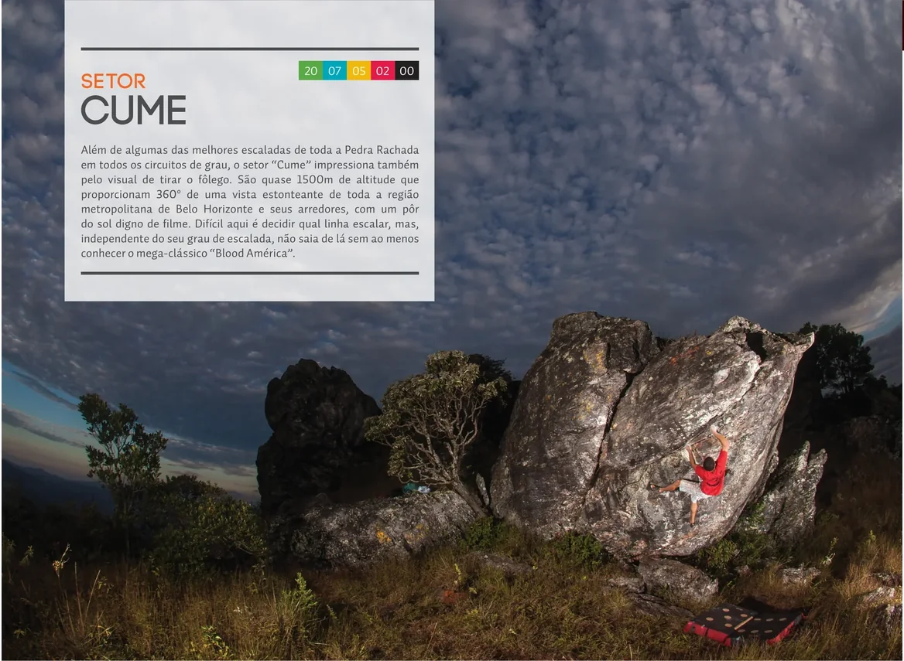
- **mapas**:
  - **[0]**:
    - **caminho_imagem_mapa**: 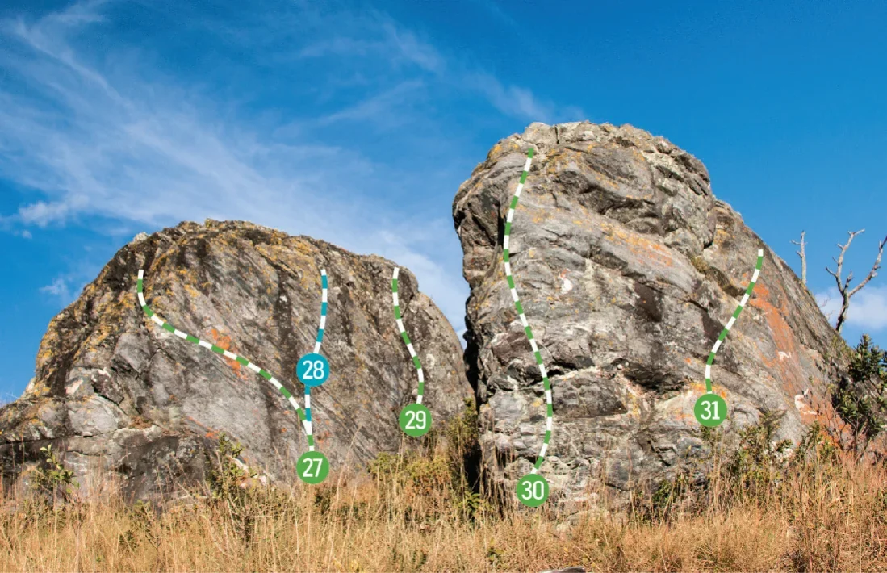
    - **largura_mapa**: 1099
    - **altura_mapa**: 710
    - **referencias**:
      - **[0]**:
        - **alvo_uid**: oIA7VJYDSydyTf
        - **pontos_uids**:
          - 27
        - **escalada**: Sabirila
        - **ids**:
          - 27
      - **[1]**:
        - **alvo_uid**: 4Jm9GyO72EzNjD
        - **pontos_uids**:
          - 28
        - **escalada**: Seriema
        - **ids**:
          - 28
      - **[2]**:
        - **alvo_uid**: wPZ2kDIVbOvXJr
        - **pontos_uids**:
          - 29
        - **escalada**: Canelinha
        - **ids**:
          - 29
      - **[3]**:
        - **alvo_uid**: vFO52j09RcWfMT
        - **pontos_uids**:
          - 30
        - **escalada**: Cerrado
        - **ids**:
          - 30
      - **[4]**:
        - **alvo_uid**: nKJb8UpDlIxoSL
        - **pontos_uids**:
          - 31
        - **escalada**: Canga
        - **ids**:
          - 31
- **setores**:
  - **[0]**:
    - **conteudo**:
      - **descricao**: 
      - **nome**: Bloco A - Ulísses
      - **uid**: DAwGeV7jwOuz5Z
      - **mapas**:
        - **[0]**:
          - **caminho_imagem_mapa**: 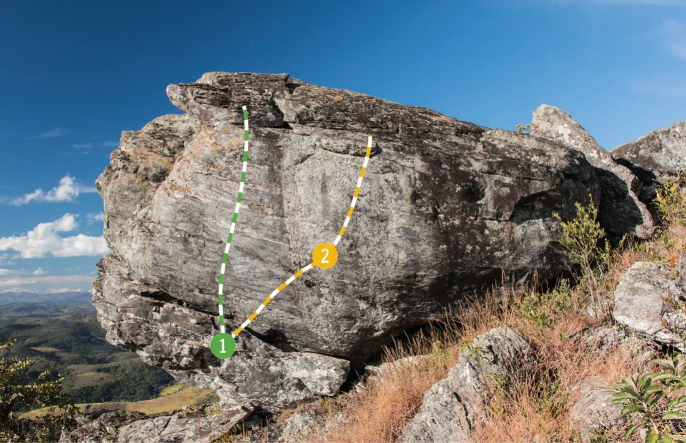
          - **largura_mapa**: 1099
          - **altura_mapa**: 710
          - **referencias**:
            - **[0]**:
              - **alvo_uid**: QSgh7wpAbQJEVK
              - **pontos_uids**:
                - 1
              - **escalada**: Ulísses
              - **ids**:
                - 1
            - **[1]**:
              - **alvo_uid**: g7fI2sJJGDouuy
              - **pontos_uids**:
                - 2
              - **escalada**: 1-5-1
              - **ids**:
                - 2
      - **escaladas**:
        - **[0]**:
          - **uid**: QSgh7wpAbQJEVK
          - **boulder**:
            - **descricao**: Começa com as mãos juntas em um batente e escala o vertical por regletes pequenos.
            - **nome**: Ulísses
            - **dificuldade**: V3
            - **destaque**: True
        - **[1]**:
          - **uid**: g7fI2sJJGDouuy
          - **boulder**:
            - **descricao**: Sai como o “Ulísses” (1) e termina mais à direita, com um dinâmico em um batente.
            - **nome**: 1-5-1
            - **dificuldade**: V6
            - **destaque**: True
      - **precomputados**:
        - **total_escaladas**: 2
        - **total_boulders**: 2
  - **[1]**:
    - **conteudo**:
      - **descricao**: 
      - **nome**: Bloco B - Mosquitos
      - **uid**: db6ajlrPHj5JiG
      - **mapas**:
        - **[0]**:
          - **caminho_imagem_mapa**: 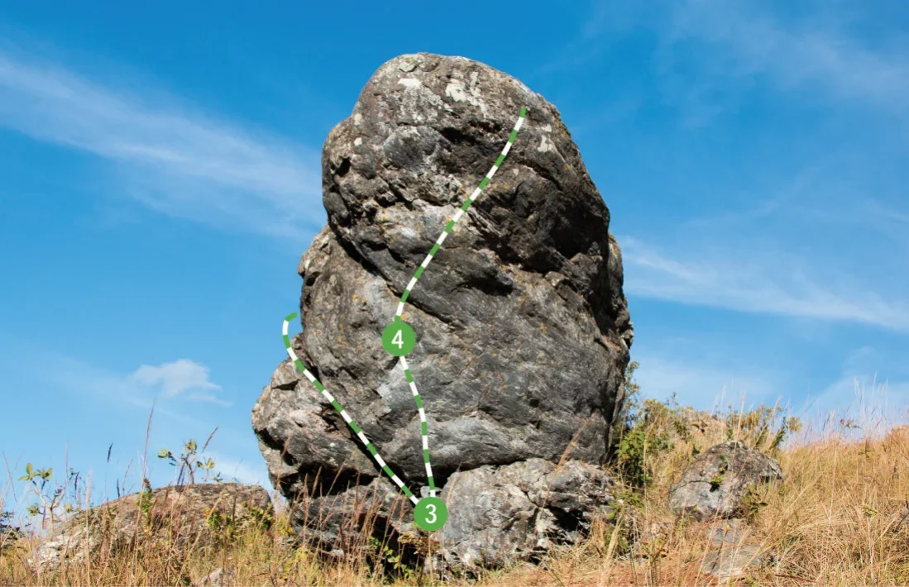
          - **largura_mapa**: 1099
          - **altura_mapa**: 710
          - **referencias**:
            - **[0]**:
              - **alvo_uid**: wWCvLUX0b7lAf3
              - **pontos_uids**:
                - 3
              - **escalada**: Tangente (Mosquitos)
              - **ids**:
                - 3
            - **[1]**:
              - **alvo_uid**: vRSD9c4FX1Cj6x
              - **pontos_uids**:
                - 4
              - **escalada**: Mosquitos
              - **ids**:
                - 4
      - **escaladas**:
        - **[0]**:
          - **uid**: wWCvLUX0b7lAf3
          - **boulder**:
            - **descricao**: Começa com a mão direita no bico e a esquerda no buraco e escala em diagonal pra esquerda por agarras boas.
            - **nome**: Tangente (Mosquitos)
            - **dificuldade**: V0
        - **[1]**:
          - **uid**: vRSD9c4FX1Cj6x
          - **boulder**:
            - **descricao**: Começa como o “Tangente” (3) e segue reto pela face levemente negativa.
            - **nome**: Mosquitos
            - **dificuldade**: V2
            - **destaque**: True
      - **precomputados**:
        - **total_escaladas**: 2
        - **total_boulders**: 2
  - **[2]**:
    - **conteudo**:
      - **descricao**: 
      - **nome**: Bloco C - Blood América
      - **uid**: 8hYDWYkbAHWbpZ
      - **mapas**:
        - **[0]**:
          - **caminho_imagem_mapa**: 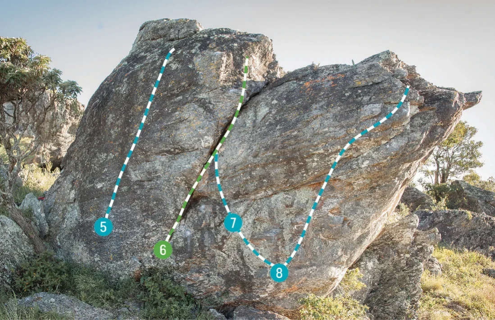
          - **largura_mapa**: 1099
          - **altura_mapa**: 710
          - **referencias**:
            - **[0]**:
              - **alvo_uid**: Hc1JyT3CAG6JRw
              - **pontos_uids**:
                - 5
              - **escalada**: Espanhol
              - **ids**:
                - 5
            - **[1]**:
              - **alvo_uid**: 7Bs4f4TdK0s2KL
              - **pontos_uids**:
                - 6
              - **escalada**: Fenda Paraguai
              - **ids**:
                - 6
            - **[2]**:
              - **alvo_uid**: PmDhuuc3DT7ZIr
              - **pontos_uids**:
                - 7
              - **escalada**: Blood Mexican
              - **ids**:
                - 7
            - **[3]**:
              - **alvo_uid**: UEi7pcw177wVzK
              - **pontos_uids**:
                - 8
              - **escalada**: Blood América
              - **ids**:
                - 8
      - **escaladas**:
        - **[0]**:
          - **uid**: Hc1JyT3CAG6JRw
          - **boulder**:
            - **descricao**: Boulder de aderência que escala o meio do vertical à esquerda da fenda.
            - **nome**: Espanhol
            - **dificuldade**: V3
            - **destaque**: True
        - **[1]**:
          - **uid**: 7Bs4f4TdK0s2KL
          - **boulder**:
            - **descricao**: Sai com a mão esquerda no início da fenda e a direita aberta em um pocket e escala pela fenda.
            - **nome**: Fenda Paraguai
            - **dificuldade**: V1
            - **destaque**: True
        - **[2]**:
          - **uid**: PmDhuuc3DT7ZIr
          - **boulder**:
            - **descricao**: Começa no “Blood América” (8) e termina no “Fenda Paraguai” (6).
            - **nome**: Blood Mexican
            - **dificuldade**: V4
            - **destaque**: True
            - **conquistadores**:
              - Mahavir Jneesh
            - **data_abertura**: 2010
        - **[3]**:
          - **uid**: UEi7pcw177wVzK
          - **boulder**:
            - **descricao**: Sai sentado com as mãos em dois pockets e escala em diagonal pra direita, dominando pela proa. Um dos visuais mais clássicos da Rachada!
            - **nome**: Blood América
            - **dificuldade**: V4
            - **destaque**: True
            - **conquistadores**:
              - Ruy Castro
            - **data_abertura**: 2006
      - **precomputados**:
        - **total_escaladas**: 4
        - **total_boulders**: 4
  - **[3]**:
    - **conteudo**:
      - **descricao**: 
      - **nome**: Bloco D - The Summit
      - **uid**: MJSEWLeX5S66bJ
      - **mapas**:
        - **[0]**:
          - **caminho_imagem_mapa**: 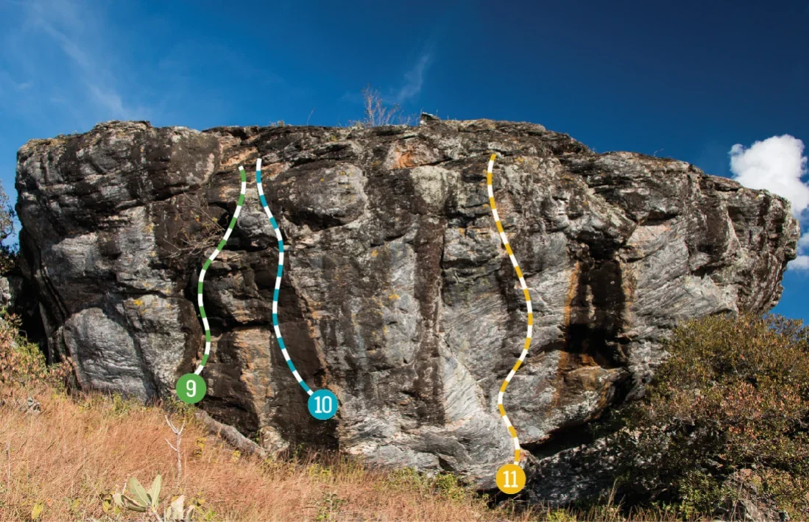
          - **largura_mapa**: 1099
          - **altura_mapa**: 710
          - **referencias**:
            - **[0]**:
              - **alvo_uid**: k50YTMqsbmNSLj
              - **pontos_uids**:
                - 9
              - **escalada**: Só o cume interessa
              - **ids**:
                - 9
            - **[1]**:
              - **alvo_uid**: RxxyJqJ74Z2CsG
              - **pontos_uids**:
                - 10
              - **escalada**: Bote nadador
              - **ids**:
                - 10
            - **[2]**:
              - **alvo_uid**: NCmxsU3eq9oOS1
              - **pontos_uids**:
                - 11
              - **escalada**: The summit
              - **ids**:
                - 11
      - **escaladas**:
        - **[0]**:
          - **uid**: k50YTMqsbmNSLj
          - **boulder**:
            - **descricao**: Highball que escala a fenda.
            - **nome**: Só o cume interessa
            - **dificuldade**: V0
            - **destaque**: True
        - **[1]**:
          - **uid**: RxxyJqJ74Z2CsG
          - **boulder**:
            - **descricao**: Começa em pé com as mãos juntas em um batente bom e toca reto.
            - **nome**: Bote nadador
            - **dificuldade**: V4
            - **destaque**: True
            - **conquistadores**:
              - Felipe Alvares
            - **data_abertura**: 2008
        - **[2]**:
          - **uid**: NCmxsU3eq9oOS1
          - **boulder**:
            - **descricao**: Começa sentado com a mão direita em um reglete e a esquerda em um batente e escala o highball com movimentação clássica!
            - **nome**: The summit
            - **dificuldade**: V7
            - **destaque**: True
            - **conquistadores**:
              - Felipe Alvares
            - **data_abertura**: 2011
      - **precomputados**:
        - **total_escaladas**: 3
        - **total_boulders**: 3
  - **[4]**:
    - **conteudo**:
      - **descricao**: 
      - **nome**: Bloco E - Testarossa
      - **uid**: 6UZ9BB51g1EYEn
      - **mapas**:
        - **[0]**:
          - **caminho_imagem_mapa**: 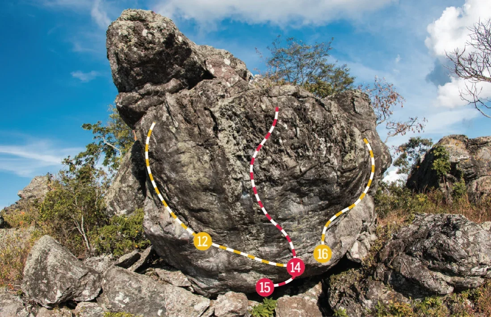
          - **largura_mapa**: 1099
          - **altura_mapa**: 710
          - **referencias**:
            - **[0]**:
              - **alvo_uid**: G5Lsvpwuf65e6u
              - **pontos_uids**:
                - 12
              - **escalada**: Mistral
              - **ids**:
                - 12
            - **[1]**:
              - **alvo_uid**: zcmz0bsZspDWJT
              - **pontos_uids**:
                - 15
                - 12
              - **escalada**: Mistral SDS
              - **ids**:
                - 15
                - 12
            - **[2]**:
              - **alvo_uid**: E0d7eN6HESMn1D
              - **pontos_uids**:
                - 14
              - **escalada**: Testarossa
              - **ids**:
                - 14
            - **[3]**:
              - **alvo_uid**: lhMvXrCQSCVEY0
              - **pontos_uids**:
                - 15
              - **escalada**: Testarossa SDS
              - **ids**:
                - 15
            - **[4]**:
              - **alvo_uid**: qBvZz7GdYnhVKe
              - **pontos_uids**:
                - 16
              - **escalada**: Talismã
              - **ids**:
                - 16
            - **[5]**:
              - **alvo_uid**: X6kOHldh31Qr2T
              - **pontos_uids**:
                - 15
                - 16
              - **escalada**: Talismã SDS
              - **ids**:
                - 15
                - 16
            - **[6]**:
              - **alvo_uid**: 8fbUeJsDOKCPqj
              - **pontos_uids**:
                - 12
                - 16
              - **escalada**: Venon
              - **ids**:
                - 12
                - 16
      - **escaladas**:
        - **[0]**:
          - **uid**: G5Lsvpwuf65e6u
          - **boulder**:
            - **descricao**: Sai em pé com as mãos juntas em um bico e um pocket e atravessa para a esquerda, dominando pela lateral do bloco em agarras boas.
            - **nome**: Mistral
            - **dificuldade**: V7
            - **destaque**: True
            - **conquistadores**:
              - Felipe Alvares
            - **data_abertura**: 2007
        - **[1]**:
          - **uid**: zcmz0bsZspDWJT
          - **boulder**:
            - **descricao**: Sai do “Testarossa SDS” (15) e termina como o “Mistral” (12).
            - **nome**: Mistral SDS
            - **dificuldade**: V9
            - **conquistadores**:
              - Gustavo Fontes
            - **data_abertura**: 2009
        - **[2]**:
          - **uid**: E0d7eN6HESMn1D
          - **boulder**:
            - **descricao**: Começa como o “Mistral” (12) e toca reto pelo negativo com uma movimentação muito clássica!
            - **nome**: Testarossa
            - **dificuldade**: V10
            - **destaque**: True
            - **conquistadores**:
              - André Berezoski
            - **data_abertura**: 2009
        - **[3]**:
          - **uid**: lhMvXrCQSCVEY0
          - **boulder**:
            - **descricao**: Sai com as mãos juntas em dois pequenos regletes, mais abaixo no teto, e entra no “Testarossa” (14).
            - **nome**: Testarossa SDS
            - **dificuldade**: V11
            - **conquistadores**:
              - Jean Ouriques
            - **data_abertura**: 2009
        - **[4]**:
          - **uid**: qBvZz7GdYnhVKe
          - **boulder**:
            - **descricao**: Começa com as mãos juntas em um grande batente em forma de triângulo e escala em diagonal pra direita, dominando por abaulados.
            - **nome**: Talismã
            - **dificuldade**: V6
            - **destaque**: True
            - **conquistadores**:
              - Rafael Passos
            - **data_abertura**: 2008
        - **[5]**:
          - **uid**: X6kOHldh31Qr2T
          - **boulder**:
            - **descricao**: Sai do “Testarossa SDS” (15) e termina como o “Talismã” (16).
            - **nome**: Talismã SDS
            - **dificuldade**: V8
            - **conquistadores**:
              - Gustavo Fontes
            - **data_abertura**: 2009
        - **[6]**:
          - **uid**: 8fbUeJsDOKCPqj
          - **boulder**:
            - **descricao**: Boulder que começa nas agarras boas no final do “Mistral” (12) e faz o caminho inverso, atravessando para a direita e terminando no “Talismã” (16).
            - **nome**: Venon
            - **dificuldade**: V9
            - **destaque**: True
            - **conquistadores**:
              - Rafael Passos
            - **data_abertura**: 2009
      - **precomputados**:
        - **total_escaladas**: 7
        - **total_boulders**: 7
  - **[5]**:
    - **conteudo**:
      - **descricao**: 
      - **nome**: Bloco F - Sai do Teto
      - **uid**: 6XLE5SspejONIX
      - **mapas**:
        - **[0]**:
          - **caminho_imagem_mapa**: 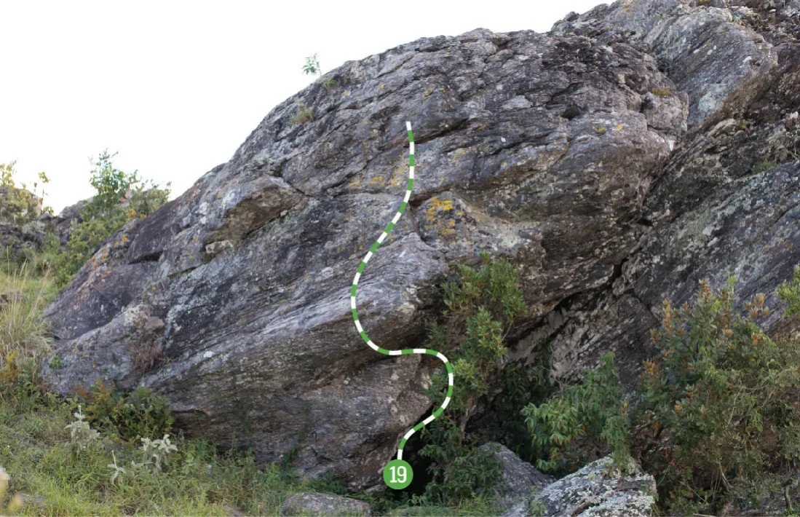
          - **largura_mapa**: 1099
          - **altura_mapa**: 710
          - **referencias**:
            - **[0]**:
              - **alvo_uid**: 0qZ64gnu04uRXI
              - **pontos_uids**:
                - 19
              - **escalada**: Sai do teto
              - **ids**:
                - 19
      - **escaladas**:
        - **[0]**:
          - **uid**: 0qZ64gnu04uRXI
          - **boulder**:
            - **descricao**: Começa sentado com as mãos juntas em um grande reglete do lado de dentro da caverna, na parede laranja, e faz uma longa travessia para a esquerda, dominando o teto.
            - **nome**: Sai do teto
            - **dificuldade**: V3
            - **destaque**: True
      - **precomputados**:
        - **total_escaladas**: 1
        - **total_boulders**: 1
  - **[6]**:
    - **conteudo**:
      - **descricao**: 
      - **nome**: Bloco G - Laranja Mecânica
      - **uid**: A5Qguqnxxmiaec
      - **mapas**:
        - **[0]**:
          - **caminho_imagem_mapa**: 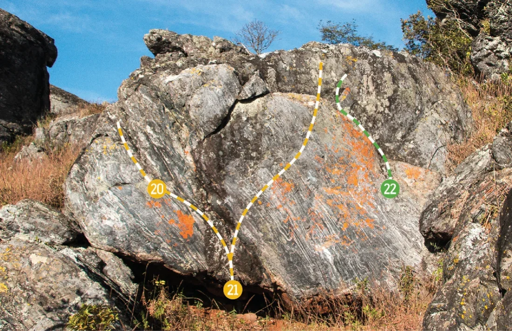
          - **largura_mapa**: 1099
          - **altura_mapa**: 710
          - **referencias**:
            - **[0]**:
              - **alvo_uid**: j2yxjEv5XJyUDQ
              - **pontos_uids**:
                - 20
              - **escalada**: Última onda
              - **ids**:
                - 20
            - **[1]**:
              - **alvo_uid**: tvaWjboex3AXb1
              - **pontos_uids**:
                - 21
              - **escalada**: Laranja mecânica
              - **ids**:
                - 21
            - **[2]**:
              - **alvo_uid**: nIymZQz8SYLnRY
              - **pontos_uids**:
                - 22
              - **escalada**: Só no suco
              - **ids**:
                - 22
      - **escaladas**:
        - **[0]**:
          - **uid**: j2yxjEv5XJyUDQ
          - **boulder**:
            - **descricao**: Sai como o “Laranja mecânica” (20) e segue pela fenda.
            - **nome**: Última onda
            - **dificuldade**: V6
            - **conquistadores**:
              - Rafael Passos
            - **data_abertura**: 2009
        - **[1]**:
          - **uid**: tvaWjboex3AXb1
          - **boulder**:
            - **descricao**: Começa sentado com as mãos em duas agarras invertidas no teto e escala em diagonal pra direita.
            - **nome**: Laranja mecânica
            - **dificuldade**: V8
            - **destaque**: True
            - **conquistadores**:
              - Felipe Alvares
            - **data_abertura**: 2007
        - **[2]**:
          - **uid**: nIymZQz8SYLnRY
          - **boulder**:
            - **descricao**: Sai em pé com as mãos juntas em um abaulado e segue pela fenda até um domínio fácil.
            - **nome**: Só no suco
            - **dificuldade**: V0
            - **destaque**: True
      - **precomputados**:
        - **total_escaladas**: 3
        - **total_boulders**: 3
  - **[7]**:
    - **conteudo**:
      - **descricao**: 
      - **nome**: Bloco H - Ronaldo
      - **uid**: xPr8wvdVJfZaXX
      - **mapas**:
        - **[0]**:
          - **caminho_imagem_mapa**: 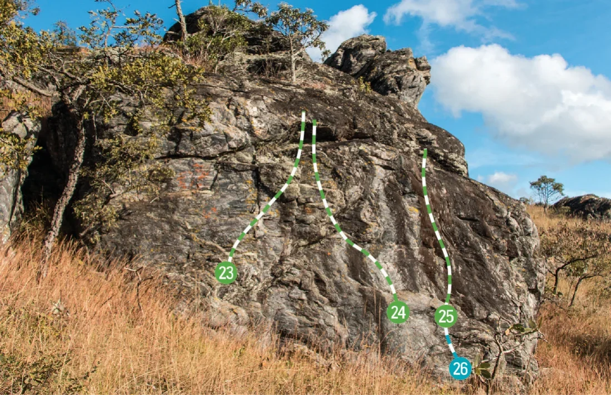
          - **largura_mapa**: 1099
          - **altura_mapa**: 710
          - **referencias**:
            - **[0]**:
              - **alvo_uid**: VbRIHwMprzzcvF
              - **pontos_uids**:
                - 23
              - **escalada**: Pedala Robinho
              - **ids**:
                - 23
            - **[1]**:
              - **alvo_uid**: AVN7ZmhT32HxCF
              - **pontos_uids**:
                - 24
              - **escalada**: Ronaldo
              - **ids**:
                - 24
            - **[2]**:
              - **alvo_uid**: A0HOuWIrepSzu2
              - **pontos_uids**:
                - 25
              - **escalada**: Fenômeno
              - **ids**:
                - 25
            - **[3]**:
              - **alvo_uid**: FIPX6HBx70tt77
              - **pontos_uids**:
                - 26
              - **escalada**: Fenômeno SDS
              - **ids**:
                - 26
      - **escaladas**:
        - **[0]**:
          - **uid**: VbRIHwMprzzcvF
          - **boulder**:
            - **descricao**: Começa com as mãos juntas em um batente bom e escala por agarras boas.
            - **nome**: Pedala Robinho
            - **dificuldade**: VB
        - **[1]**:
          - **uid**: AVN7ZmhT32HxCF
          - **boulder**:
            - **descricao**: Sai em pé, com as mãos em dois regletes bons e escala em diagonal pra esquerda.
            - **nome**: Ronaldo
            - **dificuldade**: V1
            - **destaque**: True
        - **[2]**:
          - **uid**: A0HOuWIrepSzu2
          - **boulder**:
            - **descricao**: Começa em pé, com as mãos em dois regletes bons e toca reto por uma linha de regletes.
            - **nome**: Fenômeno
            - **dificuldade**: V0
            - **destaque**: True
        - **[3]**:
          - **uid**: FIPX6HBx70tt77
          - **boulder**:
            - **descricao**: Saída sentada do “Fenômeno” começando com as mãos em dois regletes bem baixos.
            - **nome**: Fenômeno SDS
            - **dificuldade**: V2
      - **precomputados**:
        - **total_escaladas**: 4
        - **total_boulders**: 4
  - **[8]**:
    - **conteudo**:
      - **descricao**: 
      - **nome**: Bloco I - Siriema
      - **uid**: pa9gNt8On1l48o
      - **escaladas**:
        - **[0]**:
          - **uid**: oIA7VJYDSydyTf
          - **boulder**:
            - **descricao**: Começa em pé com as mãos nos regletes no meio do bloco e atravessa em diagonal pra esquerda, por uma linha de regletes.
            - **nome**: Sabirila
            - **dificuldade**: V2
            - **destaque**: True
        - **[1]**:
          - **uid**: 4Jm9GyO72EzNjD
          - **boulder**:
            - **descricao**: Começa como o “Sabirila” (27) e segue reto, terminando com um movimento clássico.
            - **nome**: Seriema
            - **dificuldade**: V3
            - **destaque**: True
        - **[2]**:
          - **uid**: wPZ2kDIVbOvXJr
          - **boulder**:
            - **descricao**: Começa com as mãos juntas em um batente de oposição e escala em diagonal pra esquerda, por agarras boas.
            - **nome**: Canelinha
            - **dificuldade**: V0
      - **precomputados**:
        - **total_escaladas**: 3
        - **total_boulders**: 3
  - **[9]**:
    - **conteudo**:
      - **descricao**: 
      - **nome**: Bloco J - Cerrado
      - **uid**: 3S1uM3IaSsovOm
      - **escaladas**:
        - **[0]**:
          - **uid**: vFO52j09RcWfMT
          - **boulder**:
            - **descricao**: Começa sentado com a mão esquerda em um pocket e a direita em um reglete e escala a aresta.
            - **nome**: Cerrado
            - **dificuldade**: V0
        - **[1]**:
          - **uid**: nKJb8UpDlIxoSL
          - **boulder**:
            - **descricao**: Sai em pé com as mãos juntas em um agarrão e escala reto.
            - **nome**: Canga
            - **dificuldade**: VB
      - **precomputados**:
        - **total_escaladas**: 2
        - **total_boulders**: 2
  - **[10]**:
    - **conteudo**:
      - **descricao**: 
      - **nome**: Bloco K - Plutão
      - **uid**: TB1w4Vo6EIiriN
      - **mapas**:
        - **[0]**:
          - **caminho_imagem_mapa**: 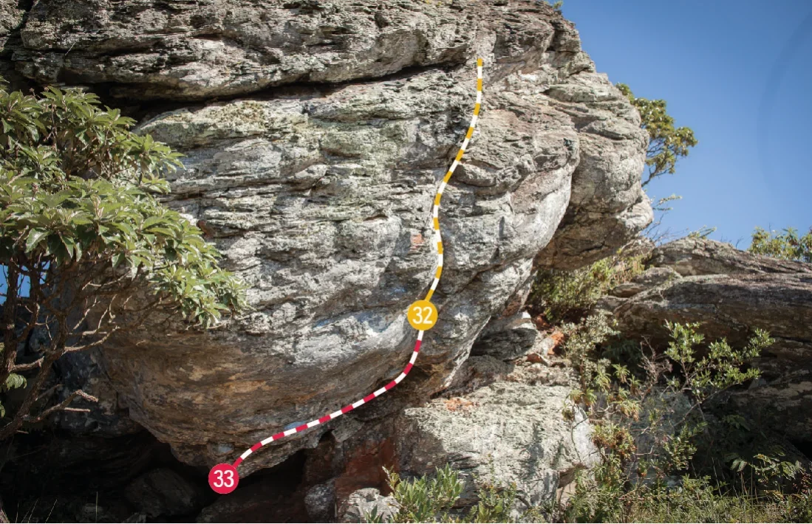
          - **largura_mapa**: 1099
          - **altura_mapa**: 710
          - **referencias**:
            - **[0]**:
              - **alvo_uid**: RWzPNQ8thPGkoV
              - **pontos_uids**:
                - 32
              - **escalada**: Difícil de entender
              - **ids**:
                - 32
            - **[1]**:
              - **alvo_uid**: Uv5PLfRmJe9vvB
              - **pontos_uids**:
                - 33
              - **escalada**: Plutão
              - **ids**:
                - 33
      - **escaladas**:
        - **[0]**:
          - **uid**: RWzPNQ8thPGkoV
          - **boulder**:
            - **descricao**: Saída em pé do “Plutão” (33), com as mãos nos batentes escorridos próximos à “fenda”.
            - **nome**: Difícil de entender
            - **dificuldade**: V7
            - **destaque**: True
            - **conquistadores**:
              - Frederico Gonçalves
            - **data_abertura**: 2012
        - **[1]**:
          - **uid**: Uv5PLfRmJe9vvB
          - **boulder**:
            - **descricao**: Começa sentado com as mãos nos batentes mais baixos e escala em diagonal pra direita terminando como o “Difícil de entender” (32).
            - **nome**: Plutão
            - **dificuldade**: V10
            - **destaque**: True
            - **conquistadores**:
              - Frederico Gonçalves
            - **data_abertura**: 2013
      - **precomputados**:
        - **total_escaladas**: 2
        - **total_boulders**: 2
- **precomputados**:
  - **total_escaladas**: 33
  - **total_boulders**: 33

## Arquivos Externos

- **arquivos_externos**:
  - **[0]**:
    - **caminho**: 
    - **checksum_sha256**: 6290b35925993886618c554d71eaa6d6e72c08c8077c55cb3827d36c23de4607
  - **[1]**:
    - **caminho**: 
    - **checksum_sha256**: 683a8e8fa77b9483d35f70777d73b7473bf3a5a8f42792161c5c3640121c18a1
  - **[2]**:
    - **caminho**: 
    - **checksum_sha256**: ddee0d9fb6b3e315b3f3fad71cd1ee789ee2437cb53c63eb56508d567d6f3c06
  - **[3]**:
    - **caminho**: 
    - **checksum_sha256**: 9afb969b9353a1bb897f62f4837326d7f335a045bb8e6b34e4c0273a510ebf73
  - **[4]**:
    - **caminho**: 
    - **checksum_sha256**: ee9b7f1ba1112550cff1f2eee24e9ee240b20c09812b437a55ec71e31b4e4b04
  - **[5]**:
    - **caminho**: 
    - **checksum_sha256**: 5eac76533e941111992ac65700c22373f152fd7af7f411ec997c752039d6c9b4
  - **[6]**:
    - **caminho**: 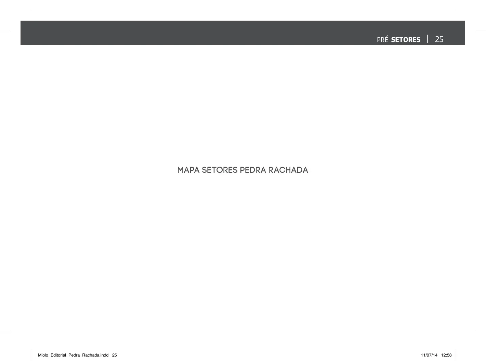
    - **checksum_sha256**: dc7e3a8c03b29cae4c58f0f73e0fea01c6c39198f74431b092f23fe1e316c1b1
  - **[7]**:
    - **caminho**: 
    - **checksum_sha256**: 1f6e5d4c19d471b65b0c19629cbd2ea1c3f94c77fd041eb8a7106a64c500ac1c
  - **[8]**:
    - **caminho**: 
    - **checksum_sha256**: f4995b3a23e20d5c6dda7f2d1db3361ac01c8ba43586a2395fe2f808a34097b3
  - **[9]**:
    - **caminho**: 
    - **checksum_sha256**: 45205c3d56172970c4e98917a45cbb8da577664928cdcdf839bc5acb8a45fbc6
  - **[10]**:
    - **caminho**: 
    - **checksum_sha256**: 5cb378ade10c98d49099a040f422ba9382530bf422ffcc14c6b50f1af141e120
  - **[11]**:
    - **caminho**: 
    - **checksum_sha256**: 4ceb4d92fc8ec9a1d98ce35f54f465c6bf268bddd584b880439314622198e921
  - **[12]**:
    - **caminho**: 
    - **checksum_sha256**: f7fd065cbe854c11e5635a9993ceb3e201e0f65bf15a06ea034d9b7415f00040
  - **[13]**:
    - **caminho**: 
    - **checksum_sha256**: 41fd5fd94de7d3ea39bd6884836a50932b6cd96077277ec2086e92bbfa343a36
  - **[14]**:
    - **caminho**: 
    - **checksum_sha256**: d7d58ac096fcce224b36e6e2c29bf572fa797bbd995a8c50f7f898f8cecb7a0f
  - **[15]**:
    - **caminho**: 
    - **checksum_sha256**: c8153b7d9cebc2e716b0c7a8d96b8284f5b2d2b5c4934853a29a16bc284e8ab2
  - **[16]**:
    - **caminho**: 
    - **checksum_sha256**: feb34d6e2dc82e98a801cb54d18247d41783618e092352eca1c971b6912168c4
  - **[17]**:
    - **caminho**: 
    - **checksum_sha256**: 631cc15fa04be8cebf0d8a614ab9e5b22a8914484db190d2f6a9fc675fde5e28
  - **[18]**:
    - **caminho**: 
    - **checksum_sha256**: 332a15b40aebe3444309b53b8eda508de48e028889a955089428e615da5c5cb1
  - **[19]**:
    - **caminho**: 
    - **checksum_sha256**: 0ab7dbf889c3c7e0b74f113a9da89cac9534eb74382940046fde8f511328721a
  - **[20]**:
    - **caminho**: 
    - **checksum_sha256**: 258a719d73394ed0b9189d7392c21fb26030e1197347969ca940052bd89c947d
  - **[21]**:
    - **caminho**: 
    - **checksum_sha256**: 8262eaf9eba0e3b99b86211020107057cf472c7c3a6fc7c9f060fcf85c003980
  - **[22]**:
    - **caminho**: 
    - **checksum_sha256**: 3979360e1824d8af8dcf392f375643f1a6924eaff71c1b2178d41a779e2be303
  - **[23]**:
    - **caminho**: 
    - **checksum_sha256**: 0c08dd398d84eb3ba1341c3be1f61276a3d7dc9a49f7fdf37a4961c08f2a734a
  - **[24]**:
    - **caminho**: 
    - **checksum_sha256**: d27d5f24f6f38b294ff7feb3c8ba77d33f0f2b92043a1dce59229e1a999dd2ef
  - **[25]**:
    - **caminho**: 
    - **checksum_sha256**: 0c5170a8eaa85654d7ccc1286f282c35f26fd9fbd40b2b845417448af0e6bfc5
  - **[26]**:
    - **caminho**: 
    - **checksum_sha256**: c2de67e4c1f349db83cbfa375c08aacbaffff5c5c1e18c2552cf404198a70f0a
  - **[27]**:
    - **caminho**: 
    - **checksum_sha256**: 1256f3d783cf02b4366e26f98fd5fcd9f5b215ec77b0315d21b911af8661e010
  - **[28]**:
    - **caminho**: 
    - **checksum_sha256**: e1b450bc96262f493a9aaf5bc220a261e2eb7585dd236e699cfe6ac87f0098f5
  - **[29]**:
    - **caminho**: 
    - **checksum_sha256**: 516847b432a6f513511ccfb939108902f09a43725e0e5f262b944dcb1d3c95a9
  - **[30]**:
    - **caminho**: 
    - **checksum_sha256**: 0b7e585ccd2b5c4c8500b973babc8502b00b7240119546b56b6c0ac508703448
  - **[31]**:
    - **caminho**: 
    - **checksum_sha256**: 3c87f6c089419d2a7683ef8d36c6886771000698e8f737b943ac730bf6ba8bb1
  - **[32]**:
    - **caminho**: 
    - **checksum_sha256**: 30bfe367fb4236ed6b77ef20f1db96896e9d6c51a87811a0efdf4f437175b576
  - **[33]**:
    - **caminho**: 
    - **checksum_sha256**: c2ca685d8f0f6115a898a3dca4226b8bde80a148b8b4af1f93063c3efbb1b86d
  - **[34]**:
    - **caminho**: 
    - **checksum_sha256**: b2f23147169963ed19e76113af555797f017bce2a2ea9f8ef43016ffbaf42b20
  - **[35]**:
    - **caminho**: 
    - **checksum_sha256**: d675d09dfab26280ce6f04b10fcb9a03652502d04ce65b77ae0f4ee50a3cdc30
  - **[36]**:
    - **caminho**: 
    - **checksum_sha256**: e113685f554cfdb8b3942e1968b190464d852660b14ff905706be8e7264dd238
  - **[37]**:
    - **caminho**: 
    - **checksum_sha256**: 66975db25fb920ba607f6eb9b27613f39f74eb693dbe8eadd00abc230450d163
  - **[38]**:
    - **caminho**: 
    - **checksum_sha256**: 3d7782b4982497e865b54c4d48378e98d2ddf675788e55e7286d36bd2851f3ae
  - **[39]**:
    - **caminho**: 
    - **checksum_sha256**: d454678e5183c15872357a351bb8246e6f4e342e9114f738c2899ae18307b434
  - **[40]**:
    - **caminho**: 
    - **checksum_sha256**: f5b5e73f2ecc227ec4fcc90ce91648be56bc0f85f4964c5c12e52ad46c4d4bb3
  - **[41]**:
    - **caminho**: 
    - **checksum_sha256**: 0d8887b395e9ebf3f505a92cd760055ce80b06a982bdf75bdd345af4667e2e98
  - **[42]**:
    - **caminho**: 
    - **checksum_sha256**: fe6441496e9373f0c9ae41e587140f1ca6b337f66ec3e71954a84a4a4ed950ed
  - **[43]**:
    - **caminho**: 
    - **checksum_sha256**: a23d2958b97ab24edd20b4b6cf2398578ceefd1008455252e0d9b20aa8489fbb
  - **[44]**:
    - **caminho**: 
    - **checksum_sha256**: 081fc4b0ca5c195417582a29da005dc9a4b18421c42fb3a2a696e759acffee14
  - **[45]**:
    - **caminho**: 
    - **checksum_sha256**: c3e25543dfb23f0b659a43c305d5f891253c521f578109c988fffc0b20da369e
  - **[46]**:
    - **caminho**: 
    - **checksum_sha256**: a3b5ec2836f1e697be8808f558b75994a5f0b389b0c4ab0e78f0792e81426800
  - **[47]**:
    - **caminho**: 
    - **checksum_sha256**: 1fc7cd3cdb89554e67b87d1e449137477bf65eb6fff83b50cd37bdf1b8959382
  - **[48]**:
    - **caminho**: 
    - **checksum_sha256**: ad661cdbe67f189b4cc6af2b5a5b30ded2429e6c28568344c3823cde5cf1fa5f
  - **[49]**:
    - **caminho**: 
    - **checksum_sha256**: b81d6204614c0bae83acbe4f015b9742811b430d9e5f5d0e1089aec84a044d46
  - **[50]**:
    - **caminho**: 
    - **checksum_sha256**: 274a74dd292afc7f9414df81094a09d7fdc62ea3a67f21577e8e1a200bc3967e
  - **[51]**:
    - **caminho**: 
    - **checksum_sha256**: 8423b42dad03795625a81e9b06343607d810f2c8f50c14c9521be00e384460b6
  - **[52]**:
    - **caminho**: 
    - **checksum_sha256**: 280016d567da4fdb387fa9ead953c6fd735397f8ee47ab98f9233ed5fc7199c0
  - **[53]**:
    - **caminho**: 
    - **checksum_sha256**: f22457a911826cf6b00794b913e03b23382feb4ec78dd685719a8b74b7f621c3
  - **[54]**:
    - **caminho**: 
    - **checksum_sha256**: 3f6134a94cbd1dc7ab4027a475a186a5eeed89a3bcce2a849a6cc8712ad5a1b1
  - **[55]**:
    - **caminho**: 
    - **checksum_sha256**: acf846ba5dab028b602480fcec17576e8cb0c61feed0caa57fe07327b60d3169
  - **[56]**:
    - **caminho**: 
    - **checksum_sha256**: 6980154b7444543b81925f64355c36cc16704f0852106804269903136b21e370
  - **[57]**:
    - **caminho**: 
    - **checksum_sha256**: b15ec1123cd6a3c0bebeb1c47f49d23b8f6052bab3b47f895ddc54314af9be2c
  - **[58]**:
    - **caminho**: 
    - **checksum_sha256**: c7198c4836b47165d93aef56682ec4a81884cb1af60e65cac1310a95588cfd4a
  - **[59]**:
    - **caminho**: 
    - **checksum_sha256**: c5072cf9074e6f5d2b96277d428691f83194923a9f6f7ac400f971a377a1e31a
  - **[60]**:
    - **caminho**: 
    - **checksum_sha256**: a98186a7d66e55f82adbf2e957acf126c79aa3217e95ea2136138a856b06f863
  - **[61]**:
    - **caminho**: 
    - **checksum_sha256**: 8ebdc69e307dea7f1e914795a509e12d653bf3dd847ffdb534051593fe7c818a
  - **[62]**:
    - **caminho**: 
    - **checksum_sha256**: 79033ccad7b6c334c52511bb5b9c307778abcb165d8939ea697d1c2a816453cf
  - **[63]**:
    - **caminho**: 
    - **checksum_sha256**: b451938bf68e224d228893531bb5986ebd77b424a8305e2a04a42cbbba2cbde6
  - **[64]**:
    - **caminho**: 
    - **checksum_sha256**: da51d53f34c91ae5084e38ecf2cafbc552c7ba0aaa8d146c537dedb82944af76
  - **[65]**:
    - **caminho**: 
    - **checksum_sha256**: 160cd714887de12ee0cbfb7b5e0d7f41972133a365aed3d95e000620bcd01e2b
  - **[66]**:
    - **caminho**: 
    - **checksum_sha256**: c5324532e0a96279fe6bf6c977167cdedfc59d0eae96aa4489fb2ff4fdbdf894
  - **[67]**:
    - **caminho**: 
    - **checksum_sha256**: 16c09dbd9189b78913f39c2ff965dd7536499939f9fd35d14feb08b5d00fe266
  - **[68]**:
    - **caminho**: 
    - **checksum_sha256**: 50e9a4d8e05a7de5aff92fbc1d0aab23f8866f94cea8c3ad570a258c2aaabb26
  - **[69]**:
    - **caminho**: 
    - **checksum_sha256**: 6551b5b4a7296249286dff7605d1858c51bab19b78ac173d64d199fc82995c3f
  - **[70]**:
    - **caminho**: 
    - **checksum_sha256**: 275109b49c2f4340f78c7c9c676f25d3e775a15505d9663da7c57529ab037540
  - **[71]**:
    - **caminho**: 
    - **checksum_sha256**: f4952843099481d3d784d0d9c98a455a6375d2ece822c3c13403dc7662935786
  - **[72]**:
    - **caminho**: 
    - **checksum_sha256**: 69e08ae5601f89f0cfb19a488d3f820daa70633f5ecd22b5e4aa772a7c16b879
  - **[73]**:
    - **caminho**: 
    - **checksum_sha256**: b955d331edcf60a95c4385d6b9d8aef4d2247fcb5e367496bc7bb009b45ddd8c
  - **[74]**:
    - **caminho**: 
    - **checksum_sha256**: e03fda42aff66afd68da2671905812558b7a0f6441fcfb7c9d3613c6981a647f
  - **[75]**:
    - **caminho**: 
    - **checksum_sha256**: bf45759273eebb1e2d0a864299869ef8c21befe0697c1bf74ba31feae01e532a
  - **[76]**:
    - **caminho**: 
    - **checksum_sha256**: 0e9aef205476d9ba136ecb7d5e6adc490cde3d9c7d426a2420e6f06748284bec
  - **[77]**:
    - **caminho**: 
    - **checksum_sha256**: 4479494a0005ebbbe2aca7ef122fb059cb7541da6a21f00033ea996faa8da36b
  - **[78]**:
    - **caminho**: 
    - **checksum_sha256**: 765b9197dee19cee34010d6e4b2d1b1626920dd9ce5660b48199acd94d01c0a3
  - **[79]**:
    - **caminho**: 
    - **checksum_sha256**: cf32d4e89bcc58f64a8b96cab0f83f23578a03fe191963a1d8d6c4e1f0e92b37
  - **[80]**:
    - **caminho**: 
    - **checksum_sha256**: dd9a70be22fcb6398eec0f9a9bff03f9d804395f61b7705fdd075ef9a564b110
  - **[81]**:
    - **caminho**: 
    - **checksum_sha256**: 9e1ef4e5c7bb7484beb9866d794e79461623ded6b5132a9f58b5729ce0912b30
  - **[82]**:
    - **caminho**: 
    - **checksum_sha256**: 88450c4ca03ae748ccd80d4887f542d9ac5813b8ea81cade1711451ed530857f
  - **[83]**:
    - **caminho**: 
    - **checksum_sha256**: d1537a1acc81e53720de636699f882a53afdef18e397a7f8130d70110a174f3f
  - **[84]**:
    - **caminho**: 
    - **checksum_sha256**: fc351131d63835e5818741475bd1715bfcaccf3c8f9637e446e427078422e553
  - **[85]**:
    - **caminho**: 
    - **checksum_sha256**: 32c5ca9036cf4c7479a8efa1bbb44d9988a01501560d6d57781d016760c25a64
  - **[86]**:
    - **caminho**: 
    - **checksum_sha256**: bd065dc42eec68c98c3117986cd35ba105f5303d3c852f3bf4426dd5f94278ce
  - **[87]**:
    - **caminho**: 
    - **checksum_sha256**: 0ac020bca7481f838df2f813642c2b8eb49a526a3e6a1ec2f28f278913855b66
  - **[88]**:
    - **caminho**: 
    - **checksum_sha256**: 91eb4d2b637c2973f1a8a14820be8063246dc5c31e2c4d5d69f4a82b9f721422
  - **[89]**:
    - **caminho**: 
    - **checksum_sha256**: 57747a455a37e35ed6c161604d139da9102cf0c91452299cec1b4a097d2fa508
  - **[90]**:
    - **caminho**: 
    - **checksum_sha256**: e4b3cde7ae74a2963fe6322c6a5ae0f59a230edd0c2b0b330874e8f63711f038
  - **[91]**:
    - **caminho**: 
    - **checksum_sha256**: 87f3c7d91dff1179db94bbb93ac789dae8eca155b27ba99c00f61901e1689f6c
  - **[92]**:
    - **caminho**: 
    - **checksum_sha256**: 766bd987ddeba646046268c645560baf4eff08155e279797be046ba25bfd79d7
  - **[93]**:
    - **caminho**: 
    - **checksum_sha256**: 51a205b961f8a82f58b399e23ddfde7d29c1ab09f327affbd41e598ff4bc13dd
  - **[94]**:
    - **caminho**: 
    - **checksum_sha256**: a131df5ab8ca3d9c33569509a8b7080f192bd8b9425ab3ccf2bea5224166c820
  - **[95]**:
    - **caminho**: 
    - **checksum_sha256**: 47539164345a3e2f155eddb62f2d37bdda8d1ad1cc199849a5ba03fc0ad98aa2
  - **[96]**:
    - **caminho**: 
    - **checksum_sha256**: 921e67f2a86e0c359e868265b6935ad113a73a22697c8de5329e4a43fac6c120
  - **[97]**:
    - **caminho**: 
    - **checksum_sha256**: 01aed8d8f0b7abd47fb83cc64c0b3057ee1734ca80df2dfee1bca78e458b654e
  - **[98]**:
    - **caminho**: 
    - **checksum_sha256**: b25710b905d5ee32dcc184716091e17c8c5d85f7ccba0443bb8fd01a0e3bcf7a
  - **[99]**:
    - **caminho**: 
    - **checksum_sha256**: cef6f66b1fcd9d0f4230fee3cb8c4f19c699fc42009cecf854a5f614b8e7ea34
  - **[100]**:
    - **caminho**: 
    - **checksum_sha256**: e498c3f111a3190bb285ff89a39ad17c75398fa76359376952cb9148fbbdfe84
  - **[101]**:
    - **caminho**: 
    - **checksum_sha256**: 6d9ae49938a4be96b161343d22cca89cf4ef13a4e482f0363fa64cb535378cd9
  - **[102]**:
    - **caminho**: 
    - **checksum_sha256**: 90c44da8ac9e36325f517cb7e29fce97c43804b9cf5a7289dc7cd379988c4693
  - **[103]**:
    - **caminho**: 
    - **checksum_sha256**: a530dac88a7e0a7620b2cf30ad41f10193527271c6ef22c403c3faf2f640e63d
  - **[104]**:
    - **caminho**: 
    - **checksum_sha256**: 9a31e5b3cfc67d0e06486dceccfbef846ca257d9a78ec3bf8e94798db33c7ea4
  - **[105]**:
    - **caminho**: 
    - **checksum_sha256**: 14bd82cf7b4f1cc303418492f7d817f6d86097927bb471cfd5b5039cdbba4816
  - **[106]**:
    - **caminho**: 
    - **checksum_sha256**: ee68ae02794b02e641c97bc37f71457ac340d58be8aa2bb5605a155a45e9dee8
  - **[107]**:
    - **caminho**: 
    - **checksum_sha256**: c57faf27eb012fa7aa4af5c80ae5b041695609cf024aefe2cfac0d9fcb7a6686
  - **[108]**:
    - **caminho**: 
    - **checksum_sha256**: e8dd152eb47948beb934c82800c35f817a977a6f07b22f9a6ba4c2ff86a34c82
  - **[109]**:
    - **caminho**: 
    - **checksum_sha256**: 05d9fb60ad1b548654b32406a8a227c55429cd1fe40918c8d4dfdd837dd7ccc7
  - **[110]**:
    - **caminho**: 
    - **checksum_sha256**: 7879e6c0d2062d9be8b8b8a2207e4937a703d938780210e5864e2f529b5faa01
  - **[111]**:
    - **caminho**: 
    - **checksum_sha256**: c99a78ffcab85e0d0cbf92c75322a1fc9da1610294f95a54552028df2bdc5dc0
  - **[112]**:
    - **caminho**: 
    - **checksum_sha256**: 2b30e48a40d57a62a207843ff272ec4bd58015e95e37c0bbb9e35c5a110e7065
  - **[113]**:
    - **caminho**: 
    - **checksum_sha256**: 2ea45477de7bb582ee04d442562733d30f6fe5c52c09cce26ea4668ff53d88ed
  - **[114]**:
    - **caminho**: 
    - **checksum_sha256**: 760e3d903c03aa2d5842cf5c02bf0dcd92d0569c02a301407820ff203b9596ad
  - **[115]**:
    - **caminho**: 
    - **checksum_sha256**: 551ecf0c2420850560f793d415e56f66c13a8d40bce1b295d1884c877a152055
  - **[116]**:
    - **caminho**: 
    - **checksum_sha256**: d3ea472022e590e8a8f1d3fcd8f608337d16e13efd4222f1d254f67ac099b411
  - **[117]**:
    - **caminho**: 
    - **checksum_sha256**: 930e2c69e8809fdf7a93d5d7dc0590d8676f6189bfe502dbba89f12c87de0b66
  - **[118]**:
    - **caminho**: 
    - **checksum_sha256**: ff0a9011ece2a743e57c94aa8ab3bea9a38d2d2da7b90e73cccd4452848fd32e
  - **[119]**:
    - **caminho**: 
    - **checksum_sha256**: c09d4492c6461d9723f14b25a1d34f02c3720ae865726bf5a840bc7e5c45ba6e
  - **[120]**:
    - **caminho**: 
    - **checksum_sha256**: f8403be8951cfb027414002db55c441a9902ad11bb1ca28611962679e3a43329
  - **[121]**:
    - **caminho**: 
    - **checksum_sha256**: 2a39fa97e342a2a1c2367016f9f54fd0b347a4ecf82d2cd27424a1d0a553a021
  - **[122]**:
    - **caminho**: 
    - **checksum_sha256**: b8e4b88b06da8618295dece8427633780d65937f9ed8bfe8672b9e8546d5fcf4
  - **[123]**:
    - **caminho**: 
    - **checksum_sha256**: 79ccae991c3b33b20b99a12dc304339fcc44fc7dcd7ed8ec2c93446a10db0f73
  - **[124]**:
    - **caminho**: 
    - **checksum_sha256**: 6d98c43711ea55bea11cc0aafb4fce24857896f61c164e24e2ad9cc662a327f4
  - **[125]**:
    - **caminho**: 
    - **checksum_sha256**: e77f8d6f5284592cb51f0d143a2ca7ceae8be4a77550d9f560a77fc64eaef38d
  - **[126]**:
    - **caminho**: 
    - **checksum_sha256**: 0484eadca511927ed37d6ffe6564077921acf8e0fcdf7f7a52d2445e9f1d9b82
  - **[127]**:
    - **caminho**: 
    - **checksum_sha256**: 21c7fff26d875bcffdc0522ba38abb6933bf5420f63058cfb157fa1d15fc261a
  - **[128]**:
    - **caminho**: 
    - **checksum_sha256**: b03d345c83e2cba9291b38def252313bb27ab23ccd044f7aae8f035f8ff65667
  - **[129]**:
    - **caminho**: 
    - **checksum_sha256**: 53b1b4a8127d0d6f0c105ded5eb20ffdccd4921ff375dbee1af8634eca959345
  - **[130]**:
    - **caminho**: 
    - **checksum_sha256**: 8c0f575d871a15aa1168e06e14dbf4d5e0c35e58cb111897b4ee0da9190d552a
  - **[131]**:
    - **caminho**: 
    - **checksum_sha256**: 858f97f5c9e6113deb2676fa7fe5b9a192c67f9ba2edc50442f1cdd26a99fccd
  - **[132]**:
    - **caminho**: 
    - **checksum_sha256**: 9ee35a323be2bfb1727c86ab0ea06481c58c5a66248c9a689c247bbd23a69712
  - **[133]**:
    - **caminho**: 
    - **checksum_sha256**: 7fd179ee37a90b6a27c6a3fe0413d63281017d91d682c092487b6cbf97c247db
  - **[134]**:
    - **caminho**: 
    - **checksum_sha256**: fe1f544fb64dbc01abd91f9b3cb2addf3929202f824347e34f5547386d1980e2
  - **[135]**:
    - **caminho**: 
    - **checksum_sha256**: cdfc63825641ec386b3e4f9e8e890726c9b803a9b22a57de892dc0013231c8dd
  - **[136]**:
    - **caminho**: 
    - **checksum_sha256**: c2fdb6d7b34ea6998d0309467b5598ab179d17548fd49100cd2c3dadcbbadf20
  - **[137]**:
    - **caminho**: 
    - **checksum_sha256**: 40bcf7ae80e83e3eba1b9cab3978252dd1d5524ceda1b18ee1b6bc1dbf436c28
  - **[138]**:
    - **caminho**: 
    - **checksum_sha256**: 0ce5bf7b4b228ee9fbc4ea51bcfefb336728b467f7210d72e35e8e959dc05de3
  - **[139]**:
    - **caminho**: 
    - **checksum_sha256**: a384803fb902f3d4c2c5e211db30164221703e704900c0b47f092f5fd9f39086
  - **[140]**:
    - **caminho**: 
    - **checksum_sha256**: f70c3cd1565bf23ef40c5e297d26c6f37aacd214ab58488fde25bfbf854cad12
  - **[141]**:
    - **caminho**: 
    - **checksum_sha256**: ae2b3023332046db236dd0ae35b7bdf8d1a19d839a707f943af8b49385465ef8
  - **[142]**:
    - **caminho**: 
    - **checksum_sha256**: 09d6a5d508cd56f58988f3e4b9cbcce3e663194c423ecbc34e3110b45c7dda5e
  - **[143]**:
    - **caminho**: 
    - **checksum_sha256**: 002c3266041a12e82df6a4e89d4863af5724660d2667e583b965f0e64409466d
  - **[144]**:
    - **caminho**: 
    - **checksum_sha256**: fd7c23386705f7b6d2f8a7f5fd0e0b6edf8c3c886e3a49d06f521359b1289c14
  - **[145]**:
    - **caminho**: 
    - **checksum_sha256**: 2ed3e57d169bebd1d1be97fbaa09825bc89e9cd9c67f0365a1bd8243ac0e23ad
  - **[146]**:
    - **caminho**: 
    - **checksum_sha256**: 7706ae131c23ce73948d4d84aa2971f946cf02c5299130373e3a73622bdfcae5
  - **[147]**:
    - **caminho**: 
    - **checksum_sha256**: fb74b02d1adf7b88eb968d1ca09c9ff570f312d6ee4f844e60c7f49e3494c526
  - **[148]**:
    - **caminho**: 
    - **checksum_sha256**: 079b75fc04f502f30cbc1c3a3e7e9b9d7fa8f232cd7b084cd98cbe1057422f6e
  - **[149]**:
    - **caminho**: 
    - **checksum_sha256**: dd7fc08f4b837ce7fff7098da38fd9568f17fb53743f646b5c26818815056f10
  - **[150]**:
    - **caminho**: 
    - **checksum_sha256**: 49d7438efea171e469b4413260dac56f3c21f90b49d221e11c07b99c5bda5414
  - **[151]**:
    - **caminho**: 
    - **checksum_sha256**: a7a851c0f55f71d530d76f5c3b17e13e98cb950d9bd9cffe0723ccdc0ea438c1
  - **[152]**:
    - **caminho**: 
    - **checksum_sha256**: 3336ee86e14c2df5451c3a5e38b350799250d5b53826764af4cada05334997ea
  - **[153]**:
    - **caminho**: 
    - **checksum_sha256**: 4b4e37bf71bdef6b3c69027d2cc1b934aca3d9c8b38bbc8b78f0314e6e0a702d
  - **[154]**:
    - **caminho**: 
    - **checksum_sha256**: d76d7442ff4bc95db8aca498856421dba3246734ce60d28ad884abf6465ce67b
  - **[155]**:
    - **caminho**: 
    - **checksum_sha256**: fc55e92a5758286b13e440ebd1be14207270520057e06ff8fe3618ff570b95bf
  - **[156]**:
    - **caminho**: 
    - **checksum_sha256**: c008cf34cf40bf77eae3aef48f0a37df77010b6b67449a00fc4061d36af4ee04
  - **[157]**:
    - **caminho**: 
    - **checksum_sha256**: 2d424f571b1b209bd6626fe0744a332c09ca2e0dcb051900720422dc0096f621
  - **[158]**:
    - **caminho**: 
    - **checksum_sha256**: d534fab6c69a78cdab862cc08a9913ef2f76d26aece76bcc5992522a452f788c
  - **[159]**:
    - **caminho**: 
    - **checksum_sha256**: 2baca1a3b9f392caa9e591aabc93bb3312ab1892c9edbb1269f0e04c3e51efe5
  - **[160]**:
    - **caminho**: 
    - **checksum_sha256**: 5771077cb3d2b559bd10e51e1e56eb08ff8abcbcd3d4f1dbb8d1d76effd0d8cd
  - **[161]**:
    - **caminho**: 
    - **checksum_sha256**: 521a1a2e6c017d10f6c25b01de23864a70e6442e6ddc2d6e4d8e1888926ded1c
  - **[162]**:
    - **caminho**: 
    - **checksum_sha256**: 619282b2b16f01e9793cec95faedb2cc67f0ab488a3cbb7b94dee769035371cd

