# Croqui: Sabará - Pedra Rachada - Setor Horizonte

## Informações Gerais

- **id**: br_mg_sabara_pedra_rachada_setor_horizonte
- **nome**: Sabará - Pedra Rachada - Setor Horizonte
- **uid**: 4onIN9Ga05O9Kr
- **caminho_thumbnail**: 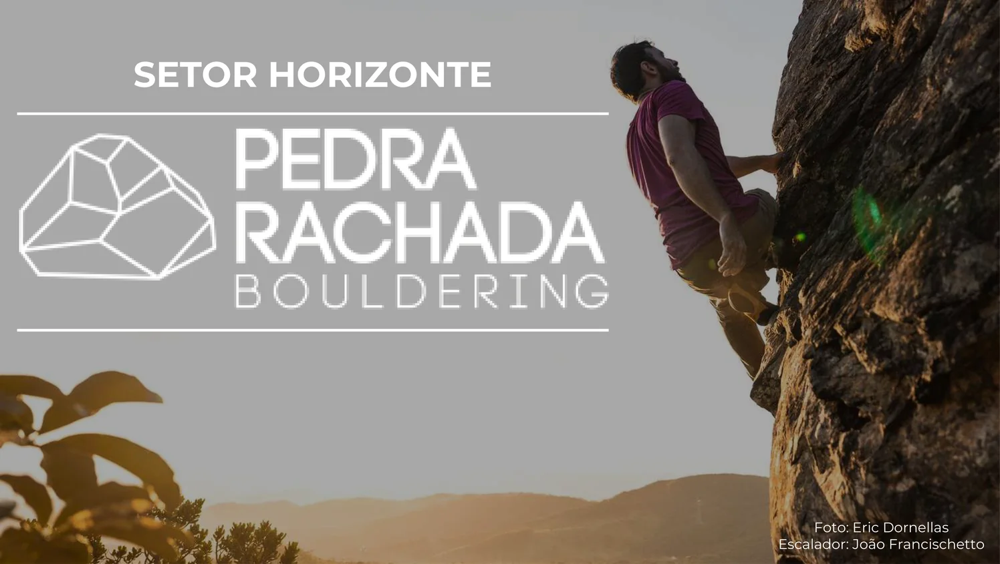
- **revisado_manualmente**: True
- **revisado_bounding_circle**: True
- **status_desenho_extraivel**: DESENHO_EXTRAIDO
- **botoes**:
  - **[0]**:
    - **uid**: hy6gQDrMk9hCKZ
    - **texto**: Capa
    - **destino**:
      - **secao_textual**:
        - **conteudo**:
            # SETOR HORIZONTE
            # PEDRA RACHADA BOULDERING
            
            |  |
            | :--: |
            | *Foto: Eric Dornellas - Escalador: João Francischetto* |
  - **[1]**:
    - **uid**: oVYpBeff2FDcNn
    - **texto**: Introdução
    - **destino**:
      - **secao_textual**:
        - **conteudo**:
            # SETOR HORIZONTE
            
            | 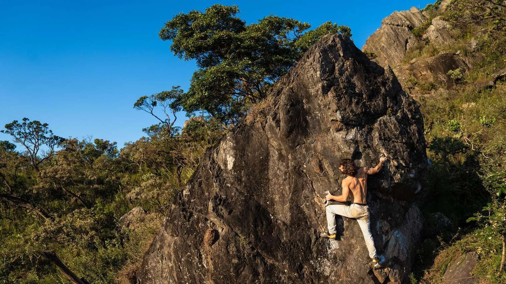 |
            | :--: |
            | *Foto: Eric Dornellas - Escalador: Davi Oliveira* |
            
            Todos os boulders neste guia estavam, no momento da abertura das linhas, sem resquícios de escalada, sendo todas as ascensões consideradas como “novas”. Caso quaisquer linhas apresentadas já tenham sido escaladas anteriormente e sejam reconhecidas, pedimos que contate algum dos responsáveis:
            
            @davi.oliverna
            @jpfrancischetto
  - **[2]**:
    - **uid**: rMSZAii4s4VMaY
    - **texto**: Aviso
    - **destino**:
      - **secao_textual**:
        - **conteudo**:
            # AVISO
            
            | 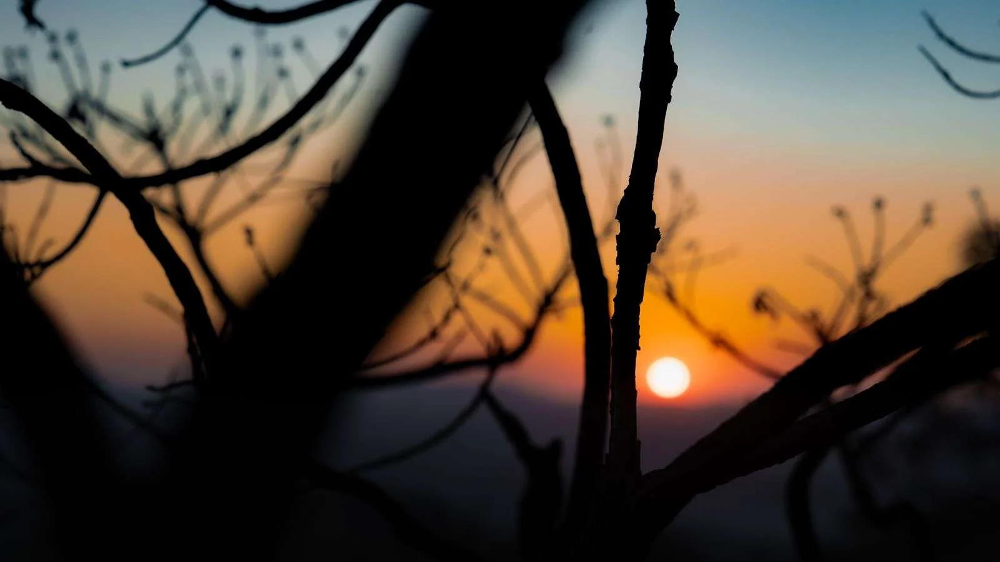 |
            | :--: |
            | *Aviso* |
            
            Os blocos do setor Horizonte ainda não foram moldados para a atividade de escalada, de modo que muitos blocos ainda apresentam agarras quebradiças e pontos de atenção. Nós tentamos avaliar todas as possibilidades e remover agarras que não oferecem segurança, mas com a atividade de escalada intensa, novos betas são tirados e novas agarras utilizadas, bem como mais força é aplicada sobre elas. Por isso, pedimos a todos MUITA ATENÇÃO durante a escalada no novo setor. Sempre teste todas a possibilidades antes e veja se ela aparenta estar firme e boa para utilização. Segurança sempre em primeiro lugar!
  - **[3]**:
    - **uid**: AuajRB5vjKPVvb
    - **texto**: Como chegar
    - **destino**:
      - **secao_textual**:
        - **conteudo**:
            # Como chegar
            
            Trilha do Wikiloc do estacionamento aos blocos:
            
            https://pt.wikiloc.com/trilhas-trekking/setor-horizonte-estacionamento-ate-bloco-floresta-de-pedra-178034324?h=3p7yvoon8p&wa=sd&utm_campaign=badge&utm_source=unknown&utm_medium=unknown
- **ultima_migracao**: 5
- **publicar_croqui**: True

## Parte: setor_floresta_de_pedra

### Setor (Pico: Pedra Rachada)

- **descricao**: 
- **nome**: Setor Floresta de pedra
- **uid**: nKwCTW2vS87al0
- **mapas**:
  - **[0]**:
    - **caminho_imagem_mapa**: 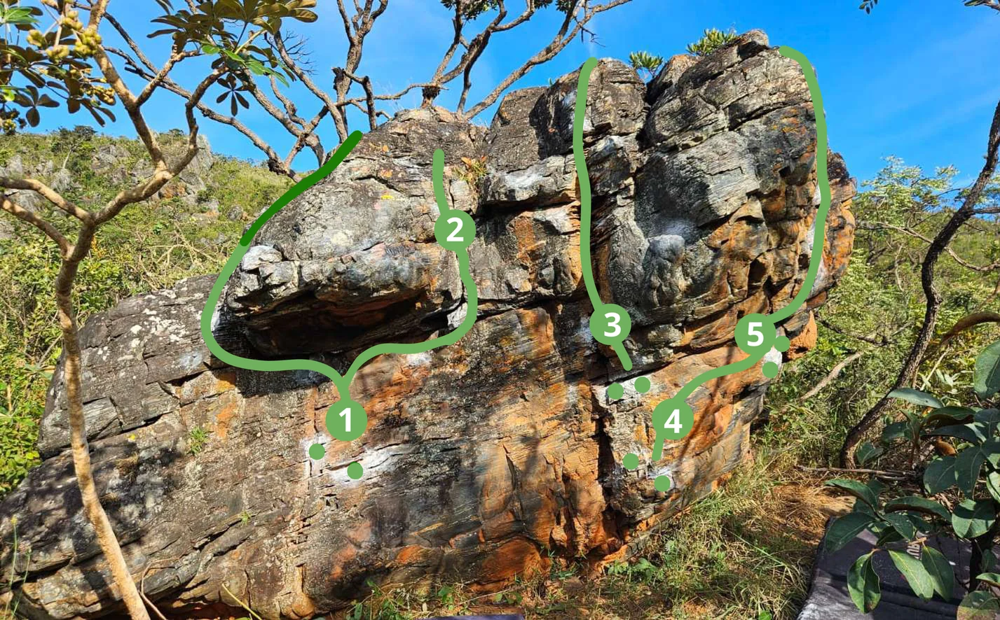
    - **largura_mapa**: 1427
    - **altura_mapa**: 886
    - **pontos_de_interesse**:
      - **[0]**:
        - **id**: zVvMl8ozaPEYPJ
        - **uid**: zVvMl8ozaPEYPJ
        - **rotulo**: 1
        - **circulo**:
          - **x**: 494
          - **y**: 601
          - **raio**: 28
        - **label**: 1
      - **[1]**:
        - **id**: kWUf2t6tPTWqIv
        - **uid**: kWUf2t6tPTWqIv
        - **rotulo**: 2
        - **circulo**:
          - **x**: 649
          - **y**: 328
          - **raio**: 28
        - **label**: 2
      - **[2]**:
        - **id**: CfmKcrIBk3qtBF
        - **uid**: CfmKcrIBk3qtBF
        - **rotulo**: 3
        - **circulo**:
          - **x**: 871
          - **y**: 462
          - **raio**: 28
        - **label**: 3
      - **[3]**:
        - **id**: HZdu7cmTIvq9lW
        - **uid**: HZdu7cmTIvq9lW
        - **rotulo**: 4
        - **circulo**:
          - **x**: 960
          - **y**: 599
          - **raio**: 28
        - **label**: 4
      - **[4]**:
        - **id**: VoQaoapALt8PHD
        - **uid**: VoQaoapALt8PHD
        - **rotulo**: 5
        - **circulo**:
          - **x**: 1078
          - **y**: 477
          - **raio**: 28
        - **label**: 5
    - **referencias**:
      - **[0]**:
        - **alvo_uid**: iJ3eCQa5jyTTgw
        - **pontos_uids**:
          - zVvMl8ozaPEYPJ
        - **escalada**: Cambeva
        - **ids**:
          - zVvMl8ozaPEYPJ
      - **[1]**:
        - **alvo_uid**: MATwXZ9TVqr6b1
        - **pontos_uids**:
          - kWUf2t6tPTWqIv
        - **escalada**: Vellozia
        - **ids**:
          - kWUf2t6tPTWqIv
      - **[2]**:
        - **alvo_uid**: TDTk2rVJTkPN0O
        - **pontos_uids**:
          - CfmKcrIBk3qtBF
        - **escalada**: Flor do Cerrado
        - **ids**:
          - CfmKcrIBk3qtBF
      - **[3]**:
        - **alvo_uid**: nbZskdo9d4H0hF
        - **pontos_uids**:
          - HZdu7cmTIvq9lW
        - **escalada**: Sempre-viva
        - **ids**:
          - HZdu7cmTIvq9lW
      - **[4]**:
        - **alvo_uid**: Z5Izh1fxoFGq6m
        - **pontos_uids**:
          - VoQaoapALt8PHD
        - **escalada**: Calliandra
        - **ids**:
          - VoQaoapALt8PHD
- **escaladas**:
  - **[0]**:
    - **uid**: iJ3eCQa5jyTTgw
    - **boulder**:
      - **descricao**: Inicia sentado com a mão direita em um batente escorrido e a esquerda em uma fenda vertical e escala para a esquerda.
      - **nome**: Cambeva
      - **dificuldade**: V0
  - **[1]**:
    - **uid**: MATwXZ9TVqr6b1
    - **boulder**:
      - **descricao**: Começa como o “Cambeva”, mas vira à direita do teto.
      - **nome**: Vellozia
      - **dificuldade**: V0
  - **[2]**:
    - **uid**: TDTk2rVJTkPN0O
    - **boulder**:
      - **descricao**: Começa sentado com as duas mãos em um batente clássico e escala reto. Uma virada zela...
      - **nome**: Flor do Cerrado
      - **dificuldade**: V2
  - **[3]**:
    - **uid**: nbZskdo9d4H0hF
    - **boulder**:
      - **descricao**: Extensão do “Calliandra”. Começa com a mão direita em um reglete abaixo do batente inicial do “Flor do Cerrado” e com a esquerda em um reglete texturado.
      - **nome**: Sempre-viva
      - **dificuldade**: V3
  - **[4]**:
    - **uid**: Z5Izh1fxoFGq6m
    - **boulder**:
      - **descricao**: Começa com as duas mãos em um reglete e escala reto por regletes clássicos até o topo.
      - **nome**: Calliandra
      - **dificuldade**: V3
- **precomputados**:
  - **total_escaladas**: 5
  - **total_boulders**: 5

## Parte: grupo_conjunto_por_do_sol

### Grupo (Pico: Pedra Rachada)

- **descricao**: 
- **nome**: Conjunto pôr-do-sol
- **uid**: cgYhOqCxY7U7Gx
- **mapas**:
  - **[0]**:
    - **caminho_imagem_mapa**: 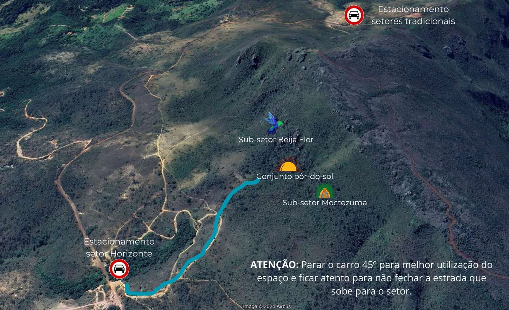
    - **largura_mapa**: 1332
    - **altura_mapa**: 810
    - **pontos_de_interesse**:
      - **[0]**:
        - **id**: IunakcFTmaHuEU
        - **uid**: IunakcFTmaHuEU
        - **rotulo**: Sub-setor Beija Flor
        - **retangulo**:
          - **x**: 723
          - **y**: 365
          - **comprimento**: 204
          - **largura**: 34
        - **label**: Sub-setor Beija Flor
      - **[1]**:
        - **id**: EddG35A3rLwCBJ
        - **uid**: EddG35A3rLwCBJ
        - **rotulo**: Sub-setor Moctezuma
        - **retangulo**:
          - **x**: 850
          - **y**: 530
          - **comprimento**: 230
          - **largura**: 32
        - **label**: Sub-setor Moctezuma
    - **referencias**:
      - **[0]**:
        - **alvo_uid**: SEgxtzL4pAgclV
        - **pontos_uids**:
          - IunakcFTmaHuEU
        - **setor**: Setor Beija Flor
        - **ids**:
          - IunakcFTmaHuEU
      - **[1]**:
        - **alvo_uid**: cgYhOqCxY7U7Gx
        - **pontos_uids**:
          - Conjunto pôr-do-sol
        - **grupo**: Conjunto pôr-do-sol
        - **ids**:
          - Conjunto pôr-do-sol
      - **[2]**:
        - **alvo_uid**: nnYIlTwIYD9Wlp
        - **pontos_uids**:
          - EddG35A3rLwCBJ
        - **setor**: Setor Moctezuma
        - **ids**:
          - EddG35A3rLwCBJ
- **setores**:
  - **[0]**:
    - **conteudo**:
      - **descricao**: Dica: Para queda ficar mais segura, posicione alguns crash como “calço” por baixo da camada que irá protegê-lo e entre as duas rochas que afunilam a base. A queda dos boulders é bem neste ponto.
      - **nome**: Setor Conjunto Pôr do sol - Bloco A
      - **uid**: zA8I9CcpUUdw4Q
      - **mapas**:
        - **[0]**:
          - **caminho_imagem_mapa**: 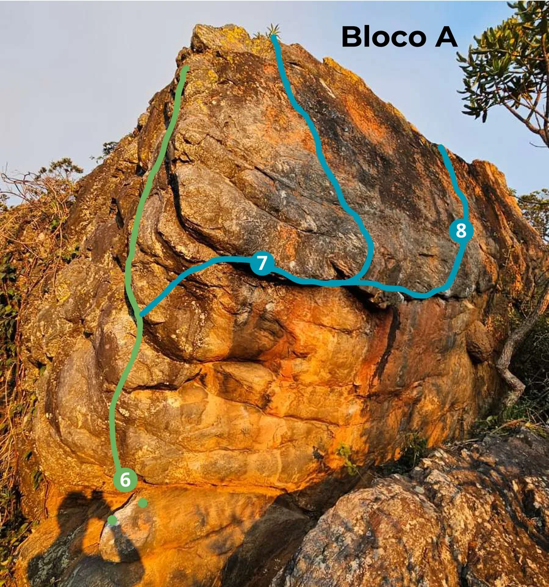
          - **largura_mapa**: 900
          - **altura_mapa**: 961
          - **pontos_de_interesse**:
            - **[0]**:
              - **id**: WGoYX4aJ1JkDqD
              - **uid**: WGoYX4aJ1JkDqD
              - **rotulo**: 6
              - **circulo**:
                - **x**: 205
                - **y**: 785
                - **raio**: 19
              - **label**: 6
            - **[1]**:
              - **id**: 6P0m4PcHs5TK0l
              - **uid**: 6P0m4PcHs5TK0l
              - **rotulo**: 7
              - **circulo**:
                - **x**: 430
                - **y**: 430
                - **raio**: 19
              - **label**: 7
            - **[2]**:
              - **id**: CSCtlLTBaEKJpp
              - **uid**: CSCtlLTBaEKJpp
              - **rotulo**: 8
              - **circulo**:
                - **x**: 756
                - **y**: 377
                - **raio**: 19
              - **label**: 8
          - **referencias**:
            - **[0]**:
              - **alvo_uid**: fjKSAN9kHptrg6
              - **pontos_uids**:
                - WGoYX4aJ1JkDqD
              - **escalada**: Sem querer
              - **ids**:
                - WGoYX4aJ1JkDqD
            - **[1]**:
              - **alvo_uid**: 32vqwjDDtOzXgH
              - **pontos_uids**:
                - 6P0m4PcHs5TK0l
              - **escalada**: Horizonte
              - **ids**:
                - 6P0m4PcHs5TK0l
            - **[2]**:
              - **alvo_uid**: i7DNgPqN72loGR
              - **pontos_uids**:
                - CSCtlLTBaEKJpp
              - **escalada**: Fenda comunista
              - **ids**:
                - CSCtlLTBaEKJpp
        - **[1]**:
          - **caminho_imagem_mapa**: 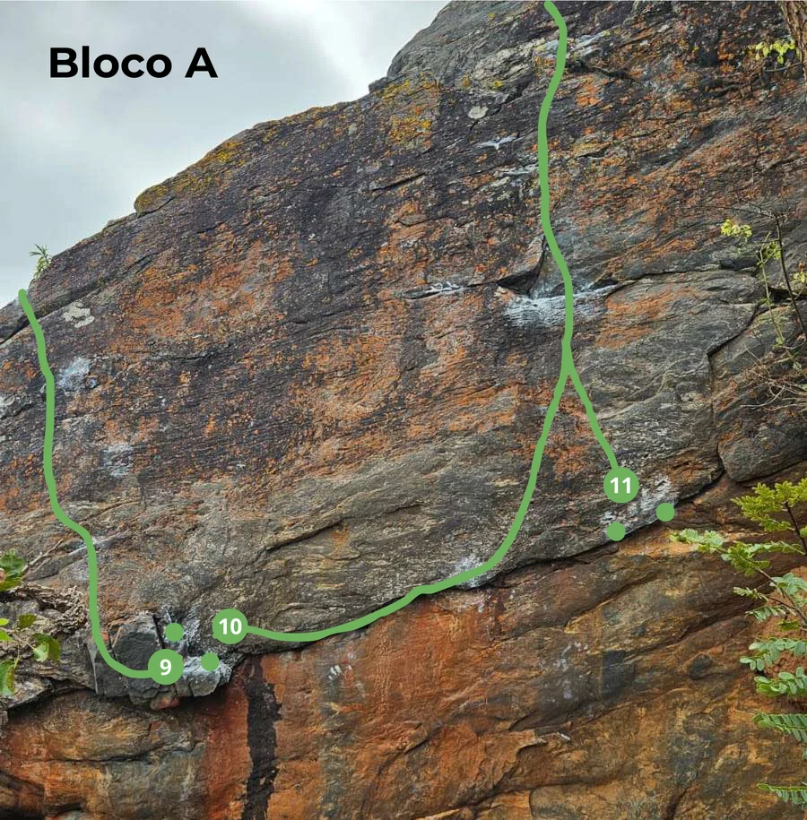
          - **largura_mapa**: 900
          - **altura_mapa**: 915
          - **pontos_de_interesse**:
            - **[0]**:
              - **id**: vOSfcIVCkTCR6Y
              - **uid**: vOSfcIVCkTCR6Y
              - **rotulo**: 9
              - **circulo**:
                - **x**: 185
                - **y**: 744
                - **raio**: 19
              - **label**: 9
            - **[1]**:
              - **id**: AsetR61halhDPH
              - **uid**: AsetR61halhDPH
              - **rotulo**: 10
              - **circulo**:
                - **x**: 257
                - **y**: 698
                - **raio**: 19
              - **label**: 10
            - **[2]**:
              - **id**: ibEmRk55BB2tZ5
              - **uid**: ibEmRk55BB2tZ5
              - **rotulo**: 11
              - **circulo**:
                - **x**: 693
                - **y**: 541
                - **raio**: 19
              - **label**: 11
          - **referencias**:
            - **[0]**:
              - **alvo_uid**: yFjGfTdHnQhMV1
              - **pontos_uids**:
                - vOSfcIVCkTCR6Y
              - **escalada**: Pôr-do-sol
              - **ids**:
                - vOSfcIVCkTCR6Y
            - **[1]**:
              - **alvo_uid**: 5Piki2ZHYJtUuU
              - **pontos_uids**:
                - AsetR61halhDPH
              - **escalada**: Bipa aérea
              - **ids**:
                - AsetR61halhDPH
            - **[2]**:
              - **alvo_uid**: xdwgIYlJK2rTz1
              - **pontos_uids**:
                - ibEmRk55BB2tZ5
              - **escalada**: Base aérea
              - **ids**:
                - ibEmRk55BB2tZ5
      - **escaladas**:
        - **[0]**:
          - **uid**: fjKSAN9kHptrg6
          - **boulder**:
            - **descricao**: Começa sentado com as duas mãos na agarra óbvia na base da proa, e escala reto
            - **nome**: Sem querer
            - **dificuldade**: V1
        - **[1]**:
          - **uid**: 32vqwjDDtOzXgH
          - **boulder**:
            - **descricao**: Começa na mesma saída do “Sem querer” e toca pra direta pela fenda horizontal, até a saída do “Pôr-do-sol”.
            - **nome**: Horizonte
            - **dificuldade**: V4
        - **[2]**:
          - **uid**: i7DNgPqN72loGR
          - **boulder**:
            - **descricao**: Começa como o “Sem querer” e escala toda a fenda lateral, virando no “Base aérea”
            - **nome**: Fenda comunista
            - **dificuldade**: V4
        - **[3]**:
          - **uid**: yFjGfTdHnQhMV1
          - **boulder**:
            - **descricao**: Variação do “Horizonte”. Começa em pé, as duas mãos em uma agarra em formato de “L” e escala levemente para a esquerda, utilizando pequenos regletes na rocha.
            - **nome**: Pôr-do-sol
            - **dificuldade**: V3
        - **[4]**:
          - **uid**: 5Piki2ZHYJtUuU
          - **boulder**:
            - **descricao**: Extensão do “Base aérea”. Inicia com as duas mãos na laca em formato de “L” e toca pra direita.
            - **nome**: Bipa aérea
            - **dificuldade**: V3
        - **[5]**:
          - **uid**: xdwgIYlJK2rTz1
          - **boulder**:
            - **descricao**: Boulder de movimentação específica. As duas mão começam juntas em uma agarra invertida muito boa na fenda horizontal e escala reto.
            - **nome**: Base aérea
            - **dificuldade**: V2
      - **precomputados**:
        - **total_escaladas**: 6
        - **total_boulders**: 6
  - **[1]**:
    - **conteudo**:
      - **descricao**: 
      - **nome**: Setor Conjunto Pôr do sol - Bloco B
      - **uid**: Ioa3yTba2GlkHC
      - **mapas**:
        - **[0]**:
          - **caminho_imagem_mapa**: 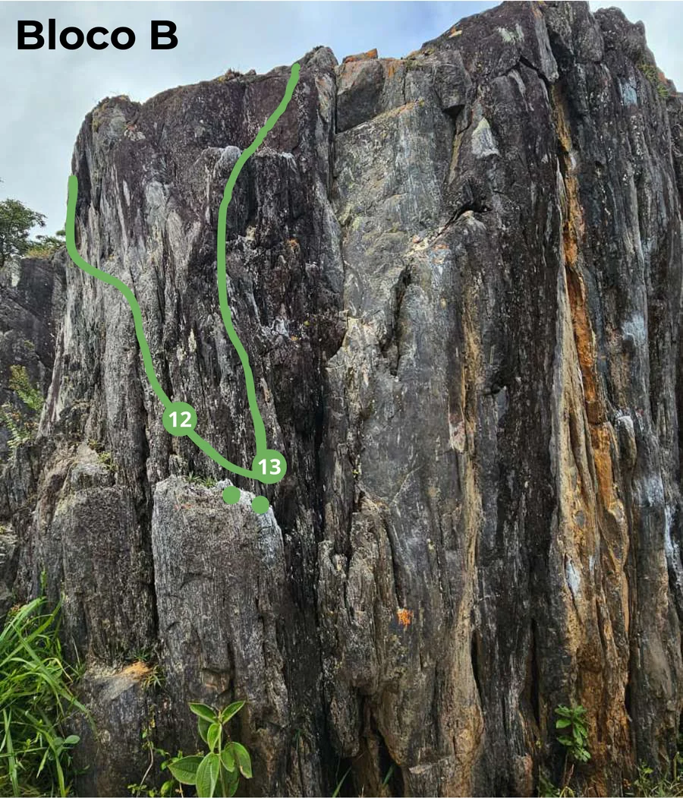
          - **largura_mapa**: 900
          - **altura_mapa**: 1051
          - **pontos_de_interesse**:
            - **[0]**:
              - **id**: 28laVGhIyDrb8F
              - **uid**: 28laVGhIyDrb8F
              - **rotulo**: 13
              - **circulo**:
                - **x**: 355
                - **y**: 614
                - **raio**: 22
              - **label**: 13
            - **[1]**:
              - **id**: W3tDfRnTdBWzCF
              - **uid**: W3tDfRnTdBWzCF
              - **rotulo**: 12
              - **circulo**:
                - **x**: 237
                - **y**: 552
                - **raio**: 22
              - **label**: 12
          - **referencias**:
            - **[0]**:
              - **alvo_uid**: ql2b16RyuupPW0
              - **pontos_uids**:
                - W3tDfRnTdBWzCF
              - **escalada**: Essa moça
              - **ids**:
                - W3tDfRnTdBWzCF
            - **[1]**:
              - **alvo_uid**: 9DJBUZ8WYP5bGA
              - **pontos_uids**:
                - 28laVGhIyDrb8F
              - **escalada**: Goodsensation
              - **ids**:
                - 28laVGhIyDrb8F
        - **[1]**:
          - **caminho_imagem_mapa**: 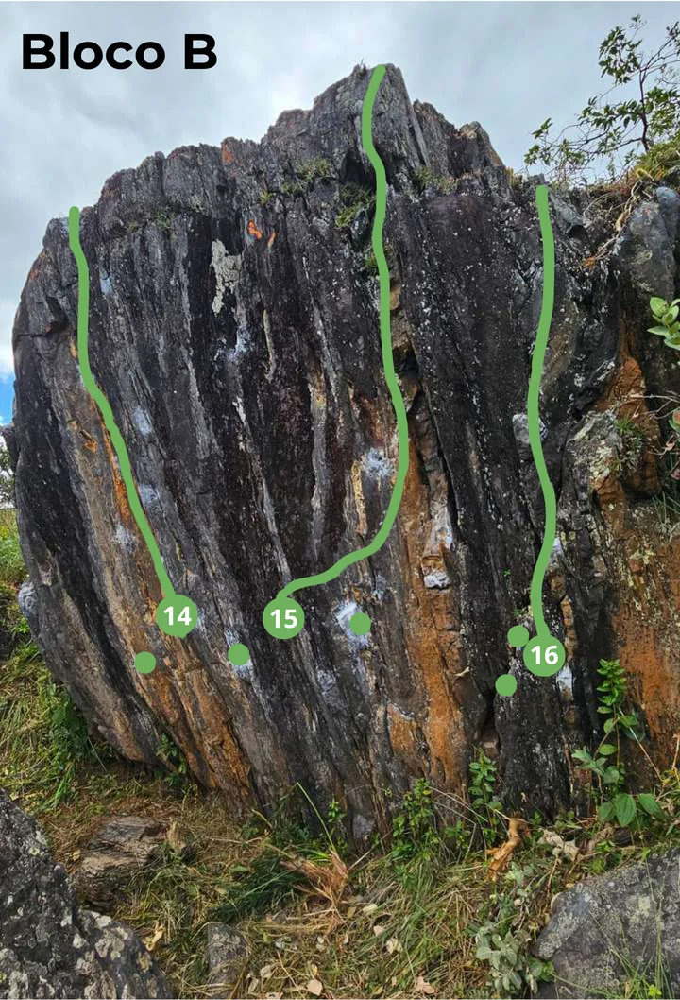
          - **largura_mapa**: 720
          - **altura_mapa**: 1058
          - **pontos_de_interesse**:
            - **[0]**:
              - **id**: lgYRi17uzCCTOH
              - **uid**: lgYRi17uzCCTOH
              - **rotulo**: 15
              - **circulo**:
                - **x**: 187
                - **y**: 652
                - **raio**: 22
              - **label**: 15
            - **[1]**:
              - **id**: pgR8Z9kwud9NMF
              - **uid**: pgR8Z9kwud9NMF
              - **rotulo**: 16
              - **circulo**:
                - **x**: 576
                - **y**: 693
                - **raio**: 21
              - **label**: 16
            - **[2]**:
              - **id**: 9q6Lfl3fnMvNgE
              - **uid**: 9q6Lfl3fnMvNgE
              - **rotulo**: 14
              - **circulo**:
                - **x**: 300
                - **y**: 654
                - **raio**: 21
              - **label**: 14
          - **referencias**:
            - **[0]**:
              - **alvo_uid**: aUkqQAIOut6xYu
              - **pontos_uids**:
                - 9q6Lfl3fnMvNgE
              - **escalada**: Ponto alto
              - **ids**:
                - 9q6Lfl3fnMvNgE
            - **[1]**:
              - **alvo_uid**: wEvrmwvsMQ9L8w
              - **pontos_uids**:
                - 9q6Lfl3fnMvNgE
              - **escalada**: Ponto alto sds
              - **ids**:
                - 9q6Lfl3fnMvNgE
            - **[2]**:
              - **alvo_uid**: c17EdmiaqMkBHd
              - **pontos_uids**:
                - lgYRi17uzCCTOH
              - **escalada**: Estrelado
              - **ids**:
                - lgYRi17uzCCTOH
            - **[3]**:
              - **alvo_uid**: WZ0N8Nbgrob3er
              - **pontos_uids**:
                - lgYRi17uzCCTOH
              - **escalada**: Estrelado sds
              - **ids**:
                - lgYRi17uzCCTOH
            - **[4]**:
              - **alvo_uid**: 4YFr3w1wQIFWTb
              - **pontos_uids**:
                - pgR8Z9kwud9NMF
              - **escalada**: Gostosinho
              - **ids**:
                - pgR8Z9kwud9NMF
      - **escaladas**:
        - **[0]**:
          - **uid**: ql2b16RyuupPW0
          - **boulder**:
            - **descricao**: Saída na agarra grande, fazendo a travessia pra virar na face esquerda do bloco.
            - **nome**: Essa moça
            - **dificuldade**: V0
        - **[1]**:
          - **uid**: 9DJBUZ8WYP5bGA
          - **boulder**:
            - **descricao**: Saída na agarra grande, com a virada reta.
            - **nome**: Goodsensation
            - **dificuldade**: V1
        - **[2]**:
          - **uid**: aUkqQAIOut6xYu
          - **boulder**:
            - **descricao**: Saída de uma pinça grande de direita e outra pinça menor de esquerda.
            - **nome**: Ponto alto
            - **dificuldade**: V3
        - **[3]**:
          - **uid**: wEvrmwvsMQ9L8w
          - **boulder**:
            - **descricao**: Começa pra direita, em um reglete lateral de esquerda e um bico de direita.
            - **nome**: Ponto alto sds
            - **dificuldade**: V4
        - **[4]**:
          - **uid**: c17EdmiaqMkBHd
          - **boulder**:
            - **descricao**: Saída em uma pinça de mão esquerda e mão direita em um batente/reglete.
            - **nome**: Estrelado
            - **dificuldade**: V1
        - **[5]**:
          - **uid**: WZ0N8Nbgrob3er
          - **boulder**:
            - **descricao**: Sai em um reglete lateral de esquerda e um bico de direita.
            - **nome**: Estrelado sds
            - **dificuldade**: V2
        - **[6]**:
          - **uid**: 4YFr3w1wQIFWTb
          - **boulder**:
            - **descricao**: Sai das agarras grandes no lado direito do bloco e vira reto, na parte mais baixa.
            - **nome**: Gostosinho
            - **dificuldade**: V0
      - **precomputados**:
        - **total_escaladas**: 7
        - **total_boulders**: 7
  - **[2]**:
    - **conteudo**:
      - **descricao**: 
      - **nome**: Setor Conjunto Pôr do sol - Bloco C
      - **uid**: oDdDAqETF27BlU
      - **mapas**:
        - **[0]**:
          - **caminho_imagem_mapa**: 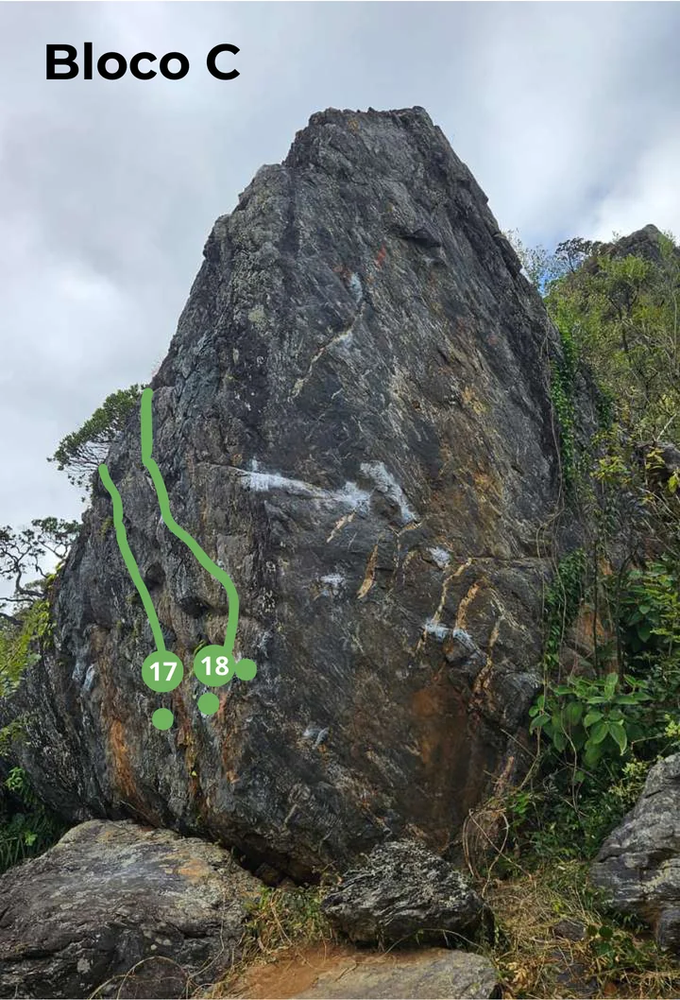
          - **largura_mapa**: 720
          - **altura_mapa**: 1058
          - **pontos_de_interesse**:
            - **[0]**:
              - **id**: JDyi8o4xgkknnF
              - **uid**: JDyi8o4xgkknnF
              - **rotulo**: 18
              - **circulo**:
                - **x**: 227
                - **y**: 704
                - **raio**: 22
              - **label**: 18
            - **[1]**:
              - **id**: rxIV89wlWKXiTw
              - **uid**: rxIV89wlWKXiTw
              - **rotulo**: 17
              - **circulo**:
                - **x**: 172
                - **y**: 710
                - **raio**: 21
              - **label**: 17
          - **referencias**:
            - **[0]**:
              - **alvo_uid**: Qv2yoysFkacnAN
              - **pontos_uids**:
                - rxIV89wlWKXiTw
              - **escalada**: Hematoma
              - **ids**:
                - rxIV89wlWKXiTw
            - **[1]**:
              - **alvo_uid**: 2YynBS9LH86nCk
              - **pontos_uids**:
                - JDyi8o4xgkknnF
              - **escalada**: Pedra de toque
              - **ids**:
                - JDyi8o4xgkknnF
      - **escaladas**:
        - **[0]**:
          - **uid**: Qv2yoysFkacnAN
          - **boulder**:
            - **descricao**: Saída nas agarras baixas da "faixa branca" do bloco, escalando reto.
            - **nome**: Hematoma
            - **dificuldade**: V1
        - **[1]**:
          - **uid**: 2YynBS9LH86nCk
          - **boulder**:
            - **descricao**: Saída com a esquerda em uma pinça com o encaixe de dedão e a direita na agarra ao lado.
            - **nome**: Pedra de toque
            - **dificuldade**: V1
        - **[2]**:
          - **uid**: fQtbRfpwAhwP7N
          - **boulder**:
            - **descricao**: Escalada pela aresta do bloco. Mão direita em um micro reglete e a esquerda em um pocket na lateral.
            - **nome**: Hematita
            - **dificuldade**: V3
        - **[3]**:
          - **uid**: W0fBNuhC1ju702
          - **boulder**:
            - **descricao**: Boulder pela face do bloco, saindo de agarras óbvias e indo pra esquerda até a virada pelo final da aresta.
            - **nome**: Especularica
            - **dificuldade**: V5
      - **precomputados**:
        - **total_escaladas**: 4
        - **total_boulders**: 4
- **precomputados**:
  - **total_escaladas**: 17
  - **total_boulders**: 17

## Parte: setor_brinquedos

### Setor (Pico: Pedra Rachada)

- **descricao**: Foto: Eric Dornellas - Escaladora: Lívia Gonçalves
- **nome**: Setor Brinquedos
- **uid**: mE3qfosSuHNyTa
- **mapas**:
  - **[0]**:
    - **caminho_imagem_mapa**: 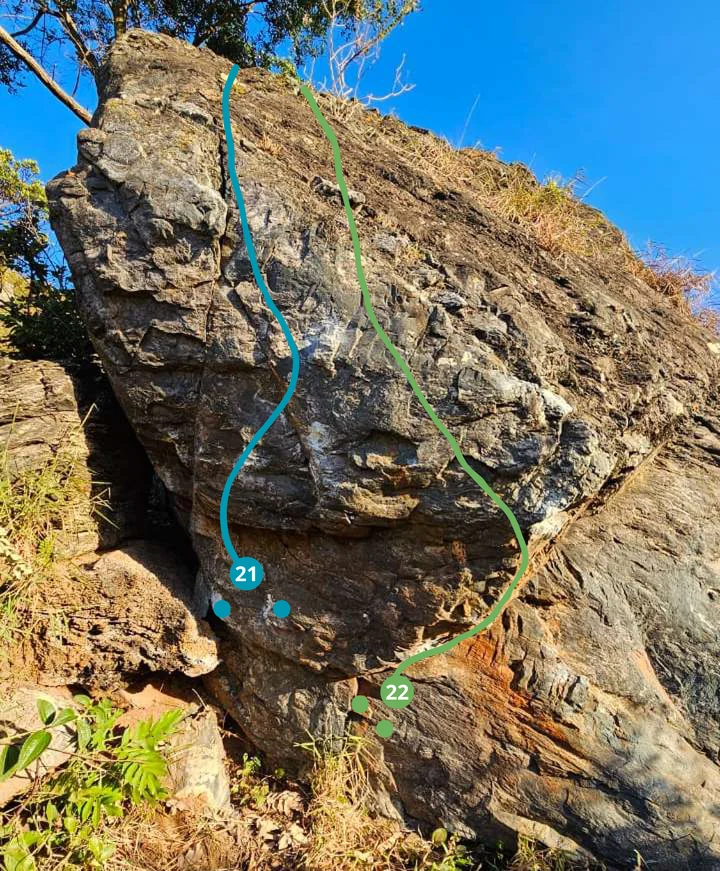
    - **largura_mapa**: 720
    - **altura_mapa**: 871
    - **pontos_de_interesse**:
      - **[0]**:
        - **id**: xsm2Y1tvbutSHs
        - **uid**: xsm2Y1tvbutSHs
        - **rotulo**: 21
        - **circulo**:
          - **x**: 246
          - **y**: 573
          - **raio**: 16
        - **label**: 21
      - **[1]**:
        - **id**: 11qflNbUiIyQtq
        - **uid**: 11qflNbUiIyQtq
        - **rotulo**: 22
        - **circulo**:
          - **x**: 397
          - **y**: 692
          - **raio**: 16
        - **label**: 22
    - **referencias**:
      - **[0]**:
        - **alvo_uid**: oddAoHJ1Wn52fm
        - **pontos_uids**:
          - xsm2Y1tvbutSHs
        - **escalada**: Cubo Mágico
        - **ids**:
          - xsm2Y1tvbutSHs
      - **[1]**:
        - **alvo_uid**: 67SCGGFA4Fh6Aq
        - **pontos_uids**:
          - 11qflNbUiIyQtq
        - **escalada**: Jenga
        - **ids**:
          - 11qflNbUiIyQtq
  - **[1]**:
    - **caminho_imagem_mapa**: 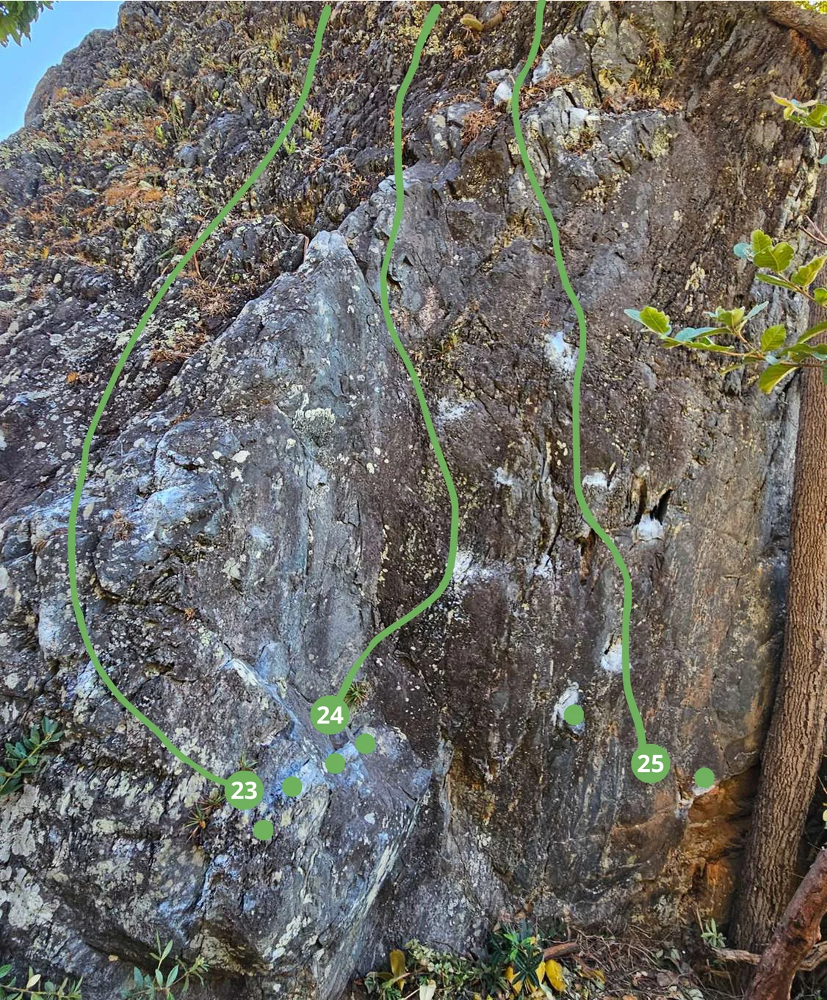
    - **largura_mapa**: 1126
    - **altura_mapa**: 1360
    - **pontos_de_interesse**:
      - **[0]**:
        - **id**: BxZmPhRsmsmwxA
        - **uid**: BxZmPhRsmsmwxA
        - **rotulo**: 23
        - **circulo**:
          - **x**: 332
          - **y**: 1074
          - **raio**: 25
        - **label**: 23
      - **[1]**:
        - **id**: bylOKXqVRbD25r
        - **uid**: bylOKXqVRbD25r
        - **rotulo**: 25
        - **circulo**:
          - **x**: 886
          - **y**: 1038
          - **raio**: 25
        - **label**: 25
      - **[2]**:
        - **id**: 9NOmPpJa3vtU29
        - **uid**: 9NOmPpJa3vtU29
        - **rotulo**: 24
        - **circulo**:
          - **x**: 449
          - **y**: 972
          - **raio**: 25
        - **label**: 24
    - **referencias**:
      - **[0]**:
        - **alvo_uid**: F5OEqY3OPAYPSQ
        - **pontos_uids**:
          - BxZmPhRsmsmwxA
        - **escalada**: Cara a Cara
        - **ids**:
          - BxZmPhRsmsmwxA
      - **[1]**:
        - **alvo_uid**: YtKG68FwJ9BiGZ
        - **pontos_uids**:
          - 9NOmPpJa3vtU29
        - **escalada**: Resta um
        - **ids**:
          - 9NOmPpJa3vtU29
      - **[2]**:
        - **alvo_uid**: 9WJVIaLFjkSt8r
        - **pontos_uids**:
          - bylOKXqVRbD25r
        - **escalada**: Pega Palito
        - **ids**:
          - bylOKXqVRbD25r
  - **[2]**:
    - **caminho_imagem_mapa**: 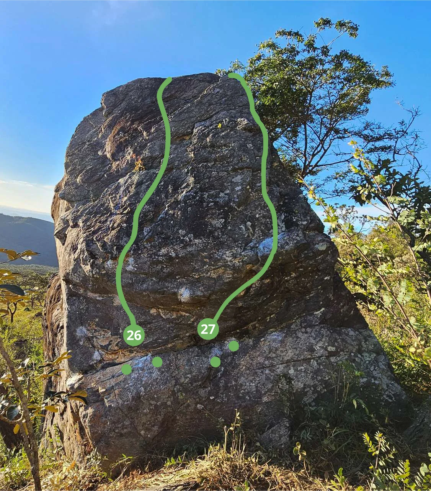
    - **largura_mapa**: 1126
    - **altura_mapa**: 1282
    - **pontos_de_interesse**:
      - **[0]**:
        - **id**: 0C7DQ8kghPVidc
        - **uid**: 0C7DQ8kghPVidc
        - **rotulo**: 26
        - **circulo**:
          - **x**: 350
          - **y**: 874
          - **raio**: 27
        - **label**: 26
      - **[1]**:
        - **id**: pOH2AUYIhRvryI
        - **uid**: pOH2AUYIhRvryI
        - **rotulo**: 27
        - **circulo**:
          - **x**: 544
          - **y**: 858
          - **raio**: 27
        - **label**: 27
    - **referencias**:
      - **[0]**:
        - **alvo_uid**: n1m3cqk1CH4Flb
        - **pontos_uids**:
          - 0C7DQ8kghPVidc
        - **escalada**: Aresta da Sombra
        - **ids**:
          - 0C7DQ8kghPVidc
      - **[1]**:
        - **alvo_uid**: z6QWhw1UxwQ3eX
        - **pontos_uids**:
          - pOH2AUYIhRvryI
        - **escalada**: Penumbra
        - **ids**:
          - pOH2AUYIhRvryI
  - **[3]**:
    - **caminho_imagem_mapa**: 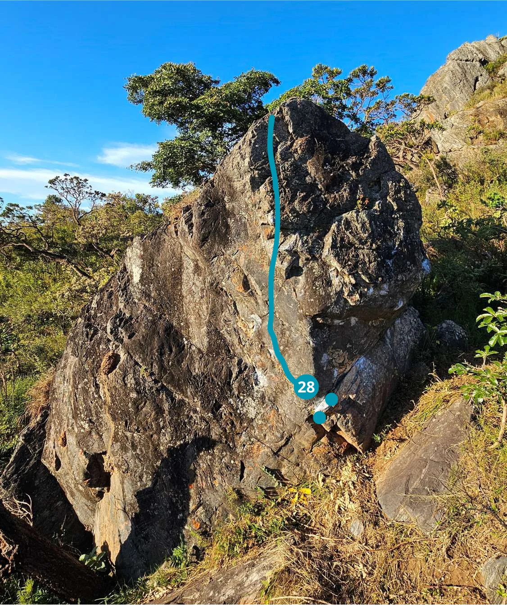
    - **largura_mapa**: 1126
    - **altura_mapa**: 1343
    - **pontos_de_interesse**:
      - **[0]**:
        - **id**: DUUPL7jeZlfNQH
        - **uid**: DUUPL7jeZlfNQH
        - **rotulo**: 28
        - **circulo**:
          - **x**: 680
          - **y**: 858
          - **raio**: 26
        - **label**: 28
    - **referencias**:
      - **[0]**:
        - **alvo_uid**: Sc5nTDosTUQcqs
        - **pontos_uids**:
          - DUUPL7jeZlfNQH
        - **escalada**: Aresta do sol
        - **ids**:
          - DUUPL7jeZlfNQH
- **escaladas**:
  - **[0]**:
    - **uid**: oddAoHJ1Wn52fm
    - **boulder**:
      - **descricao**: Sai com a esquerda em uma agarra grande invertida e a direita em um gaston, escalando pela face do bloco.
      - **nome**: Cubo Mágico
      - **dificuldade**: V4
  - **[1]**:
    - **uid**: 67SCGGFA4Fh6Aq
    - **boulder**:
      - **descricao**: Saída com as mãos juntas em um laca / agarrão do lado direito, seguindo pela aresta.
      - **nome**: Jenga
      - **dificuldade**: V2
  - **[2]**:
    - **uid**: F5OEqY3OPAYPSQ
    - **boulder**:
      - **descricao**: Começa com as mãos juntas no agarrão mais a esquerda, escalando pela parte mais baixa.
      - **nome**: Cara a Cara
      - **dificuldade**: V0
  - **[3]**:
    - **uid**: YtKG68FwJ9BiGZ
    - **boulder**:
      - **descricao**: Saída no agarrão a direita da barriga, indo pra direita e fazendo a virada no meio do bloco.
      - **nome**: Resta um
      - **dificuldade**: V0
  - **[4]**:
    - **uid**: 9WJVIaLFjkSt8r
    - **boulder**:
      - **descricao**: Boulder ao lado da árvore, saindo com a mão direita em uma invertida e a esquerda em um reglete pequeno, escalando reto pela face alta do bloco.
      - **nome**: Pega Palito
      - **dificuldade**: V2
  - **[5]**:
    - **uid**: n1m3cqk1CH4Flb
    - **boulder**:
      - **descricao**: Começa com a direita em um reglete e a esquerda em uma pequena agarra, com um move técnico de saída e escalada por agarras grandes.
      - **nome**: Aresta da Sombra
      - **dificuldade**: V0
  - **[6]**:
    - **uid**: z6QWhw1UxwQ3eX
    - **boulder**:
      - **descricao**: Saída no agarrão mais a esquerda do bloco, indo reto por agarras grandes.
      - **nome**: Penumbra
      - **dificuldade**: V0
  - **[7]**:
    - **uid**: Sc5nTDosTUQcqs
    - **boulder**:
      - **descricao**: Boulder clássico pela aresta do bloco, saindo com as mãos juntas no agarrão na parte baixa.
      - **nome**: Aresta do sol
      - **dificuldade**: V4
- **precomputados**:
  - **total_escaladas**: 8
  - **total_boulders**: 8

## Parte: setor_beija_flor

### Setor (Pico: Pedra Rachada)

- **descricao**: 
- **nome**: Setor Beija Flor
- **uid**: SEgxtzL4pAgclV
- **mapas**:
  - **[0]**:
    - **caminho_imagem_mapa**: 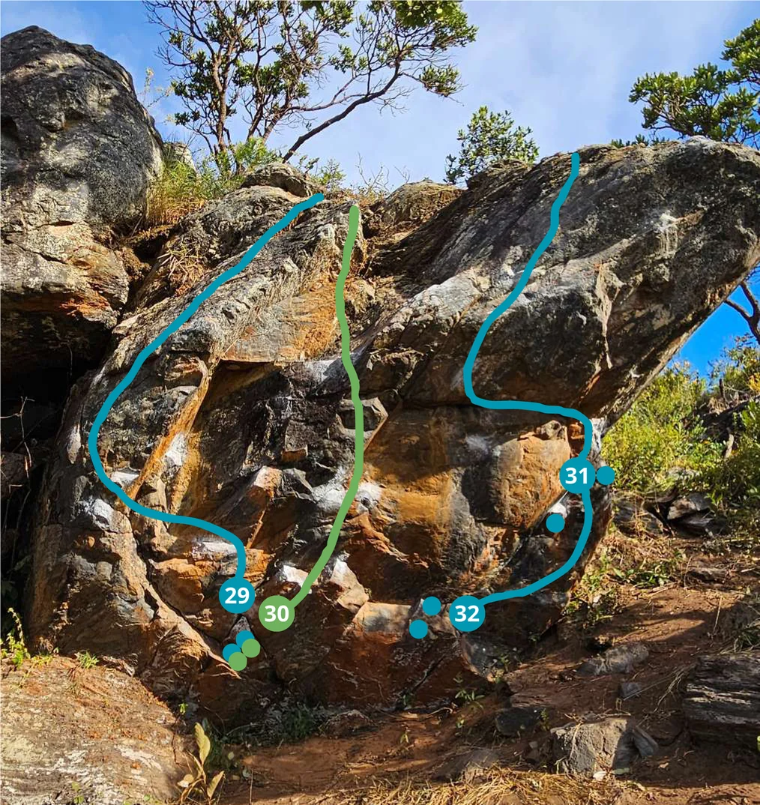
    - **largura_mapa**: 1014
    - **altura_mapa**: 1074
    - **pontos_de_interesse**:
      - **[0]**:
        - **id**: MbeptWsO7BsTUJ
        - **uid**: MbeptWsO7BsTUJ
        - **rotulo**: 29
        - **circulo**:
          - **x**: 317
          - **y**: 794
          - **raio**: 24
        - **label**: 29
      - **[1]**:
        - **id**: oJVdw8PZoKC1p8
        - **uid**: oJVdw8PZoKC1p8
        - **rotulo**: 30
        - **circulo**:
          - **x**: 369
          - **y**: 818
          - **raio**: 24
        - **label**: 30
      - **[2]**:
        - **id**: i5eiUpJDcLOs1c
        - **uid**: i5eiUpJDcLOs1c
        - **rotulo**: 31
        - **circulo**:
          - **x**: 771
          - **y**: 634
          - **raio**: 24
        - **label**: 31
      - **[3]**:
        - **id**: 4xj0bLKFEZls6u
        - **uid**: 4xj0bLKFEZls6u
        - **rotulo**: 32
        - **circulo**:
          - **x**: 623
          - **y**: 818
          - **raio**: 24
        - **label**: 32
    - **referencias**:
      - **[0]**:
        - **alvo_uid**: JFCzIRUDeeJekj
        - **pontos_uids**:
          - MbeptWsO7BsTUJ
        - **escalada**: Juruva
        - **ids**:
          - MbeptWsO7BsTUJ
      - **[1]**:
        - **alvo_uid**: Z5QRGUzf3wJE55
        - **pontos_uids**:
          - MbeptWsO7BsTUJ
        - **escalada**: Bem-te-vi
        - **ids**:
          - MbeptWsO7BsTUJ
      - **[2]**:
        - **alvo_uid**: J9HaIMdkV2P9n6
        - **pontos_uids**:
          - oJVdw8PZoKC1p8
        - **escalada**: Sabiá
        - **ids**:
          - oJVdw8PZoKC1p8
      - **[3]**:
        - **alvo_uid**: 6VUAenrPo4zBoD
        - **pontos_uids**:
          - i5eiUpJDcLOs1c
        - **escalada**: Carcará
        - **ids**:
          - i5eiUpJDcLOs1c
      - **[4]**:
        - **alvo_uid**: 2lJtMf7XNJiLMM
        - **pontos_uids**:
          - 4xj0bLKFEZls6u
        - **escalada**: Trinca-Ferro
        - **ids**:
          - 4xj0bLKFEZls6u
  - **[1]**:
    - **caminho_imagem_mapa**: 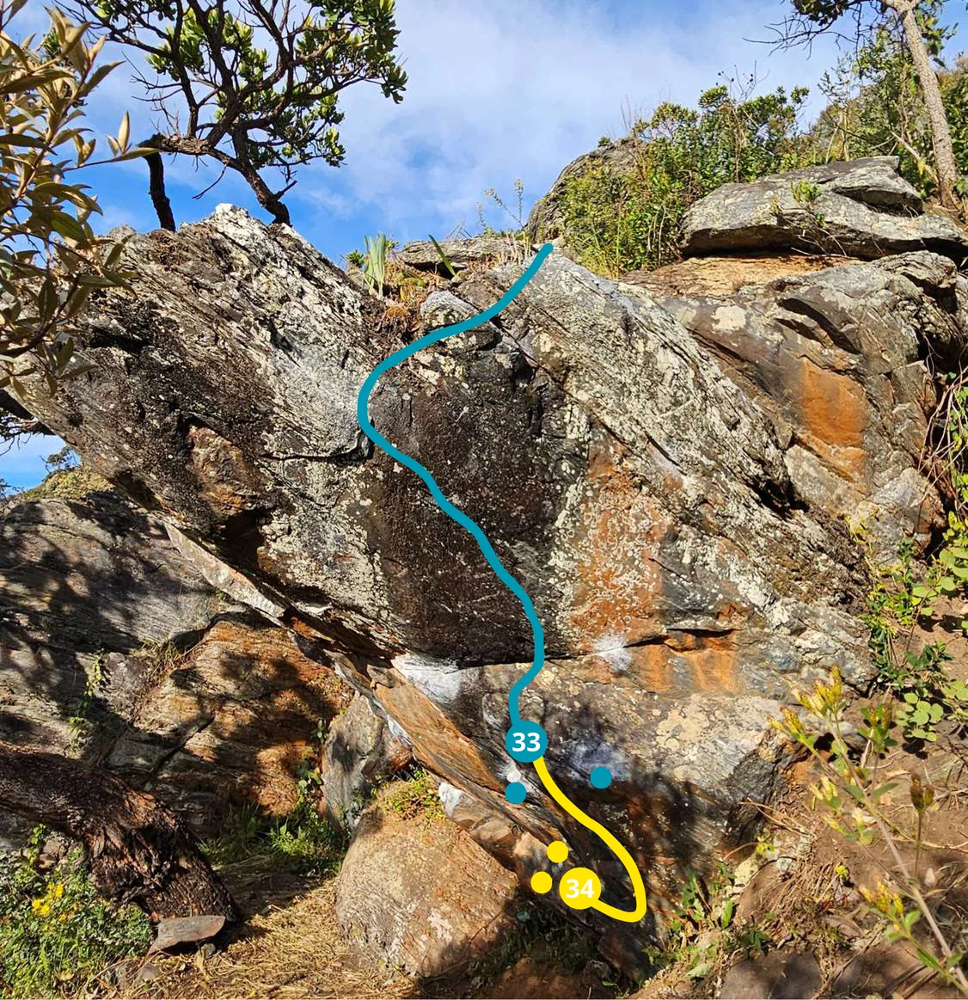
    - **largura_mapa**: 1126
    - **altura_mapa**: 1163
    - **pontos_de_interesse**:
      - **[0]**:
        - **id**: Ads722TvlCS4t8
        - **uid**: Ads722TvlCS4t8
        - **rotulo**: 33
        - **circulo**:
          - **x**: 612
          - **y**: 862
          - **raio**: 24
        - **label**: 33
      - **[1]**:
        - **id**: KILUpYXs6CVJ15
        - **uid**: KILUpYXs6CVJ15
        - **rotulo**: 34
        - **circulo**:
          - **x**: 675
          - **y**: 1033
          - **raio**: 24
        - **label**: 34
    - **referencias**:
      - **[0]**:
        - **alvo_uid**: lEkdXpqOYaLCML
        - **pontos_uids**:
          - Ads722TvlCS4t8
        - **escalada**: Beija-Flor
        - **ids**:
          - Ads722TvlCS4t8
      - **[1]**:
        - **alvo_uid**: jakQSIsSo2au6n
        - **pontos_uids**:
          - KILUpYXs6CVJ15
        - **escalada**: Bacurau
        - **ids**:
          - KILUpYXs6CVJ15
- **escaladas**:
  - **[0]**:
    - **uid**: JFCzIRUDeeJekj
    - **boulder**:
      - **descricao**: Começa com as mãos juntas em uma agarra lateral e segue para a esquerda do bloco com a virada pela barriga na lateral.
      - **nome**: Juruva
      - **dificuldade**: V4
  - **[1]**:
    - **uid**: Z5QRGUzf3wJE55
    - **boulder**:
      - **descricao**: Saindo no Carcará e virando no Juruva.
      - **nome**: Bem-te-vi
      - **dificuldade**: V6
  - **[2]**:
    - **uid**: J9HaIMdkV2P9n6
    - **boulder**:
      - **descricao**: Boulder com movimentação incrível! Saída com as mãos juntas em uma agarra lateral a esquerda, indo reto pelo meio do bloco.
      - **nome**: Sabiá
      - **dificuldade**: V2
  - **[3]**:
    - **uid**: 6VUAenrPo4zBoD
    - **boulder**:
      - **descricao**: Saída com a direita em um reglete baixo e a esquerda e uma pinça no teto, indo pra face mais negativa com uma movimentação incrível!
      - **nome**: Carcará
      - **dificuldade**: V6
  - **[4]**:
    - **uid**: 2lJtMf7XNJiLMM
    - **boulder**:
      - **descricao**: Saída do módulo mais baixo no bloco até a saída do Carcará, finalizando na face negativa. Clássico!
      - **nome**: Trinca-Ferro
      - **dificuldade**: V7
  - **[5]**:
    - **uid**: lEkdXpqOYaLCML
    - **boulder**:
      - **descricao**: Clássico! Saída com a direita em um reglete baixo e a esquerda e uma pinça no teto, indo pra face à direita com um move forte pra uma agarra perfeita na lateral esquerda.
      - **nome**: Beija-Flor
      - **dificuldade**: V7
  - **[6]**:
    - **uid**: jakQSIsSo2au6n
    - **boulder**:
      - **descricao**: Mesma saída do boulder “Trinca ferro”, iniciando no módulo mais baixo do bloco e seguindo para a direita, finalizando no Beija Flor. Incrível!
      - **nome**: Bacurau
      - **dificuldade**: V8
- **precomputados**:
  - **total_escaladas**: 7
  - **total_boulders**: 7

## Parte: setor_bacurau

### Setor (Pico: Pedra Rachada)

- **descricao**: 
- **nome**: Setor Bacurau
- **uid**: PnplZXwMjCuqJA
- **mapas**:
  - **[0]**:
    - **caminho_imagem_mapa**: 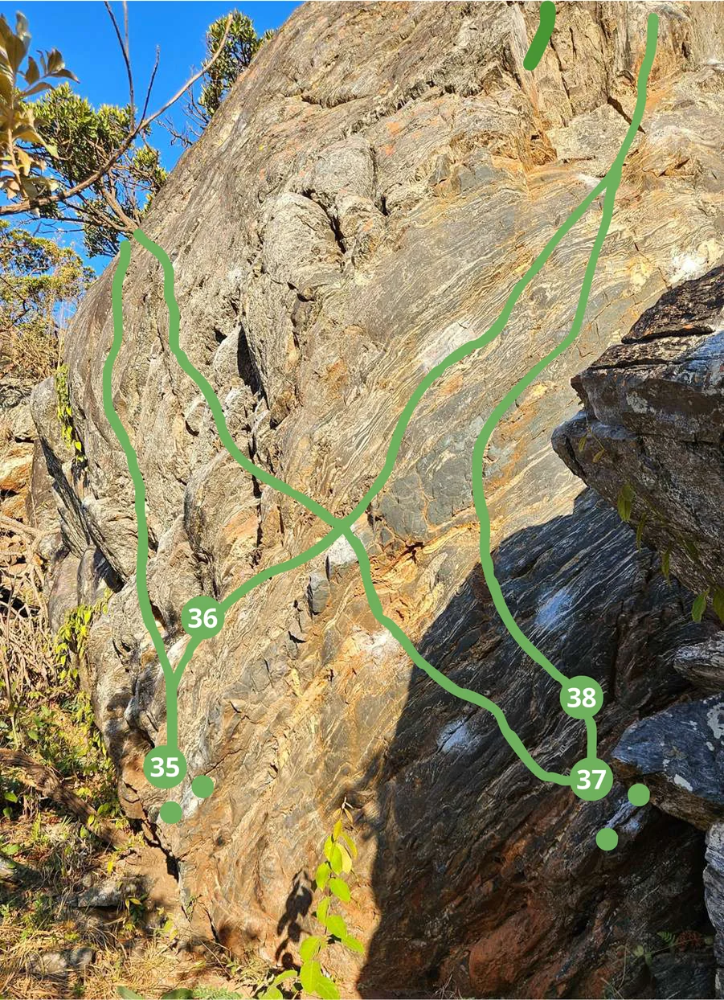
    - **largura_mapa**: 901
    - **altura_mapa**: 1244
    - **pontos_de_interesse**:
      - **[0]**:
        - **id**: AHl2qwhhhkWz1H
        - **uid**: AHl2qwhhhkWz1H
        - **rotulo**: 35
        - **circulo**:
          - **x**: 205
          - **y**: 954
          - **raio**: 26
        - **label**: 35
      - **[1]**:
        - **id**: DdqctLMW2orjh4
        - **uid**: DdqctLMW2orjh4
        - **rotulo**: 36
        - **circulo**:
          - **x**: 252
          - **y**: 768
          - **raio**: 26
        - **label**: 36
      - **[2]**:
        - **id**: SZ871qlkSpDOFD
        - **uid**: SZ871qlkSpDOFD
        - **rotulo**: 37
        - **circulo**:
          - **x**: 736
          - **y**: 969
          - **raio**: 26
        - **label**: 37
      - **[3]**:
        - **id**: PCaeb5NM8ZbtQE
        - **uid**: PCaeb5NM8ZbtQE
        - **rotulo**: 38
        - **circulo**:
          - **x**: 724
          - **y**: 867
          - **raio**: 26
        - **label**: 38
    - **referencias**:
      - **[0]**:
        - **alvo_uid**: i05Boj0FNXGpfl
        - **pontos_uids**:
          - AHl2qwhhhkWz1H
        - **escalada**: Viuvinha
        - **ids**:
          - AHl2qwhhhkWz1H
      - **[1]**:
        - **alvo_uid**: 7o7obsv0PmlAUN
        - **pontos_uids**:
          - DdqctLMW2orjh4
        - **escalada**: Eu sou Jaó
        - **ids**:
          - DdqctLMW2orjh4
      - **[2]**:
        - **alvo_uid**: fBrJk1J8EdjfP0
        - **pontos_uids**:
          - SZ871qlkSpDOFD
        - **escalada**: Ritual
        - **ids**:
          - SZ871qlkSpDOFD
      - **[3]**:
        - **alvo_uid**: xsxNv7ohDyb0i7
        - **pontos_uids**:
          - PCaeb5NM8ZbtQE
        - **escalada**: Improviso
        - **ids**:
          - PCaeb5NM8ZbtQE
  - **[1]**:
    - **caminho_imagem_mapa**: 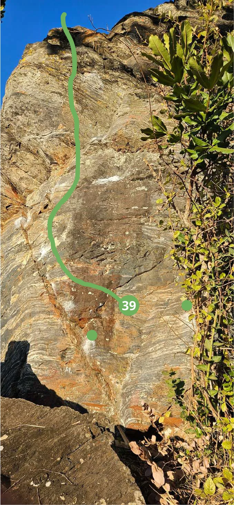
    - **largura_mapa**: 678
    - **altura_mapa**: 1460
    - **pontos_de_interesse**:
      - **[0]**:
        - **id**: 7gZbq7gn3zEQz3
        - **uid**: 7gZbq7gn3zEQz3
        - **rotulo**: 39
        - **circulo**:
          - **x**: 374
          - **y**: 883
          - **raio**: 28
        - **label**: 39
    - **referencias**:
      - **[0]**:
        - **alvo_uid**: 2PN0hdPgKiw2nm
        - **pontos_uids**:
          - 7gZbq7gn3zEQz3
        - **escalada**: Buraqueira
        - **ids**:
          - 7gZbq7gn3zEQz3
  - **[2]**:
    - **caminho_imagem_mapa**: 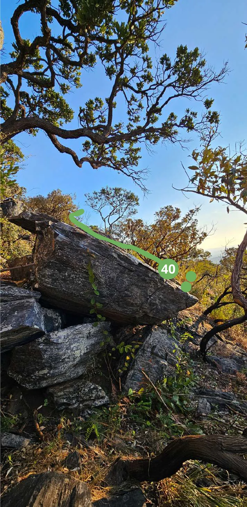
    - **largura_mapa**: 712
    - **altura_mapa**: 1459
    - **pontos_de_interesse**:
      - **[0]**:
        - **id**: j6mCjVwZUc3hYC
        - **uid**: j6mCjVwZUc3hYC
        - **rotulo**: 40
        - **circulo**:
          - **x**: 485
          - **y**: 773
          - **raio**: 28
        - **label**: 40
    - **referencias**:
      - **[0]**:
        - **alvo_uid**: k7o5hIx7oH5ft6
        - **pontos_uids**:
          - j6mCjVwZUc3hYC
        - **escalada**: Mini Nave
        - **ids**:
          - j6mCjVwZUc3hYC
- **escaladas**:
  - **[0]**:
    - **uid**: i05Boj0FNXGpfl
    - **boulder**:
      - **descricao**: Boulder na lateral esquerda do bloco, com a saída nas agarras baixas, indo reto até a virada.
      - **nome**: Viuvinha
      - **dificuldade**: V1
  - **[1]**:
    - **uid**: 7o7obsv0PmlAUN
    - **boulder**:
      - **descricao**: Saída nas agarras baixas da lateral esquerda do bloco, fazendo a travessia por agarras boas até a virada na parte mais alta à direita.
      - **nome**: Eu sou Jaó
      - **dificuldade**: V1
  - **[2]**:
    - **uid**: fBrJk1J8EdjfP0
    - **boulder**:
      - **descricao**: Começa nas agarras mais baixas à direita do bloco, com um crux de saída, fazendo a travessia para a virada na parte esquerda.
      - **nome**: Ritual
      - **dificuldade**: V3
  - **[3]**:
    - **uid**: xsxNv7ohDyb0i7
    - **boulder**:
      - **descricao**: Saída nas agarras baixas da direita do bloco, indo reto até a virada na parte mais alta.
      - **nome**: Improviso
      - **dificuldade**: V3
  - **[4]**:
    - **uid**: 2PN0hdPgKiw2nm
    - **boulder**:
      - **descricao**: Boulder saindo do buraco na lateral do bloco em agarras baixas, indo reto para a virada em agarras boas.
      - **nome**: Buraqueira
      - **dificuldade**: V1
  - **[5]**:
    - **uid**: k7o5hIx7oH5ft6
    - **boulder**:
      - **descricao**: Boulder no bloco ao lado, com a saída na parte baixa da direita, sem usar os blocos de baixo, tocando por toda a aresta.
      - **nome**: Mini Nave
      - **dificuldade**: V1
- **precomputados**:
  - **total_escaladas**: 6
  - **total_boulders**: 6

## Parte: setor_moctezuma

### Setor (Pico: Pedra Rachada)

- **descricao**: OBS: Herança de Ferro aparentava já ter sido escalada. Buscamos informações com alguns escaladores, porém o boulder não foi reconhecido. Caso alguém se lembre da linha, entrar em contato para alteração do croqui.
- **nome**: Setor Moctezuma
- **uid**: nnYIlTwIYD9Wlp
- **mapas**:
  - **[0]**:
    - **caminho_imagem_mapa**: 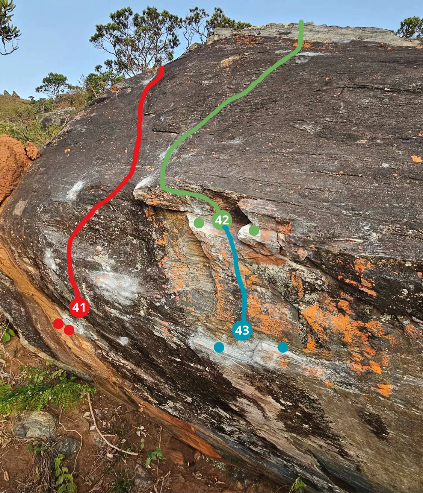
    - **largura_mapa**: 1126
    - **altura_mapa**: 1310
    - **pontos_de_interesse**:
      - **[0]**:
        - **id**: gZYfSLlW0meDiv
        - **uid**: gZYfSLlW0meDiv
        - **rotulo**: 42
        - **circulo**:
          - **x**: 591
          - **y**: 584
          - **raio**: 26
        - **label**: 42
      - **[1]**:
        - **id**: HpRF0bDxvR4x6g
        - **uid**: HpRF0bDxvR4x6g
        - **rotulo**: 43
        - **circulo**:
          - **x**: 644
          - **y**: 877
          - **raio**: 26
        - **label**: 43
      - **[2]**:
        - **id**: 9C5iyYO3zvJMuz
        - **uid**: 9C5iyYO3zvJMuz
        - **rotulo**: 41
        - **circulo**:
          - **x**: 211
          - **y**: 817
          - **raio**: 26
        - **label**: 41
    - **referencias**:
      - **[0]**:
        - **alvo_uid**: jqvzJjjtaIifkv
        - **pontos_uids**:
          - 9C5iyYO3zvJMuz
        - **escalada**: Mansa Musa
        - **ids**:
          - 9C5iyYO3zvJMuz
      - **[1]**:
        - **alvo_uid**: Zf1Tg3vt0F7X4g
        - **pontos_uids**:
          - 9C5iyYO3zvJMuz
        - **escalada**: Musamansa
        - **ids**:
          - 9C5iyYO3zvJMuz
      - **[2]**:
        - **alvo_uid**: BpqX5AUQRN1daP
        - **pontos_uids**:
          - gZYfSLlW0meDiv
        - **escalada**: Martelo de Pedra
        - **ids**:
          - gZYfSLlW0meDiv
      - **[3]**:
        - **alvo_uid**: dIovjntHyMIh8K
        - **pontos_uids**:
          - HpRF0bDxvR4x6g
        - **escalada**: Moctezuma
        - **ids**:
          - HpRF0bDxvR4x6g
  - **[1]**:
    - **caminho_imagem_mapa**: 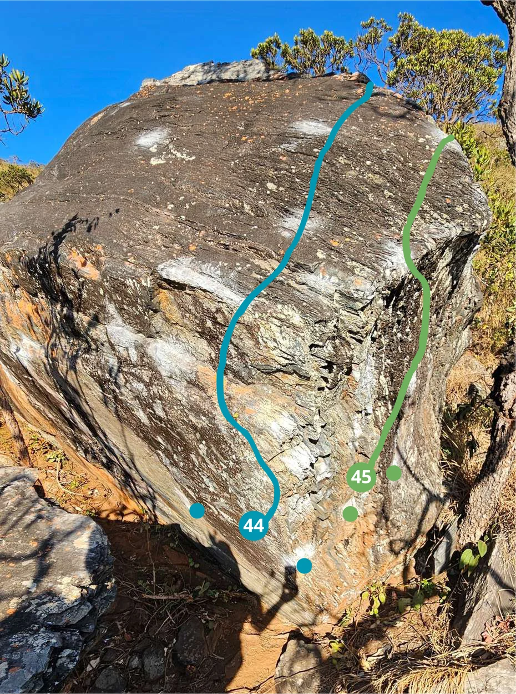
    - **largura_mapa**: 930
    - **altura_mapa**: 1249
    - **pontos_de_interesse**:
      - **[0]**:
        - **id**: gsjmB3ehSIB7xA
        - **uid**: gsjmB3ehSIB7xA
        - **rotulo**: 44
        - **circulo**:
          - **x**: 456
          - **y**: 946
          - **raio**: 27
        - **label**: 44
      - **[1]**:
        - **id**: 2lRKf1d75qJ86u
        - **uid**: 2lRKf1d75qJ86u
        - **rotulo**: 45
        - **circulo**:
          - **x**: 651
          - **y**: 858
          - **raio**: 27
        - **label**: 45
    - **referencias**:
      - **[0]**:
        - **alvo_uid**: oq2HvgJAAgqgMg
        - **pontos_uids**:
          - gsjmB3ehSIB7xA
        - **escalada**: Medeia
        - **ids**:
          - gsjmB3ehSIB7xA
      - **[1]**:
        - **alvo_uid**: Jl4UkP0YJVqqyL
        - **pontos_uids**:
          - 2lRKf1d75qJ86u
        - **escalada**: Maria Bonita
        - **ids**:
          - 2lRKf1d75qJ86u
  - **[2]**:
    - **caminho_imagem_mapa**: 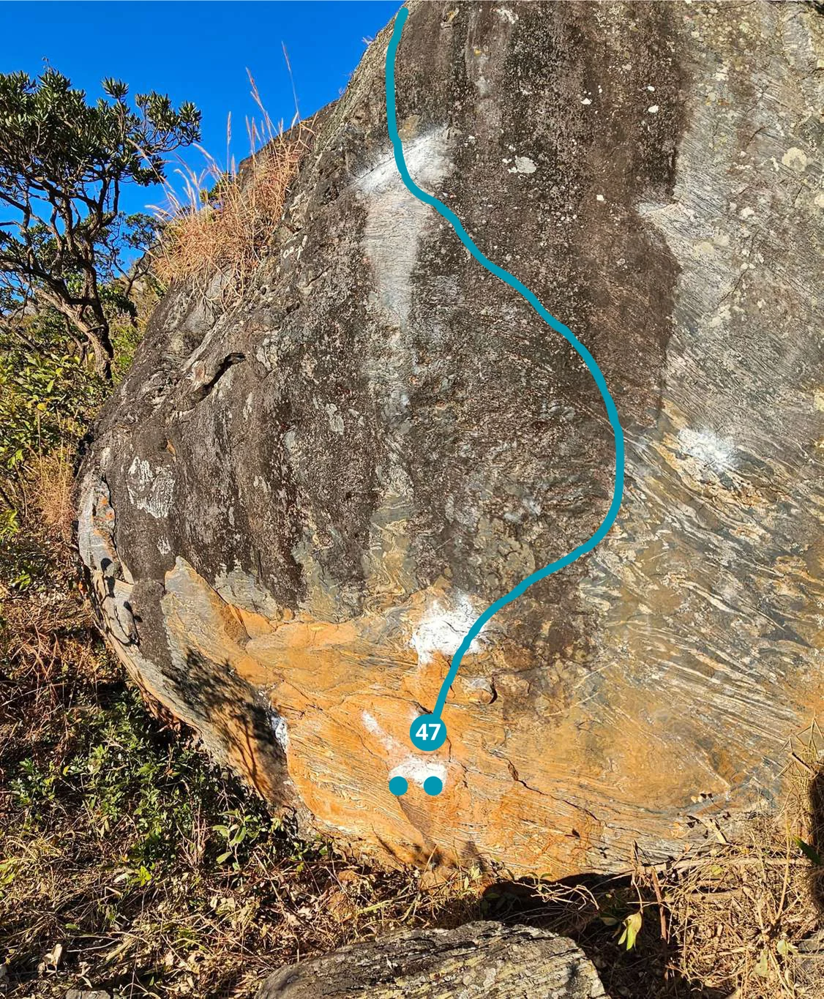
    - **largura_mapa**: 1126
    - **altura_mapa**: 1365
    - **pontos_de_interesse**:
      - **[0]**:
        - **id**: p7EWYPyoDdABXM
        - **uid**: p7EWYPyoDdABXM
        - **rotulo**: 47
        - **circulo**:
          - **x**: 586
          - **y**: 1001
          - **raio**: 25
        - **label**: 47
    - **referencias**:
      - **[0]**:
        - **alvo_uid**: tvJiro8YwLTBx0
        - **pontos_uids**:
          - p7EWYPyoDdABXM
        - **escalada**: Herança de Ferro
        - **ids**:
          - p7EWYPyoDdABXM
- **escaladas**:
  - **[0]**:
    - **uid**: jqvzJjjtaIifkv
    - **boulder**:
      - **descricao**: Começa baixo na laca mais à esquerda do bloco, com movimentos fortes até a virada na à esquerda da fenda.
      - **nome**: Mansa Musa
      - **dificuldade**: V11
  - **[1]**:
    - **uid**: Zf1Tg3vt0F7X4g
    - **boulder**:
      - **descricao**: Saindo da agarra invertida de esquerda e do abaolado de direita.
      - **nome**: Musamansa
      - **dificuldade**: V4
  - **[2]**:
    - **uid**: BpqX5AUQRN1daP
    - **boulder**:
      - **descricao**: Saída com a mão direita na agarrão alto e a esquerda na agarra do lado, indo para esquerda com a virada pelo slab.
      - **nome**: Martelo de Pedra
      - **dificuldade**: V3
  - **[3]**:
    - **uid**: dIovjntHyMIh8K
    - **boulder**:
      - **descricao**: Saída de um reglete de esquerda e de outro reglete um pouco mais alto de direita, indo reto com a virada em um slab técnico.
      - **nome**: Moctezuma
      - **dificuldade**: V6
  - **[4]**:
    - **uid**: oq2HvgJAAgqgMg
    - **boulder**:
      - **descricao**: Saída com a mão esquerda no reglete lateral e a direita na craca baixa na aresta do bloco, indo reto até dois regletes, com um move forte para um agarrão na virada.
      - **nome**: Medeia
      - **dificuldade**: V7
  - **[5]**:
    - **uid**: Jl4UkP0YJVqqyL
    - **boulder**:
      - **descricao**: Boulder pela cracas na lateral do bloco indo reto até o crux na virada.
      - **nome**: Maria Bonita
      - **dificuldade**: V2
  - **[6]**:
    - **uid**: tvJiro8YwLTBx0
    - **boulder**:
      - **descricao**: Saída com a mão esquerda na laca lateral e a mão direita no batente baixo, indo para a direita até um movimento forte em um batente liso.
      - **nome**: Herança de Ferro
      - **dificuldade**: V6
- **precomputados**:
  - **total_escaladas**: 7
  - **total_boulders**: 7

## Parte: setor_molestia

### Setor (Pico: Pedra Rachada)

- **descricao**: 
- **nome**: Setor Moléstia
- **uid**: cdvqeGA2kAJhtk
- **mapas**:
  - **[0]**:
    - **caminho_imagem_mapa**: 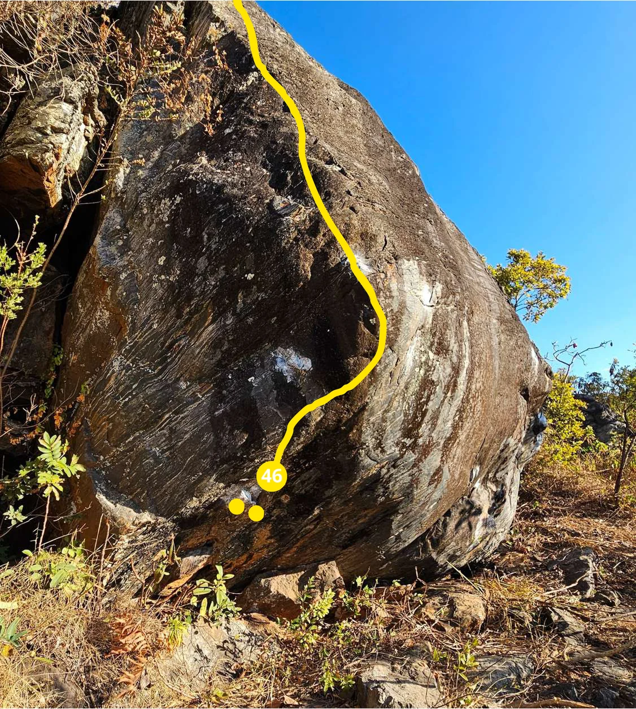
    - **largura_mapa**: 1126
    - **altura_mapa**: 1254
    - **pontos_de_interesse**:
      - **[0]**:
        - **id**: d8C7lne3ihCPxp
        - **uid**: d8C7lne3ihCPxp
        - **rotulo**: 46
        - **circulo**:
          - **x**: 481
          - **y**: 843
          - **raio**: 26
        - **label**: 46
    - **referencias**:
      - **[0]**:
        - **alvo_uid**: 58S3O2tawZtbJ0
        - **pontos_uids**:
          - d8C7lne3ihCPxp
        - **escalada**: Moléstia
        - **ids**:
          - d8C7lne3ihCPxp
  - **[1]**:
    - **caminho_imagem_mapa**: 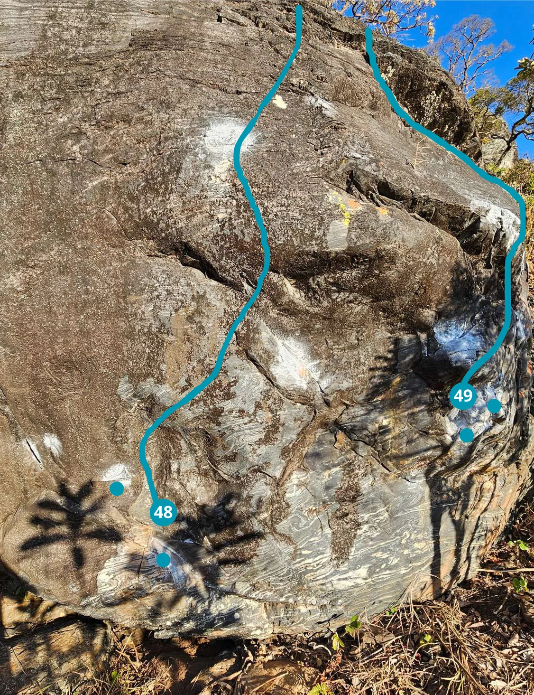
    - **largura_mapa**: 1126
    - **altura_mapa**: 1464
    - **pontos_de_interesse**:
      - **[0]**:
        - **id**: dEYDMUFaXWSPp3
        - **uid**: dEYDMUFaXWSPp3
        - **rotulo**: 48
        - **circulo**:
          - **x**: 343
          - **y**: 1079
          - **raio**: 28
        - **label**: 48
      - **[1]**:
        - **id**: N5hvPqMEBLujlm
        - **uid**: N5hvPqMEBLujlm
        - **rotulo**: 49
        - **circulo**:
          - **x**: 975
          - **y**: 834
          - **raio**: 28
        - **label**: 49
    - **referencias**:
      - **[0]**:
        - **alvo_uid**: GIdu44nruJBHyB
        - **pontos_uids**:
          - dEYDMUFaXWSPp3
        - **escalada**: Jabuticaba
        - **ids**:
          - dEYDMUFaXWSPp3
      - **[1]**:
        - **alvo_uid**: VuH0Ym4Di03rNV
        - **pontos_uids**:
          - N5hvPqMEBLujlm
        - **escalada**: Caqui
        - **ids**:
          - N5hvPqMEBLujlm
- **escaladas**:
  - **[0]**:
    - **uid**: 58S3O2tawZtbJ0
    - **boulder**:
      - **descricao**: Boulder das antigas. Ainda sem betas.
      - **nome**: Moléstia
      - **dificuldade**: V8
  - **[1]**:
    - **uid**: GIdu44nruJBHyB
    - **boulder**:
      - **descricao**: Boulder das antiga! Saída com as mãos na laca baixo e escala reto para um reglete clássico, com uma viara em um positivo.
      - **nome**: Jabuticaba
      - **dificuldade**: V5
  - **[2]**:
    - **uid**: VuH0Ym4Di03rNV
    - **boulder**:
      - **descricao**: Começa com as mãos juntas em uma pinça/reglete, indo para um abaolado com uma virada técnica.
      - **nome**: Caqui
      - **dificuldade**: V4
- **precomputados**:
  - **total_escaladas**: 3
  - **total_boulders**: 3

## Parte: setor_outros_blocos

### Setor (Pico: Pedra Rachada)

- **descricao**: AVISO: O bloco possui um grande módulo no meio com uma linha clássica bem óbvia e alta, porém esse modulo não parece ser sólido e não foi testado por meio de rapel até o momento.
- **nome**: Outros Blocos
- **uid**: hrcCn87Pwp2pLa
- **mapas**:
  - **[0]**:
    - **caminho_imagem_mapa**: 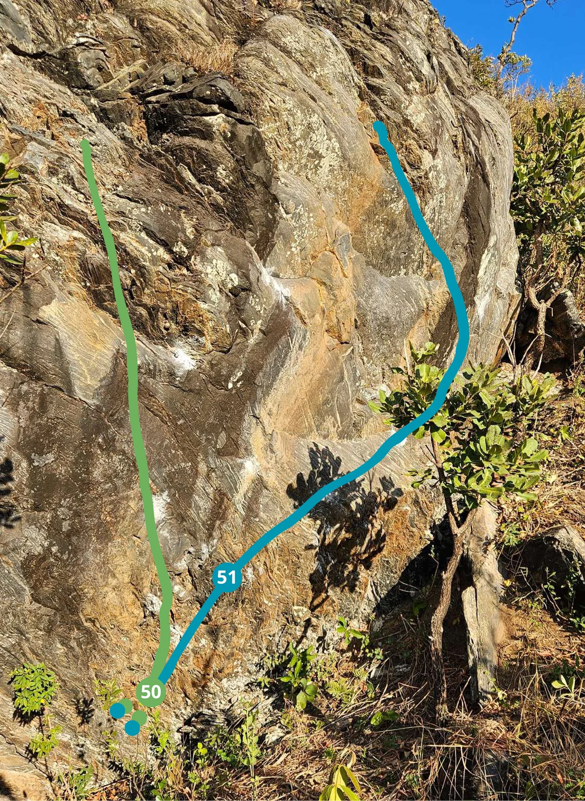
    - **largura_mapa**: 1106
    - **altura_mapa**: 1512
    - **pontos_de_interesse**:
      - **[0]**:
        - **id**: vmueAi6IsFlXH5
        - **uid**: vmueAi6IsFlXH5
        - **rotulo**: 50
        - **circulo**:
          - **x**: 285
          - **y**: 1307
          - **raio**: 28
        - **label**: 50
      - **[1]**:
        - **id**: xXcIsXPjzWYDKd
        - **uid**: xXcIsXPjzWYDKd
        - **rotulo**: 51
        - **circulo**:
          - **x**: 430
          - **y**: 1090
          - **raio**: 28
        - **label**: 51
    - **referencias**:
      - **[0]**:
        - **alvo_uid**: QeGgLhoOXIUevn
        - **pontos_uids**:
          - vmueAi6IsFlXH5
        - **escalada**: Farol
        - **ids**:
          - vmueAi6IsFlXH5
      - **[1]**:
        - **alvo_uid**: JBQhRIDquBb9dZ
        - **pontos_uids**:
          - xXcIsXPjzWYDKd
        - **escalada**: Mirante
        - **ids**:
          - xXcIsXPjzWYDKd
  - **[1]**:
    - **caminho_imagem_mapa**: 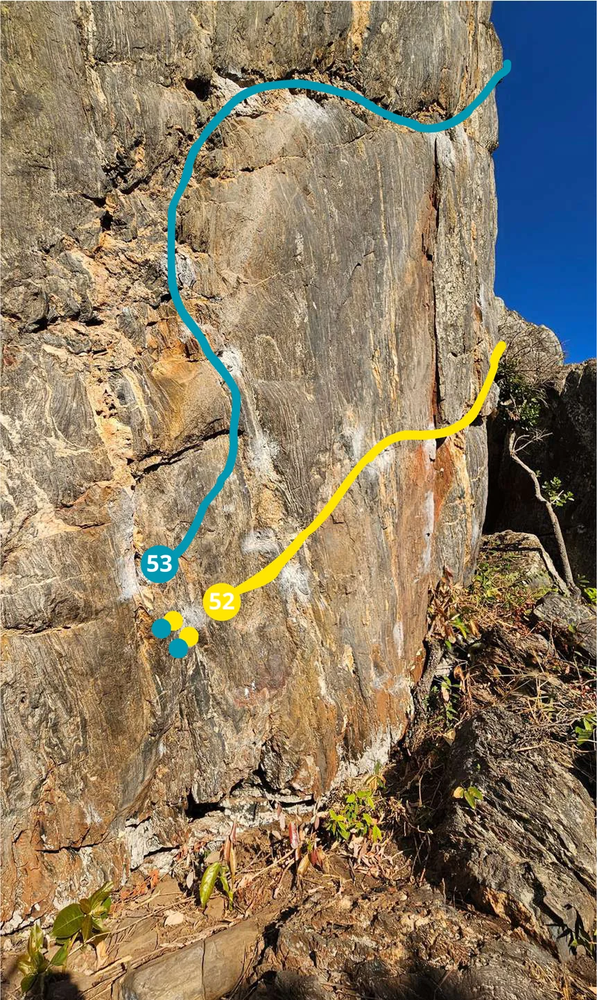
    - **largura_mapa**: 861
    - **altura_mapa**: 1441
    - **pontos_de_interesse**:
      - **[0]**:
        - **id**: N0IS3KbGX1MAJK
        - **uid**: N0IS3KbGX1MAJK
        - **rotulo**: 52
        - **circulo**:
          - **x**: 319
          - **y**: 866
          - **raio**: 27
        - **label**: 52
      - **[1]**:
        - **id**: mzIpYrHtoazflR
        - **uid**: mzIpYrHtoazflR
        - **rotulo**: 53
        - **circulo**:
          - **x**: 229
          - **y**: 813
          - **raio**: 27
        - **label**: 53
    - **referencias**:
      - **[0]**:
        - **alvo_uid**: y4MQNt0TrJjMoR
        - **pontos_uids**:
          - N0IS3KbGX1MAJK
        - **escalada**: Queda do Gigante
        - **ids**:
          - N0IS3KbGX1MAJK
      - **[1]**:
        - **alvo_uid**: fUhfpyN6nQrSWc
        - **pontos_uids**:
          - mzIpYrHtoazflR
        - **escalada**: Não me toque
        - **ids**:
          - mzIpYrHtoazflR
  - **[2]**:
    - **caminho_imagem_mapa**: 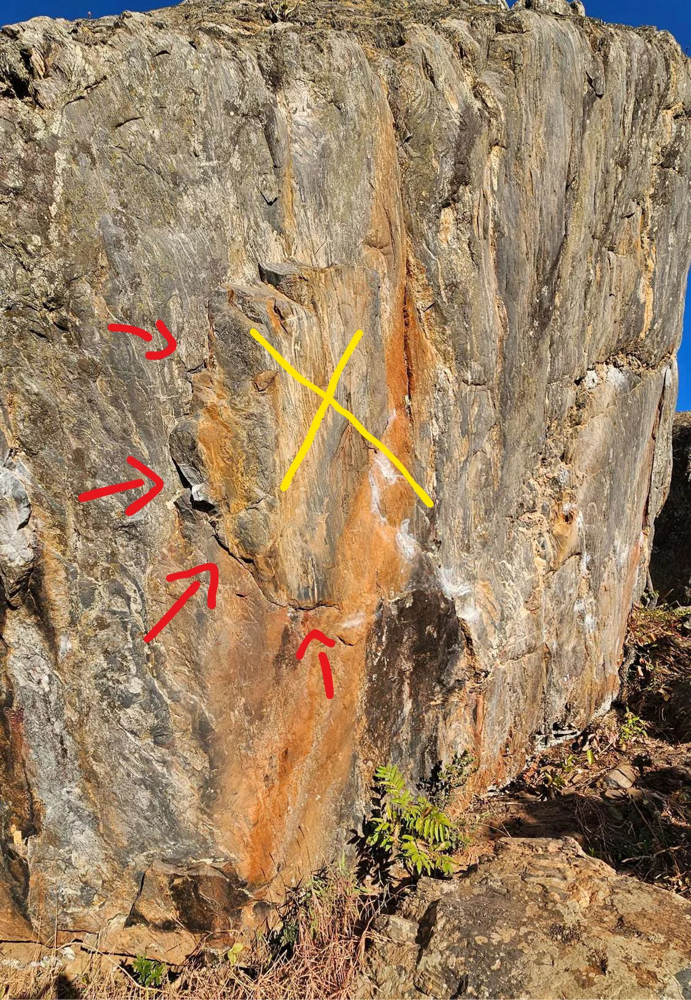
    - **largura_mapa**: 1126
    - **altura_mapa**: 1628
  - **[3]**:
    - **caminho_imagem_mapa**: 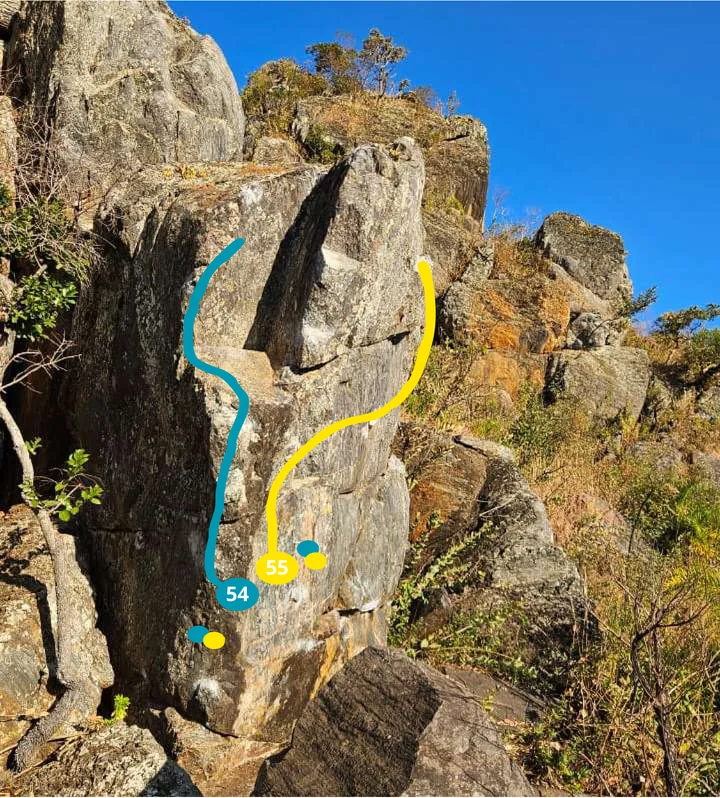
    - **largura_mapa**: 720
    - **altura_mapa**: 798
    - **pontos_de_interesse**:
      - **[0]**:
        - **id**: yjlhLOpKtHVddO
        - **uid**: yjlhLOpKtHVddO
        - **rotulo**: 54
        - **circulo**:
          - **x**: 237
          - **y**: 594
          - **raio**: 17
        - **label**: 54
      - **[1]**:
        - **id**: iBYpr11mbN231y
        - **uid**: iBYpr11mbN231y
        - **rotulo**: 55
        - **circulo**:
          - **x**: 277
          - **y**: 568
          - **raio**: 17
        - **label**: 55
    - **referencias**:
      - **[0]**:
        - **alvo_uid**: 9U1MyMKZQQmPvt
        - **pontos_uids**:
          - yjlhLOpKtHVddO
        - **escalada**: Anemia
        - **ids**:
          - yjlhLOpKtHVddO
      - **[1]**:
        - **alvo_uid**: dXJT8RGNupfs5s
        - **pontos_uids**:
          - iBYpr11mbN231y
        - **escalada**: Biotônico
        - **ids**:
          - iBYpr11mbN231y
  - **[4]**:
    - **caminho_imagem_mapa**: 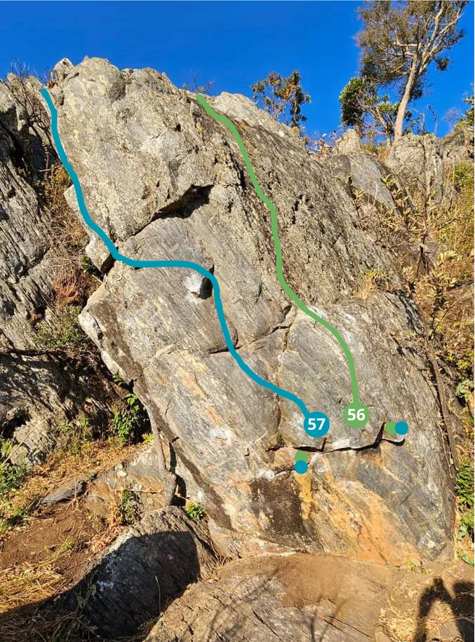
    - **largura_mapa**: 677
    - **altura_mapa**: 916
    - **pontos_de_interesse**:
      - **[0]**:
        - **id**: qZp3rI040nJmEK
        - **uid**: qZp3rI040nJmEK
        - **rotulo**: 56
        - **circulo**:
          - **x**: 508
          - **y**: 592
          - **raio**: 18
        - **label**: 56
      - **[1]**:
        - **id**: NsqsDVhqU2nsdA
        - **uid**: NsqsDVhqU2nsdA
        - **rotulo**: 57
        - **circulo**:
          - **x**: 451
          - **y**: 606
          - **raio**: 19
        - **label**: 57
    - **referencias**:
      - **[0]**:
        - **alvo_uid**: qCwdrE3BSoGsYH
        - **pontos_uids**:
          - qZp3rI040nJmEK
        - **escalada**: Diagnóstico
        - **ids**:
          - qZp3rI040nJmEK
      - **[1]**:
        - **alvo_uid**: Zx6aO4Xt07Eoye
        - **pontos_uids**:
          - NsqsDVhqU2nsdA
        - **escalada**: Vertigem
        - **ids**:
          - NsqsDVhqU2nsdA
- **escaladas**:
  - **[0]**:
    - **uid**: QeGgLhoOXIUevn
    - **boulder**:
      - **descricao**: Saída das lacas na parte baixa do bloco, indo reto até regletes para fazer a virada por agarradas boas na proa.
      - **nome**: Farol
      - **dificuldade**: V3
  - **[1]**:
    - **uid**: JBQhRIDquBb9dZ
    - **boulder**:
      - **descricao**: Começa nas lacas baixas, igual o Farol, porém faz a travessia para a direita, com a virada pela lateral do bloco.
      - **nome**: Mirante
      - **dificuldade**: V4
  - **[2]**:
    - **uid**: y4MQNt0TrJjMoR
    - **boulder**:
      - **descricao**: Começa nas agarras baixas na direita do bloco, indo para a lateral do bloco por baixo até as cracas que possibilitam a virada pelo highball.
      - **nome**: Queda do Gigante
      - **dificuldade**: V8
  - **[3]**:
    - **uid**: fUhfpyN6nQrSWc
    - **boulder**:
      - **descricao**: Saída nas agarras baixas na direita do bloco, indo para a lateral pelo feixo de cristais até a virada pelas cracas da direita.
      - **nome**: Não me toque
      - **dificuldade**: V5
  - **[4]**:
    - **uid**: 9U1MyMKZQQmPvt
    - **boulder**:
      - **descricao**: Boulder clássico.
      - **nome**: Anemia
      - **dificuldade**: V7
  - **[5]**:
    - **uid**: dXJT8RGNupfs5s
    - **boulder**:
      - **descricao**: Boulder clássico.
      - **nome**: Biotônico
      - **dificuldade**: V8
  - **[6]**:
    - **uid**: qCwdrE3BSoGsYH
    - **boulder**:
      - **descricao**: Boulder clássico.
      - **nome**: Diagnóstico
      - **dificuldade**: V3
  - **[7]**:
    - **uid**: Zx6aO4Xt07Eoye
    - **boulder**:
      - **descricao**: Boulder clássico.
      - **nome**: Vertigem
      - **dificuldade**: V5
- **precomputados**:
  - **total_escaladas**: 8
  - **total_boulders**: 8

## Arquivos Externos

- **arquivos_externos**:
  - **[0]**:
    - **caminho**: 
    - **checksum_sha256**: 9e88ad85c001fc405c933a90613411f84653afd1a9c3411aa981624946ea71d7
  - **[1]**:
    - **caminho**: 
    - **checksum_sha256**: 19aa73a0d9401216183b9515ec978a4764512154608ae1fee6ba2ee257d11f99
  - **[2]**:
    - **caminho**: 
    - **checksum_sha256**: 642edcdd2cb8d6f2c32af08a5da54e334947d1ae9e10b271e5b61cc6609068e2
  - **[3]**:
    - **caminho**: 
    - **checksum_sha256**: 4f02277c9869f173e80de10e93d2e65e586a81923091989154617fa84867f9fe
  - **[4]**:
    - **caminho**: 
    - **checksum_sha256**: ca45841c5c618beac6f6581f4b4c07494c1929789c2b8575af881f5638048e98
  - **[5]**:
    - **caminho**: 
    - **checksum_sha256**: de3592b0693c7938b49207ae1f8c3ae5fea04a26f3e715fe2f797163c7ff49ca
  - **[6]**:
    - **caminho**: 
    - **checksum_sha256**: 6bd87ff2b8e0a08e76075243f2e2fd851eb54217dcd34e4376b9a41556088cd4
  - **[7]**:
    - **caminho**: 
    - **checksum_sha256**: 2c1172f8981b21d94fb797783ae157db1d82021b59c4a9fcc8f8e79328361585
  - **[8]**:
    - **caminho**: 
    - **checksum_sha256**: ac94fb4dd9a6f55d04872e3cb38e8b1ef662b047ecf361ba8b45994d39c2f7fa
  - **[9]**:
    - **caminho**: 
    - **checksum_sha256**: 642edcdd2cb8d6f2c32af08a5da54e334947d1ae9e10b271e5b61cc6609068e2
  - **[10]**:
    - **caminho**: 
    - **checksum_sha256**: cb9c5a78e5c88ca71ab9e9c07beaacd5bc0a3f5ea746b86dfd052d0b887cff95
  - **[11]**:
    - **caminho**: 
    - **checksum_sha256**: d2950d1f522bc0bfb10fb6457ec98585d8a9f1d9132f68451c7215e90630d1bc
  - **[12]**:
    - **caminho**: 
    - **checksum_sha256**: 5b377911ad8f638f027cc9fe00974dcc1b71e0d21b8abe513a87e67906fdd0df
  - **[13]**:
    - **caminho**: 
    - **checksum_sha256**: 6bda574acfd189a592c4d5b010a3cf3b1980e33de35159866b7cb39119709a17
  - **[14]**:
    - **caminho**: 
    - **checksum_sha256**: 4484149f4b0abc903d496c077656c2a2b7a894dce8da4a499381a56f5791bcf5
  - **[15]**:
    - **caminho**: 
    - **checksum_sha256**: ab3ac57370edef9747694eb58a2907eb98d6310b7f5d6b5fd50217fcf61b1b42
  - **[16]**:
    - **caminho**: 
    - **checksum_sha256**: dae119f898f2d685181ff8b26acaa28318aebe37796b8d6a1600dd1285e9814b
  - **[17]**:
    - **caminho**: 
    - **checksum_sha256**: 0838208027ba5a3599b3d602a917144e5a2aaa07b60cabab4ea463378bf8caf0
  - **[18]**:
    - **caminho**: 
    - **checksum_sha256**: 5300ed9a2f82211dcaa6c1e04e31695dd26bdde2a644472da5eed4109445008c
  - **[19]**:
    - **caminho**: 
    - **checksum_sha256**: 130ccbc54f83bfea6d0ce3c905e1f20a6054bd1b7b97342a07e37047f285f059
  - **[20]**:
    - **caminho**: 
    - **checksum_sha256**: d0021736cb82a1bc008eaf7f6dc5898582b8b2c1863aa14f303fb51279526eae
  - **[21]**:
    - **caminho**: 
    - **checksum_sha256**: 56dc6d12f04f8bc531999765c5ce3dc4a83a176adea42edd6168956bec2268cc
  - **[22]**:
    - **caminho**: 
    - **checksum_sha256**: 26cc090360b20f781ec0142b26c1c3725b725511cd87bcf4dc0eb80d0943b0cb
  - **[23]**:
    - **caminho**: 
    - **checksum_sha256**: 066a543df84b7b824a44b48796c610572c76a479a47812cc22e41d221ba25111
  - **[24]**:
    - **caminho**: 
    - **checksum_sha256**: 11abe5536689e32e7bcd56be9ddacef9758c658f761bf740cdde6147fe230cc3
  - **[25]**:
    - **caminho**: 
    - **checksum_sha256**: badfae4bbafb2e7c45efe38867a6b584149396d5a8008c61afd43b67e6abb24f
  - **[26]**:
    - **caminho**: 
    - **checksum_sha256**: 0cb8989734c509c4b2a95659758a83ec106f09a63c986f14ab23220f3ba1a110
  - **[27]**:
    - **caminho**: 
    - **checksum_sha256**: 8df7c0da3e5afcc86d55b891f2bc12d799ec6d747bcc094866326323642a880c
  - **[28]**:
    - **caminho**: 
    - **checksum_sha256**: 796b5096a7879c5c6578c18f4b255b19c15fbce1596cbd5b8cd464958dfe7c57
  - **[29]**:
    - **caminho**: 
    - **checksum_sha256**: 3591c4fbeb69222c499cee37b74b2342169a5bdb507d986adc0688d054513e0b

