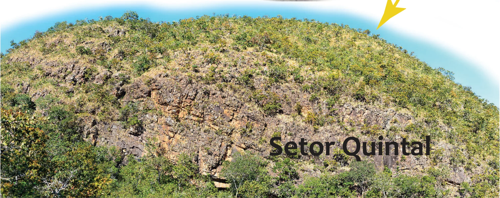
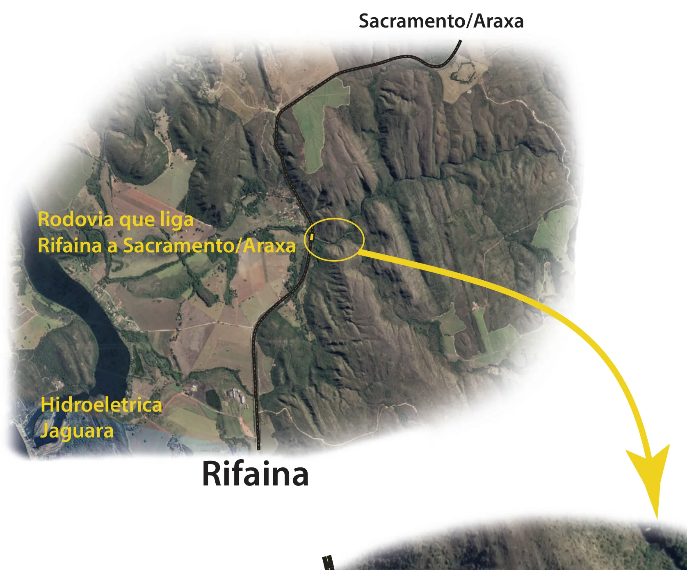
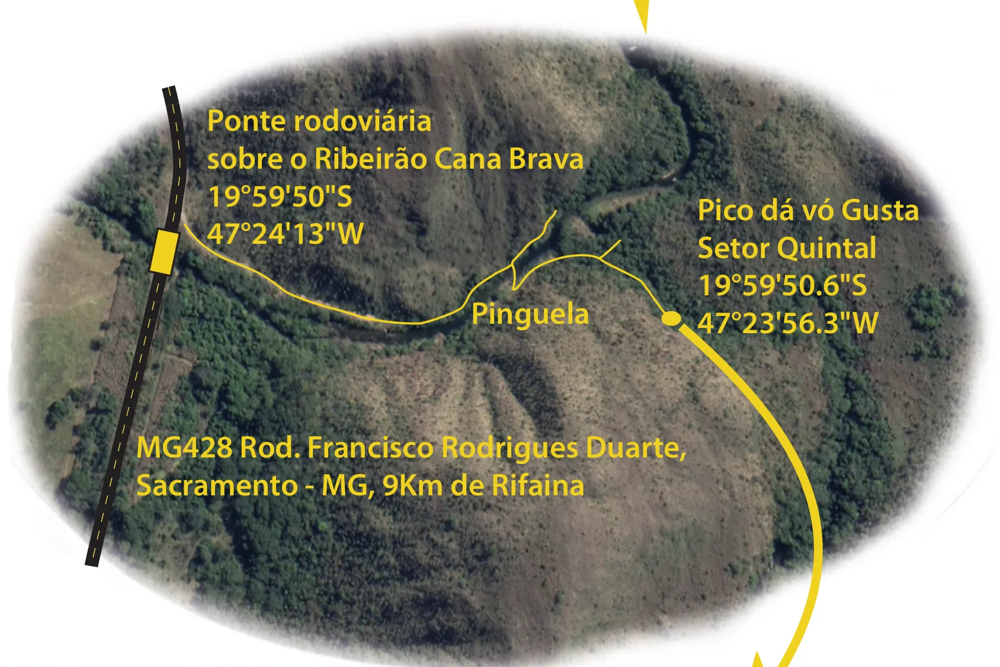
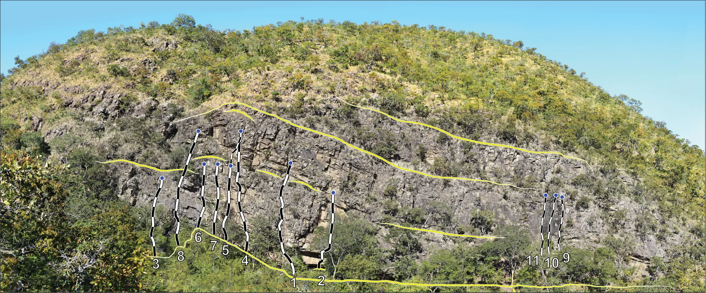

# Croqui: Pico da Vó Gusta

## Informações Gerais

- **descricao**: Pico da Vó Gusta em Sacramento, MG. Próximo a Rifaina.
- **id**: br_mg_sacramento_vo_gusta
- **nome**: Pico da Vó Gusta
- **creditos**:
  - Autores do Croqui Original
- **caminho_thumbnail**: 
- **revisado_manualmente**: True
- **revisado_bounding_circle**: True
- **status_desenho_extraivel**: NAO_TEM_DESENHO
- **botoes**:
  - **[0]**:
    - **texto**: Capa
    - **destino**:
      - **secao_textual**:
        - **conteudo**:
            # Pico da Vó Gusta
            
            |  |
            | :--: |
            | *Pico da Vó Gusta* |
            
            ## Observações
            
            Pico da Vó Gusta localizado em Sacramento, MG, próximo a Rifaina.
            
            ## Apoio
            
            Pico da Vó Gusta
            
            Pico da Vó Gusta em Sacramento, MG. Próximo a Rifaina.
  - **[1]**:
    - **texto**: Mapas Gerais
    - **destino**:
      - **secao_textual**:
        - **conteudo**:
            # Mapas Gerais
            
            ## Visão Geral
            
            |  |
            | :--: |
            | *Visão Geral* |
            
            **Rodovia que liga Rifaina a Sacramento/Araxa**
            **Hidroeletrica Jaguara**
            
            ## Acesso
            
            |  |
            | :--: |
            | *Acesso* |
            
            **Ponte rodoviária sobre o Ribeirão Cana Brava**
            19°59'50"S 
            47°24'13"W
            
            **Pinguela**
            
            **Pico dá vó Gusta - Setor Quintal**
            19°59'50.6"S 
            47°23'56.3"W 
            
            **MG428 Rod. Francisco Rodrigues Duarte, Sacramento - MG, 9Km de Rifaina**
- **ultima_migracao**: 2
- **publicar_croqui**: True

## Parte: setor_quintal

### Setor (Pico: Pico da Vó Gusta)

- **descricao**:
    # Setor Quintal
    
    |  |
    | :--: |
    | *Setor Quintal* |
- **nome**: Setor Quintal
- **mapas**:
  - **[0]**:
    - **caminho_imagem_mapa**: 
    - **largura_mapa**: 2048
    - **altura_mapa**: 851
    - **pontos_de_interesse**:
      - **[0]**:
        - **id**: 01
        - **label**: 1
        - **circular**:
          - **x**: 853
          - **y**: 821
          - **raio**: 18
      - **[1]**:
        - **id**: 02
        - **label**: 2
        - **circular**:
          - **x**: 932
          - **y**: 816
          - **raio**: 18
      - **[2]**:
        - **id**: 03
        - **label**: 3
        - **circular**:
          - **x**: 451
          - **y**: 766
          - **raio**: 18
      - **[3]**:
        - **id**: 04
        - **label**: 4
        - **circular**:
          - **x**: 711
          - **y**: 757
          - **raio**: 18
      - **[4]**:
        - **id**: 05
        - **label**: 5
        - **circular**:
          - **x**: 654
          - **y**: 725
          - **raio**: 18
      - **[5]**:
        - **id**: 06
        - **label**: 6
        - **circular**:
          - **x**: 576
          - **y**: 688
          - **raio**: 18
      - **[6]**:
        - **id**: 07
        - **label**: 7
        - **circular**:
          - **x**: 620
          - **y**: 712
          - **raio**: 18
      - **[7]**:
        - **id**: 08
        - **label**: 8
        - **circular**:
          - **x**: 524
          - **y**: 743
          - **raio**: 18
      - **[8]**:
        - **id**: 09
        - **label**: 9
        - **circular**:
          - **x**: 1643
          - **y**: 748
          - **raio**: 20
      - **[9]**:
        - **id**: 10
        - **label**: 10
        - **circular**:
          - **x**: 1601
          - **y**: 763
          - **raio**: 22
      - **[10]**:
        - **id**: 11
        - **label**: 11
        - **circular**:
          - **x**: 1546
          - **y**: 756
          - **raio**: 22
    - **referencias**:
      - **[0]**:
        - **escalada**: Sonho de Infância
        - **ids**:
          - 01
      - **[1]**:
        - **escalada**: Presente Grego
        - **ids**:
          - 02
      - **[2]**:
        - **escalada**: Tatu do Céu
        - **ids**:
          - 03
      - **[3]**:
        - **escalada**: Base de apoio
        - **ids**:
          - 04
      - **[4]**:
        - **escalada**: De Pai pra Filho
        - **ids**:
          - 05
      - **[5]**:
        - **escalada**: Pior dia da minha vida
        - **ids**:
          - 06
      - **[6]**:
        - **escalada**: Cortina de Fumaça
        - **ids**:
          - 07
      - **[7]**:
        - **escalada**: Faxineiro Fiel
        - **ids**:
          - 08
      - **[8]**:
        - **escalada**: Arrependimento
        - **ids**:
          - 09
      - **[9]**:
        - **escalada**: Aperta Bola
        - **ids**:
          - 10
      - **[10]**:
        - **escalada**: Surpresa
        - **ids**:
          - 11
- **escaladas**:
  - **[0]**:
    - **via_esportiva**:
      - **nome**: Sonho de Infância
      - **conquistadores**:
        - Arthur
        - Matheus
        - Fernanda
      - **extensao**: 20
      - **dificuldade**: BR_6SUP
      - **quantidade_protecoes_intermediarias**: 8
      - **quantidade_protecoes_parada**: 2
  - **[1]**:
    - **via_esportiva**:
      - **nome**: Presente Grego
      - **conquistadores**:
        - Arthur
        - Matheus
        - Fernanda
      - **extensao**: 18
      - **dificuldade**: BR_8C_BARRA_9A
      - **quantidade_protecoes_intermediarias**: 8
      - **quantidade_protecoes_parada**: 2
  - **[2]**:
    - **via_esportiva**:
      - **nome**: Tatu do Céu
      - **conquistadores**:
        - Arthur
        - Fernanda
      - **extensao**: 10
      - **dificuldade**: BR_5SUP
      - **quantidade_protecoes_intermediarias**: 5
      - **quantidade_protecoes_parada**: 2
  - **[3]**:
    - **via_esportiva**:
      - **nome**: Base de apoio
      - **conquistadores**:
        - Matheus
        - Arthur
      - **extensao**: 20
      - **dificuldade**: PROJETO
  - **[4]**:
    - **via_esportiva**:
      - **nome**: De Pai pra Filho
      - **conquistadores**:
        - Matheus
        - Vinicius
        - Arthur
      - **extensao**: 15
      - **dificuldade**: BR_7B
  - **[5]**:
    - **via_esportiva**:
      - **nome**: Pior dia da minha vida
      - **conquistadores**:
        - Arthur
        - Homero
        - Vitor Ciabatari
        - Bruno Rocha
        - Matheus
      - **extensao**: 12
      - **dificuldade**: BR_6SUP
      - **quantidade_protecoes_intermediarias**: 5
      - **quantidade_protecoes_parada**: 2
  - **[6]**:
    - **via_esportiva**:
      - **nome**: Cortina de Fumaça
      - **conquistadores**:
        - Arthur
        - Homero
        - Vitor Ciabatari
        - Bruno Rocha
      - **extensao**: 12
      - **dificuldade**: BR_7A
      - **quantidade_protecoes_intermediarias**: 5
      - **quantidade_protecoes_parada**: 2
  - **[7]**:
    - **via_esportiva**:
      - **nome**: Faxineiro Fiel
      - **conquistadores**:
        - Arthur
        - Zequiel
      - **extensao**: 20
      - **dificuldade**: BR_6SUP
      - **quantidade_protecoes_intermediarias**: 7
      - **quantidade_protecoes_parada**: 2
  - **[8]**:
    - **via_esportiva**:
      - **nome**: Arrependimento
      - **conquistadores**:
        - Matheus
        - Zequiel
      - **extensao**: 15
      - **dificuldade**: BR_5SUP_BARRA_6
      - **quantidade_protecoes_intermediarias**: 4
      - **quantidade_protecoes_parada**: 2
  - **[9]**:
    - **via_esportiva**:
      - **nome**: Aperta Bola
      - **conquistadores**:
        - Matheus
        - Zequiel
      - **extensao**: 15
      - **dificuldade**: BR_5SUP_BARRA_6
      - **quantidade_protecoes_intermediarias**: 4
      - **quantidade_protecoes_parada**: 2
  - **[10]**:
    - **via_esportiva**:
      - **nome**: Surpresa
      - **conquistadores**:
        - Matheus
        - Zequiel
      - **extensao**: 15
      - **dificuldade**: BR_5SUP_BARRA_6
      - **quantidade_protecoes_intermediarias**: 4
      - **quantidade_protecoes_parada**: 2

## Arquivos Externos

- **arquivos_externos**:
  - **[0]**:
    - **caminho**: 
    - **checksum_sha256**: 53d547658e03ac072e22a39af45da93e830e37892d5c2689683eba3d1027ce7b
  - **[1]**:
    - **caminho**: 
    - **checksum_sha256**: 95d0ef67b231d809e3907a2445cea085b47b31e430eb80719dc6ee75f72e6429
  - **[2]**:
    - **caminho**: 
    - **checksum_sha256**: 4bd51f08af09ff4c64d659ca347e5a7c8cb5cfbe6ac79c80d48be689a2a904d8
  - **[3]**:
    - **caminho**: 
    - **checksum_sha256**: fed325281c8138d6e4e8d538f76eaeb1390ab1d54bd7349867d69cbe3d004d38
  - **[4]**:
    - **caminho**: 
    - **checksum_sha256**: fed325281c8138d6e4e8d538f76eaeb1390ab1d54bd7349867d69cbe3d004d38

