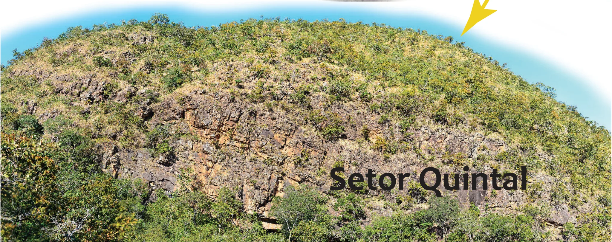
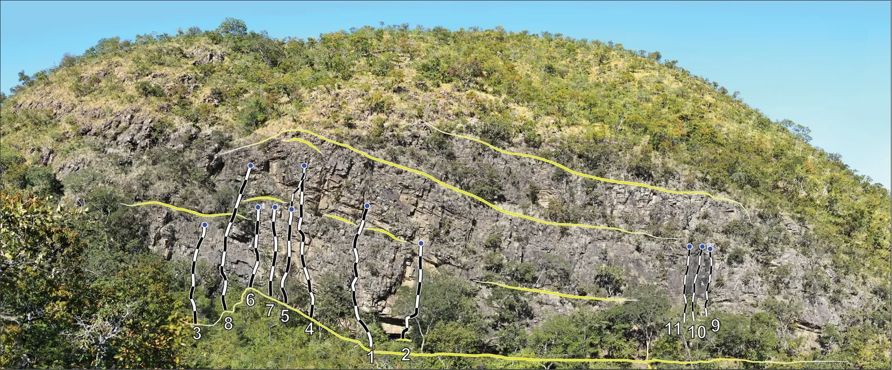
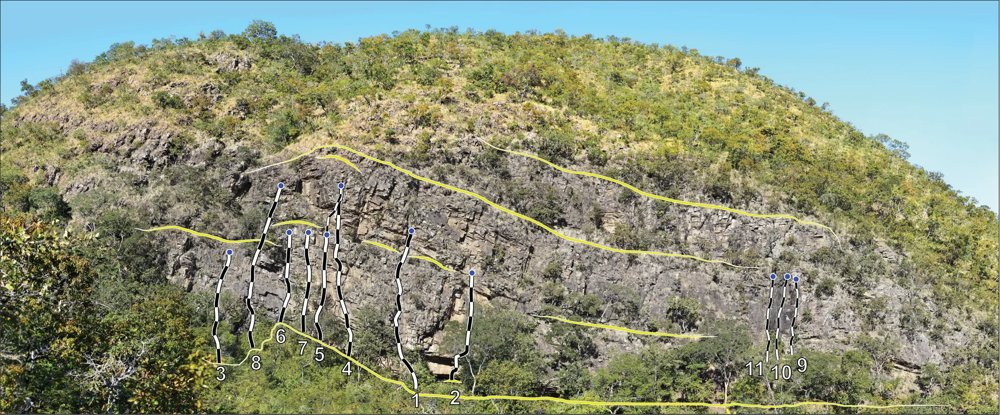
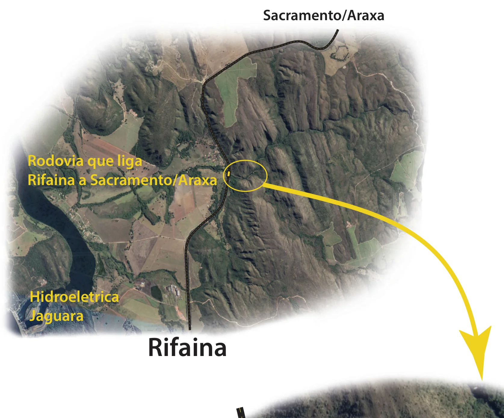
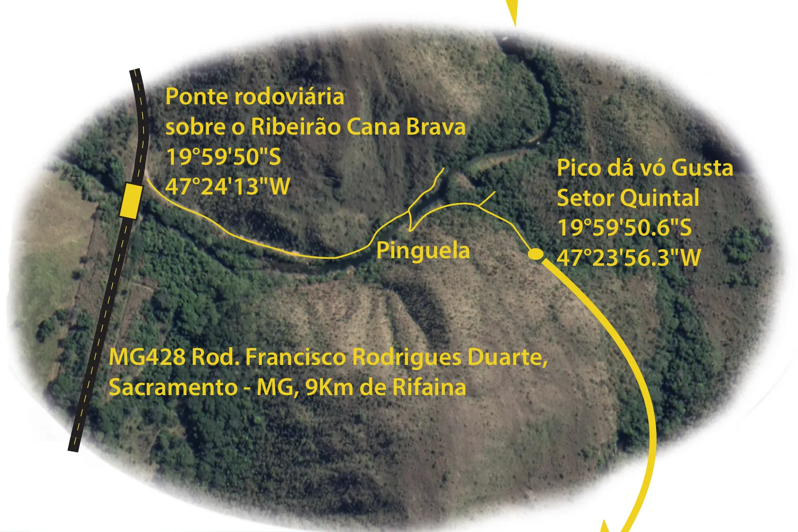

# Croqui: Pico da Vó Gusta

## Informações Gerais

- **descricao**: Pico da Vó Gusta em Sacramento, MG. Próximo a Rifaina.
- **id**: br_mg_sacramento_vo_gusta
- **nome**: Pico da Vó Gusta
- **uid**: Jtg5MoeUOy5z93
- **creditos**:
  - Autores do Croqui Original
- **caminho_thumbnail**: 
- **revisado_manualmente**: True
- **revisado_bounding_circle**: True
- **status_desenho_extraivel**: NAO_TEM_DESENHO
- **botoes**:
  - **[0]**:
    - **uid**: ZVDkuWLhO7Il6d
    - **texto**: Capa
    - **destino**:
      - **secao_textual**:
        - **conteudo**:
            # Pico da Vó Gusta
            
            |  |
            | :--: |
            | *Pico da Vó Gusta* |
            
            ## Observações
            
            Pico da Vó Gusta localizado em Sacramento, MG, próximo a Rifaina.
            
            ## Apoio
            
            Pico da Vó Gusta
            
            Pico da Vó Gusta em Sacramento, MG. Próximo a Rifaina.
- **ultima_migracao**: 5
- **publicar_croqui**: True

## Parte: setor_quintal

### Setor (Pico: Pico da Vó Gusta)

- **descricao**: 
- **nome**: Setor Quintal
- **uid**: OrUXZcQg0RiAcU
- **caminho_imagem_capa**: 
- **mapas**:
  - **[0]**:
    - **caminho_imagem_mapa**: 
    - **largura_mapa**: 2048
    - **altura_mapa**: 851
    - **pontos_de_interesse**:
      - **[0]**:
        - **id**: H2iHJQSnLaHixf
        - **uid**: H2iHJQSnLaHixf
        - **rotulo**: 1
        - **circulo**:
          - **x**: 853
          - **y**: 821
          - **raio**: 19
        - **label**: 1
      - **[1]**:
        - **id**: td6JUXvHGecOjK
        - **uid**: td6JUXvHGecOjK
        - **rotulo**: 2
        - **circulo**:
          - **x**: 932
          - **y**: 816
          - **raio**: 19
        - **label**: 2
      - **[2]**:
        - **id**: omIkNDYsTszqHe
        - **uid**: omIkNDYsTszqHe
        - **rotulo**: 3
        - **circulo**:
          - **x**: 451
          - **y**: 766
          - **raio**: 19
        - **label**: 3
      - **[3]**:
        - **id**: m2AVUkG70WltwK
        - **uid**: m2AVUkG70WltwK
        - **rotulo**: 4
        - **circulo**:
          - **x**: 711
          - **y**: 757
          - **raio**: 19
        - **label**: 4
      - **[4]**:
        - **id**: 6QKxO444dmoeCp
        - **uid**: 6QKxO444dmoeCp
        - **rotulo**: 5
        - **circulo**:
          - **x**: 654
          - **y**: 725
          - **raio**: 19
        - **label**: 5
      - **[5]**:
        - **id**: Bv6yMOohCS7s9E
        - **uid**: Bv6yMOohCS7s9E
        - **rotulo**: 6
        - **circulo**:
          - **x**: 576
          - **y**: 688
          - **raio**: 19
        - **label**: 6
      - **[6]**:
        - **id**: zzNrNJ61SccQER
        - **uid**: zzNrNJ61SccQER
        - **rotulo**: 7
        - **circulo**:
          - **x**: 620
          - **y**: 712
          - **raio**: 19
        - **label**: 7
      - **[7]**:
        - **id**: 2WIbrP9ZkMsurk
        - **uid**: 2WIbrP9ZkMsurk
        - **rotulo**: 8
        - **circulo**:
          - **x**: 524
          - **y**: 743
          - **raio**: 19
        - **label**: 8
      - **[8]**:
        - **id**: RuwSPdBDkuTa57
        - **uid**: RuwSPdBDkuTa57
        - **rotulo**: 9
        - **circulo**:
          - **x**: 1643
          - **y**: 748
          - **raio**: 21
        - **label**: 9
      - **[9]**:
        - **id**: EpCFrsw3qFMOhz
        - **uid**: EpCFrsw3qFMOhz
        - **rotulo**: 10
        - **circulo**:
          - **x**: 1601
          - **y**: 763
          - **raio**: 23
        - **label**: 10
      - **[10]**:
        - **id**: 9prac2dCILwyn4
        - **uid**: 9prac2dCILwyn4
        - **rotulo**: 11
        - **circulo**:
          - **x**: 1546
          - **y**: 756
          - **raio**: 23
        - **label**: 11
    - **referencias**:
      - **[0]**:
        - **alvo_uid**: KVsdF6Kn238jcY
        - **pontos_uids**:
          - H2iHJQSnLaHixf
        - **escalada**: Sonho de Infância
        - **ids**:
          - H2iHJQSnLaHixf
      - **[1]**:
        - **alvo_uid**: O2p52qoDGzmtXu
        - **pontos_uids**:
          - td6JUXvHGecOjK
        - **escalada**: Presente Grego
        - **ids**:
          - td6JUXvHGecOjK
      - **[2]**:
        - **alvo_uid**: 3j0kqZy2OpvYQa
        - **pontos_uids**:
          - omIkNDYsTszqHe
        - **escalada**: Tatu do Céu
        - **ids**:
          - omIkNDYsTszqHe
      - **[3]**:
        - **alvo_uid**: 5hRMleRWoxJptB
        - **pontos_uids**:
          - m2AVUkG70WltwK
        - **escalada**: Base de apoio
        - **ids**:
          - m2AVUkG70WltwK
      - **[4]**:
        - **alvo_uid**: Zz4xQnNHigrhYD
        - **pontos_uids**:
          - 6QKxO444dmoeCp
        - **escalada**: De Pai pra Filho
        - **ids**:
          - 6QKxO444dmoeCp
      - **[5]**:
        - **alvo_uid**: MZqT37zyumKA75
        - **pontos_uids**:
          - Bv6yMOohCS7s9E
        - **escalada**: Pior dia da minha vida
        - **ids**:
          - Bv6yMOohCS7s9E
      - **[6]**:
        - **alvo_uid**: NhQmO9ORnQqrCj
        - **pontos_uids**:
          - zzNrNJ61SccQER
        - **escalada**: Cortina de Fumaça
        - **ids**:
          - zzNrNJ61SccQER
      - **[7]**:
        - **alvo_uid**: jeH1KfjAIg94kN
        - **pontos_uids**:
          - 2WIbrP9ZkMsurk
        - **escalada**: Faxineiro Fiel
        - **ids**:
          - 2WIbrP9ZkMsurk
      - **[8]**:
        - **alvo_uid**: pDuI7i7KwcXJ0v
        - **pontos_uids**:
          - RuwSPdBDkuTa57
        - **escalada**: Arrependimento
        - **ids**:
          - RuwSPdBDkuTa57
      - **[9]**:
        - **alvo_uid**: 1O6T5LIIbqwEL0
        - **pontos_uids**:
          - EpCFrsw3qFMOhz
        - **escalada**: Aperta Bola
        - **ids**:
          - EpCFrsw3qFMOhz
      - **[10]**:
        - **alvo_uid**: VunVtr5AEChdwB
        - **pontos_uids**:
          - 9prac2dCILwyn4
        - **escalada**: Surpresa
        - **ids**:
          - 9prac2dCILwyn4
- **escaladas**:
  - **[0]**:
    - **uid**: KVsdF6Kn238jcY
    - **via_esportiva**:
      - **nome**: Sonho de Infância
      - **conquistadores**:
        - Arthur
        - Matheus
        - Fernanda
      - **extensao**: 20
      - **dificuldade**: BR_6SUP
      - **quantidade_protecoes_intermediarias**: 8
      - **quantidade_protecoes_parada**: 2
  - **[1]**:
    - **uid**: O2p52qoDGzmtXu
    - **via_esportiva**:
      - **nome**: Presente Grego
      - **conquistadores**:
        - Arthur
        - Matheus
        - Fernanda
      - **extensao**: 18
      - **dificuldade**: BR_8C_BARRA_9A
      - **quantidade_protecoes_intermediarias**: 8
      - **quantidade_protecoes_parada**: 2
  - **[2]**:
    - **uid**: 3j0kqZy2OpvYQa
    - **via_esportiva**:
      - **nome**: Tatu do Céu
      - **conquistadores**:
        - Arthur
        - Fernanda
      - **extensao**: 10
      - **dificuldade**: BR_5SUP
      - **quantidade_protecoes_intermediarias**: 5
      - **quantidade_protecoes_parada**: 2
  - **[3]**:
    - **uid**: 5hRMleRWoxJptB
    - **via_esportiva**:
      - **nome**: Base de apoio
      - **conquistadores**:
        - Matheus
        - Arthur
      - **extensao**: 20
      - **dificuldade**: PROJETO
  - **[4]**:
    - **uid**: Zz4xQnNHigrhYD
    - **via_esportiva**:
      - **nome**: De Pai pra Filho
      - **conquistadores**:
        - Matheus
        - Vinicius
        - Arthur
      - **extensao**: 15
      - **dificuldade**: BR_7B
  - **[5]**:
    - **uid**: MZqT37zyumKA75
    - **via_esportiva**:
      - **nome**: Pior dia da minha vida
      - **conquistadores**:
        - Arthur
        - Homero
        - Vitor Ciabatari
        - Bruno Rocha
        - Matheus
      - **extensao**: 12
      - **dificuldade**: BR_6SUP
      - **quantidade_protecoes_intermediarias**: 5
      - **quantidade_protecoes_parada**: 2
  - **[6]**:
    - **uid**: NhQmO9ORnQqrCj
    - **via_esportiva**:
      - **nome**: Cortina de Fumaça
      - **conquistadores**:
        - Arthur
        - Homero
        - Vitor Ciabatari
        - Bruno Rocha
      - **extensao**: 12
      - **dificuldade**: BR_7A
      - **quantidade_protecoes_intermediarias**: 5
      - **quantidade_protecoes_parada**: 2
  - **[7]**:
    - **uid**: jeH1KfjAIg94kN
    - **via_esportiva**:
      - **nome**: Faxineiro Fiel
      - **conquistadores**:
        - Arthur
        - Zequiel
      - **extensao**: 20
      - **dificuldade**: BR_6SUP
      - **quantidade_protecoes_intermediarias**: 7
      - **quantidade_protecoes_parada**: 2
  - **[8]**:
    - **uid**: pDuI7i7KwcXJ0v
    - **via_esportiva**:
      - **nome**: Arrependimento
      - **conquistadores**:
        - Matheus
        - Zequiel
      - **extensao**: 15
      - **dificuldade**: BR_5SUP_BARRA_6
      - **quantidade_protecoes_intermediarias**: 4
      - **quantidade_protecoes_parada**: 2
  - **[9]**:
    - **uid**: 1O6T5LIIbqwEL0
    - **via_esportiva**:
      - **nome**: Aperta Bola
      - **conquistadores**:
        - Matheus
        - Zequiel
      - **extensao**: 15
      - **dificuldade**: BR_5SUP_BARRA_6
      - **quantidade_protecoes_intermediarias**: 4
      - **quantidade_protecoes_parada**: 2
  - **[10]**:
    - **uid**: VunVtr5AEChdwB
    - **via_esportiva**:
      - **nome**: Surpresa
      - **conquistadores**:
        - Matheus
        - Zequiel
      - **extensao**: 15
      - **dificuldade**: BR_5SUP_BARRA_6
      - **quantidade_protecoes_intermediarias**: 4
      - **quantidade_protecoes_parada**: 2
- **precomputados**:
  - **total_escaladas**: 11
  - **total_esportivas**: 11

## Arquivos Externos

- **arquivos_externos**:
  - **[0]**:
    - **caminho**: 
    - **checksum_sha256**: 53d547658e03ac072e22a39af45da93e830e37892d5c2689683eba3d1027ce7b
  - **[1]**:
    - **caminho**: 
    - **checksum_sha256**: 95d0ef67b231d809e3907a2445cea085b47b31e430eb80719dc6ee75f72e6429
  - **[2]**:
    - **caminho**: 
    - **checksum_sha256**: 4bd51f08af09ff4c64d659ca347e5a7c8cb5cfbe6ac79c80d48be689a2a904d8
  - **[3]**:
    - **caminho**: 
    - **checksum_sha256**: fed325281c8138d6e4e8d538f76eaeb1390ab1d54bd7349867d69cbe3d004d38
  - **[4]**:
    - **caminho**: 
    - **checksum_sha256**: 92badcdcb80b01edaffd43e2f62283157f32c1593705fed5730ce25807d054e8

