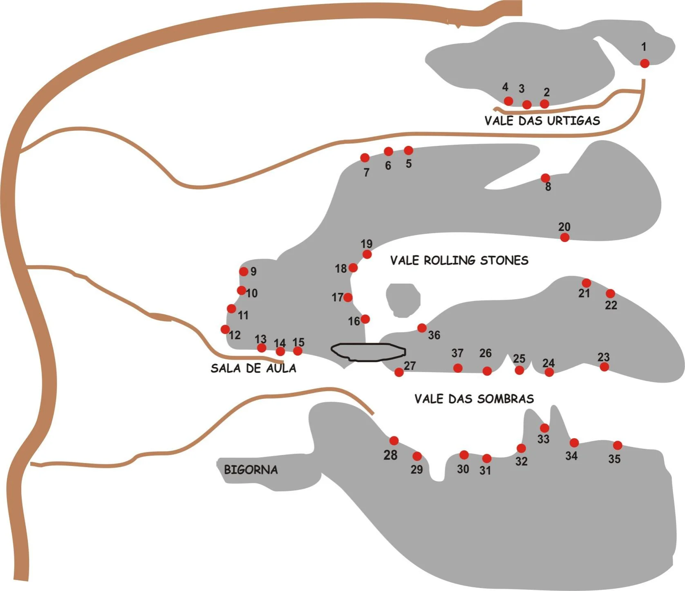

# Croqui: Bigorna ou Lapa da Zumba

## Informações Gerais

- **id**: br_mg_santa_luzia_bigorna_ou_lapa_da_zumba
- **nome**: Bigorna ou Lapa da Zumba
- **uid**: 30AuN5IZUCqoSX
- **caminho_thumbnail**: 
- **ultima_migracao**: 5
- **botoes**: []

## Parte: setor_bigorna_ou_lapa_da_zumba

### Setor (Pico: Santa Luzia)

- **descricao**: 
- **nome**: Setor Bigorna ou Lapa da Zumba
- **uid**: 0e5JJodO43rA4q
- **caminho_imagem_capa**: 
- **escaladas**:
  - **[0]**:
    - **uid**: njU3YfjpN9Bn16
    - **via_esportiva**:
      - **nome**: Xeque Mate
      - **dificuldade**: BR_6_BARRA_6SUP
  - **[1]**:
    - **uid**: OieNeFY6FhkDg5
    - **via_esportiva**:
      - **nome**: Caminho das Formigas
      - **dificuldade**: BR_5
  - **[2]**:
    - **uid**: dkkjbbEw0f4167
    - **via_esportiva**:
      - **nome**: Camelos Hidrofóbicos
      - **dificuldade**: BR_4
  - **[3]**:
    - **uid**: xxzURwWfKLxb4M
    - **via_esportiva**:
      - **nome**: Urtigas Assassinas
      - **dificuldade**: BR_4
  - **[4]**:
    - **uid**: oDqkkCuyEbxjfT
    - **via_esportiva**:
      - **nome**: Só as Cachorras
      - **dificuldade**: BR_7B
  - **[5]**:
    - **uid**: usyVcA5pgx0iyA
    - **via_esportiva**:
      - **nome**: Lança Chamas
      - **dificuldade**: BR_8A
  - **[6]**:
    - **uid**: QpfslWknndTsgs
    - **via_esportiva**:
      - **nome**: Ataque das Cachorras
      - **dificuldade**: BR_6SUP
  - **[7]**:
    - **uid**: CZW6AgsVVKDOhx
    - **via_esportiva**:
      - **nome**: Wilham Thor
      - **dificuldade**: BR_6
  - **[8]**:
    - **uid**: YnaCGA72r24J34
    - **via_esportiva**:
      - **nome**: Linha do Tempo
      - **dificuldade**: BR_7A
  - **[9]**:
    - **uid**: 17egT9OVKzxHLG
    - **via_esportiva**:
      - **nome**: Ilusão de Ótica
      - **dificuldade**: BR_6SUP
  - **[10]**:
    - **uid**: HR1PS6xwiHBF6C
    - **via_movel**:
      - **nome**: Fendazinha
      - **dificuldade**: BR_7A
  - **[11]**:
    - **uid**: n1FbAiIho7PZVU
    - **via_esportiva**:
      - **nome**: Complicada e Perfeitinha
      - **dificuldade**: BR_7A
  - **[12]**:
    - **uid**: yIps6sLF7ZJXji
    - **via_esportiva**:
      - **nome**: Cabana do Pai Tomaz
      - **dificuldade**: BR_6
  - **[13]**:
    - **uid**: eiN2xtfw3l0aZp
    - **via_esportiva**:
      - **nome**: Davi e Golias
      - **dificuldade**: BR_5
  - **[14]**:
    - **uid**: lhWnqvv02BHpRg
    - **via_esportiva**:
      - **nome**: De Olho no Buraco
      - **dificuldade**: BR_5
  - **[15]**:
    - **uid**: FaBUfjPugIi7q2
    - **via_esportiva**:
      - **nome**: Meu Casamento é um Perrengue
      - **dificuldade**: BR_7A
  - **[16]**:
    - **uid**: wLLtAGZNYp4owT
    - **via_esportiva**:
      - **nome**: Canaleta Mãe Diná
      - **dificuldade**: BR_6
  - **[17]**:
    - **uid**: fBXd55MQtdwHPM
    - **via_movel**:
      - **nome**: Só o Zói
      - **dificuldade**: BR_4
  - **[18]**:
    - **uid**: f2ovtdoB1rHJ8H
    - **via_esportiva**:
      - **nome**: O Susto
      - **dificuldade**: BR_7A
  - **[19]**:
    - **uid**: dWl2adIoYi2fb1
    - **via_esportiva**:
      - **nome**: Tortuosa Sempre
      - **dificuldade**: BR_7A
  - **[20]**:
    - **uid**: 0eyRtNbHvctnvx
    - **via_esportiva**:
      - **nome**: Tensão do Cliff
      - **dificuldade**: BR_6SUP
  - **[21]**:
    - **uid**: 6Z6uONxsrrF7pI
    - **via_esportiva**:
      - **nome**: Tira o Pé Daí
      - **dificuldade**: BR_7A
  - **[22]**:
    - **uid**: ARY5GHcDyHGXlD
    - **via_esportiva**:
      - **nome**: A Procura de Pai Mei
      - **dificuldade**: BR_6SUP
  - **[23]**:
    - **uid**: Ak2PumqxEaTfZE
    - **via_esportiva**:
      - **nome**: Encontro com Pai Mei
      - **dificuldade**: BR_6
  - **[24]**:
    - **uid**: aS1BJrhqthzx7x
    - **via_movel**:
      - **nome**: Movimentos Fluidos
      - **dificuldade**: BR_5SUP
  - **[25]**:
    - **uid**: 7eehvBP4QUgQcQ
    - **via_movel**:
      - **nome**: Lechimeiafobia
      - **dificuldade**: BR_5
  - **[26]**:
    - **uid**: xDM5MMidcPfAig
    - **via_esportiva**:
      - **nome**: Taxidermia Hipofágica
      - **dificuldade**: BR_6
  - **[27]**:
    - **uid**: RbK22SSeuv3vhJ
    - **via_esportiva**:
      - **nome**: Amarra a Gaia
      - **dificuldade**: BR_5SUP
  - **[28]**:
    - **uid**: TS6DfP6kxAefbD
    - **via_esportiva**:
      - **nome**: Disova Bernéstica
      - **dificuldade**: BR_5SUP
  - **[29]**:
    - **uid**: JOjcCDcs3Me7X1
    - **via_esportiva**:
      - **nome**: Diga não ao Braz
      - **dificuldade**: BR_5
  - **[30]**:
    - **uid**: K0iAe8tmgkGNaf
    - **via_esportiva**:
      - **nome**: 21 Tec Tec
      - **dificuldade**: BR_5
  - **[31]**:
    - **uid**: IKMjffVikI67FI
    - **via_esportiva**:
      - **nome**: Kill Bill
      - **dificuldade**: BR_6SUP
  - **[32]**:
    - **uid**: 0qoZhhAVuuVma8
    - **via_esportiva**:
      - **nome**: É Assim que se Faz
      - **dificuldade**: BR_5
  - **[33]**:
    - **uid**: l4DKJ78AvKUyzm
    - **via_esportiva**:
      - **nome**: Despedida de um Amigo
      - **dificuldade**: BR_6_BARRA_6SUP
  - **[34]**:
    - **uid**: 5DjUql4JJdVxq9
    - **via_esportiva**:
      - **nome**: Tricam é o Cara
      - **dificuldade**: BR_7A
  - **[35]**:
    - **uid**: F0JhPjJ1PPLsEa
    - **via_esportiva**:
      - **nome**: Não Puxa Não
      - **dificuldade**: BR_5
  - **[36]**:
    - **uid**: iq18pu1OI70n0h
    - **via_movel**:
      - **nome**: HellBoy
      - **dificuldade**: BR_6_BARRA_6SUP
- **mapas**:
  - **[0]**:
    - **caminho_imagem_mapa**: 
    - **referencias**:
      - **[0]**:
        - **alvo_uid**: njU3YfjpN9Bn16
        - **pontos_uids**:
          - 1
        - **escalada**: Xeque Mate
        - **ids**:
          - 1
      - **[1]**:
        - **alvo_uid**: OieNeFY6FhkDg5
        - **pontos_uids**:
          - 2
        - **escalada**: Caminho das Formigas
        - **ids**:
          - 2
      - **[2]**:
        - **alvo_uid**: dkkjbbEw0f4167
        - **pontos_uids**:
          - 3
        - **escalada**: Camelos Hidrofóbicos
        - **ids**:
          - 3
      - **[3]**:
        - **alvo_uid**: xxzURwWfKLxb4M
        - **pontos_uids**:
          - 4
        - **escalada**: Urtigas Assassinas
        - **ids**:
          - 4
      - **[4]**:
        - **alvo_uid**: oDqkkCuyEbxjfT
        - **pontos_uids**:
          - 5
        - **escalada**: Só as Cachorras
        - **ids**:
          - 5
      - **[5]**:
        - **alvo_uid**: usyVcA5pgx0iyA
        - **pontos_uids**:
          - 6
        - **escalada**: Lança Chamas
        - **ids**:
          - 6
      - **[6]**:
        - **alvo_uid**: QpfslWknndTsgs
        - **pontos_uids**:
          - 7
        - **escalada**: Ataque das Cachorras
        - **ids**:
          - 7
      - **[7]**:
        - **alvo_uid**: CZW6AgsVVKDOhx
        - **pontos_uids**:
          - 8
        - **escalada**: Wilham Thor
        - **ids**:
          - 8
      - **[8]**:
        - **alvo_uid**: YnaCGA72r24J34
        - **pontos_uids**:
          - 9
        - **escalada**: Linha do Tempo
        - **ids**:
          - 9
      - **[9]**:
        - **alvo_uid**: 17egT9OVKzxHLG
        - **pontos_uids**:
          - 10
        - **escalada**: Ilusão de Ótica
        - **ids**:
          - 10
      - **[10]**:
        - **alvo_uid**: HR1PS6xwiHBF6C
        - **pontos_uids**:
          - 11
        - **escalada**: Fendazinha
        - **ids**:
          - 11
      - **[11]**:
        - **alvo_uid**: n1FbAiIho7PZVU
        - **pontos_uids**:
          - 12
        - **escalada**: Complicada e Perfeitinha
        - **ids**:
          - 12
      - **[12]**:
        - **alvo_uid**: yIps6sLF7ZJXji
        - **pontos_uids**:
          - 13
        - **escalada**: Cabana do Pai Tomaz
        - **ids**:
          - 13
      - **[13]**:
        - **alvo_uid**: eiN2xtfw3l0aZp
        - **pontos_uids**:
          - 14
        - **escalada**: Davi e Golias
        - **ids**:
          - 14
      - **[14]**:
        - **alvo_uid**: lhWnqvv02BHpRg
        - **pontos_uids**:
          - 15
        - **escalada**: De Olho no Buraco
        - **ids**:
          - 15
      - **[15]**:
        - **alvo_uid**: FaBUfjPugIi7q2
        - **pontos_uids**:
          - 16
        - **escalada**: Meu Casamento é um Perrengue
        - **ids**:
          - 16
      - **[16]**:
        - **alvo_uid**: wLLtAGZNYp4owT
        - **pontos_uids**:
          - 17
        - **escalada**: Canaleta Mãe Diná
        - **ids**:
          - 17
      - **[17]**:
        - **alvo_uid**: fBXd55MQtdwHPM
        - **pontos_uids**:
          - 18
        - **escalada**: Só o Zói
        - **ids**:
          - 18
      - **[18]**:
        - **alvo_uid**: f2ovtdoB1rHJ8H
        - **pontos_uids**:
          - 19
        - **escalada**: O Susto
        - **ids**:
          - 19
      - **[19]**:
        - **alvo_uid**: dWl2adIoYi2fb1
        - **pontos_uids**:
          - 20
        - **escalada**: Tortuosa Sempre
        - **ids**:
          - 20
      - **[20]**:
        - **alvo_uid**: 0eyRtNbHvctnvx
        - **pontos_uids**:
          - 21
        - **escalada**: Tensão do Cliff
        - **ids**:
          - 21
      - **[21]**:
        - **alvo_uid**: 6Z6uONxsrrF7pI
        - **pontos_uids**:
          - 22
        - **escalada**: Tira o Pé Daí
        - **ids**:
          - 22
      - **[22]**:
        - **alvo_uid**: ARY5GHcDyHGXlD
        - **pontos_uids**:
          - 23
        - **escalada**: A Procura de Pai Mei
        - **ids**:
          - 23
      - **[23]**:
        - **alvo_uid**: Ak2PumqxEaTfZE
        - **pontos_uids**:
          - 24
        - **escalada**: Encontro com Pai Mei
        - **ids**:
          - 24
      - **[24]**:
        - **alvo_uid**: aS1BJrhqthzx7x
        - **pontos_uids**:
          - 25
        - **escalada**: Movimentos Fluidos
        - **ids**:
          - 25
      - **[25]**:
        - **alvo_uid**: 7eehvBP4QUgQcQ
        - **pontos_uids**:
          - 26
        - **escalada**: Lechimeiafobia
        - **ids**:
          - 26
      - **[26]**:
        - **alvo_uid**: xDM5MMidcPfAig
        - **pontos_uids**:
          - 27
        - **escalada**: Taxidermia Hipofágica
        - **ids**:
          - 27
      - **[27]**:
        - **alvo_uid**: RbK22SSeuv3vhJ
        - **pontos_uids**:
          - 28
        - **escalada**: Amarra a Gaia
        - **ids**:
          - 28
      - **[28]**:
        - **alvo_uid**: TS6DfP6kxAefbD
        - **pontos_uids**:
          - 29
        - **escalada**: Disova Bernéstica
        - **ids**:
          - 29
      - **[29]**:
        - **alvo_uid**: JOjcCDcs3Me7X1
        - **pontos_uids**:
          - 30
        - **escalada**: Diga não ao Braz
        - **ids**:
          - 30
      - **[30]**:
        - **alvo_uid**: K0iAe8tmgkGNaf
        - **pontos_uids**:
          - 31
        - **escalada**: 21 Tec Tec
        - **ids**:
          - 31
      - **[31]**:
        - **alvo_uid**: IKMjffVikI67FI
        - **pontos_uids**:
          - 32
        - **escalada**: Kill Bill
        - **ids**:
          - 32
      - **[32]**:
        - **alvo_uid**: 0qoZhhAVuuVma8
        - **pontos_uids**:
          - 33
        - **escalada**: É Assim que se Faz
        - **ids**:
          - 33
      - **[33]**:
        - **alvo_uid**: l4DKJ78AvKUyzm
        - **pontos_uids**:
          - 34
        - **escalada**: Despedida de um Amigo
        - **ids**:
          - 34
      - **[34]**:
        - **alvo_uid**: 5DjUql4JJdVxq9
        - **pontos_uids**:
          - 35
        - **escalada**: Tricam é o Cara
        - **ids**:
          - 35
      - **[35]**:
        - **alvo_uid**: F0JhPjJ1PPLsEa
        - **pontos_uids**:
          - 36
        - **escalada**: Não Puxa Não
        - **ids**:
          - 36
      - **[36]**:
        - **alvo_uid**: iq18pu1OI70n0h
        - **pontos_uids**:
          - 37
        - **escalada**: HellBoy
        - **ids**:
          - 37
    - **largura_mapa**: 1676
    - **altura_mapa**: 1446
- **precomputados**:
  - **total_escaladas**: 37
  - **total_esportivas**: 32

## Arquivos Externos

- **arquivos_externos**:
  - **[0]**:
    - **caminho**: 
    - **checksum_sha256**: 87d9ec8e12cd74357c545d4a29cd5b778cc1304d8739f78bdd552befbe2aa59c
  - **[1]**:
    - **caminho**: 
    - **checksum_sha256**: cc35d6c35b588f9013d84b902173f2e2e6473f6f651eb851fd124f2fe361b670

