# Croqui: Morro do Carrapato - Setor Covide

## Informações Gerais

- **id**: br_mg_santa_luzia_morro_do_carrapato_setor_covide
- **nome**: Morro do Carrapato - Setor Covide
- **creditos**:
  - Rubens Weil
- **caminho_thumbnail**: 
- **ultima_migracao**: 4
- **botoes**:
  - **[0]**:
    - **texto**: Capa
    - **destino**:
      - **secao_textual**:
        - **conteudo**:
            # Guia de escalada MORRO DO CARRAPATO
            
            Santa Luzia, Minas Gerais, Brasil
            
            BETA - V1.0
            
            |  |
            | :--: |
            | *Capa* |
  - **[1]**:
    - **texto**: Introdução
    - **destino**:
      - **secao_textual**:
        - **conteudo**:
            # Nota do editor
            
            Foi em uma conversa despretenciosa com o Fábio Rocha na noite Social do Centro Excurcionista Mineiro - CEM, no início de 2024, que surgiu o nome “Morro do Carrapato”. De repente então, uma oportunidade de ter uma rocha perto de casa, em Santa Luzia, surgiu. A informação dele era de ter ido há muito tempo atrás e não saber mais o estado em que o local se encontrava. Chegando em casa, visitei o Google Earth, que me fez recordar da existência de uma pista de mountain bike na região - o XCO Frimisa.
            
            As coisas então foram ficando mais fáceis. Contatei um amigo da bike, o Fredinho, que me passou o contato de um amigo que possivelmente saberia mais informações sobre as rochas de lá, o Alessandro. Entrando em contato, este já me enviou a lista que tinha das vias e encheu meus olhos com os 7b, 7c e por ai vai (não que eu faça esse tipo de grau), mas já pensei que poderiam render boas imagens.
            
            Restava dar uma explorada pessoalmente. Peguei a bike um dia, sol rachando, subi a Estrada das Maravilhas e desci pela trilha do XCO. Ao final dela, encontrei o setor Pedreira. Por motivos maiores tive de voltar naquele dia, e os demais setores, foram explorados posteriormente em uma visita a pé. A cada metro de rocha do setor Covide existe uma via aberta. Fantástico! Uma escola com todos os graus! Ainda precisava de uma limpeza, que foi executada com uma prancheta que abri no CEM e tive a grande ajuda do Fábio, da Thays e do Allysson, aos quais os devo muito por comprarem essa ideia. Obrigado!
            
            Estava reativada a escalada no Morro do Carrapato, ainda com muito a se fazer, incluindo esse guia.
            
            **Rubens Weil**
            
            Instagram: [@morrodocarrapato](https://www.instagram.com/morrodocarrapato)
            
            ## Organização
            
            | 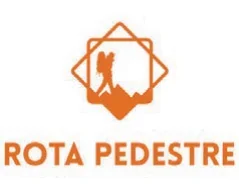 |
            | :--: |
            | *Rota Pedestre* |
            
            |  |
            | :--: |
            | *Conto - coletivo de fotografia documental* |
            
            ## Apoio
            
            |  |
            | :--: |
            | *Centro Excursionista Mineiro - CEM* |
            
            Centro Excursionista Mineiro - CEM (montanhismo consciente)
            
            ## Agradecimentos
            
            - Fábio Rocha
            - Fred Salles
            - Alessandro Babado
            - Thays Costa
            - Allysson Gudu
            - Márcio Macena
            - Igor Baldo
  - **[2]**:
    - **texto**: Acesso
    - **destino**:
      - **secao_textual**:
        - **conteudo**:
            # Mapa de localização
            
            O Morro do Carrapato localiza-se à oeste do bairro Frimisa, na cidade de Santa Luzia, MG. É uma área atualmente administrada pela CODEMGE com mais de 2.166.200m2 (CODEMGE, 2021, p.44). O local também abriga a pista de mountain bike do XCO Frimisa, trilha para caminhada e corrida e cruzeiro religioso.
            
            ## Acesso
            
            O acesso é feito pela rua JX com a rua LX, no bairro Frimisa. Inicie a caminhada subindo sentido caixa d’água da COPASA e ao chegar siga descendo à direita. Passe pela porteira (fechando-a novamente) e estará no Setor Pedreira. A trilha para os demais segue pela direita da rocha, com cerca de 560 metros para a entrada do setor Micuim e mais 130 metros para o Setor Covide.
            
            ### Coordenadas
            
            - **Estacionamento:** -19.75842, -43.88511 @ 733m
            - **Setor Pedreira:** -19.75931, -43.88650 @ 770m
            - **Setor Micuim:** -19.75634, -43.88883 @ 769m
            - **Setor Covide:** -19.75548, -43.88961 @ 766m
            
            |  |
            | :--: |
            | *Mapa de localização do Morro do Carrapato* |
  - **[3]**:
    - **texto**: Referências
    - **destino**:
      - **secao_textual**:
        - **conteudo**:
            # Referências
            
            FEMEMG. Guia de elaboração de croquis - Federação de Montanhismo e Escalada do Estado de Minas Gerais (FEMEMG). – 1. ed. – Nova Lima, MG : Ed. dos Autores, 2022.
            
            PETER, Denis Renner. Design da Informação centrado no usuário: uma proposta de representação das variáveis informacionais nos croquis e na catalogação de vias de escalada tradicional. 2019. Dissertação (Mestrado em Design) - Universidade Federal de Pernambuco, Recife, 2019.
            
            TAYLOR, J. (2006). Mapping adventure: a historical geography of Yosemite Valley climbing landscapes. Journal of Historical Geography, 32(1), 190–219. doi:10.1016/j.jhg.2004.09.002
            
            CODEMGE. Teaser de Ativos Imobiliários - Terrenos. 2021. http://www.codemge.com.br/wp-content/uploads/2021/11/teaser-ativos-imobiliarios-terrenos-v4.pdf. Acesso em 17/04/2024.
            
            ---
            
            Guia de escalada - Morro do Carrapato  
            Produção Rota Pedestre  
            Rubens Weil  
            1ª edição - 2024
- **revisado_manualmente**: True
- **revisado_bounding_circle**: True
- **status_desenho_extraivel**: DESENHO_EXTRAIDO
- **publicar_croqui**: True

## Parte: setor_covide_ala_aderencia

### Setor (Pico: Morro do Carrapato)

- **descricao**: # Setor Covide (ala aderência)
- **nome**: Setor Covide (ala aderência)
- **localizacao_estacionamento**:
  - **latitude**: -197584200
  - **longitude**: -438851100
- **localizacao_escalada**:
  - **latitude**: -197554800
  - **longitude**: -438896100
- **mapas**:
  - **[0]**:
    - **caminho_imagem_mapa**: 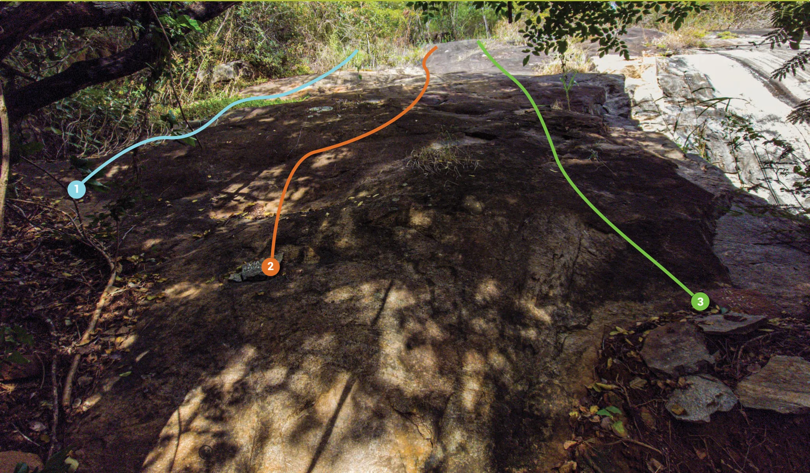
    - **largura_mapa**: 2067
    - **altura_mapa**: 1209
    - **pontos_de_interesse**:
      - **[0]**:
        - **id**: 1
        - **label**: 1
        - **circulo**:
          - **x**: 196
          - **y**: 484
          - **raio**: 23
      - **[1]**:
        - **id**: 2
        - **label**: 2
        - **circulo**:
          - **x**: 690
          - **y**: 682
          - **raio**: 23
      - **[2]**:
        - **id**: 3
        - **label**: 3
        - **circulo**:
          - **x**: 1787
          - **y**: 771
          - **raio**: 23
        - **cor**: 
    - **referencias**:
      - **[0]**:
        - **escalada**: Butantana
        - **ids**:
          - 1
      - **[1]**:
        - **escalada**: Convite 19
        - **ids**:
          - 2
      - **[2]**:
        - **ids**:
          - 3
        - **setor**: Setor Covide (ala aderência)
        - **escalada**: Astracênica
- **escaladas**:
  - **[0]**:
    - **via_esportiva**:
      - **descricao**:
          **Equipamentos:**
          - 1x Corda 60m
          - 5x costuras curtas
          - 1x parada dupla montada
      - **nome**: Butantana
      - **dificuldade**: BR_3
      - **extensao**: 30
      - **quantidade_protecoes_intermediarias**: 5
      - **quantidade_protecoes_parada**: 2
      - **conquistadores**:
        - Ana
        - Márcio Macena
    - **mapas**:
      - **[0]**:
        - **caminho_imagem_mapa**: 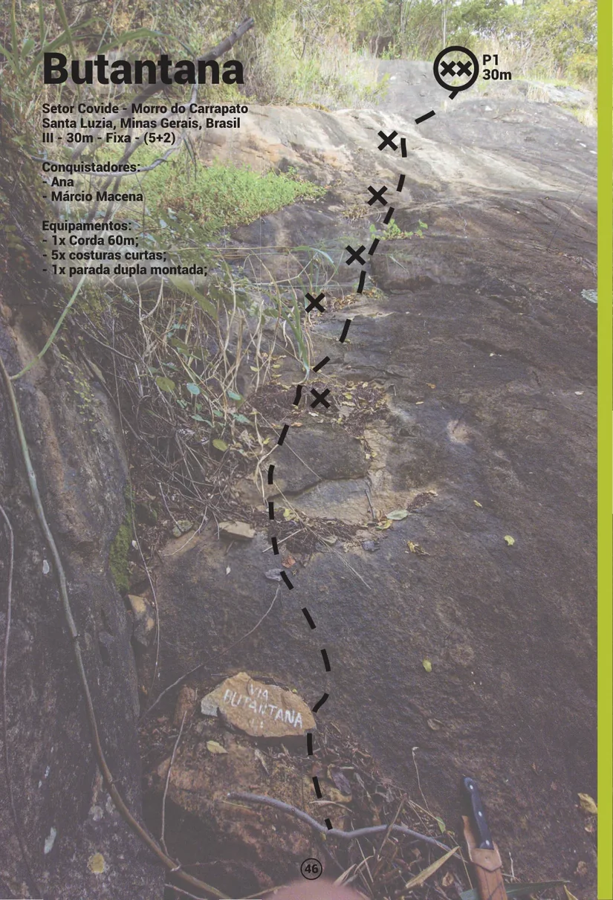
        - **largura_mapa**: 825
        - **altura_mapa**: 1211
  - **[1]**:
    - **via_esportiva**:
      - **descricao**:
          **Equipamentos:**
          - 1x Corda 60m
          - 5x costuras curtas
          - 1x parada dupla montada
          
          **Observações:**
          - Está com uma parada simples. Recomendamos assim, utilizar a parada à direita - da Astracênica.
      - **nome**: Convite 19
      - **dificuldade**: BR_4
      - **extensao**: 27
      - **quantidade_protecoes_intermediarias**: 5
      - **quantidade_protecoes_parada**: 1
      - **conquistadores**:
        - Alessandro Babado
        - Márcio Macena
    - **mapas**:
      - **[0]**:
        - **caminho_imagem_mapa**: 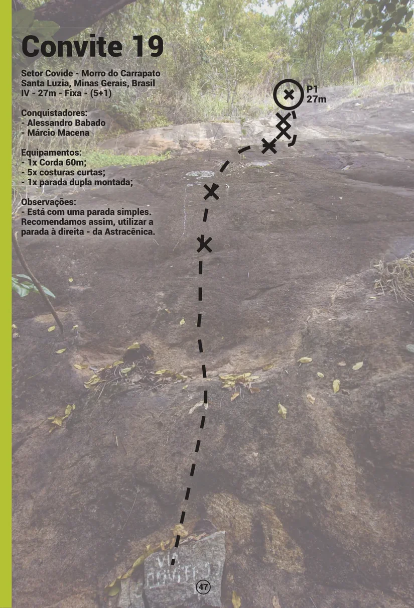
        - **largura_mapa**: 825
        - **altura_mapa**: 1211
  - **[2]**:
    - **via_esportiva**:
      - **descricao**:
          **Equipamentos:**
          - 1x Corda 60m
          - 6x costuras curtas
          - 1x parada dupla montada
      - **nome**: Astracênica
      - **dificuldade**: BR_4
      - **extensao**: 27
      - **quantidade_protecoes_intermediarias**: 6
      - **quantidade_protecoes_parada**: 2
      - **conquistadores**:
        - Alessandro Babado
        - Márcio Macena
    - **mapas**:
      - **[0]**:
        - **caminho_imagem_mapa**: 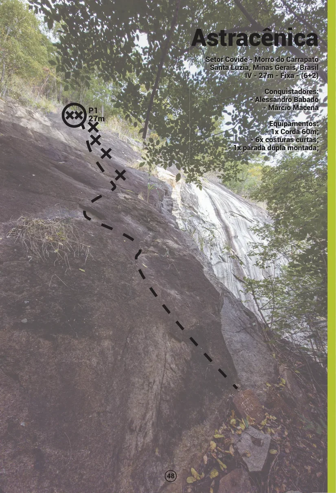
        - **largura_mapa**: 825
        - **altura_mapa**: 1211
- **precomputados**:
  - **total_escaladas**: 3
  - **total_esportivas**: 3

## Parte: setor_covide_ala_esquerda

### Setor (Pico: Morro do Carrapato)

- **descricao**:
    # Setor Covide (ala esquerda)
    
    | Nº | Nome da via | P1 |
    |---|---|---|
    | 4 | Coronavaco | IV (1+2) |
    | 5 | Exclusão social | V (3+2) |
    | 6 | Expunick | Vsup (5+2) |
    | 7 | Y de Covide | VIsup (5+2) |
    | 8 | Vitiligovide | VIIb (5+2) |
    | 9 | Fayserchover | VIIIb (6+2) |
    | 10 | Covid com C maiúsculo | VIIIc (6+2) |
    | 11 | Omicon Ônibus | VIIc (7+2) |
    | 12 | Omicon Ôndas | VIIIa (6+2) |
    | 13 | Aracnocovide | VIIc (6+2) |
- **nome**: Setor Covide (ala esquerda)
- **localizacao_estacionamento**:
  - **latitude**: -197584200
  - **longitude**: -438851100
- **localizacao_escalada**:
  - **latitude**: -197554800
  - **longitude**: -438896100
- **mapas**:
  - **[0]**:
    - **caminho_imagem_mapa**: 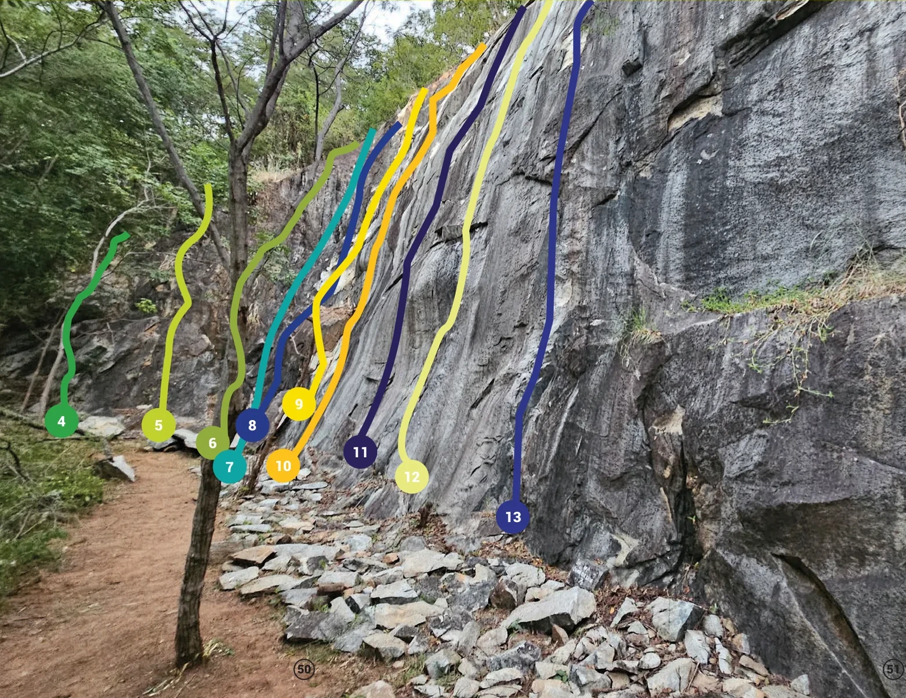
    - **largura_mapa**: 1562
    - **altura_mapa**: 1203
    - **pontos_de_interesse**:
      - **[0]**:
        - **id**: 4
        - **label**: 4
        - **circulo**:
          - **x**: 106
          - **y**: 725
          - **raio**: 29
      - **[1]**:
        - **id**: 5
        - **label**: 5
        - **circulo**:
          - **x**: 273
          - **y**: 733
          - **raio**: 29
      - **[2]**:
        - **id**: 6
        - **label**: 6
        - **circulo**:
          - **x**: 368
          - **y**: 763
          - **raio**: 29
      - **[3]**:
        - **id**: 7
        - **label**: 7
        - **circulo**:
          - **x**: 397
          - **y**: 803
          - **raio**: 29
      - **[4]**:
        - **id**: 8
        - **label**: 8
        - **circulo**:
          - **x**: 436
          - **y**: 733
          - **raio**: 29
      - **[5]**:
        - **id**: 9
        - **label**: 9
        - **circulo**:
          - **x**: 516
          - **y**: 696
          - **raio**: 29
      - **[6]**:
        - **id**: 10
        - **label**: 10
        - **circulo**:
          - **x**: 487
          - **y**: 803
          - **raio**: 29
      - **[7]**:
        - **id**: 11
        - **label**: 11
        - **circulo**:
          - **x**: 621
          - **y**: 779
          - **raio**: 29
      - **[8]**:
        - **id**: 12
        - **label**: 12
        - **circulo**:
          - **x**: 710
          - **y**: 821
          - **raio**: 29
      - **[9]**:
        - **id**: 13
        - **label**: 13
        - **circulo**:
          - **x**: 883
          - **y**: 891
          - **raio**: 29
    - **referencias**:
      - **[0]**:
        - **escalada**: Coronavaco
        - **ids**:
          - 4
      - **[1]**:
        - **escalada**: Exclusão social
        - **ids**:
          - 5
      - **[2]**:
        - **escalada**: Exputinick
        - **ids**:
          - 6
      - **[3]**:
        - **escalada**: Y de Covide
        - **ids**:
          - 7
      - **[4]**:
        - **escalada**: Vitiligovide
        - **ids**:
          - 8
      - **[5]**:
        - **escalada**: Fayserchover
        - **ids**:
          - 9
      - **[6]**:
        - **escalada**: Covid com C maiúsculo
        - **ids**:
          - 10
      - **[7]**:
        - **escalada**: Ômicronibus
        - **ids**:
          - 11
      - **[8]**:
        - **escalada**: Ômicron ondas
        - **ids**:
          - 12
      - **[9]**:
        - **escalada**: Aracnocovid
        - **ids**:
          - 13
- **escaladas**:
  - **[0]**:
    - **via_esportiva**:
      - **descricao**:
          **Equipamentos:**
          - 1x Corda 20m
          - 1x costura curta
          - 1x parada dupla montada
          
          **Observações:**
          - Esta via pode ser utilizada em conjunto com a Astracênica, com proteções na quina da rocha.
      - **nome**: Coronavaco
      - **dificuldade**: BR_4
      - **extensao**: 8
      - **quantidade_protecoes_intermediarias**: 1
      - **quantidade_protecoes_parada**: 2
      - **conquistadores**:
        - Márcio Macena
        - Helder Coelho
    - **mapas**:
      - **[0]**:
        - **caminho_imagem_mapa**: 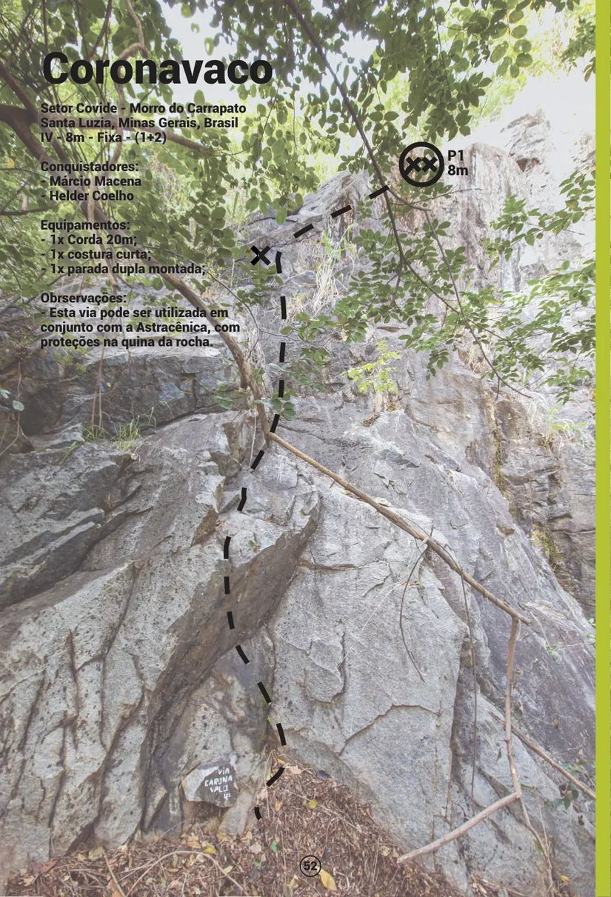
        - **largura_mapa**: 825
        - **altura_mapa**: 1211
  - **[1]**:
    - **via_esportiva**:
      - **descricao**:
          **Equipamentos:**
          - 1x Corda 20m
          - 3x costuras curtas
          - 1x parada dupla montada
      - **nome**: Exclusão social
      - **dificuldade**: BR_5
      - **extensao**: 8
      - **quantidade_protecoes_intermediarias**: 3
      - **quantidade_protecoes_parada**: 2
      - **conquistadores**:
        - Alessandro Babado
        - Márcio Macena
    - **mapas**:
      - **[0]**:
        - **caminho_imagem_mapa**: 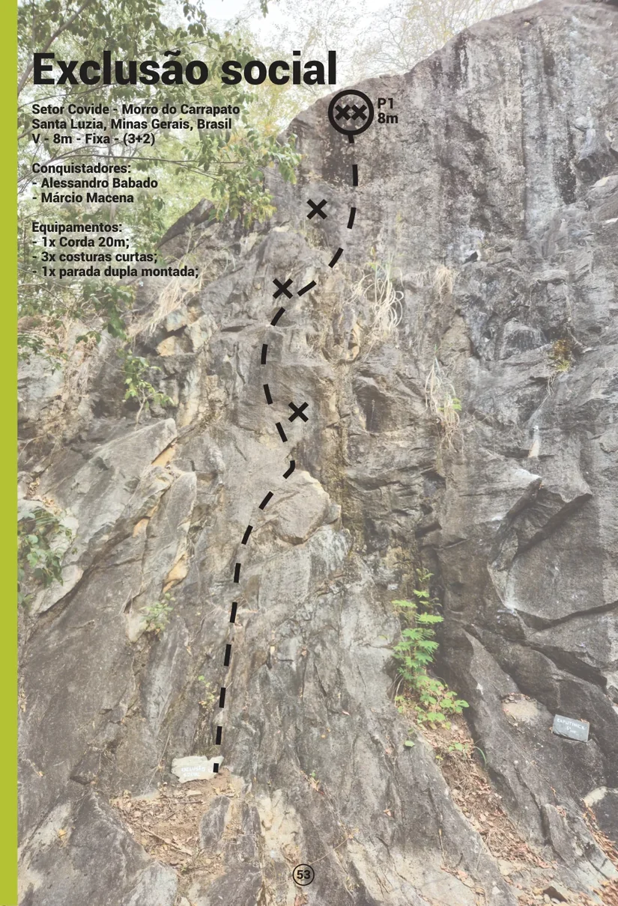
        - **largura_mapa**: 825
        - **altura_mapa**: 1211
  - **[2]**:
    - **via_esportiva**:
      - **descricao**:
          **Equipamentos:**
          - 1x Corda 30m
          - 5x costuras curtas
          - 1x parada dupla montada
          
          **Observações:**
          - Para montagem de toprope, utilize a parada da direita, evitando a quina.
      - **nome**: Exputinick
      - **dificuldade**: BR_5SUP
      - **extensao**: 10
      - **quantidade_protecoes_intermediarias**: 5
      - **quantidade_protecoes_parada**: 2
      - **conquistadores**:
        - Alessandro Babado
        - Márcio Macena
    - **mapas**:
      - **[0]**:
        - **caminho_imagem_mapa**: 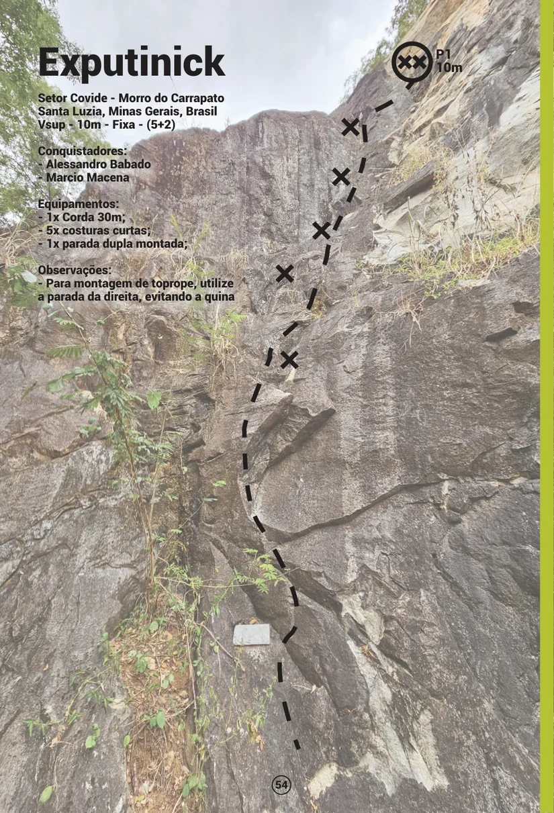
        - **largura_mapa**: 825
        - **altura_mapa**: 1211
  - **[3]**:
    - **via_esportiva**:
      - **descricao**:
          **Equipamentos:**
          - 1x Corda 30m
          - 5x costuras curtas
          - 1x parada dupla montada
      - **nome**: Y de Covide
      - **dificuldade**: BR_6SUP
      - **extensao**: 10
      - **quantidade_protecoes_intermediarias**: 5
      - **quantidade_protecoes_parada**: 2
      - **conquistadores**:
        - Márcio Macena
        - Samuel Lusane
    - **mapas**:
      - **[0]**:
        - **caminho_imagem_mapa**: 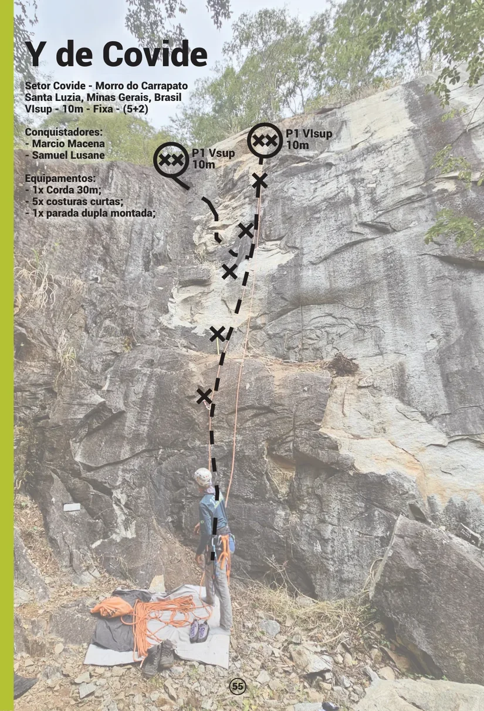
        - **largura_mapa**: 825
        - **altura_mapa**: 1211
  - **[4]**:
    - **via_esportiva**:
      - **descricao**:
          **Equipamentos:**
          - 1x Corda 30m
          - 5x costuras curtas
          - 1x parada dupla montada
      - **nome**: Vitiligovide
      - **dificuldade**: BR_7B
      - **extensao**: 10
      - **quantidade_protecoes_intermediarias**: 5
      - **quantidade_protecoes_parada**: 2
      - **conquistadores**:
        - Márcio Macena
        - Samuel Lusane
    - **mapas**:
      - **[0]**:
        - **caminho_imagem_mapa**: 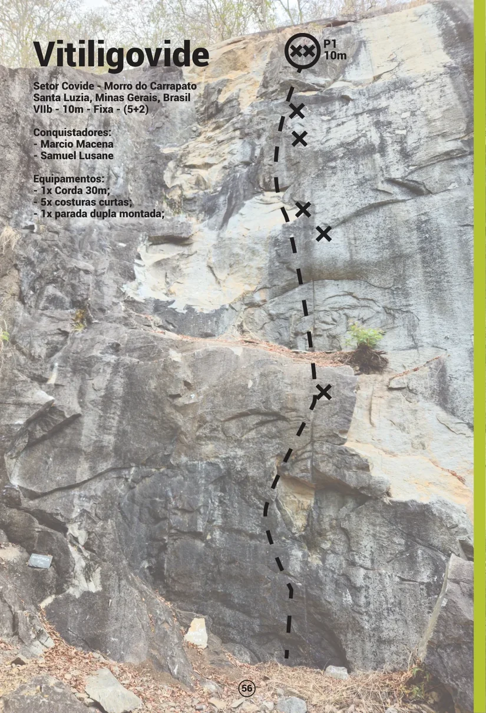
        - **largura_mapa**: 825
        - **altura_mapa**: 1211
  - **[5]**:
    - **via_esportiva**:
      - **descricao**:
          **Equipamentos:**
          - 1x Corda 30m
          - 6x costuras curtas
          - 1x parada dupla montada
      - **nome**: Fayserchover
      - **dificuldade**: BR_8B
      - **extensao**: 12
      - **quantidade_protecoes_intermediarias**: 6
      - **quantidade_protecoes_parada**: 2
      - **conquistadores**:
        - Márcio Macena
        - Samuel Lusane
    - **mapas**:
      - **[0]**:
        - **caminho_imagem_mapa**: 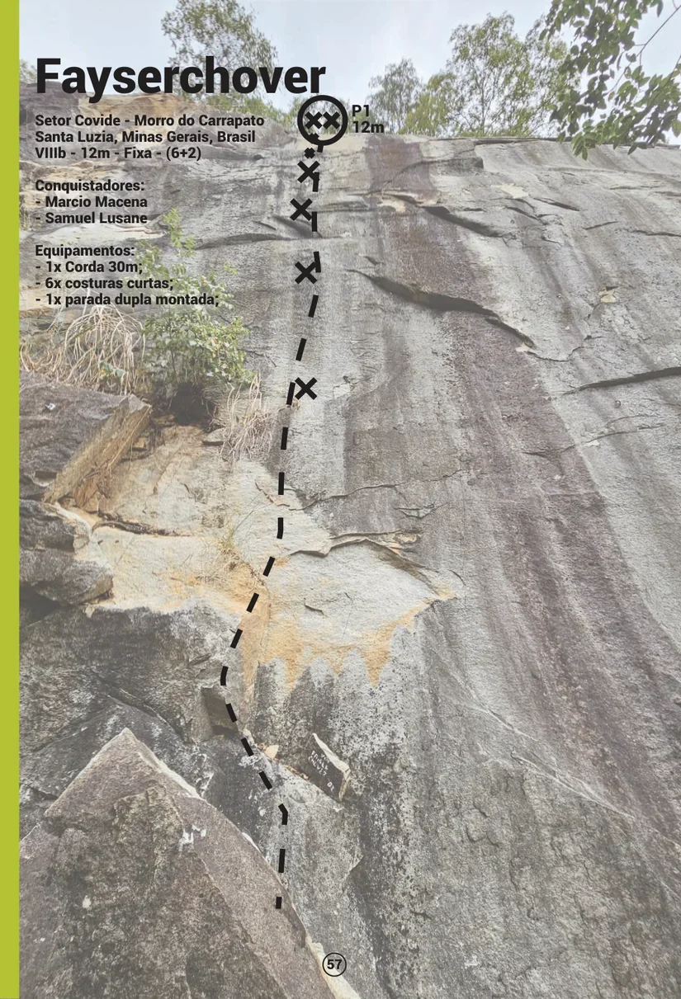
        - **largura_mapa**: 825
        - **altura_mapa**: 1211
  - **[6]**:
    - **via_esportiva**:
      - **descricao**:
          **Equipamentos:**
          - 1x Corda 40m
          - 6x costuras curtas
          - 1x parada dupla montada
          
          **Observações:**
          - Parada sem visualização ao nível do solo.
      - **nome**: Covid com C maiúsculo
      - **dificuldade**: BR_8C
      - **extensao**: 14
      - **quantidade_protecoes_intermediarias**: 6
      - **quantidade_protecoes_parada**: 2
      - **conquistadores**:
        - Márcio Macena
        - Samuel Lusane
    - **mapas**:
      - **[0]**:
        - **caminho_imagem_mapa**: 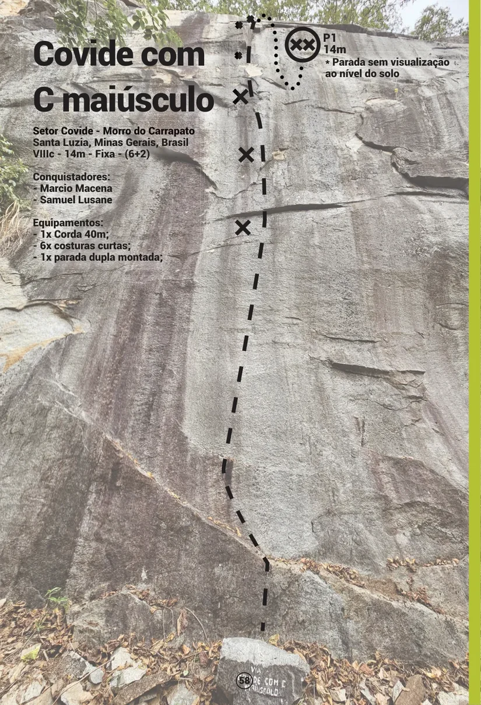
        - **largura_mapa**: 825
        - **altura_mapa**: 1211
  - **[7]**:
    - **via_esportiva**:
      - **descricao**:
          **Equipamentos:**
          - 1x Corda 40m
          - 7x costuras curtas
          - 1x parada dupla montada
          
          **Observações:**
          - Parada sem visualização ao nível do solo.
      - **nome**: Ômicronibus
      - **dificuldade**: BR_7C
      - **extensao**: 12
      - **quantidade_protecoes_intermediarias**: 7
      - **quantidade_protecoes_parada**: 2
      - **conquistadores**:
        - Márcio Macena
        - Samuel Lusane
    - **mapas**:
      - **[0]**:
        - **caminho_imagem_mapa**: 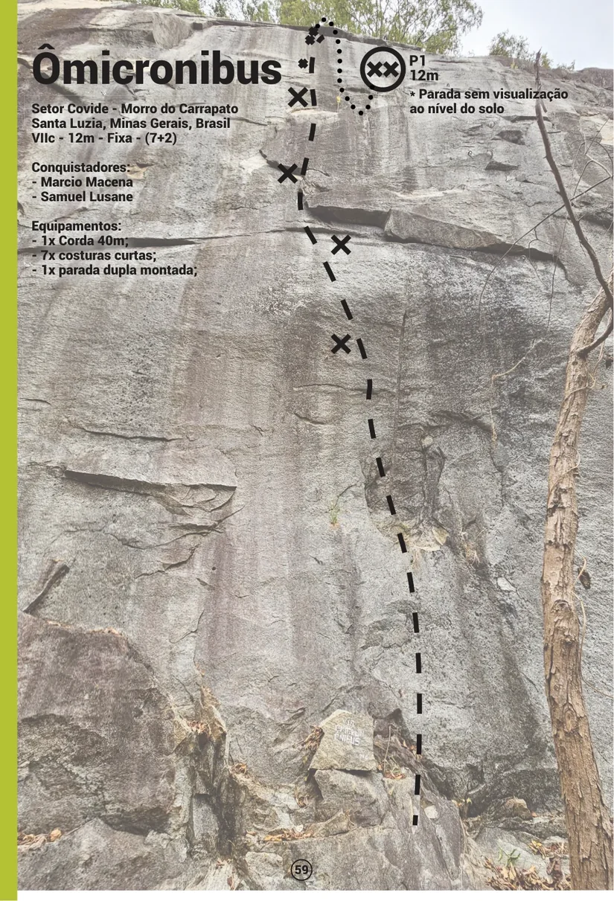
        - **largura_mapa**: 825
        - **altura_mapa**: 1211
  - **[8]**:
    - **via_esportiva**:
      - **descricao**:
          **Equipamentos:**
          - 1x Corda 40m
          - 6x costuras curtas
          - 1x parada dupla montada
      - **nome**: Ômicron ondas
      - **dificuldade**: BR_8A
      - **extensao**: 12
      - **quantidade_protecoes_intermediarias**: 6
      - **quantidade_protecoes_parada**: 2
      - **conquistadores**:
        - Márcio Macena
        - Samuel Lusane
    - **mapas**:
      - **[0]**:
        - **caminho_imagem_mapa**: 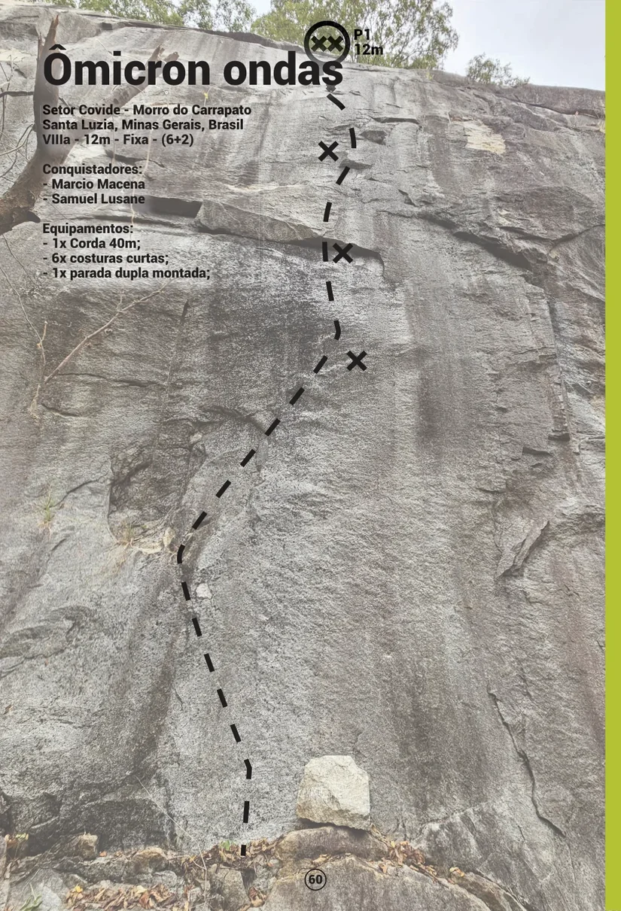
        - **largura_mapa**: 825
        - **altura_mapa**: 1211
  - **[9]**:
    - **via_esportiva**:
      - **descricao**:
          **Equipamentos:**
          - 1x Corda 40m
          - 6x costuras curtas
          - 1x parada dupla montada
      - **nome**: Aracnocovid
      - **dificuldade**: BR_7C
      - **extensao**: 12
      - **quantidade_protecoes_intermediarias**: 6
      - **quantidade_protecoes_parada**: 2
      - **conquistadores**:
        - Márcio Macena
        - Samuel Lusane
    - **mapas**:
      - **[0]**:
        - **caminho_imagem_mapa**: 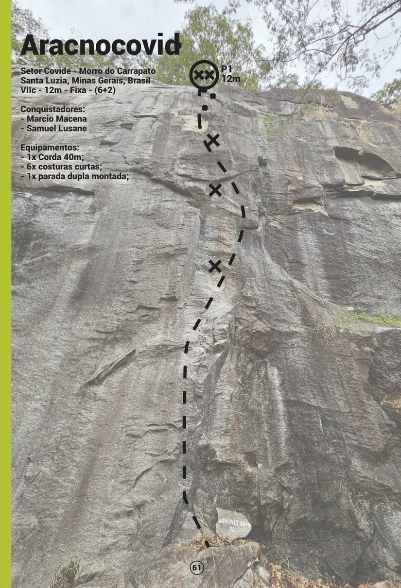
        - **largura_mapa**: 825
        - **altura_mapa**: 1211
- **precomputados**:
  - **total_escaladas**: 10
  - **total_esportivas**: 10

## Parte: setor_covide_ala_central_e_direita

### Setor (Pico: Morro do Carrapato)

- **descricao**:
    # Setor Covide (ala central e direita)
    
    | Nº | Nome da via | P1 |
    |---|---|---|
    | 14 | Cepadedos | VIIb (4+2) |
    | 15 | Cepalangos | VIIa (5+2) |
    | 16 | Cepacol | VIIb (4+2) |
    | 17 | Deltazin | VIIb (4+2) |
    | 18 | Ignorância do Deltacron | VIIb (4+2) |
    | 19 | Covidenhoca | VIIa (4+2) |
    | 20 | B1B2 | VIIc (4+2) |
    | 21 | Oxforte | VIIIa (5+2) |
    | 22 | Arco do delta | VIIa (5+2) |
    | 23 | Sequela virótica | VIIIb (4+2) |
    | 24 | Carga viral | VIIb (4+2) |
    | 25 | Sou T.I. | VIIIc (5+2) |
    | 26 | Antígeno | VIIIa (4+2) |
    | - | Marreta imune | VIIb (5+2) |
    | - | Encosto gripal | VIIb (5+2) |
    | - | Virose operária | VIIIa (5+2) |
    | - | Covidinho | VIIb (4+2) |
    | - | Covide hepática | VIIa (4+2) |
- **nome**: Setor Covide (ala central e direita)
- **localizacao_estacionamento**:
  - **latitude**: -197584200
  - **longitude**: -438851100
- **localizacao_escalada**:
  - **latitude**: -197554800
  - **longitude**: -438896100
- **mapas**:
  - **[0]**:
    - **caminho_imagem_mapa**: 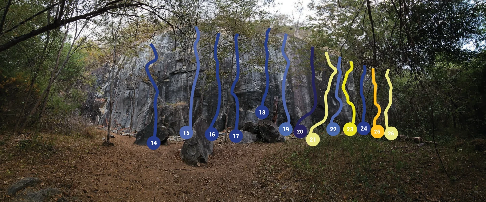
    - **largura_mapa**: 2068
    - **altura_mapa**: 862
    - **pontos_de_interesse**:
      - **[0]**:
        - **id**: 14
        - **label**: 14
        - **circulo**:
          - **x**: 654
          - **y**: 609
          - **raio**: 30
      - **[1]**:
        - **id**: 15
        - **label**: 15
        - **circulo**:
          - **x**: 793
          - **y**: 566
          - **raio**: 30
      - **[2]**:
        - **id**: 16
        - **label**: 16
        - **circulo**:
          - **x**: 901
          - **y**: 573
          - **raio**: 30
      - **[3]**:
        - **id**: 17
        - **label**: 17
        - **circulo**:
          - **x**: 1004
          - **y**: 581
          - **raio**: 30
      - **[4]**:
        - **id**: 18
        - **label**: 18
        - **circulo**:
          - **x**: 1116
          - **y**: 477
          - **raio**: 29
      - **[5]**:
        - **id**: 19
        - **label**: 19
        - **circulo**:
          - **x**: 1216
          - **y**: 550
          - **raio**: 29
      - **[6]**:
        - **id**: 20
        - **label**: 20
        - **circulo**:
          - **x**: 1280
          - **y**: 562
          - **raio**: 29
      - **[7]**:
        - **id**: 21
        - **label**: 21
        - **circulo**:
          - **x**: 1332
          - **y**: 595
          - **raio**: 29
      - **[8]**:
        - **id**: 22
        - **label**: 22
        - **circulo**:
          - **x**: 1418
          - **y**: 551
          - **raio**: 29
      - **[9]**:
        - **id**: 23
        - **label**: 23
        - **circulo**:
          - **x**: 1490
          - **y**: 552
          - **raio**: 29
      - **[10]**:
        - **id**: 24
        - **label**: 24
        - **circulo**:
          - **x**: 1548
          - **y**: 549
          - **raio**: 29
      - **[11]**:
        - **id**: 25
        - **label**: 25
        - **circulo**:
          - **x**: 1606
          - **y**: 562
          - **raio**: 29
      - **[12]**:
        - **id**: 26
        - **label**: 26
        - **circulo**:
          - **x**: 1665
          - **y**: 569
          - **raio**: 29
    - **referencias**:
      - **[0]**:
        - **escalada**: Cepadedos
        - **ids**:
          - 14
      - **[1]**:
        - **escalada**: Cepalangos
        - **ids**:
          - 15
      - **[2]**:
        - **escalada**: Cepacol
        - **ids**:
          - 16
      - **[3]**:
        - **escalada**: Deltazin
        - **ids**:
          - 17
      - **[4]**:
        - **escalada**: Ignorância do Deltacron
        - **ids**:
          - 18
      - **[5]**:
        - **escalada**: Covidenhoca
        - **ids**:
          - 19
      - **[6]**:
        - **escalada**: B1B2
        - **ids**:
          - 20
      - **[7]**:
        - **escalada**: Oxforte
        - **ids**:
          - 21
      - **[8]**:
        - **escalada**: Arco do delta
        - **ids**:
          - 22
      - **[9]**:
        - **escalada**: Sequela virótica
        - **ids**:
          - 23
      - **[10]**:
        - **escalada**: Carga viral
        - **ids**:
          - 24
      - **[11]**:
        - **escalada**: Sou T.I.
        - **ids**:
          - 25
      - **[12]**:
        - **escalada**: Antígeno
        - **ids**:
          - 26
- **escaladas**:
  - **[0]**:
    - **via_esportiva**:
      - **descricao**:
          **Equipamentos:**
          - 1x Corda 30m
          - 4x costuras curtas
          - 1x parada dupla montada
      - **nome**: Cepadedos
      - **dificuldade**: BR_7B
      - **extensao**: 10
      - **quantidade_protecoes_intermediarias**: 4
      - **quantidade_protecoes_parada**: 2
      - **conquistadores**:
        - Márcio Macena
        - Samuel Lusane
    - **mapas**:
      - **[0]**:
        - **caminho_imagem_mapa**: 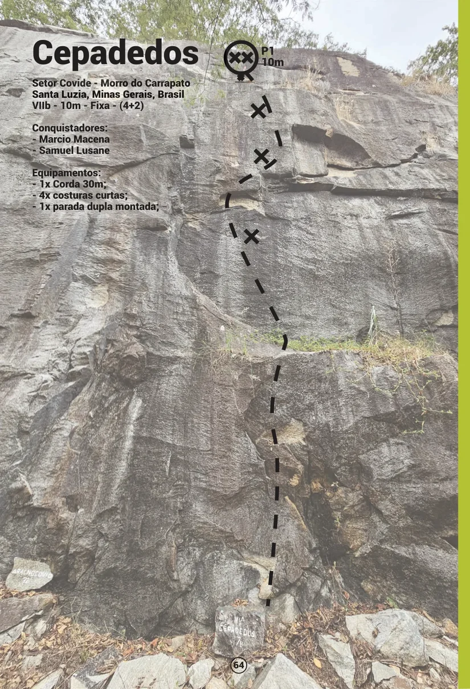
        - **largura_mapa**: 825
        - **altura_mapa**: 1211
  - **[1]**:
    - **via_esportiva**:
      - **descricao**:
          **Equipamentos:**
          - 1x Corda 30m
          - 5x costuras curtas
          - 1x parada dupla montada
          
          **Observações:**
          - Parada sem visualização ao nível do solo.
      - **nome**: Cepalangos
      - **dificuldade**: BR_7A
      - **extensao**: 12
      - **quantidade_protecoes_intermediarias**: 5
      - **quantidade_protecoes_parada**: 2
      - **conquistadores**:
        - Márcio Macena
        - Samuel Lusane
    - **mapas**:
      - **[0]**:
        - **caminho_imagem_mapa**: 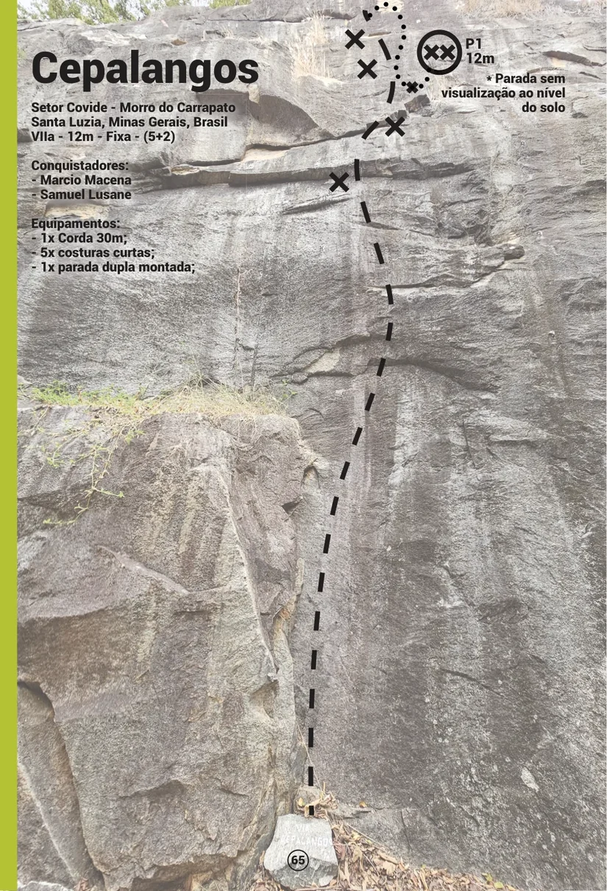
        - **largura_mapa**: 825
        - **altura_mapa**: 1211
  - **[2]**:
    - **via_esportiva**:
      - **descricao**:
          **Equipamentos:**
          - 1x Corda 30m
          - 5x costuras curtas
          - 1x parada dupla montada
      - **nome**: Cepacol
      - **dificuldade**: BR_7B
      - **extensao**: 12
      - **quantidade_protecoes_intermediarias**: 5
      - **quantidade_protecoes_parada**: 2
      - **conquistadores**:
        - Márcio Macena
        - Samuel Lusane
    - **mapas**:
      - **[0]**:
        - **caminho_imagem_mapa**: 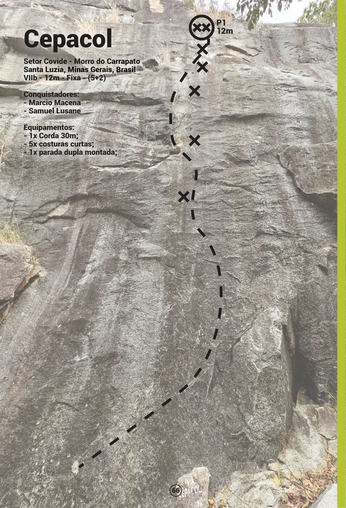
        - **largura_mapa**: 825
        - **altura_mapa**: 1211
  - **[3]**:
    - **via_esportiva**:
      - **descricao**:
          **Equipamentos:**
          - 1x Corda 30m
          - 4x costuras curtas
          - 1x parada dupla montada
      - **nome**: Deltazin
      - **dificuldade**: BR_7B
      - **extensao**: 10
      - **quantidade_protecoes_intermediarias**: 4
      - **quantidade_protecoes_parada**: 2
      - **conquistadores**:
        - Márcio Macena
        - Samuel Lusane
    - **mapas**:
      - **[0]**:
        - **caminho_imagem_mapa**: 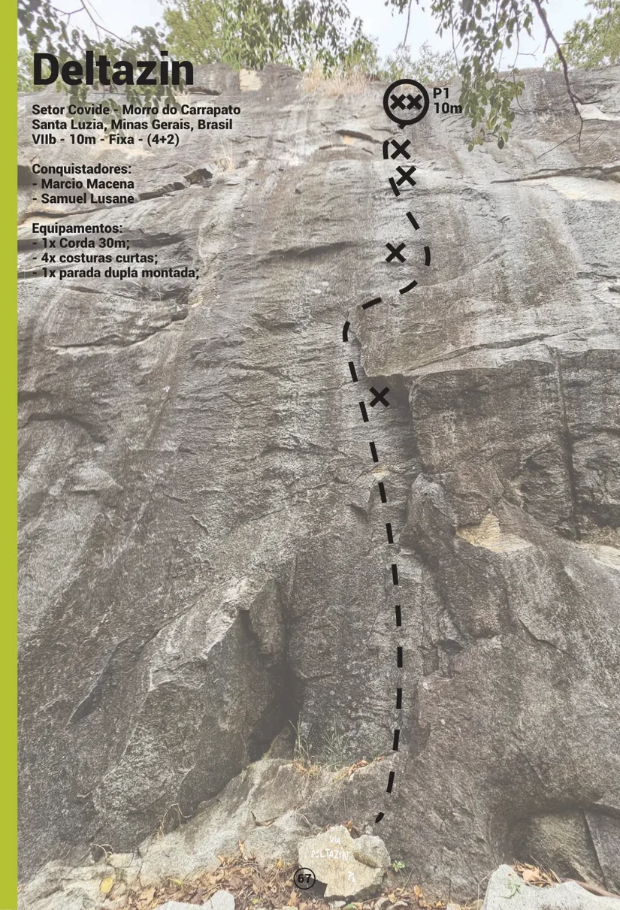
        - **largura_mapa**: 825
        - **altura_mapa**: 1211
  - **[4]**:
    - **via_esportiva**:
      - **descricao**:
          **Equipamentos:**
          - 1x Corda 30m
          - 4x costuras curtas
          - 1x parada dupla montada
      - **nome**: Ignorância do Deltacron
      - **dificuldade**: BR_7B
      - **extensao**: 12
      - **quantidade_protecoes_intermediarias**: 4
      - **quantidade_protecoes_parada**: 2
      - **conquistadores**:
        - Márcio Macena
        - Samuel Lusane
    - **mapas**:
      - **[0]**:
        - **caminho_imagem_mapa**: 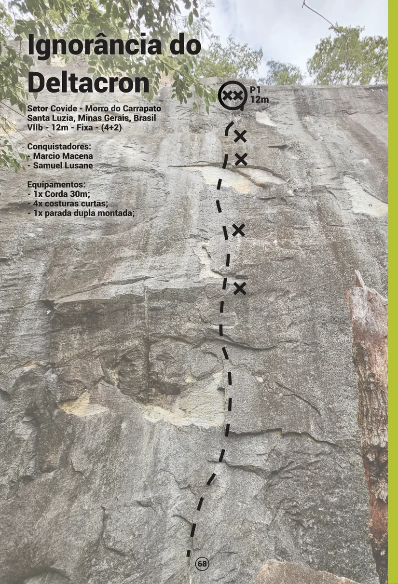
        - **largura_mapa**: 825
        - **altura_mapa**: 1211
  - **[5]**:
    - **via_esportiva**:
      - **descricao**:
          **Equipamentos:**
          - 1x Corda 30m
          - 4x costuras curtas
          - 1x parada dupla montada
      - **nome**: Covidenhoca
      - **dificuldade**: BR_7A
      - **extensao**: 10
      - **quantidade_protecoes_intermediarias**: 4
      - **quantidade_protecoes_parada**: 2
      - **conquistadores**:
        - Márcio Macena
        - Samuel Lusane
    - **mapas**:
      - **[0]**:
        - **caminho_imagem_mapa**: 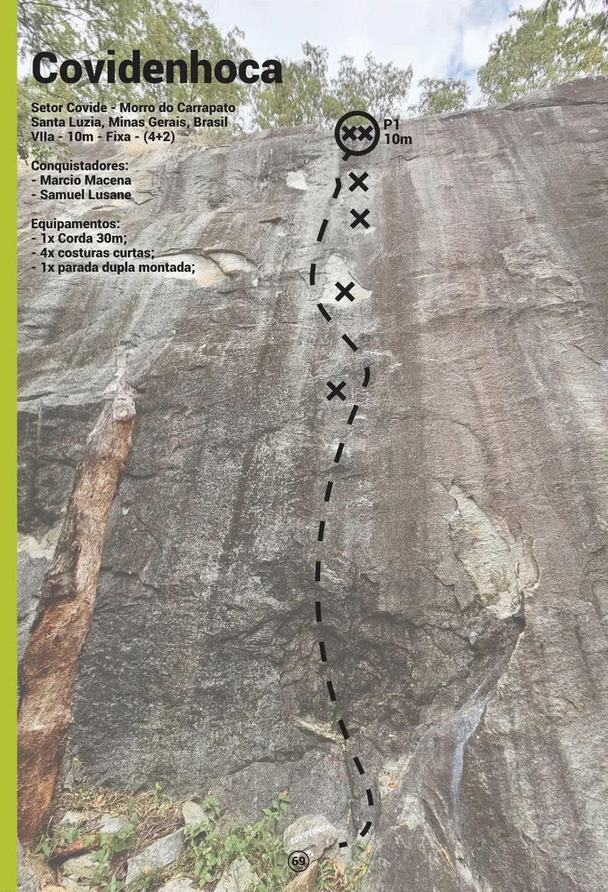
        - **largura_mapa**: 825
        - **altura_mapa**: 1211
  - **[6]**:
    - **via_esportiva**:
      - **descricao**:
          **Equipamentos:**
          - 1x Corda 30m
          - 4x costuras curtas
          - 1x parada dupla montada
      - **nome**: B1B2
      - **dificuldade**: BR_7C
      - **extensao**: 10
      - **quantidade_protecoes_intermediarias**: 4
      - **quantidade_protecoes_parada**: 2
      - **conquistadores**:
        - Márcio Macena
        - Samuel Lusane
    - **mapas**:
      - **[0]**:
        - **caminho_imagem_mapa**: 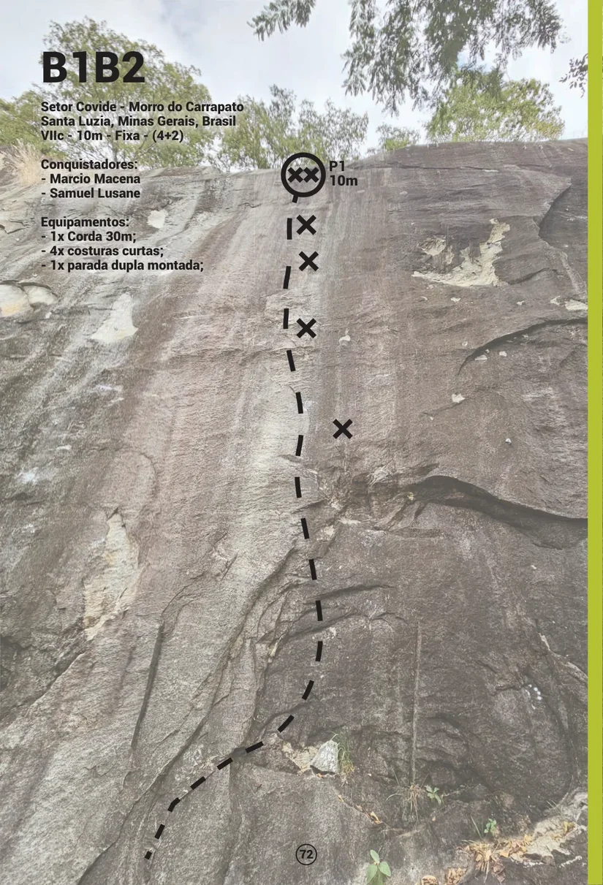
        - **largura_mapa**: 825
        - **altura_mapa**: 1211
  - **[7]**:
    - **via_esportiva**:
      - **descricao**:
          **Equipamentos:**
          - 1x Corda 30m
          - 5x costuras curtas
          - 1x parada dupla montada
      - **nome**: Oxforte
      - **dificuldade**: BR_8A
      - **extensao**: 12
      - **quantidade_protecoes_intermediarias**: 5
      - **quantidade_protecoes_parada**: 2
      - **conquistadores**:
        - Márcio Macena
        - Samuel Lusane
    - **mapas**:
      - **[0]**:
        - **caminho_imagem_mapa**: 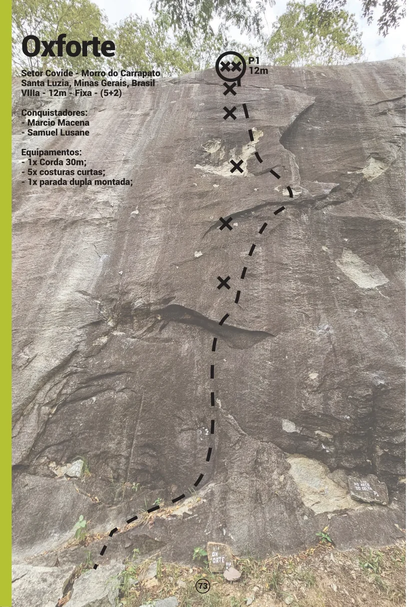
        - **largura_mapa**: 825
        - **altura_mapa**: 1211
  - **[8]**:
    - **via_esportiva**:
      - **descricao**:
          **Equipamentos:**
          - 1x Corda 30m
          - 5x costuras curtas
          - 1x parada dupla montada
      - **nome**: Arco do delta
      - **dificuldade**: BR_7A
      - **extensao**: 10
      - **quantidade_protecoes_intermediarias**: 5
      - **quantidade_protecoes_parada**: 2
      - **conquistadores**:
        - Márcio Macena
        - Samuel Lusane
    - **mapas**:
      - **[0]**:
        - **caminho_imagem_mapa**: 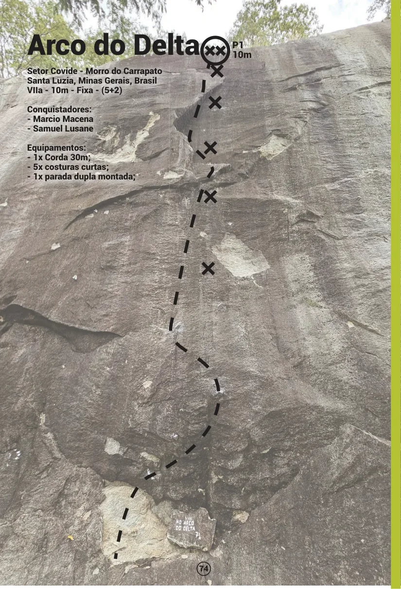
        - **largura_mapa**: 825
        - **altura_mapa**: 1211
  - **[9]**:
    - **via_esportiva**:
      - **descricao**:
          **Equipamentos:**
          - 1x Corda 30m
          - 4x costuras curtas
          - 1x parada dupla montada
      - **nome**: Sequela virótica
      - **dificuldade**: BR_8B
      - **extensao**: 10
      - **quantidade_protecoes_intermediarias**: 4
      - **quantidade_protecoes_parada**: 2
      - **conquistadores**:
        - Márcio Macena
        - Samuel Lusane
    - **mapas**:
      - **[0]**:
        - **caminho_imagem_mapa**: 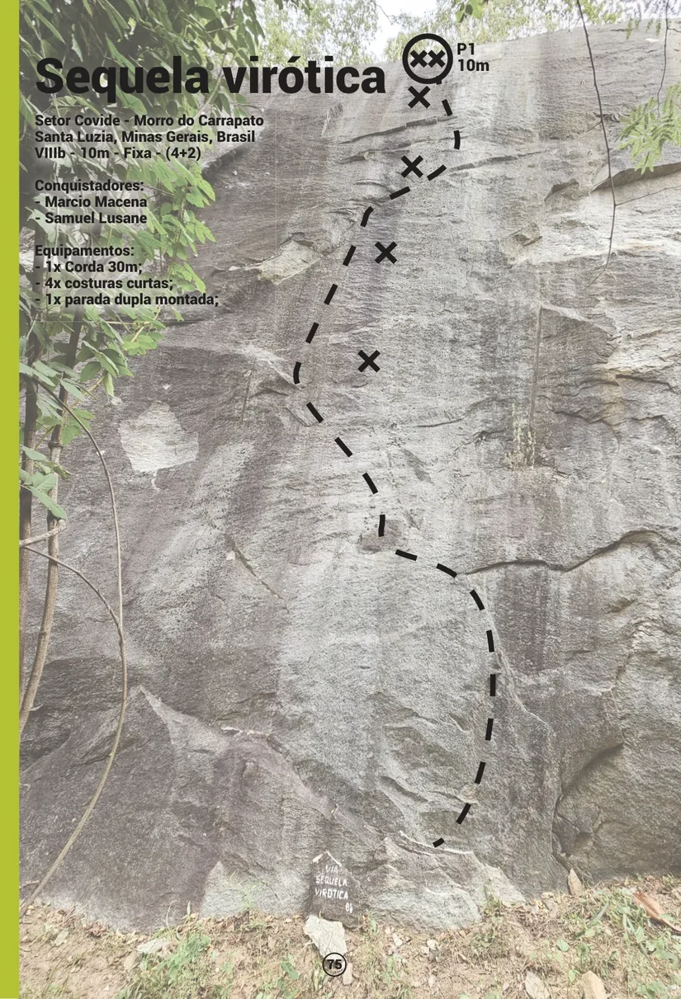
        - **largura_mapa**: 825
        - **altura_mapa**: 1211
  - **[10]**:
    - **via_esportiva**:
      - **descricao**:
          **Equipamentos:**
          - 1x Corda 30m
          - 4x costuras curtas
          - 1x parada dupla montada
      - **nome**: Carga viral
      - **dificuldade**: BR_7B
      - **extensao**: 10
      - **quantidade_protecoes_intermediarias**: 4
      - **quantidade_protecoes_parada**: 2
      - **conquistadores**:
        - Márcio Macena
        - Samuel Lusane
    - **mapas**:
      - **[0]**:
        - **caminho_imagem_mapa**: 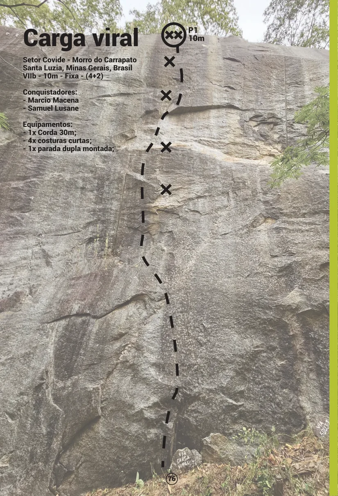
        - **largura_mapa**: 825
        - **altura_mapa**: 1211
  - **[11]**:
    - **via_esportiva**:
      - **descricao**:
          **Equipamentos:**
          - 1x Corda 30m
          - 5x costuras curtas
          - 1x parada dupla montada
          
          **Observações:**
          - Parada sem visualização ao nível do solo.
      - **nome**: Sou T.I.
      - **dificuldade**: BR_8C
      - **extensao**: 12
      - **quantidade_protecoes_intermediarias**: 5
      - **quantidade_protecoes_parada**: 2
      - **conquistadores**:
        - Márcio Macena
        - Samuel Lusane
    - **mapas**:
      - **[0]**:
        - **caminho_imagem_mapa**: 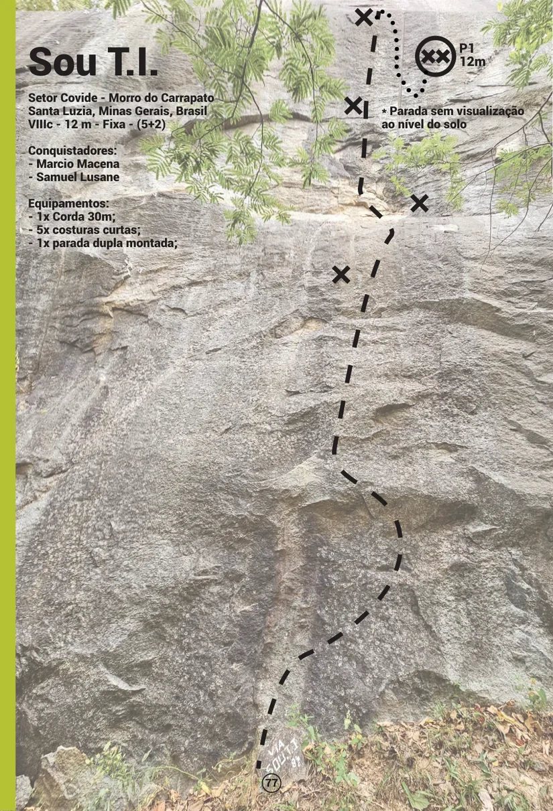
        - **largura_mapa**: 825
        - **altura_mapa**: 1211
  - **[12]**:
    - **via_esportiva**:
      - **descricao**:
          **Equipamentos:**
          - 1x Corda 30m
          - 4x costuras curtas
          - 1x parada dupla montada
          
          **Observações:**
          - Parada sem visualização ao nível do solo.
      - **nome**: Antígeno
      - **dificuldade**: BR_8A
      - **extensao**: 10
      - **quantidade_protecoes_intermediarias**: 4
      - **quantidade_protecoes_parada**: 2
      - **conquistadores**:
        - Márcio Macena
        - Samuel Lusane
    - **mapas**:
      - **[0]**:
        - **caminho_imagem_mapa**: 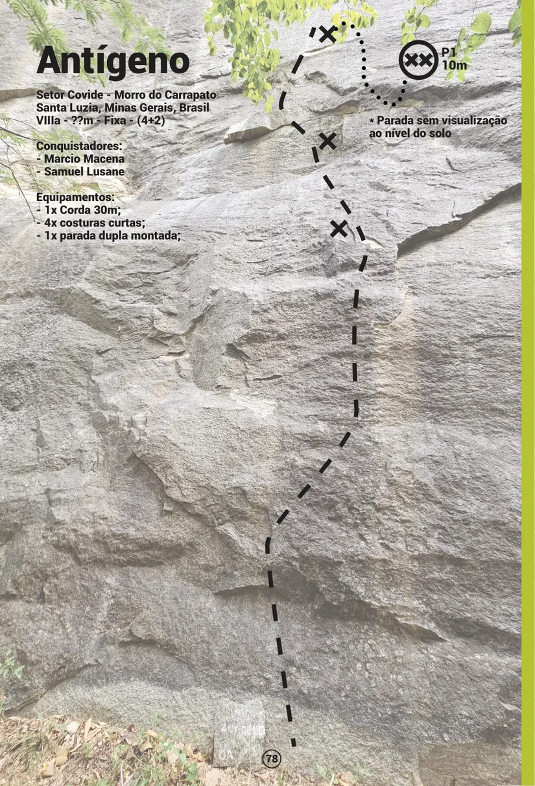
        - **largura_mapa**: 825
        - **altura_mapa**: 1211
  - **[13]**:
    - **via_esportiva**:
      - **descricao**:
          **Equipamentos:**
          - 1x Corda 40m
          - 5x costuras curtas
          - 1x parada dupla montada
          
          **Observações:**
          - Segue para a via ao lado.
      - **nome**: Marreta imune
      - **dificuldade**: BR_7B
      - **extensao**: 15
      - **quantidade_protecoes_intermediarias**: 5
      - **quantidade_protecoes_parada**: 2
      - **conquistadores**:
        - Márcio Macena
        - Samuel Lusane
    - **mapas**:
      - **[0]**:
        - **caminho_imagem_mapa**: 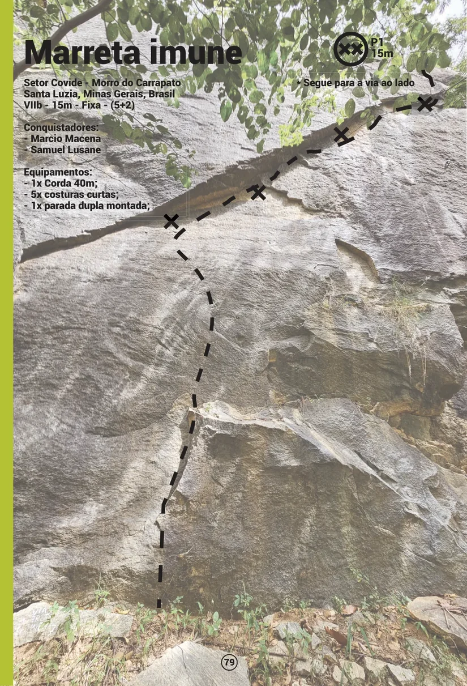
        - **referencias**:
          - **[0]**:
            - **escalada**: Marreta imune
            - **ids**:
              - P1
        - **largura_mapa**: 825
        - **altura_mapa**: 1211
  - **[14]**:
    - **via_esportiva**:
      - **descricao**:
          **Equipamentos:**
          - 1x Corda 30m
          - 5x costuras curtas
          - 1x parada dupla montada
          
          **Observações:**
          - Parada sem visualização ao nível do solo.
      - **nome**: Encosto gripal
      - **dificuldade**: BR_7B
      - **extensao**: 12
      - **quantidade_protecoes_intermediarias**: 5
      - **quantidade_protecoes_parada**: 2
      - **conquistadores**:
        - Márcio Macena
        - Samuel Lusane
    - **mapas**:
      - **[0]**:
        - **caminho_imagem_mapa**: 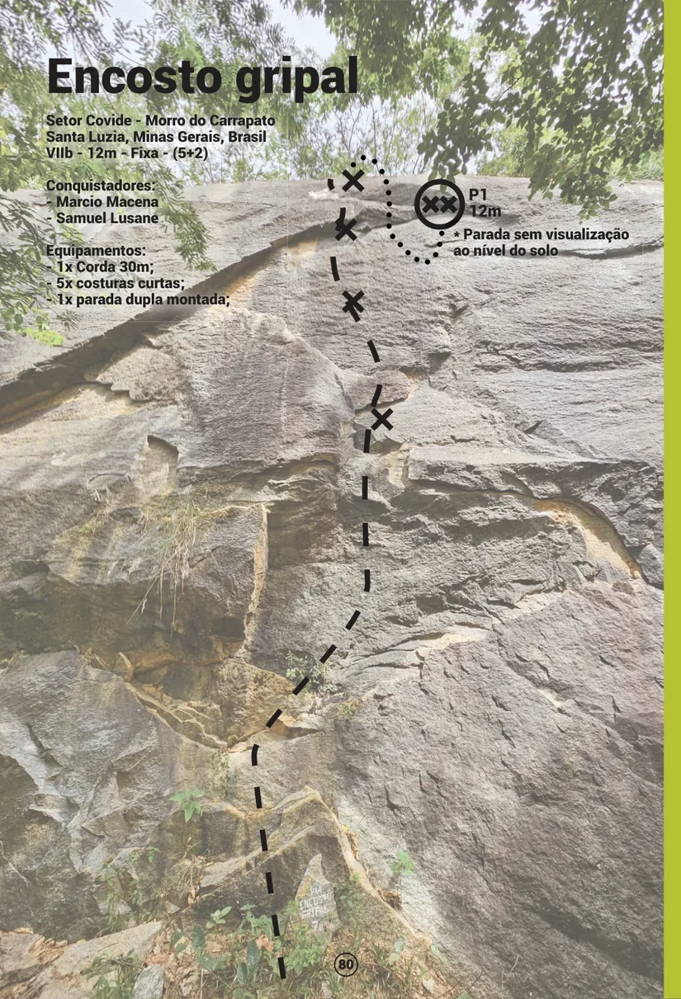
        - **referencias**:
          - **[0]**:
            - **escalada**: Encosto gripal
            - **ids**:
              - P1
        - **largura_mapa**: 825
        - **altura_mapa**: 1211
  - **[15]**:
    - **via_esportiva**:
      - **descricao**:
          **Equipamentos:**
          - 1x Corda 30m
          - 5x costuras curtas
          - 1x parada dupla montada
          
          **Observações:**
          - Parada sem visualização ao nível do solo.
      - **nome**: Virose operária
      - **dificuldade**: BR_8A
      - **extensao**: 12
      - **quantidade_protecoes_intermediarias**: 5
      - **quantidade_protecoes_parada**: 2
      - **conquistadores**:
        - Márcio Macena
        - Samuel Lusane
    - **mapas**:
      - **[0]**:
        - **caminho_imagem_mapa**: 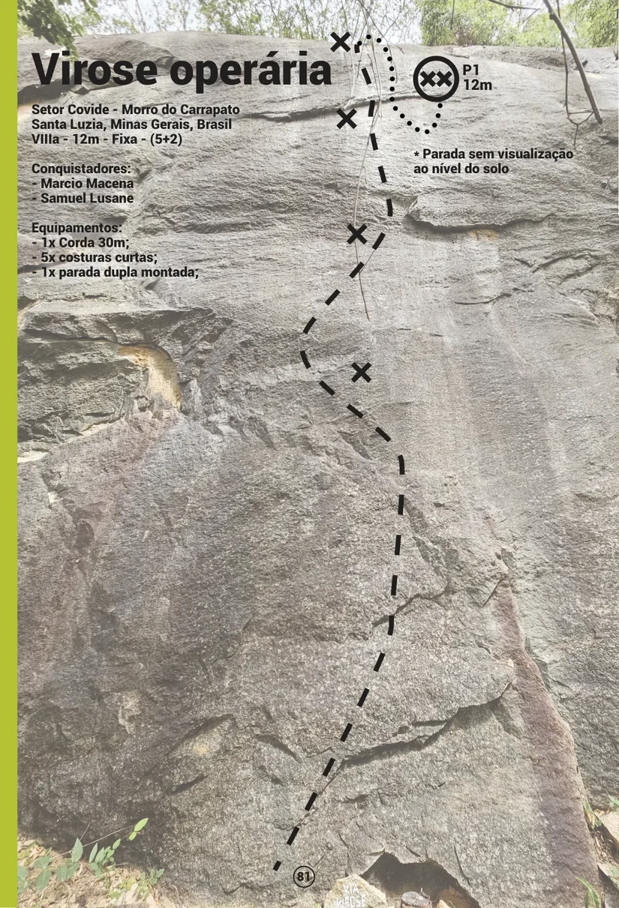
        - **referencias**:
          - **[0]**:
            - **escalada**: Virose operária
            - **ids**:
              - P1
        - **largura_mapa**: 825
        - **altura_mapa**: 1211
  - **[16]**:
    - **via_esportiva**:
      - **descricao**:
          **Equipamentos:**
          - 1x Corda 30m
          - 4x costuras curtas
          - 1x parada dupla montada
      - **nome**: Covidinho
      - **dificuldade**: BR_7B
      - **extensao**: 12
      - **quantidade_protecoes_intermediarias**: 4
      - **quantidade_protecoes_parada**: 2
      - **conquistadores**:
        - Márcio Macena
        - Samuel Lusane
    - **mapas**:
      - **[0]**:
        - **caminho_imagem_mapa**: 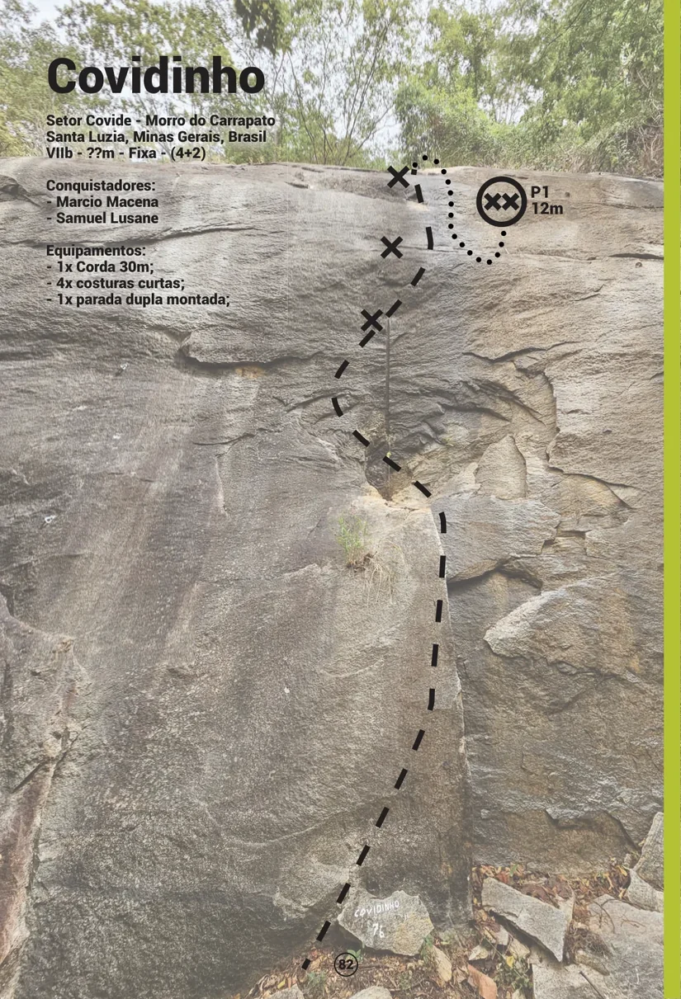
        - **referencias**:
          - **[0]**:
            - **escalada**: Covidinho
            - **ids**:
              - P1
        - **largura_mapa**: 825
        - **altura_mapa**: 1211
  - **[17]**:
    - **via_esportiva**:
      - **descricao**:
          **Equipamentos:**
          - 1x Corda 30m
          - 4x costuras curtas
          - 1x parada dupla montada
      - **nome**: Covide hepática
      - **dificuldade**: BR_7A
      - **extensao**: 10
      - **quantidade_protecoes_intermediarias**: 4
      - **quantidade_protecoes_parada**: 2
      - **conquistadores**:
        - Márcio Macena
        - Samuel Lusane
    - **mapas**:
      - **[0]**:
        - **caminho_imagem_mapa**: 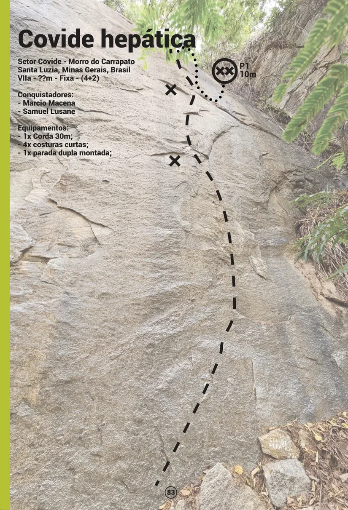
        - **referencias**:
          - **[0]**:
            - **escalada**: Covide hepática
            - **ids**:
              - P1
        - **largura_mapa**: 825
        - **altura_mapa**: 1211
- **precomputados**:
  - **total_escaladas**: 18
  - **total_esportivas**: 18

## Arquivos Externos

- **arquivos_externos**:
  - **[0]**:
    - **caminho**: 
    - **checksum_sha256**: 078bd708e77b2ea87b94135027acfc05c69ab3af3945e69b9d6009d14948408a
  - **[1]**:
    - **caminho**: 
    - **checksum_sha256**: 1f6a94c3da6513064910f9085f741b781aa31cdf78405a2235327a697574b18b
  - **[2]**:
    - **caminho**: 
    - **checksum_sha256**: 930fd32549dcf2fb0c39e41d85824a6d01a9c65a428e3e98142cd69f0913b217
  - **[3]**:
    - **caminho**: 
    - **checksum_sha256**: 4e272870d48f9152c2cfe08dc3edb2aa5a9b5210a38590d26e0073b7897129c6
  - **[4]**:
    - **caminho**: 
    - **checksum_sha256**: 1ab0fab6cc65bacfd7167985fac5fead7059fd8924281d1c8e53bd296b779cbb
  - **[5]**:
    - **caminho**: 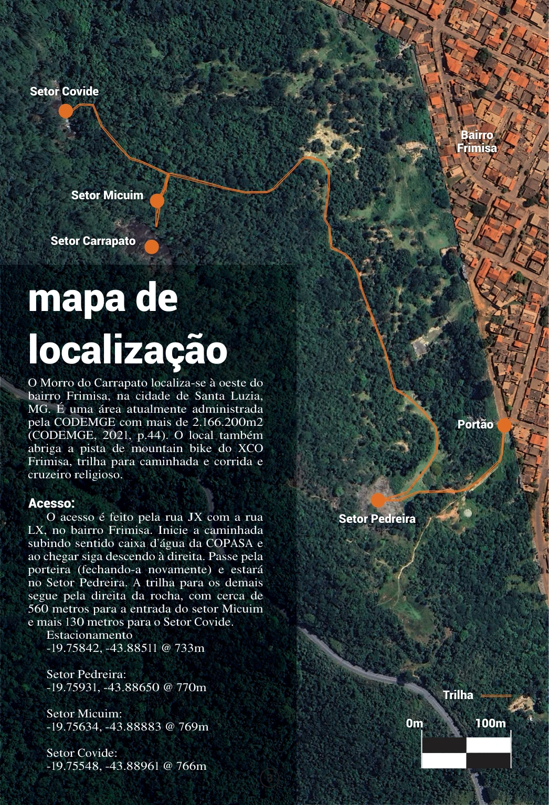
    - **checksum_sha256**: cf97498b4b53b9a9781ae7ac24968e4ce91f4ada1f7f60d765bd8b683e871543
  - **[6]**:
    - **caminho**: 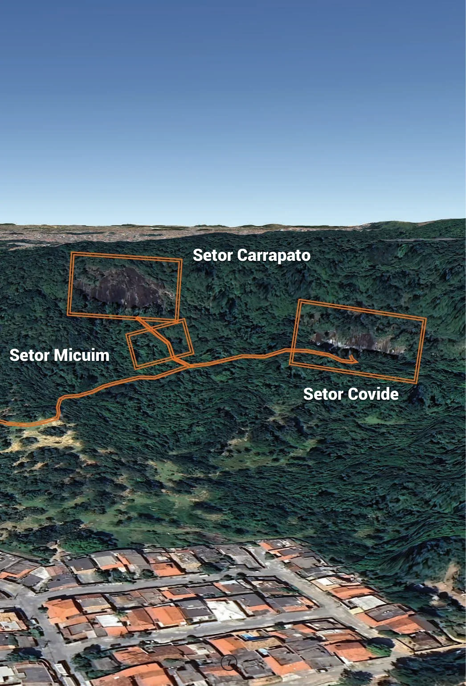
    - **checksum_sha256**: 46e9a73a05f762e021ba749dc3b19803b5d921419f649020751729d16f42ec58
  - **[7]**:
    - **caminho**: 
    - **checksum_sha256**: e0cf95fffc90d708b431adaa25eab1f31e239849f00eea30892244001ab20e0f
  - **[8]**:
    - **caminho**: 
    - **checksum_sha256**: 80df29bd439370d923ed5c19acaf705b0b1182a3de04ed2ebc47839d7fc22eed
  - **[9]**:
    - **caminho**: 
    - **checksum_sha256**: ec2350336e894aa1cc1866fe44e3b90602ff8c052ab86fcac6bca8552208ecc0
  - **[10]**:
    - **caminho**: 
    - **checksum_sha256**: 2767c73706cc8ac079103a564981b895cce20b1e81ba4bf05bab942c3d8bf853
  - **[11]**:
    - **caminho**: 
    - **checksum_sha256**: 7ba08719bfc042e826339cc797dfa63d68f429f08558efe31618ba14fede98a6
  - **[12]**:
    - **caminho**: 
    - **checksum_sha256**: a32332092f5ae41e938f25d19a5669291e5df8fee370743ed6854610d974c9e8
  - **[13]**:
    - **caminho**: 
    - **checksum_sha256**: f126e20f7c7f7c4df2d6fd11435757fef086612d7ee0ffae497813f6471e1d84
  - **[14]**:
    - **caminho**: 
    - **checksum_sha256**: a8e4d431e4c8cdc6788bbad8c873bceb2f70de97fbad98e0788297a3b215b745
  - **[15]**:
    - **caminho**: 
    - **checksum_sha256**: 93b85609f3eb70d10d8ff9a3e39cad24d6874b8a51a0dbc10007fb226cbec6b6
  - **[16]**:
    - **caminho**: 
    - **checksum_sha256**: 3b578c9aa97cb65af338fdd82dd3f5bc4c11528e414643fd566e40bc880d0f4a
  - **[17]**:
    - **caminho**: 
    - **checksum_sha256**: a929ec486a809399ed9f4463d4981c8adbc519df24eca3ed6b7c5226e58d3634
  - **[18]**:
    - **caminho**: 
    - **checksum_sha256**: a23f32d22473b657895da93f2be8c3cf9d0094eb0bfd8fc8145ceeebc0a516c5
  - **[19]**:
    - **caminho**: 
    - **checksum_sha256**: 45f27f2be6f6b759995ad25ca7e151b7ae45930fb243c4519462ff34d304e4be
  - **[20]**:
    - **caminho**: 
    - **checksum_sha256**: 32bb0d6123ebace42a56d4fef8ad06497deab7fd490cf38a2643e05780a0d1a3
  - **[21]**:
    - **caminho**: 
    - **checksum_sha256**: 079bc90722697ee3f29448a04fa99f0afdee3162814737fcd493e10beea72e24
  - **[22]**:
    - **caminho**: 
    - **checksum_sha256**: f8371e724364c170b8a05b7eeb8ac48e9b9a142f85df52d3aba517c590ab8852
  - **[23]**:
    - **caminho**: 
    - **checksum_sha256**: 55c8cf41d824c0ab5a82bd6d7e86c4063c4cc03d4b349efe3b692cb3bd473193
  - **[24]**:
    - **caminho**: 
    - **checksum_sha256**: e1dd54d86607befbd0aba2b4376b17a12d248215986e5d1b7f6b8a04a23c6998
  - **[25]**:
    - **caminho**: 
    - **checksum_sha256**: 1a02ca0b8b1bdc3bd8d17c725c5a809181fd82199d33f8cd18f4e47b65304f87
  - **[26]**:
    - **caminho**: 
    - **checksum_sha256**: 8bc62cbcbfee81200f8bfd9692fc7237bceb72c58537085d8859ec0b3c49a51d
  - **[27]**:
    - **caminho**: 
    - **checksum_sha256**: 867a4ff2b7c8b725a28c25deba828963d802085f2670d77876fe43e2fe7bb2a8
  - **[28]**:
    - **caminho**: 
    - **checksum_sha256**: 62cf4b5c76e8b3d8f382e6c1a3441faec561e401f5a36a411e3d757a0446e962
  - **[29]**:
    - **caminho**: 
    - **checksum_sha256**: 753d162d2e3a7f44917706f8623c2557b9130fc06af8d741bef1d461c121632b
  - **[30]**:
    - **caminho**: 
    - **checksum_sha256**: 7da8c3e14a1f151d39b448efa6c50c6c233b8ba781d875a892c1b8adc927f57a
  - **[31]**:
    - **caminho**: 
    - **checksum_sha256**: 84974b7b8ed02391b36751c74805a48e92ff11ebbb2f93830356d11e7982d7f0
  - **[32]**:
    - **caminho**: 
    - **checksum_sha256**: e0c934ca3288db48846a4aa2821699fc759ac4780abb82c39876c61cf914bad7
  - **[33]**:
    - **caminho**: 
    - **checksum_sha256**: 894cc2393b6d764681680b4d73abd6e2d82269d721873fbe6fdeb273fbcaa180
  - **[34]**:
    - **caminho**: 
    - **checksum_sha256**: 7ad41e24349528135b1812ee5627de1a8d161ec49d9c69e247c601e94ed09b16
  - **[35]**:
    - **caminho**: 
    - **checksum_sha256**: aa2fee0e4227f42b86304f3eff3ca009beb57d1b39d528f47cf5d94d5070f7dc
  - **[36]**:
    - **caminho**: 
    - **checksum_sha256**: d0fe6a0f67409eaffd03532667ef89c05ef0e904376b8edd861d3f02891939cc
  - **[37]**:
    - **caminho**: 
    - **checksum_sha256**: ad53f2dc41a8d4eb2aebcd5169e7a982ee2dfd1a9d2391e8d2a5d467aff93d25
  - **[38]**:
    - **caminho**: 
    - **checksum_sha256**: 071bbbac29ee7889e2e712dd4263825ce49ef2b23e40f53bf56e713d3484b5af
  - **[39]**:
    - **caminho**: 
    - **checksum_sha256**: 41e6f5604667ec15e02f865ed67eafdd1fa0cb568adbafbc4f54fc4f83ff9849
  - **[40]**:
    - **caminho**: 
    - **checksum_sha256**: d20d914bb4e443baa4bf33957f89bc9cc24389e2215872bb4bbcc63cbfda25c3

