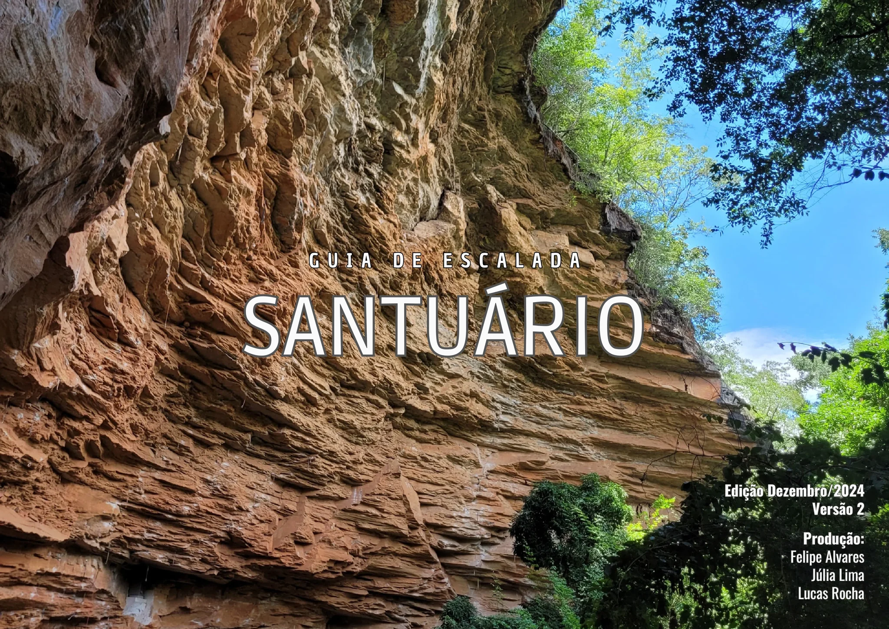
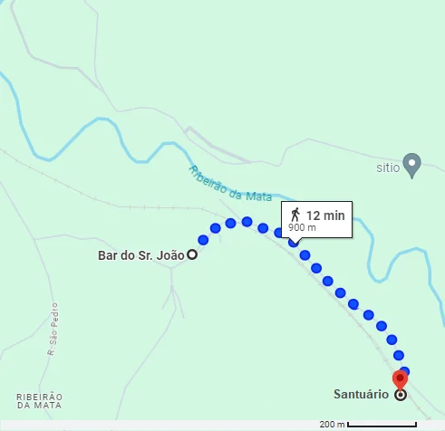
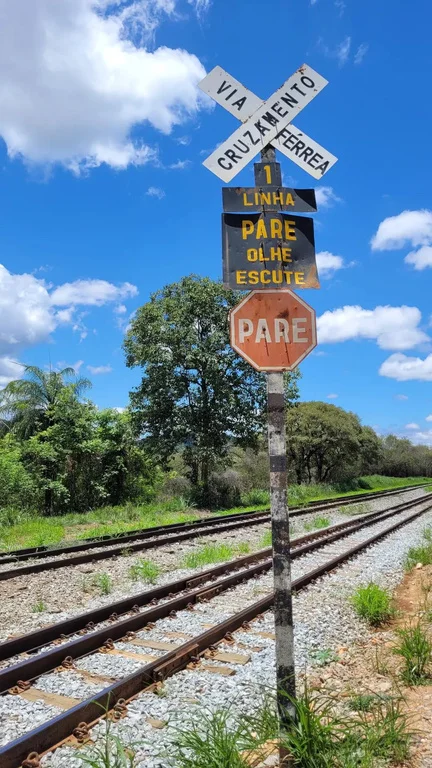
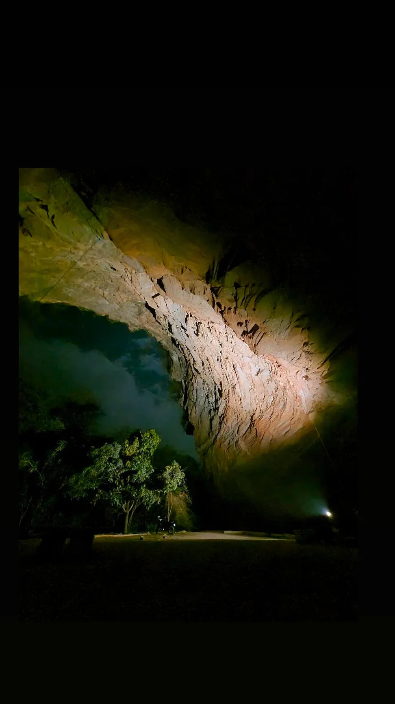
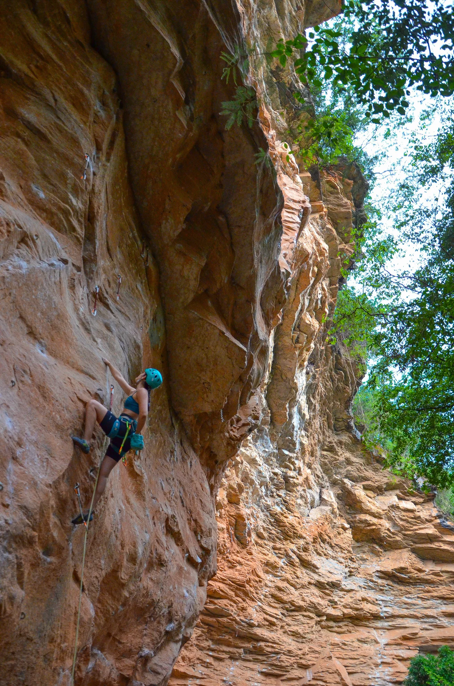
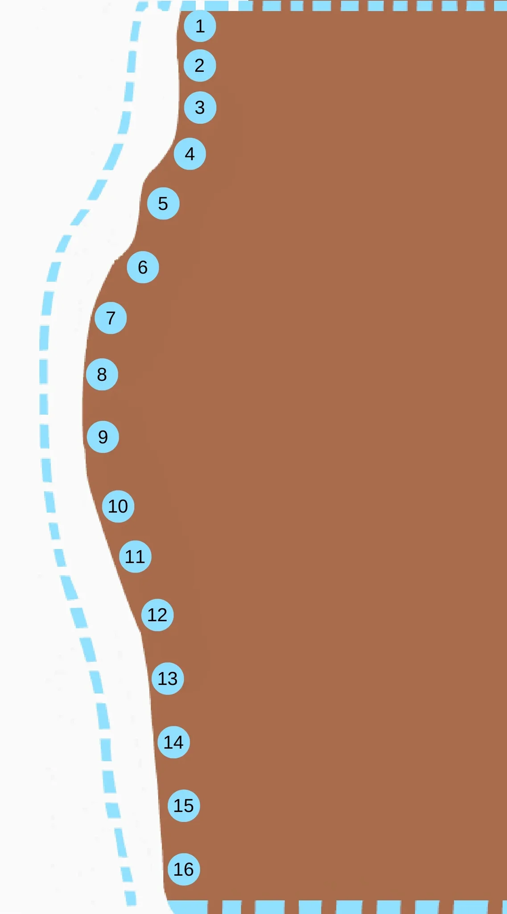
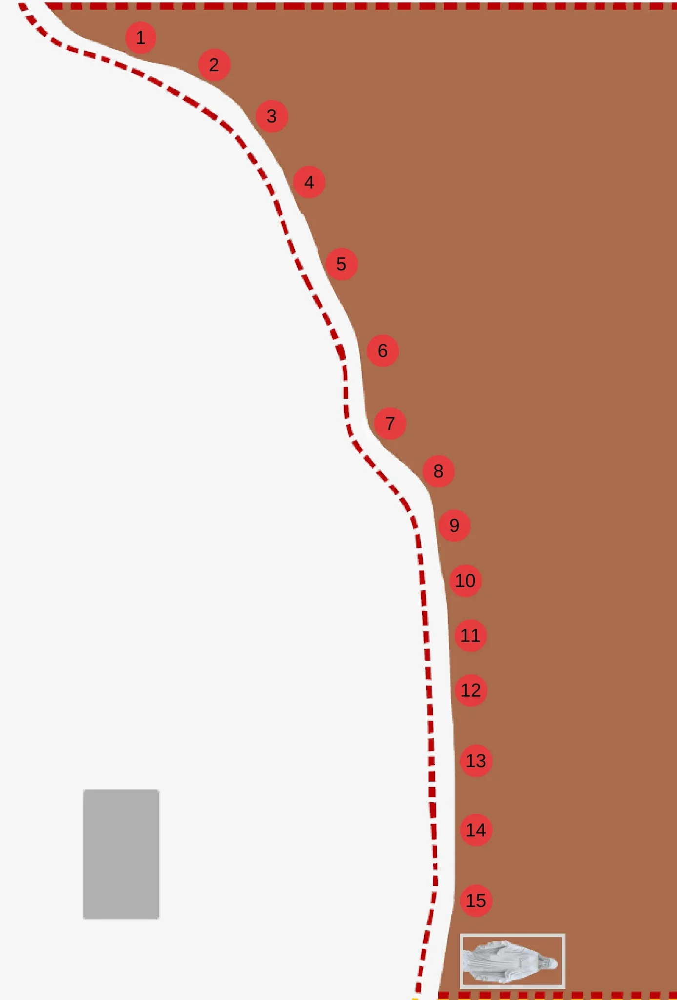
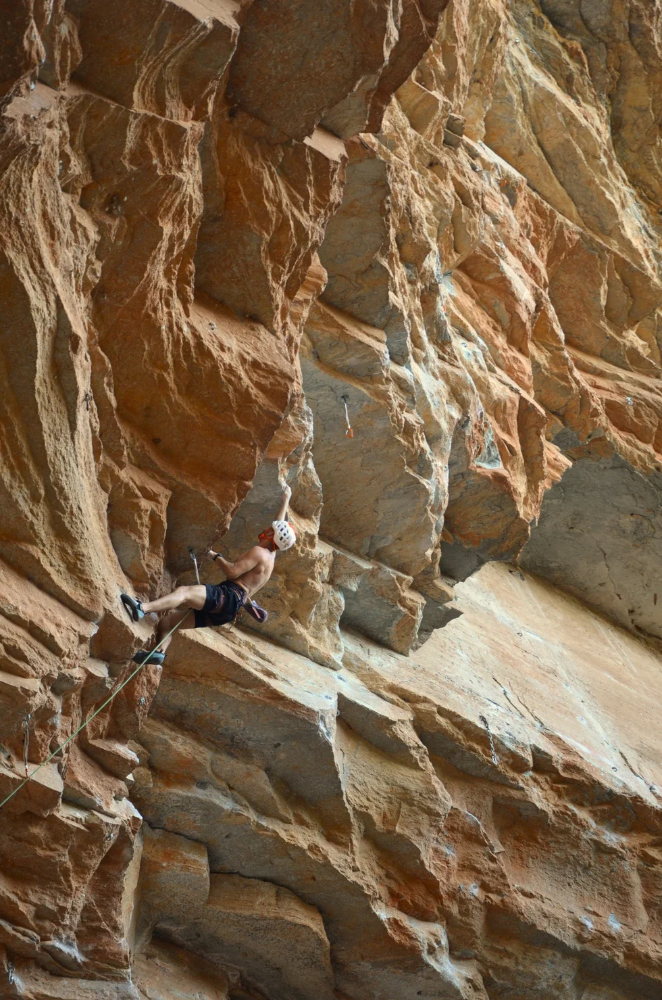
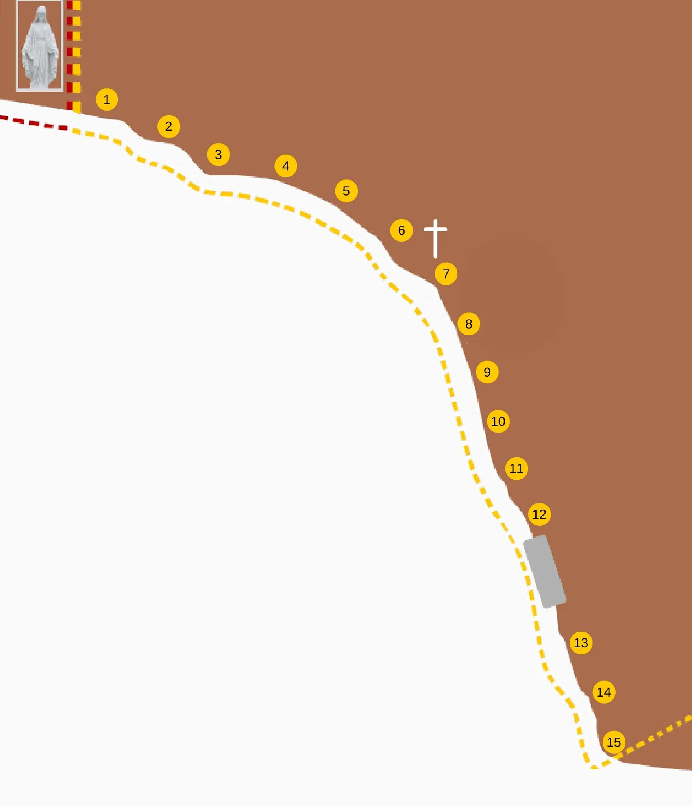

# Croqui: Santuário de Santa Luzia

## Informações Gerais

- **id**: br_mg_santa_luzia_santuario
- **nome**: Santuário de Santa Luzia
- **creditos**:
  - Felipe Alvares
  - Júlia Lima
  - Lucas Rocha
- **caminho_thumbnail**: 
- **revisado_manualmente**: True
- **status_desenho_extraivel**: TEM_DESENHO_MAS_NAO_EXTRAIDO
- **botoes**:
  - **[0]**:
    - **texto**: Capa
    - **destino**:
      - **secao_textual**:
        - **conteudo**:
            # Guia de Escalada Santuário
            
            Edição Dezembro/2024 - Versão 2
            
            Produção:
            - Felipe Alvares
            - Júlia Lima
            - Lucas Rocha
            
            |  |
            | :--: |
            | *Capa do Guia de Escalada Santuário* |
  - **[1]**:
    - **texto**: Como Chegar
    - **destino**:
      - **secao_textual**:
        - **conteudo**:
            # Como Chegar
            
            ## Coordenadas
            - **Bar do Sr. João:** [R. Santo Antônio - Ribeirão da Mata, Santa Luzia - MG](https://www.google.com.br/maps/place/Bar+do+Sr.+Jo%C3%A3o/@-19.7032219,-43.8773559,15z/data=!4m15!1m8!3m7!1s0xa67d2f3991c267:0x7ba831ba35ec1a3b!2sBar+do+Sr.+Jo%C3%A3o!8m2!3d-19.7032219!4d-43.8773559!10e5!16s%2Fg%2F11jkp0_0jc!3m5!1s0xa67d2f3991c267:0x7ba831ba35ec1a3b!8m2!3d-19.7032219!4d-43.8773559!16s%2Fg%2F11jkp0_0jc?entry=ttu)
            - **Santuário:** [19°42'25.0"S, 43°52'17.3"W](https://www.google.com.br/maps/place/C%C3%A2nion+Ribeir%C3%A3o+da+Mata/@-19.7047782,-43.8847028,15.09z/data=!4m14!1m7!3m6!1s0xa67d2f3991c267:0x7ba831ba35ec1a3b!2sBar+do+Sr.+Jo%C3%A3o!8m2!3d-19.7032219!4d-43.8773559!16s%2Fg%2F11jkp0_0jc!3m5!1s0xa6874a22e9ebd5:0x9b1dc0f7515349e0!8m2!3d-19.7069444!4d-43.871488!16s%2Fg%2F11hzhqzrz1?entry=ttu)
            
            ## Distâncias
            - Belo Horizonte (centro) - 33 km
            - Confins - 24 km
            
            ## Descrição do Acesso
            Estacione o carro perto do **Bar do Sr. João**, e faça o restante da trilha a pé. Desça a rua principal até encontrar a linha de trem, e comece uma trilha rápida de 900 m. O Santuário encontra-se à direita da linha de trem.
            
            |  |
            | :--: |
            | *Mapa de acesso* |
            
            |  |
            | :--: |
            | *Trilha pela linha de trem* |
            
            |  |
            | :--: |
            | *Sinalização no cruzamento ferroviário* |
  - **[2]**:
    - **texto**: Comércio Local
    - **destino**:
      - **secao_textual**:
        - **conteudo**:
            # Comércio Local
            
            ## Bar do Sr. João
            
            **Endereço:** Rua Santo Antônio - Ribeirão da Mata, Santa Luzia - MG
            
            **Recomendações:**
            - Pastel frito na hora
            - Sucos e açaí
            - Refrigerantes e cerveja
            - Almoço (necessita agendar com antecedência)
            
            |  |
            | :--: |
            | *Fachada do Bar do Sr. João* |
            
            |  |
            | :--: |
            | *Pastel de feira* |
            
            |  |
            | :--: |
            | *Sr. João no balcão* |
  - **[3]**:
    - **texto**: Informações Gerais
    - **destino**:
      - **secao_textual**:
        - **conteudo**:
            # Informações Gerais
            
            Dentro do domo do Santuário não chove, e só bate sol no início da manhã, por isso é um local perfeito para escalada durante todo o ano.
            
            |  |
            | :--: |
            | *Vista do domo do Santuário* |
            
            ## Regras de Conduta
            - **Respeite o local:** Ele é sagrado para a comunidade.
            - **Lixo:** Leve o seu lixo ao sair. Respeite a fauna e flora do lugar.
            - **Preservação:** Não escreva nas pedras.
            - **Segurança:** Somente pratique escalada se tiver o domínio da técnica e do uso dos equipamentos.
            
            |  |
            | :--: |
            | *Logos de apoiadores* |
  - **[4]**:
    - **texto**: Como Usar Este Guia
    - **destino**:
      - **secao_textual**:
        - **conteudo**:
            # Como Usar Este Guia
            
            Este Guia tem a função de informar, facilitar e divulgar as vias de escalada do Santuário.
            
            Todas as vias possuem placas de identificação em sua base. As vias são divididas em partes (P1, P2, P3, P4, P5), cada uma tem um grau que é cumulativo com a parte anterior.
            
            |  |
            | :--: |
            | *Instruções sobre a estrutura do guia* |
  - **[5]**:
    - **texto**: Mapas Gerais
    - **destino**:
      - **secao_textual**:
        - **conteudo**:
            # Mapas Gerais
            
            O Santuário é dividido em três setores principais, conforme indicado no mapa abaixo:
            
            - **Setor Clube da Luta** (Esquerda)
            - **Setor Santa Línea** (Centro)
            - **Setor Democracia** (Direita)
            
            |  |
            | :--: |
            | *Mapa geral dos setores do Santuário* |
- **ultima_migracao**: 1
- **publicar_croqui**: True

## Parte: setor_clube_da_luta

### Setor (Pico: Santuário)

- **descricao**:
    # Setor Clube da Luta
    
    |  |
    | :--: |
    | *Escaladora Júlia Lima na via Rins de Pedra* |
- **nome**: Setor Clube da Luta
- **mapas**:
  - **[0]**:
    - **caminho_imagem_mapa**: 
    - **largura_mapa**: 1137
    - **altura_mapa**: 2048
    - **pontos_de_interesse**:
      - **[0]**:
        - **id**: 01
        - **label**: 01
        - **box**:
          - **x**: 448
          - **y**: 58
          - **comprimento**: 43
          - **largura**: 41
      - **[1]**:
        - **id**: 02
        - **label**: 02
        - **box**:
          - **x**: 450
          - **y**: 146
          - **comprimento**: 54
          - **largura**: 49
      - **[2]**:
        - **id**: 03
        - **label**: 03
        - **box**:
          - **x**: 450
          - **y**: 240
          - **comprimento**: 57
          - **largura**: 52
      - **[3]**:
        - **id**: 04
        - **label**: 04
        - **box**:
          - **x**: 424
          - **y**: 339
          - **comprimento**: 53
          - **largura**: 62
      - **[4]**:
        - **id**: 05
        - **label**: 05
        - **box**:
          - **x**: 366
          - **y**: 456
          - **comprimento**: 54
          - **largura**: 57
      - **[5]**:
        - **id**: 06
        - **label**: 06
        - **box**:
          - **x**: 320
          - **y**: 600
          - **comprimento**: 47
          - **largura**: 60
      - **[6]**:
        - **id**: 07
        - **label**: 07
        - **box**:
          - **x**: 250
          - **y**: 711
          - **comprimento**: 43
          - **largura**: 56
      - **[7]**:
        - **id**: 08
        - **label**: 08
        - **box**:
          - **x**: 228
          - **y**: 836
          - **comprimento**: 46
          - **largura**: 54
      - **[8]**:
        - **id**: 09
        - **label**: 09
        - **box**:
          - **x**: 231
          - **y**: 974
          - **comprimento**: 46
          - **largura**: 47
      - **[9]**:
        - **id**: 10
        - **label**: 10
        - **box**:
          - **x**: 268
          - **y**: 1134
          - **comprimento**: 60
          - **largura**: 51
      - **[10]**:
        - **id**: 11
        - **label**: 11
        - **box**:
          - **x**: 303
          - **y**: 1250
          - **comprimento**: 64
          - **largura**: 53
      - **[11]**:
        - **id**: 12
        - **label**: 12
        - **box**:
          - **x**: 358
          - **y**: 1378
          - **comprimento**: 73
          - **largura**: 53
      - **[12]**:
        - **id**: 13
        - **label**: 13
        - **box**:
          - **x**: 376
          - **y**: 1520
          - **comprimento**: 63
          - **largura**: 61
      - **[13]**:
        - **id**: 14
        - **label**: 14
        - **box**:
          - **x**: 389
          - **y**: 1666
          - **comprimento**: 58
          - **largura**: 55
      - **[14]**:
        - **id**: 15
        - **label**: 15
        - **box**:
          - **x**: 412
          - **y**: 1808
          - **comprimento**: 59
          - **largura**: 62
      - **[15]**:
        - **id**: 16
        - **label**: 16
        - **box**:
          - **x**: 412
          - **y**: 1948
          - **comprimento**: 65
          - **largura**: 54
- **escaladas**:
  - **[0]**:
    - **via_esportiva**:
      - **nome**: POLLY SHELBY
      - **id_no_mapa**: 01
      - **dificuldade**: BR_9C
  - **[1]**:
    - **via_esportiva**:
      - **nome**: BLACK DOG
      - **id_no_mapa**: 02
      - **dificuldade**: BR_9C
  - **[2]**:
    - **via_esportiva**:
      - **nome**: INCONSCIENTE COLETIVO
      - **id_no_mapa**: 03
      - **dificuldade**: BR_9B
  - **[3]**:
    - **via_esportiva**:
      - **nome**: DISCÍPULOS DE BIBIU
      - **id_no_mapa**: 04
      - **dificuldade**: BR_9A
  - **[4]**:
    - **via_esportiva**:
      - **nome**: EL NINHO
      - **id_no_mapa**: 05
      - **dificuldade**: BR_7C
  - **[5]**:
    - **via_multiplas_enfiadas**:
      - **nome**: O PECADOR
      - **id_no_mapa**: 06
      - **dificuldade_maxima**: BR_8B
      - **enfiadas**:
        - **[0]**:
          - **via_esportiva**:
            - **nome**: P1
            - **dificuldade**: BR_7B
        - **[1]**:
          - **via_esportiva**:
            - **nome**: P2
            - **dificuldade**: BR_8B
  - **[6]**:
    - **via_multiplas_enfiadas**:
      - **nome**: PROMESSA É DÍVIDA
      - **id_no_mapa**: 07
      - **dificuldade_maxima**: BR_8A
      - **enfiadas**:
        - **[0]**:
          - **via_esportiva**:
            - **nome**: P1
            - **dificuldade**: BR_7A
        - **[1]**:
          - **via_esportiva**:
            - **nome**: P2
            - **dificuldade**: BR_8A
  - **[7]**:
    - **via_multiplas_enfiadas**:
      - **nome**: RINS DE PEDRA
      - **id_no_mapa**: 08
      - **dificuldade_maxima**: BR_8B
      - **enfiadas**:
        - **[0]**:
          - **via_esportiva**:
            - **nome**: P1
            - **dificuldade**: BR_6
        - **[1]**:
          - **via_esportiva**:
            - **nome**: P2
            - **dificuldade**: BR_8B
  - **[8]**:
    - **via_multiplas_enfiadas**:
      - **nome**: PAGADOR DE PROMESSA
      - **id_no_mapa**: 09
      - **dificuldade_maxima**: BR_8B
      - **enfiadas**:
        - **[0]**:
          - **via_esportiva**:
            - **nome**: P1
            - **dificuldade**: BR_8A
        - **[1]**:
          - **via_esportiva**:
            - **nome**: P2
            - **dificuldade**: BR_8B
  - **[9]**:
    - **via_esportiva**:
      - **nome**: BIBI CORAGEM
      - **id_no_mapa**: 10
      - **dificuldade**: BR_7C
  - **[10]**:
    - **via_esportiva**:
      - **nome**: DE MALANDRO A GRANFINO
      - **id_no_mapa**: 11
      - **dificuldade**: BR_10A
  - **[11]**:
    - **via_esportiva**:
      - **nome**: CLUBE DA LUTA
      - **id_no_mapa**: 12
      - **dificuldade**: BR_9B
  - **[12]**:
    - **via_esportiva**:
      - **nome**: ROLO COMPRESSOR
      - **id_no_mapa**: 13
      - **dificuldade**: BR_9B
  - **[13]**:
    - **via_multiplas_enfiadas**:
      - **nome**: O ESPECIALISTA
      - **id_no_mapa**: 14
      - **dificuldade_maxima**: BR_9C
      - **enfiadas**:
        - **[0]**:
          - **via_esportiva**:
            - **nome**: P1
            - **dificuldade**: BR_9B
        - **[1]**:
          - **via_esportiva**:
            - **nome**: P2
            - **dificuldade**: BR_9C
        - **[2]**:
          - **via_esportiva**:
            - **nome**: P3
            - **dificuldade**: PROJETO
  - **[14]**:
    - **via_esportiva**:
      - **nome**: O GUARDA COSTA
      - **id_no_mapa**: 15
      - **dificuldade**: BR_9B
  - **[15]**:
    - **via_multiplas_enfiadas**:
      - **nome**: MARIA MADALENA
      - **id_no_mapa**: 16
      - **dificuldade_maxima**: PROJETO
      - **enfiadas**:
        - **[0]**:
          - **via_esportiva**:
            - **nome**: P1
            - **dificuldade**: PROJETO
        - **[1]**:
          - **via_esportiva**:
            - **nome**: P2
            - **dificuldade**: PROJETO

## Parte: setor_santa_linea

### Setor (Pico: Santuário)

- **descricao**:
    # Setor Santa Línea
    
    |  |
    | :--: |
    | *Escalador Felipe Alvares na via Santa Linea* |
    
    ## Conexões e Variantes
    
    Este setor possui diversas conexões entre as vias, permitindo combinar diferentes partes (P1, P2, P3...) de vias adjacentes.
    
    | N° | De (Via / Segmento) | Para (Via / Segmento) | Grau |
    |---|---|---|---|
    | 7.1 | ÓPANGARÉ P1 | SANTA KLAUSS P2 | PROJETO |
    | 7.2 | ÓPANGARÉ P1 | SANTA KLAUSS P3 | PROJETO |
    | 11.1 | SANTO GRAU P2 | TIRANOS DE PLANTÃO P3 | PROJETO |
    | 11.2 | SANTO GRAU P2 | TIRANOS DE PLANTÃO P4 | PROJETO |
    | 11.3 | SANTO GRAU P2 | TIRANOS DE PLANTÃO P5 | PROJETO |
    | 13.1 | SÓ OS LOUCOS SABEM P2 | AVE MARIA P3 | PROJETO |
    | 13.2 | SÓ OS LOUCOS SABEM P2 | CHÁ NA CARTOLINA P3 | 9c |
    | 13.3 | SÓ OS LOUCOS SABEM P2 | SANTA LINEA P2 | PROJETO |
    | 13.4 | SÓ OS LOUCOS SABEM P2 | SANTA LINEA P3 | PROJETO |
    | 14.1 | CHÁ NA CARTOLINA P2 | AVE MARIA P3 | 9c |
    | 14.2 | CHÁ NA CARTOLINA P2 | SANTA LINEA P2 | 10b |
    | 14.3 | CHÁ NA CARTOLINA P2 | SANTA LINEA P3 | PROJETO |
    | 15.1 | AVE MARIA P2 | CHÁ NA CARTOLINA P3 | 9b |
- **nome**: Setor Santa Línea
- **mapas**:
  - **[0]**:
    - **caminho_imagem_mapa**: 
    - **largura_mapa**: 1387
    - **altura_mapa**: 2048
    - **pontos_de_interesse**:
      - **[0]**:
        - **id**: 01
        - **label**: 01
        - **box**:
          - **x**: 288
          - **y**: 76
          - **comprimento**: 26
          - **largura**: 35
      - **[1]**:
        - **id**: 02
        - **label**: 02
        - **box**:
          - **x**: 438
          - **y**: 133
          - **comprimento**: 26
          - **largura**: 36
      - **[2]**:
        - **id**: 03
        - **label**: 03
        - **box**:
          - **x**: 556
          - **y**: 237
          - **comprimento**: 28
          - **largura**: 36
      - **[3]**:
        - **id**: 04
        - **label**: 04
        - **box**:
          - **x**: 633
          - **y**: 372
          - **comprimento**: 32
          - **largura**: 38
      - **[4]**:
        - **id**: 05
        - **label**: 05
        - **box**:
          - **x**: 698
          - **y**: 539
          - **comprimento**: 32
          - **largura**: 40
      - **[5]**:
        - **id**: 06
        - **label**: 06
        - **box**:
          - **x**: 784
          - **y**: 716
          - **comprimento**: 32
          - **largura**: 40
      - **[6]**:
        - **id**: 07
        - **label**: 07
        - **box**:
          - **x**: 799
          - **y**: 866
          - **comprimento**: 28
          - **largura**: 38
      - **[7]**:
        - **id**: 08
        - **label**: 08
        - **box**:
          - **x**: 898
          - **y**: 964
          - **comprimento**: 26
          - **largura**: 35
      - **[8]**:
        - **id**: 09
        - **label**: 09
        - **box**:
          - **x**: 930
          - **y**: 1076
          - **comprimento**: 24
          - **largura**: 33
      - **[9]**:
        - **id**: 10
        - **label**: 10
        - **box**:
          - **x**: 953
          - **y**: 1190
          - **comprimento**: 48
          - **largura**: 39
      - **[10]**:
        - **id**: 11
        - **label**: 11
        - **box**:
          - **x**: 964
          - **y**: 1301
          - **comprimento**: 47
          - **largura**: 38
      - **[11]**:
        - **id**: 12
        - **label**: 12
        - **box**:
          - **x**: 964
          - **y**: 1413
          - **comprimento**: 47
          - **largura**: 38
      - **[12]**:
        - **id**: 13
        - **label**: 13
        - **box**:
          - **x**: 975
          - **y**: 1557
          - **comprimento**: 48
          - **largura**: 38
      - **[13]**:
        - **id**: 14
        - **label**: 14
        - **box**:
          - **x**: 975
          - **y**: 1700
          - **comprimento**: 48
          - **largura**: 36
      - **[14]**:
        - **id**: 15
        - **label**: 15
        - **box**:
          - **x**: 975
          - **y**: 1844
          - **comprimento**: 48
          - **largura**: 38
- **escaladas**:
  - **[0]**:
    - **via_multiplas_enfiadas**:
      - **nome**: MEU AMIGO CHARLIE BROWN
      - **id_no_mapa**: 01
      - **dificuldade_maxima**: BR_10A
      - **enfiadas**:
        - **[0]**:
          - **via_esportiva**:
            - **nome**: P1
            - **dificuldade**: BR_7C
        - **[1]**:
          - **via_esportiva**:
            - **nome**: P2
            - **dificuldade**: BR_9B
        - **[2]**:
          - **via_esportiva**:
            - **nome**: P3
            - **dificuldade**: BR_10A
  - **[1]**:
    - **via_multiplas_enfiadas**:
      - **nome**: PAI NOSSO
      - **id_no_mapa**: 02
      - **dificuldade_maxima**: BR_9B
      - **enfiadas**:
        - **[0]**:
          - **via_esportiva**:
            - **nome**: P1
            - **dificuldade**: BR_7C
        - **[1]**:
          - **via_esportiva**:
            - **nome**: P2
            - **dificuldade**: BR_8C
        - **[2]**:
          - **via_esportiva**:
            - **nome**: P3
            - **dificuldade**: BR_9B
  - **[2]**:
    - **via_multiplas_enfiadas**:
      - **nome**: NEM TUDO É PERFEITO
      - **id_no_mapa**: 03
      - **dificuldade_maxima**: BR_9B
      - **enfiadas**:
        - **[0]**:
          - **via_esportiva**:
            - **nome**: P1
            - **dificuldade**: BR_8B
        - **[1]**:
          - **via_esportiva**:
            - **nome**: P2
            - **dificuldade**: BR_9B
  - **[3]**:
    - **via_multiplas_enfiadas**:
      - **nome**: DIAS DE LUTA DIAS DE GLÓRIA
      - **id_no_mapa**: 04
      - **dificuldade_maxima**: BR_10A
      - **enfiadas**:
        - **[0]**:
          - **via_esportiva**:
            - **nome**: P1
            - **dificuldade**: BR_9A
        - **[1]**:
          - **via_esportiva**:
            - **nome**: P2
            - **dificuldade**: BR_10A
  - **[4]**:
    - **via_multiplas_enfiadas**:
      - **nome**: MADE IN BRAZIL
      - **id_no_mapa**: 05
      - **dificuldade_maxima**: BR_10B
      - **enfiadas**:
        - **[0]**:
          - **via_esportiva**:
            - **nome**: P1
            - **dificuldade**: BR_8A
        - **[1]**:
          - **via_esportiva**:
            - **nome**: P2
            - **dificuldade**: BR_9B
        - **[2]**:
          - **via_esportiva**:
            - **nome**: P3
            - **dificuldade**: BR_10B
  - **[5]**:
    - **via_multiplas_enfiadas**:
      - **nome**: SANTA KLAUSS
      - **id_no_mapa**: 06
      - **dificuldade_maxima**: BR_10C
      - **enfiadas**:
        - **[0]**:
          - **via_esportiva**:
            - **nome**: P1
            - **dificuldade**: BR_8C
        - **[1]**:
          - **via_esportiva**:
            - **nome**: P2
            - **dificuldade**: BR_9C
        - **[2]**:
          - **via_esportiva**:
            - **nome**: P3
            - **dificuldade**: BR_10C
  - **[6]**:
    - **via_esportiva**:
      - **nome**: ÓPANGARE
      - **id_no_mapa**: 07
      - **dificuldade**: BR_9A
  - **[7]**:
    - **via_esportiva**:
      - **nome**: BERBARIDADE MÁXIMA
      - **id_no_mapa**: 08
      - **dificuldade**: BR_8A
  - **[8]**:
    - **via_esportiva**:
      - **nome**: SANTA INQUISIÇÃO
      - **id_no_mapa**: 09
      - **dificuldade**: BR_10C
  - **[9]**:
    - **via_multiplas_enfiadas**:
      - **nome**: TIRANOS DE PLANTÃO
      - **id_no_mapa**: 10
      - **dificuldade_maxima**: BR_9C
      - **enfiadas**:
        - **[0]**:
          - **via_esportiva**:
            - **nome**: P1
            - **dificuldade**: BR_7B
        - **[1]**:
          - **via_esportiva**:
            - **nome**: P2
            - **dificuldade**: BR_8B
        - **[2]**:
          - **via_esportiva**:
            - **nome**: P3
            - **dificuldade**: BR_9A
        - **[3]**:
          - **via_esportiva**:
            - **nome**: P4
            - **dificuldade**: BR_9B
        - **[4]**:
          - **via_esportiva**:
            - **nome**: P5
            - **dificuldade**: BR_9C
  - **[10]**:
    - **via_multiplas_enfiadas**:
      - **nome**: SANTO GRAU
      - **id_no_mapa**: 11
      - **dificuldade_maxima**: PROJETO
      - **enfiadas**:
        - **[0]**:
          - **via_esportiva**:
            - **nome**: P1
            - **dificuldade**: BR_9B
        - **[1]**:
          - **via_esportiva**:
            - **nome**: P2
            - **dificuldade**: PROJETO
  - **[11]**:
    - **via_multiplas_enfiadas**:
      - **nome**: SANTA LINEA
      - **id_no_mapa**: 12
      - **dificuldade_maxima**: PROJETO
      - **enfiadas**:
        - **[0]**:
          - **via_esportiva**:
            - **nome**: P1
            - **dificuldade**: BR_10A
        - **[1]**:
          - **via_esportiva**:
            - **nome**: P2
            - **dificuldade**: BR_11A
        - **[2]**:
          - **via_esportiva**:
            - **nome**: P3
            - **dificuldade**: PROJETO
  - **[12]**:
    - **via_multiplas_enfiadas**:
      - **nome**: SÓ OS LOUCOS SABEM
      - **id_no_mapa**: 13
      - **dificuldade_maxima**: BR_9A
      - **enfiadas**:
        - **[0]**:
          - **via_esportiva**:
            - **nome**: P1
            - **dificuldade**: BR_8A
        - **[1]**:
          - **via_esportiva**:
            - **nome**: P2
            - **dificuldade**: BR_9A
  - **[13]**:
    - **via_multiplas_enfiadas**:
      - **nome**: CHÁ NA CARTOLINA
      - **id_no_mapa**: 14
      - **dificuldade_maxima**: BR_9B
      - **enfiadas**:
        - **[0]**:
          - **via_esportiva**:
            - **nome**: P1
            - **dificuldade**: BR_7B
        - **[1]**:
          - **via_esportiva**:
            - **nome**: P2
            - **dificuldade**: BR_8B
        - **[2]**:
          - **via_esportiva**:
            - **nome**: P3
            - **dificuldade**: BR_9B
  - **[14]**:
    - **via_multiplas_enfiadas**:
      - **nome**: AVE MARIA
      - **id_no_mapa**: 15
      - **dificuldade_maxima**: BR_9C
      - **enfiadas**:
        - **[0]**:
          - **via_esportiva**:
            - **nome**: P1
            - **dificuldade**: BR_7B
        - **[1]**:
          - **via_esportiva**:
            - **nome**: P2
            - **dificuldade**: BR_8B
        - **[2]**:
          - **via_esportiva**:
            - **nome**: P3
            - **dificuldade**: BR_9C

## Parte: setor_democracia

### Setor (Pico: Santuário)

- **descricao**:
    # Setor Democracia
    
    |  |
    | :--: |
    | *Escalador Lucas Rocha na via Buffalo Bill* |
- **nome**: Setor Democracia
- **mapas**:
  - **[0]**:
    - **caminho_imagem_mapa**: 
    - **largura_mapa**: 1758
    - **altura_mapa**: 2048
    - **pontos_de_interesse**:
      - **[0]**:
        - **id**: 01
        - **label**: 01
        - **box**:
          - **x**: 270
          - **y**: 254
          - **comprimento**: 38
          - **largura**: 39
      - **[1]**:
        - **id**: 02
        - **label**: 02
        - **box**:
          - **x**: 428
          - **y**: 322
          - **comprimento**: 39
          - **largura**: 39
      - **[2]**:
        - **id**: 03
        - **label**: 03
        - **box**:
          - **x**: 554
          - **y**: 392
          - **comprimento**: 39
          - **largura**: 39
      - **[3]**:
        - **id**: 04
        - **label**: 04
        - **box**:
          - **x**: 726
          - **y**: 420
          - **comprimento**: 39
          - **largura**: 39
      - **[4]**:
        - **id**: 05
        - **label**: 05
        - **box**:
          - **x**: 881
          - **y**: 486
          - **comprimento**: 38
          - **largura**: 39
      - **[5]**:
        - **id**: 06
        - **label**: 06
        - **box**:
          - **x**: 1020
          - **y**: 584
          - **comprimento**: 39
          - **largura**: 39
      - **[6]**:
        - **id**: 07
        - **label**: 07
        - **box**:
          - **x**: 1132
          - **y**: 694
          - **comprimento**: 39
          - **largura**: 39
      - **[7]**:
        - **id**: 08
        - **label**: 08
        - **box**:
          - **x**: 1192
          - **y**: 822
          - **comprimento**: 39
          - **largura**: 39
      - **[8]**:
        - **id**: 09
        - **label**: 09
        - **box**:
          - **x**: 1240
          - **y**: 944
          - **comprimento**: 39
          - **largura**: 39
      - **[9]**:
        - **id**: 10
        - **label**: 10
        - **box**:
          - **x**: 1265
          - **y**: 1070
          - **comprimento**: 46
          - **largura**: 37
      - **[10]**:
        - **id**: 11
        - **label**: 11
        - **box**:
          - **x**: 1311
          - **y**: 1190
          - **comprimento**: 48
          - **largura**: 41
      - **[11]**:
        - **id**: 12
        - **label**: 12
        - **box**:
          - **x**: 1370
          - **y**: 1306
          - **comprimento**: 46
          - **largura**: 38
      - **[12]**:
        - **id**: 13
        - **label**: 13
        - **box**:
          - **x**: 1476
          - **y**: 1634
          - **comprimento**: 47
          - **largura**: 37
      - **[13]**:
        - **id**: 14
        - **label**: 14
        - **box**:
          - **x**: 1534
          - **y**: 1759
          - **comprimento**: 46
          - **largura**: 36
      - **[14]**:
        - **id**: 15
        - **label**: 15
        - **box**:
          - **x**: 1559
          - **y**: 1885
          - **comprimento**: 42
          - **largura**: 34
- **escaladas**:
  - **[0]**:
    - **via_multiplas_enfiadas**:
      - **nome**: O PODER DO ROCAMBOLE
      - **id_no_mapa**: 01
      - **dificuldade_maxima**: BR_10A
      - **enfiadas**:
        - **[0]**:
          - **via_esportiva**:
            - **nome**: P1
            - **dificuldade**: BR_10A
        - **[1]**:
          - **via_esportiva**:
            - **nome**: P2
            - **dificuldade**: PROJETO
        - **[2]**:
          - **via_esportiva**:
            - **nome**: P3
            - **dificuldade**: PROJETO
  - **[1]**:
    - **via_esportiva**:
      - **nome**: TETO DE VIDRO
      - **id_no_mapa**: 02
      - **dificuldade**: BR_9A
  - **[2]**:
    - **via_esportiva**:
      - **nome**: PECADO CAPITAL
      - **id_no_mapa**: 03
      - **dificuldade**: BR_8C
  - **[3]**:
    - **via_esportiva**:
      - **nome**: GÊNESIS
      - **id_no_mapa**: 04
      - **dificuldade**: BR_8B
  - **[4]**:
    - **via_esportiva**:
      - **nome**: VIA INACABADA 1
      - **id_no_mapa**: 05
  - **[5]**:
    - **via_esportiva**:
      - **nome**: RIBEIRÃO DA MATA
      - **id_no_mapa**: 06
      - **dificuldade**: BR_7B
  - **[6]**:
    - **via_esportiva**:
      - **nome**: SEU JOÃOZITO
      - **id_no_mapa**: 07
      - **dificuldade**: BR_6SUP
  - **[7]**:
    - **via_multiplas_enfiadas**:
      - **nome**: BUFFALO BILL
      - **id_no_mapa**: 08
      - **dificuldade_maxima**: BR_9A
      - **enfiadas**:
        - **[0]**:
          - **via_esportiva**:
            - **nome**: P1
            - **dificuldade**: BR_9A
        - **[1]**:
          - **via_esportiva**:
            - **nome**: P2
            - **dificuldade**: PROJETO
        - **[2]**:
          - **via_esportiva**:
            - **nome**: P3
            - **dificuldade**: PROJETO
  - **[8]**:
    - **via_multiplas_enfiadas**:
      - **nome**: HANIBALL
      - **id_no_mapa**: 09
      - **dificuldade_maxima**: BR_9B
      - **enfiadas**:
        - **[0]**:
          - **via_esportiva**:
            - **nome**: P1
            - **dificuldade**: BR_7A
        - **[1]**:
          - **via_esportiva**:
            - **nome**: P2
            - **dificuldade**: BR_9B
  - **[9]**:
    - **via_multiplas_enfiadas**:
      - **nome**: DEMOCRACIA
      - **id_no_mapa**: 10
      - **dificuldade_maxima**: BR_9C
      - **enfiadas**:
        - **[0]**:
          - **via_esportiva**:
            - **nome**: P1
            - **dificuldade**: BR_7A
        - **[1]**:
          - **via_esportiva**:
            - **nome**: P2
            - **dificuldade**: BR_8A
        - **[2]**:
          - **via_esportiva**:
            - **nome**: P3
            - **dificuldade**: BR_9A
        - **[3]**:
          - **via_esportiva**:
            - **nome**: P4
            - **dificuldade**: BR_9C
  - **[10]**:
    - **via_multiplas_enfiadas**:
      - **nome**: DIA DE REIS
      - **id_no_mapa**: 11
      - **dificuldade_maxima**: BR_8B
      - **enfiadas**:
        - **[0]**:
          - **via_esportiva**:
            - **nome**: P1
            - **dificuldade**: BR_7C
        - **[1]**:
          - **via_esportiva**:
            - **nome**: P2
            - **dificuldade**: BR_8B
  - **[11]**:
    - **via_multiplas_enfiadas**:
      - **nome**: JOANA D'ARC
      - **id_no_mapa**: 12
      - **dificuldade_maxima**: BR_8C
      - **enfiadas**:
        - **[0]**:
          - **via_esportiva**:
            - **nome**: P1
            - **dificuldade**: BR_7B
        - **[1]**:
          - **via_esportiva**:
            - **nome**: P2
            - **dificuldade**: BR_8C
  - **[12]**:
    - **via_esportiva**:
      - **nome**: ARTE SACRA
      - **id_no_mapa**: 13
      - **dificuldade**: BR_8A
  - **[13]**:
    - **via_multiplas_enfiadas**:
      - **nome**: SANTA FÉ
      - **id_no_mapa**: 14
      - **dificuldade_maxima**: BR_8B
      - **enfiadas**:
        - **[0]**:
          - **via_esportiva**:
            - **nome**: P1
            - **dificuldade**: BR_7C
        - **[1]**:
          - **via_esportiva**:
            - **nome**: P2
            - **dificuldade**: BR_8B
  - **[14]**:
    - **via_esportiva**:
      - **nome**: VIA INACABADA 2
      - **id_no_mapa**: 15

## Arquivos Externos

- **arquivos_externos**:
  - **[0]**:
    - **caminho**: 
    - **checksum_sha256**: bb32ec257024b9213d00d2b09792d73c8c109db08e419d018d7b160c7fca42e9
  - **[1]**:
    - **caminho**: 
    - **checksum_sha256**: 58905f609cc032322cae75a884fb42fb953f6b798274fe7e936ade78ef32004c
  - **[2]**:
    - **caminho**: 
    - **checksum_sha256**: 16efdf8e774ec86225067e6880198a5f0347c2f7a9331daa242f4cbcb5e782fe
  - **[3]**:
    - **caminho**: 
    - **checksum_sha256**: 2a790d3f6fefa70e6cd6386f00ae755f6ddc79019553b4411708998c337d0b3a
  - **[4]**:
    - **caminho**: 
    - **checksum_sha256**: 16e89db855bcf49eff1bfec771c37052439ecf162f1c06591636334890b990df
  - **[5]**:
    - **caminho**: 
    - **checksum_sha256**: 3d99f15e1ed5e87b0ac12e7a27e4b2492feed9577cc68b6de39cb94c208ff065
  - **[6]**:
    - **caminho**: 
    - **checksum_sha256**: aebb45d602f6e9a24bceb6a32d56f6002fcd4054cb4569f8c6e2364b55b556fb
  - **[7]**:
    - **caminho**: 
    - **checksum_sha256**: 392ea318f757001fd6d82ea93f2463f45391466c0292b3945e5edaaa37f54108
  - **[8]**:
    - **caminho**: 
    - **checksum_sha256**: f5616e8c52f44895f629a9998f6554eb56bb66b27fd054927ec02994474a2b54
  - **[9]**:
    - **caminho**: 
    - **checksum_sha256**: f60c22c11e855fa7e60bc90d08ca2e003a020a18239ada41e2b7cd4a79bc78a8
  - **[10]**:
    - **caminho**: 
    - **checksum_sha256**: 140796ae3b4a00fbc2a2f25db9d8dce7f6f2f312ca58d95af87017635f47fca8
  - **[11]**:
    - **caminho**: 
    - **checksum_sha256**: 20f2e3574f2d6aac3cb9ba07a7bc4d7382206819eb92ed6f74a68533ed96d657
  - **[12]**:
    - **caminho**: 
    - **checksum_sha256**: 995eda0e8684b11fdec57aa6a557f6369be184d93c165fb9876bfb305567744f
  - **[13]**:
    - **caminho**: 
    - **checksum_sha256**: b554b812cc27dbfd2b6f7f6c816190f8409a3bc4eb3b3d5127488286c822a5bd
  - **[14]**:
    - **caminho**: 
    - **checksum_sha256**: 09777667e0f00e43074a4c72cee7ab9c7913c9df79ed633b6bf62cb786d35b5e
  - **[15]**:
    - **caminho**: 
    - **checksum_sha256**: 3e4a8ee1c0b1fa746294b2c6453bf5d9b3797c70541d4bfa81d566d363ac2e55
  - **[16]**:
    - **caminho**: 
    - **checksum_sha256**: f2e2ec352aae40f51d713d6d363d2a30156231806ed7751fec9011d923b79835

