# Croqui: Santuário de Santa Luzia

## Informações Gerais

- **id**: br_mg_santa_luzia_santuario
- **nome**: Santuário de Santa Luzia
- **uid**: lbNNTCh7zQ5FFx
- **creditos**:
  - Felipe Alvares
  - Júlia Lima
  - Lucas Rocha
- **caminho_thumbnail**: 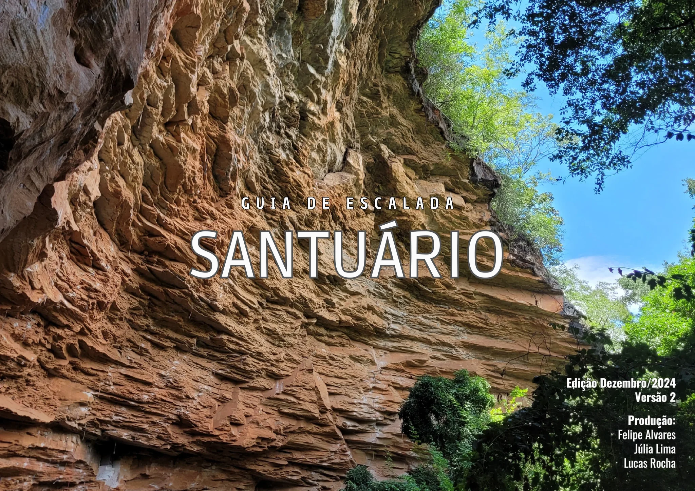
- **revisado_manualmente**: True
- **status_desenho_extraivel**: DESENHO_EXTRAIDO
- **botoes**:
  - **[0]**:
    - **uid**: 41EWNTvorttmlK
    - **texto**: Capa
    - **destino**:
      - **secao_textual**:
        - **conteudo**:
            # Guia de Escalada Santuário
            
            Edição Dezembro/2024 - Versão 2
            
            Produção:
            - Felipe Alvares
            - Júlia Lima
            - Lucas Rocha
            
            |  |
            | :--: |
            | *Capa do Guia de Escalada Santuário* |
  - **[1]**:
    - **uid**: Pr6xqr71EQEfG4
    - **texto**: Como Chegar
    - **destino**:
      - **secao_textual**:
        - **conteudo**:
            # Como Chegar
            
            ## Coordenadas
            - **Bar do Sr. João:** [R. Santo Antônio - Ribeirão da Mata, Santa Luzia - MG](https://www.google.com.br/maps/place/Bar+do+Sr.+Jo%C3%A3o/@-19.7032219,-43.8773559,15z/data=!4m15!1m8!3m7!1s0xa67d2f3991c267:0x7ba831ba35ec1a3b!2sBar+do+Sr.+Jo%C3%A3o!8m2!3d-19.7032219!4d-43.8773559!10e5!16s%2Fg%2F11jkp0_0jc!3m5!1s0xa67d2f3991c267:0x7ba831ba35ec1a3b!8m2!3d-19.7032219!4d-43.8773559!16s%2Fg%2F11jkp0_0jc?entry=ttu)
            - **Santuário:** [19°42'25.0"S, 43°52'17.3"W](https://www.google.com.br/maps/place/C%C3%A2nion+Ribeir%C3%A3o+da+Mata/@-19.7047782,-43.8847028,15.09z/data=!4m14!1m7!3m6!1s0xa67d2f3991c267:0x7ba831ba35ec1a3b!2sBar+do+Sr.+Jo%C3%A3o!8m2!3d-19.7032219!4d-43.8773559!16s%2Fg%2F11jkp0_0jc!3m5!1s0xa6874a22e9ebd5:0x9b1dc0f7515349e0!8m2!3d-19.7069444!4d-43.871488!16s%2Fg%2F11hzhqzrz1?entry=ttu)
            
            ## Distâncias
            - Belo Horizonte (centro) - 33 km
            - Confins - 24 km
            
            ## Descrição do Acesso
            Estacione o carro perto do **Bar do Sr. João**, e faça o restante da trilha a pé. Desça a rua principal até encontrar a linha de trem, e comece uma trilha rápida de 900 m. O Santuário encontra-se à direita da linha de trem.
            
            | 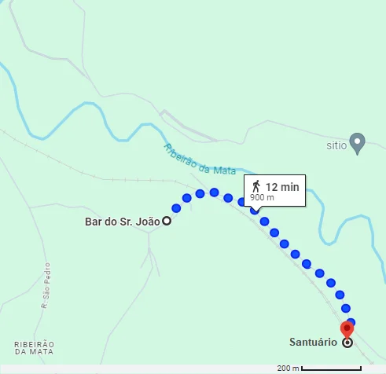 |
            | :--: |
            | *Mapa de acesso* |
            
            | 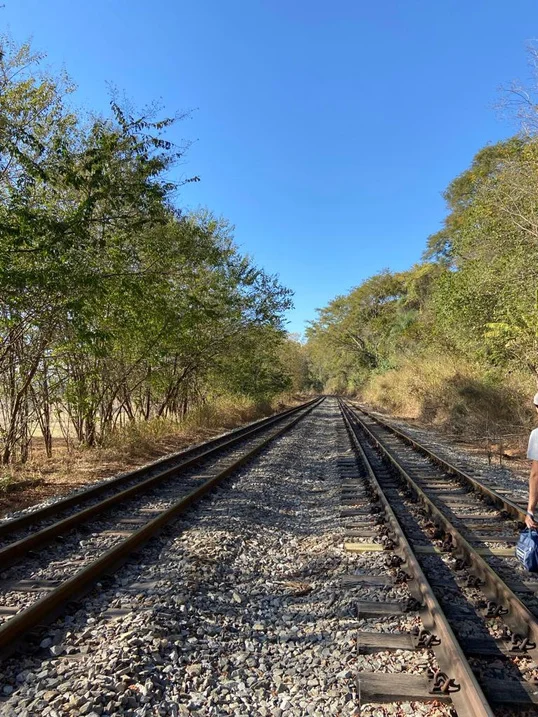 |
            | :--: |
            | *Trilha pela linha de trem* |
            
            | 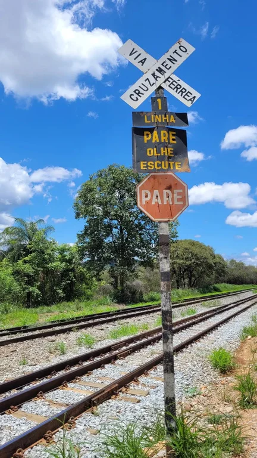 |
            | :--: |
            | *Sinalização no cruzamento ferroviário* |
  - **[2]**:
    - **uid**: 9muGkyYUuICy6N
    - **texto**: Comércio Local
    - **destino**:
      - **secao_textual**:
        - **conteudo**:
            # Comércio Local
            
            ## Bar do Sr. João
            
            **Endereço:** Rua Santo Antônio - Ribeirão da Mata, Santa Luzia - MG
            
            **Recomendações:**
            - Pastel frito na hora
            - Sucos e açaí
            - Refrigerantes e cerveja
            - Almoço (necessita agendar com antecedência)
            
            | 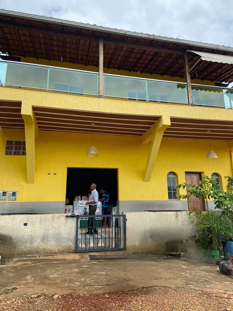 |
            | :--: |
            | *Fachada do Bar do Sr. João* |
            
            | 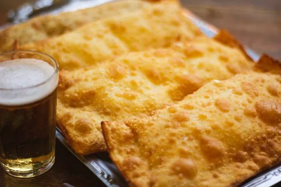 |
            | :--: |
            | *Pastel de feira* |
            
            | 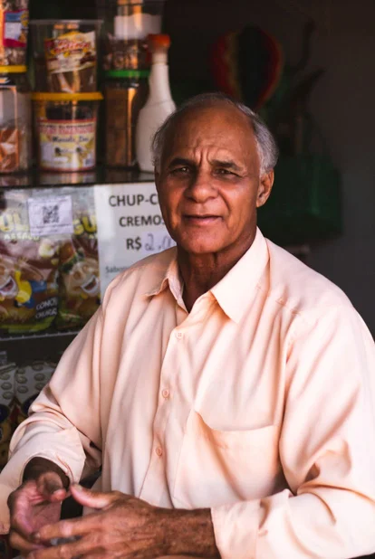 |
            | :--: |
            | *Sr. João no balcão* |
  - **[3]**:
    - **uid**: pnpP6dwgPFY0AC
    - **texto**: Informações Gerais
    - **destino**:
      - **secao_textual**:
        - **conteudo**:
            # Informações Gerais
            
            Dentro do domo do Santuário não chove, e só bate sol no início da manhã, por isso é um local perfeito para escalada durante todo o ano.
            
            | 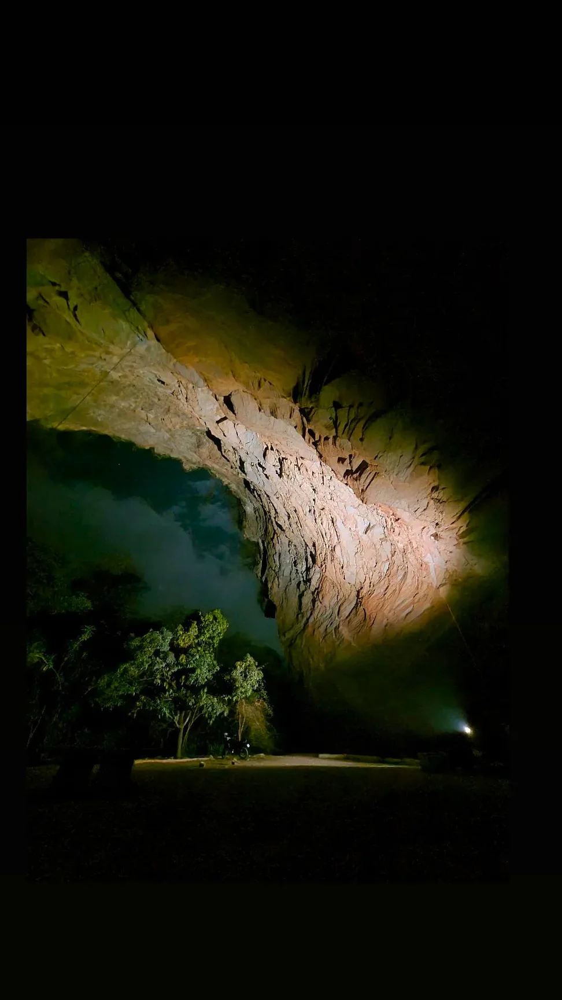 |
            | :--: |
            | *Vista do domo do Santuário* |
            
            ## Regras de Conduta
            - **Respeite o local:** Ele é sagrado para a comunidade.
            - **Lixo:** Leve o seu lixo ao sair. Respeite a fauna e flora do lugar.
            - **Preservação:** Não escreva nas pedras.
            - **Segurança:** Somente pratique escalada se tiver o domínio da técnica e do uso dos equipamentos.
            
            |  |
            | :--: |
            | *Logos de apoiadores* |
  - **[4]**:
    - **uid**: mAERK0HWcVMaFE
    - **texto**: Como Usar Este Guia
    - **destino**:
      - **secao_textual**:
        - **conteudo**:
            # Como Usar Este Guia
            
            Este Guia tem a função de informar, facilitar e divulgar as vias de escalada do Santuário.
            
            Todas as vias possuem placas de identificação em sua base. As vias são divididas em partes (P1, P2, P3, P4, P5), cada uma tem um grau que é cumulativo com a parte anterior.
            
            | 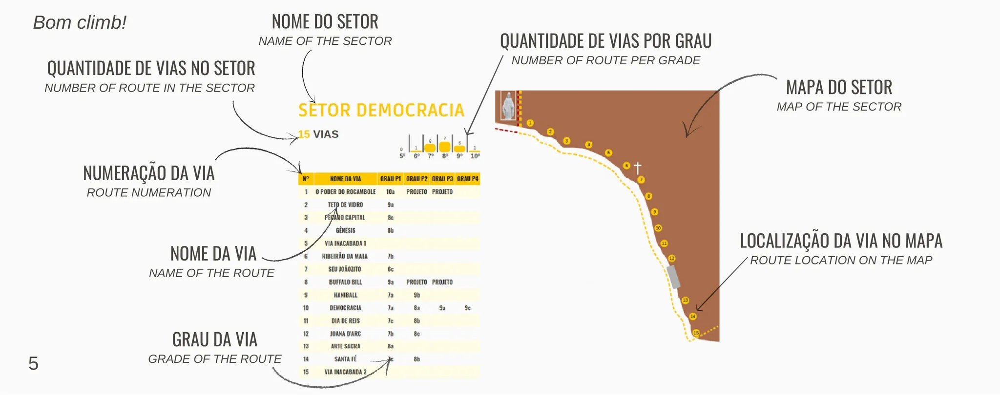 |
            | :--: |
            | *Instruções sobre a estrutura do guia* |
- **ultima_migracao**: 5
- **publicar_croqui**: True
- **revisado_bounding_circle**: True

## Parte: setor_clube_da_luta

### Setor (Pico: Santuário)

- **descricao**: 
- **nome**: Setor Clube da Luta
- **uid**: uyVmwHoHZTaJG4
- **caminho_imagem_capa**: 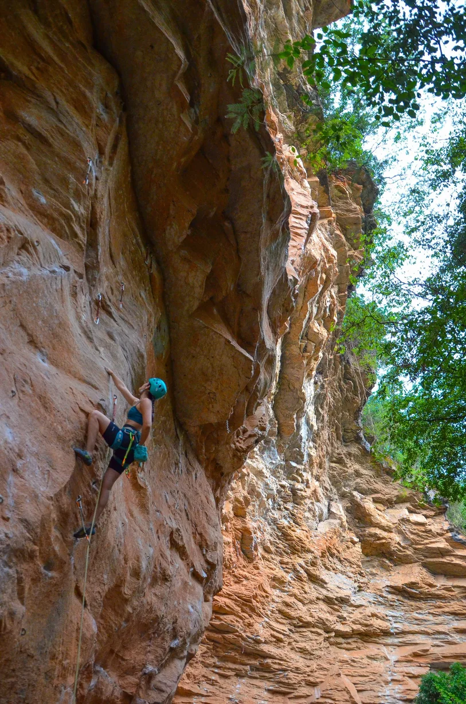
- **mapas**:
  - **[0]**:
    - **caminho_imagem_mapa**: 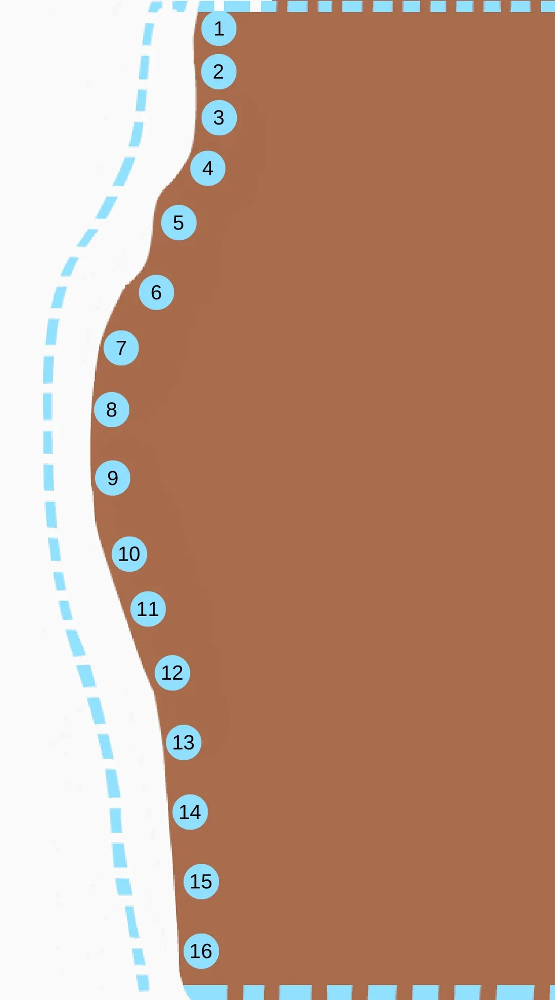
    - **largura_mapa**: 1137
    - **altura_mapa**: 2048
    - **pontos_de_interesse**:
      - **[0]**:
        - **id**: 5caHtx0USsLuXE
        - **uid**: 5caHtx0USsLuXE
        - **rotulo**: 01
        - **circulo**:
          - **x**: 448
          - **y**: 58
          - **raio**: 35
        - **label**: 01
      - **[1]**:
        - **id**: 4nUqameJuWByjY
        - **uid**: 4nUqameJuWByjY
        - **rotulo**: 02
        - **circulo**:
          - **x**: 448
          - **y**: 147
          - **raio**: 36
        - **label**: 02
      - **[2]**:
        - **id**: PKEIU5xrTViV4u
        - **uid**: PKEIU5xrTViV4u
        - **rotulo**: 03
        - **circulo**:
          - **x**: 449
          - **y**: 241
          - **raio**: 36
        - **label**: 03
      - **[3]**:
        - **id**: cPyEV9xJfCLzJw
        - **uid**: cPyEV9xJfCLzJw
        - **rotulo**: 04
        - **circulo**:
          - **x**: 426
          - **y**: 345
          - **raio**: 36
        - **label**: 04
      - **[4]**:
        - **id**: CQZGHvjK7GAMfl
        - **uid**: CQZGHvjK7GAMfl
        - **rotulo**: 05
        - **circulo**:
          - **x**: 366
          - **y**: 456
          - **raio**: 36
        - **label**: 05
      - **[5]**:
        - **id**: ani0Cd2ScdUS8V
        - **uid**: ani0Cd2ScdUS8V
        - **rotulo**: 06
        - **circulo**:
          - **x**: 320
          - **y**: 599
          - **raio**: 35
        - **label**: 06
      - **[6]**:
        - **id**: L3qZxGtZ7JzM3s
        - **uid**: L3qZxGtZ7JzM3s
        - **rotulo**: 07
        - **circulo**:
          - **x**: 248
          - **y**: 713
          - **raio**: 35
        - **label**: 07
      - **[7]**:
        - **id**: l93L7Sv9Apadb7
        - **uid**: l93L7Sv9Apadb7
        - **rotulo**: 08
        - **circulo**:
          - **x**: 229
          - **y**: 839
          - **raio**: 35
        - **label**: 08
      - **[8]**:
        - **id**: Yy7MQ04t4c3XQs
        - **uid**: Yy7MQ04t4c3XQs
        - **rotulo**: 09
        - **circulo**:
          - **x**: 231
          - **y**: 979
          - **raio**: 35
        - **label**: 09
      - **[9]**:
        - **id**: ifCnkD1PChI33A
        - **uid**: ifCnkD1PChI33A
        - **rotulo**: 10
        - **circulo**:
          - **x**: 265
          - **y**: 1135
          - **raio**: 35
        - **label**: 10
      - **[10]**:
        - **id**: JwJPu1EwKEa0hO
        - **uid**: JwJPu1EwKEa0hO
        - **rotulo**: 11
        - **circulo**:
          - **x**: 304
          - **y**: 1247
          - **raio**: 35
        - **label**: 11
      - **[11]**:
        - **id**: NbbZyv9WjxV93Z
        - **uid**: NbbZyv9WjxV93Z
        - **rotulo**: 12
        - **circulo**:
          - **x**: 353
          - **y**: 1378
          - **raio**: 35
        - **label**: 12
      - **[12]**:
        - **id**: BqqNDnhekUq1U6
        - **uid**: BqqNDnhekUq1U6
        - **rotulo**: 13
        - **circulo**:
          - **x**: 376
          - **y**: 1520
          - **raio**: 35
        - **label**: 13
      - **[13]**:
        - **id**: NbsNYPGnO8ZRPE
        - **uid**: NbsNYPGnO8ZRPE
        - **rotulo**: 14
        - **circulo**:
          - **x**: 390
          - **y**: 1663
          - **raio**: 35
        - **label**: 14
      - **[14]**:
        - **id**: OQrtyMk8eSK1yC
        - **uid**: OQrtyMk8eSK1yC
        - **rotulo**: 15
        - **circulo**:
          - **x**: 412
          - **y**: 1806
          - **raio**: 35
        - **label**: 15
      - **[15]**:
        - **id**: TaqT90SZbGbfKW
        - **uid**: TaqT90SZbGbfKW
        - **rotulo**: 16
        - **circulo**:
          - **x**: 412
          - **y**: 1948
          - **raio**: 35
        - **label**: 16
    - **referencias**:
      - **[0]**:
        - **alvo_uid**: J8URNuFsaRVL6r
        - **pontos_uids**:
          - 5caHtx0USsLuXE
        - **escalada**: POLLY SHELBY
        - **ids**:
          - 5caHtx0USsLuXE
      - **[1]**:
        - **alvo_uid**: YNdwFFok9Xa78O
        - **pontos_uids**:
          - 4nUqameJuWByjY
        - **escalada**: BLACK DOG
        - **ids**:
          - 4nUqameJuWByjY
      - **[2]**:
        - **alvo_uid**: 6saZhQHzBr9axQ
        - **pontos_uids**:
          - PKEIU5xrTViV4u
        - **escalada**: INCONSCIENTE COLETIVO
        - **ids**:
          - PKEIU5xrTViV4u
      - **[3]**:
        - **alvo_uid**: 8HQ2LdCfVNhRuQ
        - **pontos_uids**:
          - cPyEV9xJfCLzJw
        - **escalada**: DISCÍPULOS DE BIBIU
        - **ids**:
          - cPyEV9xJfCLzJw
      - **[4]**:
        - **alvo_uid**: YFqxQjJEbT18WZ
        - **pontos_uids**:
          - CQZGHvjK7GAMfl
        - **escalada**: EL NINHO
        - **ids**:
          - CQZGHvjK7GAMfl
      - **[5]**:
        - **alvo_uid**: PbQO9XUINhW6wM
        - **pontos_uids**:
          - ani0Cd2ScdUS8V
        - **escalada**: O PECADOR
        - **ids**:
          - ani0Cd2ScdUS8V
      - **[6]**:
        - **alvo_uid**: L8GtZBiK3uDSFm
        - **pontos_uids**:
          - L3qZxGtZ7JzM3s
        - **escalada**: PROMESSA É DÍVIDA
        - **ids**:
          - L3qZxGtZ7JzM3s
      - **[7]**:
        - **alvo_uid**: TjoEniIfdfE9Ud
        - **pontos_uids**:
          - l93L7Sv9Apadb7
        - **escalada**: RINS DE PEDRA
        - **ids**:
          - l93L7Sv9Apadb7
      - **[8]**:
        - **alvo_uid**: QMZnb5VOgCJMcc
        - **pontos_uids**:
          - Yy7MQ04t4c3XQs
        - **escalada**: PAGADOR DE PROMESSA
        - **ids**:
          - Yy7MQ04t4c3XQs
      - **[9]**:
        - **alvo_uid**: pmXoC5dyY42w4K
        - **pontos_uids**:
          - ifCnkD1PChI33A
        - **escalada**: BIBI CORAGEM
        - **ids**:
          - ifCnkD1PChI33A
      - **[10]**:
        - **alvo_uid**: 2eZSSKLesbbjsc
        - **pontos_uids**:
          - JwJPu1EwKEa0hO
        - **escalada**: DE MALANDRO A GRANFINO
        - **ids**:
          - JwJPu1EwKEa0hO
      - **[11]**:
        - **alvo_uid**: RnGhwzxeI2kp1C
        - **pontos_uids**:
          - NbbZyv9WjxV93Z
        - **escalada**: CLUBE DA LUTA
        - **ids**:
          - NbbZyv9WjxV93Z
      - **[12]**:
        - **alvo_uid**: ytc6ItjMB2jhOa
        - **pontos_uids**:
          - BqqNDnhekUq1U6
        - **escalada**: ROLO COMPRESSOR
        - **ids**:
          - BqqNDnhekUq1U6
      - **[13]**:
        - **alvo_uid**: G9JquAmmfNpIb7
        - **pontos_uids**:
          - NbsNYPGnO8ZRPE
        - **escalada**: O ESPECIALISTA
        - **ids**:
          - NbsNYPGnO8ZRPE
      - **[14]**:
        - **alvo_uid**: AJcs2YBVhtjoFq
        - **pontos_uids**:
          - OQrtyMk8eSK1yC
        - **escalada**: O GUARDA COSTA
        - **ids**:
          - OQrtyMk8eSK1yC
      - **[15]**:
        - **alvo_uid**: xtizouBCiT0KK8
        - **pontos_uids**:
          - TaqT90SZbGbfKW
        - **escalada**: MARIA MADALENA
        - **ids**:
          - TaqT90SZbGbfKW
- **escaladas**:
  - **[0]**:
    - **uid**: J8URNuFsaRVL6r
    - **via_esportiva**:
      - **nome**: POLLY SHELBY
      - **dificuldade**: BR_9C
  - **[1]**:
    - **uid**: YNdwFFok9Xa78O
    - **via_esportiva**:
      - **nome**: BLACK DOG
      - **dificuldade**: BR_9C
  - **[2]**:
    - **uid**: 6saZhQHzBr9axQ
    - **via_esportiva**:
      - **nome**: INCONSCIENTE COLETIVO
      - **dificuldade**: BR_9B
  - **[3]**:
    - **uid**: 8HQ2LdCfVNhRuQ
    - **via_esportiva**:
      - **nome**: DISCÍPULOS DE BIBIU
      - **dificuldade**: BR_9A
  - **[4]**:
    - **uid**: YFqxQjJEbT18WZ
    - **via_esportiva**:
      - **nome**: EL NINHO
      - **dificuldade**: BR_7C
  - **[5]**:
    - **uid**: PbQO9XUINhW6wM
    - **via_multiplas_enfiadas**:
      - **nome**: O PECADOR
      - **dificuldade_maxima**: BR_8B
      - **enfiadas**:
        - **[0]**:
          - **via_esportiva**:
            - **nome**: P1
            - **dificuldade**: BR_7B
        - **[1]**:
          - **via_esportiva**:
            - **nome**: P2
            - **dificuldade**: BR_8B
  - **[6]**:
    - **uid**: L8GtZBiK3uDSFm
    - **via_multiplas_enfiadas**:
      - **nome**: PROMESSA É DÍVIDA
      - **dificuldade_maxima**: BR_8A
      - **enfiadas**:
        - **[0]**:
          - **via_esportiva**:
            - **nome**: P1
            - **dificuldade**: BR_7A
        - **[1]**:
          - **via_esportiva**:
            - **nome**: P2
            - **dificuldade**: BR_8A
  - **[7]**:
    - **uid**: TjoEniIfdfE9Ud
    - **via_multiplas_enfiadas**:
      - **nome**: RINS DE PEDRA
      - **dificuldade_maxima**: BR_8B
      - **enfiadas**:
        - **[0]**:
          - **via_esportiva**:
            - **nome**: P1
            - **dificuldade**: BR_6
        - **[1]**:
          - **via_esportiva**:
            - **nome**: P2
            - **dificuldade**: BR_8B
  - **[8]**:
    - **uid**: QMZnb5VOgCJMcc
    - **via_multiplas_enfiadas**:
      - **nome**: PAGADOR DE PROMESSA
      - **dificuldade_maxima**: BR_8B
      - **enfiadas**:
        - **[0]**:
          - **via_esportiva**:
            - **nome**: P1
            - **dificuldade**: BR_8A
        - **[1]**:
          - **via_esportiva**:
            - **nome**: P2
            - **dificuldade**: BR_8B
  - **[9]**:
    - **uid**: pmXoC5dyY42w4K
    - **via_esportiva**:
      - **nome**: BIBI CORAGEM
      - **dificuldade**: BR_7C
  - **[10]**:
    - **uid**: 2eZSSKLesbbjsc
    - **via_esportiva**:
      - **nome**: DE MALANDRO A GRANFINO
      - **dificuldade**: BR_10A
  - **[11]**:
    - **uid**: RnGhwzxeI2kp1C
    - **via_esportiva**:
      - **nome**: CLUBE DA LUTA
      - **dificuldade**: BR_9B
  - **[12]**:
    - **uid**: ytc6ItjMB2jhOa
    - **via_esportiva**:
      - **nome**: ROLO COMPRESSOR
      - **dificuldade**: BR_9B
  - **[13]**:
    - **uid**: G9JquAmmfNpIb7
    - **via_multiplas_enfiadas**:
      - **nome**: O ESPECIALISTA
      - **dificuldade_maxima**: BR_9C
      - **enfiadas**:
        - **[0]**:
          - **via_esportiva**:
            - **nome**: P1
            - **dificuldade**: BR_9B
        - **[1]**:
          - **via_esportiva**:
            - **nome**: P2
            - **dificuldade**: BR_9C
        - **[2]**:
          - **via_esportiva**:
            - **nome**: P3
            - **dificuldade**: PROJETO
  - **[14]**:
    - **uid**: AJcs2YBVhtjoFq
    - **via_esportiva**:
      - **nome**: O GUARDA COSTA
      - **dificuldade**: BR_9B
  - **[15]**:
    - **uid**: xtizouBCiT0KK8
    - **via_multiplas_enfiadas**:
      - **nome**: MARIA MADALENA
      - **dificuldade_maxima**: PROJETO
      - **enfiadas**:
        - **[0]**:
          - **via_esportiva**:
            - **nome**: P1
            - **dificuldade**: PROJETO
        - **[1]**:
          - **via_esportiva**:
            - **nome**: P2
            - **dificuldade**: PROJETO
- **precomputados**:
  - **total_escaladas**: 16
  - **total_esportivas**: 10
  - **total_multiplas_enfiadas**: 6

## Parte: setor_santa_linea

### Setor (Pico: Santuário)

- **descricao**:
    ## Conexões e Variantes
    
    Este setor possui diversas conexões entre as vias, permitindo combinar diferentes partes (P1, P2, P3...) de vias adjacentes.
    
    | N° | De (Via / Segmento) | Para (Via / Segmento) | Grau |
    |---|---|---|---|
    | 7.1 | ÓPANGARÉ P1 | SANTA KLAUSS P2 | PROJETO |
    | 7.2 | ÓPANGARÉ P1 | SANTA KLAUSS P3 | PROJETO |
    | 11.1 | SANTO GRAU P2 | TIRANOS DE PLANTÃO P3 | PROJETO |
    | 11.2 | SANTO GRAU P2 | TIRANOS DE PLANTÃO P4 | PROJETO |
    | 11.3 | SANTO GRAU P2 | TIRANOS DE PLANTÃO P5 | PROJETO |
    | 13.1 | SÓ OS LOUCOS SABEM P2 | AVE MARIA P3 | PROJETO |
    | 13.2 | SÓ OS LOUCOS SABEM P2 | CHÁ NA CARTOLINA P3 | 9c |
    | 13.3 | SÓ OS LOUCOS SABEM P2 | SANTA LINEA P2 | PROJETO |
    | 13.4 | SÓ OS LOUCOS SABEM P2 | SANTA LINEA P3 | PROJETO |
    | 14.1 | CHÁ NA CARTOLINA P2 | AVE MARIA P3 | 9c |
    | 14.2 | CHÁ NA CARTOLINA P2 | SANTA LINEA P2 | 10b |
    | 14.3 | CHÁ NA CARTOLINA P2 | SANTA LINEA P3 | PROJETO |
    | 15.1 | AVE MARIA P2 | CHÁ NA CARTOLINA P3 | 9b |
- **nome**: Setor Santa Línea
- **uid**: VKsk4hj1SNsgSN
- **caminho_imagem_capa**: 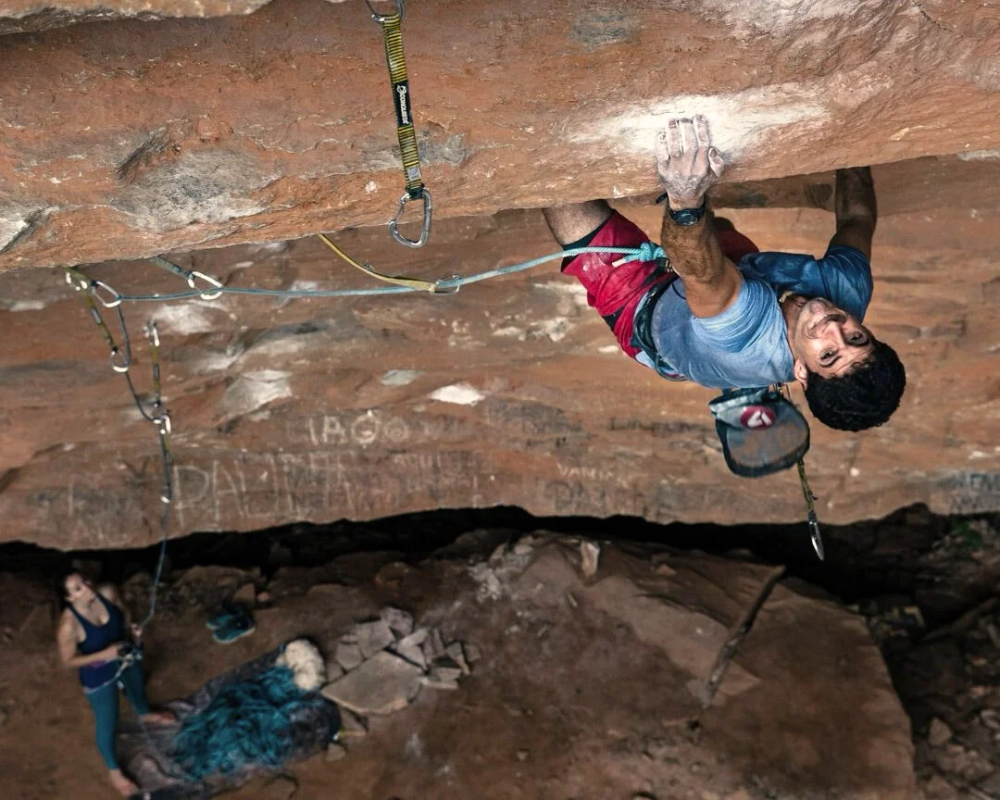
- **mapas**:
  - **[0]**:
    - **caminho_imagem_mapa**: 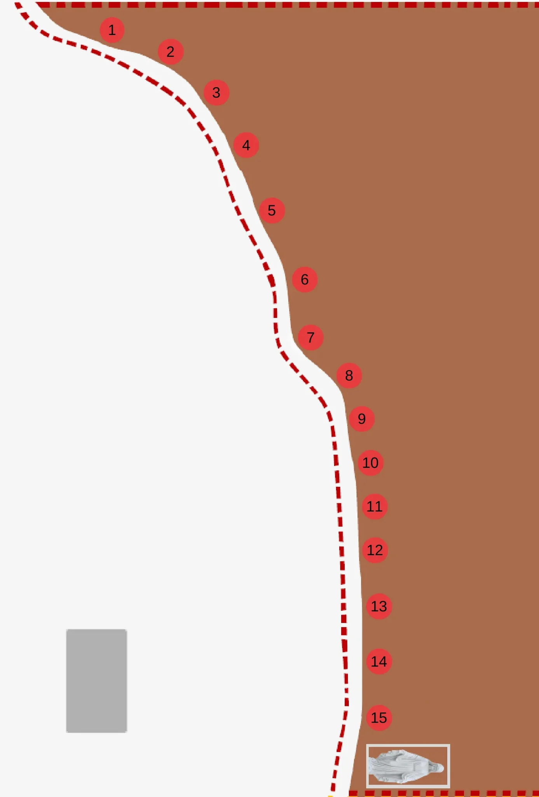
    - **largura_mapa**: 1387
    - **altura_mapa**: 2048
    - **pontos_de_interesse**:
      - **[0]**:
        - **id**: vrcQ90eof9EtSc
        - **uid**: vrcQ90eof9EtSc
        - **rotulo**: 01
        - **circulo**:
          - **x**: 288
          - **y**: 77
          - **raio**: 33
        - **label**: 01
      - **[1]**:
        - **id**: WtH5HsSIQgw06V
        - **uid**: WtH5HsSIQgw06V
        - **rotulo**: 02
        - **circulo**:
          - **x**: 439
          - **y**: 133
          - **raio**: 34
        - **label**: 02
      - **[2]**:
        - **id**: nILRi2lvCZmrtA
        - **uid**: nILRi2lvCZmrtA
        - **rotulo**: 03
        - **circulo**:
          - **x**: 557
          - **y**: 238
          - **raio**: 34
        - **label**: 03
      - **[3]**:
        - **id**: xpAfZfcazK0zWJ
        - **uid**: xpAfZfcazK0zWJ
        - **rotulo**: 04
        - **circulo**:
          - **x**: 633
          - **y**: 372
          - **raio**: 33
        - **label**: 04
      - **[4]**:
        - **id**: 3IqclpeWGzDThz
        - **uid**: 3IqclpeWGzDThz
        - **rotulo**: 05
        - **circulo**:
          - **x**: 700
          - **y**: 541
          - **raio**: 33
        - **label**: 05
      - **[5]**:
        - **id**: Nim96g3pfu0s0H
        - **uid**: Nim96g3pfu0s0H
        - **rotulo**: 06
        - **circulo**:
          - **x**: 784
          - **y**: 718
          - **raio**: 33
        - **label**: 06
      - **[6]**:
        - **id**: vPodBhUazuZ1JY
        - **uid**: vPodBhUazuZ1JY
        - **rotulo**: 07
        - **circulo**:
          - **x**: 799
          - **y**: 867
          - **raio**: 33
        - **label**: 07
      - **[7]**:
        - **id**: bqQdwuWfyUFfhL
        - **uid**: bqQdwuWfyUFfhL
        - **rotulo**: 08
        - **circulo**:
          - **x**: 899
          - **y**: 965
          - **raio**: 33
        - **label**: 08
      - **[8]**:
        - **id**: Wh4fXApVg9yroD
        - **uid**: Wh4fXApVg9yroD
        - **rotulo**: 09
        - **circulo**:
          - **x**: 931
          - **y**: 1077
          - **raio**: 33
        - **label**: 09
      - **[9]**:
        - **id**: Y44U6NvZwtaVbo
        - **uid**: Y44U6NvZwtaVbo
        - **rotulo**: 10
        - **circulo**:
          - **x**: 953
          - **y**: 1190
          - **raio**: 33
        - **label**: 10
      - **[10]**:
        - **id**: 2waStHT26o1Da8
        - **uid**: 2waStHT26o1Da8
        - **rotulo**: 11
        - **circulo**:
          - **x**: 964
          - **y**: 1301
          - **raio**: 33
        - **label**: 11
      - **[11]**:
        - **id**: 3DSj5VEX5uNiDn
        - **uid**: 3DSj5VEX5uNiDn
        - **rotulo**: 12
        - **circulo**:
          - **x**: 966
          - **y**: 1414
          - **raio**: 34
        - **label**: 12
      - **[12]**:
        - **id**: UDsuo7IAZJac4N
        - **uid**: UDsuo7IAZJac4N
        - **rotulo**: 13
        - **circulo**:
          - **x**: 975
          - **y**: 1558
          - **raio**: 34
        - **label**: 13
      - **[13]**:
        - **id**: ypfDXTpXZqKNHz
        - **uid**: ypfDXTpXZqKNHz
        - **rotulo**: 14
        - **circulo**:
          - **x**: 975
          - **y**: 1700
          - **raio**: 34
        - **label**: 14
      - **[14]**:
        - **id**: AELagKNfLaO509
        - **uid**: AELagKNfLaO509
        - **rotulo**: 15
        - **circulo**:
          - **x**: 975
          - **y**: 1844
          - **raio**: 34
        - **label**: 15
    - **referencias**:
      - **[0]**:
        - **alvo_uid**: YScYYNsHJM92Q4
        - **pontos_uids**:
          - vrcQ90eof9EtSc
        - **escalada**: MEU AMIGO CHARLIE BROWN
        - **ids**:
          - vrcQ90eof9EtSc
      - **[1]**:
        - **alvo_uid**: kCLqk6HpbonTPt
        - **pontos_uids**:
          - WtH5HsSIQgw06V
        - **escalada**: PAI NOSSO
        - **ids**:
          - WtH5HsSIQgw06V
      - **[2]**:
        - **alvo_uid**: fIUdmHpWRMjJuy
        - **pontos_uids**:
          - nILRi2lvCZmrtA
        - **escalada**: NEM TUDO É PERFEITO
        - **ids**:
          - nILRi2lvCZmrtA
      - **[3]**:
        - **alvo_uid**: tPhRmjIMiCiMzm
        - **pontos_uids**:
          - xpAfZfcazK0zWJ
        - **escalada**: DIAS DE LUTA DIAS DE GLÓRIA
        - **ids**:
          - xpAfZfcazK0zWJ
      - **[4]**:
        - **alvo_uid**: 6BolXGNpTjwcr0
        - **pontos_uids**:
          - 3IqclpeWGzDThz
        - **escalada**: MADE IN BRAZIL
        - **ids**:
          - 3IqclpeWGzDThz
      - **[5]**:
        - **alvo_uid**: EgwuJT9ibblC9i
        - **pontos_uids**:
          - Nim96g3pfu0s0H
        - **escalada**: SANTA KLAUSS
        - **ids**:
          - Nim96g3pfu0s0H
      - **[6]**:
        - **alvo_uid**: HKdDb12M23KTwi
        - **pontos_uids**:
          - vPodBhUazuZ1JY
        - **escalada**: ÓPANGARE
        - **ids**:
          - vPodBhUazuZ1JY
      - **[7]**:
        - **alvo_uid**: 2eFSP5udOTcYck
        - **pontos_uids**:
          - bqQdwuWfyUFfhL
        - **escalada**: BERBARIDADE MÁXIMA
        - **ids**:
          - bqQdwuWfyUFfhL
      - **[8]**:
        - **alvo_uid**: lctRU7g4DiWO5S
        - **pontos_uids**:
          - Wh4fXApVg9yroD
        - **escalada**: SANTA INQUISIÇÃO
        - **ids**:
          - Wh4fXApVg9yroD
      - **[9]**:
        - **alvo_uid**: TioyWPeMe4Riow
        - **pontos_uids**:
          - Y44U6NvZwtaVbo
        - **escalada**: TIRANOS DE PLANTÃO
        - **ids**:
          - Y44U6NvZwtaVbo
      - **[10]**:
        - **alvo_uid**: JlE3PwZzrMPvcV
        - **pontos_uids**:
          - 2waStHT26o1Da8
        - **escalada**: SANTO GRAU
        - **ids**:
          - 2waStHT26o1Da8
      - **[11]**:
        - **alvo_uid**: lQvnKMNwGg6dFd
        - **pontos_uids**:
          - 3DSj5VEX5uNiDn
        - **escalada**: SANTA LINEA
        - **ids**:
          - 3DSj5VEX5uNiDn
      - **[12]**:
        - **alvo_uid**: IGmMi3yV7ad9c2
        - **pontos_uids**:
          - UDsuo7IAZJac4N
        - **escalada**: SÓ OS LOUCOS SABEM
        - **ids**:
          - UDsuo7IAZJac4N
      - **[13]**:
        - **alvo_uid**: 2YqwWQY0jOtjCj
        - **pontos_uids**:
          - ypfDXTpXZqKNHz
        - **escalada**: CHÁ NA CARTOLINA
        - **ids**:
          - ypfDXTpXZqKNHz
      - **[14]**:
        - **alvo_uid**: 9j3ZZ5BmAaVPSG
        - **pontos_uids**:
          - AELagKNfLaO509
        - **escalada**: AVE MARIA
        - **ids**:
          - AELagKNfLaO509
- **escaladas**:
  - **[0]**:
    - **uid**: YScYYNsHJM92Q4
    - **via_multiplas_enfiadas**:
      - **nome**: MEU AMIGO CHARLIE BROWN
      - **dificuldade_maxima**: BR_10A
      - **enfiadas**:
        - **[0]**:
          - **via_esportiva**:
            - **nome**: P1
            - **dificuldade**: BR_7C
        - **[1]**:
          - **via_esportiva**:
            - **nome**: P2
            - **dificuldade**: BR_9B
        - **[2]**:
          - **via_esportiva**:
            - **nome**: P3
            - **dificuldade**: BR_10A
  - **[1]**:
    - **uid**: kCLqk6HpbonTPt
    - **via_multiplas_enfiadas**:
      - **nome**: PAI NOSSO
      - **dificuldade_maxima**: BR_9B
      - **enfiadas**:
        - **[0]**:
          - **via_esportiva**:
            - **nome**: P1
            - **dificuldade**: BR_7C
        - **[1]**:
          - **via_esportiva**:
            - **nome**: P2
            - **dificuldade**: BR_8C
        - **[2]**:
          - **via_esportiva**:
            - **nome**: P3
            - **dificuldade**: BR_9B
  - **[2]**:
    - **uid**: fIUdmHpWRMjJuy
    - **via_multiplas_enfiadas**:
      - **nome**: NEM TUDO É PERFEITO
      - **dificuldade_maxima**: BR_9B
      - **enfiadas**:
        - **[0]**:
          - **via_esportiva**:
            - **nome**: P1
            - **dificuldade**: BR_8B
        - **[1]**:
          - **via_esportiva**:
            - **nome**: P2
            - **dificuldade**: BR_9B
  - **[3]**:
    - **uid**: tPhRmjIMiCiMzm
    - **via_multiplas_enfiadas**:
      - **nome**: DIAS DE LUTA DIAS DE GLÓRIA
      - **dificuldade_maxima**: BR_10A
      - **enfiadas**:
        - **[0]**:
          - **via_esportiva**:
            - **nome**: P1
            - **dificuldade**: BR_9A
        - **[1]**:
          - **via_esportiva**:
            - **nome**: P2
            - **dificuldade**: BR_10A
  - **[4]**:
    - **uid**: 6BolXGNpTjwcr0
    - **via_multiplas_enfiadas**:
      - **nome**: MADE IN BRAZIL
      - **dificuldade_maxima**: BR_10B
      - **enfiadas**:
        - **[0]**:
          - **via_esportiva**:
            - **nome**: P1
            - **dificuldade**: BR_8A
        - **[1]**:
          - **via_esportiva**:
            - **nome**: P2
            - **dificuldade**: BR_9B
        - **[2]**:
          - **via_esportiva**:
            - **nome**: P3
            - **dificuldade**: BR_10B
  - **[5]**:
    - **uid**: EgwuJT9ibblC9i
    - **via_multiplas_enfiadas**:
      - **nome**: SANTA KLAUSS
      - **dificuldade_maxima**: BR_10C
      - **enfiadas**:
        - **[0]**:
          - **via_esportiva**:
            - **nome**: P1
            - **dificuldade**: BR_8C
        - **[1]**:
          - **via_esportiva**:
            - **nome**: P2
            - **dificuldade**: BR_9C
        - **[2]**:
          - **via_esportiva**:
            - **nome**: P3
            - **dificuldade**: BR_10C
  - **[6]**:
    - **uid**: HKdDb12M23KTwi
    - **via_esportiva**:
      - **nome**: ÓPANGARE
      - **dificuldade**: BR_9A
  - **[7]**:
    - **uid**: 2eFSP5udOTcYck
    - **via_esportiva**:
      - **nome**: BERBARIDADE MÁXIMA
      - **dificuldade**: BR_8A
  - **[8]**:
    - **uid**: lctRU7g4DiWO5S
    - **via_esportiva**:
      - **nome**: SANTA INQUISIÇÃO
      - **dificuldade**: BR_10C
  - **[9]**:
    - **uid**: TioyWPeMe4Riow
    - **via_multiplas_enfiadas**:
      - **nome**: TIRANOS DE PLANTÃO
      - **dificuldade_maxima**: BR_9C
      - **enfiadas**:
        - **[0]**:
          - **via_esportiva**:
            - **nome**: P1
            - **dificuldade**: BR_7B
        - **[1]**:
          - **via_esportiva**:
            - **nome**: P2
            - **dificuldade**: BR_8B
        - **[2]**:
          - **via_esportiva**:
            - **nome**: P3
            - **dificuldade**: BR_9A
        - **[3]**:
          - **via_esportiva**:
            - **nome**: P4
            - **dificuldade**: BR_9B
        - **[4]**:
          - **via_esportiva**:
            - **nome**: P5
            - **dificuldade**: BR_9C
  - **[10]**:
    - **uid**: JlE3PwZzrMPvcV
    - **via_multiplas_enfiadas**:
      - **nome**: SANTO GRAU
      - **dificuldade_maxima**: PROJETO
      - **enfiadas**:
        - **[0]**:
          - **via_esportiva**:
            - **nome**: P1
            - **dificuldade**: BR_9B
        - **[1]**:
          - **via_esportiva**:
            - **nome**: P2
            - **dificuldade**: PROJETO
  - **[11]**:
    - **uid**: lQvnKMNwGg6dFd
    - **via_multiplas_enfiadas**:
      - **nome**: SANTA LINEA
      - **dificuldade_maxima**: PROJETO
      - **enfiadas**:
        - **[0]**:
          - **via_esportiva**:
            - **nome**: P1
            - **dificuldade**: BR_10A
        - **[1]**:
          - **via_esportiva**:
            - **nome**: P2
            - **dificuldade**: BR_11A
        - **[2]**:
          - **via_esportiva**:
            - **nome**: P3
            - **dificuldade**: PROJETO
  - **[12]**:
    - **uid**: IGmMi3yV7ad9c2
    - **via_multiplas_enfiadas**:
      - **nome**: SÓ OS LOUCOS SABEM
      - **dificuldade_maxima**: BR_9A
      - **enfiadas**:
        - **[0]**:
          - **via_esportiva**:
            - **nome**: P1
            - **dificuldade**: BR_8A
        - **[1]**:
          - **via_esportiva**:
            - **nome**: P2
            - **dificuldade**: BR_9A
  - **[13]**:
    - **uid**: 2YqwWQY0jOtjCj
    - **via_multiplas_enfiadas**:
      - **nome**: CHÁ NA CARTOLINA
      - **dificuldade_maxima**: BR_9B
      - **enfiadas**:
        - **[0]**:
          - **via_esportiva**:
            - **nome**: P1
            - **dificuldade**: BR_7B
        - **[1]**:
          - **via_esportiva**:
            - **nome**: P2
            - **dificuldade**: BR_8B
        - **[2]**:
          - **via_esportiva**:
            - **nome**: P3
            - **dificuldade**: BR_9B
  - **[14]**:
    - **uid**: 9j3ZZ5BmAaVPSG
    - **via_multiplas_enfiadas**:
      - **nome**: AVE MARIA
      - **dificuldade_maxima**: BR_9C
      - **enfiadas**:
        - **[0]**:
          - **via_esportiva**:
            - **nome**: P1
            - **dificuldade**: BR_7B
        - **[1]**:
          - **via_esportiva**:
            - **nome**: P2
            - **dificuldade**: BR_8B
        - **[2]**:
          - **via_esportiva**:
            - **nome**: P3
            - **dificuldade**: BR_9C
- **precomputados**:
  - **total_escaladas**: 15
  - **total_esportivas**: 3
  - **total_multiplas_enfiadas**: 12

## Parte: setor_democracia

### Setor (Pico: Santuário)

- **descricao**: 
- **nome**: Setor Democracia
- **uid**: lvQcTGzk238Jom
- **caminho_imagem_capa**: 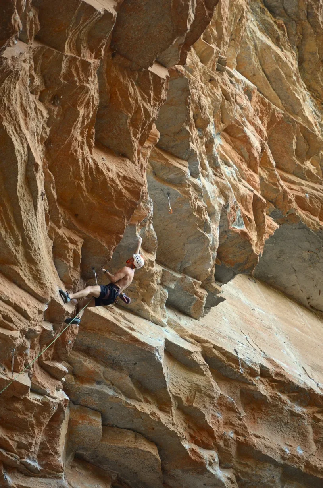
- **mapas**:
  - **[0]**:
    - **caminho_imagem_mapa**: 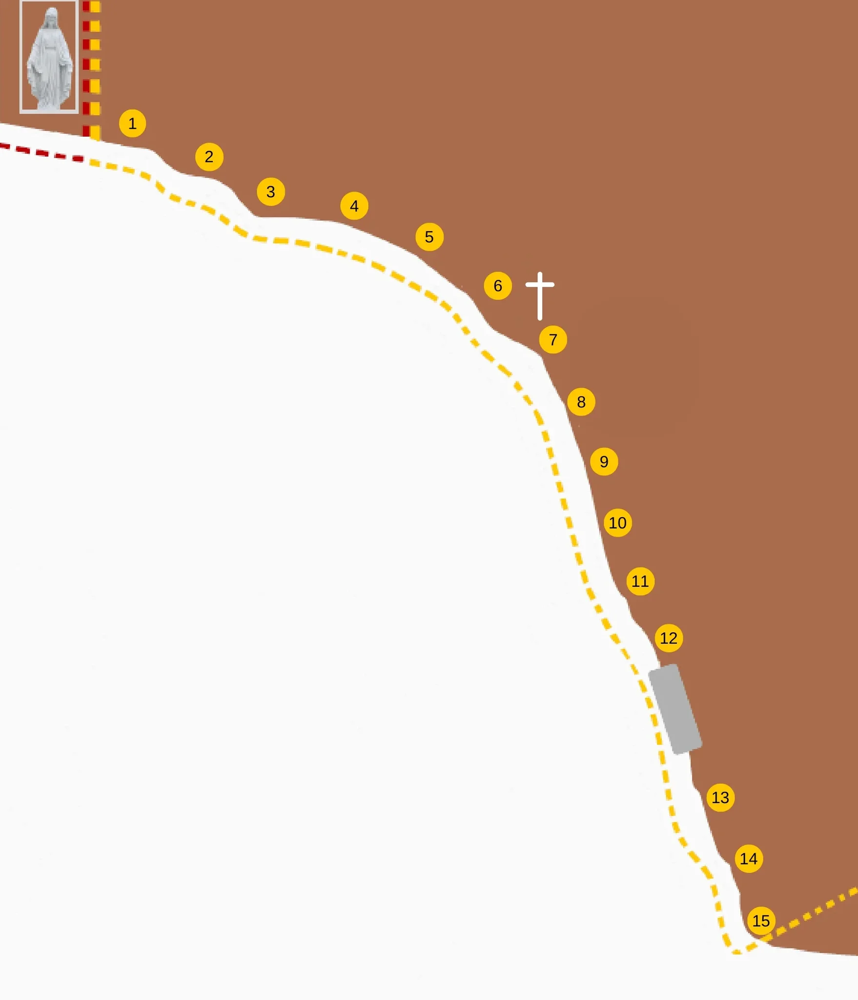
    - **largura_mapa**: 1758
    - **altura_mapa**: 2048
    - **pontos_de_interesse**:
      - **[0]**:
        - **id**: nm6TBbxUZ8KgMh
        - **uid**: nm6TBbxUZ8KgMh
        - **rotulo**: 01
        - **circulo**:
          - **x**: 272
          - **y**: 252
          - **raio**: 28
        - **label**: 01
      - **[1]**:
        - **id**: pXsGhgMUUUnsxn
        - **uid**: pXsGhgMUUUnsxn
        - **rotulo**: 02
        - **circulo**:
          - **x**: 429
          - **y**: 322
          - **raio**: 29
        - **label**: 02
      - **[2]**:
        - **id**: lQ8KDCxKokAwwe
        - **uid**: lQ8KDCxKokAwwe
        - **rotulo**: 03
        - **circulo**:
          - **x**: 555
          - **y**: 392
          - **raio**: 29
        - **label**: 03
      - **[3]**:
        - **id**: yUzpfjRHkL3nLg
        - **uid**: yUzpfjRHkL3nLg
        - **rotulo**: 04
        - **circulo**:
          - **x**: 726
          - **y**: 421
          - **raio**: 29
        - **label**: 04
      - **[4]**:
        - **id**: l4CvcKRjeynHc4
        - **uid**: l4CvcKRjeynHc4
        - **rotulo**: 05
        - **circulo**:
          - **x**: 880
          - **y**: 485
          - **raio**: 29
        - **label**: 05
      - **[5]**:
        - **id**: 2t2iBzu9fIKqDw
        - **uid**: 2t2iBzu9fIKqDw
        - **rotulo**: 06
        - **circulo**:
          - **x**: 1020
          - **y**: 585
          - **raio**: 29
        - **label**: 06
      - **[6]**:
        - **id**: KvnyQJzAUvfFwb
        - **uid**: KvnyQJzAUvfFwb
        - **rotulo**: 07
        - **circulo**:
          - **x**: 1134
          - **y**: 696
          - **raio**: 29
        - **label**: 07
      - **[7]**:
        - **id**: gwCcj000hmEUyh
        - **uid**: gwCcj000hmEUyh
        - **rotulo**: 08
        - **circulo**:
          - **x**: 1191
          - **y**: 823
          - **raio**: 29
        - **label**: 08
      - **[8]**:
        - **id**: 6SrUY3w7ulJgwn
        - **uid**: 6SrUY3w7ulJgwn
        - **rotulo**: 09
        - **circulo**:
          - **x**: 1238
          - **y**: 945
          - **raio**: 29
        - **label**: 09
      - **[9]**:
        - **id**: 2m5FIZkLxoM0Pz
        - **uid**: 2m5FIZkLxoM0Pz
        - **rotulo**: 10
        - **circulo**:
          - **x**: 1266
          - **y**: 1070
          - **raio**: 29
        - **label**: 10
      - **[10]**:
        - **id**: zXALRypeurB5ZM
        - **uid**: zXALRypeurB5ZM
        - **rotulo**: 11
        - **circulo**:
          - **x**: 1313
          - **y**: 1190
          - **raio**: 29
        - **label**: 11
      - **[11]**:
        - **id**: reMellebzTv9BZ
        - **uid**: reMellebzTv9BZ
        - **rotulo**: 12
        - **circulo**:
          - **x**: 1371
          - **y**: 1307
          - **raio**: 29
        - **label**: 12
      - **[12]**:
        - **id**: jSdHeIsNr6KE7V
        - **uid**: jSdHeIsNr6KE7V
        - **rotulo**: 13
        - **circulo**:
          - **x**: 1476
          - **y**: 1634
          - **raio**: 29
        - **label**: 13
      - **[13]**:
        - **id**: YHQIELl2lCHaqQ
        - **uid**: YHQIELl2lCHaqQ
        - **rotulo**: 14
        - **circulo**:
          - **x**: 1535
          - **y**: 1759
          - **raio**: 29
        - **label**: 14
      - **[14]**:
        - **id**: 5Cd1JMTs505tWg
        - **uid**: 5Cd1JMTs505tWg
        - **rotulo**: 15
        - **circulo**:
          - **x**: 1561
          - **y**: 1886
          - **raio**: 29
        - **label**: 15
    - **referencias**:
      - **[0]**:
        - **alvo_uid**: 4CGdzyCDROpBgb
        - **pontos_uids**:
          - nm6TBbxUZ8KgMh
        - **escalada**: O PODER DO ROCAMBOLE
        - **ids**:
          - nm6TBbxUZ8KgMh
      - **[1]**:
        - **alvo_uid**: W18n7Ow1KIsRVh
        - **pontos_uids**:
          - pXsGhgMUUUnsxn
        - **escalada**: TETO DE VIDRO
        - **ids**:
          - pXsGhgMUUUnsxn
      - **[2]**:
        - **alvo_uid**: tIuNInbHaHDXI8
        - **pontos_uids**:
          - lQ8KDCxKokAwwe
        - **escalada**: PECADO CAPITAL
        - **ids**:
          - lQ8KDCxKokAwwe
      - **[3]**:
        - **alvo_uid**: AnhDRwiGlVY9dJ
        - **pontos_uids**:
          - yUzpfjRHkL3nLg
        - **escalada**: GÊNESIS
        - **ids**:
          - yUzpfjRHkL3nLg
      - **[4]**:
        - **alvo_uid**: ezz59UKAO6FfFu
        - **pontos_uids**:
          - l4CvcKRjeynHc4
        - **escalada**: VIA INACABADA 1
        - **ids**:
          - l4CvcKRjeynHc4
      - **[5]**:
        - **alvo_uid**: lSKVK5WAqpI53q
        - **pontos_uids**:
          - 2t2iBzu9fIKqDw
        - **escalada**: RIBEIRÃO DA MATA
        - **ids**:
          - 2t2iBzu9fIKqDw
      - **[6]**:
        - **alvo_uid**: lNi4dqe08Vmvnt
        - **pontos_uids**:
          - KvnyQJzAUvfFwb
        - **escalada**: SEU JOÃOZITO
        - **ids**:
          - KvnyQJzAUvfFwb
      - **[7]**:
        - **alvo_uid**: CbuTJ6vmNC2Pq5
        - **pontos_uids**:
          - gwCcj000hmEUyh
        - **escalada**: BUFFALO BILL
        - **ids**:
          - gwCcj000hmEUyh
      - **[8]**:
        - **alvo_uid**: gOH21l7Miy0t42
        - **pontos_uids**:
          - 6SrUY3w7ulJgwn
        - **escalada**: HANIBALL
        - **ids**:
          - 6SrUY3w7ulJgwn
      - **[9]**:
        - **alvo_uid**: cN0nIbp3fXQLMC
        - **pontos_uids**:
          - 2m5FIZkLxoM0Pz
        - **escalada**: DEMOCRACIA
        - **ids**:
          - 2m5FIZkLxoM0Pz
      - **[10]**:
        - **alvo_uid**: YlWtchVcWaq3Ok
        - **pontos_uids**:
          - zXALRypeurB5ZM
        - **escalada**: DIA DE REIS
        - **ids**:
          - zXALRypeurB5ZM
      - **[11]**:
        - **alvo_uid**: t0coRpDPRfYxoq
        - **pontos_uids**:
          - reMellebzTv9BZ
        - **escalada**: JOANA D'ARC
        - **ids**:
          - reMellebzTv9BZ
      - **[12]**:
        - **alvo_uid**: k9R2FthEIOK4bG
        - **pontos_uids**:
          - jSdHeIsNr6KE7V
        - **escalada**: ARTE SACRA
        - **ids**:
          - jSdHeIsNr6KE7V
      - **[13]**:
        - **alvo_uid**: 3UQwsNneDR7Oog
        - **pontos_uids**:
          - YHQIELl2lCHaqQ
        - **escalada**: SANTA FÉ
        - **ids**:
          - YHQIELl2lCHaqQ
      - **[14]**:
        - **alvo_uid**: mQeQkGR44hEDrz
        - **pontos_uids**:
          - 5Cd1JMTs505tWg
        - **escalada**: VIA INACABADA 2
        - **ids**:
          - 5Cd1JMTs505tWg
- **escaladas**:
  - **[0]**:
    - **uid**: 4CGdzyCDROpBgb
    - **via_multiplas_enfiadas**:
      - **nome**: O PODER DO ROCAMBOLE
      - **dificuldade_maxima**: BR_10A
      - **enfiadas**:
        - **[0]**:
          - **via_esportiva**:
            - **nome**: P1
            - **dificuldade**: BR_10A
        - **[1]**:
          - **via_esportiva**:
            - **nome**: P2
            - **dificuldade**: PROJETO
        - **[2]**:
          - **via_esportiva**:
            - **nome**: P3
            - **dificuldade**: PROJETO
  - **[1]**:
    - **uid**: W18n7Ow1KIsRVh
    - **via_esportiva**:
      - **nome**: TETO DE VIDRO
      - **dificuldade**: BR_9A
  - **[2]**:
    - **uid**: tIuNInbHaHDXI8
    - **via_esportiva**:
      - **nome**: PECADO CAPITAL
      - **dificuldade**: BR_8C
  - **[3]**:
    - **uid**: AnhDRwiGlVY9dJ
    - **via_esportiva**:
      - **nome**: GÊNESIS
      - **dificuldade**: BR_8B
  - **[4]**:
    - **uid**: ezz59UKAO6FfFu
    - **via_esportiva**:
      - **nome**: VIA INACABADA 1
  - **[5]**:
    - **uid**: lSKVK5WAqpI53q
    - **via_esportiva**:
      - **nome**: RIBEIRÃO DA MATA
      - **dificuldade**: BR_7B
  - **[6]**:
    - **uid**: lNi4dqe08Vmvnt
    - **via_esportiva**:
      - **nome**: SEU JOÃOZITO
      - **dificuldade**: BR_6SUP
  - **[7]**:
    - **uid**: CbuTJ6vmNC2Pq5
    - **via_multiplas_enfiadas**:
      - **nome**: BUFFALO BILL
      - **dificuldade_maxima**: BR_9A
      - **enfiadas**:
        - **[0]**:
          - **via_esportiva**:
            - **nome**: P1
            - **dificuldade**: BR_9A
        - **[1]**:
          - **via_esportiva**:
            - **nome**: P2
            - **dificuldade**: PROJETO
        - **[2]**:
          - **via_esportiva**:
            - **nome**: P3
            - **dificuldade**: PROJETO
  - **[8]**:
    - **uid**: gOH21l7Miy0t42
    - **via_multiplas_enfiadas**:
      - **nome**: HANIBALL
      - **dificuldade_maxima**: BR_9B
      - **enfiadas**:
        - **[0]**:
          - **via_esportiva**:
            - **nome**: P1
            - **dificuldade**: BR_7A
        - **[1]**:
          - **via_esportiva**:
            - **nome**: P2
            - **dificuldade**: BR_9B
  - **[9]**:
    - **uid**: cN0nIbp3fXQLMC
    - **via_multiplas_enfiadas**:
      - **nome**: DEMOCRACIA
      - **dificuldade_maxima**: BR_9C
      - **enfiadas**:
        - **[0]**:
          - **via_esportiva**:
            - **nome**: P1
            - **dificuldade**: BR_7A
        - **[1]**:
          - **via_esportiva**:
            - **nome**: P2
            - **dificuldade**: BR_8A
        - **[2]**:
          - **via_esportiva**:
            - **nome**: P3
            - **dificuldade**: BR_9A
        - **[3]**:
          - **via_esportiva**:
            - **nome**: P4
            - **dificuldade**: BR_9C
  - **[10]**:
    - **uid**: YlWtchVcWaq3Ok
    - **via_multiplas_enfiadas**:
      - **nome**: DIA DE REIS
      - **dificuldade_maxima**: BR_8B
      - **enfiadas**:
        - **[0]**:
          - **via_esportiva**:
            - **nome**: P1
            - **dificuldade**: BR_7C
        - **[1]**:
          - **via_esportiva**:
            - **nome**: P2
            - **dificuldade**: BR_8B
  - **[11]**:
    - **uid**: t0coRpDPRfYxoq
    - **via_multiplas_enfiadas**:
      - **nome**: JOANA D'ARC
      - **dificuldade_maxima**: BR_8C
      - **enfiadas**:
        - **[0]**:
          - **via_esportiva**:
            - **nome**: P1
            - **dificuldade**: BR_7B
        - **[1]**:
          - **via_esportiva**:
            - **nome**: P2
            - **dificuldade**: BR_8C
  - **[12]**:
    - **uid**: k9R2FthEIOK4bG
    - **via_esportiva**:
      - **nome**: ARTE SACRA
      - **dificuldade**: BR_8A
  - **[13]**:
    - **uid**: 3UQwsNneDR7Oog
    - **via_multiplas_enfiadas**:
      - **nome**: SANTA FÉ
      - **dificuldade_maxima**: BR_8B
      - **enfiadas**:
        - **[0]**:
          - **via_esportiva**:
            - **nome**: P1
            - **dificuldade**: BR_7C
        - **[1]**:
          - **via_esportiva**:
            - **nome**: P2
            - **dificuldade**: BR_8B
  - **[14]**:
    - **uid**: mQeQkGR44hEDrz
    - **via_esportiva**:
      - **nome**: VIA INACABADA 2
- **precomputados**:
  - **total_escaladas**: 15
  - **total_esportivas**: 8
  - **total_multiplas_enfiadas**: 7

## Arquivos Externos

- **arquivos_externos**:
  - **[0]**:
    - **caminho**: 
    - **checksum_sha256**: bb32ec257024b9213d00d2b09792d73c8c109db08e419d018d7b160c7fca42e9
  - **[1]**:
    - **caminho**: 
    - **checksum_sha256**: 58905f609cc032322cae75a884fb42fb953f6b798274fe7e936ade78ef32004c
  - **[2]**:
    - **caminho**: 
    - **checksum_sha256**: 16efdf8e774ec86225067e6880198a5f0347c2f7a9331daa242f4cbcb5e782fe
  - **[3]**:
    - **caminho**: 
    - **checksum_sha256**: 2a790d3f6fefa70e6cd6386f00ae755f6ddc79019553b4411708998c337d0b3a
  - **[4]**:
    - **caminho**: 
    - **checksum_sha256**: 16e89db855bcf49eff1bfec771c37052439ecf162f1c06591636334890b990df
  - **[5]**:
    - **caminho**: 
    - **checksum_sha256**: 3d99f15e1ed5e87b0ac12e7a27e4b2492feed9577cc68b6de39cb94c208ff065
  - **[6]**:
    - **caminho**: 
    - **checksum_sha256**: aebb45d602f6e9a24bceb6a32d56f6002fcd4054cb4569f8c6e2364b55b556fb
  - **[7]**:
    - **caminho**: 
    - **checksum_sha256**: 392ea318f757001fd6d82ea93f2463f45391466c0292b3945e5edaaa37f54108
  - **[8]**:
    - **caminho**: 
    - **checksum_sha256**: f5616e8c52f44895f629a9998f6554eb56bb66b27fd054927ec02994474a2b54
  - **[9]**:
    - **caminho**: 
    - **checksum_sha256**: f60c22c11e855fa7e60bc90d08ca2e003a020a18239ada41e2b7cd4a79bc78a8
  - **[10]**:
    - **caminho**: 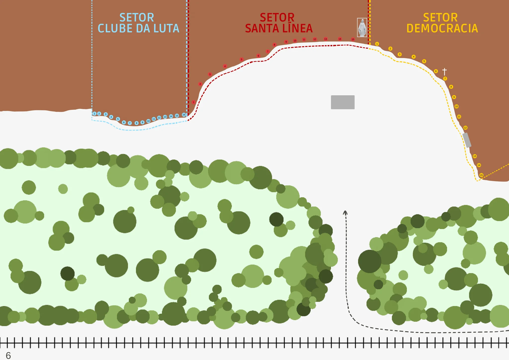
    - **checksum_sha256**: 140796ae3b4a00fbc2a2f25db9d8dce7f6f2f312ca58d95af87017635f47fca8
  - **[11]**:
    - **caminho**: 
    - **checksum_sha256**: 9bf2ee9adef8f666eb6b2e1587a15912a88ef13cdfc0eff797babdc26bc3c8a9
  - **[12]**:
    - **caminho**: 
    - **checksum_sha256**: 995eda0e8684b11fdec57aa6a557f6369be184d93c165fb9876bfb305567744f
  - **[13]**:
    - **caminho**: 
    - **checksum_sha256**: bd6ab900117e3abdbb942f27b80d0560d0ab5f97aac92b85aa846cb2863f53d1
  - **[14]**:
    - **caminho**: 
    - **checksum_sha256**: 09777667e0f00e43074a4c72cee7ab9c7913c9df79ed633b6bf62cb786d35b5e
  - **[15]**:
    - **caminho**: 
    - **checksum_sha256**: 3e4a8ee1c0b1fa746294b2c6453bf5d9b3797c70541d4bfa81d566d363ac2e55
  - **[16]**:
    - **caminho**: 
    - **checksum_sha256**: f2e2ec352aae40f51d713d6d363d2a30156231806ed7751fec9011d923b79835

