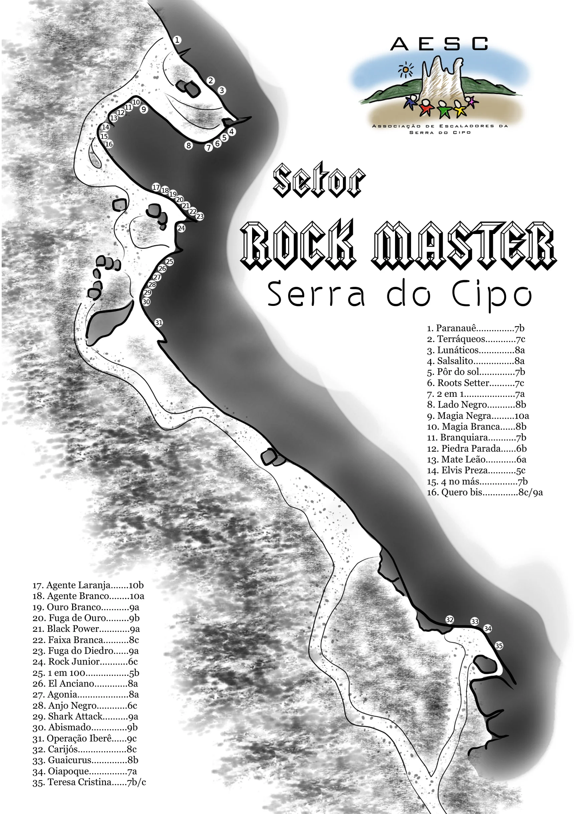
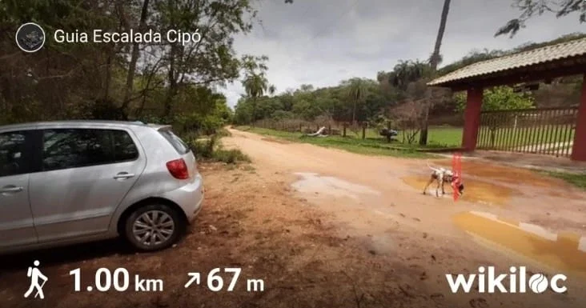

# Croqui: Serra do Cipó - Setor Rock Master

## Informações Gerais

- **descricao**: O Setor Rock Master, localizado na Serra do Cipó (Santana do Riacho - MG), é um clássico setor de escalada esportiva com vias de 5b a 10b.
- **id**: br_mg_santana_do_riacho_serra_do_cipo_rock_master
- **nome**: Serra do Cipó - Setor Rock Master
- **creditos**:
  - Associação de Escaladores da Serra do Cipó (AESC)
- **caminho_thumbnail**: 
- **ultima_migracao**: 4
- **botoes**:
  - **[0]**:
    - **texto**: Acesso
    - **destino**:
      - **secao_textual**:
        - **conteudo**:
            # Acesso
            O Setor Rock Master fica na Serra do Cipó, em Santana do Riacho (MG), a cerca de 100 km de Belo Horizonte.
            
            Saindo de Belo Horizonte, siga pela MG-010 em direção à Serra do Cipó, passando por Lagoa Santa e Jaboticatubas. Continue pela rodovia até a região da Serra do Cipó e do distrito de Cardeal Mota.
            
            O trecho final é feito por uma estrada local, seguido de uma caminhada até a área de escalada. A partir daí, siga as placas e os acessos locais até o Setor Rock Master. 
            
            **Coordenadas geográficas do estacionamento:**-19º18'56.1 -43º36'48.6
            
            **Coordenadas geográficas do setor:** -19º18'31.5 -43º36'53.2
            
            **Link para trilha wikiloc:** https://www.wikiloc.com/hiking-trails/setor-rockmaster-1-2-e-3-86913870
            
            |  |
            | :--: |
            | *Estacionamento - Início da trilha* |
- **publicar_croqui**: True

## Parte: setor_rock_master

### Setor (Pico: Serra do Cipó)

- **descricao**:
    # Setor Rock Master
    
    Setor clássico de escalada esportiva do Grupo 2 na Serra do Cipó.
    
    Vias positivas, verticais e negativas com exposição solar vespertina e extensões entre 10m e 20m, que não permitem escalada durante chuva.
- **nome**: Rock Master
- **mapas**:
  - **[0]**:
    - **caminho_imagem_mapa**: 
    - **referencias**:
      - **[0]**:
        - **escalada**: Paranauê
        - **ids**:
          - 1
      - **[1]**:
        - **escalada**: Terráqueos
        - **ids**:
          - 2
      - **[2]**:
        - **escalada**: Lunáticos
        - **ids**:
          - 3
      - **[3]**:
        - **escalada**: Salsalito
        - **ids**:
          - 4
      - **[4]**:
        - **escalada**: Pôr do sol
        - **ids**:
          - 5
      - **[5]**:
        - **escalada**: Roots Setter
        - **ids**:
          - 6
      - **[6]**:
        - **escalada**: 2 em 1
        - **ids**:
          - 7
      - **[7]**:
        - **escalada**: Lado Negro
        - **ids**:
          - 8
      - **[8]**:
        - **escalada**: Magia Negra
        - **ids**:
          - 9
      - **[9]**:
        - **escalada**: Magia Branca
        - **ids**:
          - 10
      - **[10]**:
        - **escalada**: Branquiara
        - **ids**:
          - 11
      - **[11]**:
        - **escalada**: Piedra Parada
        - **ids**:
          - 12
      - **[12]**:
        - **escalada**: Mate Leão
        - **ids**:
          - 13
      - **[13]**:
        - **escalada**: Elvis Preza
        - **ids**:
          - 14
      - **[14]**:
        - **escalada**: 4 no más
        - **ids**:
          - 15
      - **[15]**:
        - **escalada**: Quero bis
        - **ids**:
          - 16
      - **[16]**:
        - **escalada**: Agente Laranja
        - **ids**:
          - 17
      - **[17]**:
        - **escalada**: Agente Branco
        - **ids**:
          - 18
      - **[18]**:
        - **escalada**: Ouro Branco
        - **ids**:
          - 19
      - **[19]**:
        - **escalada**: Fuga de Ouro
        - **ids**:
          - 20
      - **[20]**:
        - **escalada**: Black Power
        - **ids**:
          - 21
      - **[21]**:
        - **escalada**: Faixa Branca
        - **ids**:
          - 22
      - **[22]**:
        - **escalada**: Fuga do Diedro
        - **ids**:
          - 23
      - **[23]**:
        - **escalada**: Rock Junior
        - **ids**:
          - 24
      - **[24]**:
        - **escalada**: 1 em 100
        - **ids**:
          - 25
      - **[25]**:
        - **escalada**: El Anciano
        - **ids**:
          - 26
      - **[26]**:
        - **escalada**: Agonia
        - **ids**:
          - 27
      - **[27]**:
        - **escalada**: Anjo Negro
        - **ids**:
          - 28
      - **[28]**:
        - **escalada**: Shark Attack
        - **ids**:
          - 29
      - **[29]**:
        - **escalada**: Abismado
        - **ids**:
          - 30
      - **[30]**:
        - **escalada**: Operação Iberê
        - **ids**:
          - 31
      - **[31]**:
        - **escalada**: Carijós
        - **ids**:
          - 32
      - **[32]**:
        - **escalada**: Guaicurus
        - **ids**:
          - 33
      - **[33]**:
        - **escalada**: Oiapoque
        - **ids**:
          - 34
      - **[34]**:
        - **escalada**: Teresa Cristina
        - **ids**:
          - 35
    - **largura_mapa**: 1722
    - **altura_mapa**: 2435
    - **pontos_de_interesse**:
      - **[0]**:
        - **id**: 1
        - **label**: 1
        - **circulo**:
          - **x**: 530
          - **y**: 120
          - **raio**: 13
      - **[1]**:
        - **id**: 2
        - **label**: 2
        - **circulo**:
          - **x**: 630
          - **y**: 242
          - **raio**: 13
      - **[2]**:
        - **id**: 3
        - **label**: 3
        - **circulo**:
          - **x**: 664
          - **y**: 270
          - **raio**: 13
      - **[3]**:
        - **id**: 4
        - **label**: 4
        - **circulo**:
          - **x**: 694
          - **y**: 394
          - **raio**: 13
      - **[4]**:
        - **id**: 5
        - **label**: 5
        - **circulo**:
          - **x**: 672
          - **y**: 410
          - **raio**: 13
      - **[5]**:
        - **id**: 6
        - **label**: 6
        - **circulo**:
          - **x**: 650
          - **y**: 428
          - **raio**: 13
      - **[6]**:
        - **id**: 7
        - **label**: 7
        - **circulo**:
          - **x**: 624
          - **y**: 440
          - **raio**: 13
      - **[7]**:
        - **id**: 8
        - **label**: 8
        - **circulo**:
          - **x**: 564
          - **y**: 434
          - **raio**: 13
      - **[8]**:
        - **id**: 9
        - **label**: 9
        - **circulo**:
          - **x**: 430
          - **y**: 326
          - **raio**: 13
      - **[9]**:
        - **id**: 10
        - **label**: 10
        - **circulo**:
          - **x**: 408
          - **y**: 306
          - **raio**: 13
      - **[10]**:
        - **id**: 11
        - **label**: 11
        - **circulo**:
          - **x**: 386
          - **y**: 320
          - **raio**: 13
      - **[11]**:
        - **id**: 12
        - **label**: 12
        - **circulo**:
          - **x**: 362
          - **y**: 336
          - **raio**: 13
      - **[12]**:
        - **id**: 13
        - **label**: 13
        - **circulo**:
          - **x**: 340
          - **y**: 352
          - **raio**: 13
      - **[13]**:
        - **id**: 14
        - **label**: 14
        - **circulo**:
          - **x**: 316
          - **y**: 380
          - **raio**: 13
      - **[14]**:
        - **id**: 15
        - **label**: 15
        - **circulo**:
          - **x**: 310
          - **y**: 408
          - **raio**: 13
      - **[15]**:
        - **id**: 16
        - **label**: 16
        - **circulo**:
          - **x**: 324
          - **y**: 430
          - **raio**: 13
      - **[16]**:
        - **id**: 17
        - **label**: 17
        - **circulo**:
          - **x**: 466
          - **y**: 560
          - **raio**: 13
      - **[17]**:
        - **id**: 18
        - **label**: 18
        - **circulo**:
          - **x**: 494
          - **y**: 568
          - **raio**: 13
      - **[18]**:
        - **id**: 19
        - **label**: 19
        - **circulo**:
          - **x**: 518
          - **y**: 580
          - **raio**: 13
      - **[19]**:
        - **id**: 20
        - **label**: 20
        - **circulo**:
          - **x**: 538
          - **y**: 596
          - **raio**: 13
      - **[20]**:
        - **id**: 21
        - **label**: 21
        - **circulo**:
          - **x**: 556
          - **y**: 614
          - **raio**: 13
      - **[21]**:
        - **id**: 22
        - **label**: 22
        - **circulo**:
          - **x**: 576
          - **y**: 632
          - **raio**: 13
      - **[22]**:
        - **id**: 23
        - **label**: 23
        - **circulo**:
          - **x**: 598
          - **y**: 646
          - **raio**: 13
      - **[23]**:
        - **id**: 24
        - **label**: 24
        - **circulo**:
          - **x**: 542
          - **y**: 682
          - **raio**: 13
      - **[24]**:
        - **id**: 25
        - **label**: 25
        - **circulo**:
          - **x**: 508
          - **y**: 782
          - **raio**: 13
      - **[25]**:
        - **id**: 26
        - **label**: 26
        - **circulo**:
          - **x**: 486
          - **y**: 802
          - **raio**: 13
      - **[26]**:
        - **id**: 27
        - **label**: 27
        - **circulo**:
          - **x**: 470
          - **y**: 828
          - **raio**: 13
      - **[27]**:
        - **id**: 28
        - **label**: 28
        - **circulo**:
          - **x**: 454
          - **y**: 850
          - **raio**: 13
      - **[28]**:
        - **id**: 29
        - **label**: 29
        - **circulo**:
          - **x**: 440
          - **y**: 874
          - **raio**: 13
      - **[29]**:
        - **id**: 30
        - **label**: 30
        - **circulo**:
          - **x**: 436
          - **y**: 902
          - **raio**: 13
      - **[30]**:
        - **id**: 31
        - **label**: 31
        - **circulo**:
          - **x**: 474
          - **y**: 964
          - **raio**: 13
      - **[31]**:
        - **id**: 32
        - **label**: 32
        - **circulo**:
          - **x**: 1348
          - **y**: 1854
          - **raio**: 13
      - **[32]**:
        - **id**: 33
        - **label**: 33
        - **circulo**:
          - **x**: 1422
          - **y**: 1858
          - **raio**: 13
      - **[33]**:
        - **id**: 34
        - **label**: 34
        - **circulo**:
          - **x**: 1460
          - **y**: 1880
          - **raio**: 13
      - **[34]**:
        - **id**: 35
        - **label**: 35
        - **circulo**:
          - **x**: 1494
          - **y**: 1930
          - **raio**: 13
- **escaladas**:
  - **[0]**:
    - **via_esportiva**:
      - **nome**: Paranauê
      - **dificuldade**: BR_7B
      - **quantidade_protecoes_intermediarias**: 6
      - **quantidade_protecoes_parada**: 2
      - **conquistadores**:
        - Luan Krug
        - Rudy Proença
      - **data_abertura**: 2017
  - **[1]**:
    - **via_esportiva**:
      - **nome**: Terráqueos
      - **dificuldade**: BR_7C
  - **[2]**:
    - **via_esportiva**:
      - **nome**: Lunáticos
      - **dificuldade**: BR_8A
  - **[3]**:
    - **via_esportiva**:
      - **nome**: Salsalito
      - **dificuldade**: BR_8A
  - **[4]**:
    - **via_esportiva**:
      - **nome**: Pôr do sol
      - **dificuldade**: BR_7B
  - **[5]**:
    - **via_esportiva**:
      - **nome**: Roots Setter
      - **dificuldade**: BR_7C
  - **[6]**:
    - **via_esportiva**:
      - **nome**: 2 em 1
      - **dificuldade**: BR_7A
  - **[7]**:
    - **via_esportiva**:
      - **nome**: Lado Negro
      - **dificuldade**: BR_8B
  - **[8]**:
    - **via_esportiva**:
      - **nome**: Magia Negra
      - **dificuldade**: BR_10A
  - **[9]**:
    - **via_esportiva**:
      - **nome**: Magia Branca
      - **dificuldade**: BR_8B
  - **[10]**:
    - **via_esportiva**:
      - **nome**: Branquiara
      - **dificuldade**: BR_7B
  - **[11]**:
    - **via_esportiva**:
      - **nome**: Piedra Parada
      - **dificuldade**: BR_6_BARRA_6SUP
  - **[12]**:
    - **via_esportiva**:
      - **nome**: Mate Leão
      - **dificuldade**: BR_6
  - **[13]**:
    - **via_esportiva**:
      - **nome**: Elvis Preza
      - **dificuldade**: BR_5SUP
  - **[14]**:
    - **via_esportiva**:
      - **nome**: 4 no más
      - **dificuldade**: BR_7B
  - **[15]**:
    - **via_esportiva**:
      - **nome**: Quero bis
      - **dificuldade**: BR_8C_BARRA_9A
  - **[16]**:
    - **via_esportiva**:
      - **nome**: Agente Laranja
      - **dificuldade**: BR_10B
  - **[17]**:
    - **via_esportiva**:
      - **nome**: Agente Branco
      - **dificuldade**: BR_10A
  - **[18]**:
    - **via_esportiva**:
      - **nome**: Ouro Branco
      - **dificuldade**: BR_9A
  - **[19]**:
    - **via_esportiva**:
      - **nome**: Fuga de Ouro
      - **dificuldade**: BR_9B
  - **[20]**:
    - **via_esportiva**:
      - **nome**: Black Power
      - **dificuldade**: BR_9A
  - **[21]**:
    - **via_esportiva**:
      - **nome**: Faixa Branca
      - **dificuldade**: BR_8C
  - **[22]**:
    - **via_esportiva**:
      - **nome**: Fuga do Diedro
      - **dificuldade**: BR_9A
  - **[23]**:
    - **via_esportiva**:
      - **nome**: Rock Junior
      - **dificuldade**: BR_6SUP
  - **[24]**:
    - **via_esportiva**:
      - **nome**: 1 em 100
      - **dificuldade**: BR_5_BARRA_5SUP
  - **[25]**:
    - **via_esportiva**:
      - **nome**: El Anciano
      - **dificuldade**: BR_8A
  - **[26]**:
    - **via_esportiva**:
      - **nome**: Agonia
      - **dificuldade**: BR_8A
  - **[27]**:
    - **via_esportiva**:
      - **nome**: Anjo Negro
      - **dificuldade**: BR_6SUP
  - **[28]**:
    - **via_esportiva**:
      - **nome**: Shark Attack
      - **dificuldade**: BR_9A
  - **[29]**:
    - **via_esportiva**:
      - **nome**: Abismado
      - **dificuldade**: BR_9B
  - **[30]**:
    - **via_esportiva**:
      - **nome**: Operação Iberê
      - **dificuldade**: BR_9C
  - **[31]**:
    - **via_esportiva**:
      - **nome**: Carijós
      - **dificuldade**: BR_8C
  - **[32]**:
    - **via_esportiva**:
      - **nome**: Guaicurus
      - **dificuldade**: BR_8B
  - **[33]**:
    - **via_esportiva**:
      - **nome**: Oiapoque
      - **dificuldade**: BR_7A
  - **[34]**:
    - **via_esportiva**:
      - **nome**: Teresa Cristina
      - **dificuldade**: BR_7B_BARRA_7C
- **localizacao_estacionamento**:
  - **latitude**: -193155830
  - **longitude**: -436135000
- **localizacao_escalada**:
  - **latitude**: -193087500
  - **longitude**: -436147780
- **sinal_de_celular**: True
- **amigavel_a_criancas**: True
- **amigavel_a_bebes**: True
- **precomputados**:
  - **total_escaladas**: 35
  - **total_esportivas**: 35

## Arquivos Externos

- **arquivos_externos**:
  - **[0]**:
    - **caminho**: 
    - **checksum_sha256**: 01266c9914e07dde69f5bf01e1a1afc12bf62b65ff0286017c9526939678abfc
  - **[1]**:
    - **caminho**: 
    - **checksum_sha256**: 2f98291b008899f3e83f61a9bcfea55d93a61fdf0dca8a1970bd304bc15651dd

